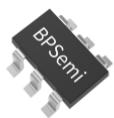
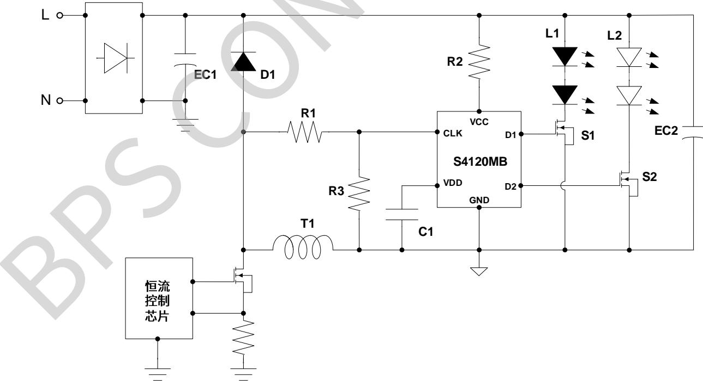
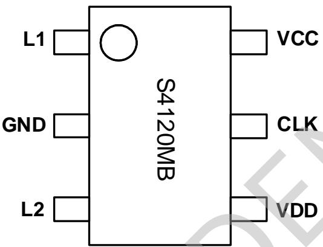
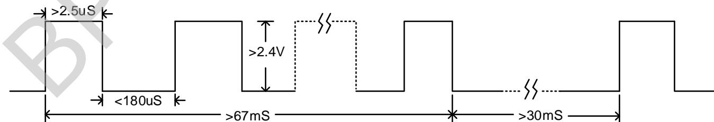
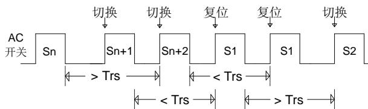
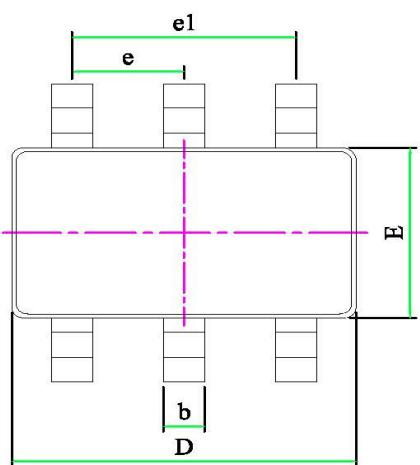
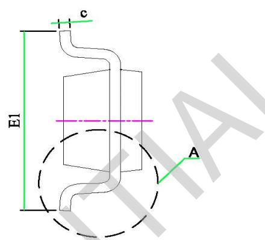
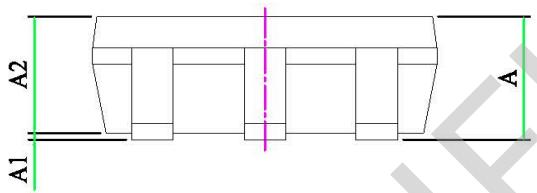
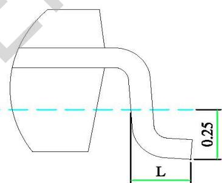

## 概述

S4120MB 是带状态记忆功能的开关调色温控制器，内部设定状态切换窗口时间 Tsw（典型值 6.4S），关灯时间小于状态切换窗口时间开灯则切换到下一个色温状态；关灯时间超过状态切换窗口时间芯片会记住关灯前的状态，下次开灯时直接呈现关灯前的状态；增加了使用的便利性。

S4120MB 通过检测脉冲信号来判断开关机状态，确保多个电源同时应用时的逻辑一致性，而且可以兼容 Flyback、Buck-Boost、Buck 及线性等多种 LED 驱动方案。

S4120MB 为外置开关管的调色控制芯片，可驱动 MOS 管和晶闸管实现大电流开关调色应用。

S4120MB 采用 SOT23-6 封装。

## 特点

■ 三段开关调色温：L1→L2→(L1+L2)/2

■ 带状态记忆功能，使用更加便利

■ 状态存储时间超过 10 年

■ 开关次数可达 10 万次以上（记忆功能正常）

■ 外驱 MOS 管或晶闸管，用于大电流开关调色

■ 1S 内开关两次复位

■ 状态切换窗口时间内部计时 6.4S

■ 内置限压电路，适用宽功率范围

■ 兼容隔离、非隔离、高 PF 及线性等多种应用方案

## 应用领域

■ 开关调色温的 LED 电源

## 典型应用

SOT23-6 封装  
  
图 1 S4120MB 典型应用图

## 定购信息

<table><tr><td>定购型号</td><td>封装</td><td>包装形式</td><td>打印</td></tr><tr><td>S4120MB</td><td>SOT23-6</td><td>编带3000颗/盘</td><td>S4120MB</td></tr></table>

## 管脚封装

  
图 2 管脚封装图

## 管脚描述

<table><tr><td>管脚号</td><td>管脚名称</td><td>描述</td></tr><tr><td>1</td><td>L1</td><td>驱动脚 1</td></tr><tr><td>2</td><td>GND</td><td>信号和功率地</td></tr><tr><td>3</td><td>L2</td><td>驱动脚 2</td></tr><tr><td>4</td><td>VDD</td><td>芯片内部供电脚</td></tr><tr><td>5</td><td>CLK</td><td>信号检测脚</td></tr><tr><td>6</td><td>VCC</td><td>芯片外部供电脚</td></tr></table>

## 极限参数(注1)

<table><tr><td>符号</td><td>参数</td><td>参数范围</td><td>单位</td></tr><tr><td>VCC</td><td>芯片 VCC 引脚电压范围</td><td>-0.3~9</td><td>V</td></tr><tr><td>VDD</td><td>芯片 VDD 引脚电压范围</td><td>-0.3~9</td><td>V</td></tr><tr><td>CLK</td><td>芯片 CLK 引脚电压范围</td><td>-0.3~9</td><td>V</td></tr><tr><td>L1/L2</td><td>驱动脚电压范围</td><td>-0.3~9</td><td>V</td></tr><tr><td> $P_{DMAX}$ </td><td>功耗(注 2)</td><td>0.3</td><td>W</td></tr><tr><td> $\theta_{JA}$ </td><td>PN 结到环境的热阻</td><td>240</td><td>°C/W</td></tr><tr><td> $T_J$ </td><td>工作结温范围</td><td>-40 ~ 150</td><td>°C</td></tr><tr><td> $T_{STG}$ </td><td>储存温度范围</td><td>-55 ~ 150</td><td>°C</td></tr></table>

注1：最大极限值是指超出该工作范围，芯片有可能损坏。推荐工作范围是指在该范围内，器件功能正常，但并不完全保证满足个别性能指标。电气参数定义了器件在工作范围内并且在保证特定性能指标的测试条件下的直流和交流电参数规范。对于未给定上下限值的参数，该规范不予保证其精度，但其典型值合理反映了器件性能。

注2：温度升高最大功耗一定会减小，这也是由 $T_{JMAX}, \theta_{JA}$ ，和环境温度 $T_A$ 所决定的。最大允许功耗为 $P_{DMAX} = (T_{JMAX} - T_A) / \theta_{JA}$ 或是极限范围给出的数字中比较低的那个值。

## 规格参数(注3,4)（无特别说明情况下， $V_{CC}=5V,\ T_{A}=25^{\circ}C$ ）

<table><tr><td>描述</td><td>符号</td><td>条件</td><td>最小值</td><td>典型值</td><td>最大值</td><td>单位</td></tr><tr><td>供电脚钳位电压</td><td> $VCC_{max}$ </td><td>IVCC=2mA</td><td>4.7</td><td>5.2</td><td>5.7</td><td>V</td></tr><tr><td>内部供电电压</td><td>VDD</td><td>IVCC=2mA</td><td>4.5</td><td>5</td><td>5.5</td><td>V</td></tr><tr><td>工作电流</td><td> $I_{vcc}$ </td><td>VCC=5V</td><td></td><td></td><td>0.8</td><td>mA</td></tr><tr><td>VCC开启电压</td><td>UVLO_on</td><td></td><td>3</td><td>3.6</td><td>4.2</td><td>V</td></tr><tr><td>VCC关断电压</td><td>UVLO_off</td><td></td><td>1.2</td><td>1.5</td><td>1.8</td><td>V</td></tr><tr><td>检测脚CLK阈值电压</td><td>CLK(th)</td><td></td><td></td><td>2.4</td><td></td><td>V</td></tr><tr><td>检测脚输入电阻</td><td>Rclk</td><td></td><td>128</td><td>160</td><td>192</td><td>KΩ</td></tr><tr><td>判断开关闭合状态的延迟时间</td><td>Td(on)</td><td>Fsw=60KHz(注5)</td><td>60</td><td>67</td><td>74</td><td>mS</td></tr><tr><td>判断开关断开状态的延迟时间</td><td>Td(off)</td><td></td><td>26</td><td>30</td><td>34</td><td>mS</td></tr><tr><td>状态切换窗口</td><td>Tsw</td><td></td><td>6.0</td><td>6.4</td><td>6.8</td><td>S</td></tr><tr><td>状态复位时间</td><td>Trs</td><td></td><td>1.1</td><td>1.2</td><td>1.3</td><td>S</td></tr><tr><td>状态复位开关次数</td><td>Treset</td><td></td><td></td><td>2</td><td></td><td>次</td></tr><tr><td>L1和L2的驱动电压</td><td>VLx</td><td></td><td></td><td>5.2</td><td></td><td>V</td></tr><tr><td>L1和L2的驱动电流</td><td>ILx</td><td>VLx=1.2V</td><td></td><td>140</td><td></td><td>uA</td></tr></table>

注 3: 典型参数值为 $25^{\circ}$ C 下测得的参数标准。  
注4：规格书的最小、最大规范范围由测试保证，典型值由设计、测试、或统计分析保证。  
注5：该时钟信号为内部时钟，如果外围参数有差异会造成参数有波动。

## 逻辑顺序及检测信号

S4120MB的逻辑顺序为 $\mathrm{L1}\rightarrow \mathrm{L2}\rightarrow (\mathrm{L1} + \mathrm{L2}) / 2$ ，其中L1和L2分别代表第一和第二路LED灯串。S4120MB的检测脚的有效输入波形要求如下图3所示。设计时为确保足够余量，CLK脚峰值电平须大于4V，脉宽大于 $3.5\mu \mathrm{S}$ 。

  
图 3 检测脚波形要求示意图

## 应用信息

## 1、供电

S4120MB 通过 VCC 脚进行供电，在应用中通过电阻把 VCC 脚连接到电源输出端的正极。芯片的工作电流大约 0.8mA，考虑到温度等因素，设计中必须留有余量，建议设计供电电流大于 1.5mA。

## 2、检测

S4120MB通过CLK脚检测脉冲信号判断输入开关的通断状态。CLK脚通过电阻连接到AC端或恒流芯片的强振荡信号端（如典型应用图所示，CLK脚通过R1连接到电感与续流二极管正极连接端）。开关闭合，CLK脚上产生连续脉冲信号；开关断开，CLK脚脉冲信号消失。为过滤掉噪声，避免造成误触发，S4120MB内部设计了判断开关闭合状态的延迟时间Td(on)（典型值67mS）和判断开关断开状态的延迟时间Td(off)（典型值30mS），如图3所示。CLK脚脉冲信号持续时间大于Td(on)时芯片判断为开机状态；持续Td(off)时间内CLK脚未检测到有效脉冲信号，芯片判断为关机状态。只有Td(on)有效后关机（CLK脚检测到有效脉冲信号的时间超过内部设定值），且关机满足Td(off)有效后通电才能切换状态。

为确保足够余量，设计参数时，检测电阻的选取须遵循以下要求：1）和内部下拉电阻分压后，CLK脚脉冲信号峰值电平大于4V，脉冲宽度大于3.5uS；2）当检测电阻的另外一端出现负压时，流经检测电阻的电流必须小于1mA。

当主控芯片关机延时较长（0.1S 以上）导致快速切换不同步，可通过在 CLK 脚加下拉电阻加速放电，极端情况下，还需在 CLK 脚到 GND 之间加滤波电容（10\~100pF）。

## 3、驱动

S4120MB 可以驱动晶闸管和 MOS 管, 无需增加控制电路, 芯片能自动识别所连接的开关管类型。当驱动晶闸管时, L1/L2 输出 140uA 左右电流触发晶闸管导通（建议选取触发电流 100uA 内的晶闸管）。当驱动 MOS 管时, L1/L2 输出 5V 左右电压（建议选择 2.5V 以下阈值电压 MOS 管）。鉴于 L1/L2 输出电流仅 140uA, 通常不建议在 L1/L2 加放电电阻, 否则可能出现驱动能力不足。

## 4、状态控制

S4120MB 内置 EEPROM 存储单元, 关灯时会把关灯前的状态存储到存储单元中, 关灯时间超过状态切换窗口时间 Tsw 后再次开灯, 芯片会直接调取存储单元中的状态作为输出状态（即关灯前的状态）。若用户需要切换色温, 只需关灯时间小于状态切换窗口时间再开即可切换色温。

S4120MB 的状态切换窗口时间 Tsw 由内部时钟计时,典型值为 6.4S。应用时，需要外接一个 VDD 电容来保证断电后芯片 VDD 电压在 1.5V 以上持续时间大于切换窗口时间，VDD 电容通常采用 2.2uF25V，若 VDD 电容因通过电源外围电路放电导致切换窗口时间达不到内部设定值，可在 VCC 供电线路串一个二极管，避免提前进入记忆模式。

## 5、复位

S4120MB 内置快速开关两次复位功能，即从 AC 开关关断时刻算起，Trs（状态复位时间，典型值 1.2S）时间内完成两次“关灯→开灯”操作，芯片会在第二次开灯时将状态复位到第一个状态，如图 4 所示。如果后续的“关灯→开灯”仍然满足复位条件，S4120MB 将一直保持在第一状态（L1 输出高电平）。

  
图 4 S4120MB 复位示意图

## 6、设计注意事项

在设计 PCB 板时，遵循以下原则会有更佳性能：

1) VDD 电容尽量紧靠芯片 VDD 和 GND 引脚；

2) VCC 走线尽量远离变压器等强振荡源，避免干扰；

3) CLK 脚预留放电电阻或滤波电容位（0805 封装即可）。

## SOT23-6 封装信息

  
DETAIL A

<table><tr><td rowspan="2">SYMBOL</td><td colspan="3">MILLIMETER</td></tr><tr><td>MIN</td><td>NOM</td><td>MAX</td></tr><tr><td>A</td><td>-</td><td>-</td><td>1.45</td></tr><tr><td>A1</td><td>-</td><td>-</td><td>0.15</td></tr><tr><td>A2</td><td>0.89</td><td>-</td><td>1.30</td></tr><tr><td>D</td><td>2.80</td><td>-</td><td>3.03</td></tr><tr><td>E</td><td>1.50</td><td>1.60</td><td>1.73</td></tr><tr><td>E1</td><td>2.60</td><td>2.80</td><td>3.00</td></tr><tr><td>L</td><td>0.30</td><td>0.45</td><td>0.60</td></tr><tr><td>b</td><td>0.30</td><td>0.40</td><td>0.50</td></tr><tr><td>c</td><td>0.09</td><td>0.15</td><td>0.20</td></tr><tr><td>e</td><td>0.85</td><td>-</td><td>1.05</td></tr><tr><td>e1</td><td>1.80</td><td>1.90</td><td>2.00</td></tr></table>

## 版本信息

<table><tr><td>版本</td><td>日期</td><td>记录</td></tr><tr><td>Rev.1.0</td><td>2020/11</td><td>首次发行</td></tr><tr><td>Rev.1.1~1.3</td><td>2021/01</td><td>格式更新</td></tr><tr><td>Rev.1.4</td><td>2021/07</td><td>1、页眉、页脚 logo 更新2、更新典型应用图3、格式更新</td></tr><tr><td></td><td></td><td></td></tr><tr><td></td><td></td><td></td></tr><tr><td></td><td></td><td></td></tr><tr><td></td><td></td><td></td></tr></table>

## 免责声明

晶丰明源尽力确保本产品规格书内容的准确和可靠，但是保留在没有通知的情况下，修改规格书内容的权利。

本产品规格书未包含任何针对晶丰明源或第三方所有的知识产权的授权。针对本产品规格书所记载的信息，晶丰明源不做任何明示或暗示的保证，包括但不限于对规格书内容的准确性、商业上的适销性、特定目的的适用性或者不侵犯晶丰明源或任何第三人知识产权做任何明示或暗示保证，晶丰明源也不就因本规格书本身及其使用有关的偶然或必然损失承担任何责任。