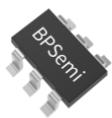
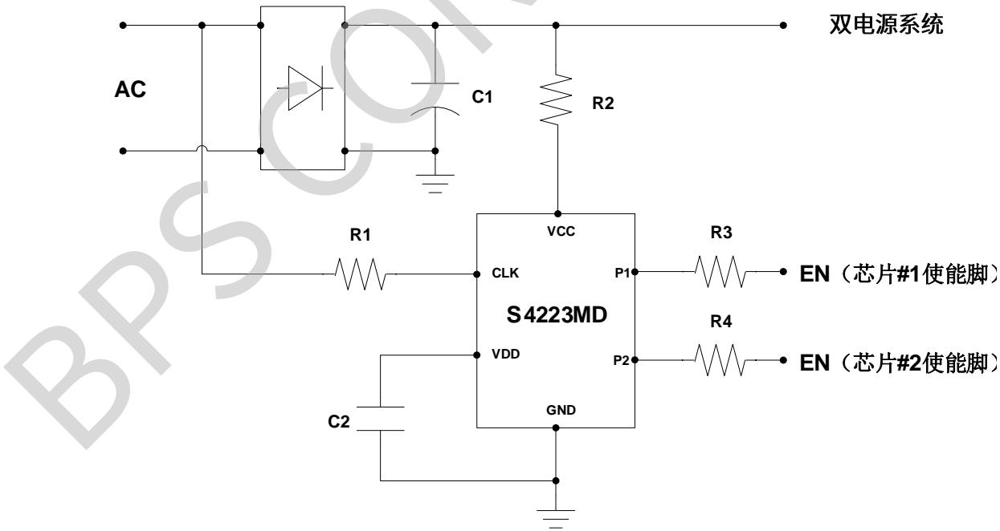
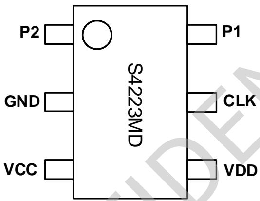
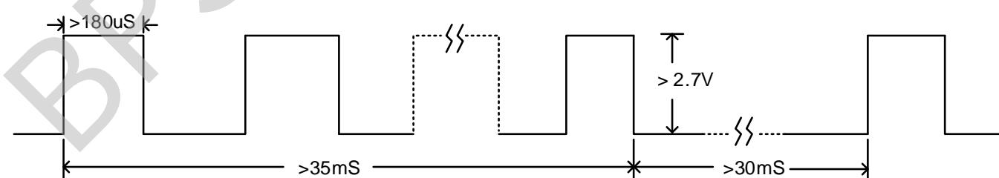
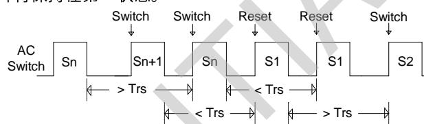
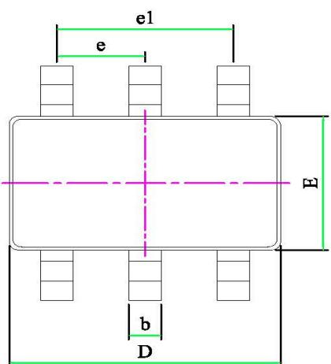
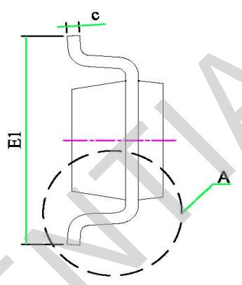
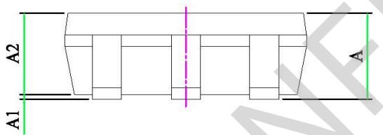
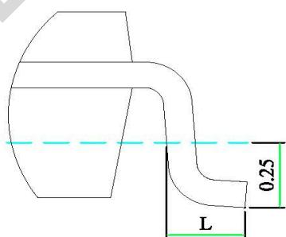

## 概述

S4223MD是一款带记忆功能的开关调色调亮控制器，集成两个开漏输出控制端口P1/P2，可以控制双路/四路电源实现三段带记忆的功率叠加开关调色调亮(混色时亮度变化)。芯片内部设定状态切换窗口时间 Tsw，典型值3.3S。关灯时间小于状态切换窗口时间开灯切换色温；关灯时间超过状态切换窗口时间芯片会记住关灯前的状态，下次开灯时直接呈现关灯前的状态，增加了使用的便利性。

S4223MD通过检测AC信号判断开关机状态，根据内部逻辑控制后端电源的启动和关闭，确保多个电源同时应用时的逻辑一致性，光源铝基板漏电情况下状态仍可正常切换。

S4223MD 采用 SOT23-6 封装。

## 特点

■ 控制双路/四路电源实现功率叠加开关调色调亮

■ 调色顺序：L1→L2→L1+L2

■ 带状态记忆功能，使用更加便利

■ 状态存储时间超过 10 年

■ 开关次数可达 10 万次以上（记忆功能正常）

■ 内置 1S 内开关两次复位功能

■ 状态切换窗口时间内部计时 3.3S

■ 光源铝基板漏电情况下可正常切换状态

## 应用领域

■ 中大功率调色温吸顶灯电源

## 典型应用

SOT23-6 封装  
  
图1 S4223MD典型应用

## 定购信息

<table><tr><td>定购型号</td><td>封装</td><td>包装形式</td><td>打印</td></tr><tr><td>S4223MD</td><td>SOT23-6</td><td>卷盘3000颗/盘</td><td>S4223MD</td></tr></table>

## 管脚封装

  
图2管脚封装图

## 管脚描述

<table><tr><td>管脚号</td><td>管脚名称</td><td>描述</td></tr><tr><td>1</td><td>P2</td><td>控制脚 2 (Open Drain)</td></tr><tr><td>2</td><td>GND</td><td>信号和功率地</td></tr><tr><td>3</td><td>VCC</td><td>芯片外部供电脚</td></tr><tr><td>4</td><td>VDD</td><td>芯片内部供电脚</td></tr><tr><td>5</td><td>CLK</td><td>信号检测脚</td></tr><tr><td>6</td><td>P1</td><td>控制脚 1 (Open Drain)</td></tr></table>

## 应用极限参数（注1）

<table><tr><td>符号</td><td>参数</td><td>参数范围</td><td>单位</td></tr><tr><td>VCC</td><td>芯片外部供电脚电压范围</td><td>-0.3~9</td><td>V</td></tr><tr><td>VDD</td><td>芯片内部供电脚电压范围</td><td>-0.3~9</td><td>V</td></tr><tr><td>CLK</td><td>芯片开关检测脚电压范围</td><td>-0.3~9</td><td>V</td></tr><tr><td>P1/P2</td><td>芯片控制脚电压范围</td><td>-0.3~9</td><td>V</td></tr><tr><td> $P_{DMAX}$ </td><td>功耗(注2)</td><td>0.3</td><td>W</td></tr><tr><td> $θ_{JA}$ </td><td>PN结到环境的热阻</td><td>240</td><td>°C/W</td></tr><tr><td> $T_J$ </td><td>工作结温范围</td><td>-40 ~ 150</td><td>°C</td></tr><tr><td> $T_{STG}$ </td><td>储存温度范围</td><td>-55 ~ 150</td><td>°C</td></tr></table>

注1：最大极限值是指超出该工作范围，芯片有可能损坏。推荐工作范围是指在该范围内，器件功能正常，但并不完全保证满足个别性能指标。电气参数定义了器件在工作范围内并且在保证特定性能指标的测试条件下的直流和交流电参数规范。对于未给定上下限值的参数，该规范不予保证其精度，但其典型值合理反映了器件性能。

注2：最大允许功耗是由 $T_{JMAX}$ ， $\theta_{JA}$ 和环境温度 $T_A$ 所决定的，温度升高最大功耗一定会减小。最大允许功耗为 $P_{DMAX} = (T_{JMAX} - T_A) / \theta_{JA}$ 或是极限范围给出的数字中比较低的那个值。

## 电气参数(注 3,4)（无特别说明情况下，VCC=5V， $T_{A}=25^{\circ}C$ ）

<table><tr><td>描述</td><td>符号</td><td>条件</td><td>最小值</td><td>典型值</td><td>最大值</td><td>单位</td></tr><tr><td>供电脚限制电压</td><td>VCC</td><td>IVCC=1mA</td><td>4.7</td><td>5.2</td><td>5.7</td><td>V</td></tr><tr><td>内部供电电压</td><td>VDD</td><td>IVCC=1mA</td><td>4.5</td><td>5.0</td><td>5.5</td><td>V</td></tr><tr><td>工作电流</td><td>IVCC</td><td>VCC=5V</td><td></td><td>0.2</td><td></td><td>mA</td></tr><tr><td>VCC开启电压</td><td>Uvlo_on</td><td></td><td></td><td>3.3</td><td></td><td>V</td></tr><tr><td>VCC关断电压</td><td>Uvlo_off</td><td></td><td></td><td>1.5</td><td></td><td>V</td></tr><tr><td>检测阈值电压</td><td>CLK(th)</td><td></td><td></td><td>2.7</td><td></td><td>V</td></tr><tr><td>检测脚输入电阻</td><td>Rclk</td><td></td><td></td><td>40</td><td></td><td>KΩ</td></tr><tr><td>最小有效CLK脉冲宽度</td><td>Tclk</td><td></td><td></td><td>180</td><td></td><td>uS</td></tr><tr><td>判断开关闭合状态的延迟时间</td><td>TDon</td><td></td><td></td><td>35</td><td></td><td>mS</td></tr><tr><td>判断开关断开状态的延迟时间</td><td>TDoff</td><td></td><td></td><td>30</td><td></td><td>mS</td></tr><tr><td>状态复位时间</td><td> $T_{rs}$ </td><td></td><td>1.0</td><td>1.1</td><td>1.2</td><td>S</td></tr><tr><td>状态复位开关次数</td><td> $T_{reset}$ </td><td></td><td></td><td>2</td><td></td><td>次</td></tr><tr><td>状态切换窗口时间</td><td>Tsw</td><td></td><td>3</td><td>3.3</td><td>3.6</td><td>S</td></tr><tr><td>P1和P2导通阻抗</td><td>Rpx</td><td></td><td></td><td>150</td><td></td><td>Ω</td></tr></table>

注3：典型参数值为 $25^{\circ} \mathrm{C}$ 下测得的参数标准。  
注4：规格书的最小、最大规范范围由测试保证，典型值由设计、测试、或统计分析保证。

## 检测脚信号要求

S4223MD 的检测 CLK 脚既可以检测电平，也可以检测脉冲信号（5kHz 以内频率），高电平或脉冲信号宽度须大于 180uS，电平幅度大于 2.7V，如图 3 所示，设计时须留足够余量，CLK 脚峰值电平建议设置在 4\~5.5V 范围内。

  
图 3 检测脚波形要求示意图

## 功能说明

## 1、供电

S4223MD 通过 VCC 脚进行供电，在应用中通过电阻从大于 6V 的稳定电压取电（如输入电容正端，若搭配 boost 电路则从 boost 输出电容正端）。S4223MD 的工作电流为 0.2mA 左右，供电电阻选取必须留有余量(供电电流建议大于 0.4mA)。

## 2、P1 和 P2

P1 和 P2 脚为开漏输出（Open Drain），导通阻抗 150Ω 左右，稳态工作时，P1 和 P2 脚承受的电压不能超过 6V；开关切换时，流入 P1/P2 的瞬时电流超过 1mA 须串限流电阻。S4223MD 通过 P1 和 P2 脚与电源芯片的使能脚（使能脚内置上拉，否则须通过外加上拉电平使能）相连，当需要关闭其中某个电源时，与之对应的 P1 或 P2 脚内部下拉电路导通，把电源芯片使能脚拉至低电平。开关调色顺序为 L1→L2→L1+L2，L1 和 L2 分别对应 P1 脚和 P2 脚控制的光源，L1 或 L2 点亮时，对应的 P1 脚或 P2 脚关断。

## 3、状态控制

S4223MD 内置 EEPROM 存储单元，关灯时会把关灯前的状态存储到存储单元中，关灯时间超过状态切换窗口时间 Tsw 后再次开灯，芯片会直接读取存储单元中的状态作为输出状态（即关灯前的状态）。若用户需要切换色温，只需关灯时间小于状态切换窗口时间再开即可切换色温。

S4223MD的状态切换窗口时间Tsw由内部时钟计时，典型值3.3S。应用时，需要外接一个VDD电容来保证断电后芯片VDD电压在Uvlo\_off电压以上持续时间大于切换窗口时间，VDD电容通常采用2.2uF25V，若VDD电容因通过电源外围电路放电导致切换窗口时间达不到内部设定值，可在VCC供电线路串一个二极管，避免提前进入记忆模式。

## 4、复位方式

S4223MD 内置开关两次复位功能，从 AC 开关关断时刻算起, $T_{rs}$ 时间内(状态复位时间, 典型值 1.1S) 完成两次“关灯→开灯”操作，芯片会在第二次开灯时将状态复位到第一个状态，如图 4 所示。如后续开关仍满足复位条件，芯片将保持在第一状态。

  
图4 复位操作示意图

## 5、应用注意事项

1) 设计 PCB 板时, VDD 电容尽量靠近芯片 VDD 和 GND 管脚;

2) 检测脚 CLK 直接检测 AC 的输入端，考虑电阻的耐压情况，建议至少使用两个 1206 电阻串联；

3) S4223MD 的 VCC 直接通过电阻从输入电容正极取电，建议至少用两个 1206 电阻串联，供电电流大于 0.4mA;

4) 如控制的后级芯片控制端口电压超过 6V，须加外围控制电路降压；

5) 测试验证时，须验证光源铝基板接地时同步性，可以通过加大 CLK 上拉电阻消除漏电造成逻辑不正常问题，但是加大上拉电阻会影响最低工作电压，在解决 LED 铝基板漏电问题时须考虑最低工作电压，确保足够余量。

  
DETAIL A

<table><tr><td rowspan="2">SYMBOL</td><td colspan="3">MILLIMETER</td></tr><tr><td>MIN</td><td>NOM</td><td>MAX</td></tr><tr><td>A</td><td>-</td><td>-</td><td>1.45</td></tr><tr><td>A1</td><td>-</td><td>-</td><td>0.15</td></tr><tr><td>A2</td><td>0.89</td><td>-</td><td>1.30</td></tr><tr><td>D</td><td>2.80</td><td>-</td><td>3.03</td></tr><tr><td>E</td><td>1.50</td><td>1.60</td><td>1.73</td></tr><tr><td>E1</td><td>2.60</td><td>2.80</td><td>3.00</td></tr><tr><td>L</td><td>0.30</td><td>0.45</td><td>0.60</td></tr><tr><td>b</td><td>0.30</td><td>0.40</td><td>0.50</td></tr><tr><td>c</td><td>0.09</td><td>0.15</td><td>0.20</td></tr><tr><td>e</td><td>0.85</td><td>-</td><td>1.05</td></tr><tr><td>e1</td><td>1.80</td><td>1.90</td><td>2.00</td></tr></table>

## 版本信息

<table><tr><td>版本</td><td>日期</td><td>记录</td></tr><tr><td>Rev.1.0</td><td>2021/07</td><td>首次发行</td></tr><tr><td></td><td></td><td></td></tr><tr><td></td><td></td><td></td></tr><tr><td></td><td></td><td></td></tr><tr><td></td><td></td><td></td></tr><tr><td></td><td></td><td></td></tr><tr><td></td><td></td><td></td></tr></table>

## 免责声明

晶丰明源尽力确保本产品规格书内容的准确和可靠，但是保留在没有通知的情况下，修改规格书内容的权利。

本产品规格书未包含任何针对晶丰明源或第三方所有的知识产权的授权。针对本产品规格书所记载的信息，晶丰明源不做任何明示或暗示的保证，包括但不限于对规格书内容的准确性、商业上的适销性、特定目的的适用性或者不侵犯晶丰明源或任何第三人知识产权做任何明示或暗示保证，晶丰明源也不就因本规格书本身及其使用有关的偶然或必然损失承担任何责任。