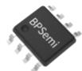
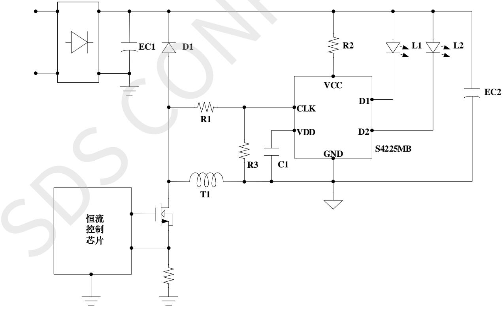
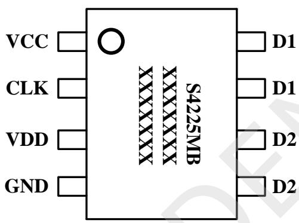
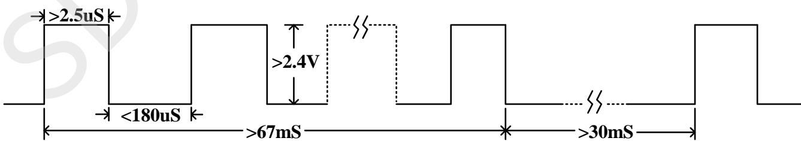
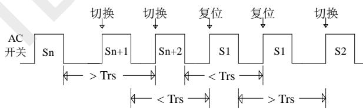
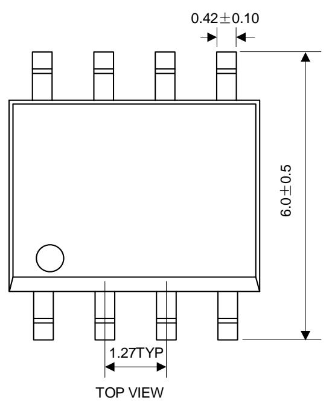
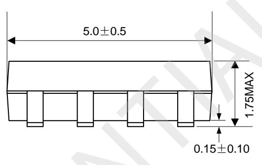
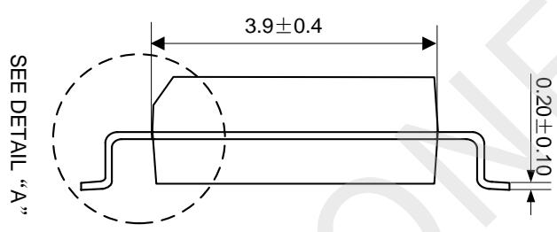
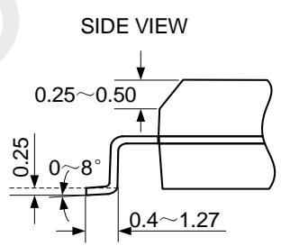
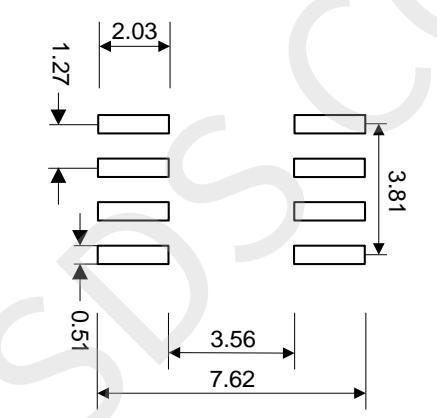

## 带记忆开关调色温控制芯片

## 概述

S4225MB是带状态记忆功能的开关调色温控制芯片，内部设定状态切换窗口时间Tsw(典型值6.4S)，关灯时间超过状态切换窗口时间芯片会记住关灯前的状态，下次开灯时直接呈现关灯前的状态；关灯时间小于状态切换窗口时间开灯则切换到下一个色温状态，增加了使用的便利性。

S4225MB内置两个400V的晶闸管，简化了外围电路结构。通过检测脉冲信号来判断开关机状态，确保多个电源同时应用时的逻辑一致性，而且可以兼容 Flyback、Buck-Boost、Buck及线性等多种LED 驱动方案。

S4225MB采用SOP-8封装。

  
SOP-8 封装

## 特点

三段开关调色温：L1→L2→(L1+L2)/2

带状态记忆功能，使用更加便利

状态存储时间超过10年

开关次数可达10万次以上（记忆功能正常）

内置400V开关管，无需外挂开关管

1S内开关两次复位，解决不同步问题

状态切换窗口时间内部计时6.4S

内置限压电路，适用宽功率范围

兼容隔离、非隔离、高PF及线性等多种应用方案

## 应用

开关调色温的LED 电源

## 典型应用

  
图 1 S4225MB 典型应用图

## 带记忆开关调色温控制芯片

## 定购信息

<table><tr><td>定购型号</td><td>封装</td><td>温度范围</td><td>包装形式</td><td>打印</td></tr><tr><td>S4225MB</td><td>SOP-8</td><td>-40°C~105°C</td><td>卷盘4000只/盘</td><td>S4225MBXXXXXXXXXXXXXXXXX</td></tr></table>

## 管脚封装

  
图 2封装管脚图

## 管脚描述

<table><tr><td>管脚号</td><td>管脚名称</td><td>描述</td></tr><tr><td>1</td><td>VCC</td><td>芯片供电引脚</td></tr><tr><td>2</td><td>CLK</td><td>信号检测引脚</td></tr><tr><td>3</td><td>VDD</td><td>内部供电,外接电容</td></tr><tr><td>4</td><td>GND</td><td>信号和功率地</td></tr><tr><td>5,6</td><td>D2</td><td>LED 灯珠负极连接点</td></tr><tr><td>7,8</td><td>D1</td><td>LED 灯珠负极连接点</td></tr></table>

## 带记忆开关调色温控制芯片

## 应用极限参数（注1）

<table><tr><td>符号</td><td>参数</td><td>参数范围</td><td>单位</td></tr><tr><td>VCC</td><td>芯片 VCC 引脚电压范围</td><td>-0.3~9</td><td>V</td></tr><tr><td>VDD</td><td>芯片 VDD 引脚电压范围</td><td>-0.3~9</td><td>V</td></tr><tr><td>CLK</td><td>芯片 CLK 引脚电压范围</td><td>-0.3~9</td><td>V</td></tr><tr><td>D1/D2</td><td>晶闸管阳极电压范围</td><td>0~400</td><td>V</td></tr><tr><td> $P_{DMAX}$ </td><td>功耗(注 2)</td><td>0.45</td><td>W</td></tr><tr><td> $\theta_{JA}$ </td><td>PN 结到环境的热阻</td><td>145</td><td>°C/W</td></tr><tr><td> $T_J$ </td><td>工作结温范围</td><td>-40 ~ 125</td><td>°C</td></tr><tr><td> $T_{STG}$ </td><td>储存温度范围</td><td>-40 ~ 150</td><td>°C</td></tr><tr><td>ESD</td><td>(注3)</td><td>2000</td><td>V</td></tr></table>

注1：最大极限值是指超出该工作范围，芯片有可能损坏。推荐工作范围是指在该范围内，器件功能正常，但并不完全保证满足个别性能指标。电气参数定义了器件在工作范围内并且在保证特定性能指标的测试条件下的直流和交流电参数规范。对于未给定上下限值的参数，该规范不予保证其精度，但其典型值合理反映了器件性能

注2：最大允许功耗是由工IMAx，θJA.和环境温度T₄所决定的.温度升高最大功耗一定会减小。最大允许功耗为 $P _ { D M A X } = ( T _ { J M A X } - T _ { A } ) /$ $\theta _ { \ J A }$ 或是极限范围给出的数字中比较低的那个值。

注3：人体模型，100pF电容通过 1.5K ohm 电阻放电。

## 带记忆开关调色温控制芯片

## 规格参数(注4,5)（无特别说明情况下， $V _ { C C } = 5 V _ { \mathrm { { i } } }$ ${ \sf T } _ { \sf A } { = } 2 5 ^ { \circ } \sf C )$

<table><tr><td>描述</td><td>符号</td><td>条件</td><td>最小值</td><td>典型值</td><td>最大值</td><td>单位</td></tr><tr><td>供电脚限制电压</td><td>Vcc_max</td><td>IVCC=2mA</td><td>4.7</td><td>5.2</td><td>5.7</td><td>V</td></tr><tr><td>内部供电电压</td><td>VDD</td><td>IVCC=2mA</td><td>4.5</td><td>5</td><td>5.5</td><td>V</td></tr><tr><td>工作电流</td><td>IVCC</td><td>VCC=5V</td><td></td><td></td><td>0.8</td><td>mA</td></tr><tr><td>VCC开启电压</td><td>Uvlo_on</td><td></td><td>3</td><td>3.6</td><td>4.2</td><td>V</td></tr><tr><td>VCC关断电压</td><td>Uvlo_off</td><td></td><td>1.2</td><td>1.5</td><td>1.8</td><td>V</td></tr><tr><td>检测脚CLK阈值电压</td><td>CLK(th)</td><td></td><td></td><td>2.4</td><td></td><td>V</td></tr><tr><td>检测脚输入电阻</td><td>Rclk</td><td></td><td>128</td><td>160</td><td>192</td><td>KΩ</td></tr><tr><td>判断开关闭合状态的延迟时间</td><td>Td(on)</td><td>Fsw=60KHz(注6)</td><td>60</td><td>67</td><td>74</td><td>mS</td></tr><tr><td>判断开关断开状态的延迟时间</td><td>Td(off)</td><td></td><td>26</td><td>30</td><td>34</td><td>mS</td></tr><tr><td>状态切换窗口</td><td>Tsw</td><td></td><td>6.0</td><td>6.4</td><td>6.8</td><td>S</td></tr><tr><td>状态复位时间</td><td>Trs</td><td></td><td>1.1</td><td>1.2</td><td>1.3</td><td>S</td></tr><tr><td>状态复位开关次数</td><td>Treset</td><td></td><td></td><td>2</td><td></td><td>次</td></tr><tr><td>D1和D2的饱和电压</td><td>VDx</td><td>IDx=300mA</td><td></td><td>1.2</td><td></td><td>V</td></tr><tr><td>D1和D2的最大耐压</td><td>VD(bv)</td><td></td><td>400</td><td></td><td></td><td>V</td></tr></table>

注4：典型参数值为25℃下测得的参数标准。  
注5：规格书的最小、最大规范范围由测试保证，典型值由设计、测试、或统计分析保证。  
注6：该时钟信号为内部时钟，如果外围参数有差异会造成参数有波动。

## 逻辑顺序及信号检测

S4225MB 是三段开关调色温，逻辑顺序为 L1→L2→(L1+L2)/2；其中 L1 和 L2 分别代表第一和第二路 LED 灯串。S4225MB的检测脚CLK的有效输入波形要求如下图3所示：

  
图 3 检测脚波形要求示意图

## 应用信息

## 1、供电

S4225MB 通过VCC 脚进行供电，在应用中通过一个限流电阻把VCC脚连接到电源输出端的正极。芯片的工作电流大约0.8mA，考虑到温度等因素，设计中必须留有余量，建议设计供电电流大于1.5mA。

## 2、检测

S4225MB通过CLK脚检测脉冲信号判断输入开关的通断状态。CLK脚通过电阻连接到AC 端或恒流芯片的强振荡信号端(如典型应用图所示，CLK脚通过 R1连接到电感与续流二极管正极连接端)。开关通电，CLK脚上产生连续脉冲信号；开关断开，CLK脚脉冲信号消失。为过滤掉噪声，避免造成误触发，S4225MB内部设计了判断开关闭合状态的延迟时间Td(on)（典型值67mS)和判断开关断开状态的延迟时间Td(off)(典型值30mS)，如图3所示。CLK脚脉冲信号持续时间大于Td(on)时芯片判断为开机状态；持续Td(off)时间内CLK 脚未检测到有效脉冲信号，芯片判断为关机状态。只有Td(on)有效后关机(CLK 脚检测到有效脉冲信号的时间超过内部设定值)，且关机满足Td(off)有效通电才能切换状态。

检测电阻的选取须遵循以下要求：1）和内部下拉电阻(典型值160K)分压后，CLK脚脉冲信号幅值须大于2.4V，且2.4V 处脉冲宽度大于2.5uS；2)当检测电阻的另外一端出现负压时，流经检测电阻的电流必须小于1mA。

当主控芯片关机存在较长延时造成状态切换异常时，可通过在CLK脚加下拉电阻解决，极端情况下，还需在CLK脚到GND之间加滤波电容(10\~100pF)。

## 3、 驱动

S4225MB 内置两个 400V晶闸管，导通饱和电压约1.2V(IDx=300mA)，适合于输出电流 300mA内的应用。

## 4、状态控制

S4225MB内置EEPROM存储单元，关灯时会把关灯前的状态存储到存储单元中，关灯时间超过状态切换窗口时间Tsw后再次开灯，芯片会直接调取存储单元中的状态作为输出状态(即关灯前的状态)。若用户需要切换色温，只需关灯时间小于状态切换窗口时间再开即可切换色温。

S4225MB 的状态切换窗口时间TSw由内部时钟计时.典型值为 6.4S。应用时，需要外接一个VDD 电容来维持和保证断电后芯片至少能持续工作 6.4S，VDD 电容通常建议选取2.2uF或以上容值（搭配高压JFET供电非隔离应用电容值选取和主控有关，极端情况下需在母线加一个二极管，避免输出电容通过主控高压供电脚放电)。

## 5、复位

S4225MB 内置快速开关两次复位功能，从 AC 开关关断时刻算起，Trs（状态复位时间，典型值1.2S）时间内完成两次“关灯→开灯”，芯片会在第二次开灯时将状态复位到第个状态，如图4所示。如果后续的开关仍然满足复位条件，芯片将一直保持在第一状态。

  
图 4 S4225MB 复位示意图

## 6、设计注意事项

设计方案时，遵循以下原则会有更佳性能：

1）VDD 电容尽量紧靠芯片 VDD 和 GND 引脚；

2）VCC 走线尽量远离变压器等强振荡源，避免于扰：

3)CLK脚预留一个放电电阻或滤波电容位(0805 封装)；

4)布局要考虑芯片散热，GND/D1/D2尽量多铺铜皮；

5)方案验证时，除验证多个电源的同步性外，还需确认状态切换窗口时间是否符合指标要求。

## SOP-8 封装信息

  
FRONT VIEW

BOTTOM VIEW  

  
DETAIL A

  
RECOMMENDED LAND PATTERN

## NOTE:

1) ALL DIMENSIONS ARE IN MILLIMETERS. 2) EXPOSED PADDLE SIZE DOES NOT INCLUDE MOLD FLASH. 3) LEAD COPLANARITY SHALL BE 0.10 MILLIMETER MAX. 4) DRAWING CONFORMS TO JEDEC MO-229, VARIATION VEED-5. 5) DRAWING IS NOT TO SCALE.

## 带记忆开关调色温控制芯片

## 版本信息

<table><tr><td>版本</td><td>日期</td><td>记录</td></tr><tr><td>Rev. 1.1</td><td>2020/11</td><td>规格书格式变更</td></tr><tr><td></td><td></td><td></td></tr><tr><td></td><td></td><td></td></tr><tr><td></td><td></td><td></td></tr><tr><td></td><td></td><td></td></tr><tr><td></td><td></td><td></td></tr></table>

## 带记忆开关调色温控制芯片

## 免责声明

上海芯飞尽力确保本产品规格书内容的准确和可靠，但是保留在没有通知的情况下，修改规格书内容的权利。

本产品规格书未包含任何针对上海芯飞或第三方所有的知识产权的授权。针对本产品规格书所记载的信息，上海芯飞不做任何明示或暗示的保证，包括但不限于对规格书内容的准确性、商业上的适销性、特定目的的适用性或者不侵犯上海芯飞或任何第三人知识产权做任何明示或暗示保证，上海芯飞也不就因本规格书本身及其使用有关的偶然或必然损失承担任何责任。