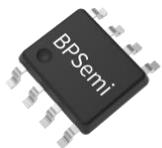
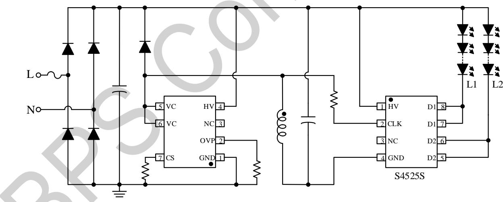
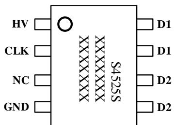
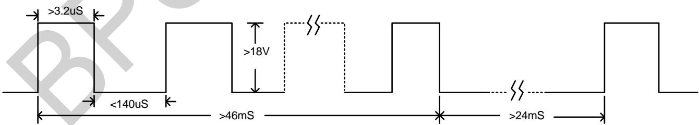
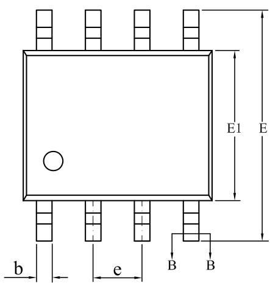
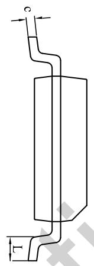
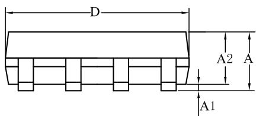
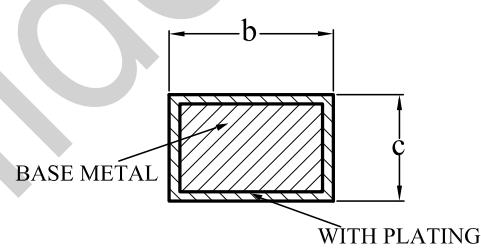

## Description

S4525S is a CCT controller with two integrated 400V thyristors and high-voltage JFET power supply circuits. It does not need the VCC capacitor and startup resistor, so as to reduce the system cost and size greatly.

S4525S utilizes stable ON-OFF detection technology to ensure the state consistency in multi-module applications. S4525S is also compatible with Flyback, Buck, Buck-Boost, and other LED driving applications.

  
SOP8 Package

## Features

■ Three states loop: L1→L2→(L1+L2)/2

■ High integration and clean periphery

■ Integrates two 400V Thyristors

■ Built-in clock timing reset for good consistency

■ Built in voltage limiting circuit, suitable for wide range output power

■ compatible with isolated, non-isolated and high PF switching power supply applications

## Applications

■ CCT applications

Typical Application  
  
Figure 1 S4525S Typical Application

Ordering Information

<table><tr><td>Part Number</td><td>Package</td><td>Package Method</td><td>Marking</td></tr><tr><td>S4525S</td><td>SOP8</td><td>Tape4,000 pcs/Reel</td><td>S4525XXXXXXYZXXXYYX</td></tr></table>

## Pin Configuration

  
XXXXXXY : Lot code  
ZXXX: sign  
YY:week  
X : reversed

Figure 2 Pin Configuration  
Pin Definition

<table><tr><td>Pin No.</td><td>Name</td><td>Description</td></tr><tr><td>1</td><td>HV</td><td>Power supply pin of the chip</td></tr><tr><td>2</td><td>CLK</td><td>Signal detecting pin</td></tr><tr><td>3</td><td>NC</td><td>NC</td></tr><tr><td>4</td><td>GND</td><td>Ground</td></tr><tr><td>5, 6</td><td>D2</td><td>Connect to the negative pole of the  $2^{nd}$  group LED string</td></tr><tr><td>7, 8</td><td>D1</td><td>Connect to the negative pole of the  $1^{st}$  group LED string</td></tr></table>

Absolute Maximum Ratings (Note1)

<table><tr><td>Symbol</td><td>Parameters</td><td>Range</td><td>Units</td></tr><tr><td>HV</td><td>Internal power supply</td><td>-0.3~500</td><td>V</td></tr><tr><td>CLK</td><td>Signal detecting</td><td>-400~400</td><td>V</td></tr><tr><td>D1/D2</td><td>Connect to the negative pole of LED string</td><td>0~400</td><td>V</td></tr><tr><td> $P_{DMAX}$ </td><td>Power dissipation (Note 2)</td><td>0.45</td><td>W</td></tr><tr><td> $\theta_{JA}$ </td><td>Thermal resistance of junction to ambient</td><td>145</td><td>°C/W</td></tr><tr><td> $T_J$ </td><td>Operating junction temperature</td><td>-40~125</td><td>°C</td></tr><tr><td> $T_{STG}$ </td><td>Storage temperature range</td><td>-40~150</td><td>°C</td></tr></table>

Note 1: Stresses beyond those listed under “absolute maximum ratings” may cause permanent damage to the device. Under “recommended operating conditions” the device operation is assured, but some parameter may not be achieved. The electrical characteristics table defines the operation range of the device, the electrical characteristics is assured on DC and AC voltage by test program. For the parameters without minimum and maximum value in the EC table, the typical value defines the operation range, the accuracy is not guaranteed by spec.  
Note 2: The maximum power dissipation decreases if temperature rises, it is decided by $T_{JMAX}$ , $\theta_{JA}$ , and environment temperature ( $T_A$ ). The maximum power dissipation is the lower one between $P_{DMAX} = (T_{JMAX} - T_A) / \theta_{JA}$ and the number listed in the maximum table.

Electrical Characteristics (Note 3 4) (Unless otherwise specified, HV=50V, $T_{A}=25^{\circ}C$ )

<table><tr><td>Symbol</td><td>Description</td><td>Condition</td><td>Min</td><td>Typ</td><td>Max</td><td>Units</td></tr><tr><td>HV_max</td><td>Maximum HV voltage</td><td></td><td></td><td></td><td>500</td><td>V</td></tr><tr><td>IHV</td><td>Operation current</td><td>HV = 50V</td><td></td><td></td><td>0.5</td><td>mA</td></tr><tr><td>Vclk(+)</td><td>Maximum HV positive voltage</td><td></td><td></td><td></td><td>400</td><td>V</td></tr><tr><td>Vclk(-)</td><td>Maximum HV negative voltage (note 5)</td><td></td><td>-400</td><td></td><td></td><td>V</td></tr><tr><td>CLKth</td><td>Threshold voltage of CLK pin</td><td></td><td></td><td></td><td>18</td><td>V</td></tr><tr><td>Tclk</td><td>Delay time to detect clk signal</td><td></td><td></td><td>3.2</td><td>4</td><td>μs</td></tr><tr><td>IHV(h)</td><td>Operation current in state hold time</td><td></td><td></td><td></td><td>1</td><td>μA</td></tr><tr><td>TDon</td><td>Delay time to Judge switch on</td><td></td><td></td><td>46</td><td></td><td>ms</td></tr><tr><td>TDoff</td><td>Delay time to Judge switch off</td><td></td><td></td><td>24</td><td></td><td>ms</td></tr><tr><td>Trs</td><td>Time for state reset operation</td><td></td><td></td><td>11</td><td></td><td>s</td></tr><tr><td>HV(rst)</td><td>State reset voltage at HV pin</td><td></td><td></td><td>1.7</td><td></td><td>V</td></tr><tr><td>VDx</td><td>Saturate voltage of D1/D2</td><td></td><td></td><td>1.4</td><td></td><td>V</td></tr></table>

Note 3: Typical parameters are measured under $25^{\circ}$ C temperature.  
Note4: The maximum and minimum parameters specified are guaranteed by test, the typical value is guaranteed by design, characterization and statistical analysis.  
Note 5: The peak voltage of the CLK pin should be controlled within -350 to 400V in application.

## Requirements of Signal Detection

The logical state sequence of S4525S is L1→L2→(L1+L2)/2, L1 and L2 represent the LED strings connected to D1 and D2 pin respectively. The effective input signal for the detecting pin CLK should meet following requirements as Figure 3 shows. To leave enough margin, the amplitude should be above 18, and the pulse width should be larger than 5uS at 18V.

  
Figure 3. The requirements for effective signal of CLK pin

## Application Information

## 1. Power Supply

S4525S is powered though HV pin. The HV pin is integrated with high-voltage JFET for internal power supply.

## 2. Signal Detection

S4525S judges ON/OFF state of the switch by detecting pulse signal through CLK pin. CLK pin is connected to an oscillation signal point by resistor. When the switch is ON state, continuous pulse signal is detected by CLK. When the switch is OFF state. Pulse signal on the CLK pin disappears. To filter noise and avoid false triggering, delay time is adopted. Delay time $TD_{on}$ (Typical value 46mS) is adopted to judge switch ON state. Delay time $TD_{off}$ (Typical value 24mS) is adopted to judge switch OFF state. When the duration time of continuous pulse signal of CLK pin is larger than $TD_{on}$ , the chip judges it is ON. When CLK pin detects no effective signal over $TD_{off}$ time, the chip judges it is OFF. The chip can switch state only after the $TD_{on}$ and $TD_{off}$ is valid.

The CLK pin integrates a 4M pull-down resistor to GND. The threshold voltage of CLK is about 18V, and internal filter time is about 3.2uS. To leave enough margin, The pulse width should be larger than 5uS at 18V

## 3. Loading Ability

S4525S integrates two 400V thyristors, and the saturate voltage of the thyristor is about 1.4V. The maximum current that S4525S can be supported is about 280mA.

## 4. State Hold Time

S4525S's operating current is less than 1uA to hold the state for the required time after power off. The state hold time is timed by the chip's internal clock and is about 11s (at $25^{\circ}\mathrm{C}$ ). if the output capacitance is too small, the chip will resets when the HV pin voltage drops to 1.7V. So it is necessary to select suitable output capacitance to maintain the HV pin voltage above 2V for more than 11s after power off.

## 5. Application Notes

When designing S4525S application, following these rules will get better performance:

1) Put HV input capacitor close to HV and GND pin as close as possible.

2) The HV pin string a resistor can meet the higher surge requirements, but the HV resistor will shorten the reset time. So we need to combine the surge capacity and reset time, choose the right resistor.

3) The state switch speed in low temperature is affected by the start-up delay of S4525S, the system switching frequency and the output electrolytic. Choosing the right output capacitor is recommended.

4) There may be a short reset time problem with non-SDS chips. Refer to the application guide for measures to deal with the problem.

## SOP8 Configuration

  
WITH PLATING

SECTION B-B

<table><tr><td rowspan="2">SYMBOL</td><td colspan="3">MILLIMETER</td></tr><tr><td>MIN</td><td>NOM</td><td>MAX</td></tr><tr><td>A</td><td>1.30</td><td>—</td><td>1.80</td></tr><tr><td>A1</td><td>0.05</td><td>—</td><td>0.25</td></tr><tr><td>A2</td><td>1.25</td><td>1.40</td><td>1.65</td></tr><tr><td>b</td><td>0.33</td><td>—</td><td>0.51</td></tr><tr><td>c</td><td>0.17</td><td>—</td><td>0.25</td></tr><tr><td>D</td><td>4.70</td><td>4.90</td><td>5.10</td></tr><tr><td>E</td><td>5.80</td><td>6.00</td><td>6.30</td></tr><tr><td>E1</td><td>3.70</td><td>3.90</td><td>4.10</td></tr><tr><td>e</td><td colspan="3">1.27BSC</td></tr><tr><td>L</td><td>0.40</td><td>—</td><td>1.00</td></tr></table>

Revision Information

<table><tr><td>Revision</td><td>Date</td><td>Notes</td></tr><tr><td>Rev. 1.0</td><td>2024/08</td><td>First Release</td></tr><tr><td></td><td></td><td></td></tr><tr><td></td><td></td><td></td></tr><tr><td></td><td></td><td></td></tr><tr><td></td><td></td><td></td></tr><tr><td></td><td></td><td></td></tr></table>

## Disclaimer

The information provided in this datasheet is believed to be accurate and reliable. However, Bright Power Semiconductor (BPS) reserves the right to make changes at any time without prior notice.

No license, to any intellectual property right owned by BPS or any other third party, is granted under this document. BPS provides information in this datasheet “AS IS” and with all faults, and makes no warranty, express or implied, including but not limited to, the accuracy of the information provided in this datasheet, merchantability, fitness of a specific purpose, or non-infringement of intellectual property rights of BPS or any other third party. BPS disclaims any and all liabilities arising out of this datasheet or use of this datasheet, including without limitation consequential or incidental damages.