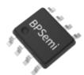
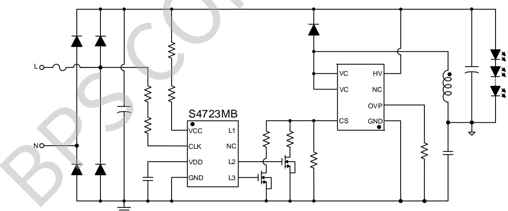
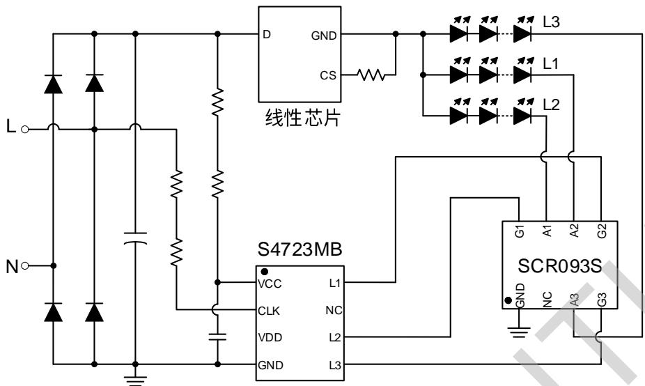
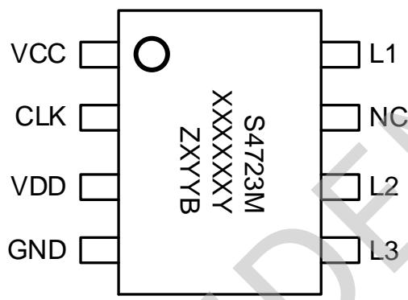
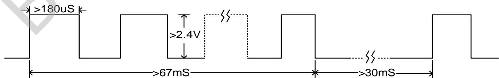
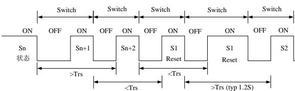
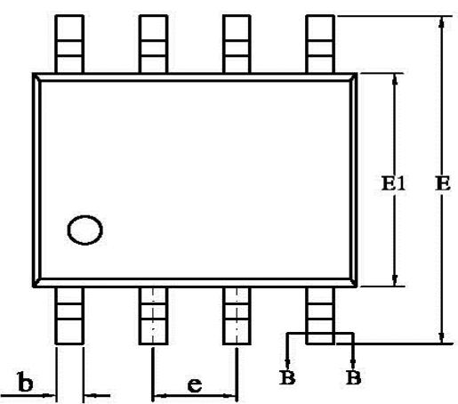
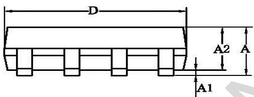
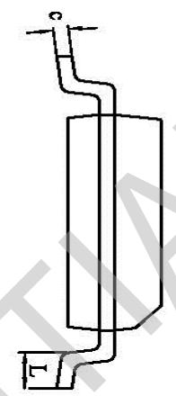
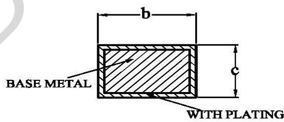

## 概述

S4723MB是带状态记忆功能的开关调光调色控制器，有三个控制端口，可以通过调节恒流主控的限流电阻实现三段带记忆开关调光，也可以搭配线性主控控制三路光源实现三路带记忆开关调色。芯片内部设定状态切换窗口时间 $T_{SW}$ (典型值3.2S)，关灯时间超过状态切换窗口时间芯片会记住关灯前的状态，下次开灯时直接呈现关灯前的状态；关灯时间小于状态切换窗口时间开灯可以实现状态调节，增加了使用的便利性。

S4723MB通过检测AC信号来判断输入开关的动作，并根据检测结果对三个控制端口进行开关切换。三个控制端口可以驱动MOS管和晶闸管（线性调色方案可以搭配我司内置三路晶闸管的SCR093S实现低成本解决方案）。

S4723MB 采用 SOP-8 封装。

## 特点

■ 状态顺序：L1→L2→L3

■ 带状态记忆功能，使用更加便利

■ 状态存储时间超过 10 年

■ 开关次数可达 10 万次以上（记忆功能正常）

■ 1S 内开关两次复位

■ 状态切换窗口时间内部计时 3.2S

内置限压电路，适用更宽的功率范围

## 应用

■ 开关调光调色的 LED 电源

## SOP-8 封装

## 典型应用

  
图 1 S4723MB 调光典型应用图

  
图 2 S4723MB 搭配线性调色典型应用图

## 定购信息

<table><tr><td>定购型号</td><td>封装</td><td>包装形式</td><td>打印</td></tr><tr><td>S4723MB</td><td>SOP-8</td><td>卷盘4000 只/盘</td><td>S4723MXXXXXYZXYB</td></tr></table>

## 管脚封装

  
XXXXXXY: 批次  
图3管脚封装图

ZX: 标识

YY: 周号

B: 固定字符

## 管脚描述

<table><tr><td>管脚号</td><td>管脚名称</td><td>描述</td></tr><tr><td>1</td><td>VCC</td><td>芯片外部供电脚</td></tr><tr><td>2</td><td>CLK</td><td>信号检测脚</td></tr><tr><td>3</td><td>VDD</td><td>芯片内部供电脚</td></tr><tr><td>4</td><td>GND</td><td>信号和功率地</td></tr><tr><td>5</td><td>L3</td><td>驱动脚 3</td></tr><tr><td>6</td><td>L2</td><td>驱动脚 2</td></tr><tr><td>7</td><td>NC</td><td>空脚</td></tr><tr><td>8</td><td>L1</td><td>驱动脚 1</td></tr></table>

## 应用极限参数(注1)

<table><tr><td>符号</td><td>参数</td><td>参数范围</td><td>单位</td></tr><tr><td>VCC</td><td>芯片 VCC 引脚电压范围</td><td>-0.3~9</td><td>V</td></tr><tr><td>VDD</td><td>芯片 VDD 引脚电压范围</td><td>-0.3~9</td><td>V</td></tr><tr><td>CLK</td><td>芯片 CLK 引脚电压范围</td><td>-0.3~9</td><td>V</td></tr><tr><td>L1/L2/L3</td><td>驱动脚电压范围</td><td>-0.3~9</td><td>V</td></tr><tr><td> $P_{DMAX}$ </td><td>功耗(注 2)</td><td>0.45</td><td>W</td></tr><tr><td> $\theta_{JA}$ </td><td>PN 结到环境的热阻</td><td>150</td><td>°C/W</td></tr><tr><td> $T_J$ </td><td>工作结温范围</td><td>-40 ~ 150</td><td>°C</td></tr><tr><td> $T_{STG}$ </td><td>储存温度范围</td><td>-55 ~ 150</td><td>°C</td></tr></table>

注1：最大极限值是指超出该工作范围，芯片有可能损坏。推荐工作范围是指在该范围内，器件功能正常，但并不完全保证满足个别性能指标。电气参数定义了器件在工作范围内并且在保证特定性能指标的测试条件下的直流和交流电参数规范。对于未给定上下限值的参数，该规范不予保证其精度，但其典型值合理反映了器件性能。  
注2：最大允许功耗是由 $T_{JMAX}$ ， $\theta_{JA}$ 和环境温度 $T_A$ 所决定的，温度升高最大功耗一定会减小。最大允许功耗为 $P_{DMAX} = (T_{JMAX} - T_A) / \theta_{JA}$ 或是极限范围给出的数字中比较低的那个值。

## 规格参数(注 3,4)（无特别说明情况下，VCC=5V， $T_{A}=25^{\circ}C$ ）

<table><tr><td>描述</td><td>符号</td><td>条件</td><td>最小值</td><td>典型值</td><td>最大值</td><td>单位</td></tr><tr><td>供电脚钳位电压</td><td> $VCC_{max}$ </td><td>IVCC=1mA</td><td>4.7</td><td>5.2</td><td>5.7</td><td>V</td></tr><tr><td>内部供电电压</td><td>VDD</td><td>IVCC=1mA</td><td>4.5</td><td>5</td><td>5.5</td><td>V</td></tr><tr><td>工作电流</td><td> $I_{VCC}$ </td><td>VCC=5</td><td></td><td></td><td>0.5</td><td>mA</td></tr><tr><td>VCC开启电压</td><td>UVLO_on</td><td></td><td>3</td><td>3.6</td><td>4.2</td><td>V</td></tr><tr><td>VCC关断电压</td><td>UVLO_off</td><td></td><td>1.2</td><td>1.5</td><td>1.8</td><td>V</td></tr><tr><td>检测脚CLK阈值电压</td><td>CLK(th)</td><td></td><td></td><td>2.4</td><td></td><td>V</td></tr><tr><td>检测脚输入电阻</td><td>Rclk</td><td></td><td></td><td>20</td><td></td><td>KΩ</td></tr><tr><td>最小有效CLK脉冲宽度</td><td>Tclk</td><td></td><td></td><td>180</td><td></td><td>uS</td></tr><tr><td>L1/L2/L3的驱动电压</td><td>VDx</td><td></td><td></td><td>5</td><td></td><td>V</td></tr><tr><td>L1/L2/L3的驱动电流</td><td>IDx</td><td>VDx=1.2V</td><td></td><td>120</td><td></td><td>uA</td></tr><tr><td>判断开关闭合状态的延迟时间</td><td>Td(on)</td><td>Fsw=60KHz(注5)</td><td>60</td><td>67</td><td>74</td><td>mS</td></tr><tr><td>判断开关断开状态的延迟时间</td><td>Td(off)</td><td></td><td>26</td><td>30</td><td>34</td><td>mS</td></tr><tr><td>状态复位时间</td><td>Trs</td><td></td><td>1.0</td><td>1.2</td><td>1.4</td><td>S</td></tr><tr><td>状态复位开关次数</td><td>Treset</td><td></td><td></td><td>2</td><td></td><td>次</td></tr><tr><td>状态切换窗口</td><td>Tsw</td><td>VDD Cap=2.2uF</td><td>2.9</td><td>3.2</td><td>3.5</td><td>S</td></tr></table>

注3：典型参数值为 $25^{\circ}C$ 下测得的参数标准。  
注4：规格书的最小、最大规范范围由测试保证，典型值由设计、测试、或统计分析保证。  
注5：该时钟信号为内部时钟，如果外围参数有差异会造成参数有波动。

## 逻辑顺序及检测信号

S4723MB 的逻辑顺序为 L1→L2→L3。S4723MB 的检测脚既可以检测高低电平，也可以检测脉冲信号（5kHz 以内频率），检测脚的有效输入波形要求如下图 4 所示。设计时为确保足够余量，CLK 脚峰值电平须大于 4V，脉宽大于 300uS。

  
图 4 检测脚波形要求示意图

## 功能说明

## 1、供电

S4723MB 通过 VCC 脚进行供电，在应用中通过电阻把 VCC 脚连接到输入电容的正极。芯片的工作电流大约为 0.5mA，考虑到温度等因素，设计中必须留有余量。

## 2、检测

S4723MB 通过 CLK 脚检测脉冲信号来判断输入开关的通断状态。CLK 脚通过电阻连接到 AC 端（如典型应用图所示）。开关闭合，CLK 脚上产生连续脉冲信号；开关断开，CLK 脚脉冲信号消失。为了过滤掉噪声，避免造成误触发，S4723MB 内部设计了判断开关闭合状态的延迟时间 Td(on)（典型值 67mS）和判断开关断开状态的延迟时间 Td(off)（典型值 30mS），如图 4 所示。CLK 脚脉冲信号持续时间大于 Td(on)时芯片判断为开机状态；持续 Td(off)时间内 CLK 脚未检测到有效脉冲信号，芯片判断为关机状态。只有 Td(on)有效后关机（CLK 脚检测到有效脉冲信号的时间超过内部设定值），且关机满足 Td(off)有效后通电才能切换状态。

为确保足够余量，设计参数时，检测电阻的选取须遵循以下要求：1）和内部下拉电阻分压后，CLK脚脉冲信号峰值电平大于4V，脉冲宽度大于300uS；2）当检测电阻的另外一端出现负压时，流经检测电阻的电流必须小于1mA。

## 3、驱动

S4723MB 可以驱动晶闸管和 MOS 管，无需增加控制电路，芯片能自动识别所连接的开关管类型。当驱动晶闸管时，L1/L2/L3 输出 120uA 左右电流触发晶闸管导通（建议选取触发电流 100uA 内的晶闸管）。当驱动 MOS 管时，L1/L2/L3 输出 5V 左右电压（建议选择 2.5V 以下阈值电压 MOS 管）。

鉴于 L1/L2/L3 输出电流仅 120uA，通常不建议在 L1/L2/L3 加放电电阻，否则可能出现驱动能力不足。

## 4、状态控制

S4723MB 内置 EEPROM 存储单元，关灯时会把关灯前的状态存储到存储单元中，关灯时间超过状态切换窗口时间 $T_{SW}$ 后再次开灯，芯片会直接调取存储单元中的状态作为输出状态（即关灯前的状态）。若用户需要切换状态，只需关灯时间小于状态切换窗口时间再开即可切换。

S4723MB 的状态切换窗口时间 Tsw 由内部时钟计时,典型值 3.2S。应用时，需要外接一个 VCC 或 VDD 电容来保证断电后芯片 VDD 电压在 UVLO\_off 以上持续时间大于切换窗口时间，VCC 或 VDD 电容通常采用 2.2uF25V，若 VCC 或 VDD 电容因通过电源外围电路放电导致切换窗口时间达不到内部设定值，可在 VCC 供电线路串一个二极管，避免提前进入记忆模式。

## 5、复位

S4723MB 内置快速开关两次复位功能，即从 AC 开关关断时刻算起，Trs（状态复位时间，典型值 1.2S）时间内完成两次“关灯→开灯”操作，芯片会在第二次开灯时将状态复位到第一个状态，如图 5 所示。如果后续的“关灯→开灯”仍然满足复位条件，S4723MB 将一直保持在第一状态（L1 输出高电平）。

  
图 5 S4723MB 复位示意图

## 6、设计注意事项

在设计 PCB 板时，遵循以下原则会有更佳性能：

1) VCC/VDD 电容尽量紧靠芯片 VCC/VDD 和 GND 引脚；

2) VCC 走线尽量远离变压器等强振荡源，避免干扰；

3) CLK 脚预留滤波电容位（0805 封装即可）。

## SOP-8 封装信息

<table><tr><td rowspan="2">SYMBOL</td><td colspan="3">MILLIMETER</td></tr><tr><td>MIN</td><td>NOM</td><td>MAX</td></tr><tr><td>A</td><td>1.30</td><td>—</td><td>1.80</td></tr><tr><td>A1</td><td>0.05</td><td>—</td><td>0.25</td></tr><tr><td>A2</td><td>1.25</td><td>1.40</td><td>1.65</td></tr><tr><td>b</td><td>0.33</td><td>—</td><td>0.51</td></tr><tr><td>c</td><td>0.17</td><td>—</td><td>0.25</td></tr><tr><td>D</td><td>4.70</td><td>4.90</td><td>5.10</td></tr><tr><td>E</td><td>5.80</td><td>6.00</td><td>6.20</td></tr><tr><td>E1</td><td>3.70</td><td>3.90</td><td>4.10</td></tr><tr><td>e</td><td colspan="3">1.27BSC</td></tr><tr><td>L</td><td>0.40</td><td>—</td><td>1.00</td></tr></table>

SECTION B-B

  
WITH PLATING

## 版本信息

<table><tr><td>版本</td><td>日期</td><td>记录</td></tr><tr><td>Rev.1.0</td><td>2021/06</td><td>首次发行</td></tr><tr><td></td><td></td><td></td></tr><tr><td></td><td></td><td></td></tr><tr><td></td><td></td><td></td></tr><tr><td></td><td></td><td></td></tr><tr><td></td><td></td><td></td></tr></table>

## 免责声明

晶丰明源尽力确保本产品规格书内容的准确和可靠，但是保留在没有通知的情况下，修改规格书内容的权利。

本产品规格书未包含任何针对晶丰明源或第三方所有的知识产权的授权。针对本产品规格书所记载的信息，晶丰明源不做任何明示或暗示的保证，包括但不限于对规格书内容的准确性、商业上的适销性、特定目的的适用性或者不侵犯晶丰明源或任何第三人知识产权做任何明示或暗示保证，晶丰明源也不就因本规格书本身及其使用有关的偶然或必然损失承担任何责任。