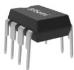
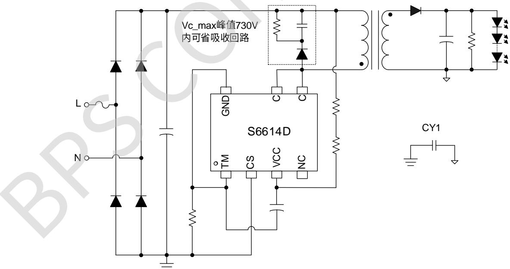
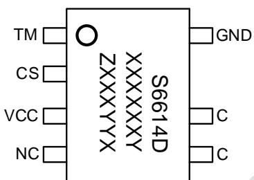
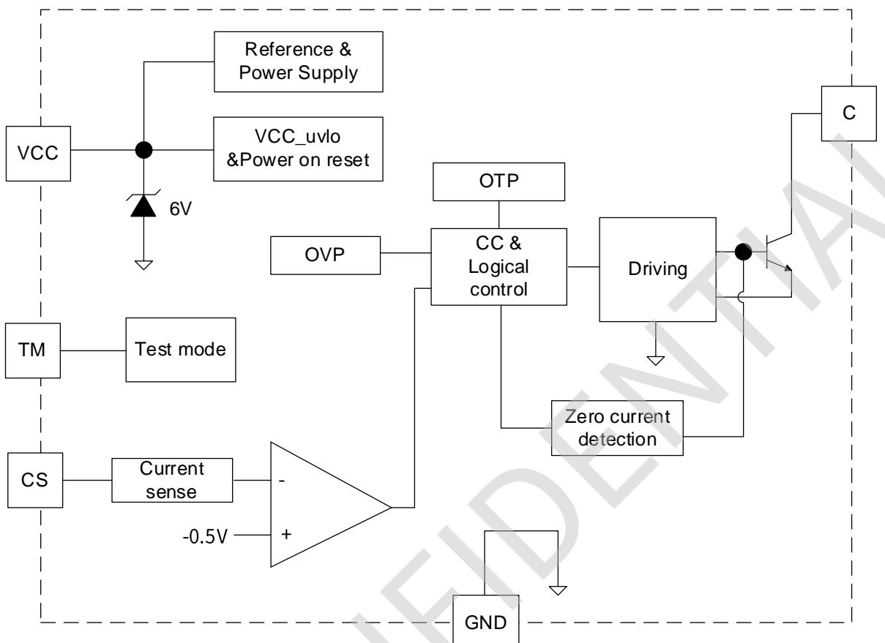
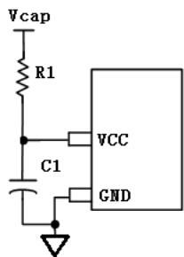
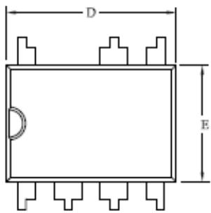
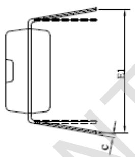
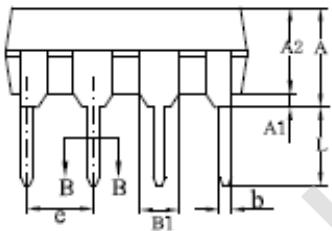
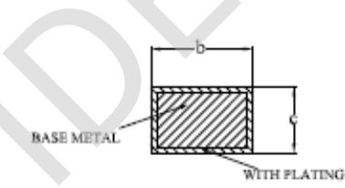

## 概述

S6614D是一款高精度的原边反馈LED恒流控制开关芯片，工作在电感电流断续模式，适用于85\~265Vac输入电压范围的隔离反激式LED恒流电源。

S6614D内部集成高压功率三极管，无需辅助绕组检测和供电；芯片外围简洁，系统方案性价比高。芯片内置线电压补偿及高精度电流采样，无需增加电流补偿电路便可实现高电流精度。

S6614D内部集成了多种保护功能：欠压锁定、前沿消隐、LED开路保护、短路保护、过热调节等功能，增加了系统的稳定性。

S6614D采用DIP-7封装。

  
DIP-7封装

## 特点

无需辅助绕组检测和供电

集成超高耐压功率三极管

±5% LED 输出电流精度

LED开路、短路保护

内置输入线电压补偿

逐周期的电流限制及前沿消隐

过热调节功能

## 应用领域

LED筒灯、PAR灯

LED面板灯、插地灯、防水电源

其它 LED 照明

## 典型应用

  
图 1 S6614D 典型应用电路

## 定购信息

<table><tr><td>定购型号</td><td>封装</td><td>包装形式</td><td>打印</td></tr><tr><td>S6614D</td><td>DIP-7</td><td>管装50颗/管</td><td>S6614DXXXXXXYZXXXXYX</td></tr></table>

## 管脚封装

  
图 2 管脚封装图

XXXXXXY：批次

ZXXX：标识

YY：周号

X:预留

## 管脚描述

<table><tr><td>管脚号</td><td>管脚名称</td><td>描述</td></tr><tr><td>1</td><td>TM</td><td>测试脚,应用时接地</td></tr><tr><td>2</td><td>CS</td><td>原边电流检测管脚</td></tr><tr><td>3</td><td>VCC</td><td>供电脚(对 GND 外接 22uF 电容)</td></tr><tr><td>4</td><td>NC</td><td>悬空</td></tr><tr><td>5,6</td><td>C</td><td>内置三极管集电极</td></tr><tr><td>7</td><td>GND</td><td>信号和功率地</td></tr></table>

## 极限参数(注1)

<table><tr><td>符号</td><td>参数</td><td>参数范围</td><td>单位</td></tr><tr><td>TM</td><td>芯片 TM 引脚电压范围</td><td>-0.3~8</td><td>V</td></tr><tr><td>CS</td><td>芯片CS引脚电压范围</td><td>-1.0~8</td><td>V</td></tr><tr><td>VCC</td><td>芯片VCC引脚电压范围</td><td>-0.3~8</td><td>V</td></tr><tr><td>C</td><td>功率三极管集电极电压范围</td><td>-0.3~780</td><td>V</td></tr><tr><td> $P_{DMAX}$ </td><td>耗散功率(注 2)</td><td>0.9</td><td>W</td></tr><tr><td> $\theta_{JA}$ </td><td>PN 结到环境的热阻</td><td>80</td><td>°C/W</td></tr><tr><td> $T_J$ </td><td>工作结温范围</td><td>-40~150</td><td>°C</td></tr><tr><td> $T_{STG}$ </td><td>储存温度范围</td><td>-55~150</td><td>°C</td></tr><tr><td>ESD</td><td>人体模型 ESD(注 3)</td><td>2</td><td>kV</td></tr></table>

注1：最大极限值是指超出该工作范围，芯片有可能损坏。推荐工作范围是指在该范围内，器件功能正常，但并不完全保证满足个别性能指标。电气参数定义了器件在工作范围内并且在保证特定性能指标的测试条件下的直流和交流电参数规范。对于未给定上下限值的参数，该规范不予保证其精度，但其典型值合理反映了器件性能

注2：温度升高最大功耗一定会减小，这也是由TMAx，θIA，和环境温度TA所决定的。最大允许功耗为 $P _ { D M A X } = ( T _ { J M A X } - T _ { A } ) / \theta _ { J A }$ 或是极限范围给出的数字中比较低的那个值。

注 3：按照 JEDEC 标准测试，100pF 电容通过 1.5KΩQ 电阻放电。

## 电气特性(注 4， 5) (除非特别说明，VCC=5V， Ta=25°C)

<table><tr><td>描述</td><td>符号</td><td>最小值</td><td>典型值</td><td>最大值</td><td>单位</td></tr><tr><td colspan="6">VCC管脚部分</td></tr><tr><td>启动电流</td><td> $I_{start}$ </td><td></td><td>190</td><td></td><td>uA</td></tr><tr><td>VCC启动电压</td><td> $VCC_ON$ </td><td>4.5</td><td>5</td><td>5.5</td><td>V</td></tr><tr><td>VCC关断电压</td><td> $VCC_OFF$ </td><td>3.5</td><td>4</td><td>4.5</td><td>V</td></tr><tr><td>VCC工作电压</td><td> $VCC_OP$ </td><td>4.5</td><td>5</td><td>5.5</td><td>V</td></tr><tr><td>VCC钳位电压</td><td> $VCC_CLAMP$ </td><td>5.8</td><td>6</td><td>6.4</td><td>V</td></tr><tr><td colspan="6">CS管脚部分</td></tr><tr><td>过流限制电压</td><td> $V_{CS}$ </td><td>-515</td><td>-500</td><td>-485</td><td>mV</td></tr><tr><td>前沿消隐时间</td><td>LEB</td><td>400</td><td>500</td><td>720</td><td>nS</td></tr><tr><td colspan="6">内部时间控制</td></tr><tr><td>最小退磁时间</td><td>TOFF_min</td><td>3.7</td><td>4.7</td><td>5.7</td><td>us</td></tr><tr><td>最大退磁时间</td><td>TOFF_max</td><td>400</td><td>450</td><td>500</td><td>us</td></tr><tr><td colspan="6">功率管</td></tr><tr><td>峰值电流</td><td> $I_{peak}$ </td><td>500</td><td>850</td><td>900</td><td>mA</td></tr><tr><td>功率管击穿电压</td><td> $BV_{CBO}$ </td><td>780</td><td>850</td><td></td><td>V</td></tr><tr><td colspan="6">过热调节</td></tr><tr><td>过热调节温度</td><td>Treg</td><td></td><td>150</td><td></td><td>°C</td></tr></table>

注4：典型参数值为25℃下测得的参数标准；  
注5：规格书的最小、最大规范范围由测试保证，典型值由设计、测试、或统计分析保证。

推荐工作范围

<table><tr><td>符号</td><td>参数</td><td>参数范围</td><td>单位</td></tr><tr><td> $P_{OUT}$ </td><td>输出功率(输入电压85~265Vac)</td><td>&lt;24</td><td>W</td></tr><tr><td> $F_{op}$ </td><td>推荐系统工作频率</td><td>50~70</td><td>kHz</td></tr><tr><td> $V_{OR\_MIN}$ </td><td>原边最小反射电压</td><td>&gt;36</td><td>V</td></tr></table>

## 内部结构框图

  
图 3 S6614D 内结构框图

## 功能描述

S6614D 是一款专用于LED 照明的恒流驱动芯片，采用原边反馈拓扑架构，内置线电压补偿电路及自供电电路；采用两绕组变压器，无需辅助绕组供电；内置高耐压功率管，C 极峰值电压730V内可省吸收回路，方案成本低。

## 1、启动电路

系统上电后，输入电压 Vcap 通过启动电阻 $\mathsf { R } _ { 1 }$ 对电容 $\mathsf C _ { 1 }$ 进行充电，如图4所示：

  
图 4 启动电路图

当 VCC 电容电压达到芯片启动电压VCC oN，芯片内部控制电路开始工作。电源的启动延迟时间Tsd为：

$$
T _ {s d} = R _ {1} * C _ {1} * L n \big (1 - V C C _ {\_ O N} \big) / (V _ {c a p} - I _ {s t a r t} * R _ {1})
$$

其中： $\mathsf { V C C } _ { \mathsf { O N } }$ 为芯片启动电压；

$\mathsf { I } _ { \mathsf { S t a r t } }$ 为芯片启动电流；

$\mathsf { V } _ { \mathsf { C a p } }$ 为 AC 整流后电压。

为给芯片提供稳定的工作电压，VCC 电容应选择低ESR电容，以保证芯片稳定工作及减小VCC电压纹波，推荐使用22uF温度特性好的电解电容。由于低温时电容的ESR成倍增加，为避免低温启动困难，需要在VCC引脚多并联一个约 1uF的 X7R 材质的瓷片电容。

## 2、输出恒流设置

芯片内部采用逐周期检测变压器原边峰值电流，CS 端连接到内部的峰值电流比较器输入端，与内部基准电压比较从而控制功率三极管的开关。原边峰值电流为：

$$
I _ {p e a k} = \frac {V _ {c s}}{R _ {c s}}
$$

LED 输出电流为：

$$
I _ {o u t} = \frac {1}{4} * N _ {p s} * I _ {p e a k}
$$

其中： $V _ { c s }$ 是 CS 脚过流限制电压

$R _ { c s }$ 是原边电流检测电阻阻值

$I _ { p e a k }$ 是原边峰值电流

$N _ { p s }$ 是原边与副边线圈匝比

输出电流可以根据合理设置原边与副边线圈匝比和电流采样电阻得到。

## 3、工作频率

系统工作在电感电流断续模式，无需任何环路补偿，最大占空比为42%左右，通常情况下，建议最大的工作频率为65\~70Khz，最小频率30kHz以上，频率的计算公式为：

$$
f = \frac {N _ {p} ^ {2} * V _ {o u t}}{8 * N _ {s} ^ {2} * L _ {P} * I _ {o u t}}
$$

其中： $L _ { p }$ 是变压器原边电感量；

$N _ { p }$ 和 $N _ { s }$ 分别是变压器原边与副边的匝数。

## 4、过压保护

S6614D内置过压保护(OVP)，外围无 ${ \mathsf { O V P } }$ 芯片默认退磁时间 Tovp≈4.7uS，主要通过电感量调节OVP电压，OVP电压通常设置为1.5 倍满载电压。

$$
V _ {o v p} \approx \frac {L _ {p} * V _ {c s}}{N _ {p s} * R _ {c s} * T _ {o v p}}
$$

其中， $V _ { c s }$ 是 CS 脚过流限制电压

$R _ { c s }$ 是原边电流检测电阻阻值

$V _ { o v p }$ 是输出OVP 电压

$N _ { p s }$ 是原边与副边线圈匝比

$L _ { p }$ 是原边电感量

Tovp 的屏蔽时间是 2uS，功率管关断后 C 脚(PIN5 和PIN6)的谐振时间超过 2uS 将触发OVP，变压器须采用三明治绕法以减小漏感，确保足够余量。

## 5、保护功能

芯片内置多种保护功能，包括LED开路、短路保护以及芯片过温调节功能等。

当输出LED开路时，系统会触发过压保护功能并锁死，芯片停止开关工作，直到220ms后系统复位后重新工作。当LED短路时，系统工作在2.5kHz低频，所以功耗很低。

芯片通过过温调节电路检测芯片结温，当结温超过 $1 5 0 ^ { \circ } \mathsf C$ 芯片进入过温调节，逐渐减小输出电流，从而控制输出功率和温升，使芯片温度控制在一定值，以保证系统可靠性。

## PCB 布板指南

设计 S6614D PCB 板时，需要遵循以下原则：

1)VCC 电容的正端和负端尽量靠近芯片的 VCC 和 GND脚，并增大引线的面积(芯片的自供电电路会在充电阶段通过芯片 VCC 脚对 VCC 电容充电，过长或过细的引线将会导致芯片工作异常)。

2)缩小功率环路的面积，如变压器主级、功率管以及反馈电阻间的环路面积，可以有效减小EMI辐射。

3)CS 采样电阻两端尽量分别与芯片的 GND 脚和输入电容的地靠近，可以有效降低耦合噪声，提高采样精度。

4) 增加C脚的铺铜面积可以提高芯片的散热。

WITH PLATING

## DIP-7封装信息

  
BASE METAL

SECTION B-B

<table><tr><td rowspan="2">SYMBOL</td><td colspan="3">MILLIMETER</td></tr><tr><td>MIN</td><td>NOM</td><td>MAX</td></tr><tr><td>A</td><td>—</td><td>—</td><td>4.80</td></tr><tr><td>A1</td><td>0.40</td><td>—</td><td>—</td></tr><tr><td>A2</td><td>3.10</td><td>—</td><td>3.50</td></tr><tr><td>b</td><td>0.355</td><td>—</td><td>0.559</td></tr><tr><td>B1</td><td colspan="3">1.52REF</td></tr><tr><td>c</td><td>0.203</td><td>—</td><td>0.356</td></tr><tr><td>D</td><td>9.10</td><td>—</td><td>9.45</td></tr><tr><td>E</td><td>6.25</td><td>—</td><td>6.70</td></tr><tr><td>e</td><td>2.44</td><td>2.54</td><td>2.64</td></tr><tr><td>E1</td><td>7.62</td><td>—</td><td>10.90</td></tr><tr><td>L</td><td>2.92</td><td>—</td><td>3.81</td></tr></table>

## 版本信息

<table><tr><td>版本</td><td>日期</td><td>记录</td></tr><tr><td>Rev.1.0</td><td>2018/01</td><td>首次发行</td></tr><tr><td>Rev.1.1</td><td>2021/08</td><td>格式更新,页眉页脚更新,增加 OVP 设置参考的描述</td></tr><tr><td></td><td></td><td></td></tr><tr><td></td><td></td><td></td></tr><tr><td></td><td></td><td></td></tr><tr><td></td><td></td><td></td></tr><tr><td></td><td></td><td></td></tr></table>

## 免责声明

晶丰明源尽力确保本产品规格书内容的准确和可靠，但是保留在没有通知的情况下，修改规格书内容的权利。

本产品规格书未包含任何针对晶丰明源或第三方所有的知识产权的授权。针对本产品规格书所记载的信息，晶丰明源不做任何明示或暗示的保证，包括但不限于对规格书内容的准确性、商业上的适销性、特定目的的适用性或者不侵犯晶丰明源或任何第三人知识产权做任何明示或暗示保证，晶丰明源也不就因本规格书本身及其使用有关的偶然或必然损失承担任何责任。