南京凌鸥创芯电子有限公司

## 用芯打造电控专用平台

## CONTENTS

01.芯片介绍
02.模拟部分
03.数字资源
04.官方资料

## 01 芯片介绍

## 特性

48MHz 32 位 RISC 内核，32bit 硬件除法协处理器

4 通道 DMA

低功耗休眠模式

-40\~105°C工业级工作温度范围

2.2V\~5.5V 单电源供电，内部集成数字供电 LDO

超强抗静电和群脉冲能力

## 存储

16/32kB Flash，数据防盗功能

4kB RAM

## 时钟

内置 4MHz 高精度 RC 时钟，全温度范围精度±1%

内置 64kHz 低速时钟，供低功耗模式使用

内部 PLL 可提供最高 48MHz 时钟

## 外设模块

一路 UART

一路 SPI

一路 IIC

通用 16/32 位 Timer，支持捕捉和边沿对齐 PWM

> 电机控制专用 PWM 模块，支持 6 路 PWM 输出，死区可配置

Hall 信号专用接口，支持测速、去抖

硬件看门狗

最多25路 GPIO

## 模拟模块

集成 1 路 12bit SAR ADC，1Msps 采样及转换速率，共 11 通道

集成 1 路 OPA，可设置为差分 PGA 模式

集成两路比较器

集成 8bit DAC 数模转换器，作为内部比较器输入

内置 1.2V 0.5%精度电压基准源

内置 1 路低功耗 LDO 和电源监测电路

集成高精度、低温飘高频 RC 时钟

## 02 模拟部分

\- ADC 模数转换器
- OPA 运算放大器
- CMP 比较器
- DAC 模数转换器
- TMP 温度传感器
- BGP 基准电压源
- CLK 时钟系统
- 模拟部分异同

\- TMP 温度传感器
- ADC 模数转换器
- OPA 运算放大器
- CMP 比较器
- DAC 模数转换器
- BGP 基准电压源
- CLK 时钟系统

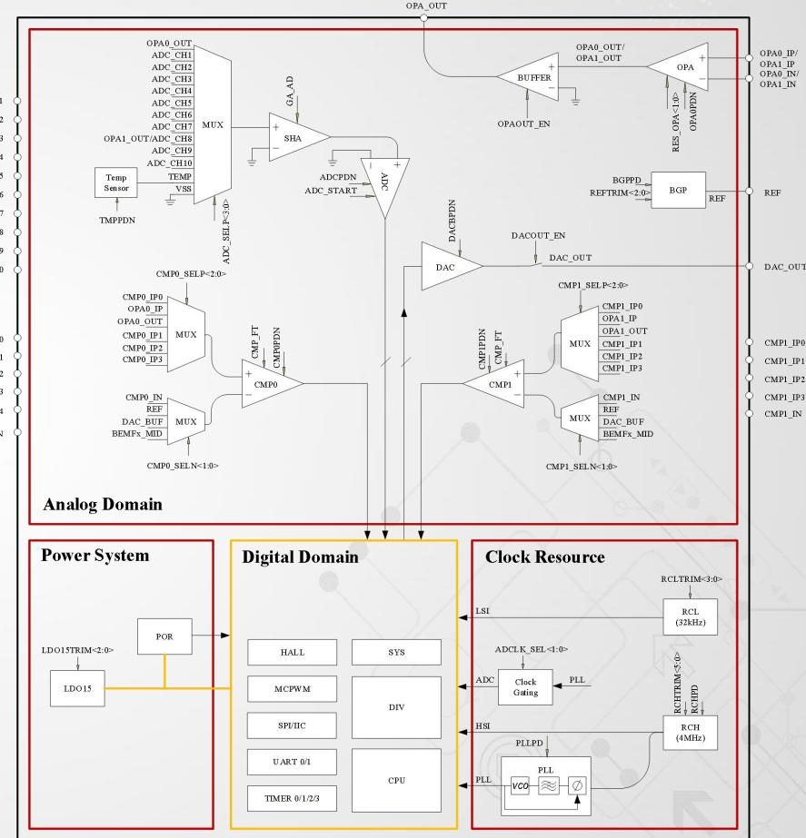

➢ LKS32MC03x 系列芯片集成了 1 个 12BIT SARADC。

1MSPS 采样率，24MHz 工作频率。

支持 14 通道选择（运放1-2个，GPIO 10-9个，内部3个）。支持软件、硬件触发功能。

可以与 MCPWM、UTimer 单元联动进行定时触发

支持触发指示信号可通过 GPIO 送出调试

➢ 支持单段、双段、四段自定义采样序列采样，序列次数和通道号可灵活配置。

支持左对齐、右对齐模式。

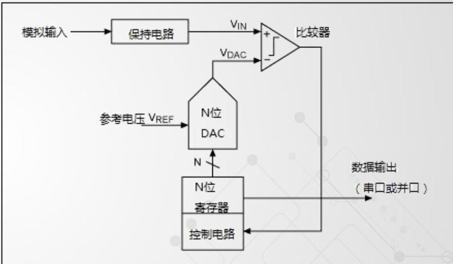  
SARADC基本结构

ADC接口包括10个数据寄存器（ADC在最多10次采样中存储的数字量），以及若干控制寄存器。

分段采样次数寄存器 ADC\_CHNT 控制每轮采样的次数，1\~15 对应 1\~15 次。

一段转换（一段内的所有通道采样转换完毕）完成，触发 ADC 转换完成中断。多段触发模式下，每一段转换完成可触发产生一个转换完成中断。

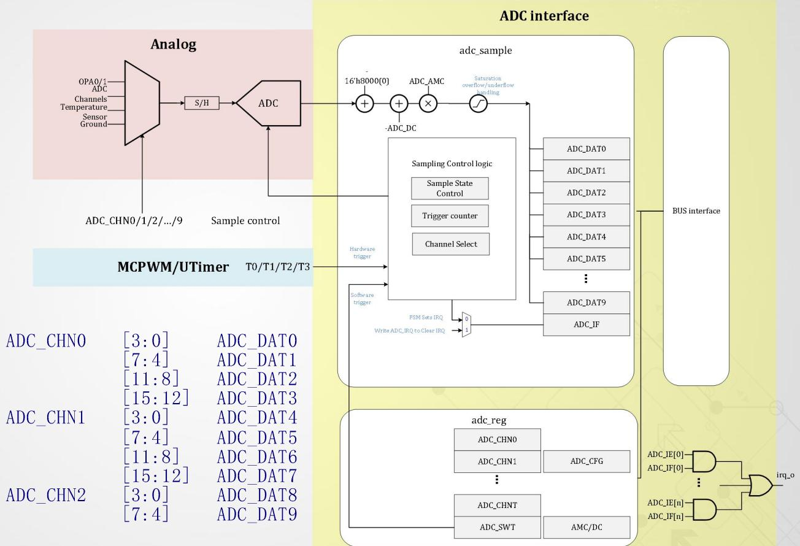

支持单段触发、两段触发、四段触发完成采样

单段触发可以设置触发事件发生次数

两段触发的触发源只能为 MCPWM/UTimer 的定时信号 TADC[0]+TADC[1]，或两次软件触发

四段触发的触发源只能为 MCPWM/UTimer 的定时信号 TADC[0]+TADC[1]+TADC[2]+TADC[3]，或四次软件触发。每段触发完成均可产生中断，触发指示信号可以通过 GPIO 送出用于调试

<table><tr><td>触发源</td><td>单段触发</td><td>两段触发</td><td>四段触发</td></tr><tr><td rowspan="5">MCPWM/UTimer</td><td>C次T0</td><td rowspan="5">第一段T0第二段T1</td><td rowspan="5">第一段T0第二段T1第三段T2第四段T3</td></tr><tr><td>C次T1</td></tr><tr><td>C次T2</td></tr><tr><td>C次T3</td></tr><tr><td>C次T0/T1/T2/T3</td></tr><tr><td>软件触发</td><td>软件触发</td><td>第一段软件触发第二段软件触发</td><td>第一段软件触发第二段软件触发第三段软件触发第四段软件触发</td></tr></table>

<table><tr><td colspan="4">ADC输出数字量数制转换</td></tr><tr><td>ADC 2.4V量程输入模拟量数值/V</td><td>ADC 3.6V量程输入模拟量数值/V</td><td>转为有符号数后的数值(右对齐)</td><td>转为有符号数后的数值(左对齐)</td></tr><tr><td>2.4</td><td>3.6</td><td>0x3ff</td><td>0x7ff0</td></tr><tr><td>0</td><td>0</td><td>0</td><td>0</td></tr><tr><td>-2.4</td><td>-3.6</td><td>0x800</td><td>0x8000</td></tr></table>

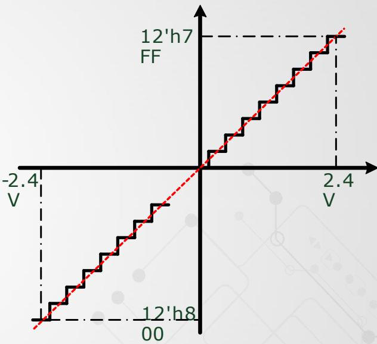  
2.4V 量程设置下转换数制量程

ADC 有两种量程：2.4V 和 3.6V。2.4V 量程模式下，对应最大±2.4V 的输入信号幅度；3.6V 量程模式模式下，对应最大±3.6V 的输入信号幅度。

在 ADC 采样通道配置为运放的输出信号时（即 OPA0\~OPA1），应选择合适的运放增益，使得具体应用上的最大信号可被放大到接近+/-3.3V 的水平，同时将 ADC 配置为 3.6V 量程。

举例来说，相线电流最大 100A（正弦波有效值），MOS 内阻（假设为 MOS 内阻采样）为 5mR，则运放的最大输入信号幅值为+/-707mV。此时应该选择运放的放大倍数为 4.5 倍（放大倍数选择方式详见 5.2.5），则放大后的信号约为+/-3.18V。

<table><tr><td>增益</td><td>ADC量程(基准电压1.2V)</td></tr><tr><td>1倍</td><td>ADC量程为±2.4V</td></tr><tr><td>2/3倍</td><td>ADC量程为±3.6V</td></tr></table>

ADC 硬件接口模块可以进行直流偏置校正与增益校正。

ADC\_AMC 存储的是增益校正系数 AMPcorrection，为 10bit 无符号定点数，ADC\_AMC[9]为整数部分，ADC\_AMC[8:0]为小数部分。可以表示数值在 1 附近的定点数。

ADC\_DC 存储的是 ADC 的直流偏置，通常在校正阶段通过测量通道 15（从 0 开始计数）的 AVSS（内部地）得到 ADC 直流偏置数值并存入 flash 中，并在系统加载阶段由软件将直流偏置写入 ADC\_DC 寄存器中。

➢ 记 ADC 输出的数字量为 DADC，DADC 对应的真实值为 D，D0 为编码数制的 0，则 D = Saturation((DADC-D0)\*AMPcorrection-DCoffset)

ADC 接口模块配备有 1 组阈值监测电路，阈值监测可以同时进行上阈值和下阈值监测，ADC 的数据寄存器可以单独配置是否启用某组阈值监测。如果使能阈值监测，当 ADC 完成某次转换，且将经过校正的数据写入 ADCx\_DAT 寄存器时，会进行阈值比较，如果写入数据大于上阈值或小于下阈值则置位对应的阈值超限中断标志。

阈值为 12bit 有符号数，因此阈值比较与数据的左右对齐无关。左对齐时 ADCx\_DATx[15:4]与阈值进行比较，右对齐时，ADCx\_DATx[11:0]与阈值进行比较

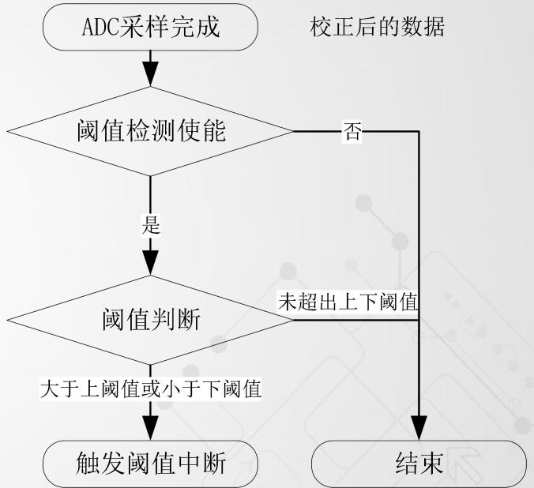

芯片集成 1 路输入输出轨到轨（rail-to-rail）运算放大器，内置反馈电阻，外部引脚上需串联一个电阻R0到信号源。反馈电阻R2:R1的阻值可通过寄存器RES\_OPA[1:0]设置，以实现不同的放大倍数。

运放反馈电阻配置值

00: 200k:10k
01: 190k:20k
10: 180k:30k
11: 170k:40k

图中两个 R0 是片外需放置的电阻，阻值必须相等，最终的放大倍数为 R2/(R1+R0)。

例如： $190 / (20 + 1) \approx 9.0476$

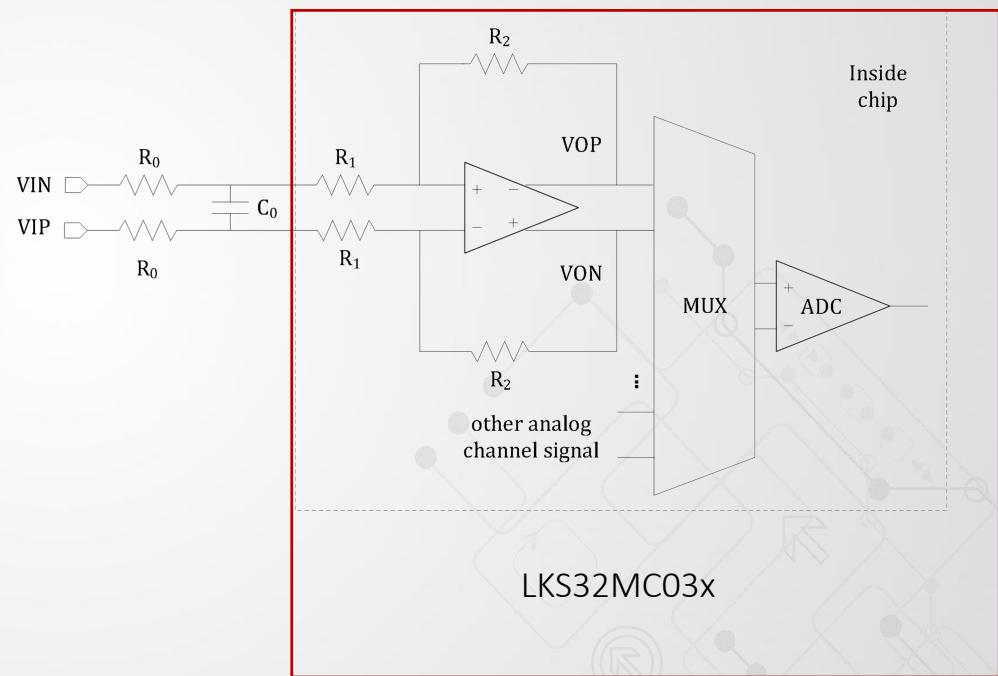

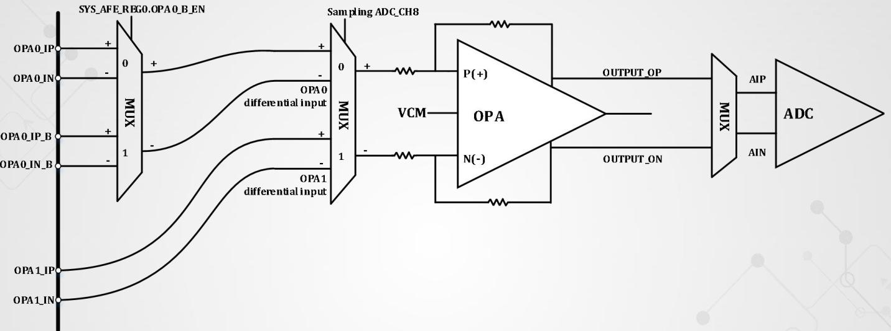

ADC 在采样 ADC\_CH8 时，实际上是采样 OPA 放大后的 OPA1 信号。OPA 输入开关信号将始终与要采样的下一个 ADC 通道保持一致。建议将 OPA1(即 ADC\_CH8)设置为 ADC 采样序列中的第一个通道，这将为 OPA1\_IP/OPA1\_IN 作为 OPA 输入提供足够的稳定时间。

当 OPA 输入时在 OPA0\_IP/OPA0\_IN 和 OPA1\_IP/OPA1\_IN 之间切换时，需要至少 1us 的稳定时间。不建议立即对 OPA0/1 连续进行采样。

内置 2 路输入轨到轨（rail-to-rail）比较器，比较器比较速度可编程、迟滞电压可编程、信号源可编程。

比较器的比较延时可通过寄存器 CMP\_FT 设置为 <30nS/200nS。迟滞电压通过 CMP\_HYS 设置为 20mV/0mV。

比较器正负两个输入端的信号来源都可通过寄存器 CMPx\_SELP[2:0] 和 CMPx\_SELN[1:0] 进行设置（x=0/1，代表 CMP0/CMP1 两个比较器）。

两个比较器负输入端的 BEMFx\_MID 信号，是对比较器正输入端信号 CMPx\_IP1/CMPx\_IP2/CMPx\_IP3 信号的平均，具体连接方式见图

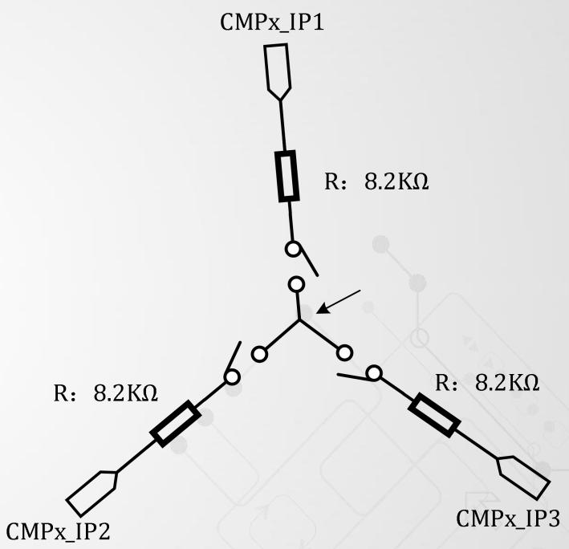

芯片内置一路 8bit DAC，输出信号的最大量程为 3V。

DAC 可通过配置寄存器 DACOUT\_EN=1，将 DAC 输出送至 P0.0 管脚，可驱动>5kΩ 的负载电阻和 50pF 的负载电容。

DAC 最大输出码率为 1MHz。

芯片上电的默认状态下，DAC 模块是关闭的。DAC 可通过设置 DACPDN = 1 打开，开启 DAC 模块之前，需要先开启 BGP 模块。

DAC 的输入数字信号寄存器为 SYS\_AFE\_DAC，低 8BIT 有效。信号范围是 0x00\~0xFF。0x00 对应零模拟量输出 0V，0xFF 对应满量程模拟量输出为 DACfs。

输出电压计算

$$
\mathrm {U_ {dac\_out}} = \frac {\mathrm{DAC} _ {\mathrm{fs}}}{2 5 6} \times 3
$$

设定值计算

$$
\mathrm{DAC} _ {\mathrm{fs}} = \frac {\mathrm{U} _ {d a c \_ o u t}}{3} \times 2 5 6
$$

芯片内置温度传感器，在-40\~85°C范围内精度为2℃。85\~105℃范围内精度为3℃。

芯片出厂前会经温度校正，校正值保存在 flash info 区。

芯片上电的默认状态下，温度传感器模块是关闭的。开启传感器之前，需要先开启 BGP 模块。

温度传感器通过设置 TMPPDN=1 打开，开启到稳定需要约 2us，因此需在 ADC 测量传感器之前2us 打开。

温度传感器信号连至 ADC 的通道 11。

Temperature Sensor  
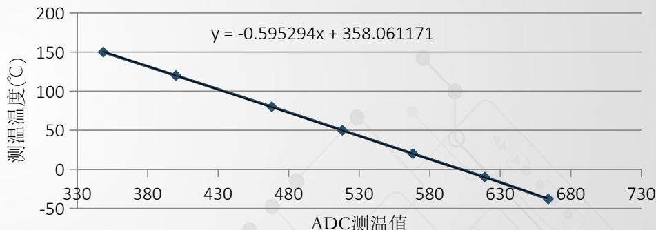

基准源电路(BGP REF: Bandgap reference)为 ADC、DAC、RC 时钟、PLL、温度传感器、运算放大器、比较器和 FLASH 提供基准电压和电流，使用上述任何一个模块之前，都需要开启 BGP 基准电压源。

芯片上电的默认状态下，BGP 模块是开启的。通过设置 BGPPD = '0' 将基准源打开，从关闭到开启，BGP 需要约 6us 达到稳定。

BGP 输出电压约 1.2V，精度为±0.8%

基准源可通过设置 REF\_AD\_EN=1，将基准电压送至 IO P0.0 进行测量。

时钟系统包括内部 64kHz RC 时钟、内部 4MHz RC 时钟、PLL 电路组成。

<table><tr><td>时钟源</td><td>频率</td><td>来源</td><td>误差</td><td>说明</td></tr><tr><td>LSI/LRC</td><td>64kHz</td><td>内部RC振荡器</td><td>57.6KHz~70.4KHz</td><td>内部系统管理时钟,用于WDT,复位信号的滤波和展宽,亦可作为MCU运行主时钟</td></tr><tr><td>HSI/HRC</td><td>4MHz</td><td>内部RC振荡器</td><td>全温度范围误差&lt;1%</td><td>可作为PLL源时钟</td></tr><tr><td>PLL</td><td>48MHz</td><td>PLL时钟</td><td>0</td><td>PLL输出时钟,以HSI作为参考时钟输入,倍频12倍后输出PLL时钟作为系统主时钟。</td></tr><tr><td>JTAG/SWD</td><td>1MHz</td><td>调试器</td><td>--</td><td>SWD的JTAG时钟</td></tr></table>

ADC

ADC和05基本一致通道由16降为14个，工作时钟减半

OPA

OPA只有1路，可以复用成2路，方式同05

DAC

DAC由12位降低为8位

## 时钟

➢ LRC保持32khz不变，HRC改为12Mhz，PLL改为48Mhz，系统可以工作在LRC的32khz下

其他无差异

## 03 数字资源

\- FLASH →
- SPI →
- I2C →
- HALL →
- UTIMER →
- MCPWM →
- GPIO →
- UART →
- DMA →
- DSP →
- IWDG →
- PMU → ➢ 非易失性存储体包含两个部分:FLASH 和 ROM。

FLASH 存储体包含两个部分：NVR 和 MAIN。NVR 大小为 32B；MAIN 有两个大小尺寸：16KB 和 32KB。

➢ FLASH 存储体主闪存存储区（MAIN），包括应用程序和用户数据区

FLASH 信息存储区（NVR），预留给用户使用数据区

ROM 存储体，出厂前固化特定程序，大小为 16KB。

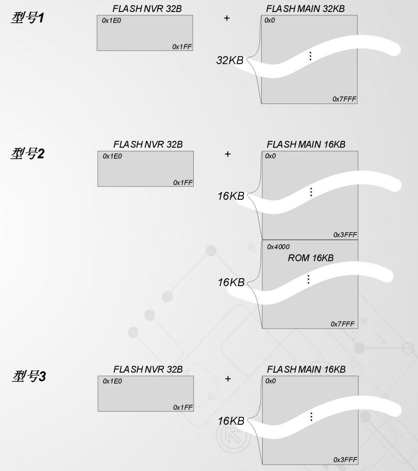

Keil指定需要保护的程序放到Flash的后16K的地址中，

下载程序到单片机内，程序开启ROM功能

芯片断电重启

芯片进入ROM模式

警告：芯片开启ROM功能后将无法恢复

ROM分区特点

ROM分区内程序无法被其他任何地方的程序访问到

ROM分区内的程序可以访问自身

ROM分区内程序可以执行

支持 Master 和 Slave 操作

➢ 全双工传输，可根据应用情况，使用 3 根或者 4 根信号线

➢ 支持半双工传输，可根据应用情况，使用2根信号线

可编程的时钟极性和相位

可编程的数据顺序：MSB或LSB

▶ 最快传输速度为系统最高时钟频率的 1/8

片选信号均可选。Master 模式下，片选信号可以软件控制也可以硬件产生；Slave 模式下，片选信号可以恒定有效，也可以来自外界设备

➢ 无本地 FIFO，支持 DMA 操作。包含溢出检测和片选信号异常检测

数据长度 8-Bit \~ 16-Bit 可调

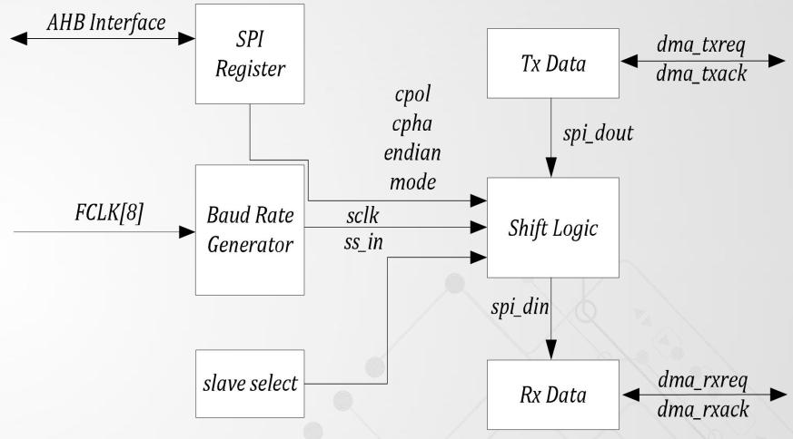  
SPI 模块结构框图

▶ 接口为 Master 模式时（主模式）

spi\_din 为数据输入，接外部 Slave 设备的 MISO

spi\_dout 为数据输出，接外部 Slave 设备的 MOSI

> spi\_ss\_out 为片选信号，根据应用情况选择是使用该信号还是软件控制其它 GPIO 实现

▶ 接口为 Slave 模式时（从模式）

spi\_din 为数据输入，接外部 Master 设备的 MOSI

spi\_dout 为数据输出，接外部 Master 设备的 MISO

> spi\_ss\_in 为片选信号，根据应用情况是使用该信号还是片选恒有效

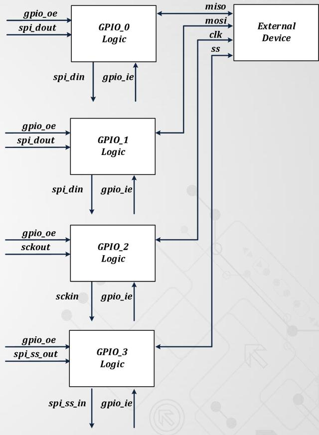

## 仅发送

SPI\_CFG. DUPLEX 配置为 2，半双工发送模式有效。此时，本接口只能发送数据。GPIO\_0 的 oe 使能，发送 spi\_dout 数据到外界；GPIO\_0 的 ie 关闭，spi\_din 恒定输入为 0。此模式下，支持 Master/Slave 模式下的发送。

## 仅接收

SPI\_CFG. DUPLEX 配置为 3，半双工接收模式有效。此时，本接口只能接收数据。GPIO\_0 的 oe 关闭，spi\_dout 无法发送数据到外界；GPIO\_0 的 ie 开启，spi\_din 接收来自外部的数据。此模式下，支持 Master/Slave 模式下的接收。

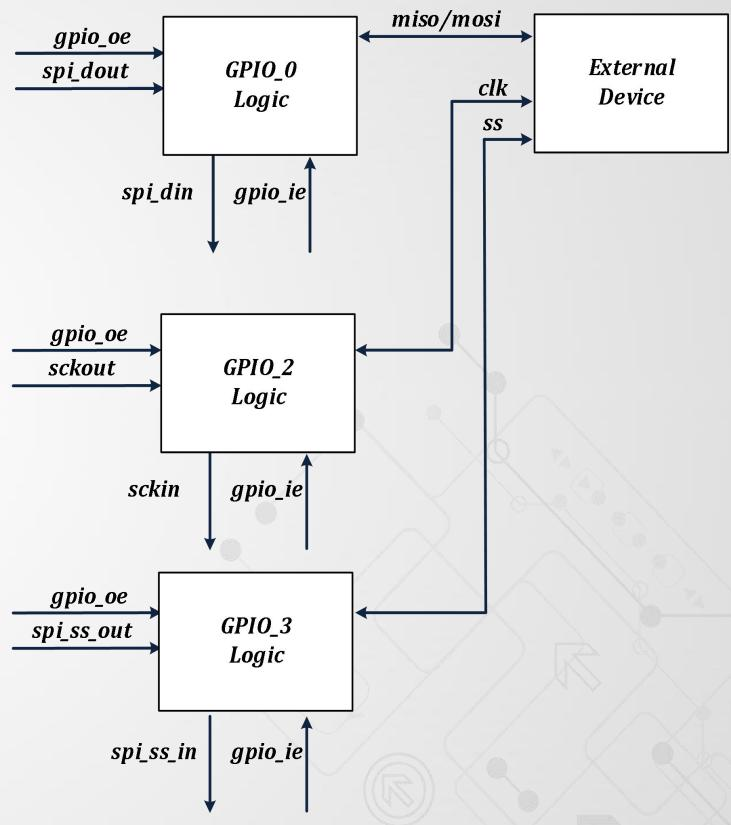

本接口做 Slave 模式时，片选信号可选，SPI\_CFG.CS 决定片选来源。ss 为 Master 设备发出的选通使能信号，低电平有效。

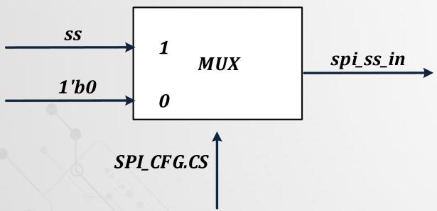

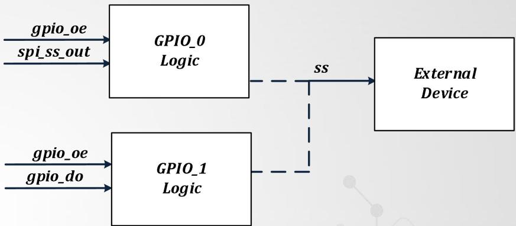

本接口做 Master 模式时，片选信号亦可选。模块硬件产生了标准的片选信号，实际应用可屏蔽此信号通过软件操作额外的 GPIO 实现。

在 SPI 通讯过程中，发送或者接收操作均是基于 SPI 时钟的。通讯格式受到 SPI\_CFG.SAMPLE 和 SPI\_CLK\_POL 控制。SPI\_CFG.SAMPLE 为 Phase 控制位，SPI\_CLK\_POL 为 Polarity 控制位。

Polarity 控制了 SPI 时钟信号在默认情况下的电平状态。Polarity 为 0 时，默认时钟电平为低电平；Polarity 为 1 时，默认电平为高电平。

Phase 控制了 SPI 数据的发送/接收时刻。Phase 为 0 时，时钟从默认电平到第一个跳变边沿为采样数据时刻，Phase 为 1 时，时钟从默认电平到第一个跳变边沿为发送数据时刻。

在大容量数据传输应用下，SPI 接口支持 DMA 传输，减轻 MCU 的负担。一次传输，最大传输量为由 DMA 模块决定，最小传输量为 1 字节。在全双工模式下，接收和发送均可实现 DMA 传输；在半双工模式下，仅接收或发送实现 DMA 传输。

在接收到新的数据后，硬件自动产生 DMA 请求，通过 DMA 模块将数据搬移到 RAM 中。在发送新数据前，硬件自动产生 DMA 请求，通过 DMA 模块将数据从 RAM 中搬移到 SPI 接口。因 SPI 无 FIFO，SPI 发送一次 DMA 请求，DMA 只能搬移一个字节数据。若要实现多字节搬移，DMA 需配置为多轮搬移，每一轮搬移一个字节的方式。

DMA 传输，推荐软件配置流程如下

➢ 初始化 DMA 模块，将本次发送的数据来源，接收的数据去向配置好，传输长度配置完毕。

➢ 初始化 GPIO 模块，将 SPI 复用的 GPIO 配置完毕。

➢ 初始化 SPI 接口，
SPI\_IE/SPI\_CFG/SPI\_BAUD/SPI\_SIZE 等寄存器配置完毕。

触发 SPI 接口，进入发送/接收状态。触发条件是 MCU 对 SPI\_TXDATA 寄存器执行写操作，因最终发送的数据来自 DMA，本次 MCU 写入的数据不会混入 SPI 发送流程。

## 一次只能发送/接收一个

SPI\_SIZE.BITSIZE 长度的数据，每次完成后需要通过中断或者轮询的方式判断传输是否完成。无论是主模式还是从模式，写 SPI\_TXDATA 寄存器，才能触发传输。

主模式为主动发送，从模式为加载数据到发送队列等待主模式发出时钟信号，开始传输。

## DMA 传输，推荐软件配置流程如下

➢ 初始化 GPIO 模块，将 SPI 复用的 GPIO 配置完毕。

➢ 初始化 SPI 接口，
SPI\_IE/SPI\_CFG/SPI\_BAUD/SPI\_SIZE 等寄存器配置完毕。

MCU 对 SPI\_TXDATA 寄存器执行写操作，触发 SPI 接口进入发送流程。从模式下，数据加载到内部状态机等待主设备发起读取操作；主模式下，触发发送。

➢ SPI 接口包含三种类型的中断事件，分别是：数据传输完成事件，异常事件和溢出事件。

➢ 数据完成事件，当前数据传输完成。高电平有效，对 SPI\_IE. CMPLT\_IF 写 1 清除。

异常事件，SPI 接口为 Slave 模式，若在传输过程中片选信号受到干扰，被拉高，将产生片选异常事件。高电平有效，对 SPI\_IE. AB\_IF 写 1 清除。

溢出事件，SPI\_RX\_DATA 寄存器数据没有及时被读走，将产生溢出事件。高电平有效，对 SPI\_IE.OV\_IF 写 1 清除。

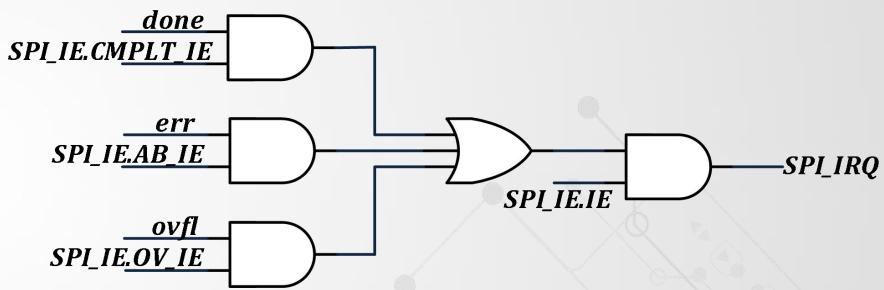

SPI 接口时钟通过对系统时钟分频获得，分频系数来自 SPI\_BAUD.BAUD。SPI 传输波特率配置计算公式为：

$$
\mathrm{SPI} \text {传输波特率} = \text {系统时钟} / (2 ^ {*} (\mathrm{BAUD} + 1))
$$

SPI 协议为半拍协议，上升沿发送数据，下降沿采集数据；或者下降沿发送数据，上升沿采样数据。

> SPI接口采用同步设计，需要对外部设备的信号进行同步采样，同步时钟为系统时钟。数据和时钟信号（此时为Slave模式）的同步，需要两拍系统时钟。考虑到时钟相位的偏移，此时需要一拍系统时钟的冗余，由此推导出最快的SPI传输波特率为系统时钟的1/8，高电平周期为四拍系统时钟，低电平周期为四拍系统时钟。因此，SPI\_BAUD.BAUD的配置值不能小于3。

I2C 主设备功能：产生时钟、START 和 STOP 事件。

I2C 从设备功能：可编程的 I2C 硬件地址比较（仅支持 7 位硬件地址）、停止位检测。

根据系统分频，实现不同的通讯速度。

状态标志：发送器/接收器模式标志、字节发送结束标志、I2C总线忙标志。

错误标志：主模式时的仲裁丢失、地址/数据传输后的应答(ACK)错误、检测到错位的起始或停止条件。

一个中断向量，包含五个中断源：总线错误中断源、完成中断源、NACK中断源、硬件地址匹配中断源和传输完成中断源。

具单字节缓冲器的 DMA。

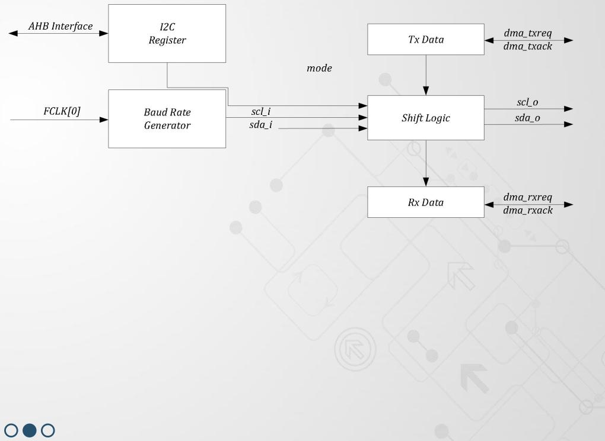

接口可以下述 4 种模式中的一种运行:

从发送模式

从接收模式

主发送模式

主接收模式

主模式时，I2C 接口启动数据传输并产生时钟信号。串行数据传输总是以起始条件开始并以停止条件结束。起始条件和停止条件都是在主模式下由软件控制产生。

从模式时，I2C 接口能识别它自己的地址(7 位)。软件能够控制开启或禁止硬件地址比较功能，硬件地址比较功能可降低 MCU 的负担。只有地址匹配才通知 MCU 进行相关处理。

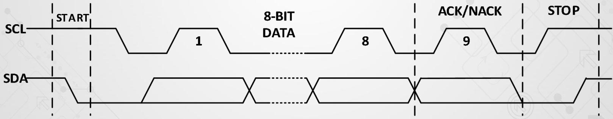

## 从模式一般MCU传输流程如下

地址匹配，产生地址匹配中断，准备开始传输。

若是接收模式，一个字节接收完毕后，产生中断，软件判断是否继续接收，返回ACK/NACK响应。

若是发送模式，一个字节发送完毕后，等待响应（ACK/NACK），产生中断，根据响应判断后续操作。

获得总线 STOP 事件，本次传输完成。

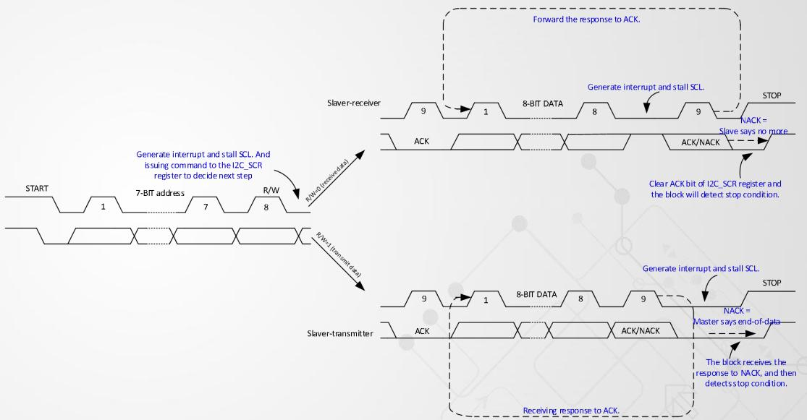

## 从模式一般DMA传输的流程如下：

配置I2C从地址，使能I2C中断（可使能硬件地址比较中断）。地址匹配，产生I2C地址匹配中断，在中断处理函数中，配置DMA，准备好发送数据或者准备好接收地址。然后写I2C\_SCR，准备开始传输或者停止本次传输。

若是接收模式，I2C\_BSIZE.BURST\_SIZE约定的字节接收完毕后，产生中断，软件判断是否继续接收，返回ACK/NACK响应。

若是发送模式，I2C\_BSIZE.BURST\_SIZE约定的字节发送完毕后，等待响应（ACK/NACK）产生中断，根据响应判断后续操作。

获得总线完成标志，本次传输完成。

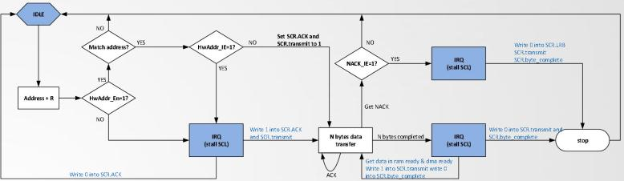

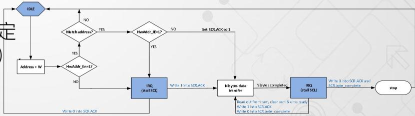

主模式一般MCU传输的流程如下：

判断总线是否空闲，若空闲，准备开始传输。

若是接收模式，一个字节接收完毕后，产生中断，软件判断是否继续接收，返回ACK/NACK响应。

若是发送模式，一个字节发送完毕后，等待响应（ACK/NACK），产生中断，根据响应判断后续操作。

➢ 发送总线STOP事件，本次传输完成。

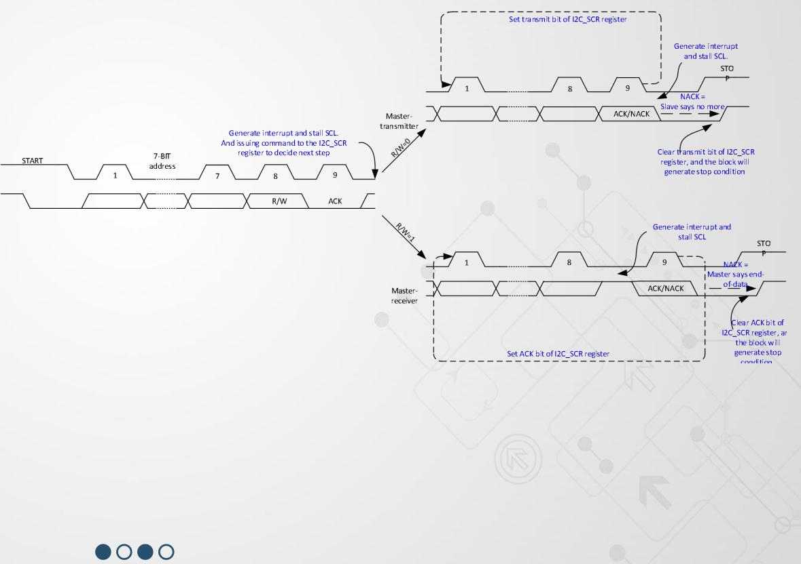

DMA传输，其含义为每次传输多个字节的数据后，将产生中断判断是否还要继续传输。DMA传输的极端情况是仅传输一个字节的数据。DMA传输，一般建议开启NACK中断，传输完成中断。一般DMA传输的流程如下：

总线空闲，准备开始传输。

若是接收模式，I2C\_BCR.BURST\_SIZE约定的字节接收完毕后，产生中断，软件判断是否继续接收，返回ACK/NACK响应。

若是发送模式，I2C\_BCR.BURST\_SIZE约定的字节发送完毕后，等待响应(ACK/NACK)，产生中断，根据响应判断后续操作。

发送STOP事件，本次传输完成。

在一个地址或数据字节传输期间，当I2C接口检测到一个外部的停止或起始条件则产生总线错误。

一般而言，产生总线错误是由于总线上有干扰、某些I2C设备没有同步于本I2C网络自行发送了START事件/STOP事件。根据I2C协议规定，发生总线错误的时候在收到START事件/STOP事件后要重置本I2C设备的接口逻辑。对于从设备而言，这个操作是没有问题的；对于主设备而言，总线错误强行要求其释放总线并重置其I2C接口逻辑。因为主设备是不响应外部START和STOP事件的，发生总线错误后，需要中断处理函数处理本次异常，并指导主设备继续监视总线情况，以便后续执行I2C总线传输。

本I2C接口。主模式下，总线错误可被检测到同时总线错误中断也会产生；从模式下，总线错误将触发地址数据被接收，同时让I2C接口恢复空闲状态并产生中断。

2C接口包含三种类型的中断事件，分别是：数据传输完成事件，总线错误事件、STOP事件、NACK事件和硬件地址匹配事件。

数据完成事件。当前数据传输完成，高电平有效，对I2C\_SCR.Done写0清除。

总线错误事件。传输过程中，总线产生错误的START事件/STOP事件，高电平有效，对I2C\_SCR.STT\_ERR写0清除。

STOP事件。当前数据传输完成，主设备发送STOP事件，从设备收到STOP事件并产生相应中断。高电平有效，对I2C\_SCR.STOP\_EVT写0清除。

NACK事件。发送端接收到NACK响应，表明接收端无法继续后续传输。高电平有效，对I2C\_SCR.RX\_ACK写0清除。

硬件地址匹配事件。从模式下接收到的地址同本设备地址匹配，产生相应中断。高电平有效，对I2C\_SCR.ADDR\_DATA写0清除。

I2C接口的工作时钟来自系统时钟的分频，分频寄存器为SYS模块的CLK\_DIV0。

I2C接口采用同步设计，需要对外部设备的信号进行同步采样，同步时钟为I2C接口工作时钟。数据和时钟信号的时钟频率为接口工作时钟/16。

I2C波特率 = (系统频率 / (CLK\_DIV0 + 1)) / 17

芯片共支持 3 路 HALL 信号输入。

对于输入的 HALL 传感器信号，所进行的处理包括: 滤波，消除 HALL 信号毛刺的影响

➢ 捕获，HALL 输入有变化时，记录当前的定时器值，并输出中断

➢ 溢出，HALL 信号长时间不发生变化导致计数器溢出，并输出中断

滤波模块主要用于去除HALL信号上的毛刺。

滤波包括两级滤波器，两级滤波电路可单独开启，也可全部开启：

➢ 第一级采用7判5进行滤波，即连续7个采样点中，如果达到或超过5个1则输出1，如果达到或超过5个0则输出0，否则输出保持上一次的滤波结果。通过配置HALL\_CFG.FIL\_75可以选择是否使能第一级滤波器。

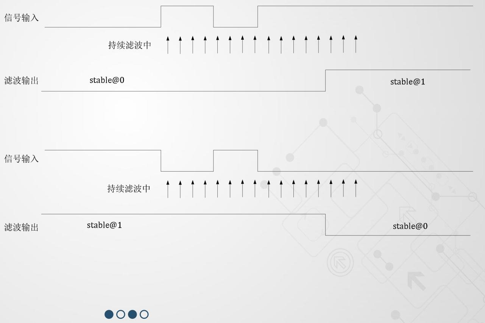

➢ 1个SysTick定时器，24位。

03提供了两个独立的Timer。分别可以独立配置运行计数时钟和滤波常数。

比较模式下每个 Timer 可以用于输出特定周期占空比的波形。

捕获模式下可以捕获外部波形进行周期占空比的检测。

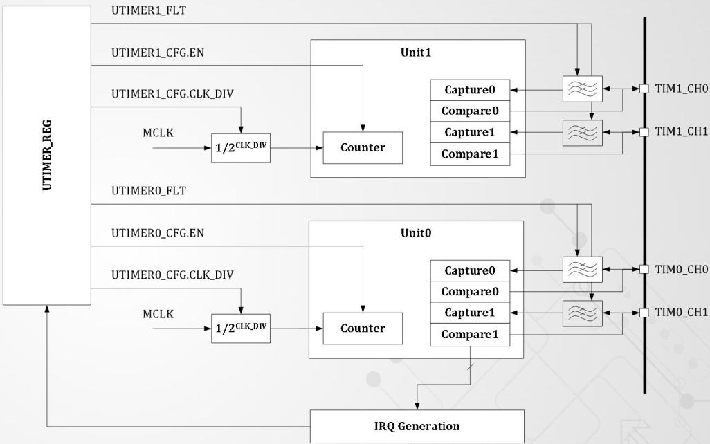

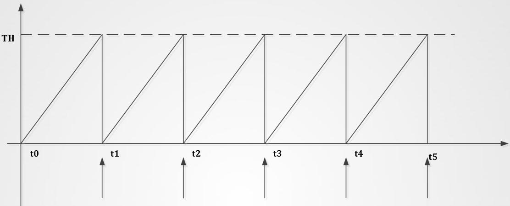

Timer中的计数器采用递增方向计数。

计数器从0计数到TH值，再回到0重新开始计数，计数器回到0时，产生回零中断。实际计数周期为clk\_freq\*(TH+1)。

计数器的计数时钟可以通过UTIMERx\_CFG.CLK\_SRC进行配置，可以使用芯片内部的系统时钟（通道为48MHz PLL时钟）或使用Timer0/1的通道0/1信号作为外部时钟进行计数。

计数器的计数时钟可以通过UTIMERx\_CFG.CLK\_DIV进行分频，以降低计数器的计数频率。

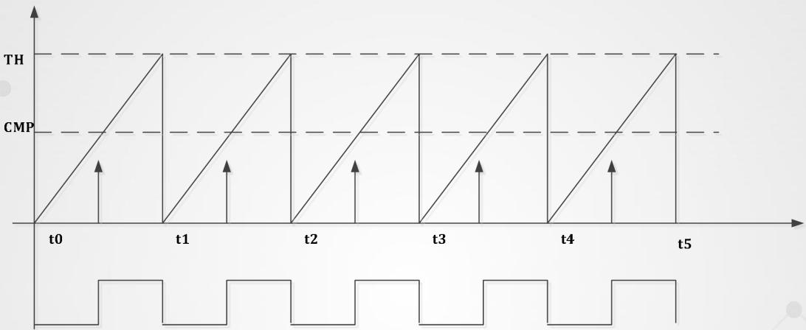

比较模式下，计数器计数到UTIMERx\_CMP值时，产生比较中断。比较模式可以驱动一个比较脉冲发生，在回零时，向IO口输出一个电平（极性可配置），在比较事件发生时，电平翻转，向IO口输出另一个电平。计数器回零时，仍然会产生回零中断。设置UTIMERx\_CMP0=0，可使得Timer X通道0为恒1，设置UTIMERx\_CMP0=UTIMERx\_TH+1，可使得Timer通道0为恒0。

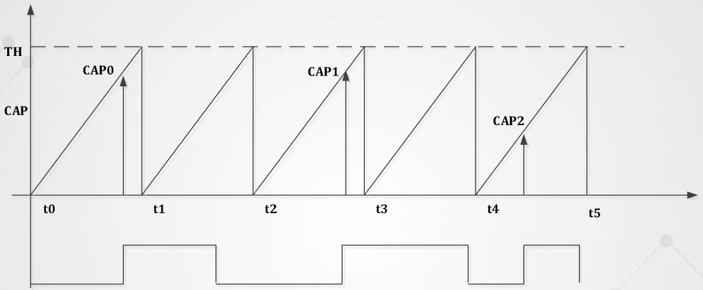

捕获模式下，可以使用Timer来检测输入信号的上升/下降或者双沿，发生捕获事件（即输入信号电平变化）时，定时器计数值存入UTIMER\_UNTx\_CMP寄存器，并产生捕获中断。计数器回零时，仍然会产生回零中断。

捕获模式下，通道 0/1 捕获的信号来源可以通过 UTIMERx\_CFG.SRC0 和 UTIMERx\_SRC1 进行设置，信号源可以设置为来自 IO 的通道信号，或来自模拟比较器，以及来自 IO 的两个通道信号的异或。

可以通过设置UTIMERx\_CFG.CAP0\_CLR\_EN或UTIMERx\_CFG.CAP1\_CLR\_EN使能Timer自动清零，即当通道0/1发生捕获事件时，UTIMER\_CNT自动回零重新开始计数。这一功能便于Timer计算捕获信号的周期和占空比。

例如，如果设置了 Timer0 的通道 0/1 同时捕获同一个信号，通道 0 捕获上升沿，通道 1 捕获下降沿。且使能 CAP0\_CLR\_EN，即发生通道 0 捕获事件时 UTIMER\_CNT 自动回零。则当发生发生通道 0 捕获事件（CAP0）时，UTIMERx\_CMP0 记录的值为信号上一个周波的周期，UTIMERx\_CMP1 记录的值为信号上一个周波的高电平占空比。

同理，如果设置了 Timer0 的通道 0/1 同时捕获同一个信号，通道 0 捕获上升沿，通道 1 捕获下降沿。且使能 CAP1\_CLR\_EN，即发生通道 1 捕获事件时 UTIMER\_CNT 自动回零。则当发生发生通道 1 捕获事件（CAP1）时，UTIMERx\_CMP1 记录的值为信号上一个周波的周期，UTIMERx\_CMP0 记录的值为信号上一个周波的低电平占空比。

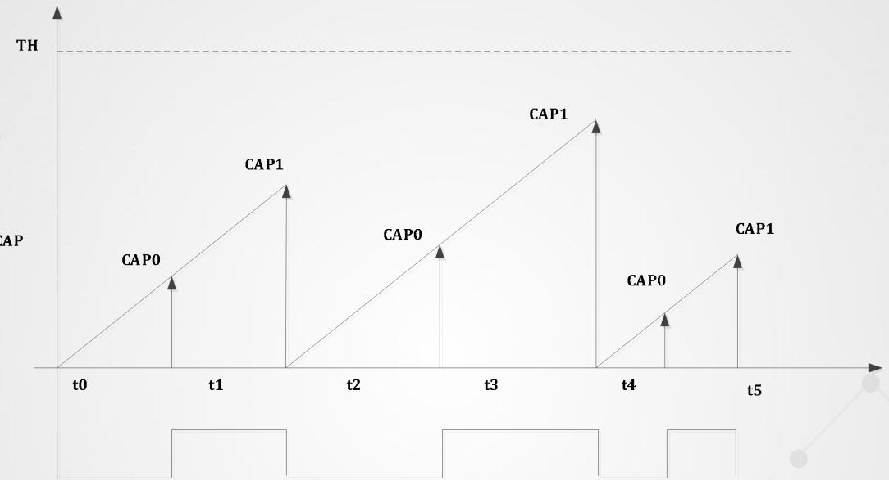

设置了Timer0的通道0/1同时捕获同一个信号，通道0捕获上升沿，通道1捕获下降沿。且使能CAPO\_CLR\_EN，即发生通道0捕获事件时UTIMER\_CNT自动回零。则当发生发生通道0捕获事件（CAPO）时，UTIMERx\_CMP0记录的值为信号的周期，UTIMERx\_CMP1记录的值为信号高电平的用时。

占空比可以用（CMP0/CMP1）\*100%来计算

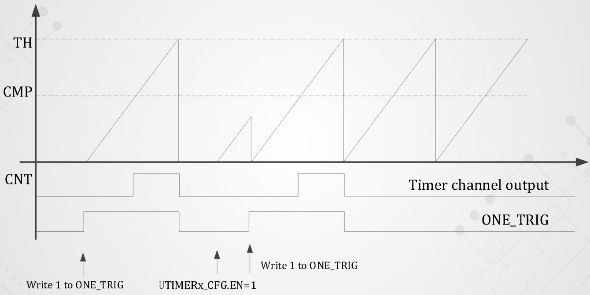

MCPWM 模块，是一个精确控制电机驱动波形输出的模块。

包含两个 16 位递增计数器，用于提供两个计数周期（以下称为两个时基）。

计数器的时钟分频有1/2/4/8四种选项，产生的的分频时钟频率分别为48MHz/24MHz/12MHz/6MHz。通道0/1/2固定使用时基0，通道3固定使用时基1。

MCPWM 模块共包含四个 PWM 生成子模块。

\- 可以产生 4 对（互补信号）或 8 路独立（边沿模式）不交叠的 PWM 信号；

\- 支持边沿对齐 PWM

\- 中心对齐 PWM

\- 移相 PWM

该模块主要是由两个递增计数器组成，其计数门限值为MCPWM\_TH0/MCPWM\_TH1，计数器从t0时刻开始从-TH递增计数，在t1时刻过0点，在t2时刻计数到TH完成一次计数循环，回到-TH，重新开始计数。

计数周期= $(TH \times 2 + 1)$ ×计数时钟周期。

在t0/t1(本次t0即上一次t2)可产生定时事件中断，MCPWM\_IFx.T0\_IF和MCPWM\_IFx.T1\_IF将被置位。

可通过寄存器配置
MCPWM\_TCLK.BASE\_CNT0\_EN/MCPWM\_T
CLK.BASE\_CNT1\_EN控制Base Counter 0/1
的启动和停止。

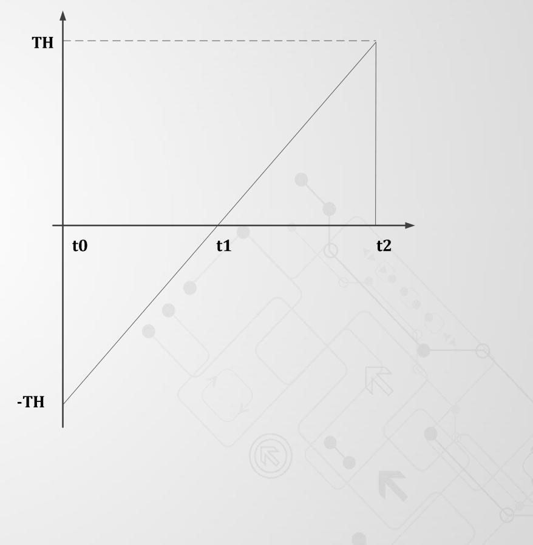

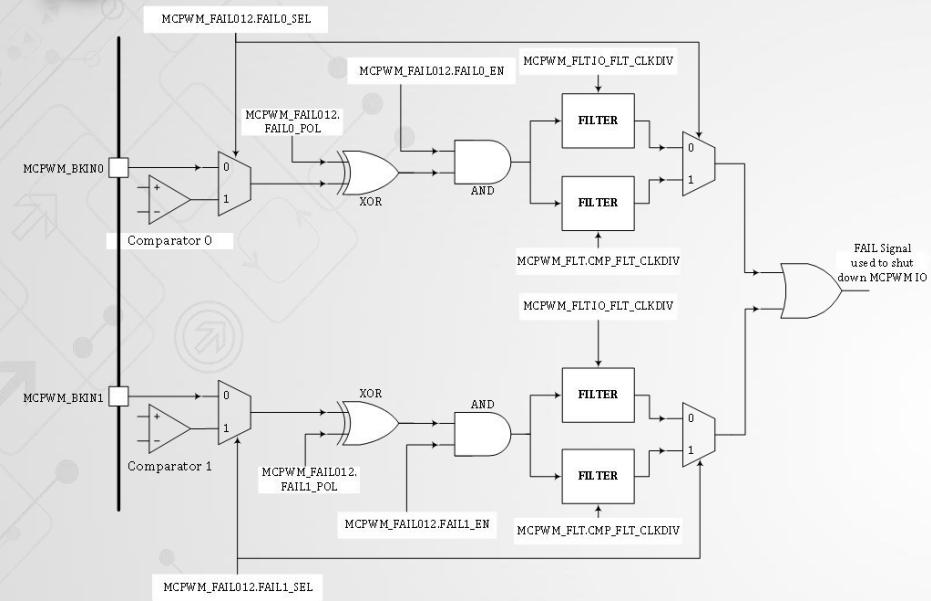

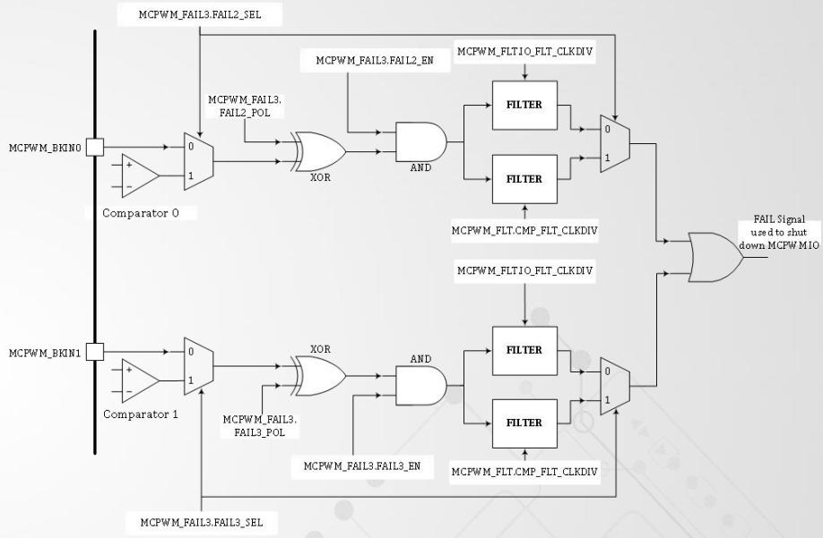

有2路fail信号输入MCPWM，即FAIL0\~FAIL1，分别可以来自芯片IO MCPWM\_BKIN[1:0]或芯片内部比较器的输出CMP[1:0]。

其中MCPWM的P/N通道0/1/2可以选择使用CMP[0]或MCPWM\_BKIN[0]，MCPWM的P/N通道3可以选择使用CMP[1]或MCPWM\_BKIN[1]。

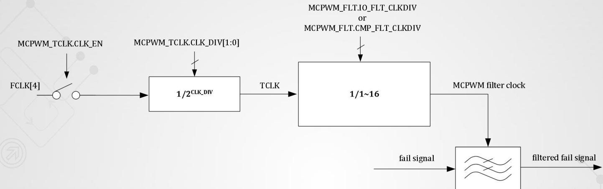  
$\mathrm{T} = \mathrm{T}_{\mathrm{MCLK}} \times (\mathrm{MCPWM\_TCLK.CLK\_DIV}) \times (\mathrm{FLT\_CLKDIV} + 1) \times 16$

➢ 滤波宽度固定为16个周期，即输入信号必须保持至少16个分频时钟周期（两级分频后的时钟）稳定后，硬件才判定其为有效输入信号。

来自比较器的MCPWM FAIL信号为模拟比较器输出的原始信号，未经过比较器数字接口模块的滤波处理，但是可以被MCPWM的通道信号进行开窗控制，开窗控制设置见比较器数字接口模块。FAIL信号进入MCPWM模块后，可以通过设置MCPWM\_TCLK进行滤波。

4个MCPWM IO Driver采用独立的控制门限，独立死区宽度（每一对互补IO的死区需要独立配置，即4个死区配置寄存器），共享数据更新事件。

采用TH<n>0和TH<n>1控制第<n>个MCPWM IO的启动、关闭动作，n为0/1/2/3。

当计数器CNT值向上计数达到TH<n>0(即t3时刻)，关闭CH<n>N，经过死区延时DTH0，打开CH<n>P。

当计数器CNT值向上计数达到TH<n>1(即t4时刻)，关闭CH<n>P，经过死区延DTH1，打开CH<n>N。

采用独立的启动和关闭时间控制，可以提供相位控制的能力。

死区延时保证CH<n>P/CH<n>N不会同时打开，避免短路发生。

▶ t3/t4时刻均会产生相应中断。

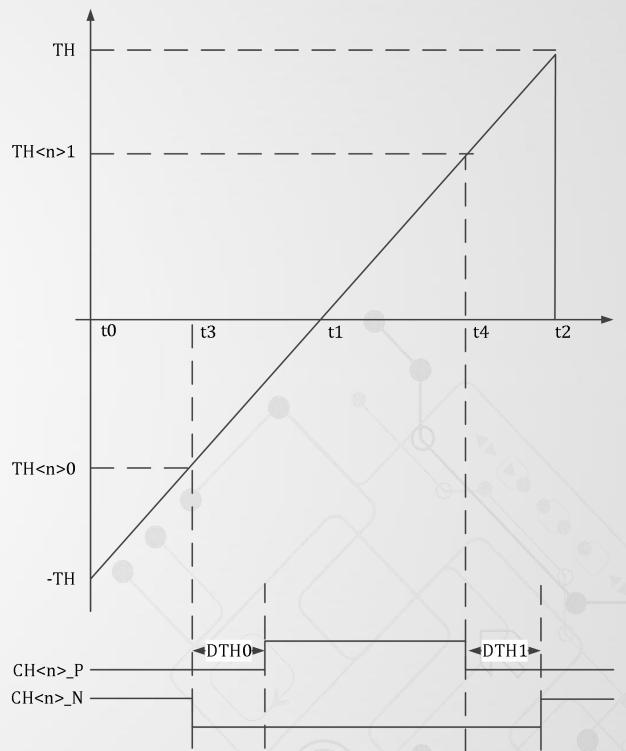

中心对齐推挽模式。第一个周期内，在t3时刻CH<n>P打开，在t4时刻，CH<n>P关闭。第二个周期内，在t3时刻CH<n>N打开，在t4时刻，CH<n>N关闭。

▶ t3/t4时刻均会产生相应中断。

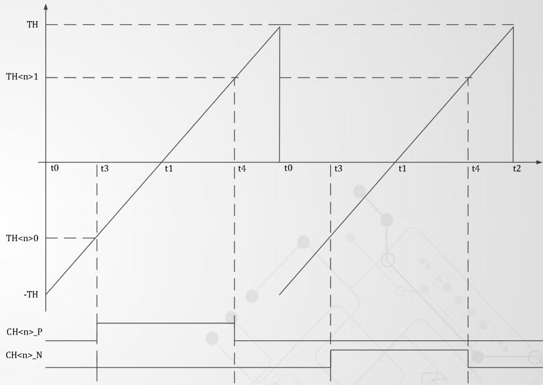

边沿对齐模式。在t0时刻CH<n>P/CH<n>N同时打开，在t3时刻，CH<n>P关闭；在t4时刻，CH<n>N关闭。

▶ t3/t4时刻均会产生相应中断。

边沿对齐模式下，CH<n>P/CH<n>N无需死区保护。

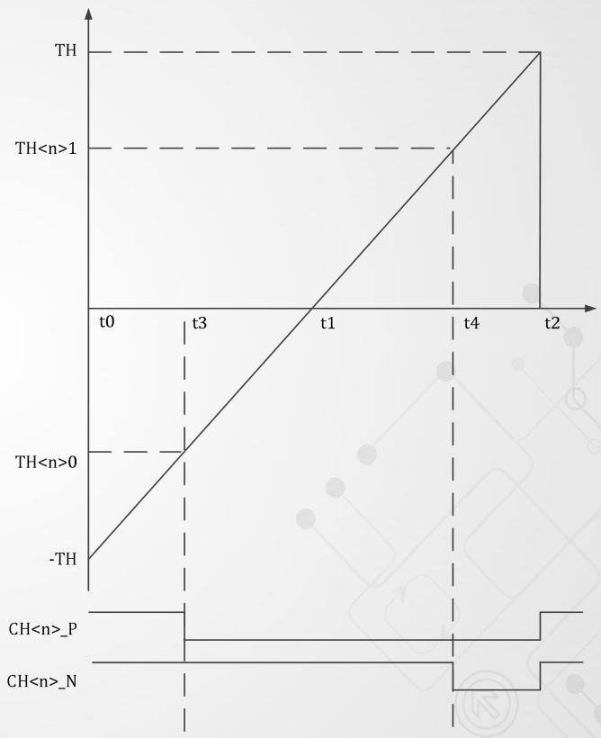

边沿对齐推挽模式。第一个周期内，在t0时刻CH<n>P打开，在t3时刻，CH<n>P关闭。第二个周期内，在t0时刻CH<n>N打开，在t3时刻，CH<n>N关闭。

▶ t0/t3时刻均会产生相应中断。

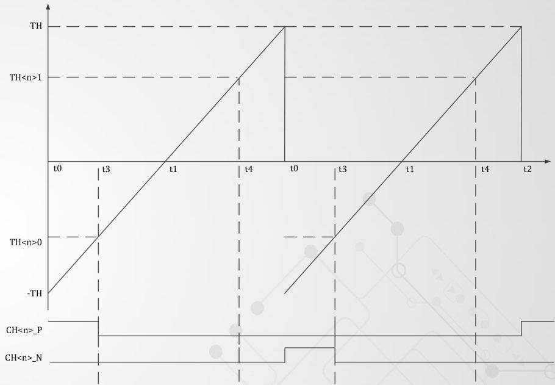

四组MCPWM IO的死区宽度共享同一个死区宽度设置MCPWM\_DTH0/1。

对于互补模式MCPWM IO自动插入死区。

对于边沿对齐模式，MCPWM IO无死区。

在IO Driver模块中增加CH<n>P/CH<n>N冲突检测，发生冲突时，自动将IO拉低，同时给出错误中断（错误中断标志位可软件清除或者硬件自动清除）。

MCPWM IO也可通过软件配置的方式输出，此时，死区控制通过软件实现，如果MCPWM模块配置为中心对齐模式，硬件短路保护机制仍有效，保证P和N不同时打开。

CH<n>P/CH<n>N，在IO上可以互换。

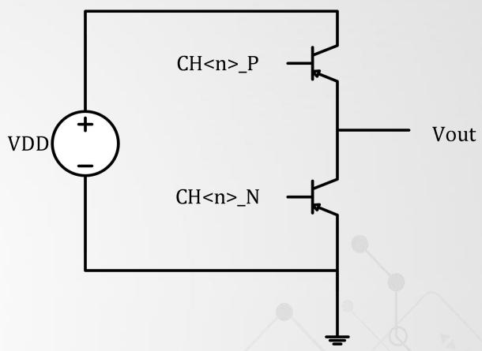

CH<n>P/CH<n>N的有效电平可以配置为高有效/低有效，每个IO的有效电平单独可配。CH<n>P/CH<n>N输出到IO的位置通过软件配置可以互换。

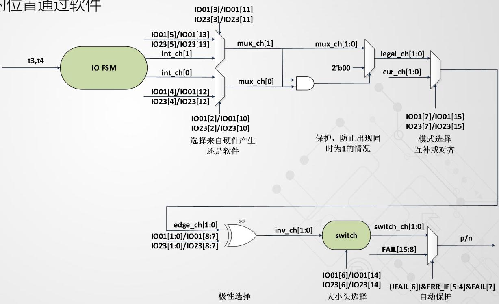

当发生急停事件（Fail事件），应立刻将CH<n>P/CH<n>N自动切换到默认安全电平状态。需要注意默认电平配置（MCPWM\_FAILx.CHxN\_DEFAULT和MCPWM\_FAILx.CHxP\_DEFAULT控制默认电平）。

芯片正常工作后，IO默认输出的电平是寄存器
MCPWM\_FAILx.CHxN\_DEFAULT和
MCPWM\_FAILx.CHxP\_DEFAULT指定值，当用户配置完毕，MCPWM正常工作后，配置
MCPWM\_FAILx.MCPWM\_OE（即MOE）为1，IO输出电平受到MCPWM IO模块控制。

当发生FAIL短路状况时，硬件立即切换到IO默认输出电平。

当芯片调试中，CPU被上位机软件暂停运行时，可暂停MCPWM正常输出，转而输出默认电平值。

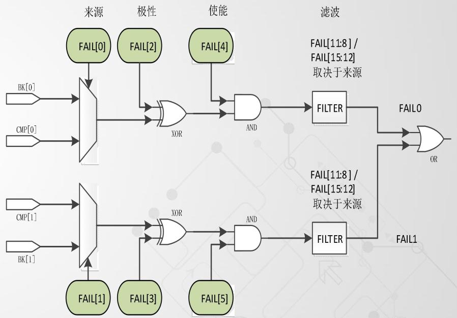

MCPWM可以提供ADC采样控制。当计数器计数到MCPWM\_TMR0/MCPWM\_TMR1/MCPWM\_TMR2/MCPWM\_TMR3时，可产生定时事件，触发ADC采样。该触发信号可同时输出到GPIO，便于调试之用。输出的具体GPIO，参见对应器件的datasheet。

其中MCPWM\_TMR0/MCPWM\_TMR1固定使用时基0，MCPWM\_TMR2/MCPWM\_TMR3可以选择使用时基0/1。

LSK32MC03x 系列芯片共集成了 2 组 GPIO，P0 包含 16 个 GPIO，P1 包含 10 个 GPIO。部分 GPIO 可以作为系统的休眠模式唤醒源。部分 GPIO 可以用作外部中断源输入。

26路GPIO（两组：GPIO0和GPIO1）

推挽开漏模式可配置

部分GPIO支持外部中断

部分GPIO可作为休眠唤醒源

部分GPIO支持输入信号滤波

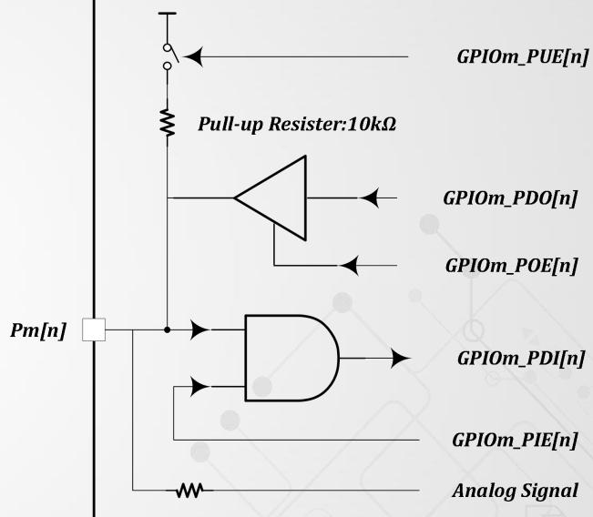

UART模块
➢ 支持全双工工作
➢ 支持单线半双工工作
➢ 支持 8/9 位数据位
➢ 支持 1/2 停止位
➢ 支持奇/偶/无校验模式
➢ 带 1 字节发送缓存
➢ 带 1 字节接收缓存
➢ 支持一主多从的 Multi-drop Slave/Master 模式

UART包括一个字节发送缓冲区，当发送缓冲区有数据时，UART将发送缓冲区的数据移入串行移位寄存器，并通过UART\_TXD端口发送出去。只要UART发送缓冲区有数据，UART就会自动进行发送。

完成加载后，产生发送缓冲区空中断，此时，用户可以往发送缓冲区填入下一个需要发送的字节，这样，发送完成后，UART将加载这个字节进行发送。

完成发送后，会产生发送完成中断。

## 注意事项

如果使用DMA搬运数据，则设置UART\_RE. TX\_BUF\_EMPTY\_RE=1，即TX buffer空就触发DMA搬运新数据到UART；如果使用软件轮询或中断的方式，则设置UART\_IE. TX\_BUF\_EMPTY\_IE=1

如果使用DMA搬运数据到UART发送，需要对DMA进行相应设置

如果使用软件搬运数据到UART发送，需要软件向UART\_BUFF写入数据，可以触发UART开始通过UART\_TXD端口发送数据。

UART包括一个字节的接收缓冲区，当完成一个字节的接收后，会产生接收中断，并将接收到字节存储到接收缓冲区，用户应当在UART接收完成下一个字节前完成此字节的读取，否则缓冲区会被写入新接收的字节。接收部分内部使用高速时钟对UART\_RX信号进行过采样来判定稳态的数据信号，防止噪声干扰造成错误接收。

UART信号上收发的数据格式通常如下：

信号线空闲；

起始比特 (1 bit Start bit: 1 bit Zero)

数据字节 (data word, 8bits or 9bits, LSB first or MSB first)

停止比特 (1/2 bit Stop bit: 1/2bit Ones)

数据字节的长度可以通过UART\_CTRL.BYTE\_LEN进行选择，8bit (UART\_CTRL.BYTE\_LEN=0)或9bit (UART\_CTRL.BYTE\_LEN=1)。起始比特为1bit零，TX信号线为低，停止比特期间TX信号线为高。

停止比特的长度由UART\_CTRL.

需要注意的是，当启用校验位时(UART\_CTR.CK\_EN=1)，校验位会替换掉数据字节的最高bit，即MSB，此时8bit数据字节实际是7bit数据+1bit校验字，9bit数据字节实际是8bit数据+1bit校验字。

UART输入时钟为系统主时钟，波特率通过两级分频实现。

波特率=UART模块时钟/(256\*DIVH+DIVL+1)

可以通过SYS\_CLK\_DIV2对UART模块时钟进行分频.

UART模块时钟 = 系统主时钟 / (1 + SYS\_CLK\_DIV2)

<table><tr><td>UART波特率</td><td>SYS_CLK_DIV2</td><td>UART_DIVH</td><td>UART_DIVL</td></tr><tr><td>150</td><td>0x0007</td><td>0x9C</td><td>0x3F</td></tr><tr><td>300</td><td>0x0003</td><td>0x9C</td><td>0x3F</td></tr><tr><td>600</td><td>0x0001</td><td>0x9C</td><td>0x3F</td></tr><tr><td>1200</td><td>0x0000</td><td>0x9C</td><td>0x3F</td></tr><tr><td>2400</td><td>0x0000</td><td>0x4E</td><td>0x1F</td></tr><tr><td>4800</td><td>0x0000</td><td>0x27</td><td>0x0F</td></tr><tr><td>9600</td><td>0x0000</td><td>0x13</td><td>0x87</td></tr><tr><td>19200</td><td>0x0000</td><td>0x09</td><td>0xC3</td></tr><tr><td>38400</td><td>0x0000</td><td>0x04</td><td>0xE1</td></tr><tr><td>57600</td><td>0x0000</td><td>0x03</td><td>0x40</td></tr><tr><td>115200</td><td>0x0000</td><td>0x01</td><td>0x9F</td></tr></table>

UART模块支持Tx与Rx端口互换。通过将Tx对应的GPIO配置为输入使能，Rx对应的GPIO配置为输出使能，即可实现Tx与Rx端口的互换。此时，GPIO第二功能仍选择为UART，UART本身配置无需修改。

此外，如果要使用一个GPIO同时作为Tx和Rx，需要将IO分时复用为输入或输出，对应Rx或Tx，即可实现单口半双工逻辑。

多机通讯场景通常是一个设备作为主设备 master，另有若干个从设备 slave，主设备的 UARTm\_TXD 端口连接到所有从设备的 UARTs\_RXD 端口，从设备的 UARTs\_TXD 相与连接到主设备的 UARTm\_RXD 端口。

如图所示，为一个主设备和3个从设备（地址分别为0x51,0x52,0x53）的互联情况。

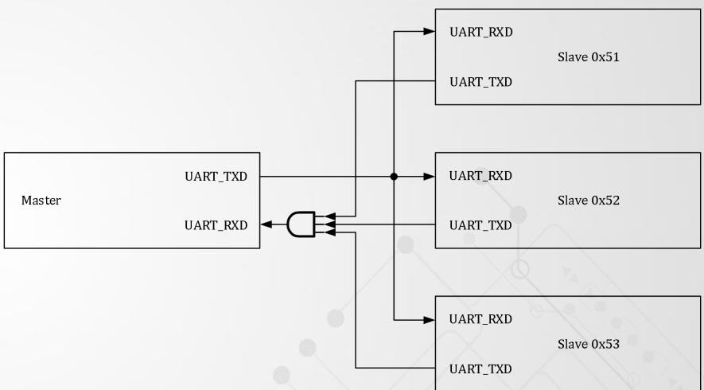

可以通过设置UART\_CTRL.CK\_EN=1来使能校验位。同时根据字节长度UART\_CTRL.BYTE\_LEN不同，UART的帧格式有4种情况。UART\_CTRL.BIT\_ORDER的设置，即LSB first或MSB first不影响帧格式。

<table><tr><td>BYTE_LEN</td><td>CK_EN</td><td>UART frame</td></tr><tr><td>0</td><td>0</td><td>| StartBit | 8bit data BIT[7:0] | StopBit |</td></tr><tr><td>0</td><td>1</td><td>| StartBit | 7bit data BIT[6:0] | Parity | StopBit |</td></tr><tr><td>1</td><td>0</td><td>| StartBit | 9bit data BIT[8:0] | StopBit |</td></tr><tr><td>1</td><td>1</td><td>| StartBit | 8bit data BIT[7:0] | Parity | StopBit |</td></tr></table>

DMA 和 CPU 同为芯片总线的主设备。

如图 17-1 所示。其中部分设备不需要被 DMA 访问，仅仅挂载于与 CPU 相连的总线上。

ADC/DAC/SPI/I2C/MCPWM/UART/Timer/GPIO/Hall/SRAM 等设备可以被 CPU 和 DMA 共享访问。

DMA 有 4 个通道，共享一个搬运引擎。当 DMA 空闲且多个通道同时发生请求时，按优先级进行

仲裁，但在搬运过程中不会发生抢占，即一定是某个通道完成搬运，DMA 空闲后，才会发起仲裁，判断下一个获得请求的通道是哪一个。

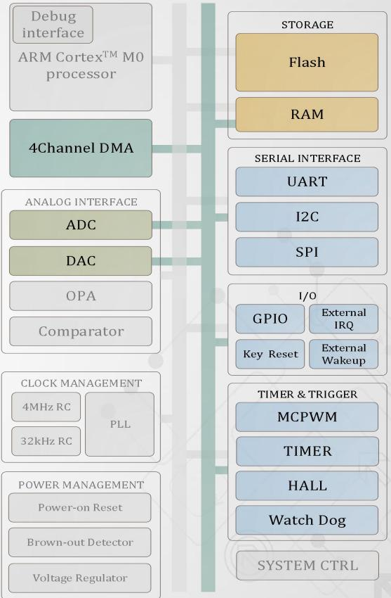

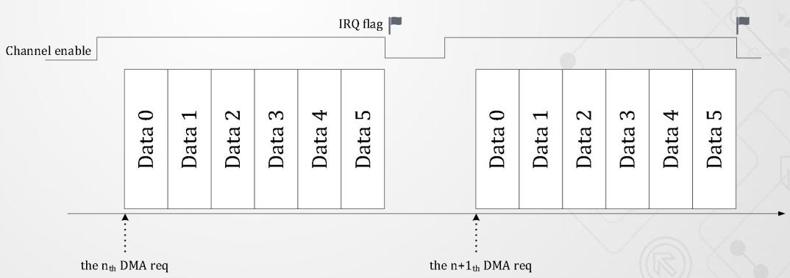

## DMA的传输有两种方式

DMA\_CCRx.RMODE=1，多个轮次，每轮传输内传输一次；DMA\_CCRx.RMODE=0，一轮，连续传输多次。

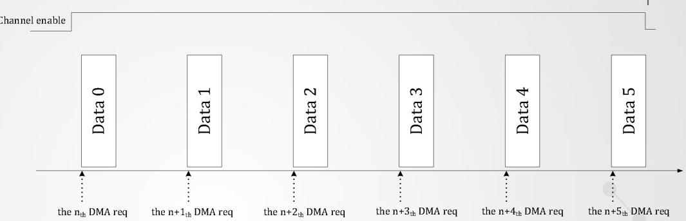

如果配置一轮传输多次数据，即DMA\_CCRx.RMODE=0，则一次DMA请求，DMA连续发送DMA\_CTMSx次数据，然后硬件将DMA\_CCRx.EN位清零，置位中断标志。

循环模式下DMA完成一轮数据块搬运后重新开始下一轮搬运，如果是搬运数据到内存，则覆盖之前搬运至内存的数据；如果是搬运至外设，则重复一轮数据发射。以将UART数据搬运至内存为例，则在循环模式下DMA完成一轮（一字节）搬运后重新开始下一轮搬运，不设置DMA传输完成中断标志位。

注意：循环模式下，如果设置了地址递增，如DMA\_CCRx.SINC或DMA\_CCRx.DINC=1，DMA固定使用256大小的地址空间，达到256后计数回0。通常，循环模式用于UART/SPI/I2C的数据搬运至内存，通过查询DMA\_CTMSx得知传输数据已经累积足够长度后，比如达到一个数据帧的长度，CPU进行数据处理。因此，需要内存中开辟256大小的char型数组。

➢ 03的DSP有两个模块，除法器和开方模块

除法器被除数和除数均为 32 位有符号数，32 个总线周期（48MHz）完成计算。

开方模块被开方数为 32 位无符号数，结果为 16 位无符号数，16 个总线周期（48MHz）完成计算。

DSP

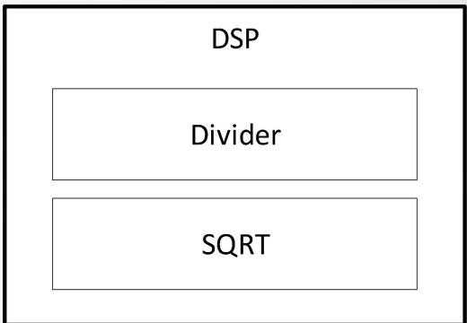

Divider

SQRT

独立看门狗使用 64kHz 低速 RC(LRC/LSI)时钟进行工作，在系统主时钟停止的情况下仍可保证正常工作。

独立看门狗内部包含一个 21bit 递减计数器，启动后从配置值开始递减计数。独立看门狗可以配置产生系统休眠唤醒源，作为定时唤醒源。在超时情况下也可以产生全芯片复位信号。当 MCU 进入深度休眠状态时，包括 PLL/HRC 在内的系统时钟关闭，而 LRC 时钟是一直存在的，所以独立看门狗可以继续正常工作。

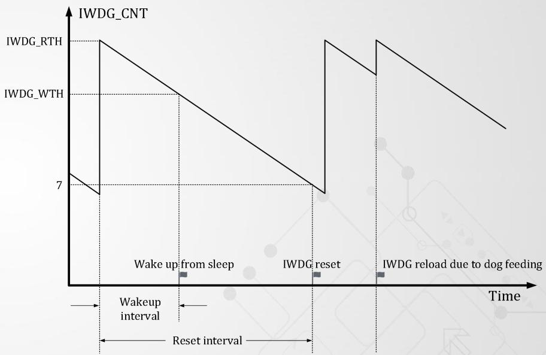

外设时钟由系统高速时钟 MCLK 经过门控或分频而来；当外设不需要使用时可以通过配置 SYS\_CLK\_FEN 寄存器关闭相应的外设时钟。

部分外设有独立的时钟分频模块使得该模块可以工作在合适的较低的的时钟频率上。

低功耗模式

休眠模式下，CPU 时钟被关闭，但 NVIC 模块仍继续工作，所有的外设模块以及 IO 正常工作。

深度休眠模式关闭所有系统高速时钟，包括PLL/HSI。64kHz RC时钟LSI仍正常工作。同时LDO会进入低功耗模式，BGP模块被关闭。

<table><tr><td>模式</td><td>模式进入</td><td>模式退出</td><td>PLL/HSI</td><td>LSI</td></tr><tr><td>休眠Sleep</td><td>WFI/WFE</td><td>任意中断Debug操作外部复位IWDG复位</td><td>PLL/HSI On, CPU时钟Off, NVIC/外设时钟On</td><td rowspan="2">On</td></tr><tr><td>深度休眠Deep Sleep</td><td>SLEEPDEEP + WFI/WFE</td><td>IWDG定时唤醒IO唤醒Debug操作外部复位IWDG复位</td><td>PLL/HSI Off, CPU/外设时钟Off</td></tr></table>

## 与LKS05系列芯片相比

DSP删除三角函数功能，增加除法，开方不变

TIMER只有两路，捕获模式有优化，不用进中断，可以纯硬件实现占空比的捕获

MCPWM通道3使用第二个CNT

多了一个DMA

## 04 官方资料

\- 官方资料获取
- Datasheet 数据手册
- User Manual 用户手册
- Device Pack 器件库
- Demo Board 开发板原理图
- Tools 芯片烧录工具
- 其它

点击链接https://www.linkosemi.com进入凌鸥官网

点击顶部的产品介绍

左边选择LKS03系列即可获取LKS03系列芯片的全部资料

## 产品介绍

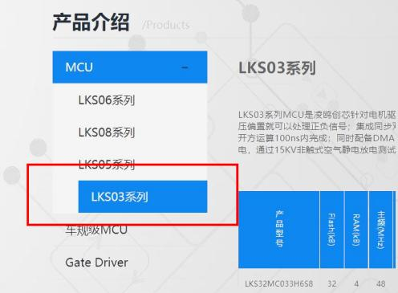

## LKS03系列

## LKS32MC03x

Linko Semiconductor Co., Ltd. 南京凌鸥创芯电子有限公司

## 特性

\- 48MHz 32位 Cortex-M0内核，硬件除法协处理器

\- 30uA低功耗休眠模式

\- -40\~105℃工业级工作温度范围- 2.2V\~5.5V 单电源供电，内部集成数字供电 LDO

○ 超强抗静电和群脉冲能力

## 存储

\- 16kB flash/16kB flash+16kB ROM/32kB flash
三种规格，带 flash 防窃密功能
- 4kB RAM

## 时钟

\- 内置 4MHz 高精度 RC 时钟，全温度范围精度 ±1%
- 内置 64kHz 低速时钟，供低功耗模式使用
- 内部 PLL 可提供最高 48MHz 时钟

## 外设

\- 一路 UART
- 一路 SPI
- 一路 IIC
- 通用16/32位Timer，支持捕捉和边沿对齐PWM
- 电机控制专用PWM模块，支持6路PWM输出，独立死区控制
- Hall信号专用接口，支持测速、去抖
- 4通道DMA
- 硬件看门狗
- 最多支持25路GPIO

## LKS32MC03x

32bit Compact MCU for Motor Control

## 模拟模块

○ 集成 1 路 12bit SAR ADC，1Msps 采样及转换速率，共 11 通道

○ 集成 2 路 OPA，可设置为差分 PGA 模式

集成两路比较器

○ 集成 8bit DAC 数模转换器，作为内部比较器输入

\- 内置1.2V0.5%精度电压基准源

\- 内置1路低功耗LDO和电源监测电路

○ 集成高精度、低温飘高频 RC 时钟

## 主要优势

\- 内部集成2路高速运放，可满足单电阻/双电阻电流采样拓扑架构的不同需求；
- 运放输入端口集成电压钳位保护电路，只需要外加两个限流电阻就可实现MOSFET内阻直接电流采样；

ADC模块变增益技术，可以和高速运放配合，处理更宽的电流动态范围，兼顾小电流和大电流的采样精度；

集成两路比较器；

◇ ESD 及抗干扰能力强，稳定可靠；

单电源 2.2V\~5.5V 供电，确保了系统供电的通用性。

◇ 高集成度、体积小、节约 BOM 成本

## 应用场景

适用于有感BLDC/无感BLDC/有感FOC/无感FOC及步进电机、永磁同步、异步电机等控制系统。适用数字电源控制系统。

数据手册，主要有芯片选型表、管脚分布、封装尺寸、电气性能参数、模拟性能参数和栅极驱动模块等。

## Datasheet

<table><tr><td>Download</td><td>Description</td><td>Version</td><td>Update</td></tr><tr><td>LKS32MC03x_DS</td><td>LKS32MC03x数据手册</td><td>1.7</td><td>2022.03.12</td></tr><tr><td>LKS32MC03x_DS_EN</td><td>LKS32MC03x_Datasheet</td><td>1.7</td><td>2022.03.12</td></tr></table>

## ➢ 用户手册，介绍了03系列芯片各个模块的配置使用方法、寄存器的介绍等

LKS32MC03x User Manual

## LKS32MC03x User Manual

## User Manual

<table><tr><td>Download</td><td>Description</td><td>Version</td><td>Update</td></tr><tr><td>LKS32MC03x_UM</td><td>LKS32MC03x用户手册</td><td>1.3</td><td>2022.03.15</td></tr><tr><td>LKS32MC03x_UM_EN</td><td>LKS32MC03x_User_Manual</td><td>1.3</td><td>2022.03.15</td></tr></table>

机密文件，未经许可不得扩散

© 2021, 版权归凌鸥创芯所有

器件库：提供了 Keil4&Keil5的器件库，其中Keil4为插件形式，Keil5为Pack包

<table><tr><td>Download</td><td>Description</td><td>Version</td><td>Update</td></tr><tr><td>LKS32_Keil4.rar</td><td>LKS32 Keil4 device setup</td><td>1.19</td><td>2022.02.28</td></tr><tr><td>LKS32MC03x_Keil5.rar</td><td>LKS32MC03x Keil5 device files</td><td>1.0.4</td><td>2022.02.28</td></tr></table>

Keil4安装办法：选择 Keil安装目录后点击启动配置即可（所有系列的芯片共用同一个插件）

Keil5器件库安装办法：打开Pack包之后点击Next完成安装（每个系列的芯片独立，不同系列的芯片需要安装不同的Pack包）

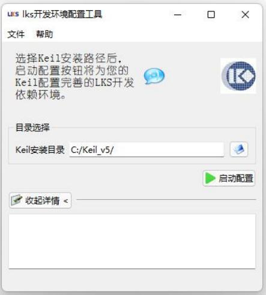  
Keil4安装

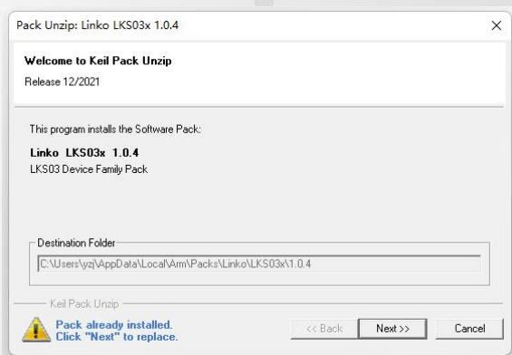  
Keil5安装

开发板原理图：03系列开发板的Altium Designer工程文档（原理图和PCB），包含核心板和功率板，可以作为PCB设计的参考

Demo Board

<table><tr><td>Download</td><td>Description</td><td>Version</td><td>Update</td></tr><tr><td>LKS_EVB_PN_037E</td><td>Single MCU demo board for LKS_EVB_PN_037E</td><td>1.0</td><td>2022.01.04</td></tr><tr><td>LKS_EVB_MCU037</td><td>Single MCU demo board for LKS_EVB_MCU037</td><td>1.0</td><td>2022.01.04</td></tr><tr><td>LKS_EVB_MCU034DO</td><td>Single MCU demo board for LKS_EVB_MCU034DO</td><td>1.0</td><td>2022.01.04</td></tr><tr><td>LKS_EVB_MCU033</td><td>Single MCU demo board for LKS_EVB_MCU033</td><td>1.0</td><td>2022.01.04</td></tr></table>

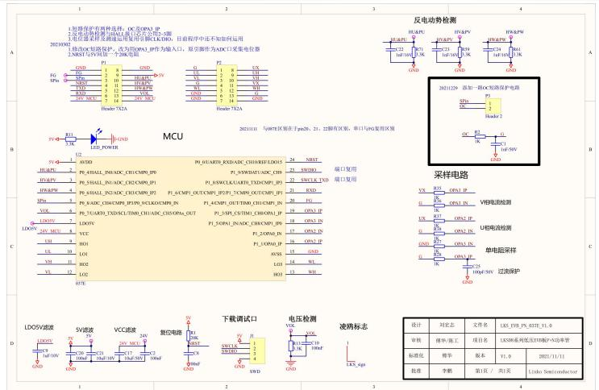

<table><tr><td>设计</td><td>刘宏志</td><td>文件名</td><td colspan="2">LKS_EVB_PN_037E_Y1.0</td></tr><tr><td>审核</td><td>傅华/陈工</td><td>项目名</td><td colspan="2">LKS08系列低压EVB板P=X2功率管</td></tr><tr><td>标准化</td><td>傅华</td><td>版本</td><td>V1.0</td><td>2021/11/11</td></tr><tr><td>批准</td><td>李鹏</td><td colspan="2">第1页/共1页</td><td>Linko Semiconductor</td></tr></table>

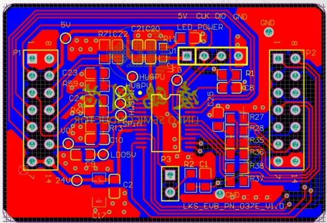

离线烧录工具：Iksflash 使用 Ulink 或 Jlink 通过 SWD 连接单片机，通过操作芯片寄存器来处理芯片的 Flash 数据，实现数据的擦除、下载、读取和校验。

该软件能方便地下载 bin 或 hex 文件数据至 Flash，并自动完成校验。也能方便地读取 Flash 数据，并保存 bin 和 hex 格式的数据文件。

<table><tr><td colspan="2">适配器</td></tr><tr><td>选配器类型</td><td>JLINK</td></tr><tr><td>Max Clock</td><td>1MHz</td></tr><tr><td>刷新设备</td><td>4294967295</td></tr><tr><td>DLL Version</td><td>61606</td></tr><tr><td>HW Version</td><td>92000</td></tr></table>

## Tools

<table><tr><td>Download</td><td>Description</td><td>Version</td><td>Update</td></tr><tr><td>LKS_FLASH</td><td>LKS_Flash离线烧录工具</td><td>1.3.5</td><td>2022.01.11</td></tr></table>

各模块的配置参考：LKS08、05已上传，03更新中

LKSviewer调试工具，内测中，支持串口、无线、SWD在线调试

江苏省南京市经济技术开

发区兴智科技园B栋15层

http://www.linkosemi.com

## 為天地立志 為控制塑魂

创芯驱动，领航电控未来！

正直诚信！利他共赢！成长超越！