LinkoSemiconductorCo.,Ltd.南京凌鸥创芯电子有限公司

## 特性

o 48MHz 32 位 Cortex-M0 内核，硬件除法协处理器

o 低功耗休眠模式，MCU 休眠功耗 30uA

o -40\~105℃工业级工作温度范围

o MCU 采用 2.5V\~5.5V 单电源供电

o 超强抗静电和群脉冲能力

## 存储

o 16kB flash/16kB flash+16kB ROM/32kB flash三种规格，带 flash 防窃密功能

o 4kB RAM

## 时钟

o 内置4MHz 高精度RC时钟，全温度范围精度±1%

o 内置64kHz 低速时钟，供低功耗模式使用

o 内部 PLL 可提供最高 48MHz 时钟

## 外设

o 一路 UART

o 一路 SPI

o 一路 IIC

o 通用16/32 位Timer，支持捕捉和边沿对齐PWM

o 电机控制专用PWM 模块，支持 6路PWM输出，独立死区控制

o Hall 信号专用接口，支持测速、去抖

o 4 通道 DMA

o 硬件看门狗

o 最多支持 25 路 GPIO

## 模拟模块

o 集成 1 路 12bit SAR ADC，1.2Msps 采样及转换速率，共11 通道

o 集成2 路OPA，可设置为差分 PGA模式

o 集成两路比较器

o 集成8bitDAC 数模转换器，作为内部比较器输入

o 内置 1.2V0.5%精度电压基准源

o 内置1 路低功耗LDO 和电源监测电路

o 集成高精度、低温漂高频RC时钟

## 主要优势

 内部集成2 路高速运放，可满足单电阻/双电阻电流采样拓扑架构的不同需求

 运放输入端口集成电压钳位保护电路，只需要外加两个限流电阻就可实现MOSFET内阻直接电流采样

 ADC模块变增益技术，可以和高速运放配合，处理更宽的电流动态范围，兼顾小电流和大电流的采样精度

 集成两路比较器

 ESD及抗干扰能力强，稳定可靠

 高集成度、体积小、节约BOM成本

 支持 IEC/UL60730 功能安全认证

## 应用场景

适用于有感 BLDC/无感 BLDC/有感 FOC/无感FOC及步进电机、永磁同步、异步电机等控制系统。适用数字电源控制系统。

## 1 概述

## 1.1 功能简述

LKS32MC03x\_6N 系列是32 位内核的面向电机控制应用的紧凑型MCU，集成了三相全桥自举式栅极驱动模块，可直接驱动 6个N型MOSFET。

## ⚫ 性能

➢ 48MHz 32 位 Cortex-M0 内核

➢ 低功耗休眠模式

➢ 集成三相全桥自举式栅极驱动模块

➢ 工业级工作温度范围

➢ 超强抗静电和群脉冲能力

## ⚫ 存储器

➢ 32kBFlash，带加密功能，带128 位芯片唯一识别码

➢ 4kB RAM

➢ 工作温度: -40\~105℃

## ⚫ 时钟

➢ 内置 4MHz 高精度 RC 时钟，-40\~105℃范围内精度在±1%之内

➢ 内置低速64kHz 低速时钟，供低功耗模式使用

➢ 内部 PLL 可提供最高 48MHz 时钟

## ⚫ 外设模块

➢ 一路 UART

➢ 一路SPI，支持主从模式

➢ 一路 IIC，支持主从模式

➢ 1 个通用16位 Timer，支持捕捉和边沿对齐 PWM功能

➢ 1 个通用32位 Timer，支持捕捉和边沿对齐 PWM功能；

➢ 电机控制专用PWM 模块，支持8路 PWM输出，独立死区控制

➢ Hall 信号专用接口，支持测速、去抖功能

➢ 硬件看门狗

➢ 25 路 GPIO。8 个 GPIO 可以作为系统的唤醒源。17 个 GPIO 可以用作外部中断源输入

## ⚫ 模拟模块

➢ 集成 1 路 12bit SAR ADC，1.2Msps 采样及转换速率，共 11 通道

➢ 集成2 通道运算放大器，可设置为差分 PGA模式

➢ 集成两路比较器

➢ 集成 8bit DAC 数模转换器

➢ 内置±2℃温度传感器

➢ 内置 1.2V 0.5%精度电压基准源

➢ 内置1 路低功耗 LDO 和电源监测电路

➢ 集成高精度、低温飘高频RC时钟

## 1.2 主要优势

➢ 高可靠性、高集成度、最终产品体积小、节约 BOM成本。

➢ 内部集成 2 通道高速运放和两路比较器，可满足单电阻/双电阻电流采样拓扑架构的不同需求；

➢ 内部高速运放集成高压保护电路，可以允许高电平共模信号直接输入芯片，可以用最简单的电路拓扑实现 MOSFET电阻直接电流采样模式；

➢ 应用专利技术使 ADC和高速运放达到最佳配合，可处理更宽的电流动态范围，同时兼顾高速小电流和低速大电流的采样精度；

➢ 整体控制电路简洁高效，抗干扰能力强，稳定可靠；

➢ 集成三相全桥自举式栅极驱动模块；

适用于有感BLDC/无感BLDC/有感 FOC/无感 FOC 及步进电机、永磁同步、异步电机等控制系统。

## 1.3 命名规则

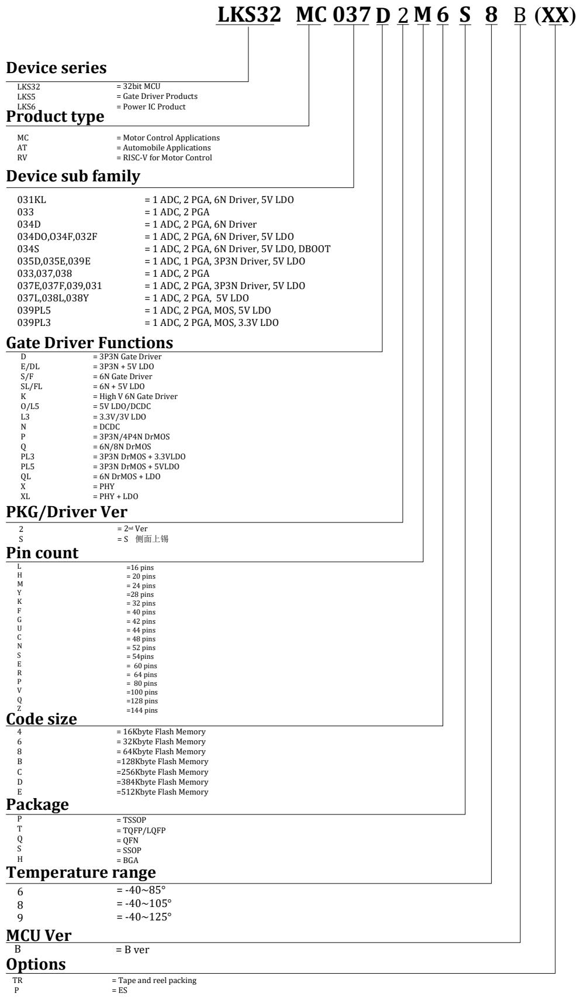  
图 1-1 LKS32MC03x 器件命名规则

## 1.4 系统资源

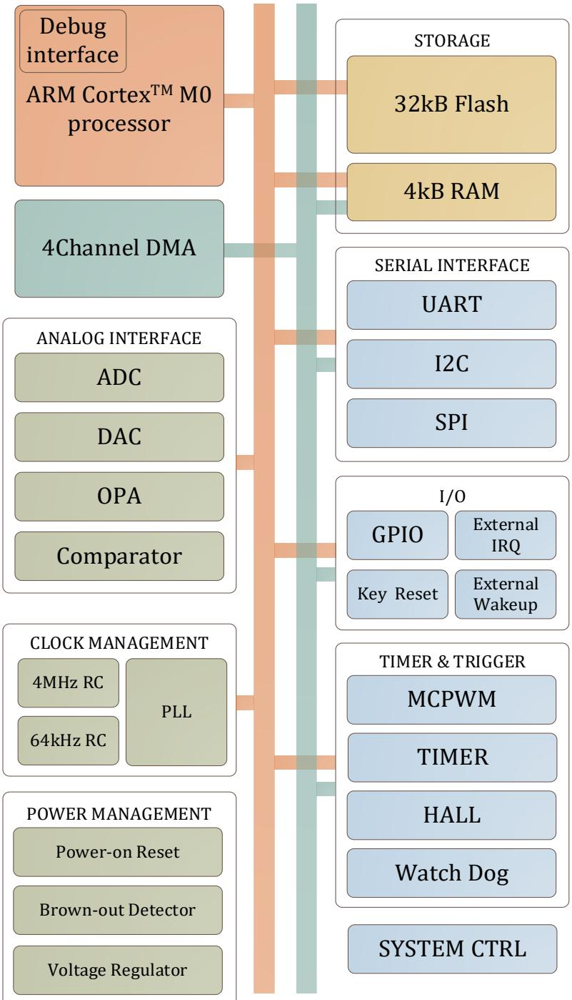  
图 1-2 LKS32MC03x 系统框图

## 1.5 矢量正弦控制系统

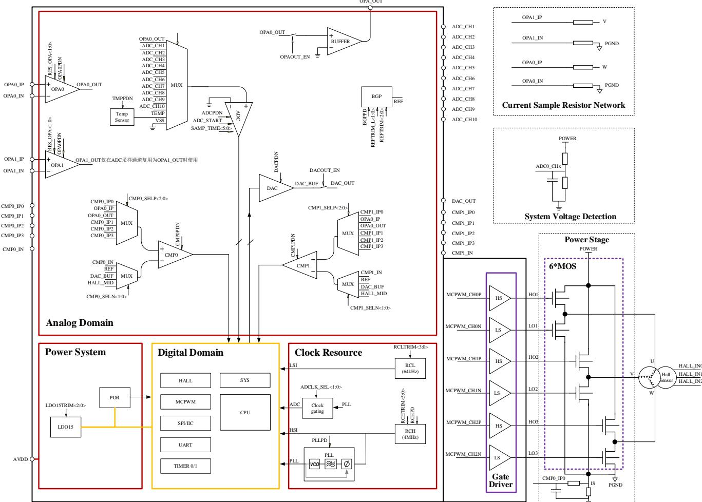  
图 1-3LKS32MC03x 矢量正弦控制系统简化原理图

## 2 器件选型表

表 2-1 LKS32MC03x 系列器件选型表

<table><tr><td></td><td>Frequency (MHz)</td><td>Flash (kB)</td><td>RAM (kB)</td><td>ADC ch.</td><td>DAC</td><td>Comparator</td><td>Comparator ch.</td><td>OPA</td><td>HALL</td><td>SPI</td><td>IIC</td><td>UART</td><td>Temp. Sensor</td><td>PLL</td><td>Gate driver</td><td>Gate Driver current (A)</td><td>Pre-drive supply (V)</td><td>Gate floating voltage (V)</td><td>Others</td><td>Package</td></tr><tr><td>LKS32MC031KLC6T8B</td><td>48</td><td>32</td><td>4</td><td>9</td><td>8BITx1</td><td>2</td><td>8</td><td>2</td><td>3</td><td>1</td><td>1</td><td>1</td><td>Yes</td><td>Yes</td><td>6N</td><td>+0.2/-0.35</td><td>13-20</td><td>600</td><td>5V LDO</td><td>LQFP48L 0707</td></tr><tr><td>LKS32MC031KLC6T8C</td><td>48</td><td>32</td><td>4</td><td>9</td><td>8BITx1</td><td>2</td><td>8</td><td>2</td><td>3</td><td>1</td><td>1</td><td>1</td><td>Yes</td><td>Yes</td><td>6N</td><td>+0.2/-0.35</td><td>13-20</td><td>600</td><td>5V LDO</td><td>LQFP48L 0707</td></tr><tr><td>LKS32MC031PC6Q8C*</td><td>48</td><td>32</td><td>4</td><td>9</td><td>8BITx1</td><td>2</td><td>6</td><td>2</td><td>3</td><td>1</td><td>1</td><td>1</td><td>Yes</td><td>Yes</td><td>3P3N</td><td>+0.05/-0.3</td><td>5.7-28</td><td></td><td>5V LDO</td><td>DFN5.0*6.0 48L</td></tr><tr><td>LKS32MC032LK6T8C</td><td>48</td><td>32</td><td>4</td><td>9</td><td>8BITx1</td><td>2</td><td>8</td><td>2</td><td>3</td><td>1</td><td>1</td><td>1</td><td>Yes</td><td>Yes</td><td></td><td></td><td></td><td></td><td></td><td>LQFP32</td></tr><tr><td>LKS32MC033H6P8</td><td>48</td><td>32</td><td>4</td><td>7</td><td>8BITx1</td><td>2</td><td>5</td><td>1</td><td>3</td><td>1</td><td>1</td><td>1</td><td>Yes</td><td>Yes</td><td></td><td></td><td></td><td></td><td></td><td>TSSOP20L</td></tr><tr><td>LKS32MC033H6P8B</td><td>48</td><td>32</td><td>4</td><td>7</td><td>8BITx1</td><td>2</td><td>5</td><td>2</td><td>3</td><td>1</td><td>1</td><td>1</td><td>Yes</td><td>Yes</td><td></td><td></td><td></td><td></td><td></td><td>TSSOP20L</td></tr><tr><td>LKS32MC033H6P8C</td><td>48</td><td>32</td><td>4</td><td>7</td><td>8BITx1</td><td>2</td><td>5</td><td>2</td><td>3</td><td>1</td><td>1</td><td>1</td><td>Yes</td><td>Yes</td><td></td><td></td><td></td><td></td><td></td><td>TSSOP20L</td></tr><tr><td>LKS32MC033H6Q8</td><td>48</td><td>32</td><td>4</td><td>7</td><td>8BITx1</td><td>2</td><td>5</td><td>1</td><td>3</td><td>1</td><td>1</td><td>1</td><td>Yes</td><td>Yes</td><td></td><td></td><td></td><td></td><td></td><td>QFN3*3 20L-0.75</td></tr><tr><td>LKS32MC033H6Q8B</td><td>48</td><td>32</td><td>4</td><td>7</td><td>8BITx1</td><td>2</td><td>5</td><td>1</td><td>3</td><td>1</td><td>1</td><td>1</td><td>Yes</td><td>Yes</td><td></td><td></td><td></td><td></td><td></td><td>QFN3*3 20L-0.75</td></tr><tr><td>LKS32MC033H6Q8C</td><td>48</td><td>32</td><td>4</td><td>7</td><td>8BITx1</td><td>2</td><td>5</td><td>1</td><td>3</td><td>1</td><td>1</td><td>1</td><td>Yes</td><td>Yes</td><td></td><td></td><td></td><td></td><td></td><td>QFN3*3 20L-0.75</td></tr><tr><td>LKS32MC034DF6Q8</td><td>48</td><td>32</td><td>4</td><td>9</td><td>8BITx1</td><td>2</td><td>8</td><td>2</td><td>3</td><td>1</td><td>1</td><td>1</td><td>Yes</td><td>Yes</td><td>6N</td><td>+1/-1</td><td>7-20</td><td>200</td><td></td><td>QFN5*5 40L-0.75</td></tr><tr><td>LKS32MC034DF6Q8B</td><td>48</td><td>32</td><td>4</td><td>10</td><td>8BITx1</td><td>2</td><td>8</td><td>2</td><td>3</td><td>1</td><td>1</td><td>1</td><td>Yes</td><td>Yes</td><td>6N</td><td>+1/-1</td><td>7-20</td><td>200</td><td></td><td>QFN5*5 40L-0.75</td></tr><tr><td>LKS32MC034DF6Q8C</td><td>48</td><td>32</td><td>4</td><td>10</td><td>8BITx1</td><td>2</td><td>8</td><td>2</td><td>3</td><td>1</td><td>1</td><td>1</td><td>Yes</td><td>Yes</td><td>6N</td><td>+1/-1</td><td>7-20</td><td>200</td><td></td><td>QFN5*5 40L-0.75</td></tr><tr><td>LKS32MC034DOF6Q8</td><td>48</td><td>32</td><td>4</td><td>9</td><td>8BITx1</td><td>2</td><td>8</td><td>2</td><td>3</td><td>1</td><td>1</td><td>1</td><td>Yes</td><td>Yes</td><td>6N</td><td>+1/-1</td><td>7-20</td><td>200</td><td>5V LDO</td><td>QFN5*5 40L-0.75</td></tr><tr><td>LKS32MC034DOF6Q8B</td><td>48</td><td>32</td><td>4</td><td>10</td><td>8BITx1</td><td>2</td><td>8</td><td>2</td><td>3</td><td>1</td><td>1</td><td>1</td><td>Yes</td><td>Yes</td><td>6N</td><td>+1/-1</td><td>7-20</td><td>200</td><td>5V LDO</td><td>QFN5*5 40L-0.75</td></tr><tr><td>LKS32MC034DOF6Q8C</td><td>48</td><td>32</td><td>4</td><td>10</td><td>8BITx1</td><td>2</td><td>8</td><td>2</td><td>3</td><td>1</td><td>1</td><td>1</td><td>Yes</td><td>Yes</td><td>6N</td><td>+1/-1</td><td>7-20</td><td>200</td><td>5V LDO</td><td>QFN5*5 40L-0.75</td></tr><tr><td>LKS32MC034SF6Q8</td><td>48</td><td>32</td><td>4</td><td>9</td><td>8BITx1</td><td>2</td><td>8</td><td>2</td><td>3</td><td>1</td><td>1</td><td>1</td><td>Yes</td><td>Yes</td><td>6N</td><td>+1/-1.2</td><td>4.5-20</td><td>200</td><td>5V LDO</td><td>QFN5*5 40L-0.75</td></tr><tr><td>LKS32MC034SF6Q8B</td><td>48</td><td>32</td><td>4</td><td>10</td><td>8BITx1</td><td>2</td><td>8</td><td>2</td><td>3</td><td>1</td><td>1</td><td>1</td><td>Yes</td><td>Yes</td><td>6N</td><td>+1/-1.2</td><td>4.5-20</td><td>200</td><td>5V LDO</td><td>QFN5*5 40L-0.75</td></tr></table>

器件选型表

<table><tr><td>LKS32MC034SF6Q8C</td><td>48</td><td>32</td><td>4</td><td>10</td><td>8BITx1</td><td>2</td><td>8</td><td>2</td><td>3</td><td>1</td><td>1</td><td>1</td><td>Yes</td><td>Yes</td><td>6N</td><td>+1/-1.2</td><td>4.5-20</td><td>200</td><td>5V LDO</td><td>QFN5*5 40L-0.75</td></tr><tr><td>LKS32MC034S2F6Q8B</td><td>48</td><td>32</td><td>4</td><td>10</td><td>8BITx1</td><td>2</td><td>8</td><td>2</td><td>3</td><td>1</td><td>1</td><td>1</td><td>Yes</td><td>Yes</td><td>6N</td><td>+1/-1.2</td><td>4.5-20</td><td>200</td><td>5V LDO</td><td>QFN5*5 40L-0.75</td></tr><tr><td>LKS32MC034S2F6Q8C</td><td>48</td><td>32</td><td>4</td><td>10</td><td>8BITx1</td><td>2</td><td>8</td><td>2</td><td>3</td><td>1</td><td>1</td><td>1</td><td>Yes</td><td>Yes</td><td>6N</td><td>+1/-1.2</td><td>4.5-20</td><td>200</td><td>5V LDO</td><td>QFN5*5 40L-0.75</td></tr><tr><td>LKS32MC034FLF6Q8B</td><td>48</td><td>32</td><td>4</td><td>10</td><td>8BITx1</td><td>2</td><td>8</td><td>2</td><td>3</td><td>1</td><td>1</td><td>1</td><td>Yes</td><td>Yes</td><td>6N</td><td>+1/-1.2</td><td>4.5-20</td><td>200</td><td>5V LDO</td><td>QFN5*5 40L-0.75</td></tr><tr><td>LKS32MC034FLF6Q8C</td><td>48</td><td>32</td><td>4</td><td>10</td><td>8BITx1</td><td>2</td><td>8</td><td>2</td><td>3</td><td>1</td><td>1</td><td>1</td><td>Yes</td><td>Yes</td><td>6N</td><td>+1/-1.2</td><td>4.5-20</td><td>200</td><td>5V LDO</td><td>QFN5*5 40L-0.75</td></tr><tr><td>LKS32MC034F2LF6Q8C</td><td>48</td><td>32</td><td>4</td><td>8</td><td>8BITx1</td><td>2</td><td>7</td><td>2</td><td>3</td><td>0</td><td>1</td><td>1</td><td>Yes</td><td>Yes</td><td>6N</td><td>+1/-1</td><td>-0.3-48</td><td>90</td><td>5V LDO</td><td>QFN5*5 40L-0.75</td></tr><tr><td>LKS32MC034F2LM6Q8C</td><td>48</td><td>32</td><td>4</td><td>5</td><td>8BITx1</td><td>2</td><td>3</td><td>2</td><td>2</td><td>0</td><td>1</td><td>1</td><td>Yes</td><td>Yes</td><td>6N</td><td>+1/-1</td><td>-0.3-48</td><td>90</td><td>5V LDO</td><td>QFN4*4 24L-0.75</td></tr><tr><td>LKS32MC034FLNK6Q8C</td><td>48</td><td>32</td><td>4</td><td>5</td><td>8BITx1</td><td>2</td><td></td><td></td><td></td><td></td><td></td><td></td><td>Yes</td><td>Yes</td><td>6N</td><td>+1/-1.2</td><td>4.5-20</td><td>200</td><td>5V LDO</td><td>QFN4*4 32L-0.75</td></tr><tr><td>LKS32MC034F2LNK6Q8C</td><td>48</td><td>32</td><td>4</td><td>5</td><td>8BITx1</td><td>2</td><td>4</td><td>2</td><td>3</td><td>0</td><td>1</td><td>1</td><td>Yes</td><td>Yes</td><td>6N</td><td>+1/-1</td><td>-0.3-48</td><td>90</td><td>5V LDO</td><td>QFN4*4 32L-0.75</td></tr><tr><td>LKS32MC0342FLK6Q8C</td><td>48</td><td>32</td><td>4</td><td>10</td><td>8BITx1</td><td>2</td><td>8</td><td>2</td><td>3</td><td>1</td><td>1</td><td>1</td><td>Yes</td><td>Yes</td><td>6N</td><td>+1/-1</td><td>-0.3-48</td><td>200</td><td>5V LDO</td><td>QFN4*4 32L-0.75</td></tr><tr><td>LKS32MC035DL6S8</td><td>48</td><td>32</td><td>4</td><td>6</td><td>8BITx1</td><td>2</td><td>4</td><td>1</td><td>3</td><td>1</td><td>1</td><td>1</td><td>Yes</td><td>Yes</td><td>3P3N</td><td>+0.05/-0.3</td><td>7.5-28</td><td></td><td>5V LDO</td><td>SOP16L</td></tr><tr><td>LKS32MC035DL6S8B</td><td>48</td><td>32</td><td>4</td><td>5</td><td>8BITx1</td><td>2</td><td>4</td><td>1</td><td>3</td><td>1</td><td>1</td><td>1</td><td>Yes</td><td>Yes</td><td>3P3N</td><td>+0.05/-0.3</td><td>7.5-28</td><td></td><td>5V LDO</td><td>SOP16L</td></tr><tr><td>LKS32MC035DL6S8C</td><td>48</td><td>32</td><td>4</td><td>5</td><td>8BITx1</td><td>2</td><td>4</td><td>1</td><td>3</td><td>1</td><td>1</td><td>1</td><td>Yes</td><td>Yes</td><td>3P3N</td><td>+0.05/-0.3</td><td>7.5-28</td><td></td><td>5V LDO</td><td>SOP16L</td></tr><tr><td>LKS32MC035EL6S8B</td><td>48</td><td>32</td><td>4</td><td>5</td><td>8BITx1</td><td>2</td><td>4</td><td>1</td><td>3</td><td>1</td><td>1</td><td>1</td><td>Yes</td><td>Yes</td><td>3P3N</td><td>+0.05/-0.3</td><td>5.7-28</td><td></td><td>5V LDO</td><td>SOP16L</td></tr><tr><td>LKS32MC035EL6S8C</td><td>48</td><td>32</td><td>4</td><td>5</td><td>8BITx1</td><td>2</td><td>4</td><td>1</td><td>3</td><td>1</td><td>1</td><td>1</td><td>Yes</td><td>Yes</td><td>3P3N</td><td>+0.05/-0.3</td><td>5.7-28</td><td></td><td>5V LDO</td><td>SOP16L</td></tr><tr><td>LKS32MC037M6S8</td><td>48</td><td>32</td><td>4</td><td>9</td><td>8BITx1</td><td>2</td><td>8</td><td>2</td><td>3</td><td>1</td><td>1</td><td>1</td><td>Yes</td><td>Yes</td><td></td><td></td><td></td><td></td><td></td><td>SSOP24L</td></tr><tr><td>LKS32MC037M6S8B</td><td>48</td><td>32</td><td>4</td><td>10</td><td>8BITx1</td><td>2</td><td>8</td><td>2</td><td>3</td><td>1</td><td>1</td><td>1</td><td>Yes</td><td>Yes</td><td></td><td></td><td></td><td></td><td></td><td>SSOP24L</td></tr><tr><td>LKS32MC037M6S8C</td><td>48</td><td>32</td><td>4</td><td>10</td><td>8BITx1</td><td>2</td><td>8</td><td>2</td><td>3</td><td>1</td><td>1</td><td>1</td><td>Yes</td><td>Yes</td><td></td><td></td><td></td><td></td><td></td><td>SSOP24L</td></tr><tr><td>LKS32MC037EM6S8</td><td>48</td><td>32</td><td>4</td><td>9</td><td>8BITx1</td><td>2</td><td>7</td><td>2</td><td>3</td><td>1</td><td>1</td><td>1</td><td>Yes</td><td>Yes</td><td>3P3N</td><td>+0.05/-0.3</td><td>7.5-28</td><td></td><td>5V LDO</td><td>SSOP24L</td></tr><tr><td>LKS32MC037EM6S8B</td><td>48</td><td>32</td><td>4</td><td>9</td><td>8BITx1</td><td>2</td><td>7</td><td>2</td><td>3</td><td>1</td><td>1</td><td>1</td><td>Yes</td><td>Yes</td><td>3P3N</td><td>+0.05/-0.3</td><td>7.5-28</td><td></td><td>5V LDO</td><td>SSOP24L</td></tr><tr><td>LKS32MC037EM6S8C</td><td>48</td><td>32</td><td>4</td><td>9</td><td>8BITx1</td><td>2</td><td>7</td><td>2</td><td>3</td><td>1</td><td>1</td><td>1</td><td>Yes</td><td>Yes</td><td>3P3N</td><td>+0.05/-0.3</td><td>7.5-28</td><td></td><td>5V LDO</td><td>SSOP24L</td></tr><tr><td>LKS32MC037FM6S8B</td><td>48</td><td>32</td><td>4</td><td>8</td><td>8BITx1</td><td>2</td><td>7</td><td>2</td><td>3</td><td>1</td><td>1</td><td>1</td><td>Yes</td><td>Yes</td><td>3P3N</td><td>+0.05/-0.3</td><td>5.7-28</td><td></td><td>5V LDO</td><td>SSOP24L</td></tr><tr><td>LKS32MC037FM6S8C</td><td>48</td><td>32</td><td>4</td><td>8</td><td>8BITx1</td><td>2</td><td>7</td><td>2</td><td>3</td><td>1</td><td>1</td><td>1</td><td>Yes</td><td>Yes</td><td>3P3N</td><td>+0.05/-0.3</td><td>5.7-28</td><td></td><td>5V LDO</td><td>SSOP24L</td></tr><tr><td>LKS32MC037LM6S8B</td><td>48</td><td>32</td><td>4</td><td>9</td><td>8BITx1</td><td>2</td><td>8</td><td>2</td><td>3</td><td>1</td><td>1</td><td>1</td><td>Yes</td><td>Yes</td><td></td><td></td><td></td><td></td><td>5V LDO</td><td>SSOP24L</td></tr><tr><td>LKS32MC037LM6S8C</td><td>48</td><td>32</td><td>4</td><td>9</td><td>8BITx1</td><td>2</td><td>8</td><td>2</td><td>3</td><td>1</td><td>1</td><td>1</td><td>Yes</td><td>Yes</td><td></td><td></td><td></td><td></td><td>5V LDO</td><td>SSOP24L</td></tr><tr><td>LKS32MC037QM6Q8</td><td>48</td><td>32</td><td>4</td><td>9</td><td>8BITx1</td><td>2</td><td>7</td><td>2</td><td>3</td><td>1</td><td>1</td><td>1</td><td>Yes</td><td>Yes</td><td>3P3N</td><td>+0.05/-0.3</td><td>7.5-28</td><td></td><td>5V LDO</td><td>QFN4*4 24L-0.75</td></tr></table>

## 器件选型表

<table><tr><td>LKS32MC037QM6Q8B</td><td>48</td><td>32</td><td>4</td><td>9</td><td>8BITx1</td><td>2</td><td>7</td><td>2</td><td>3</td><td>1</td><td>1</td><td>1</td><td>Yes</td><td>Yes</td><td>3P3N</td><td>+0.05/-0.3</td><td>7.5-28</td><td></td><td>5V LDO</td><td>QFN4*4 24L-0.75</td></tr><tr><td>LKS32MC037QM6Q8C</td><td>48</td><td>32</td><td>4</td><td>9</td><td>8BITx1</td><td>2</td><td>7</td><td>2</td><td>3</td><td>1</td><td>1</td><td>1</td><td>Yes</td><td>Yes</td><td>3P3N</td><td>+0.05/-0.3</td><td>7.5-28</td><td></td><td>5V LDO</td><td>QFN4*4 24L-0.75</td></tr><tr><td>LKS32MC037Q2M6Q8C</td><td>48</td><td>32</td><td>4</td><td>9</td><td>8BITx1</td><td>2</td><td>7</td><td>2</td><td>3</td><td>1</td><td>1</td><td>1</td><td>Yes</td><td>Yes</td><td>3P3N</td><td>+0.05/-0.3</td><td>5.7-28</td><td></td><td>5V LDO</td><td>QFN4*4 24L-0.75</td></tr><tr><td>LKS32MC038Y6P8</td><td>48</td><td>32</td><td>4</td><td>9</td><td>8BITx1</td><td>2</td><td>8</td><td>2</td><td>3</td><td>1</td><td>1</td><td>1</td><td>Yes</td><td>Yes</td><td></td><td></td><td></td><td></td><td></td><td>TSSOP28L</td></tr><tr><td>LKS32MC038Y6P8B</td><td>48</td><td>32</td><td>4</td><td>10</td><td>8BITx1</td><td>2</td><td>8</td><td>2</td><td>3</td><td>1</td><td>1</td><td>1</td><td>Yes</td><td>Yes</td><td></td><td></td><td></td><td></td><td></td><td>TSSOP28L</td></tr><tr><td>LKS32MC038Y6P8C</td><td>48</td><td>32</td><td>4</td><td>10</td><td>8BITx1</td><td>2</td><td>8</td><td>2</td><td>3</td><td>1</td><td>1</td><td>1</td><td>Yes</td><td>Yes</td><td></td><td></td><td></td><td></td><td></td><td>TSSOP28L</td></tr><tr><td>LKS32MC038LY6P8B</td><td>48</td><td>32</td><td>4</td><td>10</td><td>8BITx1</td><td>2</td><td>8</td><td>2</td><td>3</td><td>1</td><td>1</td><td>1</td><td>Yes</td><td>Yes</td><td></td><td></td><td></td><td></td><td>5V LDO</td><td>TSSOP28L</td></tr><tr><td>LKS32MC038LY6P8C</td><td>48</td><td>32</td><td>4</td><td>10</td><td>8BITx1</td><td>2</td><td>8</td><td>2</td><td>3</td><td>1</td><td>1</td><td>1</td><td>Yes</td><td>Yes</td><td></td><td></td><td></td><td></td><td>5V LDO</td><td>TSSOP28L</td></tr><tr><td>LKS32MC038LY6Q8B</td><td>48</td><td>32</td><td>4</td><td>10</td><td>8BITx1</td><td>2</td><td>8</td><td>2</td><td>3</td><td>1</td><td>1</td><td>1</td><td>Yes</td><td>Yes</td><td></td><td></td><td></td><td></td><td>5V LDO</td><td>QFN4x4 28L-0.75</td></tr><tr><td>LKS32MC038LY6Q8C</td><td>48</td><td>32</td><td>4</td><td>10</td><td>8BITx1</td><td>2</td><td>8</td><td>2</td><td>3</td><td>1</td><td>1</td><td>1</td><td>Yes</td><td>Yes</td><td></td><td></td><td></td><td></td><td>5V LDO</td><td>QFN4x4 28L-0.75</td></tr><tr><td>LKS32MC039DK6Q8B</td><td>48</td><td>32</td><td>4</td><td>9</td><td>8BITx1</td><td>2</td><td>8</td><td>2</td><td>3</td><td>1</td><td>1</td><td>1</td><td>Yes</td><td>Yes</td><td>3P3N</td><td>+0.05/-0.3</td><td>7.5-28</td><td></td><td>5V LDO</td><td>QFN4*4 32L-0.75</td></tr><tr><td>LKS32MC039DK6Q8C</td><td>48</td><td>32</td><td>4</td><td>9</td><td>8BITx1</td><td>2</td><td>8</td><td>2</td><td>3</td><td>1</td><td>1</td><td>1</td><td>Yes</td><td>Yes</td><td>3P3N</td><td>+0.05/-0.3</td><td>7.5-28</td><td></td><td>5V LDO</td><td>QFN4*4 32L-0.75</td></tr><tr><td>LKS32MC039PL5K6Q8B*</td><td>48</td><td>32</td><td>4</td><td>9</td><td>8BITx1</td><td>2</td><td>8</td><td>2</td><td>3</td><td>1</td><td>1</td><td>1</td><td>Yes</td><td>Yes</td><td></td><td></td><td></td><td></td><td>5V LDO</td><td>QFN5*5 32L-0.75</td></tr><tr><td>LKS32MC039PL5K6Q8C*</td><td>48</td><td>32</td><td>4</td><td>9</td><td>8BITx1</td><td>2</td><td>8</td><td>2</td><td>3</td><td>1</td><td>1</td><td>1</td><td>Yes</td><td>Yes</td><td></td><td></td><td></td><td></td><td>5V LDO</td><td>QFN5*5 32L-0.75</td></tr><tr><td>LKS32MC039PL3K6Q8B</td><td>48</td><td>32</td><td>4</td><td>9</td><td>8BITx1</td><td>2</td><td>8</td><td>2</td><td>3</td><td>1</td><td>1</td><td>1</td><td>Yes</td><td>Yes</td><td></td><td></td><td></td><td></td><td>3.3V LDO</td><td>QFN4*4 32L-0.75</td></tr><tr><td>LKS32MC039PL3K6Q8C</td><td>48</td><td>32</td><td>4</td><td>9</td><td>8BITx1</td><td>2</td><td>8</td><td>2</td><td>3</td><td>1</td><td>1</td><td>1</td><td>Yes</td><td>Yes</td><td></td><td></td><td></td><td></td><td>3.3V LDO</td><td>QFN4*4 32L-0.75</td></tr></table>

\* LKS32MC039PL5K6Q8/LKS32MC039PL3K6Q8/LKS32MC031PC6Q8C 可直接驱动三相直流电机绕组。

## 3 管脚分布

## 3.1 管脚分布图及管脚说明

## 3.1.1 特别说明

PU 为 Pull-Up 的缩写，下列引脚图中 PU 引脚内置上拉至 AVDD 的电阻：

RSTN 引脚内置 100kΩ 上拉电阻，固定开启上拉，当 RSTN 功能切换为 GPIO 功能后，上拉可以关闭。

SWDIO/SWCLK 内置 10kΩ 上拉电阻，固定开启上拉，当 SWD 功能切换为 GPIO 功能后，上拉可以关闭。

其余红色 PU 引脚内置 10kΩ上拉电阻，可软件控制开启关闭上拉。

EXTI 引脚为外部中断/GPIO 中断

WK 引脚为外部唤醒引脚，可用于休眠唤醒。

UARTx\_TX(RX)： UART 的 TX 和 RX 支持互换。当 GPIO 第二功能选择为 UART，且 GPIO\_PIE即输入使能时，可以作为 UART\_RX 使用；当 GPIO\_POE 使能时，可以作为 UART\_TX 使用。一般同一GPIO不同时使能输入和输出，否则输入 PDI 会接收到 PDO发出的数据。

SPI\_DI(DO)：SPI 的 DI 和 DO 支持互换，当 GPIO 第二功能选择为 SPI，且 GPIO\_PIE 即输入使能时，可以作为SPI\_DI 使用；当GPIO\_POE 即输出使能时，可以作为 SPI\_DO使用。一般同一GPIO不同时使能输入和输出，否则输入 PDI会接收到PDO 发出的数据。

## 3.1.2 版本说明

芯片分A、B两个版本，具体区别请参见下表。新设计推荐采用 C版本。

表 3-1 版本对比

<table><tr><td colspan="2">A 版本</td><td colspan="2">B/C 版本</td></tr><tr><td colspan="2">DAC 输出范围 3V</td><td colspan="2">B 版本: DAC 输出范围 3V/4.8VC 版本: DAC 输出范围 1.2V/3V/4.8V</td></tr><tr><td rowspan="12">P0_9</td><td>CLKO</td><td rowspan="12">P0_9</td><td>CLKO</td></tr><tr><td>MCPWM_CHOP</td><td>MCPWM_CHOP</td></tr><tr><td>UART0_RXD</td><td>UART0_RXD</td></tr><tr><td>SPI_DO</td><td>SPI_DO</td></tr><tr><td>SDA</td><td>SDA</td></tr><tr><td>TIM0_CH1</td><td>TIM0_CH1</td></tr><tr><td>ADC_TRIGGER</td><td>ADC_TRIGGER</td></tr><tr><td>CMP0_IN</td><td>CMP0_IN</td></tr><tr><td>PU</td><td>PU</td></tr><tr><td>EXTI7</td><td>EXTI7</td></tr><tr><td></td><td>ADC_CH6</td></tr><tr><td>WK3</td><td>WK3</td></tr><tr><td rowspan="6">P0_10</td><td>CLKO</td><td rowspan="6">P0_10</td><td>CLKO</td></tr><tr><td>MCPWM_CHOP</td><td>MCPWM_CHOP</td></tr><tr><td>TIM0_CH0</td><td>TIM0_CH0</td></tr><tr><td>TIM1_CH0</td><td>TIM1_CH0</td></tr><tr><td>ADC_CH6</td><td></td></tr><tr><td>WK4</td><td>WK4</td></tr><tr><td rowspan="4">P0_15</td><td>MCPWM_CH2N</td><td rowspan="4">P0_15</td><td>MCPWM_CH2N</td></tr><tr><td>TIM1_CH0</td><td>TIM1_CH0</td></tr><tr><td>ADC_CH7</td><td></td></tr><tr><td>EXTI9</td><td>EXTI9</td></tr><tr><td rowspan="10">P1_6</td><td>CMP1_OUT</td><td rowspan="10">P1_6</td><td>CMP1_OUT</td></tr><tr><td>HALL_IN1</td><td>HALL_IN1</td></tr><tr><td>MCPWM_CH2N</td><td>MCPWM_CH2N</td></tr><tr><td>UART0_TXD</td><td>UART0_TXD</td></tr><tr><td>TIM0_CH1</td><td>TIM0_CH1</td></tr><tr><td>ADC_TRIGGER</td><td>ADC_TRIGGER</td></tr><tr><td></td><td>ADC_CH7</td></tr><tr><td>CMP1_IP2</td><td>CMP1_IP2</td></tr><tr><td>PU</td><td>PU</td></tr><tr><td>EXTI12</td><td>EXTI12</td></tr><tr><td rowspan="9">P1_5</td><td>SPI_DI</td><td rowspan="9">P1_5</td><td>SPI_DI</td></tr><tr><td>SCL</td><td>SCL</td></tr><tr><td>TIM1_CH1</td><td>TIM1_CH1</td></tr><tr><td>OPA1_IN</td><td>OPA1_IN</td></tr><tr><td></td><td>ADC_CH8</td></tr><tr><td>CMP1_IP0</td><td>CMP1_IP0</td></tr><tr><td>PU</td><td>PU</td></tr><tr><td>EXTI11</td><td>EXTI11</td></tr><tr><td>WK5</td><td>WK5</td></tr></table>

A 版本芯片无 ADC\_CH8 引脚；B 版本芯片，对于不需要使用 OPA1 的用户，可以通过设置SYS\_OPA\_SEL=0 关闭 OPA1。在此配置启用了 P1.5 引脚的 ADC\_CH8 功能。

芯片内置一路8bit DAC，A 版本输出信号的量程为 3V，B版本输出信号量程为 3V/4.8V，C版本输出信号量程为 1.2V/3V/4.8V。 C 版本芯片，需要设置 SYS\_AFE\_REG2.BIT15=1，来使用 DAC的 1.2V 量程。

通过读取 SYS\_AFE\_INFO.Version 可查看芯片版本，1 为 A 版本，2 为 B 版本，3 为 C 版本。

## 3.1.3 LKS32MC031KLC6T8B/LKS32MC031KLC6T8C

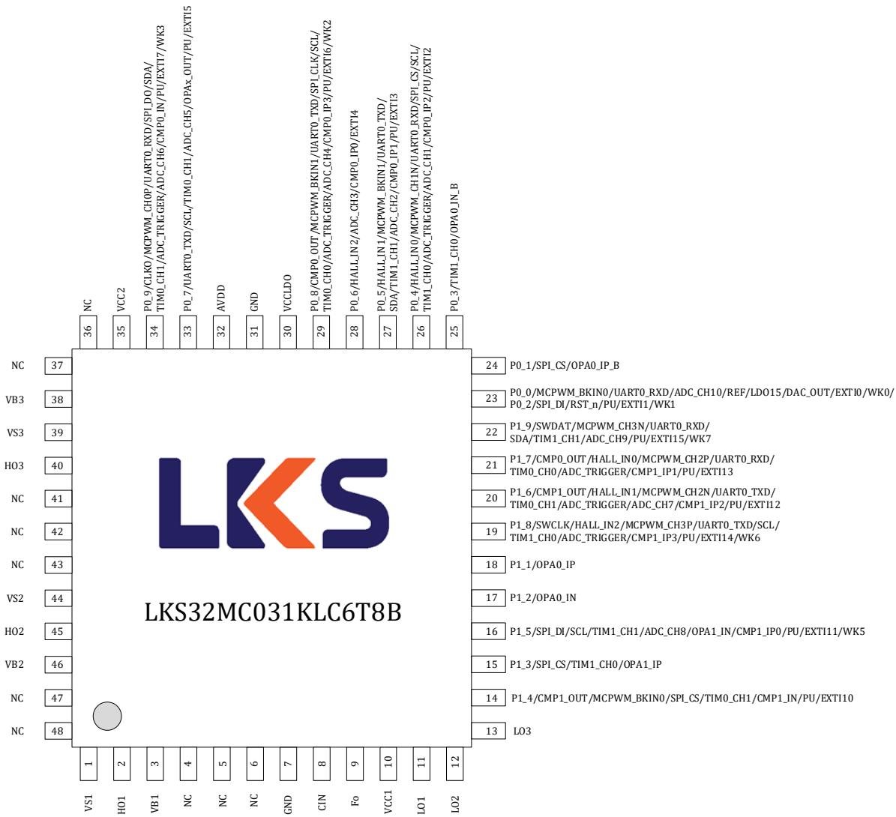  
图 3-1 LKS32MC031KLC6T8B 管脚分布图

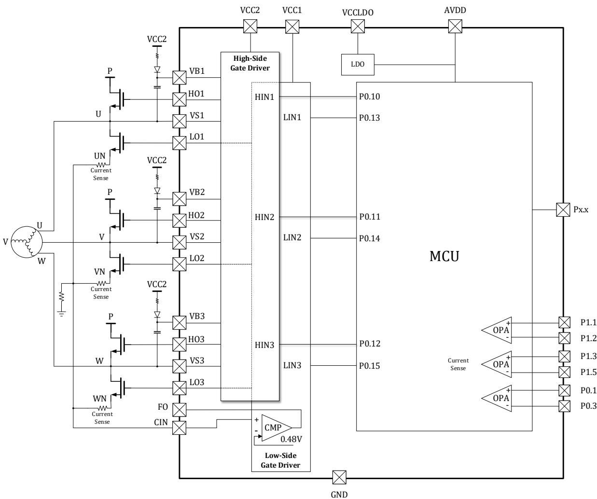  
图 3-2 LKS32MC031KLC6T8B 预驱连接示意图

表 3-2 LKS32MC031KLC6T8B 管脚说明

<table><tr><td>1</td><td>VS1</td><td>高边浮动偏置电压1。</td></tr><tr><td>2</td><td>HO1</td><td>A相高边输出,由MCU P0.10控制,HO1极性与P0.10相同,即P0.10=1时,HO1=1。需要设置MCPWM_SWAP=1,并使能CH0的P和N通道输出互换,即设置MCPWM_IO01.CH0_PN_SW=1。</td></tr><tr><td>3</td><td>VB1</td><td>高边浮动电源电压1。</td></tr><tr><td>4</td><td>NC</td><td>不连接</td></tr><tr><td>5</td><td>NC</td><td>不连接</td></tr><tr><td>6</td><td>NC</td><td>不连接</td></tr><tr><td>7</td><td>GND</td><td>芯片地,强烈建议多个地引脚在PCB上统一接地</td></tr><tr><td>8</td><td>CIN</td><td>过电检测,通过连接电机电流反馈,实现过电流检测功能。内部集成比较器(阈值为0.48V)和输入噪声滤波器(250ns)。过流检测可以紧急关闭所有LO输出,并通过Fo引脚反馈故障。</td></tr><tr><td>9</td><td>Fo</td><td>故障反馈,当预驱供电低于欠压值(UVD)或CIN管脚检测到过流时,Fo管脚产生低电平,并关闭LO输出。</td></tr><tr><td>10</td><td>VCC1</td><td>预驱供电电源1,芯片内部未与预驱供电电源2连接,需要分别供电。</td></tr><tr><td>11</td><td>LO1</td><td>A相低边输出,由MCUP0.13控制,LO1极性与P0.13相同,即P0.13=1时,HO1=1。需要设置 MCPWM_SWAP=1,并使能 CH0 的 P 和 N 通道输出互换,即设置 MCPWM_IO01.CH0_PN_SW=1。</td></tr><tr><td>12</td><td>LO2</td><td>B 相低边输出,由 MCU P0.14 控制,LO2 极性与 P0.14 相同,即 P0.14=1 时,LO2=1。需要设置 MCPWM_SWAP=1,并使能 CH1 的 P 和 N 通道输出互换,即设置 MCPWM_IO01.CH1_PN_SW=1。</td></tr><tr><td>13</td><td>LO3</td><td>C 相低边输出,由 MCU P0.15 控制,LO3 极性与 P0.15 相同,即 P0.15=1 时,LO3=1。需要设置 MCPWM_SWAP=1,并使能 CH2 的 P 和 N 通道输出互换,即设置 MCPWM_IO23.CH2_PN_SW=1。</td></tr><tr><td rowspan="8">14</td><td>P1_4</td><td>P1.4</td></tr><tr><td>CMP1_OUT</td><td>比较器 1 输出</td></tr><tr><td>MCPWM_BKIN0</td><td>PWM 停机输入信号 0</td></tr><tr><td>SPI_CS</td><td>SPI 片选</td></tr><tr><td>TIM0_CH1</td><td>Timer0 通道 1</td></tr><tr><td>CMP1_IN</td><td>比较器 1 负端输入</td></tr><tr><td>PU</td><td>内置 10kΩ上拉电阻,软件可关闭</td></tr><tr><td>EXTI10</td><td>外部 GPIO 中断信号 10</td></tr><tr><td rowspan="4">15</td><td>P1_3</td><td>P1.3</td></tr><tr><td>SPI_CS</td><td>SPI 片选</td></tr><tr><td>TIM1_CH0</td><td>Timer1 通道 0</td></tr><tr><td>OPA1_IP</td><td>运放 1 正端输入</td></tr><tr><td rowspan="10">16</td><td>P1_5</td><td>P1.5</td></tr><tr><td>SPI_DI</td><td>SPI 数据输入(输出)</td></tr><tr><td>SCL</td><td>I2C 时钟</td></tr><tr><td>TIM1_CH1</td><td>Timer1 通道 1</td></tr><tr><td>ADC_CH8</td><td>ADC 通道 8</td></tr><tr><td>OPA1_IN</td><td>运放 1 负端输入</td></tr><tr><td>CMP1_IP0</td><td>比较器 1 正端输入 0</td></tr><tr><td>PU</td><td>内置 10kΩ上拉电阻,软件可关闭</td></tr><tr><td>EXTI11</td><td>外部 GPIO 中断信号 11</td></tr><tr><td>WK5</td><td>外部唤醒信号 5</td></tr><tr><td rowspan="2">17</td><td>P1_2</td><td>P1.2</td></tr><tr><td>OPA0_IN</td><td>运放 0 负端输入</td></tr><tr><td rowspan="2">18</td><td>P1_1</td><td>P1.1</td></tr><tr><td>OPA0_IP</td><td>运放 0 正端输入</td></tr><tr><td rowspan="9">19</td><td>P1_8</td><td>P1.8</td></tr><tr><td>SWCLK</td><td>SWD 时钟</td></tr><tr><td>HALL_IN2</td><td>HALL 接口输入 2</td></tr><tr><td>MCPWM_CH3P</td><td>PWM 通道 3 高边</td></tr><tr><td>UART0_TXD</td><td>串口 0 发送(接收)</td></tr><tr><td>SCL</td><td>I2C 时钟</td></tr><tr><td>TIM1_CH0</td><td>Timer1 通道 0</td></tr><tr><td>ADC_TRIGGER</td><td>ADC 触发信号输出(用于调试)</td></tr><tr><td>CMP1_IP3PU</td><td>比较器 1 正端输入 3内置10kΩ上拉电阻,软件可关闭</td></tr><tr><td rowspan="2"></td><td>EXTI14</td><td>外部GPIO中断信号14</td></tr><tr><td>WK6</td><td>外部唤醒信号6</td></tr><tr><td rowspan="11">20</td><td>P1_6</td><td>P1.6</td></tr><tr><td>CMP1_OUT</td><td>比较器1输出</td></tr><tr><td>HALL_IN1</td><td>HALL接口输入1</td></tr><tr><td>MCPWM_CH2N</td><td>PWM通道2低边</td></tr><tr><td>UART0_TXD</td><td>串口0发送(接收)</td></tr><tr><td>TIM0_CH1</td><td>Timer0通道1</td></tr><tr><td>ADC_TRIGGER</td><td>ADC触发信号输出(用于调试)</td></tr><tr><td>ADC_CH7</td><td>ADC通道7</td></tr><tr><td>CMP1_IP2</td><td>比较器1正端输入2</td></tr><tr><td>PU</td><td>内置10kΩ上拉电阻,软件可关闭</td></tr><tr><td>EXTI12</td><td>外部GPIO中断信号12</td></tr><tr><td rowspan="10">21</td><td>P1_7</td><td>P1.7</td></tr><tr><td>CMP0_OUT</td><td>比较器0输出</td></tr><tr><td>HALL_IN0</td><td>HALL接口输入0</td></tr><tr><td>MCPWM_CH2P</td><td>PWM通道2高边</td></tr><tr><td>UART0_RXD</td><td>串口0接收(发送)</td></tr><tr><td>TIM0_CH0</td><td>Timer0通道0</td></tr><tr><td>ADC_TRIGGER</td><td>ADC触发信号输出(用于调试)</td></tr><tr><td>CMP1_IP1</td><td>比较器1正端输入1</td></tr><tr><td>PU</td><td>内置10kΩ上拉电阻,软件可关闭</td></tr><tr><td>EXTI13</td><td>外部GPIO中断信号13</td></tr><tr><td rowspan="10">22</td><td>P1_9</td><td>P1.9</td></tr><tr><td>SWDAT</td><td>SWD数据</td></tr><tr><td>MCPWM_CH3N</td><td>PWM通道3低边</td></tr><tr><td>UART0_RXD</td><td>串口0接收(发送)</td></tr><tr><td>SDA</td><td>I2C数据</td></tr><tr><td>TIM1_CH1</td><td>Timer1通道1</td></tr><tr><td>ADC_CH9</td><td>ADC通道9</td></tr><tr><td>PU</td><td>内置10kΩ上拉电阻,软件可关闭</td></tr><tr><td>EXTI15</td><td>外部GPIO中断信号15</td></tr><tr><td>WK7</td><td>外部唤醒信号7</td></tr><tr><td rowspan="9">23</td><td>P0_0</td><td>P0.0</td></tr><tr><td>MCPWM_BKIN0</td><td>PWM停机输入信号0</td></tr><tr><td>UART0_RXD</td><td>串口0接收(发送)</td></tr><tr><td>ADC_CH10</td><td>ADC通道10</td></tr><tr><td>REF</td><td>参考电压</td></tr><tr><td>LDO15</td><td>1.5VLDO输出</td></tr><tr><td>DAC_OUT</td><td>DAC输出</td></tr><tr><td>EXTI0</td><td>外部GPIO中断信号0</td></tr><tr><td>WK0</td><td>外部唤醒信号0</td></tr></table>

管脚分布

<table><tr><td rowspan="6"></td><td>P0_2</td><td>P0.2</td></tr><tr><td>SPI_DI</td><td>SPI 数据输入(输出)</td></tr><tr><td>RST_n</td><td>复位引脚,P0.2 默认用作 RSTN。建议接一个 10nF~100nF 的电容到地,并在 RSTN 和 AVDD 之间放置一个 10k~20k 的上拉电阻。如果外部有上拉电阻,RSTN 的电容应为 100nF。P0.2 可切换为 GPIO,切换后可关闭 10kΩ上拉电阻。</td></tr><tr><td>PU</td><td>内置 10kΩ上拉电阻,软件可关闭</td></tr><tr><td>EXTI1</td><td>外部 GPIO 中断信号 1</td></tr><tr><td>WK1</td><td>外部唤醒信号 1</td></tr><tr><td rowspan="3">24</td><td>P0_1</td><td>P0.1</td></tr><tr><td>SPI_CS</td><td>SPI 片选</td></tr><tr><td>OPA0_IP_B</td><td>运放 0 正端输入 B,请留意:OPA0 有两组输入信号,如果需要使用 B 组输入,需要设置 SYS_AFE_REG0[5] = 1。</td></tr><tr><td rowspan="3">25</td><td>P0_3</td><td>P0.3</td></tr><tr><td>TIM1_CH0</td><td>Timer1 通道 0</td></tr><tr><td>OPA0_IN_B</td><td>运放 0 负端输入 B,请留意:OPA0 有两组输入信号,如果需要使用 B 组输入,需要设置 SYS_AFE_REG0[5] = 1。</td></tr><tr><td rowspan="12">26</td><td>P0_4</td><td>P0.4</td></tr><tr><td>HALL_IN0</td><td>HALL 接口输入 0</td></tr><tr><td>MCPWM_CH1N</td><td>PWM 通道 1 低边</td></tr><tr><td>UART0_RXD</td><td>串口 0 接收(发送)</td></tr><tr><td>SPI_CS</td><td>SPI 片选</td></tr><tr><td>SCL</td><td>I2C 时钟</td></tr><tr><td>TIM1_CH0</td><td>Timer1 通道 0</td></tr><tr><td>ADC_TRIGGER</td><td>ADC 触发信号输出(用于调试)</td></tr><tr><td>ADC_CH1</td><td>ADC 通道 1</td></tr><tr><td>CMP0_IP2</td><td>比较器 0 正端输入 2</td></tr><tr><td>PU</td><td>内置 10kΩ上拉电阻,软件可关闭</td></tr><tr><td>EXTI2</td><td>外部 GPIO 中断信号 2</td></tr><tr><td rowspan="10">27</td><td>P0_5</td><td>P0.5</td></tr><tr><td>HALL_IN1</td><td>HALL 接口输入 1</td></tr><tr><td>MCPWM_BKIN1</td><td>PWM 停机输入信号 1</td></tr><tr><td>UART0_TXD</td><td>串口 0 发送(接收)</td></tr><tr><td>SDA</td><td>I2C 数据</td></tr><tr><td>TIM1_CH1</td><td>Timer1 通道 1</td></tr><tr><td>ADC_CH2</td><td>ADC 通道 2</td></tr><tr><td>CMP0_IP1</td><td>比较器 0 正端输入 1</td></tr><tr><td>PU</td><td>内置 10kΩ上拉电阻,软件可关闭</td></tr><tr><td>EXTI3</td><td>外部 GPIO 中断信号 3</td></tr><tr><td rowspan="5">28</td><td>P0_6</td><td>P0.6</td></tr><tr><td>HALL_IN2</td><td>HALL 接口输入 2</td></tr><tr><td>ADC_CH3</td><td>ADC 通道 3</td></tr><tr><td>CMP0_IP0</td><td>比较器 0 正端输入 0</td></tr><tr><td>EXTI4</td><td>外部 GPIO 中断信号 4</td></tr></table>

管脚分布

<table><tr><td rowspan="13">29</td><td>P0_8</td><td>P0.8</td></tr><tr><td>CMP0_OUT</td><td>比较器0输出</td></tr><tr><td>MCPWM_BKIN1</td><td>PWM停机输入信号1</td></tr><tr><td>UART0_TXD</td><td>串口0发送(接收)</td></tr><tr><td>SPI_CLK</td><td>SPI时钟</td></tr><tr><td>SCL</td><td>I2C时钟</td></tr><tr><td>TIM0_CH0</td><td>Timer0通道0</td></tr><tr><td>ADC_TRIGGER</td><td>ADC触发信号输出(用于调试)</td></tr><tr><td>ADC_CH4</td><td>ADC通道4</td></tr><tr><td>CMP0_IP3</td><td>比较器0正端输入3</td></tr><tr><td>PU</td><td>内置10kΩ上拉电阻,软件可关闭</td></tr><tr><td>EXTI6</td><td>外部GPIO中断信号6</td></tr><tr><td>WK2</td><td>外部唤醒信号2</td></tr><tr><td>30</td><td>VCCLDO</td><td>5VLDO供电,输出电流限制&lt;80mA。去耦电容应&gt;0.33uF,且尽可能靠近该引脚放置。</td></tr><tr><td>31</td><td>GND</td><td>芯片地,强烈建议多个地引脚在PCB上统一接地</td></tr><tr><td>32</td><td>AVDD</td><td>芯片5VLDO输出</td></tr><tr><td rowspan="8">33</td><td>P0_7</td><td>P0.7</td></tr><tr><td>UART0_TXD</td><td>串口0发送(接收)</td></tr><tr><td>SCL</td><td>I2C时钟</td></tr><tr><td>TIM0_CH1</td><td>Timer0通道1</td></tr><tr><td>ADC_CH5</td><td>ADC通道5</td></tr><tr><td>OPAx_OUT</td><td>运放输出</td></tr><tr><td>PU</td><td>内置10kΩ上拉电阻,软件可关闭</td></tr><tr><td>EXTI5</td><td>外部GPIO中断信号5</td></tr><tr><td rowspan="13">34</td><td>P0_9</td><td>P0.9</td></tr><tr><td>CLKO</td><td>时钟输出(用于调试)</td></tr><tr><td>MCPWM_CHOP</td><td>PWM通道0高边</td></tr><tr><td>UART0_RXD</td><td>串口0接收(发送)</td></tr><tr><td>SPI_DO</td><td>SPI数据输出(输入)</td></tr><tr><td>SDA</td><td>I2C数据</td></tr><tr><td>TIM0_CH1</td><td>Timer0通道1</td></tr><tr><td>ADC_TRIGGER</td><td>ADC触发信号输出(用于调试)</td></tr><tr><td>ADC_CH6</td><td>ADC通道6</td></tr><tr><td>CMP0_IN</td><td>比较器0负端输入</td></tr><tr><td>PU</td><td>内置10kΩ上拉电阻,软件可关闭</td></tr><tr><td>EXTI7</td><td>外部GPIO中断信号7</td></tr><tr><td>WK3</td><td>外部唤醒信号3</td></tr><tr><td>35</td><td>VCC2</td><td>预驱供电电源2,芯片内部未与预驱供电电源1连接,需要分别供电。</td></tr><tr><td>36</td><td>NC</td><td>不连接</td></tr><tr><td>37</td><td>NC</td><td>不连接</td></tr><tr><td>38</td><td>VB3</td><td>高边浮动电源电压3。</td></tr><tr><td>39</td><td>VS3</td><td>高边浮动偏置电压3。</td></tr><tr><td>40</td><td>HO3</td><td>C相高边输出,由MCU P0.12控制,HO3极性与P0.12相同,即P0.12=1时,HO3=1。</td></tr></table>

管脚分布

<table><tr><td></td><td></td><td>需要设置 MCPWM_SWAP=1,并使能 CH2 的 P 和 N 通道输出互换,即设置 MCPWM_IO23.CH2_PN_SW=1。</td></tr><tr><td>41</td><td>NC</td><td>不连接</td></tr><tr><td>42</td><td>NC</td><td>不连接</td></tr><tr><td>43</td><td>NC</td><td>不连接</td></tr><tr><td>44</td><td>VS2</td><td>高边浮动偏置电压 2。</td></tr><tr><td>45</td><td>HO2</td><td>B 相 高边输出,由 MCU P0.11 控制,HO2 极性与 P0.11 相同,即 P0.11=1 时,HO2=1。需要设置 MCPWM_SWAP=1,并使能 CH1 的 P 和 N 通道输出互换,即设置 MCPWM_IO01.CH1_PN_SW=1。</td></tr><tr><td>46</td><td>VB2</td><td>高边浮动电源电压 2。</td></tr><tr><td>47</td><td>NC</td><td>不连接</td></tr><tr><td>48</td><td>NC</td><td>不连接</td></tr></table>

## 3.1.4 LKS32MC034DF6Q8

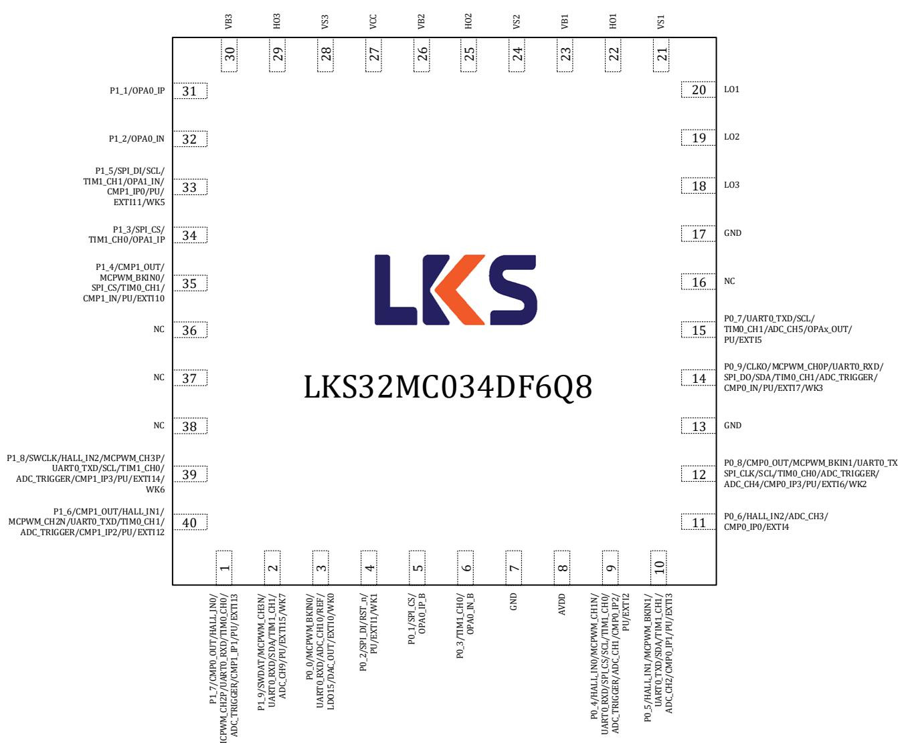  
图 3-3 LKS32MC034DF6Q8 管脚分布图

  
图 3-4 LKS32MC034DF6Q8 预驱连接示意图

表 3-3 LKS32MC034DF6Q8 管脚说明

<table><tr><td>0</td><td>GND</td><td>芯片地,位于芯片腹部</td></tr><tr><td rowspan="10">1</td><td>P1_7</td><td>P1.7</td></tr><tr><td>CMP0_OUT</td><td>比较器 0 输出</td></tr><tr><td>HALL_INO</td><td>HALL 接口输入 0</td></tr><tr><td>MCPWM_CH2P</td><td>PWM 通道 2 高边</td></tr><tr><td>UART0_RXD</td><td>串口 0 接收(发送)</td></tr><tr><td>TIMO_CH0</td><td>Timer0 通道 0</td></tr><tr><td>ADC_TRIGGER</td><td>ADC 触发信号输出(用于调试)</td></tr><tr><td>CMP1_IP1</td><td>比较器 1 正端输入 1</td></tr><tr><td>PU</td><td>内置 10kΩ 上拉电阻,软件可关闭</td></tr><tr><td>EXTI13</td><td>外部 GPIO 中断信号 13</td></tr><tr><td rowspan="5">2</td><td>P1_9</td><td>P1.9</td></tr><tr><td>SWDAT</td><td>SWD 数据</td></tr><tr><td>MCPWM_CH3N</td><td>PWM 通道 3 低边</td></tr><tr><td>UART0_RXD</td><td>串口 0 接收(发送)</td></tr><tr><td>SDA</td><td>I2C 数据</td></tr></table>

管脚分布

<table><tr><td rowspan="5"></td><td>TIM1_CH1</td><td>Timer1 通道1</td></tr><tr><td>ADC_CH9</td><td>ADC 通道9</td></tr><tr><td>PU</td><td>内置 $10k\Omega$ 上拉电阻,软件可关闭</td></tr><tr><td>EXTI15</td><td>外部 GPIO 中断信号15</td></tr><tr><td>WK7</td><td>外部唤醒信号7</td></tr><tr><td rowspan="9">3</td><td>P0_0</td><td>P0.0</td></tr><tr><td>MCPWM_BKINO</td><td>PWM 停机输入信号0</td></tr><tr><td>UART0_RXD</td><td>串口0接收(发送)</td></tr><tr><td>ADC_CH10</td><td>ADC 通道10</td></tr><tr><td>REF</td><td>参考电压</td></tr><tr><td>LDO15</td><td>1.5V LDO 输出</td></tr><tr><td>DAC_OUT</td><td>DAC 输出</td></tr><tr><td>EXTIO</td><td>外部 GPIO 中断信号0</td></tr><tr><td>WK0</td><td>外部唤醒信号0</td></tr><tr><td rowspan="6">4</td><td>P0_2</td><td>P0.2</td></tr><tr><td>SPI_DI</td><td>SPI 数据输入(输出)</td></tr><tr><td>RST_n</td><td>复位引脚,P0.2 默认用作 RSTN。建议接一个  $10nF \sim 100nF$  的电容到地,并在 RSTN 和 AVDD 之间放置一个  $10k \sim 20k$  的上拉电阻。如果外部有上拉电阻,RSTN 的电容应为  $100nF$ 。P0.2 可切换为 GPIO,切换后可关闭  $10k\Omega$  上拉电阻。</td></tr><tr><td>PU</td><td>内置  $10k\Omega$  上拉电阻,软件可关闭</td></tr><tr><td>EXTI1</td><td>外部 GPIO 中断信号1</td></tr><tr><td>WK1</td><td>外部唤醒信号1</td></tr><tr><td rowspan="3">5</td><td>P0_1</td><td>P0.1</td></tr><tr><td>SPI_CS</td><td>SPI 片选</td></tr><tr><td>OPA0_IP_B</td><td>运放0正端输入B,请留意:OPA0 有两组输入信号,如果需要使用B组输入,需要设置 SYS_AFE_REG0[5] = 1。</td></tr><tr><td rowspan="3">6</td><td>P0_3</td><td>P0.3</td></tr><tr><td>TIM1_CH0</td><td>Timer1 通道0</td></tr><tr><td>OPA0_IN_B</td><td>运放0负端输入B,请留意:OPA0 有两组输入信号,如果需要使用B组输入,需要设置 SYS_AFE_REG0[5] = 1。</td></tr><tr><td>7</td><td>GND</td><td>芯片地,强烈建议多个地引脚在 PCB 上统一接地</td></tr><tr><td>8</td><td>AVDD</td><td>芯片电源</td></tr><tr><td rowspan="11">9</td><td>P0_4</td><td>P0.4</td></tr><tr><td>HALL_IN0</td><td>HALL 接口输入0</td></tr><tr><td>MCPWM_CH1N</td><td>PWM 通道1低边</td></tr><tr><td>UART0_RXD</td><td>串口0接收(发送)</td></tr><tr><td>SPI_CS</td><td>SPI 片选</td></tr><tr><td>SCL</td><td>I2C 时钟</td></tr><tr><td>TIM1_CH0</td><td>Timer1 通道0</td></tr><tr><td>ADC_TRIGGER</td><td>ADC 触发信号输出(用于调试)</td></tr><tr><td>ADC_CH1</td><td>ADC 通道1</td></tr><tr><td>CMP0_IP2</td><td>比较器0正端输入2</td></tr><tr><td>PU</td><td>内置  $10k\Omega$  上拉电阻,软件可关闭</td></tr></table>

管脚分布

<table><tr><td></td><td>EXTI2</td><td>外部 GPIO 中断信号 2</td></tr><tr><td rowspan="10">10</td><td>P0_5</td><td>P0.5</td></tr><tr><td>HALL_IN1</td><td>HALL 接口输入 1</td></tr><tr><td>MCPWM_BKIN1</td><td>PWM 停机输入信号 1</td></tr><tr><td>UART0_TXD</td><td>串口 0 发送(接收)</td></tr><tr><td>SDA</td><td>I2C 数据</td></tr><tr><td>TIM1_CH1</td><td>Timer1 通道 1</td></tr><tr><td>ADC_CH2</td><td>ADC 通道 2</td></tr><tr><td>CMP0_IP1</td><td>比较器 0 正端输入 1</td></tr><tr><td>PU</td><td>内置  $10k\Omega$  上拉电阻,软件可关闭</td></tr><tr><td>EXTI3</td><td>外部 GPIO 中断信号 3</td></tr><tr><td rowspan="5">11</td><td>P0_6</td><td>P0.6</td></tr><tr><td>HALL_IN2</td><td>HALL 接口输入 2</td></tr><tr><td>ADC_CH3</td><td>ADC 通道 3</td></tr><tr><td>CMP0_IP0</td><td>比较器 0 正端输入 0</td></tr><tr><td>EXTI4</td><td>外部 GPIO 中断信号 4</td></tr><tr><td rowspan="13">12</td><td>P0_8</td><td>P0.8</td></tr><tr><td>CMP0_OUT</td><td>比较器 0 输出</td></tr><tr><td>MCPWM_BKIN1</td><td>PWM 停机输入信号 1</td></tr><tr><td>UART0_TXD</td><td>串口 0 发送(接收)</td></tr><tr><td>SPI_CLK</td><td>SPI 时钟</td></tr><tr><td>SCL</td><td>I2C 时钟</td></tr><tr><td>TIM0_CH0</td><td>Timer0 通道 0</td></tr><tr><td>ADC_TRIGGER</td><td>ADC 触发信号输出(用于调试)</td></tr><tr><td>ADC_CH4</td><td>ADC 通道 4</td></tr><tr><td>CMP0_IP3</td><td>比较器 0 正端输入 3</td></tr><tr><td>PU</td><td>内置  $10k\Omega$  上拉电阻,软件可关闭</td></tr><tr><td>EXTI6</td><td>外部 GPIO 中断信号 6</td></tr><tr><td>WK2</td><td>外部唤醒信号 2</td></tr><tr><td>13</td><td>GND</td><td>芯片地,强烈建议多个地引脚在 PCB 上统一接地</td></tr><tr><td rowspan="12">14</td><td>P0_9</td><td>P0.9</td></tr><tr><td>CLKO</td><td>时钟输出(用于调试)</td></tr><tr><td>MCPWM_CHOP</td><td>PWM 通道 0 高边</td></tr><tr><td>UART0_RXD</td><td>串口 0 接收(发送)</td></tr><tr><td>SPI_DO</td><td>SPI 数据输出(输入)</td></tr><tr><td>SDA</td><td>I2C 数据</td></tr><tr><td>TIM0_CH1</td><td>Timer0 通道 1</td></tr><tr><td>ADC_TRIGGER</td><td>ADC 触发信号输出(用于调试)</td></tr><tr><td>CMP0_IN</td><td>比较器 0 负端输入</td></tr><tr><td>PU</td><td>内置  $10k\Omega$  上拉电阻,软件可关闭</td></tr><tr><td>EXTI7</td><td>外部 GPIO 中断信号 7</td></tr><tr><td>WK3</td><td>外部唤醒信号 3</td></tr><tr><td>15</td><td>P0_7UART0_TXD</td><td>P0.7串口0发送(接收)</td></tr><tr><td rowspan="6"></td><td>SCL</td><td>I2C时钟</td></tr><tr><td>TIM0_CH1</td><td>Timer0通道1</td></tr><tr><td>ADC_CH5</td><td>ADC通道5</td></tr><tr><td>OPAx_OUT</td><td>运放输出</td></tr><tr><td>PU</td><td>内置 $10k\Omega$ 上拉电阻,软件可关闭</td></tr><tr><td>EXTI5</td><td>外部GPIO中断信号5</td></tr><tr><td>16</td><td>NC</td><td>不连接</td></tr><tr><td>17</td><td>GND</td><td>芯片地,强烈建议多个地引脚在PCB上统一接地</td></tr><tr><td>18</td><td>LO3</td><td>C相低边输出,由MCU P0.12控制,LO3极性与P0.12相同,即P0.12=1时, $LO3=1$ 。需要设置MCPWM_SWAP=1。</td></tr><tr><td>19</td><td>LO2</td><td>B相低边输出,由MCU P0.11控制,LO2极性与P0.11相同,即P0.11=1时, $LO2=1$ 。需要设置MCPWM_SWAP=1。</td></tr><tr><td>20</td><td>LO1</td><td>A相低边输出,由MCU P0.10控制,LO1极性与P0.10相同,即P0.10=1时, $LO1=1$ 。需要设置MCPWM_SWAP=1。</td></tr><tr><td>21</td><td>VS1</td><td>高边浮动偏置电压1。</td></tr><tr><td>22</td><td>HO1</td><td>A相高边输出,由MCU P0.13控制,HO1极性与P0.13相同,即P0.13=1时, $HO1=1$ 。需要设置MCPWM_SWAP=1。</td></tr><tr><td>23</td><td>VB1</td><td>高边浮动电源电压1。</td></tr><tr><td>24</td><td>VS2</td><td>高边浮动偏置电压2。</td></tr><tr><td>25</td><td>HO2</td><td>B相高边输出,由MCU P0.14控制,HO2极性与P0.14相同,即P0.14=1时, $HO2=1$ 。需要设置MCPWM_SWAP=1。</td></tr><tr><td>26</td><td>VB2</td><td>高边浮动电源电压2。</td></tr><tr><td>27</td><td>VCC</td><td>预驱供电电源,7~20V</td></tr><tr><td>28</td><td>VS3</td><td>高边浮动偏置电压3。</td></tr><tr><td>29</td><td>HO3</td><td>C相高边输出,由MCU P0.15控制,HO3极性与P0.15相同,即P0.15=1时, $HO3=1$ 。需要设置MCPWM_SWAP=1。</td></tr><tr><td>30</td><td>VB3</td><td>高边浮动电源电压3。</td></tr><tr><td rowspan="2">31</td><td>P1_1</td><td>P1.1</td></tr><tr><td>OPA0_IP</td><td>运放0正端输入</td></tr><tr><td rowspan="2">32</td><td>P1_2</td><td>P1.2</td></tr><tr><td>OPA0_IN</td><td>运放0负端输入</td></tr><tr><td rowspan="9">33</td><td>P1_5</td><td>P1.5</td></tr><tr><td>SPI_DI</td><td>SPI数据输入(输出)</td></tr><tr><td>SCL</td><td>I2C时钟</td></tr><tr><td>TIM1_CH1</td><td>Timer1通道1</td></tr><tr><td>OPA1_IN</td><td>运放1负端输入</td></tr><tr><td>CMP1_IP0</td><td>比较器1正端输入0</td></tr><tr><td>PU</td><td>内置 $10k\Omega$ 上拉电阻,软件可关闭</td></tr><tr><td>EXTI11</td><td>外部GPIO中断信号11</td></tr><tr><td>WK5</td><td>外部唤醒信号5</td></tr><tr><td rowspan="2">34</td><td>P1_3</td><td>P1.3</td></tr><tr><td>SPI_CSTIM1_CH0</td><td>SPI片选Timer1 通道0</td></tr><tr><td></td><td>OPA1_IP</td><td>运放1正端输入</td></tr><tr><td rowspan="8">35</td><td>P1_4</td><td>P1.4</td></tr><tr><td>CMP1_OUT</td><td>比较器1输出</td></tr><tr><td>MCPWM_BKIN0</td><td>PWM停机输入信号0</td></tr><tr><td>SPI_CS</td><td>SPI片选</td></tr><tr><td>TIM0_CH1</td><td>Timer0通道1</td></tr><tr><td>CMP1_IN</td><td>比较器1负端输入</td></tr><tr><td>PU</td><td>内置 $10k\Omega$ 上拉电阻,软件可关闭</td></tr><tr><td>EXTI10</td><td>外部GPIO中断信号10</td></tr><tr><td>36</td><td>NC</td><td>不连接</td></tr><tr><td>37</td><td>NC</td><td>不连接</td></tr><tr><td>38</td><td>NC</td><td>不连接</td></tr><tr><td rowspan="12">39</td><td>P1_8</td><td>P1.8</td></tr><tr><td>SWCLK</td><td>SWD时钟</td></tr><tr><td>HALL_IN2</td><td>HALL接口输入2</td></tr><tr><td>MCPWM_CH3P</td><td>PWM通道3高边</td></tr><tr><td>UART0_TXD</td><td>串口0发送(接收)</td></tr><tr><td>SCL</td><td>I2C时钟</td></tr><tr><td>TIM1_CH0</td><td>Timer1通道0</td></tr><tr><td>ADC_TRIGGER</td><td>ADC触发信号输出(用于调试)</td></tr><tr><td>CMP1_IP3</td><td>比较器1正端输入3</td></tr><tr><td>PU</td><td>内置 $10k\Omega$ 上拉电阻,软件可关闭</td></tr><tr><td>EXTI14</td><td>外部GPIO中断信号14</td></tr><tr><td>WK6</td><td>外部唤醒信号6</td></tr><tr><td rowspan="10">40</td><td>P1_6</td><td>P1.6</td></tr><tr><td>CMP1_OUT</td><td>比较器1输出</td></tr><tr><td>HALL_IN1</td><td>HALL接口输入1</td></tr><tr><td>MCPWM_CH2N</td><td>PWM通道2低边</td></tr><tr><td>UART0_TXD</td><td>串口0发送(接收)</td></tr><tr><td>TIM0_CH1</td><td>Timer0通道1</td></tr><tr><td>ADC_TRIGGER</td><td>ADC触发信号输出(用于调试)</td></tr><tr><td>CMP1_IP2</td><td>比较器1正端输入2</td></tr><tr><td>PU</td><td>内置 $10k\Omega$ 上拉电阻,软件可关闭</td></tr><tr><td>EXTI12</td><td>外部GPIO中断信号12</td></tr></table>

## 3.1.5 LKS32MC034DF6Q8B/LKS32MC034DF6Q8C

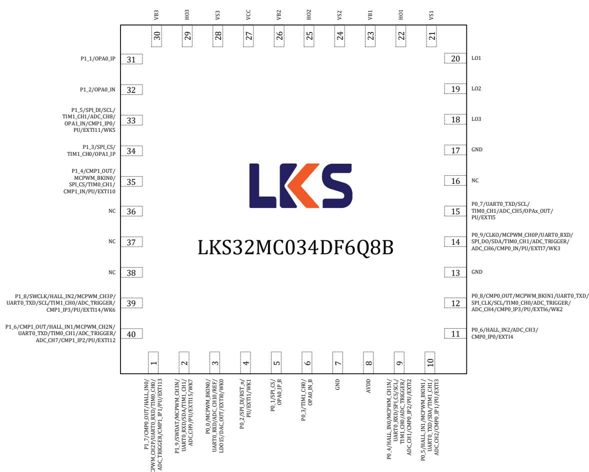  
图 3-5 LKS32MC034DF6Q8B(C)管脚分布图

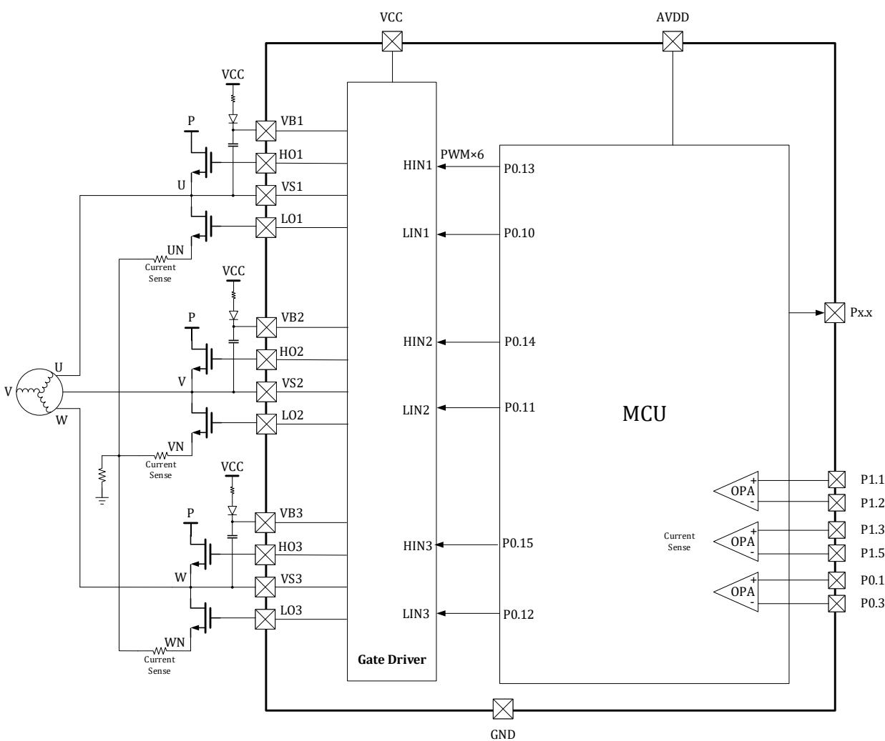  
图 3-6 LKS32MC034DF6Q8B(C)预驱连接示意图

表 3-4 LKS32MC034DF6Q8B(C)管脚说明

<table><tr><td>0</td><td>GND</td><td>芯片地,位于芯片腹部</td></tr><tr><td rowspan="10">1</td><td>P1_7</td><td>P1.7</td></tr><tr><td>CMP0_OUT</td><td>比较器 0 输出</td></tr><tr><td>HALL_INO</td><td>HALL 接口输入 0</td></tr><tr><td>MCPWM_CH2P</td><td>PWM 通道 2 高边</td></tr><tr><td>UART0_RXD</td><td>串口 0 接收(发送)</td></tr><tr><td>TIMO_CH0</td><td>Timer0 通道 0</td></tr><tr><td>ADC_TRIGGER</td><td>ADC 触发信号输出(用于调试)</td></tr><tr><td>CMP1_IP1</td><td>比较器 1 正端输入 1</td></tr><tr><td>PU</td><td>内置 10kΩ 上拉电阻,软件可关闭</td></tr><tr><td>EXTI13</td><td>外部 GPIO 中断信号 13</td></tr><tr><td rowspan="5">2</td><td>P1_9</td><td>P1.9</td></tr><tr><td>SWDAT</td><td>SWD 数据</td></tr><tr><td>MCPWM_CH3N</td><td>PWM 通道 3 低边</td></tr><tr><td>UART0_RXD</td><td>串口 0 接收(发送)</td></tr><tr><td>SDA</td><td>I2C 数据</td></tr></table>

管脚分布

<table><tr><td rowspan="5"></td><td>TIM1_CH1</td><td>Timer1 通道1</td></tr><tr><td>ADC_CH9</td><td>ADC 通道9</td></tr><tr><td>PU</td><td>内置 $10k\Omega$ 上拉电阻,软件可关闭</td></tr><tr><td>EXTI15</td><td>外部 GPIO 中断信号15</td></tr><tr><td>WK7</td><td>外部唤醒信号7</td></tr><tr><td rowspan="9">3</td><td>P0_0</td><td>P0.0</td></tr><tr><td>MCPWM_BKINO</td><td>PWM 停机输入信号0</td></tr><tr><td>UART0_RXD</td><td>串口0接收(发送)</td></tr><tr><td>ADC_CH10</td><td>ADC 通道10</td></tr><tr><td>REF</td><td>参考电压</td></tr><tr><td>LDO15</td><td>1.5V LDO 输出</td></tr><tr><td>DAC_OUT</td><td>DAC 输出</td></tr><tr><td>EXTIO</td><td>外部 GPIO 中断信号0</td></tr><tr><td>WK0</td><td>外部唤醒信号0</td></tr><tr><td rowspan="6">4</td><td>P0_2</td><td>P0.2</td></tr><tr><td>SPI_DI</td><td>SPI 数据输入(输出)</td></tr><tr><td>RST_n</td><td>复位引脚,P0.2 默认用作 RSTN。建议接一个  $10nF \sim 100nF$  的电容到地,并在 RSTN 和 AVDD 之间放置一个  $10k \sim 20k$  的上拉电阻。如果外部有上拉电阻,RSTN 的电容应为  $100nF$ 。P0.2 可切换为 GPIO,切换后可关闭  $10k\Omega$  上拉电阻。</td></tr><tr><td>PU</td><td>内置  $10k\Omega$  上拉电阻,软件可关闭</td></tr><tr><td>EXTI1</td><td>外部 GPIO 中断信号1</td></tr><tr><td>WK1</td><td>外部唤醒信号1</td></tr><tr><td rowspan="3">5</td><td>P0_1</td><td>P0.1</td></tr><tr><td>SPI_CS</td><td>SPI 片选</td></tr><tr><td>OPA0_IP_B</td><td>运放0正端输入B,请留意:OPA0 有两组输入信号,如果需要使用B组输入,需要设置 SYS_AFE_REG0[5] = 1。</td></tr><tr><td rowspan="3">6</td><td>P0_3</td><td>P0.3</td></tr><tr><td>TIM1_CH0</td><td>Timer1 通道0</td></tr><tr><td>OPA0_IN_B</td><td>运放0负端输入B,请留意:OPA0 有两组输入信号,如果需要使用B组输入,需要设置 SYS_AFE_REG0[5] = 1。</td></tr><tr><td>7</td><td>GND</td><td>芯片地,强烈建议多个地引脚在 PCB 上统一接地</td></tr><tr><td>8</td><td>AVDD</td><td>芯片电源</td></tr><tr><td rowspan="11">9</td><td>P0_4</td><td>P0.4</td></tr><tr><td>HALL_IN0</td><td>HALL 接口输入0</td></tr><tr><td>MCPWM_CH1N</td><td>PWM 通道1低边</td></tr><tr><td>UART0_RXD</td><td>串口0接收(发送)</td></tr><tr><td>SPI_CS</td><td>SPI 片选</td></tr><tr><td>SCL</td><td>I2C 时钟</td></tr><tr><td>TIM1_CH0</td><td>Timer1 通道0</td></tr><tr><td>ADC_TRIGGER</td><td>ADC 触发信号输出(用于调试)</td></tr><tr><td>ADC_CH1</td><td>ADC 通道1</td></tr><tr><td>CMP0_IP2</td><td>比较器0正端输入2</td></tr><tr><td>PU</td><td>内置  $10k\Omega$  上拉电阻,软件可关闭</td></tr></table>

管脚分布

<table><tr><td></td><td>EXTI2</td><td>外部 GPIO 中断信号 2</td></tr><tr><td rowspan="10">10</td><td>P0_5</td><td>P0.5</td></tr><tr><td>HALL_IN1</td><td>HALL 接口输入 1</td></tr><tr><td>MCPWM_BKIN1</td><td>PWM 停机输入信号 1</td></tr><tr><td>UART0_TXD</td><td>串口 0 发送(接收)</td></tr><tr><td>SDA</td><td>I2C 数据</td></tr><tr><td>TIM1_CH1</td><td>Timer1 通道 1</td></tr><tr><td>ADC_CH2</td><td>ADC 通道 2</td></tr><tr><td>CMP0_IP1</td><td>比较器 0 正端输入 1</td></tr><tr><td>PU</td><td>内置  $10k\Omega$  上拉电阻,软件可关闭</td></tr><tr><td>EXTI3</td><td>外部 GPIO 中断信号 3</td></tr><tr><td rowspan="5">11</td><td>P0_6</td><td>P0.6</td></tr><tr><td>HALL_IN2</td><td>HALL 接口输入 2</td></tr><tr><td>ADC_CH3</td><td>ADC 通道 3</td></tr><tr><td>CMP0_IP0</td><td>比较器 0 正端输入 0</td></tr><tr><td>EXTI4</td><td>外部 GPIO 中断信号 4</td></tr><tr><td rowspan="13">12</td><td>P0_8</td><td>P0.8</td></tr><tr><td>CMP0_OUT</td><td>比较器 0 输出</td></tr><tr><td>MCPWM_BKIN1</td><td>PWM 停机输入信号 1</td></tr><tr><td>UART0_TXD</td><td>串口 0 发送(接收)</td></tr><tr><td>SPI_CLK</td><td>SPI 时钟</td></tr><tr><td>SCL</td><td>I2C 时钟</td></tr><tr><td>TIM0_CH0</td><td>Timer0 通道 0</td></tr><tr><td>ADC_TRIGGER</td><td>ADC 触发信号输出(用于调试)</td></tr><tr><td>ADC_CH4</td><td>ADC 通道 4</td></tr><tr><td>CMP0_IP3</td><td>比较器 0 正端输入 3</td></tr><tr><td>PU</td><td>内置  $10k\Omega$  上拉电阻,软件可关闭</td></tr><tr><td>EXTI6</td><td>外部 GPIO 中断信号 6</td></tr><tr><td>WK2</td><td>外部唤醒信号 2</td></tr><tr><td>13</td><td>GND</td><td>芯片地,强烈建议多个地引脚在 PCB 上统一接地</td></tr><tr><td rowspan="13">14</td><td>P0_9</td><td>P0.9</td></tr><tr><td>CLKO</td><td>时钟输出(用于调试)</td></tr><tr><td>MCPWM_CHOP</td><td>PWM 通道 0 高边</td></tr><tr><td>UART0_RXD</td><td>串口 0 接收(发送)</td></tr><tr><td>SPI_DO</td><td>SPI 数据输出(输入)</td></tr><tr><td>SDA</td><td>I2C 数据</td></tr><tr><td>TIM0_CH1</td><td>Timer0 通道 1</td></tr><tr><td>ADC_TRIGGER</td><td>ADC 触发信号输出(用于调试)</td></tr><tr><td>ADC_CH6</td><td>ADC 通道 6</td></tr><tr><td>CMP0_IN</td><td>比较器 0 负端输入</td></tr><tr><td>PU</td><td>内置  $10k\Omega$  上拉电阻,软件可关闭</td></tr><tr><td>EXTI7</td><td>外部 GPIO 中断信号 7</td></tr><tr><td>WK3</td><td>外部唤醒信号 3</td></tr><tr><td rowspan="8">15</td><td>P0_7</td><td>P0.7</td></tr><tr><td>UART0_TXD</td><td>串口0发送(接收)</td></tr><tr><td>SCL</td><td>I2C时钟</td></tr><tr><td>TIM0_CH1</td><td>Timer0通道1</td></tr><tr><td>ADC_CH5</td><td>ADC通道5</td></tr><tr><td>OPAx_OUT</td><td>运放输出</td></tr><tr><td>PU</td><td>内置 $10k\Omega$ 上拉电阻,软件可关闭</td></tr><tr><td>EXTI5</td><td>外部GPIO中断信号5</td></tr><tr><td>16</td><td>NC</td><td>不连接</td></tr><tr><td>17</td><td>GND</td><td>芯片地,强烈建议多个地引脚在PCB上统一接地</td></tr><tr><td>18</td><td>LO3</td><td>C相低边输出,由MCU P0.12控制, $LO3$ 极性与P0.12相同,即P0.12=1时, $LO3=1$ 。需要设置MCPWM_SWAP=1。</td></tr><tr><td>19</td><td>LO2</td><td>B相低边输出,由MCU P0.11控制, $LO2$ 极性与P0.11相同,即P0.11=1时, $LO2=1$ 。需要设置MCPWM_SWAP=1。</td></tr><tr><td>20</td><td>LO1</td><td>A相低边输出,由MCU P0.10控制, $LO1$ 极性与P0.10相同,即P0.10=1时, $LO1=1$ 。需要设置MCPWM_SWAP=1。</td></tr><tr><td>21</td><td>VS1</td><td>高边浮动偏置电压1。</td></tr><tr><td>22</td><td>HO1</td><td>A相高边输出,由MCU P0.13控制, $HO1$ 极性与P0.13相同,即P0.13=1时, $HO1=1$ 。需要设置MCPWM_SWAP=1。</td></tr><tr><td>23</td><td>VB1</td><td>高边浮动电源电压1。</td></tr><tr><td>24</td><td>VS2</td><td>高边浮动偏置电压2。</td></tr><tr><td>25</td><td>HO2</td><td>B相高边输出,由MCU P0.14控制, $HO2$ 极性与P0.14相同,即P0.14=1时, $HO2=1$ 。需要设置MCPWM_SWAP=1。</td></tr><tr><td>26</td><td>VB2</td><td>高边浮动电源电压2。</td></tr><tr><td>27</td><td>VCC</td><td>预驱供电电源, $7\sim20V$ </td></tr><tr><td>28</td><td>VS3</td><td>高边浮动偏置电压3。</td></tr><tr><td>29</td><td>HO3</td><td>C相高边输出,由MCU P0.15控制, $HO3$ 极性与P0.15相同,即P0.15=1时, $HO3=1$ 。需要设置MCPWM_SWAP=1。</td></tr><tr><td>30</td><td>VB3</td><td>高边浮动电源电压3。</td></tr><tr><td rowspan="2">31</td><td>P1_1</td><td>P1.1</td></tr><tr><td>OPA0_IP</td><td>运放0正端输入</td></tr><tr><td rowspan="2">32</td><td>P1_2</td><td>P1.2</td></tr><tr><td>OPA0_IN</td><td>运放0负端输入</td></tr><tr><td rowspan="10">33</td><td>P1_5</td><td>P1.5</td></tr><tr><td>SPI_DI</td><td>SPI数据输入(输出)</td></tr><tr><td>SCL</td><td>I2C时钟</td></tr><tr><td>TIM1_CH1</td><td>Timer1通道1</td></tr><tr><td>ADC_CH8</td><td>ADC通道8</td></tr><tr><td>OPA1_IN</td><td>运放1负端输入</td></tr><tr><td>CMP1_IP0</td><td>比较器1正端输入0</td></tr><tr><td>PU</td><td>内置 $10k\Omega$ 上拉电阻,软件可关闭</td></tr><tr><td>EXTI11</td><td>外部GPIO中断信号11</td></tr><tr><td>WK5</td><td>外部唤醒信号5</td></tr><tr><td rowspan="4">34</td><td>P1_3</td><td>P1.3</td></tr><tr><td>SPI_CS</td><td>SPI片选</td></tr><tr><td>TIM1_CH0</td><td>Timer1通道0</td></tr><tr><td>OPA1_IP</td><td>运放1正端输入</td></tr><tr><td rowspan="8">35</td><td>P1_4</td><td>P1.4</td></tr><tr><td>CMP1_OUT</td><td>比较器1输出</td></tr><tr><td>MCPWM_BKIN0</td><td>PWM停机输入信号0</td></tr><tr><td>SPI_CS</td><td>SPI片选</td></tr><tr><td>TIM0_CH1</td><td>Timer0通道1</td></tr><tr><td>CMP1_IN</td><td>比较器1负端输入</td></tr><tr><td>PU</td><td>内置10kΩ上拉电阻,软件可关闭</td></tr><tr><td>EXTI10</td><td>外部GPIO中断信号10</td></tr><tr><td>36</td><td>NC</td><td>不连接</td></tr><tr><td>37</td><td>NC</td><td>不连接</td></tr><tr><td>38</td><td>NC</td><td>不连接</td></tr><tr><td rowspan="12">39</td><td>P1_8</td><td>P1.8</td></tr><tr><td>SWCLK</td><td>SWD时钟</td></tr><tr><td>HALL_IN2</td><td>HALL接口输入2</td></tr><tr><td>MCPWM_CH3P</td><td>PWM通道3高边</td></tr><tr><td>UART0_TXD</td><td>串口0发送(接收)</td></tr><tr><td>SCL</td><td>I2C时钟</td></tr><tr><td>TIM1_CH0</td><td>Timer1通道0</td></tr><tr><td>ADC_TRIGGER</td><td>ADC触发信号输出(用于调试)</td></tr><tr><td>CMP1_IP3</td><td>比较器1正端输入3</td></tr><tr><td>PU</td><td>内置10kΩ上拉电阻,软件可关闭</td></tr><tr><td>EXTI14</td><td>外部GPIO中断信号14</td></tr><tr><td>WK6</td><td>外部唤醒信号6</td></tr><tr><td rowspan="11">40</td><td>P1_6</td><td>P1.6</td></tr><tr><td>CMP1_OUT</td><td>比较器1输出</td></tr><tr><td>HALL_IN1</td><td>HALL接口输入1</td></tr><tr><td>MCPWM_CH2N</td><td>PWM通道2低边</td></tr><tr><td>UART0_TXD</td><td>串口0发送(接收)</td></tr><tr><td>TIM0_CH1</td><td>Timer0通道1</td></tr><tr><td>ADC_TRIGGER</td><td>ADC触发信号输出(用于调试)</td></tr><tr><td>ADC_CH7</td><td>ADC通道7</td></tr><tr><td>CMP1_IP2</td><td>比较器1正端输入2</td></tr><tr><td>PU</td><td>内置10kΩ上拉电阻,软件可关闭</td></tr><tr><td>EXTI12</td><td>外部GPIO中断信号12</td></tr></table>

## 3.1.6 LKS32MC034DOF6Q8/LKS32MC034SF6Q8

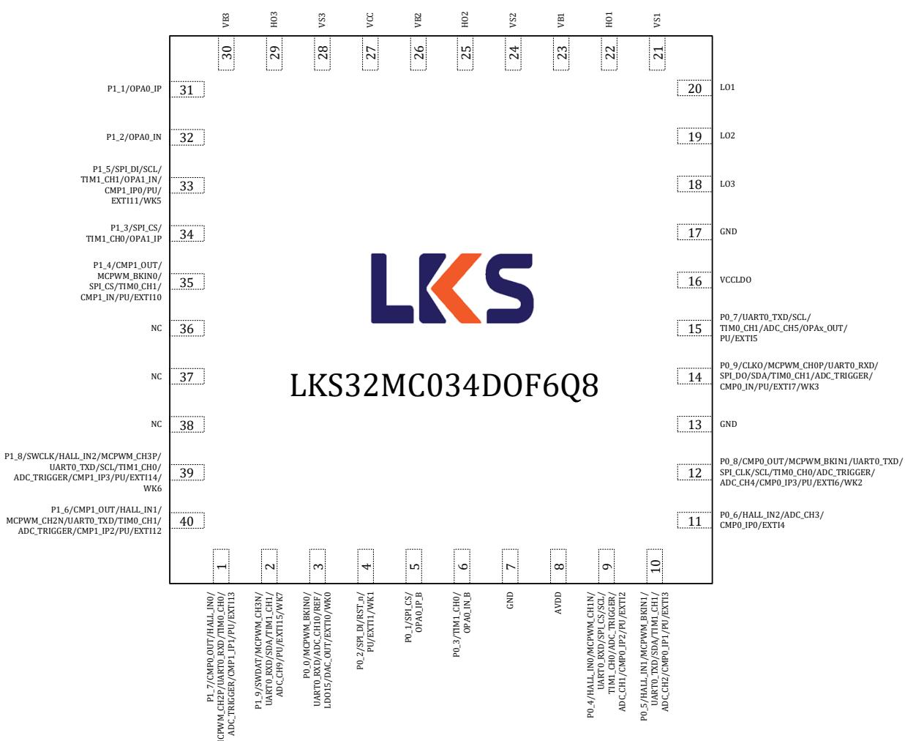  
图 3-7 LKS32MC034DOF6Q8/LKS32MC034SF6Q8 管脚分布图  
LKS32MC034DOF6Q8 与 LKS32MC034SF6Q8 引脚兼容，LKS32MC034SF6Q8 在 VCC 和三相 VBS之间集成了自举二极管。

  
图 3-8 LKS32MC034DOF6Q8/LKS32MC034SF6Q8 预驱连接示意图  
表 3-5 LKS32MC034DOF6Q8/LKS32MC034SF6Q8 管脚说明

<table><tr><td>0</td><td>GND</td><td>芯片地,位于芯片腹部</td></tr><tr><td rowspan="10">1</td><td>P1_7</td><td>P1.7</td></tr><tr><td>CMP0_OUT</td><td>比较器 0 输出</td></tr><tr><td>HALL_INO</td><td>HALL 接口输入 0</td></tr><tr><td>MCPWM_CH2P</td><td>PWM 通道 2 高边</td></tr><tr><td>UART0_RXD</td><td>串口 0 接收(发送)</td></tr><tr><td>TIMO_CH0</td><td>Timer0 通道 0</td></tr><tr><td>ADC_TRIGGER</td><td>ADC 触发信号输出(用于调试)</td></tr><tr><td>CMP1_IP1</td><td>比较器 1 正端输入 1</td></tr><tr><td>PU</td><td>内置 10kΩ 上拉电阻,软件可关闭</td></tr><tr><td>EXTI13</td><td>外部 GPIO 中断信号 13</td></tr><tr><td rowspan="5">2</td><td>P1_9</td><td>P1.9</td></tr><tr><td>SWDAT</td><td>SWD 数据</td></tr><tr><td>MCPWM_CH3N</td><td>PWM 通道 3 低边</td></tr><tr><td>UART0_RXD</td><td>串口 0 接收(发送)</td></tr><tr><td>SDA</td><td>I2C 数据</td></tr></table>

管脚分布

<table><tr><td rowspan="5"></td><td>TIM1_CH1</td><td>Timer1 通道1</td></tr><tr><td>ADC_CH9</td><td>ADC 通道9</td></tr><tr><td>PU</td><td>内置 $10k\Omega$ 上拉电阻,软件可关闭</td></tr><tr><td>EXTI15</td><td>外部 GPIO 中断信号15</td></tr><tr><td>WK7</td><td>外部唤醒信号7</td></tr><tr><td rowspan="9">3</td><td>P0_0</td><td>P0.0</td></tr><tr><td>MCPWM_BKINO</td><td>PWM 停机输入信号0</td></tr><tr><td>UART0_RXD</td><td>串口0接收(发送)</td></tr><tr><td>ADC_CH10</td><td>ADC 通道10</td></tr><tr><td>REF</td><td>参考电压</td></tr><tr><td>LDO15</td><td>1.5V LDO 输出</td></tr><tr><td>DAC_OUT</td><td>DAC 输出</td></tr><tr><td>EXTIO</td><td>外部 GPIO 中断信号0</td></tr><tr><td>WK0</td><td>外部唤醒信号0</td></tr><tr><td rowspan="6">4</td><td>P0_2</td><td>P0.2</td></tr><tr><td>SPI_DI</td><td>SPI 数据输入(输出)</td></tr><tr><td>RST_n</td><td>复位引脚,P0.2 默认用作 RSTN。建议接一个  $10nF \sim 100nF$  的电容到地,并在 RSTN 和 AVDD 之间放置一个  $10k \sim 20k$  的上拉电阻。如果外部有上拉电阻,RSTN 的电容应为  $100nF$ 。P0.2 可切换为 GPIO,切换后可关闭  $10k\Omega$  上拉电阻。</td></tr><tr><td>PU</td><td>内置  $10k\Omega$  上拉电阻,软件可关闭</td></tr><tr><td>EXTI1</td><td>外部 GPIO 中断信号1</td></tr><tr><td>WK1</td><td>外部唤醒信号1</td></tr><tr><td rowspan="3">5</td><td>P0_1</td><td>P0.1</td></tr><tr><td>SPI_CS</td><td>SPI 片选</td></tr><tr><td>OPA0_IP_B</td><td>运放0正端输入B,请留意:OPA0 有两组输入信号,如果需要使用B组输入,需要设置 SYS_AFE_REG0[5] = 1。</td></tr><tr><td rowspan="3">6</td><td>P0_3</td><td>P0.3</td></tr><tr><td>TIM1_CH0</td><td>Timer1 通道0</td></tr><tr><td>OPA0_IN_B</td><td>运放0负端输入B,请留意:OPA0 有两组输入信号,如果需要使用B组输入,需要设置 SYS_AFE_REG0[5] = 1。</td></tr><tr><td>7</td><td>GND</td><td>芯片地,强烈建议多个地引脚在 PCB 上统一接地</td></tr><tr><td>8</td><td>AVDD</td><td>芯片5V LDO 输出</td></tr><tr><td rowspan="11">9</td><td>P0_4</td><td>P0.4</td></tr><tr><td>HALL_IN0</td><td>HALL 接口输入0</td></tr><tr><td>MCPWM_CH1N</td><td>PWM 通道1低边</td></tr><tr><td>UART0_RXD</td><td>串口0接收(发送)</td></tr><tr><td>SPI_CS</td><td>SPI 片选</td></tr><tr><td>SCL</td><td>I2C 时钟</td></tr><tr><td>TIM1_CH0</td><td>Timer1 通道0</td></tr><tr><td>ADC_TRIGGER</td><td>ADC 触发信号输出(用于调试)</td></tr><tr><td>ADC_CH1</td><td>ADC 通道1</td></tr><tr><td>CMP0_IP2</td><td>比较器0正端输入2</td></tr><tr><td>PU</td><td>内置  $10k\Omega$  上拉电阻,软件可关闭</td></tr></table>

管脚分布

<table><tr><td></td><td>EXTI2</td><td>外部 GPIO 中断信号 2</td></tr><tr><td rowspan="10">10</td><td>P0_5</td><td>P0.5</td></tr><tr><td>HALL_IN1</td><td>HALL 接口输入 1</td></tr><tr><td>MCPWM_BKIN1</td><td>PWM 停机输入信号 1</td></tr><tr><td>UART0_TXD</td><td>串口 0 发送(接收)</td></tr><tr><td>SDA</td><td>I2C 数据</td></tr><tr><td>TIM1_CH1</td><td>Timer1 通道 1</td></tr><tr><td>ADC_CH2</td><td>ADC 通道 2</td></tr><tr><td>CMP0_IP1</td><td>比较器 0 正端输入 1</td></tr><tr><td>PU</td><td>内置  $10k\Omega$  上拉电阻,软件可关闭</td></tr><tr><td>EXTI3</td><td>外部 GPIO 中断信号 3</td></tr><tr><td rowspan="5">11</td><td>P0_6</td><td>P0.6</td></tr><tr><td>HALL_IN2</td><td>HALL 接口输入 2</td></tr><tr><td>ADC_CH3</td><td>ADC 通道 3</td></tr><tr><td>CMP0_IP0</td><td>比较器 0 正端输入 0</td></tr><tr><td>EXTI4</td><td>外部 GPIO 中断信号 4</td></tr><tr><td rowspan="13">12</td><td>P0_8</td><td>P0.8</td></tr><tr><td>CMP0_OUT</td><td>比较器 0 输出</td></tr><tr><td>MCPWM_BKIN1</td><td>PWM 停机输入信号 1</td></tr><tr><td>UART0_TXD</td><td>串口 0 发送(接收)</td></tr><tr><td>SPI_CLK</td><td>SPI 时钟</td></tr><tr><td>SCL</td><td>I2C 时钟</td></tr><tr><td>TIM0_CH0</td><td>Timer0 通道 0</td></tr><tr><td>ADC_TRIGGER</td><td>ADC 触发信号输出(用于调试)</td></tr><tr><td>ADC_CH4</td><td>ADC 通道 4</td></tr><tr><td>CMP0_IP3</td><td>比较器 0 正端输入 3</td></tr><tr><td>PU</td><td>内置  $10k\Omega$  上拉电阻,软件可关闭</td></tr><tr><td>EXTI6</td><td>外部 GPIO 中断信号 6</td></tr><tr><td>WK2</td><td>外部唤醒信号 2</td></tr><tr><td>13</td><td>GND</td><td>芯片地,强烈建议多个地引脚在 PCB 上统一接地</td></tr><tr><td rowspan="12">14</td><td>P0_9</td><td>P0.9</td></tr><tr><td>CLKO</td><td>时钟输出(用于调试)</td></tr><tr><td>MCPWM_CHOP</td><td>PWM 通道 0 高边</td></tr><tr><td>UART0_RXD</td><td>串口 0 接收(发送)</td></tr><tr><td>SPI_DO</td><td>SPI 数据输出(输入)</td></tr><tr><td>SDA</td><td>I2C 数据</td></tr><tr><td>TIM0_CH1</td><td>Timer0 通道 1</td></tr><tr><td>ADC_TRIGGER</td><td>ADC 触发信号输出(用于调试)</td></tr><tr><td>CMP0_IN</td><td>比较器 0 负端输入</td></tr><tr><td>PU</td><td>内置  $10k\Omega$  上拉电阻,软件可关闭</td></tr><tr><td>EXTI7</td><td>外部 GPIO 中断信号 7</td></tr><tr><td>WK3</td><td>外部唤醒信号 3</td></tr><tr><td>15</td><td>P0_7</td><td>P0.7</td></tr></table>

管脚分布

<table><tr><td rowspan="7"></td><td>UART0_TXD</td><td>串口0发送(接收)</td></tr><tr><td>SCL</td><td>I2C时钟</td></tr><tr><td>TIM0_CH1</td><td>Timer0通道1</td></tr><tr><td>ADC_CH5</td><td>ADC通道5</td></tr><tr><td>OPAx_OUT</td><td>运放输出</td></tr><tr><td>PU</td><td>内置 $10k\Omega$ 上拉电阻,软件可关闭</td></tr><tr><td>EXTI5</td><td>外部GPIO中断信号5</td></tr><tr><td>16</td><td>VCCLDO</td><td>芯片内置5VLDO供电,输出电流限制&lt;80mA。去耦电容应&gt;0.33uF,且尽可能靠近该引脚放置。</td></tr><tr><td>17</td><td>GND</td><td>芯片地,强烈建议多个地引脚在PCB上统一接地</td></tr><tr><td>18</td><td>LO3</td><td>C相低边输出,由MCUP0.12控制,LO3极性与P0.12相同,即P0.12=1时, $L03=1$ 。需要设置MCPWM_SWAP=1。</td></tr><tr><td>19</td><td>LO2</td><td>B相低边输出,由MCUP0.11控制,LO2极性与P0.11相同,即P0.11=1时, $L02=1$ 。需要设置MCPWM_SWAP=1。</td></tr><tr><td>20</td><td>LO1</td><td>A相低边输出,由MCUP0.10控制,LO1极性与P0.10相同,即P0.10=1时, $L01=1$ 。需要设置MCPWM_SWAP=1。</td></tr><tr><td>21</td><td>VS1</td><td>高边浮动偏置电压1。</td></tr><tr><td>22</td><td>HO1</td><td>A相高边输出,由MCUP0.13控制,HO1极性与P0.13相同,即P0.13=1时, $HO1=1$ 。需要设置MCPWM_SWAP=1。</td></tr><tr><td>23</td><td>VB1</td><td>高边浮动电源电压1。</td></tr><tr><td>24</td><td>VS2</td><td>高边浮动偏置电压2。</td></tr><tr><td>25</td><td>HO2</td><td>B相高边输出,由MCUP0.14控制,HO2极性与P0.14相同,即P0.14=1时, $HO2=1$ 。需要设置MCPWM_SWAP=1。</td></tr><tr><td>26</td><td>VB2</td><td>高边浮动电源电压2。</td></tr><tr><td>27</td><td>VCC</td><td>预驱供电电源,4.5~20V</td></tr><tr><td>28</td><td>VS3</td><td>高边浮动偏置电压3。</td></tr><tr><td>29</td><td>HO3</td><td>C相高边输出,由MCUP0.15控制,HO3极性与P0.15相同,即P0.15=1时, $HO3=1$ 。需要设置MCPWM_SWAP=1。</td></tr><tr><td>30</td><td>VB3</td><td>高边浮动电源电压3。</td></tr><tr><td rowspan="2">31</td><td>P1_1</td><td>P1.1</td></tr><tr><td>OPA0_IP</td><td>运放0正端输入</td></tr><tr><td rowspan="2">32</td><td>P1_2</td><td>P1.2</td></tr><tr><td>OPA0_IN</td><td>运放0负端输入</td></tr><tr><td rowspan="9">33</td><td>P1_5</td><td>P1.5</td></tr><tr><td>SPI_DI</td><td>SPI数据输入(输出)</td></tr><tr><td>SCL</td><td>I2C时钟</td></tr><tr><td>TIM1_CH1</td><td>Timer1通道1</td></tr><tr><td>OPA1_IN</td><td>运放1负端输入</td></tr><tr><td>CMP1_IP0</td><td>比较器1正端输入0</td></tr><tr><td>PU</td><td>内置 $10k\Omega$ 上拉电阻,软件可关闭</td></tr><tr><td>EXTI11</td><td>外部GPIO中断信号11</td></tr><tr><td>WK5</td><td>外部唤醒信号5</td></tr><tr><td>34</td><td>P1_3SPI_CS</td><td>P1.3SPI 片选</td></tr><tr><td rowspan="2"></td><td>TIM1_CH0</td><td>Timer1 通道 0</td></tr><tr><td>OPA1_IP</td><td>运放 1 正端输入</td></tr><tr><td rowspan="8">35</td><td>P1_4</td><td>P1.4</td></tr><tr><td>CMP1_OUT</td><td>比较器 1 输出</td></tr><tr><td>MCPWM_BKIN0</td><td>PWM 停机输入信号 0</td></tr><tr><td>SPI_CS</td><td>SPI 片选</td></tr><tr><td>TIM0_CH1</td><td>Timer0 通道 1</td></tr><tr><td>CMP1_IN</td><td>比较器 1 负端输入</td></tr><tr><td>PU</td><td>内置  ${10}\mathrm{k}\Omega$  上拉电阻,软件可关闭</td></tr><tr><td>EXTI10</td><td>外部 GPIO 中断信号 10</td></tr><tr><td>36</td><td>NC</td><td>不连接</td></tr><tr><td>37</td><td>NC</td><td>不连接</td></tr><tr><td>38</td><td>NC</td><td>不连接</td></tr><tr><td rowspan="12">39</td><td>P1_8</td><td>P1.8</td></tr><tr><td>SWCLK</td><td>SWD 时钟</td></tr><tr><td>HALL_IN2</td><td>HALL 接口输入 2</td></tr><tr><td>MCPWM_CH3P</td><td>PWM 通道 3 高边</td></tr><tr><td>UART0_TXD</td><td>串口 0 发送(接收)</td></tr><tr><td>SCL</td><td>I2C 时钟</td></tr><tr><td>TIM1_CH0</td><td>Timer1 通道 0</td></tr><tr><td>ADC_TRIGGER</td><td>ADC 触发信号输出(用于调试)</td></tr><tr><td>CMP1_IP3</td><td>比较器 1 正端输入 3</td></tr><tr><td>PU</td><td>内置  ${10}\mathrm{k}\Omega$  上拉电阻,软件可关闭</td></tr><tr><td>EXTI14</td><td>外部 GPIO 中断信号 14</td></tr><tr><td>WK6</td><td>外部唤醒信号 6</td></tr><tr><td rowspan="10">40</td><td>P1_6</td><td>P1.6</td></tr><tr><td>CMP1_OUT</td><td>比较器 1 输出</td></tr><tr><td>HALL_IN1</td><td>HALL 接口输入 1</td></tr><tr><td>MCPWM_CH2N</td><td>PWM 通道 2 低边</td></tr><tr><td>UART0_TXD</td><td>串口 0 发送(接收)</td></tr><tr><td>TIM0_CH1</td><td>Timer0 通道 1</td></tr><tr><td>ADC_TRIGGER</td><td>ADC 触发信号输出(用于调试)</td></tr><tr><td>CMP1_IP2</td><td>比较器 1 正端输入 2</td></tr><tr><td>PU</td><td>内置  ${10}\mathrm{k}\Omega$  上拉电阻,软件可关闭</td></tr><tr><td>EXTI12</td><td>外部 GPIO 中断信号 12</td></tr></table>

## 3.1.7 LKS32MC034DOF6Q8B(C)/LKS32MC034SF6Q8B(C)

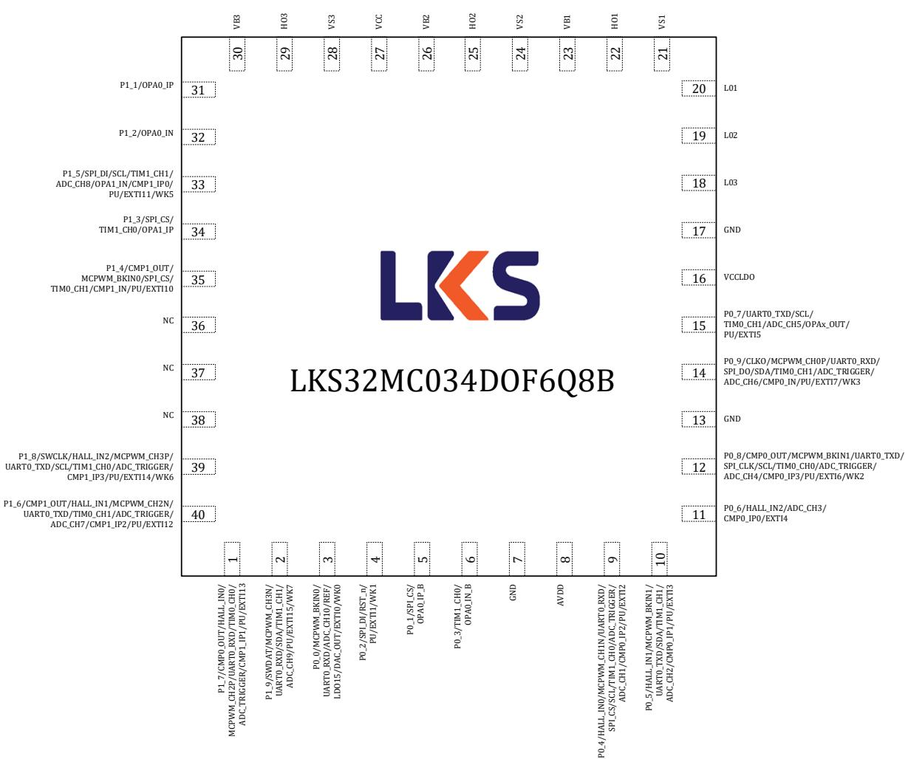  
图 3-9 LKS32MC034DOF6Q8B(C)/LKS32MC034SF6Q8B(C)管脚分布图

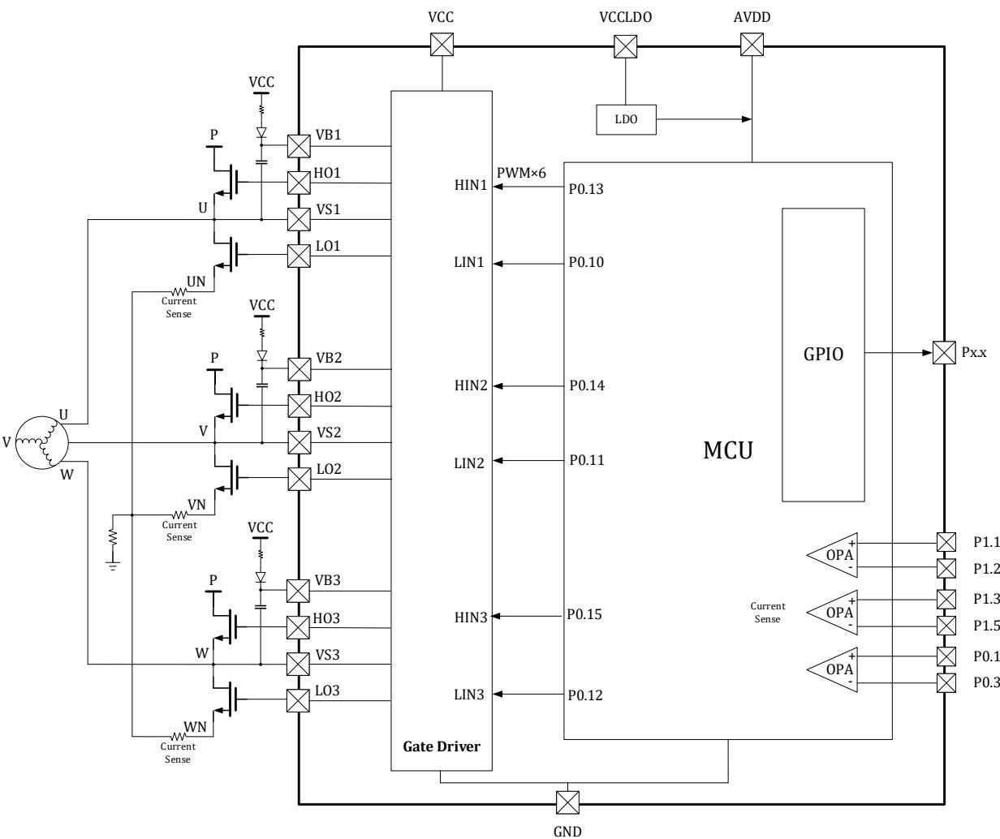  
图 3-10 LKS32MC034DOF6Q8B(C)/LKS32MC034SF6Q8B(C) 预驱连接示意图

表 3-6 LKS32MC034DOF6Q8B(C)/LKS32MC034SF6Q8B(C)管脚说明

<table><tr><td>0</td><td>GND</td><td>芯片地,位于芯片腹部</td></tr><tr><td rowspan="10">1</td><td>P1_7</td><td>P1.7</td></tr><tr><td>CMP0_OUT</td><td>比较器 0 输出</td></tr><tr><td>HALL_INO</td><td>HALL 接口输入 0</td></tr><tr><td>MCPWM_CH2P</td><td>PWM 通道 2 高边</td></tr><tr><td>UART0_RXD</td><td>串口 0 接收(发送)</td></tr><tr><td>TIMO_CH0</td><td>Timer0 通道 0</td></tr><tr><td>ADC_TRIGGER</td><td>ADC 触发信号输出(用于调试)</td></tr><tr><td>CMP1_IP1</td><td>比较器 1 正端输入 1</td></tr><tr><td>PU</td><td>内置 10kΩ 上拉电阻,软件可关闭</td></tr><tr><td>EXTI13</td><td>外部 GPIO 中断信号 13</td></tr><tr><td rowspan="5">2</td><td>P1_9</td><td>P1.9</td></tr><tr><td>SWDAT</td><td>SWD 数据</td></tr><tr><td>MCPWM_CH3N</td><td>PWM 通道 3 低边</td></tr><tr><td>UART0_RXD</td><td>串口 0 接收(发送)</td></tr><tr><td>SDA</td><td>I2C 数据</td></tr></table>

管脚分布

<table><tr><td rowspan="5"></td><td>TIM1_CH1</td><td>Timer1 通道1</td></tr><tr><td>ADC_CH9</td><td>ADC 通道9</td></tr><tr><td>PU</td><td>内置 $10k\Omega$ 上拉电阻,软件可关闭</td></tr><tr><td>EXTI15</td><td>外部 GPIO 中断信号15</td></tr><tr><td>WK7</td><td>外部唤醒信号7</td></tr><tr><td rowspan="9">3</td><td>P0_0</td><td>P0.0</td></tr><tr><td>MCPWM_BKINO</td><td>PWM 停机输入信号0</td></tr><tr><td>UART0_RXD</td><td>串口0接收(发送)</td></tr><tr><td>ADC_CH10</td><td>ADC 通道10</td></tr><tr><td>REF</td><td>参考电压</td></tr><tr><td>LDO15</td><td>1.5V LDO 输出</td></tr><tr><td>DAC_OUT</td><td>DAC 输出</td></tr><tr><td>EXTIO</td><td>外部 GPIO 中断信号0</td></tr><tr><td>WK0</td><td>外部唤醒信号0</td></tr><tr><td rowspan="6">4</td><td>P0_2</td><td>P0.2</td></tr><tr><td>SPI_DI</td><td>SPI 数据输入(输出)</td></tr><tr><td>RST_n</td><td>复位引脚,P0.2 默认用作 RSTN。建议接一个  $10nF \sim 100nF$  的电容到地,并在 RSTN 和 AVDD 之间放置一个  $10k \sim 20k$  的上拉电阻。如果外部有上拉电阻,RSTN 的电容应为  $100nF$ 。P0.2 可切换为 GPIO,切换后可关闭  $10k\Omega$  上拉电阻。</td></tr><tr><td>PU</td><td>内置  $10k\Omega$  上拉电阻,软件可关闭</td></tr><tr><td>EXTI1</td><td>外部 GPIO 中断信号1</td></tr><tr><td>WK1</td><td>外部唤醒信号1</td></tr><tr><td rowspan="3">5</td><td>P0_1</td><td>P0.1</td></tr><tr><td>SPI_CS</td><td>SPI 片选</td></tr><tr><td>OPA0_IP_B</td><td>运放0正端输入B,请留意:OPA0 有两组输入信号,如果需要使用B组输入,需要设置 SYS_AFE_REG0[5] = 1。</td></tr><tr><td rowspan="3">6</td><td>P0_3</td><td>P0.3</td></tr><tr><td>TIM1_CH0</td><td>Timer1 通道0</td></tr><tr><td>OPA0_IN_B</td><td>运放0负端输入B,请留意:OPA0 有两组输入信号,如果需要使用B组输入,需要设置 SYS_AFE_REG0[5] = 1。</td></tr><tr><td>7</td><td>GND</td><td>芯片地,强烈建议多个地引脚在 PCB 上统一接地</td></tr><tr><td>8</td><td>AVDD</td><td>芯片5V LDO 输出</td></tr><tr><td rowspan="11">9</td><td>P0_4</td><td>P0.4</td></tr><tr><td>HALL_IN0</td><td>HALL 接口输入0</td></tr><tr><td>MCPWM_CH1N</td><td>PWM 通道1低边</td></tr><tr><td>UART0_RXD</td><td>串口0接收(发送)</td></tr><tr><td>SPI_CS</td><td>SPI 片选</td></tr><tr><td>SCL</td><td>I2C 时钟</td></tr><tr><td>TIM1_CH0</td><td>Timer1 通道0</td></tr><tr><td>ADC_TRIGGER</td><td>ADC 触发信号输出(用于调试)</td></tr><tr><td>ADC_CH1</td><td>ADC 通道1</td></tr><tr><td>CMP0_IP2</td><td>比较器0正端输入2</td></tr><tr><td>PU</td><td>内置  $10k\Omega$  上拉电阻,软件可关闭</td></tr></table>

管脚分布

<table><tr><td></td><td>EXTI2</td><td>外部 GPIO 中断信号 2</td></tr><tr><td rowspan="10">10</td><td>P0_5</td><td>P0.5</td></tr><tr><td>HALL_IN1</td><td>HALL 接口输入 1</td></tr><tr><td>MCPWM_BKIN1</td><td>PWM 停机输入信号 1</td></tr><tr><td>UART0_TXD</td><td>串口 0 发送(接收)</td></tr><tr><td>SDA</td><td>I2C 数据</td></tr><tr><td>TIM1_CH1</td><td>Timer1 通道 1</td></tr><tr><td>ADC_CH2</td><td>ADC 通道 2</td></tr><tr><td>CMP0_IP1</td><td>比较器 0 正端输入 1</td></tr><tr><td>PU</td><td>内置  $10k\Omega$  上拉电阻,软件可关闭</td></tr><tr><td>EXTI3</td><td>外部 GPIO 中断信号 3</td></tr><tr><td rowspan="5">11</td><td>P0_6</td><td>P0.6</td></tr><tr><td>HALL_IN2</td><td>HALL 接口输入 2</td></tr><tr><td>ADC_CH3</td><td>ADC 通道 3</td></tr><tr><td>CMP0_IP0</td><td>比较器 0 正端输入 0</td></tr><tr><td>EXTI4</td><td>外部 GPIO 中断信号 4</td></tr><tr><td rowspan="13">12</td><td>P0_8</td><td>P0.8</td></tr><tr><td>CMP0_OUT</td><td>比较器 0 输出</td></tr><tr><td>MCPWM_BKIN1</td><td>PWM 停机输入信号 1</td></tr><tr><td>UART0_TXD</td><td>串口 0 发送(接收)</td></tr><tr><td>SPI_CLK</td><td>SPI 时钟</td></tr><tr><td>SCL</td><td>I2C 时钟</td></tr><tr><td>TIM0_CH0</td><td>Timer0 通道 0</td></tr><tr><td>ADC_TRIGGER</td><td>ADC 触发信号输出(用于调试)</td></tr><tr><td>ADC_CH4</td><td>ADC 通道 4</td></tr><tr><td>CMP0_IP3</td><td>比较器 0 正端输入 3</td></tr><tr><td>PU</td><td>内置  $10k\Omega$  上拉电阻,软件可关闭</td></tr><tr><td>EXTI6</td><td>外部 GPIO 中断信号 6</td></tr><tr><td>WK2</td><td>外部唤醒信号 2</td></tr><tr><td>13</td><td>GND</td><td>芯片地,强烈建议多个地引脚在 PCB 上统一接地</td></tr><tr><td rowspan="13">14</td><td>P0_9</td><td>P0.9</td></tr><tr><td>CLKO</td><td>时钟输出(用于调试)</td></tr><tr><td>MCPWM_CHOP</td><td>PWM 通道 0 高边</td></tr><tr><td>UART0_RXD</td><td>串口 0 接收(发送)</td></tr><tr><td>SPI_DO</td><td>SPI 数据输出(输入)</td></tr><tr><td>SDA</td><td>I2C 数据</td></tr><tr><td>TIM0_CH1</td><td>Timer0 通道 1</td></tr><tr><td>ADC_TRIGGER</td><td>ADC 触发信号输出(用于调试)</td></tr><tr><td>ADC_CH6</td><td>ADC 通道 6</td></tr><tr><td>CMP0_IN</td><td>比较器 0 负端输入</td></tr><tr><td>PU</td><td>内置  $10k\Omega$  上拉电阻,软件可关闭</td></tr><tr><td>EXTI7</td><td>外部 GPIO 中断信号 7</td></tr><tr><td>WK3</td><td>外部唤醒信号 3</td></tr><tr><td rowspan="8">15</td><td>P0_7</td><td>P0.7</td></tr><tr><td>UART0_TXD</td><td>串口0发送(接收)</td></tr><tr><td>SCL</td><td>I2C时钟</td></tr><tr><td>TIM0_CH1</td><td>Timer0通道1</td></tr><tr><td>ADC_CH5</td><td>ADC通道5</td></tr><tr><td>OPAx_OUT</td><td>运放输出</td></tr><tr><td>PU</td><td>内置 $10k\Omega$ 上拉电阻,软件可关闭</td></tr><tr><td>EXTI5</td><td>外部GPIO中断信号5</td></tr><tr><td>16</td><td>VCCLDO</td><td>5V LDO供电,输出电流限制&lt;80mA。去耦电容应&gt;0.33uF,且尽可能靠近该引脚放置。</td></tr><tr><td>17</td><td>GND</td><td>芯片地,强烈建议多个地引脚在PCB上统一接地</td></tr><tr><td>18</td><td>LO3</td><td>C相低边输出,由MCU P0.12控制,LO3极性与P0.12相同,即P0.12=1时, $LO3=1$ 。需要设置MCPWM_SWAP=1。</td></tr><tr><td>19</td><td>LO2</td><td>B相低边输出,由MCU P0.11控制,LO2极性与P0.11相同,即P0.11=1时, $LO2=1$ 。需要设置MCPWM_SWAP=1。</td></tr><tr><td>20</td><td>LO1</td><td>A相低边输出,由MCU P0.10控制,LO1极性与P0.10相同,即P0.10=1时, $LO1=1$ 。需要设置MCPWM_SWAP=1。</td></tr><tr><td>21</td><td>VS1</td><td>高边浮动偏置电压1。</td></tr><tr><td>22</td><td>HO1</td><td>A相高边输出,由MCU P0.13控制,HO1极性与P0.13相同,即P0.13=1时, $HO1=1$ 。需要设置MCPWM_SWAP=1。</td></tr><tr><td>23</td><td>VB1</td><td>高边浮动电源电压1。</td></tr><tr><td>24</td><td>VS2</td><td>高边浮动偏置电压2。</td></tr><tr><td>25</td><td>HO2</td><td>B相高边输出,由MCU P0.14控制,HO2极性与P0.14相同,即P0.14=1时, $HO2=1$ 。需要设置MCPWM_SWAP=1。</td></tr><tr><td>26</td><td>VB2</td><td>高边浮动电源电压2。</td></tr><tr><td>27</td><td>VCC</td><td>预驱供电电源</td></tr><tr><td>28</td><td>VS3</td><td>高边浮动偏置电压3。</td></tr><tr><td>29</td><td>HO3</td><td>C相高边输出,由MCU P0.15控制,HO3极性与P0.15相同,即P0.15=1时, $HO3=1$ 。需要设置MCPWM_SWAP=1。</td></tr><tr><td>30</td><td>VB3</td><td>高边浮动电源电压3。</td></tr><tr><td rowspan="2">31</td><td>P1_1</td><td>P1.1</td></tr><tr><td>OPA0_IP</td><td>运放0正端输入</td></tr><tr><td rowspan="2">32</td><td>P1_2</td><td>P1.2</td></tr><tr><td>OPA0_IN</td><td>运放0负端输入</td></tr><tr><td rowspan="10">33</td><td>P1_5</td><td>P1.5</td></tr><tr><td>SPI_DI</td><td>SPI数据输入(输出)</td></tr><tr><td>SCL</td><td>I2C时钟</td></tr><tr><td>TIM1_CH1</td><td>Timer1通道1</td></tr><tr><td>ADC_CH8</td><td>ADC通道8</td></tr><tr><td>OPA1_IN</td><td>运放1负端输入</td></tr><tr><td>CMP1_IP0</td><td>比较器1正端输入0</td></tr><tr><td>PU</td><td>内置 $10k\Omega$ 上拉电阻,软件可关闭</td></tr><tr><td>EXTI11</td><td>外部GPIO中断信号11</td></tr><tr><td>WK5</td><td>外部唤醒信号5</td></tr><tr><td rowspan="4">34</td><td>P1_3</td><td>P1.3</td></tr><tr><td>SPI_CS</td><td>SPI片选</td></tr><tr><td>TIM1_CH0</td><td>Timer1通道0</td></tr><tr><td>OPA1_IP</td><td>运放1正端输入</td></tr><tr><td rowspan="8">35</td><td>P1_4</td><td>P1.4</td></tr><tr><td>CMP1_OUT</td><td>比较器1输出</td></tr><tr><td>MCPWM_BKIN0</td><td>PWM停机输入信号0</td></tr><tr><td>SPI_CS</td><td>SPI片选</td></tr><tr><td>TIM0_CH1</td><td>Timer0通道1</td></tr><tr><td>CMP1_IN</td><td>比较器1负端输入</td></tr><tr><td>PU</td><td>内置10kΩ上拉电阻,软件可关闭</td></tr><tr><td>EXTI10</td><td>外部GPIO中断信号10</td></tr><tr><td>36</td><td>NC</td><td>不连接</td></tr><tr><td>37</td><td>NC</td><td>不连接</td></tr><tr><td>38</td><td>NC</td><td>不连接</td></tr><tr><td rowspan="12">39</td><td>P1_8</td><td>P1.8</td></tr><tr><td>SWCLK</td><td>SWD时钟</td></tr><tr><td>HALL_IN2</td><td>HALL接口输入2</td></tr><tr><td>MCPWM_CH3P</td><td>PWM通道3高边</td></tr><tr><td>UART0_TXD</td><td>串口0发送(接收)</td></tr><tr><td>SCL</td><td>I2C时钟</td></tr><tr><td>TIM1_CH0</td><td>Timer1通道0</td></tr><tr><td>ADC_TRIGGER</td><td>ADC触发信号输出(用于调试)</td></tr><tr><td>CMP1_IP3</td><td>比较器1正端输入3</td></tr><tr><td>PU</td><td>内置10kΩ上拉电阻,软件可关闭</td></tr><tr><td>EXTI14</td><td>外部GPIO中断信号14</td></tr><tr><td>WK6</td><td>外部唤醒信号6</td></tr><tr><td rowspan="11">40</td><td>P1_6</td><td>P1.6</td></tr><tr><td>CMP1_OUT</td><td>比较器1输出</td></tr><tr><td>HALL_IN1</td><td>HALL接口输入1</td></tr><tr><td>MCPWM_CH2N</td><td>PWM通道2低边</td></tr><tr><td>UART0_TXD</td><td>串口0发送(接收)</td></tr><tr><td>TIM0_CH1</td><td>Timer0通道1</td></tr><tr><td>ADC_TRIGGER</td><td>ADC触发信号输出(用于调试)</td></tr><tr><td>ADC_CH7</td><td>ADC通道7</td></tr><tr><td>CMP1_IP2</td><td>比较器1正端输入2</td></tr><tr><td>PU</td><td>内置10kΩ上拉电阻,软件可关闭</td></tr><tr><td>EXTI12</td><td>外部GPIO中断信号12</td></tr></table>

## 3.1.8 LKS32MC034S2F6Q8B/LKS32MC034S2F6Q8C

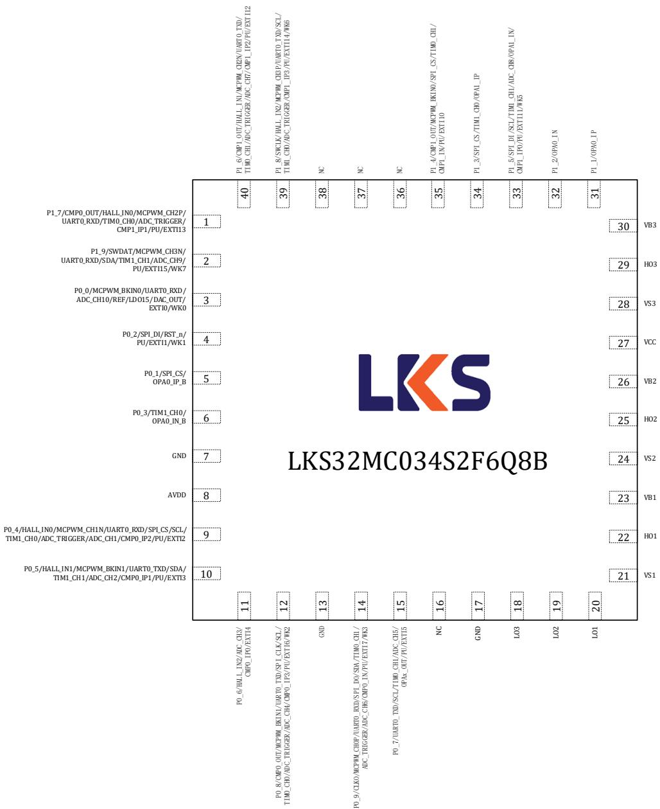  
图 3-11 LKS32MC034S2F6Q8B(C)管脚分布图

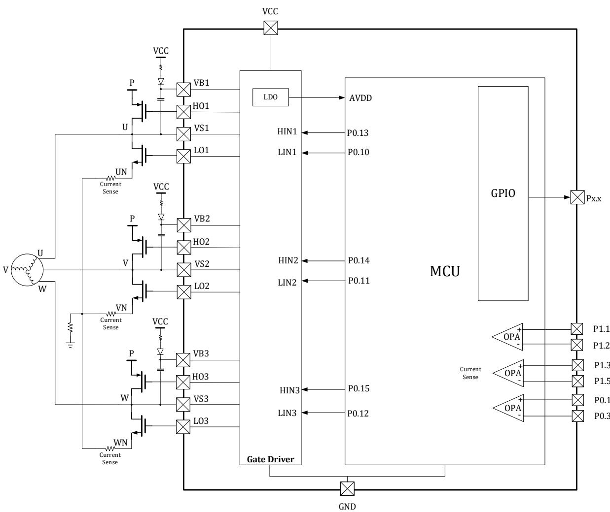  
图 3-12 LKS32MC034S2F6Q8B(C) 预驱连接示意图

表 3-7 LKS32MC034S2F6Q8B(C)管脚说明

<table><tr><td>0</td><td>GND</td><td>芯片地,位于芯片腹部</td></tr><tr><td rowspan="10">1</td><td>P1_7</td><td>P1.7</td></tr><tr><td>CMP0_OUT</td><td>比较器 0 输出</td></tr><tr><td>HALL_INO</td><td>HALL 接口输入 0</td></tr><tr><td>MCPWM_CH2P</td><td>PWM 通道 2 高边</td></tr><tr><td>UART0_RXD</td><td>串口 0 接收(发送)</td></tr><tr><td>TIMO_CH0</td><td>Timer0 通道 0</td></tr><tr><td>ADC_TRIGGER</td><td>ADC 触发信号输出(用于调试)</td></tr><tr><td>CMP1_IP1</td><td>比较器 1 正端输入 1</td></tr><tr><td>PU</td><td>内置 10kΩ 上拉电阻,软件可关闭</td></tr><tr><td>EXTI13</td><td>外部 GPIO 中断信号 13</td></tr><tr><td rowspan="5">2</td><td>P1_9</td><td>P1.9</td></tr><tr><td>SWDAT</td><td>SWD 数据</td></tr><tr><td>MCPWM_CH3N</td><td>PWM 通道 3 低边</td></tr><tr><td>UART0_RXD</td><td>串口 0 接收(发送)</td></tr><tr><td>SDA</td><td>I2C 数据</td></tr></table>

管脚分布

<table><tr><td rowspan="5"></td><td>TIM1_CH1</td><td>Timer1 通道1</td></tr><tr><td>ADC_CH9</td><td>ADC 通道9</td></tr><tr><td>PU</td><td>内置 $10k\Omega$ 上拉电阻,软件可关闭</td></tr><tr><td>EXTI15</td><td>外部 GPIO 中断信号15</td></tr><tr><td>WK7</td><td>外部唤醒信号7</td></tr><tr><td rowspan="9">3</td><td>P0_0</td><td>P0.0</td></tr><tr><td>MCPWM_BKINO</td><td>PWM 停机输入信号0</td></tr><tr><td>UART0_RXD</td><td>串口0接收(发送)</td></tr><tr><td>ADC_CH10</td><td>ADC 通道10</td></tr><tr><td>REF</td><td>参考电压</td></tr><tr><td>LDO15</td><td>1.5V LDO 输出</td></tr><tr><td>DAC_OUT</td><td>DAC 输出</td></tr><tr><td>EXTIO</td><td>外部 GPIO 中断信号0</td></tr><tr><td>WK0</td><td>外部唤醒信号0</td></tr><tr><td rowspan="6">4</td><td>P0_2</td><td>P0.2</td></tr><tr><td>SPI_DI</td><td>SPI 数据输入(输出)</td></tr><tr><td>RST_n</td><td>复位引脚,P0.2 默认用作 RSTN。建议接一个  $10nF \sim 100nF$  的电容到地,并在 RSTN 和 AVDD 之间放置一个  $10k \sim 20k$  的上拉电阻。如果外部有上拉电阻,RSTN 的电容应为  $100nF$ 。P0.2 可切换为 GPIO,切换后可关闭  $10k\Omega$  上拉电阻。</td></tr><tr><td>PU</td><td>内置  $10k\Omega$  上拉电阻,软件可关闭</td></tr><tr><td>EXTI1</td><td>外部 GPIO 中断信号1</td></tr><tr><td>WK1</td><td>外部唤醒信号1</td></tr><tr><td rowspan="3">5</td><td>P0_1</td><td>P0.1</td></tr><tr><td>SPI_CS</td><td>SPI 片选</td></tr><tr><td>OPA0_IP_B</td><td>运放0正端输入B,请留意:OPA0 有两组输入信号,如果需要使用B组输入,需要设置 SYS_AFE_REG0[5] = 1。</td></tr><tr><td rowspan="3">6</td><td>P0_3</td><td>P0.3</td></tr><tr><td>TIM1_CH0</td><td>Timer1 通道0</td></tr><tr><td>OPA0_IN_B</td><td>运放0负端输入B,请留意:OPA0 有两组输入信号,如果需要使用B组输入,需要设置 SYS_AFE_REG0[5] = 1。</td></tr><tr><td>7</td><td>GND</td><td>芯片地,强烈建议多个地引脚在 PCB 上统一接地</td></tr><tr><td>8</td><td>AVDD</td><td>芯片电源</td></tr><tr><td rowspan="11">9</td><td>P0_4</td><td>P0.4</td></tr><tr><td>HALL_IN0</td><td>HALL 接口输入0</td></tr><tr><td>MCPWM_CH1N</td><td>PWM 通道1低边</td></tr><tr><td>UART0_RXD</td><td>串口0接收(发送)</td></tr><tr><td>SPI_CS</td><td>SPI 片选</td></tr><tr><td>SCL</td><td>I2C 时钟</td></tr><tr><td>TIM1_CH0</td><td>Timer1 通道0</td></tr><tr><td>ADC_TRIGGER</td><td>ADC 触发信号输出(用于调试)</td></tr><tr><td>ADC_CH1</td><td>ADC 通道1</td></tr><tr><td>CMP0_IP2</td><td>比较器0正端输入2</td></tr><tr><td>PU</td><td>内置  $10k\Omega$  上拉电阻,软件可关闭</td></tr></table>

管脚分布

<table><tr><td></td><td>EXTI2</td><td>外部 GPIO 中断信号 2</td></tr><tr><td rowspan="10">10</td><td>P0_5</td><td>P0.5</td></tr><tr><td>HALL_IN1</td><td>HALL 接口输入 1</td></tr><tr><td>MCPWM_BKIN1</td><td>PWM 停机输入信号 1</td></tr><tr><td>UART0_TXD</td><td>串口 0 发送(接收)</td></tr><tr><td>SDA</td><td>I2C 数据</td></tr><tr><td>TIM1_CH1</td><td>Timer1 通道 1</td></tr><tr><td>ADC_CH2</td><td>ADC 通道 2</td></tr><tr><td>CMP0_IP1</td><td>比较器 0 正端输入 1</td></tr><tr><td>PU</td><td>内置  $10k\Omega$  上拉电阻,软件可关闭</td></tr><tr><td>EXTI3</td><td>外部 GPIO 中断信号 3</td></tr><tr><td rowspan="5">11</td><td>P0_6</td><td>P0.6</td></tr><tr><td>HALL_IN2</td><td>HALL 接口输入 2</td></tr><tr><td>ADC_CH3</td><td>ADC 通道 3</td></tr><tr><td>CMP0_IP0</td><td>比较器 0 正端输入 0</td></tr><tr><td>EXTI4</td><td>外部 GPIO 中断信号 4</td></tr><tr><td rowspan="13">12</td><td>P0_8</td><td>P0.8</td></tr><tr><td>CMP0_OUT</td><td>比较器 0 输出</td></tr><tr><td>MCPWM_BKIN1</td><td>PWM 停机输入信号 1</td></tr><tr><td>UART0_TXD</td><td>串口 0 发送(接收)</td></tr><tr><td>SPI_CLK</td><td>SPI 时钟</td></tr><tr><td>SCL</td><td>I2C 时钟</td></tr><tr><td>TIM0_CH0</td><td>Timer0 通道 0</td></tr><tr><td>ADC_TRIGGER</td><td>ADC 触发信号输出(用于调试)</td></tr><tr><td>ADC_CH4</td><td>ADC 通道 4</td></tr><tr><td>CMP0_IP3</td><td>比较器 0 正端输入 3</td></tr><tr><td>PU</td><td>内置  $10k\Omega$  上拉电阻,软件可关闭</td></tr><tr><td>EXTI6</td><td>外部 GPIO 中断信号 6</td></tr><tr><td>WK2</td><td>外部唤醒信号 2</td></tr><tr><td>13</td><td>GND</td><td>芯片地,强烈建议多个地引脚在 PCB 上统一接地</td></tr><tr><td rowspan="13">14</td><td>P0_9</td><td>P0.9</td></tr><tr><td>CLKO</td><td>时钟输出(用于调试)</td></tr><tr><td>MCPWM_CHOP</td><td>PWM 通道 0 高边</td></tr><tr><td>UART0_RXD</td><td>串口 0 接收(发送)</td></tr><tr><td>SPI_DO</td><td>SPI 数据输出(输入)</td></tr><tr><td>SDA</td><td>I2C 数据</td></tr><tr><td>TIM0_CH1</td><td>Timer0 通道 1</td></tr><tr><td>ADC_TRIGGER</td><td>ADC 触发信号输出(用于调试)</td></tr><tr><td>ADC_CH6</td><td>ADC 通道 6</td></tr><tr><td>CMP0_IN</td><td>比较器 0 负端输入</td></tr><tr><td>PU</td><td>内置  $10k\Omega$  上拉电阻,软件可关闭</td></tr><tr><td>EXTI7</td><td>外部 GPIO 中断信号 7</td></tr><tr><td>WK3</td><td>外部唤醒信号 3</td></tr><tr><td rowspan="8">15</td><td>P0_7</td><td>P0.7</td></tr><tr><td>UART0_TXD</td><td>串口0发送(接收)</td></tr><tr><td>SCL</td><td>I2C时钟</td></tr><tr><td>TIM0_CH1</td><td>Timer0通道1</td></tr><tr><td>ADC_CH5</td><td>ADC通道5</td></tr><tr><td>OPAx_OUT</td><td>运放输出</td></tr><tr><td>PU</td><td>内置 $10k\Omega$ 上拉电阻,软件可关闭</td></tr><tr><td>EXTI5</td><td>外部GPIO中断信号5</td></tr><tr><td>16</td><td>NC</td><td>不连接</td></tr><tr><td>17</td><td>GND</td><td>芯片地,强烈建议多个地引脚在PCB上统一接地</td></tr><tr><td>18</td><td>LO3</td><td>C相低边输出,由MCU P0.12控制, $LO3$ 极性与P0.12相同,即P0.12=1时, $LO3=1$ 。需要设置MCPWM_SWAP=1。</td></tr><tr><td>19</td><td>LO2</td><td>B相低边输出,由MCU P0.11控制, $LO2$ 极性与P0.11相同,即P0.11=1时, $LO2=1$ 。需要设置MCPWM_SWAP=1。</td></tr><tr><td>20</td><td>LO1</td><td>A相低边输出,由MCU P0.10控制, $LO1$ 极性与P0.10相同,即P0.10=1时, $LO1=1$ 。需要设置MCPWM_SWAP=1。</td></tr><tr><td>21</td><td>VS1</td><td>高边浮动偏置电压1。</td></tr><tr><td>22</td><td>HO1</td><td>A相高边输出,由MCU P0.13控制, $HO1$ 极性与P0.13相同,即P0.13=1时, $HO1=1$ 。需要设置MCPWM_SWAP=1。</td></tr><tr><td>23</td><td>VB1</td><td>高边浮动电源电压1。</td></tr><tr><td>24</td><td>VS2</td><td>高边浮动偏置电压2。</td></tr><tr><td>25</td><td>HO2</td><td>B相高边输出,由MCU P0.14控制, $HO2$ 极性与P0.14相同,即P0.14=1时, $HO2=1$ 。需要设置MCPWM_SWAP=1。</td></tr><tr><td>26</td><td>VB2</td><td>高边浮动电源电压2。</td></tr><tr><td>27</td><td>VCC</td><td>全桥驱动电源</td></tr><tr><td>28</td><td>VS3</td><td>高边浮动偏置电压3。</td></tr><tr><td>29</td><td>HO3</td><td>C相高边输出,由MCU P0.15控制, $HO3$ 极性与P0.15相同,即P0.15=1时, $HO3=1$ 。需要设置MCPWM_SWAP=1。</td></tr><tr><td>30</td><td>VB3</td><td>高边浮动电源电压3。</td></tr><tr><td rowspan="2">31</td><td>P1_1</td><td>P1.1</td></tr><tr><td>OPA0_IP</td><td>运放0正端输入</td></tr><tr><td rowspan="2">32</td><td>P1_2</td><td>P1.2</td></tr><tr><td>OPA0_IN</td><td>运放0负端输入</td></tr><tr><td rowspan="10">33</td><td>P1_5</td><td>P1.5</td></tr><tr><td>SPI_DI</td><td>SPI数据输入(输出)</td></tr><tr><td>SCL</td><td>I2C时钟</td></tr><tr><td>TIM1_CH1</td><td>Timer1通道1</td></tr><tr><td>ADC_CH8</td><td>ADC通道8</td></tr><tr><td>OPA1_IN</td><td>运放1负端输入</td></tr><tr><td>CMP1_IP0</td><td>比较器1正端输入0</td></tr><tr><td>PU</td><td>内置 $10k\Omega$ 上拉电阻,软件可关闭</td></tr><tr><td>EXTI11</td><td>外部GPIO中断信号11</td></tr><tr><td>WK5</td><td>外部唤醒信号5</td></tr><tr><td rowspan="4">34</td><td>P1_3</td><td>P1.3</td></tr><tr><td>SPI_CS</td><td>SPI片选</td></tr><tr><td>TIM1_CH0</td><td>Timer1通道0</td></tr><tr><td>OPA1_IP</td><td>运放1正端输入</td></tr><tr><td rowspan="8">35</td><td>P1_4</td><td>P1.4</td></tr><tr><td>CMP1_OUT</td><td>比较器1输出</td></tr><tr><td>MCPWM_BKIN0</td><td>PWM停机输入信号0</td></tr><tr><td>SPI_CS</td><td>SPI片选</td></tr><tr><td>TIM0_CH1</td><td>Timer0通道1</td></tr><tr><td>CMP1_IN</td><td>比较器1负端输入</td></tr><tr><td>PU</td><td>内置10kΩ上拉电阻,软件可关闭</td></tr><tr><td>EXTI10</td><td>外部GPIO中断信号10</td></tr><tr><td>36</td><td>NC</td><td>不连接</td></tr><tr><td>37</td><td>NC</td><td>不连接</td></tr><tr><td>38</td><td>NC</td><td>不连接</td></tr><tr><td rowspan="12">39</td><td>P1_8</td><td>P1.8</td></tr><tr><td>SWCLK</td><td>SWD时钟</td></tr><tr><td>HALL_IN2</td><td>HALL接口输入2</td></tr><tr><td>MCPWM_CH3P</td><td>PWM通道3高边</td></tr><tr><td>UART0_TXD</td><td>串口0发送(接收)</td></tr><tr><td>SCL</td><td>I2C时钟</td></tr><tr><td>TIM1_CH0</td><td>Timer1通道0</td></tr><tr><td>ADC_TRIGGER</td><td>ADC触发信号输出(用于调试)</td></tr><tr><td>CMP1_IP3</td><td>比较器1正端输入3</td></tr><tr><td>PU</td><td>内置10kΩ上拉电阻,软件可关闭</td></tr><tr><td>EXTI14</td><td>外部GPIO中断信号14</td></tr><tr><td>WK6</td><td>外部唤醒信号6</td></tr><tr><td rowspan="11">40</td><td>P1_6</td><td>P1.6</td></tr><tr><td>CMP1_OUT</td><td>比较器1输出</td></tr><tr><td>HALL_IN1</td><td>HALL接口输入1</td></tr><tr><td>MCPWM_CH2N</td><td>PWM通道2低边</td></tr><tr><td>UART0_TXD</td><td>串口0发送(接收)</td></tr><tr><td>TIM0_CH1</td><td>Timer0通道1</td></tr><tr><td>ADC_TRIGGER</td><td>ADC触发信号输出(用于调试)</td></tr><tr><td>ADC_CH7</td><td>ADC通道7</td></tr><tr><td>CMP1_IP2</td><td>比较器1正端输入2</td></tr><tr><td>PU</td><td>内置10kΩ上拉电阻,软件可关闭</td></tr><tr><td>EXTI12</td><td>外部GPIO中断信号12</td></tr></table>

## 3.1.9 LKS32MC034FLF6Q8B/LKS32MC034FLF6Q8C

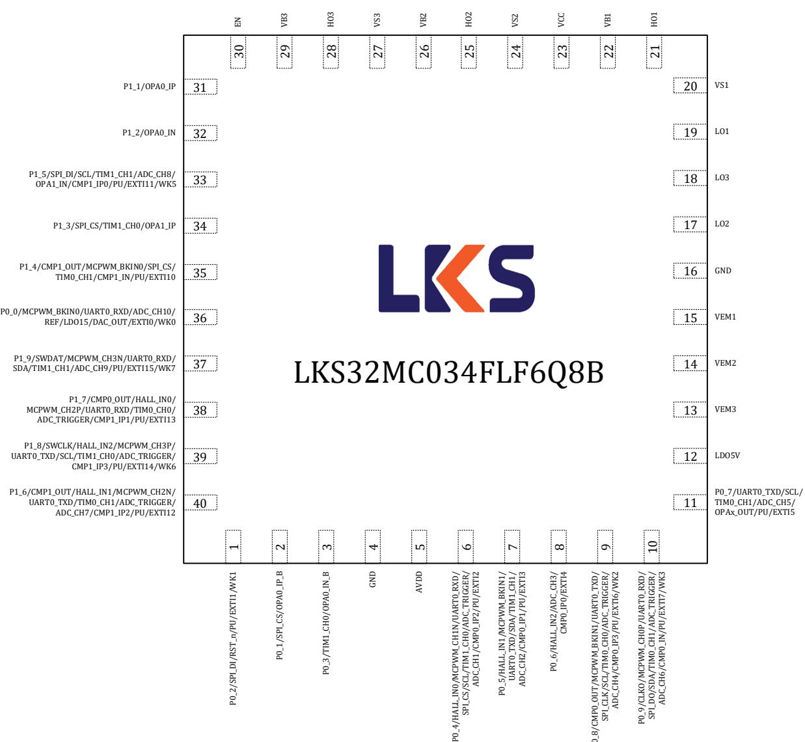  
图 3-13 LKS32MC034FLF6Q8B(C)管脚分布图

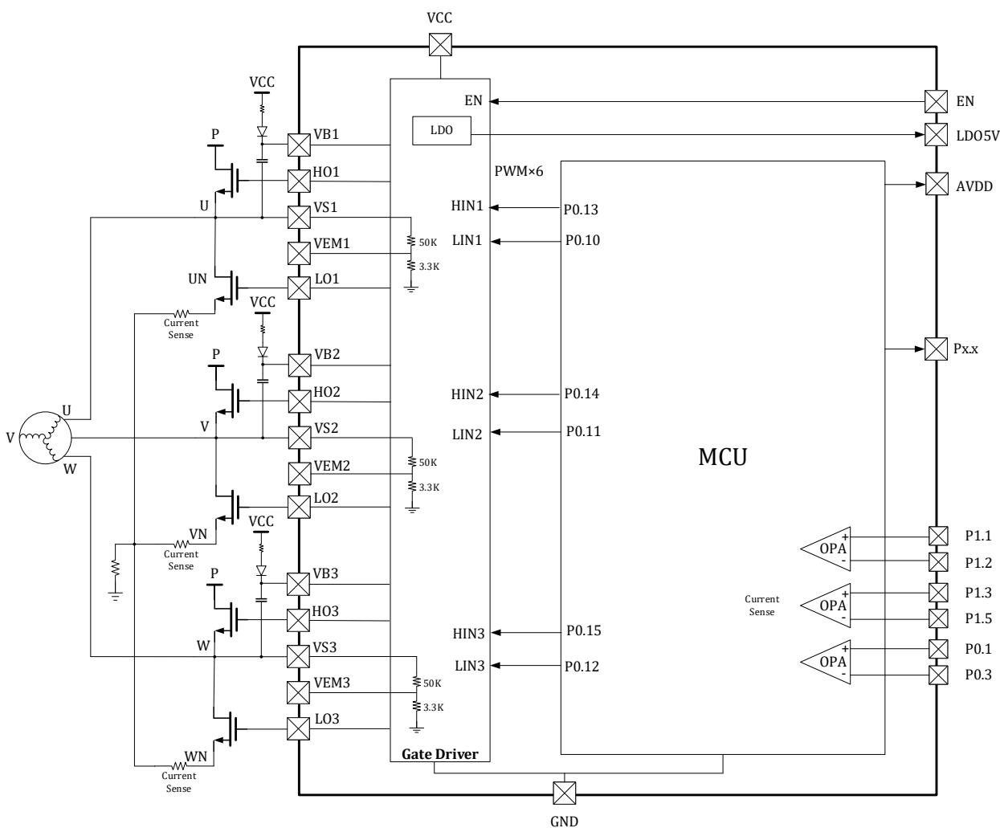

图 3-14 LKS32MC034FLF6Q8B(C) 预驱连接示意图  
表 3-8 LKS32MC034FLF6Q8B(C)管脚说明

<table><tr><td>0</td><td>GND</td><td>芯片地,位于芯片腹部</td></tr><tr><td rowspan="6">1</td><td>P0_2</td><td>P0.2</td></tr><tr><td>SPI_DI</td><td>SPI 数据输入(输出)</td></tr><tr><td>RST_n</td><td>复位引脚,P0.2 默认用作 RSTN。建议接一个 10nF~100nF 的电容到地,并在 RSTN 和 AVDD 之间放置一个 10k~20k 的上拉电阻。如果外部有上拉电阻,RSTN 的电容应为 100nF。P0.2 可切换为 GPIO,切换后可关闭 10kΩ 上拉电阻。</td></tr><tr><td>PU</td><td>内置 10kΩ 上拉电阻,软件可关闭</td></tr><tr><td>EXTI1</td><td>外部 GPIO 中断信号 1</td></tr><tr><td>WK1</td><td>外部唤醒信号 1</td></tr><tr><td rowspan="3">2</td><td>P0_1</td><td>P0.1</td></tr><tr><td>SPI_CS</td><td>SPI 片选</td></tr><tr><td>OPA0_IP_B</td><td>运放 0 正端输入 B,请留意:OPA0 有两组输入信号,如果需要使用 B 组输入,需要设置 SYS_AFE_REG0[5] = 1。</td></tr><tr><td rowspan="3">3</td><td>P0_3</td><td>P0.3</td></tr><tr><td>TIM1_CH0</td><td>Timer1 通道 0</td></tr><tr><td>OPA0_IN_B</td><td>运放 0 负端输入 B,请留意:OPA0 有两组输入信号,如果需要使用 B 组输入,需要设</td></tr></table>

管脚分布

<table><tr><td></td><td></td><td>置SYS_AFE_REG0[5] = 1。</td></tr><tr><td>4</td><td>GND</td><td>芯片地,强烈建议多个地引脚在PCB上统一接地</td></tr><tr><td>5</td><td>AVDD</td><td>芯片电源</td></tr><tr><td rowspan="12">6</td><td>P0_4</td><td>P0.4</td></tr><tr><td>HALL_IN0</td><td>HALL接口输入0</td></tr><tr><td>MCPWM_CH1N</td><td>PWM通道1低边</td></tr><tr><td>UART0_RXD</td><td>串口0接收(发送)</td></tr><tr><td>SPI_CS</td><td>SPI片选</td></tr><tr><td>SCL</td><td>I2C时钟</td></tr><tr><td>TIM1_CH0</td><td>Timer1通道0</td></tr><tr><td>ADC_TRIGGER</td><td>ADC触发信号输出(用于调试)</td></tr><tr><td>ADC_CH1</td><td>ADC通道1</td></tr><tr><td>CMP0_IP2</td><td>比较器0正端输入2</td></tr><tr><td>PU</td><td>内置 $10k\Omega$ 上拉电阻,软件可关闭</td></tr><tr><td>EXTI2</td><td>外部GPIO中断信号2</td></tr><tr><td rowspan="10">7</td><td>P0_5</td><td>P0.5</td></tr><tr><td>HALL_IN1</td><td>HALL接口输入1</td></tr><tr><td>MCPWM_BKIN1</td><td>PWM停机输入信号1</td></tr><tr><td>UART0_TXD</td><td>串口0发送(接收)</td></tr><tr><td>SDA</td><td>I2C数据</td></tr><tr><td>TIM1_CH1</td><td>Timer1通道1</td></tr><tr><td>ADC_CH2</td><td>ADC通道2</td></tr><tr><td>CMP0_IP1</td><td>比较器0正端输入1</td></tr><tr><td>PU</td><td>内置 $10k\Omega$ 上拉电阻,软件可关闭</td></tr><tr><td>EXTI3</td><td>外部GPIO中断信号3</td></tr><tr><td rowspan="5">8</td><td>P0_6</td><td>P0.6</td></tr><tr><td>HALL_IN2</td><td>HALL接口输入2</td></tr><tr><td>ADC_CH3</td><td>ADC通道3</td></tr><tr><td>CMP0_IP0</td><td>比较器0正端输入0</td></tr><tr><td>EXTI4</td><td>外部GPIO中断信号4</td></tr><tr><td rowspan="13">9</td><td>P0_8</td><td>P0.8</td></tr><tr><td>CMP0_OUT</td><td>比较器0输出</td></tr><tr><td>MCPWM_BKIN1</td><td>PWM停机输入信号1</td></tr><tr><td>UART0_TXD</td><td>串口0发送(接收)</td></tr><tr><td>SPI_CLK</td><td>SPI时钟</td></tr><tr><td>SCL</td><td>I2C时钟</td></tr><tr><td>TIM0_CH0</td><td>Timer0通道0</td></tr><tr><td>ADC_TRIGGER</td><td>ADC触发信号输出(用于调试)</td></tr><tr><td>ADC_CH4</td><td>ADC通道4</td></tr><tr><td>CMP0_IP3</td><td>比较器0正端输入3</td></tr><tr><td>PU</td><td>内置 $10k\Omega$ 上拉电阻,软件可关闭</td></tr><tr><td>EXTI6</td><td>外部GPIO中断信号6</td></tr><tr><td>WK2</td><td>外部唤醒信号2</td></tr><tr><td rowspan="13">10</td><td>P0_9</td><td>P0.9</td></tr><tr><td>CLKO</td><td>时钟输出(用于调试)</td></tr><tr><td>MCPWM_CHOP</td><td>PWM通道0高边</td></tr><tr><td>UART0_RXD</td><td>串口0接收(发送)</td></tr><tr><td>SPI_DO</td><td>SPI数据输出(输入)</td></tr><tr><td>SDA</td><td>I2C数据</td></tr><tr><td>TIM0_CH1</td><td>Timer0通道1</td></tr><tr><td>ADC_TRIGGER</td><td>ADC触发信号输出(用于调试)</td></tr><tr><td>ADC_CH6</td><td>ADC通道6</td></tr><tr><td>CMP0_IN</td><td>比较器0负端输入</td></tr><tr><td>PU</td><td>内置 $10k\Omega$ 上拉电阻,软件可关闭</td></tr><tr><td>EXTI7</td><td>外部GPIO中断信号7</td></tr><tr><td>WK3</td><td>外部唤醒信号3</td></tr><tr><td rowspan="8">11</td><td>P0_7</td><td>P0.7</td></tr><tr><td>UART0_TXD</td><td>串口0发送(接收)</td></tr><tr><td>SCL</td><td>I2C时钟</td></tr><tr><td>TIM0_CH1</td><td>Timer0通道1</td></tr><tr><td>ADC_CH5</td><td>ADC通道5</td></tr><tr><td>OPAx_OUT</td><td>运放输出</td></tr><tr><td>PU</td><td>内置 $10k\Omega$ 上拉电阻,软件可关闭</td></tr><tr><td>EXTI5</td><td>外部GPIO中断信号5</td></tr><tr><td>12</td><td>LDO5V</td><td>5VLDO输出,若芯片采用内部LDO供电,需将LDO5V与AVDD相连。</td></tr><tr><td>13</td><td>VEM3</td><td>C相VS $50k/3.3k$ 电阻分压输出,内置耐压5V的30pF电容。可通过外置电阻调整分压比例,若电压超过5V,会导致采样信号被二极管钳位</td></tr><tr><td>14</td><td>VEM2</td><td>B相VS $50k/3.3k$ 电阻分压输出,内置耐压5V的30pF电容。可通过外置电阻调整分压比例,若电压超过5V,会导致采样信号被二极管钳位</td></tr><tr><td>15</td><td>VEM1</td><td>A相VS $50k/3.3k$ 电阻分压输出,内置耐压5V的30pF电容。可通过外置电阻调整分压比例,若电压超过5V,会导致采样信号被二极管钳位</td></tr><tr><td>16</td><td>GND</td><td>芯片地,强烈建议多个地引脚在PCB上统一接地</td></tr><tr><td>17</td><td>LO2</td><td>B相低边输出,由MCUP0.11控制,LO2极性与P0.11相同,即P0.11=1时, $LO2=1$ 。需要设置MCPWM_SWAP=1。</td></tr><tr><td>18</td><td>LO3</td><td>C相低边输出,由MCUP0.12控制,LO3极性与P0.12相同,即P0.12=1时, $LO3=1$ 。需要设置MCPWM_SWAP=1。</td></tr><tr><td>19</td><td>LO1</td><td>A相低边输出,由MCUP0.10控制,LO1极性与P0.10相同,即P0.10=1时, $LO1=1$ 。需要设置MCPWM_SWAP=1。</td></tr><tr><td>20</td><td>VS1</td><td>高边浮动偏置电压1。</td></tr><tr><td>21</td><td>HO1</td><td>A相高边输出,由MCUP0.13控制,HO1极性与P0.13相同,即P0.13=1时, $HO1=1$ 。需要设置MCPWM_SWAP=1。</td></tr><tr><td>22</td><td>VB1</td><td>高边浮动电源电压1。</td></tr><tr><td>23</td><td>VCC</td><td>全桥驱动电源</td></tr><tr><td>24</td><td>VS2</td><td>高边浮动偏置电压2。</td></tr><tr><td>25</td><td>HO2</td><td>B相高边输出,由MCUP0.14控制,HO2极性与P0.14相同,即P0.14=1时, $HO2=1$ 。需要设置MCPWM_SWAP=1。</td></tr></table>

管脚分布

<table><tr><td>26</td><td>VB2</td><td>高边浮动电源电压2。</td></tr><tr><td>27</td><td>VS3</td><td>高边浮动偏置电压3。</td></tr><tr><td>28</td><td>HO3</td><td>C相 高边输出,由MCU P0.15控制, HO3极性与P0.15相同,即P0.15=1时, HO3=1。需要设置MCPWM_SWAP=1。</td></tr><tr><td>29</td><td>VB3</td><td>高边浮动电源电压3。</td></tr><tr><td>30</td><td>EN</td><td>栅极驱动使能,高电平使能预驱输出,低电平关闭输出。内置上拉电阻,上拉至5V。</td></tr><tr><td rowspan="2">31</td><td>P1_1</td><td>P1.1</td></tr><tr><td>OPA0_IP</td><td>运放0正端输入</td></tr><tr><td rowspan="2">32</td><td>P1_2</td><td>P1.2</td></tr><tr><td>OPA0_IN</td><td>运放0负端输入</td></tr><tr><td rowspan="10">33</td><td>P1_5</td><td>P1.5</td></tr><tr><td>SPI_DI</td><td>SPI数据输入(输出)</td></tr><tr><td>SCL</td><td>I2C时钟</td></tr><tr><td>TIM1_CH1</td><td>Timer1通道1</td></tr><tr><td>ADC_CH8</td><td>ADC通道8</td></tr><tr><td>OPA1_IN</td><td>运放1负端输入</td></tr><tr><td>CMP1_IP0</td><td>比较器1正端输入0</td></tr><tr><td>PU</td><td>内置10kΩ上拉电阻,软件可关闭</td></tr><tr><td>EXTI11</td><td>外部GPIO中断信号11</td></tr><tr><td>WK5</td><td>外部唤醒信号5</td></tr><tr><td rowspan="4">34</td><td>P1_3</td><td>P1.3</td></tr><tr><td>SPI_CS</td><td>SPI片选</td></tr><tr><td>TIM1_CH0</td><td>Timer1通道0</td></tr><tr><td>OPA1_IP</td><td>运放1正端输入</td></tr><tr><td rowspan="8">35</td><td>P1_4</td><td>P1.4</td></tr><tr><td>CMP1_OUT</td><td>比较器1输出</td></tr><tr><td>MCPWM_BKIN0</td><td>PWM停机输入信号0</td></tr><tr><td>SPI_CS</td><td>SPI片选</td></tr><tr><td>TIM0_CH1</td><td>Timer0通道1</td></tr><tr><td>CMP1_IN</td><td>比较器1负端输入</td></tr><tr><td>PU</td><td>内置10kΩ上拉电阻,软件可关闭</td></tr><tr><td>EXTI10</td><td>外部GPIO中断信号10</td></tr><tr><td rowspan="9">36</td><td>P0_0</td><td>P0.0</td></tr><tr><td>MCPWM_BKIN0</td><td>PWM停机输入信号0</td></tr><tr><td>UART0_RXD</td><td>串口0接收(发送)</td></tr><tr><td>ADC_CH10</td><td>ADC通道10</td></tr><tr><td>REF</td><td>参考电压</td></tr><tr><td>LDO15</td><td>1.5VLDO输出</td></tr><tr><td>DAC_OUT</td><td>DAC输出</td></tr><tr><td>EXTI0</td><td>外部GPIO中断信号0</td></tr><tr><td>WK0</td><td>外部唤醒信号0</td></tr><tr><td rowspan="2">37</td><td>P1_9</td><td>P1.9</td></tr><tr><td>SWDATMCPWM_CH3N</td><td>SWD数据PWM通道3低边</td></tr><tr><td rowspan="7"></td><td>UART0_RXD</td><td>串口0接收(发送)</td></tr><tr><td>SDA</td><td>I2C数据</td></tr><tr><td>TIM1_CH1</td><td>Timer1通道1</td></tr><tr><td>ADC_CH9</td><td>ADC通道9</td></tr><tr><td>PU</td><td>内置10kΩ上拉电阻,软件可关闭</td></tr><tr><td>EXTI15</td><td>外部GPIO中断信号15</td></tr><tr><td>WK7</td><td>外部唤醒信号7</td></tr><tr><td rowspan="10">38</td><td>P1_7</td><td>P1.7</td></tr><tr><td>CMP0_OUT</td><td>比较器0输出</td></tr><tr><td>HALL_IN0</td><td>HALL接口输入0</td></tr><tr><td>MCPWM_CH2P</td><td>PWM通道2高边</td></tr><tr><td>UART0_RXD</td><td>串口0接收(发送)</td></tr><tr><td>TIM0_CH0</td><td>Timer0通道0</td></tr><tr><td>ADC_TRIGGER</td><td>ADC触发信号输出(用于调试)</td></tr><tr><td>CMP1_IP1</td><td>比较器1正端输入1</td></tr><tr><td>PU</td><td>内置10kΩ上拉电阻,软件可关闭</td></tr><tr><td>EXTI13</td><td>外部GPIO中断信号13</td></tr><tr><td rowspan="12">39</td><td>P1_8</td><td>P1.8</td></tr><tr><td>SWCLK</td><td>SWD时钟</td></tr><tr><td>HALL_IN2</td><td>HALL接口输入2</td></tr><tr><td>MCPWM_CH3P</td><td>PWM通道3高边</td></tr><tr><td>UART0_TXD</td><td>串口0发送(接收)</td></tr><tr><td>SCL</td><td>I2C时钟</td></tr><tr><td>TIM1_CH0</td><td>Timer1通道0</td></tr><tr><td>ADC_TRIGGER</td><td>ADC触发信号输出(用于调试)</td></tr><tr><td>CMP1_IP3</td><td>比较器1正端输入3</td></tr><tr><td>PU</td><td>内置10kΩ上拉电阻,软件可关闭</td></tr><tr><td>EXTI14</td><td>外部GPIO中断信号14</td></tr><tr><td>WK6</td><td>外部唤醒信号6</td></tr><tr><td rowspan="11">40</td><td>P1_6</td><td>P1.6</td></tr><tr><td>CMP1_OUT</td><td>比较器1输出</td></tr><tr><td>HALL_IN1</td><td>HALL接口输入1</td></tr><tr><td>MCPWM_CH2N</td><td>PWM通道2低边</td></tr><tr><td>UART0_TXD</td><td>串口0发送(接收)</td></tr><tr><td>TIM0_CH1</td><td>Timer0通道1</td></tr><tr><td>ADC_TRIGGER</td><td>ADC触发信号输出(用于调试)</td></tr><tr><td>ADC_CH7</td><td>ADC通道7</td></tr><tr><td>CMP1_IP2</td><td>比较器1正端输入2</td></tr><tr><td>PU</td><td>内置10kΩ上拉电阻,软件可关闭</td></tr><tr><td>EXTI12</td><td>外部GPIO中断信号12</td></tr></table>

## 3.1.10 LKS32MC034F2LF6Q8C

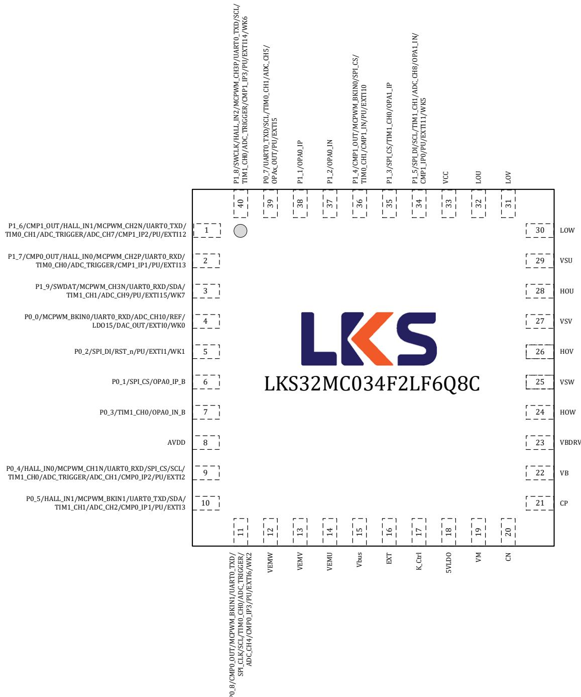  
图 3-15 LKS32MC034F2LF6Q8C 管脚分布图

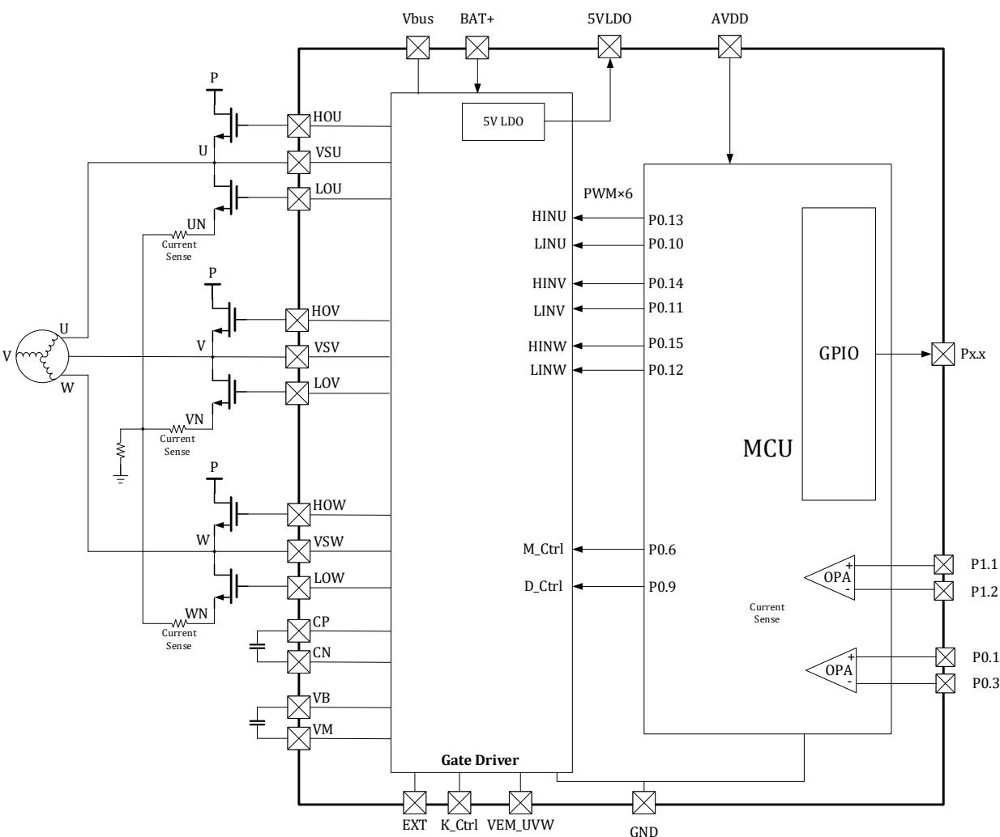  
图 3-16 LKS32MC034F2LF6Q8C 预驱连接示意图

表 3-10 LKS32MC034F2LF6Q8C 管脚说明

<table><tr><td rowspan="11">1</td><td>P1_6</td><td>P1.6</td></tr><tr><td>CMP1_OUT</td><td>比较器 1 输出</td></tr><tr><td>HALL_IN1</td><td>HALL 接口输入 1</td></tr><tr><td>MCPWM_CH2N</td><td>PWM 通道 2 低边</td></tr><tr><td>UART0_TXD</td><td>串口 0 发送(接收)</td></tr><tr><td>TIM0_CH1</td><td>Timer0 通道 1</td></tr><tr><td>ADC_TRIGGER</td><td>ADC 触发信号输出(用于调试)</td></tr><tr><td>ADC_CH7</td><td>ADC 通道 7</td></tr><tr><td>CMP1_IP2</td><td>比较器 1 正端输入 2</td></tr><tr><td>PU</td><td>内置 10kΩ 上拉电阻,软件可关闭</td></tr><tr><td>EXTI12</td><td>外部 GPIO 中断信号 12</td></tr><tr><td rowspan="5">2</td><td>P1_7</td><td>P1.7</td></tr><tr><td>CMP0_OUT</td><td>比较器 0 输出</td></tr><tr><td>HALL_IN0</td><td>HALL 接口输入 0</td></tr><tr><td>MCPWM_CH2P</td><td>PWM 通道 2 高边</td></tr><tr><td>UART0_RXDTIM0_CH0</td><td>串口 0 接收(发送)Timer0 通道0</td></tr><tr><td rowspan="4"></td><td>ADC_TRIGGER</td><td>ADC 触发信号输出(用于调试)</td></tr><tr><td>CMP1_IP1</td><td>比较器1正端输入1</td></tr><tr><td>PU</td><td>内置10kΩ上拉电阻,软件可关闭</td></tr><tr><td>EXTI13</td><td>外部 GPIO 中断信号13</td></tr><tr><td rowspan="10">3</td><td>P1_9</td><td>P1.9</td></tr><tr><td>SWDAT</td><td>SWD 数据</td></tr><tr><td>MCPWM_CH3N</td><td>PWM 通道3低边</td></tr><tr><td>UART0_RXD</td><td>串口0接收(发送)</td></tr><tr><td>SDA</td><td>I2C 数据</td></tr><tr><td>TIM1_CH1</td><td>Timer1 通道1</td></tr><tr><td>ADC_CH9</td><td>ADC 通道9</td></tr><tr><td>PU</td><td>内置10kΩ上拉电阻,软件可关闭</td></tr><tr><td>EXTI15</td><td>外部 GPIO 中断信号15</td></tr><tr><td>WK7</td><td>外部唤醒信号7</td></tr><tr><td rowspan="9">4</td><td>P0_0</td><td>P0.0</td></tr><tr><td>MCPWM_BKIN0</td><td>PWM 停机输入信号0</td></tr><tr><td>UART0_RXD</td><td>串口0接收(发送)</td></tr><tr><td>ADC_CH10</td><td>ADC 通道10</td></tr><tr><td>REF</td><td>参考电压</td></tr><tr><td>LDO15</td><td>1.5V LDO 输出</td></tr><tr><td>DAC_OUT</td><td>DAC 输出</td></tr><tr><td>EXTI0</td><td>外部 GPIO 中断信号0</td></tr><tr><td>WK0</td><td>外部唤醒信号0</td></tr><tr><td rowspan="6">5</td><td>P0_2</td><td>P0.2</td></tr><tr><td>SPI_DI</td><td>SPI 数据输入(输出)</td></tr><tr><td>RST_n</td><td>复位引脚,P0.2 默认用作 RSTN。建议接一个10nF~100nF的电容到地,并在RSTN和AVDD之间放置一个10k~20k的上拉电阻。如果外部有上拉电阻,RSTN的电容应为100nF。P0.2可切换为GPIO,切换后可关闭10kΩ上拉电阻。</td></tr><tr><td>PU</td><td>内置10kΩ上拉电阻,软件可关闭</td></tr><tr><td>EXTI1</td><td>外部 GPIO 中断信号1</td></tr><tr><td>WK1</td><td>外部唤醒信号1</td></tr><tr><td rowspan="3">6</td><td>P0_1</td><td>P0.1</td></tr><tr><td>SPI_CS</td><td>SPI 片选</td></tr><tr><td>OPA0_IP_B</td><td>运放0正端输入B,请留意:OPA0有两组输入信号,如果需要使用B组输入,需要设置SYS_AFE_REG0[5]=1。</td></tr><tr><td rowspan="3">7</td><td>P0_3</td><td>P0.3</td></tr><tr><td>TIM1_CH0</td><td>Timer1 通道0</td></tr><tr><td>OPA0_IN_B</td><td>运放0负端输入B,请留意:OPA0有两组输入信号,如果需要使用B组输入,需要设置SYS_AFE_REG0[5]=1。</td></tr><tr><td>8</td><td>AVDD</td><td>MCU 电源</td></tr><tr><td rowspan="2">9</td><td>P0_4</td><td>P0.4</td></tr><tr><td>HALL_IN0MCPWM_CH1N</td><td>HALL 接口输入0PWM通道1低边</td></tr><tr><td rowspan="9"></td><td>UART0_RXD</td><td>串口0接收(发送)</td></tr><tr><td>SPI_CS</td><td>SPI片选</td></tr><tr><td>SCL</td><td>I2C时钟</td></tr><tr><td>TIM1_CH0</td><td>Timer1通道0</td></tr><tr><td>ADC_TRIGGER</td><td>ADC触发信号输出(用于调试)</td></tr><tr><td>ADC_CH1</td><td>ADC通道1</td></tr><tr><td>CMP0_IP2</td><td>比较器0正端输入2</td></tr><tr><td>PU</td><td>内置 $10k\Omega$ 上拉电阻,软件可关闭</td></tr><tr><td>EXTI2</td><td>外部GPIO中断信号2</td></tr><tr><td rowspan="10">10</td><td>P0_5</td><td>P0.5</td></tr><tr><td>HALL_IN1</td><td>HALL接口输入1</td></tr><tr><td>MCPWM_BKIN1</td><td>PWM停机输入信号1</td></tr><tr><td>UART0_TXD</td><td>串口0发送(接收)</td></tr><tr><td>SDA</td><td>I2C数据</td></tr><tr><td>TIM1_CH1</td><td>Timer1通道1</td></tr><tr><td>ADC_CH2</td><td>ADC通道2</td></tr><tr><td>CMP0_IP1</td><td>比较器0正端输入1</td></tr><tr><td>PU</td><td>内置 $10k\Omega$ 上拉电阻,软件可关闭</td></tr><tr><td>EXTI3</td><td>外部GPIO中断信号3</td></tr><tr><td rowspan="13">11</td><td>P0_8</td><td>P0.8</td></tr><tr><td>CMP0_OUT</td><td>比较器0输出</td></tr><tr><td>MCPWM_BKIN1</td><td>PWM停机输入信号1</td></tr><tr><td>UART0_TXD</td><td>串口0发送(接收)</td></tr><tr><td>SPI_CLK</td><td>SPI时钟</td></tr><tr><td>SCL</td><td>I2C时钟</td></tr><tr><td>TIM0_CH0</td><td>Timer0通道0</td></tr><tr><td>ADC_TRIGGER</td><td>ADC触发信号输出(用于调试)</td></tr><tr><td>ADC_CH4</td><td>ADC通道4</td></tr><tr><td>CMP0_IP3</td><td>比较器0正端输入3</td></tr><tr><td>PU</td><td>内置 $10k\Omega$ 上拉电阻,软件可关闭</td></tr><tr><td>EXTI6</td><td>外部GPIO中断信号6</td></tr><tr><td>WK2</td><td>外部唤醒信号2</td></tr><tr><td>12</td><td>VEMW</td><td>W相VS分压电阻输出脚</td></tr><tr><td>13</td><td>VEMV</td><td>V相VS分压电阻输出脚</td></tr><tr><td>14</td><td>VEMU</td><td>U相VS分压电阻输出脚</td></tr><tr><td>15</td><td>Vbus</td><td>母线电压采样信号输出</td></tr><tr><td>16</td><td>EXT</td><td>外部双插开关接口(不需要此功能时EXT pad悬空)</td></tr><tr><td>17</td><td>K_Ctrl</td><td>掉电保持电路,电源接通控制接口,外部电子钥匙控制</td></tr><tr><td>18</td><td>5VLDO</td><td>LDO输出</td></tr><tr><td>19</td><td>VM</td><td>电荷泵输入</td></tr><tr><td>20</td><td>CN</td><td>电荷泵飞电源的负极板</td></tr><tr><td>21</td><td>CP</td><td>电荷泵飞电源的正极板</td></tr><tr><td>22</td><td>VB</td><td>电荷泵输出,作为高侧的悬浮电源</td></tr><tr><td>23</td><td>VBDRV</td><td>高侧驱动上拉供电</td></tr><tr><td>24</td><td>HOW</td><td>W相高侧输出,由MCU P0.15控制,HOW极性与P0.15相同,即P0.15=1时,HOW=1。</td></tr><tr><td>25</td><td>VSW</td><td>W通道高侧悬浮地</td></tr><tr><td>26</td><td>HOV</td><td>V相高侧输出,由MCU P0.14控制,HOW极性与P0.14相同,即P0.14=1时,HOV=1。</td></tr><tr><td>27</td><td>VSV</td><td>V通道高侧悬浮地</td></tr><tr><td>28</td><td>HOU</td><td>U相高侧输出,由MCU P0.13控制,HOU极性与P0.13相同,即P0.13=1时,HOU=1。</td></tr><tr><td>29</td><td>VSU</td><td>U通道高侧悬浮地</td></tr><tr><td>30</td><td>LOW</td><td>W相低侧输出,由MCU P0.12控制,LOW极性与P0.12相同,即P0.12=1时,HOW=1。</td></tr><tr><td>31</td><td>LOV</td><td>V相低侧输出,由MCU P0.11控制,LOV极性与P0.11相同,即P0.11=1时,HOV=1。</td></tr><tr><td>32</td><td>LOU</td><td>U相低侧输出,由MCU P0.10控制,LOU极性与P0.10相同,即P0.10=1时,HOU=1。</td></tr><tr><td>33</td><td>VCC+</td><td>预驱工作电源输入端</td></tr><tr><td rowspan="10">34</td><td>P1_5</td><td>P1.5</td></tr><tr><td>SPI_DI</td><td>SPI数据输入(输出)</td></tr><tr><td>SCL</td><td>I2C时钟</td></tr><tr><td>TIM1_CH1</td><td>Timer1通道1</td></tr><tr><td>ADC_CH8</td><td>ADC通道8</td></tr><tr><td>OPA1_IN</td><td>运放1负端输入</td></tr><tr><td>CMP1_IP0</td><td>比较器1正端输入0</td></tr><tr><td>PU</td><td>内置 $10k\Omega$ 上拉电阻,软件可关闭</td></tr><tr><td>EXTI11</td><td>外部GPIO中断信号11</td></tr><tr><td>WK5</td><td>外部唤醒信号5</td></tr><tr><td rowspan="4">35</td><td>P1_3</td><td>P1.3</td></tr><tr><td>SPI_CS</td><td>SPI片选</td></tr><tr><td>TIM1_CH0</td><td>Timer1通道0</td></tr><tr><td>OPA1_IP</td><td>运放1正端输入</td></tr><tr><td rowspan="8">36</td><td>P1_4</td><td>P1.4</td></tr><tr><td>CMP1_OUT</td><td>比较器1输出</td></tr><tr><td>MCPWM_BKIN0</td><td>PWM停机输入信号0</td></tr><tr><td>SPI_CS</td><td>SPI片选</td></tr><tr><td>TIM0_CH1</td><td>Timer0通道1</td></tr><tr><td>CMP1_IN</td><td>比较器1负端输入</td></tr><tr><td>PU</td><td>内置 $10k\Omega$ 上拉电阻,软件可关闭</td></tr><tr><td>EXTI10</td><td>外部GPIO中断信号10</td></tr><tr><td rowspan="2">37</td><td>P1_2</td><td>P1.2</td></tr><tr><td>OPA0_IN</td><td>运放0负端输入</td></tr><tr><td rowspan="2">38</td><td>P1_1</td><td>P1.1</td></tr><tr><td>OPA0_IP</td><td>运放0正端输入</td></tr><tr><td rowspan="5">39</td><td>P0_7</td><td>P0.7</td></tr><tr><td>UART0_TXD</td><td>串口0发送(接收)</td></tr><tr><td>SCL</td><td>I2C时钟</td></tr><tr><td>TIM0_CH1</td><td>Timer0通道1</td></tr><tr><td>ADC_CH5</td><td>ADC通道5</td></tr></table>

管脚分布

<table><tr><td rowspan="3"></td><td>OPAx_OUT</td><td>运放输出</td></tr><tr><td>PU</td><td>内置10kΩ上拉电阻,软件可关闭</td></tr><tr><td>EXTI5</td><td>外部GPIO中断信号5</td></tr><tr><td rowspan="12">40</td><td>P1_8</td><td>P1.8</td></tr><tr><td>SWCLK</td><td>SWD时钟</td></tr><tr><td>HALL_IN2</td><td>HALL接口输入2</td></tr><tr><td>MCPWM_CH3P</td><td>PWM通道3高边</td></tr><tr><td>UART0_TXD</td><td>串口0发送(接收)</td></tr><tr><td>SCL</td><td>I2C时钟</td></tr><tr><td>TIM1_CH0</td><td>Timer1通道0</td></tr><tr><td>ADC_TRIGGER</td><td>ADC触发信号输出(用于调试)</td></tr><tr><td>CMP1_IP3</td><td>比较器1正端输入3</td></tr><tr><td>PU</td><td>内置10kΩ上拉电阻,软件可关闭</td></tr><tr><td>EXTI14</td><td>外部GPIO中断信号14</td></tr><tr><td>WK6</td><td>外部唤醒信号6</td></tr></table>

## 3.1.11 LKS32MC0342FLK6Q8C

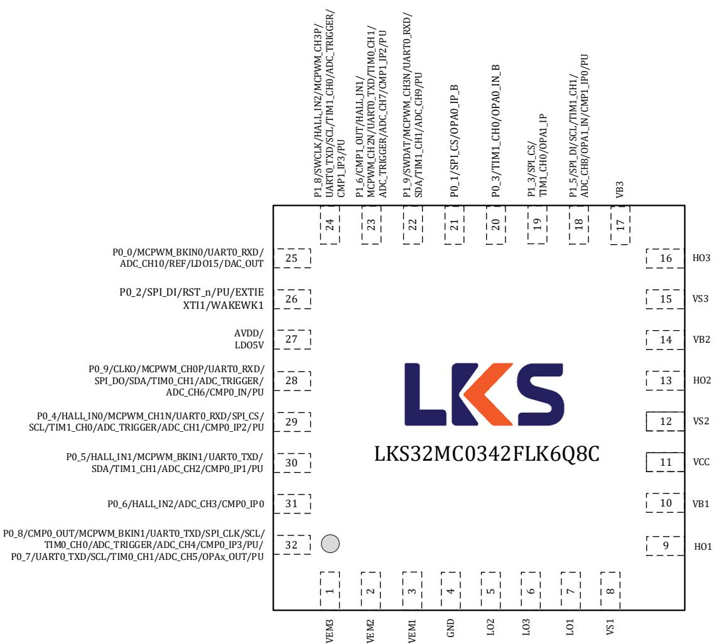  
图 3-17 LKS32MC0342FLK6Q8C 管脚分布图

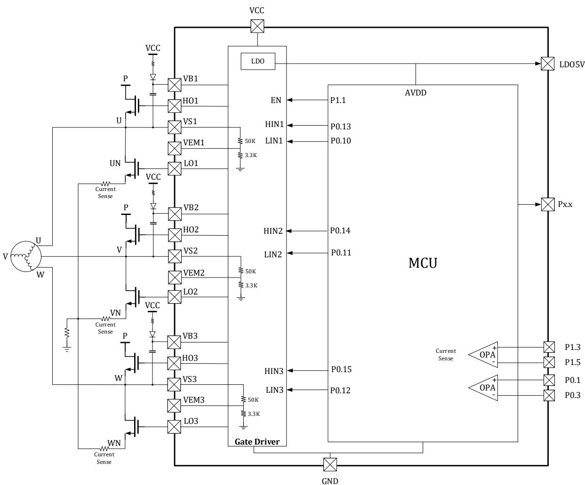

图 3-18 LKS32MC0342FLK6Q8C 预驱连接示意图  
表 3-11 LKS32MC0342FLK6Q8C 管脚说明

<table><tr><td>0</td><td>GND</td><td>芯片地,位于芯片腹部</td></tr><tr><td>1</td><td>VEM3</td><td>C相VS 50k/3.3k电阻分压输出,内置耐压5V的30pF电容。可通过外置电阻调整分压比例,若电压超过5V,会导致采样信号被二极管钳位</td></tr><tr><td>2</td><td>VEM2</td><td>B相VS 50k/3.3k电阻分压输出,内置耐压5V的30pF电容。可通过外置电阻调整分压比例,若电压超过5V,会导致采样信号被二极管钳位</td></tr><tr><td>3</td><td>VEM1</td><td>A相VS 50k/3.3k电阻分压输出,内置耐压5V的30pF电容。可通过外置电阻调整分压比例,若电压超过5V,会导致采样信号被二极管钳位</td></tr><tr><td>4</td><td>GND</td><td>芯片地,强烈建议多个地引脚在PCB上统一接地</td></tr><tr><td>5</td><td>LO2</td><td>B相低边输出,由MCU P0.11控制,LO2极性与P0.11相同,即P0.11=1时,LO2=1。需要设置MCPWM_SWAP=1。</td></tr><tr><td>6</td><td>LO3</td><td>C相低边输出,由MCU P0.12控制,LO3极性与P0.12相同,即P0.12=1时,LO3=1。需要设置MCPWM_SWAP=1。</td></tr><tr><td>7</td><td>LO1</td><td>A相低边输出,由MCU P0.10控制,LO1极性与P0.10相同,即P0.10=1时,LO1=1。需要设置MCPWM_SWAP=1。</td></tr><tr><td>8</td><td>VS1</td><td>高边浮动偏置电压1。</td></tr><tr><td>9</td><td>HO1</td><td>A相高边输出,由MCU P0.13控制,HO1极性与P0.13相同,即P0.13=1时,HO1=1。</td></tr></table>

管脚分布

<table><tr><td></td><td></td><td>需要设置 MCPWM_SWAP=1。</td></tr><tr><td>10</td><td>VB1</td><td>高边浮动电源电压 1。</td></tr><tr><td>11</td><td>VCC</td><td>全桥驱动电源</td></tr><tr><td>12</td><td>VS2</td><td>高边浮动偏置电压 2。</td></tr><tr><td>13</td><td>HO2</td><td>B 相 高边输出,由 MCU P0.14 控制,HO2 极性与 P0.14 相同,即 P0.14=1 时,HO2=1。需要设置 MCPWM_SWAP=1。</td></tr><tr><td>14</td><td>VB2</td><td>高边浮动电源电压 2。</td></tr><tr><td>15</td><td>VS3</td><td>高边浮动偏置电压 3。</td></tr><tr><td>16</td><td>HO3</td><td>C 相 高边输出,由 MCU P0.15 控制,HO3 极性与 P0.15 相同,即 P0.15=1 时,HO3=1。需要设置 MCPWM_SWAP=1。</td></tr><tr><td>17</td><td>VB3</td><td>高边浮动电源电压 3。</td></tr><tr><td rowspan="10">18</td><td>P1_5</td><td>P1.5</td></tr><tr><td>SPI_DI</td><td>SPI 数据输入(输出)</td></tr><tr><td>SCL</td><td>I2C 时钟</td></tr><tr><td>TIM1_CH1</td><td>Timer1 通道 1</td></tr><tr><td>ADC_CH8</td><td>ADC 通道 8</td></tr><tr><td>OPA1_IN</td><td>运放 1 负端输入</td></tr><tr><td>CMP1_IP0</td><td>比较器 1 正端输入 0</td></tr><tr><td>PU</td><td>内置 10kΩ 上拉电阻,软件可关闭</td></tr><tr><td>EXTI11</td><td>外部 GPIO 中断信号 11</td></tr><tr><td>WK5</td><td>外部唤醒信号 5</td></tr><tr><td rowspan="4">19</td><td>P1_3</td><td>P1.3</td></tr><tr><td>SPI_CS</td><td>SPI 片选</td></tr><tr><td>TIM1_CH0</td><td>Timer1 通道 0</td></tr><tr><td>OPA1_IP</td><td>运放 1 正端输入</td></tr><tr><td rowspan="3">20</td><td>P0_3</td><td>P0.3</td></tr><tr><td>TIM1_CH0</td><td>Timer1 通道 0</td></tr><tr><td>OPA0_IN_B</td><td>运放 0 负端输入 B,请留意:OPA0 有两组输入信号,如果需要使用 B 组输入,需要设置 SYS_AFE_REG0[5] = 1。</td></tr><tr><td rowspan="3">21</td><td>P0_1</td><td>P0.1</td></tr><tr><td>SPI_CS</td><td>SPI 片选</td></tr><tr><td>OPA0_IP_B</td><td>运放 0 正端输入 B,请留意:OPA0 有两组输入信号,如果需要使用 B 组输入,需要设置 SYS_AFE_REG0[5] = 1。</td></tr><tr><td rowspan="10">22</td><td>P1_9</td><td>P1.9</td></tr><tr><td>SWDAT</td><td>SWD 数据</td></tr><tr><td>MCPWM_CH3N</td><td>PWM 通道 3 低边</td></tr><tr><td>UART0_RXD</td><td>串口 0 接收(发送)</td></tr><tr><td>SDA</td><td>I2C 数据</td></tr><tr><td>TIM1_CH1</td><td>Timer1 通道 1</td></tr><tr><td>ADC_CH9</td><td>ADC 通道 9</td></tr><tr><td>PU</td><td>内置 10kΩ 上拉电阻,软件可关闭</td></tr><tr><td>EXTI15</td><td>外部 GPIO 中断信号 15</td></tr><tr><td>WK7</td><td>外部唤醒信号 7</td></tr></table>

管脚分布

<table><tr><td rowspan="11">23</td><td>P1_6</td><td>P1.6</td></tr><tr><td>CMP1_OUT</td><td>比较器1输出</td></tr><tr><td>HALL_IN1</td><td>HALL接口输入1</td></tr><tr><td>MCPWM_CH2N</td><td>PWM通道2低边</td></tr><tr><td>UART0_TXD</td><td>串口0发送(接收)</td></tr><tr><td>TIM0_CH1</td><td>Timer0通道1</td></tr><tr><td>ADC_TRIGGER</td><td>ADC触发信号输出(用于调试)</td></tr><tr><td>ADC_CH7</td><td>ADC通道7</td></tr><tr><td>CMP1_IP2</td><td>比较器1正端输入2</td></tr><tr><td>PU</td><td>内置 $10k\Omega$ 上拉电阻,软件可关闭</td></tr><tr><td>EXTI12</td><td>外部GPIO中断信号12</td></tr><tr><td rowspan="12">24</td><td>P1_8</td><td>P1.8</td></tr><tr><td>SWCLK</td><td>SWD时钟</td></tr><tr><td>HALL_IN2</td><td>HALL接口输入2</td></tr><tr><td>MCPWM_CH3P</td><td>PWM通道3高边</td></tr><tr><td>UART0_TXD</td><td>串口0发送(接收)</td></tr><tr><td>SCL</td><td>I2C时钟</td></tr><tr><td>TIM1_CH0</td><td>Timer1通道0</td></tr><tr><td>ADC_TRIGGER</td><td>ADC触发信号输出(用于调试)</td></tr><tr><td>CMP1_IP3</td><td>比较器1正端输入3</td></tr><tr><td>PU</td><td>内置 $10k\Omega$ 上拉电阻,软件可关闭</td></tr><tr><td>EXTI14</td><td>外部GPIO中断信号14</td></tr><tr><td>WK6</td><td>外部唤醒信号6</td></tr><tr><td rowspan="9">25</td><td>P0_0</td><td>P0.0</td></tr><tr><td>MCPWM_BKIN0</td><td>PWM停机输入信号0</td></tr><tr><td>UART0_RXD</td><td>串口0接收(发送)</td></tr><tr><td>ADC_CH10</td><td>ADC通道10</td></tr><tr><td>REF</td><td>参考电压</td></tr><tr><td>LDO15</td><td>1.5VLDO输出</td></tr><tr><td>DAC_OUT</td><td>DAC输出</td></tr><tr><td>EXTI0</td><td>外部GPIO中断信号10</td></tr><tr><td>WK0</td><td>外部唤醒信号0</td></tr><tr><td rowspan="6">26</td><td>P0_2</td><td>P0.2</td></tr><tr><td>SPI_DI</td><td>SPI数据输入(输出)</td></tr><tr><td>RST_n</td><td>复位引脚,P0.2默认用作RSTN。建议接一个 $10nF \sim 100nF$ 的电容到地,并在RSTN和AVDD之间放置一个 $10k \sim 20k$ 的上拉电阻。如果外部有上拉电阻,RSTN的电容应为 $100nF$ 。P0.2可切换为GPIO,切换后可关闭 $10k\Omega$ 上拉电阻。</td></tr><tr><td>PU</td><td>内置 $10k\Omega$ 上拉电阻,软件可关闭</td></tr><tr><td>EXTI1</td><td>外部GPIO中断信号11</td></tr><tr><td>WK1</td><td>外部唤醒信号1</td></tr><tr><td rowspan="2">27</td><td>AVDD</td><td>MCU电源</td></tr><tr><td>LDO5V</td><td>5VLDO输出</td></tr><tr><td>28</td><td>P0_9</td><td>P0.9</td></tr><tr><td rowspan="12"></td><td>CLKO</td><td>时钟输出(用于调试)</td></tr><tr><td>MCPWM_CHOP</td><td>PWM通道0高边</td></tr><tr><td>UART0_RXD</td><td>串口0接收(发送)</td></tr><tr><td>SPI_DO</td><td>SPI数据输出(输入)</td></tr><tr><td>SDA</td><td>I2C数据</td></tr><tr><td>TIM0_CH1</td><td>Timer0通道1</td></tr><tr><td>ADC_TRIGGER</td><td>ADC触发信号输出(用于调试)</td></tr><tr><td>ADC_CH6</td><td>ADC通道6</td></tr><tr><td>CMP0_IN</td><td>比较器0负端输入</td></tr><tr><td>PU</td><td>内置10kΩ上拉电阻,软件可关闭</td></tr><tr><td>EXTI7</td><td>外部GPIO中断信号7</td></tr><tr><td>WK3</td><td>外部唤醒信号3</td></tr><tr><td rowspan="12">29</td><td>P0_4</td><td>P0.4</td></tr><tr><td>HALL_IN0</td><td>HALL接口输入0</td></tr><tr><td>MCPWM_CH1N</td><td>PWM通道1低边</td></tr><tr><td>UART0_RXD</td><td>串口0接收(发送)</td></tr><tr><td>SPI_CS</td><td>SPI片选</td></tr><tr><td>SCL</td><td>I2C时钟</td></tr><tr><td>TIM1_CH0</td><td>Timer1通道0</td></tr><tr><td>ADC_TRIGGER</td><td>ADC触发信号输出(用于调试)</td></tr><tr><td>ADC_CH1</td><td>ADC通道1</td></tr><tr><td>CMP0_IP2</td><td>比较器0正端输入2</td></tr><tr><td>PU</td><td>内置10kΩ上拉电阻,软件可关闭</td></tr><tr><td>EXTI12</td><td>外部GPIO中断信号12</td></tr><tr><td rowspan="10">30</td><td>P0_5</td><td>P0.5</td></tr><tr><td>HALL_IN1</td><td>HALL接口输入1</td></tr><tr><td>MCPWM_BKIN1</td><td>PWM停机输入信号1</td></tr><tr><td>UART0_TXD</td><td>串口0发送(接收)</td></tr><tr><td>SDA</td><td>I2C数据</td></tr><tr><td>TIM1_CH1</td><td>Timer1通道1</td></tr><tr><td>ADC_CH2</td><td>ADC通道2</td></tr><tr><td>CMP0_IP1</td><td>比较器0正端输入1</td></tr><tr><td>PU</td><td>内置10kΩ上拉电阻,软件可关闭</td></tr><tr><td>EXTI3</td><td>外部GPIO中断信号13</td></tr><tr><td rowspan="5">31</td><td>P0_6</td><td>P0.6</td></tr><tr><td>HALL_IN2</td><td>HALL接口输入2</td></tr><tr><td>ADC_CH3</td><td>ADC通道3</td></tr><tr><td>CMP0_IP0</td><td>比较器0正端输入0</td></tr><tr><td>EXTI14</td><td>外部GPIO中断信号14</td></tr><tr><td rowspan="4">32</td><td>P0_8</td><td>P0.8</td></tr><tr><td>CMP0_OUT</td><td>比较器0输出</td></tr><tr><td>MCPWM_BKIN1</td><td>PWM停机输入信号1</td></tr><tr><td>UART0_TXD</td><td>串口0发送(接收)</td></tr></table>

管脚分布

<table><tr><td rowspan="16"></td><td>SPI_CLK</td><td>SPI 时钟</td></tr><tr><td>SCL</td><td>I2C 时钟</td></tr><tr><td>TIM0_CH0</td><td>Timer0 通道 0</td></tr><tr><td>ADC_TRIGGER</td><td>ADC 触发信号输出(用于调试)</td></tr><tr><td>ADC_CH4</td><td>ADC 通道 4</td></tr><tr><td>CMP0_IP3</td><td>比较器 0 正端输入 3</td></tr><tr><td>PU</td><td>内置 10kΩ 上拉电阻,软件可关闭</td></tr><tr><td>EXTI6</td><td>外部 GPIO 中断信号 6</td></tr><tr><td>WK2</td><td>外部唤醒信号 2</td></tr><tr><td>P0_7</td><td>P0.7</td></tr><tr><td>UART0_TXD</td><td>串口 0 发送(接收)</td></tr><tr><td>SCL</td><td>I2C 时钟</td></tr><tr><td>TIM0_CH1</td><td>Timer0 通道 1</td></tr><tr><td>ADC_CH5</td><td>ADC 通道 5</td></tr><tr><td>OPAx_OUT</td><td>运放输出</td></tr><tr><td>EXTI5</td><td>外部 GPIO 中断信号 5</td></tr></table>

## 3.1.12 LKS32MC034F2LM6Q8C

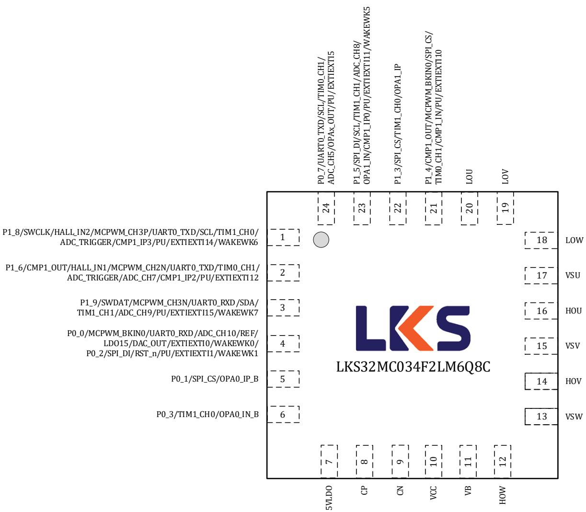  
图 3-19 LKS32MC034F2LM6Q8C 管脚分布图

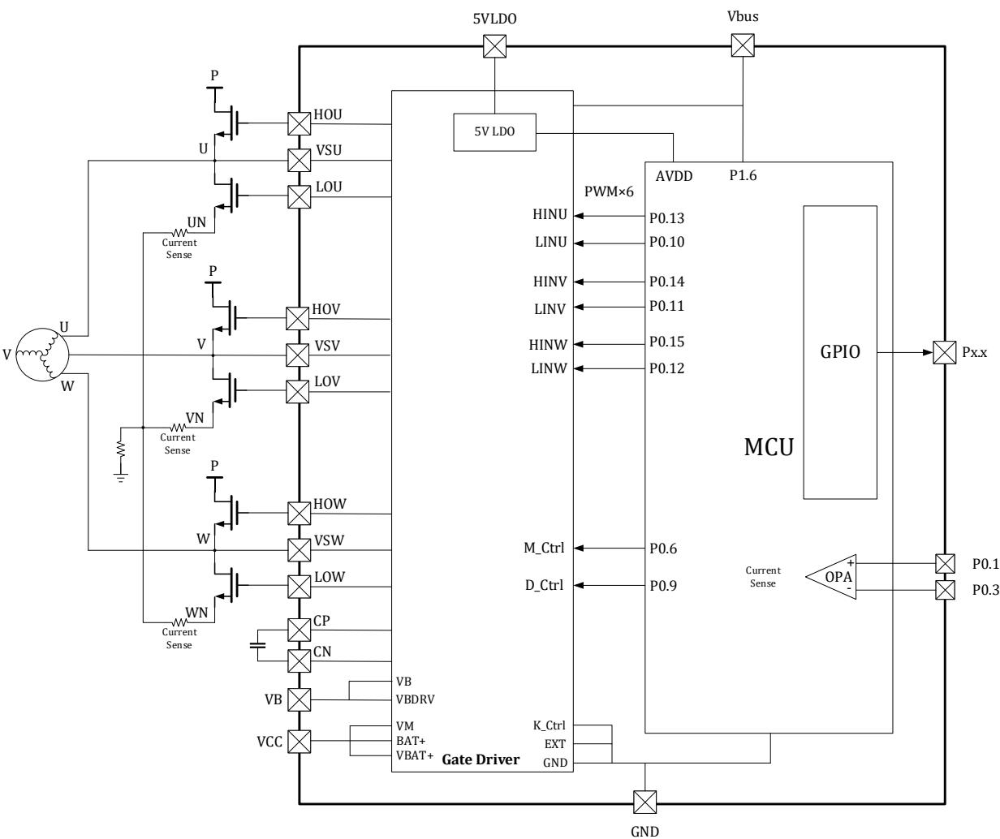  
图 3-20 LKS32MC034F2LM6Q8C 预驱连接示意图

表 3-12 LKS32MC034F2LM6Q8C 管脚说明

<table><tr><td rowspan="12">1</td><td>P1_8</td><td>P1.8</td></tr><tr><td>SWCLK</td><td>SWD 时钟</td></tr><tr><td>HALL_IN2</td><td>HALL 接口输入 2</td></tr><tr><td>MCPWM_CH3P</td><td>PWM 通道 3 高边</td></tr><tr><td>UART0_TXD</td><td>串口 0 发送(接收)</td></tr><tr><td>SCL</td><td>I2C 时钟</td></tr><tr><td>TIM1_CH0</td><td>Timer1 通道 0</td></tr><tr><td>ADC_TRIGGER</td><td>ADC 触发信号输出(用于调试)</td></tr><tr><td>CMP1_IP3</td><td>比较器 1 正端输入 3</td></tr><tr><td>PU</td><td>内置 10kΩ 上拉电阻,软件可关闭</td></tr><tr><td>EXTI14</td><td>外部 GPIO 中断信号 14</td></tr><tr><td>WAKEWK6</td><td>外部唤醒信号 6</td></tr><tr><td rowspan="4">2</td><td>P1_6</td><td>P1.6</td></tr><tr><td>CMP1_OUT</td><td>比较器 1 输出</td></tr><tr><td>HALL_IN1</td><td>HALL 接口输入 1</td></tr><tr><td>MCPWM_CH2N</td><td>PWM 通道 2 低边</td></tr></table>

管脚分布

<table><tr><td rowspan="7"></td><td>UART0_TXD</td><td>串口0发送(接收)</td></tr><tr><td>TIM0_CH1</td><td>Timer0通道1</td></tr><tr><td>ADC_TRIGGER</td><td>ADC触发信号输出(用于调试)</td></tr><tr><td>ADC_CH7</td><td>ADC通道7</td></tr><tr><td>CMP1_IP2</td><td>比较器1正端输入2</td></tr><tr><td>PU</td><td>内置 $10k\Omega$ 上拉电阻,软件可关闭</td></tr><tr><td>EXTI12</td><td>外部GPIO中断信号12</td></tr><tr><td rowspan="10">3</td><td>P1_9</td><td>P1.9</td></tr><tr><td>SWDAT</td><td>SWD数据</td></tr><tr><td>MCPWM_CH3N</td><td>PWM通道3低边</td></tr><tr><td>UART0_RXD</td><td>串口0接收(发送)</td></tr><tr><td>SDA</td><td>I2C数据</td></tr><tr><td>TIM1_CH1</td><td>Timer1通道1</td></tr><tr><td>ADC_CH9</td><td>ADC通道9</td></tr><tr><td>PU</td><td>内置 $10k\Omega$ 上拉电阻,软件可关闭</td></tr><tr><td>EXTI15</td><td>外部GPIO中断信号15</td></tr><tr><td>WAKEWK7</td><td>外部唤醒信号7</td></tr><tr><td rowspan="15">4</td><td>P0_0</td><td>P0.0</td></tr><tr><td>MCPWM_BKIN0</td><td>PWM停机输入信号0</td></tr><tr><td>UART0_RXD</td><td>串口0接收(发送)</td></tr><tr><td>ADC_CH10</td><td>ADC通道10</td></tr><tr><td>REF</td><td>参考电压</td></tr><tr><td>LDO15</td><td>1.5VLDO输出</td></tr><tr><td>DAC_OUT</td><td>DAC输出</td></tr><tr><td>EXTIO</td><td>外部GPIO中断信号0</td></tr><tr><td>WAKEWK0</td><td>外部唤醒信号0</td></tr><tr><td>P0_2</td><td>P0.2</td></tr><tr><td>SPI_DI</td><td>SPI数据输入(输出)</td></tr><tr><td>RST_n</td><td>复位引脚,P0.2默认用作RSTN。建议接一个 $10nF \sim 100nF$ 的电容到地,并在RSTN和AVDD之间放置一个 $10k \sim 20k$ 的上拉电阻。如果外部有上拉电阻,RSTN的电容应为 $100nF$ 。P0.2可切换为GPIO,切换后可关闭 $10k\Omega$ 上拉电阻。</td></tr><tr><td>PU</td><td>内置 $10k\Omega$ 上拉电阻,软件可关闭</td></tr><tr><td>EXTI1</td><td>外部GPIO中断信号1</td></tr><tr><td>WAKEWK1</td><td>外部唤醒信号1</td></tr><tr><td rowspan="3">5</td><td>P0_1</td><td>P0.1</td></tr><tr><td>SPI_CS</td><td>SPI片选</td></tr><tr><td>OPAO_IP_B</td><td>运放0正端输入B,请留意:OPAO有两组输入信号,如果需要使用B组输入,需要设置SYS_AFE_REG0[5]=1。</td></tr><tr><td rowspan="3">6</td><td>P0_3</td><td>P0.3</td></tr><tr><td>TIM1_CH0</td><td>Timer1通道0</td></tr><tr><td>OPAO_IN_B</td><td>运放0负端输入B,请留意:OPAO有两组输入信号,如果需要使用B组输入,需要设置SYS_AFE_REG0[5]=1。</td></tr><tr><td>7</td><td>5VLDO</td><td></td></tr><tr><td>8</td><td>CP</td><td>电荷泵飞电源的正极板</td></tr><tr><td>9</td><td>CN</td><td>电荷泵飞电源的负极板</td></tr><tr><td>10</td><td>VCC</td><td>工作电源输入端</td></tr><tr><td>11</td><td>VB</td><td>电荷泵输出</td></tr><tr><td>12</td><td>HOW</td><td>W相高侧输出</td></tr><tr><td>13</td><td>VSW</td><td>通道高侧悬浮地</td></tr><tr><td>14</td><td>HOV</td><td>V相高侧输出</td></tr><tr><td>15</td><td>VSV</td><td>V通道高侧悬浮地</td></tr><tr><td>16</td><td>HOU</td><td>U相高侧输出</td></tr><tr><td>17</td><td>VSU</td><td>U通道高侧悬浮地</td></tr><tr><td>18</td><td>LOW</td><td>W相低侧输出</td></tr><tr><td>19</td><td>LOV</td><td>V相低侧输出</td></tr><tr><td>20</td><td>LOU</td><td>U相低侧输出</td></tr><tr><td rowspan="8">21</td><td>P1_4</td><td>P1.4</td></tr><tr><td>CMP1_OUT</td><td>比较器1输出</td></tr><tr><td>MCPWM_BKIN0</td><td>PWM停机输入信号0</td></tr><tr><td>SPI_CS</td><td>SPI片选</td></tr><tr><td>TIM0_CH1</td><td>Timer0通道1</td></tr><tr><td>CMP1_IN</td><td>比较器1负端输入</td></tr><tr><td>PU</td><td>内置10kΩ上拉电阻,软件可关闭</td></tr><tr><td>EXTI10</td><td>外部GPIO中断信号10</td></tr><tr><td rowspan="4">22</td><td>P1_3</td><td>P1.3</td></tr><tr><td>SPI_CS</td><td>SPI片选</td></tr><tr><td>TIM1_CH0</td><td>Timer1通道0</td></tr><tr><td>OPA1_IP</td><td>运放1正端输入</td></tr><tr><td rowspan="10">23</td><td>P1_5</td><td>P1.5</td></tr><tr><td>SPI_DI</td><td>SPI数据输入(输出)</td></tr><tr><td>SCL</td><td>I2C时钟</td></tr><tr><td>TIM1_CH1</td><td>Timer1通道1</td></tr><tr><td>ADC_CH8</td><td>ADC通道8</td></tr><tr><td>OPA1_IN</td><td>运放1负端输入</td></tr><tr><td>CMP1_IP0</td><td>比较器1正端输入0</td></tr><tr><td>PU</td><td>内置10kΩ上拉电阻,软件可关闭</td></tr><tr><td>EXTI11</td><td>外部GPIO中断信号11</td></tr><tr><td>WAKEWK5</td><td>外部唤醒信号5</td></tr><tr><td rowspan="8">24</td><td>P0_7</td><td>P0.7</td></tr><tr><td>UART0_TXD</td><td>串口0发送(接收)</td></tr><tr><td>SCL</td><td>I2C时钟</td></tr><tr><td>TIM0_CH1</td><td>Timer0通道1</td></tr><tr><td>ADC_CH5</td><td>ADC通道5</td></tr><tr><td>OPAx_OUT</td><td>运放输出</td></tr><tr><td>PU</td><td>内置10kΩ上拉电阻,软件可关闭</td></tr><tr><td>EXTI5</td><td>外部GPIO中断信号5</td></tr></table>

## 3.1.13 LKS32MC034FLNK6Q8C

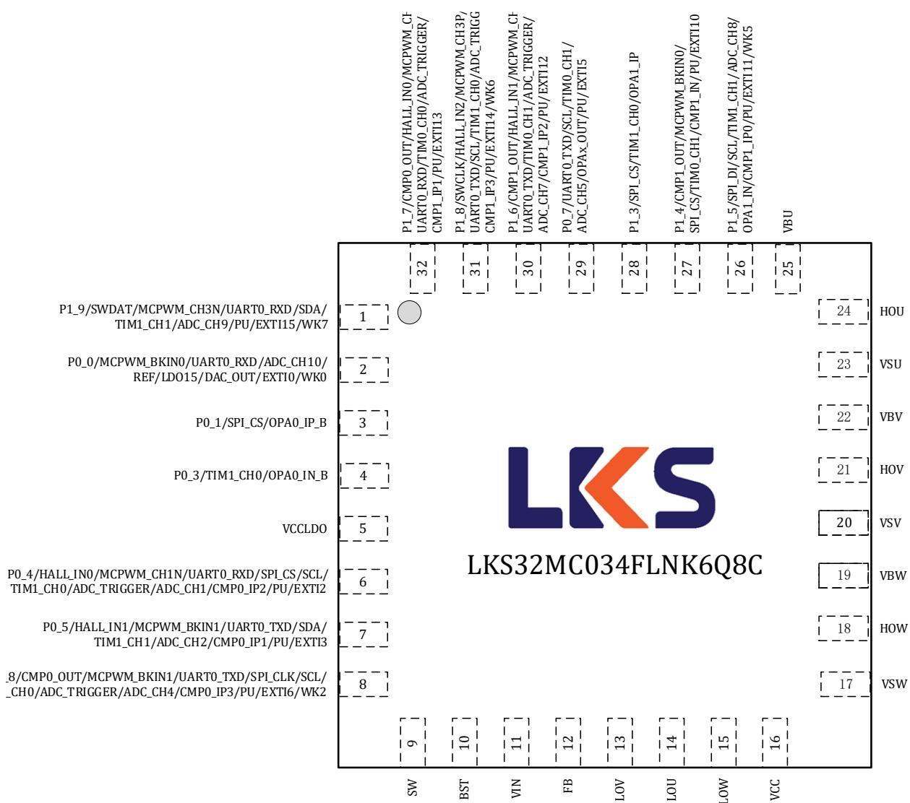  
图 3-21 LKS32MC034FLNK6Q8C 管脚分布图

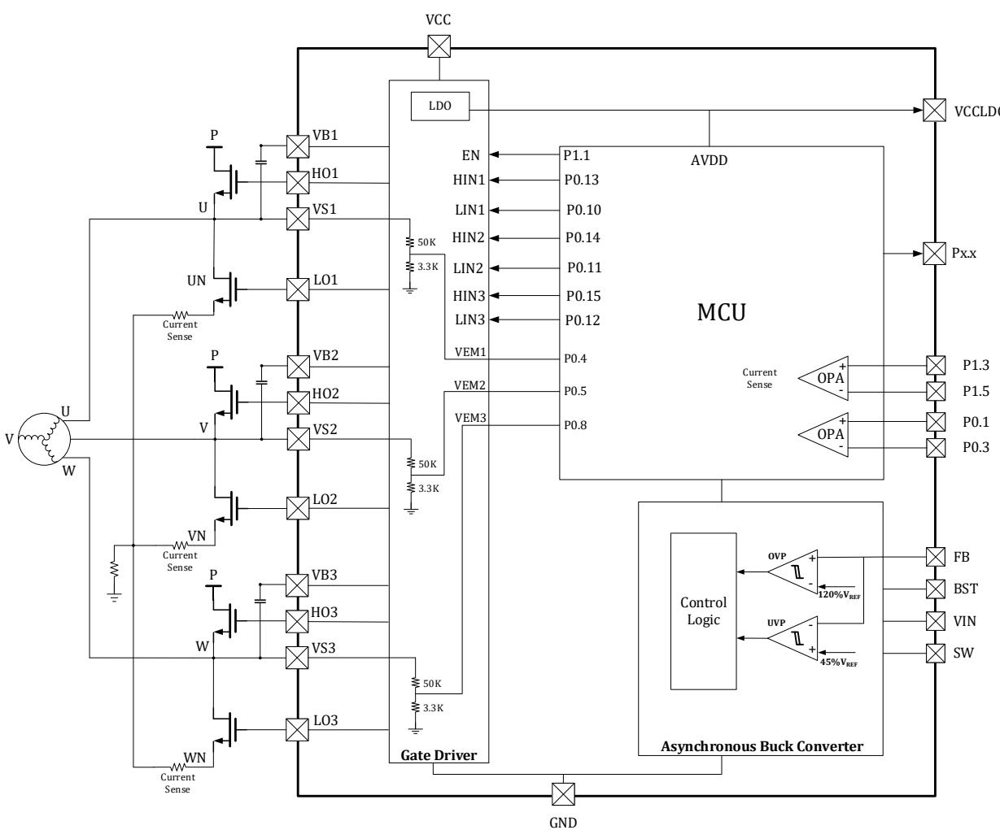  
图 3-22 LKS32MC034FLNK6Q8C 预驱连接示意图

表 3-13 LKS32MC034FLNK6Q8C 管脚说明

<table><tr><td rowspan="10">1</td><td>P1_9</td><td>P1.9</td></tr><tr><td>SWDAT</td><td>SWD 数据</td></tr><tr><td>MCPWM_CH3N</td><td>PWM 通道 3 低边</td></tr><tr><td>UART0_RXD</td><td>串口 0 接收(发送)</td></tr><tr><td>SDA</td><td>I2C 数据</td></tr><tr><td>TIM1_CH1</td><td>Timer1 通道 1</td></tr><tr><td>ADC_CH9</td><td>ADC 通道 9</td></tr><tr><td>PU</td><td>内置 10kΩ上拉电阻,软件可关闭</td></tr><tr><td>EXTI15</td><td>外部 GPIO 中断信号 15</td></tr><tr><td>WK7</td><td>外部唤醒信号 7</td></tr><tr><td rowspan="7">2</td><td>P0_0</td><td>P0.0</td></tr><tr><td>MCPWM_BKIN0</td><td>PWM 停机输入信号 0</td></tr><tr><td>UART0_RXD</td><td>串口 0 接收(发送)</td></tr><tr><td>ADC_CH10</td><td>ADC 通道 10</td></tr><tr><td>REF</td><td>参考电压</td></tr><tr><td>LDO15</td><td>1.5V LDO 输出</td></tr><tr><td>DAC_OUT</td><td>DAC 输出</td></tr></table>

管脚分布

<table><tr><td rowspan="8"></td><td>EXTIO</td><td>外部 GPIO 中断信号 0</td></tr><tr><td>WK0</td><td>外部唤醒信号 0</td></tr><tr><td>P0_2</td><td>P0.2</td></tr><tr><td>SPI_DI</td><td>SPI 数据输入(输出)</td></tr><tr><td>RST_n</td><td>复位引脚, P0.2 默认用作 RSTN。建议接一个 10nF~100nF 的电容到地,并在 RSTN 和 AVDD 之间放置一个 10k~20k 的上拉电阻。如果外部有上拉电阻,RSTN 的电容应为 100nF。P0.2 可切换为 GPIO,切换后可关闭 10kΩ上拉电阻。</td></tr><tr><td>PU</td><td>内置 10kΩ上拉电阻,软件可关闭</td></tr><tr><td>EXTI1</td><td>外部 GPIO 中断信号 1</td></tr><tr><td>WK1</td><td>外部唤醒信号 1</td></tr><tr><td rowspan="3">3</td><td>P0_1</td><td>P0.1</td></tr><tr><td>SPI_CS</td><td>SPI 片选</td></tr><tr><td>OPA0_IP_B</td><td>运放 0 正端输入 B,请留意: OPA0 有两组输入信号,如果需要使用 B 组输入,需要设置 SYS_AFE_REG0[5] = 1。</td></tr><tr><td rowspan="3">4</td><td>P0_3</td><td>P0.3</td></tr><tr><td>TIM1_CH0</td><td>Timer1 通道 0</td></tr><tr><td>OPA0_IN_B</td><td>运放 0 负端输入 B,请留意: OPA0 有两组输入信号,如果需要使用 B 组输入,需要设置 SYS_AFE_REG0[5] = 1。</td></tr><tr><td>5</td><td>VCCLDO</td><td>5V LDO 供电</td></tr><tr><td rowspan="13">6</td><td>P0_4</td><td>P0.4</td></tr><tr><td>HALL_IN0</td><td>HALL 接口输入 0</td></tr><tr><td>MCPWM_CH1N</td><td>PWM 通道 1 低边</td></tr><tr><td>UART0_RXD</td><td>串口 0 接收(发送)</td></tr><tr><td>SPI_CS</td><td>SPI 片选</td></tr><tr><td>SCL</td><td>I2C 时钟</td></tr><tr><td>TIM1_CH0</td><td>Timer1 通道 0</td></tr><tr><td>ADC_TRIGGER</td><td>ADC 触发信号输出(用于调试)</td></tr><tr><td>ADC_CH1</td><td>ADC 通道 1</td></tr><tr><td>CMP0_IP2</td><td>比较器 0 正端输入 2</td></tr><tr><td>PU</td><td>内置 10kΩ上拉电阻,软件可关闭</td></tr><tr><td>EXTI2</td><td>外部 GPIO 中断信号 2</td></tr><tr><td>VEM1</td><td>A 相 VS 50k/3.3k 电阻分压输出,内置耐压 5V 的 30pF 电容。可通过外置电阻调整分压比例,若电压超过 5V,会导致采样信号被二极管钳位</td></tr><tr><td rowspan="10">7</td><td>P0_5</td><td>P0.5</td></tr><tr><td>HALL_IN1</td><td>HALL 接口输入 1</td></tr><tr><td>MCPWM_BKIN1</td><td>PWM 停机输入信号 1</td></tr><tr><td>UART0_TXD</td><td>串口 0 发送(接收)</td></tr><tr><td>SDA</td><td>I2C 数据</td></tr><tr><td>TIM1_CH1</td><td>Timer1 通道 1</td></tr><tr><td>ADC_CH2</td><td>ADC 通道 2</td></tr><tr><td>CMP0_IP1</td><td>比较器 0 正端输入 1</td></tr><tr><td>PU</td><td>内置 10kΩ上拉电阻,软件可关闭</td></tr><tr><td>EXTI3VEM2</td><td>外部 GPIO 中断信号 3B相VS 50k/3.3k电阻分压输出,内置耐压5V的30pF电容。可通过外置电阻调整分压比例,若电压超过5V,会导致采样信号被二极管钳位</td></tr><tr><td rowspan="14">8</td><td>P0_8</td><td>P0.8</td></tr><tr><td>CMP0_OUT</td><td>比较器0输出</td></tr><tr><td>MCPWM_BKIN1</td><td>PWM停机输入信号1</td></tr><tr><td>UART0_TXD</td><td>串口0发送(接收)</td></tr><tr><td>SPI_CLK</td><td>SPI时钟</td></tr><tr><td>SCL</td><td>I2C时钟</td></tr><tr><td>TIM0_CH0</td><td>Timer0通道0</td></tr><tr><td>ADC_TRIGGER</td><td>ADC触发信号输出(用于调试)</td></tr><tr><td>ADC_CH4</td><td>ADC通道4</td></tr><tr><td>CMP0_IP3</td><td>比较器0正端输入3</td></tr><tr><td>PU</td><td>内置10kΩ上拉电阻,软件可关闭</td></tr><tr><td>EXTI6</td><td>外部GPIO中断信号6</td></tr><tr><td>WK2</td><td>外部唤醒信号2</td></tr><tr><td>VEM3</td><td>C相VS 50k/3.3k电阻分压输出,内置耐压5V的30pF电容。可通过外置电阻调整分压比例,若电压超过5V,会导致采样信号被二极管钳位</td></tr><tr><td>9</td><td>SW</td><td>调节器开关输出。将SW连接到外部电源电感器。</td></tr><tr><td>10</td><td>BST</td><td>高端功率MOSFET栅极驱动器的电源偏置</td></tr><tr><td>11</td><td>VIN</td><td>电源输入</td></tr><tr><td>12</td><td>FB</td><td>比较器的反相输入</td></tr><tr><td>13</td><td>LO2</td><td>B相低边输出,由MCU P0.11控制,LO2极性与P0.11相同,即P0.11=1时,LO2=1。需要设置MCPWM_SWAP=1。</td></tr><tr><td>14</td><td>LO1</td><td>A相低边输出,由MCU P0.10控制,LO1极性与P0.10相同,即P0.10=1时,LO1=1。需要设置MCPWM_SWAP=1。</td></tr><tr><td>15</td><td>LO3</td><td>C相低边输出,由MCU P0.12控制,LO3极性与P0.12相同,即P0.12=1时,LO3=1。需要设置MCPWM_SWAP=1。</td></tr><tr><td>16</td><td>VCC</td><td>全桥驱动电源</td></tr><tr><td>17</td><td>VS3</td><td>高边浮动偏置电压3</td></tr><tr><td>18</td><td>HO3</td><td>C相高边输出,由MCU P0.15控制,HO3极性与P0.15相同,即P0.15=1时,HO3=1。需要设置MCPWM_SWAP=1。</td></tr><tr><td>19</td><td>VB3</td><td>高边浮动电源电压3</td></tr><tr><td>20</td><td>VS2</td><td>高边浮动偏置电压2</td></tr><tr><td>21</td><td>HO2</td><td>B相高边输出,由MCU P0.14控制,HO2极性与P0.14相同,即P0.14=1时,HO2=1。需要设置MCPWM_SWAP=1。</td></tr><tr><td>22</td><td>VB2</td><td>高边浮动电源电压2</td></tr><tr><td>23</td><td>VS1</td><td>高边浮动偏置电压1</td></tr><tr><td>24</td><td>HO1</td><td>A相高边输出,由MCU P0.13控制,HO1极性与P0.13相同,即P0.13=1时,HO1=1。需要设置MCPWM_SWAP=1。</td></tr><tr><td>25</td><td>VB1</td><td>高边浮动电源电压1</td></tr><tr><td rowspan="3">26</td><td>P1_5</td><td>P1.5</td></tr><tr><td>SPI_DI</td><td>SPI数据输入(输出)</td></tr><tr><td>SCL</td><td>I2C时钟</td></tr></table>

管脚分布

<table><tr><td rowspan="7"></td><td>TIM1_CH1</td><td>Timer1 通道1</td></tr><tr><td>ADC_CH8</td><td>ADC 通道8</td></tr><tr><td>OPA1_IN</td><td>运放1 负端输入</td></tr><tr><td>CMP1_IP0</td><td>比较器1 正端输入0</td></tr><tr><td>PU</td><td>内置 $10k\Omega$ 上拉电阻,软件可关闭</td></tr><tr><td>EXTI11</td><td>外部 GPIO 中断信号11</td></tr><tr><td>WK5</td><td>外部唤醒信号5</td></tr><tr><td rowspan="8">27</td><td>P1_4</td><td>P1.4</td></tr><tr><td>CMP1_OUT</td><td>比较器1 输出</td></tr><tr><td>MCPWM_BKIN0</td><td>PWM 停机输入信号0</td></tr><tr><td>SPI_CS</td><td>SPI 片选</td></tr><tr><td>TIM0_CH1</td><td>Timer0 通道1</td></tr><tr><td>CMP1_IN</td><td>比较器1 负端输入</td></tr><tr><td>PU</td><td>内置 $10k\Omega$ 上拉电阻,软件可关闭</td></tr><tr><td>EXTI10</td><td>外部 GPIO 中断信号10</td></tr><tr><td rowspan="4">28</td><td>P1_3</td><td>P1.3</td></tr><tr><td>SPI_CS</td><td>SPI 片选</td></tr><tr><td>TIM1_CH0</td><td>Timer1 通道0</td></tr><tr><td>OPA1_IP</td><td>运放1 正端输入</td></tr><tr><td rowspan="8">29</td><td>P0_7</td><td>P0.7</td></tr><tr><td>UART0_TXD</td><td>串口0 发送(接收)</td></tr><tr><td>SCL</td><td>I2C 时钟</td></tr><tr><td>TIM0_CH1</td><td>Timer0 通道1</td></tr><tr><td>ADC_CH5</td><td>ADC 通道5</td></tr><tr><td>OPAx_OUT</td><td>运放输出</td></tr><tr><td>PU</td><td>内置 $10k\Omega$ 上拉电阻,软件可关闭</td></tr><tr><td>EXTI5</td><td>外部 GPIO 中断信号5</td></tr><tr><td rowspan="11">30</td><td>P1_6</td><td>P1.6</td></tr><tr><td>CMP1_OUT</td><td>比较器1 输出</td></tr><tr><td>HALL_IN1</td><td>HALL 接口输入1</td></tr><tr><td>MCPWM_CH2N</td><td>PWM 通道2 低边</td></tr><tr><td>UART0_TXD</td><td>串口0 发送(接收)</td></tr><tr><td>TIM0_CH1</td><td>Timer0 通道1</td></tr><tr><td>ADC_TRIGGER</td><td>ADC 触发信号输出(用于调试)</td></tr><tr><td>ADC_CH7</td><td>ADC 通道7</td></tr><tr><td>CMP1_IP2</td><td>比较器1 正端输入2</td></tr><tr><td>PU</td><td>内置 $10k\Omega$ 上拉电阻,软件可关闭</td></tr><tr><td>EXTI12</td><td>外部 GPIO 中断信号12</td></tr><tr><td rowspan="5">31</td><td>P1_8</td><td>P1.8</td></tr><tr><td>SWCLK</td><td>SWD 时钟</td></tr><tr><td>HALL_IN2</td><td>HALL 接口输入2</td></tr><tr><td>MCPWM_CH3P</td><td>PWM 通道3 高边</td></tr><tr><td>UART0_TXD</td><td>串口0 发送(接收)</td></tr></table>

管脚分布

<table><tr><td rowspan="7"></td><td>SCL</td><td>I2C 时钟</td></tr><tr><td>TIM1_CH0</td><td>Timer1 通道 0</td></tr><tr><td>ADC_TRIGGER</td><td>ADC 触发信号输出(用于调试)</td></tr><tr><td>CMP1_IP3</td><td>比较器 1 正端输入 3</td></tr><tr><td>PU</td><td>内置 10kΩ上拉电阻,软件可关闭</td></tr><tr><td>EXTI14</td><td>外部 GPIO 中断信号 14</td></tr><tr><td>WK6</td><td>外部唤醒信号 6</td></tr><tr><td rowspan="10">32</td><td>P1_7</td><td>P1.7</td></tr><tr><td>CMP0_OUT</td><td>比较器 0 输出</td></tr><tr><td>HALL_IN0</td><td>HALL 接口输入 0</td></tr><tr><td>MCPWM_CH2P</td><td>PWM 通道 2 高边</td></tr><tr><td>UART0_RXD</td><td>串口 0 接收(发送)</td></tr><tr><td>TIM0_CH0</td><td>Timer0 通道 0</td></tr><tr><td>ADC_TRIGGER</td><td>ADC 触发信号输出(用于调试)</td></tr><tr><td>CMP1_IP1</td><td>比较器 1 正端输入 1</td></tr><tr><td>PU</td><td>内置 10kΩ上拉电阻,软件可关闭</td></tr><tr><td>EXTI13</td><td>外部 GPIO 中断信号 13</td></tr></table>

## 3.1.14 LKS32MC034F2LNK6Q8C

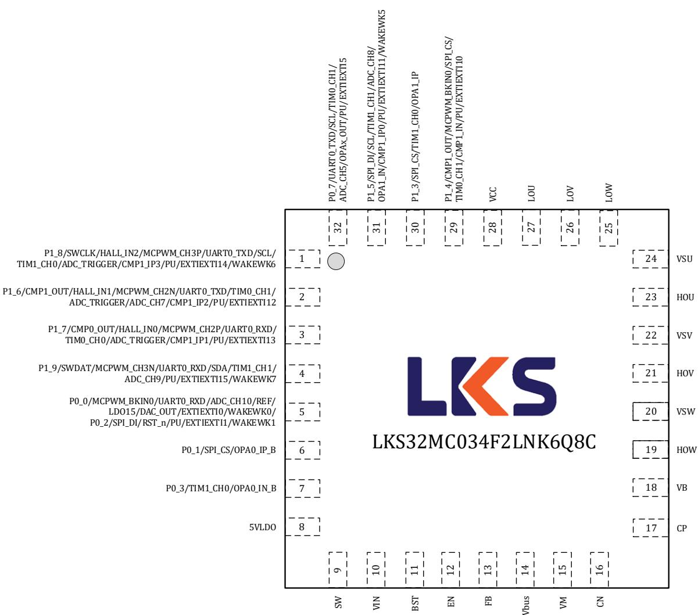  
图 3-23 LKS32MC034F2LNK6Q8C 管脚分布图

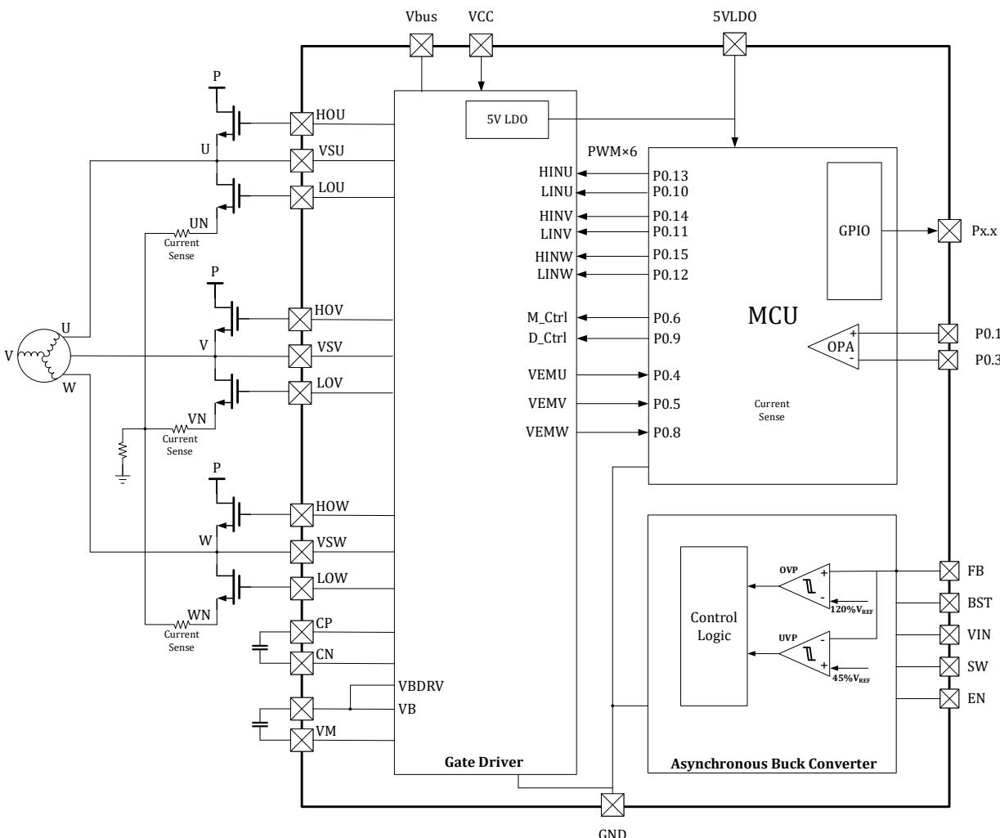  
图 3-24 LKS32MC034F2LNK6Q8C 预驱连接示意图

表 3-14 LKS32MC034F2LNK6Q8C 管脚说明

<table><tr><td rowspan="12">1</td><td>P1_8</td><td>P1.8</td></tr><tr><td>SWCLK</td><td>SWD 时钟</td></tr><tr><td>HALL_IN2</td><td>HALL 接口输入 2</td></tr><tr><td>MCPWM_CH3P</td><td>PWM 通道 3 高边</td></tr><tr><td>UART0_TXD</td><td>串口 0 发送(接收)</td></tr><tr><td>SCL</td><td>I2C 时钟</td></tr><tr><td>TIM1_CH0</td><td>Timer1 通道 0</td></tr><tr><td>ADC_TRIGGER</td><td>ADC 触发信号输出(用于调试)</td></tr><tr><td>CMP1_IP3</td><td>比较器 1 正端输入 3</td></tr><tr><td>PU</td><td>内置 10kΩ 上拉电阻,软件可关闭</td></tr><tr><td>EXTI14</td><td>外部 GPIO 中断信号 14</td></tr><tr><td>WK6</td><td>外部唤醒信号 6</td></tr><tr><td rowspan="5">2</td><td>P1_6</td><td>P1.6</td></tr><tr><td>CMP1_OUT</td><td>比较器 1 输出</td></tr><tr><td>HALL_IN1</td><td>HALL 接口输入 1</td></tr><tr><td>MCPWM_CH2N</td><td>PWM 通道 2 低边</td></tr><tr><td>UART0_TXD</td><td>串口 0 发送(接收)</td></tr></table>

管脚分布

<table><tr><td rowspan="6"></td><td>TIM0_CH1</td><td>Timer0 通道1</td></tr><tr><td>ADC_TRIGGER</td><td>ADC 触发信号输出(用于调试)</td></tr><tr><td>ADC_CH7</td><td>ADC 通道7</td></tr><tr><td>CMP1_IP2</td><td>比较器1正端输入2</td></tr><tr><td>PU</td><td>内置10kΩ上拉电阻,软件可关闭</td></tr><tr><td>EXTI12</td><td>外部 GPIO 中断信号12</td></tr><tr><td rowspan="10">3</td><td>P1_7</td><td>P1.7</td></tr><tr><td>CMP0_OUT</td><td>比较器0输出</td></tr><tr><td>HALL_INO</td><td>HALL接口输入0</td></tr><tr><td>MCPWM_CH2P</td><td>PWM通道2高边</td></tr><tr><td>UART0_RXD</td><td>串口0接收(发送)</td></tr><tr><td>TIM0_CH0</td><td>Timer0通道0</td></tr><tr><td>ADC_TRIGGER</td><td>ADC触发信号输出(用于调试)</td></tr><tr><td>CMP1_IP1</td><td>比较器1正端输入1</td></tr><tr><td>PU</td><td>内置10kΩ上拉电阻,软件可关闭</td></tr><tr><td>EXTI13</td><td>外部 GPIO 中断信号13</td></tr><tr><td rowspan="10">4</td><td>P1_9</td><td>P1.9</td></tr><tr><td>SWDAT</td><td>SWD数据</td></tr><tr><td>MCPWM_CH3N</td><td>PWM通道3低边</td></tr><tr><td>UART0_RXD</td><td>串口0接收(发送)</td></tr><tr><td>SDA</td><td>I2C数据</td></tr><tr><td>TIM1_CH1</td><td>Timer1通道1</td></tr><tr><td>ADC_CH9</td><td>ADC通道9</td></tr><tr><td>PU</td><td>内置10kΩ上拉电阻,软件可关闭</td></tr><tr><td>EXTI15</td><td>外部 GPIO 中断信号15</td></tr><tr><td>WK7</td><td>外部唤醒信号7</td></tr><tr><td rowspan="15">5</td><td>P0_0</td><td>P0.0</td></tr><tr><td>MCPWM_BKIN0</td><td>PWM停机输入信号0</td></tr><tr><td>UART0_RXD</td><td>串口0接收(发送)</td></tr><tr><td>ADC_CH10</td><td>ADC通道10</td></tr><tr><td>REF</td><td>参考电压</td></tr><tr><td>LDO15</td><td>1.5V LDO输出</td></tr><tr><td>DAC_OUT</td><td>DAC输出</td></tr><tr><td>EXTI0</td><td>外部 GPIO 中断信号0</td></tr><tr><td>WK0</td><td>外部唤醒信号0</td></tr><tr><td>P0_2</td><td>P0.2</td></tr><tr><td>SPI_DI</td><td>SPI数据输入(输出)</td></tr><tr><td>RST_n</td><td>复位引脚,P0.2默认用作RSTN。建议接一个10nF~100nF的电容到地,并在RSTN和AVDD之间放置一个10k~20k的上拉电阻。如果外部有上拉电阻,RSTN的电容应为100nF。P0.2可切换为GPIO,切换后可关闭10kΩ上拉电阻。</td></tr><tr><td>PU</td><td>内置10kΩ上拉电阻,软件可关闭</td></tr><tr><td>EXTI1</td><td>外部 GPIO中断信号1</td></tr><tr><td>WK1</td><td>外部唤醒信号1</td></tr></table>

管脚分布

<table><tr><td rowspan="3">6</td><td>P0_1</td><td>P0.1</td></tr><tr><td>SPI_CS</td><td>SPI片选</td></tr><tr><td>OPA0_IP_B</td><td>运放0正端输入B,请留意:OPA0有两组输入信号,如果需要使用B组输入,需要设置SYS_AFE_REG0[5]=1。</td></tr><tr><td rowspan="3">7</td><td>P0_3</td><td>P0.3</td></tr><tr><td>TIM1_CH0</td><td>Timer1通道0</td></tr><tr><td>OPA0_IN_B</td><td>运放0负端输入B,请留意:OPA0有两组输入信号,如果需要使用B组输入,需要设置SYS_AFE_REG0[5]=1。</td></tr><tr><td>8</td><td>5VLDO</td><td>5VLDO输出,内部已连接MCU AVDD脚</td></tr><tr><td>9</td><td>SW</td><td>开关稳压器输出</td></tr><tr><td>10</td><td>VIN</td><td>DCDC转换器电源输入</td></tr><tr><td>11</td><td>BST</td><td>高端功率MOSFET栅极驱动器的电源偏置。</td></tr><tr><td>12</td><td>EN</td><td>带有内部上拉的DCDC转换器使能引脚,低于1.24V禁用转换器,浮动以使能转换器</td></tr><tr><td>13</td><td>FB</td><td>DCDC比较器的反相输入</td></tr><tr><td>14</td><td>Vbus</td><td>母线电压采样信号</td></tr><tr><td>15</td><td>VM</td><td>电荷泵输入</td></tr><tr><td>16</td><td>CN</td><td>电荷泵飞电容的负极板</td></tr><tr><td>17</td><td>CP</td><td>电荷泵飞电容的正极板</td></tr><tr><td>18</td><td>VB</td><td>电荷泵输出,作为高侧的悬浮电源</td></tr><tr><td>19</td><td>HOW</td><td>W相高侧输出,由MCUP0.15控制,HOW极性与P0.15相同,即P0.15=1时,HOW=1。</td></tr><tr><td>20</td><td>VSW</td><td>W通道高侧悬浮地</td></tr><tr><td>21</td><td>HOV</td><td>V相高侧输出,由MCUP0.14控制,HOW极性与P0.14相同,即P0.14=1时,HOV=1。</td></tr><tr><td>22</td><td>VSV</td><td>V通道高侧悬浮地</td></tr><tr><td>23</td><td>HOU</td><td>U相高侧输出,由MCUP0.13控制,HOU极性与P0.13相同,即P0.13=1时,HOU=1。</td></tr><tr><td>24</td><td>VSU</td><td>U通道高侧悬浮地</td></tr><tr><td>25</td><td>LOW</td><td>W相低侧输出,由MCUP0.12控制,LOW极性与P0.12相同,即P0.12=1时,LOW=1。</td></tr><tr><td>26</td><td>LOV</td><td>V相低侧输出,由MCUP0.11控制,LOV极性与P0.11相同,即P0.11=1时,LOV=1。</td></tr><tr><td>27</td><td>LOU</td><td>U相低侧输出,由MCUP0.10控制,LOU极性与P0.10相同,即P0.10=1时,LOU=1。</td></tr><tr><td>28</td><td>VCC</td><td>预驱工作电源输入端</td></tr><tr><td rowspan="8">29</td><td>P1_4</td><td>P1.4</td></tr><tr><td>CMP1_OUT</td><td>比较器1输出</td></tr><tr><td>MCPWM_BKINO</td><td>PWM停机输入信号0</td></tr><tr><td>SPI_CS</td><td>SPI片选</td></tr><tr><td>TIMO_CH1</td><td>Timer0通道1</td></tr><tr><td>CMP1_IN</td><td>比较器1负端输入</td></tr><tr><td>PU</td><td>内置10kΩ上拉电阻,软件可关闭</td></tr><tr><td>EXTI10</td><td>外部GPIO中断信号10</td></tr><tr><td rowspan="4">30</td><td>P1_3</td><td>P1.3</td></tr><tr><td>SPI_CS</td><td>SPI片选</td></tr><tr><td>TIM1_CH0</td><td>Timer1通道0</td></tr><tr><td>OPA1_IP</td><td>运放1正端输入</td></tr><tr><td rowspan="2">31</td><td>P1_5</td><td>P1.5</td></tr><tr><td>SPI_DI</td><td>SPI数据输入(输出)</td></tr></table>

管脚分布

<table><tr><td rowspan="8"></td><td>SCL</td><td>I2C 时钟</td></tr><tr><td>TIM1_CH1</td><td>Timer1 通道 1</td></tr><tr><td>ADC_CH8</td><td>ADC 通道 8</td></tr><tr><td>OPA1_IN</td><td>运放 1 负端输入</td></tr><tr><td>CMP1_IP0</td><td>比较器 1 正端输入 0</td></tr><tr><td>PU</td><td>内置 10kΩ 上拉电阻,软件可关闭</td></tr><tr><td>EXTI11</td><td>外部 GPIO 中断信号 11</td></tr><tr><td>WK5</td><td>外部唤醒信号 5</td></tr><tr><td rowspan="8">32</td><td>P0_7</td><td>P0.7</td></tr><tr><td>UART0_TXD</td><td>串口 0 发送(接收)</td></tr><tr><td>SCL</td><td>I2C 时钟</td></tr><tr><td>TIM0_CH1</td><td>Timer0 通道 1</td></tr><tr><td>ADC_CH5</td><td>ADC 通道 5</td></tr><tr><td>OPAx_OUT</td><td>运放输出</td></tr><tr><td>PU</td><td>内置 10kΩ 上拉电阻,软件可关闭</td></tr><tr><td>EXTI5</td><td>外部 GPIO 中断信号 5</td></tr></table>

## 3.1.15 LKS32MC038KU6Q8B/LKS32MC038KU6Q8C

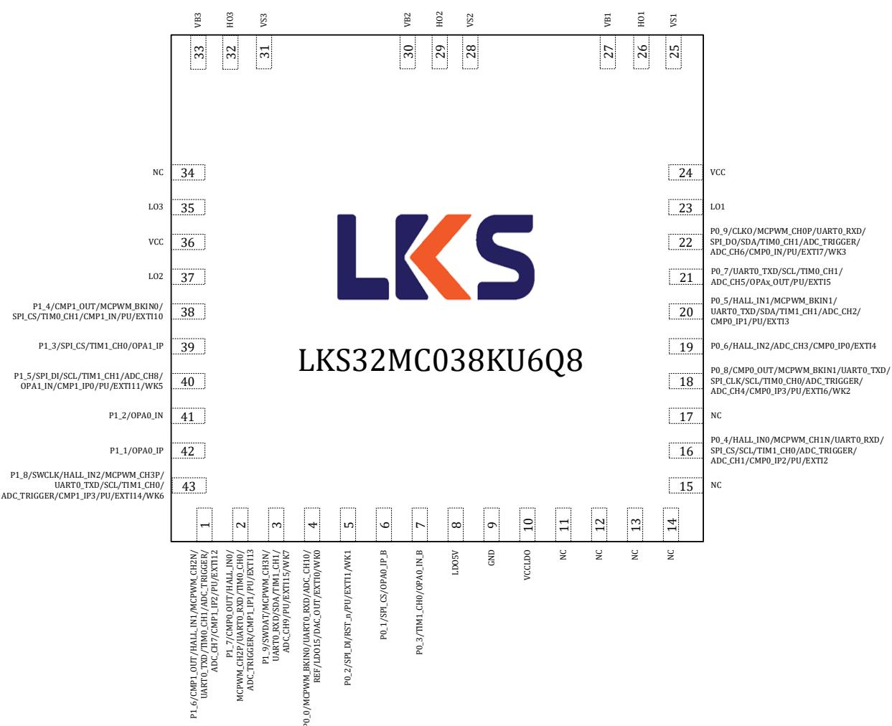  
图 3-25 LKS32MC038KU6Q8B(C)管脚分布图

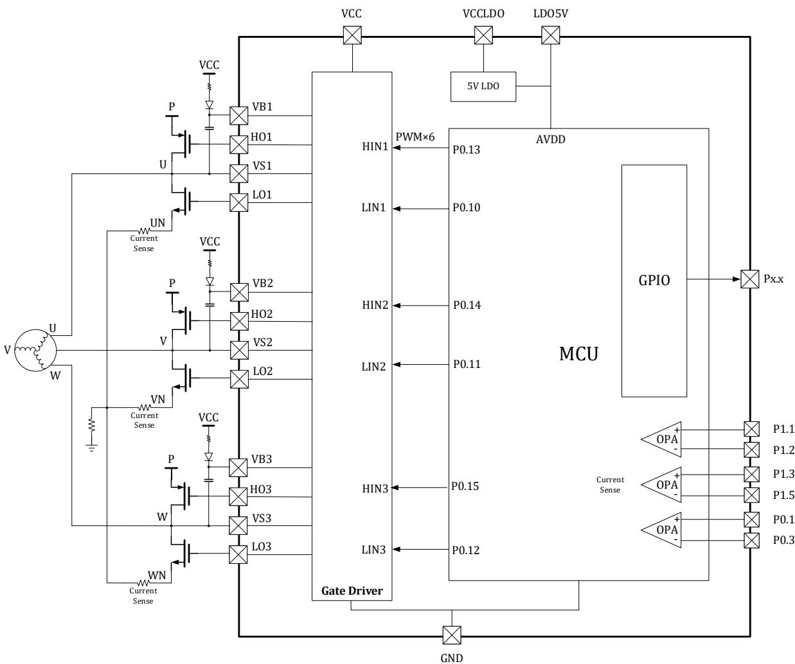

图 3-26 LKS32MC038KU6Q8B(C)预驱连接示意图  
表 3-15 LKS32MC038KU6Q8B(C)管脚说明

<table><tr><td>0</td><td>GND</td><td>芯片地,位于芯片腹部</td></tr><tr><td rowspan="11">1</td><td>P1_6</td><td>P1.6</td></tr><tr><td>CMP1_OUT</td><td>比较器 1 输出</td></tr><tr><td>HALL_IN1</td><td>HALL 接口输入 1</td></tr><tr><td>MCPWM_CH2N</td><td>PWM 通道 2 低边</td></tr><tr><td>UART0_TXD</td><td>串口 0 发送(接收)</td></tr><tr><td>TIM0_CH1</td><td>Timer0 通道 1</td></tr><tr><td>ADC_TRIGGER</td><td>ADC 触发信号输出(用于调试)</td></tr><tr><td>ADC_CH7</td><td>ADC 通道 7</td></tr><tr><td>CMP1_IP2</td><td>比较器 1 正端输入 2</td></tr><tr><td>PU</td><td>内置 10kΩ 上拉电阻,软件可关闭</td></tr><tr><td>EXTI12</td><td>外部 GPIO 中断信号 12</td></tr><tr><td rowspan="4">2</td><td>P1_7</td><td>P1.7</td></tr><tr><td>CMP0_OUT</td><td>比较器 0 输出</td></tr><tr><td>HALL_IN0</td><td>HALL 接口输入 0</td></tr><tr><td>MCPWM_CH2P</td><td>PWM 通道 2 高边</td></tr></table>

管脚分布

<table><tr><td rowspan="6"></td><td>UART0_RXD</td><td>串口0接收(发送)</td></tr><tr><td>TIM0_CH0</td><td>Timer0通道0</td></tr><tr><td>ADC_TRIGGER</td><td>ADC触发信号输出(用于调试)</td></tr><tr><td>CMP1_IP1</td><td>比较器1正端输入1</td></tr><tr><td>PU</td><td>内置 $10k\Omega$ 上拉电阻,软件可关闭</td></tr><tr><td>EXTI13</td><td>外部GPIO中断信号13</td></tr><tr><td rowspan="10">3</td><td>P1_9</td><td>P1.9</td></tr><tr><td>SWDAT</td><td>SWD数据</td></tr><tr><td>MCPWM_CH3N</td><td>PWM通道3低边</td></tr><tr><td>UART0_RXD</td><td>串口0接收(发送)</td></tr><tr><td>SDA</td><td>I2C数据</td></tr><tr><td>TIM1_CH1</td><td>Timer1通道1</td></tr><tr><td>ADC_CH9</td><td>ADC通道9</td></tr><tr><td>PU</td><td>内置 $10k\Omega$ 上拉电阻,软件可关闭</td></tr><tr><td>EXTI15</td><td>外部GPIO中断信号15</td></tr><tr><td>WK7</td><td>外部唤醒信号7</td></tr><tr><td rowspan="9">4</td><td>P0_0</td><td>P0.0</td></tr><tr><td>MCPWM_BKINO</td><td>PWM停机输入信号0</td></tr><tr><td>UART0_RXD</td><td>串口0接收(发送)</td></tr><tr><td>ADC_CH10</td><td>ADC通道10</td></tr><tr><td>REF</td><td>参考电压</td></tr><tr><td>LDO15</td><td>1.5V LDO输出</td></tr><tr><td>DAC_OUT</td><td>DAC输出</td></tr><tr><td>EXTI0</td><td>外部GPIO中断信号0</td></tr><tr><td>WK0</td><td>外部唤醒信号0</td></tr><tr><td rowspan="6">5</td><td>P0_2</td><td>P0.2</td></tr><tr><td>SPI_DI</td><td>SPI数据输入(输出)</td></tr><tr><td>RST_n</td><td>复位引脚,P0.2默认用作RSTN。建议接一个 $10nF \sim 100nF$ 的电容到地,并在RSTN和AVDD之间放置一个 $10k \sim 20k$ 的上拉电阻。如果外部有上拉电阻,RSTN的电容应为 $100nF$ 。P0.2可切换为GPIO,切换后可关闭 $10k\Omega$ 上拉电阻。</td></tr><tr><td>PU</td><td>内置 $10k\Omega$ 上拉电阻,软件可关闭</td></tr><tr><td>EXTI1</td><td>外部GPIO中断信号1</td></tr><tr><td>WK1</td><td>外部唤醒信号1</td></tr><tr><td rowspan="3">6</td><td>P0_1</td><td>P0.1</td></tr><tr><td>SPI_CS</td><td>SPI片选</td></tr><tr><td>OPA0_IP_B</td><td>运放0正端输入B,请留意:OPA0有两组输入信号,如果需要使用B组输入,需要设置SYS_AFE_REG0[5]=1。</td></tr><tr><td rowspan="3">7</td><td>P0_3</td><td>P0.3</td></tr><tr><td>TIM1_CH0</td><td>Timer1通道0</td></tr><tr><td>OPA0_IN_B</td><td>运放0负端输入B,请留意:OPA0有两组输入信号,如果需要使用B组输入,需要设置SYS_AFE_REG0[5]=1。</td></tr><tr><td>8</td><td>LDO5V</td><td>LDO5V电源输出,片外去耦电容建议 $\geq 1uF$ ,并尽量靠近AVDD引脚。</td></tr><tr><td>9</td><td>GND</td><td>芯片地,强烈建议多个地引脚在PCB上统一接地</td></tr><tr><td>10</td><td>VCCLDO</td><td>5V LDO 供电,7~20V,输出电流限制&lt;80mA。去耦电容应&gt;0.33uF,且尽可能靠近该引脚放置。</td></tr><tr><td>11</td><td>NC</td><td>不连接</td></tr><tr><td>12</td><td>NC</td><td>不连接</td></tr><tr><td>13</td><td>NC</td><td>不连接</td></tr><tr><td>14</td><td>NC</td><td>不连接</td></tr><tr><td>15</td><td>NC</td><td>不连接</td></tr><tr><td rowspan="12">16</td><td>P0_4</td><td>P0.4</td></tr><tr><td>HALL_IN0</td><td>HALL 接口输入 0</td></tr><tr><td>MCPWM_CH1N</td><td>PWM 通道 1 低边</td></tr><tr><td>UART0_RXD</td><td>串口 0 接收(发送)</td></tr><tr><td>SPI_CS</td><td>SPI 片选</td></tr><tr><td>SCL</td><td>I2C 时钟</td></tr><tr><td>TIM1_CH0</td><td>Timer1 通道 0</td></tr><tr><td>ADC_TRIGGER</td><td>ADC 触发信号输出(用于调试)</td></tr><tr><td>ADC_CH1</td><td>ADC 通道 1</td></tr><tr><td>CMP0_IP2</td><td>比较器 0 正端输入 2</td></tr><tr><td>PU</td><td>内置 10kΩ 上拉电阻,软件可关闭</td></tr><tr><td>EXTI2</td><td>外部 GPIO 中断信号 2</td></tr><tr><td>17</td><td>NC</td><td>不连接</td></tr><tr><td rowspan="13">18</td><td>P0_8</td><td>P0.8</td></tr><tr><td>CMP0_OUT</td><td>比较器 0 输出</td></tr><tr><td>MCPWM_BKIN1</td><td>PWM 停机输入信号 1</td></tr><tr><td>UART0_TXD</td><td>串口 0 发送(接收)</td></tr><tr><td>SPI_CLK</td><td>SPI 时钟</td></tr><tr><td>SCL</td><td>I2C 时钟</td></tr><tr><td>TIM0_CH0</td><td>Timer0 通道 0</td></tr><tr><td>ADC_TRIGGER</td><td>ADC 触发信号输出(用于调试)</td></tr><tr><td>ADC_CH4</td><td>ADC 通道 4</td></tr><tr><td>CMP0_IP3</td><td>比较器 0 正端输入 3</td></tr><tr><td>PU</td><td>内置 10kΩ 上拉电阻,软件可关闭</td></tr><tr><td>EXTI6</td><td>外部 GPIO 中断信号 6</td></tr><tr><td>WK2</td><td>外部唤醒信号 2</td></tr><tr><td rowspan="5">19</td><td>P0_6</td><td>P0.6</td></tr><tr><td>HALL_IN2</td><td>HALL 接口输入 2</td></tr><tr><td>ADC_CH3</td><td>ADC 通道 3</td></tr><tr><td>CMP0_IP0</td><td>比较器 0 正端输入 0</td></tr><tr><td>EXTI4</td><td>外部 GPIO 中断信号 4</td></tr><tr><td rowspan="5">20</td><td>P0_5</td><td>P0.5</td></tr><tr><td>HALL_IN1</td><td>HALL 接口输入 1</td></tr><tr><td>MCPWM_BKIN1</td><td>PWM 停机输入信号 1</td></tr><tr><td>UART0_TXD</td><td>串口 0 发送(接收)</td></tr><tr><td>SDA</td><td>I2C 数据</td></tr></table>

管脚分布

<table><tr><td rowspan="5"></td><td>TIM1_CH1</td><td>Timer1 通道1</td></tr><tr><td>ADC_CH2</td><td>ADC 通道2</td></tr><tr><td>CMP0_IP1</td><td>比较器0正端输入1</td></tr><tr><td>PU</td><td>内置10kΩ上拉电阻,软件可关闭</td></tr><tr><td>EXTI3</td><td>外部GPIO中断信号3</td></tr><tr><td rowspan="8">21</td><td>P0_7</td><td>P0.7</td></tr><tr><td>UART0_TXD</td><td>串口0发送(接收)</td></tr><tr><td>SCL</td><td>I2C时钟</td></tr><tr><td>TIM0_CH1</td><td>Timer0通道1</td></tr><tr><td>ADC_CH5</td><td>ADC通道5</td></tr><tr><td>OPAx_OUT</td><td>运放输出</td></tr><tr><td>PU</td><td>内置10kΩ上拉电阻,软件可关闭</td></tr><tr><td>EXTI5</td><td>外部GPIO中断信号5</td></tr><tr><td rowspan="13">22</td><td>P0_9</td><td>P0.9</td></tr><tr><td>CLKO</td><td>时钟输出(用于调试)</td></tr><tr><td>MCPWM_CHOP</td><td>PWM通道0高边</td></tr><tr><td>UART0_RXD</td><td>串口0接收(发送)</td></tr><tr><td>SPI_DO</td><td>SPI数据输出(输入)</td></tr><tr><td>SDA</td><td>I2C数据</td></tr><tr><td>TIM0_CH1</td><td>Timer0通道1</td></tr><tr><td>ADC_TRIGGER</td><td>ADC触发信号输出(用于调试)</td></tr><tr><td>ADC_CH6</td><td>ADC通道6</td></tr><tr><td>CMP0_IN</td><td>比较器0负端输入</td></tr><tr><td>PU</td><td>内置10kΩ上拉电阻,软件可关闭</td></tr><tr><td>EXTI7</td><td>外部GPIO中断信号7</td></tr><tr><td>WK3</td><td>外部唤醒信号3</td></tr><tr><td>23</td><td>LO1</td><td>A相低边输出,由MCUP0.11控制,LO1极性与P0.11相同,即P0.11=1时,LO1=1。不需要设置MCPWM_SWAP=1。</td></tr><tr><td>24</td><td>VCC</td><td>全桥驱动电源,供电范围为10V~20V。</td></tr><tr><td>25</td><td>VS1</td><td>高边浮动偏置电压1。</td></tr><tr><td>26</td><td>HO1</td><td>A相高边输出,由MCUP0.10控制,HO1极性与P0.10相同,即P0.10=1时,HO1=1。不需要设置MCPWM_SWAP=1。</td></tr><tr><td>27</td><td>VB1</td><td>高边浮动电源电压1。</td></tr><tr><td>28</td><td>VS2</td><td>高边浮动偏置电压2。</td></tr><tr><td>29</td><td>HO2</td><td>B相高边输出,由MCUP0.12控制,HO2极性与P0.12相同,即P0.12=1时,HO2=1。不需要设置MCPWM_SWAP=1。</td></tr><tr><td>30</td><td>VB2</td><td>高边浮动电源电压2。</td></tr><tr><td>31</td><td>VS3</td><td>高边浮动偏置电压3。</td></tr><tr><td>32</td><td>HO3</td><td>C相高边输出,由MCUP0.14控制,HO3极性与P0.14相同,即P0.14=1时,HO3=1。不需要设置MCPWM_SWAP=1。</td></tr><tr><td>33</td><td>VB3</td><td>高边浮动电源电压3。</td></tr><tr><td>34</td><td>NC</td><td>不连接</td></tr><tr><td>35</td><td>LO3</td><td>C相低边输出,由MCUP0.15控制,LO3极性与P0.15相同,即P0.15=1时,LO3=1。</td></tr></table>

管脚分布

<table><tr><td></td><td></td><td>需要设置 MCPWM_SWAP=1。</td></tr><tr><td>36</td><td>VCC</td><td>全桥驱动电源</td></tr><tr><td>37</td><td>LO2</td><td>B 相 低边输出,由 MCU P0.13 控制,LO2 极性与 P0.13 相同,即 P0.13=1 时,LO2=1。不需要设置 MCPWM_SWAP=1。</td></tr><tr><td rowspan="8">38</td><td>P1_4</td><td>P1.4</td></tr><tr><td>CMP1_OUT</td><td>比较器 1 输出</td></tr><tr><td>MCPWM_BKINO</td><td>PWM 停机输入信号 0</td></tr><tr><td>SPI_CS</td><td>SPI 片选</td></tr><tr><td>TIMO_CH1</td><td>Timer0 通道 1</td></tr><tr><td>CMP1_IN</td><td>比较器 1 负端输入</td></tr><tr><td>PU</td><td>内置 10kΩ 上拉电阻,软件可关闭</td></tr><tr><td>EXTI10</td><td>外部 GPIO 中断信号 10</td></tr><tr><td rowspan="4">39</td><td>P1_3</td><td>P1.3</td></tr><tr><td>SPI_CS</td><td>SPI 片选</td></tr><tr><td>TIM1_CH0</td><td>Timer1 通道 0</td></tr><tr><td>OPA1_IP</td><td>运放 1 正端输入</td></tr><tr><td rowspan="10">40</td><td>P1_5</td><td>P1.5</td></tr><tr><td>SPI_DI</td><td>SPI 数据输入(输出)</td></tr><tr><td>SCL</td><td>I2C 时钟</td></tr><tr><td>TIM1_CH1</td><td>Timer1 通道 1</td></tr><tr><td>ADC_CH8</td><td>ADC 通道 8</td></tr><tr><td>OPA1_IN</td><td>运放 1 负端输入</td></tr><tr><td>CMP1_IP0</td><td>比较器 1 正端输入 0</td></tr><tr><td>PU</td><td>内置 10kΩ 上拉电阻,软件可关闭</td></tr><tr><td>EXTI11</td><td>外部 GPIO 中断信号 11</td></tr><tr><td>WK5</td><td>外部唤醒信号 5</td></tr><tr><td rowspan="2">41</td><td>P1_2</td><td>P1.2</td></tr><tr><td>OPA0_IN</td><td>运放 0 负端输入</td></tr><tr><td rowspan="2">42</td><td>P1_1</td><td>P1.1</td></tr><tr><td>OPA0_IP</td><td>运放 0 正端输入</td></tr><tr><td rowspan="12">43</td><td>P1_8</td><td>P1.8</td></tr><tr><td>SWCLK</td><td>SWD 时钟</td></tr><tr><td>HALL_IN2</td><td>HALL 接口输入 2</td></tr><tr><td>MCPWM_CH3P</td><td>PWM 通道 3 高边</td></tr><tr><td>UART0_TXD</td><td>串口 0 发送(接收)</td></tr><tr><td>SCL</td><td>I2C 时钟</td></tr><tr><td>TIM1_CH0</td><td>Timer1 通道 0</td></tr><tr><td>ADC_TRIGGER</td><td>ADC 触发信号输出(用于调试)</td></tr><tr><td>CMP1_IP3</td><td>比较器 1 正端输入 3</td></tr><tr><td>PU</td><td>内置 10kΩ 上拉电阻,软件可关闭</td></tr><tr><td>EXTI14</td><td>外部 GPIO 中断信号 14</td></tr><tr><td>WK6</td><td>外部唤醒信号 6</td></tr></table>

## 3.2 引脚复用

下表所示为C版本引脚功能复用。 $\mathtt { A } / \mathtt { B }$ 版本功能区别请参考3.1.2。。

表 3-10 LKS32MC034DF6Q8 引脚功能选择

<table><tr><td>Port</td><td>AF1</td><td>AF2</td><td>AF3</td><td>AF4</td><td>AF5</td><td>AF6</td><td>AF7</td><td>AF8</td><td>AF9</td><td>AF0</td></tr><tr><td>P0.0</td><td></td><td></td><td>MCPWM_BKIN0</td><td>UART0_R(T)XD</td><td></td><td></td><td></td><td></td><td></td><td>ADC_CH10/REF/LDO15/DAC_OUT</td></tr><tr><td>P0.1</td><td></td><td></td><td></td><td></td><td>SPI_CS</td><td></td><td></td><td></td><td></td><td>OPA0_IP_B</td></tr><tr><td>P0.2</td><td></td><td></td><td></td><td></td><td>SPI_DI(O)</td><td></td><td></td><td></td><td></td><td>RST_n</td></tr><tr><td>P0.3</td><td></td><td></td><td></td><td></td><td></td><td></td><td></td><td>TIM1_CH0</td><td></td><td>OPA0_IN_B</td></tr><tr><td>P0.4</td><td></td><td>HALL_IN0</td><td>MCPWM_CH1N</td><td>UART0_R(T)XD</td><td>SPI_CS</td><td>SCL</td><td></td><td>TIM1_CH0</td><td>ADC_TRIGGER</td><td>ADC_CH1/CMP0_IP2</td></tr><tr><td>P0.5</td><td></td><td>HALL_IN1</td><td>MCPWM_BKIN1</td><td>UART0_T(R)XD</td><td></td><td>SDA</td><td></td><td>TIM1_CH1</td><td></td><td>ADC_CH2/CMP0_IP1</td></tr><tr><td>P0.6</td><td></td><td>HALL_IN2</td><td></td><td></td><td></td><td></td><td></td><td></td><td></td><td>ADC_CH3/CMP0_IP0</td></tr><tr><td>P0.7</td><td></td><td></td><td></td><td>UART0_T(R)XD</td><td></td><td>SCL</td><td>TIM0_CH1</td><td></td><td></td><td>ADC_CH5/OPAx_OUT</td></tr><tr><td>P0.8</td><td>CMP0_OUT</td><td></td><td>MCPWM_BKIN1</td><td>UART0_T(R)XD</td><td>SPI_CLK</td><td>SCL</td><td>TIM0_CH0</td><td></td><td>ADC_TRIGGER</td><td>ADC_CH4/CMP0_IP3</td></tr><tr><td>P0.9</td><td>CLKO</td><td></td><td>MCPWM_CH0P</td><td>UART0_R(T)XD</td><td>SPI_DO(I)</td><td>SDA</td><td>TIM0_CH1</td><td></td><td>ADC_TRIGGER</td><td>ADC_CH6/CMP0_IN</td></tr><tr><td>P0.10</td><td>CLKO</td><td></td><td>MCPWM_CH0P</td><td></td><td></td><td></td><td>TIM0_CH0</td><td>TIM1_CH0</td><td></td><td></td></tr><tr><td>P0.11</td><td></td><td></td><td>MCPWM_CH0N</td><td></td><td>SPI_CLK</td><td></td><td></td><td>TIM1_CH1</td><td></td><td></td></tr><tr><td>P0.12</td><td></td><td></td><td>MCPWM_CH1P</td><td></td><td>SPI_DO(I)</td><td></td><td>TIM0_CH1</td><td></td><td></td><td></td></tr><tr><td>P0.13</td><td></td><td></td><td>MCPWM_CH1N</td><td></td><td>SPI_DI(O)</td><td></td><td></td><td>TIM1_CH1</td><td></td><td></td></tr><tr><td>P0.14</td><td></td><td></td><td>MCPWM_CH2P</td><td></td><td></td><td></td><td>TIM0_CH0</td><td></td><td></td><td></td></tr><tr><td>P0.15</td><td></td><td></td><td>MCPWM_CH2N</td><td></td><td></td><td></td><td></td><td>TIM1_CH0</td><td></td><td></td></tr></table>

## 管脚分布

<table><tr><td>Port</td><td>AF1</td><td>AF2</td><td>AF3</td><td>AF4</td><td>AF5</td><td>AF6</td><td>AF7</td><td>AF8</td><td>AF9</td><td>AF0</td></tr><tr><td>P1.1</td><td></td><td></td><td></td><td></td><td></td><td></td><td></td><td></td><td></td><td>OPA0_IP</td></tr><tr><td>P1.2</td><td></td><td></td><td></td><td></td><td></td><td></td><td></td><td></td><td></td><td>OPA0_IN</td></tr><tr><td>P1.3</td><td></td><td></td><td></td><td></td><td>SPI_CS</td><td></td><td></td><td>TIM1_CH0</td><td></td><td>OPA1_IP</td></tr><tr><td>P1.4</td><td>CMP1_OUT</td><td></td><td></td><td></td><td>SPI_CS</td><td></td><td>TIM0_CH1</td><td></td><td></td><td>CMP1_IN</td></tr><tr><td>P1.5</td><td></td><td></td><td>MCPWM_BKIN0</td><td></td><td>SPI_DI(O)</td><td>SCL</td><td></td><td>TIM1_CH1</td><td></td><td>ADC_CH8/OPA1_IN/CMP1_IP0</td></tr><tr><td>P1.6</td><td>CMP1_OUT</td><td>HALL_IN1</td><td>MCPWM_CH2N</td><td>UART0_T(R)XD</td><td></td><td></td><td>TIM0_CH1</td><td></td><td>ADC_TRIGGER</td><td>ADC_CH7/CMP1_IP2</td></tr><tr><td>P1.7</td><td>CMP0_OUT</td><td>HALL_IN0</td><td>MCPWM_CH2P</td><td>UART0_R(T)XD</td><td></td><td></td><td>TIM0_CH0</td><td></td><td>ADC_TRIGGER</td><td>CMP1_IP1</td></tr><tr><td>P1.8</td><td>SWCLK</td><td>HALL_IN2</td><td>MCPWM_CH3P</td><td>UART0_T(R)XD</td><td></td><td>SCL</td><td></td><td>TIM1_CH0</td><td>ADC_TRIGGER</td><td>CMP1_IP3</td></tr><tr><td>P1.9</td><td>SWDAT</td><td></td><td>MCPWM_CH3N</td><td>UART0_R(T)XD</td><td></td><td>SDA</td><td></td><td>TIM1_CH1</td><td></td><td>ADC_CH9</td></tr></table>

表 3-11 LKS32MC034DF6Q8B/LKS32MC034S2F6Q8B 引脚功能选择

<table><tr><td>Port</td><td>AF1</td><td>AF2</td><td>AF3</td><td>AF4</td><td>AF5</td><td>AF6</td><td>AF7</td><td>AF8</td><td>AF9</td><td>AF0</td></tr><tr><td>P0.0</td><td></td><td></td><td>MCPWM_BKIN0</td><td>UART0_R(T)XD</td><td></td><td></td><td></td><td></td><td></td><td>ADC_CH10/REF/LDO15/DAC_OUT</td></tr><tr><td>P0.1</td><td></td><td></td><td></td><td></td><td>SPI_CS</td><td></td><td></td><td></td><td></td><td>OPA0_IP_B</td></tr><tr><td>P0.2</td><td></td><td></td><td></td><td></td><td>SPI_DI(O)</td><td></td><td></td><td></td><td></td><td>RST_n</td></tr><tr><td>P0.3</td><td></td><td></td><td></td><td></td><td></td><td></td><td></td><td>TIM1_CH0</td><td></td><td>OPA0_IN_B</td></tr><tr><td>P0.4</td><td></td><td>HALL_IN0</td><td>MCPWM_CH1N</td><td>UART0_R(T)XD</td><td>SPI_CS</td><td>SCL</td><td></td><td>TIM1_CH0</td><td>ADC_TRIGGER</td><td>ADC_CH1/CMP0_IP2</td></tr><tr><td>P0.5</td><td></td><td>HALL_IN1</td><td>MCPWM_BKIN1</td><td>UART0_T(R)XD</td><td></td><td></td><td></td><td>TIM1_CH1</td><td></td><td>ADC_CH2/CMP0_IP1</td></tr><tr><td>P0.6</td><td></td><td>HALL_IN2</td><td></td><td></td><td></td><td></td><td></td><td></td><td></td><td>ADC_CH3/CMP0_IP0</td></tr><tr><td>P0.7</td><td></td><td></td><td></td><td>UART0_T(R)XD</td><td></td><td>SCL</td><td>TIM0_CH1</td><td></td><td></td><td>ADC_CH5/OPAx_OUT</td></tr><tr><td>P0.8</td><td>CMP0_OUT</td><td></td><td>MCPWM_BKIN1</td><td>UART0_T(R)XD</td><td>SPI_CLK</td><td>SCL</td><td>TIM0_CH0</td><td></td><td>ADC_TRIGGER</td><td>ADC_CH4/CMP0_IP3</td></tr><tr><td>P0.9</td><td>CLKO</td><td></td><td>MCPWM_CH0P</td><td>UART0_R(T)XD</td><td>SPI_DO(I)</td><td>SDA</td><td>TIM0_CH1</td><td></td><td>ADC_TRIGGER</td><td>ADC_CH6/CMP0_IN</td></tr><tr><td>P0.10</td><td>CLKO</td><td></td><td>MCPWM_CH0P</td><td></td><td></td><td></td><td>TIM0_CH0</td><td>TIM1_CH0</td><td></td><td></td></tr><tr><td>P0.11</td><td></td><td></td><td>MCPWM_CH0N</td><td></td><td>SPI_CLK</td><td></td><td></td><td>TIM1_CH1</td><td></td><td></td></tr><tr><td>P0.12</td><td></td><td></td><td>MCPWM_CH1P</td><td></td><td>SPI_DO(I)</td><td></td><td>TIM0_CH1</td><td></td><td></td><td></td></tr><tr><td>P0.13</td><td></td><td></td><td>MCPWM_CH1N</td><td></td><td>SPI_DI(O)</td><td></td><td></td><td>TIM1_CH1</td><td></td><td></td></tr><tr><td>P0.14</td><td></td><td></td><td>MCPWM_CH2P</td><td></td><td></td><td></td><td>TIM0_CH0</td><td></td><td></td><td></td></tr><tr><td>P0.15</td><td></td><td></td><td>MCPWM_CH2N</td><td></td><td></td><td></td><td></td><td>TIM1_CH0</td><td></td><td></td></tr></table>

## 管脚分布

<table><tr><td>Port</td><td>AF1</td><td>AF2</td><td>AF3</td><td>AF4</td><td>AF5</td><td>AF6</td><td>AF7</td><td>AF8</td><td>AF9</td><td>AF0</td></tr><tr><td>P1.1</td><td></td><td></td><td></td><td></td><td></td><td></td><td></td><td></td><td></td><td>OPA0_IP</td></tr><tr><td>P1.2</td><td></td><td></td><td></td><td></td><td></td><td></td><td></td><td></td><td></td><td>OPA0_IN</td></tr><tr><td>P1.3</td><td></td><td></td><td></td><td></td><td>SPI_CS</td><td></td><td></td><td>TIM1_CH0</td><td></td><td>OPA1_IP</td></tr><tr><td>P1.4</td><td>CMP1_OUT</td><td></td><td></td><td></td><td>SPI_CS</td><td></td><td>TIM0_CH1</td><td></td><td></td><td>CMP1_IN</td></tr><tr><td>P1.5</td><td></td><td></td><td>MCPWM_BKIN0</td><td></td><td>SPI_DI(O)</td><td>SCL</td><td></td><td>TIM1_CH1</td><td></td><td>ADC_CH8/OPA1_IN/CMP1_IP0</td></tr><tr><td>P1.6</td><td>CMP1_OUT</td><td>HALL_IN1</td><td>MCPWM_CH2N</td><td>UART0_T(R)XD</td><td></td><td></td><td>TIM0_CH1</td><td></td><td>ADC_TRIGGER</td><td>ADC_CH7/CMP1_IP2</td></tr><tr><td>P1.7</td><td>CMP0_OUT</td><td>HALL_IN0</td><td>MCPWM_CH2P</td><td>UART0_R(T)XD</td><td></td><td></td><td>TIM0_CH0</td><td></td><td>ADC_TRIGGER</td><td>CMP1_IP1</td></tr><tr><td>P1.8</td><td>SWCLK</td><td>HALL_IN2</td><td>MCPWM_CH3P</td><td>UART0_T(R)XD</td><td></td><td>SCL</td><td></td><td>TIM1_CH0</td><td>ADC_TRIGGER</td><td>CMP1_IP3</td></tr><tr><td>P1.9</td><td>SWDAT</td><td></td><td>MCPWM_CH3N</td><td>UART0_R(T)XD</td><td></td><td>SDA</td><td></td><td>TIM1_CH1</td><td></td><td>ADC_CH9</td></tr></table>

## 4 封装尺寸

## 4.1 LKS32MC031KLC6T8B(C)

LQFP48L 0707 Profile Quad Flat Package:  
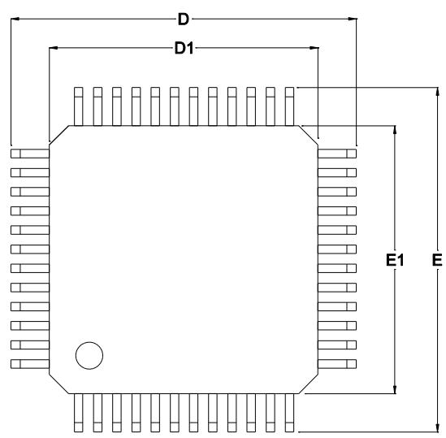

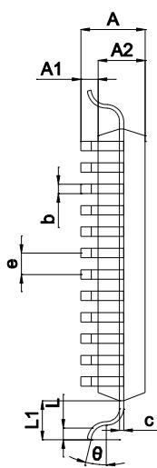  
TOP VIEW

图 4-1 LKS32MC031KLC6T8B(C)封装图示  
SIDE VIEW  
表 4-1 LKS32MC031KLC6T8B(C)封装尺寸

<table><tr><td rowspan="2">SYMBOL</td><td colspan="3">MILLIMETER</td></tr><tr><td>MIN</td><td>NOM</td><td>MAX</td></tr><tr><td>A</td><td>-</td><td>-</td><td>1.60</td></tr><tr><td>A1</td><td>0.05</td><td>-</td><td>0.15</td></tr><tr><td>A2</td><td>1.35</td><td>1.40</td><td>1.45</td></tr><tr><td>b</td><td>0.19</td><td>0.22</td><td>0.27</td></tr><tr><td>c</td><td>0.13</td><td>-</td><td>0.17</td></tr><tr><td>D</td><td>8.80</td><td>9.00</td><td>9.20</td></tr><tr><td>D1</td><td>6.90</td><td>7.00</td><td>7.10</td></tr><tr><td>E</td><td>8.80</td><td>9.00</td><td>9.20</td></tr><tr><td>E1</td><td>6.90</td><td>7.00</td><td>7.10</td></tr><tr><td>e</td><td>-</td><td>0.50</td><td>-</td></tr><tr><td>θ</td><td>0°</td><td>3.5°</td><td>7°</td></tr><tr><td>L</td><td>0.45</td><td>0.60</td><td>0.75</td></tr><tr><td>L1</td><td>-</td><td>1.00</td><td>-</td></tr></table>

## 4.2 LKS32MC034D(O)F6Q8(B/C)/LKS32MC034SF6Q8(B/C)/LKS32MC034FLF6Q8B(C)/LKS32MC034F2LF6Q8C/LKS32MC034S2F6Q8B(C)

QFN5\*5 40L-0.75。 Profile Quad Flat Package:  
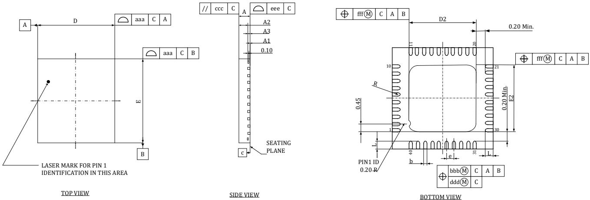

图 4-2 LKS32MC034D(O)F6Q8(B/C)/LKS32MC034SF6Q8(B/C) /LKS32MC034FLF6Q8B(C)/LKS32MC034S2F6Q8B(C)封装图示  
表 4-2 LKS32MC034D(O)F6Q8(B/C)/LKS32MC034SF6Q8(B/C) /LKS32MC034FLF6Q8B(C)/LKS32MC034S2F6Q8B(C)封装尺寸

<table><tr><td rowspan="2">SYMBOL</td><td colspan="3">MILLIMETER</td><td colspan="3">INCH</td></tr><tr><td>MIN.</td><td>NOM.</td><td>MAX.</td><td>MIN.</td><td>NOM.</td><td>MAX.</td></tr><tr><td>A</td><td>0.70</td><td>0.75</td><td>0.80</td><td>0.028</td><td>0.030</td><td>0.031</td></tr><tr><td>A1</td><td>0.00</td><td>0.02</td><td>0.05</td><td>0.000</td><td>0.0008</td><td>0.002</td></tr><tr><td>A2</td><td>0.50</td><td>0.55</td><td>0.75</td><td>0.020</td><td>0.022</td><td>0.030</td></tr><tr><td>A3</td><td colspan="3">0.2 REF</td><td colspan="3">0.008 REF</td></tr><tr><td>b</td><td>0.15</td><td>0.20</td><td>0.25</td><td>0.006</td><td>0.008</td><td>0.010</td></tr><tr><td>D</td><td>4.90</td><td>5.00</td><td>5.10</td><td>0.193</td><td>0.197</td><td>0.201</td></tr><tr><td>D2</td><td>3.20</td><td>3.70</td><td>3.80</td><td>0.126</td><td>0.146</td><td>0.150</td></tr><tr><td>E</td><td>4.90</td><td>5.00</td><td>5.10</td><td>0.193</td><td>0.197</td><td>0.201</td></tr><tr><td>E2</td><td>3.20</td><td>3.70</td><td>3.80</td><td>0.126</td><td>0.146</td><td>0.150</td></tr><tr><td>L</td><td>0.30</td><td>0.40</td><td>0.50</td><td>0.012</td><td>0.016</td><td>0.020</td></tr><tr><td>e</td><td colspan="3">0.4 bsc</td><td colspan="3">0.016 bsc</td></tr><tr><td>R</td><td>0.075</td><td>-</td><td>-</td><td>0.003</td><td>-</td><td>-</td></tr><tr><td colspan="7">TOLERANCE OF FORM AND POSITION</td></tr><tr><td>aaa</td><td colspan="3">0.10</td><td colspan="3">0.004</td></tr><tr><td>bbb</td><td colspan="3">0.07</td><td colspan="3">0.003</td></tr><tr><td>ccc</td><td colspan="3">0.10</td><td colspan="3">0.004</td></tr><tr><td>ddd</td><td colspan="3">0.05</td><td colspan="3">0.002</td></tr><tr><td>eee</td><td colspan="3">0.08</td><td colspan="3">0.003</td></tr><tr><td>fff</td><td colspan="3">0.10</td><td colspan="3">0.004</td></tr></table>

## 4.3 LKS32MC038KU6Q8B(C)

QFN43L Profile Quad Flat Package:  
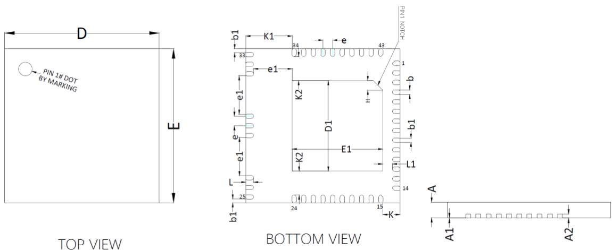  
图 4-3 LKS32MC038KU6Q8B(C)封装图示

表 4-3 LKS32MC038KU6Q8B(C)封装尺寸

<table><tr><td rowspan="2">SYMBOL</td><td colspan="3">MILLIMETER</td></tr><tr><td>MIN</td><td>NOM</td><td>MAX</td></tr><tr><td>A</td><td>0.70</td><td>0.75</td><td>0.80</td></tr><tr><td>A1</td><td>0.00</td><td>-</td><td>0.05</td></tr><tr><td>A2</td><td colspan="3">0.203REF</td></tr><tr><td>b</td><td>0.18</td><td>0.23</td><td>0.28</td></tr><tr><td>b1</td><td>0.15</td><td>0.20</td><td>0.25</td></tr><tr><td>D</td><td>7.90</td><td>8.00</td><td>8.10</td></tr><tr><td>E</td><td>7.90</td><td>8.00</td><td>8.10</td></tr><tr><td>e</td><td colspan="3">0.50BSC</td></tr><tr><td>e1</td><td colspan="3">2.00BSC</td></tr><tr><td>D1</td><td>4.60</td><td>4.70</td><td>4.80</td></tr><tr><td>E1</td><td>4.60</td><td>4.70</td><td>4.80</td></tr><tr><td>L</td><td>0.30</td><td>0.40</td><td>0.50</td></tr><tr><td>L1</td><td>0.45</td><td>0.50</td><td>0.55</td></tr><tr><td>K</td><td colspan="3">0.90BSC</td></tr><tr><td>K1</td><td colspan="3">2.40BSC</td></tr><tr><td>K2</td><td colspan="3">1.25BSC</td></tr><tr><td>H</td><td colspan="3">0.50BSC</td></tr></table>

## 4.4 LKS32MC0342FLK6Q8C/LKS32MC034FLNK6Q8C/LKS32MC034F2LNK6Q8C

QFN 4\*4-32L-0.75

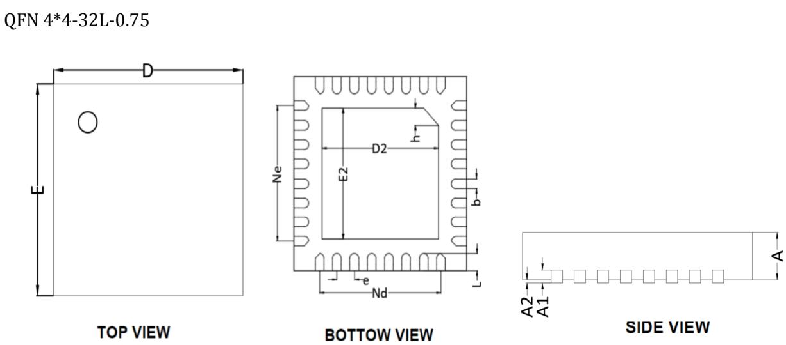  
图 4-4 LKS32MC0342FLK6Q8C 封装图示

表 4-3 LKS32MC0342FLK6Q8C 封装尺寸

<table><tr><td rowspan="2">SYMBOL</td><td colspan="3">MILLIMETER</td></tr><tr><td>MIN</td><td>NOM</td><td>MAX</td></tr><tr><td>A</td><td>0.70</td><td>0.75</td><td>0.80</td></tr><tr><td>A1</td><td colspan="3">0.203 REF</td></tr><tr><td>A2</td><td>0.00</td><td>0.02</td><td>0.05</td></tr><tr><td>D</td><td>3.90</td><td>4.00</td><td>4.10</td></tr><tr><td>E</td><td>3.90</td><td>4.00</td><td>4.10</td></tr><tr><td>D2</td><td>2.60</td><td>2.70</td><td>2.80</td></tr><tr><td>E2</td><td>2.60</td><td>2.70</td><td>2.80</td></tr><tr><td>e</td><td colspan="3">0.40 BSC</td></tr><tr><td>Ne</td><td colspan="3">2.80 BSC</td></tr><tr><td>Nd</td><td colspan="3">2.80 BSC</td></tr><tr><td>L</td><td>0.30</td><td>0.35</td><td>0.40</td></tr><tr><td>B</td><td>0.15</td><td>0.20</td><td>0.25</td></tr><tr><td>h</td><td>0.30</td><td>0.35</td><td>0.40</td></tr></table>

## 4.5 LKS32MC034F2LM6Q8C

QFN4\*4 24L-0.75。

Profile Quad Flat Package:

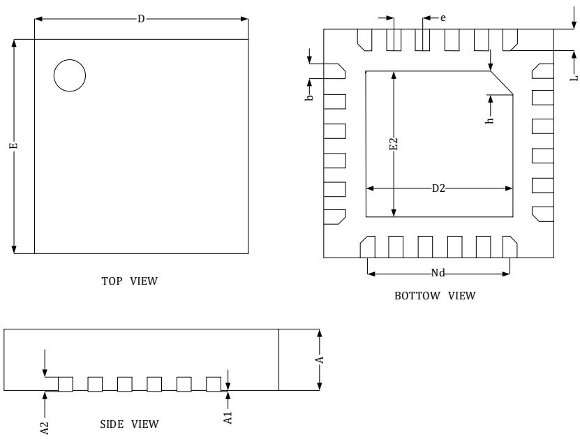  
图 4-5 LKS32MC034F2LM6Q8C 封装图示

表 4-5 LKS32MC034F2LM6Q8C 封装尺寸

<table><tr><td rowspan="2">SYMBOL</td><td colspan="3">MLLMETER</td></tr><tr><td>MIN</td><td>NOM</td><td>MAX</td></tr><tr><td>A</td><td>0.70</td><td>0.75</td><td>0.80</td></tr><tr><td>A1</td><td>0.00</td><td>0.02</td><td>0.05</td></tr><tr><td>A2</td><td colspan="3">0.203 REF</td></tr><tr><td>D</td><td>3.90</td><td>4.00</td><td>4.10</td></tr><tr><td>E</td><td>3.90</td><td>4.00</td><td>4.10</td></tr><tr><td>D2</td><td>2.65</td><td>2.70</td><td>2.75</td></tr><tr><td>E2</td><td>2.65</td><td>2.70</td><td>2.75</td></tr><tr><td>Nd</td><td colspan="3">2.50 BSC</td></tr><tr><td>e</td><td colspan="3">0.50 BSC</td></tr><tr><td>L</td><td>0.35</td><td>0.40</td><td>0.45</td></tr><tr><td>b</td><td>0.20</td><td>0.25</td><td>0.30</td></tr><tr><td>h</td><td>0.30</td><td>0.35</td><td>0.40</td></tr></table>

## 5 电气性能参数

表 5-1 LKS32MC03x 6N 电气极限参数

<table><tr><td>参数</td><td>最小</td><td>最大</td><td>单位</td><td>说明</td></tr><tr><td>MCU 电源电压(AVDD)</td><td>-0.3</td><td>+6.0</td><td>V</td><td></td></tr><tr><td rowspan="3">预驱电源电压(VCC1/VCC2/VCC)</td><td>-0.3</td><td>+48.0</td><td>V</td><td>LKS32MC034F2LM6Q8CLKS32MC034F2LNK6Q8C</td></tr><tr><td>-0.3</td><td>+25.0</td><td>V</td><td>LKS32MC031KLC6T8B/CLKS32MC034DF6Q8(B/C)LKS32MC034DOF6Q8(B/C)</td></tr><tr><td>-0.3</td><td>+22.0</td><td>V</td><td>LKS32MC034FLF6Q8B/CLKS32MC0342FLK6Q8CLKS32MC034SF6Q8(B/C)LKS32MC034S2F6Q8B/CLKS32MC034FLNK6Q8C</td></tr><tr><td>LDO 电源电压(VCCLDO)</td><td>-0.3</td><td>+25.0</td><td>V</td><td>LDO 供电的引脚</td></tr><tr><td rowspan="3">5V LDO 输出电流</td><td></td><td>80</td><td>mA</td><td>LKS32MC031KLC6T8B/CLKS32MC034DOF6Q8(B/C)LKS32MC034SF6Q8(B/C)</td></tr><tr><td></td><td>30</td><td>mA</td><td>LKS32MC034FLF6Q8B/CLKS32MC0342FLK6Q8CLKS32MC034SF6Q8(B/C)LKS32MC034S2F6Q8B/C</td></tr><tr><td>50</td><td>200</td><td>mA</td><td>LKS32MC034F2LF6Q8CLKS32MC034F2LM6Q8CLKS32MC034FLNK6Q8CLKS32MC034F2LNK6Q8C</td></tr><tr><td>工作温度</td><td>-40</td><td>+105</td><td>°C</td><td></td></tr><tr><td>存储温度</td><td>-40</td><td>+150</td><td>°C</td><td></td></tr><tr><td>结温</td><td>-</td><td>125</td><td>°C</td><td></td></tr><tr><td>引脚温度</td><td>-</td><td>260</td><td>°C</td><td>焊接,10秒</td></tr></table>

表 5-2 LKS32MC03x 6N 建议工况参数

<table><tr><td>参数</td><td>最小</td><td>典型</td><td>最大</td><td>单位</td><td>说明</td></tr><tr><td>MCU 电源电压(AVDD)</td><td>2.5</td><td>5</td><td>5.5</td><td>V</td><td></td></tr><tr><td rowspan="2">模拟工作电压(AVDDA)</td><td>2.8</td><td>5</td><td>5.5</td><td>V</td><td>REF2VDD=0, ADC 选择 2.4V 内部基准</td></tr><tr><td>2.4</td><td>5</td><td>5.5</td><td>V</td><td>REF2VDD=1, ADC 选择 AVDD 为基准</td></tr><tr><td>预驱电源电压(VCC)</td><td>5</td><td></td><td>20</td><td>V</td><td>LKS32MC034FLF6Q8B/CLKS32MC0342FLK6Q8CLKS32MC034SF6Q8(B/C)LKS32MC034S2F6Q8B/CLKS32MC034FLNK6Q8C</td></tr><tr><td rowspan="4"></td><td>7</td><td rowspan="3"></td><td rowspan="3"></td><td rowspan="3"></td><td>LKS32MC034DF6Q8(B/C)LKS32MC034DOF6Q8(B/C)</td></tr><tr><td>13</td><td>LKS32MC031KLC6T8B/C</td></tr><tr><td>10</td><td>LKS32MC038KU6Q8B/C</td></tr><tr><td>5</td><td></td><td>40</td><td>V</td><td>LKS32MC034F2LM6Q8CLKS32MC034F2LF6Q8CLKS32MC034F2LNK6Q8CLKS32MC034F2LN2K6Q8C</td></tr><tr><td>LDO 电源电压(VCCLDO)</td><td>7</td><td></td><td>20</td><td>V</td><td>LDO 供电引脚</td></tr></table>

运算放大器可以在2.5V下工作，但输出幅度受限。

表 5-3 LKS32MC03x 6N ESD 性能参数

<table><tr><td>项目</td><td>芯片型号</td><td>管脚</td><td>最小</td><td>最大</td><td>单位</td></tr><tr><td rowspan="15">ESD测试(HBM)</td><td rowspan="3">LKS32MC031KLC6T8B/C</td><td>MCU</td><td>-6000</td><td>6000</td><td>V</td></tr><tr><td>PWR</td><td>-4000</td><td>4000</td><td>V</td></tr><tr><td>Gate driver</td><td>-2000</td><td>2000</td><td>V</td></tr><tr><td rowspan="2">LKS32MC034DF6Q8(B/C)</td><td>MCU</td><td>-6000</td><td>6000</td><td>V</td></tr><tr><td>Gate driver</td><td>-2000</td><td>2000</td><td>V</td></tr><tr><td rowspan="3">LKS32MC034DOF6Q8(B/C)</td><td>MCU</td><td>-6000</td><td>6000</td><td>V</td></tr><tr><td>PWR</td><td>-4000</td><td>4000</td><td>V</td></tr><tr><td>Gate driver</td><td>-2000</td><td>2000</td><td>V</td></tr><tr><td rowspan="2">LKS32MC034SF6Q8(B/C)LKS32MC034FLF6Q8B/CLKS32MC0342FLK6Q8CLKS32MC034F2LF6Q8CLKS32MC034F2LM6Q8C</td><td>MCU</td><td>-6000</td><td>6000</td><td>V</td></tr><tr><td>Gate driver</td><td>-2500</td><td>2500</td><td>V</td></tr><tr><td rowspan="2">LKS32MC038KU6Q8B/C</td><td>MCU</td><td>-6000</td><td>6000</td><td>V</td></tr><tr><td>Gate driver</td><td></td><td></td><td>V</td></tr><tr><td rowspan="3">LKS32MC034FLNK6Q8CLKS32MC034F2LNK6Q8C</td><td>MCU</td><td>-6000</td><td>6000</td><td>V</td></tr><tr><td>Gate driver</td><td>-2000</td><td>2000</td><td>V</td></tr><tr><td>DCDCConverter</td><td>-2000</td><td>2000</td><td>V</td></tr></table>

根据《MIL-STD-883J Method 3015.9》，在 25℃，55%相对湿度环境下，在被测芯片的所有 IO 引脚施加进行静电放电 3 次，每次间隔 1s。

表 5-4 LKS32MC03x 6N Latch-up 性能参数

<table><tr><td>项目</td><td>最小</td><td>最大</td><td>单位</td></tr><tr><td>Latch-up电流 (85°C)</td><td>-200</td><td>200</td><td>mA</td></tr></table>

根据《JEDEC STANDARD NO.78E NOVEMBER 2016》，对所有电源 IO 施加过压 8V，在每个信号 IO上注入200mA电流。

## 表 5-5 LKS32MC03x 6N IO 极限参数

<table><tr><td>参数</td><td>描述</td><td>最小</td><td>最大</td><td>单位</td></tr><tr><td> $V_{IN}$ </td><td>GPIO信号输入电压范围</td><td>-0.3</td><td>6.0</td><td>V</td></tr><tr><td> $I_{INJ\_PAD}$ </td><td>单个GPIO最大注入电流</td><td>-11.2</td><td>11.2</td><td>mA</td></tr><tr><td> $I_{INJ\_SUM}$ </td><td>所有GPIO最大注入电流</td><td>-50</td><td>50</td><td>mA</td></tr></table>

表 5-6 LKS32MC03x 6N IO DC 参数

<table><tr><td>参数</td><td>描述</td><td>AVDD</td><td>条件</td><td>最小</td><td>最大</td><td>单位</td></tr><tr><td rowspan="2"> $V_{IH}$ </td><td rowspan="2">数字IO输入高电压</td><td>5V</td><td rowspan="2">-</td><td>0.7*AVDD</td><td rowspan="2"></td><td rowspan="2">V</td></tr><tr><td>3.3V</td><td>2.0</td></tr><tr><td rowspan="2"> $V_{IL}$ </td><td rowspan="2">数字IO输入低电压</td><td>5V</td><td rowspan="2">-</td><td rowspan="2"></td><td>0.3*AVDD</td><td rowspan="2">V</td></tr><tr><td>3.3V</td><td>0.8</td></tr><tr><td rowspan="2"> $V_{HYS}$ </td><td rowspan="2">施密特迟滞范围</td><td>5V</td><td rowspan="2">-</td><td rowspan="2">0.1*AVDD</td><td rowspan="2"></td><td rowspan="2">V</td></tr><tr><td>3.3V</td></tr><tr><td rowspan="2"> $I_{IH}$ </td><td rowspan="2">数字IO输入高电压,电流消耗</td><td>5V</td><td rowspan="2">-</td><td rowspan="2"></td><td rowspan="2">1</td><td rowspan="2">uA</td></tr><tr><td>3.3V</td></tr><tr><td rowspan="2"> $I_{IL}$ </td><td rowspan="2">数字IO输入低电压,电流消耗</td><td>5V</td><td rowspan="2">-</td><td rowspan="2">-1</td><td rowspan="2"></td><td rowspan="2">uA</td></tr><tr><td>3.3V</td></tr><tr><td> $V_{OH}$ </td><td>数字IO输出高电压</td><td></td><td>最大驱动电流11.2mA</td><td>AVDD-0.8</td><td></td><td>V</td></tr><tr><td> $V_{OL}$ </td><td>数字IO输出低电压</td><td></td><td>最大驱动电流11.2mA</td><td></td><td>0.5</td><td>V</td></tr><tr><td> $R_{pup}$ </td><td>上拉电阻大小*</td><td></td><td></td><td>8</td><td>12</td><td>kΩ</td></tr><tr><td> $R_{io-ana}$ </td><td>IO与内部模拟电路间连接电阻</td><td></td><td></td><td>100</td><td>200</td><td>Ω</td></tr><tr><td rowspan="2"> $C_{IN}$ </td><td rowspan="2">数字IO输入电容</td><td>5V</td><td rowspan="2">-</td><td rowspan="2"></td><td rowspan="2">10</td><td rowspan="2">pF</td></tr><tr><td>3.3V</td></tr></table>

\*仅部分IO 内置上拉，详见引脚说明章节。

表 5-7 LKS32MC03x 6N 电流消耗 IDDQ

<table><tr><td>主时钟</td><td>工况</td><td>3.3V</td><td>5V</td><td>单位</td></tr><tr><td>48MHz</td><td>开启CPU、flash、SRAM、MCPWM、Timer、以及所有模拟模块,IO不动作</td><td>8.570</td><td>8.650</td><td>mA</td></tr><tr><td>4MHz</td><td rowspan="2">开启CPU、flash、SRAM、MCPWM、Timer、以及除PLL之外的所有模拟模块,IO不动作</td><td>3.012</td><td>3.165</td><td>mA</td></tr><tr><td>64kHz</td><td>2.445</td><td>2.618</td><td>mA</td></tr><tr><td>-</td><td>深度休眠,关闭PLL,BGP等,只保留64kHz LRC</td><td>27</td><td>30</td><td>uA</td></tr><tr><td>-</td><td>所有模拟模块</td><td>2.4</td><td>2.55</td><td>mA</td></tr></table>

以上测试如无特别标注，均为室温 25°下测量，由于制造工艺存在器件模型偏差，不同芯片的电流消耗会存在个体差异。

## 6 模拟性能参数

MCU模拟部分性能参数如下所示。

表 6-1 LKS32MC03x 6N 模拟性能参数

<table><tr><td>参数</td><td>最小</td><td>典型</td><td>最大</td><td>单位</td><td>说明</td></tr><tr><td colspan="6">模数转换器(ADC)</td></tr><tr><td rowspan="2">工作电源</td><td>2.8</td><td>5</td><td>5.5</td><td>V</td><td>REF2VDD=0, ADC选择2.4V内部基准</td></tr><tr><td>2.4</td><td>5</td><td>5.5</td><td>V</td><td>REF2VDD=1, ADC选择AVDD为基准</td></tr><tr><td>输出码率</td><td></td><td>1.2</td><td></td><td>MHz</td><td> $f_{adc}/20$ </td></tr><tr><td rowspan="2">差分输入信号范围</td><td>-2.352</td><td></td><td>+2.352</td><td>V</td><td>REF2VDD=0, Gain=1; REF=2.4V</td></tr><tr><td>-3.528</td><td></td><td>+3.528</td><td>V</td><td>REF2VDD=0, Gain=2/3; REF=3.6V</td></tr><tr><td rowspan="4">单端输入信号范围</td><td>-0.3</td><td></td><td>+2.352</td><td>V</td><td>REF2VDD=0, Gain=1; REF=2.4V</td></tr><tr><td>-0.3</td><td></td><td>+3.528</td><td>V</td><td>REF2VDD=0, Gain=2/3; REF=3.6V</td></tr><tr><td>-0.3</td><td></td><td>AVDD*0.9</td><td>V</td><td>REF2VDD=1, Gain=1; REF=AVDD</td></tr><tr><td>-0.3</td><td></td><td>AVDD+0.3</td><td>V</td><td>REF2VDD=1, Gain=2/3, REF=AVDD,受限于IO钳位</td></tr><tr><td colspan="6">差分信号通常为芯片内部OPA输出至ADC的信号;单端信号通常为外部通过IO输入的被采样信号;无论使用内部/外部基准,ADC测量信号幅度均不应超过满量程的±98%,特别地,当使用外部基准时,建议采样信号不超过量程的90%。</td></tr><tr><td>直流失调(offset)</td><td></td><td>5</td><td>10</td><td>mV</td><td>可校正</td></tr><tr><td>有效位数(ENOB)</td><td>10.5</td><td>11</td><td></td><td>bit</td><td></td></tr><tr><td>INL</td><td></td><td>2</td><td>3</td><td>LSB</td><td></td></tr><tr><td>DNL</td><td></td><td>1</td><td>2</td><td>LSB</td><td></td></tr><tr><td>SNR</td><td>63</td><td>66</td><td></td><td>dB</td><td></td></tr><tr><td>输入电阻</td><td>500k</td><td></td><td></td><td>Ohm</td><td></td></tr><tr><td>输入电容</td><td></td><td>10pF</td><td></td><td>F</td><td></td></tr><tr><td colspan="6">基准电压(REF)</td></tr><tr><td>工作电源</td><td>2.5</td><td>5</td><td>5.5</td><td>V</td><td></td></tr><tr><td>输出偏差</td><td>-9</td><td></td><td>9</td><td>mV</td><td></td></tr><tr><td>电源抑制比</td><td></td><td>70</td><td></td><td>dB</td><td></td></tr><tr><td>温度系数</td><td></td><td>20</td><td></td><td>ppm/°C</td><td></td></tr><tr><td>输出电压</td><td></td><td>2.4</td><td></td><td>V</td><td></td></tr><tr><td colspan="6">数模转换器(DAC)</td></tr><tr><td>工作电源</td><td>2.5</td><td>5</td><td>5.5</td><td>V</td><td></td></tr><tr><td>负载电阻</td><td>50k</td><td></td><td></td><td>Ohm</td><td rowspan="3"></td></tr><tr><td>负载电容</td><td></td><td></td><td>50p</td><td>F</td></tr><tr><td>输出电压范围</td><td>0.05</td><td></td><td>3</td><td>V</td></tr><tr><td>转换速度</td><td></td><td></td><td>1M</td><td>Hz</td><td></td></tr><tr><td>DNL</td><td></td><td>1</td><td>2</td><td>LSB</td><td></td></tr><tr><td>INL</td><td></td><td>2</td><td>4</td><td>LSB</td><td></td></tr><tr><td>OFFSET</td><td></td><td>5</td><td>10</td><td>mV</td><td></td></tr><tr><td>SNR</td><td>57</td><td>60</td><td>66</td><td>dB</td><td></td></tr><tr><td colspan="6">运放(OPA)</td></tr><tr><td>工作电源</td><td>3.1</td><td>5</td><td>5.5</td><td>V</td><td></td></tr><tr><td>带宽</td><td></td><td>10M</td><td>20M</td><td>Hz</td><td></td></tr><tr><td>负载电阻</td><td>20k</td><td></td><td></td><td>Ohm</td><td></td></tr><tr><td>负载电容</td><td></td><td></td><td>5p</td><td>F</td><td></td></tr><tr><td>输入共模范围</td><td>0</td><td></td><td>AVDD</td><td>V</td><td></td></tr><tr><td>输出信号范围</td><td>0.1</td><td></td><td>AVDD-0.1</td><td>V</td><td>最小负载电阻下</td></tr><tr><td>OFFSET</td><td></td><td>10</td><td>15</td><td>mV</td><td>此OFFSET为OPA差分输入短接时,测量OPA_OUT偏离0电平,得到的等效差分输入端偏差。OPA输出端偏差为OPA放大倍数xOFFSET</td></tr><tr><td>共模电平(Vcm)</td><td>1.65</td><td></td><td>2.15</td><td>V</td><td>测量条件:常温。运放摆幅=2×min(AVDD-Vcm,Vcm)。建议使用OPA单端输出的应用上电后进行Vcm测量并进行软件减除校正。更多分析请参考官网应用笔记《ANN009-运放差分和单端工作模式区别》</td></tr><tr><td>共模抑制(CMRR)</td><td></td><td>80</td><td></td><td>dB</td><td></td></tr><tr><td>电源抑制(PSRR)</td><td></td><td>80</td><td></td><td>dB</td><td></td></tr><tr><td>负载电流</td><td></td><td></td><td>500</td><td>uA</td><td></td></tr><tr><td>摆率(Slew rate)</td><td></td><td>5</td><td></td><td>V/us</td><td></td></tr><tr><td>相位裕度</td><td></td><td>60</td><td></td><td>度</td><td></td></tr><tr><td colspan="6">比较器(CMP)</td></tr><tr><td>工作电源</td><td>2.5</td><td>5</td><td>5.5</td><td>V</td><td></td></tr><tr><td>输入信号范围</td><td>0</td><td></td><td>AVDD</td><td>V</td><td></td></tr><tr><td rowspan="4">OFFSET</td><td></td><td>-12.92</td><td></td><td>mV</td><td>0mV回差,CMP输出低到高翻转</td></tr><tr><td></td><td>-12.12</td><td></td><td>mV</td><td>0mV回差,CMP输出高到低翻转</td></tr><tr><td></td><td>-11.63</td><td></td><td>mV</td><td>20mV回差,CMP输出低到高翻转</td></tr><tr><td></td><td>5.21</td><td></td><td>mV</td><td>20mV回差,CMP输出高到低翻转</td></tr><tr><td rowspan="2">传输延时</td><td></td><td>0.15u</td><td></td><td>S</td><td>默认功耗</td></tr><tr><td></td><td>0.6u</td><td></td><td>S</td><td>低功耗</td></tr><tr><td rowspan="2">回差(Hysteresis)</td><td></td><td>20</td><td></td><td>mV</td><td>HYS='0'</td></tr><tr><td></td><td>0</td><td></td><td>mV</td><td>HYS='1'</td></tr><tr><td colspan="6">GPIO</td></tr><tr><td>高电平翻转阈值</td><td>2.61</td><td></td><td>3.04</td><td>V</td><td></td></tr></table>

LKS32MC031KLC6T8B/C、LKS32MC034DOF6Q8(B/C)内部集成 5V LDO 参数如下所示。  
表 6-2 5V LDO 模块参数

<table><tr><td colspan="6">5V LDO</td></tr><tr><td>输入电源</td><td>5</td><td></td><td>20</td><td>V</td><td></td></tr><tr><td>输出电压</td><td>4.75</td><td>5</td><td>5.25</td><td>V</td><td>+/-5%精度</td></tr><tr><td>Dropout 电压</td><td></td><td>2</td><td></td><td>V</td><td></td></tr><tr><td>输出电流</td><td></td><td>80</td><td></td><td>mA</td><td></td></tr><tr><td>纹波抑制</td><td></td><td>80</td><td></td><td>dB</td><td></td></tr><tr><td>输入去耦电容</td><td></td><td>0.33</td><td></td><td>uF</td><td>加在 VCCLDO 引脚,详见引脚说明章节</td></tr><tr><td>输出去耦电容</td><td></td><td>1</td><td></td><td>uF</td><td>加在 AVDD 引脚,详见引脚说明章节</td></tr><tr><td>工作温度范围</td><td>-40</td><td></td><td>125</td><td>°C</td><td></td></tr></table>

5V LDO output voltage V.S. VCCLDO  
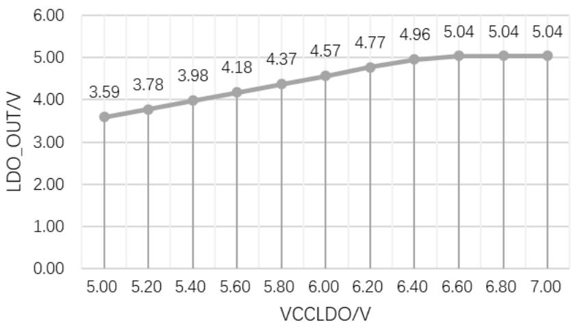  
图 6-1 5V LDO 输出传输曲线  
LKS32MC034FLF6Q8B/C，LKS32MC034SF6Q8(B/C)，LKS32MC034S2F6Q8B/C，LKS32MC034F2LF6Q8C 内部集成 5V LDO 参数请参考 21.1.5 章节。

模拟寄存器表说明：

地址0x40000010\~0x40000028 是各个模块的校正寄存器，这些寄存器在出厂之前都会填上各自的校正值。一般情况下用户不要去配置或改变这些值。如果需要对模拟参数进行微调，需要读取原校正值，并以此为基础进行微调。

其中空白部分的寄存器必须全部配置为0(芯片上电后会被复位为0)。其他寄存器根据应用场合需要进行配置。

## 7 电源管理系统

电源管理系统由 LDO15 模块、上电/掉电复位模块(POR)组成。部分型号集成 5V LDO。

## 7.1 AVDD

对于 LKS32MC031KLC6T8B/C，LKS32MC034DOF6Q8(B/C)，LKS32MC034SF6Q8(B/C)，LKS32MC038KU6Q8B/C，AVDD 为 5V LDO 输出，片外去耦电容建议≥1uF，并尽量靠近 AVDD 引脚。

对于 LKS32MC034FLF6Q8B/C，LDO5V 为 5V LDO 输出，AVDD 为芯片供电，若使用内部 5V LDO供电，需将 AVDD 与 LDO5V 相连。

AVDD内部给LDO15 模块供电，LDO15 为内部所有数字电路、PLL模块供电。

LDO15上电后自动开启，无需软件配置，但 LDO15输出电压可通过软件实现微调。

LDO15的输出电压可通过设置寄存器 LDO15TRIM<2:0>来调节，具体寄存器所对应值见模拟寄存器表说明。LDO15在芯片出厂前已经过校正，一般情况下，用户不需要额外配置这些寄存器。如需微调LDO 的输出电压，需要读取原配置值，在此基础加上微调量对应的配置值填入寄存器。

POR 模块监测LDO15的电压，在 LDO15 电压低于1.1V 时(例如上电之初，或者掉电之时)，为数字电路提供复位信号以避免数字电路工作产生异常。

## 7.2 VCC

芯片内驱动模块提供供电。电压范围请参考第5章。

## 7.3 VCCLDO

LKS32MC031KLC6T8B/C，LKS32MC034DOF6Q8(B/C)，LKS32MC034SF6Q8(B/C)，LKS32MC038KU6Q8B/C 中的 VCCLDO 引脚为芯片内 5V LDO 模块提供供电。如果通过 5V AVDD 对外供电，供电电流限制在20mA 以下。034FL的 VCC 引脚为芯片内5V LDO 模块提供供电。

VCCLDO 的外接电阻处理

由于线性电源的特性，在输入电压较高(例如>=15V)且负载电流较大(例如>=30mAV)时，LDO上的发热较为明显。可能导致芯片在环境温度125度左右或更低就触发热保护。

芯片自身5V上消耗的电流在 10mA 以内，如果5V LDO给芯片外围的供电电流大于10mA，则可以考虑在AVDD和VCCLDO之间跨接一个分流电阻。电阻阻值的计算需遵循如下公式：

## R>=1.5\*( VCCLDO-AVDD)/I

其中 I 为 5V 电源上的总功耗，包括 MCU 的功耗、5V 外围器件(例如 HALL)的功耗。外部跨接分流电阻的情况下，在 AVDD 脚应放一个 5.6V 的稳压管。

## 8 时钟系统

时钟系统包括内部64kHzRC时钟、内部4MHz RC时钟、PLL电路组成。

64kRC时钟作为MCU系统慢时钟使用，作为诸如滤波模块或者低功耗状态下的MCU时钟使用。4MHz RC时钟作为MCU主时钟使用，配合 PLL可提供最高到48MHz的时钟。

64k和4M RC时钟均带有出厂校正，其中4M RC 时钟还开放有用户校正寄存器，可进一步将精度校正到±0.5%范围。64kRC 时钟在 ${ \cdot } 4 0 { \sim } 1 0 5 ^ { \circ } \mathrm { C }$ 范围内的精度为±50%，4M RC时钟在该温度范围的精度为±1%。

64k RC 时钟频率可通过寄存器 ${ \mathrm { R C L T R I M } } { < } 3 { : } 0 { > }$ 进行设置，4M RC 时钟频率可通过寄存器RCHTRIM<5:0>进行设置，具体寄存器所对应值见模拟寄存器表说明。

芯片出厂前时钟已经过校正，一般情况下，用户不需要额外配置这些寄存器。如需微调频率，需要读取原配置值，在此基础加上微调量对应的配置值填入寄存器。

4M RC 时钟通过设置 $\mathrm { R C H P D } = ^ { \prime } 0 ^ { \prime }$ 打开(默认打开，设’1’关闭)，RC时钟需要Bandgap 电压基准源模块提供基准电压和电流，因此开启 RC时钟需要先开启 BGP模块。芯片上电的默认状态下，4MRC时钟和BGP模块都是开启的。64kRC时钟是始终开启的，不能关闭。

PLL 对 4M RC 时钟进行倍频，以提供给 MCU、ADC 等模块更高速的时钟。MCU 和 PWM 模块的最高时钟为48MHz，ADC 模块典型工作时钟为24MHz。

PLL 通过设置 $\mathrm { P L L P D N } { = } ^ { \prime } 1$ ’打开(默认关闭，设 1 打开)，开启 PLL 模块之前，同样也需要开启BGP(Bandgap)模块。开启PLL之后，PLL需要 6us 的稳定时间来输出稳定时钟。芯片上电的默认状态下，RCH时钟和BGP 模块都是开启的，但 PLL默认是关闭的，需要软件来开启。

## 9 基准电压源

该基准源为ADC、DAC、RC 时钟、PLL、温度传感器、运算放大器、比较器和 FLASH提供基准电压和电流，使用上述任何一个模块之前，都需要开启BGP 基准电压源。

芯片上电的默认状态下，BGP 模块是开启的。基准源通过设置 $\mathsf { B G P P D } = ^ { \prime } 0 ^ { \prime }$ 打开，从关闭到开启，BGP 需要约 2us 达到稳定。BGP 输出电压约 1.2V，精度为±0.8%

## 10 ADC 模块

芯片内部集成 1 路 SAR 结构 ADC，芯片上电的默认状态下，ADC 模块是关闭的。ADC 开启前，需要先开启 BGP 和 4M RC 时钟和 PLL 模块，并选择 ADC 工作频率。默认配置下 ADC 工作时钟是24M。

ADC 完成一次转换至少需要 17 个 ADC 时钟周期，其中 12 个为转换周期， 5 个为采样周期。采样周期可通过配置 SYS\_AFE\_REG2 里的 SAMP\_TIME 寄存器进行设置，要求设置为 3(含)以上，即8 个ADC clk以上的采样时间。推荐值为3，对应ADC 的输出数据率1.2MHz。

ADC 可工作在如下模式：单次单通道触发、连续单通道、单次 1\~16 通道扫描、连续 1\~16 通道扫描。每路ADC 都有 16 组独立寄存器对应每一个通道。

ADC触发事件可以来自外部的定时器信号T0、T1、T2、T3发生到预设次数，或者为软件触发。

ADC 带有两种增益模式，通过 SYS\_AFE\_REG0.GA\_AD 进行设置，对应 1 倍和 2/3 倍增益。1 倍增益对应±2.4V 的输入信号，2/3倍增益对应±3.6V的输入信号幅度。在测量运放的输出信号时，根据运放可能输出的最大信号来选择具体的ADC增益。

## 11 运算放大器

两路输入输出rail-to-rail运算放大器，内置反馈电阻 R2/R1，外部引脚需串联一个电阻 R0。反馈电阻 R2:R1 的阻值可通过寄存器 RES\_OPA<1:0>设置，以实现不同的放大倍数。具体寄存器所对应值见模拟寄存器表说明。

最终的放大倍数为R2/(R1+R0)，其中R0是外部电阻的阻值。

运放的两个输入引脚之间需要跨接一个电容，大于等于15pF。

对于MOS管电阻直接采样的应用，建议接>20kΩ 的外部电阻，以减小MOS管关断时，往芯片引脚里流入的电流。

对于小电阻采样的应用，建议接 100Ω 的外部电阻。

放大器可通过设置OPAOUT\_EN选择放大器中的输出信号通过BUFFER送至P0.7 IO口进行测量和应用。因为有BUFFER存在，在运放正常工作模式下也可以选择送一路运放输出信号出来。

芯片上电的默认状态下，放大器模块是关闭的。放大器可通过设置OPAPDN =’1’打开，开启放大器之前，需要先开启BGP 模块。

运放输入正负端内置钳位二极管，电机相线通过一匹配电阻后直接接入输入端，从而简化了MOSFET电流采样的外置电路。

## 12 比较器

内置2 路比较器，比较器比较速度可编程、迟滞电压可编程、信号源可编程。

比较器的比较延时为 0.15us，还可通过寄存器 CMP\_FT 设置为小于 30ns。迟滞电压通过CMP\_HYS 设置为 20mV/0mV。

比较器正负两个输入端的信号来源都可通过寄存器 CMP\_SELP<2:0>和 CMP\_SELN<1:0>编程，详见寄存器模拟说明。

芯片上电的默认状态下，比较器模块是关闭的。比较器通过设置CMPxPDN =’1’打开，开启比较器之前，需要先开启BGP模块。

## 13 温度传感器

芯片内置精度为 $1 { \pm } 2 ^ { \circ } \mathrm { C } |$ 的温度传感器。芯片出厂前会经温度校正，校正值保存在 flash info 区。

芯片上电的默认状态下，温度传感器模块是关闭的。开启传感器之前，需要先开启 BGP模块。

温度传感器通过设置 $\mathrm { T M P P D N } = ^ { \prime } 1 $ ’打开，开启到稳定需要约 2us，因此需在 ADC 测量传感器之前2us打开。

## 14 DAC 模块

芯片内置一路8bit DAC，A 版本输出信号的量程为 3V，B版本输出信号量程为 3V/4.8V，C版本输出信号量程为 1.2V/3V/4.8V。

C 版本芯片，需要设置 SYS\_AFE\_REG2.BIT15=1，来使用 DAC 的 1.2V 量程。

8bit DAC 可通过配置寄存器 DACOUT\_EN=1，将 DAC 输出送至 IO 口 P0.0，可驱动>50kΩ 的负载电阻和50pF的负载电容。

由于 03x 系列芯片没有配备 DAC 硬件校正寄存器，为保证 DAC 输出精度，需要用户根据 DAC量程不同从NVR 中读取对应量程的 $\mathrm { D A C _ { A M C } / D A C _ { D C } }$ 校正值，进行软件校正。

记DAC期望输出值对应的数字量为 DDAC, 增益校正值为 DACAMC，直流偏置校正值为 DACDC。其中 $\mathrm { D A C } _ { \mathrm { A M C } }$ 为 10bit 无符号数， $\mathsf { D A C } _ { \mathrm { A M C } } [ 9 ]$ 为整数部分， $\mathrm { D A C } _ { \mathrm { A M C } } [ 8 : 0 ]$ 为小数部分，可以表示数值在 1附近的定点数，0x200对应 1。设置应如下：

$$
\text { SYS\_AFE\_DAC } = \text { Saturation } (D _ {\text { DAC }} * D A C _ {\text { AMC }} - D A C _ {\text { DC }})
$$

具体用法请参考官方库函数。

DAC最大输出码率为1MHz。

芯片上电的默认状态下，DAC 模块是关闭的。DAC 可通过设置DACPDN =1打开，开启 DAC模块之前，需要先开启BGP模块。

## 15 处理器核心

➢ 32 位 Cortex-M0 +DIV/SQRT 协处理器

➢ 2 线 SWD 调试管脚

➢ 最高工作频率 48MHz

## 16 存储资源

## 16.1 Flash

➢ 内置 flash 包括 16/32kB 主存储区，1kB NVR 信息存储区

➢ 可反复擦除写入不低于2万次

➢ 室温 $2 5 \mathrm { { ^ \circ C } }$ 数据保持长达 100 年

➢ 单字节编程时间最长 7.5us，Sector擦除时间最长 5ms

➢ Sector大小512 字节，可按Sector擦除写入，支持运行时编程

➢ Flash 数据防窃取(最后一个 word 须写入非 0xFFFFFFFF 的任意值)

## 16.2 Execute-only zone

部分16kBflash 容量型号配备16kB 只执行空间，在编程加密后具有执行权限，不具有读写权限。支持反复擦除重新编程。

## 16.3 SRAM

➢ 内置 4kB SRAM

## 17 电机驱动专用 MCPWM

➢ MCPWM 最高工作时钟频率 48MHz

➢ 支持最大4 通道相位可调的互补 PWM输出

➢ 每个通道死区宽度可独立配置

➢ 支持边沿对齐 PWM 模式

➢ 支持软件控制 IO 模式

➢ 支持IO 极性控制功能

➢ 内部短路保护，避免因为配置错误导致短路

➢ 外部短路保护，根据对外部信号的监控快速关断

➢ 内部产生ADC 采样中断

➢ 采用加载寄存器预存定时器配置参数

➢ 可配置加载寄存器加载时刻和周期

## 18 Timer

➢ 2 路通用定时器，1 路16bit 定时器，1 路32bit 定时器

➢ 支持捕获模式，用于测量外部信号宽度

➢ 支持比较模式，用于产生边沿对齐 PWM/定时中断

## 19 Hall 传感器接口

➢ 内置最大1024级滤波

➢ 三路 Hall 信号输入

➢ 24 位计数器，提供溢出和捕获中断

## 20 通用外设

➢ 一路 UART，全双工工作，支持 8/9 位数据位、1/2 停止位、奇/偶/无校验模式，带 1 字节发送缓存、1 字节接收缓存，支持 Multi-drop Slave/Master 模式，波特率支持 300\~115200

➢ 一路 SPI，支持主从模式

➢ 一路 IIC，支持主从模式

➢ 硬件看门狗，使用 RC时钟驱动，独立于系统高速时钟，写入保护

## 21 栅极驱动模块

## 21.1 模块参数

芯片内部栅极驱动模块共有 6种不同的参数规格，根据栅极驱动电路参数不同，栅极驱动模块分为6 个型号，分别为G2、G3、G5、G6、G7、G8。对照表如 22-1。

表 21-1 芯片型号-栅极驱动电路对照表

<table><tr><td>芯片型号</td><td>栅极驱动模块型号</td></tr><tr><td>LKS32MC031KLC6T8B/C</td><td>G7</td></tr><tr><td>LKS32MC034DF6Q8(B/C)</td><td>G2</td></tr><tr><td>LKS32MC034DOF6Q8(B/C)</td><td>G2</td></tr><tr><td>LKS32MC034FLF6Q8B/C</td><td>G6</td></tr><tr><td>LKS32MC0342FLK6Q8C</td><td>G6</td></tr><tr><td>LKS32MC034SF6Q8(B/C)</td><td>G3</td></tr><tr><td>LKS32MC034S2F6Q8B/C</td><td>G6</td></tr><tr><td>LKS32MC038KU6Q8B</td><td>G5</td></tr><tr><td>LKS32MC034F2LF6Q8C</td><td>G8</td></tr><tr><td>LKS32MC034F2LM6Q8C</td><td>G8</td></tr><tr><td>LKS32MC034FLNK6Q8C</td><td>G6</td></tr><tr><td>LKS32MC034F2LNK6Q8C</td><td>G8</td></tr></table>

## 21.1.1 栅极驱动模块 G7

表 21-2 栅极驱动模块 G7参数

<table><tr><td>参数</td><td>最小</td><td>典型</td><td>最大</td><td>单位</td><td>说明</td></tr><tr><td colspan="6">极限参数</td></tr><tr><td>电源电压 VCC</td><td>-0.3</td><td></td><td>+25.0</td><td>V</td><td>相对于地</td></tr><tr><td>浮动电压  $VB_{1,2,3}$ </td><td>-0.3</td><td></td><td>+650</td><td>V</td><td></td></tr><tr><td>浮动偏置  $VS_{1,2,3}$ </td><td>VB-25</td><td></td><td>VB+0.3</td><td>V</td><td></td></tr><tr><td>高侧输出电压  $HO_{1,2,3}$ </td><td>VS-0.3</td><td></td><td>VB+0.3</td><td>V</td><td></td></tr><tr><td>低侧输出电压  $LO_{1,2,3}$ </td><td>-0.3</td><td></td><td>VCC+0.3</td><td>V</td><td></td></tr><tr><td>逻辑输入  $HIN/LIN_{1,2,3}$ </td><td>-0.3</td><td></td><td>VCC+0.3</td><td>V</td><td></td></tr><tr><td>开关电压摆率 dVs/dt</td><td></td><td></td><td>50</td><td>V/ns</td><td></td></tr><tr><td>结温 TJ</td><td>-40</td><td></td><td>150</td><td>°C</td><td></td></tr><tr><td>存储温度 Ts</td><td>-55</td><td></td><td>150</td><td>°C</td><td></td></tr><tr><td>焊接温度</td><td></td><td></td><td>300</td><td>°C</td><td>焊接 10s</td></tr><tr><td colspan="6">建议工况</td></tr><tr><td>电源电压 VCC</td><td>+13</td><td></td><td>+20.0</td><td>V</td><td>相对于地</td></tr><tr><td>浮动电压  $VB_{1,2,3}$ </td><td>VS+13</td><td></td><td>VS+20</td><td>V</td><td></td></tr><tr><td>浮动偏置  $VS_{1,2,3}$ </td><td>-5</td><td></td><td>600</td><td>V</td><td></td></tr><tr><td>高侧输出电压 $HO_{1,2,3}$ </td><td>VS</td><td></td><td>VB</td><td>V</td><td></td></tr><tr><td>低侧输出电压 $LO_{1,2,3}$ </td><td>0</td><td></td><td>VCC</td><td>V</td><td></td></tr><tr><td>逻辑输入 $HIN/LIN_{1,2,3}$ </td><td>0</td><td></td><td>VCC</td><td>V</td><td></td></tr><tr><td>工作温度 $T_A$ </td><td>-40</td><td></td><td>105</td><td>°C</td><td></td></tr><tr><td colspan="6">门极驱动器电气参数</td></tr><tr><td>VCC静态电流 $I_{QCC}$ </td><td></td><td></td><td>2300</td><td>uA</td><td>HIN=LIN=0V</td></tr><tr><td>VB静态电流 $I_{QBS}$ </td><td></td><td></td><td>100</td><td>uA</td><td>HIN=LIN=0V</td></tr><tr><td>浮动电压漏电流 $I_{LK}$ </td><td></td><td></td><td>50</td><td>uA</td><td>VB=VS=620V</td></tr><tr><td>VCC欠压保护释放电压</td><td>11</td><td>12</td><td>12.8</td><td>V</td><td></td></tr><tr><td>VCC欠压保护电压</td><td>9.5</td><td>10.4</td><td>11</td><td>V</td><td></td></tr><tr><td>VCC欠压保护迟滞电压</td><td>1</td><td>1.6</td><td>2</td><td>V</td><td></td></tr><tr><td>高输入阈值 $V_{IH}$ </td><td>1.7</td><td></td><td>2.4</td><td>V</td><td></td></tr><tr><td>低输入阈值 $V_{IL}$ </td><td>0.8</td><td>1.0</td><td>1.2</td><td>V</td><td></td></tr><tr><td>高电平输出短路脉冲电流 $I_{O+}$ </td><td>115</td><td>200</td><td></td><td>mA</td><td></td></tr><tr><td>低电平输出短路脉冲电流 $I_{O-}$ </td><td>250</td><td>350</td><td></td><td>mA</td><td></td></tr><tr><td>过流阈值 $V_{CIN\_REF}$ </td><td>0.455</td><td>0.48</td><td>0.505</td><td>V</td><td>VCC=15V</td></tr><tr><td>故障输出电压 $V_{FOL}$ </td><td></td><td></td><td>0.95</td><td>V</td><td></td></tr><tr><td>故障输出时间宽度 $t_{FO}$ </td><td>20</td><td>65</td><td></td><td>us</td><td></td></tr><tr><td>输出上升时间 $T_r$ </td><td></td><td>65</td><td></td><td>ns</td><td rowspan="2"> $C_L=1nF$ </td></tr><tr><td>输出下降时间 $T_f$ </td><td></td><td>25</td><td></td><td>ns</td></tr><tr><td>导通延迟时间 $T_{on}$ </td><td>350</td><td>500</td><td>700</td><td>ns</td><td></td></tr><tr><td>关断延迟时间 $T_{off}$ </td><td>350</td><td>500</td><td>700</td><td>ns</td><td></td></tr><tr><td>延时匹配度 $M_T$ </td><td></td><td></td><td>60</td><td>ns</td><td> $T_{on}$  &amp;  $T_{off}$  for (HS-LS)</td></tr><tr><td>CIN过流检测输入滤波时间 $T_{FLT\_CIN}$ </td><td>100</td><td>300</td><td>500</td><td>ns</td><td>CIN上升沿到LO关闭的延迟时间</td></tr></table>

## 21.1.2 栅极驱动模块 G2

表 21-3 栅极驱动模块 G2参数

<table><tr><td>参数</td><td>最小</td><td>典型</td><td>最大</td><td>单位</td><td>说明</td></tr><tr><td colspan="6">极限参数</td></tr><tr><td>电源电压 VCC</td><td>-0.3</td><td></td><td>+25.0</td><td>V</td><td>相对于地</td></tr><tr><td>浮动电压  $VB_{1,2,3}$ </td><td>-0.3</td><td></td><td>+250</td><td>V</td><td></td></tr><tr><td>浮动偏置  $VS_{1,2,3}$ </td><td>VB-25</td><td></td><td>VB+0.3</td><td>V</td><td></td></tr><tr><td>高侧输出电压  $HO_{1,2,3}$ </td><td>VS-0.3</td><td></td><td>VB+0.3</td><td>V</td><td></td></tr><tr><td>低侧输出电压  $LO_{1,2,3}$ </td><td>-0.3</td><td></td><td>VCC+0.3</td><td>V</td><td></td></tr><tr><td>逻辑输入 HIN/LIN $_{1,2,3}$ </td><td>-0.3</td><td></td><td>VCC+0.3</td><td>V</td><td></td></tr><tr><td>开关电压摆率 dVs/dt</td><td></td><td></td><td>50</td><td>V/ns</td><td></td></tr><tr><td>结温 TJ</td><td>-40</td><td></td><td>150</td><td>°C</td><td></td></tr><tr><td>存储温度 Ts</td><td>-55</td><td></td><td>150</td><td>°C</td><td></td></tr><tr><td>焊接温度</td><td></td><td></td><td>300</td><td>°C</td><td>焊接 10s</td></tr><tr><td colspan="6">建议工况</td></tr><tr><td>电源电压 VCC</td><td>+7</td><td></td><td>+20.0</td><td>V</td><td>相对于地</td></tr><tr><td>浮动电压  $VB_{1,2,3}$ </td><td>VS+8</td><td></td><td>VS+20</td><td>V</td><td></td></tr><tr><td>浮动偏置  $VS_{1,2,3}$ </td><td>-5</td><td></td><td>200</td><td>V</td><td></td></tr><tr><td>高侧输出电压  $HO_{1,2,3}$ </td><td>VS</td><td></td><td>VB</td><td>V</td><td></td></tr><tr><td>低侧输出电压  $LO_{1,2,3}$ </td><td>0</td><td></td><td>VCC</td><td>V</td><td></td></tr><tr><td>逻辑输入  $HIN/LIN_{1,2,3}$ </td><td>0</td><td></td><td>VCC</td><td>V</td><td></td></tr><tr><td>工作温度  $T_A$ </td><td>-40</td><td></td><td>105</td><td>°C</td><td></td></tr><tr><td colspan="6">门极驱动器电气参数</td></tr><tr><td>VCC 静态电流  $I_{QCC}$ </td><td></td><td>50</td><td>100</td><td>uA</td><td>HIN=LIN=0V</td></tr><tr><td>VB 静态电流  $I_{QBS}$ </td><td></td><td>20</td><td>40</td><td>uA</td><td>HIN=LIN=0V</td></tr><tr><td>浮动电压漏电流  $I_{LK}$ </td><td></td><td></td><td>10</td><td>uA</td><td>VB=VS=220V</td></tr><tr><td>VCC 欠压保护释放电压</td><td>4.0</td><td>4.7</td><td>6.7</td><td>V</td><td></td></tr><tr><td>VBS 欠压保护释放电压</td><td>3.9</td><td>5.6</td><td>6.9</td><td>V</td><td></td></tr><tr><td>VCC 欠压保护电压</td><td>3.6</td><td>4.4</td><td>6.4</td><td>V</td><td></td></tr><tr><td>VBS 欠压保护电压</td><td>3.5</td><td>5.0</td><td>6.2</td><td>V</td><td></td></tr><tr><td>VCC 欠压保护迟滞电压</td><td>0.25</td><td>0.3</td><td>0.8</td><td>V</td><td></td></tr><tr><td>VBS 欠压保护迟滞电压</td><td>0.25</td><td>0.6</td><td>0.8</td><td>V</td><td></td></tr><tr><td>高输入阈值 VIH</td><td>2.8</td><td></td><td></td><td>V</td><td></td></tr><tr><td>低输入阈值  $V_{IL}$ </td><td></td><td></td><td>0.8</td><td>V</td><td></td></tr><tr><td>输入偏置电流  $I_{source}$ </td><td></td><td>32</td><td>120</td><td>uA</td><td>HIN=LIN=5V</td></tr><tr><td>输入偏置电流  $I_{sink}$ </td><td></td><td></td><td>1</td><td>uA</td><td>HIN=LIN=0V</td></tr><tr><td>高电平输出电压,  $V_{BIAS}-V_0$ </td><td></td><td></td><td>1</td><td>V</td><td> $I_0=20mA$ </td></tr><tr><td>低电平输出电压,  $V_0$ </td><td></td><td></td><td>1</td><td>V</td><td> $I_0=20mA$ </td></tr><tr><td>高电平输出短路脉冲电流  $I_{0+}$ </td><td>650</td><td>1000</td><td></td><td>mA</td><td> $V_{CC}/V_{BS}=15V$ </td></tr><tr><td>低电平输出短路脉冲电流  $I_{0-}$ </td><td>650</td><td>1000</td><td></td><td>mA</td><td> $V_{CC}/V_{BS}=15V$ </td></tr><tr><td>输出上升时间  $T_r$ </td><td></td><td>15</td><td>30</td><td>ns</td><td rowspan="2"> $C_L=1nF$ </td></tr><tr><td>输出下降时间  $T_f$ </td><td></td><td>12</td><td>30</td><td>ns</td></tr><tr><td>导通延迟时间  $T_{on}$ </td><td></td><td>270</td><td>500</td><td>ns</td><td></td></tr><tr><td>关断延迟时间  $T_{off}$ </td><td></td><td>80</td><td>150</td><td>ns</td><td></td></tr><tr><td>死区  $D_T$ </td><td>100</td><td>200</td><td>400</td><td>ns</td><td></td></tr><tr><td>延时匹配度  $M_T$ </td><td></td><td></td><td>80</td><td>ns</td><td> $T_{on} \& T_{off} for (HS-LS)$ </td></tr></table>

## 21.1.3 栅极驱动模块 G3

预驱内集成自举二极管。

表 21-4 栅极驱动模块 G3参数

<table><tr><td>参数</td><td>最小</td><td>典型</td><td>最大</td><td>单位</td><td>说明</td></tr><tr><td colspan="6">极限参数</td></tr><tr><td>电源电压 VCC</td><td>-0.3</td><td></td><td>+25.0</td><td>V</td><td>相对于地</td></tr><tr><td>浮动电压  $VB_{1,2,3}$ </td><td>-0.3</td><td></td><td>+250</td><td>V</td><td></td></tr><tr><td>浮动偏置 $VS_{1,2,3}$ </td><td>VB-25</td><td></td><td>VB+0.3</td><td>V</td><td></td></tr><tr><td>高侧输出电压 $HO_{1,2,3}$ </td><td>VS-0.3</td><td></td><td>VB+0.3</td><td>V</td><td></td></tr><tr><td>低侧输出电压 $LO_{1,2,3}$ </td><td>-0.3</td><td></td><td>VCC+0.3</td><td>V</td><td></td></tr><tr><td>逻辑输入 $HIN/LIN_{1,2,3}$ </td><td>-0.3</td><td></td><td>VCC+0.3</td><td>V</td><td></td></tr><tr><td>开关电压摆率dVs/dt</td><td></td><td></td><td>50</td><td>V/ns</td><td></td></tr><tr><td>结温TJ</td><td>-40</td><td></td><td>150</td><td>°C</td><td></td></tr><tr><td>存储温度Ts</td><td>-55</td><td></td><td>150</td><td>°C</td><td></td></tr><tr><td>焊接温度</td><td></td><td></td><td>300</td><td>°C</td><td>焊接10s</td></tr><tr><td colspan="6">建议工况</td></tr><tr><td>电源电压VCC</td><td>+4.5</td><td></td><td>+20.0</td><td>V</td><td>相对于地</td></tr><tr><td>浮动电压 $VB_{1,2,3}$ </td><td>VS+10</td><td></td><td>VS+20</td><td>V</td><td></td></tr><tr><td>浮动偏置 $VS_{1,2,3}$ </td><td>-5</td><td></td><td>200</td><td>V</td><td></td></tr><tr><td>高侧输出电压 $HO_{1,2,3}$ </td><td> $VS_{1,2,3}$ </td><td></td><td> $VB_{1,2,3}$ </td><td>V</td><td></td></tr><tr><td>低侧输出电压 $LO_{1,2,3}$ </td><td>0</td><td></td><td>VCC</td><td>V</td><td></td></tr><tr><td>逻辑输入 $HIN/LIN_{1,2,3}$ </td><td>0</td><td></td><td>5</td><td>V</td><td></td></tr><tr><td>工作温度 $T_A$ </td><td>-40</td><td></td><td>105</td><td>°C</td><td></td></tr><tr><td colspan="6">门极驱动器电气参数</td></tr><tr><td>VCC静态电流 $I_{QCC1}$ </td><td>210</td><td>330</td><td>450</td><td>uA</td><td>HIN=LIN=0/5V,ENB=0</td></tr><tr><td>VCC静态电流 $I_{QCC2}$ </td><td></td><td>46</td><td>80</td><td>uA</td><td>HIN=LIN=0/5V,ENB=5</td></tr><tr><td>VB静态电流 $I_{QBS}$ </td><td>25</td><td>45</td><td>65</td><td>uA</td><td>HIN=LIN=0V</td></tr><tr><td>浮动电压漏电流 $I_{LK}$ </td><td></td><td></td><td>10</td><td>uA</td><td>VB=VS=200V,VCC=0V</td></tr><tr><td>驱动电流 $I_{O+}$ </td><td></td><td>1</td><td></td><td>A</td><td></td></tr><tr><td>驱动电流 $I_{O-}$ </td><td></td><td>1.2</td><td></td><td>A</td><td></td></tr><tr><td>VCC欠压上上升沿触发电压</td><td>2.9</td><td>4.2</td><td>5.5</td><td>V</td><td></td></tr><tr><td>VCC欠压上下降沿触发电压</td><td>2.5</td><td>3.8</td><td>5.1</td><td>V</td><td></td></tr><tr><td>VCC欠压锁定回滞</td><td></td><td>0.4</td><td></td><td>V</td><td></td></tr><tr><td>VBS欠压上上升沿触发电压</td><td>2.5</td><td>3.8</td><td>4.5</td><td>V</td><td></td></tr><tr><td>VBS欠压上下降沿触发电压</td><td>2.5</td><td>3.5</td><td>4.5</td><td>V</td><td></td></tr><tr><td>VBS欠压锁定回滞</td><td></td><td>0.3</td><td></td><td>V</td><td></td></tr><tr><td>高输入阈值 $V_{IH}$ </td><td>2.5</td><td></td><td></td><td>V</td><td></td></tr><tr><td>低输入阈值 $V_{IL}$ </td><td></td><td></td><td>0.8</td><td>V</td><td></td></tr><tr><td>输出上升时间 $T_r$ </td><td></td><td>27</td><td></td><td>ns</td><td rowspan="2"> $C_L=1nF$ </td></tr><tr><td>输出下降时间 $T_f$ </td><td></td><td>20</td><td></td><td>ns</td></tr><tr><td>导通延迟时间 $T_{on}$ </td><td></td><td>600</td><td>700</td><td>ns</td><td></td></tr><tr><td>关断延迟时间 $T_{off}$ </td><td></td><td>280</td><td>400</td><td>ns</td><td></td></tr><tr><td>死区 $D_T$ 延时匹配度  $M_T$ </td><td>220</td><td>280</td><td>33060</td><td>nsns</td><td></td></tr></table>

## 21.1.4 栅极驱动模块 G5

表 21-5 栅极驱动模块 G5参数

<table><tr><td>参数</td><td>最小</td><td>典型</td><td>最大</td><td>单位</td><td>说明</td></tr><tr><td colspan="6">极限参数</td></tr><tr><td>电源电压 VCC</td><td>-0.3</td><td></td><td>+25.0</td><td>V</td><td>相对于地</td></tr><tr><td>浮动电压  $VB_{1,2,3}$ </td><td>-0.3</td><td></td><td>+625</td><td>V</td><td></td></tr><tr><td>浮动偏置  $VS_{1,2,3}$ </td><td>VB-25</td><td></td><td>VB+0.3</td><td>V</td><td></td></tr><tr><td>高侧输出电压  $HO_{1,2,3}$ </td><td>VS-0.3</td><td></td><td>VB+0.3</td><td>V</td><td></td></tr><tr><td>低侧输出电压  $LO_{1,2,3}$ </td><td>-0.3</td><td></td><td>VCC+0.3</td><td>V</td><td></td></tr><tr><td>逻辑输入 HIN/LIN $_{1,2,3}$ </td><td>-0.3</td><td></td><td>VCC+0.3</td><td>V</td><td></td></tr><tr><td>开关电压摆率 dVs/dt</td><td></td><td></td><td>50</td><td>V/ns</td><td></td></tr><tr><td>结温 TJ</td><td>-40</td><td></td><td>150</td><td>°C</td><td></td></tr><tr><td>存储温度 Ts</td><td>-55</td><td></td><td>150</td><td>°C</td><td></td></tr><tr><td>热阻 θJA</td><td></td><td></td><td>200</td><td>°C/W</td><td>与环境的连接处</td></tr><tr><td colspan="6">建议工况</td></tr><tr><td>电源电压 VCC</td><td>+10</td><td></td><td>+20.0</td><td>V</td><td>相对于地</td></tr><tr><td>浮动电压  $VB_{1,2,3}$ </td><td>VS+10</td><td></td><td>VS+20</td><td>V</td><td></td></tr><tr><td>浮动偏置  $VS_{1,2,3}$ </td><td>-5</td><td></td><td>600</td><td>V</td><td></td></tr><tr><td>高侧输出电压  $HO_{1,2,3}$ </td><td>VS</td><td></td><td>VB</td><td>V</td><td></td></tr><tr><td>低侧输出电压  $LO_{1,2,3}$ </td><td>0</td><td></td><td>VCC</td><td>V</td><td></td></tr><tr><td>逻辑输入 HIN/LIN $_{1,2,3}$ </td><td>0</td><td></td><td>VCC</td><td>V</td><td></td></tr><tr><td>工作温度 TA</td><td>-40</td><td></td><td>105</td><td>°C</td><td></td></tr><tr><td colspan="6">栅极驱动器电气参数</td></tr><tr><td>VCC 静态电流  $I_{QCC}$ </td><td></td><td>50</td><td>150</td><td>uA</td><td>HIN=LIN=0V</td></tr><tr><td>VB 静态电流  $I_{QBS}$ </td><td></td><td>35</td><td>80</td><td>uA</td><td>HIN=LIN=0V</td></tr><tr><td>浮动电压漏电流  $I_{LK}$ </td><td></td><td></td><td>10</td><td>uA</td><td>VHO=VB=VS=620V</td></tr><tr><td>VCC 欠压上升阈值</td><td>8</td><td>8.5</td><td>9.8</td><td>V</td><td></td></tr><tr><td>VBS 欠压上升阈值</td><td></td><td>8.7</td><td>10</td><td>V</td><td></td></tr><tr><td>VCC 欠压下降阈值</td><td>7.2</td><td>7.6</td><td>8.8</td><td>V</td><td></td></tr><tr><td>VBS 欠压下降阈值</td><td>6.5</td><td>7.8</td><td></td><td>V</td><td></td></tr><tr><td>VCC 欠压迟滞电压</td><td>0.6</td><td>0.9</td><td>1.2</td><td>V</td><td></td></tr><tr><td>VBS 欠压迟滞电压</td><td></td><td>0.9</td><td></td><td>V</td><td></td></tr><tr><td>高输入阈值  $V_{IH}$ </td><td>2.4</td><td></td><td></td><td>V</td><td></td></tr><tr><td>低输入阈值  $V_{IL}$ </td><td></td><td></td><td>0.6</td><td>V</td><td></td></tr><tr><td>输入偏置电流  $I_{source}$ </td><td></td><td>32</td><td>100</td><td>uA</td><td>HIN=LIN=5V</td></tr><tr><td>输入偏置电流  $I_{sink}$ </td><td></td><td></td><td>1</td><td>uA</td><td>HIN=LIN=0V</td></tr><tr><td>高电平输出电压,  $V_{OH}$ </td><td></td><td></td><td>1</td><td>V</td><td> $I_0=20mA$ </td></tr><tr><td>低电平输出电压, $V_{OL}$ </td><td></td><td></td><td>1</td><td>V</td><td> $I_0=20mA$ </td></tr><tr><td>高电平输出短路脉冲电流 $I_{O+}$ </td><td>300</td><td>450</td><td></td><td>mA</td><td>VO=0V,VIN=5V,PulseWidth&lt;10uS</td></tr><tr><td>低电平输出短路脉冲电流 $I_{O-}$ </td><td>650</td><td>1000</td><td></td><td>mA</td><td>VO=15V,VIN=0V,PulseWidth&lt;10uS</td></tr><tr><td>输出上升时间 $T_r$ </td><td></td><td>15</td><td>30</td><td>ns</td><td rowspan="2"> $C_L=1nF$ </td></tr><tr><td>输出下降时间 $T_f$ </td><td></td><td>12</td><td>30</td><td>ns</td></tr><tr><td>导通延迟时间 $T_{on}$ </td><td>100</td><td>250</td><td>450</td><td>ns</td><td>VS=0V</td></tr><tr><td>关断延迟时间 $T_{off}$ </td><td>80</td><td>160</td><td>300</td><td>ns</td><td>VS=0V or 600V</td></tr><tr><td>死区 $D_T$ </td><td>40</td><td>100</td><td>250</td><td>ns</td><td></td></tr><tr><td>延时匹配度 $M_T$ </td><td></td><td></td><td>80</td><td>ns</td><td> $T_{on}$  &amp;  $T_{off}$  for(HS-LS)</td></tr></table>

确保高侧 MOS Vgs 上升至 VS 的时间Δt < 300ns：  
• 选择合适的驱动电路，适当调节 Ron 与 Cgs；  
• 关注MOS/IGBT的开启电压，若 Vth高更，则更需要保证 Vgs上升时间足够短。

## 21.1.5 栅极驱动模块 G6

预驱内集成自举二极管。

表 21-6 栅极驱动模块 G6参数

<table><tr><td>参数</td><td>最小</td><td>典型</td><td>最大</td><td>单位</td><td>说明</td></tr><tr><td colspan="6">极限参数</td></tr><tr><td>电源电压 VCC</td><td>-0.3</td><td></td><td>+22.0</td><td>V</td><td>相对于地</td></tr><tr><td rowspan="2">浮动电压  $VB_{1,2,3}$ </td><td rowspan="2">-0.3</td><td rowspan="2"></td><td>+250</td><td rowspan="2">V</td><td rowspan="2">034S2F6Q8B 未使用 VEM,耐压 250V,其余为 60V。VSx 与 VSSNx 内部短接,如果 VSx 最高电压超过 60V,需要在 VEMx 到地并联电阻以减小分压比。</td></tr><tr><td>+60V</td></tr><tr><td>浮动偏置  $VS_{1,2,3}$ </td><td>VB-25</td><td></td><td>VB+0.3</td><td>V</td><td></td></tr><tr><td>高侧输出电压  $HO_{1,2,3}$ </td><td>VS-0.3</td><td></td><td>VB+0.3</td><td>V</td><td></td></tr><tr><td>低侧输出电压  $LO_{1,2,3}$ </td><td>-0.3</td><td></td><td>VCC+0.3</td><td>V</td><td></td></tr><tr><td>逻辑输入  $HIN/LIN_{1,2,3}$ </td><td>-0.3</td><td></td><td>VCC+0.3</td><td>V</td><td></td></tr><tr><td>开关电压摆率 dVs/dt</td><td></td><td></td><td>50</td><td>V/ns</td><td></td></tr><tr><td>结温 TJ</td><td>-40</td><td></td><td>150</td><td>°C</td><td></td></tr><tr><td>存储温度 Ts</td><td>-55</td><td></td><td>150</td><td>°C</td><td></td></tr><tr><td>焊接温度</td><td></td><td></td><td>300</td><td>°C</td><td>焊接 10s</td></tr><tr><td colspan="6">建议工况</td></tr><tr><td>电源电压 VCC</td><td>+5.0</td><td></td><td>+20.0</td><td>V</td><td>相对于地</td></tr><tr><td>浮动电压 $VB_{1,2,3}$ </td><td>VS+8</td><td></td><td>VS+20</td><td>V</td><td></td></tr><tr><td>浮动偏置 $VS_{1,2,3}$ </td><td>-5</td><td></td><td>+200</td><td>V</td><td></td></tr><tr><td>高侧输出电压 $HO_{1,2,3}$ </td><td> $VS_{1,2,3}$ </td><td></td><td> $VB_{1,2,3}$ </td><td>V</td><td></td></tr><tr><td>低侧输出电压 $LO_{1,2,3}$ </td><td>0</td><td></td><td>VCC</td><td>V</td><td></td></tr><tr><td>逻辑输入 $HIN/LIN_{1,2,3}$ </td><td>0</td><td></td><td>5</td><td>V</td><td></td></tr><tr><td>工作温度 $T_A$ </td><td>-40</td><td></td><td>105</td><td>°C</td><td></td></tr><tr><td colspan="6">门极驱动器电气参数</td></tr><tr><td>VCC静态电流 $I_{QCC}$ </td><td></td><td>110</td><td></td><td>uA</td><td>HIN=LIN=0/5V</td></tr><tr><td>VB静态电流 $I_{QBS}$ </td><td></td><td>25</td><td>50</td><td>uA</td><td>HIN=LIN=0V</td></tr><tr><td>浮动电压漏电流 $I_{LK}$ </td><td></td><td></td><td>10</td><td>uA</td><td>VB=VS=200V,VCC=0V</td></tr><tr><td>驱动电流 $I_{0+}$ </td><td>0.65</td><td>1</td><td></td><td>A</td><td></td></tr><tr><td>驱动电流 $I_{0-}$ </td><td>0.65</td><td>1</td><td></td><td>A</td><td></td></tr><tr><td>VCC欠压上上升沿触发电压</td><td>3.5</td><td>4.2</td><td>4.9</td><td>V</td><td></td></tr><tr><td>VCC欠压上下降沿触发电压</td><td>3.2</td><td>3.8</td><td>4.8</td><td>V</td><td></td></tr><tr><td>VCC欠压锁定回滞</td><td>0.25</td><td>0.4</td><td>0.8</td><td>V</td><td></td></tr><tr><td>VBS欠压上上升沿触发电压</td><td>2.5</td><td>3.8</td><td>5.5</td><td>V</td><td></td></tr><tr><td>VBS欠压上下降沿触发电压</td><td>2.2</td><td>3.5</td><td>4.8</td><td>V</td><td></td></tr><tr><td>VBS欠压锁定回滞</td><td>0.25</td><td>0.3</td><td>0.8</td><td>V</td><td></td></tr><tr><td>高输入阈值 $V_{IH}$ </td><td>2.8</td><td></td><td></td><td>V</td><td></td></tr><tr><td>低输入阈值 $V_{IL}$ </td><td></td><td></td><td>0.8</td><td>V</td><td></td></tr><tr><td>输出上升时间 $T_r$ </td><td></td><td>20</td><td>30</td><td>ns</td><td rowspan="2"> $C_L=1nF$ </td></tr><tr><td>输出下降时间 $T_f$ </td><td></td><td>12</td><td>30</td><td>ns</td></tr><tr><td>导通延迟时间 $T_{on}$ </td><td></td><td>250</td><td>500</td><td>ns</td><td></td></tr><tr><td>关断延迟时间 $T_{off}$ </td><td></td><td>120</td><td>200</td><td>ns</td><td></td></tr><tr><td>死区 $D_T$ </td><td>50</td><td>150</td><td>400</td><td>ns</td><td></td></tr><tr><td>延时匹配度 $M_T$ </td><td></td><td></td><td>80</td><td>ns</td><td></td></tr><tr><td colspan="6">LDO线性调整参数</td></tr><tr><td>LDO输出电压 $V_{LDO}$ </td><td>4.8</td><td>5.0</td><td>5.2</td><td>V</td><td>出厂测试会将5VLDO电压记录在flash区域,供软件读取。Flash NVR校正值地址请参考数据手册</td></tr><tr><td>LDO输出带载电流 $I_{LDO}$ </td><td></td><td>30</td><td></td><td>mA</td><td></td></tr><tr><td>负载调整率</td><td>-0.297</td><td></td><td>+0.397</td><td>%</td><td>负载电流0~35mA</td></tr><tr><td>线性调整率</td><td></td><td>0</td><td></td><td>%</td><td>VCC从7-22V</td></tr><tr><td>短路电流</td><td>122</td><td></td><td>142</td><td>mA</td><td></td></tr></table>

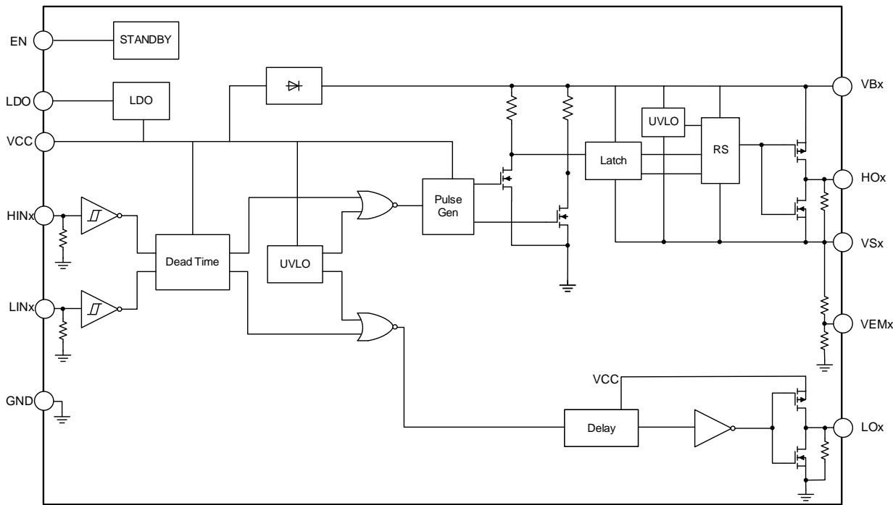  
图 21-1 栅极驱动模块 G6 内部框图

## 21.1.6 栅极驱动模块 G8

表 21-1 栅极驱动模块参数

<table><tr><td>参数</td><td>最小</td><td>典型</td><td>最大</td><td>单位</td><td>说明</td></tr><tr><td colspan="6">极限参数</td></tr><tr><td>电源电压  $V_{CC}$ </td><td>-0.3</td><td></td><td>+48.0</td><td>V</td><td>相对于地</td></tr><tr><td>电荷泵供电电压  $V_M$ </td><td>-0.3</td><td></td><td> $V_{CC}$ </td><td>V</td><td></td></tr><tr><td>电荷泵高压脚 CP  $V_{CP}$ </td><td>-0.3</td><td></td><td> $V_{CC}+20$ </td><td></td><td></td></tr><tr><td>电荷泵高压脚 CN  $V_{CN}$ </td><td>-0.3</td><td></td><td> $V_{CC}$ </td><td></td><td></td></tr><tr><td>浮动电压  $VB_{1,2,3}$ </td><td>-0.3</td><td></td><td>+90</td><td>V</td><td></td></tr><tr><td>浮动偏置  $VS_{1,2,3}$ </td><td>-2.0</td><td></td><td> $V_{CC}+0.3$ </td><td>V</td><td></td></tr><tr><td>高侧输出电压  $HO_{1,2,3}$ </td><td>VS-0.3</td><td></td><td>VB+0.3</td><td>V</td><td></td></tr><tr><td>低侧输出电压  $LO_{1,2,3}$ </td><td>-0.3</td><td></td><td>+20</td><td>V</td><td></td></tr><tr><td> $V_{LDO}$ </td><td>-0.3</td><td></td><td>+6</td><td>V</td><td></td></tr><tr><td>逻辑输入电压(PWMx/M_Ctrl/D_Ctrl)</td><td>-0.3</td><td></td><td>+6</td><td>V</td><td></td></tr><tr><td>开关电压摆率 dVs/dt</td><td>-</td><td></td><td>50</td><td>V/ns</td><td></td></tr><tr><td>模拟输出电压( $V_{bus}/VEMx$ ) $V_{OUT}$ </td><td>-0.3</td><td></td><td>+6</td><td>V</td><td></td></tr><tr><td>掉电保持外部接口  $V_{K-Ctrl}$ </td><td>-0.3</td><td></td><td> $V_{CC}$ </td><td>V</td><td></td></tr><tr><td>双插开关外部接口  $V_{EXT}$ </td><td>-0.3</td><td></td><td> $V_{CC}$ </td><td>V</td><td></td></tr><tr><td>结温 TJ</td><td>-40</td><td></td><td>150</td><td>°C</td><td></td></tr><tr><td>存储温度 Ts</td><td>-55</td><td></td><td>150</td><td>°C</td><td></td></tr><tr><td>焊接温度</td><td></td><td></td><td>300</td><td>°C</td><td>焊接 10s</td></tr></table>

<table><tr><td colspan="7">建议工况 (TA=25°C)</td></tr><tr><td colspan="2">电源电压 Vcc</td><td>+5.0</td><td></td><td>+40.0</td><td>V</td><td>相对于地</td></tr><tr><td colspan="2">电荷泵供电电压 VM</td><td>-0.3</td><td></td><td>+40.0</td><td>V</td><td></td></tr><tr><td colspan="2">浮动电压 VB1,2,3</td><td>VM+10</td><td></td><td>VM+15</td><td>V</td><td></td></tr><tr><td colspan="2">浮动偏置 VS1,2,3</td><td></td><td></td><td>VM+0.3</td><td>V</td><td></td></tr><tr><td colspan="2">逻辑输入电压(PWMx/M_Ctrl/D_Ctrl)</td><td>0</td><td></td><td>+5</td><td>V</td><td></td></tr><tr><td colspan="2">模拟输出电压 VOUT</td><td>0</td><td></td><td>+5</td><td>V</td><td>Vbus/VEMx</td></tr><tr><td colspan="7">电气参数 (无特别说明,VCC=VM=24V, TA=25°C)</td></tr><tr><td colspan="7">电源电压</td></tr><tr><td colspan="2">上电开启电压 VCC_ON</td><td>3.9</td><td>4.2</td><td>4.5</td><td>V</td><td></td></tr><tr><td colspan="2">欠压锁定电压 VCC_OFF</td><td>3.6</td><td>3.9</td><td>4.2</td><td>V</td><td></td></tr><tr><td colspan="2">欠压保护迟滞电压VCC_HYS</td><td>-</td><td>0.3</td><td>-</td><td>V</td><td></td></tr><tr><td colspan="2">静态电流 IQCC</td><td>-</td><td>850</td><td>-</td><td>uA</td><td>PWM=0, 不包含 mcu</td></tr><tr><td colspan="2">待机电流 ISTBY</td><td>-</td><td>-</td><td>10</td><td>uA</td><td>M_Ctrl=0/K_Ctrl=0, 不使能</td></tr><tr><td colspan="7">电荷泵</td></tr><tr><td colspan="2">电荷泵输出电压 VCP</td><td>-</td><td>12</td><td>-</td><td>V</td><td>VB-VM</td></tr><tr><td colspan="2">电荷泵负载电流 ICP</td><td>-</td><td>15</td><td>-</td><td>mA</td><td>PWM开关频率 20kHz, 满足输出电压需求</td></tr><tr><td colspan="2">电荷泵输出限流值 ICP_LIM</td><td>30</td><td>40</td><td>-</td><td>mA</td><td></td></tr><tr><td colspan="2">VCP欠压释放点 VCP_ON</td><td>3.6</td><td>3.9</td><td>4.2</td><td>V</td><td></td></tr><tr><td colspan="2">VCP欠压保护点 VCP_OFF</td><td>3.3</td><td>3.6</td><td>3.9</td><td>V</td><td></td></tr><tr><td colspan="2">VCP欠压迟滞 VCP_HYS</td><td>-</td><td>0.3</td><td>-</td><td>V</td><td></td></tr><tr><td colspan="2">电荷泵纹波电压 ΔVCP</td><td></td><td>300</td><td></td><td>mV</td><td></td></tr><tr><td colspan="7">5V LDO</td></tr><tr><td colspan="2">LDO 输出电压 VLDO</td><td>4.9</td><td>5.0</td><td>5.1</td><td>V</td><td></td></tr><tr><td colspan="2">VDROP</td><td></td><td>0.2</td><td></td><td>V</td><td>VM=5V, ILDO=10mA</td></tr><tr><td colspan="2">LDO 负载电流 ILDO</td><td>50</td><td></td><td></td><td>mA</td><td>满足输出电压需求</td></tr><tr><td colspan="2">LDO 输出限流值 ILDO_LIM</td><td>50</td><td>200</td><td></td><td>mA</td><td></td></tr><tr><td colspan="2">VLDO欠压释放点 VLDO_ON</td><td></td><td>3.3</td><td></td><td>V</td><td></td></tr><tr><td colspan="2">VLDO欠压保护点 VLDO_OFF</td><td></td><td>3</td><td></td><td>V</td><td></td></tr><tr><td colspan="2">VLDO欠压迟滞 VLDO_HYS</td><td></td><td>0.3</td><td></td><td>V</td><td></td></tr><tr><td colspan="2">线性调整率</td><td></td><td></td><td>50</td><td>mV</td><td></td></tr><tr><td colspan="2">负载调整率</td><td></td><td></td><td>50</td><td>mV</td><td></td></tr><tr><td colspan="2">电源抑制比</td><td>50</td><td>60</td><td></td><td>dB</td><td>1kHz</td></tr><tr><td colspan="7">数字 IO 特性 VAVDD=5V</td></tr><tr><td colspan="2">数字 IO 输入高电压 VIH</td><td></td><td>1.7</td><td>2</td><td>V</td><td></td></tr><tr><td colspan="2">数字 IO 输入低电压 VIL</td><td>0.65</td><td>1.2</td><td></td><td>V</td><td></td></tr><tr><td colspan="2">数字 IO 输入脚下拉电阻 RPD</td><td>-</td><td>100</td><td></td><td>kΩ</td><td></td></tr><tr><td colspan="2">施密特迟滞范围 VHYS</td><td>-</td><td>0.5</td><td>-</td><td>V</td><td></td></tr><tr><td colspan="2">数字 IO 输入高电压,电流消耗 IIH</td><td>-</td><td>-</td><td>100</td><td>uA</td><td> $V_{IN}=5V$ </td></tr><tr><td colspan="2">数字 IO 输入低电压,电流消耗 IIL</td><td>-</td><td>-</td><td>1</td><td>uA</td><td> $V_{IN}=0V$ </td></tr><tr><td colspan="7">模拟 IO 特性</td></tr><tr><td colspan="2">K_Ctrl 输入高电压 VK_CtrlH</td><td></td><td>2.7</td><td></td><td>V</td><td></td></tr><tr><td colspan="2">K_Ctrl 输入低电压 VK_CtrlL</td><td></td><td>2.4</td><td></td><td>V</td><td></td></tr><tr><td colspan="2">K_Ctrl 有效电平迟滞电压 VK_Ctrl_HYS</td><td></td><td>0.3</td><td></td><td>V</td><td></td></tr><tr><td colspan="2">K_Ctrl 输入脚下拉电阻 RK_Ctrl_PD</td><td></td><td>200</td><td></td><td>kΩ</td><td></td></tr><tr><td colspan="2">EXT 使能到地阻抗 REXT_ON</td><td></td><td></td><td>1</td><td>kΩ</td><td></td></tr><tr><td colspan="2">EXT 不使能到地漏电 REXT_OFF</td><td>5</td><td></td><td></td><td>kΩ</td><td></td></tr><tr><td colspan="7">预驱</td></tr><tr><td colspan="2"> $V_{OH}$ </td><td>-</td><td>-</td><td>1</td><td>V</td><td> $I_0=20mA$ </td></tr><tr><td colspan="2"> $V_{OL}$ </td><td>-</td><td>-</td><td>1</td><td>V</td><td> $I_0=20mA$ </td></tr><tr><td rowspan="8"> $I_{O+}$ </td><td>000b</td><td></td><td>1000</td><td></td><td rowspan="8">mA</td><td rowspan="8">高电平输出短路脉冲电流,短路脉宽&lt;10us</td></tr><tr><td>001b</td><td></td><td>400</td><td></td></tr><tr><td>010b</td><td></td><td>300</td><td></td></tr><tr><td>011b</td><td></td><td>200</td><td></td></tr><tr><td>100b</td><td></td><td>150</td><td></td></tr><tr><td>101b</td><td></td><td>125</td><td></td></tr><tr><td>110b</td><td></td><td>100</td><td></td></tr><tr><td>111b</td><td></td><td>75</td><td></td></tr><tr><td rowspan="6"> $I_{O-}$ </td><td>000b</td><td></td><td>1000</td><td></td><td rowspan="8">mA</td><td rowspan="8">低电平输出短路脉冲电流,短路脉宽&lt;10us</td></tr><tr><td>001b</td><td></td><td>400</td><td></td></tr><tr><td>010b</td><td></td><td>300</td><td></td></tr><tr><td>011b</td><td></td><td>200</td><td></td></tr><tr><td>100b</td><td></td><td>150</td><td></td></tr><tr><td>101b</td><td></td><td>125</td><td></td></tr><tr><td>110b</td><td></td><td>100</td><td></td><td></td></tr><tr><td>111b</td><td></td><td>75</td><td></td><td></td></tr><tr><td colspan="7">母线电压检测</td></tr><tr><td colspan="2"> $V_M$ 检测上拉电阻 RVbus_PU</td><td></td><td>106</td><td></td><td>kΩ</td><td></td></tr><tr><td colspan="2"> $V_M$ 检测下拉电阻 RVbus_PD</td><td></td><td>6.8</td><td></td><td>kΩ</td><td></td></tr><tr><td colspan="2"> $V_M$ 分压输出比例 RVbus</td><td></td><td>16</td><td></td><td>V/V</td><td> $V_{bus}/V_M$ </td></tr><tr><td colspan="7">反电动势电压检测</td></tr><tr><td colspan="2">检测上拉电阻 RVEM_PU</td><td></td><td>38</td><td></td><td>kΩ</td><td></td></tr><tr><td colspan="2" rowspan="2">VEM 检测下拉电阻 RVEM_PD</td><td></td><td>3.5</td><td></td><td>kΩ</td><td>Option 1</td></tr><tr><td></td><td>9.5</td><td></td><td>kΩ</td><td>Option 2</td></tr><tr><td colspan="2" rowspan="2">VSSN 分压输出比例 RVSSN</td><td></td><td>12</td><td></td><td>V/V</td><td>VEM/VSSN option 1</td></tr><tr><td></td><td>5</td><td></td><td>V/V</td><td>VEM/VSSN option 2</td></tr><tr><td colspan="2">VEM 检测下拉电容 CVEM_PD</td><td></td><td>10</td><td></td><td>pF</td><td></td></tr><tr><td colspan="7">动态电气参数 CL=1nF</td></tr><tr><td colspan="2">高侧导通传输延迟 TON_HS</td><td>-</td><td>250</td><td>500</td><td>ns</td><td> $V_S=0V$ </td></tr><tr><td colspan="2">低侧导通传输延迟  $T_{ON\_LS}$ </td><td>-</td><td>250</td><td>500</td><td>ns</td><td></td></tr><tr><td colspan="2">高侧关断传输延迟  $T_{OFF\_HS}$ </td><td>-</td><td>120</td><td>200</td><td>ns</td><td> $V_s$ =0V or 40V</td></tr><tr><td colspan="2">低侧关断传输延迟  $T_{OFF\_LS}$ </td><td>-</td><td>120</td><td>200</td><td>ns</td><td></td></tr><tr><td colspan="2">输出上升时间  $T_r$ </td><td>-</td><td>20</td><td>30</td><td>ns</td><td>IO+=1A</td></tr><tr><td colspan="2">输出下降时间  $T_f$ </td><td>-</td><td>12</td><td>30</td><td>ns</td><td>IO-=1A</td></tr><tr><td colspan="2">死区时间 DT</td><td>50</td><td>130</td><td>400</td><td>ns</td><td></td></tr><tr><td colspan="2">高低测传输延迟匹配 MT</td><td>-</td><td>-</td><td>80</td><td>ns</td><td> $T_{ON}$  &amp;  $T_{off}$  for (HS-LS)</td></tr><tr><td colspan="7">时序</td></tr><tr><td colspan="2"> $V_{cc}$ 上电至LDO电压建立时间 $T_{LDO\_ready}$ </td><td></td><td>TBD</td><td></td><td>us</td><td></td></tr><tr><td colspan="2"> $V_{cc}$ 上电至预驱输出建立时间 $T_{SW\_ready}$ </td><td></td><td></td><td>2</td><td>ms</td><td></td></tr><tr><td colspan="7">短路保护</td></tr><tr><td colspan="2">短路保护屏蔽时间  $T_{SCP\_Blank}$ </td><td>1.2</td><td>2.0</td><td>2.8</td><td>us</td><td></td></tr><tr><td colspan="2">下管短路阈值</td><td></td><td>2.1</td><td></td><td>V</td><td></td></tr><tr><td colspan="2">上管短路阈值</td><td></td><td>1.9</td><td></td><td>V</td><td></td></tr><tr><td colspan="7">过温保护</td></tr><tr><td colspan="2">过温保护阈值  $T_{OTP}$ </td><td>165</td><td>175</td><td>185</td><td>°C</td><td></td></tr><tr><td colspan="2">过温保护释放点  $T_{OTP\_Rel}$ </td><td>135</td><td>145</td><td>155</td><td>°C</td><td></td></tr></table>

## OWSI 接口

LKS69231 通过 OWSI 接口（D\_Ctrl 脚）与 MCU 进行通信。LKS69231 将集成下列寄存器，用于对内部模块进行较准或设置，并返回状态信息。

<table><tr><td>类型/寄存器名</td><td>地址</td><td>说明</td></tr><tr><td>Ctrl</td><td>7’ H15~7’ HOE</td><td>7’ HOE:高低侧短路保护取消位,默认0,写1取消7’ HOF:反电动势采样比例选择位,默认0,比例12:1,写1,比例5:17’ H12~7’ H10:HS/LS IO+驱动能力选择位,具体含义参考电气参数内预驱部分I。信息7’ H15~7’ H13:HS/LS IO-驱动能力选择位,具体含义参考电气参数内预驱部分I。信息</td></tr><tr><td>Status</td><td>7’ H27~7’ H1D</td><td>默认状态为0,状态1表示触发保护7’ H1F~7’ H1D:u、v、w相低侧功率管短路信号,写1清零7’ H22~7’ H21:u、v、w相高侧功率管短路信号,写1清零7’ H23:otp7’ H24:vcp_ok7’ H25:vm_uvlo7’ H26:vdd_uvlo7’ H27:not_ready_flag,0代表ready,1代表not ready</td></tr></table>

## 21.2 推荐应用图

驱动模块的输出引脚信号 LO1/HO1 对应 GPIO P0.10/P0.13 的 MCPWM 功能输出，LO2/HO2对应 GPIO P0.11/P0.14 的 MCPWM 功能输出，LO3/HO3 对应 GPIO P0.12/P0.15 的 MCPWM 功能输出。

集成预驱的芯片需要设置MCPWM\_SWAP 寄存器，否则 PWM 无法正常输出。向此寄存器写入0x67 可将 BIT[0]写为 1，写其他值则将 BIT[0]写为 0。MCPWM\_SWAP 的值为 1 时，用于包含预驱芯片应用环境。在逻辑内部转换顺序，方便芯片与驱动芯片互连，一般应用上只需要三组MCPWM通道，因此仅转换三组的顺序。

## 21.2.1 栅极驱动模块 G7

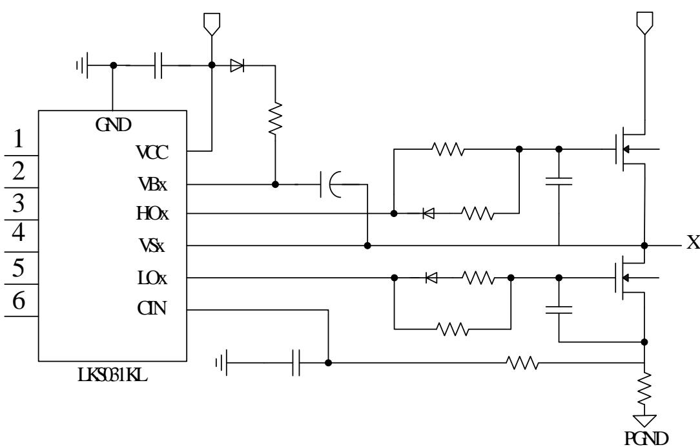  
图 21-2 6N 型栅极驱动模块典型应用图 LKS031KL

## 21.2.2 栅极驱动模块 G2

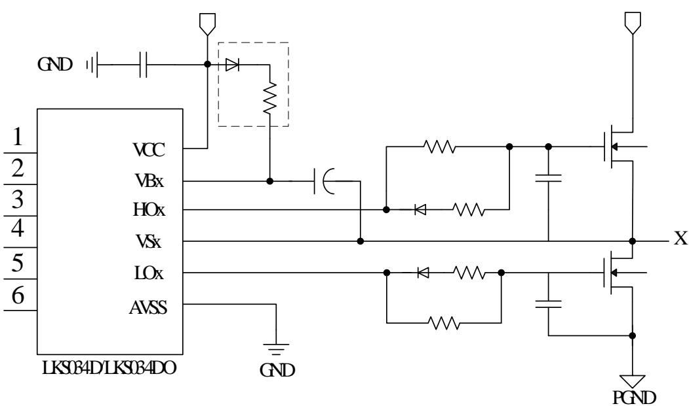  
图 21-3 6N 型栅极驱动模块典型应用图 LKS034D(O)

## 21.2.3 栅极驱动模块 G3

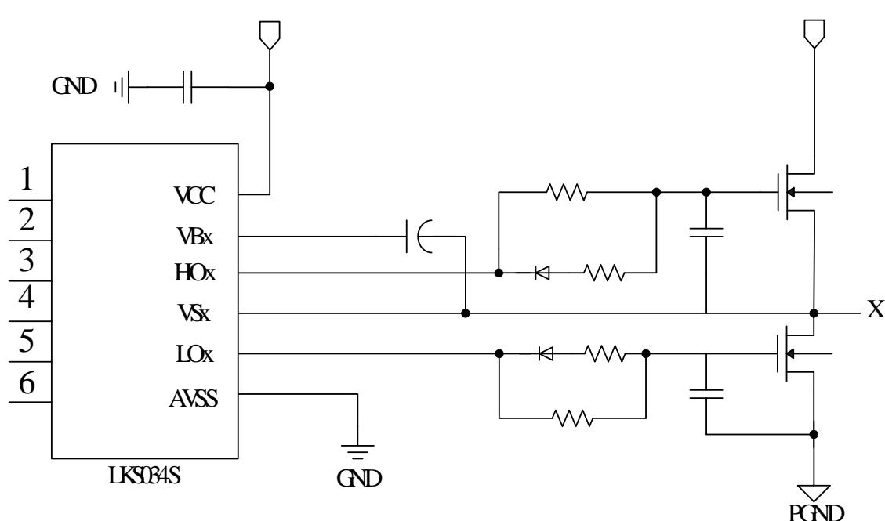  
图 21-46N 型栅极驱动模块典型应用图 LKS034S

## 21.2.4 栅极驱动模块 G5

  
图 21-56N 型栅极驱动模块典型应用图 LKS038K

## 21.2.5 栅极驱动模块 G6

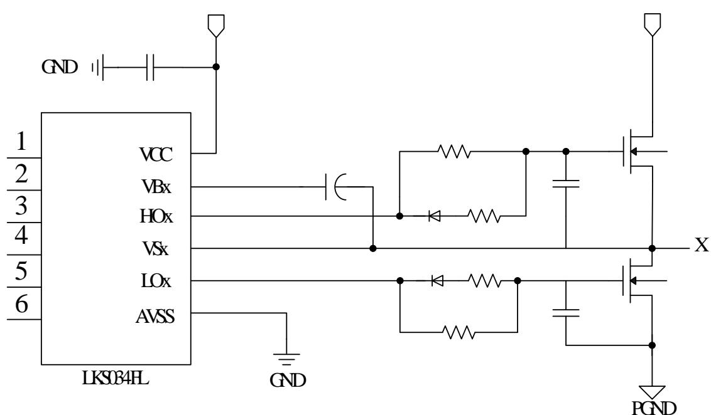  
图 21-6 6N 型栅极驱动模块典型应用图 LKS034FL

图中只保留了栅极驱动模块管脚， $_ { \tt X } = 1 , 2 , 3$ ，分别对应 3 组 MOS 栅极驱动输出。每组的应用图都如上图所示。034S 由于集成 VCC到VBS的自举二极管，因此无须再外置。

控制驱动模块的LOx 的各个GPIO，为高电平’1’对应LOx输出’1’。

栅极驱动模块输入输出极性对应关系如下：

表 21-56N型栅极驱动极性真值表

<table><tr><td>{HIN, LIN}</td><td>HO</td><td>LO</td><td></td></tr><tr><td>00</td><td>0</td><td>0</td><td>上下管关断</td></tr><tr><td>01</td><td>0</td><td>1</td><td>下管导通</td></tr><tr><td>10</td><td>1</td><td>0</td><td>上管导通</td></tr><tr><td>11</td><td>0</td><td>0</td><td>上下管同时导通,硬件短路保护</td></tr></table>

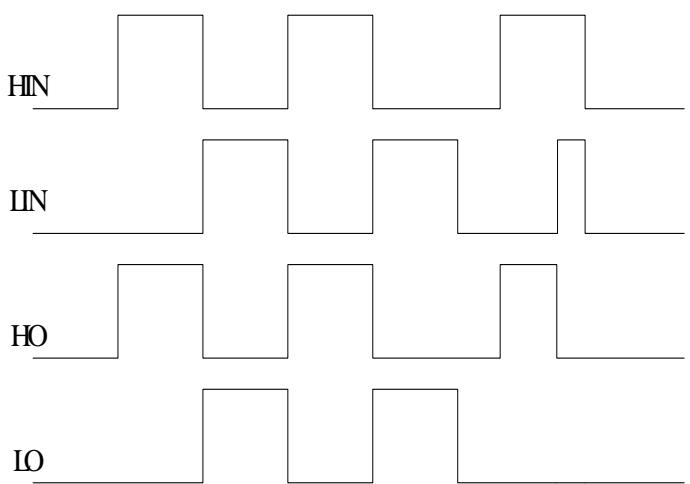  
图 21-76N型栅极驱动极性示意图

## 21.2.6 栅极驱动模块 G8

驱动模块的输出引脚信号 LO1/HO1 对应 GPIO P0.10/P0.13 的 MCPWM 功能输出，LO2/HO2对应 GPIO P0.11/P0.14 的 MCPWM 功能输出，LO3/HO3 对应 GPIO P0.12/P0.15 的 MCPWM 功能输出。

集成预驱的芯片需要设置 MCPWM\_SWAP 寄存器，否则 PWM 无法正常输出。向此寄存器写入0x67 可将 BIT[0]写为 1，写其他值则将 BIT[0]写为 0。MCPWM\_SWAP 的值为 1 时，用于包含预驱芯片应用环境。在逻辑内部转换顺序，方便芯片与驱动芯片互连，一般应用上只需要三组 MCPWM通道，因此仅转换三组的顺序。

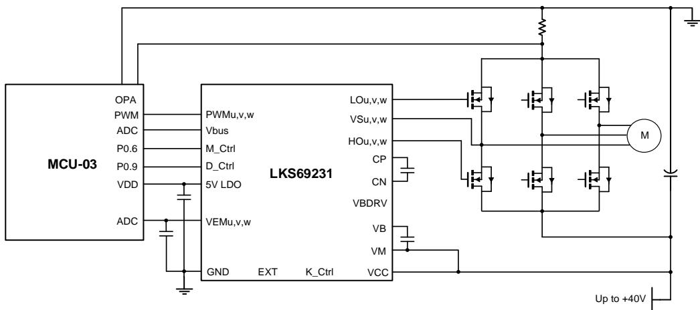  
图 21-8 栅极驱动模块典型应用图

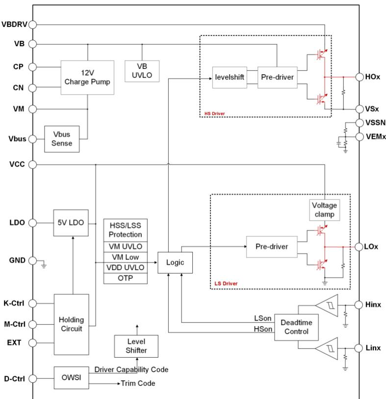  
图 21-2 6N型栅极驱动模块框图  
栅极驱动模块输入输出极性对应关系如下：

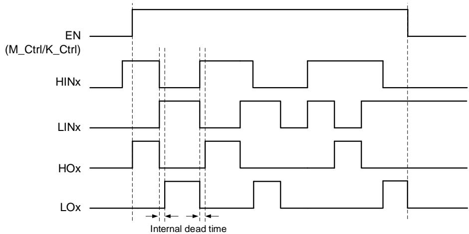  
图 21-36N型栅极驱动极性示意图

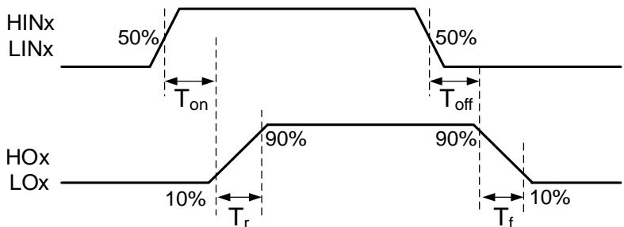  
图 20-4 开关时序

## 22 DCDC 转换器

LKS32MC034FLNK 和 LKS32MC034F2LNK 内含 DCDC 转换器

## 22.1 异步降压 DCDC 转换器参数

表 22-1 DCDC 转换器参数

<table><tr><td>参数</td><td>最小</td><td>典型</td><td>最大</td><td>单位</td><td>说明</td></tr><tr><td colspan="6">极限参数</td></tr><tr><td> $V_{IN}$ </td><td>-0.3</td><td></td><td>+105.0</td><td>V</td><td>相对于地</td></tr><tr><td>BST</td><td>-0.3</td><td></td><td>+110.0</td><td>V</td><td></td></tr><tr><td>SW</td><td>-1</td><td></td><td>105</td><td>V</td><td></td></tr><tr><td>BST-SW</td><td>-0.3</td><td></td><td>5.5</td><td>V</td><td></td></tr><tr><td>FB</td><td>-0.3</td><td></td><td>5.5</td><td>V</td><td></td></tr><tr><td>结温 $T_J$ </td><td>-40</td><td></td><td>150</td><td>°C</td><td></td></tr><tr><td>存储温度 $T_{STG}$ </td><td>-65</td><td></td><td>150</td><td>°C</td><td></td></tr><tr><td colspan="6">建议工况</td></tr><tr><td> $V_{IN}$ </td><td>5.5</td><td></td><td>100</td><td>V</td><td></td></tr><tr><td> $V_{OUT}$ </td><td>1.2</td><td></td><td>30</td><td>V</td><td></td></tr><tr><td> $T_J$ </td><td>-40</td><td></td><td>150</td><td>°C</td><td></td></tr><tr><td colspan="6">ESD</td></tr><tr><td rowspan="2"> $V_{ESD}$ </td><td>-2</td><td></td><td>2</td><td>kV</td><td>人体模型(HBM),符合ANSI-JEDEC-JS-001-2014规范,所有引脚</td></tr><tr><td>-1</td><td></td><td>1</td><td>kV</td><td>充电设备模型(CDM),符合ANSI-JEDEC-JS-002-2014规范,所有引脚</td></tr><tr><td colspan="6">电气参数</td></tr><tr><td colspan="6">电源电压</td></tr><tr><td> $V_{IN}$ </td><td>5.5</td><td></td><td>100</td><td>V</td><td></td></tr><tr><td rowspan="2"> $V_{UVLO}$ </td><td>4.55</td><td>5</td><td>5.45</td><td>V</td><td> $V_{IN}$  rising</td></tr><tr><td></td><td>420</td><td></td><td>mV</td><td>滞后</td></tr><tr><td rowspan="2"> $I_{SHDN}$ </td><td></td><td>4.3</td><td>8</td><td>uA</td><td></td></tr><tr><td></td><td></td><td>10</td><td>uA</td><td> $T_J$ =-40°C~125°C</td></tr><tr><td rowspan="2"> $I_Q$ </td><td>30</td><td>49</td><td>65</td><td>uA</td><td>no load, non-switching,</td></tr><tr><td>20</td><td>68</td><td>80</td><td>uAuA</td><td> $T_J$ =-40°C~125°C $V_{OUT}=12V$ </td></tr><tr><td> $I_A$ </td><td></td><td></td><td></td><td></td><td></td></tr><tr><td colspan="6">功率 MOSFET</td></tr><tr><td> $R_{DSON\_H}$ </td><td>600</td><td>975</td><td>1700</td><td>mΩ</td><td> $V_{BOOT}-V_{SW}=5V$ </td></tr><tr><td colspan="6">参考控制电压</td></tr><tr><td rowspan="2"> $V_{REF}$ </td><td>1.17</td><td>1.2</td><td>1.23</td><td>V</td><td>Tj=25°C</td></tr><tr><td>1.16</td><td></td><td>1.24</td><td>V</td><td>Tj=-40°C~125°C</td></tr><tr><td colspan="6">软启动</td></tr><tr><td> $T_{SS}$ </td><td></td><td>3.5</td><td></td><td>ms</td><td></td></tr><tr><td colspan="6">开关频率</td></tr><tr><td> $F_{SW}$ </td><td>200</td><td>270</td><td>340</td><td>kHz</td><td></td></tr><tr><td> $T_{OFF\_MIN}$ </td><td></td><td>250</td><td></td><td>ns</td><td></td></tr><tr><td colspan="6">电流显示和过流保护</td></tr><tr><td rowspan="2"> $I_{LIM}$ </td><td>1.25</td><td>1.8</td><td>2.5</td><td>A</td><td> $V_{IN}<60V$ </td></tr><tr><td>0.95</td><td>1.5</td><td>2.2</td><td>A</td><td> $V_{IN}\geq60V$ </td></tr><tr><td>T_hiccup</td><td></td><td>7</td><td></td><td>SS cycles</td><td></td></tr><tr><td colspan="6">保护</td></tr><tr><td rowspan="2"> $V_{OVP}$ </td><td></td><td>120</td><td></td><td>%</td><td> $V_{FB}/V_{REF}$  rising</td></tr><tr><td></td><td>115</td><td></td><td>%</td><td> $V_{FB}/V_{REF}$  falling</td></tr><tr><td rowspan="2"> $V_{UVP}$ </td><td></td><td>45</td><td></td><td>%</td><td> $V_{FB}/V_{REF}$  rising</td></tr><tr><td></td><td>40</td><td></td><td>%</td><td> $V_{FB}/V_{REF}$  falling</td></tr><tr><td rowspan="2"> $T_{SD}$ </td><td></td><td>155</td><td></td><td>°C</td><td> $T_J$  rising</td></tr><tr><td></td><td>13</td><td></td><td>°C</td><td>Hysteresis</td></tr></table>

## 22.2 内部功能框图

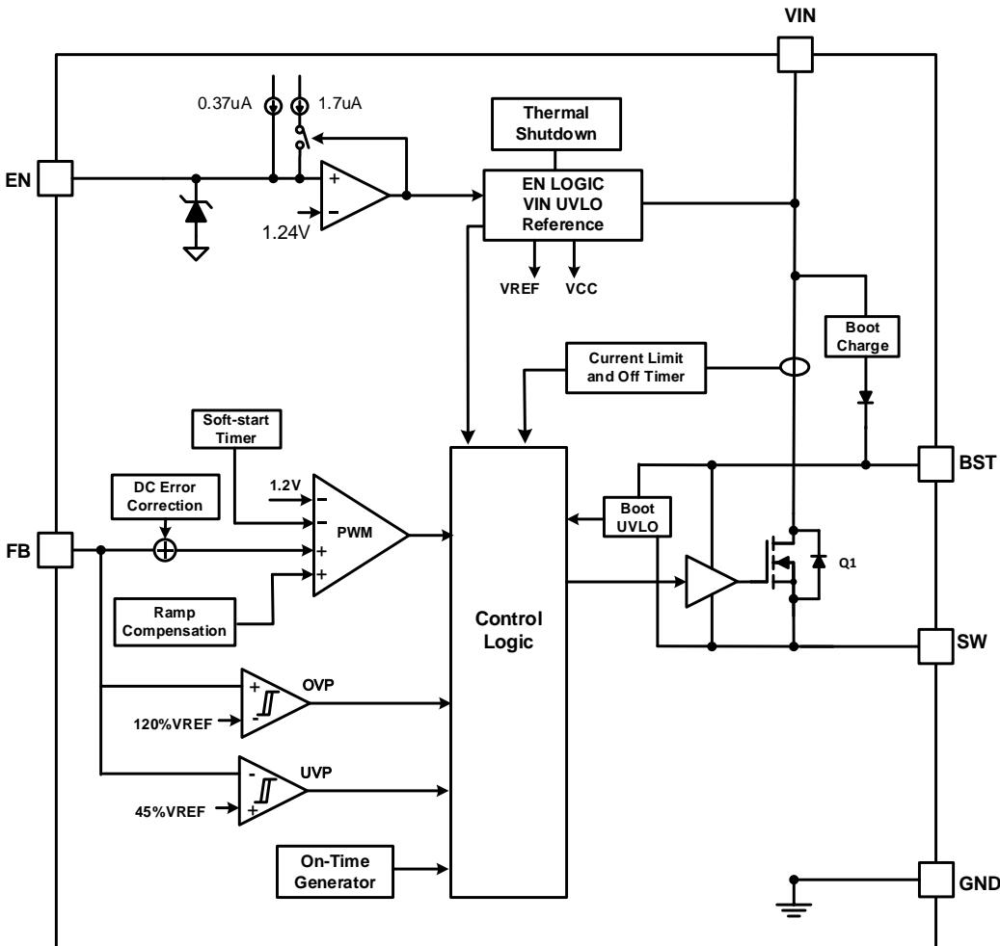  
图 22-1 内部功能框图

## 23 特殊 IO 复用

LKS03x 特殊 IO 复用注意事项

SWD协议包含两根信号线：SWCLK和SWDIO。前者是时钟信号，对于芯片而言，是输入状态且不会改变输入状态。后者是数据信号，对于芯片而言，在数据传输过程中会在输入状态和输出状态间切换，默认是输入状态。

LKS03x 可实现 SWD 的两个 IO 复用为其它 IO 的功能，SWCLK 复用的 IO 是 P1.8，SWDIO 复用的IO 是P1.9。注意事项如下：

➢ 默认状态是不开启复用，需要软件向SYS\_IO\_CFG [6]写0 开启复用。即芯片硬复位结束后，初始状态是 SWD 用途，SWD 的两个 IO 在芯片内部有上拉(芯片内部上拉电阻约为 10K)，在 IO用作 SWD 功能时，上拉默认开启且无法关闭。当 IO 用作 GPIO 时，上拉可以通过 GPIO1\_PUE[8]和 GPIO1\_PUE[9]来控制。芯片上电复位 30ms 内 P1.8 和 P1.9 固定为 SWD 功能，软件可以向SYS\_IO\_CFG[6]写 0，但 IO 功能切换需要等待 30ms 后才生效。30ms 使用 LRC 计数，由于工艺原因存在一定偏差。

➢ 开启复用后，KEIL 等工具无法直接访问芯片，即 Debug 和擦除下载功能均失效。若需要重新下载程序，有两个方案。

⚫ 其一，建议使用凌鸥专用离线下载器擦除。软件开启复用的时间，建议保留一定余量，例如100ms左右，保证离线下载器能擦除，防止死锁。余量的多少是保证离线下载器擦除的成功率。余量越大，一次性擦除成功的概率越大。

⚫ 其二，程序内部有退出机制，例如某个其它 IO 电平发生变化(一般为输入)，表明外界需要用SWDIO，软件重新配置，解除复用。此时，可以恢复 KEIL的功能。

在 SSOP24、QFN40 和 SOP16L 的封装中，SWDIO、SWCLK 可能其他 IO bonding 在一起。此时应注意其他IO动作可能导致芯片误认为SWD动作。

## SWCLK复用的注意事项如下：

➢ 默认状态是不开启复用，需要软件开启复用。即芯片硬复位结束后，初始状态是SWCLK用途，SWDCLK在芯片内部有上拉(芯片内部上拉电阻约为10K)，应用对初始电平有要求的，需注意。

➢ 开启复用后，KEIL 等工具无法直接访问芯片，即 Debug 和擦除下载功能均失效。若需要重新下载程序，有两个方案。

⚫ 其一，建议使用凌鸥专用离线下载器擦除。软件开启复用的时间，建议保留一定余量，例如100ms左右，保证离线下载器能擦除，防止死锁。余量的多少是保证离线下载器擦除的成功率。余量越大，一次性擦除成功的概率越大。

⚫ 其二，程序内部有退出机制，例如某个其它 IO 电平发生变化(一般为输入)，表明外界需要用SWCLK，软件重新配置，解除复用。此时，可以恢复 KEIL的功能。

若此时，仅复用了SWCLK，没有复用SWDIO，注意事项同上。

RSTN信号，默认是用于 LKS03x 芯片的外部复位脚。

LKS03x 可实现RSTN 复用为其它 IO的功能，复用的 IO是 P0.2。注意事项如下：

➢ 默认状态是不开启复用，需要软件向 SYS\_IO\_CFG[5]写入 1 将 RSTN 复用为普通 GPIO。即芯片初始状态是 RSTN 用途，RSTN 在芯片内部有上拉(芯片内部上拉电阻约为 100K)，应用对初始电平有要求的，需注意。

➢ 默认状态是RSTN，只有RSTN正常释放后才能开始程序的执行，应用需要保证RSTN有足够保护，例如外围电路带上拉，若能加电容更佳。

➢ 开启复用后，RSTN用途失效，若需产生芯片硬复位，源头只能是掉电/看门狗。

➢ RSTN 的复用，不影响 KEIL 的使用。

## 24 订购包装信息

包装类型分为Tray包装和Reel包装两种，具体包装中的芯片个数由封装形式与包装类型确定，不再以芯片型号区分。

Tray 包装信息如下表

<table><tr><td>封装形式</td><td>每盘/管数量</td><td>内盒数量</td><td>外箱数量</td></tr><tr><td>SOP16/ESOP16L</td><td>3000/盘</td><td>6000PCS</td><td>48000PCS</td></tr><tr><td>SSOP24</td><td>4000/盘</td><td>8000PCS</td><td>64000PCS</td></tr><tr><td>SSOP24</td><td>50/管</td><td>10000PCS</td><td>4000/100000PCS</td></tr><tr><td>QFN 8*8</td><td>260/盘</td><td>2600PCS</td><td>15600PCS</td></tr><tr><td>QFN 4*4/5*5/6*6</td><td>490/盘</td><td>4900PCS</td><td>29400PCS</td></tr><tr><td>QFN 3*3</td><td>5000/盘</td><td>5000PCS</td><td>40000PCS</td></tr><tr><td>LQFP48/TQFP48 0707</td><td>250/盘</td><td>2500PCS</td><td>15000PCS</td></tr><tr><td>LQFP64 1010</td><td>160/盘</td><td>1600PCS</td><td>9600PCS</td></tr><tr><td>LQFP100 1414</td><td>90/盘</td><td>900PCS</td><td>5400PCS</td></tr><tr><td>TSSOP20/28</td><td>4000/盘</td><td>8000PCS</td><td>64000PCS</td></tr><tr><td>QFN5*6 48L-0.75</td><td>530/盘</td><td>5300PCS</td><td>31800PCS</td></tr></table>

Reel 包装信息如下表

<table><tr><td colspan="2">包装类别</td><td>每盘/管数量</td><td>每盒数量</td><td>每箱盒数</td><td>外箱数量</td></tr><tr><td>编带-13寸</td><td>SOP/ESOP8</td><td>4000</td><td>8000</td><td>8</td><td>64000</td></tr><tr><td>编带-13寸</td><td>SOP/ESOP16</td><td>3000</td><td>6000</td><td>8</td><td>48000</td></tr><tr><td>编带-13寸</td><td>SSOP24</td><td>4000</td><td>8000</td><td>8</td><td>64000</td></tr><tr><td>编带-13寸</td><td>TSSOP20</td><td>4000</td><td>8000</td><td>8</td><td>64000</td></tr><tr><td>编带-13寸</td><td>D/QFN3*3</td><td>5000</td><td>10000</td><td>8</td><td>80000</td></tr><tr><td>编带-13寸</td><td>D/QFN4*4</td><td>5000</td><td>10000</td><td>8</td><td>80000</td></tr><tr><td>编带-13寸</td><td>D/QFN5*5</td><td>5000</td><td>10000</td><td>8</td><td>80000</td></tr><tr><td>管装</td><td>SOP16</td><td>50</td><td>10000</td><td>10</td><td>100000</td></tr><tr><td>管装</td><td>SOP14/SSOP24</td><td>50</td><td>10000</td><td>10</td><td>100000</td></tr><tr><td>管装</td><td>TSSOP24</td><td>54</td><td>6480</td><td>6</td><td>38880</td></tr></table>

## 25 版本历史

表 25-1 文档版本历史

<table><tr><td>时间</td><td>版本号</td><td>说明</td></tr><tr><td>2025.08.21</td><td>2.90</td><td>命名规则更新</td></tr><tr><td>2025.08.12</td><td>2.89</td><td>移除 LKS32MC034FLK6Q8C - for server fan only</td></tr><tr><td>2025.07.31</td><td>2.88</td><td>引脚复用补充 SDA</td></tr><tr><td>2025.07.22</td><td>2.87</td><td>删除 Flash 部分:擦写一个 Sector 的同时读取访问另一个 Sector</td></tr><tr><td>2025.07.21</td><td>2.86</td><td>删除电源检测模块的描述</td></tr><tr><td>2025.07.08</td><td>2.85</td><td>栅极模块 G8 电气参数更新</td></tr><tr><td>2025.06.11</td><td>2.84</td><td>栅极模块 G6 浮动电压参数增加说明</td></tr><tr><td>2025.05.08</td><td>2.83</td><td>删除预驱章节推荐电路框图中元器件参数增加不同版本 DAC 量程区别的说明</td></tr><tr><td>2025.04.27</td><td>2.82</td><td>修改 LKS32MC034F2LF6Q8C 方向标志</td></tr><tr><td>2025.04.23</td><td>2.81</td><td>添加 EXTI 和 WK 的说明</td></tr><tr><td>2025.04.16</td><td>2.80</td><td>添加 LKS32MC0342FLK608C 到选型表中</td></tr><tr><td>2025.02.27</td><td>2.79</td><td>LKS32MC034S2F6Q8B(C)管脚分布更正</td></tr><tr><td>2025.01.16</td><td>2.78</td><td>添加比较器翻转电压值</td></tr><tr><td>2024.11.21</td><td>2.77</td><td>增加 ADC 饱和范围的说明</td></tr><tr><td>2024.11.11</td><td>2.76</td><td>添加 034F2LF6Q8C、034F2LM6Q8C、034FLNK6Q8C、034F2LNK6Q8C添加栅极驱动模块 G8</td></tr><tr><td>2024.09.12</td><td>2.75</td><td>添加 0342FLK6Q8C添加芯片腹部 GND 说明</td></tr><tr><td>2024.08.19</td><td>2.74</td><td>添加预驱内部连接示意图</td></tr><tr><td>2024.08.04</td><td>2.73</td><td>更新包装格式</td></tr><tr><td>2024.07.17</td><td>2.72</td><td>增加 GPIO 高电平翻转阈值</td></tr><tr><td>2024.07.05</td><td>2.71</td><td>栅极驱动模块 G5 增加说明</td></tr><tr><td>2024.07.04</td><td>2.70</td><td>更新 MCU 与驱动模块工作温度</td></tr><tr><td>2024.06.04</td><td>2.69</td><td>034FLK VEM 引脚说明更新,驱动模块 G6 参数更新,034S2</td></tr><tr><td>2024.05.29</td><td>2.68</td><td>增加栅极驱动模块 G6 内部框图,G6 电气参数更新</td></tr><tr><td>2024.05.07</td><td>2.67</td><td>034FLK6Q8C 引脚图更正</td></tr><tr><td>2024.04.10</td><td>2.66</td><td>DAC 说明更新,QFN40L 封装 A 尺寸更新,栅极驱动模块 G6 参数更新</td></tr><tr><td>2024.04.01</td><td>2.65</td><td>增加 034FLK6Q8C,DAC 增加软件校正的说明</td></tr><tr><td>2024.03.20</td><td>2.64</td><td>DAC 增加 C 版本 1.2V 量程使用说明</td></tr><tr><td>2024.03.13</td><td>2.63</td><td>增加芯片 C 版本说明</td></tr><tr><td>2024.02.27</td><td>2.62</td><td>栅极驱动模块 G6 参数更新</td></tr><tr><td>2024.02.20</td><td>2.61</td><td>ESD 等级更新</td></tr><tr><td>2024.01.19</td><td>2.60</td><td>更正栅极驱动模块 G6 电气性能参数</td></tr><tr><td>2023.11.09</td><td>2.59</td><td>增加 OPA OFFSET 说明,更新储存温度</td></tr><tr><td>2023.09.25</td><td>2.58</td><td>修订焊接温度</td></tr><tr><td>2023.08.24</td><td>2.57</td><td>增加 034S2F6Q8B</td></tr><tr><td>2023.07.28</td><td>2.56</td><td>增加 038LY6Q8B</td></tr><tr><td>2023.07.26</td><td>2.55</td><td>增加 DAC 1.2V 量程</td></tr><tr><td>2023.07.21</td><td>2.54</td><td>增加 034FL EN 引脚补充说明</td></tr><tr><td>2023.07.12</td><td>2.53</td><td>增加 034FL 引脚说明</td></tr><tr><td>2023.07.06</td><td>2.52</td><td>修改 034FL 预驱供电范围</td></tr><tr><td>2023.07.05</td><td>2.51</td><td>增加 038K</td></tr><tr><td>2023.06.04</td><td>2.5</td><td>增加 034FL</td></tr><tr><td>2023.04.11</td><td>2.49</td><td>修改封装名称</td></tr><tr><td>2023.04.03</td><td>2.48</td><td>增加 031KL CIN 过流检测输入滤波时间</td></tr><tr><td>2023.03.24</td><td>2.47</td><td>更新 QFN40 (034D/034DO/034S) 封装尺寸</td></tr><tr><td>2023.03.16</td><td>2.46</td><td>修改 UART 支持的数据位</td></tr><tr><td>2023.01.30</td><td>2.45</td><td>修改 031KL 第 10 和 35 管脚说明</td></tr><tr><td>2023.01.12</td><td>2.44</td><td>增加共模电压参数</td></tr><tr><td>2023.01.09</td><td>2.43</td><td>增加订购包装信息</td></tr><tr><td>2022.12.30</td><td>2.42</td><td>修订 031KL 管脚分布图</td></tr><tr><td>2022.12.29</td><td>2.41</td><td>修订 031KL 第 31 脚描述</td></tr><tr><td>2022.12.18</td><td>2.4</td><td>增加 031KL</td></tr><tr><td>2022.12.12</td><td>2.36</td><td>修订 LDO 输出传输曲线</td></tr><tr><td>2022.11.28</td><td>2.35</td><td>更新 LRC 时钟频率</td></tr><tr><td>2022.11.21</td><td>2.34</td><td>更新器件选型表</td></tr><tr><td>2022.11.12</td><td>2.33</td><td>更新 LRC 时钟频率和全温度范围偏差</td></tr><tr><td>2022.11.07</td><td>2.32</td><td>增加 IO 与内部模拟电路间连接电阻阻值</td></tr><tr><td>2022.10.28</td><td>2.31</td><td>增加读取 SYS_AFE_INFO.Version 查看芯片版本的说明</td></tr><tr><td>2022.10.25</td><td>2.3</td><td>修订 A/B 版本命名</td></tr><tr><td>2022.10.24</td><td>2.2</td><td>修订供电电压,增加 039D,039PL5,039PL3</td></tr><tr><td>2022.10.12</td><td>2.14</td><td>增加 MCPWM_SWAP 寄存器的描述</td></tr><tr><td>2022.09.23</td><td>2.13</td><td>修订 DateCode 格式</td></tr><tr><td>2022.09.21</td><td>2.12</td><td>修订 034DO 8 脚的说明</td></tr><tr><td>2022.09.16</td><td>2.11</td><td>修订 034S 选型表说明,内置 5V LDO</td></tr><tr><td>2022.09.06</td><td>2.1</td><td>增加 A(YYWWA)/B(YYWWB)版本的引脚说明</td></tr><tr><td>2022.08.11</td><td>2.0</td><td>拆分 3P3N,6N 和单 MCU 型号 DS</td></tr><tr><td>2022.07.27</td><td>1.91</td><td>增加 034S</td></tr><tr><td>2022.07.21</td><td>1.9</td><td>回退 ADC_CH6/7 引脚位置修订,第二次版本修订时间暂定 2022.10</td></tr><tr><td>2022.06.02</td><td>1.8</td><td>调整 ADC_CH6/7 位置,修正引脚复用表</td></tr><tr><td>2022.03.08</td><td>1.7</td><td>增加 034D,调整 037Q 引脚编号</td></tr><tr><td>2022.02.28</td><td>1.6</td><td>增加 037Q</td></tr><tr><td>2022.02.22</td><td>1.5</td><td>更新 ADC 通道数和比较器通道数,去除 ADC_CH8</td></tr><tr><td>2022.01.24</td><td>1.4</td><td>修订 P0.4,P0.6 比较器正端编号,033 增加 P0.8 功能</td></tr><tr><td>2021.11.29</td><td>1.3</td><td>增加 033QFN 型号,增加 038</td></tr><tr><td>2021.11.03</td><td>1.2</td><td>增加 033,037F</td></tr><tr><td>2021.09.07</td><td>1.1</td><td>修订 VCC 电源部分的描述</td></tr><tr><td>2021.09.02</td><td>1.0</td><td>初始版本</td></tr></table>

## 免责声明

LKS 和 LKO 为凌鸥创芯注册商标。

南京凌鸥创芯电子有限公司（以下简称：“Linko”）尽力确保本文档内容的准确和可靠，但是保留随时更改、更正、增强、修改产品和/或 文档的权利，恕不另行通知。用户可在下单前获取最新相关信息。

客户应针对应用需求选择合适的 Linko 产品，详细设计、验证和测试您的应用，以确保满足相应标准以及任何安全、安保或其它要求。客户应对此独自承担全部责任。

Linko在此确认未以明示或暗示方式授予Linko或第三方的任何知识产权许可。

Linko产品的转售，若其条款与此处规定不同，Linko对此类产品的任何保修承诺无效。

Linko产品禁止用于军事用途或生命监护、维持系统。

如有更早期版本文档，一切信息以此文档为准。