LinkoSemiconductorCo.,Ltd.

32bit Compact MCU for Motor Control

## 特性

o 48MHz 32 位 Cortex-M0 内核，硬件除法协处理器

o 低功耗休眠模式，MCU 休眠功耗 30uA

o -40\~105℃工业级工作温度范围

o 2.5V\~5.5V单电源供电，内部集成数字供电 LDO

o 超强抗静电和群脉冲能力

## 存储

o 16kB flash/16kB flash+16kB ROM/32kB flash三种规格，带flash防窃密功能

o 4kB RAM

## 时钟

o 内置4MHz 高精度RC时钟，全温度范围精度±1%

o 内置64kHz 低速时钟，供低功耗模式使用

o 内部 PLL 可提供最高 48MHz 时钟

## 外设

o 一路 UART

o 一路 SPI

o 一路 IIC

o 通用16/32 位Timer，支持捕捉和边沿对齐PWM

o 电机控制专用PWM 模块，支持 6路PWM输出，独立死区控制

o Hall 信号专用接口，支持测速、去抖

o 4 通道 DMA

o 硬件看门狗

o 最多支持 25 路 GPIO

## 模拟模块

o 集成 1 路 12bit SAR ADC，1.2Msps 采样及转换速率，共11 通道

o 集成2 路OPA，可设置为差分 PGA模式

o 集成两路比较器

o 集成8bitDAC 数模转换器，作为内部比较器输入

o 内置 1.2V0.5%精度电压基准源

o 内置1 路低功耗LDO 和电源监测电路

o 集成高精度、低温漂高频RC时钟

## 主要优势

 内部集成2 路高速运放，可满足单电阻/双电阻电流采样拓扑架构的不同需求

 运放输入端口集成电压钳位保护电路，只需要外加两个限流电阻就可实现MOSFET内阻直接电流采样

 ADC模块变增益技术，可以和高速运放配合，处理更宽的电流动态范围，兼顾小电流和大电流的采样精度

 集成两路比较器

 ESD及抗干扰能力强，稳定可靠

 单电源2.5V\~5.5V供电，确保了系统供电的通用性

 高集成度、体积小、节约BOM成本

 支持 IEC/UL60730 功能安全认证

## 应用场景

适用于有感 BLDC/无感 BLDC/有感 FOC/无感FOC及步进电机、永磁同步、异步电机等控制系统。适用数字电源控制系统。

## 1 概述

## 1.1 功能简述

LKS32MC03x系列MCU是32 位内核的面向电机控制应用的紧凑型专用处理器，集成了常用电机控制系统所需要的所有模块。

LKS32MC033H6P8/ LKS32MC033H6Q8/ LKS32MC037M6S8/ LKS32MC038Y6P8 为未集成驱动模 块 的 MCU 。 LKS32MC037LM6S8B/ LKS32MC037LM6S8C/ LKS32MC038LY6P8B/LKS32MC038LY6P8C/ LKS32MC038LY6Q8B/ LKS32MC038LY6Q8C 内部集成 5V LDO。

## ⚫ 性能

➢ 48MHz 32 位 Cortex-M0 内核

➢ 低功耗休眠模式

➢ 集成三相全桥自举式栅极驱动模块

➢ 工业级工作温度范围

➢ 超强抗静电和群脉冲能力

## ⚫ 存储器

➢ 32kBFlash，带加密功能，带128 位芯片唯一识别码

➢ 4kB RAM

## ⚫ 工作范围

➢ 采用2.5V\~5.5V电源供电,内部集成1 个LDO，为数字部分电路供电。

➢ 工作温度: -40\~105℃

## ⚫ 时钟

➢ 内置 4MHz 高精度 RC 时钟，-40\~105℃范围内精度在±1%之内

➢ 内置低速64kHz 低速时钟，供低功耗模式使用

➢ 内部 PLL 可提供最高 48MHz 时钟

## ⚫ 外设模块

➢ 一路 UART

➢ 一路SPI，支持主从模式

➢ 一路IIC，支持主从模式

➢ 1 个通用16位 Timer，支持捕捉和边沿对齐 PWM功能

➢ 1 个通用32位 Timer，支持捕捉和边沿对齐 PWM功能

➢ 电机控制专用PWM 模块，支持8路 PWM输出，独立死区控制

➢ Hall 信号专用接口，支持测速、去抖功能

➢ 硬件看门狗

➢ 25 路 GPIO。8 个 GPIO 可以作为系统的唤醒源。17 个 GPIO 可以用作外部中断源输入

## ⚫ 模拟模块

➢ 集成 1 路 12bit SAR ADC，1.2Msps 采样及转换速率，共 11 通道

➢ 集成2 通道运算放大器，可设置为差分 PGA模式

➢ 集成两路比较器

➢ 集成 8bit DAC 数模转换器

➢ 内置±2℃温度传感器

➢ 内置 1.2V 0.5%精度电压基准源

➢ 内置1 路低功耗 LDO 和电源监测电路

➢ 集成高精度、低温飘高频RC时钟

## 1.2 主要优势

➢ 高可靠性、高集成度、最终产品体积小、节约 BOM成本。

➢ 内部集成 2 通道高速运放和两路比较器，可满足单电阻/双电阻电流采样拓扑架构的不同需求；

➢ 内部高速运放集成高压保护电路，可以允许高电平共模信号直接输入芯片，可以用最简单的电路拓扑实现 MOSFET电阻直接电流采样模式；

➢ 应用专利技术使 ADC和高速运放达到最佳配合，可处理更宽的电流动态范围，同时兼顾高速小电流和低速大电流的采样精度；

➢ 整体控制电路简洁高效，抗干扰能力强，稳定可靠；

➢ 集成三相全桥自举式栅极驱动模块；

适用于有感BLDC/无感BLDC/有感 FOC/无感 FOC 及步进电机、永磁同步、异步电机等控制系统。

## 1.3 命名规则

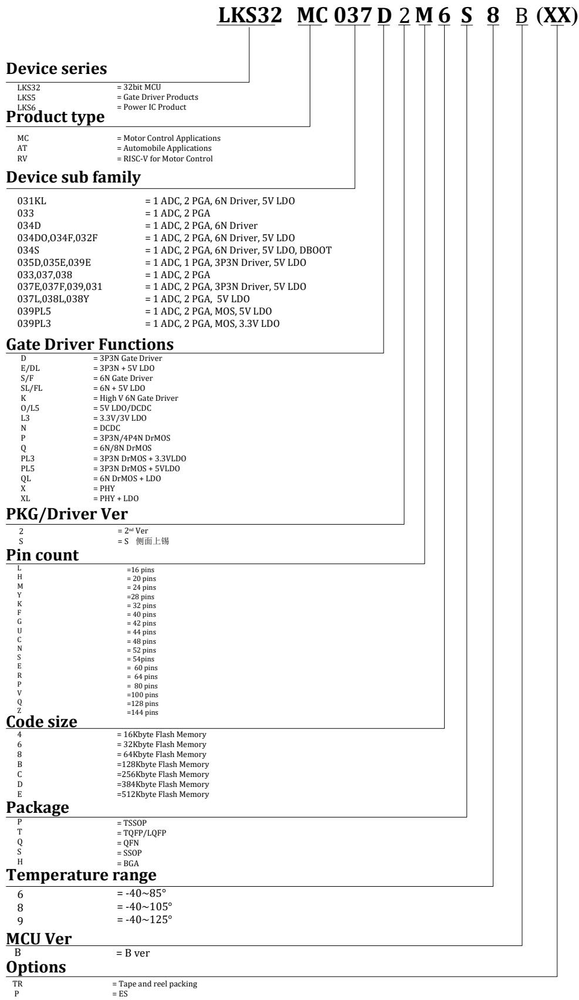  
图 1-1 LKS32MC03x 器件命名规则

## 1.4 系统资源

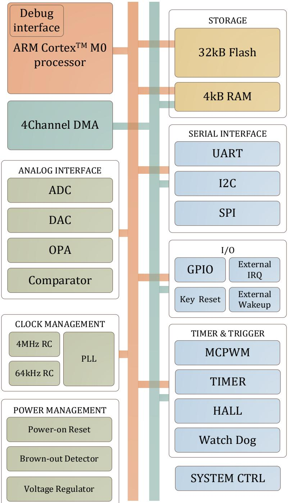  
图 1-2 LKS32MC03x 系统框图

## 1.5 矢量正弦控制系统

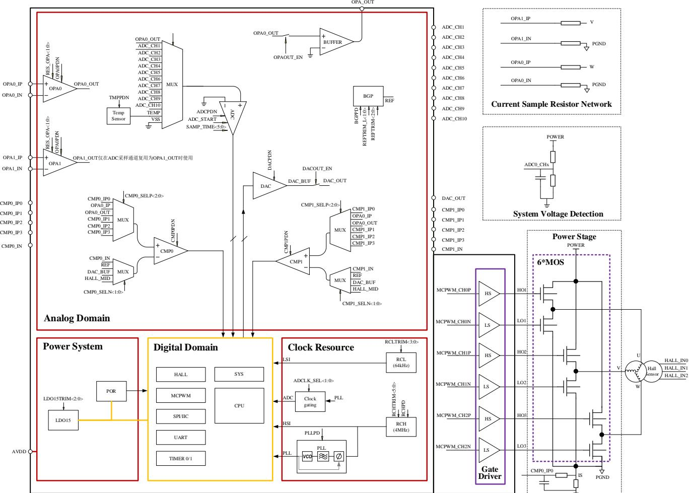  
图 1-3LKS32MC03x 矢量正弦控制系统简化原理图

## 2 器件选型表

表 2-1 LKS32MC03x 系列器件选型表

<table><tr><td></td><td>Frequency (MHz)</td><td>Flash (kB)</td><td>RAM (kB)</td><td>ADC ch.</td><td>DAC</td><td>Comparator</td><td>Comparator ch.</td><td>OPA</td><td>HALL</td><td>SPI</td><td>IIC</td><td>UART</td><td>Temp. Sensor</td><td>PLL</td><td>Gate driver</td><td>Gate Driver current (A)</td><td>Pre-drive supply (V)</td><td>Gate floating voltage (V)</td><td>Others</td><td>Package</td></tr><tr><td>LKS32MC031KLC6T8B</td><td>48</td><td>32</td><td>4</td><td>9</td><td>8BITx1</td><td>2</td><td>8</td><td>2</td><td>3</td><td>1</td><td>1</td><td>1</td><td>Yes</td><td>Yes</td><td>6N</td><td>+0.2/-0.35</td><td>13-20</td><td>600</td><td>5V LDO</td><td>LQFP48L 0707</td></tr><tr><td>LKS32MC031KLC6T8C</td><td>48</td><td>32</td><td>4</td><td>9</td><td>8BITx1</td><td>2</td><td>8</td><td>2</td><td>3</td><td>1</td><td>1</td><td>1</td><td>Yes</td><td>Yes</td><td>6N</td><td>+0.2/-0.35</td><td>13-20</td><td>600</td><td>5V LDO</td><td>LQFP48L 0707</td></tr><tr><td>LKS32MC031PC6Q8C*</td><td>48</td><td>32</td><td>4</td><td>9</td><td>8BITx1</td><td>2</td><td>6</td><td>2</td><td>3</td><td>1</td><td>1</td><td>1</td><td>Yes</td><td>Yes</td><td>3P3N</td><td>+0.05/-0.3</td><td>5.7-28</td><td></td><td>5V LDO</td><td>DFN5.0*6.0 48L</td></tr><tr><td>LKS32MC032LK6T8C</td><td>48</td><td>32</td><td>4</td><td>9</td><td>8BITx1</td><td>2</td><td>8</td><td>2</td><td>3</td><td>1</td><td>1</td><td>1</td><td>Yes</td><td>Yes</td><td></td><td></td><td></td><td></td><td></td><td>LQFP32</td></tr><tr><td>LKS32MC033H6P8</td><td>48</td><td>32</td><td>4</td><td>7</td><td>8BITx1</td><td>2</td><td>5</td><td>1</td><td>3</td><td>1</td><td>1</td><td>1</td><td>Yes</td><td>Yes</td><td></td><td></td><td></td><td></td><td></td><td>TSSOP20L</td></tr><tr><td>LKS32MC033H6P8B</td><td>48</td><td>32</td><td>4</td><td>7</td><td>8BITx1</td><td>2</td><td>5</td><td>2</td><td>3</td><td>1</td><td>1</td><td>1</td><td>Yes</td><td>Yes</td><td></td><td></td><td></td><td></td><td></td><td>TSSOP20L</td></tr><tr><td>LKS32MC033H6P8C</td><td>48</td><td>32</td><td>4</td><td>7</td><td>8BITx1</td><td>2</td><td>5</td><td>2</td><td>3</td><td>1</td><td>1</td><td>1</td><td>Yes</td><td>Yes</td><td></td><td></td><td></td><td></td><td></td><td>TSSOP20L</td></tr><tr><td>LKS32MC033H6Q8</td><td>48</td><td>32</td><td>4</td><td>7</td><td>8BITx1</td><td>2</td><td>5</td><td>1</td><td>3</td><td>1</td><td>1</td><td>1</td><td>Yes</td><td>Yes</td><td></td><td></td><td></td><td></td><td></td><td>QFN3*3 20L-0.75</td></tr><tr><td>LKS32MC033H6Q8B</td><td>48</td><td>32</td><td>4</td><td>7</td><td>8BITx1</td><td>2</td><td>5</td><td>1</td><td>3</td><td>1</td><td>1</td><td>1</td><td>Yes</td><td>Yes</td><td></td><td></td><td></td><td></td><td></td><td>QFN3*3 20L-0.75</td></tr><tr><td>LKS32MC033H6Q8C</td><td>48</td><td>32</td><td>4</td><td>7</td><td>8BITx1</td><td>2</td><td>5</td><td>1</td><td>3</td><td>1</td><td>1</td><td>1</td><td>Yes</td><td>Yes</td><td></td><td></td><td></td><td></td><td></td><td>QFN3*3 20L-0.75</td></tr><tr><td>LKS32MC034DF6Q8</td><td>48</td><td>32</td><td>4</td><td>9</td><td>8BITx1</td><td>2</td><td>8</td><td>2</td><td>3</td><td>1</td><td>1</td><td>1</td><td>Yes</td><td>Yes</td><td>6N</td><td>+1/-1</td><td>7-20</td><td>200</td><td></td><td>QFN5*5 40L-0.75</td></tr><tr><td>LKS32MC034DF6Q8B</td><td>48</td><td>32</td><td>4</td><td>10</td><td>8BITx1</td><td>2</td><td>8</td><td>2</td><td>3</td><td>1</td><td>1</td><td>1</td><td>Yes</td><td>Yes</td><td>6N</td><td>+1/-1</td><td>7-20</td><td>200</td><td></td><td>QFN5*5 40L-0.75</td></tr><tr><td>LKS32MC034DF6Q8C</td><td>48</td><td>32</td><td>4</td><td>10</td><td>8BITx1</td><td>2</td><td>8</td><td>2</td><td>3</td><td>1</td><td>1</td><td>1</td><td>Yes</td><td>Yes</td><td>6N</td><td>+1/-1</td><td>7-20</td><td>200</td><td></td><td>QFN5*5 40L-0.75</td></tr><tr><td>LKS32MC034DOF6Q8</td><td>48</td><td>32</td><td>4</td><td>9</td><td>8BITx1</td><td>2</td><td>8</td><td>2</td><td>3</td><td>1</td><td>1</td><td>1</td><td>Yes</td><td>Yes</td><td>6N</td><td>+1/-1</td><td>7-20</td><td>200</td><td>5V LDO</td><td>QFN5*5 40L-0.75</td></tr><tr><td>LKS32MC034DOF6Q8B</td><td>48</td><td>32</td><td>4</td><td>10</td><td>8BITx1</td><td>2</td><td>8</td><td>2</td><td>3</td><td>1</td><td>1</td><td>1</td><td>Yes</td><td>Yes</td><td>6N</td><td>+1/-1</td><td>7-20</td><td>200</td><td>5V LDO</td><td>QFN5*5 40L-0.75</td></tr><tr><td>LKS32MC034DOF6Q8C</td><td>48</td><td>32</td><td>4</td><td>10</td><td>8BITx1</td><td>2</td><td>8</td><td>2</td><td>3</td><td>1</td><td>1</td><td>1</td><td>Yes</td><td>Yes</td><td>6N</td><td>+1/-1</td><td>7-20</td><td>200</td><td>5V LDO</td><td>QFN5*5 40L-0.75</td></tr><tr><td>LKS32MC034SF6Q8</td><td>48</td><td>32</td><td>4</td><td>9</td><td>8BITx1</td><td>2</td><td>8</td><td>2</td><td>3</td><td>1</td><td>1</td><td>1</td><td>Yes</td><td>Yes</td><td>6N</td><td>+1/-1.2</td><td>4.5-20</td><td>200</td><td>5V LDO</td><td>QFN5*5 40L-0.75</td></tr><tr><td>LKS32MC034SF6Q8B</td><td>48</td><td>32</td><td>4</td><td>10</td><td>8BITx1</td><td>2</td><td>8</td><td>2</td><td>3</td><td>1</td><td>1</td><td>1</td><td>Yes</td><td>Yes</td><td>6N</td><td>+1/-1.2</td><td>4.5-20</td><td>200</td><td>5V LDO</td><td>QFN5*5 40L-0.75</td></tr></table>

器件选型表

<table><tr><td>LKS32MC034SF6Q8C</td><td>48</td><td>32</td><td>4</td><td>10</td><td>8BITx1</td><td>2</td><td>8</td><td>2</td><td>3</td><td>1</td><td>1</td><td>1</td><td>Yes</td><td>Yes</td><td>6N</td><td>+1/-1.2</td><td>4.5-20</td><td>200</td><td>5V LDO</td><td>QFN5*5 40L-0.75</td></tr><tr><td>LKS32MC034S2F6Q8B</td><td>48</td><td>32</td><td>4</td><td>10</td><td>8BITx1</td><td>2</td><td>8</td><td>2</td><td>3</td><td>1</td><td>1</td><td>1</td><td>Yes</td><td>Yes</td><td>6N</td><td>+1/-1.2</td><td>4.5-20</td><td>200</td><td>5V LDO</td><td>QFN5*5 40L-0.75</td></tr><tr><td>LKS32MC034S2F6Q8C</td><td>48</td><td>32</td><td>4</td><td>10</td><td>8BITx1</td><td>2</td><td>8</td><td>2</td><td>3</td><td>1</td><td>1</td><td>1</td><td>Yes</td><td>Yes</td><td>6N</td><td>+1/-1.2</td><td>4.5-20</td><td>200</td><td>5V LDO</td><td>QFN5*5 40L-0.75</td></tr><tr><td>LKS32MC034FLF6Q8B</td><td>48</td><td>32</td><td>4</td><td>10</td><td>8BITx1</td><td>2</td><td>8</td><td>2</td><td>3</td><td>1</td><td>1</td><td>1</td><td>Yes</td><td>Yes</td><td>6N</td><td>+1/-1.2</td><td>4.5-20</td><td>200</td><td>5V LDO</td><td>QFN5*5 40L-0.75</td></tr><tr><td>LKS32MC034FLF6Q8C</td><td>48</td><td>32</td><td>4</td><td>10</td><td>8BITx1</td><td>2</td><td>8</td><td>2</td><td>3</td><td>1</td><td>1</td><td>1</td><td>Yes</td><td>Yes</td><td>6N</td><td>+1/-1.2</td><td>4.5-20</td><td>200</td><td>5V LDO</td><td>QFN5*5 40L-0.75</td></tr><tr><td>LKS32MC034FLK6Q8C</td><td>48</td><td>32</td><td>4</td><td>7</td><td>8BITx1</td><td>2</td><td>8</td><td>2</td><td>3</td><td>1</td><td>1</td><td>1</td><td>Yes</td><td>Yes</td><td>6N</td><td>+1/-1.2</td><td>4.5-20</td><td>200</td><td>5V LDO</td><td>QFN4*4 32L-0.75</td></tr><tr><td>LKS32MC034F2LF6Q8C</td><td>48</td><td>32</td><td>4</td><td>8</td><td>8BITx1</td><td>2</td><td>7</td><td>2</td><td>3</td><td>0</td><td>1</td><td>1</td><td>Yes</td><td>Yes</td><td>6N</td><td>+1/-1</td><td>-0.3-48</td><td>90</td><td>5V LDO</td><td>QFN5*5 40L-0.75</td></tr><tr><td>LKS32MC034F2LM6Q8C</td><td>48</td><td>32</td><td>4</td><td>5</td><td>8BITx1</td><td>2</td><td>3</td><td>2</td><td>2</td><td>0</td><td>1</td><td>1</td><td>Yes</td><td>Yes</td><td>6N</td><td>+1/-1</td><td>-0.3-48</td><td>90</td><td>5V LDO</td><td>QFN4*4 24L-0.75</td></tr><tr><td>LKS32MC034FLNK6Q8C</td><td>48</td><td>32</td><td>4</td><td>5</td><td>8BITx1</td><td>2</td><td></td><td></td><td></td><td></td><td></td><td></td><td>Yes</td><td>Yes</td><td>6N</td><td>+1/-1.2</td><td>4.5-20</td><td>200</td><td>5V LDO</td><td>QFN4*4 32L-0.75</td></tr><tr><td>LKS32MC034F2LNK6Q8C</td><td>48</td><td>32</td><td>4</td><td>5</td><td>8BITx1</td><td>2</td><td>4</td><td>2</td><td>3</td><td>0</td><td>1</td><td>1</td><td>Yes</td><td>Yes</td><td>6N</td><td>+1/-1</td><td>-0.3-48</td><td>90</td><td>5V LDO</td><td>QFN4*4 32L-0.75</td></tr><tr><td>LKS32MC035DL6S8</td><td>48</td><td>32</td><td>4</td><td>6</td><td>8BITx1</td><td>2</td><td>4</td><td>1</td><td>3</td><td>1</td><td>1</td><td>1</td><td>Yes</td><td>Yes</td><td>3P3N</td><td>+0.05/-0.3</td><td>7.5-28</td><td></td><td>5V LDO</td><td>SOP16L</td></tr><tr><td>LKS32MC035DL6S8B</td><td>48</td><td>32</td><td>4</td><td>5</td><td>8BITx1</td><td>2</td><td>4</td><td>1</td><td>3</td><td>1</td><td>1</td><td>1</td><td>Yes</td><td>Yes</td><td>3P3N</td><td>+0.05/-0.3</td><td>7.5-28</td><td></td><td>5V LDO</td><td>SOP16L</td></tr><tr><td>LKS32MC035DL6S8C</td><td>48</td><td>32</td><td>4</td><td>5</td><td>8BITx1</td><td>2</td><td>4</td><td>1</td><td>3</td><td>1</td><td>1</td><td>1</td><td>Yes</td><td>Yes</td><td>3P3N</td><td>+0.05/-0.3</td><td>7.5-28</td><td></td><td>5V LDO</td><td>SOP16L</td></tr><tr><td>LKS32MC035EL6S8B</td><td>48</td><td>32</td><td>4</td><td>5</td><td>8BITx1</td><td>2</td><td>4</td><td>1</td><td>3</td><td>1</td><td>1</td><td>1</td><td>Yes</td><td>Yes</td><td>3P3N</td><td>+0.05/-0.3</td><td>5.7-28</td><td></td><td>5V LDO</td><td>SOP16L</td></tr><tr><td>LKS32MC035EL6S8C</td><td>48</td><td>32</td><td>4</td><td>5</td><td>8BITx1</td><td>2</td><td>4</td><td>1</td><td>3</td><td>1</td><td>1</td><td>1</td><td>Yes</td><td>Yes</td><td>3P3N</td><td>+0.05/-0.3</td><td>5.7-28</td><td></td><td>5V LDO</td><td>SOP16L</td></tr><tr><td>LKS32MC037M6S8</td><td>48</td><td>32</td><td>4</td><td>9</td><td>8BITx1</td><td>2</td><td>8</td><td>2</td><td>3</td><td>1</td><td>1</td><td>1</td><td>Yes</td><td>Yes</td><td></td><td></td><td></td><td></td><td></td><td>SSOP24L</td></tr><tr><td>LKS32MC037M6S8B</td><td>48</td><td>32</td><td>4</td><td>10</td><td>8BITx1</td><td>2</td><td>8</td><td>2</td><td>3</td><td>1</td><td>1</td><td>1</td><td>Yes</td><td>Yes</td><td></td><td></td><td></td><td></td><td></td><td>SSOP24L</td></tr><tr><td>LKS32MC037M6S8C</td><td>48</td><td>32</td><td>4</td><td>10</td><td>8BITx1</td><td>2</td><td>8</td><td>2</td><td>3</td><td>1</td><td>1</td><td>1</td><td>Yes</td><td>Yes</td><td></td><td></td><td></td><td></td><td></td><td>SSOP24L</td></tr><tr><td>LKS32MC037EM6S8</td><td>48</td><td>32</td><td>4</td><td>9</td><td>8BITx1</td><td>2</td><td>7</td><td>2</td><td>3</td><td>1</td><td>1</td><td>1</td><td>Yes</td><td>Yes</td><td>3P3N</td><td>+0.05/-0.3</td><td>7.5-28</td><td></td><td>5V LDO</td><td>SSOP24L</td></tr><tr><td>LKS32MC037EM6S8B</td><td>48</td><td>32</td><td>4</td><td>9</td><td>8BITx1</td><td>2</td><td>7</td><td>2</td><td>3</td><td>1</td><td>1</td><td>1</td><td>Yes</td><td>Yes</td><td>3P3N</td><td>+0.05/-0.3</td><td>7.5-28</td><td></td><td>5V LDO</td><td>SSOP24L</td></tr><tr><td>LKS32MC037EM6S8C</td><td>48</td><td>32</td><td>4</td><td>9</td><td>8BITx1</td><td>2</td><td>7</td><td>2</td><td>3</td><td>1</td><td>1</td><td>1</td><td>Yes</td><td>Yes</td><td>3P3N</td><td>+0.05/-0.3</td><td>7.5-28</td><td></td><td>5V LDO</td><td>SSOP24L</td></tr><tr><td>LKS32MC037FM6S8B</td><td>48</td><td>32</td><td>4</td><td>8</td><td>8BITx1</td><td>2</td><td>7</td><td>2</td><td>3</td><td>1</td><td>1</td><td>1</td><td>Yes</td><td>Yes</td><td>3P3N</td><td>+0.05/-0.3</td><td>5.7-28</td><td></td><td>5V LDO</td><td>SSOP24L</td></tr><tr><td>LKS32MC037FM6S8C</td><td>48</td><td>32</td><td>4</td><td>8</td><td>8BITx1</td><td>2</td><td>7</td><td>2</td><td>3</td><td>1</td><td>1</td><td>1</td><td>Yes</td><td>Yes</td><td>3P3N</td><td>+0.05/-0.3</td><td>5.7-28</td><td></td><td>5V LDO</td><td>SSOP24L</td></tr><tr><td>LKS32MC037LM6S8B</td><td>48</td><td>32</td><td>4</td><td>9</td><td>8BITx1</td><td>2</td><td>8</td><td>2</td><td>3</td><td>1</td><td>1</td><td>1</td><td>Yes</td><td>Yes</td><td></td><td></td><td></td><td></td><td>5V LDO</td><td>SSOP24L</td></tr><tr><td>LKS32MC037LM6S8C</td><td>48</td><td>32</td><td>4</td><td>9</td><td>8BITx1</td><td>2</td><td>8</td><td>2</td><td>3</td><td>1</td><td>1</td><td>1</td><td>Yes</td><td>Yes</td><td></td><td></td><td></td><td></td><td>5V LDO</td><td>SSOP24L</td></tr><tr><td>LKS32MC037QM6Q8</td><td>48</td><td>32</td><td>4</td><td>9</td><td>8BITx1</td><td>2</td><td>7</td><td>2</td><td>3</td><td>1</td><td>1</td><td>1</td><td>Yes</td><td>Yes</td><td>3P3N</td><td>+0.05/-0.3</td><td>7.5-28</td><td></td><td>5V LDO</td><td>QFN4*4 24L-0.75</td></tr></table>

## 器件选型表

<table><tr><td>LKS32MC037QM6Q8B</td><td>48</td><td>32</td><td>4</td><td>9</td><td>8BITx1</td><td>2</td><td>7</td><td>2</td><td>3</td><td>1</td><td>1</td><td>1</td><td>Yes</td><td>Yes</td><td>3P3N</td><td>+0.05/-0.3</td><td>7.5-28</td><td></td><td>5V LDO</td><td>QFN4*4 24L-0.75</td></tr><tr><td>LKS32MC037QM6Q8C</td><td>48</td><td>32</td><td>4</td><td>9</td><td>8BITx1</td><td>2</td><td>7</td><td>2</td><td>3</td><td>1</td><td>1</td><td>1</td><td>Yes</td><td>Yes</td><td>3P3N</td><td>+0.05/-0.3</td><td>7.5-28</td><td></td><td>5V LDO</td><td>QFN4*4 24L-0.75</td></tr><tr><td>LKS32MC037Q2M6Q8C</td><td>48</td><td>32</td><td>4</td><td>9</td><td>8BITx1</td><td>2</td><td>7</td><td>2</td><td>3</td><td>1</td><td>1</td><td>1</td><td>Yes</td><td>Yes</td><td>3P3N</td><td>+0.05/-0.3</td><td>5.7-28</td><td></td><td>5V LDO</td><td>QFN4*4 24L-0.75</td></tr><tr><td>LKS32MC038Y6P8</td><td>48</td><td>32</td><td>4</td><td>9</td><td>8BITx1</td><td>2</td><td>8</td><td>2</td><td>3</td><td>1</td><td>1</td><td>1</td><td>Yes</td><td>Yes</td><td></td><td></td><td></td><td></td><td></td><td>TSSOP28L</td></tr><tr><td>LKS32MC038Y6P8B</td><td>48</td><td>32</td><td>4</td><td>10</td><td>8BITx1</td><td>2</td><td>8</td><td>2</td><td>3</td><td>1</td><td>1</td><td>1</td><td>Yes</td><td>Yes</td><td></td><td></td><td></td><td></td><td></td><td>TSSOP28L</td></tr><tr><td>LKS32MC038Y6P8C</td><td>48</td><td>32</td><td>4</td><td>10</td><td>8BITx1</td><td>2</td><td>8</td><td>2</td><td>3</td><td>1</td><td>1</td><td>1</td><td>Yes</td><td>Yes</td><td></td><td></td><td></td><td></td><td></td><td>TSSOP28L</td></tr><tr><td>LKS32MC038LY6P8B</td><td>48</td><td>32</td><td>4</td><td>10</td><td>8BITx1</td><td>2</td><td>8</td><td>2</td><td>3</td><td>1</td><td>1</td><td>1</td><td>Yes</td><td>Yes</td><td></td><td></td><td></td><td></td><td>5V LDO</td><td>TSSOP28L</td></tr><tr><td>LKS32MC038LY6P8C</td><td>48</td><td>32</td><td>4</td><td>10</td><td>8BITx1</td><td>2</td><td>8</td><td>2</td><td>3</td><td>1</td><td>1</td><td>1</td><td>Yes</td><td>Yes</td><td></td><td></td><td></td><td></td><td>5V LDO</td><td>TSSOP28L</td></tr><tr><td>LKS32MC038LY6Q8B</td><td>48</td><td>32</td><td>4</td><td>10</td><td>8BITx1</td><td>2</td><td>8</td><td>2</td><td>3</td><td>1</td><td>1</td><td>1</td><td>Yes</td><td>Yes</td><td></td><td></td><td></td><td></td><td>5V LDO</td><td>QFN4x4 28L-0.75</td></tr><tr><td>LKS32MC038LY6Q8C</td><td>48</td><td>32</td><td>4</td><td>10</td><td>8BITx1</td><td>2</td><td>8</td><td>2</td><td>3</td><td>1</td><td>1</td><td>1</td><td>Yes</td><td>Yes</td><td></td><td></td><td></td><td></td><td>5V LDO</td><td>QFN4x4 28L-0.75</td></tr><tr><td>LKS32MC039DK6Q8B</td><td>48</td><td>32</td><td>4</td><td>9</td><td>8BITx1</td><td>2</td><td>8</td><td>2</td><td>3</td><td>1</td><td>1</td><td>1</td><td>Yes</td><td>Yes</td><td>3P3N</td><td>+0.05/-0.3</td><td>7.5-28</td><td></td><td>5V LDO</td><td>QFN4*4 32L-0.75</td></tr><tr><td>LKS32MC039DK6Q8C</td><td>48</td><td>32</td><td>4</td><td>9</td><td>8BITx1</td><td>2</td><td>8</td><td>2</td><td>3</td><td>1</td><td>1</td><td>1</td><td>Yes</td><td>Yes</td><td>3P3N</td><td>+0.05/-0.3</td><td>7.5-28</td><td></td><td>5V LDO</td><td>QFN4*4 32L-0.75</td></tr><tr><td>LKS32MC039PL5K6Q8B*</td><td>48</td><td>32</td><td>4</td><td>9</td><td>8BITx1</td><td>2</td><td>8</td><td>2</td><td>3</td><td>1</td><td>1</td><td>1</td><td>Yes</td><td>Yes</td><td></td><td></td><td></td><td></td><td>5V LDO</td><td>QFN5*5 32L-0.75</td></tr><tr><td>LKS32MC039PL5K6Q8C*</td><td>48</td><td>32</td><td>4</td><td>9</td><td>8BITx1</td><td>2</td><td>8</td><td>2</td><td>3</td><td>1</td><td>1</td><td>1</td><td>Yes</td><td>Yes</td><td></td><td></td><td></td><td></td><td>5V LDO</td><td>QFN5*5 32L-0.75</td></tr><tr><td>LKS32MC039PL3K6Q8B</td><td>48</td><td>32</td><td>4</td><td>9</td><td>8BITx1</td><td>2</td><td>8</td><td>2</td><td>3</td><td>1</td><td>1</td><td>1</td><td>Yes</td><td>Yes</td><td></td><td></td><td></td><td></td><td>3.3V LDO</td><td>QFN4*4 32L-0.75</td></tr><tr><td>LKS32MC039PL3K6Q8C</td><td>48</td><td>32</td><td>4</td><td>9</td><td>8BITx1</td><td>2</td><td>8</td><td>2</td><td>3</td><td>1</td><td>1</td><td>1</td><td>Yes</td><td>Yes</td><td></td><td></td><td></td><td></td><td>3.3V LDO</td><td>QFN4*4 32L-0.75</td></tr></table>

\* LKS32MC039PL5K6Q8/LKS32MC039PL3K6Q8/LKS32MC031PC6Q8C 可直接驱动三相直流电机绕组。

## 3 管脚分布

## 3.1 管脚分布图及管脚说明

## 3.1.1 特别说明

PU 为 Pull-Up 的缩写，下列引脚图中 PU 引脚内置上拉至 AVDD 的电阻：

RSTN 引脚内置 100kΩ 上拉电阻，固定开启上拉，当 RSTN 功能切换为 GPIO 功能后，上拉可以关闭。

SWDIO/SWCLK 内置 10kΩ 上拉电阻，固定开启上拉，当 SWD 功能切换为 GPIO 功能后，上拉可以关闭。

其余红色 PU 引脚内置 10kΩ上拉电阻，可软件控制开启关闭上拉。

EXTI 引脚为外部中断/GPIO 中断

UARTx\_TX(RX)： UART 的 TX 和 RX 支持互换。当 GPIO 第二功能选择为 UART，且 GPIO\_PIE即输入使能时，可以作为 UART\_RX 使用；当 GPIO\_POE 使能时，可以作为 UART\_TX 使用。一般同一GPIO不同时使能输入和输出，否则输入 PDI 会接收到 PDO发出的数据。

SPI\_DI(DO)：SPI 的 DI 和 DO 支持互换，当 GPIO 第二功能选择为 SPI，且 GPIO\_PIE 即输入使能时，可以作为SPI\_DI 使用；当GPIO\_POE 即输出使能时，可以作为 SPI\_DO使用。一般同一GPIO不同时使能输入和输出，否则输入 PDI会接收到PDO 发出的数据。

## 3.1.2 版本说明

芯片分A/B/C 版本，具体区别请参见下表。

新设计推荐采用C版本。

表 3-1 版本对比

<table><tr><td colspan="2">A 版本</td><td colspan="2">B/C 版本</td></tr><tr><td colspan="2">DAC 输出范围 3V</td><td colspan="2">B 版本: DAC 输出范围 3V/4.8VC 版本: DAC 输出范围 1.2V/3V/4.8V</td></tr><tr><td rowspan="11">P0_9</td><td>CLKO</td><td rowspan="11">P0_9</td><td>CLKO</td></tr><tr><td>MCPWM_CHOP</td><td>MCPWM_CHOP</td></tr><tr><td>UART0_RXD</td><td>UART0_RXD</td></tr><tr><td>SPI_DO</td><td>SPI_DO</td></tr><tr><td>SDA</td><td>SDA</td></tr><tr><td>TIM0_CH1</td><td>TIM0_CH1</td></tr><tr><td>ADC_TRIGGER</td><td>ADC_TRIGGER</td></tr><tr><td>CMP0_IN</td><td>CMP0_IN</td></tr><tr><td>PU</td><td>PU</td></tr><tr><td>EXTI7</td><td>EXTI7</td></tr><tr><td>WK3</td><td>ADC_CH6WK3</td></tr><tr><td rowspan="6">P0_10</td><td>CLKO</td><td rowspan="6">P0_10</td><td>CLKO</td></tr><tr><td>MCPWM_CHOP</td><td>MCPWM_CHOP</td></tr><tr><td>TIM0_CH0</td><td>TIM0_CH0</td></tr><tr><td>TIM1_CH0</td><td>TIM1_CH0</td></tr><tr><td>ADC_CH6</td><td></td></tr><tr><td>WK4</td><td>WK4</td></tr><tr><td rowspan="4">P0_15</td><td>MCPWM_CH2N</td><td rowspan="4">P0_15</td><td>MCPWM_CH2N</td></tr><tr><td>TIM1_CH0</td><td>TIM1_CH0</td></tr><tr><td>ADC_CH7</td><td></td></tr><tr><td>EXTI9</td><td>EXTI9</td></tr><tr><td rowspan="10">P1_6</td><td>CMP1_OUT</td><td rowspan="10">P1_6</td><td>CMP1_OUT</td></tr><tr><td>HALL_IN1</td><td>HALL_IN1</td></tr><tr><td>MCPWM_CH2N</td><td>MCPWM_CH2N</td></tr><tr><td>UART0_TXD</td><td>UART0_TXD</td></tr><tr><td>TIM0_CH1</td><td>TIM0_CH1</td></tr><tr><td>ADC_TRIGGER</td><td>ADC_TRIGGER</td></tr><tr><td></td><td>ADC_CH7</td></tr><tr><td>CMP1_IP2</td><td>CMP1_IP2</td></tr><tr><td>PU</td><td>PU</td></tr><tr><td>EXTI12</td><td>EXTI12</td></tr><tr><td rowspan="9">P1_5</td><td>SPI_DI</td><td rowspan="9">P1_5</td><td>SPI_DI</td></tr><tr><td>SCL</td><td>SCL</td></tr><tr><td>TIM1_CH1</td><td>TIM1_CH1</td></tr><tr><td>OPA1_IN</td><td>OPA1_IN</td></tr><tr><td></td><td>ADC_CH8</td></tr><tr><td>CMP1_IP0</td><td>CMP1_IP0</td></tr><tr><td>PU</td><td>PU</td></tr><tr><td>EXTI11</td><td>EXTI11</td></tr><tr><td>WK5</td><td>WK5</td></tr></table>

A 版本芯片无 ADC\_CH8 引脚；B 版本芯片，对于不需要使用 OPA1 的用户，可以通过设置SYS\_OPA\_SEL=0 关闭 OPA1。在此配置启用了 P1.5 引脚的 ADC\_CH8 功能。

芯片内置一路8bit DAC，A 版本输出信号的量程为 3V，B版本输出信号量程为 3V/4.8V，C版本输出信号量程为 1.2V/3V/4.8V。 C 版本芯片，需要设置 SYS\_AFE\_REG2.BIT15=1，来使用 DAC的 1.2V 量程。

通过读取 SYS\_AFE\_INFO.Version 可查看芯片版本，1 为 A 版本，2 为 B 版本，3 为 C 版本。

## 3.1.3 LKS32MC032LK6T8C

  
图 3-1 LKS32MC032LK6T8C 管脚分布图

表 3-2 LKS32MC032LK6T8C 管脚说明

<table><tr><td rowspan="6">1</td><td>P0_10</td><td>P0.10</td></tr><tr><td>CLKO</td><td>时钟输出(用于调试)</td></tr><tr><td>MCPWM_CHOP</td><td>PWM 通道 0 高边</td></tr><tr><td>TIM0_CH0</td><td>Timer0 通道 0</td></tr><tr><td>TIM1_CH0</td><td>Timer1 通道 0</td></tr><tr><td>WK4</td><td>外部唤醒信号 4</td></tr><tr><td rowspan="2">2</td><td>P0_11</td><td>P0.11</td></tr><tr><td>MCPWM_CHON</td><td>PWM 通道 0 低边</td></tr></table>

管脚分布

<table><tr><td rowspan="2"></td><td>SPI_CLK</td><td>SPI 时钟</td></tr><tr><td>TIM1_CH1</td><td>Timer1 通道 1</td></tr><tr><td rowspan="4">3</td><td>P0_12</td><td>P0.12</td></tr><tr><td>MCPWM_CH1P</td><td>PWM 通道 1 高边</td></tr><tr><td>SPI_DO</td><td>SPI 数据输出(输入)</td></tr><tr><td>TIM0_CH1</td><td>Timer0 通道 1</td></tr><tr><td rowspan="4">4</td><td>P0_13</td><td>P0.13</td></tr><tr><td>MCPWM_CH1N</td><td>PWM 通道 1 低边</td></tr><tr><td>SPI_DI</td><td>SPI 数据输入(输出)</td></tr><tr><td>TIM1_CH1</td><td>Timer1 通道 1</td></tr><tr><td rowspan="4">5</td><td>P0_14</td><td>P0.14</td></tr><tr><td>MCPWM_CH2P</td><td>PWM 通道 2 高边</td></tr><tr><td>TIM0_CH0</td><td>Timer0 通道 0</td></tr><tr><td>EXTI8</td><td>外部 GPIO 中断信号 8</td></tr><tr><td rowspan="4">6</td><td>P0_15</td><td>P0.15</td></tr><tr><td>MCPWM_CH2N</td><td>PWM 通道 2 低边</td></tr><tr><td>TIM1_CH0</td><td>Timer1 通道 0</td></tr><tr><td>EXTI9</td><td>外部 GPIO 中断信号 9</td></tr><tr><td rowspan="2">7</td><td>P1_1</td><td>P1.1</td></tr><tr><td>OPA0_IP</td><td>运放 0 正端输入</td></tr><tr><td rowspan="2">8</td><td>P1_2</td><td>P1.2</td></tr><tr><td>OPA0_IN</td><td>运放 0 负端输入</td></tr><tr><td rowspan="10">9</td><td>P1_5</td><td>P1.5</td></tr><tr><td>SPI_DI</td><td>SPI 数据输入(输出)</td></tr><tr><td>SCL</td><td>I2C 时钟</td></tr><tr><td>TIM1_CH1</td><td>Timer1 通道 1</td></tr><tr><td>ADC_CH8</td><td>ADC 通道 8</td></tr><tr><td>OPA1_IN</td><td>运放 1 负端输入</td></tr><tr><td>CMP1_IP0</td><td>比较器 1 正端输入 0</td></tr><tr><td>PU</td><td>内置  ${10}\mathrm{k}\Omega$  上拉电阻,软件可关闭</td></tr><tr><td>EXTI11</td><td>外部 GPIO 中断信号 11</td></tr><tr><td>WAKEWK5</td><td>外部唤醒信号 5</td></tr><tr><td rowspan="4">10</td><td>P1_3</td><td>P1.3</td></tr><tr><td>SPI_CS</td><td>SPI 片选</td></tr><tr><td>TIM1_CH0</td><td>Timer1 通道 0</td></tr><tr><td>OPA1_IP</td><td>运放 1 正端输入</td></tr><tr><td rowspan="7">11</td><td>P1_4</td><td>P1.4</td></tr><tr><td>CMP1_OUT</td><td>比较器 1 输出</td></tr><tr><td>MCPWM_BKIN0</td><td>PWM 停机输入信号 0</td></tr><tr><td>SPI_CS</td><td>SPI 片选</td></tr><tr><td>TIM0_CH1</td><td>Timer0 通道 1</td></tr><tr><td>CMP1_IN</td><td>比较器 1 负端输入</td></tr><tr><td>PUEXTI10</td><td>内置  ${10}\mathrm{k}\Omega$  上拉电阻,软件可关闭外部 GPIO 中断信号 10</td></tr><tr><td rowspan="10">12</td><td>P1_7</td><td>P1.7</td></tr><tr><td>CMP0_OUT</td><td>比较器 0 输出</td></tr><tr><td>HALL_IN0</td><td>HALL 接口输入 0</td></tr><tr><td>MCPWM_CH2P</td><td>PWM 通道 2 高边</td></tr><tr><td>UART0_RXD</td><td>串口 0 接收(发送)</td></tr><tr><td>TIM0_CH0</td><td>Timer0 通道 0</td></tr><tr><td>ADC_TRIGGER</td><td>ADC 触发信号输出(用于调试)</td></tr><tr><td>CMP1_IP1</td><td>比较器 1 正端输入 1</td></tr><tr><td>PU</td><td>内置  ${10}\mathrm{k}\Omega$  上拉电阻,软件可关闭</td></tr><tr><td>EXTI13</td><td>外部 GPIO 中断信号 13</td></tr><tr><td rowspan="11">13</td><td>P1_6</td><td>P1.6</td></tr><tr><td>CMP1_OUT</td><td>比较器 1 输出</td></tr><tr><td>HALL_IN1</td><td>HALL 接口输入 1</td></tr><tr><td>MCPWM_CH2N</td><td>PWM 通道 2 低边</td></tr><tr><td>UART0_TXD</td><td>串口 0 发送(接收)</td></tr><tr><td>TIM0_CH1</td><td>Timer0 通道 1</td></tr><tr><td>ADC_TRIGGER</td><td>ADC 触发信号输出(用于调试)</td></tr><tr><td>ADC_CH7</td><td>ADC 通道 7</td></tr><tr><td>CMP1_IP2</td><td>比较器 1 正端输入 2</td></tr><tr><td>PU</td><td>内置  ${10}\mathrm{k}\Omega$  上拉电阻,软件可关闭</td></tr><tr><td>EXTI12</td><td>外部 GPIO 中断信号 12</td></tr><tr><td>14</td><td>GND</td><td>芯片地,强烈建议多个地引脚在 PCB 上统一接地</td></tr><tr><td>15</td><td>GND</td><td>芯片地,强烈建议多个地引脚在 PCB 上统一接地</td></tr><tr><td rowspan="12">16</td><td>P1_8</td><td>P1.8</td></tr><tr><td>SWCLK</td><td>SWD 时钟</td></tr><tr><td>HALL_IN2</td><td>HALL 接口输入 2</td></tr><tr><td>MCPWM_CH3P</td><td>PWM 通道 3 高边</td></tr><tr><td>UART0_TXD</td><td>串口 0 发送(接收)</td></tr><tr><td>SCL</td><td>I2C 时钟</td></tr><tr><td>TIM1_CH0</td><td>Timer1 通道 0</td></tr><tr><td>ADC_TRIGGER</td><td>ADC 触发信号输出(用于调试)</td></tr><tr><td>CMP1_IP3</td><td>比较器 1 正端输入 3</td></tr><tr><td>PU</td><td>内置  ${10}\mathrm{k}\Omega$  上拉电阻,软件可关闭</td></tr><tr><td>EXTI14</td><td>外部 GPIO 中断信号 14</td></tr><tr><td>WK6</td><td>外部唤醒信号 6</td></tr><tr><td rowspan="7">17</td><td>P1_9</td><td>P1.9</td></tr><tr><td>SWDAT</td><td>SWD 数据</td></tr><tr><td>MCPWM_CH3N</td><td>PWM 通道 3 低边</td></tr><tr><td>UART0_RXD</td><td>串口 0 接收(发送)</td></tr><tr><td>SDA</td><td>I2C 数据</td></tr><tr><td>TIM1_CH1</td><td>Timer1 通道 1</td></tr><tr><td>ADC_CH9PU</td><td>ADC 通道 9内置10kΩ上拉电阻,软件可关闭</td></tr><tr><td rowspan="2"></td><td>EXTI15</td><td>外部GPIO中断信号15</td></tr><tr><td>WK7</td><td></td></tr><tr><td rowspan="9">18</td><td>P0_0</td><td>P0.0</td></tr><tr><td>MCPWM_BKIN0</td><td>PWM停机输入信号0</td></tr><tr><td>UART0_RXD</td><td>串口0接收(发送)</td></tr><tr><td>ADC_CH10</td><td>ADC通道10</td></tr><tr><td>REF</td><td>参考电压</td></tr><tr><td>LDO15</td><td>1.5V LDO输出</td></tr><tr><td>DAC_OUT</td><td>DAC输出</td></tr><tr><td>EXTI0</td><td>外部GPIO中断信号0</td></tr><tr><td>WK0</td><td>外部唤醒信号0</td></tr><tr><td rowspan="6">19</td><td>P0_2</td><td>P0.2</td></tr><tr><td>SPI_DI</td><td>SPI数据输入(输出)</td></tr><tr><td>RST_n</td><td>复位引脚,P0.2默认用作RSTN。建议接一个10nF~100nF的电容到地,并在RSTN和AVDD之间放置一个10k~20k的上拉电阻。如果外部有上拉电阻,RSTN的电容应为100nF。P0.2可切换为GPIO,切换后可关闭10kΩ上拉电阻。</td></tr><tr><td>PU</td><td>内置10kΩ上拉电阻,软件可关闭</td></tr><tr><td>EXTI1</td><td>外部GPIO中断信号1</td></tr><tr><td>WK1</td><td>外部唤醒信号1</td></tr><tr><td rowspan="3">20</td><td>P0_1</td><td>P0.1</td></tr><tr><td>SPI_CS</td><td>SPI片选</td></tr><tr><td>OPA0_IP_B</td><td>运放0正端输入B,请留意:OPA0有两组输入信号,如果需要使用B组输入,需要设置SYS_AFE_REG0[5]=1。</td></tr><tr><td rowspan="3">21</td><td>P0_3</td><td>P0.3</td></tr><tr><td>TIM1_CH0</td><td>Timer1通道0</td></tr><tr><td>OPA0_IN_B</td><td>运放0负端输入B,请留意:OPA0有两组输入信号,如果需要使用B组输入,需要设置SYS_AFE_REG0[5]=1。</td></tr><tr><td rowspan="12">22</td><td>P0_4</td><td>P0.4</td></tr><tr><td>HALL_IN0</td><td>HALL接口输入0</td></tr><tr><td>MCPWM_CH1N</td><td>PWM通道1低边</td></tr><tr><td>UART0_RXD</td><td>串口0接收(发送)</td></tr><tr><td>SPI_CS</td><td>SPI片选</td></tr><tr><td>SCL</td><td>I2C时钟</td></tr><tr><td>TIM1_CH0</td><td>Timer1通道0</td></tr><tr><td>ADC_TRIGGER</td><td>ADC触发信号输出(用于调试)</td></tr><tr><td>ADC_CH1</td><td>ADC通道1</td></tr><tr><td>CMP0_IP2</td><td>比较器0正端输入2</td></tr><tr><td>PU</td><td>内置10kΩ上拉电阻,软件可关闭</td></tr><tr><td>EXTI2</td><td>外部GPIO中断信号2</td></tr><tr><td rowspan="3">23</td><td>P0_5</td><td>P0.5</td></tr><tr><td>HALL_IN1</td><td>HALL接口输入1</td></tr><tr><td>MCPWM_BKIN1UART0_TXD</td><td>PWM停机输入信号1串口0发送(接收)</td></tr><tr><td rowspan="6"></td><td>SDA</td><td>I2C数据</td></tr><tr><td>TIM1_CH1</td><td>Timer1通道1</td></tr><tr><td>ADC_CH2</td><td>ADC通道2</td></tr><tr><td>CMP0_IP1</td><td>比较器0正端输入1</td></tr><tr><td>PU</td><td>内置 $10k\Omega$ 上拉电阻,软件可关闭</td></tr><tr><td>EXTI3</td><td>外部GPIO中断信号3</td></tr><tr><td rowspan="5">24</td><td>P0_6</td><td>P0.6</td></tr><tr><td>HALL_IN2</td><td>HALL接口输入2</td></tr><tr><td>ADC_CH3</td><td>ADC通道3</td></tr><tr><td>CMP0_IP0</td><td>比较器0正端输入0</td></tr><tr><td>EXTI4</td><td>外部GPIO中断信号4</td></tr><tr><td rowspan="13">25</td><td>P0_8</td><td>P0.8</td></tr><tr><td>CMP0_OUT</td><td>比较器0输出</td></tr><tr><td>MCPWM_BKIN1</td><td>PWM停机输入信号1</td></tr><tr><td>UART0_TXD</td><td>串口0发送(接收)</td></tr><tr><td>SPI_CLK</td><td>SPI时钟</td></tr><tr><td>SCL</td><td>I2C时钟</td></tr><tr><td>TIM0_CH0</td><td>Timer0通道0</td></tr><tr><td>ADC_TRIGGER</td><td>ADC触发信号输出(用于调试)</td></tr><tr><td>ADC_CH4</td><td>ADC通道4</td></tr><tr><td>CMP0_IP3</td><td>比较器0正端输入3</td></tr><tr><td>PU</td><td>内置 $10k\Omega$ 上拉电阻,软件可关闭</td></tr><tr><td>EXTI6</td><td>外部GPIO中断信号6</td></tr><tr><td>WK2</td><td>外部唤醒信号2</td></tr><tr><td>26</td><td>NC</td><td>不连接</td></tr><tr><td>27</td><td>GND</td><td>芯片地,强烈建议多个地引脚在PCB上统一接地</td></tr><tr><td>28</td><td>AVDD</td><td>MCU电源</td></tr><tr><td>29</td><td>NC</td><td>不连接</td></tr><tr><td rowspan="8">30</td><td>P0_7</td><td>P0.7</td></tr><tr><td>UART0_TXD</td><td>串口0发送(接收)</td></tr><tr><td>SCL</td><td>I2C时钟</td></tr><tr><td>TIM0_CH1</td><td>Timer0通道1</td></tr><tr><td>ADC_CH5</td><td>ADC通道5</td></tr><tr><td>OPAx_OUT</td><td>运放输出</td></tr><tr><td>PU</td><td>内置 $10k\Omega$ 上拉电阻,软件可关闭</td></tr><tr><td>EXTI5</td><td>外部GPIO中断信号5</td></tr><tr><td>31</td><td>NC</td><td>不连接</td></tr><tr><td rowspan="5">32</td><td>P0_9</td><td>P0.9</td></tr><tr><td>CLKO</td><td>时钟输出(用于调试)</td></tr><tr><td>MCPWM_CHOP</td><td>PWM通道0高边</td></tr><tr><td>UART0_RXD</td><td>串口0接收(发送)</td></tr><tr><td>SPI_DO</td><td>SPI数据输出(输入)</td></tr></table>

管脚分布

<table><tr><td rowspan="8"></td><td>SDA</td><td>I2C 数据</td></tr><tr><td>TIM0_CH1</td><td>Timer0 通道 1</td></tr><tr><td>ADC_TRIGGER</td><td>ADC 触发信号输出(用于调试)</td></tr><tr><td>ADC_CH6</td><td>ADC 通道 6</td></tr><tr><td>CMP0_IN</td><td>比较器 0 负端输入</td></tr><tr><td>PU</td><td>内置 10kΩ 上拉电阻,软件可关闭</td></tr><tr><td>EXTI7</td><td>外部 GPIO 中断信号 7</td></tr><tr><td>WK3</td><td>外部唤醒信号 3</td></tr></table>

## 3.1.4 LKS32MC033H6P8

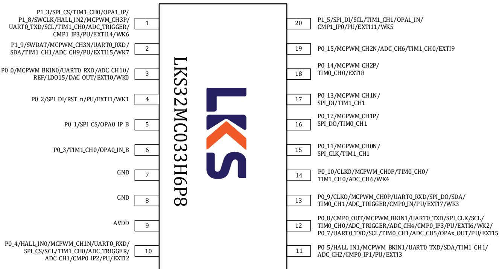  
图 3-2 LKS32MC033H6P8 管脚分布图

表 3-3 LKS32MC033H6P8 管脚说明

<table><tr><td rowspan="9">1</td><td>P1_3</td><td>P1.3</td></tr><tr><td>SPI_CS</td><td>SPI 片选</td></tr><tr><td>TIM1_CH0</td><td>Timer1 通道 0</td></tr><tr><td>OPA1_IP</td><td>运放 1 正端输入</td></tr><tr><td>P1_8</td><td>P1.8</td></tr><tr><td>SWCLK</td><td>SWD 时钟</td></tr><tr><td>HALL_IN2</td><td>HALL 接口输入 2</td></tr><tr><td>MCPWM_CH3P</td><td>PWM 通道 3 高边</td></tr><tr><td>UART0_TXD</td><td>串口 0 发送(接收)</td></tr></table>

管脚分布

<table><tr><td rowspan="7"></td><td>SCL</td><td>I2C时钟</td></tr><tr><td>TIM1_CH0</td><td>Timer1通道0</td></tr><tr><td>ADC_TRIGGER</td><td>ADC触发信号输出(用于调试)</td></tr><tr><td>CMP1_IP3</td><td>比较器1正端输入3</td></tr><tr><td>PU</td><td>内置 $10k\Omega$ 上拉电阻,软件可关闭</td></tr><tr><td>EXTI14</td><td>外部GPIO中断信号14</td></tr><tr><td>WK6</td><td>外部唤醒信号6</td></tr><tr><td rowspan="10">2</td><td>P1_9</td><td>P1.9</td></tr><tr><td>SWDAT</td><td>SWD数据</td></tr><tr><td>MCPWM_CH3N</td><td>PWM通道3低边</td></tr><tr><td>UART0_RXD</td><td>串口0接收(发送)</td></tr><tr><td>SDA</td><td>I2C数据</td></tr><tr><td>TIM1_CH1</td><td>Timer1通道1</td></tr><tr><td>ADC_CH9</td><td>ADC通道9</td></tr><tr><td>PU</td><td>内置 $10k\Omega$ 上拉电阻,软件可关闭</td></tr><tr><td>EXTI15</td><td>外部GPIO中断信号15</td></tr><tr><td>WK7</td><td>外部唤醒信号7</td></tr><tr><td rowspan="9">3</td><td>P0_0</td><td>P0.0</td></tr><tr><td>MCPWM_BKIN0</td><td>PWM停机输入信号0</td></tr><tr><td>UART0_RXD</td><td>串口0接收(发送)</td></tr><tr><td>ADC_CH10</td><td>ADC通道10</td></tr><tr><td>REF</td><td>参考电压</td></tr><tr><td>LDO15</td><td>1.5V LDO输出</td></tr><tr><td>DAC_OUT</td><td>DAC输出</td></tr><tr><td>EXTI0</td><td>外部GPIO中断信号0</td></tr><tr><td>WK0</td><td>外部唤醒信号0</td></tr><tr><td rowspan="6">4</td><td>P0_2</td><td>P0.2</td></tr><tr><td>SPI_DI</td><td>SPI数据输入(输出)</td></tr><tr><td>RST_n</td><td>复位引脚,P0.2默认用作RSTN。建议接一个 $10nF \sim 100nF$ 的电容到地,并在RSTN和AVDD之间放置一个 $10k \sim 20k$ 的上拉电阻。如果外部有上拉电阻,RSTN的电容应为 $100nF$ 。P0.2可切换为GPIO,切换后可关闭 $10k\Omega$ 上拉电阻。</td></tr><tr><td>PU</td><td>内置 $10k\Omega$ 上拉电阻,软件可关闭</td></tr><tr><td>EXTI1</td><td>外部GPIO中断信号1</td></tr><tr><td>WK1</td><td>外部唤醒信号1</td></tr><tr><td rowspan="3">5</td><td>P0_1</td><td>P0.1</td></tr><tr><td>SPI_CS</td><td>SPI片选</td></tr><tr><td>OPA0_IP_B</td><td>运放0正端输入B,请留意:OPA0有两组输入信号,如果需要使用B组输入,需要设置SYS_AFE_REG0[5]=1。</td></tr><tr><td rowspan="3">6</td><td>P0_3</td><td>P0.3</td></tr><tr><td>TIM1_CH0</td><td>Timer1通道0</td></tr><tr><td>OPA0_IN_B</td><td>运放0负端输入B,请留意:OPA0有两组输入信号,如果需要使用B组输入,需要设置SYS_AFE_REG0[5]=1。</td></tr><tr><td>7</td><td>GND</td><td>芯片地,强烈建议多个地引脚在PCB上统一接地</td></tr><tr><td>8</td><td>GND</td><td>芯片地,强烈建议多个地引脚在PCB上统一接地</td></tr><tr><td>9</td><td>AVDD</td><td>芯片电源,供电范围2.5~5.5V</td></tr><tr><td rowspan="12">10</td><td>P0_4</td><td>P0.4</td></tr><tr><td>HALL_IN0</td><td>HALL接口输入0</td></tr><tr><td>MCPWM_CH1N</td><td>PWM通道1低边</td></tr><tr><td>UART0_RXD</td><td>串口0接收(发送)</td></tr><tr><td>SPI_CS</td><td>SPI片选</td></tr><tr><td>SCL</td><td>I2C时钟</td></tr><tr><td>TIM1_CH0</td><td>Timer1通道0</td></tr><tr><td>ADC_TRIGGER</td><td>ADC触发信号输出(用于调试)</td></tr><tr><td>ADC_CH1</td><td>ADC通道1</td></tr><tr><td>CMP0_IP2</td><td>比较器0正端输入2</td></tr><tr><td>PU</td><td>内置10kΩ上拉电阻,软件可关闭</td></tr><tr><td>EXTI2</td><td>外部GPIO中断信号2</td></tr><tr><td rowspan="10">11</td><td>P0_5</td><td>P0.5</td></tr><tr><td>HALL_IN1</td><td>HALL接口输入1</td></tr><tr><td>MCPWM_BKIN1</td><td>PWM停机输入信号1</td></tr><tr><td>UART0_TXD</td><td>串口0发送(接收)</td></tr><tr><td>SDA</td><td>I2C数据</td></tr><tr><td>TIM1_CH1</td><td>Timer1通道1</td></tr><tr><td>ADC_CH2</td><td>ADC通道2</td></tr><tr><td>CMP0_IP1</td><td>比较器0正端输入1</td></tr><tr><td>PU</td><td>内置10kΩ上拉电阻,软件可关闭</td></tr><tr><td>EXTI3</td><td>外部GPIO中断信号3</td></tr><tr><td rowspan="19">12</td><td>P0_8</td><td>P0.8</td></tr><tr><td>CMP0_OUT</td><td>比较器0输出</td></tr><tr><td>MCPWM_BKIN1</td><td>PWM停机输入信号1</td></tr><tr><td>UART0_TXD</td><td>串口0发送(接收)</td></tr><tr><td>SPI_CLK</td><td>SPI时钟</td></tr><tr><td>SCL</td><td>I2C时钟</td></tr><tr><td>TIM0_CH0</td><td>Timer0通道0</td></tr><tr><td>ADC_TRIGGER</td><td>ADC触发信号输出(用于调试)</td></tr><tr><td>ADC_CH4</td><td>ADC通道4</td></tr><tr><td>CMP0_IP3</td><td>比较器0正端输入3</td></tr><tr><td>PU</td><td>内置10kΩ上拉电阻,软件可关闭</td></tr><tr><td>EXTI6</td><td>外部GPIO中断信号6</td></tr><tr><td>WK2</td><td>外部唤醒信号2</td></tr><tr><td>P0_7</td><td>P0.7</td></tr><tr><td>UART0_TXD</td><td>串口0发送(接收)</td></tr><tr><td>SCL</td><td>I2C时钟</td></tr><tr><td>TIM0_CH1</td><td>Timer0通道1</td></tr><tr><td>ADC_CH5</td><td>ADC通道5</td></tr><tr><td>OPAx_OUTPU</td><td>运放输出内置10kΩ上拉电阻,软件可关闭</td></tr><tr><td></td><td>EXTI5</td><td>外部GPIO中断信号5</td></tr><tr><td rowspan="12">13</td><td>P0_9</td><td>P0.9</td></tr><tr><td>CLKO</td><td>时钟输出(用于调试)</td></tr><tr><td>MCPWM_CHOP</td><td>PWM通道0高边</td></tr><tr><td>UART0_RXD</td><td>串口0接收(发送)</td></tr><tr><td>SPI_DO</td><td>SPI数据输出(输入)</td></tr><tr><td>SDA</td><td>I2C数据</td></tr><tr><td>TIM0_CH1</td><td>Timer0通道1</td></tr><tr><td>ADC_TRIGGER</td><td>ADC触发信号输出(用于调试)</td></tr><tr><td>CMP0_IN</td><td>比较器0负端输入</td></tr><tr><td>PU</td><td>内置10kΩ上拉电阻,软件可关闭</td></tr><tr><td>EXTI7</td><td>外部GPIO中断信号7</td></tr><tr><td>WK3</td><td>外部唤醒信号3</td></tr><tr><td rowspan="7">14</td><td>P0_10</td><td>P0.10</td></tr><tr><td>CLKO</td><td>时钟输出(用于调试)</td></tr><tr><td>MCPWM_CHOP</td><td>PWM通道0高边</td></tr><tr><td>TIM0_CH0</td><td>Timer0通道0</td></tr><tr><td>TIM1_CH0</td><td>Timer1通道0</td></tr><tr><td>ADC_CH6</td><td>ADC通道6</td></tr><tr><td>WK4</td><td>外部唤醒信号4</td></tr><tr><td rowspan="4">15</td><td>P0_11</td><td>P0.11</td></tr><tr><td>MCPWM_CHON</td><td>PWM通道0低边</td></tr><tr><td>SPI_CLK</td><td>SPI时钟</td></tr><tr><td>TIM1_CH1</td><td>Timer1通道1</td></tr><tr><td rowspan="4">16</td><td>P0_12</td><td>P0.12</td></tr><tr><td>MCPWM_CH1P</td><td>PWM通道1高边</td></tr><tr><td>SPI_DO</td><td>SPI数据输出(输入)</td></tr><tr><td>TIM0_CH1</td><td>Timer0通道1</td></tr><tr><td rowspan="4">17</td><td>P0_13</td><td>P0.13</td></tr><tr><td>MCPWM_CH1N</td><td>PWM通道1低边</td></tr><tr><td>SPI_DI</td><td>SPI数据输入(输出)</td></tr><tr><td>TIM1_CH1</td><td>Timer1通道1</td></tr><tr><td rowspan="4">18</td><td>P0_14</td><td>P0.14</td></tr><tr><td>MCPWM_CH2P</td><td>PWM通道2高边</td></tr><tr><td>TIM0_CH0</td><td>Timer0通道0</td></tr><tr><td>EXTI8</td><td>外部GPIO中断信号8</td></tr><tr><td rowspan="5">19</td><td>P0_15</td><td>P0.15</td></tr><tr><td>MCPWM_CH2N</td><td>PWM通道2低边</td></tr><tr><td>TIM1_CH0</td><td>Timer1通道0</td></tr><tr><td>ADC_CH7</td><td>ADC通道7</td></tr><tr><td>EXTI9</td><td>外部GPIO中断信号9</td></tr><tr><td>20</td><td>P1_5</td><td>P1.5</td></tr></table>

管脚分布

<table><tr><td rowspan="8"></td><td>SPI_DI</td><td>SPI 数据输入(输出)</td></tr><tr><td>SCL</td><td>I2C 时钟</td></tr><tr><td>TIM1_CH1</td><td>Timer1 通道 1</td></tr><tr><td>OPA1_IN</td><td>运放 1 负端输入</td></tr><tr><td>CMP1_IP0</td><td>比较器 1 正端输入 0</td></tr><tr><td>PU</td><td>内置 10kΩ 上拉电阻,软件可关闭</td></tr><tr><td>EXTI11</td><td>外部 GPIO 中断信号 11</td></tr><tr><td>WK5</td><td>外部唤醒信号 5</td></tr></table>

## 3.1.5 LKS32MC033H6P8B/LKS32MC033H6P8C

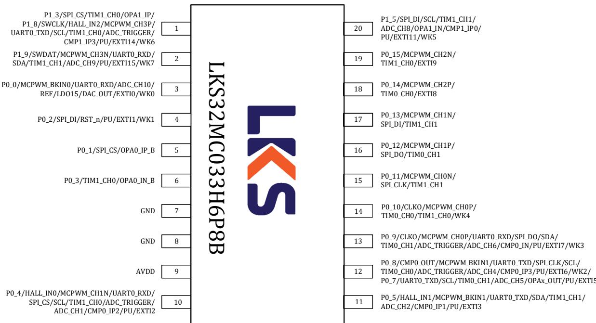  
图 3-3 LKS32MC033H6P8B/LKS32MC033H6P8C 管脚分布图

表 3-4 LKS32MC033H6P8B/LKS32MC033H6P8C 管脚说明

<table><tr><td rowspan="10">1</td><td>P1_3</td><td>P1.3</td></tr><tr><td>SPI_CS</td><td>SPI 片选</td></tr><tr><td>TIM1_CH0</td><td>Timer1 通道 0</td></tr><tr><td>OPA1_IP</td><td>运放 1 正端输入</td></tr><tr><td>P1_8</td><td>P1.8</td></tr><tr><td>SWCLK</td><td>SWD 时钟</td></tr><tr><td>HALL_IN2</td><td>HALL 接口输入 2</td></tr><tr><td>MCPWM_CH3P</td><td>PWM 通道 3 高边</td></tr><tr><td>UART0_TXD</td><td>串口 0 发送(接收)</td></tr><tr><td>SCLTIM1_CH0</td><td>I2C 时钟Timer1 通道0</td></tr><tr><td rowspan="5"></td><td>ADC_TRIGGER</td><td>ADC 触发信号输出(用于调试)</td></tr><tr><td>CMP1_IP3</td><td>比较器1正端输入3</td></tr><tr><td>PU</td><td>内置10kΩ上拉电阻,软件可关闭</td></tr><tr><td>EXTI14</td><td>外部GPIO中断信号14</td></tr><tr><td>WK6</td><td>外部唤醒信号6</td></tr><tr><td rowspan="10">2</td><td>P1_9</td><td>P1.9</td></tr><tr><td>SWDAT</td><td>SWD数据</td></tr><tr><td>MCPWM_CH3N</td><td>PWM通道3低边</td></tr><tr><td>UART0_RXD</td><td>串口0接收(发送)</td></tr><tr><td>SDA</td><td>I2C数据</td></tr><tr><td>TIM1_CH1</td><td>Timer1通道1</td></tr><tr><td>ADC_CH9</td><td>ADC通道9</td></tr><tr><td>PU</td><td>内置10kΩ上拉电阻,软件可关闭</td></tr><tr><td>EXTI15</td><td>外部GPIO中断信号15</td></tr><tr><td>WK7</td><td>外部唤醒信号7</td></tr><tr><td rowspan="9">3</td><td>P0_0</td><td>P0.0</td></tr><tr><td>MCPWM_BKINO</td><td>PWM停机输入信号0</td></tr><tr><td>UART0_RXD</td><td>串口0接收(发送)</td></tr><tr><td>ADC_CH10</td><td>ADC通道10</td></tr><tr><td>REF</td><td>参考电压</td></tr><tr><td>LDO15</td><td>1.5V LDO输出</td></tr><tr><td>DAC_OUT</td><td>DAC输出</td></tr><tr><td>EXTIO</td><td>外部GPIO中断信号0</td></tr><tr><td>WK0</td><td>外部唤醒信号0</td></tr><tr><td rowspan="6">4</td><td>P0_2</td><td>P0.2</td></tr><tr><td>SPI_DI</td><td>SPI数据输入(输出)</td></tr><tr><td>RST_n</td><td>复位引脚,P0.2默认用作RSTN。建议接一个10nF~100nF的电容到地,并在RSTN和AVDD之间放置一个10k~20k的上拉电阻。如果外部有上拉电阻,RSTN的电容应为100nF。P0.2可切换为GPIO,切换后可关闭10kΩ上拉电阻。</td></tr><tr><td>PU</td><td>内置10kΩ上拉电阻,软件可关闭</td></tr><tr><td>EXTI1</td><td>外部GPIO中断信号1</td></tr><tr><td>WK1</td><td>外部唤醒信号1</td></tr><tr><td rowspan="3">5</td><td>P0_1</td><td>P0.1</td></tr><tr><td>SPI_CS</td><td>SPI片选</td></tr><tr><td>OPA0_IP_B</td><td>运放0正端输入B,请留意:OPA0有两组输入信号,如果需要使用B组输入,需要设置SYS_AFE_REG0[5]=1。</td></tr><tr><td rowspan="3">6</td><td>P0_3</td><td>P0.3</td></tr><tr><td>TIM1_CH0</td><td>Timer1通道0</td></tr><tr><td>OPA0_IN_B</td><td>运放0负端输入B,请留意:OPA0有两组输入信号,如果需要使用B组输入,需要设置SYS_AFE_REG0[5]=1。</td></tr><tr><td>7</td><td>GND</td><td>芯片地,强烈建议多个地引脚在PCB上统一接地</td></tr><tr><td>8</td><td>GND</td><td>芯片地,强烈建议多个地引脚在PCB上统一接地</td></tr><tr><td>9</td><td>AVDD</td><td>芯片电源,供电范围2.5~5.5V</td></tr><tr><td rowspan="12">10</td><td>P0_4</td><td>P0.4</td></tr><tr><td>HALL_IN0</td><td>HALL接口输入0</td></tr><tr><td>MCPWM_CH1N</td><td>PWM通道1低边</td></tr><tr><td>UART0_RXD</td><td>串口0接收(发送)</td></tr><tr><td>SPI_CS</td><td>SPI片选</td></tr><tr><td>SCL</td><td>I2C时钟</td></tr><tr><td>TIM1_CH0</td><td>Timer1通道0</td></tr><tr><td>ADC_TRIGGER</td><td>ADC触发信号输出(用于调试)</td></tr><tr><td>ADC_CH1</td><td>ADC通道1</td></tr><tr><td>CMP0_IP2</td><td>比较器0正端输入2</td></tr><tr><td>PU</td><td>内置10kΩ上拉电阻,软件可关闭</td></tr><tr><td>EXTI2</td><td>外部GPIO中断信号2</td></tr><tr><td rowspan="10">11</td><td>P0_5</td><td>P0.5</td></tr><tr><td>HALL_IN1</td><td>HALL接口输入1</td></tr><tr><td>MCPWM_BKIN1</td><td>PWM停机输入信号1</td></tr><tr><td>UART0_TXD</td><td>串口0发送(接收)</td></tr><tr><td>SDA</td><td>I2C数据</td></tr><tr><td>TIM1_CH1</td><td>Timer1通道1</td></tr><tr><td>ADC_CH2</td><td>ADC通道2</td></tr><tr><td>CMP0_IP1</td><td>比较器0正端输入1</td></tr><tr><td>PU</td><td>内置10kΩ上拉电阻,软件可关闭</td></tr><tr><td>EXTI3</td><td>外部GPIO中断信号3</td></tr><tr><td rowspan="20">12</td><td>P0_8</td><td>P0.8</td></tr><tr><td>CMP0_OUT</td><td>比较器0输出</td></tr><tr><td>MCPWM_BKIN1</td><td>PWM停机输入信号1</td></tr><tr><td>UART0_TXD</td><td>串口0发送(接收)</td></tr><tr><td>SPI_CLK</td><td>SPI时钟</td></tr><tr><td>SCL</td><td>I2C时钟</td></tr><tr><td>TIM0_CH0</td><td>Timer0通道0</td></tr><tr><td>ADC_TRIGGER</td><td>ADC触发信号输出(用于调试)</td></tr><tr><td>ADC_CH4</td><td>ADC通道4</td></tr><tr><td>CMP0_IP3</td><td>比较器0正端输入3</td></tr><tr><td>PU</td><td>内置10kΩ上拉电阻,软件可关闭</td></tr><tr><td>EXTI6</td><td>外部GPIO中断信号6</td></tr><tr><td>WK2</td><td>外部唤醒信号2</td></tr><tr><td>P0_7</td><td>P0.7</td></tr><tr><td>UART0_TXD</td><td>串口0发送(接收)</td></tr><tr><td>SCL</td><td>I2C时钟</td></tr><tr><td>TIM0_CH1</td><td>Timer0通道1</td></tr><tr><td>ADC_CH5</td><td>ADC通道5</td></tr><tr><td>OPAx_OUT</td><td>运放输出</td></tr><tr><td>PUEXTI5</td><td>内置10kΩ上拉电阻,软件可关闭外部 GPIO 中断信号 5</td></tr><tr><td rowspan="13">13</td><td>P0_9</td><td>P0.9</td></tr><tr><td>CLKO</td><td>时钟输出(用于调试)</td></tr><tr><td>MCPWM_CHOP</td><td>PWM 通道 0 高边</td></tr><tr><td>UART0_RXD</td><td>串口 0 接收(发送)</td></tr><tr><td>SPI_DO</td><td>SPI 数据输出(输入)</td></tr><tr><td>SDA</td><td>I2C 数据</td></tr><tr><td>TIM0_CH1</td><td>Timer0 通道 1</td></tr><tr><td>ADC_TRIGGER</td><td>ADC 触发信号输出(用于调试)</td></tr><tr><td>ADC_CH6</td><td>ADC 通道 6</td></tr><tr><td>CMP0_IN</td><td>比较器 0 负端输入</td></tr><tr><td>PU</td><td>内置 10kΩ 上拉电阻,软件可关闭</td></tr><tr><td>EXTI7</td><td>外部 GPIO 中断信号 7</td></tr><tr><td>WK3</td><td>外部唤醒信号 3</td></tr><tr><td rowspan="6">14</td><td>P0_10</td><td>P0.10</td></tr><tr><td>CLKO</td><td>时钟输出(用于调试)</td></tr><tr><td>MCPWM_CHOP</td><td>PWM 通道 0 高边</td></tr><tr><td>TIM0_CH0</td><td>Timer0 通道 0</td></tr><tr><td>TIM1_CH0</td><td>Timer1 通道 0</td></tr><tr><td>WK4</td><td>外部唤醒信号 4</td></tr><tr><td rowspan="4">15</td><td>P0_11</td><td>P0.11</td></tr><tr><td>MCPWM_CHON</td><td>PWM 通道 0 低边</td></tr><tr><td>SPI_CLK</td><td>SPI 时钟</td></tr><tr><td>TIM1_CH1</td><td>Timer1 通道 1</td></tr><tr><td rowspan="4">16</td><td>P0_12</td><td>P0.12</td></tr><tr><td>MCPWM_CH1P</td><td>PWM 通道 1 高边</td></tr><tr><td>SPI_DO</td><td>SPI 数据输出(输入)</td></tr><tr><td>TIM0_CH1</td><td>Timer0 通道 1</td></tr><tr><td rowspan="4">17</td><td>P0_13</td><td>P0.13</td></tr><tr><td>MCPWM_CH1N</td><td>PWM 通道 1 低边</td></tr><tr><td>SPI_DI</td><td>SPI 数据输入(输出)</td></tr><tr><td>TIM1_CH1</td><td>Timer1 通道 1</td></tr><tr><td rowspan="4">18</td><td>P0_14</td><td>P0.14</td></tr><tr><td>MCPWM_CH2P</td><td>PWM 通道 2 高边</td></tr><tr><td>TIM0_CH0</td><td>Timer0 通道 0</td></tr><tr><td>EXTI8</td><td>外部 GPIO 中断信号 8</td></tr><tr><td rowspan="4">19</td><td>P0_15</td><td>P0.15</td></tr><tr><td>MCPWM_CH2N</td><td>PWM 通道 2 低边</td></tr><tr><td>TIM1_CH0</td><td>Timer1 通道 0</td></tr><tr><td>EXTI9</td><td>外部 GPIO 中断信号 9</td></tr><tr><td rowspan="3">20</td><td>P1_5</td><td>P1.5</td></tr><tr><td>SPI_DI</td><td>SPI 数据输入(输出)</td></tr><tr><td>SCL</td><td>I2C 时钟</td></tr></table>

管脚分布

<table><tr><td rowspan="7"></td><td>TIM1_CH1</td><td>Timer1 通道 1</td></tr><tr><td>ADC_CH8</td><td>ADC 通道 8</td></tr><tr><td>OPA1_IN</td><td>运放 1 负端输入</td></tr><tr><td>CMP1_IP0</td><td>比较器 1 正端输入 0</td></tr><tr><td>PU</td><td>内置 10kΩ 上拉电阻,软件可关闭</td></tr><tr><td>EXTI11</td><td>外部 GPIO 中断信号 11</td></tr><tr><td>WK5</td><td>外部唤醒信号 5</td></tr></table>

## 3.1.6 LKS32MC033H6Q8

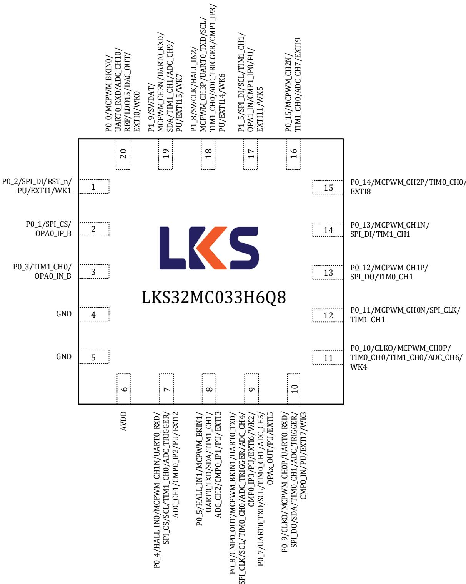  
图 3-4 LKS32MC033H6Q8 管脚分布图

表 3-5 LKS32MC033H6Q8 管脚说明

<table><tr><td rowspan="2">1</td><td>P0_2</td><td>P0.2</td></tr><tr><td>SPI_DIRST_n</td><td>SPI 数据输入(输出)复位引脚,P0.2 默认用作 RSTN。建议接一个 10nF~100nF 的电容到地,并在 RSTN 和 AVDD 之间放置一个 10k~20k 的上拉电阻。如果外部有上拉电阻,RSTN 的电容应为 100nF。P0.2 可切换为 GPIO,切换后可关闭 10kΩ 上拉电阻。</td></tr><tr><td rowspan="3"></td><td>PU</td><td>内置 10kΩ 上拉电阻,软件可关闭</td></tr><tr><td>EXTI1</td><td>外部 GPIO 中断信号 1</td></tr><tr><td>WK1</td><td>外部唤醒信号 1</td></tr><tr><td rowspan="3">2</td><td>P0_1</td><td>P0.1</td></tr><tr><td>SPI_CS</td><td>SPI 片选</td></tr><tr><td>OPA0_IP_B</td><td>运放 0 正端输入 B,请留意:OPA0 有两组输入信号,如果需要使用 B 组输入,需要设置 SYS_AFE_REG0[5] = 1。</td></tr><tr><td rowspan="3">3</td><td>P0_3</td><td>P0.3</td></tr><tr><td>TIM1_CH0</td><td>Timer1 通道 0</td></tr><tr><td>OPA0_IN_B</td><td>运放 0 负端输入 B,请留意:OPA0 有两组输入信号,如果需要使用 B 组输入,需要设置 SYS_AFE_REG0[5] = 1。</td></tr><tr><td>4</td><td>GND</td><td>芯片地,强烈建议多个地引脚在 PCB 上统一接地</td></tr><tr><td>5</td><td>GND</td><td>芯片地,强烈建议多个地引脚在 PCB 上统一接地</td></tr><tr><td>6</td><td>AVDD</td><td>芯片电源,供电范围 2.5~5.5V</td></tr><tr><td rowspan="12">7</td><td>P0_4</td><td>P0.4</td></tr><tr><td>HALL_IN0</td><td>HALL 接口输入 0</td></tr><tr><td>MCPWM_CH1N</td><td>PWM 通道 1 低边</td></tr><tr><td>UART0_RXD</td><td>串口 0 接收(发送)</td></tr><tr><td>SPI_CS</td><td>SPI 片选</td></tr><tr><td>SCL</td><td>I2C 时钟</td></tr><tr><td>TIM1_CH0</td><td>Timer1 通道 0</td></tr><tr><td>ADC_TRIGGER</td><td>ADC 触发信号输出(用于调试)</td></tr><tr><td>ADC_CH1</td><td>ADC 通道 1</td></tr><tr><td>CMP0_IP2</td><td>比较器 0 正端输入 2</td></tr><tr><td>PU</td><td>内置 10kΩ 上拉电阻,软件可关闭</td></tr><tr><td>EXTI2</td><td>外部 GPIO 中断信号 2</td></tr><tr><td rowspan="10">8</td><td>P0_5</td><td>P0.5</td></tr><tr><td>HALL_IN1</td><td>HALL 接口输入 1</td></tr><tr><td>MCPWM_BKIN1</td><td>PWM 停机输入信号 1</td></tr><tr><td>UART0_TXD</td><td>串口 0 发送(接收)</td></tr><tr><td>SDA</td><td>I2C 数据</td></tr><tr><td>TIM1_CH1</td><td>Timer1 通道 1</td></tr><tr><td>ADC_CH2</td><td>ADC 通道 2</td></tr><tr><td>CMP0_IP1</td><td>比较器 0 正端输入 1</td></tr><tr><td>PU</td><td>内置 10kΩ 上拉电阻,软件可关闭</td></tr><tr><td>EXTI3</td><td>外部 GPIO 中断信号 3</td></tr><tr><td rowspan="4">9</td><td>P0_8</td><td>P0.8</td></tr><tr><td>CMP0_OUT</td><td>比较器 0 输出</td></tr><tr><td>MCPWM_BKIN1</td><td>PWM 停机输入信号 1</td></tr><tr><td>UART0_TXD</td><td>串口 0 发送(接收)</td></tr></table>

管脚分布

<table><tr><td rowspan="17"></td><td>SPI_CLK</td><td>SPI 时钟</td></tr><tr><td>SCL</td><td>I2C 时钟</td></tr><tr><td>TIM0_CH0</td><td>Timer0 通道 0</td></tr><tr><td>ADC_TRIGGER</td><td>ADC 触发信号输出(用于调试)</td></tr><tr><td>ADC_CH4</td><td>ADC 通道 4</td></tr><tr><td>CMP0_IP3</td><td>比较器 0 正端输入 3</td></tr><tr><td>PU</td><td>内置  $10k\Omega$  上拉电阻,软件可关闭</td></tr><tr><td>EXTI6</td><td>外部 GPIO 中断信号 6</td></tr><tr><td>WK2</td><td>外部唤醒信号 2</td></tr><tr><td>P0_7</td><td>P0.7</td></tr><tr><td>UART0_TXD</td><td>串口 0 发送(接收)</td></tr><tr><td>SCL</td><td>I2C 时钟</td></tr><tr><td>TIM0_CH1</td><td>Timer0 通道 1</td></tr><tr><td>ADC_CH5</td><td>ADC 通道 5</td></tr><tr><td>OPAx_OUT</td><td>运放输出</td></tr><tr><td>PU</td><td>内置  $10k\Omega$  上拉电阻,软件可关闭</td></tr><tr><td>EXTI5</td><td>外部 GPIO 中断信号 5</td></tr><tr><td rowspan="12">10</td><td>P0_9</td><td>P0.9</td></tr><tr><td>CLKO</td><td>时钟输出(用于调试)</td></tr><tr><td>MCPWM_CHOP</td><td>PWM 通道 0 高边</td></tr><tr><td>UART0_RXD</td><td>串口 0 接收(发送)</td></tr><tr><td>SPI_DO</td><td>SPI 数据输出(输入)</td></tr><tr><td>SDA</td><td>I2C 数据</td></tr><tr><td>TIM0_CH1</td><td>Timer0 通道 1</td></tr><tr><td>ADC_TRIGGER</td><td>ADC 触发信号输出(用于调试)</td></tr><tr><td>CMP0_IN</td><td>比较器 0 负端输入</td></tr><tr><td>PU</td><td>内置  $10k\Omega$  上拉电阻,软件可关闭</td></tr><tr><td>EXTI7</td><td>外部 GPIO 中断信号 7</td></tr><tr><td>WK3</td><td>外部唤醒信号 3</td></tr><tr><td rowspan="7">11</td><td>P0_10</td><td>P0.10</td></tr><tr><td>CLKO</td><td>时钟输出(用于调试)</td></tr><tr><td>MCPWM_CHOP</td><td>PWM 通道 0 高边</td></tr><tr><td>TIM0_CH0</td><td>Timer0 通道 0</td></tr><tr><td>TIM1_CH0</td><td>Timer1 通道 0</td></tr><tr><td>ADC_CH6</td><td>ADC 通道 6</td></tr><tr><td>WK4</td><td>外部唤醒信号 4</td></tr><tr><td rowspan="4">12</td><td>P0_11</td><td>P0.11</td></tr><tr><td>MCPWM_CHON</td><td>PWM 通道 0 低边</td></tr><tr><td>SPI_CLK</td><td>SPI 时钟</td></tr><tr><td>TIM1_CH1</td><td>Timer1 通道 1</td></tr><tr><td rowspan="3">13</td><td>P0_12</td><td>P0.12</td></tr><tr><td>MCPWM_CH1P</td><td>PWM 通道 1 高边</td></tr><tr><td>SPI_DO</td><td>SPI 数据输出(输入)</td></tr></table>

管脚分布

<table><tr><td></td><td>TIM0_CH1</td><td>Timer0 通道1</td></tr><tr><td rowspan="4">14</td><td>P0_13</td><td>P0.13</td></tr><tr><td>MCPWM_CH1N</td><td>PWM通道1低边</td></tr><tr><td>SPI_DI</td><td>SPI数据输入(输出)</td></tr><tr><td>TIM1_CH1</td><td>Timer1通道1</td></tr><tr><td rowspan="4">15</td><td>P0_14</td><td>P0.14</td></tr><tr><td>MCPWM_CH2P</td><td>PWM通道2高边</td></tr><tr><td>TIM0_CH0</td><td>Timer0通道0</td></tr><tr><td>EXTI8</td><td>外部GPIO中断信号8</td></tr><tr><td rowspan="5">16</td><td>P0_15</td><td>P0.15</td></tr><tr><td>MCPWM_CH2N</td><td>PWM通道2低边</td></tr><tr><td>TIM1_CH0</td><td>Timer1通道0</td></tr><tr><td>ADC_CH7</td><td>ADC通道7</td></tr><tr><td>EXTI9</td><td>外部GPIO中断信号9</td></tr><tr><td rowspan="9">17</td><td>P1_5</td><td>P1.5</td></tr><tr><td>SPI_DI</td><td>SPI数据输入(输出)</td></tr><tr><td>SCL</td><td>I2C时钟</td></tr><tr><td>TIM1_CH1</td><td>Timer1通道1</td></tr><tr><td>OPA1_IN</td><td>运放1负端输入</td></tr><tr><td>CMP1_IP0</td><td>比较器1正端输入0</td></tr><tr><td>PU</td><td>内置10kΩ上拉电阻,软件可关闭</td></tr><tr><td>EXTI11</td><td>外部GPIO中断信号11</td></tr><tr><td>WK5</td><td>外部唤醒信号5</td></tr><tr><td rowspan="12">18</td><td>P1_8</td><td>P1.8</td></tr><tr><td>SWCLK</td><td>SWD时钟</td></tr><tr><td>HALL_IN2</td><td>HALL接口输入2</td></tr><tr><td>MCPWM_CH3P</td><td>PWM通道3高边</td></tr><tr><td>UART0_TXD</td><td>串口0发送(接收)</td></tr><tr><td>SCL</td><td>I2C时钟</td></tr><tr><td>TIM1_CH0</td><td>Timer1通道0</td></tr><tr><td>ADC_TRIGGER</td><td>ADC触发信号输出(用于调试)</td></tr><tr><td>CMP1_IP3</td><td>比较器1正端输入3</td></tr><tr><td>PU</td><td>内置10kΩ上拉电阻,软件可关闭</td></tr><tr><td>EXTI14</td><td>外部GPIO中断信号14</td></tr><tr><td>WK6</td><td>外部唤醒信号6</td></tr><tr><td rowspan="8">19</td><td>P1_9</td><td>P1.9</td></tr><tr><td>SWDAT</td><td>SWD数据</td></tr><tr><td>MCPWM_CH3N</td><td>PWM通道3低边</td></tr><tr><td>UART0_RXD</td><td>串口0接收(发送)</td></tr><tr><td>SDA</td><td>I2C数据</td></tr><tr><td>TIM1_CH1</td><td>Timer1通道1</td></tr><tr><td>ADC_CH9</td><td>ADC通道9</td></tr><tr><td>PU</td><td>内置10kΩ上拉电阻,软件可关闭</td></tr></table>

管脚分布

<table><tr><td rowspan="2"></td><td>EXTI15</td><td>外部 GPIO 中断信号 15</td></tr><tr><td>WK7</td><td>外部唤醒信号 7</td></tr><tr><td rowspan="9">20</td><td>P0_0</td><td>P0.0</td></tr><tr><td>MCPWM_BKIN0</td><td>PWM 停机输入信号 0</td></tr><tr><td>UART0_RXD</td><td>串口 0 接收(发送)</td></tr><tr><td>ADC_CH10</td><td>ADC 通道 10</td></tr><tr><td>REF</td><td>参考电压</td></tr><tr><td>LDO15</td><td>1.5V LDO 输出</td></tr><tr><td>DAC_OUT</td><td>DAC 输出</td></tr><tr><td>EXTI0</td><td>外部 GPIO 中断信号 0</td></tr><tr><td>WK0</td><td>外部唤醒信号 0</td></tr></table>

## 3.1.7 LKS32MC033H6Q8B/LKS32MC033H6Q8C

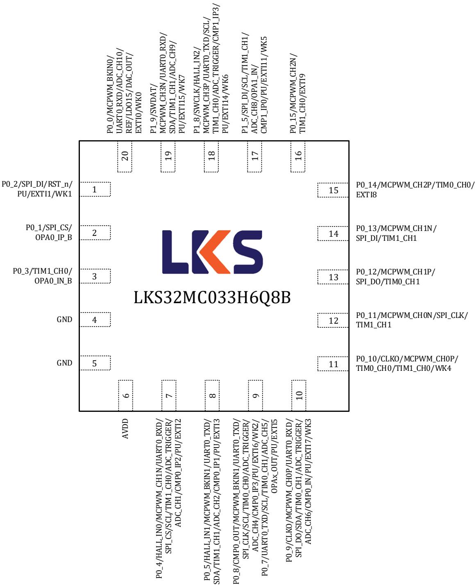  
图 3-5 LKS32MC033H6Q8B 管脚分布图

表 3-6 LKS32MC033H6Q8B 管脚说明

<table><tr><td rowspan="3">1</td><td>P0_2</td><td>P0.2</td></tr><tr><td>SPI_DI</td><td>SPI 数据输入(输出)</td></tr><tr><td>RST_n</td><td>复位引脚,P0.2 默认用作 RSTN。建议接一个 10nF~100nF 的电容到地,并在 RSTN 和 AVDD 之间放置一个 10k~20k 的上拉电阻。如果外部有上拉电阻,RSTN 的电容应为 100nF。P0.2 可切换为 GPIO,切换后可关闭 10kΩ 上拉电阻。</td></tr></table>

管脚分布

<table><tr><td rowspan="3"></td><td>PU</td><td>内置10kΩ上拉电阻,软件可关闭</td></tr><tr><td>EXTI1</td><td>外部GPIO中断信号1</td></tr><tr><td>WK1</td><td>外部唤醒信号1</td></tr><tr><td rowspan="3">2</td><td>P0_1</td><td>P0.1</td></tr><tr><td>SPI_CS</td><td>SPI片选</td></tr><tr><td>OPA0_IP_B</td><td>运放0正端输入B,请留意:OPA0有两组输入信号,如果需要使用B组输入,需要设置SYS_AFE_REG0[5]=1。</td></tr><tr><td rowspan="3">3</td><td>P0_3</td><td>P0.3</td></tr><tr><td>TIM1_CH0</td><td>Timer1通道0</td></tr><tr><td>OPA0_IN_B</td><td>运放0负端输入B,请留意:OPA0有两组输入信号,如果需要使用B组输入,需要设置SYS_AFE_REG0[5]=1。</td></tr><tr><td>4</td><td>GND</td><td>芯片地,强烈建议多个地引脚在PCB上统一接地</td></tr><tr><td>5</td><td>GND</td><td>芯片地,强烈建议多个地引脚在PCB上统一接地</td></tr><tr><td>6</td><td>AVDD</td><td>芯片电源,供电范围2.5~5.5V</td></tr><tr><td rowspan="12">7</td><td>P0_4</td><td>P0.4</td></tr><tr><td>HALL_IN0</td><td>HALL接口输入0</td></tr><tr><td>MCPWM_CH1N</td><td>PWM通道1低边</td></tr><tr><td>UART0_RXD</td><td>串口0接收(发送)</td></tr><tr><td>SPI_CS</td><td>SPI片选</td></tr><tr><td>SCL</td><td>I2C时钟</td></tr><tr><td>TIM1_CH0</td><td>Timer1通道0</td></tr><tr><td>ADC_TRIGGER</td><td>ADC触发信号输出(用于调试)</td></tr><tr><td>ADC_CH1</td><td>ADC通道1</td></tr><tr><td>CMP0_IP2</td><td>比较器0正端输入2</td></tr><tr><td>PU</td><td>内置10kΩ上拉电阻,软件可关闭</td></tr><tr><td>EXTI2</td><td>外部GPIO中断信号2</td></tr><tr><td rowspan="10">8</td><td>P0_5</td><td>P0.5</td></tr><tr><td>HALL_IN1</td><td>HALL接口输入1</td></tr><tr><td>MCPWM_BKIN1</td><td>PWM停机输入信号1</td></tr><tr><td>UART0_TXD</td><td>串口0发送(接收)</td></tr><tr><td>SDA</td><td>I2C数据</td></tr><tr><td>TIM1_CH1</td><td>Timer1通道1</td></tr><tr><td>ADC_CH2</td><td>ADC通道2</td></tr><tr><td>CMP0_IP1</td><td>比较器0正端输入1</td></tr><tr><td>PU</td><td>内置10kΩ上拉电阻,软件可关闭</td></tr><tr><td>EXTI3</td><td>外部GPIO中断信号3</td></tr><tr><td rowspan="7">9</td><td>P0_8</td><td>P0.8</td></tr><tr><td>CMP0_OUT</td><td>比较器0输出</td></tr><tr><td>MCPWM_BKIN1</td><td>PWM停机输入信号1</td></tr><tr><td>UART0_TXD</td><td>串口0发送(接收)</td></tr><tr><td>SPI_CLK</td><td>SPI时钟</td></tr><tr><td>SCL</td><td>I2C时钟</td></tr><tr><td>TIM0_CH0</td><td>Timer0通道0</td></tr></table>

管脚分布

<table><tr><td rowspan="14"></td><td>ADC_TRIGGER</td><td>ADC 触发信号输出(用于调试)</td></tr><tr><td>ADC_CH4</td><td>ADC 通道 4</td></tr><tr><td>CMP0_IP3</td><td>比较器 0 正端输入 3</td></tr><tr><td>PU</td><td>内置  ${10}\mathrm{k}\Omega$  上拉电阻,软件可关闭</td></tr><tr><td>EXTI6</td><td>外部 GPIO 中断信号 6</td></tr><tr><td>WK2</td><td>外部唤醒信号 2</td></tr><tr><td>P0_7</td><td>P0.7</td></tr><tr><td>UART0_TXD</td><td>串口 0 发送(接收)</td></tr><tr><td>SCL</td><td>I2C 时钟</td></tr><tr><td>TIM0_CH1</td><td>Timer0 通道 1</td></tr><tr><td>ADC_CH5</td><td>ADC 通道 5</td></tr><tr><td>OPAx_OUT</td><td>运放输出</td></tr><tr><td>PU</td><td>内置  ${10}\mathrm{k}\Omega$  上拉电阻,软件可关闭</td></tr><tr><td>EXTI5</td><td>外部 GPIO 中断信号 5</td></tr><tr><td rowspan="13">10</td><td>P0_9</td><td>P0.9</td></tr><tr><td>CLKO</td><td>时钟输出(用于调试)</td></tr><tr><td>MCPWM_CHOP</td><td>PWM 通道 0 高边</td></tr><tr><td>UART0_RXD</td><td>串口 0 接收(发送)</td></tr><tr><td>SPI_DO</td><td>SPI 数据输出(输入)</td></tr><tr><td>SDA</td><td>I2C 数据</td></tr><tr><td>TIM0_CH1</td><td>Timer0 通道 1</td></tr><tr><td>ADC_TRIGGER</td><td>ADC 触发信号输出(用于调试)</td></tr><tr><td>ADC_CH6</td><td>ADC 通道 6</td></tr><tr><td>CMP0_IN</td><td>比较器 0 负端输入</td></tr><tr><td>PU</td><td>内置  ${10}\mathrm{k}\Omega$  上拉电阻,软件可关闭</td></tr><tr><td>EXTI7</td><td>外部 GPIO 中断信号 7</td></tr><tr><td>WK3</td><td>外部唤醒信号 3</td></tr><tr><td rowspan="6">11</td><td>P0_10</td><td>P0.10</td></tr><tr><td>CLKO</td><td>时钟输出(用于调试)</td></tr><tr><td>MCPWM_CHOP</td><td>PWM 通道 0 高边</td></tr><tr><td>TIM0_CH0</td><td>Timer0 通道 0</td></tr><tr><td>TIM1_CH0</td><td>Timer1 通道 0</td></tr><tr><td>WK4</td><td>外部唤醒信号 4</td></tr><tr><td rowspan="4">12</td><td>P0_11</td><td>P0.11</td></tr><tr><td>MCPWM_CHON</td><td>PWM 通道 0 低边</td></tr><tr><td>SPI_CLK</td><td>SPI 时钟</td></tr><tr><td>TIM1_CH1</td><td>Timer1 通道 1</td></tr><tr><td rowspan="4">13</td><td>P0_12</td><td>P0.12</td></tr><tr><td>MCPWM_CH1P</td><td>PWM 通道 1 高边</td></tr><tr><td>SPI_DO</td><td>SPI 数据输出(输入)</td></tr><tr><td>TIM0_CH1</td><td>Timer0 通道 1</td></tr><tr><td rowspan="2">14</td><td>P0_13</td><td>P0.13</td></tr><tr><td>MCPWM_CH1NSPI_DI</td><td>PWM 通道 1 低边SPI 数据输入(输出)</td></tr><tr><td></td><td>TIM1_CH1</td><td>Timer1 通道 1</td></tr><tr><td rowspan="4">15</td><td>P0_14</td><td>P0.14</td></tr><tr><td>MCPWM_CH2P</td><td>PWM 通道 2 高边</td></tr><tr><td>TIM0_CH0</td><td>Timer0 通道 0</td></tr><tr><td>EXTI8</td><td>外部 GPIO 中断信号 8</td></tr><tr><td rowspan="4">16</td><td>P0_15</td><td>P0.15</td></tr><tr><td>MCPWM_CH2N</td><td>PWM 通道 2 低边</td></tr><tr><td>TIM1_CH0</td><td>Timer1 通道 0</td></tr><tr><td>EXTI9</td><td>外部 GPIO 中断信号 9</td></tr><tr><td rowspan="10">17</td><td>P1_5</td><td>P1.5</td></tr><tr><td>SPI_DI</td><td>SPI 数据输入(输出)</td></tr><tr><td>SCL</td><td>I2C 时钟</td></tr><tr><td>TIM1_CH1</td><td>Timer1 通道 1</td></tr><tr><td>ADC_CH8</td><td>ADC 通道 8</td></tr><tr><td>OPA1_IN</td><td>运放 1 负端输入</td></tr><tr><td>CMP1_IP0</td><td>比较器 1 正端输入 0</td></tr><tr><td>PU</td><td>内置  ${10}\mathrm{k}\Omega$  上拉电阻,软件可关闭</td></tr><tr><td>EXTI11</td><td>外部 GPIO 中断信号 11</td></tr><tr><td>WK5</td><td>外部唤醒信号 5</td></tr><tr><td rowspan="12">18</td><td>P1_8</td><td>P1.8</td></tr><tr><td>SWCLK</td><td>SWD 时钟</td></tr><tr><td>HALL_IN2</td><td>HALL 接口输入 2</td></tr><tr><td>MCPWM_CH3P</td><td>PWM 通道 3 高边</td></tr><tr><td>UART0_TXD</td><td>串口 0 发送(接收)</td></tr><tr><td>SCL</td><td>I2C 时钟</td></tr><tr><td>TIM1_CH0</td><td>Timer1 通道 0</td></tr><tr><td>ADC_TRIGGER</td><td>ADC 触发信号输出(用于调试)</td></tr><tr><td>CMP1_IP3</td><td>比较器 1 正端输入 3</td></tr><tr><td>PU</td><td>内置  ${10}\mathrm{k}\Omega$  上拉电阻,软件可关闭</td></tr><tr><td>EXTI14</td><td>外部 GPIO 中断信号 14</td></tr><tr><td>WK6</td><td>外部唤醒信号 6</td></tr><tr><td rowspan="10">19</td><td>P1_9</td><td>P1.9</td></tr><tr><td>SWDAT</td><td>SWD 数据</td></tr><tr><td>MCPWM_CH3N</td><td>PWM 通道 3 低边</td></tr><tr><td>UART0_RXD</td><td>串口 0 接收(发送)</td></tr><tr><td>SDA</td><td>I2C 数据</td></tr><tr><td>TIM1_CH1</td><td>Timer1 通道 1</td></tr><tr><td>ADC_CH9</td><td>ADC 通道 9</td></tr><tr><td>PU</td><td>内置  ${10}\mathrm{k}\Omega$  上拉电阻,软件可关闭</td></tr><tr><td>EXTI15</td><td>外部 GPIO 中断信号 15</td></tr><tr><td>WK7</td><td>外部唤醒信号 7</td></tr><tr><td>20</td><td>P0_0</td><td>P0.0</td></tr></table>

管脚分布

<table><tr><td rowspan="8"></td><td>MCPWM_BKINO</td><td>PWM 停机输入信号 0</td></tr><tr><td>UART0_RXD</td><td>串口 0 接收(发送)</td></tr><tr><td>ADC_CH10</td><td>ADC 通道 10</td></tr><tr><td>REF</td><td>参考电压</td></tr><tr><td>LDO15</td><td>1.5V LDO 输出</td></tr><tr><td>DAC_OUT</td><td>DAC 输出</td></tr><tr><td>EXTIO</td><td>外部 GPIO 中断信号 0</td></tr><tr><td>WK0</td><td>外部唤醒信号 0</td></tr></table>

## 3.1.8 LKS32MC037M6S8

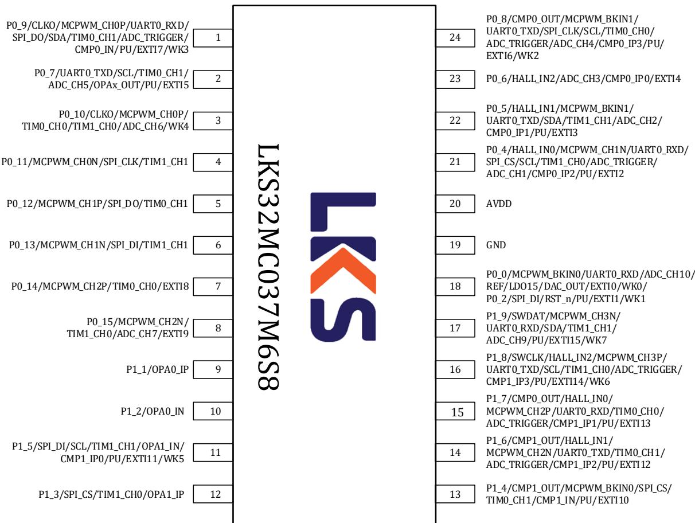  
图 3-6 LKS32MC037M6S8 管脚分布图

表 3-7 LKS32MC037M6S8 管脚说明

<table><tr><td rowspan="6">1</td><td>P0_9</td><td>P0.9</td></tr><tr><td>CLKO</td><td>时钟输出(用于调试)</td></tr><tr><td>MCPWM_CHOP</td><td>PWM 通道 0 高边</td></tr><tr><td>UART0_RXD</td><td>串口 0 接收(发送)</td></tr><tr><td>SPI_DO</td><td>SPI 数据输出(输入)</td></tr><tr><td>SDA</td><td>I2C 数据</td></tr></table>

管脚分布

<table><tr><td rowspan="6"></td><td>TIM0_CH1</td><td>Timer0 通道1</td></tr><tr><td>ADC_TRIGGER</td><td>ADC 触发信号输出(用于调试)</td></tr><tr><td>CMP0_IN</td><td>比较器0 负端输入</td></tr><tr><td>PU</td><td>内置10kΩ上拉电阻,软件可关闭</td></tr><tr><td>EXTI7</td><td>外部 GPIO 中断信号7</td></tr><tr><td>WK3</td><td>外部唤醒信号3</td></tr><tr><td rowspan="8">2</td><td>P0_7</td><td>P0.7</td></tr><tr><td>UART0_TXD</td><td>串口0 发送(接收)</td></tr><tr><td>SCL</td><td>I2C时钟</td></tr><tr><td>TIM0_CH1</td><td>Timer0 通道1</td></tr><tr><td>ADC_CH5</td><td>ADC 通道5</td></tr><tr><td>OPAx_OUT</td><td>运放输出</td></tr><tr><td>PU</td><td>内置10kΩ上拉电阻,软件可关闭</td></tr><tr><td>EXTI5</td><td>外部 GPIO 中断信号5</td></tr><tr><td rowspan="7">3</td><td>P0_10</td><td>P0.10</td></tr><tr><td>CLKO</td><td>时钟输出(用于调试)</td></tr><tr><td>MCPWM_CH0P</td><td>PWM 通道0 高边</td></tr><tr><td>TIM0_CH0</td><td>Timer0 通道0</td></tr><tr><td>TIM1_CH0</td><td>Timer1 通道0</td></tr><tr><td>ADC_CH6</td><td>ADC 通道6</td></tr><tr><td>WK4</td><td>外部唤醒信号4</td></tr><tr><td rowspan="4">4</td><td>P0_11</td><td>P0.11</td></tr><tr><td>MCPWM_CH0N</td><td>PWM 通道0低边</td></tr><tr><td>SPI_CLK</td><td>SPI时钟</td></tr><tr><td>TIM1_CH1</td><td>Timer1 通道1</td></tr><tr><td rowspan="4">5</td><td>P0_12</td><td>P0.12</td></tr><tr><td>MCPWM_CH1P</td><td>PWM 通道1高边</td></tr><tr><td>SPI_DO</td><td>SPI数据输出(输入)</td></tr><tr><td>TIM0_CH1</td><td>Timer0 通道1</td></tr><tr><td rowspan="4">6</td><td>P0_13</td><td>P0.13</td></tr><tr><td>MCPWM_CH1N</td><td>PWM 通道1低边</td></tr><tr><td>SPI_DI</td><td>SPI数据输入(输出)</td></tr><tr><td>TIM1_CH1</td><td>Timer1 通道1</td></tr><tr><td rowspan="4">7</td><td>P0_14</td><td>P0.14</td></tr><tr><td>MCPWM_CH2P</td><td>PWM 通道2高边</td></tr><tr><td>TIM0_CH0</td><td>Timer0 通道0</td></tr><tr><td>EXTI8</td><td>外部 GPIO 中断信号8</td></tr><tr><td rowspan="5">8</td><td>P0_15</td><td>P0.15</td></tr><tr><td>MCPWM_CH2N</td><td>PWM 通道2低边</td></tr><tr><td>TIM1_CH0</td><td>Timer1 通道0</td></tr><tr><td>ADC_CH7</td><td>ADC 通道7</td></tr><tr><td>EXTI9</td><td>外部 GPIO 中断信号9</td></tr><tr><td>9</td><td>P1_1OPA0_IP</td><td>P1.1运放0正端输入</td></tr><tr><td rowspan="2">10</td><td>P1_2</td><td>P1.2</td></tr><tr><td>OPA0_IN</td><td>运放0负端输入</td></tr><tr><td rowspan="9">11</td><td>P1_5</td><td>P1.5</td></tr><tr><td>SPI_DI</td><td>SPI数据输入(输出)</td></tr><tr><td>SCL</td><td>I2C时钟</td></tr><tr><td>TIM1_CH1</td><td>Timer1通道1</td></tr><tr><td>OPA1_IN</td><td>运放1负端输入</td></tr><tr><td>CMP1_IP0</td><td>比较器1正端输入0</td></tr><tr><td>PU</td><td>内置 $10k\Omega$ 上拉电阻,软件可关闭</td></tr><tr><td>EXTI11</td><td>外部GPIO中断信号11</td></tr><tr><td>WK5</td><td>外部唤醒信号5</td></tr><tr><td rowspan="4">12</td><td>P1_3</td><td>P1.3</td></tr><tr><td>SPI_CS</td><td>SPI片选</td></tr><tr><td>TIM1_CH0</td><td>Timer1通道0</td></tr><tr><td>OPA1_IP</td><td>运放1正端输入</td></tr><tr><td rowspan="8">13</td><td>P1_4</td><td>P1.4</td></tr><tr><td>CMP1_OUT</td><td>比较器1输出</td></tr><tr><td>MCPWM_BKIN0</td><td>PWM停机输入信号0</td></tr><tr><td>SPI_CS</td><td>SPI片选</td></tr><tr><td>TIM0_CH1</td><td>Timer0通道1</td></tr><tr><td>CMP1_IN</td><td>比较器1负端输入</td></tr><tr><td>PU</td><td>内置 $10k\Omega$ 上拉电阻,软件可关闭</td></tr><tr><td>EXTI10</td><td>外部GPIO中断信号10</td></tr><tr><td rowspan="10">14</td><td>P1_6</td><td>P1.6</td></tr><tr><td>CMP1_OUT</td><td>比较器1输出</td></tr><tr><td>HALL_IN1</td><td>HALL接口输入1</td></tr><tr><td>MCPWM_CH2N</td><td>PWM通道2低边</td></tr><tr><td>UART0_TXD</td><td>串口0发送(接收)</td></tr><tr><td>TIM0_CH1</td><td>Timer0通道1</td></tr><tr><td>ADC_TRIGGER</td><td>ADC触发信号输出(用于调试)</td></tr><tr><td>CMP1_IP2</td><td>比较器1正端输入2</td></tr><tr><td>PU</td><td>内置 $10k\Omega$ 上拉电阻,软件可关闭</td></tr><tr><td>EXTI12</td><td>外部GPIO中断信号12</td></tr><tr><td rowspan="9">15</td><td>P1_7</td><td>P1.7</td></tr><tr><td>CMP0_OUT</td><td>比较器0输出</td></tr><tr><td>HALL_IN0</td><td>HALL接口输入0</td></tr><tr><td>MCPWM_CH2P</td><td>PWM通道2高边</td></tr><tr><td>UART0_RXD</td><td>串口0接收(发送)</td></tr><tr><td>TIM0_CH0</td><td>Timer0通道0</td></tr><tr><td>ADC_TRIGGER</td><td>ADC触发信号输出(用于调试)</td></tr><tr><td>CMP1_IP1</td><td>比较器1正端输入1</td></tr><tr><td>PUEXTI13</td><td>内置 $10k\Omega$ 上拉电阻,软件可关闭外部 GPIO 中断信号 13</td></tr><tr><td rowspan="12">16</td><td>P1_8</td><td>P1.8</td></tr><tr><td>SWCLK</td><td>SWD 时钟</td></tr><tr><td>HALL_IN2</td><td>HALL 接口输入 2</td></tr><tr><td>MCPWM_CH3P</td><td>PWM 通道 3 高边</td></tr><tr><td>UART0_TXD</td><td>串口 0 发送(接收)</td></tr><tr><td>SCL</td><td>I2C 时钟</td></tr><tr><td>TIM1_CH0</td><td>Timer1 通道 0</td></tr><tr><td>ADC_TRIGGER</td><td>ADC 触发信号输出(用于调试)</td></tr><tr><td>CMP1_IP3</td><td>比较器 1 正端输入 3</td></tr><tr><td>PU</td><td>内置  ${10}\mathrm{k}\Omega$  上拉电阻,软件可关闭</td></tr><tr><td>EXTI14</td><td>外部 GPIO 中断信号 14</td></tr><tr><td>WK6</td><td>外部唤醒信号 6</td></tr><tr><td rowspan="10">17</td><td>P1_9</td><td>P1.9</td></tr><tr><td>SWDAT</td><td>SWD 数据</td></tr><tr><td>MCPWM_CH3N</td><td>PWM 通道 3 低边</td></tr><tr><td>UART0_RXD</td><td>串口 0 接收(发送)</td></tr><tr><td>SDA</td><td>I2C 数据</td></tr><tr><td>TIM1_CH1</td><td>Timer1 通道 1</td></tr><tr><td>ADC_CH9</td><td>ADC 通道 9</td></tr><tr><td>PU</td><td>内置  ${10}\mathrm{k}\Omega$  上拉电阻,软件可关闭</td></tr><tr><td>EXTI15</td><td>外部 GPIO 中断信号 15</td></tr><tr><td>WK7</td><td>外部唤醒信号 7</td></tr><tr><td rowspan="15">18</td><td>P0_0</td><td>P0.0</td></tr><tr><td>MCPWM_BKIN0</td><td>PWM 停机输入信号 0</td></tr><tr><td>UART0_RXD</td><td>串口 0 接收(发送)</td></tr><tr><td>ADC_CH10</td><td>ADC 通道 10</td></tr><tr><td>REF</td><td>参考电压</td></tr><tr><td>LDO15</td><td>1.5V LDO 输出</td></tr><tr><td>DAC_OUT</td><td>DAC 输出</td></tr><tr><td>EXTI0</td><td>外部 GPIO 中断信号 0</td></tr><tr><td>WK0</td><td>外部唤醒信号 0</td></tr><tr><td>P0_2</td><td>P0.2</td></tr><tr><td>SPI_DI</td><td>SPI 数据输入(输出)</td></tr><tr><td>RST_n</td><td>复位引脚,P0.2 默认用作 RSTN。建议接一个  ${10}\mathrm{{nF}} \sim {100}\mathrm{{nF}}$  的电容到地,并在 RSTN 和 AVDD 之间放置一个  ${10}\mathrm{k} \sim {20}\mathrm{k}$  的上拉电阻。如果外部有上拉电阻,RSTN 的电容应为  ${100}\mathrm{{nF}}$  。P0.2 可切换为 GPIO,切换后可关闭  ${10}\mathrm{k}\Omega$  上拉电阻。</td></tr><tr><td>PU</td><td>内置  ${10}\mathrm{k}\Omega$  上拉电阻,软件可关闭</td></tr><tr><td>EXTI1</td><td>外部 GPIO 中断信号 1</td></tr><tr><td>WK1</td><td>外部唤醒信号 1</td></tr><tr><td>19</td><td>GND</td><td>芯片地,强烈建议多个地引脚在 PCB 上统一接地</td></tr><tr><td>20</td><td>AVDD</td><td>芯片电源,供电范围 2.5~5.5V</td></tr><tr><td>21</td><td>P0_4HALL_IN0</td><td>P0.4HALL接口输入0</td></tr><tr><td rowspan="10"></td><td>MCPWM_CH1N</td><td>PWM通道1低边</td></tr><tr><td>UART0_RXD</td><td>串口0接收(发送)</td></tr><tr><td>SPI_CS</td><td>SPI片选</td></tr><tr><td>SCL</td><td>I2C时钟</td></tr><tr><td>TIM1_CH0</td><td>Timer1通道0</td></tr><tr><td>ADC_TRIGGER</td><td>ADC触发信号输出(用于调试)</td></tr><tr><td>ADC_CH1</td><td>ADC通道1</td></tr><tr><td>CMP0_IP2</td><td>比较器0正端输入2</td></tr><tr><td>PU</td><td>内置10kΩ上拉电阻,软件可关闭</td></tr><tr><td>EXTI2</td><td>外部GPIO中断信号2</td></tr><tr><td rowspan="10">22</td><td>P0_5</td><td>P0.5</td></tr><tr><td>HALL_IN1</td><td>HALL接口输入1</td></tr><tr><td>MCPWM_BKIN1</td><td>PWM停机输入信号1</td></tr><tr><td>UART0_TXD</td><td>串口0发送(接收)</td></tr><tr><td>SDA</td><td>I2C数据</td></tr><tr><td>TIM1_CH1</td><td>Timer1通道1</td></tr><tr><td>ADC_CH2</td><td>ADC通道2</td></tr><tr><td>CMP0_IP1</td><td>比较器0正端输入1</td></tr><tr><td>PU</td><td>内置10kΩ上拉电阻,软件可关闭</td></tr><tr><td>EXTI3</td><td>外部GPIO中断信号3</td></tr><tr><td rowspan="5">23</td><td>P0_6</td><td>P0.6</td></tr><tr><td>HALL_IN2</td><td>HALL接口输入2</td></tr><tr><td>ADC_CH3</td><td>ADC通道3</td></tr><tr><td>CMP0_IP0</td><td>比较器0正端输入0</td></tr><tr><td>EXTI4</td><td>外部GPIO中断信号4</td></tr><tr><td rowspan="13">24</td><td>P0_8</td><td>P0.8</td></tr><tr><td>CMP0_OUT</td><td>比较器0输出</td></tr><tr><td>MCPWM_BKIN1</td><td>PWM停机输入信号1</td></tr><tr><td>UART0_TXD</td><td>串口0发送(接收)</td></tr><tr><td>SPI_CLK</td><td>SPI时钟</td></tr><tr><td>SCL</td><td>I2C时钟</td></tr><tr><td>TIM0_CH0</td><td>Timer0通道0</td></tr><tr><td>ADC_TRIGGER</td><td>ADC触发信号输出(用于调试)</td></tr><tr><td>ADC_CH4</td><td>ADC通道4</td></tr><tr><td>CMP0_IP3</td><td>比较器0正端输入3</td></tr><tr><td>PU</td><td>内置10kΩ上拉电阻,软件可关闭</td></tr><tr><td>EXTI6</td><td>外部GPIO中断信号6</td></tr><tr><td>WK2</td><td>外部唤醒信号2</td></tr></table>

## 3.1.9 LKS32MC037M6S8B/LKS32MC037M6S8C

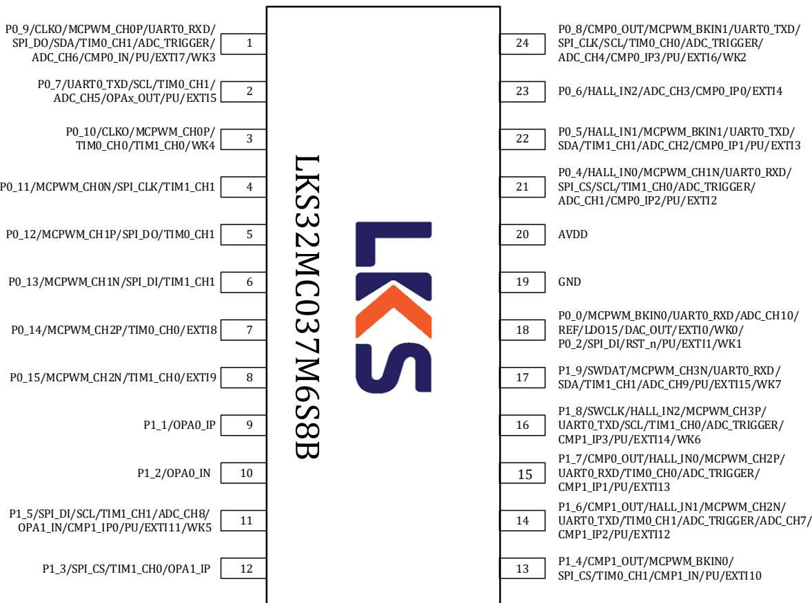

图 3-7 LKS32MC037M6S8B/LKS32MC037M6S8C 管脚分布图  
表 3-8 LKS32MC037M6S8BLKS32MC037M6S8C 管脚说明

<table><tr><td rowspan="13">1</td><td>P0_9</td><td>P0.9</td></tr><tr><td>CLKO</td><td>时钟输出(用于调试)</td></tr><tr><td>MCPWM_CHOP</td><td>PWM通道0高边</td></tr><tr><td>UART0_RXD</td><td>串口0接收(发送)</td></tr><tr><td>SPI_DO</td><td>SPI数据输出(输入)</td></tr><tr><td>SDA</td><td>I2C数据</td></tr><tr><td>TIM0_CH1</td><td>Timer0通道1</td></tr><tr><td>ADC_TRIGGER</td><td>ADC触发信号输出(用于调试)</td></tr><tr><td>ADC_CH6</td><td>ADC通道6</td></tr><tr><td>CMP0_IN</td><td>比较器0负端输入</td></tr><tr><td>PU</td><td>内置10kΩ上拉电阻,软件可关闭</td></tr><tr><td>EXTI7</td><td>外部GPIO中断信号7</td></tr><tr><td>WK3</td><td>外部唤醒信号3</td></tr><tr><td rowspan="4">2</td><td>P0_7</td><td>P0.7</td></tr><tr><td>UART0_TXD</td><td>串口0发送(接收)</td></tr><tr><td>SCL</td><td>I2C时钟</td></tr><tr><td>TIM0_CH1</td><td>Timer0通道1</td></tr></table>

管脚分布

<table><tr><td rowspan="4"></td><td>ADC_CH5</td><td>ADC通道5</td></tr><tr><td>OPAx_OUT</td><td>运放输出</td></tr><tr><td>PU</td><td>内置10kΩ上拉电阻,软件可关闭</td></tr><tr><td>EXTI5</td><td>外部GPIO中断信号5</td></tr><tr><td rowspan="6">3</td><td>P0_10</td><td>P0.10</td></tr><tr><td>CLKO</td><td>时钟输出(用于调试)</td></tr><tr><td>MCPWM_CHOP</td><td>PWM通道0高边</td></tr><tr><td>TIM0_CH0</td><td>Timer0通道0</td></tr><tr><td>TIM1_CH0</td><td>Timer1通道0</td></tr><tr><td>WK4</td><td>外部唤醒信号4</td></tr><tr><td rowspan="4">4</td><td>P0_11</td><td>P0.11</td></tr><tr><td>MCPWM_CHON</td><td>PWM通道0低边</td></tr><tr><td>SPI_CLK</td><td>SPI时钟</td></tr><tr><td>TIM1_CH1</td><td>Timer1通道1</td></tr><tr><td rowspan="4">5</td><td>P0_12</td><td>P0.12</td></tr><tr><td>MCPWM_CH1P</td><td>PWM通道1高边</td></tr><tr><td>SPI_DO</td><td>SPI数据输出(输入)</td></tr><tr><td>TIM0_CH1</td><td>Timer0通道1</td></tr><tr><td rowspan="4">6</td><td>P0_13</td><td>P0.13</td></tr><tr><td>MCPWM_CH1N</td><td>PWM通道1低边</td></tr><tr><td>SPI_DI</td><td>SPI数据输入(输出)</td></tr><tr><td>TIM1_CH1</td><td>Timer1通道1</td></tr><tr><td rowspan="4">7</td><td>P0_14</td><td>P0.14</td></tr><tr><td>MCPWM_CH2P</td><td>PWM通道2高边</td></tr><tr><td>TIM0_CH0</td><td>Timer0通道0</td></tr><tr><td>EXTI8</td><td>外部GPIO中断信号8</td></tr><tr><td rowspan="4">8</td><td>P0_15</td><td>P0.15</td></tr><tr><td>MCPWM_CH2N</td><td>PWM通道2低边</td></tr><tr><td>TIM1_CH0</td><td>Timer1通道0</td></tr><tr><td>EXTI9</td><td>外部GPIO中断信号9</td></tr><tr><td rowspan="2">9</td><td>P1_1</td><td>P1.1</td></tr><tr><td>OPA0_IP</td><td>运放0正端输入</td></tr><tr><td rowspan="2">10</td><td>P1_2</td><td>P1.2</td></tr><tr><td>OPA0_IN</td><td>运放0负端输入</td></tr><tr><td rowspan="9">11</td><td>P1_5</td><td>P1.5</td></tr><tr><td>SPI_DI</td><td>SPI数据输入(输出)</td></tr><tr><td>SCL</td><td>I2C时钟</td></tr><tr><td>TIM1_CH1</td><td>Timer1通道1</td></tr><tr><td>ADC_CH8</td><td>ADC通道8</td></tr><tr><td>OPA1_IN</td><td>运放1负端输入</td></tr><tr><td>CMP1_IP0</td><td>比较器1正端输入0</td></tr><tr><td>PU</td><td>内置10kΩ上拉电阻,软件可关闭</td></tr><tr><td>EXTI11</td><td>外部GPIO中断信号11</td></tr></table>

管脚分布

<table><tr><td></td><td>WK5</td><td>外部唤醒信号5</td></tr><tr><td rowspan="4">12</td><td>P1_3</td><td>P1.3</td></tr><tr><td>SPI_CS</td><td>SPI片选</td></tr><tr><td>TIM1_CH0</td><td>Timer1通道0</td></tr><tr><td>OPA1_IP</td><td>运放1正端输入</td></tr><tr><td rowspan="8">13</td><td>P1_4</td><td>P1.4</td></tr><tr><td>CMP1_OUT</td><td>比较器1输出</td></tr><tr><td>MCPWM_BKIN0</td><td>PWM停机输入信号0</td></tr><tr><td>SPI_CS</td><td>SPI片选</td></tr><tr><td>TIM0_CH1</td><td>Timer0通道1</td></tr><tr><td>CMP1_IN</td><td>比较器1负端输入</td></tr><tr><td>PU</td><td>内置 $10k\Omega$ 上拉电阻,软件可关闭</td></tr><tr><td>EXTI10</td><td>外部GPIO中断信号10</td></tr><tr><td rowspan="11">14</td><td>P1_6</td><td>P1.6</td></tr><tr><td>CMP1_OUT</td><td>比较器1输出</td></tr><tr><td>HALL_IN1</td><td>HALL接口输入1</td></tr><tr><td>MCPWM_CH2N</td><td>PWM通道2低边</td></tr><tr><td>UART0_TXD</td><td>串口0发送(接收)</td></tr><tr><td>TIM0_CH1</td><td>Timer0通道1</td></tr><tr><td>ADC_TRIGGER</td><td>ADC触发信号输出(用于调试)</td></tr><tr><td>ADC_CH7</td><td>ADC通道7</td></tr><tr><td>CMP1_IP2</td><td>比较器1正端输入2</td></tr><tr><td>PU</td><td>内置 $10k\Omega$ 上拉电阻,软件可关闭</td></tr><tr><td>EXTI12</td><td>外部GPIO中断信号12</td></tr><tr><td rowspan="10">15</td><td>P1_7</td><td>P1.7</td></tr><tr><td>CMP0_OUT</td><td>比较器0输出</td></tr><tr><td>HALL_IN0</td><td>HALL接口输入0</td></tr><tr><td>MCPWM_CH2P</td><td>PWM通道2高边</td></tr><tr><td>UART0_RXD</td><td>串口0接收(发送)</td></tr><tr><td>TIM0_CH0</td><td>Timer0通道0</td></tr><tr><td>ADC_TRIGGER</td><td>ADC触发信号输出(用于调试)</td></tr><tr><td>CMP1_IP1</td><td>比较器1正端输入1</td></tr><tr><td>PU</td><td>内置 $10k\Omega$ 上拉电阻,软件可关闭</td></tr><tr><td>EXTI13</td><td>外部GPIO中断信号13</td></tr><tr><td rowspan="9">16</td><td>P1_8</td><td>P1.8</td></tr><tr><td>SWCLK</td><td>SWD时钟</td></tr><tr><td>HALL_IN2</td><td>HALL接口输入2</td></tr><tr><td>MCPWM_CH3P</td><td>PWM通道3高边</td></tr><tr><td>UART0_TXD</td><td>串口0发送(接收)</td></tr><tr><td>SCL</td><td>I2C时钟</td></tr><tr><td>TIM1_CH0</td><td>Timer1通道0</td></tr><tr><td>ADC_TRIGGER</td><td>ADC触发信号输出(用于调试)</td></tr><tr><td>CMP1_IP3PU</td><td>比较器1正端输入3内置10kΩ上拉电阻,软件可关闭</td></tr><tr><td rowspan="2"></td><td>EXTI14</td><td>外部GPIO中断信号14</td></tr><tr><td>WK6</td><td>外部唤醒信号6</td></tr><tr><td rowspan="10">17</td><td>P1_9</td><td>P1.9</td></tr><tr><td>SWDAT</td><td>SWD数据</td></tr><tr><td>MCPWM_CH3N</td><td>PWM通道3低边</td></tr><tr><td>UART0_RXD</td><td>串口0接收(发送)</td></tr><tr><td>SDA</td><td>I2C数据</td></tr><tr><td>TIM1_CH1</td><td>Timer1通道1</td></tr><tr><td>ADC_CH9</td><td>ADC通道9</td></tr><tr><td>PU</td><td>内置10kΩ上拉电阻,软件可关闭</td></tr><tr><td>EXTI15</td><td>外部GPIO中断信号15</td></tr><tr><td>WK7</td><td>外部唤醒信号7</td></tr><tr><td rowspan="15">18</td><td>P0_0</td><td>P0.0</td></tr><tr><td>MCPWM_BKIN0</td><td>PWM停机输入信号0</td></tr><tr><td>UART0_RXD</td><td>串口0接收(发送)</td></tr><tr><td>ADC_CH10</td><td>ADC通道10</td></tr><tr><td>REF</td><td>参考电压</td></tr><tr><td>LDO15</td><td>1.5V LDO输出</td></tr><tr><td>DAC_OUT</td><td>DAC输出</td></tr><tr><td>EXTI0</td><td>外部GPIO中断信号0</td></tr><tr><td>WK0</td><td>外部唤醒信号0</td></tr><tr><td>P0_2</td><td>P0.2</td></tr><tr><td>SPI_DI</td><td>SPI数据输入(输出)</td></tr><tr><td>RST_n</td><td>复位引脚,P0.2默认用作RSTN。建议接一个10nF~100nF的电容到地,并在RSTN和AVDD之间放置一个10k~20k的上拉电阻。如果外部有上拉电阻,RSTN的电容应为100nF。P0.2可切换为GPIO,切换后可关闭10kΩ上拉电阻。</td></tr><tr><td>PU</td><td>内置10kΩ上拉电阻,软件可关闭</td></tr><tr><td>EXTI1</td><td>外部GPIO中断信号1</td></tr><tr><td>WK1</td><td>外部唤醒信号1</td></tr><tr><td>19</td><td>GND</td><td>芯片地,强烈建议多个地引脚在PCB上统一接地</td></tr><tr><td>20</td><td>AVDD</td><td>芯片电源,供电范围2.5~5.5V</td></tr><tr><td rowspan="11">21</td><td>P0_4</td><td>P0.4</td></tr><tr><td>HALL_IN0</td><td>HALL接口输入0</td></tr><tr><td>MCPWM_CH1N</td><td>PWM通道1低边</td></tr><tr><td>UART0_RXD</td><td>串口0接收(发送)</td></tr><tr><td>SPI_CS</td><td>SPI片选</td></tr><tr><td>SCL</td><td>I2C时钟</td></tr><tr><td>TIM1_CH0</td><td>Timer1通道0</td></tr><tr><td>ADC_TRIGGER</td><td>ADC触发信号输出(用于调试)</td></tr><tr><td>ADC_CH1</td><td>ADC通道1</td></tr><tr><td>CMP0_IP2</td><td>比较器0正端输入2</td></tr><tr><td>PU</td><td>内置10kΩ上拉电阻,软件可关闭</td></tr></table>

管脚分布

<table><tr><td></td><td>EXTI2</td><td>外部 GPIO 中断信号 2</td></tr><tr><td rowspan="10">22</td><td>P0_5</td><td>P0.5</td></tr><tr><td>HALL_IN1</td><td>HALL 接口输入 1</td></tr><tr><td>MCPWM_BKIN1</td><td>PWM 停机输入信号 1</td></tr><tr><td>UART0_TXD</td><td>串口 0 发送(接收)</td></tr><tr><td>SDA</td><td>I2C 数据</td></tr><tr><td>TIM1_CH1</td><td>Timer1 通道 1</td></tr><tr><td>ADC_CH2</td><td>ADC 通道 2</td></tr><tr><td>CMP0_IP1</td><td>比较器 0 正端输入 1</td></tr><tr><td>PU</td><td>内置 10kΩ 上拉电阻,软件可关闭</td></tr><tr><td>EXTI3</td><td>外部 GPIO 中断信号 3</td></tr><tr><td rowspan="5">23</td><td>P0_6</td><td>P0.6</td></tr><tr><td>HALL_IN2</td><td>HALL 接口输入 2</td></tr><tr><td>ADC_CH3</td><td>ADC 通道 3</td></tr><tr><td>CMP0_IP0</td><td>比较器 0 正端输入 0</td></tr><tr><td>EXTI4</td><td>外部 GPIO 中断信号 4</td></tr><tr><td rowspan="13">24</td><td>P0_8</td><td>P0.8</td></tr><tr><td>CMP0_OUT</td><td>比较器 0 输出</td></tr><tr><td>MCPWM_BKIN1</td><td>PWM 停机输入信号 1</td></tr><tr><td>UART0_TXD</td><td>串口 0 发送(接收)</td></tr><tr><td>SPI_CLK</td><td>SPI 时钟</td></tr><tr><td>SCL</td><td>I2C 时钟</td></tr><tr><td>TIM0_CH0</td><td>Timer0 通道 0</td></tr><tr><td>ADC_TRIGGER</td><td>ADC 触发信号输出(用于调试)</td></tr><tr><td>ADC_CH4</td><td>ADC 通道 4</td></tr><tr><td>CMP0_IP3</td><td>比较器 0 正端输入 3</td></tr><tr><td>PU</td><td>内置 10kΩ 上拉电阻,软件可关闭</td></tr><tr><td>EXTI6</td><td>外部 GPIO 中断信号 6</td></tr><tr><td>WK2</td><td>外部唤醒信号 2</td></tr></table>

## 3.1.10 LKS32MC037LM6S8B/LKS32MC037LM6S8C

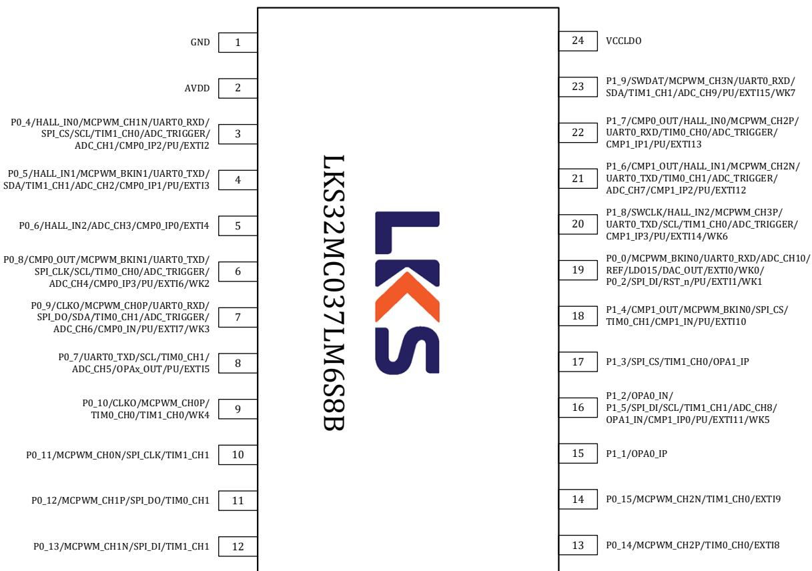  
图 3-8 LKS32MC037LM6S8B/LKS32MC037LM6S8C 管脚分布图

表 3-9 LKS32MC037LM6S8B/LKS32MC037LM6S8C 管脚说明

<table><tr><td>1</td><td>GND</td><td>芯片地,强烈建议多个地引脚在PCB上统一接地</td></tr><tr><td>2</td><td>AVDD</td><td>芯片电源,供电范围2.2~5.5V</td></tr><tr><td rowspan="12">3</td><td>P0_4</td><td>P0.4</td></tr><tr><td>HALL_IN0</td><td>HALL接口输入0</td></tr><tr><td>MCPWM_CH1N</td><td>PWM通道1低边</td></tr><tr><td>UART0_RXD</td><td>串口0接收(发送)</td></tr><tr><td>SPI_CS</td><td>SPI片选</td></tr><tr><td>SCL</td><td>I2C时钟</td></tr><tr><td>TIM1_CH0</td><td>Timer1通道0</td></tr><tr><td>ADC_TRIGGER</td><td>ADC触发信号输出(用于调试)</td></tr><tr><td>ADC_CH1</td><td>ADC通道1</td></tr><tr><td>CMP0_IP2</td><td>比较器0正端输入2</td></tr><tr><td>PU</td><td>内置10kΩ上拉电阻,软件可关闭</td></tr><tr><td>EXTI2</td><td>外部GPIO中断信号2</td></tr><tr><td rowspan="4">4</td><td>P0_5</td><td>P0.5</td></tr><tr><td>HALL_IN1</td><td>HALL接口输入1</td></tr><tr><td>MCPWM_BKIN1</td><td>PWM停机输入信号1</td></tr><tr><td>UART0_TXD</td><td>串口0发送(接收)</td></tr></table>

管脚分布

<table><tr><td rowspan="6"></td><td>SDA</td><td>I2C 数据</td></tr><tr><td>TIM1_CH1</td><td>Timer1 通道 1</td></tr><tr><td>ADC_CH2</td><td>ADC 通道 2</td></tr><tr><td>CMP0_IP1</td><td>比较器 0 正端输入 1</td></tr><tr><td>PU</td><td>内置  ${10}\mathrm{k}\Omega$  上拉电阻,软件可关闭</td></tr><tr><td>EXTI3</td><td>外部 GPIO 中断信号 3</td></tr><tr><td rowspan="5">5</td><td>P0_6</td><td>P0.6</td></tr><tr><td>HALL_IN2</td><td>HALL 接口输入 2</td></tr><tr><td>ADC_CH3</td><td>ADC 通道 3</td></tr><tr><td>CMP0_IP0</td><td>比较器 0 正端输入 0</td></tr><tr><td>EXTI4</td><td>外部 GPIO 中断信号 4</td></tr><tr><td rowspan="13">6</td><td>P0_8</td><td>P0.8</td></tr><tr><td>CMP0_OUT</td><td>比较器 0 输出</td></tr><tr><td>MCPWM_BKIN1</td><td>PWM 停机输入信号 1</td></tr><tr><td>UART0_TXD</td><td>串口 0 发送(接收)</td></tr><tr><td>SPI_CLK</td><td>SPI 时钟</td></tr><tr><td>SCL</td><td>I2C 时钟</td></tr><tr><td>TIM0_CH0</td><td>Timer0 通道 0</td></tr><tr><td>ADC_TRIGGER</td><td>ADC 触发信号输出(用于调试)</td></tr><tr><td>ADC_CH4</td><td>ADC 通道 4</td></tr><tr><td>CMP0_IP3</td><td>比较器 0 正端输入 3</td></tr><tr><td>PU</td><td>内置  ${10}\mathrm{k}\Omega$  上拉电阻,软件可关闭</td></tr><tr><td>EXTI6</td><td>外部 GPIO 中断信号 6</td></tr><tr><td>WK2</td><td>外部唤醒信号 2</td></tr><tr><td rowspan="13">7</td><td>P0_9</td><td>P0.9</td></tr><tr><td>CLKO</td><td>时钟输出(用于调试)</td></tr><tr><td>MCPWM_CHOP</td><td>PWM 通道 0 高边</td></tr><tr><td>UART0_RXD</td><td>串口 0 接收(发送)</td></tr><tr><td>SPI_DO</td><td>SPI 数据输出(输入)</td></tr><tr><td>SDA</td><td>I2C 数据</td></tr><tr><td>TIM0_CH1</td><td>Timer0 通道 1</td></tr><tr><td>ADC_TRIGGER</td><td>ADC 触发信号输出(用于调试)</td></tr><tr><td>ADC_CH6</td><td>ADC 通道 6</td></tr><tr><td>CMP0_IN</td><td>比较器 0 负端输入</td></tr><tr><td>PU</td><td>内置  ${10}\mathrm{k}\Omega$  上拉电阻,软件可关闭</td></tr><tr><td>EXTI7</td><td>外部 GPIO 中断信号 7</td></tr><tr><td>WK3</td><td>外部唤醒信号 3</td></tr><tr><td rowspan="6">8</td><td>P0_7</td><td>P0.7</td></tr><tr><td>UART0_TXD</td><td>串口 0 发送(接收)</td></tr><tr><td>SCL</td><td>I2C 时钟</td></tr><tr><td>TIM0_CH1</td><td>Timer0 通道 1</td></tr><tr><td>ADC_CH5</td><td>ADC 通道 5</td></tr><tr><td>OPAx_OUTPU</td><td>运放输出内置10kΩ上拉电阻,软件可关闭</td></tr><tr><td></td><td>EXTI5</td><td>外部GPIO中断信号5</td></tr><tr><td rowspan="6">9</td><td>P0_10</td><td>P0.10</td></tr><tr><td>CLKO</td><td>时钟输出(用于调试)</td></tr><tr><td>MCPWM_CHOP</td><td>PWM通道0高边</td></tr><tr><td>TIM0_CH0</td><td>Timer0通道0</td></tr><tr><td>TIM1_CH0</td><td>Timer1通道0</td></tr><tr><td>WK4</td><td>外部唤醒信号4</td></tr><tr><td rowspan="4">10</td><td>P0_11</td><td>P0.11</td></tr><tr><td>MCPWM_CHON</td><td>PWM通道0低边</td></tr><tr><td>SPI_CLK</td><td>SPI时钟</td></tr><tr><td>TIM1_CH1</td><td>Timer1通道1</td></tr><tr><td rowspan="4">11</td><td>P0_12</td><td>P0.12</td></tr><tr><td>MCPWM_CH1P</td><td>PWM通道1高边</td></tr><tr><td>SPI_DO</td><td>SPI数据输出(输入)</td></tr><tr><td>TIM0_CH1</td><td>Timer0通道1</td></tr><tr><td rowspan="4">12</td><td>P0_13</td><td>P0.13</td></tr><tr><td>MCPWM_CH1N</td><td>PWM通道1低边</td></tr><tr><td>SPI_DI</td><td>SPI数据输入(输出)</td></tr><tr><td>TIM1_CH1</td><td>Timer1通道1</td></tr><tr><td rowspan="4">13</td><td>P0_14</td><td>P0.14</td></tr><tr><td>MCPWM_CH2P</td><td>PWM通道2高边</td></tr><tr><td>TIM0_CH0</td><td>Timer0通道0</td></tr><tr><td>EXTI8</td><td>外部GPIO中断信号8</td></tr><tr><td rowspan="4">14</td><td>P0_15</td><td>P0.15</td></tr><tr><td>MCPWM_CH2N</td><td>PWM通道2低边</td></tr><tr><td>TIM1_CH0</td><td>Timer1通道0</td></tr><tr><td>EXTI9</td><td>外部GPIO中断信号9</td></tr><tr><td rowspan="2">15</td><td>P1_1</td><td>P1.1</td></tr><tr><td>OPA0_IP</td><td>运放0正端输入</td></tr><tr><td rowspan="12">16</td><td>P1_2</td><td>P1.2</td></tr><tr><td>OPA0_IN</td><td>运放0负端输入</td></tr><tr><td>P1_5</td><td>P1.5</td></tr><tr><td>SPI_DI</td><td>SPI数据输入(输出)</td></tr><tr><td>SCL</td><td>I2C时钟</td></tr><tr><td>TIM1_CH1</td><td>Timer1通道1</td></tr><tr><td>ADC_CH8</td><td>ADC通道8</td></tr><tr><td>OPA1_IN</td><td>运放1负端输入</td></tr><tr><td>CMP1_IP0</td><td>比较器1正端输入0</td></tr><tr><td>PU</td><td>内置10kΩ上拉电阻,软件可关闭</td></tr><tr><td>EXTI11</td><td>外部GPIO中断信号11</td></tr><tr><td>WK5</td><td>外部唤醒信号5</td></tr><tr><td>17</td><td>P1_3SPI_CS</td><td>P1.3SPI片选</td></tr><tr><td rowspan="2"></td><td>TIM1_CH0</td><td>Timer1通道0</td></tr><tr><td>OPA1_IP</td><td>运放1正端输入</td></tr><tr><td rowspan="8">18</td><td>P1_4</td><td>P1.4</td></tr><tr><td>CMP1_OUT</td><td>比较器1输出</td></tr><tr><td>MCPWM_BKIN0</td><td>PWM停机输入信号0</td></tr><tr><td>SPI_CS</td><td>SPI片选</td></tr><tr><td>TIM0_CH1</td><td>Timer0通道1</td></tr><tr><td>CMP1_IN</td><td>比较器1负端输入</td></tr><tr><td>PU</td><td>内置 $10k\Omega$ 上拉电阻,软件可关闭</td></tr><tr><td>EXTI10</td><td>外部GPIO中断信号10</td></tr><tr><td rowspan="15">19</td><td>P0_0</td><td>P0.0</td></tr><tr><td>MCPWM_BKIN0</td><td>PWM停机输入信号0</td></tr><tr><td>UART0_RXD</td><td>串口0接收(发送)</td></tr><tr><td>ADC_CH10</td><td>ADC通道10</td></tr><tr><td>REF</td><td>参考电压</td></tr><tr><td>LDO15</td><td>1.5VLDO输出</td></tr><tr><td>DAC_OUT</td><td>DAC输出</td></tr><tr><td>EXTI0</td><td>外部GPIO中断信号0</td></tr><tr><td>WK0</td><td>外部唤醒信号0</td></tr><tr><td>P0_2</td><td>P0.2</td></tr><tr><td>SPI_DI</td><td>SPI数据输入(输出)</td></tr><tr><td>RST_n</td><td>复位引脚,P0.2默认用作RSTN。建议接一个 $10nF \sim 100nF$ 的电容到地,并在RSTN和AVDD之间放置一个 $10k \sim 20k$ 的上拉电阻。如果外部有上拉电阻,RSTN的电容应为 $100nF$ 。P0.2可切换为GPIO,切换后可关闭 $10k\Omega$ 上拉电阻。</td></tr><tr><td>PU</td><td>内置 $10k\Omega$ 上拉电阻,软件可关闭</td></tr><tr><td>EXTI1</td><td>外部GPIO中断信号1</td></tr><tr><td>WK1</td><td>外部唤醒信号1</td></tr><tr><td rowspan="12">20</td><td>P1_8</td><td>P1.8</td></tr><tr><td>SWCLK</td><td>SWD时钟</td></tr><tr><td>HALL_IN2</td><td>HALL接口输入2</td></tr><tr><td>MCPWM_CH3P</td><td>PWM通道3高边</td></tr><tr><td>UART0_TXD</td><td>串口0发送(接收)</td></tr><tr><td>SCL</td><td>I2C时钟</td></tr><tr><td>TIM1_CH0</td><td>Timer1通道0</td></tr><tr><td>ADC_TRIGGER</td><td>ADC触发信号输出(用于调试)</td></tr><tr><td>CMP1_IP3</td><td>比较器1正端输入3</td></tr><tr><td>PU</td><td>内置 $10k\Omega$ 上拉电阻,软件可关闭</td></tr><tr><td>EXTI14</td><td>外部GPIO中断信号14</td></tr><tr><td>WK6</td><td>外部唤醒信号6</td></tr><tr><td rowspan="3">21</td><td>P1_6</td><td>P1.6</td></tr><tr><td>CMP1_OUT</td><td>比较器1输出</td></tr><tr><td>HALL_IN1MCPWM_CH2N</td><td>HALL接口输入1PWM通道2低边</td></tr><tr><td rowspan="7"></td><td>UART0_TXD</td><td>串口0发送(接收)</td></tr><tr><td>TIM0_CH1</td><td>Timer0通道1</td></tr><tr><td>ADC_TRIGGER</td><td>ADC触发信号输出(用于调试)</td></tr><tr><td>ADC_CH7</td><td>ADC通道7</td></tr><tr><td>CMP1_IP2</td><td>比较器1正端输入2</td></tr><tr><td>PU</td><td>内置10kΩ上拉电阻,软件可关闭</td></tr><tr><td>EXTI12</td><td>外部GPIO中断信号12</td></tr><tr><td rowspan="10">22</td><td>P1_7</td><td>P1.7</td></tr><tr><td>CMP0_OUT</td><td>比较器0输出</td></tr><tr><td>HALL_IN0</td><td>HALL接口输入0</td></tr><tr><td>MCPWM_CH2P</td><td>PWM通道2高边</td></tr><tr><td>UART0_RXD</td><td>串口0接收(发送)</td></tr><tr><td>TIM0_CH0</td><td>Timer0通道0</td></tr><tr><td>ADC_TRIGGER</td><td>ADC触发信号输出(用于调试)</td></tr><tr><td>CMP1_IP1</td><td>比较器1正端输入1</td></tr><tr><td>PU</td><td>内置10kΩ上拉电阻,软件可关闭</td></tr><tr><td>EXTI13</td><td>外部GPIO中断信号13</td></tr><tr><td rowspan="10">23</td><td>P1_9</td><td>P1.9</td></tr><tr><td>SWDAT</td><td>SWD数据</td></tr><tr><td>MCPWM_CH3N</td><td>PWM通道3低边</td></tr><tr><td>UART0_RXD</td><td>串口0接收(发送)</td></tr><tr><td>SDA</td><td>I2C数据</td></tr><tr><td>TIM1_CH1</td><td>Timer1通道1</td></tr><tr><td>ADC_CH9</td><td>ADC通道9</td></tr><tr><td>PU</td><td>内置10kΩ上拉电阻,软件可关闭</td></tr><tr><td>EXTI15</td><td>外部GPIO中断信号15</td></tr><tr><td>WK7</td><td>外部唤醒信号7</td></tr><tr><td>24</td><td>VCCLDO</td><td>5V LDO供电,7~20V,输出电流限制&lt;80mA。去耦电容应&gt;0.33uF,且尽可能靠近该引脚放置。</td></tr></table>

## 3.1.11 LKS32MC038Y6P8

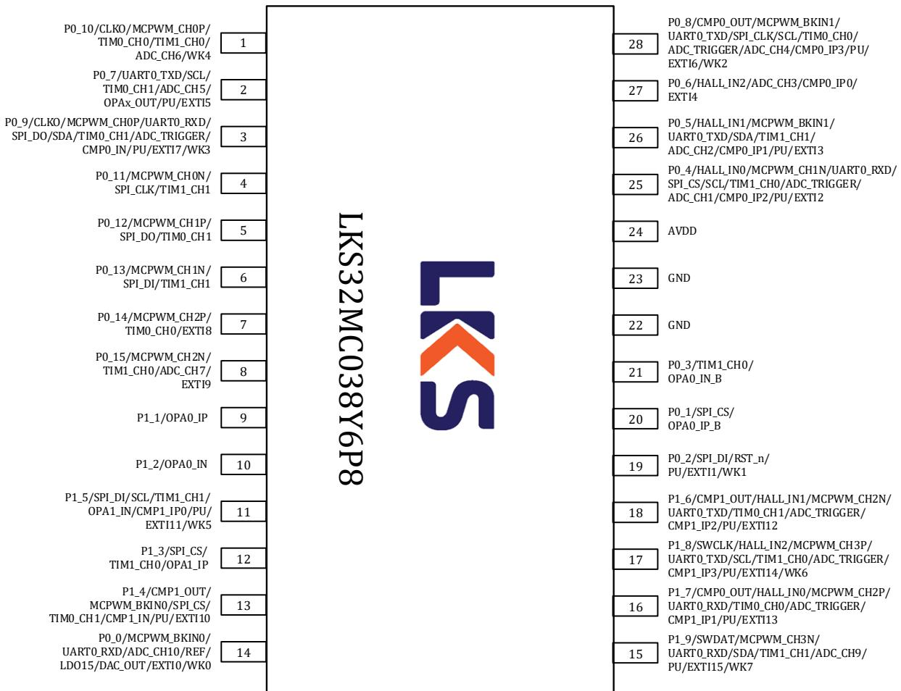  
图 3-9 LKS32MC038Y6P8 管脚分布图

表 3-10 LKS32MC038Y6P8 管脚说明

<table><tr><td rowspan="7">1</td><td>P0_10</td><td>P0.10</td></tr><tr><td>CLKO</td><td>时钟输出(用于调试)</td></tr><tr><td>MCPWM_CHOP</td><td>PWM 通道 0 高边</td></tr><tr><td>TIM0_CH0</td><td>Timer0 通道 0</td></tr><tr><td>TIM1_CH0</td><td>Timer1 通道 0</td></tr><tr><td>ADC_CH6</td><td>ADC 通道 6</td></tr><tr><td>WK4</td><td>外部唤醒信号 4</td></tr><tr><td rowspan="8">2</td><td>P0_7</td><td>P0.7</td></tr><tr><td>UART0_TXD</td><td>串口 0 发送(接收)</td></tr><tr><td>SCL</td><td>I2C 时钟</td></tr><tr><td>TIM0_CH1</td><td>Timer0 通道 1</td></tr><tr><td>ADC_CH5</td><td>ADC 通道 5</td></tr><tr><td>OPAx_OUT</td><td>运放输出</td></tr><tr><td>PU</td><td>内置 10kΩ 上拉电阻,软件可关闭</td></tr><tr><td>EXTI5</td><td>外部 GPIO 中断信号 5</td></tr></table>

管脚分布

<table><tr><td rowspan="12">3</td><td>P0_9</td><td>P0.9</td></tr><tr><td>CLKO</td><td>时钟输出(用于调试)</td></tr><tr><td>MCPWM_CHOP</td><td>PWM通道0高边</td></tr><tr><td>UART0_RXD</td><td>串口0接收(发送)</td></tr><tr><td>SPI_DO</td><td>SPI数据输出(输入)</td></tr><tr><td>SDA</td><td>I2C数据</td></tr><tr><td>TIM0_CH1</td><td>Timer0通道1</td></tr><tr><td>ADC_TRIGGER</td><td>ADC触发信号输出(用于调试)</td></tr><tr><td>CMP0_IN</td><td>比较器0负端输入</td></tr><tr><td>PU</td><td>内置 $10k\Omega$ 上拉电阻,软件可关闭</td></tr><tr><td>EXTI7</td><td>外部GPIO中断信号7</td></tr><tr><td>WK3</td><td>外部唤醒信号3</td></tr><tr><td rowspan="4">4</td><td>P0_11</td><td>P0.11</td></tr><tr><td>MCPWM_CHON</td><td>PWM通道0低边</td></tr><tr><td>SPI_CLK</td><td>SPI时钟</td></tr><tr><td>TIM1_CH1</td><td>Timer1通道1</td></tr><tr><td rowspan="4">5</td><td>P0_12</td><td>P0.12</td></tr><tr><td>MCPWM_CH1P</td><td>PWM通道1高边</td></tr><tr><td>SPI_DO</td><td>SPI数据输出(输入)</td></tr><tr><td>TIM0_CH1</td><td>Timer0通道1</td></tr><tr><td rowspan="4">6</td><td>P0_13</td><td>P0.13</td></tr><tr><td>MCPWM_CH1N</td><td>PWM通道1低边</td></tr><tr><td>SPI_DI</td><td>SPI数据输入(输出)</td></tr><tr><td>TIM1_CH1</td><td>Timer1通道1</td></tr><tr><td rowspan="4">7</td><td>P0_14</td><td>P0.14</td></tr><tr><td>MCPWM_CH2P</td><td>PWM通道2高边</td></tr><tr><td>TIM0_CH0</td><td>Timer0通道0</td></tr><tr><td>EXTI8</td><td>外部GPIO中断信号8</td></tr><tr><td rowspan="5">8</td><td>P0_15</td><td>P0.15</td></tr><tr><td>MCPWM_CH2N</td><td>PWM通道2低边</td></tr><tr><td>TIM1_CH0</td><td>Timer1通道0</td></tr><tr><td>ADC_CH7</td><td>ADC通道7</td></tr><tr><td>EXTI9</td><td>外部GPIO中断信号9</td></tr><tr><td rowspan="2">9</td><td>P1_1</td><td>P1.1</td></tr><tr><td>OPA0_IP</td><td>运放0正端输入</td></tr><tr><td rowspan="2">10</td><td>P1_2</td><td>P1.2</td></tr><tr><td>OPA0_IN</td><td>运放0负端输入</td></tr><tr><td rowspan="6">11</td><td>P1_5</td><td>P1.5</td></tr><tr><td>SPI_DI</td><td>SPI数据输入(输出)</td></tr><tr><td>SCL</td><td>I2C时钟</td></tr><tr><td>TIM1_CH1</td><td>Timer1通道1</td></tr><tr><td>OPA1_IN</td><td>运放1负端输入</td></tr><tr><td>CMP1_IP0PU</td><td>比较器1正端输入0内置10kΩ上拉电阻,软件可关闭</td></tr><tr><td rowspan="2"></td><td>EXTI11</td><td>外部GPIO中断信号11</td></tr><tr><td>WK5</td><td>外部唤醒信号5</td></tr><tr><td rowspan="4">12</td><td>P1_3</td><td>P1.3</td></tr><tr><td>SPI_CS</td><td>SPI片选</td></tr><tr><td>TIM1_CH0</td><td>Timer1通道0</td></tr><tr><td>OPA1_IP</td><td>运放1正端输入</td></tr><tr><td rowspan="8">13</td><td>P1_4</td><td>P1.4</td></tr><tr><td>CMP1_OUT</td><td>比较器1输出</td></tr><tr><td>MCPWM_BKINO</td><td>PWM停机输入信号0</td></tr><tr><td>SPI_CS</td><td>SPI片选</td></tr><tr><td>TIMO_CH1</td><td>Timer0通道1</td></tr><tr><td>CMP1_IN</td><td>比较器1负端输入</td></tr><tr><td>PU</td><td>内置10kΩ上拉电阻,软件可关闭</td></tr><tr><td>EXTI10</td><td>外部GPIO中断信号10</td></tr><tr><td rowspan="9">14</td><td>P0_0</td><td>P0.0</td></tr><tr><td>MCPWM_BKINO</td><td>PWM停机输入信号0</td></tr><tr><td>UART0_RXD</td><td>串口0接收(发送)</td></tr><tr><td>ADC_CH10</td><td>ADC通道10</td></tr><tr><td>REF</td><td>参考电压</td></tr><tr><td>LDO15</td><td>1.5V LDO输出</td></tr><tr><td>DAC_OUT</td><td>DAC输出</td></tr><tr><td>EXTIO</td><td>外部GPIO中断信号0</td></tr><tr><td>WK0</td><td>外部唤醒信号0</td></tr><tr><td rowspan="10">15</td><td>P1_9</td><td>P1.9</td></tr><tr><td>SWDAT</td><td>SWD数据</td></tr><tr><td>MCPWM_CH3N</td><td>PWM通道3低边</td></tr><tr><td>UART0_RXD</td><td>串口0接收(发送)</td></tr><tr><td>SDA</td><td>I2C数据</td></tr><tr><td>TIM1_CH1</td><td>Timer1通道1</td></tr><tr><td>ADC_CH9</td><td>ADC通道9</td></tr><tr><td>PU</td><td>内置10kΩ上拉电阻,软件可关闭</td></tr><tr><td>EXTI15</td><td>外部GPIO中断信号15</td></tr><tr><td>WK7</td><td>外部唤醒信号7</td></tr><tr><td rowspan="9">16</td><td>P1_7</td><td>P1.7</td></tr><tr><td>CMP0_OUT</td><td>比较器0输出</td></tr><tr><td>HALL_IN0</td><td>HALL接口输入0</td></tr><tr><td>MCPWM_CH2P</td><td>PWM通道2高边</td></tr><tr><td>UART0_RXD</td><td>串口0接收(发送)</td></tr><tr><td>TIMO_CH0</td><td>Timer0通道0</td></tr><tr><td>ADC_TRIGGER</td><td>ADC触发信号输出(用于调试)</td></tr><tr><td>CMP1_IP1</td><td>比较器1正端输入1</td></tr><tr><td>PU</td><td>内置10kΩ上拉电阻,软件可关闭</td></tr></table>

管脚分布

<table><tr><td></td><td>EXTI13</td><td>外部 GPIO 中断信号 13</td></tr><tr><td rowspan="12">17</td><td>P1_8</td><td>P1.8</td></tr><tr><td>SWCLK</td><td>SWD 时钟</td></tr><tr><td>HALL_IN2</td><td>HALL 接口输入 2</td></tr><tr><td>MCPWM_CH3P</td><td>PWM 通道 3 高边</td></tr><tr><td>UART0_TXD</td><td>串口 0 发送(接收)</td></tr><tr><td>SCL</td><td>I2C 时钟</td></tr><tr><td>TIM1_CH0</td><td>Timer1 通道 0</td></tr><tr><td>ADC_TRIGGER</td><td>ADC 触发信号输出(用于调试)</td></tr><tr><td>CMP1_IP3</td><td>比较器 1 正端输入 3</td></tr><tr><td>PU</td><td>内置  ${10}\mathrm{k}\Omega$  上拉电阻,软件可关闭</td></tr><tr><td>EXTI14</td><td>外部 GPIO 中断信号 14</td></tr><tr><td>WK6</td><td>外部唤醒信号 6</td></tr><tr><td rowspan="11">18</td><td>P1_6</td><td>P1.6</td></tr><tr><td>CMP1_OUT</td><td>比较器 1 输出</td></tr><tr><td>HALL_IN1</td><td>HALL 接口输入 1</td></tr><tr><td>MCPWM_CH2N</td><td>PWM 通道 2 低边</td></tr><tr><td>UART0_TXD</td><td>串口 0 发送(接收)</td></tr><tr><td>TIM0_CH1</td><td>Timer0 通道 1</td></tr><tr><td>ADC_TRIGGER</td><td>ADC 触发信号输出(用于调试)</td></tr><tr><td></td><td></td></tr><tr><td>CMP1_IP2</td><td>比较器 1 正端输入 2</td></tr><tr><td>PU</td><td>内置  ${10}\mathrm{k}\Omega$  上拉电阻,软件可关闭</td></tr><tr><td>EXTI12</td><td>外部 GPIO 中断信号 12</td></tr><tr><td rowspan="6">19</td><td>P0_2</td><td>P0.2</td></tr><tr><td>SPI_DI</td><td>SPI 数据输入(输出)</td></tr><tr><td>RST_n</td><td>复位引脚,P0.2 默认用作 RSTN。建议接一个  ${10}\mathrm{{nF}} \sim {100}\mathrm{{nF}}$  的电容到地,并在 RSTN 和 AVDD 之间放置一个  ${10}\mathrm{k} \sim {20}\mathrm{k}$  的上拉电阻。如果外部有上拉电阻,RSTN 的电容应为  ${100}\mathrm{{nF}}$  。P0.2 可切换为 GPIO,切换后可关闭  ${10}\mathrm{k}\Omega$  上拉电阻。</td></tr><tr><td>PU</td><td>内置  ${10}\mathrm{k}\Omega$  上拉电阻,软件可关闭</td></tr><tr><td>EXTI1</td><td>外部 GPIO 中断信号 1</td></tr><tr><td>WK1</td><td>外部唤醒信号 1</td></tr><tr><td rowspan="3">20</td><td>P0_1</td><td>P0.1</td></tr><tr><td>SPI_CS</td><td>SPI 片选</td></tr><tr><td>OPA0_IP_B</td><td>运放 0 正端输入 B,请留意:OPA0 有两组输入信号,如果需要使用 B 组输入,需要设置 SYS_AFE_REG0[5] = 1。</td></tr><tr><td rowspan="3">21</td><td>P0_3</td><td>P0.3</td></tr><tr><td>TIM1_CH0</td><td>Timer1 通道 0</td></tr><tr><td>OPA0_IN_B</td><td>运放 0 负端输入 B,请留意:OPA0 有两组输入信号,如果需要使用 B 组输入,需要设置 SYS_AFE_REG0[5] = 1。</td></tr><tr><td>22</td><td>GND</td><td>芯片地,强烈建议多个地引脚在 PCB 上统一接地</td></tr><tr><td>23</td><td>GND</td><td>芯片地,强烈建议多个地引脚在 PCB 上统一接地</td></tr><tr><td>24</td><td>AVDD</td><td>芯片电源,供电范围 2.5~5.5V</td></tr><tr><td rowspan="12">25</td><td>P0_4</td><td>P0.4</td></tr><tr><td>HALL_IN0</td><td>HALL接口输入0</td></tr><tr><td>MCPWM_CH1N</td><td>PWM通道1低边</td></tr><tr><td>UART0_RXD</td><td>串口0接收(发送)</td></tr><tr><td>SPI_CS</td><td>SPI片选</td></tr><tr><td>SCL</td><td>I2C时钟</td></tr><tr><td>TIM1_CH0</td><td>Timer1通道0</td></tr><tr><td>ADC_TRIGGER</td><td>ADC触发信号输出(用于调试)</td></tr><tr><td>ADC_CH1</td><td>ADC通道1</td></tr><tr><td>CMP0_IP2</td><td>比较器0正端输入2</td></tr><tr><td>PU</td><td>内置 $10k\Omega$ 上拉电阻,软件可关闭</td></tr><tr><td>EXTI2</td><td>外部GPIO中断信号2</td></tr><tr><td rowspan="10">26</td><td>P0_5</td><td>P0.5</td></tr><tr><td>HALL_IN1</td><td>HALL接口输入1</td></tr><tr><td>MCPWM_BKIN1</td><td>PWM停机输入信号1</td></tr><tr><td>UART0_TXD</td><td>串口0发送(接收)</td></tr><tr><td>SDA</td><td>I2C数据</td></tr><tr><td>TIM1_CH1</td><td>Timer1通道1</td></tr><tr><td>ADC_CH2</td><td>ADC通道2</td></tr><tr><td>CMP0_IP1</td><td>比较器0正端输入1</td></tr><tr><td>PU</td><td>内置 $10k\Omega$ 上拉电阻,软件可关闭</td></tr><tr><td>EXTI3</td><td>外部GPIO中断信号3</td></tr><tr><td rowspan="5">27</td><td>P0_6</td><td>P0.6</td></tr><tr><td>HALL_IN2</td><td>HALL接口输入2</td></tr><tr><td>ADC_CH3</td><td>ADC通道3</td></tr><tr><td>CMP0_IP0</td><td>比较器0正端输入0</td></tr><tr><td>EXTI4</td><td>外部GPIO中断信号4</td></tr><tr><td rowspan="13">28</td><td>P0_8</td><td>P0.8</td></tr><tr><td>CMP0_OUT</td><td>比较器0输出</td></tr><tr><td>MCPWM_BKIN1</td><td>PWM停机输入信号1</td></tr><tr><td>UART0_TXD</td><td>串口0发送(接收)</td></tr><tr><td>SPI_CLK</td><td>SPI时钟</td></tr><tr><td>SCL</td><td>I2C时钟</td></tr><tr><td>TIM0_CH0</td><td>Timer0通道0</td></tr><tr><td>ADC_TRIGGER</td><td>ADC触发信号输出(用于调试)</td></tr><tr><td>ADC_CH4</td><td>ADC通道4</td></tr><tr><td>CMP0_IP3</td><td>比较器0正端输入3</td></tr><tr><td>PU</td><td>内置 $10k\Omega$ 上拉电阻,软件可关闭</td></tr><tr><td>EXTI6</td><td>外部GPIO中断信号6</td></tr><tr><td>WK2</td><td>外部唤醒信号2</td></tr></table>

## 3.1.12 LKS32MC038Y6P8B/LKS32MC038Y6P8C

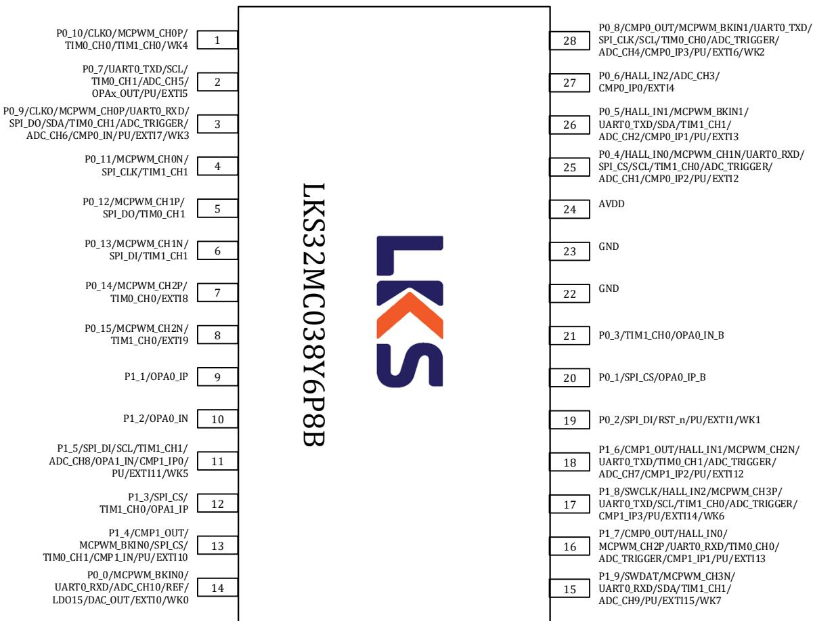  
图 3-10 LKS32MC038Y6P8B/LKS32MC038Y6P8C 管脚分布图

表 3-11 LKS32MC038Y6P8B/LKS32MC038Y6P8C 管脚说明

<table><tr><td rowspan="6">1</td><td>P0_10</td><td>P0.10</td></tr><tr><td>CLKO</td><td>时钟输出(用于调试)</td></tr><tr><td>MCPWM_CHOP</td><td>PWM 通道 0 高边</td></tr><tr><td>TIM0_CH0</td><td>Timer0 通道 0</td></tr><tr><td>TIM1_CH0</td><td>Timer1 通道 0</td></tr><tr><td>WK4</td><td>外部唤醒信号 4</td></tr><tr><td rowspan="8">2</td><td>P0_7</td><td>P0.7</td></tr><tr><td>UART0_TXD</td><td>串口 0 发送(接收)</td></tr><tr><td>SCL</td><td>I2C 时钟</td></tr><tr><td>TIM0_CH1</td><td>Timer0 通道 1</td></tr><tr><td>ADC_CH5</td><td>ADC 通道 5</td></tr><tr><td>OPAx_OUT</td><td>运放输出</td></tr><tr><td>PU</td><td>内置 10kΩ 上拉电阻,软件可关闭</td></tr><tr><td>EXTI5</td><td>外部 GPIO 中断信号 5</td></tr><tr><td rowspan="2">3</td><td>P0_9</td><td>P0.9</td></tr><tr><td>CLKOMCPWM_CH0P</td><td>时钟输出(用于调试)PWM通道0高边</td></tr><tr><td rowspan="10"></td><td>UART0_RXD</td><td>串口0接收(发送)</td></tr><tr><td>SPI_DO</td><td>SPI数据输出(输入)</td></tr><tr><td>SDA</td><td>I2C数据</td></tr><tr><td>TIM0_CH1</td><td>Timer0通道1</td></tr><tr><td>ADC_TRIGGER</td><td>ADC触发信号输出(用于调试)</td></tr><tr><td>ADC_CH6</td><td>ADC通道6</td></tr><tr><td>CMP0_IN</td><td>比较器0负端输入</td></tr><tr><td>PU</td><td>内置 $10k\Omega$ 上拉电阻,软件可关闭</td></tr><tr><td>EXTI7</td><td>外部GPIO中断信号7</td></tr><tr><td>WK3</td><td>外部唤醒信号3</td></tr><tr><td rowspan="4">4</td><td>P0_11</td><td>P0.11</td></tr><tr><td>MCPWM_CH0N</td><td>PWM通道0低边</td></tr><tr><td>SPI_CLK</td><td>SPI时钟</td></tr><tr><td>TIM1_CH1</td><td>Timer1通道1</td></tr><tr><td rowspan="4">5</td><td>P0_12</td><td>P0.12</td></tr><tr><td>MCPWM_CH1P</td><td>PWM通道1高边</td></tr><tr><td>SPI_DO</td><td>SPI数据输出(输入)</td></tr><tr><td>TIM0_CH1</td><td>Timer0通道1</td></tr><tr><td rowspan="4">6</td><td>P0_13</td><td>P0.13</td></tr><tr><td>MCPWM_CH1N</td><td>PWM通道1低边</td></tr><tr><td>SPI_DI</td><td>SPI数据输入(输出)</td></tr><tr><td>TIM1_CH1</td><td>Timer1通道1</td></tr><tr><td rowspan="4">7</td><td>P0_14</td><td>P0.14</td></tr><tr><td>MCPWM_CH2P</td><td>PWM通道2高边</td></tr><tr><td>TIM0_CH0</td><td>Timer0通道0</td></tr><tr><td>EXTI8</td><td>外部GPIO中断信号8</td></tr><tr><td rowspan="4">8</td><td>P0_15</td><td>P0.15</td></tr><tr><td>MCPWM_CH2N</td><td>PWM通道2低边</td></tr><tr><td>TIM1_CH0</td><td>Timer1通道0</td></tr><tr><td>EXTI9</td><td>外部GPIO中断信号9</td></tr><tr><td rowspan="2">9</td><td>P1_1</td><td>P1.1</td></tr><tr><td>OPA0_IP</td><td>运放0正端输入</td></tr><tr><td rowspan="2">10</td><td>P1_2</td><td>P1.2</td></tr><tr><td>OPA0_IN</td><td>运放0负端输入</td></tr><tr><td rowspan="8">11</td><td>P1_5</td><td>P1.5</td></tr><tr><td>SPI_DI</td><td>SPI数据输入(输出)</td></tr><tr><td>SCL</td><td>I2C时钟</td></tr><tr><td>TIM1_CH1</td><td>Timer1通道1</td></tr><tr><td>ADC_CH8</td><td>ADC通道8</td></tr><tr><td>OPA1_IN</td><td>运放1负端输入</td></tr><tr><td>CMP1_IP0</td><td>比较器1正端输入0</td></tr><tr><td>PU</td><td>内置 $10k\Omega$ 上拉电阻,软件可关闭</td></tr></table>

管脚分布

<table><tr><td rowspan="2"></td><td>EXTI11</td><td>外部 GPIO 中断信号 11</td></tr><tr><td>WK5</td><td>外部唤醒信号 5</td></tr><tr><td rowspan="4">12</td><td>P1_3</td><td>P1.3</td></tr><tr><td>SPI_CS</td><td>SPI 片选</td></tr><tr><td>TIM1_CH0</td><td>Timer1 通道 0</td></tr><tr><td>OPA1_IP</td><td>运放 1 正端输入</td></tr><tr><td rowspan="8">13</td><td>P1_4</td><td>P1.4</td></tr><tr><td>CMP1_OUT</td><td>比较器 1 输出</td></tr><tr><td>MCPWM_BKIN0</td><td>PWM 停机输入信号 0</td></tr><tr><td>SPI_CS</td><td>SPI 片选</td></tr><tr><td>TIM0_CH1</td><td>Timer0 通道 1</td></tr><tr><td>CMP1_IN</td><td>比较器 1 负端输入</td></tr><tr><td>PU</td><td>内置  ${10}\mathrm{k}\Omega$  上拉电阻,软件可关闭</td></tr><tr><td>EXTI10</td><td>外部 GPIO 中断信号 10</td></tr><tr><td rowspan="9">14</td><td>P0_0</td><td>P0.0</td></tr><tr><td>MCPWM_BKIN0</td><td>PWM 停机输入信号 0</td></tr><tr><td>UART0_RXD</td><td>串口 0 接收(发送)</td></tr><tr><td>ADC_CH10</td><td>ADC 通道 10</td></tr><tr><td>REF</td><td>参考电压</td></tr><tr><td>LDO15</td><td>1.5V LDO 输出</td></tr><tr><td>DAC_OUT</td><td>DAC 输出</td></tr><tr><td>EXTIO</td><td>外部 GPIO 中断信号 0</td></tr><tr><td>WK0</td><td>外部唤醒信号 0</td></tr><tr><td rowspan="10">15</td><td>P1_9</td><td>P1.9</td></tr><tr><td>SWDAT</td><td>SWD 数据</td></tr><tr><td>MCPWM_CH3N</td><td>PWM 通道 3 低边</td></tr><tr><td>UART0_RXD</td><td>串口 0 接收(发送)</td></tr><tr><td>SDA</td><td>I2C 数据</td></tr><tr><td>TIM1_CH1</td><td>Timer1 通道 1</td></tr><tr><td>ADC_CH9</td><td>ADC 通道 9</td></tr><tr><td>PU</td><td>内置  ${10}\mathrm{k}\Omega$  上拉电阻,软件可关闭</td></tr><tr><td>EXTI15</td><td>外部 GPIO 中断信号 15</td></tr><tr><td>WK7</td><td>外部唤醒信号 7</td></tr><tr><td rowspan="10">16</td><td>P1_7</td><td>P1.7</td></tr><tr><td>CMP0_OUT</td><td>比较器 0 输出</td></tr><tr><td>HALL_IN0</td><td>HALL 接口输入 0</td></tr><tr><td>MCPWM_CH2P</td><td>PWM 通道 2 高边</td></tr><tr><td>UART0_RXD</td><td>串口 0 接收(发送)</td></tr><tr><td>TIMO_CH0</td><td>Timer0 通道 0</td></tr><tr><td>ADC_TRIGGER</td><td>ADC 触发信号输出(用于调试)</td></tr><tr><td>CMP1_IP1</td><td>比较器 1 正端输入 1</td></tr><tr><td>PU</td><td>内置  ${10}\mathrm{k}\Omega$  上拉电阻,软件可关闭</td></tr><tr><td>EXTI13</td><td>外部 GPIO 中断信号 13</td></tr></table>

管脚分布

<table><tr><td rowspan="12">17</td><td>P1_8</td><td>P1.8</td></tr><tr><td>SWCLK</td><td>SWD时钟</td></tr><tr><td>HALL_IN2</td><td>HALL接口输入2</td></tr><tr><td>MCPWM_CH3P</td><td>PWM通道3高边</td></tr><tr><td>UART0_TXD</td><td>串口0发送(接收)</td></tr><tr><td>SCL</td><td>I2C时钟</td></tr><tr><td>TIM1_CH0</td><td>Timer1通道0</td></tr><tr><td>ADC_TRIGGER</td><td>ADC触发信号输出(用于调试)</td></tr><tr><td>CMP1_IP3</td><td>比较器1正端输入3</td></tr><tr><td>PU</td><td>内置 $10k\Omega$ 上拉电阻,软件可关闭</td></tr><tr><td>EXTI14</td><td>外部GPIO中断信号14</td></tr><tr><td>WK6</td><td>外部唤醒信号6</td></tr><tr><td rowspan="11">18</td><td>P1_6</td><td>P1.6</td></tr><tr><td>CMP1_OUT</td><td>比较器1输出</td></tr><tr><td>HALL_IN1</td><td>HALL接口输入1</td></tr><tr><td>MCPWM_CH2N</td><td>PWM通道2低边</td></tr><tr><td>UART0_TXD</td><td>串口0发送(接收)</td></tr><tr><td>TIM0_CH1</td><td>Timer0通道1</td></tr><tr><td>ADC_TRIGGER</td><td>ADC触发信号输出(用于调试)</td></tr><tr><td>ADC_CH7</td><td>ADC通道7</td></tr><tr><td>CMP1_IP2</td><td>比较器1正端输入2</td></tr><tr><td>PU</td><td>内置 $10k\Omega$ 上拉电阻,软件可关闭</td></tr><tr><td>EXTI12</td><td>外部GPIO中断信号12</td></tr><tr><td rowspan="6">19</td><td>P0_2</td><td>P0.2</td></tr><tr><td>SPI_DI</td><td>SPI数据输入(输出)</td></tr><tr><td>RST_n</td><td>复位引脚,P0.2默认用作RSTN。建议接一个 $10nF \sim 100nF$ 的电容到地,并在RSTN和AVDD之间放置一个 $10k \sim 20k$ 的上拉电阻。如果外部有上拉电阻,RSTN的电容应为 $100nF$ 。P0.2可切换为GPIO,切换后可关闭 $10k\Omega$ 上拉电阻。</td></tr><tr><td>PU</td><td>内置 $10k\Omega$ 上拉电阻,软件可关闭</td></tr><tr><td>EXTI1</td><td>外部GPIO中断信号1</td></tr><tr><td>WK1</td><td>外部唤醒信号1</td></tr><tr><td rowspan="3">20</td><td>P0_1</td><td>P0.1</td></tr><tr><td>SPI_CS</td><td>SPI片选</td></tr><tr><td>OPA0_IP_B</td><td>运放0正端输入B,请留意:OPA0有两组输入信号,如果需要使用B组输入,需要设置SYS_AFE_REG0[5]=1。</td></tr><tr><td rowspan="3">21</td><td>P0_3</td><td>P0.3</td></tr><tr><td>TIM1_CH0</td><td>Timer1通道0</td></tr><tr><td>OPA0_IN_B</td><td>运放0负端输入B,请留意:OPA0有两组输入信号,如果需要使用B组输入,需要设置SYS_AFE_REG0[5]=1。</td></tr><tr><td>22</td><td>GND</td><td>芯片地,强烈建议多个地引脚在PCB上统一接地</td></tr><tr><td>23</td><td>GND</td><td>芯片地,强烈建议多个地引脚在PCB上统一接地</td></tr><tr><td>24</td><td>AVDD</td><td>芯片电源,供电范围 $2.5 \sim 5.5V$ </td></tr><tr><td>25</td><td>P0_4HALL_IN0</td><td>P0.4HALL接口输入0</td></tr><tr><td rowspan="10"></td><td>MCPWM_CH1N</td><td>PWM通道1低边</td></tr><tr><td>UART0_RXD</td><td>串口0接收(发送)</td></tr><tr><td>SPI_CS</td><td>SPI片选</td></tr><tr><td>SCL</td><td>I2C时钟</td></tr><tr><td>TIM1_CH0</td><td>Timer1通道0</td></tr><tr><td>ADC_TRIGGER</td><td>ADC触发信号输出(用于调试)</td></tr><tr><td>ADC_CH1</td><td>ADC通道1</td></tr><tr><td>CMP0_IP2</td><td>比较器0正端输入2</td></tr><tr><td>PU</td><td>内置10kΩ上拉电阻,软件可关闭</td></tr><tr><td>EXTI2</td><td>外部GPIO中断信号2</td></tr><tr><td rowspan="10">26</td><td>P0_5</td><td>P0.5</td></tr><tr><td>HALL_IN1</td><td>HALL接口输入1</td></tr><tr><td>MCPWM_BKIN1</td><td>PWM停机输入信号1</td></tr><tr><td>UART0_TXD</td><td>串口0发送(接收)</td></tr><tr><td>SDA</td><td>I2C数据</td></tr><tr><td>TIM1_CH1</td><td>Timer1通道1</td></tr><tr><td>ADC_CH2</td><td>ADC通道2</td></tr><tr><td>CMP0_IP1</td><td>比较器0正端输入1</td></tr><tr><td>PU</td><td>内置10kΩ上拉电阻,软件可关闭</td></tr><tr><td>EXTI3</td><td>外部GPIO中断信号3</td></tr><tr><td rowspan="5">27</td><td>P0_6</td><td>P0.6</td></tr><tr><td>HALL_IN2</td><td>HALL接口输入2</td></tr><tr><td>ADC_CH3</td><td>ADC通道3</td></tr><tr><td>CMP0_IP0</td><td>比较器0正端输入0</td></tr><tr><td>EXTI4</td><td>外部GPIO中断信号4</td></tr><tr><td rowspan="13">28</td><td>P0_8</td><td>P0.8</td></tr><tr><td>CMP0_OUT</td><td>比较器0输出</td></tr><tr><td>MCPWM_BKIN1</td><td>PWM停机输入信号1</td></tr><tr><td>UART0_TXD</td><td>串口0发送(接收)</td></tr><tr><td>SPI_CLK</td><td>SPI时钟</td></tr><tr><td>SCL</td><td>I2C时钟</td></tr><tr><td>TIM0_CH0</td><td>Timer0通道0</td></tr><tr><td>ADC_TRIGGER</td><td>ADC触发信号输出(用于调试)</td></tr><tr><td>ADC_CH4</td><td>ADC通道4</td></tr><tr><td>CMP0_IP3</td><td>比较器0正端输入3</td></tr><tr><td>PU</td><td>内置10kΩ上拉电阻,软件可关闭</td></tr><tr><td>EXTI6</td><td>外部GPIO中断信号6</td></tr><tr><td>WK2</td><td>外部唤醒信号2</td></tr></table>

## 3.1.13 LKS32MC038LY6P8B/LKS32MC038LY6P8C

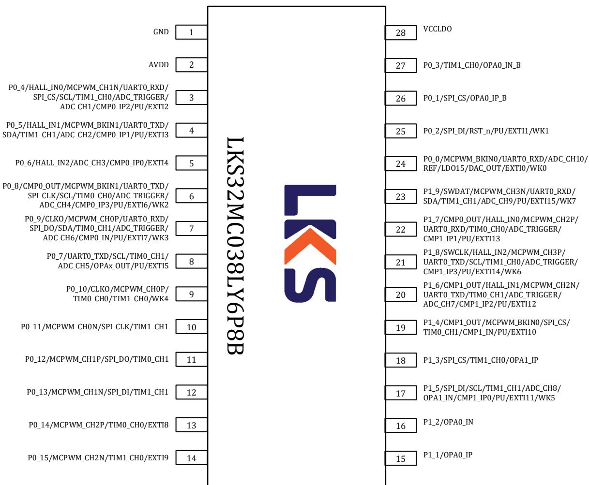  
图 3-11 LKS32MC038LY6P8B/LKS32MC038LY6P8C 管脚分布图

表 3-12 LKS32MC038LY6P8B/LKS32MC038LY6P8C 管脚说明

<table><tr><td>1</td><td>GND</td><td>芯片地,强烈建议多个地引脚在PCB上统一接地</td></tr><tr><td>2</td><td>AVDD</td><td>芯片电源,供电范围2.2~5.5V</td></tr><tr><td rowspan="12">3</td><td>P0_4</td><td>P0.4</td></tr><tr><td>HALL_IN0</td><td>HALL接口输入0</td></tr><tr><td>MCPWM_CH1N</td><td>PWM通道1低边</td></tr><tr><td>UART0_RXD</td><td>串口0接收(发送)</td></tr><tr><td>SPI_CS</td><td>SPI片选</td></tr><tr><td>SCL</td><td>I2C时钟</td></tr><tr><td>TIM1_CH0</td><td>Timer1通道0</td></tr><tr><td>ADC_TRIGGER</td><td>ADC触发信号输出(用于调试)</td></tr><tr><td>ADC_CH1</td><td>ADC通道1</td></tr><tr><td>CMP0_IP2</td><td>比较器0正端输入2</td></tr><tr><td>PU</td><td>内置10kΩ上拉电阻,软件可关闭</td></tr><tr><td>EXTI2</td><td>外部GPIO中断信号2</td></tr><tr><td rowspan="10">4</td><td>P0_5</td><td>P0.5</td></tr><tr><td>HALL_IN1</td><td>HALL接口输入1</td></tr><tr><td>MCPWM_BKIN1</td><td>PWM停机输入信号1</td></tr><tr><td>UART0_TXD</td><td>串口0发送(接收)</td></tr><tr><td>SDA</td><td>I2C数据</td></tr><tr><td>TIM1_CH1</td><td>Timer1通道1</td></tr><tr><td>ADC_CH2</td><td>ADC通道2</td></tr><tr><td>CMP0_IP1</td><td>比较器0正端输入1</td></tr><tr><td>PU</td><td>内置 $10k\Omega$ 上拉电阻,软件可关闭</td></tr><tr><td>EXTI3</td><td>外部GPIO中断信号3</td></tr><tr><td rowspan="5">5</td><td>P0_6</td><td>P0.6</td></tr><tr><td>HALL_IN2</td><td>HALL接口输入2</td></tr><tr><td>ADC_CH3</td><td>ADC通道3</td></tr><tr><td>CMP0_IP0</td><td>比较器0正端输入0</td></tr><tr><td>EXTI4</td><td>外部GPIO中断信号4</td></tr><tr><td rowspan="13">6</td><td>P0_8</td><td>P0.8</td></tr><tr><td>CMP0_OUT</td><td>比较器0输出</td></tr><tr><td>MCPWM_BKIN1</td><td>PWM停机输入信号1</td></tr><tr><td>UART0_TXD</td><td>串口0发送(接收)</td></tr><tr><td>SPI_CLK</td><td>SPI时钟</td></tr><tr><td>SCL</td><td>I2C时钟</td></tr><tr><td>TIM0_CH0</td><td>Timer0通道0</td></tr><tr><td>ADC_TRIGGER</td><td>ADC触发信号输出(用于调试)</td></tr><tr><td>ADC_CH4</td><td>ADC通道4</td></tr><tr><td>CMP0_IP3</td><td>比较器0正端输入3</td></tr><tr><td>PU</td><td>内置 $10k\Omega$ 上拉电阻,软件可关闭</td></tr><tr><td>EXTI6</td><td>外部GPIO中断信号6</td></tr><tr><td>WK2</td><td>外部唤醒信号2</td></tr><tr><td rowspan="13">7</td><td>P0_9</td><td>P0.9</td></tr><tr><td>CLKO</td><td>时钟输出(用于调试)</td></tr><tr><td>MCPWM_CHOP</td><td>PWM通道0高边</td></tr><tr><td>UART0_RXD</td><td>串口0接收(发送)</td></tr><tr><td>SPI_DO</td><td>SPI数据输出(输入)</td></tr><tr><td>SDA</td><td>I2C数据</td></tr><tr><td>TIM0_CH1</td><td>Timer0通道1</td></tr><tr><td>ADC_TRIGGER</td><td>ADC触发信号输出(用于调试)</td></tr><tr><td>ADC_CH6</td><td>ADC通道6</td></tr><tr><td>CMP0_IN</td><td>比较器0负端输入</td></tr><tr><td>PU</td><td>内置 $10k\Omega$ 上拉电阻,软件可关闭</td></tr><tr><td>EXTI7</td><td>外部GPIO中断信号7</td></tr><tr><td>WK3</td><td>外部唤醒信号3</td></tr><tr><td rowspan="2">8</td><td>P0_7</td><td>P0.7</td></tr><tr><td>UART0_TXDSCL</td><td>串口0发送(接收)I2C 时钟</td></tr><tr><td rowspan="5"></td><td>TIM0_CH1</td><td>Timer0 通道 1</td></tr><tr><td>ADC_CH5</td><td>ADC 通道 5</td></tr><tr><td>OPAx_OUT</td><td>运放输出</td></tr><tr><td>PU</td><td>内置  ${10}\mathrm{k}\Omega$  上拉电阻,软件可关闭</td></tr><tr><td>EXTI5</td><td>外部 GPIO 中断信号 5</td></tr><tr><td rowspan="6">9</td><td>P0_10</td><td>P0.10</td></tr><tr><td>CLKO</td><td>时钟输出(用于调试)</td></tr><tr><td>MCPWM_CHOP</td><td>PWM 通道 0 高边</td></tr><tr><td>TIM0_CH0</td><td>Timer0 通道 0</td></tr><tr><td>TIM1_CH0</td><td>Timer1 通道 0</td></tr><tr><td>WK4</td><td>外部唤醒信号 4</td></tr><tr><td rowspan="4">10</td><td>P0_11</td><td>P0.11</td></tr><tr><td>MCPWM_CHON</td><td>PWM 通道 0 低边</td></tr><tr><td>SPI_CLK</td><td>SPI 时钟</td></tr><tr><td>TIM1_CH1</td><td>Timer1 通道 1</td></tr><tr><td rowspan="4">11</td><td>P0_12</td><td>P0.12</td></tr><tr><td>MCPWM_CH1P</td><td>PWM 通道 1 高边</td></tr><tr><td>SPI_DO</td><td>SPI 数据输出(输入)</td></tr><tr><td>TIM0_CH1</td><td>Timer0 通道 1</td></tr><tr><td rowspan="4">12</td><td>P0_13</td><td>P0.13</td></tr><tr><td>MCPWM_CH1N</td><td>PWM 通道 1 低边</td></tr><tr><td>SPI_DI</td><td>SPI 数据输入(输出)</td></tr><tr><td>TIM1_CH1</td><td>Timer1 通道 1</td></tr><tr><td rowspan="4">13</td><td>P0_14</td><td>P0.14</td></tr><tr><td>MCPWM_CH2P</td><td>PWM 通道 2 高边</td></tr><tr><td>TIM0_CH0</td><td>Timer0 通道 0</td></tr><tr><td>EXTI8</td><td>外部 GPIO 中断信号 8</td></tr><tr><td rowspan="4">14</td><td>P0_15</td><td>P0.15</td></tr><tr><td>MCPWM_CH2N</td><td>PWM 通道 2 低边</td></tr><tr><td>TIM1_CH0</td><td>Timer1 通道 0</td></tr><tr><td>EXTI9</td><td>外部 GPIO 中断信号 9</td></tr><tr><td rowspan="2">15</td><td>P1_1</td><td>P1.1</td></tr><tr><td>OPA0_IP</td><td>运放 0 正端输入</td></tr><tr><td rowspan="2">16</td><td>P1_2</td><td>P1.2</td></tr><tr><td>OPA0_IN</td><td>运放 0 负端输入</td></tr><tr><td rowspan="7">17</td><td>P1_5</td><td>P1.5</td></tr><tr><td>SPI_DI</td><td>SPI 数据输入(输出)</td></tr><tr><td>SCL</td><td>I2C 时钟</td></tr><tr><td>TIM1_CH1</td><td>Timer1 通道 1</td></tr><tr><td>ADC_CH8</td><td>ADC 通道 8</td></tr><tr><td>OPA1_IN</td><td>运放 1 负端输入</td></tr><tr><td>CMP1_IP0PU</td><td>比较器 1 正端输入 0内置10kΩ上拉电阻,软件可关闭</td></tr><tr><td rowspan="2"></td><td>EXTI11</td><td>外部GPIO中断信号11</td></tr><tr><td>WK5</td><td>外部唤醒信号5</td></tr><tr><td rowspan="4">18</td><td>P1_3</td><td>P1.3</td></tr><tr><td>SPI_CS</td><td>SPI片选</td></tr><tr><td>TIM1_CH0</td><td>Timer1通道0</td></tr><tr><td>OPA1_IP</td><td>运放1正端输入</td></tr><tr><td rowspan="8">19</td><td>P1_4</td><td>P1.4</td></tr><tr><td>CMP1_OUT</td><td>比较器1输出</td></tr><tr><td>MCPWM_BKIN0</td><td>PWM停机输入信号0</td></tr><tr><td>SPI_CS</td><td>SPI片选</td></tr><tr><td>TIM0_CH1</td><td>Timer0通道1</td></tr><tr><td>CMP1_IN</td><td>比较器1负端输入</td></tr><tr><td>PU</td><td>内置10kΩ上拉电阻,软件可关闭</td></tr><tr><td>EXTI10</td><td>外部GPIO中断信号10</td></tr><tr><td rowspan="11">20</td><td>P1_6</td><td>P1.6</td></tr><tr><td>CMP1_OUT</td><td>比较器1输出</td></tr><tr><td>HALL_IN1</td><td>HALL接口输入1</td></tr><tr><td>MCPWM_CH2N</td><td>PWM通道2低边</td></tr><tr><td>UART0_TXD</td><td>串口0发送(接收)</td></tr><tr><td>TIM0_CH1</td><td>Timer0通道1</td></tr><tr><td>ADC_TRIGGER</td><td>ADC触发信号输出(用于调试)</td></tr><tr><td>ADC_CH7</td><td>ADC通道7</td></tr><tr><td>CMP1_IP2</td><td>比较器1正端输入2</td></tr><tr><td>PU</td><td>内置10kΩ上拉电阻,软件可关闭</td></tr><tr><td>EXTI12</td><td>外部GPIO中断信号12</td></tr><tr><td rowspan="12">21</td><td>P1_8</td><td>P1.8</td></tr><tr><td>SWCLK</td><td>SWD时钟</td></tr><tr><td>HALL_IN2</td><td>HALL接口输入2</td></tr><tr><td>MCPWM_CH3P</td><td>PWM通道3高边</td></tr><tr><td>UART0_TXD</td><td>串口0发送(接收)</td></tr><tr><td>SCL</td><td>I2C时钟</td></tr><tr><td>TIM1_CH0</td><td>Timer1通道0</td></tr><tr><td>ADC_TRIGGER</td><td>ADC触发信号输出(用于调试)</td></tr><tr><td>CMP1_IP3</td><td>比较器1正端输入3</td></tr><tr><td>PU</td><td>内置10kΩ上拉电阻,软件可关闭</td></tr><tr><td>EXTI14</td><td>外部GPIO中断信号14</td></tr><tr><td>WK6</td><td>外部唤醒信号6</td></tr><tr><td rowspan="5">22</td><td>P1_7</td><td>P1.7</td></tr><tr><td>CMP0_OUT</td><td>比较器0输出</td></tr><tr><td>HALL_IN0</td><td>HALL接口输入0</td></tr><tr><td>MCPWM_CH2P</td><td>PWM通道2高边</td></tr><tr><td>UART0_RXD</td><td>串口0接收(发送)</td></tr></table>

管脚分布

<table><tr><td rowspan="5"></td><td>TIM0_CH0</td><td>Timer0 通道0</td></tr><tr><td>ADC_TRIGGER</td><td>ADC 触发信号输出(用于调试)</td></tr><tr><td>CMP1_IP1</td><td>比较器1正端输入1</td></tr><tr><td>PU</td><td>内置 $10k\Omega$ 上拉电阻,软件可关闭</td></tr><tr><td>EXTI13</td><td>外部GPIO中断信号13</td></tr><tr><td rowspan="10">23</td><td>P1_9</td><td>P1.9</td></tr><tr><td>SWDAT</td><td>SWD 数据</td></tr><tr><td>MCPWM_CH3N</td><td>PWM通道3低边</td></tr><tr><td>UART0_RXD</td><td>串口0接收(发送)</td></tr><tr><td>SDA</td><td>I2C数据</td></tr><tr><td>TIM1_CH1</td><td>Timer1通道1</td></tr><tr><td>ADC_CH9</td><td>ADC通道9</td></tr><tr><td>PU</td><td>内置 $10k\Omega$ 上拉电阻,软件可关闭</td></tr><tr><td>EXTI15</td><td>外部GPIO中断信号15</td></tr><tr><td>WK7</td><td>外部唤醒信号7</td></tr><tr><td rowspan="9">24</td><td>P0_0</td><td>P0.0</td></tr><tr><td>MCPWM_BKIN0</td><td>PWM停机输入信号0</td></tr><tr><td>UART0_RXD</td><td>串口0接收(发送)</td></tr><tr><td>ADC_CH10</td><td>ADC通道10</td></tr><tr><td>REF</td><td>参考电压</td></tr><tr><td>LDO15</td><td>1.5VLDO输出</td></tr><tr><td>DAC_OUT</td><td>DAC输出</td></tr><tr><td>EXTI0</td><td>外部GPIO中断信号0</td></tr><tr><td>WK0</td><td>外部唤醒信号0</td></tr><tr><td rowspan="6">25</td><td>P0_2</td><td>P0.2</td></tr><tr><td>SPI_DI</td><td>SPI数据输入(输出)</td></tr><tr><td>RST_n</td><td>复位引脚,P0.2默认用作RSTN。建议接一个 $10nF \sim 100nF$ 的电容到地,并在RSTN和AVDD之间放置一个 $10k \sim 20k$ 的上拉电阻。如果外部有上拉电阻,RSTN的电容应为 $100nF$ 。P0.2可切换为GPIO,切换后可关闭 $10k\Omega$ 上拉电阻。</td></tr><tr><td>PU</td><td>内置 $10k\Omega$ 上拉电阻,软件可关闭</td></tr><tr><td>EXTI1</td><td>外部GPIO中断信号1</td></tr><tr><td>WK1</td><td>外部唤醒信号1</td></tr><tr><td rowspan="3">26</td><td>P0_1</td><td>P0.1</td></tr><tr><td>SPI_CS</td><td>SPI片选</td></tr><tr><td>OPA0_IP_B</td><td>运放0正端输入B,请留意:OPA0有两组输入信号,如果需要使用B组输入,需要设置SYS_AFE_REG0[5]=1。</td></tr><tr><td rowspan="3">27</td><td>P0_3</td><td>P0.3</td></tr><tr><td>TIM1_CH0</td><td>Timer1通道0</td></tr><tr><td>OPA0_IN_B</td><td>运放0负端输入B,请留意:OPA0有两组输入信号,如果需要使用B组输入,需要设置SYS_AFE_REG0[5]=1。</td></tr><tr><td>28</td><td>VCCLDO</td><td>5VLDO供电,7~20V,输出电流限制&lt;80mA。去耦电容应&gt;0.33uF,且尽可能靠近该引脚放置。</td></tr></table>

## 3.1.14 LKS32MC038LY6Q8B/LKS32MC038LY6Q8C

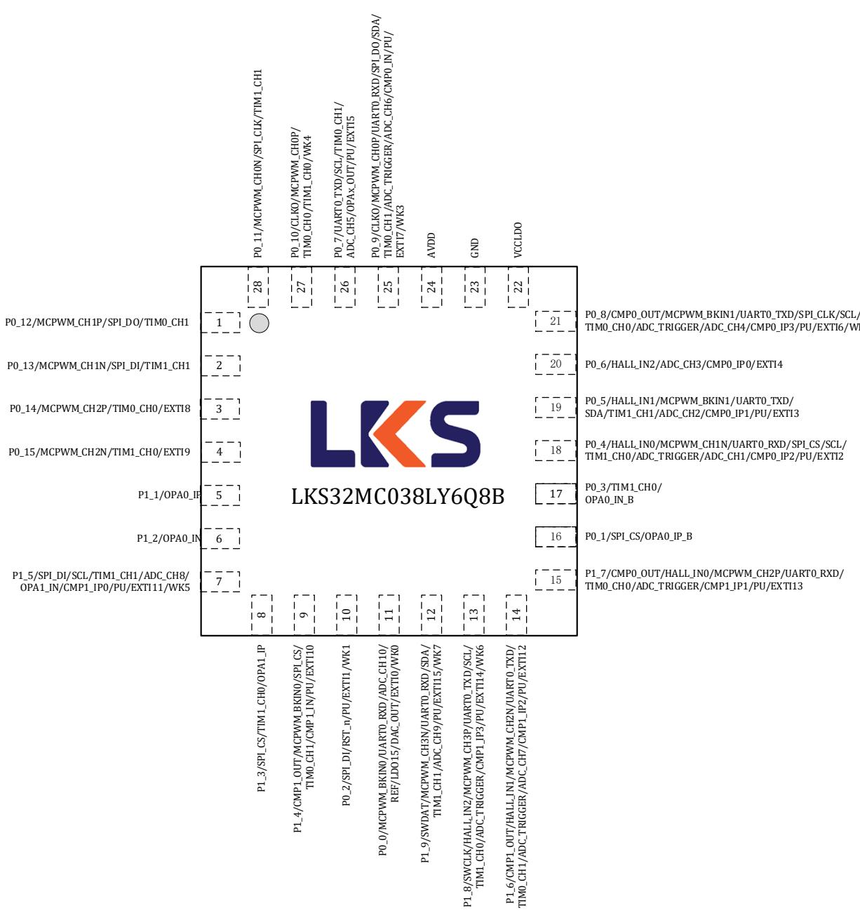

<table><tr><td rowspan="4">1</td><td>P0_12</td><td>P0.12</td></tr><tr><td>MCPWM_CH1P</td><td>PWM 通道 1 高边</td></tr><tr><td>SPI_DO</td><td>SPI 数据输出(输入)</td></tr><tr><td>TIM0_CH1</td><td>Timer0 通道 1</td></tr><tr><td rowspan="4">2</td><td>P0_13</td><td>P0.13</td></tr><tr><td>MCPWM_CH1N</td><td>PWM 通道 1 低边</td></tr><tr><td>SPI_DI</td><td>SPI 数据输入(输出)</td></tr><tr><td>TIM1_CH1</td><td>Timer1 通道 1</td></tr><tr><td>3</td><td>P0_14MCPWM_CH2P</td><td>P0.14PWM通道2高边</td></tr><tr><td rowspan="2"></td><td>TIM0_CH0</td><td>Timer0通道0</td></tr><tr><td>EXTI8</td><td>外部GPIO中断信号8</td></tr><tr><td rowspan="4">4</td><td>P0_15</td><td>P0.15</td></tr><tr><td>MCPWM_CH2N</td><td>PWM通道2低边</td></tr><tr><td>TIM1_CH0</td><td>Timer1通道0</td></tr><tr><td>EXTI9</td><td>外部GPIO中断信号9</td></tr><tr><td rowspan="2">5</td><td>P1_1</td><td>P1.1</td></tr><tr><td>OPA0_IP</td><td>运放0正端输入</td></tr><tr><td rowspan="2">6</td><td>P1_2</td><td>P1.2</td></tr><tr><td>OPA0_IN</td><td>运放0负端输入</td></tr><tr><td rowspan="10">7</td><td>P1_5</td><td>P1.5</td></tr><tr><td>SPI_DI</td><td>SPI数据输入(输出)</td></tr><tr><td>SCL</td><td>I2C时钟</td></tr><tr><td>TIM1_CH1</td><td>Timer1通道1</td></tr><tr><td>ADC_CH8</td><td>ADC通道8</td></tr><tr><td>OPA1_IN</td><td>运放1负端输入</td></tr><tr><td>CMP1_IP0</td><td>比较器1正端输入0</td></tr><tr><td>PU</td><td>内置 $10k\Omega$ 上拉电阻,软件可关闭</td></tr><tr><td>EXTI11</td><td>外部GPIO中断信号11</td></tr><tr><td>WK5</td><td>外部唤醒信号5</td></tr><tr><td rowspan="4">8</td><td>P1_3</td><td>P1.3</td></tr><tr><td>SPI_CS</td><td>SPI片选</td></tr><tr><td>TIM1_CH0</td><td>Timer1通道0</td></tr><tr><td>OPA1_IP</td><td>运放1正端输入</td></tr><tr><td rowspan="8">9</td><td>P1_4</td><td>P1.4</td></tr><tr><td>CMP1_OUT</td><td>比较器1输出</td></tr><tr><td>MCPWM_BKIN0</td><td>PWM停机输入信号0</td></tr><tr><td>SPI_CS</td><td>SPI片选</td></tr><tr><td>TIM0_CH1</td><td>Timer0通道1</td></tr><tr><td>CMP1_IN</td><td>比较器1负端输入</td></tr><tr><td>PU</td><td>内置 $10k\Omega$ 上拉电阻,软件可关闭</td></tr><tr><td>EXTI10</td><td>外部GPIO中断信号10</td></tr><tr><td rowspan="6">10</td><td>P0_2</td><td>P0.2</td></tr><tr><td>SPI_DI</td><td>SPI数据输入(输出)</td></tr><tr><td>RST_n</td><td>复位引脚,P0.2默认用作RSTN。建议接一个 $10nF \sim 100nF$ 的电容到地,并在RSTN和AVDD之间放置一个 $10k \sim 20k$ 的上拉电阻。如果外部有上拉电阻,RSTN的电容应为 $100nF$ 。P0.2可切换为GPIO,切换后可关闭 $10k\Omega$ 上拉电阻。</td></tr><tr><td>PU</td><td>内置 $10k\Omega$ 上拉电阻,软件可关闭</td></tr><tr><td>EXTI1</td><td>外部GPIO中断信号1</td></tr><tr><td>WK1</td><td>外部唤醒信号1</td></tr><tr><td rowspan="2">11</td><td>P0_0</td><td>P0.0</td></tr><tr><td>MCPWM_BKIN0UART0_RXD</td><td>PWM停机输入信号0串口0接收(发送)</td></tr><tr><td rowspan="6"></td><td>ADC_CH10</td><td>ADC通道10</td></tr><tr><td>REF</td><td>参考电压</td></tr><tr><td>LDO15</td><td>1.5V LDO输出</td></tr><tr><td>DAC_OUT</td><td>DAC输出</td></tr><tr><td>EXTI0</td><td>外部GPIO中断信号0</td></tr><tr><td>WK0</td><td>外部唤醒信号0</td></tr><tr><td rowspan="10">12</td><td>P1_9</td><td>P1.9</td></tr><tr><td>SWDAT</td><td>SWD数据</td></tr><tr><td>MCPWM_CH3N</td><td>PWM通道3低边</td></tr><tr><td>UART0_RXD</td><td>串口0接收(发送)</td></tr><tr><td>SDA</td><td>I2C数据</td></tr><tr><td>TIM1_CH1</td><td>Timer1通道1</td></tr><tr><td>ADC_CH9</td><td>ADC通道9</td></tr><tr><td>PU</td><td>内置10kΩ上拉电阻,软件可关闭</td></tr><tr><td>EXTI15</td><td>外部GPIO中断信号15</td></tr><tr><td>WK7</td><td>外部唤醒信号7</td></tr><tr><td rowspan="12">13</td><td>P1_8</td><td>P1.8</td></tr><tr><td>SWCLK</td><td>SWD时钟</td></tr><tr><td>HALL_IN2</td><td>HALL接口输入2</td></tr><tr><td>MCPWM_CH3P</td><td>PWM通道3高边</td></tr><tr><td>UART0_TXD</td><td>串口0发送(接收)</td></tr><tr><td>SCL</td><td>I2C时钟</td></tr><tr><td>TIM1_CH0</td><td>Timer1通道0</td></tr><tr><td>ADC_TRIGGER</td><td>ADC触发信号输出(用于调试)</td></tr><tr><td>CMP1_IP3</td><td>比较器1正端输入3</td></tr><tr><td>PU</td><td>内置10kΩ上拉电阻,软件可关闭</td></tr><tr><td>EXTI14</td><td>外部GPIO中断信号14</td></tr><tr><td>WK6</td><td>外部唤醒信号6</td></tr><tr><td rowspan="11">14</td><td>P1_6</td><td>P1.6</td></tr><tr><td>CMP1_OUT</td><td>比较器1输出</td></tr><tr><td>HALL_IN1</td><td>HALL接口输入1</td></tr><tr><td>MCPWM_CH2N</td><td>PWM通道2低边</td></tr><tr><td>UART0_TXD</td><td>串口0发送(接收)</td></tr><tr><td>TIMO_CH1</td><td>Timer0通道1</td></tr><tr><td>ADC_TRIGGER</td><td>ADC触发信号输出(用于调试)</td></tr><tr><td>ADC_CH7</td><td>ADC通道7</td></tr><tr><td>CMP1_IP2</td><td>比较器1正端输入2</td></tr><tr><td>PU</td><td>内置10kΩ上拉电阻,软件可关闭</td></tr><tr><td>EXTI12</td><td>外部GPIO中断信号12</td></tr><tr><td rowspan="3">15</td><td>P1_7</td><td>P1.7</td></tr><tr><td>CMP0_OUT</td><td>比较器0输出</td></tr><tr><td>HALL_IN0MCPWM_CH2P</td><td>HALL接口输入0PWM通道2高边</td></tr><tr><td rowspan="6"></td><td>UART0_RXD</td><td>串口0接收(发送)</td></tr><tr><td>TIM0_CH0</td><td>Timer0通道0</td></tr><tr><td>ADC_TRIGGER</td><td>ADC触发信号输出(用于调试)</td></tr><tr><td>CMP1_IP1</td><td>比较器1正端输入1</td></tr><tr><td>PU</td><td>内置 $10k\Omega$ 上拉电阻,软件可关闭</td></tr><tr><td>EXTI13</td><td>外部GPIO中断信号13</td></tr><tr><td rowspan="3">16</td><td>P0_1</td><td>P0.1</td></tr><tr><td>SPI_CS</td><td>SPI片选</td></tr><tr><td>OPA0_IP_B</td><td>运放0正端输入B,请留意:OPA0有两组输入信号,如果需要使用B组输入,需要设置SYS_AFE_REG0[5]=1。</td></tr><tr><td rowspan="3">17</td><td>P0_3</td><td>P0.3</td></tr><tr><td>TIM1_CH0</td><td>Timer1通道0</td></tr><tr><td>OPA0_IN_B</td><td>运放0负端输入B,请留意:OPA0有两组输入信号,如果需要使用B组输入,需要设置SYS_AFE_REG0[5]=1。</td></tr><tr><td rowspan="12">18</td><td>P0_4</td><td>P0.4</td></tr><tr><td>HALL_IN0</td><td>HALL接口输入0</td></tr><tr><td>MCPWM_CH1N</td><td>PWM通道1低边</td></tr><tr><td>UART0_RXD</td><td>串口0接收(发送)</td></tr><tr><td>SPI_CS</td><td>SPI片选</td></tr><tr><td>SCL</td><td>I2C时钟</td></tr><tr><td>TIM1_CH0</td><td>Timer1通道0</td></tr><tr><td>ADC_TRIGGER</td><td>ADC触发信号输出(用于调试)</td></tr><tr><td>ADC_CH1</td><td>ADC通道1</td></tr><tr><td>CMP0_IP2</td><td>比较器0正端输入2</td></tr><tr><td>PU</td><td>内置 $10k\Omega$ 上拉电阻,软件可关闭</td></tr><tr><td>EXTI2</td><td>外部GPIO中断信号2</td></tr><tr><td rowspan="10">19</td><td>P0_5</td><td>P0.5</td></tr><tr><td>HALL_IN1</td><td>HALL接口输入1</td></tr><tr><td>MCPWM_BKIN1</td><td>PWM停机输入信号1</td></tr><tr><td>UART0_TXD</td><td>串口0发送(接收)</td></tr><tr><td>SDA</td><td>I2C数据</td></tr><tr><td>TIM1_CH1</td><td>Timer1通道1</td></tr><tr><td>ADC_CH2</td><td>ADC通道2</td></tr><tr><td>CMP0_IP1</td><td>比较器0正端输入1</td></tr><tr><td>PU</td><td>内置 $10k\Omega$ 上拉电阻,软件可关闭</td></tr><tr><td>EXTI3</td><td>外部GPIO中断信号3</td></tr><tr><td rowspan="5">20</td><td>P0_6</td><td>P0.6</td></tr><tr><td>HALL_IN2</td><td>HALL接口输入2</td></tr><tr><td>ADC_CH3</td><td>ADC通道3</td></tr><tr><td>CMP0_IP0</td><td>比较器0正端输入0</td></tr><tr><td>EXTI4</td><td>外部GPIO中断信号4</td></tr><tr><td>21</td><td>P0_8CMP0_OUT</td><td>P0.8比较器0输出</td></tr><tr><td rowspan="11"></td><td>MCPWM_BKIN1</td><td>PWM停机输入信号1</td></tr><tr><td>UART0_TXD</td><td>串口0发送(接收)</td></tr><tr><td>SPI_CLK</td><td>SPI时钟</td></tr><tr><td>SCL</td><td>I2C时钟</td></tr><tr><td>TIM0_CH0</td><td>Timer0通道0</td></tr><tr><td>ADC_TRIGGER</td><td>ADC触发信号输出(用于调试)</td></tr><tr><td>ADC_CH4</td><td>ADC通道4</td></tr><tr><td>CMP0_IP3</td><td>比较器0正端输入3</td></tr><tr><td>PU</td><td>内置 $10k\Omega$ 上拉电阻,软件可关闭</td></tr><tr><td>EXTI6</td><td>外部GPIO中断信号6</td></tr><tr><td>WK2</td><td>外部唤醒信号2</td></tr><tr><td>22</td><td>VCCLDO</td><td>5V LDO供电, $7 \sim 20V$ ,输出电流限制&lt;80mA。去耦电容应&gt;0.33uF,且尽可能靠近该引脚放置。</td></tr><tr><td>23</td><td>GND</td><td>芯片地,强烈建议多个地引脚在PCB上统一接地</td></tr><tr><td>24</td><td>AVDD</td><td>芯片电源,供电范围 $2.2 \sim 5.5V$ </td></tr><tr><td rowspan="13">25</td><td>P0_9</td><td>P0.9</td></tr><tr><td>CLKO</td><td>时钟输出(用于调试)</td></tr><tr><td>MCPWM_CHOP</td><td>PWM通道0高边</td></tr><tr><td>UART0_RXD</td><td>串口0接收(发送)</td></tr><tr><td>SPI_DO</td><td>SPI数据输出(输入)</td></tr><tr><td>SDA</td><td>I2C数据</td></tr><tr><td>TIM0_CH1</td><td>Timer0通道1</td></tr><tr><td>ADC_TRIGGER</td><td>ADC触发信号输出(用于调试)</td></tr><tr><td>ADC_CH6</td><td>ADC通道6</td></tr><tr><td>CMP0_IN</td><td>比较器0负端输入</td></tr><tr><td>PU</td><td>内置 $10k\Omega$ 上拉电阻,软件可关闭</td></tr><tr><td>EXTI7</td><td>外部GPIO中断信号7</td></tr><tr><td>WK3</td><td>外部唤醒信号3</td></tr><tr><td rowspan="8">26</td><td>P0_7</td><td>P0.7</td></tr><tr><td>UART0_TXD</td><td>串口0发送(接收)</td></tr><tr><td>SCL</td><td>I2C时钟</td></tr><tr><td>TIM0_CH1</td><td>Timer0通道1</td></tr><tr><td>ADC_CH5</td><td>ADC通道5</td></tr><tr><td>OPAx_OUT</td><td>运放输出</td></tr><tr><td>PU</td><td>内置 $10k\Omega$ 上拉电阻,软件可关闭</td></tr><tr><td>EXTI5</td><td>外部GPIO中断信号5</td></tr><tr><td rowspan="6">27</td><td>P0_10</td><td>P0.10</td></tr><tr><td>CLKO</td><td>时钟输出(用于调试)</td></tr><tr><td>MCPWM_CHOP</td><td>PWM通道0高边</td></tr><tr><td>TIM0_CH0</td><td>Timer0通道0</td></tr><tr><td>TIM1_CH0</td><td>Timer1通道0</td></tr><tr><td>WK4</td><td>外部唤醒信号4</td></tr></table>

管脚分布

<table><tr><td rowspan="4">28</td><td>P0_11</td><td>P0.11</td></tr><tr><td>MCPWM_CHON</td><td>PWM 通道 0 低边</td></tr><tr><td>SPI_CLK</td><td>SPI 时钟</td></tr><tr><td>TIM1_CH1</td><td>Timer1 通道 1</td></tr></table>

## 3.2 引脚复用

表 3-13 LKS32MC03x 引脚功能选择

<table><tr><td>Port</td><td>AF1</td><td>AF2</td><td>AF3</td><td>AF4</td><td>AF5</td><td>AF6</td><td>AF7</td><td>AF8</td><td>AF9</td><td>AF0</td></tr><tr><td>P0.0</td><td></td><td></td><td>MCPWM_BKIN0</td><td>UART0_R(T)XD</td><td></td><td></td><td></td><td></td><td></td><td>ADC_CH10/REF/LDO15/DAC_OUT</td></tr><tr><td>P0.1</td><td></td><td></td><td></td><td></td><td>SPI_CS</td><td></td><td></td><td></td><td></td><td>OPA0_IP_B</td></tr><tr><td>P0.2</td><td></td><td></td><td></td><td></td><td>SPI_DI(O)</td><td></td><td></td><td></td><td></td><td>RST_n</td></tr><tr><td>P0.3</td><td></td><td></td><td></td><td></td><td></td><td></td><td></td><td>TIM1_CH0</td><td></td><td>OPA0_IN_B</td></tr><tr><td>P0.4</td><td></td><td>HALL_IN0</td><td>MCPWM_CH1N</td><td>UART0_R(T)XD</td><td>SPI_CS</td><td>SCL</td><td></td><td>TIM1_CH0</td><td>ADC_TRIGGER</td><td>ADC_CH1/CMP0_IP2</td></tr><tr><td>P0.5</td><td></td><td>HALL_IN1</td><td>MCPWM_BKIN1</td><td>UART0_T(R)XD</td><td></td><td>SDA</td><td></td><td>TIM1_CH1</td><td></td><td>ADC_CH2/CMP0_IP1</td></tr><tr><td>P0.6</td><td></td><td>HALL_IN2</td><td></td><td></td><td></td><td></td><td></td><td></td><td></td><td>ADC_CH3/CMP0_IP0</td></tr><tr><td>P0.7</td><td></td><td></td><td></td><td>UART0_T(R)XD</td><td></td><td>SCL</td><td>TIM0_CH1</td><td></td><td></td><td>ADC_CH5/OPAx_OUT</td></tr><tr><td>P0.8</td><td>CMP0_OUT</td><td></td><td>MCPWM_BKIN1</td><td>UART0_T(R)XD</td><td>SPI_CLK</td><td>SCL</td><td>TIM0_CH0</td><td></td><td>ADC_TRIGGER</td><td>ADC_CH4/CMP0_IP3</td></tr><tr><td>P0.9</td><td>CLKO</td><td></td><td>MCPWM_CH0P</td><td>UART0_R(T)XD</td><td>SPI_DO(I)</td><td>SDA</td><td>TIM0_CH1</td><td></td><td>ADC_TRIGGER</td><td>CMP0_IN</td></tr><tr><td>P0.10</td><td>CLKO</td><td></td><td>MCPWM_CH0P</td><td></td><td></td><td></td><td>TIM0_CH0</td><td>TIM1_CH0</td><td></td><td>ADC_CH6</td></tr><tr><td>P0.11</td><td></td><td></td><td>MCPWM_CH0N</td><td></td><td>SPI_CLK</td><td></td><td></td><td>TIM1_CH1</td><td></td><td></td></tr><tr><td>P0.12</td><td></td><td></td><td>MCPWM_CH1P</td><td></td><td>SPI_DO(I)</td><td></td><td>TIM0_CH1</td><td></td><td></td><td></td></tr><tr><td>P0.13</td><td></td><td></td><td>MCPWM_CH1N</td><td></td><td>SPI_DI(O)</td><td></td><td></td><td>TIM1_CH1</td><td></td><td></td></tr><tr><td>P0.14</td><td></td><td></td><td>MCPWM_CH2P</td><td></td><td></td><td></td><td>TIM0_CH0</td><td></td><td></td><td></td></tr><tr><td>P0.15</td><td></td><td></td><td>MCPWM_CH2N</td><td></td><td></td><td></td><td></td><td>TIM1_CH0</td><td></td><td>ADC_CH7</td></tr></table>

## 管脚分布

<table><tr><td>Port</td><td>AF1</td><td>AF2</td><td>AF3</td><td>AF4</td><td>AF5</td><td>AF6</td><td>AF7</td><td>AF8</td><td>AF9</td><td>AF0</td></tr><tr><td>P1.1</td><td></td><td></td><td></td><td></td><td></td><td></td><td></td><td></td><td></td><td>OPA0_IP</td></tr><tr><td>P1.2</td><td></td><td></td><td></td><td></td><td></td><td></td><td></td><td></td><td></td><td>OPA0_IN</td></tr><tr><td>P1.3</td><td></td><td></td><td></td><td></td><td>SPI_CS</td><td></td><td></td><td>TIM1_CH0</td><td></td><td>OPA1_IP</td></tr><tr><td>P1.4</td><td>CMP1_OUT</td><td></td><td></td><td></td><td>SPI_CS</td><td></td><td>TIM0_CH1</td><td></td><td></td><td>CMP1_IN</td></tr><tr><td>P1.5</td><td></td><td></td><td>MCPWM_BKIN0</td><td></td><td>SPI_DI(O)</td><td>SCL</td><td></td><td>TIM1_CH1</td><td></td><td>OPA1_IN/CMP1_IP0</td></tr><tr><td>P1.6</td><td>CMP1_OUT</td><td>HALL_IN1</td><td>MCPWM_CH2N</td><td>UART0_T(R)XD</td><td></td><td></td><td>TIM0_CH1</td><td></td><td>ADC_TRIGGER</td><td>CMP1_IP2</td></tr><tr><td>P1.7</td><td>CMP0_OUT</td><td>HALL_IN0</td><td>MCPWM_CH2P</td><td>UART0_R(T)XD</td><td></td><td></td><td>TIM0_CH0</td><td></td><td>ADC_TRIGGER</td><td>CMP1_IP1</td></tr><tr><td>P1.8</td><td>SWCLK</td><td>HALL_IN2</td><td>MCPWM_CH3P</td><td>UART0_T(R)XD</td><td></td><td>SCL</td><td></td><td>TIM1_CH0</td><td>ADC_TRIGGER</td><td>CMP1_IP3</td></tr><tr><td>P1.9</td><td>SWDAT</td><td></td><td>MCPWM_CH3N</td><td>UART0_R(T)XD</td><td></td><td>SDA</td><td></td><td>TIM1_CH1</td><td></td><td>ADC_CH9</td></tr></table>

## 管脚分布

表 3-14 LKS32MC03xB 引脚功能选择

<table><tr><td>Port</td><td>AF1</td><td>AF2</td><td>AF3</td><td>AF4</td><td>AF5</td><td>AF6</td><td>AF7</td><td>AF8</td><td>AF9</td><td>AF0</td></tr><tr><td>P0.0</td><td></td><td></td><td>MCPWM_BKIN0</td><td>UART0_R(T)XD</td><td></td><td></td><td></td><td></td><td></td><td>ADC_CH10/REF/LDO15/DAC_OUT</td></tr><tr><td>P0.1</td><td></td><td></td><td></td><td></td><td>SPI_CS</td><td></td><td></td><td></td><td></td><td>OPA0_IP_B</td></tr><tr><td>P0.2</td><td></td><td></td><td></td><td></td><td>SPI_DI(O)</td><td></td><td></td><td></td><td></td><td>RST_n</td></tr><tr><td>P0.3</td><td></td><td></td><td></td><td></td><td></td><td></td><td></td><td>TIM1_CH0</td><td></td><td>OPA0_IN_B</td></tr><tr><td>P0.4</td><td></td><td>HALL_IN0</td><td>MCPWM_CH1N</td><td>UART0_R(T)XD</td><td>SPI_CS</td><td>SCL</td><td></td><td>TIM1_CH0</td><td>ADC_TRIGGER</td><td>ADC_CH1/CMP0_IP2</td></tr><tr><td>P0.5</td><td></td><td>HALL_IN1</td><td>MCPWM_BKIN1</td><td>UART0_T(R)XD</td><td></td><td></td><td></td><td>TIM1_CH1</td><td></td><td>ADC_CH2/CMP0_IP1</td></tr><tr><td>P0.6</td><td></td><td>HALL_IN2</td><td></td><td></td><td></td><td></td><td></td><td></td><td></td><td>ADC_CH3/CMP0_IP0</td></tr><tr><td>P0.7</td><td></td><td></td><td></td><td>UART0_T(R)XD</td><td></td><td>SCL</td><td>TIM0_CH1</td><td></td><td></td><td>ADC_CH5/OPAx_OUT</td></tr><tr><td>P0.8</td><td>CMP0_OUT</td><td></td><td>MCPWM_BKIN1</td><td>UART0_T(R)XD</td><td>SPI_CLK</td><td>SCL</td><td>TIM0_CH0</td><td></td><td>ADC_TRIGGER</td><td>ADC_CH4/CMP0_IP3</td></tr><tr><td>P0.9</td><td>CLKO</td><td></td><td>MCPWM_CH0P</td><td>UART0_R(T)XD</td><td>SPI_DO(I)</td><td>SDA</td><td>TIM0_CH1</td><td></td><td>ADC_TRIGGER</td><td>ADC_CH6/CMP0_IN</td></tr><tr><td>P0.10</td><td>CLKO</td><td></td><td>MCPWM_CH0P</td><td></td><td></td><td></td><td>TIM0_CH0</td><td>TIM1_CH0</td><td></td><td></td></tr><tr><td>P0.11</td><td></td><td></td><td>MCPWM_CH0N</td><td></td><td>SPI_CLK</td><td></td><td></td><td>TIM1_CH1</td><td></td><td></td></tr><tr><td>P0.12</td><td></td><td></td><td>MCPWM_CH1P</td><td></td><td>SPI_DO(I)</td><td></td><td>TIM0_CH1</td><td></td><td></td><td></td></tr><tr><td>P0.13</td><td></td><td></td><td>MCPWM_CH1N</td><td></td><td>SPI_DI(O)</td><td></td><td></td><td>TIM1_CH1</td><td></td><td></td></tr><tr><td>P0.14</td><td></td><td></td><td>MCPWM_CH2P</td><td></td><td></td><td></td><td>TIM0_CH0</td><td></td><td></td><td></td></tr><tr><td>P0.15</td><td></td><td></td><td>MCPWM_CH2N</td><td></td><td></td><td></td><td></td><td>TIM1_CH0</td><td></td><td></td></tr></table>

## 管脚分布

<table><tr><td>Port</td><td>AF1</td><td>AF2</td><td>AF3</td><td>AF4</td><td>AF5</td><td>AF6</td><td>AF7</td><td>AF8</td><td>AF9</td><td>AF0</td></tr><tr><td>P1.1</td><td></td><td></td><td></td><td></td><td></td><td></td><td></td><td></td><td></td><td>OPA0_IP</td></tr><tr><td>P1.2</td><td></td><td></td><td></td><td></td><td></td><td></td><td></td><td></td><td></td><td>OPA0_IN</td></tr><tr><td>P1.3</td><td></td><td></td><td></td><td></td><td>SPI_CS</td><td></td><td></td><td>TIM1_CH0</td><td></td><td>OPA1_IP</td></tr><tr><td>P1.4</td><td>CMP1_OUT</td><td></td><td></td><td></td><td>SPI_CS</td><td></td><td>TIM0_CH1</td><td></td><td></td><td>CMP1_IN</td></tr><tr><td>P1.5</td><td></td><td></td><td>MCPWM_BKIN0</td><td></td><td>SPI_DI(O)</td><td>SCL</td><td></td><td>TIM1_CH1</td><td></td><td>ADC_CH8/OPA1_IN/CMP1_IP0</td></tr><tr><td>P1.6</td><td>CMP1_OUT</td><td>HALL_IN1</td><td>MCPWM_CH2N</td><td>UART0_T(R)XD</td><td></td><td></td><td>TIM0_CH1</td><td></td><td>ADC_TRIGGER</td><td>ADC_CH7/CMP1_IP2</td></tr><tr><td>P1.7</td><td>CMP0_OUT</td><td>HALL_IN0</td><td>MCPWM_CH2P</td><td>UART0_R(T)XD</td><td></td><td></td><td>TIM0_CH0</td><td></td><td>ADC_TRIGGER</td><td>CMP1_IP1</td></tr><tr><td>P1.8</td><td>SWCLK</td><td>HALL_IN2</td><td>MCPWM_CH3P</td><td>UART0_T(R)XD</td><td></td><td>SCL</td><td></td><td>TIM1_CH0</td><td>ADC_TRIGGER</td><td>CMP1_IP3</td></tr><tr><td>P1.9</td><td>SWDAT</td><td></td><td>MCPWM_CH3N</td><td>UART0_R(T)XD</td><td></td><td>SDA</td><td></td><td>TIM1_CH1</td><td></td><td>ADC_CH9</td></tr></table>

## 4 封装尺寸

## 4.1 LKS32MC033H6P8(B/C)

TSSOP20L：

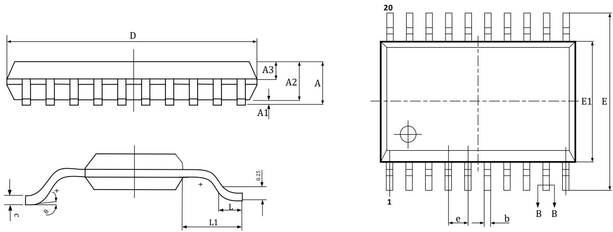  
图 4-1 LKS32MC033H6P8(B/C)封装图示

表 4-1 LKS32MC033H6P8(B/C)封装尺寸

<table><tr><td rowspan="2">Symbol</td><td colspan="3">TSSOP20</td></tr><tr><td>Min</td><td>Nom</td><td>Max</td></tr><tr><td>A</td><td>--</td><td>--</td><td>1.20</td></tr><tr><td>A1</td><td>0.05</td><td>--</td><td>0.15</td></tr><tr><td>A2</td><td>0.80</td><td>1.00</td><td>1.05</td></tr><tr><td>A3</td><td>0.39</td><td>0.44</td><td>0.49</td></tr><tr><td>b</td><td>0.20</td><td>--</td><td>0.25</td></tr><tr><td>b1</td><td>0.19</td><td>0.22</td><td>0.25</td></tr><tr><td>c</td><td>0.13</td><td>--</td><td>0.18</td></tr><tr><td>c1</td><td>0.12</td><td>0.13</td><td>0.14</td></tr><tr><td>D</td><td>6.40</td><td>6.50</td><td>6.50</td></tr><tr><td>E</td><td>6.20</td><td>6.40</td><td>6.60</td></tr><tr><td>E1</td><td>4.30</td><td>4.40</td><td>4.50</td></tr><tr><td>e</td><td colspan="3">0.65BSC</td></tr><tr><td>L</td><td>0.45</td><td>0.60</td><td>0.75</td></tr><tr><td>L1</td><td colspan="3">1.00BSC</td></tr><tr><td>θ</td><td>0</td><td>--</td><td>8°</td></tr></table>

## 4.2 LKS32MC033H6Q8(B/C)

## QFN3\*3 20L-0.75 Profile Quad Flat Package:

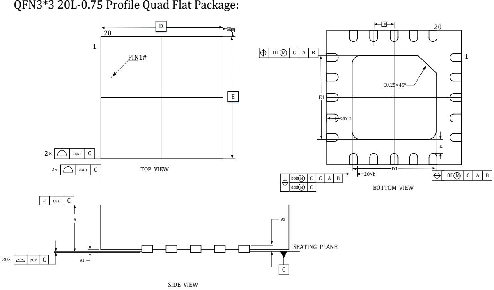  
图 4-2 LKS32MC033H6Q8(B/C)封装图示

表 4-2 LKS32MC033H6Q8(B/C)封装尺寸

<table><tr><td>SYMBOL</td><td>MIN.</td><td>NOM.</td><td>MAX.</td></tr><tr><td>A</td><td>0.50</td><td>0.55</td><td>0.60</td></tr><tr><td>A1</td><td>0</td><td>0.02</td><td>0.05</td></tr><tr><td>A3</td><td>-</td><td>0.152 REF</td><td>-</td></tr><tr><td>b</td><td>0.15</td><td>0.20</td><td>0.25</td></tr><tr><td>D</td><td colspan="3">3.00BSC</td></tr><tr><td>E</td><td colspan="3">3.00BSC</td></tr><tr><td>D1</td><td>1.60</td><td>1.70</td><td>1.80</td></tr><tr><td>E1</td><td>1.60</td><td>1.70</td><td>1.80</td></tr><tr><td>e</td><td colspan="3">0.40BSC</td></tr><tr><td>L</td><td>0.25</td><td>0.30</td><td>0.35</td></tr><tr><td>K</td><td>0.20</td><td>-</td><td>-</td></tr><tr><td>aaa</td><td colspan="3">0.10</td></tr><tr><td>bbb</td><td colspan="3">0.07</td></tr><tr><td>ccc</td><td colspan="3">0.10</td></tr><tr><td>ddd</td><td colspan="3">0.05</td></tr><tr><td>eee</td><td colspan="3">0.08</td></tr><tr><td>fff</td><td colspan="3">0.10</td></tr></table>

## 4.3 LKS32MC037M6S8(B/C)/LKS32MC037LM6S8(B/C)

SSOP24L:

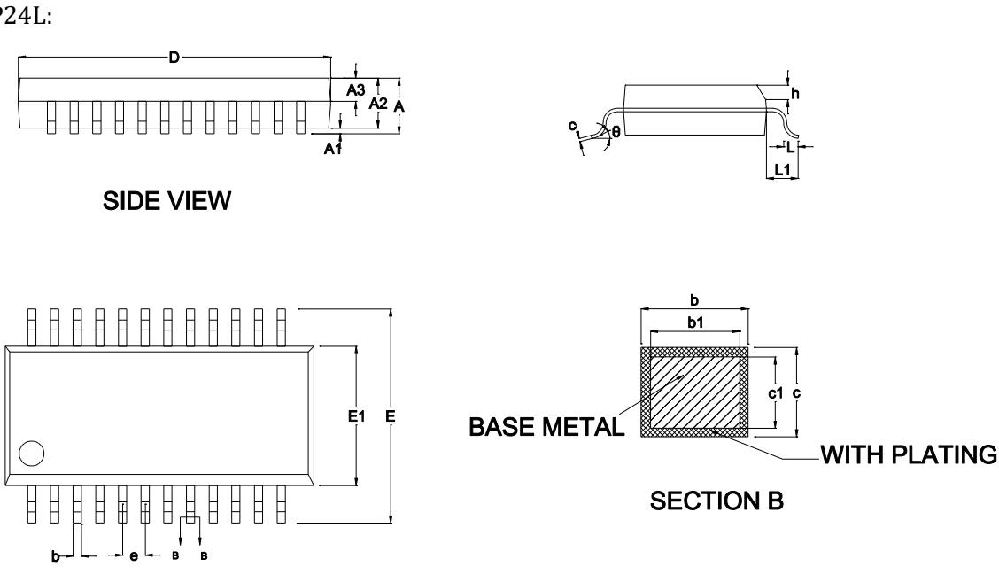  
图 4-3 LKS32MC037(L)M6S8(B/C)封装图示

表 4-3 LKS32MC037(L)M6S8(B/C)封装尺寸

<table><tr><td rowspan="2">SYMBOL</td><td colspan="3">MILLIMETER</td></tr><tr><td>MIN</td><td>NOM</td><td>MAX</td></tr><tr><td>A</td><td>-</td><td>-</td><td>1.75</td></tr><tr><td>A1</td><td>0.10</td><td>0.15</td><td>0.25</td></tr><tr><td>A2</td><td>1.30</td><td>1.40</td><td>1.50</td></tr><tr><td>A3</td><td>0.60</td><td>0.65</td><td>0.70</td></tr><tr><td>b</td><td>0.23</td><td>-</td><td>0.31</td></tr><tr><td>b1</td><td>0.22</td><td>0.25</td><td>0.28</td></tr><tr><td>c</td><td>0.20</td><td>-</td><td>0.24</td></tr><tr><td>c1</td><td>0.19</td><td>0.20</td><td>0.21</td></tr><tr><td>D</td><td>8.55</td><td>8.65</td><td>8.75</td></tr><tr><td>E</td><td>5.80</td><td>6.00</td><td>6.20</td></tr><tr><td>E1</td><td>3.80</td><td>3.90</td><td>4.00</td></tr><tr><td>e</td><td colspan="3">0.635BSC</td></tr><tr><td>h</td><td>0.30</td><td>-</td><td>0.50</td></tr><tr><td>L</td><td>0.50</td><td>-</td><td>0.80</td></tr><tr><td>L1</td><td colspan="3">1.05REF</td></tr><tr><td>θ</td><td>0</td><td>-</td><td>8°</td></tr></table>

## 4.4 LKS32MC038Y6P8(B/C)/LKS32MC038LY6P8(B/C)

TSSOP28L:

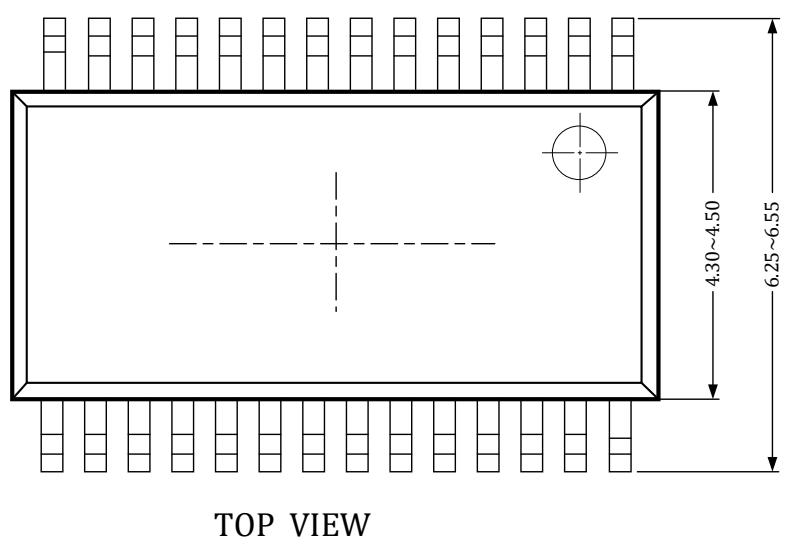

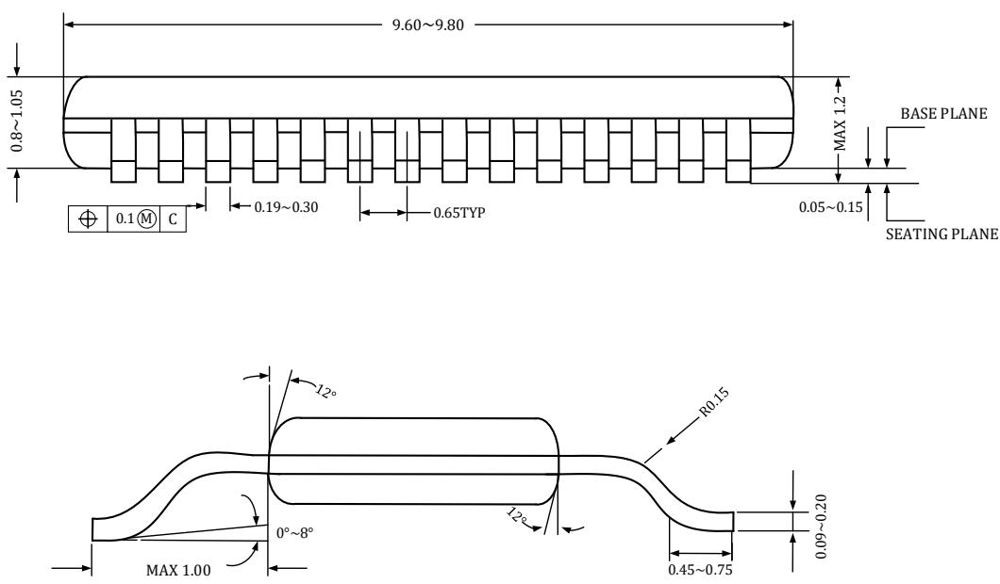  
图 4-4 LKS32MC038Y6P8(B/C)封装图示

## 4.5 LKS32MC038LY6Q8(B/C)

QFN4\*4 28L-0.75 Profile Quad Flat Package:

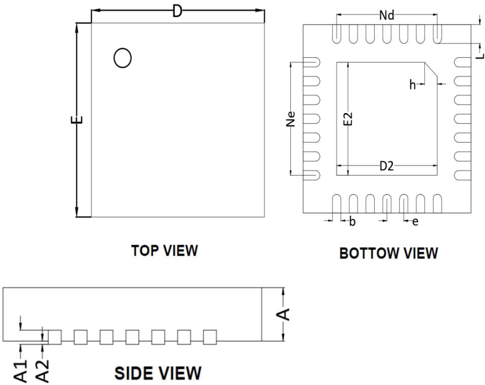  
图 4-5 LKS32MC038LY6Q8(B/C)封装图示

表 4-4 LKS32MC038LY6Q8(B/C)封装尺寸

<table><tr><td rowspan="2">SYMBOL</td><td colspan="3">MILLIMETER</td></tr><tr><td>MIN</td><td>NOM</td><td>MAX</td></tr><tr><td>A</td><td>0.70</td><td>0.75</td><td>0.80</td></tr><tr><td>A1</td><td colspan="3">0.203 REF</td></tr><tr><td>A2</td><td>0.00</td><td>0.02</td><td>0.05</td></tr><tr><td>D</td><td>3.90</td><td>4.00</td><td>4.10</td></tr><tr><td>E</td><td>3.90</td><td>4.00</td><td>4.10</td></tr><tr><td>D2</td><td>2.30</td><td>2.40</td><td>2.50</td></tr><tr><td>E2</td><td>2.30</td><td>2.40</td><td>2.50</td></tr><tr><td>e</td><td colspan="3">0.40 BSC</td></tr><tr><td>Nd</td><td colspan="3">2.40 BSC</td></tr><tr><td>Ne</td><td colspan="3">2.40 BSC</td></tr><tr><td>L</td><td>0.35</td><td>0.40</td><td>0.45</td></tr><tr><td>b</td><td>0.15</td><td>0.20</td><td>0.25</td></tr><tr><td>h</td><td>0.30</td><td>0.35</td><td>0.40</td></tr></table>

## 4.6 LKS32MC032LK6T8C

LQFP32

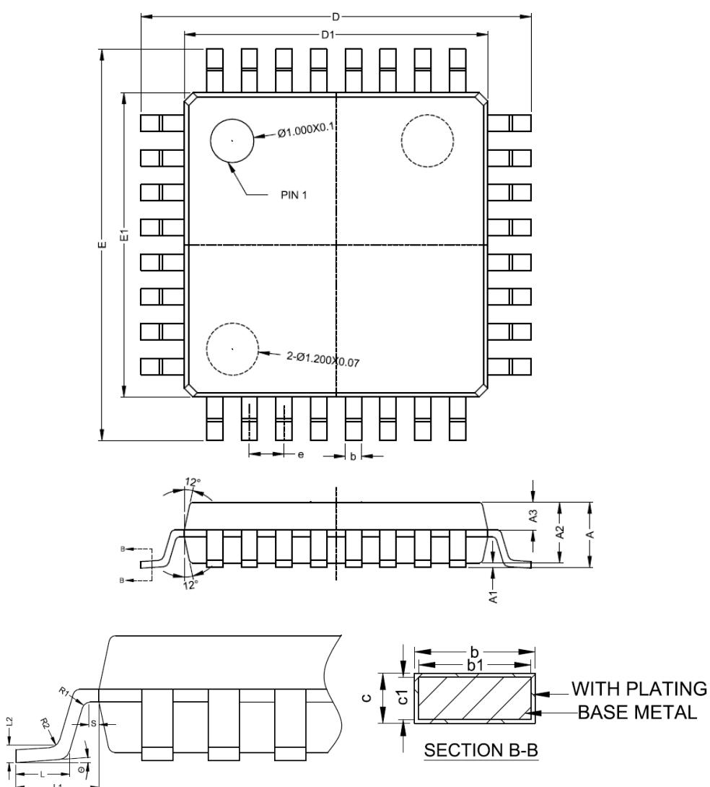  
图 4-6 LKS32MC032LK6T8C 封装图示

表 4-4 LKS32MC032LK6T8C 封装尺寸

<table><tr><td rowspan="2">SYMBOL</td><td colspan="3">MILLIMETER</td></tr><tr><td>MIN</td><td>NOM</td><td>MAX</td></tr><tr><td>A</td><td>-</td><td>-</td><td>0.80</td></tr><tr><td>A1</td><td>0.05</td><td>0.10</td><td>0.15</td></tr><tr><td>A2</td><td>1.35</td><td>1.40</td><td>1.45</td></tr><tr><td>A3</td><td>0.59</td><td>0.64</td><td>0.69</td></tr><tr><td>b</td><td>0.32</td><td>-</td><td>0.43</td></tr><tr><td>b1</td><td>0.31</td><td>0.35</td><td>0.39</td></tr><tr><td>c</td><td>0.13</td><td>-</td><td>0.18</td></tr><tr><td>c1</td><td>0.12</td><td>0.13</td><td>0.14</td></tr><tr><td>D</td><td>8.80</td><td>9.00</td><td>9.20</td></tr><tr><td>D1</td><td>6.90</td><td>7.00</td><td>7.10</td></tr><tr><td>E</td><td>8.80</td><td>9.00</td><td>9.20</td></tr><tr><td>E1</td><td>6.90</td><td>7.00</td><td>7.10</td></tr><tr><td>e</td><td colspan="3">0.80BSC</td></tr><tr><td>L</td><td>0.45</td><td>-</td><td>0.75</td></tr><tr><td>L1</td><td colspan="3">1.00REF</td></tr><tr><td>L2</td><td colspan="3">0.25BSC</td></tr><tr><td>R1</td><td>0.08</td><td>-</td><td>-</td></tr><tr><td>R2</td><td>0.08</td><td>-</td><td>0.20</td></tr><tr><td>s</td><td>0.20</td><td>-</td><td>-</td></tr><tr><td>θ</td><td>0°</td><td>3.5°</td><td>7°</td></tr></table>

## 5 电气性能参数

表 5-1 LKS32MC03x 电气极限参数

<table><tr><td>参数</td><td>最小</td><td>最大</td><td>单位</td><td>说明</td></tr><tr><td>MCU 电源电压(AVDD)</td><td>-0.3</td><td>+6.0</td><td>V</td><td></td></tr><tr><td>工作温度</td><td>-40</td><td>+105</td><td>°C</td><td></td></tr><tr><td>电源电压(VCCLDO)</td><td>-0.3</td><td>+30.0</td><td>V</td><td>LDO 供电的引脚</td></tr><tr><td>5V LDO 输出电流</td><td></td><td>100</td><td>mA</td><td></td></tr><tr><td>存储温度</td><td>-40</td><td>+150</td><td>°C</td><td></td></tr><tr><td>结温</td><td>-</td><td>125</td><td>°C</td><td></td></tr><tr><td>引脚温度</td><td>-</td><td>260</td><td>°C</td><td>焊接,10 秒</td></tr></table>

表 5-2 LKS32MC03x 建议工况参数

<table><tr><td>参数</td><td>最小</td><td>典型</td><td>最大</td><td>单位</td><td>说明</td></tr><tr><td>MCU 电源电压(AVDD)</td><td>2.5</td><td>5</td><td>5.5</td><td>V</td><td></td></tr><tr><td rowspan="2">模拟工作电压(AVDDA)</td><td>2.8</td><td>5</td><td>5.5</td><td>V</td><td>REF2VDD=0, ADC 选择 2.4V 内部基准</td></tr><tr><td>2.4</td><td>5</td><td>5.5</td><td>V</td><td>REF2VDD=1, ADC 选择 AVDD 为基准</td></tr><tr><td>LDO 电源电压(VCCLDO)</td><td>7</td><td></td><td>20</td><td>V</td><td>LDO 供电引脚</td></tr></table>

运算放大器可以在2.5V下工作，但输出幅度受限。

表 5-3 LKS32MC03x ESD 性能参数

<table><tr><td>项目</td><td>最小</td><td>最大</td><td>单位</td></tr><tr><td>ESD测试 (HBM)</td><td>-6000</td><td>6000</td><td>V</td></tr></table>

根据《MIL-STD-883J Method 3015.9》，在 25℃，55%相对湿度环境下，在被测芯片的所有 IO 引脚施加进行静电放电 3 次，每次间隔 1s。测试结果显示芯片抗静电放电等级达到 Class $3 \mathrm { A } \cong 4 0 0 0 \mathrm { V }$ , ＜8000V。

表 5-4 LKS32MC03x Latch-up 性能参数

<table><tr><td>项目</td><td>最小</td><td>最大</td><td>单位</td></tr><tr><td>Latch-up电流 (85°C)</td><td>-200</td><td>200</td><td>mA</td></tr></table>

根据《JEDEC STANDARD NO.78E NOVEMBER 2016》，对所有电源 IO 施加过压 8V，在每个信号 IO上注入200mA电流。测试结果显示芯片抗拴锁等级为 200mA。

表 5-5 LKS32MC03x IO 极限参数

<table><tr><td>参数</td><td>描述</td><td>最小</td><td>最大</td><td>单位</td></tr><tr><td> $V_{IN}$ </td><td>GPIO信号输入电压范围</td><td>-0.3</td><td>6.0</td><td>V</td></tr><tr><td> $I_{INJ\_PAD}$ </td><td>单个GPIO最大注入电流</td><td>-11.2</td><td>11.2</td><td>mA</td></tr><tr><td> $I_{INJ\_SUM}$ </td><td>所有GPIO最大注入电流</td><td>-50</td><td>50</td><td>mA</td></tr></table>

表 5-6 LKS32MC03x IO DC 参数

<table><tr><td>参数</td><td>描述</td><td>AVDD</td><td>条件</td><td>最小</td><td>最大</td><td>单位</td></tr><tr><td rowspan="2"> $V_{IH}$ </td><td rowspan="2">数字IO输入高电压</td><td>5V</td><td rowspan="2">-</td><td>0.7*AVDD</td><td rowspan="2"></td><td rowspan="2">V</td></tr><tr><td>3.3V</td><td>2.0</td></tr><tr><td rowspan="2"> $V_{IL}$ </td><td rowspan="2">数字IO输入低电压</td><td>5V</td><td rowspan="2">-</td><td rowspan="2"></td><td>0.3*AVDD</td><td rowspan="2">V</td></tr><tr><td>3.3V</td><td>0.8</td></tr><tr><td rowspan="2"> $V_{HYS}$ </td><td rowspan="2">施密特迟滞范围</td><td>5V</td><td rowspan="2">-</td><td rowspan="2">0.1*AVDD</td><td rowspan="2"></td><td rowspan="2">V</td></tr><tr><td>3.3V</td></tr><tr><td rowspan="2"> $I_{IH}$ </td><td rowspan="2">数字IO输入高电压,电流消耗</td><td>5V</td><td rowspan="2">-</td><td rowspan="2"></td><td rowspan="2">1</td><td rowspan="2">uA</td></tr><tr><td>3.3V</td></tr><tr><td rowspan="2"> $I_{IL}$ </td><td rowspan="2">数字IO输入低电压,电流消耗</td><td>5V</td><td rowspan="2">-</td><td rowspan="2">-1</td><td rowspan="2"></td><td rowspan="2">uA</td></tr><tr><td>3.3V</td></tr><tr><td> $V_{OH}$ </td><td>数字IO输出高电压</td><td></td><td>最大驱动电流11.2mA</td><td>AVDD-0.8</td><td></td><td>V</td></tr><tr><td> $V_{OL}$ </td><td>数字IO输出低电压</td><td></td><td>最大驱动电流11.2mA</td><td></td><td>0.5</td><td>V</td></tr><tr><td> $R_{pup}$ </td><td>上拉电阻大小*</td><td></td><td></td><td>8</td><td>12</td><td>kΩ</td></tr><tr><td> $R_{io-ana}$ </td><td>IO与内部模拟电路间连接电阻</td><td></td><td></td><td>100</td><td>200</td><td>Ω</td></tr><tr><td rowspan="2"> $C_{IN}$ </td><td rowspan="2">数字IO输入电容</td><td>5V</td><td rowspan="2">-</td><td rowspan="2"></td><td rowspan="2">10</td><td rowspan="2">pF</td></tr><tr><td>3.3V</td></tr></table>

\*仅部分IO 内置上拉，详见引脚说明章节

表 5-7 LKS32MC03x 电流消耗 IDDQ

<table><tr><td>主时钟</td><td>工况</td><td>3.3V</td><td>5V</td><td>单位</td></tr><tr><td>48MHz</td><td>开启CPU、flash、SRAM、MCPWM、Timer、以及所有模拟模块,IO不动作</td><td>8.570</td><td>8.650</td><td>mA</td></tr><tr><td>4MHz</td><td rowspan="2">开启CPU、flash、SRAM、MCPWM、Timer、以及除PLL之外的所有模拟模块,IO不动作</td><td>3.012</td><td>3.165</td><td>mA</td></tr><tr><td>64kHz</td><td>2.445</td><td>2.618</td><td>mA</td></tr><tr><td>-</td><td>深度休眠,关闭PLL,BGP等,只保留64kHz LRC</td><td>27</td><td>30</td><td>uA</td></tr><tr><td>-</td><td>所有模拟模块</td><td>2.4</td><td>2.55</td><td>mA</td></tr></table>

以上测试如无特别标注，均为室温 25°下测量，由于制造工艺存在器件模型偏差，不同芯片的电流消耗会存在个体差异。

## 6 模拟性能参数

表 6-1 LKS32MC03x 模拟性能参数

<table><tr><td>参数</td><td>最小</td><td>典型</td><td>最大</td><td>单位</td><td>说明</td></tr><tr><td colspan="6">ADC</td></tr><tr><td rowspan="2">工作电源</td><td>2.8</td><td>5</td><td>5.5</td><td>V</td><td>REF2VDD=0, ADC选择2.4V内部基准</td></tr><tr><td>2.4</td><td>5</td><td>5.5</td><td>V</td><td>REF2VDD=1, ADC选择AVDD为基准</td></tr><tr><td>输出码率</td><td></td><td>1.2</td><td></td><td>MHz</td><td> $f_{adc}/20$ </td></tr><tr><td rowspan="2">差分输入信号范围</td><td>-2.352</td><td></td><td>+2.352</td><td>V</td><td>REF2VDD=0, Gain=1; REF=2.4V</td></tr><tr><td>-3.528</td><td></td><td>+3.528</td><td>V</td><td>REF2VDD=0, Gain=2/3; REF=3.6V</td></tr><tr><td rowspan="4">单端输入信号范围</td><td>-0.3</td><td></td><td>+2.352</td><td>V</td><td>REF2VDD=0, Gain=1; REF=2.4V</td></tr><tr><td>-0.3</td><td></td><td>+3.528</td><td>V</td><td>REF2VDD=0, Gain=2/3; REF=3.6V</td></tr><tr><td>-0.3</td><td></td><td>AVDD*0.9</td><td>V</td><td>REF2VDD=1, Gain=1; REF=AVDD</td></tr><tr><td>-0.3</td><td></td><td>AVDD+0.3</td><td>V</td><td>REF2VDD=1, Gain=2/3, REF=AVDD,受限于IO钳位</td></tr><tr><td colspan="6">差分信号通常为芯片内部OPA输出至ADC的信号;单端信号通常为外部通过IO输入的被采样信号;无论使用内部/外部基准,ADC测量信号幅度均不应超过满量程的±98%,特别地,当使用外部基准时,建议采样信号不超过量程的90%。</td></tr><tr><td>直流失调(offset)</td><td></td><td>5</td><td>10</td><td>mV</td><td>可校正</td></tr><tr><td>有效位数(ENOB)</td><td>10.5</td><td>11</td><td></td><td>bit</td><td></td></tr><tr><td>INL</td><td></td><td>2</td><td>3</td><td>LSB</td><td></td></tr><tr><td>DNL</td><td></td><td>1</td><td>2</td><td>LSB</td><td></td></tr><tr><td>SNR</td><td>63</td><td>66</td><td></td><td>dB</td><td></td></tr><tr><td>输入电阻</td><td>500k</td><td></td><td></td><td>Ohm</td><td></td></tr><tr><td>输入电容</td><td></td><td>10pF</td><td></td><td>F</td><td></td></tr><tr><td colspan="6">基准电压(REF)</td></tr><tr><td>工作电源</td><td>2.5</td><td>5</td><td>5.5</td><td>V</td><td></td></tr><tr><td>输出偏差</td><td>-9</td><td></td><td>9</td><td>mV</td><td></td></tr><tr><td>电源抑制比</td><td></td><td>70</td><td></td><td>dB</td><td></td></tr><tr><td>温度系数</td><td></td><td>20</td><td></td><td>ppm/°C</td><td></td></tr><tr><td>输出电压</td><td></td><td>2.4</td><td></td><td>V</td><td></td></tr><tr><td colspan="6">DAC</td></tr><tr><td>工作电源</td><td>2.5</td><td>5</td><td>5.5</td><td>V</td><td></td></tr><tr><td>负载电阻</td><td>50k</td><td></td><td></td><td>Ohm</td><td rowspan="3"></td></tr><tr><td>负载电容</td><td></td><td></td><td>50p</td><td>F</td></tr><tr><td>输出电压范围</td><td>0.05</td><td></td><td>3</td><td>V</td></tr><tr><td>转换速度</td><td></td><td></td><td>1M</td><td>Hz</td><td></td></tr><tr><td>DNL</td><td></td><td>1</td><td>2</td><td>LSB</td><td></td></tr><tr><td>INL</td><td></td><td>2</td><td>4</td><td>LSB</td><td></td></tr><tr><td>OFFSET</td><td></td><td>5</td><td>10</td><td>mV</td><td></td></tr><tr><td>SNR</td><td>57</td><td>60</td><td>66</td><td>dB</td><td></td></tr><tr><td colspan="6">运放(OPA)</td></tr><tr><td>工作电源</td><td>3.1</td><td>5</td><td>5.5</td><td>V</td><td></td></tr><tr><td>带宽</td><td></td><td>10M</td><td>20M</td><td>Hz</td><td></td></tr><tr><td>负载电阻</td><td>20k</td><td></td><td></td><td>Ohm</td><td></td></tr><tr><td>负载电容</td><td></td><td></td><td>5p</td><td>F</td><td></td></tr><tr><td>输入共模范围</td><td>0</td><td></td><td>AVDD</td><td>V</td><td></td></tr><tr><td>输出信号范围</td><td>0</td><td></td><td>2*Vcm</td><td>V</td><td>最小负载电阻下</td></tr><tr><td>OFFSET</td><td></td><td>10</td><td>15</td><td>mV</td><td>此OFFSET为OPA差分输入短接时,测量OPA_OUT偏离0电平,得到的等效差分输入端偏差。OPA输出端偏差为OPA放大倍数xOFFSET</td></tr><tr><td>共模电平(Vcm)</td><td>1.65</td><td></td><td>2.15</td><td>V</td><td>测量条件:常温。运放摆幅=2×min(AVDD-Vcm,Vcm)。建议使用OPA单端输出的应用上电后进行Vcm测量并进行软件减除校正。更多分析请参考官网应用笔记《ANN009-运放差分和单端工作模式区别》</td></tr><tr><td>共模抑制(CMRR)</td><td></td><td>80</td><td></td><td>dB</td><td></td></tr><tr><td>电源抑制(PSRR)</td><td></td><td>80</td><td></td><td>dB</td><td></td></tr><tr><td>负载电流</td><td></td><td></td><td>500</td><td>uA</td><td></td></tr><tr><td>摆率(Slew rate)</td><td></td><td>5</td><td></td><td>V/us</td><td></td></tr><tr><td>相位裕度</td><td></td><td>60</td><td></td><td>度</td><td></td></tr><tr><td colspan="6">比较器(CMP)</td></tr><tr><td>工作电源</td><td>2.5</td><td>5</td><td>5.5</td><td>V</td><td></td></tr><tr><td>输入信号范围</td><td>0</td><td></td><td>AVDD</td><td>V</td><td></td></tr><tr><td rowspan="4">OFFSET</td><td></td><td>-12.92</td><td></td><td>mV</td><td>0mV回差,CMP输出低到高翻转</td></tr><tr><td></td><td>-12.12</td><td></td><td>mV</td><td>0mV回差,CMP输出高到低翻转</td></tr><tr><td></td><td>-11.63</td><td></td><td>mV</td><td>20mV回差,CMP输出低到高翻转</td></tr><tr><td></td><td>5.21</td><td></td><td>mV</td><td>20mV回差,CMP输出高到低翻转</td></tr><tr><td rowspan="2">传输延时</td><td></td><td>0.15u</td><td></td><td>S</td><td>默认功耗</td></tr><tr><td></td><td>0.6u</td><td></td><td>S</td><td>低功耗</td></tr><tr><td rowspan="2">回差(Hysteresis)</td><td></td><td>20</td><td></td><td>mV</td><td>HYS='0'</td></tr><tr><td></td><td>0</td><td></td><td>mV</td><td>HYS='1'</td></tr><tr><td colspan="6">GPIO</td></tr><tr><td>高电平翻转阈值</td><td>2.61</td><td></td><td>3.04</td><td>V</td><td></td></tr></table>

模拟寄存器表说明：

地址0x40000010\~0x40000028 是各个模块的校正寄存器，这些寄存器在出厂之前都会填上各自的校正值。一般情况下用户不要去配置或改变这些值。如果需要对模拟参数进行微调，需要读取原校正值，并以此为基础进行微调。

其中空白部分的寄存器必须全部配置为0(芯片上电后会被复位为0)。其他寄存器根据应用场合需要进行配置。

## 7 电源管理系统

## 7.1 AVDD 引脚电源系统

电源管理系统由LDO15 模块、上电/掉电复位模块(POR)组成。

对于 033、037、038 芯片，AVDD 为电源输入，电压范围 2.5\~5.5V。片外去耦电容建议≥1uF，并尽量靠近AVDD引脚。

对于 037L、038L 芯片，AVDD 为 5V LDO 输出。片外去耦电容建议≥1uF，并尽量靠近 AVDD引脚。

AVDD内部给LDO15 模块供电，LDO15 为内部所有数字电路、PLL模块供电。

LDO15上电后自动开启，无需软件配置，但 LDO15输出电压可通过软件实现微调。

LDO15的输出电压可通过设置寄存器 LDO15TRIM<2:0>来调节，具体寄存器所对应值见模拟寄存器表说明。LDO15在芯片出厂前已经过校正，一般情况下，用户不需要额外配置这些寄存器。如需微调LDO 的输出电压，需要读取原配置值，在此基础加上微调量对应的配置值填入寄存器。

POR 模块监测LDO15的电压，在 LDO15 电压低于1.1V 时(例如上电之初，或者掉电之时)，为数字电路提供复位信号以避免数字电路工作产生异常。

## 7.2 VCCLDO 引脚电源系统

037L/038L 型号中的 VCCLDO 引脚为芯片内 5V LDO 模块提供供电。如果通过 5V AVDD 对外供电，供电电流限制在20mA 以下。

## 8 时钟系统

时钟系统包括内部64kHzRC时钟、内部4MHz RC时钟、PLL电路组成。

64kRC时钟作为MCU系统慢时钟使用，作为诸如滤波模块或者低功耗状态下的MCU时钟使用。4MHz RC时钟作为MCU主时钟使用，配合 PLL可提供最高到48MHz的时钟。

64k和4M RC时钟均带有出厂校正，其中4M RC 时钟还开放有用户校正寄存器，可进一步将精度校正到±0.5%范围。64k RC 时钟在 ${ \cdot } 4 0 { \sim } 1 0 5 ^ { \circ } \mathrm { C }$ 范围内的精度为±50%， 4M RC 时钟在该温度范围的精度为±1%。

4M RC 时钟通过设置 $\mathrm { R C H P D } = ^ { \prime } 0 ^ { i }$ 打开(默认打开，设’1’关闭)，RC时钟需要Bandgap 电压基准源模块提供基准电压和电流，因此开启 RC时钟需要先开启 BGP模块。芯片上电的默认状态下，4MRC时钟和BGP模块都是开启的。64kRC时钟是始终开启的，不能关闭。

PLL 对 4M RC 时钟进行倍频，以提供给 MCU、ADC 等模块更高速的时钟。MCU 和 PWM 模块的最高时钟为48MHz，ADC 模块典型工作时钟为24MHz。

PLL 通过设置 $\mathrm { P L L P D N } { = } ^ { \prime } 1$ ’打开(默认关闭，设 1 打开)，开启 PLL 模块之前，同样也需要开启BGP(Bandgap)模块。开启PLL之后，PLL需要 6us 的稳定时间来输出稳定时钟。芯片上电的默认状态下，RCH时钟和BGP 模块都是开启的，但 PLL默认是关闭的，需要软件来开启。

## 9 基准电压源

该基准源为ADC、DAC、RC 时钟、PLL、温度传感器、运算放大器、比较器和 FLASH提供基准电压和电流，使用上述任何一个模块之前，都需要开启BGP 基准电压源。

芯片上电的默认状态下，BGP 模块是开启的。基准源通过设置 $\mathsf { B G P P D } = ^ { \prime } 0 ^ { \prime }$ 打开，从关闭到开启，BGP 需要约 2us 达到稳定。BGP 输出电压约 1.2V，精度为±0.8%

## 10 ADC 模块

芯片内部集成1 路SAR 结构ADC，芯片上电的默认状态下，ADC模块是关闭的。ADC开启前，需要先开启 BGP 和 4M RC 时钟和 PLL 模块，并选择 ADC 工作频率。默认配置下 ADC 工作时钟是24M。

ADC 完成一次转换至少需要 17 个ADC 时钟周期，其中12个为转换周期，5 个为采样周期。采样周期可通过配置SYS\_AFE\_REG2 里的 SAMP\_TIME 寄存器进行设置，要求设置为 3(含)以上，即 8个ADC clk以上的采样时间。推荐值为3，对应ADC 的输出数据率1.2MHz。

ADC 可工作在如下模式：单次单通道触发、连续单通道、单次 1\~16 通道扫描、连续 1\~16 通道扫描。每路ADC 都有 16 组独立寄存器对应每一个通道。

ADC 触发事件可以来自外部的定时器信号 T0、T1、T2、T3发生到预设次数，或者为软件触发。

ADC 带有两种增益模式，通过 SYS\_AFE\_REG0.GA\_AD 进行设置，对应 1 倍和 2/3 倍增益。1 倍增益对应±2.4V 的输入信号，2/3倍增益对应±3.6V的输入信号幅度。在测量运放的输出信号时，根据运放可能输出的最大信号来选择具体的ADC增益。

## 11 运算放大器

两路输入输出rail-to-rail运算放大器，内置反馈电阻 R2/R1，外部引脚需串联一个电阻 R0。反馈电阻 R2:R1 的阻值可通过寄存器 RES\_OPA<1:0>设置，以实现不同的放大倍数。具体寄存器所对应值见模拟寄存器表说明。

最终的放大倍数为R2/(R1+R0)，其中R0是外部电阻的阻值。

运放的两个输入引脚之间需要跨接一个电容，大于等于15pF。

对于MOS管电阻直接采样的应用，建议接>20kΩ 的外部电阻，以减小MOS管关断时，往芯片引脚里流入的电流。

对于小电阻采样的应用，建议接 100Ω 的外部电阻。

放大器可通过设置OPAOUT\_EN选择放大器中的输出信号通过BUFFER送至P0.7 IO口进行测量和应用。因为有BUFFER存在，在运放正常工作模式下也可以选择送一路运放输出信号出来。

芯片上电的默认状态下，放大器模块是关闭的。放大器可通过设置OPAPDN =’1’打开，开启放大器之前，需要先开启BGP 模块。

运放输入正负端内置钳位二极管，电机相线通过一匹配电阻后直接接入输入端，从而简化了MOSFET电流采样的外置电路。

## 12 比较器

内置2 路比较器，比较器比较速度可编程、迟滞电压可编程、信号源可编程。

比较器的比较延时为 0.15us，还可通过寄存器 CMP\_FT 设置为小于 30ns。迟滞电压通过CMP\_HYS 设置为 20mV/0mV。

比较器正负两个输入端的信号来源都可通过寄存器 CMP\_SELP<2:0>和 CMP\_SELN<1:0>编程，详见寄存器模拟说明。

芯片上电的默认状态下，比较器模块是关闭的。比较器通过设置CMPxPDN =’1’打开，开启比较器之前，需要先开启BGP模块。

## 13 温度传感器

芯片内置精度为 $1 { \pm } 2 ^ { \circ } \mathrm { C } |$ 的温度传感器。芯片出厂前会经温度校正，校正值保存在 flash info 区。

芯片上电的默认状态下，温度传感器模块是关闭的。开启传感器之前，需要先开启 BGP模块。

温度传感器通过设置 $\mathrm { T M P P D N } = ^ { \prime } 1 $ ’打开，开启到稳定需要约 2us，因此需在 ADC 测量传感器之前2us打开。

## 14 DAC 模块

芯片内置一路8bit DAC，A 版本输出信号的量程为 3V，B版本输出信号量程为 3V/4.8V，C版本输出信号量程为 1.2V/3V/4.8V。

C 版本芯片，需要设置 SYS\_AFE\_REG2.BIT15=1，来使用 DAC 的 1.2V 量程。

8bit DAC 可通过配置寄存器 DACOUT\_EN=1，将 DAC 输出送至 IO 口 P0.0，可驱动>50kΩ 的负载电阻和50pF的负载电容。

由于 03x 系列芯片没有配备 DAC 硬件校正寄存器，为保证 DAC 输出精度，需要用户根据 DAC量程不同从NVR 中读取对应量程的 $\mathrm { D A C _ { A M C } / D A C _ { D C } }$ 校正值，进行软件校正。

记DAC期望输出值对应的数字量为 DDAC, 增益校正值为 DACAMC，直流偏置校正值为 DACDC。其中 $\mathrm { D A C } _ { \mathrm { A M C } }$ 为 10bit 无符号数， $\mathsf { D A C } _ { \mathrm { A M C } } [ 9 ]$ 为整数部分， $\mathrm { D A C } _ { \mathrm { A M C } } [ 8 : 0 ]$ 为小数部分，可以表示数值在 1附近的定点数，0x200对应 1。设置应如下：

$$
\text { SYS\_AFE\_DAC } = \text { Saturation } (D _ {\text { DAC }} * D A C _ {\text { AMC }} - D A C _ {\text { DC }})
$$

具体用法请参考官方库函数。

DAC最大输出码率为1MHz。

芯片上电的默认状态下，DAC 模块是关闭的。DAC 可通过设置DACPDN =1打开，开启 DAC模块之前，需要先开启BGP模块。

## 15 处理器核心

➢ 32 位 Cortex-M0 +DIV/SQRT 协处理器

➢ 2 线 SWD 调试管脚

➢ 最高工作频率 48MHz

## 16 存储资源

## 16.1 Flash

➢ 内置 flash 包括 16/32kB 主存储区，1kB NVR 信息存储区

➢ 可反复擦除写入不低于2万次

➢ 室温 $2 5 \mathrm { { ^ \circ C } }$ 数据保持长达 100 年

➢ 单字节编程时间最长 7.5us，Sector擦除时间最长 5ms

➢ Sector大小512 字节，可按Sector擦除写入，支持运行时编程

➢ Flash 数据防窃取(最后一个 word 须写入非 0xFFFFFFFF 的任意值)

## 16.2 Execute-only zone

部分16kBflash 容量型号配备16kB 只执行空间，在编程加密后具有执行权限，不具有读写权限。支持反复擦除重新编程。

## 16.3 SRAM

➢ 内置 4kB SRAM

## 17 电机驱动专用 MCPWM

➢ MCPWM 最高工作时钟频率 48MHz

➢ 支持最大4 通道相位可调的互补 PWM输出

➢ 每个通道死区宽度可独立配置

➢ 支持边沿对齐 PWM 模式

➢ 支持软件控制 IO 模式

➢ 支持IO 极性控制功能

➢ 内部短路保护，避免因为配置错误导致短路

➢ 外部短路保护，根据对外部信号的监控快速关断

➢ 内部产生ADC 采样中断

➢ 采用加载寄存器预存定时器配置参数

可配置加载寄存器加载时刻和周期

## 18 Timer

➢ 2 路通用定时器，1 路16bit 定时器，1 路32bit 定时器

➢ 支持捕获模式，用于测量外部信号宽度

➢ 支持比较模式，用于产生边沿对齐 PWM/定时中断

## 19 Hall 传感器接口

➢ 内置最大1024级滤波

➢ 三路 Hall 信号输入

➢ 24 位计数器，提供溢出和捕获中断

## 20 通用外设

➢ 一路 UART，全双工工作，支持 8/9 位数据位、1/2 停止位、奇/偶/无校验模式，带 1 字节发送缓存、1 字节接收缓存，支持 Multi-drop Slave/Master 模式，波特率支持 300\~115200

➢ 一路 SPI，支持主从模式

➢ 一路 IIC，支持主从模式

➢ 硬件看门狗，使用 RC时钟驱动，独立于系统高速时钟，写入保护

## 21 特殊 IO 复用

LKS03x 特殊 IO 复用注意事项

SWD协议包含两根信号线：SWCLK和SWDIO。前者是时钟信号，对于芯片而言，是输入状态且不会改变输入状态。后者是数据信号，对于芯片而言，在数据传输过程中会在输入状态和输出状态间切换，默认是输入状态。

LKS03x 可实现 SWD 的两个 IO 复用为其它 IO 的功能，SWCLK 复用的 IO 是 P1.8，SWDIO 复用的IO 是P1.9。注意事项如下：

➢ 默认状态是不开启复用，需要软件向SYS\_IO\_CFG [6]写0 开启复用。即芯片硬复位结束后，初始状态是 SWD 用途，SWD 的两个 IO 在芯片内部有上拉(芯片内部上拉电阻约为 10K)，在 IO用作 SWD 功能时，上拉默认开启且无法关闭。当 IO 用作 GPIO 时，上拉可以通过 GPIO1\_PUE[8]和 GPIO1\_PUE[9]来控制。芯片上电复位 30ms 内 P1.8 和 P1.9 固定为 SWD 功能，软件可以向SYS\_IO\_CFG[6]写 0，但 IO 功能切换需要等待 30ms 后才生效。30ms 使用 LRC 计数，由于工艺原因存在一定偏差。

➢ 开启复用后，KEIL 等工具无法直接访问芯片，即 Debug 和擦除下载功能均失效。若需要重新下载程序，有两个方案。

⚫ 其一，建议使用凌鸥专用离线下载器擦除。软件开启复用的时间，建议保留一定余量，例如100ms左右，保证离线下载器能擦除，防止死锁。余量的多少是保证离线下载器擦除的成功率。余量越大，一次性擦除成功的概率越大。

⚫ 其二，程序内部有退出机制，例如某个其它 IO 电平发生变化(一般为输入)，表明外界需要用SWDIO，软件重新配置，解除复用。此时，可以恢复 KEIL的功能。

在 SSOP24、QFN40 和 SOP16L 的封装中，SWDIO、SWCLK 可能其他 IO bonding 在一起。此时应注意其他IO动作可能导致芯片误认为SWD动作。

SWCLK复用的注意事项如下：

➢ 默认状态是不开启复用，需要软件开启复用。即芯片硬复位结束后，初始状态是SWCLK用途，SWDCLK在芯片内部有上拉(芯片内部上拉电阻约为10K)，应用对初始电平有要求的，需注意。

➢ 开启复用后，KEIL 等工具无法直接访问芯片，即 Debug 和擦除下载功能均失效。若需要重新下载程序，有两个方案。

⚫ 其一，建议使用凌鸥专用离线下载器擦除。软件开启复用的时间，建议保留一定余量，例如100ms左右，保证离线下载器能擦除，防止死锁。余量的多少是保证离线下载器擦除的成功率。余量越大，一次性擦除成功的概率越大。

⚫ 其二，程序内部有退出机制，例如某个其它 IO 电平发生变化(一般为输入)，表明外界需要用SWCLK，软件重新配置，解除复用。此时，可以恢复 KEIL的功能。

若此时，仅复用了SWCLK，没有复用SWDIO，注意事项同上。

RSTN信号，默认是用于 LKS03x 芯片的外部复位脚。

LKS03x 可实现RSTN 复用为其它 IO的功能，复用的 IO是 P0.2。注意事项如下：

➢ 默认状态是不开启复用，需要软件向 SYS\_IO\_CFG[5]写入 1 将 RSTN 复用为普通 GPIO。即芯片初始状态是 RSTN 用途，RSTN 在芯片内部有上拉(芯片内部上拉电阻约为 100K)，应用对初始电平有要求的，需注意。

➢ 默认状态是RSTN，只有RSTN正常释放后才能开始程序的执行，应用需要保证RSTN有足够保护，例如外围电路带上拉，若能加电容更佳。

➢ 开启复用后，RSTN用途失效，若需产生芯片硬复位，源头只能是掉电/看门狗。

➢ RSTN 的复用，不影响 KEIL 的使用。

## 22 订购包装信息

包装类型分为Tray包装和Reel包装两种，具体包装中的芯片个数由封装形式与包装类型确定，不再以芯片型号区分。

Tray 包装信息如下表

<table><tr><td>封装形式</td><td>每盘/管数量</td><td>内盒数量</td><td>外箱数量</td></tr><tr><td>SOP16/ESOP16L</td><td>3000/盘</td><td>6000PCS</td><td>48000PCS</td></tr><tr><td>SSOP24</td><td>4000/盘</td><td>8000PCS</td><td>64000PCS</td></tr><tr><td>SSOP24</td><td>50/管</td><td>10000PCS</td><td>4000/100000PCS</td></tr><tr><td>QFN 8*8</td><td>260/盘</td><td>2600PCS</td><td>15600PCS</td></tr><tr><td>QFN 4*4/5*5/6*6</td><td>490/盘</td><td>4900PCS</td><td>29400PCS</td></tr><tr><td>QFN 3*3</td><td>5000/盘</td><td>5000PCS</td><td>40000PCS</td></tr><tr><td>LQFP48/TQFP48 0707</td><td>250/盘</td><td>2500PCS</td><td>15000PCS</td></tr><tr><td>LQFP64 1010</td><td>160/盘</td><td>1600PCS</td><td>9600PCS</td></tr><tr><td>LQFP100 1414</td><td>90/盘</td><td>900PCS</td><td>5400PCS</td></tr><tr><td>TSSOP20/28</td><td>4000/盘</td><td>8000PCS</td><td>64000PCS</td></tr><tr><td>QFN5*6 48L-0.75</td><td>530/盘</td><td>5300PCS</td><td>31800PCS</td></tr></table>

Reel 包装信息如下表

<table><tr><td colspan="2">包装类别</td><td>每盘/管数量</td><td>每盒数量</td><td>每箱盒数</td><td>外箱数量</td></tr><tr><td>编带-13寸</td><td>SOP/ESOP8</td><td>4000</td><td>8000</td><td>8</td><td>64000</td></tr><tr><td>编带-13寸</td><td>SOP/ESOP16</td><td>3000</td><td>6000</td><td>8</td><td>48000</td></tr><tr><td>编带-13寸</td><td>SSOP24</td><td>4000</td><td>8000</td><td>8</td><td>64000</td></tr><tr><td>编带-13寸</td><td>TSSOP20</td><td>4000</td><td>8000</td><td>8</td><td>64000</td></tr><tr><td>编带-13寸</td><td>D/QFN3*3</td><td>5000</td><td>10000</td><td>8</td><td>80000</td></tr><tr><td>编带-13寸</td><td>D/QFN4*4</td><td>5000</td><td>10000</td><td>8</td><td>80000</td></tr><tr><td>编带-13寸</td><td>D/QFN5*5</td><td>5000</td><td>10000</td><td>8</td><td>80000</td></tr><tr><td>管装</td><td>SOP16</td><td>50</td><td>10000</td><td>10</td><td>100000</td></tr><tr><td>管装</td><td>SOP14/SSOP24</td><td>50</td><td>10000</td><td>10</td><td>100000</td></tr><tr><td>管装</td><td>TSSOP24</td><td>54</td><td>6480</td><td>6</td><td>38880</td></tr></table>

## 23 版本历史

表 23-1 文档版本历史

<table><tr><td>时间</td><td>版本号</td><td>说明</td></tr><tr><td>2025.08.21</td><td>2.63</td><td>命名规则更新</td></tr><tr><td>2025.07.31</td><td>2.62</td><td>引脚补充 SDA</td></tr><tr><td>2025.07.22</td><td>2.61</td><td>删除 Flash 部分:擦写一个 Sector 的同时读取访问另一个 Sector</td></tr><tr><td>2025.07.21</td><td>2.60</td><td>删除电源检测模块的描述</td></tr><tr><td>2025.05.13</td><td>2.59</td><td>版本说明的章节增加 DAC 配置的说明MC033H6P8 引脚定义图更正</td></tr><tr><td>2024.01.16</td><td>2.58</td><td>添加比较器翻转电压值</td></tr><tr><td>2024.12.27</td><td>2.57</td><td>增加 LKS32MC032LK6T8C</td></tr><tr><td>2024.11.21</td><td>2.56</td><td>增加 ADC 饱和范围的说明</td></tr><tr><td>2024.11.11</td><td>2.55</td><td>器件选型表更新</td></tr><tr><td>2024.08.04</td><td>2.54</td><td>包装信息更新</td></tr><tr><td>2024.07.17</td><td>2.53</td><td>增加 GPIO 高电平翻转阈值</td></tr><tr><td>2024.07.04</td><td>2.52</td><td>修订 MCU 温度信息</td></tr><tr><td>2024.04.10</td><td>2.51</td><td>DAC 说明更新</td></tr><tr><td>2024.04.02</td><td>2.50</td><td>DAC 增加软件校正的说明</td></tr><tr><td>2024.03.20</td><td>2.49</td><td>DAC 增加 C 版本 1.2V 量程使用说明</td></tr><tr><td>2024.03.12</td><td>2.48</td><td>C 版本增加 DAC 1.2V 量程</td></tr><tr><td>2024.01.05</td><td>2.47</td><td>037L 引脚信息更正</td></tr><tr><td>2023.11.09</td><td>2.46</td><td>OPA OFFSET 增加说明,更新储存温度</td></tr><tr><td>2023.11.07</td><td>2.45</td><td>更新 LKS32MC038LY6Q8B 订购包装信息</td></tr><tr><td>2023.09.25</td><td>2.44</td><td>修订焊接温度</td></tr><tr><td>2023.07.28</td><td>2.43</td><td>增加 038LY6Q8B</td></tr><tr><td>2023.07.26</td><td>2.42</td><td>增加 DAC 1.2V 量程</td></tr><tr><td>2023.06.04</td><td>2.41</td><td>增加 037L 和 038L</td></tr><tr><td>2023.04.03</td><td>2.4</td><td>修改封装名称</td></tr><tr><td>2023.03.16</td><td>2.39</td><td>修改 UART 支持的数据位</td></tr><tr><td>2023.01.12</td><td>2.38</td><td>增加共模电压参数</td></tr><tr><td>2023.01.09</td><td>2.37</td><td>增加订购包装信息</td></tr><tr><td>2022.12.06</td><td>2.36</td><td>修改 033H6Q8(B)管脚分布图</td></tr><tr><td>2022.11.28</td><td>2.35</td><td>更新 LRC 时钟频率</td></tr><tr><td>2022.11.21</td><td>2.34</td><td>更新器件选型表</td></tr><tr><td>2022.11.12</td><td>2.33</td><td>更新 LRC 时钟频率和全温度范围偏差</td></tr><tr><td>2022.11.07</td><td>2.32</td><td>增加 IO 与内部模拟电路间连接电阻阻值</td></tr><tr><td>2022.10.28</td><td>2.31</td><td>增加读取 SYS_AFE_INFO.Version 查看芯片版本的说明</td></tr><tr><td>2022.10.25</td><td>2.3</td><td>修改 A/B 版本命名</td></tr><tr><td>2022.10.24</td><td>2.2</td><td>修订供电电压范围,增加 039D,039PL5,039PL3</td></tr><tr><td>2022.09.23</td><td>2.12</td><td>修订 DateCode 格式</td></tr></table>

版本历史

<table><tr><td>2022.09.16</td><td>2.11</td><td>修订 034S 选型表说明,内置 5V LDO</td></tr><tr><td>2022.09.06</td><td>2.1</td><td>增加 A(YYWWA)/B(YYWWB)版本的引脚说明</td></tr><tr><td>2022.8.11</td><td>2.0</td><td>拆分 3P3N,6N 和单 MCU 型号 DS</td></tr><tr><td>2022.07.27</td><td>1.91</td><td>增加 034S</td></tr><tr><td>2022.07.21</td><td>1.9</td><td>回退 ADC_CH6/7 引脚位置修订,第二次版本修订时间暂定 2022.10</td></tr><tr><td>2022.06.02</td><td>1.8</td><td>调整 ADC_CH6/7 位置,修正引脚复用表</td></tr><tr><td>2022.03.08</td><td>1.7</td><td>增加 034D,调整 037Q 引脚编号</td></tr><tr><td>2022.02.28</td><td>1.6</td><td>增加 037Q</td></tr><tr><td>2022.02.22</td><td>1.5</td><td>更新 ADC 通道数和比较器通道数,去除 ADC_CH8</td></tr><tr><td>2022.01.24</td><td>1.4</td><td>修订 P0.4,P0.6 比较器正端编号,033 增加 P0.8 功能</td></tr><tr><td>2021.11.29</td><td>1.3</td><td>增加 033QFN 型号,增加 038</td></tr><tr><td>2021.11.03</td><td>1.2</td><td>增加 033,037F</td></tr><tr><td>2021.09.07</td><td>1.1</td><td>修订 VCC 电源部分的描述</td></tr><tr><td>2021.09.02</td><td>1.0</td><td>初始版本</td></tr></table>

## 免责声明

LKS 和 LKO 为凌鸥创芯注册商标。

南京凌鸥创芯电子有限公司（以下简称：“Linko”）尽力确保本文档内容的准确和可靠，但是保留随时更改、更正、增强、修改产品和/或 文档的权利，恕不另行通知。用户可在下单前获取最新相关信息。

客户应针对应用需求选择合适的 Linko 产品，详细设计、验证和测试您的应用，以确保满足相应标准以及任何安全、安保或其它要求。客户应对此独自承担全部责任。

Linko在此确认未以明示或暗示方式授予Linko或第三方的任何知识产权许可。

Linko产品的转售，若其条款与此处规定不同，Linko对此类产品的任何保修承诺无效。

Linko产品禁止用于军事用途或生命监护、维持系统。

如有更早期版本文档，一切信息以此文档为准。