--- Part 1: Pages 1-200 ---

  
南京凌鸥创芯电子有限公司

## LKS32MC03x User Manual

© 2021, 版权归凌鸥创芯所有

机密文件，未经许可不得扩散

## 图片目录

图 2-1 LKS32MC03x 系统框图 ..... 4
图 5-1 模拟电路功能框图 ..... 7
图 5-2 放大器框图 ..... 9
图 5-3 OPA 多路差分输入选择控制逻辑 ..... 10
图 5-4 OPA 多路差分输入选择与 ADC 采样联动 ..... 10
图 5-5 BEMFx\_MID 信号 ..... 11
图 6-1 时钟架构 ..... 22
图 6-2 复位架构 ..... 23
图 7-1 非易失性存储体空间划分框图及型号 ..... 33
图 7-2 FLASH 控制状态转换图 ..... 34
图 7-3 FLASH 间接读取操作流程图 ..... 35
图 7-4 FLASH 模块编程操作流程图 ..... 36
图 7-5 FLASH 模块编程操作流程图 ..... 37
图 7-6 FLASH 模块擦除操作流程图 ..... 38
图 8-1 SPI 模块结构框图 ..... 48
图 8-2 SPI 接口全双工模式互连框图 ..... 49
图 8-3 SPI 接口半双工模式互连框图 ..... 50
图 8-4 SPI 模块 Slave 模式片选信号选择 ..... 51
图 8-5 SPI 模块 Master 模式片选信号选择 ..... 51
图 8-6 SPI 模块中断选信号产生图 ..... 53
图 9-1I2C 模块顶层功能框图 ..... 59
图 9-2 基本 I2C 传输时序图 ..... 60
图 9-3 从模式传输示意图 ..... 61
图 9-4 从模式下多字节发送示意图 ..... 63
图 9-5 从模式下多字节接收示意图 ..... 63
图 9-6 主模式下单字节传输示意图 ..... 64
图 9-7 主模式下多字节发送示意图 ..... 66
图 9-8 主模式下多字节接收示意图 ..... 67

图 10-1 比较器滤波时钟产生....78
图 10-2 比较器控制及中断产生逻辑....80
图 10-3 CMP 与 MCPWM 的联动....80
图 10-4 比较器开窗功能图示....81
图 11-1 7/5 滤波模块框图....84
图 11-2 数据流程框图....85
图 12-1 ADC 采集模块功能框图....91
图 12-2 ADC 2.4V 量程设置下转换数制量程....92
图 12-3 ADC 单段采样状态转移图....109
图 12-4 ADC 两段采样状态转移图....110
图 12-5 ADC 四段采样状态转移图....110
图 13-1 UTimer 模块顶层功能框图....112
图 13-2 UTimer 滤波示意图....114
图 13-3 UTimer 通用计数器....114
图 13-4 UTimer 比较模式....115
图 13-5 UTimer 捕获模式....116
图 13-6 UTimer 单次触发模式....117
图 14-1 MCPWM 模块框图....132
图 14-2 Base Counter t0/t1 时序....133
图 14-3 MCPWM 更新机制....134
图 14-4 MCPWM FAIL 逻辑示意图....135
图 14-5 MCPWM Fail 信号滤波时钟生成逻辑....136
图 14-6 IO Driver 模块数据流程图....137
图 14-7MCPWM 时序 TH<n>0 和 TH<n>1-中心对齐模式....138
图 14-8 MCPWM 时序 TH<n>0 和 TH<n>1-中心对齐推挽模式....138
图 14-9MCPWM 时序边沿对齐模式....139
图 14-10MCPWM 时序 TH<n>0 和 TH<n>1 边沿对齐推挽模式....140
图 14-11MCPWM IO 控制示意图....141
图 15-1 GPIO 功能框图....173
图 16-1 UART 帧格式....193

图 16-2 UART 多机通讯互联拓扑 ..... 194
图 16-3 UART 多机通讯示例 ..... 196
图 17-1 multi-layer AHB 总线架构 ..... 204
图 17-2 RMODE=0 DMA 传输情况 ..... 205
图 17-3 RMODE=1 DMA 传输情况 ..... 205
图 17-4 DMA 地址递增控制 ..... 206
图 17-5 DMA 通道优先级 ..... 208
图 19-1 IWDG 计数时序 ..... 220

## 目录

目录....II
表格目录....I
图片目录....II
1 文档约定....1
1.1 寄存器读写权限....1
1.2 缩略词汇表....1
2 系统概况....2
2.1 简述....2
2.2 特性....2
2.2.1 存储....2
2.2.2 时钟....2
2.2.3 外设....2
2.2.4 模拟模块....3
2.3 系统框图....4
3 地址空间....5
4 中断....6
5 模拟电路....7
5.1 简述....7
5.1.1 电源管理系统....8
5.1.2 时钟系统....8

5.1.3 基准电压源....8
5.1.4 ADC 模块....9
5.1.5 运算放大器....9
5.1.6 比较器....10
5.1.7 温度传感器....11
5.1.8 DAC 模块....13
5.2 寄存器....13
5.2.1 地址分配....13
5.2.2 SYS\_AFE\_ADC ADC 原始数据寄存器....14
5.2.3 SYS\_AFE\_INFO 芯片版本信息寄存器....14
5.2.4 SYS\_OPA\_SEL 运放切换控制寄存器....14
5.2.5 SYS\_AFE\_REG0 模拟配置寄存器0....16
5.2.6 SYS\_AFE\_REG1 模拟配置寄存器1....17
5.2.7 SYS\_AFE\_REG2 模拟配置寄存器2....19
5.2.8 SYS\_AFE\_DAC DAC 数字量寄存器....19
5 系统时钟复位....21
6.1 时钟....21
6.1.1 时钟源....21
6.2 复位....22
6.2.1 复位源....22
6.2.1.1 硬件复位....23
6.2.1.1.1 硬件复位架构....23
6.2.1.1.2 硬件复位记录....23
6.2.1.2 软件复位....23
6.2.2 复位作用域....24
6.3 寄存器....24
6.3.1 地址分配....24
6.3.2 SYS\_CLK\_CFG 时钟控制寄存器....25
6.3.3 SYS\_IO\_CFG IO 控制寄存器....26
6.3.4 SYS\_DBG\_CFG Debug 控制寄存器....26

6.3.5 SYS\_CLK\_DIV0 外设时钟分频寄存器 0 …… 28
6.3.6 SYS\_CLK\_DIV2 外设时钟分频寄存器 2 …… 28
6.3.7 SYS\_CLK\_FEN 外设时钟门控寄存器 …… 29
6.3.8 SYS\_SFT\_RST 软复位寄存器 …… 30
6.3.9 SYS\_PROTECT/SYS\_WR\_PROTECT 写保护寄存器 …… 31
6.3.10 SYS\_FLSE 擦除保护寄存器 …… 32
6.3.11 SYS\_FLSP 编程保护寄存器 …… 32
非易失性存储体 …… 33
7.1 概述 …… 33
7.2 功能特点 …… 34
7.2.1 功能描述 …… 34
7.2.1.1 复位操作 …… 35
7.2.1.2 休眠操作 …… 35
7.2.1.3 读取操作 …… 35
7.2.1.4 FLASH 编程操作 …… 35
7.2.1.5 FLASH 擦除操作 …… 37
7.2.1.6 FLASH 预取操作 …… 39
7.2.1.7 非易失性存储体保护 …… 39
7.2.1.8 FLASH 在线升级(IAP) …… 39
7.2.1.8.1 开启中断的在线升级 …… 40
7.2.1.8.2 关闭中断的在线升级 …… 40
7.2.1.8.3 在线升级函数的位置 …… 40
7.3 寄存器 …… 40
7.3.1 地址分配 …… 40
7.3.2 配置寄存器 FLASH\_CFG（推荐先读回，按或/与方式修改） …… 41
7.3.3 地址寄存器 FLASH\_ADDR …… 42
7.3.4 写数据寄存器 FLASH\_WDATA …… 42
7.3.5 读数据寄存器 FLASH\_RDATA …… 43
7.3.6 擦除控制寄存器 FLASH\_ERASE …… 43
7.3.7 保护状态寄存器 FLASH\_PROTECT …… 44

7.3.8 工作状态寄存器 FLASH\_READY....44
8 SPI....47
8.1 概述....47
8.2 主要特性....47
8.3 功能描述....47
8.3.1 功能框图....47
8.3.2 功能说明....48
8.3.2.1 全双工模式....48
8.3.2.2 半双工模式....49
8.3.2.3 片选信号....50
8.3.2.4 通讯格式....51
8.3.2.5 数据格式及长度....51
8.3.2.6 DMA传输....51
8.3.2.7 MCU传输....52
8.3.2.8 外部事件传输....52
8.3.2.9 中断处理....52
8.3.2.10 波特率设置....53
8.4 寄存器....53
8.4.1 地址分配....53
8.4.2 SPI\_CFG SPI 控制寄存器....54
8.4.3 SPI\_IE SPI 中断寄存器....55
8.4.4 SPI\_BAUD SPI 波特率寄存器....56
8.4.5 SPI\_TXDATA SPI 数据发送寄存器....56
8.4.6 SPI\_RXDATA SPI 数据接收寄存器....56
8.4.7 SPI\_SIZE SPI 数据传输长度寄存器....57
9 I2C....58
9.1 概述....58
9.2 主要特性....58
9.3 功能描述....58
9.3.1 功能框图....58

9.3.2 功能说明....59
9.3.2.1 模式选择....59
9.3.2.2 从模式....60
9.3.2.2.1 从模式传输....61
9.3.2.2.2 从模式发送....61
9.3.2.2.3 从模式单字节接收....62
9.3.2.3 从模式 DMA 传输....62
9.3.2.3.1 从模式 DMA 发送....62
9.3.2.3.2 从模式 DMA 接收....63
9.3.2.4 主模式....63
9.3.2.4.1 主模式单字节传输....64
9.3.2.4.2 主模式单字节发送....64
9.3.2.4.3 主模式单字节接收....64
9.3.2.4.4 主模式 DMA 传输....65
9.3.2.4.5 主模式 DMA 发送....65
9.3.2.4.6 主模式 DMA 接收....66
9.3.2.5 DMA 传输....67
9.3.2.6 I2C 总线异常处理....68
9.3.2.7 中断处理....68
9.3.2.8 通讯速度设置....68
9.4 寄存器....68
9.4.1 地址分配....68
9.4.2 I2C\_ADDR 地址寄存器....69
9.4.3 I2C\_CFG 系统控制寄存器....69
9.4.4 I2C\_SCR 状态控制寄存器....70
9.4.5 I2C\_DATA 数据寄存器....71
9.4.6 I2C\_MSCR 主模式寄存器....72
9.4.7 I2C\_BCR I2C 传输控制寄存器....72
9.4.8 I2C\_BSIZE I2C 传输长度寄存器....73
CMP 比较器....75

10.1 概述....75
10.2 寄存器....76
10.2.1 地址分配....76
10.2.2 CMP\_IE 中断使能寄存器....76
10.2.3 CMP\_IF 中断标志寄存器....77
10.2.4 CMP\_TCLK 分频时钟控制寄存器....77
10.2.5 CMP\_CFG 控制寄存器....79
10.2.6 CMP\_BLCWIN 开窗控制寄存器....81
10.2.7 CMP\_DATA 输出数据寄存器....82
11 HALL 信号处理模块....83
11.1 综述....83
11.2 实现说明....83
11.2.1 信号来源....83
11.2.2 工作时钟....83
11.2.3 信号滤波....83
11.2.4 捕获....84
11.2.5 中断....84
11.2.6 数据流程....85
11.3 寄存器....85
11.3.1 地址分配....85
11.3.2 HALL 模块配置寄存器 HALL\_CFG....85
11.3.3 HALL 模块信息寄存器 HALL\_INFO....87
11.3.4 HALL 宽度计数值寄存器 HALL\_WIDTH....87
11.3.5 HALL 模块计数器门限值寄存器 HALL\_TH....88
11.3.6 HALL 计数寄存器 HALL\_CNT....88
12 ADC....90
12.1 概述....90
12.1.1 功能框图....90
12.1.2 ADC 触发方式....91
12.1.3 ADC 输出数制....92

12.1.4 ADC量程....92
12.1.5 ADC校正....93
12.1.6 ADC阈值监测(模拟看门狗)....93
2.2 寄存器....94
12.2.1 地址分配....94
12.2.2 采样数据寄存器....95
12.2.2.1 ADC\_DAT0....95
12.2.2.2 ADC\_DAT1....95
12.2.2.3 ADC\_DAT2....96
12.2.2.4 ADC\_DAT3....96
12.2.2.5 ADC\_DAT4....97
12.2.2.6 ADC\_DAT5....97
12.2.2.7 ADC\_DAT6....97
12.2.2.8 ADC\_DAT7....98
12.2.2.9 ADC\_DAT8....98
12.2.2.10 ADC\_DAT9....99
12.2.3 模拟看门狗....99
12.2.3.1 ADC\_LTH....99
12.2.3.2 ADC\_HTH....99
12.2.3.3 ADC\_GEN....100
12.2.4 信号来源寄存器....100
12.2.4.1 ADC\_CHN0....100
12.2.4.2 ADC\_CHN1....101
12.2.4.3 ADC\_CHN2....101
12.2.4.4 采样信号选择....102
12.2.5 分段通道数寄存器....102
12.2.5.1 ADC\_CHNT....102
12.2.6 配置寄存器....103
12.2.6.1 ADC\_CFG....103
12.2.7 软件触发寄存器....104

12.2.7.1 ADC\_SWT....104
12.2.8 直流偏置寄存器....105
12.2.8.1 ADC\_DC....105
12.2.9 增益校正寄存器....105
12.2.9.1 ADC\_AMC....105
12.2.10 中断寄存器....106
12.2.10.1 ADC\_IE....106
12.2.10.2 ADC\_IF....107
12.3 应用指南....107
12.3.1 ADC 采样触发模式....107
12.3.1.1 单段触发模式....109
12.3.1.2 两段触发模式....109
12.3.1.3 四段触发模式....110
12.3.2 中断....111
12.3.2.1 单段触发采样完成中断....111
12.3.2.2 两段触发采样完成中断....111
12.3.2.3 四段触发采样完成中断....111
12.3.3 配置修改....111
12.3.4 选择对应的模拟通道....111
3 UTIMER 通用定时器....112
13.1 概述....112
13.1.1 功能框图....112
13.1.1.1 寄存器模块....112
13.1.1.2 IO 滤波模块....112
13.1.1.3 通用定时器模块....112
13.1.1.4 时钟分频模块....113
13.1.2 功能特点....113
13.2 实现说明....113
13.2.1 时钟分频....113
13.2.2 中断标志清零....113

13.2.3 滤波....113
13.2.4 模式....114
13.2.4.1 计数器....114
13.2.4.2 比较模式....114
13.2.4.3 捕获模式....115
13.2.4.4 单次触发....116
13.2.5 ADC 触发....117
3.3 寄存器....117
13.3.1 地址分配....117
13.3.2 UTimer0 寄存器....118
13.3.2.1 UTIMER0\_CFG Timer0 配置寄存器....118
13.3.2.2 UTIMER0\_TH Timer0 门限寄存器....120
13.3.2.3 UTIMER0\_CNT Timer0 计数寄存器....120
13.3.2.4 UTIMER0\_CMP0 Timer0 通道 0 比较捕获寄存器....121
13.3.2.5 UTIMER0\_CMP1 Timer0 通道 1 比较捕获寄存器....121
13.3.2.6 UTIMER0\_EVT Timer0 外部事件选择寄存器....122
13.3.2.7 UTIMER0\_FLT Timer0 滤波控制寄存器....122
13.3.2.8 UTIMER0\_IE Timer0 中断使能寄存器....123
13.3.2.9 UTIMER0\_IF Timer0 中断标志寄存器....124
13.3.3 UTimer1 寄存器....124
13.3.3.1 UTIMER1\_CFG Timer1 配置寄存器....124
13.3.3.2 UTIMER1\_TH Timer1 门限寄存器....127
13.3.3.3 UTIMER1\_CNT Timer1 计数寄存器....127
13.3.3.4 UTIMER1\_CMP0 Timer1 通道 0 比较捕获寄存器....127
13.3.3.5 UTIMER1\_CMP1 Timer1 通道 1 比较捕获寄存器....128
13.3.3.6 UTIMER1\_EVT Timer1 外部事件选择寄存器....129
13.3.3.7 UTIMER1\_FLT Timer1 滤波控制寄存器....129
13.3.3.8 UTIMER1\_IE Timer1 中断使能寄存器....130
13.3.3.9 UTIMER1\_IF Timer1 中断标志寄存器....130
MCPWM....132

14.1 概述 .... 132
14.1.1 Base Counter 模块.... 133
14.1.2 FAIL 信号处理.... 134
14.1.3 MCPWM 特殊输出状态.... 136
14.1.4 IO DRIVER 模块.... 136
14.1.4.1 MCPWM 波形输出-中心对齐模式.... 137
14.1.4.2 MCPWM 波形控制-中心对齐推挽模式.... 138
14.1.4.3 MCPWM 波形输出-边沿对齐模式.... 139
14.1.4.4 MCPWM 波形控制-边沿对齐推挽模式.... 139
14.1.4.5 MCPWM IO 死区控制.... 140
14.1.4.6 MCPWM IO 极性设置.... 141
14.1.4.7 MCPWM IO 自动保护.... 141
14.1.5 ADC Trigger Timer 模块.... 141
14.1.6 中断.... 142
14.2 寄存器 .... 142
14.2.1 地址分配.... 142
14.2.2 MCPWM\_TH00.... 144
14.2.3 MCPWM\_TH01.... 144
14.2.4 MCPWM\_TH10.... 145
14.2.5 MCPWM\_TH11.... 145
14.2.6 MCPWM\_TH20.... 146
14.2.7 MCPWM\_TH21.... 146
14.2.8 MCPWM\_TH30.... 147
14.2.9 MCPWM\_TH31.... 147
14.2.10 MCPWM\_TMR0.... 147
14.2.11 MCPWM\_TMR1.... 148
14.2.12 MCPWM\_TMR2.... 148
14.2.13 MCPWM\_TMR3.... 149
14.2.14 MCPWM\_TH0.... 149
14.2.15 MCPWM\_TH1.... 150

14.2.16 MCPWM\_CNT0....150
14.2.17 MCPWM\_CNT1....151
14.2.18 MCPWM\_UPDATE....151
14.2.19 MCPWM\_FCNT....152
14.2.20 MCPWM\_EVT0....153
14.2.21 MCPWM\_EVT1....153
14.2.22 MCPWM\_DTH0....154
14.2.23 MCPWM\_DTH1....155
14.2.24 MCPWM\_FLT....155
14.2.25 MCPWM\_SDCFG....156
14.2.26 MCPWM\_AUEN....157
14.2.27 MCPWM\_TCLK....157
14.2.28 MCPWM\_IE0....158
14.2.29 MCPWM\_IF0....160
14.2.30 MCPWM\_IE1....161
14.2.31 MCPWM\_IF1....162
14.2.32 MCPWM\_EIE....163
14.2.33 MCPWMEIF....163
14.2.34 MCPWM\_RE....164
14.2.35 MCPWM\_PP....164
14.2.36 MCPWM\_IO01....165
14.2.37 MCPWM\_IO23....166
14.2.38 MCPWM\_FAIL012....167
14.2.39 MCPWM\_FAIL3....168
14.2.40 MCPWM\_PRT....169
14.2.41 MCPWM\_SWAP....170
14.2.42 MCPWM\_CHMSK....171
GPIO....173
5.1 概述....173
15.1.1 功能框图....173

15.1.2 产品特点....174
15.2 寄存器....174
15.2.1 地址分配....174
15.2.2 GPIOx\_PIE....175
15.2.3 GPIOx\_POE....175
15.2.4 GPIOx\_PDI....176
15.2.5 GPIOx\_PDO....177
15.2.6 GPIOx\_PUE....177
15.2.7 GPIOx\_PODE....178
15.2.8 GPIOx\_PFLT....179
15.2.9 GPIOx\_F3210....179
15.2.10 GPIOx\_F7654....180
15.2.11 GPIOx\_FBA98....181
15.2.12 GPIOx\_FFEDC....181
15.2.13 GPIOx\_BSRR....182
15.2.14 GPIOx\_BRR....183
15.2.15 外部事件....184
15.2.15.1 EXTI\_CR0....184
15.2.15.2 EXTI\_CR1....185
15.2.15.3 EXTI\_IE....186
15.2.15.4 EXTI\_IF....187
15.2.15.5 CLKO\_SEL....188
15.3 实现说明....189
15.3.1 上拉实现....189
15.3.2 滤波实现....189
15.4 应用指南....189
15.4.1 外部中断....189
15.4.2 使用GPIO的模拟功能....190
6 UART....191
16.1 概述....191

16.2 功能说明 ..... 191
16.2.1 发送 ..... 191
16.2.2 接收 ..... 192
16.2.3 UART 帧格式 ..... 192
16.2.4 波特率配置 ..... 193
16.2.5 收发端口互换(TX/RX 互换) ..... 194
16.2.6 多机通讯 ..... 194
16.2.7 校验位 ..... 196
16.3 寄存器 ..... 197
16.3.1 地址分配 ..... 197
16.3.2 UART\_CTRL UART 控制寄存器 ..... 197
16.3.3 UART\_DIVH UART 波特率设置高字节寄存器 ..... 198
16.3.4 UART\_DIVL UART 波特率设置低字节寄存器 ..... 198
16.3.5 UART\_BUFF UART 收发缓冲寄存器 ..... 199
16.3.6 UART\_ADR UART 地址匹配寄存器 ..... 199
16.3.7 UART\_STT UART 状态寄存器 ..... 199
16.3.8 UART\_RE UART DMA 请求使能寄存器 ..... 200
16.3.9 UART\_IE UART 中断使能寄存器 ..... 201
16.3.10 UART\_IF UART 中断标志寄存器 ..... 201
16.3.11 UART\_IOC UART IO 控制寄存器 ..... 202
7 DMA ..... 204
17.1 概述 ..... 204
17.2 请求 ..... 207
17.3 优先级 ..... 208
17.4 仲裁 ..... 208
17.5 中断 ..... 209
17.6 寄存器 ..... 209
17.6.1 地址分配 ..... 209
17.6.2 DMA\_CTRL DMA 控制寄存器 ..... 210
17.6.3 DMA\_IE DMA 中断使能寄存器 ..... 210

17.6.4 DMA\_IF DMA 中断标志寄存器....210
17.6.5 DMA 通道配置寄存器....211
17.6.5.1 DMA\_CCRx (where x = 0,1,2,3)....211
17.6.5.2 DMA\_RENx (where x = 0,1,2,3)....212
17.6.5.3 DMA\_CTMSx (where x = 0,1,2,3)....213
17.6.5.4 DMA\_SADRx (where x = 0,1,2,3)....213
17.6.5.5 DMA\_DADRx (where x = 0,1,2,3)....214
18 DSP 协处理器....216
18.1 概述....216
18.2 寄存器....216
18.2.1 地址分配....216
18.2.2 DSP 除法相关寄存器....217
18.2.2.1 DSP\_DID....217
18.2.2.2 DSP\_DIS....217
18.2.2.3 DSP\_QUO....218
18.2.2.4 DSP\_REM....218
18.2.3 DSP 开方相关寄存器....218
18.2.3.1 DSP\_RAD....218
18.2.3.2 DSP\_SQRT....219
19 IWDG 独立看门狗....220
19.1 概述....220
19.2 寄存器....221
19.2.1 地址分配....221
19.2.2 IWDG\_PSW 独立看门狗密码寄存器....221
19.2.3 IWDG\_CFG 独立看门狗配置寄存器....222
19.2.4 IWDG\_CLR 独立看门狗清零寄存器....222
19.2.5 IWDG\_WTH 独立看门狗定时唤醒门限寄存器....223
19.2.6 IWDG\_RTH 独立看门狗超时复位门限寄存器....223
19.2.7 IWDG\_CNT 独立看门狗当前计数值寄存器....224
20 PMU 功耗管理模块....225

20.1 外设时钟门控 .... 225
20.2 外设时钟分频 .... 225
20.3 低功耗模式 .... 225
20.4 SLEEP MODE 休眠模式 .... 225
20.4.1 模式进入 .... 225
20.4.2 模式退出 .... 226
20.5 DEEP SLEEP MODE 深度休眠模式 .... 226
20.5.1 模式进入 .... 226
20.5.2 模式退出 .... 226
20.6 寄存器 .... 226
20.6.1 地址分配 .... 226
20.6.2 AON\_PWR\_CFG 功耗管理配置寄存器 .... 227
20.6.3 AON\_EVT\_RCD 事件记录寄存器 .... 227
20.6.4 AON\_IO\_WAKE\_POL IO 唤醒极性寄存器 .... 228
20.6.5 AON\_IO\_WAKE\_EN IO 唤醒使能寄存器 .... 228
1 版本历史.... 230

## 表格目录

表 3-1 系统地址空间分配....5
表 4-1 中断号分布....6
表 5-1 系统控制寄存器....13
表 5-2 ADC 原始数据寄存器 SYS\_AFE\_ADC....14
表 5-3 芯片版本信息寄存器 SYS\_AFE\_INFO....14
表 5-4 运放切换控制寄存器 SYS\_OPA\_SEL....15
表 5-5 ADC 通道复用 OPA 列表....16
表 5-6 模拟配置寄存器 0 SYS\_AFE\_REG0....16
表 5-7 模拟配置寄存器 1 SYS\_AFE\_REG1....18
表 5-8 模拟配置寄存器 2 SYS\_AFE\_REG2....19
表 5-9 DAC 数字量寄存器 SYS\_AFE\_DAC....19
表 6-1 系统时钟源....21
表 6-2 PLL 作为 MCLK 时钟时的分频配置....21
表 6-3 系统复位源....23
表 6-4 复位作用域....24
表 6-5 系统控制寄存器....25
表 6-6 时钟控制寄存器 SYS\_CLK\_CFG....25
表 6-7 IO 控制寄存器 SYS\_IO\_CFG....26
表 6-8 Debug 控制寄存器 SYS\_DBG\_CFG....27
表 6-9 SYS\_CLK\_DIV0 外设时钟分频寄存器 0....28
表 6-10 SYS\_CLK\_DIV2 外设时钟分频寄存器 2....28
表 6-11 SYS\_CLK\_FEN 外设时钟门控寄存器....29
表 6-12 软复位寄存器 SYS\_SFT\_RST....30
表 6-13 写保护寄存器 SYS\_PROTECT/SYS\_WR\_PROTECT....31
表 6-14 擦除保护寄存器 SYS\_FLSE....32
表 6-15 编程保护寄存器 SYS\_FLSE....32
表 7-1 FLASH 访问空间分配表....错误!未定义书签。
表 7-2 FLASH Sector 地址分配表....38

表 7-3 IAP VTOR 寄存器描述....39
表 7-4 FLASH 控制器模块寄存器列表....41
表 7-5 配置寄存器 FLASH\_CFG....41
表 7-6 地址寄存器 FLASH\_ADDR....42
表 7-7 写数据寄存器 FLASH\_WDATA....42
表 7-8 读数据寄存器 FLASH\_RDATA....43
表 7-9 擦除控制寄存器 FLASH\_ERASE....43
表 7-10 保护状态寄存器 FLASH\_PROTECT....44
表 7-11 工作状态寄存器 FLASH\_READY....44
表 8-1 SPI 模块控制寄存器列表....53
表 8-2 系统控制寄存器 SPI\_CFG....54
表 8-3 SPI\_IE 中断寄存器....55
表 8-4 SPI\_BAUD 控制寄存器....56
表 8-5 SPI\_TXDATA 数据发送寄存器....56
表 8-6 SPI\_RXDATA 数据接收寄存器....57
表 8-7 SPI\_SIZE 数据传输长度寄存器....57
表 9-1 I2C 寄存器地址分配表....68
表 9-2 地址寄存器 I2C\_ADDR....69
表 9-3 系统控制寄存器 I2C\_CFG....69
表 9-4 状态控制寄存器 I2C\_SCR....70
表 9-5 数据寄存器 I2C\_DATA....71
表 9-6 主模式寄存器 I2C\_MSCR....72
表 9-7 DMA 传输控制寄存器 I2C\_BCR....73
表 9-8 DMA 传输长度寄存器 I2C\_BSIZE....73
表 10-1 比较器寄存器列表....76
表 10-2 比较器中断使能寄存器 CMP\_IE....76
表 10-3 比较器中断标志寄存器 CMP\_IF....77
表 10-4 比较器分频时钟控制寄存器 CMP\_TCLK....77
表 10-5 比较器控制寄存器 CMP\_CFG....79
表 10-6 比较器开窗控制寄存器 CMP\_BLCWIN....81

表 10-7 比较器输出数据寄存器 CMP\_DATA....82
表 11-1HALL 模块寄存器地址分配....85
表 11-2 HALL 模块配置寄存器 HALL\_CFG....85
表 11-3 HALL 模块信息寄存器 HALL\_INFO....87
表 11-4 HALL 宽度计数值寄存器 HALL\_WIDTH....87
表 11-5 HALL 模块计数器门限值寄存器 HALL\_TH....88
表 11-6 HALL 计数寄存器 HALL\_CNT....88
表 12-1 ADC 输出数字量数制转换....92
表 12-2 ADC0 寄存器列表....94
表 12-3 采样数据寄存器 ADC\_DAT0....95
表 12-4 采样数据寄存器 ADC\_DAT1....95
表 12-5 采样数据寄存器 ADC\_DAT2....96
表 12-6 采样数据寄存器 ADC\_DAT3....96
表 12-7 采样数据寄存器 ADC\_DAT4....97
表 12-8 采样数据寄存器 ADC\_DAT5....97
表 12-9 采样数据寄存器 ADC\_DAT6....97
表 12-10 采样数据寄存器 ADC\_DAT7....98
表 12-11 采样数据寄存器 ADC\_DAT8....98
表 12-12 采样数据寄存器 ADC\_DAT9....99
表 12-13 下阈值寄存器 ADC\_LTH....99
表 12-14 上阈值寄存器 ADC\_HTH....99
表 12-15 监测使能寄存器 ADC\_GEN....100
表 12-16 信号来源寄存器 ADC\_CHN0....100
表 12-17 信号来源寄存器 ADC\_CHN1....101
表 12-18 信号来源寄存器 ADC\_CHN2....101
表 12-19 ADC 采样通道信号选择....102
表 12-20 分段通道数寄存器 ADC\_CHNT....102
表 12-21 模式配置寄存器 ADC\_CFG....103
表 12-22 软件触发寄存器 ADC\_SWT....104
表 12-23 直流偏置寄存器 ADC\_DC....105

表 12-24 增益校正寄存器 ADC\_AMC....106
表 12-25 中断使能寄存器 ADC\_IE....106
表 12-26 中断标志寄存器 ADC\_IF....107
表 12-27 ADC 采样触发模式....108
表 13-1 Timer0 寄存器地址分配....117
表 13-2 Timer1 寄存器地址分配....117
表 13-3 Timer0 配置寄存器 UTIMER0\_CFG....118
表 13-4 Timer0 门限寄存器 UTIMER0\_TH....120
表 13-5 Timer0 计数寄存器 UTIMER0\_CNT....121
表 13-6 Timer0 通道 0 比较捕获寄存器 UTIMER0\_CMP0....121
表 13-7 Timer0 通道 1 比较捕获寄存器 UTIMER0\_CMP1....121
表 13-8 Timer0 外部事件选择寄存器 UTIMER0\_EVT....122
表 13-9 Timer0 滤波控制寄存器 UTIMER0\_FLT....122
表 13-10 Timer0 中断使能寄存器 UTIMER0\_IE....123
表 13-11 Timer0 中断标志寄存器 UTIMER0\_IF....124
表 13-12 Timer1 配置寄存器 UTIMER1\_CFG....125
表 13-13 Timer1 门限寄存器 UTIMER1\_TH....127
表 13-14 Timer1 计数寄存器 UTIMER1\_CNT....127
表 13-15 Timer1 通道 0 比较捕获寄存器 UTIMER1\_CMP0....128
表 13-16 Timer1 通道 1 比较捕获寄存器 UTIMER1\_CMP1....128
表 13-17 Timer1 外部事件选择寄存器 UTIMER1\_EVT....129
表 13-18 Timer1 滤波控制寄存器 UTIMER1\_FLT....129
表 13-19 Timer1 中断使能寄存器 UTIMER1\_IE....130
表 13-20 Timer1 中断标志寄存器 UTIMER1\_IF....131
表 14-1 MCPWM 计数器阈值与事件对应表....141
表 14-2 MCPWM 模块寄存器列表....142
表 14-3 受 MCPWM\_PRT 保护的寄存器....143
表 14-4 存在影子寄存器的寄存器....143
表 14-5 MCPWM\_TH00 配置寄存器....144
表 14-6 MCPWM\_TH00 配置寄存器....145

表 14-7 MCPWM\_TH10 配置寄存器....145
表 14-8 MCPWM\_TH11 配置寄存器....145
表 14-9 MCPWM\_TH20 配置寄存器....146
表 14-10 MCPWM\_TH21 配置寄存器....146
表 14-11 MCPWM\_TH30 配置寄存器....147
表 14-12 MCPWM\_TH31 配置寄存器....147
表 14-13 MCPWM\_TMR0 配置寄存器....148
表 14-14 MCPWM\_TMR1 配置寄存器....148
表 14-15 MCPWM\_TMR2 配置寄存器....149
表 14-16 MCPWM\_TMR3 配置寄存器....149
表 14-17 MCPWM\_TH0 时基 0 寄存器....149
表 14-18 MCPWM\_TH1 时基 1 寄存器....150
表 14-19 MCPWM\_CNT0 寄存器....150
表 14-20 MCPWM\_CNT1 寄存器....151
表 14-21 MCPWM\_UPDATE MCPWM 手动更新寄存器....151
表 14-22 MCPWM\_FCNT 寄存器....153
表 14-23 MCPWM\_EVT0 MCPWM 时基 0 外部触发寄存器....153
表 14-24 MCPWM\_EVT1 MCPWM 时基 1 外部触发寄存器....154
表 14-25 MCPWM\_DTH0 配置寄存器....154
表 14-26 MCPWM\_DTH1 配置寄存器....155
表 14-27 MCPWM\_FLT MCPWM 滤波时钟分频寄存器....155
表 14-28 MCPWM\_SDCFG 配置寄存器....156
表 14-29 MCPWM\_AUEN MCPWM 自动更新使能寄存器....157
表 14-30 MCPWM\_TCLK 配置寄存器....158
表 14-31 MCPWM\_IE0 MCPWM 时基 0 中断控制寄存器....158
表 14-32 MCPWM\_IF0 MCPWM 时基 0 中断标志寄存器....160
表 14-33 MCPWM\_IE1 MCPWM 时基 1 中断控制寄存器....161
表 14-34 MCPWM\_IF1 MCPWM 时基 1 中断标志寄存器....162
表 14-35 MCPWM\_EIE 配置寄存器....163
表 14-36 MCPWM\_EIF 配置寄存器....163

表 14-37 MCPWM\_RE 配置寄存器....164
表 14-38 MCPWM\_PP 配置寄存器....165
表 14-39 MCPWM\_IO01 配置寄存器....165
表 14-40 MCPWM\_IO23 配置寄存器....166
表 14-41 MCPWM\_FAIL012 配置寄存器....167
表 14-42 MCPWM\_FAIL3 配置寄存器....168
表 14-43 MCPWM\_PRT 寄存器....170
表 14-44 MCPWM\_SWAP 寄存器....170
表 14-45 MCPWM 默认输出 IO....170
表 14-46 MCPWM 通道映射后输出 IO....171
表 14-47 MCPWM\_CHMSK 通道屏蔽位寄存器....171
表 15-1 GPIOx 寄存器列表....174
表 15-2 GPIO 中断/唤醒/配置锁定模块寄存器列表....174
表 15-3 GPIOx 输入使能寄存器 GPIOx\_PIE....175
表 15-4 GPIOx 输出使能寄存器 GPIOx\_POE....176
表 15-5 GPIOx 输入数据寄存器 GPIOx\_PDI....176
表 15-6 GPIOx 输出数据寄存器 GPIOx\_PDO....177
表 15-7 GPIOx 上拉使能寄存器 GPIOx\_PUE....177
表 15-8 GPIOx 开漏使能寄存器 GPIOx\_PODE....178
表 15-9 GPIOx 配置锁定寄存器 GPIOx\_PFLT....179
表 15-10 GPIOx 功能选择寄存器 GPIOx\_F3210....179
表 15-11 GPIO 第二功能....180
表 15-12 GPIOx 功能选择寄存器 GPIOx\_F7654....180
表 15-13 GPIOx 功能选择寄存器 GPIOx\_FBA98....181
表 15-14 GPIOx 功能选择寄存器 GPIOx\_FFEDC....181
表 15-15 GPIOx 位操作寄存器 GPIOx\_BSRR....182
表 15-16 GPIOx 位清零寄存器 GPIOx\_BRR....183
表 15-17 外部触发配置寄存器 0 EXTI\_CR0....184
表 15-18 外部触发配置寄存器 1 EXTI\_CR1....185
表 15-19 GPIO 中断资源分布表....186

表 15-20 GPIO 中断使能寄存器 EXTI\_IE .... 187
表 15-21 外部中断标志寄存器 EXTI\_IF.... 187
表 15-22 GPIO 输出时钟信号选择寄存器 CLKO\_SEL.... 188
表 15-23 GPIO 上拉资源分布表.... 189
表 15-24 GPIO 滤波资源分布表.... 189
表 16-1 UART 波特率配置示例.... 193
表 16-2 UART 帧格式.... 196
表 16-3 UART 地址分配列表.... 197
表 16-4 UART 控制寄存器 UART\_CTRL.... 197
表 16-5 UART 波特率设置高字节寄存器 UART\_DIVH.... 198
表 16-6 UART 波特率设置低字节寄存器 UART\_DIVL.... 198
表 16-7 UART 收发缓冲寄存器 UART\_BUFF.... 199
表 16-8 UART 地址匹配寄存器 UART\_ADR.... 199
表 16-9 UART 状态寄存器 UART\_STT.... 200
表 16-10 UART DMA 请求使能寄存器 UART\_RE.... 200
表 16-11 UART 中断使能寄存器 UART\_IE.... 201
表 16-12 UART 中断使能寄存器 UART\_IF.... 201
表 16-13 UART IO 控制寄存器 UART\_IOC.... 202
表 17-1 DMA 请求.... 207
表 17-2 DMA 寄存器列表.... 209
表 17-3 DMA 控制寄存器 DMA\_CTRL.... 210
表 17-4 DMA 中断使能寄存器 DMA\_IE.... 210
表 17-5 DMA 中断标志寄存器 DMA\_IF.... 211
表 17-6 DMA 通道配置寄存器 DMA\_CCRx.... 211
表 17-7 DMA 请求使能寄存器 DMA\_RENx.... 212
表 17-8 DMA 传输次数寄存器 DMA\_CTMSx.... 213
表 17-9 DMA 源地址寄存器 DMA\_SADRx.... 214
表 17-10 DMA 目的地址寄存器 DMA\_DADRx.... 214
表 18-1 DSP 寄存器列表.... 216
表 18-2 除法被除数寄存器.... 217

表 18-3 除法除数寄存器....217
表 18-4 除法商寄存器....218
表 18-5 除法余数寄存器....218
表 18-6 DSP 被开方数寄存器....219
表 18-7 DSP 平方根寄存器....219
表 19-1 独立看门狗寄存器....221
表 19-2 IWDG\_PSW 独立看门狗密码寄存器....221
表 19-3 IWDG\_CFG 独立看门狗配置寄存器....222
表 19-4 IWDG\_CLR 看门狗清零寄存器....222
表 19-5 IWDG\_WTH 独立看门狗超时复位门限寄存器....223
表 19-6 IWDG\_RTH 独立看门狗超时复位门限寄存器....223
表 19-7 IWDG\_CNT 独立看门狗当前计数值寄存器....224
表 20-1 低功耗模式汇总....225
表 20-2 功耗管理模块地址空间....227
表 20-3 AON\_PWR\_CFG 功耗管理配置寄存器....227
表 20-4 AON\_EVT\_RCD 事件记录寄存器....227
表 20-5 AON\_IO\_WAKE\_POL IO 唤醒源极性配置寄存器....228
表 20-6 AON\_IO\_WAKE\_EN IO 唤醒源使能寄存器....228
表 21-1 文档版本历史....230

## 1 文档约定

## 1.1 寄存器读写权限

RW 读/写，软件可以读写这些位。

RO 只读，软件只能读取这些位。

WO 只写，软件只能写入该位。读取该位时将返回默认值。

RW1C(Read and Write 1 to Clear) 可读，写 1 清零。

## 1.2 缩略词汇表

字:32 位数据/指令。

半字:16 位数据/指令。

字节:8 位数据。

双字:64 位数据。

ADC:Analog-Digital Converter，模数转换器

DAC:Digital-Analog Converter，数模转换器

BGP:Bandgap，带隙基准

WDT:Watch dog，看门狗

LSI:Low Speed Internal Clock，即 64kHz RC 时钟

HSI:High Speed Internal Clock，即 4MHz RC 时钟

PLL:Phase Lock Loop Clock，即锁相环时钟，通常用作系统高速时钟

POR:Power-On Reset，即上电复位，芯片系统上电时产生的复位信号

IAP（在应用中编程）:IAP 是指可以在用户程序运行期间对微控制器的 Flash 进行重新编程。

ICP（在线编程）:ICP 是指可以在器件安装于用户应用电路板上时使用JTAG 协议、 SWD协议或自举程序对微控制器的Flash进行编程。

CW:Clock wise，顺时针

CCW:Counter clock wise，逆时针

Option bytes: 选项字节，保存在 Flash 中的 MCU 配置字节

## 2 系统概况

## 2.1 简述

LKS32MC03x 系列 MCU 是极致性价比的紧凑型 MCU，配备 48MHz Cortex-M0 内核，以及必要的模拟和外设资源。模块集成更为精炼，广泛适用于轻量级应用。

## 2.2 特性

o 48MHz 32 位 RISC 内核，32bit 硬件除法协处理器

o 4 通道 DMA

o 低功耗休眠模式

o -40\~105℃工业级工作温度范围

o 2.5V\~5.5V单电源供电，内部集成数字供电 LDO

o 超强抗静电和群脉冲能力

## 2.2.1 存储

o 16/32kB Flash，数据防盗功能

o 4kB RAM

2.2.2 时钟

o 内置4MHz 高精度RC时钟，全温度范围精度±1%

o 内置64kHz 低速时钟，供低功耗模式使用

o 内部 PLL 可提供最高 48MHz 时钟

## 2.2.3 外设

o 一路 UART

o 一路 SPI

o 一路 IIC

o 通用 16/32 位 Timer，支持捕捉和边沿对齐 PWM

o 电机控制专用PWM 模块，支持6路 PWM输出，死区可配置

o Hall 信号专用接口，支持测速、去抖

o 硬件看门狗

o 26 路 GPIO

## 2.2.4 模拟模块

o 集成 1 路 12bit SAR ADC，1Msps 采样及转换速率，共 11 通道

o 集成1 路OPA，可设置为差分PGA模式

o 集成两路比较器

o 集成8bit DAC 数模转换器，作为内部比较器输入

o 内置 1.2V 0.5%精度电压基准源

o 内置1 路低功耗 LDO和电源监测电路

o 集成高精度、低温飘高频RC时钟

## 2.3 系统框图

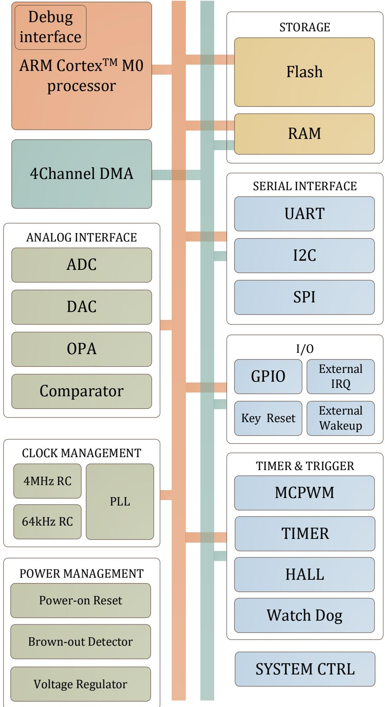  
图 2-1 LKS32MC03x 系统框图

## 3 地址空间

数据字节以小端格式存放在存储器中。一个字里的最低地址字节被认为是该字的最低有效字节，而最高地址字节是最高有效字节。其他所有没有分配给片上存储器和外设的存储器空间都是保留的地址空间。

表 3-1 系统地址空间分配

<table><tr><td>类型</td><td>设备</td><td>开始地址</td><td>结束地址</td><td>空间大小</td><td>时钟/软复位</td></tr><tr><td>CODE</td><td>FLASH</td><td>0x0000_0000</td><td>0x0000_7FFF</td><td>32kB</td><td>同总线</td></tr><tr><td></td><td>FLSCR</td><td>0x0001_0000</td><td>0x0001_00FF</td><td>256B</td><td>同总线</td></tr><tr><td>RAM</td><td>RAM</td><td>0x2000_0000</td><td>0x2000_0FFF</td><td>4kB</td><td>同总线</td></tr><tr><td></td><td>SYS</td><td>0x4000_0000</td><td>0x4000_00FF</td><td>256B</td><td>同总线</td></tr><tr><td></td><td>SPI</td><td>0x4001_0000</td><td>0x4001_00FF</td><td>256B</td><td>外设门控时钟[10]软复位[10]</td></tr><tr><td></td><td>I2C</td><td>0x4001_0100</td><td>0x4001_01FF</td><td>256B</td><td>外设门控时钟[0]软复位[0]</td></tr><tr><td></td><td>CMP</td><td>0x4001_0200</td><td>0x4001_02FF</td><td>256B</td><td>外设门控时钟[3]软复位[3]</td></tr><tr><td></td><td>HALL</td><td>0x4001_0300</td><td>0x4001_03FF</td><td>256B</td><td>外设门控时钟[1]软复位[1]</td></tr><tr><td></td><td>ADC</td><td>0x4001_0400</td><td>0x4001_04FF</td><td>256B</td><td>外设门控时钟[9]软复位[9]</td></tr><tr><td></td><td>TIMER0</td><td>0x4001_0500</td><td>0x4001_05FF</td><td>256B</td><td>外设门控时钟[5]软复位[5]</td></tr><tr><td></td><td>TIMER1</td><td>0x4001_0600</td><td>0x4001_06FF</td><td>256B</td><td>外设门控时钟[6]软复位[6]</td></tr><tr><td></td><td>MCPWM</td><td>0x4001_0700</td><td>0x4001_07FF</td><td>256B</td><td>外设门控时钟[4]软复位[4]</td></tr><tr><td></td><td>GPIO</td><td>0x4001_0800</td><td>0x4001_08FF</td><td>256B</td><td>外设门控时钟[7]软复位[7]</td></tr><tr><td></td><td>UART</td><td>0x4001_0900</td><td>0x4001_09FF</td><td>256B</td><td>外设门控时钟[2]软复位[2]</td></tr><tr><td></td><td>DMA</td><td>0x4001_0A00</td><td>0x4001_0AFF</td><td>256B</td><td>外设门控时钟[11]软复位[11]</td></tr><tr><td></td><td>DIV</td><td>0x4001_0B00</td><td>0x4001_0BFF</td><td>256B</td><td>外设门控时钟[8]软复位[8]</td></tr><tr><td></td><td>AON</td><td>0x4001_0C00</td><td>0x4001_0CFF</td><td>256B</td><td>同总线</td></tr></table>

以上外设门控时钟控制寄存器，请参考 6.3.7 SYS\_CLK\_FEN，软复位控制寄存器请参考 6.3.8SYS\_SFT\_RST。

## 4 中断

嵌套向量中断控制器位于 CPU 核内部。当中断事件发生时，通知 CPU 暂停主程序执行，按照优先级设定跳转进入中断服务函数。

LKS32MC03x系列芯片共有 14 个外部中断源。

中断控制器最多支持 4个中断优先级可供编程选择。

表 4-1 中断号分布

<table><tr><td>中断号</td><td>说明</td><td>中断号</td><td>说明</td></tr><tr><td>-14</td><td>NMI</td><td rowspan="14" colspan="2"></td></tr><tr><td>-13</td><td>HardFault</td></tr><tr><td>-12</td><td rowspan="7">保留</td></tr><tr><td>-11</td></tr><tr><td>-10</td></tr><tr><td>-9</td></tr><tr><td>-8</td></tr><tr><td>-7</td></tr><tr><td>-6</td></tr><tr><td>-5</td><td>SVCall</td></tr><tr><td>-4</td><td rowspan="2">保留</td></tr><tr><td>-3</td></tr><tr><td>-2</td><td>PendSV</td></tr><tr><td>-1</td><td>SysTick</td></tr><tr><td>0</td><td>TIMER0</td><td>16</td><td>Reserved</td></tr><tr><td>1</td><td>TIMER1</td><td>17</td><td>Reserved</td></tr><tr><td>2</td><td>MCPWM0</td><td>18</td><td>Reserved</td></tr><tr><td>3</td><td>MCPWM1</td><td>19</td><td>Reserved</td></tr><tr><td>4</td><td>I2C</td><td>20</td><td>Reserved</td></tr><tr><td>5</td><td>SPI</td><td>21</td><td>Reserved</td></tr><tr><td>6</td><td>GPIO</td><td>22</td><td>Reserved</td></tr><tr><td>7</td><td>HALL</td><td>23</td><td>Reserved</td></tr><tr><td>8</td><td>UART</td><td>24</td><td>Reserved</td></tr><tr><td>9</td><td>CMP</td><td>25</td><td>Reserved</td></tr><tr><td>10</td><td>ADC</td><td>26</td><td>Reserved</td></tr><tr><td>11</td><td>DMA</td><td>27</td><td>Reserved</td></tr><tr><td>12</td><td>WAKEUP,唤醒中断</td><td>28</td><td>Reserved</td></tr><tr><td>13</td><td>软件中断</td><td>29</td><td>Reserved</td></tr><tr><td>14</td><td>Reserved</td><td>30</td><td>Reserved</td></tr><tr><td>15</td><td>Reserved</td><td>31</td><td>Reserved</td></tr></table>

## 5 模拟电路

## 5.1 简述

模拟电路包含以下模块:

➢ 集成1 路12BIT SAR ADC，采样率1MHz，每路采样电路最多 11 通道信号可选。

➢ 集成1 路运算放大器，可设置为PGA 模式

➢ 集成2 路比较器，可设置迟滞模式

➢ 集成 8BIT 数模转换器

➢ 内置±2℃温度传感器

➢ 内置高精度基准源

各个模块之间的相互关系、以及各模块的控制寄存器（寄存器的说明见下文“模拟寄存器表”）如下图所示。

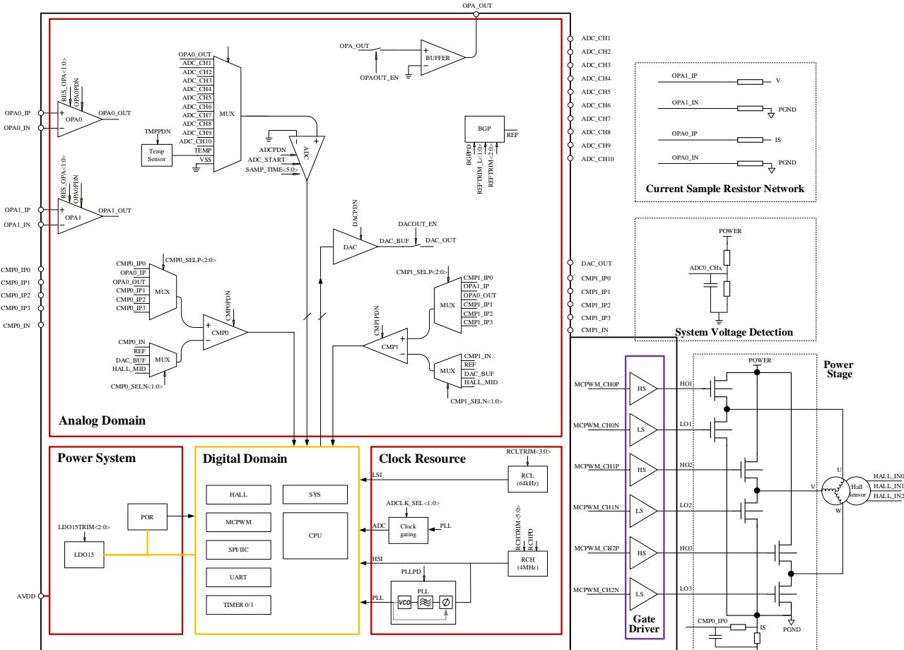  
图5-1 模拟电路功能框图

## 5.1.1 电源管理系统

电源管理系统由LDO15 模块、上电/掉电复位模块（POR）组成。

该芯片由3.3\~5V单电源供电，以节省芯片外的电源成本。芯片内部集成一路 LDO15给内部所有数字电路、PLL模块供电。

LDO上电后自动开启，无需软件配置。

POR 模块监测LDO15的电压，在LDO15电压低于1.25V时（例如上电之初，或者掉电时），为数字电路提供复位信号以避免数字电路工作产生异常。

## 5.1.2 时钟系统

时钟系统包括内部64kHzRC时钟、内部4MHz RC时钟、PLL电路组成。

64kHz RC 时钟 LSI 主要用于系统内的看门狗模块以及复位信号滤波等，也可用作 MCU 主时钟。4MHz RC时钟可作为MCU主时钟使用。PLL最高可提供48MHz的时钟，通常MCU使用 PLL时钟作为系统主时钟。

64kHz 和 4MHz RC 时钟均带有出厂校正，64kHz RC 时钟在-40\~105℃范围内的精度为±50%，4MHz RC时钟在该温度范围的精度为±1%。

4MHz RC时钟在5V供电和 3.3V供电下的校准参数略有差别，对于大多数的5V应用来说，芯片的4M RC时钟已处于校准状态。如应用于 3.3V供电，则建议由软件加载校正参数到相应的寄存器，具体参考相应应用笔记。如不加载，4M RC 时钟的偏差约增加 1.5%。

4MHz RC时钟通过设置BGPPD=’0’打开（默认打开，写 1关闭），RC 时钟需要 BGP电压基准源模块提供基准电压和电流，因此开启 RC 时钟时实际上连带开启了 BGP 模块（BGPPD=’0’）。芯片上电的默认状态下，4MHz RC 时钟和BGP 模块都是开启的。64kHzRC 时钟始终开启，不能关闭。

PLL对4MHz RC时钟进行倍频，给MCU、ADC等模块提供更高速的工作时钟。MCU和PWM 模块的最高时钟为48MHz，ADC模块最高时钟 24MHz。

PLL 通过设置 PLLPDN=’1’打开（默认关闭，设 1 打开），开启 PLL 模块之前，同样也需要开启BGP模块。开启PLL之后，PLL需要6us 的稳定时间来输出稳定时钟。芯片上电的默认状态下，RCH时钟和BGP模块都是开启的，但PLL默认是关闭的，需要软件来开启。

BGPPD /PLLPDN 的说明见模拟寄存器 SYS\_AFE\_REG0

## 5.1.3 基准电压源

基准源电路(BGP REF: Bandgap reference)为 ADC、DAC、RC 时钟、PLL、温度传感器、运算放大器、比较器和 FLASH 提供基准电压和电流，使用上述任何一个模块之前，都需要开启 BGP 基准电压源。

芯片上电的默认状态下，BGP 模块是开启的。通过设置BGPPD =’0’将基准源打开，从关闭到开启，BGP 需要约 6us 达到稳定。BGP 输出电压约 1.2V，精度为±0.8%

BGPPD 的说明见模拟寄存器 SYS\_AFE\_REG0

## 5.1.4 ADC 模块

请参加第 12 章。

## 5.1.5 运算放大器

芯片集成 1 路输入输出轨到轨（rail-to-rail）运算放大器，内置反馈电阻，外部引脚上需串联一个电阻R<sub>0</sub>到信号源。反馈电阻 $\mathrm { R } _ { 2 : \mathrm { R } 1 }$ 的阻值可通过寄存器RES\_OPA[1:0]设置，以实现不同的放大倍数。

## RES\_OPA<1:0>的说明见模拟寄存器 SYS\_AFE\_REG0

放大器的结构示意图如下所示:

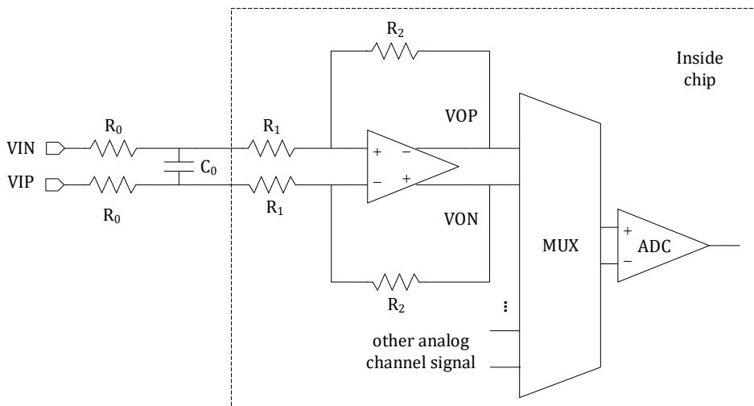  
图 5-2 放大器框图

图中两个 $\mathtt { R } _ { 0 }$ 是片外需放置的电阻，阻值必须相等，最终的放大倍数为 $\mathrm { R } _ { 2 } / ( \mathrm { R } _ { 1 } { + } \mathrm { R } _ { 0 } )$

对于MOS管电阻直接采样的应用，由于MOS下管关断、上管导通时信号会升高到数十 V的电源电压，为减小此时往芯片引脚里流入的电流，建议接>20kΩ 的外部电阻。

对于分流电阻采样的应用，建议接 100\~2KΩ 的外部电阻。 ${ \mathrm { C } } _ { 0 }$ 为信号滤波电容，和 $\mathtt { R } _ { 0 }$ 形成一阶RC 滤波电路。 $\mathtt { R } _ { 0 }$ 的具体阻值可根据 $\mathrm { R } _ { 0 } { } ^ { * } \mathrm { C } _ { 0 }$ 的滤波常数而定。如果信号上噪声较小不需要滤波、或者信号需要很大的带宽（较快的响应速度），则C<sub>0</sub>最小为15pF。

放大器可通过设置OPAOUT\_EN选择将放大器的输出信号通过BUFFER送至P0.7管脚口进行测量和应用（对应关系见 datasheet 芯片管脚说明）。因为有 BUFFER 存在，在运放正常工作模式下也可以选择送一路运放输出信号出来。

## OPAOUT\_EN 的说明见模拟寄存器 SYS\_AFE\_REG0

芯片上电的默认状态下，放大器模块是关闭的。放大器可通过设置 OPAPDN=1 打开。开启放大器之前，需要先开启BGP模块。

## OPAPDN 的说明见模拟寄存器 SYS\_AFE\_REG0

运放输入正负端内置钳位二极管，电机相线通过一个匹配电阻后直接接入输入端，从而简化了MOSFET电流采样的外置电路。

OPA 在芯片端口上有多组差分输入。其中 OPA0\_IP/OPA0\_IN 和 OPA1\_IP/OPA1\_IN 时分复用内部的运算放大器。当 ADC 的采样通道配置为 ADC\_CH8 时即 ADC0\_CHN0[3:0]=8，实际是采样 OPA1 的差分输入信号经过 OPA 放大后的输出，当 ADC 的采样通道配置为 0 时即 ADC0\_CHN0[3:0]=0，实际是采样OPA0 的差分输入信号经过 OPA 放大后的输出。

此 外 ， OPA0 的 差 分 输 入 有 两 组 ， OPA0\_IP/OPA0\_IN 和 OPA0\_IP\_B/OPA0\_IN\_B ， 通 过SYS\_AFE\_REG0.OPA0\_B\_EN 进行选择。这一设置通常根据具体芯片型号引脚功能分布进行配置，在应用期间维持不变。

OPA 的多路差分输入及选择控制逻辑如图所示。

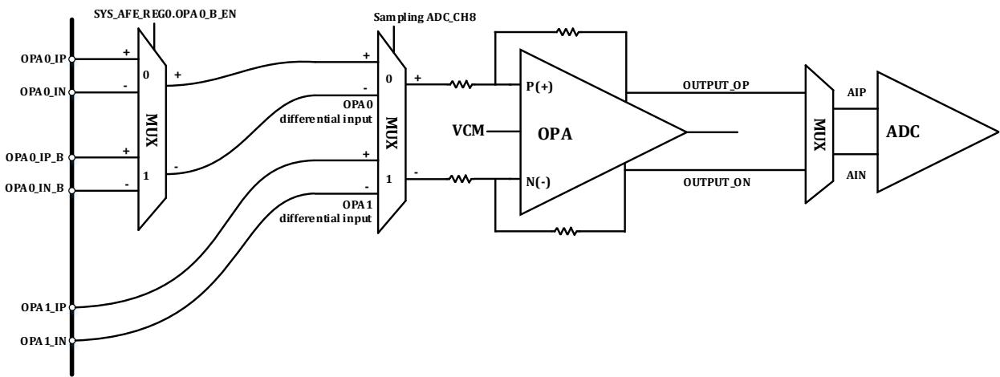  
图 5-3OPA 多路差分输入选择控制逻辑

ADC 在采样 ADC\_CH8 时，实际上是采样 OPA 放大后的 OPA1 信号。 OPA 输入开关信号将始终与要采样的下一个ADC 通道保持一致。 建议将OPA1(即 ADC\_CH8)设置为ADC 采样序列中的第一个通道，这将为OPA1\_IP/OPA1\_IN 作为 OPA 输入提供足够的稳定时间。

当 OPA 输入时在 OPA0\_IP/OPA0\_IN 和 OPA1\_IP/OPA1\_IN 之间切换时，需要至少 1us 的稳定时间。不建议立即对OPA0/1连续进行采样。

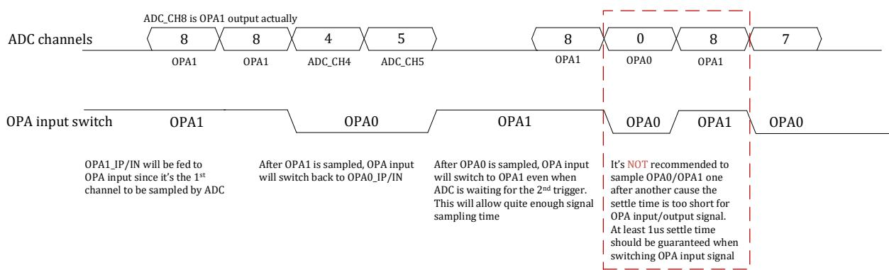  
图 5-4OPA 多路差分输入选择与 ADC 采样联动

## 5.1.6 比较器

内置 2 路输入轨到轨（rail-to-rail）比较器，比较器比较速度可编程、迟滞电压可编程、信号源可编程。

比较器的比较延时可通过寄存器CMP\_FT设置为＜30nS/200nS。迟滞电压通过 CMP\_HYS 设置为

20mV/0mV。

比较器正负两个输入端的信号来源都可通过寄存器 CMPx\_SELP[2:0]和 CMPx\_SELN[1:0]进行设置（x=0/1，代表 CMP0/CMP1 两个比较器）。

需说明的是，两个比较器负输入端的 BEMFx\_MID 信号，是对比较器正输入端信号 CMPx\_IP1/CMPx\_IP2/ CMPx\_IP3 信号的平均，具体连接方式见图 5-5。其中电阻R=8.2k欧，图中的开关只有在比较器负输入端信号选择为 BEMFx\_MID之后才会导通，否则开关都处于断开状态。

BEMFx\_MID 主要用于 BLDC 方波模式控制时，虚拟电机相线中心点电压，用于反电势过零点检测。三个相线分压后，分别接 CMPx\_IP1、CMPx\_IP2、CMPx\_IP3，MCU 控制比较器负端选择 BEMFx\_MID，比较器正端的多路选择器以分时复用的方式分别选择CMPx\_IP1、CMPx\_IP2、CMPx\_IP3，就可以比较出反电势过零点。

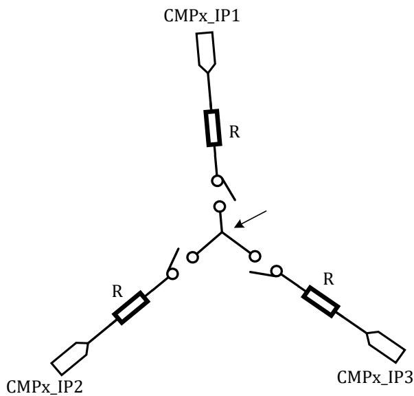  
图 5-5 BEMFx\_MID 信号

比较器输出结果，可以通过CMP\_DATA 输出数据寄存器读出。

CMP\_FT 的说明见模拟寄存器 SYS\_AFE\_REG1

$$
\text { CMPx\_SELN } <   1: 0 > / \text { CMPx\_SELP } <   2: 0 > / \text { CMP\_HYS } \text { 的说明见模拟寄存器   SYS\_AFE\_REG1 }
$$

芯片上电的默认状态下，比较器模块是关闭的。比较器通过设置CMPxPDN=1 (x=0,1)打开，开启比较器之前，需要先开启BGP模块。

CMPxPDN 的说明见模拟寄存器 SYS\_AFE\_REG0

## 5.1.7 温度传感器

芯片内置温度传感器，在- $\cdot 4 0 { \sim } 8 5 ^ { \circ } \mathrm { C }$ 范围内精度为 $2 ^ { \circ } \mathsf { C } _ { \circ } \ 8 5 { \sim } 1 0 5 ^ { \circ } \mathsf { C }$ 范围内精度为 $3 ^ { \circ } \mathrm { C } .$ 。

测量时需选择内部基准，选择外部基准会引起结果的较大偏差。

芯片出厂前会经温度校正，校正值保存在 flash info 区(详见 7.3.9)。出厂较正时所用增益为ADC\_GAIN=0，建议应用时也选择此增益，可以使较正值更准确。

芯片上电的默认状态下，温度传感器模块是关闭的。开启传感器之前，需要先开启 BGP 模块。

温度传感器通过设置 TMPPDN=1 打开，开启到稳定需要约 2us，因此需在 ADC 测量传感器之前2us 打开。

温度传感器信号连至 ADC的通道11。

ADC部分的设置参考模数转换器(ADC)章节

TMPPDN 的说明见模拟寄存器 SYS\_AFE\_REG0

温度传感器的典型曲线如下图所示:

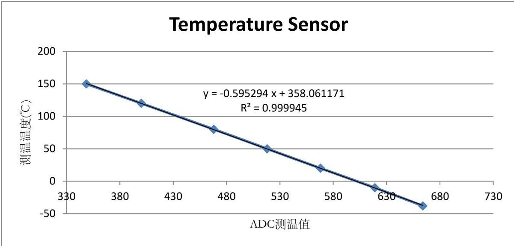  
图 5-4 温度传感器曲线

图中 X 轴为温度传感器的温度信号所对应的 ADC 值，Y 轴为传感器所处的温度。测温时，按照如上要求配置传感器相关寄存器，并得到 ADC值后，将ADC 值作为 X代入公式:

$$
\mathrm{y} = - 0. 5 9 5 \mathrm{x} + 3 5 8. 1
$$

求得的Y值即为此时的温度。

公式中有两个系数，a=-0.595, b=358.1。对于不同的芯片，b系数的值是不一样的。芯片出厂前会经过温度标定，将每颗芯片所对应的系数 b 写入芯片特定 FLASH 区域（通过库函数读取）。存储时，会将b系数小数点右移一位（乘 10）存入，小数点后第二位不进行保存。

同时为方便客户操作，系数 a也会存入芯片特定FLASH区域（通过库函数读取）。存储时，将a系数小数点右移四位（乘10000）存入。

实际使用中，应通过库函数读出 a/b 系数，同时将读取到的 ADC 测到的当下温度传感器值代入公式，即可计算得到当下温度值，单位为摄氏度。计算时，需注意系数a/b在保存时小数点的位移数，即a系数应除以10000，b 系数除以10。

注意，上述计算公式，基于 ADC 右对齐实现。若换成左对齐，ADC 采样值需右移 4 位后，才能代入上述公式。

## 5.1.8 DAC 模块

芯片内置一路8bit DAC，输出信号的最大量程为3V；C版本最大量程为4.8V，若需要使用1.2V量程，需要设置 SYS\_AFE\_REG2.BIT15=1。

DAC可通过配置寄存器 DACOUT\_EN=1，将 DAC输出送至P0.0 管脚，可驱动>5kΩ 的负载电阻和50pF的负载电容。

DAC 最大输出码率为 1MHz。

芯片上电的默认状态下，DAC 模块是关闭的。DAC 可通过设置DACPDN =1打开，开启 DAC模块之前，需要先开启BGP 模块。

DAC 的输入数字信号寄存器为 SYS\_AFE\_DAC，低 8BIT 有效。信号范围是 0x00\~0xFF。0x00 对应零模拟量输出0V，0xFF 对应满量程模拟量输出为 $D A C _ { f s }$ ，。每一档信号(LSB)所对应的模拟信号幅度为 $\langle \frac { D A C _ { f s } } { 2 5 6 } \rangle _ { \mathrm { ~ \normalfont ~ < ~ } }$ 。若 SYS\_AFE\_DAC 的数字值为 Din，则该数字信号所对应的 DAC 输出模拟信号为 $\frac { D A C _ { f s } } { 2 5 6 } * D i n$ DAC 输出的模拟信号，除了可以送至 IO 口供外部模块使用外，还可通过配置寄存器连至芯片内 DAC输出的模拟信号，除了可以送至IO口供外部模块使用外，还可通过配置寄存器连至芯片内部的2 路比较器负端，作为比较器的基准信号使用。详见比较器章节。

NVR中存储了DAC\_AMC/DC 校正值，可用于校准 DAC 输出，具体用法请参考官方库函数。

DACOUT\_EN 的说明见 SYS\_AFE\_REG1

DACPDN 的说明见 SYS\_AFE\_REG0

SYS\_AFE\_DAC 的说明见 SYS\_AFE\_DAC DAC

## 5.2 寄存器

## 5.2.1 地址分配

模拟寄存器 SYS\_AFE\_REG0\~ SYS\_AFE\_REG2，对应地址为 0x4000\_0010\~0x4000\_0018。其中保留寄存器(Res)必须全部配置为0（芯片上电后会被复位为 0）。其他寄存器根据应用场合需要进行配置。

模拟寄存器基地址为 0x4000\_0000。

表 5-1 系统控制寄存器

<table><tr><td>名称</td><td>偏移</td><td>说明</td></tr><tr><td>SYS_AFE_ADC</td><td>0x00</td><td>ADC 数据寄存器</td></tr><tr><td>SYS_AFE_INFO</td><td>0x04</td><td>芯片版本信息寄存器</td></tr><tr><td></td><td>0x08</td><td>保留</td></tr><tr><td>SYS_OPA_SEL</td><td>0x0C</td><td>运放切换控制寄存器</td></tr><tr><td>SYS_AFE_REG0</td><td>0x10</td><td>模拟配置寄存器 0</td></tr><tr><td>SYS_AFE_REG1</td><td>0x14</td><td>模拟配置寄存器 1</td></tr><tr><td>SYS_AFE_REG2</td><td>0x18</td><td>模拟配置寄存器 2</td></tr><tr><td>SYS_AFE_DAC</td><td>0x2C</td><td>DAC 数字量寄存器</td></tr></table>

## 5.2.2 SYS\_AFE\_ADC ADC 原始数据寄存器

地址:0x4000\_0000

复位值:0x0

表 5-2 ADC 原始数据寄存器 SYS\_AFE\_ADC

<table><tr><td>15</td><td>14</td><td>13</td><td>12</td><td>11</td><td>10</td><td>9</td><td>8</td><td>7</td><td>6</td><td>5</td><td>4</td><td>3</td><td>2</td><td>1</td><td>0</td></tr><tr><td rowspan="3" colspan="4"></td><td colspan="12">ADC_RAW_D</td></tr><tr><td colspan="12">RO</td></tr><tr><td colspan="12">0</td></tr></table>

<table><tr><td>位置</td><td>位名称</td><td>说明</td></tr><tr><td>[31:12]</td><td></td><td>未使用</td></tr><tr><td>[11:0]</td><td>ADC_RAW_D</td><td>ADC 输出的原始数据</td></tr></table>

## 5.2.3 SYS\_AFE\_INFO 芯片版本信息寄存器

地址:0x4000\_0004

复位值:根据wafer版本不同

表 5-3 芯片版本信息寄存器 SYS\_AFE\_INFO

<table><tr><td>15</td><td>14</td><td>13</td><td>12</td><td>11</td><td>10</td><td>9</td><td>8</td><td>7</td><td>6</td><td>5</td><td>4</td><td>3</td><td>2</td><td>1</td><td>0</td></tr><tr><td rowspan="3" colspan="13"></td><td colspan="3">Version</td></tr><tr><td colspan="3">RO</td></tr><tr><td colspan="3">Depends</td></tr></table>

<table><tr><td>位置</td><td>位名称</td><td>说明</td></tr><tr><td>[31:3]</td><td></td><td>未使用</td></tr><tr><td>[2:0]</td><td>Version</td><td>芯片版本信息1: DAC 输出范围 0~3V2: DAC 输出范围 0~3V/4.8V3: DAC 输出范围 0~1.2V/3V/ 4.8V</td></tr></table>

此寄存器与用户无关。

## 5.2.4 SYS\_OPA\_SEL 运放切换控制寄存器

地址:0x4000\_000C

复位值:0x1

表 5-4 运放切换控制寄存器 SYS\_OPA\_SEL

<table><tr><td colspan="2">15 14 13 12 11 10 9 8 7 6 5 4 3 2 1 0</td></tr><tr><td rowspan="3"></td><td>OPA_SEL_EN</td></tr><tr><td>RW</td></tr><tr><td>0</td></tr></table>

<table><tr><td>位置</td><td>位名称</td><td>说明</td></tr><tr><td>[31:1]</td><td></td><td>未使用</td></tr><tr><td>[0]</td><td>OPA_SEL_EN</td><td>OPA0/1 输入分时复用芯片内唯一的一个 OPA,复用使能开关,高电平有效。B 版本之后此 BIT 寄存器可读写。</td></tr></table>

通过 SYS\_OPA\_SEL=0xCA 可以将该寄存器置 1，使能复用功能。通过 SYS\_OPA\_SEL &= \~BIT0 可以将该寄存器置0，关闭复用功能。

根据OPA\_SEL\_EN的使能与否，模拟内部的二选一多选器会控制。

芯片只有1 个OPA模块，但有2 路OPA输入信号，因此 OPA0/OPA1 信号复用 OPA模块。

OPASELA 由 ADC 接口模块硬件控制，跟模拟寄存器 ADC\_SELP<3:0>一样。

<table><tr><td>OPASELA</td><td>运放 A 输入通道选择</td><td>0: 选择 OPA0_IP/OPA0_IN 引脚作为运放信号通道1: 选择 OPA1_IP/OPA1_IN 引脚作为运放信号通道</td></tr></table>

ADC物理通道的选择寄存器对应关系如下:

<table><tr><td>ADC_SELP&lt;3:0&gt;</td><td>ADC 通道正端选择</td><td>0000:OPA0 输出;0001: ADC_CH1;0010: ADC_CH2;0011: ADC_CH3;0100: ADC_CH4;0101: ADC_CH5;0110: ADC_CH6;0111: ADC_CH7;1000:ADC_CH8/OPA1 输出;1001:ADC_CH9;1010:ADC_CH10;1011:连温度传感器;1100:连内部地;1101:连 2.4V 基准;</td></tr></table>

其中CH8是复用的。

表 5-5 ADC 通道复用 OPA 列表

<table><tr><td>OPA_SEL_EN</td><td>当前 ADC 采样通道</td><td>ADC 实际采样通道</td></tr><tr><td>0</td><td>8</td><td>ADC_CH8</td></tr><tr><td>1</td><td>8</td><td>OPA1_OUT</td></tr></table>

当OPA\_SEL\_EN=1，OPA输入通道切换由硬件电路自动控制；OPA 输入的切换控制信号 OPASELA仅分别在ADC 采样第8 通道时为 1，其余时间均为0。

通常建议运放OPA0和 OPA1的采样，间隔一定时间，比如ADC 单段采样模式下，一轮采样 6个通道。第一次采样 OPA1，第 6 次采样 OPA0，给 OPA 输入信号以充足的建立时间。如果某轮采样第一次即采样 OPA1，则 OPA 输入控制信号在采样开始很长时间之前就切换至 OPA1，使得 OPA1 的采样有足够的建立时间。OPA1 采样完毕后，OPA 输入信号就会切换回 OPA0，如果间隔通道数足够，OPA0输入信号也给予运放以充足的建立时间。

## 5.2.5 SYS\_AFE\_REG0 模拟配置寄存器 0

地址:0x4000\_0010

复位值:0x0

表 5-6 模拟配置寄存器 0 SYS\_AFE\_REG0

<table><tr><td>15</td><td>14</td><td>13</td><td>12</td><td>11</td><td>10</td><td>9</td><td>8</td><td>7</td><td>6</td><td>5</td><td>4</td><td>3</td><td>2</td><td>1</td><td>0</td></tr><tr><td>PLLPDN</td><td>CMP1PDN</td><td>CMPOPDN</td><td>TMPPDN</td><td>DACPDN</td><td>BGPPD</td><td>OPAPDN</td><td>ADCPDN</td><td>REF2VDD</td><td>GA_AD</td><td>OPA0_B_EN</td><td>OPASEL</td><td>Res.</td><td>OPAOUT_EN</td><td>RES_OPA</td><td></td></tr><tr><td>RW</td><td>RW</td><td>RW</td><td>RW</td><td>RW</td><td>RW</td><td>RW</td><td>RW</td><td>RW</td><td>RW</td><td>RW</td><td>RW</td><td>RW</td><td>RW</td><td>RW</td><td></td></tr><tr><td>0</td><td>0</td><td>0</td><td>0</td><td>0</td><td>0</td><td>0</td><td>0</td><td>0</td><td>0</td><td>0</td><td>0</td><td>0</td><td>0</td><td>0</td><td></td></tr></table>

<table><tr><td>位置</td><td>位名称</td><td>说明</td></tr><tr><td>[31:16]</td><td></td><td>未使用</td></tr><tr><td>[15]</td><td>PLLPDN</td><td>0:关闭 PLL1:开启 PLL</td></tr><tr><td>[14]</td><td>CMP1PDN</td><td>0:关闭比较器 11:开启比较器 1</td></tr><tr><td>[13]</td><td>CMP0PDN</td><td>0:关闭比较器 01:开启比较器 0</td></tr><tr><td>[12]</td><td>TMPPDN</td><td>0:关闭温度传感器1:开启温度传感器</td></tr><tr><td>[11]</td><td>DACPDN</td><td>0:关闭 DAC1:开启 DAC</td></tr><tr><td>[10]</td><td>BGPPD</td><td>0:开启 Bandgap1:关闭 Bandgap,注意极性与其他模块相反</td></tr><tr><td>[9]</td><td>OPAPDN</td><td>0:关闭 OPA1:开启 OPA</td></tr><tr><td>[8]</td><td>ADCPDN</td><td>0:关闭 ADC1:开启 ADC</td></tr><tr><td>[7]</td><td>REF2VDD</td><td>ADC 基准源选择0:选择内部 2.4V 作为 ADC 基准源1:选择 AVDD 电源电压作为 ADC 基准源,此时建议设置 ADC 量程 GA_AD=1,ADC 满量程对应 AVDD。</td></tr><tr><td>[6]</td><td>GA_AD</td><td>ADC 量程选择0: REF*3/2,当使用内部 2.4V 基准时,ADC 满量程为 2.4*3/2=3.6V,当使用 AVDD 电源电压作为基准时,ADC 满量程为 AVDD*3/2,如使用 5V 供电,即满量程为 7.5V;1: REF。当使用内部 2.4V 基准时,ADC 满量程为 2.4V,当使用 AVDD 电源电压作为基准时,ADC 满量程为 AVDD,如使用 5V 供电,即满量程为 5V。</td></tr><tr><td>[5]</td><td>OPA0_B_EN</td><td>0: OPA0 使用 OPA0_IN/OPA0_IP 作为差分输入1: OPA0 使用 OPA0_IN_B/OPA0_IP_B 作为差分输入</td></tr><tr><td>[4]</td><td>保留位</td><td>必须为 0</td></tr><tr><td>[3]</td><td>保留位</td><td>必须为 0</td></tr><tr><td>[2]</td><td>OPAOUT_EN</td><td>0:不输出;1:输出 OPA 放大输出信号到 IO 口 P0.7</td></tr><tr><td>[1:0]</td><td>RES_OPA</td><td>运放反馈电阻00: 200k:10k01: 190k:20k10: 180k:30k11: 170k:40k</td></tr></table>

如果 SYS\_CLK\_CFG 选择 PLL 时钟，则 PLLPDN 是被硬件控制的，软件配置 PLLPDN 关闭 PLL 无效。关闭PLL需要PLLPDN=0，且SYS\_CLK\_CFG不选择 PLL作为芯片主时钟，这两个条件都须满足。

同理，如果SYS\_CLK\_CFG选择了 HRC 时钟，则RCHPD 是被硬件控制的，软件配置 RCHPD关闭RCH无效。关闭PLL需要RCHPD=1，且芯片进入休眠。

如果芯片主时钟为PLL时钟，且HRC 为PLL参考时钟，则 RCH也是被硬件控制的。

由于 RCH 和 PLL 依赖 BGP（bandgap），所以 BGPPD 也是硬件控制的，在芯片使用了 RCH 或PLL时，软件配置BGPPD关闭BGP 无效。关闭BGP需要先顺序关闭 PLL和 RCH，且芯片进入休眠。

## 5.2.6 SYS\_AFE\_REG1 模拟配置寄存器 1

地址:0x4000\_0014

复位值:0x0

表 5-7 模拟配置寄存器 1 SYS\_AFE\_REG1

<table><tr><td>15</td><td>14</td><td>13</td><td>12</td><td>11</td><td>10</td><td>9</td><td>8</td><td>7</td><td>6</td><td>5</td><td>4</td><td>3</td><td>2</td><td>1</td><td>0</td></tr><tr><td>Res.</td><td colspan="3">CMP1_SELP</td><td>CMP_FT</td><td colspan="3">CMP0_SELP</td><td>CMP_HYS</td><td>REFOUT_EN</td><td colspan="2">CMP1_SELN</td><td colspan="2">CMP0_SELN</td><td>DACOUT_EN</td><td>LDOOUT_EN</td></tr><tr><td>RW</td><td colspan="3">RW</td><td>RW</td><td colspan="3">RW</td><td>RW</td><td>RW</td><td colspan="2">RW</td><td colspan="2">RW</td><td>RW</td><td>RW</td></tr><tr><td>0</td><td colspan="3">0</td><td>0</td><td colspan="3">0</td><td>0</td><td>0</td><td colspan="2">0</td><td colspan="2">0</td><td>0</td><td>0</td></tr></table>

<table><tr><td>位置</td><td>位名称</td><td>说明</td></tr><tr><td>[31:16]</td><td></td><td>未使用</td></tr><tr><td>[15]</td><td>保留</td><td>必须为0</td></tr><tr><td>[14:12]</td><td>CMP1_SELP</td><td>比较器1信号正端选择000:CMP1_IP0001:OPA0_IP010:OPA0_OUT011:CMP1_IP1100:CMP1_IP2101:CMP1_IP3110:NC111:NC</td></tr><tr><td>[11]</td><td>CMP_FT</td><td>比较器快速比较使能1:比较器比较速度小于30ns0:不使能,200ns</td></tr><tr><td>[10:8]</td><td>CMP0_SELP</td><td>比较器0信号正端选择000:CMP0_IP0001:OPA0_IP010:OPA0_OUT011:CMP0_IP1100:CMP0_IP2101:CMP0_IP3110:NC111:NC</td></tr><tr><td>[7]</td><td>CMP_HYS</td><td>比较器回差选择0:20mV1:0mv</td></tr><tr><td>[6]</td><td>保留</td><td>必须为0</td></tr><tr><td>[5:4]</td><td>CMP1_SELN</td><td>比较器1信号负端选择00:CMP1_IN01:REF10:DAC输出11:BEMFx_MID</td></tr><tr><td>[3:2]</td><td>CMP0_SELN</td><td>比较器0信号负端选择00: CMP0_IN01: REF10: DAC 输出11: BEMFx_MID</td></tr><tr><td>[1]</td><td>DACOUT_EN</td><td>DAC 输出到 IO 使能0: 不输出1: 输出 DAC 到 P0.0</td></tr><tr><td>[0]</td><td>LDOOUT_EN</td><td>LDO 输出到 IO 使能0: 不输出1: 输出 LDO15 到 P0.0</td></tr></table>

## 5.2.7 SYS\_AFE\_REG2 模拟配置寄存器 2

地址:0x4000\_0018

复位值:0x0

表 5-8 模拟配置寄存器 2 SYS\_AFE\_REG2

<table><tr><td>15</td><td>14</td><td>13</td><td>12</td><td>11</td><td>10</td><td>9</td><td>8</td><td>7</td><td>6</td><td>5</td><td>4</td><td>3</td><td>2</td><td>1</td><td>0</td></tr><tr><td>Res.</td><td rowspan="3" colspan="2"></td><td colspan="5">SAMP_TIME</td><td colspan="8">Res.</td></tr><tr><td>RW</td><td colspan="5">RW</td><td colspan="8">RW</td></tr><tr><td>0</td><td colspan="5">0</td><td colspan="8">0</td></tr></table>

<table><tr><td>位置</td><td>位名称</td><td>说明</td></tr><tr><td>[31:16]</td><td></td><td>未使用</td></tr><tr><td>[15]</td><td>C 版本 DAC_GAIN</td><td>仅对 C 版本有效0: 3.0V/4.8V 量程1: 1.2V 量程</td></tr><tr><td>[14:13]</td><td>保留</td><td>必须为 0</td></tr><tr><td>[12:8]</td><td>SAMP_TIME</td><td>ADC 采样时间选择00000-&gt;11111:对应采样时间从 5-&gt;37 个 ADC 时钟周期,逐次增加</td></tr><tr><td>[7:0]</td><td>保留</td><td>必须为 0</td></tr></table>

## 5.2.8 SYS\_AFE\_DAC DAC 数字量寄存器

地址:0x4000\_002C

复位值:0x0

表 5-9 DAC 数字量寄存器 SYS\_AFE\_DAC

<table><tr><td>15</td><td>14</td><td>13</td><td>12</td><td>11</td><td>10</td><td>9</td><td>8</td><td>7</td><td>6</td><td>5</td><td>4</td><td>3</td><td>2</td><td>1</td><td>0</td></tr></table>

<table><tr><td rowspan="3"></td><td>DAC_IN</td></tr><tr><td>RW</td></tr><tr><td>0</td></tr></table>

<table><tr><td>位置</td><td>位名称</td><td>说明</td></tr><tr><td>[31:8]</td><td></td><td>未使用</td></tr><tr><td>[7:0]</td><td>DAC_IN</td><td>DAC 待转换的数字量输入</td></tr></table>

## 6 系统时钟复位

## 6.1 时钟

## 6.1.1 时钟源

如下表所示，系统包括 4 个时钟源。其中内部低速 RC 振荡时钟 LSI/内部高速 RC 振荡时钟 HSI不会停振。

表 6-1 系统时钟源

<table><tr><td>时钟源</td><td>频率</td><td>来源</td><td>误差</td><td>说明</td></tr><tr><td>LSI/LRC</td><td>64kHz</td><td>内部 RC 振荡器</td><td>全温度范围误差&lt;50%</td><td>内部系统管理时钟,用于WDT,复位信号的滤波和展宽,亦可作为 MCU 运行主时钟</td></tr><tr><td>HSI/HRC</td><td>4MHz</td><td>内部 RC 振荡器</td><td>全温度范围误差&lt;1%</td><td>作为 PLL 源时钟</td></tr><tr><td>PLL</td><td>48MHz</td><td>PLL 时钟</td><td>取决于 PLL 参考时钟。如果使用内部 HRC 作为 PLL 参考时钟,则 PLL 时钟误差&lt;1%。</td><td>PLL 输出时钟,以 HSI 作为参考时钟输入,倍频 12 倍后输出 PLL 时钟作为系统主时钟。</td></tr><tr><td>JTAG/SWD</td><td>&lt;10MHz</td><td>调试器</td><td>-</td><td>JTAG/SWD 时钟,取决于上位机设置</td></tr></table>

SWD时钟速率与上位机或下载器设置有关。

系统可以使用内部高速 RC时钟 HSI作为PLL的参考时钟。PLL将 4MHz的参考时钟 HSI倍频12倍至 48MHz。

PLL 经过 n/8 分频后，可以得到 48MHz×n/8 的高速时钟，SYS\_CLK\_CFG.CLK\_SEL[0]在此分频后的高速时钟与4MHz 的HSI 之间进行二选一，作为系统主时钟MCLK。系统复位时，PLL默认关闭，HSI默认开启，系统选择HSI时钟，即4MHz作为系统主时钟进行工作，从而保证系统上电之初功耗处于较低水平。

系统内部时钟 MCLK 是系统主时钟。可以通过 SYS\_CLK\_CFG 寄存器 CLK\_DIV 位域控制进行 n/8分频，可以产生 12, 24,48MHz 等频率值。SYS\_CLK\_CFG.CLK\_SEL[0]表示选择 PLL 或 HSI 作为系统主时钟。此外，通过设置 SYS\_CLK\_CFG.CLK\_SEL[1]=1 可以切换系统时钟为 LSI 时钟，此时系统工作于64kHz时钟，PLL/HRC/BGP 等模拟模块均可关闭以降低功耗。

当 SYS\_CLK\_CFG.CLK\_SEL 为 1 时 ， SYS\_CLK\_CFG.CLK\_DIV 作 为 PLL 的 分 频 系 数 。 当SYS\_CLK\_CFG.CLK\_SEL 不为 1 时，系统时钟 HSI 或 LSI 作为工作时钟，此时 SYS\_CLK\_CFG.CLK\_DIV 不再起分频作用。

表 6-2PLL作为MCLK时钟时的分频配置

<table><tr><td>SYS_CLK_CFG</td><td>分频系数</td><td>频率/MHz</td><td>是否均匀</td></tr><tr><td>0x0101</td><td>1/8</td><td>6</td><td>是</td></tr><tr><td>0x0111</td><td>2/8</td><td>12</td><td>是</td></tr><tr><td>0x0155</td><td>4/8</td><td>24</td><td>是</td></tr><tr><td>0x01FF</td><td>8/8</td><td>48</td><td>是</td></tr></table>

系统高速时钟 MCLK 经过 SYS\_CLK\_FEN 寄存器控制的开关之后供给外设。I2C 时钟由SYS\_CLK\_DIV0寄存器控制可以进一步分频，UART时钟由SYS\_CLK\_DIV2寄存器控制可以进一步分频。

PLL输出的时钟经过2 分频后送至ADC（典型工作频率24MHz），即ACLK。

内部64kHz RC 产生一路 LSI时钟LCLK，主要用于WDT工作时钟，以及部分系统控制，复位的滤波展宽等。当系统无过多工作任务且系统降低功耗时，可以设置 SYS\_CLK\_CFG.CLK\_SEL=2，将系统时钟切换为LSI。

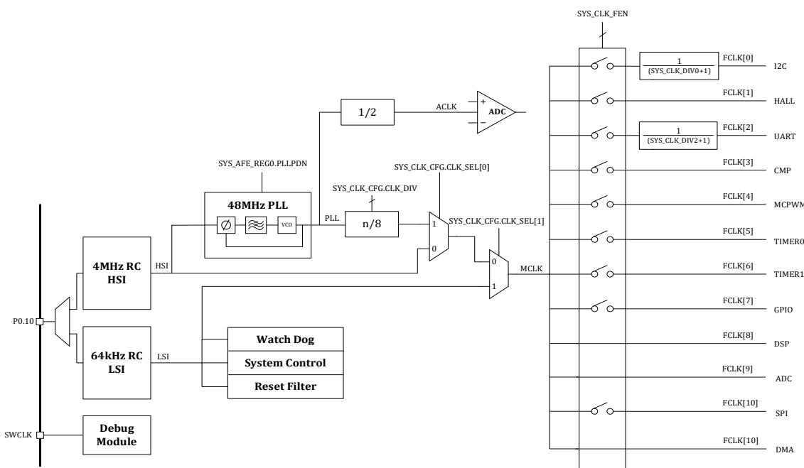  
图 6-1 时钟架构

为了保证系统可靠工作，时钟系统有防止时钟被误操作关闭的机制。如当 PLL被用作系统工作主时钟时，PLL本身无法被关闭，作为 PLL参考时钟的HSI 无法被软件关闭；64kHz LSI 时钟上电即工作，且无法关闭。SWCLK由调试器提供，频率可在上位机调试界面进行选择。

为便于调试和出厂校正，高速 RC 时钟 HSI和低速时钟 LSI 可以通过配置GPIO的第二功能通过芯片管脚输出。

## 6.2 复位

## 6.2.1 复位源

芯片的复位来源包括硬件复位与软件复位。

## 6.2.1.1 硬件复位

如表6-3硬件复位源所示，系统包括3 个硬件复位源，产生的复位均为芯片全局复位，复位产生后处理器程序计数器(PC)回到0 地址，所有寄存器恢复到默认值。

表 6-3 系统复位源

<table><tr><td>名称</td><td>来源</td><td>说明</td></tr><tr><td>PORn</td><td>内部电源管理</td><td>同时监控 1.5V 数字电源和 5V 电源,1.5V 电源低于 1.25V时产生复位,5V 电源低于 2.5V 时产生复位</td></tr><tr><td>RSTn</td><td>外部按键</td><td>外部按键复位电路,低电平有效</td></tr><tr><td>WDTn</td><td>硬件看门狗</td><td>如果不进行软件喂狗则定时产生复位,复位间隔可配置</td></tr></table>

## 6.2.1.1.1 硬件复位架构

如下图所示，PORn来自内部模拟电路， RSTn来自外部按键。

WDTn为1个LSI时钟周期宽度信号，是内部数字信号。WDTn信号在Debug模式下可以被屏蔽，由 SYS\_DBG\_CFG 进行配置。

经过滤波展宽预处理的复位信号进行与运算得到一个全局复位信号。

P0.2 引脚低于16us 宽度的外部复位会被复位滤波滤除，要求可靠外部复位宽度大于200us。

3 个复位信号复位等级和作用域一致，均为全局复位。

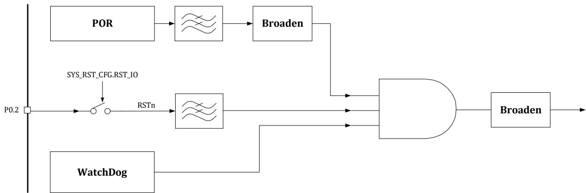  
图 6-2 复位架构

## 6.2.1.1.2 硬件复位记录

AON\_EVT\_RCD寄存器用于保存硬件复位事件，当某个硬件复位发生后，AON\_EVT\_RCD 对应位置记录值变为1。AON\_EVT\_RCD 寄存器本身无法被复位信号复位，只能通过向AON\_EVT\_RCD 寄存器写入0xCA40清空记录，复位记录可以方便地了解是否发生复位以及发生过哪种复位。

## 6.2.1.2 软件复位

CPU 的软复位操作可以使程序计数器(PC)回到0 地址，但对所有外设中的寄存器没有影响。

在集成开发环境(IDE: Integrated Development Environment)中的调试模式下，点击 Reset 与CPU软复位操作作用相同，仅仅使得PC回到0地址，对外设中的寄存器没有影响。但如果在bootloader中进行了外设模块的软复位，则会使得外设寄存器被复位为默认值。具体 bootloader实现请咨询芯片供应商。

部分外设模块有模块级软复位，可以使用SYS\_SFT\_RST 寄存器进行复位，写入对应的位，可以将模块状态机恢复到初始状态，同时将模块的寄存器恢复到默认值，详见6.3.8。

## 6.2.2 复位作用域

表 6-4 复位作用域

<table><tr><td>复位源</td><td>作用域</td></tr><tr><td>PORn</td><td>内部电源管理,全局复位</td></tr><tr><td>RSTn</td><td>外部按键,全局复位,除极少数寄存器</td></tr><tr><td>WDTn</td><td>硬件看门狗,全局复位,除极少数寄存器</td></tr><tr><td>SYS_SFT_RST.SPI_SFT_RST</td><td>SPI</td></tr><tr><td>SYS_SFT_RST.ADC_SFT_RST</td><td>ADC 数字接口模块</td></tr><tr><td>SYS_SFT_RST.DIV_SFT_RST</td><td>DIV</td></tr><tr><td>SYS_SFT_RST.GPIO_SFT_RST</td><td>GPIO</td></tr><tr><td>SYS_SFT_RST.TIMER1_SFT_RST</td><td>TIMER1</td></tr><tr><td>SYS_SFT_RST.TIMER0_SFT_RST</td><td>TIMER0</td></tr><tr><td>SYS_SFT_RST.MCPWM_SFT_RST</td><td>MCPWM</td></tr><tr><td>SYS_SFT_RST.CMP_SFT_RST</td><td>比较器数字接口模块</td></tr><tr><td>SYS_SFT_RST.UART_SFT_RST</td><td>UART</td></tr><tr><td>SYS_SFT_RST.HALL_SFT_RST</td><td>HALL</td></tr><tr><td>SYS_SFT_RST.I2C_SFT_RST</td><td>I2C</td></tr><tr><td>NVIC_SystemReset();</td><td>CPU 软复位,仅复位 CPU 内核,将 PC 重置为 0,所有外设寄存器值仍然维持。</td></tr></table>

其中用于控制 P0[2]作为 GPIO 使用还是作为外部复位脚使用的 SYS\_RST\_CFG.RST\_IO，复位记录寄存器 AON\_EVT\_RCD 只受 POR 复位。

全局复位会复位全芯片寄存器，包括 CPU 内核寄存器以及所有外设寄存器，除上述极少数寄存器。

由于 CPU 软复位仅仅复位 CPU 内核，而不复位外设寄存器，因此建议重新烧录程序后使用掉电重新上电或外部复位的方式重置外设寄存器。

Flash 存储内容，SRAM 存储内容不受复位影响。

## 6.3 寄存器

## 6.3.1 地址分配

系统模块寄存器基地址为0x4000\_0000。

表 6-5 系统控制寄存器

<table><tr><td>名称</td><td>偏移</td><td>说明</td></tr><tr><td>SYS_CLK_CFG</td><td>0x80</td><td>时钟控制寄存器</td></tr><tr><td>SYS_IO_CFG</td><td>0x84</td><td>IO 控制寄存器</td></tr><tr><td>SYS_DBG_CFG</td><td>0x88</td><td>Debug 控制寄存器</td></tr><tr><td>SYS_CLK_DIV0</td><td>0x90</td><td>外设时钟分频寄存器 0</td></tr><tr><td>SYS_CLK_DIV2</td><td>0x98</td><td>外设时钟分频寄存器 2</td></tr><tr><td>SYS_CLK_FEN</td><td>0x9C</td><td>外设时钟门控寄存器</td></tr><tr><td>SYS_SFT_RST</td><td>0xA4</td><td>软复位寄存器</td></tr><tr><td>SYS_PROTECT</td><td>0xA8</td><td>写保护寄存器</td></tr><tr><td>SYS_FLSE</td><td>0xD0</td><td>FLASH 擦除保护寄存器</td></tr><tr><td>SYS_FLSP</td><td>0xD4</td><td>FLASH 编程保护寄存器</td></tr></table>

## 6.3.2 SYS\_CLK\_CFG 时钟控制寄存器

地址:0x4000\_0080

复位值:0x0

表 6-6 时钟控制寄存器 SYS\_CLK\_CFG

<table><tr><td colspan="7">15 14 13 12 11 10 9 8 7 6 5 4 3 2 1 0</td></tr><tr><td rowspan="3"></td><td>CLK_SEL</td><td colspan="5">CLK_DIV</td></tr><tr><td>RW</td><td colspan="5">RW</td></tr><tr><td>0</td><td colspan="5">0</td></tr></table>

<table><tr><td>位置</td><td>位名称</td><td>说明</td></tr><tr><td>[31:10]</td><td></td><td>未使用</td></tr><tr><td>[9:8]</td><td>CLK_SEL</td><td>系统时钟 MCLK 的来源选择信号。默认选择 HRC。0: HRC1: PLL2: LRC3: LRC注意,PLL 在上电后默认关闭,需要软件来开启。</td></tr><tr><td>[7:0]</td><td>CLK_DIV</td><td>PLL 输出分频控制,默认为0x00: 1/8 分频0x01: 1/8 分频0x11: 1/4 分频0x55: 1/2 分频0xFF: 1/1 分频不推荐其它配置值。</td></tr></table>

当 CLK\_SEL = 0 时，MCLK 选择 HRC 时钟（4MHz），此时 SYS\_CLK\_CFG[7:0]的分频系数无效。

最终输出的系统时钟频率即为4MHz。

当 CLK\_SEL = 2 时，MCLK 选择 LRC 时钟（64kHz），此时 SYS\_CLK\_CFG[7:0]的分频系数无效。最终输出的系统时钟频率即为64kHz。

## 6.3.3 SYS\_IO\_CFG IO 控制寄存器

地址:0x4000\_0084

复位值:0x40

表 6-7 IO 控制寄存器 SYS\_IO\_CFG

<table><tr><td colspan="4">15 14 13 12 11 10 9 8 7 6 5 4 3 2 1 0</td></tr><tr><td rowspan="3"></td><td>SWDMUX</td><td>RST_IO</td><td rowspan="3"></td></tr><tr><td>RW</td><td>RW</td></tr><tr><td>1</td><td>0</td></tr></table>

<table><tr><td>位置</td><td>位名称</td><td>说明</td></tr><tr><td>[31:7]</td><td></td><td>未使用</td></tr><tr><td>[6]</td><td>SWDMUX</td><td>SWD 复用控制信号,默认配置为 SWD0:P1.8, P1.9 作为正常 GPIO 使用1:P1.8 复用为 SWCLK, P1.9 复用为 SWDIO</td></tr><tr><td>[5]</td><td>RST_IO</td><td>RSTn/P0.2 复用控制信号,默认配置为 RSTn0:RSTn1:P0.2注意,上电后默认是 RSTn,后续软件可使能此位,RSTn 功能失效</td></tr><tr><td>[4:0]</td><td></td><td>未使用</td></tr></table>

为了安全起见，上电后 30ms 内，P1.8 和P1.9 不能切换为 GPIO 功能，只能作为 SWD 使用。即使软件改写了 SYS\_MISC\_CFG[6]也需要在 30ms 之后才会生效。现象为:在 30ms 内，软件可以向SYS\_IO\_CFG[6]写入 1’b0，但读回该 bit 仍为 1’b1，如果经过 30ms 后再读，则可读回 1’b0。即软件写入是有效的，但不会立即生效。这是为了防止应用上上电即切换SWD功能为GPIO，导致芯片后续无法通过SWD进行擦写烧录 flash。

注意，P1.8和 P1.9 切换为 GPIO功能后，用户无法再通过 SWD对芯片进行调试，因此建议上电后留有一定的时间窗口，经过一定延时后再将 SWD 切换为 GPIO 功能。而且软件上建议留有其他设计考虑，使得P1.8 和P1.9 切换回SWD功能。

## 6.3.4 SYS\_DBG\_CFG Debug 控制寄存器

地址:0x4000\_0088

复位值:0x40

表 6-8 Debug 控制寄存器 SYS\_DBG\_CFG

<table><tr><td>31</td><td>30</td><td>29</td><td>28</td><td>27</td><td>26</td><td>25</td><td>24</td><td>23</td><td>22</td><td>21</td><td>20</td><td>19</td><td>18</td><td>17</td><td>16</td></tr><tr><td></td><td></td><td></td><td></td><td></td><td></td><td></td><td></td><td></td><td></td><td></td><td></td><td></td><td></td><td></td><td></td></tr><tr><td></td><td></td><td></td><td></td><td></td><td></td><td></td><td></td><td></td><td></td><td></td><td></td><td></td><td></td><td></td><td></td></tr><tr><td></td><td></td><td></td><td></td><td></td><td></td><td></td><td></td><td></td><td></td><td></td><td></td><td></td><td></td><td></td><td></td></tr><tr><td></td><td></td><td></td><td></td><td></td><td></td><td></td><td></td><td></td><td></td><td></td><td></td><td></td><td></td><td></td><td></td></tr><tr><td></td><td></td><td></td><td></td><td></td><td></td><td></td><td></td><td></td><td></td><td></td><td></td><td></td><td></td><td></td><td></td></tr><tr><td></td><td></td><td></td><td></td><td></td><td></td><td></td><td></td><td></td><td></td><td></td><td></td><td></td><td></td><td></td><td></td></tr><tr><td></td><td></td><td></td><td></td><td></td><td></td><td></td><td>SW_IRQ_TRIG</td><td></td><td></td><td></td><td></td><td></td><td></td><td></td><td></td></tr><tr><td></td><td></td><td></td><td></td><td></td><td></td><td></td><td></td><td></td><td></td><td></td><td></td><td></td><td></td><td></td><td></td></tr><tr><td></td><td></td><td></td><td></td><td></td><td></td><td></td><td></td><td></td><td></td><td></td><td></td><td></td><td></td><td></td><td></td></tr><tr><td></td><td></td><td></td><td></td><td></td><td></td><td></td><td></td><td></td><td></td><td></td><td></td><td></td><td></td><td></td><td></td></tr><tr><td></td><td></td><td></td><td></td><td></td><td></td><td></td><td></td><td></td><td></td><td></td><td></td><td></td><td></td><td></td><td></td></tr><tr><td></td><td></td><td></td><td></td><td></td><td></td><td></td><td></td><td></td><td></td><td></td><td></td><td></td><td></td><td></td><td></td></tr></table>

<table><tr><td>SW_IRQ</td><td rowspan="3"></td><td>SFT_RST_PERI</td><td>DBG_TIM1_STOP</td><td>DBG_TIM0_STOP</td><td rowspan="3"></td><td>DBG_IWDG_STOP</td><td rowspan="3"></td><td>DBG_STOP</td><td>DBG_SLP</td></tr><tr><td>RW1C</td><td>RW</td><td>RW</td><td>RW</td><td>RW</td><td>RW</td><td>RW</td></tr><tr><td>0</td><td>0</td><td>0</td><td>0</td><td>0</td><td>0</td><td>0</td></tr></table>

<table><tr><td>位置</td><td>位名称</td><td>说明</td></tr><tr><td>[31:16]</td><td>SW_IRQ_TRIG</td><td>向此位段写入 0x5AA5 触发软件中断,SW_IRQ 置 1</td></tr><tr><td>[15]</td><td>SW_IRQ</td><td>软件中断标志,对应中断号 30,写 1 清零。</td></tr><tr><td>[14:11]</td><td></td><td>未使用</td></tr><tr><td>[10]</td><td>SFT_RST_PERI</td><td>Debug 软复位是否复位除 Flash/SYS_AFE 以外的外设寄存器需要向 BIT[14:10]写入 0x1F,将此位置位</td></tr><tr><td>[9]</td><td>DBG_TIM1_STOP</td><td>调试模式下 CPU halt 状态 Timer1 停止1:Timer1 在 CPU halt 状态时停止计数0:Timer1 在 CPU halt 状态时继续计数</td></tr><tr><td>[8]</td><td>DBG_TIM0_STOP</td><td>调试模式下 CPU halt 状态 Timer0 停止1:Timer0 在 CPU halt 状态时停止计数0:Timer0 在 CPU halt 状态时继续计数</td></tr><tr><td>[7:6]</td><td></td><td>未使用</td></tr><tr><td>[5]</td><td>DBG_IWDG_STOP</td><td>调试模式下 CPU halt 状态独立看门狗停止1:独立看门狗在 CPU halt 状态时停止计数0:独立看门狗在 CPU halt 状态时继续计数</td></tr><tr><td>[4:2]</td><td></td><td>未使用</td></tr><tr><td>[1]</td><td>DBG_STOP</td><td>调试 STOP 模式0:(FCLK=Off, HCLK=Off) 在 STOP 模式下,时钟管理模块关闭HCLK 和 FCLK,即处理器时钟和所有外设时钟。当退出 STOP 模式时,时钟管理模块不经历复位,并保持原有配置,可以恢复到 STOP 模式前的时钟设置。在 STOP 模式中,所有外设寄存器均保持,因此退出后无需重新配置。1:(FCLK=On, HCLK=On) 如果设置 DBG_STOP 为 1,进入 STOP模式后 HCLK 和 FCLK 均不被关闭。通过设置 SCB-&gt;SCR = (1UL&lt;&lt;2), 然后使用 _WFI()/__WFE()指令进入 STOP 模式。</td></tr><tr><td>[0]</td><td>DBG_SLP</td><td>调试睡眠(SLEEP)模式0: (FCLK=On, HCLK=Off) 在睡眠模式中,FCLK 作为所有外设时钟,不关闭;HCLK 作为 CPU 时钟,被关闭。在睡眠模式中,只有 CPU 时钟被暂时挂起,而所有外设包括系统时钟管理模块均保持原有配置状态。因此退出睡眠模式时,软件无需重新配置外设寄存器。1: (FCLK=On, HCLK=On) 如果配置 DBG_SLP 为 1,则当进入睡眠模式时,HCLK 不会关闭。通过 _WFI()/__WFE()指令可以令处理器进入睡眠模式</td></tr></table>

## 6.3.5 SYS\_CLK\_DIV0 外设时钟分频寄存器 0

地址:0x4000\_0090

复位值:0x0

表 6-9 SYS\_CLK\_DIV0 外设时钟分频寄存器 0

<table><tr><td>15</td><td>14</td><td>13</td><td>12</td><td>11</td><td>10</td><td>9</td><td>8</td><td>7</td><td>6</td><td>5</td><td>4</td><td>3</td><td>2</td><td>1</td><td>0</td></tr><tr><td></td><td></td><td></td><td></td><td></td><td></td><td></td><td>DIV0</td><td></td><td></td><td></td><td></td><td></td><td></td><td></td><td></td></tr><tr><td></td><td></td><td></td><td></td><td></td><td></td><td></td><td>RW</td><td></td><td></td><td></td><td></td><td></td><td></td><td></td><td></td></tr><tr><td></td><td></td><td></td><td></td><td></td><td></td><td></td><td>0</td><td></td><td></td><td></td><td></td><td></td><td></td><td></td><td></td></tr></table>

<table><tr><td>位置</td><td>位名称</td><td>说明</td></tr><tr><td>[31:16]</td><td></td><td>未使用</td></tr><tr><td>[15:0]</td><td>DIV0</td><td>I2C 工作时钟=MCLK/(CLK_DIV0+1)。其中 MCLK 由 SYS_CLK_CFG 分频系数决定</td></tr></table>

## 6.3.6 SYS\_CLK\_DIV2 外设时钟分频寄存器 2

地址:0x4000\_0098

复位值:0x0

表 6-10 SYS\_CLK\_DIV2 外设时钟分频寄存器 2

<table><tr><td>15</td><td>14</td><td>13</td><td>12</td><td>11</td><td>10</td><td>9</td><td>8</td><td>7</td><td>6</td><td>5</td><td>4</td><td>3</td><td>2</td><td>1</td><td>0</td></tr><tr><td></td><td></td><td></td><td></td><td></td><td></td><td></td><td colspan="2">DIV2</td><td></td><td></td><td></td><td></td><td></td><td></td><td></td></tr><tr><td></td><td></td><td></td><td></td><td></td><td></td><td></td><td colspan="2">RW</td><td></td><td></td><td></td><td></td><td></td><td></td><td></td></tr><tr><td></td><td></td><td></td><td></td><td></td><td></td><td></td><td colspan="2">0</td><td></td><td></td><td></td><td></td><td></td><td></td><td></td></tr></table>

<table><tr><td>位置</td><td>位名称</td><td>说明</td></tr><tr><td>[31:16]</td><td></td><td>未使用</td></tr><tr><td>[15:0]</td><td>DIV2</td><td>UART 工作时钟=MCLK/(CLK_DIV2+1)。波特率根据 UART 波特率寄存器进一步分频,其中 MCLK 由 SYS_CLK_CFG 分频系数决定。</td></tr></table>

## 6.3.7 SYS\_CLK\_FEN 外设时钟门控寄存器

地址:0x4000\_009C

复位值:0x0

表 6-11 SYS\_CLK\_FEN 外设时钟门控寄存器

<table><tr><td rowspan="3"></td><td>Res.</td><td>SPI_CLK_EN</td><td>Res.</td><td>DSP_CLK_EN</td><td>Res.</td><td>TIMER1_CLK_EN</td><td>TIMER0_CLK_EN</td><td>MCPWM_CLK_EN</td><td>CMP_CLK_EN</td><td>UART_CLK_EN</td><td>HALL_CLK_EN</td><td>I2C_CLK_EN</td></tr><tr><td>RW</td><td>RW</td><td>RW</td><td>RW</td><td>RW</td><td>RW</td><td>RW</td><td>RW</td><td>RW</td><td>RW</td><td>RW</td><td>RW</td></tr><tr><td>0</td><td>0</td><td>0</td><td>0</td><td>0</td><td>0</td><td>0</td><td>0</td><td>0</td><td>0</td><td>0</td><td>0</td></tr></table>

<table><tr><td>位置</td><td>位名称</td><td>说明</td></tr><tr><td>[31:12]</td><td></td><td>未使用</td></tr><tr><td>[11]</td><td></td><td>保留</td></tr><tr><td>[10]</td><td>SPI_CLK_EN</td><td>SPI 模块整体时钟控制信号,默认关闭 SPI 模块时钟1:使能 SPI 模块时钟0:关闭 SPI 模块时钟</td></tr><tr><td>[9]</td><td></td><td>保留</td></tr><tr><td>[8]</td><td>DSP_CLK_EN</td><td>DSP 模块整体时钟控制信号,默认关闭 DSP 模块时钟1:使能 DSP 模块时钟0:关闭 DSP 模块时钟</td></tr><tr><td>[7]</td><td></td><td>保留</td></tr><tr><td>[6]</td><td>TIMER1_CLK_EN</td><td>TIMER1 模块整体时钟控制信号,默认关闭 TIMER1 模块时钟1:使能 TIMER1 模块时钟0:关闭 TIMER1 模块时钟</td></tr><tr><td>[5]</td><td>TIMER0_CLK_EN</td><td>TIMER0 模块时钟控制信号,默认关闭 TIMER0 模块时钟1:使能 TIMER0 模块时钟0:关闭 TIMER0 模块时钟</td></tr><tr><td>[4]</td><td>MCPWM_CLK_EN</td><td>MCPWM 模块整体时钟控制信号,默认关闭 MCPWM 模块时钟1:使能 MCPWM 模块时钟0:关闭 MCPWM 模块时钟</td></tr><tr><td>[3]</td><td>CMP_CLK_EN</td><td>CMP 模块整体时钟控制信号,默认关闭 CMP 模块时钟1:使能 CMP 模块时钟0:关闭 CMP 模块时钟</td></tr><tr><td>[2]</td><td>UART_CLK_EN</td><td>UART 模块整体时钟控制信号,默认关闭 UART 模块时钟1:使能 UART 模块时钟0:关闭 UART 模块时钟</td></tr><tr><td>[1]</td><td>HALL_CLK_EN</td><td>HALL 模块整体时钟控制信号,默认关闭 HALL 模块时钟1:使能 HALL 模块时钟0:关闭 HALL 模块时钟</td></tr><tr><td>[0]</td><td>I2C_CLK_EN</td><td>I2C 模块整体时钟控制信号,默认关闭 I2C 模块时钟1:使能 I2C 模块时钟0:关闭 I2C 模块时钟</td></tr></table>

注意，上述每个模块的时钟为各自模块内部电路的工作时钟，即使不开启各自模块的时钟，也不影响软件访问各自模块的寄存器。

## 6.3.8 SYS\_SFT\_RST 软复位寄存器

地址:0x4000\_00A4

复位值:0x0

表 6-12 软复位寄存器 SYS\_SFT\_RST

<table><tr><td rowspan="3"></td><td>DMA_SFT_RST</td><td>SPI_SFT_RST</td><td>ADC_SFT_RST</td><td>DSP_SFT_RST</td><td>GPIO_SFT_RST</td><td>TIMER1_SFT_RST</td><td>TIMER0_SFT_RST</td><td>MCPWM_SFT_RST</td><td>CMP_SFT_RST</td><td>UART_SFT_RST</td><td>HALL_SFT_RST</td><td>I2C_SFT_RST</td></tr><tr><td>WO</td><td>WO</td><td>WO</td><td>WO</td><td>WO</td><td>WO</td><td>WO</td><td>WO</td><td>WO</td><td>WO</td><td>WO</td><td>WO</td></tr><tr><td>0</td><td>0</td><td>0</td><td>0</td><td>0</td><td>0</td><td>0</td><td>0</td><td>0</td><td>0</td><td>0</td><td>0</td></tr></table>

<table><tr><td>位置</td><td>位名称</td><td>说明</td></tr><tr><td>[31:12]</td><td></td><td>未使用</td></tr><tr><td>[11]</td><td>DMA_SFT_RST</td><td>DMA 模块软复位信号,默认不复位 DMA 模块1:复位 DMA 模块0:释放 DMA 模块</td></tr><tr><td>[10]</td><td>SPI_SFT_RST</td><td>SPI 模块软复位信号,默认不复位 SPI 模块1:复位 SPI 模块0:释放 SPI 模块</td></tr><tr><td>[9]</td><td>ADC_SFT_RST</td><td>ADC 数字接口模块软复位信号,默认不复位 ADC 模块1:复位 ADC 数字接口模块0:释放 ADC 数字接口模块</td></tr><tr><td>[8]</td><td>DSP_SFT_RST</td><td>DSP 模块软复位信号,默认不复位 DSP 模块1:复位 DSP 模块0:释放 DSP 模块</td></tr><tr><td>[7]</td><td>GPIO_SFT_RST</td><td>GPIO 模块软复位信号,默认不复位 GPIO 模块1:复位 GPIO 模块0:释放 GPIO 模块</td></tr><tr><td>[6]</td><td>TIMER1_SFT_RST</td><td>TIMER1 模块软复位信号,默认不复位 TIMER1 模块1:复位 TIMER1 模块0:释放 TIMER1 模块</td></tr><tr><td>[5]</td><td>TIMER0_SFT_RST</td><td>TIMER0 模块软复位信号,默认不复位 TIMER0 模块1:复位 TIMER0 模块0:释放 TIMER0 模块</td></tr><tr><td>[4]</td><td>MCPWM_SFT_RST</td><td>MCPWM 模块软复位信号,默认不复位 MCPWM 模块1:复位 MCPWM 模块0:释放 MCPWM 模块</td></tr><tr><td>[3]</td><td>CMP_SFT_RST</td><td>CMP 模块软复位信号,默认不复位 CMP 模块1:复位 CMP 模块0:释放 CMP 模块</td></tr><tr><td>[2]</td><td>UART_SFT_RST</td><td>UART 模块软复位信号,默认不复位 UART 模块1:复位 UART 模块0:释放 UART 模块</td></tr><tr><td>[1]</td><td>HALL_SFT_RST</td><td>HALL 模块软复位信号,默认不复位 HALL 模块1:复位 HALL 模块0:释放 HALL 模块</td></tr><tr><td>[0]</td><td>I2C_SFT_RST</td><td>I2C 模块软复位信号,默认不复位 I2C 模块1:复位 I2C 模块0:释放 I2C 模块</td></tr></table>

注意，模块软复位在SYS\_SFT\_RST 对应位写入1 后会保持在复位状态，需要再次写入 0才能解除复位状态。

使用SYS\_SFT\_RST软复位ADC模块后，ADC内部的寄存器会被复位，需要重新使用 ADC初始化函数读取DC/AMC等校准参数

## 6.3.9 SYS\_PROTECT/SYS\_WR\_PROTECT 写保护寄存器

地址:0x4000\_00A8

复位值:0x0

表 6-13 写保护寄存器 SYS\_PROTECT/SYS\_WR\_PROTECT

<table><tr><td>15</td><td>14</td><td>13</td><td>12</td><td>11</td><td>10</td><td>9</td><td>8</td><td>7</td><td>6</td><td>5</td><td>4</td><td>3</td><td>2</td><td>1</td><td>0</td></tr><tr><td></td><td></td><td></td><td></td><td></td><td></td><td></td><td>PSW</td><td></td><td></td><td></td><td></td><td></td><td></td><td></td><td></td></tr><tr><td></td><td></td><td></td><td></td><td></td><td></td><td></td><td>WO</td><td></td><td></td><td></td><td></td><td></td><td></td><td></td><td></td></tr><tr><td></td><td></td><td></td><td></td><td></td><td></td><td></td><td>0</td><td></td><td></td><td></td><td></td><td></td><td></td><td></td><td></td></tr></table>

<table><tr><td>位置</td><td>位名称</td><td>说明</td></tr><tr><td>[31:16]</td><td></td><td>未使用</td></tr><tr><td>[15:0]</td><td>PSW</td><td>除SYS_AFE_DAC、SYS_AFE_DAC_AMC、SYS_AFE_DAC_DC外,其他系统寄存器(SYS_开头的寄存器,包括时钟复位管理以及模拟寄存器)受写保护,写入前需先写入密码解除写保护写入0x7A83,使能寄存器写操作写入其它值,禁止寄存器写操作</td></tr></table>

## 6.3.10 SYS\_FLSE 擦除保护寄存器

地址:0x4000\_00D0

复位值:0x0

表 6-14 擦除保护寄存器 SYS\_FLSE

<table><tr><td>15</td><td>14</td><td>13</td><td>12</td><td>11</td><td>10</td><td>9</td><td>8</td><td>7</td><td>6</td><td>5</td><td>4</td><td>3</td><td>2</td><td>1</td><td>0</td></tr><tr><td></td><td></td><td></td><td></td><td></td><td></td><td></td><td></td><td></td><td></td><td></td><td></td><td></td><td></td><td></td><td></td></tr><tr><td></td><td></td><td></td><td></td><td></td><td></td><td></td><td></td><td></td><td></td><td></td><td></td><td></td><td></td><td></td><td></td></tr><tr><td></td><td></td><td></td><td></td><td></td><td></td><td></td><td></td><td></td><td></td><td></td><td></td><td></td><td></td><td></td><td></td></tr><tr><td></td><td></td><td></td><td></td><td></td><td></td><td></td><td></td><td></td><td></td><td></td><td></td><td></td><td></td><td></td><td></td></tr></table>

<table><tr><td>位置</td><td>位名称</td><td>说明</td></tr><tr><td>[31:16]</td><td></td><td>未使用</td></tr><tr><td>[15:0]</td><td>FLSE</td><td>FLASH 擦除保护寄存器。本寄存器写入 0x8FCA, FLASH 的擦除功能才能最终生效。写入其他值, FLASH 的擦除功能均无法生效。</td></tr></table>

## 6.3.11 SYS\_FLSP 编程保护寄存器

地址:0x4000\_00D4

复位值:0x0

表 6-15 编程保护寄存器 SYS\_FLSE

<table><tr><td>15</td><td>14</td><td>13</td><td>12</td><td>11</td><td>10</td><td>9</td><td>8</td><td>7</td><td>6</td><td>5</td><td>4</td><td>3</td><td>2</td><td>1</td><td>0</td></tr><tr><td></td><td></td><td></td><td></td><td></td><td></td><td></td><td></td><td>FLSP</td><td></td><td></td><td></td><td></td><td></td><td></td><td></td></tr><tr><td></td><td></td><td></td><td></td><td></td><td></td><td></td><td></td><td>RW</td><td></td><td></td><td></td><td></td><td></td><td></td><td></td></tr><tr><td></td><td></td><td></td><td></td><td></td><td></td><td></td><td></td><td>0</td><td></td><td></td><td></td><td></td><td></td><td></td><td></td></tr></table>

<table><tr><td>位置</td><td>位名称</td><td>说明</td></tr><tr><td>[31:16]</td><td></td><td>未使用</td></tr><tr><td>[15:0]</td><td>FLSP</td><td>FLASH 编程保护寄存器。本寄存器写入 0x8F35, FLASH 的编程功能才能最终生效。写入其他值, FLASH 的编程功能均无法生效。</td></tr></table>

## 7 非易失性存储体

## 7.1 概述

非易失性存储体包含两个部分：FLASH和 ROM。

FLASH存储体，主要为MIAN区域，包括应用程序和用户数据区，有两个大小尺寸：16KB和32KB。ROM 存储体，出厂前固化特定程序，大小为16KB。

LKS32MC03x系列芯片，非易失性存储体包含三个型号：

⚫ 型号 1：32KB FLASH

⚫ 型号 2：16KB FLASH，16KB ROM

⚫ 型号 3：16KB FLASH

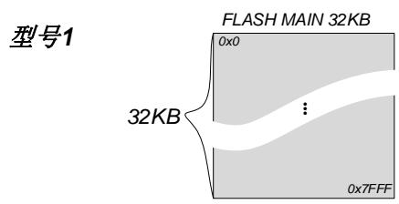

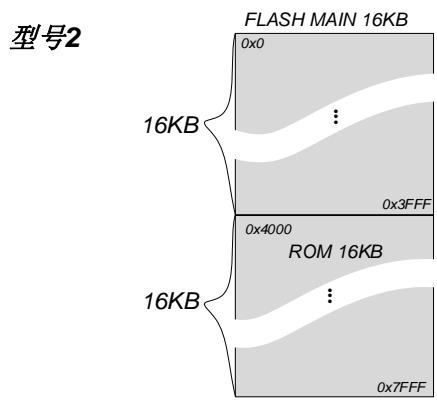

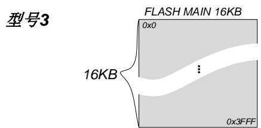  
图 7-1 非易失性存储体空间划分框图及型号

## 7.2 功能特点

非易失性存储体控制器，主要实现对 FLASH 存储体的相关操作；ROM 存储体仅包含执行操作。具体包括：

➢ FLASH读取数据的操作。

➢ FLASH写入数据的操作。

➢ FLASH 擦除操作，包括 Full 擦除和 Sector 擦除。

➢ FLASH深度休眠的操作，以降低芯片的休眠功耗。

➢ FLASH存储体内容的加密操作。

➢ FLASH的读取加速操作，以提升芯片整体运行效率。

➢ FLASH控制寄存器的访问。

➢ ROM 区域，仅可执行，不可拷贝。

## 7.2.1 功能描述

非易失性存储体控制器，实现了对 FLASH 存储体的复位/读出/写入/擦除/休眠等操作。如下为控制状态转换图:

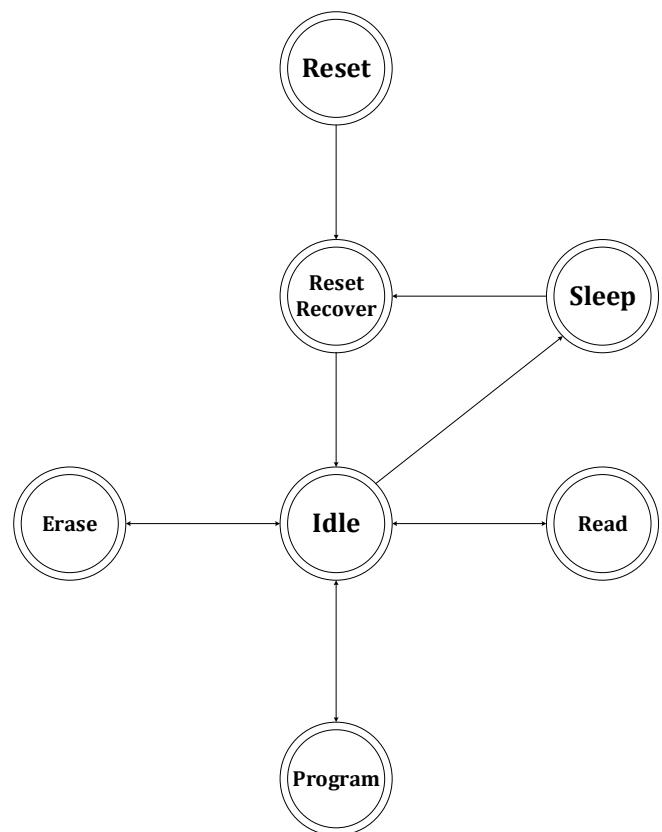  
图 7-2 FLASH 控制状态转换图

## 7.2.1.1 复位操作

系统完成复位后，FLASH 需要一段时间恢复。其目的是保证 FLASH 存储体内部的电路稳定。待稳定后，MCU 才可对FLASH执行对应操作。此操作由硬件自动实现，无需软件干预。

## 7.2.1.2 休眠操作

FLASH 的休眠操作分成两个部分：Standby 和 Deep Sleep。当系统不执行对 FLASH 的操作时，FLASH 可自动进入StandBy 状态（若开启预取，此功能失效）。当系统执行Deep Sleep 操作时，将触发 FLASH 也进入 Deep Sleep，实现降低功耗的目的。FLASH 进入 Deep Sleep 的操作，硬件自动完成，无需软件介入。

当外界唤醒系统，同时将唤醒 FLASH。经过一段时间恢复后，FLASH可执行正常操作。此唤醒恢复操作，硬件自动完成，无需软件介入。

## 7.2.1.3 读取操作

读操作为FLASH的基本操作。系统可通过两条路径访问 FLASH内部的数据。

MCU 通过 AHB 总线，直接对 FLASH 执行取指、取数操作，宽度为 32bit，且只能访问 MAIN 空间的数据。为了加快 MCU的取指、取数据的速度，硬件提供了加速的功能。

MCU 通过AHB 总线，访问控制器的寄存器，间接实现读取 FLASH内部数据的操作。若执行连续读取操作，硬件可自动完成地址累加，无需每次都更新地址寄存器的值。

⚫ MCU 通过AHB 总线，直接对ROM执行取指、取数操作，宽度为32bit。

访问本控制器的寄存器，实现间接读取FLASH内部数据的操作的执行流程如下:

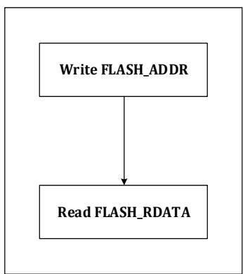  
图7-3FLASH间接读取操作流程图

## 7.2.1.4 FLASH 编程操作

执行对 FLASH 存储体的编程操作。一般而言，我们先执行擦除操作，然后执行数据编程操作。同时，只能通过访问FLASH控制器的寄存器，实现编程操作。具体流程为：

⚫ SYS\_FLSP 寄存器，写入 0x8F35，开启编程使能开关 1

⚫ FLASH\_CFG.PRG\_EN 写 1，开启编程使能开关 2

⚫ FLASH\_ADDR，写入编程地址

## ⚫ FLASH\_WDATA，写入编程数据

访问本控制器的寄存器，实现 FLASH编程操作的执行流程如下:

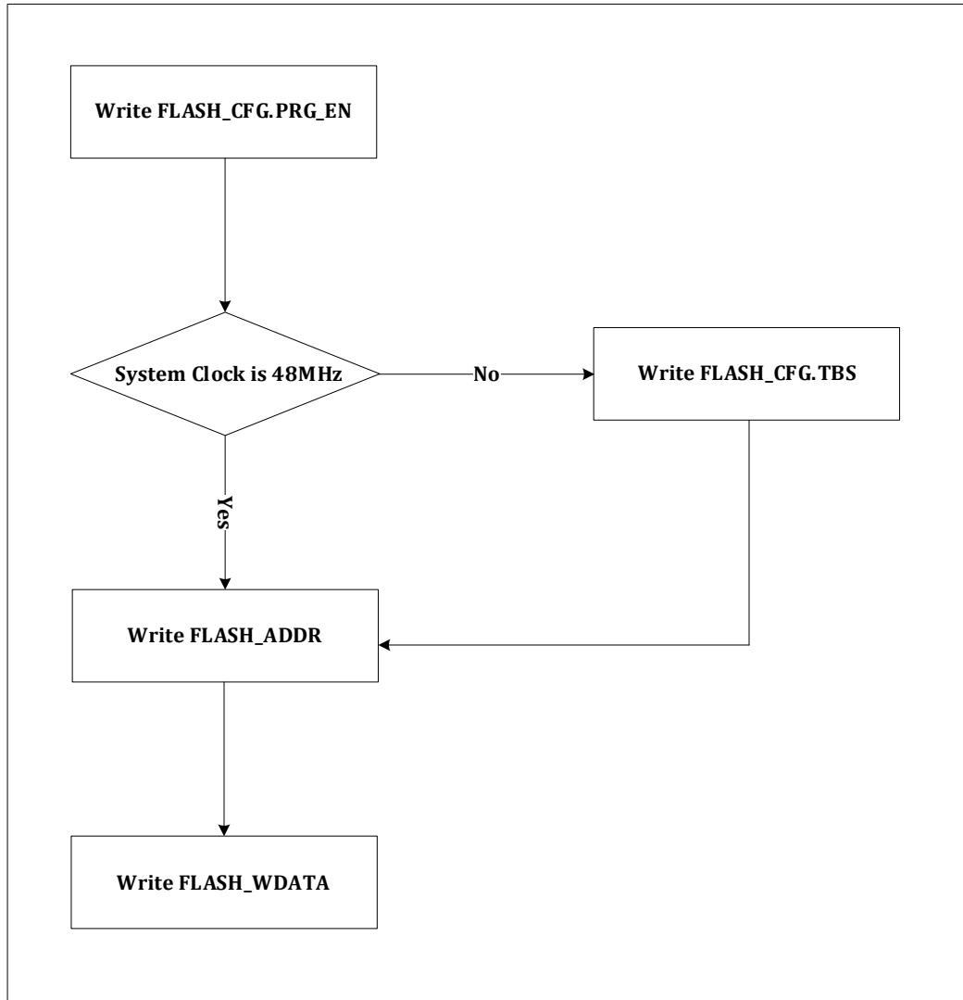  
图7-4FLASH模块编程操作流程图

为了防止FLASH区域被误编程，额外增加一组编程的使能开关--SYS\_FLSP。SYS\_FLSP保护FLASH，防止误编程。写入 0x8F35，开启编程使能，再配置 FLASH\_CFG.PRG\_EN，最终开启 FLASH 的编程功能。

系统工作频率的判断，需要参考SYS\_CLK\_CFG 的配置。FLASH编程/擦除操作的绝对时间是固定的，FLASH控制器需要保存这些绝对时间对应的计数值。FLASH\_CFG.TBS默认值是 48MHz 时钟频率下的计数值；当芯片工作在其他频率下时，需要配置FLASH\_CFG.TBS 的值，以实现 24MHz 和12MHz的计数值（其它频率暂不支持）。最终保证计数值的值×时钟频率等于恒定的时间。不同频率下对应的 FLASH\_CFG.TBS 值，已经在 FLASH\_CFG 寄存器列出。切记，FLASH\_CFG.TBS 仅能配置寄存器说明中提供的几组值，不能被写入其它值，否则可能导致 FLASH 编程/擦除失败。建议对 FLASH\_CFG 的操作，执行先读回，然后按照或/与的方法操作。另外，在执行 FLASH 的编程/擦除操作时，CPU 将暂停工作直至FLASH的编程/擦除操作完毕。

图 7-4 仅展示了一次编程的流程。若执行连续编程时，可以在写入 FLASH\_ADDR 寄存器前，配置 FLASH\_CFG.ADR\_INC，开启地址自动递增模式，后续只需要反复写 FLASH\_WDATA 寄存器即可，

FLASH\_ADDR每次写入一次数据会自动增加0x4。连续读操作类似。连续编程的流程如下:

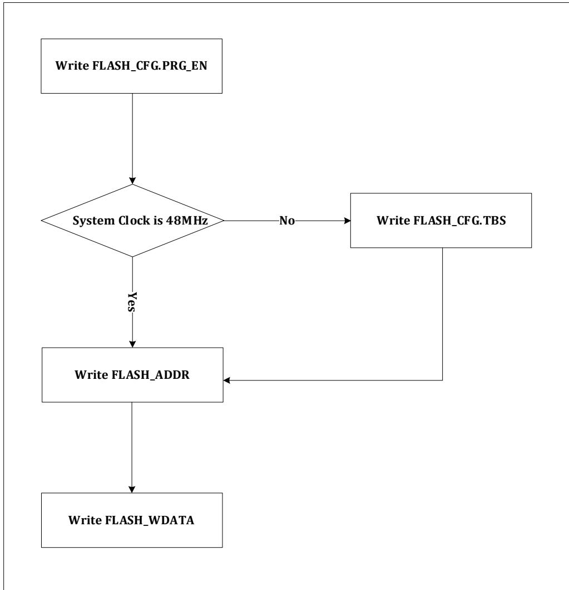  
图7-5FLASH模块编程操作流程图

注意，ROM区域，只支持一次编程。MAIN区域不受此限制。MAIN区域推荐使用库函数执行编程操作。ROM区域编程，推荐使用凌鸥公司指定离线烧录器完成。

## 7.2.1.5 FLASH 擦除操作

擦除操作为FLASH的基本操作。系统只能通过访问FLASH控制器的寄存器实现。具体流程为：

⚫ SYS\_FLSE 寄存器，写入 0x8FCA，擦除操作使能开关 1

⚫ FLASH\_CFG.ERS\_EN 写 1，擦除操作使能开关 2

⚫ FLASH\_ADDR，写入擦除地址

⚫ FLASH\_ERASE，触发擦除操作

为了防止 FLASH 区域被误擦，额外增加一组擦除的使能开关--SYS\_FLSE。SYS\_FLSE 保护 FLASH，防止误擦，写入0x8FCA，开启擦除使能，再配置 FLASH\_CFG.ERS\_EN，最终开启FLASH的擦除功能。

执行对 FLASH 存储体的擦除操作。擦除分成 Sector 和 Full。分别对应，512Byte 的擦除和16KB/32KB的擦除。通过配置 FLASH控制寄存器决定执行哪一种类型的擦除操作。

下表为 Secotor 地址分配空间(16KB 版本，无 Sector32—Sector63)。

表 7-1 FLASH Sector 地址分配表

<table><tr><td>Name</td><td>Addresses</td><td>Size(Bytes)</td></tr><tr><td>Sector 0</td><td>0x0000 0000 - 0x0000 01FF</td><td>512</td></tr><tr><td>Sector1</td><td>0x0000 0200 - 0x0000 03FF</td><td>512</td></tr><tr><td>Sector2</td><td>0x0000 0400 - 0x0000 05FF</td><td>512</td></tr><tr><td>...</td><td>...</td><td>...</td></tr><tr><td>Sector63</td><td>0x0000 7E00 - 0x0000 7FFF</td><td>512</td></tr></table>

FLASH擦除操作流程如下所示。

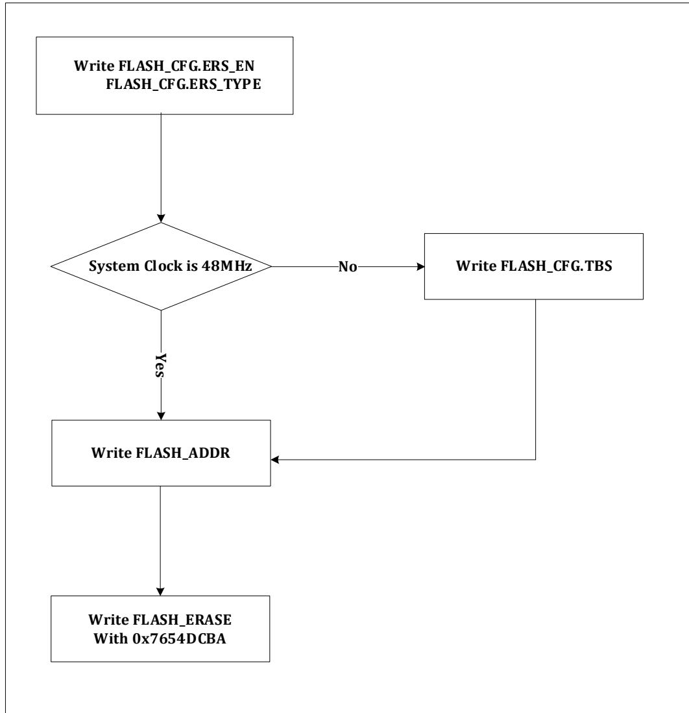  
图7-6FLASH模块擦除操作流程图

若选择 Secotor 擦除，需要通过 FLASH\_ADDR 确定哪个 Secotor 被擦除，若是 Full 模式的话，FLASH\_ADDR 的值将失效。FLASH\_ERASE 写入 0x7654DCBA 触发擦除操作。

注意，ROM 区域，不支持擦除操作。MAIN 区域不受此限制。MAIN 区域推荐使用库函数执行擦除操作。

## 7.2.1.6 FLASH 预取操作

因 FLASH 存储体的速度限制，无法达到 48MHz 的速度。对 FLASH 进行读取操作时，需要大于一个 48MHz 的时钟周期，才能完成数据的读出。为了加快数据的读出，FLASH 控制器增加了预取功能。当FLASH控制器完成当前的读取操作后，在不影响正常程序执行的前提下，顺序预取下一个WORD的数据。预取操作的开启和关闭，只需要设置FLASH\_CFG.PREF即可。

当系统频率降低到24MHz及以下，对FLASH进行读取操作，无需大于一个时钟周期。此时，可以配置FLASH\_CFG.WAIT为 0，去掉额外的等待。切记，从高频调整到低频的时候，先调慢时钟，然后将 FLASH\_CFG.WAIT 改成 0；从低频调整到高频的时候，先将 FLASH\_CFG.WAIT 改成 1，然后再调快时钟。

## 7.2.1.7 非易失性存储体保护

非易失性存储体加密保护，保护 FLASH 和 ROM。因 ROM 只能执行，无法拷贝，已经处于保护状态且无法更改；本小节主要解释 FLASH部分的保护。

FLASH保护的目的：防止外界非法获取 FLASH的内容。

若FLASH存储体内的数据处于保护状态，用户可执行去保护操作；相反，若FLASH存储体内的数据处于去保护状态，用户可执行保护操作。默认情况下，FLASH 存储体内的数据处于保护的状态。芯片上电复位完成后，硬件自动执行一次状态更新操作，若是保护状态则保持保护的状态，否则，变成去保护状态。

FLASH 存储体有 16KB 和 32KB，各自的最后一个 WORD 设计为保护字（16KB 对应 0x3FFC，32KB对应 0x7FFC）。当这个 WORD 内容为全 1 时，说明， FLASH 的内容无需保护，读取 FLASH\_PROTECT寄存器，完成状态更新即可；当这个WORD的内容被写为非全 1时，说明，FLASH的内容需要保护。若需要保护，仅需要将最后一个 WORD 的内容，写入非全 1 的值，读取 FLASH\_PROTECT 寄存器，完成状态的更新（读取FLASH\_PROTECT返回值无意义），启动保护了。

去保护分成两种情况。若最后一个WORD没有执行过写入非全 1的操作，读取 FLASH\_PROTECT寄存器，即完成状态更新（读取 FLASH\_PROTECT 返回值无意义），解除保护。若最后一个 WORD已经非全 1，需执行擦除操作才能解除保护。先对 FLASH 执行擦除操作，将最后一个 WORD 恢复为全 1 值，然后读取 FLASH\_PROTECT 寄存器，完成状态的更新，取消保护（读取 FLASH\_PROTECT 返回值无意义）。

## 7.2.1.8 FLASH 在线升级(IAP)

IAP 模式，实现中断向量表的重映射。在 LKS32MC03x 系列芯片中，包含了系统寄存器 VTOR，其地址为0xE000\_ED08。用于重新映射中断向量表入口地址。

表 7-2 IAP VTOR 寄存器描述

<table><tr><td>名称</td><td>复位值</td><td>偏移</td><td>位置</td><td>权限</td><td>说明</td></tr><tr><td>VTOR</td><td>0x0</td><td></td><td>[31:7]</td><td>RW</td><td>执行写入操作,写入中断向量表入口地址</td></tr></table>

默认值为 0x0，此时中断向量表入口地址为 0x0。当写入非 0 值时，中断向量表入口地址将映射到VTOR 寄存器所对应的地址上，立即生效。

在 LKS32MC03x 系列芯片中，因为有 VTOR 寄存器。用户可根据自己需求，更新整个 FLASH 的内容。在线升级过程中可以使用中断，也可以关闭中断。

## 7.2.1.8.1 开启中断的在线升级

推荐软件配置流程:

关闭MCU 的中断控制器，暂时不接收新的中断响应；

在新的中断入口地址处，放置中断处理函数代码；

将新的中断入口地址写入 VTOR 寄存器；

开启MCU 的中断控制器，使能中断；

用户跳转至在线升级函数，开始在线升级功能；

完成升级，关闭 MCU 的中断控制器，配置 VTOR 为默认值 0；

执行MCU 软复位，系统 PC 重新从0地址开始执行升级后的程序；

## 7.2.1.8.2 关闭中断的在线升级

关闭MCU 的中断控制器，暂时不接收新的中断响应；

用户跳转至在线升级函数，开始在线升级功能；如果在线升级使用了类似UART的外设通讯，需要MCU轮询处理UART的中断标志位。

执行MCU 软复位，系统 PC 重新从0地址开始执行升级后的程序；

## 7.2.1.8.3 在线升级函数的位置

如果需要将FLASH全部擦除，则需要将在线升级函数放置在RAM 中，如果需要使用中断则新的中断向量入口地址也需要位于RAM 地址空间。

如果只需要擦除应用程序占用的部分FLASH区域，则可以将在线升级函数放置在 FLASH高段地址的空闲区域，使用块擦除 FLASH旧的应用程序，写入新的应用程序。

## 7.3 寄存器

## 7.3.1 地址分配

FLASH控制器模块寄存器的基地址是 0x0001\_0000 寄存器列表

表 7-3FLASH 控制器模块寄存器列表

<table><tr><td>名称</td><td>偏移</td><td>说明</td></tr><tr><td>FLASH_CFG</td><td>0x00</td><td>FLASH 配置寄存器</td></tr><tr><td>FLASH_ADDR</td><td>0x04</td><td>地址寄存器</td></tr><tr><td>FLASH_WDATA</td><td>0x08</td><td>写数据寄存器</td></tr><tr><td>FLASH_RDATA</td><td>0x0C</td><td>读数据寄存器</td></tr><tr><td>FLASH_ERASE</td><td>0x10</td><td>擦除控制寄存器</td></tr><tr><td>FLASH_PROTECT</td><td>0x14</td><td>FLASH 保护状态寄存器</td></tr><tr><td>FLASH_READY</td><td>0x18</td><td>FLASH 工作状态寄存器</td></tr></table>

## 7.3.2 配置寄存器FLASH\_CFG（推荐先读回，按或/与方式修改）

地址:0x0001\_0000

复位值:0xB0

表 7-4 配置寄存器 FLASH\_CFG

<table><tr><td>31</td><td>30</td><td>29</td><td>28</td><td>27</td><td>26</td><td>25</td><td>24</td><td>23</td><td>22</td><td>21</td><td>20</td><td>19</td><td>18</td><td>17</td><td>16</td></tr><tr><td>ERS_EN</td><td rowspan="3" colspan="3"></td><td>PRG_EN</td><td rowspan="3" colspan="3"></td><td>ADR_INC</td><td rowspan="3" colspan="3"></td><td>PREF</td><td rowspan="3" colspan="3"></td></tr><tr><td>RW</td><td>RW</td><td>RW</td><td>RW</td></tr><tr><td>0</td><td>0</td><td>0</td><td>0</td></tr><tr><td>15</td><td>14</td><td>13</td><td>12</td><td>11</td><td>10</td><td>9</td><td>8</td><td>7</td><td>6</td><td>5</td><td>4</td><td>3</td><td>2</td><td>1</td><td>0</td></tr></table>

<table><tr><td>ERS_TYPE</td><td rowspan="3"></td><td>REGION</td><td rowspan="3"></td><td>WAIT</td><td rowspan="3"></td><td>TBS</td></tr><tr><td>RW</td><td>RW</td><td>RW</td><td>RW</td></tr><tr><td>0</td><td>0</td><td>1</td><td>30</td></tr></table>

<table><tr><td>位置</td><td>位名称</td><td>说明</td></tr><tr><td>[31]</td><td>ERS_EN</td><td>FLASH 擦除使能。默认为 0。0:关闭擦除1:开启擦除</td></tr><tr><td>[27]</td><td>PRG_EN</td><td>FLASH 编程使能。默认为 0。0:关闭编程1:开启编程</td></tr><tr><td>[23]</td><td>ADR_INC</td><td>FLASH 地址递增使能。默认为 0。0:关闭递增使能1:开启递增使能当执行 FLASH 连续读写访问时,可以开启此功能减少对地址的操作。</td></tr><tr><td>[19]</td><td>PREF</td><td>FLASH 预取加速使能。默认为 0。0:关闭加速1:开启加速</td></tr><tr><td>[15]</td><td>ERS_TYPE</td><td>FLASH 擦除类型选择。默认为 0。0:Sector1:FULL</td></tr><tr><td>[11]</td><td>REGION</td><td>访问 FLASH 区域选择。默认为 0。0:MAIN</td></tr><tr><td>[7]</td><td>WAIT</td><td>读取 FLASH 数据,等待开关。默认为 1。0:读取,无需等待一个周期1:读取,等待一个周期</td></tr><tr><td>[5:0]</td><td>TBS</td><td>编程/擦除时间基数寄存器,默认值为 0x30。只能配成如下几个值0x30:48Mhz 系统频率下,FLASH 编程/擦除时间基数配置值。0x17:24Mhz 系统频率下,FLASH 编程/擦除时间基数配置值。0x0B:12Mhz 系统频率下,FLASH 编程/擦除时间基数配置值。</td></tr></table>

## 7.3.3 地址寄存器 FLASH\_ADDR

地址:0x0001\_0004

复位值:0x0

表 7-5 地址寄存器 FLASH\_ADDR

<table><tr><td>14</td><td>13</td><td>12</td><td>11</td><td>10</td><td>9</td><td>8</td><td>7</td><td>6</td><td>5</td><td>4</td><td>3</td><td>2</td><td>1</td><td>0</td></tr><tr><td colspan="15">ADDR</td></tr><tr><td colspan="15">RW</td></tr><tr><td colspan="15">0</td></tr></table>

<table><tr><td>位置</td><td>位名称</td><td>说明</td></tr><tr><td>[31:15]</td><td></td><td>未使用</td></tr><tr><td>[14:0]</td><td>ADDR</td><td>地址寄存器。读/写/擦除操作对应的地址寄存器。因按照 WORD 操作,最低两位会被 FLASH 控制器忽略。执行擦除操作时,需要根据擦除类型,地址需要对齐。一个 Sector 是 512-Byte。若执行 Sector 擦除,地址需要是 512 的整数倍(若带偏移,偏移量会被忽略)。全芯片擦除,不会参考这个寄存器的值</td></tr></table>

## 7.3.4 写数据寄存器 FLASH\_WDATA

地址:0x0001\_0008

复位值:0x0

表 7-6 写数据寄存器 FLASH\_WDATA

<table><tr><td>31</td><td>30</td><td>29</td><td>28</td><td>27</td><td>26</td><td>25</td><td>24</td><td>23</td><td>22</td><td>21</td><td>20</td><td>19</td><td>18</td><td>17</td><td>16</td></tr><tr><td colspan="16">WDATA</td></tr><tr><td colspan="16">WO</td></tr><tr><td colspan="16">0</td></tr><tr><td>15</td><td>14</td><td>13</td><td>12</td><td>11</td><td>10</td><td>9</td><td>8</td><td>7</td><td>6</td><td>5</td><td>4</td><td>3</td><td>2</td><td>1</td><td>0</td></tr><tr><td colspan="16">WDATAWO</td></tr><tr><td colspan="16">0</td></tr></table>

<table><tr><td>位置</td><td>位名称</td><td>说明</td></tr><tr><td>[31:0]</td><td>WDATA</td><td>执行写入操作,写入 FLASH 的值</td></tr></table>

## 7.3.5 读数据寄存器 FLASH\_RDATA

地址:0x0001\_000C

复位值:0x0

表 7-7 读数据寄存器 FLASH\_RDATA

<table><tr><td>31</td><td>30</td><td>29</td><td>28</td><td>27</td><td>26</td><td>25</td><td>24</td><td>23</td><td>22</td><td>21</td><td>20</td><td>19</td><td>18</td><td>17</td><td>16</td></tr><tr><td colspan="16">RDATA</td></tr><tr><td colspan="16">RO</td></tr><tr><td colspan="16">0</td></tr><tr><td>15</td><td>14</td><td>13</td><td>12</td><td>11</td><td>10</td><td>9</td><td>8</td><td>7</td><td>6</td><td>5</td><td>4</td><td>3</td><td>2</td><td>1</td><td>0</td></tr><tr><td colspan="16">RDATA</td></tr><tr><td colspan="16">RO</td></tr><tr><td colspan="16">0</td></tr></table>

<table><tr><td>位置</td><td>位名称</td><td>说明</td></tr><tr><td>[31:0]</td><td>RDATA</td><td>执行读取操作,读出 FLASH 的值</td></tr></table>

## 7.3.6 擦除控制寄存器 FLASH\_ERASE

地址:0x0001\_0010

复位值:0x0

表 7-8 擦除控制寄存器 FLASH\_ERASE

<table><tr><td>31</td><td>30</td><td>29</td><td>28</td><td>27</td><td>26</td><td>25</td><td>24</td><td>23</td><td>22</td><td>21</td><td>20</td><td>19</td><td>18</td><td>17</td><td>16</td></tr><tr><td colspan="16">ERASE</td></tr><tr><td colspan="16">WO</td></tr><tr><td colspan="16">0</td></tr><tr><td>15</td><td>14</td><td>13</td><td>12</td><td>11</td><td>10</td><td>9</td><td>8</td><td>7</td><td>6</td><td>5</td><td>4</td><td>3</td><td>2</td><td>1</td><td>0</td></tr><tr><td colspan="16">ERASE</td></tr><tr><td colspan="16">WO</td></tr><tr><td colspan="16">0</td></tr></table>

<table><tr><td>位置</td><td>位名称</td><td>说明</td></tr><tr><td>[31:0]</td><td>ERASE</td><td>写入 0x7654DCBA,触发擦除操作</td></tr></table>

## 7.3.7 保护状态寄存器 FLASH\_PROTECT

地址:0x0001\_0014

复位值:0x0

表 7-9 保护状态寄存器 FLASH\_PROTECT

<table><tr><td>31</td><td>30</td><td>29</td><td>28</td><td>27</td><td>26</td><td>25</td><td>24</td><td>23</td><td>22</td><td>21</td><td>20</td><td>19</td><td>18</td><td>17</td><td>16</td></tr><tr><td colspan="16">PROTECT</td></tr><tr><td colspan="16">RO</td></tr><tr><td colspan="16">0</td></tr><tr><td>15</td><td>14</td><td>13</td><td>12</td><td>11</td><td>10</td><td>9</td><td>8</td><td>7</td><td>6</td><td>5</td><td>4</td><td>3</td><td>2</td><td>1</td><td>0</td></tr><tr><td colspan="16">PROTECT</td></tr><tr><td colspan="16">RO</td></tr><tr><td colspan="16">0</td></tr></table>

<table><tr><td>位置</td><td>位名称</td><td>说明</td></tr><tr><td>[31:0]</td><td>PROTECT</td><td>读取该寄存器,更新加密/解密状态读取返回值无参考意义。</td></tr></table>

## 7.3.8 工作状态寄存器 FLASH\_READY

地址:0x0001\_0018

复位值:0x0

表 7-10 工作状态寄存器 FLASH\_READY

<table><tr><td>15</td><td>14</td><td>13</td><td>12</td><td>11</td><td>10</td><td>9</td><td>8</td><td>7</td><td>6</td><td>5</td><td>4</td><td>3</td><td>2</td><td>1</td><td>0</td></tr><tr><td rowspan="3" colspan="15"></td><td>READY</td></tr><tr><td>RO</td></tr><tr><td>0</td></tr></table>

<table><tr><td>位置</td><td>位名称</td><td>说明</td></tr><tr><td>[31:1]</td><td></td><td>未使用</td></tr><tr><td>[0]</td><td>READY</td><td>1:FLASH 处于 Idle 状态; 0:FLASH 处于 Busy 状态</td></tr></table>

## 7.3.9 NVR校正值地址信息

LKS32MC03x 产品存储芯片校准参数：

校准参数，每颗产品均独立校准，每颗产品不支持校准参数混用；

校准参数，在出厂前进行写入，出厂后不支持编程和擦除，仅支持读取；

校准参数，通过LKS 公司提供的库函数进行读取访问；

校准参数，推荐关闭系统中断后，执行访问操作；

lks32mc03x\_nvr.o 文件包含了校准参数的读取函数：

读取函数：uint32\_t Read\_Trim(uint32\_t adr);

表 7-11 校准参数列表

<table><tr><td>地址</td><td>内容</td></tr><tr><td>0x0170</td><td>200K:10K 档位高 16-bit 存放 R2 实际电阻值(注意,放大 100 倍存入)低 16-bit 存放 R1 实际电阻值(注意,放大 100 倍存入)</td></tr><tr><td>0x0174</td><td>190K:20K 档位高 16-bit 存放 R2 实际电阻值(注意,放大 100 倍存入)低 16-bit 存放 R1 实际电阻值(注意,放大 100 倍存入)</td></tr><tr><td>0x0178</td><td>180K:30K 档位高 16-bit 存放 R2 实际电阻值(注意,放大 100 倍存入)低 16-bit 存放 R1 实际电阻值(注意,放大 100 倍存入)</td></tr><tr><td>0x017C</td><td>170K:40K 档位高 16-bit 存放 R2 实际电阻值(注意,放大 100 倍存入)低 16-bit 存放 R1 实际电阻值(注意,放大 100 倍存入)</td></tr><tr><td>0x0188</td><td>内部自带 LDO 供电的芯片,其 AVDD 电压值(注意,放大 1000 倍存入)</td></tr><tr><td>0x018C</td><td>尾缀为 C 版本的 LKS03x 芯片,增加 DAC 的 1.2V 量程,此处存放 1.2V 量程的校准参数(低 16-Bit 为 1.2V 挡位 DC 校准值,高 16-Bit 为 1.2V 挡位 DAC GAIN 校准值)请使用库函数实现准确调用</td></tr><tr><td>0x0190</td><td>SYS_AFE_REG3 校准值</td></tr><tr><td>0x0194</td><td>SYS_AFE_REG4 校准值</td></tr><tr><td>0x0198</td><td>SYS_AFE_REG5 校准值(低 16-Bit 为 5.0V 校准值,高 16-Bit 为 3.3V 校准值)</td></tr><tr><td>0x019C</td><td>SYS_AFE_REG6 校准值(低 16-Bit 为 5.0V 校准值,高 16-Bit 为 3.3V 校准值)</td></tr><tr><td>0x01A0</td><td>ADC0_DC0 校准值,2/3 倍增益</td></tr><tr><td>0x01A4</td><td>ADC0_AMC0 校准值,2/3 倍增益</td></tr><tr><td>0x01A8</td><td>ADC0_DC1 校准值,1 倍增益</td></tr><tr><td>0x01AC</td><td>ADC0_AMC1 校准值,1 倍增益</td></tr><tr><td>0x01B0</td><td>OPA 200K 欧姆 VS 10K 欧姆,GAIN 校准值(扩大 1000 倍结果),R0 为 0 欧姆</td></tr><tr><td>0x01B4</td><td>OPA 190K 欧姆 VS 10K 欧姆,GAIN 校准值(扩大 1000 倍结果),R0 为 0 欧姆</td></tr><tr><td>0x01B8</td><td>OPA 180K 欧姆 VS 10K 欧姆,GAIN 校准值(扩大 1000 倍结果),R0 为 0 欧姆</td></tr><tr><td>0x01BC</td><td>OPA 170K 欧姆 VS 10K 欧姆,GAIN 校准值(扩大 1000 倍结果),R0 为 0 欧姆</td></tr><tr><td>0x01C0</td><td>DAC GAIN 校准值(A 版本芯片,只有 3.0V 挡位,B 版本芯片两者均有)(低 16-Bit 为 3.0V 挡位校准值,高 16-Bit 为 4.8V 挡位校准值)请使用库函数实现准确调用</td></tr><tr><td>0x01C4</td><td>DAC DC 校准值(A 版本芯片,只有 3.0V 挡位,B 版本芯片两者均有)(低 16-Bit 为 3.0V 挡位校准值,高 16-Bit 为 4.8V 挡位校准值)请使用库函数实现准确调用</td></tr><tr><td>0x01C8</td><td>温度传感器,斜率校准值</td></tr><tr><td>0x01CC</td><td>温度传感器,偏置校准值</td></tr><tr><td>0x01F4</td><td>高 16-bit 存放 OPA1 共模电压值(注意,放大 10000 倍存入)低 16-bit 存放 OPA0 共模电压值(注意,放大 10000 倍存入)</td></tr></table>

## 8 SPI

## 8.1 概述

SPI 接口主要使用在，外部设计采用 SPI 协议的应用场景下。SPI 的工作模式软件可选，默认为SPI Motorola模式。SPI接口支持全双工传输和半双工传输。当接口配置为 Master模式时，可发送时钟信号供外部Slave 设备使用。

## 8.2 主要特性

⚫ 支持 Master 和 Slave 操作

⚫ 全双工传输，可根据应用情况，使用3根或者4 根信号线

⚫ 支持半双工传输，可根据应用情况，使用2根信号线

⚫ 可编程的时钟极性和相位

⚫ 可编程的数据顺序：MSB或 LSB

⚫ 最快传输速度为系统最高时钟频率的1/8

⚫ 片选信号均可选。Master 模式下，片选信号可以软件控制也可以硬件产生；Slave 模式下，片选信号可以恒定有效，也可以来自外界设备

⚫ 无本地FIFO，支持DMA操作。包含溢出检测和片选信号异常检测

⚫ 数据长度 8-Bit～16-Bit 可调

## 8.3 功能描述

## 8.3.1 功能框图

本接口采用同步串行设计，实现 MCU 同外部设备之间的 SPI 传输。支持轮询和中断方式获得传输状态信息。本接口的主要功能模块如下图所示。

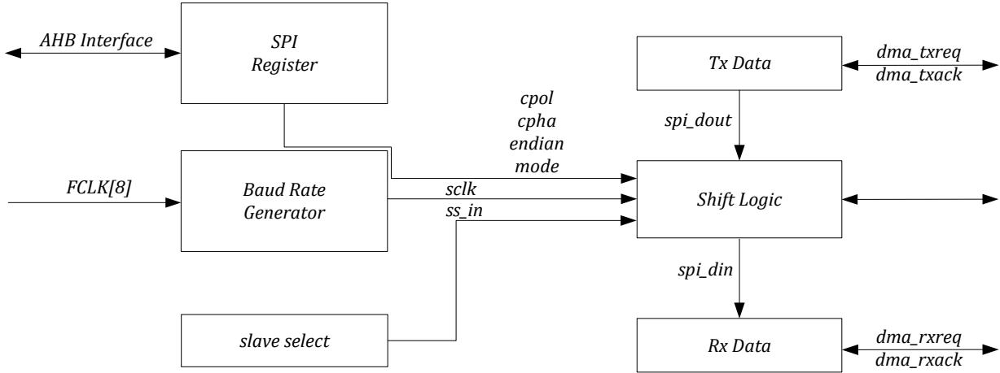  
图 8-1 SPI 模块结构框图

接口信号包括，spi\_din，spi\_dout，sclk\_in，sclk\_out，ss\_in 和 ss\_out。

spi\_din:接口接收的数据信号。同 SPI 协议比较，当接口配置为 Master模式时，其等效为 MISO；当接口配置为Slave 模式时，其等效为MOSI。

spi\_dout:接口发送的数据信号。同SPI 协议比较，当接口配置为Master模式时，其等效为 MOSI；当接口配置为Slave 模式时，其等效为MISO。

sclk\_in:接口接收的时钟信号。此时，接口的工作模式为 Slave。非 Slave 模式下，此信号输入无效。

sclk\_out:接口发送的时钟信号。此时，接口的工作模式为 Master，非 Master 模式下，此信号输出恒定为0。

ss\_in:接口接收的片选信号。此时，接口的工作模式为 Slave。非Slave模式下，此信号输入无效。

ss\_out:接口发送的片选信号。此时，接口的工作模式为 Master。非 Master 模式下，此信号输出恒定为1。

## 8.3.2 功能说明

## 8.3.2.1 全双工模式

默认情况下，SPI 接口配置为全双工模式。此时，数据传输需要两根数据线。数据信号的变化，发生在时钟信号的边沿，即同步于时钟信号。

接口为 Master 模式时:

⚫ spi\_din 为数据输入，接外部 Slave 设备的 MISO

⚫ spi\_dout 为数据输出，接外部 Slave 设备的 MOSI

⚫ spi\_ss\_out为片选信号，根据应用情况选择是使用该信号还是软件控制其它GPIO实现接口为 Slave 模式时:

⚫ spi\_din 为数据输入，接外部 Master 设备的 MOSI

⚫ spi\_dout 为数据输出，接外部 Master 设备的 MISO

⚫ spi\_ss\_in 为片选信号，根据应用情况是使用该信号还是片选恒有效

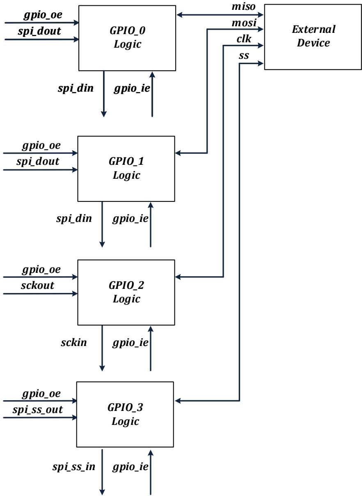  
图8-2SPI接口全双工模式互连框图

从上图可知，GPIO 若配置为输出，则 SPI 接口可发送数据；GPIO 若配置为输入，则 SPI 接口可接收数据。

## 8.3.2.2 半双工模式

SPI 接口可配置为半双工模式。此时，数据传输只需要一根数据线。数据信号的变化，发生在时钟信号的边沿，即同步于时钟信号。一次传输只能是一个方向的，要不就是发送，要不就是接收。

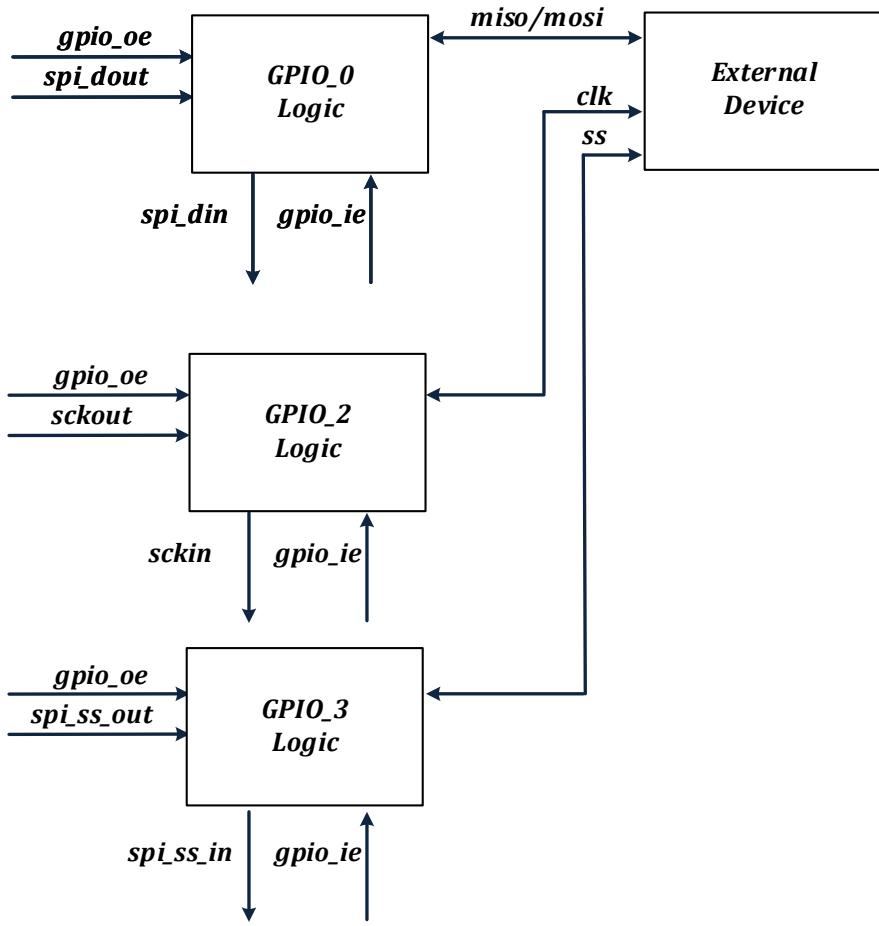  
图8-3SPI接口半双工模式互连框图

注意，上图中若本接口做Master，则clk为本接口的输出信号；若本接口做Slave，则clk 为本接口的输入信号。

## 仅发送

SPI\_CFG. DUPLEX 配置为 2，半双工发送模式有效。此时，本接口只能发送数据。GPIO\_0 的 oe使能，发送 spi\_dout 数据到外界；GPIO\_0 的 ie 关闭，spi\_din 恒定输入为 0。此模式下，支持 Master/Slave模式下的发送。

## 仅接收

SPI\_CFG. DUPLEX 配置为 3，半双工接收模式有效。此时，本接口只能接收数据。GPIO\_0 的 oe关闭，spi\_dout 无法发送数据到外界；GPIO\_0的ie开启，spi\_din接收来自外部的数据。此模式下，支持 Master/Slave 模式下的接收。

注意，全双工下是两个GPIO用于数据传输，半双工下可从中任意选一个GPIO用于数据传输。

## 8.3.2.3 片选信号

本接口做 Slave 模式时，片选信号可选，SPI\_CFG.CS 决定片选来源。ss 为 Master 设备发出的选通使能信号，低电平有效。

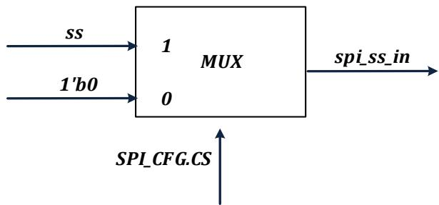  
图 8-4 SPI 模块 Slave 模式片选信号选择

本接口做 Master 模式时，片选信号亦可选。模块硬件产生了标准的片选信号，实际应用可屏蔽此信号通过软件操作额外的 GPIO实现。

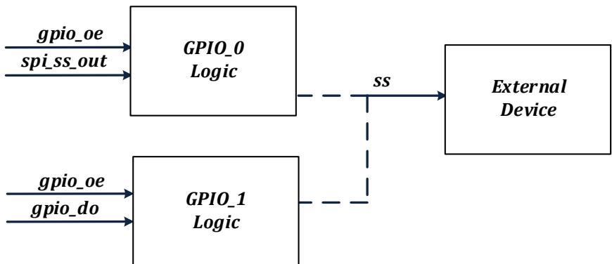  
图 8-5 SPI 模块 Master 模式片选信号选择

注意，图16-5 虚线仅表示不确定。若使用 spi\_ss\_out为ss 的源头，那么将GPIO\_0同外界设备互连；若使用软件操作GPIO的方式，那么可将GPIO\_1同外界设备互连。

## 8.3.2.4 通讯格式

在SPI通讯过程中，发送或者接收操作均是基于SPI 时钟的。通讯格式受到SPI\_CFG. SAMPLE 和SPI\_ CLK\_POL 控制。SPI\_CFG. SAMPLE 为 Phase 控制位，SPI\_ CLK\_POL 为 Polarity 控制位。

Polarity控制了SPI时钟信号在默认情况下的电平状态。Polarity为0时，默认时钟电平为低电平；Polarity为 1时，默认电平为高电平。

Phase控制了SPI数据的发送/接收时刻。Phase为 0时，时钟从默认电平到第一个跳变边沿为采样数据时刻，Phase为1时，时钟从默认电平到第一个跳变边沿为发送数据时刻。

## 8.3.2.5 数据格式及长度

SPI 数据传输格式分成两种:MSB 和LSB。数据传输格式受到 SPI\_CFG.ENDIAN 控制。注意，在数据传输过程中硬件自动实现传输格式的转换，无需软件介入。

SPI 数据长度可配，范围是从 8-Bit 到 16-Bit。SPI\_SIZE.BITSIZE 控制长度。

## 8.3.2.6 DMA 传输

在大容量数据传输应用下，SPI 接口支持DMA传输，减轻MCU的负担。一次传输，最大传输量为由 DMA 模块决定，最小传输量为 1 字节。在全双工模式下，接收和发送均可实现 DMA 传输；在半双工模式下，仅接收或发送实现 DMA传输。

在接收到新的数据后，硬件自动产生DMA 请求，通过 DMA 模块将数据搬移到 RAM 中。在发送新数据前，硬件自动产生DMA请求，通过DMA模块将数据从RAM中搬移到SPI接口。因SPI无FIFO，SPI 发送一次DMA请求，DMA只能搬移一个字节数据。若要实现多字节搬移，DMA需配置为多轮搬移，每一轮搬移一个字节的方式。

DMA传输需要配置DMA模块相应寄存器。

因SPI接口支持DMA 传输，也支持MCU 传输。两者区别在于--DMA传输，发送的数据来自 DMA的搬移；MCU 传输，发送的数据来自 MCU的搬移。

DMA传输，推荐软件配置流程如下：

⚫初始化DMA 模块，将本次发送的数据来源，接收的数据去向配置好，传输长度配置完毕。

⚫ 初始化GPIO模块，将SPI复用的GPIO配置完毕。

⚫ 初始化 SPI 接口，SPI\_IE/SPI\_CFG/SPI\_BAUD/SPI\_SIZE 等寄存器配置完毕。

⚫ 触发SPI 接口，进入发送/接收状态。触发条件是MCU 对 SPI\_TXDATA 寄存器执行写操作，因最终发送的数据来自DMA，本次MCU写入的数据不会混入 SPI发送流程。

## 8.3.2.7 MCU 传输

一次只能发送/接收一个 SPI\_SIZE.BITSIZE 长度的数据，每次完成后需要通过中断或者轮询的方式判断传输是否完成。无论是主模式还是从模式，写 SPI\_TXDATA 寄存器，才能触发传输。主模式为主动发送，从模式为加载数据到发送队列等待主模式发出时钟信号，开始传输。推荐软件配置流程如下:

⚫ 初始化GPIO模块，将SPI复用的GPIO配置完毕。

⚫ 初始化 SPI 接口，SPI\_IE/SPI\_CFG/SPI\_BAUD/SPI\_SIZE 等寄存器配置完毕。

MCU 对SPI\_TXDATA 寄存器执行写操作，触发SPI接口进入发送流程。从模式下，数据加载到内部状态机等待主设备发起读取操作；主模式下，触发发送。

注意：若需要连续发送，则需要重新配置 SPI\_TXDATA寄存器。通过中断或者轮询方式获得传输完毕信息。

## 8.3.2.8 外部事件传输

在大容量数据传输应用下，SPI 接口支持 DMA 传输。传输过程中，可被打断也可不被打断。所谓打断是指，当前字节传输完成，需等待外部事件才开始下一个字节的传输；不打断是指，当前字节传输完成，直接下一个字节的传输。打断模式需要同其它模块配合使用。例如定时器模块，定时器可触发下一字节的传输。打断模式仅在Master模式有效。SPI\_IE.TRANS\_TRIG控制了是否使用打断模式。

## 8.3.2.9 中断处理

SPI 接口包含三种类型的中断事件，分别是：数据传输完成事件，异常事件和溢出事件。

⚫ 数据完成事件，当前数据传输完成。高电平有效，对 SPI\_IE. CMPLT\_IF 写 1 清除。

⚫ 异常事件，SPI 接口为 Slave 模式，若在传输过程中片选信号受到干扰，被拉高，将产生片选异

常事件。高电平有效，对 SPI\_IE. AB\_IF 写 1 清除。

⚫ 溢出事件，SPI\_RX\_DATA寄存器数据没有及时被读走，，将产生溢出事件。高电平有效，对SPI\_IE.OV\_IF 写 1 清除。

上述事件，默认是不触发SPI 中断，可以通过配置SPI\_IE[7:4]使能事件产生中断。

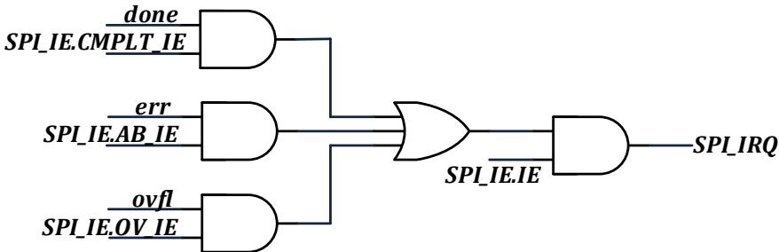  
图8-6SPI模块中断选信号产生图

数据传输完毕后，可通过DMA中断或者SPI自身中断判断结束。

⚫ 发送模式下，DMA 先完成搬移操作，SPI 后发送完毕。SPI 发送完毕，可作为本次传输完成标识。

⚫ 接收模式下，SPI 接收完毕，触发 DMA 搬移。DMA搬移完成，可作为本次传输完成标识。

溢出事件。在全双工模式下，发送和接收的 DMA 均有效，一般情况下不会发送溢出事件；在半双工模式下，只有发送（或接收），此时硬件屏蔽了接收（或发送）的溢出判断

## 8.3.2.10 波特率设置

SPI 接口时钟通过对系统时钟分频获得，分频系数来自 SPI\_BAUD. BAUD。SPI传输波特率配置计算公式为：

$$
\mathrm{SPI} \text {传输波特率} = \text {系统时钟} / (2 ^ {*} (\mathrm{BAUD} + 1))
$$

SPI 协议为半拍协议，上升沿发送数据，下降沿采集数据；或者下降沿发送数据，上升沿采样数据。

SPI 接口采用同步设计，需要对外部设备的信号进行同步采样，同步时钟为系统时钟。数据和时钟信号（此时为Slave 模式）的同步，需要两拍系统时钟。考虑到时钟相位的偏移，此时需要一拍系统时钟的冗余，由此推导出最快的 SPI 传输波特率为系统时钟的 1/8，高电平周期为四拍系统时钟，低电平周期为四拍系统时钟。因此，SPI\_BAUD.BAUD 的配置值不能小于3。

## 8.4 寄存器

## 8.4.1 地址分配

SPI 模块寄存器的基地址是 0x4001\_0000，模块寄存器列表如下。

表 8-1SPI模块控制寄存器列表

<table><tr><td>名称</td><td>偏移</td><td>说明</td></tr><tr><td>SPI_CFG</td><td>0x00</td><td>SPI 配置寄存器</td></tr><tr><td>SPI_IE</td><td>0x04</td><td>SPI 中断寄存器</td></tr><tr><td>SPI_BAUD</td><td>0x08</td><td>SPI 波特率寄存器</td></tr><tr><td>SPI_TXDATA</td><td>0x0C</td><td>SPI 发送数据寄存器</td></tr><tr><td>SPI_RXDATA</td><td>0x10</td><td>SPI 接收数据寄存器</td></tr><tr><td>SPI_SIZE</td><td>0x14</td><td>SPI 传输数据长度寄存器</td></tr></table>

## 8.4.2 SPI\_CFG SPI 控制寄存器

地址:0x4001\_0000

复位值:0x0

表 8-2 系统控制寄存器 SPI\_CFG

<table><tr><td colspan="7">15 14 13 12 11 10 9 8 7 6 5 4 3 2 1 0</td><td></td></tr><tr><td rowspan="3"></td><td>DUPLEX</td><td>CS</td><td>MS</td><td>CPHA</td><td>CPOL</td><td>ENDIAN</td><td>EN</td></tr><tr><td>RW</td><td>RW</td><td>RW</td><td>RW</td><td>RW</td><td>RW</td><td>RW</td></tr><tr><td>0</td><td>1</td><td>0</td><td>0</td><td>1</td><td>0</td><td>0</td></tr></table>

<table><tr><td>位置</td><td>位名称</td><td>说明</td></tr><tr><td>[31:8]</td><td></td><td>未使用</td></tr><tr><td>[7:6]</td><td>DUPLEX</td><td>半双工模式设置00,01:关闭半双工模式10:开启半双工模式,仅发送11:开启半双工模式,仅接收</td></tr><tr><td>[5]</td><td>CS</td><td>SPI 从设备下,片选信号来源。默认值为 1。0:Slave 模式下,片选信号恒为有效值--01:Slave 模式下,片选信号来自 Master 设备</td></tr><tr><td>[4]</td><td>MS</td><td>SPI 主从模式选择。默认值为 0。0:Slave 模式1:Master 模式</td></tr><tr><td>[3]</td><td>CPHA</td><td>SPI 相位选择。默认值为 0。0:Phase 为 01:Phase 为 1</td></tr><tr><td>[2]</td><td>CPOL</td><td>SPI 极性选择。默认值为 0。0:Polarity 为 01:Polarity 为 1</td></tr><tr><td>[1]</td><td>ENDIAN</td><td>SPI 模块传输顺序。默认值为 0。0:MSB,高位先传输1:LSB,低位先传输</td></tr><tr><td>[0]</td><td>EN</td><td>SPI 模块使能信号。默认值为 0。0:关闭 SPI 模块1:开启 SPI 模块</td></tr></table>

## 8.4.3 SPI\_IE SPI 中断寄存器

地址:0x4001\_0004

复位值:0x0

表 8-3 SPI\_IE 中断寄存器

<table><tr><td>15</td><td>14</td><td>13</td><td>12</td><td>11</td><td>10</td><td>9</td><td>8</td><td>7</td><td>6</td><td>5</td><td>4</td><td>3</td><td>2</td><td>1</td><td>0</td></tr><tr><td rowspan="3" colspan="8"></td><td>IE</td><td>CMPLT_IE</td><td>AB_IE</td><td>OV_IE</td><td>TRANS_TRIG</td><td>CMPLT_IF</td><td>AB_IF</td><td>OV_IF</td></tr><tr><td>RW</td><td>RW</td><td>RW</td><td>RW</td><td>RW</td><td>RW</td><td>RW</td><td>RW</td></tr><tr><td>0</td><td>0</td><td>0</td><td>0</td><td>0</td><td>0</td><td>0</td><td>0</td></tr></table>

<table><tr><td>位置</td><td>位名称</td><td>说明</td></tr><tr><td>[31:8]</td><td></td><td>未使用</td></tr><tr><td>[7]</td><td>IE</td><td>SPI中断使能开关。默认值为0。0:关闭SPI中断1:使能SPI中断</td></tr><tr><td>[6]</td><td>CMPLT_IE</td><td>SPI传输,完成事件中断使能信号。0:屏蔽此中断源1:使能此中断源</td></tr><tr><td>[5]</td><td>AB_IE</td><td>SPI传输,异常事件中断使能信号。0:屏蔽此中断源1:使能此中断源</td></tr><tr><td>[4]</td><td>OV_IE</td><td>SPI传输,溢出事件中断使能信号。默认值为0。0:屏蔽此中断源1:使能此中断源</td></tr><tr><td>[3]</td><td>TRANS_TRIG</td><td>传输触发选择。1:外部触发0:内部自动执行。仅主模式有效</td></tr><tr><td>[2]</td><td>CMPLT_IF</td><td>SPI传输,完成事件。高电平有效,写1清除。</td></tr><tr><td>[1]</td><td>AB_IF</td><td>SPI传输,异常事件。Slave模式下,传输未完成,发生片选信号无效事件。高电平有效,写1清除。</td></tr><tr><td>[0]</td><td>OV_IF</td><td>SPI传输,溢出事件。前次接收的旧数据没有被取得走,本次接收的新数据已经到达。高电平有效,写1清除。</td></tr></table>

## 8.4.4 SPI\_BAUD SPI 波特率寄存器

地址:0x4001\_0008

复位值:0x0

表 8-4 SPI\_BAUD 控制寄存器

<table><tr><td colspan="6">15 14 13 12 11 10 9 8 7 6 5 4 3 2 1 0</td></tr><tr><td rowspan="3"></td><td>TRANS_MODE</td><td></td><td colspan="2">BAUD</td><td></td></tr><tr><td>RW</td><td></td><td colspan="2">RW</td><td></td></tr><tr><td>0</td><td></td><td colspan="2">0</td><td></td></tr></table>

<table><tr><td>位置</td><td>位名称</td><td>说明</td></tr><tr><td>[31:9]</td><td></td><td>未使用</td></tr><tr><td>[7]</td><td>TRANS_MODE</td><td>SPI 数据搬移方式。默认为 0,DMA 方式。0: SPI 接口支持 DMA 搬移数据到 SPI 接口,完成发送和接收。1: SPI 接口支持 MCU 搬移数据到 SPI 接口,完成发送和接收。</td></tr><tr><td>[6]</td><td></td><td>未使用</td></tr><tr><td>[5:0]</td><td>BAUD</td><td>SPI 传输波特率配置,SPI 实际传输速度计算公式为:SPI 传输速度 = 系统时钟 / (2*(BAUD + 1))切记,BAUD 的配置值不能小于 3。</td></tr></table>

## 8.4.5 SPI\_TXDATA SPI 数据发送寄存器

地址:0x4001\_000C

复位值:0x0

表 8-5 SPI\_TXDATA 数据发送寄存器

<table><tr><td>15</td><td>14</td><td>13</td><td>12</td><td>11</td><td>10</td><td>9</td><td>8</td><td>7</td><td>6</td><td>5</td><td>4</td><td>3</td><td>2</td><td>1</td><td>0</td></tr><tr><td colspan="16">TX_DATA</td></tr><tr><td colspan="16">RW</td></tr><tr><td colspan="16">0</td></tr></table>

<table><tr><td>位置</td><td>位名称</td><td>说明</td></tr><tr><td>[31:16]</td><td></td><td>未使用</td></tr><tr><td>[15:0]</td><td>TX_DATA</td><td>SPI 数据发送寄存器</td></tr></table>

## 8.4.6 SPI\_RXDATA SPI 数据接收寄存器

复位值:0x0

表 8-6 SPI\_RXDATA 数据接收寄存器

<table><tr><td>15</td><td>14</td><td>13</td><td>12</td><td>11</td><td>10</td><td>9</td><td>8</td><td>7</td><td>6</td><td>5</td><td>4</td><td>3</td><td>2</td><td>1</td><td>0</td></tr><tr><td colspan="16">RX_DATA</td></tr><tr><td colspan="16">RW</td></tr><tr><td colspan="16">0</td></tr></table>

<table><tr><td>位置</td><td>位名称</td><td>说明</td></tr><tr><td>[31:16]</td><td></td><td>未使用</td></tr><tr><td>[15:0]</td><td>RX_DATA</td><td>SPI 数据接收寄存器</td></tr></table>

## 8.4.7 SPI\_SIZE SPI 数据传输长度寄存器

地址:0x4001\_0014

复位值:0x0

表 8-7 SPI\_SIZE 数据传输长度寄存器

<table><tr><td colspan="101">15 14 13 12 11 10 9 8 7 6 5 4 3 2 1 0</td><td></td><td></td></tr><tr><td rowspan="11" colspan="100"></td><td rowspan="2">BITSIZE</td><td></td><td></td></tr><tr><td></td><td></td></tr><tr><td></td><td></td><td></td><td></td><td></td><td></td><td></td><td></td></tr><tr><td></td><td></td><td></td></tr><tr><td></td><td></td><td></td><td></td><td></td><td></td><td></td><td></td><td></td><td></td><td></td><td></td><td></td><td></td></tr><tr><td></td><td></td><td></td><td></td></tr><tr><td></td><td></td><td></td><td></td><td></td><td></td><td></td><td></td><td></td><td></td><td></td><td></td><td></td><td></td><td></td><td></td><td></td><td></td></tr><tr><td></td><td></td><td></td><td></td><td></td><td></td><td></td><td></td><td></td></tr><tr><td></td><td></td><td></td><td></td><td></td><td></td><td></td><td></td><td></td><td></td><td></td><td></td><td></td><td></td><td></td><td></td><td></td><td></td><td></td><td></td><td></td><td></td></tr><tr><td></td><td></td><td></td><td></td><td></td><td></td><td></td><td></td><td></td><td></td><td></td><td></td><td></td><td></td><td></td><td></td><td></td><td></td><td></td><td></td><td></td><td></td><td></td><td></td><td></td><td></td><td></td></tr><tr><td>0</td><td></td><td></td><td></td><td></td><td></td><td></td><td></td><td></td><td></td><td></td><td></td><td></td><td></td><td></td><td></td><td></td><td></td><td></td><td></td><td></td><td></td><td></td><td></td><td></td><td></td><td></td><td></td><td></td><td></td><td></td><td></td><td></td><td></td><td></td><td></td><td></td><td></td><td></td><td></td><td></td><td></td><td></td><td></td><td></td><td></td><td></td><td></td><td></td><td></td><td></td><td></td><td></td><td></td><td></td><td></td><td></td><td></td><td></td><td></td><td></td><td></td><td></td><td></td><td></td></tr></table>

<table><tr><td>位置</td><td>位名称</td><td>说明</td></tr><tr><td>[31:5]</td><td></td><td>未使用</td></tr><tr><td>[4:0]</td><td>BITSIZE</td><td>字节长度寄存器。0x00:非法值0x07:非法值0x08:8-Bit0x09:9-Bit...0x0E:14-Bit0x0F:15-Bit0x10:16-Bit</td></tr></table>

## 9 I2C

## 9.1 概述

I2C总线接口连接微控制器和串行 I2C 总线。它提供多主机功能，控制所有I2C总线特定的时序、协议、仲裁和定时。支持标准和快速两种模式。

## 9.2 主要特性

多主机功能：该模块既可做主设备也可做从设备。

I2C主设备功能：产生时钟、START和STOP事件。

I2C从设备功能：可编程的 I2C 硬件地址比较（仅支持7 位硬件地址）、停止位检测。

⚫ 根据系统分频，实现不同的通讯速度。

⚫ 状态标志：发送器/接收器模式标志、字节发送结束标志、I2C 总线忙标志。

⚫ 错误标志：主模式时的仲裁丢失、地址/数据传输后的应答(ACK)错误、检测到错位的起始或停止条件。

⚫ 一个中断向量，包含五个中断源：总线错误中断源、完成中断源、NACK 中断源、硬件地址匹配中断源和传输完成中断源。

⚫ 具单字节缓冲器的DMA。

## 9.3 功能描述

## 9.3.1 功能框图

本接口采用同步串行设计，实现 MCU 同外部设备之间的 I2C 传输。支持轮询和中断方式获得传输状态信息。本接口的主要功能模块如下图所示。

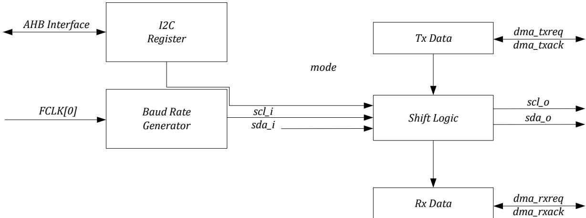

图 9-1I2C 模块顶层功能框图

I2C 接口同外界通讯只有 SCL 和 SDA 两根信号线。SDA 为双向复用信号线，受到 sda\_oe 控制。模块级，I2C 接口信号包括，scl\_i，sda\_i，scl\_o，sda\_o 和 sda\_oe。

scl\_i:时钟信号。当I2C接口配置为从模式时，此为I2C总线的时钟输入信号。

sda\_i:数据信号。当 I2C 接口接收数据时（无论主模式还是从模式），此为 I2C 总线的数据输入信号。

scl\_o:时钟信号。当I2C接口配置为主模式时，此为I2C总线的时钟输出信号。

sda\_o:数据信号。当 I2C 接口发送数据时（无论主模式还是从模式），此为 I2C 总线的数据输出信号。

sda\_oe:数据使能信号。当 sda\_o 输出时，sda\_oe 有效；当 sda\_i 输入时，sda\_oe 无效。

## 9.3.2 功能说明

I2C 模块接收和发送数据，并将数据从串行转换成并行，或并行转换成串行。可以开启或禁止中断。接口通过数据引脚(SDA)和时钟引脚(SCL)连接到I2C总线。

## 9.3.2.1 模式选择

接口可以下述4 种模式中的一种运行:

⚫ 从发送模式

⚫ 从接收模式

⚫ 主发送模式

⚫ 主接收模式

I2C 接口默认主从均不使能。接口根据配置情况，进入主模式或者从模式。当仲裁丢失或产生停止信号时，主模式自动释放总线并产生相应异常中断。允许多主机功能。

主模式时，I2C 接口启动数据传输并产生时钟信号。串行数据传输总是以起始条件开始并以停止条件结束。起始条件和停止条件都是在主模式下由软件控制产生。

从模式时，I2C 接口能识别它自己的地址(7 位)。软件能够控制开启或禁止硬件地址比较功能，硬件地址比较功能可降低MCU 的负担。只有地址匹配才通知MCU 进行相关处理。

数据和地址按 8 位/字节进行传输，高位在前。跟在起始条件后的 1 个字节是地址。地址只在主模式发送。

在一个字节传输的8 个时钟后的第9 个时钟期间，接收器必须回送一个应答位(ACK)给发送器。

软件可以开启或禁止应答(ACK)，并可以设置I2C接口的地址。

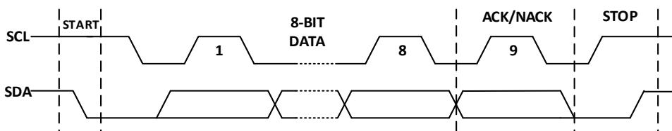

图 9-2 基本 I2C 传输时序图

I2C接口没有FIFO，若一次性发送大量数据，为了降低MCU 的负担，需DMA 配合。I2C 接口支持DMA 传输（多字节传输）和非 DMA 传输（单字节传输）。上述四种传输模式进一步扩展为：

⚫ 从模式单字节发送，从模式 DMA 发送

⚫ 从模式单字节接收，从模式 DMA 接收

⚫ 主模式单字节发送，主模式 DMA 发送

⚫ 主模式单字节接收，主模式 DMA 接收

一般情况下，非 DMA 方式时，一次传输一个字节（可反复单次传输，需软件介入提供数据）。DMA方式，一次连续传输可以多字节（最大不超过32 字节，极端情况一次传输一个字节，因无 FIFO，每次 DMA请求，仅传输一个字节，多轮完成本次数据传输）。

上述所有模式，遵循如下基本原则：

⚫ 单字节发送，中断将在 8-bit 数据发送完毕且收到响应后（ACK/NACK 均可）产生。

⚫ 单字节接收，中断将在8-bit 数据接收完毕后产生。

⚫ DMA发送，正常情况下，中断将在数据发送完毕且收到响应后（ACK/NACK均可）产生。

⚫ DMA接收，正常情况下，中断将在数据接收完毕后产生。

⚫ 当 I2C 接口配置为主模式时，检测到错误后，I2C 接口会主动释放总线，恢复到起始状态并产生中断信号。

## 9.3.2.2 从模式

默认情况下，I2C 接口主模式和从模式均关闭。若工作在从模式，需使能从模式。为了产生正确的时序，必须通过系统寄存器 SYS\_CLK\_DIV0 设定 I2C 接口的工作时钟频率，I2C 接口时钟基于系统高速主时钟进行分频，SYS\_CLK\_DIV0是I2C接口工作时钟的分频系数。

⚫ 从模式下，I2C 接口时刻在监控总线上的信号。一旦检测到起始条件，其将保存地址位数据和读写位数据。

⚫ 从模式下，若硬件地址匹配功能开启，只有地址匹配的情况下，才会产生中断，通知 MCU 进行后续处理。若没有开启，每次收到地址及读写位数据，都将产生中断。

⚫ 从模式下，单字节接收模式。每次收到一个字节的数据后，产生中断，此时 I2C 接口可拉低SCL，直至中断完成，继续后续操作。

⚫ 从模式下，单字节发送模式。每次发送一个字节完毕后且收到响应（ACK/NACK），产生中断，此时I2C接口可拉低SCL，直至中断完成，继续后续操作。

⚫ 从模式下，DMA接收模式。每次收到 SIZE 约定后的数据，产生中断，此时I2C接口可拉低SCL，直至中断完成。

⚫ 从模式下，DMA 发送模式。每次发送 SIZE 约定后的数据并收到响应（ACK/NACK），产生中断，

此时 I2C 接口可拉低 SCL，直至中断完成。

## 9.3.2.2.1 从模式传输

从模式下可以配置进行单字节传输。单字节传输，并不意味着仅仅传输一个字节数据，其含义为每次传输完一个字节的数据后，将产生中断判断是否还要继续传输。单字节传输的极端情况是仅传输一个字节的数据。下图为单字节传输的总线示意图。从图可知，一般单字节传输的流程如下：

⚫ 地址匹配，产生地址匹配中断，准备开始传输。

⚫ 若是接收模式，一个字节接收完毕后，产生中断，软件判断是否继续接收，返回 ACK/NACK 响应。

⚫ 若是发送模式，一个字节发送完毕后，等待响应（ACK/NACK），产生中断，根据响应判断后续操作。

⚫ 获得总线STOP事件，本次传输完成。

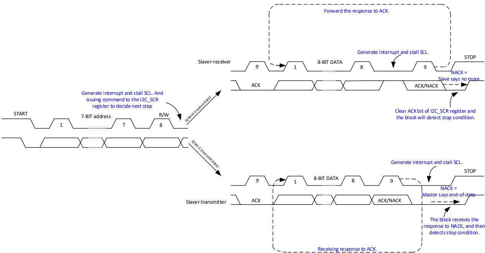  
图9-3 从模式传输示意图

## 9.3.2.2.2 从模式发送

地址匹配后，从发送器将字节从 I2C\_DATA 寄存器经由内部移位寄存器发送到 SDA 线上。在I2C\_DATA 数据没有准备好之前，从设备可拉底 SCL，直到待发送数据已写入 I2C\_DATA 寄存器。I2C接口在发送完毕每个字节后都执行下列操作:

⚫ 如果接收到ACK位，装载下一个字节数据，继续传输。装载过程中，可拉底SCL。

⚫ 如果接收到 NACK 位，停止下一个字节的装载。

⚫ 等待STOP事件，停止本次传输。

## 9.3.2.2.3 从模式单字节接收

地址匹配后，从接收器将通过内部移位寄存器从SDA 线接收到的数据存入I2C\_DATA寄存器。I2C接口在接收到每个字节后都执行下列操作:

⚫ 如果设置了ACK位，在一个字节接收完毕后，产生一个 ACK应答脉冲。

⚫ 如果清除了ACK位，在一个字节接收完毕后，产生一个 NACK应答脉冲。

⚫ 等待 STOP 事件，结束本次传输。

## 9.3.2.3 从模式 DMA 传输

从模式下，一般仅配置 I2C 时钟、从地址以及硬件地址匹配使能，等待总线有访问请求后，根据芯片实际情况决定是否响应本次传输请求。DMA 传输，其含义为每次传输多个字节的数据后，将产生中断判断是否还要继续传输。DMA 传输的极端情况是仅传输一个字节的数据。DMA 传输，一般建议开启硬件地址比较功能，NACK中断，传输完成中断。一般DMA 传输的流程如下：

配置I2C从地址，使能 I2C 中断（可使能硬件地址比较中断）。地址匹配，产生I2C地址匹配中断，在中断处理函数中，配置 DMA，准备好发送数据或者准备好接收地址。然后写 I2C\_SCR，准备开始传输或者停止本次传输。

⚫ 若是接收模式，I2C\_BSIZE.BURST\_SIZE约定的字节接收完毕后，产生中断，软件判断是否继续接收，返回 ACK/NACK 响应。

⚫ 若是发送模式，I2C\_BSIZE.BURST\_SIZE 约定的字节发送完毕后，等待响应（ACK/NACK），产生中断，根据响应判断后续操作。

⚫ 获得总线完成标志，本次传输完成。

## 9.3.2.3.1 从模式 DMA 发送

地址匹配后，配置完毕 DMA。通过发送DMA 请求，将字节从RAM 搬移到 I2C\_DATA 寄存器，然后经由内部移位寄存器发送到SDA 线上。在I2C\_DATA 数据没有准备好之前，从设备可拉底SCL，直到待发送数据已写入 I2C\_DATA 寄存器。从模式下发送数据，需要软件协助触发第一次 DMA 搬移，配置 I2C\_BCR.BYTE\_CMPLT 为 1 即可。I2C 接口在发送完毕 I2C\_BSIZE.BURST\_SIZE 约定的字节数据后都执行下列操作:

⚫ 如果接收到ACK位，配置DMA，准备下一批数据，继续传输。准备过程中，可拉低 SCL。

⚫ 如果接收到NACK位，停止准备下一批数据，停止本次传输。

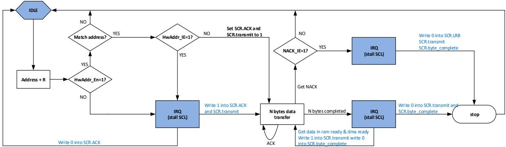  
图9-4 从模式下多字节发送示意图

## 9.3.2.3.2 从模式 DMA 接收

地址匹配后，配置好DMA，从SDA线接收到的数据先存入 I2C\_DATA寄存器，然后通过 DMA搬移到RAM。I2C 接口在接收到一个字节后都将执行DMA请求。完成I2C\_BCR.BURST\_SIZE约定的数据传输后，执行下列操作:

⚫ 如果设置了 ACK 位，在 I2C\_BCR.BURST\_SIZE 约定数据接收完毕后，产生一个 ACK 应答脉冲。

⚫ 如果清除了ACK位，在I2C\_BCR.BURST\_SIZE 约定数据接收完毕后，产生一个 NACK 应答脉冲。

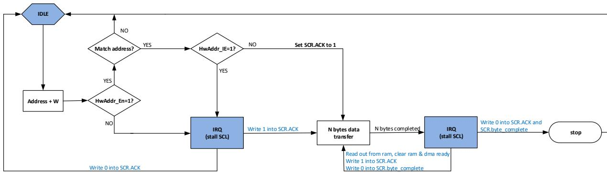  
图9-5 从模式下多字节接收示意图

## 9.3.2.4 主模式

默认情况下，I2C 接口主模式和从模式均关闭。若工作在主模式，需使能主模式。为了产生正确的时序，必须在系统寄存器 CLK\_DIV0 中设定I2C接口的工作时钟。

I2C接口执行主模式传输之前，需要判断总线是否空闲。可读取I2C\_MSCR 寄存器的 BIT3，查询当前总线状态。若总线处于忙的状态，可以开启I2C 中断，通过收到STOP中断事件判断总线是否空闲下来。只有空闲状态下，才能正常发送START状态，以及后续的数据。

## 9.3.2.4.1 主模式单字节传输

单字节传输，并不意味着仅仅传输一个字节数据，其含义为每次传输完一个字节的数据后，将产生中断判断是否还要继续传输。单字节传输的极端情况是仅传输一个字节的数据。图6 为单字节传输的总线示意图。从图可知，一般单字节传输的流程如下：

⚫ 判断总线是否空闲，若空闲，准备开始传输。

⚫ 若是接收模式，一个字节接收完毕后，产生中断，软件判断是否继续接收，返回 ACK/NACK 响应。

⚫ 若是发送模式，一个字节发送完毕后，等待响应（ACK/NACK），产生中断，根据响应判断后续操作。

⚫ 发送总线 STOP 事件，本次传输完成。

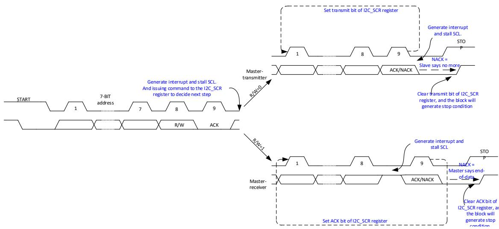  
图9-6 主模式下单字节传输示意图

## 9.3.2.4.2 主模式单字节发送

开始传输后，I2C 接口将字节从 I2C\_DATA 寄存器经由内部移位寄存器发送到 SDA 线上。在I2C\_DATA数据没有准备好之前，主设备可不产生 SCL时钟信号，直到待发送数据已写入I2C\_DATA 寄存器。I2C 接口在发送完毕每个字节后都执行下列操作:

⚫ 如果接收到ACK位，装载下一个字节数据，继续传输。装载过程中，可拉底SCL。

⚫ 如果接收到NACK位，停止下一个字节的装载。

⚫ 产生STOP事件，结束本次传输。

## 9.3.2.4.3 主模式单字节接收

开始传输后，I2C 接口将通过内部移位寄存器从 SDA线接收到的数据存入I2C\_DATA寄存器。I2C

接口在接收到每个字节后都执行下列操作:

⚫ 如果设置了ACK位，在一个字节接收完毕后，产生一个 ACK应答脉冲。

⚫ 如果清除了ACK位，在一个字节接收完毕后，产生一个 NACK应答脉冲。

⚫ 产生 STOP 事件，结束本次传输。

## 9.3.2.4.4 主模式 DMA 传输

DMA 传输，其含义为每次传输多个字节的数据后，将产生中断判断是否还要继续传输。DMA 传输的极端情况是仅传输一个字节的数据。DMA 传输，一般建议开启 NACK 中断，传输完成中断。一般DMA 传输的流程如下：

⚫ 总线空闲，准备开始传输。

⚫ 若是接收模式，I2C\_BCR.BURST\_SIZE 约定的字节接收完毕后，产生中断，软件判断是否继续接收，返回 ACK/NACK 响应。

若是发送模式，I2C\_BCR.BURST\_SIZE 约定的字节发送完毕后，等待响应（ACK/NACK），产生中断，根据响应判断后续操作。

⚫ 发送 STOP 事件，本次传输完成。

## 9.3.2.4.5 主模式 DMA 发送

总线空闲，配置完毕DMA。通过发送DMA请求，将字节从 RAM搬移到I2C\_DATA寄存器，然后经由内部移位寄存器发送到SDA线上。在I2C\_DATA数据没有准备好之前，主设备可不产生SCL时钟，直到待发送数据已写入I2C\_DATA寄存器。I2C 接口在发送完毕SIZE约定的字节数据后都执行下列操作:

⚫ 如果接收到ACK位，配置DMA，准备下一批数据，继续传输。准备过程中，可拉低 SCL。

⚫ 如果接收到NACK位，停止加载下一批数据。

⚫ 如果本次数据发送完毕，停止后续发送。

⚫ 产生STOP事件，停止本次传输。

异常情况是：

⚫ 若从设备地址不匹配或者从设备没有准备好，此时从设备将返回NACK

⚫ 主设备产生STOP事件，停止本次传输。

等待一段时间后，重新配置 I2C 寄存器，关闭DMA对应的通道使能信号，重新配置 DMA寄存器，再次发送传输请求。关闭DMA对应通道是因为I2C有预取，DMA已经不是初始状态。

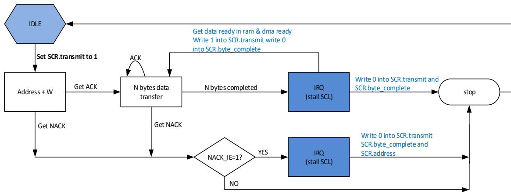  
图9-7 主模式下多字节发送示意图

## 9.3.2.4.6 主模式 DMA 接收

总线空闲，配置好DMA从SDA 线接收到的数据先存入 I2C\_DATA寄存器，然后通过 DMA搬移到RAM。I2C 接口在接收到一个字节后都将执行 DMA请求。完成 I2C\_BCR.BURST\_SIZE 约定的数据传输后，执行下列操作:

⚫ 如果设置了ACK位，在I2C\_BCR.BURST\_SIZE约定数据接收完毕后，产生一个ACK应答脉冲。

⚫ 如果清除了 ACK 位，在 I2C\_BCR.BURST\_SIZE 约定数据接收完毕后，产生一个 NACK 应答脉冲。

⚫ 产生STOP事件，停止本次传输。

异常情况是：

⚫ 若从设备地址不匹配或者从设备没有准备好，此时从设备将返回NACK。

⚫ 主设备产生 STOP 事件，停止本次传输。

等待一段时间后，重新配置 I2C 寄存器，再次发送传输请求。因为上一次没有收到有效数据，DMA并没有任何动作，所以不用重置 DMA。

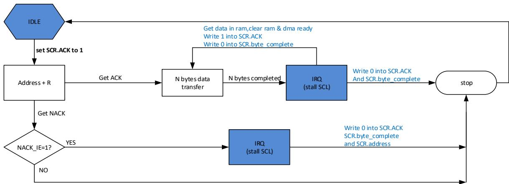  
图 9-8 主模式下多字节接收示意图

## 9.3.2.5 DMA 传输

在大容量数据传输应用下，I2C接口支持DMA 传输，减轻MCU的负担。一次传输，最大传输量为 32 字节，最小传输量为 1 字节。因 I2C 无 FIFO，I2C 发送一次 DMA 请求，DMA 只能搬移一个字节数据。若要实现多字节搬移，DMA 需配置为多轮搬移，每一轮搬移一个字节的方式。

在接收到新的数据后，硬件自动产生DMA 请求，通过 DMA 模块将数据搬移到 RAM 中。在发送新数据前，硬件自动产生DMA请求，通过DMA模块将数据从 RAM中搬移到I2C 接口。

DMA传输需要配置DMA模块相应寄存器。

因I2C 接口支持DMA传输，也支持MCU传输。两者区别在于 DMA传输，发送的数据来自 DMA的搬移；MCU 传输，发送的数据来自 MCU的搬移。

DMA传输，推荐软件配置流程如下：

⚫ 初始化DMA 模块，将本次发送的数据来源，接收的数据去向配置好，传输长度配置完毕。

⚫ 初始化GPIO模块，将I2C复用的GPIO配置完毕。

⚫ 初始化 I2C 接口，I2C\_CFG/I2C\_BCR/I2C\_BSIZE 等寄存器配置完毕。

⚫ 主模式下，触发I2C 接口，进入发送状态；从模式下，等待主发送传输请求。

若I2C 接口为从发送模式，需要考虑预取，I2C\_BCR. SLV\_DMA\_PREF 为预取开关。一般从模式传输的时候，可以开启硬件地址比较(I2C\_ADDR. ADDR\_CMP)，可选择是否开启硬件地址比较中断使能(I2C\_BCR. BURST\_ADDR\_CMP)。

开启硬件地址比较中断，从设备收到的地址同自身匹配成功后，会产生中断。通知软件此时主设备请求获得从设备数据，软件判断是否接收，若接收就回 ACK，软件需要I2C\_BCR. SLV\_DMA\_PREF置1，协助硬件预取第一次传输的数据；否则就回NACK。

关闭硬件地址比较中断，一旦总线上出现 START 事件，从设备硬件预取第一次传输数据，无论从设备是否地址匹配成功。匹配成功，也不会产生地址匹配中断，直接开始数据传输。匹配不成功，从设备不会传输数据。此时，若匹配不成功，因为 I2C有预取的操作，为后续匹配成功后传输正常，需要对DMA 进行清除操作

## 9.3.2.6 I2C 总线异常处理

在一个地址或数据字节传输期间，当I2C接口检测到一个外部的停止或起始条件则产生总线错误。一般而言，产生总线错误是由于总线上有干扰、某些I2C设备没有同步于本I2C网络自行发送了START事件/STOP 事件。根据 I2C 协议规定，发生总线错误的时候，在收到 START 事件/STOP 事件后要重置本I2C设备的接口逻辑。对于从设备而言，这个操作是没有问题的；对于主设备而言，总线错误强行要求其释放总线并重置其 I2C 接口逻辑。因为主设备是不响应外部START和STOP 事件的，发生总线错误后，需要中断处理函数处理本次异常，并指导主设备继续监视总线情况，以便后续执行I2C总线传输。

本I2C 接口。主模式下，总线错误可被检测到同时总线错误中断也会产生；从模式下，总线错误将触发地址数据被接收，同时让 I2C 接口恢复空闲状态并产生中断。

## 9.3.2.7 中断处理

I2C 接口包含三种类型的中断事件，分别是：数据传输完成事件，总线错误事件、STOP 事件、NACK事件和硬件地址匹配事件。

⚫ 数据完成事件。当前数据传输完成，高电平有效，对I2C\_SCR.Done写0 清除。

⚫ 总线错误事件。传输过程中，总线产生错误的START事件/STOP事件，高电平有效，对I2C\_SCR.STT\_ERR写0清除。

STOP事件。当前数据传输完成，主设备发送STOP事件，从设备收到STOP事件并产生相应中断。高电平有效，对 I2C\_SCR.STOP\_EVT 写 0 清除。

NACK 事件。发送端接收到 NACK 响应，表明接收端无法继续后续传输。高电平有效，对I2C\_SCR.RX\_ACK 写 0 清除。

⚫ 硬件地址匹配事件。从模式下接收到的地址同本设备地址匹配，产生相应中断。高电平有效，对I2C\_SCR.ADDR\_DATA 写 0 清除。

## 9.3.2.8 通讯速度设置

I2C接口的工作时钟来自系统时钟的分频，分频寄存器为SYS模块的CLK\_DIV0。

I2C 接口采用同步设计，需要对外部设备的信号进行同步采样，同步时钟为 I2C 接口工作时钟。数据和时钟信号的时钟频率为接口工作时钟/17。

⚫ I2C 模块工作时钟频率 = 系统频率 / (CLK\_DIV0 + 1)

⚫ I2C 波特率 = I2C 模块工作时钟频率 / 17

## 9.4 寄存器

## 9.4.1 地址分配

I2C模块寄存器的基地址是 0x4001\_0100，寄存器列表如下:

表9-1I2C寄存器地址分配表

<table><tr><td>名称</td><td>偏移</td><td>说明</td></tr><tr><td>I2C_ADDR</td><td>0x00</td><td>I2C 地址寄存器</td></tr><tr><td>I2C_CFG</td><td>0x04</td><td>I2C 配置寄存器</td></tr><tr><td>I2C_SCR</td><td>0x08</td><td>I2C 状态寄存器</td></tr><tr><td>I2C_DATA</td><td>0x0C</td><td>I2C 数据寄存器</td></tr><tr><td>I2C_MSCR</td><td>0x10</td><td>I2C 主模式寄存器</td></tr><tr><td>I2C_BCR</td><td>0x14</td><td>I2C 传输控制寄存器</td></tr><tr><td>I2C_BSIZE</td><td>0x18</td><td>I2C 传输长度寄存器</td></tr></table>

## 9.4.2 I2C\_ADDR 地址寄存器

地址:0x4001\_0100

复位值:0x0

表 9-2 地址寄存器 I2C\_ADDR

<table><tr><td colspan="3">15 14 13 12 11 10 9 8 7 6 5 4 3 2 1 0</td></tr><tr><td rowspan="3"></td><td>ADDR_CMP</td><td>ADDR</td></tr><tr><td>RW</td><td>RW</td></tr><tr><td>0</td><td>0</td></tr></table>

<table><tr><td>位置</td><td>位名称</td><td>说明</td></tr><tr><td>[31:8]</td><td></td><td>未使用</td></tr><tr><td>[7]</td><td>ADDR_CMP</td><td>I2C 硬件地址比较使能开关,默认值为 0。0:关闭1:开启</td></tr><tr><td>[6:0]</td><td>ADDR</td><td>仅用于从模式下,I2C 设备硬件地址。主模式下,从设备地址写入 I2C_DATA 寄存器。</td></tr></table>

## 9.4.3 I2C\_CFG 系统控制寄存器

地址:0x4001\_0104

复位值:0x0

表 9-3 系统控制寄存器 I2C\_CFG

<table><tr><td>15</td><td>14</td><td>13</td><td>12</td><td>11</td><td>10</td><td>9</td><td>8</td><td>7</td><td>6</td><td>5</td><td>4</td><td>3</td><td>2</td><td>1</td><td>0</td></tr><tr><td colspan="8"></td><td>IE</td><td>TC_IE</td><td>BUS_ERR_IE</td><td>STOP_IE</td><td colspan="2"></td><td>MST_MODE</td><td>SLV_MODE</td></tr><tr><td colspan="8" rowspan="2"></td><td>RW</td><td>RW</td><td>RW</td><td>RW</td><td colspan="2" rowspan="2"></td><td>RW</td><td>RW</td></tr><tr><td>0</td><td>0</td><td>0</td><td>0</td><td>0</td><td colspan="9">0</td></tr></table>

<table><tr><td>位置</td><td>位名称</td><td>说明</td></tr><tr><td>[31:8]</td><td></td><td>未使用</td></tr><tr><td>[7]</td><td>IE</td><td>I2C中断使能信号。默认值为0。1:使能I2C中断0:关闭I2C中断</td></tr><tr><td>[6]</td><td>TC_IE</td><td>I2C数据传输完成中断使能信号。默认值为0。1:使能此中断源0:屏蔽此中断源</td></tr><tr><td>[5]</td><td>BUS_ERR_IE</td><td>I2C总线错误事件中断使能信号。默认值为0。1:使能此中断源0:屏蔽此中断源</td></tr><tr><td>[4]</td><td>STOP_IE</td><td>I2CSTOP事件中断使能信号。默认值为0。1:使能此中断源0:屏蔽此中断源</td></tr><tr><td>[3:2]</td><td></td><td>NA</td></tr><tr><td>[1]</td><td>MST_MODE</td><td>I2C主模式使能信号。默认值为0。1:使能主模式0:关闭主模式</td></tr><tr><td>[0]</td><td>SLV_MODE</td><td>I2C从模式使能信号。默认值为0。1:使能从模式0:关闭从模式</td></tr></table>

## 9.4.4 I2C\_SCR 状态控制寄存器

地址:0x4001\_0108

复位值:0x0

表 9-4 状态控制寄存器 I2C\_SCR

<table><tr><td>15</td><td>14</td><td>13</td><td>12</td><td>11</td><td>10</td><td>9</td><td>8</td><td>7</td><td>6</td><td>5</td><td>4</td><td>3</td><td>2</td><td>1</td><td>0</td></tr><tr><td rowspan="3" colspan="8"></td><td>STT_ERR</td><td>LOST_ARB</td><td>STOP_EVT</td><td>BYTE_CMPLT</td><td>ADDR_DATA</td><td>DATA_DIR</td><td>RX_ACK</td><td>Done</td></tr><tr><td>RW</td><td>RW</td><td>RW</td><td>RW</td><td>RW</td><td>RW</td><td>RW</td><td>RW</td></tr><tr><td>0</td><td>0</td><td>0</td><td>0</td><td>0</td><td>0</td><td>0</td><td>0</td></tr></table>

<table><tr><td>位置</td><td>位名称</td><td>说明</td></tr><tr><td>[31:8]</td><td></td><td>未使用</td></tr><tr><td>[7]</td><td>STT_ERR</td><td>总线错误状态标志位,用于主模式发送/主模式接收,写0清除。0:无 START/STOP 总线错误1:有 START/STOP 总线错误</td></tr><tr><td>[6]</td><td>LOST_ARB</td><td>总线仲裁丢失状态标志位,用于主模式发送/主模式接收,发生总线仲裁丢失事件将此位置1,无中断事件产生,在字节完成中断中需查此位。总线上任何 START 事件将导致硬件清除此位。0:无总线仲裁丢失错误发生1:有总线仲裁丢失错误发生</td></tr><tr><td>[5]</td><td>STOP_EVT</td><td>STOP 事件状态标志位,用于主模式发送/从模式发送/主模式接收/从模式接收。写0清除。0:无 STOP 事件1:有 STOP 事件</td></tr><tr><td>[4]</td><td>BYTE_CMPLT</td><td>ACK 控制位,用于主模式接收/从模式接收。发送方发送完毕当前字节,接收方对此的响应。若是发送方,此位保留0值。接收方,根据实际情况配置。0:字节发送完成,返回 NACK 回应,表示接收方不能接收更多数据1:字节发送完成,返回 ACK 回应,表示接收方可以继续接收数据</td></tr><tr><td>[3]</td><td>ADDR_DATA</td><td>地址数据标志位,用于主模式发送/从模式发送/主模式接收/从模式接收。START 后,第一个字节为地址数据,此位是一个提示位。写0清除。0:当前传输的数据非地址数据。1:当前传输的数据是地址数据。</td></tr><tr><td>[2]</td><td>DATA_DIR</td><td>发送或接收控制位,主模式发送/从模式发送,此位置1,触发发送,硬件自动清零;主模式接收/从模式接收,此位置0,等待接收。0:接收1:触发发送</td></tr><tr><td>[1]</td><td>RX_ACK</td><td>接收响应标志位,用于主模式发送/从模式发送,告知发送方,接收方的反馈。发送方收到反馈后,对该位执行清零操作。0:本 I2C 接口发送数据,接收到 ACK 响应。1:本 I2C 接口发送数据,接收到 NACK 响应。</td></tr><tr><td>[0]</td><td>Done</td><td>传输完成状态标志位,用于主模式发送/从模式发送/主模式接收/从模式接收。写0清除。0:传输未完成1:传输已完成</td></tr></table>

一般，进入中断后，需读取 I2C\_SCR 寄存器，获得当前 I2C 总线状态及当前传输处于什么阶段；然后，对I2C\_SCR 进行写操作，写入不同的值，软件通知硬件下一步如何处理。

## 9.4.5 I2C\_DATA 数据寄存器

地址:0x4001\_010C

复位值:0x0

<table><tr><td colspan="15">15 14 13 12 11 10 9 8 7 6 5 4 3 2 1 0</td></tr><tr><td rowspan="3" colspan="8"></td><td colspan="7">DATA</td></tr><tr><td colspan="7">RW</td></tr><tr><td colspan="7">0</td></tr></table>

<table><tr><td>位置</td><td>位名称</td><td>说明</td></tr><tr><td>[31:8]</td><td></td><td>未使用</td></tr><tr><td>[7:0]</td><td>DATA</td><td>数据寄存器,用于主模式发送/从模式发送/主模式接收/从模式接收。发送方,写入发送数据;接收方,读取接收数据。注意,地址数据也是数据,主模式只能将要发送地址数据写入此寄存器。</td></tr></table>

## 9.4.6 I2C\_MSCR 主模式寄存器

地址:0x4001\_0110

复位值:0x0

表 9-6 主模式寄存器 I2C\_MSCR

<table><tr><td colspan="5">15 14 13 12 11 10 9 8 7 6 5 4 3 2 1 0</td></tr><tr><td rowspan="3"></td><td>BUSY</td><td>MST_CHECK</td><td>RESTART</td><td>START</td></tr><tr><td>RW</td><td>RW</td><td>RW</td><td>RW</td></tr><tr><td>0</td><td>0</td><td>0</td><td>0</td></tr></table>

<table><tr><td>位置</td><td>位名称</td><td>说明</td></tr><tr><td>[31:4]</td><td></td><td>未使用</td></tr><tr><td>[3]</td><td>BUSY</td><td>I2C 总线,闲忙状态。0:检测到 STOP 事件,空闲。1:检测到 START 事件,忙碌。</td></tr><tr><td>[2]</td><td>MST_CHECK</td><td>主模式争抢总线标志位。争抢到总线,置 1;STOP 事件或者发生总线冲突本模块释放总线,置 0。</td></tr><tr><td>[1]</td><td>RESTART</td><td>再次触发 START 事件,写 1 有效。发送 START 完毕,硬件清 0。I2C_CFG[1]置 1,才能实现写 1 操作。</td></tr><tr><td>[0]</td><td>START</td><td>触发 START 事件并发送地址数据至总线,写 1 有效。I2C_CFG[1]置 1,才能实现写 1 操作。</td></tr></table>

## 9.4.7 I2C\_BCR I2C 传输控制寄存器

复位值:0x0

表 9-7 DMA 传输控制寄存器 I2C\_BCR

<table><tr><td>15</td><td>14</td><td>13</td><td>12</td><td>11</td><td>10</td><td>9</td><td>8</td><td>7</td><td>6</td><td>5</td><td>4</td><td>3</td><td>2</td><td>1</td><td>0</td></tr><tr><td rowspan="3" colspan="8"></td><td>BURST_NACK</td><td>BURST_ADDR_CMP</td><td>BUSRT_EN</td><td>SLV_DMA_PREF</td><td rowspan="3" colspan="4"></td></tr><tr><td>RW</td><td>RW</td><td>RW</td><td>RW</td></tr><tr><td>0</td><td>0</td><td>0</td><td>0</td></tr></table>

<table><tr><td>位置</td><td>位名称</td><td>说明</td></tr><tr><td>[31:8]</td><td></td><td>未使用</td></tr><tr><td>[7]</td><td>BURST_NACK</td><td>I2C传输,NACK事件中断使能信号。1:使能此中断源0:屏蔽此中断源</td></tr><tr><td>[6]</td><td>BURST_ADDR_CMP</td><td>I2C传输,硬件地址匹配中断使能信号。1:使能此中断源0:屏蔽此中断源</td></tr><tr><td>[5]</td><td>BUSRT_EN</td><td>I2C多数据传输使能,需要采用DMA方式。1:使能0:关闭</td></tr><tr><td>[4]</td><td>SLV_DMA_PREF</td><td>I2C多数据传输。从模式执行DMA方式发送,触发硬件预取第一个字节。硬件自动清零。1:使能0:关闭</td></tr></table>

## 9.4.8 I2C\_BSIZE I2C 传输长度寄存器

地址:0x4001\_0118

复位值:0x0

表 9-8 DMA 传输长度寄存器 I2C\_BSIZE

<table><tr><td>15</td><td>14</td><td>13</td><td>12</td><td>11</td><td>10</td><td>9</td><td>8</td><td>7</td><td>6</td><td>5</td><td>4</td><td>3</td><td>2</td><td>1</td><td>0</td></tr><tr><td rowspan="3" colspan="11"></td><td colspan="5">SIZE</td></tr><tr><td colspan="5">RW</td></tr><tr><td colspan="5">0</td></tr></table>

<table><tr><td>位置</td><td>位名称</td><td>说明</td></tr><tr><td>[31:8]</td><td></td><td>未使用</td></tr><tr><td>[4:0]</td><td>SIZE</td><td>I I2C 数据传输长度寄存器,用于多字节传输。实际传输字节数 = B[3:0] + 1</td></tr></table>

## 10 CMP 比较器

## 10.1 概述

比较器信号处理模块(以下简称 CMP 模块，为便于区分后续图示中模拟比较器使用 Comparator表示，数字比较器信号处理模块使用 CMP 表示)，用于处理 2 个模拟轨到轨比较器产生的输出信号，由一系列使能、极性控制、滤波等数字电路组成。信号处理时钟由系统主时钟分频得到，此模块也用于向CPU 产生比较器中断。

比较器可用于以下功能：

1. 反电势过零点检测

2. 硬件过流检测

3. 作为 MCPWM 的 fail 信号来源

比较器的主要特性如下：

1. 每个比较器都具备多种的信号来源可供选择：

⚫ 多路 GPIO 口输入信号

⚫ 运放输出信号

⚫ 运放正端输出信号

⚫ 1.2V BANDGAP 基准源

⚫ DAC 输出信号

2. 比较速度可编程，迟滞电压可编程

3. 输出信号可滤波，滤波深度可选

4. 可产生 CMP 中断

CMP0/1可以使用MCPWM 的4路 P通道进行开窗控制。

模拟比较器未经滤波的原始输出值，可以通过读取CMP\_DATA值获得。同时模拟比较器未经滤波的原始输出值也可以通过配置 GPIO 的第二功能送出，具体 GPIO 第二功能配置及引进位置，请参考器件 datasheet。

关于模拟比较器的更多说明，包括其输入端信号的选择，迟滞的配置，请参考章节 5.1.6。

推荐配置流程：

## 1. 配置CMP 的模拟开关

芯 片 上 电 的 默 认 状 态 下 ， 比 较 器 模 块 是 关 闭 的 ， 通 过 配 置 寄 存 器SYS\_AFE\_REG0.CMPxPDN 可以打开比较器（x=0/1，代表 CMP0/CMP1 两个比较器）。开启比较器之前，需要先开启BGP 模块。

## 2. 配置CMP 的数字时钟开关、时钟滤波和信号输入开关

通过配置寄存器 CMP\_TCLK.CLK10\_EN 可以打开 CMP 的数字时钟开关，1 表示打开，0 表示关闭；通过配置寄存器 CMP\_TCLK.FIL\_CLK10\_DIV16[7:4]可以配置滤波时钟，数值设置范围是 0\~15，0 表示 1 分频滤波，15 表示 16 分频滤波；通过配置寄存器CMP\_CFG.CMPx\_IN\_EN可以打开信号输入开关，1表示打开，0表示关闭。

## 3. 配置CMP 的比较速度和迟滞电压

比较器的比较延时可通过配置寄存器 SYS\_AFE\_REG1.CMP\_FT 设置为＜30nS/200nS。迟滞电压可通过配置寄存器 SYS\_AFE\_REG1.CMP\_HYS 设置为 20mV/0mV。

4. 选择CMP 的正负端信号来源

CMP 的 正 端 信 号 有 8 种 信 号 来 源 可 选 择 ， 可 以 通 过 配 置 寄 存 器SYS\_AFE\_REG1.CMPx\_SELP 进行设置，负端有4 种信号来源可选择，可以通过配置寄存器 SYS\_AFE\_REG1.CMPx\_SELN 进行设置。

## 5. 配置 CMP 的中断

通过配置寄存器 CMP\_IE.CMPx\_IE 可以打开CMP 中断，1 表示打开，0 表示关闭。

## 10.2 寄存器

## 10.2.1 地址分配

CMP 模块寄存器的基地址是 0x4001\_0200，寄存器列表如下:

表 10-1 比较器寄存器列表

<table><tr><td>名称</td><td>偏移地址</td><td>说明</td></tr><tr><td>CMP_IE</td><td>0x00</td><td>比较器中断使能寄存器</td></tr><tr><td>CMP_IF</td><td>0x04</td><td>比较器中断标志寄存器</td></tr><tr><td>CMP_TCLK</td><td>0x08</td><td>比较器分频时钟控制寄存器</td></tr><tr><td>CMP_CFG</td><td>0x0C</td><td>比较器控制寄存器</td></tr><tr><td>CMP_BLCWIN</td><td>0x10</td><td>比较器开窗控制寄存器 0</td></tr><tr><td>CMP_DATA</td><td>0x14</td><td>比较器输出数值寄存器</td></tr></table>

## 10.2.2 CMP\_IE 中断使能寄存器

地址:0x4001\_0200

复位值:0x0

表 10-2 比较器中断使能寄存器 CMP\_IE

<table><tr><td>15</td><td>14</td><td>13</td><td>12</td><td>11</td><td>10</td><td>9</td><td>8</td><td>7</td><td>6</td><td>5</td><td>4</td><td>3</td><td>2</td><td>1</td><td>0</td></tr></table>

<table><tr><td rowspan="3"></td><td>CMP1_RE</td><td>CMP0_RE</td><td rowspan="3"></td><td>CMP1_IE</td><td>CMP0_IE</td></tr><tr><td>RW</td><td>RW</td><td>RW</td><td>RW</td></tr><tr><td>0</td><td>0</td><td>0</td><td>0</td></tr></table>

<table><tr><td>位置</td><td>位名称</td><td>说明</td></tr><tr><td>[31:10]</td><td></td><td>未使用</td></tr><tr><td>[9]</td><td>CMP1_RE</td><td>比较器 1 DMA 请求使能,高有效</td></tr><tr><td>[8]</td><td>CMP0_RE</td><td>比较器 0 DMA 请求使能,高有效</td></tr><tr><td>[7:2]</td><td></td><td>未使用</td></tr><tr><td>[1]</td><td>CMP1_IE</td><td>比较器 1 中断使能,高有效</td></tr><tr><td>[0]</td><td>CMP0_IE</td><td>比较器 0 中断使能,高有效</td></tr></table>

10.2.3 CMP\_IF 中断标志寄存器

地址:0x4001\_0204

复位值:0x0

表 10-3 比较器中断标志寄存器 CMP\_IF

<table><tr><td colspan="3">15 14 13 12 11 10 9 8 7 6 5 4 3 2 1 0</td></tr><tr><td rowspan="3"></td><td>CMP1_IF</td><td>CMP0_IF</td></tr><tr><td>RW</td><td>RW</td></tr><tr><td>0</td><td>0</td></tr></table>

<table><tr><td>位置</td><td>位名称</td><td>说明</td></tr><tr><td>[31:2]</td><td></td><td>未使用</td></tr><tr><td>[1]</td><td>CMP1_IF</td><td>比较器 1 中断标志,高有效,写 1 清零</td></tr><tr><td>[0]</td><td>CMP0_IF</td><td>比较器 0 中断标志,高有效,写 1 清零</td></tr></table>

当使能CMP DMA请求时，即CMP\_IE.CMPx\_RE=1，在DMA收到相应请求并开始进行数据搬移时，DMA自动将对应的CMPx\_IF 位清除，不再需要软件清除。

## 10.2.4 CMP\_TCLK 分频时钟控制寄存器

地址:0x4001\_3008

复位值:0x0

表 10-4 比较器分频时钟控制寄存器 CMP\_TCLK

<table><tr><td>15</td><td>14</td><td>13</td><td>12</td><td>11</td><td>10</td><td>9</td><td>8</td><td>7</td><td>6</td><td>5</td><td>4</td><td>3</td><td>2</td><td>1</td><td>0</td></tr></table>

<table><tr><td rowspan="3"></td><td>FIL_CLK10_DIV16</td><td>CLK10_EN</td><td>FIL_CLK10_DIV2</td></tr><tr><td>RW</td><td>RW</td><td>RW</td></tr><tr><td>0</td><td>0</td><td>0</td></tr></table>

<table><tr><td>位置</td><td>位名称</td><td>说明</td></tr><tr><td>[31:8]</td><td></td><td>未使用</td></tr><tr><td>[7:4]</td><td>FIL_CLK10_DIV16</td><td>比较器 1/0 滤波时钟分频,基于 MCLK 进行 1~16 分频,影响进入比较器中断的时间</td></tr><tr><td>[3]</td><td>CLK10_EN</td><td>比较器 1/0 滤波时钟使能,高有效</td></tr><tr><td>[2:0]</td><td>FIL_CLK10_DIV2</td><td>比较器 1/0 滤波时钟分频0:1 分频1:2 分频2:4 分频3:8 分频4:16 分频5:32 分频,6:64 分频7:128 分频</td></tr></table>

CMP 滤波时钟频率使用如下公式进行计算

Freq(CMP\_Filter) = Freq(MCLK)/2CMP\_TCLK.FIL\_CLK\_DIV2/(CMP\_TCLK.FIL\_CLK\_DIV16+1)，其中 FCLK[3]为 CMP 模块的主时钟，受 SYS\_CLK\_FEN[3]控制。需要注意的是，产生 CMP 滤波时钟需要使能CMP\_TCLK.CLK\_EN 位。

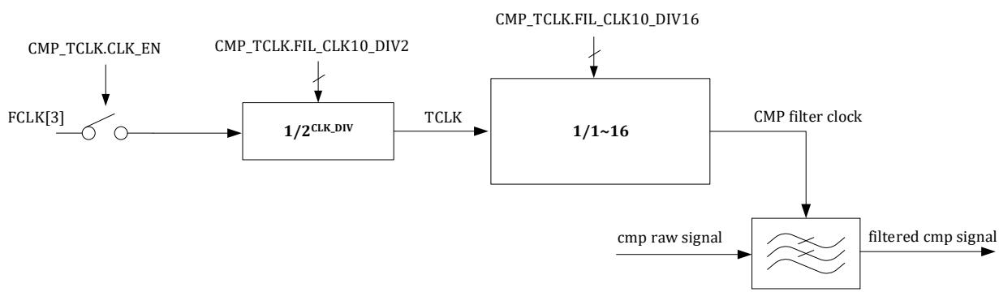  
图 10-1 比较器滤波时钟产生

CMP 模块使用此滤波时钟对模拟比较器的输出信号进行16时钟周期长的滤波，即只有信号稳定时间超过16个滤波时钟周期才能通过滤波器，CMP模块输出的滤波后的信号才会发生变化，如果输入信号稳定时间不足16 个滤波时钟周期即发生变化，则 CMP模块输出的滤波后的信号维持原值不变。即滤波宽度=滤波时钟周期\*16。

因为滤波时钟可以进行分频，因此CMP信号的滤波宽度范围是 $1 ^ { * } 1 ^ { * } 1 6 { \sim } 1 2 8 ^ { * } 1 6 ^ { * } 1 6$ 个总线周期，

即 16\~32768 个系统主时钟周期。

## 10.2.5 CMP\_CFG 控制寄存器

地址:0x4001\_020C

复位值:0x0

表 10-5 比较器控制寄存器 CMP\_CFG

<table><tr><td rowspan="3"></td><td>CMP1_W_PWM_POL</td><td>CMP1_IRQ_TRIG</td><td>CMP1_IN_EN</td><td>CMP1_POL</td><td>CMP0_W_PWM_POL</td><td>CMP0_IRQ_TRIG</td><td>CMP0_IN_EN</td><td>CMP0_POL</td></tr><tr><td>RW</td><td>RW</td><td>RW</td><td>RW</td><td>RW</td><td>RW</td><td>RW</td><td>RW</td></tr><tr><td>0</td><td>0</td><td>0</td><td>0</td><td>0</td><td>0</td><td>0</td><td>0</td></tr></table>

<table><tr><td>位置</td><td>位名称</td><td>说明</td></tr><tr><td>[31:8]</td><td></td><td>未使用</td></tr><tr><td>[7]</td><td>CMP1_W_PWM_POL</td><td>比较器 1 开窗 PWM 信号极性选择,在 CMP_BLCWIN1 使能情况下使用</td></tr><tr><td>[6]</td><td>CMP1_IRQ_TRIG</td><td>比较器 1 中断触发类型,0:电平触发,1:边沿触发</td></tr><tr><td>[5]</td><td>CMP1_IN_EN</td><td>比较器 1 信号输入使能</td></tr><tr><td>[4]</td><td>CMP1_POL</td><td>比较器 1 极性选择,0:高电平有效;1:低电平有效</td></tr><tr><td>[3]</td><td>CMP0_W_PWM_POL</td><td>比较器 0 开窗 PWM 信号极性选择,在 CMP_BLCWIN0 使能情况下使用</td></tr><tr><td>[2]</td><td>CMP0_IRQ_TRIG</td><td>比较器 0 中断触发类型,0:电平触发,1:边沿触发</td></tr><tr><td>[1]</td><td>CMP0_IN_EN</td><td>比较器 0 信号输入使能</td></tr><tr><td>[0]</td><td>CMP0_POL</td><td>比较器 0 极性选择,0:高电平有效;1:低电平有效</td></tr></table>

比较器的极性及使能控制如图10-2 所示。

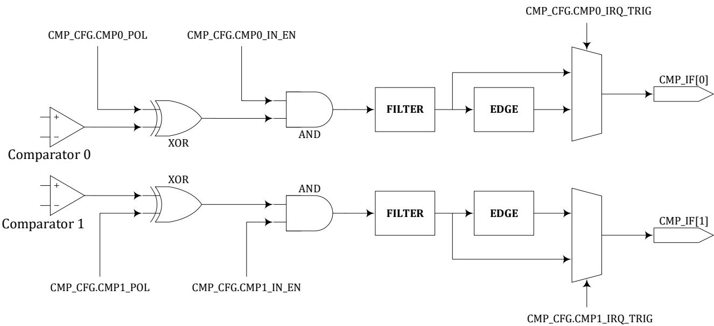  
图10-2 比较器控制及中断产生逻辑

比较器模块与MCPWM模块可以联合动作，其中 MCPWM模块的P管控制信号可以作为比较器开窗的控制信号。但比较器自身的中断信号产生与开窗控制无关，仅仅受CMP\_CFG寄存器影响。

MCPWM 的 fail 信号可以来自 GPIO，也可以来自比较器模块，使用 MCPWM\_FAIL 寄存器进行控制。如果 MCPWM 的 fail 信号来自比较器，则是经过比较器模块内部的开窗控制的。fail 信号进入MCPWM 后也会进行极性使能以及滤波等处理，与比较器模块的实现类似，但完全独立，由MCPWM内部的寄存器进行控制。MCPWM内部与fail 相关的错误中断信号产生收到MCPWM内部有关极性使能滤波控制寄存器的影响。具体请参考MCPWM 章节。

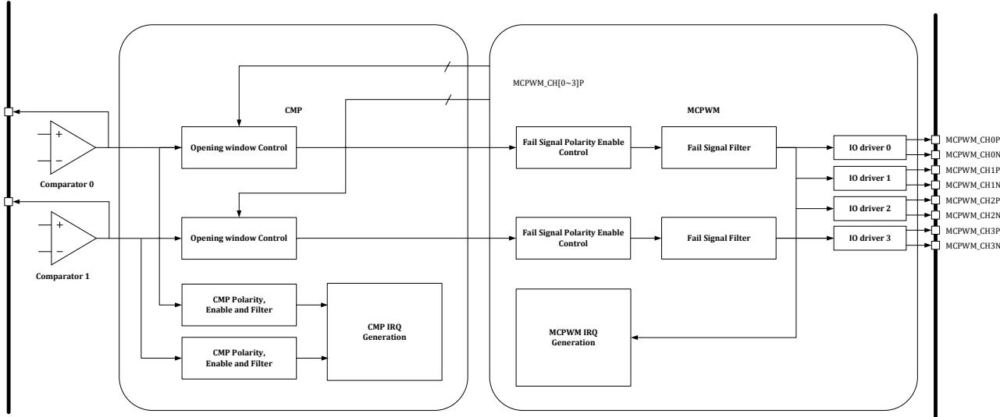  
图 10-3 CMP 与 MCPWM 的联动

对于比较器的开窗功能，若 CMP\_CFG.CMP0\_PWM\_POL=1，则在对应 MCPWM CHNx\_P 信号为 1时，比较器0可以产生比较信号输出，其他时刻比较信号为0；反之，若 $\mathrm { C M P \_ C F G . C M P 0 \_ P W M \_ P O L = 0 }$ 则在对应MCPWM CHNx\_P 信号为0 时，比较器0可以产生比较信号输出，其他时刻比较信号为 0。比较器1的开窗控制信号极性由 CMP\_CFG.CMP1\_PWM\_POL 位进行控制，逻辑相同。

注意:CMP\_CFG.CMP0\_PWM\_POL 和 CMP\_CFG.CMP1\_PWM\_POL 同时会影响送入 MCPWM 模块作为 FAIL 信号的比较器信号，如图 10-4 所示。来自比较器的 MCPWM FAIL 信号为模拟比较器输出的原始信号，未经过比较器数字接口模块的滤波处理，但是可以被 MCPWM 的通道信号进行开窗控制，开窗控制设置见比较器数字接口模块。FAIL信号进入 MCPWM模块后，可以通过设置MCPWM\_TCLK进行滤波。

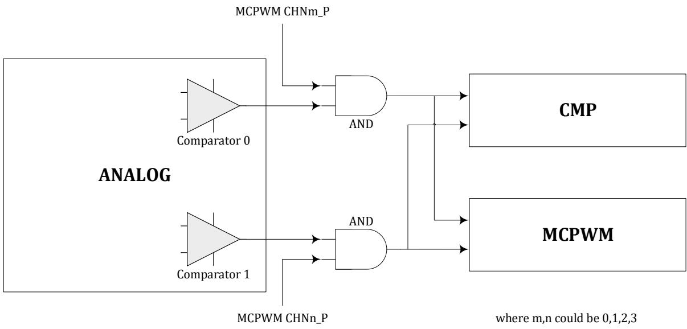  
图10-4 比较器开窗功能图示

## 10.2.6 CMP\_BLCWIN 开窗控制寄存器

地址:0x4001\_3010

复位值:0x0

表 10-6 比较器开窗控制寄存器 CMP\_ BLCWIN

<table><tr><td rowspan="3"></td><td>CMP1_CHN3P_WIN_EN</td><td>CMP1_CHN2P_WIN_EN</td><td>CMP1_CHN1P_WIN_EN</td><td>CMP1_CHNOP_WIN_EN</td><td>CMPO_CHN3P_WIN_EN</td><td>CMPO_CHN2P_WIN_EN</td><td>CMPO_CHN1P_WIN_EN</td><td>CMPO_CHNOP_WIN_EN</td></tr><tr><td>RW</td><td>RW</td><td>RW</td><td>RW</td><td>RW</td><td>RW</td><td>RW</td><td>RW</td></tr><tr><td>0</td><td>0</td><td>0</td><td>0</td><td>0</td><td>0</td><td>0</td><td>0</td></tr></table>

<table><tr><td>位置</td><td>位名称</td><td>说明</td></tr><tr><td>[31:8]</td><td></td><td>保留</td></tr><tr><td>[7]</td><td>CMP1_CHN3P_WIN_EN</td><td>使用 MCPWM 模块 CHN3_P 通道输出的 P 管开关控制信号作为比较器 1 开窗使能</td></tr><tr><td>[6]</td><td>CMP1_CHN2P_WIN_EN</td><td>使用 MCPWM 模块 CHN2_P 通道输出的 P 管开关控制信号作为比较器1开窗使能</td></tr><tr><td>[5]</td><td>CMP1_CHN1P_WIN_EN</td><td>使用MCPWM模块CHN1_P通道输出的P管开关控制信号作为比较器1开窗使能</td></tr><tr><td>[4]</td><td>CMP1_CHN0P_WIN_EN</td><td>使用MCPWM模块CHN0_P通道输出的P管开关控制信号作为比较器1开窗使能</td></tr><tr><td>[3]</td><td>CMP0_CHN3P_WIN_EN</td><td>使用MCPWM模块CHN3_P通道输出的P管开关控制信号作为比较器0开窗使能</td></tr><tr><td>[2]</td><td>CMP0_CHN2P_WIN_EN</td><td>使用MCPWM模块CHN2_P通道输出的P管开关控制信号作为比较器0开窗使能</td></tr><tr><td>[1]</td><td>CMP0_CHN1P_WIN_EN</td><td>使用MCPWM模块CHN1_P通道输出的P管开关控制信号作为比较器0开窗使能</td></tr><tr><td>[0]</td><td>CMP0_CHN0P_WIN_EN</td><td>使用MCPWM模块CHN0_P通道输出的P管开关控制信号作为比较器0开窗使能</td></tr></table>

## 10.2.7 CMP\_DATA 输出数据寄存器

地址:0x4001\_3014

复位值:0x0

表 10-7 比较器输出数据寄存器 CMP\_ DATA

<table><tr><td rowspan="3"></td><td>CMP1_FLT_DATA</td><td>CMP0_FLT_DATA</td><td rowspan="3"></td><td>CMP1_RAW_DATA</td><td>CMP0_RAW_DATA</td></tr><tr><td>R</td><td>R</td><td>R</td><td>R</td></tr><tr><td>0</td><td>0</td><td>0</td><td>0</td></tr></table>

<table><tr><td>位置</td><td>位名称</td><td>说明</td></tr><tr><td>[31:10]</td><td></td><td>未使用</td></tr><tr><td>[9]</td><td>CMP1_FLT_DATA</td><td>比较器 1 经过滤波后的信号</td></tr><tr><td>[8]</td><td>CMP0_FLT_DATA</td><td>比较器 0 经过滤波后的信号</td></tr><tr><td>[2:7]</td><td></td><td>未使用</td></tr><tr><td>[1]</td><td>CMP1_RAW_DATA</td><td>比较器 1 原始输出信号,直接来自模拟比较器 1</td></tr><tr><td>[0]</td><td>CMP0_RAW_DATA</td><td>比较器 0 原始输出信号,直接来自模拟比较器 0</td></tr></table>

## 11 HALL 信号处理模块

## 11.1 综述

芯片共支持 3 路 HALL 信号输入。

对于输入的HALL传感器信号，所进行的处理包括:

滤波，消除HALL信号毛刺的影响

捕获，HALL输入有变化时，记录当前的定时器值，并输出中断

溢出，HALL信号长时间不发生变化导致计数器溢出，并输出中断

## 11.2 实现说明

## 11.2.1 信号来源

HALL 信号来源于 GPIO，对于每一路 HALL 信号，芯片有两个 IO 可以作为该信号的来源。通过配置GPIO寄存器，用户可以选择将其中一个GPIO的输入信号做为 HALL信号使用。

详细管脚位置说明见芯片器件datasheet。

## 11.2.2 工作时钟

HALL 模块工作频率可调。通过配置 HALL\_CFG.CLK\_DIV 寄存器，可以选择系统主时钟的 1/2/4/8分频作为HALL模块工作频率，滤波和计数均采用该频率工作。

## 11.2.3 信号滤波

滤波模块主要用于去除 HALL信号上的毛刺。

滤波包括两级滤波器，两级滤波电路可单独开启，也可全部开启:

第一级采用7判5 进行滤波，即连续7个采样点中，如果达到或超过5 个1则输出 1，如果达到或超过5个0 则输出0，否则输出保持上一次的滤波结果。通过配置 HALL\_CFG.FIL\_75 可以选择是否使能第一级滤波器。具体如下图所示:

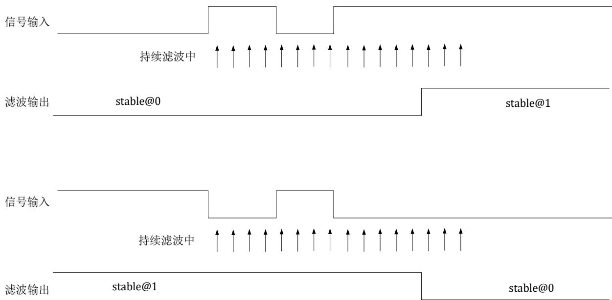  
图 11-1 7/5 滤波模块框图

第二级采用连续滤波，在连续N 个采样点中，如全为0则输出0，如全为1则输出 1，否则输出保持上一次的滤波结果。

通过配置HALL\_CFG.FIL\_LEN 可以配置第二级滤波器滤波深度，即连续采样个数。连续采样个数最大为215，滤波时间常数计算公式如下:

$$
\mathrm{T} _ {\text { filter }} = \mathrm{T} _ {\text { clk }} * (\text { HALL\_CFG.FIL\_LEN } [ 1 4: 0 ] + 1)
$$

举例，在 48MHz 工作频率下，周期 $\mathrm { T _ { c l k } }$ 是 20.8ns，寄存器配置最大为 32767，最长滤波宽度为约 20.8ns×32768≈680us。

通过访问 HALL\_INFO.FIL\_DATA[2:0]可以捕捉滤波后的 HALL 信号；HALL\_INFO.RAW\_DATA[2:0]则是滤波前原始HALL输入信号，详见11.3.3。

## 11.2.4 捕获

捕获模块用于测量两次 HALL信号变化之间的时间，其核心为一个24位计数器，在48MHz工作频率下，最大可以记录约2. 8 秒的时间宽度，达到20.8ns 的时间分辨率。

HALL\_CNT 从 0 开始计数，当发生 HALL 信号变化时，将此时刻的 HALL\_CNT 值保存到HALL\_WIDTH 寄存器，将此时刻的 HALL 信号保存到 HALL\_INFO.FIL\_DATA，输出 HALL 信号变化中断，HALL\_CNT重新从0开始计数。

当计数器计数值达到 $\mathrm { H A L L } _ { - } \mathrm { T H }$ 时，输出HALL计数器溢出中断，计数器重新从 0开始计数。

## 11.2.5 中断

捕获、溢出事件触发中断，中断使能控制位位于 HALL\_CFG.CHG\_IE 和 HALL\_CFG.OV\_IE，中断标志位位于 HALL\_INFO.CHG\_IF 和 HALL\_INFO.OV\_IF。中断标志可以通过对 HALL\_INFO.CHG\_IF 和HALL\_INFO.OV\_IF 写 1 清空。

HALL 中断事件可以作为 DMA 请求，但需要在 HALL\_CFG 中使能 CHG\_RE，OV\_RE 或 SW\_RE。当

DMA收到传输请求开始数据搬运后，会将中断标志清除，不再需要软件清除。

## 11.2.6 数据流程

HALL 模块的数据流程如下图所示，FCLK[1]为受 SYS\_CLK\_FEN.HALL\_CLK\_EN 门控信号控制的HALL 时钟，开通后为 48MHz 的 PLL 时钟。

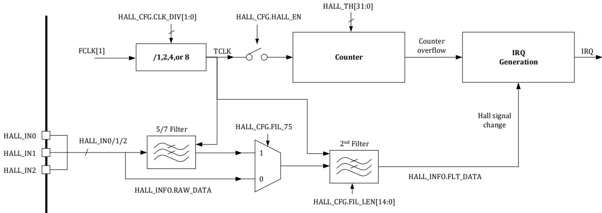  
图11-2数据流程框图

## 11.3 寄存器

## 11.3.1 地址分配

HALL模块寄存器的基地址是 0x4001\_0300，寄存器列表如下:

表11-1HALL模块寄存器地址分配

<table><tr><td>名称</td><td>偏移</td><td>描述</td></tr><tr><td>HALL_CFG</td><td>0x00</td><td>HALL 模块配置寄存器</td></tr><tr><td>HALL_INFO</td><td>0x04</td><td>HALL 模块信息寄存器</td></tr><tr><td>HALL_WIDTH</td><td>0x08</td><td>HALL 宽度计数值寄存器</td></tr><tr><td>HALL_TH</td><td>0x0C</td><td>HALL 模块计数器门限值寄存器</td></tr><tr><td>HALL_CNT</td><td>0x10</td><td>HALL 计数寄存器</td></tr></table>

## 11.3.2 HALL 模块配置寄存器 HALL\_CFG

地址:0x4001\_0300

复位值:0x0

表 11-2 HALL 模块配置寄存器 HALL\_CFG

<table><tr><td>31</td><td>SW-IERW</td><td>OV-IERW</td><td>CHG-IERW</td><td></td><td>OV-RERW</td><td>CHG-RERW</td><td>HALL-ENRW</td><td></td><td>FIL-75RW</td><td></td><td>CLK-DIVRW</td></tr><tr><td></td><td>0</td><td>0</td><td>0</td><td></td><td>0</td><td>0</td><td>0</td><td></td><td>0</td><td></td><td>0</td></tr></table>

<table><tr><td rowspan="3"></td><td>FIL_LEN</td></tr><tr><td>RW</td></tr><tr><td>0</td></tr></table>

<table><tr><td>位置</td><td>位名称</td><td>说明</td></tr><tr><td>[31]</td><td></td><td>未使用</td></tr><tr><td>[30]</td><td>SW_IE</td><td>软件触发HALL信号变化中断使能,高电平有效。当SW_IE=1时,软件向HALL_INFO.SW_IF写1,可以手动产生HALL信号变化中断,并令HALL_INFO.CHG_IF置位。</td></tr><tr><td>[29]</td><td>OV_IE</td><td>HALL计数器溢出中断使能开关。默认关闭。0:关闭1:使能</td></tr><tr><td>[28]</td><td>CHG_IE</td><td>HALL信号变化中断使能开关。默认关闭。0:关闭1:使能</td></tr><tr><td>[27]</td><td></td><td>保留</td></tr><tr><td>[26]</td><td>OV_RE</td><td>HALL计数器溢出DMA请求使能开关。默认关闭。0:关闭1:使能</td></tr><tr><td>[25]</td><td>CHG_RE</td><td>HALL信号变化DMA请求使能开关。默认关闭。0:关闭1:使能</td></tr><tr><td>[24]</td><td>HALL_EN</td><td>HALL模块使能开关。默认关闭。0:关闭1:使能</td></tr><tr><td>[23:21]</td><td></td><td>未使用</td></tr><tr><td>[20]</td><td>FIL_75</td><td>7/5滤波开关(连续采样7次,5次值一致)。默认关闭。0:关闭1:使能</td></tr><tr><td>[19:18]</td><td></td><td>未使用</td></tr><tr><td>[17:16]</td><td>CLK_DIV</td><td>HALL时钟分频系数。默认不分频。00:不分频01:2分频10:4分频11:8分频</td></tr><tr><td>[15]</td><td></td><td>未使用</td></tr><tr><td>[14:0]</td><td>FIL_LEN</td><td>滤波宽度,低于对应脉冲宽度的信号将被硬件自动过滤掉。滤波宽度的计算公式为 $[14:0]+1$ 。</td></tr></table>

## 11.3.3 HALL 模块信息寄存器 HALL\_INFO

地址:0x4001\_0304

复位值:0x0

表 11-3 HALL 模块信息寄存器 HALL\_INFO

<table><tr><td>31</td><td>30</td><td>29</td><td>28</td><td>27</td><td>26</td><td>25</td><td>24</td><td>23</td><td>22</td><td>21</td><td>20</td><td>19</td><td>18</td><td>17</td><td>16</td></tr><tr><td rowspan="3" colspan="13"></td><td>SW_IF</td><td>OV_IF</td><td>CHG_IF</td></tr><tr><td>WO</td><td>RW1C</td><td>RW1C</td></tr><tr><td>0</td><td>0</td><td>0</td></tr><tr><td>15</td><td>14</td><td>13</td><td>12</td><td>11</td><td>10</td><td>9</td><td>8</td><td>7</td><td>6</td><td>5</td><td>4</td><td>3</td><td>2</td><td>1</td><td>0</td></tr></table>

<table><tr><td>Reserved</td><td>RAW_DATA</td><td>Reserved</td><td>FLT_DATA</td></tr><tr><td>RW</td><td>RO</td><td>RW</td><td>RO</td></tr><tr><td>0</td><td>0</td><td>0</td><td>0</td></tr></table>

<table><tr><td>位置</td><td>位名称</td><td>说明</td></tr><tr><td>[31:19]</td><td></td><td>未使用</td></tr><tr><td>[18]</td><td>SW_IF</td><td>软件触发HALL信号变化中断。写1触发,自动清零。</td></tr><tr><td>[17]</td><td>OV_IF</td><td>HALL计数器溢出事件标志,写1清空</td></tr><tr><td>[16]</td><td>CHG_IF</td><td>HALL信号变化事件标志,写1清空</td></tr><tr><td>[15:11]</td><td></td><td>系统保留,必须写入0,读出0</td></tr><tr><td>[10:8]</td><td>RAW_DATA</td><td>HALL值,未滤波结果</td></tr><tr><td>[7:3]</td><td></td><td>系统保留,必须写入0,读出0</td></tr><tr><td>[2:0]</td><td>FLT_DATA</td><td>HALL值,滤波结果</td></tr></table>

## 11.3.4 HALL 宽度计数值寄存器 HALL\_WIDTH

地址:0x4001\_0308

复位值:0x0

表 11-4 HALL 宽度计数值寄存器 HALL\_WIDTH

<table><tr><td>31</td><td>30</td><td>29</td><td>28</td><td>27</td><td>26</td><td>25</td><td>24</td><td>23</td><td>22</td><td>21</td><td>20</td><td>19</td><td>18</td><td>17</td><td>16</td></tr><tr><td rowspan="3" colspan="8"></td><td colspan="8">CAP_CNT</td></tr><tr><td colspan="8">RO</td></tr><tr><td colspan="8">0</td></tr><tr><td>15</td><td>14</td><td>13</td><td>12</td><td>11</td><td>10</td><td>9</td><td>8</td><td>7</td><td>6</td><td>5</td><td>4</td><td>3</td><td>2</td><td>1</td><td>0</td></tr><tr><td colspan="16">CAP_CNT</td></tr><tr><td colspan="16">RO</td></tr><tr><td colspan="16">0</td></tr></table>

<table><tr><td>位置</td><td>位名称</td><td>说明</td></tr><tr><td>[31:24]</td><td></td><td>未使用</td></tr><tr><td>[23:0]</td><td>CAP_CNT</td><td>HALL 宽度计数器值</td></tr></table>

## 11.3.5 HALL 模块计数器门限值寄存器 HALL\_TH

地址:0x4001\_030C

复位值:0x0

表 11-5 HALL 模块计数器门限值寄存器 HALL\_TH

<table><tr><td>31</td><td>30</td><td>29</td><td>28</td><td>27</td><td>26</td><td>25</td><td>24</td><td>23</td><td>22</td><td>21</td><td>20</td><td>19</td><td>18</td><td>17</td><td>16</td></tr><tr><td rowspan="3" colspan="8"></td><td colspan="8">TH</td></tr><tr><td colspan="8">RW</td></tr><tr><td colspan="8">0</td></tr><tr><td>15</td><td>14</td><td>13</td><td>12</td><td>11</td><td>10</td><td>9</td><td>8</td><td>7</td><td>6</td><td>5</td><td>4</td><td>3</td><td>2</td><td>1</td><td>0</td></tr></table>

<table><tr><td>TH</td></tr><tr><td>RW</td></tr><tr><td>0</td></tr></table>

<table><tr><td>位置</td><td>位名称</td><td>说明</td></tr><tr><td>[31:24]</td><td></td><td>未使用</td></tr><tr><td>[23:0]</td><td>TH</td><td>HALL 计数器门限值</td></tr></table>

## 11.3.6 HALL 计数寄存器 HALL\_CNT

地址:0x4001\_0310

复位值:0x0

表 11-6 HALL 计数寄存器 HALL\_CNT

<table><tr><td>31</td><td>30</td><td>29</td><td>28</td><td>27</td><td>26</td><td>25</td><td>24</td><td>23</td><td>22</td><td>21</td><td>20</td><td>19</td><td>18</td><td>17</td><td>16</td></tr><tr><td rowspan="3" colspan="8"></td><td colspan="8">CNT</td></tr><tr><td colspan="8">RW</td></tr><tr><td colspan="8">0</td></tr><tr><td>15</td><td>14</td><td>13</td><td>12</td><td>11</td><td>10</td><td>9</td><td>8</td><td>7</td><td>6</td><td>5</td><td>4</td><td>3</td><td>2</td><td>1</td><td>0</td></tr><tr><td colspan="16">CNT</td></tr><tr><td colspan="16">RW</td></tr><tr><td colspan="16">0</td></tr></table>

<table><tr><td>位置</td><td>位名称</td><td>说明</td></tr><tr><td>[31:24]</td><td></td><td>未使用</td></tr><tr><td>[23:0]</td><td>CNT</td><td>HALL 计数值,写入任意值可清零</td></tr></table>

## 12 ADC

## 12.1 概述

LKS32MC03x 系列芯片集成了 1 个 12BIT SARADC。

➢ 1MSPS 采样率，24MHz 工作频率。

➢ 支持 14 通道选择。

➢ 支持软件、硬件触发功能。

➢ 可以与MCPWM、UTimer单元联动进行定时触发

➢ 支持触发指示信号可通过GPIO送出调试

➢ 支持单段、双段、四段自定义采样序列采样，序列次数和通道号可灵活配置。

➢ 支持左对齐、右对齐模式。

ADC采样的量词含义约定:

1次采样:完成对应的一个通道的模拟信号量到数字信号量的采样转换并存储数字量至ADC\_DATx寄存器；

1 段采样:可能包含1 次或若干次采样，若干次采样可以是相同的模拟量通道，也可以是不同的模拟量通道。采样开始通常由 MCPWM、UTimer 或软件进行触发，一个触发信号完成一段采样，采样完成后产生相应的段采样完成中断；以 MCPWM 触发的四段采样为例，每段采样 3 次（即完成 3 个模拟量的采样），TADC[0]触发 ADC 开始第一段采样，第一段采样完成后 ADC 进入等待状态，等待TADC[1]触发事件发生；TADC[1]发生后，触发 ADC 开始第二段采样；同理，TADC[2]/TADC[3]分别触发第三段和第四段采样。

1 轮采样:可能包含1 段、2 段或4段采样，每段分别由特定触发信号触发；ADC 完成一轮采样后回归空闲状态等待下次触发

## 12.1.1 功能框图

ADC 接口包括10 个数据寄存器（ADC 在最多 10 次采样中存储的数字量），以及若干控制寄存器。

数据寄存器 ADC\_DATx 用于存储 ADC 第 x 次采样得到的数据量。被转换的模拟信号来源由寄存器 ADC\_CHNx 中的 4bit 进行选择（详见 12.2.4）。以 ADC\_CHN0 为例，BIT[3:0]选择第 0 次采样的模拟通道号，通道号 CH0\~CH15 任选，若 ADC\_CHN0[3:0]=0，ADC\_CHN0[7:4]=3，则第 0 个采样的模拟量对应通道CH0，第1个采样的模拟量对应通道CH3，以此类推。

分段采样次数寄存器 ADC\_CHNT控制每段采样的次数，1\~15对应 1\~15 次。

控制逻辑根据配置寄存器 ADC\_CFG 选择来自 MCPWM 或 UTimer 的触发信号启动一段采样或者软件触发启动。MCPWM/UTimer 会送出定时触发信号 TADC[0]/TADC[1]/TADC[2]/TADC[3]，可选择TADC[0]/TADC[1]/TADC[2]/TADC[3]作为触发信号。触发信号的选择保存在控制寄存器中。

一段转换（一段内的所有通道采样转换完毕）完成，触发 ADC 转换完成中断。多段触发模式下，每一段转换完成可触发产生一个转换完成中断。

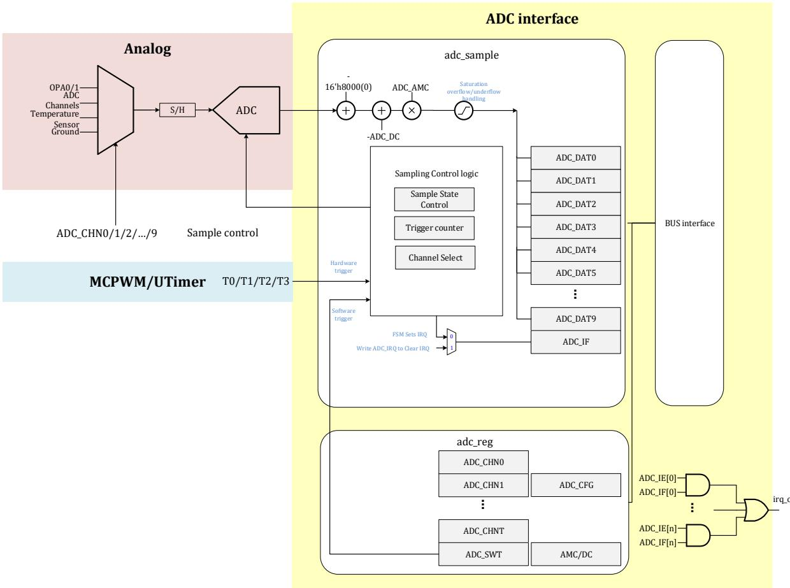  
图 12-1ADC采集模块功能框图

来源可选使得用户可以灵活配置采样顺序、以及采样信号来源，甚至实现对单个信号多次采样的目的。控制寄存器使得用户可以配置采样个数，提高采样频率/降低采样功耗。

ADC 最高工作时钟为 24MHz，采样时间 5-37 个 ADC 时钟周期（Cycle）可配置，数据转换时间固定为 12Cycle。以采样时间 5Cycle 为例，采样+转换最少 17Cycle，即 ADC 最高转换速率是24/17=1.4Msps。但考虑到采样建立时间，建议设置采样时间 8Cycle 或以上，对应转换速度率24/(8+12)=1.2Msps。采样时间可以通过寄存器 SYS\_AFE\_REG2 设置。

## 12.1.2 ADC 触发方式

➢ 支持单段触发、两段触发、四段触发完成采样

➢ 单段触发可以设置触发事件发生次数

➢ 两段触发的触发源只能为 MCPWM/UTimer 的定时信号 TADC[0]+TADC[1]，或两次软件触发

➢ 四段触发的触发源只能为 MCPWM/UTimer 的定时信号 TADC[0]+TADC[1]+TADC[2]+TADC[3]，四次硬件触发事件必须是按顺序发生；或四次软件触发

➢ 每段触发完成均可产生中断

## ➢ 触发指示信号可以通过 GPIO 送出用于调试

## 12.1.3 ADC 输出数制

ADC 输出数据为 12bit 补码，输入信号 0 对应 12h’0000\_0000\_0000，以 2.4V 量程为例，输入信号-2.4V 对应 12h’1000\_0000\_0000，输入信号+2.4V 对应 12h’0111\_1111\_1111。ADC 转换后的 12bit补码需扩展为16BIT存入16bit位宽的采样数据寄存器，左对齐/右对齐可根据配置寄存器进行设置。以 12’h1000\_0000\_1101 为例，如果配置为左对齐，右侧补 4 个 0，存入 ADCx\_DAT 的值为16’h1000\_0000\_1101\_0000；如果配置为右对齐，左侧进行符号扩展，存入 ADCx\_DAT 的值为16’h1111\_1000\_0000\_1101。推荐统一使用左对齐方式。

表12-1ADC输出数字量数制转换

<table><tr><td>ADC 2.4V量程输入模拟量数值/V</td><td>ADC 3.6V量程输入模拟量数值/V</td><td>转为有符号数后的数值</td></tr><tr><td>2.4</td><td>3.6</td><td>12&#x27;h0111_1111_1111</td></tr><tr><td>0</td><td>0</td><td>12&#x27;h0000_0000_0000</td></tr><tr><td>-2.4</td><td>-3.6</td><td>12&#x27;h1000_0000_0000</td></tr></table>

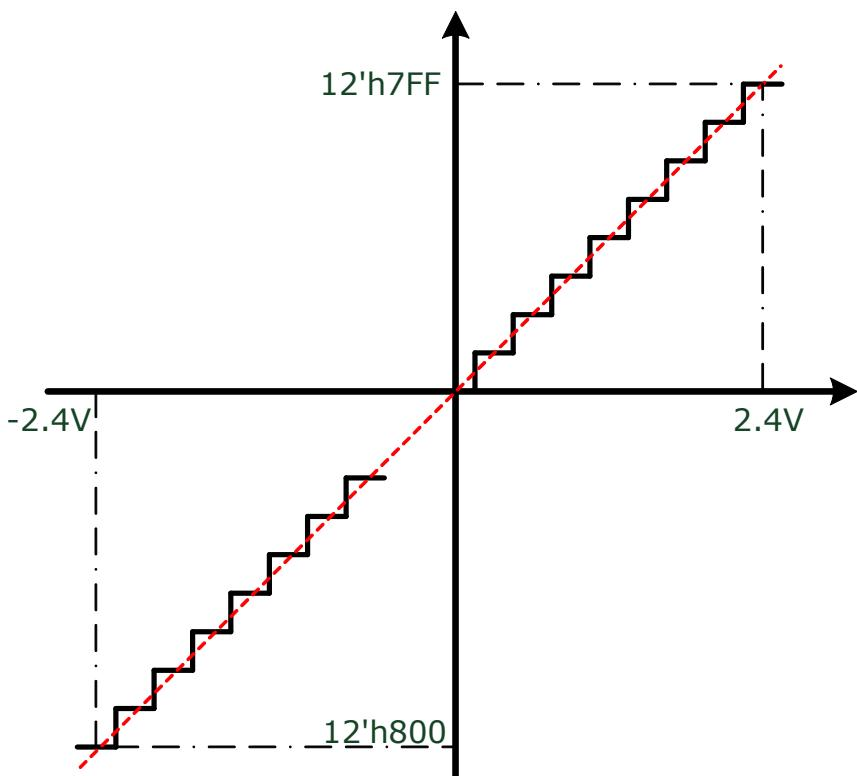  
图 12-2 ADC 2.4V 量程设置下转换数制量程

## 12.1.4 ADC 量程

ADC 有两种量程：2.4V 和 3.6V。2.4V 量程模式下，对应最大±2.4V 的输入信号幅度；3.6V 量程模式模式下，对应最大±3.6V 的输入信号幅度。

在ADC采样通道配置为运放的输出信号时（即OPA0\~OPA1），应选择合适的运放增益，使得具体应用上的最大信号可被放大到接近+/-3.3V 的水平，同时将 ADC 配置为 3.6V 量程。举例来说，相线电流最大 100A（正弦波有效值），MOS 内阻（假设为 MOS 内阻采样）为 5mR，则运放的最大输入信号幅值为+/-707mV。此时应该选择运放的放大倍数为 4.5 倍（放大倍数选择方式详见 5.2.5），则放大后的信号约为+/-3.18V。

如果因为客观原因，运放的输出信号经放大后，最大信号仍然小于+/-2.4V，则应将 ADC 的量程配置为 2.4V。

在ADC采样通道配置为GPIO复用口输入的信号时，同样根据信号的最大幅度来选择ADC量程。由于IO口的限制，GPIO复用口输入的信号范围只能在-0.3V\~AVDD+0.3V 之间。

两种量程选择由 SYS\_AFE\_REG0.GA\_AD 寄存器进行控制。不同于 LKS32MC08x/05x，量程仅能通过软件直接控制寄存器进行选择，不支持硬件根据通道配置自动切换。

## 12.1.5 ADC 校正

ADC硬件接口模块可以进行直流偏置校正与增益校正。

ADC\_AMC 存储的是增益校正系数 AMP<sub>correction</sub>，为 10bit 无符号定点数，ADC\_AMC[9]为整数部分，ADC\_AMC[8:0]为小数部分。可以表示数值在1 附近的定点数。

ADC\_DC 存储的是ADC 的直流偏置，通常在校正阶段通过测量通道15（从0开始计数）的AVSS（内部地）得到ADC直流偏置数值并存入 flash 中，并在系统加载阶段由软件将直流偏置写入 ADC\_DC寄存器中。

记ADC输出的数字量为 $\mathrm { D } _ { \mathrm { A D C } }$ $\mathrm { D } _ { \mathrm { A D C } }$ 对应的真实值为D，D<sub>0</sub>为编码数制的0，则

$$
D = \text { Saturation } ((D _ {\text { ADC }} - D _ {0}) ^ {*} \text { AMP } _ {\text { correction }} - D C _ {\text { offset }})
$$

最终硬件会将进行校正后的 D存入相应的采样数据寄存器。

## 12.1.6 ADC 阈值监测(模拟看门狗)

ADC 接口模块配备有 1 组阈值监测电路，阈值监测可以同时进行上阈值和下阈值监测，ADC 的数据寄存器可以单独配置是否启用某组阈值监测。如果使能阈值监测，当 ADC 完成某次转换，且将经过校正的数据写入ADCx\_DAT寄存器时，会进行阈值比较，如果写入数据大于上阈值或小于下阈值则置位对应的阈值超限中断标志。

阈值为 12bit 有符号数，因此阈值比较与数据的左右对齐无关。左对齐时 ADCx\_DATx[15:4]与阈值进行比较，右对齐时，ADCx\_DATx[11:0]与阈值进行比较

## 12.1.7 ADC 配置流程

推荐配置流程：

## 1. 打开ADC 模拟开关，选择ADC工作频率

通过配置寄存器 SYS\_AFE\_REG0.ADCPDN 可以开启 ADC，ADC 开启前，需要先开启BGP、4M RC 时钟和 PLL 模块。

## 2. 配置ADC 数据输出格式

ADC的输出格式可配置为左对齐或者右对齐，配置的是ADC\_CFG.DATA\_ALIGN寄存器，0 为左对齐，1 为右对齐。

## 3. 配置 ADC 采样模式

ADC 的 采 样 模 式 可 配 置 为 单 段 、 双 段 、 四 段 采 样 模 式 ， 配 置 的 是ADC\_CFG.TRG\_MODE[9:8]寄存器，00 为单段采样模式，01 为两段采样模式，11 为四段采样模式。

## 4. 配置ADC 触发事件

ADC采样的触发事件选择配置的是ADC\_CFG.SEL寄存器。单段采样模式下可以设置触发一次采样所需的事件数，配置的是 ADC\_CFG.SINGLE\_TCNT[7:4]寄存器，设置范围是0\~15，0表示一次事件即触发，15表示16 次事件才触发。

## 5. 配置 ADC 量程

ADC的两种增益模式可以通过配置 SYS\_AFE\_REG0.GA\_AD 增益寄存器进行选择，0 为低增益（2/3倍），1为高增益（1倍）。

## 6. 配置ADC 通道数，选择采样信号源

配置各段采样模式下，采样的通道个数，配置的是 ADC\_CHNT 寄存器，设置范围是1\~16，1 代表一个通道。ADC 的采样信号源配置，通过配置 ADC\_CHN0、ADC\_CHN1、ADC\_CHN2 寄存器选择。

## 7. 配置 ADC 中断

通过配置 ADC\_IE 寄存器可以使能 ADC 中断。即使未开启中断，中断事件仍能置位ADC\_IF，但不会提出中断请求。

## 12.2 寄存器

## 12.2.1 地址分配

ADC 在芯片中的基地址是 0x4001\_0400；

表 12-2 ADC0 寄存器列表

<table><tr><td>名称</td><td>偏移地址</td><td>说明</td></tr><tr><td>ADC_DAT0</td><td>0x00</td><td>ADC 通道第 0 次采样数据</td></tr><tr><td>ADC_DAT1</td><td>0x04</td><td>ADC 通道第 1 次采样数据</td></tr><tr><td>ADC_DAT2</td><td>0x08</td><td>ADC 通道第 2 次采样数据</td></tr><tr><td>ADC_DAT3</td><td>0x0C</td><td>ADC 通道第 3 次采样数据</td></tr><tr><td>ADC_DAT4</td><td>0x10</td><td>ADC 通道第 4 次采样数据</td></tr><tr><td>ADC_DAT5</td><td>0x14</td><td>ADC 通道第 5 次采样数据</td></tr><tr><td>ADC_DAT6</td><td>0x18</td><td>ADC 通道第 6 次采样数据</td></tr><tr><td>ADC_DAT7</td><td>0x1C</td><td>ADC 通道第 7 次采样数据</td></tr><tr><td>ADC_DAT8</td><td>0x20</td><td>ADC 通道第 8 次采样数据</td></tr><tr><td>ADC_DAT9</td><td>0x24</td><td>ADC 通道第 9 次采样数据</td></tr><tr><td>ADC_LTH</td><td>0x30</td><td>ADC 模拟看门狗低阈值</td></tr><tr><td>ADC_HTH</td><td>0x34</td><td>ADC 模拟看门狗高阈值</td></tr><tr><td>ADC_GEN</td><td>0x38</td><td>ADC 模拟看门狗监测使能</td></tr><tr><td>ADC_CHN0</td><td>0x40</td><td>ADC 第 0~3 次采样信号选择</td></tr><tr><td>ADC_CHN1</td><td>0x44</td><td>ADC 第 4~7 次采样信号选择</td></tr><tr><td>ADC_CHN2</td><td>0x48</td><td>ADC 第 8~11 次采样信号选择</td></tr><tr><td></td><td>0x4C</td><td></td></tr><tr><td>ADC_CHNT</td><td>0x50</td><td>ADC 各种触发模式下采样通道数</td></tr><tr><td>ADC_CFG</td><td>0x54</td><td>ADC 对齐模式配置</td></tr><tr><td>ADC_SWT</td><td>0x58</td><td>ADC 软件触发</td></tr><tr><td>ADC_DC</td><td>0x60</td><td>ADC DC offset</td></tr><tr><td>ADC_AMC</td><td>0x64</td><td>ADC 增益校正</td></tr><tr><td>ADC_IE</td><td>0x68</td><td>ADC 中断使能</td></tr><tr><td>ADC_IF</td><td>0x6C</td><td>ADC 中断标志</td></tr></table>

## 12.2.2 采样数据寄存器

## 12.2.2.1 ADC\_DAT0

地址:0x4001\_0400

复位值:0x0

表 12-3 采样数据寄存器 ADC\_DAT0

<table><tr><td>15</td><td>14</td><td>13</td><td>12</td><td>11</td><td>10</td><td>9</td><td>8</td><td>7</td><td>6</td><td>5</td><td>4</td><td>3</td><td>2</td><td>1</td><td>0</td></tr><tr><td></td><td></td><td></td><td></td><td></td><td></td><td></td><td colspan="2">DAT0</td><td></td><td></td><td></td><td></td><td></td><td></td><td></td></tr><tr><td></td><td></td><td></td><td></td><td></td><td></td><td></td><td colspan="2">RW</td><td></td><td></td><td></td><td></td><td></td><td></td><td></td></tr><tr><td></td><td></td><td></td><td></td><td></td><td></td><td></td><td colspan="2">0</td><td></td><td></td><td></td><td></td><td></td><td></td><td></td></tr></table>

<table><tr><td>位置</td><td>位名称</td><td>说明</td></tr><tr><td>[31:16]</td><td></td><td>未使用</td></tr><tr><td>[15:0]</td><td>DAT0</td><td>ADC 第 0 次采样数据</td></tr></table>

## 12.2.2.2 ADC\_DAT1

地址:0x4001\_0404

复位值:0x0

表 12-4 采样数据寄存器 ADC\_DAT1

<table><tr><td>15</td><td>14</td><td>13</td><td>12</td><td>11</td><td>10</td><td>9</td><td>8</td><td>7</td><td>6</td><td>5</td><td>4</td><td>3</td><td>2</td><td>1</td><td>0</td></tr></table>

<table><tr><td>DAT1</td></tr><tr><td>RW</td></tr><tr><td>0</td></tr></table>

<table><tr><td>位置</td><td>位名称</td><td>说明</td></tr><tr><td>[31:16]</td><td></td><td>未使用</td></tr><tr><td>[15:0]</td><td>DAT1</td><td>ADC 第 1 次采样数据</td></tr></table>

## 12.2.2.3 ADC\_DAT2

地址:0x4001\_0408

复位值:0x0

表 12-5 采样数据寄存器 ADC\_DAT2

<table><tr><td>15</td><td>14</td><td>13</td><td>12</td><td>11</td><td>10</td><td>9</td><td>8</td><td>7</td><td>6</td><td>5</td><td>4</td><td>3</td><td>2</td><td>1</td><td>0</td></tr><tr><td></td><td></td><td></td><td></td><td></td><td></td><td></td><td></td><td></td><td></td><td></td><td></td><td></td><td></td><td></td><td></td></tr><tr><td></td><td></td><td></td><td></td><td></td><td></td><td></td><td></td><td></td><td></td><td></td><td></td><td></td><td></td><td></td><td></td></tr><tr><td></td><td></td><td></td><td></td><td></td><td></td><td></td><td></td><td></td><td></td><td></td><td></td><td></td><td></td><td></td><td></td></tr><tr><td></td><td></td><td></td><td></td><td></td><td></td><td></td><td></td><td></td><td></td><td></td><td></td><td></td><td></td><td></td><td></td></tr></table>

<table><tr><td>位置</td><td>位名称</td><td>说明</td></tr><tr><td>[31:16]</td><td></td><td>未使用</td></tr><tr><td>[15:0]</td><td>DAT2</td><td>ADC 第 2 次采样数据</td></tr></table>

## 12.2.2.4 ADC\_DAT3

地址:0x4001\_040C

复位值:0x0

表 12-6 采样数据寄存器 ADC\_DAT3

<table><tr><td>15</td><td>14</td><td>13</td><td>12</td><td>11</td><td>10</td><td>9</td><td>8</td><td>7</td><td>6</td><td>5</td><td>4</td><td>3</td><td>2</td><td>1</td><td>0</td></tr><tr><td></td><td></td><td></td><td></td><td></td><td></td><td></td><td></td><td></td><td></td><td></td><td></td><td></td><td></td><td></td><td></td></tr><tr><td></td><td></td><td></td><td></td><td></td><td></td><td></td><td></td><td></td><td></td><td></td><td></td><td></td><td></td><td></td><td></td></tr><tr><td></td><td></td><td></td><td></td><td></td><td></td><td></td><td></td><td></td><td></td><td></td><td></td><td></td><td></td><td></td><td></td></tr><tr><td></td><td></td><td></td><td></td><td></td><td></td><td></td><td></td><td></td><td></td><td></td><td></td><td></td><td></td><td></td><td></td></tr></table>

<table><tr><td>位置</td><td>位名称</td><td>说明</td></tr><tr><td>[31:16]</td><td></td><td>未使用</td></tr><tr><td>[15:0]</td><td>DAT3</td><td>ADC 第 3 次采样数据</td></tr></table>

## 12.2.2.5 ADC\_DAT4

地址:0x4001\_0410

复位值:0x0

表 12-7 采样数据寄存器 ADC\_DAT4

<table><tr><td>15</td><td>14</td><td>13</td><td>12</td><td>11</td><td>10</td><td>9</td><td>8</td><td>7</td><td>6</td><td>5</td><td>4</td><td>3</td><td>2</td><td>1</td><td>0</td></tr><tr><td></td><td></td><td></td><td></td><td></td><td></td><td></td><td></td><td></td><td></td><td></td><td></td><td></td><td></td><td></td><td></td></tr><tr><td></td><td></td><td></td><td></td><td></td><td></td><td></td><td></td><td></td><td></td><td></td><td></td><td></td><td></td><td></td><td></td></tr><tr><td></td><td></td><td></td><td></td><td></td><td></td><td></td><td></td><td></td><td></td><td></td><td></td><td></td><td></td><td></td><td></td></tr><tr><td></td><td></td><td></td><td></td><td></td><td></td><td></td><td></td><td></td><td></td><td></td><td></td><td></td><td></td><td></td><td></td></tr></table>

<table><tr><td>位置</td><td>位名称</td><td>说明</td></tr><tr><td>[31:16]</td><td></td><td>未使用</td></tr><tr><td>[15:0]</td><td>DAT4</td><td>ADC 第 4 次采样数据</td></tr></table>

## 12.2.2.6 ADC\_DAT5

地址:0x4001\_0414

复位值:0x0

表 12-8 采样数据寄存器 ADC\_DAT5

<table><tr><td>15</td><td>14</td><td>13</td><td>12</td><td>11</td><td>10</td><td>9</td><td>8</td><td>7</td><td>6</td><td>5</td><td>4</td><td>3</td><td>2</td><td>1</td><td>0</td></tr><tr><td></td><td></td><td></td><td></td><td></td><td></td><td></td><td></td><td></td><td></td><td></td><td></td><td></td><td></td><td></td><td></td></tr><tr><td></td><td></td><td></td><td></td><td></td><td></td><td></td><td></td><td></td><td></td><td></td><td></td><td></td><td></td><td></td><td></td></tr><tr><td></td><td></td><td></td><td></td><td></td><td></td><td></td><td></td><td></td><td></td><td></td><td></td><td></td><td></td><td></td><td></td></tr><tr><td></td><td></td><td></td><td></td><td></td><td></td><td></td><td></td><td></td><td></td><td></td><td></td><td></td><td></td><td></td><td></td></tr></table>

<table><tr><td>位置</td><td>位名称</td><td>说明</td></tr><tr><td>[31:16]</td><td></td><td>未使用</td></tr><tr><td>[15:0]</td><td>DAT5</td><td>ADC 第 5 次采样数据</td></tr></table>

## 12.2.2.7 ADC\_DAT6

地址:0x4001\_0418

复位值:0x0

表 12-9 采样数据寄存器 ADC\_DAT6

<table><tr><td>15</td><td>14</td><td>13</td><td>12</td><td>11</td><td>10</td><td>9</td><td>8</td><td>7</td><td>6</td><td>5</td><td>4</td><td>3</td><td>2</td><td>1</td><td>0</td></tr><tr><td colspan="16">DAT6</td></tr><tr><td colspan="16">RW0</td></tr></table>

<table><tr><td>位置</td><td>位名称</td><td>说明</td></tr><tr><td>[31:16]</td><td></td><td>未使用</td></tr><tr><td>[15:0]</td><td>DAT6</td><td>ADC 第 6 次采样数据</td></tr></table>

## 12.2.2.8 ADC\_DAT7

地址:0x4001\_041C

复位值:0x0

表 12-10 采样数据寄存器 ADC\_DAT7

<table><tr><td>15</td><td>14</td><td>13</td><td>12</td><td>11</td><td>10</td><td>9</td><td>8</td><td>7</td><td>6</td><td>5</td><td>4</td><td>3</td><td>2</td><td>1</td><td>0</td></tr><tr><td></td><td></td><td></td><td></td><td></td><td></td><td></td><td></td><td></td><td></td><td></td><td></td><td></td><td></td><td></td><td></td></tr><tr><td></td><td></td><td></td><td></td><td></td><td></td><td></td><td></td><td></td><td></td><td></td><td></td><td></td><td></td><td></td><td></td></tr><tr><td></td><td></td><td></td><td></td><td></td><td></td><td></td><td></td><td></td><td></td><td></td><td></td><td></td><td></td><td></td><td></td></tr><tr><td></td><td></td><td></td><td></td><td></td><td></td><td></td><td></td><td></td><td></td><td></td><td></td><td></td><td></td><td></td><td></td></tr></table>

<table><tr><td>位置</td><td>位名称</td><td>说明</td></tr><tr><td>[31:16]</td><td></td><td>未使用</td></tr><tr><td>[15:0]</td><td>DAT7</td><td>ADC 第 7 次采样数据</td></tr></table>

## 12.2.2.9 ADC\_DAT8

地址:0x4001\_0420

复位值:0x0

表 12-11 采样数据寄存器 ADC\_DAT8

<table><tr><td>15</td><td>14</td><td>13</td><td>12</td><td>11</td><td>10</td><td>9</td><td>8</td><td>7</td><td>6</td><td>5</td><td>4</td><td>3</td><td>2</td><td>1</td><td>0</td></tr><tr><td></td><td></td><td></td><td></td><td></td><td></td><td></td><td></td><td></td><td></td><td></td><td></td><td></td><td></td><td></td><td></td></tr><tr><td></td><td></td><td></td><td></td><td></td><td></td><td></td><td></td><td></td><td></td><td></td><td></td><td></td><td></td><td></td><td></td></tr><tr><td></td><td></td><td></td><td></td><td></td><td></td><td></td><td></td><td></td><td></td><td></td><td></td><td></td><td></td><td></td><td></td></tr><tr><td></td><td></td><td></td><td></td><td></td><td></td><td></td><td></td><td></td><td></td><td></td><td></td><td></td><td></td><td></td><td></td></tr></table>

<table><tr><td>位置</td><td>位名称</td><td>说明</td></tr><tr><td>[31:16]</td><td></td><td>未使用</td></tr><tr><td>[15:0]</td><td>DAT8</td><td>ADC 第 8 次采样数据</td></tr></table>

地址:0x4001\_0424

复位值:0x0

表 12-12 采样数据寄存器 ADC\_DAT9

<table><tr><td>15</td><td>14</td><td>13</td><td>12</td><td>11</td><td>10</td><td>9</td><td>8</td><td>7</td><td>6</td><td>5</td><td>4</td><td>3</td><td>2</td><td>1</td><td>0</td></tr><tr><td></td><td></td><td></td><td></td><td></td><td></td><td></td><td colspan="2">DAT9</td><td></td><td></td><td></td><td></td><td></td><td></td><td></td></tr><tr><td></td><td></td><td></td><td></td><td></td><td></td><td></td><td colspan="2">RW</td><td></td><td></td><td></td><td></td><td></td><td></td><td></td></tr><tr><td></td><td></td><td></td><td></td><td></td><td></td><td></td><td colspan="2">0</td><td></td><td></td><td></td><td></td><td></td><td></td><td></td></tr></table>

<table><tr><td>位置</td><td>位名称</td><td>说明</td></tr><tr><td>[31:16]</td><td></td><td>未使用</td></tr><tr><td>[15:0]</td><td>DAT9</td><td>ADC 第 9 次采样数据</td></tr></table>

## 12.2.3 模拟看门狗

12.2.3.1 ADC\_LTH

地址为:0x4001\_0430

复位值:0x0000\_F800

表 12-13 下阈值寄存器 ADC\_ LTH

<table><tr><td>15</td><td>14</td><td>13</td><td>12</td><td>11</td><td>10</td><td>9</td><td>8</td><td>7</td><td>6</td><td>5</td><td>4</td><td>3</td><td>2</td><td>1</td><td>0</td></tr><tr><td colspan="4">Sign</td><td colspan="12">LTH</td></tr><tr><td colspan="4">RO</td><td colspan="12">RW</td></tr><tr><td colspan="4">0xF</td><td colspan="12">0x800</td></tr></table>

<table><tr><td>位置</td><td>位名称</td><td>说明</td></tr><tr><td>[31:16]</td><td></td><td>未使用</td></tr><tr><td>[15:12]</td><td></td><td>符号扩展</td></tr><tr><td>[11:0]</td><td>LTH</td><td>ADC 模拟看门狗 0 下阈值</td></tr></table>

ADC\_LTH 只有[11:0]可以写入，读出时[15:12]为符号扩展位，ADC\_LTH 以 BIT[11]作为符号位。12.2.3.2 ADC\_HTH

地址为:0x4001\_0434

复位值:0x0000\_07FF

表 12-14 上阈值寄存器 ADC\_ HTH

<table><tr><td>15</td><td>14</td><td>13</td><td>12</td><td>11</td><td>10</td><td>9</td><td>8</td><td>7</td><td>6</td><td>5</td><td>4</td><td>3</td><td>2</td><td>1</td><td>0</td></tr></table>

<table><tr><td rowspan="3"></td><td>HTH</td></tr><tr><td>RW</td></tr><tr><td>0x7FF</td></tr></table>

<table><tr><td>位置</td><td>位名称</td><td>说明</td></tr><tr><td>[31:16]</td><td></td><td>未使用</td></tr><tr><td>[15:12]</td><td></td><td>符号扩展</td></tr><tr><td>[11:0]</td><td>HTH</td><td>ADC 模拟看门狗 0 上阈值</td></tr></table>

ADC\_HTH 只有[11:0]可以写入，读出时[15:12]为符号扩展位，ADC\_HTH 以 BIT[11]作为符号位。

## 12.2.3.3 ADC\_GEN

地址为:0x4001\_0438

复位值:0x0

表 12-15 监测使能寄存器 ADC\_ GEN

<table><tr><td>15</td><td>14</td><td>13</td><td>12</td><td>11</td><td>10</td><td>9</td><td>8</td><td>7</td><td>6</td><td>5</td><td>4</td><td>3</td><td>2</td><td>1</td><td>0</td></tr><tr><td></td><td></td><td></td><td></td><td></td><td></td><td></td><td>GEN</td><td></td><td></td><td></td><td></td><td></td><td></td><td></td><td></td></tr><tr><td></td><td></td><td></td><td></td><td></td><td></td><td></td><td>RW</td><td></td><td></td><td></td><td></td><td></td><td></td><td></td><td></td></tr><tr><td></td><td></td><td></td><td></td><td></td><td></td><td></td><td>0</td><td></td><td></td><td></td><td></td><td></td><td></td><td></td><td></td></tr></table>

<table><tr><td>位置</td><td>位名称</td><td>说明</td></tr><tr><td>[31:10]</td><td></td><td>未使用</td></tr><tr><td>[9:0]</td><td>GEN</td><td>ADC 模拟看门狗 0 对应使能位BIT0: DAT0 看门狗监测使能BIT1: DAT1 看门狗监测使能......BIT9: DAT9 看门狗监测使能</td></tr></table>

## 12.2.4 信号来源寄存器

## 12.2.4.1 ADC\_CHN0

地址:0x4001\_0440

复位值:0x0

表 12-16 信号来源寄存器 ADC\_CHN0

<table><tr><td>15</td><td>14</td><td>13</td><td>12</td><td>11</td><td>10</td><td>9</td><td>8</td><td>7</td><td>6</td><td>5</td><td>4</td><td>3</td><td>2</td><td>1</td><td>0</td></tr><tr><td colspan="4">DS3</td><td colspan="4">DS2</td><td colspan="4">DS1</td><td colspan="4">DS0</td></tr><tr><td colspan="4">RW</td><td colspan="4">RW</td><td colspan="4">RW</td><td colspan="4">RW</td></tr><tr><td colspan="4">0</td><td colspan="4">0</td><td colspan="4">0</td><td colspan="4">0</td></tr></table>

<table><tr><td>位置</td><td>位名称</td><td>说明</td></tr><tr><td>[31:16]</td><td></td><td>未使用</td></tr><tr><td>[15:12]</td><td>DS3</td><td>ADC 第 3 次采样信号选择</td></tr><tr><td>[11:8]</td><td>DS2</td><td>ADC 第 2 次采样信号选择</td></tr><tr><td>[7:4]</td><td>DS1</td><td>ADC 第 1 次采样信号选择</td></tr><tr><td>[3:0]</td><td>DS0</td><td>ADC 第 0 次采样信号选择</td></tr></table>

## 12.2.4.2 ADC\_CHN1

地址:0x4001\_0444

复位值:0x0

表 12-17 信号来源寄存器 ADC\_CHN1

<table><tr><td>15</td><td>14</td><td>13</td><td>12</td><td>11</td><td>10</td><td>9</td><td>8</td><td>7</td><td>6</td><td>5</td><td>4</td><td>3</td><td>2</td><td>1</td><td>0</td></tr><tr><td colspan="4">DS7</td><td colspan="4">DS6</td><td colspan="4">DS5</td><td colspan="4">DS4</td></tr><tr><td colspan="4">RW</td><td colspan="4">RW</td><td colspan="4">RW</td><td colspan="4">RW</td></tr><tr><td colspan="4">0</td><td colspan="4">0</td><td colspan="4">0</td><td colspan="4">0</td></tr></table>

<table><tr><td>位置</td><td>位名称</td><td>说明</td></tr><tr><td>[31:16]</td><td></td><td>未使用</td></tr><tr><td>[15:12]</td><td>DS7</td><td>ADC 第 7 次采样信号选择</td></tr><tr><td>[11:8]</td><td>DS6</td><td>ADC 第 6 次采样信号选择</td></tr><tr><td>[7:4]</td><td>DS5</td><td>ADC 第 5 次采样信号选择</td></tr><tr><td>[3:0]</td><td>DS4</td><td>ADC 第 4 次采样信号选择</td></tr></table>

## 12.2.4.3 ADC\_CHN2

地址:0x4001\_0448

复位值:0x0

表 12-18 信号来源寄存器 ADC\_CHN2

<table><tr><td colspan="8">15 14 13 12 11 10 9 8 7 6 5 4 3 2 1 0</td></tr><tr><td rowspan="3" colspan="2"></td><td>DS9</td><td>DS8</td><td></td><td></td><td></td><td></td></tr><tr><td>RW</td><td>RW</td><td></td><td></td><td></td><td></td></tr><tr><td>0</td><td>0</td><td></td><td></td><td></td><td></td></tr></table>

<table><tr><td>位置</td><td>位名称</td><td>说明</td></tr><tr><td>[31:8]</td><td></td><td>未使用</td></tr><tr><td>[7:4]</td><td>DS9</td><td>ADC 第 9 次采样信号选择</td></tr><tr><td>[3:0]</td><td>DS8</td><td>ADC 第 8 次采样信号选择</td></tr></table>

12.2.4.4 采样信号选择

表 12-19ADC 采样通道信号选择

<table><tr><td>ADC_CHNx.DSn 设置值</td><td>采样的模拟通道</td></tr><tr><td>0x0</td><td>OPA0_OUT</td></tr><tr><td>0x1</td><td>ADC_CH1</td></tr><tr><td>0x2</td><td>ADC_CH2</td></tr><tr><td>0x3</td><td>ADC_CH3</td></tr><tr><td>0x4</td><td>ADC_CH4</td></tr><tr><td>0x5</td><td>ADC_CH5</td></tr><tr><td>0x6</td><td>ADC_CH6</td></tr><tr><td>0x7</td><td>ADC_CH7</td></tr><tr><td>0x8</td><td>ADC_CH8/OPA1_OUT</td></tr><tr><td>0x9</td><td>ADC_CH9</td></tr><tr><td>0xA</td><td>ADC_CH10</td></tr><tr><td>0xB</td><td>温度传感器</td></tr><tr><td>0xC</td><td>内部地</td></tr><tr><td>0xD</td><td>2.4V 基准源</td></tr></table>

## 12.2.5 分段通道数寄存器

## 12.2.5.1 ADC\_CHNT

地址:0x4001\_0450

复位值:0x0

表 12-20 分段通道数寄存器 ADC\_CHNT

<table><tr><td>15</td><td>14</td><td>13</td><td>12</td><td>11</td><td>10</td><td>9</td><td>8</td><td>7</td><td>6</td><td>5</td><td>4</td><td>3</td><td>2</td><td>1</td><td>0</td></tr><tr><td colspan="4">S4</td><td colspan="4">S3</td><td colspan="4">S2</td><td colspan="4">S1</td></tr><tr><td colspan="4">RW</td><td colspan="4">RW</td><td colspan="4">RW</td><td colspan="4">RW</td></tr><tr><td colspan="4">0</td><td colspan="4">0</td><td colspan="4">0</td><td colspan="4">0</td></tr></table>

<table><tr><td>位置</td><td>位名称</td><td>说明</td></tr><tr><td>[31:16]</td><td></td><td>未使用</td></tr><tr><td>[15:12]</td><td>S4</td><td>四段采样模式下第四段采样次数</td></tr><tr><td>[11:8]</td><td>S3</td><td>四段采样模式下第三段采样次数</td></tr><tr><td>[7:4]</td><td>S2</td><td>两段或四段采样模式下第二段采样次数</td></tr><tr><td>[3:0]</td><td>S1</td><td>单段、两段或四段采样模式下第一段采样次数</td></tr></table>

注意:每段采样次数不允许配置为 0。1 表示 1个通道，2 表示2个通道，…… ，12表示12个通道，…… ，16表示16 个通道。

## 12.2.6 配置寄存器

## 12.2.6.1 ADC\_CFG

地址:0x4001\_0454

复位值:0x0

表 12-21 模式配置寄存器 ADC\_CFG

<table><tr><td rowspan="3"></td><td>SEL</td><td>FSM_RS</td><td>DATA_ALIGN</td><td>TRG_MODE</td><td>SINGLE_TCNT</td><td>TRG_EN</td></tr><tr><td>RW</td><td>RW</td><td>RW</td><td>RW</td><td>RW</td><td>RW</td></tr><tr><td>0</td><td>0</td><td>0</td><td>0</td><td>0</td><td>0</td></tr></table>

<table><tr><td>位置</td><td>位名称</td><td>说明</td></tr><tr><td>[31:13]</td><td></td><td>未使用</td></tr><tr><td>[12]</td><td>SEL</td><td>TADC 触发来源选择。0:MCPWM,1:UTimer</td></tr><tr><td>[11]</td><td>FSM_RS</td><td>状态机复位控制信号。软件写入 1 产生复位,将 ADC 内部状态机回到初始状态,完成后自动回到 0。该复位控制,不影响 ADC 其它寄存器的配置值读出为 1,说明 ADC 正在进行转换,出于 busy 状态</td></tr><tr><td>[10]</td><td>DATA_ALIGN</td><td>ADC_DAT 对齐方式0:左对齐,右端补 4'h0,1:右对齐,左端补 4bit 符号位</td></tr><tr><td>[9:8]</td><td>TRG_MODE</td><td>触发模式选择0:单段触发;1:两段触发;2:保留;3:四段触发</td></tr><tr><td>[7:4]</td><td>SINGLE_TCNT</td><td>单段触发模式下触发一次采样所需的事件数。0:表示需要发生 1 次事件才能触发一次采样1:表示需要发生 2 次事件才能触发一次采样......15:表示需要发生 16 次事件才能触发一次采样</td></tr><tr><td>[3:0]</td><td>TRG_EN</td><td>TADC 触发 ADC 采样使能信号。高电平有效,默认为低。TRG_EN[0]:TADC[0]使能开关TRG_EN[1]:TADC[1]使能开关TRG_EN[2]:TADC[2]使能开关TRG_EN[3]:TADC[3]使能开关对应位置高表示使能,拉低表示关闭。</td></tr></table>

ADC 的触发来源为 MCPWM 或 UTimer，不可以同时使用 MCPWM 和 UTimer 进行触发，只能在二者之中选一。MCPWM/UTimer 可以提供的触发事件共计四个--TADC[3:0]。

若 ADC 的触发来源为 UTimer，ADC 采样触发事件为 UTimer\_T0/ UTimer\_T1/ UTimer\_T2/UTimer\_T3；其依次对应 Timer0 通道 0/1、Timer1 通道 0/1 的比较事件。

若 ADC 的触发来源为 MCPWM。ADC 采样触发事件为 MCPWM 产生的 MCPWM\_T0/ MCPWM\_T1/MCPWM\_T2/ MCPWM\_T3，分别是MCPWM内部计数器计数到MCPWM\_TMR0/1/2/3时产生的事件。

UTimer 对 ADC 的触发信号可以通过配置 GPIO 为第 7/8 功能，即通过 Timer0/1 功能送出用于捕捉调试。

MCPWM 对 ADC 的触发信号可以通过配置 GPIO 为第 9 功能，即ADC\_TRIGGER 功能送出用于捕捉调试。每发生一次ADC触发，ADC\_TRIGGER信号翻转一次。

## 12.2.7 软件触发寄存器

## 12.2.7.1 ADC\_SWT

地址:0x4001\_0458

复位值:0x0

表 12-22 软件触发寄存器 ADC\_SWT

<table><tr><td>15</td><td>14</td><td>13</td><td>12</td><td>11</td><td>10</td><td>9</td><td>8</td><td>7</td><td>6</td><td>5</td><td>4</td><td>3</td><td>2</td><td>1</td><td>0</td></tr><tr><td></td><td></td><td></td><td></td><td></td><td></td><td></td><td>SWT</td><td></td><td></td><td></td><td></td><td></td><td></td><td></td><td></td></tr><tr><td></td><td></td><td></td><td></td><td></td><td></td><td></td><td>WO</td><td></td><td></td><td></td><td></td><td></td><td></td><td></td><td></td></tr><tr><td></td><td></td><td></td><td></td><td></td><td></td><td></td><td>0</td><td></td><td></td><td></td><td></td><td></td><td></td><td></td><td></td></tr></table>

<table><tr><td>位置</td><td>位名称</td><td>说明</td></tr><tr><td>[31:16]</td><td></td><td>未使用</td></tr><tr><td>[15:0]</td><td>SWT</td><td>写入数据为 0x5AA5 时,产生一次软件触发</td></tr></table>

注意，软件触发采集寄存器为只写寄存器，且只有写入数据为 0x5AA5时产生软件触发事件，一次总线的写入产生一次软件触发，数据写入产生一个软件触发后寄存器自动清零，等待后续的软件触

发到来。

## 12.2.8 直流偏置寄存器

ADC的一个信号源为GND，通过对这个通道的测量可以得到ADC 模块的DC偏置。

通常芯片在出厂测试时会将DC偏置写入flash信息区，芯片上电后会自动从flash信息区加载DC偏置值，存入 ADC\_DC 寄存器，后续每次其他通道的信号的采样值会自动减去 ADC\_DC，再存入对应的数字量寄存器(ADCx\_DAT)。

考虑到信号误差，去除 DC offset的信号可能会发生溢出，对于溢出的情况ADC 接口模块会进行饱和处理，以使信号范围在-2.4V\~+2.4V 或-3.6V\~+3.6V 之间。

## 12.2.8.1 ADC\_DC

地址:0x4001\_0460

复位值:0x0

表 12-23 直流偏置寄存器 ADC\_DC

<table><tr><td>15 14 13 12 11 10 9 8</td><td>7 6 5 4 3 2 1 0</td></tr><tr><td rowspan="3"></td><td>DC_OFFSET</td></tr><tr><td>RW</td></tr><tr><td>0</td></tr></table>

<table><tr><td>位置</td><td>位名称</td><td>说明</td></tr><tr><td>[31:8]</td><td></td><td>未使用</td></tr><tr><td>[7:0]</td><td>DC_OFFSET</td><td>采样电路增益 ADC DC offset</td></tr></table>

考虑到 ADC 的 DC offset 是接近 0 的数值，高 8bit 仅仅是 ADC\_DC[7]的符号扩展，同时 ADC\_DC寄存器参与ADC数据校正时也会进行符号扩展。如果向ADC\_DC写入0x10B0；实际写入的是0xB0，而读出时会读出0xFFB0。

此处存入的ADC\_DC 值应该对应的是右对齐的 offset 数值，当ADC\_CFG寄存器配置为左对齐时，硬件会根据对齐的设置，自动调整 ADC\_DC 参与 ADC 校正。具体来说，右对齐时，ADC\_DC[15:0]直接参与校正运算，左对齐时，ADC\_DC[15:0]会先左移 4位然后参与ADC校正运算。

## 12.2.9 增益校正寄存器

## 12.2.9.1 ADC\_AMC

地址:0x4001\_0464

复位值:0x200

表 12-24 增益校正寄存器 ADC\_AMC

<table><tr><td>15</td><td>14</td><td>13</td><td>12</td><td>11</td><td>10</td><td>9</td><td>8</td><td>7</td><td>6</td><td>5</td><td>4</td><td>3</td><td>2</td><td>1</td><td>0</td></tr><tr><td rowspan="3" colspan="6"></td><td colspan="10">AMC</td></tr><tr><td colspan="10">RW</td></tr><tr><td colspan="10">0x200</td></tr></table>

<table><tr><td>位置</td><td>位名称</td><td>说明</td></tr><tr><td>[31:10]</td><td></td><td>未使用</td></tr><tr><td>[9:0]</td><td>AMC</td><td>采样电路 ADC 增益校正寄存器</td></tr></table>

## 12.2.10 中断寄存器

12.2.10.1 ADC\_IE

地址:0x4001\_0468

复位值:0x0

表 12-25 中断使能寄存器 ADC\_IE

<table><tr><td rowspan="3"></td><td>AWD_RE</td><td>HERR_RE</td><td>SERR_RE</td><td>S4_RE</td><td>S3_RE</td><td>S2_RE</td><td>S1_RE</td><td rowspan="3"></td><td>AWD_IE</td><td>HERR_IE</td><td>SERR_IE</td><td>S4_IE</td><td>S3_IE</td><td>S2_IE</td><td>S1_IE</td></tr><tr><td>RW</td><td>RW</td><td>RW</td><td>RW</td><td>RW</td><td>RW</td><td>RW</td><td>RW</td><td>RW</td><td>RW</td><td>RW</td><td>RW</td><td>RW</td><td>RW</td></tr><tr><td>0</td><td>0</td><td>0</td><td>0</td><td>0</td><td>0</td><td>0</td><td>0</td><td>0</td><td>0</td><td>0</td><td>0</td><td>0</td><td>0</td></tr></table>

<table><tr><td>位置</td><td>位名称</td><td>说明</td></tr><tr><td>[31:15]</td><td></td><td>未使用</td></tr><tr><td>[14]</td><td>AWD_RE</td><td>模拟看门狗超限 DMA 请求使能</td></tr><tr><td>[13]</td><td>HERR_RE</td><td>硬件触发发生在非空闲状态 DMA 请求使能</td></tr><tr><td>[12]</td><td>SERR_RE</td><td>软件触发发生在非空闲状态 DMA 请求使能</td></tr><tr><td>[11]</td><td>S4_RE</td><td>第四段采样完成 DMA 请求使能</td></tr><tr><td>[10]</td><td>S3_RE</td><td>第三段采样完成 DMA 请求使能</td></tr><tr><td>[9]</td><td>S2_RE</td><td>第二段采样完成 DMA 请求使能</td></tr><tr><td>[8]</td><td>S1_RE</td><td>第一段采样完成 DMA 请求使能</td></tr><tr><td>[7]</td><td></td><td>未使用</td></tr><tr><td>[6]</td><td>AWD_IE</td><td>模拟看门狗超限中断使能</td></tr><tr><td>[5]</td><td>HERR_IE</td><td>硬件触发发生在非空闲状态中断使能</td></tr><tr><td>[4]</td><td>SERR_IE</td><td>软件触发发生在非空闲状态中断使能</td></tr><tr><td>[3]</td><td>S4_IE</td><td>第四段采样完成中断使能</td></tr><tr><td>[2]</td><td>S3_IE</td><td>第三段采样完成中断使能</td></tr><tr><td>[1]</td><td>S2_IE</td><td>第二段采样完成中断使能</td></tr><tr><td>[0]</td><td>S1_IE</td><td>第一段采样完成中断使能</td></tr></table>

## 12.2.10.2 ADC\_IF

地址:0x4001\_046C

复位值:0x0

表 12-26 中断标志寄存器 ADC\_IF

<table><tr><td colspan="3"></td></tr><tr><td>0</td><td>RW1C</td><td>AWD_IF</td></tr><tr><td>0</td><td>RW1C</td><td>HERR_IF</td></tr><tr><td>0</td><td>RW1C</td><td>SERR_IF</td></tr><tr><td>0</td><td>RW1C</td><td>S4_IF</td></tr><tr><td>0</td><td>RW1C</td><td>S3_IF</td></tr><tr><td>0</td><td>RW1C</td><td>S2_IF</td></tr><tr><td>0</td><td>RW1C</td><td>S1_IF</td></tr></table>

<table><tr><td>位置</td><td>位名称</td><td>说明</td></tr><tr><td>[31:7]</td><td></td><td>未使用</td></tr><tr><td>[6]</td><td>AWD_IF</td><td>模拟看门狗超限中断标志</td></tr><tr><td>[5]</td><td>HERR_IF</td><td>硬件触发发生在非空闲状态中断标志</td></tr><tr><td>[4]</td><td>SERR_IF</td><td>软件触发发生在非空闲状态中断标志</td></tr><tr><td>[3]</td><td>S4_IF</td><td>第四段采样完成中断标志</td></tr><tr><td>[2]</td><td>S3_IF</td><td>第三段采样完成中断标志</td></tr><tr><td>[1]</td><td>S2_IF</td><td>第二段采样完成中断标志</td></tr><tr><td>[0]</td><td>S1_IF</td><td>第一段采样完成中断标志</td></tr></table>

以上ADC\_IF标志位，0:表示未发生中断，1: 表示发生过中断，写1 清零。

## 12.3 应用指南

## 12.3.1 ADC 采样触发模式

ADC支持一段、两段、四段采样模式，每段采样需要特定的外部事件来触发开始，每段采样支持不同采样次数和采样信号通道配置。ADC 内部的状态转移描述如下，共有 8 个状态分别为采样状态0\~3，空闲状态 0\~3。

## 第一次触发

来自 MCPWM/UTimer 的定时事件 TADC[0]/TADC[1]/TADC[2]/TADC[3]可以触发 ADC 采样。可以选择四个触发源的任何一个或者几个触发采样。也可以通过向 ADC\_SWT 写入命令字的方式16’h5AA5 软件触发 ADC 采样。

## 第一段采样

判断是否为一段采样。

是:采样次数达到预设值 ADC\_CHNT[3:0]，ADC 回到空闲状态0；采样次数未达到预设值，继续采样。

否:采样次数达到预设值 ADC\_CHNT[3:0]，ADC 进入空闲状态1（两段或四段采样第一段完成，等待触发第二段）；采样次数未达到预设值，继续第一段采样。

## 第二段触发

## 第二段采样

第二段采样次数到达预设值 ADC\_CHNT[7:4]，判断是否为两段采样。

是:结束本次采样，回到空闲状态 0。

否:进入空闲状态2，等待第三次触发及第四次触发完成采样。

## 第三段触发

## 第三段采样

第三段采样次数到达预设值 ADC\_CHNT[11:8]，进入空闲状态3。

## 第四段触发

## 第四段采样

第四段采样通道数到达预设值ADC\_CHNT[15:12], 回到空闲状态0。

各种硬件触发模式的触发条件汇总如表12-27ADC采样触发模式所示。其中单段采样模式较为特殊，可以通过 ADC\_CFG 寄存器设置，一次 TADC 事件即触发采样，还是多次 TADC 事件才触发采样；而两段、四段采样模式仅支持一次相应的TADC事件即触发一段采样。

此外 ADC 模块也支持通过软件写入特殊数值的方式触发采样，软件触发也仅支持写入一次即触发。

表 12-27 ADC 采样触发模式

<table><tr><td></td><td>单段触发</td><td>两段触发</td><td>四段触发</td></tr><tr><td rowspan="6">TADC 触发</td><td>None(TADC 触发使能未打开)</td><td rowspan="6">第一段 TADC[0]第二段 TADC[1]</td><td rowspan="6">第一段 TADC[0]第二段 TADC[1]第三段 TADC[2]第四段 TADC[3]</td></tr><tr><td>C 次 TADC[0]</td></tr><tr><td>C 次 TADC[1]</td></tr><tr><td>C 次 TADC[2]</td></tr><tr><td>C 次 TADC[3]</td></tr><tr><td>C 次*TADC[0]/TADC[1]/TADC[2]/TADC[3]</td></tr><tr><td>软件触发</td><td>向 ADC_SWT 写入 16'h5aa5</td><td>第一段向 ADC_SWT写入 16'h5aa5第二段向 ADC_SWT写入 16'h5aa5</td><td>第一段向 ADC_SWT写入 16'h5aa5第二段向 ADC_SWT写入 16'h5aa5第三段向 ADC_SWT写入 16'h5aa5第四段向 ADC_SWT写入 16'h5aa5</td></tr></table>

\*C 次通过 ADC\_CFG.SINGLE\_TCNT 设置。ADC\_CFG.SINGLE\_TCNT 只在单段触发下使用，如果同时使能了TADC[3:0]，则4 个触发源都会被计数，到SINGLE\_TCNT 次触发一次ADC采样转换。

## 12.3.1.1 单段触发模式

单段触发收到一次触发完成一段采样动作，一段采样可能包含多次对模拟信号的采样，次数由分段采样次数寄存器配ADC\_CHNT进行配置，寄存器数值为 1\~10时，对应的采样次数为 1\~10。

假设单段采样配置通道数目为 4，则采样转换后的数据会依次填充到 ADC\_DAT0、ADC\_DAT1、ADC\_DAT2、ADC\_DAT3。

触发事件可以是来自外部的 MCPWM/UTimer 定时信号 TADC[0]、TADC[1]、TADC[2]、TADC[3]、发生到预设次数、或者为软件触发。

每个采样的信号源通过信号来源寄存器 ADC\_CHN0/1/2/3 进行配置选定，信号源的选定需在触发前完成，且在一次采样过程完成前不应该改变。

完成一段采样动作后，进入空闲状态，并产生采样完成中断。

以MCPWM触发单段采样为例，设置 TADC[2]发生4 次才进行触发，状态转移如图12-3所示。

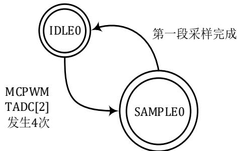  
图12-3ADC单段采样状态转移图

## 12.3.1.2 两段触发模式

两段触发需要两次触发才能完成完整的一轮采样。第一个触发到达时进行第一段采样，第二个触发到达时进行第二段采样。

假设两段采样配置通道数目分别为2和3，则第一段采样转换后的数据会依次填充到ADC0\_DAT、ADC\_DAT1，第二段采样转换后的数据会依次填充到 ADC\_DAT2、ADC\_DAT3、ADC\_DAT4。

触发事件可以是来自外部的 MCPWM定时信号TADC[0]和TADC[1]或两次软件触发。

TADC[0]或软件触发发生后，先进行 ADC\_CHNT[3:0]次采样，完成后进入空闲状态并等待下一个触发信号的到来；TADC[1]或软件触发作为第二个触发信号发生后，再进行 ADC\_CHNT[7:4]次采样。

采样次数均通过分段采样次数寄存器ADC\_CHNT 进行配置。

每个采样的信号源通过寄存器配置选定，信号源的选定需在触发前完成，且在一次采样过程完成前不应该改变。

软件触发较硬件触发的优先级低，在硬件触发采样的过程中发生软件触发，状态机不予处理，而产生一个错误中断。即只有状态机处于空闲状态时才会处理软件触发的采样请求。如果需要使用软件触发采样，需要确保硬件触发已经关闭。然后通过向 ADC\_SWT 寄存器写入 0x5AA5 以产生一次软件触发。

以两次软件触发两段采样为例，状态转移如图12-4所示。

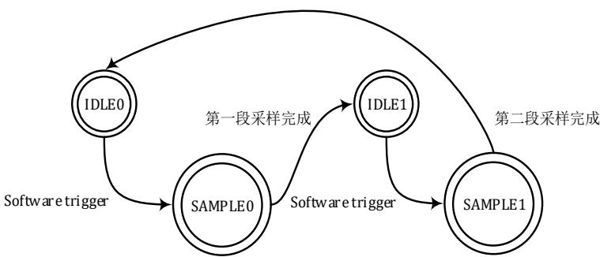  
图12-4ADC两段采样状态转移图

## 12.3.1.3 四段触发模式

与两段触发类似。四段的触发源分别为 TADC[0]、TADC[1]、TADC[2]、TADC[3]，且必须为 MCPWMTADC[0]/TADC[1]/TADC[2]/TADC[3]顺序触发 ADC 的四段采样；或者也可以是 4 次软件触发采样。四段采样的采样次数分别为 ADC\_CHNT[7:4]、ADC\_CHNT[3:0]、ADC\_CHNT[7:4]、ADC\_CHNT[3:0]。以 MCPWM TADC[0]/TADC[1]/TADC[2]/TADC[3]触发四段采样为例的状态转移如图 12-5 所示。

假设四段采样配置通道数目分别为 2、3、1、4，则第一段采样转换后的数据会依次填充到ADC\_DAT0、ADC\_DAT1，第二段采样转换后的数据会依次填充到 ADC\_DAT2、ADC\_DAT3、ADC\_DAT4，第三段采样转换后的数据会填充到 ADC\_DAT5，第四段采样转换后的数据会依次填充到 ADC\_DAT6、ADC\_DAT7、ADC\_DAT8、ADC\_DAT9。

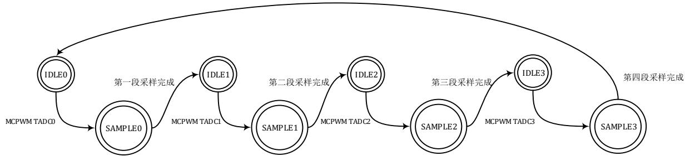  
图12-5ADC四段采样状态转移图

为使用 MCPWM 定时器产生 ADC 采样触发信号，需要配置 MCPWM\_TMR0/ MCPWM\_TMR1/MCPWM\_TMR2/ MCPWM\_TMR3 等寄存器，对应 TADC0/1/2/3 发生时的 MCPWM 计数器值，此外需要配置MCPWM\_TH设置计数器计数范围以及 MCPWM\_TCLK设置计数时钟频率并使能时钟。

## 12.3.2 中断

## 12.3.2.1 单段触发采样完成中断

采样完成产生中断 ADC\_IF[0]。

## 12.3.2.2 两段触发采样完成中断

第一段采样完成产生中断ADC\_IF[0]，第二段采样完成产生中断ADC\_IF[1]。

## 12.3.2.3 四段触发采样完成中断

第一段采样完成产生中断ADC\_IF[0]，第二段采样完成产生中断ADC\_IF[1]，第三段采样完成产生中断 ADC\_IF[2]，第四段采样完成产生中断 ADC\_IF[3]。

## 12.3.2.4 ADC\_IF 触发所需时间

CPU 软件运行于PLL时钟域，ADC 模块运行于ADC时钟域。典型地，ADC时钟周期为 PLL时钟周期（总线时钟周期）2 倍。 ADC\_IF 的清除需要操作 ADC 时钟域内的寄存器，最多需要 20 个总线周期。 建议 ADC\_IF 标志在中断函数入口处进行读取清除。 如果清除语句在中断函数最后，可能导致中断函数退出后标志仍未清除，导致再次进入中断。

同理，如果软件在清除ADC\_IF后立刻查询ADC\_IF，可能ADC\_IF仍为原始值。

## 12.3.3 配置修改

建议在ADC中断中进行 ADC\_CHNx的配置和修改，因为进入ADC 中断后说明ADC此时已完成一段采样且处于空闲状态。而在主程序中，无法确认ADC 运行状态，因此在主程序中如需修改ADC\_CHNx和 ADC\_CHNT 等寄存器，需要先关闭 ADC 触发，并向 ADC\_CFG.FSM\_RESET 写入 1,以复位 ADC 接口电路状态机，确保ADC 不在工作状态。如果ADC 在运行中配置发生变化会发生不可预判的行为。

```c
示例程序如下
ADCx_CFG_temp = ADCx_CFG;
ADCx_CFG = 0x0000;
ADCx_CFG = 0x0800;
/*
Add your code below, like:
ADCx_CHNT = 0x0005
ADCx_CHN0 = 0x3210;
ADCx_CHN1 = 0x7654;
*/
ADCx_CFG = ADCx_CFG_temp;
```

## 12.3.4 选择对应的模拟通道

ADC所采用信号对应的通道，请查阅DATASHEET中引脚功能选择。关闭对应IO的IE和OE，即可使用其模拟功能。

## 13 UTimer 通用定时器

## 13.1 概述

## 13.1.1 功能框图

如图 13-1 所示，通用定时器 UTIMER 主要包括 2 个独立的 Timer。分别可以独立配置运行计数时钟和滤波常数。每个 Timer可以用于输出特定周期占空比的波形，也可以捕获外部波形进行周期占空比的检测。

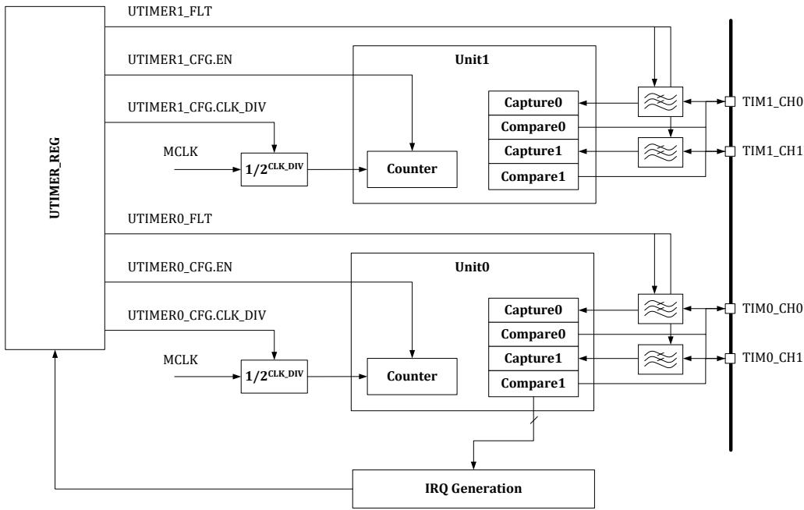  
图 13-1 UTimer 模块顶层功能框图

## 13.1.1.1 寄存器模块

对各个子模块控制寄存器的读写。

对各个子模块状态、结果寄存器的访问。

对各个子模块中断信号的处理和中断产生。

## 13.1.1.2 IO 滤波模块

IO滤波模块对来自芯片外部的输入信号进行滤波，降低毛刺对定时器功能的影响。

## 13.1.1.3 通用定时器模块

utimer\_unt 模块实现了通用的定时器功能，包括比较和捕获工作模式。每个定时器包含两个通道，可以处理两个外部输入信号或者产生两个脉冲信号送到芯片外部。

utimer\_unt 模块，支持外部事件触发开始计数。外部事件源头可配。当外部事件触发后，utimer\_unt定时器开始自增。支持使用外部信号作为timer时钟进行计数。

## 13.1.1.4 时钟分频模块

时钟分频模块用于产生定时器工作所需的各种分频时钟。

## 13.1.2 功能特点

定时器模块有以下特点:

⚫ 独立工作，可工作在不同频率下

⚫ Timer0 为 16bit 通用定时器

⚫ Timer1 为 32bit 通用定时器

⚫ 每个通用定时器处理 2 个外部输入信号（捕获模式），或者产生 2 个输出信号（比较模式）

⚫ 对每个输入信号可以进行最大 2040 个系统主时钟的滤波，即，当芯片工作在 48MHz 时钟频率下时，可以滤除42uS宽度以下毛刺

## 13.2 实现说明

## 13.2.1 时钟分频

Timer 使用 UTIMERx\_CFG.CLK\_DIV 进行分频，可以降低计数器的计数频率，分频系数可以设置为 1/2/4/8/16/32/64/128.

## 13.2.2 中断标志清零

采用了通过对每个中断标志位写 1来清除标志位的设计。

## 13.2.3 滤波

每个定时器模块有两个通道，在工作于输入捕获模式时，两个通道共享一个滤波系数。

通过配置滤波寄存器 UTIMERx\_FLT，可以调整滤波宽度为0\~2040 个 Timer计数时钟宽度。

输入信号滤波使用 Timer 计数的分频时钟，UTIMERx\_CFG.CLK\_DIV 对 Timer 计数时钟的分频对滤波时钟有影响。

如图 13-2 所示，原始输入信号在 t1\~t6 几个时刻发生了翻转，滤波器宽度配置成 T。可以看到只有t3和t6时刻发生的翻转维持了大于T的时间，因此从滤波器的输出看，信号仅发生了两次翻转。

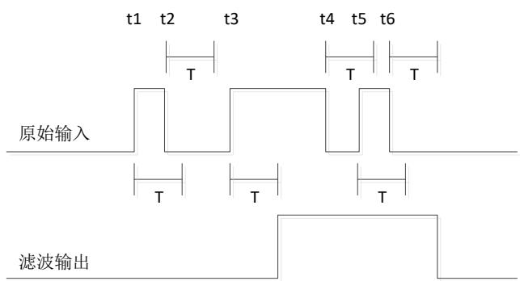  
图 13-2 UTimer 滤波示意图

## 13.2.4 模式

## 13.2.4.1 计数器

Timer中的计数器采用递增方向计数。

计数器从0 计数到TH值，再回到0重新开始计数，计数器回到 0时，产生回零中断。实际计数周期为 clk\_freq\*(TH+1)。

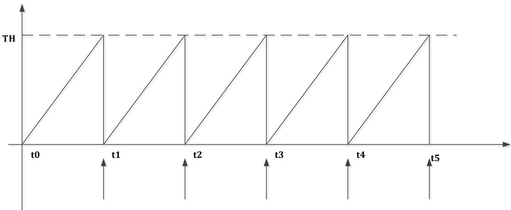  
图 13-3 UTimer 通用计数器

计数器的计数时钟可以通过 UTIMERx\_CFG.CLK\_SRC进行配置，可以使用芯片内部的系统时钟（通道为48MHz PLL时钟）或使用 Timer0/1 的通道0/1 信号作为外部时钟进行计数。

计数器的计数时钟可以通过 UTIMERx\_CFG.CLK\_DIV进行分频，以降低计数器的计数频率。

## 13.2.4.2 比较模式

比较模式下，计数器计数到 UTIMERx\_CMP 值时，产生比较中断。比较模式可以驱动一个比较脉冲发生，在回零时，向IO口输出一个电平（极性可配置），在比较事件发生时，电平翻转，向IO口输出另一个电平。计数器回零时，仍然会产生回零中断。设置 UTIMERx\_CMP0=0，可使得 Timer X通道 0 为恒 1，设置 UTIMERx\_CMP0=UTIMERx\_TH+1，可使得 Timer 通道 0 为恒 0。

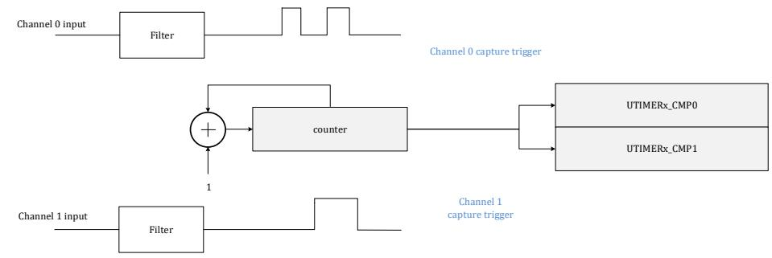

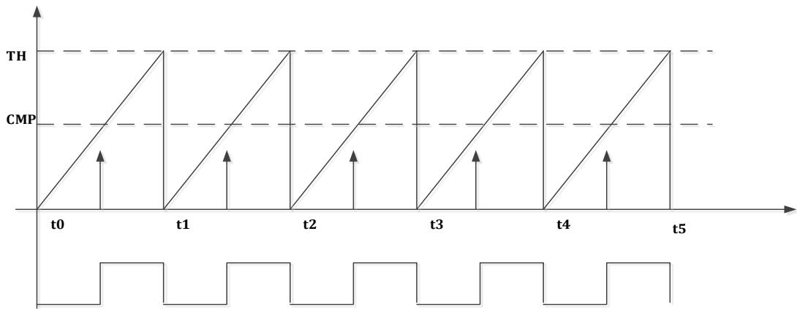  
图 13-4 UTimer 比较模式

在 比 较 模 式 下 ， 当 UTIMERx\_CFG.EN=0 ， 即 Timer 没 有 开 始 计 数 时 ， 通 过 向UTIMERx\_CFG.ONE\_TRIG 写入 1，可以触发 Timer 发出一个周期特定占空比的波形。结束后 Timer 回到空闲状态，通道不再动作。

## 13.2.4.3 捕获模式

捕获模式下，可以使用 Timer 来检测输入信号的上升/下降或者双沿，发生捕获事件（即输入信号电平变化）时，定时器计数值存入 UTIMER\_UNTx\_CMP 寄存器，并产生捕获中断。计数器回零时，仍然会产生回零中断。

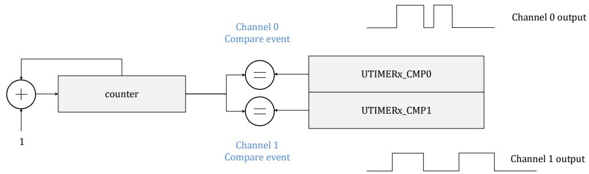

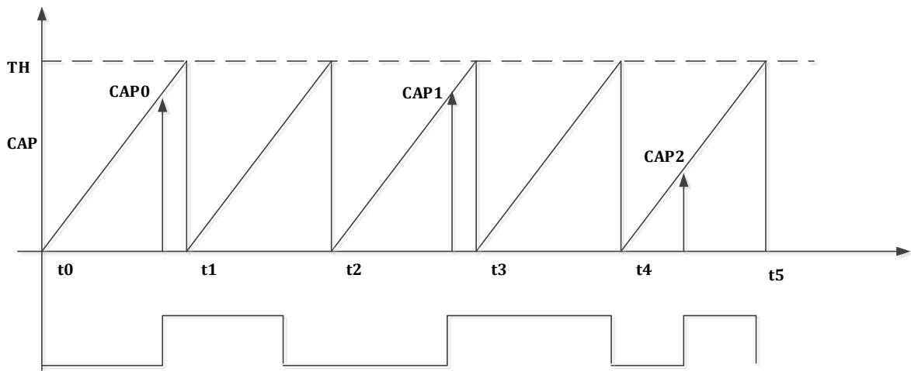  
图 13-5 UTimer 捕获模式

如图13-5 所示，定时器设置为上升沿捕获。在CAP0/CAP1/CAP2 三个时刻点，捕获到输入信号发生上升沿变化，对应时刻点的定时器计数值将存入UTIMER\_UNTx\_CMP寄存器中。

捕获模式下，通道 0/1 捕获的信号来源可以通过 UTIMERx\_CFG.SRC0 和 UTIMERx\_SRC1 进行设置，信号源可以设置为来自 IO的通道信号，或来自模拟比较器，以及来自IO的两个通道信号的异或。

可以通过设置 UTIMERx\_CFG.CAP0\_CLR\_EN或 UTIMERx\_CFG.CAP1\_CLR\_EN 使能 Timer自动清零，即当通道 0/1 发生捕获事件时，UTIMER\_CNT 自动回零重新开始计数。这一功能便于 Timer 计算捕获信号的周期和占空比。

例如，如果设置了Timer0的通道0/1 同时捕获同一个信号，通道0 捕获上升沿，通道1 捕获下降沿。且使能 CAP0\_CLR\_EN，即发生通道 0 捕获事件时 UTIMER\_CNT 自动回零。则当发生发生通道0 捕获事件（CAP0）时，UTIMERx\_CMP0 记录的值为信号上一个周波的周期，UTIMERx\_CMP1 记录的值为信号上一个周波的高电平占空比。

同理，如果设置了Timer0的通道0/1 同时捕获同一个信号，通道0 捕获上升沿，通道1 捕获下降沿。且使能 CAP1\_CLR\_EN，即发生通道 1 捕获事件时 UTIMER\_CNT 自动回零。则当发生发生通道1 捕获事件（CAP1）时，UTIMERx\_CMP1 记录的值为信号上一个周波的周期，UTIMERx\_CMP0 记录的值为信号上一个周波的低电平占空比。

## 13.2.4.4 单次触发

在 比 较 模 式 下 ， 当 UTIMERx\_CFG.EN=0 ， 即 Timer 没 有 开 始 计 数 时 ， 通 过 向UTIMERx\_CFG.ONE\_TRIG 写入 1，可以触发 Timer 发出一个周期特定占空比的波形。结束后 TIMER回到空闲状态，通道不再动作。如果 TIMER 单次触发仍在计数周期内再次发生单次触发，TIMER 不会响应，仍继续完成本次周期计数。即在单次触发计数过程中发生的过于频繁的软件单次触发不被TIMER 接受。如下图，第3 次向ONE\_TRIG写1 无效，不会触发 TIMER 重新开始计数。

当 UTIMERx\_CFG.EN=1，通过向 UTIMERx\_CFG.ONE\_TRIG 写入 1，可以将 UTIMERx\_CNT 重置，触发 TIMER 重新开始发出一个周期特定占空比的波形。一个周期后，TIMER继续进行正常计数。

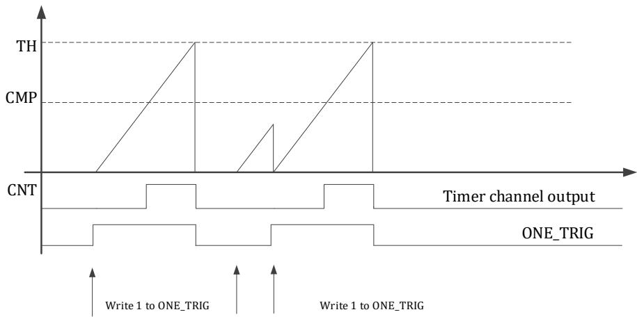  
图 13-6 UTimer 单次触发模式

## 13.2.5 ADC 触发

Timer0/1 的比较事件（CMP0/1）可作为 ADC 采样触发事件。

## 13.3 寄存器

## 13.3.1 地址分配

Timer0 在芯片中的基地址是 0x4001\_0500

表 13-1 Timer0 寄存器地址分配

<table><tr><td>名称</td><td>偏移</td><td>描述</td></tr><tr><td>UTIMER0_CFG</td><td>0x00</td><td>Timer0 配置寄存器</td></tr><tr><td>UTIMER0_TH</td><td>0x04</td><td>Timer0 计数门限寄存器</td></tr><tr><td>UTIMER0_CNT</td><td>0x08</td><td>Timer0 计数值寄存器</td></tr><tr><td>UTIMER0_CMP0</td><td>0x0C</td><td>Timer0 比较/捕获寄存器 0</td></tr><tr><td>UTIMER0_CMP1</td><td>0x10</td><td>Timer0 比较/捕获寄存器 1</td></tr><tr><td>UTIMER0_EVT</td><td>0x14</td><td>Timer0 外部事件选择寄存器</td></tr><tr><td>UTIMER0_FLT</td><td>0x18</td><td>Timer0 滤波控制寄存器</td></tr><tr><td>UTIMER0_IE</td><td>0x1C</td><td>Timer0 中断使能寄存器</td></tr><tr><td>UTIMER0_IF</td><td>0x20</td><td>Timer0 中断标志寄存器</td></tr></table>

Timer1 在芯片中的基地址是 0x4001\_0600  
表 13-2 Timer1 寄存器地址分配

<table><tr><td>UTIMER1_CFG</td><td>0x00</td><td>Timer1 配置寄存器</td></tr><tr><td>UTIMER1_TH</td><td>0x04</td><td>Timer1 计数门限寄存器</td></tr><tr><td>UTIMER1_CNT</td><td>0x08</td><td>Timer1 计数值寄存器</td></tr><tr><td>UTIMER1_CMP0</td><td>0x0C</td><td>Timer1 比较/捕获寄存器 0</td></tr><tr><td>UTIMER1_CMP1</td><td>0x10</td><td>Timer1 比较/捕获寄存器 1</td></tr><tr><td>UTIMER1_EVT</td><td>0x14</td><td>Timer1 外部事件选择寄存器</td></tr><tr><td>UTIMER1_FLT</td><td>0x18</td><td>Timer1 滤波控制寄存器</td></tr><tr><td>UTIMER1_IE</td><td>0x1C</td><td>Timer1 中断使能寄存器</td></tr><tr><td>UTIMER1_IF</td><td>0x20</td><td>Timer1 中断标志寄存器</td></tr></table>

Timer0/1 不同之处在于 Timer0 计数器相关寄存器为 16 位宽，而 Timer1 计数器相关寄存器为32 位宽。

## 13.3.2 UTimer0 寄存器

## 13.3.2.1 UTIMER0\_CFG Timer0 配置寄存器

地址:0x4001\_0500

复位值:0x0

表 13-3 Timer0 配置寄存器 UTIMER0\_CFG

<table><tr><td>31</td><td>30</td><td>29</td><td>28</td><td>27</td><td>26</td><td>25</td><td>24</td><td>23</td><td>22</td><td>21</td><td>20</td><td>19</td><td>18</td><td>17</td><td>16</td></tr><tr><td>EN</td><td rowspan="3" colspan="3"></td><td>CMP1_CLR_EN</td><td>CMP0_CLR_EN</td><td>ONE_TRIG</td><td>ETON</td><td rowspan="3"></td><td colspan="3">CLK_DIV</td><td colspan="4">CLK_SRC</td></tr><tr><td>RW</td><td>RW</td><td>RW</td><td>RW</td><td>RW</td><td colspan="3">RW</td><td colspan="4">RW</td></tr><tr><td>0</td><td>0</td><td>0</td><td>0</td><td>0</td><td colspan="3">0</td><td colspan="4">0</td></tr></table>

<table><tr><td>15</td><td>14</td><td>13</td><td>12</td><td>11</td><td>10</td><td>9</td><td>8</td><td>7</td><td>6</td><td>5</td><td>4</td><td>3</td><td>2</td><td>1</td><td>0</td></tr><tr><td colspan="4">SRC1</td><td>CH1_POL</td><td>CH1_MODE</td><td>CH1_FE_CAP_EN</td><td>CH1_RE_CAP_EN</td><td colspan="3">SRCO</td><td>CHO_POL</td><td>CHO_MODE</td><td>CHO_FE_CAP_EN</td><td colspan="2">CHO_RE_CAP_EN</td></tr><tr><td colspan="4">RW</td><td>RW</td><td>RW</td><td>RW</td><td>RW</td><td colspan="3">RW</td><td>RW</td><td>RW</td><td>RW</td><td>RW</td><td>RW</td></tr><tr><td colspan="4">0001</td><td>0</td><td>0</td><td>0</td><td>0</td><td colspan="3">0</td><td>0</td><td>0</td><td>0</td><td>0</td><td>0</td></tr></table>

<table><tr><td>位置</td><td>位名称</td><td>说明</td></tr><tr><td>[31]</td><td>EN</td><td>Timer 模块整体使能,高有效</td></tr><tr><td>[30:28]</td><td></td><td>未使用</td></tr><tr><td>[27]</td><td>CAP1_CLR_EN</td><td>当发生 CAP1 捕获事件时,清零 Timer 计数器,高有效</td></tr><tr><td>[26]</td><td>CAPO_CLR_EN</td><td>当发生 CAPO 捕获事件时,清零 Timer 计数器,高有效</td></tr><tr><td>[25]</td><td>ONE_TRIG</td><td>在比较模式下,且 EN 为 0 时,写 1 触发 Timer 发送一个周期的特定占空比的脉冲,此位在脉冲发送期间内读为 1,一个 Timer 周期后,自动清零。</td></tr><tr><td>[24]</td><td>ETON</td><td>Timer 计数器计数使能配置。默认为 0。0: 自动运行1:等待外部事件触发计数,计数一个周期后停止。外部事件通过UTIMERO_EVT进行设置。</td></tr><tr><td>[23]</td><td></td><td>未使用</td></tr><tr><td>[22:20]</td><td>CLK_DIV</td><td>Timer 计数器频率配置,计数器计数频率是系统主时钟频率的 $2^{CLK\_DIV}$ 分频。默认值为0,不分频。0:1分频1:2分频2:4分频3:8分频4:16分频5:32分频6:64分频7:128分频</td></tr><tr><td>[19:16]</td><td>CLK_SRC</td><td>Timer 时钟源0:芯片内部时钟1:保留2:Timer0通道0外部时钟信号3:Timer0通道1外部时钟信号4:Timer1通道0外部时钟信号5:Timer1通道1外部时钟信号</td></tr><tr><td>[15:12]</td><td>SRC1</td><td>Timer 捕获模式通道1信号来源。默认为4'h1。0:Timer通道0,来自芯片GPIO(参见Datasheet及应用配置)1:Timer通道1,来自芯片GPIO(参见Datasheet及应用配置)2:比较器0的输出3:比较器1的输出8:Timer通道0和1的异或</td></tr><tr><td>[11]</td><td>CH1_POL</td><td>Timer通道1在比较模式下的输出极性控制,当计数器计数值回零时的输出值。</td></tr><tr><td>[10]</td><td>CH1_MODE</td><td>Timer通道1的工作模式选择,默认值为0。0:比较模式。输出方波,在Timer通道1计数器计数值等于0或等于Timer比较捕获寄存器值时,IO发生翻转。1:捕获模式。当Timer通道1输入信号发生捕获事件时,将计数器计数值存入Timer通道1比较捕获寄存器。</td></tr><tr><td>[9]</td><td>CH1_FE_CAP_EN</td><td>Timer通道1下降沿捕获事件使能。1:使能;0:关闭。Timer通道1输入信号发生1→0跳变被视为捕获事件。下降沿事件使能可以与上升沿事件使能并存。</td></tr><tr><td>[8]</td><td>CH1_RE_CAP_EN</td><td>Timer通道1上升沿捕获事件使能。1:使能;0:关闭。Timer通道1输入信号发生0→1跳变被视为捕获事件。上升沿事件使能可以与下降沿事件使能并存。</td></tr><tr><td>[7:4]</td><td>SRC0</td><td>Timer捕获模式通道0信号来源。默认为3'h0。0:Timer通道0,来自芯片GPIO(参见Datasheet及应用配置)1:Timer通道1,来自芯片GPIO(参见Datasheet及应用配置)2:比较器0的输出3:比较器1的输出8: Timer 通道0和1的异或</td></tr><tr><td>[3]</td><td>CHO_POL</td><td>Timer 通道0在比较模式下的输出极性控制:当计数器计数值回零时的输出值。</td></tr><tr><td>[2]</td><td>CHO_MODE</td><td>Timer 通道0的工作模式选择,默认值为0。0: 比较模式。输出方波,在Timer通道0计数器计数值等于0或等于Timer比较捕获寄存器值时,IO发生翻转。1: 捕获模式。当Timer通道0输入信号发生捕获事件时,将计数器计数值存入Timer通道0比较捕获寄存器。</td></tr><tr><td>[1]</td><td>CHO_FE_CAP_EN</td><td>Timer 通道0下降沿捕获事件使能。1:使能;0:关闭。Timer通道0输入信号发生1→0跳变被视为捕获事件。下降沿事件使能可以与上升沿事件使能并存。</td></tr><tr><td>[0]</td><td>CHO_RE_CAP_EN</td><td>Timer 通道0上升沿捕获事件使能。1:使能;0:关闭。Timer通道0输入信号发生0→1跳变被视为捕获事件。上升沿事件使能可以与下降沿事件使能并存。</td></tr></table>

当使用外部时钟计数时，也需要设置 UTIMERx\_CFG.TON=1，且需要开启 SYS\_CLK\_FEN 中对于Timer时钟的使能。使用外部时钟计数时，也需要设置 UTIMERx\_TH。  
如果设置SRC0 为4’h8 捕获两通道异或值，（通常为捕获编码器正交的两个通道），需要同时设置 CMP0\_CLR\_EN=1，CH0\_FE\_CAP\_EN=1，CH0\_RE\_CAP\_EN=1，CH0\_MODE=1，即捕获上升沿、下降沿，且每次有信号边沿都清零计数器。CMP0即为捕获的两次信号边沿之间的计数值。

SRC0和SRC1可以设置采样同一个 TIMER 通道IO，分别捕获上升沿和下降沿，并在上升沿或下降沿时清零TIMER\_CNT，这种方式便于计算方波的周期和占空比。此种方式会占用TIMER两个通道。但只占用一个TIMER 通道IO，另一个TIMER通道 IO可以设置为其他功能使用。

## 13.3.2.2 UTIMER0\_TH Timer0 门限寄存器

地址:0x4001\_0504

复位值:0x0

表 13-4 Timer0 门限寄存器 UTIMER0\_TH

<table><tr><td>15</td><td>14</td><td>13</td><td>12</td><td>11</td><td>10</td><td>9</td><td>8</td><td>7</td><td>6</td><td>5</td><td>4</td><td>3</td><td>2</td><td>1</td><td>0</td></tr><tr><td></td><td></td><td></td><td></td><td></td><td></td><td></td><td>TH</td><td></td><td></td><td></td><td></td><td></td><td></td><td></td><td></td></tr><tr><td></td><td></td><td></td><td></td><td></td><td></td><td></td><td>RW</td><td></td><td></td><td></td><td></td><td></td><td></td><td></td><td></td></tr><tr><td></td><td></td><td></td><td></td><td></td><td></td><td></td><td>0</td><td></td><td></td><td></td><td></td><td></td><td></td><td></td><td></td></tr></table>

<table><tr><td>位置</td><td>位名称</td><td>说明</td></tr><tr><td>[31:16]</td><td></td><td>未使用</td></tr><tr><td>[15:0]</td><td>TH</td><td>Timer 计数器计数门限。计数器从 0 计数到 TH 值后再次回 0 开始计数</td></tr></table>

## 13.3.2.3 UTIMER0\_CNT Timer0 计数寄存器

地址:0x4001\_0508

复位值:0x0

表 13-5 Timer0 计数寄存器 UTIMER0\_CNT

<table><tr><td>15</td><td>14</td><td>13</td><td>12</td><td>11</td><td>10</td><td>9</td><td>8</td><td>7</td><td>6</td><td>5</td><td>4</td><td>3</td><td>2</td><td>1</td><td>0</td></tr><tr><td></td><td></td><td></td><td></td><td></td><td></td><td></td><td colspan="2">CNT</td><td></td><td></td><td></td><td></td><td></td><td></td><td></td></tr><tr><td></td><td></td><td></td><td></td><td></td><td></td><td></td><td colspan="2">RW</td><td></td><td></td><td></td><td></td><td></td><td></td><td></td></tr><tr><td></td><td></td><td></td><td></td><td></td><td></td><td></td><td colspan="2">0</td><td></td><td></td><td></td><td></td><td></td><td></td><td></td></tr></table>

<table><tr><td>位置</td><td>位名称</td><td>说明</td></tr><tr><td>[31:16]</td><td></td><td>未使用</td></tr><tr><td>[15:0]</td><td>CNT</td><td>Timer 0 计数器当前计数值。写操作可以写入新的计数值。</td></tr></table>

注意:写入 UTIMER0\_CNT 前需要先通过 SYS\_CLK\_FEN.TIMER0\_CLK\_EN 开启 Timer0 时钟。

## 13.3.2.4 UTIMER0\_CMP0 Timer0 通道 0 比较捕获寄存器

地址:0x4001\_050C

复位值:0x0

表 13-6 Timer0 通道 0 比较捕获寄存器 UTIMER0\_CMP0

<table><tr><td>15</td><td>14</td><td>13</td><td>12</td><td>11</td><td>10</td><td>9</td><td>8</td><td>7</td><td>6</td><td>5</td><td>4</td><td>3</td><td>2</td><td>1</td><td>0</td></tr><tr><td></td><td></td><td></td><td></td><td></td><td></td><td></td><td></td><td></td><td></td><td></td><td></td><td></td><td></td><td></td><td></td></tr><tr><td></td><td></td><td></td><td></td><td></td><td></td><td></td><td></td><td></td><td></td><td></td><td></td><td></td><td></td><td></td><td></td></tr><tr><td></td><td></td><td></td><td></td><td></td><td></td><td></td><td></td><td></td><td></td><td></td><td></td><td></td><td></td><td></td><td></td></tr><tr><td></td><td></td><td></td><td></td><td></td><td></td><td></td><td></td><td></td><td></td><td></td><td></td><td></td><td></td><td></td><td></td></tr></table>

<table><tr><td>位置</td><td>位名称</td><td>说明</td></tr><tr><td>[31:16]</td><td></td><td>未使用</td></tr><tr><td>[15:0]</td><td>CMP0</td><td>Timer 通道 0 工作在比较模式时,当计数器计数值等于 CMP0 时,发生比较事件。Timer 通道 0 工作在捕获模式时,发生捕获事件时的计数器计数值存入 CMP0 寄存器。</td></tr></table>

设置 CMP0=0，可使得通道 0 恒为!CH0\_POL，设置 CMP0=TH+1，可使得通道 0 恒为 CH0\_POL。

## 13.3.2.5 UTIMER0\_CMP1 Timer0 通道 1 比较捕获寄存器

地址:0x4001\_0510

复位值:0x0

表 13-7 Timer0 通道 1 比较捕获寄存器 UTIMER0\_CMP1

<table><tr><td>15</td><td>14</td><td>13</td><td>12</td><td>11</td><td>10</td><td>9</td><td>8</td><td>7</td><td>6</td><td>5</td><td>4</td><td>3</td><td>2</td><td>1</td><td>0</td></tr><tr><td></td><td></td><td></td><td></td><td></td><td></td><td></td><td></td><td></td><td></td><td></td><td></td><td></td><td></td><td></td><td></td></tr><tr><td></td><td></td><td></td><td></td><td></td><td></td><td></td><td></td><td></td><td></td><td></td><td></td><td></td><td></td><td></td><td></td></tr><tr><td></td><td></td><td></td><td></td><td></td><td></td><td></td><td></td><td></td><td></td><td></td><td></td><td></td><td></td><td></td><td></td></tr><tr><td></td><td></td><td></td><td></td><td></td><td></td><td></td><td></td><td></td><td></td><td></td><td></td><td></td><td></td><td></td><td></td></tr></table>

<table><tr><td>位置</td><td>位名称</td><td>说明</td></tr><tr><td>[31:16]</td><td></td><td>未使用</td></tr><tr><td>[15:0]</td><td>CMP1</td><td>Timer 通道 1 工作在比较模式时,当计数器计数值等于 CMP1 时,发生比较事件。Timer 通道 1 工作在捕获模式时,发生捕获事件时的计数器计数值存入 CMP1 寄存器。</td></tr></table>

设置 CMP1=0，可使得通道恒为!CH1\_POL，设置 CMP1=TH+1，可使得通道恒为 CH1\_POL。

## 13.3.2.6 UTIMER0\_EVT Timer0 外部事件选择寄存器

地址:0x4001\_0514

复位值:0x0

表 13-8 Timer0 外部事件选择寄存器 UTIMER0\_EVT

<table><tr><td>15</td><td>14</td><td>13</td><td>12</td><td>11</td><td>10</td><td>9</td><td>8</td><td>7</td><td>6</td><td>5</td><td>4</td><td>3</td><td>2</td><td>1</td><td>0</td></tr><tr><td rowspan="3" colspan="11"></td><td colspan="5">EVT_SRC</td></tr><tr><td colspan="5">RW</td></tr><tr><td colspan="5">0</td></tr></table>

<table><tr><td>位置</td><td>位名称</td><td>说明</td></tr><tr><td>[31:5]</td><td></td><td>未使用</td></tr><tr><td>[4:0]</td><td>EVT_SRC</td><td>Timer外部事件选择寄存器,本寄存器需要配合UTIMER0_CFG.ETON使用。ETON为高时,根据本寄存器选择触发Timer计数的事件。需要注意的是,Timer自身的比较事件无法触发Timer进行计数。0:TIMER0通道0比较事件1:TIMER0通道1比较事件2:TIMER1通道0比较事件3:TIMER1通道1比较事件10:MCPWM TADC[0]比较事件11:MCPWM TADC[1]比较事件12:MCPWM TADC[2]比较事件13:MCPWM TADC[3]比较事件</td></tr></table>

## 13.3.2.7 UTIMER0\_FLT Timer0 滤波控制寄存器

地址:0x4001\_0518

复位值:0x0

表 13-9 Timer0 滤波控制寄存器 UTIMER0\_FLT

<table><tr><td>15</td><td>14</td><td>13</td><td>12</td><td>11</td><td>10</td><td>9</td><td>8</td><td>7</td><td>6</td><td>5</td><td>4</td><td>3</td><td>2</td><td>1</td><td>0</td></tr><tr><td colspan="8"></td><td colspan="8">FLT</td></tr><tr><td colspan="8" rowspan="2"></td><td colspan="8">RW</td></tr><tr><td colspan="15">0</td></tr></table>

<table><tr><td>位置</td><td>位名称</td><td>说明</td></tr><tr><td>[31:8]</td><td></td><td>未使用</td></tr><tr><td>[7:0]</td><td>FLT</td><td>通道 0/1 信号滤波宽度选择。取值范围 0~255。 FLT 为 0 时,不对通道进行滤波。 FLT 不为 0 时,对通道信号进行滤波:滤波宽度为  $FLT \times 8$ 。当通道信号电平稳定超过  $FLT \times 8$  个系统时钟周期宽度时,滤波器输出更新;否则,滤波器保持当前的输出不变。</td></tr></table>

注意，以上滤波器的工作时钟与对应的 Timer 的分频后的工作时钟为相同时钟，受UTIMERx\_CFG.CLK\_DIV 的分频系数控制。

假设 UTIMERx\_FLT = 0x6；UTIMERx\_CFG.CLK\_DIV = 0x2; 则 Timer 的运行时钟相对系统时钟进行了 4 分频。通道输入信号需要经过 8×6 倍 Timer 的运行时钟的滤波，亦即 8×6×4 倍系统时钟的滤波。

## 13.3.2.8 UTIMER0\_IE Timer0 中断使能寄存器

地址:0x4001\_051C

复位值:0x0

表 13-10 Timer0 中断使能寄存器 UTIMER0\_IE

<table><tr><td>15</td><td>14</td><td>13</td><td>12</td><td>11</td><td>10</td><td>9</td><td>8</td><td>7</td><td>6</td><td>5</td><td>4</td><td>3</td><td>2</td><td>1</td><td>0</td></tr><tr><td rowspan="3" colspan="5"></td><td>ZC_RE</td><td>CH1_RE</td><td>CHO_RE</td><td rowspan="3" colspan="5"></td><td>ZC_IE</td><td>CH1_IE</td><td>CHO_IE</td></tr><tr><td>RW</td><td>RW</td><td>RW</td><td>RW</td><td>RW</td><td>RW</td></tr><tr><td>0</td><td>0</td><td>0</td><td>0</td><td>0</td><td>0</td></tr></table>

<table><tr><td>位置</td><td>位名称</td><td>说明</td></tr><tr><td>[31:11]</td><td></td><td>未使用</td></tr><tr><td>[10]</td><td>ZC_RE</td><td>Timer 计数器过 0 DMA 请求使能,高电平有效。</td></tr><tr><td>[9]</td><td>CH1_RE</td><td>Timer 通道 1 比较/捕获 DMA 请求使能,高电平有效。</td></tr><tr><td>[8]</td><td>CHO_RE</td><td>Timer 通道 0 比较/捕获 DMA 请求使能,高电平有效。</td></tr><tr><td>[7:3]</td><td></td><td>未使用</td></tr><tr><td>[2]</td><td>ZC_IE</td><td>Timer 计数器过 0 中断使能,高电平有效。</td></tr><tr><td>[1]</td><td>CH1_IE</td><td>Timer 通道 1 比较/捕获中断使能,高电平有效。</td></tr><tr><td>[0]</td><td>CHO_IE</td><td>Timer 通道 0 比较/捕获中断使能,高电平有效。</td></tr></table>

DMA请求事件，与中断为相同事件标志，DMA 请求被 DMA 受理后，中断标志会被 DMA硬件自

动清除，无需CPU软件干预。需要注意的是，通常开启某个事件的 DMA请求则关闭对应的中断使能。

## 13.3.2.9 UTIMER0\_IF Timer0 中断标志寄存器

地址:0x4001\_0520

复位值:0x0

表 13-11 Timer0 中断标志寄存器 UTIMER0\_IF

<table><tr><td>15 14 13 12 11 10 9 8 7 6 5 4 3</td><td>2</td><td>1</td><td>0</td></tr><tr><td rowspan="3"></td><td>ZC_IF</td><td>CH1_IF</td><td>CH0_IF</td></tr><tr><td>RW1C</td><td>RW1C</td><td>RW1C</td></tr><tr><td>0</td><td>0</td><td>0</td></tr></table>

<table><tr><td>位置</td><td>位名称</td><td>说明</td></tr><tr><td>[31:3]</td><td></td><td>未使用</td></tr><tr><td>[2]</td><td>ZC_IF</td><td>Timer 计数器过 0 中断标志。高电平有效,写 1 清 0</td></tr><tr><td>[1]</td><td>CH1_IF</td><td>Timer 通道 1 比较/捕获中断标志。高电平有效,写 1 清 0</td></tr><tr><td>[0]</td><td>CHO_IF</td><td>Timer 通道 0 比较/捕获中断标志。高电平有效,写 1 清 0</td></tr></table>

中断标志写 1 清零，一般不建议用如下|=方式清零，因为|=是先读取中断标志，将对应位改为 1再写入清零，如果同时有其他中断标志置位，会被一起清零，而这通常不是软件所期望的。例如，如下写法本意是清零 $\mathrm { Z C \mathrm { \ : . } I F }$ ，但如果同时 CH0\_IF 在写入执行前置 1 了，则软件先读取回 UTIMER\_IF 值为 0x24，然后执行或操作 $0 \mathrm { x } 4 | 0 \mathrm { x } 1 { = } 0 \mathrm { x } 5$ ，然后写入，同时对 CH0\_IF 和 ZC\_IF 进行了清零，可能导致Timer少进入一次因捕获而产生的中断。

$$
U T I M E R \_ I F | = 0 x 4;
$$

如果希望清零ZC\_IF标志位，应以如下方式，直接对 BIT2 写1.

$$
U T I M E R \_ I F = 0 x 4;
$$

## 13.3.3 UTimer1 寄存器

## 13.3.3.1 UTIMER1\_CFG Timer1 配置寄存器

地址:0x4001\_0600

复位值:0x0

表 13-12 Timer1 配置寄存器 UTIMER1\_CFG

<table><tr><td>31</td><td>30</td><td>29</td><td>28</td><td>27</td><td>26</td><td>25</td><td>24</td><td>23</td><td>22</td><td>21</td><td>20</td><td>19</td><td>18</td><td>17</td><td>16</td></tr><tr><td>EN</td><td rowspan="3" colspan="3"></td><td>CAP1_CLR_EN</td><td>CAPO_CLR_EN</td><td>ONE_TRIG</td><td>ETON</td><td rowspan="3"></td><td colspan="3">CLK_DIV</td><td colspan="4">CLK_SRC</td></tr><tr><td>RW</td><td>RW</td><td>RW</td><td>RW</td><td>RW</td><td colspan="3">RW</td><td colspan="4">RW</td></tr><tr><td>0</td><td>0</td><td>0</td><td>0</td><td>0</td><td colspan="3">0</td><td colspan="4">0</td></tr><tr><td>15</td><td>14</td><td>13</td><td>12</td><td>11</td><td>10</td><td>9</td><td>8</td><td>7</td><td>6</td><td>5</td><td>4</td><td>3</td><td>2</td><td>1</td><td>0</td></tr></table>

<table><tr><td>SRC1</td><td>CH1_POL</td><td>CH1_MODE</td><td>CH1_FE_CAP_EN</td><td>CH1_RE_CAP_EN</td><td>SRC0</td><td>CH0_POL</td><td>CH0_MODE</td><td>CH0_FE_CAP_EN</td><td>CH0_RE_CAP_EN</td></tr><tr><td>RW</td><td>RW</td><td>RW</td><td>RW</td><td>RW</td><td>RW</td><td>RW</td><td>RW</td><td>RW</td><td>RW</td></tr><tr><td>0001</td><td>0</td><td>0</td><td>0</td><td>0</td><td>0</td><td>0</td><td>0</td><td>0</td><td>0</td></tr></table>

<table><tr><td>位置</td><td>位名称</td><td>说明</td></tr><tr><td>[31]</td><td>EN</td><td>Timer 模块整体使能,高有效</td></tr><tr><td>[30:28]</td><td></td><td>未使用</td></tr><tr><td>[27]</td><td>CAP1_CLR_EN</td><td>当发生 CAP1 捕获事件时,清零 Timer 计数器,高有效</td></tr><tr><td>[26]</td><td>CAPO_CLR_EN</td><td>当发生 CAPO 捕获事件时,清零 Timer 计数器,高有效</td></tr><tr><td>[25]</td><td>ONE_TRIG</td><td>在比较模式下,且 EN 为 0 时,写 1 触发 Timer 发送一个周期的特定占空比的脉冲,此位在脉冲发送期间内读为 1,一个 Timer 周期后,自动清零。</td></tr><tr><td>[24]</td><td>ETON</td><td>Timer 计数器计数使能配置。默认为 0。0: 自动运行1: 等待外部事件触发计数,计数一个周期后停止。外部事件通过UTIMERO_EVT 进行设置。</td></tr><tr><td>[23]</td><td></td><td>未使用</td></tr><tr><td>[22:20]</td><td>CLK_DIV</td><td>Timer 计数器频率配置,计数器计数频率是系统主时钟频率的 $2^{CLK\_DIV}$ 分频。默认值为 0,不分频。0: 1 分频1: 2 分频2: 4 分频3: 8 分频4: 16 分频5: 32 分频6: 64 分频7: 128 分频</td></tr><tr><td>[19:16]</td><td>CLK_SRC</td><td>Timer 时钟源0: 芯片内部时钟1: 保留2: Timer0 通道 0 外部时钟信号3:Timer0通道1外部时钟信号4:Timer1通道0外部时钟信号5:Timer1通道1外部时钟信号</td></tr><tr><td>[15:12]</td><td>SRC1</td><td>Timer捕获模式通道1信号来源。默认为4'h1。0:Timer通道0,来自芯片GPIO(参见Datasheet及应用配置)1:Timer通道1,来自芯片GPIO(参见Datasheet及应用配置)2:比较器0的输出3:比较器1的输出8:Timer通道0和1的异或</td></tr><tr><td>[11]</td><td>CH1_POL</td><td>Timer通道1在比较模式下的输出极性控制,当计数器计数值回零时的输出值。</td></tr><tr><td>[10]</td><td>CH1_MODE</td><td>Timer通道1的工作模式选择,默认值为0。0:比较模式。输出方波,在Timer通道1计数器计数值等于0或等于Timer比较捕获寄存器值时,IO发生翻转。1:捕获模式。当Timer通道1输入信号发生捕获事件时,将计数器计数值存入Timer通道1比较捕获寄存器</td></tr><tr><td>[9]</td><td>CH1_FE_CAP_EN</td><td>Timer通道1下降沿捕获事件使能。1:使能;0:关闭。Timer通道1输入信号发生1→0跳变被视为捕获事件。下降沿事件使能可以与上升沿事件使能并存。</td></tr><tr><td>[8]</td><td>CH1_RE_CAP_EN</td><td>Timer通道1上升沿捕获事件使能。1:使能;0:关闭。Timer通道1输入信号发生0→1跳变被视为捕获事件。上升沿事件使能可以与下降沿事件使能并存。</td></tr><tr><td>[7:4]</td><td>SRC0</td><td>Timer捕获模式通道0信号来源。默认为3'h0。0:Timer通道0,来自芯片GPIO(参见Datasheet及应用配置)1:Timer通道1,来自芯片GPIO(参见Datasheet及应用配置)2:比较器0的输出3:比较器1的输出8:Timer通道0和1的异或</td></tr><tr><td>[3]</td><td>CHO_POL</td><td>Timer通道0在比较模式下的输出极性控制:当计数器计数值回零时的输出值。</td></tr><tr><td>[2]</td><td>CHO_MODE</td><td>Timer通道0的工作模式选择,默认值为0。0:比较模式。输出方波,在Timer通道0计数器计数值等于0或等于Timer比较捕获寄存器值时,IO发生翻转。1:捕获模式。当Timer通道0输入信号发生捕获事件时,将计数器计数值存入Timer通道0比较捕获寄存器。</td></tr><tr><td>[1]</td><td>CHO_FE_CAP_EN</td><td>Timer通道0下降沿捕获事件使能。1:使能;0:关闭。Timer通道0输入信号发生1→0跳变被视为捕获事件。下降沿事件使能可以与上升沿事件使能并存。</td></tr><tr><td>[0]</td><td>CHO_RE_CAP_EN</td><td>Timer通道0上升沿捕获事件使能。1:使能;0:关闭。Timer通道0输入信号发生0→1跳变被视为捕获事件。上升沿事件使能可以与下降沿事件使能并存。</td></tr></table>

## 13.3.3.2 UTIMER1\_TH Timer1 门限寄存器

地址:0x4001\_0604

复位值:0x0

表 13-13 Timer1 门限寄存器 UTIMER1\_TH

<table><tr><td>31</td><td>30</td><td>29</td><td>28</td><td>27</td><td>26</td><td>25</td><td>24</td><td>23</td><td>22</td><td>21</td><td>20</td><td>19</td><td>18</td><td>17</td><td>16</td></tr><tr><td></td><td></td><td></td><td></td><td></td><td></td><td></td><td>TH</td><td></td><td></td><td></td><td></td><td></td><td></td><td></td><td></td></tr><tr><td></td><td></td><td></td><td></td><td></td><td></td><td></td><td>RW</td><td></td><td></td><td></td><td></td><td></td><td></td><td></td><td></td></tr><tr><td></td><td></td><td></td><td></td><td></td><td></td><td></td><td>0</td><td></td><td></td><td></td><td></td><td></td><td></td><td></td><td></td></tr><tr><td>15</td><td>14</td><td>13</td><td>12</td><td>11</td><td>10</td><td>9</td><td>8</td><td>7</td><td>6</td><td>5</td><td>4</td><td>3</td><td>2</td><td>1</td><td>0</td></tr><tr><td></td><td></td><td></td><td></td><td></td><td></td><td></td><td>TH</td><td></td><td></td><td></td><td></td><td></td><td></td><td></td><td></td></tr><tr><td></td><td></td><td></td><td></td><td></td><td></td><td></td><td>RW</td><td></td><td></td><td></td><td></td><td></td><td></td><td></td><td></td></tr><tr><td></td><td></td><td></td><td></td><td></td><td></td><td></td><td>0</td><td></td><td></td><td></td><td></td><td></td><td></td><td></td><td></td></tr></table>

<table><tr><td>位置</td><td>位名称</td><td>说明</td></tr><tr><td>[31:0]</td><td>TH</td><td>Timer 计数器计数门限。计数器从 0 计数到 TH 值后再次回 0 开始计数</td></tr></table>

## 13.3.3.3 UTIMER1\_CNT Timer1 计数寄存器

地址:0x4001\_0608

复位值:0x0

表 13-14 Timer1 计数寄存器 UTIMER1\_CNT

<table><tr><td>31</td><td>30</td><td>29</td><td>28</td><td>27</td><td>26</td><td>25</td><td>24</td><td>23</td><td>22</td><td>21</td><td>20</td><td>19</td><td>18</td><td>17</td><td>16</td></tr><tr><td></td><td></td><td></td><td></td><td></td><td></td><td></td><td colspan="2">CNT</td><td></td><td></td><td></td><td></td><td></td><td></td><td></td></tr><tr><td></td><td></td><td></td><td></td><td></td><td></td><td></td><td colspan="2">RW</td><td></td><td></td><td></td><td></td><td></td><td></td><td></td></tr><tr><td></td><td></td><td></td><td></td><td></td><td></td><td></td><td colspan="2">0</td><td></td><td></td><td></td><td></td><td></td><td></td><td></td></tr><tr><td>15</td><td>14</td><td>13</td><td>12</td><td>11</td><td>10</td><td>9</td><td>8</td><td>7</td><td>6</td><td>5</td><td>4</td><td>3</td><td>2</td><td>1</td><td>0</td></tr><tr><td></td><td></td><td></td><td></td><td></td><td></td><td></td><td colspan="2">CNT</td><td></td><td></td><td></td><td></td><td></td><td></td><td></td></tr><tr><td></td><td></td><td></td><td></td><td></td><td></td><td></td><td colspan="2">RW</td><td></td><td></td><td></td><td></td><td></td><td></td><td></td></tr><tr><td></td><td></td><td></td><td></td><td></td><td></td><td></td><td colspan="2">0</td><td></td><td></td><td></td><td></td><td></td><td></td><td></td></tr></table>

注意:写入 UTIMER1\_CNT 前需要先通过 SYS\_CLK\_FEN.TIMER1\_CLK\_EN 开启 Timer1 时钟。

<table><tr><td>位置</td><td>位名称</td><td>说明</td></tr><tr><td>[31:0]</td><td>CNT</td><td>Timer1 计数器当前计数值。写操作可以写入新的计数值。</td></tr></table>

## 13.3.3.4 UTIMER1\_CMP0 Timer1 通道 0 比较捕获寄存器

复位值:0x0

表 13-15 Timer1 通道 0 比较捕获寄存器 UTIMER1\_CMP0

<table><tr><td>31</td><td>30</td><td>29</td><td>28</td><td>27</td><td>26</td><td>25</td><td>24</td><td>23</td><td>22</td><td>21</td><td>20</td><td>19</td><td>18</td><td>17</td><td>16</td></tr><tr><td colspan="16">CMP0</td></tr><tr><td colspan="16">RW</td></tr><tr><td colspan="16">0</td></tr><tr><td>15</td><td>14</td><td>13</td><td>12</td><td>11</td><td>10</td><td>9</td><td>8</td><td>7</td><td>6</td><td>5</td><td>4</td><td>3</td><td>2</td><td>1</td><td>0</td></tr></table>

<table><tr><td>CMP0</td></tr><tr><td>RW</td></tr><tr><td>0</td></tr></table>

<table><tr><td>位置</td><td>位名称</td><td>说明</td></tr><tr><td>[31:0]</td><td>CMP0</td><td>Time 通道 0 工作在比较模式时,当计数器计数值等于 CMP0 时,发生比较事件。Timer 通道 0 工作在捕获模式时,发生捕获事件时的计数器计数值存入 CMP0 寄存器。</td></tr></table>

设置 CMP0=0，可使得通道 0 恒为!CH0\_POL，设置 CMP0=TH+1，可使得通道 0 恒为 CH0\_POL。

## 13.3.3.5 UTIMER1\_CMP1 Timer1 通道 1 比较捕获寄存器

地址:0x4001\_0610

复位值:0x0

表 13-16 Timer1 通道 1 比较捕获寄存器 UTIMER1\_CMP1

<table><tr><td>31</td><td>30</td><td>29</td><td>28</td><td>27</td><td>26</td><td>25</td><td>24</td><td>23</td><td>22</td><td>21</td><td>20</td><td>19</td><td>18</td><td>17</td><td>16</td></tr><tr><td colspan="16">CMP1</td></tr><tr><td colspan="16">RW</td></tr><tr><td colspan="16">0</td></tr><tr><td>15</td><td>14</td><td>13</td><td>12</td><td>11</td><td>10</td><td>9</td><td>8</td><td>7</td><td>6</td><td>5</td><td>4</td><td>3</td><td>2</td><td>1</td><td>0</td></tr></table>

<table><tr><td>CMP1</td></tr><tr><td>RW</td></tr><tr><td>0</td></tr></table>

<table><tr><td>位置</td><td>位名称</td><td>说明</td></tr><tr><td>[31:0]</td><td>CMP1</td><td>Timer 通道 1 工作在比较模式时,当计数器计数值等于 CMP1 时,发生比较事件。Timer 通道 1 工作在捕获模式时,发生捕获事件时的计数器计数值存入 CMP1 寄存器。</td></tr></table>

设置 CMP1=0，可使得通道恒为!CH1\_POL，设置 CMP1=TH+1，可使得通道恒为 CH1\_POL。

## 13.3.3.6 UTIMER1\_EVT Timer1 外部事件选择寄存器

地址:0x4001\_0614

复位值:0x0

表 13-17 Timer1 外部事件选择寄存器 UTIMER1\_EVT

<table><tr><td>15</td><td>14</td><td>13</td><td>12</td><td>11</td><td>10</td><td>9</td><td>8</td><td>7</td><td>6</td><td>5</td><td>4</td><td>3</td><td>2</td><td>1</td><td>0</td></tr><tr><td rowspan="3" colspan="11"></td><td colspan="5">EVT_SRC</td></tr><tr><td colspan="5">RW</td></tr><tr><td colspan="5">0</td></tr></table>

<table><tr><td>位置</td><td>位名称</td><td>说明</td></tr><tr><td>[31:3]</td><td></td><td>未使用</td></tr><tr><td>[2:0]</td><td>EVT_SRC</td><td>Timer 外部事件选择寄存器,本寄存器需要配合 UTIMER1_CFG.ETON 使用。ETON 为高时,根据本寄存器选择触发 Timer 计数的事件。需要注意的是,Timer 自身的比较事件无法触发 Timer 进行计数。0:TIMER0 通道 0 比较事件1:TIMER0 通道 1 比较事件2:TIMER1 通道 0 比较事件3:TIMER1 通道 1 比较事件10:MCPWM TADC[0]比较事件11:MCPWM TADC[1]比较事件12:MCPWM TADC[2]比较事件13:MCPWM TADC[3]比较事件</td></tr></table>

## 13.3.3.7 UTIMER1\_FLT Timer1 滤波控制寄存器

地址:0x4001\_0618

复位值:0x0

表 13-18 Timer1 滤波控制寄存器 UTIMER1\_FLT

<table><tr><td>15</td><td>14</td><td>13</td><td>12</td><td>11</td><td>10</td><td>9</td><td>8</td><td>7</td><td>6</td><td>5</td><td>4</td><td>3</td><td>2</td><td>1</td><td>0</td></tr><tr><td rowspan="3" colspan="8"></td><td colspan="8">FLT</td></tr><tr><td colspan="8">RW</td></tr><tr><td colspan="8">0</td></tr></table>

<table><tr><td>位置</td><td>位名称</td><td>说明</td></tr><tr><td>[31:8]</td><td></td><td>未使用</td></tr><tr><td>[7:0]</td><td>FLT</td><td>通道 0/1 信号滤波宽度选择。取值范围 0~255。 FLT 为 0 时,不对通道进行滤波。FLT 不为 0 时,对通道信号进行滤波:滤波宽度为 FLT×8。当通道信号电平稳定超过 FLT×8 个系统时钟周期宽度时,滤波器输出更新;否则,滤波器保持当前的输出不变。</td></tr></table>

注意，以上滤波器的工作时钟与对应的 Timer 的分频后的工作时钟为相同时钟，受UTIMERx\_CFG.CLK\_DIV 的分频系数控制。

假设 UTIMERx\_FLT.FLT = 0x6；UTIMERx\_CFG.CLK\_DIV = 0x2; 则 Timer 的运行时钟相对系统时钟进行了 4 分频。通道输入信号需要经过 8×6 倍 Timer 的运行时钟的滤波，亦即 $8 { \times } 6 { \times } 4$ 倍系统时钟的滤波。

## 13.3.3.8 UTIMER1\_IE Timer1 中断使能寄存器

地址:0x4001\_061C

复位值:0x0

表 13-19 Timer1 中断使能寄存器 UTIMER1\_IE

<table><tr><td>15</td><td>14</td><td>13</td><td>12</td><td>11</td><td>10</td><td>9</td><td>8</td><td>7</td><td>6</td><td>5</td><td>4</td><td>3</td><td>2</td><td>1</td><td>0</td></tr><tr><td rowspan="3" colspan="5"></td><td>ZC_RE</td><td>CH1_RE</td><td>CHO_RE</td><td rowspan="3" colspan="5"></td><td>ZC_IE</td><td>CH1_IE</td><td>CHO_IE</td></tr><tr><td>RW</td><td>RW</td><td>RW</td><td>RW</td><td>RW</td><td>RW</td></tr><tr><td>0</td><td>0</td><td>0</td><td>0</td><td>0</td><td>0</td></tr></table>

<table><tr><td>位置</td><td>位名称</td><td>说明</td></tr><tr><td>[31:11]</td><td></td><td>未使用</td></tr><tr><td>[10]</td><td>ZC_RE</td><td>Timer 计数器过 0 DMA 请求使能,高电平有效。</td></tr><tr><td>[9]</td><td>CH1_RE</td><td>Timer 通道 1 比较/捕获 DMA 请求使能,高电平有效。</td></tr><tr><td>[8]</td><td>CHO_RE</td><td>Timer 通道 0 比较/捕获 DMA 请求使能,高电平有效。</td></tr><tr><td>[7:3]</td><td></td><td>未使用</td></tr><tr><td>[2]</td><td>ZC_IE</td><td>Timer 计数器过 0 中断使能,高电平有效。</td></tr><tr><td>[1]</td><td>CH1_IE</td><td>Timer 通道 1 比较/捕获中断使能,高电平有效。</td></tr><tr><td>[0]</td><td>CHO_IE</td><td>Timer 通道 0 比较/捕获中断使能,高电平有效。</td></tr></table>

DMA请求事件，与中断为相同事件标志，DMA 请求被 DMA 受理后，中断标志会被 DMA硬件自动清除，无需CPU软件干预。需要注意的是，通常开启某个事件的 DMA请求则关闭对应的中断使能。

## 13.3.3.9 UTIMER1\_IF Timer1 中断标志寄存器

地址:0x4001\_0620

复位值:0x0

表 13-20 Timer1 中断标志寄存器 UTIMER1\_IF

<table><tr><td colspan="4">15 14 13 12 11 10 9 8 7 6 5 4 3 2 1 0</td></tr><tr><td rowspan="3"></td><td>ZC_IF</td><td>CH1_IF</td><td>CH0_IF</td></tr><tr><td>RW1C</td><td>RW1C</td><td>RW1C</td></tr><tr><td>0</td><td>0</td><td>0</td></tr></table>

<table><tr><td>位置</td><td>位名称</td><td>说明</td></tr><tr><td>[31:3]</td><td></td><td>未使用</td></tr><tr><td>[2]</td><td>ZC_IF</td><td>Timer 计数器过 0 中断标志。高电平有效,写 1 清 0</td></tr><tr><td>[1]</td><td>CH1_IF</td><td>Timer 通道 1 比较/捕获中断标志。高电平有效,写 1 清 0</td></tr><tr><td>[0]</td><td>CHO_IF</td><td>Timer 通道 0 比较/捕获中断标志。高电平有效,写 1 清 0</td></tr></table>

## 14 MCPWM

## 14.1 概述

MCPWM 模块，是一个精确控制电机驱动波形输出的模块。

包含两个 16 位递增计数器，用于提供两个计数周期（以下称为两个时基）。计数器的时钟分频有 1/2/4/8 四种选项，产生的的分频时钟频率分别为 48MHz/24MHz/12MHz/6MHz。通道 0/1/2 固定使用时基0，通道3固定使用时基 1。

MCPWM 模块共包含四个 PWM 生成子模块。

\- 可以产生4 对（互补信号）或 8路独立（边沿模式）不交叠的PWM 信号；

\- 支持边沿对齐 PWM

\- 中心对齐 PWM

\- 移相 PWM

同时可以产生4 路与MCPWM同时基的定时信息，用于触发ADC模块同步采样，进行与MCPWM的联动。

包含一组急停保护模块，用于不依赖 CPU 软件的处理快速关断 MCPWM 模块输出。MCPWM 模块可输入4 路急停信号，其中2 路来自芯片IO，2路来自片内比较器的输出。当急停事件发生时（支持有效电平极性选择），把所有 MCPWM输出信号复位到软件指定状态，以避免短路发生。

对急停信号有独立滤波模块。

MCPWM的每个输出IO支持两种控制模式:PWM硬件控制或者软件直接控制（用于EABS软刹车，或BLDC方波换相控制）。

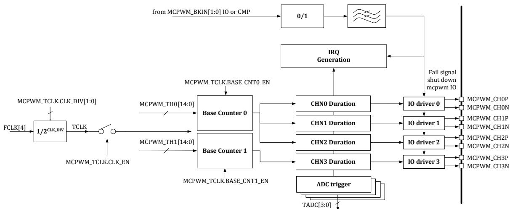  
图 14-1 MCPWM 模块框图

为了保证定时精度，通常采用48MHz的时钟作为 MCPWM模块工作频率。

## 14.1.1 Base Counter 模块

该模块主要是由两个递增计数器组成，其计数门限值为 MCPWM\_TH0/MCPWM\_TH1，计数器从t0时刻开始从-TH递增计数，在 t1 时刻过0 点，在 t2 时刻计数到TH完成一次计数循环，回到-TH，重新开始计数。计数周期为(TH×2+1)×计数时钟周期。

在 t0/t1(本次 t0 即上一次 t2)可产生定时事件中断，MCPWM\_IFx.T0\_IF 和 MCPWM\_IFx.T1\_IF 将被置位。

可通过寄存器配置 MCPWM\_TCLK.BASE\_CNT0\_EN/MCPWM\_TCLK.BASE\_CNT1\_EN 控制 BaseCounter 0/1 的启动和停止。

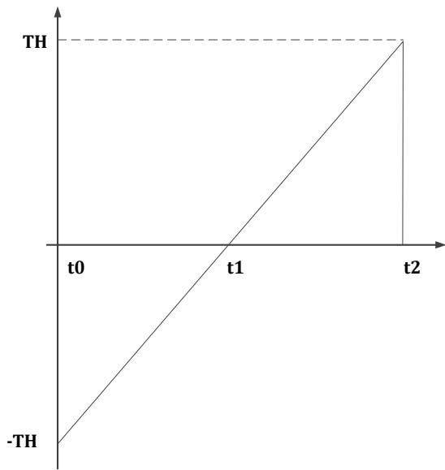  
图 14-2 Base Counter t0/t1 时序

在运行 MCPWM 模块前，用户一般需要将门限值 MCPWM\_TH00\~MCWM\_TH31，死区寄存器MCPWM\_DTH0/ MCPWM\_DTH1配置好。在实际运行过程中，也可动态改变比较门限值和死区寄存器。这些配置好的寄存器，可通过写 MCPWM\_UPDATE 寄存器实现手动更新，也可以通过配置MCPWM\_SDCFG.T1\_UPDATE\_EN 及 MCPWM\_SDCFG.T0\_UPDATE\_EN 进行硬件自动更新。硬件更新，仅在 t0及 t1 时刻（可配置 t0 或t1更新和t0 t1 时刻都更新）才能产生更新事件，硬件把加载寄存器的值载入到实际运行的寄存器中。而更新事件的发生频率可以配置，即每间隔N个 t0 及t1 时刻才发生更新。无论是否发生更新，t0/t1 时刻均可产生相应的中断。若硬件把加载寄存器的值到载入实际运行的寄存器后，产生装载中断。

通过配置MCPWM\_SDCFG寄存器选择更新发生在t0或者t1或者t0/t1都更新，配置更新间隔数，间隔数为1\~16。最频繁的更新配置为更新发生在 t0和 t1，连续发生。最低速的更新配置为更新发生在t1，每16 个t1 更新一次。

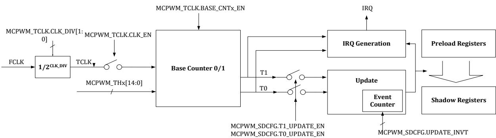  
图 14-3 MCPWM 更新机制

时基 0 和时基 1 对应的 TH 寄存器 MCPWM\_THx 和 CNT 寄存器 MCPWM\_CNTx（x=0,1）均存在影子寄存器，且均支持手动更新（通过软件向MCPWM\_UPDATE写入对应位进行更新）和自动更新（发生 特 定 硬 件 事 件 触 发 更 新 ） 。 影 子 寄 存 器 可 以 在 不 开 启 MCPWM TCLK 时 钟 （ 即MCPWM\_TCLK.TCLK\_EN=0 ） 的 情 况 下 进 行 更 新 。 MCPWM\_TCLK.BASE\_CNT0\_EN 和MCPWM\_TCLK.BASE\_CNT1\_EN 分 别 控 制 时 基 0 和 时 基 1 的 CNT 计 数 使 能 。 当MCPWM\_TCLK.BASE\_CNT0\_EN=0 时，时基 0 的 CNT 在完成更新后保持值不变，时基 1 的 CNT 同理，实现完全相同。

此外，为了精确控制第一个 MCPWM 周期的计数，建议将 MCPWM\_THx 和 MCPWM\_CNTx 同时更新。当然也支持MCPWM\_THx 和MCPWM\_CNTx分别更新。然后再通过软件写入或外部事件触发计数开始，从而将 MCWPM\_TCLk.BASE\_CNT0\_EN/MCWPM\_TCLk.BASE\_CNT1\_EN 置位，分别使能时基 0和时基1的CNT计数。

## 14.1.2 FAIL 信号处理

FAIL信号即急停信号，主要用于在出现异常时迅速关断功率管，以免造成不可逆的硬件损坏。该信号处理模块主要是根据实际情况设置急停事件，实现快速关断 PWM 的输出。有2路 fail 信号输入MCPWM，即 FAIL0\~FAIL1，分别可以来自芯片 I0 MCPWM\_BKIN[1:0]或芯片内部比较器的输出CMP[1:0]。

其中 MCPWM 的 P/N 通道 0/1/2 可以选择使用 CMP[0]或 MCPWM\_BKIN[0],MCPWM 的 P/N 通道3 可以选择使用 CMP[1]或 MCPWM\_BKIN[1]。

03x MCU FAIL 信号分布表

<table><tr><td></td><td colspan="2">MCPWM CH0/1/2</td><td colspan="2">MCPWM CH3</td></tr><tr><td></td><td>Fail0</td><td>Fail1</td><td>Fail2</td><td>Fail2</td></tr><tr><td>MCPWM_BKIN0</td><td>√</td><td></td><td>√</td><td></td></tr><tr><td>MCPWM_BKIN1</td><td></td><td>√</td><td></td><td>√</td></tr><tr><td>CMP0</td><td>√</td><td></td><td>√</td><td></td></tr><tr><td>CMP1</td><td></td><td>√</td><td></td><td>√</td></tr></table>

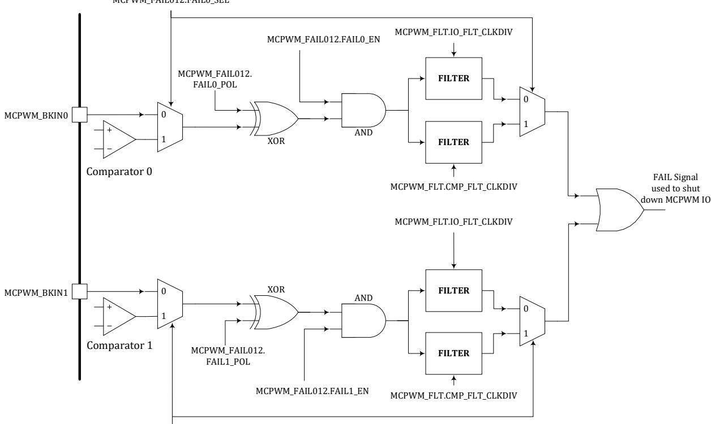

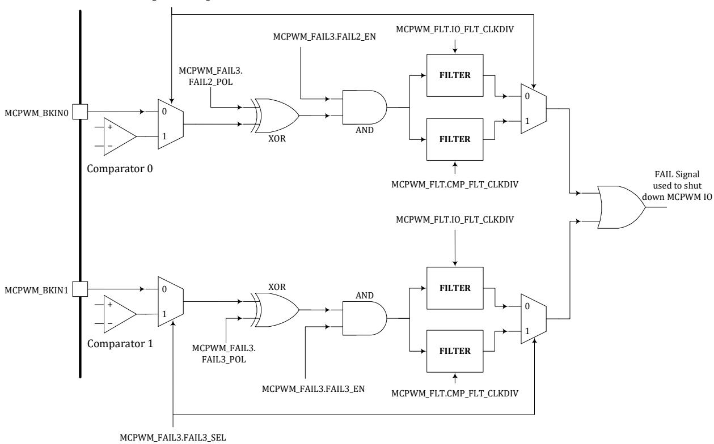  
图 14-4 MCPWM FAIL 逻辑示意图

Filter 滤波模块的时钟，来自系统主时钟 MCLK 的门控时钟 FCLK[4]，见 SYS\_CLK\_FEN，并经过可选的两级分频，第一级分频由 MCPWM\_TCLK.CLK\_DIV 控制，进行1/2/4/8倍分频。第二级分频可实现 1\~256 倍的分频，如果 Fail 信号来自 MCPWM\_BKIN[1:0]则使用 MCPWM\_FLT.IO\_FLT\_CLKDIV[7:0]作 为 第 二 级 的 分 频 系 数 ； 如 果 Fail 信 号 来 自 芯 片 内 部 比 较 器 输 出 ， 则 使 用MCPWM\_FLT.CMP\_FLT\_CLKDIV[7:0]作为第二级的分频系数，如图 14-5 所示。

MCPWM 模块使用分频后的时钟进行 Fail 信号滤波，滤波宽度固定为 16 个周期，即输入信号必须保持至少 16 个分频时钟周期（两级分频后的时钟）稳定后，硬件才判定其为有效输入信号。滤波时间常数的公式为，其中 T<sub>MCLK</sub> 为 MCLK/FCLK[4]的时钟周期，48MHz 对应 20.8ns。FLT\_CLKDIV 根据配置情况可能是 MCPWM\_FLT.IO\_FLT\_CLKDIV 或 MCPWM\_FLT.CMP\_FLT\_CLKDIV。

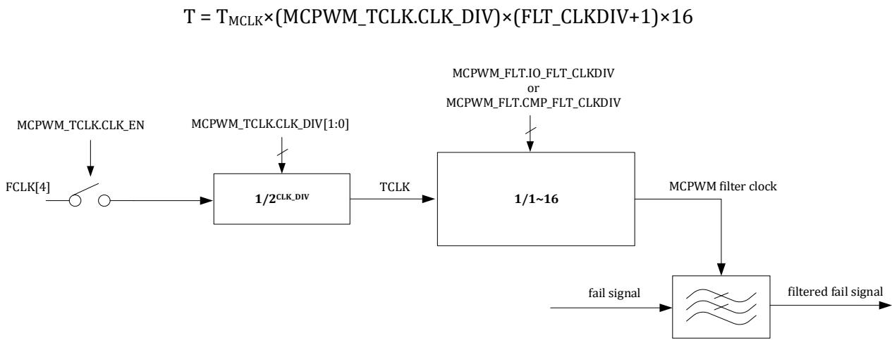  
图 14-5 MCPWM Fail 信号滤波时钟生成逻辑

一 旦 发 生 FAIL 事 件 ， 硬 件 将 IO 输 出 强 制 变 为 MCPWM\_FAILx.CHxN\_DEFAULT 和MCPWM\_FAILx.CHxP\_DEFAULT 寄存器所指定的故障缺省值，此时 MCPWM\_FAILx.CHxN\_DEFAULT 和MCPWM\_FAILx.CHxP\_DEFAULT 的值直接输出到 IO 口，不再受到 MCPWM\_FAILx.FAIL\_POL 等极性控制的影响。其中 MCPWM\_FAIL012 用于控制通道 0/1/2 的故障缺省设置，MCPWM\_FAIL3 用于控制通道3的故障缺省设置。

来自比较器的 MCPWM FAIL信号为模拟比较器输出的原始信号，未经过比较器数字接口模块的滤波处理，但是可以被 MCPWM 的通道信号进行开窗控制，开窗控制设置见比较器数字接口模块。FAIL信号进入 MCPWM模块后，可以通过设置 MCPWM\_TCLK进行滤波。

## 14.1.3 MCPWM 特殊输出状态

电机控制中经常会用到全0 和全1输出状态，以下互补模式设置可以得到期望的输出。

1. 如果 THn0≥THn1，芯片处于恒 0 状态（CH<n>P 关闭，CH<n>N 开启），无死区

2. 如果 THn0=-TH，THn1=TH，芯片处于恒 1 状态（CH<n>P 开启，CH<n>N 关闭），无死区

## 14.1.4 IO DRIVER 模块

该模块根据实际MCPWM的寄存器配置情况，将IO设置到相应电平。IO Driver模块的整体数据流程图如下:

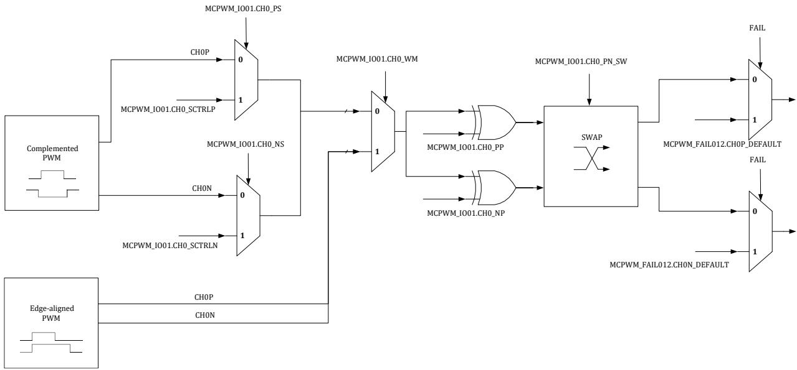  
图 14-6 IO Driver 模块数据流程图

## 14.1.4.1 MCPWM 波形输出-中心对齐模式

4 个MCPWM IO Driver 采用独立的控制门限，独立死区宽度（每一对互补IO的死区需要独立配置，即4个死区配置寄存器），共享数据更新事件。

采用 TH<n>0 和 TH<n>1 控制第<n>个 MCPWM IO 的启动、关闭动作，n 为 0/1/2/3。

当计数器CNT值向上计数达到 TH<n>0(即t3时刻)，关闭CH<n>N，经过死区延时 DTH0，打开CH<n>P。

当计数器CNT值向上计数达到 TH<n>1(即t4时刻)，关闭CH<n>P，经过死区延时DTH1，打开CH<n>N。

采用独立的启动和关闭时间控制，可以提供相位控制的能力。

死区延时保证CH<n>P/CH<n>N 不会同时打开，避免短路发生。

t3/t4时刻均会产生相应中断。

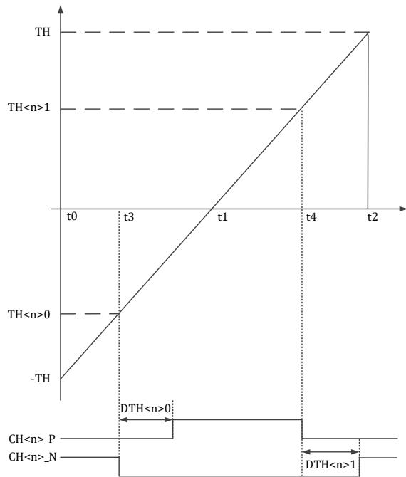  
图 14-7MCPWM 时序 TH<n>0 和 TH<n>1-中心对齐模式

## 14.1.4.2 MCPWM 波形控制-中心对齐推挽模式

中心对齐推挽模式。第一个周期内，在 t3 时刻 CH<n>P 打开，在 t4 时刻，CH<n>P 关闭。第二个周期内，在t3时刻CH<n>N打开，在t4时刻，CH<n>N 关闭。

t3/t4时刻均会产生相应中断。

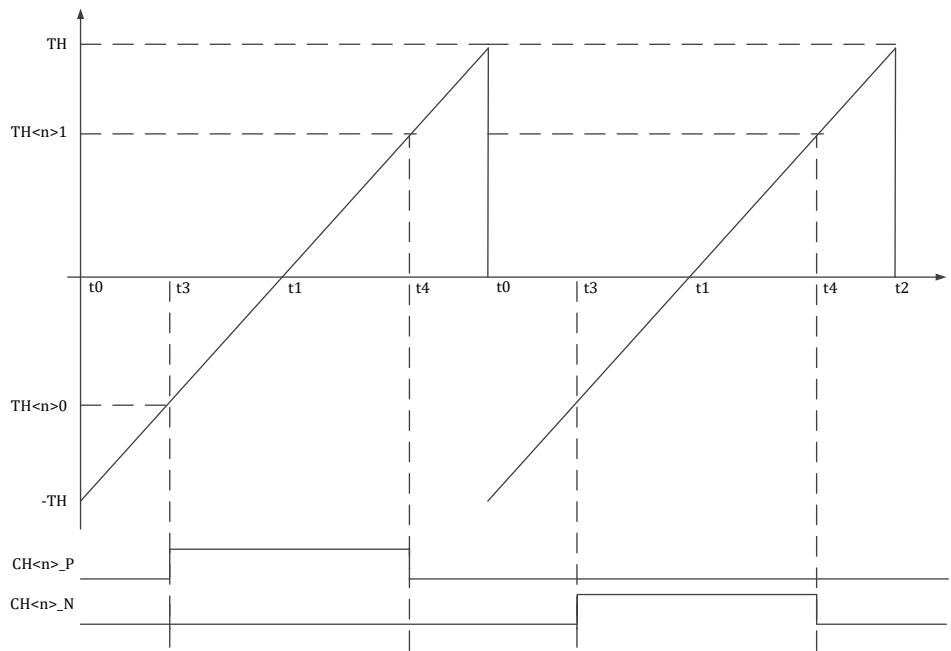  
图 14-8 MCPWM 时序 TH<n>0 和 TH<n>1-中心对齐推挽模式

## 14.1.4.3 MCPWM 波形输出-边沿对齐模式

边沿对齐模式。在 t0 时刻 CH<n>P/CH<n>N 同时打开，在 t3 时刻，CH<n>P 关闭；在 t4 时刻，CH<n>N 关闭。

t3/t4时刻均会产生相应中断。

边沿对齐模式下，CH<n>P/CH<n>N 无需死区保护。

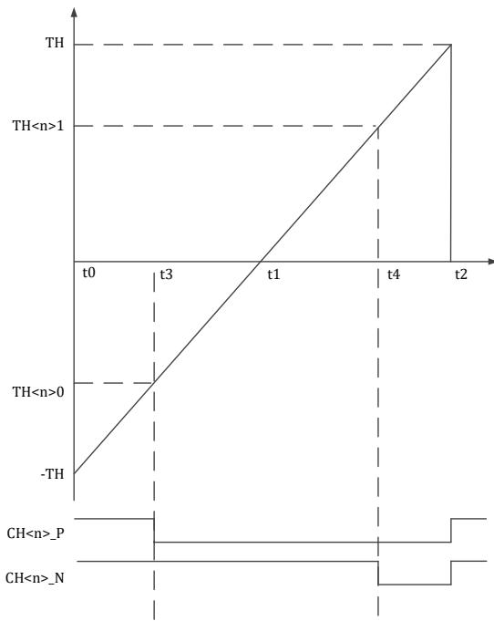  
图 14-9MCPWM 时序边沿对齐模式

## 14.1.4.4 MCPWM 波形控制-边沿对齐推挽模式

边沿对齐推挽模式。第一个周期内，在 t0 时刻 CH<n>P 打开，在 t3 时刻，CH<n>P 关闭。第二个周期内，在t0时刻CH<n>N打开，在t3时刻，CH<n>N 关闭。

t0/t3时刻均会产生相应中断。

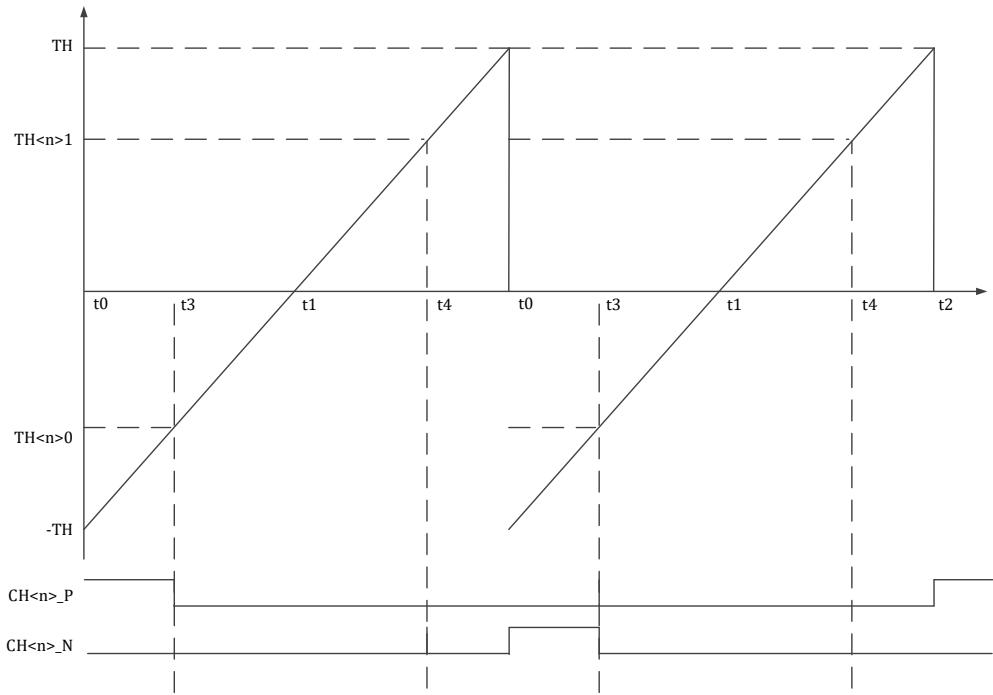  
图 14-10MCPWM 时序 TH<n>0 和 TH<n>1 边沿对齐推挽模式

## 14.1.4.5 MCPWM IO 死区控制

MCPWM IO是一对互斥控制信号 CH<n>P/CH<n>N，控制如下图所示的电路，

当 CH<n>P 为高/CH<n>N 为低时，Vout 输出高（VDD）；

当 CH<n>P 为低/CH<n>N 为高时，Vout 输出低（VSS）；

当 CH<n>P 为高/CH<n>N 为高时，Vout 输出不确定，但是会产生 VDD 到 VSS 的短路；

当 CH<n>P 为低/CH<n>N 为低时，Vout 输出不确定。

必须避免CH<n>P/CH<n>N 同时打开的情况。死区的引入，可以有效避免VDD到 VSS 的短路。

四组 MCPWM IO 的死区宽度共享同一个死区宽度设置 MCPWM\_DTH0/1。

对于互补模式MCPWM IO自动插入死区。

对于边沿对齐模式，MCPWM IO无死区。

在IO Driver模块中增加 CH<n>P/CH<n>N冲突检测，发生冲突时，自动将IO拉低，同时给出错误中断（错误中断标志位可软件清除或者硬件自动清除）。

MCPWM IO 也可通过软件配置的方式输出，此时，死区控制通过软件实现，如果 MCPWM 模块配置为中心对齐模式，硬件短路保护机制仍有效，保证P 和N 不同时打开。

CH<n>P/CH<n>N，在 IO 上可以互换。

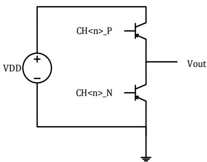  
图 14-11MCPWM IO 控制示意图

## 14.1.4.6 MCPWM IO 极性设置

CH<n>P/CH<n>N 的有效电平可以配置为高有效/低有效，每个 IO 的有效电平单独可配。CH<n>P/CH<n>N 输出到IO的位置通过软件配置可以互换。

## 14.1.4.7 MCPWM IO 自动保护

当发生急停事件（Fail事件），应立刻将CH<n>P/CH<n>N 自动切换到默认安全电平状态。需要注意默认电平配置（MCPWM\_FAILx.CHxN\_DEFAULT和MCPWM\_FAILx.CHxP\_DEFAULT控制默认电平）。

➢ 芯 片 正 常 工 作 后 ，IO 默 认 输 出 的 电 平 是 寄 存 器 MCPWM\_FAILx.CHxN\_DEFAULT 和MCPWM\_FAILx.CHxP\_DEFAULT 指定值，当用户配置完毕，MCPWM 正常工作后，配置MCPWM\_FAILx.MCPWM\_OE（即 MOE）为 1，IO 输出电平受到 MCPWM IO 模块控制。

➢ 当发生FAIL短路状况时，硬件立即切换到 IO默认输出电平。

➢ 当芯片调试中，CPU 被上位机软件暂停运行时，可暂停MCPWM 正常输出，转而输出默认电平值。

## 14.1.5 ADC Trigger Timer 模块

MCPWM 可 以 提 供 ADC 采 样 控 制 。 当 计 数 器 计 数 到 MCPWM\_TMR0/ MCPWM\_TMR1/MCPWM\_TMR2/ MCPWM\_TMR3时，可产生定时事件，触发ADC采样。该触发信号可同时输出到GPIO，便于调试之用。输出的具体 GPIO，参见对应器件的 datasheet。其中 MCPWM\_TMR0/ MCPWM\_TMR1固定使用时基 0，MCPWM\_TMR2/ MCPWM\_TMR3 可以选择使用时基 0/1，见 14.2.27 MCPWM\_TCLK。

表14-1MCPWM 计数器阈值与事件对应表

<table><tr><td>t0</td><td>-TH</td></tr><tr><td>t1</td><td>0</td></tr><tr><td>TIO0[0]</td><td>TH00</td></tr><tr><td>TIO0[1]</td><td>TH01</td></tr><tr><td>TADC[0]</td><td>TMR0</td></tr><tr><td>TADC [1]</td><td>TMR1</td></tr><tr><td>TADC [2]</td><td>TMR2</td></tr><tr><td>TADC [3]</td><td>TMR3</td></tr></table>

## 14.1.6 中断

MCPMW\_IF0 和 MCPWM\_EIF[5:4]标志置位且使能的情况下，产生 MCPWM\_IRQ0 中断；

MCPMW\_IF1 和 MCPWM\_EIF[7:6]标志置位且使能的情况下，产生 MCPWM\_IRQ1 中断。

## 14.2 寄存器

## 14.2.1 地址分配

MCPWM 模块寄存器的基地址是 0x4001\_0700，

寄存器列表如下:

表 14-2MCPWM 模块寄存器列表

<table><tr><td>名称</td><td>偏移地址</td><td>说明</td></tr><tr><td>MCPWM_TH00</td><td>0x00</td><td>MCPWM CH0_P 比较门限值寄存器</td></tr><tr><td>MCPWM_TH01</td><td>0x04</td><td>MCPWM CH0_N 比较门限值寄存器</td></tr><tr><td>MCPWM_TH10</td><td>0x08</td><td>MCPWM CH1_P 比较门限值寄存器</td></tr><tr><td>MCPWM_TH11</td><td>0x0C</td><td>MCPWM CH1_N 比较门限值寄存器</td></tr><tr><td>MCPWM_TH20</td><td>0x10</td><td>MCPWM CH2_P 比较门限值寄存器</td></tr><tr><td>MCPWM_TH21</td><td>0x14</td><td>MCPWM CH2_N 比较门限值寄存器</td></tr><tr><td>MCPWM_TH30</td><td>0x18</td><td>MCPWM CH3_P 比较门限值寄存器</td></tr><tr><td>MCPWM_TH31</td><td>0x1C</td><td>MCPWM CH3_N 比较门限值寄存器</td></tr><tr><td>MCPWM_TMR0</td><td>0x20</td><td>ADC 采样定时器比较门限 0 寄存器</td></tr><tr><td>MCPWM_TMR1</td><td>0x24</td><td>ADC 采样定时器比较门限 1 寄存器</td></tr><tr><td>MCPWM_TMR2</td><td>0x28</td><td>ADC 采样定时器比较门限 2 寄存器</td></tr><tr><td>MCPWM_TMR3</td><td>0x2C</td><td>ADC 采样定时器比较门限 3 寄存器</td></tr><tr><td>MCPWM_TH0</td><td>0x30</td><td>MCPWM 时基 0 门限值寄存器</td></tr><tr><td>MCPWM_TH1</td><td>0x34</td><td>MCPWM 时基 1 门限值寄存器</td></tr><tr><td>MCPWM_CNT0</td><td>0x38</td><td>MCPWM 时基 0 计数器寄存器</td></tr><tr><td>MCPWM_CNT1</td><td>0x3C</td><td>MCPWM 时基 1 计数器寄存器</td></tr><tr><td>MCPWM_UPDATE</td><td>0x40</td><td>MCPWM 加载控制寄存器</td></tr><tr><td>MCPWM_FCNT</td><td>0x44</td><td>MCPWM FAIL 时刻 CNT 值</td></tr><tr><td>MCPWM_EVT0</td><td>0x48</td><td>MCPWM 时基 0 外部触发</td></tr><tr><td>MCPWM_EVT1</td><td>0x4C</td><td>MCPWM 时基 1 外部触发</td></tr><tr><td>MCPWM_DTH0</td><td>0x50</td><td>MCPWM CH0/1/2/3 N 通道死区宽度控制寄存器</td></tr><tr><td>MCPWM_DTH1</td><td>0x54</td><td>MCPWM CH0/1/2/3 P 通道死区宽度控制寄存器</td></tr><tr><td>MCPWM_FLT</td><td>0x70</td><td>MCPWM 滤波时钟分频寄存器</td></tr><tr><td>MCPWM_SDCFG</td><td>0x74</td><td>MCPWM 加载配置寄存器</td></tr><tr><td>MCPWM_AUEN</td><td>0x78</td><td>MCPWM 自动更新使能寄存器</td></tr><tr><td>MCPWM_TCLK</td><td>0x7C</td><td>MCPWM 时钟分频控制寄存器</td></tr><tr><td>MCPWM_IE0</td><td>0x80</td><td>MCPWM 时基 0 中断控制寄存器</td></tr><tr><td>MCPWM_IF0</td><td>0x84</td><td>MCPWM 时基 0 中断标志位寄存器</td></tr><tr><td>MCPWM_IE1</td><td>0x88</td><td>MCPWM 中断控制寄存器</td></tr><tr><td>MCPWM_IF1</td><td>0x8C</td><td>MCPWM 中断标志位寄存器</td></tr><tr><td>MCPWM_EIE</td><td>0x90</td><td>MCPWM 异常中断控制寄存器</td></tr><tr><td>MCPWMEIF</td><td>0x94</td><td>MCPWM 异常中断标志位寄存器</td></tr><tr><td>MCPWM_RE</td><td>0x98</td><td>MCPWM DMA 请求控制寄存器</td></tr><tr><td>MCPWM_PP</td><td>0x9C</td><td>MCPWM 推挽模式使能寄存器</td></tr><tr><td>MCPWM_IO01</td><td>0xA0</td><td>MCPWM CH0 CH1 IO 控制寄存器</td></tr><tr><td>MCPWM_IO23</td><td>0xA4</td><td>MCPWM CH2 CH3 IO 控制寄存器</td></tr><tr><td>MCPWM_FAIL012</td><td>0xA8</td><td>MCPWM CH0 CH1 CH2 短路控制寄存器</td></tr><tr><td>MCPWM_FAIL3</td><td>0xAC</td><td>MCPWM CH3 短路控制寄存器</td></tr><tr><td>MCPWM_PRT</td><td>0xB0</td><td>MCPWM 保护寄存器</td></tr><tr><td>MCPWM_SWAP</td><td>0xB4</td><td>MCPWM 通道重映射寄存器</td></tr><tr><td>MCPWM_CHMSK</td><td>0xB8</td><td>MCPWM 通道屏蔽寄存器</td></tr></table>

表 14-3 受 MCPWM\_PRT 保护的寄存器

<table><tr><td>名称</td><td>偏移地址</td><td>说明</td></tr><tr><td>MCPWM_TH0</td><td>0x30</td><td>MCPWM 门限值寄存器</td></tr><tr><td>MCPWM_TH1</td><td>0x34</td><td>MCPWM 门限值寄存器</td></tr><tr><td>MCPWM_DTH0</td><td>0x50</td><td>MCPWM CH0/1/2/3 N 通道死区宽度控制寄存器</td></tr><tr><td>MCPWM_DTH1</td><td>0x54</td><td>MCPWM CH0/1/2/3 P 通道死区宽度控制寄存器</td></tr><tr><td>MCPWM_FLT</td><td>0x70</td><td>MCPWM 滤波时钟分频寄存器</td></tr><tr><td>MCPWM_SDCFG</td><td>0x74</td><td>MCPWM 加载配置寄存器</td></tr><tr><td>MCPWM_AUEN</td><td>0x78</td><td>MCPWM 自动加载使能寄存器</td></tr><tr><td>MCPWM_TCLK</td><td>0x7C</td><td>MCPWM 时钟分频控制寄存器</td></tr><tr><td>MCPWM_IE0</td><td>0x80</td><td>MCPWM 时基 0 中断控制寄存器</td></tr><tr><td>MCPWM_IE1</td><td>0x88</td><td>MCPWM 时基 1 中断控制寄存器</td></tr><tr><td>MCPWM_EIE</td><td>0x90</td><td>MCPWM 异常中断控制寄存器</td></tr><tr><td>MCPWM_RE</td><td>0x98</td><td>MCPWMDMA 请求控制寄存器</td></tr><tr><td>MCPWM_PP</td><td>0x9C</td><td>MCPWM 推挽模式使能寄存器</td></tr><tr><td>MCPWM_IO01</td><td>0xA0</td><td>MCPWM CH0 CH1 IO 控制寄存器</td></tr><tr><td>MCPWM_IO23</td><td>0xA4</td><td>MCPWM CH2 CH3 IO 控制寄存器</td></tr><tr><td>MCPWM_FAIL012</td><td>0xA8</td><td>MCPWM CH0 CH1 CH2 短路控制寄存器</td></tr><tr><td>MCPWM_FAIL3</td><td>0xAC</td><td>MCPWM CH3 短路控制寄存器</td></tr><tr><td>MCPWM_CHMSK</td><td>0xB8</td><td>MCPWM 通道屏蔽寄存器</td></tr></table>

表 14-4 存在影子寄存器的寄存器

<table><tr><td>名称</td><td>偏移地址</td><td>说明</td></tr><tr><td>MCPWM_TH00</td><td>0x00</td><td>MCPWM CH0_P 比较门限值寄存器</td></tr><tr><td>MCPWM_TH01</td><td>0x04</td><td>MCPWM CH0_N 比较门限值寄存器</td></tr><tr><td>MCPWM_TH10</td><td>0x08</td><td>MCPWM CH1_P 比较门限值寄存器</td></tr><tr><td>MCPWM_TH11</td><td>0x0C</td><td>MCPWM CH1_N 比较门限值寄存器</td></tr><tr><td>MCPWM_TH20</td><td>0x10</td><td>MCPWM CH2_P 比较门限值寄存器</td></tr><tr><td>MCPWM_TH21</td><td>0x14</td><td>MCPWM CH2_N 比较门限值寄存器</td></tr><tr><td>MCPWM_TH30</td><td>0x18</td><td>MCPWM CH3_P 比较门限值寄存器</td></tr><tr><td>MCPWM_TH31</td><td>0x1C</td><td>MCPWM CH3_N 比较门限值寄存器</td></tr><tr><td>MCPWM_TMR0</td><td>0x20</td><td>ADC 采样定时器比较门限 0 寄存器</td></tr><tr><td>MCPWM_TMR1</td><td>0x24</td><td>ADC 采样定时器比较门限 1 寄存器</td></tr><tr><td>MCPWM_TMR2</td><td>0x28</td><td>ADC 采样定时器比较门限 2 寄存器</td></tr><tr><td>MCPWM_TMR3</td><td>0x2C</td><td>ADC 采样定时器比较门限 3 寄存器</td></tr><tr><td>MCPWM_TH0</td><td>0x30</td><td>MCPWM 时基 0 门限值寄存器</td></tr><tr><td>MCPWM_TH1</td><td>0x34</td><td>MCPWM 时基 1 门限值寄存器</td></tr><tr><td>MCPWM_CNT0</td><td>0x38</td><td>MCPWM 时基 0 计数器寄存器</td></tr><tr><td>MCPWM_CNT1</td><td>0x3C</td><td>MCPWM 时基 1 计数器寄存器</td></tr></table>

对于所有存在影子寄存器的 MCPWM配置寄存器，写入时，写入的是预装载寄存器，更新事件发生时才会把预装载寄存器值写入影子寄存器，读出时读出的是影子寄存器的值。

## 14.2.2 MCPWM\_TH00

无写保护的寄存器

地址:0x4001\_0700

复位值:0x0

表 14-5 MCPWM\_TH00 配置寄存器

<table><tr><td>15</td><td>14</td><td>13</td><td>12</td><td>11</td><td>10</td><td>9</td><td>8</td><td>7</td><td>6</td><td>5</td><td>4</td><td>3</td><td>2</td><td>1</td><td>0</td></tr><tr><td></td><td></td><td></td><td></td><td></td><td></td><td></td><td></td><td></td><td></td><td></td><td></td><td></td><td></td><td></td><td></td></tr><tr><td></td><td></td><td></td><td></td><td></td><td></td><td></td><td></td><td></td><td></td><td></td><td></td><td></td><td></td><td></td><td></td></tr><tr><td></td><td></td><td></td><td></td><td></td><td></td><td></td><td></td><td></td><td></td><td></td><td></td><td></td><td></td><td></td><td></td></tr><tr><td></td><td></td><td></td><td></td><td></td><td></td><td></td><td></td><td></td><td></td><td></td><td></td><td></td><td></td><td></td><td></td></tr></table>

<table><tr><td>位置</td><td>位名称</td><td>说明</td></tr><tr><td>[31:16]</td><td></td><td>未使用</td></tr><tr><td>[15:0]</td><td>TH00</td><td>MCPWM CH0_P 比较门限值,16 位有符号数;发生更新事件时,本寄存器加载到 MCPWM 实际运行系统中。</td></tr></table>

## 14.2.3 MCPWM\_TH01

无写保护的寄存器

地址:0x4001\_0704

复位值:0x0

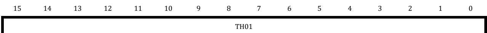

<table><tr><td>RW</td></tr><tr><td>0</td></tr></table>

表 14-6 MCPWM\_TH00 配置寄存器

<table><tr><td>位置</td><td>位名称</td><td>说明</td></tr><tr><td>[31:16]</td><td></td><td>未使用</td></tr><tr><td>[15:0]</td><td>TH01</td><td>MCPWM CHO_N 比较门限值,16 位有符号数;发生更新事件时,本寄存器加载到 MCPWM 实际运行系统中。</td></tr></table>

## 14.2.4 MCPWM\_TH10

无写保护的寄存器

地址:0x4001\_0708

复位值:0x0

表 14-7 MCPWM\_TH10 配置寄存器

<table><tr><td>15</td><td>14</td><td>13</td><td>12</td><td>11</td><td>10</td><td>9</td><td>8</td><td>7</td><td>6</td><td>5</td><td>4</td><td>3</td><td>2</td><td>1</td><td>0</td></tr><tr><td></td><td></td><td></td><td></td><td></td><td></td><td></td><td></td><td></td><td></td><td></td><td></td><td></td><td></td><td></td><td></td></tr><tr><td></td><td></td><td></td><td></td><td></td><td></td><td></td><td></td><td></td><td></td><td></td><td></td><td></td><td></td><td></td><td></td></tr><tr><td></td><td></td><td></td><td></td><td></td><td></td><td></td><td></td><td></td><td></td><td></td><td></td><td></td><td></td><td></td><td></td></tr><tr><td></td><td></td><td></td><td></td><td></td><td></td><td></td><td></td><td></td><td></td><td></td><td></td><td></td><td></td><td></td><td></td></tr></table>

<table><tr><td>位置</td><td>位名称</td><td>说明</td></tr><tr><td>[31:16]</td><td></td><td>未使用</td></tr><tr><td>15:0]</td><td>TH10</td><td>MCPWM CH1_P 比较门限值,16 位有符号数;发生更新事件时,本寄存器加载到 MCPWM 实际运行系统中。</td></tr></table>

## 14.2.5 MCPWM\_TH11

无写保护的寄存器

地址:0x4001\_070C

复位值:0x0

表 14-8 MCPWM\_TH11 配置寄存器

<table><tr><td>15</td><td>14</td><td>13</td><td>12</td><td>11</td><td>10</td><td>9</td><td>8</td><td>7</td><td>6</td><td>5</td><td>4</td><td>3</td><td>2</td><td>1</td><td>0</td></tr><tr><td></td><td></td><td></td><td></td><td></td><td></td><td></td><td colspan="2">TH11</td><td></td><td></td><td></td><td></td><td></td><td></td><td></td></tr><tr><td></td><td></td><td></td><td></td><td></td><td></td><td></td><td colspan="2">RW</td><td></td><td></td><td></td><td></td><td></td><td></td><td></td></tr><tr><td></td><td></td><td></td><td></td><td></td><td></td><td></td><td colspan="2">0</td><td></td><td></td><td></td><td></td><td></td><td></td><td></td></tr></table>

<table><tr><td>位置</td><td>位名称</td><td>说明</td></tr><tr><td>[31:16]</td><td></td><td>未使用</td></tr><tr><td>[15:0]</td><td>TH11</td><td>MCPWM CH1_N 比较门限值,16 位有符号数;发生更新事件时,本寄存器加载到 MCPWM 实际运行系统中。</td></tr></table>

## 14.2.6 MCPWM\_TH20

无写保护的寄存器

地址:0x4001\_0710

复位值:0x0

表 14-9 MCPWM\_TH20 配置寄存器

<table><tr><td>15</td><td>14</td><td>13</td><td>12</td><td>11</td><td>10</td><td>9</td><td>8</td><td>7</td><td>6</td><td>5</td><td>4</td><td>3</td><td>2</td><td>1</td><td>0</td></tr><tr><td></td><td></td><td></td><td></td><td></td><td></td><td></td><td></td><td></td><td></td><td></td><td></td><td></td><td></td><td></td><td></td></tr><tr><td></td><td></td><td></td><td></td><td></td><td></td><td></td><td></td><td></td><td></td><td></td><td></td><td></td><td></td><td></td><td></td></tr><tr><td></td><td></td><td></td><td></td><td></td><td></td><td></td><td></td><td></td><td></td><td></td><td></td><td></td><td></td><td></td><td></td></tr><tr><td></td><td></td><td></td><td></td><td></td><td></td><td></td><td></td><td></td><td></td><td></td><td></td><td></td><td></td><td></td><td></td></tr></table>

<table><tr><td>位置</td><td>位名称</td><td>说明</td></tr><tr><td>[31:16]</td><td></td><td>未使用</td></tr><tr><td>[15:0]</td><td>TH20</td><td>MCPWM CH2_P 比较门限值,16 位有符号数;发生更新事件时,本寄存器加载到 MCPWM 实际运行系统中。</td></tr></table>

## 14.2.7 MCPWM\_TH21

无写保护的寄存器

地址:0x4001\_0714

复位值:0x0

表 14-10 MCPWM\_TH21 配置寄存器

<table><tr><td>15</td><td>14</td><td>13</td><td>12</td><td>11</td><td>10</td><td>9</td><td>8</td><td>7</td><td>6</td><td>5</td><td>4</td><td>3</td><td>2</td><td>1</td><td>0</td></tr><tr><td></td><td></td><td></td><td></td><td></td><td></td><td></td><td></td><td></td><td></td><td></td><td></td><td></td><td></td><td></td><td></td></tr><tr><td></td><td></td><td></td><td></td><td></td><td></td><td></td><td></td><td></td><td></td><td></td><td></td><td></td><td></td><td></td><td></td></tr><tr><td></td><td></td><td></td><td></td><td></td><td></td><td></td><td></td><td></td><td></td><td></td><td></td><td></td><td></td><td></td><td></td></tr><tr><td></td><td></td><td></td><td></td><td></td><td></td><td></td><td></td><td></td><td></td><td></td><td></td><td></td><td></td><td></td><td></td></tr></table>

<table><tr><td>位置</td><td>位名称</td><td>说明</td></tr><tr><td>[31:16]</td><td></td><td>未使用</td></tr><tr><td>[15:0]</td><td>TH21</td><td>MCPWM CH2_N 比较门限值,16 位有符号数;发生更新事件时,本寄存器加载到 MCPWM 实际运行系统中。</td></tr></table>

## 14.2.8 MCPWM\_TH30

无写保护的寄存器

地址:0x4001\_0718

复位值:0x0

表 14-11 MCPWM\_TH30 配置寄存器

<table><tr><td>15</td><td>14</td><td>13</td><td>12</td><td>11</td><td>10</td><td>9</td><td>8</td><td>7</td><td>6</td><td>5</td><td>4</td><td>3</td><td>2</td><td>1</td><td>0</td></tr><tr><td></td><td></td><td></td><td></td><td></td><td></td><td></td><td></td><td></td><td></td><td></td><td></td><td></td><td></td><td></td><td></td></tr><tr><td></td><td></td><td></td><td></td><td></td><td></td><td></td><td></td><td></td><td></td><td></td><td></td><td></td><td></td><td></td><td></td></tr><tr><td></td><td></td><td></td><td></td><td></td><td></td><td></td><td></td><td></td><td></td><td></td><td></td><td></td><td></td><td></td><td></td></tr><tr><td></td><td></td><td></td><td></td><td></td><td></td><td></td><td></td><td></td><td></td><td></td><td></td><td></td><td></td><td></td><td></td></tr></table>

<table><tr><td>位置</td><td>位名称</td><td>说明</td></tr><tr><td>[31:16]</td><td></td><td>未使用</td></tr><tr><td>[15:0]</td><td>TH30</td><td>MCPWM CH3_P 比较门限值,16 位有符号数;发生更新事件时,本寄存器加载到 MCPWM 实际运行系统中。</td></tr></table>

## 14.2.9 MCPWM\_TH31

无写保护的寄存器

地址:0x4001\_071C

复位值:0x0

表 14-12 MCPWM\_TH31 配置寄存器

<table><tr><td>15</td><td>14</td><td>13</td><td>12</td><td>11</td><td>10</td><td>9</td><td>8</td><td>7</td><td>6</td><td>5</td><td>4</td><td>3</td><td>2</td><td>1</td><td>0</td></tr><tr><td></td><td></td><td></td><td></td><td></td><td></td><td></td><td></td><td></td><td></td><td></td><td></td><td></td><td></td><td></td><td></td></tr><tr><td></td><td></td><td></td><td></td><td></td><td></td><td></td><td></td><td></td><td></td><td></td><td></td><td></td><td></td><td></td><td></td></tr><tr><td></td><td></td><td></td><td></td><td></td><td></td><td></td><td></td><td></td><td></td><td></td><td></td><td></td><td></td><td></td><td></td></tr><tr><td></td><td></td><td></td><td></td><td></td><td></td><td></td><td></td><td></td><td></td><td></td><td></td><td></td><td></td><td></td><td></td></tr></table>

<table><tr><td>位置</td><td>位名称</td><td>说明</td></tr><tr><td>[31:16]</td><td></td><td>未使用</td></tr><tr><td>[15:0]</td><td>TH31</td><td>MCPWM CH3_N 比较门限值,16 位有符号数;发生更新事件时,本寄存器加载到 MCPWM 实际运行系统中。</td></tr></table>

## 14.2.10 MCPWM\_TMR0

无写保护的寄存器

地址:0x4001\_0720

复位值:0x0

表 14-13 MCPWM\_TMR0 配置寄存器

<table><tr><td>15</td><td>14</td><td>13</td><td>12</td><td>11</td><td>10</td><td>9</td><td>8</td><td>7</td><td>6</td><td>5</td><td>4</td><td>3</td><td>2</td><td>1</td><td>0</td></tr><tr><td></td><td></td><td></td><td></td><td></td><td></td><td></td><td></td><td></td><td></td><td></td><td></td><td></td><td></td><td></td><td></td></tr><tr><td></td><td></td><td></td><td></td><td></td><td></td><td></td><td></td><td></td><td></td><td></td><td></td><td></td><td></td><td></td><td></td></tr><tr><td></td><td></td><td></td><td></td><td></td><td></td><td></td><td></td><td></td><td></td><td></td><td></td><td></td><td></td><td></td><td></td></tr><tr><td></td><td></td><td></td><td></td><td></td><td></td><td></td><td></td><td></td><td></td><td></td><td></td><td></td><td></td><td></td><td></td></tr></table>

<table><tr><td>位置</td><td>位名称</td><td>说明</td></tr><tr><td>[31:16]</td><td></td><td>未使用</td></tr><tr><td>[15:0]</td><td>TMR0</td><td>ADC 采样定时器比较门限 0 寄存器,16 位有符号数;当 MCPWM_CNT0=TMR0 时产生 TADC[0]事件触发 ADC 进行采样。MCPWM 发生更新事件后,本寄存器加载到 MCPWM 实际运行系统中。</td></tr></table>

## 14.2.11 MCPWM\_TMR1

无写保护的寄存器

地址:0x4001\_0724

复位值:0x0

表 14-14 MCPWM\_TMR1 配置寄存器

<table><tr><td>15</td><td>14</td><td>13</td><td>12</td><td>11</td><td>10</td><td>9</td><td>8</td><td>7</td><td>6</td><td>5</td><td>4</td><td>3</td><td>2</td><td>1</td><td>0</td></tr><tr><td colspan="16">TMR1</td></tr><tr><td colspan="16">RW</td></tr><tr><td colspan="16">0x7FFF</td></tr></table>

<table><tr><td>位置</td><td>位名称</td><td>说明</td></tr><tr><td>[31:16]</td><td></td><td>未使用</td></tr><tr><td>[15:0]</td><td>TMR1</td><td>ADC 采样定时器比较门限 1 寄存器,16 位有符号数;当 MCPWM_CNT=TMR1 时产生 TADC[1]事件触发 ADC 进行采样。MCPWM 发生更新事件后,本寄存器加载到 MCPWM 实际运行系统中。</td></tr></table>

## 14.2.12 MCPWM\_TMR2

无写保护的寄存器

地址:0x4001\_0728

复位值:0x0

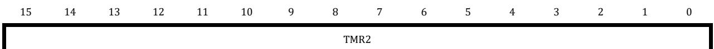

<table><tr><td>RW</td></tr><tr><td>0x7FFF</td></tr></table>

表 14-15 MCPWM\_TMR2 配置寄存器

<table><tr><td>位置</td><td>位名称</td><td>说明</td></tr><tr><td>[31:16]</td><td></td><td>未使用</td></tr><tr><td>[15:0]</td><td>TMR2</td><td>ADC 采样定时器比较门限 2 寄存器,16 位有符号数;发生更新事件后,本寄存器加载到 MCPWM 实际运行系统中。</td></tr></table>

## 14.2.13 MCPWM\_TMR3

无写保护的寄存器

地址:0x4001\_072C

复位值:0x0

表 14-16 MCPWM\_TMR3 配置寄存器

<table><tr><td>15</td><td>14</td><td>13</td><td>12</td><td>11</td><td>10</td><td>9</td><td>8</td><td>7</td><td>6</td><td>5</td><td>4</td><td>3</td><td>2</td><td>1</td><td>0</td></tr><tr><td colspan="16">TMR3</td></tr><tr><td colspan="16">RW</td></tr><tr><td colspan="16">0x7FFF</td></tr></table>

<table><tr><td>位置</td><td>位名称</td><td>说明</td></tr><tr><td>[31:16]</td><td></td><td>未使用</td></tr><tr><td>[15:0]</td><td>TMR3</td><td>ADC 采样定时器比较门限 3 寄存器,16 位有符号数;发生更新事件后,本寄存器加载到 MCPWM 实际运行系统中。。</td></tr></table>

## 14.2.14 MCPWM\_TH0

写保护的寄存器

地址:0x4001\_0730

复位值:0x0

表 14-17 MCPWM\_TH0 时基 0 寄存器

<table><tr><td>15</td><td>14</td><td>13</td><td>12</td><td>11</td><td>10</td><td>9</td><td>8</td><td>7</td><td>6</td><td>5</td><td>4</td><td>3</td><td>2</td><td>1</td><td>0</td></tr><tr><td rowspan="3"></td><td colspan="15">TH</td></tr><tr><td colspan="15">RW</td></tr><tr><td colspan="15">0</td></tr></table>

<table><tr><td>位置</td><td>位名称</td><td>说明</td></tr><tr><td>[31:15]</td><td></td><td>未使用</td></tr><tr><td>[14:0]</td><td>TH</td><td>MCPWM 时基 0 计数器门限值,15 位无符号数,MCPWM 实际运行系统中的时基 0 计数器从-TH 计数到 TH;发生更新事件后,本寄存器加载到 MCPWM 实际运行系统中。</td></tr></table>

## 14.2.15 MCPWM\_TH1

写保护的寄存器

地址:0x4001\_0734

复位值:0x0

表 14-18 MCPWM\_TH1 时基 1 寄存器

<table><tr><td>15</td><td>14</td><td>13</td><td>12</td><td>11</td><td>10</td><td>9</td><td>8</td><td>7</td><td>6</td><td>5</td><td>4</td><td>3</td><td>2</td><td>1</td><td>0</td></tr><tr><td rowspan="3"></td><td colspan="15">TH</td></tr><tr><td colspan="15">RW</td></tr><tr><td colspan="15">0</td></tr></table>

<table><tr><td>位置</td><td>位名称</td><td>说明</td></tr><tr><td>[31:15]</td><td></td><td>未使用</td></tr><tr><td>[14:0]</td><td>TH</td><td>MCPWM 时基 1 计数器门限值,15 位无符号数,MCPWM 实际运行系统中的时基 1 计数器从-TH 计数到 TH;发生更新事件后,本寄存器加载到 MCPWM 实际运行系统中。。</td></tr></table>

## 14.2.16 MCPWM\_CNT0

无写保护的寄存器

地址:0x4001\_0738

复位值:0x0

表 14-19 MCPWM\_CNT0 寄存器

<table><tr><td>15</td><td>14</td><td>13</td><td>12</td><td>11</td><td>10</td><td>9</td><td>8</td><td>7</td><td>6</td><td>5</td><td>4</td><td>3</td><td>2</td><td>1</td><td>0</td></tr><tr><td colspan="16">CNT</td></tr><tr><td colspan="16">RW</td></tr><tr><td colspan="16">0x8000</td></tr></table>

<table><tr><td>位置</td><td>位名称</td><td>说明</td></tr><tr><td>[31:16]</td><td></td><td>未使用</td></tr><tr><td>[15:0]</td><td>CNT</td><td>向此寄存器写入,更改时基 0 计数器的设定值,发生更新事件后,本寄存器加载到 MCPWM 实际运行系统的时基 0 CNT 中。读出的数据为 MCPWM 实际运行系统中时基 0 计数器的值。实际读出的计数范围为-TH ~ +TH</td></tr></table>

## 14.2.17 MCPWM\_CNT1

无写保护的寄存器

地址:0x4001\_073C

复位值:0x0

表 14-20 MCPWM\_CNT1 寄存器

<table><tr><td>15</td><td>14</td><td>13</td><td>12</td><td>11</td><td>10</td><td>9</td><td>8</td><td>7</td><td>6</td><td>5</td><td>4</td><td>3</td><td>2</td><td>1</td><td>0</td></tr><tr><td colspan="16">CNT</td></tr><tr><td colspan="16">RW</td></tr><tr><td colspan="16">0x8000</td></tr></table>

<table><tr><td>位置</td><td>位名称</td><td>说明</td></tr><tr><td>[31:16]</td><td></td><td>未使用</td></tr><tr><td>[15:0]</td><td>CNT</td><td>向此寄存器写入,更改时基1计数器的设定值,发生更新事件后,本寄存器加载到MCPWM实际运行系统的时基1CNT中。读出的数据为MCPWM实际运行系统中时基1计数器的值。实际读出的计数范围为-TH~+TH</td></tr></table>

## 14.2.18 MCPWM\_UPDATE

无写保护的寄存器

地址:0x4001\_0740

复位值:0x0

表 14-21 MCPWM\_UPDATE MCPWM 手动更新寄存器

<table><tr><td>15</td><td>14</td><td>13</td><td>12</td><td>11</td><td>10</td><td>9</td><td>8</td><td>7</td><td>6</td><td>5</td><td>4</td><td>3</td><td>2</td><td>1</td><td>0</td></tr><tr><td>CNT1_UPDATE</td><td>CNT0_UPDATE</td><td>TH1_UPDATE</td><td>TH0_UPDATE</td><td>TMR3_UPDATE</td><td>TMR2_UPDATE</td><td>TMR1_UPDATE</td><td>TMRO_UPDATE</td><td>TH31_UPDATE</td><td>TH30_UPDATE</td><td>TH21_UPDATE</td><td>TH20_UPDATE</td><td>TH11_UPDATE</td><td>TH10_UPDATE</td><td>TH01_UPDATE</td><td>TH00_UPDATE</td></tr><tr><td>WO</td><td>WO</td><td>WO</td><td>WO</td><td>WO</td><td>WO</td><td>WO</td><td>WO</td><td>WO</td><td>WO</td><td>WO</td><td>WO</td><td>WO</td><td>WO</td><td>WO</td><td>WO</td></tr><tr><td>0</td><td>0</td><td>0</td><td>0</td><td>0</td><td>0</td><td>0</td><td>0</td><td>0</td><td>0</td><td>0</td><td>0</td><td>0</td><td>0</td><td>0</td><td>0</td></tr></table>

<table><tr><td>位置</td><td>位名称</td><td>说明</td></tr><tr><td>[31:16]</td><td></td><td>未使用</td></tr><tr><td>[15]</td><td>CNT1_UPDATE</td><td>写 1 产生软件(手动)触发,将 MCPWM_CNT1 由预装载寄存器加载到 MCPWM 运行所使用的影子寄存器</td></tr><tr><td>[14]</td><td>CNT0_UPDATE</td><td>写1产生软件(手动)触发,将MCPWM_CNT0由预装载寄存器加载到MCPWM运行所使用的影子寄存器</td></tr><tr><td>[13]</td><td>TH1_UPDATE</td><td>写1产生软件(手动)触发,将MCPWM_TH1由预装载寄存器加载到MCPWM运行所使用的影子寄存器</td></tr><tr><td>[12]</td><td>TH0_UPDATE</td><td>写1产生软件(手动)触发,将MCPWM_TH0由预装载寄存器加载到MCPWM运行所使用的影子寄存器</td></tr><tr><td>[11]</td><td>TMR3_UPDATE</td><td>写1产生软件(手动)触发,将MCPWM_TMR3由预装载寄存器加载到MCPWM运行所使用的影子寄存器</td></tr><tr><td>[10]</td><td>TMR2_UPDATE</td><td>写1产生软件(手动)触发,将MCPWM_TMR2由预装载寄存器加载到MCPWM运行所使用的影子寄存器</td></tr><tr><td>[9]</td><td>TMR1_UPDATE</td><td>写1产生软件(手动)触发,将MCPWM_TMR1由预装载寄存器加载到MCPWM运行所使用的影子寄存器</td></tr><tr><td>[8]</td><td>TMR0_UPDATE</td><td>写1产生软件(手动)触发,将MCPWM_TMR0由预装载寄存器加载到MCPWM运行所使用的影子寄存器</td></tr><tr><td>[7]</td><td>TH31_UPDATE</td><td>写1产生软件(手动)触发,将MCPWM_TH31由预装载寄存器加载到MCPWM运行所使用的影子寄存器</td></tr><tr><td>[6]</td><td>TH30_UPDATE</td><td>写1产生软件(手动)触发,将MCPWM_TH30由预装载寄存器加载到MCPWM运行所使用的影子寄存器</td></tr><tr><td>[5]</td><td>TH21_UPDATE</td><td>写1产生软件(手动)触发,将MCPWM_TH21由预装载寄存器加载到MCPWM运行所使用的影子寄存器</td></tr><tr><td>[4]</td><td>TH20_UPDATE</td><td>写1产生软件(手动)触发,将MCPWM_TH20由预装载寄存器加载到MCPWM运行所使用的影子寄存器</td></tr><tr><td>[3]</td><td>TH11_UPDATE</td><td>写1产生软件(手动)触发,将MCPWM_TH11由预装载寄存器加载到MCPWM运行所使用的影子寄存器</td></tr><tr><td>[2]</td><td>TH10_UPDATE</td><td>写1产生软件(手动)触发,将MCPWM_TH10由预装载寄存器加载到MCPWM运行所使用的影子寄存器</td></tr><tr><td>[1]</td><td>TH01_UPDATE</td><td>写1产生软件(手动)触发,将MCPWM_TH01由预装载寄存器加载到MCPWM运行所使用的影子寄存器</td></tr><tr><td>[0]</td><td>TH00_UPDATE</td><td>写1产生软件(手动)触发,将MCPWM_TH00由预装载寄存器加载到MCPWM运行所使用的影子寄存器</td></tr></table>

向 MCPWM\_UPDATE 对应位写 1 可以触发寄存器值从预装载寄存器写入影子寄存器，MCPWM\_UPDATE 写入后自动清零，无需软件清零。每写 1 一次，进行一次软件/手动触发。向MCPWM\_UPDATE[15:14]会导致 MCPWM\_CNT0/1 被更新为预装载值，请留意是否需要更新 CNT。

向MCPWM\_UPDATE 写0不作用，写1后立即写0可能导致影子寄存器装载失败，不推荐写 0。

## 14.2.19 MCPWM\_FCNT

无写保护的寄存器

地址:0x4001\_0744

复位值:0x0

表 14-22 MCPWM\_FCNT 寄存器

<table><tr><td>15</td><td>14</td><td>13</td><td>12</td><td>11</td><td>10</td><td>9</td><td>8</td><td>7</td><td>6</td><td>5</td><td>4</td><td>3</td><td>2</td><td>1</td><td>0</td></tr><tr><td></td><td></td><td></td><td></td><td></td><td></td><td></td><td></td><td></td><td></td><td></td><td></td><td></td><td></td><td></td><td></td></tr><tr><td></td><td></td><td></td><td></td><td></td><td></td><td></td><td></td><td></td><td></td><td></td><td></td><td></td><td></td><td></td><td></td></tr><tr><td></td><td></td><td></td><td></td><td></td><td></td><td></td><td></td><td></td><td></td><td></td><td></td><td></td><td></td><td></td><td></td></tr><tr><td></td><td></td><td></td><td></td><td></td><td></td><td></td><td></td><td></td><td></td><td></td><td></td><td></td><td></td><td></td><td></td></tr></table>

<table><tr><td>位置</td><td>位名称</td><td>说明</td></tr><tr><td>[31:16]</td><td></td><td>未使用</td></tr><tr><td>[15:0]</td><td>FCNT</td><td>若 MCPWM_FAIL012[15]=1,当发生 fail0/1 事件时,记录 MCPWM_CNT0 值,存入 MCPWM_FCNT;若 MCPWM_FAIL3[15]=1,当发生 fail2/3 事件时,记录 MCPWM_CNT0 值,存入 MCPWM_FCNT</td></tr></table>

14.2.20 MCPWM\_EVT0

无写保护的寄存器

地址:0x4001\_0748

复位值:0x0

表 14-23 MCPWM\_EVT0 MCPWM 时基 0 外部触发寄存器

<table><tr><td rowspan="3"></td><td>TIMER1_CMP1</td><td>TIMER1_CMP0</td><td>TIMER0_CMP1</td><td>TIMER0_CMP0</td><td rowspan="3"></td><td>MCPWM0_TMR3</td><td>MCPWM0_TMR2</td><td>MCPWM0_TMR1</td><td>MCPWM0_TMR0</td></tr><tr><td>RW</td><td>RW</td><td>RW</td><td>RW</td><td>RW</td><td>RW</td><td>RW</td><td>RW</td></tr><tr><td>0</td><td>0</td><td>0</td><td>0</td><td>0</td><td>0</td><td>0</td><td>0</td></tr></table>

<table><tr><td>位置</td><td>位名称</td><td>说明</td></tr><tr><td>[31:12]</td><td></td><td>未使用</td></tr><tr><td>[11]</td><td>TIMER1_CMP1</td><td>TIMER1 CMP1 事件触发时基 0 开始计数</td></tr><tr><td>[10]</td><td>TIMER1_CMP0</td><td>TIMER1 CMP0 事件触发时基 0 开始计数</td></tr><tr><td>[9]</td><td>TIMER0_CMP1</td><td>TIMER0 CMP1 事件触发时基 0 开始计数</td></tr><tr><td>[8]</td><td>TIMER0_CMP0</td><td>TIMER0 CMP0 事件触发时基 0 开始计数</td></tr><tr><td>[7:4]</td><td></td><td>未使用</td></tr><tr><td>[3]</td><td>MCPWM0_TMR3</td><td>MCPWM0 TMR3 事件触发时基 0 开始计数</td></tr><tr><td>[2]</td><td>MCPWM0_TMR2</td><td>MCPWM0 TMR2 事件触发时基 0 开始计数</td></tr><tr><td>[1]</td><td>MCPWM0_TMR1</td><td>MCPWM0 TMR1 事件触发时基 0 开始计数</td></tr><tr><td>[0]</td><td>MCPWM0_TMR0</td><td>MCPWM0 TMR0 事件触发时基 0 开始计数</td></tr></table>

14.2.21 MCPWM\_EVT1

无写保护的寄存器

地址:0x4001\_074C，0x4001\_384C

复位值:0x0

表 14-24 MCPWM\_EVT1 MCPWM 时基 1 外部触发寄存器

<table><tr><td rowspan="3"></td><td>TIMER1_CMP1</td><td>TIMER1_CMP0</td><td>TIMER0_CMP1</td><td>TIMER0_CMP0</td><td rowspan="3"></td><td>MCPWM0_TMR3</td><td>MCPWM0_TMR2</td><td>MCPWM0_TMR1</td><td>MCPWM0_TMR0</td></tr><tr><td>RW</td><td>RW</td><td>RW</td><td>RW</td><td>RW</td><td>RW</td><td>RW</td><td>RW</td></tr><tr><td>0</td><td>0</td><td>0</td><td>0</td><td>0</td><td>0</td><td>0</td><td>0</td></tr></table>

<table><tr><td>位置</td><td>位名称</td><td>说明</td></tr><tr><td>[31:12]</td><td></td><td>未使用</td></tr><tr><td>[11]</td><td>TIMER1_CMP1</td><td>TIMER1 CMP1 事件触发时基 1 开始计数</td></tr><tr><td>[10]</td><td>TIMER1_CMP0</td><td>TIMER1 CMP0 事件触发时基 1 开始计数</td></tr><tr><td>[9]</td><td>TIMER0_CMP1</td><td>TIMER0 CMP1 事件触发时基 1 开始计数</td></tr><tr><td>[8]</td><td>TIMER0_CMP0</td><td>TIMER0 CMP0 事件触发时基 1 开始计数</td></tr><tr><td>[7:4]</td><td></td><td>未使用</td></tr><tr><td>[3]</td><td>MCPWM0_TMR3</td><td>MCPWM0 TMR3 事件触发时基 1 开始计数</td></tr><tr><td>[2]</td><td>MCPWM0_TMR2</td><td>MCPWM0 TMR2 事件触发时基 1 开始计数</td></tr><tr><td>[1]</td><td>MCPWM0_TMR1</td><td>MCPWM0 TMR1 事件触发时基 1 开始计数</td></tr><tr><td>[0]</td><td>MCPWM0_TMR0</td><td>MCPWM0 TMR0 事件触发时基 1 开始计数</td></tr></table>

14.2.22 MCPWM\_DTH0

写保护的寄存器

地址:0x4001\_0750

复位值:0x0

表 14-25 MCPWM\_DTH0 配置寄存器

<table><tr><td>15</td><td>14</td><td>13</td><td>12</td><td>11</td><td>10</td><td>9</td><td>8</td><td>7</td><td>6</td><td>5</td><td>4</td><td>3</td><td>2</td><td>1</td><td>0</td></tr><tr><td colspan="16">DTH0</td></tr><tr><td colspan="16">RW</td></tr><tr><td colspan="16">0</td></tr></table>

<table><tr><td>位置</td><td>位名称</td><td>说明</td></tr><tr><td>[31:16]</td><td></td><td>未使用</td></tr><tr><td>[15:0]</td><td>DTH0</td><td>MCPWM CH0/1/2/3 P 通道死区宽度控制寄存器,10bit 无符号数</td></tr></table>

## 14.2.23 MCPWM\_DTH1

写保护的寄存器

地址:0x4001\_0754

复位值:0x0

表 14-26 MCPWM\_DTH1 配置寄存器

<table><tr><td>15</td><td>14</td><td>13</td><td>12</td><td>11</td><td>10</td><td>9</td><td>8</td><td>7</td><td>6</td><td>5</td><td>4</td><td>3</td><td>2</td><td>1</td><td>0</td></tr><tr><td></td><td></td><td></td><td></td><td></td><td></td><td></td><td></td><td colspan="2">DTH1</td><td></td><td></td><td></td><td></td><td></td><td></td></tr><tr><td></td><td></td><td></td><td></td><td></td><td></td><td></td><td></td><td colspan="2">RW</td><td></td><td></td><td></td><td></td><td></td><td></td></tr><tr><td></td><td></td><td></td><td></td><td></td><td></td><td></td><td></td><td colspan="2">0</td><td></td><td></td><td></td><td></td><td></td><td></td></tr></table>

<table><tr><td>位置</td><td>位名称</td><td>说明</td></tr><tr><td>[31:16]</td><td></td><td>未使用</td></tr><tr><td>[15:0]</td><td>DTH1</td><td>MCPWM CH0/1/2/3 N 通道死区宽度控制寄存器,10bit 无符号数</td></tr></table>

## 14.2.24 MCPWM\_FLT

写保护的寄存器

地址:0x4001\_0770

复位值:0x0

表 14-27 MCPWM\_FLT MCPWM 滤波时钟分频寄存器

<table><tr><td>15</td><td>14</td><td>13</td><td>12</td><td>11</td><td>10</td><td>9</td><td>8</td><td>7</td><td>6</td><td>5</td><td>4</td><td>3</td><td>2</td><td>1</td><td>0</td></tr><tr><td colspan="8">CMP_FLT_CLKDIV</td><td colspan="8">IO_FLT_CLKDIV</td></tr><tr><td colspan="8">RW</td><td colspan="8">RW</td></tr><tr><td colspan="8">0</td><td colspan="8">0</td></tr></table>

<table><tr><td>位置</td><td>位名称</td><td>说明</td></tr><tr><td>[31:16]</td><td></td><td>未使用</td></tr><tr><td>[15:8]</td><td>CMP_FLT_CLKDIV</td><td>比较器输出的滤波时钟分频寄存器,基于系统时钟分频,影响MCPWM_FAIL[1:0]。计算公式如下:系统时钟 / (CMP_FLT_CLKDIV + 1)。分频范围是1-256。</td></tr><tr><td>[7:0]</td><td>IO_FLT_CLKDIV</td><td>GPIO输入的滤波时钟分频寄存器,基于系统时钟分频,影响MCPWM_FAIL[1:0]。计算公式如下:系统时钟 / (IO_FLT_CLKDIV + 1)。分频范围是1-256。</td></tr></table>

MCPWM 使用分频后的时钟对 FAIL信号固定进行16 周期的滤波。当使用256 分频时，滤波宽度为 4096 个 TCLK 时钟宽度。

## 14.2.25 MCPWM\_SDCFG

写保护的寄存器

地址:0x4001\_0774

复位值:0x0

表 14-28 MCPWM\_SDCFG 配置寄存器

<table><tr><td rowspan="4"></td><td>15</td><td>14</td><td>13</td><td>12</td><td>11</td><td>10</td><td>9</td><td>8</td><td>7</td><td>6</td><td>5</td><td>4</td><td>3</td><td>2</td><td>1</td><td>0</td></tr><tr><td colspan="2">TR1_AEC</td><td>TR1_T1_UEN</td><td>TR1_T0_UEN</td><td colspan="4">TR1_UP_INTV</td><td rowspan="3"></td><td>TR0_AEC</td><td>TR0_T1_UEN</td><td>TR0_T0_UEN</td><td colspan="4">TR0_UP_INTV</td></tr><tr><td colspan="2">RW</td><td>RW</td><td>RW</td><td colspan="4">RW</td><td>RW</td><td>RW</td><td>RW</td><td colspan="4">RW</td></tr><tr><td colspan="2">0</td><td>0</td><td>0</td><td colspan="4">0</td><td>0</td><td>0</td><td>0</td><td colspan="4">0</td></tr></table>

<table><tr><td>位置</td><td>位名称</td><td>说明</td></tr><tr><td>[31:15]</td><td></td><td>未使用</td></tr><tr><td>[14]</td><td>TR1_AEC</td><td>更新事件是否自动清除 MCPWMEIF[7:6]并置位MCPWM_FAIL3.MOE,恢复MCPWM通道3信号输出。1:使能自动故障清除功能;0:关闭自动故障清除功能。</td></tr><tr><td>[13]</td><td>TR1_T1_UEN</td><td>时基1t1(过零)事件更新使能。1:使能;0,关闭。</td></tr><tr><td>[12]</td><td>TR1_T0_UEN</td><td>时基1t0(起点)事件更新使能。1:使能;0,关闭。</td></tr><tr><td>[11:8]</td><td>TR1_UP_INTV</td><td>时基1更新间隔。一旦t0和t1事件发生次数同TR1_UP_INTV相等,MCPWM系统自动触发MCPWM_TH1,TH30,TH31和MCPWM_TMR寄存器加载到MCPWM运行系统的操作。若TR1_T1_UEN和TR1_T0_UEN均关闭,将不会触发此类型加载,只能手动触发加载。</td></tr><tr><td>[7]</td><td></td><td>未使用</td></tr><tr><td>[6]</td><td>TR0_AEC</td><td>更新事件是否自动清除MCPWMEIF[5:4]并置位MCPWM_FAIL012.MOE,恢复MCPWM通道0/1/2信号输出。1:使能自动故障清除功能;0:关闭自动故障清除功能。</td></tr><tr><td>[5]</td><td>TR0_T1_UEN</td><td>时基0t1(过零)事件更新使能。1:使能;0,关闭。</td></tr><tr><td>[4]</td><td>TR0_T0_UEN</td><td>时基0t0(起点)事件更新使能。1:使能;0,关闭。</td></tr><tr><td>[3:0]</td><td>TR0_UP_INTV</td><td>时基0更新间隔。一旦t0和t1事件发生次数同TR0_UP_INTV相等,MCPWM系统自动触发MCPWM_TH0,MCPWM_TH00~TH21和MCPWM_TMR寄存器加载到MCPWM运行系统的操作。若TR0_T1_UEN和TR0_T0_UEN均关闭,将不会触发此类型加载,只能手动触发加载。</td></tr></table>

## 14.2.26 MCPWM\_AUEN

写保护的寄存器

地址:0x4001\_0778

复位值:0x0

表 14-29 MCPWM\_AUEN MCPWM 自动更新使能寄存器

<table><tr><td>15</td><td>14</td><td>13</td><td>12</td><td>11</td><td>10</td><td>9</td><td>8</td><td>7</td><td>6</td><td>5</td><td>4</td><td>3</td><td>2</td><td>1</td><td>0</td></tr><tr><td>CNT1_UPDATE</td><td>CNT0_UPDATE</td><td>TH1_UPDATE</td><td>TH0_UPDATE</td><td>TMR3_UPDATE</td><td>TMR2_UPDATE</td><td>TMR1_UPDATE</td><td>TMR0_UPDATE</td><td>TH31_UPDATE</td><td>TH30_UPDATE</td><td>TH21_UPDATE</td><td>TH20_UPDATE</td><td>TH11_UPDATE</td><td>TH10_UPDATE</td><td>TH01_UPDATE</td><td>TH00_UPDATE</td></tr><tr><td>RW</td><td>RW</td><td>RW</td><td>RW</td><td>RW</td><td>RW</td><td>RW</td><td>RW</td><td>RW</td><td>RW</td><td>RW</td><td>RW</td><td>RW</td><td>RW</td><td>RW</td><td>RW</td></tr><tr><td>0</td><td>0</td><td>0</td><td>0</td><td>0</td><td>0</td><td>0</td><td>0</td><td>0</td><td>0</td><td>0</td><td>0</td><td>0</td><td>0</td><td>0</td><td>0</td></tr></table>

<table><tr><td>位置</td><td>位名称</td><td>说明</td></tr><tr><td>[31:16]</td><td></td><td>未使用</td></tr><tr><td>[15]</td><td>CNT1_AUPDATE</td><td>MCPWM_CNT1 自动加载使能。1:加载;0:不加载。</td></tr><tr><td>[14]</td><td>CNT0_AUPDATE</td><td>MCPWM_CNT0 自动加载使能。1:加载;0:不加载。</td></tr><tr><td>[13]</td><td>TH1_AUPDATE</td><td>MCPWM_TH1 自动加载使能。1:加载;0:不加载。</td></tr><tr><td>[12]</td><td>TH0_AUPDATE</td><td>MCPWM_TH0 自动加载使能。1:加载;0:不加载。</td></tr><tr><td>[11]</td><td>TMR3_AUPDATE</td><td>MCPWM_TMR3 自动加载使能。1:加载;0:不加载。</td></tr><tr><td>[10]</td><td>TMR2_AUPDATE</td><td>MCPWM_TMR2 自动加载使能。1:加载;0:不加载。</td></tr><tr><td>[9]</td><td>TMR1_AUPDATE</td><td>MCPWM_TMR1 自动加载使能。1:加载;0:不加载。</td></tr><tr><td>[8]</td><td>TMR0_AUPDATE</td><td>MCPWM_TMR0 自动加载使能。1:加载;0:不加载。</td></tr><tr><td>[7]</td><td>TH31_AUPDATE</td><td>MCPWM_TH31 自动加载使能。1:加载;0:不加载。</td></tr><tr><td>[6]</td><td>TH30_AUPDATE</td><td>MCPWM_TH30 自动加载使能。1:加载;0:不加载。</td></tr><tr><td>[5]</td><td>TH21_AUPDATE</td><td>MCPWM_TH21 自动加载使能。1:加载;0:不加载。</td></tr><tr><td>[4]</td><td>TH20_AUPDATE</td><td>MCPWM_TH20 自动加载使能。1:加载;0:不加载。</td></tr><tr><td>[3]</td><td>TH11_AUPDATE</td><td>MCPWM_TH11 自动加载使能。1:加载;0:不加载。</td></tr><tr><td>[2]</td><td>TH10_AUPDATE</td><td>MCPWM_TH10 自动加载使能。1:加载;0:不加载。</td></tr><tr><td>[1]</td><td>TH01_AUPDATE</td><td>MCPWM_TH01 自动加载使能。1:加载;0:不加载。</td></tr><tr><td>[0]</td><td>TH00_AUPDATE</td><td>MCPWM_TH00 自动加载使能。1:加载;0:不加载。</td></tr></table>

## 14.2.27 MCPWM\_TCLK

写保护的寄存器

地址:0x4001\_077C

复位值:0x0

表 14-30 MCPWM\_TCLK 配置寄存器

<table><tr><td rowspan="3"></td><td>EVT_CNT1_EN</td><td>EVT_CNT0_EN</td><td>BASE_CNT1_EN</td><td>BASE_CNT0_EN</td><td>TMR3_TB</td><td>TMR2_TB</td><td rowspan="3"></td><td>CLK_EN</td><td>CLK_DIV</td></tr><tr><td>RW</td><td>RW</td><td>RW</td><td>RW</td><td>RW</td><td>RW</td><td>RW</td><td>RW</td></tr><tr><td>0</td><td>0</td><td>0</td><td>0</td><td>0</td><td>0</td><td>0</td><td>0</td></tr></table>

<table><tr><td>位置</td><td>位名称</td><td>说明</td></tr><tr><td>[31:10]</td><td></td><td>未使用</td></tr><tr><td>[9]</td><td>EVT_CNT1_EN</td><td>时基 1 外部触发使能</td></tr><tr><td>[8]</td><td>EVT_CNT0_EN</td><td>时基 0 外部触发使能</td></tr><tr><td>[7]</td><td>BASE_CNT1_EN</td><td>MCPWM 时基 1 计数器使能开关。1:使能;0:关闭。</td></tr><tr><td>[6]</td><td>BASE_CNT0_EN</td><td>MCPWM 时基 0 计数器使能开关。1:使能;0:关闭。</td></tr><tr><td>[5]</td><td>TMR3_TB</td><td>TMR3 时基选择,0:时基 0,1:时基 1</td></tr><tr><td>[4]</td><td>TMR2_TB</td><td>TMR2 时基选择,0:时基 0,1:时基 1</td></tr><tr><td>[3]</td><td></td><td>未使用</td></tr><tr><td>[2]</td><td>CLK_EN</td><td>MCPWM 工作时钟使能。1:使能;0:关闭。</td></tr><tr><td>[1:0]</td><td>CLK_DIV</td><td>MCPWM 工作时钟分频寄存器。0:系统时钟1:系统时钟/22:系统时钟/43:系统时钟/8</td></tr></table>

只有使能MCPWM\_TCLK.CLK\_EN，才能完成影子寄存器更新。配置完成影子寄存器之后，同时开启 MCPWM\_TCLK.BASE\_CNT0/1\_EN 可以使得时基 0 和时基 1 同步开始计数。如果 TH0 和 TH1 设置为相同值，则时基0 和时基 1完全同频。

当使用外部触发 MCPWM 开始计数时，需要配置 BASE\_CNTx\_EN 为 0，EVT\_CNTx\_EN 为 1，同时设置 MCPWM\_EVTx 选择合适的外部触发源。待触发事件发生后，BASE\_CNTx\_EN 会由硬件置 1，MCPWM 对应计数器开始计数。

## 14.2.28 MCPWM\_IE0

写保护的寄存器

地址:0x4001\_0780

复位值:0x0

表 14-31 MCPWM\_IE0 MCPWM 时基 0 中断控制寄存器

<table><tr><td>15</td><td>14</td><td>13</td><td>12</td><td>11</td><td>10</td><td>9</td><td>8</td><td>7</td><td>6</td><td>5</td><td>4</td><td>3</td><td>2</td><td>1</td><td>0</td></tr></table>

<table><tr><td rowspan="3"></td><td>UP_IE</td><td>TMR3_IE</td><td>TMR2_IE</td><td>TMR1_IE</td><td>TMR0_IE</td><td rowspan="3"></td><td>TH21_IE</td><td>TH20_IE</td><td>TH11_IE</td><td>TH10_IE</td><td>TH01_IE</td><td>TH00_IE</td><td>T1_IE</td><td>T0_IE</td></tr><tr><td>RW</td><td>RW</td><td>RW</td><td>RW</td><td>RW</td><td>RW</td><td>RW</td><td>RW</td><td>RW</td><td>RW</td><td>RW</td><td>RW</td><td>RW</td></tr><tr><td>0</td><td>0</td><td>0</td><td>0</td><td>0</td><td>0</td><td>0</td><td>0</td><td>0</td><td>0</td><td>0</td><td>0</td><td>0</td></tr></table>

<table><tr><td>位置</td><td>位名称</td><td>说明</td></tr><tr><td>[31:15]</td><td></td><td>未使用</td></tr><tr><td>[14]</td><td>UP_IE</td><td>MCPWM_TH/MCPWM_TH00~MCPWM_TH31/MCPWM_TMR0~MCPWM_TMR3等寄存器更新到MCPWM实际运行系统的中断源使能。1,使能;0,关闭。</td></tr><tr><td>[13]</td><td>TMR3_IE</td><td>MCPWM实际运行系统中计数器的计数值等于MCPWM_TMR3中断源使能。1,使能;0,关闭。</td></tr><tr><td>[12]</td><td>TMR2_IE</td><td>MCPWM实际运行系统中计数器的计数值等于MCPWM_TMR2中断源使能。1,使能;0,关闭。</td></tr><tr><td>[11]</td><td>TMR1_IE</td><td>MCPWM实际运行系统中计数器的计数值等于MCPWM_TMR1中断源使能。1,使能;0,关闭。</td></tr><tr><td>[10]</td><td>TMR0_IE</td><td>MCPWM实际运行系统中计数器的计数值等于MCPWM_TMR0中断源使能。1,使能;0,关闭。</td></tr><tr><td>[9]</td><td>TH31_IE</td><td>MCPWM实际运行系统中计数器的计数值等于MCPWM_TH31中断源使能。1,使能;0,关闭。</td></tr><tr><td>[8]</td><td>TH30_IE</td><td>MCPWM实际运行系统中计数器的计数值等于MCPWM_TH30中断源使能。1,使能;0,关闭。</td></tr><tr><td>[7]</td><td>TH21_IE</td><td>MCPWM实际运行系统中计数器的计数值等于MCPWM_TH21中断源使能。1,使能;0,关闭。</td></tr><tr><td>[6]</td><td>TH20_IE</td><td>MCPWM实际运行系统中计数器的计数值等于MCPWM_TH20中断源使能。1,使能;0,关闭。</td></tr><tr><td>[5]</td><td>TH11_IE</td><td>MCPWM实际运行系统中计数器的计数值等于MCPWM_TH11中断源使能。1,使能;0,关闭。</td></tr><tr><td>[4]</td><td>TH10_IE</td><td>MCPWM实际运行系统中计数器的计数值等于MCPWM_TH10中断源使能。1,使能;0,关闭。</td></tr><tr><td>[3]</td><td>TH01_IE</td><td>MCPWM实际运行系统中计数器的计数值等于MCPWM_TH01中断源使能。1,使能;0,关闭。</td></tr><tr><td>[2]</td><td>TH00_IE</td><td>MCPWM实际运行系统中计数器的计数值等于MCPWM_TH00中断源使能。1,使能;0,关闭。</td></tr><tr><td>[1]</td><td>T1_IE</td><td>t1事件,计数器的计数值到达0中断源使能。1,使能;0,关闭。</td></tr><tr><td>[0]</td><td>T0_IE</td><td>t0事件,计数器的计数值回到MCPWM_TH中断源使能。1,使能;0,关闭。</td></tr></table>

## 14.2.29 MCPWM\_IF0

无写保护的寄存器

地址:0x4001\_0784

复位值:0x0

表 14-32 MCPWM\_IF0 MCPWM 时基 0 中断标志寄存器

<table><tr><td>15</td><td>14</td><td>13</td><td>12</td><td>11</td><td>10</td><td>9</td><td>8</td><td>7</td><td>6</td><td>5</td><td>4</td><td>3</td><td>2</td><td>1</td><td>0</td></tr><tr><td rowspan="3"></td><td>UP_IF</td><td>TMR3_IF</td><td>TMR2_IF</td><td>TMR1_IF</td><td>TMR0_IF</td><td rowspan="3" colspan="2"></td><td>TH21_IF</td><td>TH20_IF</td><td>TH11_IF</td><td>TH10_IF</td><td>TH01_IF</td><td>TH00_IF</td><td>T1_IF</td><td>T0_IF</td></tr><tr><td>RW1C</td><td>RW1C</td><td>RW1C</td><td>RW1C</td><td>RW1C</td><td>RW1C</td><td>RW1C</td><td>RW1C</td><td>RW1C</td><td>RW1C</td><td>RW1C</td><td>RW1C</td><td>RW1C</td></tr><tr><td>0</td><td>0</td><td>0</td><td>0</td><td>0</td><td>0</td><td>0</td><td>0</td><td>0</td><td>0</td><td>0</td><td>0</td><td>0</td></tr></table>

<table><tr><td>位置</td><td>位名称</td><td>说明</td></tr><tr><td>[31:15]</td><td></td><td>未使用</td></tr><tr><td>[14]</td><td>UP_IF</td><td>时基0更新事件MCPWM_TH0/MCPWM_TH00~MCPWM_TH21/MCPWM_TMR等寄存器更新到MCPWM实际运行系统的中断源事件。1,发生;0,没发生。写1清零。</td></tr><tr><td>[13]</td><td>TMR3_IF</td><td>MCPWM实际运行系统中计数器的计数值等于MCPWM_TMR3中断源事件。1,发生;0,没发生。写1清零。</td></tr><tr><td>[12]</td><td>TMR2_IF</td><td>MCPWM实际运行系统中计数器的计数值等于MCPWM_TMR2中断源事件。1,发生;0,没发生。写1清零。</td></tr><tr><td>[11]</td><td>TMR1_IF</td><td>MCPWM实际运行系统中计数器的计数值等于MCPWM_TMR1中断源事件。1,发生;0,没发生。写1清零。</td></tr><tr><td>[10]</td><td>TMR0_IF</td><td>MCPWM实际运行系统中计数器的计数值等于MCPWM_TMR0中断源事件。1,发生;0,没发生。写1清零。</td></tr><tr><td>[9]</td><td>TH31_IF</td><td>MCPWM实际运行系统中计数器的计数值等于MCPWM_TH31中断源事件。1,发生;0,没发生。写1清零。</td></tr><tr><td>[8]</td><td>TH30_IF</td><td>MCPWM实际运行系统中计数器的计数值等于MCPWM_TH30中断源事件。1,发生;0,没发生。写1清零。</td></tr><tr><td>[7]</td><td>TH21_IF</td><td>MCPWM实际运行系统中计数器的计数值等于MCPWM_TH21中断源事件。1,发生;0,没发生。写1清零。</td></tr><tr><td>[6]</td><td>TH20_IF</td><td>MCPWM实际运行系统中计数器的计数值等于MCPWM_TH20中断源事件。1,发生;0,没发生。写1清零。</td></tr><tr><td>[5]</td><td>TH11_IF</td><td>MCPWM实际运行系统中计数器的计数值等于MCPWM_TH11中断源事件。1,发生;0,没发生。写1清零。</td></tr><tr><td>[4]</td><td>TH10_IF</td><td>MCPWM实际运行系统中计数器的计数值等于MCPWM_TH10中断源事件。1,发生;0,没发生。写1清零。</td></tr><tr><td>[3]</td><td>TH01_IF</td><td>MCPWM实际运行系统中计数器的计数值等于MCPWM_TH01中断源事件。1,发生;0,没发生。写1清零。</td></tr><tr><td>[2]</td><td>TH00_IF</td><td>MCPWM 实际运行系统中计数器的计数值等于 MCPWM_TH00 中断源事件。1,发生;0,没发生。写 1 清零。</td></tr><tr><td>[1]</td><td>T1_IF</td><td>t1 事件,计数器的计数值到达 0 中断源事件。1,发生;0,没发生。写 1 清零。</td></tr><tr><td>[0]</td><td>T0_IF</td><td>t0 事件,计数器的计数值回到 MCPWM_TH 中断源事件。1,发生;0,没发生。写 1 清零。</td></tr></table>

## 14.2.30 MCPWM\_IE1

写保护的寄存器

地址:0x4001\_0788

复位值:0x0

表 14-33 MCPWM\_IE1 MCPWM 时基 1 中断控制寄存器

<table><tr><td>15</td><td>14</td><td>13</td><td>12</td><td>11</td><td>10</td><td>9</td><td>8</td><td>7</td><td>6</td><td>5</td><td>4</td><td>3</td><td>2</td><td>1</td><td>0</td></tr><tr><td rowspan="3"></td><td>UP_IE</td><td>TMR3_IE</td><td>TMR2_IE</td><td rowspan="3" colspan="2"></td><td>TH31_IE</td><td>TH30_IE</td><td rowspan="3" colspan="6"></td><td>T1_IE</td><td>T0_IE</td></tr><tr><td>RW</td><td>RW</td><td>RW</td><td>RW</td><td>RW</td><td>RW</td><td>RW</td></tr><tr><td>0</td><td>0</td><td>0</td><td>0</td><td>0</td><td>0</td><td>0</td></tr></table>

<table><tr><td>位置</td><td>位名称</td><td>说明</td></tr><tr><td>[31:15]</td><td></td><td>未使用</td></tr><tr><td>[14]</td><td>UP_IE</td><td>MCPWM_TH/MCPWM_TH00~MCPWM_TH31/MCPWM_TMR0~MCPWM_TMR3等寄存器更新到MCPWM实际运行系统的中断源使能。1,使能;0,关闭。</td></tr><tr><td>[13]</td><td>TMR3_IE</td><td>MCPWM实际运行系统中计数器的计数值等于MCPWM_TMR3中断源使能。1,使能;0,关闭。</td></tr><tr><td>[12]</td><td>TMR2_IE</td><td>MCPWM实际运行系统中计数器的计数值等于MCPWM_TMR2中断源使能。1,使能;0,关闭。</td></tr><tr><td>[11]</td><td>TMR1_IE</td><td>MCPWM实际运行系统中计数器的计数值等于MCPWM_TMR1中断源使能。1,使能;0,关闭。</td></tr><tr><td>[10]</td><td>TMR0_IE</td><td>MCPWM实际运行系统中计数器的计数值等于MCPWM_TMR0中断源使能。1,使能;0,关闭。</td></tr><tr><td>[9]</td><td>TH31_IE</td><td>MCPWM实际运行系统中计数器的计数值等于MCPWM_TH31中断源使能。1,使能;0,关闭。</td></tr><tr><td>[8]</td><td>TH30_IE</td><td>MCPWM实际运行系统中计数器的计数值等于MCPWM_TH30中断源使能。1,使能;0,关闭。</td></tr><tr><td>[7]</td><td>TH21_IE</td><td>MCPWM实际运行系统中计数器的计数值等于MCPWM_TH21中断源使能。1,使能;0,关闭。</td></tr><tr><td>[6]</td><td>TH20_IE</td><td>MCPWM实际运行系统中计数器的计数值等于MCPWM_TH20中断源使能。1,使能;0,关闭。</td></tr><tr><td>[5]</td><td>TH11_IE</td><td>MCPWM实际运行系统中计数器的计数值等于MCPWM_TH11中断源使能。1,使能;0,关闭。</td></tr><tr><td>[4]</td><td>TH10_IE</td><td>MCPWM 实际运行系统中计数器的计数值等于 MCPWM_TH10 中断源使能。1,使能;0,关闭。</td></tr><tr><td>[3]</td><td>TH01_IE</td><td>MCPWM 实际运行系统中计数器的计数值等于 MCPWM_TH01 中断源使能。1,使能;0,关闭。</td></tr><tr><td>[2]</td><td>TH00_IE</td><td>MCPWM 实际运行系统中计数器的计数值等于 MCPWM_TH00 中断源使能。1,使能;0,关闭。</td></tr><tr><td>[1]</td><td>T1_IE</td><td>t1 事件,计数器的计数值到达 0 中断源使能。1,使能;0,关闭。</td></tr><tr><td>[0]</td><td>T0_IE</td><td>t0 事件,计数器的计数值回到 MCPWM_TH 中断源使能。1,使能;0,关闭。</td></tr></table>

## 14.2.31 MCPWM\_IF1

无写保护的寄存器

地址:0x4001\_078C

复位值:0x0

表 14-34 MCPWM\_IF1 MCPWM 时基 1 中断标志寄存器

<table><tr><td>15</td><td>14</td><td>13</td><td>12</td><td>11</td><td>10</td><td>9</td><td>8</td><td>7</td><td>6</td><td>5</td><td>4</td><td>3</td><td>2</td><td>1</td><td>0</td></tr><tr><td rowspan="3"></td><td>UP_IF</td><td>TMR3_IF</td><td>TMR2_IF</td><td rowspan="3" colspan="2"></td><td>TH31_IF</td><td>TH30_IF</td><td rowspan="3" colspan="6"></td><td>T1_IF</td><td>T0_IF</td></tr><tr><td>RW1C</td><td>RW1C</td><td>RW1C</td><td>RW1C</td><td>RW1C</td><td>RW1C</td><td>RW1C</td></tr><tr><td>0</td><td>0</td><td>0</td><td>0</td><td>0</td><td>0</td><td>0</td></tr></table>

<table><tr><td>位置</td><td>位名称</td><td>说明</td></tr><tr><td>[31:15]</td><td></td><td>未使用</td></tr><tr><td>[14]</td><td>UP_IF</td><td>时基0更新事件MCPWM_TH1/MCPWM_TH30~MCPWM_TH31/MCPWM_TMR等寄存器更新到MCPWM实际运行系统的中断源事件。1,发生;0,没发生。写1清零。</td></tr><tr><td>[13]</td><td>TMR3_IF</td><td>MCPWM实际运行系统中计数器的计数值等于MCPWM_TMR3中断源事件。1,发生;0,没发生。写1清零。</td></tr><tr><td>[12]</td><td>TMR2_IF</td><td>MCPWM实际运行系统中计数器的计数值等于MCPWM_TMR2中断源事件。1,发生;0,没发生。写1清零。</td></tr><tr><td>[11:10]</td><td></td><td>未使用</td></tr><tr><td>[9]</td><td>TH31_IF</td><td>MCPWM实际运行系统中计数器的计数值等于MCPWM_TH31中断源事件。1,发生;0,没发生。写1清零。</td></tr><tr><td>[8]</td><td>TH30_IF</td><td>MCPWM实际运行系统中计数器的计数值等于MCPWM_TH30中断源事件。1,发生;0,没发生。写1清零。</td></tr><tr><td>[7:2]</td><td></td><td>未使用</td></tr><tr><td>[1]</td><td>T1_IF</td><td>t1 事件,计数器的计数值到达 0 中断源事件。1,发生;0,没发生。写 1 清零。</td></tr><tr><td>[0]</td><td>T0_IF</td><td>t0 事件,计数器的计数值回到 MCPWM_TH 中断源事件。1,发生;0,没发生。写 1 清零。</td></tr></table>

## 14.2.32 MCPWM\_EIE

写保护的寄存器

地址:0x4001\_0790

复位值:0x0

表 14-35 MCPWM\_EIE 配置寄存器

<table><tr><td colspan="6">15 14 13 12 11 10 9 8 7 6 5 4 3 2 1 0</td></tr><tr><td rowspan="3"></td><td>FAIL3_IE</td><td>FAIL2_IE</td><td>FAIL1_IE</td><td>FAIL0_IE</td><td rowspan="3"></td></tr><tr><td>RW</td><td>RW</td><td>RW</td><td>RW</td></tr><tr><td>0</td><td>0</td><td>0</td><td>0</td></tr></table>

<table><tr><td>位置</td><td>位名称</td><td>说明</td></tr><tr><td>[31:8]</td><td></td><td>未使用</td></tr><tr><td>[7]</td><td>FAIL3_IE</td><td>FAIL3 中断源使能。1,使能;0,关闭。</td></tr><tr><td>[6]</td><td>FAIL2_IE</td><td>FAIL2 中断源使能。1,使能;0,关闭。</td></tr><tr><td>[5]</td><td>FAIL1_IE</td><td>FAIL1 中断源使能。1,使能;0,关闭。</td></tr><tr><td>[4]</td><td>FAIL0_IE</td><td>FAIL0 中断源使能。1,使能;0,关闭。</td></tr><tr><td>[3:0]</td><td></td><td>未使用</td></tr></table>

## 14.2.33 MCPWM\_EIF

无写保护的寄存器

地址:0x4001\_0794

复位值:0x0

表 14-36 MCPWM\_EIF 配置寄存器

<table><tr><td colspan="7">15 14 13 12 11 10 9 8 7 6 5 4 3 2 1 0</td></tr><tr><td rowspan="2"></td><td>FAIL3_IF</td><td>FAIL2_IF</td><td>FAIL1_IF</td><td>FAIL0_IF</td><td rowspan="2"></td><td rowspan="2"></td></tr><tr><td>RW1C</td><td>RW1C</td><td>RW1C</td><td>RW1C</td></tr></table>

<table><tr><td></td><td>0</td><td>0</td><td>0</td><td>0</td><td></td></tr></table>

<table><tr><td>位置</td><td>位名称</td><td>说明</td></tr><tr><td>[31:8]</td><td></td><td>未使用</td></tr><tr><td>[7]</td><td>FAIL3_IF</td><td>FAIL3 中断源事件。1,发生;0,没发生。写 1 清零。</td></tr><tr><td>[6]</td><td>FAIL2_IF</td><td>FAIL2 中断源事件。1,发生;0,没发生。写 1 清零。</td></tr><tr><td>[5]</td><td>FAIL1_IF</td><td>FAIL1 中断源事件。1,发生;0,没发生。写 1 清零。</td></tr><tr><td>[4]</td><td>FAIL0_IF</td><td>FAIL0 中断源事件。1,发生;0,没发生。写 1 清零。</td></tr><tr><td>[3:0]</td><td></td><td>未使用</td></tr></table>

## 14.2.34 MCPWM\_RE

写保护的寄存器

地址:0x4001\_0798

复位值:0x0

表 14-37 MCPWM\_RE 配置寄存器

<table><tr><td>15</td><td>14</td><td>13</td><td>12</td><td>11</td><td>10</td><td>9</td><td>8</td><td>7</td><td>6</td><td>5</td><td>4</td><td>3</td><td>2</td><td>1</td><td>0</td></tr><tr><td rowspan="3" colspan="8"></td><td>TR1_T1_RE</td><td>TR1_T0_RE</td><td>TR0_T1_RE</td><td>TR0_T0_RE</td><td>TMR3_RE</td><td>TMR2_RE</td><td>TMR1_RE</td><td>TMR0_RE</td></tr><tr><td>RW</td><td>RW</td><td>RW</td><td>RW</td><td>RW</td><td>RW</td><td>RW</td><td>RW</td></tr><tr><td>0</td><td>0</td><td>0</td><td>0</td><td>0</td><td>0</td><td>0</td><td>0</td></tr></table>

<table><tr><td>位置</td><td>位名称</td><td>说明</td></tr><tr><td>[31:8]</td><td></td><td>未使用</td></tr><tr><td>[7]</td><td>TR1_T1_RE</td><td>时基 1 T1 事件 DMA 请求使能。1:使能;0:关闭。</td></tr><tr><td>[6]</td><td>TR1_T0_RE</td><td>时基 1 T0 事件 DMA 请求使能。1:使能;0:关闭。</td></tr><tr><td>[5]</td><td>TR0_T1_RE</td><td>时基 0 T1 事件 DMA 请求使能。1:使能;0:关闭。</td></tr><tr><td>[4]</td><td>TR0_T0_RE</td><td>时基 0 T0 事件 DMA 请求使能。1:使能;0:关闭。</td></tr><tr><td>[3]</td><td>TMR3_RE</td><td>MCPWM 计数器命中 TMR3,DMA 请求使能。1:使能;0:关闭。</td></tr><tr><td>[2]</td><td>TMR2_RE</td><td>MCPWM 计数器命中 TMR2,DMA 请求使能。1:使能;0:关闭。</td></tr><tr><td>[1]</td><td>TMR1_RE</td><td>MCPWM 计数器命中 TMR1,DMA 请求使能。1:使能;0:关闭。</td></tr><tr><td>[0]</td><td>TMR0_RE</td><td>MCPWM 计数器命中 TMR0,DMA 请求使能。1:使能;0:关闭。</td></tr></table>

## 14.2.35 MCPWM\_PP

写保护的寄存器

地址:0x4001\_079C

复位值:0x0

表 14-38 MCPWM\_PP 配置寄存器

<table><tr><td colspan="5">15 14 13 12 11 10 9 8 7 6 5 4 3 2 1 0</td></tr><tr><td rowspan="3"></td><td>I03_PPE</td><td>I02_PPE</td><td>I01_PPE</td><td>I00_PPE</td></tr><tr><td>RW</td><td>RW</td><td>RW</td><td>RW</td></tr><tr><td>0</td><td>0</td><td>0</td><td>0</td></tr></table>

<table><tr><td>位置</td><td>位名称</td><td>说明</td></tr><tr><td>[31:4]</td><td></td><td>未使用</td></tr><tr><td>[3]</td><td>IO3_PPE</td><td>IO3 推挽模式使能信号。写 1,使能;写 0,关闭。</td></tr><tr><td>[2]</td><td>IO2_PPE</td><td>IO2 推挽模式使能信号。写 1,使能;写 0,关闭。</td></tr><tr><td>[1]</td><td>IO1_PPE</td><td>IO1 推挽模式使能信号。写 1,使能;写 0,关闭。</td></tr><tr><td>[0]</td><td>IO0_PPE</td><td>IO0 推挽模式使能信号。写 1,使能;写 0,关闭。</td></tr></table>

推挽模式使能信号。根据工作模式不同而不同。边沿模式，开启边沿模式的推挽模式；中心对齐，开启中心对齐的推挽模式。

## 14.2.36 MCPWM\_IO01

写保护的寄存器

地址:0x4001\_07A0

复位值:0x0

表 14-39 MCPWM\_IO01 配置寄存器

<table><tr><td>15</td><td>14</td><td>13</td><td>12</td><td>11</td><td>10</td><td>9</td><td>8</td><td>7</td><td>6</td><td>5</td><td>4</td><td>3</td><td>2</td><td>1</td><td>0</td></tr><tr><td>CH1_WM</td><td>CH1_PN_SW</td><td>CH1_SCTRLP</td><td>CH1_SCTRLN</td><td>CH1_PS</td><td>CH1_NS</td><td>CH1_PP</td><td>CH1_NP</td><td>CHO_WM</td><td>CHO_PN_SW</td><td>CHO_SCTRLP</td><td>CHO_SCTRLN</td><td>CHO_PS</td><td>CHO_NS</td><td>CHO_PP</td><td>CHO_NP</td></tr><tr><td>RW</td><td>RW</td><td>RW</td><td>RW</td><td>RW</td><td>RW</td><td>RW</td><td>RW</td><td>RW</td><td>RW</td><td>RW</td><td>RW</td><td>RW</td><td>RW</td><td>RW</td><td>RW</td></tr><tr><td>0</td><td>0</td><td>0</td><td>0</td><td>0</td><td>0</td><td>0</td><td>0</td><td>0</td><td>0</td><td>0</td><td>0</td><td>0</td><td>0</td><td>0</td><td>0</td></tr></table>

<table><tr><td>位置</td><td>位名称</td><td>说明</td></tr><tr><td>[31:16]</td><td></td><td>未使用</td></tr><tr><td>[15]</td><td>CH1_WM</td><td>CH1 工作模式选择。1:边沿模式;0:互补模式。</td></tr><tr><td>[14]</td><td>CH1_PN_SW</td><td>CH1 的 P 和 N 通道输出互换选择。即 P 通道信号最后从 N 通道输出,N 通道的信号最后从 P 通道输出。1:互换;0:不互换。</td></tr><tr><td>[13]</td><td>CH1_SCTRLP</td><td>当 CH1_PS=1 时,输出到 CH1 P 通道的值。</td></tr><tr><td>[12]</td><td>CH1_SCTRLN</td><td>当 CH1_NS=1 时,输出到 CH1 N 通道的值。</td></tr><tr><td>[11]</td><td>CH1_PS</td><td>CH1 P 来源。1:来自 CH1_SCTRLP;0:MCPWM 内部计数器产生。</td></tr><tr><td>[10]</td><td>CH1_NS</td><td>CH1 N 来源。1:来自 CH1_SCTRLN;0:MCPWM 内部计数器产生。</td></tr><tr><td>[9]</td><td>CH1_PP</td><td>CH1 P 极性选择。1:CH1 P 信号取反输出;0:CH1 P 信号正常输出。</td></tr><tr><td>[8]</td><td>CH1_NP</td><td>CH1 N 极性选择。1:CH1 N 信号取反输出;0:CH1 N 信号正常输出。</td></tr><tr><td>[7]</td><td>CHO_WM</td><td>CHO 工作模式选择。1:边沿模式;0:互补模式。</td></tr><tr><td>[6]</td><td>CHO_PN_SW</td><td>CHO 的 P 和 N 通道输出互换选择。即 P 通道信号最后从 N 通道输出,N 通道的信号最后从 P 通道输出。1:互换;0:不互换。</td></tr><tr><td>[5]</td><td>CHO_SCTRLP</td><td>当 CHO_PS=1 时,输出到 CHO P 通道的值。</td></tr><tr><td>[4]</td><td>CHO_SCTRLN</td><td>当 CHO_NS=1 时,输出到 CHO N 通道的值。</td></tr><tr><td>[3]</td><td>CHO_PS</td><td>CHO P 来源。1:来自 CHO_SCTRLP;0:MCPWM 实际运行系统中计数器产生。</td></tr><tr><td>[2]</td><td>CHO_NS</td><td>CHO N 来源。1:来自 CHO_SCTRLN;0:MCPWM 实际运行系统中计数器产生。</td></tr><tr><td>[1]</td><td>CHO_PP</td><td>CHO P 极性选择。1:CHO P 信号取反输出;0:CHO P 信号正常输出。</td></tr><tr><td>[0]</td><td>CHO_NP</td><td>CHO N 极性选择。1:CHO N 信号取反输出;0:CHO N 信号正常输出。极性选择跟随通道交换,例如 CHO N 选择取反输出,同时选择了通道交换,则交换后的 CHO N 仍是取反输出。</td></tr></table>

## 14.2.37 MCPWM\_IO23

写保护的寄存器

地址:0x4001\_07A4

复位值:0x0

表 14-40 MCPWM\_IO23 配置寄存器

<table><tr><td>15</td><td>14</td><td>13</td><td>12</td><td>11</td><td>10</td><td>9</td><td>8</td><td>7</td><td>6</td><td>5</td><td>4</td><td>3</td><td>2</td><td>1</td><td>0</td></tr><tr><td>CH3_WM</td><td>CH3_PN_SW</td><td>CH3_SCTRLP</td><td>CH3_SCTRLN</td><td>CH3_PS</td><td>CH3_NS</td><td>CH3_PP</td><td>CH3_NP</td><td>CH2_WM</td><td>CH2_PN_SW</td><td>CH2_SCTRLP</td><td>CH2_SCTRLN</td><td>CH2_PS</td><td>CH2_NS</td><td>CH2_PP</td><td>CH2_NP</td></tr><tr><td>RW</td><td>RW</td><td>RW</td><td>RW</td><td>RW</td><td>RW</td><td>RW</td><td>RW</td><td>RW</td><td>RW</td><td>RW</td><td>RW</td><td>RW</td><td>RW</td><td>RW</td><td>RW</td></tr><tr><td>0</td><td>0</td><td>0</td><td>0</td><td>0</td><td>0</td><td>0</td><td>0</td><td>0</td><td>0</td><td>0</td><td>0</td><td>0</td><td>0</td><td>0</td><td>0</td></tr></table>

<table><tr><td>位置</td><td>位名称</td><td>说明</td></tr><tr><td>[31:16]</td><td></td><td>未使用</td></tr><tr><td>[15]</td><td>CH3_WM</td><td>CH3 工作模式选择。1:Edge 模式;0:互补模式。</td></tr><tr><td>[14]</td><td>CH3_PN_SW</td><td>CH3 的 P 和 N 通道输出互换选择。即 P 通道信号最后从 N 通道输出,N通道的信号最后从 P 通道输出。1:互换;0:不互换。</td></tr><tr><td>[13]</td><td>CH3_SCTRLP</td><td>当 CH3_PS =1 时,输出到 CH3 P 通道的值。</td></tr><tr><td>[12]</td><td>CH3_SCTRLN</td><td>当 CH3_NS =1 时,输出到 CH3 N 通道的值。</td></tr><tr><td>[11]</td><td>CH3_PS</td><td>CH3 P 来源。1:来自 CH3_SCTRLP;0:MCPWM 实际运行系统中计数器产生。</td></tr><tr><td>[10]</td><td>CH3_NS</td><td>CH3 N 来源。1:来自 CH3_SCTRLN; 0:MCPWM 实际运行系统中计数器产生。</td></tr><tr><td>[9]</td><td>CH3_PP</td><td>CH3 P 极性选择。1:CH3 P 信号取反输出; 0:CH3 P 信号正常输出。</td></tr><tr><td>[8]</td><td>CH3_NP</td><td>CH3 N 极性选择。1:CH3 N 信号取反输出; 0:CH3 N 信号正常输出。</td></tr><tr><td>[7]</td><td>CH2_WM</td><td>CH2 工作模式选择。1:Edge 模式; 0:互补模式。</td></tr><tr><td>[6]</td><td>CH2_PN_SW</td><td>CH2 的 P 和 N 通道输出互换选择。即 P 通道信号最后从 N 通道输出, N通道的信号最后从 P 通道输出。1:互换; 0:不互换。</td></tr><tr><td>[5]</td><td>CH2_SCTRLP</td><td>当 CH2_PS =1 时, 输出到 CH2 P 通道的值。</td></tr><tr><td>[4]</td><td>CH2_SCTRLN</td><td>当 CH2_NS =1 时, 输出到 CH2 N 通道的值。</td></tr><tr><td>[3]</td><td>CH2_PS</td><td>CH2 P 来源。1:来自 CH2_SCTRLP; 0:MCPWM 实际运行系统中计数器产生。</td></tr><tr><td>[2]</td><td>CH2_NS</td><td>CH2 N 来源。1:来自 CH2_SCTRLN; 0:MCPWM 实际运行系统中计数器产生。</td></tr><tr><td>[1]</td><td>CH20_PP</td><td>CH2 P 极性选择。1:CH2 P 信号取反输出; 0:CH2 P 信号正常输出。</td></tr><tr><td>[0]</td><td>CH2_NP</td><td>CH2 N 极性选择。1:CH2 N 信号取反输出; 0:CH2 N 信号正常输出。极性选择跟随通道交换,例如 CH0 N 选择取反输出,同时选择了通道交换,则交换后的 CH0 N 仍是取反输出。</td></tr></table>

## 14.2.38 MCPWM\_FAIL012

写保护的寄存器

地址:0x4001\_07A8

复位值:0x0

表 14-41 MCPWM\_FAIL012 配置寄存器

<table><tr><td>15</td><td>14</td><td>13</td><td>12</td><td>11</td><td>10</td><td>9</td><td>8</td><td>7</td><td>6</td><td>5</td><td>4</td><td>3</td><td>2</td><td>1</td><td>0</td></tr><tr><td>FAIL_OCAP</td><td rowspan="3"></td><td>CH2P_DEFAULT</td><td>CH2N_DEFAULT</td><td>CH1P_DEFAULT</td><td>CH1N_DEFAULT</td><td>CHOP_DEFAULT</td><td>CHON_DEFAULT</td><td>HALT_PRT</td><td>MCPWM_OE</td><td>FAIL1_EN</td><td>FAIL0_EN</td><td>FAIL1_POL</td><td>FAIL0_POL</td><td>FAIL1_SEL</td><td>FAIL0_SEL</td></tr><tr><td>RW</td><td>RW</td><td>RW</td><td>RW</td><td>RW</td><td>RW</td><td>RW</td><td>RW</td><td>RW</td><td>RW</td><td>RW</td><td>RW</td><td>RW</td><td>RW</td><td>RW</td></tr><tr><td>0</td><td>0</td><td>0</td><td>0</td><td>0</td><td>0</td><td>0</td><td>0</td><td>0</td><td>0</td><td>0</td><td>0</td><td>0</td><td>0</td><td>0</td></tr></table>

<table><tr><td>位置</td><td>位名称</td><td>说明</td></tr><tr><td>[31:16]</td><td></td><td>未使用</td></tr><tr><td>[15]</td><td>FAIL_0CAP</td><td>当发生 fail0/1 事件时,将 MCPWM_CNT0 值存入 MCPWM_FCNT</td></tr><tr><td>[14]</td><td></td><td>未使用</td></tr><tr><td>[13]</td><td>CH2P_DEFAULT</td><td>CH2_P 通道默认值</td></tr><tr><td>[12]</td><td>CH2N_DEFAULT</td><td>CH2_N 通道默认值</td></tr><tr><td>[11]</td><td>CH1P_DEFAULT</td><td>CH1_P 通道默认值</td></tr><tr><td>[10]</td><td>CH1N_DEFAULT</td><td>CH1_N 通道默认值</td></tr><tr><td>[9]</td><td>CHOP_DEFAULT</td><td>CHO_P通道默认值</td></tr><tr><td>[8]</td><td>CHON_DEFAULT</td><td>CHO_N通道默认值。当发生FAIL事件或MOE为0时,相应通道输出默认电平。默认电平输出不受MCPWM_IO01和MCPWM_IO23的BIT0、BIT1、BIT8、BIT9、BIT6、BIT14通道交换和极性控制的影响,直接控制通道输出。</td></tr><tr><td>[7]</td><td>HALT_PRT</td><td>MCU进入HALT状态,MCPWM输出值选择。1:正常输出;0:强制MCPWM输出保护值。</td></tr><tr><td>[6]</td><td>MOE</td><td>MOE控制MCPWM CH0/CH1/CH2 P和N输出值。1:输出MCPWM产生的正常信号0:输出CHxN_DEFAULT和CHxP_DEFAULT默认值,此默认值不受极性/通道选择等控制。MCPWMEIF.FAIL1_IF和MCPWMEIF.FAIL0_IF任意一位变1将触发MOE变成0,输出默认值。</td></tr><tr><td>[5]</td><td>FAIL1_EN</td><td>FAIL1输入使能。1:使能;0:关闭。</td></tr><tr><td>[4]</td><td>FAIL0_EN</td><td>FAIL0输入使能。1:使能;0:关闭。</td></tr><tr><td>[3]</td><td>FAIL1_POL</td><td>FAIL1极性选择。1:信号极性取反输入,信号输入低为有效电平;0:信号极性正常输入,信号输入高为有效电平。</td></tr><tr><td>[2]</td><td>FAIL0_POL</td><td>FAIL0极性选择。1:信号极性取反输入,信号输入低为有效电平;0:信号极性正常输入,信号输入高为有效电平。</td></tr><tr><td>[1]</td><td>FAIL1_SEL</td><td>FAIL1来源选择。1:比较器;0:来自GPIO。</td></tr><tr><td>[0]</td><td>FAIL0_SEL</td><td>FAIL0来源选择。1:比较器;0:来自GPIO。</td></tr></table>

对于 MCPWM 的通道 0/1/2，FAIL0 信号来源为比较器 0 或 MCPWM0\_BKIN0；FAIL1 信号来源为比较器 1 或 MCPWM0\_BKIN1。  
FAIL0/1 信号用于工作于时基 0 的 MCPWM 通道 0/1/2。

## 14.2.39 MCPWM\_FAIL3

写保护的寄存器

地址:0x4001\_07AC

复位值:0x0

表 14-42 MCPWM\_FAIL3 配置寄存器

<table><tr><td>15</td><td>14</td><td>13</td><td>12</td><td>11</td><td>10</td><td>9</td><td>8</td><td>7</td><td>6</td><td>5</td><td>4</td><td>3</td><td>2</td><td>1</td><td>0</td></tr><tr><td>FAIL_1CAP</td><td rowspan="3" colspan="5"></td><td>CH3P_DEFAULT</td><td>CH3N_DEFAULT</td><td>HALT_PRT</td><td>MOE</td><td>FAIL1_EN</td><td>FAIL0_EN</td><td>FAIL1_POL</td><td>FAIL0_POL</td><td>FAIL1_SEL</td><td>FAIL0_SEL</td></tr><tr><td>RW</td><td>RW</td><td>RW</td><td>RW</td><td>RW</td><td>RW</td><td>RW</td><td>RW</td><td>RW</td><td>RW</td><td>RW</td></tr><tr><td>0</td><td>0</td><td>0</td><td>0</td><td>0</td><td>0</td><td>0</td><td>0</td><td>0</td><td>0</td><td>0</td></tr></table>

<table><tr><td>位置</td><td>位名称</td><td>说明</td></tr><tr><td>[31:16]</td><td></td><td>未使用</td></tr><tr><td>[15]</td><td>FAIL_1CAP</td><td>当发生 fail2/3 事件时,将 MCPWM_CNT1 值存入 MCPWM_FCNT</td></tr><tr><td>[14:10]</td><td></td><td>未使用</td></tr><tr><td>[9]</td><td>CH3N_DEFAULT</td><td>CH3 N 通道默认值</td></tr><tr><td>[8]</td><td>CH3P_DEFAULT</td><td>CH3 P 通道默认值。当发生 FAIL 事件或 MOE 为 0 时,相应通道输出默认电平。默认电平输出不受 MCPWM_IO23 的 BIT0、BIT1、BIT8、BIT9、BIT6、BIT14 通道交换和极性控制的影响,直接控制通道输出。</td></tr><tr><td>[7]</td><td>HALT_PRT</td><td>MCU 进入 HALT 状态,MCPWM 输出值选择。1:正常输出;0:强制 MCPWM 输出保护值。</td></tr><tr><td>[6]</td><td>MOE</td><td>MOE 控制 MCPWM CH3 P 和 N 输出值。1:输出 MCPWM 产生的正常信号0:输出 CH3N_DEFAULT 和 CH3P_DEFAULT 默认值,此默认值不受极性/通道选择等控制。MCPWMEIF.FAIL2_IF 和 MCPWM EIF.FAIL3_IF 任意一位变 1 将触发 MOE 变成 0,输出默认值。</td></tr><tr><td>[5]</td><td>FAIL3_EN</td><td>FAIL3 输入使能。1:使能;0:关闭。</td></tr><tr><td>[4]</td><td>FAIL2_EN</td><td>FAIL2 输入使能。1:使能;0:关闭。</td></tr><tr><td>[3]</td><td>FAIL3_POL</td><td>FAIL3 极性选择。1:信号极性取反输入,信号输入低为有效电平;0:信号极性正常输入,信号输入高为有效电平。</td></tr><tr><td>[2]</td><td>FAIL2_POL</td><td>FAIL2 极性选择。1:信号极性取反输入,信号输入低为有效电平;0:信号极性正常输入,信号输入高为有效电平。</td></tr><tr><td>[1]</td><td>FAIL3_SEL</td><td>FAIL3 来源选择。1:比较器 1 的结果;0:来自 GPIO 第 1 路。</td></tr><tr><td>[0]</td><td>FAIL2_SEL</td><td>FAIL2 来源选择。1:比较器 0 的结果;0:来自 GPIO 第 0 路。</td></tr></table>

对于 MCPWM 的通道 3，FAIL2 信号来源为比较器 0 或 MCPWM0\_BKIN0；FAIL3 信号来源为比较器 1 或 MCPWM0\_BKIN1。

FAIL2/3 信号用于工作于时基 1 的 MCPWM 通道 3。

MCPWM\_FAIL 可以用来设置紧急停车事件，封锁 MCPWM 的信号输出。通道 0/1/2 的急停事件有两个 FAIL0和 FAIL1，通道 3 的急停事件有两个FAIL2 和 FAIL3。 每个 FAIL 信号共有 2 个信号来源可选，比较器输出或MCPWM\_BKIN。

FAIL的输入信号可以使用数字滤波，滤波时钟的第一级分频由 MCPWM\_TCLK.CLK\_DIV寄存器设置。信号来源比较器输出的滤波时钟分频由 MCPWM\_TCLK.CMP\_FLT\_CLKDIV 设置；信号来源MCPWM\_BKIN 的滤波时钟分频由 MCPWM\_TCLK.IO\_FLT\_CLKDIV 设置。

最后滤波电路会对 FAIL 信号进行 16 个滤波时钟的滤波，即只有信号稳定时间超过 16 个滤波周期才能通过滤波器。即滤波宽度=滤波时钟周期\*16。

更多信息可以参考FAIL信号处理。

## 14.2.40 MCPWM\_PRT

无写保护的寄存器

地址:0x4001\_07B0

复位值:0x0

表 14-43 MCPWM\_PRT 寄存器

<table><tr><td>15</td><td>14</td><td>13</td><td>12</td><td>11</td><td>10</td><td>9</td><td>8</td><td>7</td><td>6</td><td>5</td><td>4</td><td>3</td><td>2</td><td>1</td><td>0</td></tr><tr><td></td><td></td><td></td><td></td><td></td><td></td><td></td><td>PRT</td><td></td><td></td><td></td><td></td><td></td><td></td><td></td><td></td></tr><tr><td></td><td></td><td></td><td></td><td></td><td></td><td></td><td>RW</td><td></td><td></td><td></td><td></td><td></td><td></td><td></td><td></td></tr><tr><td></td><td></td><td></td><td></td><td></td><td></td><td></td><td>0</td><td></td><td></td><td></td><td></td><td></td><td></td><td></td><td></td></tr></table>

<table><tr><td>位置</td><td>位名称</td><td>说明</td></tr><tr><td>[31:16]</td><td></td><td>未使用</td></tr><tr><td>[15:0]</td><td>PRT</td><td>写入 0xDEAD,解除 MCPWM 寄存器写保护;写入其它值,MCPWM 寄存器进入写保护。此寄存器读出恒为 0。</td></tr></table>

## 14.2.41 MCPWM\_SWAP

写保护的寄存器，非开放寄存器

地址:0x4001\_07B4

复位值:0x0

表 14-44 MCPWM\_SWAP 寄存器

<table><tr><td colspan="2">15 14 13 12 11 10 9 8 7 6 5 4 3 2 1 0</td></tr><tr><td rowspan="3"></td><td>MCPWM_SWAP</td></tr><tr><td>RW</td></tr><tr><td>0</td></tr></table>

<table><tr><td>位置</td><td>位名称</td><td>说明</td></tr><tr><td>[31:1]</td><td></td><td>未使用</td></tr><tr><td>[0]</td><td>MCPWM_SWAP</td><td>向此寄存器写入 0x67 可将 BIT[0]写为 1,写其他值则将 BIT[0]写为 0</td></tr></table>

MCPWM\_SWAP 的值为 0 时，MCPWM 通道输出与 GPIO 关系如下:

表 14-45 MCPWM 默认输出 IO

<table><tr><td>MCPWM 输出顺序</td><td>GPIO 对应顺序</td></tr><tr><td>MCPWM_CH0P</td><td>P0.10</td></tr><tr><td>MCPWM_CH0N</td><td>P0.11</td></tr><tr><td>MCPWM_CH1P</td><td>P0.12</td></tr><tr><td>MCPWM_CH1N</td><td>P0.13</td></tr><tr><td>MCPWM_CH2P</td><td>P0.14</td></tr><tr><td>MCPWM_CH2N</td><td>P0.15</td></tr><tr><td>MCPWM_CH3P</td><td>P1.8</td></tr><tr><td>MCPWM_CH3N</td><td>P1.9</td></tr></table>

MCPWM\_SWAP 的值为1时，用于包含预驱芯片应用环境。在逻辑内部转换顺序，方便芯片封装，一般应用上只需要三组MCPWM通道，因此仅转换三组的顺序。关系如下:

表 14-46 MCPWM 通道映射后输出 IO

<table><tr><td>MCPWM 输出顺序</td><td>GPIO 对应顺序</td></tr><tr><td>MCPWM_CH0N</td><td>P0.10</td></tr><tr><td>MCPWM_CH1N</td><td>P0.11</td></tr><tr><td>MCPWM_CH2N</td><td>P0.12</td></tr><tr><td>MCPWM_CH0P</td><td>P0.13</td></tr><tr><td>MCPWM_CH1P</td><td>P0.14</td></tr><tr><td>MCPWM_CH2P</td><td>P0.15</td></tr><tr><td>MCPWM_CH3P</td><td>P1.8</td></tr><tr><td>MCPWM_CH3N</td><td>P1.9</td></tr></table>

## 14.2.42 MCPWM\_CHMSK

写保护的寄存器

地址:0x4001\_07B8

复位值:0x0

表 14-47 MCPWM\_CHMSK 通道屏蔽位寄存器

<table><tr><td rowspan="3"></td><td>CH2P_FAIL_EN</td><td>CH2N_FAIL_EN</td><td>CH1P_FAIL_EN</td><td>CH1N_FAIL_EN</td><td>CHOP_FAIL_EN</td><td>CHON_FAIL_EN</td></tr><tr><td>RW</td><td>RW</td><td>RW</td><td>RW</td><td>RW</td><td>RW</td></tr><tr><td>1</td><td>1</td><td>1</td><td>1</td><td>1</td><td>1</td></tr></table>

<table><tr><td>位置</td><td>位名称</td><td>说明</td></tr><tr><td>[31:6]</td><td></td><td>未使用</td></tr><tr><td>[5]</td><td>CH2P_FAIL_EN</td><td>CH2_P FAIL 事件通道屏蔽使能,高有效,默认开启</td></tr><tr><td>[4]</td><td>CH2N_FAIL_EN</td><td>CH2_N FAIL 事件通道屏蔽使能,高有效,默认开启</td></tr><tr><td>[3]</td><td>CH1P_FAIL_EN</td><td>CH1_P FAIL 事件通道屏蔽使能,高有效,默认开启</td></tr><tr><td>[2]</td><td>CH1N_FAIL_EN</td><td>CH1_N FAIL 事件通道屏蔽使能,高有效,默认开启</td></tr><tr><td>[1]</td><td>CH0P_FAIL_EN</td><td>CH0_P FAIL 事件通道屏蔽使能,高有效,默认开启</td></tr><tr><td>[0]</td><td>CHON_FAIL_EN</td><td>CHO_N FAIL 事件通道屏蔽使能,1:发生 FAIL 事件时,CHO_N 通道电平输出为默认值,0:发生 FAIL 事件时,CHO_N 通道电平不受影响,仍由 MCPWM 内部硬件控制。默认开启 FAIL 关闭机制</td></tr></table>

## 15 GPIO

## 15.1 概述

LSK32MC03x 系列芯片共集成了 2 组 GPIO，P0 包含 16 个 GPIO，P1 包含 10 个 GPIO。部分 GPIO可以作为系统的休眠模式唤醒源。部分GPIO可以用作外部中断源输入。

## 15.1.1 功能框图

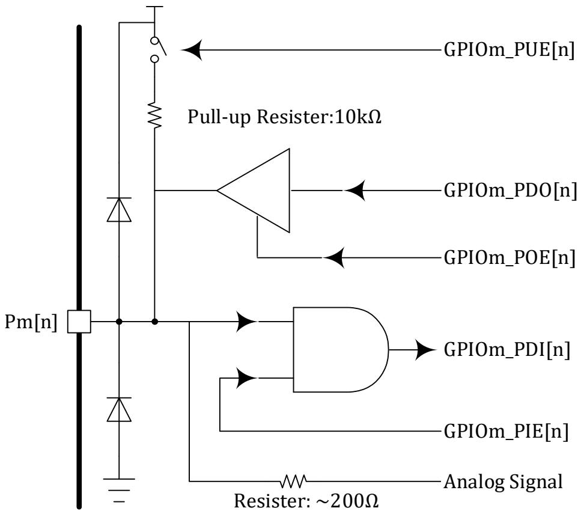  
图 15-1 GPIO 功能框图

如上图所示，Pm[n]为芯片PAD，m可以是0\~1，表示2 组GPIO中的任意一组，n可以是0\~15，表示一组 16 个 GPIO 中的一个 IO。模拟信号通过一个电阻串联直接连接到 PAD，电阻阻值为100\~200Ω。数字信号经过一个三态门输出，当输出使能 $\mathrm { G P I O m \_ P O E } [ \mathrm { n } ] { = } 0$ 时，buffer 输出高阻态，否则 buffer 输出与 GPIOm\_PDO[n]电平相同。数字信号输入通过一个与门进入芯片内部，当GPIOm\_PIE[n]=0 时，GPIOm\_PDI[n]恒为 0，当 GPIOm\_PIE[n]=1，即输入使能打开时，GPIOm\_PDI[n]的电平与 Pm[n]电平相同。芯片 PAD 可以配置上拉，P0[2]引脚因为复用为外部复位脚 RSTN 上拉电阻为 100kΩ，其余上拉电阻为 10kΩ，注意，并非所有 PAD 都配备上拉电阻，具体哪些 PAD 具有上拉电阻资源，请参考15.2.6 章节。没有上拉电阻的PAD 也可以配置GPIOm\_PUE[n]寄存器，但无实际作用。

## 15.1.2 产品特点

➢ 26 路 GPIO

➢ 推挽开漏模式可配置

➢ 部分GPIO支持外部中断

部分GPIO可作为休眠唤醒源

➢ 部分GPIO支持输入信号滤波

具体哪些GPIO支持外部中断，请参考 15.2.15.4

具体哪些GPIO可以作为休眠唤醒源，请参考20.6.5

具体哪些GPIO可以进行输入信号滤波，请参考 15.3.2

## 15.2 寄存器

## 15.2.1 地址分配

GPIO 0 模块在芯片中的基地址是 0x4001\_0800。

GPIO 1 模块在芯片中的基地址是 0x4001\_0840。

GPIO 0/1的寄存器定义完全相同，仅基地址不同。

表 15-1 GPIOx 寄存器列表

<table><tr><td>名称</td><td>偏移地址</td><td>说明</td></tr><tr><td>GPIOx_PIE</td><td>0x00</td><td>GPIO x 输入使能</td></tr><tr><td>GPIOx_POE</td><td>0x04</td><td>GPIO x 输出使能</td></tr><tr><td>GPIOx_PDI</td><td>0x08</td><td>GPIO x 输入数据</td></tr><tr><td>GPIOx_PDO</td><td>0x0C</td><td>GPIO x 输出数据</td></tr><tr><td>GPIOx_PUE</td><td>0x10</td><td>GPIO x 上拉使能</td></tr><tr><td>GPIOx_PODE</td><td>0x18</td><td>GPIO x 开漏使能</td></tr><tr><td>GPIOx_F3210</td><td>0x20</td><td>GPIO x [3:0]功能选择</td></tr><tr><td>GPIOx_F7654</td><td>0x24</td><td>GPIO x [7:4]功能选择</td></tr><tr><td>GPIOx_FBA98</td><td>0x28</td><td>GPIO x [11:8]功能选择</td></tr><tr><td>GPIOx_FFEDC</td><td>0x2C</td><td>GPIO x [15:12]功能选择</td></tr><tr><td>GPIOx_BSRR</td><td>0x30</td><td>GPIO x 位操作寄存器</td></tr><tr><td>GPIOx_BRR</td><td>0x34</td><td>GPIO x 位清零寄存器</td></tr></table>

GPIO 中断/唤醒/配置锁定模块的基地址是 0x4001\_0880。

表 15-2GPIO 中断/唤醒/配置锁定模块寄存器列表

<table><tr><td>名称</td><td>偏移地址</td><td>说明</td></tr><tr><td>EXTI_CR0</td><td>0x00</td><td>外部中断配置寄存器 0</td></tr></table>


--- Part 2: Pages 201-258 ---

<table><tr><td>EXTI_CR1</td><td>0x04</td><td>外部中断配置寄存器 1</td></tr><tr><td>EXTI_IE</td><td>0x08</td><td>GPIO 中断/DMA 使能</td></tr><tr><td>EXTI_IF</td><td>0x0C</td><td>GPIO 中断标志</td></tr><tr><td>CLKO_SEL</td><td>0x10</td><td>输出时钟选择信号</td></tr></table>

## 15.2.2 GPIOx\_PIE

地址分别是:0x4001\_0800，0x4001\_0840

复位值:0x0

表 15-3 GPIOx 输入使能寄存器 GPIOx\_PIE

<table><tr><td>15</td><td>14</td><td>13</td><td>12</td><td>11</td><td>10</td><td>9</td><td>8</td><td>7</td><td>6</td><td>5</td><td>4</td><td>3</td><td>2</td><td>1</td><td>0</td></tr><tr><td>PIE15</td><td>PIE14</td><td>PIE13</td><td>PIE12</td><td>PIE11</td><td>PIE10</td><td>PIE9</td><td>PIE8</td><td>PIE7</td><td>PIE6</td><td>PIE5</td><td>PIE4</td><td>PIE3</td><td>PIE2</td><td>PIE1</td><td>PIEO</td></tr><tr><td>RW</td><td>RW</td><td>RW</td><td>RW</td><td>RW</td><td>RW</td><td>RW</td><td>RW</td><td>RW</td><td>RW</td><td>RW</td><td>RW</td><td>RW</td><td>RW</td><td>RW</td><td>RW</td></tr><tr><td>0</td><td>0</td><td>0</td><td>0</td><td>0</td><td>0</td><td>0</td><td>0</td><td>0</td><td>0</td><td>0</td><td>0</td><td>0</td><td>0</td><td>0</td><td>0</td></tr></table>

<table><tr><td>位置</td><td>位名称</td><td>说明</td></tr><tr><td>[31:16]</td><td></td><td>未使用</td></tr><tr><td>[15]</td><td>PIE15</td><td>GPIO x[15] / Px[15] 输入使能</td></tr><tr><td>[14]</td><td>PIE14</td><td>GPIO x[14] / Px[14] 输入使能</td></tr><tr><td>[13]</td><td>PIE13</td><td>GPIO x[13] / Px[13] 输入使能</td></tr><tr><td>[12]</td><td>PIE12</td><td>GPIO x[12] / Px[12] 输入使能</td></tr><tr><td>[11]</td><td>PIE11</td><td>GPIO x[11] / Px[11] 输入使能</td></tr><tr><td>[10]</td><td>PIE10</td><td>GPIO x[10] / Px[10] 输入使能</td></tr><tr><td>[9]</td><td>PIE9</td><td>GPIO x[9] / Px[9] 输入使能</td></tr><tr><td>[8]</td><td>PIE8</td><td>GPIO x[8] / Px[8] 输入使能</td></tr><tr><td>[7]</td><td>PIE7</td><td>GPIO x[7] / Px[7] 输入使能</td></tr><tr><td>[6]</td><td>PIE6</td><td>GPIO x[6] / Px[6] 输入使能</td></tr><tr><td>[5]</td><td>PIE5</td><td>GPIO x[5] / Px[5] 输入使能</td></tr><tr><td>[4]</td><td>PIE4</td><td>GPIO x[4] / Px[4] 输入使能</td></tr><tr><td>[3]</td><td>PIE3</td><td>GPIO x[3] / Px[3] 输入使能</td></tr><tr><td>[2]</td><td>PIE2</td><td>GPIO x[2] / Px[2] 输入使能</td></tr><tr><td>[1]</td><td>PIE1</td><td>GPIO x[1] / Px[1] 输入使能</td></tr><tr><td>[0]</td><td>PIE0</td><td>GPIO x[0] / Px[0] 输入使能</td></tr></table>

## 15.2.3 GPIOx\_POE

地址分别是:0x4001\_0804，0x4001\_0844

复位值:0x0

表 15-4 GPIOx 输出使能寄存器 GPIOx\_POE

<table><tr><td>15</td><td>14</td><td>13</td><td>12</td><td>11</td><td>10</td><td>9</td><td>8</td><td>7</td><td>6</td><td>5</td><td>4</td><td>3</td><td>2</td><td>1</td><td>0</td></tr><tr><td>POE15</td><td>POE14</td><td>POE13</td><td>POE12</td><td>POE11</td><td>POE10</td><td>POE9</td><td>POE8</td><td>POE7</td><td>POE6</td><td>POE5</td><td>POE4</td><td>POE3</td><td>POE2</td><td>POE1</td><td>POE0</td></tr><tr><td>RW</td><td>RW</td><td>RW</td><td>RW</td><td>RW</td><td>RW</td><td>RW</td><td>RW</td><td>RW</td><td>RW</td><td>RW</td><td>RW</td><td>RW</td><td>RW</td><td>RW</td><td>RW</td></tr><tr><td>0</td><td>0</td><td>0</td><td>0</td><td>0</td><td>0</td><td>0</td><td>0</td><td>0</td><td>0</td><td>0</td><td>0</td><td>0</td><td>0</td><td>0</td><td>0</td></tr></table>

<table><tr><td>位置</td><td>位名称</td><td>说明</td></tr><tr><td>[31:16]</td><td></td><td>未使用</td></tr><tr><td>[15]</td><td>POE15</td><td>GPIO x[15] / Px[15] 输出使能</td></tr><tr><td>[14]</td><td>POE14</td><td>GPIO x[14] / Px[14] 输出使能</td></tr><tr><td>[13]</td><td>POE13</td><td>GPIO x[13] / Px[13] 输出使能</td></tr><tr><td>[12]</td><td>POE12</td><td>GPIO x[12] / Px[12] 输出使能</td></tr><tr><td>[11]</td><td>POE11</td><td>GPIO x[11] / Px[11] 输出使能</td></tr><tr><td>[10]</td><td>POE10</td><td>GPIO x[10] / Px[10] 输出使能</td></tr><tr><td>[9]</td><td>POE9</td><td>GPIO x[9] / Px[9] 输出使能</td></tr><tr><td>[8]</td><td>POE8</td><td>GPIO x[8] / Px[8] 输出使能</td></tr><tr><td>[7]</td><td>POE7</td><td>GPIO x[7] / Px[7] 输出使能</td></tr><tr><td>[6]</td><td>POE6</td><td>GPIO x[6] / Px[6] 输出使能</td></tr><tr><td>[5]</td><td>POE5</td><td>GPIO x[5] / Px[5] 输出使能</td></tr><tr><td>[4]</td><td>POE4</td><td>GPIO x[4] / Px[4] 输出使能</td></tr><tr><td>[3]</td><td>POE3</td><td>GPIO x[3] / Px[3] 输出使能</td></tr><tr><td>[2]</td><td>POE2</td><td>GPIO x[2] / Px[2] 输出使能</td></tr><tr><td>[1]</td><td>POE1</td><td>GPIO x[1] / Px[1] 输出使能</td></tr><tr><td>[0]</td><td>POE0</td><td>GPIO x[0] / Px[0] 输出使能</td></tr></table>

## 15.2.4 GPIOx\_PDI

地址分别是:0x4001\_0808，0x4001\_0848

复位值:0x0

表 15-5 GPIOx 输入数据寄存器 GPIOx\_PDI

<table><tr><td>15</td><td>14</td><td>13</td><td>12</td><td>11</td><td>10</td><td>9</td><td>8</td><td>7</td><td>6</td><td>5</td><td>4</td><td>3</td><td>2</td><td>1</td><td>0</td></tr><tr><td></td><td></td><td></td><td></td><td></td><td></td><td></td><td>PDI</td><td></td><td></td><td></td><td></td><td></td><td></td><td></td><td></td></tr><tr><td></td><td></td><td></td><td></td><td></td><td></td><td></td><td>RO</td><td></td><td></td><td></td><td></td><td></td><td></td><td></td><td></td></tr><tr><td></td><td></td><td></td><td></td><td></td><td></td><td></td><td>0</td><td></td><td></td><td></td><td></td><td></td><td></td><td></td><td></td></tr></table>

<table><tr><td>位置</td><td>位名称</td><td>说明</td></tr><tr><td>[31:16]</td><td></td><td>未使用</td></tr><tr><td>[15:0]</td><td>PDI</td><td>GPIO x 输入数据</td></tr></table>

当 GPIOx\_PIE=0 时，GPIOx\_PDI 读回为 0。

## 15.2.5 GPIOx\_PDO

地址分别是:0x4001\_080C，0x4001\_084C

复位值:0x0

表 15-6 GPIOx 输出数据寄存器 GPIOx\_PDO

<table><tr><td>15</td><td>14</td><td>13</td><td>12</td><td>11</td><td>10</td><td>9</td><td>8</td><td>7</td><td>6</td><td>5</td><td>4</td><td>3</td><td>2</td><td>1</td><td>0</td></tr><tr><td></td><td></td><td></td><td></td><td></td><td></td><td></td><td>PDO</td><td></td><td></td><td></td><td></td><td></td><td></td><td></td><td></td></tr><tr><td></td><td></td><td></td><td></td><td></td><td></td><td></td><td>RW</td><td></td><td></td><td></td><td></td><td></td><td></td><td></td><td></td></tr><tr><td></td><td></td><td></td><td></td><td></td><td></td><td></td><td>0</td><td></td><td></td><td></td><td></td><td></td><td></td><td></td><td></td></tr></table>

<table><tr><td>位置</td><td>位名称</td><td>说明</td></tr><tr><td>[31:16]</td><td></td><td>未使用</td></tr><tr><td>[15:0]</td><td>PDO</td><td>GPIO x 输出数据</td></tr></table>

## 15.2.6 GPIOx\_PUE

地址分别是:0x4001\_0810，0x4001\_0850

复位值:0x0

表 15-7 GPIOx 上拉使能寄存器 GPIOx\_PUE

<table><tr><td>15</td><td>14</td><td>13</td><td>12</td><td>11</td><td>10</td><td>9</td><td>8</td><td>7</td><td>6</td><td>5</td><td>4</td><td>3</td><td>2</td><td>1</td><td>0</td></tr><tr><td>PUE15</td><td>PUE14</td><td>PUE13</td><td>PUE12</td><td>PUE11</td><td>PUE10</td><td>PUE9</td><td>PUE8</td><td>PUE7</td><td>PUE6</td><td>PUE5</td><td>PUE4</td><td>PUE3</td><td>PUE2</td><td>PUE1</td><td>PUE0</td></tr><tr><td>RW</td><td>RW</td><td>RW</td><td>RW</td><td>RW</td><td>RW</td><td>RW</td><td>RW</td><td>RW</td><td>RW</td><td>RW</td><td>RW</td><td>RW</td><td>RW</td><td>RW</td><td>RW</td></tr><tr><td>0</td><td>0</td><td>0</td><td>0</td><td>0</td><td>0</td><td>0</td><td>0</td><td>0</td><td>0</td><td>0</td><td>0</td><td>0</td><td>0</td><td>0</td><td>0</td></tr></table>

<table><tr><td>位置</td><td>位名称</td><td>说明</td></tr><tr><td>[31:16]</td><td></td><td>未使用</td></tr><tr><td>[15]</td><td>PUE15</td><td>GPIO x[15] / Px[15] 上拉使能</td></tr><tr><td>[14]</td><td>PUE14</td><td>GPIO x[14] / Px[14] 上拉使能</td></tr><tr><td>[13]</td><td>PUE13</td><td>GPIO x[13] / Px[13] 上拉使能</td></tr><tr><td>[12]</td><td>PUE12</td><td>GPIO x[12] / Px[12] 上拉使能</td></tr><tr><td>[11]</td><td>PUE11</td><td>GPIO x[11] / Px[11] 上拉使能</td></tr><tr><td>[10]</td><td>PUE10</td><td>GPIO x[10] / Px[10] 上拉使能</td></tr><tr><td>[9]</td><td>PUE9</td><td>GPIO x[9] / Px[9] 上拉使能</td></tr><tr><td>[8]</td><td>PUE8</td><td>GPIO x[8] / Px[8] 上拉使能</td></tr><tr><td>[7]</td><td>PUE7</td><td>GPIO x[7] / Px[7] 上拉使能</td></tr><tr><td>[6]</td><td>PUE6</td><td>GPIO x[6] / Px[6] 上拉使能</td></tr><tr><td>[5]</td><td>PUE5</td><td>GPIO x[5] / Px[5] 上拉使能</td></tr><tr><td>[4]</td><td>PUE4</td><td>GPIO x[4] / Px[4] 上拉使能</td></tr><tr><td>[3]</td><td>PUE3</td><td>GPIO x[3] / Px[3] 上拉使能</td></tr><tr><td>[2]</td><td>PUE2</td><td>GPIO x[2] / Px[2] 上拉使能</td></tr><tr><td>[1]</td><td>PUE1</td><td>GPIO x[1] / Px[1] 上拉使能</td></tr><tr><td>[0]</td><td>PUE0</td><td>GPIO x[0] / Px[0] 上拉使能</td></tr></table>

注意:并非所有IO都具有上拉功能，具体哪些IO具有上拉功能请参考15.3.1。没有上拉功能的 IO对应的PUE 寄存器也没有实现，因此向这些位置写入 1无效，读回恒为0。

## 15.2.7 GPIOx\_PODE

地址分别是:0x4001\_0818，0x4001\_0858

复位值:0x0

表 15-8 GPIOx 开漏使能寄存器 GPIOx\_PODE

<table><tr><td>15</td><td>14</td><td>13</td><td>12</td><td>11</td><td>10</td><td>9</td><td>8</td><td>7</td><td>6</td><td>5</td><td>4</td><td>3</td><td>2</td><td>1</td><td>0</td></tr><tr><td>PODE15</td><td>PODE14</td><td>PODE13</td><td>PODE12</td><td>PODE11</td><td>PODE10</td><td>PODE9</td><td>PODE8</td><td>PODE7</td><td>PODE6</td><td>PODE5</td><td>PODE4</td><td>PODE3</td><td>PODE2</td><td>PODE1</td><td>PODE0</td></tr><tr><td>RW</td><td>RW</td><td>RW</td><td>RW</td><td>RW</td><td>RW</td><td>RW</td><td>RW</td><td>RW</td><td>RW</td><td>RW</td><td>RW</td><td>RW</td><td>RW</td><td>RW</td><td>RW</td></tr><tr><td>0</td><td>0</td><td>0</td><td>0</td><td>0</td><td>0</td><td>0</td><td>0</td><td>0</td><td>0</td><td>0</td><td>0</td><td>0</td><td>0</td><td>0</td><td>0</td></tr></table>

<table><tr><td>位置</td><td>位名称</td><td>说明</td></tr><tr><td>[31:16]</td><td></td><td>未使用</td></tr><tr><td>[15]</td><td>PODE15</td><td>GPIO x[15] / Px[15] 开漏使能</td></tr><tr><td>[14]</td><td>PODE14</td><td>GPIO x[14] / Px[14] 开漏使能</td></tr><tr><td>[13]</td><td>PODE13</td><td>GPIO x[13] / Px[13] 开漏使能</td></tr><tr><td>[12]</td><td>PODE12</td><td>GPIO x[12] / Px[12] 开漏使能</td></tr><tr><td>[11]</td><td>PODE11</td><td>GPIO x[11] / Px[11] 开漏使能</td></tr><tr><td>[10]</td><td>PODE10</td><td>GPIO x[10] / Px[10] 开漏使能</td></tr><tr><td>[9]</td><td>PODE9</td><td>GPIO x[9] / Px[9] 开漏使能</td></tr><tr><td>[8]</td><td>PODE8</td><td>GPIO x[8] / Px[8] 开漏使能</td></tr><tr><td>[7]</td><td>PODE7</td><td>GPIO x[7] / Px[7] 开漏使能</td></tr><tr><td>[6]</td><td>PODE6</td><td>GPIO x[6] / Px[6] 开漏使能</td></tr><tr><td>[5]</td><td>PODE5</td><td>GPIO x[5] / Px[5] 开漏使能</td></tr><tr><td>[4]</td><td>PODE4</td><td>GPIO x[4] / Px[4] 开漏使能</td></tr><tr><td>[3]</td><td>PODE3</td><td>GPIO x[3] / Px[3] 开漏使能</td></tr><tr><td>[2]</td><td>PODE2</td><td>GPIO x[2] / Px[2] 开漏使能</td></tr><tr><td>[1]</td><td>PODE1</td><td>GPIO x[1] / Px[1] 开漏使能</td></tr><tr><td>[0]</td><td>PODE0</td><td>GPIO x[0] / Px[0] 开漏使能</td></tr></table>

## 15.2.8 GPIOx\_PFLT

地址分别是:0x4001\_081C，0x4001\_085C

复位值:0x0

表 15-9 GPIOx 配置锁定寄存器 GPIOx\_PFLT

<table><tr><td>15</td><td>14</td><td>13</td><td>12</td><td>11</td><td>10</td><td>9</td><td>8</td><td>7</td><td>6</td><td>5</td><td>4</td><td>3</td><td>2</td><td>1</td><td>0</td></tr><tr><td>PFLT 15</td><td>PFLT 14</td><td>PFLT 13</td><td>PFLT 12</td><td>PFLT 11</td><td>PFLT 10</td><td>PFLT 9</td><td>PFLT 8</td><td>PFLT 7</td><td>PFLT 6</td><td>PFLT 5</td><td>PFLT 4</td><td>PFLT 3</td><td>PFLT 2</td><td>PFLT 1</td><td>PFLT 0</td></tr><tr><td>RW</td><td>RW</td><td>RW</td><td>RW</td><td>RW</td><td>RW</td><td>RW</td><td>RW</td><td>RW</td><td>RW</td><td>RW</td><td>RW</td><td>RW</td><td>RW</td><td>RW</td><td>RW</td></tr><tr><td>0</td><td>0</td><td>0</td><td>0</td><td>0</td><td>0</td><td>0</td><td>0</td><td>0</td><td>0</td><td>0</td><td>0</td><td>0</td><td>0</td><td>0</td><td>0</td></tr></table>

<table><tr><td>位置</td><td>位名称</td><td>说明</td></tr><tr><td>[31:16]</td><td></td><td>未使用</td></tr><tr><td>[15]</td><td>PFLT15</td><td>GPIO x[15] / Px[15] 滤波使能</td></tr><tr><td>[14]</td><td>PFLT14</td><td>GPIO x[14] / Px[14] 滤波使能</td></tr><tr><td>[13]</td><td>PFLT13</td><td>GPIO x[13] / Px[13] 滤波使能</td></tr><tr><td>[12]</td><td>PFLT12</td><td>GPIO x[12] / Px[12] 滤波使能</td></tr><tr><td>[11]</td><td>PFLT11</td><td>GPIO x[11] / Px[11] 滤波使能</td></tr><tr><td>[10]</td><td>PFLT10</td><td>GPIO x[10] / Px[10] 滤波使能</td></tr><tr><td>[9]</td><td>PFLT9</td><td>GPIO x[9] / Px[9] 滤波使能</td></tr><tr><td>[8]</td><td>PFLT8</td><td>GPIO x[8] / Px[8] 滤波使能</td></tr><tr><td>[7]</td><td>PFLT7</td><td>GPIO x[7] / Px[7] 滤波使能</td></tr><tr><td>[6]</td><td>PFLT6</td><td>GPIO x[6] / Px[6] 滤波使能</td></tr><tr><td>[5]</td><td>PFLT 5</td><td>GPIO x[5] / Px[5] 滤波使能</td></tr><tr><td>[4]</td><td>PFLT 4</td><td>GPIO x[4] / Px[4] 滤波使能</td></tr><tr><td>[3]</td><td>PFLT 3</td><td>GPIO x[3] / Px[3] 滤波使能</td></tr><tr><td>[2]</td><td>PFLT 2</td><td>GPIO x[2] / Px[2] 滤波使能</td></tr><tr><td>[1]</td><td>PFLT1</td><td>GPIO x[1] / Px[1] 滤波使能</td></tr><tr><td>[0]</td><td>PFLT0</td><td>GPIO x[0] / Px[0] 滤波使能</td></tr></table>

只有部分GPIO支持输入信号滤波，具体哪些GPIO支持滤波，请参考15.3.2。

## 15.2.9 GPIOx\_F3210

地址分别是:0x4001\_0820，0x4001\_0860

复位值:0x0

表 15-10 GPIOx 功能选择寄存器 GPIOx\_F3210

<table><tr><td>15</td><td>14</td><td>13</td><td>12</td><td>11</td><td>10</td><td>9</td><td>8</td><td>7</td><td>6</td><td>5</td><td>4</td><td>3</td><td>2</td><td>1</td><td>0</td></tr><tr><td colspan="4">F3</td><td colspan="4">F2</td><td colspan="4">F1</td><td colspan="4">F0</td></tr><tr><td colspan="4">RW</td><td colspan="4">RW</td><td colspan="4">RW</td><td colspan="4">RW</td></tr><tr><td colspan="4">0</td><td colspan="4">0</td><td colspan="4">0</td><td colspan="4">0</td></tr></table>

<table><tr><td>位置</td><td>位名称</td><td>说明</td></tr><tr><td>[31:16]</td><td></td><td>未使用</td></tr><tr><td>[15:12]</td><td>F3</td><td>GPIO x[3] / Px[3] 功能选择</td></tr><tr><td>[11:8]</td><td>F2</td><td>GPIO x[2] / Px[2] 功能选择</td></tr><tr><td>[7:4]</td><td>F1</td><td>GPIO x[1] / Px[1] 功能选择</td></tr><tr><td>[3:0]</td><td>F0</td><td>GPIO x[0] / Px[0] 功能选择</td></tr></table>

其中 F3/F2/F1/F0 可以设置的 GPIO 第二功能如表 15-11 所示，GPIO 功能为稀疏映射，即每个GPIO 仅可配置部分第二功能使用，需要 GPIO 功能分布，请参考对应器件手册(datasheet)。以下GPIOx\_F7654，GPIOx\_FBA98，GPIOx\_FFEDC 与 GPIOx\_F3210 相同。

表 15-11 GPIO 第二功能

<table><tr><td>GPIO 第二功能值</td><td>功能描述</td></tr><tr><td>0</td><td>模拟功能,当 GPIO 作为模拟功能使用时,需要关闭对应 IO 的输出使能,上拉使能等,方式 IO 输出信号或片内上拉电阻对模拟信号造成干扰</td></tr><tr><td>1</td><td>CMP_OUT,模拟比较器直接输出/时钟输出</td></tr><tr><td>2</td><td>HALL,HALL 信号输入</td></tr><tr><td>3</td><td>MCPWM,MCPWM 通道输出或停机信号输入</td></tr><tr><td>4</td><td>UART,串口 RXD 或 TXD</td></tr><tr><td>5</td><td>SPI,SPI 时钟、片选,数据输入、数据输出</td></tr><tr><td>6</td><td>I2C,I2C 时钟、I2C 数据</td></tr><tr><td>7</td><td>TIMER0,TIMER0 通道 0/1,作为输入用于捕获模式或外部时钟源,作为输出用于比较模式</td></tr><tr><td>8</td><td>TIMER1,TIMER1 通道 0/1,作为输入用于捕获模式或外部时钟源,作为输出用于比较模式</td></tr><tr><td>9</td><td>ADC_TRIGGER,ADC 采样触发信号输出,每发生一次 ADC 采样触发,ADC_TRIGGER 信号翻转一次</td></tr></table>

## 15.2.10 GPIOx\_F7654

地址分别是:0x4001\_0824，0x4001\_0864

复位值:0x0

表 15-12 GPIOx 功能选择寄存器 GPIOx\_F7654

<table><tr><td>15</td><td>14</td><td>13</td><td>12</td><td>11</td><td>10</td><td>9</td><td>8</td><td>7</td><td>6</td><td>5</td><td>4</td><td>3</td><td>2</td><td>1</td><td>0</td></tr><tr><td colspan="4">F7</td><td colspan="4">F6</td><td colspan="4">F5</td><td colspan="4">F4</td></tr><tr><td colspan="4">RW</td><td colspan="4">RW</td><td colspan="4">RW</td><td colspan="4">RW</td></tr><tr><td colspan="4">0</td><td colspan="4">0</td><td colspan="4">0</td><td colspan="4">0</td></tr></table>

<table><tr><td>位置</td><td>位名称</td><td>说明</td></tr><tr><td>[31:16]</td><td></td><td>未使用</td></tr><tr><td>[15:12]</td><td>F7</td><td>GPIO x[7] / Px[7] 功能选择</td></tr><tr><td>[11:8]</td><td>F6</td><td>GPIO x[6] / Px[6] 功能选择</td></tr><tr><td>[7:4]</td><td>F5</td><td>GPIO x[5] / Px[5] 功能选择</td></tr><tr><td>[3:0]</td><td>F4</td><td>GPIO x[4] / Px[4] 功能选择</td></tr></table>

## 15.2.11 GPIOx\_FBA98

地址分别是:0x4001\_0828，0x4001\_0868

复位值:0x0

表 15-13 GPIOx 功能选择寄存器 GPIOx\_FBA98

<table><tr><td>15</td><td>14</td><td>13</td><td>12</td><td>11</td><td>10</td><td>9</td><td>8</td><td>7</td><td>6</td><td>5</td><td>4</td><td>3</td><td>2</td><td>1</td><td>0</td></tr><tr><td colspan="4">F11</td><td colspan="4">F10</td><td colspan="4">F9</td><td colspan="4">F8</td></tr><tr><td colspan="4">RW</td><td colspan="4">RW</td><td colspan="4">RW</td><td colspan="4">RW</td></tr><tr><td colspan="4">0</td><td colspan="4">0</td><td colspan="4">0</td><td colspan="4">0</td></tr></table>

<table><tr><td>位置</td><td>位名称</td><td>说明</td></tr><tr><td>[31:16]</td><td></td><td>未使用</td></tr><tr><td>[15:12]</td><td>F11</td><td>GPIO x[11] / Px[11] 功能选择</td></tr><tr><td>[11:8]</td><td>F10</td><td>GPIO x[10] / Px[10] 功能选择</td></tr><tr><td>[7:4]</td><td>F9</td><td>GPIO x[9] / Px[9] 功能选择</td></tr><tr><td>[3:0]</td><td>F8</td><td>GPIO x[8] / Px[8] 功能选择</td></tr></table>

## 15.2.12 GPIOx\_FFEDC

地址分别是:0x4001\_082C，0x4001\_086C

复位值:0x0

表 15-14 GPIOx 功能选择寄存器 GPIOx\_FFEDC

<table><tr><td>15</td><td>14</td><td>13</td><td>12</td><td>11</td><td>10</td><td>9</td><td>8</td><td>7</td><td>6</td><td>5</td><td>4</td><td>3</td><td>2</td><td>1</td><td>0</td></tr><tr><td colspan="4">F15</td><td colspan="4">F14</td><td colspan="4">F13</td><td colspan="4">F12</td></tr><tr><td colspan="4">RW</td><td colspan="4">RW</td><td colspan="4">RW</td><td colspan="4">RW</td></tr><tr><td colspan="4">0</td><td colspan="4">0</td><td colspan="4">0</td><td colspan="4">0</td></tr></table>

<table><tr><td>位置</td><td>位名称</td><td>说明</td></tr><tr><td>[31:16]</td><td></td><td>未使用</td></tr><tr><td>[15:12]</td><td>F15</td><td>GPIO x[15] / Px[15] 功能选择</td></tr><tr><td>[11:8]</td><td>F14</td><td>GPIO x[14] / Px[14] 功能选择</td></tr><tr><td>[7:4]</td><td>F13</td><td>GPIO x[13] / Px[13] 功能选择</td></tr><tr><td>[3:0]</td><td>F12</td><td>GPIO x[12] / Px[12] 功能选择</td></tr></table>

GPIO 的功能复用详细列表请见对应产品 DATASHEET 管脚分布章节。

## 15.2.13 GPIOx\_BSRR

地址分别是:0x4001\_0830，0x4001\_0870

复位值:0x0

表 15-15 GPIOx 位操作寄存器 GPIOx\_BSRR

<table><tr><td>31</td><td>30</td><td>29</td><td>28</td><td>27</td><td>26</td><td>25</td><td>24</td><td>23</td><td>22</td><td>21</td><td>20</td><td>19</td><td>18</td><td>17</td><td>16</td></tr><tr><td>CLR15</td><td>CLR14</td><td>CLR13</td><td>CLR12</td><td>CLR11</td><td>CLR10</td><td>CLR9</td><td>CLR8</td><td>CLR7</td><td>CLR6</td><td>CLR5</td><td>CLR4</td><td>CLR3</td><td>CLR2</td><td>CLR1</td><td>CLR0</td></tr><tr><td>W</td><td>W</td><td>W</td><td>W</td><td>W</td><td>W</td><td>W</td><td>W</td><td>W</td><td>W</td><td>W</td><td>W</td><td>W</td><td>W</td><td>W</td><td>W</td></tr><tr><td>0</td><td>0</td><td>0</td><td>0</td><td>0</td><td>0</td><td>0</td><td>0</td><td>0</td><td>0</td><td>0</td><td>0</td><td>0</td><td>0</td><td>0</td><td>0</td></tr></table>

<table><tr><td>15</td><td>14</td><td>13</td><td>12</td><td>11</td><td>10</td><td>9</td><td>8</td><td>7</td><td>6</td><td>5</td><td>4</td><td>3</td><td>2</td><td>1</td><td>0</td></tr><tr><td>SET15</td><td>SET14</td><td>SET13</td><td>SET12</td><td>SET11</td><td>SET10</td><td>SET9</td><td>SET8</td><td>SET7</td><td>SET6</td><td>SET5</td><td>SET4</td><td>SET3</td><td>SET2</td><td>SET1</td><td>SET0</td></tr><tr><td>W</td><td>W</td><td>W</td><td>W</td><td>W</td><td>W</td><td>W</td><td>W</td><td>W</td><td>W</td><td>W</td><td>W</td><td>W</td><td>W</td><td>W</td><td>W</td></tr><tr><td>0</td><td>0</td><td>0</td><td>0</td><td>0</td><td>0</td><td>0</td><td>0</td><td>0</td><td>0</td><td>0</td><td>0</td><td>0</td><td>0</td><td>0</td><td>0</td></tr></table>

<table><tr><td>位置</td><td>位名称</td><td>说明</td></tr><tr><td>[31]</td><td>CLR15</td><td>写 1 将 GPIO x[15]清零,写 0 无作用</td></tr><tr><td>[30]</td><td>CLR14</td><td>写 1 将 GPIO x[14]清零,写 0 无作用</td></tr><tr><td>[29]</td><td>CLR13</td><td>写 1 将 GPIO x[13]清零,写 0 无作用</td></tr><tr><td>[28]</td><td>CLR12</td><td>写 1 将 GPIO x[12]清零,写 0 无作用</td></tr><tr><td>[27]</td><td>CLR11</td><td>写 1 将 GPIO x[11]清零,写 0 无作用</td></tr><tr><td>[26]</td><td>CLR10</td><td>写 1 将 GPIO x[10]清零,写 0 无作用</td></tr><tr><td>[25]</td><td>CLR9</td><td>写 1 将 GPIO x[9]清零,写 0 无作用</td></tr><tr><td>[24]</td><td>CLR8</td><td>写 1 将 GPIO x[8]清零,写 0 无作用</td></tr><tr><td>[23]</td><td>CLR7</td><td>写 1 将 GPIO x[7]清零,写 0 无作用</td></tr><tr><td>[22]</td><td>CLR6</td><td>写 1 将 GPIO x[6]清零,写 0 无作用</td></tr><tr><td>[21]</td><td>CLR5</td><td>写 1 将 GPIO x[5]清零,写 0 无作用</td></tr><tr><td>[20]</td><td>CLR4</td><td>写 1 将 GPIO x[4]清零,写 0 无作用</td></tr><tr><td>[19]</td><td>CLR3</td><td>写 1 将 GPIO x[3]清零,写 0 无作用</td></tr><tr><td>[18]</td><td>CLR2</td><td>写 1 将 GPIO x[2]清零,写 0 无作用</td></tr><tr><td>[17]</td><td>CLR1</td><td>写 1 将 GPIO x[1]清零,写 0 无作用</td></tr><tr><td>[16]</td><td>CLR0</td><td>写 1 将 GPIO x[0]清零,写 0 无作用</td></tr><tr><td>[15]</td><td>SET15</td><td>写1将GPIO x[15]置1,写0无作用</td></tr><tr><td>[14]</td><td>SET14</td><td>写1将GPIO x[14]置1,写0无作用</td></tr><tr><td>[13]</td><td>SET13</td><td>写1将GPIO x[13]置1,写0无作用</td></tr><tr><td>[12]</td><td>SET12</td><td>写1将GPIO x[12]置1,写0无作用</td></tr><tr><td>[11]</td><td>SET11</td><td>写1将GPIO x[11]置1,写0无作用</td></tr><tr><td>[10]</td><td>SET10</td><td>写1将GPIO x[10]置1,写0无作用</td></tr><tr><td>[9]</td><td>SET9</td><td>写1将GPIO x[9]置1,写0无作用</td></tr><tr><td>[8]</td><td>SET8</td><td>写1将GPIO x[8]置1,写0无作用</td></tr><tr><td>[7]</td><td>SET7</td><td>写1将GPIO x[7]置1,写0无作用</td></tr><tr><td>[6]</td><td>SET6</td><td>写1将GPIO x[6]置1,写0无作用</td></tr><tr><td>[5]</td><td>SET5</td><td>写1将GPIO x[5]置1,写0无作用</td></tr><tr><td>[4]</td><td>SET4</td><td>写1将GPIO x[4]置1,写0无作用</td></tr><tr><td>[3]</td><td>SET3</td><td>写1将GPIO x[3]置1,写0无作用</td></tr><tr><td>[2]</td><td>SET2</td><td>写1将GPIO x[2]置1,写0无作用</td></tr><tr><td>[1]</td><td>SET1</td><td>写1将GPIO x[1]置1,写0无作用</td></tr><tr><td>[0]</td><td>SETO</td><td>写1将GPIO x[0]置1,写0无作用</td></tr></table>

若用BSRR 的高16 位与低 16 位同时对GPIO同一位置既置1 又清零，则该位被清零。

## 15.2.14 GPIOx\_BRR

地址分别是:0x4001\_0834，0x4001\_0874

复位值:0x0

表 15-16 GPIOx 位清零寄存器 GPIOx\_BRR

<table><tr><td>15</td><td>14</td><td>13</td><td>12</td><td>11</td><td>10</td><td>9</td><td>8</td><td>7</td><td>6</td><td>5</td><td>4</td><td>3</td><td>2</td><td>1</td><td>0</td></tr><tr><td>CLR15</td><td>CLR14</td><td>CLR13</td><td>CLR12</td><td>CLR11</td><td>CLR10</td><td>CLR9</td><td>CLR8</td><td>CLR7</td><td>CLR6</td><td>CLR5</td><td>CLR4</td><td>CLR3</td><td>CLR2</td><td>CLR1</td><td>CLR0</td></tr><tr><td>W</td><td>W</td><td>W</td><td>W</td><td>W</td><td>W</td><td>W</td><td>W</td><td>W</td><td>W</td><td>W</td><td>W</td><td>W</td><td>W</td><td>W</td><td>W</td></tr><tr><td>0</td><td>0</td><td>0</td><td>0</td><td>0</td><td>0</td><td>0</td><td>0</td><td>0</td><td>0</td><td>0</td><td>0</td><td>0</td><td>0</td><td>0</td><td>0</td></tr></table>

<table><tr><td>位置</td><td>位名称</td><td>说明</td></tr><tr><td>[31:16]</td><td></td><td>未使用</td></tr><tr><td>[15]</td><td>CLR15</td><td>写 1 将 GPIO x[15]清零,写 0 无作用</td></tr><tr><td>[14]</td><td>CLR14</td><td>写 1 将 GPIO x[14]清零,写 0 无作用</td></tr><tr><td>[13]</td><td>CLR13</td><td>写 1 将 GPIO x[13]清零,写 0 无作用</td></tr><tr><td>[12]</td><td>CLR12</td><td>写 1 将 GPIO x[12]清零,写 0 无作用</td></tr><tr><td>[11]</td><td>CLR11</td><td>写 1 将 GPIO x[11]清零,写 0 无作用</td></tr><tr><td>[10]</td><td>CLR10</td><td>写 1 将 GPIO x[10]清零,写 0 无作用</td></tr><tr><td>[9]</td><td>CLR9</td><td>写 1 将 GPIO x[9]清零,写 0 无作用</td></tr><tr><td>[8]</td><td>CLR8</td><td>写 1 将 GPIO x[8]清零,写 0 无作用</td></tr><tr><td>[7]</td><td>CLR7</td><td>写 1 将 GPIO x[7]清零,写 0 无作用</td></tr><tr><td>[6]</td><td>CLR6</td><td>写1将GPIO x[6]清零,写0无作用</td></tr><tr><td>[5]</td><td>CLR5</td><td>写1将GPIO x[5]清零,写0无作用</td></tr><tr><td>[4]</td><td>CLR4</td><td>写1将GPIO x[4]清零,写0无作用</td></tr><tr><td>[3]</td><td>CLR3</td><td>写1将GPIO x[3]清零,写0无作用</td></tr><tr><td>[2]</td><td>CLR2</td><td>写1将GPIO x[2]清零,写0无作用</td></tr><tr><td>[1]</td><td>CLR1</td><td>写1将GPIO x[1]清零,写0无作用</td></tr><tr><td>[0]</td><td>CLR0</td><td>写1将GPIO x[0]清零,写0无作用</td></tr></table>

## 15.2.15 外部事件

EXTI\_CR0 和 EXTI\_CR1 用于选择 GPIO 信号外部触发的电平类型。

## 15.2.15.1EXTI\_CR0

地址:0x4001\_0880

复位值:0x0

表 15-17 外部触发配置寄存器 0 EXTI\_CR0

<table><tr><td>15</td><td>14</td><td>13</td><td>12</td><td>11</td><td>10</td><td>9</td><td>8</td><td>7</td><td>6</td><td>5</td><td>4</td><td>3</td><td>2</td><td>1</td><td>0</td></tr><tr><td colspan="2">T7</td><td colspan="2">T6</td><td colspan="2">T5</td><td colspan="2">T4</td><td colspan="2">T3</td><td colspan="2">T2</td><td colspan="2">T1</td><td colspan="2">T0</td></tr><tr><td colspan="2">RW</td><td colspan="2">RW</td><td colspan="2">RW</td><td colspan="2">RW</td><td colspan="2">RW</td><td colspan="2">RW</td><td colspan="2">RW</td><td colspan="2">RW</td></tr><tr><td colspan="2">0</td><td colspan="2">0</td><td colspan="2">0</td><td colspan="2">0</td><td colspan="2">0</td><td colspan="2">0</td><td colspan="2">0</td><td colspan="2">0</td></tr></table>

<table><tr><td>位置</td><td>位名称</td><td>说明</td></tr><tr><td>[31:16]</td><td></td><td>未使用</td></tr><tr><td>[15:14]</td><td>T7</td><td>GPIO 0[9]/P0[9]外部触发类型选择00:不触发01:下降沿触发10:上升沿触发11:上升沿、下降沿均触发</td></tr><tr><td>[13:12]</td><td>T6</td><td>GPIO 0[8]/P0[8]外部触发类型选择00:不触发01:下降沿触发10:上升沿触发11:上升沿、下降沿均触发</td></tr><tr><td>[11:10]</td><td>T5</td><td>GPIO 0[7]/P0[7]外部触发类型选择00:不触发01:下降沿触发10:上升沿触发11:上升沿、下降沿均触发</td></tr><tr><td>[9:8]</td><td>T4</td><td>GPIO 0[6]/P0[6]外部触发类型选择00:不触发01:下降沿触发10:上升沿触发11:上升沿、下降沿均触发</td></tr><tr><td>[7:6]</td><td>T3</td><td>GPIO 0[5]/P0[5]外部触发类型选择00:不触发01:下降沿触发10:上升沿触发11:上升沿、下降沿均触发</td></tr><tr><td>[5:4]</td><td>T2</td><td>GPIO 0[4]/P0[4]外部触发类型选择00:不触发01:下降沿触发10:上升沿触发11:上升沿、下降沿均触发</td></tr><tr><td>[3:2]</td><td>T1</td><td>GPIO 0[2]/P0[2]外部触发类型选择00:不触发01:下降沿触发10:上升沿触发11:上升沿、下降沿均触发</td></tr><tr><td>[1:0]</td><td>T0</td><td>GPIO 0[0]/P0[0]外部触发类型选择00:不触发01:下降沿触发10:上升沿触发11:上升沿、下降沿均触发</td></tr></table>

## 15.2.15.2EXTI\_CR1

地址:0x4001\_0884

复位值:0x0

表 15-18 外部触发配置寄存器 1 EXTI\_CR1

<table><tr><td>15</td><td>14</td><td>13</td><td>12</td><td>11</td><td>10</td><td>9</td><td>8</td><td>7</td><td>6</td><td>5</td><td>4</td><td>3</td><td>2</td><td>1</td><td>0</td></tr><tr><td colspan="2">T15</td><td colspan="2">T14</td><td colspan="2">T13</td><td colspan="2">T12</td><td colspan="2">T11</td><td colspan="2">T10</td><td colspan="2">T9</td><td colspan="2">T8</td></tr><tr><td colspan="2">RW</td><td colspan="2">RW</td><td colspan="2">RW</td><td colspan="2">RW</td><td colspan="2">RW</td><td colspan="2">RW</td><td colspan="2">RW</td><td colspan="2">RW</td></tr><tr><td colspan="2">0</td><td colspan="2">0</td><td colspan="2">0</td><td colspan="2">0</td><td colspan="2">0</td><td colspan="2">0</td><td colspan="2">0</td><td colspan="2">0</td></tr></table>

<table><tr><td>位置</td><td>位名称</td><td>说明</td></tr><tr><td>[31:16]</td><td></td><td>未使用</td></tr><tr><td>[15:14]</td><td>T15</td><td>GPIO 1[9]/P1[9]外部触发类型选择00:不触发01:下降沿触发10:上升沿触发11:上升沿、下降沿均触发</td></tr><tr><td>[13:12]</td><td>T14</td><td>GPIO 1[8]/P1[8]外部触发类型选择00:不触发01:下降沿触发10:上升沿触发11:上升沿、下降沿均触发</td></tr><tr><td>[11:10]</td><td>T13</td><td>GPIO 1[7]/P1[7]外部触发类型选择00:不触发01:下降沿触发10:上升沿触发11:上升沿、下降沿均触发</td></tr><tr><td>[9:8]</td><td>T12</td><td>GPIO 1[6]/P1[6]外部触发类型选择00:不触发01:下降沿触发10:上升沿触发11:上升沿、下降沿均触发</td></tr><tr><td>[7:6]</td><td>T11</td><td>GPIO 1[5]/P1[5]外部触发类型选择00:不触发01:下降沿触发10:上升沿触发11:上升沿、下降沿均触发</td></tr><tr><td>[5:4]</td><td>T10</td><td>GPIO 1[4]/P1[4]外部触发类型选择00:不触发01:下降沿触发10:上升沿触发11:上升沿、下降沿均触发</td></tr><tr><td>[3:2]</td><td>T9</td><td>GPIO 0[15]/P0[15]外部触发类型选择00:不触发01:下降沿触发10:上升沿触发11:上升沿、下降沿均触发</td></tr><tr><td>[1:0]</td><td>T8</td><td>GPIO 0[14]/P0[14]外部触发类型选择00:不触发01:下降沿触发10:上升沿触发11:上升沿、下降沿均触发</td></tr></table>

表 15-19 GPIO 中断资源分布表

<table><tr><td></td><td>15</td><td>14</td><td>13</td><td>12</td><td>11</td><td>10</td><td>9</td><td>8</td><td>7</td><td>6</td><td>5</td><td>4</td><td>3</td><td>2</td><td>1</td><td>0</td></tr><tr><td>P0</td><td>√</td><td>√</td><td></td><td></td><td></td><td></td><td>√</td><td>√</td><td>√</td><td>√</td><td>√</td><td>√</td><td></td><td>√</td><td></td><td>√</td></tr><tr><td>P1</td><td></td><td></td><td></td><td></td><td></td><td></td><td>√</td><td>√</td><td>√</td><td>√</td><td>√</td><td>√</td><td></td><td></td><td></td><td></td></tr></table>

15.2.15.3EXTI\_IE

复位值:0x0

表 15-20 GPIO 中断使能寄存器 EXTI\_IE

<table><tr><td>15</td><td>14</td><td>13</td><td>12</td><td>11</td><td>10</td><td>9</td><td>8</td><td>7</td><td>6</td><td>5</td><td>4</td><td>3</td><td>2</td><td>1</td><td>0</td></tr><tr><td rowspan="3" colspan="6"></td><td>EXIT1_RE</td><td>EXTIO_RE</td><td rowspan="3" colspan="6"></td><td>EXIT1_IE</td><td>EXTIO_IE</td></tr><tr><td>RW</td><td>RW</td><td>RW</td><td>RW</td></tr><tr><td>0</td><td>0</td><td>0</td><td>0</td></tr></table>

<table><tr><td>位置</td><td>位名称</td><td>说明</td></tr><tr><td>[31:10]</td><td></td><td>未使用</td></tr><tr><td>[9]</td><td>EXTI1_RE</td><td>GPIO1 DMA 请求使能,需要配合 EXTI_CR1 使用</td></tr><tr><td>[8]</td><td>EXTIO_RE</td><td>GPIO0 DMA 请求使能,需要配合 EXTI_CR0 使用</td></tr><tr><td>[7:2]</td><td></td><td>未使用</td></tr><tr><td>[1]</td><td>EXTI1_IE</td><td>GPIO1 中断使能,需要配合 EXTI_CR1 使用</td></tr><tr><td>[0]</td><td>EXTIO_IE</td><td>GPIO0 中断使能,需要配合 EXTI_CR0 使用</td></tr></table>

每一组 GPIO 外部请求信号可以统一用作中断请求，或者 DMA 请求。但通常每组信号不会同时用作中断和 DMA 请求。DMA 请求信号的产生同样来自中断标志置位，当中断发生后，如果使能了EXTIx\_RE，则 DMA会在响应请求后清除该组 GPIO的所有中断标志。

## 15.2.15.4EXTI\_IF

地址:0x4001\_088C

复位值:0x0

表 15-21 外部中断标志寄存器 EXTI\_IF

<table><tr><td>15</td><td>14</td><td>13</td><td>12</td><td>11</td><td>10</td><td>9</td><td>8</td><td>7</td><td>6</td><td>5</td><td>4</td><td>3</td><td>2</td><td>1</td><td>0</td></tr><tr><td>IF15</td><td>IF14</td><td>IF13</td><td>IF12</td><td>IF11</td><td>IF10</td><td>IF9</td><td>IF8</td><td>IF7</td><td>IF6</td><td>IF5</td><td>IF4</td><td>IF3</td><td>IF2</td><td>IF1</td><td>IF0</td></tr><tr><td>RW1C</td><td>RW1C</td><td>RW1C</td><td>RW1C</td><td>RW1C</td><td>RW1C</td><td>RW1C</td><td>RW1C</td><td>RW1C</td><td>RW1C</td><td>RW1C</td><td>RW1C</td><td>RW1C</td><td>RW1C</td><td>RW1C</td><td>RW1C</td></tr><tr><td>0</td><td>0</td><td>0</td><td>0</td><td>0</td><td>0</td><td>0</td><td>0</td><td>0</td><td>0</td><td>0</td><td>0</td><td>0</td><td>0</td><td>0</td><td>0</td></tr></table>

<table><tr><td>位置</td><td>位名称</td><td>说明</td></tr><tr><td>[31:16]</td><td></td><td>未使用</td></tr><tr><td>[15]</td><td>IF15</td><td>GPIO 1[9] / P1[9] 外部中断标志。中断标志高有效,写1清零</td></tr><tr><td>[14]</td><td>IF14</td><td>GPIO 1[8] / P1[8] 外部中断标志。中断标志高有效,写1清零</td></tr><tr><td>[13]</td><td>IF13</td><td>GPIO 1[7] / P1[7] 外部中断标志。中断标志高有效,写1清零</td></tr><tr><td>[12]</td><td>IF12</td><td>GPIO 1[6] / P1[6] 外部中断标志。中断标志高有效,写1清零</td></tr><tr><td>[11]</td><td>IF11</td><td>GPIO 1[5] / P1[5] 外部中断标志。中断标志高有效,写1清零</td></tr><tr><td>[10]</td><td>IF10</td><td>GPIO 1[4] / P1[4] 外部中断标志。中断标志高有效,写1清零</td></tr><tr><td>[9]</td><td>IF9</td><td>GPIO 0[15] / P0[15] 外部中断标志。中断标志高有效,写1清零</td></tr><tr><td>[8]</td><td>IF8</td><td>GPIO 0[14] / P0[14] 外部中断标志。中断标志高有效,写1清零</td></tr><tr><td>[7]</td><td>IF7</td><td>GPIO 0[9] / P0[9] 外部中断标志。中断标志高有效,写1清零</td></tr><tr><td>[6]</td><td>IF6</td><td>GPIO 0[8] / P0[8] 外部中断标志。中断标志高有效,写1清零</td></tr><tr><td>[5]</td><td>IF5</td><td>GPIO 0[7] / P0[7] 外部中断标志。中断标志高有效,写1清零</td></tr><tr><td>[4]</td><td>IF4</td><td>GPIO 0[6] / P0[6] 外部中断标志。中断标志高有效,写1清零</td></tr><tr><td>[3]</td><td>IF3</td><td>GPIO 0[5] / P0[5] 外部中断标志。中断标志高有效,写1清零</td></tr><tr><td>[2]</td><td>IF2</td><td>GPIO 0[4] / P0[4] 外部中断标志。中断标志高有效,写1清零</td></tr><tr><td>[1]</td><td>IF1</td><td>GPIO 0[2] / P0[2] 外部中断标志。中断标志高有效,写1清零</td></tr><tr><td>[0]</td><td>IF0</td><td>GPIO 0[0] / P0[0] 外部中断标志。中断标志高有效,写1清零</td></tr></table>

## 15.2.15.5CLKO\_SEL

地址:0x4001\_0890

复位值:0x0

表 15-22 GPIO 输出时钟信号选择寄存器 CLKO\_SEL

<table><tr><td>15 14 13 12 11 10 9 8 7 6 5 4</td><td>3</td><td>2</td><td>1</td><td>0</td></tr><tr><td rowspan="3"></td><td>ADC_OE</td><td>PLL_OE</td><td>HSI_OE</td><td>LSI_OE</td></tr><tr><td>RW</td><td>RW</td><td>RW</td><td>RW</td></tr><tr><td>0</td><td>0</td><td>0</td><td>0</td></tr></table>

<table><tr><td>位置</td><td>位名称</td><td>说明</td></tr><tr><td>[31:4]</td><td></td><td>未使用</td></tr><tr><td>[3]</td><td>ADC_OE</td><td>ADC 输出使能。1:使能;0:禁用。</td></tr><tr><td>[2]</td><td>PLL_OE</td><td>PLL 输出使能。1:使能;0:禁用。</td></tr><tr><td>[1]</td><td>HSI_OE</td><td>HSI 输出使能。1:使能;0:禁用。</td></tr><tr><td>[0]</td><td>LSI_OE</td><td>LSI 输出使能。1:使能;0:禁用。</td></tr></table>

芯片各时钟信号可以从 P0.10 进行输出观测。注意由于 ADC/PLL 为高频时钟信号，可能无法驱动片外大负载。

如果需要输出时钟，需要配置 P0.10 的第二功能为 1，即 GPIO0\_FBA98 = 0x0100，并使能 P0.10输出使能 GPIO0\_POE=0x0400，并配置 CLKO\_SEL，选择某一路时钟通过 P0.10 进行输出。

## 15.3 实现说明

## 15.3.1 上拉实现

LKS32MC03x系列芯片，部分GPIO配备有10kΩ上拉电阻。配备上拉功能的GPIO如下:

表 15-23 GPIO 上拉资源分布表

<table><tr><td></td><td>15</td><td>14</td><td>13</td><td>12</td><td>11</td><td>10</td><td>9</td><td>8</td><td>7</td><td>6</td><td>5</td><td>4</td><td>3</td><td>2</td><td>1</td><td>0</td></tr><tr><td>P0</td><td></td><td></td><td></td><td></td><td></td><td></td><td>√</td><td>√</td><td>√</td><td></td><td>√</td><td>√</td><td></td><td>√</td><td></td><td></td></tr><tr><td>P1</td><td></td><td></td><td></td><td></td><td></td><td></td><td>√</td><td>√</td><td>√</td><td>√</td><td>√</td><td>√</td><td></td><td></td><td></td><td></td></tr></table>

## 15.3.2 滤波实现

LKS32MC03x 系列芯片，部分 GPIO 支持对输入信号进行滤波操作，滤波时间宽度为 4 个 LSI 时钟周期，约 120us，即不足 120us 的变化会被滤波滤除。注意由于滤波使用 LSI 时钟，而 RC 本身精度有限，所以具体滤波时间常数会存在个体偏差。

表 15-24 GPIO 滤波资源分布表

<table><tr><td></td><td>15</td><td>14</td><td>13</td><td>12</td><td>11</td><td>10</td><td>9</td><td>8</td><td>7</td><td>6</td><td>5</td><td>4</td><td>3</td><td>2</td><td>1</td><td>0</td></tr><tr><td>P0</td><td></td><td></td><td></td><td></td><td></td><td></td><td>√</td><td>√</td><td></td><td></td><td></td><td></td><td></td><td></td><td></td><td>√</td></tr><tr><td>P1</td><td></td><td></td><td></td><td></td><td></td><td></td><td>√</td><td>√</td><td></td><td></td><td>√</td><td></td><td></td><td></td><td></td><td></td></tr></table>

## 15.4 应用指南

## 15.4.1 外部中断

示例如下:

// P0[7]

// GPIO

// P0[7] IO

//使能p0[7]上升沿触发，产生外部中断

//外部信号翻转两次产生两次中断，irq flag在GPIO 中断处理程序中递增两次

//使能p0[7]下降沿触发，产生外部中断

//同时使能P0[7]上升沿、下降沿触发，产生外部中断

//同时禁用P[7]上下沿触发，将无法产生外部中断

## 15.4.2 使用 GPIO 的模拟功能

将GPIO的IE和OE 关闭，即可使用模拟功能。此时，PAD通过内部电阻直接与模拟模块相连。

## 16 UART

## 16.1 概述

通用异步收发传输器（Universal Asynchrounous Receiver/Transmitter），通常称作 UART，是一种异步收发传输器。

UART主要特征如下:

o 支持全双工工作

o 支持单线半双工工作

o 支持8/9位数据位

o 支持 1/2 停止位

o 支持奇/偶/无校验模式

o 带 1 字节发送缓存

o 带1字节接收缓存

o 支持一主多从的 Multi-drop Slave/Master 模式

## 16.2 功能说明

## 16.2.1 发送

UART 包括一个字节发送缓冲区，当发送缓冲区有数据时，UART 将发送缓冲区的数据移入串行移位寄存器，并通过 UART\_TXD 端口发送出去。只要 UART 发送缓冲区有数据，UART就会自动进行发送。

完成加载后，产生发送缓冲区空中断，此时，用户可以往发送缓冲区填入下一个需要发送的字节，这样，发送完成后，UART将加载这个字节进行发送。

完成发送后，会产生发送完成中断。

发送流程：

设置 SYS\_CLK\_FEN. UART\_CLK\_EN = 1 开启 UART 时钟

设置 UART\_CTRL.BYTE\_LEN，选择 8/9bit 数据字节长度

设置 UART\_CTRL.CK\_EN，选择是否启用数据字节校验

设置 UART\_CTRL.CK\_TYPE，选择使用奇校验还是偶校验

设置 UART\_CTRL.BIT\_ORDER，选择发送时 LSB first 还是 MSB first

设置 UART\_CTRL.STOP\_LEN，选择停止比特长度为 1bit/2bit

如果使用 DMA 搬运数据，则设置 UART\_RE. TX\_BUF\_EMPTY\_RE=1，即 TX buffer 空就触发 DMA搬运新数据到 UART；如果使用软件轮询或中断的方式，则设置 UART\_IE. TX\_BUF\_EMPTY\_IE=1

如果使用DMA搬运数据到 UART发送，需要对DMA 进行相应设置

如果使用软件搬运数据到 UART 发送，需要软件向 UART\_BUFF 写入数据，可以触发 UART 开始通过UART\_TXD端口发送数据。

## 16.2.2 接收

UART 包括一个字节的接收缓冲区，当完成一个字节的接收后，会产生接收中断，并将接收到字节存储到接收缓冲区，用户应当在UART接收完成下一个字节前完成此字节的读取，否则缓冲区会被写入新接收的字节。接收部分内部使用高速时钟对UART\_RX信号进行过采样来判定稳态的数据信号，防止噪声干扰造成错误接收。

## 16.2.3 UART 帧格式

UART信号上收发的数据格式通常如下：

信号线空闲；

起始比特 (1 bit Start bit：1 bit Zero)

数据字节 (data word, 8bits or 9bits, LSB first or MSB first)

停止比特 (1/2 bit Stop bit: 1/2bit Ones)

数据字节的长度可以通过 UART\_CTRL.BYTE\_LEN 进行选择，8bit (UART\_CTRL.BYTE\_LEN=0)或9bit (UART\_CTRL.BYTE\_LEN=1)。起始比特为 1bit 零，TX 信号线为低，停止比特期间 TX 信号线为高。

停止比特的长度由 UART\_CTRL.

需要注意的是，当启用校验位时(UART\_CTR.CK\_EN=1)，校验位会替换掉数据字节的最高bit，即MSB，此时 8bit 数据字节实际是 7bit 数据+1bit 校验字，9bit 数据字节实际是 8bit 数据+1bit 校验字。

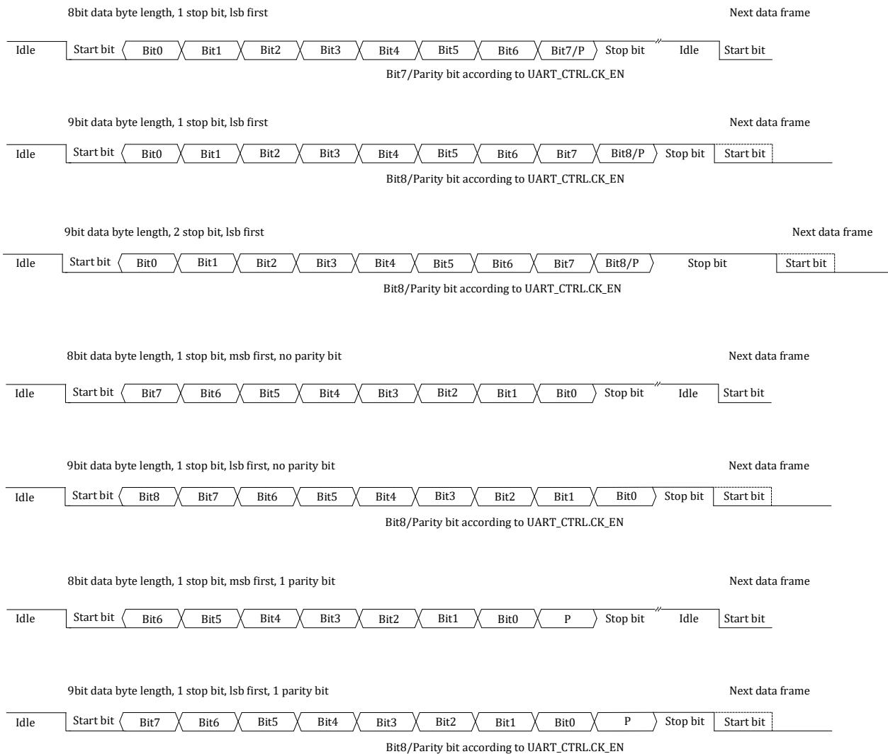  
图 16-1 UART 帧格式

## 16.2.4 波特率配置

UART输入时钟为系统主时钟，波特率通过两级分频实现。

波特率=UART 模块时钟/（256\*DIVH+DIVL+1)

可以通过 SYS\_CLK\_DIV2 对 UART 模块时钟进行分频

UART 模块时钟 =系统主时钟/(1+SYS\_CLK\_DIV2)

表 16-1 UART 波特率配置示例

<table><tr><td>UART 波特率</td><td>SYS_CLK_DIV2</td><td>UART_DIVH</td><td>UART_DIVL</td></tr><tr><td>150</td><td>0x0007</td><td>0x9C</td><td>0x3F</td></tr><tr><td>300</td><td>0x0003</td><td>0x9C</td><td>0x3F</td></tr><tr><td>600</td><td>0x0001</td><td>0x9C</td><td>0x3F</td></tr><tr><td>1200</td><td>0x0000</td><td>0x9C</td><td>0x3F</td></tr><tr><td>2400</td><td>0x0000</td><td>0x4E</td><td>0x1F</td></tr><tr><td>4800</td><td>0x0000</td><td>0x27</td><td>0x0F</td></tr><tr><td>9600</td><td>0x0000</td><td>0x13</td><td>0x87</td></tr><tr><td>19200</td><td>0x0000</td><td>0x09</td><td>0xC3</td></tr><tr><td>38400</td><td>0x0000</td><td>0x04</td><td>0xE1</td></tr><tr><td>57600</td><td>0x0000</td><td>0x03</td><td>0x40</td></tr><tr><td>115200</td><td>0x0000</td><td>0x01</td><td>0x9F</td></tr></table>

注意，同一波特率，其配置系数可能不唯一。

## 16.2.5 收发端口互换(TX/RX 互换)

UART模块支持Tx 与Rx端口互换。通过将Tx 对应的 GPIO配置为输入使能，Rx对应的GPIO配置为输出使能，即可实现 Tx 与 Rx 端口的互换。此时，GPIO 第二功能仍选择为 UART，UART 本身配置无需修改。

此外，如果要使用一个 GPIO 同时作为 Tx 和Rx，需要将 IO 分时复用为输入或输出，对应 Rx 或Tx，即可实现单口半双工逻辑。

## 16.2.6 多机通讯

多机通讯场景通常是一个设备作为主设备 master，另有若干个从设备 slave，主设备的UARTm\_TXD 端口连接到所有从设备的 UARTs\_RXD 端口，从设备的 UARTs\_TXD 相与连接到主设备的UARTm\_RXD 端口。如图 16-2 所示，为一个主设备和 3 个从设备（地址分别为 0x51,0x52,0x53）的互联情况。

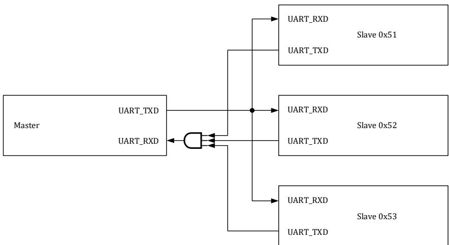  
图 16-2UART 多机通讯互联拓扑

为了降低从机报文处理的负荷，从设备应该只处理发送给他的 UART数据，而忽略发送给其他从设备的数据。每一个从机有一个 8bit 的设备地址，即 UART\_ADR。主机、从机均需要设置UART\_CTRL.MD\_EN=1 后，开启多机通讯过滤模式，同时设置 UART\_CTRL.BYTE\_LEN=1 使用 9bit 数据长度。主机发送数据字节 MSB(BIT8)为 1 时，低 8 位(BIT7:BIT0)是主机发出的从机地址，即地址字节；当发送数据字节 MSB(BIT8)为 0 时，低 8 位(BIT7:BIT0)是主机发给特定从机的数据，即数据字节。

所有从机接收到 MSB(BIT8)=1 的数据字节后，判断低 8 位(BIT7:BIT0)地址是否与自己的

UART\_ADR 配置值相等。如果相等，则说明后续数据都是发送给此从机，否则从机进入静默状态，忽略所有后续主机发出的数据。当从机再次接收到 MSB(BIT8)=1 的数据字节且低 8 位(BIT7:BIT0)地址与 自 己 的 UART\_ADR 配 置 值 相 等 时 ， 表 示 此 从 机 被 选 中 ， 退 出 静 默 状 态 。 从 机 设 置$\mathrm { U A R T \_ C T R L . M D \_ E N } { = } 1$ 开启多机通讯过滤模式后，立即进入静默状态。如果主机没有发送 MSB=1 的地址字节，直接发送数据字节，则所有从机都处于静默状态，不会接收任何数据。

在多机通讯模式中，主设备亦需设置 UART\_CTRL.MD\_EN=1，从机发送数据给主机时，应先发送1+主机 UART\_ADR 的 9bit 数据，此时主机地址命中，后续无需再发送最高位为 1 的地址字节，可直接发送最高位为0的数据字节。其他从机亦可先发送 1+主机 UART\_ADR的9bit 数据，保持主机地址命中，再发送最高位为0的数据字节，或者在主机地址命中的情况下，直接发送数据字节。

如果无需地址过滤，从设备也可以不设置UART\_CTRL.MD\_EN=1，另使用软件对接收数据进行判读，此时从设备会接收并处理所有报文数据。

在多机通讯模式中，如果从设备设置了 UART\_CTRL.MD\_EN=1，则地址字节无论是否命中UART\_ADR，UART\_IF.RX\_DONE\_IF标志均不置位；如果地址不匹配，即从设备处于静默状态，即使主设备发送数据，UART\_IF.RX\_DONE\_IF 仍不置位。如果地址匹配，当接收到主设备发送的数据字节时，从设备的UART\_IF.RX\_DONE\_IF标志置位为1，表示从设备接收到一个数据字节。

注意：多机通讯暂不支持校验位，在设置UART\_CTRL.MD\_EN=1时，请勿设置UART\_CTRL.CK\_EN=1。主机、从机均需设置 $\mathrm { U A R T \_ C T R L . B Y T E \_ L E N } { = } 1$ 使用9bit 模式，并设置 $\mathrm { U A R T \_ C T R L . M D \_ E N }$ 。

如图16-3 所示，主设备先发送了数据 0x03，但此时没有从设备地址命中，因此 3个从设备均不接收0x03。主设备发送地址字节 0x151，从设备0x51被选中。但之后主设备没有发送数据，而是直接发送地址字节0x153，从设备 0x53被选中，主设备连续发送 3个数据字节 $0 \times 0 3 , 0 \times 5 3 , 0 \times 0 4$ ，均被从设备0x53接收。之后主设备发送地址字节0x152，之后发送数据字节0x07，被从设备0x52 接收。

<table><tr><td rowspan="3">Master sends</td><td colspan="2">Data to Nobody</td><td colspan="2">Select slave 0x53</td><td colspan="2">0x53 to 0x53</td><td colspan="2">Select slave 0x52</td></tr><tr><td>0x003</td><td>0x151</td><td>0x153</td><td>0x003</td><td>0x053</td><td>0x004</td><td>0x152</td><td>0x007</td></tr><tr><td></td><td colspan="2">Select slave 0x51</td><td colspan="2">0x03 to 0x53</td><td colspan="2">0x04 to 0x53</td><td>0x07 to 0x52</td></tr><tr><td colspan="9">Slave 0x51 status</td></tr><tr><td></td><td colspan="2">Mute</td><td colspan="2">Normal</td><td colspan="2">Mute</td><td colspan="2"></td></tr><tr><td colspan="9">Slave 0x51 receives nothing</td></tr><tr><td colspan="9">Slave 0x52 status</td></tr><tr><td></td><td colspan="2"></td><td colspan="4">Mute</td><td colspan="2">Normal</td></tr><tr><td colspan="7">Slave 0x52 receives 0x07</td><td colspan="2">0x007</td></tr><tr><td></td><td colspan="2"></td><td colspan="4"></td><td colspan="2">0x07 to 0x52</td></tr><tr><td colspan="9">Slave 0x53 status</td></tr><tr><td></td><td></td><td colspan="2">Mute</td><td colspan="3">Normal</td><td colspan="2">Mute</td></tr><tr><td colspan="3">Slave 0x53 receives 0x03,0x53,0x04</td><td>0x003</td><td>0x053</td><td colspan="2">0x004</td><td colspan="2"></td></tr></table>

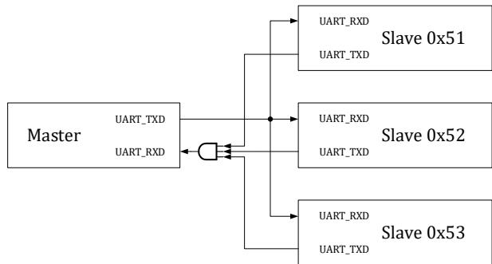  
图 16-3 UART 多机通讯示例

## 16.2.7 校验位

可以通过设置 UART\_CTRL.CK\_EN=1 来使能校验位。同时根据字节长度 UART\_CTRL.BYTE\_LEN 不同，UART 的帧格式有 4 种情况。UART\_CTRL.BIT\_ORDER 的设置，即 LSB first 或 MSB first 不影响帧格式。

表 16-2 UART 帧格式

<table><tr><td>BYTE_LEN</td><td>CK_EN</td><td>UART frame</td></tr><tr><td>0</td><td>0</td><td>| StartBit | 8bit data BIT[7:0] | StopBit |</td></tr><tr><td>0</td><td>1</td><td>| StartBit | 7bit data BIT[6:0] | Parity | StopBit |</td></tr><tr><td>1</td><td>0</td><td>| StartBit | 9bit data BIT[8:0] | StopBit |</td></tr><tr><td>1</td><td>1</td><td>| StartBit | 8bit data BIT[7:0] | Parity | StopBit |</td></tr></table>

## 16.3 寄存器

## 16.3.1 地址分配

UART 基地址 0x40010900。

表 16-3 UART 地址分配列表

<table><tr><td>名称</td><td>偏移地址</td><td>说明</td></tr><tr><td>UART_CTRL</td><td>0x00</td><td>UART 控制寄存器</td></tr><tr><td>UART_DIVH</td><td>0x04</td><td>UART 波特率设置高字节寄存器</td></tr><tr><td>UART_DIVL</td><td>0x08</td><td>UART 波特率设置低字节寄存器</td></tr><tr><td>UART_BUFF</td><td>0x0C</td><td>UART 收发缓冲寄存器</td></tr><tr><td>UART_ADR</td><td>0x10</td><td>485 通信地址匹配寄存器</td></tr><tr><td>UART_STT</td><td>0x14</td><td>UART 状态寄存器</td></tr><tr><td>UART_RE</td><td>0x18</td><td>UART DMA 请求使能寄存器</td></tr><tr><td>UART_IE</td><td>0x1C</td><td>UART 中断使能寄存器</td></tr><tr><td>UART_IF</td><td>0x20</td><td>UART 中断标志寄存器</td></tr><tr><td>UART_IOC</td><td>0x24</td><td>UART IO 控制</td></tr></table>

## 16.3.2 UART\_CTRL UART 控制寄存器

地址:0x4001\_0900

复位值:0x0

表 16-4 UART 控制寄存器 UART\_CTRL

<table><tr><td>15</td><td>14</td><td>13</td><td>12</td><td>11</td><td>10</td><td>9</td><td>8</td><td>7</td><td>6</td><td>5</td><td>4</td><td>3</td><td>2</td><td>1</td><td>0</td></tr><tr><td rowspan="3" colspan="9"></td><td>Resv.</td><td>MD_EN</td><td>CK_EN</td><td>CK_TYPE</td><td>BIT_ORDER</td><td>STOP_LEN</td><td>BYTE_LEN</td></tr><tr><td>RW</td><td>RW</td><td>RW</td><td>RW</td><td>RW</td><td>RW</td><td>RW</td></tr><tr><td>0</td><td>0</td><td>0</td><td>0</td><td>0</td><td>0</td><td>0</td></tr></table>

<table><tr><td>位置</td><td>位名称</td><td>说明</td></tr><tr><td>[31:7]</td><td></td><td>未使用</td></tr><tr><td>[6]</td><td></td><td>保留</td></tr><tr><td>[5]</td><td>MD_EN</td><td>使能 Multi-drop,默认值为 0。0:关闭;1:开启</td></tr><tr><td>[4]</td><td>CK_EN</td><td>数据校验开关,默认值为 0。0:关闭;1:开启</td></tr><tr><td>[3]</td><td>CK_TYPE</td><td>奇偶校验配置,默认值为 0。0:偶校验(EVEN);1:奇校验(ODD)</td></tr><tr><td>[2]</td><td>BIT_ORDER</td><td>数据发送顺序配置,默认值为0。0:LSB;1:MSB</td></tr><tr><td>[1]</td><td>STOP_LEN</td><td>停止位长度配置,默认值为0。0:1-Bit;1:2-Bit</td></tr><tr><td>[0]</td><td>BYTE_LEN</td><td>数据长度配置,默认值为0。0:8-Bit;1:9-Bit</td></tr></table>

## 16.3.3 UART\_DIVH UART 波特率设置高字节寄存器

地址:0x4001\_0904

复位值:0x0

表 16-5 UART 波特率设置高字节寄存器 UART\_DIVH

<table><tr><td>15</td><td>14</td><td>13</td><td>12</td><td>11</td><td>10</td><td>9</td><td>8</td><td>7</td><td>6</td><td>5</td><td>4</td><td>3</td><td>2</td><td>1</td><td>0</td></tr><tr><td rowspan="3" colspan="8"></td><td colspan="8">DIVH</td></tr><tr><td colspan="8">RW</td></tr><tr><td colspan="8">0</td></tr></table>

<table><tr><td>位置</td><td>位名称</td><td>说明</td></tr><tr><td>[31:8]</td><td></td><td>未使用</td></tr><tr><td>[7:0]</td><td>DIVH</td><td>波特率设置高字节BAUDRATE =主时钟/(1+256* UART_DIVH+UART_DIVL)</td></tr></table>

## 16.3.4 UART\_DIVL UART 波特率设置低字节寄存器

地址:0x4001\_0908

复位值:0x0

表 16-6 UART 波特率设置低字节寄存器 UART\_DIVL

<table><tr><td colspan="2">15 14 13 12 11 10 9 8 7 6 5 4 3 2 1 0</td></tr><tr><td rowspan="3"></td><td>DIVL</td></tr><tr><td>RW</td></tr><tr><td>0</td></tr></table>

<table><tr><td>位置</td><td>位名称</td><td>说明</td></tr><tr><td>[31:8]</td><td></td><td>未使用</td></tr><tr><td>[7:0]</td><td>DIVL</td><td>波特率设置低字节BAUDRATE =主时钟/(1+256* UART_DIVH+UART_DIVL)</td></tr></table>

## 16.3.5 UART\_BUFF UART 收发缓冲寄存器

表 16-7 UART 收发缓冲寄存器 UART\_BUFF

<table><tr><td colspan="2">15 14 13 12 11 10 9 8 7 6 5 4 3 2 1 0</td></tr><tr><td rowspan="3"></td><td>BUFF</td></tr><tr><td>RW</td></tr><tr><td>0</td></tr></table>

<table><tr><td>位置</td><td>位名称</td><td>说明</td></tr><tr><td>[31:9]</td><td></td><td>未使用</td></tr><tr><td>[8:0]</td><td>BUFF</td><td>写:发送数据缓存;读:接收数据寄存器</td></tr></table>

UART 的 Tx\_buffer 和 Rx\_buffer 共享 UART\_BUFF。其中，Tx\_buffer 是只写的，Rx\_buffer 是只读的。因此，读 UART\_BUFF 寄存器是访问 UART\_RX\_BUFF，写 UART\_BUFF 寄存器是访问 UART\_TX\_BUFF。

当 UARTx\_CTRL.BYTE\_LEN=0 时，UART 收发只使用 buffer 低 8 位，即 UARTx\_BUFF[7:0]；

当 $\mathrm { U A R T x _ { \mathrm { - } } C T R L . B Y T E \_ L E N = 1 }$ 时，UART 收发使用 buffer 全部 9 位，即 UARTx\_BUFF[8:0]。

如果使能 UARTx\_CTRL.CK\_EN，即使用校验位，则 UARTx\_BUFF 的最高位（BIT8 whenUARTx\_CTRL.BYTE\_LEN=1 or BIT7 UARTx\_CTRL.BYTE\_LEN=0）数据无效，发送时会被替换为校验位，接收时会作为校验位，而不会写入UARTx\_BUFF。

## 16.3.6 UART\_ADR UART 地址匹配寄存器

地址:0x4001\_0910

复位值:0x0

表 16-8 UART 地址匹配寄存器 UART\_ADR

<table><tr><td>15</td><td>14</td><td>13</td><td>12</td><td>11</td><td>10</td><td>9</td><td>8</td><td>7</td><td>6</td><td>5</td><td>4</td><td>3</td><td>2</td><td>1</td><td>0</td></tr><tr><td rowspan="3" colspan="8"></td><td colspan="8">ADR</td></tr><tr><td colspan="8">RW</td></tr><tr><td colspan="8">0</td></tr></table>

<table><tr><td>位置</td><td>位名称</td><td>说明</td></tr><tr><td>[31:8]</td><td></td><td>未使用</td></tr><tr><td>[7:0]</td><td>ADR</td><td>多机通讯时的从机地址</td></tr></table>

## 16.3.7 UART\_STT UART 状态寄存器

地址:0x4001\_0914

复位值:0x0

表 16-9 UART 状态寄存器 UART\_STT

<table><tr><td colspan="4">15 14 13 12 11 10 9 8 7 6 5 4 3 2 1 0</td></tr><tr><td rowspan="3"></td><td>ADR_MATCH</td><td>TX_DONE</td><td>TX_BUF_EMPTY</td></tr><tr><td>R</td><td>R</td><td>R</td></tr><tr><td>0</td><td>1</td><td>1</td></tr></table>

<table><tr><td>位置</td><td>位名称</td><td>说明</td></tr><tr><td>[31:3]</td><td></td><td>未使用</td></tr><tr><td>[2]</td><td>ADR_MATCH</td><td>Multi-drop 模式下,地址匹配标志位。1:匹配;0:未匹配。</td></tr><tr><td>[1]</td><td>TX_DONE</td><td>发送完成标志位。1:完成;0:未完成。</td></tr><tr><td>[0]</td><td>TX_BUF_EMPTY</td><td>发送缓存状态位。1:空;0:非空。</td></tr></table>

## 16.3.8 UART\_RE UART DMA 请求使能寄存器

地址分别是:0x4001\_0918

复位值:0x0

表 16-10 UART DMA 请求使能寄存器 UART\_RE

<table><tr><td colspan="4">15 14 13 12 11 10 9 8 7 6 5 4 3 2 1 0</td></tr><tr><td rowspan="3"></td><td>TX_BUF_EMPTY_RE</td><td>RX_DONE_RE</td><td>TX_DONE_RE</td></tr><tr><td>RW</td><td>RW</td><td>RW</td></tr><tr><td>0</td><td>0</td><td>0</td></tr></table>

<table><tr><td>位置</td><td>位名称</td><td>说明</td></tr><tr><td>[31:3]</td><td></td><td>未使用</td></tr><tr><td>[2]</td><td>TX_BUF_EMPTY_RE</td><td>发送缓冲区空 DMA 请求开关,默认值为 0。0:关闭;1:开启。</td></tr><tr><td>[1]</td><td>RX_DONE_RE</td><td>接收完成 DMA 请求开关,默认值为 0。0:关闭;1:开启。</td></tr><tr><td>[0]</td><td>TX_DONE_RE</td><td>发送完成 DMA 请求开关,默认值为 0。0:关闭;1:开启。</td></tr></table>

## 16.3.9 UART\_IE UART 中断使能寄存器

地址:0x4001\_091C

复位值:0x0

表 16-11 UART 中断使能寄存器 UART\_IE

<table><tr><td>15</td><td>14</td><td>13</td><td>12</td><td>11</td><td>10</td><td>9</td><td>8</td><td>7</td><td>6</td><td>5</td><td>4</td><td>3</td><td>2</td><td>1</td><td>0</td></tr><tr><td rowspan="3" colspan="9"></td><td>Resv.</td><td>Resv.</td><td>CK_ERR_IE</td><td>STOP_ERR_IE</td><td>TX_BUF_EMPTY_IE</td><td>RX_DONE_IE</td><td>TX_DONE_IE</td></tr><tr><td>RW</td><td>RW</td><td>RW</td><td>RW</td><td>RW</td><td>RW</td><td>RW</td></tr><tr><td>0</td><td>0</td><td>0</td><td>0</td><td>0</td><td>0</td><td>0</td></tr></table>

<table><tr><td>位置</td><td>位名称</td><td>说明</td></tr><tr><td>[31:7]</td><td></td><td>未使用</td></tr><tr><td>[6:5]</td><td></td><td>保留位,必须为0</td></tr><tr><td>[4]</td><td>CK_ERR_IE</td><td>校验错误中断开关,默认值为0。0:关闭;1:开启</td></tr><tr><td>[3]</td><td>STOP_ERR_IE</td><td>停止位错误中断开关,默认值为0。0:关闭;1:开启</td></tr><tr><td>[2]</td><td>TX_BUF_EMPTY_IE</td><td>发送缓冲区空中断开关,默认值为0。0:关闭;1:开启</td></tr><tr><td>[1]</td><td>RX_DONE_IE</td><td>接收完成中断开关,默认值为0。0:关闭;1:开启</td></tr><tr><td>[0]</td><td>TX_DONE_IE</td><td>发送完成中断开关,默认值为0。0:关闭;1:开启</td></tr></table>

## 16.3.10 UART\_IF UART 中断标志寄存器

地址:0x4001\_0920

复位值:0x0

表 16-12 UART 中断使能寄存器 UART\_IF

<table><tr><td>15</td><td>14</td><td>13</td><td>12</td><td>11</td><td>10</td><td>9</td><td>8</td><td>7</td><td>6</td><td>5</td><td>4</td><td>3</td><td>2</td><td>1</td><td>0</td></tr><tr><td colspan="11"></td><td>CK_ERR_IF</td><td>STOP_ERR_IF</td><td>TX_BUF_EMPTY_IF</td><td>RX_DONE_IF</td><td>TX_DONE_IF</td></tr><tr><td colspan="11" rowspan="2"></td><td>RW1C</td><td>RW1C</td><td>RW1C</td><td>RW1C</td><td>RW1C</td></tr><tr><td>0</td><td>0</td><td>1</td><td>0</td><td colspan="11">1</td></tr></table>

<table><tr><td>位置</td><td>位名称</td><td>说明</td></tr><tr><td>[31:7]</td><td></td><td>未使用</td></tr><tr><td>[6:5]</td><td></td><td>保留</td></tr><tr><td>[4]</td><td>CK_ERR_IF</td><td>校验错误中断标志,高有效,写1清零</td></tr><tr><td>[3]</td><td>STOP_ERR_IF</td><td>停止位错误中断标志,高有效,写1清零</td></tr><tr><td>[2]</td><td>TX_BUF_EMPTY_IF</td><td>发送缓冲区空中断标志,高有效,写1清零</td></tr><tr><td>[1]</td><td>RX_DONE_IF</td><td>接收完成中断标志,高有效,写1清零</td></tr><tr><td>[0]</td><td>TX_DONE_IF</td><td>发送完成中断标志,高有效,写1清零</td></tr></table>

中断标志写 1 清零，一般不建议用如下|=方式清零，因为|=是先读取中断标志，将对应位改为 1再写入清零，如果同时有其他中断标志置位，会被一起清零，而这通常不是软件所期望的。例如，如下写法本意是清零 TX\_DONE\_IF，但如果同时 RX\_DONE\_IF 在写入执行前置 1 了，则软件先读取回UART\_IF 值为 0x2，然后执行或操作 $0 \mathrm { x } 2 | 0 \mathrm { x } 1 { = } 0 \mathrm { x } 3$ ，然后写入，同时对 RX\_DONE\_IF 和 TX\_DONE\_IF进行了清零，可能导致UART少进入一次因接收数据产生的中断，从而少接收到一字节数据。

$$
U A R T \_ I F | = 0 x 1;
$$

如果希望清零TX\_DONE\_IF 标志位，应以如下方式，直接对BIT0写 1.

$$
U A R T \_ I F = 0 x 1;
$$

## 16.3.11 UART\_IOC UART IO 控制寄存器

地址:0x4001\_0924

复位值:0x0

表 16-13 UART IO 控制寄存器 UART\_IOC

<table><tr><td colspan="9">15 14 13 12 11 10 9 8 7 6 5 4 3 2 1 0</td><td></td></tr><tr><td rowspan="3" colspan="6"></td><td>Resv.</td><td rowspan="3"></td><td>TXD_INV</td><td>RXD_INV</td></tr><tr><td>RW</td><td>RW</td><td>RW</td></tr><tr><td>0</td><td>0</td><td>0</td></tr></table>

<table><tr><td>位置</td><td>位名称</td><td>说明</td></tr><tr><td>[31:5]</td><td></td><td>未使用</td></tr><tr><td>[4]</td><td></td><td>保留</td></tr><tr><td>[3:2]</td><td></td><td>未使用</td></tr><tr><td>[1]</td><td>TXD_INV</td><td>TXD 输出极性使能开关,默认值为 0。0:正常输出;1:取反输出。正常输出极性,即软件发送1,硬件发送1;取反输出极性,即应用发送1,硬件发送0。</td></tr><tr><td>[0]</td><td>RXD_INV</td><td>RXD输入极性使能开关,默认值为0。0:正常输入;1:取反输入。正常输入极性,即硬件接收到1,软件接收的是1;取反输入极性,即硬件接收1,软件接收的是0。</td></tr></table>

## 17 DMA

## 17.1 概述

DMA和CPU同为芯片总线的主设备。

如图 17-1 所示。其中部分设备不需要被 DMA 访问，仅仅挂载于与 CPU 相连的总线上。ADC/DAC/SPI/I2C/MCPWM/UART/Timer/GPIO/Hall/SRAM 等设备可以被 CPU 和 DMA 共享访问。

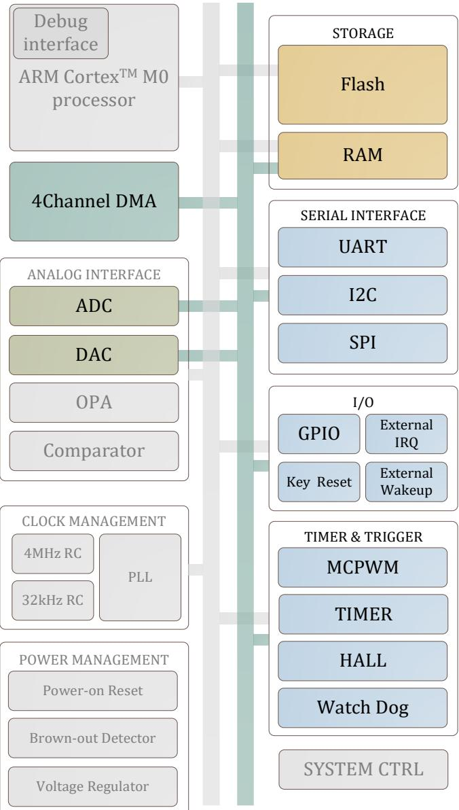  
图 17-1 multi-layer AHB 总线架构

DMA有4 个通道，共享一个搬运引擎。当DMA 空闲且多个通道同时发生请求时，按优先级进行仲裁，但在搬运过程中不会发生抢占，即一定是某个通道完成搬运，DMA 空闲后，才会发起仲裁，判断下一个获得请求的通道是哪一个。

DMA 的 传 输 有 两 种 方 式 ：DMA\_CCRx.RMODE=1， 多 个 轮 次 ， 每 轮 传 输 内 传 输 一 次；DMA\_CCRx.RMODE=0，一轮，连续传输多次。

如果配置一轮传输多次数据，即 DMA\_CCRx.RMODE=0，则一次 DMA 请求，DMA 连续发送DMA\_CTMSx 次数据，然后硬件将 DMA\_CCRx.EN 位清零，置位中断标志。

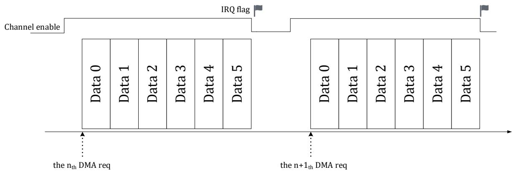  
图 17-2 RMODE=0 DMA 传输情况

如果配置某个通道为多轮搬运，则在多轮搬运之间，DMA 可能会响应其他通道的搬运请求。多轮传输每轮只搬运一次数据，搬运 DMA\_CTMSx 轮后，硬件将 DMA\_CCRx.EN 位清零，置位中断标志。

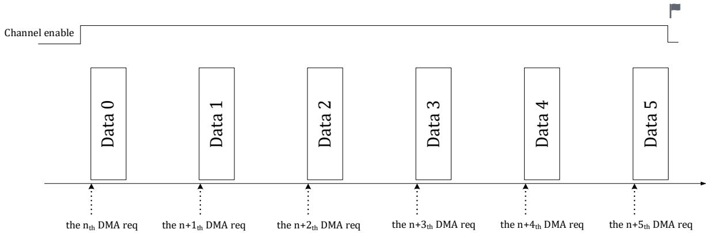  
图 17-3 RMODE=1 DMA 传输情况  
如果配置某个通道为多轮搬运，则在多轮搬运之间，DMA 可能会响应其他通道的搬运请求。

每发生一次 DMA 请求，DMA 开始一轮传输，完成一轮(多次)传输后，根据当前 DMA 通道的请求情况响应下一次请求，下一次请求可以仍为当前通道请求，也可以是其他通道请求，或者在无请求的情况下进入空闲状态，同时当前 DMA通道待传输轮数减 1。当DMA待传输轮数为 0时，当前通道的传输全部完成，DMA 产生中断，同时 DMA 通道使能 DMA\_CCRx.EN 被硬件自动清零。在传输过程中，待传输轮数可以通过 DMA\_CTMSx 寄存器读取。一轮传输内待传输次数不支持读取，因为 DMA会连续进行多次传输，因此次数值会快速变化。

出于功耗控制考虑，DMA模块可以通过设置DMA\_CTRL.EN位为0 来禁用（要求关闭 DMA 使能前先关闭通道对应的使能DMA\_CCRx.EN），此时DMA时钟被门控关闭。

DMA 支持 8, 16 或 32 bit (byte, half-word, or word) 三种位宽的传输操作，通过配置DMA\_CCRx.SBTW 和DMA\_CCRx.DBTW来选择源地址和目的地址访问的位宽，源地址访问的位宽与目

的地址访问的位宽可以不同。

DMA 每完成一次传输，地址根据 DMA\_CCRx.SINC 和 DMA\_CCRx.DINC 决定是否自动递增。所有的外设寄存器地址都是 word 对齐的，所以外设的地址递增应配置为 0/4。例如对于 UART/SPI/I2C，因为每次都是访问UART\_DATA或SPI/I2C FIFO接口的固定地址，所以轮次间无需地址递增；如要访问ADC数据寄存器，则地址通常需要自动加4，可以设置轮内递增。而对于内存，如果设置了轮内递增，每次地址递增的值，根据内存数据位宽(DMA\_CCRx.SBTW/DBTW)设定，对于内存访问位宽为 byte的情况，地址自动加1，对于half-word，地址自动加 2，对于word，地址自动加4。

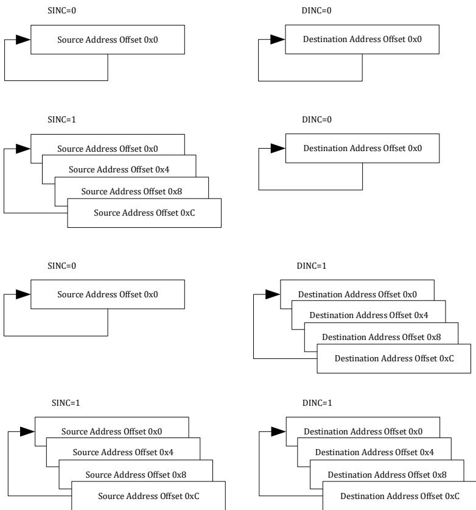  
图 17-4DMA 地址递增控制

图 17-4 仅为地址递增示例，配置为一轮传输 4 次，或传输 4 轮，源地址和目的地址数据尺寸均为word。实际应用中，如果配置数据尺寸为 byte或halfword，则地址偏移按照1/2 进行递增。

一般，SINC=0，DINC=0，源地址、目的地址均不递增，可能为外设到外设的搬运。

SINC=1，DINC=0，源地址递增，目的地址不递增，可能为内存数组到外设寄存器接口的搬运。

SINC=0，DINC=1，源地址不递增，目的地址递增，可能为外设寄存器接口到内存数组的搬运。

SINC=1，DINC=1，源地址、目的地址均递增，为外设多组数据(如 ADC\_DATx)到内存数组的搬运。

DMA 有循环模式和单次模式两种模式，由 DMA\_CCRx.CIRC 控制。循环模式下 DMA 完成一轮数据块搬运后重新开始下一轮搬运，如果是搬运数据到内存，则覆盖之前搬运至内存的数据；如果是搬运至外设，则重复一轮数据发射。以将 UART 数据搬运至内存为例，则在循环模式下 DMA 完成一轮（一字节）搬运后重新开始下一轮搬运，不设置DMA传输完成中断标志位。

注意：循环模式下，如果设置了地址递增，如 DMA\_CCRx.SINC 或 DMA\_CCRx.DINC=1，DMA 固定使用256大小的地址空间，达到 256后计数回0。通常，循环模式用于UART/SPI/I2C的数据搬运至内存，通过查询DMA\_CTMSx得知传输数据已经累积足够长度后，比如达到一个数据帧的长度，CPU进行数据处理。因此，需要内存中开辟256 大小的char型数组。

单次模式下，DMA 完成一定大小的数据块搬运后即完成本次 DMA 操作，设置完成 DMA 传输完成中断标志位，同时硬件自动关闭对应的 DMA 通道，即硬件电路自动在该通道传输完成后将DMA\_CCRx.EN 设为 0。DMA 需要搬运的轮次由 DMA\_CTMS 寄存器进行控制。

## 17.2 请求

DMA 的 请 求 分 为 软 件 请 求 和 硬 件 请 求 两 类 ， 软 件 请 求 通 过 设 置 对 应 DMA 通 道 的DMA\_RENx.SW\_TRIG=1 来产生，写 1 即产生，软件触发位设置后需要软件清零。硬件请求通常为外设的中断事件，当特定的外设中断事件作为 DMA 传输请求时，通常要禁用对应事件的中断响应，即不再需要CPU 对中断进行响应，响应仅作为 DMA 传输请求。而且硬件 DMA 请求信号经过 DMA 通道受理后会被DMA 硬件清零，无需软件清除提起请求的外设中断标志。

表 17-1 DMA 请求

<table><tr><td>触发来源</td><td>描述</td></tr><tr><td>软件</td><td>软件触发时进行的搬运操作由配置寄存器 DMA_CCRx 指定,当设置了DMA_RENx.SW_TRIG,一旦通道被使能即开始进行 DMA 操作。</td></tr><tr><td>ADC</td><td>ADC 在单段触发模式下,一次完成若干个通道后采样后产生中断请求,由 DMA 把 ADC转换后的值搬运到 SRAM。ADC 单段采样完成中断事件作为 DMA 请求信号,请求信号在得到 DMA 响应后由 DMA 将其清零,无需软件清零;注意此时需要软件同时禁用 ADC采样完成中断,使中断不再被 CPU 响应。</td></tr><tr><td>UART</td><td>串口模块可以使用 UART_IF 触发 DMA 请求,如果 DMA 配置的传输方向是内存到串口,则使用 UART 发送缓冲区空标志作为 DMA 请求信号;如果传输方向是串口到内存,则应使用 UART 接收完成事件产生 DMA 请求信号。事件标志由 DMA 自动清零。UART 在由 DMA 操作时应同样禁用相应中断防止被 CPU 响应。</td></tr><tr><td>SPI</td><td>SPI 模块可以使用接收缓冲区满事件作为 DMA 请求信号,由于 SPI 是同时收发,所以接收缓冲区满既是接收完毕也是发送完毕的事件标志。读取 SPI FIFO 自动清除事件标志。</td></tr><tr><td>I2C</td><td>I2C 模块可以使用 I2C0_SCR.BYTE_CMPLT 即字节发送完成作为触发 DMA 请求,DMA自动清除 I2C 的请求标志。其他 I2C 中断事件仍由 CPU 响应</td></tr><tr><td>Timer</td><td>Timer 可以使用过零/比较/捕获事件作为 DMA 请求,具体 DMA 操作根据配置寄存器设定,通常作为定时事件(如每隔 10ms 触发一次 DMA 操作)</td></tr><tr><td>MCPWM</td><td>MCPWM 模块可以使用过零/计数周期结束/4 个 ADC 触发信号作为 DMA 请求,具体DMA 操作根据配置寄存器设定</td></tr><tr><td>GPIO</td><td>GPIO 中断可以作为 DMA 请求</td></tr><tr><td>HALL</td><td>HALL 中断可以作为 DMA 请求</td></tr></table>

## 17.3 优先级

DMA的优先级采用固定优先级，优先级如图17-5 所示。为避免出现来不及响应某些外设请求的情况，在设计应用软件时应考虑任务实时性，每个通道不配置搬运过于大量的数据导致其他通道得不到及时响应。

如图17-5 所示，优先级由上至下降低。4个DMA通道中，优先级关系为:通道0>通道1>通道2>通道 3 (>号表示优先级高于)。在DMA 各通道内部，通常有多个硬件请求事件和一个软件请求事件，硬件请求优先级高于软件请求。多个硬件请求事件优先级相同。通常，一个 DMA 通道配置一个硬件请求事件使能，多个硬件请求不应在一个通道内同时发生。

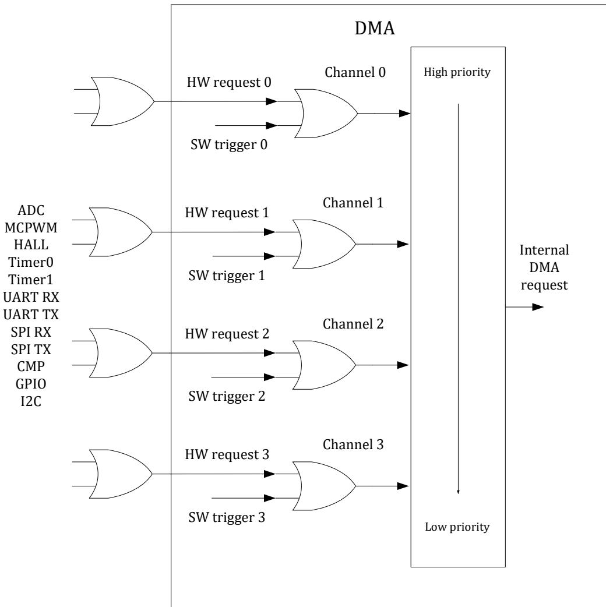  
图 17-5 DMA 通道优先级

## 17.4 仲裁

当DMA 处于空闲状态，或刚刚完成某一通道的DMA传输后，若此时恰好有一个或多个 DMA请求发生，DMA 会根据优先级设定进行仲裁，优先级高的外设请求率先得到 DMA 服务。比如 ADC 连续模式下，每完成一轮 ADC 数据搬运，ADC 的采样完成事件标志被 DMA 清零，DMA 回到空闲状态或转而服务其他外设请求；对于 UART/SPI/I2C，每搬运一个 byte重新仲裁。

为了避免CPU或DMA长期占用外设/SRAM，在外设/SRAM的端口仲裁模块中加入了时间片机制，即一个主设备占用一段时间后释放访问权，仲裁模块观测另一个主设备是否在请求访问，如果是则转而允许另一个主设备访问，否则继续当前主设备未完成的访问。

## 17.5 中断

DMA的一个通道完成 DMA 操作后产生DMA 中断。当 DMA 某一个通道完成操作后，会自动关闭该通道的使能为 DMA\_CCRx.EN。

## 17.6 寄存器

## 17.6.1 地址分配

DMA控制器模块寄存器的基地址是0x4001\_0A00，寄存器列表如下:

表 17-2 DMA 寄存器列表

<table><tr><td>名称</td><td>偏移地址</td><td>说明</td></tr><tr><td>DMA_CCR0</td><td>0x00</td><td>DMA 通道 0 通道配置寄存器</td></tr><tr><td>DMA_RENO</td><td>0x04</td><td>DMA 通道 0 请求使能寄存器</td></tr><tr><td>DMA_CTMSO</td><td>0x08</td><td>DMA 通道 0 传输次数寄存器</td></tr><tr><td>DMA_SADR0</td><td>0x0C</td><td>DMA 通道 0 源地址寄存器</td></tr><tr><td>DMA_DADR0</td><td>0x10</td><td>DMA 通道 0 目的地址寄存器</td></tr><tr><td colspan="3"></td></tr><tr><td>DMA_CCR1</td><td>0x20</td><td>DMA 通道 1 通道配置寄存器</td></tr><tr><td>DMA_REN1</td><td>0x24</td><td>DMA 通道 1 请求使能寄存器</td></tr><tr><td>DMA_CTMS1</td><td>0x28</td><td>DMA 通道 1 传输次数寄存器</td></tr><tr><td>DMA_SADR1</td><td>0x2C</td><td>DMA 通道 1 源地址寄存器</td></tr><tr><td>DMA_DADR1</td><td>0x30</td><td>DMA 通道 1 目的地址寄存器</td></tr><tr><td colspan="3"></td></tr><tr><td>DMA_CCR2</td><td>0x40</td><td>DMA 通道 2 通道配置寄存器</td></tr><tr><td>DMA_REN2</td><td>0x44</td><td>DMA 通道 2 请求使能寄存器</td></tr><tr><td>DMA_CTMS2</td><td>0x48</td><td>DMA 通道 2 传输次数寄存器</td></tr><tr><td>DMA_SADR2</td><td>0x4C</td><td>DMA 通道 2 源地址寄存器</td></tr><tr><td>DMA_DADR2</td><td>0x50</td><td>DMA 通道 2 目的地址寄存器</td></tr><tr><td colspan="3"></td></tr><tr><td>DMA_CCR3</td><td>0x60</td><td>DMA 通道 3 通道配置寄存器</td></tr><tr><td>DMA_REN3</td><td>0x64</td><td>DMA 通道 3 请求使能寄存器</td></tr><tr><td>DMA_CTMS3</td><td>0x68</td><td>DMA 通道 3 传输次数寄存器</td></tr><tr><td>DMA_SADR3</td><td>0x6C</td><td>DMA 通道 3 源地址寄存器</td></tr><tr><td>DMA_DADR3</td><td>0x70</td><td>DMA 通道 3 目的地址寄存器</td></tr><tr><td colspan="3"></td></tr><tr><td>DMA_CTRL</td><td>0x80</td><td>DMA 控制寄存器</td></tr><tr><td>DMA_IE</td><td>0x84</td><td>DMA 中断使能寄存器</td></tr><tr><td>DMA_IF</td><td>0x88</td><td>DMA 中断标志寄存器</td></tr></table>

## 17.6.2 DMA\_CTRL DMA 控制寄存器

地址:0x4001\_0A80

复位值:0x0

表 17-3 DMA 控制寄存器 DMA\_CTRL

<table><tr><td>15</td><td>14</td><td>13</td><td>12</td><td>11</td><td>10</td><td>9</td><td>8</td><td>7</td><td>6</td><td>5</td><td>4</td><td>3</td><td>2</td><td>1</td><td>0</td></tr><tr><td rowspan="3" colspan="15"></td><td>EN</td></tr><tr><td>RW</td></tr><tr><td>0</td></tr></table>

<table><tr><td>位置</td><td>位名称</td><td>说明</td></tr><tr><td>[31:1]</td><td></td><td>未使用</td></tr><tr><td>[0]</td><td>EN</td><td>DMA 整体使能</td></tr></table>

## 17.6.3 DMA\_IE DMA 中断使能寄存器

地址:0x4001\_0A84

复位值:0x0

表 17-4 DMA 中断使能寄存器 DMA\_IE

<table><tr><td colspan="5">15 14 13 12 11 10 9 8 7 6 5 4 3 2 1 0</td></tr><tr><td rowspan="3"></td><td>CH3_FIE</td><td>CH2_FIE</td><td>CH1_FIE</td><td>CH0_FIE</td></tr><tr><td>RW</td><td>RW</td><td>RW</td><td>RW</td></tr><tr><td>0</td><td>0</td><td>0</td><td>0</td></tr></table>

<table><tr><td>位置</td><td>位名称</td><td>说明</td></tr><tr><td>[31:4]</td><td></td><td>未使用</td></tr><tr><td>[3]</td><td>CH3_FIE</td><td>通道 3 完成中断使能</td></tr><tr><td>[2]</td><td>CH2_FIE</td><td>通道 2 完成中断使能</td></tr><tr><td>[1]</td><td>CH1_FIE</td><td>通道 1 完成中断使能</td></tr><tr><td>[0]</td><td>CHO_FIE</td><td>通道 0 完成中断使能</td></tr></table>

## 17.6.4 DMA\_IF DMA 中断标志寄存器

地址:0x4001\_0A88

复位值:0x0

表 17-5 DMA 中断标志寄存器 DMA\_IF

<table><tr><td>15</td><td>14</td><td>13</td><td>12</td><td>11</td><td>10</td><td>9</td><td>8</td><td>7</td><td>6</td><td>5</td><td>4</td><td>3</td><td>2</td><td>1</td><td>0</td></tr><tr><td rowspan="3" colspan="12"></td><td>CH3.FIF</td><td>CH2.FIF</td><td>CH1.FIF</td><td>CH0.FIF</td></tr><tr><td>RWIC</td><td>RWIC</td><td>0</td><td>0</td></tr><tr><td>0</td><td>0</td><td>0</td><td>0</td></tr></table>

<table><tr><td>位置</td><td>位名称</td><td>说明</td></tr><tr><td>[31:4]</td><td></td><td>未使用</td></tr><tr><td>[3]</td><td>CH3_FIF</td><td>通道 3 完成中断标志,高有效,写 1 清零</td></tr><tr><td>[2]</td><td>CH2_FIF</td><td>通道 2 完成中断标志,高有效,写 1 清零</td></tr><tr><td>[1]</td><td>CH1_FIF</td><td>通道 1 完成中断标志,高有效,写 1 清零</td></tr><tr><td>[0]</td><td>CHO_FIF</td><td>通道 0 完成中断标志,高有效,写 1 清零</td></tr></table>

## 17.6.5 DMA 通道配置寄存器

## 17.6.5.1 DMA\_CCRx (where x =0,1,2,3)

地址分别是:0x4001\_0A00，0x4001\_0A18，0x4001\_0A30，0x4001\_0A48

复位值:0x0

表 17-6 DMA 通道配置寄存器 DMA\_CCRx

<table><tr><td>15</td><td>14</td><td>13</td><td>12</td><td>11</td><td>10</td><td>9</td><td>8</td><td>7</td><td>6</td><td>5</td><td>4</td><td>3</td><td>2</td><td>1</td><td>0</td></tr><tr><td rowspan="3" colspan="4"></td><td colspan="2">SBTW</td><td colspan="2">DBTW</td><td rowspan="3"></td><td>SINC</td><td rowspan="3"></td><td>DINC</td><td>CIRC</td><td rowspan="3"></td><td>RMODE</td><td>EN</td></tr><tr><td colspan="2">RW</td><td colspan="2">RW</td><td>RW</td><td>RW</td><td>RW</td><td>RW</td><td>RW</td></tr><tr><td colspan="2">0</td><td colspan="2">0</td><td>0</td><td>0</td><td>0</td><td>0</td><td>0</td></tr></table>

<table><tr><td>位置</td><td>位名称</td><td>说明</td></tr><tr><td>[31:12]</td><td></td><td>未使用</td></tr><tr><td>[11:10]</td><td>SBTW</td><td>源地址访问位宽0: Byte1: Halfword2: Word3: 保留</td></tr><tr><td>[9:8]</td><td>DBTW</td><td>目的地址访问位宽0: Byte1: Halfword2: Word3: 保留</td></tr><tr><td>[7]</td><td></td><td>未使用</td></tr><tr><td>[6]</td><td>SINC</td><td>源地址递增方式0:不递增1:每传输一次,地址按照SBTW对应大小递增1/2/4</td></tr><tr><td>[5]</td><td></td><td>未使用</td></tr><tr><td>[4]</td><td>DINC</td><td>目的地址递增方式0:不递增1:每传输一次,地址按照DBTW对应大小递增1/2/4</td></tr><tr><td>[3]</td><td>CIRC</td><td>循环模式,高有效</td></tr><tr><td>[2]</td><td></td><td>未使用</td></tr><tr><td>[1]</td><td>RMODE</td><td>0:单轮传输,一轮连续传输多次,每收到DMA请求传输一轮,一个DMA请求即传输完毕1:多轮,每轮进行一次数据传输,每收到DMA请求传输一轮,多个DMA请求才传输完毕不支持多轮×多次传输</td></tr><tr><td>[0]</td><td>EN</td><td>通道使能,高有效,软件置1开启通道进行DMA搬运操作,搬运完成后DMA硬件将此位清零</td></tr></table>

## 17.6.5.2 DMA\_RENx (where x = 0,1,2,3)

地址分别是:0x4001\_0A04，0x4001\_0A1C，0x4001\_0A34，0x4001\_0A4C

复位值:0x0

表 17-7 DMA 请求使能寄存器 DMA\_ RENx

<table><tr><td>15</td><td>14</td><td>13</td><td>12</td><td>11</td><td>10</td><td>9</td><td>8</td><td>7</td><td>6</td><td>5</td><td>4</td><td>3</td><td>2</td><td>1</td><td>0</td></tr><tr><td>SW_TRIG</td><td>I2C</td><td>GPIO</td><td>CMP</td><td>SPI TX</td><td>SPI RX</td><td rowspan="3" colspan="2"></td><td>UART TX</td><td>UART RX</td><td>TIMER1</td><td>TIMER0</td><td rowspan="3"></td><td>HALL</td><td>MCPWM</td><td>ADC</td></tr><tr><td>RW</td><td>RW</td><td>RW</td><td>RW</td><td>RW</td><td>RW</td><td>RW</td><td>RW</td><td>RW</td><td>RW</td><td>RW</td><td>RW</td><td>RW</td></tr><tr><td>0</td><td>0</td><td>0</td><td>0</td><td>0</td><td>0</td><td>0</td><td>0</td><td>0</td><td>0</td><td>0</td><td>0</td><td>0</td></tr></table>

一般，DMA 的通道中配置的内存、外设地址应与使能的外设中断请求相对应，这一点需要由应用软件保证。其中软件请求始终处于使能状态，即软件向 DMA\_RENx.SW\_TRIG 写1 即开始一次DMA传输。来自外设的硬件请求进入 DMA 后通过OR逻辑形成一个请求信号，每一个 DMA通道一般在同一时间只使能一个硬件 DMA 请求。软件触发标志 DMA\_RENx.SW\_TRIG 在请求被 DMA 受理后由硬件自动清除。

由于 CMP 信号可能是一个慢速的电平信号，在使用 CMP 触发 DMA 时，推荐将中断触发类型选择为边沿触发。

DMA\_RENx 寄存器可以在 DMA 通道使能的情况下改写。

## 17.6.5.3 DMA\_CTMSx (where x = 0,1,2,3)

地址分别是:0x4001\_0A08，0x4001\_0A20，0x4001\_0A38，0x4001\_0A50

复位值:0x0

表 17-8 DMA 传输次数寄存器 DMA\_CTMSx

<table><tr><td>15</td><td>14</td><td>13</td><td>12</td><td>11</td><td>10</td><td>9</td><td>8</td><td>7</td><td>6</td><td>5</td><td>4</td><td>3</td><td>2</td><td>1</td><td>0</td></tr><tr><td rowspan="3" colspan="8"></td><td colspan="8">TMS</td></tr><tr><td colspan="8">RW</td></tr><tr><td colspan="8">0</td></tr></table>

<table><tr><td>位置</td><td>位名称</td><td>说明</td></tr><tr><td>[7:0]</td><td>TMS</td><td>DMA 通道 x 数据搬运次数。此寄存器在该通道使能后变为只读。</td></tr></table>

DMA\_CTMSx 寄存器只有在通道禁用，即 DMA\_CCRx.EN=0 之后才可以写入数据。

当 DMA\_CTRL=1 且 DMA\_CCRx.EN=0 时，重新填写 CTMSx 值，可以将 DMA 内部已搬运的轮数次数计数器清零。

当 DMA\_CCRx.RMODE=0 时，表示传输 1 轮，每轮传输 DMA\_CTMS 次数据；

当 DMA\_CCRx.RMODE=1 时，表示传输 DMA\_CTMS 轮，每轮传输一次数据；

LKSMC03x不支持多轮每轮传输多次数据。

以外设数据宽度为 16，内存数据宽度为 32，即 DMA\_CTMSx=16，DMA\_CCRx.RMODE=0 为例，DMA每轮需要读取外设数据 16bit=2byte，写入内存数据32bit=4byte。一共需要搬运 16 轮，即读取外设 32byte，存入内存 64byte；

即使仅仅搬运一轮，也需要设置 CTMS.ROUND =1，而不能让其为0。

当设置DMA\_CCRx.CIRC=1（即循环模式）时，DMA\_CTMSx 不再起作用，相当于无限轮；其他情况需要相应设置 DMA\_CTMSx，如 DMA\_CTMSx=1，且 DMA\_CCRx.RMODE=1 时，用于搬运一轮数据。

当 DMA\_CCRx.RMODE=1 时，DMA\_CTMSx 读出为当前剩余未搬运轮数，当 DMA 传输完成后轮数会复位为配置值。次数读出时一直为配置值。举例来说，比如配置 DMA\_CTMSx=4，读取时可能看到DMA\_CTMSx 由4开始递减，3,2,1…之后又变为0。当 DMA 当前通道需要重新进行4 轮传输时，需要重新向 DMA\_CTMSx 写入轮数值。当 DMA\_CCRx.RMODE=0 时，DMA\_CTMSx 读出为当前这一轮剩余未搬运次数。但由于一轮内的数据是被 DMA 连续搬运的，所以软件读出的DMA\_CTMSx 会迅速变化。

注意，每次重新开启 DMA 通道前，都要重新配置 DMA\_CTMSx 寄存器，已经在上一次传输中DMA\_CTMSx 寄存器已经递减为 0。

## 17.6.5.4 DMA\_SADRx (where x = 0,1,2,3)

地址分别是:0x4001\_0A0C，0x4001\_0A24，0x4001\_0A3C，0x4001\_0A54

复位值:0x0

表 17-9 DMA 源地址寄存器 DMA\_ SADRx

<table><tr><td>31</td><td>30</td><td>29</td><td>28</td><td>27</td><td>26</td><td>25</td><td>24</td><td>23</td><td>22</td><td>21</td><td>20</td><td>19</td><td>18</td><td>17</td><td>16</td></tr><tr><td colspan="16">ADDR</td></tr><tr><td colspan="16">RW</td></tr><tr><td colspan="16">0</td></tr><tr><td>15</td><td>14</td><td>13</td><td>12</td><td>11</td><td>10</td><td>9</td><td>8</td><td>7</td><td>6</td><td>5</td><td>4</td><td>3</td><td>2</td><td>1</td><td>0</td></tr></table>

<table><tr><td>ADDR</td></tr><tr><td>RW</td></tr><tr><td>0</td></tr></table>

<table><tr><td>位置</td><td>位名称</td><td>说明</td></tr><tr><td>[31:0]</td><td>ADDR</td><td>DMA 通道 x 源地址</td></tr></table>

当 DMA\_CCRx.SBTW=2’b01 时，即配置为以 16bit 为单位搬运源数据。DMA\_SADRx.ADDR[0]值无效，外设地址会以2 为单位递增。

当 DMA\_CCRx.SBTW=2’b10 时，即配置为以 32bit 为单位搬运外设数据。DMA\_SADRx.ADDR[1:0]值无效，外设地址会以4为单位递增。

注意:DMA\_SADRx 寄存器只有在通道禁用，即 DMA\_CCRx.EN=0之后才可以写入数据！！！

## 17.6.5.5 DMA\_DADRx (where x = 0,1,2,3)

地址分别是:0x4001\_0A10，0x4001\_0A28，0x4001\_0A40，0x4001\_0A58

复位值:0x0

表 17-10 DMA 目的地址寄存器 DMA\_DADRx

<table><tr><td>31</td><td>30</td><td>29</td><td>28</td><td>27</td><td>26</td><td>25</td><td>24</td><td>23</td><td>22</td><td>21</td><td>20</td><td>19</td><td>18</td><td>17</td><td>16</td></tr><tr><td colspan="16">ADDR</td></tr><tr><td colspan="16">RW</td></tr><tr><td colspan="16">0</td></tr><tr><td>15</td><td>14</td><td>13</td><td>12</td><td>11</td><td>10</td><td>9</td><td>8</td><td>7</td><td>6</td><td>5</td><td>4</td><td>3</td><td>2</td><td>1</td><td>0</td></tr><tr><td colspan="16">ADDR</td></tr><tr><td colspan="16">RW</td></tr><tr><td colspan="16">0</td></tr></table>

<table><tr><td>位置</td><td>位名称</td><td>说明</td></tr><tr><td>[31:0]</td><td>ADDR</td><td>DMA 通道 x 目的地址</td></tr></table>

当DMA\_CCRx.DBTW=2’b01时，即配置为以16bit为单位搬运内存数据。DADRx. ADDR[0]值无效，

内存地址会以2 为单位递增。

当 DMA\_CCRx.DBTW=2’b10 时，即配置为以 32bit 为单位搬运内存数据。DADRx. ADDR[1:0]值无效，内存地址会以4 为单位递增。

注意:DMA\_DADRx 寄存器只有在通道禁用，即 DMA\_CCRx.EN=0之后才可以写入数据！！！

## 18 DSP 协处理器

## 18.1 概述

除法器被除数和除数均为32位有符号数，32个总线周期（最高48MHz）完成计算。

除数为0时，除法计算结果不确定。

除法器的操作数：被除数、除数应限幅为-(2^31-1) \~ (2^31-1)，不支持赋值为-2^31。

使用除法器时，软件应先写入被除数 DSP\_DID，然后写入除数 DSP\_DIS。写入除数 DSP\_DIS 的同时，触发一次除法操作。除法操作进行过程中，软件可以执行其他指令。但若在除法计算完成前读取结果(DSP\_QUP 或 DSP\_REM)，则 CPU 会等待除法器计算完成取回结果，再继续执行后续指令。在除法计算完成前向除法器写入新的操作数（DSP\_DID或DSP\_DIS）也会导致CPU 进入等待状态，直到除法器完成当前计算才允许新操作数写入。以上两种情况除了导致 CPU 等待若干总线周期，无其他影响。

开方模块被开方数为 32 位无符号数，结果为16 位无符号数，16 个总线周期（最高48MHz）完成计算。

使用开方模块时，写入被开方数 DSP\_RAD 即触发开方器开始运算，运算完毕可以从 DSP\_SQRT寄存器读取开方结果。开方运算计算过程中，软件可以执行其他指令。但若在计算完成前读取结果(DSP\_SQRT)，则 CPU 会等待开方计算完成取回结果，再继续执行后续指令。在开方计算完成前向其写入新操作数(DSP\_RAD)也会导致CPU 进入等待状态，直到开方运算完成当前计算才允许新操作数的写入。以上两种情况除了导致CPU 等待若干总线周期，无其他影响。

## 18.2 寄存器

## 18.2.1 地址分配

除法器寄存器在芯片中的基地址是0x4001\_0B00。

表 18-1 DSP 寄存器列表

<table><tr><td>名称</td><td>偏移</td><td>说明</td></tr><tr><td>DSP_DID</td><td>0x20</td><td>DSP 除法操作被除数</td></tr><tr><td>DSP_DIS</td><td>0x24</td><td>DSP 除法操作除数</td></tr><tr><td>DSP_QUO</td><td>0x28</td><td>DSP 除法操作商</td></tr><tr><td>DSP_REM</td><td>0x2C</td><td>DSP 除法操作余数</td></tr><tr><td>DSP_RAD</td><td>0x30</td><td>DSP 开方操作被开方数</td></tr><tr><td>DSP_SQRT</td><td>0x34</td><td>DSP 开方操作平方根</td></tr></table>

## 18.2.2 DSP 除法相关寄存器

18.2.2.1 DSP\_DID

地址:0x4001\_0B20

复位值:0x0

表 18-2 除法被除数寄存器

<table><tr><td>31</td><td>30</td><td>29</td><td>28</td><td>27</td><td>26</td><td>25</td><td>24</td><td>23</td><td>22</td><td>21</td><td>20</td><td>19</td><td>18</td><td>17</td><td>16</td></tr><tr><td></td><td></td><td></td><td></td><td></td><td></td><td></td><td></td><td>DID</td><td></td><td></td><td></td><td></td><td></td><td></td><td></td></tr><tr><td></td><td></td><td></td><td></td><td></td><td></td><td></td><td></td><td>WO</td><td></td><td></td><td></td><td></td><td></td><td></td><td></td></tr><tr><td></td><td></td><td></td><td></td><td></td><td></td><td></td><td></td><td>0</td><td></td><td></td><td></td><td></td><td></td><td></td><td></td></tr><tr><td>15</td><td>14</td><td>13</td><td>12</td><td>11</td><td>10</td><td>9</td><td>8</td><td>7</td><td>6</td><td>5</td><td>4</td><td>3</td><td>2</td><td>1</td><td>0</td></tr></table>

<table><tr><td>DID</td></tr><tr><td>WO</td></tr><tr><td>0</td></tr></table>

<table><tr><td>位置</td><td>位名称</td><td>说明</td></tr><tr><td>[31:0]</td><td>DID</td><td>除法被除数寄存器</td></tr></table>

18.2.2.2 DSP\_DIS

地址:0x4001\_0B24

复位值:0x0

表 18-3 除法除数寄存器

<table><tr><td>31</td><td>30</td><td>29</td><td>28</td><td>27</td><td>26</td><td>25</td><td>24</td><td>23</td><td>22</td><td>21</td><td>20</td><td>19</td><td>18</td><td>17</td><td>16</td></tr><tr><td></td><td></td><td></td><td></td><td></td><td></td><td></td><td>DIS</td><td></td><td></td><td></td><td></td><td></td><td></td><td></td><td></td></tr><tr><td></td><td></td><td></td><td></td><td></td><td></td><td></td><td>WO</td><td></td><td></td><td></td><td></td><td></td><td></td><td></td><td></td></tr><tr><td></td><td></td><td></td><td></td><td></td><td></td><td></td><td>0</td><td></td><td></td><td></td><td></td><td></td><td></td><td></td><td></td></tr></table>

<table><tr><td>DIS</td></tr><tr><td>WO</td></tr><tr><td>0</td></tr></table>

<table><tr><td>位置</td><td>位名称</td><td>说明</td></tr><tr><td>[31:0]</td><td>DIS</td><td>除法除数寄存器</td></tr></table>

18.2.2.3 DSP\_QUO

地址:0x4001\_0B28

复位值:0x0

表 18-4 除法商寄存器

<table><tr><td>31</td><td>30</td><td>29</td><td>28</td><td>27</td><td>26</td><td>25</td><td>24</td><td>23</td><td>22</td><td>21</td><td>20</td><td>19</td><td>18</td><td>17</td><td>16</td></tr><tr><td></td><td></td><td></td><td></td><td></td><td></td><td></td><td></td><td></td><td></td><td></td><td></td><td></td><td></td><td></td><td></td></tr><tr><td></td><td></td><td></td><td></td><td></td><td></td><td></td><td></td><td></td><td></td><td></td><td></td><td></td><td></td><td></td><td></td></tr><tr><td></td><td></td><td></td><td></td><td></td><td></td><td></td><td></td><td></td><td></td><td></td><td></td><td></td><td></td><td></td><td></td></tr><tr><td></td><td></td><td></td><td></td><td></td><td></td><td></td><td></td><td></td><td></td><td></td><td></td><td></td><td></td><td></td><td></td></tr><tr><td>15</td><td>14</td><td>13</td><td>12</td><td>11</td><td>10</td><td>9</td><td>8</td><td>7</td><td>6</td><td>5</td><td>4</td><td>3</td><td>2</td><td>1</td><td>0</td></tr></table>

<table><tr><td>QUO</td></tr><tr><td>RO</td></tr><tr><td>0</td></tr></table>

<table><tr><td>位置</td><td>位名称</td><td>说明</td></tr><tr><td>[31:0]</td><td>QUO</td><td>商寄存器</td></tr></table>

18.2.2.4 DSP\_REM

地址:0x4001\_0B2C

复位值:0x0

表 18-5 除法余数寄存器

<table><tr><td>31</td><td>30</td><td>29</td><td>28</td><td>27</td><td>26</td><td>25</td><td>24</td><td>23</td><td>22</td><td>21</td><td>20</td><td>19</td><td>18</td><td>17</td><td>16</td></tr><tr><td></td><td></td><td></td><td></td><td></td><td></td><td></td><td>REM</td><td></td><td></td><td></td><td></td><td></td><td></td><td></td><td></td></tr><tr><td></td><td></td><td></td><td></td><td></td><td></td><td></td><td>RO</td><td></td><td></td><td></td><td></td><td></td><td></td><td></td><td></td></tr><tr><td></td><td></td><td></td><td></td><td></td><td></td><td></td><td>0</td><td></td><td></td><td></td><td></td><td></td><td></td><td></td><td></td></tr><tr><td>15</td><td>14</td><td>13</td><td>12</td><td>11</td><td>10</td><td>9</td><td>8</td><td>7</td><td>6</td><td>5</td><td>4</td><td>3</td><td>2</td><td>1</td><td>0</td></tr></table>

<table><tr><td>REM</td></tr><tr><td>RO</td></tr><tr><td>0</td></tr></table>

<table><tr><td>位置</td><td>权限</td><td>说明</td></tr><tr><td>[31:0]</td><td>REM</td><td>除法余数寄存器</td></tr></table>

## 18.2.3 DSP 开方相关寄存器

18.2.3.1 DSP\_RAD

地址：0x4001\_0B30

复位值：0x0

表 18-6 DSP 被开方数寄存器

<table><tr><td>31</td><td>30</td><td>29</td><td>28</td><td>27</td><td>26</td><td>25</td><td>24</td><td>23</td><td>22</td><td>21</td><td>20</td><td>19</td><td>18</td><td>17</td><td>16</td></tr><tr><td></td><td></td><td></td><td></td><td></td><td></td><td></td><td></td><td></td><td></td><td></td><td></td><td></td><td></td><td></td><td></td></tr><tr><td></td><td></td><td></td><td></td><td></td><td></td><td></td><td></td><td></td><td></td><td></td><td></td><td></td><td></td><td></td><td></td></tr><tr><td></td><td></td><td></td><td></td><td></td><td></td><td></td><td></td><td></td><td></td><td></td><td></td><td></td><td></td><td></td><td></td></tr><tr><td></td><td></td><td></td><td></td><td></td><td></td><td></td><td></td><td></td><td></td><td></td><td></td><td></td><td></td><td></td><td></td></tr><tr><td>15</td><td>14</td><td>13</td><td>12</td><td>11</td><td>10</td><td>9</td><td>8</td><td>7</td><td>6</td><td>5</td><td>4</td><td>3</td><td>2</td><td>1</td><td>0</td></tr></table>

<table><tr><td>RAD</td></tr><tr><td>WO</td></tr><tr><td>0</td></tr></table>

<table><tr><td>位置</td><td>位名称</td><td>说明</td></tr><tr><td>[31:0]</td><td>RAD</td><td>DSP 被开方数寄存器</td></tr></table>

18.2.3.2 DSP\_SQRT

地址：0x4001\_0B34

复位值：0x0

表 18-7 DSP 平方根寄存器

<table><tr><td>15</td><td>14</td><td>13</td><td>12</td><td>11</td><td>10</td><td>9</td><td>8</td><td>7</td><td>6</td><td>5</td><td>4</td><td>3</td><td>2</td><td>1</td><td>0</td></tr><tr><td colspan="16">SQRT</td></tr><tr><td colspan="16">RO</td></tr><tr><td colspan="16">0</td></tr></table>

<table><tr><td>位置</td><td>位名称</td><td>说明</td></tr><tr><td>[31:16]</td><td></td><td>保留,读出时恒为 0</td></tr><tr><td>[15:0]</td><td>SQRT</td><td>DSP 平方根寄存器</td></tr></table>

当CPU需要使用DSP开方器时，向DSP写入被开方数可以触发一次开方操作，开方计算期间读取开方结果DSP\_SQRT会使 CPU进入等待状态，等待开方计算完成并通过总线返回计算结果。软件可以在写入操作数后立即读取开方结果。

## 19 IWDG 独立看门狗

## 19.1 概述

独立看门狗使用 64kHz 低速 RC(LRC/LSI)时钟进行工作，在系统主时钟停止的情况下仍可保证正常工作。

独立看门狗内部包含一个21bit递减计数器，启动后从配置值开始递减计数。独立看门狗可以配置产生系统休眠唤醒源，作为定时唤醒源。在超时情况下也可以产生全芯片复位信号。当 MCU 进入深度休眠状态时，包括 PLL/HRC 在内的系统时钟关闭，而 LRC 时钟是一直存在的，所以独立看门狗可以继续正常工作。

通常看门狗的定时唤醒门限值小于超时复位门限值，但大于 0x8，即独立看门狗重新装载后从IWDG\_RTH 开始递减计数，当计数到 IWDG\_WTH 时产生唤醒信号。通常如果要使用 IWDG 进行休眠定时唤醒，在进入休眠前将 IWDG刷新重置，IWDG从 IWDG\_RTH开始递减计数，在经过一段时间后产生IWDG 唤醒信号。如果不使能IWDG 休眠定时唤醒，当IWDG 产生全芯片复位时也可以将芯片从休眠中解除，但同时会复位 MCU所有寄存器配置。

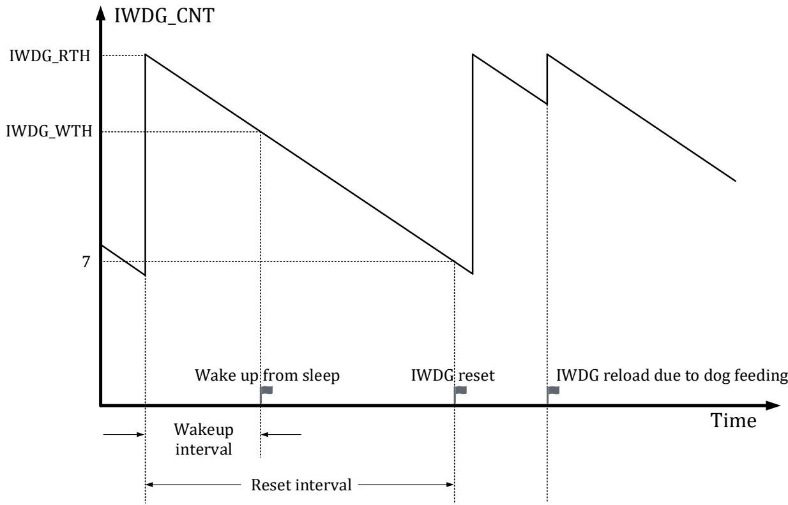  
图 19-1 IWDG 计数时序

独立看门狗超时复位时间由如下公式计算

$$
\text { Timeout } _ {\text { IWDG }} = \text { t } _ {\text { LRC }} \times (\text { IWDG\_RTH - 7 })
$$

独立看门狗唤醒时间由如下公式计算

Wakeup<sub>IWDG</sub>=t<sub>LRC</sub>×(IWDG\_RTH-IWDG\_WTH)

其中 Timeout<sub>IWDG</sub>为独立看门狗超时复位时间，Wakeup<sub>IWDG</sub>为独立看门狗唤醒时间，t<sub>LRC</sub>为 LRC时钟周期，1/64kHz=31.25uS，IWDG\_RTH 为独立看门狗超时复位门限值，IWDG\_WTH 为独立看门狗唤醒门限值。

IWDG\_RTH=0x001000 对应独立看门狗最小复位时间间隔为 4096/64kHz≈128ms。

IWDG\_RTH=0x1FF000 对应独立看门狗最大复位时间间隔为 511×4096/64kHz≈64s。

关于IWDG 的跨时钟喂狗，需要注意，由于低速 RC 时钟精度有限，不同芯片存在一定偏差，通常低速RC 时钟偏差在全温度范围内不超过±50%。

由于 IWDG 的计数器工作于 LRC 时钟域，而软件运行于系统主时钟域，通常为 PLL 时钟。当软件通过写入 IWDG\_RTH 或写入 IWDG\_CLR 进行喂狗时，从软件进行写入到看门狗计数器被重置，需要最多3个 LRC时钟周期。

因此如果软件需要在喂狗后读取 IWDG\_CNT，至少需要延时3 个LRC 时钟周期，读取 IWDG\_CNT才会发现计数器被重置。

软件写入修改 IWDG\_RTH/IWDG\_WTH/IWDG\_CFG/IWDG\_PSW 等寄存器，写入立即生效，无须等待。只有IWDG\_CNT的重置会延时生效。

## 19.2 寄存器

## 19.2.1 地址分配

IWDG 基地址为 0x40010C00

表 19-1 独立看门狗寄存器

<table><tr><td>名称</td><td>偏移</td><td>说明</td></tr><tr><td>IWDG_PSW</td><td>0x00</td><td>独立看门狗密码寄存器</td></tr><tr><td>IWDG_CFG</td><td>0x04</td><td>独立看门狗配置寄存器</td></tr><tr><td>IWDG_CLR</td><td>0x08</td><td>独立看门狗清零寄存器</td></tr><tr><td>IWDG_WTH</td><td>0x0C</td><td>独立看门狗计数器定时唤醒门限值寄存器</td></tr><tr><td>IWDG_RTH</td><td>0x10</td><td>独立看门狗计数器超时复位门限值寄存器</td></tr><tr><td>IWDG_CNT</td><td>0x14</td><td>独立看门狗计数器当前计数值寄存器</td></tr></table>

## 19.2.2 IWDG\_PSW 独立看门狗密码寄存器

地址:0x4001\_0C00

复位值:0x0

表 19-2IWDG\_PSW 独立看门狗密码寄存器

<table><tr><td>15</td><td>14</td><td>13</td><td>12</td><td>11</td><td>10</td><td>9</td><td>8</td><td>7</td><td>6</td><td>5</td><td>4</td><td>3</td><td>2</td><td>1</td><td>0</td></tr><tr><td></td><td></td><td></td><td></td><td></td><td></td><td></td><td></td><td>PSW</td><td></td><td></td><td></td><td></td><td></td><td></td><td></td></tr><tr><td></td><td></td><td></td><td></td><td></td><td></td><td></td><td></td><td>WO</td><td></td><td></td><td></td><td></td><td></td><td></td><td></td></tr><tr><td></td><td></td><td></td><td></td><td></td><td></td><td></td><td></td><td>0</td><td></td><td></td><td></td><td></td><td></td><td></td><td></td></tr></table>

<table><tr><td>位置</td><td>位名称</td><td>说明</td></tr><tr><td>[31:16]</td><td></td><td>未使用</td></tr><tr><td>[15:0]</td><td>PSW</td><td>写入 0xA6B4,才能对 IWDG_CLR/ IWDG_RTH 等进行写操作,对 IWDG_CLR 或 IWDG_RTH 的写操作会将密码清空,因此每次对看门狗 IWDG_CLR/ IWDG_RTH 寄存器进行写操作前都需要重新写入密码</td></tr></table>

19.2.3 IWDG\_CFG 独立看门狗配置寄存器

地址:0x4001\_0C04

复位值:0x1

表 19-3IWDG\_CFG 独立看门狗配置寄存器

<table><tr><td colspan="4">15 14 13 12 11 10 9 8 7 6 5 4 3 2 1 0</td></tr><tr><td rowspan="3"></td><td>DWK_EN</td><td rowspan="3"></td><td>WDG_EN</td></tr><tr><td>RW</td><td>RW</td></tr><tr><td>0</td><td>1</td></tr></table>

<table><tr><td>位置</td><td>位名称</td><td>说明</td></tr><tr><td>[31:5]</td><td></td><td>未使用</td></tr><tr><td>[4]</td><td>DWK_EN</td><td>深度休眠定时唤醒使能,0:禁用,1:使能</td></tr><tr><td>[3:1]</td><td></td><td>未使用</td></tr><tr><td>[0]</td><td>WDG_EN</td><td>独立看门狗使能,0:禁用,1:使能。默认使能,写1置位,写0同时向[15:8]写入0x3C可清零。当看门狗被禁用时,不再产生复位信号,但仍可计数并产生定时唤醒信号</td></tr></table>

IWDG\_CFG 的写入无需向 IWDG\_PSW 写入密码。

## 19.2.4 IWDG\_CLR 独立看门狗清零寄存器

地址:0x4001\_0C08

复位值:0x0

表 19-4 IWDG\_CLR 看门狗清零寄存器

<table><tr><td>15</td><td>14</td><td>13</td><td>12</td><td>11</td><td>10</td><td>9</td><td>8</td><td>7</td><td>6</td><td>5</td><td>4</td><td>3</td><td>2</td><td>1</td><td>0</td></tr><tr><td colspan="16">IWDG_CLR</td></tr><tr><td colspan="16">WO</td></tr><tr><td colspan="16">0</td></tr></table>

<table><tr><td>位置</td><td>位名称</td><td>说明</td></tr><tr><td>[31:16]</td><td>IWDG_CLR</td><td>未使用</td></tr><tr><td>[15:0]</td><td></td><td>写入字节 16'b0111_1001_1000_110B0,高15位为密码,密码正确时,B[0]才能写入B[0]写入1,则重置WDT计数器为TH,且该bit写入后自动清零,写入0无效</td></tr></table>

IWDG\_CLR 的写入需要先向 IWDG\_PSW 写入密码。

## 19.2.5 IWDG\_WTH独立看门狗定时唤醒门限寄存器

地址:0x4001\_0C0C

复位值:0x001F\_F000

表 19-5IWDG\_WTH独立看门狗超时复位门限寄存器

<table><tr><td>31</td><td>30</td><td>29</td><td>28</td><td>27</td><td>26</td><td>25</td><td>24</td><td>23</td><td>22</td><td>21</td><td>20</td><td>19</td><td>18</td><td>17</td><td>16</td></tr><tr><td rowspan="3" colspan="11"></td><td colspan="5">IWDG_WTH</td></tr><tr><td colspan="5">RW</td></tr><tr><td colspan="5">0x1F</td></tr><tr><td>15</td><td>14</td><td>13</td><td>12</td><td>11</td><td>10</td><td>9</td><td>8</td><td>7</td><td>6</td><td>5</td><td>4</td><td>3</td><td>2</td><td>1</td><td>0</td></tr><tr><td colspan="4">IWDG_WTH</td><td rowspan="3" colspan="12"></td></tr><tr><td colspan="4">RW</td></tr><tr><td colspan="4">0xF</td></tr></table>

<table><tr><td>位置</td><td>位名称</td><td>说明</td></tr><tr><td>[31:21]</td><td rowspan="3">IWDG_WTH</td><td>未使用</td></tr><tr><td>[20:12]</td><td>看门狗定时唤醒门限值,看门狗使用64kHz LRC时钟从IWDG_RTH开始计数,递减计数至IWDG_WTH产生唤醒信号。</td></tr><tr><td>[11:0]</td><td>恒为0</td></tr></table>

IWDG\_WTH 的写入无需向 IWDG\_PSW 写入密码。

## 19.2.6 IWDG\_RTH独立看门狗超时复位门限寄存器

地址:0x4001\_0C10

复位值:0x001F\_F000

表 19-6IWDG\_RTH独立看门狗超时复位门限寄存器

<table><tr><td>31</td><td>30</td><td>29</td><td>28</td><td>27</td><td>26</td><td>25</td><td>24</td><td>23</td><td>22</td><td>21</td><td>20</td><td>19</td><td>18</td><td>17</td><td>16</td></tr><tr><td colspan="11" rowspan="3"></td><td colspan="5">IWDG_RTH</td></tr><tr><td colspan="5">RW</td></tr><tr><td colspan="5">0x1F</td></tr><tr><td>15</td><td>14</td><td>13</td><td>12</td><td>11</td><td>10</td><td>9</td><td>8</td><td>7</td><td>6</td><td>5</td><td>4</td><td>3</td><td>2</td><td>1</td><td>0</td></tr><tr><td colspan="4">IWDG_RTH</td><td colspan="12" rowspan="2"></td></tr><tr><td colspan="4">RW</td></tr><tr><td>0xF</td><td colspan="15"></td></tr></table>

<table><tr><td>位置</td><td>位名称</td><td>说明</td></tr><tr><td>[31:21]</td><td rowspan="3">IWDG_RTH</td><td>未使用</td></tr><tr><td>[20:12]</td><td>看门狗超时复位门限值,也是重新装载值。看门狗使用 64kHz LRC 时钟从 IWDG_RTH 开始计数,计数至 0x7 产生复位。向该寄存器写入 0x0,会被硬件强制改写为 0x1000。先向 IWDG_PSW 写入正确密码才能改写 IWDG_RTH 寄存器。改写 IWDG_RTH 同样具有重置看门狗计数器的作用,看门狗会从新的 IWDG_RTH 开始计数。</td></tr><tr><td>[11:0]</td><td>恒为 0</td></tr></table>

为防止 IWDG\_RTH 被写入为 0，当软件写入值为全 0 时，硬件会强制改写为 0x1000，且寄存器低 12 位恒为 0。IWDG\_RTG 的写入需要向 IWDG\_PSW 写入密码。

## 19.2.7 IWDG\_CNT独立看门狗当前计数值寄存器

地址:0x4001\_0C14

复位值:0x0000\_0000

表 19-7IWDG\_CNT 独立看门狗当前计数值寄存器

<table><tr><td>31</td><td>30</td><td>29</td><td>28</td><td>27</td><td>26</td><td>25</td><td>24</td><td>23</td><td>22</td><td>21</td><td>20</td><td>19</td><td>18</td><td>17</td><td>16</td></tr><tr><td rowspan="3" colspan="11"></td><td colspan="5">IWDG_CNT</td></tr><tr><td colspan="5">R</td></tr><tr><td colspan="5">0x00</td></tr><tr><td>15</td><td>14</td><td>13</td><td>12</td><td>11</td><td>10</td><td>9</td><td>8</td><td>7</td><td>6</td><td>5</td><td>4</td><td>3</td><td>2</td><td>1</td><td>0</td></tr></table>

<table><tr><td>IWDG_CNT</td></tr><tr><td>R</td></tr><tr><td>0x0000</td></tr></table>

<table><tr><td>位置</td><td>位名称</td><td>说明</td></tr><tr><td>[31:21]</td><td rowspan="2">IWDG_CNT</td><td>未使用</td></tr><tr><td>[20:0]</td><td>看门狗当前计数值,此数值≤IWDG_TH</td></tr></table>

## 20 PMU 功耗管理模块

芯片可以通过降低运行时钟频率，关闭部分电路时钟来达到降低功耗的目的。

## 20.1 外设时钟门控

外设时钟由系统高速时钟 MCLK 经过门控或分频而来；当外设不需要使用时可以通过配置SYS\_CLK\_FEN 寄存器关闭相应的外设时钟。对于每一个外设的工作时钟，均有一个时钟门控，详见6.3.7。外设时钟上电后默认是关闭的，使用相应外设模块之前需要由软件来开启。

## 20.2 外设时钟分频

部分外设有独立的时钟分频模块使得该模块可以工作在合适的较低的的时钟频率上。

其中 I2C 使用 SYS\_CLK\_DIV0 作为分频系数，UART 使用 SYS\_CLK\_DIV2 作为分频系数，详见 6.3.3和6.3.6。UART的波特率在 UART模块内部还有一个额外的分频器。

## 20.3 低功耗模式

表 20-1 低功耗模式汇总

<table><tr><td>模式</td><td>模式进入</td><td>模式退出</td><td>PLL/HSI</td><td>LSI</td></tr><tr><td>休眠Sleep</td><td>WFI/WFE</td><td>任意中断Debug 操作外部复位IWDG 复位</td><td>PLL/HSI On, CPU时钟 Off, NVIC/外设时钟 On</td><td rowspan="2">On</td></tr><tr><td>深度休眠Deep Sleep</td><td>SLEEPDEEP + WFI/WFE</td><td>IWDG 定时唤醒IO 唤醒Debug 操作外部复位IWDG 复位</td><td>PLL/HSI Off, CPU/外设时钟 Off</td></tr></table>

## 20.4 Sleep Mode 休眠模式

休眠模式下，CPU时钟被关闭，但NVIC模块仍继续工作，所有的外设模块以及 IO正常工作。

休眠模式对电路供电没有影响，所有寄存器状态和存储器数据在休眠过程中保持正常供电。

\*建议参考官方休眠例程配置，休眠前需要先关闭所有数字模块的时钟，并关闭模拟ADC/OPA/CMP/DAC 等模块。

## 20.4.1 模式进入

休眠模式可以通过执行 WFI/WFE 指令进入。根据 CPU内核SLEEPONEXIT 位的设置情况，休眠

模式的进入有两种不同方式。

Sleep-now:如果 SLEEPONEXIT 为 0，则 CPU 在执行 WFI/WFE 指令后立即进入休眠模式

Sleep-on-exit:如果设置 SLEEPONEXIT 为 1，CPU 在处理完所有中断后进入休眠模式

## 20.4.2 模式退出

如果使用WFI进入休眠，则任意中断可唤醒CPU。

如果使用WFE进入休眠，则外设中断标志或IO唤醒事件可作为唤醒事件。当使用外设中断标志作为唤醒事件时，外设向CPU 提起中断信号，但NVIC 中并不使能对应中断，且需要设置SEVONPEND为1。唤醒后外设中断标志以及 NVIC 中断 pending位需要被软件清除。

使用此种方式进行休眠唤醒可以获得最短唤醒时间，因为不涉及中断的进入退出。

Debug操作可以将芯片从休眠模式中唤醒。

## 20.5 Deep Sleep Mode 深度休眠模式

深度休眠模式关闭所有系统高速时钟，包括PLL/HSI。64kHzRC时钟LSI 仍正常工作。同时 LDO会进入低功耗模式，BGP模块被关闭。

相比休眠模式，深度休眠模式可以进一步降低功耗。

深度休眠模式对电路供电没有影响，所有寄存器状态和存储器数据在深度休眠模式中保持正常供电。

如果有外设需要使用高速时钟完成正在进行中的操作，例如 flash 的擦除写入，则深度休眠会推迟等待操作完成后再进入。

## 20.5.1 模式进入

设置 CPU 内核 System Control Register SLEEPDEEP 为 1，然后通过执行 WFI/WFE 指令进入深度休眠。

## 20.5.2 模式退出

IO唤醒或IWDG 定时唤醒信号可将芯片从深度休眠中唤醒。

外部复位或IWDG复位可复位全芯片，可以解除深度休眠状态。

Debug操作可以将芯片从深度休眠模式中唤醒。

## 20.6 寄存器

## 20.6.1 地址分配

PMU 基地址为 0x40010C20

表 20-2 功耗管理模块地址空间

<table><tr><td>名称</td><td>偏移</td><td>说明</td></tr><tr><td>AON_PWR_CFG</td><td>0x0</td><td></td></tr><tr><td>AON_EVT_RCD</td><td>0x4</td><td>事件记录寄存器</td></tr><tr><td>AON_IO_WAKE_POL</td><td>0x8</td><td>IO 唤醒极性寄存器</td></tr><tr><td>AON_IO_WAKE_EN</td><td>0xC</td><td>IO 唤醒使能寄存器</td></tr></table>

## 20.6.2 AON\_PWR\_CFG 功耗管理配置寄存器

地址:0x4001\_0C20

复位值:0x0

表 20-3 AON\_PWR\_CFG 功耗管理配置寄存器

<table><tr><td colspan="3">15 14 13 12 11 10 9 8 7 6 5 4 3 2 1 0</td></tr><tr><td rowspan="3"></td><td>IOWK_FLT</td><td rowspan="3"></td></tr><tr><td>RW</td></tr><tr><td>1</td></tr></table>

<table><tr><td>位置</td><td>位名称</td><td>说明</td></tr><tr><td>[31:2]</td><td></td><td>未使用</td></tr><tr><td>[1]</td><td>IOWK_FLT</td><td>IO 唤醒信号滤波使能,默认使能</td></tr><tr><td>[0]</td><td></td><td>未使用</td></tr></table>

软件可以选择对IO唤醒信号进行滤波或不滤波，如果启用片内滤波，则 IO信号经过 120us时间常数的滤波后，送入PMU。使用片内IO信号滤波可以在一定的应用场景下代替板级滤波，但会引入120us 左右的唤醒延时。如果不启用片内IO唤醒信号滤波，则应用场景需要保证IO唤醒输入信号稳定无干扰，可以考虑使用板级滤波，从而避免芯片被误唤醒造成不必要的功耗浪费。

## 20.6.3 AON\_EVT\_RCD 事件记录寄存器

地址:0x4001\_0C24

复位值:0x0

表 20-4 AON\_EVT\_RCD 事件记录寄存器

<table><tr><td rowspan="3"></td><td>DEEPSLEEP</td><td>SLEEP</td><td rowspan="3"></td><td>IWDG_WK</td><td>IO_WK</td><td rowspan="3"></td><td>IWDG_RST</td><td>KEY_RST</td><td rowspan="3"></td><td>POR_RST</td></tr><tr><td>RO</td><td>RO</td><td>RO</td><td>RO</td><td>RO</td><td>RO</td><td>RO</td></tr><tr><td>0</td><td>0</td><td>0</td><td>0</td><td>0</td><td>0</td><td>1</td></tr></table>

<table><tr><td>位置</td><td>位名称</td><td>说明</td></tr><tr><td>[31:14]</td><td></td><td>未使用</td></tr><tr><td>[13]</td><td>DEEPSLEEP</td><td>深度休眠记录,高表示发生过</td></tr><tr><td>[12]</td><td>SLEEP</td><td>休眠记录,高表示发生过</td></tr><tr><td>[11:10]</td><td></td><td>未使用</td></tr><tr><td>[9]</td><td>IWDG_WK</td><td>IWDG 定时唤醒记录,高表示 Deep Sleep 休眠被 IWDG 定时唤醒</td></tr><tr><td>[8]</td><td>IO_WK</td><td>IO 唤醒记录,高表示 Deep Sleep 休眠被 IO 唤醒</td></tr><tr><td>[7:4]</td><td></td><td>未使用</td></tr><tr><td>[3]</td><td>IWDG_RST</td><td>独立看门狗复位发生记录,高表示发生过</td></tr><tr><td>[2]</td><td>KEY_RST_RCD</td><td>按键复位发生记录,高表示发生过</td></tr><tr><td>[1]</td><td></td><td>未使用</td></tr><tr><td>[0]</td><td>POR_RST_RCD</td><td>POR 复位发生记录,高表示发生过</td></tr></table>

向 AON\_EVT\_RCD 寄存器写入 0xCA40，清除全部事件记录。由于 EVT\_RCD 工作于 LSI 时钟域，由软件写入密码到完成清除需要 32us。

## 20.6.4 AON\_IO\_WAKE\_POL IO 唤醒极性寄存器

地址:0x4001\_0C28

复位值:0x0

表 20-5 AON\_IO\_WAKE\_POL IO 唤醒源极性配置寄存器

<table><tr><td colspan="2">15 14 13 12 11 10 9 8 7 6 5 4 3 2 1 0</td></tr><tr><td rowspan="3"></td><td>WK_POL</td></tr><tr><td>RW</td></tr><tr><td>0</td></tr></table>

<table><tr><td>位置</td><td>位名称</td><td>说明</td></tr><tr><td>[31:1]</td><td></td><td>未使用</td></tr><tr><td>[0]</td><td>WK_POL</td><td>IO 外部唤醒触发电平选择。1:高电平;0:低电平</td></tr></table>

所有IO唤醒信号使用同一个极性选择。

## 20.6.5 AON\_IO\_WAKE\_EN IO 唤醒使能寄存器

地址:0x4001\_0C2C

复位值:0x0

表 20-6 AON\_IO\_WAKE\_EN IO 唤醒源使能寄存器

<table><tr><td>15</td><td>14</td><td>13</td><td>12</td><td>11</td><td>10</td><td>9</td><td>8</td><td>7</td><td>6</td><td>5</td><td>4</td><td>3</td><td>2</td><td>1</td><td>0</td></tr></table>

<table><tr><td rowspan="3"></td><td>P1_9_EN</td><td>P1_8_EN</td><td>P1_5_EN</td><td>P0_10_EN</td><td>P0_9_EN</td><td>P0_8_EN</td><td>P0_2_EN</td><td>P0_0_EN</td></tr><tr><td>RW</td><td>RW</td><td>RW</td><td>RW</td><td>RW</td><td>RW</td><td>RW</td><td>RW</td></tr><tr><td>0</td><td>0</td><td>0</td><td>0</td><td>0</td><td>0</td><td>0</td><td>0</td></tr></table>

<table><tr><td>位置</td><td>位名称</td><td>说明</td></tr><tr><td>[31:8]</td><td></td><td>未使用</td></tr><tr><td>[7]</td><td>P1_9_EN</td><td>P1[9]外部唤醒触发使能</td></tr><tr><td>[6]</td><td>P1_8_EN</td><td>P1[8]外部唤醒触发使能</td></tr><tr><td>[5]</td><td>P1_5_EN</td><td>P1[5]外部唤醒触发使能</td></tr><tr><td>[4]</td><td>P0_10_EN</td><td>P1[2]外部唤醒触发使能</td></tr><tr><td>[3]</td><td>P0_9_EN</td><td>P0[9]外部唤醒触发使能</td></tr><tr><td>[2]</td><td>P0_8_EN</td><td>P0[8]外部唤醒触发使能</td></tr><tr><td>[1]</td><td>P0_2_EN</td><td>P0[2]外部唤醒触发使能</td></tr><tr><td>[0]</td><td>P0_0_EN</td><td>P0[0]外部唤醒触发使能</td></tr></table>

## 21 版本历史

表 21-1 文档版本历史

<table><tr><td>时间</td><td>版本号</td><td>说明</td></tr><tr><td>2025.07.30</td><td>1.58</td><td>修订 FAIL 信号说明,增加 FAIL 信号分布表</td></tr><tr><td>2025.07.22</td><td>1.57</td><td>修订 FAIL 信号处理说明</td></tr><tr><td>2025.05.15</td><td>1.56</td><td>温度传感器章节增加说明</td></tr><tr><td>2024.06.12</td><td>1.55</td><td>FLAH 章节增加 NVR 校准参数信息</td></tr><tr><td>2024.05.27</td><td>1.54</td><td>修改关于 PLL 时钟精度的说明</td></tr><tr><td>2024.04.03</td><td>1.53</td><td>DAC 增加关于软件校正的说明</td></tr><tr><td>2024.03.25</td><td>1.52</td><td>增加 C 版本 DAC 说明</td></tr><tr><td>2024.03.13</td><td>1.51</td><td>优化 SYS_AFE_INFO 寄存器说明</td></tr><tr><td>2024.01.26</td><td>1.50</td><td>更正 MCPWM FAIL 信号处理的滤波系数部分说明</td></tr><tr><td>2024.01.15</td><td>1.49</td><td>增加关于休眠的说明</td></tr><tr><td>2024.01.10</td><td>1.48</td><td>UTIMER_CFG 寄存器 SRC1 位信息更正ADC_DATx 信息更正</td></tr><tr><td>2023.09.25</td><td>1.47</td><td>增加关于 IWDG 喂狗跨时钟同步问题的说明修正 MCPWM_FAIL3 寄存器说明</td></tr><tr><td>2023.08.30</td><td>1.46</td><td>增加版本号说明</td></tr><tr><td>2023.08.15</td><td>1.45</td><td>GPIO 图增加 ESD 二极管</td></tr><tr><td>2023.04.12</td><td>1.44</td><td>修改 OPA 复用的说明增加 ADC 采样时间的说明</td></tr><tr><td>2023.02.11</td><td>1.43</td><td>增加关于关闭 PLL 等操作的说明</td></tr><tr><td>2022.12.18</td><td>1.42</td><td>去除 NVR 相关描述</td></tr><tr><td>2022.11.28</td><td>1.41</td><td>更新 LRC 时钟频率</td></tr><tr><td>2022.11.24</td><td>1.4</td><td>增加使用 SYS_SFT_RST 软复位 ADC 模块的说明</td></tr><tr><td>2022.11.12</td><td>1.39</td><td>更新 LRC 时钟频率和全温度范围偏差修改 SYS_AFE_INFO.Version 描述</td></tr><tr><td>2022.11.07</td><td>1.38</td><td>增加 IO 与内部模拟电路间连接电阻描述</td></tr><tr><td>2022.10.28</td><td>1.37</td><td>增加 SYS_AFE_INFO.Version 描述修改 MCPWM_DTH0/MCPWM_DTH1 寄存器描述</td></tr><tr><td>2022.10.25</td><td>1.36</td><td>修改 DSP_DIS/DSP_RAD 读写权限,修改供电电压范围</td></tr><tr><td>2022.10.24</td><td>1.35</td><td>增加 TIMER SRC0/1 采样同一个 IO 的描述</td></tr><tr><td>2022.10.14</td><td>1.34</td><td>修改 LRC 时钟频率和全温度范围偏差</td></tr><tr><td>2022.09.29</td><td>1.33</td><td>修改 SYS_OPA_SEL.OPA_SEL_EN 描述,增加写入功能</td></tr><tr><td>2022.09.15</td><td>1.32</td><td>增加 ADC/OPA/CMP 配置流程</td></tr><tr><td>2022.07.29</td><td>1.31</td><td>简化 SYS_AFE_REG 寄存器部分描述</td></tr><tr><td>2021.12.29</td><td>1.3</td><td>新增 SYS_FLSE 和 SYS_FLSP 寄存器描述</td></tr><tr><td>2021.06.23</td><td>1.0</td><td>正式版</td></tr><tr><td>2021.05.08</td><td>0.4</td><td>修改 ADC_CFG.FSM_RS 描述,去掉读取功能修改 SYS_DBG_CFG</td></tr><tr><td>2021.03.18</td><td>0.3</td><td>修改 LRC 时钟频率</td></tr><tr><td>2021.02.02</td><td>0.2</td><td>除 flash/i2c/spi 外,所有章节修改完毕</td></tr><tr><td>2020.12.01</td><td>0.1</td><td>初始版本,包含测试相关说明的内部版本</td></tr></table>

## 免责声明

LKS和LKO为凌鸥创芯注册商标。

南京凌鸥创芯电子有限公司（以下简称：“Linko”）尽力确保本文档内容的准确和可靠，但是保留随时更改、更正、增强、修改产品和/或 文档的权利，恕不另行通知。用户可在下单前获取最新相关信息。

客户应针对应用需求选择合适的 Linko 产品，详细设计、验证和测试您的应用，以确保满足相应标准以及任何安全、安保或其它要求。客户应对此独自承担全部责任。

Linko在此确认未以明示或暗示方式授予Linko或第三方的任何知识产权许可。

Linko产品的转售，若其条款与此处规定不同，Linko对此类产品的任何保修承诺无效。

如有更早期版本文档，一切信息以此文档为准。