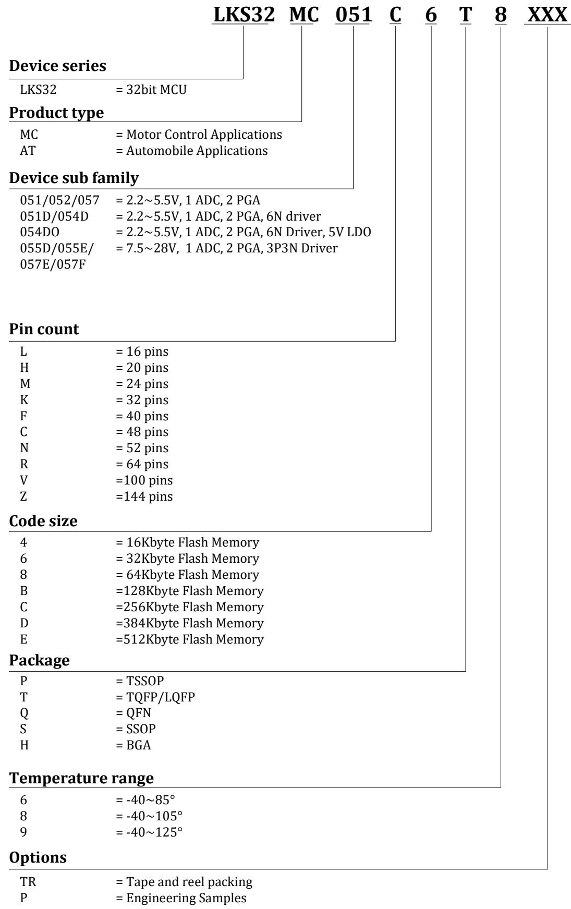
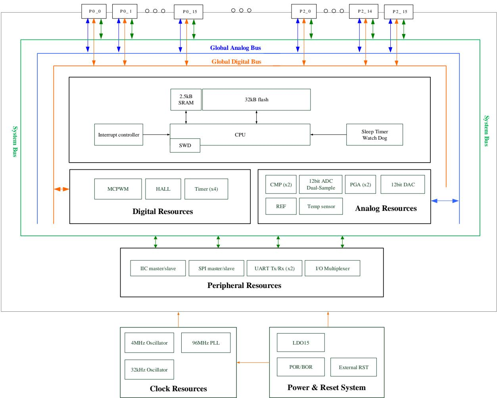
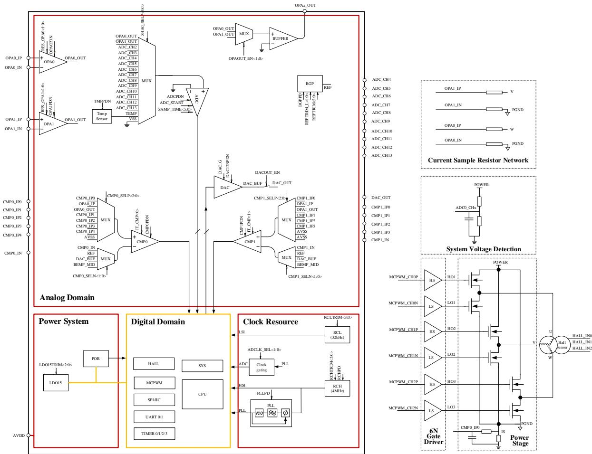
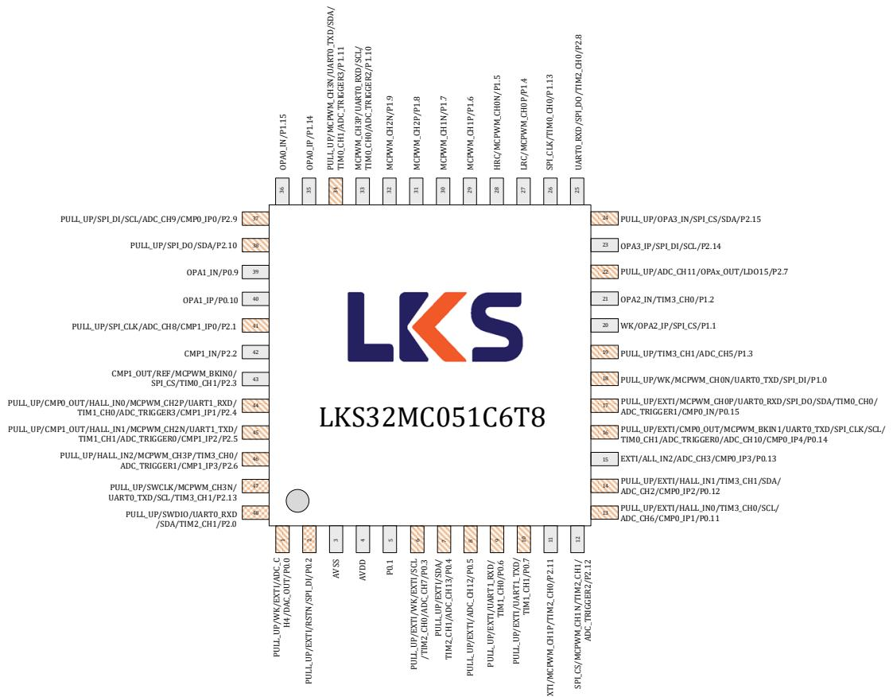
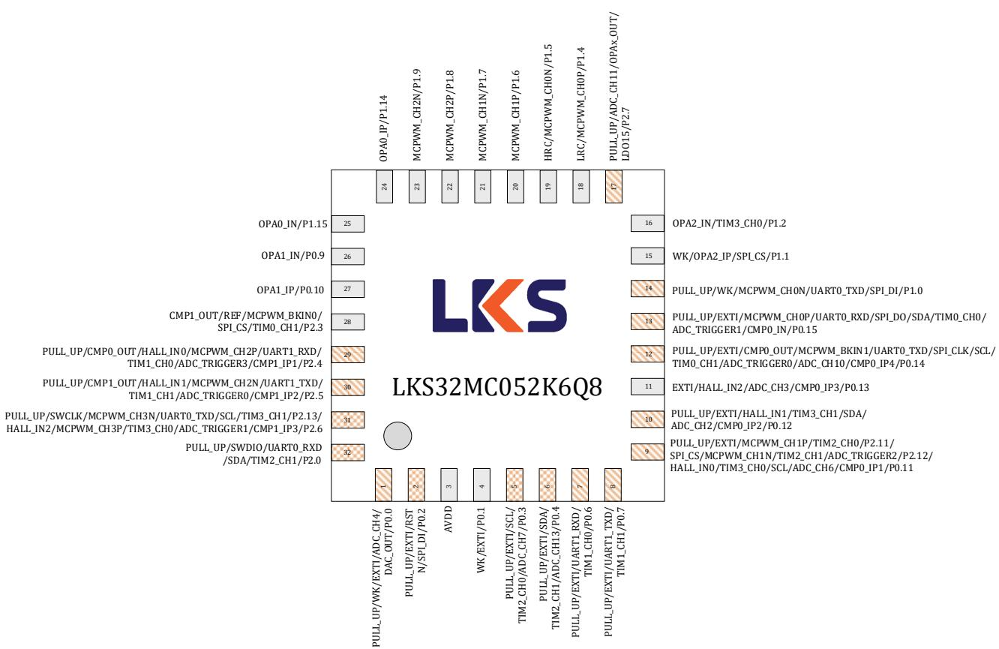
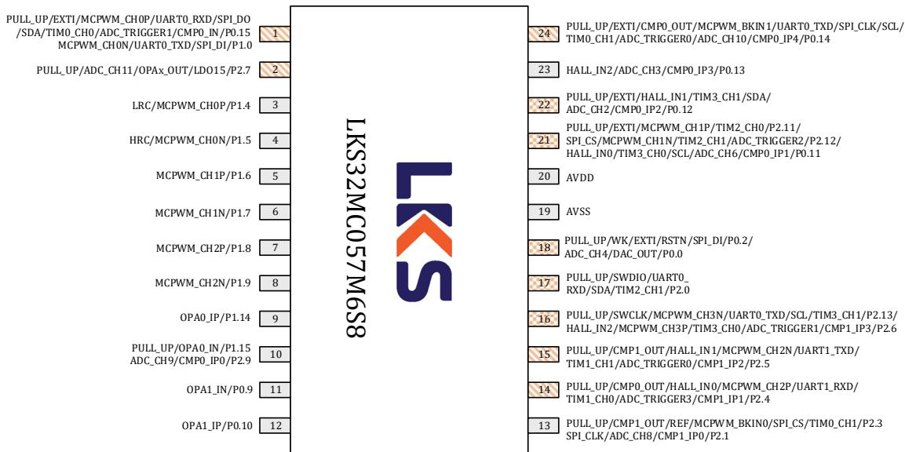
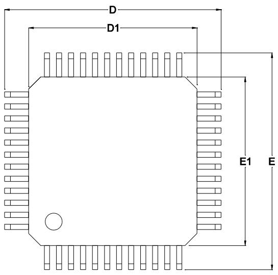
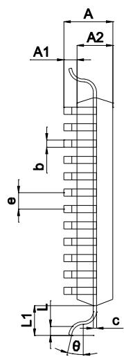
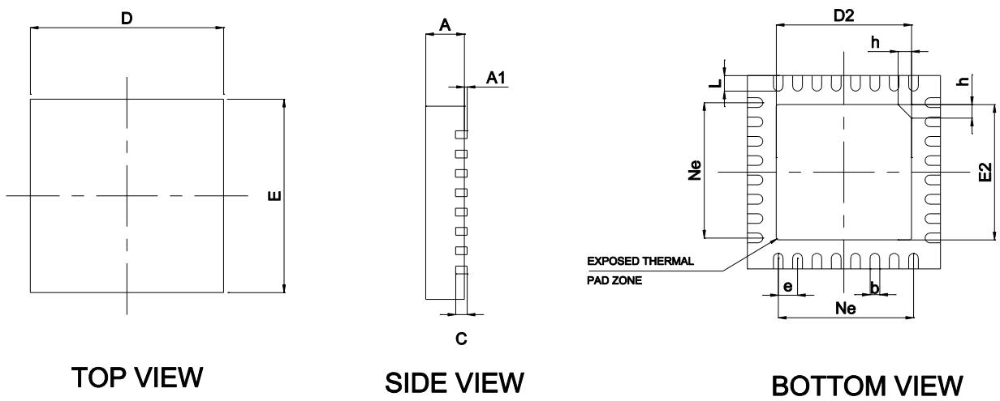
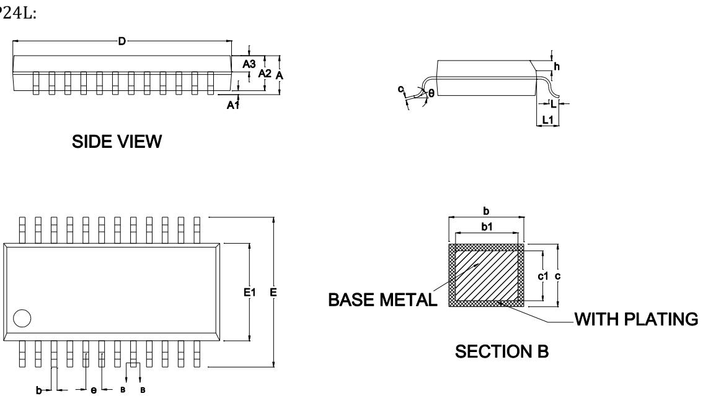

南京凌鸥创芯电子有限公司

# LKS32MC05x

© 2020, 版权归凌鸥创芯所有

机密文件，未经许可不得扩散

## 1 概述

## 1.1 功能简述

LKS32MC05x 是一款 32 位内核的面向电机控制应用的专用处理器，集成了常用电机控制系统所需要的所有模块。

## ⚫ 性能

➢ 96MHz 32 位 Cortex-M0 内核

➢ 低功耗休眠模式

➢ 工业级工作温度范围

➢ 超强抗静电和群脉冲能力

## ⚫ 存储器

➢ 32K Flash，带加密功能，带128位芯片唯一识别码

➢ 2.5K RAM

## ⚫ 工作范围

➢ 2.2V\~5.5V电源供电，内部集成 1个 LDO，为数字部分电路供电

➢ 工作温度: -40\~105℃

## ⚫ 时钟

➢ 内置 4MHz 高精度 RC 时钟，-40\~105℃范围内精度在±1%之内

➢ 内置低速64KHz 低速时钟，供低功耗模式使用

➢ 内部 PLL 可提供最高 96MHz 时钟

## ⚫ 外设模块

➢ 两路 UART

➢ 一路SPI，支持主从模式

➢ 一路 IIC，支持主从模式

➢ 2 个通用16位 Timer，支持捕捉和边沿对齐 PWM功能

➢ 2 个通用32位 Timer，支持捕捉和边沿对齐 PWM功能；

➢ 电机控制专用PWM 模块，支持8路 PWM输出，独立死区控制

➢ Hall 信号专用接口，支持测速、去抖功能

➢ 硬件看门狗

➢ 最多 4 组 16bit GPIO。P0.0/P0.1/P1.0/P1.1 4 个 GPIO 可以作为系统的唤醒源。P0.15 \~ P0.0共 16 个 GPIO 可以用作外部中断源输入

## ⚫ 模拟模块

➢ 集成 1 路 12bit SAR ADC，2Msps 采样及转换速率，共 16 通道

➢ 集成2 路运算放大器，可设置为差分 PGA 模式

➢ 集成两路比较器

➢ 集成 12bit DAC 数模转换器

➢ 内置±2℃温度传感器

➢ 内置 1.2V0.8%精度电压基准源

➢ 内置1 路低功耗 LDO 和电源监测电路

➢ 集成高精度、低温飘高频RC时钟

⚫ 封装：

表 1-1 LKS32MC05x 封装型号汇总表

<table><tr><td>型号</td><td>封装形式</td></tr><tr><td>LKS32MC051C6T8</td><td>TQFP48</td></tr><tr><td>LKS32MC052K6Q8</td><td>QFN5*5 32L-0.75</td></tr><tr><td>LKS32MC057M6S8</td><td>SSOP24L</td></tr></table>

## 1.2 主要优势

➢ 高可靠性、高集成度、最终产品体积小、节约 BOM成本。

➢ 内部集成 2 路高速运放和两路比较器，可满足单电阻/双电阻电流采样拓扑架构的不同需求；

➢ 内部高速运放集成高压保护电路，可以允许高电平共模信号直接输入芯片，可以用最简单的电路拓扑实现 MOSFET电阻直接电流采样模式；

➢ 应用专利技术使 ADC和高速运放达到最佳配合，可处理更宽的电流动态范围，同时兼顾高速小电流和低速大电流的采样精度；

➢ 整体控制电路简洁高效，抗干扰能力强，稳定可靠；

➢ 单电源2.2V\~5.5V供电，确保了系统供电的通用性;

➢ 支持 IEC/UL60730 功能安全认证

适用于有感BLDC/无感BLDC/有感 FOC/无感 FOC 及步进电机、永磁同步、异步电机等控制系统;

## 1.3 命名规则

  
图 1-1 LKS32MC05x 器件命名规则

## 1.4 系统资源

## LKS32MC05x Resource Diagram

  
图 1-2 LKS32MC05x 系统框图

## 1.5 矢量正弦控制系统

  
图 1-3LKS32MC05x 矢量正弦控制系统简化原理图

## 2 器件选型表

表 2-1 LKS05x 系列器件选型表

<table><tr><td></td><td>主频(MHz)</td><td>Flash(kB)</td><td>RAM(kB)</td><td>ADC通道数</td><td>DAC</td><td>比较器</td><td>比较器通道数</td><td>OPA</td><td>HALL</td><td>SPI</td><td>IIC</td><td>UART</td><td>CAN</td><td>Temp.Sensor</td><td>PLL</td><td>QEP</td><td>Gate driver</td><td>预驱电流(A)</td><td>预驱电流(V)</td><td>栅浮耐压(V)</td><td>其他</td><td>Package</td></tr><tr><td>LKS32MC051C6T8</td><td>96</td><td>32</td><td>2.5</td><td>12</td><td>12BITx1</td><td>2</td><td>8</td><td>2</td><td>3路</td><td>1</td><td>1</td><td>2</td><td></td><td>Yes</td><td>Yes</td><td></td><td></td><td></td><td></td><td></td><td></td><td>TQFP48</td></tr><tr><td>LKS32MC051DC6T8</td><td>96</td><td>32</td><td>2.5</td><td>11</td><td>12BITx1</td><td>2</td><td>8</td><td>2</td><td>3路</td><td>1</td><td>1</td><td>2</td><td></td><td>Yes</td><td>Yes</td><td></td><td>6N</td><td>+1.2/-1.5</td><td>4.5~20</td><td>200</td><td></td><td>TQFP48</td></tr><tr><td>LKS32MC052K6Q8</td><td>96</td><td>32</td><td>2.5</td><td>8</td><td>12BITx1</td><td>2</td><td>6</td><td>2</td><td>3路</td><td>1</td><td>1</td><td>2</td><td></td><td>Yes</td><td>Yes</td><td></td><td></td><td></td><td></td><td></td><td></td><td>QFN5*532L-0.75</td></tr><tr><td>LKS32MC054DF6Q8</td><td>96</td><td>32</td><td>2.5</td><td>9</td><td>12BITx1</td><td>2</td><td>8</td><td>2</td><td>3路</td><td>1</td><td>1</td><td>2</td><td></td><td>Yes</td><td>Yes</td><td></td><td>6N</td><td>+1.2/-1.5</td><td>4.5~20</td><td>200</td><td></td><td>QFN5*540L-0.75</td></tr><tr><td>LKS32MC054DOF6Q8</td><td>96</td><td>32</td><td>2.5</td><td>9</td><td>12BITx1</td><td>2</td><td>8</td><td>2</td><td>3路</td><td>1</td><td>1</td><td>2</td><td></td><td>Yes</td><td>Yes</td><td></td><td>6N</td><td>+1.2/-1.5</td><td>4.5~20</td><td>200</td><td>5V LDO</td><td>QFN5*540L-0.75</td></tr><tr><td>LKS32MC055DL6S8</td><td>96</td><td>32</td><td>2.5</td><td>3</td><td>12BITx1</td><td>2</td><td>4</td><td>1</td><td>1路</td><td>1</td><td>1</td><td>2</td><td></td><td>Yes</td><td>Yes</td><td></td><td>3P3N</td><td>+0.05/-0.3</td><td>7.5~28</td><td></td><td>5V LDO</td><td>SOP16L</td></tr><tr><td>LKS32MC055EL6S8</td><td>96</td><td>32</td><td>2.5</td><td>4</td><td>12BITx1</td><td>2</td><td>6</td><td>1</td><td>3路</td><td>1</td><td>1</td><td>2</td><td></td><td>Yes</td><td>Yes</td><td></td><td>3P3N</td><td>+0.05/-0.3</td><td>7.5~28</td><td></td><td>5V LDO</td><td>SOP16L</td></tr><tr><td>LKS32MC057M6S8</td><td>96</td><td>32</td><td>2.5</td><td>6</td><td>12BITx1</td><td>2</td><td>6</td><td>2</td><td>3路</td><td>1</td><td>1</td><td>2</td><td></td><td>Yes</td><td>Yes</td><td></td><td></td><td></td><td></td><td></td><td></td><td>SSOP24L</td></tr><tr><td>LKS32MC057EM6S8</td><td>96</td><td>32</td><td>2.5</td><td>6</td><td>12BITx1</td><td>2</td><td>6</td><td>2</td><td>3路</td><td>1</td><td>1</td><td>2</td><td></td><td>Yes</td><td>Yes</td><td></td><td>3P3N</td><td>+0.05/-0.3</td><td>7.5~28</td><td></td><td>5V LDO</td><td>SSOP24L</td></tr><tr><td>LKS32MC057FM6S8</td><td>96</td><td>32</td><td>2.5</td><td>6</td><td>12BITx1</td><td>2</td><td>6</td><td>2</td><td>3路</td><td>1</td><td>1</td><td>2</td><td></td><td>Yes</td><td>Yes</td><td></td><td>3P3N</td><td>+0.05/-0.3</td><td>7.5~28</td><td></td><td>5V LDO</td><td>SSOP24L</td></tr></table>

## 3 管脚分布

## 3.1 管脚分布图

## 3.1.1 特别说明

下列引脚图中红色 PIN 脚内置上拉至 AVDD 的电阻：

RSTN 引脚内置 100kΩ 上拉电阻，固定开启上拉

SWDIO/SWCLK 内置 10kΩ 上拉电阻，固定开启上拉

其余红色 PIN 脚内置 10kΩ 上拉电阻，可软件控制开启关闭上拉

UARTx\_TX(RX)： UART 的 TX 和 RX 支持互换。当 GPIO 第二功能选择为 UART，且 GPIO\_PIE即输入使能时，可以作为 UART\_RX 使用；当 GPIO\_POE 使能时，可以作为 UART\_TX 使用。一般同一GPIO不同时使能输入和输出，否则输入 PDI 会接收到 PDO发出的数据。

SPI\_DI(DO)：SPI 的 DI 和 DO 支持互换，当 GPIO 第二功能选择为 SPI，且 GPIO\_PIE 即输入使能时，可以作为SPI\_DI 使用；当GPIO\_POE 即输出使能时，可以作为 SPI\_DO使用。一般同一GPIO不同时使能输入和输出，否则输入 PDI会接收到PDO 发出的数据。

## 3.1.2 LKS32MC051C6T8

  
图 3-1 LKS32MC051C6T8 管脚分布图

注意：由于 LKS32MC051C6T8 内部设置，当采样 ADC\_CH8 和 ADC\_CH9 时实际采样的信号分别为OPA2 和OPA3 的输出，如果需要使用 ADC\_CH8/9，需要软件关闭OPA复用。

## 3.1.3 LKS32MC052K6Q8

  
图 3-2 LKS32MC052K6Q8 管脚分布图

## 3.1.4 LKS32MC057M6S8

  
图 3-3 LKS32MC057M6S8 管脚分布图

## 3.2 管脚说明

表 3-1 LKS32MC05x 管脚说明

<table><tr><td rowspan="2">编号</td><td colspan="3">芯片引脚号</td><td rowspan="2">名称</td><td rowspan="2">类型</td><td rowspan="2">功能说明</td></tr><tr><td>051</td><td>052</td><td>057</td></tr><tr><td>1</td><td>1</td><td>1</td><td>18</td><td>PULL_UP/WK/EXTI/ADC_CH4/DAC_OUT/P0.0</td><td>IO</td><td>上拉/唤醒/外部中断/ADC通道4/DAC输出/P0.0,内置可软件开启的10k上拉电阻</td></tr><tr><td>2</td><td>2</td><td>2</td><td>18</td><td>PULL_UP/EXTI/RSTN/SPI_DI(DO)/P0.2</td><td>IO</td><td>上拉/外部中断/RSTN/SPI输入/P0.2,默认作为RSTN使用,外部接一个10nF~100nF的电容到地即可,内部已有100k上拉电阻。建议PCB上在RSTN和AVDD之间放一个10k~20k的上拉电阻,外部有上拉电阻的情况,RSTN的电容固定为100nF。</td></tr><tr><td>3</td><td>3</td><td>0</td><td>19</td><td>AVSS</td><td>GND</td><td>系统地</td></tr><tr><td>4</td><td>4</td><td>3</td><td>20</td><td>AVDD</td><td>PWR</td><td>芯片电源输入,电压范围2.2~5.5V。片外去耦电容建议≥1uF,并尽量靠近AVDD引脚</td></tr><tr><td>5</td><td>5</td><td>4</td><td></td><td>WK/EXTI/P0.1</td><td>IO</td><td>唤醒/外部中断/通用IO口P0.1</td></tr><tr><td>6</td><td>6</td><td>5</td><td></td><td>PULL_UP/EXTI/SCL/TIM2_CH0/ADC_CH7/P0.3</td><td>IO</td><td>上拉/外部中断/IIC时钟/Timer2通道0/ADC通道7/P0.3,内置可软件开启的10k上拉电阻</td></tr><tr><td>7</td><td>7</td><td>6</td><td></td><td>PULL_UP/EXTI/SDA/TIM2_CH1/ADC_CH13/P0.4</td><td>IO</td><td>上拉/外部中断/IIC数据/Timer2通道1/ADC通道13/P0.4,内置可软件开启的10k上拉电阻</td></tr><tr><td>8</td><td>8</td><td></td><td></td><td>PULL_UP/EXTI/ADC_CH12/P0.5</td><td>IO</td><td>上拉/外部中断/ADC通道12/P0.5,内置可软件开启的10k上拉电阻</td></tr><tr><td>9</td><td>9</td><td>7</td><td></td><td>PULL_UP/EXTI/UART1_TX(RX)/TIM1_CH0/P0.6</td><td>IO</td><td>上拉/外部中断/UART1_TX(RX)/Timer1通道0/P0.6,内置可软件开启的10k上拉电阻</td></tr><tr><td>10</td><td>10</td><td>8</td><td></td><td>PULL_UP/EXTI/UART1_TX(RX)/TIM1_CH1/P0.7</td><td>IO</td><td>上拉/外部中断/UART1_TX(RX)/Timer1通道1/P0.7,内置可软件开启的10k上拉电阻</td></tr><tr><td>11</td><td>11</td><td>9</td><td>21</td><td>EXTI/MCPWM_CH1P/TIM2_CH0/P2.11</td><td>IO</td><td>外部中断/电机PWM通道1高边/Timer2通道0/P2.11</td></tr><tr><td>12</td><td>12</td><td>9</td><td>21</td><td>SPI_CS/MCPWM_CH1N/TIM2_CH1/ADC_TRIG2/P2.12</td><td>IO</td><td>SPI CS信号/电机PWM通道1低边/Timer2通道1/ADC触发信号2/P2.12</td></tr><tr><td>13</td><td>13</td><td>9</td><td>21</td><td>PULL_UP/EXTI/HALL_IN0/TIM3_CH0/ADC_CH6/CMP0_IP1/SCL/P0.11</td><td>IO</td><td>上拉/外部中断/Hall传感器A相输入/Timer3通道0/ADC通道6/比较器0正端输入通道1/IIC时钟/P0.11,内置可软件开启的10k上拉电阻</td></tr><tr><td>14</td><td>14</td><td>10</td><td>22</td><td>PULL_UP/EXTI/HALL_IN1/TIM3_CH1/ADC_CH2/CMP0_IP2/SDA/P0.12</td><td>IO</td><td>上拉/外部中断/Hall传感器B相输入/Timer3通道1/ADC通道2/比较器0正端输入通道2/IIC数据/P0.12,内置可软件开启的10k上拉电阻</td></tr><tr><td>15</td><td>15</td><td>11</td><td>23</td><td>EXTI/HALL_IN2/ADC_CH3/CMP0_IP3/P0.13</td><td>IO</td><td>外部中断/Hall传感器C相输入/ADC通道3/比较器0正端输入通道3/P0.13</td></tr><tr><td>16</td><td>16</td><td>12</td><td>24</td><td>PULL_UP/EXTI/CMP0_OUT/MCPWM_BKIN1/UART0_TX(RX)/SPI_CLK/SCL/TIM0_CH1/ADC_TRIG0/ADC_CH10/CMP0_IP4/P0.14</td><td>IO</td><td>上拉/外部中断/比较器0输出/电机PWM终止信号1/UART0_TX(RX)/SPI时钟/IIC时钟/Timer0通道1/ADC触发信号0/ADC通道10/比较器0正端输入通道4/P0.14,内置可软件开启的10k上拉电阻</td></tr><tr><td>17</td><td>17</td><td>13</td><td>1</td><td>PULL_UP/EXTI/MCPWM_CHOP/UART0_TX(RX)/SPI_DI(DO)/SDA/TIM0_CH0/ADC_TRIG1/CMP0_IN/P0.15</td><td>IO</td><td>上拉/外部中断/电机PWM通道0高边/UART0_TX(RX)/SPI_DI(DO)/IIC数据/Timer0通道0/ADC触发信号1/比较器1负端输入/P0.15,内置可软件开启的10k上拉电阻</td></tr><tr><td>18</td><td>18</td><td>14</td><td>1</td><td>PULL_UP/WK/MCPWM_CHON/UART0_TX(RX)/SPI_DI(DO)/P1.0</td><td>IO</td><td>上拉/唤醒/电机PWM通道0低边/UART0_TX(RX)/SPI_DI(DO)/P1.0,内置可软件开启的10k上拉电阻</td></tr><tr><td>19</td><td>19</td><td></td><td></td><td>PULL_UP/TIM3_CH1/ADC_CH5/P1.3</td><td>IO</td><td>上拉/Timer3通道1/ADC通道5/P1.3,内置可软件开启的10k上拉电阻</td></tr><tr><td>20</td><td>20</td><td>15</td><td></td><td>WK/OPA2_IP/SPI_CS/P1.1</td><td>IO</td><td>唤醒/运放2正端输入/SPI_CS信号/P1.1</td></tr><tr><td>21</td><td>21</td><td>16</td><td></td><td>OPA2_IN/TIM3_CH0/P1.2</td><td>IO</td><td>运放2负端输入/Timer3通道0/P1.2</td></tr><tr><td>22</td><td>22</td><td>17</td><td>2</td><td>PULL_UP/ADC_CH11/OPAx_OUT/LDO15/P2.7</td><td>IO</td><td>上拉/ADC通道11/OPAx输出/LDO15输出/P2.7,内置可软件开启的10k上拉电阻</td></tr><tr><td>23</td><td>23</td><td></td><td></td><td>OPA3_IP/SPI_DI(DO)/SCL/P2.14</td><td>IO</td><td>运放3正端输入/SPI_DI(DO)信号/IIC时钟/P2.14</td></tr><tr><td>24</td><td>24</td><td></td><td></td><td>PULL_UP/OPA3_IN/SPI_CS/SDA/P2.15</td><td>IO</td><td>上拉/运放3负端输入/SPI_CS信号/IIC数据/P2.15,内置可软件开启的10k上拉电阻</td></tr><tr><td>25</td><td>25</td><td></td><td></td><td>UART0_TX(RX)/SPI_DI(DO)/TIM2_CH0/P2.8</td><td>IO</td><td>UART0_TX(RX)/ SPI_DI(DO)信号/Timer2通道0/P2.8</td></tr><tr><td>26</td><td>26</td><td></td><td></td><td>SPI_CLK/TIM0_CH0/P1.13</td><td>IO</td><td>SPI_CLK信号/Timer0通道0/P1.13</td></tr><tr><td>27</td><td>27</td><td>18</td><td>3</td><td>LRC/MCPWM_CH0P/P1.4</td><td>IO</td><td>64KHz RC时钟输出/电机PWM通道0高边/P1.4</td></tr><tr><td>28</td><td>28</td><td>19</td><td>4</td><td>HRC/MCPWM_CH0N/P1.5</td><td>IO</td><td>4MHz RC时钟输出/电机PWM通道0低边/P1.5</td></tr><tr><td>29</td><td>29</td><td>20</td><td>5</td><td>MCPWM_CH1P/P1.6</td><td>IO</td><td>电机PWM通道1高边/P1.6</td></tr><tr><td>30</td><td>30</td><td>21</td><td>6</td><td>MCPWM_CH1N/P1.7</td><td>IO</td><td>电机PWM通道1低边/P1.7</td></tr><tr><td>31</td><td>31</td><td>22</td><td>7</td><td>MCPWM_CH2P/P1.8</td><td>IO</td><td>电机PWM通道2高边/P1.8</td></tr><tr><td>32</td><td>32</td><td>23</td><td>8</td><td>MCPWM_CH2N/P1.9</td><td>IO</td><td>电机PWM通道2低边/P1.9</td></tr><tr><td>33</td><td>33</td><td></td><td></td><td>MCPWM_CH3P/UART0_TX(RX)/SCL/TIM0_CH0/ADC_TRIG2/P1.10</td><td>IO</td><td>电机PWM通道3高边/UART0_TX(RX)/IIC时钟/Timer0通道0/ADC触发信号2/P1.10</td></tr><tr><td>34</td><td>34</td><td></td><td></td><td>PULL_UP/MCPWM_CH3N/UART0_TX(RX)/SDA/TIM0_CH1/ADC_TRIG3/SIF/P1.11</td><td>IO</td><td>上拉/电机PWM通道3低边/UART0_TX(RX)/IIC数据/Timer0通道1/ADC触发信号3/P1.11,内置可软件开启的10k上拉电阻</td></tr><tr><td>35</td><td>35</td><td>24</td><td>9</td><td>OPA0_IP/P1.14</td><td>IO</td><td>运放0正端输入/P1.14</td></tr><tr><td>36</td><td>36</td><td>25</td><td>10</td><td>OPA0_IN/P1.15</td><td>IO</td><td>运放0负端输入/P1.15</td></tr><tr><td>37</td><td>37</td><td></td><td>10</td><td>PULL_UP/SPI_DI(DO)/SCL/ADC_CH9/CMP0_IP0/P2.9</td><td>IO</td><td>上拉/SPI_DI(DO)/IIC时钟/ADC通道9/比较器0正端输入通道0/P2.9,内置可软件开启的10k上拉电阻,在051中,由于内部设置,ADC采样通道9时实际采样的OPA2输出</td></tr><tr><td>38</td><td>38</td><td></td><td></td><td>PULL_UP/SPI_DI(DO)/SDA/P2.10</td><td>IO</td><td>上拉/SPI_DI(DO)/IIC数据/P2.10,内置可软件开启的10k上拉电阻</td></tr><tr><td>39</td><td>39</td><td>26</td><td>11</td><td>OPA1_IN/P0.9</td><td>IO</td><td>运放1负端输入/P0.9</td></tr><tr><td>40</td><td>40</td><td>27</td><td>12</td><td>OPA1_IP/P0.10</td><td>IO</td><td>运放1正端输入/P0.10</td></tr><tr><td>41</td><td>41</td><td></td><td>13</td><td>PULL_UP/SPI_CLK/ADC_CH8/CMP1_IP0/P2.1</td><td>IO</td><td>上拉/SPI时钟/ADC通道8/比较器1正端输入通道0/P2.1,内置可软件开启的10k上拉电阻,在051中,由于内部设置,ADC采样通道9时实际采样的OPA2输出</td></tr><tr><td>42</td><td>42</td><td></td><td></td><td>CMP1_IN/P2.2</td><td>IO</td><td>比较器1负端输入/P2.2</td></tr><tr><td>43</td><td>43</td><td>28</td><td>13</td><td>CMP1_OUT/REF/MCPWM_BKI NO/SPI_CS/TIM0_CH1/P2.3</td><td>IO</td><td>比较器1输出/电压参考信号/电机PWM终止信号0/SPI片选信号/P2.3</td></tr><tr><td>44</td><td>44</td><td>29</td><td>14</td><td>PULL_UP/CMP0_OUT/HALL_IN 0/MCPWM_CH2P/UART1_TX(RX)/TIM1_CH0/ADC_TRIG3/CMP1_IP1/P2.4</td><td>IO</td><td>上拉/比较器0输出/Hall传感器A相输入/电机PWM通道2高边/UART1_TX(RX)/Timer1通道0/ADC触发信号3/比较器1正端输入通道1/P2.4,内置可软件开启的10k上拉电阻</td></tr><tr><td>45</td><td>45</td><td>30</td><td>15</td><td>PULL_UP/CMP1_OUT/HALL_IN 1/MCPWM_CH2N/UART1_TX(R</td><td>IO</td><td>上拉/比较器1输出/Hall传感器B相输入/电机PWM通道2低边/UART1_TX(RX)/Timer1通道1/ADC触发信号0/比较器</td></tr></table>

## 管脚分布

<table><tr><td rowspan="2">编号</td><td colspan="3">芯片引脚号</td><td rowspan="2">名称</td><td rowspan="2">类型</td><td rowspan="2">功能说明</td></tr><tr><td>051</td><td>052</td><td>057</td></tr><tr><td></td><td></td><td></td><td></td><td>X)/TIM1_CH1/ADC_TRIG0/CMP1_IP2/P2.5</td><td></td><td>1正端输入通道2/P2.5,内置可软件开启的10k上拉电阻</td></tr><tr><td>46</td><td>46</td><td>31</td><td>16</td><td>PULL_UP/HALL_IN2/MCPWM_CH3P/TIM3_CH0/ADC_TRIG1/CMP1_IP3/P2.6</td><td>IO</td><td>上拉/Hall传感器C相输入/电机PWM通道3高边/Timer3通道0/ADC触发信号1/比较器1正端输入通道3/P2.6,内置可软件开启的10k上拉电阻</td></tr><tr><td>47</td><td>47</td><td>31</td><td>16</td><td>PULL_UP/SWCLK/MCPWM_CH3N/UART0_TX(RX)/SCL/TIM3_CH1/P2.13</td><td>I</td><td>上拉/SWD时钟/电机PWM通道3低边/UART0_TX(RX)/IIC时钟/Timer3通道1/P2.13,内置固定上拉的10k电阻</td></tr><tr><td>48</td><td>48</td><td>32</td><td>17</td><td>PULL_UP/SWDIO/UART0_TX(RX)/SDA/TIM2_CH1/P2.0</td><td>IO</td><td>上拉/SWD数据/UART0_TX(RX)/IIC数据/Timer2通道1/P2.0,内置固定上拉的10k电阻</td></tr></table>

表 3-2 LKS32MC05x 引脚功能选择

<table><tr><td>Port</td><td>AF1</td><td>AF2</td><td>AF3</td><td>AF4</td><td>AF5</td><td>AF6</td><td>AF7</td><td>AF8</td><td>AF9</td><td>AF0</td><td>GPIO</td></tr><tr><td>P0.0</td><td></td><td></td><td></td><td></td><td></td><td></td><td></td><td></td><td></td><td>ADC_CH4, DAC_OUT</td><td>PULL_UP/WK/EXTI</td></tr><tr><td>P0.1</td><td></td><td></td><td></td><td></td><td></td><td></td><td></td><td></td><td></td><td></td><td>WK/EXTI</td></tr><tr><td>P0.2</td><td></td><td></td><td></td><td></td><td>SPI_DI(DO)</td><td></td><td></td><td></td><td></td><td></td><td>PULL_UP/EXTI</td></tr><tr><td>P0.3</td><td></td><td></td><td></td><td></td><td></td><td>SCL</td><td></td><td>TIM2_CH0</td><td></td><td>ADC_CH7</td><td>PULL_UP/EXTI</td></tr><tr><td>P0.4</td><td></td><td></td><td></td><td></td><td></td><td>SDA</td><td></td><td>TIM2_CH1</td><td></td><td>ADC_CH13</td><td>PULL_UP/EXTI</td></tr><tr><td>P0.5</td><td></td><td></td><td></td><td></td><td></td><td></td><td></td><td></td><td></td><td>ADC_CH12</td><td>PULL_UP/EXTI</td></tr><tr><td>P0.6</td><td></td><td></td><td></td><td>UART1_TX(RX)</td><td></td><td></td><td>TIM1_CH0</td><td></td><td></td><td></td><td>PULL_UP/EXTI</td></tr><tr><td>P0.7</td><td></td><td></td><td></td><td>UART1_TX(RX)</td><td></td><td></td><td>TIM1_CH1</td><td></td><td></td><td></td><td>PULL_UP/EXTI</td></tr><tr><td>P0.8</td><td></td><td></td><td></td><td></td><td></td><td></td><td></td><td></td><td></td><td></td><td>EXTI</td></tr><tr><td>P0.9</td><td></td><td></td><td></td><td></td><td></td><td></td><td></td><td></td><td></td><td>OPA1_IP</td><td></td></tr><tr><td>P0.10</td><td></td><td></td><td></td><td></td><td></td><td></td><td></td><td></td><td></td><td>OPA1_IN</td><td></td></tr><tr><td>P0.11</td><td></td><td>HALL_IN0</td><td></td><td></td><td></td><td>SCL</td><td></td><td>TIM3_CH0</td><td></td><td>ADC_CH6/CMP0_IP1</td><td>PULL_UP/EXTI</td></tr><tr><td>P0.12</td><td></td><td>HALL_IN1</td><td></td><td></td><td></td><td>SDA</td><td></td><td>TIM3_CH1</td><td></td><td>ADC_CH2/CMP0_IP2</td><td>PULL_UP/EXTI</td></tr><tr><td>P0.13</td><td></td><td>HALL_IN2</td><td></td><td></td><td></td><td></td><td></td><td></td><td></td><td>ADC_CH3/CMP0_IP3</td><td>EXTI</td></tr><tr><td>P0.14</td><td>CMP0_OUT</td><td></td><td>MCPWM_BKIN1</td><td>UART0_TX(RX)</td><td>SPI_CLK</td><td>SCL</td><td>TIM0_CH1</td><td></td><td>ADC_TRIG0</td><td>ADC_CH10/CMP0_IP4</td><td>PULL_UP/EXTI</td></tr><tr><td>P0.15</td><td></td><td></td><td>MCPWM_CHOP</td><td>UART0_TX(RX)</td><td>SPI_DI(DO)</td><td>SDA</td><td>TIM0_CH0</td><td></td><td>ADC_TRIG1</td><td>CMP0_IN</td><td>PULL_UP/EXTI</td></tr><tr><td>P1.0</td><td></td><td></td><td>MCPWM_CH0N</td><td>UART0_TX(RX)</td><td>SPI_DI(DO)</td><td></td><td></td><td></td><td></td><td></td><td>PULL_UP/WK</td></tr><tr><td>P1.1</td><td></td><td></td><td></td><td></td><td>SPI_CS</td><td></td><td></td><td></td><td></td><td>OPA2_IP</td><td>WK</td></tr><tr><td>P1.2</td><td></td><td></td><td></td><td></td><td></td><td></td><td></td><td>TIM3_CH0</td><td></td><td>OPA2_IN</td><td></td></tr><tr><td>P1.3</td><td></td><td></td><td></td><td></td><td></td><td></td><td></td><td>TIM3_CH1</td><td></td><td>ADC_CH5</td><td></td></tr><tr><td>P1.4</td><td>LRC</td><td></td><td>MCPWM_CH0P</td><td></td><td></td><td></td><td></td><td></td><td></td><td></td><td></td></tr><tr><td>P1.5</td><td>HRC</td><td></td><td>MCPWM_CH0N</td><td></td><td></td><td></td><td></td><td></td><td></td><td></td><td></td></tr><tr><td>P1.6</td><td></td><td></td><td>MCPWM_CH1P</td><td></td><td></td><td></td><td></td><td></td><td></td><td></td><td></td></tr><tr><td>P1.7</td><td></td><td></td><td>MCPWM_CH1N</td><td></td><td></td><td></td><td></td><td></td><td></td><td></td><td></td></tr><tr><td>P1.8</td><td></td><td></td><td>MCPWM_CH2P</td><td></td><td></td><td></td><td></td><td></td><td></td><td></td><td></td></tr><tr><td>P1.9</td><td></td><td></td><td>MCPWM_CH2N</td><td></td><td></td><td></td><td></td><td></td><td></td><td></td><td></td></tr><tr><td>P1.10</td><td></td><td></td><td>MCPWM_CH3P</td><td>UART0_TX(RX)</td><td></td><td>SCL</td><td>TIM0_CH0</td><td></td><td>ADC_TRIG2</td><td></td><td></td></tr><tr><td>P1.11</td><td></td><td></td><td>MCPWM_CH3N</td><td>UART0_TX(RX)</td><td></td><td>SDA</td><td>TIM0_CH1</td><td></td><td>ADC_TRIG3</td><td></td><td>PULL_UP</td></tr><tr><td>P1.12</td><td></td><td></td><td></td><td></td><td></td><td></td><td></td><td></td><td></td><td></td><td></td></tr><tr><td>P1.13</td><td></td><td></td><td></td><td></td><td>SPI_CLK</td><td></td><td>TIM0_CH0</td><td></td><td></td><td></td><td></td></tr><tr><td>P1.14</td><td></td><td></td><td></td><td></td><td></td><td></td><td></td><td></td><td></td><td>OPA0_IP</td><td></td></tr><tr><td>P1.15</td><td></td><td></td><td></td><td></td><td></td><td></td><td></td><td></td><td></td><td>OPA0_IN</td><td></td></tr><tr><td>P2.0</td><td></td><td></td><td></td><td>UART0_TX(RX)</td><td></td><td>SDA</td><td></td><td>TIM2_CH1</td><td></td><td></td><td>PULL_UP</td></tr><tr><td>P2.1</td><td></td><td></td><td></td><td></td><td>SPI_CLK</td><td></td><td></td><td></td><td></td><td>ADC_CH8/CMP1_IP0</td><td>PULL_UP</td></tr><tr><td>P2.2</td><td></td><td></td><td></td><td></td><td></td><td></td><td></td><td></td><td></td><td>CMP1_IN</td><td></td></tr><tr><td>P2.3</td><td>CMP1_OUT</td><td></td><td>MCPWM_BKIN0</td><td></td><td>SPI_CS</td><td></td><td>TIM0_CH1</td><td></td><td></td><td>REF</td><td></td></tr><tr><td>P2.4</td><td>CMP0_OUT</td><td>HALL_IN0</td><td>MCPWM_CH2P</td><td>UART1_TX(RX)</td><td></td><td></td><td>TIM1_CH0</td><td></td><td>ADC_TRIG3</td><td>CMP1_IP1</td><td>PULL_UP</td></tr><tr><td>P2.5</td><td>CMP1_OUT</td><td>HALL_IN1</td><td>MCPWM_CH2N</td><td>UART1_TX(RX)</td><td></td><td></td><td>TIM1_CH1</td><td></td><td>ADC_TRIG0</td><td>CMP1_IP2</td><td>PULL_UP</td></tr><tr><td>P2.6</td><td></td><td>HALL_IN2</td><td>MCPWM_CH3P</td><td></td><td></td><td></td><td></td><td>TIM3_CH0</td><td>ADC_TRIG1</td><td>CMP1_IP3</td><td>PULL_UP</td></tr><tr><td>P2.7</td><td></td><td></td><td></td><td></td><td></td><td></td><td></td><td></td><td></td><td>ADC_CH11/OPAx_OUT/LDO15</td><td>PULL_UP</td></tr><tr><td>P2.8</td><td></td><td></td><td></td><td>UART0_TX(RX)</td><td>SPI_DI(DO)</td><td></td><td></td><td>TIM2_CH0</td><td></td><td></td><td></td></tr><tr><td>P2.9</td><td></td><td></td><td></td><td></td><td>SPI_DI(DO)</td><td>SCL</td><td></td><td></td><td></td><td>ADC_CH9/CMP0_IP0</td><td>PULL_UP</td></tr><tr><td>P2.10</td><td></td><td></td><td></td><td></td><td>SPI_DI(DO)</td><td>SDA</td><td></td><td></td><td></td><td></td><td>PULL_UP</td></tr><tr><td>P2.11</td><td></td><td></td><td>MCPWM_CH1P</td><td></td><td></td><td></td><td></td><td>TIM2_CH0</td><td></td><td></td><td>EXTI</td></tr><tr><td>P2.12</td><td></td><td></td><td>MCPWM_CH1N</td><td></td><td>SPI_CS</td><td></td><td></td><td>TIM2_CH1</td><td>ADC_TRIG2</td><td></td><td></td></tr><tr><td>P2.13</td><td></td><td></td><td>MCPWM_CH3N</td><td>UART0_TX(RX)</td><td></td><td>SCL</td><td></td><td>TIM3_CH1</td><td></td><td></td><td>PULL_UP</td></tr><tr><td>P2.14</td><td></td><td></td><td></td><td></td><td>SPI_DI(DO)</td><td>SCL</td><td></td><td></td><td></td><td>OPA3_IP</td><td></td></tr><tr><td>P2.15</td><td></td><td></td><td></td><td></td><td>SPI_CS</td><td>SDA</td><td></td><td></td><td></td><td>OPA3_IN</td><td>PULL_UP</td></tr></table>

## 4 封装尺寸

## 4.1 LKS32MC051C6T8

TQFP48 Profile Quad Flat Package:

  
图 4-1 LKS32MC051C6T8 封装图示  
SIDE VIEW

表 4-1 LKS32MC051C6T8 封装尺寸

<table><tr><td rowspan="2">SYMBOL</td><td colspan="3">MILLIMETER</td></tr><tr><td>MIN</td><td>NOM</td><td>MAX</td></tr><tr><td>A</td><td>-</td><td>-</td><td>1.20</td></tr><tr><td>A1</td><td>0.05</td><td>-</td><td>0.15</td></tr><tr><td>A2</td><td>0.95</td><td>1.00</td><td>1.05</td></tr><tr><td>b</td><td>0.18</td><td>0.22</td><td>0.26</td></tr><tr><td>c</td><td>0.13</td><td>-</td><td>0.17</td></tr><tr><td>D</td><td>8.80</td><td>9.00</td><td>9.20</td></tr><tr><td>D1</td><td>6.90</td><td>7.00</td><td>7.10</td></tr><tr><td>E</td><td>8.80</td><td>9.00</td><td>9.20</td></tr><tr><td>E1</td><td>6.90</td><td>7.00</td><td>7.10</td></tr><tr><td>e</td><td>-</td><td>0.50</td><td>-</td></tr><tr><td>θ</td><td>0°</td><td>3.5°</td><td>7°</td></tr><tr><td>L</td><td>0.45</td><td>0.60</td><td>0.75</td></tr><tr><td>L1</td><td>-</td><td>1.00</td><td>-</td></tr></table>

## 4.2 LKS32MC052K6Q8

QFN5\*5 32L－0.75:

图 4-2 LKS32MC052K6Q8 封装图示  
表 4-2 LKS32MC052K6Q8 封装尺寸

<table><tr><td rowspan="2">SYMBOL</td><td colspan="3">MILLIMETER</td></tr><tr><td>MIN</td><td>NOM</td><td>MAX</td></tr><tr><td>A</td><td>0.70</td><td>0.75</td><td>0.80</td></tr><tr><td>A1</td><td>-</td><td>0.02</td><td>0.05</td></tr><tr><td>b</td><td>0.18</td><td>0.25</td><td>0.30</td></tr><tr><td>c</td><td>0.18</td><td>0.20</td><td>0.24</td></tr><tr><td>D</td><td>4.90</td><td>5.00</td><td>5.10</td></tr><tr><td>D2</td><td>3.40</td><td>3.50</td><td>3.60</td></tr><tr><td>e</td><td colspan="3">0.50BSC</td></tr><tr><td>Ne</td><td colspan="3">3.50BSC</td></tr><tr><td>E</td><td>4.90</td><td>5.00</td><td>5.10</td></tr><tr><td>E2</td><td>3.40</td><td>3.50</td><td>3.60</td></tr><tr><td>L</td><td>0.35</td><td>0.40</td><td>0.45</td></tr><tr><td>h</td><td>0.30</td><td>0.35</td><td>0.40</td></tr></table>

## 4.3 LKS32MC057M6S8

SSOP24L:

  
图 4-3 LKS32MC057M6S8 封装图示

表 4-3 LKS32MC057M6S8 封装尺寸

<table><tr><td rowspan="2">SYMBOL</td><td colspan="3">MILLIMETER</td></tr><tr><td>MIN</td><td>NOM</td><td>MAX</td></tr><tr><td>A</td><td>-</td><td>-</td><td>1.75</td></tr><tr><td>A1</td><td>0.10</td><td>0.15</td><td>0.25</td></tr><tr><td>A2</td><td>1.30</td><td>1.40</td><td>1.50</td></tr><tr><td>A3</td><td>0.60</td><td>0.65</td><td>0.70</td></tr><tr><td>b</td><td>0.23</td><td>-</td><td>0.31</td></tr><tr><td>b1</td><td>0.22</td><td>0.25</td><td>0.28</td></tr><tr><td>c</td><td>0.20</td><td>-</td><td>0.24</td></tr><tr><td>c1</td><td>0.19</td><td>0.20</td><td>0.21</td></tr><tr><td>D</td><td>8.55</td><td>8.65</td><td>8.75</td></tr><tr><td>E</td><td>5.80</td><td>6.00</td><td>6.20</td></tr><tr><td>E1</td><td>3.80</td><td>3.90</td><td>4.00</td></tr><tr><td>e</td><td colspan="3">0.635BSC</td></tr><tr><td>h</td><td>0.30</td><td>-</td><td>0.50</td></tr><tr><td>L</td><td>0.50</td><td>-</td><td>0.80</td></tr><tr><td>L1</td><td colspan="3">1.05REF</td></tr><tr><td>θ</td><td>0</td><td>-</td><td>8°</td></tr></table>

## 5 电气性能参数

表 5-1 LKS32MC05x 电气极限参数

<table><tr><td>参数</td><td>最小</td><td>最大</td><td>单位</td><td>说明</td></tr><tr><td>电源电压(AVDD)</td><td>-0.3</td><td>+6.0</td><td>V</td><td>相对于地</td></tr><tr><td>工作温度</td><td>-40</td><td>+105</td><td>°C</td><td></td></tr><tr><td>存储温度</td><td>-40</td><td>+150</td><td>°C</td><td></td></tr><tr><td>结温</td><td>-</td><td>125</td><td>°C</td><td></td></tr><tr><td>引脚温度</td><td>-</td><td>260</td><td>°C</td><td>焊接,10秒</td></tr></table>

表 5-2 LKS32MC05x 建议工况参数

<table><tr><td>参数</td><td>最小</td><td>典型</td><td>最大</td><td>单位</td><td>说明</td></tr><tr><td>电源电压(AVDD)</td><td>2.2</td><td>5</td><td>5.5</td><td>V</td><td>相对于地</td></tr><tr><td>模拟工作电压(AVDDA)</td><td>2.8</td><td>5</td><td>5.5</td><td>V</td><td></td></tr></table>

运算放大器可以在2.2V下工作，但输出幅度受限。

表 5-3 LKS32MC05x ESD 性能参数

<table><tr><td>项目</td><td>最小</td><td>最大</td><td>单位</td></tr><tr><td>ESD测试 (HBM)</td><td>-6000</td><td>6000</td><td>V</td></tr></table>

根据《MIL-STD-883J Method 3015.9》，在 25℃，55%相对湿度环境下，在被测芯片的所有 IO 引脚施加进行静电放电 3 次，每次间隔 1s。测试结果显示芯片抗静电放电等级达到 Class3A ≧4000V , ＜8000V。

表 5-4 LKS32MC05x Latch-up 性能参数

<table><tr><td>项目</td><td>最小</td><td>最大</td><td>单位</td></tr><tr><td>Latch-up电流 (85°C)</td><td>-200</td><td>200</td><td>mA</td></tr></table>

根据《JEDEC STANDARD NO.78E NOVEMBER 2016》，对所有电源 IO 施加过压 8V，在每个信号 IO上注入200mA电流。测试结果显示芯片抗拴锁等级为 200mA。

表 5-5 LKS32MC05x IO 极限参数

<table><tr><td>参数</td><td>描述</td><td>最小</td><td>最大</td><td>单位</td></tr><tr><td> $V_{IN}$ </td><td>GPIO信号输入电压范围</td><td>-0.3</td><td>6.0</td><td>V</td></tr><tr><td> $I_{INJ\_PAD}$ </td><td>单个GPIO最大注入电流</td><td>-11.2</td><td>11.2</td><td>mA</td></tr><tr><td> $I_{INJ\_SUM}$ </td><td>所有GPIO最大注入电流</td><td>-50</td><td>50</td><td>mA</td></tr></table>

表 5-6 LKS32MC05x IO DC 参数

<table><tr><td>参数</td><td>描述</td><td>AVDD</td><td>条件</td><td>最小</td><td>最大</td><td>单位</td></tr><tr><td rowspan="2"> $V_{IH}$ </td><td rowspan="2">数字IO输入高电压</td><td>5V</td><td rowspan="2">-</td><td>3.04</td><td rowspan="2"></td><td rowspan="2">V</td></tr><tr><td>3.3V</td><td>2.04</td></tr><tr><td rowspan="2"> $V_{IL}$ </td><td rowspan="2">数字IO输入低电压</td><td>5V</td><td rowspan="2">-</td><td rowspan="2"></td><td>0.3*AVDD</td><td rowspan="2">V</td></tr><tr><td>3.3V</td><td>0.8</td></tr><tr><td rowspan="2"> $V_{HYS}$ </td><td rowspan="2">施密特迟滞范围</td><td>5V</td><td rowspan="2">-</td><td rowspan="2">0.1*AVDD</td><td rowspan="2"></td><td rowspan="2">V</td></tr><tr><td>3.3V</td></tr><tr><td rowspan="2"> $I_{IH}$ </td><td rowspan="2">数字IO输入高电压,电流消耗</td><td>5V</td><td rowspan="2">-</td><td rowspan="2"></td><td rowspan="2">1</td><td rowspan="2">uA</td></tr><tr><td>3.3V</td></tr><tr><td rowspan="2"> $I_{IL}$ </td><td rowspan="2">数字IO输入低电压,电流消耗</td><td>5V</td><td rowspan="2">-</td><td rowspan="2">-1</td><td rowspan="2"></td><td rowspan="2">uA</td></tr><tr><td>3.3V</td></tr><tr><td> $V_{OH}$ </td><td>数字IO输出高电压</td><td></td><td>最大驱动电流11.2mA</td><td>AVDD-0.8</td><td></td><td>V</td></tr><tr><td> $V_{OL}$ </td><td>数字IO输出低电压</td><td></td><td>最大驱动电流11.2mA</td><td></td><td>0.5</td><td>V</td></tr><tr><td> $R_{pup}$ </td><td>上拉电阻大小*</td><td></td><td></td><td>8</td><td>12</td><td>kΩ</td></tr><tr><td> $R_{io-ana}$ </td><td>IO与内部模拟电路间连接电阻</td><td></td><td></td><td>100</td><td>200</td><td>Ω</td></tr><tr><td rowspan="2"> $C_{IN}$ </td><td rowspan="2">数字IO输入电容</td><td>5V</td><td rowspan="2">-</td><td rowspan="2"></td><td rowspan="2">10</td><td rowspan="2">pF</td></tr><tr><td>3.3V</td></tr></table>

\*仅部分IO 内置上拉，详见引脚说明章节

表 5-7 LKS32MC05x 电路模块电流消耗 IDD

<table><tr><td>模块</td><td>最小</td><td>典型</td><td>最大</td><td>单位</td></tr><tr><td>模拟比较器CMP(1个)</td><td></td><td>0.005</td><td></td><td>mA</td></tr><tr><td>运算放大器OPA(1个)</td><td></td><td>0.400</td><td></td><td>mA</td></tr><tr><td>模数转换器ADC</td><td></td><td>1.510</td><td></td><td>mA</td></tr><tr><td>数模转换器DAC</td><td></td><td>0.710</td><td></td><td>mA</td></tr><tr><td>温度传感器Temp Sensor</td><td></td><td>0.150</td><td></td><td>mA</td></tr><tr><td>带隙基准BGP</td><td></td><td>0.154</td><td></td><td>mA</td></tr><tr><td>4MHz RC时钟</td><td></td><td>0.105</td><td></td><td>mA</td></tr><tr><td>锁相环PLL</td><td></td><td>0.080</td><td></td><td>mA</td></tr><tr><td>CPU+flash+SRAM (96MHz)</td><td></td><td>6.867</td><td></td><td>mA</td></tr><tr><td>CPU+flash+SRAM (12MHz)</td><td></td><td>1.300</td><td></td><td>mA</td></tr><tr><td>CRC</td><td></td><td>0.070</td><td></td><td>mA</td></tr><tr><td>UART</td><td></td><td>0.107</td><td></td><td>mA</td></tr><tr><td>MCPWM</td><td></td><td>0.053</td><td></td><td>mA</td></tr><tr><td>TIMER</td><td></td><td>0.269</td><td></td><td>mA</td></tr><tr><td>SPI</td><td></td><td>0.500</td><td></td><td>mA</td></tr><tr><td>IIC</td><td></td><td>0.500</td><td></td><td>mA</td></tr><tr><td>休眠</td><td>10</td><td>30</td><td>50</td><td>uA</td></tr></table>

以上测试如无特别标注，均为室温 25°5V 供电，使用 96MHz 时钟工作情况下的测试，由于制造工艺存在器件模型偏差，不同芯片的电流消耗会存在个体差异。

## 6 模拟性能参数

表 6-1 LKS32MC05x 模拟性能参数

<table><tr><td>参数</td><td>最小</td><td>典型</td><td>最大</td><td>单位</td><td>说明</td></tr><tr><td colspan="6"></td></tr><tr><td colspan="6">芯片</td></tr><tr><td>工作电源</td><td>2.2</td><td>5</td><td>5.5</td><td>V</td><td></td></tr><tr><td colspan="6">ADC</td></tr><tr><td>工作电源</td><td>2.8</td><td>5</td><td>5.5</td><td>V</td><td></td></tr><tr><td>输出码率</td><td></td><td>3</td><td></td><td>MHz</td><td> $f_{adc}/16$ </td></tr><tr><td rowspan="2">差分输入信号范围</td><td>-2.4+0.048</td><td></td><td>+2.4-0.048</td><td>V</td><td>Gain=1时;REF=2.4V</td></tr><tr><td>-3.6+0.072</td><td></td><td>+3.6-0.072</td><td>V</td><td>Gain=2/3时;REF=2.4V</td></tr><tr><td>单端输入信号范围</td><td>-0.3</td><td></td><td>AVDD+0.3</td><td>V</td><td>受限于IO口输入电压限制</td></tr><tr><td colspan="6">差分信号通常为芯片内部OPA输出至ADC的信号;单端信号通常为外部通过IO输入的被采样信号:无论使用内部/外部基准,ADC测量信号幅度均不应超过满量程的±98%,特别地,当使用外部基准时,建议采样信号不超过量程的90%。</td></tr><tr><td>直流失调(offset)</td><td></td><td>5</td><td>10</td><td>mV</td><td>可校正</td></tr><tr><td>有效位数(ENOB)</td><td>10.5</td><td>11</td><td></td><td>bit</td><td></td></tr><tr><td>INL</td><td></td><td>2</td><td>3</td><td>LSB</td><td></td></tr><tr><td>DNL</td><td></td><td>1</td><td>2</td><td>LSB</td><td></td></tr><tr><td>SNR</td><td>63</td><td>66</td><td></td><td>dB</td><td></td></tr><tr><td>输入电阻</td><td>500k</td><td></td><td></td><td>Ohm</td><td></td></tr><tr><td>输入电容</td><td></td><td>10pF</td><td></td><td>F</td><td></td></tr><tr><td colspan="6">基准电压(REF)</td></tr><tr><td>工作电源</td><td>2.2</td><td>5</td><td>5.5</td><td>V</td><td></td></tr><tr><td>输出偏差</td><td>-9</td><td></td><td>9</td><td>mV</td><td></td></tr><tr><td>电源抑制比</td><td></td><td>70</td><td></td><td>dB</td><td></td></tr><tr><td>温度系数</td><td></td><td>20</td><td></td><td>ppm/°C</td><td></td></tr><tr><td>输出电压</td><td></td><td>1.2</td><td></td><td>V</td><td></td></tr><tr><td colspan="6">DAC12</td></tr><tr><td>工作电源</td><td>2.2</td><td>5</td><td>5.5</td><td>V</td><td></td></tr><tr><td>负载电阻</td><td>50k</td><td></td><td></td><td>Ohm</td><td rowspan="3"></td></tr><tr><td>负载电容</td><td></td><td></td><td>50p</td><td>F</td></tr><tr><td>输出电压范围</td><td>0.05</td><td></td><td>AVDD-0.1</td><td>V</td></tr><tr><td>转换速度</td><td></td><td></td><td>1M</td><td>Hz</td><td></td></tr><tr><td>DNL</td><td></td><td>1</td><td>2</td><td>LSB</td><td></td></tr><tr><td>INL</td><td></td><td>2</td><td>4</td><td>LSB</td><td></td></tr><tr><td>OFFSET</td><td></td><td>5</td><td>10</td><td>mV</td><td></td></tr><tr><td>SNR</td><td>57</td><td>60</td><td>66</td><td>dB</td><td></td></tr><tr><td colspan="6">运放(OPA)</td></tr><tr><td>工作电源</td><td>3.1</td><td>5</td><td>5.5</td><td>V</td><td></td></tr><tr><td>带宽</td><td></td><td>10M</td><td>20M</td><td>Hz</td><td></td></tr><tr><td>负载电阻</td><td>20k</td><td></td><td></td><td>Ohm</td><td></td></tr><tr><td>负载电容</td><td></td><td></td><td>5p</td><td>F</td><td></td></tr><tr><td>输入共模范围</td><td>0</td><td></td><td>AVDD</td><td>V</td><td></td></tr><tr><td>输出信号范围</td><td>0.1</td><td></td><td>AVDD-0.1</td><td>V</td><td>最小负载电阻下</td></tr><tr><td>OFFSET</td><td></td><td>10</td><td>15</td><td>mV</td><td>此OFFSET为OPA差分输入短接时,测量OPA_OUT偏离0电平,得到的等效差分输入端偏差。OPA输出端偏差为OPA放大倍数xOFFSET</td></tr><tr><td>共模电平(Vcm)</td><td>1.65</td><td>1.9</td><td>2.2</td><td>V</td><td>测量条件:常温。运放摆幅=2×min(AVDD-Vcm,Vcm)。建议使用OPA单端输出的应用上电后进行Vcm测量并进行软件减除校正。更多分析请参考官网应用笔记《ANN009-运放差分和单端工作模式区别》</td></tr><tr><td>共模抑制(CMRR)</td><td></td><td>80</td><td></td><td>dB</td><td></td></tr><tr><td>电源抑制(PSRR)</td><td></td><td>80</td><td></td><td>dB</td><td></td></tr><tr><td>负载电流</td><td></td><td></td><td>500</td><td>uA</td><td></td></tr><tr><td>摆率(Slew rate)</td><td></td><td>5</td><td></td><td>V/us</td><td></td></tr><tr><td>相位裕度</td><td></td><td>60</td><td></td><td>度</td><td></td></tr><tr><td colspan="6">比较器(CMP)</td></tr><tr><td>工作电源</td><td>2.2</td><td>5</td><td>5.5</td><td>V</td><td></td></tr><tr><td>输入信号范围</td><td>0</td><td></td><td>AVDD</td><td>V</td><td></td></tr><tr><td rowspan="4">OFFSET</td><td></td><td>-19.2</td><td></td><td>mV</td><td>0mV回差,CMP输出低到高翻转</td></tr><tr><td></td><td>-22.4</td><td></td><td>mV</td><td>0mV回差,CMP输出高到低翻转</td></tr><tr><td></td><td>-18.4</td><td></td><td>mV</td><td>20mV回差,CMP输出低到高翻转</td></tr><tr><td></td><td>8.1</td><td></td><td>mV</td><td>20mV回差,CMP输出高到低翻转</td></tr><tr><td rowspan="2">传输延时</td><td></td><td>0.15u</td><td></td><td>S</td><td>默认功耗</td></tr><tr><td></td><td>0.6u</td><td></td><td>S</td><td>低功耗</td></tr><tr><td rowspan="2">回差(Hysteresis)</td><td></td><td>10</td><td></td><td>mV</td><td>HYS='0'</td></tr><tr><td></td><td>0</td><td></td><td>mV</td><td>HYS='1'</td></tr></table>

模拟寄存器表说明：

地址0x40000040\~0x40000050 是各个模块的校正寄存器，这些寄存器在出厂之前都会填上各自的校正值。一般情况下用户不要去配置或改变这些值。如果需要对模拟参数进行微调，需要读取原校正值，并以此为基础进行微调。

地址 0x40000020\~0x4000003c 是开放给用户的寄存器，其中空白部分的寄存器必须全部配置为0（芯片上电后会被复位为0）。其他寄存器根据应用场合需要进行配置。

## 7 电源管理系统

电源管理系统由LDO15 模块、电源检测模块（PVD）、上电/掉电复位模块（POR）组成。

该芯片由 2.2\~5.5V 单电源供电，以节省芯片外的电源成本。芯片内部集成一路 LDO15 给内部所有数字电路、PLL模块供电。

LDO上电后自动开启，无需软件配置，但LDO 输出电压可通过软件实现微调。

LDO15的输出电压可通过设置寄存器 LDO15TRIM<2:0>来调节，具体寄存器所对应值见模拟寄存器表说明。LDO15在芯片出厂前已经过校正，一般情况下，用户不需要额外配置这些寄存器。如需微调LDO 的输出电压，需要读取原配置值，在此基础加上微调量对应的配置值填入寄存器。

POR 模块监测LDO15的电压，在LDO15 电压低于 1.1V 时（例如上电之初，或者掉电之时），为数字电路提供复位信号以避免数字电路工作产生异常。

## 8 时钟系统

时钟系统包括内部64KHz RC时钟、内部4MHz RC时钟、PLL电路组成。

64K RC时钟作为MCU系统慢时钟使用，作为诸如滤波模块或者低功耗状态下的MCU时钟使用。4MHz RC时钟作为MCU主时钟使用，配合 PLL可提供最高到96MHz的时钟。

64K 和 4M RC 时钟均带有出厂校正，64K RC 时钟在- ${ \cdot } 4 0 { \sim } 1 0 5 ^ { \circ } \mathrm { C }$ 范围内的精度为±50%，4M RC时钟在该温度范围的精度为±1%。

4M RC时钟通过设置 $\mathrm { R C H P D } = ^ { \prime } 0 ^ { \prime }$ ’打开（默认打开，设’1’关闭），RC 时钟需要Bandgap 电压基准源模块提供基准电压和电流，因此开启RC 时钟需要先开启BGP 模块。芯片上电的默认状态下，4M RC时钟和BGP模块都是开启的。64K RC 时钟是始终开启的，不能关闭。

PLL 对 4M RC 时钟进行倍频，以提供给 MCU、ADC 等模块更高速的时钟。MCU 和 PWM 模块的最高时钟为96MHz，ADC 模块典型工作时钟为48MHz，通过寄存器ADCLKSEL<1:0>可设置为不同的ADC 工作频率。

PLL通过设置 $\mathrm { P L L P D N } { = } ^ { \prime } 1 $ ’打开（默认关闭，设1打开），开启PLL模块之前，同样也需要开启BGP(Bandgap)模块。开启PLL之后，PLL需要 6us 的稳定时间来输出稳定时钟。芯片上电的默认状态下，RCH时钟和BGP 模块都是开启的，但 PLL默认是关闭的，需要软件来开启。

## 9 基准电压源

该基准源为ADC、DAC、RC 时钟、PLL、温度传感器、运算放大器、比较器和 FLASH提供基准电压和电流，使用上述任何一个模块之前，都需要开启BGP 基准电压源。

芯片上电的默认状态下，BGP 模块是开启的。基准源通过设置 $\mathsf { B G P P D } = ^ { \prime } 0 ^ { \prime }$ 打开，从关闭到开启，BGP 需要约 2us 达到稳定。BGP 输出电压约 1.2V，精度为±0.8%

基准源可通过设置 ${ \mathrm { R E F { \_ } A D \_ E N } } = ^ { \prime } 1 ^ { \prime }$ ，将基准电压送至IO P2.3 进行测量。

## 10 ADC 模块

芯片内部集成1 路SAR 结构ADC，芯片上电的默认状态下，ADC模块是关闭的。ADC开启前，需要先开启 BGP 和 4M RC 时钟和 PLL 模块，并选择 ADC 工作频率。默认配置下 ADC 工作时钟是48M，对应3MHz 的转换数据率。

ADC 完成一次转换至少需要 16 个ADC 时钟周期，其中12个为转换周期，4 个为采样周期。即$f _ { c o n \nu } = f _ { a d c } / 1 6$ 。在 ADC时钟设为48M时，转换速率是 3MHz。采样周期可通过配置 SYS\_AFE\_REG7里的 SAMP\_TIME 寄存器进行设置，要求设置为 6（含）以上，即10个 ADC clk以上的采样时间。推荐值为8，对应ADC 的输出数据率 2MHz。

ADC在降频应用时，可通过寄存器CURRIT<1:0>降低ADC的功耗水平。

ADC 可工作在如下模式：单次单通道触发、连续单通道、单次 1\~16 通道扫描、连续 1\~16 通道扫描。每路ADC 都有 16 组独立寄存器对应每一个通道。

ADC 触发事件可以来自外部的定时器信号 T0、T1、T2、T3发生到预设次数，或者为软件触发。

ADC带有两种增益模式，通过GAIN\_SHAx进行设置，对应1倍和2/3倍增益。1倍增益对应±2.4V的输入信号，2/3 倍增益对应±3.6V 的输入信号幅度。在测量运放的输出信号时，根据运放可能输出的最大信号来选择具体的 ADC增益。

## 11 运算放大器

两路输入输出rail-to-rail运算放大器，内置反馈电阻 R2/R1，外部引脚需串联一个电阻R0。反馈电阻R2:R1的阻值可通过寄存器RES\_OPA0<1:0>设置，以实现不同的放大倍数。具体寄存器所对应值见模拟寄存器表说明。

最终的放大倍数为R2/(R1+R0)，其中R0是外部电阻的阻值，

对于 MOS 管电阻直接采样的应用，建议接>20kΩ的外部电阻，以减小 MOS 管关断时，往芯片引脚里流入的电流。

对于小电阻采样的应用，建议接 100Ω的外部电阻。

放大器可通过设置OPAOUT\_EN<1:0>选择将2路放大器中的某一路输出信号通过BUFFER送至P2.7 IO 口进行测量和应用。因为有 BUFFER 存在，在运放正常工作模式下也可以选择送一路运放输出信号出来。

芯片上电的默认状态下，放大器模块是关闭的。放大器可通过设置 OPAxPDN =’1’打开，开启放大器之前，需要先开启BGP 模块。

运放输入正负端内置钳位二极管，电机相线通过一匹配电阻后直接接入输入端，从而简化了MOSFET电流采样的外置电路。

## 12 比较器

内置2 路比较器，比较器比较速度可编程、迟滞电压可编程、信号源可编程。

比较器的比较延时为 0.15us，还可通过寄存器 CMP\_FT 设置为小于 30ns。迟滞电压通过CMP\_HYS 设置为 20mV/0mV。

比较器正负两个输入端的信号来源都可通过寄存器 CMP\_SELP<2:0>和 CMP\_SELN<1:0>编程，详见寄存器模拟说明。

芯片上电的默认状态下，比较器模块是关闭的。比较器通过设置CMPxPDN =’1’打开，开启比较器之前，需要先开启BGP模块。

## 13 温度传感器

芯片内置精度为 $1 { \pm } 2 ^ { \circ } \mathrm { C } |$ 的温度传感器。芯片出厂前会经温度校正，校正值保存在 flash info 区。

芯片上电的默认状态下，温度传感器模块是关闭的。开启传感器之前，需要先开启 BGP模块。

温度传感器通过设置 $\mathrm { T M P P D N } = ^ { \prime } 1 $ ’打开，开启到稳定需要约 2us，因此需在 ADC 测量传感器之前2us打开。

## 14 DAC 模块

芯片内置一路12bit DAC，输出信号的最大量程可通过寄存器DAC\_G 设置为1.2V/4.8V。

12bit DAC 可通过配置寄存器 DACOUT\_EN=1，将 DAC 输出送至 IO 口 P0.0，可驱动>50kΩ 的负载电阻和50pF的负载电容。

DAC最大输出码率为1MHz。

芯片上电的默认状态下，DAC 模块是关闭的。DAC可通过设置DAC12BPDN =1打开，开启DAC模块之前，需要先开启BGP 模块。

## 15 处理器核心

➢ 32 位 Cortex-M0 + CORDIC/SQRT 协处理器

➢ 2 线 SWD 调试管脚

➢ 最高工作频率 96MHz

## 16 存储资源

## 16.1 Flash

➢ 内置 flash 包括 32kB 主存储区，1kB NVR 信息存储区

➢ 可反复擦除写入不低于2万次

➢ 室温 25℃数据保持长达 100 年

➢ 单字节编程时间最长 7.5us，Sector 擦除时间最长 5ms

➢ Sector大小512 字节，可按Sector擦除写入，支持运行时编程

➢ Flash 数据防窃取（最后一个 word 须写入非 0xFFFFFFFF 的任意值）

## 16.2 SRAM

➢ 内置 2.5kB SRAM

## 17 电机驱动专用 MCPWM

➢ MCPWM 最高工作时钟频率 96MHz

➢ 支持最大4 通道相位可调的互补 PWM输出

➢ 每个通道死区宽度可独立配置

➢ 支持边沿对齐 PWM 模式

➢ 支持软件控制 IO 模式

➢ 支持IO 极性控制功能

➢ 内部短路保护，避免因为配置错误导致短路

➢ 外部短路保护，根据对外部信号的监控快速关断

➢ 内部产生ADC 采样中断

➢ 采用加载寄存器预存定时器配置参数

可配置加载寄存器加载时刻和周期

## 18 Timer

➢ 4 路通用定时器，2 路16bit 定时器，2 路32bit 定时器

➢ 4 路支持捕获模式，用于测量外部信号宽度

➢ 4 路支持比较模式，用于产生边沿对齐 PWM/定时中断

## 19 Hall 传感器接口

➢ 内置最大1024级滤波

➢ 三路 Hall 信号输入

➢ 24 位计数器，提供溢出和捕获中断

## 20 通用外设

➢ 两路 UART，全双工工作，支持 7/8 位数据位、1/2 停止位、奇/偶/无校验模式，带 1 字节发送缓存、1 字节接收缓存，支持 Multi-drop Slave/Master 模式，波特率支持 300\~115200

➢ 一路 SPI，支持主从模式

➢ 一路 IIC，支持主从模式

➢ 硬件看门狗，使用RC时钟驱动，独立于系统高速时钟，写入保护，复位时间范围0.064\~32s，以 0.064s为最小步长连续可配置

## 21 特殊 IO 复用

## LKS05x 特殊 IO 复用注意事项

SWD协议包含两根信号线：SWCLK和SWDIO。前者是时钟信号，对于芯片而言，是输入状态且不会改变输入状态。后者是数据信号，对于芯片而言，在数据传输过程中会在输入状态和输出状态间切换，默认是输入状态。

LKS05x 可实现 SWD 的两个 IO 复用为其它 IO 的功能，SWCLK 复用的 IO 是 P2.13，SWDIO 复用的IO 是P2.0。注意事项如下：

➢ 默认状态是不开启复用，需要软件向SYS\_RST\_CFG[6]写1开启复用。即芯片硬复位结束后，初始状态是SWD用途，SWD的两个IO在芯片内部有上拉（芯片内部上拉电阻约为10K），在IO用作 SWD 功能时，上拉默认开启且无法关闭。当 IO 用作 GPIO 时，上拉可以通过 GPIO2\_PUE[13]和 GPIO2\_PUE[0]来控制。芯片上电复位 30ms 内后 P2.0 和 P2.13 固定为 SWD 功能，软件可以向 SYS\_RST\_CFG[6]写 1，但 IO 功能切换需要等待 30ms 后才生效。30ms 使用 LRC 计数，由于工艺原因存在一定偏差。

➢ 开启复用后，KEIL 等工具无法直接访问芯片，即 Debug 和擦除下载功能均失效。若需要重新下载程序，有两个方案。

⚫ 其一，建议使用凌鸥专用离线下载器擦除。软件开启复用的时间，建议保留一定余量，例如100ms左右，保证离线下载器能擦除，防止死锁。余量的多少是保证离线下载器擦除的成功率。余量越大，一次性擦除成功的概率越大。

⚫ 其二，程序内部有退出机制，例如某个其它 IO电平发生变化（一般为输入），表明外界需要用SWDIO，软件重新配置，解除复用。此时，可以恢复 KEIL的功能。

在 SSOP24L、QFN5\*5 40L-0.75 和 SOP16L 的封装中，SWDIO 可能和 P0.0、SWCLK 可能和 P2.6 直接 bonding 在一起。P2.6 和 SWCLK bonding 在一起的情况，一般建议将 SWCLK 复用为 P2.13，以防止SWCLK一直处于输入状态，在 P2.6 信号变化时造成SWCLK误动作。

## SWCLK复用的注意事项如下：

➢ 默认状态是不开启复用，需要软件开启复用。即芯片硬复位结束后，初始状态是SWCLK用途，SWDCLK在芯片内部有上拉（芯片内部上拉电阻约为 10K），应用对初始电平有要求的，需注意。

➢ 开启复用后，KEIL 等工具无法直接访问芯片，即 Debug 和擦除下载功能均失效。若需要重新下载程序，有两个方案。

⚫ 其一，建议使用凌鸥专用离线下载器擦除。软件开启复用的时间，建议保留一定余量，例如100ms左右，保证离线下载器能擦除，防止死锁。余量的多少是保证离线下载器擦除的成功率。余量越大，一次性擦除成功的概率越大。

⚫ 其二，程序内部有退出机制，例如某个其它 IO电平发生变化（一般为输入），表明外界需要用SWCLK，软件重新配置，解除复用。此时，可以恢复 KEIL的功能。

➢ 若 SWCLK 启用，有信号变化的时候，SWDIO 能保持为 0 电平（类似时分复用）；若 SWDIO不能保证为 0，建议 SWDCLK 在运行过程中，翻转次数不超过 50 次（例如从 0 翻转到 1，然后又从1翻转到0，算一次）或者每50次翻转期间内（次数可以更少，例如40次）保证一次在 SWCLK 从 0 变成 1 的时候，SWDIO 是 0 电平。

若此时，仅复用了SWCLK，没有复用SWDIO，注意事项同上。

RSTN 信号，默认是用于 LKS05x 芯片的外部复位脚。

LKS05x 可实现RSTN 复用为其它 IO的功能，复用的 IO是 P0.2。注意事项如下：

➢ 默认状态是不开启复用，需要软件向 SYS\_RST\_CFG[5]写入 1 将 RSTN 复用为普通 GPIO。即芯片初始状态是RSTN用途，RSTN 在芯片内部有上拉（芯片内部上拉电阻约为100K），应用对初始电平有要求的，需注意。

➢ 默认状态是RSTN，只有RSTN正常释放后才能开始程序的执行，应用需要保证RSTN有足够保护，例如外围电路带上拉，若能加电容更佳。

➢ 开启复用后，RSTN用途失效，若需产生芯片硬复位，源头只能是掉电/看门狗。

➢ RSTN的复用，不影响 KEIL的使用。

## 22 订购包装信息

包装类型分为 Tray 包装和 Reel 包装两种，具体包装中的芯片个数由封装形式与包装类型确定，不再以芯片型号区分。

Tray 包装信息如下表

<table><tr><td>封装形式</td><td>每盘/管数量</td><td>内盒数量</td><td>外箱数量</td></tr><tr><td>SOP16/ESOP16L</td><td>3000/盘</td><td>6000PCS</td><td>48000PCS</td></tr><tr><td>SSOP24</td><td>4000/盘</td><td>8000PCS</td><td>64000PCS</td></tr><tr><td>SSOP24</td><td>50/管</td><td>10000PCS</td><td>4000/100000PCS</td></tr><tr><td>QFN 8*8</td><td>260/盘</td><td>2600PCS</td><td>15600PCS</td></tr><tr><td>QFN 4*4/5*5/6*6</td><td>490/盘</td><td>4900PCS</td><td>29400PCS</td></tr><tr><td>QFN 3*3</td><td>5000/盘</td><td>5000PCS</td><td>40000PCS</td></tr><tr><td>LQFP48/TQFP48 0707</td><td>250/盘</td><td>2500PCS</td><td>15000PCS</td></tr><tr><td>LQFP64 1010</td><td>160/盘</td><td>1600PCS</td><td>9600PCS</td></tr><tr><td>LQFP100 1414</td><td>90/盘</td><td>900PCS</td><td>5400PCS</td></tr><tr><td>TSSOP20/28</td><td>4000/盘</td><td>8000PCS</td><td>64000PCS</td></tr></table>

Reel包装信息如下表

<table><tr><td colspan="2">包装类别</td><td>每盘/管数量</td><td>每盒数量</td><td>每箱盒数</td><td>外箱数量</td></tr><tr><td>编带-13寸</td><td>SOP/ESOP8</td><td>4000</td><td>8000</td><td>8</td><td>64000</td></tr><tr><td>编带-13寸</td><td>SOP/ESOP16</td><td>3000</td><td>6000</td><td>8</td><td>48000</td></tr><tr><td>编带-13寸</td><td>SSOP24</td><td>4000</td><td>8000</td><td>8</td><td>64000</td></tr><tr><td>编带-13寸</td><td>TSSOP20</td><td>4000</td><td>8000</td><td>8</td><td>64000</td></tr><tr><td>编带-13寸</td><td>D/QFN3*3</td><td>5000</td><td>10000</td><td>8</td><td>80000</td></tr><tr><td>编带-13寸</td><td>D/QFN4*4</td><td>5000</td><td>10000</td><td>8</td><td>80000</td></tr><tr><td>编带-13寸</td><td>D/QFN5*5</td><td>5000</td><td>10000</td><td>8</td><td>80000</td></tr><tr><td>管装</td><td>SOP16</td><td>50</td><td>10000</td><td>10</td><td>100000</td></tr><tr><td>管装</td><td>SOP14/SSOP24</td><td>50</td><td>10000</td><td>10</td><td>100000</td></tr><tr><td>管装</td><td>TSSOP24</td><td>54</td><td>6480</td><td>6</td><td>38880</td></tr></table>

## 23 版本历史

表 23-1 文档版本历史

<table><tr><td>时间</td><td>版本号</td><td>说明</td></tr><tr><td>2025.07.21</td><td>1.78</td><td>删除 Flash 部分:擦写一个 Sector 的同时读取访问另一个 Sector</td></tr><tr><td>2024.08.04</td><td>1.77</td><td>订购包装信息更新,以包装类型与封装形式来确认包装信息</td></tr><tr><td>2023.09.25</td><td>1.76</td><td>更新焊接温度</td></tr><tr><td>2023.04.07</td><td>1.75</td><td>更新封装说明</td></tr><tr><td>2023.03.22</td><td>1.74</td><td>修改低速时钟精度范围</td></tr><tr><td>2023.03.02</td><td>1.73</td><td>修改 Vcm 1.65~2.2</td></tr><tr><td>2023.01.14</td><td>1.72</td><td>增加订购包装信息</td></tr><tr><td>2022.11.10</td><td>1.71</td><td>增加 IO 与内部模拟电路间连接电阻阻值,修改 Vcm 1.7~2.2</td></tr><tr><td>2022.06.11</td><td>1.7</td><td>修订 GPIO 部分参数</td></tr><tr><td>2021.02.06</td><td>1.6</td><td>057 增加 P1.0 休眠唤醒口</td></tr><tr><td>2021.02.01</td><td>1.5</td><td>057 引脚 10/13 增加功能</td></tr><tr><td>2020.12.30</td><td>1.4</td><td>修改 RSTN 引脚说明</td></tr><tr><td>2020.09.16</td><td>1.3</td><td>修改部分参数说明</td></tr><tr><td>2020.04.24</td><td>1.2</td><td>修改部分引脚定义</td></tr><tr><td>2020.04.10</td><td>1.1</td><td>修改部分引脚定义</td></tr><tr><td>2020.02.20</td><td>1.0</td><td>初始版本</td></tr></table>

## 免责声明

LKS 和 LKO 为凌鸥创芯注册商标。

南京凌鸥创芯电子有限公司（以下简称：“Linko”）尽力确保本文档内容的准确和可靠，但是保留随时更改、更正、增强、修改产品和/或 文档的权利，恕不另行通知。用户可在下单前获取最新相关信息。

客户应针对应用需求选择合适的 Linko 产品，详细设计、验证和测试您的应用，以确保满足相应标准以及任何安全、安保或其它要求。客户应对此独自承担全部责任。

Linko在此确认未以明示或暗示方式授予Linko或第三方的任何知识产权许可。

Linko产品的转售，若其条款与此处规定不同，Linko对此类产品的任何保修承诺无效。

Linko产品禁止用于军事用途或生命监护、维持系统。

如有更早期版本文档，一切信息以此文档为准。