## LKS32MC06x User Manual

© 2019, 版权归凌鸥创芯所有

机密文件，未经许可不得扩散

## 目录

1 文档约定....1
1.1 寄存器读写权限....1
1.2 缩略词汇表....1
2 存储器和总线构架....2
2.1 系统架构....2
2.2 地址空间分配....2
2.3 中断号分配....2
2.4 嵌入式闪存....3
3 模拟电路....4
3.1 简述....4
3.2 电源管理系统....5
3.3 时钟系统....6
3.4 基准电压源....7
3.5 ADC模块....7
3.6 运算放大器....8
3.7 比较器....9
3.8 温度传感器....10
3.9 DAC模块....11
4 时钟和复位....12
4.1 时钟....12
4.1.1 时钟源....12
4.1.2 时钟域....13
4.1.2.1 MCLK....13
4.1.2.1.1 MCLK整体门控....14
4.1.2.1.2 外设时钟门控....14
4.1.2.1.3 外设时钟分频....15
4.1.2.2 ACLK....15

4.1.2.3 JCLK....15
4.1.2.4 LCLK....15
4.2 复位....16
4.2.1 复位源....16
4.2.2 复位结构....16
4.2.3 复位记录....16
4.3 寄存器....16
4.3.1 地址分配....16
4.3.2 看门狗密码寄存器 SYS\_WDT\_PSW....17
4.3.3 看门狗清零寄存器 SYS\_WDT\_CLR....18
4.3.4 比较器输出寄存器 SYS\_AFE\_CMP....18
4.3.5 模拟寄存器概述....18
4.3.6 模拟配置寄存器 0 SYS\_AFE\_REG0....18
4.3.7 模拟配置寄存器 1 SYS\_AFE\_REG1....20
4.3.8 模拟配置寄存器 2 SYS\_AFE\_REG2....20
4.3.9 模拟配置寄存器 3 SYS\_AFE\_REG3....21
4.3.10 模拟配置寄存器 4 SYS\_AFE\_REG4....23
4.3.11 模拟配置寄存器 5 SYS\_AFE\_REG5....23
4.3.12 模拟配置寄存器 6 SYS\_AFE\_REG6....24
4.3.13 模拟配置寄存器 7 SYS\_AFE\_REG7....25
4.3.14 模拟配置寄存器 8 SYS\_AFE\_REG8....25
4.3.15 模拟配置寄存器 9 SYS\_AFE\_REG9....26
4.3.16 模拟配置寄存器 10 SYS\_AFE\_REGA....27
4.3.17 DAC 数字量寄存器 SYS\_AFE\_DAC....27
4.3.18 时钟控制寄存器 SYS\_CLK\_CFG....28
4.3.19 复位控制寄存器 SYS\_RST\_CFG....28
4.3.20 复位源记录寄存器 SYS\_RST\_SRC....28
4.3.21 复位源记录清除寄存器 SYS\_CLR\_RST....29
4.3.22 外设时钟分频寄存器 0 SYS\_CLK\_DIV0....29

4.3.23 外设时钟分频寄存器 2 SYS\_CLK\_DIV2....29
4.3.24 外设时钟门控寄存器 SYS\_CLK\_FEN....29
4.3.25 休眠寄存器 SYS\_CLK\_SLP....30
4.3.26 在线编程模式寄存器 SYS\_IAP....30
4.3.27 校正模式寄存器 SYS\_TRIM....30
4.3.28 软复位寄存器 SYS\_SFT\_RST....30
4.3.29 写保护寄存器 SYS\_PROTECT....31
FLASH....32
5.1 概述....32
5.2 功能特点....32
5.2.1 访问操作....32
5.2.1.1 FLASH 读取操作....32
5.2.1.2 FLASH 写入操作....33
5.2.1.3 FLASH 擦除操作....35
5.2.1.4 FLASH 预取操作....37
5.2.1.5 FLASH 加密保护....37
5.2.1.6 FLASH 在线升级(IAP)....39
5.3 寄存器....40
5.3.1 地址分配....40
5.3.2 擦除/写入时间参数配置寄存器 FLASH\_TH....41
5.3.3 地址寄存器 FLASH\_ADDR....41
5.3.4 写数据寄存器 FLASH\_WDATA....42
5.3.5 写数据寄存器 FLASH\_RDATA....42
5.3.6 控制寄存器 FLASH\_CFG....42
5.3.7 写入控制寄存器 FLASH\_PROG....42
5.3.8 写入保护寄存器 FLASH\_PASS....43
5.3.9 擦除控制寄存器 FLASH\_ERASE....43
5.3.10 擦除类型寄存器 FLASH\_ERASE\_OP....43
5.3.11 加密状态寄存器 FLASH\_PROTECT....43

5.3.12 加密状态更新寄存器 FLASH\_PROTECT\_LD....43
5.3.13 工作状态寄存器 FLASH\_READY....44
5 通用 IO (GPIO)....45
6.1 概述....45
6.1.1 功能框图....45
6.1.2 产品特点....45
6.2 寄存器....46
6.2.1 地址分配....46
6.2.2 GPIOx\_PIE....47
6.2.3 GPIOx\_POE....47
6.2.4 GPIOx\_PDI....48
6.2.5 GPIOx\_PDO....48
6.2.6 GPIOx\_PUE....48
6.2.7 GPIOx\_PDE....49
6.2.8 GPIOx\_PODE....49
6.2.9 GPIOx\_LCKR....50
6.2.10 GPIOx\_F3210....50
6.2.11 GPIOx\_F7654....51
6.2.12 GPIOx\_FBA98....51
6.2.13 GPIOx\_FFEDC....51
6.2.14 外部中断、唤醒、锁定保护....51
6.2.14.1 EXTI\_CR0....51
6.2.14.2 EXTI\_CR1....52
6.2.14.3 EXTI\_IF....52
6.2.14.4 LCKR\_PRT....53
6.2.14.5 WAKE\_POL....53
6.2.14.6 WAKE\_EN....54
6.3 应用指南....54
6.3.1 配置锁定....54

6.3.2 外部中断....56
7 模数转换器(ADC)....57
7.1 概述....57
7.1.1 功能框图....57
7.1.2 ADC 触发方式....58
7.1.3 ADC 输出数制....59
7.1.4 ADC 量程....59
7.1.5 ADC 校正....60
7.2 寄存器....60
7.2.1 地址分配....60
7.2.2 采样数据寄存器....62
7.2.2.1 ADCx\_DAT0....62
7.2.2.2 ADCx\_DAT1....62
7.2.2.3 ADCx\_DAT2....62
7.2.2.4 ADCx\_DAT3....62
7.2.2.5 ADCx\_DAT4....62
7.2.2.6 ADCx\_DAT5....63
7.2.2.7 ADCx\_DAT6....63
7.2.2.8 ADCx\_DAT7....63
7.2.2.9 ADCx\_DAT8....63
7.2.2.10 ADCx\_DAT9....63
7.2.2.11 ADCx\_DAT10....64
7.2.2.12 ADCx\_DAT11....64
7.2.3 信号来源寄存器....64
7.2.3.1 ADCx\_CHN0....64
7.2.3.2 ADCx\_CHN1....64
7.2.3.3 ADCx\_CHN2....65
7.2.4 分段采样次数寄存器....65
7.2.4.1 ADCx\_CHNT....65

7.2.5 中断使能寄存器....66
7.2.5.1 ADCx\_IE....66
7.2.6 配置寄存器....66
7.2.6.1 ADCx\_CFG....66
7.2.7 增益选择寄存器....67
7.2.7.1 ADCx\_GAIN....67
7.2.8 中断标志寄存器....68
7.2.8.1 ADCx\_IF....68
7.2.9 软件触发寄存器....68
7.2.9.1 ADCx\_SWT....68
7.2.10 直流偏置寄存器....68
7.2.10.1 ADCx\_DC0....69
7.2.10.2 ADCx\_DC1....69
7.2.11 增益校正寄存器....69
7.2.11.1 ADCx\_AMC0....69
7.2.11.2 ADCx\_AMC1....69
7.3 应用指南....70
7.3.1 ADC 采样触发模式....70
7.3.1.1 单段触发模式....71
7.3.1.2 两段触发模式....72
7.3.1.3 四段触发模式....72
7.3.2 中断....73
7.3.2.1 单段触发采样完成中断....73
7.3.2.2 两段触发采样完成中断....73
7.3.2.3 四段触发采样完成中断....73
7.3.3 配置修改....73
通用定时器....75
8.1 概述....75
8.1.1 功能框图....75

8.1.1.1 总线接口模块....75
8.1.1.2 寄存器模块....75
8.1.1.3 IO 滤波模块....75
8.1.1.4 通用定时器模块....76
8.1.1.5 编码器模块....76
8.1.1.6 时钟分频模块....76
8.1.2 功能特点....76
8.2 实现说明....76
8.2.1 时钟分频....76
8.2.2 中断标志清零....76
8.2.3 滤波....76
8.2.4 模式....77
8.2.4.1 计数器....77
8.2.4.2 比较模式....77
8.2.4.3 捕获模式....78
8.2.5 编码器....78
8.2.5.1 正交编码信号....79
8.2.5.2 符号加脉冲信号....80
8.2.5.3 CCW/CW 双脉冲信号....81
8.3 寄存器....82
8.3.1 地址分配....82
8.3.2 Time 寄存器....83
8.3.2.1 Timer x 配置寄存器 UTIMER\_UNTx\_CFG....83
8.3.2.2 Timer x 门限寄存器 UTIMER\_UNTx\_TH....84
8.3.2.3 Timer x 计数寄存器 UTIMER\_UNTx\_CNT....84
8.3.2.4 Timer x 通道 0 比较捕获寄存器 UTIMER\_UNTx\_CMP0....85
8.3.2.5 Timer x 通道 1 比较捕获寄存器 UTIMER\_UNTx\_CMP1....85
8.3.3 Encoder x 寄存器....85
8.3.3.1 Encoder x 配置寄存器 UTIMER\_ECDx\_CFG....85

8.3.3.2 Encoder x 计数门限寄存器 UTIMER\_ECDx\_TH....86
8.3.3.3 Encoder x 计数值寄存器 UTIMER\_ECDx\_CNT....86
8.3.4 滤波控制寄存器....86
8.3.4.1 UTIMER\_FLT\_TH01....86
8.3.4.2 UTIMER\_FLT\_TH23....87
8.3.5 系统控制寄存器....87
8.3.5.1 UTIMER\_CFG....87
8.3.6 中断管理寄存器....87
8.3.6.1 中断使能寄存器 UTIMER\_IE....88
8.3.6.2 中断标志寄存器 UTIMER\_IF....88
9 HALL 信号处理模块....90
9.1 综述....90
9.2 寄存器....90
9.2.1 地址分配....90
9.2.2 HALL 模块配置寄存器 HALL\_CFG....90
9.2.3 HALL 模块信息寄存器 HALL\_INFO....91
9.2.4 HALL 宽度计数值寄存器 HALL\_WIDTH....91
9.2.5 HALL 模块计数器门限值寄存器 HALL\_TH....91
9.2.6 HALL 计数寄存器 HALL\_CNT....91
9.3 实现说明....91
9.3.1 信号来源....91
9.3.2 工作时钟....92
9.3.3 信号滤波....92
9.3.4 捕获....93
9.3.5 中断....93
9.3.6 数据流程....93
10 MCPWM....94
10.1 概述....94
10.1.1 Base Counter 模块....95

10.1.2 Fail Check 模块....96
10.1.3 MCPWM 特殊输出状态....97
10.1.4 IO DRIVER 模块....97
10.1.4.1 MCPWM 波形输出-中心对齐模式....98
10.1.4.2 MCPWM 波形输出-边沿对齐模式....99
10.1.4.3 MCPWM IO 死区控制....100
10.1.4.4 MCPWM IO 极性设置....101
10.1.4.5 MCPWM IO 自动保护....101
10.1.5 ADC Trigger Timer 模块....101
0.2 寄存器....102
10.2.1 地址分配....102
10.2.2 MCPWM\_TH00....103
10.2.3 MCPWM\_TH01....103
10.2.4 MCPWM\_TH10....103
10.2.5 MCPWM\_TH11....103
10.2.6 MCPWM\_TH20....104
10.2.7 MCPWM\_TH21....104
10.2.8 MCPWM\_TH30....104
10.2.9 MCPWM\_TH31....105
10.2.10 MCPWM\_TMR0....105
10.2.11 MCPWM\_TMR1....105
10.2.12 MCPWM\_TMR2....105
10.2.13 MCPWM\_TMR3....106
10.2.14 MCPWM\_IE....106
10.2.15 MCPWM\_IF....107
10.2.16 MCPWM\_EIE....108
10.2.17 MCPWMEIF....109
10.2.18 MCPWM\_IO01....110
10.2.19 MCPWM\_IO23....111

10.2.20 MCPWM\_SDCFG....112
10.2.21 MCPWM\_UPDATE....112
10.2.22 MCPWM\_TCLK....113
10.2.23 MCPWM\_FAIL....113
10.2.24 MCPWM\_TH....114
10.2.25 MCPWM\_PRT....115
10.2.26 MCPWM\_CNT....115
10.2.27 MCPWM\_DTH00....115
10.2.28 MCPWM\_DTH01....115
10.2.29 MCPWM\_DTH10....116
10.2.30 MCPWM\_DTH11....116
10.2.31 MCPWM\_DTH20....116
10.2.32 MCPWM\_DTH21....116
10.2.33 MCPWM\_DTH30....117
10.2.34 MCPWM\_DTH01....117
11 UART....118
11.1 概述....118
11.2 功能说明....118
11.2.1 发送....118
11.2.2 接收....118
11.2.3 波特率配置....118
11.3 寄存器....119
11.3.1 地址分配....119
11.3.2 UARTx 控制寄存器 UARTx\_CTRL....119
11.3.3 UARTx 波特率设置高字节寄存器 UARTx\_DIVH....119
11.3.4 UARTx 波特率设置低字节寄存器 UARTx\_DIVL....120
11.3.5 UARTx 收发缓冲寄存器 UARTx\_BUFF....120
11.3.6 UARTx 地址匹配寄存器 UARTx\_ADR....120
11.3.7 UARTx 状态寄存器 UARTx\_STT....120

11.3.8 UARTx 中断使能寄存器 UARTx\_IE....120
11.3.9 UARTx 中断标志寄存器 UARTx\_IF....121
11.4 应用指南....121
12 信号协处理器模块....122
12.1 概述....122
12.1.1 功能框图....122
12.1.2 特点....122
12.2 寄存器....123
12.2.1 地址分配....123
12.2.2 除法器....123
12.2.2.1 被除数寄存器 DSP\_DID....123
12.2.2.2 除数寄存器 DSP\_DIS....123
12.2.2.3 商寄存器 DSP\_QUO....123
12.2.2.4 余数寄存器 DSP\_REM....124
12.2.3 开方器....124
12.2.3.1 被开方数寄存器 DSP\_RAD....124
12.2.3.2 平方根寄存器 DSP\_SQRT....124
12.2.3.3 控制状态寄存器 DSP\_SC....124
12.3 实现说明....125
12.3.1 时钟门控时序....125
13 I2C....126
13.1 概述....126
13.2 寄存器说明....127
13.2.1 地址分配....127
13.2.2 I2C\_ADDR....128
13.2.3 I2CO\_CFG....128
13.2.4 I2CO\_SCR....129
13.2.5 I2CO\_DATA....129
13.2.6 I2CO\_MSCR....130

13.2.7 I2C0\_BUF\_CTRL....130
13.2.8 I2C0\_BUF\_ADDR....131
13.3 应用指南....131
14 SPI....134
14.1 概述....134
14.2 寄存器说明....134
14.2.1 地址分配....134
14.2.2 SPI0\_SHIFTER....135
14.2.3 SPI0\_DATA....135
14.2.4 SPI0\_CRO....135
14.2.5 SPI0\_CR1....137
14.2.6 SPI0\_CR2....138
14.2.7 SPI0\_BUF\_ADDR....138
14.3 应用说明....138
15 版本历史....141

## 表格目录

表2-1系统地址空间分配....2  
表2-2中断号分布....2  
表4-1系统时钟源....12  
表4-2MCLK时钟分频....13  
表4-3系统复位源....16  
表4-4系统控制寄存器....17  
表4-5看门狗密码寄存器SYS\_WDT\_PSW....17  
表4-6看门狗清零寄存器SYS\_WDT\_CLR....18  
表4-7模拟配置寄存器0SYS\_AFE\_REG0....18  
表4-8模拟配置寄存器1SYS\_AFE\_REG1....20  
表4-9模拟配置寄存器2SYS\_AFE\_REG2....20  
表4-10模拟配置寄存器3SYS\_AFE\_REG3....21  
表4-11模拟配置寄存器4SYS\_AFE\_REG4....23  
表4-12模拟配置寄存器5SYS\_AFE\_REG5....23  
表4-13模拟配置寄存器6SYS\_AFE\_REG6....24  
表4-14模拟配置寄存器7SYS\_AFE\_REG7....25  
表4-15模拟配置寄存器8SYS\_AFE\_REG8....25  
表4-16模拟配置寄存器9SYS\_AFE\_REG9....26  
表4-17模拟配置寄存器10SYS\_AFE\_REGA....27  
表4-18DAC数字量寄存器SYS\_AFE\_DAC....27  
表4-19时钟控制寄存器SYS\_CLK\_CFG....28  
表4-20复位控制寄存器SYS\_RST\_CFG....28  
表4-21复位源记录寄存器SYS\_RST\_SRC....28  
表4-22复位源记录清除寄存器SYS\_CLR\_RST....29  
表4-23外设时钟分频寄存器0SYS\_CLK\_DIV0....29  
表4-24外设时钟分频寄存器2SYS\_CLK\_DIV2....29  
表4-25外设时钟门控寄存器SYS\_CLK\_FEN....29  
表4-26休眠寄存器SYS\_CLK\_SLP....30

表 4-27 在线编程模式寄存器 SYS\_IAP....30
表 4-28 校正模式寄存器 SYS\_TRIM....30
表 4-29 软复位寄存器 SYS\_SFT\_RST....30
表 4-30 保护寄存器 SYS\_PROTECT....31
表 5-1FLASH 地址分配表....35
表 5-2FLASH 擦除类型表....36
表 5-3FLASH 控制寄存器....40
表 5-4 擦除/写入时间参数配置寄存器 FLASH\_TH....41
表 5-5 地址寄存器 FLASH\_ADDR....41
表 5-6 写数据寄存器 FLASH\_WDATA....42
表 5-7 写数据寄存器 FLASH\_RDATA....42
表 5-8 控制寄存器 FLASH\_CFG....42
表 5-9 写入控制寄存器 FLASH\_PROG....42
表 5-10 写入保护寄存器 FLASH\_PASS....43
表 5-11 擦除控制寄存器 FLASH\_ERASE....43
表 5-12 擦除类型寄存器 FLASH\_ERASE\_OP....43
表 5-13 加密状态寄存器 FLASH\_PROTECT....43
表 5-14 加密状态更新寄存器 FLASH\_PROTECT\_LD....43
表 5-15 工作状态寄存器 FLASH\_READY....44
表 6-1 GPIOx 寄存器列表....46
表 6-2 GPIO 中断/唤醒/配置锁定模块寄存器列表....46
表 6-3GPIOx 输入使能寄存器 GPIOx\_PIE....47
表 6-4GPIOx 输出使能寄存器 GPIOx\_POE....47
表 6-5GPIOx 输入数据寄存器 GPIOx\_PDI....48
表 6-6GPIOx 输出数据寄存器 GPIOx\_PDO....48
表 6-7GPIOx 上拉使能寄存器 GPIOx\_PUE....48
表 6-8GPIOx 下拉使能寄存器 GPIOx\_PDE....49
表 6-9GPIOx 开漏使能寄存器 GPIOx\_PODE....49
表 6-10GPIOx 配置锁定寄存器 GPIOx\_LCKR....50

表 6-11GPIOx 功能选择寄存器 GPIOx\_F3210....50
表 6-12GPIOx 功能选择寄存器 GPIOx\_F7654....51
表 6-13GPIOx 功能选择寄存器 GPIOx\_FBA98....51
表 6-14GPIOx 功能选择寄存器 GPIOx\_FFEDC....51
表 6-15 外部中断配置寄存器 EXTI\_CR0....51
表 6-16 外部中断配置寄存器 EXTI\_CR1....52
表 6-17 外部中断标志寄存器 EXTI\_IF....52
表 6-18 锁定保护寄存器 LCKR\_PRT....53
表 6-19 外部唤醒源极性配置寄存器 WAKE\_POL....53
表 6-20 外部唤醒源使能寄存器 WAKE\_EN....54
表 7-1 ADC 输出数字量数制转换....59
表 7-2 ADC0 寄存器列表....60
表 7-3 ADC1 寄存器列表....61
表 7-4 采样数据寄存器 ADCx\_DAT0....62
表 7-5 采样数据寄存器 ADCx\_DAT1....62
表 7-6 采样数据寄存器 ADCx\_DAT2....62
表 7-7 采样数据寄存器 ADCx\_DAT3....62
表 7-8 采样数据寄存器 ADCx\_DAT4....62
表 7-9 采样数据寄存器 ADCx\_DAT5....63
表 7-10 采样数据寄存器 ADCx\_DAT6....63
表 7-11 采样数据寄存器 ADCx\_DAT7....63
表 7-12 采样数据寄存器 ADCx\_DAT8....63
表 7-13 采样数据寄存器 ADCx\_DAT9....63
表 7-14 采样数据寄存器 ADCx\_DAT10....64
表 7-15 采样数据寄存器 ADCx\_DAT11....64
表 7-16 信号来源寄存器 ADCx\_CHN0....64
表 7-17 信号来源寄存器 ADCx\_CHN1....64
表 7-18 信号来源寄存器 ADCx\_CHN2....65
表 7-19 ADC 采样信号通道选择....65

表 7-20 分段采样次数寄存器 ADCx\_CHNT....65
表 7-21 中断使能寄存器 ADCx\_IE....66
表 7-22 配置寄存器 ADCx\_CFG....66
表 7-23 增益选择寄存器 ADCx\_GAIN....67
表 7-24 中断标志寄存器 ADCx\_IF....68
表 7-25 软件触发寄存器 ADCx\_SWT....68
表 7-26 直流偏置寄存器 ADCx\_DC0....69
表 7-27 直流偏置寄存器 ADCx\_DC1....69
表 7-28 增益校正寄存器 ADCx\_AMC0....69
表 7-29 增益校正寄存器 ADCx\_AMC1....69
表 7-30 ADC 采样触发模式....71
表 8-1 编码器正交编码工作模式....79
表 8-2 编码器符号加脉冲工作模式....80
表 8-3 编码器 CCW/CW 双脉冲工作模式....81
表 8-4 通用定时器配置寄存器地址分配....82
表 8-5Timer x 配置寄存器 UTIMER\_UNTx\_CFG....83
表 8-6Timer x 门限寄存器 UTIMER\_UNTx\_TH....84
表 8-7Timer x 计数寄存器 UTIMER\_UNTx\_CNT....84
表 8-8Timer x 通道 0 比较捕获寄存器 UTIMER\_UNTx\_CMP0....85
表 8-9Timer x 通道 1 比较捕获寄存器 UTIMER\_UNTx\_CMP1....85
表 8-10 Encoder x 配置寄存器 UTIMER\_ECDx\_CFG....85
表 8-11 Encoder x 计数门限寄存器 UTIMER\_ECDx\_TH....86
表 8-12 Encoder x 计数值寄存器 UTIMER\_ECDx\_CNT....86
表 8-13 滤波控制寄存器 UTIMER\_FLT\_TH01....86
表 8-14 滤波控制寄存器 UTIMER\_FLT\_TH23....87
表 8-15 UTIMER 配置寄存器 UTIMER\_CFG....87
表 8-16 中断使能寄存器 UTIMER\_IE....88
表 8-17 中断标志寄存器 UTIMER\_IF....88
表 9-1HALL 模块寄存器地址分配....90

表 9-2 HALL 模块配置寄存器 HALL\_CFG....90
表 9-3 HALL 模块信息寄存器 HALL\_INFO....91
表 9-4 HALL 宽度计数值寄存器 HALL\_WIDTH....91
表 9-5 HALL 模块计数器门限值寄存器 HALL\_TH....91
表 9-6 HALL 计数寄存器 HALL\_CNT....91
表 10-1 MCPWM 计数器阈值与事件对应表....101
表 10-2 MCPWM 模块寄存器列表....102
表 10-3 MCPWM\_TH00 配置寄存器....103
表 10-4 MCPWM\_TH00 配置寄存器....103
表 10-5 MCPWM\_TH10 配置寄存器....103
表 10-6 MCPWM\_TH11 配置寄存器....104
表 10-7 MCPWM\_TH20 配置寄存器....104
表 10-8 MCPWM\_TH21 配置寄存器....104
表 10-9 MCPWM\_TH30 配置寄存器....104
表 10-10 MCPWM\_TH31 配置寄存器....105
表 10-11 MCPWM\_TMR0 配置寄存器....105
表 10-12 MCPWM\_TMR1 配置寄存器....105
表 10-13 MCPWM\_TMR2 配置寄存器....105
表 10-14 MCPWM\_TMR3 配置寄存器....106
表 10-15 MCPWM\_IE 配置寄存器....106
表 10-16 MCPWM\_IF 配置寄存器....107
表 10-17 MCPWM\_EIE 配置寄存器....108
表 10-18 MCPWMEIF 配置寄存器....109
表 10-19 MCPWM\_IO01 配置寄存器....110
表 10-20 MCPWM\_IO23 配置寄存器....111
表 10-21 MCPWM\_SDCFG 配置寄存器....112
表 10-22 MCPWM\_UPDATE 配置寄存器....112
表 10-23 MCPWM\_TCLK 配置寄存器....113
表 10-24 MCPWM\_FAIL 配置寄存器....114

表 10-25 MCPWM\_TH 配置寄存器....114
表 10-26 MCPWM\_PRT 配置寄存器....115
表 10-27 MCPWM\_CNT 配置寄存器....115
表 10-28 MCPWM\_DTH00 配置寄存器....115
表 10-29 MCPWM\_DTH01 配置寄存器....115
表 10-30 MCPWM\_DTH10 配置寄存器....116
表 10-31 MCPWM\_DTH11 配置寄存器....116
表 10-32 MCPWM\_DTH20 配置寄存器....116
表 10-33 MCPWM\_DTH21 配置寄存器....116
表 10-34 MCPWM\_DTH30 配置寄存器....117
表 10-35 MCPWM\_DTH31 配置寄存器....117
表 11-1 UARTx 地址分配列表....119
表 11-2UARTx 控制寄存器 UARTx\_CTRL....119
表 11-3UARTx 波特率设置高字节寄存器 UARTx\_DIVH....119
表 11-4UARTx 波特率设置低字节寄存器 UARTx\_DIVL....120
表 11-5UARTx 收发缓冲寄存器 UARTx\_BUFF....120
表 11-6UARTx 地址匹配寄存器 UARTx\_ADR....120
表 11-7UARTx 状态寄存器 UARTx\_STT....120
表 11-8UARTx 中断使能寄存器 UARTx\_IE....120
表 11-9UARTx 中断标志寄存器 UARTx\_IF....121
表 12-1 DSP 寄存器列表....123
表 12-2 被除数寄存器 DSP\_DID....123
表 12-3 除数寄存器 DSP\_DIS....123
表 12-4 商寄存器 DSP\_QUO....123
表 12-5 余数寄存器 DSP\_REM....124
表 12-6 被开放数寄存器 DSP\_RAD....124
表 12-7 平方根寄存器 DSP\_SQRT....124
表 12-8 DSP 控制状态寄存器 DSP\_SC....124
表 13-1 I2C 模块控制寄存器列表....127

表 13-2 I2C0\_ADDR 地址寄存器....128
表 13-3 I2C0\_CFG 配置寄存器....128
表 13-4 I2C0\_SCR 状态和控制寄存器....129
表 13-5I2C 数据寄存器....129
表 13-6 I2C 主机状态和控制寄存器....130
表 13-7 I2C0\_BUF\_CTRL 控制寄存器....130
表 13-8 I2C0 buffer 地址寄存器....131
表 14-1 SPI 模块控制寄存器列表....135
表 14-2 SPI0\_SHIFTER 移位寄存器....135
表 14-3 SPI0\_DATA 数据寄存器....135
表 14-4 SPI0\_CR0 控制寄存器 0....135
表 14-5 SPI0\_CR1 控制寄存器 1....137
表 14-6 SPI0\_CR2 控制寄存器 2....138
表 14-7 SPI0\_BUF\_ADDR 地址寄存器....138
表 15-1 文档版本历史....141

## 图片目录

图 3-1 模拟电路功能框图....5
图 4-1 时钟架构....13
图 4-2MCLK 架构....14
图 4-3 外设时钟门控分频....15
图 4-4 复位架构....16
图 5-1 Flash 模块结构框图....32
图 5-2 Flash 模块读操作流程图....33
图 5-3 Flash 模块写操作流程图....34
图 5-4 Flash 模块连续写操作流程图....35
图 5-5 Flash 模块擦除操作流程图....37
图 5-6 Flash 模块加密操作流程图....38
图 5-7 Flash 模块解密操作流程图....39
图 5-8 在线升级空间映射关系....40
图 5-9 在线升级流程转换图....40
图 6-1 GPIO 功能框图....45
图 7-1 ADC 采集模块功能框图....58
图 7-2 ADC 单段采样状态转移图....72
图 7-3 ADC 两段采样状态转移图....72
图 7-4 ADC 四段采样状态转移图....73
图 8-1 模块顶层功能框图....75
图 8-2 滤波示意图....77
图 8-3 通用计数器....77
图 8-4 比较模式....78
图 8-5 捕获模式....78
图 8-6 编码器只在 T1 时刻计数的正交编码信号计数情况....79
图 8-7 编码器在 T1 或 T2 时刻计数的正交编码信号计数情况....80
图 8-8 编码器在 T1 上升下降沿都计数的符号加脉冲信号计数情况....80
图 8-9 编码器在仅 T1 上升沿计数的符号加脉冲信号计数情况....81

图 8-10 编码器仅在 T1/T2 上升沿计数的 CCW/CW 双脉冲信号计数情况.....81
图 8-11 编码器在 T1/T2 上升下降沿计数的 CCW/CW 双脉冲信号计数情况.....82
图 9-1 7/5 滤波模块框图.....92
图 9-2 数据流程框图.....93
图 10-1 MCPWM 模块框图.....95
图 10-2 Base Counter t0/t1 时序.....95
图 10-3 Base Counter 数据流程图.....96
图 12-1 DSP 模块功能框图.....122
图 12-2 时钟门控.....125
图 13-1 I2C 模块结构框图.....127
图 13-2 I2C 模块基本的一次传输时序.....131
图 14-1 SPI 模块结构框图.....134
图 16-6 SPI 通讯信号极性相位(Polarity=0, Phase=0).....136
图 16-7 SPI 通讯信号极性相位(Polarity=0, Phase=1).....137
图 16-8 SPI 通讯信号极性相位(Polarity=1, Phase=0).....137
图 16-9 SPI 通讯信号极性相位(Polarity=1, Phase=1).....137

## 1 文档约定

## 1.1 寄存器读写权限

R/W 读/写，软件可以读写这些位。

R(RO) 只读，软件只能读取这些位。

W(WO) 只写，软件只能写入该位。读取该位时将返回默认值。

## 1.2 缩略词汇表

字：32 位数据/指令。

半字：16 位数据/指令。

字节：8 位数据。

双字：64 位数据。

WDT：Watch dog，看门狗

NVR：Non-volatile register

IAP（在应用中编程）：IAP 是指可以在用户程序运行期间对微控制器的 Flash 进行重新编程。

ICP（在线编程）：ICP 是指可以在器件安装于用户应用电路板上时使用 JTAG 协议、 SWD 协议或自举程序对微控制器的 Flash 进行编程。

CW：Clock wise，顺时针

CCW：Counter clock wise，逆时针

Option bytes: 选项字节，保存在 Flash 中的 MCU 配置字节

## 2 存储器和总线构架

## 2.1 系统架构

LKS06x 系列使用 Cortex-M0 内核，32bit AHB-lite 总线。

## 2.2 地址空间分配

数据字节以小端格式存放在存储器中。一个字里的最低地址字节被认为是该字的最低有效字节，而最高地址字节是最高有效字节。其他所有没有分配给片上存储器和外设的存储器空间都是保留的地址空间，请参考相应器件的数据手册中的存储器映像图。

表 2-1 系统地址空间分配

<table><tr><td>外设</td><td>工作时钟/软复位</td><td>开始地址</td><td>结束地址</td><td>空间大小</td><td>说明</td></tr><tr><td>FLASH</td><td>同总线</td><td>0x0000_0000</td><td>0x0000_7FFF</td><td>32KB</td><td>FLASH 存储空间</td></tr><tr><td>RAM</td><td>同总线</td><td>0x2000_0000</td><td>0x2000_0FFF</td><td>4KB</td><td>RAM</td></tr><tr><td></td><td></td><td>0xF000_0000</td><td>0xF000_1FFF</td><td>8KB</td><td>N/A</td></tr><tr><td>SYS</td><td>同总线</td><td>0x4000_0000</td><td>0x4000_00FF</td><td>256B</td><td>SYSTEM control, Clock / Reset Management</td></tr><tr><td>FLSCR</td><td>同总线</td><td>0x4000_0100</td><td>0x4000_013F</td><td>64B</td><td>FLASH control registers</td></tr><tr><td></td><td></td><td>0x4000_0200</td><td>0x4000_021F</td><td>32B</td><td>N/A</td></tr><tr><td>SPI</td><td>FCLK[0]/sft_rst[0]</td><td>0x4000_3080</td><td>0x4000_30BF</td><td>64B</td><td>SPI interface</td></tr><tr><td>I2C</td><td>FCLK[0]/sft_rst[0]</td><td>0x4000_30C0</td><td>0x4000_30FF</td><td>64B</td><td>I2C interface</td></tr><tr><td>HALL</td><td>FCLK[1]/sft_rst[1]</td><td>0x4000_3200</td><td>0x4000_32FF</td><td>256B</td><td>HALL interface</td></tr><tr><td>ADC0</td><td>ACLK</td><td>0x4000_3300</td><td>0x4000_33FF</td><td>256B</td><td>ADC1 interface</td></tr><tr><td>ADC1</td><td>ACLK</td><td>0x4000_3400</td><td>0x4000_34FF</td><td>256B</td><td>ADC2 interface</td></tr><tr><td>TIMER</td><td>FCLK[2]/sft_rst[2]</td><td>0x4000_3500</td><td>0x4000_35FF</td><td>256B</td><td>General Purpose Timer</td></tr><tr><td>MCPWM</td><td>FCLK[3]/sft_rst[3]</td><td>0x4000_3600</td><td>0x4000_36FF</td><td>256B</td><td>Motor Control Pulse Width Modulation</td></tr><tr><td>GPIO</td><td>同总线</td><td>0x4000_3700</td><td>0x4000_37FF</td><td>256B</td><td>General Purpose Input / Output</td></tr><tr><td>DSP</td><td>同总线</td><td>0x4000_3800</td><td>0x4000_38FF</td><td>256B</td><td>DSP with 32-cycle DIV and8-cycle SQRT</td></tr><tr><td>UART0</td><td>FCLK[4]/sft_rst[4]</td><td>0x4000_3900</td><td>0x4000_39FF</td><td>256B</td><td>UART0</td></tr><tr><td>UART1</td><td>FCLK[5]/sft_rst[5]</td><td>0x4000_3A00</td><td>0x4000_3AFF</td><td>256B</td><td>UART1</td></tr></table>

## 2.3 中断号分配

表 2-2 中断号分布

<table><tr><td>中断号</td><td>说明</td><td>中断号</td><td>说明</td></tr><tr><td>0</td><td>TIMER0</td><td>16</td><td>WAKEUP,系统唤醒中断</td></tr></table>

©2019 版权归凌鸥电子所有机密文件未经许可不得扩散

<table><tr><td>1</td><td>TIMER1</td><td>17</td><td>电源电压过低</td></tr><tr><td>2</td><td>TIMER2</td><td>18</td><td>Reserved</td></tr><tr><td>3</td><td>TIMER3</td><td>19</td><td>Reserved</td></tr><tr><td>4</td><td>ENCODER0</td><td>20</td><td>Reserved</td></tr><tr><td>5</td><td>ENCODER1</td><td>21</td><td>Reserved</td></tr><tr><td>6</td><td>I2C</td><td>22</td><td>Reserved</td></tr><tr><td>7</td><td>GPIO</td><td>23</td><td>Reserved</td></tr><tr><td>8</td><td>UART0</td><td>24</td><td>Reserved</td></tr><tr><td>9</td><td>HALL</td><td>25</td><td>Reserved</td></tr><tr><td>10</td><td>SPI</td><td>26</td><td>Reserved</td></tr><tr><td>11</td><td>ADC0</td><td>27</td><td>Reserved</td></tr><tr><td>12</td><td>ADC1</td><td>28</td><td>Reserved</td></tr><tr><td>13</td><td>MCPWM</td><td>29</td><td>Reserved</td></tr><tr><td>14</td><td>UART1</td><td>30</td><td>Reserved</td></tr><tr><td>15</td><td>CMP</td><td>31</td><td>Reserved</td></tr></table>

## 2.4 嵌入式闪存

闪存的大小：32k

闪存存储器有两个不同存储区域：

主闪存存储块（main），它包括应用程序和用户数据区

信息块（info 区/NVR），其包含两个部分：

➢ 选项字节(Option bytes) －内含硬件及存储保护用户配置选项。

➢ 系统内存(System memory) －其包含 boot loader 代码

## 3 模拟电路

## 3.1 简述

模拟电路包含以下模块：

➢ 集成 2 路 12BIT SAR ADC，最高采样率 3MHz。每路 12 通道

➢ 集成 4 路运算放大器，可设置为 PGA 模式

➢ 集成两路比较器，可设置迟滞模式

➢ 集成 12BIT 数模转换器

➢ 内置±2℃温度传感器

➢ 内置高精度基准源

各个模块之间的相互关系、以及各模块的控制寄存器（寄存器的说明见下文“模拟寄存器表”）如下图所示（图中红色线表示电源线，其他线代表信号线）。

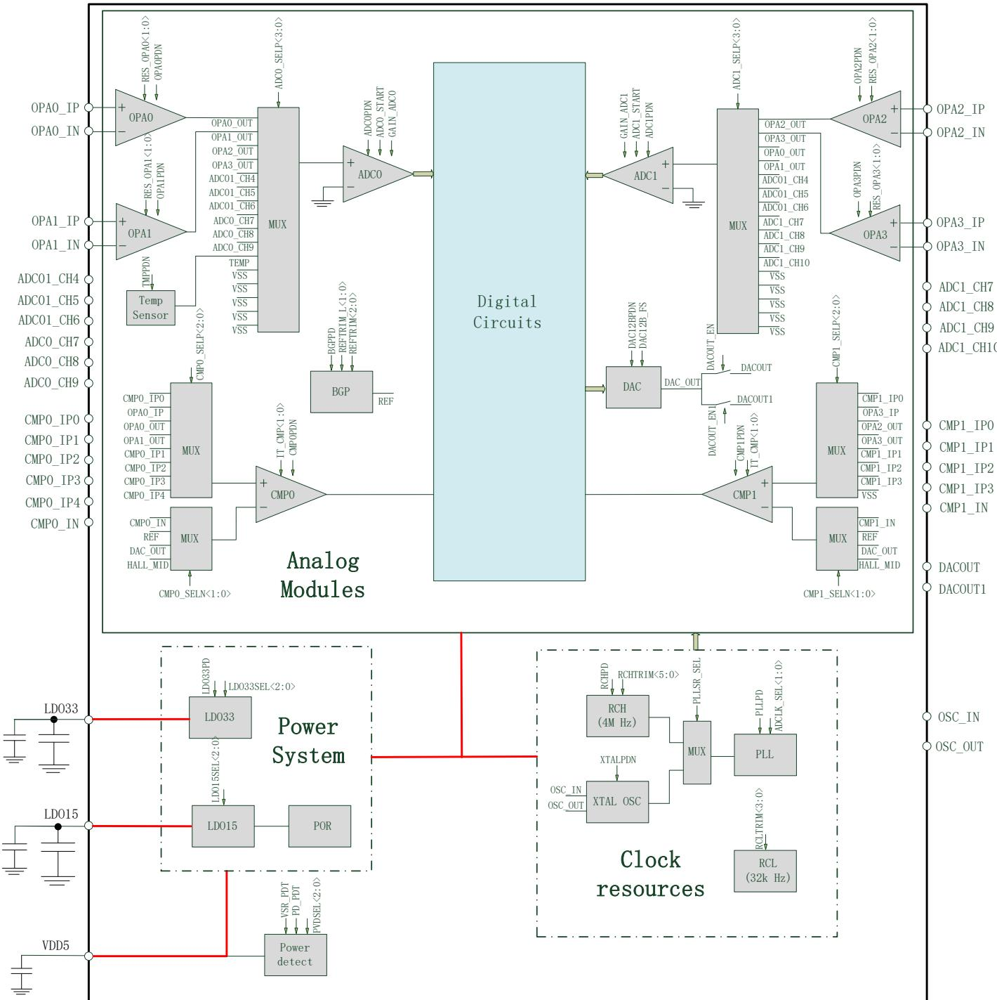  
图 3-1 模拟电路功能框图

## 3.2 电源管理系统

电源管理系统由 LDO33 模块（3.3V LDO）、LDO15 模块（1.5V LDO）、电源检测模块（PVD）、上电/掉电复位模块（POR）组成。

该芯片由 3.3\~5V 单电源供电，以节省芯片外的电源成本。芯片内部集成 1.5V LDO、3.3V LDO，其中 3.3V LDO 给内部 ADC、DAC、基准电压源、运算放大器、比较器、温度传感器、RC时钟、晶体时钟等模拟电路供电。1.5V LDO为内部所有数字电路、PLL模块供电。

两个 LDO 上电后自动开启，无需软件配置，但 LDO 输出电压可通过软件实现微调。LDO33/LDO15 输出引脚上均需接 10uF 和 0.1uF并联的去耦电容到地。去耦电容应尽可能靠近芯片引脚，且去耦电容接地点和芯片模拟地之间在 PCB 上应该有充分的敷地相连。LDO33 的负载驱动电流为 40mA，LDO15 为 30mA。

LDO33 的输出电压可通过设置寄存器 LDO33TRIM[2:0]来调节，LDO15的输出电压可通过设置寄存器 LDO15TRIM[2:0]来调节。LDO33 和 LDO15 在芯片出厂前已经过校正，一般情况下，用户不需要额外配置这些寄存器。如需微调 LDO 的输出电压，需要读取原配置值，在此基础加上微调量，再将对应的配置值填入模拟控制寄存器。

LDO33TRIM[2:0]和 LDO15TRIM<2:0>的说明见模拟寄存器 SYS\_AFE\_REG9

LPOR 模块监测 LDO15 的电压，在 LDO15 电压低于 1.25V 时（例如上电之初，或者掉电时），为数字电路提供复位信号以避免数字电路工作产生异常。

HPOR 模块监测 LDO33 的电压，在 LDO33 电压低于 2.5V 时（例如上电之初，或者掉电时），为数字电路提供复位信号以避免数字电路工作产生异常。

PVD模块对5V输入电源进行检测，如低于某一设定阈值，则产生报警（中断）信号以提醒MCU。中断提醒阈值可通过寄存器PVDSEL[1:0]设置为不同的电压。PVD模块可通过设置PD\_PDT=1关闭。

PVDSEL[1:0]/ PD\_PDT 的说明见模拟寄存器 SYS\_AFE\_REG6

## 3.3 时钟系统

时钟系统包括内部 32KHz RC时钟、内部 4MHz RC时钟、外部 4\~8MHz 晶体起振电路、PLL电路组成。

32K RC时钟作为 MCU系统慢时钟使用，作为低功耗状态下的 MCU时钟使用。4MHz RC时钟作为 MCU 主时钟使用，配合 PLL 可提供最高到 96MHz 的时钟。外部 4\~8MHz 晶体起振电路作为备用时钟使用。

32k 和 4M RC时钟均带有出厂校正，可在常温下实现 32K RC时钟±5%的精度，4M RC时钟±1%的精度。其中 4M RC时钟还开放有用户校正寄存器，可进一步将精度校正到±0.5%范围。32K RC时钟在-40\~105℃范围内的精度为±20%，4M RC时钟在该温度范围的精度为±1%。

32K RC 时钟频率可通过寄存器 RCLTRIM[3:0]进行设置，4M RC 时钟频率可通过寄存器RCHTRIM[5:0]进行设置。

芯片出厂前时钟已经过校正，一般情况下，用户不需要额外配置这些寄存器。如需微调频率，需要读取原配置值，在此基础加上微调量，再将对应的配置值填入相应的寄存器。

RCLTRIM\_L<3:0>的说明见模拟寄存器 SYS\_AFE\_REG8

RCHTRIM<5:0>的说明见模拟寄存器 SYS\_AFE\_REG9

4M RC时钟通过设置 $\mathrm { R C H P D } = ^ { \prime } 0 ^ { \prime } \ddagger$ 打开（默认打开，设 1 关闭），RC时钟需要 BGP电压基准源模块提供基准电压和电流，因此开启 RC 时钟需要先开启 BGP模块（保证 $\mathrm { B G P P D } { = } ^ { \prime } 0 ^ { \prime } )$ ）。芯片上电的默认状态下，4M RC时钟和BGP模块都是开启的。32K RC时钟始终开启，不能关闭。

PLL 对 4M RC 时钟进行倍频，以提供给 MCU、ADC 等模块更高速的时钟。MCU 和 PWM 模块的最高时钟为 96MHz，ADC 模块最高时钟 48MHz，通过寄存器 ADCLKSEL[1:0]可设置为不同的 ADC工作频率。

PLL通过设置 $\mathrm { P L L P D } = ^ { \prime } 0 ^ { \prime }$ 打开，开启 PLL模块之前，同样也需要开启 BGP 模块。开启 PLL之后，PLL 需要 6us 的稳定时间来输出稳定时钟。芯片上电的默认状态下，RC 时钟、PLL 和 BGP 模块都是开启的。

晶体起振电路内置了放大器和起振电容，仅需在 $\mathrm { I O ~ O S C \_ I N / O S C \_ O U T }$ 之间接入一个晶体，并设置 XTALPDN=1 即可起振。

$$
\mathrm{ADCLKSEL} <   1: 0 > \text {的说明见模拟寄存器SYS\_AFE\_REG7}
$$

BGPPD/RCHPD/XTALPDN/PLLPD 的说明见模拟寄存器 SYS\_AFE\_REG5

## 3.4 基准电压源

基准源电路(BGP REF)为ADC、DAC、RC时钟、PLL、温度传感器、运算放大器、比较器和 FLASH提供基准电压和电流，使用上述任何一个模块之前，都需要开启 BGP基准电压源。

芯片上电的默认状态下，BGP模块是开启的。通过设置 $\mathrm { B G P P D } = ^ { \prime } 0 ^ { \prime }$ 将基准源打开，从关闭到开启，BGP需要约 2us 达到稳定。BGP输出电压约 1.2V，精度为±0.8%

基准电压源的电压大小可通过寄存器 REFTRIM \_L<1:0>、 $\mathsf { R E F \_ L T R I M }$ 、REFTRIM <2:0>进行设置，芯片出厂前基准源已经过校正，一般情况下，用户不需要额外配置这些寄存器。如需微调电压，需要读取原配置值，在此基础加上微调量，再将对应的配置值填入相应的寄存器。

基准源可通过设置 REF\_BGP\_EN=1，将基准电压送至 ${ \mathrm { I 0 } } ^ { \prime } { \mathrm { C M P 1 } } _ { - } { \mathrm { I P } } 2 ^ { \prime }$ 进行测量。正常工作模式下

BGPPD 的说明见模拟寄存器 SYS\_AFE\_REG5

REF\_BGP\_EN 的说明见模拟寄存器 SYS\_AFE\_REG3

REFTRIM\_L<1:0>的说明见模拟寄存器 SYS\_AFE\_REG9

REFTRIM<2:0>/ REF\_LTRIM 的说明见模拟寄存器 SYS\_AFE\_REGA

## 3.5 ADC 模块

参见模数转换器(ADC)章节。

## 3.6 运算放大器

4路输入输出rail-to-rail运算放大器，内置反馈电阻，外部引脚上还需接一个电阻R0到信号源。反馈电阻 R2:R1 的阻值可通过寄存器 RES\_OPAx[1:0]设置，以实现不同的放大倍数。

RES\_OPAx<1:0>的说明见模拟寄存器 SYS\_AFE\_REG0

放大器的结构示意图如下所示：

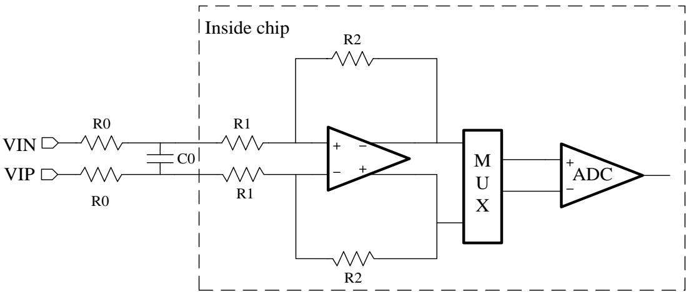  
图 3-2 放大器框图

图中两个 R0 是片外需放置的电阻，阻值必须相等，最终的放大倍数为 R2/(R1+R0)。

对于 MOS 管电阻直接采样的应用，由于 MOS 下管关断、上管导通时信号会升高到数十 V 的电源电压，为减小此时往芯片引脚里流入的电流，一般建议接>20k 欧的外部电阻。

对于分流电阻采样的应用，建议接 100\~2K 欧的外部电阻。C0 为信号滤波电容，和 R0形成一阶 RC 滤波电路。R0 的具体阻值可根据 R0\*C0 的滤波常数而定。如果信号上噪声较小不需要滤波、或者信号需要很大的带宽（较快的响应速度），则 C0 可以不加。

放 大 器 可 通 过 设 置 OPAOUT\_EN=1 将 4 路 放 大 器 负 向 的 信 号 送 至 相 应 IO 口(OPA0\_OUT\~OPA3\_OUT)进行测量（对应关系见 datasheet 芯片管脚说明），但是在正常工作模式下不可将信号送出，以免受到干扰。

OPAOUT\_EN 的说明见模拟寄存器 SYS\_AFE\_REG2

芯片上电的默认状态下，放大器模块是关闭的。放大器可通过设置 OPAxPDN(x=0,1,2,3) =1 打开，开启放大器之前，需要先开启 BGP 模块。

OPAxPDN 的说明见模拟寄存器 SYS\_AFE\_REG5

运放输入正负端内置限压二极管，电机相线通过一匹配电阻后直接接入输入端，从而简化了MOSFET 电流采样的外置电路。

## 3.7 比较器

内置 2 路输入 rail-to-rail 比较器，比较器比较速度可编程、迟滞电压可编程、信号源可编程。

比较器的比较延时可通过寄存器 IT\_CMP 设置为 0.15uS/0.6uS。迟滞电压通过 CMP\_HYS 设置为20mV/0mV。

比较器正负两个输入端的信号来源都可通过寄存器 CMPx\_SELP[2:0]和 CMPx\_SELN[1:0]进行设置（x=0/1，代表 CMP0/CMP1 两个比较器）。

需说明的是，两个比较器负输入端的 HALLx\_MID 信号，是对比较器正输入端信号 CMPx\_IP1/CMPx\_IP2/ CMPx\_IP3 信号的平均，具体连接方式见下图 3-3。其中电阻 R=8.2k 欧，图中的开关只有在比较器负输入端信号选择为 HALLx\_MID 之后才会导通，否则开关都处于断开状态。当CMPx\_IP1/ CMPx\_IP2/ CMPx\_IP3 管脚连的是 HALL 信号时，通过将 HALL 信号与 HALLx\_MID 信号进行比较，可快速得到 HALL 信号的状态。

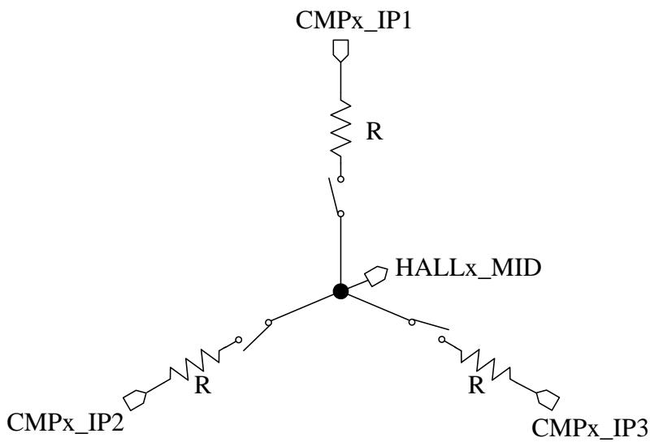  
图 3-3 HALLx\_MID 信号

比较器输出结果，可以通过 SYS\_AFE\_CMP 寄存器读出。

IT\_CMP<1:0>的说明见模拟寄存器 SYS\_AFE\_REG4

CMPx\_SELN<1:0>/ CMPx\_SELP<2:0>/ CMP\_HYS 的说明见模拟寄存器 SYS\_AFE\_REG3

比较器的输出 CMPx\_RESULT 的说明见比较器输出寄存器 SYS\_AFE\_CMP

芯片上电的默认状态下，比较器模块是关闭的。比较器通过设置 CMPxPDN(x=0,1) =1 打开，开启比较器之前，需要先开启 BGP模块。

CMPxPDN 的说明见模拟寄存器 SYS\_AFE\_REG5

## 3.8 温度传感器

芯片内置温度传感器，大批量时，在-40\~85℃范围内精度为 $3 ^ { \circ } \mathsf { C } _ { \circ } - 4 0 { \sim } 1 0 5 ^ { \circ } \mathsf { C }$ 范围内精度为 4℃。

芯片出厂前会经温度校正，校正值保存在 flash info 区。

芯片上电的默认状态下，温度传感器模块是关闭的。开启传感器之前，需要先开启 BGP 模块。

温度传感器通过设置 TMPPDN=1 打开，开启到稳定需要约 2us，因此需在 ADC 测量传感器之前 2us 打开。另外，开启温度传感器前需要设置工作状态寄存器，将 TMPCKOFF 和 TEMP\_MODE寄存器都设置为’1’。

温度传感器信号仅连至 ADC0 进行测量。需要将温度传感器配置到 ADC0 中的一个输入信号通道，转换完成后到该设置通道的相应地址上读取转换后的 ADC值。

ADC部分的设置参考第七章模数转换器(ADC)

TEMP\_MODE 的说明见模拟寄存器 SYS\_AFE\_REG2

TMPPDN 的说明见模拟寄存器 SYS\_AFE\_REG5

TMPCKOFF 的说明见模拟寄存器 SYS\_AFE\_REG6

温度传感器的典型曲线如下图所示：

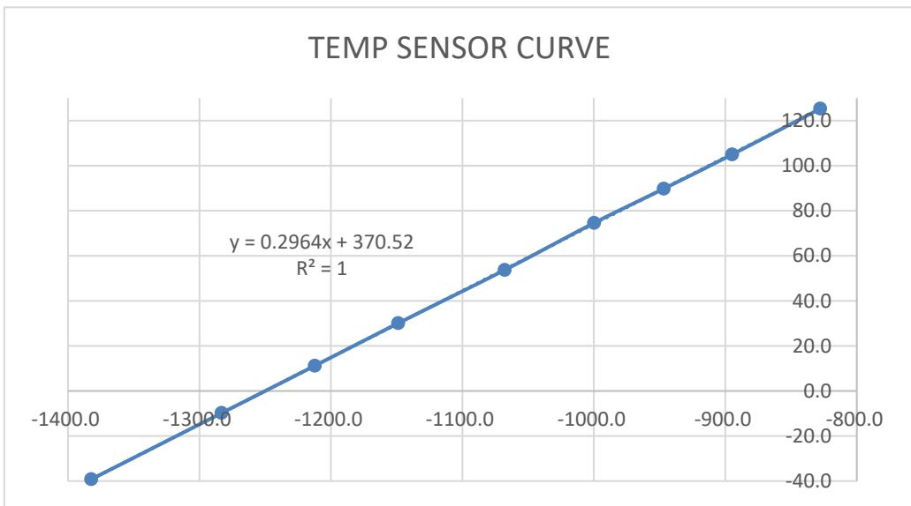  
图 3-4 温度传感器曲线

图中 X 轴为温度传感器的温度信号所对应的 ADC值，Y 轴为传感器所处的温度。测温时，按照如上要求配置传感器相关寄存器，并得到 ADC值后，将 ADC值作为 X 代入公式:

$$
\mathrm{y} = 0. 2 9 6 4 \mathrm{x} + 3 7 0. 5 2
$$

求得的 Y 值即为此时的温度。

公式中有两个系数， $a = 0 . 2 9 6 4 , \mathrm { b } = 3 7 0 . 5 2$ 。对于不同的芯片，b 系数的值是不一样的。芯片出厂前会经过温度标定，将每颗芯片所对应的系数 b写入 flash 的info 区，地址为 0x0000028C。存储时，会将 b 系数小数点右移一位（乘 10）存入 info区，小数点后第二位不进行保存。

同时为方便客户操作，系数 a 也会存入 flash info 区，地址为 0x00000288。存储时，将 a 系数小数点右移四位（乘 10000）存入 info 区。

实际使用中，应从 flash info 区相应地址读出 a/b 系数，同时将读取到的 ADC测到的当下温度传感器值代入公式，即可计算得到当下温度值，单位为摄氏度。计算时，需注意系数 a/b 在保存时小数点的位移数，即 a系数应除以 10000，b 系数除以 10。

## 3.9 DAC 模块

芯片内置一路 12bit DAC，输出信号的最大量程可通过寄存器 DAC12B\_FS 设置为 1V或 3V。

12bit DAC 可通过配置寄存器 DACOUT\_EN/DACOUT\_EN1=1，分别将 DAC 输出送至 IO 口P0.0/P0.3，可驱动>5kΩ 的负载电阻和 50pF 的负载电容。

DAC最大输出码率为 1MHz。

芯片上电的默认状态下，DAC模块是关闭的。DAC可通过设置 DAC12BPDN =1 打开，开启 DAC模块之前，需要先开启 BGP模块。

DAC 的输入数字信号寄存器为 SYS\_AFE\_DAC，低 12BIT 有效。信号范围是 0x000\~0xFFF。0x000对应零模拟量输出 0V，0xFFF 对应满量程模拟量输出为 $D A C _ { f s }$ ，如上文所述， $D A C _ { f s }$ 的值可由DAC12B\_FS 寄存器进行设置。每一档信号(LSB)所对应的模拟信号幅度为 $\lceil \frac { D A C _ { f s } } { 4 0 9 6 }$ 。若 SYS\_AFE\_DAC 的数字值为 Din,则该数字信号所对应的 DAC 输出模拟信号为 $\lceil \frac { D A C _ { f s } } { 4 0 9 6 } * D i n$

DAC 输出的模拟信号，除了可以送至 IO 口供外部模块使用外，还可通过配置寄存器连至芯片内部的 2 路比较器负端，作为比较器的基准信号使用。详见比较器章节。

DACOUT\_EN/ DACOUT\_EN1/ DAC12B\_FS 的说明见模拟寄存器 SYS\_AFE\_REG3

DAC12BPDN 的说明见模拟寄存器 SYS\_AFE\_REG5

SYS\_AFE\_DAC 的说明见寄存器 SYS\_AFE\_DAC

## 4 时钟和复位

## 4.1 时钟

## 4.1.1 时钟源

如下表所示，系统包括 5 个时钟源。其中内部低速 RC振荡时钟 LSI/内部高速 RC振荡时钟 HSI不会停振。HSE 可能失效，仅部分应用会使用外部晶振时钟 HSE。

表 4-1 系统时钟源

<table><tr><td>时钟源</td><td>频率</td><td>来源</td><td>误差</td><td>说明</td></tr><tr><td>LSI</td><td>32KHz</td><td>内部 RC 振荡器</td><td>23KHz~42KHz</td><td>内部系统管理时钟,用于 WDT,复位信号的滤波和展宽</td></tr><tr><td>HSI</td><td>4MHz</td><td>内部 RC 振荡器</td><td>全温度范围误差&lt;1%</td><td>可作为 PLL 源时钟</td></tr><tr><td>PLL</td><td>96MHz</td><td>PLL 时钟</td><td>0</td><td>PLL 输出时钟,以 HIS/HSE 作为输入,输出是 HSI/HSE 时钟的 24 倍频,作为系统主时钟。</td></tr><tr><td>HSE</td><td>4MHz</td><td>外部晶体振荡器</td><td>0</td><td>外部晶体,在对时钟精度有严格要求(例如 ppm 级别的精度要求)的应用下,可使用 HSE 作为 PLL 输入时钟来产生 96M 的系统主时钟</td></tr><tr><td>SWD</td><td>1MHz</td><td>调试器</td><td></td><td>SWD 的 JTAG 时钟</td></tr></table>

如下图，MUX0 用于在 HSI / HSE 中进行选择，切换电路由模拟电路完成。

PLL经过分频（1/8\~8/8）后路作为系统主时钟 MCLK。系统复位时，MCLK 门控，系统自动打开 HSI/PLL，等待 PLL稳定后，切换到 PLL /8/4，即 3MHz上工作，保证系统安全。

PLL时钟经过分频送到 ADC（最高工作频率 48MHz），即 ACLK。

内部低频 RC产生一路 LSI 时钟 LCLK，主要用于 WDT 工作时钟。

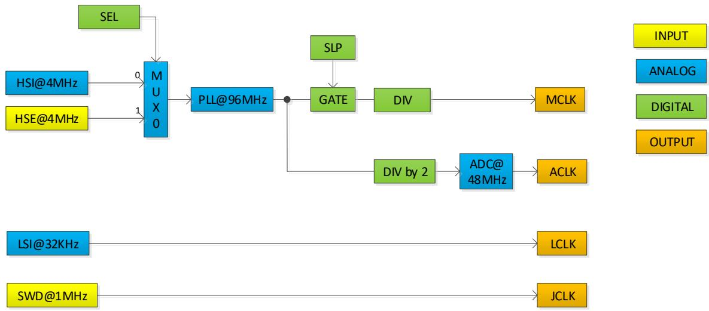  
图 4-1 时钟架构

## 4.1.2 时钟域

系统主要包括 4 个时钟域，MCLK/ACLK/LCLK/JCLK。

## 4.1.2.1 MCLK

MCLK 是系统主时钟。支持以 1/8 为最小粒度的分频配置，可以覆盖 12MHz\~96MHz 的频率范围。

表 4-2 MCLK 时钟分频

<table><tr><td>分频系数</td><td>频率/MHz</td><td>是否均匀</td></tr><tr><td>1/8</td><td>12</td><td>是</td></tr><tr><td>2/8</td><td>24</td><td>是</td></tr><tr><td>3/8</td><td>36</td><td>否</td></tr><tr><td>4/8</td><td>48</td><td>是</td></tr><tr><td>5/8</td><td>60</td><td>否</td></tr><tr><td>6/8</td><td>72</td><td>否</td></tr><tr><td>7/8</td><td>84</td><td>否</td></tr><tr><td>8/8</td><td>96</td><td>是</td></tr></table>

PMU模块控制处理器核的时钟，当系统进入低功耗模式时，会关闭 PLL、HRC等高速时钟，只保留 LRC时钟供最小系统工作使用。

外设模块通常会包含至少两个时钟域：总线时钟 bclk/主时钟 mclk：

bclk 来自 ahb\_clk，该时钟在总线访问本模块时打开，平时关闭以降低功耗。

mclk 来自时钟 MCLK，模块功能时钟可以是 MCLK 被门控或者进一步分频以获得所需功能，并降低功耗。

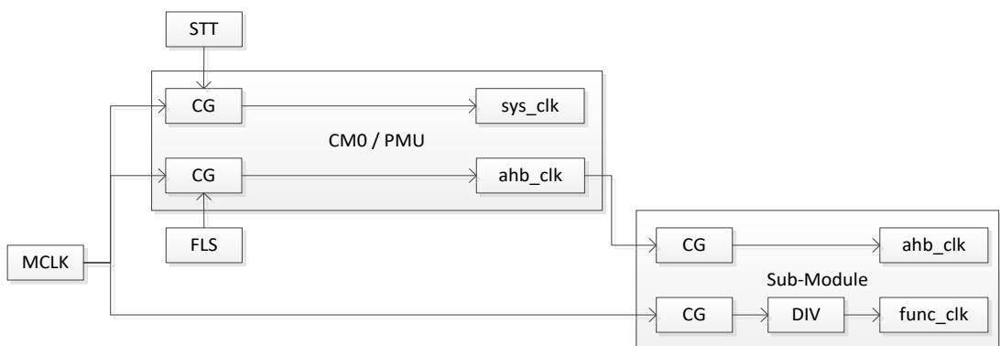  
图 4-2MCLK 架构

## 4.1.2.1.1 MCLK 整体门控

MCLK 时钟可以通过配置进行关闭，从而令包括 CPU和所有外设在内的大部分数字电路处于休眠状态。MCLK 时钟门控关闭时，功耗管理单元(Power Management Unit, PMU)状态机依次关闭 PLL,HSI/HSE, BGP 等模拟模块，以降低功耗。

系统的休眠模式仅仅关闭 PLL，HSI，HSE 等高速时钟，LSI 时钟仍然存在。工作于 LSI 时钟的看门狗如果被使能，看门狗复位作为全局复位可以令系统回到初始状态重新开始工作。

向 SYS\_CLK\_SLP寄存器写入 0xDEAD可以令芯片准备进入休眠状态，之后立刻执行\_\_WFI()宏指令使得 CPU 停止取指。

在进入休眠之前，需要设置 SYS\_AFE\_REG5 寄存器的 PLLPD、RCHPD 和 BGPPD 关闭 PLL 时钟，HSI 时钟和 BandGap；并根据应用实际情况，设置 SYS\_AFE\_REG5 关闭 OPA，CMP，ADC。如果芯片当前工作于 PLL时钟上，且 HSI 时钟作为了 PLL的参考时钟，则设置 SYS\_AFE\_REG5关闭 PLL时钟、HSI 时钟和 BandGap 的动作不会立即生效，需要等到休眠指令发出才会由 PMU 控制依次关闭各个时钟。芯片可以在工作于 PLL时钟的情况下直接写入休眠指令进入休眠状态。

在应用程序编写中请事先配置好唤醒条件。

由于休眠仅仅关闭了数字电路时钟，而没有关闭电路电源，所以寄存器值会保持为休眠前的配置。

休眠后，外部 IO事件、内部唤醒 Timer均可以作为唤醒源。

内部唤醒Timer为独立于UTimer模块的独立Timer，使用LSI时钟，不同于系统中的通用Timer工作于系统主时钟。唤醒 Timer 可以使用 SYS\_RST\_CFG 配置 0.125s,0.25s,0.5s,1s,2s,4s,8s,16s 共 8档唤醒时间间隔，具体请参考 4.3.19 章节。

仅有 P0[1:0]、P1[1:0]四个 IO 可以作为外部唤醒 IO 使用，可以配置独立的使能和极性。具体寄存器配置请参考 6.2.14.5 WAKE\_POL 和 6.2.14.6 WAKE\_EN 章节。需要注意的是，由于外部 IO 唤醒属于电平触发，如果外部 IO在芯片休眠之前处于唤醒电平，会导致芯片休眠后立刻唤醒。

在应用程序编写中请尽量避免上电即进入休眠状态，如果使用内部唤醒 Timer 作为唤醒源，且唤醒后立即再次睡眠，会导致普通下载器无法进行连接调试，此时需要使用芯片供应商提供的离线下载器进行应用程序擦除改写。

在唤醒后，需要根据应用实际情况，设置 SYS\_AFE\_REG5 开启 OPA，CMP，ADC。如果芯片是在工作于 PLL 时钟的状态下直接写入休眠指令进入休眠状态，则唤醒后芯片仍工作于 PLL 时钟下。当芯片工作于 PLL 时钟且 HSI 作为 PLL 参考时钟时，无论 SYS\_AFE\_REG5 寄存器的 PLLPD、RCHPD和 BGPPD 是怎样设置，PLL 时钟、HSI 时钟和 BandGap 都会开启。

## 4.1.2.1.2 外设时钟门控

外设时钟由系统高速时钟 MCLK 分频而来；当外设不需要使用时可以通过门控关闭相应的外设时钟。对于每一个外设的工作时钟，均有一个时钟门控。共设计 8 路可控时钟。

其中，SPI/I2C 有共享 fclk[0]，Hall 模块使用 fclk[1]，Timer 模块使用 fclk[2]，MCPWM 模块使用 fclk[3]，UART0/UART1 分别使用 fclk[4]/fclk[5]。

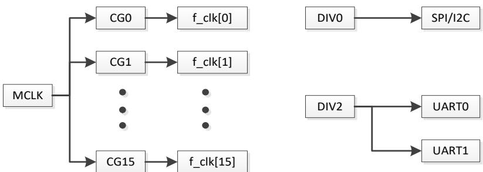  
图 4-3 外设时钟门控分频

## 4.1.2.1.3 外设时钟分频

所有外设均有独立的时钟分频模块使得该模块可以工作在合适的时钟频率上。

SPI/I2C/UART 的工作时钟分频在 SYS时钟管理模块中完成。

如图 4-3 外设时钟门控分频所示，模块对应的 f\_clk 可以进一步分频出模块的工作时钟。

其中 SPI/I2C 共享 CLK\_DIV[0]，UART0/1 共享 CLK\_DIV[2]。UART 的波特率在 UART 模块内部还有一个额外的分频器.

## 4.1.2.2 ACLK

ACLK 是模拟电路对 PLL时钟的一个分频时钟，供 ADC使用。

## 4.1.2.3 JCLK

JCLK独立于其余的时钟，供 SWD 接口模块 DAP使用，实现 JTAG 时序。

## 4.1.2.4 LCLK

LCLK 独立于其余的时钟，供 WDT 模块使用，该模块需要处理 ahb\_clk 和 LCLK 的异步通信问题。

## 4.2 复位

## 4.2.1 复位源

如表 4-3 系统复位源所示，系统包括 3 个复位源。

表 4-3 系统复位源

<table><tr><td>名称</td><td>来源</td><td>说明</td></tr><tr><td>LPOR</td><td>内部 1.5V 电源管理</td><td>监控 1.5V 数字电源,低于 1.25V 时产生复位</td></tr><tr><td>HPOR</td><td>内部 3.3V 电源管理</td><td>监控 3.3V 电源,低于 2.5V 时产生复位</td></tr><tr><td>RESET</td><td>外部按键</td><td>外部 RC 组成按键复位电路</td></tr><tr><td>WDT</td><td>内部软件狗</td><td>0.5S 产生复位</td></tr></table>

## 4.2.2 复位结构

如下图所示，LPORn/HPORn 来自内部模拟电路， RESETn来自外部按键

WDTn为1个LRC时钟周期宽度信号，是内部数字信号。但是在Debug/Sleep或者其它模式下，WDT 能否禁用根据芯片不同型号可选。

经过滤波展宽预处理的复位信号进行与运算得到一个复位信号。

在本芯片中，4 个复位信号复位等级和作用域一致。

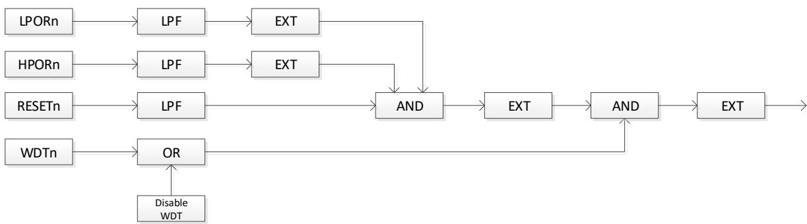  
图 4-4 复位架构

## 4.2.3 复位记录

用于保存复位事件，该寄存器只能通过写入清空，无法被复位清除，可以方便的了解是否发生以及发生过何种复位。

## 4.3 寄存器

## 4.3.1 地址分配

系统模块寄存器基地址为 0x40000000。

表 4-4 系统控制寄存器

<table><tr><td>名称</td><td>偏移</td><td>说明</td></tr><tr><td>SYS_WDT_PSW</td><td>0x2C</td><td>看门狗密码寄存器</td></tr><tr><td>SYS_WDT_CLR</td><td>0x38</td><td>看门狗清零寄存器</td></tr><tr><td>Reserved</td><td>0x40~0x44</td><td>保留</td></tr><tr><td>SYS_AFE_CMP</td><td>0x48</td><td>比较器输出寄存器</td></tr><tr><td>Reserved</td><td>0x4C</td><td>保留</td></tr><tr><td>SYS_AFE_REG0</td><td>0x50</td><td>模拟配置寄存器 0</td></tr><tr><td>SYS_AFE_REG1</td><td>0x54</td><td>模拟配置寄存器 1</td></tr><tr><td>SYS_AFE_REG2</td><td>0x58</td><td>模拟配置寄存器 2</td></tr><tr><td>SYS_AFE_REG3</td><td>0x5C</td><td>模拟配置寄存器 3</td></tr><tr><td>SYS_AFE_REG4</td><td>0x60</td><td>模拟配置寄存器 4</td></tr><tr><td>SYS_AFE_REG5</td><td>0x64</td><td>模拟配置寄存器 5</td></tr><tr><td>SYS_AFE_REG6</td><td>0x68</td><td>模拟配置寄存器 6</td></tr><tr><td>SYS_AFE_REG7</td><td>0x6C</td><td>模拟配置寄存器 7</td></tr><tr><td>SYS_AFE_REG8</td><td>0x70</td><td>模拟配置寄存器 8</td></tr><tr><td>SYS_AFE_REG9</td><td>0x74</td><td>模拟配置寄存器 9</td></tr><tr><td>SYS_AFE_REGA</td><td>0x78</td><td>模拟配置寄存器 10</td></tr><tr><td>SYS_AFE_DAC</td><td>0x7C</td><td>DAC 数字量寄存器</td></tr><tr><td>SYS_CLK_CFG</td><td>0x80</td><td>时钟控制寄存器</td></tr><tr><td>SYS_RST_CFG</td><td>0x84</td><td>复位控制寄存器</td></tr><tr><td>SYS_RST_SRC</td><td>0x88</td><td>复位源记录寄存器</td></tr><tr><td>SYS_CLR_RST</td><td>0x8C</td><td>复位源记录清除寄存器</td></tr><tr><td>SYS_CLK_DIV0</td><td>0x90</td><td>外设时钟分频寄存器 0</td></tr><tr><td>SYS_CLK_DIV2</td><td>0x98</td><td>外设时钟分频寄存器 2</td></tr><tr><td>SYS_CLK_FEN</td><td>0x9C</td><td>外设时钟门控寄存器</td></tr><tr><td>SYS_CLK_SLP</td><td>0xA0</td><td>休眠寄存器</td></tr><tr><td>SYS_IAP</td><td>0xA4</td><td>在线编程模式寄存器</td></tr><tr><td>SYS_TRIM</td><td>0xA8</td><td>校正模式寄存器</td></tr><tr><td>SYS_SFT_RST</td><td>0xAC</td><td>软复位寄存器</td></tr><tr><td>SYS_PROTECT</td><td>0xB0</td><td>写保护寄存器</td></tr></table>

4.3.2 看门狗密码寄存器 SYS\_WDT\_PSW

表 4-5 看门狗密码寄存器 SYS\_WDT\_PSW

<table><tr><td>名称</td><td>复位值</td><td>偏移</td><td>位置</td><td>权限</td><td>说明</td></tr><tr><td rowspan="2">SYS_WDT_PSW</td><td rowspan="2">0x0</td><td rowspan="2">0x2C</td><td>[31:16]</td><td>NA</td><td>未使用</td></tr><tr><td>[15:0]</td><td>WO</td><td>写入 0xA6B4,才能对 WDT_CLR 进行写操作对 WDT_CLR 进行写操作,将清除 WDT_PSW,下一次写 WDT_CLR 需要再次写 WDT_PSW</td></tr></table>

## 4.3.3 看门狗清零寄存器 SYS\_WDT\_CLR

表 4-6 看门狗清零寄存器 SYS\_WDT\_CLR

<table><tr><td>名称</td><td>复位值</td><td>偏移</td><td>位置</td><td>权限</td><td>说明</td></tr><tr><td rowspan="2">SYS_WDT_CLR</td><td rowspan="2">0x0</td><td rowspan="2">0x38</td><td>[31:16]</td><td>NA</td><td>未使用</td></tr><tr><td>[15:0]</td><td>WO</td><td>写入字节 16&#x27;b0111_1001_1000_11B1B0,高 14位为密码,密码正确时,B[1:0]才能写入其中,B[1]为 MODE,1:16 秒复位 0:0.5 秒复位 B[0]为 CLR,写入 1,则清空 WDT 计数器</td></tr></table>

4.3.4 比较器输出寄存器 SYS\_AFE\_CMP

<table><tr><td>名称</td><td>偏移</td><td>位置</td><td>权限</td><td>寄存器名</td><td>说明</td></tr><tr><td rowspan="5">SYS_AFE_CMP</td><td rowspan="5">0x48</td><td>[31:16]</td><td>NA</td><td></td><td>未使用</td></tr><tr><td>[15:14]</td><td>NA</td><td></td><td>未使用</td></tr><tr><td>[13]</td><td>R</td><td>CMP1_RESULT</td><td>CMP1 输出结果寄存器</td></tr><tr><td>[12]</td><td>R</td><td>CMP0_RESULT</td><td>CMP0 输出结果寄存器</td></tr><tr><td>[11:0]</td><td>NA</td><td></td><td>未使用</td></tr></table>

## 4.3.5 模拟寄存器概述

模拟寄存器的名称为 SYS\_AFE\_REG0\~ SYS\_AFE\_REGA，对应地址为 0x40000050\~0x40000078。其中地址 0x40000070\~0x40000078 是模拟各个模块的校正寄存器，这些寄存器在出厂之前都会将各自的校正值填入 Flash info 区，并在上电后自动加载到 SYS\_AFE\_REG8\~ SYS\_AFE\_REGA。一般情况下用户不要去配置或改变这些值。如果需要对某个模拟参数进行微调，需要读取原校正值，并以此为基础进行微调。

地址 0x40000050\~0x4000006c 是开放给用户的寄存器，其中保留寄存器(Res)必须全部配置为0（芯片上电后会被复位为 0）。其他寄存器根据应用场合需要进行配置。

下面是各个模拟寄存器的详细说明。

## 4.3.6 模拟配置寄存器 0 SYS\_AFE\_REG0

表 4-7 模拟配置寄存器 0 SYS\_AFE\_REG0

<table><tr><td>名称</td><td>偏移</td><td>位置</td><td>权限</td><td>寄存器名</td><td>说明</td></tr><tr><td rowspan="2">SYS_AFE_REG0</td><td rowspan="2">0x50</td><td>[31:16]</td><td>NA</td><td></td><td>未使用</td></tr><tr><td>[15:14]</td><td>RW</td><td>IT_RBUF &lt;1:0&gt;</td><td>ADC 基准缓冲器偏置电流调节,采用默认配置00:×1;01:×1.2;10:×1.5;11:×2;</td></tr><tr><td rowspan="7"></td><td rowspan="7"></td><td>[13:12]</td><td>RW</td><td>IT_ADCMP&lt;1:0&gt;</td><td>ADC CMP 偏置电流调节,采用默认配置00:×1;01:×2;10:×0.66;11:×1;</td></tr><tr><td>[11:10]</td><td>RW</td><td>IT_AMP&lt;1:0&gt;</td><td>ADC AMP 偏置电流调节,采用默认配置00:×1;01:×1.5;10:×0.75;11:×1;</td></tr><tr><td>[9:8]</td><td>RW</td><td>IT_OPA&lt;1:0&gt;</td><td>OPA 偏置电流调节,采用默认配置00:×1;01:×1.2;10:×1.5;11:×2;</td></tr><tr><td>[7:6]</td><td>RW</td><td>REF_OPA3&lt;1:0&gt;</td><td>运放 3 反馈电阻00:200k:10k;01:190k:20k;10:180k:30k;11:170k:40k</td></tr><tr><td>[5:4]</td><td>RW</td><td>RES_OPA2&lt;1:0&gt;</td><td>运放 2 反馈电阻00:200k:10k;01:190k:20k;10:180k:30k;11:170k:40k</td></tr><tr><td>[3:2]</td><td>RW</td><td>RES_OPA1&lt;1:0&gt;</td><td>运放 1 反馈电阻00:200k:10k;01:190k:20k;10:180k:30k;11:170k:40k</td></tr><tr><td>[1:0]</td><td>RW</td><td>RES_OPA0&lt;1:0&gt;</td><td>运放 0 反馈电阻00:200k:10k;01:190k:20k;10:180k:30k;11:170k:40k</td></tr></table>

## 4.3.7 模拟配置寄存器 1 SYS\_AFE\_REG1

表 4-8 模拟配置寄存器 1 SYS\_AFE\_REG1

<table><tr><td>名称</td><td>偏移</td><td>位置</td><td>权限</td><td>寄存器名</td><td>说明</td></tr><tr><td rowspan="4">SYS_AFE_REG1</td><td rowspan="4">0x54</td><td>[31:16]</td><td>NA</td><td></td><td>未使用</td></tr><tr><td>[15:4]</td><td>RW</td><td>Reserved</td><td>保留位,需全部为&#x27;0&#x27;</td></tr><tr><td>[3]</td><td>RW</td><td>GAIN_REF</td><td>ADC 基准电压调节,采用默认配置0:×1;1:×2;</td></tr><tr><td>[2:0]</td><td>RW</td><td>Reserved</td><td>保留位,需全部为&#x27;0&#x27;</td></tr></table>

## 4.3.8 模拟配置寄存器 2 SYS\_AFE\_REG2

表 4-9 模拟配置寄存器 2 SYS\_AFE\_REG2

<table><tr><td>名称</td><td>偏移</td><td>位置</td><td>权限</td><td>寄存器名</td><td>说明</td></tr><tr><td rowspan="7">SYS_AFE_REG2</td><td rowspan="7">0x58</td><td>[31:16]</td><td>NA</td><td></td><td>未使用</td></tr><tr><td>[15:14]</td><td>RW</td><td>CURRIT&lt;1:0&gt;</td><td>ADC全局偏置电流调整01:1;00:-33%;11:-66%;10:-75%</td></tr><tr><td>[13]</td><td>RW</td><td>OPAOUT_EN</td><td>使能运放负端信号输出,用于测试使用,正常工作时配置为00:不使能1:使能</td></tr><tr><td>[12]</td><td>RW</td><td>CUR_EN</td><td>使能共模调节,采用默认配置0:不使能1:使能</td></tr><tr><td>[11:10]</td><td>RW</td><td>CSEL&lt;1:0&gt;</td><td>晶体起振电容调节,采用默认配置10:+0pf;11:+2pf;00:+4pf;01:+6pf;</td></tr><tr><td>[9:8]</td><td>RW</td><td>XTRSEL&lt;1:0&gt;</td><td>晶体起振电路电阻调节,采用默认配置XTRSEL&lt;1&gt;=1:N端阻值增加XTRSEL&lt;0&gt;=1:P端电阻增加一倍</td></tr><tr><td>[7]</td><td>RW</td><td>TEMP_MODE</td><td>1:配置温度传感器模式,开启测温时应配置为'1'</td></tr><tr><td></td><td></td><td>[6:0]</td><td>RW</td><td>Reserved</td><td>保留位,需全部为'0'</td></tr></table>

## 4.3.9 模拟配置寄存器 3 SYS\_AFE\_REG3

表 4-10 模拟配置寄存器 3 SYS\_AFE\_REG3

<table><tr><td>名称</td><td>偏移</td><td>位置</td><td>权限</td><td>寄存器名</td><td>说明</td></tr><tr><td rowspan="6">SYS_AFE_REG3</td><td rowspan="6">0x5C</td><td>[31:16]</td><td>NA</td><td></td><td>未使用</td></tr><tr><td>[15]</td><td>RW</td><td>Reserved</td><td>保留位,需全部为'0'</td></tr><tr><td>[14:12]</td><td>RW</td><td>CMP1_SELP&lt;2:0&gt;</td><td>比较器1信号正端选择000:连CMP1_IP0001:连OPA3_IP010:连OPA2_OUT011:连OPA3_OUT100:连CMP1_IP1101:连CMP1_IP2110:连CMP1_IP3111:连AVSS说明:上述除AVSS/OPA2_OUT/OPA3_OUT外都为管脚名称,请参看datasheet里管脚定义章节</td></tr><tr><td>[11]</td><td>RW</td><td>DACOUT_EN1</td><td>DAC输出到IO使能1:使能输出到IOADC0_CH7/P0.3</td></tr><tr><td>[10:8]</td><td>RW</td><td>CMP0_SELP&lt;2:0&gt;</td><td>比较器0信号正端选择000:连CMP0_IP0001:连OPA0_IP010:连OPA0_OUT011:连OPA1_OUT100:连CMP0_IP1101:连CMP0_IP2110:连CMP0_IP3111:连CMP0_IP4说明:上述除OPA0_OUT/OPA1_OUT外都为管脚名称,请参看datasheet里管脚定义章节</td></tr><tr><td>[7]</td><td>RW</td><td>CMP_HYS</td><td>比较器回差选择,采用默认配置0:20mv;1:0mv</td></tr><tr><td rowspan="5"></td><td rowspan="5"></td><td>[6]</td><td>RW</td><td>REF_BGP_EN</td><td>REF BGP 输出使能,测试 REF BGP 的时候使用,正常情况采用默认配置0:不输出1:使能 REF BGP 输出到CMP1_IP2 管脚</td></tr><tr><td>[5:4]</td><td>RW</td><td>CMP1_SELN&lt;1:0&gt;</td><td>比较器 1 信号负端选择00:连 CMP1_IN01:连 REF BGP10:连 DAC 输出11:连 HALL1_MID说明:上述 CMP1_IN 为管脚名称,请参看 datasheet 里管脚定义章节;REF BGP 为芯片内部 1.2V BANDGAP 基准源;DAC 输出即为芯片内部 DAC 模块输出模拟信号;HALL1_MID 为 CMP1_IP1,CMP1_IP2,CMP1_IP3 信号经电阻星形连接后得到的平均值</td></tr><tr><td>[3:2]</td><td>RW</td><td>CMP0_SELN&lt;1:0&gt;</td><td>比较器 0 信号负端选择00:连 CMP0_IN01:连 REF BGP10:连 DAC 输出11:连 HALLO_MID说明:上述 CMP0_IN 为管脚名称,请参看 datasheet 里管脚定义章节;REF BGP 为芯片内部 1.2V BANDGAP 基准源;DAC 输出即为芯片内部 DAC 模块输出模拟信号;HALLO_MID 为 CMP0_IP1,CMP0_IP2,CMP0_IP3 信号经电阻星形连接后得到的平均值</td></tr><tr><td>[1]</td><td>RW</td><td>DAC12B_FS</td><td>12BIT DAC 量程选择0:满量程 0~3.1V;1:满量程 0~1V</td></tr><tr><td>[0]</td><td>RW</td><td>DACOUT_EN</td><td>DAC 输出到 IO 使能0:不输出1:使能输出到 IO P2.3</td></tr></table>

## 4.3.10 模拟配置寄存器 4 SYS\_AFE\_REG4

表 4-11 模拟配置寄存器 4 SYS\_AFE\_REG4

<table><tr><td>名称</td><td>偏移</td><td>位置</td><td>权限</td><td>寄存器名</td><td>说明</td></tr><tr><td rowspan="4">SYS_AFE_REG4</td><td rowspan="4">0x60</td><td>[31:16]</td><td>NA</td><td></td><td>未使用</td></tr><tr><td>[15:2]</td><td>RW</td><td>Reserved</td><td>保留位,需全部为&#x27;0&#x27;</td></tr><tr><td>[1]</td><td>RW</td><td>IT_CMP&lt;1&gt;</td><td>比较器 1 延时选择0: 0.15us;1: 0.6us</td></tr><tr><td>[0]</td><td>RW</td><td>IT_CMP&lt;0&gt;</td><td>比较器 0 延时选择0: 0.15us;1: 0.6us</td></tr></table>

## 4.3.11 模拟配置寄存器 5 SYS\_AFE\_REG5

表 4-12 模拟配置寄存器 5 SYS\_AFE\_REG5

<table><tr><td>名称</td><td>偏移</td><td>位置</td><td>权限</td><td>寄存器名</td><td>说明</td></tr><tr><td rowspan="10">SYS_AFE_REG5</td><td rowspan="10">0x64</td><td>[31:16]</td><td>NA</td><td></td><td>未使用</td></tr><tr><td>[15]</td><td>RW</td><td>PLLPD</td><td>PLL关闭使能0:开启1:关闭</td></tr><tr><td>[14]</td><td>RW</td><td>XTALPDN</td><td>晶体起振电路开启使能0:关闭1:开启</td></tr><tr><td>[13]</td><td>RW</td><td>TMPPDN</td><td>温度传感器开启使能0:关闭1:开启</td></tr><tr><td>[12]</td><td>RW</td><td>DAC12BPDN</td><td>12BIT DAC开启使能0:关闭1:开启</td></tr><tr><td>[11]</td><td>RW</td><td>Reserved</td><td>保留位,需全部为'0'</td></tr><tr><td>[10]</td><td>RW</td><td>RCHPD</td><td>RCH时钟关闭使能0:开启1:关闭</td></tr><tr><td>[9]</td><td>RW</td><td>Reserved</td><td>保留位,需全部为'0'</td></tr><tr><td>[8]</td><td>RW</td><td>BGPPD</td><td>BGP关闭使能0:开启1:关闭</td></tr><tr><td>[7][6]</td><td>RWRW</td><td>CMP1PDNCMP0PDN</td><td>CMP1开启使能0:关闭1:开启CMP0 开启使能0:关闭1:开启</td></tr><tr><td rowspan="6"></td><td rowspan="6"></td><td>[5]</td><td>RW</td><td>OPA3PDN</td><td>OPA3 开启使能0:关闭1:开启</td></tr><tr><td>[4]</td><td>RW</td><td>OPA2PDN</td><td>OPA2 开启使能0:关闭1:开启</td></tr><tr><td>[3]</td><td>RW</td><td>OPA1PDN</td><td>OPA1 开启使能0:关闭1:开启</td></tr><tr><td>[2]</td><td>RW</td><td>OPA0PDN</td><td>OPA0 开启使能0:关闭1:开启</td></tr><tr><td>[1]</td><td>RW</td><td>ADC1PDN</td><td>ADC1 开启使能0:关闭1:开启</td></tr><tr><td>[0]</td><td>RW</td><td>ADC0PDN</td><td>ADC0 开启使能0:关闭1:开启</td></tr></table>

## 4.3.12 模拟配置寄存器 6 SYS\_AFE\_REG6

表 4-13 模拟配置寄存器 6 SYS\_AFE\_REG6

<table><tr><td>名称</td><td>偏移</td><td>位置</td><td>权限</td><td>寄存器名</td><td>说明</td></tr><tr><td rowspan="7">SYS_AFE_REG6</td><td rowspan="7">0x68</td><td>[31:16]</td><td>NA</td><td></td><td>未使用</td></tr><tr><td>[15]</td><td>RW</td><td>PLLSR_SEL</td><td>PLL时钟源选择0:使用RCH作为输入时钟源;1:使用XTAL OSC作为输入时钟源</td></tr><tr><td>[14:13]</td><td>RW</td><td>Reserved</td><td>保留位,需全部为'0'</td></tr><tr><td>[12]</td><td>RW</td><td>TMPCKOFF</td><td>1:关闭温度传感器的时钟,开启测温时需配置为'1'</td></tr><tr><td>[11:10]</td><td>RW</td><td>Reserved</td><td>保留位,需全部为'0'</td></tr><tr><td>[9:8]</td><td>RW</td><td>PVDSEL&lt;1:0&gt;</td><td>电源掉电监测阈值选择00:4.5V;01:4.2V;10:3.9V;11:3.6V</td></tr><tr><td>[7]</td><td>RW</td><td>LDO33PD</td><td>关闭LD033,使其进入跟随模式,即LD033的输出跟随AVDD管脚输入电压0: 开启1: 关闭,进入跟随模式</td></tr><tr><td rowspan="6"></td><td rowspan="6"></td><td>[6:5]</td><td>RW</td><td>Reserved</td><td>保留位,需全部为'0'</td></tr><tr><td>[4]</td><td>RW</td><td>LDO3IT</td><td>LD033 偏置电流调节0: 保持不变1: x2,增加一倍</td></tr><tr><td>[3]</td><td>RW</td><td>Reserved</td><td>保留位,需全部为'0'</td></tr><tr><td>[2]</td><td>RW</td><td>PDT_HYS</td><td>掉电检测回差,采用默认配置0: 打开回差功能1: 关闭回差功能</td></tr><tr><td>[1]</td><td>RW</td><td>VSR_PDT</td><td>掉电检测基准源选择,其中低功耗基准源为 1.3V 左右,DAC 输出则可以通过软件配置0: 选择低功耗基准源;1: 选择 DAC 输出</td></tr><tr><td>[0]</td><td>RW</td><td>PD_PDT</td><td>关闭掉电检测电路0: 开启1: 关闭</td></tr></table>

## 4.3.13 模拟配置寄存器 7 SYS\_AFE\_REG7

表 4-14 模拟配置寄存器 7 SYS\_AFE\_REG7

<table><tr><td>名称</td><td>偏移</td><td>位置</td><td>权限</td><td>寄存器名</td><td>说明</td></tr><tr><td rowspan="4">SYS_AFE_REG7</td><td rowspan="4">0x6C</td><td>[31:16]</td><td>NA</td><td></td><td>未使用</td></tr><tr><td>[15:6]</td><td>RW</td><td>Reserved</td><td>保留位,需全部为&#x27;0&#x27;</td></tr><tr><td>[5:4]</td><td>RW</td><td>ADCLKSEL&lt;1:0&gt;</td><td>ADC时钟频率选择00:48MHz;01:24MHz;10:12MHz;11:6MHz</td></tr><tr><td>[3:0]</td><td>RW</td><td>Reserved</td><td>保留位,需全部为&#x27;0&#x27;</td></tr></table>

## 4.3.14 模拟配置寄存器 8 SYS\_AFE\_REG8

表 4-15 模拟配置寄存器 8 SYS\_AFE\_REG8

<table><tr><td>名称</td><td>偏移</td><td>位置</td><td>权限</td><td>寄存器名</td><td>说明</td></tr><tr><td rowspan="2">SYS_AFE_REG8</td><td rowspan="2">0x70</td><td>[31:16]</td><td>NA</td><td></td><td>未使用</td></tr><tr><td>[15:12]</td><td>RW</td><td>RCLTRIM_L&lt;3:0&gt;</td><td>32kHz RC 时钟输出频率调节0000:+0%;0001:+7.5%;</td></tr></table>

©2019 版权归凌鸥电子所有机密文件未经许可不得扩散

<table><tr><td rowspan="5"></td><td rowspan="5"></td><td></td><td></td><td></td><td>0100:-6.5%;0010:+15%;1000:-13%;0011:+22%;1100:-19%;</td></tr><tr><td>[11]</td><td>RW</td><td>Reserved</td><td>保留位,需全部为&#x27;0&#x27;</td></tr><tr><td>[10]</td><td>RW</td><td>FDER</td><td>减小RCH频率0:不变1:减小约12%</td></tr><tr><td>[9:8]</td><td>RW</td><td>VREFTRIM&lt;1:0&gt;</td><td>VREF输出电压调节,将等比例影响LDO33/15的输出值00:0;01:+3.2%;10:-7.2%;11:-3.6%</td></tr><tr><td>[7:0]</td><td>RW</td><td>Reserved</td><td>保留位,需全部为&#x27;0&#x27;</td></tr></table>

## 4.3.15 模拟配置寄存器 9 SYS\_AFE\_REG9

表 4-16 模拟配置寄存器 9 SYS\_AFE\_REG9

<table><tr><td>名称</td><td>偏移</td><td>位置</td><td>权限</td><td>寄存器名</td><td>说明</td></tr><tr><td rowspan="4">SYS_AFE_REG9</td><td rowspan="4">0x74</td><td>[31:16]</td><td>NA</td><td></td><td>未使用</td></tr><tr><td>[15:14]</td><td>RW</td><td>REFTRIM_L&lt;1:0&gt;</td><td>REF BGP 输出电压粗调00:0mV;01:-45mV;10:+90mV;11:+45mV;</td></tr><tr><td>[13:11]</td><td>RW</td><td>LDO33TRIM&lt;2:0&gt;</td><td>LDO33 输出电压调节011:+9%;010:+6%;001:+3%;000:+0%;111:-3%;110:-6%;101:+9%;100:+9%;</td></tr><tr><td>[10:8]</td><td>RW</td><td>LDO15TRIM&lt;2:0&gt;</td><td>LDO15 输出电压调节011:+20%;010:+13.4%;001:+6.7%;000:+0%;111:-6.7%;110: -13.4%;101: +20%;100: +20%;</td></tr><tr><td rowspan="2"></td><td rowspan="2"></td><td>[7:6]</td><td>RW</td><td>Reserved</td><td>保留位,需全部为'0'</td></tr><tr><td>[5:0]</td><td>RW</td><td>RCHTRIM&lt;5:0&gt;</td><td>4MHz RC时钟输出频率调节000000~011111:频率对应+0~+38.75%每加一档频率增加1.25%;100000~111111:频率对应-40~-1%每加一档频率增加1.25%;</td></tr></table>

## 4.3.16 模拟配置寄存器 10 SYS\_AFE\_REGA

表 4-17 模拟配置寄存器 10 SYS\_AFE\_REGA

<table><tr><td>名称</td><td>偏移</td><td>位置</td><td>权限</td><td>寄存器名</td><td>说明</td></tr><tr><td rowspan="5">SYS_AFE_REGA</td><td rowspan="5">0x78</td><td>[31:16]</td><td>NA</td><td></td><td>未使用</td></tr><tr><td>[15:7]</td><td>RW</td><td>Reserved</td><td>保留位,需全部为&#x27;0&#x27;</td></tr><tr><td>[6:4]</td><td>RW</td><td>FREFTRIM&lt;2:0&gt;</td><td>Flash REF 输出电压细调芯片出厂已做校正,请勿修改校正值</td></tr><tr><td>[3]</td><td>RW</td><td>REF_LTRIM</td><td>REF BGP 输出电压粗调0: 0mV;1: -32mV;</td></tr><tr><td>[2:0]</td><td>RW</td><td>REFTRIM&lt;2:0&gt;</td><td>REF BGP 输出电压细调000:0mV;001:+6.6mV;010:+13.2mV;011:+19.8mV;100:-26.4mV;101:-19.8mV;110:-13.2mV;111:-6.6mV;</td></tr></table>

4.3.17 DAC 数字量寄存器 SYS\_AFE\_DAC

表 4-18 DAC 数字量寄存器 SYS\_AFE\_DAC

<table><tr><td>名称</td><td>复位值</td><td>偏移</td><td>位置</td><td>权限</td><td>说明</td></tr></table>

©2019 版权归凌鸥电子所有机密文件未经许可不得扩散

<table><tr><td rowspan="2">SYS_AFE_DAC</td><td rowspan="2">0x0</td><td rowspan="2">0x7C</td><td>[31:12]</td><td>NA</td><td>未使用</td></tr><tr><td>[11:0]</td><td>RW</td><td>DAC 待转换的数字量输入</td></tr></table>

## 4.3.18 时钟控制寄存器 SYS\_CLK\_CFG

表 4-19 时钟控制寄存器 SYS\_CLK\_CFG

<table><tr><td>名称</td><td>复位值</td><td>偏移</td><td>位置</td><td>权限</td><td>说明</td></tr><tr><td rowspan="3">SYS_CLK_CFG</td><td rowspan="3">0x0</td><td rowspan="3">0x80</td><td>[31:16]</td><td>NA</td><td>未使用</td></tr><tr><td>[15:8]</td><td>RW</td><td>当 B[15:8]为全零时系统在 1/8 分频的基础上再进行 1/4 分频,复位后系统使用此默认配置,即 96MHz/8/4=3MHz 时钟。如果要选择 PLL 时钟,B[8]应为 1</td></tr><tr><td>[7:0]</td><td>RW</td><td>PLL 输出分频控制,选择 8 个时钟周期中,哪些周期输出时钟,例如8&#x27;b00000001 表示 1/8 分频,8&#x27;b00010001 表示 2/8,即 1/4 分频,8&#x27;b00100101 表示 3/8 分频,但不均匀8&#x27;b01010101 表示 4/8 分频,即 1/2 分频8&#x27;b01010111 表示 5/8 分频8&#x27;b01011111 表示 6/8 分频,即 3/4 分频8&#x27;b01111111 表示 7/8 分频,一般地,8bit 中只要存在 n 个 1,即是 n/8 分频,1 的位置没有要求</td></tr></table>

4.3.19 复位控制寄存器 SYS\_RST\_CFG

表 4-20 复位控制寄存器 SYS\_RST\_CFG

<table><tr><td>名称</td><td>复位值</td><td>偏移</td><td>位置</td><td>权限</td><td>说明</td></tr><tr><td rowspan="4">SYS_RST_CFG</td><td rowspan="4">0x0</td><td rowspan="4">0x84</td><td>[31:5]</td><td>NA</td><td>未使用</td></tr><tr><td>[4:2]</td><td>RW</td><td>休眠唤醒间隔设置000: 0.125S 100: 2S001: 0.25S 101: 4S010: 0.5S 110: 8S011: 1S 111: 16S</td></tr><tr><td>[1]</td><td>NA</td><td>未使用</td></tr><tr><td>[0]</td><td>RW</td><td>看门狗使能,高有效。</td></tr></table>

## 4.3.20 复位源记录寄存器 SYS\_RST\_SRC

表 4-21 复位源记录寄存器 SYS\_RST\_SRC

<table><tr><td>名称</td><td>复位值</td><td>偏移</td><td>位置</td><td>权限</td><td>说明</td></tr><tr><td>SYS_RST_SRC</td><td>0x0</td><td>0x88</td><td>[31:4][3]</td><td>NARO</td><td>未使用看门狗复位发生标志,高有效</td></tr><tr><td rowspan="3"></td><td rowspan="3"></td><td rowspan="3"></td><td>[2]</td><td>RO</td><td>按键复位发生标志,高有效</td></tr><tr><td>[1]</td><td>RO</td><td>HPOR 复位发生标志,高有效</td></tr><tr><td>[0]</td><td>RO</td><td>LPOR 复位发生标志,高有效</td></tr></table>

## 4.3.21 复位源记录清除寄存器 SYS\_CLR\_RST

表 4-22 复位源记录清除寄存器 SYS\_CLR\_RST

<table><tr><td>名称</td><td>复位值</td><td>偏移</td><td>位置</td><td>权限</td><td>说明</td></tr><tr><td rowspan="2">SYS_CLR_RST</td><td rowspan="2">0x0</td><td rowspan="2">0x8C</td><td>[31:16]</td><td>NA</td><td>未使用</td></tr><tr><td>[15:0]</td><td>WO</td><td>写入 0xDEAD,清除复位标志记录请注意由于复位记录工作于低速时钟域,清除执行完成需要一定时间,不应清除后立即读记录状态</td></tr></table>

## 4.3.22 外设时钟分频寄存器 0 SYS\_CLK\_DIV0

表 4-23 外设时钟分频寄存器 0SYS\_CLK\_DIV0

<table><tr><td>名称</td><td>复位值</td><td>偏移</td><td>位置</td><td>权限</td><td>说明</td></tr><tr><td rowspan="2">SYS_CLK_DIV0</td><td rowspan="2">0x0</td><td rowspan="2">0x90</td><td>[31:16]</td><td>NA</td><td>未使用</td></tr><tr><td>[15:0]</td><td>RW</td><td>SPI/I2C 工作时钟=MCLK/(CLK_DIV0+1),其中MCLK 由 SYS_CLK_CFG 分频系数决定</td></tr></table>

## 4.3.23 外设时钟分频寄存器 2 SYS\_CLK\_DIV2

表 4-24 外设时钟分频寄存器 2SYS\_CLK\_DIV2

<table><tr><td>名称</td><td>复位值</td><td>偏移</td><td>位置</td><td>权限</td><td>说明</td></tr><tr><td rowspan="2">SYS_CLK_DIV2</td><td rowspan="2">0x0</td><td rowspan="2">0x98</td><td>[31:16]</td><td>NA</td><td>未使用</td></tr><tr><td>[15:0]</td><td>RW</td><td>UART 工作时钟=MCLK/(CLK_DIV2+1), UART0/UART1 共享此分频配置,波特率根据 UART 波特率寄存器进一步分频,其中 MCLK 由 SYS_CLK_CFG 分频系数决定</td></tr></table>

## 4.3.24 外设时钟门控寄存器 SYS\_CLK\_FEN

表 4-25 外设时钟门控寄存器 SYS\_CLK\_FEN

<table><tr><td>名称</td><td>复位值</td><td>偏移</td><td>位置</td><td>权限</td><td>说明</td></tr><tr><td rowspan="4">SYS_CLK_FEN</td><td rowspan="4">0x0</td><td rowspan="4">0x9C</td><td>[31:6]</td><td>NA</td><td>未使用</td></tr><tr><td>[5]</td><td>RW</td><td>UART1 时钟门控,1:使能;0:禁用</td></tr><tr><td>[4]</td><td>RW</td><td>UART0 时钟门控,1:使能;0:禁用</td></tr><tr><td>[3][2]</td><td>RWRW</td><td>MCPWM 时钟门控,1:使能;0:禁用通用定时器(UTIMER)时钟门控,1:使能;0:禁用</td></tr><tr><td rowspan="2"></td><td rowspan="2"></td><td rowspan="2"></td><td>[1]</td><td>RW</td><td>霍尔模块(HALL)时钟门控,1:使能;0:禁用</td></tr><tr><td>[0]</td><td>RW</td><td>SPI/I2C 模块时钟门控,1:使能;0:禁用</td></tr></table>

## 4.3.25 休眠寄存器 SYS\_CLK\_SLP

表 4-26 休眠寄存器 SYS\_CLK\_SLP

<table><tr><td>名称</td><td>复位值</td><td>偏移</td><td>位置</td><td>权限</td><td>说明</td></tr><tr><td rowspan="2">SYS_CLK_SLP</td><td rowspan="2">0x0</td><td rowspan="2">0xA0</td><td>[31:16]</td><td>NA</td><td>未使用</td></tr><tr><td>[15:0]</td><td>WO</td><td>写入密码 0xDEAD,系统关闭高速时钟,进入休眠状态</td></tr></table>

## 4.3.26 在线编程模式寄存器 SYS\_IAP

表 4-27 在线编程模式寄存器 SYS\_IAP

<table><tr><td>名称</td><td>复位值</td><td>偏移</td><td>位置</td><td>权限</td><td>说明</td></tr><tr><td rowspan="2">SYS_IAP</td><td rowspan="2">0x0</td><td rowspan="2">0xA4</td><td>[31:16]</td><td>NA</td><td>未使用</td></tr><tr><td>[15:0]</td><td>RW</td><td>写入 0x3721,软复位后,芯片进入 IAP 模式;写入 0x3720,软复位后,芯片进入正常工作模式。</td></tr></table>

## 4.3.27 校正模式寄存器 SYS\_TRIM

表 4-28 校正模式寄存器 SYS\_TRIM

<table><tr><td>名称</td><td>复位值</td><td>偏移</td><td>位置</td><td>权限</td><td>说明</td></tr><tr><td rowspan="2">SYS_TRIM</td><td rowspan="2">0x0</td><td rowspan="2">0xA8</td><td>[31:1]</td><td>NA</td><td>未使用</td></tr><tr><td>[0]</td><td>RO</td><td>芯片复位后,进入TRIM模式TRIM结束后,通过软复位退出TRIM模式</td></tr></table>

## 4.3.28 软复位寄存器 SYS\_SFT\_RST

表 4-29 软复位寄存器 SYS\_SFT\_RST

<table><tr><td>名称</td><td>复位值</td><td>偏移</td><td>位置</td><td>权限</td><td>说明</td></tr><tr><td rowspan="7">SYS_SFT_RST</td><td rowspan="7">0x0</td><td rowspan="7">0xAC</td><td>[31:6]</td><td>NA</td><td>未使用</td></tr><tr><td>[5]</td><td>WO</td><td>UART1 软复位,写 1 触发,再写 0 释放</td></tr><tr><td>[4]</td><td>WO</td><td>UART0 软复位,写 1 触发,再写 0 释放</td></tr><tr><td>[3]</td><td>WO</td><td>MCPWM 软复位,写 1 触发,再写 0 释放</td></tr><tr><td>[2]</td><td>WO</td><td>UTIMER 软复位,写 1 触发,再写 0 释放</td></tr><tr><td>[1]</td><td>WO</td><td>HALL 软复位,写 1 触发,再写 0 释放</td></tr><tr><td>[0]</td><td>WO</td><td>SPI/I2C 软复位,写 1 触发,再写 0 释放</td></tr></table>

## 4.3.29 写保护寄存器 SYS\_PROTECT

表 4-30 保护寄存器 SYS\_PROTECT

<table><tr><td>名称</td><td>复位值</td><td>偏移</td><td>位置</td><td>权限</td><td>说明</td></tr><tr><td rowspan="2">SYS_PROTECT</td><td rowspan="2">0x0</td><td rowspan="2">0xB0</td><td>[31:16]</td><td>NA</td><td>未使用</td></tr><tr><td>[15:0]</td><td>WO</td><td>除看门狗相关、SYS_AFE_REG3、SYS_AFE_DAC 外,其他系统寄存器受写保护,写入前需先写入密码解除写保护写入 0x7a83,使能寄存器写操作写入其它值,禁止寄存器写操作</td></tr></table>

## 5 FLASH

## 5.1 概述

FLASH 控制器模块，主要实现对容量为 32KB 的 FLASH 进行读/写/擦除操作。

FLASH 模块总体结构如下：

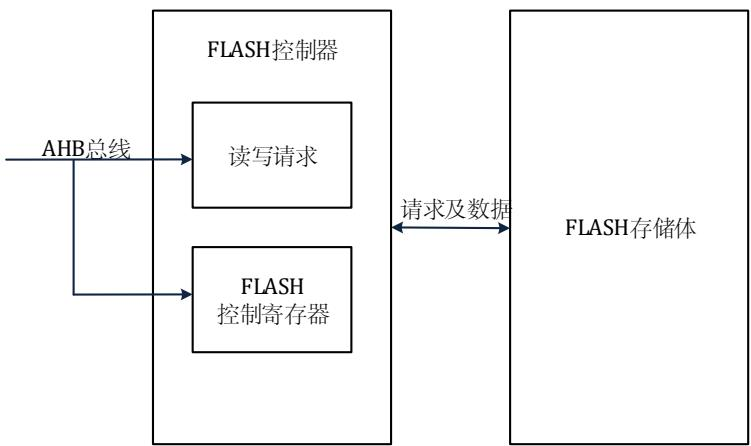  
图 5-1 Flash 模块结构框图

FLASH 模块由两个部分组成：FLASH 控制器和 FLASH 存储体。本文档主要描述 FLASH 控制器。FLASH 控制器，实现了芯片内部资源通过 AHB 总线对 FLASH 存储体的访问。

## 5.2 功能特点

➢ WORD（32-BIT）对齐方式，进行读取

➢ WORD（32-BIT）对齐方式，进行写入

➢ SECTOR/BLOCK/FULL CHIP 三种方式，进行擦除操作

➢ FLASH 控制寄存器的访问

➢ FLASH 预取操作

➢ FLASH 加密保护

➢ FLASH 在线升级（IAP）

## 5.2.1 访问操作

5.2.1.1 FLASH 读取操作

执行对 FLASH 存储体的读取操作。FLASH 一次性读取出 32-BIT 宽的数据。系统有两种方法读取 FLASH 数据。第一，MCU 执行取值或者取数据的指令；第二，MCU 通过访问 FLASH 寄存器（FLASH\_ADDR 和 FLASH\_RDATA）间接读取 FLASH 数据。第二种访问流程如下：

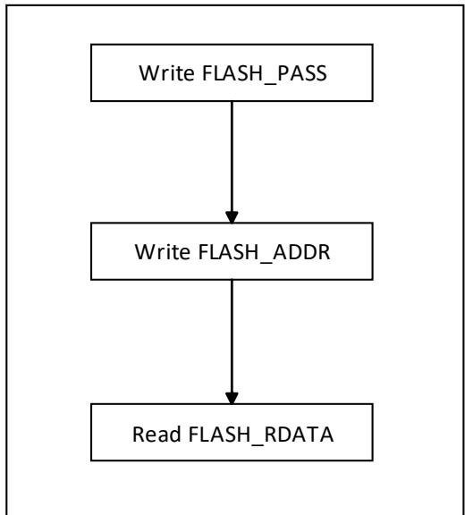  
图 5-2Flash模块读操作流程图

## 5.2.1.2 FLASH 写入操作

执行对 FLASH 存储体的写入操作。一般而言，我们先执行擦除操作，然后才能执行数据写入操作。FLASH 写入流程如下。

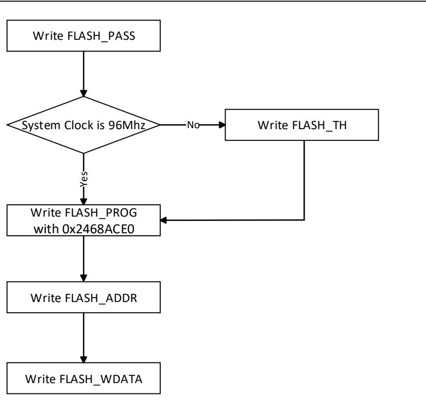

图 5-3Flash模块写操作流程图

系统工作频率的判断，需要参考 SYS\_CLK\_CFG 的配置。FLASH 写入/擦除操作的绝对时间是固定的，FLASH 控制器需要保存这些绝对时间对应的计数值。FLASH\_TH 寄存器默认值是 96MHz 时钟频率下的计数值；其它时钟频率时，FLASH\_TH 寄存器的值需要等比例变化。另外，在执行 FLASH的写入/擦除操作时，MCU将暂停工作直至 FLASH 的写入/擦除操作完毕。

图 5-3 仅展示了一次写入的流程。若执行连续写入时，上述流程将比较冗长，可以在写FLASH\_ADDR 寄存器前，配置 FLASH\_CFG 的 BIT8，开启地址自动递增模式（每次增加 0x4），后续只需要反复写 FLASH\_WDATA 寄存器即可。对于连续读，操作类似。连续写的流程如下

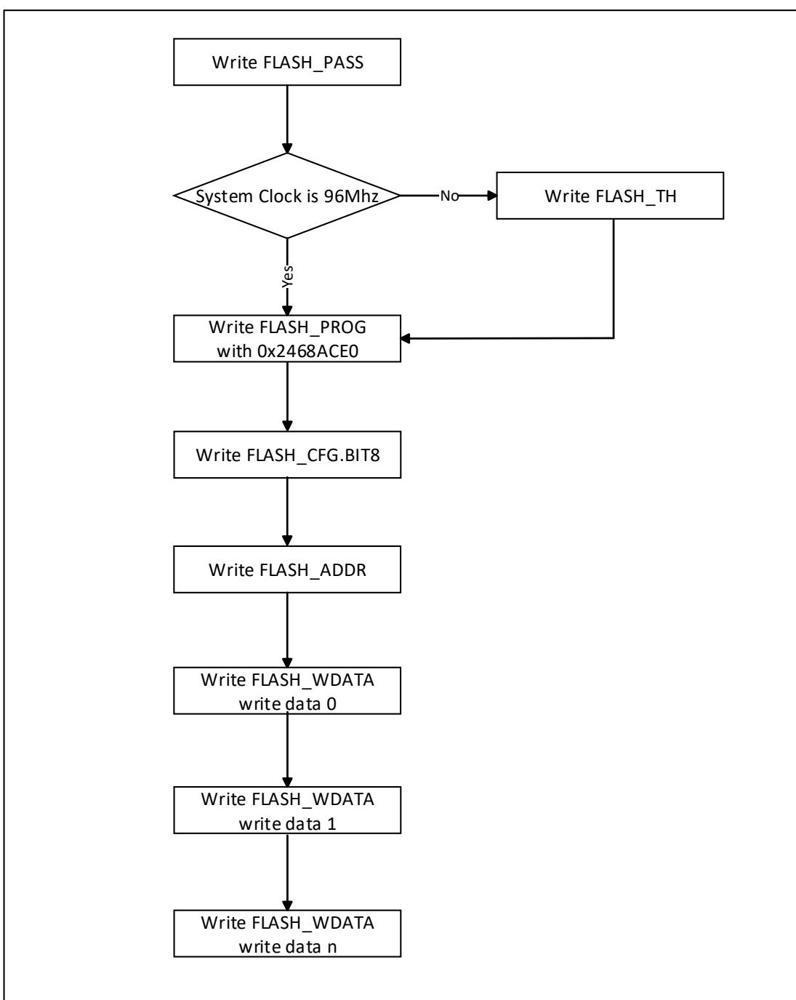  
图 5-4Flash模块连续写操作流程图

## 5.2.1.3 FLASH 擦除操作

执行对 FLASH 存储体的擦除操作。擦除分成 Sector/Block 和 FullChip。分别对应，256Byte 的擦除，2KB 的擦除和 32KB 的擦除。通过配置 FLASH 控制寄存器决定执行哪一种类型的擦除操作。下表为 Block 和 Secotor 地址分配空间。

表 5-1FLASH 地址分配表

<table><tr><td>Name</td><td>Addresses</td><td>Size(Bytes)</td></tr><tr><td>Block 0</td><td>0x0000 0000 - 0x0000 07FF</td><td>2KB</td></tr><tr><td>Block 1</td><td>0x0000 0800 - 0x0000 0FFF</td><td>2KB</td></tr><tr><td>Block 2</td><td>0x0000 1000 - 0x0000 17FF</td><td>2KB</td></tr><tr><td>...</td><td>...</td><td>...</td></tr><tr><td>Block 15</td><td>0x0000 7800 - 0x0000 7FFF</td><td>2KB</td></tr></table>

<table><tr><td>Name</td><td>Addresses</td><td>Size(Bytes)</td></tr><tr><td>Sector 0</td><td>0x0000 0000 - 0x0000 00FF</td><td>256</td></tr><tr><td>Sector 1</td><td>0x0000 0100 - 0x0000 01FF</td><td>256</td></tr><tr><td>Sector 2</td><td>0x0000 0200 - 0x0000 02FF</td><td>256</td></tr><tr><td>...</td><td>...</td><td>...</td></tr><tr><td>Sector 127</td><td>0x0000 7F00 - 0x0000 7FFF</td><td>256</td></tr></table>

FLASH\_CFG 寄存器的 BIT0 和 FLASH\_ERASE\_OP 的 BIT4，共同决定本次擦除的类型。

表 5-2FLASH 擦除类型表

<table><tr><td></td><td>FLASH_ERASE_OP.BIT4</td><td>FLASH_CFG.BIT0</td></tr><tr><td>Secotor</td><td>0</td><td>0</td></tr><tr><td>Block</td><td>0</td><td>1</td></tr><tr><td>Full Chip</td><td>1</td><td>X</td></tr></table>

FLASH擦除操作流程如下所示。

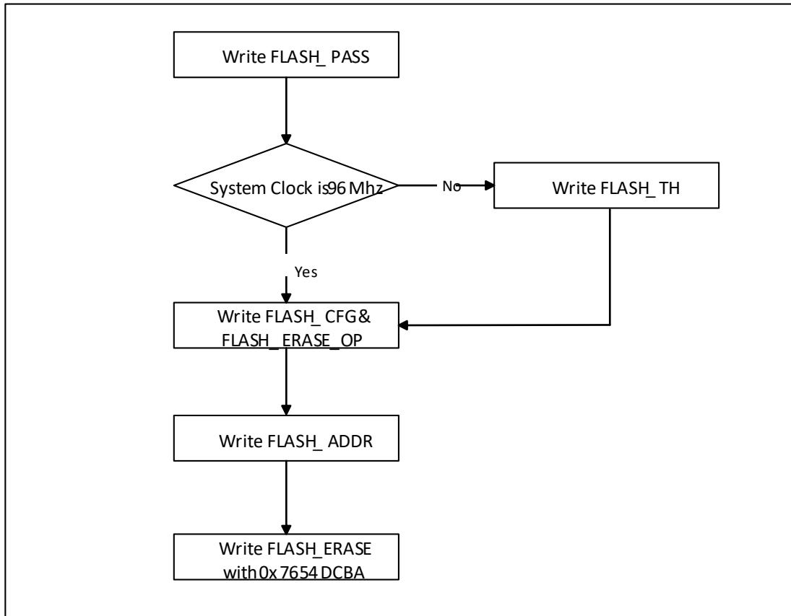  
图 5-5Flash模块擦除操作流程图

若选择 Block 或者 Secotor 擦除，需要通过 FLASH\_ADDR 确定哪个 Block 或者 Secotor 被擦除，若是 Full Chip 模式的话，FLASH\_ADDR 的值将失效。FLASH\_ERASE 只有写入 0x7654DCBA 才能正常触发擦除操作，写入其它值将无法触发擦除操作。

## 5.2.1.4 FLASH 预取操作

因 FLASH 存储体的速度限制，无法达到 96MHz的速度。当对 FLASH 进行读取操作时，需要大于 1 个时钟周期才能完成数据的读出。为了加快数据的读出，FLASH 控制器增加了预取功能。当FLASH 控制器执行完当前读取操作后，在不影响正常程序执行的前提下，顺序预取下一个 WORD的数据。预取操作的开启和关闭，只需要设置 FLASH\_CFG 的 BIT16 即可。

## 5.2.1.5 FLASH 加密保护

若 FLASH 存储体内的数据处于加密状态，用户可执行解密操作，可对 FLASH 存储体内的数据进行解密。相反，若 FLASH 存储体内的数据处于解密状态，用户可执行加密操作，对 FLASH 存储体内的数据进行加密。默认情况下，FLASH 存储体内的数据处于加密状态。

FLASH 存储体共有 32KB大小，其中最后一个 WORD 设计为加密字。当这个 WORD 内容为全 1时，表明此时 FLASH 处于解密状态；当这个 WORD 的内容被写为非全 1时，表明此时 FLASH 处于加密状态。具体加密执行的流程如下。

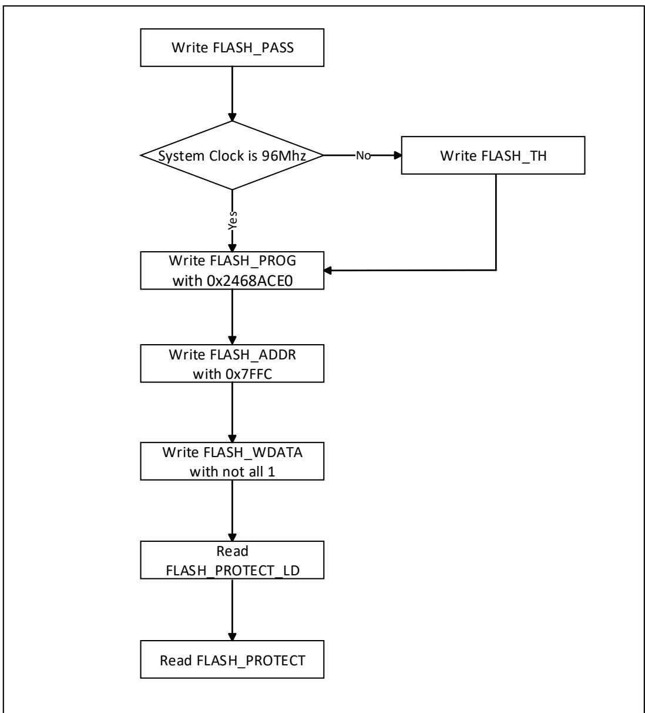  
图 5-6Flash模块加密操作流程图

将 FLASH 存储体的最后一个 WORD 写入非全 1 值，然后读取 FLASH\_PROTECT\_LD 寄存器，更新加密状态位，最后可以通过读取 FLASH\_PROTECT 寄存器检查是否加密。若是加密状态，FLASH\_PROTECT 返回值为 1。

对应的解密流程，只能将 FLASH 执行 Full Chip擦除才能解除。具体如下

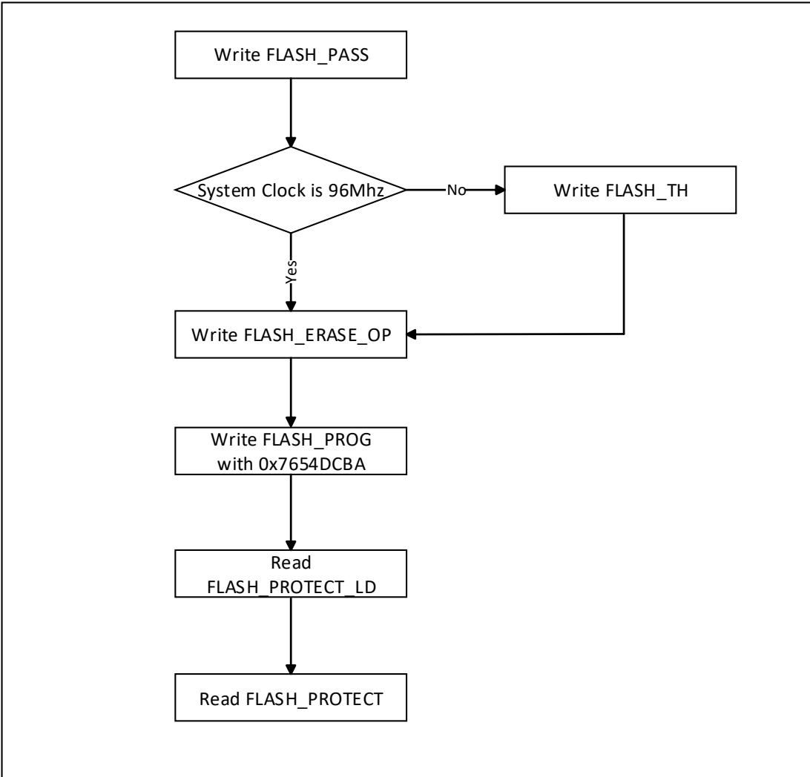  
图 5-7Flash模块解密操作流程图

先将 FLASH 执行 Full Chip 擦除，然后读取 FLASH\_PROTECT\_LD 寄存器，更新加密状态位，最后可以通过读取 FLASH\_PROTECT 寄存器检查是否解密。若是解密状态，FLASH\_PROTECT 返回值为 0。

切记，要获得最新的加密/解密状态，均需先读取 FLASH\_PROTECT\_LD 寄存器，完成状态位的更新操作。

## 5.2.1.6 FLASH 在线升级(IAP)

FLASH 的大小为 32KB。FLASH 划分成两个区域：2KB 区域和 30KB 区域。

2KB 区域从实际物理空间的 0x0000\_0000 开始至 0x0000\_07FF

30KB 区域从实际物理空间的 0x0000\_0800 开始至 0x0000\_7FFF

若用户关闭 IAP功能，则 2KB + 30KB，全部是用户代码空间。

若用户使能 IAP功能，则 2KB 为 IAP空间，30KB 为用户代码空间。系统发送的访问 FLASH 的地址，经过 FLASH 控制器后，将被自动加上 2KB 偏移。意味着，系统实际是从 2KB 开始执行的。简单说，在线升级实现了--是否重映射 FLASH 的32KB 空间。

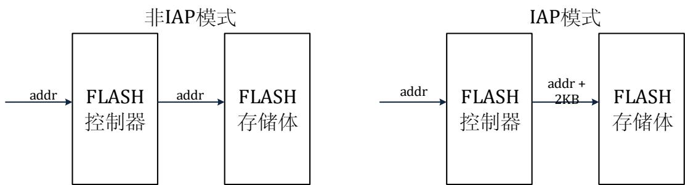  
图 5-8 在线升级空间映射关系

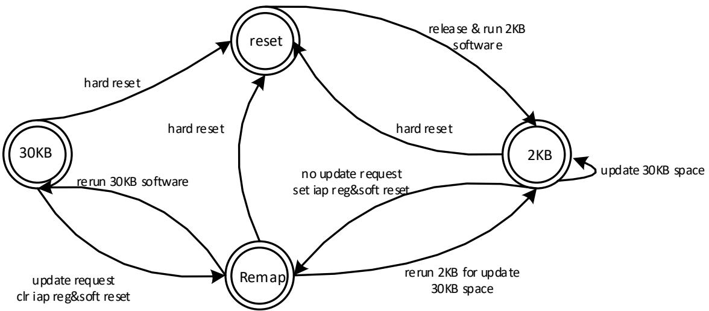  
图 5-9 在线升级流程转换图

若用户使用 IAP 功能。整个 32KB 空间有两段程序，IAP 的 2KB 空间的程序。后面 30KB 存放用户正常使用的程序。此时需要注意的是，用户正常使用的程序在执行过程中，若需要通过 FLASH寄存器间接访问 FLASH 数据，在配置 FLASH\_ADDR 时，需要考虑 2KB 的偏移。例如，若访问0x0000\_1000，实际访问的是 0x0000\_1800。受此影响，加密操作原本是改写 0x0000\_7FFC 地址，此时只能写成 0x0000\_77FC。

## 5.3 寄存器

## 5.3.1 地址分配

FLASH控制器模块寄存器的基地址是 0x4000\_0100 寄存器列表

表 5-3FLASH 控制寄存器

<table><tr><td>名称</td><td>偏移</td><td>说明</td></tr><tr><td>FLASH_TH</td><td>0x00</td><td>不同频率下,FLASH 擦除/写入的时间参数配置寄存器</td></tr><tr><td>FLASH_ADDR</td><td>0x04</td><td>地址寄存器</td></tr><tr><td>FLASH_WDATA</td><td>0x08</td><td>写数据寄存器</td></tr><tr><td>FLASH_RDATA</td><td>0x0C</td><td>读数据寄存器</td></tr><tr><td>FLASH_CFG</td><td>0x10</td><td>配置寄存器</td></tr><tr><td>FLASH_PROG</td><td>0x14</td><td>编程寄存器</td></tr><tr><td>FLASH_PASS</td><td>0x20</td><td>FLASH 寄存器配置使能寄存器</td></tr><tr><td>FLASH_ERASE</td><td>0x24</td><td>擦除使能寄存器</td></tr><tr><td>FLASH_ERASE_OP</td><td>0x28</td><td>擦除类型寄存器</td></tr><tr><td>FLASH_PROTECT</td><td>0x2C</td><td>FLASH 保护状态寄存器</td></tr><tr><td>FLASH_PROTECT_LD</td><td>0x30</td><td>FLASH 保护状态更新寄存器</td></tr><tr><td>FLASH_READY</td><td>0x34</td><td>FLASH 闲忙状态寄存器</td></tr></table>

## 5.3.2 擦除/写入时间参数配置寄存器 FLASH\_TH

表 5-4 擦除/写入时间参数配置寄存器 FLASH\_TH

<table><tr><td>名称</td><td>复位值</td><td>偏移</td><td>位置</td><td>权限</td><td>说明</td></tr><tr><td rowspan="4">FLASH_TH</td><td rowspan="4">0x40F8F078</td><td rowspan="4">0x00</td><td>[31:24]</td><td>RW</td><td>写入时间,默认为96Mhz配置值,其它频率等比例调整</td></tr><tr><td>[23:16]</td><td>RW</td><td>写入建立时间,默认为96Mhz配置值,其它频率等比例调整</td></tr><tr><td>[15:8]</td><td>RW</td><td>擦除时间,默认为96Mhz配置值,其它频率等比例调整</td></tr><tr><td>[7:0]</td><td>RW</td><td>擦除建立时间,默认为96Mhz配置值,其它频率等比例调整</td></tr></table>

## 5.3.3 地址寄存器 FLASH\_ADDR

表 5-5 地址寄存器 FLASH\_ADDR

<table><tr><td>名称</td><td>复位值</td><td>偏移</td><td>位置</td><td>权限</td><td>说明</td></tr><tr><td rowspan="2">FLASH_ADDR</td><td rowspan="2">0x0</td><td rowspan="2">0x04</td><td>[31:15]</td><td>NA</td><td>未使用,默认写0</td></tr><tr><td>[14:0]</td><td>RW</td><td>地址寄存器。读/写/擦除操作对应的地址寄存器。因按照WORD操作,最低两位会被FLASH控制器忽略。执行擦除操作时,需要根据擦除类型,地址需要对齐。一个Sector是256-Byte,一个Block是2048-Byte。若执行Sector擦除,地址需要是256的整数倍(若带偏移,偏移量会被忽略)。同理,适用于Block擦除。全芯片擦除,不会参考这个寄存器的值</td></tr></table>

## 5.3.4 写数据寄存器 FLASH\_WDATA

表 5-6 写数据寄存器 FLASH\_WDATA

<table><tr><td>名称</td><td>复位值</td><td>偏移</td><td>位置</td><td>权限</td><td>说明</td></tr><tr><td>FLASH_WDATA</td><td>0x0</td><td>0x08</td><td>[31:0]</td><td>RW</td><td>执行写入操作,写入 FLASH 的值</td></tr></table>

## 5.3.5 写数据寄存器 FLASH\_RDATA

表 5-7 写数据寄存器 FLASH\_RDATA

<table><tr><td>名称</td><td>复位值</td><td>偏移</td><td>位置</td><td>权限</td><td>说明</td></tr><tr><td>FLASH_RDATA</td><td>0x0</td><td>0x0C</td><td>[31:0]</td><td>R</td><td>执行读取操作,读出 FLASH 的值</td></tr></table>

## 5.3.6 控制寄存器 FLASH\_CFG

表 5-8 控制寄存器 FLASH\_CFG

<table><tr><td>名称</td><td>复位值</td><td>偏移</td><td>位置</td><td>权限</td><td>说明</td></tr><tr><td rowspan="6">FLASH_CFG</td><td rowspan="6">0x0</td><td rowspan="6">0x10</td><td>[31:17]</td><td>NA</td><td>未使用,默认写 0</td></tr><tr><td>[16]</td><td>RW</td><td>预取使能。1,使能预取;0,关闭预取。</td></tr><tr><td>[15:9]</td><td>NA</td><td>未使用,默认写 0</td></tr><tr><td>[8]</td><td>RW</td><td>地址自动递增。1,自动递增;0,不自动递增。</td></tr><tr><td>[7:1]</td><td>NA</td><td>未使用,默认写 0</td></tr><tr><td>[0]</td><td>RW</td><td>块擦除使能。1,使能;0,关闭。</td></tr></table>

## 5.3.7 写入控制寄存器 FLASH\_PROG

表 5-9 写入控制寄存器 FLASH\_PROG

<table><tr><td>名称</td><td>复位值</td><td>偏移</td><td>位置</td><td>权限</td><td>说明</td></tr><tr><td>FLASH_PROG</td><td>0x0</td><td>0x14</td><td>[31:0]</td><td>RW</td><td>写入 0x2468ACE0,使能写入操作;写入其它值,关闭写入操作。若写入操作使能,读取该寄存器,返回1;否则,返回0。</td></tr></table>

## 5.3.8 写入保护寄存器 FLASH\_PASS

表 5-10 写入保护寄存器 FLASH\_PASS

<table><tr><td>名称</td><td>复位值</td><td>偏移</td><td>位置</td><td>权限</td><td>说明</td></tr><tr><td rowspan="2">FLASH_PASS</td><td rowspan="2">0x0</td><td rowspan="2">0x20</td><td>[31:1]</td><td>NA</td><td>未使用,默认写 0</td></tr><tr><td>[0]</td><td>RW</td><td>FLASH 寄存器写入保护。1,使能配置 FLASH 寄存器;0,关闭配置 FLASH 寄存器。</td></tr></table>

## 5.3.9 擦除控制寄存器 FLASH\_ERASE

表 5-11 擦除控制寄存器 FLASH\_ERASE

<table><tr><td>名称</td><td>复位值</td><td>偏移</td><td>位置</td><td>权限</td><td>说明</td></tr><tr><td>FLASH_ERASE</td><td>0x0</td><td>0x24</td><td>[31:0]</td><td>RW</td><td>写入 0x7654DCBA,触发擦除操作;写入其它值,无效。</td></tr></table>

## 5.3.10 擦除类型寄存器 FLASH\_ERASE\_OP

表 5-12 擦除类型寄存器 FLASH\_ERASE\_OP

<table><tr><td>名称</td><td>复位值</td><td>偏移</td><td>位置</td><td>权限</td><td>说明</td></tr><tr><td rowspan="3">FLASH_ERASE_OP</td><td rowspan="3">0x0</td><td rowspan="3">0x28</td><td>[31:5]</td><td>NA</td><td>未使用,默认写 0</td></tr><tr><td>[4]</td><td>RW</td><td>1,全芯片擦除模式;0,非全芯片擦除模式。</td></tr><tr><td>[3:0]</td><td>NA</td><td>未使用,默认写 0</td></tr></table>

## 5.3.11 加密状态寄存器 FLASH\_PROTECT

表 5-13 加密状态寄存器 FLASH\_PROTECT

<table><tr><td>名称</td><td>复位值</td><td>偏移</td><td>位置</td><td>权限</td><td>说明</td></tr><tr><td rowspan="2">FLASH_PROTECT</td><td rowspan="2">0x0</td><td rowspan="2">0x2C</td><td>[31:1]</td><td>NA</td><td>未使用</td></tr><tr><td>[0]</td><td>R</td><td>FLASH 加密状态。1,加密;0,解密。</td></tr></table>

## 5.3.12 加密状态更新寄存器 FLASH\_PROTECT\_LD

表 5-14 加密状态更新寄存器 FLASH\_PROTECT\_LD

<table><tr><td>名称</td><td>复位值</td><td>偏移</td><td>位置</td><td>权限</td><td>说明</td></tr><tr><td>FLASH_PROTECT_LD</td><td>0x0</td><td>0x30</td><td>[31:0]</td><td>R</td><td>读该寄存器更新加密状态,返回值无效</td></tr></table>

## 5.3.13 工作状态寄存器 FLASH\_READY

表 5-15 工作状态寄存器 FLASH\_READY

<table><tr><td>名称</td><td>复位值</td><td>偏移</td><td>位置</td><td>权限</td><td>说明</td></tr><tr><td rowspan="2">FLASH_READY</td><td rowspan="2">0x0</td><td rowspan="2">0x34</td><td>[31]</td><td>R</td><td>1:FLASH 处于闲状态; 0:FLASH 处于忙状态</td></tr><tr><td>[30:0]</td><td>NA</td><td>未使用</td></tr></table>

## 6 通用 IO (GPIO)

## 6.1 概述

LSK32MC061C6T8 共集成了 3 组 16bit 位宽 GPIO。P0.0/P0.1/P1.0/P1.1 4 个 GPIO 可以作为系统的唤醒源。P0.15 \~ P0.0 16 个 GPIO 可以用作外部中断源输入。

## 6.1.1 功能框图

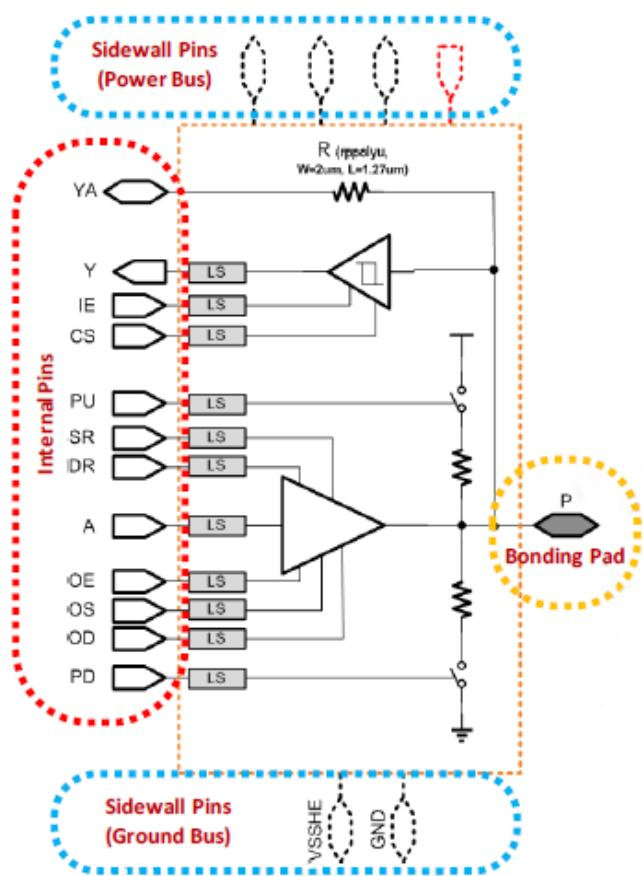  
图 6-1 GPIO 功能框图

## 6.1.2 产品特点

➢ 3 组 16bit GPIO

➢ 支持上拉、下拉、开漏

➢ 支持配置锁定保护

➢ 支持外部中断

➢ 支持 GPIO 唤醒

## 6.2 寄存器

## 6.2.1 地址分配

GPIO 0 模块在芯片中的基地址是 0x4000\_3700。

GPIO 1 模块在芯片中的基地址是 0x4000\_3740。

GPIO 2 模块在芯片中的基地址是 0x4000\_3780。

GPIO 0/1/2的寄存器定义完全相同，仅基地址不同。

表 6-1 GPIOx 寄存器列表

<table><tr><td>名称</td><td>偏移地址</td><td>说明</td></tr><tr><td>GPIOx_PIE</td><td>0x00</td><td>GPIO x 输入使能</td></tr><tr><td>GPIOx_POE</td><td>0x04</td><td>GPIO x 输出使能</td></tr><tr><td>GPIOx_PDI</td><td>0x08</td><td>GPIO x 输入数据</td></tr><tr><td>GPIOx_PDO</td><td>0x0C</td><td>GPIO x 输出数据</td></tr><tr><td>GPIOx_PUE</td><td>0x10</td><td>GPIO x 上拉使能</td></tr><tr><td>GPIOx_PDE</td><td>0x14</td><td>GPIO x 下拉使能</td></tr><tr><td>GPIOx_PODE</td><td>0x18</td><td>GPIO x 开漏使能</td></tr><tr><td>GPIOx_LCKR</td><td>0x1C</td><td>GPIO x 配置锁定</td></tr><tr><td>GPIOx_F3210</td><td>0x20</td><td>GPIO x [3:0]功能选择</td></tr><tr><td>GPIOx_F7654</td><td>0x24</td><td>GPIO x [7:4]功能选择</td></tr><tr><td>GPIOx_FBA98</td><td>0x28</td><td>GPIO x [11:8]功能选择</td></tr><tr><td>GPIOx_FFEDC</td><td>0x2C</td><td>GPIO x [15:12]功能选择</td></tr></table>

GPIO 中断/唤醒/配置锁定模块在 LSK32MC061C6T8 中的基地址是 0x4000\_37C0。

表 6-2GPIO 中断/唤醒/配置锁定模块寄存器列表

<table><tr><td>名称</td><td>偏移地址</td><td>说明</td></tr><tr><td>EXTI_CR0</td><td>0x00</td><td>GPIO 0[7:0] 中断触发类型</td></tr><tr><td>EXTI_CR1</td><td>0x04</td><td>GPIO 0[15:8]中断触发类型</td></tr><tr><td>EXTI_IF</td><td>0x08</td><td>GPIO 中断标志</td></tr><tr><td>LCKR_PRT</td><td>0x0C</td><td>GPIO 保护锁定配置</td></tr><tr><td>WAKE_POL</td><td>0x10</td><td>GPIO 唤醒信号极性</td></tr><tr><td>WAKE_EN</td><td>0x14</td><td>GPIO 唤醒使能</td></tr></table>

## 6.2.2 GPIOx\_PIE

表 6-3GPIOx 输入使能寄存器 GPIOx\_PIE

<table><tr><td>名称</td><td>复位值</td><td>偏移</td><td>位置</td><td>权限</td><td>说明</td></tr><tr><td rowspan="17">GPIOx_PIE</td><td rowspan="17">0x0</td><td rowspan="17">0x00</td><td>[31:16]</td><td>NA</td><td>未使用</td></tr><tr><td>[15]</td><td>RW</td><td>GPIO x[15] / Px[15] 输入使能</td></tr><tr><td>[14]</td><td>RW</td><td>GPIO x[14] / Px[14] 输入使能</td></tr><tr><td>[13]</td><td>RW</td><td>GPIO x[13] / Px[13] 输入使能</td></tr><tr><td>[12]</td><td>RW</td><td>GPIO x[12] / Px[12] 输入使能</td></tr><tr><td>[11]</td><td>RW</td><td>GPIO x[11] / Px[11] 输入使能</td></tr><tr><td>[10]</td><td>RW</td><td>GPIO x[10] / Px[10] 输入使能</td></tr><tr><td>[9]</td><td>RW</td><td>GPIO x[9] / Px[9] 输入使能</td></tr><tr><td>[8]</td><td>RW</td><td>GPIO x[8] / Px[8] 输入使能</td></tr><tr><td>[7]</td><td>RW</td><td>GPIO x[7] / Px[7] 输入使能</td></tr><tr><td>[6]</td><td>RW</td><td>GPIO x[6] / Px[6] 输入使能</td></tr><tr><td>[5]</td><td>RW</td><td>GPIO x[5] / Px[5] 输入使能</td></tr><tr><td>[4]</td><td>RW</td><td>GPIO x[4] / Px[4] 输入使能</td></tr><tr><td>[3]</td><td>RW</td><td>GPIO x[3] / Px[3] 输入使能</td></tr><tr><td>[2]</td><td>RW</td><td>GPIO x[2] / Px[2] 输入使能</td></tr><tr><td>[1]</td><td>RW</td><td>GPIO x[1] / Px[1] 输入使能</td></tr><tr><td>[0]</td><td>RW</td><td>GPIO x[0] / Px[0] 输入使能</td></tr></table>

## 6.2.3 GPIOx\_POE

表 6-4GPIOx 输出使能寄存器 GPIOx\_POE

<table><tr><td>名称</td><td>复位值</td><td>偏移</td><td>位置</td><td>权限</td><td>说明</td></tr><tr><td rowspan="15">GPIOx_POE</td><td rowspan="15">0x0</td><td rowspan="15">0x04</td><td>[31:16]</td><td>NA</td><td>未使用</td></tr><tr><td>[15]</td><td>RW</td><td>GPIO x[15] / Px[15] 输出使能</td></tr><tr><td>[14]</td><td>RW</td><td>GPIO x[14] / Px[14] 输出使能</td></tr><tr><td>[13]</td><td>RW</td><td>GPIO x[13] / Px[13] 输出使能</td></tr><tr><td>[12]</td><td>RW</td><td>GPIO x[12] / Px[12] 输出使能</td></tr><tr><td>[11]</td><td>RW</td><td>GPIO x[11] / Px[11] 输出使能</td></tr><tr><td>[10]</td><td>RW</td><td>GPIO x[10] / Px[10] 输出使能</td></tr><tr><td>[9]</td><td>RW</td><td>GPIO x[9] / Px[9] 输出使能</td></tr><tr><td>[8]</td><td>RW</td><td>GPIO x[8] / Px[8] 输出使能</td></tr><tr><td>[7]</td><td>RW</td><td>GPIO x[7] / Px[7] 输出使能</td></tr><tr><td>[6]</td><td>RW</td><td>GPIO x[6] / Px[6] 输出使能</td></tr><tr><td>[5]</td><td>RW</td><td>GPIO x[5] / Px[5] 输出使能</td></tr><tr><td>[4]</td><td>RW</td><td>GPIO x[4] / Px[4] 输出使能</td></tr><tr><td>[3]</td><td>RW</td><td>GPIO x[3] / Px[3] 输出使能</td></tr><tr><td>[2][1]</td><td>RWRW</td><td>GPIO x[2] / Px[2] 输出使能GPIO x[1] / Px[1] 输出使能</td></tr><tr><td></td><td></td><td></td><td>[0]</td><td>RW</td><td>GPIO x[0] / Px[0] 输出使能</td></tr></table>

## 6.2.4 GPIOx\_PDI

表 6-5GPIOx 输入数据寄存器 GPIOx\_PDI

<table><tr><td>名称</td><td>复位值</td><td>偏移</td><td>位置</td><td>权限</td><td>说明</td></tr><tr><td rowspan="2">GPIOx_PDI</td><td rowspan="2">0x0</td><td rowspan="2">0x08</td><td>[31:16]</td><td>NA</td><td>未使用</td></tr><tr><td>[15:0]</td><td>R</td><td>GPIO x 输入数据</td></tr></table>

## 6.2.5 GPIOx\_PDO

表 6-6GPIOx 输出数据寄存器 GPIOx\_PDO

<table><tr><td>名称</td><td>复位值</td><td>偏移</td><td>位置</td><td>权限</td><td>说明</td></tr><tr><td rowspan="2">GPIOx_PDO</td><td rowspan="2">0x00000000</td><td rowspan="2">0x0C</td><td>[31:16]</td><td>NA</td><td>未使用</td></tr><tr><td>[15:0]</td><td>RW</td><td>GPIO x 输出数据</td></tr></table>

## 6.2.6 GPIOx\_PUE

表 6-7GPIOx 上拉使能寄存器 GPIOx\_PUE

<table><tr><td>名称</td><td>复位值</td><td>偏移</td><td>位置</td><td>权限</td><td>说明</td></tr><tr><td rowspan="17">GPIOx_PUE</td><td rowspan="17">0x0</td><td rowspan="17">0x10</td><td>[31:16]</td><td>NA</td><td>未使用</td></tr><tr><td>[15]</td><td>RW</td><td>GPIO x[15] / Px[15] 上拉使能</td></tr><tr><td>[14]</td><td>RW</td><td>GPIO x[14] / Px[14] 上拉使能</td></tr><tr><td>[13]</td><td>RW</td><td>GPIO x[13] / Px[13] 上拉使能</td></tr><tr><td>[12]</td><td>RW</td><td>GPIO x[12] / Px[12] 上拉使能</td></tr><tr><td>[11]</td><td>RW</td><td>GPIO x[11] / Px[11] 上拉使能</td></tr><tr><td>[10]</td><td>RW</td><td>GPIO x[10] / Px[10] 上拉使能</td></tr><tr><td>[9]</td><td>RW</td><td>GPIO x[9] / Px[9] 上拉使能</td></tr><tr><td>[8]</td><td>RW</td><td>GPIO x[8] / Px[8] 上拉使能</td></tr><tr><td>[7]</td><td>RW</td><td>GPIO x[7] / Px[7] 上拉使能</td></tr><tr><td>[6]</td><td>RW</td><td>GPIO x[6] / Px[6] 上拉使能</td></tr><tr><td>[5]</td><td>RW</td><td>GPIO x[5] / Px[5] 上拉使能</td></tr><tr><td>[4]</td><td>RW</td><td>GPIO x[4] / Px[4] 上拉使能</td></tr><tr><td>[3]</td><td>RW</td><td>GPIO x[3] / Px[3] 上拉使能</td></tr><tr><td>[2]</td><td>RW</td><td>GPIO x[2] / Px[2] 上拉使能</td></tr><tr><td>[1]</td><td>RW</td><td>GPIO x[1] / Px[1] 上拉使能</td></tr><tr><td>[0]</td><td>RW</td><td>GPIO x[0] / Px[0] 上拉使能</td></tr></table>

## 6.2.7 GPIOx\_PDE

表 6-8GPIOx 下拉使能寄存器 GPIOx\_PDE

<table><tr><td>名称</td><td>复位值</td><td>偏移</td><td>位置</td><td>权限</td><td>说明</td></tr><tr><td rowspan="17">GPIOx_PDE</td><td rowspan="17">0x0</td><td rowspan="17">0x14</td><td>[31:16]</td><td>NA</td><td>未使用</td></tr><tr><td>[15]</td><td>RW</td><td>GPIO x[15] / Px[15] 下拉使能</td></tr><tr><td>[14]</td><td>RW</td><td>GPIO x[14] / Px[14] 下拉使能</td></tr><tr><td>[13]</td><td>RW</td><td>GPIO x[13] / Px[13] 下拉使能</td></tr><tr><td>[12]</td><td>RW</td><td>GPIO x[12] / Px[12] 下拉使能</td></tr><tr><td>[11]</td><td>RW</td><td>GPIO x[11] / Px[11] 下拉使能</td></tr><tr><td>[10]</td><td>RW</td><td>GPIO x[10] / Px[10] 下拉使能</td></tr><tr><td>[9]</td><td>RW</td><td>GPIO x[9] / Px[9] 下拉使能</td></tr><tr><td>[8]</td><td>RW</td><td>GPIO x[8] / Px[8] 下拉使能</td></tr><tr><td>[7]</td><td>RW</td><td>GPIO x[7] / Px[7] 下拉使能</td></tr><tr><td>[6]</td><td>RW</td><td>GPIO x[6] / Px[6] 下拉使能</td></tr><tr><td>[5]</td><td>RW</td><td>GPIO x[5] / Px[5] 下拉使能</td></tr><tr><td>[4]</td><td>RW</td><td>GPIO x[4] / Px[4] 下拉使能</td></tr><tr><td>[3]</td><td>RW</td><td>GPIO x[3] / Px[3] 下拉使能</td></tr><tr><td>[2]</td><td>RW</td><td>GPIO x[2] / Px[2] 下拉使能</td></tr><tr><td>[1]</td><td>RW</td><td>GPIO x[1] / Px[1] 下拉使能</td></tr><tr><td>[0]</td><td>RW</td><td>GPIO x[0] / Px[0] 下拉使能</td></tr></table>

## 6.2.8 GPIOx\_PODE

表 6-9GPIOx 开漏使能寄存器 GPIOx\_PODE

<table><tr><td>名称</td><td>复位值</td><td>偏移</td><td>位置</td><td>权限</td><td>说明</td></tr><tr><td rowspan="15">GPIOx_PODE</td><td rowspan="15">0x0</td><td rowspan="15">0x18</td><td>[31:16]</td><td>NA</td><td>未使用</td></tr><tr><td>[15]</td><td>RW</td><td>GPIO x[15] / Px[15] 开漏使能</td></tr><tr><td>[14]</td><td>RW</td><td>GPIO x[14] / Px[14] 开漏使能</td></tr><tr><td>[13]</td><td>RW</td><td>GPIO x[13] / Px[13] 开漏使能</td></tr><tr><td>[12]</td><td>RW</td><td>GPIO x[12] / Px[12] 开漏使能</td></tr><tr><td>[11]</td><td>RW</td><td>GPIO x[11] / Px[11] 开漏使能</td></tr><tr><td>[10]</td><td>RW</td><td>GPIO x[10] / Px[10] 开漏使能</td></tr><tr><td>[9]</td><td>RW</td><td>GPIO x[9] / Px[9] 开漏使能</td></tr><tr><td>[8]</td><td>RW</td><td>GPIO x[8] / Px[8] 开漏使能</td></tr><tr><td>[7]</td><td>RW</td><td>GPIO x[7] / Px[7] 开漏使能</td></tr><tr><td>[6]</td><td>RW</td><td>GPIO x[6] / Px[6] 开漏使能</td></tr><tr><td>[5]</td><td>RW</td><td>GPIO x[5] / Px[5] 开漏使能</td></tr><tr><td>[4]</td><td>RW</td><td>GPIO x[4] / Px[4] 开漏使能</td></tr><tr><td>[3]</td><td>RW</td><td>GPIO x[3] / Px[3] 开漏使能</td></tr><tr><td>[2][1]</td><td>RWRW</td><td>GPIO x[2] / Px[2] 开漏使能GPIO x[1] / Px[1] 开漏使能</td></tr><tr><td></td><td></td><td></td><td>[0]</td><td>RW</td><td>GPIO x[0] / Px[0] 开漏使能</td></tr></table>

## 6.2.9 GPIOx\_LCKR

表 6-10GPIOx 配置锁定寄存器 GPIOx\_LCKR

<table><tr><td>名称</td><td>复位值</td><td>偏移</td><td>位置</td><td>权限</td><td>说明</td></tr><tr><td rowspan="17">GPIOx_LCKR</td><td rowspan="17">0x0</td><td rowspan="17">0x1C</td><td>[31:16]</td><td>NA</td><td>未使用</td></tr><tr><td>[15]</td><td>RW</td><td>GPIO x[15] / Px[15] 配置锁定</td></tr><tr><td>[14]</td><td>RW</td><td>GPIO x[14] / Px[14] 配置锁定</td></tr><tr><td>[13]</td><td>RW</td><td>GPIO x[13] / Px[13] 配置锁定</td></tr><tr><td>[12]</td><td>RW</td><td>GPIO x[12] / Px[12] 配置锁定</td></tr><tr><td>[11]</td><td>RW</td><td>GPIO x[11] / Px[11] 配置锁定</td></tr><tr><td>[10]</td><td>RW</td><td>GPIO x[10] / Px[10] 配置锁定</td></tr><tr><td>[9]</td><td>RW</td><td>GPIO x[9] / Px[9] 配置锁定</td></tr><tr><td>[8]</td><td>RW</td><td>GPIO x[8] / Px[8] 配置锁定</td></tr><tr><td>[7]</td><td>RW</td><td>GPIO x[7] / Px[7] 配置锁定</td></tr><tr><td>[6]</td><td>RW</td><td>GPIO x[6] / Px[6] 配置锁定</td></tr><tr><td>[5]</td><td>RW</td><td>GPIO x[5] / Px[5] 配置锁定</td></tr><tr><td>[4]</td><td>RW</td><td>GPIO x[4] / Px[4] 配置锁定</td></tr><tr><td>[3]</td><td>RW</td><td>GPIO x[3] / Px[3] 配置锁定</td></tr><tr><td>[2]</td><td>RW</td><td>GPIO x[2] / Px[2] 配置锁定</td></tr><tr><td>[1]</td><td>RW</td><td>GPIO x[1] / Px[1] 配置锁定</td></tr><tr><td>[0]</td><td>RW</td><td>GPIO x[0] / Px[0] 配置锁定</td></tr></table>

配置保护，高有效；有效时 GPIO 输入/输出/上下拉/开漏/功能选择不能被修改；需要注意，只有在 LCKR\_PRT 写保护打开时才能改写 LCKR。

## 6.2.10 GPIOx\_F3210

表 6-11GPIOx 功能选择寄存器 GPIOx\_F3210

<table><tr><td>名称</td><td>复位值</td><td>偏移</td><td>位置</td><td>权限</td><td>说明</td></tr><tr><td rowspan="5">GPIOx_F3210</td><td rowspan="5">0x0</td><td rowspan="5">0x20</td><td>[31:16]</td><td>NA</td><td>未使用</td></tr><tr><td>[15:12]</td><td>RW</td><td>GPIO x[3] / Px[3] 功能选择</td></tr><tr><td>[11:8]</td><td>RW</td><td>GPIO x[2] / Px[2] 功能选择</td></tr><tr><td>[7:4]</td><td>RW</td><td>GPIO x[1] / Px[1] 功能选择</td></tr><tr><td>[3:0]</td><td>RW</td><td>GPIO x[0] / Px[0] 功能选择</td></tr></table>

## 6.2.11 GPIOx\_F7654

表 6-12GPIOx 功能选择寄存器 GPIOx\_F7654

<table><tr><td>名称</td><td>复位值</td><td>偏移</td><td>位置</td><td>权限</td><td>说明</td></tr><tr><td rowspan="5">GPIOx_F7654</td><td rowspan="5">0x0</td><td rowspan="5">0x24</td><td>[31:16]</td><td>NA</td><td>未使用</td></tr><tr><td>[15:12]</td><td>RW</td><td>GPIO x[7] / Px[7] 功能选择</td></tr><tr><td>[11:8]</td><td>RW</td><td>GPIO x[6] / Px[6] 功能选择</td></tr><tr><td>[7:4]</td><td>RW</td><td>GPIO x[5] / Px[5] 功能选择</td></tr><tr><td>[3:0]</td><td>RW</td><td>GPIO x[4] / Px[4] 功能选择</td></tr></table>

## 6.2.12 GPIOx\_FBA98

表 6-13GPIOx 功能选择寄存器 GPIOx\_FBA98

<table><tr><td>名称</td><td>复位值</td><td>偏移</td><td>位置</td><td>权限</td><td>说明</td></tr><tr><td rowspan="5">GPIOx_FBA98</td><td rowspan="5">0x0</td><td rowspan="5">0x28</td><td>[31:16]</td><td>NA</td><td>未使用</td></tr><tr><td>[15:12]</td><td>RW</td><td>GPIO x[11] / Px[11] 功能选择</td></tr><tr><td>[11:8]</td><td>RW</td><td>GPIO x[10] / Px[10] 功能选择</td></tr><tr><td>[7:4]</td><td>RW</td><td>GPIO x[9] / Px[9] 功能选择</td></tr><tr><td>[3:0]</td><td>RW</td><td>GPIO x[8] / Px[8] 功能选择</td></tr></table>

## 6.2.13 GPIOx\_FFEDC

表 6-14GPIOx 功能选择寄存器 GPIOx\_FFEDC

<table><tr><td>名称</td><td>复位值</td><td>偏移</td><td>位置</td><td>权限</td><td>说明</td></tr><tr><td rowspan="5">GPIOx_FFEDC</td><td rowspan="5">0x0</td><td rowspan="5">0x2C</td><td>[31:16]</td><td>NA</td><td>未使用</td></tr><tr><td>[15:12]</td><td>RW</td><td>GPIO x[15] / Px[15] 功能选择</td></tr><tr><td>[11:8]</td><td>RW</td><td>GPIO x[14] / Px[14] 功能选择</td></tr><tr><td>[7:4]</td><td>RW</td><td>GPIO x[13] / Px[13] 功能选择</td></tr><tr><td>[3:0]</td><td>RW</td><td>GPIO x[12] / Px[12] 功能选择</td></tr></table>

## 6.2.14 外部中断、唤醒、锁定保护

6.2.14.1 EXTI\_CR0

表 6-15 外部中断配置寄存器 EXTI\_CR0

<table><tr><td>名称</td><td>复位值</td><td>偏移</td><td>位置</td><td>权限</td><td>说明</td></tr><tr><td rowspan="4">EXTI_CR0</td><td rowspan="4">0x0</td><td rowspan="4">0x00</td><td>[31:16]</td><td>NA</td><td>未使用</td></tr><tr><td>[15:14]</td><td>RW</td><td>GPIO 0[7]/ P0[7]外部中断触发类型选择</td></tr><tr><td>[13:12]</td><td>RW</td><td>GPIO 0[6]/ P0[6]外部中断触发类型选择</td></tr><tr><td>[11:10][9:8]</td><td>RWRW</td><td>GPIO 0[5]/ P0[5]外部中断触发类型选择GPIO 0[4]/ P0[4]外部中断触发类型选择</td></tr><tr><td rowspan="4"></td><td rowspan="4"></td><td rowspan="4"></td><td>[7:6]</td><td>RW</td><td>GPIO 0[3]/ P0[3]外部中断触发类型选择</td></tr><tr><td>[5:4]</td><td>RW</td><td>GPIO 0[2]/ P0[2]外部中断触发类型选择</td></tr><tr><td>[3:2]</td><td>RW</td><td>GPIO 0[1]/ P0[1]外部中断触发类型选择</td></tr><tr><td>[1:0]</td><td>RW</td><td>GPIO 0[0]/ P0[0]外部中断触发类型选择</td></tr></table>

以[0:1]为例:

0x00: P0[0] 不触发，

0x01: P0[0] 下降沿触发，

0x10: P0[0] 上升沿触发，

0x11: P0[0] 上升沿、下降沿都触发。

6.2.14.2 EXTI\_CR1

表 6-16 外部中断配置寄存器 EXTI\_CR1

<table><tr><td>名称</td><td>复位值</td><td>偏移</td><td>位置</td><td>权限</td><td>说明</td></tr><tr><td rowspan="9">EXTI_CR1</td><td rowspan="9">0x0</td><td rowspan="9">0x04</td><td>[31:16]</td><td>NA</td><td>未使用</td></tr><tr><td>[15:14]</td><td>RW</td><td>GPIO 0[15]/P0[15]外部中断触发类型选择</td></tr><tr><td>[13:12]</td><td>RW</td><td>GPIO 0[14]/P0[14]外部中断触发类型选择</td></tr><tr><td>[11:10]</td><td>RW</td><td>GPIO 0[13]/P0[13]外部中断触发类型选择</td></tr><tr><td>[9:8]</td><td>RW</td><td>GPIO 0[12]/P0[12]外部中断触发类型选择</td></tr><tr><td>[7:6]</td><td>RW</td><td>GPIO 0[11]/P0[11]外部中断触发类型选择</td></tr><tr><td>[5:4]</td><td>RW</td><td>GPIO 0[10]/P0[10]外部中断触发类型选择</td></tr><tr><td>[3:2]</td><td>RW</td><td>GPIO 0[9]/P0[9]外部中断触发类型选择</td></tr><tr><td>[1:0]</td><td>RW</td><td>GPIO 0[8]/P0[8]外部中断触发类型选择</td></tr></table>

以[0:1]为例:

0x00: P0[8] 不触发，

0x01: P0[8] 下降沿触发，

0x10: P0[8] 上升沿触发，

0x11: P0[8] 上升沿、下降沿都触发。

6.2.14.3 EXTI\_IF

表 6-17 外部中断标志寄存器 EXTI\_IF

<table><tr><td>名称</td><td>复位值</td><td>偏移</td><td>位置</td><td>权限</td><td>说明</td></tr><tr><td>EXTI_IF</td><td>0x0</td><td>0x08</td><td>[31:16][15]</td><td>NARW</td><td>未使用GPIO 0[15] / P0[15] 外部中断标志</td></tr><tr><td rowspan="15"></td><td rowspan="15"></td><td rowspan="15"></td><td>[14]</td><td>RW</td><td>GPIO 0[14] / P0[14] 外部中断标志</td></tr><tr><td>[13]</td><td>RW</td><td>GPIO 0[13] / P0[13] 外部中断标志</td></tr><tr><td>[12]</td><td>RW</td><td>GPIO 0[12] / P0[12] 外部中断标志</td></tr><tr><td>[11]</td><td>RW</td><td>GPIO 0[11] / P0[11] 外部中断标志</td></tr><tr><td>[10]</td><td>RW</td><td>GPIO 0[10] / P0[10] 外部中断标志</td></tr><tr><td>[9]</td><td>RW</td><td>GPIO 0[9] / P0[9] 外部中断标志</td></tr><tr><td>[8]</td><td>RW</td><td>GPIO 0[8] / P0[8] 外部中断标志</td></tr><tr><td>[7]</td><td>RW</td><td>GPIO 0[7] / P0[7] 外部中断标志</td></tr><tr><td>[6]</td><td>RW</td><td>GPIO 0[6] / P0[6] 外部中断标志</td></tr><tr><td>[5]</td><td>RW</td><td>GPIO 0[5] / P0[5] 外部中断标志</td></tr><tr><td>[4]</td><td>RW</td><td>GPIO 0[4] / P0[4] 外部中断标志</td></tr><tr><td>[3]</td><td>RW</td><td>GPIO 0[3] / P0[3] 外部中断标志</td></tr><tr><td>[2]</td><td>RW</td><td>GPIO 0[2] / P0[2] 外部中断标志</td></tr><tr><td>[1]</td><td>RW</td><td>GPIO 0[1] / P0[1] 外部中断标志</td></tr><tr><td>[0]</td><td>RW</td><td>GPIO 0[0] / P0[0] 外部中断标志</td></tr></table>

中断标志高有效，写 1清零。

## 6.2.14.4 LCKR\_PRT

表 6-18 锁定保护寄存器 LCKR\_PRT

<table><tr><td>名称</td><td>复位值</td><td>偏移</td><td>位置</td><td>权限</td><td>说明</td></tr><tr><td rowspan="2">LCKR_PRT</td><td rowspan="2">0x0</td><td rowspan="2">0x0C</td><td>[31:16]</td><td>NA</td><td>未使用</td></tr><tr><td>[15:0]</td><td>W</td><td>配置锁定写保护;写入 0x5AC4 关闭写保护,然后才能修改 GPIO_LCKR;写入任意其他数据开启写保护;1bit 状态指示当前写保护与否,高有效</td></tr></table>

## 6.2.14.5 WAKE\_POL

表 6-19 外部唤醒源极性配置寄存器 WAKE\_POL

<table><tr><td>名称</td><td>复位值</td><td>偏移</td><td>位置</td><td>权限</td><td>说明</td></tr><tr><td rowspan="6">WAKE_POL</td><td rowspan="6">0x0</td><td rowspan="6">0x10</td><td>[31:16]</td><td>NA</td><td>未使用</td></tr><tr><td>[15:4]</td><td>RW</td><td>保留</td></tr><tr><td>[3]</td><td>RW</td><td>GPIO 1[1] / P1[1]外部唤醒触发电平选择</td></tr><tr><td>[2]</td><td>RW</td><td>GPIO 1[0] / P1[0]外部唤醒触发电平选择</td></tr><tr><td>[1]</td><td>RW</td><td>GPIO 0[1] / P0[1]外部唤醒触发电平选择</td></tr><tr><td>[0]</td><td>RW</td><td>GPIO 0[0] / P0[0]外部唤醒触发电平选择</td></tr></table>

```txt
//----
```

1：高电平，0：低电平。

6.2.14.6 WAKE\_EN

表 6-20 外部唤醒源使能寄存器 WAKE\_EN

<table><tr><td>名称</td><td>复位值</td><td>偏移</td><td>位置</td><td>权限</td><td>说明</td></tr><tr><td rowspan="6">WAKE_EN</td><td rowspan="6">0x0</td><td rowspan="6">0x14</td><td>[31:16]</td><td>NA</td><td>未使用</td></tr><tr><td>[15:4]</td><td>RW</td><td>保留</td></tr><tr><td>[3]</td><td>RW</td><td>GPIO 1[1] / P1[1] 外部唤醒使能</td></tr><tr><td>[2]</td><td>RW</td><td>GPIO 1[0] / P1[0] 外部唤醒使能</td></tr><tr><td>[1]</td><td>RW</td><td>GPIO 0[1] / P0[1] 外部唤醒使能</td></tr><tr><td>[0]</td><td>RW</td><td>GPIO 0[0] / P0[0] 外部唤醒使能</td></tr></table>

1：使能，0：禁用。

## 6.3 应用指南

## 6.3.1 配置锁定

芯片提供对 GPIO 配置的保护功能。当 LCKR\_PRT 写保护使能时，3 组 GPIO 的 GPIO\_LCKR 不能修改，GPIO\_PIE / GPIO\_POE / GPIO\_PUE / GPIO\_PDE / GPIO\_ODE / GPIO\_F3210 / GPIO\_F7654 /GPIO\_FBA98 / GPIO\_FFEDC 不能修改；

若需要修改 GPIO 配置，应先解除 LCKR\_PRT 写保护，然后将对应 GPIO 的 GPIO\_LCKR 写 0，解除配置锁定，然后修改 GPIO配置。

示例如下：

$$
\mathrm {GPIO1\_PIE} = 0 \mathrm{x} 7 7 7 7;
$$

$$
\mathrm {GPIO2\_PIE} = 0 \mathrm{xF000};
$$

// lock specific gpio

//lock gpio0 here

GPIO1\_LCKR = 0xFFFF;

//lock gpio1 here

//lock gpio2 here

```txt
//----
```

// modify to test if gpio config is locked

```txt
GPIO0_PIE = 0x3333;
```

```c
if(GPIO0_LCKR != 0x0000)FAIL;
```

```txt
//----
```

```txt
GPIO2_LCKR = 0x0000;
```

```sql
GPIO1_PIE = 0x0000;
```

```sql
GPIO2_PIE = 0x0000;
```

// read gpio config to flag PASS or FAIL

```txt
if(GPIO0_PIE != 0x3233)FAIL;
```

```txt
if(GPIO1_PIE != 0x7777)FAIL;
```

```c
if(GPIO2_PIE != 0x8000)FAIL;
```

```txt
LCKR_PRT = 0x0000; // write any value other than 0x5AC4 to enable lock protect
```

```txt
GPIO0_LCKR = 0x0000;
```

```c
if(GPIO0_LCKR != 0x0100)FAIL;
```

```txt
if(GPIO2_LCKR != 0x8000)FAIL;
```

```txt
LCKR_PRT = 0x5AC4; // disable protect
```

$$
\mathrm {GPIO1\_LCKR} = 0 \mathrm{x} 0 0 0 0;
$$

$$
\mathrm {GPIO2\_LCKR} = 0 \mathrm{x} 0 0 0 0;
$$

$$
\mathrm {if(GPIO1\_LCKR} \quad ! = 0 x 0 0 0 0) \mathrm{FAIL};
$$

$$
\text { if } (\text { GPIO2\_LCKR } \quad ! = 0 x 0 0 0 0) \text { FAIL; }
$$

## 6.3.2 外部中断

```c
示例如下：
GPIO0_PIE = 0x0080;    // 使能 P0[7]输入

NVIC_EnableIRQ(GPIO_IRQn); //使能 GPIO 中断
_enable_irq();    //使能中断
i = 1000;
while(i--);
// P0[7] IO 上外接方波信号
EXTI_CR0 = 0x8000;    // 使能 p0[7]上升沿触发，产生外部中断
while(irq_flag != 2);    // 外部信号翻转两次，产生两次中断，irq_flag 在 GPIO 中断处理程序中递增两次
EXTI_CR0 = 0x4000;    // 使能 p0[7]下降沿触发，产生外部中断
while(irq_flag != 4);
EXTI_CR0 = 0xC000;    // 同时使能 P0[7]上升沿、下降沿触发，产生外部中断
while(irq_flag != 8);
EXTI_CR0 = 0x0000;    // 同时禁用 P[7]上下沿触发，将无法产生外部中断
i = 1000;
while(i--);
if(irq_flag != 8)FAIL;
i = 1000;
while(i--);
PASS;
}
```

## 7 模数转换器(ADC)

## 7.1 概述

芯片集成 2个 12BIT SARADC，每个 ADC有 12 路输入通道。芯片上电的默认状态下，ADC模块是关闭的。通过将 ADCxPDN 设置为 1 来开启ADC，ADC开启前，需要先开启 BGP、4M RC时钟和 PLL 模块，并通过配置 ADCCLKSEL<1:0>选择 ADC 工作频率。

ADCxPDN 的说明见模拟寄存器 SYS\_AFE\_REG5

ADCCLKSEL<1:0>的说明见模拟寄存器 SYS\_AFE\_REG7

ADC完成一次转换需要 16 个 ADC 时钟周期，其中 13 个为转换周期，3 个为采样周期。在 ADC时钟设为 48M 时，转换速率是 3MHz。

ADC在降频应用时，可通过模拟寄存器 CURRIT[1:0]降低 ADC的功耗水平。

CURRIT[1:0]的说明见模拟寄存器 SYS\_AFE\_REG2

ADC采样的量词含义约定：

1 次采样：完成对应的一个通道的模拟信号量到数据信号量的采样转换存储值 ADCx\_DAT 寄存器；

1 段采样：可能包含 1 次或若干次采样，若干次采样可以是相同的模拟量通道，也可以是不同的模拟量通道。采样开始通常由 MCPWM 或软件进行触发，一个触发信号完成一段采样，采样完成后产生相应的段采样完成中断；以 MCPWM 触发的四段采样为例，每段采样 3 次（即完成 3个模拟量的采样），TADC[0]触发ADC开始第一段采样，第一段采样完成后ADC进入等待状态，等待TADC[1]触发事件发生；TADC[1]发生后，触发 ADC 开始第二段采样；同理，TADC[2]/TADC[3]为别触发第三段和第四段采样。

1 轮采样：可能包含 1 段、2 段或 4 段采样，每段分别由特定触发信号触发；ADC 完成一轮采样后回归空闲状态等待下次触发。

## 7.1.1 功能框图

如下图所示，芯片集成两路 SAR ADC，每路 ADC可以选择配置 12 个通道的输入。

每个 ADC接口包括 12 个数据寄存器（ADC 12 次采样各个通道模拟量对应的数字量），以及若干控制寄存器。

数据寄存器 ADC\_DATx 用于存储 ADC 第 x 次采样得到的数据量。被转换的模拟信号来源由寄存器 ADC\_CHNx 中的某 4bit 进行选择（详见 7.2.3 信号来源寄存器章节）。以 ADCx\_CHN0（x=0,1，分别对应 ADC0和 ADC1）为例，位[3:0]选择第 0 次采样的模拟通道号，通道号 CH0\~CH11 任选，若ADCx\_CHN0[3:0]=0，则第 0 次采样会采样 CH0；若 ADCx\_CHN0[15:12]=3，则第 3 次采样会采样CH3，以此类推。

分段采样次数寄存器 ADCx\_CHNT 控制每轮采样的次数，0\~15对应 1\~16次。

控制逻辑根据配置寄存器ADCx\_CFG选择来自MCPWM定时器的触发信号启动一轮采样或者软件 触 发 启 动 。 MCPWM 会 送 出 定 时 触 发 信 号 TADC[0]/TADC[1]/TADC[2]/TADC[3] ， 可 选 择TADC[0]/TADC[1]/TADC[2]/TADC[3]作为触发信号。触发信号的选择保存在控制寄存器中。

一段转换（一段内的所有通道采样转换完毕）完成，触发 ADC转换完成中断。多段触发模式下，每一段转换完成可触发产生一个转换完成中断。

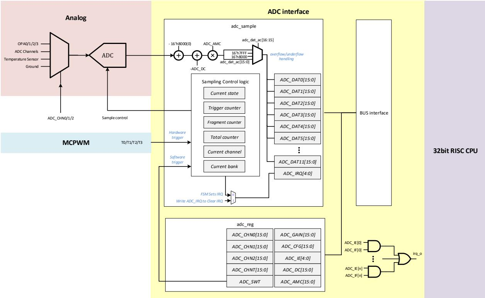  
图 7-1ADC采集模块功能框图

来源可选使得用户可以灵活配置采样顺序、以及采样信号来源，甚至实现对单个信号多次采样的目的。同时每个通道的 ADC 增益也可以通过寄存器配置（两档增益可选）。控制寄存器使得用户可以配置采样个数，提高采样频率/降低采样功耗。

## 7.1.2 ADC 触发方式

➢ 支持单段触发、两段触发、四段触发完成采样

➢ 单段触发可以设置触发事件发生次数

➢ 两段触发的触发源只能为 MCPWM 的定时信号 TADC[0]+TADC[1]，或两次软件触发

➢ 四段触发的触发源只能为 MCPWM 的定时信号 TADC[0]+TADC[1]+TADC[2]+TADC[3]，或四次软件触发

➢ 每段触发完成均可产生中断

## 7.1.3 ADC 输出数制

ADC 输出数据为 12bit 补码，输入信号 0 对应 12h’0000\_0000\_0000，以 1 倍增益配置为例，输入信号-1.2V 对应 12h’1000\_0000\_0000，输入信号+1.2V 对应 12h’0111\_1111\_1111。ADC 转换后的12bit 补码需扩展为 16BIT 存入 16bit 位宽的采样数据寄存器，左对齐/右对齐可根据配置寄存器进行设置。以 12’h1000\_0000\_1101 为例，如果配置为左对齐，右侧补 4 个 0，存入 ADCx\_DAT 的值为 16’h1000\_0000\_1101\_0000；如果配置为右对齐，左侧进行符号扩展，存入 ADCx\_DAT 的值为16’h1111\_1000\_0000\_1101。

需要注意的是，由于存在增益校正和直流偏置校正，ADC 最终数据可能会超过 12bit 有符号数的表示范围，比如在右对齐的模式下，ADC 某次转换的数字量可能为 0xF745，此时直接进行低 12bit的截取取出 0x745，会使得负数被作为正数处理，即发生溢出错误。亦或者 ADC某次转换的数字量可能为 0x0810，此时直接进行低 12bit 的截取取出 0x810，会使得正数被错误地当做负数处理。因此需要将 ADC数据作为 16bit 有符号数进行处理。

表 7-1ADC输出数字量数制转换

<table><tr><td>ADC 一倍增益输入模拟量数值/V</td><td>ADC1/3 倍增益输入模拟量数值/V</td><td>转为有符号数后的数值</td></tr><tr><td>1.2</td><td>3.6</td><td>12&#x27;h0111_1111_1111</td></tr><tr><td>0</td><td>0</td><td>12&#x27;h0000_0000_0000</td></tr><tr><td>-1.2</td><td>-3.6</td><td>12&#x27;h1000_0000_0000</td></tr></table>

## 7.1.4 ADC 量程

ADC有两种增益模式：高增益（1 倍）和低增益（1/3 倍），针对这两种增益，ADC的量程也相应有所区别。1 倍增益模式下，对应最大±1.2V 的输入信号幅度，1/3 倍增益模式下，对应最大±3.6V的输入信号幅度。

在 ADC 采样通道配置为运放的输出信号时（即 OPA0\~OPA3，配置方式见 7.2.3 信号来源寄存器），应选择合适的运放增益，使得具体应用上的最大信号可被放大到接近+/-3.3V的水平，同时将ADC 配置为 1/3 倍增益。举例来说，相线电流最大 100A（正弦波有效值），MOS 内阻（假设为 MOS内阻采样）为 5mR，则运放的最大输入信号幅值为+/-707mV。此时应该选择运放的放大倍数为 4.5倍（放大倍数选择方式见 3.6 运算放大器），则放大后的信号约为+/-3.18V。

如果因为客观原因，运放的输出信号经放大后，最大信号仍然小于+/-1.2V，则应将 ADC 的增益配置为 1倍。

在 ADC 采 样 通 道 配 置 为 GPIO 复 用 口 输 入 的 信 号 时 （ 即 ADC0\_CH4\~ADC0\_CH9 及ADC1\_CH4\~ADC1\_CH10，配置方式见 7.2.3 信号来源寄存器），同样根据信号的最大幅度来选择 ADC增益。由于 IO口的限制，GPIO复用口输入的信号范围只能在-0.3V\~AVDD+0.3V 之间。

高低增益选择由 ADCx\_GAIN 增益寄存器进行控制。

## 7.1.5 ADC 校正

ADC硬件接口模块可以进行直流偏置校正与增益校正。

ADCx\_AMC 存储的是增益校正系数 $\mathsf { A M P _ { c o r r e c t i o n } }$ ，为 10bit 无符号定点数，ADCx\_AMC[9]为整数部分，ADCx\_AMC[8:0]为小数部分。可以表示数值在 1 附近的定点数。

ADCx\_DC 存储的是 ADC 的直流偏置，通常在校正阶段通过测量通道 11 的 VSS 得到 ADC 直流偏置数值并存入 flash 中，并在系统加载阶段由软件将直流偏置写入 ADCx\_DC 寄存器中。

需要注意的是，ADC有高增益和低增益两档配置，两种配置对应两套校正参数，每套校正数据分别包含一个 DC offset(以下记为 $\mathrm { D C _ { o f f s e t } } )$ 和一个增益校正值 AMP<sub>correction</sub>。高增益对应的校正系数为ADCx\_DC1/ADCx\_AMC1，低增益对应的校正系数为 ADCx\_DC0/ADCx\_AMC0。

记 ADC输出的数字量为 $\mathrm { D } _ { \mathrm { A D C } }$ $\mathrm { D } _ { \mathrm { A D C } }$ 对应的真实值为 D， $\mathrm { D } _ { 0 }$ 为编码数制的 0，则

$$
\mathrm{D} = \left(\mathrm{D} _ {\mathrm{ADC}} - \mathrm{D} _ {0} - \mathrm{DC} _ {\text { offset }}\right) ^ {*} \mathrm{AMP} _ {\text { correction }}
$$

最终硬件会将进行校正后的 D 存入相应的采样数据寄存器。ADC接口硬件电路会根据每个通道的增益配置(ADCx\_GAIN)来自动选择 $\mathsf { A M P _ { c o r r e c t i o n } }$ 与 $\mathrm { D C _ { o f f s e t } }$ c

## 7.2 寄存器

## 7.2.1 地址分配

ADC0 在芯片中的基地址是 0x4000\_3300；

表 7-2 ADC0 寄存器列表

<table><tr><td>名称</td><td>偏移地址</td><td>说明</td></tr><tr><td>ADC0_DAT0</td><td>0x00</td><td>ADC0 第 0 次采样数据</td></tr><tr><td>ADC0_DAT1</td><td>0x04</td><td>ADC0 第 1 次采样数据</td></tr><tr><td>ADC0_DAT2</td><td>0x08</td><td>ADC0 第 2 次采样数据</td></tr><tr><td>ADC0_DAT3</td><td>0x0C</td><td>ADC0 第 3 次采样数据</td></tr><tr><td>ADC0_DAT4</td><td>0x10</td><td>ADC0 第 4 次采样数据</td></tr><tr><td>ADC0_DAT5</td><td>0x14</td><td>ADC0 第 5 次采样数据</td></tr><tr><td>ADC0_DAT6</td><td>0x18</td><td>ADC0 第 6 次采样数据</td></tr><tr><td>ADC0_DAT7</td><td>0x1C</td><td>ADC0 第 7 次采样数据</td></tr><tr><td>ADC0_DAT8</td><td>0x20</td><td>ADC0 第 8 次采样数据</td></tr><tr><td>ADC0_DAT9</td><td>0x24</td><td>ADC0 第 9 次采样数据</td></tr><tr><td>ADC0_DAT10</td><td>0x28</td><td>ADC0 第 10 次采样数据</td></tr><tr><td>ADC0_DAT11</td><td>0x2C</td><td>ADC0 第 11 次采样数据</td></tr><tr><td>ADC0_CHN0</td><td>0x40</td><td>ADC0 第 0~3 次采样信号选择</td></tr><tr><td>ADC0_CHN1</td><td>0x44</td><td>ADC0 第 4~7 次采样信号选择</td></tr><tr><td>ADC0_CHN2</td><td>0x48</td><td>ADC0 第 8~11 次采样信号选择</td></tr><tr><td>ADC0_CHNT</td><td>0x50</td><td>ADC0 各段采样通道数</td></tr><tr><td>ADC0_IE</td><td>0x54</td><td>ADC0 中断使能</td></tr><tr><td>ADC0_CFG</td><td>0x60</td><td>ADC0 配置</td></tr><tr><td>ADC0_GAIN</td><td>0x64</td><td>ADC0 增益控制</td></tr><tr><td>ADC0_IF</td><td>0x68</td><td>ADC0 中断标志</td></tr><tr><td>ADC0_SWT</td><td>0x6C</td><td>ADC0 软件触发</td></tr><tr><td>ADC0_DC0</td><td>0x70</td><td>ADC0 非 1 倍增益 DC offset</td></tr><tr><td>ADC0_DC1</td><td>0x74</td><td>ADC0 1 倍增益 DC offset</td></tr><tr><td>ADC0_AMC0</td><td>0x78</td><td>ADC0 非 1 倍增益增益校正</td></tr><tr><td>ADC0_AMC1</td><td>0x7C</td><td>ADC0 1 倍增益增益校正</td></tr></table>

ADC1 在芯片中的基地址是 0x4000\_3400；

表 7-3 ADC1 寄存器列表

<table><tr><td>名称</td><td>偏移地址</td><td>说明</td></tr><tr><td>ADC1_DAT0</td><td>0x00</td><td>ADC1 第 0 次采样数据</td></tr><tr><td>ADC1_DAT1</td><td>0x04</td><td>ADC1 第 1 次采样数据</td></tr><tr><td>ADC1_DAT2</td><td>0x08</td><td>ADC1 第 2 次采样数据</td></tr><tr><td>ADC1_DAT3</td><td>0x0C</td><td>ADC1 第 3 次采样数据</td></tr><tr><td>ADC1_DAT4</td><td>0x10</td><td>ADC1 第 4 次采样数据</td></tr><tr><td>ADC1_DAT5</td><td>0x14</td><td>ADC1 第 5 次采样数据</td></tr><tr><td>ADC1_DAT6</td><td>0x18</td><td>ADC1 第 6 次采样数据</td></tr><tr><td>ADC1_DAT7</td><td>0x1C</td><td>ADC1 第 7 次采样数据</td></tr><tr><td>ADC1_DAT8</td><td>0x20</td><td>ADC1 第 8 次采样数据</td></tr><tr><td>ADC1_DAT9</td><td>0x24</td><td>ADC1 第 9 次采样数据</td></tr><tr><td>ADC1_DAT10</td><td>0x28</td><td>ADC1 第 10 次采样数据</td></tr><tr><td>ADC1_DAT11</td><td>0x2C</td><td>ADC1 第 11 次采样数据</td></tr><tr><td>ADC1_CHN0</td><td>0x40</td><td>ADC1 第 0~3 次采样信号选择</td></tr><tr><td>ADC1_CHN1</td><td>0x44</td><td>ADC1 第 4~7 次采样信号选择</td></tr><tr><td>ADC1_CHN2</td><td>0x48</td><td>ADC1 第 8~11 次采样信号选择</td></tr><tr><td>ADC1_CHNT</td><td>0x50</td><td>ADC1 各段采样通道数</td></tr><tr><td>ADC1_IE</td><td>0x54</td><td>ADC1 中断使能</td></tr><tr><td>ADC1_CFG</td><td>0x60</td><td>ADC1 触发控制</td></tr><tr><td>ADC1_GAIN</td><td>0x64</td><td>ADC1 增益控制</td></tr><tr><td>ADC1_IF</td><td>0x68</td><td>ADC1 中断标志</td></tr><tr><td>ADC1_SWT</td><td>0x6C</td><td>ADC1 软件触发</td></tr><tr><td>ADC1_DC0</td><td>0x70</td><td>ADC1 低增益 DC offset</td></tr><tr><td>ADC1_DC1</td><td>0x74</td><td>ADC1 高增益 DC offset</td></tr><tr><td>ADC1_AMC0</td><td>0x78</td><td>ADC1 低增益增益校正</td></tr><tr><td>ADC1_AMC1</td><td>0x7C</td><td>ADC1 高增益增益校正</td></tr></table>

由于 ADC0、ADC1实现及地址偏移完全相同，以下寄存器说明不作区分。

## 7.2.2 采样数据寄存器

## 7.2.2.1 ADCx\_DAT0

表 7-4 采样数据寄存器 ADCx\_DAT0

<table><tr><td>名称</td><td>复位值</td><td>偏移</td><td>位置</td><td>权限</td><td>说明</td></tr><tr><td rowspan="2">ADCx_DAT0</td><td rowspan="2">0x0</td><td rowspan="2">0x00</td><td>[31:16]</td><td>NA</td><td>未使用</td></tr><tr><td>[15:0]</td><td>RW</td><td>ADCx 第 0 次采样数据</td></tr></table>

## 7.2.2.2 ADCx\_DAT1

表 7-5 采样数据寄存器 ADCx\_DAT1

<table><tr><td>名称</td><td>复位值</td><td>偏移</td><td>位置</td><td>权限</td><td>说明</td></tr><tr><td rowspan="2">ADCx_DAT1</td><td rowspan="2">0x0</td><td rowspan="2">0x04</td><td>[31:16]</td><td>NA</td><td>未使用</td></tr><tr><td>[15:0]</td><td>RW</td><td>ADCx 第 1 次采样数据</td></tr></table>

## 7.2.2.3 ADCx\_DAT2

表 7-6 采样数据寄存器 ADCx\_DAT2

<table><tr><td>名称</td><td>复位值</td><td>偏移</td><td>位置</td><td>权限</td><td>说明</td></tr><tr><td rowspan="2">ADCx_DAT2</td><td rowspan="2">0x0</td><td rowspan="2">0x08</td><td>[31:16]</td><td>NA</td><td>未使用</td></tr><tr><td>[15:0]</td><td>RW</td><td>ADCx 第 2 次采样数据</td></tr></table>

## 7.2.2.4 ADCx\_DAT3

表 7-7 采样数据寄存器 ADCx\_DAT3

<table><tr><td>名称</td><td>复位值</td><td>偏移</td><td>位置</td><td>权限</td><td>说明</td></tr><tr><td rowspan="2">ADCx_DAT3</td><td rowspan="2">0x0</td><td rowspan="2">0x0C</td><td>[31:16]</td><td>NA</td><td>未使用</td></tr><tr><td>[15:0]</td><td>RW</td><td>ADCx 第 3 次采样数据</td></tr></table>

## 7.2.2.5 ADCx\_DAT4

表 7-8 采样数据寄存器 ADCx\_DAT4

<table><tr><td>名称</td><td>复位值</td><td>偏移</td><td>位置</td><td>权限</td><td>说明</td></tr><tr><td rowspan="2">ADCx_DAT4</td><td rowspan="2">0x0</td><td rowspan="2">0x10</td><td>[31:16]</td><td>NA</td><td>未使用</td></tr><tr><td>[15:0]</td><td>RW</td><td>ADCx 第 4 次采样数据</td></tr></table>

## 7.2.2.6 ADCx\_DAT5

表 7-9 采样数据寄存器 ADCx\_DAT5

<table><tr><td>名称</td><td>复位值</td><td>偏移</td><td>位置</td><td>权限</td><td>说明</td></tr><tr><td rowspan="2">ADCx_DAT5</td><td rowspan="2">0x0</td><td rowspan="2">0x14</td><td>[31:16]</td><td>NA</td><td>未使用</td></tr><tr><td>[15:0]</td><td>RW</td><td>ADCx 第 5 次采样数据</td></tr></table>

## 7.2.2.7 ADCx\_DAT6

表 7-10 采样数据寄存器 ADCx\_DAT6

<table><tr><td>名称</td><td>复位值</td><td>偏移</td><td>位置</td><td>权限</td><td>说明</td></tr><tr><td rowspan="2">ADCx_DAT6</td><td rowspan="2">0x0</td><td rowspan="2">0x18</td><td>[31:16]</td><td>NA</td><td>未使用</td></tr><tr><td>[15:0]</td><td>RW</td><td>ADCx 第 6 次采样数据</td></tr></table>

## 7.2.2.8 ADCx\_DAT7

表 7-11 采样数据寄存器 ADCx\_DAT7

<table><tr><td>名称</td><td>复位值</td><td>偏移</td><td>位置</td><td>权限</td><td>说明</td></tr><tr><td rowspan="2">ADCx_DAT7</td><td rowspan="2">0x0</td><td rowspan="2">0x1C</td><td>[31:16]</td><td>NA</td><td>未使用</td></tr><tr><td>[15:0]</td><td>RW</td><td>ADCx 第 7 次采样数据</td></tr></table>

## 7.2.2.9 ADCx\_DAT8

表 7-12 采样数据寄存器 ADCx\_DAT8

<table><tr><td>名称</td><td>复位值</td><td>偏移</td><td>位置</td><td>权限</td><td>说明</td></tr><tr><td rowspan="2">ADCx_DAT8</td><td rowspan="2">0x0</td><td rowspan="2">0x20</td><td>[31:16]</td><td>NA</td><td>未使用</td></tr><tr><td>[15:0]</td><td>RW</td><td>ADCx 第 8 次采样数据</td></tr></table>

## 7.2.2.10 ADCx\_DAT9

表 7-13 采样数据寄存器 ADCx\_DAT9

<table><tr><td>名称</td><td>复位值</td><td>偏移</td><td>位置</td><td>权限</td><td>说明</td></tr><tr><td rowspan="2">ADCx_DAT9</td><td rowspan="2">0x0</td><td rowspan="2">0x24</td><td>[31:16]</td><td>NA</td><td>未使用</td></tr><tr><td>[15:0]</td><td>RW</td><td>ADCx 第 9 次采样数据</td></tr></table>

## 7.2.2.11 ADCx\_DAT10

表 7-14 采样数据寄存器 ADCx\_DAT10

<table><tr><td>名称</td><td>复位值</td><td>偏移</td><td>位置</td><td>权限</td><td>说明</td></tr><tr><td rowspan="2">ADCx_DAT10</td><td rowspan="2">0x0</td><td rowspan="2">0x28</td><td>[31:16]</td><td>NA</td><td>未使用</td></tr><tr><td>[15:0]</td><td>RW</td><td>ADCx 第 10 次采样数据</td></tr></table>

## 7.2.2.12 ADCx\_DAT11

表 7-15 采样数据寄存器 ADCx\_DAT11

<table><tr><td>名称</td><td>复位值</td><td>偏移</td><td>位置</td><td>权限</td><td>说明</td></tr><tr><td rowspan="2">ADCx_DAT11</td><td rowspan="2">0x0</td><td rowspan="2">0x2C</td><td>[31:16]</td><td>NA</td><td>未使用</td></tr><tr><td>[15:0]</td><td>RW</td><td>ADCx 第 11 次采样数据</td></tr></table>

ADC可以在一轮采样中进行若干次采样，若不足 12 次采样（第 0 次\~第 11 次）则后续的采样数据寄存器保持上一次的采样值不变。

## 7.2.3 信号来源寄存器

## 7.2.3.1 ADCx\_CHN0

表 7-16 信号来源寄存器 ADCx\_CHN0

<table><tr><td>名称</td><td>复位值</td><td>偏移</td><td>位置</td><td>权限</td><td>说明</td></tr><tr><td rowspan="5">ADCx_CHNO</td><td rowspan="5">0x0</td><td rowspan="5">0x40</td><td>[31:16]</td><td>NA</td><td>未使用</td></tr><tr><td>[15:12]</td><td>RW</td><td>ADCx 第 3 次采样信号选择</td></tr><tr><td>[11:8]</td><td>RW</td><td>ADCx 第 2 次采样信号选择</td></tr><tr><td>[7:4]</td><td>RW</td><td>ADCx 第 1 次采样信号选择</td></tr><tr><td>[3:0]</td><td>RW</td><td>ADCx 第 0 次采样信号选择</td></tr></table>

## 7.2.3.2 ADCx\_CHN1

表 7-17 信号来源寄存器 ADCx\_CHN1

<table><tr><td>名称</td><td>复位值</td><td>偏移</td><td>位置</td><td>权限</td><td>说明</td></tr><tr><td rowspan="5">ADCx_CHN1</td><td rowspan="5">0x0</td><td rowspan="5">0x44</td><td>[31:16]</td><td>NA</td><td>未使用</td></tr><tr><td>[15:12]</td><td>RW</td><td>ADCx 第 7 次采样信号选择</td></tr><tr><td>[11:8]</td><td>RW</td><td>ADCx 第 6 次采样信号选择</td></tr><tr><td>[7:4]</td><td>RW</td><td>ADCx 第 5 次采样信号选择</td></tr><tr><td>[3:0]</td><td>RW</td><td>ADCx 第 4 次采样信号选择</td></tr></table>

## 7.2.3.3 ADCx\_CHN2

表 7-18 信号来源寄存器 ADCx\_CHN2

<table><tr><td>名称</td><td>复位值</td><td>偏移</td><td>位置</td><td>权限</td><td>说明</td></tr><tr><td rowspan="5">ADCx_CHN2</td><td rowspan="5">0x0</td><td rowspan="5">0x48</td><td>[31:16]</td><td>NA</td><td>未使用</td></tr><tr><td>[15:12]</td><td>RW</td><td>ADCx 第 11 次采样信号选择</td></tr><tr><td>[11:8]</td><td>RW</td><td>ADCx 第 10 次采样信号选择</td></tr><tr><td>[7:4]</td><td>RW</td><td>ADCx 第 9 次采样信号选择</td></tr><tr><td>[3:0]</td><td>RW</td><td>ADCx 第 8 次采样信号选择</td></tr></table>

上述每 4 个BIT 一组的信号，用来选择具体的模拟输入通道。这 4 个 BIT 所对应的信号通道说明如下（OPA1\~OPA3 输出是 OPA 输入信号经 OPA 放大后的内部信号，ADC0\_CH4\~ADC0\_CH9 及ADC1\_CH4\~ADC1\_CH10 在芯片管脚上的位置，参见数据手册引脚说明部分）：

表 7-19ADC采样信号通道选择

<table><tr><td>ADC0输入信号正端选择</td><td>4&#x27;b0000:OPA0输出; 4&#x27;b0001:OPA1输出;4&#x27;b0010:OPA2输出; 4&#x27;b0011:OPA3输出;4&#x27;b0100:ADC01_CH4; 4&#x27;b0101:ADC01_CH5;4&#x27;b0110:ADC01_CH6; 4&#x27;b0111:ADC0_CH7;4&#x27;b1000:ADC0_CH8; 4&#x27;b1001:ADC0_CH9;4&#x27;b1010:温度传感器; 4&#x27;b1011~1111:内部地</td></tr><tr><td>ADC1输入信号正端选择</td><td>4&#x27;b0000:OPA2输出; 4&#x27;b0001:OPA3输出;4&#x27;b0010:OPA0输出; 4&#x27;b0011:OPA1输出;4&#x27;b0100:ADC01_CH4; 4&#x27;b0101:ADC01_CH5;4&#x27;b0110:ADC01_CH6; 4&#x27;b0111:ADC1_CH7;4&#x27;b1000:ADC1_CH8; 4&#x27;b1001:ADC1_CH9;4&#x27;b1010:ADC1_CH10; 4&#x27;b1011~1111:内部地</td></tr></table>

ADC输入信号的负端统一接地。

## 7.2.4 分段采样次数寄存器

## 7.2.4.1 ADCx\_CHNT

表 7-20 分段采样次数寄存器 ADCx\_CHNT

<table><tr><td>名称</td><td>复位值</td><td>偏移</td><td>位置</td><td>权限</td><td>说明</td></tr><tr><td rowspan="5">ADCx_CHNT</td><td rowspan="5">0x0</td><td rowspan="5">0x50</td><td>[31:16]</td><td>NA</td><td>未使用</td></tr><tr><td>[15:12]</td><td>RW</td><td>四段采样模式下第四段采样次数</td></tr><tr><td>[11:8]</td><td>RW</td><td>四段采样模式下第三段采样次数</td></tr><tr><td>[7:4]</td><td>RW</td><td>两段或四段采样模式下第二段采样次数</td></tr><tr><td>[3:0]</td><td>RW</td><td>单段、两段或四段采样模式下第一段采样次数</td></tr></table>

0 表示 1 次采样，1 表示 2 次采样，以此类推，11 表示 12 次采样。

假设配置 ADC进行四段采样工作模式，第一段采样 3 次，第二段采样 2 次，第三段采样 3 次，第四段采样 1 次；则配置寄存器值为：

ADCx\_CHNT = 0x0212。

假设配置 ADC进行两段采样工作模式，第一段采样 3 次，第二段采样 2 次；则配置寄存器值为：

$$
\mathrm {ADCx\_CHNT} = 0 \mathrm{x} 0 0 1 2;
$$

ADCx\_CHNT[15:8]的值不起作用。

完成采样后 ADCx\_DAT0、ADCx\_DAT1、ADCx\_DAT2、ADCx\_DAT3、ADCx\_DAT4 会更新；ADCx\_DAT5、ADCx\_DAT6、ADCx\_DAT7、ADCx\_DAT8、ADCx\_DAT9、ADCx\_DAT10、ADCx\_DAT11维持原值不变。

四段采样次数的数目之和最大为 12。若采样次数数目之和 y＜12，则 ADCx\_DAT0\~ADCx\_DAT(y-1)的数据寄存器数据会相应发生更新，而之后的几个 ADCx\_DAT 寄存器保持原值不变。

## 7.2.5 中断使能寄存器

## 7.2.5.1 ADCx\_IE

表 7-21 中断使能寄存器 ADCx\_IE

<table><tr><td>名称</td><td>复位值</td><td>偏移</td><td>位置</td><td>权限</td><td>说明</td></tr><tr><td rowspan="6">ADCx_IE</td><td rowspan="6">0x0</td><td rowspan="6">0x54</td><td>[31:5]</td><td>NA</td><td>未使用</td></tr><tr><td>[4]</td><td>RW</td><td>软件触发发生在非空闲状态中断使能</td></tr><tr><td>[3]</td><td>RW</td><td>第四段采样完成中断使能</td></tr><tr><td>[2]</td><td>RW</td><td>第三段采样完成中断使能</td></tr><tr><td>[1]</td><td>RW</td><td>第二段采样完成中断使能</td></tr><tr><td>[0]</td><td>RW</td><td>第一段采样完成中断使能</td></tr></table>

## 7.2.6 配置寄存器

$$
7. 2. 6. 1 \quad A D C x _ {C} F G
$$

表 7-22 配置寄存器 ADCx\_CFG

<table><tr><td>名称</td><td>复位值</td><td>偏移</td><td>位置</td><td>权限</td><td>说明</td></tr><tr><td rowspan="3">ADCx_CFG</td><td rowspan="3">0x0</td><td rowspan="3">0x60</td><td>[31:12]</td><td>NA</td><td>未使用</td></tr><tr><td>[11]</td><td>RW</td><td>状态机复位,软件写入后状态机回到idle状态,完成后自动清零</td></tr><tr><td>[10]</td><td>RW</td><td>ADCx_DAT对齐方式0:左对齐,右端补4'h0,1:右对齐,左端补4bit符号位</td></tr><tr><td rowspan="3"></td><td rowspan="3"></td><td rowspan="3"></td><td>[9:8]</td><td>RW</td><td>触发模式0:单段触发;1:两段触发;2:保留;3:四段触发</td></tr><tr><td>[7:4]</td><td>RW</td><td>单段触发模式下触发一次采样所需的事件数(0表示1次事件即触发,15表示16次事件才触发)</td></tr><tr><td>[3:0]</td><td>RW</td><td>MCPWM触发ADC采样使能4'b0000:全部禁用,状态机始终处于空闲状态4'bxxx1:TADC[0]被使能4'bxx1x:TADC[1]被使能4'bx1xx:TADC[2]被使能4'b1xxx:TADC[3]被使能4'b1111:TADC[3]/TADC[2]/TADC[1]/TADC[0]都被使能</td></tr></table>

MCPWM 对 ADC 的触发信号可以通过配置 GPIO 为第 9 功能，即 ADC\_TRIGGER 功能送出用于捕捉调试。每发生一次 ADC 触发，ADC\_TRIGGER 信号翻转一次。

## 7.2.7 增益选择寄存器

## 7.2.7.1 ADCx\_GAIN

表 7-23 增益选择寄存器 ADCx\_GAIN

<table><tr><td>名称</td><td>复位值</td><td>偏移</td><td>位置</td><td>权限</td><td>说明</td></tr><tr><td rowspan="13">ADCx_GAIN</td><td rowspan="13">0x0</td><td rowspan="13">0x64</td><td>[31:12]</td><td>NA</td><td>未使用</td></tr><tr><td>[11]</td><td>RW</td><td>ADCx_DAT11 增益选择</td></tr><tr><td>[10]</td><td>RW</td><td>ADCx_DAT10 增益选择</td></tr><tr><td>[9]</td><td>RW</td><td>ADCx_DAT9 增益选择</td></tr><tr><td>[8]</td><td>RW</td><td>ADCx_DAT8 增益选择</td></tr><tr><td>[7]</td><td>RW</td><td>ADCx_DAT7 增益选择</td></tr><tr><td>[6]</td><td>RW</td><td>ADCx_DAT6 增益选择</td></tr><tr><td>[5]</td><td>RW</td><td>ADCx_DAT5 增益选择</td></tr><tr><td>[4]</td><td>RW</td><td>ADCx_DAT4 增益选择</td></tr><tr><td>[3]</td><td>RW</td><td>ADCx_DAT3 增益选择</td></tr><tr><td>[2]</td><td>RW</td><td>ADCx_DAT2 增益选择</td></tr><tr><td>[1]</td><td>RW</td><td>ADCx_DAT1 增益选择</td></tr><tr><td>[0]</td><td>RW</td><td>ADCx_DAT0 增益选择</td></tr></table>

0:低增益，1:高增益。

当 ADCx\_GAIN 为 1 时，ADC 增益=1；当 ADCx\_GAIN 为 0 时，ADC 增益=1/3；。具体请参考下表，模拟寄存器位置请参考错误!未找到引用源。模拟寄存器表或错误!未找到引用源。其他 ADC相关系统寄存器说明。

## 7.2.8 中断标志寄存器

## 7.2.8.1 ADCx\_IF

表 7-24 中断标志寄存器 ADCx\_IF

<table><tr><td>名称</td><td>复位值</td><td>偏移</td><td>位置</td><td>权限</td><td>说明</td></tr><tr><td rowspan="6">ADCx_IF</td><td rowspan="6">0x0</td><td rowspan="6">0x68</td><td>[31:5]</td><td>NA</td><td>未使用</td></tr><tr><td>[4]</td><td>RW</td><td>1:软件触发发生在非空闲状态,0:未发生中断</td></tr><tr><td>[3]</td><td>RW</td><td>1:第四段采样完成,0:未发生中断</td></tr><tr><td>[2]</td><td>RW</td><td>1:第三段采样完成,0:未发生中断</td></tr><tr><td>[1]</td><td>RW</td><td>1:第二段采样完成,0:未发生中断</td></tr><tr><td>[0]</td><td>RW</td><td>1:第一段采样完成,0:未发生中断</td></tr></table>

中断标志位通过写入 1清空。

## 7.2.9 软件触发寄存器

## 7.2.9.1 ADCx\_SWT

表 7-25 软件触发寄存器 ADCx\_SWT

<table><tr><td>名称</td><td>复位值</td><td>偏移</td><td>位置</td><td>权限</td><td>说明</td></tr><tr><td rowspan="2">ADCx_SWT</td><td rowspan="2">0x0</td><td rowspan="2">0x6C</td><td>[31:16]</td><td>NA</td><td>未使用</td></tr><tr><td>[15:0]</td><td>W</td><td>写入数据为 0x5AA5 时,产生一次软件触发</td></tr></table>

注意，软件触发采集寄存器为只写寄存器，且只有写入数据为 0x5AA5 时产生软件触发事件，一次总线的写入产生一次软件触发，数据写入产生一个软件触发后寄存器自动清零，等待后续的软件触发到来。

## 7.2.10 直流偏置寄存器

ADC的通道 11 为内部模拟地，通过 ADCx\_DAT11可以得到系统的 DC 偏置。

通常系统初始化后会进行一次内部模拟地的测量，并使用软件将测量值 ADCx\_DAT11 存入 DCoffset 寄存器。硬件电路会在后续采样转换其他通道信号（通道 0\~通道 10）时，从转换后的数字量中减去 DC offset 然后再存入相应的采样数据寄存器（ADCx\_DAT0\~ADCx\_DAT10）。由于 ADC 有两种增益设置，高增益和低增益时各需要测量一次 DC offset，分别存入 DC0 和 DC1，后续每个通道采样时会根据增益的设置自动选择相应的 DC offset 进行偏置减除。

考虑到信号误差，去除 DC offset 的信号可能会发生溢出，对于溢出的数据会做饱和处理，防止因减除 DC offset 而发生上溢或下溢。

## 7.2.10.1 ADCx\_DC0

表 7-26 直流偏置寄存器 ADCx\_DC0

<table><tr><td>名称</td><td>复位值</td><td>偏移</td><td>位置</td><td>权限</td><td>说明</td></tr><tr><td rowspan="2">ADCx_DC0</td><td rowspan="2">0x0</td><td rowspan="2">0x70</td><td>[31:16]</td><td>NA</td><td>未使用</td></tr><tr><td>[15:0]</td><td>RW</td><td>低增益 ADC DC offset</td></tr></table>

## 7.2.10.2 ADCx\_DC1

表 7-27 直流偏置寄存器 ADCx\_DC1

<table><tr><td>名称</td><td>复位值</td><td>偏移</td><td>位置</td><td>权限</td><td>说明</td></tr><tr><td rowspan="2">ADCx_DC1</td><td rowspan="2">0x0</td><td rowspan="2">0x74</td><td>[31:16]</td><td>NA</td><td>未使用</td></tr><tr><td>[15:0]</td><td>RW</td><td>高增益 ADC DC offset</td></tr></table>

## 7.2.11 增益校正寄存器

## 7.2.11.1 ADCx\_AMC0

表 7-28 增益校正寄存器 ADCx\_AMC0

<table><tr><td>名称</td><td>复位值</td><td>偏移</td><td>位置</td><td>权限</td><td>说明</td></tr><tr><td rowspan="2">ADCx_AMC0</td><td rowspan="2">0x0</td><td rowspan="2">0x78</td><td>[31:10]</td><td>NA</td><td>未使用</td></tr><tr><td>[9:0]</td><td>RW</td><td>低增益 ADC 增益校正寄存器</td></tr></table>

## 7.2.11.2 ADCx\_AMC1

表 7-29 增益校正寄存器 ADCx\_AMC1

<table><tr><td>名称</td><td>复位值</td><td>偏移</td><td>位置</td><td>权限</td><td>说明</td></tr><tr><td rowspan="2">ADCx_AMC1</td><td rowspan="2">0x0</td><td rowspan="2">0x7C</td><td>[15:10]</td><td>NA</td><td>未使用</td></tr><tr><td>[9:0]</td><td>RW</td><td>高增益 ADC 增益校正寄存器</td></tr></table>

ADCx\_AMC 存储的为增益校正系数 $\mathsf { A M P _ { c o r r e c t i o n } }$ ，为 10bit 无符号定点数，ADCx\_AMC[9]为整数部分，ADCx\_AMC[8:0]为小数部分。可以表示数值在 1 附近的定点数。

ADC 有高增益和低增益两档配置，两种配置对应两套校正参数，每套校正数据分别包含一个DC offset(以下记为 $\mathrm { D C _ { \mathrm { o f f s e t } } ) }$ 和一个增益校正值 $\mathsf { A M P _ { c o r r e c t i o n \circ } }$

记 ADC输出的数字量为 $\mathrm { D } _ { \mathrm { A D C } }$ $\mathrm { D } _ { \mathrm { A D C } }$ 对应的真实值为 D， $\mathrm { D } _ { 0 }$ 为编码数制的 0，则

$$
\mathrm{D} = \left(\mathrm{D} _ {\mathrm{ADC}} - \mathrm{D} _ {0} - \mathrm{DC} _ {\mathrm{offset}}\right) ^ {*} \mathrm{AMP} _ {\mathrm{correction}}
$$

最终硬件会将进行校正后的 D 存入相应的采样数据寄存器。

## 7.3 应用指南

## 7.3.1 ADC 采样触发模式

ADC支持一段、两段、四段采样模式，每段采样需要特定的外部事件来触发开始，每段采样支持不同采样次数和采样信号通道配置。ADC内部的状态转移描述如下，共有 8 个状态分别为采样状态 0\~3，空闲状态 0\~3。

## 第一次触发

来自 MCPWM 的比较事件 TADC[0]/TADC[1]/TADC[2]/TADC[3]可以触发 ADC 采样。可以选择四个触发源的任何一个或者几个触发采样。也可以通过向 ADCx\_SWT 写如命令字的方式 16’h5AA5软件触发 ADC采样。

## 第一轮采样

判断是否为一段采样。

是：采样次数达到预设值 ADCx\_CHNT[3:0]+1，ADC回到空闲状态 0；采样次数未达到预设值，继续采样。

否：采样次数达到预设值 ADCx\_CHNT[3:0]+1，ADC 进入空闲状态 1（两段或四段采样第一段完成，等待触发第二段）；采样次数未达到预设值，继续第一段采样。

## 第二段触发

第二轮采样

第二轮采样次数到达预设值 ADCx\_CHNT[7:4]+1，判断是否为两段采样。

是：结束本次采样，回到空闲状态 0。

否：进入空闲状态 2，等待第三次触发及第四次触发完成采样。

## 第三段触发

## 第三轮采样

第三轮采样次数到达预设值 ADCx\_CHNT[11:8]+1，进入空闲状态 3。

第四段触发

第四轮采样

第四段采样通道数到达预设值 ADCx\_CHNT[15:12]+1, 回到空闲状态 0。

各种硬件触发模式的触发条件汇总如表 7-30 ADC 采样触发模式所示。其中单段采样模式较为特殊，可以通过 ADCx\_CFG 寄存器设置，一次 MCPWM 事件即触发采样，还是多次 MCPWM 事件才触发采样；而两段、四段采样模式仅支持一次相应的 MCPWM 事件即触发采样。

此外 ADC模块也支持通过软件写入特殊数值的方式触发采样，软件触发也仅支持写入一次即触发。

表 7-30 ADC 采样触发模式

<table><tr><td></td><td>单段触发</td><td>两段触发</td><td>四段触发</td></tr><tr><td rowspan="6">Timer 触发</td><td>None(Timer trigger 使能未打开)</td><td rowspan="6">第一段 TADC[0]第二段 TADC[1]</td><td rowspan="6">第一段 TADC[0]第二段 TADC[1]第三段 TADC[2]第四段 TADC[3]</td></tr><tr><td>C 次 TADC[0]</td></tr><tr><td>C 次 TADC[1]</td></tr><tr><td>C 次 TADC[2]</td></tr><tr><td>C 次 TADC[3]</td></tr><tr><td>C 次TADC[0]/TADC[1]/TADC[2]/TADC[3]</td></tr><tr><td>软件触发</td><td>向 ADC_SWT 写入 16&#x27;h5aa5</td><td>第一段向 ADCx_SWT写入 16&#x27;h5aa5第二段向 ADCx_SWT写入 16&#x27;h5aa5</td><td>第一段向 ADCx_SWT写入 16&#x27;h5aa5第二段向 ADCx_SWT写入 16&#x27;h5aa5第三段向 ADCx_SWT写入 16&#x27;h5aa5第四段向 ADCx_SWT写入 16&#x27;h5aa5</td></tr></table>

## 7.3.1.1 单段触发模式

单段触发收到一次触发完成一段采样动作，一段采样可能包含多次对模拟信号的采样，次数由分段采样次数寄存器配 ADCx\_CHNT 进行配置，寄存器数值为 0\~15 时，对应的采样次数为 1\~16。

触发事件可以是来自外部的 MCPWM 信号 TADC[0]、TADC[1]、TADC[2]、TADC[3]、发生到预设次数、或者为软件触发。

每个采样的信号源通过信号来源寄存器 ADCx\_CHN0/1/2 进行配置选定，信号源的选定需在触发前完成，且在一次采样过程完成前不应该改变。

完成一段采样动作后，进入空闲状态，并产生采样完成中断。

以 MCPWM 触发单段采样为例，设置 TADC[2]发生 4 次才进行触发，状态转移如图 7-2ADC单段采样状态转移图所示。

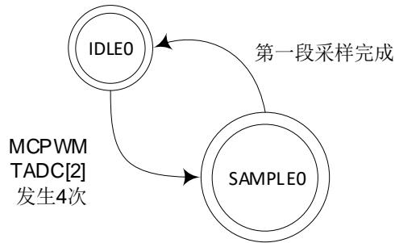  
图 7-2ADC单段采样状态转移图

## 7.3.1.2 两段触发模式

两段触发需要两次触发才能完成完整的一轮采样。第一个触发到达时进行第一段采样，第二个触发到达时进行第二段采样。

触发事件可以是来自外部的定时器信号 TADC[0]和 TADC[1]或两次软件触发。

TADC[0]或软件触发发生后，先进行 ADCx\_CHNT[3:0]次采样，完成后进入空闲状态并等待下一个触发信号的到来；TADC[1]或软件触发作为第二个触发信号发生后，再进行 ADCx\_CHNT[7:4]次采样。采样次数均通过分段采样次数寄存器 ADCx\_CHNT 进行配置。

每个采样的信号源通过寄存器配置选定，信号源的选定需在触发前完成，且在一次采样过程完成前不应该改变。

软件触发较硬件触发的优先级低，在硬件触发采样的过程中发生软件触发，状态机不予处理，而产生一个错误中断。即只有状态机处于空闲状态时才会处理软件触发的采样请求。如果需要使用软件触发采样，需要确保硬件触发已经关闭，即 ADCx\_CFG [1:0]=2‘b00。然后通过向偏移地址 0x30的寄存器写入 0x5AA5以产生一次软件触发。

以两次软件触发两段采样为例，状态转移如图 7-3ADC两段采样状态转移图所示。

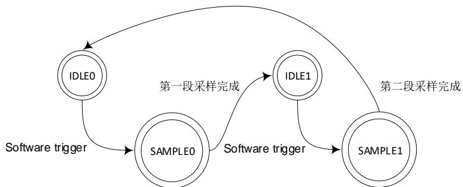  
图 7-3ADC两段采样状态转移图

## 7.3.1.3 四段触发模式

与两段触发类似。四段的触发源分别为 TADC[0]、TADC[1]、TADC[2]、TADC[3]，且必须为MCPWMTADC[0]/TADC[1]TADC[2]TADC[3]顺序触发 ADC 的四段采样；或者也可以是 4 次软件触发采样。四段采样的采样次数分别为 ADCx\_CHNT[15:12]、ADCx\_CHNT[11:8]、ADCx\_CHNT[7:4]、ADCx\_CHNT[3:0]。以 MCPWM TADC[0]/TADC[1]/TADC[2]/TADC[3]触发四段采样为例的状态转移如图 7-4ADC四段采样状态转移图所示。

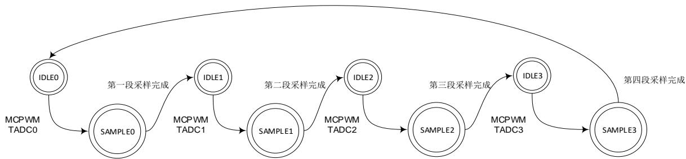  
图 7-4ADC四段采样状态转移图

为使用 MCPWM 定时器产生 ADC 采样触发信号，需要配置 MCPWM\_TMR0/ MCPWM\_TMR1/MCPWM\_TMR2/ MCPWM\_TMR3 等寄存器，对应 TADC0/1/2/3 发生时的 MCPWM 计数器值，此外需要配置 MCPWM\_TH 设置计数器计数范围以及 MCPWM\_TCLK 设置计数时钟频率并使能时钟。

## 7.3.2 中断

## 7.3.2.1 单段触发采样完成中断

采样完成产生一个中断。

## 7.3.2.2 两段触发采样完成中断

第一段采样完成产生一个中断，第二段采样完成产生一个中断。

## 7.3.2.3 四段触发采样完成中断

第一段采样完成产生一个中断，第二段采样完成产生一个中断，第三段采样完成产生一个中断，第四段采样完成产生一个中断。

## 7.3.3 配置修改

建议在 ADC中断中进行 ADC\_CHNx 的配置和修改，因为进入 ADC中断后说明 ADC此时已完成一段采样且处于空闲状态。而在主程序中，无法确认 ADC 运行状态，因此在主程序中如需修改ADC\_CHNx 和 ADC\_CHNT 等寄存器，需要先关闭 ADC 触发，并向 ADC\_CFG[11]写入 1,以复位 ADC接口电路状态机，确保 ADC 不在工作状态。如果 ADC 在运行中配置发生变化会发生不可预判的行为。

示例程序如下

ADCx\_CFG\_temp = ADCx\_CFG;

ADCx\_CFG = 0x0000;

ADCx\_CFG = 0x0800;

/\*

Add your code below, like:

ADCx\_CHNT = 0x0005

ADCx\_CHN0 = 0x3210;

ADCx\_CHN1 = 0x7654;

\*/

ADCx\_CFG = ADCx\_CFG\_temp;

## 8 通用定时器

## 8.1 概述

## 8.1.1 功能框图

如图 8-1 模块顶层功能框图所示，通用定时器 UTIMER 主要包括下面功能模块。

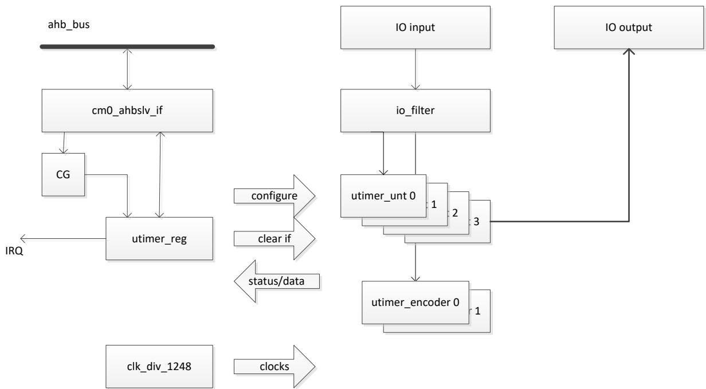  
图 8-1 模块顶层功能框图

## 8.1.1.1 总线接口模块

总线接口模块包括:

cm0\_ahbslv\_if，将来自 AHB 总线的访问信号翻译为寄存器读写信号，控制寄存器模块的时钟，并对寄存器模块发起读写。

CG 时钟门控模块，在 AHB 总线无访问时，将寄存器模块时钟关闭以降低功耗。

## 8.1.1.2 寄存器模块

utimer\_reg 寄存器模块，实现

对各个子模块控制寄存器的读写。

对各个子模块状态、结果寄存器的访问。

对各个子模块中断信号的处理和中断产生。

## 8.1.1.3 IO 滤波模块

IO滤波模块对来自芯片外部的输入信号进行滤波，降低毛刺对定时器功能的影响。

## 8.1.1.4 通用定时器模块

utimer\_unt 模块实现了通用的定时器功能，包括比较和捕获工作模式，可以处理两个外部输入信号或者产生两个脉冲信号送到芯片外部。定时器模块中一共包括 4个独立工作的通用定时器，每个定时器包含两个通道。

## 8.1.1.5 编码器模块

编码器模块用于对芯片外部送入的编码器编码信号进行计数。定时器模块中集成了 2 个编码器模块。

## 8.1.1.6 时钟分频模块

时钟分频模块用于产生时钟分频的各种信号。

## 8.1.2 功能特点

定时器模块有以下特点：

4 个独立工作，可工作在不同频率下的 16bit 通用定时器

每个通用定时器处理 2个外部输入信号（捕获模式），或者产生 2 个输出信号（比较模式）

2 个独立工作计数器

对每个输入信号可以进行最大 120 个系统主时钟的滤波，即，当芯片工作在 96MHz 时钟频率下时，可以滤除 1.25uS宽度一下毛刺

## 8.2 实现说明

## 8.2.1 时钟分频

为了实现各个 timer独立分频，且可以方便对中断/计数值进行写操作，采取了各个 timer均工作在系统主频，但采用分频计数器来降低计数器计数频率的方案。

## 8.2.2 中断标志清零

采用了通过对每个中断标志位写 1来清除标志位的设计。

## 8.2.3 滤波

定时器模块共有 8 个输入，定时器可以对每个输入进行不同程度的滤波。

通过配置滤波寄存器可以调整滤波宽度，0\~120个系统时钟宽度。

如下图，原始输入信号在 t1\~t6 几个时刻发生了翻转，滤波器宽度配置成 T。可以看到只有 t3和 t6 时刻发生的翻转维持了大于 T的时间，因此从滤波器的输出看，信号仅发生了两次翻转。

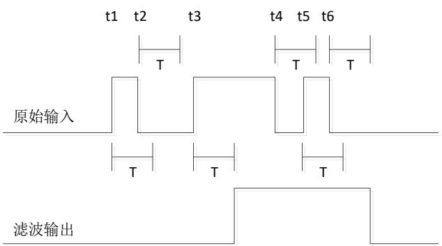  
图 8-2 滤波示意图

## 8.2.4 模式

## 8.2.4.1 计数器

Timer 中的计数器采用 up模式技术。

计数器从 0计数到 TH 值，再回到 0重新开始计数，计数器回到 0 时，产生回零中断。

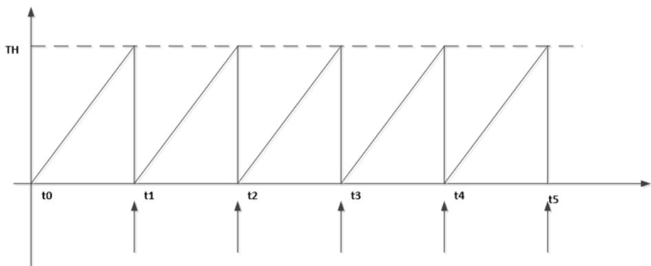  
图 8-3 通用计数器

## 8.2.4.2 比较模式

比较模式下，计数器计数到 CMP 值时，产生比较中断。比较模式可以驱动一个比较脉冲发生，在回零时，输出一个电平（可配置极性），在比较事件发生时，电平翻转。定时器回零时，任然会产生回零中断。

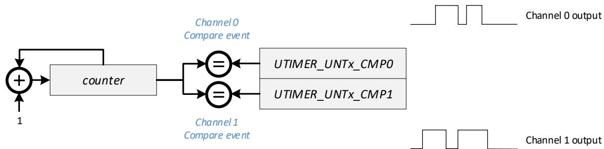

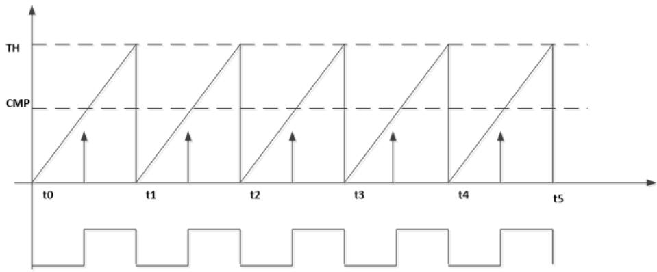  
图 8-4 比较模式

## 8.2.4.3 捕获模式

捕获模式下，可以捕获输入信号的上升/下降或者双沿，发生捕获事件时，定时器计数值存入CMP 寄存器，并产生捕获中断。定时器回零时，仍然会产生回零中断。

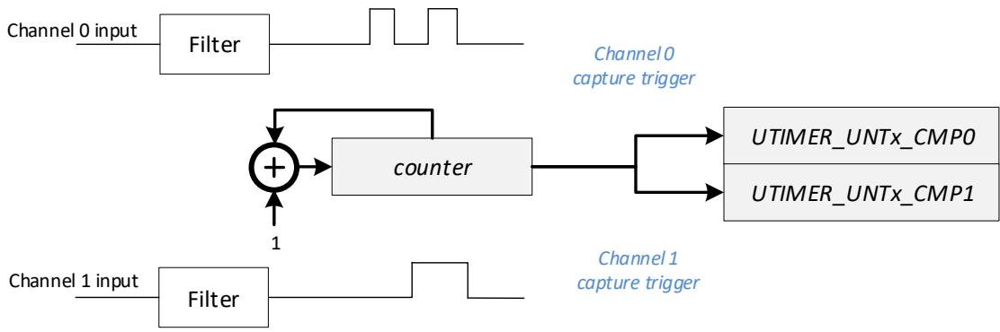

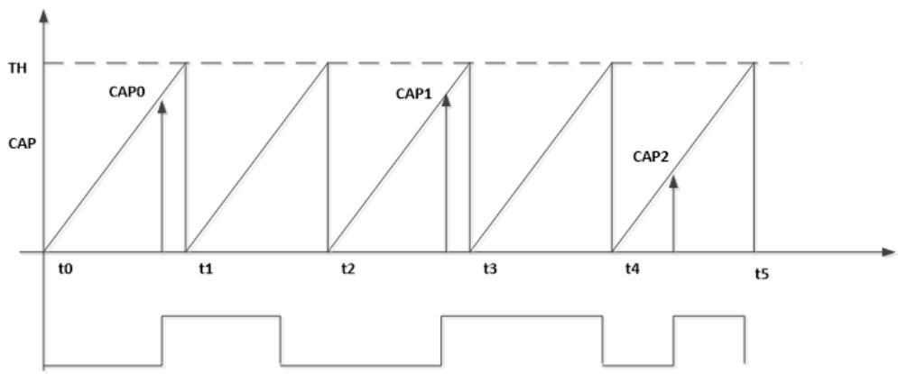  
图 8-5 捕获模式

如图 8-5 所示，定时器设置为上升沿捕获。在 CAP0/CAP1/CAP2 三个时刻点，捕获到输入信号发生上升沿变化，对应时刻点的定时器计数值将存入 CMP 寄存器中。

## 8.2.5 编码器

编码器接口支持正交编码信号、符号加脉冲信号、CW/CCW 双脉冲信号三种模式。每个编码器

有两个输入信号。

其中 Encoder0 的输入信号 T1/T2 分别来自 Timer2 Channel0/1 对应的 GPIO 输入；Encoder1的输入信号 T1/T2 分别来自 Timer3 Channel0/1 对应的 GPIO 输入。开启编码器功能时并不影响Timer 功能的正常使用。

## 8.2.5.1 正交编码信号

正交编码信号多用于计数编码器圈数，输入为 T1/T2 两个信号，支持下表中两个模式。

概括来讲，T1/T2 的跳变沿会导致计数器递增或递减。而计数器计数方向（递增或递减）由跳变信号之外的另一个稳态信号的电平高低决定。

如果 T1 发生了上升沿跳变，则看 T2是高电平还是低电平，如果是高电平则计数器递减，如果是低电平计数器递增，T1 下降沿计数器变化相反。

如果 T2 发生了上升沿跳变，则看 T1是高电平还是低电平，如果是高电平则计数器递增，如果是低电平计数器递减，T2 下降沿计数器变化相反。

以下式子表示

```txt
Counter Up = (T1 != T2) @(T1 triggering edges) | (T1 == T2) @ (T2 triggering edges)
Counter Down = (T1 == T2) @ (T1 triggering edges) | (T1 != T2) @ (T2 triggering edges)
```

表 8-1 编码器正交编码工作模式

<table><tr><td rowspan="2">计数模式</td><td rowspan="2">T1/T2 电平状态(稳态信号)</td><td colspan="2">T1 变化边沿状态</td><td colspan="2">T2 变化边沿状态</td></tr><tr><td>上升沿</td><td>下降沿</td><td>上升沿</td><td>下降沿</td></tr><tr><td rowspan="3">仅 T1 计数</td><td>T2 高</td><td>递减</td><td>递增</td><td>不计数</td><td>不计数</td></tr><tr><td>T2 低</td><td>递增</td><td>递减</td><td>不计数</td><td>不计数</td></tr><tr><td>T2 高</td><td>递减</td><td>递增</td><td>不计数</td><td>不计数</td></tr><tr><td rowspan="3">T1/T2 都计数</td><td>T2 低</td><td>递增</td><td>递减</td><td>不计数</td><td>不计数</td></tr><tr><td>T1 高</td><td>不计数</td><td>不计数</td><td>递增</td><td>递减</td></tr><tr><td>T1 低</td><td>不计数</td><td>不计数</td><td>递减</td><td>递增</td></tr></table>

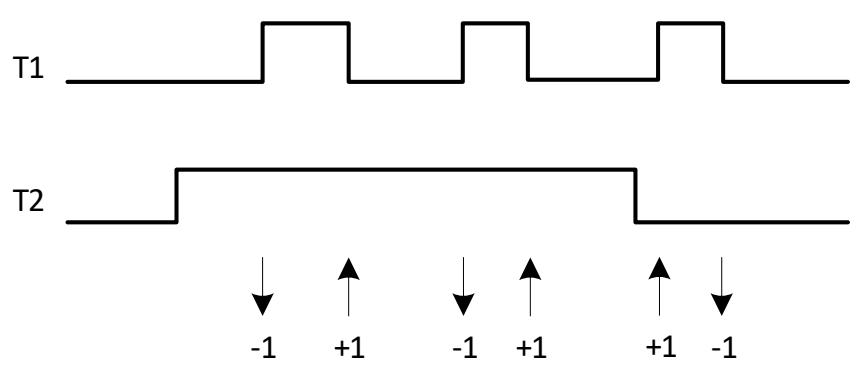  
图 8-6 编码器只在 T1时刻计数的正交编码信号计数情况

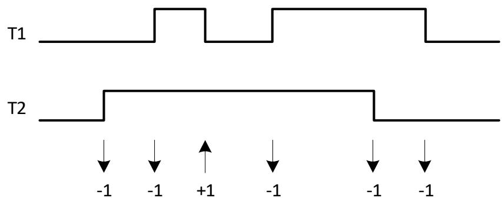  
图 8-7 编码器在 T1 或 T2 时刻计数的正交编码信号计数情况

## 8.2.5.2 符号加脉冲信号

这种工作模式下，T1 为脉冲信号，T2 为符号信号。T1 的边沿触发计数，T2 电平控制计数方向，高则递增，低则递减。可以配置仅 T1 上升沿计数还是 T1 上升下降沿都计数。

$$
\begin{array}{l l} \text {Counter Up} & = (T 2 = = 1) @ (T 1 \text {triggering edges}) \\ \text {Counter Down} & = (T 2 = = 0) @ (T 1 \text {triggering edges}) \end{array}
$$

表 8-2 编码器符号加脉冲工作模式  
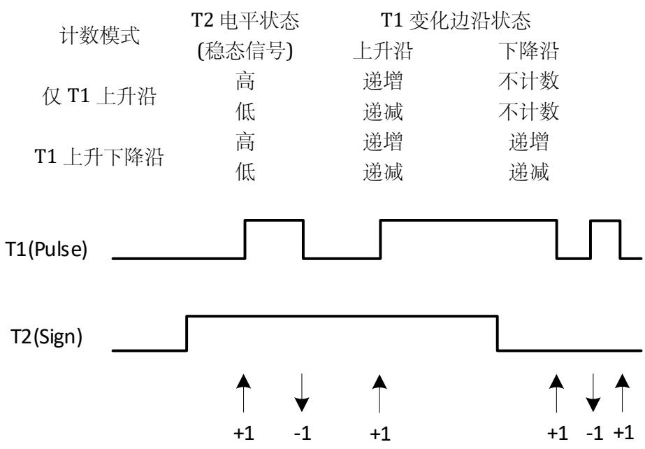  
图 8-8 编码器在 T1 上升下降沿都计数的符号加脉冲信号计数情况

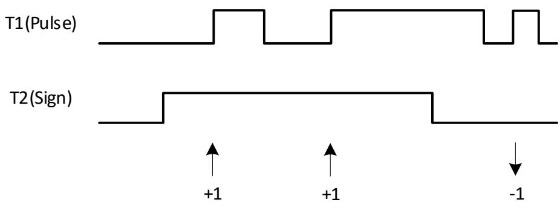  
图 8-9 编码器在仅 T1 上升沿计数的符号加脉冲信号计数情况

## 8.2.5.3 CCW/CW 双脉冲信号

在 T1 跳变时计数器递增，在 T2 跳变时计数器递减。可以配置计数器仅在上升沿变化或者在上升下降沿都变化。以下式表示

$$
\begin{array}{l l} \text {Counter Up} & = 1 @ (\text {T1 triggering edges}) \\ \text {Counter Down} & = 1 @ (\text {T2 triggering edges}) \end{array}
$$

表 8-3 编码器 CCW/CW 双脉冲工作模式  
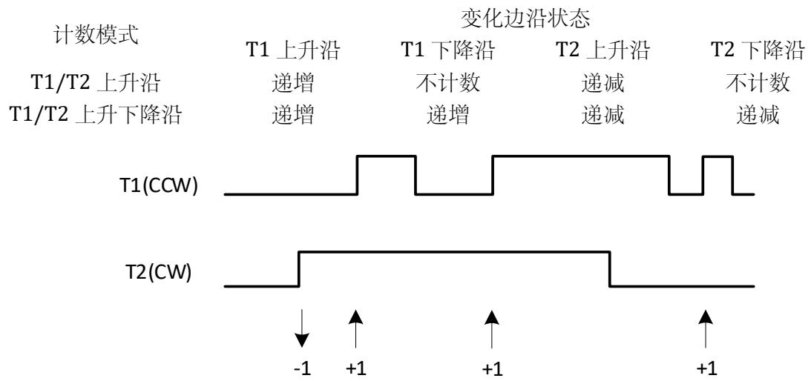  
图 8-10 编码器仅在 T1/T2 上升沿计数的 CCW/CW 双脉冲信号计数情况

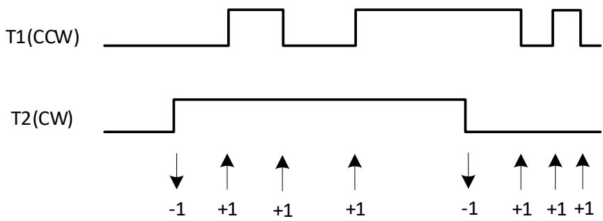  
图 8-11 编码器在 T1/T2上升下降沿计数的 CCW/CW 双脉冲信号计数情况

## 8.3 寄存器

## 8.3.1 地址分配

通用定时器模块在芯片中的基地址是 0x4000\_3500

表 8-4 通用定时器配置寄存器地址分配

<table><tr><td>名称</td><td>偏移</td><td>描述</td></tr><tr><td>UTIMER_UNTO_CFG</td><td>0x00</td><td>Timer0 配置寄存器</td></tr><tr><td>UTIMER_UNTO_TH</td><td>0x04</td><td>Timer0 计数门限寄存器</td></tr><tr><td>UTIMER_UNTO_CNT</td><td>0x08</td><td>Timer0 计数值寄存器</td></tr><tr><td>UTIMER_UNTO_CMP0</td><td>0x0C</td><td>Timer0 比较/捕获寄存器 0</td></tr><tr><td>UTIMER_UNTO_CMP1</td><td>0x10</td><td>Timer0 比较/捕获寄存器 1</td></tr><tr><td>UTIMER_UNT1_CFG</td><td>0x20</td><td>Timer1 配置寄存器</td></tr><tr><td>UTIMER_UNT1_TH</td><td>0x24</td><td>Timer1 计数门限寄存器</td></tr><tr><td>UTIMER_UNT1_CNT</td><td>0x28</td><td>Timer1 计数值寄存器</td></tr><tr><td>UTIMER_UNT1_CMP0</td><td>0x2C</td><td>Timer1 比较/捕获寄存器 0</td></tr><tr><td>UTIMER_UNT1_CMP1</td><td>0x30</td><td>Timer1 比较/捕获寄存器 1</td></tr><tr><td>UTIMER_UNT2_CFG</td><td>0x40</td><td>Timer2 配置寄存器</td></tr><tr><td>UTIMER_UNT2_TH</td><td>0x44</td><td>Timer2 计数门限寄存器</td></tr><tr><td>UTIMER_UNT2_CNT</td><td>0x48</td><td>Timer2 计数值寄存器</td></tr><tr><td>UTIMER_UNT2_CMP0</td><td>0x4C</td><td>Timer2 比较/捕获寄存器 0</td></tr><tr><td>UTIMER_UNT2_CMP1</td><td>0x50</td><td>Timer2 比较/捕获寄存器 1</td></tr><tr><td>UTIMER_UNT3_CFG</td><td>0x60</td><td>Timer3 配置寄存器</td></tr><tr><td>UTIMER_UNT3_TH</td><td>0x64</td><td>Timer3 计数门限寄存器</td></tr><tr><td>UTIMER_UNT3_CNT</td><td>0x68</td><td>Timer3 计数值寄存器</td></tr><tr><td>UTIMER_UNT3_CMP0</td><td>0x6C</td><td>Timer3 比较/捕获寄存器 0</td></tr><tr><td>UTIMER_UNT3_CMP1</td><td>0x70</td><td>Timer3 比较/捕获寄存器 1</td></tr><tr><td>UTIMER_ECD0_CFG</td><td>0x80</td><td>Encoder0 配置寄存器</td></tr><tr><td>UTIMER_ECD0_TH</td><td>0x84</td><td>Encoder0 计数门限寄存器</td></tr><tr><td>UTIMER_ECD0_CNT</td><td>0x88</td><td>Encoder0 计数值寄存器</td></tr><tr><td>UTIMER_ECD1_CFG</td><td>0x90</td><td>Encoder1 配置寄存器</td></tr><tr><td>UTIMER_ECD1_TH</td><td>0x94</td><td>Encoder1 计数门限寄存器</td></tr><tr><td>UTIMER_ECD1_CNT</td><td>0x98</td><td>Encoder1 计数值寄存器</td></tr><tr><td>UTIMER_FLT_TH01</td><td>0xA0</td><td>滤波门限寄存器 01</td></tr><tr><td>UTIMER_FLT_TH23</td><td>0xA4</td><td>滤波门限寄存器 23</td></tr><tr><td>UTIMER_CFG</td><td>0xF0</td><td>通用定时器配置寄存器</td></tr><tr><td>UTIMER_IE</td><td>0xF4</td><td>中断使能寄存器</td></tr><tr><td>UTIMER_IF</td><td>0xF8</td><td>中断标志寄存器</td></tr></table>

## 8.3.2 Time 寄存器

Timer x，其中 x 可以为 0,1,2,3。注意，Encoder0 复用了 Timer2 的输入端口，Encoder1 复用了 Timer3 的输入端口；开启 Encoder 功能时，并不影响对应 Timer的正常使用。

## 8.3.2.1 Timer x 配置寄存器 UTIMER\_UNTx\_CFG

表 8-5Timer x 配置寄存器 UTIMER\_UNTx\_CFG

<table><tr><td>名称</td><td>复位值</td><td>偏移</td><td>位置</td><td>RW</td><td>说明</td></tr><tr><td rowspan="7">UTIMER_UNTO_CFG</td><td rowspan="7">0x0</td><td rowspan="7">0x00</td><td>[31:11]</td><td>NA</td><td>未使用</td></tr><tr><td>[10]</td><td>RW</td><td>Timer x 使能配置寄存器 TON,当 TON 为 0 时,Timer x 停止计数,同时所有中断标志位输出 0。</td></tr><tr><td>[9:8]</td><td>RW</td><td>Timer x 计数器频率配置 CLK_DIV[1:0],计数器计数频率是系统主频率的 1~8 分频00:1 分频,01:2 分频,10:4 分频,11:8 分频</td></tr><tr><td>[7]</td><td>RW</td><td>通道 1 在比较模式下的输出极性控制:当计数器计数值回零时的输出值。</td></tr><tr><td>[6]</td><td>RW</td><td>通道 1 的工作模式,0,比较模式,在计数器计数值为 0 值和通道 1 比较捕获寄存器值时分别将两个不同的电平送出通道 1。1,捕获模式,当通道 1 输入信号发生捕获事件时,将计数器计数值存入通道 1 比较捕获寄存器。</td></tr><tr><td>[5]</td><td>RW</td><td>通道 1 下降沿捕获事件使能。值为 1 时,通道 1 输入信号发生 1→0 跳变被视为捕获事件。下降沿事件使能可以与上升沿事件使能并存。</td></tr><tr><td>[4]</td><td>RW</td><td>通道 1 上升沿捕获事件使能。值为 1 时,通道1输入信号发生0→1跳变被视为捕获事件。上升沿事件使能可以与下降沿事件使能并存。</td></tr><tr><td rowspan="4"></td><td rowspan="4"></td><td rowspan="4"></td><td>[3]</td><td>RW</td><td>通道0在比较模式下的输出极性控制:当计数器计数值回零时的输出值。</td></tr><tr><td>[2]</td><td>RW</td><td>通道0的工作模式,0,比较模式,输出方波,在通道0计数器计数值等于0或等于比较捕获寄存器值时发生翻转。1,捕获模式,当通道0输入信号发生捕获事件时,将计数器计数值存入通道0比较捕获寄存器。</td></tr><tr><td>[1]</td><td>RW</td><td>通道0下降沿捕获事件使能。当此位值为1时,通道0输入信号发生1→0跳变被视为捕获事件。下降沿事件使能可以与上升沿事件使能并存。</td></tr><tr><td>[0]</td><td>RW</td><td>通道0上升沿捕获事件使能。当此位值为1时,通道0输入信号发生0→1跳变被视为捕获事件。上升沿事件使能可以与下降沿事件使能并存。</td></tr></table>

8.3.2.2 Timer x 门限寄存器 UTIMER\_UNTx\_TH

表 8-6Timer x 门限寄存器 UTIMER\_UNTx\_TH

<table><tr><td>名称</td><td>复位值</td><td>偏移</td><td>位置</td><td>RW</td><td>说明</td></tr><tr><td rowspan="2">UTIMER_UNTx_TH</td><td rowspan="2">0x0</td><td rowspan="2">0x04</td><td>[31:16]</td><td>NA</td><td>未使用</td></tr><tr><td>[15:0]</td><td>RW</td><td>Timer x 计数器计数门限。计数器从 0 计数到 UTIMER_UNTx_TH 值后再次回 0 开始计数。</td></tr></table>

8.3.2.3 Timer x 计数寄存器 UTIMER\_UNTx\_CNT

表 8-7Timer x 计数寄存器 UTIMER\_UNTx\_CNT

<table><tr><td>名称</td><td>复位值</td><td>偏移</td><td>位置</td><td>RW</td><td>说明</td></tr><tr><td rowspan="2">UTIMER_UNTx_CNT</td><td rowspan="2">0x0</td><td rowspan="2">0x08</td><td>[31:16]</td><td>NA</td><td>未使用</td></tr><tr><td>[15:0]</td><td>RW</td><td>Timer x 计数器当前计数值。写操作可以写入新的计数值。</td></tr></table>

## 8.3.2.4 Timer x 通道 0 比较捕获寄存器 UTIMER\_UNTx\_CMP0

表 8-8Timer x 通道 0 比较捕获寄存器 UTIMER\_UNTx\_CMP0

<table><tr><td>名称</td><td>复位值</td><td>偏移</td><td>位置</td><td>RW</td><td>说明</td></tr><tr><td rowspan="2">UTIMER_UNTx_CMP0</td><td rowspan="2">0x0</td><td rowspan="2">0x0C</td><td>[31:16]</td><td>NA</td><td>未使用</td></tr><tr><td>[15:0]</td><td>RW</td><td>Timer x 通道 0 工作在比较模式时,当计数器计数值等于 UTIMER_UNTx_CMP0 时,发生比较事件。Timer x 通道 0 工作在捕获模式时,发生捕获事件时的计数器计数值存入 UTIMER_UNTx_CMP0 寄存器。</td></tr></table>

8.3.2.5 Timer x 通道 1 比较捕获寄存器 UTIMER\_UNTx\_CMP1

表 8-9Timer x 通道 1 比较捕获寄存器 UTIMER\_UNTx\_CMP1

<table><tr><td>名称</td><td>复位值</td><td>偏移</td><td>位置</td><td>RW</td><td>说明</td></tr><tr><td rowspan="2">UTIMER_UNTx_CMP1</td><td rowspan="2">0x0</td><td rowspan="2">0x10</td><td>[31:16]</td><td>NA</td><td>未使用</td></tr><tr><td>[15:0]</td><td>RW</td><td>Timer x 通道 1 工作在比较模式时,当计数器计数值等于 UTIMER_UNTx_CMP1 时,发生比较事件。Timer x 通道 1 工作在捕获模式时,发生捕获事件时的计数器计数值存入 UTIMER_UNTx_CMP1 寄存器。</td></tr></table>

## 8.3.3 Encoder x 寄存器

Encoder x，其中 x 可以为 0,1。

## 8.3.3.1 Encoder x 配置寄存器 UTIMER\_ECDx\_CFG

表 8-10 Encoder x 配置寄存器 UTIMER\_ECDx\_CFG

<table><tr><td>名称</td><td>复位值</td><td>偏移</td><td>位置</td><td>RW</td><td>说明</td></tr><tr><td rowspan="3">UTIMER_ECDx_CFG</td><td rowspan="3">0x0</td><td rowspan="3">0x80</td><td>[31:11]</td><td>NA</td><td>未使用</td></tr><tr><td>[10]</td><td>RW</td><td>CCW+SIGN/CCW+CW 两种模式下,是否在下降沿进行计数(上升沿总是计数)</td></tr><tr><td>[9:8]</td><td>RW</td><td>Encoder x 编码器模式选择00: counting on T1,01: counting on T1 &amp; T2以上两种模式都为正交编码信号计数模式10: CCW+SIGN,符号加脉冲信号计数模式11: CCW+CW, CCW+CW 双脉冲信号计数模式</td></tr><tr><td></td><td></td><td></td><td>[7:0]</td><td>RW</td><td>系统保留, 必须写入 0.</td></tr></table>

## 8.3.3.2 Encoder x 计数门限寄存器 UTIMER\_ECDx\_TH

表 8-11 Encoder x 计数门限寄存器 UTIMER\_ECDx\_TH

<table><tr><td>名称</td><td>复位值</td><td>偏移</td><td>位置</td><td>RW</td><td>说明</td></tr><tr><td rowspan="2">UTIMER_ECDx_TH</td><td rowspan="2">0x0</td><td rowspan="2">0x84</td><td>[31:16]</td><td>NA</td><td>未使用</td></tr><tr><td>[15:0]</td><td>RW</td><td>Encoder x 计数门限 TH。编码器向上计数(增)到 TH 值后,再次向上计数会导致计数器回到 0。编码器向下计数(减)到 0 值后,再次向下计数会导致计数器回到 TH。</td></tr></table>

8.3.3.3 Encoder x 计数值寄存器 UTIMER\_ECDx\_CNT

表 8-12 Encoder x 计数值寄存器 UTIMER\_ECDx\_CNT

<table><tr><td>名称</td><td>复位值</td><td>偏移</td><td>位置</td><td>RW</td><td>说明</td></tr><tr><td rowspan="2">UTIMER_ECDx_CNT</td><td rowspan="2">0x0</td><td rowspan="2">0x88</td><td>[31:16]</td><td>NA</td><td>未使用</td></tr><tr><td>[15:0]</td><td>R</td><td>Encoder0 计数值。</td></tr></table>

## 8.3.4 滤波控制寄存器

## 8.3.4.1 UTIMER\_FLT\_TH01

表 8-13 滤波控制寄存器 UTIMER\_FLT\_TH01

<table><tr><td>名称</td><td>复位值</td><td>偏移</td><td>位置</td><td>RW</td><td>说明</td></tr><tr><td rowspan="3">UTIMER_FLT_TH01</td><td rowspan="3">0x0</td><td rowspan="3">0xA0</td><td>[31:16]</td><td>NA</td><td>未使用</td></tr><tr><td>[15:12]</td><td>RW</td><td>TIM1_CH11 信号滤波宽度选择 FTH3 取值范围 0~15。。FTH3 为 0 时,对 TIM1_CH1 不进行滤波。FTH3 不为 0 时,对 TIM1_CH1 信号进行滤波:滤波宽度为 8 倍 FTH3 寄存器值。当 TIM1_CH1 电平稳定超过 FTH3x8 个系统时钟周期宽度时,滤波器输出更新到 TIM1_CH1 信号值。否则,滤波器保持当前的输出不变。</td></tr><tr><td>[11:8]</td><td>RW</td><td>TIM1_CH0 信号滤波信号 FTH2。含义同FTH3。</td></tr><tr><td rowspan="2"></td><td rowspan="2"></td><td rowspan="2"></td><td>[7:4]</td><td>RW</td><td>TIM0_CH1 信号滤波信号 FTH1。含义同 FTH3。</td></tr><tr><td>[3:0]</td><td>RW</td><td>TIM0_CH0 信号滤波信号 FTH0。含义同 FTH3。</td></tr></table>

## 8.3.4.2 UTIMER\_FLT\_TH23

表 8-14 滤波控制寄存器 UTIMER\_FLT\_TH23

<table><tr><td>名称</td><td>复位值</td><td>偏移</td><td>位置</td><td>RW</td><td>说明</td></tr><tr><td rowspan="5">UTIMER_FLT_TH23</td><td rowspan="5">0x0</td><td rowspan="5">0xA4</td><td>[31:16]</td><td>NA</td><td>未使用</td></tr><tr><td>[15:12]</td><td>RW</td><td>TIM3_CH1 信号滤波宽度选择 FTH7,取值范围 0~15。FTH7 为 0 时,对 TIM3_CH1 不进行滤波。FTH7 不为 0 时,对 TIM3_CH1 信号进行滤波:滤波宽度为 8 倍 FTH7 寄存器值。当 TIM3_CH1 电平稳定超过 FTH7x8 个系统时钟周期宽度时,滤波器输出更新到TIM3_CH1 信号值否则,滤波器保持当前的输出不变。</td></tr><tr><td>[11:8]</td><td>RW</td><td>TIM3_CH0 信号滤波信号 FTH6。含义同 FTH7。</td></tr><tr><td>[7:4]</td><td>RW</td><td>TIM2_CH1 信号滤波信号 FTH5。含义同 FTH7。</td></tr><tr><td>[3:0]</td><td>RW</td><td>TIM2_CH0 信号滤波信号 FTH4。含义同 FTH7。</td></tr></table>

## 8.3.5 系统控制寄存器

## 8.3.5.1 UTIMER\_CFG

表 8-15 UTIMER 配置寄存器 UTIMER\_CFG

<table><tr><td>名称</td><td>复位值</td><td>偏移</td><td>位置</td><td>RW</td><td>描述</td></tr><tr><td rowspan="4">UTIMER_CFG</td><td rowspan="4">0x0</td><td rowspan="4">0xF0</td><td>[31:10]</td><td>NA</td><td>未使用</td></tr><tr><td>[9]</td><td>RW</td><td>1:启动编码器 1, 0:停止编码器 1</td></tr><tr><td>[8]</td><td>RW</td><td>1:启动编码器 0, 0:停止编码器 0</td></tr><tr><td>[7:0]</td><td>RW</td><td>系统保留,推荐写入 0</td></tr></table>

## 8.3.6 中断管理寄存器

中断管理寄存器包括中断标志寄存器 UTIMER\_IF 和中断使能寄存器 UTIMER\_IE。两个寄存器各

个比特对应相同的中断。

## 8.3.6.1 中断使能寄存器 UTIMER\_IE

表 8-16 中断使能寄存器 UTIMER\_IE

<table><tr><td>名称</td><td>复位值</td><td>偏移</td><td>位置</td><td>RW</td><td>说明</td></tr><tr><td rowspan="17">UTIMER_IE</td><td rowspan="17">0x0</td><td rowspan="17">0xF4</td><td>[31:16]</td><td>NA</td><td>未使用</td></tr><tr><td>[15]</td><td>RW</td><td>Encoder1 上溢出中断使能,高电平有效(下同)。当 Encoder1 计数器计数达到计数门限时,上计数事件触发上溢出中断。</td></tr><tr><td>[14]</td><td>RW</td><td>Encoder1 下溢出中断使能。当 Encoder1 计数器计数达到 0 时,下计数事件触发下溢出中断。</td></tr><tr><td>[13]</td><td>RW</td><td>Encoder0 上溢出中断使能。</td></tr><tr><td>[12]</td><td>RW</td><td>Encoder0 下溢出中断使能。</td></tr><tr><td>[11]</td><td>RW</td><td>Timer3 通道 1 比较/捕获中断使能。</td></tr><tr><td>[10]</td><td>RW</td><td>Timer3 通道 0 比较/捕获中断使能。</td></tr><tr><td>[9]</td><td>RW</td><td>Timer3 计数器过 0 中断使能。</td></tr><tr><td>[8]</td><td>RW</td><td>Timer2 通道 1 比较/捕获中断使能。</td></tr><tr><td>[7]</td><td>RW</td><td>Timer2 通道 0 比较/捕获中断使能。</td></tr><tr><td>[6]</td><td>RW</td><td>Timer2 计数器过 0 中断使能。</td></tr><tr><td>[5]</td><td>RW</td><td>Timer1 通道 1 比较/捕获中断使能。</td></tr><tr><td>[4]</td><td>RW</td><td>Timer1 通道 0 比较/捕获中断使能。</td></tr><tr><td>[3]</td><td>RW</td><td>Timer1 计数器过 0 中断使能。</td></tr><tr><td>[2]</td><td>RW</td><td>Timer0 通道 1 比较/捕获中断使能。</td></tr><tr><td>[1]</td><td>RW</td><td>Timer0 通道 0 比较/捕获中断使能。</td></tr><tr><td>[0]</td><td>RW</td><td>Timer0 计数器过 0 中断使能。</td></tr></table>

## 8.3.6.2 中断标志寄存器 UTIMER\_IF

表 8-17 中断标志寄存器 UTIMER\_IF

<table><tr><td>名称</td><td>复位值</td><td>偏移</td><td>位置</td><td>RW</td><td>说明</td></tr><tr><td rowspan="7">UTIMER_IF</td><td rowspan="7">0x0</td><td rowspan="7">0xF8</td><td>[31:16]</td><td>NA</td><td>未使用</td></tr><tr><td>[15]</td><td>RW</td><td>Encoder1 上溢出中断标志,高电平有效,对此 bit 写 1 可清 0 此 bit (下同)。当 Encoder1 计数器计数达到计数门限时,上计数事件触发上溢出中断。</td></tr><tr><td>[14]</td><td>RW</td><td>Encoder1 下溢出中断标志。当 Encoder1 计数器计数达到 0 时,下计数事件触发下溢出中断。</td></tr><tr><td>[13]</td><td>RW</td><td>Encoder0 上溢出中断标志。</td></tr><tr><td>[12]</td><td>RW</td><td>Encoder0 下溢出中断标志。</td></tr><tr><td>[11]</td><td>RW</td><td>Timer3 通道 1 比较/捕获中断标志</td></tr><tr><td>[10][9]</td><td>RWRW</td><td>Timer3 通道 0 比较/捕获中断标志Timer3 计数器过 0 中断标志</td></tr><tr><td rowspan="9"></td><td rowspan="9"></td><td rowspan="9"></td><td>[8]</td><td>RW</td><td>Timer2 通道 1 比较/捕获中断标志</td></tr><tr><td>[7]</td><td>RW</td><td>Timer2 通道 0 比较/捕获中断标志</td></tr><tr><td>[6]</td><td>RW</td><td>Timer2 计数器过 0 中断标志</td></tr><tr><td>[5]</td><td>RW</td><td>Timer1 通道 1 比较/捕获中断标志</td></tr><tr><td>[4]</td><td>RW</td><td>Timer1 通道 0 比较/捕获中断标志</td></tr><tr><td>[3]</td><td>RW</td><td>Timer1 计数器过 0 中断标志</td></tr><tr><td>[2]</td><td>RW</td><td>Timer0 通道 1 比较/捕获中断标志</td></tr><tr><td>[1]</td><td>RW</td><td>Timer0 通道 0 比较/捕获中断标志</td></tr><tr><td>[0]</td><td>RW</td><td>Timer0 计数器过 0 中断标志</td></tr></table>

## 9 HALL 信号处理模块

## 9.1 综述

芯片共支持 3 路 HALL 信号输入。

对于输入的 HALL 传感器信号，所进行的处理包括：

滤波，消除 HALL 信号毛刺的影响

捕获，当 HALL 输入有变化时，记录当前的定时器值，并输出中断

溢出，当 HALL 信号长时间不发生变化导致计数器溢出时，输出中断

## 9.2 寄存器

## 9.2.1 地址分配

表 9-1HALL模块寄存器地址分配

<table><tr><td>名称</td><td>偏移</td><td>描述</td></tr><tr><td>HALL_CFG</td><td>0x00</td><td>HALL 模块配置寄存器</td></tr><tr><td>HALL_INFO</td><td>0x04</td><td>HALL 模块信息寄存器</td></tr><tr><td>HALL_WIDTH</td><td>0x08</td><td>HALL 宽度计数值寄存器</td></tr><tr><td>HALL_TH</td><td>0x0C</td><td>HALL 模块计数器门限值寄存器</td></tr><tr><td>HALL_CNT</td><td>0x10</td><td>HALL 计数寄存器</td></tr></table>

9.2.2 HALL模块配置寄存器 $\mathbf { H A L L } \mathbf { C F G }$

表 9-2 HALL 模块配置寄存器 HALL\_CFG

<table><tr><td>名称</td><td>复位值</td><td>偏移</td><td>位置</td><td>RW</td><td>说明</td></tr><tr><td rowspan="9">HALL_CFG</td><td rowspan="9">0x0</td><td rowspan="9">0x00</td><td>[31:30]</td><td>NA</td><td>未使用</td></tr><tr><td>[29]</td><td>RW</td><td>HALL 计数器溢出中断使能开关。1,使能;0,关闭。</td></tr><tr><td>[28]</td><td>RW</td><td>HALL 信号变化中断使能开关,1,使能;0,关闭。</td></tr><tr><td>[27:25]</td><td>NA</td><td>未使用</td></tr><tr><td>[24]</td><td>RW</td><td>HALL 模块使能开关。1,使能;0,关闭。</td></tr><tr><td>[23:21]</td><td>NA</td><td>未使用</td></tr><tr><td>[20]</td><td>RW</td><td>7/5 滤波开关。1,使能;0,关闭。</td></tr><tr><td>[19:18]</td><td>NA</td><td>未使用</td></tr><tr><td>[17:16]</td><td>RW</td><td>HALL 时钟分频系数00:不分频01:2 分频10:4 分频11:8分频</td></tr><tr><td rowspan="2"></td><td rowspan="2"></td><td rowspan="2"></td><td>[15]</td><td>NA</td><td>未使用</td></tr><tr><td>[14:0]</td><td>RW</td><td>滤波宽度,低于对应脉冲宽度的信号将被硬件自动过滤掉。滤波宽度的计算公式为 $[14:0] + 1$ 。</td></tr></table>

9.2.3 HALL 模块信息寄存器 HALL\_INFO

表 9-3 HALL 模块信息寄存器 HALL\_INFO

<table><tr><td>名称</td><td>复位值</td><td>偏移</td><td>位置</td><td>RW</td><td>说明</td></tr><tr><td rowspan="7">HALL_INFO</td><td rowspan="7">0x0</td><td rowspan="7">0x04</td><td>[31:18]</td><td>NA</td><td>未使用</td></tr><tr><td>[17]</td><td>RW</td><td>HALL 计数器溢出事件标志,写 1 清空</td></tr><tr><td>[16]</td><td>RW</td><td>HALL 信号变化事件标志,写 1 清空</td></tr><tr><td>[15:11]</td><td>RW</td><td>系统保留,必须写入 0,读出 0</td></tr><tr><td>[10:8]</td><td>R</td><td>从 GPIO 输入的原始 HALL 信号值</td></tr><tr><td>[7:3]</td><td>RW</td><td>系统保留,必须写入 0,读出 0</td></tr><tr><td>[2:0]</td><td>R</td><td>捕获到的 HALL 值</td></tr></table>

## 9.2.4 HALL 宽度计数值寄存器 HALL\_WIDTH

表 9-4 HALL 宽度计数值寄存器 HALL\_WIDTH

<table><tr><td>名称</td><td>复位值</td><td>偏移</td><td>位置</td><td>RW</td><td>说明</td></tr><tr><td>HALL_WIDTH</td><td>0x0</td><td>0x08</td><td>[31:0]</td><td>R</td><td>HALL 宽度计数器值</td></tr></table>

## 9.2.5 HALL模块计数器门限值寄存器 $\mathbf { H A L L } _ { - } \mathbf { T H }$

表 9-5HALL模块计数器门限值寄存器 $\mathrm { H A L L } _ { - } \mathrm { T H }$

<table><tr><td>名称</td><td>复位值</td><td>偏移</td><td>位置</td><td>RW</td><td>说明</td></tr><tr><td>HALL_TH</td><td>0x0</td><td>0x0C</td><td>[31:0]</td><td>RW</td><td>HALL 计数器门限值</td></tr></table>

## 9.2.6 HALL 计数寄存器 $\mathbf { H A L L } \mathbf { C N T }$

表 9-6 HALL 计数寄存器 $\mathrm { \ H A L L { \mathrm { { C N T } } } }$

<table><tr><td>名称</td><td>复位值</td><td>偏移</td><td>位置</td><td>RW</td><td>说明</td></tr><tr><td>HALL_CNT</td><td>0x0</td><td>0x10</td><td>[31:0]</td><td>RW</td><td>HALL 计数值,写入任意值可清零</td></tr></table>

## 9.3 实现说明

## 9.3.1 信号来源

HALL 信号来源于 GPIO，对于每一路 HALL 信号，芯片有两个 IO可以作为该信号的来源。通过配置 GPIO寄存器，用户可以选择将其中一个 GPIO的输入信号做为 HALL 信号使用。

详细说明见 GPIO的章节。

## 9.3.2 工作时钟

HALL 模块工作频率可调。通过配置 CFG 寄存器 B[17:16]，可以选择系统主频的 1/2/4/8 分频作为模块工作频率，滤波和计数均采用该频率工作。

## 9.3.3 信号滤波

滤波模块主要用于去除 HALL 信号上的毛刺。

滤波包括两级滤波器：

第一级采用 7 判 5 进行滤波，即连续 7 个采样点中，如果达到超过 5个 1 则输出1，如果达到或超过 5 个0 则输出 0，否则输出保持上一次的滤波结果。具体如下图所示

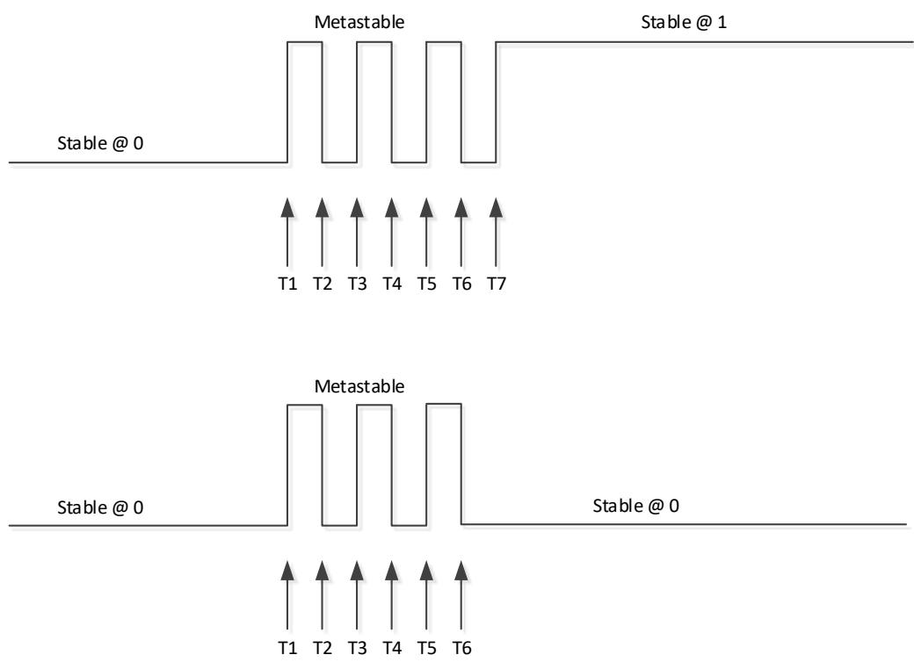  
图 9-17/5 滤波模块框图

第二级采用连续滤波，在连续 N 个采样点中，如全为 0 则输出 0，如全为 1 则输出 1，否则输出保持上一次的滤波结果。

通过配置 HALL\_CFG 寄存器 B[24]可以选择是否使能第一级滤波器。

通过配置 HALL\_CFG 寄存器 B[14:0]可以配置第二级滤波器滤波深度，即连续采样个数。连续采样个数最大为 215，在96MHz 工作频率下，最长滤波宽度为约 340us。

通过访问 HALL\_INFO 寄存器 B[2:0]可以捕捉后的 HALL 信号；B[10:8]则是滤波前原始 HALL输入信号。

## 9.3.4 捕获

捕获模块用于测量两次 HALL 信号变化之间的时间，其核心为一个 32 位计数器，在 96MHz 工作频率下，最大可以记录约 44.7 秒的时间宽度，达到 10ns的时间分辨率。

HALL\_CNT 从 0 开始计数，当发生 HALL 信号变化时，将此时刻的 $\mathrm { \ H A L L { \mathrm { { C N T } } } }$ 值保存到HALL\_WIDTH 寄存器，将此时刻的 HALL 信号保存到 $\mathrm { H A L L \mathrm { _ { - } I N F 0 } }$ 寄存器 B[2:0]，输出 HALL 信号变化中断， $\mathrm { \ H A L L { \mathrm { { C N T } } } }$ 重新从 0 开始计数。

当计数器计数值达到 HALL\_TH 时，输出 HALL计数器溢出中断，计数器重新从 0开始计数。

## 9.3.5 中断

捕获、溢出事件触发中断，中断使能控制位位于 $\mathrm { H A L L \_ C F G }$ 寄存器 B[29:28]，中断标志位位于HALL\_INFO 寄存器 B[17:16]。终端标志可以通过对 HALL\_INFO 寄存器的写操作清空。

## 9.3.6 数据流程

HALL 模块的数据流程如下图所示，fclk 为系统时钟。

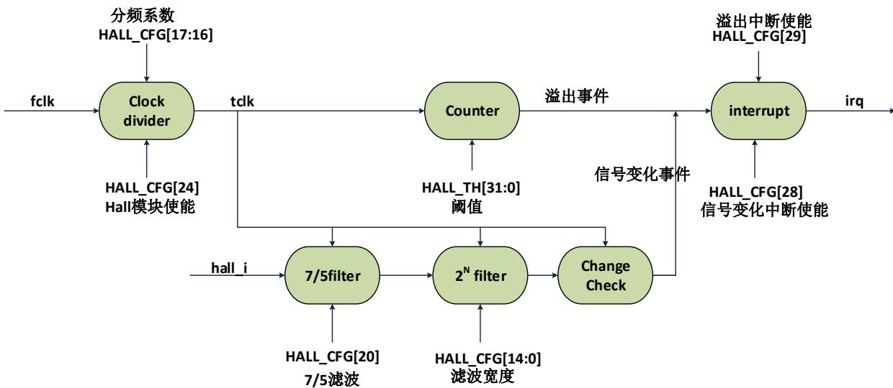  
图 9-2 数据流程框图

## 10 MCPWM

## 10.1 概述

MCPWM 模块，是一个精确控制电机驱动波形输出的模块。

包含一个 16 位 UP 计数器，用于提供一个基础周期。计数器的时钟频率有四种选项，分别为96MHz、48MHz、24MHz 和 12MHz。

包含四组 PWM 生成模块。

\- 可以产生4 对（互补信号）或 8 路独立（边沿模式）不交叠的 PWM 信号；

\- 支持边沿对齐 PWM

\- 中心对齐 PWM

\- 移相 PWM

包含四组 Timer 定时模块。产生 4 路和 MCPWM 同时基的定时信息，用于触发两组 ADC 模块同步采样。

包含一组急停保护模块，用于快速关断 MCPWM 模块输出而不依赖 MCU 的处理。MCPWM 模块可输入 4 路急停信号，其中两路来自外部 IO，两路来自片内比较器的输出，。当急停事件发生时（支持有效电平极性选择），把所有MCPWM 输出信号复位到规定状态，以避免短路发生。

对比较器模块的输出信号有独立滤波模块，可以用做急停保护模块的输出，也可以产生单独的比较器中断事件。

MCPWM 的每个输出 IO支持两种控制模式----PWM 硬件控制或者软件直接控制（用于 EABS 软刹车，或 BLDC方波换相控制）。

图 10-1 MCPWM 模块框图。

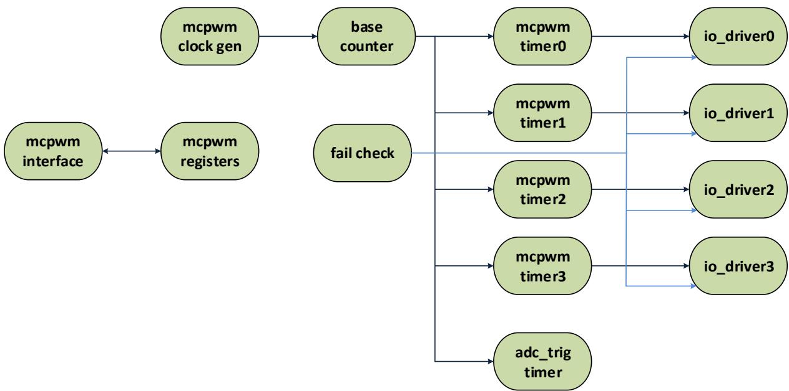  
图 10-1 MCPWM 模块框图  
为了保证定时精度，考虑采用 96MHz 的时钟作为 MCPWM 模块工作频率。

## 10.1.1 Base Counter 模块

该模块主要是由一个递增计数器组成，其计数门限值为 TH，计数器从 t0 开始从-TH 递增计数（UP），在t1过0，在t2计数到TH完成一次计数循环，回到-TH，重新开始计数。计数周期为（2xTH+1）/fclk。fclk 是计数时钟频率。

在 t0/t1(本次 t0 即上一次 t2)可产生定时事件中断，IF[0]和 IF[1]将被置位。

可通过寄存器配置该定时器启动和停止。

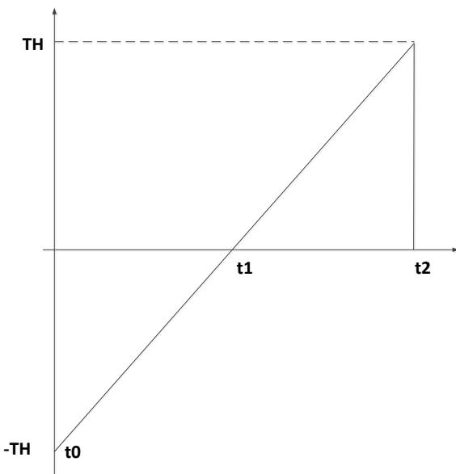  
图 10-2 Base Counter t0/t1 时序

在运行 MCPWM 模块前，用户一般需将对应的比较门限值，死区寄存器配置好。在实际运行过程中，也可动态改变比较门限值和 PWM 周期值，可手动更新，也可以硬件自动更新。硬件更新，仅在 t0 t1 时刻（可配置 t0 或 t1 更新和 t0 t1 时刻都更新）才能产生更新事件，硬件把加载寄存器的值载入到实际运行的寄存器中。而更新事件的发生频率可以配置，即每间隔 N 个 t0 t1 时刻才发生更新。无论是否发生更新，t0 t1 时刻均可产生相应的中断。若硬件把加载寄存器的值到载入实际运行的寄存器后，产生装载完毕中断。

通过配置选择更新发生在 t0 或者 t1或者二者皆可，配置更新间隔数，间隔数为 1\~16。最快的配置为更新发生在 t0 和t1，连续发生。最慢的配置为更新发生在 t1，每 16个 t1 更新一次。图 10-3。

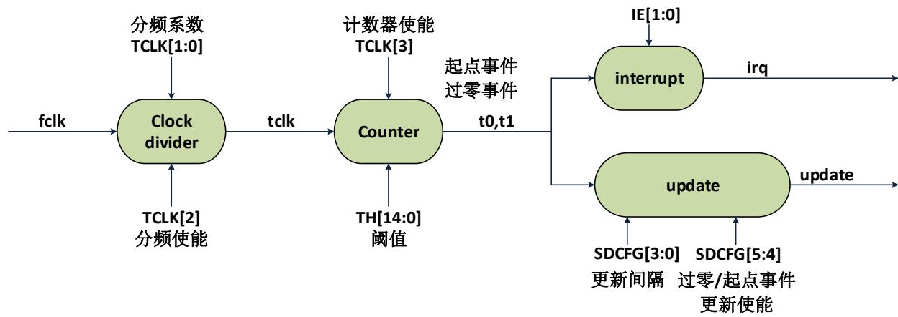  
图 10-3 Base Counter 数据流程图

## 10.1.2 Fail Check 模块

该模块主要是检测电机反馈回的实际短路情况，实现快速关断 PWM 的输出。有两个通道 FAIL0和 FAIL1，共有 4 个源头 BK[1:0]和 CMP[1:0]。BK 来自 IO，CMP 来自芯片内部的比较器模块。同时，CMP 还可单独送往 MCPWM 模块中断模块，产生对应中断信号。

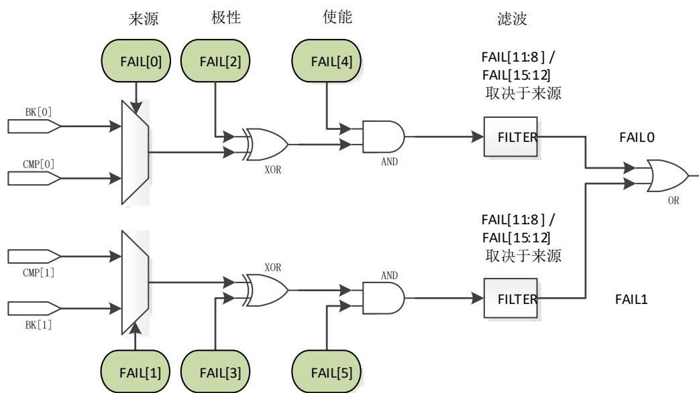

图 10-4 MCPWM FAIL 逻辑示意图

Filter滤波模块的时钟，来自 MCLK，可实现 1--16倍的分频，分频后的时钟用于采样 Filter的输入信号，滤波宽度为 16，即输入信号必须稳定至少 16 个分频后的时钟，硬件才判定其为有效输入信号。滤波宽度的公式为，其中 $\mathrm { T } _ { \mathrm { M C L K } }$ 为 MCLK 的时钟周期，96MHz 对应 10.4ns。

$$
\mathrm{T} = \mathrm{T} _ {\mathrm{MCLK}} \times (\mathrm{TCLK} [ 1 5: 1 2 ] + 1) \times 1 6
$$

一旦发生 Fail，硬件强制将 IO 输出的 FAIL[15:8]寄存器的值，此时 FAIL[15:8]的值直接输出，不受到极性控制等影响。

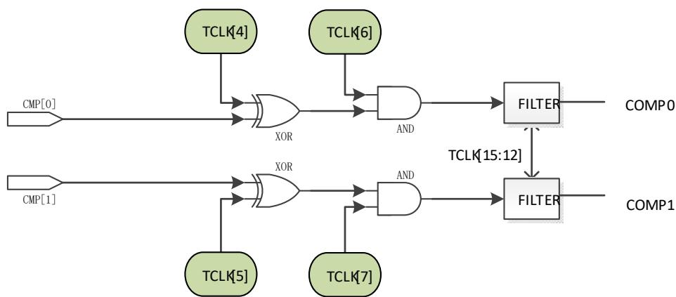  
图 10-5 MCPWM COMP 逻辑示意图

## 10.1.3 MCPWM 特殊输出状态

电机控制中经常会用到全零和全 1输出状态，以下互补模式设置可以得到期望的输出。

1. 如果 $\mathrm { T H n } 0 { \geq } \mathrm { T H n } 1$ ，芯片处于恒 0 状态（CH<n>\_P 关闭， $\mathrm { C H } { < } \mathrm { n } { > } \mathrm { { } } \mathrm { N }$ 开启），无死区

2. 如果 $\mathrm { T H n } 0 { = } { \cdot } \mathrm { T H }$ $\mathrm { T H n } 1 { = } \mathrm { T H }$ ，芯片处于恒 1 状态 $\scriptstyle ( \mathrm { C H < n > } . \mathrm { P }$ 开启，CH<n>\_P 关闭），无死区

## 10.1.4 IO DRIVER 模块

该模块根据实际 MCPWM 的寄存器配置情况，将 IO设置到相应电平。IO Driver模块的整体数据流程图如下：

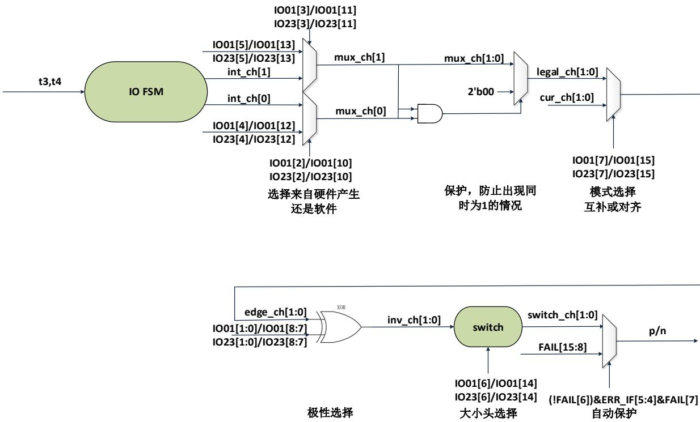  
图 10-6 IO Driver 模块数据流程图

## 10.1.4.1 MCPWM 波形输出-中心对齐模式

4 个 MCPWM IO Driver采用独立的控制门限，独立死区宽度（每一对互补 IO的死区需要独立配置，即 4个死区配置寄存器），共享数据更新事件。

采用 TH<n>0 和 TH<n>1 控制第<n>个 MCPWM IO 的启动、关闭动作，n 为 1/2/3/4。

当计数器 CNT 值向上计数达到 TH<n>0 时，在 t3 时刻关闭 CH<n>\_N，经过死区延时 Tdead，打开 CH<n>\_P。

当计数器 CNT 值向上计数达到 TH<n>1 时，在 t4 时刻关闭 CH<n>\_P，经过死区延时 Tdead，打开 $\mathrm { C H } { < } \mathrm { n } { > } \mathrm { { } } \mathrm { N }$

采用独立的启动和关闭时间控制，可以提供相位控制的能力。

死区延时保证 CH<n>\_P/CH<n>\_N 不会同时为高，避免短路发生。

t3/t4 时刻均会产生相应中断。

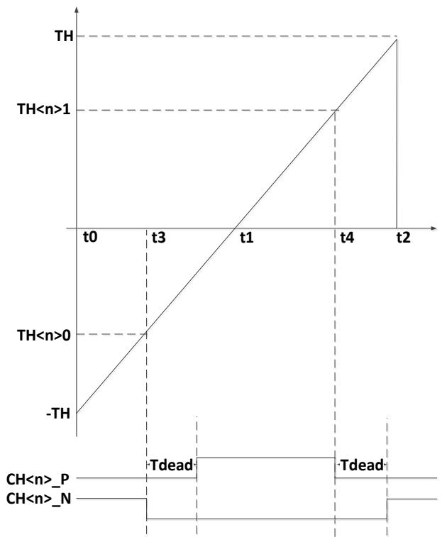  
图 10-7 MCPWM 时序 TH<n>0 和 TH<n>1-互补模式

## 10.1.4.2 MCPWM 波形输出-边沿对齐模式

边沿对齐模式中，在 t0 时刻 $\mathrm { C H } { < } \mathrm { n } { > } \mathrm { \_ P } / \mathrm { C H } { < } \mathrm { n } { > } \mathrm { \_ N }$ 同时置 1，在 t3 时刻，CH<n>\_P 变低，在 t4时刻，CH<n>\_N 变低。

t3/t4 均会产生相应中断。

边沿对齐模式下，CH<n>\_P/CH<n>\_N 无需死区保护。

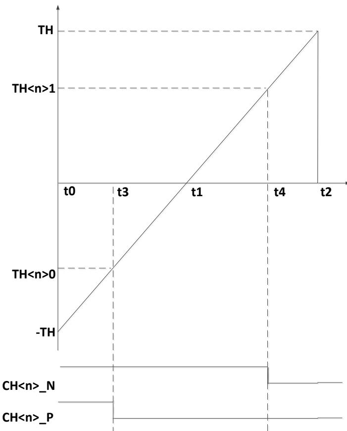  
图 10-8 MCPWM 时序边沿对齐模式

## 10.1.4.3 MCPWM IO 死区控制

MCPWM IO 是一对互斥控制信号 $\mathrm { C H } { < } \mathrm { n } { > } \mathrm { \_ P } / \mathrm { C H } { < } \mathrm { n } { > } \mathrm { \_ N }$ ，控制如下图所示的电路，

当 $\mathrm { C H } { < } \mathrm { n } { > } \mathrm { . } \mathrm { P }$ 为高 $/ \mathrm { C H } { < } \mathrm { n } { > } \mathrm { . } \mathrm { N }$ 为低时，Vout 输出高（VDD）；

当 $\mathrm { C H } { < } \mathrm { n } { > } \mathrm { . } \mathrm { P }$ 为 $\mathrm { { \mathbb { E } } / \mathrm { { C H } < n > \mathrm { { \underline { { N } } } } } }$ 为高时，Vout 输出低（VSS）；

当 $\mathrm { C H } { < } \mathrm { n } { > } \mathrm { . } \mathrm { P }$ 为高 $/ \mathrm { C H } { < } \mathrm { n } { > } \mathrm { . } \mathrm { N }$ 为高时，Vout 输出不确定，但是会产生 VDD到VSS 的短路；

当 $\mathrm { C H } { < } \mathrm { n } { > } \mathrm { . } \mathrm { P }$ 为低 $/ \mathrm { C H } { < } \mathrm { n } { > } \mathrm { . } \mathrm { N }$ 为低时，Vout 输出不确定。

必须避免 $\mathrm { C H } { < } \mathrm { n } { > } \mathrm { \_ P } / \mathrm { C H } { < } \mathrm { n } { > } \mathrm { \_ N }$ 同时为高的情况，死区的引入，可以有效避免VDD到VSS的短路。

四组 MCPWM IO 的死区宽度可独立调整。

对于互补模式 MCPWM IO 自动插入死区。

对于边沿对齐模式，MCPWM IO 无死区。

在 IO Driver 模块中增加 $\mathrm { C H } { < } \mathrm { n } { > } \mathrm { \_ P } / \mathrm { C H } { < } \mathrm { n } { > } \mathrm { \_ N }$ 冲突检测，发生冲突时，自动将 IO拉低，同时给出错误中断（中断保持，直到 MCU写 0）。

MCPWM IO 也可通过软件配置的方式输出，此时，死区控制通过软件实现，如果 PWM 模式为互补，仍然由硬件保证不同时为高或者为低。

CH<n>\_P/CH<n>\_N，在 IO 上可以互换。

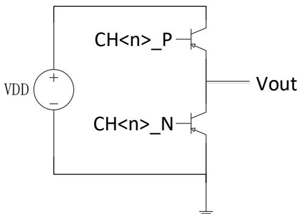  
图 10-9 MCPWM IO 控制示意图

## 10.1.4.4 MCPWM IO 极性设置

CH<n>\_P/CH<n>\_N 的有效电平可以配置为高有效/低有效，每个 IO 的有效电平单独可配。$\mathrm { C H } { < } \mathrm { n } { > } \_ { } \mathrm { P } / \mathrm { C H } { < } \mathrm { n } { > } \_$ \_N 输出到 IO的位置通过软件配置可以互换。

## 10.1.4.5 MCPWM IO 自动保护

当发生短路事件（来自 Fail Check 模块），应立刻将 CH<n>\_P/CH<n>\_N 自动切换到关闭状态。需要注意关闭电平配置（FAIL[15:8]控制默认电平）。

➢ 芯片正常工作后，IO 默认输出的电平是寄存器 FAIL[15:8]指定值，当用户配置完毕，MCPWM 正常工作后，配置 FAIL[6]（即 MOE）为 1，IO 输出电平受到 MCPWM IO 模块控制。

➢ 当发生 FAIL短路状况时，硬件立即切换到 IO默认输出电平。

➢ 当芯片调试中，MCU Halt 时，PWM 停止输出，输出 FAIL[15:8]的值。

➢ IO Driver发现的由于比较寄存器配置带来的CH<n>P/CH<n>N冲突保护不采用本方案实现。

## 10.1.5 ADC Trigger Timer 模块

Timer0/1/2/3 提供 ADC 采样控制。当计数器计数到 TMR0/TMR1/TMR2/TMR3，产生定时事件驱动 ADC采样动作。该输出信号应该也能同时输出到 IO，便于调试之用。

表 10-1MCPWM 计数器阈值与事件对应表

<table><tr><td>t0</td><td>-th</td></tr><tr><td>t1</td><td>0</td></tr><tr><td>tio0[0]</td><td>th00</td></tr><tr><td>tio0[1]</td><td>th01</td></tr><tr><td>TADC[0]</td><td>tmr0</td></tr><tr><td>TADC [1]</td><td>tmr1</td></tr><tr><td>TADC [2]</td><td>tmr2</td></tr><tr><td>TADC [3]</td><td>tmr3</td></tr></table>

## 10.2 寄存器

## 10.2.1 地址分配

MCPWM 模块寄存器的基地址是 0x4000\_3600 寄存器列表

表 10-2MCPWM 模块寄存器列表

<table><tr><td>名称</td><td>偏移地址</td><td>说明</td></tr><tr><td>MCPWM_TH00</td><td>0x00</td><td>MCPWM CH0_P 比较门限值寄存器</td></tr><tr><td>MCPWM_TH01</td><td>0x04</td><td>MCPWM CH0_N 比较门限值寄存器</td></tr><tr><td>MCPWM_TH10</td><td>0x08</td><td>MCPWM CH1_P 比较门限值寄存器</td></tr><tr><td>MCPWM_TH11</td><td>0x0C</td><td>MCPWM CH1_N 比较门限值寄存器</td></tr><tr><td>MCPWM_TH20</td><td>0x10</td><td>MCPWM CH2_P 比较门限值寄存器</td></tr><tr><td>MCPWM_TH21</td><td>0x14</td><td>MCPWM CH2_N 比较门限值寄存器</td></tr><tr><td>MCPWM_TH30</td><td>0x18</td><td>MCPWM CH3_P 比较门限值寄存器</td></tr><tr><td>MCPWM_TH31</td><td>0x1C</td><td>MCPWM CH3_N 比较门限值寄存器</td></tr><tr><td>MCPWM_TMR0</td><td>0x20</td><td>ADC 采样定时器比较门限 0 寄存器</td></tr><tr><td>MCPWM_TMR1</td><td>0x24</td><td>ADC 采样定时器比较门限 1 寄存器</td></tr><tr><td>MCPWM_TMR2</td><td>0x28</td><td>ADC 采样定时器比较门限 2 寄存器</td></tr><tr><td>MCPWM_TMR3</td><td>0x2C</td><td>ADC 采样定时器比较门限 3 寄存器</td></tr><tr><td>MCPWM_IE</td><td>0x30</td><td>MCPWM 中断控制寄存器</td></tr><tr><td>MCPWM_IF</td><td>0x34</td><td>MCPWM 中断标志位寄存器</td></tr><tr><td>MCPWM_EIE</td><td>0x38</td><td>MCPWM 异常中断控制寄存器</td></tr><tr><td>MCPWMEIF</td><td>0x3C</td><td>MCPWM 异常中断标志位寄存器</td></tr><tr><td>MCPWM_IO01</td><td>0x50</td><td>MCPWM IO01 控制寄存器</td></tr><tr><td>MCPWM_IO23</td><td>0x54</td><td>MCPWM IO23 控制寄存器</td></tr><tr><td>MCPWM_SDCFG</td><td>0x58</td><td>MCPWM 加载配置寄存器</td></tr><tr><td>MCPWM_UPDATE</td><td>0x5C</td><td>MCPWM 加载控制寄存器</td></tr><tr><td>MCPWM_TCLK</td><td>0x60</td><td>MCPWM 时钟分频控制寄存器</td></tr><tr><td>MCPWM_FAIL</td><td>0x64</td><td>MCPWM 短路控制寄存器</td></tr><tr><td>MCPWM_TH</td><td>0x70</td><td>MCPWM 门限值寄存器</td></tr><tr><td>MCPWM_PRT</td><td>0x74</td><td>MCPWM 保护寄存器</td></tr><tr><td>MCPWM_CNT</td><td>0x78</td><td>MCPWM 计数器寄存器</td></tr><tr><td>MCPWM_DTH00</td><td>0x80</td><td>MCPWM CH0 N 通道死区宽度控制寄存器</td></tr><tr><td>MCPWM_DTH01</td><td>0x84</td><td>MCPWM CH0 P 通道死区宽度控制寄存器</td></tr><tr><td>MCPWM_DTH10</td><td>0x88</td><td>MCPWM CH1 N 通道死区宽度控制寄存器</td></tr><tr><td>MCPWM_DTH11</td><td>0x8C</td><td>MCPWM CH1 P 通道死区宽度控制寄存器</td></tr><tr><td>MCPWM_DTH20</td><td>0x90</td><td>MCPWM CH2 N 通道死区宽度控制寄存器</td></tr><tr><td>MCPWM_DTH21</td><td>0x94</td><td>MCPWM CH2 P 通道死区宽度控制寄存器</td></tr><tr><td>MCPWM_DTH30</td><td>0x98</td><td>MCPWM CH3 N 通道死区宽度控制寄存器</td></tr><tr><td>MCPWM_DTH31</td><td>0x9C</td><td>MCPWM CH3 P 通道死区宽度控制寄存器</td></tr></table>

## 10.2.2 MCPWM\_TH00

无写保护的寄存器

表 10-3 MCPWM\_TH00 配置寄存器

<table><tr><td>名称</td><td>复位值</td><td>偏移</td><td>位置</td><td>权限</td><td>说明</td></tr><tr><td rowspan="2">MCPWM_TH00</td><td rowspan="2">0x0</td><td rowspan="2">0x00</td><td>[31:16]</td><td>NA</td><td>未使用</td></tr><tr><td>[15:0]</td><td>RW</td><td>MCPWM CHO_P 比较门限值,16 位有符号数;发生更新事件后,本寄存器加载到 MCPWM 实际运行系统中。</td></tr></table>

## 10.2.3 MCPWM\_TH01

无写保护的寄存器

表 10-4 MCPWM\_TH00 配置寄存器

<table><tr><td>名称</td><td>复位值</td><td>偏移</td><td>位置</td><td>权限</td><td>说明</td></tr><tr><td rowspan="2">MCPWM_TH01</td><td rowspan="2">0x0</td><td rowspan="2">0x04</td><td>[31:16]</td><td>NA</td><td>未使用</td></tr><tr><td>[15:0]</td><td>RW</td><td>MCPWM CHO_N 比较门限值,16 位有符号数;发生更新事件后,本寄存器加载到 MCPWM 实际运行系统中。</td></tr></table>

## 10.2.4 MCPWM\_TH10

无写保护的寄存器

表 10-5 MCPWM\_TH10 配置寄存器

<table><tr><td>名称</td><td>复位值</td><td>偏移</td><td>位置</td><td>权限</td><td>说明</td></tr><tr><td rowspan="2">MCPWM_TH10</td><td rowspan="2">0x0</td><td rowspan="2">0x08</td><td>[31:16]</td><td>NA</td><td>未使用</td></tr><tr><td>[15:0]</td><td>RW</td><td>MCPWM CH1_P 比较门限值,16 位有符号数;发生更新事件后,本寄存器加载到 MCPWM 实际运行系统中。</td></tr></table>

## 10.2.5 MCPWM\_TH11

无写保护的寄存器

表 10-6 MCPWM\_TH11 配置寄存器

<table><tr><td>名称</td><td>复位值</td><td>偏移</td><td>位置</td><td>权限</td><td>说明</td></tr><tr><td rowspan="2">MCPWM_TH11</td><td rowspan="2">0x0</td><td rowspan="2">0x0C</td><td>[31:16]</td><td>NA</td><td>未使用</td></tr><tr><td>[15:0]</td><td>RW</td><td>MCPWM CH1_N 比较门限值, 16 位有符号数;发生更新事件后,本寄存器加载到 MCPWM 实际运行系统中。</td></tr></table>

## 10.2.6 MCPWM\_TH20

无写保护的寄存器

表 10-7 MCPWM\_TH20 配置寄存器

<table><tr><td>名称</td><td>复位值</td><td>偏移</td><td>位置</td><td>权限</td><td>说明</td></tr><tr><td rowspan="2">MCPWM_TH20</td><td rowspan="2">0x0</td><td rowspan="2">0x10</td><td>[31:16]</td><td>NA</td><td>未使用</td></tr><tr><td>[15:0]</td><td>RW</td><td>MCPWM CH2_P 比较门限值,16 位有符号数;发生更新事件后,本寄存器加载到 MCPWM 实际运行系统中。</td></tr></table>

## 10.2.7 MCPWM\_TH21

无写保护的寄存器

表 10-8 MCPWM\_TH21 配置寄存器

<table><tr><td>名称</td><td>复位值</td><td>偏移</td><td>位置</td><td>权限</td><td>说明</td></tr><tr><td rowspan="2">MCPWM_TH21</td><td rowspan="2">0x0</td><td rowspan="2">0x14</td><td>[31:16]</td><td>NA</td><td>未使用</td></tr><tr><td>[15:0]</td><td>RW</td><td>MCPWM CH2_N 比较门限值, 16 位有符号数;发生更新事件后,本寄存器加载到 MCPWM 实际运行系统中。</td></tr></table>

## 10.2.8 MCPWM\_TH30

无写保护的寄存器

表 10-9 MCPWM\_TH30 配置寄存器

<table><tr><td>名称</td><td>复位值</td><td>偏移</td><td>位置</td><td>权限</td><td>说明</td></tr><tr><td rowspan="2">MCPWM_TH30</td><td rowspan="2">0x0</td><td rowspan="2">0x18</td><td>[31:16]</td><td>NA</td><td>未使用</td></tr><tr><td>[15:0]</td><td>RW</td><td>MCPWM CH3_P 比较门限值,16 位有符号数;发生更新事件后,本寄存器加载到 MCPWM 实际运行系统中。</td></tr></table>

## 10.2.9 MCPWM\_TH31

无写保护的寄存器

表 10-10 MCPWM\_TH31 配置寄存器

<table><tr><td>名称</td><td>复位值</td><td>偏移</td><td>位置</td><td>权限</td><td>说明</td></tr><tr><td rowspan="2">MCPWM_TH31</td><td rowspan="2">0x0</td><td rowspan="2">0x1C</td><td>[31:16]</td><td>NA</td><td>未使用</td></tr><tr><td>[15:0]</td><td>RW</td><td>MCPWM CH3_N 比较门限值,16 位有符号数;发生更新事件后,本寄存器加载到 MCPWM 实际运行系统中。</td></tr></table>

## 10.2.10 MCPWM\_TMR0

无写保护的寄存器

表 10-11 MCPWM\_TMR0 配置寄存器

<table><tr><td>名称</td><td>复位值</td><td>偏移</td><td>位置</td><td>权限</td><td>说明</td></tr><tr><td rowspan="2">MCPWM_TMR0</td><td rowspan="2">0x0</td><td rowspan="2">0x20</td><td>[31:16]</td><td>NA</td><td>未使用</td></tr><tr><td>[15:0]</td><td>RW</td><td>ADC 采样定时器比较门限 0 寄存器,16 位有符号数;发生更新事件后,本寄存器加载到 MCPWM 实际运行系统中。</td></tr></table>

## 10.2.11 MCPWM\_TMR1

无写保护的寄存器

表 10-12 MCPWM\_TMR1 配置寄存器

<table><tr><td>名称</td><td>复位值</td><td>偏移</td><td>位置</td><td>权限</td><td>说明</td></tr><tr><td rowspan="2">MCPWM_TMR1</td><td rowspan="2">0x0</td><td rowspan="2">0x24</td><td>[31:16]</td><td>NA</td><td>未使用</td></tr><tr><td>[15:0]</td><td>RW</td><td>ADC 采样定时器比较门限 1 寄存器,16 位有符号数;发生更新事件后,本寄存器加载到 MCPWM 实际运行系统中。</td></tr></table>

## 10.2.12 MCPWM\_TMR2

无写保护的寄存器

表 10-13 MCPWM\_TMR2 配置寄存器

<table><tr><td>名称</td><td>复位值</td><td>偏移</td><td>位置</td><td>权限</td><td>说明</td></tr><tr><td rowspan="2">MCPWM_TMR2</td><td rowspan="2">0x0</td><td rowspan="2">0x28</td><td>[31:16]</td><td>NA</td><td>未使用</td></tr><tr><td>[15:0]</td><td>RW</td><td>ADC 采样定时器比较门限 2 寄存器,16 位有符号数;发生更新事件后,本寄存器加载到MCPWM 实际运行系统中。</td></tr></table>

## 10.2.13 MCPWM\_TMR3

无写保护的寄存器

表 10-14 MCPWM\_TMR3 配置寄存器

<table><tr><td>名称</td><td>复位值</td><td>偏移</td><td>位置</td><td>权限</td><td>说明</td></tr><tr><td rowspan="2">MCPWM_TMR3</td><td rowspan="2">0x0</td><td rowspan="2">0x2C</td><td>[31:16]</td><td>NA</td><td>未使用</td></tr><tr><td>[15:0]</td><td>RW</td><td>ADC 采样定时器比较门限 3 寄存器,16 位有符号数;发生更新事件后,本寄存器加载到 MCPWM 实际运行系统中。</td></tr></table>

## 10.2.14 MCPWM\_IE

写保护的寄存器

表 10-15 MCPWM\_IE 配置寄存器

<table><tr><td>名称</td><td>复位值</td><td>偏移</td><td>位置</td><td>权限</td><td>说明</td></tr><tr><td rowspan="7">MCPWM_IE</td><td rowspan="7">0x0</td><td rowspan="7">0x30</td><td>[14]</td><td>RW</td><td>TH (THxx) /TMR 等寄存器更新到 MCPWM 实际运行系统的中断源使能。1,使能;0,关闭。</td></tr><tr><td>[13]</td><td>RW</td><td>MCPWM 实际运行系统中计数器的计数值等于 MCPWM_TMR3 中断源使能。1,使能;0,关闭。</td></tr><tr><td>[12]</td><td>RW</td><td>MCPWM 实际运行系统中计数器的计数值等于 MCPWM_TMR2 中断源使能。1,使能;0,关闭。</td></tr><tr><td>[11]</td><td>RW</td><td>MCPWM 实际运行系统中计数器的计数值等于 MCPWM_TMR1 中断源使能。1,使能;0,关闭。</td></tr><tr><td>[10]</td><td>RW</td><td>MCPWM 实际运行系统中计数器的计数值等于 MCPWM_TMR0 中断源使能。1,使能;0,关闭。</td></tr><tr><td>[9]</td><td>RW</td><td>MCPWM 实际运行系统中计数器的计数值等于 MCPWM_TH31 中断源使能。1,使能;0,关闭。</td></tr><tr><td>[8]</td><td>RW</td><td>MCPWM 实际运行系统中计数器的计数值等于 MCPWM_TH30 中断源使能。1,使能;0,关闭。</td></tr><tr><td rowspan="8"></td><td rowspan="8"></td><td rowspan="8"></td><td>[7]</td><td>RW</td><td>MCPWM 实际运行系统中计数器的计数值等于 MCPWM_TH21 中断源使能。1,使能;0,关闭。</td></tr><tr><td>[6]</td><td>RW</td><td>MCPWM 实际运行系统中计数器的计数值等于 MCPWM_TH20 中断源使能。1,使能;0,关闭。</td></tr><tr><td>[5]</td><td>RW</td><td>MCPWM 实际运行系统中计数器的计数值等于 MCPWM_TH11 中断源使能。1,使能;0,关闭。</td></tr><tr><td>[4]</td><td>RW</td><td>MCPWM 实际运行系统中计数器的计数值等于 MCPWM_TH10 中断源使能。1,使能;0,关闭。</td></tr><tr><td>[3]</td><td>RW</td><td>MCPWM 实际运行系统中计数器的计数值等于 MCPWM_TH01 中断源使能。1,使能;0,关闭。</td></tr><tr><td>[2]</td><td>RW</td><td>MCPWM 实际运行系统中计数器的计数值等于 MCPWM_TH00 中断源使能。1,使能;0,关闭。</td></tr><tr><td>[1]</td><td>RW</td><td>t1 事件,计数器的计数值到达 0 中断源使能。1,使能;0,关闭。</td></tr><tr><td>[0]</td><td>RW</td><td>t0 事件,计数器的计数值回到-MCPWM_TH 中断源使能。1,使能;0,关闭。</td></tr></table>

## 10.2.15 MCPWM\_IF

写保护的寄存器

表 10-16 MCPWM\_IF 配置寄存器

<table><tr><td>名称</td><td>复位值</td><td>偏移</td><td>位置</td><td>权限</td><td>说明</td></tr><tr><td rowspan="4">MCPWM_IF</td><td rowspan="4">0x0</td><td rowspan="4">0x34</td><td>[14]</td><td>RW</td><td>TH (THxx) /TMR 等寄存器更新到 MCPWM 实际运行系统的中断源事件。1,发生;0,没发生。写 1 清零。</td></tr><tr><td>[13]</td><td>RW</td><td>MCPWM 实际运行系统中计数器的计数值等于 MCPWM_TMR3 中断源事件。1,发生;0,没发生。写 1 清零。</td></tr><tr><td>[12]</td><td>RW</td><td>MCPWM 实际运行系统中计数器的计数值等于 MCPWM_TMR2 中断源事件。1,发生;0,没发生。写 1 清零。</td></tr><tr><td>[11]</td><td>RW</td><td>MCPWM 实际运行系统中计数器的计数值等于 MCPWM_TMR1 中断源事件。1,发生;0,没发生。写1清零。</td></tr><tr><td rowspan="11"></td><td rowspan="11"></td><td rowspan="11"></td><td>[10]</td><td>RW</td><td>MCPWM实际运行系统中计数器的计数值等于MCPWM_TMR0中断源事件。1,发生;0,没发生。写1清零。</td></tr><tr><td>[9]</td><td>RW</td><td>MCPWM实际运行系统中计数器的计数值等于MCPWM_TH31中断源事件。1,发生;0,没发生。写1清零。</td></tr><tr><td>[8]</td><td>RW</td><td>MCPWM实际运行系统中计数器的计数值等于MCPWM_TH30中断源事件。1,发生;0,没发生。写1清零。</td></tr><tr><td>[7]</td><td>RW</td><td>MCPWM实际运行系统中计数器的计数值等于MCPWM_TH21中断源事件。1,发生;0,没发生。写1清零。</td></tr><tr><td>[6]</td><td>RW</td><td>MCPWM实际运行系统中计数器的计数值等于MCPWM_TH20中断源事件。1,发生;0,没发生。写1清零。</td></tr><tr><td>[5]</td><td>RW</td><td>MCPWM实际运行系统中计数器的计数值等于MCPWM_TH11中断源事件。1,发生;0,没发生。写1清零。</td></tr><tr><td>[4]</td><td>RW</td><td>MCPWM实际运行系统中计数器的计数值等于MCPWM_TH10中断源事件。1,发生;0,没发生。写1清零。</td></tr><tr><td>[3]</td><td>RW</td><td>MCPWM实际运行系统中计数器的计数值等于MCPWM_TH01中断源事件。1,发生;0,没发生。写1清零。</td></tr><tr><td>[2]</td><td>RW</td><td>MCPWM实际运行系统中计数器的计数值等于MCPWM_TH00中断源事件。1,发生;0,没发生。写1清零。</td></tr><tr><td>[1]</td><td>RW</td><td>t1事件,计数器的计数值到达0中断源事件。1,发生;0,没发生。写1清零。</td></tr><tr><td>[0]</td><td>RW</td><td>t0事件,计数器的计数值回到-MCPWM_TH中断源事件。1,发生;0,没发生。写1清零。</td></tr></table>

## 10.2.16 MCPWM\_EIE

无写保护的寄存器

表 10-17 MCPWM\_EIE 配置寄存器

<table><tr><td>名称</td><td>复位值</td><td>偏移</td><td>位置</td><td>权限</td><td>说明</td></tr><tr><td>MCPWM_EIE</td><td>0x0</td><td>0x30</td><td>[7][6]</td><td>RWRW</td><td>比较器1中断源使能。1,使能;0,关闭。比较器0中断源使能。1,使能;0,关闭。</td></tr><tr><td rowspan="6"></td><td rowspan="6"></td><td rowspan="6"></td><td>[5]</td><td>RW</td><td>FAIL1中断源使能。1,使能;0,关闭。</td></tr><tr><td>[4]</td><td>RW</td><td>FAIL0中断源使能。1,使能;0,关闭。</td></tr><tr><td>[3]</td><td>RW</td><td>MCPWM CH3_P和CH3_N同时有效,中断源使能。1,使能;0,关闭。</td></tr><tr><td>[2]</td><td>RW</td><td>MCPWM CH2_P和CH2_N同时有效,中断源使能。1,使能;0,关闭。</td></tr><tr><td>[1]</td><td>RW</td><td>MCPWM CH1_P和CH1_N同时有效,中断源使能。1,使能;0,关闭。</td></tr><tr><td>[0]</td><td>RW</td><td>MCPWM CH0_P和CH0_N同时有效,中断源使能。1,使能;0,关闭。</td></tr></table>

## 10.2.17 MCPWM\_EIF

无写保护的寄存器

表 10-18 MCPWM\_EIF 配置寄存器

<table><tr><td>名称</td><td>复位值</td><td>偏移</td><td>位置</td><td>权限</td><td>说明</td></tr><tr><td rowspan="8">MCPWMEIF</td><td rowspan="8">0x0</td><td rowspan="8">0x30</td><td>[7]</td><td>RW</td><td>比较器1中断源事件。1,发生;0,没发生。写1清零。</td></tr><tr><td>[6]</td><td>RW</td><td>比较器0中断源事件。1,发生;0,没发生。写1清零。</td></tr><tr><td>[5]</td><td>RW</td><td>FAIL1中断源事件。1,发生;0,没发生。可写1清零。</td></tr><tr><td>[4]</td><td>RW</td><td>FAIL0中断源事件。1,发生;0,没发生。可写1清零。</td></tr><tr><td>[3]</td><td>RW</td><td>MCPWM CH3_P和CH3_N同时有效,中断源事件。1,发生;0,没发生。写1清零。</td></tr><tr><td>[2]</td><td>RW</td><td>MCPWM CH2_P和CH2_N同时有效,中断源事件。1,发生;0,没发生。写1清零。</td></tr><tr><td>[1]</td><td>RW</td><td>MCPWM CH1_P和CH1_N同时有效,中断源事件。1,发生;0,没发生。写1清零。</td></tr><tr><td>[0]</td><td>RW</td><td>MCPWM CHO_P和CHO_N同时有效,中断源事件。1,发生;0,没发生。写1清零。</td></tr></table>

MCPWM\_EIF[7:6]对应的是 CMP 中断，而与 MCPWM 中断无关。当 MCPWM\_EIE[7:6]使能，同时 MCPWM\_EIF[7:6]置位时，处理器会收到 CMP 中断事件。而 MCPWM\_EIF[5:0]则属于 MCPWM 中断。

## 10.2.18 MCPWM\_IO01

写保护的寄存器

表 10-19 MCPWM\_IO01 配置寄存器

<table><tr><td>名称</td><td>复位值</td><td>偏移</td><td>位置</td><td>权限</td><td>说明</td></tr><tr><td rowspan="16">MCPWM_IO01</td><td rowspan="16">0x0</td><td rowspan="16">0x50</td><td>[15]</td><td>RW</td><td>CH1工作模式选择。1:Edge模式;0:互补模式。</td></tr><tr><td>[14]</td><td>RW</td><td>CH1的P和N通道输出互换选择。即P通道信号最后从N通道输出,N通道的信号最后从P通道输出。1:互换;0:不互换。</td></tr><tr><td>[13]</td><td>RW</td><td>当B[11]为1时,B[13]的值输出到CH1P。</td></tr><tr><td>[12]</td><td>RW</td><td>当B[10]为1时,B[12]的值输出到CH1N。</td></tr><tr><td>[11]</td><td>RW</td><td>CH1P来源。1:来自B[13];0:MCPWM内部计数器产生。</td></tr><tr><td>[10]</td><td>RW</td><td>CH1N来源。1:来自B[12];0:MCPWM内部计数器产生。</td></tr><tr><td>[9]</td><td>RW</td><td>CH1P极性选择。1:CH1P信号取反输出;0:CH1P信号正常输出。</td></tr><tr><td>[8]</td><td>RW</td><td>CH1N极性选择。1:CH1N信号取反输出;0:CH1N信号正常输出。</td></tr><tr><td>[7]</td><td>RW</td><td>CHO工作模式选择。1:Edge模式;0:互补模式。</td></tr><tr><td>[6]</td><td>RW</td><td>CHO的P和N通道输出互换选择。即P通道信号最后从N通道输出,N通道的信号最后从P通道输出。1:互换;0:不互换。</td></tr><tr><td>[5]</td><td>RW</td><td>当B[3]为1时,B[5]的值输出到CHO P。</td></tr><tr><td>[4]</td><td>RW</td><td>当B[2]为1时,B[4]的值输出到CHO N。</td></tr><tr><td>[3]</td><td>RW</td><td>CHO P来源。1:来自B[5];0:MCPWM实际运行系统中计数器产生。</td></tr><tr><td>[2]</td><td>RW</td><td>CHO N来源。1:来自B[4];0:MCPWM实际运行系统中计数器产生。</td></tr><tr><td>[1]</td><td>RW</td><td>CHO P极性选择。1:CHO P信号取反输出;0:CHO P信号正常输出。</td></tr><tr><td>[0]</td><td>RW</td><td>CHO N极性选择。1:CHO N信号取反输出;0:CHO N信号正常输出。</td></tr></table>

## 10.2.19 MCPWM\_IO23

写保护的寄存器

表 10-20 MCPWM\_IO23 配置寄存器

<table><tr><td>名称</td><td>复位值</td><td>偏移</td><td>位置</td><td>权限</td><td>说明</td></tr><tr><td rowspan="16">MCPWM_IO23</td><td rowspan="16">0x0</td><td rowspan="16">0x54</td><td>[15]</td><td>RW</td><td>CH3工作模式选择。1:Edge模式;0:互补模式。</td></tr><tr><td>[14]</td><td>RW</td><td>CH3的P和N通道输出互换选择。即P通道信号最后从N通道输出,N通道的信号最后从P通道输出。1:互换;0:不互换。</td></tr><tr><td>[13]</td><td>RW</td><td>当B[11]为1时,B[13]的值输出到CH3P。</td></tr><tr><td>[12]</td><td>RW</td><td>当B[10]为1时,B[12]的值输出到CH3N。</td></tr><tr><td>[11]</td><td>RW</td><td>CH3P来源。1:来自B[13];0:MCPWM实际运行系统中计数器产生。</td></tr><tr><td>[10]</td><td>RW</td><td>CH3N来源。1:来自B[12];0:MCPWM实际运行系统中计数器产生。</td></tr><tr><td>[9]</td><td>RW</td><td>CH3P极性选择。1:CH3P信号取反输出;0:CH3P信号正常输出。</td></tr><tr><td>[8]</td><td>RW</td><td>CH3N极性选择。1:CH3N信号取反输出;0:CH3N信号正常输出。</td></tr><tr><td>[7]</td><td>RW</td><td>CH2工作模式选择。1:Edge模式;0:互补模式。</td></tr><tr><td>[6]</td><td>RW</td><td>CH2的P和N通道输出互换选择。即P通道信号最后从N通道输出,N通道的信号最后从P通道输出。1:互换;0:不互换。</td></tr><tr><td>[5]</td><td>RW</td><td>当B[3]为1时,B[5]的值输出到CH2P。</td></tr><tr><td>[4]</td><td>RW</td><td>当B[2]为1时,B[4]的值输出到CH2N。</td></tr><tr><td>[3]</td><td>RW</td><td>CH2P来源。1:来自B[5];0:MCPWM实际运行系统中计数器产生。</td></tr><tr><td>[2]</td><td>RW</td><td>CH2N来源。1:来自B[4];0:MCPWM实际运行系统中计数器产生。</td></tr><tr><td>[1]</td><td>RW</td><td>CH2P极性选择。1:CH2P信号取反输出;0:CH2P信号正常输出。</td></tr><tr><td>[0]</td><td>RW</td><td>CH2N极性选择。1:CH2N信号取反输出;0:CH2N信号正常输出。</td></tr></table>

## 10.2.20 MCPWM\_SDCFG

写保护的寄存器

表 10-21 MCPWM\_SDCFG 配置寄存器

<table><tr><td>名称</td><td>复位值</td><td>偏移</td><td>位置</td><td>权限</td><td>说明</td></tr><tr><td rowspan="3">MCPWM_SDCFG</td><td rowspan="3">0x0</td><td rowspan="3">0x58</td><td>[5]</td><td>RW</td><td>t1(过零)事件更新使能。1:使能;0,关闭。</td></tr><tr><td>[4]</td><td>RW</td><td>t0(起点)事件更新使能。1:使能;0,关闭。</td></tr><tr><td>[3:0]</td><td>RW</td><td>更新间隔。一旦t0和t1事件发生次数同B[3:0]相等,MCPWM系统自动触发MCPWM_TH(包括THxx)和MCPWM_TMR寄存器加载到MCPWM运行系统的操作。若B[5]和B[4]均关闭,将不会触发此类型加载,只能手动触发加载。</td></tr></table>

## 10.2.21 MCPWM\_UPDATE

无写保护的寄存器

表 10-22 MCPWM\_UPDATE 配置寄存器

<table><tr><td>名称</td><td>复位值</td><td>偏移</td><td>位置</td><td>权限</td><td>说明</td></tr><tr><td rowspan="10">MCPWM_UPDATE</td><td rowspan="10">0x0</td><td rowspan="10">0x5C</td><td>[12]</td><td>RW</td><td>手动将加载 MCPWM_TH 寄存器的内容到 MCPWM 运行系统中。1: 加载; 0: 不加载。</td></tr><tr><td>[11]</td><td>RW</td><td>手动将加载 MCPWM_TMR3 寄存器的内容到 MCPWM 运行系统中。1: 加载; 0: 不加载。</td></tr><tr><td>[10]</td><td>RW</td><td>手动将加载 MCPWM_TMR2 寄存器的内容到 MCPWM 运行系统中。1: 加载; 0: 不加载。</td></tr><tr><td>[9]</td><td>RW</td><td>手动将加载 MCPWM_TMR1 寄存器的内容到 MCPWM 运行系统中。1: 加载; 0: 不加载。</td></tr><tr><td>[8]</td><td>RW</td><td>手动将加载 MCPWM_TMR0 寄存器的内容到 MCPWM 运行系统中。1: 加载; 0: 不加载。</td></tr><tr><td>[7]</td><td>RW</td><td>手动将加载 MCPWM_TH31 寄存器的内容到 MCPWM 运行系统中。1: 加载; 0: 不加载。</td></tr><tr><td>[6]</td><td>RW</td><td>手动将加载 MCPWM_TH30 寄存器的内容到 MCPWM 运行系统中。1: 加载; 0: 不加载。</td></tr><tr><td>[5]</td><td>RW</td><td>手动将加载 MCPWM_TH21 寄存器的内容到 MCPWM 运行系统中。1: 加载; 0: 不加载。</td></tr><tr><td>[4]</td><td>RW</td><td>手动将加载 MCPWM_TH20 寄存器的内容到 MCPWM 运行系统中。1: 加载; 0: 不加载。</td></tr><tr><td>[3]</td><td>RW</td><td>手动将加载 MCPWM_TH11 寄存器的内容到MCPWM 运行系统中。1:加载;0:不加载。</td></tr><tr><td rowspan="3"></td><td rowspan="3"></td><td rowspan="3"></td><td>[2]</td><td>RW</td><td>手动将加载 MCPWM_TH10 寄存器的内容到 MCPWM 运行系统中。1:加载;0:不加载。</td></tr><tr><td>[1]</td><td>RW</td><td>手动将加载 MCPWM_TH01 寄存器的内容到 MCPWM 运行系统中。1:加载;0:不加载。</td></tr><tr><td>[0]</td><td>RW</td><td>手动将加载 MCPWM_TH00 寄存器的内容到 MCPWM 运行系统中。1:加载;0:不加载。</td></tr></table>

## 10.2.22 MCPWM\_TCLK

写保护的寄存器

表 10-23 MCPWM\_TCLK 配置寄存器

<table><tr><td>名称</td><td>复位值</td><td>偏移</td><td>位置</td><td>权限</td><td>说明</td></tr><tr><td rowspan="9">MCPWM_TCLK</td><td rowspan="9">0x0</td><td rowspan="9">0x60</td><td>[15:12]</td><td>RW</td><td>来自比较器结果的滤波时钟分频寄存器,基于系统时钟分频。计算公式如下:系统时钟 / (B[15:12] + 1)。分频范围是 1-16。</td></tr><tr><td>[11:8]</td><td>RW</td><td>来自 GPIO 输入的滤波时钟分频寄存器,基于系统时钟分频。计算公式如下:系统时钟 / (B[11:8] + 1)。分频范围是 1-16。</td></tr><tr><td>[7]</td><td>RW</td><td>比较器 1 结果,输入使能。1:使能;0:关闭。</td></tr><tr><td>[6]</td><td>RW</td><td>比较器 0 结果,输入使能。1:使能;0:关闭。</td></tr><tr><td>[5]</td><td>RW</td><td>比较器 1 结果,极性选择开关。1:结果取反,即低电平有效;0:结果不取反,即高电平有效。</td></tr><tr><td>[4]</td><td>RW</td><td>比较器 0 结果,极性选择开关。1:结果取反,即低电平有效;0:结果不取反,即高电平有效。</td></tr><tr><td>[3]</td><td>RW</td><td>MCPWM 实际运行计数器使能开关。1:使能;0:关闭。</td></tr><tr><td>[2]</td><td>RW</td><td>MCPWM 工作时钟使能。1:使能;0:关闭。</td></tr><tr><td>[1:0]</td><td>RW</td><td>MCPWM 工作时钟分频寄存器。计算公式:系统时钟 / (B[1:0] + 1)。范围 1-4。</td></tr></table>

## 10.2.23 MCPWM\_FAIL

写保护的寄存器

表 10-24 MCPWM\_FAIL 配置寄存器

<table><tr><td>名称</td><td>复位值</td><td>偏移</td><td>位置</td><td>权限</td><td>说明</td></tr><tr><td rowspan="16">MCPWM_FAIL</td><td rowspan="16">0x0</td><td rowspan="16">0x64</td><td>[15]</td><td>RW</td><td>CH3 N 通道默认值</td></tr><tr><td>[14]</td><td>RW</td><td>CH3 P 通道默认值</td></tr><tr><td>[13]</td><td>RW</td><td>CH2 N 通道默认值</td></tr><tr><td>[12]</td><td>RW</td><td>CH2 P 通道默认值</td></tr><tr><td>[11]</td><td>RW</td><td>CH1 N 通道默认值</td></tr><tr><td>[10]</td><td>RW</td><td>CH1 P 通道默认值</td></tr><tr><td>[9]</td><td>RW</td><td>CH0 N 通道默认值</td></tr><tr><td>[8]</td><td>RW</td><td>CH0 P 通道默认值</td></tr><tr><td>[7]</td><td>RW</td><td>MCU 进入 HALT 状态,MCPWM 输出值选择。1:正常输出;0:强制 MCPWM 输出保护值。</td></tr><tr><td>[6]</td><td>RW</td><td>控制 MCPWM CH P 和 N 输出值。1:输出 MCPWM 产生的正常信号0:输出 B[15:8]默认值,此默认值不受极性/通道选择等控制。MCPWMEIF[5:4]任意一位变 1 将触发 B[6]变成 0,输出默认值。</td></tr><tr><td>[5]</td><td>RW</td><td>FAIL1 输入使能。1:使能;0:关闭。</td></tr><tr><td>[4]</td><td>RW</td><td>FAIL0 输入使能。1:使能;0:关闭。</td></tr><tr><td>[3]</td><td>RW</td><td>FAIL1 极性选择。1:信号取反输入;0:信号正常输入。</td></tr><tr><td>[2]</td><td>RW</td><td>FAIL0 极性选择。1:信号取反输入;0:信号正常输入。</td></tr><tr><td>[1]</td><td>RW</td><td>FAIL1 来源选择。1:比较器 1 的结果;0:来自 GPIO 第 1 路。</td></tr><tr><td>[0]</td><td>RW</td><td>FAIL0 来源选择。1:比较器 0 的结果;0:来自 GPIO 第 0 路。</td></tr></table>

## 10.2.24 MCPWM\_TH

写保护的寄存器

表 10-25 MCPWM\_TH 配置寄存器

<table><tr><td>名称</td><td>复位值</td><td>偏移</td><td>位置</td><td>权限</td><td>说明</td></tr><tr><td rowspan="2">MCPWM_TH</td><td rowspan="2">0x0</td><td rowspan="2">0x70</td><td>[31:15]</td><td>NA</td><td>未使用</td></tr><tr><td>[14:0]</td><td>RW</td><td>MCPWM 计数器门限值,15 位无符号数,MCPWM 实际运行系统中的计数器从-TH 计数到 TH;发生更新事件后,本寄存器加载到MCPWM 实际运行系统中。</td></tr></table>

## 10.2.25 MCPWM\_PRT

无写保护的寄存器

表 10-26 MCPWM\_PRT 配置寄存器

<table><tr><td>名称</td><td>复位值</td><td>偏移</td><td>位置</td><td>权限</td><td>说明</td></tr><tr><td rowspan="2">MCPWM_PRT</td><td rowspan="2">0x0</td><td rowspan="2">0x74</td><td>[31:16]</td><td>NA</td><td>未使用</td></tr><tr><td>[15:0]</td><td>RW</td><td>写入 0xDEAD,解除 MCPWM 寄存器写保护;写入其它值,MCPWM 寄存器进入写保护。</td></tr></table>

## 10.2.26 MCPWM\_CNT

无写保护的寄存器

表 10-27 MCPWM\_CNT 配置寄存器

<table><tr><td>名称</td><td>复位值</td><td>偏移</td><td>位置</td><td>权限</td><td>说明</td></tr><tr><td rowspan="2">MCPWM_CNT</td><td rowspan="2">0x0</td><td rowspan="2">0x78</td><td>[31:16]</td><td>NA</td><td>未使用</td></tr><tr><td>[15:0]</td><td>RW</td><td>MCPWM 实际运行系统中计数器的值。</td></tr></table>

## 10.2.27 MCPWM\_DTH00

写保护的寄存器

表 10-28 MCPWM\_DTH00 配置寄存器

<table><tr><td>名称</td><td>复位值</td><td>偏移</td><td>位置</td><td>权限</td><td>说明</td></tr><tr><td rowspan="2">MCPWM_DTH00</td><td rowspan="2">0x0</td><td rowspan="2">0x80</td><td>[31:10]</td><td>NA</td><td>未使用</td></tr><tr><td>[9:0]</td><td>RW</td><td>MCPWM CHO N通道死区宽度控制寄存器,10bit无符号数</td></tr></table>

## 10.2.28 MCPWM\_DTH01

写保护的寄存器

表 10-29 MCPWM\_DTH01 配置寄存器

<table><tr><td>名称</td><td>复位值</td><td>偏移</td><td>位置</td><td>权限</td><td>说明</td></tr><tr><td rowspan="2">MCPWM_DTH01</td><td rowspan="2">0x0</td><td rowspan="2">0x84</td><td>[31:10]</td><td>NA</td><td>未使用</td></tr><tr><td>[9:0]</td><td>RW</td><td>MCPWM CHO P通道死区宽度控制寄存器,10bit无符号数</td></tr></table>

## 10.2.29 MCPWM\_DTH10

写保护的寄存器

表 10-30 MCPWM\_DTH10 配置寄存器

<table><tr><td>名称</td><td>复位值</td><td>偏移</td><td>位置</td><td>权限</td><td>说明</td></tr><tr><td rowspan="2">MCPWM_DTH10</td><td rowspan="2">0x0</td><td rowspan="2">0x88</td><td>[31:10]</td><td>NA</td><td>未使用</td></tr><tr><td>[9:0]</td><td>RW</td><td>MCPWM CH1 N通道死区宽度控制寄存器,10bit无符号数</td></tr></table>

## 10.2.30 MCPWM\_DTH11

写保护的寄存器

表 10-31 MCPWM\_DTH11 配置寄存器

<table><tr><td>名称</td><td>复位值</td><td>偏移</td><td>位置</td><td>权限</td><td>说明</td></tr><tr><td rowspan="2">MCPWM_DTH11</td><td rowspan="2">0x0</td><td rowspan="2">0x8C</td><td>[31:10]</td><td>NA</td><td>未使用</td></tr><tr><td>[9:0]</td><td>RW</td><td>MCPWM CH1 P通道死区宽度控制寄存器,10bit无符号数</td></tr></table>

## 10.2.31 MCPWM\_DTH20

写保护的寄存器

表 10-32 MCPWM\_DTH20 配置寄存器

<table><tr><td>名称</td><td>复位值</td><td>偏移</td><td>位置</td><td>权限</td><td>说明</td></tr><tr><td rowspan="2">MCPWM_DTH20</td><td rowspan="2">0x0</td><td rowspan="2">0x90</td><td>[31:10]</td><td>NA</td><td>未使用</td></tr><tr><td>[9:0]</td><td>RW</td><td>MCPWM CH2 N通道死区宽度控制寄存器,10bit无符号数</td></tr></table>

## 10.2.32 MCPWM\_DTH21

写保护的寄存器

表 10-33 MCPWM\_DTH21 配置寄存器

<table><tr><td>名称</td><td>复位值</td><td>偏移</td><td>位置</td><td>权限</td><td>说明</td></tr><tr><td rowspan="2">MCPWM_DTH21</td><td rowspan="2">0x0</td><td rowspan="2">0x94</td><td>[31:10]</td><td>NA</td><td>未使用</td></tr><tr><td>[9:0]</td><td>RW</td><td>MCPWM CH2 P通道死区宽度控制寄存器,10bit无符号数</td></tr></table>

## 10.2.33 MCPWM\_DTH30

写保护的寄存器

表 10-34 MCPWM\_DTH30 配置寄存器

<table><tr><td>名称</td><td>复位值</td><td>偏移</td><td>位置</td><td>权限</td><td>说明</td></tr><tr><td rowspan="2">MCPWM_DTH30</td><td rowspan="2">0x0</td><td rowspan="2">0x98</td><td>[31:10]</td><td>NA</td><td>未使用</td></tr><tr><td>[9:0]</td><td>RW</td><td>MCPWM CH3 N通道死区宽度控制寄存器,10bit无符号数</td></tr></table>

## 10.2.34 MCPWM\_DTH01

写保护的寄存器

表 10-35 MCPWM\_DTH31 配置寄存器

<table><tr><td>名称</td><td>复位值</td><td>偏移</td><td>位置</td><td>权限</td><td>说明</td></tr><tr><td rowspan="2">MCPWM_DTH31</td><td rowspan="2">0x0</td><td rowspan="2">0x9C</td><td>[31:10]</td><td>NA</td><td>未使用</td></tr><tr><td>[9:0]</td><td>RW</td><td>MCPWM CH3 P通道死区宽度控制寄存器,10bit无符号数</td></tr></table>

## 11 UART

## 11.1 概述

UART 特征如下：

全双工工作

支持 7/8 位数据位

支持 1/2 停止位

支持奇/偶/无校验模式

带 1 字节发送缓存

带 1 字节接收缓存

支持 Multi-drop Slave/Master 模式

## 11.2 功能说明

## 11.2.1 发送

UART 包括一个字节发送缓冲区，当发送缓冲区有数据时，UART 将发送缓冲区的数据加载，并通过 TX 发送出去。

完成加载后，产生发送缓冲区空中断，此时，用户可以往发送缓冲区填入下一个需要发送的字节，这样，发送完成后，UART 将加载这个字节进行发送。

完成发送后，会产生发送完成中断。

## 11.2.2 接收

UART 包括一个字节的接收缓冲区，当完成一个字节的接收后，会产生接收中断，并将接收到字节存储到接收缓冲区，用户应当在 UART 接收完成下一个字节前完成此字节的读取，否则缓冲区会被写入新接收的字节。

## 11.2.3 波特率配置

UART 输入时钟为系统主时钟，波特率通过两级分频实现。

波特率=主时钟/ $( 2 5 6 ^ { * } \mathrm { D I V H } + \mathrm { D I V L } + 1 )$

系统主时钟最大为 96MHz 时，波特率最低为 96MHz/（256\*255+255+1）=1464Hz。

## 11.3 寄存器

## 11.3.1 地址分配

UART0 与 UART1 实现完全相同。

UART0 基地址 0x40003900。

UART1 基地址 0x40003A00。

表 11-1 UARTx 地址分配列表

<table><tr><td>名称</td><td>偏移地址</td><td>说明</td></tr><tr><td>UARTx_CTRL</td><td>0x00</td><td>UART 控制寄存器</td></tr><tr><td>UARTx_DIVH</td><td>0x04</td><td>UART 波特率设置高字节寄存器</td></tr><tr><td>UARTx_DIVL</td><td>0x08</td><td>UART 波特率设置低字节寄存器</td></tr><tr><td>UARTx_BUFF</td><td>0x0C</td><td>UART 收发缓冲寄存器</td></tr><tr><td>UARTx_ADR</td><td>0x10</td><td>485 通信地址匹配寄存器</td></tr><tr><td>UARTx_STT</td><td>0x14</td><td>UART 状态寄存器</td></tr><tr><td>UARTx_IE</td><td>0x18</td><td>UART 中断使能寄存器</td></tr><tr><td>UARTx_IF</td><td>0x1C</td><td>UART 中断标志寄存器</td></tr></table>

11.3.2 UARTx 控制寄存器 UARTx\_CTRL

表 11-2UARTx 控制寄存器 UARTx\_CTRL

<table><tr><td>名称</td><td>复位值</td><td>偏移</td><td>位置</td><td>权限</td><td>说明</td></tr><tr><td rowspan="9">UARTx_CTRL</td><td rowspan="9">0x0</td><td rowspan="9">0x00</td><td>[31:8]</td><td>NA</td><td>未使用</td></tr><tr><td>[7]</td><td>RW</td><td>使能 IO 翻转, 0:禁用, 1:使能</td></tr><tr><td>[6]</td><td>RW</td><td>Multi-drop Master 模式时, 第 9 个数据位值</td></tr><tr><td>[5]</td><td>RW</td><td>使能 Multi-drop, 0:禁用, 1:使能</td></tr><tr><td>[4]</td><td>RW</td><td>使能校验, 0:禁用, 1:使能</td></tr><tr><td>[3]</td><td>RW</td><td>奇偶校验, 0:EVEN 1:ODD</td></tr><tr><td>[2]</td><td>RW</td><td>先发送的比特, 0:LSB, 1:MSB</td></tr><tr><td>[1]</td><td>RW</td><td>停止位长度, 0:1bit, 1:2bit</td></tr><tr><td>[0]</td><td>RW</td><td>数据长度, 0:8bit, 1:7bit</td></tr></table>

11.3.3 UARTx 波特率设置高字节寄存器 UARTx\_DIVH

表 11-3UARTx 波特率设置高字节寄存器 UARTx\_DIVH

<table><tr><td>名称</td><td>复位值</td><td>偏移</td><td>位置</td><td>权限</td><td>说明</td></tr><tr><td rowspan="2">UARTx_DIVH</td><td rowspan="2">0x0</td><td rowspan="2">0x04</td><td>[31:8]</td><td>NA</td><td>未使用</td></tr><tr><td>[7:0]</td><td>RW</td><td>波特率设置高字节BAUDRATE =主时钟/(1+DIVL+256*DIVH)</td></tr></table>

## 11.3.4 UARTx 波特率设置低字节寄存器 UARTx\_DIVL

表 11-4UARTx 波特率设置低字节寄存器 UARTx\_DIVL

<table><tr><td>名称</td><td>复位值</td><td>偏移</td><td>位置</td><td>权限</td><td>说明</td></tr><tr><td rowspan="2">UARTx_DIVL</td><td rowspan="2">0x0</td><td rowspan="2">0x08</td><td>[31:8]</td><td>NA</td><td>未使用</td></tr><tr><td>[7:0]</td><td>RW</td><td>波特率设置低字节BAUDRATE =模块时钟/(1+DIVL+256*DIVH)</td></tr></table>

## 11.3.5 UARTx 收发缓冲寄存器 UARTx\_BUFF

表 11-5UARTx 收发缓冲寄存器 UARTx\_BUFF

<table><tr><td>名称</td><td>复位值</td><td>偏移</td><td>位置</td><td>权限</td><td>说明</td></tr><tr><td rowspan="2">UARTx_BUFF</td><td rowspan="2">0x0</td><td rowspan="2">0x0C</td><td>[31:8]</td><td>NA</td><td>未使用</td></tr><tr><td>[7:0]</td><td>RW</td><td>写:发送数据缓存读:接收数据寄存器</td></tr></table>

UART 的 Tx\_buffer 和 Rx\_buffer 共享地址 0x0C 地址。其中，Tx\_buffer 是只写的，Rx\_buffer 是只读的。因此读访问 UARTx\_BUFF 是访问 UARTx\_RX\_BUFF，写访问 UARTx\_BUFF 是访问UARTx\_TX\_BUFF。

## 11.3.6 UARTx 地址匹配寄存器 UARTx\_ADR

表 11-6UARTx 地址匹配寄存器 UARTx\_ADR

<table><tr><td>名称</td><td>复位值</td><td>偏移</td><td>位置</td><td>权限</td><td>说明</td></tr><tr><td rowspan="2">UARTx_ADR</td><td rowspan="2">0x0</td><td rowspan="2">0x10</td><td>[31:8]</td><td>NA</td><td>未使用</td></tr><tr><td>[7:0]</td><td>RW</td><td>用作 485 通信时的匹配地址</td></tr></table>

## 11.3.7 UARTx 状态寄存器 UARTx\_STT

表 11-7UARTx 状态寄存器 UARTx\_STT

<table><tr><td>名称</td><td>复位值</td><td>偏移</td><td>位置</td><td>权限</td><td>说明</td></tr><tr><td rowspan="4">UARTx_STT</td><td rowspan="4">0x0</td><td rowspan="4">0x14</td><td>[31:3]</td><td>NA</td><td>未使用</td></tr><tr><td>[2]</td><td>RW</td><td>Multi-drop 模式下,地址匹配上</td></tr><tr><td>[1]</td><td>RW</td><td>发送缓存空</td></tr><tr><td>[0]</td><td>RW</td><td>发送完成(此时发送缓存如不为空,则可以继续发送缓存中的数据)</td></tr></table>

11.3.8 UARTx 中断使能寄存器 UARTx\_IE

表 11-8UARTx 中断使能寄存器 UARTx\_IE

<table><tr><td>名称</td><td>复位值</td><td>偏移</td><td>位置</td><td>权限</td><td>说明</td></tr><tr><td rowspan="2">UARTx_IE</td><td rowspan="2">0x0</td><td rowspan="2">0x18</td><td>[31:5]</td><td>NA</td><td>未使用</td></tr><tr><td>[4][3]</td><td>RWRW</td><td>校验错误中断使能停止位错误中断使能</td></tr><tr><td rowspan="3"></td><td rowspan="3"></td><td rowspan="3"></td><td>[2]</td><td>RW</td><td>发送缓冲区空中断使能</td></tr><tr><td>[1]</td><td>RW</td><td>接收完成中断使能</td></tr><tr><td>[0]</td><td>RW</td><td>发送完成中断使能</td></tr></table>

11.3.9 UARTx 中断标志寄存器 UARTx\_IF

表 11-9UARTx 中断标志寄存器 UARTx\_IF

<table><tr><td>名称</td><td>复位值</td><td>偏移</td><td>位置</td><td>权限</td><td>说明</td></tr><tr><td rowspan="6">UARTx_IF</td><td rowspan="6">0x0</td><td rowspan="6">0x1C</td><td>[31:5]</td><td>NA</td><td>未使用</td></tr><tr><td>[4]</td><td>RW</td><td>校验错误中断标志</td></tr><tr><td>[3]</td><td>RW</td><td>停止位错误中断标志</td></tr><tr><td>[2]</td><td>RW</td><td>发送缓冲区空中断标志</td></tr><tr><td>[1]</td><td>RW</td><td>接收完成中断标志</td></tr><tr><td>[0]</td><td>RW</td><td>发送完成中断标志</td></tr></table>

## 11.4 应用指南

SYS\_CLK\_DIV2 可对 UART 模块时钟进行分频，以系统主时钟为 96MHz 为例，如果需要设置为较低的波特率，可以使用 SYS\_CLK\_DV2 和 UART\_DIVL、UART\_DIVH 联合分频

UART 模块工作时钟 = 96MHz/(1+SYS\_CLK\_DIV2)

UART 波特率 =UART 模块工作时钟/(1+DIVL+256\*DIVH)

## 12 信号协处理器模块

## 12.1 概述

协处理器模块主要完成除法和开方两种运算，被除数、除数、商、余数位宽均为 32 位，被开方数为 32 位，平方根为 16 位，另外有 1 位除 0错误指示。

除法 32 个总线周期（96MHz），经过32 次移位加减完成。

开方 8 个总线周期（96MHz）完成。

## 12.1.1 功能框图

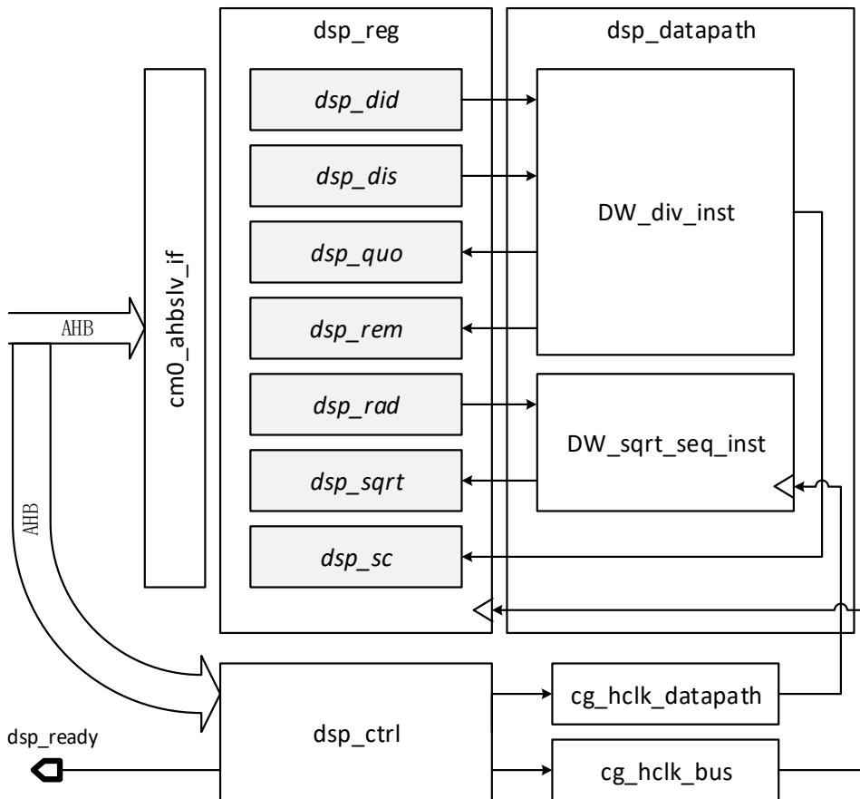  
图 12-1 DSP 模块功能框图

## 12.1.2 特点

32bit 除法器，32 周期完成一次除法，支持除 0检测

32bit 被开方数，平方根 16bit

## 12.2 寄存器

## 12.2.1 地址分配

信号协处理器模块在芯片中的基地址是 0x4000\_3800。

表 12-1 DSP 寄存器列表

<table><tr><td>名称</td><td>偏移</td><td>说明</td></tr><tr><td>DSP_DID</td><td>0x00</td><td>DSP 除法器被除数寄存器</td></tr><tr><td>DSP_DIS</td><td>0x04</td><td>DSP 除法器除数寄存器</td></tr><tr><td>DSP_QUO</td><td>0x08</td><td>DSP 除法器商寄存器</td></tr><tr><td>DSP_REM</td><td>0x0C</td><td>DSP 除法器余数寄存器</td></tr><tr><td>DSP_RAD</td><td>0x10</td><td>DSP 开方器被开方数寄存器</td></tr><tr><td>DSP_SQRT</td><td>0x14</td><td>DSP 开方器平方根寄存器</td></tr><tr><td>DSP_SC</td><td>0x18</td><td>DSP 控制状态寄存器</td></tr></table>

## 12.2.2 除法器

## 12.2.2.1 被除数寄存器 DSP\_DID

表 12-2 被除数寄存器 DSP\_DID

<table><tr><td>名称</td><td>复位值</td><td>偏移</td><td>位置</td><td>权限</td><td>说明</td></tr><tr><td>DSP_DID</td><td>0x0</td><td>0x00</td><td>[31:0]</td><td>RW</td><td>DSP 除法器 32bit 被除数</td></tr></table>

## 12.2.2.2 除数寄存器 DSP\_DIS

表 12-3 除数寄存器 DSP\_DIS

<table><tr><td>名称</td><td>复位值</td><td>偏移</td><td>位置</td><td>权限</td><td>说明</td></tr><tr><td>DSP_DIS</td><td>0x0</td><td>0x04</td><td>[31:0]</td><td>RW</td><td>DSP 除法器 32bit 除数</td></tr></table>

除数不应为 0，否则会发生除 0 错误。  
写入除数可以触发一次除法开始进行。

## 12.2.2.3 商寄存器 DSP\_QUO

表 12-4 商寄存器 DSP\_QUO

<table><tr><td>名称</td><td>复位值</td><td>偏移</td><td>位置</td><td>权限</td><td>说明</td></tr><tr><td>DSP_QUO</td><td>0x0</td><td>0x08</td><td>[31:0]</td><td>R</td><td>DSP 除法器 32bit 商</td></tr></table>

## 12.2.2.4 余数寄存器 DSP\_REM

表 12-5 余数寄存器 DSP\_REM

<table><tr><td>名称</td><td>复位值</td><td>偏移</td><td>位置</td><td>权限</td><td>说明</td></tr><tr><td>DSP_REM</td><td>0x0</td><td>0x0C</td><td>[31:0]</td><td>R</td><td>DSP 除法器 32bit 余数</td></tr></table>

## 12.2.3 开方器

## 12.2.3.1 被开方数寄存器 DSP\_RAD

表 12-6 被开放数寄存器 DSP\_RAD

<table><tr><td>名称</td><td>复位值</td><td>偏移</td><td>位置</td><td>权限</td><td>说明</td></tr><tr><td>DSP_RAD</td><td>0x0</td><td>0x10</td><td>[31:0]</td><td>RW</td><td>DSP 开放器 32bit 被开方数</td></tr></table>

32bit 被开方数被当做无符号数处理。

写入被开方数可以触发一次开放运算开始进行。

## 12.2.3.2 平方根寄存器 DSP\_SQRT

表 12-7 平方根寄存器 DSP\_SQRT

<table><tr><td>名称</td><td>复位值</td><td>偏移</td><td>位置</td><td>权限</td><td>说明</td></tr><tr><td rowspan="2">DSP_SQRT</td><td rowspan="2">0x0</td><td rowspan="2">0x14</td><td>[31:16]</td><td>NA</td><td>未使用</td></tr><tr><td>[15:0]</td><td>R</td><td>DSP 开方器输出的平方根</td></tr></table>

## 12.2.3.3 控制状态寄存器 DSP\_SC

表 12-8 DSP 控制状态寄存器 DSP\_SC

<table><tr><td>名称</td><td>复位值</td><td>偏移</td><td>位置</td><td>权限</td><td>说明</td></tr><tr><td rowspan="4">DSP_SC</td><td rowspan="4">0x0</td><td rowspan="4">0x18</td><td>[31:5]</td><td>NA</td><td>未使用</td></tr><tr><td>[4]</td><td>R</td><td>除0错误标志位,高有效</td></tr><tr><td>[3:1]</td><td>NA</td><td>未使用</td></tr><tr><td>[0]</td><td>RW</td><td>DSP使能,高有效</td></tr></table>

## 12.3 实现说明

## 12.3.1 时钟门控时序

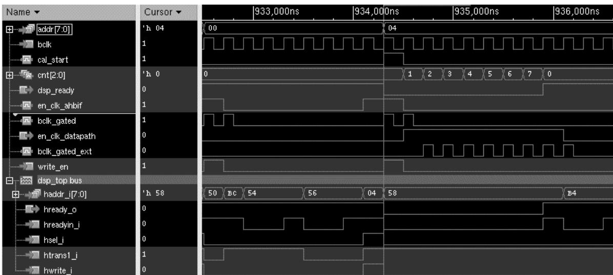  
图 12-2 时钟门控

其中 bclk 为总线时钟，bclk\_gated 为寄存器访问的门控时钟；bclk\_gated\_ext 为开方运算所需的门控时钟。

除法 32 个总线周期（96MHz），经过 32 次移位加减完成。写入除数寄存器触发一次新的除法计算，32 个周期后可以从商、余数、除 0 错误标志寄存器读回计算结果。除法计算过程中 dsp模块会拉低 ahb 总线 ready 信号，中断整个总线上的所有操作，cpu 如果在此阶段内发起总线操作也会等待总线响应。

开方 8 个总线周期（96MHz）完成。写入被开方数寄存器触发一次新的开方计算，8 个周期后可以从平方根寄存器读回计算结果。开方计算过程中 dsp模块会拉低 ahb 总线 ready 信号，中断整个总线上的所有操作，cpu 如果在此阶段内发起总线操作也会等待总线响应。

## 13 I2C

## 13.1 概述

本芯片的 SPI 模块和 I2C 模块，共享 FIFO。若一个使用了 FIFO，另外一个就只能单字节传输。本芯片的 I2C 模块可工作在主模式、从模式或主从模式。此时，I2C 对应为主设备、从设备或主从设备。I2C 总线网络是支持多主多从的，所以，I2C模块工作在何种模式下，应考虑实际系统的组网情况。

当模块工作在从模式时，I2C 模块仅是一个从设备，无需考虑 I2C 总线网络是否多主设备。从模式下，I2C 模块只需要实现的功能为：监听总线状态--捕捉 START 信号、接收数据或发送数据。

当模块工作在主模式时，I2C 模块仅是一个主设备，此时 I2C 总线网络只有一个主设备。在主模式下，I2C 模块只需要实现的功能为：产生 START 信号和 STOP信号、接收数据或发送数据。

当模块工作在主从模式时，I2C 模块是一个主从设备，此时 I2C 总线网络存在多个主设备。主从模式下，I2C 模块除开实现主模式所有功能和从模式所有功能外，还需要处理多主机争抢 I2C 总线资源的问题。

本芯片的 I2C模块主要实现如下功能：

➢ 支持主/从模式，接收/发送操作

➢ 支持中断或轮询两种方式

➢ 主模式时钟频率：50K，100K，400K

➢ 支持多主机时钟同步

➢ 支持多主机模式判断

➢ 7-Bit 寻址

➢ 硬件支持自动地址比较(仅在 7-Bit 地址和从模式下)

➢ 主从模式下突发传输(Burst Transfer Mode)

➢ 支持的中断触发条件包括：总线错误、停止、NACK、硬件地址匹配、传输完成

I2C 模块整体结构框图如下：

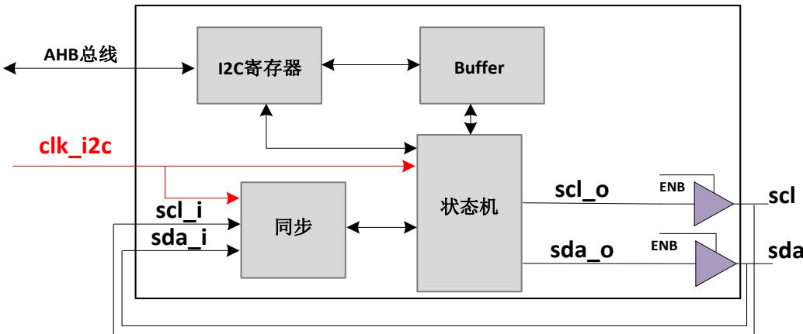  
图 13-1 I2C 模块结构框图

I2C 模块的时钟信号来自于系统时钟。因为 I2C 总线传输速度比较低，我们须在系统端对输送给 I2C 模式使用的 I2C 时钟进行预先分频（见时钟模块相关寄存器）。SCL 时钟频率和 I2C 时钟频率关系，如下：

当 I2C 模块配置成主模式时， I2C 时钟频率是 SCL 时钟频率的 17 倍。SCL 的高电平时间为 8个 I2C 时钟周期，低电平时间为 9个 I2C 时钟周期。

当 I2C 模块配置成从模式时，I2C 时钟频率是 SCL时钟频率的至少 17 倍。两者相差越大，对于整个系统而言，处理时间越宽裕。

为了减少外界干扰对I2C模块的影响，我们使用同步模块对SCL和SDA信号进行采样滤波处理，可以将低于 3 个 I2C 时钟周期的短脉冲过滤掉。

## 13.2 寄存器说明

## 13.2.1 地址分配

I2C 模块寄存器的基地址是 0x4000\_30C0 寄存器列表。

表 13-1I2C模块控制寄存器列表

<table><tr><td>名称</td><td>偏移地址</td><td>说明</td></tr><tr><td>I2C0_ADDR</td><td>0x00</td><td>I2C 模块硬件地址寄存器</td></tr><tr><td>I2C0_CFG</td><td>0x04</td><td>I2C 配置寄存器</td></tr><tr><td>I2C0_SCR</td><td>0x08</td><td>I2C 状态和控制寄存器</td></tr><tr><td>I2C0_DATA</td><td>0x0C</td><td>I2C 数据寄存器</td></tr><tr><td>I2C0_MSCR</td><td>0x10</td><td>I2C 主机状态和控制寄存器</td></tr><tr><td>I2C0_BUF_CTR</td><td>0x14</td><td>I2C Buffer 控制寄存器</td></tr><tr><td>I2C0_BUF_ADDR</td><td>0x20</td><td>I2C Buffer 地址寄存器</td></tr></table>

## 13.2.2 I2C\_ADDR

表 13-2 I2C0\_ADDR 地址寄存器

<table><tr><td>名称</td><td>复位值</td><td>偏移</td><td>位置</td><td>权限</td><td>说明</td></tr><tr><td rowspan="3">I2C0_ADDR</td><td rowspan="3">0x0</td><td rowspan="3">0x00</td><td>[31:8]</td><td>NA</td><td>未使用</td></tr><tr><td>[7]</td><td>RW</td><td>硬件地址自动比较使能开关。仅支持 7-bit 地址,且仅从模式有效。置 1,接收到的 7-bit 地址和本寄存器中[6:0]的内容进行比较。地址比较成功,产生中断,在中断服务程序中,I2C_SCR 寄存器的 Address 位须清零。地址比较失败,则是非针对本 I2C 模块的访问,无需软件处理,硬件直接抛弃本次操作。置 0,不比较。只要接收到地址数据,交给软件处理。</td></tr><tr><td>[6:0]</td><td>RW</td><td>存储地址。I2C 为主模式且是 Burst 传输时,存储将要发送的地址;I2C 为从模式时,存储自身地址。</td></tr></table>

## 13.2.3 I2C0\_CFG

表 13-3 I2C0\_CFG 配置寄存器

<table><tr><td>名称</td><td>复位值</td><td>偏移</td><td>位置</td><td>权限</td><td>说明</td></tr><tr><td rowspan="8">I2C0_CFG</td><td rowspan="8">0x0</td><td rowspan="8">0x04</td><td>[31:8]</td><td>NA</td><td>未使用</td></tr><tr><td>[7]</td><td>RW</td><td>I2C 中断使能总开关。1,使能;0,关闭。</td></tr><tr><td>[6]</td><td>NA</td><td>未使用</td></tr><tr><td>[5]</td><td>RW</td><td>I2C 总线错误中断使能开关。1,使能;0,关闭。仅在主模式下使用,控制检测到总线错误时是否产生中断。总线错误通常是一个错误的启动或者停止条件,在主机操作的情况下这是一个重要的中断。当产生总线错误时,所有从机设备要根据该信号重新设定总线接口并同步。但,主机模式进行数据传输过程中,硬件检测到总线错误时,主设备将释放总线成为空闲状态。</td></tr><tr><td>[4]</td><td>RW</td><td>检测到总线产生停止信号,是否产生中断。置1,允许;置0,不允许。主模式和从模式均可使用。</td></tr><tr><td>[3:2]</td><td>NA</td><td>未使用</td></tr><tr><td>[1]</td><td>RW</td><td>主机模式。置1,I2C模块使能主模式功能。置0,屏蔽I2C模块主模式功能。</td></tr><tr><td>[0]</td><td>RW</td><td>从机模式。置1,I2C模块使能从模式功能。置0,屏蔽I2C模块从模式功能。</td></tr></table>

## 13.2.4 I2C0\_SCR

表 13-4 I2C0\_SCR 状态和控制寄存器

<table><tr><td>名称</td><td>复位值</td><td>偏移</td><td>位置</td><td>权限</td><td>说明</td></tr><tr><td rowspan="9">I2C0_SCR</td><td rowspan="9">0x0</td><td rowspan="9">0x08</td><td>[31:8]</td><td>NA</td><td>未使用</td></tr><tr><td>[7]</td><td>RW</td><td>检测到一个错误的启动或者停止信号。仅主机模式使用,软件写0清除。</td></tr><tr><td>[6]</td><td>RW</td><td>丢失仲裁。主机模式使用。主机丢失仲裁之后这位即被置位,无中断产生。在字节传输完成后,这个状态可以被检测出来。任何初始检测将会自动清除该位。</td></tr><tr><td>[5]</td><td>RW</td><td>检测到停止信号。主模式和从模式均可使用。软件写0清除。</td></tr><tr><td>[4]</td><td>RW</td><td>1,接收完字节之后发送ACK;0,接收完字节之后发送NACK。主模式和从模式均可使用。在非Burst传输模式下,在字节传输完成事件之后这位被硬件自动清除。在Burst传输模式下,在接收模式下开始传输数据之前这位必须是1,在接下来的字节传输完成事件之后这位被硬件自动清除。</td></tr><tr><td>[3]</td><td>RW</td><td>发送或者接收字节是一个地址数据。主模式和从模式均可使用。软件写0清除。</td></tr><tr><td>[2]</td><td>RW</td><td>1,发送模式;0,接收模式。主模式和从模式均可使用。</td></tr><tr><td>[1]</td><td>RW</td><td>1,传输字节后接收端反馈是NACK;0,传输字节后接收端反馈是ACK。主模式和从模式均可使用。</td></tr><tr><td>[0]</td><td>RW</td><td>1,传输完成信号。软件写0清除。发送模式:预定义字节数的数据接收成功发送成功且ACK或者NACK已经收到。接收模式:预定义字节数的数据接收成功。</td></tr></table>

## 13.2.5 I2C0\_DATA

表 13-5I2C 数据寄存器

<table><tr><td>名称</td><td>复位值</td><td>偏移</td><td>位置</td><td>权限</td><td>说明</td></tr><tr><td rowspan="2">I2C0_DATA</td><td rowspan="2">0x0</td><td rowspan="2">0x0C</td><td>[31:8]</td><td>NA</td><td>未使用</td></tr><tr><td>[7:0]</td><td>RW</td><td>数据寄存器。非 Burst 模式:1.主模式,发送模式。填入地址,操作 I2C_MSCR 寄存器的 start/restart 位,触发地址的发送。2.主模式/从模式,发送模式。填入发送的数据,写操作 I2C_SCR 寄存器的 transmit 位,触发数据的发送。3. 主模式/从模式,接收数据。字节接收完成,读取该寄存器获得接收数据,写操作 I2C_SCR 寄存器,继续后续流程。Burst 模式:1.主模式,发送模式。填入地址到 I2C_ADDR 寄存器,填入数据到 I2C_DR 寄存器,操作 I2C_MSCR 寄存器的 start/restart 位,触发地址的发送。2. 主模式/从模式,发送模式。填入发送的数据,写操作 I2C_SCR 寄存器,触发数据的继续发送。3. 主模式/从模式,接收数据。字节接收完成,读取该寄存器获得接收数据,写操作 I2C_SCR 寄存器,继续后续流程。</td></tr></table>

13.2.6 I2C0\_MSCR

表 13-6I2C主机状态和控制寄存器

<table><tr><td>名称</td><td>复位值</td><td>偏移</td><td>位置</td><td>权限</td><td>说明</td></tr><tr><td rowspan="5">I2C0_MSCR</td><td rowspan="5">0x0</td><td rowspan="5">0x10</td><td>[31:4]</td><td>NA</td><td>未使用</td></tr><tr><td>[3]</td><td>R</td><td>闲忙标识信号。检测到 START 信号,该位被硬件自动置 1;当检测到 STOP 信号,该位被硬件自动清 0。</td></tr><tr><td>[2]</td><td>R</td><td>主从标识信号。当本 I2C 模块发出 START 信号,该位硬件自动置 1;当检测到 STOP 信号,该位硬件自动清 0。</td></tr><tr><td>[1]</td><td>RW</td><td>产生一个 RESTART 信号。产生结束后,硬件自动清 0。</td></tr><tr><td>[0]</td><td>RW</td><td>产生一个 START 信号。产生结束后,硬件自动清 0。</td></tr></table>

## 13.2.7 I2C0\_BUF\_CTRL

表 13-7 I2C0\_BUF\_CTRL 控制寄存器

<table><tr><td>名称</td><td>复位值</td><td>偏移</td><td>位置</td><td>权限</td><td>说明</td></tr><tr><td rowspan="3">I2C0_BUF_CTRL</td><td rowspan="3">0x0</td><td rowspan="3">0x14</td><td>[31:8]</td><td>NA</td><td>未使用</td></tr><tr><td>[7]</td><td>RW</td><td>Burst 模式下,发送方对接收方返回的 NACK 的处理方式。1,允许在发送方产生 NACK 中断,此时中断来临时,会执行拉底 SCL 总线的操作;0,在发送方不产生 NACK 中断,此时若发送方是主设备--直接 STOP 返回,若发送方是从设备--直接进入 IDLE。</td></tr><tr><td>[6]</td><td>RW</td><td>Burst 模式下,是否允许 HwAddr 中断产生。1,允许;0,不允许。在从机突发模式下接收地址,该位和 I2C_ADDR[7]配合使用。</td></tr><tr><td rowspan="2"></td><td rowspan="2"></td><td rowspan="2"></td><td>[5]</td><td>RW</td><td>Burst 模式开关。1,开启 Burst 模式;0,关闭 Burst 模式。</td></tr><tr><td>[4:0]</td><td>RW</td><td>Burst 模式开启下,一次 Burst 传输字节数。实际传输数等于[4:0] + 1。</td></tr></table>

## 13.2.8 I2C0\_BUF\_ADDR

表 13-8 I2C0 buffer 地址寄存器

<table><tr><td>名称</td><td>复位值</td><td>偏移</td><td>位置</td><td>权限</td><td>说明</td></tr><tr><td rowspan="2">I2C0_BUF_ADDR</td><td rowspan="2">0x0</td><td rowspan="2">0x18</td><td>[31:5]</td><td>NA</td><td>未使用</td></tr><tr><td>[4:0]</td><td>RW</td><td>Buffer 地址指针。指向下一个 I2C_DR 操作位置。一般在使用前,软件把地址写 0,每操作一次 I2C_DR,该寄存器自动累加 1.</td></tr></table>

## 13.3 应用指南

I2C 模块基本的一次传输，如下举例：

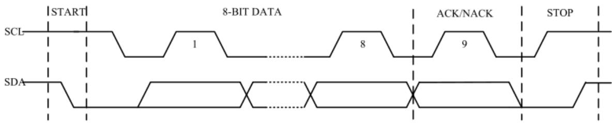  
图 13-2I2C模块基本的一次传输时序

主设备，发起 START 信号；发送第一个 Byte 数据（该数据一般是 I2C 从设备地址和读写控制信号）；若有从设备地址匹配，且从设备可以完成数据交换，则回应 ACK。从设备无法完成数据交换，则回应 NACK；主设备发送 STOP 信号，表明此次传输完成（中间可根据软件协议传输 N 个字节的数据）。I2C 执行读/写，按照单字节发送还是 Burst 模式发送，每个发送字节的含义，均由上层软件协议规定，同 I2C模块本身没有关系。

从设备，Burst接收模式：

$$
/ / \mathrm{配置} \mathrm {I2C\_CFG} \mathrm{寄存器}
$$

I2C0\_CFG = 0x91; //enable stop ie & i2c interrupt enable, slave mode enabled //配置系统中断使能

\_enable\_irq();

NVIC\_Enable(I2C\_IRQn);

$$
/ / \mathrm{配置硬件地址比较}
$$

$$
\mathrm {I2C0\_ADDR} = 0 \mathrm{x} 9 9; \quad / / \text { enable   hardware   address   compare,   slave   address } = 0 \mathrm{x} 1 9
$$

$$
/ / \text {配置 Buffer 地址和参数}
$$

$$
\mathrm {I2C0\_BUF\_CTRL = 0x3f;//burstmode,buffersize = 32bytes}
$$

$$
\text { I2C0\_BUF\_ADDR } = 0 \text { x00 }; / / \text { buffer   start   point   is   0x0 }
$$

$$
/ / \text {使能} I 2 C S l a v e B u r s t 发 送
$$

$$
\mathrm {I2C0\_SCR} = 0 \mathrm{x} 1 0; \quad / / \text { set   ack   for   slave   that   responds   master   data   requirement. }
$$

使能 I2C 从设备的硬件地址比较；配置好从设备 I2C 地址；开启 I2C 中断源和中断在系统级别的使能；配置好 Buffer参数（本次 Burst 长度为 32字节），使能 Burst传输模式。完成上述配置后，MCU 可以执行其它任务。I2C 模块就会根据总线发送的地址，自行判断是否相应；同时，只有完成32 字节数据的接收操作后，I2C 才会产生完成中断。

主设备，Burst发送模式：

$$
\begin{array}{r l} & \text { //配置I2C\_CFG寄存器 } \\ \mathrm {I2CO\_CFG = 0x92;} & \quad \text { //enable stop ie\&i2c interrupt enable,master mode enabled } \\ & \quad \text { //配置系统中断使能 } \end{array}
$$

\_\_enable\_irq();

NVIC\_Enable(I2C\_IRQn);

//配置硬件地址比较

$$
\mathrm {I2C0\_ADDR} = 0 \mathrm{x} 1 9;
$$

$$
/ / \text { store   target   slave   address } = 0 x 1 9
$$

//配置 Buffer 地址和参数。

$$
\mathrm {I2C0\_BUF\_CTRL} = 0 \mathrm{x3f};
$$

//burst mode, buffer size = 32bytes

$$
\mathrm {I2C0\_BUF\_ADDR = 0x00;}
$$

//buffer start point is 0x0

//加载数据至 Buffer

$$
\mathrm {I2C0\_DATA = data;}
$$

//load transmit data to buffer

//传输数据。

$$
\mathrm {I2C0\_ {M} SCR = 0x01;}
$$

使能 I2C 主模式；配置好目标从设备 I2C 地址；开启 I2C 中断源和中断在系统级别的使能；配置好 Buffer 参数（本次 Burst长度为 32 字节），使能 Burst传输模式；把将要发送的数据，逐一写入 Buffer中。完成上述配置后，触发 I2C 发送，MCU可以执行其它任务。完成 32字节数据的发送操作后，I2C 会产生完成中断。

## 14 SPI

## 14.1 概述

本芯片的 SPI 模块和 I2C 模块，共享 FIFO。若一个使用了 FIFO，另外一个就只能单字节传输。SPI 模块主要实现如下功能：

➢ 主模式和从模式

➢ SPI 时钟信号极性和相位可配

➢ 32-Byte 的 FIFO，用于发送和接收数据

SPI 总线由四根信号线构成，分别是 SPI\_CLK，SPI\_DI，SPI\_DO 和 SPI\_SS。

➢ 在主模式下，SPI\_CLK 为时钟输出，SPI\_DI 为数据输入，SPI\_DO 为数据输出，SPI\_SS 为片选输出

➢ 在从模式下，SPI\_CLK 为时钟输入，SPI\_DI 为数据输入，SPI\_DO 为数据输出，SPI\_SS 为片选输入

一般应用，对方的数据输出接本模块的 DI；对方的数据输入接本模块的 DO；SS 则看谁是主则是输出，从则是输入；CLK 接法同 SS。在一种应用中，本模块只能固定为一种工作模式--主模式或者从模式。

SPI 总体框图，如下：

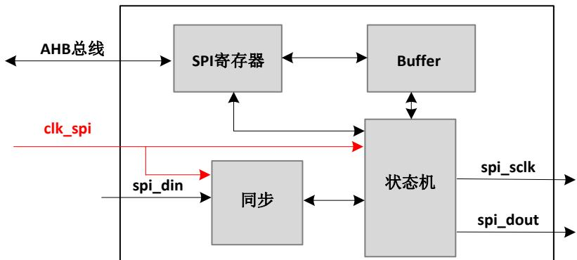  
图 14-1 SPI 模块结构框图

注意，clk\_spi 和 spi\_sclk之间为 8 倍关系，前者是后者频率的 8 倍。

## 14.2 寄存器说明

## 14.2.1 地址分配

SPI 模块寄存器的基地址是 0x4000\_3080 寄存器列表。

表 14-1SPI模块控制寄存器列表

<table><tr><td>名称</td><td>偏移地址</td><td>说明</td></tr><tr><td>SPI0_SHIFTER</td><td>0x00</td><td>SPI 移位寄存器</td></tr><tr><td>SPI0_DATA</td><td>0x04</td><td>SPI 数据寄存器</td></tr><tr><td>SPI0_CR0</td><td>0x08</td><td>SPI 控制寄存器 0,控制主/从功能。</td></tr><tr><td>SPI0_CR1</td><td>0x0C</td><td>SPI 控制寄存器 1</td></tr><tr><td>SPI0_CR2</td><td>0x10</td><td>SPI 控制寄存器 2</td></tr><tr><td>SPI0_BUF_ADDR</td><td>0x14</td><td>SPI Buffer 地址寄存器</td></tr></table>

## 14.2.2 SPI0\_SHIFTER

表 14-2 SPI0\_SHIFTER 移位寄存器

<table><tr><td>名称</td><td>复位值</td><td>偏移</td><td>位置</td><td>权限</td><td>说明</td></tr><tr><td rowspan="2">SPI0_SHIFTER</td><td rowspan="2">0x0</td><td rowspan="2">0x00</td><td>[31:8]</td><td>NA</td><td>未使用</td></tr><tr><td>[7:0]</td><td>R</td><td>SPI 移位寄存器。从 Tx Buffer 加载数据到该寄存器中,发送出去;接收 SPI 串行输入数据,转存入 Rx Buffer 中。</td></tr></table>

## 14.2.3 SPI0\_DATA

表 14-3 SPI0\_DATA 数据寄存器

<table><tr><td>名称</td><td>复位值</td><td>偏移</td><td>位置</td><td>权限</td><td>说明</td></tr><tr><td rowspan="2">SPI0_DATA</td><td rowspan="2">0x0</td><td rowspan="2">0x04</td><td>[31:8]</td><td>NA</td><td>未使用</td></tr><tr><td>[7:0]</td><td>RW</td><td>SPI 数据寄存器。发送模式,可通过写该寄存器,把将发送的数据写入 Tx Buffer;接收模式,可通过读该寄存器,获得 Rx Buffer 中接收到的数据。</td></tr></table>

## 14.2.4 SPI0\_CR0

表 14-4 SPI0\_CR0 控制寄存器 0

<table><tr><td>名称</td><td>复位值</td><td>偏移</td><td>位置</td><td>权限</td><td>说明</td></tr><tr><td rowspan="4">SPI0_CR0</td><td rowspan="4">0x0</td><td rowspan="4">0x08</td><td>[31:8]</td><td>NA</td><td>未使用</td></tr><tr><td>[7]</td><td>RW</td><td>SPI 中断使能信号。1,使能;0,关闭。</td></tr><tr><td>[6]</td><td>NA</td><td>未使用</td></tr><tr><td>[5][4]</td><td>RWRW</td><td>SPI 片选信号来源。1,输入 spi_ss_n 控制;0,一直被选中。SPI主从模式选择信号。1,主模式;0,从模式。</td></tr><tr><td rowspan="4"></td><td rowspan="4"></td><td rowspan="4"></td><td>[3]</td><td>RW</td><td>数据采样,更新选择。0,上升沿采样数据,下降沿数据更新1,上升沿数据更新,下降沿采样数据</td></tr><tr><td>[2]</td><td>RW</td><td>时钟极性选择。0,非反转,时钟默认为低1,反转,时钟默认为高</td></tr><tr><td>[1]</td><td>RW</td><td>数据大小端传输格式选择。0,按大端发送,先发高位数据1,按小端发送,先发低位数据</td></tr><tr><td>[0]</td><td>RW</td><td>SPI模块使能信号。1,使能;0,关闭。</td></tr></table>

SPI\_CR0[2] 控制了 SPI 时钟信号在默认情况下的电平状态。SPI\_CR0[2]为 0 时，默认时钟电平为低电平；SPI\_CR0[2]为 1 时，默认电平为高电平。SPI\_CR0[3] 控制了 SPI 数据的发送/接收时刻。SPI\_CR0[3]为 0 时，时钟从默认电平到第一个跳变边沿为采样数据时刻 SPI\_CR0[3]为 1 时，时钟从默认电平到第一个跳变边沿为发送数据时刻。

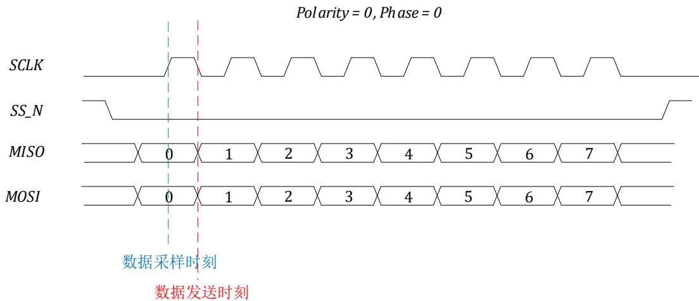  
图 14-2 SPI 通讯信号极性相位(Polarity=0, Phase=0)

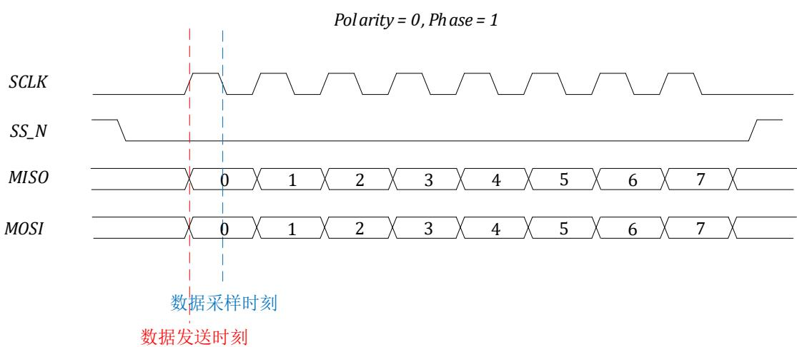

图 14-3 SPI 通讯信号极性相位(Polarity=0, Phase=1)  
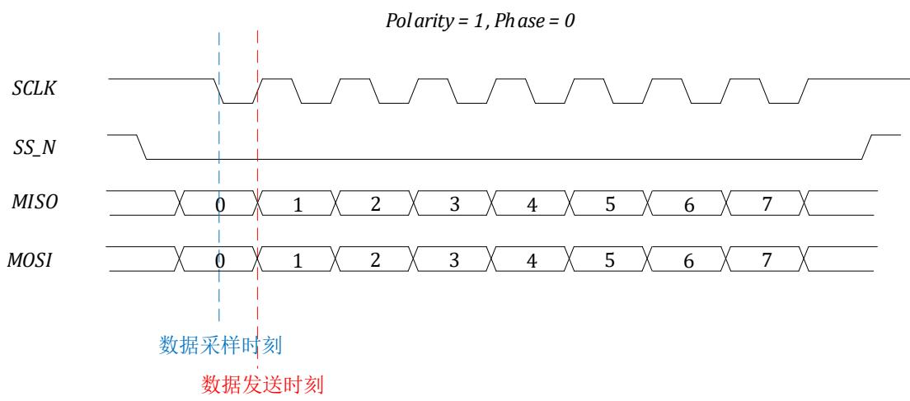  
图 14-4 SPI 通讯信号极性相位(Polarity=1, Phase=0)

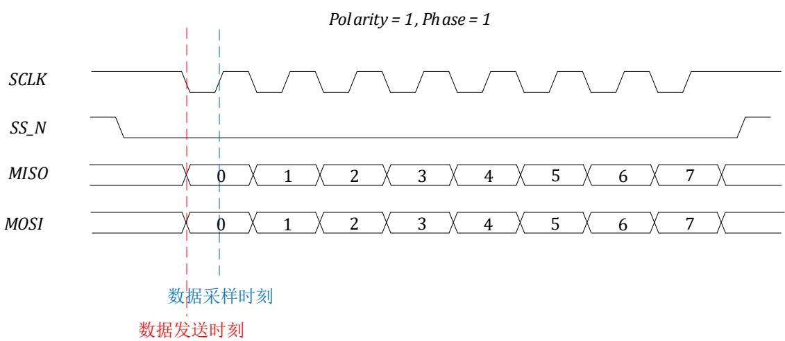  
图 14-5 SPI 通讯信号极性相位(Polarity=1, Phase=1)

## 14.2.5 SPI0\_CR1

表 14-5 SPI0\_CR1 控制寄存器 1

<table><tr><td>名称</td><td>复位值</td><td>偏移</td><td>位置</td><td>权限</td><td>说明</td></tr><tr><td rowspan="2">SPI0_CR1</td><td rowspan="2">0x0</td><td rowspan="2">0x0C</td><td>[31:1]</td><td>NA</td><td>未使用</td></tr><tr><td>[0]</td><td>RW</td><td>接收 Rx Buffer 空满信号。0,Rx Buffer 没满1,Rx Buffer 已满,产生相应中断。读 Rx Buffer将自动清除该位。</td></tr></table>

## 14.2.6 SPI0\_CR2

表 14-6 SPI0\_CR2 控制寄存器 2

<table><tr><td>名称</td><td>复位值</td><td>偏移</td><td>位置</td><td>权限</td><td>说明</td></tr><tr><td rowspan="2">SPI0_CR2</td><td rowspan="2">0x0</td><td rowspan="2">0x10</td><td>[31:5]</td><td>NA</td><td>未使用</td></tr><tr><td>[4:0]</td><td>RW</td><td>一次数据传输的字节数。实际传输数等于[4:0] + 1。</td></tr></table>

14.2.7 SPI0\_BUF\_ADDR

表 14-7 SPI0\_BUF\_ADDR 地址寄存器

<table><tr><td>名称</td><td>复位值</td><td>偏移</td><td>位置</td><td>权限</td><td>说明</td></tr><tr><td rowspan="2">SPI0_BUF_ADDR</td><td rowspan="2">0x0</td><td rowspan="2">0x14</td><td>[31:5]</td><td>NA</td><td>未使用</td></tr><tr><td>[4:0]</td><td>RW</td><td>Buffer 地址指针。指向下一个 SPI_DATA 操作位置。一般在使用前,软件把地址写 0,每操作一次 SPI_DATA,该寄存器自动累加 1.</td></tr></table>

## 14.3 应用说明

SPI 模块基本的一次传输，如下举例。注意，从模式下，推荐将片选使能连接到 GPIO。

主模式，数据传输的发起者。选择传输模式（CPOL 和 CPHA），选择好 SPI 的传输频率。按照单字节发送还是 Burst 模式发送，每个发送字节的含义，均由上层软件协议规定，同 SPI 模块本身没有关系。

主模式：

$$
\_ e n a b l e \_ i r q (); \quad / / \text {登记} \mathrm{SPI} \text {中断}
$$

NVIC\_EnableIRQ (SPI0\_IRQn);

GPIO0\_PIE = 0x0000; //GPIO 复用配置

$$
\mathrm {GPIO0\_ {P} OE = 0xC000;}
$$

$$
\mathrm {GPIO1\_ {P} IE = 0x0001;}
$$

GPIO1\_POE = 0x0002;

GPIO0\_FFEDC = 0x5500;

GPIO1\_F3210 = 0x0005;

//配置 SPI传输相关寄存器

SPI0\_CR1=0x00;

SPI0\_BUF\_ADDR=0x00;

$$
\mathrm {SPI0\_CR2 = 0x1f;} \quad / / \text {发送数据量}
$$

$$
\mathrm {SPI0\_ {C} R0 = 0x90;} \quad / / \text {使能} \mathrm{SPI} \text {中断}
$$

$$
\mathrm {SPI0\_ {C} R0 = 0x91;}
$$

//写入发送数据到 SPI FIFO，根据发送数量写多少次该寄存器

$$
\mathrm {SPI0\_DATA} = \mathrm{DATA}; \quad / / \text {写完毕，将自动开始传输}
$$

SPI 本次传输完毕后，自动产生完成中断。

从模式下，一旦时钟上有毛刺（超过 30ns 宽度的毛刺），可能导致整个传输错误。因为，片选信号不会清除 SPI 内部状态机，会出现死锁状态。推荐从模式下，片选信号接 GPIO。通过 GPIO 中断处理程序强制对 SPI执行软复位。

\_\_enable\_irq(); //登记 SPI 中断

NVIC\_EnableIRQ (SPI0\_IRQn);

GPIO0\_PIE = 0x4000;

//GPIO 复用配置

GPIO0\_POE = 0x8000;

GPIO1\_PIE = 0x0003;

GPIO1\_POE = 0x0000;

GPIO0\_FFEDC = 0x5500;

GPIO1\_F3210 = 0x0055;

SPI0\_CR1=0x00;

//配置 SPI 传输相关寄存器，片选永远有效

SPI0\_BUF\_ADDR=0x00;

SPI0\_CR2=0x1f;

SPI0\_CR0=0x86;

SPI0\_CR0=0x87;

//写入发送数据到 SPI FIFO，根据发送数量写多少次该寄存器

SPI0\_DATA = DATA； //写完毕，若主设备开始传输，从将自动开始传输

SPI 本次传输完毕后，自动产生完成中断。

## 15 版本历史

表 15-1 文档版本历史

<table><tr><td>时间</td><td>版本号</td><td>作者</td><td>说明</td></tr><tr><td>2017.05.10</td><td>0.1</td><td>张威龙、邓廷、钟书鹏</td><td>初始版本</td></tr><tr><td>2017.0515</td><td>0.2</td><td>钟书鹏</td><td>增加3.10模拟寄存器说明</td></tr><tr><td>2017.06.01</td><td>0.3</td><td>邓廷</td><td>增加5. Flash模块说明增加12. I2C模块说明增加13. SPI模块说明</td></tr><tr><td>2017.06.12</td><td>0.4</td><td>李鹏</td><td>更新MCPWM说明、Encoder说明</td></tr><tr><td>2017.07.29</td><td>0.5</td><td>徐蓉</td><td>格式更新</td></tr><tr><td>2017.08.18</td><td>0.6</td><td>张威龙</td><td>Minor revision</td></tr><tr><td>2017.08.20</td><td>0.8</td><td>张威龙</td><td>更新寄存器定义</td></tr><tr><td>2017.08.28</td><td>0.91</td><td>张威龙</td><td>增加HALL模块部分</td></tr><tr><td>2017.08.31</td><td>0.92</td><td>张威龙</td><td>修改UART、UTIMER寄存器描述</td></tr><tr><td>2017.08.31</td><td>0.93</td><td>刘虎、张威龙</td><td>增加GPIO引脚功能复用说明</td></tr><tr><td>2017.09.02</td><td>0.94</td><td>邓廷</td><td>修订SPI寄存器描述错误</td></tr><tr><td>2017.09.03</td><td>0.95</td><td>张威龙</td><td>更新时钟复位寄存器描述,更改UTIMER/UART/SYS寄存器名,移除GPIO引进复用说明</td></tr><tr><td>2017.09.05</td><td>0.96</td><td>钟书鹏</td><td>晚上运算放大器部分的修改</td></tr><tr><td>2017.09.07</td><td>0.97</td><td>张威龙</td><td>为模拟寄存器表增加寄存器名</td></tr><tr><td>2017.09.07</td><td>0.98</td><td>钟书鹏</td><td>在各个模拟电路模块里,增加与该模块相关寄存器的地址和说明。同时将ADC部分说明和ADC接口部分的说明整合在一起</td></tr><tr><td>2017.09.07</td><td>0.99</td><td>张威龙</td><td>增加寄存器偏移,ADC接口模块修改ADC_DAT寄存器名为ADCx_DAT;ADCx_DAT0描述由通道0采样数据修改为ADC第0次采样数据;ADCx_CHNO描述由控制第0-3通道修改为控制第0-3次采样;增加对于模拟信号通道实际含义的描述,与模拟寄存器表相同。统一了表格中各列名称</td></tr><tr><td>2017.10.29</td><td>1.00</td><td>张威龙</td><td>修改ADC、UTimer模块系统功能框图,增加Encoder计数模式示意图,修改UTimer、Encoder寄存器描述整合ADC接口模块与模拟寄存器表,将模拟寄存器ADC相关描述移动至ADC接口模块中,去除模拟寄存器表中硬件相关而用户不需使用的接口。</td></tr><tr><td>2017.11.03</td><td>1.01</td><td>邓廷</td><td>修改MCPWM模块,增加相应功能框图,修正寄存器描述。</td></tr><tr><td>2017.11.12</td><td>1.01</td><td>张威龙</td><td>修改ADC接口模块,统一各处变量名与寄存器名保持一致,增加触发模式的详细说明。</td></tr><tr><td>2017.12.21</td><td>1.04</td><td>邓廷</td><td>修订FLASH_READY寄存器描述。</td></tr><tr><td>2017.12.27</td><td>1.05</td><td>邓廷</td><td>修订FLASH模块描述</td></tr><tr><td>2018.01.03</td><td>1.06</td><td>钟书鹏</td><td>修改 ADC 接口部分,增加量程和增益使用,修改触发部分描述。统一全部章节的排序符号</td></tr><tr><td>2018.01.20</td><td>1.07</td><td>邓廷</td><td>修改 HALL 模块描述,MCPWM 模块描述</td></tr><tr><td>2018.01.31</td><td>1.08</td><td>邓廷</td><td>增加 SYS_AFE_CMP 寄存器,修改 MCPWM 描述</td></tr><tr><td>2018.02.01</td><td>1.09</td><td>张威龙</td><td>更新模拟寄存器表格格式,修改图表目录错误</td></tr><tr><td>2018.02.03</td><td>1.10</td><td>钟书鹏</td><td>修改模拟寄存器说明格式,将各个模拟模块设计到模拟寄存器的部分通过超链接连至具体的模拟寄存器说明处</td></tr><tr><td>2018.03.27</td><td>1.11</td><td>邓廷</td><td>更新对 TIMER 模块捕获模式的说明</td></tr><tr><td>2018.04.05</td><td>1.12</td><td>钟书鹏</td><td>更新温度传感器和比较器的描述</td></tr><tr><td>2018.05.29</td><td>1.13</td><td>邓廷</td><td>修正 HALL 模块寄存器的描述</td></tr><tr><td>2018.08.06</td><td>1.14</td><td>张威龙</td><td>增加 ADC 校正说明</td></tr><tr><td>2018.08.08</td><td>1.15</td><td>邓廷</td><td>修正看门狗喂狗时间,休眠唤醒间隔时间</td></tr><tr><td>2018.11.16</td><td>1.16</td><td>邓廷,张威龙</td><td>补充部分应用说明</td></tr><tr><td>2018.12.16</td><td>1.17</td><td>邓廷</td><td>修改 MCPWM 滤波宽度描述及 TCLK 寄存器描述</td></tr><tr><td>2018.12.17</td><td>1.18</td><td>张威龙</td><td>更新部分表格格式,增加 UART 低波特率设置的应用说明</td></tr><tr><td>2018.12.20</td><td>1.19</td><td>邓廷</td><td>修改 MCPWM 部分描述</td></tr><tr><td>2019.01.04</td><td>1.20</td><td>邓廷</td><td>修改 MCPWM IF/EIF 描述</td></tr><tr><td>2019.03.18</td><td>1.21</td><td>张威龙</td><td>针对发布的修订</td></tr><tr><td>2019.03.21</td><td>1.22</td><td>邓廷</td><td>修订 UTIMER 部分,Encoder 复用 Timer 部分的描述</td></tr><tr><td>2019.03.26</td><td>1.23</td><td>张威龙</td><td>8.2.5 增加 Encoder T1/T2 信号来源说明</td></tr></table>