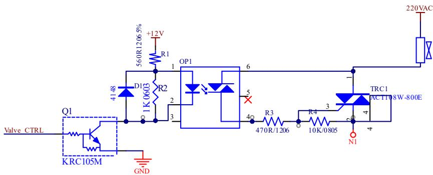
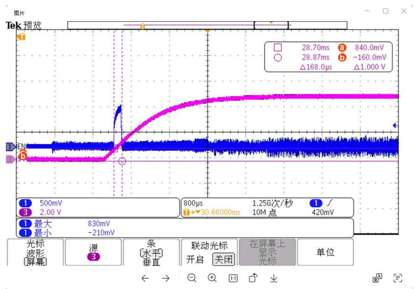
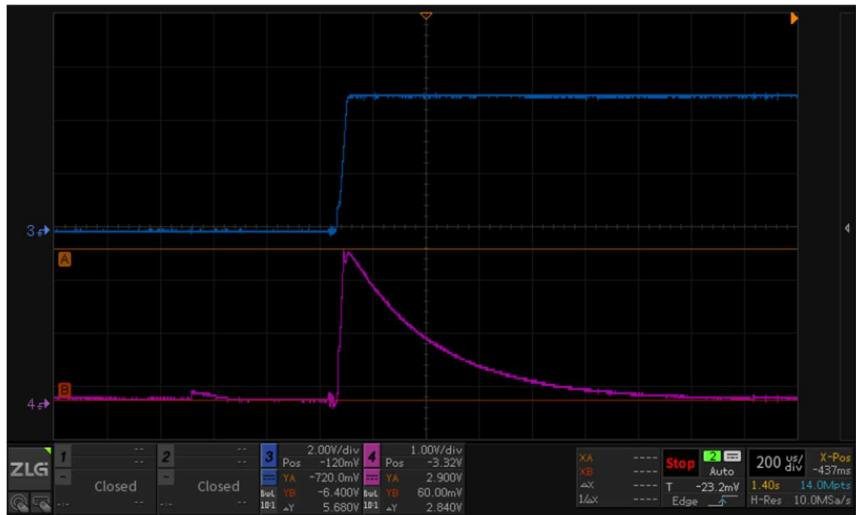
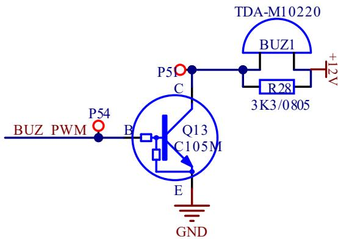
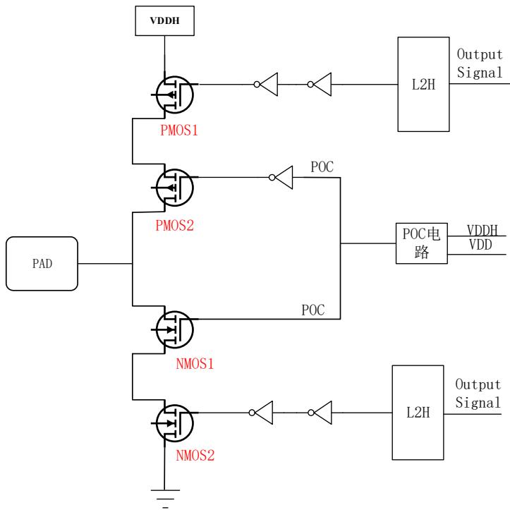

# LKS32MC07x-MCU 上电时刻 IO 电压异常抬升问题说明

关键字：LKS32MC07x、VCC 上电、IO 异常抬升、上电过冲

## 一、问题描述及分析

## 问题描述：

案例一：某客户在洗衣机整机测试过程中，使用 220VAC 供电的指示灯代替负载观察负载动作情况，在整机上电过程中指示灯出现异常闪烁，使用芯片为 LKS32MC07x。

案例二：某合封 LINPHY 的车规芯片，在芯片 VCC 快速上电的过程中，发现 LINPHY 进入异常休眠状态，合封 MCU 为 LKS32AT03x 和 LKS32AT07x。

案例三：某客户在对 PCBA 进行上电测试时，有源蜂鸣器会出现异常的声响，使用芯片为LKS32MC07x。

案例四：某客户在对电机驱动板进行上电测试时，发现个别栅极驱动或 IPM 会出现短暂异常驱动功率器件的现象，使用芯片为 LKS32MC07x。

## 问题分析：

案例一：负载控制电路示意图如下图所示：Valve\_Ctrl 为负载驱动电路的控制端，由 MCU IO 引脚直接驱动，Valve\_Ctrl 通过控制数字三极管 Q1 驱动双向光耦可控硅 OP1，光耦可控硅 OP1 导通，驱动可控硅 TRC1 导通，驱动负载动作。

在客户测试过程中，使用指示灯替代实际的感性负载，上电过程中观察到指示灯闪烁，此时认为可控硅存在异常的导通状态，通过示波器排查三极管栅极、光耦输入端等各个节点在上电过程中的电压波形，发现 Valve\_Ctrl端在 MCU 上电过程中存在一个最大 830mV 的电压异常抬升，持续时间约为 800us，VCC 端口的上电时间约为3.5ms。测试波形如下图所示：紫色为 MCU VCC端口的上电波形，蓝色为Valve\_Ctrl的控制波形。且断开 MCU

IO（Valve\_Ctrl）与后级三极管的物理连接，令 MCU IO 端口浮空，实测 IO 端口的电压异常抬升现象依旧存在。

由测试波形可看出 Valve\_Ctrl 端口电压的异常抬升，且幅值超过了数字三极管的导通电压，导致了三极管短时间内的异常开通，进而引起可控硅的短时导通，指示灯闪烁。由于实际控制的负载为阀和泵类的感性负载，可控硅的短时开通并不会导致负载的实际动作。

案例二：合封 LINPHY 的车规芯片，在芯片 VCC 快速上电的过程中，发现 LINPHY 会进入异常休眠状态，由于 LINPHY 的 SLP\_N 与 MCU 的 IO 直接通过打线相连接。经排查快上电时 MCU 的 IO 脚（即 SLP\_N）电压异常拉高，随后该 IO 引脚电压会再次下降，导致 LINPHY 的 SLP\_N 识别到错误下降沿，进入休眠模式。通过测试，在芯片 VCC 快上电时，IO 口电压存在较大的异常抬升，测试波形如下所示：其中蓝色为 VCC 端口上电电压波形，上电时间约 50us，紫色为 IO 口电压异常抬升波形，幅值约为 2.84V。

  
解决方案通过修改 BOOT，MCU 工作之后经过例如 1ms，重新把 SLP\_N 拉高，唤醒 LIN PHY。

案例三：蜂鸣器控制电路示意图如下图所示：BUZ\_PWM 为蜂鸣器驱动电路的控制端，由 MCU IO 引脚直接驱动，BUZ\_PWM 通过控制数字三极管 Q13 的导通与关断，控制蜂鸣器发出蜂鸣声。

同样在整板上电过程中，实测 BUZ\_PWM 端口存在电压异常抬升的问题，导致后级三极管误开通，蜂鸣器异响。

案例四：MCU MCPWM IO 直接驱动栅极驱动或者 IPM 时，在上电时期部分 MCPWM的引脚同样存在异常抬升的情况，当VCC上电速率过快，异常抬升的电压峰值可能超过后级栅极驱动或者 IPM 的输入开启电压，导致后级功率器件短时误开通。

## 二、IO电压异常抬升测试

为了明确 IO 电压异常抬升的幅值与不同 IO 引脚、VCC 上电时间、不同片子之间的关系，做如下的测试：

同一 MCU VCC上电时间对 IO电压异常抬升的影响：

<table><tr><td colspan="9">071CBT8最小核心板 REST: 10k +100n MCU VCC:4.7u+100n上电时间对IO上电过冲的影响,测量MCU VCC端口电压和IO口端口电压,MCU未烧录程序,被测IO不进行任何配置</td></tr><tr><td>上电时间被测引脚</td><td>10us</td><td>50us</td><td>100us</td><td>500us</td><td>1ms</td><td>20ms</td><td>50ms</td><td>100ms</td></tr><tr><td>P1.0(PU)</td><td>4.3V/5.2V</td><td>2.9V/3V</td><td>2.5V/2.5V</td><td>1.5V/1.6V</td><td>1.3V/1.4V</td><td>消失</td><td>消失</td><td>消失</td></tr><tr><td>P2.9(PU)</td><td>4.2V/5.2V</td><td>2.8V/2.9V</td><td>2.4V/2.5V</td><td>1.5V/1.6V</td><td>1.3V/1.3V</td><td>消失</td><td>消失</td><td>消失</td></tr><tr><td>P3.10</td><td>0.6V/7.9V</td><td>0.3V/5.3V</td><td>0.2V/5.1V</td><td>轻微波动</td><td>消失</td><td>消失</td><td>消失</td><td>消失</td></tr></table>

测试电压数据定义：IO 抬升电压峰值/IO抬升电压消失时对应的 MCU VCC 端口电压。  
由该测试结果，可以看出延长上电的时间，可以显著的降低IO端口抬升电压的峰值。

不同 MCU同一 IO口电压异常抬升的表现

<table><tr><td colspan="9">更换新的片子 071CBT8 最小核心板 REST: 10k +100n MCU VCC:4.7u+100n上电时间对 IO 上电过冲的影响,测量 MCU VCC 端口电压和 IO 口端口电压,MCU 未烧录程序,被测 IO不进行任何配置</td></tr><tr><td>上电时间被测引脚</td><td>10us</td><td>50us</td><td>100us</td><td>500us</td><td>1ms</td><td>20ms</td><td>50ms</td><td>100ms</td></tr><tr><td>P1.0(PU)</td><td>3.9V/5.0V</td><td>2.9V/3.1V</td><td>2.3V/2.5V</td><td>1.5V/1.6V</td><td>1.3V/1.3V</td><td>消失</td><td>消失</td><td>消失</td></tr><tr><td>P2.9(PU)</td><td>3.9V/5.0V</td><td>2.9V/3.1V</td><td>2.3V/2.5V</td><td>1.5V/1.6V</td><td>1.3V/1.3V</td><td>1.2V/1.2V</td><td>1.2V/1.2V</td><td>1.2V/1.2V</td></tr><tr><td>P3.10</td><td>0.6V/7.9V</td><td>0.3V/5.3V</td><td>0.2V/5.1V</td><td>轻微波动</td><td>消失</td><td>消失</td><td>消失</td><td>消失</td></tr></table>

由该测试结果，可以看出不同芯片间，同一 IO的表现并不一致，P2.9 口随着上电时间延长，其电压抬升现

象可能不会消失。

同一 MCU不同 IO口电压异常抬升的表现

<table><tr><td colspan="6">071CBT8最小核心板 REST: 10k +100n MCU VCC:4.7u+100n上电时间对不同IO上电过冲的影响,测量100us,10ms,50ms上电是否有过冲,MCU未烧录程序,被测IO不进行任何配置</td></tr><tr><td>PIN</td><td>GPIO</td><td>上拉电阻</td><td>100us</td><td>10ms</td><td>50ms</td></tr><tr><td>1</td><td>P0.0</td><td>PU</td><td>明显抬升</td><td>依旧存在</td><td></td></tr><tr><td>2</td><td>P0.2 RST</td><td>PU</td><td>默认高</td><td>默认高</td><td></td></tr><tr><td>3</td><td>GND</td><td></td><td></td><td></td><td></td></tr><tr><td>4</td><td>AVDD</td><td></td><td></td><td></td><td></td></tr><tr><td>5</td><td>P3.2</td><td></td><td></td><td></td><td></td></tr><tr><td>6</td><td>P0.3</td><td>PU</td><td>明显抬升</td><td></td><td></td></tr><tr><td>7</td><td>P0.4</td><td>PU</td><td>明显抬升</td><td></td><td></td></tr><tr><td>8</td><td>P0.5</td><td></td><td></td><td></td><td></td></tr><tr><td>9</td><td>P0.6</td><td>PU</td><td>明显抬升</td><td></td><td></td></tr><tr><td>10</td><td>P0.7</td><td>PU</td><td>明显抬升</td><td></td><td></td></tr><tr><td>11</td><td>P2.11</td><td></td><td></td><td></td><td></td></tr><tr><td>12</td><td>P2.12</td><td></td><td></td><td></td><td></td></tr><tr><td>13</td><td>P0.11</td><td></td><td></td><td></td><td></td></tr><tr><td>14</td><td>P0.12</td><td></td><td>小幅度抬升</td><td></td><td></td></tr><tr><td>15</td><td>P0.13</td><td></td><td>小幅度抬升</td><td></td><td></td></tr><tr><td>16</td><td>P0.14</td><td>PU</td><td>明显抬升</td><td></td><td></td></tr><tr><td>17</td><td>P0.15</td><td>PU</td><td>明显抬升</td><td>依旧存在</td><td>依旧存在</td></tr><tr><td>18</td><td>P1.0</td><td>PU</td><td>明显抬升</td><td>依旧存在</td><td>依旧存在</td></tr><tr><td>19</td><td>P1.3</td><td>PU</td><td>明显抬升</td><td></td><td></td></tr><tr><td>20</td><td>P3.5</td><td></td><td>小幅度抬升</td><td></td><td></td></tr><tr><td>21</td><td>P3.7</td><td></td><td>小幅度抬升</td><td></td><td></td></tr><tr><td>22</td><td>P2.7</td><td>PU</td><td>明显抬升</td><td>依旧存在</td><td>依旧存在</td></tr><tr><td>23</td><td>P3.0</td><td></td><td>小幅度抬升</td><td></td><td></td></tr><tr><td>24</td><td>P3.1</td><td></td><td>小幅度抬升</td><td></td><td></td></tr><tr><td>25</td><td>P2.8</td><td>PU</td><td>明显抬升</td><td>依旧存在</td><td>依旧存在</td></tr><tr><td>26</td><td>P3.9</td><td>PU</td><td>明显抬升</td><td></td><td></td></tr><tr><td>27</td><td>P1.4</td><td></td><td>小幅度抬升</td><td></td><td></td></tr><tr><td>28</td><td>P1.5</td><td></td><td></td><td></td><td></td></tr><tr><td>29</td><td>P1.6</td><td></td><td></td><td></td><td></td></tr><tr><td>30</td><td>P1.7</td><td></td><td></td><td></td><td></td></tr><tr><td>31</td><td>P1.8</td><td></td><td></td><td></td><td></td></tr><tr><td>32</td><td>P1.9</td><td></td><td></td><td></td><td></td></tr><tr><td>33</td><td>P1.10</td><td>PU</td><td>明显抬升</td><td>依旧存在</td><td>依旧存在</td></tr><tr><td>34</td><td>P1.11</td><td>PU</td><td>明显抬升</td><td></td><td></td></tr><tr><td>35</td><td>P3.10</td><td></td><td>小幅度抬升</td><td></td><td></td></tr><tr><td>36</td><td>P3.11</td><td></td><td>小幅度抬升</td><td></td><td></td></tr><tr><td>37</td><td>P2.9</td><td>PU</td><td>明显抬升</td><td></td><td></td></tr><tr><td>38</td><td>P2.10</td><td>PU</td><td>明显抬升</td><td></td><td></td></tr><tr><td>39</td><td>P3.14</td><td></td><td>小幅度抬升</td><td></td><td></td></tr><tr><td>40</td><td>P3.15</td><td></td><td>小幅度抬升</td><td></td><td></td></tr><tr><td>41</td><td>P2.1</td><td></td><td></td><td></td><td></td></tr><tr><td>42</td><td>P2.2</td><td></td><td></td><td></td><td></td></tr><tr><td>43</td><td>P2.3</td><td></td><td></td><td></td><td></td></tr><tr><td>44</td><td>P2.4</td><td>PU</td><td>明显抬升</td><td></td><td></td></tr><tr><td>45</td><td>P2.5</td><td>PU</td><td>明显抬升</td><td></td><td></td></tr><tr><td>46</td><td>P2.6</td><td>PU</td><td>明显抬升</td><td></td><td></td></tr><tr><td>47</td><td>P2.14</td><td>PU</td><td>默认高</td><td></td><td></td></tr><tr><td>48</td><td>P2.15</td><td>PU</td><td>默认高</td><td></td><td></td></tr></table>

由该测试结果，可以看出有上拉电阻的 GPIO 口，抬升电压的幅值较大，且通过延长上电的时间，部分 GPIO的电压异常抬升现象也较难完全消除。

## 三、原因分析

MCU IO 端口逻辑示意图如下图所示：

  
Output Signal 为数字 MCU 发出的 IO 口控制信号，POC为上电控制电路，L2H 为电平转换电路

VDDH 为 MCU 的供电电压域，VDD 为 MCU 内核低压供电电压域

上电过程中，特别是在 VDDH 电压较低的阶段，由于 MCU 内核低压供电电压域未建立完成（表现为内部LDO15 电压无输出电压），因此来自数字 MCU 的 IO 控制信号（Output Signal）为低电压，经过 L2H 电平转换电路之后，输出为低电压信号。L2H 至 PMOS1 中间有两个反相器，导致 PMOS端的栅极电压依旧为低电压。此现象导致 MCU 的内核低压供电电压域在未建立完成之前，上电过程中存在短暂导通现象，具体的过程如下：

1、上电初始阶段，VDDH 的电压较低，PMOS1 的 VGS电压未达到开启电压阈值，PMOS1 关断

2、VDDH 的电压上升到一定阶段之后，PMOS1 的 VGS电压达到开启电压阈值，PMOS1 导通

3、当 VDDH 的电压上升到 MCU 内核低压供电的电压阈值之后，MCU 内核低压供电电压域建立，数字 MCU主动发出高电压信号，关断 PMOS1 的导通

同理，下桥 NMOS2 的栅极电压 VGS 在上电整个阶段持续维持低电平，因此 NMOS2 一直处于关断状态。

POC信号控制 PMOS2 和 NMOS1 的开通与关断，当 VDDH 和 VDD 未达到合理的电压阈值时，POC应输出低电压信号，控制 PMOS2 和 NMOS1 关断。但是由于 POC 信号与 VDDH 在版图走线中存在寄生电容，当存在较大斜率变化的 VDDH 通过寄生电容耦合至POC电路中，导致 POC信号被短暂的拉高，使得控制的PMOS2 和NMOS1 处于导通状态。

综上，在 VDDH 电压上电阶段，PMOS1 和 PMOS2 的导通，使得 IO 口电压在一定的时间段内跟随 VDDH电压而上升，VDDH 的上升斜率越大，IO 口的电压抬升幅值会越高，当MCU 内部低压电压域建立起来之后，数字 MCU 的 IO 输出信号恢复控制，PMOS1 关断，IO 口恢复高阻状态。

## 四、应用端应对策略

针对 MCU 上电阶段，IO 口电压异常抬升的问题，应用端应特别关注该现象对客户实际电路和产品工作的影响：

通用应对策略：

1、控制 MCU 电源端口电压的上电斜率，尽可能缓慢上电，控制出现电压抬升的 IO 口数量和抬升电压幅值。

2、带有上拉电阻的 IO引脚，尽可能用作输入IO 功能，不用于负载控制

3、可通过在 IO 端口增加较小的下拉电阻（强下拉），降低抬升电压的幅值，但是此举会增大 IO 端口驱动电流大小，因此不是也别推荐或者实施起来难度较大。

4、上电 IO 电压异常抬升的现象，也出现在 LKS32MC03x 系列 MCU 上，因此使用过程中需同样关注。

针对以下的应用场景，应特别注意，需结合实际的应用功能判断：

1、带有上拉电阻的 GPIO 引脚，需要通过三极管控制用于驱动 LED 灯、光耦、蜂鸣器等负载时，需特别注意 IO 端口电压的抬升导致的三极管误开通的情况，进而导致负载的异常动作和不可接受的声光表现。可通过更改负载控制电路逻辑或者更换 GPIO 口解决。

2、带有上拉电阻的 GPIO 引脚，用于 LINPHY、单总线自定协议等通讯时，应关注 IO 端口的电压抬升和下降是否会被识别为有效的高电平跳变信号，进而导致通讯失败或其他异常状态。可通过更换GPIO 口，更改协议、提高后级电路电平识别阈值以及软件规避等办法解决。

3、带有上拉电阻的 GPIO 引脚，用于后级电路的 EN 使能功能控制时，应避免使用高电平有效的使能逻辑。

4、带有上拉电阻的 GPIO 引脚，用作 MCPWM 信号，控制后级栅极驱动器或者 IPM 时，应特别注意栅极驱动或者 IPM 的输入控制信号的高电平识别阈值，不得低于 IO 异常电压的峰值。

5、当 GPIO用于驱动高电平有效且具有自锁逻辑的负载控制电路时，应避免后级控制电路生效导致不可预料的问题。

6、当 GPIO 通过三极管驱动继电器负载时，由于继电器的吸合时间相对较长，因此通常不需要特别规避。

7、当 GPIO 用做输入功能时，IO 的异常电压通常不会对外围电路造成不了影响，因此不需要特别关注。

8、不使用的 GPIO，不建议直接接地，应通过 10k 电阻接地避免上电过程中VDDH和 GND 的直通。

以上注意事项，仅为可预见的应用场景。在实际项目中应结合具体应用电路具体分析和测试。

## 五、总结与建议（AI优化版）

现象本质：IO电压上电抬升是芯片内部电源域建立过程中的固有现象

风险程度：与上电速度、IO 配置、后级电路灵敏度直接相关

设计重点：

前期规划时合理分配 IO 功能

敏感信号电路增加适当防护

电源设计考虑上电时序要求

验证建议：

新品设计阶段进行上电波形测试

重点关注带上拉 IO 的控制回路

极限条件（快速上电）下的功能验证

设计建议：

1、控制上电斜率

建议 VCC 上电时间≥1ms

2、IO功能规划原则

带上拉电阻的 IO 优先分配为输入功能

关键控制信号避免使用带上拉的 IO

3、下拉电阻方案

可考虑在敏感 IO 上加 1k-10kΩ 下拉电阻

需评估对驱动能力和功耗的影响

4、跨系列兼容性

LKS32MC03x 系列也存在类似现象，设计时需统一考虑

## 5、未使用引脚处理

不建议：直接接地

推荐做法：通过 10kΩ 电阻接地，避免上电期间VDDH对地直通

## 6、软件辅助措施

对通信接口增加起始位检测和错误恢复机制

关键控制信号采用重复确认机制

特定场景设计指南

<table><tr><td>应用场景</td><td>风险等级</td><td>推荐措施</td></tr><tr><td>驱动LED/光耦/蜂鸣器</td><td>高</td><td>更换为无上拉IO;加强下拉电阻;三极管基极串接电阻</td></tr><tr><td>通信接口(LIN/单总线)</td><td>高</td><td>避免使用带上拉IO;软件初始化延时;提高接收端阈值</td></tr><tr><td>使能信号控制</td><td>中</td><td>优先使用低电平使能逻辑;增加RC滤波</td></tr><tr><td>MCPWM驱动功率器件</td><td>高</td><td>确保驱动芯片阈值高于3V;增加门极电阻</td></tr><tr><td>自锁逻辑控制</td><td>高</td><td>避免使用高电平触发;增加硬件互锁</td></tr><tr><td>继电器驱动</td><td>低</td><td>通常无需特别处理(吸合时间较长)</td></tr><tr><td>输入功能</td><td>低</td><td>一般无影响,无需特别处理</td></tr></table>

附：相关引脚快速参考

<table><tr><td>风险等级</td><td>引脚类型</td><td>代表引脚</td><td>使用建议</td></tr><tr><td>高风险</td><td>带内部上拉</td><td>P0.0, P1.0, P2.7等</td><td>避免用于直接驱动开关器件</td></tr><tr><td>中风险</td><td>无上拉IO</td><td>P3.x系列多数引脚</td><td>可用于一般控制,建议测试验证</td></tr><tr><td>低风险</td><td>特殊功能</td><td>RST,电源引脚</td><td>按规格书使用</td></tr></table>