# LKS32MC07X with built-in 6N driver Datasheet

© 2023, 版权归凌鸥创芯所有

机密文件，未经许可不得扩散

## 1 概述

## 1.1 功能简述

LKS32MC070FL/071DO/074F/074D/074DO/076F 是 32 位内核的面向电机控制应用的专用处理器，同时集成了三相全桥自举式栅极驱动模块，可直接驱动 6个N型MOSFET。

## 性能

➢ 96MHz 32 位 Cortex-M0 内核

➢ 集成自主指令集电机控制专用 DSP

➢ 超低功耗休眠模式

➢ 三相全桥自举式栅极驱动模块

➢ 工业级工作温度范围

➢ 超强抗静电和群脉冲能力

## ⚫ 非易失存储器

➢ 内置 flash 包括 64kB/128kB 主存储区，1.5kB NVR 信息存储区

➢ 可反复擦除写入不低于10万次

➢ 室温25℃数据保持长达 100年

➢ 单字节编程时间最长 7.5us，Sector擦除时间最长 5ms

➢ Sector 大小 512 字节，可按 Sector 擦除写入

➢ Flash 数据防窃取(最后一个 word 须写入非 0xFFFFFFFF 的任意值）

## ⚫ 工作范围

➢ 双电源供电，MCU 部分采用2.5V\~5.5V电源供电，内部集成1 个1.5V LDO，为数字部分电路供电，驱动模块电源供电请根据芯片型号参考栅极驱动模块电气参数。部分型号集成 5VLDO。

➢ 工作温度: -40\~105℃

## ⚫ 时钟

➢ 内置 8MHz 高精度 RC 时钟，-40\~105℃范围内精度在±1%之内

➢ 内置低速32KHz 低速时钟，供低功耗模式使用

➢ 可外挂8MHz外部晶振

➢ 内部 PLL 可提供最高 96MHz 时钟

## ⚫ 外设模块

➢ 两路 UART

➢ 一路 SPI，支持主从模式

➢ 一路 IIC，支持主从模式

➢ 2 个通用16位 Timer，支持捕捉和边沿对齐 PWM功能

➢ 2 个通用32位 Timer，支持捕捉和边沿对齐 PWM功能；支持正交编码输入，CW/CCW输入，脉冲+符号输入

➢ 电机控制专用PWM 模块，支持2组各6路 PWM输出，死区可配置

➢ Hall 信号专用接口，支持测速、去抖功能

➢ 硬件看门狗

➢ 最多4 组16bit GPIO，8个GPIO可以作为系统的唤醒源，15 个GPIO 可以用作外部中断源输入

## ⚫ 模拟模块

➢ 集成2 路12bit SAR ADC，同步双采样，3Msps采样及转换速率，每路最多支持 16 通道，包括4 个运放输出及 10个外部ADC 通道共计 14 个可选ADC 通道信号

➢ 集成4 路运算放大器，可设置为差分 PGA 模式

➢ 集成3 路比较器，可设置滞回模式

➢ 集成 2 路 12bit DAC 数模转换器

➢ 内置±2℃温度传感器

➢ 内置 1.2V 0.8%精度电压基准源

➢ 内置1 路低功耗 LDO 和电源监测电路

➢ 集成高精度、低温飘高频RC时钟

➢ 集成晶体起振电路

## 1.2 性能优势

➢ 高可靠性、高集成度、最终产品体积小、节约 BOM成本；

➢ 内部集成4 路高速运放和3 路比较器，可满足单电阻/双电阻/三电阻电流采样拓扑架构的不同需求；

➢ 内部高速运放集成高压保护电路，可以允许高电压共模信号直接输入芯片，可以用最简单的电路拓扑实现 MOSFET电阻直接电流采样模式；

➢ 应用专利技术使 ADC和高速运放达到最佳配合，可处理更宽的电流动态范围，同时兼顾高速小电流和低速大电流的采样精度；

➢ 整体控制电路简洁高效，抗干扰能力强，稳定可靠；

➢ 集成三相全桥自举式栅极驱动模块；

➢ 支持 IEC/UL60730 功能安全认证

适用于有感BLDC/无感BLDC/有感 FOC/无感 FOC 及步进电机、永磁同步、异步电机等控制系统 。

## 1.3 命名规则

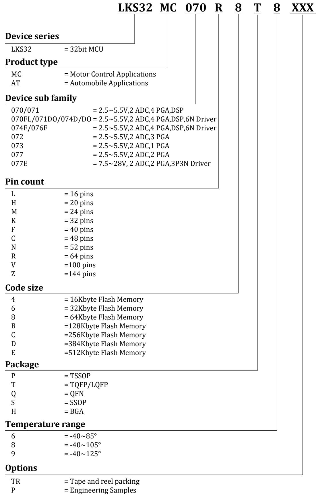  
图 1-1 凌鸥创芯器件命名规则

## 1.4 系统资源框图

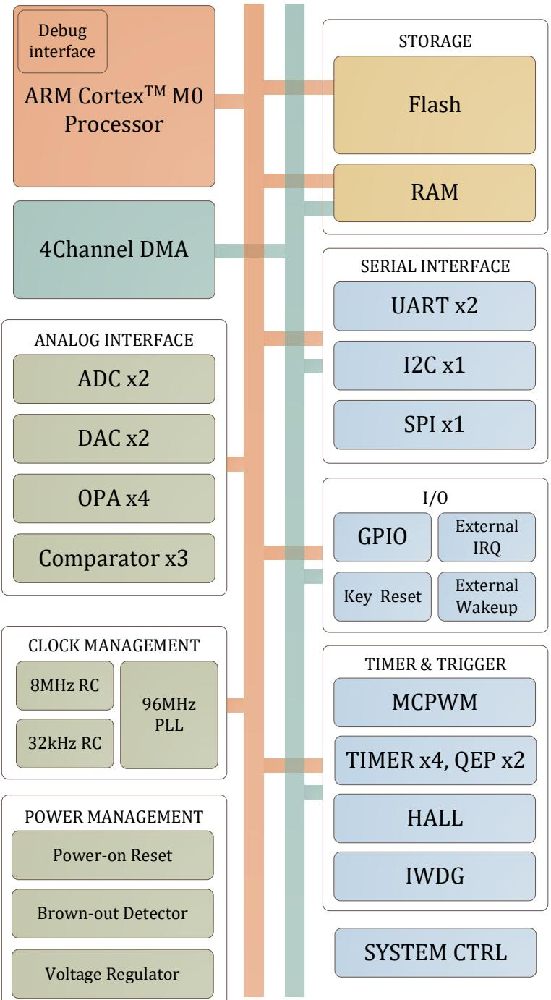  
图 1-2 LKS32MC07x 系统资源框图

## 1.5 矢量正弦控制系统

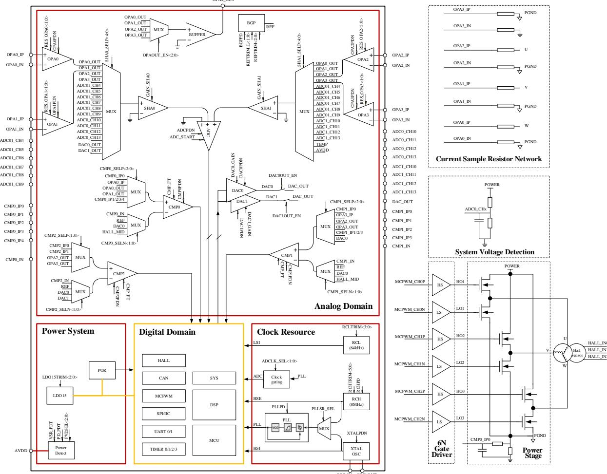  
\*ADC01\_CH4\~ADC01\_CH9 为 ADC0 和 ADC1 公用通道

图 1-3 LKS32MC076FNBQ8 矢量正弦控制系统简化原理图

## 2 器件选型表

表 2-1 LKS07x 系列器件选型表

<table><tr><td></td><td>主频(MHz)</td><td>Flash(kB)</td><td>RAM(kB)</td><td>ADC通道数</td><td>DAC</td><td>比较器</td><td>比较器通道数</td><td>OPA</td><td>HALL</td><td>SPI</td><td>IIC</td><td>UART</td><td>CAN</td><td>Temp.Sensor</td><td>PLL</td><td>QEP</td><td>Gate driver</td><td>预驱电流(A)</td><td>预驱电源(V)</td><td>栅浮耐压(V)</td><td>Others</td><td>产品状态</td><td>Package</td></tr><tr><td>LKS32MC070FLRBT8</td><td>96</td><td>128</td><td>12</td><td>14</td><td>12BITx2</td><td>3</td><td>10</td><td>4</td><td>3路</td><td>1</td><td>1</td><td>2</td><td>Yes</td><td>Yes</td><td>Yes</td><td>Yes</td><td>6N</td><td>+1/-1</td><td>4.5~20</td><td>250</td><td>5VLDO</td><td>量产</td><td>LQFP64</td></tr><tr><td>LKS32MC070RBT8</td><td>96</td><td>128</td><td>12</td><td>14</td><td>12BITx2</td><td>3</td><td>11</td><td>4</td><td>3路</td><td>1</td><td>1</td><td>2</td><td>Yes</td><td>Yes</td><td>Yes</td><td>Yes</td><td></td><td></td><td></td><td></td><td></td><td>量产</td><td>LQFP64</td></tr><tr><td>LKS32MC071CBT8</td><td>96</td><td>128</td><td>12</td><td>13</td><td>12BITx2</td><td>3</td><td>11</td><td>4</td><td>3路</td><td>1</td><td>1</td><td>2</td><td>Yes</td><td>Yes</td><td>Yes</td><td>Yes</td><td></td><td></td><td></td><td></td><td></td><td>量产</td><td>TQFP48</td></tr><tr><td>LKS32MC071C8T8</td><td>96</td><td>64</td><td>12</td><td>13</td><td>12BITx2</td><td>3</td><td>11</td><td>4</td><td>3路</td><td>1</td><td>1</td><td>2</td><td></td><td>Yes</td><td>Yes</td><td>Yes</td><td></td><td></td><td></td><td></td><td></td><td>量产</td><td>TQFP48</td></tr><tr><td>LKS32MC071DOC8T8</td><td>96</td><td>64</td><td>12</td><td>13</td><td>12BITx2</td><td>3</td><td>10</td><td>3</td><td>3路</td><td>1</td><td>1</td><td>2</td><td>Yes</td><td>Yes</td><td>Yes</td><td>Yes</td><td>6N</td><td>+1/-1</td><td>4.5~20</td><td>250</td><td>5VLDO</td><td>量产</td><td>TQFP48</td></tr><tr><td>LKS32MC072KBQ8</td><td>96</td><td>128</td><td>12</td><td>8</td><td>12BITx2</td><td>3</td><td>7</td><td>3</td><td>3路</td><td>1</td><td>1</td><td>2</td><td></td><td>Yes</td><td>Yes</td><td>Yes</td><td></td><td></td><td></td><td></td><td></td><td>量产</td><td>QFN5*5 32L-0.75</td></tr><tr><td>LKS32MC072KBT8</td><td>96</td><td>128</td><td>12</td><td>9</td><td>12BITx2</td><td>2</td><td>5</td><td>0</td><td>3路</td><td>1</td><td>1</td><td>2</td><td>Yes</td><td>Yes</td><td>Yes</td><td>Yes</td><td></td><td></td><td></td><td></td><td></td><td>量产</td><td>LQFP32</td></tr><tr><td>LKS32MC073HBQ8</td><td>96</td><td>128</td><td>12</td><td>4</td><td>12BITx2</td><td>2</td><td>4</td><td>1</td><td>3路</td><td>0</td><td>1</td><td>2</td><td></td><td>Yes</td><td>Yes</td><td>Yes</td><td></td><td></td><td></td><td></td><td></td><td></td><td>QFN3*3 20L-0.75</td></tr><tr><td>LKS32MC074FF8Q8</td><td>96</td><td>64</td><td>12</td><td>10</td><td>12BITx2</td><td>3</td><td>9</td><td>3</td><td>3路</td><td>1</td><td>1</td><td>2</td><td></td><td>Yes</td><td>Yes</td><td>Yes</td><td>6N</td><td>+1/-1</td><td>4.5~20</td><td>250</td><td>5VLDO</td><td>量产</td><td>QFN5*5 40L-0.75</td></tr><tr><td>LKS32MC074DF8Q8</td><td>96</td><td>64</td><td>12</td><td>13</td><td>12BITx2</td><td>3</td><td>9</td><td>3</td><td>3路</td><td>1</td><td>1</td><td>2</td><td></td><td>Yes</td><td>Yes</td><td>Yes</td><td>6N</td><td>+1.2/-1.5</td><td>7~20</td><td>200</td><td></td><td>量产</td><td>QFN5*5 40L-0.75</td></tr><tr><td>LKS32MC074DOF8Q8</td><td>96</td><td>64</td><td>12</td><td>12</td><td>12BITx2</td><td>3</td><td>9</td><td>3</td><td>3路</td><td>1</td><td>1</td><td>2</td><td></td><td>Yes</td><td>Yes</td><td>Yes</td><td>6N</td><td>+1/-1</td><td>4.5~20</td><td>250</td><td>5VLDO</td><td>量产</td><td>QFN5*5 40L-0.75</td></tr><tr><td>LKS32MC076FNBQ8</td><td>96</td><td>128</td><td>12</td><td>12</td><td>12BITx2</td><td>3</td><td>11</td><td>4</td><td>3路</td><td>1</td><td>1</td><td>2</td><td>Yes</td><td>Yes</td><td>Yes</td><td>Yes</td><td>6N</td><td>+1.2/-1.5</td><td>7~20</td><td>200</td><td></td><td>量产</td><td>QFN52</td></tr><tr><td>LKS32MC077MBS8</td><td>96</td><td>128</td><td>12</td><td>6</td><td>12BITx2</td><td>3</td><td>6</td><td>2</td><td>3路</td><td>1</td><td>1</td><td>2</td><td></td><td>Yes</td><td>Yes</td><td>Yes</td><td></td><td></td><td></td><td></td><td></td><td>量产</td><td>SSOP24L</td></tr><tr><td>LKS32MC077EM8S8</td><td>96</td><td>64</td><td>12</td><td>6</td><td>12BITx2</td><td>3</td><td>7</td><td>2</td><td>3路</td><td>1</td><td>1</td><td>2</td><td></td><td>Yes</td><td>Yes</td><td>Yes</td><td>3P3N</td><td>+0.05/-0.3</td><td>7~28</td><td></td><td>5VLDO</td><td>量产</td><td>SSOP24L</td></tr></table>

## 3 管脚分布

## 3.1 管脚分布图及管脚说明

## 3.1.1 特别说明

集成 5V LDO 预驱的 MCU 供电引脚 AVDD 与 5V LDO 输出在 MCU 内部连接，AVDD 无需外部供电。未集成5V LDO的MCU 需要全桥驱动电源VCC引脚与 AVDD引脚分别独立供电。

下列PIN 脚内置上拉至 AVDD 的电阻：

RSTN 引脚内置100kΩ 上拉电阻，固定开启上拉

SWDIO/SWCLK 内置 10kΩ 上拉电阻，固定开启上拉，当复用为 GPIO 功能后，可软件关闭

其余带PU功能的PIN 脚内置10kΩ 上拉电阻，可软件控制开启关闭上拉

UARTx\_TX(RX)： UART 的 TX 和 RX 支持互换。当 GPIO 第二功能选择为 UART，且 GPIO\_PIE即输入使能时，可以作为 UART\_RX 使用；当 GPIO\_POE 使能时，可以作为 UART\_TX 使用。一般同一GPIO不同时使能输入和输出，否则输入 PDI 会接收到 PDO发出的数据。

SPI\_DI(DO)：SPI 的 DI 和 DO 支持互换，当 GPIO 第二功能选择为 SPI，且 GPIO\_PIE 即输入使能时，可以作为SPI\_DI 使用；当GPIO\_POE 即输出使能时，可以作为 SPI\_DO使用。一般同一GPIO不同时使能输入和输出，否则输入 PDI会接收到PDO 发出的数据。

EN：栅极驱动模块 G6 使能，高电平使能预驱输出，低电平关闭输出。内置上拉电阻，上拉至5V。在074DOF8Q8 内部中该功能引脚与 MCU的 P1.11 相连，通过配置P1.11 输出电平控制栅极驱动使能。在074FF8Q8内部中该功能引脚与MCU的 P1.10 相连，通过配置P1.10 输出电平控制栅极驱动使能。

PGND：预驱功率地，如071DO 的Pin44，在使用时需要与 MCU的GND区分开来。对于074F，GND 与 PGND 已封至一个 Pin 脚，即 PIN32。

## 3.1.2 LKS32MC070FLRBT8

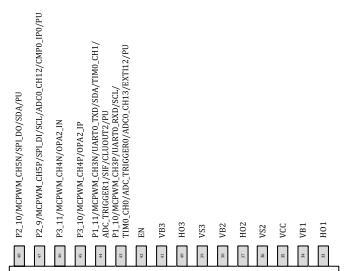

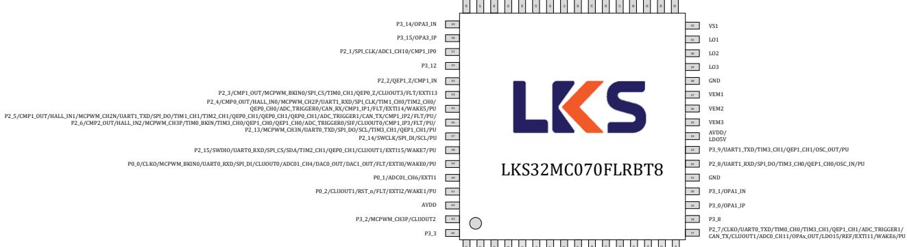  
图 3-1 LKS32MC070FLRBT8 管脚分布图

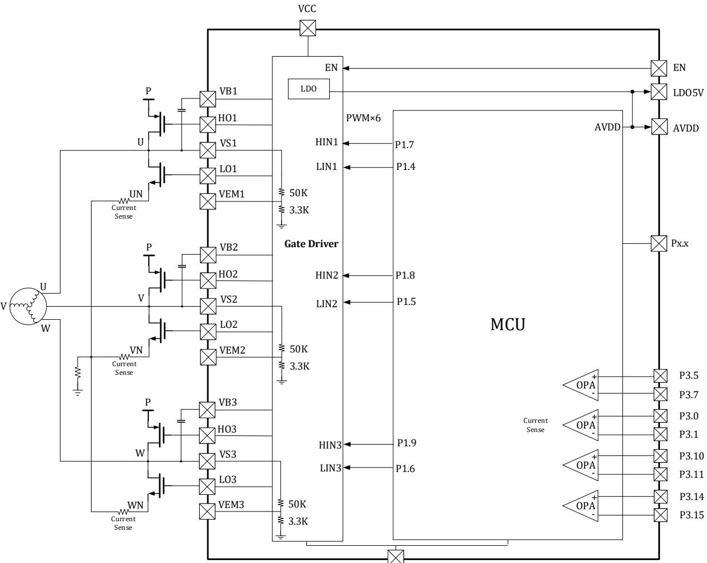  
图 3-2 LKS32MC070FLRBT8 内部预驱连接示意图

表 3-1 LKS32MC070FLRBT8 管脚说明

<table><tr><td rowspan="2">1</td><td>P3_4</td><td>P3.4</td></tr><tr><td>MCPWM_CH3N</td><td>PWM通道3低边</td></tr><tr><td rowspan="8">2</td><td>P0_3</td><td>P0.3</td></tr><tr><td>MCPWM_CH4P</td><td>PWM通道4高边</td></tr><tr><td>SCL</td><td>I2C时钟</td></tr><tr><td>TIM2_CH0</td><td>Timer2通道0</td></tr><tr><td>QEP0_CH0</td><td>编码器0通道0</td></tr><tr><td>ADC01_CH7</td><td>ADC01通道7</td></tr><tr><td>EXTI3</td><td>外部GPIO中断信号3</td></tr><tr><td>PU</td><td>内置10kΩ上拉电阻,软件可关闭</td></tr><tr><td rowspan="7">3</td><td>P0_4</td><td>P0.4</td></tr><tr><td>MCPWM_CH4N</td><td>PWM通道4低边</td></tr><tr><td>SDA</td><td>I2C数据</td></tr><tr><td>TIM2_CH1</td><td>Timer2通道1</td></tr><tr><td>QEP0_CH1</td><td>编码器0通道1</td></tr><tr><td>ADC01_CH8</td><td>ADC01通道8</td></tr><tr><td>PU</td><td>内置10kΩ上拉电阻,软件可关闭</td></tr><tr><td>4</td><td>P0_5HALL_IN0</td><td>P0.5HALL接口输入0</td></tr><tr><td rowspan="15"></td><td>MCPWM_CH5P</td><td>PWM通道5高边</td></tr><tr><td>QEP0_Z</td><td>QEP0编码器Z相</td></tr><tr><td>ADC01_CH9</td><td>ADC01通道9</td></tr><tr><td>P0_6</td><td>P0.6</td></tr><tr><td>HALL_IN1</td><td>HALL接口输入1</td></tr><tr><td>MCPWM_CH5N</td><td>PWM通道5低边</td></tr><tr><td>UART1_RXD</td><td>串口1接收(发送)</td></tr><tr><td>SCL</td><td>I2C时钟</td></tr><tr><td>TIM1_CH0</td><td>Timer1通道0</td></tr><tr><td>CAN_RX</td><td>CAN接收端</td></tr><tr><td>CMP2_IN</td><td>比较器2负端输入</td></tr><tr><td>FLT</td><td>IO滤波</td></tr><tr><td>EXTI4</td><td>外部GPIO中断信号4</td></tr><tr><td>WAKE2</td><td>外部唤醒信号2</td></tr><tr><td>PU</td><td>内置10kΩ上拉电阻,软件可关闭</td></tr><tr><td rowspan="10">5</td><td>P0_7</td><td>P0.7</td></tr><tr><td>HALL_IN2</td><td>HALL接口输入2</td></tr><tr><td>MCPWM_BKIN1</td><td>PWM停机输入信号1</td></tr><tr><td>UART1_TXD</td><td>串口1发送(接收)</td></tr><tr><td>SDA</td><td>I2C数据</td></tr><tr><td>TIM1_CH1</td><td>Timer1通道1</td></tr><tr><td>CAN_TX</td><td>CAN发送端</td></tr><tr><td>CMP2_IP0</td><td>比较器2正端输入0</td></tr><tr><td>FLT</td><td>IO滤波</td></tr><tr><td>PU</td><td>内置10kΩ上拉电阻,软件可关闭</td></tr><tr><td rowspan="3">6</td><td>P1_1</td><td>P1.1</td></tr><tr><td>SPI_CS</td><td>SPI片选</td></tr><tr><td>EXTI5</td><td>外部GPIO中断信号5</td></tr><tr><td rowspan="5">7</td><td>P2_11</td><td>P2.11</td></tr><tr><td>MCPWM_CH1P</td><td>PWM通道1高边</td></tr><tr><td>TIM2_CH0</td><td>Timer2通道0</td></tr><tr><td>QEP0_CH0</td><td>编码器0通道0</td></tr><tr><td>CMP2_IP1</td><td>比较器2正端输入1</td></tr><tr><td rowspan="8">8</td><td>P2_12</td><td>P2.12</td></tr><tr><td>MCPWM_CH1N</td><td>PWM通道1低边</td></tr><tr><td>SPI_CS</td><td>SPI片选</td></tr><tr><td>TIM2_CH1</td><td>Timer2通道1</td></tr><tr><td>QEP0_CH1</td><td>编码器0通道1</td></tr><tr><td>ADC_TRIGGER0</td><td>ADC0触发信号输出(用于调试)</td></tr><tr><td>CLUOUT3</td><td>CLU3输出</td></tr><tr><td>EXTI6</td><td>外部GPIO中断信号6</td></tr><tr><td>910</td><td>P0_11P0_12</td><td>P0.11P0.12</td></tr><tr><td rowspan="7"></td><td>HALL_IN1</td><td>HALL接口输入1</td></tr><tr><td>TIM3_CH1</td><td>Timer3通道1</td></tr><tr><td>QEP1_CH1</td><td>编码器1通道1</td></tr><tr><td>CAN_RX</td><td>CAN接收端</td></tr><tr><td>ADC1_CH12</td><td>ADC1通道12</td></tr><tr><td>CMP0_IP2</td><td>比较器0正端输入2</td></tr><tr><td>FLT</td><td>IO滤波</td></tr><tr><td rowspan="7">11</td><td>P0_13</td><td>P0.13</td></tr><tr><td>HALL_IN2</td><td>HALL接口输入2</td></tr><tr><td>QEP0_Z</td><td>QEP0编码器Z相</td></tr><tr><td>CAN_TX</td><td>CAN发送端</td></tr><tr><td>ADC1_CH13</td><td>ADC1通道13</td></tr><tr><td>CMP0_IP3</td><td>比较器0正端输入3</td></tr><tr><td>FLT</td><td>IO滤波</td></tr><tr><td rowspan="17">12</td><td>P0_14</td><td>P0.14</td></tr><tr><td>CMP0_OUT</td><td>比较器0输出</td></tr><tr><td>MCPWM_BKIN1</td><td>PWM停机输入信号1</td></tr><tr><td>UART0_TXD</td><td>串口0发送(接收)</td></tr><tr><td>SPI_CLK</td><td>SPI时钟</td></tr><tr><td>SCL</td><td>I2C时钟</td></tr><tr><td>TIM0_CH1</td><td>Timer0通道1</td></tr><tr><td>QEP1_Z</td><td>QEP1编码器Z相</td></tr><tr><td>ADC_TRIGGER0</td><td>ADC0触发信号输出(用于调试)</td></tr><tr><td>SIF</td><td>单线通讯</td></tr><tr><td>CLUOUT0</td><td>CLU0输出</td></tr><tr><td>ADC0_CH10</td><td>ADC0通道10</td></tr><tr><td>CMP0_IP4</td><td>比较器0正端输入4</td></tr><tr><td>FLT</td><td>IO滤波</td></tr><tr><td>EXTI8</td><td>外部GPIO中断信号8</td></tr><tr><td>WAKE4</td><td>外部唤醒信号4</td></tr><tr><td>PU</td><td>内置10kΩ上拉电阻,软件可关闭</td></tr><tr><td rowspan="3">13</td><td>P0_15</td><td>P0.15</td></tr><tr><td>CMP2_OUT</td><td>比较器2输出</td></tr><tr><td>MCPWM_CHOPUART0_RXD</td><td>PWM通道0高边串口0接收(发送)</td></tr><tr><td rowspan="8"></td><td>SPI_DO</td><td>SPI数据输出(输入)</td></tr><tr><td>SDA</td><td>I2C数据</td></tr><tr><td>TIMO_CH0</td><td>Timer0通道0</td></tr><tr><td>ADC_TRIGGER1</td><td>ADC1触发信号输出(用于调试)</td></tr><tr><td>CMP0_IN</td><td>比较器0负端输入</td></tr><tr><td>FLT</td><td>IO滤波</td></tr><tr><td>EXTI9</td><td>外部GPIO中断信号9</td></tr><tr><td>PU</td><td>内置 $10k\Omega$ 上拉电阻,软件可关闭</td></tr><tr><td rowspan="12">14</td><td>P1_0</td><td>P1.0</td></tr><tr><td>MCPWM_CH0N</td><td>PWM通道0低边</td></tr><tr><td>UART0_TXD</td><td>串口0发送(接收)</td></tr><tr><td>SPI_DI</td><td>SPI数据输入(输出)</td></tr><tr><td>TIMO_BKIN</td><td>TIMER0_FAIL信号来自GPIO</td></tr><tr><td>EXTI10</td><td>外部GPIO中断信号10</td></tr><tr><td>PU</td><td>内置 $10k\Omega$ 上拉电阻,软件可关闭</td></tr><tr><td>P1_3</td><td>P1.3</td></tr><tr><td>TIM3_CH1</td><td>Timer3通道1</td></tr><tr><td>QEP1_CH1</td><td>编码器1通道1</td></tr><tr><td>ADC01_CH5</td><td>ADC01通道5</td></tr><tr><td>PU</td><td>内置 $10k\Omega$ 上拉电阻,软件可关闭</td></tr><tr><td rowspan="2">15</td><td>P3_5</td><td>P3.5</td></tr><tr><td>OPA0_IP</td><td>运放0正端输入</td></tr><tr><td rowspan="2">16</td><td>P3_7</td><td>P3.7</td></tr><tr><td>OPA0_IN</td><td>运放0负端输入</td></tr><tr><td rowspan="16">17</td><td>P2_7</td><td>P2.7</td></tr><tr><td>CLKO</td><td>时钟输出(用于调试)</td></tr><tr><td>UART0_TXD</td><td>串口0发送(接收)</td></tr><tr><td>TIMO_CH0</td><td>Timer0通道0</td></tr><tr><td>TIM3_CH1</td><td>Timer3通道1</td></tr><tr><td>QEP1_CH1</td><td>编码器1通道1</td></tr><tr><td>ADC_TRIGGER1</td><td>ADC1触发信号输出(用于调试)</td></tr><tr><td>CAN_TX</td><td>CAN发送端</td></tr><tr><td>CLUOUT1</td><td>CLU1输出</td></tr><tr><td>ADC0_CH11</td><td>ADC0通道11</td></tr><tr><td>OPAx_OUT</td><td>运放输出</td></tr><tr><td>LDO15</td><td>1.5VLDO输出</td></tr><tr><td>REF</td><td>参考电压</td></tr><tr><td>EXTI11</td><td>外部GPIO中断信号11</td></tr><tr><td>WAKE6</td><td>外部唤醒信号6</td></tr><tr><td>PU</td><td>内置 $10k\Omega$ 上拉电阻,软件可关闭</td></tr><tr><td>18</td><td>P3_8</td><td>P3.8</td></tr><tr><td>19</td><td>P3_0OPA1_IP</td><td>P3.0运放1正端输入</td></tr><tr><td rowspan="2">20</td><td>P3_1</td><td>P3.1</td></tr><tr><td>OPA1_IN</td><td>运放1负端输入</td></tr><tr><td>21</td><td>GND</td><td>芯片地,强烈建议多个地引脚在PCB上统一接地</td></tr><tr><td rowspan="7">22</td><td>P2_8</td><td>P2.8</td></tr><tr><td>UART1_RXD</td><td>串口1接收(发送)</td></tr><tr><td>SPI_DO</td><td>SPI数据输出(输入)</td></tr><tr><td>TIM3_CH0</td><td>Timer3通道0</td></tr><tr><td>QEP1_CH0</td><td>编码器1通道0</td></tr><tr><td>OSC_IN</td><td>外部晶振引脚</td></tr><tr><td>PU</td><td>内置10kΩ上拉电阻,软件可关闭</td></tr><tr><td rowspan="6">23</td><td>P3_9</td><td>P3.9</td></tr><tr><td>UART1_TXD</td><td>串口1发送(接收)</td></tr><tr><td>TIM3_CH1</td><td>Timer3通道1</td></tr><tr><td>QEP1_CH1</td><td>编码器1通道1</td></tr><tr><td>OSC_OUT</td><td>外部晶振引脚</td></tr><tr><td>PU</td><td>内置10kΩ上拉电阻,软件可关闭</td></tr><tr><td rowspan="2">24</td><td>AVDD</td><td>芯片电源,供电范围2.2~5.5V</td></tr><tr><td>LDO5V</td><td>5VLDO输出</td></tr><tr><td>25</td><td>VEM3</td><td>C相VS 50k/3.3k电阻分压输出,内置耐压5V的30pF电容。可通过外置电阻调整分压比例,若电压超过5V,会导致采样信号被二极管钳位。</td></tr><tr><td>26</td><td>VEM2</td><td>B相VS 50k/3.3k电阻分压输出,内置耐压5V的30pF电容。可通过外置电阻调整分压比例,若电压超过5V,会导致采样信号被二极管钳位。</td></tr><tr><td>27</td><td>VEM1</td><td>A相VS 50k/3.3k电阻分压输出,内置耐压5V的30pF电容。可通过外置电阻调整分压比例,若电压超过5V,会导致采样信号被二极管钳位。</td></tr><tr><td>28</td><td>GND</td><td>芯片地,强烈建议多个地引脚在PCB上统一接地</td></tr><tr><td>29</td><td>LO3</td><td>C相低边输出,由MCUP1.6控制,LO3极性与P1.6相同,即P1.6=1时,LO3=1。需要设置PWM_SWAP=1。</td></tr><tr><td>30</td><td>LO2</td><td>B相低边输出,由MCUP1.5控制,LO2极性与P1.5相同,即P1.5=1时,LO2=1。需要设置PWM_SWAP=1。</td></tr><tr><td>31</td><td>LO1</td><td>A相低边输出,由MCUP1.4控制,LO1极性与P1.4相同,即P1.4=1时,LO1=1。需要设置PWM_SWAP=1。</td></tr><tr><td>32</td><td>VS1</td><td>高边浮动偏置电压1。</td></tr><tr><td>33</td><td>HO1</td><td>A相高边输出,由MCUP1.7控制,HO1极性与P1.7相同,即P1.7=1时,HO1=1。需要设置PWM_SWAP=1。</td></tr><tr><td>34</td><td>VB1</td><td>高边浮动电源电压1。</td></tr><tr><td>35</td><td>VCC</td><td>全桥驱动电源</td></tr><tr><td>36</td><td>VS2</td><td>高边浮动偏置电压2。</td></tr><tr><td>37</td><td>HO2</td><td>B相高边输出,由MCUP1.8控制,HO2极性与P1.8相同,即P1.8=1时,HO2=1。需要设置PWM_SWAP=1。</td></tr><tr><td>38</td><td>VB2</td><td>高边浮动电源电压2。</td></tr><tr><td>39</td><td>VS3</td><td>高边浮动偏置电压3。</td></tr><tr><td>40</td><td>HO3</td><td>C相高边输出,由MCUP1.9控制,HO3极性与P1.9相同,即P1.9=1时,HO3=1。需要设置PWM_SWAP=1。</td></tr><tr><td>41</td><td>VB3</td><td>高边浮动电源电压3。</td></tr><tr><td>42</td><td>EN</td><td>栅极驱动使能,高电平使能预驱输出,低电平关闭输出。内置上拉电阻,上拉至5V。</td></tr><tr><td rowspan="9">43</td><td>P1_10</td><td>P1.10</td></tr><tr><td>MCPWM_CH3P</td><td>PWM通道3高边</td></tr><tr><td>UART0_RXD</td><td>串口0接收(发送)</td></tr><tr><td>SCL</td><td>I2C时钟</td></tr><tr><td>TIM0_CH0</td><td>Timer0通道0</td></tr><tr><td>ADC_TRIGGER0</td><td>ADC0触发信号输出(用于调试)</td></tr><tr><td>ADC0_CH13</td><td>ADC0通道13</td></tr><tr><td>EXTI12</td><td>外部GPIO中断信号12</td></tr><tr><td>PU</td><td>内置10kΩ上拉电阻,软件可关闭</td></tr><tr><td rowspan="9">44</td><td>P1_11</td><td>P1.11</td></tr><tr><td>MCPWM_CH3N</td><td>PWM通道3低边</td></tr><tr><td>UART0_TXD</td><td>串口0发送(接收)</td></tr><tr><td>SDA</td><td>I2C数据</td></tr><tr><td>TIM0_CH1</td><td>Timer0通道1</td></tr><tr><td>ADC_TRIGGER1</td><td>ADC1触发信号输出(用于调试)</td></tr><tr><td>SIF</td><td>单线通讯</td></tr><tr><td>CLUOUT2</td><td>CLU2输出</td></tr><tr><td>PU</td><td>内置10kΩ上拉电阻,软件可关闭</td></tr><tr><td rowspan="3">45</td><td>P3_10</td><td>P3.10</td></tr><tr><td>MCPWM_CH4P</td><td>PWM通道4高边</td></tr><tr><td>OPA2_IP</td><td>运放2正端输入</td></tr><tr><td rowspan="3">46</td><td>P3_11</td><td>P3.11</td></tr><tr><td>MCPWM_CH4N</td><td>PWM通道4低边</td></tr><tr><td>OPA2_IN</td><td>运放2负端输入</td></tr><tr><td rowspan="7">47</td><td>P2_9</td><td>P2.9</td></tr><tr><td>MCPWM_CH5P</td><td>PWM通道5高边</td></tr><tr><td>SPI_DI</td><td>SPI数据输入(输出)</td></tr><tr><td>SCL</td><td>I2C时钟</td></tr><tr><td>ADC0_CH12</td><td>ADC0通道12</td></tr><tr><td>CMP0_IP0</td><td>比较器0正端输入0</td></tr><tr><td>PU</td><td>内置10kΩ上拉电阻,软件可关闭</td></tr><tr><td rowspan="5">48</td><td>P2_10</td><td>P2.10</td></tr><tr><td>MCPWM_CH5N</td><td>PWM通道5低边</td></tr><tr><td>SPI_DO</td><td>SPI数据输出(输入)</td></tr><tr><td>SDA</td><td>I2C数据</td></tr><tr><td>PU</td><td>内置10kΩ上拉电阻,软件可关闭</td></tr><tr><td rowspan="2">49</td><td>P3_14</td><td>P3.14</td></tr><tr><td>OPA3_IN</td><td>运放3负端输入</td></tr><tr><td rowspan="2">50</td><td>P3_15</td><td>P3.15</td></tr><tr><td>OPA3_IP</td><td>运放3正端输入</td></tr><tr><td rowspan="4">51</td><td>P2_1</td><td>P2.1</td></tr><tr><td>SPI_CLK</td><td>SPI时钟</td></tr><tr><td>ADC1_CH10</td><td>ADC1通道10</td></tr><tr><td>CMP1_IP0</td><td>比较器1正端输入0</td></tr><tr><td>52</td><td>P3_12</td><td>P3.12</td></tr><tr><td rowspan="3">53</td><td>P2_2</td><td>P2.2</td></tr><tr><td>QEP1_Z</td><td>QEP1编码器Z相</td></tr><tr><td>CMP1_IN</td><td>比较器1负端输入</td></tr><tr><td rowspan="9">54</td><td>P2_3</td><td>P2.3</td></tr><tr><td>CMP1_OUT</td><td>比较器1输出</td></tr><tr><td>MCPWM_BKINO</td><td>PWM停机输入信号0</td></tr><tr><td>SPI_CS</td><td>SPI片选</td></tr><tr><td>TIMO_CH1</td><td>Timer0通道1</td></tr><tr><td>QEP0_Z</td><td>QEP0编码器Z相</td></tr><tr><td>CLUOUT3</td><td>CLU3输出</td></tr><tr><td>FLT</td><td>IO滤波</td></tr><tr><td>EXTI13</td><td>外部GPIO中断信号13</td></tr><tr><td rowspan="16">55</td><td>P2_4</td><td>P2.4</td></tr><tr><td>CMP0_OUT</td><td>比较器0输出</td></tr><tr><td>HALL_IN0</td><td>HALL接口输入0</td></tr><tr><td>MCPWM_CH2P</td><td>PWM通道2高边</td></tr><tr><td>UART1_RXD</td><td>串口1接收(发送)</td></tr><tr><td>SPI_CLK</td><td>SPI时钟</td></tr><tr><td>TIM1_CH0</td><td>Timer1通道0</td></tr><tr><td>TIM2_CH0</td><td>Timer2通道0</td></tr><tr><td>QEP0_CH0</td><td>编码器0通道0</td></tr><tr><td>ADC_TRIGGER0</td><td>ADC0触发信号输出(用于调试)</td></tr><tr><td>CAN_RX</td><td>CAN接收端</td></tr><tr><td>CMP1_IP1</td><td>比较器1正端输入1</td></tr><tr><td>FLT</td><td>IO滤波</td></tr><tr><td>EXTI14</td><td>外部GPIO中断信号14</td></tr><tr><td>WAKE5</td><td>外部唤醒信号5</td></tr><tr><td>PU</td><td>内置10kΩ上拉电阻,软件可关闭</td></tr><tr><td rowspan="8">56</td><td>P2_5</td><td>P2.5</td></tr><tr><td>CMP1_OUT</td><td>比较器1输出</td></tr><tr><td>HALL_IN1</td><td>HALL接口输入1</td></tr><tr><td>MCPWM_CH2N</td><td>PWM通道2低边</td></tr><tr><td>UART1_TXD</td><td>串口1发送(接收)</td></tr><tr><td>SPI_DO</td><td>SPI数据输出(输入)</td></tr><tr><td>TIM1_CH1</td><td>Timer1通道1</td></tr><tr><td>TIM2_CH1QEP0_CH1</td><td>Timer2通道1编码器0通道1</td></tr><tr><td rowspan="29"></td><td>QEP0_CH1</td><td>编码器0通道1</td></tr><tr><td>QEP0_CH1</td><td>编码器0通道1</td></tr><tr><td>ADC_TRIGGER1</td><td>ADC1触发信号输出(用于调试)</td></tr><tr><td>CAN_TX</td><td>CAN发送端</td></tr><tr><td>CMP1_IP2</td><td>比较器1正端输入2</td></tr><tr><td>FLT</td><td>IO滤波</td></tr><tr><td>PU</td><td>内置 $10k\Omega$ 上拉电阻,软件可关闭</td></tr><tr><td>P2_6</td><td>P2.6</td></tr><tr><td>CMP2_OUT</td><td>比较器2输出</td></tr><tr><td>HALL_IN2</td><td>HALL接口输入2</td></tr><tr><td>MCPWM_CH3P</td><td>PWM通道3高边</td></tr><tr><td>TIMO_BKIN</td><td>TIMER0_FAIL信号来自GPIO</td></tr><tr><td>TIM3_CH0</td><td>Timer3通道0</td></tr><tr><td>QEP1_CH0</td><td>编码器1通道0</td></tr><tr><td>QEP1_CH0</td><td>编码器1通道0</td></tr><tr><td>ADC_TRIGGER0</td><td>ADC0触发信号输出(用于调试)</td></tr><tr><td>SIF</td><td>单线通讯</td></tr><tr><td>CLUOUT0</td><td>CLU0输出</td></tr><tr><td>CMP1_IP3</td><td>比较器1正端输入3</td></tr><tr><td>FLT</td><td>IO滤波</td></tr><tr><td>PU</td><td>内置 $10k\Omega$ 上拉电阻,软件可关闭</td></tr><tr><td>P2_13</td><td>P2.13</td></tr><tr><td>MCPWM_CH3N</td><td>PWM通道3低边</td></tr><tr><td>UART0_TXD</td><td>串口0发送(接收)</td></tr><tr><td>SPI_DO</td><td>SPI数据输出(输入)</td></tr><tr><td>SCL</td><td>I2C时钟</td></tr><tr><td>TIM3_CH1</td><td>Timer3通道1</td></tr><tr><td>QEP1_CH1</td><td>编码器1通道1</td></tr><tr><td>PU</td><td>内置 $10k\Omega$ 上拉电阻,软件可关闭</td></tr><tr><td rowspan="5">57</td><td>P2_14</td><td>P2.14</td></tr><tr><td>SWCLK</td><td>SWD时钟</td></tr><tr><td>SPI_DI</td><td>SPI数据输入(输出)</td></tr><tr><td>SCL</td><td>I2C时钟</td></tr><tr><td>PU</td><td>内置 $10k\Omega$ 上拉电阻,软件可关闭</td></tr><tr><td rowspan="8">58</td><td>P2_15</td><td>P2.15</td></tr><tr><td>SWDIO</td><td>SWD数据</td></tr><tr><td>UART0_RXD</td><td>串口0接收(发送)</td></tr><tr><td>SPI_CS</td><td>SPI片选</td></tr><tr><td>SDA</td><td>I2C数据</td></tr><tr><td>TIM2_CH1</td><td>Timer2通道1</td></tr><tr><td>QEP0_CH1</td><td>编码器0通道1</td></tr><tr><td>CLUOUT1EXTI15</td><td>CLU1输出外部 GPIO 中断信号 15</td></tr><tr><td rowspan="2"></td><td>WAKE7</td><td>外部唤醒信号 7</td></tr><tr><td>PU</td><td>内置 10kΩ上拉电阻,软件可关闭</td></tr><tr><td rowspan="13">59</td><td>P0_0</td><td>P0.0</td></tr><tr><td>CLKO</td><td>时钟输出(用于调试)</td></tr><tr><td>MCPWM_BKIN0</td><td>PWM 停机输入信号 0</td></tr><tr><td>UART0_RXD</td><td>串口 0 接收(发送)</td></tr><tr><td>SPI_DI</td><td>SPI 数据输入(输出)</td></tr><tr><td>CLUOUT0</td><td>CLU0 输出</td></tr><tr><td>ADC01_CH4</td><td>ADC01 通道 4</td></tr><tr><td>DAC0_OUT</td><td>DAC0 输出</td></tr><tr><td>DAC1_OUT</td><td>DAC1 输出</td></tr><tr><td>FLT</td><td>IO 滤波</td></tr><tr><td>EXTI0</td><td>外部 GPIO 中断信号 0</td></tr><tr><td>WAKE0</td><td>外部唤醒信号 0</td></tr><tr><td>PU</td><td>内置 10kΩ上拉电阻,软件可关闭</td></tr><tr><td rowspan="3">60</td><td>P0_1</td><td>P0.1</td></tr><tr><td>ADC01_CH6</td><td>ADC01 通道 6</td></tr><tr><td>EXTI1</td><td>外部 GPIO 中断信号 1</td></tr><tr><td rowspan="7">61</td><td>P0_2</td><td>P0.2</td></tr><tr><td>CLUOUT1</td><td>CLU1 输出</td></tr><tr><td>RST_n</td><td>复位引脚,P0.2 默认用作 RSTN。建议接一个 10nF~100nF 的电容到地,并在 RSTN 和 AVDD 之间放置一个 10k~20k 的上拉电阻。如果外部有上拉电阻,RSTN 的电容应为 100nF。P0.2 可切换为 GPIO,切换后可关闭 10kΩ上拉电阻。</td></tr><tr><td>FLT</td><td>IO 滤波</td></tr><tr><td>EXTI2</td><td>外部 GPIO 中断信号 2</td></tr><tr><td>WAKE1</td><td>外部唤醒信号 1</td></tr><tr><td>PU</td><td>内置 10kΩ上拉电阻,软件可关闭</td></tr><tr><td>62</td><td>AVDD</td><td>芯片电源,供电范围 2.2~5.5V</td></tr><tr><td rowspan="3">63</td><td>P3_2</td><td>P3.2</td></tr><tr><td>MCPWM_CH3P</td><td>PWM 通道 3 高边</td></tr><tr><td>CLUOUT2</td><td>CLU2 输出</td></tr><tr><td>64</td><td>P3_3</td><td>P3.3</td></tr></table>

## 3.1.3 LKS32MC071DOC8T8

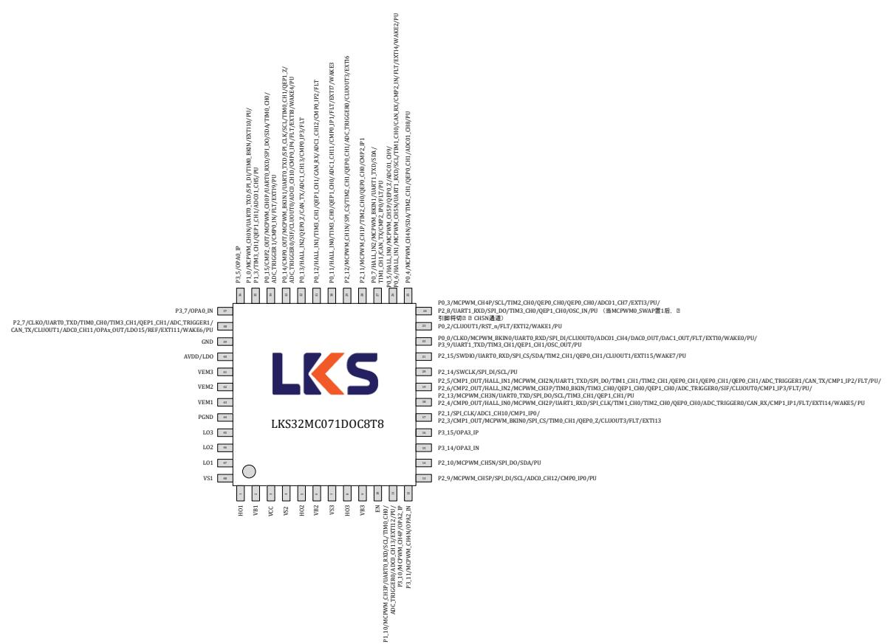  
图 3-3 LKS32MC071DOC8T8 管脚分布图

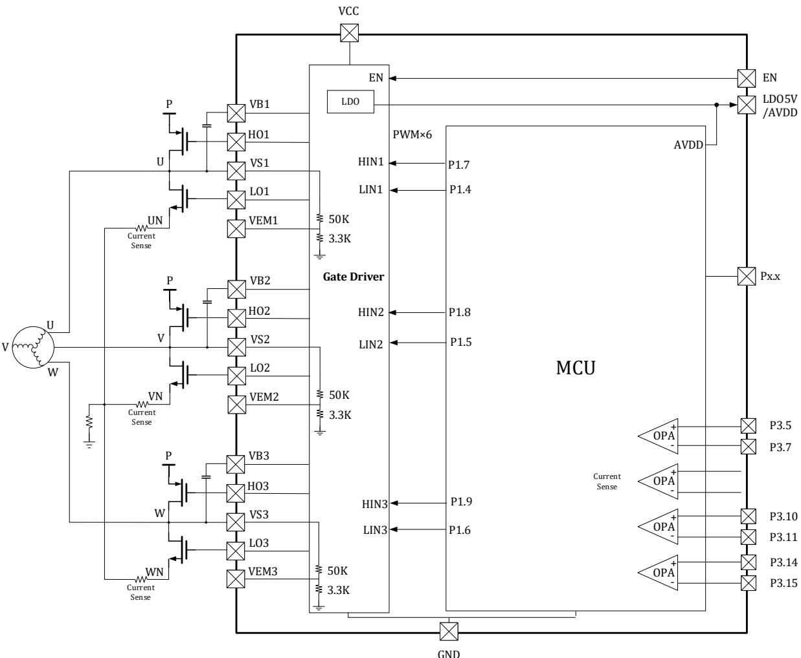  
图 3-4 LKS32MC071DOC8T8 内部预驱连接示意图

表 3-2 LKS32MC071DOC8T8 管脚说明

<table><tr><td>1</td><td>H01</td><td>A相 高边输出,由MCU P1.7控制,H01极性与P1.7相同,即P1.7=1时,H03=1。需要设置PWM_SWAP=1。</td></tr><tr><td>2</td><td>VB1</td><td>高边浮动电源电压1。</td></tr><tr><td>3</td><td>VCC</td><td>全桥驱动电源</td></tr><tr><td>4</td><td>VS2</td><td>高边浮动偏置电压2。</td></tr><tr><td>5</td><td>H02</td><td>B相 高边输出,由MCU P1.8控制,H02极性与P1.8相同,即P1.8=1时,H02=1。需要设置PWM_SWAP=1。</td></tr><tr><td>6</td><td>VB2</td><td>高边浮动电源电压2。</td></tr><tr><td>7</td><td>VS3</td><td>高边浮动偏置电压3。</td></tr><tr><td>8</td><td>H03</td><td>C相 高边输出,由MCU P1.9控制,H03极性与P1.9相同,即P1.9=1时,H01=1。需要设置PWM_SWAP=1。</td></tr><tr><td>9</td><td>VB3</td><td>高边浮动电源电压3。</td></tr><tr><td>10</td><td>EN</td><td>栅极驱动使能,高电平使能预驱输出,低电平关闭输出。内置上拉电阻,上拉至5V。</td></tr><tr><td rowspan="3">11</td><td>P1_10</td><td>P1.10</td></tr><tr><td>MCPWM_CH3P</td><td>PWM通道3高边</td></tr><tr><td>UART0_RXDSCL</td><td>串口0接收(发送)I2C 时钟</td></tr><tr><td rowspan="8"></td><td>TIM0_CH0</td><td>Timer0 通道 0</td></tr><tr><td>ADC_TRIGGER0</td><td>ADC0 触发信号输出(用于调试)</td></tr><tr><td>ADC0_CH13</td><td>ADC0 通道 13</td></tr><tr><td>EXTI12</td><td>外部 GPIO 中断信号 12</td></tr><tr><td>PU</td><td>内置  ${10}\mathrm{k}\Omega$  上拉电阻,软件可关闭</td></tr><tr><td>P3_10</td><td>P3.10</td></tr><tr><td>MCPWM_CH4P</td><td>PWM 通道 4 高边</td></tr><tr><td>OPA2_IP</td><td>运放 2 正端输入</td></tr><tr><td rowspan="3">12</td><td>P3_11</td><td>P3.11</td></tr><tr><td>MCPWM_CH4N</td><td>PWM 通道 4 低边</td></tr><tr><td>OPA2_IN</td><td>运放 2 负端输入</td></tr><tr><td rowspan="7">13</td><td>P2_9</td><td>P2.9</td></tr><tr><td>MCPWM_CH5P</td><td>PWM 通道 5 高边</td></tr><tr><td>SPI_DI</td><td>SPI 数据输入(输出)</td></tr><tr><td>SCL</td><td>I2C 时钟</td></tr><tr><td>ADC0_CH12</td><td>ADC0 通道 12</td></tr><tr><td>CMP0_IP0</td><td>比较器 0 正端输入 0</td></tr><tr><td>PU</td><td>内置  ${10}\mathrm{k}\Omega$  上拉电阻,软件可关闭</td></tr><tr><td rowspan="5">14</td><td>P2_10</td><td>P2.10</td></tr><tr><td>MCPWM_CH5N</td><td>PWM 通道 5 低边</td></tr><tr><td>SPI_DO</td><td>SPI 数据输出(输入)</td></tr><tr><td>SDA</td><td>I2C 数据</td></tr><tr><td>PU</td><td>内置  ${10}\mathrm{k}\Omega$  上拉电阻,软件可关闭</td></tr><tr><td rowspan="2">15</td><td>P3_14</td><td>P3.14</td></tr><tr><td>OPA3_IN</td><td>运放 3 负端输入</td></tr><tr><td rowspan="2">16</td><td>P3_15</td><td>P3.15</td></tr><tr><td>OPA3_IP</td><td>运放 3 正端输入</td></tr><tr><td rowspan="13">17</td><td>P2_1</td><td>P2.1</td></tr><tr><td>SPI_CLK</td><td>SPI 时钟</td></tr><tr><td>ADC1_CH10</td><td>ADC1 通道 10</td></tr><tr><td>CMP1_IP0</td><td>比较器 1 正端输入 0</td></tr><tr><td>P2_3</td><td>P2.3</td></tr><tr><td>CMP1_OUT</td><td>比较器 1 输出</td></tr><tr><td>MCPWM_BKIN0</td><td>PWM 停机输入信号 0</td></tr><tr><td>SPI_CS</td><td>SPI 片选</td></tr><tr><td>TIM0_CH1</td><td>Timer0 通道 1</td></tr><tr><td>QEP0_Z</td><td>QEP0 编码器 Z 相</td></tr><tr><td>CLUOUT3</td><td>CLU3 输出</td></tr><tr><td>FLT</td><td>IO 滤波</td></tr><tr><td>EXTI13</td><td>外部 GPIO 中断信号 13</td></tr><tr><td rowspan="2">18</td><td>P2_4</td><td>P2.4</td></tr><tr><td>CMP0_OUTHALL_IN0</td><td>比较器 0 输出HALL接口输入0</td></tr><tr><td rowspan="12"></td><td>MCPWM_CH2P</td><td>PWM通道2高边</td></tr><tr><td>UART1_RXD</td><td>串口1接收(发送)</td></tr><tr><td>SPI_CLK</td><td>SPI时钟</td></tr><tr><td>TIM1_CH0</td><td>Timer1通道0</td></tr><tr><td>TIM2_CH0</td><td>Timer2通道0</td></tr><tr><td>ADC_TRIGGER0</td><td>ADC0触发信号输出(用于调试)</td></tr><tr><td>CAN_RX</td><td>CAN接收端</td></tr><tr><td>CMP1_IP1</td><td>比较器1正端输入1</td></tr><tr><td>FLT</td><td>IO滤波</td></tr><tr><td>EXTI14</td><td>外部GPIO中断信号14</td></tr><tr><td>WK5</td><td>外部唤醒信号5</td></tr><tr><td>PU</td><td>内置10kΩ上拉电阻,软件可关闭</td></tr><tr><td rowspan="30">19</td><td>P2_5</td><td>P2.5</td></tr><tr><td>CMP1_OUT</td><td>比较器1输出</td></tr><tr><td>HALL_IN1</td><td>HALL接口输入1</td></tr><tr><td>MCPWM_CH2N</td><td>PWM通道2低边</td></tr><tr><td>UART1_TXD</td><td>串口1发送(接收)</td></tr><tr><td>SPI_DO</td><td>SPI数据输出(输入)</td></tr><tr><td>TIM1_CH1</td><td>Timer1通道1</td></tr><tr><td>TIM2_CH1</td><td>Timer2通道1</td></tr><tr><td>ADC_TRIGGER1</td><td>ADC1触发信号输出(用于调试)</td></tr><tr><td>CAN_TX</td><td>CAN发送端</td></tr><tr><td>CMP1_IP2</td><td>比较器1正端输入2</td></tr><tr><td>FLT</td><td>IO滤波</td></tr><tr><td>PU</td><td>内置10kΩ上拉电阻,软件可关闭</td></tr><tr><td>P2_6</td><td>P2.6</td></tr><tr><td>CMP2_OUT</td><td>比较器2输出</td></tr><tr><td>HALL_IN2</td><td>HALL接口输入2</td></tr><tr><td>MCPWM_CH3P</td><td>PWM通道3高边</td></tr><tr><td>TIMO_BKIN</td><td>TIMER0_FAIL信号来自GPIO</td></tr><tr><td>TIM3_CH0</td><td>Timer3通道0</td></tr><tr><td>ADC_TRIGGER0</td><td>ADC0触发信号输出(用于调试)</td></tr><tr><td>SIF</td><td>单线通讯</td></tr><tr><td>CLUOUT0</td><td>CLU0输出</td></tr><tr><td>CMP1_IP3</td><td>比较器1正端输入3</td></tr><tr><td>FLT</td><td>IO滤波</td></tr><tr><td>PU</td><td>内置10kΩ上拉电阻,软件可关闭</td></tr><tr><td>P2_13</td><td>P2.13</td></tr><tr><td>MCPWM_CH3N</td><td>PWM通道3低边</td></tr><tr><td>UART0_TXD</td><td>串口0发送(接收)</td></tr><tr><td>SPI_DO</td><td>SPI数据输出(输入)</td></tr><tr><td>SCLTIM3_CH1</td><td>I2C时钟Timer3 通道1</td></tr><tr><td></td><td>PU</td><td>内置10kΩ上拉电阻,软件可关闭</td></tr><tr><td rowspan="5">20</td><td>P2_14</td><td>P2.14</td></tr><tr><td>SWCLK</td><td>SWD时钟</td></tr><tr><td>SPI_DI</td><td>SPI数据输入(输出)</td></tr><tr><td>SCL</td><td>I2C时钟</td></tr><tr><td>PU</td><td>内置10kΩ上拉电阻,软件可关闭</td></tr><tr><td rowspan="10">21</td><td>P2_15</td><td>P2.15</td></tr><tr><td>SWDIO</td><td>SWD 数据</td></tr><tr><td>UART0_RXD</td><td>串口0接收(发送)</td></tr><tr><td>SPI_CS</td><td>SPI片选</td></tr><tr><td>SDA</td><td>I2C数据</td></tr><tr><td>TIM2_CH1</td><td>Timer2通道1</td></tr><tr><td>CLUOUT1</td><td>CLU1输出</td></tr><tr><td>EXTI15</td><td>外部GPIO中断信号15</td></tr><tr><td>WK7</td><td>外部唤醒信号7</td></tr><tr><td>PU</td><td>内置10kΩ上拉电阻,软件可关闭</td></tr><tr><td rowspan="18">22</td><td>P0_0</td><td>P0.0</td></tr><tr><td>CLKO</td><td>时钟输出(用于调试)</td></tr><tr><td>MCPWM_BKINO</td><td>PWM停机输入信号0</td></tr><tr><td>UART0_RXD</td><td>串口0接收(发送)</td></tr><tr><td>SPI_DI</td><td>SPI数据输入(输出)</td></tr><tr><td>CLUOUT0</td><td>CLU0输出</td></tr><tr><td>ADC01_CH4</td><td>ADC01通道4</td></tr><tr><td>DAC0_OUT</td><td>DAC0输出</td></tr><tr><td>DAC1_OUT</td><td>DAC1输出</td></tr><tr><td>FLT</td><td>IO滤波</td></tr><tr><td>EXTIO</td><td>外部GPIO中断信号0</td></tr><tr><td>WK0</td><td>外部唤醒信号0</td></tr><tr><td>PU</td><td>内置10kΩ上拉电阻,软件可关闭</td></tr><tr><td>P3_9</td><td>P3.9</td></tr><tr><td>UART1_TXD</td><td>串口1发送(接收)</td></tr><tr><td>TIM3_CH1</td><td>Timer3通道1</td></tr><tr><td>OSC_OUT</td><td>外部晶振引脚</td></tr><tr><td>PU</td><td>内置10kΩ上拉电阻,软件可关闭</td></tr><tr><td rowspan="5">23</td><td>P0_2</td><td>P0.2</td></tr><tr><td>CLUOUT1</td><td>CLU1输出</td></tr><tr><td>RST_n</td><td>复位引脚,P0.2默认用作RSTN。建议接一个10nF~100nF的电容到地,并在RSTN和AVDD之间放置一个10k~20k的上拉电阻。如果外部有上拉电阻,RSTN的电容应为100nF。P0.2可切换为GPIO,切换后可关闭10kΩ上拉电阻。</td></tr><tr><td>FLT</td><td>IO滤波</td></tr><tr><td>EXTI2WK1</td><td>外部GPIO中断信号2外部唤醒信号1</td></tr><tr><td></td><td>PU</td><td>内置10kΩ上拉电阻,软件可关闭</td></tr><tr><td rowspan="13">24</td><td>P0_3</td><td>P0.3</td></tr><tr><td>MCPWM_CH4P</td><td>PWM通道4高边</td></tr><tr><td>SCL</td><td>I2C时钟</td></tr><tr><td>TIM2_CH0</td><td>Timer2通道0</td></tr><tr><td>ADC01_CH7</td><td>ADC01通道7</td></tr><tr><td>EXTI3</td><td>外部GPIO中断信号3</td></tr><tr><td>PU</td><td>内置10kΩ上拉电阻,软件可关闭</td></tr><tr><td>P2_8</td><td>P2.8</td></tr><tr><td>UART1_RXD</td><td>串口1接收(发送)</td></tr><tr><td>SPI_DO</td><td>SPI数据输出(输入)</td></tr><tr><td>TIM3_CH0</td><td>Timer3通道0</td></tr><tr><td>OSC_IN</td><td>外部晶振引脚</td></tr><tr><td>PU</td><td>内置10kΩ上拉电阻,软件可关闭</td></tr><tr><td rowspan="6">25</td><td>P0_4</td><td>P0.4</td></tr><tr><td>MCPWM_CH4N</td><td>PWM通道4低边</td></tr><tr><td>SDA</td><td>I2C数据</td></tr><tr><td>TIM2_CH1</td><td>Timer2通道1</td></tr><tr><td>ADC01_CH8</td><td>ADC01通道8</td></tr><tr><td>PU</td><td>内置10kΩ上拉电阻,软件可关闭</td></tr><tr><td rowspan="17">26</td><td>P0_5</td><td>P0.5</td></tr><tr><td>HALL_IN0</td><td>HALL接口输入0</td></tr><tr><td>MCPWM_CH5P</td><td>PWM通道5高边</td></tr><tr><td>QEP0_Z</td><td>QEP0编码器Z相</td></tr><tr><td>ADC01_CH9</td><td>ADC01通道9</td></tr><tr><td>P0_6</td><td>P0.6</td></tr><tr><td>HALL_IN1</td><td>HALL接口输入1</td></tr><tr><td>MCPWM_CH5N</td><td>PWM通道5低边</td></tr><tr><td>UART1_RXD</td><td>串口1接收(发送)</td></tr><tr><td>SCL</td><td>I2C时钟</td></tr><tr><td>TIM1_CH0</td><td>Timer1通道0</td></tr><tr><td>CAN_RX</td><td>CAN接收端</td></tr><tr><td>CMP2_IN</td><td>比较器2负端输入</td></tr><tr><td>FLT</td><td>IO滤波</td></tr><tr><td>EXTI4</td><td>外部GPIO中断信号4</td></tr><tr><td>WK2</td><td>外部唤醒信号2</td></tr><tr><td>PU</td><td>内置10kΩ上拉电阻,软件可关闭</td></tr><tr><td rowspan="5">27</td><td>P0_7</td><td>P0.7</td></tr><tr><td>HALL_IN2</td><td>HALL接口输入2</td></tr><tr><td>MCPWM_BKIN1</td><td>PWM停机输入信号1</td></tr><tr><td>UART1_TXD</td><td>串口1发送(接收)</td></tr><tr><td>SDATIM1_CH1</td><td>I2C数据Timer1 通道1</td></tr><tr><td rowspan="4"></td><td>CAN_TX</td><td>CAN 发送端</td></tr><tr><td>CMP2_IP0</td><td>比较器2正端输入0</td></tr><tr><td>FLT</td><td>IO 滤波</td></tr><tr><td>PU</td><td>内置10kΩ上拉电阻,软件可关闭</td></tr><tr><td rowspan="4">28</td><td>P2_11</td><td>P2.11</td></tr><tr><td>MCPWM_CH1P</td><td>PWM通道1高边</td></tr><tr><td>TIM2_CH0</td><td>Timer2通道0</td></tr><tr><td>CMP2_IP1</td><td>比较器2正端输入1</td></tr><tr><td rowspan="7">29</td><td>P2_12</td><td>P2.12</td></tr><tr><td>MCPWM_CH1N</td><td>PWM通道1低边</td></tr><tr><td>SPI_CS</td><td>SPI片选</td></tr><tr><td>TIM2_CH1</td><td>Timer2通道1</td></tr><tr><td>ADC_TRIGGER0</td><td>ADC0触发信号输出(用于调试)</td></tr><tr><td>CLUOUT3</td><td>CLU3输出</td></tr><tr><td>EXTI6</td><td>外部GPIO中断信号6</td></tr><tr><td rowspan="8">30</td><td>P0_11</td><td>P0.11</td></tr><tr><td>HALL_IN0</td><td>HALL接口输入0</td></tr><tr><td>TIM3_CH0</td><td>Timer3通道0</td></tr><tr><td>ADC1_CH11</td><td>ADC1通道11</td></tr><tr><td>CMP0_IP1</td><td>比较器0正端输入1</td></tr><tr><td>FLT</td><td>IO滤波</td></tr><tr><td>EXTI7</td><td>外部GPIO中断信号7</td></tr><tr><td>WK3</td><td>外部唤醒信号3</td></tr><tr><td rowspan="7">31</td><td>P0_12</td><td>P0.12</td></tr><tr><td>HALL_IN1</td><td>HALL接口输入1</td></tr><tr><td>TIM3_CH1</td><td>Timer3通道1</td></tr><tr><td>CAN_RX</td><td>CAN接收端</td></tr><tr><td>ADC1_CH12</td><td>ADC1通道12</td></tr><tr><td>CMP0_IP2</td><td>比较器0正端输入2</td></tr><tr><td>FLT</td><td>IO滤波</td></tr><tr><td rowspan="7">32</td><td>P0_13</td><td>P0.13</td></tr><tr><td>HALL_IN2</td><td>HALL接口输入2</td></tr><tr><td>QEP0_Z</td><td>QEP0编码器Z相</td></tr><tr><td>CAN_TX</td><td>CAN发送端</td></tr><tr><td>ADC1_CH13</td><td>ADC1通道13</td></tr><tr><td>CMP0_IP3</td><td>比较器0正端输入3</td></tr><tr><td>FLT</td><td>IO滤波</td></tr><tr><td rowspan="5">33</td><td>P0_14</td><td>P0.14</td></tr><tr><td>CMP0_OUT</td><td>比较器0输出</td></tr><tr><td>MCPWM_BKIN1</td><td>PWM停机输入信号1</td></tr><tr><td>UART0_TXD</td><td>串口0发送(接收)</td></tr><tr><td>SPI_CLKSCL</td><td>SPI时钟I2C 时钟</td></tr><tr><td rowspan="11"></td><td>TIM0_CH1</td><td>Timer0 通道 1</td></tr><tr><td>QEP1_Z</td><td>QEP1 编码器 Z 相</td></tr><tr><td>ADC_TRIGGER0</td><td>ADC0 触发信号输出(用于调试)</td></tr><tr><td>SIF</td><td>单线通讯</td></tr><tr><td>CLUOUT0</td><td>CLU0 输出</td></tr><tr><td>ADC0_CH10</td><td>ADC0 通道 10</td></tr><tr><td>CMP0_IP4</td><td>比较器 0 正端输入 4</td></tr><tr><td>FLT</td><td>IO 滤波</td></tr><tr><td>EXTI8</td><td>外部 GPIO 中断信号 8</td></tr><tr><td>WK4</td><td>外部唤醒信号 4</td></tr><tr><td>PU</td><td>内置 10kΩ 上拉电阻,软件可关闭</td></tr><tr><td rowspan="12">34</td><td>P0_15</td><td>P0.15</td></tr><tr><td>CMP2_OUT</td><td>比较器 2 输出</td></tr><tr><td>MCPWM_CHOP</td><td>PWM 通道 0 高边</td></tr><tr><td>UART0_RXD</td><td>串口 0 接收(发送)</td></tr><tr><td>SPI_DO</td><td>SPI 数据输出(输入)</td></tr><tr><td>SDA</td><td>I2C 数据</td></tr><tr><td>TIM0_CH0</td><td>Timer0 通道 0</td></tr><tr><td>ADC_TRIGGER1</td><td>ADC1 触发信号输出(用于调试)</td></tr><tr><td>CMP0_IN</td><td>比较器 0 负端输入</td></tr><tr><td>FLT</td><td>IO 滤波</td></tr><tr><td>EXTI9</td><td>外部 GPIO 中断信号 9</td></tr><tr><td>PU</td><td>内置 10kΩ 上拉电阻,软件可关闭</td></tr><tr><td rowspan="11">35</td><td>P1_0</td><td>P1.0</td></tr><tr><td>MCPWM_CHON</td><td>PWM 通道 0 低边</td></tr><tr><td>UART0_TXD</td><td>串口 0 发送(接收)</td></tr><tr><td>SPI_DI</td><td>SPI 数据输入(输出)</td></tr><tr><td>TIM0_BKIN</td><td>TIMER0_FAIL 信号来自 GPIO</td></tr><tr><td>EXTI10</td><td>外部 GPIO 中断信号 10</td></tr><tr><td>PU</td><td>内置 10kΩ 上拉电阻,软件可关闭</td></tr><tr><td>P1_3</td><td>P1.3</td></tr><tr><td>TIM3_CH1</td><td>Timer3 通道 1</td></tr><tr><td>ADC01_CH5</td><td>ADC01 通道 5</td></tr><tr><td>PU</td><td>内置 10kΩ 上拉电阻,软件可关闭</td></tr><tr><td rowspan="2">36</td><td>P3_5</td><td>P3.5</td></tr><tr><td>OPA0_IP</td><td>运放 0 正端输入</td></tr><tr><td rowspan="2">37</td><td>P3_7</td><td>P3.7</td></tr><tr><td>OPA0_IN</td><td>运放 0 负端输入</td></tr><tr><td rowspan="4">38</td><td>P2_7</td><td>P2.7</td></tr><tr><td>CLKO</td><td>时钟输出(用于调试)</td></tr><tr><td>UART0_TXD</td><td>串口 0 发送(接收)</td></tr><tr><td>TIM0_CH0TIM3_CH1</td><td>Timer0 通道 0Timer3 通道1</td></tr><tr><td rowspan="10"></td><td>ADC_TRIGGER1</td><td>ADC1 触发信号输出(用于调试)</td></tr><tr><td>CAN_TX</td><td>CAN 发送端</td></tr><tr><td>CLUOUT1</td><td>CLU1 输出</td></tr><tr><td>ADC0_CH11</td><td>ADC0 通道11</td></tr><tr><td>OPAx_OUT</td><td>运放输出</td></tr><tr><td>LDO15</td><td>1.5V LDO 输出</td></tr><tr><td>REF</td><td>参考电压</td></tr><tr><td>EXTI11</td><td>外部 GPIO 中断信号11</td></tr><tr><td>WK6</td><td>外部唤醒信号6</td></tr><tr><td>PU</td><td>内置10kΩ上拉电阻,软件可关闭</td></tr><tr><td>39</td><td>GND</td><td>芯片地,强烈建议多个地引脚在PCB上统一接地</td></tr><tr><td>40</td><td>AVDD/LDO</td><td>MCU 电源,5V LDO 输出,建议片外就近放置1uF滤波电容</td></tr><tr><td>41</td><td>VEM3</td><td>C相VS 50k/3.3k电阻分压输出,内置耐压5V的30pF电容。可通过外置电阻调整分压比例,若电压超过5V,会导致采样信号被二极管钳位。</td></tr><tr><td>42</td><td>VEM2</td><td>B相VS 50k/3.3k电阻分压输出,内置耐压5V的30pF电容。可通过外置电阻调整分压比例,若电压超过5V,会导致采样信号被二极管钳位。</td></tr><tr><td>43</td><td>VEM1</td><td>A相VS 50k/3.3k电阻分压输出,内置耐压5V的30pF电容。可通过外置电阻调整分压比例,若电压超过5V,会导致采样信号被二极管钳位。</td></tr><tr><td>44</td><td>PGND</td><td>预驱功率地</td></tr><tr><td>45</td><td>LO3</td><td>C相低边输出,由MCUP1.6控制,LO3极性与P1.6相同,即P1.6=1时,LO3=1。需要设置PWM_SWAP=1。</td></tr><tr><td>46</td><td>LO2</td><td>B相低边输出,由MCUP1.5控制,LO2极性与P1.5相同,即P1.5=1时,LO2=1。需要设置PWM_SWAP=1。</td></tr><tr><td>47</td><td>LO1</td><td>A相低边输出,由MCUP1.4控制,LO1极性与P1.4相同,即P1.4=1时,LO1=1。需要设置PWM_SWAP=1。</td></tr><tr><td>48</td><td>VS1</td><td>高边浮动偏置电压1。</td></tr></table>

## 3.1.4 LKS32MC074FF8Q8

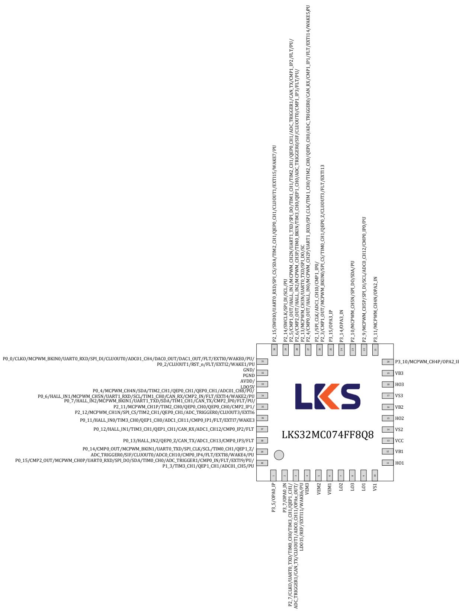  
图 3-5 LKS32MC074FF8Q8 管脚分布图

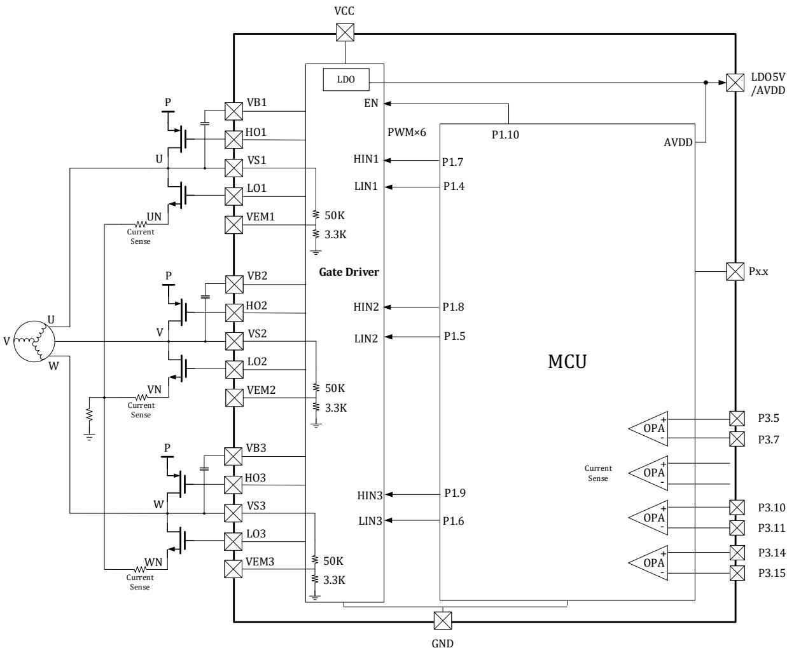

图 3-6 LKS32MC074FF8Q8 内部预驱连接示意图  
表 3-3 LKS32MC074FF8Q8 管脚说明

<table><tr><td>0</td><td>GND</td><td>腹部散热区域,为芯片 GND</td></tr><tr><td rowspan="2">1</td><td>P3_5</td><td>P3.5</td></tr><tr><td>OPA0_IP</td><td>运放 0 正端输入</td></tr><tr><td rowspan="2">2</td><td>P3_7</td><td>P3.7</td></tr><tr><td>OPA0_IN</td><td>运放 0 负端输入</td></tr><tr><td rowspan="12">3</td><td>P2_7</td><td>P2.7</td></tr><tr><td>CLKO</td><td>时钟输出(用于调试)</td></tr><tr><td>UART0_TXD</td><td>串口 0 发送(接收)</td></tr><tr><td>TIM0_CH0</td><td>Timer0 通道 0</td></tr><tr><td>TIM3_CH1</td><td>Timer3 通道 1</td></tr><tr><td>QEP1_CH1</td><td>编码器 1 通道 1</td></tr><tr><td>ADC_TRIGGER1</td><td>ADC1 触发信号输出(用于调试)</td></tr><tr><td>CAN_TX</td><td>CAN 发送端</td></tr><tr><td>CLUOUT1</td><td>CLU1 输出</td></tr><tr><td>ADC0_CH11</td><td>ADC0 通道 11</td></tr><tr><td>OPAx_OUT</td><td>运放输出</td></tr><tr><td>LDO15REF</td><td>1.5V LDO 输出参考电压</td></tr><tr><td rowspan="3"></td><td>EXTI11</td><td>外部 GPIO 中断信号 11</td></tr><tr><td>WAKE6</td><td>外部唤醒信号 6</td></tr><tr><td>PU</td><td>内置  ${10}\mathrm{k}\Omega$  上拉电阻,软件可关闭</td></tr><tr><td>4</td><td>VEM3</td><td>C 相 VS 50k/3.3k 电阻分压输出,内置耐压 5V 的 30pF 电容。可通过外置电阻调整分压比例,若电压超过 5V,会导致采样信号被二极管钳位。</td></tr><tr><td>5</td><td>VEM2</td><td>B 相 VS 50k/3.3k 电阻分压输出,内置耐压 5V 的 30pF 电容。可通过外置电阻调整分压比例,若电压超过 5V,会导致采样信号被二极管钳位。</td></tr><tr><td>6</td><td>VEM1</td><td>A 相 VS 50k/3.3k 电阻分压输出,内置耐压 5V 的 30pF 电容。可通过外置电阻调整分压比例,若电压超过 5V,会导致采样信号被二极管钳位。</td></tr><tr><td>7</td><td>LO2</td><td>B 相 低边输出,由 MCU P1.5 控制,LO2 极性与 P1.5 相同,即 P1.5=1 时,LO2=1。需要设置 PWM_SWAP=1。</td></tr><tr><td>8</td><td>LO3</td><td>C 相 低边输出,由 MCU P1.6 控制,LO3 极性与 P1.6 相同,即 P1.6=1 时,LO3=1。需要设置 PWM_SWAP=1。</td></tr><tr><td>9</td><td>LO1</td><td>A 相 低边输出,由 MCU P1.4 控制,LO1 极性与 P1.4 相同,即 P1.4=1 时,LO1=1。需要设置 PWM_SWAP=1。</td></tr><tr><td>10</td><td>VS1</td><td>高边浮动偏置电压 1。</td></tr><tr><td>11</td><td>HO1</td><td>A 相 高边输出,由 MCU P1.7 控制,HO1 极性与 P1.7 相同,即 P1.7=1 时,HO1=1。需要设置 PWM_SWAP=1。</td></tr><tr><td>12</td><td>VB1</td><td>高边浮动电源电压 1。</td></tr><tr><td>13</td><td>VCC</td><td>全桥驱动电源</td></tr><tr><td>14</td><td>VS2</td><td>高边浮动偏置电压 2。</td></tr><tr><td>15</td><td>HO2</td><td>B 相 高边输出,由 MCU P1.8 控制,HO2 极性与 P1.8 相同,即 P1.8=1 时,HO2=1。需要设置 PWM_SWAP=1。</td></tr><tr><td>16</td><td>VB2</td><td>高边浮动电源电压 2。</td></tr><tr><td>17</td><td>VS3</td><td>高边浮动偏置电压 3。</td></tr><tr><td>18</td><td>HO3</td><td>C 相 高边输出,由 MCU P1.9 控制,HO3 极性与 P1.9 相同,即 P1.9=1 时,HO3=1。需要设置 PWM_SWAP=1。</td></tr><tr><td>19</td><td>VB3</td><td>高边浮动电源电压 3。</td></tr><tr><td rowspan="3">20</td><td>P3_10</td><td>P3.10</td></tr><tr><td>MCPWM_CH4P</td><td>PWM 通道 4 高边</td></tr><tr><td>OPA2_IP</td><td>运放 2 正端输入</td></tr><tr><td rowspan="3">21</td><td>P3_11</td><td>P3.11</td></tr><tr><td>MCPWM_CH4N</td><td>PWM 通道 4 低边</td></tr><tr><td>OPA2_IN</td><td>运放 2 负端输入</td></tr><tr><td rowspan="7">22</td><td>P2_9</td><td>P2.9</td></tr><tr><td>MCPWM_CH5P</td><td>PWM 通道 5 高边</td></tr><tr><td>SPI_DI</td><td>SPI 数据输入(输出)</td></tr><tr><td>SCL</td><td>I2C 时钟</td></tr><tr><td>ADC0_CH12</td><td>ADC0 通道 12</td></tr><tr><td>CMP0_IP0</td><td>比较器 0 正端输入 0</td></tr><tr><td>PU</td><td>内置  ${10}\mathrm{k}\Omega$  上拉电阻,软件可关闭</td></tr><tr><td>23</td><td>P2_10MCPWM_CH5N</td><td>P2.10PWM通道5低边</td></tr><tr><td rowspan="3"></td><td>SPI_DO</td><td>SPI数据输出(输入)</td></tr><tr><td>SDA</td><td>I2C数据</td></tr><tr><td>PU</td><td>内置10kΩ上拉电阻,软件可关闭</td></tr><tr><td rowspan="2">24</td><td>P3_14</td><td>P3.14</td></tr><tr><td>OPA3_IN</td><td>运放3负端输入</td></tr><tr><td rowspan="2">25</td><td>P3_15</td><td>P3.15</td></tr><tr><td>OPA3_IP</td><td>运放3正端输入</td></tr><tr><td rowspan="13">26</td><td>P2_1</td><td>P2.1</td></tr><tr><td>SPI_CLK</td><td>SPI时钟</td></tr><tr><td>ADC1_CH10</td><td>ADC1通道10</td></tr><tr><td>CMP1_IP0</td><td>比较器1正端输入0</td></tr><tr><td>P2_3</td><td>P2.3</td></tr><tr><td>CMP1_OUT</td><td>比较器1输出</td></tr><tr><td>MCPWM_BKIN0</td><td>PWM停机输入信号0</td></tr><tr><td>SPI_CS</td><td>SPI片选</td></tr><tr><td>TIM0_CH1</td><td>Timer0通道1</td></tr><tr><td>QEP0_Z</td><td>QEP0编码器Z相</td></tr><tr><td>CLUOUT3</td><td>CLU3输出</td></tr><tr><td>FLT</td><td>IO滤波</td></tr><tr><td>EXTI13</td><td>外部GPIO中断信号13</td></tr><tr><td rowspan="16">27</td><td>P2_4</td><td>P2.4</td></tr><tr><td>CMP0_OUT</td><td>比较器0输出</td></tr><tr><td>HALL_IN0</td><td>HALL接口输入0</td></tr><tr><td>MCPWM_CH2P</td><td>PWM通道2高边</td></tr><tr><td>UART1_RXD</td><td>串口1接收(发送)</td></tr><tr><td>SPI_CLK</td><td>SPI时钟</td></tr><tr><td>TIM1_CH0</td><td>Timer1通道0</td></tr><tr><td>TIM2_CH0</td><td>Timer2通道0</td></tr><tr><td>QEP0_CH0</td><td>编码器0通道0</td></tr><tr><td>ADC_TRIGGER0</td><td>ADC0触发信号输出(用于调试)</td></tr><tr><td>CAN_RX</td><td>CAN接收端</td></tr><tr><td>CMP1_IP1</td><td>比较器1正端输入1</td></tr><tr><td>FLT</td><td>IO滤波</td></tr><tr><td>EXTI14</td><td>外部GPIO中断信号14</td></tr><tr><td>WAKE5</td><td>外部唤醒信号5</td></tr><tr><td>PU</td><td>内置10kΩ上拉电阻,软件可关闭</td></tr><tr><td rowspan="6">28</td><td>P2_5</td><td>P2.5</td></tr><tr><td>CMP1_OUT</td><td>比较器1输出</td></tr><tr><td>HALL_IN1</td><td>HALL接口输入1</td></tr><tr><td>MCPWM_CH2N</td><td>PWM通道2低边</td></tr><tr><td>UART1_TXD</td><td>串口1发送(接收)</td></tr><tr><td>SPI_DOTIM1_CH1</td><td>SPI数据输出(输入)Timer1 通道1</td></tr><tr><td rowspan="28"></td><td>TIM2_CH1</td><td>Timer2 通道1</td></tr><tr><td>QEP0_CH1</td><td>编码器0 通道1</td></tr><tr><td>ADC_TRIGGER1</td><td>ADC1 触发信号输出(用于调试)</td></tr><tr><td>CAN_TX</td><td>CAN 发送端</td></tr><tr><td>CMP1_IP2</td><td>比较器1 正端输入2</td></tr><tr><td>FLT</td><td>IO 滤波</td></tr><tr><td>PU</td><td>内置10kΩ上拉电阻,软件可关闭</td></tr><tr><td>P2_6</td><td>P2.6</td></tr><tr><td>CMP2_OUT</td><td>比较器2 输出</td></tr><tr><td>HALL_IN2</td><td>HALL 接口输入2</td></tr><tr><td>MCPWM_CH3P</td><td>PWM 通道3 高边</td></tr><tr><td>TIM0_BKIN</td><td>TIMER0_FAIL 信号来自 GPIO</td></tr><tr><td>TIM3_CH0</td><td>Timer3 通道0</td></tr><tr><td>QEP1_CH0</td><td>编码器1 通道0</td></tr><tr><td>ADC_TRIGGER0</td><td>ADC0 触发信号输出(用于调试)</td></tr><tr><td>SIF</td><td>单线通讯</td></tr><tr><td>CLUOUT0</td><td>CLU0 输出</td></tr><tr><td>CMP1_IP3</td><td>比较器1 正端输入3</td></tr><tr><td>FLT</td><td>IO 滤波</td></tr><tr><td>PU</td><td>内置10kΩ上拉电阻,软件可关闭</td></tr><tr><td>P2_13</td><td>P2.13</td></tr><tr><td>MCPWM_CH3N</td><td>PWM 通道3 低边</td></tr><tr><td>UART0_TXD</td><td>串口0 发送(接收)</td></tr><tr><td>SPI_DO</td><td>SPI 数据输出(输入)</td></tr><tr><td>SCL</td><td>I2C 时钟</td></tr><tr><td>TIM3_CH1</td><td>Timer3 通道1</td></tr><tr><td>QEP1_CH1</td><td>编码器1 通道1</td></tr><tr><td>PU</td><td>内置10kΩ上拉电阻,软件可关闭</td></tr><tr><td rowspan="5">29</td><td>P2_14</td><td>P2.14</td></tr><tr><td>SWCLK</td><td>SWD 时钟</td></tr><tr><td>SPI_DI</td><td>SPI 数据输入(输出)</td></tr><tr><td>SCL</td><td>I2C 时钟</td></tr><tr><td>PU</td><td>内置10kΩ上拉电阻,软件可关闭</td></tr><tr><td rowspan="9">30</td><td>P2_15</td><td>P2.15</td></tr><tr><td>SWDIO</td><td>SWD 数据</td></tr><tr><td>UART0_RXD</td><td>串口0 接收(发送)</td></tr><tr><td>SPI_CS</td><td>SPI 片选</td></tr><tr><td>SDA</td><td>I2C 数据</td></tr><tr><td>TIM2_CH1</td><td>Timer2 通道1</td></tr><tr><td>QEP0_CH1</td><td>编码器0 通道1</td></tr><tr><td>CLUOUT1</td><td>CLU1 输出</td></tr><tr><td>EXTI15</td><td>外部 GPIO 中断信号15</td></tr></table>

管脚分布

<table><tr><td rowspan="2"></td><td>WAKE7</td><td>外部唤醒信号7</td></tr><tr><td>PU</td><td>内置10kΩ上拉电阻,软件可关闭</td></tr><tr><td rowspan="20">31</td><td>P0_0</td><td>P0.0</td></tr><tr><td>CLKO</td><td>时钟输出(用于调试)</td></tr><tr><td>MCPWM_BKIN0</td><td>PWM停机输入信号0</td></tr><tr><td>UART0_RXD</td><td>串口0接收(发送)</td></tr><tr><td>SPI_DI</td><td>SPI数据输入(输出)</td></tr><tr><td>CLUOUT0</td><td>CLU0输出</td></tr><tr><td>ADC01_CH4</td><td>ADC01通道4</td></tr><tr><td>DAC0_OUT</td><td>DAC0输出</td></tr><tr><td>DAC1_OUT</td><td>DAC1输出</td></tr><tr><td>FLT</td><td>IO滤波</td></tr><tr><td>EXTI0</td><td>外部GPIO中断信号0</td></tr><tr><td>WAKE0</td><td>外部唤醒信号0</td></tr><tr><td>PU</td><td>内置10kΩ上拉电阻,软件可关闭</td></tr><tr><td>P0_2</td><td>P0.2</td></tr><tr><td>CLUOUT1</td><td>CLU1输出</td></tr><tr><td>RST_n</td><td>复位引脚,P0.2默认用作RSTN。建议接一个10nF~100nF的电容到地,并在RSTN和AVDD之间放置一个10k~20k的上拉电阻。如果外部有上拉电阻,RSTN的电容应为100nF。P0.2可切换为GPIO,切换后可关闭10kΩ上拉电阻。</td></tr><tr><td>FLT</td><td>IO滤波</td></tr><tr><td>EXTI2</td><td>外部GPIO中断信号2</td></tr><tr><td>WAKE1</td><td>外部唤醒信号1</td></tr><tr><td>PU</td><td>内置10kΩ上拉电阻,软件可关闭</td></tr><tr><td rowspan="2">32</td><td>GND</td><td>芯片地,强烈建议多个地引脚在PCB上统一接地</td></tr><tr><td>PGND</td><td>功率地</td></tr><tr><td rowspan="2">33</td><td>AVDD</td><td>芯片电源,供电范围2.2~5.5V</td></tr><tr><td>LDO5V</td><td>5VLDO输出</td></tr><tr><td rowspan="15">34</td><td>P0_4</td><td>P0.4</td></tr><tr><td>MCPWM_CH4N</td><td>PWM通道4低边</td></tr><tr><td>SDA</td><td>I2C数据</td></tr><tr><td>TIM2_CH1</td><td>Timer2通道1</td></tr><tr><td>QEP0_CH1</td><td>编码器0通道1</td></tr><tr><td>ADC01_CH8</td><td>ADC01通道8</td></tr><tr><td>PU</td><td>内置10kΩ上拉电阻,软件可关闭</td></tr><tr><td>P0_6</td><td>P0.6</td></tr><tr><td>HALL_IN1</td><td>HALL接口输入1</td></tr><tr><td>MCPWM_CH5N</td><td>PWM通道5低边</td></tr><tr><td>UART1_RXD</td><td>串口1接收(发送)</td></tr><tr><td>SCL</td><td>I2C时钟</td></tr><tr><td>TIM1_CH0</td><td>Timer1通道0</td></tr><tr><td>CAN_RX</td><td>CAN接收端</td></tr><tr><td>CMP2_IN</td><td>比较器2负端输入</td></tr></table>

管脚分布

<table><tr><td rowspan="4"></td><td>FLT</td><td>IO 滤波</td></tr><tr><td>EXTI4</td><td>外部 GPIO 中断信号 4</td></tr><tr><td>WAKE2</td><td>外部唤醒信号 2</td></tr><tr><td>PU</td><td>内置  ${10}\mathrm{k}\Omega$  上拉电阻,软件可关闭</td></tr><tr><td rowspan="23">35</td><td>P0_7</td><td>P0.7</td></tr><tr><td>HALL_IN2</td><td>HALL 接口输入 2</td></tr><tr><td>MCPWM_BKIN1</td><td>PWM 停机输入信号 1</td></tr><tr><td>UART1_TXD</td><td>串口 1 发送(接收)</td></tr><tr><td>SDA</td><td>I2C 数据</td></tr><tr><td>TIM1_CH1</td><td>Timer1 通道 1</td></tr><tr><td>CAN_TX</td><td>CAN 发送端</td></tr><tr><td>CMP2_IP0</td><td>比较器 2 正端输入 0</td></tr><tr><td>FLT</td><td>IO 滤波</td></tr><tr><td>PU</td><td>内置  ${10}\mathrm{k}\Omega$  上拉电阻,软件可关闭</td></tr><tr><td>P2_11</td><td>P2.11</td></tr><tr><td>MCPWM_CH1P</td><td>PWM 通道 1 高边</td></tr><tr><td>TIM2_CH0</td><td>Timer2 通道 0</td></tr><tr><td>QEP0_CH0</td><td>编码器 0 通道 0</td></tr><tr><td>CMP2_IP1</td><td>比较器 2 正端输入 1</td></tr><tr><td>P2_12</td><td>P2.12</td></tr><tr><td>MCPWM_CH1N</td><td>PWM 通道 1 低边</td></tr><tr><td>SPI_CS</td><td>SPI 片选</td></tr><tr><td>TIM2_CH1</td><td>Timer2 通道 1</td></tr><tr><td>QEP0_CH1</td><td>编码器 0 通道 1</td></tr><tr><td>ADC_TRIGGER0</td><td>ADC0 触发信号输出(用于调试)</td></tr><tr><td>CLUOUT3</td><td>CLU3 输出</td></tr><tr><td>EXTI6</td><td>外部 GPIO 中断信号 6</td></tr><tr><td rowspan="9">36</td><td>P0_11</td><td>P0.11</td></tr><tr><td>HALL_IN0</td><td>HALL 接口输入 0</td></tr><tr><td>TIM3_CH0</td><td>Timer3 通道 0</td></tr><tr><td>QEP1_CH0</td><td>编码器 1 通道 0</td></tr><tr><td>ADC1_CH11</td><td>ADC1 通道 11</td></tr><tr><td>CMP0_IP1</td><td>比较器 0 正端输入 1</td></tr><tr><td>FLT</td><td>IO 滤波</td></tr><tr><td>EXTI7</td><td>外部 GPIO 中断信号 7</td></tr><tr><td>WAKE3</td><td>外部唤醒信号 3</td></tr><tr><td rowspan="7">37</td><td>P0_12</td><td>P0.12</td></tr><tr><td>HALL_IN1</td><td>HALL 接口输入 1</td></tr><tr><td>TIM3_CH1</td><td>Timer3 通道 1</td></tr><tr><td>QEP1_CH1</td><td>编码器 1 通道 1</td></tr><tr><td>CAN_RX</td><td>CAN 接收端</td></tr><tr><td>ADC1_CH12</td><td>ADC1 通道 12</td></tr><tr><td>CMP0_IP2</td><td>比较器 0 正端输入 2</td></tr><tr><td rowspan="7">38</td><td>P0_13</td><td>P0.13</td></tr><tr><td>HALL_IN2</td><td>HALL 接口输入 2</td></tr><tr><td>QEP0_Z</td><td>QEP0 编码器 Z 相</td></tr><tr><td>CAN_TX</td><td>CAN 发送端</td></tr><tr><td>ADC1_CH13</td><td>ADC1 通道 13</td></tr><tr><td>CMP0_IP3</td><td>比较器 0 正端输入 3</td></tr><tr><td>FLT</td><td>IO 滤波</td></tr><tr><td rowspan="17">39</td><td>P0_14</td><td>P0.14</td></tr><tr><td>CMP0_OUT</td><td>比较器 0 输出</td></tr><tr><td>MCPWM_BKIN1</td><td>PWM 停机输入信号 1</td></tr><tr><td>UART0_TXD</td><td>串口 0 发送(接收)</td></tr><tr><td>SPI_CLK</td><td>SPI 时钟</td></tr><tr><td>SCL</td><td>I2C 时钟</td></tr><tr><td>TIM0_CH1</td><td>Timer0 通道 1</td></tr><tr><td>QEP1_Z</td><td>QEP1 编码器 Z 相</td></tr><tr><td>ADC_TRIGGER0</td><td>ADC0 触发信号输出(用于调试)</td></tr><tr><td>SIF</td><td>单线通讯</td></tr><tr><td>CLUOUT0</td><td>CLU0 输出</td></tr><tr><td>ADC0_CH10</td><td>ADC0 通道 10</td></tr><tr><td>CMP0_IP4</td><td>比较器 0 正端输入 4</td></tr><tr><td>FLT</td><td>IO 滤波</td></tr><tr><td>EXTI8</td><td>外部 GPIO 中断信号 8</td></tr><tr><td>WAKE4</td><td>外部唤醒信号 4</td></tr><tr><td>PU</td><td>内置 10kΩ上拉电阻,软件可关闭</td></tr><tr><td rowspan="17">40</td><td>P0_15</td><td>P0.15</td></tr><tr><td>CMP2_OUT</td><td>比较器 2 输出</td></tr><tr><td>MCPWM_CHOP</td><td>PWM 通道 0 高边</td></tr><tr><td>UART0_RXD</td><td>串口 0 接收(发送)</td></tr><tr><td>SPI_DO</td><td>SPI 数据输出(输入)</td></tr><tr><td>SDA</td><td>I2C 数据</td></tr><tr><td>TIM0_CH0</td><td>Timer0 通道 0</td></tr><tr><td>ADC_TRIGGER1</td><td>ADC1 触发信号输出(用于调试)</td></tr><tr><td>CMP0_IN</td><td>比较器 0 负端输入</td></tr><tr><td>FLT</td><td>IO 滤波</td></tr><tr><td>EXTI9</td><td>外部 GPIO 中断信号 9</td></tr><tr><td>PU</td><td>内置 10kΩ上拉电阻,软件可关闭</td></tr><tr><td>P1_3</td><td>P1.3</td></tr><tr><td>TIM3_CH1</td><td>Timer3 通道 1</td></tr><tr><td>QEP1_CH1</td><td>编码器 1 通道 1</td></tr><tr><td>ADC01_CH5</td><td>ADC01 通道 5</td></tr><tr><td>PU</td><td>内置 10kΩ上拉电阻,软件可关闭</td></tr></table>

## 3.1.5 LKS32MC074DF8Q8

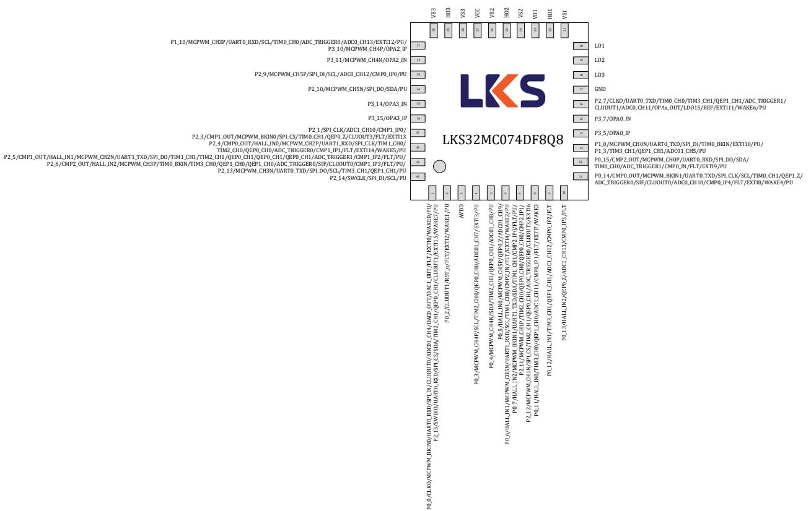  
图 3-7 LKS32MC074DF8Q8 管脚分布图

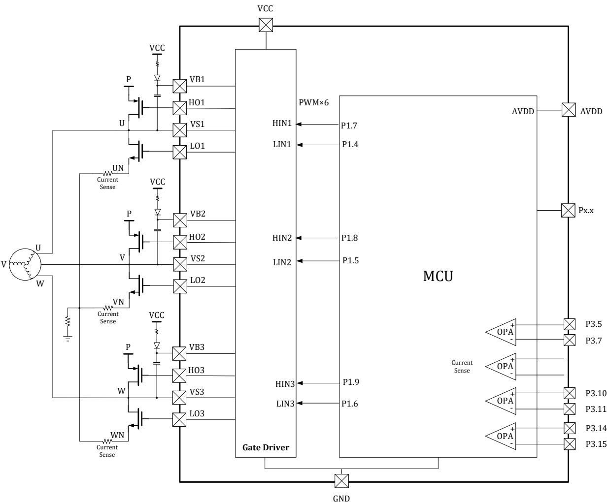  
图 3-8 LKS32MC074DF8Q8 内部预驱连接示意图

表 3-4 LKS32MC074DF8Q8 管脚说明

<table><tr><td>0</td><td>GND</td><td>腹部散热区域,为芯片 GND</td></tr><tr><td rowspan="16">1</td><td>P0_0</td><td>P0.0</td></tr><tr><td>CLKO</td><td>时钟输出(用于调试)</td></tr><tr><td>MCPWM_BKINO</td><td>PWM 停机输入信号 0</td></tr><tr><td>UART0_RXD</td><td>串口 0 接收(发送)</td></tr><tr><td>SPI_DI</td><td>SPI 数据输入(输出)</td></tr><tr><td>CLUOUT0</td><td>CLU0 输出</td></tr><tr><td>ADC01_CH4</td><td>ADC0/ADC1 通道 4</td></tr><tr><td>DAC0_OUT</td><td>DAC0 输出</td></tr><tr><td>DAC1_OUT</td><td>DAC1 输出</td></tr><tr><td>FLT</td><td>IO 滤波</td></tr><tr><td>EXTIO</td><td>外部 GPIO 中断信号 0</td></tr><tr><td>WK0</td><td>外部唤醒信号 0</td></tr><tr><td>PU</td><td>内置 10kΩ上拉电阻,软件可关闭</td></tr><tr><td>P2_15</td><td>P2.15</td></tr><tr><td>SWDIO</td><td>SWD 数据</td></tr><tr><td>UART0_RXD</td><td>串口 0 接收(发送)</td></tr></table>

管脚分布

<table><tr><td rowspan="7"></td><td>SPI_CS</td><td>SPI片选</td></tr><tr><td>SDA</td><td>I2C数据</td></tr><tr><td>TIM2_CH1</td><td>Timer2通道1</td></tr><tr><td>CLUOUT1</td><td>CLU1输出</td></tr><tr><td>EXTI15</td><td>外部GPIO中断信号15</td></tr><tr><td>WK7</td><td>外部唤醒信号7</td></tr><tr><td>PU</td><td>内置10kΩ上拉电阻,软件可关闭</td></tr><tr><td rowspan="7">2</td><td>P0_2</td><td>P0.2</td></tr><tr><td>CLUOUT1</td><td>CLU1输出</td></tr><tr><td>RST_n</td><td>复位引脚,P0.2默认用作RSTN。建议接一个10nF~100nF的电容到地,并在RSTN和AVDD之间放置一个10k~20k的上拉电阻。如果外部有上拉电阻,RSTN的电容应为100nF。P0.2可切换为GPIO,切换后可关闭10kΩ上拉电阻。</td></tr><tr><td>FLT</td><td>IO滤波</td></tr><tr><td>EXTI2</td><td>外部GPIO中断信号2</td></tr><tr><td>WK1</td><td>外部唤醒信号1</td></tr><tr><td>PU</td><td>内置10kΩ上拉电阻,软件可关闭</td></tr><tr><td>3</td><td>AVDD</td><td>芯片电源,供电范围2.5~5.5V</td></tr><tr><td rowspan="7">4</td><td>P0_3</td><td>P0.3</td></tr><tr><td>MCPWM_CH4P</td><td>PWM通道4高边</td></tr><tr><td>SCL</td><td>I2C时钟</td></tr><tr><td>TIM2_CH0</td><td>Timer2通道0</td></tr><tr><td>ADC01_CH7</td><td>ADC0/ADC1通道7</td></tr><tr><td>EXTI3</td><td>外部GPIO中断信号3</td></tr><tr><td>PU</td><td>内置10kΩ上拉电阻,软件可关闭</td></tr><tr><td rowspan="6">5</td><td>P0_4</td><td>P0.4</td></tr><tr><td>MCPWM_CH4N</td><td>PWM通道4低边</td></tr><tr><td>SDA</td><td>I2C数据</td></tr><tr><td>TIM2_CH1</td><td>Timer2通道1</td></tr><tr><td>ADC01_CH8</td><td>ADC0/ADC1通道8</td></tr><tr><td>PU</td><td>内置10kΩ上拉电阻,软件可关闭</td></tr><tr><td rowspan="13">6</td><td>P0_5</td><td>P0.5</td></tr><tr><td>HALL_IN0</td><td>HALL接口输入0</td></tr><tr><td>MCPWM_CH5P</td><td>PWM通道5高边</td></tr><tr><td>QEP0_Z</td><td>QEP0编码器Z相</td></tr><tr><td>ADC01_CH9</td><td>ADC01通道9</td></tr><tr><td>P0_6</td><td>P0.6</td></tr><tr><td>HALL_IN1</td><td>HALL接口输入1</td></tr><tr><td>MCPWM_CH5N</td><td>PWM通道5低边</td></tr><tr><td>UART1_RXD</td><td>串口1接收(发送)</td></tr><tr><td>SCL</td><td>I2C时钟</td></tr><tr><td>TIM1_CH0</td><td>Timer1通道0</td></tr><tr><td>CMP2_IN</td><td>比较器2负端输入</td></tr><tr><td>FLTEXTI4</td><td>IO滤波外部 GPIO 中断信号 4</td></tr><tr><td rowspan="2"></td><td>WK2</td><td>外部唤醒信号 2</td></tr><tr><td>PU</td><td>内置 10kΩ上拉电阻,软件可关闭</td></tr><tr><td rowspan="20">7</td><td>P0_7</td><td>P0.7</td></tr><tr><td>HALL_IN2</td><td>HALL 接口输入 2</td></tr><tr><td>MCPWM_BKIN1</td><td>PWM 停机输入信号 1</td></tr><tr><td>UART1_TXD</td><td>串口 1 发送(接收)</td></tr><tr><td>SDA</td><td>I2C 数据</td></tr><tr><td>TIM1_CH1</td><td>Timer1 通道 1</td></tr><tr><td>CMP2_IP0</td><td>比较器 2 正端输入 0</td></tr><tr><td>FLT</td><td>IO 滤波</td></tr><tr><td>PU</td><td>内置 10kΩ上拉电阻,软件可关闭</td></tr><tr><td>P2_11</td><td>P2.11</td></tr><tr><td>MCPWM_CH1P</td><td>PWM 通道 1 高边</td></tr><tr><td>TIM2_CH0</td><td>Timer2 通道 0</td></tr><tr><td>CMP2_IP1</td><td>比较器 2 正端输入 1</td></tr><tr><td>P2_12</td><td>P2.12</td></tr><tr><td>MCPWM_CH1N</td><td>PWM 通道 1 低边</td></tr><tr><td>SPI_CS</td><td>SPI 片选</td></tr><tr><td>TIM2_CH1</td><td>Timer2 通道 1</td></tr><tr><td>ADC_TRIGGER0</td><td>ADC0 触发信号输出(用于调试)</td></tr><tr><td>CLUOUT3</td><td>CLU3 输出</td></tr><tr><td>EXTI6</td><td>外部 GPIO 中断信号 6</td></tr><tr><td rowspan="8">8</td><td>P0_11</td><td>P0.11</td></tr><tr><td>HALL_IN0</td><td>HALL 接口输入 0</td></tr><tr><td>TIM3_CH0</td><td>Timer3 通道 0</td></tr><tr><td>ADC1_CH11</td><td>ADC1 通道 11</td></tr><tr><td>CMP0_IP1</td><td>比较器 0 正端输入 1</td></tr><tr><td>FLT</td><td>IO 滤波</td></tr><tr><td>EXTI7</td><td>外部 GPIO 中断信号 7</td></tr><tr><td>WK3</td><td>外部唤醒信号 3</td></tr><tr><td rowspan="6">9</td><td>P0_12</td><td>P0.12</td></tr><tr><td>HALL_IN1</td><td>HALL 接口输入 1</td></tr><tr><td>TIM3_CH1</td><td>Timer3 通道 1</td></tr><tr><td>ADC1_CH12</td><td>ADC1 通道 12</td></tr><tr><td>CMP0_IP2</td><td>比较器 0 正端输入 2</td></tr><tr><td>FLT</td><td>IO 滤波</td></tr><tr><td rowspan="6">10</td><td>P0_13</td><td>P0.13</td></tr><tr><td>HALL_IN2</td><td>HALL 接口输入 2</td></tr><tr><td>QEP0_Z</td><td>QEP0 编码器 Z 相</td></tr><tr><td>ADC1_CH13</td><td>ADC1 通道 13</td></tr><tr><td>CMP0_IP3</td><td>比较器 0 正端输入 3</td></tr><tr><td>FLT</td><td>IO 滤波</td></tr><tr><td rowspan="17">11</td><td>P0_14</td><td>P0.14</td></tr><tr><td>CMP0_OUT</td><td>比较器0输出</td></tr><tr><td>MCPWM_BKIN1</td><td>PWM停机输入信号1</td></tr><tr><td>UART0_TXD</td><td>串口0发送(接收)</td></tr><tr><td>SPI_CLK</td><td>SPI时钟</td></tr><tr><td>SCL</td><td>I2C时钟</td></tr><tr><td>TIM0_CH1</td><td>Timer0通道1</td></tr><tr><td>QEP1_Z</td><td>QEP1编码器Z相</td></tr><tr><td>ADC_TRIGGER0</td><td>ADC0触发信号输出(用于调试)</td></tr><tr><td>SIF</td><td>单线通讯</td></tr><tr><td>CLUOUT0</td><td>CLU0输出</td></tr><tr><td>ADC0_CH10</td><td>ADC0通道10</td></tr><tr><td>CMP0_IP4</td><td>比较器0正端输入4</td></tr><tr><td>FLT</td><td>IO滤波</td></tr><tr><td>EXTI8</td><td>外部GPIO中断信号8</td></tr><tr><td>WK4</td><td>外部唤醒信号4</td></tr><tr><td>PU</td><td>内置10kΩ上拉电阻,软件可关闭</td></tr><tr><td rowspan="12">12</td><td>P0_15</td><td>P0.15</td></tr><tr><td>CMP2_OUT</td><td>比较器2输出</td></tr><tr><td>MCPWM_CHOP</td><td>PWM通道0高边</td></tr><tr><td>UART0_RXD</td><td>串口0接收(发送)</td></tr><tr><td>SPI_DO</td><td>SPI数据输出(输入)</td></tr><tr><td>SDA</td><td>I2C数据</td></tr><tr><td>TIM0_CH0</td><td>Timer0通道0</td></tr><tr><td>ADC_TRIGGER1</td><td>ADC1触发信号输出(用于调试)</td></tr><tr><td>CMP0_IN</td><td>比较器0负端输入</td></tr><tr><td>FLT</td><td>IO滤波</td></tr><tr><td>EXTI9</td><td>外部GPIO中断信号9</td></tr><tr><td>PU</td><td>内置10kΩ上拉电阻,软件可关闭</td></tr><tr><td rowspan="11">13</td><td>P1_0</td><td>P1.0</td></tr><tr><td>MCPWM_CHON</td><td>PWM通道0低边</td></tr><tr><td>UART0_TXD</td><td>串口0发送(接收)</td></tr><tr><td>SPI_DI</td><td>SPI数据输入(输出)</td></tr><tr><td>TIM0_BKIN</td><td>TIMER0_FAIL信号来自GPIO</td></tr><tr><td>EXTI10</td><td>外部GPIO中断信号10</td></tr><tr><td>PU</td><td>内置10kΩ上拉电阻,软件可关闭</td></tr><tr><td>P1_3</td><td>P1.3</td></tr><tr><td>TIM3_CH1</td><td>Timer3通道1</td></tr><tr><td>ADC01_CH5</td><td>ADC01通道5</td></tr><tr><td>PU</td><td>内置10kΩ上拉电阻,软件可关闭</td></tr><tr><td rowspan="2">14</td><td>P3_5</td><td>P3.5</td></tr><tr><td>OPA0_IP</td><td>运放0正端输入</td></tr><tr><td>15</td><td>P3_7OPA0_IN</td><td>P3.7运放0负端输入</td></tr><tr><td rowspan="14">16</td><td>P2_7</td><td>P2.7</td></tr><tr><td>CLKO</td><td>时钟输出(用于调试)</td></tr><tr><td>UART0_TXD</td><td>串口0发送(接收)</td></tr><tr><td>TIM0_CH0</td><td>Timer0通道0</td></tr><tr><td>TIM3_CH1</td><td>Timer3通道1</td></tr><tr><td>ADC_TRIGGER1</td><td>ADC1触发信号输出(用于调试)</td></tr><tr><td>CLUOUT1</td><td>CLU1输出</td></tr><tr><td>ADC0_CH11</td><td>ADC0通道11</td></tr><tr><td>OPAx_OUT</td><td>运放输出</td></tr><tr><td>LDO15</td><td>1.5V LDO输出</td></tr><tr><td>REF</td><td>参考电压</td></tr><tr><td>EXTI11</td><td>外部GPIO中断信号11</td></tr><tr><td>WK6</td><td>外部唤醒信号6</td></tr><tr><td>PU</td><td>内置10kΩ上拉电阻,软件可关闭</td></tr><tr><td>17</td><td>GND</td><td>芯片地,强烈建议多个地引脚在PCB上统一接地</td></tr><tr><td>18</td><td>LO3</td><td>低侧栅极驱动信号输出3,由MCU P1.6控制,LO3极性与P1.6相同,即P1.6=1时,LO3=1,需要设置PWM_SWAP=1</td></tr><tr><td>19</td><td>LO2</td><td>低侧栅极驱动信号输出2,由MCU P1.5控制,LO2极性与P1.5相同,即P1.5=1时,LO2=1,需要设置PWM_SWAP=1</td></tr><tr><td>20</td><td>LO1</td><td>低侧栅极驱动信号输出1,由MCU P1.4控制,LO1极性与P1.4相同,即P1.4=1时,LO1=1,需要设置PWM_SWAP=1</td></tr><tr><td>21</td><td>VS1</td><td>高边浮动偏置电压1</td></tr><tr><td>22</td><td>HO1</td><td>高侧栅极驱动信号输出1,由MCU P1.7控制,H01极性与P1.7相同,即P1.7=1时,H01=1,需要设置PWM_SWAP=1</td></tr><tr><td>23</td><td>VB1</td><td>高边浮动电源电压1</td></tr><tr><td>24</td><td>VS2</td><td>高边浮动偏置电压2</td></tr><tr><td>25</td><td>HO2</td><td>高侧栅极驱动信号输出2,由MCU P1.8控制,H02极性与P1.8相同,即P1.8=1时,H02=1,需要设置PWM_SWAP=1</td></tr><tr><td>26</td><td>VB2</td><td>高边浮动电源电压2</td></tr><tr><td>27</td><td>VCC</td><td>全桥驱动电源</td></tr><tr><td>28</td><td>VS3</td><td>高边浮动偏置电压3</td></tr><tr><td>29</td><td>HO3</td><td>高侧栅极驱动信号输出3,由MCU P1.9控制,H03极性与P1.9相同,即P1.9=1时,H03=1,需要设置PWM_SWAP=1</td></tr><tr><td>30</td><td>VB3</td><td>高边浮动电源电压3</td></tr><tr><td rowspan="8">31</td><td>P1_10</td><td>P1.10</td></tr><tr><td>MCPWM_CH3P</td><td>PWM通道3高边</td></tr><tr><td>UART0_RXD</td><td>串口0接收(发送)</td></tr><tr><td>SCL</td><td>I2C时钟</td></tr><tr><td>TIM0_CH0</td><td>Timer0通道0</td></tr><tr><td>ADC_TRIGGER0</td><td>ADC0触发信号输出(用于调试)</td></tr><tr><td>ADC0_CH13</td><td>ADC0通道13</td></tr><tr><td>EXTI12PU</td><td>外部GPIO中断信号12内置10kΩ上拉电阻,软件可关闭</td></tr><tr><td rowspan="3"></td><td>P3_10</td><td>P3.10</td></tr><tr><td>MCPWM_CH4P</td><td>PWM通道4高边</td></tr><tr><td>OPA2_IP</td><td>运放2正端输入</td></tr><tr><td rowspan="3">32</td><td>P3_11</td><td>P3.11</td></tr><tr><td>MCPWM_CH4N</td><td>PWM通道4低边</td></tr><tr><td>OPA2_IN</td><td>运放2负端输入</td></tr><tr><td rowspan="7">33</td><td>P2_9</td><td>P2.9</td></tr><tr><td>MCPWM_CH5P</td><td>PWM通道5高边</td></tr><tr><td>SPI_DI</td><td>SPI数据输入(输出)</td></tr><tr><td>SCL</td><td>I2C时钟</td></tr><tr><td>ADC0_CH12</td><td>ADC0通道12</td></tr><tr><td>CMP0_IP0</td><td>比较器0正端输入0</td></tr><tr><td>PU</td><td>内置10kΩ上拉电阻,软件可关闭</td></tr><tr><td rowspan="5">34</td><td>P2_10</td><td>P2.10</td></tr><tr><td>MCPWM_CH5N</td><td>PWM通道5低边</td></tr><tr><td>SPI_DO</td><td>SPI数据输出(输入)</td></tr><tr><td>SDA</td><td>I2C数据</td></tr><tr><td>PU</td><td>内置10kΩ上拉电阻,软件可关闭</td></tr><tr><td rowspan="2">35</td><td>P3_14</td><td>P3.14</td></tr><tr><td>OPA3_IN</td><td>运放3负端输入</td></tr><tr><td rowspan="2">36</td><td>P3_15</td><td>P3.15</td></tr><tr><td>OPA3_IP</td><td>运放3正端输入</td></tr><tr><td rowspan="13">37</td><td>P2_1</td><td>P2.1</td></tr><tr><td>SPI_CLK</td><td>SPI时钟</td></tr><tr><td>ADC1_CH10</td><td>ADC1通道10</td></tr><tr><td>CMP1_IP0</td><td>比较器1正端输入0</td></tr><tr><td>P2_3</td><td>P2.3</td></tr><tr><td>CMP1_OUT</td><td>比较器1输出</td></tr><tr><td>MCPWM_BKIN0</td><td>PWM停机输入信号0</td></tr><tr><td>SPI_CS</td><td>SPI片选</td></tr><tr><td>TIM0_CH1</td><td>Timer0通道1</td></tr><tr><td>QEP0_Z</td><td>QEP0编码器Z相</td></tr><tr><td>CLUOUT3</td><td>CLU3输出</td></tr><tr><td>FLT</td><td>IO滤波</td></tr><tr><td>EXTI13</td><td>外部GPIO中断信号13</td></tr><tr><td rowspan="7">38</td><td>P2_4</td><td>P2.4</td></tr><tr><td>CMP0_OUT</td><td>比较器0输出</td></tr><tr><td>HALL_IN0</td><td>HALL接口输入0</td></tr><tr><td>MCPWM_CH2P</td><td>PWM通道2高边</td></tr><tr><td>UART1_RXD</td><td>串口1接收(发送)</td></tr><tr><td>SPI_CLK</td><td>SPI时钟</td></tr><tr><td>TIM1_CH0TIM2_CH0</td><td>Timer1通道0Timer2 通道0</td></tr><tr><td rowspan="6"></td><td>ADC_TRIGGER0</td><td>ADC0 触发信号输出(用于调试)</td></tr><tr><td>CMP1_IP1</td><td>比较器1正端输入1</td></tr><tr><td>FLT</td><td>IO 滤波</td></tr><tr><td>EXTI14</td><td>外部 GPIO 中断信号14</td></tr><tr><td>WK5</td><td>外部唤醒信号5</td></tr><tr><td>PU</td><td>内置10kΩ上拉电阻,软件可关闭</td></tr><tr><td rowspan="31">39</td><td>P2_5</td><td>P2.5</td></tr><tr><td>CMP1_OUT</td><td>比较器1输出</td></tr><tr><td>HALL_IN1</td><td>HALL接口输入1</td></tr><tr><td>MCPWM_CH2N</td><td>PWM通道2低边</td></tr><tr><td>UART1_TXD</td><td>串口1发送(接收)</td></tr><tr><td>SPI_DO</td><td>SPI数据输出(输入)</td></tr><tr><td>TIM1_CH1</td><td>Timer1通道1</td></tr><tr><td>TIM2_CH1</td><td>Timer2通道1</td></tr><tr><td>ADC_TRIGGER1</td><td>ADC1触发信号输出(用于调试)</td></tr><tr><td>CMP1_IP2</td><td>比较器1正端输入2</td></tr><tr><td>FLT</td><td>IO滤波</td></tr><tr><td>PU</td><td>内置10kΩ上拉电阻,软件可关闭</td></tr><tr><td>P2_6</td><td>P2.6</td></tr><tr><td>CMP2_OUT</td><td>比较器2输出</td></tr><tr><td>HALL_IN2</td><td>HALL接口输入2</td></tr><tr><td>MCPWM_CH3P</td><td>PWM通道3高边</td></tr><tr><td>TIM0_BKIN</td><td>TIMER0_FAIL信号来自GPIO</td></tr><tr><td>TIM3_CH0</td><td>Timer3通道0</td></tr><tr><td>ADC_TRIGGER0</td><td>ADC0触发信号输出(用于调试)</td></tr><tr><td>SIF</td><td>单线通讯</td></tr><tr><td>CLUOUT0</td><td>CLU0输出</td></tr><tr><td>CMP1_IP3</td><td>比较器1正端输入3</td></tr><tr><td>FLT</td><td>IO滤波</td></tr><tr><td>PU</td><td>内置10kΩ上拉电阻,软件可关闭</td></tr><tr><td>P2_13</td><td>P2.13</td></tr><tr><td>MCPWM_CH3N</td><td>PWM通道3低边</td></tr><tr><td>UART0_TXD</td><td>串口0发送(接收)</td></tr><tr><td>SPI_DO</td><td>SPI数据输出(输入)</td></tr><tr><td>SCL</td><td>I2C时钟</td></tr><tr><td>TIM3_CH1</td><td>Timer3通道1</td></tr><tr><td>PU</td><td>内置10kΩ上拉电阻,软件可关闭</td></tr><tr><td rowspan="5">40</td><td>P2_14</td><td>P2.14</td></tr><tr><td>SWCLK</td><td>SWD时钟</td></tr><tr><td>SPI_DI</td><td>SPI数据输入(输出)</td></tr><tr><td>SCL</td><td>I2C时钟</td></tr><tr><td>PU</td><td>内置10kΩ上拉电阻,软件可关闭</td></tr></table>

## 3.1.6 LKS32MC074DOF8Q8

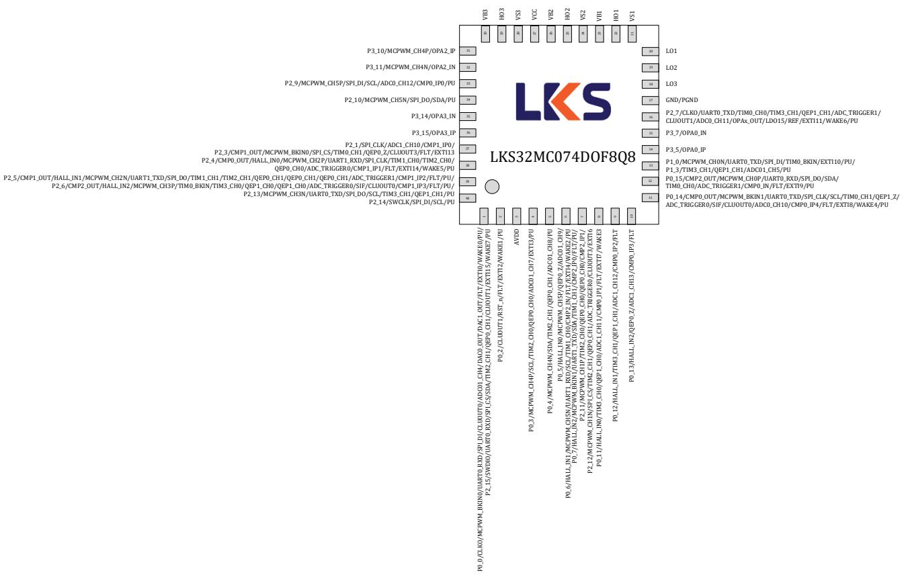  
图 3-9 LKS32MC074DOF8Q8 管脚分布图

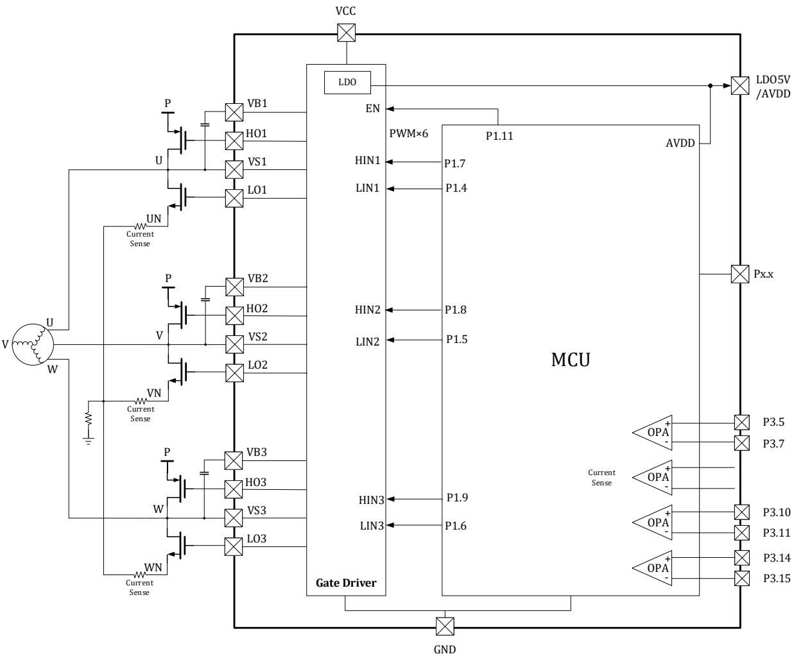  
图 3-10 LKS32MC074DOF8Q8 内部预驱连接示意图

表 3-5 LKS32MC074DOF8Q8 管脚说明

<table><tr><td>0</td><td>GND</td><td>腹部散热区域,为芯片 GND</td></tr><tr><td rowspan="16">1</td><td>P0_0</td><td>P0.0</td></tr><tr><td>CLKO</td><td>时钟输出(用于调试)</td></tr><tr><td>MCPWM_BKINO</td><td>PWM 停机输入信号 0</td></tr><tr><td>UART0_RXD</td><td>串口 0 接收(发送)</td></tr><tr><td>SPI_DI</td><td>SPI 数据输入(输出)</td></tr><tr><td>CLUOUT0</td><td>CLU0 输出</td></tr><tr><td>ADC01_CH4</td><td>ADC01 通道 4</td></tr><tr><td>DAC0_OUT</td><td>DAC0 输出</td></tr><tr><td>DAC1_OUT</td><td>DAC1 输出</td></tr><tr><td>FLT</td><td>IO 滤波</td></tr><tr><td>EXTIO</td><td>外部 GPIO 中断信号 0</td></tr><tr><td>WK0</td><td>外部唤醒信号 0</td></tr><tr><td>PU</td><td>内置 10kΩ上拉电阻,软件可关闭</td></tr><tr><td>P2_15</td><td>P2.15</td></tr><tr><td>SWDIO</td><td>SWD 数据</td></tr><tr><td>UART0_RXD</td><td>串口 0 接收(发送)</td></tr></table>

管脚分布

<table><tr><td rowspan="7"></td><td>SPI_CS</td><td>SPI片选</td></tr><tr><td>SDA</td><td>I2C数据</td></tr><tr><td>TIM2_CH1</td><td>Timer2通道1</td></tr><tr><td>CLUOUT1</td><td>CLU1输出</td></tr><tr><td>EXTI15</td><td>外部GPIO中断信号15</td></tr><tr><td>WK7</td><td>外部唤醒信号7</td></tr><tr><td>PU</td><td>内置10kΩ上拉电阻,软件可关闭</td></tr><tr><td rowspan="7">2</td><td>P0_2</td><td>P0.2</td></tr><tr><td>CLUOUT1</td><td>CLU1输出</td></tr><tr><td>RST_n</td><td>复位引脚,P0.2默认用作RSTN。建议接一个10nF~100nF的电容到地,并在RSTN和AVDD之间放置一个10k~20k的上拉电阻。如果外部有上拉电阻,RSTN的电容应为100nF。P0.2可切换为GPIO,切换后可关闭10kΩ上拉电阻。</td></tr><tr><td>FLT</td><td>IO滤波</td></tr><tr><td>EXTI2</td><td>外部GPIO中断信号2</td></tr><tr><td>WK1</td><td>外部唤醒信号1</td></tr><tr><td>PU</td><td>内置10kΩ上拉电阻,软件可关闭</td></tr><tr><td>3</td><td>AVDD/LDO</td><td>MCU电源,5VLDO输出,建议片外就近放置1uF滤波电容</td></tr><tr><td rowspan="7">4</td><td>P0_3</td><td>P0.3</td></tr><tr><td>MCPWM_CH4P</td><td>PWM通道4高边</td></tr><tr><td>SCL</td><td>I2C时钟</td></tr><tr><td>TIM2_CH0</td><td>Timer2通道0</td></tr><tr><td>ADC01_CH7</td><td>ADC01通道7</td></tr><tr><td>EXTI3</td><td>外部GPIO中断信号3</td></tr><tr><td>PU</td><td>内置10kΩ上拉电阻,软件可关闭</td></tr><tr><td rowspan="6">5</td><td>P0_4</td><td>P0.4</td></tr><tr><td>MCPWM_CH4N</td><td>PWM通道4低边</td></tr><tr><td>SDA</td><td>I2C数据</td></tr><tr><td>TIM2_CH1</td><td>Timer2通道1</td></tr><tr><td>ADC01_CH8</td><td>ADC01通道8</td></tr><tr><td>PU</td><td>内置10kΩ上拉电阻,软件可关闭</td></tr><tr><td rowspan="13">6</td><td>P0_5</td><td>P0.5</td></tr><tr><td>HALL_IN0</td><td>HALL接口输入0</td></tr><tr><td>MCPWM_CH5P</td><td>PWM通道5高边</td></tr><tr><td>QEP0_Z</td><td>QEP0编码器Z相</td></tr><tr><td>ADC01_CH9</td><td>ADC01通道9</td></tr><tr><td>P0_6</td><td>P0.6</td></tr><tr><td>HALL_IN1</td><td>HALL接口输入1</td></tr><tr><td>MCPWM_CH5N</td><td>PWM通道5低边</td></tr><tr><td>UART1_RXD</td><td>串口1接收(发送)</td></tr><tr><td>SCL</td><td>I2C时钟</td></tr><tr><td>TIM1_CH0</td><td>Timer1通道0</td></tr><tr><td>CMP2_IN</td><td>比较器2负端输入</td></tr><tr><td>FLTEXTI4</td><td>IO滤波外部 GPIO 中断信号 4</td></tr><tr><td rowspan="2"></td><td>WK2</td><td>外部唤醒信号 2</td></tr><tr><td>PU</td><td>内置 10kΩ上拉电阻,软件可关闭</td></tr><tr><td rowspan="20">7</td><td>P0_7</td><td>P0.7</td></tr><tr><td>HALL_IN2</td><td>HALL 接口输入 2</td></tr><tr><td>MCPWM_BKIN1</td><td>PWM 停机输入信号 1</td></tr><tr><td>UART1_TXD</td><td>串口 1 发送(接收)</td></tr><tr><td>SDA</td><td>I2C 数据</td></tr><tr><td>TIM1_CH1</td><td>Timer1 通道 1</td></tr><tr><td>CMP2_IP0</td><td>比较器 2 正端输入 0</td></tr><tr><td>FLT</td><td>IO 滤波</td></tr><tr><td>PU</td><td>内置 10kΩ上拉电阻,软件可关闭</td></tr><tr><td>P2_11</td><td>P2.11</td></tr><tr><td>MCPWM_CH1P</td><td>PWM 通道 1 高边</td></tr><tr><td>TIM2_CH0</td><td>Timer2 通道 0</td></tr><tr><td>CMP2_IP1</td><td>比较器 2 正端输入 1</td></tr><tr><td>P2_12</td><td>P2.12</td></tr><tr><td>MCPWM_CH1N</td><td>PWM 通道 1 低边</td></tr><tr><td>SPI_CS</td><td>SPI 片选</td></tr><tr><td>TIM2_CH1</td><td>Timer2 通道 1</td></tr><tr><td>ADC_TRIGGER0</td><td>ADC0 触发信号输出(用于调试)</td></tr><tr><td>CLUOUT3</td><td>CLU3 输出</td></tr><tr><td>EXTI6</td><td>外部 GPIO 中断信号 6</td></tr><tr><td rowspan="8">8</td><td>P0_11</td><td>P0.11</td></tr><tr><td>HALL_IN0</td><td>HALL 接口输入 0</td></tr><tr><td>TIM3_CH0</td><td>Timer3 通道 0</td></tr><tr><td>ADC1_CH11</td><td>ADC1 通道 11</td></tr><tr><td>CMP0_IP1</td><td>比较器 0 正端输入 1</td></tr><tr><td>FLT</td><td>IO 滤波</td></tr><tr><td>EXTI7</td><td>外部 GPIO 中断信号 7</td></tr><tr><td>WK3</td><td>外部唤醒信号 3</td></tr><tr><td rowspan="6">9</td><td>P0_12</td><td>P0.12</td></tr><tr><td>HALL_IN1</td><td>HALL 接口输入 1</td></tr><tr><td>TIM3_CH1</td><td>Timer3 通道 1</td></tr><tr><td>ADC1_CH12</td><td>ADC1 通道 12</td></tr><tr><td>CMP0_IP2</td><td>比较器 0 正端输入 2</td></tr><tr><td>FLT</td><td>IO 滤波</td></tr><tr><td rowspan="6">10</td><td>P0_13</td><td>P0.13</td></tr><tr><td>HALL_IN2</td><td>HALL 接口输入 2</td></tr><tr><td>QEP0_Z</td><td>QEP0 编码器 Z 相</td></tr><tr><td>ADC1_CH13</td><td>ADC1 通道 13</td></tr><tr><td>CMP0_IP3</td><td>比较器 0 正端输入 3</td></tr><tr><td>FLT</td><td>IO 滤波</td></tr><tr><td rowspan="17">11</td><td>P0_14</td><td>P0.14</td></tr><tr><td>CMP0_OUT</td><td>比较器0输出</td></tr><tr><td>MCPWM_BKIN1</td><td>PWM停机输入信号1</td></tr><tr><td>UART0_TXD</td><td>串口0发送(接收)</td></tr><tr><td>SPI_CLK</td><td>SPI时钟</td></tr><tr><td>SCL</td><td>I2C时钟</td></tr><tr><td>TIM0_CH1</td><td>Timer0通道1</td></tr><tr><td>QEP1_Z</td><td>QEP1编码器Z相</td></tr><tr><td>ADC_TRIGGER0</td><td>ADC0触发信号输出(用于调试)</td></tr><tr><td>SIF</td><td>单线通讯</td></tr><tr><td>CLUOUT0</td><td>CLU0输出</td></tr><tr><td>ADC0_CH10</td><td>ADC0通道10</td></tr><tr><td>CMP0_IP4</td><td>比较器0正端输入4</td></tr><tr><td>FLT</td><td>IO滤波</td></tr><tr><td>EXTI8</td><td>外部GPIO中断信号8</td></tr><tr><td>WK4</td><td>外部唤醒信号4</td></tr><tr><td>PU</td><td>内置10kΩ上拉电阻,软件可关闭</td></tr><tr><td rowspan="12">12</td><td>P0_15</td><td>P0.15</td></tr><tr><td>CMP2_OUT</td><td>比较器2输出</td></tr><tr><td>MCPWM_CHOP</td><td>PWM通道0高边</td></tr><tr><td>UART0_RXD</td><td>串口0接收(发送)</td></tr><tr><td>SPI_DO</td><td>SPI数据输出(输入)</td></tr><tr><td>SDA</td><td>I2C数据</td></tr><tr><td>TIM0_CH0</td><td>Timer0通道0</td></tr><tr><td>ADC_TRIGGER1</td><td>ADC1触发信号输出(用于调试)</td></tr><tr><td>CMP0_IN</td><td>比较器0负端输入</td></tr><tr><td>FLT</td><td>IO滤波</td></tr><tr><td>EXTI9</td><td>外部GPIO中断信号9</td></tr><tr><td>PU</td><td>内置10kΩ上拉电阻,软件可关闭</td></tr><tr><td rowspan="11">13</td><td>P1_0</td><td>P1.0</td></tr><tr><td>MCPWM_CHON</td><td>PWM通道0低边</td></tr><tr><td>UART0_TXD</td><td>串口0发送(接收)</td></tr><tr><td>SPI_DI</td><td>SPI数据输入(输出)</td></tr><tr><td>TIM0_BKIN</td><td>TIMER0_FAIL信号来自GPIO</td></tr><tr><td>EXTI10</td><td>外部GPIO中断信号10</td></tr><tr><td>PU</td><td>内置10kΩ上拉电阻,软件可关闭</td></tr><tr><td>P1_3</td><td>P1.3</td></tr><tr><td>TIM3_CH1</td><td>Timer3通道1</td></tr><tr><td>ADC01_CH5</td><td>ADC01通道5</td></tr><tr><td>PU</td><td>内置10kΩ上拉电阻,软件可关闭</td></tr><tr><td rowspan="2">14</td><td>P3_5</td><td>P3.5</td></tr><tr><td>OPA0_IP</td><td>运放0正端输入</td></tr><tr><td>15</td><td>P3_7OPA0_IN</td><td>P3.7运放0负端输入</td></tr><tr><td rowspan="14">16</td><td>P2_7</td><td>P2.7</td></tr><tr><td>CLKO</td><td>时钟输出(用于调试)</td></tr><tr><td>UART0_TXD</td><td>串口0发送(接收)</td></tr><tr><td>TIM0_CH0</td><td>Timer0通道0</td></tr><tr><td>TIM3_CH1</td><td>Timer3通道1</td></tr><tr><td>ADC_TRIGGER1</td><td>ADC1触发信号输出(用于调试)</td></tr><tr><td>CLUOUT1</td><td>CLU1输出</td></tr><tr><td>ADC0_CH11</td><td>ADC0通道11</td></tr><tr><td>OPAx_OUT</td><td>运放输出</td></tr><tr><td>LDO15</td><td>1.5V LDO输出</td></tr><tr><td>REF</td><td>参考电压</td></tr><tr><td>EXTI11</td><td>外部GPIO中断信号11</td></tr><tr><td>WK6</td><td>外部唤醒信号6</td></tr><tr><td>PU</td><td>内置10kΩ上拉电阻,软件可关闭</td></tr><tr><td>17</td><td>GND</td><td>芯片地,强烈建议多个地引脚在PCB上统一接地</td></tr><tr><td>18</td><td>LO3</td><td>C相低边输出,由MCUP1.6控制,LO3极性与P1.6相同,即P1.6=1时,LO3=1。需要设置PWM_SWAP=1。</td></tr><tr><td>19</td><td>LO2</td><td>B相低边输出,由MCUP1.5控制,LO2极性与P1.5相同,即P1.5=1时,LO2=1。需要设置PWM_SWAP=1。</td></tr><tr><td>20</td><td>LO1</td><td>A相低边输出,由MCUP1.4控制,LO1极性与P1.4相同,即P1.4=1时,LO1=1。需要设置PWM_SWAP=1。</td></tr><tr><td>21</td><td>VS1</td><td>高边浮动偏置电压1。</td></tr><tr><td>22</td><td>HO1</td><td>A相高边输出,由MCUP1.7控制,HO1极性与P1.7相同,即P1.7=1时,HO1=1。需要设置PWM_SWAP=1。</td></tr><tr><td>23</td><td>VB1</td><td>高边浮动电源电压1。</td></tr><tr><td>24</td><td>VS2</td><td>高边浮动偏置电压2。</td></tr><tr><td>25</td><td>HO2</td><td>B相高边输出,由MCUP1.8控制,HO2极性与P1.8相同,即P1.8=1时,HO2=1。需要设置PWM_SWAP=1。</td></tr><tr><td>26</td><td>VB2</td><td>高边浮动电源电压2。</td></tr><tr><td>27</td><td>VCC</td><td>全桥驱动电源</td></tr><tr><td>28</td><td>VS3</td><td>高边浮动偏置电压3。</td></tr><tr><td>29</td><td>HO3</td><td>C相高边输出,由MCUP1.9控制,HO3极性与P1.9相同,即P1.9=1时,HO1=1。需要设置PWM_SWAP=1。</td></tr><tr><td>30</td><td>VB3</td><td>高边浮动电源电压3。</td></tr><tr><td rowspan="3">31</td><td>P3_10</td><td>P3.10</td></tr><tr><td>MCPWM_CH4P</td><td>PWM通道4高边</td></tr><tr><td>OPA2_IP</td><td>运放2正端输入</td></tr><tr><td rowspan="3">32</td><td>P3_11</td><td>P3.11</td></tr><tr><td>MCPWM_CH4N</td><td>PWM通道4低边</td></tr><tr><td>OPA2_IN</td><td>运放2负端输入</td></tr><tr><td rowspan="2">33</td><td>P2_9</td><td>P2.9</td></tr><tr><td>MCPWM_CH5PSPI_DI</td><td>PWM通道5高边SPI 数据输入(输出)</td></tr><tr><td rowspan="4"></td><td>SCL</td><td>I2C 时钟</td></tr><tr><td>ADC0_CH12</td><td>ADC0 通道 12</td></tr><tr><td>CMP0_IP0</td><td>比较器 0 正端输入 0</td></tr><tr><td>PU</td><td>内置 10kΩ上拉电阻,软件可关闭</td></tr><tr><td rowspan="5">34</td><td>P2_10</td><td>P2.10</td></tr><tr><td>MCPWM_CH5N</td><td>PWM 通道 5 低边</td></tr><tr><td>SPI_DO</td><td>SPI 数据输出(输入)</td></tr><tr><td>SDA</td><td>I2C 数据</td></tr><tr><td>PU</td><td>内置 10kΩ上拉电阻,软件可关闭</td></tr><tr><td rowspan="2">35</td><td>P3_14</td><td>P3.14</td></tr><tr><td>OPA3_IN</td><td>运放 3 负端输入</td></tr><tr><td rowspan="2">36</td><td>P3_15</td><td>P3.15</td></tr><tr><td>OPA3_IP</td><td>运放 3 正端输入</td></tr><tr><td rowspan="13">37</td><td>P2_1</td><td>P2.1</td></tr><tr><td>SPI_CLK</td><td>SPI 时钟</td></tr><tr><td>ADC1_CH10</td><td>ADC1 通道 10</td></tr><tr><td>CMP1_IP0</td><td>比较器 1 正端输入 0</td></tr><tr><td>P2_3</td><td>P2.3</td></tr><tr><td>CMP1_OUT</td><td>比较器 1 输出</td></tr><tr><td>MCPWM_BKIN0</td><td>PWM 停机输入信号 0</td></tr><tr><td>SPI_CS</td><td>SPI 片选</td></tr><tr><td>TIM0_CH1</td><td>Timer0 通道 1</td></tr><tr><td>QEP0_Z</td><td>QEP0 编码器 Z 相</td></tr><tr><td>CLUOUT3</td><td>CLU3 输出</td></tr><tr><td>FLT</td><td>IO 滤波</td></tr><tr><td>EXTI13</td><td>外部 GPIO 中断信号 13</td></tr><tr><td rowspan="14">38</td><td>P2_4</td><td>P2.4</td></tr><tr><td>CMP0_OUT</td><td>比较器 0 输出</td></tr><tr><td>HALL_IN0</td><td>HALL 接口输入 0</td></tr><tr><td>MCPWM_CH2P</td><td>PWM 通道 2 高边</td></tr><tr><td>UART1_RXD</td><td>串口 1 接收(发送)</td></tr><tr><td>SPI_CLK</td><td>SPI 时钟</td></tr><tr><td>TIM1_CH0</td><td>Timer1 通道 0</td></tr><tr><td>TIM2_CH0</td><td>Timer2 通道 0</td></tr><tr><td>ADC_TRIGGER0</td><td>ADC0 触发信号输出(用于调试)</td></tr><tr><td>CMP1_IP1</td><td>比较器 1 正端输入 1</td></tr><tr><td>FLT</td><td>IO 滤波</td></tr><tr><td>EXTI14</td><td>外部 GPIO 中断信号 14</td></tr><tr><td>WK5</td><td>外部唤醒信号 5</td></tr><tr><td>PU</td><td>内置 10kΩ上拉电阻,软件可关闭</td></tr><tr><td rowspan="2">39</td><td>P2_5</td><td>P2.5</td></tr><tr><td>CMP1_OUTHALL_IN1</td><td>比较器 1 输出HALL接口输入1</td></tr><tr><td rowspan="28"></td><td>MCPWM_CH2N</td><td>PWM通道2低边</td></tr><tr><td>UART1_TXD</td><td>串口1发送(接收)</td></tr><tr><td>SPI_DO</td><td>SPI数据输出(输入)</td></tr><tr><td>TIM1_CH1</td><td>Timer1通道1</td></tr><tr><td>TIM2_CH1</td><td>Timer2通道1</td></tr><tr><td>ADC_TRIGGER1</td><td>ADC1触发信号输出(用于调试)</td></tr><tr><td>CMP1_IP2</td><td>比较器1正端输入2</td></tr><tr><td>FLT</td><td>IO滤波</td></tr><tr><td>PU</td><td>内置10kΩ上拉电阻,软件可关闭</td></tr><tr><td>P2_6</td><td>P2.6</td></tr><tr><td>CMP2_OUT</td><td>比较器2输出</td></tr><tr><td>HALL_IN2</td><td>HALL接口输入2</td></tr><tr><td>MCPWM_CH3P</td><td>PWM通道3高边</td></tr><tr><td>TIM0_BKIN</td><td>TIMER0_FAIL信号来自GPIO</td></tr><tr><td>TIM3_CH0</td><td>Timer3通道0</td></tr><tr><td>ADC_TRIGGER0</td><td>ADC0触发信号输出(用于调试)</td></tr><tr><td>SIF</td><td>单线通讯</td></tr><tr><td>CLUOUT0</td><td>CLU0输出</td></tr><tr><td>CMP1_IP3</td><td>比较器1正端输入3</td></tr><tr><td>FLT</td><td>IO滤波</td></tr><tr><td>PU</td><td>内置10kΩ上拉电阻,软件可关闭</td></tr><tr><td>P2_13</td><td>P2.13</td></tr><tr><td>MCPWM_CH3N</td><td>PWM通道3低边</td></tr><tr><td>UART0_TXD</td><td>串口0发送(接收)</td></tr><tr><td>SPI_DO</td><td>SPI数据输出(输入)</td></tr><tr><td>SCL</td><td>I2C时钟</td></tr><tr><td>TIM3_CH1</td><td>Timer3通道1</td></tr><tr><td>PU</td><td>内置10kΩ上拉电阻,软件可关闭</td></tr><tr><td rowspan="5">40</td><td>P2_14</td><td>P2.14</td></tr><tr><td>SWCLK</td><td>SWD时钟</td></tr><tr><td>SPI_DI</td><td>SPI数据输入(输出)</td></tr><tr><td>SCL</td><td>I2C时钟</td></tr><tr><td>PU</td><td>内置10kΩ上拉电阻,软件可关闭</td></tr></table>

## 3.1.7 LKS32MC076FNBQ8

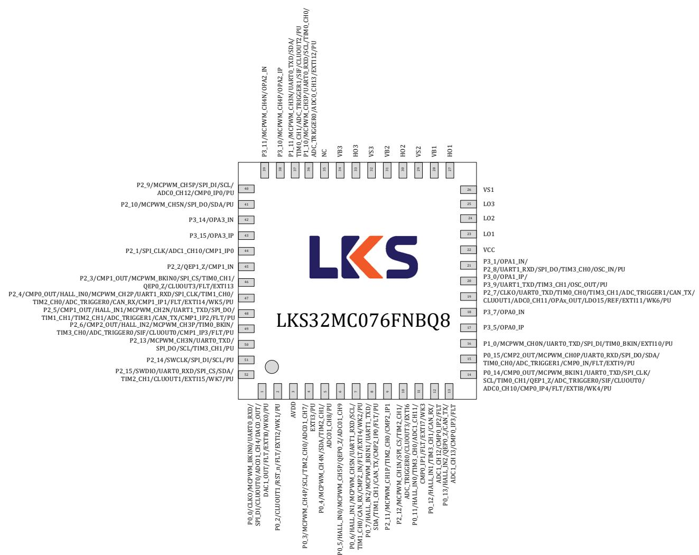  
图 3-11 LKS32MC076FNBQ8 管脚分布图

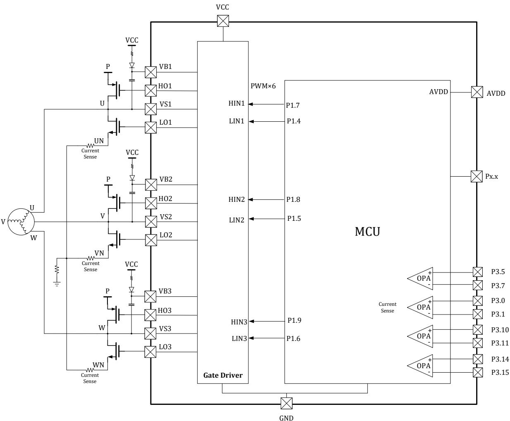  
图 3-12 LKS32MC076FNBQ8 内部预驱连接示意图

表 3-6 LKS32MC076FNBQ8 管脚说明

<table><tr><td>0</td><td>GND</td><td>腹部散热区域,为芯片 GND</td></tr><tr><td rowspan="13">1</td><td>P0_0</td><td>P0.0</td></tr><tr><td>CLKO</td><td>时钟输出(用于调试)</td></tr><tr><td>MCPWM_BKINO</td><td>PWM 停机输入信号 0</td></tr><tr><td>UART0_RXD</td><td>串口 0 接收(发送)</td></tr><tr><td>SPI_DI</td><td>SPI 数据输入(输出)</td></tr><tr><td>CLUOUT0</td><td>CLU0 输出</td></tr><tr><td>ADC01_CH4</td><td>ADC0/ADC1 通道 4</td></tr><tr><td>DAC0_OUT</td><td>DAC0 输出</td></tr><tr><td>DAC1_OUT</td><td>DAC1 输出</td></tr><tr><td>FLT</td><td>IO 滤波</td></tr><tr><td>EXTIO</td><td>外部 GPIO 中断信号 0</td></tr><tr><td>WK0</td><td>外部唤醒信号 0</td></tr><tr><td>PU</td><td>内置 10kΩ上拉电阻,软件可关闭</td></tr><tr><td rowspan="3">2</td><td>P0_2</td><td>P0.2</td></tr><tr><td>CLUOUT1</td><td>CLU1 输出</td></tr><tr><td>RST_n</td><td>复位引脚,P0.2 默认用作 RSTN。建议接一个 10nF~100nF 的电容到地,并在 RSTN和 AVDD 之间放置一个 10k~20k 的上拉电阻。如果外部有上拉电阻,RSTN 的电容应为 100nF。P0.2 可切换为 GPIO,切换后可关闭 10kΩ上拉电阻。</td></tr><tr><td rowspan="4"></td><td>FLT</td><td>IO 滤波</td></tr><tr><td>EXTI2</td><td>外部 GPIO 中断信号 2</td></tr><tr><td>WK1</td><td>外部唤醒信号 1</td></tr><tr><td>PU</td><td>内置 10kΩ上拉电阻,软件可关闭</td></tr><tr><td>3</td><td>AVDD</td><td>芯片电源,供电范围 2.5~5.5V</td></tr><tr><td rowspan="7">4</td><td>P0_3</td><td>P0.3</td></tr><tr><td>MCPWM_CH4P</td><td>PWM 通道 4 高边</td></tr><tr><td>SCL</td><td>I2C 时钟</td></tr><tr><td>TIM2_CH0</td><td>Timer2 通道 0</td></tr><tr><td>ADC01_CH7</td><td>ADC0/ADC1 通道 7</td></tr><tr><td>EXTI3</td><td>外部 GPIO 中断信号 3</td></tr><tr><td>PU</td><td>内置 10kΩ上拉电阻,软件可关闭</td></tr><tr><td rowspan="6">5</td><td>P0_4</td><td>P0.4</td></tr><tr><td>MCPWM_CH4N</td><td>PWM 通道 4 低边</td></tr><tr><td>SDA</td><td>I2C 数据</td></tr><tr><td>TIM2_CH1</td><td>Timer2 通道 1</td></tr><tr><td>ADC01_CH8</td><td>ADC0/ADC1 通道 8</td></tr><tr><td>PU</td><td>内置 10kΩ上拉电阻,软件可关闭</td></tr><tr><td rowspan="5">6</td><td>P0_5</td><td>P0.5</td></tr><tr><td>HALL_IN0</td><td>HALL 接口输入 0</td></tr><tr><td>MCPWM_CH5P</td><td>PWM 通道 5 高边</td></tr><tr><td>QEP0_Z</td><td>QEP0 编码器 Z 相</td></tr><tr><td>ADC01_CH9</td><td>ADC0/ADC1 通道 9</td></tr><tr><td rowspan="12">7</td><td>P0_6</td><td>P0.6</td></tr><tr><td>HALL_IN1</td><td>HALL 接口输入 1</td></tr><tr><td>MCPWM_CH5N</td><td>PWM 通道 5 低边</td></tr><tr><td>UART1_RXD</td><td>串口 1 接收(发送)</td></tr><tr><td>SCL</td><td>I2C 时钟</td></tr><tr><td>TIM1_CH0</td><td>Timer1 通道 0</td></tr><tr><td>CAN_RX</td><td>CAN 接收端</td></tr><tr><td>CMP2_IN</td><td>比较器 2 负端输入</td></tr><tr><td>FLT</td><td>IO 滤波</td></tr><tr><td>EXTI4</td><td>外部 GPIO 中断信号 4</td></tr><tr><td>WK2</td><td>外部唤醒信号 2</td></tr><tr><td>PU</td><td>内置 10kΩ上拉电阻,软件可关闭</td></tr><tr><td rowspan="6">8</td><td>P0_7</td><td>P0.7</td></tr><tr><td>HALL_IN2</td><td>HALL 接口输入 2</td></tr><tr><td>MCPWM_BKIN1</td><td>PWM 停机输入信号 1</td></tr><tr><td>UART1_TXD</td><td>串口 1 发送(接收)</td></tr><tr><td>SDA</td><td>I2C 数据</td></tr><tr><td>TIM1_CH1CAN_TX</td><td>Timer1 通道 1CAN 发送端</td></tr><tr><td rowspan="3"></td><td>CMP2_IP0</td><td>比较器 2 正端输入 0</td></tr><tr><td>FLT</td><td>IO 滤波</td></tr><tr><td>PU</td><td>内置  ${10}\mathrm{k}\Omega$  上拉电阻,软件可关闭</td></tr><tr><td rowspan="4">9</td><td>P2_11</td><td>P2.11</td></tr><tr><td>MCPWM_CH1P</td><td>PWM 通道 1 高边</td></tr><tr><td>TIM2_CH0</td><td>Timer2 通道 0</td></tr><tr><td>CMP2_IP1</td><td>比较器 2 正端输入 1</td></tr><tr><td rowspan="7">10</td><td>P2_12</td><td>P2.12</td></tr><tr><td>MCPWM_CH1N</td><td>PWM 通道 1 低边</td></tr><tr><td>SPI_CS</td><td>SPI 片选</td></tr><tr><td>TIM2_CH1</td><td>Timer2 通道 1</td></tr><tr><td>ADC_TRIGGER0</td><td>ADC0 触发信号输出(用于调试)</td></tr><tr><td>CLUOUT3</td><td>CLU3 输出</td></tr><tr><td>EXTI6</td><td>外部 GPIO 中断信号 6</td></tr><tr><td rowspan="8">11</td><td>P0_11</td><td>P0.11</td></tr><tr><td>HALL_IN0</td><td>HALL 接口输入 0</td></tr><tr><td>TIM3_CH0</td><td>Timer3 通道 0</td></tr><tr><td>ADC1_CH11</td><td>ADC1 通道 11</td></tr><tr><td>CMP0_IP1</td><td>比较器 0 正端输入 1</td></tr><tr><td>FLT</td><td>IO 滤波</td></tr><tr><td>EXTI7</td><td>外部 GPIO 中断信号 7</td></tr><tr><td>WK3</td><td>外部唤醒信号 3</td></tr><tr><td rowspan="7">12</td><td>P0_12</td><td>P0.12</td></tr><tr><td>HALL_IN1</td><td>HALL 接口输入 1</td></tr><tr><td>TIM3_CH1</td><td>Timer3 通道 1</td></tr><tr><td>CAN_RX</td><td>CAN 接收端</td></tr><tr><td>ADC1_CH12</td><td>ADC1 通道 12</td></tr><tr><td>CMP0_IP2</td><td>比较器 0 正端输入 2</td></tr><tr><td>FLT</td><td>IO 滤波</td></tr><tr><td rowspan="7">13</td><td>P0_13</td><td>P0.13</td></tr><tr><td>HALL_IN2</td><td>HALL 接口输入 2</td></tr><tr><td>QEP0_Z</td><td>QEP0 编码器 Z 相</td></tr><tr><td>CAN_TX</td><td>CAN 发送端</td></tr><tr><td>ADC1_CH13</td><td>ADC1 通道 13</td></tr><tr><td>CMP0_IP3</td><td>比较器 0 正端输入 3</td></tr><tr><td>FLT</td><td>IO 滤波</td></tr><tr><td rowspan="6">14</td><td>P0_14</td><td>P0.14</td></tr><tr><td>CMP0_OUT</td><td>比较器 0 输出</td></tr><tr><td>MCPWM_BKIN1</td><td>PWM 停机输入信号 1</td></tr><tr><td>UART0_TXD</td><td>串口 0 发送(接收)</td></tr><tr><td>SPI_CLK</td><td>SPI 时钟</td></tr><tr><td>SCLTIM0_CH1</td><td>I2C 时钟Timer0 通道1</td></tr><tr><td rowspan="10"></td><td>QEP1_Z</td><td>QEP1 编码器Z相</td></tr><tr><td>ADC_TRIGGER0</td><td>ADC0 触发信号输出(用于调试)</td></tr><tr><td>SIF</td><td>单线通讯</td></tr><tr><td>CLUOUT0</td><td>CLU0 输出</td></tr><tr><td>ADC0_CH10</td><td>ADC0 通道10</td></tr><tr><td>CMP0_IP4</td><td>比较器0正端输入4</td></tr><tr><td>FLT</td><td>IO 滤波</td></tr><tr><td>EXTI8</td><td>外部 GPIO 中断信号8</td></tr><tr><td>WK4</td><td>外部唤醒信号4</td></tr><tr><td>PU</td><td>内置10kΩ上拉电阻,软件可关闭</td></tr><tr><td rowspan="12">15</td><td>P0_15</td><td>P0.15</td></tr><tr><td>CMP2_OUT</td><td>比较器2输出</td></tr><tr><td>MCPWM_CHOP</td><td>PWM 通道0高边</td></tr><tr><td>UART0_RXD</td><td>串口0接收(发送)</td></tr><tr><td>SPI_DO</td><td>SPI 数据输出(输入)</td></tr><tr><td>SDA</td><td>I2C 数据</td></tr><tr><td>TIM0_CH0</td><td>Timer0 通道0</td></tr><tr><td>ADC_TRIGGER1</td><td>ADC1 触发信号输出(用于调试)</td></tr><tr><td>CMP0_IN</td><td>比较器0负端输入</td></tr><tr><td>FLT</td><td>IO 滤波</td></tr><tr><td>EXTI9</td><td>外部 GPIO 中断信号9</td></tr><tr><td>PU</td><td>内置10kΩ上拉电阻,软件可关闭</td></tr><tr><td rowspan="7">16</td><td>P1_0</td><td>P1.0</td></tr><tr><td>MCPWM_CHON</td><td>PWM 通道0低边</td></tr><tr><td>UART0_TXD</td><td>串口0发送(接收)</td></tr><tr><td>SPI_DI</td><td>SPI 数据输入(输出)</td></tr><tr><td>TIM0_BKIN</td><td>TIMER0_FAIL 信号来自 GPIO</td></tr><tr><td>EXTI10</td><td>外部 GPIO 中断信号10</td></tr><tr><td>PU</td><td>内置10kΩ上拉电阻,软件可关闭</td></tr><tr><td rowspan="2">17</td><td>P3_5</td><td>P3.5</td></tr><tr><td>OPA0_IP</td><td>运放0正端输入</td></tr><tr><td rowspan="2">18</td><td>P3_7</td><td>P3.7</td></tr><tr><td>OPA0_IN</td><td>运放0负端输入</td></tr><tr><td rowspan="9">19</td><td>P2_7</td><td>P2.7</td></tr><tr><td>CLKO</td><td>时钟输出(用于调试)</td></tr><tr><td>UART0_TXD</td><td>串口0发送(接收)</td></tr><tr><td>TIM0_CH0</td><td>Timer0 通道0</td></tr><tr><td>TIM3_CH1</td><td>Timer3 通道1</td></tr><tr><td>ADC_TRIGGER1</td><td>ADC1 触发信号输出(用于调试)</td></tr><tr><td>CLUOUT1</td><td>CLU1 输出</td></tr><tr><td>ADC0_CH11</td><td>ADC0 通道11</td></tr><tr><td>CAN_TXOPAx_OUT</td><td>CAN 发送端运放输出</td></tr><tr><td rowspan="5"></td><td>LDO15</td><td>1.5V LDO 输出</td></tr><tr><td>REF</td><td>参考电压</td></tr><tr><td>EXTI11</td><td>外部 GPIO 中断信号 11</td></tr><tr><td>WK6</td><td>外部唤醒信号 6</td></tr><tr><td>PU</td><td>内置 10kΩ上拉电阻,软件可关闭</td></tr><tr><td rowspan="7">20</td><td>P3_0</td><td>P3.0</td></tr><tr><td>OPA1_IP</td><td>运放 1 正端输入</td></tr><tr><td>P3_9</td><td>P3.9</td></tr><tr><td>UART1_TXD</td><td>串口 1 发送(接收)</td></tr><tr><td>TIM3_CH1</td><td>Timer3 通道 1</td></tr><tr><td>OSC_OUT</td><td>外部晶振引脚</td></tr><tr><td>PU</td><td>内置 10kΩ上拉电阻,软件可关闭</td></tr><tr><td rowspan="8">21</td><td>P3_1</td><td>P3.1</td></tr><tr><td>OPA1_IN</td><td>运放 1 负端输入</td></tr><tr><td>P2_8</td><td>P2.8</td></tr><tr><td>UART1_RXD</td><td>串口 1 接收(发送)</td></tr><tr><td>SPI_DO</td><td>SPI 数据输出(输入)</td></tr><tr><td>TIM3_CH0</td><td>Timer3 通道 0</td></tr><tr><td>OSC_IN</td><td>外部晶振引脚</td></tr><tr><td>PU</td><td>内置 10kΩ上拉电阻,软件可关闭</td></tr><tr><td>22</td><td>VCC</td><td>全桥驱动电源</td></tr><tr><td>23</td><td>LO1</td><td>低侧栅极驱动信号输出 1,由 MCU P1.4 控制,LO1 极性与 P1.4 相同,即 P1.4=1 时,LO1=1,需要设置 PWM_SWAP=1</td></tr><tr><td>24</td><td>LO2</td><td>低侧栅极驱动信号输出 2,由 MCU P1.5 控制,LO2 极性与 P1.5 相同,即 P1.5=1 时,LO2=1,需要设置 PWM_SWAP=1</td></tr><tr><td>25</td><td>LO3</td><td>低侧栅极驱动信号输出 3,由 MCU P1.6 控制,LO3 极性与 P1.6 相同,即 P1.6=1 时,LO3=1,需要设置 PWM_SWAP=1</td></tr><tr><td>26</td><td>VS1</td><td>高边浮动偏置电压 1</td></tr><tr><td>27</td><td>HO1</td><td>高侧栅极驱动信号输出 1,由 MCU P1.7 控制,HO1 极性与 P1.7 相同,即 P1.7=1 时,HO1=1,需要设置 PWM_SWAP=1</td></tr><tr><td>28</td><td>VB1</td><td>高边浮动电源电压 1</td></tr><tr><td>29</td><td>VS2</td><td>高边浮动偏置电压 2</td></tr><tr><td>30</td><td>HO2</td><td>高侧栅极驱动信号输出 2,由 MCU P1.8 控制,HO2 极性与 P1.8 相同,即 P1.8=1 时,HO2=1,需要设置 PWM_SWAP=1</td></tr><tr><td>31</td><td>VB2</td><td>高边浮动电源电压 2</td></tr><tr><td>32</td><td>VS3</td><td>高边浮动偏置电压 3</td></tr><tr><td>33</td><td>HO3</td><td>高侧栅极驱动信号输出 3,由 MCU P1.9 控制,HO3 极性与 P1.9 相同,即 P1.9=1 时,HO3=1,需要设置 PWM_SWAP=1</td></tr><tr><td>34</td><td>VB3</td><td>高边浮动电源电压 3</td></tr><tr><td>35</td><td>NC</td><td>不连接</td></tr><tr><td rowspan="2">36</td><td>P1_10</td><td>P1.10</td></tr><tr><td>MCPWM_CH3PUART0_RXD</td><td>PWM 通道 3 高边串口0接收(发送)</td></tr><tr><td rowspan="6"></td><td>SCL</td><td>I2C时钟</td></tr><tr><td>TIM0_CH0</td><td>Timer0通道0</td></tr><tr><td>ADC_TRIGGER0</td><td>ADC0触发信号输出(用于调试)</td></tr><tr><td>ADC0_CH13</td><td>ADC0通道13</td></tr><tr><td>EXTI12</td><td>外部GPIO中断信号12</td></tr><tr><td>PU</td><td>内置10kΩ上拉电阻,软件可关闭</td></tr><tr><td rowspan="9">37</td><td>P1_11</td><td>P1.11</td></tr><tr><td>MCPWM_CH3N</td><td>PWM通道3低边</td></tr><tr><td>UART0_TXD</td><td>串口0发送(接收)</td></tr><tr><td>SDA</td><td>I2C数据</td></tr><tr><td>TIM0_CH1</td><td>Timer0通道1</td></tr><tr><td>ADC_TRIGGER1</td><td>ADC1触发信号输出(用于调试)</td></tr><tr><td>SIF</td><td>单线通讯</td></tr><tr><td>CLUOUT2</td><td>CLU2输出</td></tr><tr><td>PU</td><td>内置10kΩ上拉电阻,软件可关闭</td></tr><tr><td rowspan="3">38</td><td>P3_10</td><td>P3.10</td></tr><tr><td>MCPWM_CH4P</td><td>PWM通道4高边</td></tr><tr><td>OPA2_IP</td><td>运放2正端输入</td></tr><tr><td rowspan="3">39</td><td>P3_11</td><td>P3.11</td></tr><tr><td>MCPWM_CH4N</td><td>PWM通道4低边</td></tr><tr><td>OPA2_IN</td><td>运放2负端输入</td></tr><tr><td rowspan="7">40</td><td>P2_9</td><td>P2.9</td></tr><tr><td>MCPWM_CH5P</td><td>PWM通道5高边</td></tr><tr><td>SPI_DI</td><td>SPI数据输入(输出)</td></tr><tr><td>SCL</td><td>I2C时钟</td></tr><tr><td>ADC0_CH12</td><td>ADC0通道12</td></tr><tr><td>CMP0_IP0</td><td>比较器0正端输入0</td></tr><tr><td>PU</td><td>内置10kΩ上拉电阻,软件可关闭</td></tr><tr><td rowspan="5">41</td><td>P2_10</td><td>P2.10</td></tr><tr><td>MCPWM_CH5N</td><td>PWM通道5低边</td></tr><tr><td>SPI_DO</td><td>SPI数据输出(输入)</td></tr><tr><td>SDA</td><td>I2C数据</td></tr><tr><td>PU</td><td>内置10kΩ上拉电阻,软件可关闭</td></tr><tr><td rowspan="2">42</td><td>P3_14</td><td>P3.14</td></tr><tr><td>OPA3_IN</td><td>运放3负端输入</td></tr><tr><td rowspan="2">43</td><td>P3_15</td><td>P3.15</td></tr><tr><td>OPA3_IP</td><td>运放3正端输入</td></tr><tr><td rowspan="4">44</td><td>P2_1</td><td>P2.1</td></tr><tr><td>SPI_CLK</td><td>SPI时钟</td></tr><tr><td>ADC1_CH10</td><td>ADC1通道10</td></tr><tr><td>CMP1_IP0</td><td>比较器1正端输入0</td></tr><tr><td>45</td><td>P2_2QEP1_Z</td><td>P2.2QEP1 编码器 Z 相</td></tr><tr><td></td><td>CMP1_IN</td><td>比较器 1 负端输入</td></tr><tr><td rowspan="9">46</td><td>P2_3</td><td>P2.3</td></tr><tr><td>CMP1_OUT</td><td>比较器 1 输出</td></tr><tr><td>MCPWM_BKIN0</td><td>PWM 停机输入信号 0</td></tr><tr><td>SPI_CS</td><td>SPI 片选</td></tr><tr><td>TIM0_CH1</td><td>Timer0 通道 1</td></tr><tr><td>QEP0_Z</td><td>QEP0 编码器 Z 相</td></tr><tr><td>CLUOUT3</td><td>CLU3 输出</td></tr><tr><td>FLT</td><td>IO 滤波</td></tr><tr><td>EXTI13</td><td>外部 GPIO 中断信号 13</td></tr><tr><td rowspan="15">47</td><td>P2_4</td><td>P2.4</td></tr><tr><td>CMP0_OUT</td><td>比较器 0 输出</td></tr><tr><td>HALL_IN0</td><td>HALL 接口输入 0</td></tr><tr><td>MCPWM_CH2P</td><td>PWM 通道 2 高边</td></tr><tr><td>UART1_RXD</td><td>串口 1 接收(发送)</td></tr><tr><td>SPI_CLK</td><td>SPI 时钟</td></tr><tr><td>TIM1_CH0</td><td>Timer1 通道 0</td></tr><tr><td>TIM2_CH0</td><td>Timer2 通道 0</td></tr><tr><td>ADC_TRIGGER0</td><td>ADC0 触发信号输出(用于调试)</td></tr><tr><td>CAN_RX</td><td>CAN 接收端</td></tr><tr><td>CMP1_IP1</td><td>比较器 1 正端输入 1</td></tr><tr><td>FLT</td><td>IO 滤波</td></tr><tr><td>EXTI14</td><td>外部 GPIO 中断信号 14</td></tr><tr><td>WK5</td><td>外部唤醒信号 5</td></tr><tr><td>PU</td><td>内置  ${10}\mathrm{k}\Omega$  上拉电阻,软件可关闭</td></tr><tr><td rowspan="13">48</td><td>P2_5</td><td>P2.5</td></tr><tr><td>CMP1_OUT</td><td>比较器 1 输出</td></tr><tr><td>HALL_IN1</td><td>HALL 接口输入 1</td></tr><tr><td>MCPWM_CH2N</td><td>PWM 通道 2 低边</td></tr><tr><td>UART1_TXD</td><td>串口 1 发送(接收)</td></tr><tr><td>SPI_DO</td><td>SPI 数据输出(输入)</td></tr><tr><td>TIM1_CH1</td><td>Timer1 通道 1</td></tr><tr><td>TIM2_CH1</td><td>Timer2 通道 1</td></tr><tr><td>ADC_TRIGGER1</td><td>ADC1 触发信号输出(用于调试)</td></tr><tr><td>CAN_TX</td><td>CAN 发送端</td></tr><tr><td>CMP1_IP2</td><td>比较器 1 正端输入 2</td></tr><tr><td>FLT</td><td>IO 滤波</td></tr><tr><td>PU</td><td>内置  ${10}\mathrm{k}\Omega$  上拉电阻,软件可关闭</td></tr><tr><td rowspan="4">49</td><td>P2_6</td><td>P2.6</td></tr><tr><td>CMP2_OUT</td><td>比较器 2 输出</td></tr><tr><td>HALL_IN2</td><td>HALL 接口输入 2</td></tr><tr><td>MCPWM_CH3PTIM0_BKIN</td><td>PWM 通道 3 高边TIMER0_FAIL 信号来自 GPIO</td></tr><tr><td rowspan="7"></td><td>TIM3_CH0</td><td>Timer3 通道 0</td></tr><tr><td>ADC_TRIGGER0</td><td>ADC0 触发信号输出(用于调试)</td></tr><tr><td>SIF</td><td>单线通讯</td></tr><tr><td>CLUOUT0</td><td>CLU0 输出</td></tr><tr><td>CMP1_IP3</td><td>比较器 1 正端输入 3</td></tr><tr><td>FLT</td><td>IO 滤波</td></tr><tr><td>PU</td><td>内置 10kΩ上拉电阻,软件可关闭</td></tr><tr><td rowspan="7">50</td><td>P2_13</td><td>P2.13</td></tr><tr><td>MCPWM_CH3N</td><td>PWM 通道 3 低边</td></tr><tr><td>UART0_TXD</td><td>串口 0 发送(接收)</td></tr><tr><td>SPI_DO</td><td>SPI 数据输出(输入)</td></tr><tr><td>SCL</td><td>I2C 时钟</td></tr><tr><td>TIM3_CH1</td><td>Timer3 通道 1</td></tr><tr><td>PU</td><td>内置 10kΩ上拉电阻,软件可关闭</td></tr><tr><td rowspan="5">51</td><td>P2_14</td><td>P2.14</td></tr><tr><td>SWCLK</td><td>SWD 时钟</td></tr><tr><td>SPI_DI</td><td>SPI 数据输入(输出)</td></tr><tr><td>SCL</td><td>I2C 时钟</td></tr><tr><td>PU</td><td>内置 10kΩ上拉电阻,软件可关闭</td></tr><tr><td rowspan="10">52</td><td>P2_15</td><td>P2.15</td></tr><tr><td>SWDIO</td><td>SWD 数据</td></tr><tr><td>UART0_RXD</td><td>串口 0 接收(发送)</td></tr><tr><td>SPI_CS</td><td>SPI 片选</td></tr><tr><td>SDA</td><td>I2C 数据</td></tr><tr><td>TIM2_CH1</td><td>Timer2 通道 1</td></tr><tr><td>CLUOUT1</td><td>CLU1 输出</td></tr><tr><td>EXTI15</td><td>外部 GPIO 中断信号 15</td></tr><tr><td>WK7</td><td>外部唤醒信号 7</td></tr><tr><td>PU</td><td>内置 10kΩ上拉电阻,软件可关闭</td></tr></table>

## 3.2 管脚复用功能说明

表 3-7 LKS32MC07X 引脚复用功能选择

<table><tr><td>Port</td><td>AF1</td><td>AF2</td><td>AF3</td><td>AF4</td><td>AF5</td><td>AF6</td><td>AF7</td><td>AF8</td><td>AF9</td><td>AF10</td><td>AF11</td><td>AF12</td><td>AF0</td></tr><tr><td>P0.0</td><td>CLKO</td><td></td><td>MCPWM_BKIN0</td><td>UART0_RXD</td><td>SPI_DI</td><td></td><td></td><td></td><td></td><td></td><td></td><td>CLUOUT0</td><td>ADC01_CH4/DAC0_OUT/DAC1_OUT</td></tr><tr><td>P0.1</td><td></td><td></td><td></td><td></td><td></td><td></td><td></td><td></td><td></td><td></td><td></td><td></td><td>ADC01_CH6</td></tr><tr><td>P0.2</td><td></td><td></td><td></td><td></td><td></td><td></td><td></td><td></td><td></td><td></td><td></td><td>CLUOUT1</td><td></td></tr><tr><td>P0.3</td><td></td><td></td><td>MCPWM_CH4P</td><td></td><td></td><td>SCL</td><td></td><td>TIM2_CH0</td><td></td><td></td><td></td><td></td><td>ADC01_CH7</td></tr><tr><td>P0.4</td><td></td><td></td><td>MCPWM_CH4N</td><td></td><td></td><td>SDA</td><td></td><td>TIM2_CH1</td><td></td><td></td><td></td><td></td><td>ADC01_CH8</td></tr><tr><td>P0.5</td><td></td><td>HALL_IN0</td><td>MCPWM_CH5P</td><td></td><td></td><td></td><td></td><td>QEP0_Z</td><td></td><td></td><td></td><td></td><td>ADC01_CH9</td></tr><tr><td>P0.6</td><td></td><td>HALL_IN1</td><td>MCPWM_CH5N</td><td>UART1_RXD</td><td></td><td>SCL</td><td>TIM1_CH0</td><td></td><td></td><td>CAN_RX</td><td></td><td></td><td>CMP2_IN</td></tr><tr><td>P0.7</td><td></td><td>HALL_IN2</td><td>MCPWM_BKIN1</td><td>UART1_TXD</td><td></td><td>SDA</td><td>TIM1_CH1</td><td></td><td></td><td>CAN_TX</td><td></td><td></td><td>CMP2_IP0</td></tr><tr><td>P0.8</td><td></td><td></td><td></td><td></td><td></td><td></td><td></td><td></td><td></td><td></td><td></td><td></td><td></td></tr><tr><td>P0.9</td><td></td><td></td><td></td><td></td><td></td><td>SCL</td><td></td><td>TIM2_CH0</td><td></td><td></td><td></td><td></td><td></td></tr><tr><td>P0.10</td><td></td><td></td><td></td><td></td><td></td><td>SDA</td><td></td><td>TIM2_CH1</td><td></td><td></td><td></td><td></td><td></td></tr><tr><td>P0.11</td><td></td><td>HALL_IN0</td><td></td><td></td><td></td><td></td><td></td><td>TIM3_CH0</td><td></td><td></td><td></td><td></td><td>ADC1_CH11/CMP0_IP1</td></tr><tr><td>P0.12</td><td></td><td>HALL_IN1</td><td></td><td></td><td></td><td></td><td></td><td>TIM3_CH1</td><td></td><td>CAN_RX</td><td></td><td></td><td>ADC1_CH12/CMP0_IP2</td></tr><tr><td>P0.13</td><td></td><td>HALL_IN2</td><td></td><td></td><td></td><td></td><td></td><td>QEP0_Z</td><td></td><td>CAN_TX</td><td></td><td></td><td>ADC1_CH13/CMP0_IP3</td></tr><tr><td>P0.14</td><td>CMP0_OUT</td><td></td><td>MCPWM_BKIN1</td><td>UART0_TXD</td><td>SPI_CLK</td><td>SCL</td><td>TIM0_CH1</td><td>QEP1_Z</td><td>ADC_TRIGGER0</td><td></td><td>SIF</td><td>CLUOUT0</td><td>ADC0_CH10/CMP0_IP4</td></tr><tr><td>P0.15</td><td>CMP2_OUT</td><td></td><td>MCPWM_CHOP</td><td>UART0_RXD</td><td>SPI_DO</td><td>SDA</td><td>TIM0_CH0</td><td></td><td>ADC_TRIGGER1</td><td></td><td></td><td></td><td>CMP0_IN</td></tr><tr><td>P1.0</td><td></td><td></td><td>MCPWM_CH0N</td><td>UART0_TXD</td><td>SPI_DI</td><td></td><td>TIM0_BKIN</td><td></td><td></td><td></td><td></td><td></td><td></td></tr><tr><td>P1.1</td><td></td><td></td><td></td><td></td><td>SPI_CS</td><td></td><td></td><td></td><td></td><td></td><td></td><td></td><td></td></tr><tr><td>P1.2</td><td></td><td></td><td></td><td></td><td></td><td></td><td></td><td>TIM3_CH0</td><td></td><td></td><td></td><td></td><td></td></tr><tr><td>P1.3</td><td></td><td></td><td></td><td></td><td></td><td></td><td></td><td>TIM3_CH1</td><td></td><td></td><td></td><td></td><td>ADC01_CH5</td></tr><tr><td>P1.4</td><td></td><td></td><td>MCPWM_CH0P</td><td></td><td></td><td></td><td></td><td>QEP0_Z</td><td></td><td></td><td></td><td></td><td></td></tr><tr><td>P1.5</td><td></td><td></td><td>MCPWM_CH0N</td><td></td><td></td><td></td><td></td><td></td><td></td><td></td><td></td><td></td><td></td></tr><tr><td>P1.6</td><td></td><td></td><td>MCPWM_CH1P</td><td></td><td></td><td></td><td></td><td></td><td></td><td></td><td></td><td></td><td></td></tr><tr><td>P1.7</td><td></td><td></td><td>MCPWM_CH1N</td><td></td><td></td><td></td><td></td><td></td><td></td><td></td><td></td><td></td><td></td></tr><tr><td>P1.8</td><td></td><td></td><td>MCPWM_CH2P</td><td></td><td></td><td></td><td></td><td></td><td></td><td></td><td></td><td></td><td></td></tr><tr><td>P1.9</td><td></td><td></td><td>MCPWM_CH2N</td><td></td><td></td><td></td><td></td><td></td><td></td><td></td><td></td><td></td><td></td></tr><tr><td>P1.10</td><td></td><td></td><td>MCPWM_CH3P</td><td>UART0_RXD</td><td></td><td>SCL</td><td>TIM0_CH0</td><td></td><td>ADC_TRIGGER0</td><td></td><td></td><td></td><td>ADC0_CH13</td></tr><tr><td>P1.11</td><td></td><td></td><td>MCPWM_CH3N</td><td>UART0_TXD</td><td></td><td>SDA</td><td>TIM0_CH1</td><td></td><td>ADC_TRIGGER1</td><td></td><td>SIF</td><td>CLUOUT2</td><td></td></tr><tr><td>P1.12</td><td></td><td></td><td></td><td></td><td></td><td></td><td></td><td></td><td></td><td></td><td></td><td></td><td></td></tr><tr><td>P1.13</td><td></td><td></td><td>MCPWM_CH5P</td><td></td><td>SPI_CLK</td><td></td><td>TIM0_CH0</td><td></td><td></td><td></td><td></td><td></td><td></td></tr><tr><td>P1.14</td><td></td><td></td><td>MCPWM_CH5N</td><td></td><td>SPI_DO</td><td></td><td>TIM0_CH1</td><td></td><td></td><td></td><td></td><td></td><td></td></tr><tr><td>P1.15</td><td></td><td></td><td>MCPWM_CH4P</td><td></td><td>SPI_DI</td><td></td><td></td><td>TIM2_CH0</td><td></td><td></td><td></td><td></td><td></td></tr><tr><td>P2.0</td><td></td><td></td><td>MCPWM_CH4N</td><td></td><td>SPI_CS</td><td></td><td></td><td>TIM2_CH1</td><td></td><td></td><td></td><td></td><td></td></tr><tr><td>P2.1</td><td></td><td></td><td></td><td></td><td>SPI_CLK</td><td></td><td></td><td></td><td></td><td></td><td></td><td></td><td>ADC1_CH10/CMP1_IP0</td></tr><tr><td>P2.2</td><td></td><td></td><td></td><td></td><td></td><td></td><td></td><td>QEP1_Z</td><td></td><td></td><td></td><td></td><td>CMP1_IN</td></tr><tr><td>P2.3</td><td>CMP1_OUT</td><td></td><td>MCPWM_BKIN0</td><td></td><td>SPI_CS</td><td></td><td>TIM0_CH1</td><td>QEP0_Z</td><td></td><td></td><td></td><td>CLUOUT3</td><td></td></tr><tr><td>P2.4</td><td>CMP0_OUT</td><td>HALL_IN0</td><td>MCPWM_CH2P</td><td>UART1_RXD</td><td>SPI_CLK</td><td></td><td>TIM1_CH0</td><td>TIM2_CH0</td><td>ADC_TRIGGER0</td><td>CAN_RX</td><td></td><td></td><td>CMP1_IP1</td></tr><tr><td>P2.5</td><td>CMP1_OUT</td><td>HALL_IN1</td><td>MCPWM_CH2N</td><td>UART1_TXD</td><td>SPI_DO</td><td></td><td>TIM1_CH1</td><td>TIM2_CH1</td><td>ADC_TRIGGER1</td><td>CAN_TX</td><td></td><td></td><td>CMP1_IP2</td></tr><tr><td>P2.6</td><td>CMP2_OUT</td><td>HALL_IN2</td><td>MCPWM_CH3P</td><td></td><td></td><td></td><td>TIM0_BKIN</td><td>TIM3_CH0</td><td>ADC_TRIGGER0</td><td></td><td>SIF</td><td>CLUOUT0</td><td>CMP1_IP3</td></tr><tr><td>P2.7</td><td>CLKO</td><td></td><td></td><td>UART0_TXD</td><td></td><td></td><td>TIM0_CH0</td><td>TIM3_CH1</td><td>ADC_TRIGGER1</td><td>CAN_TX</td><td></td><td>CLUOUT1</td><td>ADC0_CH11/OPAx_OUT/LDO15/REF</td></tr><tr><td>P2.8</td><td></td><td></td><td></td><td>UART1_RXD</td><td>SPI_DO</td><td></td><td></td><td>TIM3_CH0</td><td></td><td></td><td></td><td></td><td>OSC_IN</td></tr><tr><td>P2.9</td><td></td><td></td><td>MCPWM_CH5P</td><td></td><td>SPI_DI</td><td>SCL</td><td></td><td></td><td></td><td></td><td></td><td></td><td>ADC0_CH12/CMP0_IP0</td></tr><tr><td>P2.10</td><td></td><td></td><td>MCPWM_CH5N</td><td></td><td>SPI_DO</td><td>SDA</td><td></td><td></td><td></td><td></td><td></td><td></td><td></td></tr><tr><td>P2.11</td><td></td><td></td><td>MCPWM_CH1P</td><td></td><td></td><td></td><td></td><td>TIM2_CH0</td><td></td><td></td><td></td><td></td><td>CMP2_IP1</td></tr><tr><td>P2.12</td><td></td><td></td><td>MCPWM_CH1N</td><td></td><td>SPI_CS</td><td></td><td></td><td>TIM2_CH1</td><td>ADC_TRIGGER0</td><td></td><td></td><td>CLUOUT3</td><td></td></tr><tr><td>P2.13</td><td></td><td></td><td>MCPWM_CH3N</td><td>UART0_TXD</td><td>SPI_DO</td><td>SCL</td><td></td><td>TIM3_CH1</td><td></td><td></td><td></td><td></td><td></td></tr><tr><td>P2.14</td><td>SWCLK</td><td></td><td></td><td></td><td>SPI_DI</td><td>SCL</td><td></td><td></td><td></td><td></td><td></td><td></td><td></td></tr><tr><td>P2.15</td><td>SWDIO</td><td></td><td></td><td>UART0_RXD</td><td>SPI_CS</td><td>SDA</td><td></td><td>TIM2_CH1</td><td></td><td></td><td></td><td>CLUOUT1</td><td></td></tr><tr><td>P3.0</td><td></td><td></td><td></td><td></td><td></td><td></td><td></td><td></td><td></td><td></td><td></td><td></td><td>OPA1_IP</td></tr><tr><td>P3.1</td><td></td><td></td><td></td><td></td><td></td><td></td><td></td><td></td><td></td><td></td><td></td><td></td><td>OPA1_IN</td></tr><tr><td>P3.2</td><td></td><td></td><td>MCPWM_CH3P</td><td></td><td></td><td></td><td></td><td></td><td></td><td></td><td></td><td>CLUOUT2</td><td></td></tr><tr><td>P3.3</td><td></td><td></td><td></td><td></td><td></td><td></td><td></td><td></td><td></td><td></td><td></td><td></td><td></td></tr><tr><td>P3.4</td><td></td><td></td><td>MCPWM_CH3N</td><td></td><td></td><td></td><td></td><td></td><td></td><td></td><td></td><td></td><td></td></tr><tr><td>P3.5</td><td></td><td></td><td></td><td></td><td></td><td></td><td></td><td></td><td></td><td></td><td></td><td></td><td>OPA0_IP</td></tr><tr><td>P3.6</td><td></td><td></td><td></td><td></td><td></td><td></td><td></td><td></td><td></td><td></td><td></td><td></td><td></td></tr><tr><td>P3.7</td><td></td><td></td><td></td><td></td><td></td><td></td><td></td><td></td><td></td><td></td><td></td><td></td><td>OPA0_IN</td></tr><tr><td>P3.8</td><td></td><td></td><td></td><td></td><td></td><td></td><td></td><td></td><td></td><td></td><td></td><td></td><td></td></tr><tr><td>P3.9</td><td></td><td></td><td></td><td>UART1_TXD</td><td></td><td></td><td></td><td>TIM3_CH1</td><td></td><td></td><td></td><td></td><td>OSC_OUT</td></tr><tr><td>P3.10</td><td></td><td></td><td>MCPWM_CH4P</td><td></td><td></td><td></td><td></td><td></td><td></td><td></td><td></td><td></td><td>OPA2_IP</td></tr><tr><td>P3.11</td><td></td><td></td><td>MCPWM_CH4N</td><td></td><td></td><td></td><td></td><td></td><td></td><td></td><td></td><td></td><td>OPA2_IN</td></tr><tr><td>P3.12</td><td></td><td></td><td></td><td></td><td></td><td></td><td></td><td></td><td></td><td></td><td></td><td></td><td></td></tr><tr><td>P3.13</td><td></td><td></td><td></td><td></td><td></td><td></td><td></td><td></td><td></td><td></td><td></td><td></td><td></td></tr><tr><td>P3.14</td><td></td><td></td><td></td><td></td><td></td><td></td><td></td><td></td><td></td><td></td><td></td><td></td><td>OPA3_IN</td></tr><tr><td>P3.15</td><td></td><td></td><td></td><td></td><td></td><td></td><td></td><td></td><td></td><td></td><td></td><td></td><td>OPA3_IP</td></tr></table>

对于所有带预驱的MCU，需要将 MCPWM0\_SWAP 统一配置为1。以P0.3引脚为例，芯片上电后默认映射为CH4P 通道；当MCPWM0\_SWAP置 1后，该引脚将切换为 CH5N 通道。所有引脚的复用功能标注均以 MCPWM0\_SWAP=1的配置状态为准。

## 4 封装尺寸

## 4.1 LKS32MC070FLRBT8

LQFP64 Profile Quad Flat Package:  
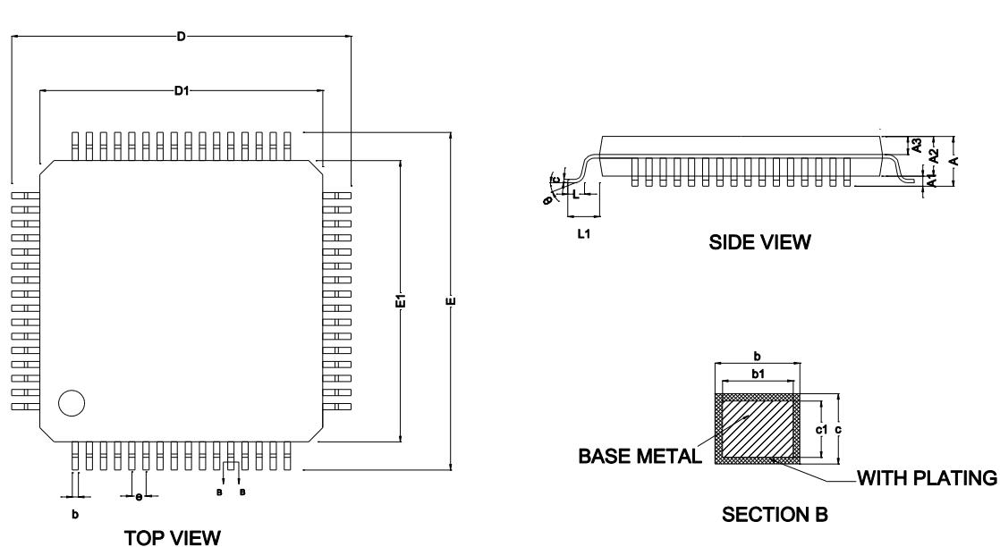  
图 4-1 LKS32MC070FLRBT8 封装图示

表 4-1 LKS32MC070FLRBT8 封装尺寸

<table><tr><td rowspan="2">SYMBOL</td><td colspan="3">MILLIMETER</td></tr><tr><td>MIN</td><td>NOM</td><td>MAX</td></tr><tr><td>A</td><td>-</td><td>-</td><td>1.60</td></tr><tr><td>A1</td><td>0.05</td><td>-</td><td>0.15</td></tr><tr><td>A2</td><td>1.35</td><td>1.40</td><td>1.45</td></tr><tr><td>A3</td><td>0.59</td><td>0.64</td><td>0.69</td></tr><tr><td>b</td><td>0.18</td><td>-</td><td>0.26</td></tr><tr><td>b1</td><td>0.17</td><td>0.20</td><td>0.23</td></tr><tr><td>c</td><td>0.13</td><td>-</td><td>0.17</td></tr><tr><td>c1</td><td>0.12</td><td>0.13</td><td>0.14</td></tr><tr><td>D</td><td>11.80</td><td>12.00</td><td>12.20</td></tr><tr><td>D1</td><td>9.90</td><td>10.00</td><td>10.10</td></tr><tr><td>E</td><td>11.80</td><td>12.00</td><td>12.20</td></tr><tr><td>E1</td><td>9.90</td><td>10.00</td><td>10.10</td></tr><tr><td>e</td><td colspan="3">0.50BSC</td></tr><tr><td>L</td><td>0.45</td><td>-</td><td>0.75</td></tr><tr><td>L1</td><td colspan="3">1.00REF</td></tr><tr><td>θ</td><td>0</td><td>-</td><td>7°</td></tr></table>

TOP VIEW

## 4.2 LKS32MC071DOC8T8

TQFP48 Profile Quad Flat Package:  
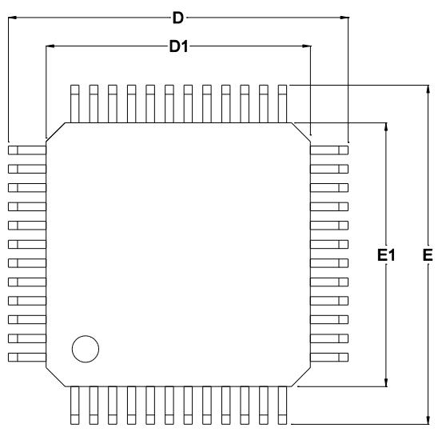

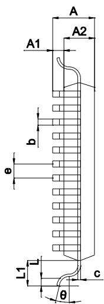

图 4-2 LKS32MC071DOC8T8 封装图示  
表 4-2 LKS32MC071DOC8T8 封装尺寸

<table><tr><td rowspan="2">SYMBOL</td><td colspan="3">MILLIMETER</td></tr><tr><td>MIN</td><td>NOM</td><td>MAX</td></tr><tr><td>A</td><td>-</td><td>-</td><td>1.20</td></tr><tr><td>A1</td><td>0.05</td><td>-</td><td>0.15</td></tr><tr><td>A2</td><td>0.95</td><td>1.00</td><td>1.05</td></tr><tr><td>b</td><td>0.18</td><td>0.22</td><td>0.26</td></tr><tr><td>c</td><td>0.13</td><td>-</td><td>0.17</td></tr><tr><td>D</td><td>8.80</td><td>9.00</td><td>9.20</td></tr><tr><td>D1</td><td>6.90</td><td>7.00</td><td>7.10</td></tr><tr><td>E</td><td>8.80</td><td>9.00</td><td>9.20</td></tr><tr><td>E1</td><td>6.90</td><td>7.00</td><td>7.10</td></tr><tr><td>e</td><td>-</td><td>0.50</td><td>-</td></tr><tr><td>θ</td><td>0°</td><td>3.5°</td><td>7°</td></tr><tr><td>L</td><td>0.45</td><td>0.60</td><td>0.75</td></tr><tr><td>L1</td><td>-</td><td>1.00</td><td>-</td></tr></table>

## 4.3 LKS32MC074DF8Q8/LKS32MC074DOF8Q8/LKS32MC074FF8Q8

QFN5\*5 40L-0.75 Profile Quad Flat Package:

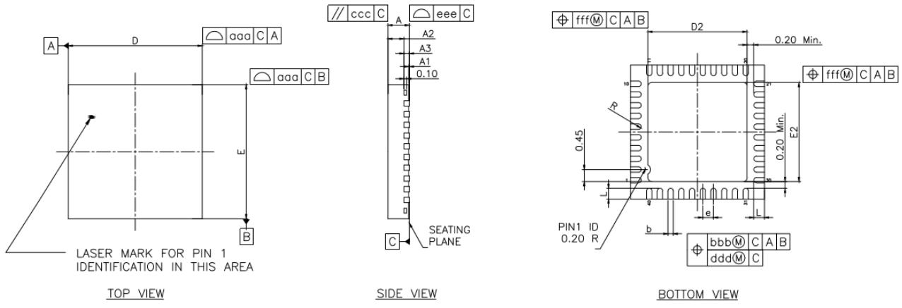  
图 4-3 LKS32MC074DF8Q8/ LKS32MC074DOF8Q8 封装图示

表 4-3 LKS32MC074DF8Q8/ LKS32MC074DOF8Q8 封装尺寸

<table><tr><td rowspan="2">SYMBOL</td><td colspan="3">MILLIMETER</td><td colspan="3">INCH</td></tr><tr><td>MIN.</td><td>NOM.</td><td>MAX.</td><td>MIN.</td><td>NOM.</td><td>MAX.</td></tr><tr><td>A</td><td>0.70</td><td>0.75</td><td>0.80</td><td>0.028</td><td>0.030</td><td>0.032</td></tr><tr><td>A1</td><td>0.00</td><td>0.02</td><td>0.05</td><td>0.000</td><td>0.0008</td><td>0.002</td></tr><tr><td>A2</td><td>0.50</td><td>0.55</td><td>0.75</td><td>0.020</td><td>0.022</td><td>0.030</td></tr><tr><td>A3</td><td colspan="3">0.2 REF</td><td colspan="3">0.008 REF</td></tr><tr><td>b</td><td>0.15</td><td>0.20</td><td>0.25</td><td>0.006</td><td>0.008</td><td>0.010</td></tr><tr><td>D</td><td>4.90</td><td>5.00</td><td>5.10</td><td>0.193</td><td>0.197</td><td>0.201</td></tr><tr><td>D2</td><td>3.20</td><td>3.70</td><td>3.80</td><td>0.126</td><td>0.146</td><td>0.150</td></tr><tr><td>E</td><td>4.90</td><td>5.00</td><td>5.10</td><td>0.193</td><td>0.197</td><td>0.201</td></tr><tr><td>E2</td><td>3.20</td><td>3.70</td><td>3.80</td><td>0.126</td><td>0.146</td><td>0.150</td></tr><tr><td>L</td><td>0.30</td><td>0.40</td><td>0.50</td><td>0.012</td><td>0.016</td><td>0.020</td></tr><tr><td>e</td><td colspan="3">0.4 bsc</td><td colspan="3">0.016 bsc</td></tr><tr><td>R</td><td>0.075</td><td>-</td><td>-</td><td>0.003</td><td>-</td><td>-</td></tr><tr><td colspan="7">TOLERANCE OF FORM AND POSITION</td></tr><tr><td>aaa</td><td colspan="3">0.10</td><td colspan="3">0.004</td></tr><tr><td>bbb</td><td colspan="3">0.07</td><td colspan="3">0.003</td></tr><tr><td>ccc</td><td colspan="3">0.10</td><td colspan="3">0.004</td></tr><tr><td>ddd</td><td colspan="3">0.05</td><td colspan="3">0.002</td></tr><tr><td>eee</td><td colspan="3">0.08</td><td colspan="3">0.003</td></tr><tr><td>fff</td><td colspan="3">0.10</td><td colspan="3">0.004</td></tr></table>

## 4.4 LKS32MC076FNBQ8

QFN52 Profile Quad Flat Package:

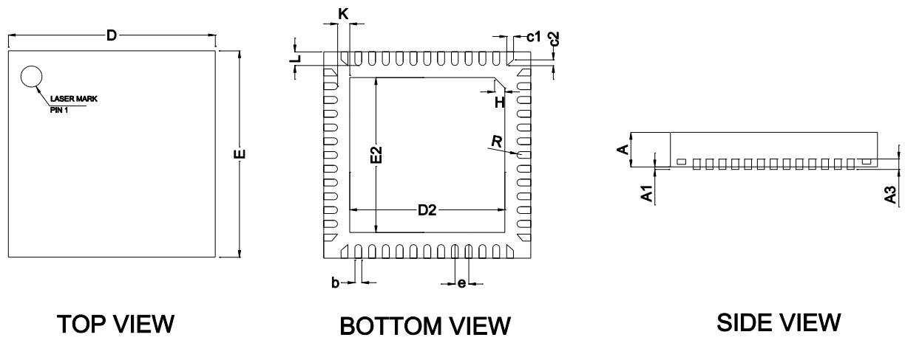

图 4-4 LKS32MC076FNBQ8 封装图示  
表 4-4 LKS32MC076FNBQ8 封装尺寸

<table><tr><td rowspan="2">SYMBOL</td><td colspan="3">MILLIMETER</td></tr><tr><td>MIN</td><td>NOM</td><td>MAX</td></tr><tr><td>A</td><td>0.70</td><td>0.75</td><td>0.80</td></tr><tr><td>A1</td><td>0.00</td><td>0.02</td><td>0.05</td></tr><tr><td>A3</td><td colspan="3">0.20REF</td></tr><tr><td>b</td><td>0.15</td><td>0.20</td><td>0.25</td></tr><tr><td>D</td><td>5.90</td><td>6.00</td><td>6.10</td></tr><tr><td>E</td><td>5.90</td><td>6.00</td><td>6.10</td></tr><tr><td>D2</td><td>4.40</td><td>4.50</td><td>4.60</td></tr><tr><td>E2</td><td>4.40</td><td>4.50</td><td>4.60</td></tr><tr><td>e</td><td>0.30</td><td>0.40</td><td>0.45</td></tr><tr><td>H</td><td colspan="3">0.35REF</td></tr><tr><td>K</td><td>0.25</td><td>-</td><td>-</td></tr><tr><td>L</td><td>0.35</td><td>0.40</td><td>0.45</td></tr><tr><td>R</td><td>0.075</td><td>-</td><td>-</td></tr><tr><td>c1</td><td>-</td><td>0.17</td><td>-</td></tr><tr><td>c2</td><td>-</td><td>0.17</td><td>-</td></tr></table>

## 5 电气性能参数

LKS32MC071DO/076F/074D/074DO 芯片内部集成 6N Driver，其中 MCU 部分电气参数如下列表格所示。

表 5-1 LKS32MC07x 6N 电气极限参数

<table><tr><td>参数</td><td>最小</td><td>最大</td><td>单位</td><td>说明</td></tr><tr><td>MCU 电源电压(AVDD)</td><td>-0.3</td><td>+6.0</td><td>V</td><td></td></tr><tr><td rowspan="2">预驱电源电压(VCC)</td><td>-0.3</td><td>+22.0</td><td>V</td><td>LKS32MC074DF8Q8LKS32MC076FNBQ8</td></tr><tr><td>-0.3</td><td>+25.0</td><td>V</td><td>LKS32MC070FLRBT8LKS32MC071DOC8T8LKS32MC074FF8Q8LKS32MC074DOF8Q8</td></tr><tr><td>工作温度</td><td>-40</td><td>+105</td><td>°C</td><td></td></tr><tr><td>存储温度</td><td>-40</td><td>+150</td><td>°C</td><td></td></tr><tr><td>结温</td><td>-</td><td>125</td><td>°C</td><td></td></tr><tr><td>引脚温度(焊接10秒)</td><td>-</td><td>260</td><td>°C</td><td></td></tr></table>

表 5-2 LKS32MC07x 6N 建议工况参数

<table><tr><td>参数</td><td>最小</td><td>典型</td><td>最大</td><td>单位</td><td>说明</td></tr><tr><td>MCU 电源电压(AVDD)</td><td>2.5</td><td>5</td><td>5.5</td><td>V</td><td>MCU 供电部分详细说明见 3.1.1</td></tr><tr><td rowspan="2">模拟工作电压(AVDDA)</td><td>3.3</td><td>5</td><td>5.5</td><td>V</td><td>REF2VDD=0, ADC 选择 2.4V 内部基准</td></tr><tr><td>2.8</td><td>5</td><td>5.5</td><td>V</td><td>REF2VDD=1, ADC 选择 AVDD 为基准</td></tr><tr><td rowspan="2">预驱电源电压(VCC)</td><td>7</td><td rowspan="2"></td><td>20</td><td rowspan="2">V</td><td>LKS32MC074DF8Q8LKS32MC076FNBQ8</td></tr><tr><td>4.5</td><td>20</td><td>LKS32MC070FLRBT8LKS32MC071DOC8T8LKS32MC074FF8Q8LKS32MC074DOF8Q8</td></tr></table>

运算放大器可以在2.2V下工作，但输出幅度受限。

表 5-3 LKS32MC07x 6N ESD 性能参数

<table><tr><td>项目</td><td>管脚</td><td>最小</td><td>最大</td><td>单位</td></tr><tr><td rowspan="3">ESD测试 (HBM)</td><td>MCU Pin</td><td>-6000</td><td>6000</td><td>V</td></tr><tr><td>Gate Driver G2 Pin</td><td>-2000</td><td>2000</td><td>V</td></tr><tr><td>Gate Driver G6 Pin</td><td>-2500</td><td>2500</td><td>V</td></tr></table>

根据《MIL-STD-883J Method 3015.9》，在 25℃，55%相对湿度环境下，在被测芯片的所有 IO 引脚施加进行静电放电 3 次，每次间隔 1s。

表 5-4 LKS32MC07x 6N Latch-up 性能参数

<table><tr><td>项目</td><td>最小</td><td>最大</td><td>单位</td></tr><tr><td>Latch-up电流 (85°C)</td><td>-200</td><td>200</td><td>mA</td></tr></table>

根据《JEDEC STANDARD NO.78E NOVEMBER 2016》，在每个信号 IO 上注入 200mA 电流。测试结果显示芯片抗拴锁等级为200mA。

表 5-5 LKS32MC07x 6N IO 极限参数

<table><tr><td>参数</td><td>描述</td><td>最小</td><td>最大</td><td>单位</td></tr><tr><td> $V_{IN}$ </td><td>GPIO信号输入电压范围</td><td>-0.3</td><td>6.0</td><td>V</td></tr><tr><td> $I_{INJ\_PAD}$ </td><td>单个GPIO最大注入电流</td><td>-11.2</td><td>11.2</td><td>mA</td></tr><tr><td> $I_{INJ\_SUM}$ </td><td>所有GPIO最大注入电流</td><td>-50</td><td>50</td><td>mA</td></tr></table>

表 5-6 LKS32MC07x 6N IO DC 参数

<table><tr><td>参数</td><td>描述</td><td>AVDD</td><td>条件</td><td>最小</td><td>最大</td><td>单位</td></tr><tr><td rowspan="2"> $V_{IH}$ </td><td rowspan="2">数字IO输入高电压</td><td>5V</td><td rowspan="2">-</td><td>3.06</td><td rowspan="2"></td><td rowspan="2">V</td></tr><tr><td>3.3V</td><td>2.07</td></tr><tr><td rowspan="2"> $V_{IL}$ </td><td rowspan="2">数字IO输入低电压</td><td>5V</td><td rowspan="2">-</td><td rowspan="2"></td><td>0.3*AVDD</td><td rowspan="2">V</td></tr><tr><td>3.3V</td><td>0.8</td></tr><tr><td rowspan="2"> $V_{HYS}$ </td><td rowspan="2">施密特迟滞范围</td><td>5V</td><td rowspan="2">-</td><td rowspan="2">0.1*AVDD</td><td rowspan="2"></td><td rowspan="2">V</td></tr><tr><td>3.3V</td></tr><tr><td rowspan="2"> $I_{IH}$ </td><td rowspan="2">数字IO输入高电压,电流消耗</td><td>5V</td><td rowspan="2">-</td><td rowspan="2"></td><td rowspan="2">1</td><td rowspan="2">uA</td></tr><tr><td>3.3V</td></tr><tr><td rowspan="2"> $I_{IL}$ </td><td rowspan="2">数字IO输入低电压,电流消耗</td><td>5V</td><td rowspan="2">-</td><td rowspan="2">-1</td><td rowspan="2"></td><td rowspan="2">uA</td></tr><tr><td>3.3V</td></tr><tr><td> $V_{OH}$ </td><td>数字IO输出高电压</td><td></td><td>最大驱动电流11.2mA</td><td>AVDD-0.8</td><td></td><td>V</td></tr><tr><td> $V_{OL}$ </td><td>数字IO输出低电压</td><td></td><td>最大驱动电流11.2mA</td><td></td><td>0.5</td><td>V</td></tr><tr><td> $R_{pup}$ </td><td>上拉电阻大小*</td><td></td><td></td><td>8</td><td>12</td><td>kΩ</td></tr><tr><td> $R_{io-ana}$ </td><td>IO与内部模拟电路间连接电阻</td><td></td><td></td><td>100</td><td>200</td><td>Ω</td></tr><tr><td rowspan="2"> $C_{IN}$ </td><td rowspan="2">数字IO输入电容</td><td>5V</td><td rowspan="2">-</td><td rowspan="2"></td><td rowspan="2">10</td><td rowspan="2">pF</td></tr><tr><td>3.3V</td></tr></table>

\*仅部分IO 内置上拉，详见引脚说明章节

表 5-7 LKS32MC07x 电路模块电流消耗 IDD

<table><tr><td>模块</td><td>Min</td><td>Typ</td><td>Max</td><td>单位</td></tr><tr><td>模拟比较器CMP(1个)</td><td></td><td>0.005</td><td></td><td>mA</td></tr><tr><td>运算放大器OPA(1个)</td><td></td><td>0.450</td><td></td><td>mA</td></tr><tr><td>模数转换器ADC</td><td></td><td>3.710</td><td></td><td>mA</td></tr><tr><td>数模转换器DAC</td><td></td><td>0.710</td><td></td><td>mA</td></tr><tr><td>温度传感器Temp Sensor</td><td></td><td>0.150</td><td></td><td>mA</td></tr><tr><td>带隙基准BGP</td><td></td><td>0.154</td><td></td><td>mA</td></tr><tr><td>8MHz RC时钟</td><td></td><td>0.105</td><td></td><td>mA</td></tr><tr><td>锁相环PLL</td><td></td><td>0.080</td><td></td><td>mA</td></tr><tr><td>CPU+flash+SRAM (96MHz)</td><td></td><td>8.667</td><td></td><td>mA</td></tr><tr><td>CPU+flash+SRAM (12MHz)</td><td></td><td>1.600</td><td></td><td>mA</td></tr><tr><td>CRC</td><td></td><td>0.070</td><td></td><td>mA</td></tr><tr><td>DSP</td><td></td><td>3.421</td><td></td><td>mA</td></tr><tr><td>UART</td><td></td><td>0.107</td><td></td><td>mA</td></tr><tr><td>DMA</td><td></td><td>1.340</td><td></td><td>mA</td></tr><tr><td>MCPWM</td><td></td><td>0.053</td><td></td><td>mA</td></tr><tr><td>TIMER</td><td></td><td>0.269</td><td></td><td>mA</td></tr><tr><td>SPI</td><td></td><td>0.500</td><td></td><td>mA</td></tr><tr><td>IIC</td><td></td><td>0.500</td><td></td><td>mA</td></tr><tr><td>CAN</td><td></td><td>2.200</td><td></td><td>mA</td></tr><tr><td>MCU休眠功耗</td><td>9</td><td>12</td><td>20</td><td>uA</td></tr></table>

## 6 模拟性能参数

模拟性能参数如下表所示。

表 6-1 LKS32MC07x 6N 模拟性能参数

<table><tr><td>参数</td><td>最小</td><td>典型</td><td>最大</td><td>单位</td><td>说明</td></tr><tr><td colspan="6">模数转换器(ADC)</td></tr><tr><td rowspan="2">工作电源</td><td>3.3</td><td>5</td><td>5.5</td><td>V</td><td>ADC选择2.4V内部基准源</td></tr><tr><td>2.8</td><td>5</td><td>5.5</td><td>V</td><td>ADC选择1.2V内部基准源</td></tr><tr><td>输出码率</td><td></td><td>3</td><td></td><td>MHz</td><td> $f_{adc}/16$ </td></tr><tr><td rowspan="2">差分输入信号范围</td><td>-5.0+0.144</td><td></td><td>+5.0-0.144</td><td>V</td><td>ADCx_GAIN=1时;REF=2.4V</td></tr><tr><td>-3.6+0.072</td><td></td><td>+3.6-0.072</td><td>V</td><td>ADCx_GAIN=0时;REF=2.4V</td></tr><tr><td>单端输入信号范围</td><td>-0.3</td><td></td><td>AVDD+0.3</td><td>V</td><td>受限于IO口输入电压限制</td></tr><tr><td colspan="6">差分信号通常为芯片内部OPA输出至ADC的信号;单端信号通常为外部通过I0输入的被采样信号:无论使用内部/外部基准,ADC测量信号幅度均不应超过满量程的±98%,特别地,当使用外部基准时,建议采样信导不超过量程的90%。</td></tr><tr><td>直流失调(offset)</td><td></td><td>5</td><td>10</td><td>mV</td><td>可校正</td></tr><tr><td>有效位数(ENOB)</td><td>10.5</td><td>11</td><td></td><td>bit</td><td></td></tr><tr><td>INL</td><td></td><td>2</td><td>3</td><td>LSB</td><td></td></tr><tr><td>DNL</td><td></td><td>1</td><td>2</td><td>LSB</td><td></td></tr><tr><td>SNR</td><td>63</td><td>66</td><td></td><td>dB</td><td></td></tr><tr><td>输入电阻</td><td>100k</td><td></td><td></td><td>Ohm</td><td></td></tr><tr><td>输入电容</td><td></td><td>10pF</td><td></td><td>F</td><td></td></tr><tr><td colspan="6">基准电压(REF)</td></tr><tr><td>工作电源</td><td>2.2</td><td>5</td><td>5.5</td><td>V</td><td></td></tr><tr><td>输出偏差</td><td>-9</td><td></td><td>9</td><td>mV</td><td></td></tr><tr><td>电源抑制比</td><td></td><td>70</td><td></td><td>dB</td><td></td></tr><tr><td>温度系数</td><td></td><td>20</td><td></td><td>ppm/°C</td><td></td></tr><tr><td>输出电压</td><td></td><td>1.2</td><td></td><td>V</td><td></td></tr><tr><td colspan="6">数模转换器(DAC)</td></tr><tr><td>工作电源</td><td>2.2</td><td>5</td><td>5.5</td><td>V</td><td></td></tr><tr><td>负载电阻</td><td>5k</td><td></td><td></td><td>Ohm</td><td rowspan="3">输出BUFFER开启</td></tr><tr><td>负载电容</td><td></td><td></td><td>50p</td><td>F</td></tr><tr><td>输出电压范围</td><td>0.05</td><td></td><td>AVDD-0.1</td><td>V</td></tr><tr><td>转换速度</td><td></td><td></td><td>1M</td><td>Hz</td><td></td></tr><tr><td>DNL</td><td></td><td>1</td><td>2</td><td>LSB</td><td></td></tr><tr><td>INL</td><td></td><td>2</td><td>4</td><td>LSB</td><td></td></tr><tr><td>OFFSET</td><td></td><td>5</td><td>10</td><td>mV</td><td></td></tr><tr><td>SNR</td><td>57</td><td>60</td><td>66</td><td>dB</td><td></td></tr><tr><td colspan="6">运算放大器(OPA)</td></tr><tr><td>工作电源</td><td>2.8</td><td>5</td><td>5.5</td><td>V</td><td></td></tr><tr><td>带宽</td><td></td><td>10M</td><td>20M</td><td>Hz</td><td></td></tr><tr><td>负载电阻</td><td>20k</td><td></td><td></td><td>Ohm</td><td></td></tr><tr><td>负载电容</td><td></td><td></td><td>5p</td><td>F</td><td></td></tr><tr><td>输入共模范围</td><td>0</td><td></td><td>AVDD</td><td>V</td><td></td></tr><tr><td>输出信号范围</td><td>0</td><td></td><td>2Vcm</td><td>V</td><td>最小负载电阻下</td></tr><tr><td rowspan="4">OFFSET</td><td></td><td>10</td><td>15.0</td><td>mV</td><td>32倍放大倍数</td></tr><tr><td></td><td>10</td><td>16.5</td><td>mV</td><td>16倍放大倍数</td></tr><tr><td></td><td>10</td><td>18.5</td><td>mV</td><td>8倍放大倍数</td></tr><tr><td></td><td>10</td><td>20.5</td><td>mV</td><td>4倍放大倍数</td></tr><tr><td colspan="6">此OFFSET为OPA差分输入短接时,测量OPA_OUT偏离0电平,得到的等效差分输入端偏差。OPA输出端偏差为OPA放大倍数×OFFSET。Flash NVR区域记录了出厂测试的OPA offset。</td></tr><tr><td>共模电平(Vcm)</td><td>1.67</td><td>1.8</td><td>2.2</td><td>V</td><td>测量条件:常温。运放摆幅=2×min(AVDD-Vcm,Vcm)。建议使用OPA单端输出的应用上电后进行Vcm测量并进行软件减除校正。更多分析请参考官网应用笔记《ANN009-运放差分和单端工作模式区别》</td></tr><tr><td>共模抑制(CMRR)</td><td></td><td>80</td><td></td><td>dB</td><td></td></tr><tr><td>电源抑制(PSRR)</td><td></td><td>80</td><td></td><td>dB</td><td></td></tr><tr><td>负载电流</td><td></td><td></td><td>500</td><td>uA</td><td></td></tr><tr><td>摆率(Slew rate)</td><td></td><td>5</td><td></td><td>V/us</td><td></td></tr><tr><td>相位裕度</td><td></td><td>60</td><td></td><td>度</td><td></td></tr><tr><td colspan="6">比较器(CMP)</td></tr><tr><td>工作电源</td><td>2.2</td><td>5</td><td>5.5</td><td>V</td><td></td></tr><tr><td>输入信号范围</td><td>0</td><td></td><td>AVDD</td><td>V</td><td></td></tr><tr><td rowspan="4">OFFSET</td><td>-30</td><td>-10</td><td>10</td><td>mV</td><td>0mV回差,CMP输出低到高翻转</td></tr><tr><td>-30</td><td>-10</td><td>10</td><td>mV</td><td>0mV回差,CMP输出高到低翻转</td></tr><tr><td>-30</td><td>-10</td><td>10</td><td>mV</td><td>20mV回差,CMP输出低到高翻转</td></tr><tr><td>-8.5</td><td>11.5</td><td>31.5</td><td>mV</td><td>20mV回差,CMP输出高到低翻转</td></tr><tr><td rowspan="2">传输延时</td><td></td><td>50</td><td></td><td>nS</td><td>默认功耗</td></tr><tr><td></td><td>200</td><td></td><td>nS</td><td>低功耗</td></tr><tr><td rowspan="2">回差(Hysteresis)</td><td></td><td>20</td><td></td><td>mV</td><td>HYS='0'</td></tr><tr><td></td><td>0</td><td></td><td>mV</td><td>HYS='1'</td></tr></table>

模拟寄存器表说明：

模 拟 寄 存 器 的 名 称 为 SYS\_AFE\_REG0\~SYS\_AFE\_REG6 ， 对 应 地 址 为 0x4000\_0010 \~0x4000\_0028。地址 0x4000\_001C\~0x4000\_0028 是模拟各个模块的校正寄存器，这些寄存器在出厂之前都会将各自的校正值填入 Flash info 区，并在上电后自动加载到 SYS\_AFE\_REG3\~SYS\_AFE\_REG6。一般情况下用户不要去配置或改变这些值。如果需要对某个模拟参数进行微调，需要读取原校正值，并以此为基础进行微调。

地址 0x4000\_0000\~0x4000\_0018 是开放给用户的寄存器，其中保留寄存器(Res)必须全部配置为0（芯片上电后会被复位为0）。其他寄存器根据应用场合需要进行配置。

## 7 电源管理系统

## AVDD引脚电源系统

电源管理系统由LDO15 模块、电源检测模块（PVD）、上电/掉电复位模块（POR）组成。AVDD由2.5V\~5.5V电源供电，芯片内部集成一路 LDO15给内部所有数字电路、PLL模块供电。LDO上电后自动开启，无需软件配置，但LDO 输出电压可通过软件实现微调。

LDO15 的输出电压可通过设置寄存器 $\mathrm { L D O 1 5 T R I M } { < } 2 { : } 0 { > }$ 来调节，具体寄存器所对应值见模拟寄存器表说明。LDO15在芯片出厂前已经过校正，一般情况下，用户不需要额外配置这些寄存器。如需微调LDO 的输出电压，需要读取原配置值，在此基础加上微调量对应的配置值填入寄存器。

POR 模块监测LDO15的电压，在LDO15 电压低于 1.26V时（例如上电之初，或者掉电之时），为数字电路提供复位信号以避免数字电路工作产生异常。

PVD模块对5V输入电源进行检测，如低于某一设定阈值，则产生报警（中断）信号以提醒 MCU。中断提醒阈值可通过寄存器 PVDSEL<1:0>设置为不同的电压。PVD 模块可通过设置 $\mathrm { P D \_ P D T } = ^ { \prime } 1 ^ { \prime }$ 关闭。具体寄存器所对应值见模拟寄存器表说明。

## VCC引脚电源系统

VCC 引脚供电范围是 4.5\~20V，为芯片内驱动模块提供供电，欠压位典型值为 4V。

## 8 时钟系统

时钟系统包括内部32KHz RC时钟、内部8MHz RC时钟、外部8MHz晶体起振电路、PLL电路组成。

32K RC时钟作为MCU系统慢时钟使用，作为诸如滤波模块或者低功耗状态下的MCU时钟使用。8MHz RC时钟作为MCU主时钟使用，配合PLL可提供最高到96MHz的时钟。外部8MHz晶体起振电路作为备份时钟使用。

32k和8M RC 时钟均带有出厂校正，32K RC时钟在 ${ \cdot 4 0 } { \sim } 1 0 5 ^ { \circ } \mathrm { C }$ 范围内的精度为±50%，8M RC时钟在该温度范围的精度为±1%。

32K RC 时钟频率可通过寄存器 RCLTRIM<3:0>进行设置，8M RC 时钟频率可通过寄存器RCHTRIM<5:0>进行设置，具体寄存器所对应值见模拟寄存器表说明。

芯片出厂前时钟已经过校正，一般情况下，用户不需要额外配置这些寄存器。如需微调频率，需要读取原配置值，在此基础加上微调量对应的配置值填入寄存器。

8M RC时钟通过设置 $\mathrm { R C H P D } = ^ { \prime } 0 ^ { \prime }$ 打开（默认打开，设’1’关闭），RC 时钟需要Bandgap 电压基准源模块提供基准电压和电流，因此开启RC 时钟需要先开启BGP 模块。芯片上电的默认状态下，8MRC时钟和BGP模块都是开启的。32K RC 时钟是始终开启的，不能关闭。

PLL 对 8M RC 时钟进行倍频，以提供给 MCU、ADC 等模块更高速的时钟。MCU 和 PWM 模块的最高时钟为96MHz，ADC 模块典型工作时钟为48MHz，通过寄存器 $\mathrm { A D C L K S E L } { < } 1 { : } 0 { > } \overline { { \mathrm { H J } } }$ 设置为不同的ADC 工作频率。

PLL通过设置 $\mathrm { P L L P D N } { = } ^ { \prime } 1 $ ’打开（默认关闭，设1打开），开启PLL模块之前，同样也需要开启BGP(Bandgap)模块。开启PLL之后，PLL需要 6us 的稳定时间来输出稳定时钟。芯片上电的默认状态下，RCH时钟和BGP 模块都是开启的，但 PLL默认是关闭的，需要软件来开启。

晶体起振电路内置了放大器，需在 $\mathrm { I O ~ O S C \_ I N / O S C \_ O U T }$ 之间接入一个晶体，且 OSC\_IN/OSC\_OUT上各放一个15pF的电容到地，并设置 $\mathrm { X T A L P D N } { = } ^ { \prime } 1$ ’即可起振。

## 9 基准电压源

该基准源为ADC、DAC、RC 时钟、PLL、温度传感器、运算放大器、比较器和 FLASH提供基准电压和电流，使用上述任何一个模块之前，都需要开启BGP 基准电压源。

芯片上电的默认状态下，BGP 模块是开启的。通过设置 $\mathrm { B G P P D } = ^ { \prime } 0 ^ { \prime }$ 将基准源打开，从关闭到开启，BGP需要约6us 达到稳定。BGP 输出电压约1.2V，精度为±0.8%。

## 10 ADC 模块

芯片内部集成1 路同步双采样的 SAR结构ADC，芯片上电的默认状态下，ADC 模块是关闭的。ADC开启前，需要先开启BGP和8MRC时钟和PLL模块，并选择ADC 工作频率。默认配置下 ADC工作时钟是48M，对应3MHz 的转换数据率。

同步双采样电路可在同一时刻对两路输入信号进行采样，采样完成之后ADC按先后顺序将这两路信号进行转换，并写入相应的数据寄存器中。

ADC 完成一次转换需要 16 个 ADC 时钟周期，其中 13 个为转换周期，3 个为采样周期。即$f _ { c o n \nu } = f _ { a d c } / 1 6$ 。在ADC时钟设为48M时，转换速率是 3MHz。

ADC在降频应用时，可通过寄存器 $\mathrm { C U R R I T } { < } 1 { : } 0 { > }$ 降低ADC的功耗水平。

ADC 可工作在如下模式：单次单通道触发、连续单通道、单次 1\~16 通道扫描、连续 1\~16 通道扫描。每路ADC 都有 16 组独立寄存器对应每一个通道。

ADC触发事件可以来自外部的定时器信号T0、T1、T2、T3发生到预设次数，或者为软件触发。

ADC\_DC 存储的是 ADC 的直流偏置，通常在校正阶段通过测量通道 15（从 0 开始计数）的 AVSS（内部地）得到ADC直流偏置数值并存入flash中，并在系统加载阶段由软件将直流偏置写入ADC\_DC寄存器中。

ADC有两种量程通过 $\mathrm { A D C x \_ G A I N } ( \mathbf { x } = 0 , 1 ]$ 进行设置：3.6V和 7.2V。7.2V量程下，由于芯片使用5V供电，对应最大±5V的输入信号幅度，3.6V 量程下，对应最大±3.6V 的输入信号幅度。在测量运放的输出信号时，根据运放可能输出的最大信号来选择具体的ADC增益。

## 11 运算放大器

4 路输入输出rail-to-rail运算放大器，内置反馈电阻 R2/R1，外部引脚需串联一个电阻 R0。反馈电阻R2:R1的阻值可通过寄存器RES\_OPAx<1:0>设置，以实现不同的放大倍数。具体寄存器所对应值见模拟寄存器表说明。

最终的放大倍数为R2/(R1+R0)，其中R0是外部电阻的阻值，

对于MOS管电阻直接采样的应用，建议接>20kΩ 的外部电阻，以减小MOS管关断时，往芯片引脚里流入的电流。

对于小电阻采样的应用，建议接 100Ω 的外部电阻。

放大器可通过设置 OPAOUT\_EN<2:0>选择将 4 路放大器中的某一路输出信号通过 BUFFER 送至P2.7IO 口进行测量和应用（对应关系见 datasheet 芯片管脚说明）。因为有 BUFFER 存在，在运放正常工作模式下也可以选择送一路运放输出信号出来。

芯片上电的默认状态下，放大器模块是关闭的。放大器可通过设置 OPAxPDN =’1’打开，开启放大器之前，需要先开启BGP 模块。

运放输入同相和反相端内置钳位二极管，电机相线通过一匹配电阻后直接接入输入端，从而简化了MOSFET电流采样的外置电路。

## 12 比较器

内置3 路输入rail-to-rail比较器，比较器比较速度可编程、迟滞电压可编程、信号源可编程。

比较器的比较延时可通过寄存器 CMP\_FT 设置为＜30nS/200nS。迟滞电压通过 CMP\_HYS 设置为 20mV/0mV。

比较器正端输入信号来源可以通过寄存器 CMPx\_SELP[2:0] 进行设置；负端输入信号来源可以通过寄存器 CMPx\_SELN[1:0]进行设置 $\scriptstyle ( \mathbf { { x } } = 0 / 1 / 2$ ，代表比较器 CMP0/CMP1/CMP2）。

芯片上电的默认状态下，比较器模块是关闭的。比较器通过设置 $\mathrm { C M P x P D N } = ^ { \prime } 1$ ’打开，开启比较器之前，需要先开启BGP模块。

## 13 温度传感器

芯片内置精度为 $1 { \pm } 2 ^ { \circ } \mathrm { C } |$ 的温度传感器。芯片出厂前会经温度校正，校正值保存在 flash info 区。

芯片上电的默认状态下，温度传感器模块是关闭的。开启传感器之前，需要先开启 $\mathrm { B G P }$ 模块。

温度传感器通过设置 $\mathrm { T M P P D N } { = } ^ { \prime } 1 ^ { \prime }$ 打开，开启到稳定需要约 2us，因此需在 ADC 测量传感器之前2us打开。

## 14 DAC 模块

芯片内置两路 12bit DAC，输出信号的最大量程可通过寄存器 DAC0\_GAIN、DAC1\_GAIN 设置为1.2V/4.85V

DAC0 可通过配置寄存器 DAC0OUT\_EN=1，将 DAC0 输出送至 P0.0 管脚；DAC1 可通过配置寄存器 DAC1OUT\_EN=1，将 DAC1 输出送至 P0.0 管脚，可驱动>5kΩ 的负载电阻和 50pF 的负载电容。通常不会同时输出DAC0和 DAC1，以免造成信号竞争。

DAC最大输出码率为1MHz。

芯片上电的默认状态下，DAC 模块是关闭的。DAC0可通过设置DAC0PDN =1打开，DAC1可通过设置DAC1PDN =1打开，开启 DAC模块之前，需要先开启BGP 模块。

## 15 处理器核心

➢ 32 位 Cortex-M0+DSP 双核处理器

➢ 2 线 SWD 调试管脚

➢ 最高工作频率 96MHz

## 16 存储资源

## 16.1 Flash

➢ 内置 flash 包括 64kB/128kB 主存储区，1.5kB NVR 信息存储区

➢ 可反复擦除写入不低于10万次

➢ 室温 $2 5 \mathrm { { ^ \circ C } }$ 数据保持长达100 年

➢ 单字节编程时间最长 7.5us，Sector擦除时间最长 5ms

➢ Sector大小512 字节，可按Sector擦除写入，支持运行时编程

➢ Flash 数据防窃取（最后一个 word 须写入非 0xFFFFFFFF 的任意值）

## 16.2 SRAM

➢ 内置 12kB SRAM

## 17 电机驱动专用 MCPWM

➢ MCPWM 最高工作时钟频率 96MHz

➢ 可以产生 6 对（互补信号）或 12 路独立（边沿模式）不交叠的 PWM 信号,每个通道死区宽度可独立配置

➢ 支持边沿对齐PWM 模式

➢ 支持软件控制 IO 模式

➢ 支持IO 极性控制功能

➢ 内部短路保护，避免因为配置错误导致短路

➢ 外部短路保护，根据对外部信号的监控快速关断

➢ 内部产生ADC 采样中断

➢ 采用加载寄存器预存定时器配置参数

可配置加载寄存器加载时刻和周期

## 18 Timer

➢ 4 路通用定时器,2路16bit 位宽计时器，2 路32bit位宽计时器。

➢ 4 路支持捕获模式，用于测量外部信号宽度

➢ 4 路支持比较模式，用于产生边沿对齐PWM/定时中断

## 19 Hall 传感器接口

➢ 内置最大 1024 级滤波

➢ 三路 Hall 信号输入

➢ 24位计数器，提供溢出和捕获中断

## 20 DSP

➢ 电机控制算法专用 DSP，自主指令集，三级流水

➢ 最高工作频率 96MHz

➢ 32/16位除法器 12 总线周期（96MHz）计算完成

➢ 32位硬件开方8总线周期（96MHz）计算完成

➢ Q15 格式 Cordic 三角函数模块，sin/cos/artanc 20 总线周期（96MHz）计算完成

➢ DSP配备独立的程序区和数据区，可自主执行 DSP程序，亦可由MCU 调用进行某项计算

➢ 支持中断暂停，与MCU 进行数据交互

## 21 通用外设

➢ 两路 UART，全双工工作，支持 8/9 位数据位、1/2 停止位、奇/偶/无校验模式，带 1 字节发送缓存、1 字节接收缓存，支持 Multi-drop Slave/Master 模式，波特率支持 300\~115200

➢ 一路SPI，支持主从模式

➢ 一路IIC，支持主从模式

➢ 硬件看门狗，使用 RC 时钟驱动，独立于系统高速时钟，写入保护，最小复位时间间隔为4096/32kHz≈128ms，最大复位时间间隔为 511×4096/32kHz≈64s。

## 22 栅极驱动模块

## 22.1 模块参数

芯片内部栅极驱动模块共有 4种不同的参数规格，根据栅极驱动电路参数不同，栅极驱动模块分为4 个型号，分别为G1、G2、G3和G6。对照表如 22-1。

表 22-1 芯片型号-栅极驱动电路对照表

<table><tr><td>芯片型号</td><td>栅极驱动模块型号</td></tr><tr><td>LKS32MC070FLRBT8</td><td>G6</td></tr><tr><td>LKS32MC071DOC8T8</td><td>G6</td></tr><tr><td>LKS32MC074FF8Q8</td><td>G6</td></tr><tr><td>LKS32MC074DF8Q8</td><td>G2</td></tr><tr><td>LKS32MC074DOF8Q8</td><td>G6</td></tr><tr><td>LKS32MC076FNBQ8</td><td>G2</td></tr></table>

“YYWWX\*”为 data code 及芯片版本号，见芯片丝印的第三行。“YYWWX” 为生产日期，$\omega _ { \ast } \mathbf { \ast } ^ { \flat }$ 为可选项，通常是A、B、C、D…或空白，代表芯片预驱的版本号。

## 22.1.1 栅极驱动模块 G2

表 22-2 栅极驱动模块 G2器件参数

<table><tr><td>参数</td><td>最小</td><td>典型</td><td>最大</td><td>单位</td><td>说明</td></tr><tr><td colspan="6">极限参数</td></tr><tr><td>电源电压 VCC</td><td>-0.3</td><td></td><td>+25.0</td><td>V</td><td>相对于地</td></tr><tr><td>浮动电压  $VB_{1,2,3}$ </td><td>-0.3</td><td></td><td>+250</td><td>V</td><td></td></tr><tr><td>浮动偏置  $VS_{1,2,3}$ </td><td>VB-25</td><td></td><td>VB+0.3</td><td>V</td><td></td></tr><tr><td>高侧输出电压  $HO_{1,2,3}$ </td><td>VS-0.3</td><td></td><td>VB+0.3</td><td>V</td><td></td></tr><tr><td>低侧输出电压  $LO_{1,2,3}$ </td><td>-0.3</td><td></td><td>VCC+0.3</td><td>V</td><td></td></tr><tr><td>逻辑输入  $HIN/LIN_{1,2,3}$ </td><td>-0.3</td><td></td><td>VCC+0.3</td><td>V</td><td></td></tr><tr><td>开关电压摆率 dVs/dt</td><td></td><td></td><td>50</td><td>V/ns</td><td></td></tr><tr><td>结温 TJ</td><td>-40</td><td></td><td>150</td><td>°C</td><td></td></tr><tr><td>存储温度 Ts</td><td>-55</td><td></td><td>150</td><td>°C</td><td></td></tr><tr><td>焊接温度</td><td></td><td></td><td>300</td><td>°C</td><td>焊接 10s</td></tr><tr><td colspan="6">建议工况</td></tr><tr><td>电源电压 VCC</td><td>+7</td><td></td><td>+20.0</td><td>V</td><td>相对于地</td></tr><tr><td>浮动电压  $VB_{1,2,3}$ </td><td>VS+8</td><td></td><td>VS+20</td><td>V</td><td></td></tr><tr><td>浮动偏置  $VS_{1,2,3}$ </td><td>-5</td><td></td><td>200</td><td>V</td><td></td></tr><tr><td>高侧输出电压  $HO_{1,2,3}$ </td><td>VS</td><td></td><td>VB</td><td>V</td><td></td></tr><tr><td>低侧输出电压  $LO_{1,2,3}$ </td><td>0</td><td></td><td>VCC</td><td>V</td><td></td></tr><tr><td>逻辑输入  $HIN/LIN_{1,2,3}$ </td><td>0</td><td></td><td>VCC</td><td>V</td><td></td></tr><tr><td>工作温度  $T_A$ </td><td>-40</td><td></td><td>105</td><td>°C</td><td></td></tr><tr><td colspan="6">门极驱动器电气参数</td></tr><tr><td>VCC 静态电流 IQcc</td><td></td><td>50</td><td>100</td><td>uA</td><td>HIN=LIN=0V</td></tr><tr><td>VB 静态电流 IQBS</td><td></td><td>20</td><td>40</td><td>uA</td><td>HIN=LIN=0V</td></tr><tr><td>浮动电压漏电流 ILK</td><td></td><td></td><td>10</td><td>uA</td><td>VB=VS=220V</td></tr><tr><td>VCC 欠压保护释放电压</td><td>4.0</td><td>4.7</td><td>6.7</td><td>V</td><td></td></tr><tr><td>VBS 欠压保护释放电压</td><td>3.9</td><td>5.6</td><td>6.9</td><td>V</td><td></td></tr><tr><td>VCC 欠压保护电压</td><td>3.6</td><td>4.4</td><td>6.4</td><td>V</td><td></td></tr><tr><td>VBS 欠压保护电压</td><td>3.5</td><td>5.0</td><td>6.2</td><td>V</td><td></td></tr><tr><td>VCC 欠压保护迟滞电压</td><td>0.25</td><td>0.3</td><td>0.8</td><td>V</td><td></td></tr><tr><td>VBS 欠压保护迟滞电压</td><td>0.25</td><td>0.6</td><td>0.8</td><td>V</td><td></td></tr><tr><td>高输入阈值 VIH</td><td>2.8</td><td></td><td></td><td>V</td><td></td></tr><tr><td>低输入阈值 VIL</td><td></td><td></td><td>0.8</td><td>V</td><td></td></tr><tr><td>输入偏置电流 Isource</td><td></td><td>32</td><td>120</td><td>uA</td><td>HIN=LIN=5V</td></tr><tr><td>输入偏置电流 Isink</td><td></td><td></td><td>1</td><td>uA</td><td>HIN=LIN=0V</td></tr><tr><td>高电平输出电压, VBIAS-VO</td><td></td><td></td><td>1</td><td>V</td><td>IO=20mA</td></tr><tr><td>低电平输出电压, VO</td><td></td><td></td><td>1</td><td>V</td><td>IO=20mA</td></tr><tr><td>高电平输出短路脉冲电流 IO+</td><td>650</td><td>1000</td><td></td><td>mA</td><td>VCC/VBS=15V</td></tr><tr><td>低电平输出短路脉冲电流 IO-</td><td>650</td><td>1000</td><td></td><td>mA</td><td>VCC/VBS=15V</td></tr><tr><td>输出上升时间 Tr</td><td></td><td>15</td><td>30</td><td>ns</td><td rowspan="2">CL=1nF</td></tr><tr><td>输出下降时间 Tf</td><td></td><td>12</td><td>30</td><td>ns</td></tr><tr><td>导通延迟时间 Ton</td><td></td><td>270</td><td>500</td><td>ns</td><td></td></tr><tr><td>关断延迟时间 Toff</td><td></td><td>80</td><td>150</td><td>ns</td><td></td></tr><tr><td>死区 DT</td><td>100</td><td>200</td><td>400</td><td>ns</td><td></td></tr><tr><td>延时匹配度 MT</td><td></td><td></td><td>80</td><td>ns</td><td>Ton &amp; Toff for (HS-LS)</td></tr></table>

## 22.1.2 栅极驱动模块 G6

栅极驱动模块G6内部集成自举二极管。

表 22-3 栅极驱动模块 G6器件参数

<table><tr><td>参数</td><td>最小</td><td>典型</td><td>最大</td><td>单位</td><td>说明</td></tr><tr><td colspan="6">极限参数</td></tr><tr><td>电源电压 VCC</td><td>-0.3</td><td></td><td>+22.0</td><td>V</td><td>相对于地</td></tr><tr><td rowspan="2">浮动电压  $VB_{1,2,3}$ </td><td rowspan="2">-0.3</td><td rowspan="2"></td><td>+250</td><td rowspan="2">V</td><td rowspan="2">074DO 的 VSSN 和 VS 没有短接,因此 074DO 最大值为 250V,其他为 60V</td></tr><tr><td>+60</td></tr><tr><td>浮动偏置  $VS_{1,2,3}$ </td><td>VB-25</td><td></td><td>VB+0.3</td><td>V</td><td></td></tr><tr><td>高侧输出电压  $HO_{1,2,3}$ </td><td>VS-0.3</td><td></td><td>VB+0.3</td><td>V</td><td></td></tr><tr><td>低侧输出电压  $LO_{1,2,3}$ </td><td>-0.3</td><td></td><td>VCC+0.3</td><td>V</td><td></td></tr><tr><td>逻辑输入 $HIN/LIN_{1,2,3}$ </td><td>-0.3</td><td></td><td>VCC+0.3</td><td>V</td><td></td></tr><tr><td>开关电压摆率dVs/dt</td><td></td><td></td><td>50</td><td>V/ns</td><td></td></tr><tr><td>结温TJ</td><td>-40</td><td></td><td>150</td><td>°C</td><td></td></tr><tr><td>存储温度Ts</td><td>-55</td><td></td><td>150</td><td>°C</td><td></td></tr><tr><td>焊接温度</td><td></td><td></td><td>300</td><td>°C</td><td>焊接10s</td></tr><tr><td colspan="6">建议工况</td></tr><tr><td>电源电压VCC</td><td>+5.0</td><td></td><td>+20.0</td><td>V</td><td>相对于地</td></tr><tr><td>浮动电压 $VB_{1,2,3}$ </td><td>VS+8</td><td></td><td>VS+20</td><td>V</td><td></td></tr><tr><td rowspan="2">浮动偏置 $VS_{1,2,3}$ </td><td rowspan="2">-5</td><td rowspan="2"></td><td>+200</td><td rowspan="2">V</td><td rowspan="2">074DO的VSSN和VS没有短接,因此074DO最大值为200V,其他为60V</td></tr><tr><td>+60</td></tr><tr><td>高侧输出电压 $HO_{1,2,3}$ </td><td> $VS_{1,2,3}$ </td><td></td><td> $VB_{1,2,3}$ </td><td>V</td><td></td></tr><tr><td>低侧输出电压 $LO_{1,2,3}$ </td><td>0</td><td></td><td>VCC</td><td>V</td><td></td></tr><tr><td>逻辑输入 $HIN/LIN_{1,2,3}$ </td><td>0</td><td></td><td>5</td><td>V</td><td></td></tr><tr><td>工作温度 $T_A$ </td><td>-40</td><td></td><td>105</td><td>°C</td><td></td></tr><tr><td colspan="6">门极驱动器电气参数</td></tr><tr><td>VCC静态电流 $I_{QCC}$ </td><td></td><td>110</td><td></td><td>uA</td><td>HIN=LIN=0/5V</td></tr><tr><td>VB静态电流 $I_{QBS}$ </td><td></td><td>25</td><td>50</td><td>uA</td><td>HIN=LIN=0V</td></tr><tr><td>浮动电压漏电流 $I_{LK}$ </td><td></td><td></td><td>10</td><td>uA</td><td>VB=VS=200V,VCC=0V</td></tr><tr><td>驱动电流 $I_{O+}$ </td><td>0.65</td><td>1</td><td></td><td>A</td><td></td></tr><tr><td>驱动电流 $I_{O-}$ </td><td>0.65</td><td>1</td><td></td><td>A</td><td></td></tr><tr><td>VCC欠压上升沿触发电压</td><td>3.5</td><td>4.2</td><td>4.5</td><td>V</td><td></td></tr><tr><td>VCC欠压下降沿触发电压</td><td>2.8</td><td>3.8</td><td>4.4</td><td>V</td><td></td></tr><tr><td>VCC欠压锁定回滞</td><td>0.2</td><td>0.4</td><td>1.2</td><td>V</td><td></td></tr><tr><td>VBS欠压上升沿触发电压</td><td>2.5</td><td>3.8</td><td>5.5</td><td>V</td><td></td></tr><tr><td>VBS欠压下降沿触发电压</td><td>2.2</td><td>3.5</td><td>4.8</td><td>V</td><td></td></tr><tr><td>VBS欠压锁定回滞</td><td>0.25</td><td>0.3</td><td>0.8</td><td>V</td><td></td></tr><tr><td>高输入阈值 $V_{IH}$ </td><td>2.8</td><td></td><td></td><td>V</td><td></td></tr><tr><td>低输入阈值 $V_{IL}$ </td><td></td><td></td><td>0.8</td><td>V</td><td></td></tr><tr><td>输出上升时间 $T_r$ </td><td></td><td>20</td><td>30</td><td>ns</td><td rowspan="2"> $C_L=1nF$ </td></tr><tr><td>输出下降时间 $T_f$ </td><td></td><td>12</td><td>30</td><td>ns</td></tr><tr><td>导通延迟时间 $T_{on}$ </td><td></td><td>250</td><td>500</td><td>ns</td><td></td></tr><tr><td>关断延迟时间 $T_{off}$ </td><td></td><td>120</td><td>200</td><td>ns</td><td></td></tr><tr><td>死区 $D_T$ </td><td>50</td><td>150</td><td>400</td><td>ns</td><td></td></tr><tr><td>延时匹配度 $M_T$ </td><td></td><td></td><td>80</td><td>ns</td><td></td></tr><tr><td colspan="6">LDO线性调整参数</td></tr><tr><td>LDO输出电压 $V_{LDO}$ </td><td>4.8</td><td>5.0</td><td>5.2</td><td>V</td><td>出厂测试会将5VLDO 电压记录在flash 区域,供软件读取。Flash NVR 校正值地址请参考数据手册</td></tr><tr><td>LDO 输出带载电流 ILDO</td><td></td><td>30</td><td></td><td>mA</td><td></td></tr><tr><td>负载调整率</td><td>-0.297</td><td></td><td>+0.397</td><td>%</td><td>负载电流 0~35mA</td></tr><tr><td>线性调整率</td><td></td><td>0</td><td></td><td>%</td><td>VCC 从 7-22V</td></tr><tr><td>短路电流</td><td>122</td><td></td><td>142</td><td>mA</td><td></td></tr></table>

## 22.2 推荐应用图

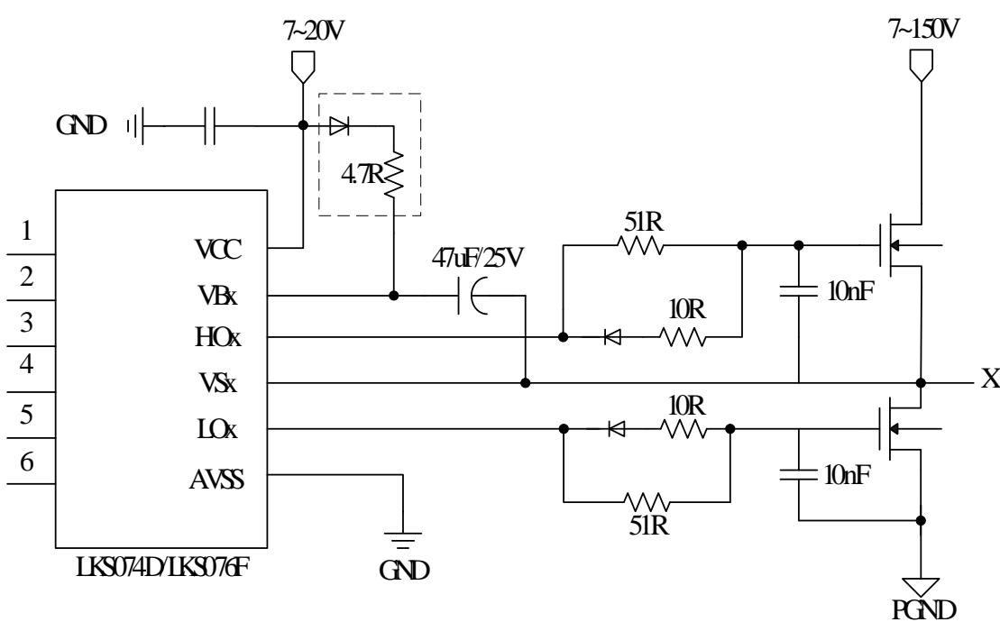  
图 22-1 栅极驱动模块 G2典型应用图

栅极驱动模块G2端口VBx 和VCC间必须外置自举二极管。

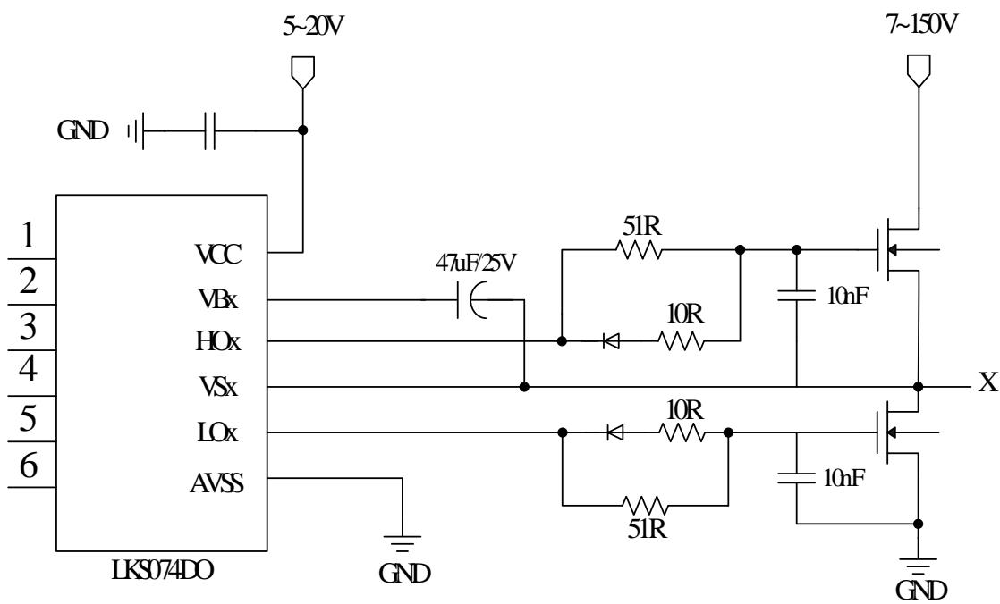  
图 22-2 栅极驱动模块 G6 典型应用图

栅极驱动模块G6内置了自举二极管，因此原理图上省略了自举二极管。若出于电路兼容考虑，也可以保留自举二极管。

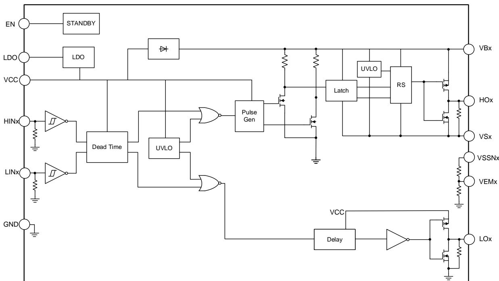  
图 22-3 栅极驱动模块 G6 内部框图

栅极驱动模块 G6 内置了 VS 电压检测功能，对于 070FL/071DO 引出 VEM 管脚的 MCU，图示VSx 与VSSNx已在内部短接， VEMx 引脚内置耐压5V的30pF电容，若电压超过5V，会导致端口信号被二极管钳位。可通过测量 VEMx 对地电压获得对应相线的 VS 电压。内部分压电阻为 50K 比3.3K，对应分压比约为16:1，可通过在芯片外部的 VEMx对地/对VSx 端并联电阻调节分压比例。

图中只保留了栅极驱动模块管脚，x=1,2,3，分别对应 3组MOS栅极驱动输出。栅极驱动模块输入输出极性对应关系如下：

表 22-4 栅极驱动模块 G1/G2/G3/G6 极性真值表

<table><tr><td>{HIN, LIN}</td><td>HO</td><td>LO</td><td></td></tr><tr><td>00</td><td>0</td><td>0</td><td>上下管关断</td></tr><tr><td>01</td><td>0</td><td>1</td><td>下管导通</td></tr><tr><td>10</td><td>1</td><td>0</td><td>上管导通</td></tr><tr><td>11</td><td>0</td><td>0</td><td>上下管同时导通,硬件短路保护</td></tr></table>

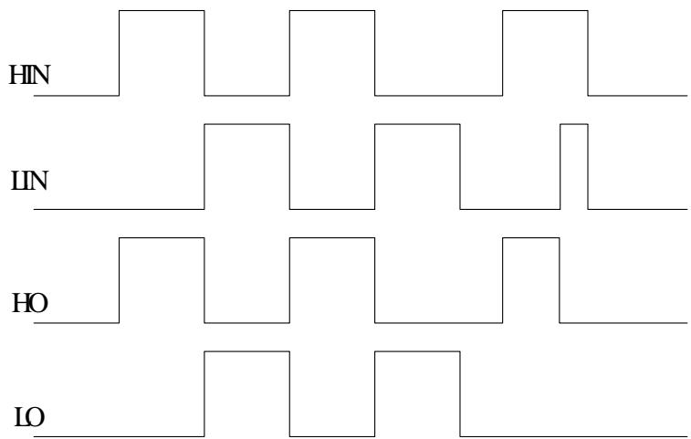  
图 22-4 栅极驱动模块 G1/G2/G3/G6 极性示意图

## 23 特殊 IO 复用

LKS07x 特殊 IO 复用注意事项

SWD协议包含两根信号线：SWDCLK和SWDIO。SWDCLK是时钟信号，在SWD模式下一直为输入。SWDIO 是数据信号，在SWD模式下为双向IO，默认是输入状态。

LKS07x 部分型号 SWD 引脚同时有 GPIO 功能。SWCLK 复用的 IO 是 P2.14，SWDIO 复用的 IO 是P2.15。注意事项如下：

默认状态不开启 SWD 引脚的 GPIO 功能，需要软件开启。即芯片硬复位结束后，初始状态是 SWD用途，SWD引脚在芯片内部有上拉(芯片内部上拉电阻约为 10K)，应用对初始电平有要求的，需注意。

如开启GPIO 功能后，如果 GPIO 功能与SWD功能冲突，比如设置 GPIO 为输出，则可能导致 KEIL等工具无法通过SWD协议访问芯片，此时 Debug 和擦除下载功能均失效。因此建议：

其一，软件开启GPIO 复用前留有一定延时，建议 1s以上，保证凌鸥离线下载器能在芯片上电后软件延时期间完成芯片擦除动作。延时越大，一次性擦除成功的概率越大。

其二，软件设置有 GPIO 复用退出机制，例如某个其它 IO 电平发生变化(一般为输入)或串行通讯，表明需要用SWD，软件接收到指令后关闭 SWD引脚的 GPIO功能。此时，可以恢复 KEIL的功能。

在 SSOP24L 封装和 QFN5\*5 40L-0.75 封装中，SWDIO 同 P0.0、P2.15 直接 bonding 在一起，可以直接使能对应GPIO。建议复用 SWDIO时SWDCLK需保持不变(恒为 1或者恒为0)。

在 LKS077E 封装中，SWDCLK 同 P2.6 直接 bonding 在一起，可以直接使能对应 GPIO。若同时复用SWDIO 和 SWDCLK，SWDCLK 复用的注意事项如下：

默认状态不开启 SWD 引脚的 GPIO 功能，需要软件开启。即芯片硬复位结束后，初始状态是 SWD用途，SWD引脚在芯片内部有上拉(芯片内部上拉电阻约为 10K)，应用对初始电平有要求的，需注意。

如开启GPIO 功能后，如果 GPIO 功能与SWD功能冲突，比如设置 GPIO 为输出，则可能导致 KEIL等工具无法通过SWD协议访问芯片，此时 Debug 和擦除下载功能均失效。因此建议：

其一，软件开启GPIO 复用前留有一定延时，建议 1s以上，保证凌鸥离线下载器能在芯片上电后软件延时期间完成芯片擦除动作。延时越大，一次性擦除成功的概率越大。

其二，软件设置有 GPIO 复用退出机制，例如某个其它 IO 电平发生变化(一般为输入)或串行通讯，表明需要用SWD，软件接收到指令后关闭 SWD引脚的 GPIO功能。此时，可以恢复 KEIL的功能。SWDCLK和 SWDIO引脚都作为GPIO 使用时不应同时动作。即SWDCLK复用开启，且变化的时候，SWDIO 能保持为0电平(类似时分复用)。

若此时，仅复用了SWDCLK，没有复用SWDIO，注意事项同上。

RSTN信号，默认是用于 LKS07x 芯片的外部复位脚。

LKS07x 可实现RSTN 复用为其它 IO的功能，复用的 IO是 P0.2。注意事项如下：

默认状态是不开启复用，需要软件开启复用。即芯片初始状态是RSTN用途，RSTN在芯片内部有上拉(芯片内部上拉电阻约为100K)，应用对初始电平有要求的，需注意。

默认状态是RSTN，只有RSTN正常释放后才能开始程序的执行，应用需要保证RSTN 有足够保护，例如外围电路带上拉，若能加电容更佳。

开启复用后，RSTN用途失效，若需产生芯片硬复位，源头只能是掉电/看门狗。

RSTN 的复用，不影响 KEIL 的使用。

SYS\_RST\_CFG 寄存器的 BIT[5]，为 RSTN 和 P0.2 的复用控制开关。

## 24 订购包装信息

包装类型分为 Tray 包装和 Reel 包装两种，具体包装中的芯片个数由封装形式与包装类型确定，不再以芯片型号区分。

Tray包装信息如下表

<table><tr><td>封装形式</td><td>每盘/管数量</td><td>内盒数量</td><td>外箱数量</td></tr><tr><td>SOP16/ESOP16L</td><td>3000/盘</td><td>6000PCS</td><td>48000PCS</td></tr><tr><td>SSOP24</td><td>4000/盘</td><td>8000PCS</td><td>64000PCS</td></tr><tr><td>SSOP24</td><td>50/管</td><td>10000PCS</td><td>4000/100000PCS</td></tr><tr><td>QFN 8*8</td><td>260/盘</td><td>2600PCS</td><td>15600PCS</td></tr><tr><td>QFN 4*4/5*5/6*6</td><td>490/盘</td><td>4900PCS</td><td>29400PCS</td></tr><tr><td>QFN 3*3</td><td>5000/盘</td><td>5000PCS</td><td>40000PCS</td></tr><tr><td>LQFP48/TQFP48 0707</td><td>250/盘</td><td>2500PCS</td><td>15000PCS</td></tr><tr><td>LQFP64 1010</td><td>160/盘</td><td>1600PCS</td><td>9600PCS</td></tr><tr><td>LQFP100 1414</td><td>90/盘</td><td>900PCS</td><td>5400PCS</td></tr><tr><td>TSSOP20/28</td><td>4000/盘</td><td>8000PCS</td><td>64000PCS</td></tr></table>

Reel包装信息如下表

<table><tr><td colspan="2">包装类别</td><td>每盘/管数量</td><td>每盒数量</td><td>每箱盒数</td><td>外箱数量</td></tr><tr><td>编带-13寸</td><td>SOP/ESOP8</td><td>4000</td><td>8000</td><td>8</td><td>64000</td></tr><tr><td>编带-13寸</td><td>SOP/ESOP16</td><td>3000</td><td>6000</td><td>8</td><td>48000</td></tr><tr><td>编带-13寸</td><td>SSOP24</td><td>4000</td><td>8000</td><td>8</td><td>64000</td></tr><tr><td>编带-13寸</td><td>TSSOP20</td><td>4000</td><td>8000</td><td>8</td><td>64000</td></tr><tr><td>编带-13寸</td><td>D/QFN3*3</td><td>5000</td><td>10000</td><td>8</td><td>80000</td></tr><tr><td>编带-13寸</td><td>D/QFN4*4</td><td>5000</td><td>10000</td><td>8</td><td>80000</td></tr><tr><td>编带-13寸</td><td>D/QFN5*5</td><td>5000</td><td>10000</td><td>8</td><td>80000</td></tr><tr><td>管装</td><td>SOP16</td><td>50</td><td>10000</td><td>10</td><td>100000</td></tr><tr><td>管装</td><td>SOP14/SSOP24</td><td>50</td><td>10000</td><td>10</td><td>100000</td></tr><tr><td>管装</td><td>TSSOP24</td><td>54</td><td>6480</td><td>6</td><td>38880</td></tr></table>

## 25 版本历史

表 25-1 文档版本历史

<table><tr><td>时间</td><td>版本号</td><td>说明</td></tr><tr><td>2025.08.01</td><td>1.24</td><td>MC071C8T8 P0.3 口添加带预驱的 GPIO 相关功能</td></tr><tr><td>2025.07.21</td><td>1.23</td><td>删除 Flash 部分:擦写一个 Sector 的同时读取访问另一个 Sector</td></tr><tr><td>2025.01.02</td><td>1.22</td><td>更新比较器 offset 失调电压数值</td></tr><tr><td>2024.11.14</td><td>1.21</td><td>添加新型号 074FF8Q8,添加预驱 PGND 与 MCU GND 的区分说明</td></tr><tr><td>2024.09.29</td><td>1.20</td><td>补充说明 QFN 封装的腹部 Pad 接地,定义为 Pin0</td></tr><tr><td>2024.08.21</td><td>1.19</td><td>添加内部预驱连接示意图</td></tr><tr><td>2024.08.04</td><td>1.18</td><td>订购包装信息更新,以包装类型与封装形式来确认包装信息</td></tr><tr><td>2024.06.04</td><td>1.17</td><td>更新 G6 预驱模块 VEM 引脚说明,完成部分勘误</td></tr><tr><td>2024.04.15</td><td>1.16</td><td>更新 QFN40L 封装尺寸,添加栅极驱动模块 G6 LDO 线性调整率参数</td></tr><tr><td>2024.03.26</td><td>1.15</td><td>添加 070FL/071DO 的栅极驱动内部框图以及 VEM 分压说明</td></tr><tr><td>2024.02.19</td><td>1.14</td><td>添加关于 5V LDO 输出对 MCU 供电的说明,更新合封 Die ESD 等级</td></tr><tr><td>2024.01.19</td><td>1.13</td><td>去除 074D/DO 引脚图中的 CAN,修正栅极模块 G6 中的 VB 和 VS 电压范围,补充 ADC 模块通道数量说明</td></tr><tr><td>2023.11.30</td><td>1.12</td><td>添加新型号 076</td></tr><tr><td>2023.11.20</td><td>1.11</td><td>添加 OPA offset 的说明</td></tr><tr><td>2023.10.22</td><td>1.10</td><td>修改产品选型表</td></tr><tr><td>2023.09.25</td><td>1.09</td><td>更新焊接温度,修改非易失存储器 Sector 擦写的说明</td></tr><tr><td>2023.09.06</td><td>1.08</td><td>添加新型号 070FL</td></tr><tr><td>2023.08.21</td><td>1.07</td><td>修改 071DO 封装引脚定义,增加 074D/DO 的 ADC 通道数</td></tr><tr><td>2023.08.10</td><td>1.06</td><td>添加新型号 071DO 和 074DO</td></tr><tr><td>2023.07.27</td><td>1.05</td><td>修改/添加 07x 6N 的新型号 074D/074F</td></tr><tr><td>2023.07.21</td><td>1.04</td><td>更新 Pin20 和 Pin21 引脚的补充功能</td></tr><tr><td>2023.07.04</td><td>1.03</td><td>修改运放输出信号范围、电源供电范围、休眠功耗及共模电平</td></tr><tr><td>2023.05.07</td><td>1.02</td><td>更新 falsh 可反复擦除次数的说明</td></tr><tr><td>2023.04.07</td><td>1.01</td><td>更新封装说明</td></tr><tr><td>2023.03.16</td><td>1.0</td><td>初始版本</td></tr></table>

## 免责声明

LKS 和 LKO 为凌鸥创芯注册商标。

南京凌鸥创芯电子有限公司（以下简称：“Linko”）尽力确保本文档内容的准确和可靠，但是保留随时更改、更正、增强、修改产品和/或 文档的权利，恕不另行通知。用户可在下单前获取最新相关信息。

客户应针对应用需求选择合适的 Linko 产品，详细设计、验证和测试您的应用，以确保满足相应标准以及任何安全、安保或其它要求。客户应对此独自承担全部责任。

Linko在此确认未以明示或暗示方式授予Linko或第三方的任何知识产权许可。

Linko产品的转售，若其条款与此处规定不同，Linko对此类产品的任何保修承诺无效。

禁止用于军事用途或生命监护、维持系统。

如有更早期版本文档，一切信息以此文档为准。