## LKS32MC07x Datasheet

© 2023, 版权归凌鸥创芯所有

机密文件，未经许可不得扩散

## 1 概述

## 1.1 功能简述

LKS32MC07x系列MCU是32 位内核的面向电机控制应用的专用处理器，集成了常用电机控制系统所需要的所有模块。

## ⚫ 性能

➢ 96MHz 32 位 Cortex-M0 内核

➢ 集成自主指令集电机控制专用 DSP

➢ 超低功耗休眠模式，MCU 低功耗休眠电流 10uA

➢ 工业级工作温度范围

➢ 超强抗静电和群脉冲能力

## ⚫ 工作范围

➢ 2.5V\~5.5V电源供电，内部集成 1个 LDO，为数字部分电路供电

➢ 工作环境温度范围: -40\~105℃

## ⚫ 时钟

➢ 内置 8MHz 高精度 RC 时钟，-40\~105℃范围内精度在±1%之内

➢ 内置低速32KHz 低速时钟，供低功耗模式使用

➢ 可外挂 8MHz 外部晶振

➢ 内部 PLL 可提供最高 96MHz 时钟

## ⚫ 非易失存储器

➢ 内置 flash 包括 64kB/128kB 主存储区，1.5kB NVR 信息存储区

➢ 可反复擦除写入不低于10万次

➢ 室温25℃数据保持长达 100年

➢ 单字节编程时间最长 7.5us，Sector擦除时间最长 5ms

➢ Sector 大小 512 字节，可按 Sector 擦除写入

➢ Flash 数据防窃取(最后一个 word 须写入非 0xFFFFFFFF 的任意值）

## SRAM

➢ 内置 12kB SRAM

## ⚫ 外设模块

## ➢ 两路 UART

➢ 一路 SPI，支持主从模式

➢ 一路 IIC，支持主从模式

➢ 一路 CAN(部分型号不带 CAN)

➢ 2 个通用16位 Timer，支持捕捉和边沿对齐 PWM、中心对齐PWM 功能

➢ 2 个通用32位 Timer，支持捕捉和边沿对齐 PWM、中心对齐PWM 功能；支持正交编码输入，CW/CCW 输入，脉冲+符号输入

➢ 电机控制专用PWM 模块，支持2组各6路 PWM输出，死区可配置

➢ Hall 信号专用接口，支持测速、去抖功能

➢ 硬件看门狗

➢ 最多4 组16bitGPIO，8个GPIO可以作为系统的唤醒源，15 个GPIO 可以用作外部中断源输入

## ⚫ 模拟模块

➢ 集成2 路12bit SAR ADC，同步双采样，3Msps采样及转换速率，每路最多支持 16 通道，包括4 个运放输出及 10个外部ADC 通道共计 14 个可选ADC 通道信号

➢ 集成4 路运算放大器，可设置为差分 PGA 模式

➢ 集成3 路比较器，可设置滞回模式

➢ 集成 2 路 12bit DAC 数模转换器

➢ 内置±2℃温度传感器

➢ 内置 1.2V 0.8%精度电压基准源

➢ 内置1 路低功耗 LDO 和电源监测电路

➢ 集成高精度、低温飘高频RC时钟

➢ 集成晶体起振电路

## 1.2 性能优势

➢ 高可靠性、高集成度、最终产品体积小、节约 BOM成本；

➢ 内部集成4 路高速运放和3 路比较器，可满足单电阻/双电阻/三电阻电流采样拓扑架构的不同需求；

➢ 内部高速运放集成高压保护电路，可以允许高电压共模信号直接输入芯片，可以用最简单的电路拓扑实现 MOSFET电阻直接电流采样模式；

➢ 集成硬件MOSFET温度漂移补偿电路，确保电流采样精度；

➢ 应用专利技术使 ADC和高速运放达到最佳配合，可处理更宽的电流动态范围，同时兼顾高速小电流和低速大电流的采样精度；

➢ 整体控制电路简洁高效，抗干扰能力强，稳定可靠；

➢ 单电源2.5V\~5.5V供电，确保了系统供电的通用性;

➢ 支持 IEC/UL60730 功能安全认证

适用于有感BLDC/无感BLDC/有感 FOC/无感 FOC 及步进电机、永磁同步、异步电机等控制系统 。

## 1.3 命名规则

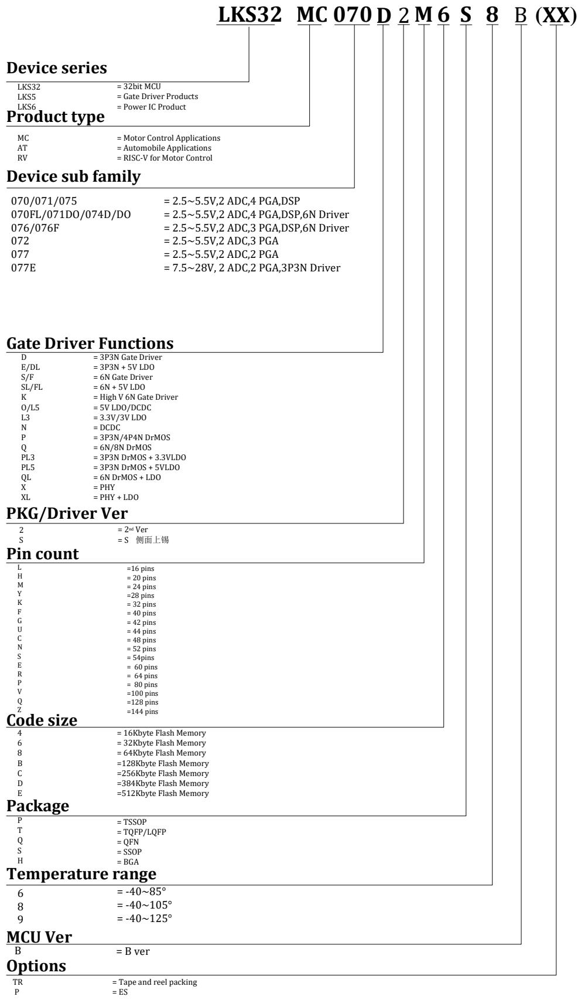  
图 1-1 凌鸥创芯器件命名规则

## 1.4 系统资源框图

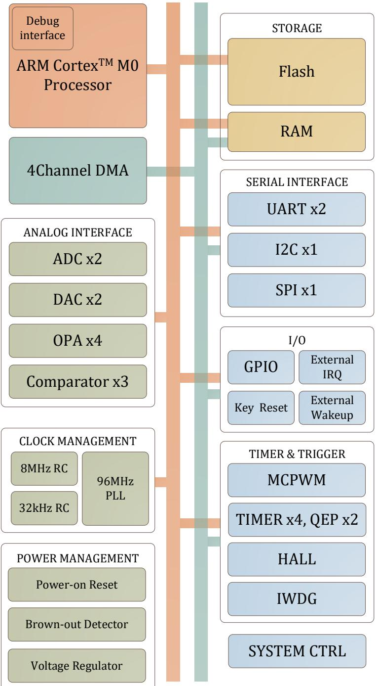  
图 1-2 LKS32MC07x 系统资源框图

## 1.5 矢量正弦控制系统

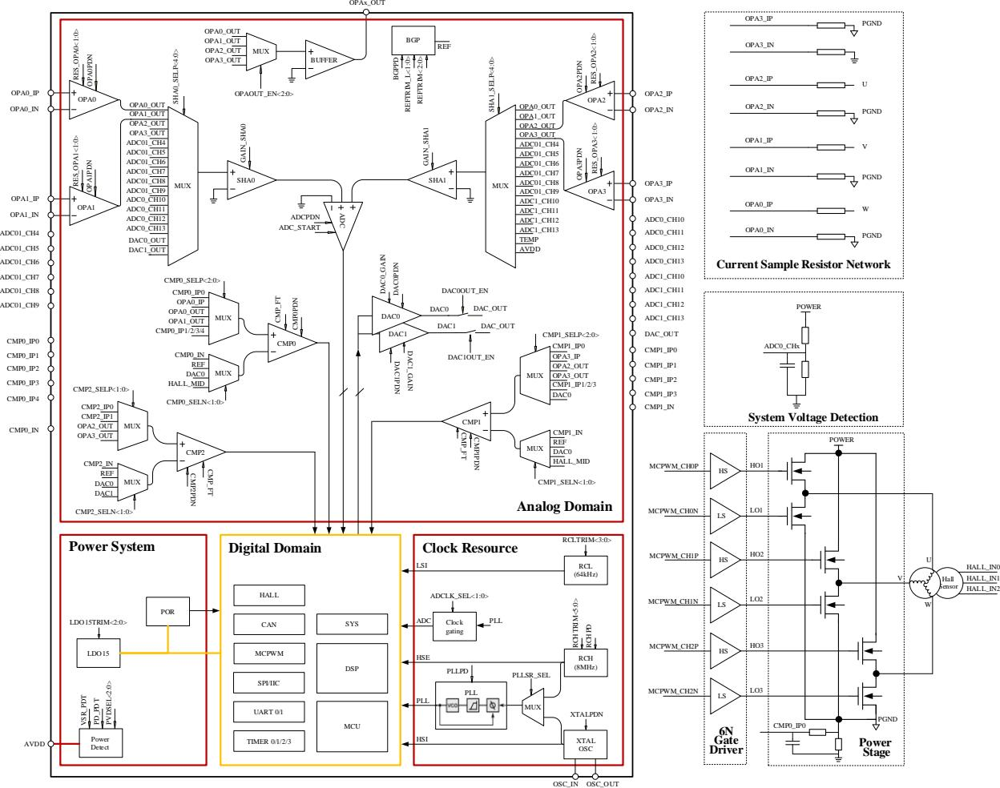  
\*ADC01\_CH4\~ADC01\_CH9 为 ADC0 和 ADC1 公用通道

图 1-3LKS32MC07x 矢量正弦控制系统简化原理图

## 2 器件选型表

表 2-1 LKS07x 系列器件选型表

<table><tr><td></td><td>主频(MHz)</td><td>Flash(kB)</td><td>RAM(kB)</td><td>ADC通道数</td><td>DAC</td><td>比较器</td><td>比较器通道数</td><td>OPA</td><td>HALL</td><td>SPI</td><td>IIC</td><td>UART</td><td>CAN</td><td>Temp.Sensor</td><td>PLL</td><td>QEP</td><td>Gate driver</td><td>预驱电流(A)</td><td>预驱电源(V)</td><td>栅浮耐压(V)</td><td>Others</td><td>产品状态</td><td>Package</td></tr><tr><td>LKS32MC070RBT8</td><td>96</td><td>128</td><td>12</td><td>14</td><td>12BITx2</td><td>3</td><td>11</td><td>4</td><td>3路</td><td>1</td><td>1</td><td>2</td><td>Yes</td><td>Yes</td><td>Yes</td><td>Yes</td><td></td><td></td><td></td><td></td><td></td><td>量产</td><td>LQFP64</td></tr><tr><td>LKS32MC071CBT8</td><td>96</td><td>128</td><td>12</td><td>13</td><td>12BITx2</td><td>3</td><td>11</td><td>4</td><td>3路</td><td>1</td><td>1</td><td>2</td><td>Yes</td><td>Yes</td><td>Yes</td><td>Yes</td><td></td><td></td><td></td><td></td><td></td><td>量产</td><td>LQFP48、TQFP48</td></tr><tr><td>LKS32MC071C8T8</td><td>96</td><td>64</td><td>12</td><td>13</td><td>12BITx2</td><td>3</td><td>11</td><td>4</td><td>3路</td><td>1</td><td>1</td><td>2</td><td></td><td>Yes</td><td>Yes</td><td>Yes</td><td></td><td></td><td></td><td></td><td></td><td>量产</td><td>LQFP48、TQFP48</td></tr><tr><td>LKS32MC072KBQ8</td><td>96</td><td>128</td><td>12</td><td>8</td><td>12BITx2</td><td>3</td><td>5</td><td>3</td><td>3路</td><td>1</td><td>1</td><td>2</td><td></td><td>Yes</td><td>Yes</td><td>Yes</td><td></td><td></td><td></td><td></td><td></td><td>量产</td><td>QFN5*5 32L-0.75</td></tr><tr><td>LKS32MC072KBT8</td><td>96</td><td>128</td><td>12</td><td>9</td><td>12BITx2</td><td>2</td><td>5</td><td>0</td><td>3路</td><td>1</td><td>1</td><td>2</td><td></td><td>Yes</td><td>Yes</td><td>Yes</td><td></td><td></td><td></td><td></td><td></td><td>量产</td><td>LQFP32</td></tr><tr><td>LKS32MC073HBQ8</td><td>96</td><td>128</td><td>12</td><td>4</td><td>12BITx2</td><td>2</td><td>4</td><td>1</td><td>3路</td><td>0</td><td>1</td><td>2</td><td></td><td>Yes</td><td>Yes</td><td>Yes</td><td></td><td></td><td></td><td></td><td></td><td></td><td>QFN3*3 20L-0.75</td></tr><tr><td>LKS32MC077MBS8</td><td>96</td><td>128</td><td>12</td><td>6</td><td>12BITx2</td><td>3</td><td>6</td><td>2</td><td>3路</td><td>1</td><td>1</td><td>2</td><td></td><td>Yes</td><td>Yes</td><td>Yes</td><td></td><td></td><td></td><td></td><td></td><td>量产</td><td>SSOP24L</td></tr></table>

## 3 管脚分布

## 3.1 管脚分布图及管脚说明

\* 图中红色 PIN 脚内置上拉至 AVDD 的电阻：

RSTN 内置 300kΩ 上拉电阻，固定开启上拉

SWDIO/SWCLK 内置 12kΩ 上拉电阻，固定开启上拉

其余红色 PIN 脚内置 12kΩ 上拉电阻，可软件控制开启关闭上拉

后续新型号管脚图内置 12kΩ 上拉电阻的 PIN 脚不再标红，带 PU 的 PIN 脚默认内置 12kΩ 上拉电阻。

## 3.1.1 LKS32MC070RBT8

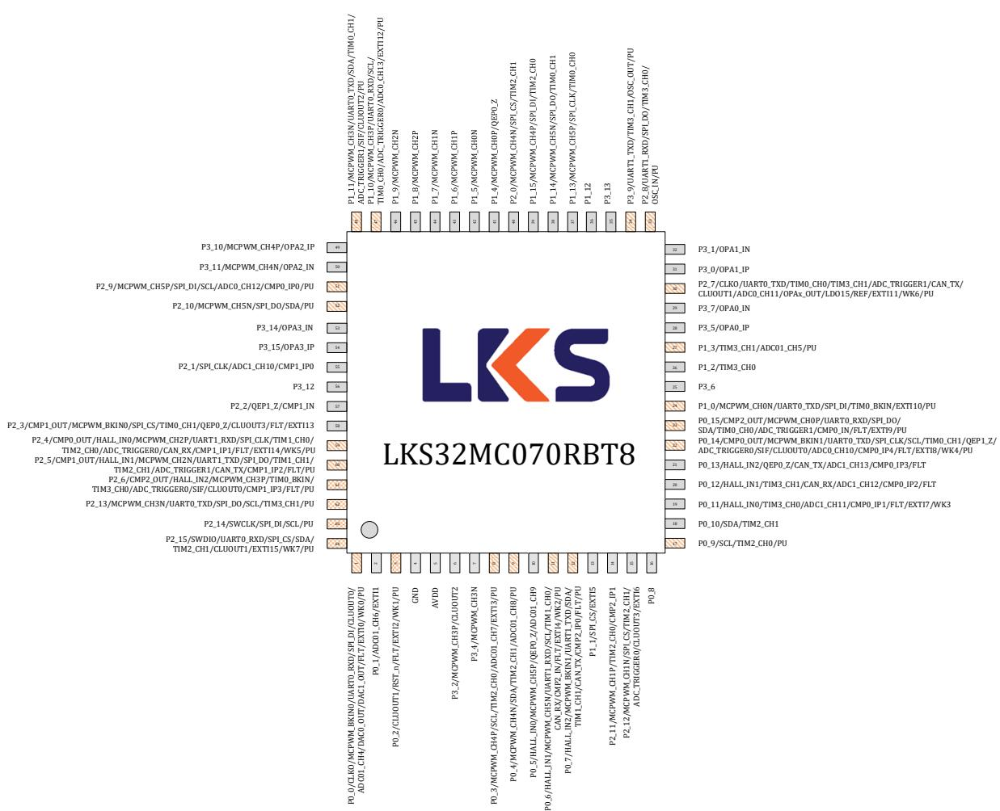  
图 3-1 LKS32MC070RBT8 管脚分布图

表 3-1 LKS32MC070RBT8 管脚说明

<table><tr><td rowspan="3">1</td><td>P0_0</td><td>P0.0</td></tr><tr><td>CLKO</td><td>时钟输出(用于调试)</td></tr><tr><td>MCPWM_BKIN0UART0_RXD</td><td>PWM 停机输入信号 0串口0接收(发送)</td></tr><tr><td rowspan="9"></td><td>SPI_DI</td><td>SPI数据输入(输出)</td></tr><tr><td>CLUOUT0</td><td>CLU0输出</td></tr><tr><td>ADC01_CH4</td><td>ADC0/ADC1通道4</td></tr><tr><td>DAC0_OUT</td><td>DAC0输出</td></tr><tr><td>DAC1_OUT</td><td>DAC1输出</td></tr><tr><td>FLT</td><td>IO滤波</td></tr><tr><td>EXTI0</td><td>外部GPIO中断信号0</td></tr><tr><td>WK0</td><td>外部唤醒信号0</td></tr><tr><td>PU</td><td>内置12kΩ上拉电阻,软件可关闭</td></tr><tr><td rowspan="3">2</td><td>P0_1</td><td>P0.1</td></tr><tr><td>ADC01_CH6</td><td>ADC0/ADC1通道6</td></tr><tr><td>EXTI1</td><td>外部GPIO中断信号1</td></tr><tr><td rowspan="7">3</td><td>P0_2</td><td>P0.2</td></tr><tr><td>CLUOUT1</td><td>CLU1输出</td></tr><tr><td>RST_n</td><td>复位引脚,P0.2默认用作RSTN。建议接一个10nF~100nF的电容到地,并在RSTN和AVDD之间放置一个12k~20k的上拉电阻。如果外部有上拉电阻,RSTN的电容应为100nF。P0.2可切换为GPIO,切换后可关闭12kΩ上拉电阻。</td></tr><tr><td>FLT</td><td>IO滤波</td></tr><tr><td>EXTI2</td><td>外部GPIO中断信号2</td></tr><tr><td>WK1</td><td>外部唤醒信号1</td></tr><tr><td>PU</td><td>内置12kΩ上拉电阻,软件可关闭</td></tr><tr><td>4</td><td>GND</td><td>芯片地,强烈建议多个地引脚在PCB上统一接地</td></tr><tr><td>5</td><td>AVDD</td><td>芯片电源,供电范围2.5~5.5V</td></tr><tr><td rowspan="3">6</td><td>P3_2</td><td>P3.2</td></tr><tr><td>MCPWM_CH3P</td><td>PWM通道3高边</td></tr><tr><td>CLUOUT2</td><td>CLU2输出</td></tr><tr><td rowspan="2">7</td><td>P3_4</td><td>P3.4</td></tr><tr><td>MCPWM_CH3N</td><td>PWM通道3低边</td></tr><tr><td rowspan="7">8</td><td>P0_3</td><td>P0.3</td></tr><tr><td>MCPWM_CH4P</td><td>PWM通道4高边</td></tr><tr><td>SCL</td><td>I2C时钟</td></tr><tr><td>TIM2_CH0</td><td>Timer2通道0</td></tr><tr><td>ADC01_CH7</td><td>ADC0/ADC1通道7</td></tr><tr><td>EXTI3</td><td>外部GPIO中断信号3</td></tr><tr><td>PU</td><td>内置12kΩ上拉电阻,软件可关闭</td></tr><tr><td rowspan="6">9</td><td>P0_4</td><td>P0.4</td></tr><tr><td>MCPWM_CH4N</td><td>PWM通道4低边</td></tr><tr><td>SDA</td><td>I2C数据</td></tr><tr><td>TIM2_CH1</td><td>Timer2通道1</td></tr><tr><td>ADC01_CH8</td><td>ADC0/ADC1通道8</td></tr><tr><td>PU</td><td>内置12kΩ上拉电阻,软件可关闭</td></tr><tr><td>10</td><td>P0_5HALL_IN0</td><td>P0.5HALL接口输入0</td></tr><tr><td rowspan="3"></td><td>MCPWM_CH5P</td><td>PWM通道5高边</td></tr><tr><td>QEP0_Z</td><td>QEP0编码器Z相</td></tr><tr><td>ADC01_CH9</td><td>ADC0/ADC1通道9</td></tr><tr><td rowspan="12">11</td><td>P0_6</td><td>P0.6</td></tr><tr><td>HALL_IN1</td><td>HALL接口输入1</td></tr><tr><td>MCPWM_CH5N</td><td>PWM通道5低边</td></tr><tr><td>UART1_RXD</td><td>串口1接收(发送)</td></tr><tr><td>SCL</td><td>I2C时钟</td></tr><tr><td>TIM1_CH0</td><td>Timer1通道0</td></tr><tr><td>CAN_RX</td><td>CAN接收端</td></tr><tr><td>CMP2_IN</td><td>比较器2负端输入</td></tr><tr><td>FLT</td><td>IO滤波</td></tr><tr><td>EXTI4</td><td>外部GPIO中断信号4</td></tr><tr><td>WK2</td><td>外部唤醒信号2</td></tr><tr><td>PU</td><td>内置12kΩ上拉电阻,软件可关闭</td></tr><tr><td rowspan="10">12</td><td>P0_7</td><td>P0.7</td></tr><tr><td>HALL_IN2</td><td>HALL接口输入2</td></tr><tr><td>MCPWM_BKIN1</td><td>PWM停机输入信号1</td></tr><tr><td>UART1_TXD</td><td>串口1发送(接收)</td></tr><tr><td>SDA</td><td>I2C数据</td></tr><tr><td>TIM1_CH1</td><td>Timer1通道1</td></tr><tr><td>CAN_TX</td><td>CAN发送端</td></tr><tr><td>CMP2_IP0</td><td>比较器2正端输入0</td></tr><tr><td>FLT</td><td>IO滤波</td></tr><tr><td>PU</td><td>内置12kΩ上拉电阻,软件可关闭</td></tr><tr><td rowspan="3">13</td><td>P1_1</td><td>P1.1</td></tr><tr><td>SPI_CS</td><td>SPI片选</td></tr><tr><td>EXTI5</td><td>外部GPIO中断信号5</td></tr><tr><td rowspan="4">14</td><td>P2_11</td><td>P2.11</td></tr><tr><td>MCPWM_CH1P</td><td>PWM通道1高边</td></tr><tr><td>TIM2_CH0</td><td>Timer2通道0</td></tr><tr><td>CMP2_IP1</td><td>比较器2正端输入1</td></tr><tr><td rowspan="7">15</td><td>P2_12</td><td>P2.12</td></tr><tr><td>MCPWM_CH1N</td><td>PWM通道1低边</td></tr><tr><td>SPI_CS</td><td>SPI片选</td></tr><tr><td>TIM2_CH1</td><td>Timer2通道1</td></tr><tr><td>ADC_TRIGGER0</td><td>ADC0触发信号输出(用于调试)</td></tr><tr><td>CLUOUT3</td><td>CLU3输出</td></tr><tr><td>EXTI6</td><td>外部GPIO中断信号6</td></tr><tr><td>16</td><td>P0_8</td><td>P0.8</td></tr><tr><td rowspan="2">17</td><td>P0_9</td><td>P0.9</td></tr><tr><td>SCLTIM2_CH0</td><td>I2C时钟Timer2 通道0</td></tr><tr><td></td><td>PU</td><td>内置12kΩ上拉电阻,软件可关闭</td></tr><tr><td rowspan="3">18</td><td>P0_10</td><td>P0.10</td></tr><tr><td>SDA</td><td>I2C 数据</td></tr><tr><td>TIM2_CH1</td><td>Timer2 通道1</td></tr><tr><td rowspan="8">19</td><td>P0_11</td><td>P0.11</td></tr><tr><td>HALL_IN0</td><td>HALL 接口输入0</td></tr><tr><td>TIM3_CH0</td><td>Timer3 通道0</td></tr><tr><td>ADC1_CH11</td><td>ADC1 通道11</td></tr><tr><td>CMP0_IP1</td><td>比较器0正端输入1</td></tr><tr><td>FLT</td><td>IO 滤波</td></tr><tr><td>EXTI7</td><td>外部 GPIO 中断信号7</td></tr><tr><td>WK3</td><td>外部唤醒信号3</td></tr><tr><td rowspan="7">20</td><td>P0_12</td><td>P0.12</td></tr><tr><td>HALL_IN1</td><td>HALL 接口输入1</td></tr><tr><td>TIM3_CH1</td><td>Timer3 通道1</td></tr><tr><td>CAN_RX</td><td>CAN 接收端</td></tr><tr><td>ADC1_CH12</td><td>ADC1 通道12</td></tr><tr><td>CMP0_IP2</td><td>比较器0正端输入2</td></tr><tr><td>FLT</td><td>IO 滤波</td></tr><tr><td rowspan="7">21</td><td>P0_13</td><td>P0.13</td></tr><tr><td>HALL_IN2</td><td>HALL 接口输入2</td></tr><tr><td>QEP0_Z</td><td>QEP0 编码器Z相</td></tr><tr><td>CAN_TX</td><td>CAN 发送端</td></tr><tr><td>ADC1_CH13</td><td>ADC1 通道13</td></tr><tr><td>CMP0_IP3</td><td>比较器0正端输入3</td></tr><tr><td>FLT</td><td>IO 滤波</td></tr><tr><td rowspan="16">22</td><td>P0_14</td><td>P0.14</td></tr><tr><td>CMP0_OUT</td><td>比较器0输出</td></tr><tr><td>MCPWM_BKIN1</td><td>PWM 停机输入信号1</td></tr><tr><td>UART0_TXD</td><td>串口0发送(接收)</td></tr><tr><td>SPI_CLK</td><td>SPI时钟</td></tr><tr><td>SCL</td><td>I2C时钟</td></tr><tr><td>TIM0_CH1</td><td>Timer0 通道1</td></tr><tr><td>QEP1_Z</td><td>QEP1 编码器Z相</td></tr><tr><td>ADC_TRIGGER0</td><td>ADC0 触发信号输出(用于调试)</td></tr><tr><td>SIF</td><td>单线通讯</td></tr><tr><td>CLUOUT0</td><td>CLU0 输出</td></tr><tr><td>ADC0_CH10</td><td>ADC0 通道10</td></tr><tr><td>CMP0_IP4</td><td>比较器0正端输入4</td></tr><tr><td>FLT</td><td>IO 滤波</td></tr><tr><td>EXTI8</td><td>外部 GPIO 中断信号8</td></tr><tr><td>WK4PU</td><td>外部唤醒信号4内置12kΩ上拉电阻,软件可关闭</td></tr><tr><td rowspan="12">23</td><td>P0_15</td><td>P0.15</td></tr><tr><td>CMP2_OUT</td><td>比较器2输出</td></tr><tr><td>MCPWM_CHOP</td><td>PWM通道0高边</td></tr><tr><td>UART0_RXD</td><td>串口0接收(发送)</td></tr><tr><td>SPI_DO</td><td>SPI数据输出(输入)</td></tr><tr><td>SDA</td><td>I2C数据</td></tr><tr><td>TIM0_CH0</td><td>Timer0通道0</td></tr><tr><td>ADC_TRIGGER1</td><td>ADC1触发信号输出(用于调试)</td></tr><tr><td>CMP0_IN</td><td>比较器0负端输入</td></tr><tr><td>FLT</td><td>IO滤波</td></tr><tr><td>EXTI9</td><td>外部GPIO中断信号9</td></tr><tr><td>PU</td><td>内置12kΩ上拉电阻,软件可关闭</td></tr><tr><td rowspan="7">24</td><td>P1_0</td><td>P1.0</td></tr><tr><td>MCPWM_CHON</td><td>PWM通道0低边</td></tr><tr><td>UART0_TXD</td><td>串口0发送(接收)</td></tr><tr><td>SPI_DI</td><td>SPI数据输入(输出)</td></tr><tr><td>TIM0_BKIN</td><td>TIMER0_FAIL信号来自GPIO</td></tr><tr><td>EXTI10</td><td>外部GPIO中断信号10</td></tr><tr><td>PU</td><td>内置12kΩ上拉电阻,软件可关闭</td></tr><tr><td>25</td><td>P3_6</td><td>P3.6</td></tr><tr><td rowspan="2">26</td><td>P1_2</td><td>P1.2</td></tr><tr><td>TIM3_CH0</td><td>Timer3通道0</td></tr><tr><td rowspan="4">27</td><td>P1_3</td><td>P1.3</td></tr><tr><td>TIM3_CH1</td><td>Timer3通道1</td></tr><tr><td>ADC01_CH5</td><td>ADC0/ADC1通道5</td></tr><tr><td>PU</td><td>内置12kΩ上拉电阻,软件可关闭</td></tr><tr><td rowspan="2">28</td><td>P3_5</td><td>P3.5</td></tr><tr><td>OPA0_IP</td><td>运放0正端输入</td></tr><tr><td rowspan="2">29</td><td>P3_7</td><td>P3.7</td></tr><tr><td>OPA0_IN</td><td>运放0负端输入</td></tr><tr><td rowspan="12">30</td><td>P2_7</td><td>P2.7</td></tr><tr><td>CLKO</td><td>时钟输出(用于调试)</td></tr><tr><td>UART0_TXD</td><td>串口0发送(接收)</td></tr><tr><td>TIM0_CH0</td><td>Timer0通道0</td></tr><tr><td>TIM3_CH1</td><td>Timer3通道1</td></tr><tr><td>ADC_TRIGGER1</td><td>ADC1触发信号输出(用于调试)</td></tr><tr><td>CAN_TX</td><td>CAN发送端</td></tr><tr><td>CLUOUT1</td><td>CLU1输出</td></tr><tr><td>ADC0_CH11</td><td>ADC0通道11</td></tr><tr><td>OPAx_OUT</td><td>运放输出</td></tr><tr><td>LDO15</td><td>1.5VLDO输出</td></tr><tr><td>REFEXTI11</td><td>参考电压外部 GPIO 中断信号 11</td></tr><tr><td rowspan="2"></td><td>WK6</td><td>外部唤醒信号 6</td></tr><tr><td>PU</td><td>内置 12kΩ上拉电阻,软件可关闭</td></tr><tr><td rowspan="2">31</td><td>P3_0</td><td>P3.0</td></tr><tr><td>OPA1_IP</td><td>运放 1 正端输入</td></tr><tr><td rowspan="2">32</td><td>P3_1</td><td>P3.1</td></tr><tr><td>OPA1_IN</td><td>运放 1 负端输入</td></tr><tr><td rowspan="6">33</td><td>P2_8</td><td>P2.8</td></tr><tr><td>UART1_RXD</td><td>串口 1 接收(发送)</td></tr><tr><td>SPI_DO</td><td>SPI 数据输出(输入)</td></tr><tr><td>TIM3_CH0</td><td>Timer3 通道 0</td></tr><tr><td>OSC_IN</td><td>外部晶振引脚</td></tr><tr><td>PU</td><td>内置 12kΩ上拉电阻,软件可关闭</td></tr><tr><td rowspan="5">34</td><td>P3_9</td><td>P3.9</td></tr><tr><td>UART1_TXD</td><td>串口 1 发送(接收)</td></tr><tr><td>TIM3_CH1</td><td>Timer3 通道 1</td></tr><tr><td>OSC_OUT</td><td>外部晶振引脚</td></tr><tr><td>PU</td><td>内置 12kΩ上拉电阻,软件可关闭</td></tr><tr><td>35</td><td>P3_13</td><td>P3.13</td></tr><tr><td>36</td><td>P1_12</td><td>P1.12</td></tr><tr><td rowspan="4">37</td><td>P1_13</td><td>P1.13</td></tr><tr><td>MCPWM_CH5P</td><td>PWM 通道 5 高边</td></tr><tr><td>SPI_CLK</td><td>SPI 时钟</td></tr><tr><td>TIMO_CH0</td><td>Timer0 通道 0</td></tr><tr><td rowspan="4">38</td><td>P1_14</td><td>P1.14</td></tr><tr><td>MCPWM_CH5N</td><td>PWM 通道 5 低边</td></tr><tr><td>SPI_DO</td><td>SPI 数据输出(输入)</td></tr><tr><td>TIMO_CH1</td><td>Timer0 通道 1</td></tr><tr><td rowspan="4">39</td><td>P1_15</td><td>P1.15</td></tr><tr><td>MCPWM_CH4P</td><td>PWM 通道 4 高边</td></tr><tr><td>SPI_DI</td><td>SPI 数据输入(输出)</td></tr><tr><td>TIM2_CH0</td><td>Timer2 通道 0</td></tr><tr><td rowspan="4">40</td><td>P2_0</td><td>P2.0</td></tr><tr><td>MCPWM_CH4N</td><td>PWM 通道 4 低边</td></tr><tr><td>SPI_CS</td><td>SPI 片选</td></tr><tr><td>TIM2_CH1</td><td>Timer2 通道 1</td></tr><tr><td rowspan="3">41</td><td>P1_4</td><td>P1.4</td></tr><tr><td>MCPWM_CH0P</td><td>PWM 通道 0 高边</td></tr><tr><td>QEP0_Z</td><td>QEP0 编码器 Z 相</td></tr><tr><td rowspan="2">42</td><td>P1_5</td><td>P1.5</td></tr><tr><td>MCPWM_CH0N</td><td>PWM 通道 0 低边</td></tr><tr><td rowspan="2">43</td><td>P1_6</td><td>P1.6</td></tr><tr><td>MCPWM_CH1P</td><td>PWM 通道 1 高边</td></tr><tr><td rowspan="2">44</td><td>P1_7</td><td>P1.7</td></tr><tr><td>MCPWM_CH1N</td><td>PWM通道1低边</td></tr><tr><td rowspan="2">45</td><td>P1_8</td><td>P1.8</td></tr><tr><td>MCPWM_CH2P</td><td>PWM通道2高边</td></tr><tr><td rowspan="2">46</td><td>P1_9</td><td>P1.9</td></tr><tr><td>MCPWM_CH2N</td><td>PWM通道2低边</td></tr><tr><td rowspan="9">47</td><td>P1_10</td><td>P1.10</td></tr><tr><td>MCPWM_CH3P</td><td>PWM通道3高边</td></tr><tr><td>UART0_RXD</td><td>串口0接收(发送)</td></tr><tr><td>SCL</td><td>I2C时钟</td></tr><tr><td>TIM0_CH0</td><td>Timer0通道0</td></tr><tr><td>ADC_TRIGGER0</td><td>ADC0触发信号输出(用于调试)</td></tr><tr><td>ADC0_CH13</td><td>ADC0通道13</td></tr><tr><td>EXTI12</td><td>外部GPIO中断信号12</td></tr><tr><td>PU</td><td>内置12kΩ上拉电阻,软件可关闭</td></tr><tr><td rowspan="9">48</td><td>P1_11</td><td>P1.11</td></tr><tr><td>MCPWM_CH3N</td><td>PWM通道3低边</td></tr><tr><td>UART0_TXD</td><td>串口0发送(接收)</td></tr><tr><td>SDA</td><td>I2C数据</td></tr><tr><td>TIM0_CH1</td><td>Timer0通道1</td></tr><tr><td>ADC_TRIGGER1</td><td>ADC1触发信号输出(用于调试)</td></tr><tr><td>SIF</td><td>单线通讯</td></tr><tr><td>CLUOUT2</td><td>CLU2输出</td></tr><tr><td>PU</td><td>内置12kΩ上拉电阻,软件可关闭</td></tr><tr><td rowspan="3">49</td><td>P3_10</td><td>P3.10</td></tr><tr><td>MCPWM_CH4P</td><td>PWM通道4高边</td></tr><tr><td>OPA2_IP</td><td>运放2正端输入</td></tr><tr><td rowspan="3">50</td><td>P3_11</td><td>P3.11</td></tr><tr><td>MCPWM_CH4N</td><td>PWM通道4低边</td></tr><tr><td>OPA2_IN</td><td>运放2负端输入</td></tr><tr><td rowspan="7">51</td><td>P2_9</td><td>P2.9</td></tr><tr><td>MCPWM_CH5P</td><td>PWM通道5高边</td></tr><tr><td>SPI_DI</td><td>SPI数据输入(输出)</td></tr><tr><td>SCL</td><td>I2C时钟</td></tr><tr><td>ADC0_CH12</td><td>ADC0通道12</td></tr><tr><td>CMP0_IP0</td><td>比较器0正端输入0</td></tr><tr><td>PU</td><td>内置12kΩ上拉电阻,软件可关闭</td></tr><tr><td rowspan="5">52</td><td>P2_10</td><td>P2.10</td></tr><tr><td>MCPWM_CH5N</td><td>PWM通道5低边</td></tr><tr><td>SPI_DO</td><td>SPI数据输出(输入)</td></tr><tr><td>SDA</td><td>I2C数据</td></tr><tr><td>PU</td><td>内置12kΩ上拉电阻,软件可关闭</td></tr><tr><td>53</td><td>P3_14OPA3_IN</td><td>P3.14运放3负端输入</td></tr><tr><td rowspan="2">54</td><td>P3_15</td><td>P3.15</td></tr><tr><td>OPA3_IP</td><td>运放3正端输入</td></tr><tr><td rowspan="4">55</td><td>P2_1</td><td>P2.1</td></tr><tr><td>SPI_CLK</td><td>SPI时钟</td></tr><tr><td>ADC1_CH10</td><td>ADC1通道10</td></tr><tr><td>CMP1_IP0</td><td>比较器1正端输入0</td></tr><tr><td>56</td><td>P3_12</td><td>P3.12</td></tr><tr><td rowspan="3">57</td><td>P2_2</td><td>P2.2</td></tr><tr><td>QEP1_Z</td><td>QEP1编码器Z相</td></tr><tr><td>CMP1_IN</td><td>比较器1负端输入</td></tr><tr><td rowspan="9">58</td><td>P2_3</td><td>P2.3</td></tr><tr><td>CMP1_OUT</td><td>比较器1输出</td></tr><tr><td>MCPWM_BKIN0</td><td>PWM停机输入信号0</td></tr><tr><td>SPI_CS</td><td>SPI片选</td></tr><tr><td>TIM0_CH1</td><td>Timer0通道1</td></tr><tr><td>QEP0_Z</td><td>QEP0编码器Z相</td></tr><tr><td>CLUOUT3</td><td>CLU3输出</td></tr><tr><td>FLT</td><td>IO滤波</td></tr><tr><td>EXTI13</td><td>外部GPIO中断信号13</td></tr><tr><td rowspan="15">59</td><td>P2_4</td><td>P2.4</td></tr><tr><td>CMP0_OUT</td><td>比较器0输出</td></tr><tr><td>HALL_IN0</td><td>HALL接口输入0</td></tr><tr><td>MCPWM_CH2P</td><td>PWM通道2高边</td></tr><tr><td>UART1_RXD</td><td>串口1接收(发送)</td></tr><tr><td>SPI_CLK</td><td>SPI时钟</td></tr><tr><td>TIM1_CH0</td><td>Timer1通道0</td></tr><tr><td>TIM2_CH0</td><td>Timer2通道0</td></tr><tr><td>ADC_TRIGGER0</td><td>ADC0触发信号输出(用于调试)</td></tr><tr><td>CAN_RX</td><td>CAN接收端</td></tr><tr><td>CMP1_IP1</td><td>比较器1正端输入1</td></tr><tr><td>FLT</td><td>IO滤波</td></tr><tr><td>EXTI14</td><td>外部GPIO中断信号14</td></tr><tr><td>WK5</td><td>外部唤醒信号5</td></tr><tr><td>PU</td><td>内置12kΩ上拉电阻,软件可关闭</td></tr><tr><td rowspan="8">60</td><td>P2_5</td><td>P2.5</td></tr><tr><td>CMP1_OUT</td><td>比较器1输出</td></tr><tr><td>HALL_IN1</td><td>HALL接口输入1</td></tr><tr><td>MCPWM_CH2N</td><td>PWM通道2低边</td></tr><tr><td>UART1_TXD</td><td>串口1发送(接收)</td></tr><tr><td>SPI_DO</td><td>SPI数据输出(输入)</td></tr><tr><td>TIM1_CH1</td><td>Timer1通道1</td></tr><tr><td>TIM2_CH1ADC_TRIGGER1</td><td>Timer2通道1ADC1 触发信号输出(用于调试)</td></tr><tr><td rowspan="4"></td><td>CAN_TX</td><td>CAN 发送端</td></tr><tr><td>CMP1_IP2</td><td>比较器 1 正端输入 2</td></tr><tr><td>FLT</td><td>IO 滤波</td></tr><tr><td>PU</td><td>内置 12kΩ上拉电阻,软件可关闭</td></tr><tr><td rowspan="12">61</td><td>P2_6</td><td>P2.6</td></tr><tr><td>CMP2_OUT</td><td>比较器 2 输出</td></tr><tr><td>HALL_IN2</td><td>HALL 接口输入 2</td></tr><tr><td>MCPWM_CH3P</td><td>PWM 通道 3 高边</td></tr><tr><td>TIM0_BKIN</td><td>TIMER0_FAIL 信号来自 GPIO</td></tr><tr><td>TIM3_CH0</td><td>Timer3 通道 0</td></tr><tr><td>ADC_TRIGGER0</td><td>ADC0 触发信号输出(用于调试)</td></tr><tr><td>SIF</td><td>单线通讯</td></tr><tr><td>CLUOUT0</td><td>CLU0 输出</td></tr><tr><td>CMP1_IP3</td><td>比较器 1 正端输入 3</td></tr><tr><td>FLT</td><td>IO 滤波</td></tr><tr><td>PU</td><td>内置 12kΩ上拉电阻,软件可关闭</td></tr><tr><td rowspan="7">62</td><td>P2_13</td><td>P2.13</td></tr><tr><td>MCPWM_CH3N</td><td>PWM 通道 3 低边</td></tr><tr><td>UART0_TXD</td><td>串口 0 发送(接收)</td></tr><tr><td>SPI_DO</td><td>SPI 数据输出(输入)</td></tr><tr><td>SCL</td><td>I2C 时钟</td></tr><tr><td>TIM3_CH1</td><td>Timer3 通道 1</td></tr><tr><td>PU</td><td>内置 12kΩ上拉电阻,软件可关闭</td></tr><tr><td rowspan="5">63</td><td>P2_14</td><td>P2.14</td></tr><tr><td>SWCLK</td><td>SWD 时钟</td></tr><tr><td>SPI_DI</td><td>SPI 数据输入(输出)</td></tr><tr><td>SCL</td><td>I2C 时钟</td></tr><tr><td>PU</td><td>内置 12kΩ上拉电阻,软件可关闭</td></tr><tr><td rowspan="10">64</td><td>P2_15</td><td>P2.15</td></tr><tr><td>SWDIO</td><td>SWD 数据</td></tr><tr><td>UART0_RXD</td><td>串口 0 接收(发送)</td></tr><tr><td>SPI_CS</td><td>SPI 片选</td></tr><tr><td>SDA</td><td>I2C 数据</td></tr><tr><td>TIM2_CH1</td><td>Timer2 通道 1</td></tr><tr><td>CLUOUT1</td><td>CLU1 输出</td></tr><tr><td>EXTI15</td><td>外部 GPIO 中断信号 15</td></tr><tr><td>WK7</td><td>外部唤醒信号 7</td></tr><tr><td>PU</td><td>内置 12kΩ上拉电阻,软件可关闭</td></tr></table>

## 3.1.2 LKS32MC071C8T8

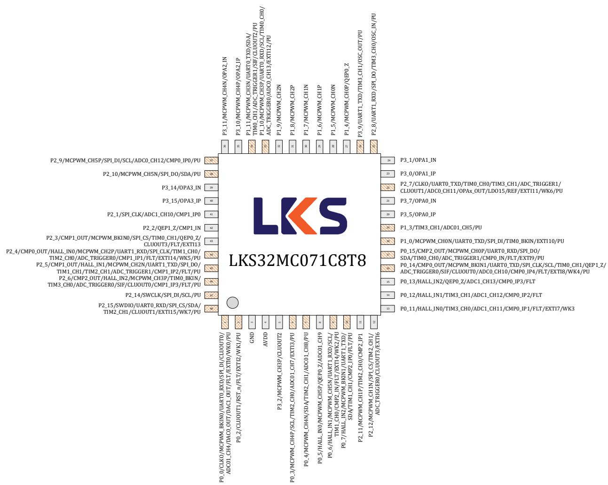  
图 3-2 LKS32MC071C8T8 管脚分布图

表 3-2 LKS32MC071C8T8 管脚说明

<table><tr><td rowspan="13">1</td><td>P0_0</td><td>P0.0</td></tr><tr><td>CLKO</td><td>时钟输出(用于调试)</td></tr><tr><td>MCPWM_BKIN0</td><td>PWM 停机输入信号 0</td></tr><tr><td>UART0_RXD</td><td>串口 0 接收(发送)</td></tr><tr><td>SPI_DI</td><td>SPI 数据输入(输出)</td></tr><tr><td>CLUOUT0</td><td>CLU0 输出</td></tr><tr><td>ADC01_CH4</td><td>ADC0/ADC1 通道 4</td></tr><tr><td>DAC0_OUT</td><td>DAC0 输出</td></tr><tr><td>DAC1_OUT</td><td>DAC1 输出</td></tr><tr><td>FLT</td><td>IO 滤波</td></tr><tr><td>EXTIO</td><td>外部 GPIO 中断信号 0</td></tr><tr><td>WK0</td><td>外部唤醒信号 0</td></tr><tr><td>PU</td><td>内置 12kΩ上拉电阻,软件可关闭</td></tr><tr><td rowspan="7">2</td><td>P0_2</td><td>P0.2</td></tr><tr><td>CLUOUT1</td><td>CLU1 输出</td></tr><tr><td>RST_n</td><td>复位引脚,P0.2 默认用作 RSTN。建议接一个 10nF~100nF 的电容到地,并在 RSTN 和 AVDD 之间放置一个 12k~20k 的上拉电阻。如果外部有上拉电阻,RSTN 的电容应为 100nF。P0.2 可切换为 GPIO,切换后可关闭 12kΩ 上拉电阻。</td></tr><tr><td>FLT</td><td>IO 滤波</td></tr><tr><td>EXTI2</td><td>外部 GPIO 中断信号 2</td></tr><tr><td>WK1</td><td>外部唤醒信号 1</td></tr><tr><td>PU</td><td>内置 12kΩ 上拉电阻,软件可关闭</td></tr><tr><td>3</td><td>GND</td><td>芯片地,强烈建议多个地引脚在 PCB 上统一接地</td></tr><tr><td>4</td><td>AVDD</td><td>芯片电源,供电范围 2.5~5.5V</td></tr><tr><td rowspan="3">5</td><td>P3_2</td><td>P3.2</td></tr><tr><td>MCPWM_CH3P</td><td>PWM 通道 3 高边</td></tr><tr><td>CLUOUT2</td><td>CLU2 输出</td></tr><tr><td rowspan="7">6</td><td>P0_3</td><td>P0.3</td></tr><tr><td>MCPWM_CH4P</td><td>PWM 通道 4 高边</td></tr><tr><td>SCL</td><td>I2C 时钟</td></tr><tr><td>TIM2_CH0</td><td>Timer2 通道 0</td></tr><tr><td>ADC01_CH7</td><td>ADC0/ADC1 通道 7</td></tr><tr><td>EXTI3</td><td>外部 GPIO 中断信号 3</td></tr><tr><td>PU</td><td>内置 12kΩ 上拉电阻,软件可关闭</td></tr><tr><td rowspan="6">7</td><td>P0_4</td><td>P0.4</td></tr><tr><td>MCPWM_CH4N</td><td>PWM 通道 4 低边</td></tr><tr><td>SDA</td><td>I2C 数据</td></tr><tr><td>TIM2_CH1</td><td>Timer2 通道 1</td></tr><tr><td>ADC01_CH8</td><td>ADC0/ADC1 通道 8</td></tr><tr><td>PU</td><td>内置 12kΩ 上拉电阻,软件可关闭</td></tr><tr><td rowspan="5">8</td><td>P0_5</td><td>P0.5</td></tr><tr><td>HALL_IN0</td><td>HALL 接口输入 0</td></tr><tr><td>MCPWM_CH5P</td><td>PWM 通道 5 高边</td></tr><tr><td>QEP0_Z</td><td>QEP0 编码器 Z 相</td></tr><tr><td>ADC01_CH9</td><td>ADC0/ADC1 通道 9</td></tr><tr><td rowspan="10">9</td><td>P0_6</td><td>P0.6</td></tr><tr><td>HALL_IN1</td><td>HALL 接口输入 1</td></tr><tr><td>MCPWM_CH5N</td><td>PWM 通道 5 低边</td></tr><tr><td>UART1_RXD</td><td>串口 1 接收(发送)</td></tr><tr><td>SCL</td><td>I2C 时钟</td></tr><tr><td>TIM1_CH0</td><td>Timer1 通道 0</td></tr><tr><td>CMP2_IN</td><td>比较器 2 负端输入</td></tr><tr><td>FLT</td><td>IO 滤波</td></tr><tr><td>EXTI4</td><td>外部 GPIO 中断信号 4</td></tr><tr><td>WK2PU</td><td>外部唤醒信号 2内置12kΩ上拉电阻,软件可关闭</td></tr><tr><td rowspan="9">10</td><td>P0_7</td><td>P0.7</td></tr><tr><td>HALL_IN2</td><td>HALL接口输入2</td></tr><tr><td>MCPWM_BKIN1</td><td>PWM停机输入信号1</td></tr><tr><td>UART1_TXD</td><td>串口1发送(接收)</td></tr><tr><td>SDA</td><td>I2C数据</td></tr><tr><td>TIM1_CH1</td><td>Timer1通道1</td></tr><tr><td>CMP2_IP0</td><td>比较器2正端输入0</td></tr><tr><td>FLT</td><td>IO滤波</td></tr><tr><td>PU</td><td>内置12kΩ上拉电阻,软件可关闭</td></tr><tr><td rowspan="4">11</td><td>P2_11</td><td>P2.11</td></tr><tr><td>MCPWM_CH1P</td><td>PWM通道1高边</td></tr><tr><td>TIM2_CH0</td><td>Timer2通道0</td></tr><tr><td>CMP2_IP1</td><td>比较器2正端输入1</td></tr><tr><td rowspan="7">12</td><td>P2_12</td><td>P2.12</td></tr><tr><td>MCPWM_CH1N</td><td>PWM通道1低边</td></tr><tr><td>SPI_CS</td><td>SPI片选</td></tr><tr><td>TIM2_CH1</td><td>Timer2通道1</td></tr><tr><td>ADC_TRIGGER0</td><td>ADC0触发信号输出(用于调试)</td></tr><tr><td>CLUOUT3</td><td>CLU3输出</td></tr><tr><td>EXTI6</td><td>外部GPIO中断信号6</td></tr><tr><td rowspan="8">13</td><td>P0_11</td><td>P0.11</td></tr><tr><td>HALL_IN0</td><td>HALL接口输入0</td></tr><tr><td>TIM3_CH0</td><td>Timer3通道0</td></tr><tr><td>ADC1_CH11</td><td>ADC1通道11</td></tr><tr><td>CMP0_IP1</td><td>比较器0正端输入1</td></tr><tr><td>FLT</td><td>IO滤波</td></tr><tr><td>EXTI7</td><td>外部GPIO中断信号7</td></tr><tr><td>WK3</td><td>外部唤醒信号3</td></tr><tr><td rowspan="6">14</td><td>P0_12</td><td>P0.12</td></tr><tr><td>HALL_IN1</td><td>HALL接口输入1</td></tr><tr><td>TIM3_CH1</td><td>Timer3通道1</td></tr><tr><td>ADC1_CH12</td><td>ADC1通道12</td></tr><tr><td>CMP0_IP2</td><td>比较器0正端输入2</td></tr><tr><td>FLT</td><td>IO滤波</td></tr><tr><td rowspan="6">15</td><td>P0_13</td><td>P0.13</td></tr><tr><td>HALL_IN2</td><td>HALL接口输入2</td></tr><tr><td>QEP0_Z</td><td>QEP0编码器Z相</td></tr><tr><td>ADC1_CH13</td><td>ADC1通道13</td></tr><tr><td>CMP0_IP3</td><td>比较器0正端输入3</td></tr><tr><td>FLT</td><td>IO滤波</td></tr><tr><td rowspan="2">16</td><td>P0_14</td><td>P0.14</td></tr><tr><td>CMP0_OUTMCPWM_BKIN1</td><td>比较器0输出PWM停机输入信号1</td></tr><tr><td rowspan="14"></td><td>UART0_TXD</td><td>串口0发送(接收)</td></tr><tr><td>SPI_CLK</td><td>SPI时钟</td></tr><tr><td>SCL</td><td>I2C时钟</td></tr><tr><td>TIM0_CH1</td><td>Timer0通道1</td></tr><tr><td>QEP1_Z</td><td>QEP1编码器Z相</td></tr><tr><td>ADC_TRIGGER0</td><td>ADC0触发信号输出(用于调试)</td></tr><tr><td>SIF</td><td>单线通讯</td></tr><tr><td>CLUOUT0</td><td>CLU0输出</td></tr><tr><td>ADC0_CH10</td><td>ADC0通道10</td></tr><tr><td>CMP0_IP4</td><td>比较器0正端输入4</td></tr><tr><td>FLT</td><td>IO滤波</td></tr><tr><td>EXTI8</td><td>外部GPIO中断信号8</td></tr><tr><td>WK4</td><td>外部唤醒信号4</td></tr><tr><td>PU</td><td>内置12kΩ上拉电阻,软件可关闭</td></tr><tr><td rowspan="12">17</td><td>P0_15</td><td>P0.15</td></tr><tr><td>CMP2_OUT</td><td>比较器2输出</td></tr><tr><td>MCPWM_CH0P</td><td>PWM通道0高边</td></tr><tr><td>UART0_RXD</td><td>串口0接收(发送)</td></tr><tr><td>SPI_DO</td><td>SPI数据输出(输入)</td></tr><tr><td>SDA</td><td>I2C数据</td></tr><tr><td>TIM0_CH0</td><td>Timer0通道0</td></tr><tr><td>ADC_TRIGGER1</td><td>ADC1触发信号输出(用于调试)</td></tr><tr><td>CMP0_IN</td><td>比较器0负端输入</td></tr><tr><td>FLT</td><td>IO滤波</td></tr><tr><td>EXTI9</td><td>外部GPIO中断信号9</td></tr><tr><td>PU</td><td>内置12kΩ上拉电阻,软件可关闭</td></tr><tr><td rowspan="7">18</td><td>P1_0</td><td>P1.0</td></tr><tr><td>MCPWM_CH0N</td><td>PWM通道0低边</td></tr><tr><td>UART0_TXD</td><td>串口0发送(接收)</td></tr><tr><td>SPI_DI</td><td>SPI数据输入(输出)</td></tr><tr><td>TIM0_BKIN</td><td>TIMER0_FAIL信号来自GPIO</td></tr><tr><td>EXTI10</td><td>外部GPIO中断信号10</td></tr><tr><td>PU</td><td>内置12kΩ上拉电阻,软件可关闭</td></tr><tr><td rowspan="4">19</td><td>P1_3</td><td>P1.3</td></tr><tr><td>TIM3_CH1</td><td>Timer3通道1</td></tr><tr><td>ADC01_CH5</td><td>ADC0/ADC1通道5</td></tr><tr><td>PU</td><td>内置12kΩ上拉电阻,软件可关闭</td></tr><tr><td rowspan="2">20</td><td>P3_5</td><td>P3.5</td></tr><tr><td>OPA0_IP</td><td>运放0正端输入</td></tr><tr><td rowspan="2">21</td><td>P3_7</td><td>P3.7</td></tr><tr><td>OPA0_IN</td><td>运放0负端输入</td></tr><tr><td>22</td><td>P2_7CLKO</td><td>P2.7时钟输出(用于调试)</td></tr><tr><td rowspan="12"></td><td>UART0_TXD</td><td>串口0发送(接收)</td></tr><tr><td>TIM0_CH0</td><td>Timer0通道0</td></tr><tr><td>TIM3_CH1</td><td>Timer3通道1</td></tr><tr><td>ADC_TRIGGER1</td><td>ADC1触发信号输出(用于调试)</td></tr><tr><td>CLUOUT1</td><td>CLU1输出</td></tr><tr><td>ADC0_CH11</td><td>ADC0通道11</td></tr><tr><td>OPAx_OUT</td><td>运放输出</td></tr><tr><td>LDO15</td><td>1.5V LDO输出</td></tr><tr><td>REF</td><td>参考电压</td></tr><tr><td>EXTI11</td><td>外部GPIO中断信号11</td></tr><tr><td>WK6</td><td>外部唤醒信号6</td></tr><tr><td>PU</td><td>内置12kΩ上拉电阻,软件可关闭</td></tr><tr><td rowspan="2">23</td><td>P3_0</td><td>P3.0</td></tr><tr><td>OPA1_IP</td><td>运放1正端输入</td></tr><tr><td rowspan="2">24</td><td>P3_1</td><td>P3.1</td></tr><tr><td>OPA1_IN</td><td>运放1负端输入</td></tr><tr><td rowspan="6">25</td><td>P2_8</td><td>P2.8</td></tr><tr><td>UART1_RXD</td><td>串口1接收(发送)</td></tr><tr><td>SPI_DO</td><td>SPI数据输出(输入)</td></tr><tr><td>TIM3_CH0</td><td>Timer3通道0</td></tr><tr><td>OSC_IN</td><td>外部晶振引脚</td></tr><tr><td>PU</td><td>内置12kΩ上拉电阻,软件可关闭</td></tr><tr><td rowspan="5">26</td><td>P3_9</td><td>P3.9</td></tr><tr><td>UART1_TXD</td><td>串口1发送(接收)</td></tr><tr><td>TIM3_CH1</td><td>Timer3通道1</td></tr><tr><td>OSC_OUT</td><td>外部晶振引脚</td></tr><tr><td>PU</td><td>内置12kΩ上拉电阻,软件可关闭</td></tr><tr><td rowspan="3">27</td><td>P1_4</td><td>P1.4</td></tr><tr><td>MCPWM_CH0P</td><td>PWM通道0高边</td></tr><tr><td>QEP0_Z</td><td>QEP0编码器Z相</td></tr><tr><td rowspan="2">28</td><td>P1_5</td><td>P1.5</td></tr><tr><td>MCPWM_CH0N</td><td>PWM通道0低边</td></tr><tr><td rowspan="2">29</td><td>P1_6</td><td>P1.6</td></tr><tr><td>MCPWM_CH1P</td><td>PWM通道1高边</td></tr><tr><td rowspan="2">30</td><td>P1_7</td><td>P1.7</td></tr><tr><td>MCPWM_CH1N</td><td>PWM通道1低边</td></tr><tr><td rowspan="2">31</td><td>P1_8</td><td>P1.8</td></tr><tr><td>MCPWM_CH2P</td><td>PWM通道2高边</td></tr><tr><td rowspan="2">32</td><td>P1_9</td><td>P1.9</td></tr><tr><td>MCPWM_CH2N</td><td>PWM通道2低边</td></tr><tr><td rowspan="2">33</td><td>P1_10</td><td>P1.10</td></tr><tr><td>MCPWM_CH3PUART0_RXD</td><td>PWM通道3高边串口0接收(发送)</td></tr><tr><td rowspan="6"></td><td>SCL</td><td>I2C时钟</td></tr><tr><td>TIM0_CH0</td><td>Timer0通道0</td></tr><tr><td>ADC_TRIGGER0</td><td>ADC0触发信号输出(用于调试)</td></tr><tr><td>ADC0_CH13</td><td>ADC0通道13</td></tr><tr><td>EXTI12</td><td>外部GPIO中断信号12</td></tr><tr><td>PU</td><td>内置12kΩ上拉电阻,软件可关闭</td></tr><tr><td rowspan="9">34</td><td>P1_11</td><td>P1.11</td></tr><tr><td>MCPWM_CH3N</td><td>PWM通道3低边</td></tr><tr><td>UART0_TXD</td><td>串口0发送(接收)</td></tr><tr><td>SDA</td><td>I2C数据</td></tr><tr><td>TIM0_CH1</td><td>Timer0通道1</td></tr><tr><td>ADC_TRIGGER1</td><td>ADC1触发信号输出(用于调试)</td></tr><tr><td>SIF</td><td>单线通讯</td></tr><tr><td>CLUOUT2</td><td>CLU2输出</td></tr><tr><td>PU</td><td>内置12kΩ上拉电阻,软件可关闭</td></tr><tr><td rowspan="3">35</td><td>P3_10</td><td>P3.10</td></tr><tr><td>MCPWM_CH4P</td><td>PWM通道4高边</td></tr><tr><td>OPA2_IP</td><td>运放2正端输入</td></tr><tr><td rowspan="3">36</td><td>P3_11</td><td>P3.11</td></tr><tr><td>MCPWM_CH4N</td><td>PWM通道4低边</td></tr><tr><td>OPA2_IN</td><td>运放2负端输入</td></tr><tr><td rowspan="7">37</td><td>P2_9</td><td>P2.9</td></tr><tr><td>MCPWM_CH5P</td><td>PWM通道5高边</td></tr><tr><td>SPI_DI</td><td>SPI数据输入(输出)</td></tr><tr><td>SCL</td><td>I2C时钟</td></tr><tr><td>CMP0_IP0</td><td>比较器0正端输入0</td></tr><tr><td>ADC0_CH12</td><td>ADC0通道12</td></tr><tr><td>PU</td><td>内置12kΩ上拉电阻,软件可关闭</td></tr><tr><td rowspan="5">38</td><td>P2_10</td><td>P2.10</td></tr><tr><td>MCPWM_CH5N</td><td>PWM通道5低边</td></tr><tr><td>SPI_DO</td><td>SPI数据输出(输入)</td></tr><tr><td>SDA</td><td>I2C数据</td></tr><tr><td>PU</td><td>内置12kΩ上拉电阻,软件可关闭</td></tr><tr><td rowspan="2">39</td><td>P3_14</td><td>P3.14</td></tr><tr><td>OPA3_IN</td><td>运放3负端输入</td></tr><tr><td rowspan="2">40</td><td>P3_15</td><td>P3.15</td></tr><tr><td>OPA3_IP</td><td>运放3正端输入</td></tr><tr><td rowspan="4">41</td><td>P2_1</td><td>P2.1</td></tr><tr><td>SPI_CLK</td><td>SPI时钟</td></tr><tr><td>ADC1_CH10</td><td>ADC1通道10</td></tr><tr><td>CMP1_IP0</td><td>比较器1正端输入0</td></tr><tr><td>42</td><td>P2_2QEP1_Z</td><td>P2.2QEP1 编码器 Z 相</td></tr><tr><td></td><td>CMP1_IN</td><td>比较器 1 负端输入</td></tr><tr><td rowspan="9">43</td><td>P2_3</td><td>P2.3</td></tr><tr><td>CMP1_OUT</td><td>比较器 1 输出</td></tr><tr><td>MCPWM_BKINO</td><td>PWM 停机输入信号 0</td></tr><tr><td>SPI_CS</td><td>SPI 片选</td></tr><tr><td>TIMO_CH1</td><td>Timer0 通道 1</td></tr><tr><td>QEP0_Z</td><td>QEP0 编码器 Z 相</td></tr><tr><td>CLUOUT3</td><td>CLU3 输出</td></tr><tr><td>FLT</td><td>IO 滤波</td></tr><tr><td>EXTI13</td><td>外部 GPIO 中断信号 13</td></tr><tr><td rowspan="14">44</td><td>P2_4</td><td>P2.4</td></tr><tr><td>CMP0_OUT</td><td>比较器 0 输出</td></tr><tr><td>HALL_INO</td><td>HALL 接口输入 0</td></tr><tr><td>MCPWM_CH2P</td><td>PWM 通道 2 高边</td></tr><tr><td>UART1_RXD</td><td>串口 1 接收(发送)</td></tr><tr><td>SPI_CLK</td><td>SPI 时钟</td></tr><tr><td>TIM1_CH0</td><td>Timer1 通道 0</td></tr><tr><td>TIM2_CH0</td><td>Timer2 通道 0</td></tr><tr><td>ADC_TRIGGER0</td><td>ADC0 触发信号输出(用于调试)</td></tr><tr><td>CMP1_IP1</td><td>比较器 1 正端输入 1</td></tr><tr><td>FLT</td><td>IO 滤波</td></tr><tr><td>EXTI14</td><td>外部 GPIO 中断信号 14</td></tr><tr><td>WK5</td><td>外部唤醒信号 5</td></tr><tr><td>PU</td><td>内置 12kΩ上拉电阻,软件可关闭</td></tr><tr><td rowspan="12">45</td><td>P2_5</td><td>P2.5</td></tr><tr><td>CMP1_OUT</td><td>比较器 1 输出</td></tr><tr><td>HALL_IN1</td><td>HALL 接口输入 1</td></tr><tr><td>MCPWM_CH2N</td><td>PWM 通道 2 低边</td></tr><tr><td>UART1_TXD</td><td>串口 1 发送(接收)</td></tr><tr><td>SPI_DO</td><td>SPI 数据输出(输入)</td></tr><tr><td>TIM1_CH1</td><td>Timer1 通道 1</td></tr><tr><td>TIM2_CH1</td><td>Timer2 通道 1</td></tr><tr><td>ADC_TRIGGER1</td><td>ADC1 触发信号输出(用于调试)</td></tr><tr><td>CMP1_IP2</td><td>比较器 1 正端输入 2</td></tr><tr><td>FLT</td><td>IO 滤波</td></tr><tr><td>PU</td><td>内置 12kΩ上拉电阻,软件可关闭</td></tr><tr><td rowspan="6">46</td><td>P2_6</td><td>P2.6</td></tr><tr><td>CMP2_OUT</td><td>比较器 2 输出</td></tr><tr><td>HALL_IN2</td><td>HALL 接口输入 2</td></tr><tr><td>MCPWM_CH3P</td><td>PWM 通道 3 高边</td></tr><tr><td>TIMO_BKIN</td><td>TIMER0_FAIL 信号来自 GPIO</td></tr><tr><td>TIM3_CH0</td><td>Timer3 通道 0</td></tr></table>

管脚分布

<table><tr><td rowspan="6"></td><td>ADC_TRIGGER0</td><td>ADC0 触发信号输出(用于调试)</td></tr><tr><td>SIF</td><td>单线通讯</td></tr><tr><td>CLUOUT0</td><td>CLU0 输出</td></tr><tr><td>CMP1_IP3</td><td>比较器 1 正端输入 3</td></tr><tr><td>FLT</td><td>IO 滤波</td></tr><tr><td>PU</td><td>内置 12kΩ上拉电阻,软件可关闭</td></tr><tr><td rowspan="5">47</td><td>P2_14</td><td>P2.14</td></tr><tr><td>SWCLK</td><td>SWD 时钟</td></tr><tr><td>SPI_DI</td><td>SPI 数据输入(输出)</td></tr><tr><td>SCL</td><td>I2C 时钟</td></tr><tr><td>PU</td><td>内置 12kΩ上拉电阻,软件可关闭</td></tr><tr><td rowspan="10">48</td><td>P2_15</td><td>P2.15</td></tr><tr><td>SWDIO</td><td>SWD 数据</td></tr><tr><td>UART0_RXD</td><td>串口 0 接收(发送)</td></tr><tr><td>SPI_CS</td><td>SPI 片选</td></tr><tr><td>SDA</td><td>I2C 数据</td></tr><tr><td>TIM2_CH1</td><td>Timer2 通道 1</td></tr><tr><td>CLUOUT1</td><td>CLU1 输出</td></tr><tr><td>EXTI15</td><td>外部 GPIO 中断信号 15</td></tr><tr><td>WK7</td><td>外部唤醒信号 7</td></tr><tr><td>PU</td><td>内置 12kΩ上拉电阻,软件可关闭</td></tr></table>

## 3.1.3 LKS32MC071CBT8

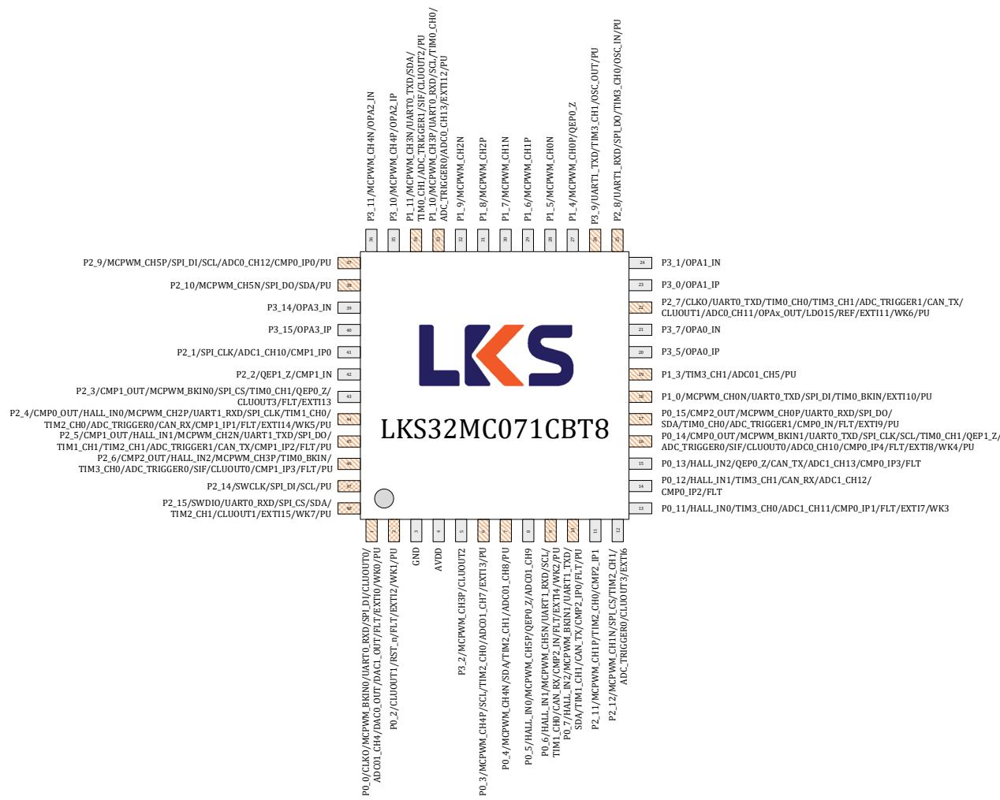  
图 3-3 LKS32MC071CBT8 管脚分布图

表 3-3 LKS32MC071CBT8 管脚说明

<table><tr><td rowspan="13">1</td><td>P0_0</td><td>P0.0</td></tr><tr><td>CLKO</td><td>时钟输出(用于调试)</td></tr><tr><td>MCPWM_BKIN0</td><td>PWM 停机输入信号 0</td></tr><tr><td>UART0_RXD</td><td>串口 0 接收(发送)</td></tr><tr><td>SPI_DI</td><td>SPI 数据输入(输出)</td></tr><tr><td>CLUOUT0</td><td>CLU0 输出</td></tr><tr><td>ADC01_CH4</td><td>ADC0/ADC1 通道 4</td></tr><tr><td>DAC0_OUT</td><td>DAC0 输出</td></tr><tr><td>DAC1_OUT</td><td>DAC1 输出</td></tr><tr><td>FLT</td><td>IO 滤波</td></tr><tr><td>EXTIO</td><td>外部 GPIO 中断信号 0</td></tr><tr><td>WK0</td><td>外部唤醒信号 0</td></tr><tr><td>PU</td><td>内置 12kΩ上拉电阻,软件可关闭</td></tr></table>

管脚分布

<table><tr><td rowspan="7">2</td><td>P0_2</td><td>P0.2</td></tr><tr><td>CLUOUT1</td><td>CLU1 输出</td></tr><tr><td>RST_n</td><td>复位引脚,P0.2 默认用作 RSTN。建议接一个 10nF~100nF 的电容到地,并在 RSTN 和 AVDD 之间放置一个 12k~20k 的上拉电阻。如果外部有上拉电阻,RSTN 的电容应为 100nF。P0.2 可切换为 GPIO,切换后可关闭 12kΩ 上拉电阻。</td></tr><tr><td>FLT</td><td>IO 滤波</td></tr><tr><td>EXTI2</td><td>外部 GPIO 中断信号 2</td></tr><tr><td>WK1</td><td>外部唤醒信号 1</td></tr><tr><td>PU</td><td>内置 12kΩ 上拉电阻,软件可关闭</td></tr><tr><td>3</td><td>GND</td><td>芯片地,强烈建议多个地引脚在 PCB 上统一接地</td></tr><tr><td>4</td><td>AVDD</td><td>芯片电源,供电范围 2.5~5.5V</td></tr><tr><td rowspan="3">5</td><td>P3_2</td><td>P3.2</td></tr><tr><td>MCPWM_CH3P</td><td>PWM 通道 3 高边</td></tr><tr><td>CLUOUT2</td><td>CLU2 输出</td></tr><tr><td rowspan="7">6</td><td>P0_3</td><td>P0.3</td></tr><tr><td>MCPWM_CH4P</td><td>PWM 通道 4 高边</td></tr><tr><td>SCL</td><td>I2C 时钟</td></tr><tr><td>TIM2_CH0</td><td>Timer2 通道 0</td></tr><tr><td>ADC01_CH7</td><td>ADC0/ADC1 通道 7</td></tr><tr><td>EXTI3</td><td>外部 GPIO 中断信号 3</td></tr><tr><td>PU</td><td>内置 12kΩ 上拉电阻,软件可关闭</td></tr><tr><td rowspan="6">7</td><td>P0_4</td><td>P0.4</td></tr><tr><td>MCPWM_CH4N</td><td>PWM 通道 4 低边</td></tr><tr><td>SDA</td><td>I2C 数据</td></tr><tr><td>TIM2_CH1</td><td>Timer2 通道 1</td></tr><tr><td>ADC01_CH8</td><td>ADC0/ADC1 通道 8</td></tr><tr><td>PU</td><td>内置 12kΩ 上拉电阻,软件可关闭</td></tr><tr><td rowspan="5">8</td><td>P0_5</td><td>P0.5</td></tr><tr><td>HALL_IN0</td><td>HALL 接口输入 0</td></tr><tr><td>MCPWM_CH5P</td><td>PWM 通道 5 高边</td></tr><tr><td>QEP0_Z</td><td>QEP0 编码器 Z 相</td></tr><tr><td>ADC01_CH9</td><td>ADC0/ADC1 通道 9</td></tr><tr><td rowspan="10">9</td><td>P0_6</td><td>P0.6</td></tr><tr><td>HALL_IN1</td><td>HALL 接口输入 1</td></tr><tr><td>MCPWM_CH5N</td><td>PWM 通道 5 低边</td></tr><tr><td>CAN_RX</td><td>CAN 接收端</td></tr><tr><td>UART1_RXD</td><td>串口 1 接收(发送)</td></tr><tr><td>SCL</td><td>I2C 时钟</td></tr><tr><td>TIM1_CH0</td><td>Timer1 通道 0</td></tr><tr><td>CMP2_IN</td><td>比较器 2 负端输入</td></tr><tr><td>FLT</td><td>IO 滤波</td></tr><tr><td>EXTI4</td><td>外部 GPIO 中断信号 4</td></tr></table>

管脚分布

<table><tr><td rowspan="2"></td><td>WK2</td><td>外部唤醒信号2</td></tr><tr><td>PU</td><td>内置12kΩ上拉电阻,软件可关闭</td></tr><tr><td rowspan="10">10</td><td>P0_7</td><td>P0.7</td></tr><tr><td>HALL_IN2</td><td>HALL接口输入2</td></tr><tr><td>MCPWM_BKIN1</td><td>PWM停机输入信号1</td></tr><tr><td>UART1_TXD</td><td>串口1发送(接收)</td></tr><tr><td>SDA</td><td>I2C数据</td></tr><tr><td>TIM1_CH1</td><td>Timer1通道1</td></tr><tr><td>CAN_TX</td><td>CAN发送端</td></tr><tr><td>CMP2_IP0</td><td>比较器2正端输入0</td></tr><tr><td>FLT</td><td>IO滤波</td></tr><tr><td>PU</td><td>内置12kΩ上拉电阻,软件可关闭</td></tr><tr><td rowspan="4">11</td><td>P2_11</td><td>P2.11</td></tr><tr><td>MCPWM_CH1P</td><td>PWM通道1高边</td></tr><tr><td>TIM2_CH0</td><td>Timer2通道0</td></tr><tr><td>CMP2_IP1</td><td>比较器2正端输入1</td></tr><tr><td rowspan="7">12</td><td>P2_12</td><td>P2.12</td></tr><tr><td>MCPWM_CH1N</td><td>PWM通道1低边</td></tr><tr><td>SPI_CS</td><td>SPI片选</td></tr><tr><td>TIM2_CH1</td><td>Timer2通道1</td></tr><tr><td>ADC_TRIGGER0</td><td>ADC0触发信号输出(用于调试)</td></tr><tr><td>CLUOUT3</td><td>CLU3输出</td></tr><tr><td>EXTI6</td><td>外部GPIO中断信号6</td></tr><tr><td rowspan="8">13</td><td>P0_11</td><td>P0.11</td></tr><tr><td>HALL_IN0</td><td>HALL接口输入0</td></tr><tr><td>TIM3_CH0</td><td>Timer3通道0</td></tr><tr><td>ADC1_CH11</td><td>ADC1通道11</td></tr><tr><td>CMP0_IP1</td><td>比较器0正端输入1</td></tr><tr><td>FLT</td><td>IO滤波</td></tr><tr><td>EXTI7</td><td>外部GPIO中断信号7</td></tr><tr><td>WK3</td><td>外部唤醒信号3</td></tr><tr><td rowspan="7">14</td><td>P0_12</td><td>P0.12</td></tr><tr><td>HALL_IN1</td><td>HALL接口输入1</td></tr><tr><td>TIM3_CH1</td><td>Timer3通道1</td></tr><tr><td>CAN_RX</td><td>CAN接收端</td></tr><tr><td>ADC1_CH12</td><td>ADC1通道12</td></tr><tr><td>CMP0_IP2</td><td>比较器0正端输入2</td></tr><tr><td>FLT</td><td>IO滤波</td></tr><tr><td rowspan="5">15</td><td>P0_13</td><td>P0.13</td></tr><tr><td>HALL_IN2</td><td>HALL接口输入2</td></tr><tr><td>QEP0_Z</td><td>QEP0编码器Z相</td></tr><tr><td>CAN_TX</td><td>CAN发送端</td></tr><tr><td>ADC1_CH13CMP0_IP3</td><td>ADC1通道13比较器0正端输入3</td></tr><tr><td></td><td>FLT</td><td>IO滤波</td></tr><tr><td rowspan="17">16</td><td>P0_14</td><td>P0.14</td></tr><tr><td>CMP0_OUT</td><td>比较器0输出</td></tr><tr><td>MCPWM_BKIN1</td><td>PWM停机输入信号1</td></tr><tr><td>UART0_TXD</td><td>串口0发送(接收)</td></tr><tr><td>SPI_CLK</td><td>SPI时钟</td></tr><tr><td>SCL</td><td>I2C时钟</td></tr><tr><td>TIM0_CH1</td><td>Timer0通道1</td></tr><tr><td>QEP1_Z</td><td>QEP1编码器Z相</td></tr><tr><td>ADC_TRIGGER0</td><td>ADC0触发信号输出(用于调试)</td></tr><tr><td>SIF</td><td>单线通讯</td></tr><tr><td>CLUOUT0</td><td>CLU0输出</td></tr><tr><td>ADC0_CH10</td><td>ADC0通道10</td></tr><tr><td>CMP0_IP4</td><td>比较器0正端输入4</td></tr><tr><td>FLT</td><td>IO滤波</td></tr><tr><td>EXTI8</td><td>外部GPIO中断信号8</td></tr><tr><td>WK4</td><td>外部唤醒信号4</td></tr><tr><td>PU</td><td>内置12kΩ上拉电阻,软件可关闭</td></tr><tr><td rowspan="12">17</td><td>P0_15</td><td>P0.15</td></tr><tr><td>CMP2_OUT</td><td>比较器2输出</td></tr><tr><td>MCPWM_CHOP</td><td>PWM通道0高边</td></tr><tr><td>UART0_RXD</td><td>串口0接收(发送)</td></tr><tr><td>SPI_DO</td><td>SPI数据输出(输入)</td></tr><tr><td>SDA</td><td>I2C数据</td></tr><tr><td>TIM0_CH0</td><td>Timer0通道0</td></tr><tr><td>ADC_TRIGGER1</td><td>ADC1触发信号输出(用于调试)</td></tr><tr><td>CMP0_IN</td><td>比较器0负端输入</td></tr><tr><td>FLT</td><td>IO滤波</td></tr><tr><td>EXTI9</td><td>外部GPIO中断信号9</td></tr><tr><td>PU</td><td>内置12kΩ上拉电阻,软件可关闭</td></tr><tr><td rowspan="7">18</td><td>P1_0</td><td>P1.0</td></tr><tr><td>MCPWM_CHON</td><td>PWM通道0低边</td></tr><tr><td>UART0_TXD</td><td>串口0发送(接收)</td></tr><tr><td>SPI_DI</td><td>SPI数据输入(输出)</td></tr><tr><td>TIM0_BKIN</td><td>TIMER0_FAIL信号来自GPIO</td></tr><tr><td>EXTI10</td><td>外部GPIO中断信号10</td></tr><tr><td>PU</td><td>内置12kΩ上拉电阻,软件可关闭</td></tr><tr><td rowspan="4">19</td><td>P1_3</td><td>P1.3</td></tr><tr><td>TIM3_CH1</td><td>Timer3通道1</td></tr><tr><td>ADC01_CH5</td><td>ADC0/ADC1通道5</td></tr><tr><td>PU</td><td>内置12kΩ上拉电阻,软件可关闭</td></tr><tr><td>20</td><td>P3_5OPA0_IP</td><td>P3.5运放0正端输入</td></tr><tr><td rowspan="2">21</td><td>P3_7</td><td>P3.7</td></tr><tr><td>OPA0_IN</td><td>运放0负端输入</td></tr><tr><td rowspan="15">22</td><td>P2_7</td><td>P2.7</td></tr><tr><td>CLKO</td><td>时钟输出(用于调试)</td></tr><tr><td>UART0_TXD</td><td>串口0发送(接收)</td></tr><tr><td>TIM0_CH0</td><td>Timer0通道0</td></tr><tr><td>TIM3_CH1</td><td>Timer3通道1</td></tr><tr><td>ADC_TRIGGER1</td><td>ADC1触发信号输出(用于调试)</td></tr><tr><td>CAN_TX</td><td>CAN发送端</td></tr><tr><td>CLUOUT1</td><td>CLU1输出</td></tr><tr><td>ADC0_CH11</td><td>ADC0通道11</td></tr><tr><td>OPAx_OUT</td><td>运放输出</td></tr><tr><td>LDO15</td><td>1.5V LDO输出</td></tr><tr><td>REF</td><td>参考电压</td></tr><tr><td>EXTI11</td><td>外部GPIO中断信号11</td></tr><tr><td>WK6</td><td>外部唤醒信号6</td></tr><tr><td>PU</td><td>内置12kΩ上拉电阻,软件可关闭</td></tr><tr><td rowspan="2">23</td><td>P3_0</td><td>P3.0</td></tr><tr><td>OPA1_IP</td><td>运放1正端输入</td></tr><tr><td rowspan="2">24</td><td>P3_1</td><td>P3.1</td></tr><tr><td>OPA1_IN</td><td>运放1负端输入</td></tr><tr><td rowspan="6">25</td><td>P2_8</td><td>P2.8</td></tr><tr><td>UART1_RXD</td><td>串口1接收(发送)</td></tr><tr><td>SPI_DO</td><td>SPI数据输出(输入)</td></tr><tr><td>TIM3_CH0</td><td>Timer3通道0</td></tr><tr><td>OSC_IN</td><td>外部晶振引脚</td></tr><tr><td>PU</td><td>内置12kΩ上拉电阻,软件可关闭</td></tr><tr><td rowspan="5">26</td><td>P3_9</td><td>P3.9</td></tr><tr><td>UART1_TXD</td><td>串口1发送(接收)</td></tr><tr><td>TIM3_CH1</td><td>Timer3通道1</td></tr><tr><td>OSC_OUT</td><td>外部晶振引脚</td></tr><tr><td>PU</td><td>内置12kΩ上拉电阻,软件可关闭</td></tr><tr><td rowspan="3">27</td><td>P1_4</td><td>P1.4</td></tr><tr><td>MCPWM_CH0P</td><td>PWM通道0高边</td></tr><tr><td>QEP0_Z</td><td>QEP0编码器Z相</td></tr><tr><td rowspan="2">28</td><td>P1_5</td><td>P1.5</td></tr><tr><td>MCPWM_CH0N</td><td>PWM通道0低边</td></tr><tr><td rowspan="2">29</td><td>P1_6</td><td>P1.6</td></tr><tr><td>MCPWM_CH1P</td><td>PWM通道1高边</td></tr><tr><td rowspan="2">30</td><td>P1_7</td><td>P1.7</td></tr><tr><td>MCPWM_CH1N</td><td>PWM通道1低边</td></tr><tr><td>31</td><td>P1_8MCPWM_CH2P</td><td>P1.8PWM通道2高边</td></tr><tr><td rowspan="2">32</td><td>P1_9</td><td>P1.9</td></tr><tr><td>MCPWM_CH2N</td><td>PWM通道2低边</td></tr><tr><td rowspan="9">33</td><td>P1_10</td><td>P1.10</td></tr><tr><td>MCPWM_CH3P</td><td>PWM通道3高边</td></tr><tr><td>UART0_RXD</td><td>串口0接收(发送)</td></tr><tr><td>SCL</td><td>I2C时钟</td></tr><tr><td>TIM0_CH0</td><td>Timer0通道0</td></tr><tr><td>ADC_TRIGGER0</td><td>ADC0触发信号输出(用于调试)</td></tr><tr><td>ADC0_CH13</td><td>ADC0通道13</td></tr><tr><td>EXTI12</td><td>外部GPIO中断信号12</td></tr><tr><td>PU</td><td>内置12kΩ上拉电阻,软件可关闭</td></tr><tr><td rowspan="9">34</td><td>P1_11</td><td>P1.11</td></tr><tr><td>MCPWM_CH3N</td><td>PWM通道3低边</td></tr><tr><td>UART0_TXD</td><td>串口0发送(接收)</td></tr><tr><td>SDA</td><td>I2C数据</td></tr><tr><td>TIM0_CH1</td><td>Timer0通道1</td></tr><tr><td>ADC_TRIGGER1</td><td>ADC1触发信号输出(用于调试)</td></tr><tr><td>SIF</td><td>单线通讯</td></tr><tr><td>CLUOUT2</td><td>CLU2输出</td></tr><tr><td>PU</td><td>内置12kΩ上拉电阻,软件可关闭</td></tr><tr><td rowspan="3">35</td><td>P3_10</td><td>P3.10</td></tr><tr><td>MCPWM_CH4P</td><td>PWM通道4高边</td></tr><tr><td>OPA2_IP</td><td>运放2正端输入</td></tr><tr><td rowspan="3">36</td><td>P3_11</td><td>P3.11</td></tr><tr><td>MCPWM_CH4N</td><td>PWM通道4低边</td></tr><tr><td>OPA2_IN</td><td>运放2负端输入</td></tr><tr><td rowspan="7">37</td><td>P2_9</td><td>P2.9</td></tr><tr><td>MCPWM_CH5P</td><td>PWM通道5高边</td></tr><tr><td>SPI_DI</td><td>SPI数据输入(输出)</td></tr><tr><td>SCL</td><td>I2C时钟</td></tr><tr><td>CMP0_IP0</td><td>比较器0正端输入0</td></tr><tr><td>ADC0_CH12</td><td>ADCO通道12</td></tr><tr><td>PU</td><td>内置12kΩ上拉电阻,软件可关闭</td></tr><tr><td rowspan="5">38</td><td>P2_10</td><td>P2.10</td></tr><tr><td>MCPWM_CH5N</td><td>PWM通道5低边</td></tr><tr><td>SPI_DO</td><td>SPI数据输出(输入)</td></tr><tr><td>SDA</td><td>I2C数据</td></tr><tr><td>PU</td><td>内置12kΩ上拉电阻,软件可关闭</td></tr><tr><td rowspan="2">39</td><td>P3_14</td><td>P3.14</td></tr><tr><td>OPA3_IN</td><td>运放3负端输入</td></tr><tr><td rowspan="2">40</td><td>P3_15</td><td>P3.15</td></tr><tr><td>OPA3_IP</td><td>运放3正端输入</td></tr><tr><td rowspan="4">41</td><td>P2_1</td><td>P2.1</td></tr><tr><td>SPI_CLK</td><td>SPI 时钟</td></tr><tr><td>ADC1_CH10</td><td>ADC1 通道 10</td></tr><tr><td>CMP1_IP0</td><td>比较器 1 正端输入 0</td></tr><tr><td rowspan="3">42</td><td>P2_2</td><td>P2.2</td></tr><tr><td>QEP1_Z</td><td>QEP1 编码器 Z 相</td></tr><tr><td>CMP1_IN</td><td>比较器 1 负端输入</td></tr><tr><td rowspan="9">43</td><td>P2_3</td><td>P2.3</td></tr><tr><td>CMP1_OUT</td><td>比较器 1 输出</td></tr><tr><td>MCPWM_BKIN0</td><td>PWM 停机输入信号 0</td></tr><tr><td>SPI_CS</td><td>SPI 片选</td></tr><tr><td>TIM0_CH1</td><td>Timer0 通道 1</td></tr><tr><td>QEP0_Z</td><td>QEP0 编码器 Z 相</td></tr><tr><td>CLUOUT3</td><td>CLU3 输出</td></tr><tr><td>FLT</td><td>IO 滤波</td></tr><tr><td>EXTI13</td><td>外部 GPIO 中断信号 13</td></tr><tr><td rowspan="15">44</td><td>P2_4</td><td>P2.4</td></tr><tr><td>CMP0_OUT</td><td>比较器 0 输出</td></tr><tr><td>HALL_IN0</td><td>HALL 接口输入 0</td></tr><tr><td>MCPWM_CH2P</td><td>PWM 通道 2 高边</td></tr><tr><td>UART1_RXD</td><td>串口 1 接收(发送)</td></tr><tr><td>SPI_CLK</td><td>SPI 时钟</td></tr><tr><td>TIM1_CH0</td><td>Timer1 通道 0</td></tr><tr><td>TIM2_CH0</td><td>Timer2 通道 0</td></tr><tr><td>ADC_TRIGGER0</td><td>ADC0 触发信号输出(用于调试)</td></tr><tr><td>CAN_RX</td><td>CAN 接收端</td></tr><tr><td>CMP1_IP1</td><td>比较器 1 正端输入 1</td></tr><tr><td>FLT</td><td>IO 滤波</td></tr><tr><td>EXTI14</td><td>外部 GPIO 中断信号 14</td></tr><tr><td>WK5</td><td>外部唤醒信号 5</td></tr><tr><td>PU</td><td>内置 12kΩ 上拉电阻,软件可关闭</td></tr><tr><td rowspan="12">45</td><td>P2_5</td><td>P2.5</td></tr><tr><td>CMP1_OUT</td><td>比较器 1 输出</td></tr><tr><td>HALL_IN1</td><td>HALL 接口输入 1</td></tr><tr><td>MCPWM_CH2N</td><td>PWM 通道 2 低边</td></tr><tr><td>UART1_TXD</td><td>串口 1 发送(接收)</td></tr><tr><td>SPI_DO</td><td>SPI 数据输出(输入)</td></tr><tr><td>TIM1_CH1</td><td>Timer1 通道 1</td></tr><tr><td>TIM2_CH1</td><td>Timer2 通道 1</td></tr><tr><td>ADC_TRIGGER1</td><td>ADC1 触发信号输出(用于调试)</td></tr><tr><td>CAN_TX</td><td>CAN 发送端</td></tr><tr><td>CMP1_IP2</td><td>比较器 1 正端输入 2</td></tr><tr><td>FLTPU</td><td>IO 滤波内置12kΩ上拉电阻,软件可关闭</td></tr><tr><td rowspan="12">46</td><td>P2_6</td><td>P2.6</td></tr><tr><td>CMP2_OUT</td><td>比较器2输出</td></tr><tr><td>HALL_IN2</td><td>HALL接口输入2</td></tr><tr><td>MCPWM_CH3P</td><td>PWM通道3高边</td></tr><tr><td>TIM0_BKIN</td><td>TIMER0_FAIL信号来自GPIO</td></tr><tr><td>TIM3_CH0</td><td>Timer3通道0</td></tr><tr><td>ADC_TRIGGER0</td><td>ADC0触发信号输出(用于调试)</td></tr><tr><td>SIF</td><td>单线通讯</td></tr><tr><td>CLUOUT0</td><td>CLU0输出</td></tr><tr><td>CMP1_IP3</td><td>比较器1正端输入3</td></tr><tr><td>FLT</td><td>IO滤波</td></tr><tr><td>PU</td><td>内置12kΩ上拉电阻,软件可关闭</td></tr><tr><td rowspan="5">47</td><td>P2_14</td><td>P2.14</td></tr><tr><td>SWCLK</td><td>SWD时钟</td></tr><tr><td>SPI_DI</td><td>SPI数据输入(输出)</td></tr><tr><td>SCL</td><td>I2C时钟</td></tr><tr><td>PU</td><td>内置12kΩ上拉电阻,软件可关闭</td></tr><tr><td rowspan="10">48</td><td>P2_15</td><td>P2.15</td></tr><tr><td>SWDIO</td><td>SWD数据</td></tr><tr><td>UART0_RXD</td><td>串口0接收(发送)</td></tr><tr><td>SPI_CS</td><td>SPI片选</td></tr><tr><td>SDA</td><td>I2C数据</td></tr><tr><td>TIM2_CH1</td><td>Timer2通道1</td></tr><tr><td>CLUOUT1</td><td>CLU1输出</td></tr><tr><td>EXTI15</td><td>外部GPIO中断信号15</td></tr><tr><td>WK7</td><td>外部唤醒信号7</td></tr><tr><td>PU</td><td>内置12kΩ上拉电阻,软件可关闭</td></tr></table>

## 3.1.4 LKS32MC072KBQ8

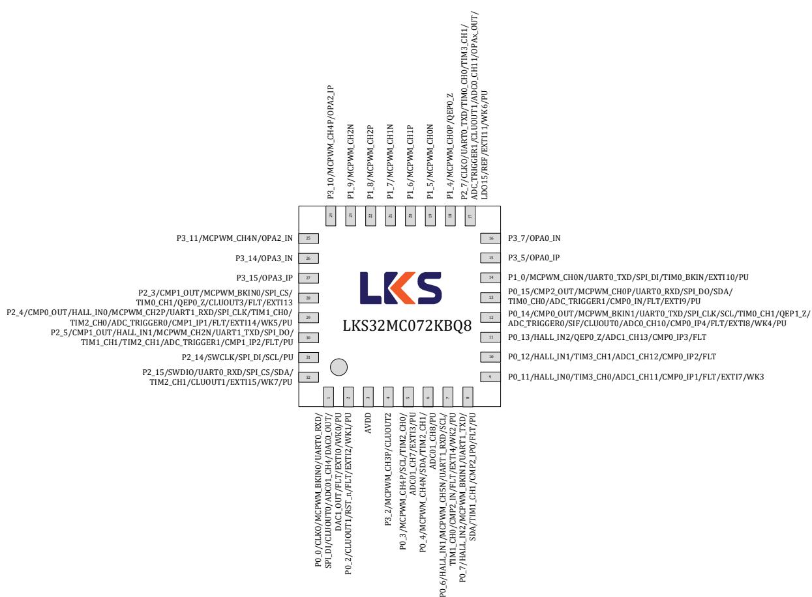  
图 3-4 LKS32MC072KBQ8 管脚分布图

表 3-4 LKS32MC072KBQ8 管脚说明

<table><tr><td>0</td><td>GND</td><td>腹部散热区域,为芯片 GND</td></tr><tr><td rowspan="13">1</td><td>P0_0</td><td>P0.0</td></tr><tr><td>CLKO</td><td>时钟输出(用于调试)</td></tr><tr><td>MCPWM_BKINO</td><td>PWM 停机输入信号 0</td></tr><tr><td>UART0_RXD</td><td>串口 0 接收(发送)</td></tr><tr><td>SPI_DI</td><td>SPI 数据输入(输出)</td></tr><tr><td>CLUOUT0</td><td>CLU0 输出</td></tr><tr><td>ADC01_CH4</td><td>ADC0/ADC1 通道 4</td></tr><tr><td>DAC0_OUT</td><td>DAC0 输出</td></tr><tr><td>DAC1_OUT</td><td>DAC1 输出</td></tr><tr><td>FLT</td><td>IO 滤波</td></tr><tr><td>EXTIO</td><td>外部 GPIO 中断信号 0</td></tr><tr><td>WK0</td><td>外部唤醒信号 0</td></tr><tr><td>PU</td><td>内置 12kΩ上拉电阻,软件可关闭</td></tr><tr><td rowspan="7">2</td><td>P0_2</td><td>P0.2</td></tr><tr><td>CLUOUT1</td><td>CLU1 输出</td></tr><tr><td>RST_n</td><td>复位引脚,P0.2 默认用作 RSTN。建议接一个 10nF~100nF 的电容到地,并在 RSTN 和 AVDD 之间放置一个 12k~20k 的上拉电阻。如果外部有上拉电阻,RSTN 的电容应为 100nF。P0.2 可切换为 GPIO,切换后可关闭 12kΩ 上拉电阻。</td></tr><tr><td>FLT</td><td>IO 滤波</td></tr><tr><td>EXTI2</td><td>外部 GPIO 中断信号 2</td></tr><tr><td>WK1</td><td>外部唤醒信号 1</td></tr><tr><td>PU</td><td>内置 12kΩ 上拉电阻,软件可关闭</td></tr><tr><td>3</td><td>AVDD</td><td>芯片电源,供电范围 2.5~5.5V</td></tr><tr><td rowspan="3">4</td><td>P3_2</td><td>P3.2</td></tr><tr><td>MCPWM_CH3P</td><td>PWM 通道 3 高边</td></tr><tr><td>CLUOUT2</td><td>CLU2 输出</td></tr><tr><td rowspan="7">5</td><td>P0_3</td><td>P0.3</td></tr><tr><td>MCPWM_CH4P</td><td>PWM 通道 4 高边</td></tr><tr><td>SCL</td><td>I2C 时钟</td></tr><tr><td>TIM2_CH0</td><td>Timer2 通道 0</td></tr><tr><td>ADC01_CH7</td><td>ADC0/ADC1 通道 7</td></tr><tr><td>EXTI3</td><td>外部 GPIO 中断信号 3</td></tr><tr><td>PU</td><td>内置 12kΩ 上拉电阻,软件可关闭</td></tr><tr><td rowspan="6">6</td><td>P0_4</td><td>P0.4</td></tr><tr><td>MCPWM_CH4N</td><td>PWM 通道 4 低边</td></tr><tr><td>SDA</td><td>I2C 数据</td></tr><tr><td>TIM2_CH1</td><td>Timer2 通道 1</td></tr><tr><td>ADC01_CH8</td><td>ADC0/ADC1 通道 8</td></tr><tr><td>PU</td><td>内置 12kΩ 上拉电阻,软件可关闭</td></tr><tr><td rowspan="11">7</td><td>P0_6</td><td>P0.6</td></tr><tr><td>HALL_IN1</td><td>HALL 接口输入 1</td></tr><tr><td>MCPWM_CH5N</td><td>PWM 通道 5 低边</td></tr><tr><td>UART1_RXD</td><td>串口 1 接收(发送)</td></tr><tr><td>SCL</td><td>I2C 时钟</td></tr><tr><td>TIM1_CH0</td><td>Timer1 通道 0</td></tr><tr><td>CMP2_IN</td><td>比较器 2 负端输入</td></tr><tr><td>FLT</td><td>IO 滤波</td></tr><tr><td>EXTI4</td><td>外部 GPIO 中断信号 4</td></tr><tr><td>WK2</td><td>外部唤醒信号 2</td></tr><tr><td>PU</td><td>内置 12kΩ 上拉电阻,软件可关闭</td></tr><tr><td rowspan="6">8</td><td>P0_7</td><td>P0.7</td></tr><tr><td>HALL_IN2</td><td>HALL 接口输入 2</td></tr><tr><td>MCPWM_BKIN1</td><td>PWM 停机输入信号 1</td></tr><tr><td>UART1_TXD</td><td>串口 1 发送(接收)</td></tr><tr><td>SDA</td><td>I2C 数据</td></tr><tr><td>TIM1_CH1</td><td>Timer1 通道 1</td></tr></table>

管脚分布

<table><tr><td rowspan="3"></td><td>CMP2_IP0</td><td>比较器2正端输入0</td></tr><tr><td>FLT</td><td>IO滤波</td></tr><tr><td>PU</td><td>内置12kΩ上拉电阻,软件可关闭</td></tr><tr><td rowspan="8">9</td><td>P0_11</td><td>P0.11</td></tr><tr><td>HALL_IN0</td><td>HALL接口输入0</td></tr><tr><td>TIM3_CH0</td><td>Timer3通道0</td></tr><tr><td>ADC1_CH11</td><td>ADC1通道11</td></tr><tr><td>CMP0_IP1</td><td>比较器0正端输入1</td></tr><tr><td>FLT</td><td>IO滤波</td></tr><tr><td>EXTI7</td><td>外部GPIO中断信号7</td></tr><tr><td>WK3</td><td>外部唤醒信号3</td></tr><tr><td rowspan="6">10</td><td>P0_12</td><td>P0.12</td></tr><tr><td>HALL_IN1</td><td>HALL接口输入1</td></tr><tr><td>TIM3_CH1</td><td>Timer3通道1</td></tr><tr><td>ADC1_CH12</td><td>ADC1通道12</td></tr><tr><td>CMP0_IP2</td><td>比较器0正端输入2</td></tr><tr><td>FLT</td><td>IO滤波</td></tr><tr><td rowspan="6">11</td><td>P0_13</td><td>P0.13</td></tr><tr><td>HALL_IN2</td><td>HALL接口输入2</td></tr><tr><td>QEP0_Z</td><td>QEP0编码器Z相</td></tr><tr><td>ADC1_CH13</td><td>ADC1通道13</td></tr><tr><td>CMP0_IP3</td><td>比较器0正端输入3</td></tr><tr><td>FLT</td><td>IO滤波</td></tr><tr><td rowspan="17">12</td><td>P0_14</td><td>P0.14</td></tr><tr><td>CMP0_OUT</td><td>比较器0输出</td></tr><tr><td>MCPWM_BKIN1</td><td>PWM停机输入信号1</td></tr><tr><td>UART0_TXD</td><td>串口0发送(接收)</td></tr><tr><td>SPI_CLK</td><td>SPI时钟</td></tr><tr><td>SCL</td><td>I2C时钟</td></tr><tr><td>TIM0_CH1</td><td>Timer0通道1</td></tr><tr><td>QEP1_Z</td><td>QEP1编码器Z相</td></tr><tr><td>ADC_TRIGGER0</td><td>ADC0触发信号输出(用于调试)</td></tr><tr><td>SIF</td><td>单线通讯</td></tr><tr><td>CLUOUT0</td><td>CLU0输出</td></tr><tr><td>ADC0_CH10</td><td>ADC0通道10</td></tr><tr><td>CMP0_IP4</td><td>比较器0正端输入4</td></tr><tr><td>FLT</td><td>IO滤波</td></tr><tr><td>EXTI8</td><td>外部GPIO中断信号8</td></tr><tr><td>WK4</td><td>外部唤醒信号4</td></tr><tr><td>PU</td><td>内置12kΩ上拉电阻,软件可关闭</td></tr><tr><td rowspan="3">13</td><td>P0_15</td><td>P0.15</td></tr><tr><td>CMP2_OUT</td><td>比较器2输出</td></tr><tr><td>MCPWM_CHOPUART0_RXD</td><td>PWM通道0高边串口0接收(发送)</td></tr><tr><td rowspan="8"></td><td>SPI_DO</td><td>SPI数据输出(输入)</td></tr><tr><td>SDA</td><td>I2C数据</td></tr><tr><td>TIMO_CH0</td><td>Timer0通道0</td></tr><tr><td>ADC_TRIGGER1</td><td>ADC1触发信号输出(用于调试)</td></tr><tr><td>CMP0_IN</td><td>比较器0负端输入</td></tr><tr><td>FLT</td><td>IO滤波</td></tr><tr><td>EXTI9</td><td>外部GPIO中断信号9</td></tr><tr><td>PU</td><td>内置12kΩ上拉电阻,软件可关闭</td></tr><tr><td rowspan="7">14</td><td>P1_0</td><td>P1.0</td></tr><tr><td>MCPWM_CH0N</td><td>PWM通道0低边</td></tr><tr><td>UART0_TXD</td><td>串口0发送(接收)</td></tr><tr><td>SPI_DI</td><td>SPI数据输入(输出)</td></tr><tr><td>TIMO_BKIN</td><td>TIMER0_FAIL信号来自GPIO</td></tr><tr><td>EXTI10</td><td>外部GPIO中断信号10</td></tr><tr><td>PU</td><td>内置12kΩ上拉电阻,软件可关闭</td></tr><tr><td rowspan="2">15</td><td>P3_5</td><td>P3.5</td></tr><tr><td>OPA0_IP</td><td>运放0正端输入</td></tr><tr><td rowspan="2">16</td><td>P3_7</td><td>P3.7</td></tr><tr><td>OPA0_IN</td><td>运放0负端输入</td></tr><tr><td rowspan="14">17</td><td>P2_7</td><td>P2.7</td></tr><tr><td>CLKO</td><td>时钟输出(用于调试)</td></tr><tr><td>UART0_TXD</td><td>串口0发送(接收)</td></tr><tr><td>TIMO_CH0</td><td>Timer0通道0</td></tr><tr><td>TIM3_CH1</td><td>Timer3通道1</td></tr><tr><td>ADC_TRIGGER1</td><td>ADC1触发信号输出(用于调试)</td></tr><tr><td>CLUOUT1</td><td>CLU1输出</td></tr><tr><td>ADC0_CH11</td><td>ADC0通道11</td></tr><tr><td>OPAx_OUT</td><td>运放输出</td></tr><tr><td>LDO15</td><td>1.5V LDO输出</td></tr><tr><td>REF</td><td>参考电压</td></tr><tr><td>EXTI11</td><td>外部GPIO中断信号11</td></tr><tr><td>WK6</td><td>外部唤醒信号6</td></tr><tr><td>PU</td><td>内置12kΩ上拉电阻,软件可关闭</td></tr><tr><td rowspan="3">18</td><td>P1_4</td><td>P1.4</td></tr><tr><td>MCPWM_CH0P</td><td>PWM通道0高边</td></tr><tr><td>QEP0_Z</td><td>QEP0编码器Z相</td></tr><tr><td rowspan="2">19</td><td>P1_5</td><td>P1.5</td></tr><tr><td>MCPWM_CH0N</td><td>PWM通道0低边</td></tr><tr><td rowspan="2">20</td><td>P1_6</td><td>P1.6</td></tr><tr><td>MCPWM_CH1P</td><td>PWM通道1高边</td></tr><tr><td rowspan="2">21</td><td>P1_7</td><td>P1.7</td></tr><tr><td>MCPWM_CH1N</td><td>PWM通道1低边</td></tr><tr><td rowspan="2">22</td><td>P1_8</td><td>P1.8</td></tr><tr><td>MCPWM_CH2P</td><td>PWM通道2高边</td></tr><tr><td rowspan="2">23</td><td>P1_9</td><td>P1.9</td></tr><tr><td>MCPWM_CH2N</td><td>PWM通道2低边</td></tr><tr><td rowspan="3">24</td><td>P3_10</td><td>P3.10</td></tr><tr><td>MCPWM_CH4P</td><td>PWM通道4高边</td></tr><tr><td>OPA2_IP</td><td>运放2正端输入</td></tr><tr><td rowspan="3">25</td><td>P3_11</td><td>P3.11</td></tr><tr><td>MCPWM_CH4N</td><td>PWM通道4低边</td></tr><tr><td>OPA2_IN</td><td>运放2负端输入</td></tr><tr><td rowspan="2">26</td><td>P3_14</td><td>P3.14</td></tr><tr><td>OPA3_IN</td><td>运放3负端输入</td></tr><tr><td rowspan="2">27</td><td>P3_15</td><td>P3.15</td></tr><tr><td>OPA3_IP</td><td>运放3正端输入</td></tr><tr><td rowspan="9">28</td><td>P2_3</td><td>P2.3</td></tr><tr><td>CMP1_OUT</td><td>比较器1输出</td></tr><tr><td>MCPWM_BKIN0</td><td>PWM停机输入信号0</td></tr><tr><td>SPI_CS</td><td>SPI片选</td></tr><tr><td>TIM0_CH1</td><td>Timer0通道1</td></tr><tr><td>QEP0_Z</td><td>QEP0编码器Z相</td></tr><tr><td>CLUOUT3</td><td>CLU3输出</td></tr><tr><td>FLT</td><td>IO滤波</td></tr><tr><td>EXTI13</td><td>外部GPIO中断信号13</td></tr><tr><td rowspan="14">29</td><td>P2_4</td><td>P2.4</td></tr><tr><td>CMP0_OUT</td><td>比较器0输出</td></tr><tr><td>HALL_IN0</td><td>HALL接口输入0</td></tr><tr><td>MCPWM_CH2P</td><td>PWM通道2高边</td></tr><tr><td>UART1_RXD</td><td>串口1接收(发送)</td></tr><tr><td>SPI_CLK</td><td>SPI时钟</td></tr><tr><td>TIM1_CH0</td><td>Timer1通道0</td></tr><tr><td>TIM2_CH0</td><td>Timer2通道0</td></tr><tr><td>ADC_TRIGGER0</td><td>ADC0触发信号输出(用于调试)</td></tr><tr><td>CMP1_IP1</td><td>比较器1正端输入1</td></tr><tr><td>FLT</td><td>IO滤波</td></tr><tr><td>EXTI14</td><td>外部GPIO中断信号14</td></tr><tr><td>WK5</td><td>外部唤醒信号5</td></tr><tr><td>PU</td><td>内置12kΩ上拉电阻,软件可关闭</td></tr><tr><td rowspan="6">30</td><td>P2_5</td><td>P2.5</td></tr><tr><td>CMP1_OUT</td><td>比较器1输出</td></tr><tr><td>HALL_IN1</td><td>HALL接口输入1</td></tr><tr><td>MCPWM_CH2N</td><td>PWM通道2低边</td></tr><tr><td>UART1_TXD</td><td>串口1发送(接收)</td></tr><tr><td>SPI_DO</td><td>SPI数据输出(输入)</td></tr></table>

管脚分布

<table><tr><td rowspan="6"></td><td>TIM1_CH1</td><td>Timer1 通道 1</td></tr><tr><td>TIM2_CH1</td><td>Timer2 通道 1</td></tr><tr><td>ADC_TRIGGER1</td><td>ADC1 触发信号输出(用于调试)</td></tr><tr><td>CMP1_IP2</td><td>比较器 1 正端输入 2</td></tr><tr><td>FLT</td><td>IO 滤波</td></tr><tr><td>PU</td><td>内置 12kΩ上拉电阻,软件可关闭</td></tr><tr><td rowspan="5">31</td><td>P2_14</td><td>P2.14</td></tr><tr><td>SWCLK</td><td>SWD 时钟</td></tr><tr><td>SPI_DI</td><td>SPI 数据输入(输出)</td></tr><tr><td>SCL</td><td>I2C 时钟</td></tr><tr><td>PU</td><td>内置 12kΩ上拉电阻,软件可关闭</td></tr><tr><td rowspan="10">32</td><td>P2_15</td><td>P2.15</td></tr><tr><td>SWDIO</td><td>SWD 数据</td></tr><tr><td>UART0_RXD</td><td>串口 0 接收(发送)</td></tr><tr><td>SPI_CS</td><td>SPI 片选</td></tr><tr><td>SDA</td><td>I2C 数据</td></tr><tr><td>TIM2_CH1</td><td>Timer2 通道 1</td></tr><tr><td>CLUOUT1</td><td>CLU1 输出</td></tr><tr><td>EXTI15</td><td>外部 GPIO 中断信号 15</td></tr><tr><td>WK7</td><td>外部唤醒信号 7</td></tr><tr><td>PU</td><td>内置 12kΩ上拉电阻,软件可关闭</td></tr></table>

## 3.1.5 LKS32MC072KBT8

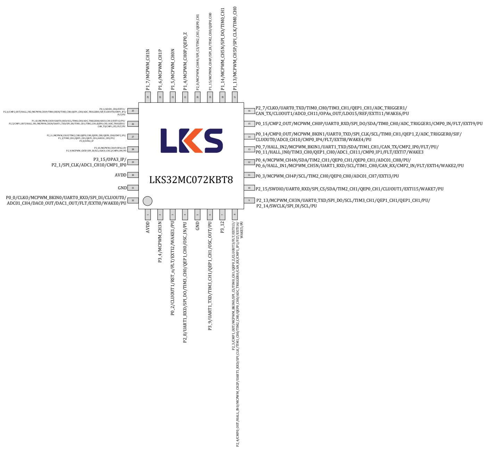  
图 3-5 LKS32MC072KBT8 管脚分布图

需要注意，072KBT8 为了兼容RX13T，图示的 MCPWM输出顺序和GPIO对应顺序与其他 07x 系列MCU 不同。在使用时，需要配置 PWM\_SWAP=2，具体的 MCPWM 输出顺序和 GPIO 对应顺序可参考07x 系列的用户手册。

表 3-5 LKS32MC072KBT8 管脚说明

<table><tr><td>1</td><td>AVDD</td><td>芯片电源,供电范围 2.5~5.5V</td></tr><tr><td>2</td><td>P3_4</td><td>P3.4</td></tr></table>

管脚分布

<table><tr><td></td><td>MCPWM_CH3N</td><td>PWM通道3低边</td></tr><tr><td rowspan="7">3</td><td>P0_2</td><td>P0.2</td></tr><tr><td>CLUOUT1</td><td>CLU1输出</td></tr><tr><td>RST_n</td><td>复位引脚,P0.2默认用作RSTN。建议接一个10nF~100nF的电容到地,并在RSTN和AVDD之间放置一个12k~20k的上拉电阻。如果外部有上拉电阻,RSTN的电容应为100nF。P0.2可切换为GPIO,切换后可关闭12kΩ上拉电阻。</td></tr><tr><td>FLT</td><td>IO滤波</td></tr><tr><td>EXTI2</td><td>外部GPIO中断信号2</td></tr><tr><td>WAKE1</td><td>外部唤醒信号1</td></tr><tr><td>PU</td><td>内置12kΩ上拉电阻,软件可关闭</td></tr><tr><td rowspan="7">4</td><td>P2_8</td><td>P2.8</td></tr><tr><td>UART1_RXD</td><td>串口1接收(发送)</td></tr><tr><td>SPI_DO</td><td>SPI数据输出(输入)</td></tr><tr><td>TIM3_CH0</td><td>Timer3通道0</td></tr><tr><td>QEP1_CH0</td><td>编码器1通道0</td></tr><tr><td>OSC_IN</td><td>外部晶振引脚</td></tr><tr><td>PU</td><td>内置12kΩ上拉电阻,软件可关闭</td></tr><tr><td>5</td><td>GND</td><td>芯片地</td></tr><tr><td rowspan="6">6</td><td>P3_9</td><td>P3.9</td></tr><tr><td>UART1_TXD</td><td>串口1发送(接收)</td></tr><tr><td>TIM3_CH1</td><td>Timer3通道1</td></tr><tr><td>QEP1_CH1</td><td>编码器1通道1</td></tr><tr><td>OSC_OUT</td><td>外部晶振引脚</td></tr><tr><td>PU</td><td>内置12kΩ上拉电阻,软件可关闭</td></tr><tr><td>7</td><td>P3_12</td><td>P3.12</td></tr><tr><td rowspan="18">8</td><td>P2_3</td><td>P2.3</td></tr><tr><td>CMP1_OUT</td><td>比较器1输出</td></tr><tr><td>MCPWM_BKIN0</td><td>PWM停机输入信号0</td></tr><tr><td>SPI_CS</td><td>SPI片选</td></tr><tr><td>TIMO_CH1</td><td>Timer0通道1</td></tr><tr><td>QEP0_Z</td><td>QEP0编码器Z相</td></tr><tr><td>CLUOUT3</td><td>CLU3输出</td></tr><tr><td>FLT</td><td>IO滤波</td></tr><tr><td>EXTI13</td><td>外部GPIO中断信号13</td></tr><tr><td>P2_4</td><td>P2.4</td></tr><tr><td>CMP0_OUT</td><td>比较器0输出</td></tr><tr><td>HALL_IN0</td><td>HALL接口输入0</td></tr><tr><td>MCPWM_CH5N</td><td>PWM通道5低边</td></tr><tr><td>UART1_RXD</td><td>串口1接收(发送)</td></tr><tr><td>SPI_CLK</td><td>SPI时钟</td></tr><tr><td>TIM1_CH0</td><td>Timer1通道0</td></tr><tr><td>TIM2_CH0</td><td>Timer2通道0</td></tr><tr><td>QEP0_CH0ADC_TRIGGER0</td><td>编码器0通道0ADC0 触发信号输出(用于调试)</td></tr><tr><td rowspan="6"></td><td>CAN_RX</td><td>CAN 接收端</td></tr><tr><td>CMP1_IP1</td><td>比较器 1 正端输入 1</td></tr><tr><td>FLT</td><td>IO 滤波</td></tr><tr><td>EXTI14</td><td>外部 GPIO 中断信号 14</td></tr><tr><td>WAKE5</td><td>外部唤醒信号 5</td></tr><tr><td>PU</td><td>内置 12kΩ上拉电阻,软件可关闭</td></tr><tr><td rowspan="14">9</td><td>P2_13</td><td>P2.13</td></tr><tr><td>MCPWM_CH5P</td><td>PWM 通道 5 高边</td></tr><tr><td>UART0_TXD</td><td>串口 0 发送(接收)</td></tr><tr><td>SPI_DO</td><td>SPI 数据输出(输入)</td></tr><tr><td>SCL</td><td>I2C 时钟</td></tr><tr><td>TIM3_CH1</td><td>Timer3 通道 1</td></tr><tr><td>QEP1_CH1</td><td>编码器 1 通道 1</td></tr><tr><td>QEP1_CH1</td><td>编码器 1 通道 1</td></tr><tr><td>PU</td><td>内置 12kΩ上拉电阻,软件可关闭</td></tr><tr><td>P2_14</td><td>P2.14</td></tr><tr><td>SWCLK</td><td>SWD 时钟</td></tr><tr><td>SPI_DI</td><td>SPI 数据输入(输出)</td></tr><tr><td>SCL</td><td>I2C 时钟</td></tr><tr><td>PU</td><td>内置 12kΩ上拉电阻,软件可关闭</td></tr><tr><td rowspan="11">10</td><td>P2_15</td><td>P2.15</td></tr><tr><td>SWDIO</td><td>SWD 数据</td></tr><tr><td>UART0_RXD</td><td>串口 0 接收(发送)</td></tr><tr><td>SPI_CS</td><td>SPI 片选</td></tr><tr><td>SDA</td><td>I2C 数据</td></tr><tr><td>TIM2_CH1</td><td>Timer2 通道 1</td></tr><tr><td>QEP0_CH1</td><td>编码器 0 通道 1</td></tr><tr><td>CLUOUT1</td><td>CLU1 输出</td></tr><tr><td>EXTI15</td><td>外部 GPIO 中断信号 15</td></tr><tr><td>WAKE7</td><td>外部唤醒信号 7</td></tr><tr><td>PU</td><td>内置 12kΩ上拉电阻,软件可关闭</td></tr><tr><td rowspan="8">11</td><td>P0_3</td><td>P0.3</td></tr><tr><td>MCPWM_CH2N</td><td>PWM 通道 2 低边</td></tr><tr><td>SCL</td><td>I2C 时钟</td></tr><tr><td>TIM2_CH0</td><td>Timer2 通道 0</td></tr><tr><td>QEP0_CH0</td><td>编码器 0 通道 0</td></tr><tr><td>ADC01_CH7</td><td>ADC01 通道 7</td></tr><tr><td>EXTI3</td><td>外部 GPIO 中断信号 3</td></tr><tr><td>PU</td><td>内置 12kΩ上拉电阻,软件可关闭</td></tr><tr><td rowspan="3">12</td><td>P0_4</td><td>P0.4</td></tr><tr><td>MCPWM_CHOP</td><td>PWM 通道 0 高边</td></tr><tr><td>SDATIM2_CH1</td><td>I2C 数据Timer2 通道1</td></tr><tr><td rowspan="16"></td><td>QEP0_CH1</td><td>编码器0通道1</td></tr><tr><td>QEP0_CH1</td><td>编码器0通道1</td></tr><tr><td>ADC01_CH8</td><td>ADC01 通道8</td></tr><tr><td>PU</td><td>内置12kΩ上拉电阻,软件可关闭</td></tr><tr><td>P0_6</td><td>P0.6</td></tr><tr><td>HALL_IN1</td><td>HALL接口输入1</td></tr><tr><td>MCPWM_CH1N</td><td>PWM通道1低边</td></tr><tr><td>UART1_RXD</td><td>串口1接收(发送)</td></tr><tr><td>SCL</td><td>I2C时钟</td></tr><tr><td>TIM1_CH0</td><td>Timer1通道0</td></tr><tr><td>CAN_RX</td><td>CAN接收端</td></tr><tr><td>CMP2_IN</td><td>比较器2负端输入</td></tr><tr><td>FLT</td><td>IO滤波</td></tr><tr><td>EXTI4</td><td>外部GPIO中断信号4</td></tr><tr><td>WAKE2</td><td>外部唤醒信号2</td></tr><tr><td>PU</td><td>内置12kΩ上拉电阻,软件可关闭</td></tr><tr><td rowspan="19">13</td><td>P0_7</td><td>P0.7</td></tr><tr><td>HALL_IN2</td><td>HALL接口输入2</td></tr><tr><td>MCPWM_BKIN1</td><td>PWM停机输入信号1</td></tr><tr><td>UART1_TXD</td><td>串口1发送(接收)</td></tr><tr><td>SDA</td><td>I2C数据</td></tr><tr><td>TIM1_CH1</td><td>Timer1通道1</td></tr><tr><td>CAN_TX</td><td>CAN发送端</td></tr><tr><td>CMP2_IP0</td><td>比较器2正端输入0</td></tr><tr><td>FLT</td><td>IO滤波</td></tr><tr><td>PU</td><td>内置12kΩ上拉电阻,软件可关闭</td></tr><tr><td>P0_11</td><td>P0.11</td></tr><tr><td>HALL_IN0</td><td>HALL接口输入0</td></tr><tr><td>TIM3_CH0</td><td>Timer3通道0</td></tr><tr><td>QEP1_CH0</td><td>编码器1通道0</td></tr><tr><td>ADC1_CH11</td><td>ADC1通道11</td></tr><tr><td>CMP0_IP1</td><td>比较器0正端输入1</td></tr><tr><td>FLT</td><td>IO滤波</td></tr><tr><td>EXTI7</td><td>外部GPIO中断信号7</td></tr><tr><td>WAKE3</td><td>外部唤醒信号3</td></tr><tr><td rowspan="7">14</td><td>P0_14</td><td>P0.14</td></tr><tr><td>CMP0_OUT</td><td>比较器0输出</td></tr><tr><td>MCPWM_BKIN1</td><td>PWM停机输入信号1</td></tr><tr><td>UART0_TXD</td><td>串口0发送(接收)</td></tr><tr><td>SPI_CLK</td><td>SPI时钟</td></tr><tr><td>SCL</td><td>I2C时钟</td></tr><tr><td>TIM0_CH1QEP1_Z</td><td>Timer0通道1QEP1 编码器 Z 相</td></tr><tr><td rowspan="9"></td><td>ADC_TRIGGER0</td><td>ADC0 触发信号输出(用于调试)</td></tr><tr><td>SIF</td><td>单线通讯</td></tr><tr><td>CLUOUT0</td><td>CLU0 输出</td></tr><tr><td>ADC0_CH10</td><td>ADC0 通道 10</td></tr><tr><td>CMP0_IP4</td><td>比较器 0 正端输入 4</td></tr><tr><td>FLT</td><td>IO 滤波</td></tr><tr><td>EXTI8</td><td>外部 GPIO 中断信号 8</td></tr><tr><td>WAKE4</td><td>外部唤醒信号 4</td></tr><tr><td>PU</td><td>内置 12kΩ 上拉电阻,软件可关闭</td></tr><tr><td rowspan="12">15</td><td>P0_15</td><td>P0.15</td></tr><tr><td>CMP2_OUT</td><td>比较器 2 输出</td></tr><tr><td>MCPWM_CH1P</td><td>PWM 通道 1 高边</td></tr><tr><td>UART0_RXD</td><td>串口 0 接收(发送)</td></tr><tr><td>SPI_DO</td><td>SPI 数据输出(输入)</td></tr><tr><td>SDA</td><td>I2C 数据</td></tr><tr><td>TIM0_CH0</td><td>Timer0 通道 0</td></tr><tr><td>ADC_TRIGGER1</td><td>ADC1 触发信号输出(用于调试)</td></tr><tr><td>CMP0_IN</td><td>比较器 0 负端输入</td></tr><tr><td>FLT</td><td>IO 滤波</td></tr><tr><td>EXTI9</td><td>外部 GPIO 中断信号 9</td></tr><tr><td>PU</td><td>内置 12kΩ 上拉电阻,软件可关闭</td></tr><tr><td rowspan="16">16</td><td>P2_7</td><td>P2.7</td></tr><tr><td>CLKO</td><td>时钟输出(用于调试)</td></tr><tr><td>UART0_TXD</td><td>串口 0 发送(接收)</td></tr><tr><td>TIM0_CH0</td><td>Timer0 通道 0</td></tr><tr><td>TIM3_CH1</td><td>Timer3 通道 1</td></tr><tr><td>QEP1_CH1</td><td>编码器 1 通道 1</td></tr><tr><td>ADC_TRIGGER1</td><td>ADC1 触发信号输出(用于调试)</td></tr><tr><td>CAN_TX</td><td>CAN 发送端</td></tr><tr><td>CLUOUT1</td><td>CLU1 输出</td></tr><tr><td>ADC0_CH11</td><td>ADC0 通道 11</td></tr><tr><td>OPAx_OUT</td><td>运放输出</td></tr><tr><td>LDO15</td><td>1.5V LDO 输出</td></tr><tr><td>REF</td><td>参考电压</td></tr><tr><td>EXTI11</td><td>外部 GPIO 中断信号 11</td></tr><tr><td>WAKE6</td><td>外部唤醒信号 6</td></tr><tr><td>PU</td><td>内置 12kΩ 上拉电阻,软件可关闭</td></tr><tr><td rowspan="4">17</td><td>P1_13</td><td>P1.13</td></tr><tr><td>MCPWM_CH0N</td><td>PWM 通道 0 低边</td></tr><tr><td>SPI_CLK</td><td>SPI 时钟</td></tr><tr><td>TIM0_CH0</td><td>Timer0 通道 0</td></tr><tr><td>18</td><td>P1_14MCPWM_CH1N</td><td>P1.14PWM通道1低边</td></tr><tr><td rowspan="2"></td><td>SPI_DO</td><td>SPI数据输出(输入)</td></tr><tr><td>TIM0_CH1</td><td>Timer0通道1</td></tr><tr><td rowspan="5">19</td><td>P1_15</td><td>P1.15</td></tr><tr><td>MCPWM_CH2N</td><td>PWM通道2低边</td></tr><tr><td>SPI_DI</td><td>SPI数据输入(输出)</td></tr><tr><td>TIM2_CH0</td><td>Timer2通道0</td></tr><tr><td>QEP0_CH0</td><td>编码器0通道0</td></tr><tr><td rowspan="5">20</td><td>P2_0</td><td>P2.0</td></tr><tr><td>MCPWM_CH0P</td><td>PWM通道0高边</td></tr><tr><td>SPI_CS</td><td>SPI片选</td></tr><tr><td>TIM2_CH1</td><td>Timer2通道1</td></tr><tr><td>QEP0_CH1</td><td>编码器0通道1</td></tr><tr><td rowspan="3">21</td><td>P1_4</td><td>P1.4</td></tr><tr><td>MCPWM_CH1P</td><td>PWM通道1高边</td></tr><tr><td>QEP0_Z</td><td>QEP0编码器Z相</td></tr><tr><td rowspan="2">22</td><td>P1_5</td><td>P1.5</td></tr><tr><td>MCPWM_CH2P</td><td>PWM通道2高边</td></tr><tr><td rowspan="2">23</td><td>P1_6</td><td>P1.6</td></tr><tr><td>MCPWM_CH3N</td><td>PWM通道3低边</td></tr><tr><td rowspan="2">24</td><td>P1_7</td><td>P1.7</td></tr><tr><td>MCPWM_CH4N</td><td>PWM通道4低边</td></tr><tr><td rowspan="16">25</td><td>P0_1</td><td>P0.1</td></tr><tr><td>ADC01_CH6</td><td>ADC01通道6</td></tr><tr><td>EXTI1</td><td>外部GPIO中断信号1</td></tr><tr><td>P2_6</td><td>P2.6</td></tr><tr><td>CMP2_OUT</td><td>比较器2输出</td></tr><tr><td>HALL_IN2</td><td>HALL接口输入2</td></tr><tr><td>MCPWM_CH3P</td><td>PWM通道3高边</td></tr><tr><td>TIM0_BKIN</td><td>TIMER0_FAIL信号来自GPIO</td></tr><tr><td>TIM3_CH0</td><td>Timer3通道0</td></tr><tr><td>QEP1_CH0</td><td>编码器1通道0</td></tr><tr><td>ADC_TRIGGER0</td><td>ADC0触发信号输出(用于调试)</td></tr><tr><td>SIF</td><td>单线通讯</td></tr><tr><td>CLUOUT0</td><td>CLU0输出</td></tr><tr><td>CMP1_IP3</td><td>比较器1正端输入3</td></tr><tr><td>FLT</td><td>IO滤波</td></tr><tr><td>PU</td><td>内置12kΩ上拉电阻,软件可关闭</td></tr><tr><td rowspan="5">26</td><td>P1_10</td><td>P1.10</td></tr><tr><td>MCPWM_CH3P</td><td>PWM通道3高边</td></tr><tr><td>UART0_RXD</td><td>串口0接收(发送)</td></tr><tr><td>SCL</td><td>I2C时钟</td></tr><tr><td>TIM0_CH0</td><td>Timer0通道0</td></tr></table>

管脚分布

<table><tr><td rowspan="18"></td><td>ADC_TRIGGER0</td><td>ADC0 触发信号输出(用于调试)</td></tr><tr><td>ADC0_CH13</td><td>ADC0 通道 13</td></tr><tr><td>EXTI12</td><td>外部 GPIO 中断信号 12</td></tr><tr><td>PU</td><td>内置 12kΩ上拉电阻,软件可关闭</td></tr><tr><td>P2_5</td><td>P2.5</td></tr><tr><td>CMP1_OUT</td><td>比较器 1 输出</td></tr><tr><td>HALL_IN1</td><td>HALL 接口输入 1</td></tr><tr><td>MCPWM_CH2N</td><td>PWM 通道 2 低边</td></tr><tr><td>UART1_TXD</td><td>串口 1 发送(接收)</td></tr><tr><td>SPI_DO</td><td>SPI 数据输出(输入)</td></tr><tr><td>TIM1_CH1</td><td>Timer1 通道 1</td></tr><tr><td>TIM2_CH1</td><td>Timer2 通道 1</td></tr><tr><td>QEP0_CH1</td><td>编码器 0 通道 1</td></tr><tr><td>ADC_TRIGGER1</td><td>ADC1 触发信号输出(用于调试)</td></tr><tr><td>CAN_TX</td><td>CAN 发送端</td></tr><tr><td>CMP1_IP2</td><td>比较器 1 正端输入 2</td></tr><tr><td>FLT</td><td>IO 滤波</td></tr><tr><td>PU</td><td>内置 12kΩ上拉电阻,软件可关闭</td></tr><tr><td rowspan="2">27</td><td>P3_0</td><td>P3.0</td></tr><tr><td>OPA1_IP</td><td>运放 1 正端输入</td></tr><tr><td rowspan="10">28</td><td>P3_10</td><td>P3.10</td></tr><tr><td>MCPWM_CH2N</td><td>PWM 通道 2 低边</td></tr><tr><td>OPA2_IP</td><td>运放 2 正端输入</td></tr><tr><td>P2_9</td><td>P2.9</td></tr><tr><td>MCPWM_CH0N</td><td>PWM 通道 0 低边</td></tr><tr><td>SPI_DI</td><td>SPI 数据输入(输出)</td></tr><tr><td>SCL</td><td>I2C 时钟</td></tr><tr><td>ADC0_CH12</td><td>ADC0 通道 12</td></tr><tr><td>CMP0_IP0</td><td>比较器 0 正端输入 0</td></tr><tr><td>PU</td><td>内置 12kΩ上拉电阻,软件可关闭</td></tr><tr><td rowspan="6">29</td><td>P3_15</td><td>P3.15</td></tr><tr><td>OPA3_IP</td><td>运放 3 正端输入</td></tr><tr><td>P2_1</td><td>P2.1</td></tr><tr><td>SPI_CLK</td><td>SPI 时钟</td></tr><tr><td>ADC1_CH10</td><td>ADC1 通道 10</td></tr><tr><td>CMP1_IP0</td><td>比较器 1 正端输入 0</td></tr><tr><td>30</td><td>AVDD</td><td>芯片电源,供电范围 2.2~5.5V</td></tr><tr><td>31</td><td>GND</td><td>芯片地</td></tr><tr><td rowspan="5">32</td><td>P0_0</td><td>P0.0</td></tr><tr><td>CLKO</td><td>时钟输出(用于调试)</td></tr><tr><td>MCPWM_BKIN0</td><td>PWM 停机输入信号 0</td></tr><tr><td>UART0_RXD</td><td>串口 0 接收(发送)</td></tr><tr><td>SPI_DI</td><td>SPI 数据输入(输出)</td></tr></table>

管脚分布

<table><tr><td>CLUOUT0</td><td>CLU0 输出</td></tr><tr><td>ADC01_CH4</td><td>ADC01 通道 4</td></tr><tr><td>DAC0_OUT</td><td>DAC0 输出</td></tr><tr><td>DAC1_OUT</td><td>DAC1 输出</td></tr><tr><td>FLT</td><td>IO 滤波</td></tr><tr><td>EXTIO</td><td>外部 GPIO 中断信号 0</td></tr><tr><td>WAKE0</td><td>外部唤醒信号 0</td></tr><tr><td>PU</td><td>内置 12kΩ上拉电阻,软件可关闭</td></tr></table>

## 3.1.6 LKS32MC073HBQ8

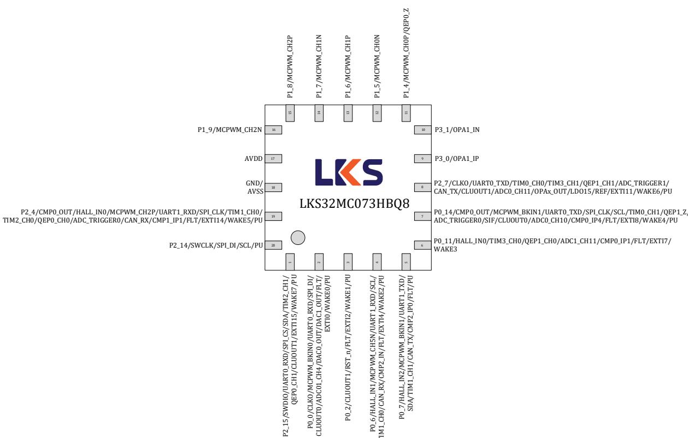  
图 3-6 LKS32MC073HBQ8 管脚分布图

表 3-6 LKS32MC073HBQ8 管脚说明

<table><tr><td>0</td><td>GND</td><td>腹部散热区域,为芯片 GND</td></tr><tr><td rowspan="8">1</td><td>P2_15</td><td>P2.15</td></tr><tr><td>SWDIO</td><td>SWD 数据</td></tr><tr><td>UART0_RXD</td><td>串口 0 接收(发送)</td></tr><tr><td>SPI_CS</td><td>SPI 片选</td></tr><tr><td>SDA</td><td>I2C 数据</td></tr><tr><td>TIM2_CH1</td><td>Timer2 通道 1</td></tr><tr><td>QEP0_CH1</td><td>编码器 0 通道 1</td></tr><tr><td>CLUOUT1EXTI15</td><td>CLU1 输出外部 GPIO 中断信号 15</td></tr><tr><td rowspan="2"></td><td>WAKE7</td><td>外部唤醒信号 7</td></tr><tr><td>PU</td><td>内置 12kΩ上拉电阻,软件可关闭</td></tr><tr><td rowspan="13">2</td><td>P0_0</td><td>P0.0</td></tr><tr><td>CLKO</td><td>时钟输出(用于调试)</td></tr><tr><td>MCPWM_BKIN0</td><td>PWM 停机输入信号 0</td></tr><tr><td>UART0_RXD</td><td>串口 0 接收(发送)</td></tr><tr><td>SPI_DI</td><td>SPI 数据输入(输出)</td></tr><tr><td>CLUOUT0</td><td>CLU0 输出</td></tr><tr><td>ADC01_CH4</td><td>ADC01 通道 4</td></tr><tr><td>DAC0_OUT</td><td>DAC0 输出</td></tr><tr><td>DAC1_OUT</td><td>DAC1 输出</td></tr><tr><td>FLT</td><td>IO 滤波</td></tr><tr><td>EXTIO</td><td>外部 GPIO 中断信号 0</td></tr><tr><td>WAKE0</td><td>外部唤醒信号 0</td></tr><tr><td>PU</td><td>内置 12kΩ上拉电阻,软件可关闭</td></tr><tr><td rowspan="7">3</td><td>P0_2</td><td>P0.2</td></tr><tr><td>CLUOUT1</td><td>CLU1 输出</td></tr><tr><td>RST_n</td><td>复位引脚,P0.2 默认用作 RSTN。建议接一个 10nF~100nF 的电容到地,并在 RSTN 和 AVDD 之间放置一个 12k~20k 的上拉电阻。如果外部有上拉电阻,RSTN 的电容应为 100nF。P0.2 可切换为 GPIO,切换后可关闭 12kΩ上拉电阻。</td></tr><tr><td>FLT</td><td>IO 滤波</td></tr><tr><td>EXTI2</td><td>外部 GPIO 中断信号 2</td></tr><tr><td>WAKE1</td><td>外部唤醒信号 1</td></tr><tr><td>PU</td><td>内置 12kΩ上拉电阻,软件可关闭</td></tr><tr><td rowspan="12">4</td><td>P0_6</td><td>P0.6</td></tr><tr><td>HALL_IN1</td><td>HALL 接口输入 1</td></tr><tr><td>MCPWM_CH5N</td><td>PWM 通道 5 低边</td></tr><tr><td>UART1_RXD</td><td>串口 1 接收(发送)</td></tr><tr><td>SCL</td><td>I2C 时钟</td></tr><tr><td>TIM1_CH0</td><td>Timer1 通道 0</td></tr><tr><td>CAN_RX</td><td>CAN 接收端</td></tr><tr><td>CMP2_IN</td><td>比较器 2 负端输入</td></tr><tr><td>FLT</td><td>IO 滤波</td></tr><tr><td>EXTI4</td><td>外部 GPIO 中断信号 4</td></tr><tr><td>WAKE2</td><td>外部唤醒信号 2</td></tr><tr><td>PU</td><td>内置 12kΩ上拉电阻,软件可关闭</td></tr><tr><td rowspan="6">5</td><td>P0_7</td><td>P0.7</td></tr><tr><td>HALL_IN2</td><td>HALL 接口输入 2</td></tr><tr><td>MCPWM_BKIN1</td><td>PWM 停机输入信号 1</td></tr><tr><td>UART1_TXD</td><td>串口 1 发送(接收)</td></tr><tr><td>SDA</td><td>I2C 数据</td></tr><tr><td>TIM1_CH1CAN_TX</td><td>Timer1 通道 1CAN 发送端</td></tr><tr><td rowspan="3"></td><td>CMP2_IP0</td><td>比较器 2 正端输入 0</td></tr><tr><td>FLT</td><td>IO 滤波</td></tr><tr><td>PU</td><td>内置 12kΩ上拉电阻,软件可关闭</td></tr><tr><td rowspan="9">6</td><td>P0_11</td><td>P0.11</td></tr><tr><td>HALL_IN0</td><td>HALL 接口输入 0</td></tr><tr><td>TIM3_CH0</td><td>Timer3 通道 0</td></tr><tr><td>QEP1_CH0</td><td>编码器 1 通道 0</td></tr><tr><td>ADC1_CH11</td><td>ADC1 通道 11</td></tr><tr><td>CMP0_IP1</td><td>比较器 0 正端输入 1</td></tr><tr><td>FLT</td><td>IO 滤波</td></tr><tr><td>EXTI7</td><td>外部 GPIO 中断信号 7</td></tr><tr><td>WAKE3</td><td>外部唤醒信号 3</td></tr><tr><td rowspan="17">7</td><td>P0_14</td><td>P0.14</td></tr><tr><td>CMP0_OUT</td><td>比较器 0 输出</td></tr><tr><td>MCPWM_BKIN1</td><td>PWM 停机输入信号 1</td></tr><tr><td>UART0_TXD</td><td>串口 0 发送(接收)</td></tr><tr><td>SPI_CLK</td><td>SPI 时钟</td></tr><tr><td>SCL</td><td>I2C 时钟</td></tr><tr><td>TIM0_CH1</td><td>Timer0 通道 1</td></tr><tr><td>QEP1_Z</td><td>QEP1 编码器 Z 相</td></tr><tr><td>ADC_TRIGGER0</td><td>ADC0 触发信号输出(用于调试)</td></tr><tr><td>SIF</td><td>单线通讯</td></tr><tr><td>CLUOUT0</td><td>CLU0 输出</td></tr><tr><td>ADC0_CH10</td><td>ADC0 通道 10</td></tr><tr><td>CMP0_IP4</td><td>比较器 0 正端输入 4</td></tr><tr><td>FLT</td><td>IO 滤波</td></tr><tr><td>EXTI8</td><td>外部 GPIO 中断信号 8</td></tr><tr><td>WAKE4</td><td>外部唤醒信号 4</td></tr><tr><td>PU</td><td>内置 12kΩ上拉电阻,软件可关闭</td></tr><tr><td rowspan="13">8</td><td>P2_7</td><td>P2.7</td></tr><tr><td>CLKO</td><td>时钟输出(用于调试)</td></tr><tr><td>UART0_TXD</td><td>串口 0 发送(接收)</td></tr><tr><td>TIM0_CH0</td><td>Timer0 通道 0</td></tr><tr><td>TIM3_CH1</td><td>Timer3 通道 1</td></tr><tr><td>QEP1_CH1</td><td>编码器 1 通道 1</td></tr><tr><td>ADC_TRIGGER1</td><td>ADC1 触发信号输出(用于调试)</td></tr><tr><td>CAN_TX</td><td>CAN 发送端</td></tr><tr><td>CLUOUT1</td><td>CLU1 输出</td></tr><tr><td>ADC0_CH11</td><td>ADC0 通道 11</td></tr><tr><td>OPAx_OUT</td><td>运放输出</td></tr><tr><td>LDO15</td><td>1.5V LDO 输出</td></tr><tr><td>REFEXTI11</td><td>参考电压外部 GPIO 中断信号 11</td></tr><tr><td rowspan="2"></td><td>WAKE6</td><td>外部唤醒信号 6</td></tr><tr><td>PU</td><td>内置 12kΩ上拉电阻,软件可关闭</td></tr><tr><td rowspan="2">9</td><td>P3_0</td><td>P3.0</td></tr><tr><td>OPA1_IP</td><td>运放 1 正端输入</td></tr><tr><td rowspan="2">10</td><td>P3_1</td><td>P3.1</td></tr><tr><td>OPA1_IN</td><td>运放 1 负端输入</td></tr><tr><td rowspan="3">11</td><td>P1_4</td><td>P1.4</td></tr><tr><td>MCPWM_CH0P</td><td>PWM 通道 0 高边</td></tr><tr><td>QEP0_Z</td><td>QEP0 编码器 Z 相</td></tr><tr><td rowspan="2">12</td><td>P1_5</td><td>P1.5</td></tr><tr><td>MCPWM_CH0N</td><td>PWM 通道 0 低边</td></tr><tr><td rowspan="2">13</td><td>P1_6</td><td>P1.6</td></tr><tr><td>MCPWM_CH1P</td><td>PWM 通道 1 高边</td></tr><tr><td rowspan="2">14</td><td>P1_7</td><td>P1.7</td></tr><tr><td>MCPWM_CH1N</td><td>PWM 通道 1 低边</td></tr><tr><td rowspan="2">15</td><td>P1_8</td><td>P1.8</td></tr><tr><td>MCPWM_CH2P</td><td>PWM 通道 2 高边</td></tr><tr><td rowspan="2">16</td><td>P1_9</td><td>P1.9</td></tr><tr><td>MCPWM_CH2N</td><td>PWM 通道 2 低边</td></tr><tr><td>17</td><td>AVDD</td><td>芯片电源,供电范围 2.2~5.5V</td></tr><tr><td>18</td><td>GND</td><td>芯片地,强烈建议多个地引脚在 PCB 上统一接地</td></tr><tr><td rowspan="16">19</td><td>P2_4</td><td>P2.4</td></tr><tr><td>CMP0_OUT</td><td>比较器 0 输出</td></tr><tr><td>HALL_IN0</td><td>HALL 接口输入 0</td></tr><tr><td>MCPWM_CH2P</td><td>PWM 通道 2 高边</td></tr><tr><td>UART1_RXD</td><td>串口 1 接收(发送)</td></tr><tr><td>SPI_CLK</td><td>SPI 时钟</td></tr><tr><td>TIM1_CH0</td><td>Timer1 通道 0</td></tr><tr><td>TIM2_CH0</td><td>Timer2 通道 0</td></tr><tr><td>QEP0_CH0</td><td>编码器 0 通道 0</td></tr><tr><td>ADC_TRIGGER0</td><td>ADC0 触发信号输出(用于调试)</td></tr><tr><td>CAN_RX</td><td>CAN 接收端</td></tr><tr><td>CMP1_IP1</td><td>比较器 1 正端输入 1</td></tr><tr><td>FLT</td><td>IO 滤波</td></tr><tr><td>EXTI14</td><td>外部 GPIO 中断信号 14</td></tr><tr><td>WAKE5</td><td>外部唤醒信号 5</td></tr><tr><td>PU</td><td>内置 12kΩ上拉电阻,软件可关闭</td></tr><tr><td rowspan="5">20</td><td>P2_14</td><td>P2.14</td></tr><tr><td>SWCLK</td><td>SWD 时钟</td></tr><tr><td>SPI_DI</td><td>SPI 数据输入(输出)</td></tr><tr><td>SCL</td><td>I2C 时钟</td></tr><tr><td>PU</td><td>内置 12kΩ上拉电阻,软件可关闭</td></tr></table>

## 3.1.7 LKS32MC077MBS8

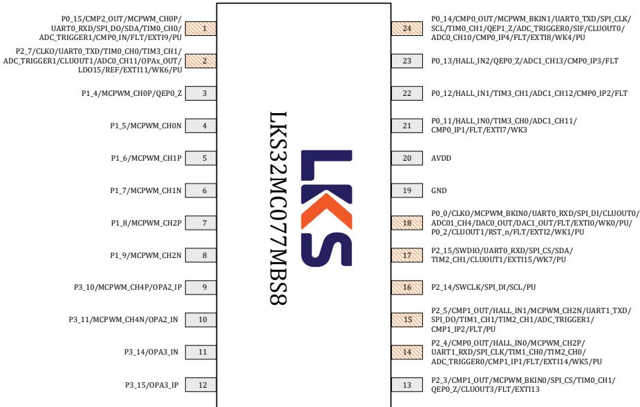  
图 3-7 LKS32MC077MBS8 管脚分布图

表 3-7 LKS32MC077MBS8 管脚说明

<table><tr><td rowspan="12">1</td><td>P0_15</td><td>P0.15</td></tr><tr><td>CMP2_OUT</td><td>比较器2输出</td></tr><tr><td>MCPWM_CHOP</td><td>PWM通道0高边</td></tr><tr><td>UART0_RXD</td><td>串口0接收(发送)</td></tr><tr><td>SPI_DO</td><td>SPI数据输出(输入)</td></tr><tr><td>SDA</td><td>I2C数据</td></tr><tr><td>TIM0_CH0</td><td>Timer0通道0</td></tr><tr><td>ADC_TRIGGER1</td><td>ADC1触发信号输出(用于调试)</td></tr><tr><td>CMP0_IN</td><td>比较器0负端输入</td></tr><tr><td>FLT</td><td>IO滤波</td></tr><tr><td>EXTI9</td><td>外部GPIO中断信号9</td></tr><tr><td>PU</td><td>内置12kΩ上拉电阻,软件可关闭</td></tr><tr><td rowspan="9">2</td><td>P2_7</td><td>P2.7</td></tr><tr><td>CLKO</td><td>时钟输出(用于调试)</td></tr><tr><td>UART0_TXD</td><td>串口0发送(接收)</td></tr><tr><td>TIM0_CH0</td><td>Timer0通道0</td></tr><tr><td>TIM3_CH1</td><td>Timer3通道1</td></tr><tr><td>ADC_TRIGGER1</td><td>ADC1触发信号输出(用于调试)</td></tr><tr><td>CLUOUT1</td><td>CLU1输出</td></tr><tr><td>ADC0_CH11</td><td>ADC0通道11</td></tr><tr><td>OPAx_OUT</td><td>运放输出</td></tr></table>

管脚分布

<table><tr><td rowspan="5"></td><td>LDO15</td><td>1.5V LDO 输出</td></tr><tr><td>REF</td><td>参考电压</td></tr><tr><td>EXTI11</td><td>外部 GPIO 中断信号 11</td></tr><tr><td>WK6</td><td>外部唤醒信号 6</td></tr><tr><td>PU</td><td>内置 12kΩ上拉电阻,软件可关闭</td></tr><tr><td rowspan="3">3</td><td>P1_4</td><td>P1.4</td></tr><tr><td>MCPWM_CH0P</td><td>PWM 通道 0 高边</td></tr><tr><td>QEP0_Z</td><td>QEP0 编码器 Z 相</td></tr><tr><td rowspan="2">4</td><td>P1_5</td><td>P1.5</td></tr><tr><td>MCPWM_CH0N</td><td>PWM 通道 0 低边</td></tr><tr><td rowspan="2">5</td><td>P1_6</td><td>P1.6</td></tr><tr><td>MCPWM_CH1P</td><td>PWM 通道 1 高边</td></tr><tr><td rowspan="2">6</td><td>P1_7</td><td>P1.7</td></tr><tr><td>MCPWM_CH1N</td><td>PWM 通道 1 低边</td></tr><tr><td rowspan="2">7</td><td>P1_8</td><td>P1.8</td></tr><tr><td>MCPWM_CH2P</td><td>PWM 通道 2 高边</td></tr><tr><td rowspan="2">8</td><td>P1_9</td><td>P1.9</td></tr><tr><td>MCPWM_CH2N</td><td>PWM 通道 2 低边</td></tr><tr><td rowspan="3">9</td><td>P3_10</td><td>P3.10</td></tr><tr><td>MCPWM_CH4P</td><td>PWM 通道 4 高边</td></tr><tr><td>OPA2_IP</td><td>运放 2 正端输入</td></tr><tr><td rowspan="3">10</td><td>P3_11</td><td>P3.11</td></tr><tr><td>MCPWM_CH4N</td><td>PWM 通道 4 低边</td></tr><tr><td>OPA2_IN</td><td>运放 2 负端输入</td></tr><tr><td rowspan="2">11</td><td>P3_14</td><td>P3.14</td></tr><tr><td>OPA3_IN</td><td>运放 3 负端输入</td></tr><tr><td rowspan="2">12</td><td>P3_15</td><td>P3.15</td></tr><tr><td>OPA3_IP</td><td>运放 3 正端输入</td></tr><tr><td rowspan="9">13</td><td>P2_3</td><td>P2.3</td></tr><tr><td>CMP1_OUT</td><td>比较器 1 输出</td></tr><tr><td>MCPWM_BKIN0</td><td>PWM 停机输入信号 0</td></tr><tr><td>SPI_CS</td><td>SPI 片选</td></tr><tr><td>TIM0_CH1</td><td>Timer0 通道 1</td></tr><tr><td>QEP0_Z</td><td>QEP0 编码器 Z 相</td></tr><tr><td>CLUOUT3</td><td>CLU3 输出</td></tr><tr><td>FLT</td><td>IO 滤波</td></tr><tr><td>EXTI13</td><td>外部 GPIO 中断信号 13</td></tr><tr><td rowspan="6">14</td><td>P2_4</td><td>P2.4</td></tr><tr><td>CMP0_OUT</td><td>比较器 0 输出</td></tr><tr><td>HALL_IN0</td><td>HALL 接口输入 0</td></tr><tr><td>MCPWM_CH2P</td><td>PWM 通道 2 高边</td></tr><tr><td>UART1_RXD</td><td>串口 1 接收(发送)</td></tr><tr><td>SPI_CLK</td><td>SPI 时钟</td></tr></table>

管脚分布

<table><tr><td rowspan="8"></td><td>TIM1_CH0</td><td>Timer1 通道0</td></tr><tr><td>TIM2_CH0</td><td>Timer2 通道0</td></tr><tr><td>ADC_TRIGGER0</td><td>ADC0 触发信号输出(用于调试)</td></tr><tr><td>CMP1_IP1</td><td>比较器1正端输入1</td></tr><tr><td>FLT</td><td>IO 滤波</td></tr><tr><td>EXTI14</td><td>外部 GPIO 中断信号14</td></tr><tr><td>WK5</td><td>外部唤醒信号5</td></tr><tr><td>PU</td><td>内置12kΩ上拉电阻,软件可关闭</td></tr><tr><td rowspan="12">15</td><td>P2_5</td><td>P2.5</td></tr><tr><td>CMP1_OUT</td><td>比较器1输出</td></tr><tr><td>HALL_IN1</td><td>HALL接口输入1</td></tr><tr><td>MCPWM_CH2N</td><td>PWM通道2低边</td></tr><tr><td>UART1_TXD</td><td>串口1发送(接收)</td></tr><tr><td>SPI_DO</td><td>SPI数据输出(输入)</td></tr><tr><td>TIM1_CH1</td><td>Timer1通道1</td></tr><tr><td>TIM2_CH1</td><td>Timer2通道1</td></tr><tr><td>ADC_TRIGGER1</td><td>ADC1触发信号输出(用于调试)</td></tr><tr><td>CMP1_IP2</td><td>比较器1正端输入2</td></tr><tr><td>FLT</td><td>IO滤波</td></tr><tr><td>PU</td><td>内置12kΩ上拉电阻,软件可关闭</td></tr><tr><td rowspan="5">16</td><td>P2_14</td><td>P2.14</td></tr><tr><td>SWCLK</td><td>SWD时钟</td></tr><tr><td>SPI_DI</td><td>SPI数据输入(输出)</td></tr><tr><td>SCL</td><td>I2C时钟</td></tr><tr><td>PU</td><td>内置12kΩ上拉电阻,软件可关闭</td></tr><tr><td rowspan="10">17</td><td>P2_15</td><td>P2.15</td></tr><tr><td>SWDIO</td><td>SWD数据</td></tr><tr><td>UART0_RXD</td><td>串口0接收(发送)</td></tr><tr><td>SPI_CS</td><td>SPI片选</td></tr><tr><td>SDA</td><td>I2C数据</td></tr><tr><td>TIM2_CH1</td><td>Timer2通道1</td></tr><tr><td>CLUOUT1</td><td>CLU1输出</td></tr><tr><td>EXTI15</td><td>外部GPIO中断信号15</td></tr><tr><td>WK7</td><td>外部唤醒信号7</td></tr><tr><td>PU</td><td>内置12kΩ上拉电阻,软件可关闭</td></tr><tr><td rowspan="6">18</td><td>P0_2</td><td>P0.2</td></tr><tr><td>CLUOUT1</td><td>CLU1输出</td></tr><tr><td>RST_n</td><td>复位引脚,P0.2默认用作RSTN。建议接一个10nF~100nF的电容到地,并在RSTN和AVDD之间放置一个12k~20k的上拉电阻。如果外部有上拉电阻,RSTN的电容应为100nF。P0.2可切换为GPIO,切换后可关闭12kΩ上拉电阻。</td></tr><tr><td>FLT</td><td>IO滤波</td></tr><tr><td>EXTI2</td><td>外部GPIO中断信号2</td></tr><tr><td>WK1</td><td>外部唤醒信号1</td></tr></table>

管脚分布

<table><tr><td></td><td>PU</td><td>内置12kΩ上拉电阻,软件可关闭</td></tr><tr><td>19</td><td>GND</td><td>芯片地,强烈建议多个地引脚在PCB上统一接地</td></tr><tr><td>20</td><td>AVDD</td><td>芯片电源,供电范围2.5~5.5V</td></tr><tr><td rowspan="8">21</td><td>P0_11</td><td>P0.11</td></tr><tr><td>HALL_IN0</td><td>HALL接口输入0</td></tr><tr><td>TIM3_CH0</td><td>Timer3通道0</td></tr><tr><td>ADC1_CH11</td><td>ADC1通道11</td></tr><tr><td>CMP0_IP1</td><td>比较器0正端输入1</td></tr><tr><td>FLT</td><td>IO滤波</td></tr><tr><td>EXTI7</td><td>外部GPIO中断信号7</td></tr><tr><td>WK3</td><td>外部唤醒信号3</td></tr><tr><td rowspan="6">22</td><td>P0_12</td><td>P0.12</td></tr><tr><td>HALL_IN1</td><td>HALL接口输入1</td></tr><tr><td>TIM3_CH1</td><td>Timer3通道1</td></tr><tr><td>ADC1_CH12</td><td>ADC1通道12</td></tr><tr><td>CMP0_IP2</td><td>比较器0正端输入2</td></tr><tr><td>FLT</td><td>IO滤波</td></tr><tr><td rowspan="6">23</td><td>P0_13</td><td>P0.13</td></tr><tr><td>HALL_IN2</td><td>HALL接口输入2</td></tr><tr><td>QEP0_Z</td><td>QEP0编码器Z相</td></tr><tr><td>ADC1_CH13</td><td>ADC1通道13</td></tr><tr><td>CMP0_IP3</td><td>比较器0正端输入3</td></tr><tr><td>FLT</td><td>IO滤波</td></tr><tr><td rowspan="17">24</td><td>P0_14</td><td>P0.14</td></tr><tr><td>CMP0_OUT</td><td>比较器0输出</td></tr><tr><td>MCPWM_BKIN1</td><td>PWM停机输入信号1</td></tr><tr><td>UART0_TXD</td><td>串口0发送(接收)</td></tr><tr><td>SPI_CLK</td><td>SPI时钟</td></tr><tr><td>SCL</td><td>I2C时钟</td></tr><tr><td>TIM0_CH1</td><td>Timer0通道1</td></tr><tr><td>QEP1_Z</td><td>QEP1编码器Z相</td></tr><tr><td>ADC_TRIGGER0</td><td>ADC0触发信号输出(用于调试)</td></tr><tr><td>SIF</td><td>单线通讯</td></tr><tr><td>CLUOUT0</td><td>CLU0输出</td></tr><tr><td>ADC0_CH10</td><td>ADC0通道10</td></tr><tr><td>CMP0_IP4</td><td>比较器0正端输入4</td></tr><tr><td>FLT</td><td>IO滤波</td></tr><tr><td>EXTI8</td><td>外部GPIO中断信号8</td></tr><tr><td>WK4</td><td>外部唤醒信号4</td></tr><tr><td>PU</td><td>内置12kΩ上拉电阻,软件可关闭</td></tr></table>

## 3.2 管脚复用功能说明

表 3-8 LKS32MC07X 引脚复用功能选择

<table><tr><td>Port</td><td>AF1</td><td>AF2</td><td>AF3</td><td>AF4</td><td>AF5</td><td>AF6</td><td>AF7</td><td>AF8</td><td>AF9</td><td>AF10</td><td>AF11</td><td>AF12</td><td>AF0</td></tr><tr><td>P0.0</td><td>CLKO</td><td></td><td>MCPWM_BKIN0</td><td>UART0_RXD</td><td>SPI_DI</td><td></td><td></td><td></td><td></td><td></td><td></td><td>CLUOUT0</td><td>ADC01_CH4/DAC0_OUT/DAC1_OUT</td></tr><tr><td>P0.1</td><td></td><td></td><td></td><td></td><td></td><td></td><td></td><td></td><td></td><td></td><td></td><td></td><td>ADC01_CH6</td></tr><tr><td>P0.2</td><td></td><td></td><td></td><td></td><td></td><td></td><td></td><td></td><td></td><td></td><td></td><td>CLUOUT1</td><td></td></tr><tr><td>P0.3</td><td></td><td></td><td>MCPWM_CH4P</td><td></td><td></td><td>SCL</td><td></td><td>TIM2_CH0</td><td></td><td></td><td></td><td></td><td>ADC01_CH7</td></tr><tr><td>P0.4</td><td></td><td></td><td>MCPWM_CH4N</td><td></td><td></td><td>SDA</td><td></td><td>TIM2_CH1</td><td></td><td></td><td></td><td></td><td>ADC01_CH8</td></tr><tr><td>P0.5</td><td></td><td>HALL_IN0</td><td>MCPWM_CH5P</td><td></td><td></td><td></td><td></td><td>QEP0_Z</td><td></td><td></td><td></td><td></td><td>ADC01_CH9</td></tr><tr><td>P0.6</td><td></td><td>HALL_IN1</td><td>MCPWM_CH5N</td><td>UART1_RXD</td><td></td><td>SCL</td><td>TIM1_CH0</td><td></td><td></td><td>CAN_RX</td><td></td><td></td><td>CMP2_IN</td></tr><tr><td>P0.7</td><td></td><td>HALL_IN2</td><td>MCPWM_BKIN1</td><td>UART1_TXD</td><td></td><td>SDA</td><td>TIM1_CH1</td><td></td><td></td><td>CAN_TX</td><td></td><td></td><td>CMP2_IP0</td></tr><tr><td>P0.8</td><td></td><td></td><td></td><td></td><td></td><td></td><td></td><td></td><td></td><td></td><td></td><td></td><td></td></tr><tr><td>P0.9</td><td></td><td></td><td></td><td></td><td></td><td>SCL</td><td></td><td>TIM2_CH0</td><td></td><td></td><td></td><td></td><td></td></tr><tr><td>P0.10</td><td></td><td></td><td></td><td></td><td></td><td>SDA</td><td></td><td>TIM2_CH1</td><td></td><td></td><td></td><td></td><td></td></tr><tr><td>P0.11</td><td></td><td>HALL_IN0</td><td></td><td></td><td></td><td></td><td></td><td>TIM3_CH0</td><td></td><td></td><td></td><td></td><td>ADC1_CH11/CMP0_IP1</td></tr><tr><td>P0.12</td><td></td><td>HALL_IN1</td><td></td><td></td><td></td><td></td><td></td><td>TIM3_CH1</td><td></td><td>CAN_RX</td><td></td><td></td><td>ADC1_CH12/CMP0_IP2</td></tr><tr><td>P0.13</td><td></td><td>HALL_IN2</td><td></td><td></td><td></td><td></td><td></td><td>QEP0_Z</td><td></td><td>CAN_TX</td><td></td><td></td><td>ADC1_CH13/CMP0_IP3</td></tr><tr><td>P0.14</td><td>CMP0_OUT</td><td></td><td>MCPWM_BKIN1</td><td>UART0_TXD</td><td>SPI_CLK</td><td>SCL</td><td>TIM0_CH1</td><td>QEP1_Z</td><td>ADC_TRIGGER0</td><td></td><td>SIF</td><td>CLUOUT0</td><td>ADC0_CH10/CMP0_IP4</td></tr><tr><td>P0.15</td><td>CMP2_OUT</td><td></td><td>MCPWM_CHOP</td><td>UART0_RXD</td><td>SPI_DO</td><td>SDA</td><td>TIM0_CH0</td><td></td><td>ADC_TRIGGER1</td><td></td><td></td><td></td><td>CMP0_IN</td></tr><tr><td>P1.0</td><td></td><td></td><td>MCPWM_CH0N</td><td>UART0_TXD</td><td>SPI_DI</td><td></td><td>TIM0_BKIN</td><td></td><td></td><td></td><td></td><td></td><td></td></tr><tr><td>P1.1</td><td></td><td></td><td></td><td></td><td>SPI_CS</td><td></td><td></td><td></td><td></td><td></td><td></td><td></td><td></td></tr><tr><td>P1.2</td><td></td><td></td><td></td><td></td><td></td><td></td><td></td><td>TIM3_CH0</td><td></td><td></td><td></td><td></td><td></td></tr><tr><td>P1.3</td><td></td><td></td><td></td><td></td><td></td><td></td><td></td><td>TIM3_CH1</td><td></td><td></td><td></td><td></td><td>ADC01_CH5</td></tr><tr><td>P1.4</td><td></td><td></td><td>MCPWM_CH0P</td><td></td><td></td><td></td><td></td><td>QEP0_Z</td><td></td><td></td><td></td><td></td><td></td></tr><tr><td>P1.5</td><td></td><td></td><td>MCPWM_CH0N</td><td></td><td></td><td></td><td></td><td></td><td></td><td></td><td></td><td></td><td></td></tr><tr><td>P1.6</td><td></td><td></td><td>MCPWM_CH1P</td><td></td><td></td><td></td><td></td><td></td><td></td><td></td><td></td><td></td><td></td></tr><tr><td>P1.7</td><td></td><td></td><td>MCPWM_CH1N</td><td></td><td></td><td></td><td></td><td></td><td></td><td></td><td></td><td></td><td></td></tr><tr><td>P1.8</td><td></td><td></td><td>MCPWM_CH2P</td><td></td><td></td><td></td><td></td><td></td><td></td><td></td><td></td><td></td><td></td></tr><tr><td>P1.9</td><td></td><td></td><td>MCPWM_CH2N</td><td></td><td></td><td></td><td></td><td></td><td></td><td></td><td></td><td></td><td></td></tr><tr><td>P1.10</td><td></td><td></td><td>MCPWM_CH3P</td><td>UART0_RXD</td><td></td><td>SCL</td><td>TIM0_CH0</td><td></td><td>ADC_TRIGGER0</td><td></td><td></td><td></td><td>ADC0_CH13</td></tr><tr><td>P1.11</td><td></td><td></td><td>MCPWM_CH3N</td><td>UART0_TXD</td><td></td><td>SDA</td><td>TIM0_CH1</td><td></td><td>ADC_TRIGGER1</td><td></td><td>SIF</td><td>CLUOUT2</td><td></td></tr><tr><td>P1.12</td><td></td><td></td><td></td><td></td><td></td><td></td><td></td><td></td><td></td><td></td><td></td><td></td><td></td></tr><tr><td>P1.13</td><td></td><td></td><td>MCPWM_CH5P</td><td></td><td>SPI_CLK</td><td></td><td>TIM0_CH0</td><td></td><td></td><td></td><td></td><td></td><td></td></tr><tr><td>P1.14</td><td></td><td></td><td>MCPWM_CH5N</td><td></td><td>SPI_DO</td><td></td><td>TIM0_CH1</td><td></td><td></td><td></td><td></td><td></td><td></td></tr><tr><td>P1.15</td><td></td><td></td><td>MCPWM_CH4P</td><td></td><td>SPI_DI</td><td></td><td></td><td>TIM2_CH0</td><td></td><td></td><td></td><td></td><td></td></tr><tr><td>P2.0</td><td></td><td></td><td>MCPWM_CH4N</td><td></td><td>SPI_CS</td><td></td><td></td><td>TIM2_CH1</td><td></td><td></td><td></td><td></td><td></td></tr><tr><td>P2.1</td><td></td><td></td><td></td><td></td><td>SPI_CLK</td><td></td><td></td><td></td><td></td><td></td><td></td><td></td><td>ADC1_CH10/CMP1_IP0</td></tr><tr><td>P2.2</td><td></td><td></td><td></td><td></td><td></td><td></td><td></td><td>QEP1_Z</td><td></td><td></td><td></td><td></td><td>CMP1_IN</td></tr><tr><td>P2.3</td><td>CMP1_OUT</td><td></td><td>MCPWM_BKIN0</td><td></td><td>SPI_CS</td><td></td><td>TIM0_CH1</td><td>QEP0_Z</td><td></td><td></td><td></td><td>CLUOUT3</td><td></td></tr><tr><td>P2.4</td><td>CMP0_OUT</td><td>HALL_IN0</td><td>MCPWM_CH2P</td><td>UART1_RXD</td><td>SPI_CLK</td><td></td><td>TIM1_CH0</td><td>TIM2_CH0</td><td>ADC_TRIGGER0</td><td>CAN_RX</td><td></td><td></td><td>CMP1_IP1</td></tr><tr><td>P2.5</td><td>CMP1_OUT</td><td>HALL_IN1</td><td>MCPWM_CH2N</td><td>UART1_TXD</td><td>SPI_DO</td><td></td><td>TIM1_CH1</td><td>TIM2_CH1</td><td>ADC_TRIGGER1</td><td>CAN_TX</td><td></td><td></td><td>CMP1_IP2</td></tr><tr><td>P2.6</td><td>CMP2_OUT</td><td>HALL_IN2</td><td>MCPWM_CH3P</td><td></td><td></td><td></td><td>TIM0_BKIN</td><td>TIM3_CH0</td><td>ADC_TRIGGER0</td><td></td><td>SIF</td><td>CLUOUT0</td><td>CMP1_IP3</td></tr><tr><td>P2.7</td><td>CLKO</td><td></td><td></td><td>UART0_TXD</td><td></td><td></td><td>TIM0_CH0</td><td>TIM3_CH1</td><td>ADC_TRIGGER1</td><td>CAN_TX</td><td></td><td>CLUOUT1</td><td>ADC0_CH11/OPAx_OUT/LDO15/REF</td></tr><tr><td>P2.8</td><td></td><td></td><td></td><td>UART1_RXD</td><td>SPI_DO</td><td></td><td></td><td>TIM3_CH0</td><td></td><td></td><td></td><td></td><td>OSC_IN</td></tr><tr><td>P2.9</td><td></td><td></td><td>MCPWM_CH5P</td><td></td><td>SPI_DI</td><td>SCL</td><td></td><td></td><td></td><td></td><td></td><td></td><td>ADC0_CH12/CMP0_IP0</td></tr><tr><td>P2.10</td><td></td><td></td><td>MCPWM_CH5N</td><td></td><td>SPI_DO</td><td>SDA</td><td></td><td></td><td></td><td></td><td></td><td></td><td></td></tr><tr><td>P2.11</td><td></td><td></td><td>MCPWM_CH1P</td><td></td><td></td><td></td><td></td><td>TIM2_CH0</td><td></td><td></td><td></td><td></td><td>CMP2_IP1</td></tr><tr><td>P2.12</td><td></td><td></td><td>MCPWM_CH1N</td><td></td><td>SPI_CS</td><td></td><td></td><td>TIM2_CH1</td><td>ADC_TRIGGER0</td><td></td><td></td><td>CLUOUT3</td><td></td></tr><tr><td>P2.13</td><td></td><td></td><td>MCPWM_CH3N</td><td>UART0_TXD</td><td>SPI_DO</td><td>SCL</td><td></td><td>TIM3_CH1</td><td></td><td></td><td></td><td></td><td></td></tr><tr><td>P2.14</td><td>SWCLK</td><td></td><td></td><td></td><td>SPI_DI</td><td>SCL</td><td></td><td></td><td></td><td></td><td></td><td></td><td></td></tr><tr><td>P2.15</td><td>SWDIO</td><td></td><td></td><td>UART0_RXD</td><td>SPI_CS</td><td>SDA</td><td></td><td>TIM2_CH1</td><td></td><td></td><td></td><td>CLUOUT1</td><td></td></tr><tr><td>P3.0</td><td></td><td></td><td></td><td></td><td></td><td></td><td></td><td></td><td></td><td></td><td></td><td></td><td>OPA1_IP</td></tr><tr><td>P3.1</td><td></td><td></td><td></td><td></td><td></td><td></td><td></td><td></td><td></td><td></td><td></td><td></td><td>OPA1_IN</td></tr><tr><td>P3.2</td><td></td><td></td><td>MCPWM_CH3P</td><td></td><td></td><td></td><td></td><td></td><td></td><td></td><td></td><td>CLUOUT2</td><td></td></tr><tr><td>P3.3</td><td></td><td></td><td></td><td></td><td></td><td></td><td></td><td></td><td></td><td></td><td></td><td></td><td></td></tr><tr><td>P3.4</td><td></td><td></td><td>MCPWM_CH3N</td><td></td><td></td><td></td><td></td><td></td><td></td><td></td><td></td><td></td><td></td></tr><tr><td>P3.5</td><td></td><td></td><td></td><td></td><td></td><td></td><td></td><td></td><td></td><td></td><td></td><td></td><td>OPA0_IP</td></tr><tr><td>P3.6</td><td></td><td></td><td></td><td></td><td></td><td></td><td></td><td></td><td></td><td></td><td></td><td></td><td></td></tr><tr><td>P3.7</td><td></td><td></td><td></td><td></td><td></td><td></td><td></td><td></td><td></td><td></td><td></td><td></td><td>OPA0_IN</td></tr><tr><td>P3.8</td><td></td><td></td><td></td><td></td><td></td><td></td><td></td><td></td><td></td><td></td><td></td><td></td><td></td></tr><tr><td>P3.9</td><td></td><td></td><td></td><td>UART1_TXD</td><td></td><td></td><td></td><td>TIM3_CH1</td><td></td><td></td><td></td><td></td><td>OSC_OUT</td></tr><tr><td>P3.10</td><td></td><td></td><td>MCPWM_CH4P</td><td></td><td></td><td></td><td></td><td></td><td></td><td></td><td></td><td></td><td>OPA2_IP</td></tr><tr><td>P3.11</td><td></td><td></td><td>MCPWM_CH4N</td><td></td><td></td><td></td><td></td><td></td><td></td><td></td><td></td><td></td><td>OPA2_IN</td></tr><tr><td>P3.12</td><td></td><td></td><td></td><td></td><td></td><td></td><td></td><td></td><td></td><td></td><td></td><td></td><td></td></tr><tr><td>P3.13</td><td></td><td></td><td></td><td></td><td></td><td></td><td></td><td></td><td></td><td></td><td></td><td></td><td></td></tr><tr><td>P3.14</td><td></td><td></td><td></td><td></td><td></td><td></td><td></td><td></td><td></td><td></td><td></td><td></td><td>OPA3_IN</td></tr><tr><td>P3.15</td><td></td><td></td><td></td><td></td><td></td><td></td><td></td><td></td><td></td><td></td><td></td><td></td><td>OPA3_IP</td></tr></table>

LQFP64 Profile Quad Flat Package:

## 4 封装尺寸

## 4.1 LKS32MC070RBT8

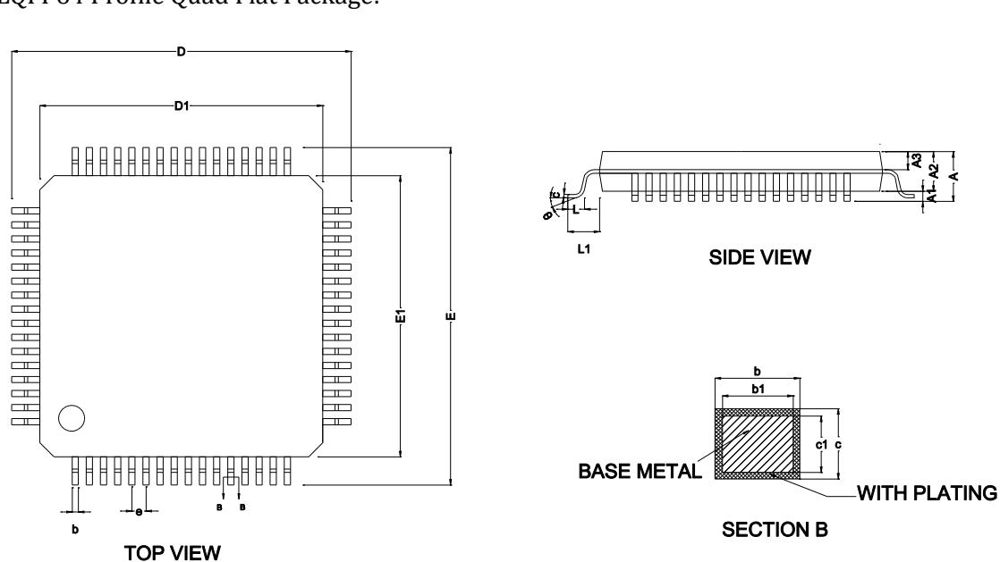  
图 4-1 LKS32MC070RBT8 封装图示

表 4-1 LKS32MC070RBT8 封装尺寸

<table><tr><td rowspan="2">SYMBOL</td><td colspan="3">MILLIMETER</td></tr><tr><td>MIN</td><td>NOM</td><td>MAX</td></tr><tr><td>A</td><td>-</td><td>-</td><td>1.60</td></tr><tr><td>A1</td><td>0.05</td><td>-</td><td>0.15</td></tr><tr><td>A2</td><td>1.35</td><td>1.40</td><td>1.45</td></tr><tr><td>A3</td><td>0.59</td><td>0.64</td><td>0.69</td></tr><tr><td>b</td><td>0.18</td><td>-</td><td>0.26</td></tr><tr><td>b1</td><td>0.17</td><td>0.20</td><td>0.23</td></tr><tr><td>c</td><td>0.13</td><td>-</td><td>0.17</td></tr><tr><td>c1</td><td>0.12</td><td>0.13</td><td>0.14</td></tr><tr><td>D</td><td>11.80</td><td>12.00</td><td>12.20</td></tr><tr><td>D1</td><td>9.90</td><td>10.00</td><td>10.10</td></tr><tr><td>E</td><td>11.80</td><td>12.00</td><td>12.20</td></tr><tr><td>E1</td><td>9.90</td><td>10.00</td><td>10.10</td></tr><tr><td>e</td><td colspan="3">0.50BSC</td></tr><tr><td>L</td><td>0.45</td><td>-</td><td>0.75</td></tr><tr><td>L1</td><td colspan="3">1.00REF</td></tr><tr><td>θ</td><td>0</td><td>-</td><td>7°</td></tr></table>

SIDE VIEW

## 4.2 LKS32MC071CBT8/LKS32MC071C8T8

TQFP48 Profile Quad Flat Package:  
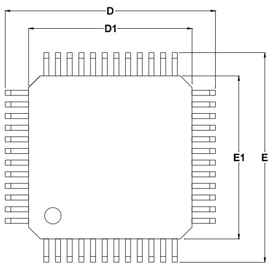

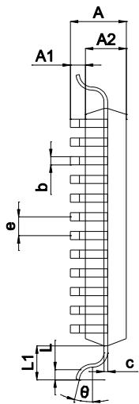

TOP VIEW  
图 4-2 LKS32MC071CBT8/LKS32MC071C8T8 封装图示(TQFP48)  
表 4-2 LKS32MC071CBT8/LKS32MC071C8T8 封装尺寸(TQFP48)

<table><tr><td rowspan="2">SYMBOL</td><td colspan="3">MILLIMETER</td></tr><tr><td>MIN</td><td>NOM</td><td>MAX</td></tr><tr><td>A</td><td>-</td><td>-</td><td>1.20</td></tr><tr><td>A1</td><td>0.05</td><td>-</td><td>0.15</td></tr><tr><td>A2</td><td>0.95</td><td>1.00</td><td>1.05</td></tr><tr><td>b</td><td>0.18</td><td>0.22</td><td>0.26</td></tr><tr><td>c</td><td>0.13</td><td>-</td><td>0.17</td></tr><tr><td>D</td><td>8.80</td><td>9.00</td><td>9.20</td></tr><tr><td>D1</td><td>6.90</td><td>7.00</td><td>7.10</td></tr><tr><td>E</td><td>8.80</td><td>9.00</td><td>9.20</td></tr><tr><td>E1</td><td>6.90</td><td>7.00</td><td>7.10</td></tr><tr><td>e</td><td>-</td><td>0.50</td><td>-</td></tr><tr><td>θ</td><td>0°</td><td>3.5°</td><td>7°</td></tr><tr><td>L</td><td>0.45</td><td>0.60</td><td>0.75</td></tr><tr><td>L1</td><td>-</td><td>1.00</td><td>-</td></tr></table>

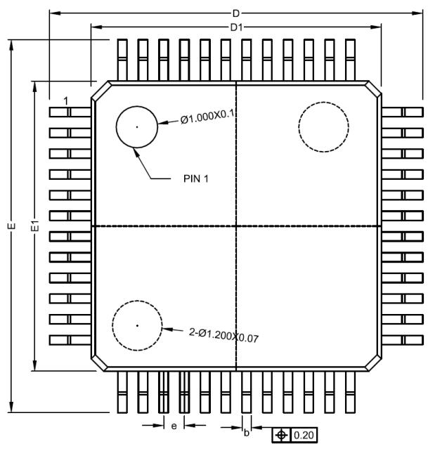

TOP VIEW  
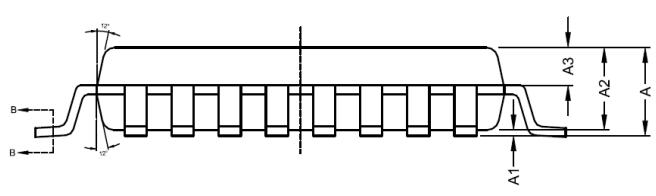  
SIDE VIEW

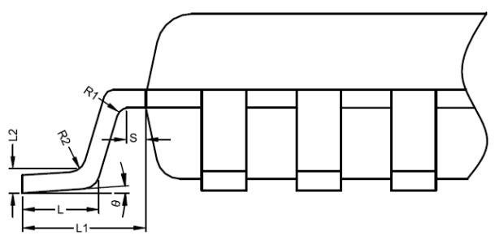

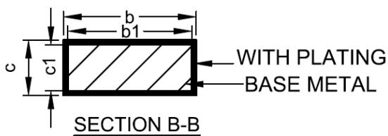  
图 4-3 LKS32MC071CBT8/LKS32MC071C8T8 封装图示(LQFP48)

表 4-3 LKS32MC071CBT8/LKS32MC071C8T8 封装尺寸(LQFP48)

<table><tr><td rowspan="2">SYMBOL</td><td colspan="3">MILLIMETER</td></tr><tr><td>MIN</td><td>NOM</td><td>MAX</td></tr><tr><td>A</td><td>-</td><td>-</td><td>1.60</td></tr><tr><td>A1</td><td>0.05</td><td>0.10</td><td>0.15</td></tr><tr><td>A2</td><td>1.35</td><td>1.40</td><td>1.45</td></tr><tr><td>A3</td><td>0.59</td><td>0.64</td><td>0.69</td></tr><tr><td>b</td><td>0.18</td><td>-</td><td>0.26</td></tr><tr><td>b1</td><td>0.17</td><td>0.20</td><td>0.23</td></tr><tr><td>c</td><td>0.13</td><td>-</td><td>0.18</td></tr><tr><td>c1</td><td>0.12</td><td>0.13</td><td>0.14</td></tr><tr><td>D</td><td>8.80</td><td>9.00</td><td>9.20</td></tr><tr><td>D1</td><td>6.90</td><td>7.00</td><td>7.10</td></tr><tr><td>E</td><td>8.80</td><td>9.00</td><td>9.20</td></tr><tr><td>E1</td><td>6.90</td><td>7.00</td><td>7.10</td></tr><tr><td>e</td><td colspan="3">0.50BSC</td></tr><tr><td>L</td><td>0.45</td><td>-</td><td>0.75</td></tr><tr><td>L1</td><td colspan="3">1.00REF</td></tr><tr><td>L2</td><td colspan="3">0.25BSC</td></tr><tr><td>R1</td><td>0.08</td><td>-</td><td>-</td></tr><tr><td>R2</td><td>0.08</td><td>-</td><td>0.20</td></tr><tr><td>S</td><td>0.20</td><td>-</td><td>-</td></tr><tr><td>θ</td><td>0°</td><td>3.5°</td><td>7°</td></tr></table>

QFN5\*5 32L-0.75 Profile Quad Flat Package:

BOTTOM VIEW

## 4.3 LKS32MC072KBQ8

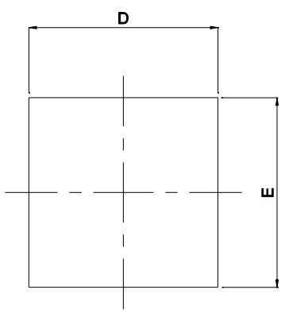  
TOP VIEW

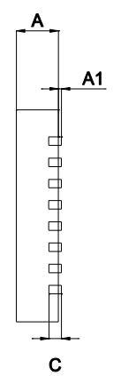  
SIDE VIEW

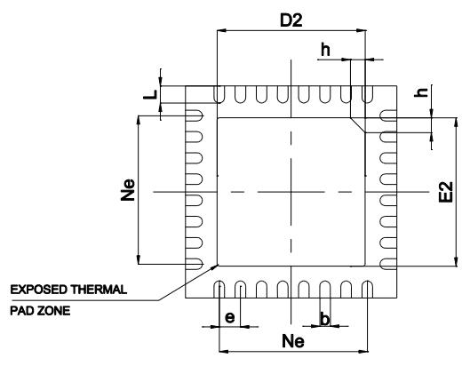

图 4-3 LKS32MC072KBQ8 封装图示  
表 4-3 LKS32MC072KBQ8 封装尺寸

<table><tr><td>SYMBOL</td><td>MILLIMETER</td></tr></table>

<table><tr><td></td><td>MIN</td><td>NOM</td><td>MAX</td></tr><tr><td>A</td><td>0.70</td><td>0.75</td><td>0.80</td></tr><tr><td>A1</td><td>-</td><td>0.02</td><td>0.05</td></tr><tr><td>b</td><td>0.18</td><td>0.25</td><td>0.30</td></tr><tr><td>c</td><td>0.18</td><td>0.20</td><td>0.24</td></tr><tr><td>D</td><td>4.90</td><td>5.00</td><td>5.10</td></tr><tr><td>D2</td><td>3.40</td><td>3.50</td><td>3.60</td></tr><tr><td>e</td><td colspan="3">0.50BSC</td></tr><tr><td>Ne</td><td colspan="3">3.50BSC</td></tr><tr><td>E</td><td>4.90</td><td>5.00</td><td>5.10</td></tr><tr><td>E2</td><td>3.40</td><td>3.50</td><td>3.60</td></tr><tr><td>L</td><td>0.35</td><td>0.40</td><td>0.45</td></tr><tr><td>h</td><td>0.30</td><td>0.35</td><td>0.40</td></tr></table>

## 4.4 LKS32MC072KBT8

LQFP32 Profile Quad Flat Package:

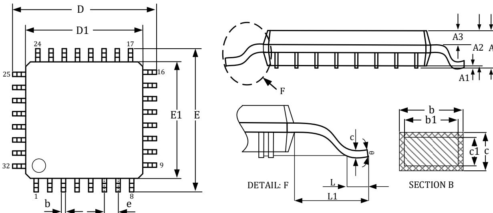  
图 4-4 LKS32MC072KBT8 封装图示

表 4-4 LKS32MC072KBT8 封装尺寸

<table><tr><td rowspan="2">SYMBOL</td><td colspan="3">MILLIMETER</td></tr><tr><td>MIN</td><td>NOM</td><td>MAX</td></tr><tr><td>A</td><td>-</td><td>-</td><td>1.70</td></tr><tr><td>A1</td><td>0.05</td><td>0.1</td><td>0.2</td></tr><tr><td>A2</td><td>1.35</td><td>1.40</td><td>1.45</td></tr><tr><td>A3</td><td>0.59</td><td>0.64</td><td>0.69</td></tr><tr><td>b</td><td>0.32</td><td>0.37</td><td>0.42</td></tr><tr><td>b1</td><td>-</td><td>0.35</td><td>-</td></tr><tr><td>c</td><td>0.09</td><td>0.145</td><td>0.20</td></tr><tr><td>c1</td><td>-</td><td>0.125</td><td>-</td></tr><tr><td>D</td><td>8.80</td><td>9.00</td><td>9.20</td></tr><tr><td>D1</td><td>6.90</td><td>7.00</td><td>7.10</td></tr><tr><td>E</td><td>8.80</td><td>9.00</td><td>9.20</td></tr><tr><td>E1</td><td>6.90</td><td>7.00</td><td>7.10</td></tr><tr><td>e</td><td colspan="3">0.80BSC</td></tr><tr><td>L</td><td>0.30</td><td>0.50</td><td>0.70</td></tr><tr><td>L1</td><td colspan="3">1.00REF</td></tr><tr><td>θ</td><td>0</td><td>-</td><td>8°</td></tr></table>

## 4.5 LKS32MC073HBQ8

QFN3\*3 20L-0.75 Profile Quad Flat Package:

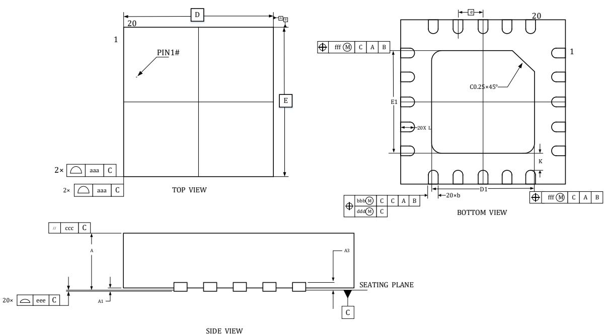  
图 4-5 LKS32MC073HBQ8 封装图示

表 4-5 LKS32MC073HBQ8 封装尺寸

<table><tr><td>SYMBOL</td><td>MIN.</td><td>NOM.</td><td>MAX.</td></tr><tr><td>A</td><td>0.50</td><td>0.55</td><td>0.60</td></tr><tr><td>A1</td><td>0</td><td>0.02</td><td>0.05</td></tr><tr><td>A3</td><td>-</td><td>0.152 REF</td><td>-</td></tr><tr><td>b</td><td>0.15</td><td>0.20</td><td>0.25</td></tr><tr><td>D</td><td colspan="3">3.00BSC</td></tr><tr><td>E</td><td colspan="3">3.00BSC</td></tr><tr><td>D1</td><td>1.60</td><td>1.70</td><td>1.80</td></tr><tr><td>E1</td><td>1.60</td><td>1.70</td><td>1.80</td></tr><tr><td>e</td><td colspan="3">0.40BSC</td></tr><tr><td>L</td><td>0.25</td><td>0.30</td><td>0.35</td></tr><tr><td>K</td><td>0.20</td><td>-</td><td>-</td></tr><tr><td>aaa</td><td colspan="3">0.10</td></tr><tr><td>bbb</td><td colspan="3">0.07</td></tr><tr><td>ccc</td><td colspan="3">0.10</td></tr><tr><td>ddd</td><td colspan="3">0.05</td></tr><tr><td>eee</td><td colspan="3">0.08</td></tr><tr><td>fff</td><td colspan="3">0.10</td></tr></table>

## 4.6 LKS32MC077MBS8

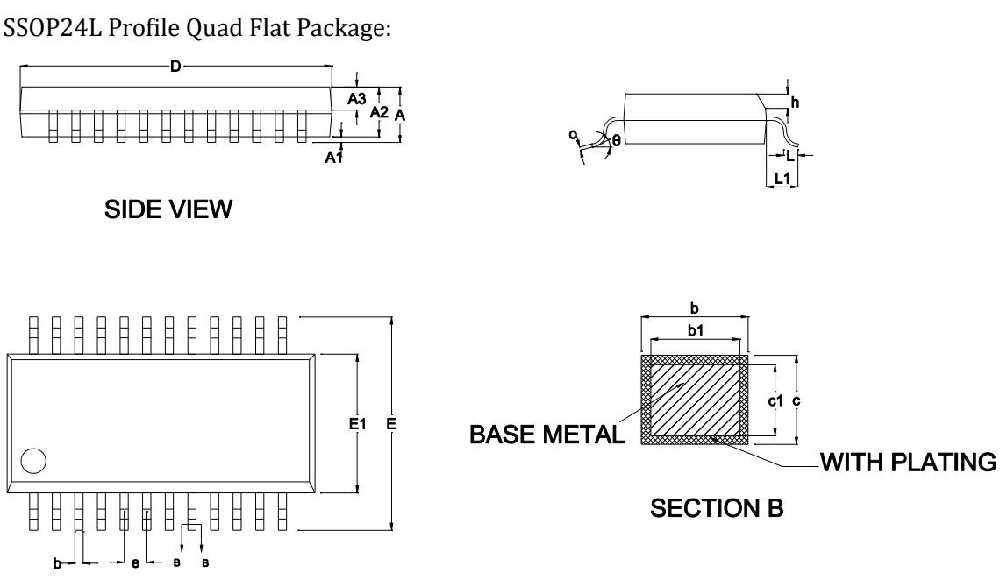  
TOP VIEW

图 4-6 LKS32MC077MBS8 封装图示  
表 4-6 LKS32MC077MBS8 封装尺寸

<table><tr><td rowspan="2">SYMBOL</td><td colspan="3">MILLIMETER</td></tr><tr><td>MIN</td><td>NOM</td><td>MAX</td></tr><tr><td>A</td><td>-</td><td>-</td><td>1.75</td></tr><tr><td>A1</td><td>0.10</td><td>0.15</td><td>0.25</td></tr><tr><td>A2</td><td>1.30</td><td>1.40</td><td>1.50</td></tr><tr><td>A3</td><td>0.60</td><td>0.65</td><td>0.70</td></tr><tr><td>b</td><td>0.23</td><td>-</td><td>0.31</td></tr><tr><td>b1</td><td>0.22</td><td>0.25</td><td>0.28</td></tr><tr><td>c</td><td>0.20</td><td>-</td><td>0.24</td></tr><tr><td>c1</td><td>0.19</td><td>0.20</td><td>0.21</td></tr><tr><td>D</td><td>8.55</td><td>8.65</td><td>8.75</td></tr><tr><td>E</td><td>5.80</td><td>6.00</td><td>6.20</td></tr><tr><td>E1</td><td>3.80</td><td>3.90</td><td>4.00</td></tr><tr><td>e</td><td colspan="3">0.635BSC</td></tr><tr><td>h</td><td>0.30</td><td>-</td><td>0.50</td></tr><tr><td>L</td><td>0.50</td><td>-</td><td>0.80</td></tr><tr><td>L1</td><td colspan="3">1.05REF</td></tr><tr><td>θ</td><td>0</td><td>-</td><td>8°</td></tr></table>

## 5 电气性能参数

表 5-1 LKS32MC07x 电气极限参数

<table><tr><td>参数</td><td>最小</td><td>最大</td><td>单位</td><td>说明</td></tr><tr><td>电源电压(AVDD)</td><td>-0.3</td><td>+6.0</td><td>V</td><td></td></tr><tr><td>预驱电源电压(VCC)</td><td>-0.3</td><td>+25.0</td><td>V</td><td>LKS07x with 6N driver</td></tr><tr><td>预驱电源电压(VCC)</td><td>-0.3</td><td>+40.0</td><td></td><td>LKS07x with 3P3N driver</td></tr><tr><td>电源电压(VCCLDO)</td><td>-0.3</td><td>+25.0</td><td>V</td><td>074DO 中 LDO 供电的引脚</td></tr><tr><td>工作温度</td><td>-40</td><td>+105</td><td>°C</td><td></td></tr><tr><td>存储温度</td><td>-40</td><td>+150</td><td>°C</td><td></td></tr><tr><td>结温</td><td>-</td><td>125</td><td>°C</td><td></td></tr><tr><td>引脚温度</td><td>-</td><td>260</td><td>°C</td><td>焊接,10 秒</td></tr></table>

表 5-2 LKS32MC07x ESD 性能参数

<table><tr><td>项目</td><td>最小</td><td>最大</td><td>单位</td></tr><tr><td>ESD测试 (HBM)</td><td>-6000</td><td>6000</td><td>V</td></tr></table>

根据《MIL-STD-883J Method 3015.9》，在 25℃，55%相对湿度环境下，在被测芯片的所有 IO 引脚施加进行静电放电 3 次，每次间隔 1s。测试结果显示芯片抗静电放电等级达到 Class3A ≧4000V , ＜8000V。

表 5-3 LKS32MC07x Latch-up 性能参数

<table><tr><td>项目</td><td>最小</td><td>最大</td><td>单位</td></tr><tr><td>Latch-up电流 (85°C)</td><td>-200</td><td>200</td><td>mA</td></tr></table>

根据《JEDEC STANDARD NO.78E NOVEMBER 2016》，对所有电源 IO 施加过压 8V，在每个信号 IO上注入200mA电流。测试结果显示芯片抗拴锁等级为 200mA。

表 5-4 LKS32MC07x 建议工况参数参数

<table><tr><td>参数</td><td>最小</td><td>典型</td><td>最大</td><td>单位</td><td>说明</td></tr><tr><td>电源电压(AVDD)</td><td>2.5</td><td>5</td><td>5.5</td><td>V</td><td></td></tr><tr><td rowspan="2">模拟工作电压(AVDDA)</td><td>2.8</td><td>5</td><td>5.5</td><td>V</td><td>REF2VDD=0, ADC选择2.4V内部基准</td></tr><tr><td>2.4</td><td>5</td><td>5.5</td><td>V</td><td>REF2VDD=1, ADC选择AVDD为基准</td></tr></table>

表 5-5 LKS32MC07x IO 极限参数

<table><tr><td>参数</td><td>描述</td><td>最小</td><td>最大</td><td>单位</td></tr><tr><td> $V_{IN}$ </td><td>GPIO信号输入电压范围</td><td>-0.3</td><td>6.0</td><td>V</td></tr><tr><td> $I_{INJ\_PAD}$ </td><td>单个GPIO最大注入电流</td><td>-11.2</td><td>11.2</td><td>mA</td></tr><tr><td> $I_{INJ\_SUM}$ </td><td>所有GPIO最大注入电流</td><td>-50</td><td>50</td><td>mA</td></tr></table>

表 5-6 LKS32MC07x IO DC 参数

<table><tr><td>参数</td><td>描述</td><td>AVDD</td><td>条件</td><td>最小</td><td>最大</td><td>单位</td></tr><tr><td> $V_{IH}$ </td><td>数字IO输入高电压</td><td>5V3.3V</td><td>-</td><td>3.062.07</td><td></td><td>V</td></tr><tr><td rowspan="2"> $V_{IL}$ </td><td rowspan="2">数字IO输入低电压</td><td>5V</td><td rowspan="2">-</td><td rowspan="2"></td><td>0.3*AVDD</td><td rowspan="2">V</td></tr><tr><td>3.3V</td><td>0.8</td></tr><tr><td rowspan="2"> $V_{HYS}$ </td><td rowspan="2">施密特迟滞范围</td><td>5V</td><td rowspan="2">-</td><td rowspan="2">0.1*AVDD</td><td rowspan="2"></td><td rowspan="2">V</td></tr><tr><td>3.3V</td></tr><tr><td rowspan="2"> $I_{IH}$ </td><td rowspan="2">数字IO输入高电压,电流消耗</td><td>5V</td><td rowspan="2">-</td><td rowspan="2"></td><td rowspan="2">1</td><td rowspan="2">uA</td></tr><tr><td>3.3V</td></tr><tr><td rowspan="2"> $I_{IL}$ </td><td rowspan="2">数字IO输入低电压,电流消耗</td><td>5V</td><td rowspan="2">-</td><td rowspan="2">-1</td><td rowspan="2"></td><td rowspan="2">uA</td></tr><tr><td>3.3V</td></tr><tr><td> $V_{OH}$ </td><td>数字IO输出高电压</td><td></td><td>最大驱动电流11.2mA</td><td>AVDD-0.8</td><td></td><td>V</td></tr><tr><td> $V_{OL}$ </td><td>数字IO输出低电压</td><td></td><td>最大驱动电流11.2mA</td><td></td><td>0.5</td><td>V</td></tr><tr><td> $R_{pup}$ </td><td>上拉电阻大小*</td><td></td><td></td><td>11</td><td>13</td><td>kΩ</td></tr><tr><td> $R_{io-ana}$ </td><td>IO与内部模拟电路间连接电阻</td><td></td><td></td><td>100</td><td>200</td><td>Ω</td></tr><tr><td rowspan="2"> $C_{IN}$ </td><td rowspan="2">数字IO输入电容</td><td>5V</td><td rowspan="2">-</td><td rowspan="2"></td><td rowspan="2">10</td><td rowspan="2">pF</td></tr><tr><td>3.3V</td></tr></table>

表 5-7 LKS32MC07x 电路模块电流消耗 IDD

<table><tr><td>模块</td><td>Min</td><td>Typ</td><td>Max</td><td>单位</td></tr><tr><td>模拟比较器CMP(1个)</td><td></td><td>0.005</td><td></td><td>mA</td></tr><tr><td>运算放大器OPA(1个)</td><td></td><td>0.450</td><td></td><td>mA</td></tr><tr><td>模数转换器ADC</td><td></td><td>3.710</td><td></td><td>mA</td></tr><tr><td>数模转换器DAC</td><td></td><td>0.710</td><td></td><td>mA</td></tr><tr><td>温度传感器Temp Sensor</td><td></td><td>0.150</td><td></td><td>mA</td></tr><tr><td>带隙基准BGP</td><td></td><td>0.154</td><td></td><td>mA</td></tr><tr><td>8MHz RC时钟</td><td></td><td>0.105</td><td></td><td>mA</td></tr><tr><td>锁相环PLL</td><td></td><td>0.080</td><td></td><td>mA</td></tr><tr><td>CPU+flash+SRAM (96MHz)</td><td></td><td>8.667</td><td></td><td>mA</td></tr><tr><td>CPU+flash+SRAM (12MHz)</td><td></td><td>1.600</td><td></td><td>mA</td></tr><tr><td>CRC</td><td></td><td>0.070</td><td></td><td>mA</td></tr><tr><td>DSP</td><td></td><td>3.421</td><td></td><td>mA</td></tr><tr><td>UART</td><td></td><td>0.107</td><td></td><td>mA</td></tr><tr><td>DMA</td><td></td><td>1.340</td><td></td><td>mA</td></tr><tr><td>MCPWM</td><td></td><td>0.053</td><td></td><td>mA</td></tr><tr><td>TIMER</td><td></td><td>0.269</td><td></td><td>mA</td></tr><tr><td>SPI</td><td></td><td>0.500</td><td></td><td>mA</td></tr><tr><td>IIC</td><td></td><td>0.500</td><td></td><td>mA</td></tr></table>

## 电气性能参数

<table><tr><td>CAN</td><td></td><td>2.200</td><td></td><td>mA</td></tr><tr><td>休眠</td><td>9</td><td>12</td><td>20</td><td>uA</td></tr></table>

以上测试如无特别标注，均为室温 25°5V 供电，使用 96MHz 时钟工作情况下的测试，由于制造工艺存在器件模型偏差，不同芯片的电流消耗会存在个体差异。

## 6 模拟性能参数

表 6-1 LKS32MC07x 模拟性能参数

<table><tr><td>参数</td><td>最小</td><td>典型</td><td>最大</td><td>单位</td><td colspan="2">说明</td></tr><tr><td colspan="7">芯片</td></tr><tr><td>工作电源</td><td>2.5</td><td>5</td><td>5.5</td><td>V</td><td colspan="2"></td></tr><tr><td colspan="7">模数转换器(ADC)</td></tr><tr><td rowspan="2">工作电源</td><td>2.8</td><td>5</td><td>5.5</td><td>V</td><td colspan="2">REF2VDD=0, ADC选择2.4V内部基准</td></tr><tr><td>2.4</td><td>5</td><td>5.5</td><td>V</td><td colspan="2">REF2VDD=1, ADC选择AVDD为基准</td></tr><tr><td>输出码率</td><td></td><td>3</td><td></td><td>MHz</td><td colspan="2"> $f_{adc}/16$ </td></tr><tr><td rowspan="2">差分输入信号范围</td><td>-5.0+0.144</td><td></td><td>+5.0-0.144</td><td>V</td><td colspan="2">ADCx_GAIN=1时; REF=2.4V</td></tr><tr><td>-3.6+0.072</td><td></td><td>+3.6-0.072</td><td>V</td><td colspan="2">ADCx_GAIN=0时; REF=2.4V</td></tr><tr><td>单端输入信号范围</td><td>-0.3</td><td></td><td>AVDD+0.3</td><td>V</td><td colspan="2">受限于IO口输入电压限制</td></tr><tr><td colspan="7">差分信号通常为芯片内部OPA输出至ADC的信号;单端信号通常为外部通过IO输入的被采样信号:无论使用内部/外部基准,ADC测量信号幅度均不应超过满量程的±98%,特别地,当使用外部基准时,建议采样信号不超过量程的90%。</td></tr><tr><td>直流失调(offset)</td><td></td><td>5</td><td>10</td><td>mV</td><td colspan="2">可校正</td></tr><tr><td>有效位数(ENOB)</td><td>10.5</td><td>11</td><td></td><td>bit</td><td colspan="2"></td></tr><tr><td>INL</td><td></td><td>2</td><td>3</td><td>LSB</td><td colspan="2"></td></tr><tr><td>DNL</td><td></td><td>1</td><td>2</td><td>LSB</td><td colspan="2"></td></tr><tr><td>SNR</td><td>63</td><td>66</td><td></td><td>dB</td><td colspan="2"></td></tr><tr><td>输入电阻</td><td>500k</td><td></td><td></td><td>Ohm</td><td colspan="2"></td></tr><tr><td>输入电容</td><td></td><td>10pF</td><td></td><td>F</td><td colspan="2"></td></tr><tr><td colspan="7">基准电压(REF)</td></tr><tr><td>工作电源</td><td>2.2</td><td>5</td><td>5.5</td><td>V</td><td colspan="2"></td></tr><tr><td>输出偏差</td><td>-9</td><td></td><td>9</td><td>mV</td><td colspan="2"></td></tr><tr><td>电源抑制比</td><td></td><td>70</td><td></td><td>dB</td><td colspan="2"></td></tr><tr><td>温度系数</td><td></td><td>20</td><td></td><td>ppm/°C</td><td colspan="2"></td></tr><tr><td>输出电压</td><td></td><td>1.2</td><td></td><td>V</td><td colspan="2"></td></tr><tr><td colspan="7">数模转换器(DAC)</td></tr><tr><td>工作电源</td><td>2.2</td><td>5</td><td>5.5</td><td>V</td><td colspan="2"></td></tr><tr><td>负载电阻</td><td>5k</td><td></td><td></td><td>Ohm</td><td colspan="2" rowspan="3">输出BUFFER开启</td></tr><tr><td>负载电容</td><td></td><td></td><td>50p</td><td colspan="2">F</td></tr><tr><td>输出电压范围</td><td>0.05</td><td></td><td>AVDD-0.1</td><td colspan="2">V</td></tr><tr><td>转换速度</td><td></td><td></td><td>1M</td><td colspan="2">Hz</td><td></td></tr><tr><td>DNL</td><td></td><td>1</td><td>2</td><td colspan="2">LSB</td><td></td></tr><tr><td>INL</td><td></td><td>2</td><td>4</td><td colspan="2">LSB</td><td></td></tr><tr><td>OFFSET</td><td></td><td>5</td><td>10</td><td colspan="2">mV</td><td></td></tr><tr><td>SNR</td><td>57</td><td>60</td><td>66</td><td colspan="2">dB</td><td></td></tr><tr><td colspan="7">运算放大器(OPA)</td></tr><tr><td>工作电源</td><td>2.8</td><td>5</td><td>5.5</td><td colspan="2">V</td><td></td></tr><tr><td>带宽</td><td></td><td>10M</td><td>20M</td><td colspan="2">Hz</td><td></td></tr><tr><td>负载电阻</td><td>20k</td><td></td><td></td><td colspan="2">Ohm</td><td></td></tr><tr><td>负载电容</td><td></td><td></td><td>5p</td><td colspan="2">F</td><td></td></tr><tr><td>输入共模范围</td><td>0</td><td></td><td>AVDD</td><td colspan="2">V</td><td></td></tr><tr><td>输出信号范围</td><td>0</td><td></td><td>2Vcm</td><td colspan="2">V</td><td>最小负载电阻下</td></tr><tr><td rowspan="4">OFFSET</td><td></td><td>10</td><td>15.0</td><td colspan="2">mV</td><td>32倍放大倍数</td></tr><tr><td></td><td>10</td><td>16.5</td><td colspan="2">mV</td><td>16倍放大倍数</td></tr><tr><td></td><td>10</td><td>18.5</td><td colspan="2">mV</td><td>8倍放大倍数</td></tr><tr><td></td><td>10</td><td>20.5</td><td colspan="2">mV</td><td>4倍放大倍数</td></tr><tr><td colspan="7">此OFFSET为OPA差分输入短接时,测量OPA_OUT偏离0电平,得到的等效差分输入端偏差。OPA输出端偏差为OPA放大倍数×OFFSET。Flash NVR区域记录了出厂测试的OPA offset。</td></tr><tr><td rowspan="4">共模电平(Vcm)</td><td>1.45</td><td>1.8</td><td>2.2</td><td>V</td><td>32倍放大倍数</td><td rowspan="4">测量条件:常温。运放摆幅=2×min(AVDD-Vcm,Vcm)。建议使用OPA单端输出的应用上电后进行Vcm测量并进行软件减除校正。更多分析请参考官网应用笔记《ANN009-运放差分和单端工作模式区别》。Flash NVR区域记录了出厂测试的OPA Vcm。</td></tr><tr><td>1.5</td><td>1.8</td><td>2.2</td><td>V</td><td>16倍放大倍数</td></tr><tr><td>1.55</td><td>1.8</td><td>2.2</td><td>V</td><td>8倍放大倍数</td></tr><tr><td>1.6</td><td>1.8</td><td>2.2</td><td>V</td><td>4倍放大倍数</td></tr><tr><td>共模抑制(CMRR)</td><td></td><td>80</td><td></td><td colspan="2">dB</td><td></td></tr><tr><td>电源抑制(PSRR)</td><td></td><td>80</td><td></td><td colspan="2">dB</td><td></td></tr><tr><td>负载电流</td><td></td><td></td><td>500</td><td colspan="2">uA</td><td></td></tr><tr><td>摆率(Slew rate)</td><td></td><td>5</td><td></td><td colspan="2">V/us</td><td></td></tr><tr><td>相位裕度</td><td></td><td>60</td><td></td><td colspan="2">度</td><td></td></tr><tr><td colspan="7">比较器(CMP)</td></tr><tr><td>工作电源</td><td>2.2</td><td>5</td><td>5.5</td><td colspan="2">V</td><td></td></tr><tr><td>输入信号范围</td><td>0</td><td></td><td>AVDD</td><td colspan="2">V</td><td></td></tr><tr><td>OFFSET</td><td>-36</td><td>-10</td><td>12</td><td colspan="2">mV</td><td>0mV回差,CMP输出低到高翻转</td></tr><tr><td rowspan="3"></td><td>-36</td><td>-10</td><td>12</td><td colspan="2">mV</td><td>0mV回差,CMP输出高到低翻转</td></tr><tr><td>-14.5</td><td>-10</td><td>33.5</td><td>mV</td><td colspan="2">20mV回差,CMP输出低到高翻转</td></tr><tr><td>-14.5</td><td>11.5</td><td>33.5</td><td>mV</td><td colspan="2">20mV回差,CMP输出高到低翻转</td></tr><tr><td rowspan="2">传输延时</td><td></td><td>50</td><td></td><td colspan="2">nS</td><td>默认功耗</td></tr><tr><td></td><td>200</td><td></td><td>nS</td><td colspan="2">低功耗</td></tr><tr><td rowspan="2">回差(Hysteresis)</td><td></td><td>20</td><td></td><td colspan="2">mV</td><td>HYS='0'</td></tr><tr><td></td><td>0</td><td></td><td>mV</td><td colspan="2">HYS='1'</td></tr></table>

模拟寄存器表说明：

模 拟 寄 存 器 的 名 称 为 SYS\_AFE\_REG0\~SYS\_AFE\_REG6 ， 对 应 地 址 为 0x4000\_0010 \~0x4000\_0028。地址 0x4000\_001C\~0x4000\_0028 是模拟各个模块的校正寄存器，这些寄存器在出厂之前都会将各自的校正值填入 Flash info 区，并在上电后自动加载到 SYS\_AFE\_REG3\~SYS\_AFE\_REG6。一般情况下用户不要去配置或改变这些值。如果需要对某个模拟参数进行微调，需要读取原校正值，并以此为基础进行微调。

地址 0x4000\_0000\~0x4000\_0018 是开放给用户的寄存器，其中保留寄存器(Res)必须全部配置为0（芯片上电后会被复位为0）。其他寄存器根据应用场合需要进行配置。

## 7 电源管理系统

电源管理系统由LDO15 模块、电源检测模块(PVD）、上电/掉电复位模块(POR）组成。

该芯片由 2.5V\~5.5V 单电源供电，以节省芯片外的电源成本。芯片内部集成一路 LDO15 给内部所有数字电路、PLL模块供电。

LDO上电后自动开启，无需软件配置，但LDO 输出电压可通过软件实现微调。

LDO15 的输出电压可通过设置寄存器 $\mathrm { L D O 1 5 T R I M } { < } 2 { : } 0 { > }$ 来调节，具体寄存器所对应值见模拟寄存器表说明。LDO15在芯片出厂前已经过校正，一般情况下，用户不需要额外配置这些寄存器。如需微调LDO 的输出电压，需要读取原配置值，在此基础加上微调量对应的配置值填入寄存器。

POR 模块监测LDO15的电压，在LDO15 电压低于 1.26V时(例如上电之初，或者掉电之时），为数字电路提供复位信号以避免数字电路工作产生异常。

PVD模块对5V输入电源进行检测，如低于某一设定阈值，则产生报警(中断）信号以提醒 MCU。中断提醒阈值可通过寄存器 $\mathrm { P V D S E L } { < } 1 { : } 0 { > }$ 设置为不同的电压。PVD 模块可通过设置 $\mathrm { P D \_ P D T } = ^ { \prime } 1 ^ { \prime }$ 关闭。具体寄存器所对应值见模拟寄存器表说明。

## 8 时钟系统

时钟系统包括内部32KHz RC时钟、内部8MHz RC时钟、外部8MHz晶体起振电路、PLL电路组成。

32K RC时钟作为MCU系统慢时钟使用，作为诸如滤波模块或者低功耗状态下的MCU时钟使用。8MHz RC时钟作为MCU主时钟使用，配合PLL可提供最高到96MHz的时钟。外部8MHz晶体起振电路作为备份时钟使用。

32k和8M RC 时钟均带有出厂校正，32K RC时钟在 ${ \cdot 4 0 } { \sim } 1 0 5 ^ { \circ } \mathrm { C }$ 范围内的精度为±50%，8M RC时钟在该温度范围的精度为±1%。

32K RC 时钟频率可通过寄存器 RCLTRIM<3:0>进行设置，8M RC 时钟频率可通过寄存器$\mathrm { R C H T R I M } { < } 5 { : } 0 { > }$ 进行设置，具体寄存器所对应值见模拟寄存器表说明。

芯片出厂前时钟已经过校正，一般情况下，用户不需要额外配置这些寄存器。如需微调频率，需要读取原配置值，在此基础加上微调量对应的配置值填入寄存器。

8MRC时钟通过设置 $\mathrm { R C H P D } = ^ { \prime } 0 ^ { \prime } ;$ 打开(默认打开，设’1’关闭），RC 时钟需要Bandgap 电压基准源模块提供基准电压和电流，因此开启 RC时钟需要先开启 $\mathrm { B G P }$ 模块。芯片上电的默认状态下，8MRC时钟和BGP模块都是开启的。32K RC时钟是始终开启的，不能关闭。

PLL 对 8M RC 时钟进行倍频，以提供给 MCU、ADC 等模块更高速的时钟。MCU 和 PWM 模块的最高时钟为96MHz，ADC 模块典型工作时钟为48MHz，通过寄存器 $\mathrm { A D C L K S E L } { < } 1 { : } 0 { > } \overline { { \mathrm { H J } } }$ 设置为不同的ADC 工作频率。

PLL 通过设置 $\mathrm { P L L P D N } { = } ^ { \prime } 1 ^ { \circ }$ ’打开(默认关闭，设 1 打开），开启 PLL 模块之前，同样也需要开启BGP(Bandgap)模块。开启PLL之后，PLL需要 6us 的稳定时间来输出稳定时钟。芯片上电的默认状态下，RCH时钟和BGP 模块都是开启的，但 PLL默认是关闭的，需要软件来开启。

晶体起振电路内置放大器，需在 $\mathrm { I O ~ O S C \_ I N / O S C \_ O U T }$ 之间接入一个晶体，且 OSC\_IN/OSC\_OUT上各放一个15pF的电容到地，并设置 $\mathrm { X T A L P D N } { = } ^ { \prime } 1$ ’即可起振。

## 9 基准电压源

该基准源为ADC、DAC、RC 时钟、PLL、温度传感器、运算放大器、比较器和 FLASH提供基准电压和电流，使用上述任何一个模块之前，都需要开启BGP 基准电压源。

芯片上电的默认状态下，BGP 模块是开启的。通过设置 $\mathrm { B G P P D } = ^ { \prime } 0 ^ { \prime }$ 将基准源打开，从关闭到开启，BGP需要约6us 达到稳定。BGP 输出电压约1.2V，精度为±0.8%。

## 10 ADC 模块

芯片内部集成2 路同步双采样的 SAR结构ADC，芯片上电的默认状态下，ADC 模块是关闭的。ADC开启前，需要先开启BGP和8MRC时钟和PLL模块，并选择ADC 工作频率。默认配置下 ADC工作时钟是48M，对应3MHz 的转换数据率。

同步双采样电路可在同一时刻对两路输入信号进行采样，采样完成之后ADC按先后顺序将这两路信号进行转换，并写入相应的数据寄存器中。

ADC 完成一次转换需要 16 个 ADC 时钟周期，其中 13 个为转换周期，3 个为采样周期。即$f _ { c o n \nu } = f _ { a d c } / 1 6$ 。在ADC时钟设为48M时，转换速率是 3MHz。

ADC在降频应用时，可通过寄存器 $\mathrm { C U R R I T } { < } 1 { : } 0 { > }$ 降低ADC的功耗水平。

ADC 可工作在如下模式：单次单通道触发、连续单通道、单次 1\~16 通道扫描、连续 1\~16 通道扫描。每路ADC 都有 16 组独立寄存器对应每一个通道。

ADC触发事件可以来自外部的定时器信号T0、T1、T2、T3发生到预设次数，或者为软件触发。

ADC\_DC 存储的是 ADC 的直流偏置，通常在校正阶段通过测量通道 15（从 0 开始计数）的 AVSS（内部地）得到ADC直流偏置数值并存入flash中，并在系统加载阶段由软件将直流偏置写入ADC\_DC寄存器中。

ADC有两种量程通过 $\mathrm { A D C x \_ G A I N } ( \mathbf { x } = 0 , 1 ]$ 进行设置：3.6V和 7.2V。7.2V量程下，由于芯片使用5V供电，对应最大±5V的输入信号幅度，3.6V 量程下，对应最大±3.6V 的输入信号幅度。在测量运放的输出信号时，根据运放可能输出的最大信号来选择具体的ADC增益。

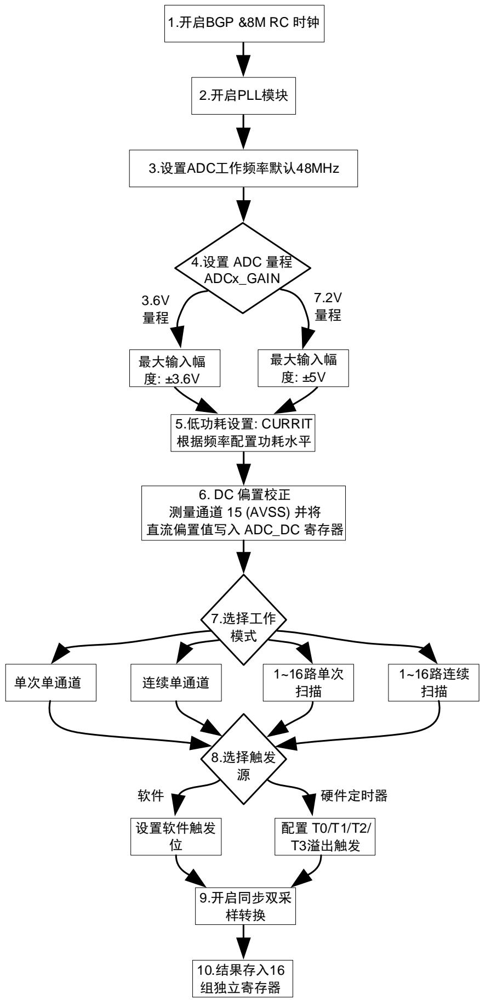  
图 10-1 ADC 配置流程图

## 11 SPI 模块

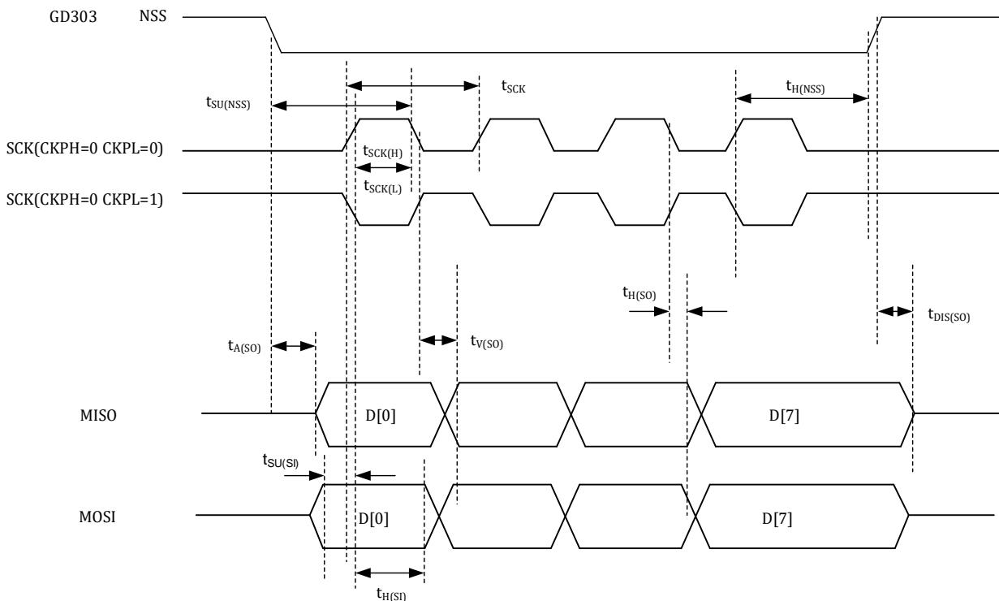

图 11-1 SPI 从机模式时序图  
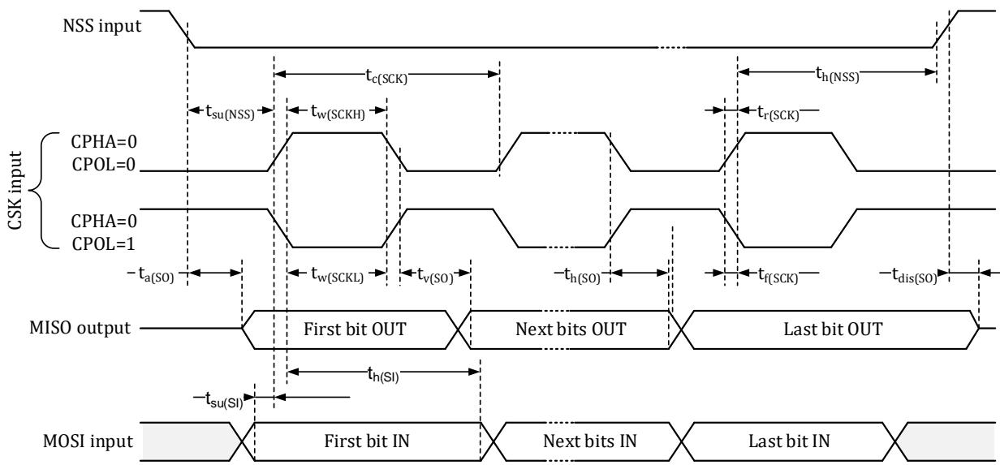  
图 11-2 SPI 从机模式且 CHPA=0 时序图

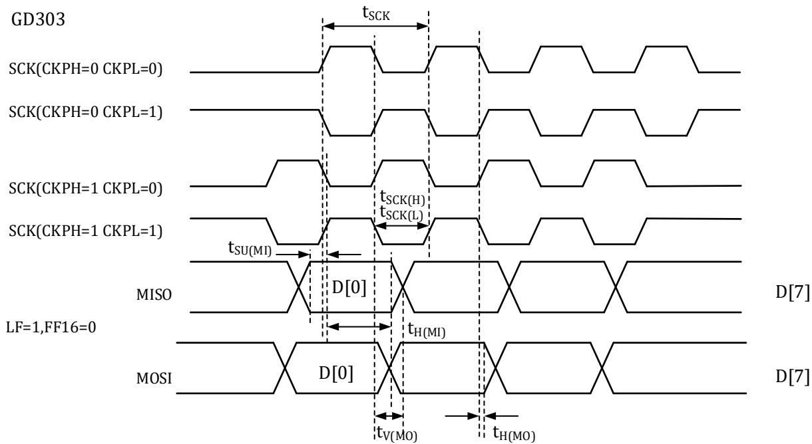  
图 11-3 SPI 主机模式时序图  
表 11-1 SPI 时序参数表  
SPI 模式，极性 0，相位0，上升沿采样，下降沿输出

<table><tr><td>参数</td><td>最小</td><td>典型</td><td>最大</td><td>单位</td><td>说明</td></tr><tr><td> $f_{SCK}$ </td><td>—</td><td>—</td><td>12</td><td>MHz</td><td>理论值,实测会有1%的误差,最大允许配置的波特率为12Mhz</td></tr><tr><td> $t_{SCK(H)}$ </td><td>41.25</td><td>41.67</td><td>42.09</td><td>nS</td><td>半 SCK 周期</td></tr><tr><td> $t_{SCK(L)}$ </td><td>41.25</td><td>41.67</td><td>42.09</td><td>nS</td><td>半 SCK 周期</td></tr><tr><td colspan="6">SPI 主机模式</td></tr><tr><td> $t_{V(MO)}$ </td><td>—</td><td>9.9</td><td>10</td><td>nS</td><td>CLK 下降沿到 MOSI 新数据开始有效</td></tr><tr><td> $t_{H(MO)}$ </td><td>2</td><td>—</td><td>—</td><td>nS</td><td>CLK 下降沿到 MOSI 旧数据开始变化</td></tr><tr><td> $t_{SU(MI)}$ </td><td>-25</td><td>—</td><td>—</td><td>nS</td><td>MISO 到 CLK 上升沿建立时间要求</td></tr><tr><td> $t_{H(MI)}$ </td><td>40</td><td>—</td><td>—</td><td>nS</td><td>MISO 到 CLK 上升沿保持时间要求</td></tr><tr><td colspan="6">SPI 从机模式</td></tr><tr><td> $t_{SU(NSS)}$ </td><td>20</td><td>—</td><td>—</td><td>nS</td><td>片选拉低到 CLK 的第一个上升沿</td></tr><tr><td> $t_{H(NSS)}$ </td><td>-40</td><td>—</td><td>—</td><td>nS</td><td>最后一个 CLK 的上升沿到片选拉高</td></tr><tr><td> $t_{A(SO)}$ </td><td>51.5</td><td>—</td><td>52.5</td><td>nS</td><td>片选拉低到 MISO 开始发送数据</td></tr><tr><td> $t_{DIS(SO)}$ </td><td>47.5</td><td>—</td><td>48.5</td><td>nS</td><td>片选拉高到 MISO 为 0</td></tr><tr><td> $t_{V(SO)}$ </td><td>—</td><td>38</td><td>38.4</td><td>nS</td><td>CLK 下降沿到新数据发送完成</td></tr><tr><td> $t_{H(SO)}$ </td><td>29.2</td><td>—</td><td>—</td><td>nS</td><td>CLK 下降沿到旧数据开始变化</td></tr><tr><td> $t_{SU(S)}$ </td><td>-20</td><td>—</td><td>—</td><td>nS</td><td>MOSI 信号稳定到 CLK 上升沿</td></tr><tr><td colspan="6">芯片供电 3.3V,主频 96Mhz 下测试(供电 5V 时示波器探头上会有较大的振铃,示波器线长 1M)</td></tr></table>

## 12 运算放大器

4 路输入输出rail-to-rail运算放大器(部分型号为 2/3 路），内置反馈电阻R2/R1，外部引脚需串联一个电阻 R0。反馈电阻 R2:R1 的阻值可通过寄存器 RES\_OPAx<1:0>设置，以实现不同的放大倍数。具体寄存器所对应值见模拟寄存器表说明。

最终的放大倍数为R2/(R1+R0)，其中R0是外部电阻的阻值，

对于MOS管电阻直接采样的应用，建议接>20kΩ 的外部电阻，以减小MOS管关断时，往芯片引脚里流入的电流。

对于小电阻采样的应用，建议接 100Ω 的外部电阻。

放大器可通过设置 OPAOUT\_EN<2:0>选择将 4 路放大器中的某一路输出信号通过 BUFFER 送至P2.7IO 口进行测量和应用(对应关系见datasheet 芯片管脚说明）。因为有 BUFFER 存在，在运放正常工作模式下也可以选择送一路运放输出信号出来。

芯片上电的默认状态下，放大器模块是关闭的。放大器可通过设置 OPAxPDN =’1’打开，开启放大器之前，需要先开启BGP 模块。

运放输入同相和反相端内置钳位二极管，电机相线通过一匹配电阻后直接接入输入端，从而简化了MOSFET电流采样的外置电路。

## 13 比较器

内置3 路输入rail-to-rail比较器，比较器比较速度可编程、迟滞电压可编程、信号源可编程。

比较器的比较延时可通过寄存器 CMP\_FT 设置为＜30nS/200nS。迟滞电压通过 CMP\_HYS 设置为 20mV/0mV。

比较器正端输入信号来源可以通过寄存器 CMPx\_SELP[2:0] 进行设置；负端输入信号来源可以通过寄存器 CMPx\_SELN[1:0]进行设置 $\scriptstyle ( \mathbf { { x } } = 0 / 1 / 2$ ，代表比较器 CMP0/CMP1/CMP2）。

芯片上电的默认状态下，比较器模块是关闭的。比较器通过设置 $\mathrm { C M P x P D N } = ^ { \prime } 1$ ’打开，开启比较器之前，需要先开启BGP模块。

## 14 温度传感器

芯片内置精度为 $1 { \pm } 2 ^ { \circ } \mathrm { C } |$ 的温度传感器。芯片出厂前会经温度校正，校正值保存在 flash info 区。

芯片上电的默认状态下，温度传感器模块是关闭的。开启传感器之前，需要先开启 $\mathrm { B G P }$ 模块。

温度传感器通过设置 $\mathrm { T M P P D N } { = } ^ { \prime } 1 ^ { \prime }$ 打开，开启到稳定需要约 2us，因此需在 ADC 测量传感器之前2us打开。

## 15 DAC 模块

芯片内置两路 12bit DAC，输出信号的最大量程可通过寄存器 DAC0\_GAIN、DAC1\_GAIN 设置为1.2V/4.85V

DAC0 可通过配置寄存器 DAC0OUT\_EN=1，将 DAC0 输出送至 P0.0 管脚；DAC1 可通过配置寄存器 DAC1OUT\_EN=1，将 DAC1 输出送至 P0.0 管脚，可驱动>5kΩ 的负载电阻和 50pF 的负载电容。通常不会同时输出DAC0和DAC1，以免造成信号竞争。

DAC最大输出码率为1MHz。

芯片上电的默认状态下，DAC 模块是关闭的。DAC0 可通过设置 DAC0PDN =1 打开，DAC1 可通过设置 DAC1PDN =1 打开，开启 DAC 模块之前，需要先开启 BGP 模块。

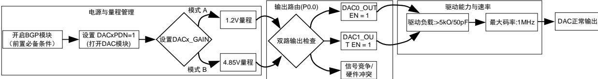  
图 15-1 DAC 配置流程图

## 16 处理器核心

➢ 集成 32 位 Cortex-M0+DSP 双核处理器(部分型号不带 DSP）

➢ 2 线 SWD 调试管脚

➢ 最高工作频率 96MHz

## 17 存储资源

## 17.1 Flash

➢ 内置 flash 包括 64kB/128kB 主存储区，1.5kB NVR 信息存储区

➢ 可反复擦除写入不低于10万次

➢ 室温25℃数据保持长达 100年

➢ 单字节编程时间最长 7.5us，Sector擦除时间最长 5ms

➢ Sector大小512 字节，可按Sector擦除写入，支持运行时编程

➢ Flash 数据防窃取(最后一个 word 须写入非 0xFFFFFFFF 的任意值）

## 17.2 SRAM

➢ 内置 12kB SRAM

## 18 电机驱动专用 MCPWM

➢ MCPWM 最高工作时钟频率 96MHz

➢ 可以产生6 对（互补信号）或 12 路独立（边沿模式）不交叠的PWM 信号,两组斩波模块，每组共用一个死区配置

➢ 支持边沿对齐PWM 模式

➢ 支持软件控制 IO 模式

➢ 支持IO 极性控制功能

➢ 内部短路保护，避免因为配置错误导致短路

➢ 外部短路保护，根据对外部信号的监控快速关断

➢ 内部产生ADC 采样中断

➢ 采用加载寄存器预存定时器配置参数

可配置加载寄存器加载时刻和周期

## 19 Timer

➢ 4 路通用定时器,2路16bit 位宽计时器，2 路32bit位宽计时器。

➢ 4 路支持捕获模式，用于测量外部信号宽度

➢ 4 路支持比较模式，用于产生边沿对齐PWM/定时中断

特别地，LKS32MC070/ LKS32MC071/ LKS32MC072/ LKS32MC077 有 2 路支持编码信号输入，支持脉冲指令计数。

## 20 Hall 传感器接口

➢ 内置最大 1024 级滤波

➢ 三路 Hall 信号输入

➢ 24位计数器，提供溢出和捕获中断

## 21 DMA

➢ 一路 DMA 引擎

➢ 最多支持 4 个通道

➢ 支持 byte/halfword/word 等不同尺寸的传输

➢ 支持不同的地址递增方式

➢ 支持 ram/外设之间的数据传输

➢ 支持循环模式

## 22 CRC

➢ 支持 7/8/16/32 等不同位宽的多项式

➢ 支持多项式系数配置

➢ 支持输入输出数据翻转

## 23 DSP

➢ 电机控制算法专用 DSP，自主指令集，三级流水

➢ 最高工作频率 96MHz

➢ 32/16位除法器 12 总线周期（96MHz）计算完成

➢ 32位硬件开方8总线周期（96MHz）计算完成

➢ Q15 格式 Cordic 三角函数模块，sin/cos/artanc 20 总线周期（96MHz）计算完成

➢ DSP配备独立的程序区和数据区，可自主执行 DSP程序，亦可由MCU 调用进行某项计算

➢ 支持中断暂停，与MCU 进行数据交互

## 24 通用外设

➢ 两路 UART，全双工工作，支持 8/9 位数据位、1/2 停止位、奇/偶/无校验模式，带 1 字节发送缓存、1 字节接收缓存，支持 Multi-drop Slave/Master 模式，波特率支持 300\~115200

➢ 一路SPI，支持主从模式

➢ 一路 IIC，支持主从模式

➢ 一路 CAN(部分型号不带 CAN）

➢ 硬件看门狗，使用 RC 时钟驱动，独立于系统高速时钟，写入保护，最小复位时间间隔为4096/32kHz≈128ms，最大复位时间间隔为 511×4096/32kHz≈64s。

不同型号的外设请参考2章节选型表。

## 25 特殊 IO 复用

LKS07x 特殊 IO 复用注意事项

SWD协议包含两根信号线：SWCLK和SWDIO。前者是时钟信号，对于芯片而言，是输入状态且不会改变输入状态。后者是数据信号，对于芯片而言，在数据传输过程中会在输入状态和输出状态间切换，默认是输入状态。

LKS07x 可实现 SWD 两个 IO 复用为其它 IO 的功能，SWCLK 复用的 IO 是 P2.14，SWDIO 复用的 IO是P2.15。注意事项如下：

➢ 默认状态是不开启复用，需要软件开启复用。即芯片硬复位结束后，初始状态是SWDIO 用途，SWDIO 在芯片内部有上拉(芯片内部上拉电阻约为12k），应用对初始电平有要求的，需注意。

➢ 开启复用后，KEIL 等工具无法直接访问芯片，即 Debug 和擦除下载功能均失效。若需要重新下载程序，有两个方案。

⚫ 其一，建议使用凌鸥专用离线下载器擦除。软件开启复用的时间，建议保留一定余量，例如100ms左右，保证离线下载器能擦除，防止死锁。余量的多少是保证离线下载器擦除的成功率。余量越大，一次性擦除成功的概率越大。

⚫ 其二，程序内部有退出机制，例如某个其它IO电平发生变化(一般为输入），表明外界需要用SWDIO，软件重新配置，解除复用。此时，可以恢复 KEIL的功能。

➢ 开启或关闭复用，可运行1-2条NOP指令，保证状态切换稳定。

在 SSOP24L 封装和 QFN5\*5 40L-0.75 封装中，SWDIO、SWCLK 可能其他 IO bonding 在一起。此时应注意其他IO动作可能导致芯片误认为SWD动作。

在 LKS077E 封装中，SWDCLK 同 P2.6 直接 bonding 在一起，可以直接使能对应 GPIO。若同时复用SWDIO 和 SWDCLK，SWCLK 复用的注意事项如下：

➢ 默认状态是不开启复用，需要软件开启复用。即芯片硬复位结束后，初始状态是SWCLK用途，SWCLK在芯片内部有上拉(芯片内部上拉电阻约为12k），应用对初始电平有要求的，需注意。

➢ 开启复用后，KEIL 等工具无法直接访问芯片，即 Debug 和擦除下载功能均失效。若需要重新下载程序，有两个方案。

其一，建议使用凌鸥专用离线下载器擦除。软件开启复用的时间，建议保留一定余量，例如100ms左右，保证离线下载器能擦除，防止死锁。余量的多少是保证离线下载器擦除的成功率。余量越大，一次性擦除成功的概率越大。

⚫ 其二，程序内部有退出机制，例如某个其它IO电平发生变化(一般为输入），表明外界需要用SWCLK，软件重新配置，解除复用。此时，可以恢复 KEIL的功能。

➢ 开启或关闭复用，可运行1-2条NOP指令，保证状态切换稳定。

➢ SWCLK 复用开启，有信号变化的时候，SWDIO 能保持为 0 电平(类似时分复用）；若 SWDIO不能保证为0，建议SWCLK在运行过程中，翻转次数不超过50次(例如从0翻转到1，然后又从1翻转到0，算一次）或者每50次翻转期间内(次数可以更少，例如40 次）保证一次在SWCLK从0变成1的时候，SWDIO是0电平。

若此时，仅复用了SWCLK，没有复用SWDIO，注意事项同上。

RSTN信号，默认是用于 LKS07x 芯片的外部复位脚。

LKS07x 可实现RSTN 复用为其它 IO的功能，复用的 IO是 P0.2。注意事项如下：

➢ 默认状态是不开启复用，需要软件开启复用。即芯片初始状态是RSTN用途，RSTN在芯片内部有上拉(芯片内部上拉电阻约为300K），应用对初始电平有要求的，需注意。

➢ 默认状态是RSTN，只有RSTN正常释放后才能开始程序的执行，应用需要保证RSTN有足够保护，例如外围电路带上拉，若能加电容更佳。

➢ 开启复用后，RSTN用途失效，若需产生芯片硬复位，源头只能是掉电/看门狗。

➢ RSTN 的复用，不影响 KEIL 的使用。

➢ 开启或关闭复用，可运行1-2条NOP指令，保证状态切换稳定。

SYS\_IO\_CFG 寄存器的 BIT[5]，为 RSTN 和 P0.2 的复用控制开关。

## 26 订购包装信息

包装类型分为 Tray 包装和 Reel 包装两种，具体包装中的芯片个数由封装形式与包装类型确定，不再以芯片型号区分。

Tray包装信息如下表

<table><tr><td>封装形式</td><td>每盘/管数量</td><td>内盒数量</td><td>外箱数量</td></tr><tr><td>SOP16/ESOP16L</td><td>3000/盘</td><td>6000PCS</td><td>48000PCS</td></tr><tr><td>SSOP24</td><td>4000/盘</td><td>8000PCS</td><td>64000PCS</td></tr><tr><td>SSOP24</td><td>50/管</td><td>10000PCS</td><td>4000/100000PCS</td></tr><tr><td>QFN 8*8</td><td>260/盘</td><td>2600PCS</td><td>15600PCS</td></tr><tr><td>QFN 4*4/5*5/6*6</td><td>490/盘</td><td>4900PCS</td><td>29400PCS</td></tr><tr><td>QFN 3*3</td><td>5000/盘</td><td>5000PCS</td><td>40000PCS</td></tr><tr><td>LQFP48/TQFP48 0707</td><td>250/盘</td><td>2500PCS</td><td>15000PCS</td></tr><tr><td>LQFP64 1010</td><td>160/盘</td><td>1600PCS</td><td>9600PCS</td></tr><tr><td>LQFP100 1414</td><td>90/盘</td><td>900PCS</td><td>5400PCS</td></tr><tr><td>TSSOP20/28</td><td>4000/盘</td><td>8000PCS</td><td>64000PCS</td></tr></table>

Reel包装信息如下表

<table><tr><td colspan="2">包装类别</td><td>每盘/管数量</td><td>每盒数量</td><td>每箱盒数</td><td>外箱数量</td></tr><tr><td>编带-13寸</td><td>SOP/ESOP8</td><td>4000</td><td>8000</td><td>8</td><td>64000</td></tr><tr><td>编带-13寸</td><td>SOP/ESOP16</td><td>3000</td><td>6000</td><td>8</td><td>48000</td></tr><tr><td>编带-13寸</td><td>SSOP24</td><td>4000</td><td>8000</td><td>8</td><td>64000</td></tr><tr><td>编带-13寸</td><td>TSSOP20</td><td>4000</td><td>8000</td><td>8</td><td>64000</td></tr><tr><td>编带-13寸</td><td>D/QFN3*3</td><td>5000</td><td>10000</td><td>8</td><td>80000</td></tr><tr><td>编带-13寸</td><td>D/QFN4*4</td><td>5000</td><td>10000</td><td>8</td><td>80000</td></tr><tr><td>编带-13寸</td><td>D/QFN5*5</td><td>5000</td><td>10000</td><td>8</td><td>80000</td></tr><tr><td>管装</td><td>SOP16</td><td>50</td><td>10000</td><td>10</td><td>100000</td></tr><tr><td>管装</td><td>SOP14/SSOP24</td><td>50</td><td>10000</td><td>10</td><td>100000</td></tr><tr><td>管装</td><td>TSSOP24</td><td>54</td><td>6480</td><td>6</td><td>38880</td></tr></table>

## 27 版本历史

表 27-1 文档版本历史

<table><tr><td>时间</td><td>版本号</td><td>说明</td></tr><tr><td>2026.03.09</td><td>1.34</td><td>修订CMP的翻转电压参数</td></tr><tr><td>2026.01.27</td><td>1.33</td><td>电气参数删除其他型号</td></tr><tr><td>2026.01.26</td><td>1.32</td><td>添加DAC模块的配置描述框图</td></tr><tr><td>2026.01.20</td><td>1.31</td><td>增加ADC配置流程图,删除CAN需要外部晶振的描述</td></tr><tr><td>2026.01.12</td><td>1.30</td><td>修订KBT8引脚说明</td></tr><tr><td>2026.01.08</td><td>1.29</td><td>选型表去除其他类型型号</td></tr><tr><td>2025.12.28</td><td>1.28</td><td>MCPWM模块描述改为:两组斩波模块,每组共用一个死区配置</td></tr><tr><td>2025.12.24</td><td>1.27</td><td>07系列包装只保留LQFP48</td></tr><tr><td>2025.11.03</td><td>1.26</td><td>修订OPA模块共模电平</td></tr><tr><td>2025.09.16</td><td>1.25</td><td>增加SPI模块</td></tr><tr><td>2025.09.04</td><td>1.24</td><td>CBT8/C8T8增加LQFP48封装图示和尺寸</td></tr><tr><td>2025.08.22</td><td>1.23</td><td>修改命名规则</td></tr><tr><td>2025.08.21</td><td>1.22</td><td>CBT8、C8T8封装改为LQFP48</td></tr><tr><td>2025.08.14</td><td>1.21</td><td>CBT8、C8T8增加LQFP封装</td></tr><tr><td>2025.08.06</td><td>1.20</td><td>KBT8更新引脚信息</td></tr><tr><td>2025.07.21</td><td>1.19</td><td>删除Flash部分:擦写一个Sector的同时读取访问另一个Sector</td></tr><tr><td>2025.04.02</td><td>1.18</td><td>修改上拉电阻</td></tr><tr><td>2025.03.26</td><td>1.17</td><td>增加32kb EEPROM,P0.9连至SCL,P0.10连至SDA</td></tr><tr><td>2025.01.02</td><td>1.16</td><td>更新比较器offset失调电压数值</td></tr><tr><td>2024.09.29</td><td>1.15</td><td>补充说明QFN封装的腹部Pad接地,定义为Pin0</td></tr><tr><td>2024.08.28</td><td>1.14</td><td>072KBT8 MCPWM与GPIO对应关系修改与说明</td></tr><tr><td>2024.08.14</td><td>1.13</td><td>添加新型号072LBT8</td></tr><tr><td>2024.08.04</td><td>1.12</td><td>订购包装信息更新,以包装类型与封装形式来确认包装信息</td></tr><tr><td>2024.03.12</td><td>1.11</td><td>添加新型号073HBQ8</td></tr><tr><td>2023.12.20</td><td>1.1</td><td>072更新FLASH大小</td></tr><tr><td>2023.11.20</td><td>1.09</td><td>添加OPA offset的说明</td></tr><tr><td>2023.10.22</td><td>1.08</td><td>修改产品选型表</td></tr><tr><td>2023.09.25</td><td>1.07</td><td>更新焊接温度,修改非易失存储器Sector擦写的说明</td></tr><tr><td>2023.08.23</td><td>1.06</td><td>072,077更新FLASH大小</td></tr><tr><td>2023.07.27</td><td>1.05</td><td>更新/添加器件选型表中07x6N的新型号</td></tr><tr><td>2023.07.04</td><td>1.04</td><td>LKS32MC071C8T8去除CAN功能,修改运放输出信号范围、电源供电范围、休眠功耗及共模电平</td></tr><tr><td>2023.05.16</td><td>1.03</td><td>增加LKS32MC071C8T8说明</td></tr><tr><td>2023.05.07</td><td>1.02</td><td>更新flash可反复擦除次数的说明</td></tr><tr><td>2023.04.07</td><td>1.01</td><td>更新封装说明</td></tr><tr><td>2023.03.16</td><td>1.0</td><td>初始版本</td></tr></table>

## 免责声明

LKS和LKO为凌鸥创芯注册商标。

南京凌鸥创芯电子有限公司（以下简称：“Linko”）尽力确保本文档内容的准确和可靠，但是保留随时更改、更正、增强、修改产品和/或 文档的权利，恕不另行通知。用户可在下单前获取最新相关信息。

客户应针对应用需求选择合适的 Linko 产品，详细设计、验证和测试您的应用，以确保满足相应标准以及任何安全、安保或其它要求。客户应对此独自承担全部责任。

Linko在此确认未以明示或暗示方式授予Linko或第三方的任何知识产权许可。

Linko产品的转售，若其条款与此处规定不同，Linko对此类产品的任何保修承诺无效。

Linko产品禁止用于军事用途或生命监护、维持系统。

如有更早期版本文档，一切信息以此文档为准。