--- Part 1: Pages 1-200 ---

南京凌鸥创芯电子有限公司

# LKS32MC07x User Manual

© 2023, 版权归凌鸥创芯所有

机密文件，未经许可不得扩散

## 目录

表格目录....1
图片目录....1
1 文档约定....1
1.1 寄存器读写权限....1
1.2 缩略词汇表....1
2 系统概况....2
2.1 简述....2
2.2 特性....2
2.2.1 存储....2
2.2.2 时钟....2
2.2.3 外设....2
2.2.4 模拟模块....3
2.3 系统框图....4
3 地址空间....5
4 中断....7
5 模拟电路....8
5.1 简述....8
5.1.1 电源管理系统....9
5.1.2 时钟系统....10
5.1.3 基准电压源....10
5.1.4 ADC 模块....10
5.1.5 运算放大器....10
5.1.6 比较器....11
5.1.7 温度传感器....12
5.1.8 DAC 模块....14
5.2 寄存器....15
5.2.1 地址分配....15
5.2.2 SYS\_AFE\_INFO 芯片版本信息寄存器....15
5.2.3 SYS\_AFE\_DBG 调试寄存器....16

5.2.4 SYS\_AFE\_REG0 模拟配置寄存器 0....16
5.2.5 SYS\_AFE\_REG1 模拟配置寄存器 1....17
5.2.6 SYS\_AFE\_REG2 模拟配置寄存器 2....18
5.2.7 SYS\_AFE\_REG3 模拟配置寄存器 3....19
5.2.8 SYS\_AFE\_REG4 模拟配置寄存器 4....20
5.2.9 SYS\_AFE\_REG5 模拟配置寄存器 5....21
5.2.10 SYS\_AFE\_REG6 模拟配置寄存器 6....22
5.2.11 SYS\_AFE\_REG7 模拟配置寄存器 7....23
5.2.12 SYS\_AFE\_DAC\_CTRL DAC 控制寄存器....24
5.2.13 SYS\_AFE\_DAC0 DAC0 数字量寄存器....24
5.2.14 SYS\_AFE\_DAC1 DAC1 数字量寄存器....25
5.2.15 SYS\_AFE\_DAC0\_AMC DAC0 增益校正寄存器....25
5.2.16 SYS\_AFE\_DAC0\_DC DAC0 直流偏置寄存器....25
5.2.17 SYS\_AFE\_DAC1\_AMC DAC1 增益校正寄存器....26
5.2.18 SYS\_AFE\_DAC1\_DC DAC1 直流偏置寄存器....26
系统时钟复位....28
6.1 时钟....28
6.1.1 时钟源....28
6.2 复位....30
6.2.1 复位源....30
6.2.1.1 硬件复位....30
6.2.1.1.1 硬件复位架构....30
6.2.1.1.2 硬件复位记录....31
6.2.1.2 软件复位....31
6.2.2 复位作用域....31
6.3 寄存器....32
6.3.1 地址分配....32
6.3.2 SYS\_CLK\_CFG 时钟控制寄存器....33
6.3.3 SYS\_IO\_CFG IO 控制寄存器....34
6.3.4 SYS\_DBG\_CFG Debug 控制寄存器....35

6.3.5 SYS\_CLK\_DIV0 外设时钟分频寄存器 0....36
6.3.6 SYS\_CLK\_DIV2 外设时钟分频寄存器 2....36
6.3.7 SYS\_CLK\_FEN 外设时钟门控寄存器....37
6.3.8 SYS\_SFT\_RST 软复位寄存器....39
6.3.9 SYS\_PROTECT 写保护寄存器....41
6.3.10 SYS\_FLSE 擦除保护寄存器....41
6.3.11 SYS\_FLSP 编程保护寄存器....42
非易失性存储体....43
7.1 概述....43
7.2 功能特点....43
7.2.1 功能描述....44
7.2.1.1 复位操作....44
7.2.1.2 休眠操作....44
7.2.1.3 读取操作....45
7.2.1.4 FLASH 编程操作....45
7.2.1.5 FLASH 擦除操作....47
7.2.1.6 FLASH 预取操作....48
7.2.1.7 非易失性存储体保护....49
7.2.1.8 FLASH 在线升级(IAP)....50
7.2.1.8.1 开启中断的在线升级....50
7.2.1.8.2 关闭中断的在线升级....50
7.2.1.8.3 在线升级函数的位置....50
7.3 寄存器....51
7.3.1 地址分配....51
7.3.2 FLASH\_CFG 配置寄存器（推荐先读回，按或/与方式修改）....51
7.3.3 FLASH\_ADDR 地址寄存器....52
7.3.4 FLASH\_WDATA 写数据寄存器....53
7.3.5 FLASH\_RDATA 读数据寄存器....53
7.3.6 FLASH\_ERASE 擦除控制寄存器....54
7.3.7 FLASH\_PROTECT 保护状态寄存器....54

7.3.8 FLASH\_READY....54
7.3.9 FLASH\_SIZE 容量寄存器....55
7.3.10 FLASH\_NCFG 配置寄存器（推荐先读回，按或/与方式修改）....55
7.3.11 FLASH\_NADDR 地址寄存器....56
7.3.12 FLASH\_NWDATA 写数据寄存器....57
7.3.13 FLASH\_NRDATA 读数据寄存器....57
7.3.14 FLASH\_NERASE 擦除控制寄存器....58
7.3.15 FLASH\_NKEY 密钥寄存器....58
SPI....59
8.1 概述....63
8.2 主要特性....63
8.3 功能描述....63
8.3.1 功能框图....63
8.3.2 功能说明....64
8.3.2.1 全双工模式....64
8.3.2.2 半双工模式....65
8.3.2.3 片选信号....66
8.3.2.4 通讯格式....67
8.3.2.5 数据格式及长度....67
8.3.2.6 DMA 传输....67
8.3.2.7 MCU 传输....68
8.3.2.8 外部事件传输....69
8.3.2.9 中断处理....69
8.3.2.10 波特率设置....70
8.4 寄存器....70
8.4.1 地址分配....70
8.4.2 SPI0\_CFG SPI 控制寄存器....71
8.4.3 SPI0\_IE SPI 中断寄存器....71
8.4.4 SPI0\_BAUD SPI 波特率寄存器....72
8.4.5 SPI0\_TXDATA SPI 数据发送寄存器....73

8.4.6 SPI0\_RXDATA SPI 数据接收寄存器....73
8.4.7 SPI0\_SIZE SPI 数据传输长度寄存器....74
9 I2C....75
9.1 概述....75
9.2 主要特性....75
9.3 功能描述....75
9.3.1 功能框图....75
9.3.2 功能说明....76
9.3.2.1 模式选择....76
9.3.2.2 从模式....78
9.3.2.2.1 从模式传输....78
9.3.2.2.2 从模式发送....79
9.3.2.2.3 从模式单字节接收....79
9.3.2.3 从模式 DMA 传输....80
9.3.2.3.1 从模式 DMA 发送....80
9.3.2.3.2 从模式 DMA 接收....81
9.3.2.4 主模式....81
9.3.2.4.1 主模式单字节传输....81
9.3.2.4.2 主模式单字节发送....82
9.3.2.4.3 主模式单字节接收....82
9.3.2.4.4 主模式 DMA 传输....83
9.3.2.4.5 主模式 DMA 发送....83
9.3.2.4.6 主模式 DMA 接收....84
9.3.2.5 DMA 传输....85
9.3.2.6 I2C 总线异常处理....86
9.3.2.7 中断处理....86
9.3.2.8 通讯速度设置....86
9.4 寄存器....87
9.4.1 地址分配....87
9.4.2 I2CO\_ADDR 地址寄存器....88

9.4.3 I2C0\_CFG 系统控制寄存器....88
9.4.4 I2C0\_SCR 状态控制寄存器....89
9.4.5 I2C0\_DATA 数据寄存器....90
9.4.6 I2C0\_MSCR 主模式寄存器....91
9.4.7 I2C0\_BCR I2C 传输控制寄存器....91
9.4.8 I2C0\_BSIZE I2C 传输长度寄存器....错误!未定义书签。
10 CMP....93
10.1 概述....93
10.2 寄存器....93
10.2.1 地址分配....93
10.2.2 CMP\_IE 中断使能寄存器....93
10.2.3 CMP\_IF 中断标志寄存器....94
10.2.4 CMP\_TCLK 分频时钟控制寄存器....94
10.2.5 CMP\_CFG 控制寄存器....96
10.2.6 CMP\_BLCWIN 开窗控制寄存器....98
10.2.7 CMP\_DATA 输出数据寄存器....99
11 HALL....101
11.1 综述....101
11.2 实现说明....101
11.2.1 信号来源....101
11.2.2 工作时钟....101
11.2.3 信号滤波....101
11.2.4 捕获....102
11.2.5 中断....102
11.2.6 数据流程....103
11.3 寄存器....103
11.3.1 地址分配....103
11.3.2 HALLO\_CFG HALL 模块配置寄存器....103
11.3.3 HALLO\_INFO HALL 模块信息寄存器....104
11.3.4 HALLO\_WIDTH HALL 宽度计数值寄存器....105

11.3.5 HALLO\_TH HALL 模块计数器门限值寄存器.... 106
11.3.6 HALLO\_CNT HALL 计数寄存器.... 106
12 ADC.... 107
12.1 概述.... 107
12.1.1 功能框图.... 107
12.1.2 ADC 触发方式.... 108
12.1.3 ADC 通道选择.... 109
12.1.4 ADC 中断.... 109
12.1.5 ADC 输出数制.... 110
12.1.6 ADC 量程.... 111
12.1.7 ADC 校正.... 111
12.1.8 ADC 阈值监测(模拟看门狗).... 112
12.1.9 过采样.... 113
12.2 寄存器.... 114
12.2.1 地址分配.... 114
12.2.2 采样数据寄存器.... 115
12.2.2.1 ADCx\_DAT0(x = 0,1).... 115
12.2.2.2 ADCx\_DAT1(x = 0,1).... 115
12.2.2.3 ADCx\_DAT2(x = 0,1).... 116
12.2.2.4 ADCx\_DAT3(x = 0,1).... 116
12.2.2.5 ADCx\_DAT4(x = 0,1).... 117
12.2.2.6 ADCx\_DAT5(x = 0,1).... 117
12.2.2.7 ADCx\_DAT6(x = 0,1).... 117
12.2.2.8 ADCx\_DAT7(x = 0,1).... 118
12.2.2.9 ADCx\_DAT8(x = 0,1).... 118
12.2.2.10 ADCx\_DAT9(x = 0,1).... 118
12.2.2.11 ADCx\_DAT10(x = 0,1).... 119
12.2.2.12 ADCx\_DAT11(x = 0,1).... 119
12.2.2.13 ADCx\_DAT12(x = 0,1).... 120
12.2.2.14 ADCx\_DAT13(x = 0,1).... 120

12.2.2.15 ADCx\_IDAT0(x = 0,1)....120
12.2.2.16 ADCx\_IDAT1(x = 0,1)....121
12.2.3 信号来源寄存器....121
12.2.3.1 ADCx\_CHN0(x = 0,1)....121
12.2.3.2 ADCx\_CHN1(x = 0,1)....121
12.2.3.3 ADCx\_CHN2(x = 0,1)....122
12.2.3.4 ADCx\_CHN3(x = 0,1)....122
12.2.3.5 ADCx\_ICHN(x = 0,1)....123
12.2.3.6 ADC通道信号选择....123
12.2.4 采样通道数寄存器....124
12.2.4.1 ADCx\_CHNT(x = 0,1)....124
12.2.5 配置寄存器....125
12.2.5.1 ADCx\_GAIN(x = 0,1)....125
12.2.5.2 ADCx\_CFG(x = 0,1)....125
12.2.5.3 ADC0\_TRIG....127
12.2.5.4 ADC1\_TRIG....128
12.2.6 软件触发寄存器....129
12.2.6.1 ADCx\_SWT(x = 0,1)....129
12.2.7 校正寄存器....130
12.2.7.1 ADCx\_DC0(x = 0,1)....130
12.2.7.2 ADCx\_AMC0(x = 0,1)....131
12.2.7.3 ADCx\_DC1(x = 0,1)....131
12.2.7.4 ADCx\_AMC1(x = 0,1)....132
12.2.8 中断寄存器....132
12.2.8.1 ADCx\_IE(x = 0,1)....132
12.2.8.2 ADCx\_IF(x = 0,1)....133
12.2.9 模拟看门狗....133
12.2.9.1 ADC0\_LTH....133
12.2.9.2 ADC0\_HTH....134
12.2.9.3 ADC0\_GEN....134

12.3 应用指南 .... 135
12.3.1 ADC 采样触发模式.... 135
12.3.1.1 单段触发模式.... 136
12.3.1.2 两段触发模式.... 136
12.3.2 中断.... 137
12.3.2.1 单段触发采样完成中断.... 137
12.3.2.2 两段触发采样完成中断.... 137
12.3.3 配置修改.... 137
12.3.4 选择对应的模拟通道.... 139
3 TIMER通用定时器.... 139
13.1 概述.... 139
13.1.1 功能框图.... 139
13.1.1.1 寄存器模块.... 139
13.1.1.2 IO 滤波模块.... 139
13.1.1.3 通用定时器模块.... 139
13.1.1.4 时钟分频模块.... 139
13.1.2 功能特点.... 140
13.2 特性.... 140
13.2.1 时钟分频.... 140
13.2.2 中断标志清零.... 140
13.2.3 滤波.... 140
13.2.4 模式.... 141
13.2.4.1 计数器.... 141
13.2.4.2 捕获模式.... 141
13.2.4.3 比较模式(边沿对齐 PWM).... 142
13.2.4.4 单次触发.... 143
13.2.4.5 中心模式(互补 PWM).... 143
13.2.5 外部事件.... 145
13.2.5.1.1 外部启动信号.... 145
13.2.5.1.2 外部时钟信号.... 146

13.2.5.1.3 外部重置信号....146
13.2.5.1.4 外部门控信号....146
13.2.6 ADC 触发....147
13.2.7 编码器....147
13.2.7.1 正交编码信号....147
13.2.7.2 符号加脉冲信号....148
13.2.7.3 CCW/CW 双脉冲信号....149
3.3 寄存器....150
13.3.1 地址分配....150
13.3.2 TIMER0 寄存器....152
13.3.2.1 TIMER0\_CFG Timer0 配置寄存器....152
13.3.2.2 TIMER0\_TH Timer0 门限寄存器....155
13.3.2.3 TIMER0\_CNT Timer0 计数寄存器....155
13.3.2.4 TIMER0\_CMP0 Timer0 通道 0 比较捕获寄存器....156
13.3.2.5 TIMER0\_CMP1 Timer0 通道 1 比较捕获寄存器....156
13.3.2.6 TIMER0\_EVT Timer0 外部事件选择寄存器....157
13.3.2.7 TIMER0\_FLT Timer0 滤波控制寄存器....159
13.3.2.8 TIMER0\_IE Timer0 中断使能寄存器....159
13.3.2.9 TIMER0\_IF Timer0 中断标志寄存器....160
13.3.2.10 TIMER0\_IO Timer0 IO 控制寄存器....161
13.3.3 TIMER1 寄存器....162
13.3.3.1 TIMER1\_CFG Timer1 配置寄存器....162
13.3.3.2 TIMER1\_TH Timer1 门限寄存器....165
13.3.3.3 TIMER1\_CNT Timer1 计数寄存器....165
13.3.3.4 TIMER1\_CMP0 Timer1 通道 0 比较捕获寄存器....165
13.3.3.5 TIMER1\_CMP1 Timer1 通道 1 比较捕获寄存器....166
13.3.3.6 TIMER1\_EVT Timer1 外部事件选择寄存器....166
13.3.3.7 TIMER1\_FLT Timer1 滤波控制寄存器....168
13.3.3.8 TIMER1\_IE Timer1 中断使能寄存器....169
13.3.3.9 TIMER1\_IF Timer1 中断标志寄存器....170

13.3.4 TIMER2 寄存器.... 171
13.3.4.1 TIMER2\_CFG Timer2 配置寄存器.... 171
13.3.4.2 TIMER2\_TH Timer2 门限寄存器.... 173
13.3.4.3 TIMER2\_CNT Timer2 计数寄存器.... 174
13.3.4.4 TIMER2\_CMP0 Timer2 通道 0 比较捕获寄存器.... 174
13.3.4.5 TIMER2\_CMP1 Timer2 通道 1 比较捕获寄存器.... 175
13.3.4.6 TIMER2\_EVT Timer2 外部事件选择寄存器.... 175
13.3.4.7 TIMER2\_FLT Timer2 滤波控制寄存器.... 177
13.3.4.8 TIMER2\_IE Timer2 中断使能寄存器.... 178
13.3.4.9 TIMER2\_IF Timer2 中断标志寄存器.... 178
13.3.5 TIMER3 寄存器.... 179
13.3.5.1 TIMER3\_CFG Timer3 配置寄存器.... 179
13.3.5.2 TIMER3\_TH Timer3 门限寄存器.... 182
13.3.5.3 TIMER3\_CNT Timer3 计数寄存器.... 183
13.3.5.4 TIMER3\_CMP0 Timer3 通道 0 比较捕获寄存器.... 183
13.3.5.5 TIMER3\_CMP1 Timer3 通道 1 比较捕获寄存器.... 183
13.3.5.6 TIMER3\_EVT Timer3 外部事件选择寄存器.... 184
13.3.5.7 TIMER3\_FLT Timer3 滤波控制寄存器.... 186
13.3.5.8 TIMER3\_IE Timer3 中断使能寄存器.... 187
13.3.5.9 TIMER3\_IF Timer3 中断标志寄存器.... 187
13.3.6 QEPO 寄存器.... 188
13.3.6.1 QEPO\_CFG QEPO 配置寄存器.... 188
13.3.6.2 QEPO\_TH QEPO 计数门限寄存器.... 189
13.3.6.3 QEPO\_CNT QEPO 计数值寄存器.... 189
13.3.6.4 QEPO\_IE QEPO 中断使能寄存器.... 190
13.3.6.5 QEPO\_IF QEPO 中断标志寄存器.... 190
13.3.7 QEPI 寄存器.... 191
13.3.7.1 QEPI\_CFG QEPI 配置寄存器.... 191
13.3.7.2 QEPI\_TH QEPI 计数门限寄存器.... 192
13.3.7.3 QEPI\_CNT QEPI 计数值寄存器.... 192

13.3.7.4 QEP1\_IE QEP1 中断使能寄存器....192
13.3.7.5 QEP1\_IF QEP1 中断标志寄存器....193
14 MCPWM....194
14.1 概述....194
14.1.1 Base Counter 模块....195
14.1.2 FAIL 信号处理....196
14.1.3 MCPWM 特殊输出状态....198
14.1.4 IO DRIVER 模块....198
14.1.4.1 MCPWM 波形输出-中心对齐模式....199
14.1.4.2 MCPWM 波形控制-中心对齐推挽模式....200
14.1.4.3 MCPWM 波形输出-边沿对齐模式....201
14.1.4.4 MCPWM 波形控制-边沿对齐推挽模式....201
14.1.4.5 MCPWM IO 死区控制....202
14.1.4.6 MCPWM IO 极性设置....203
14.1.4.7 MCPWM IO 自动保护....203
14.1.5 ADC Trigger Timer 模块....203
14.1.6 数字电源应用....204
14.1.7 中断....206
14.2 寄存器....206
14.2.1 地址分配....206
14.2.2 MCPWM0\_TH00....209
14.2.3 MCPWM0\_TH01....209
14.2.4 MCPWM0\_TH10....210
14.2.5 MCPWM0\_TH11....210
14.2.6 MCPWM0\_TH20....210
14.2.7 MCPWM0\_TH21....211
14.2.8 MCPWM0\_TH30....211
14.2.9 MCPWM0\_TH31....212
14.2.10 MCPWM0\_TH40....212
14.2.11 MCPWM0\_TH41....212

14.2.12 MCPWM0\_TH50....213
14.2.13 MCPWM0\_TH51....213
14.2.14 MCPWM0\_TMR0....214
14.2.15 MCPWM0\_TMR1....214
14.2.16 MCPWM0\_TMR2....215
14.2.17 MCPWM0\_TMR3....215
14.2.18 MCPWM0\_TH0....215
14.2.19 MCPWM0\_TH1....216
14.2.20 MCPWM0\_CNT0....216
14.2.21 MCPWM0\_CNT1....217
14.2.22 MCPWM0\_UPDATE....217
14.2.23 MCPWM0\_FCNT....219
14.2.24 MCPWM0\_EVT0....219
14.2.25 MCPWM0\_EVT1....220
14.2.26 MCPWM0\_DTH00....221
14.2.27 MCPWM0\_DTH01....221
14.2.28 MCPWM0\_DTH10....222
14.2.29 MCPWM0\_DTH11....222
14.2.30 MCPWM0\_FLT....222
14.2.31 MCPWM0\_SDCFG....223
14.2.32 MCPWM0\_AUEN....224
14.2.33 MCPWM0\_TCLK....225
14.2.34 MCPWM0\_IE0....226
14.2.35 MCPWM0\_IF0....227
14.2.36 MCPWM0\_IE1....228
14.2.37 MCPWM0\_IF1....228
14.2.38 MCPWM0\_EIE....229
14.2.39 MCPWM0EIF....230
14.2.40 MCPWM0\_RE....231
14.2.41 MCPWM0\_PP....231

14.2.42 MCPWM0\_IO01....232
14.2.43 MCPWM0\_IO23....233
14.2.44 MCPWM0\_IO45....234
14.2.45 MCPWM0\_FAIL012....235
14.2.46 MCPWM0\_FAIL345....236
14.2.47 MCPWM0\_CH\_DEF....237
14.2.48 MCPWM0\_CH\_MSK....238
14.2.49 MCPWM0\_PRT....239
14.2.50 MCPWM0\_SWAP....239
14.2.51 MCPWM0\_STT\_HYST....240
14.2.52 MCPWM0\_ZCS\_DELAY....240
5 GPIO....241
15.1 概述....241
15.1.1 功能框图....241
15.1.2 产品特点....241
15.2 寄存器....242
15.2.1 地址分配....242
15.2.2 GPIOx\_PIE....243
15.2.3 GPIOx\_POE....244
15.2.4 GPIOx\_PDI....244
15.2.5 GPIOx\_PDO....245
15.2.6 GPIOx\_PUE....245
15.2.7 GPIOx\_PODE....246
15.2.8 GPIOx\_PFLT....247
15.2.9 GPIOx\_F3210....248
15.2.10 GPIOx\_F7654....248
15.2.11 GPIOx\_FBA98....248
15.2.12 GPIOx\_FFEDC....249
15.2.13 GPIOx\_BSRR....249
15.2.14 GPIOx\_BRR....251

15.2.15 外部事件....251
15.2.15.1 EXTI\_CR0....252
15.2.15.2 EXTI\_CR1....253
15.2.15.3 EXTI\_IE....254
15.2.15.4 EXTI\_IF....255
15.2.15.5 CLKO\_SEL....256
15.2.15.6 PWM\_SWAP....256

15.3 实现说明....258
15.3.1 上拉实现....258
15.3.2 滤波实现....258
15.3.3 开漏实现....258

15.4 应用指南....259
15.4.1 外部中断....259
15.4.2 使用 GPIO 的模拟功能....259

16 CRC....260
16.1 概述....260
16.2 基本原理....260
16.3 基本概念....260
16.3.1 对应关系....260
16.3.2 生成多项式....261
16.3.3 校验码位数....261
16.3.4 生成步骤....261
16.4 寄存器....262
16.4.1 地址分配....262
16.4.2 寄存器描述....263
16.4.2.1 CRCO\_DR CRC 信息码寄存器....263
16.4.2.2 CRCO\_CR CRC 控制寄存器....263
16.4.2.3 CRCO\_INIT CRC 初始码寄存器....264
16.4.2.4 CRCO\_POL CRC 生成码寄存器....265

17 UART....266

17.1 概述 ..... 266
17.2 功能说明 ..... 266
17.2.1 发送 ..... 266
17.2.2 接收 ..... 267
17.2.3 UART 帧格式 ..... 267
17.2.4 波特率配置 ..... 268
17.2.5 收发端口互换(TX/RX 互换) ..... 269
17.2.6 多机通讯 ..... 269
17.2.7 校验位 ..... 270
17.3 寄存器 ..... 271
17.3.1 地址分配 ..... 271
17.3.2 UARTx\_CTRL UARTx 控制寄存器 (x = 0,1) ..... 271
17.3.3 UARTx\_DIVH UARTx 波特率设置高字节寄存器 (x = 0,1) ..... 272
17.3.4 UARTx\_DIVL UARTx 波特率设置低字节寄存器 (x = 0,1) ..... 272
17.3.5 UARTx\_BUFF UARTx 收发缓冲寄存器 (x = 0,1) ..... 273
17.3.6 UARTx\_ADR UARTx 地址匹配寄存器 (x = 0,1) ..... 273
17.3.7 UARTx\_STT UARTx 状态寄存器 (x = 0,1) ..... 274
17.3.8 UARTx\_RE UARTx DMA 请求使能寄存器 (x = 0,1) ..... 274
17.3.9 UARTx\_IE UARTx 中断使能寄存器 (x = 0,1) ..... 275
17.3.10 UARTx\_IF UARTx 中断标志寄存器 (x = 0,1) ..... 276
17.3.11 UARTx\_IOC UARTx IO 控制寄存器 (x = 0,1) ..... 277
18 DMA ..... 278
18.1 概述 ..... 278
18.2 请求 ..... 282
18.3 优先级 ..... 282
18.4 仲裁 ..... 283
18.5 中断 ..... 283
18.6 寄存器 ..... 284
18.6.1 地址分配 ..... 284
18.6.2 DMAO\_CTRL DMA 控制寄存器 ..... 284

18.6.3 DMAO\_IE DMA 中断使能寄存器....285
18.6.4 DMAO\_IF DMA 中断标志寄存器....285
18.6.5 DMA 通道配置寄存器....286
18.6.5.1 DMA0\_CCRx (where x = 0,1,2,3)....286
18.6.5.2 DMA0\_RENx (where x = 0,1,2,3)....287
18.6.5.3 DMA0\_CTMSx (where x = 0,1,2,3)....288
18.6.5.4 DMA0\_SADRx (where x = 0,1,2,3)....289
18.6.5.5 DMA0\_DADRx (where x = 0,1,2,3)....290
9 DSP....292
19.1 概述....292
19.1.1 功能框图....293
19.1.2 DSP 核寄存器....293
19.1.3 位宽....294
19.1.4 指令周期....294
19.1.5 地址空间....294
19.1.6 与 CPU, GPIO, CL 模块的交互....296
19.2 寄存器....296
19.2.1 地址分配....296
19.2.2 DSP0\_SC....297
19.2.3 DSP sin/cos 相关寄存器....298
19.2.3.1 DSP0\_THETA....298
19.2.3.2 DSP0\_SIN....298
19.2.3.3 DSP0\_COS....299
19.2.4 DSP arctan 相关寄存器....299
19.2.4.1 DSP0\_X....299
19.2.4.2 DSP0\_Y....300
19.2.4.3 DSP0\_MOD....300
19.2.4.4 DSP0\_ARCTAN....300
19.2.5 DSP 除法相关寄存器....301
19.2.5.1 DSP0\_DID....301

19.2.5.2 DSP0\_DIS....301
19.2.5.3 DSP0\_QUO....302
19.2.5.4 DSP0\_REM....302
19.2.6 DSP 开方相关寄存器....303
19.2.6.1 DSP0\_RAD....303
19.2.6.2 DSP0\_SQRT....303
19.2.7 DSP0\_PC....304
19.2.8 DSP0\_PDI....304
19.2.9 DSP0\_BSRR....305
19.2.10 DSP0\_BRR....305
19.2.11 DSP0\_CL....306
19.2.12 DSP0\_OP....307
19.2.13 DSP0\_RES....307
19.3 DSP 指令集....307
19.3.1 Instruction Set Summary....307
19.3.2 ADD....308
19.3.2.1 编码....308
19.3.2.2 汇编语法....308
19.3.2.3 伪代码....308
19.3.3 AND....309
19.3.3.1 指令编码....309
19.3.3.2 汇编语法....309
19.3.3.3 伪代码....309
19.3.4 OR....309
19.3.4.1 指令编码....309
19.3.4.2 汇编语法....309
19.3.4.3 伪代码....309
19.3.5 SUB....309
19.3.5.1 指令编码....309
19.3.5.2 汇编语法....310

19.3.5.3 伪代码....310
19.3.6 ASR....310
19.3.6.1 指令编码....310
19.3.6.2 汇编语法....310
19.3.6.3 伪代码....310
19.3.7 ASRI....310
19.3.7.1 指令编码....310
19.3.7.2 汇编语法....311
19.3.7.3 伪代码....311
19.3.8 LSL....311
19.3.8.1 指令编码....311
19.3.8.2 汇编语法....311
19.3.8.3 伪代码....311
19.3.9 LSR....311
19.3.9.1 指令编码....311
19.3.9.2 汇编语法....311
19.3.9.3 伪代码....311
19.3.10 LSLI....312
19.3.10.1 指令编码....312
19.3.10.2 汇编语法....312
19.3.10.3 伪代码....312
19.3.11 MAC....312
19.3.11.1 指令编码....312
19.3.11.2 汇编语法....312
19.3.11.3 伪代码....312
19.3.12 MACI (reserved)....313
19.3.12.1 指令编码....313
19.3.12.2 汇编语法....313
19.3.12.3 伪代码....313
19.3.13 DIV....313

19.3.13.1 指令编码....313
19.3.13.2 汇编语法....313
19.3.13.3 伪代码....313
19.3.14 SAT....314
19.3.14.1 指令编码....314
19.3.14.2 汇编语法....314
19.3.14.3 伪代码....314
19.3.15 SATI (reserved)....314
19.3.15.1 指令编码....314
19.3.15.2 汇编语法....314
19.3.15.3 伪代码....314
19.3.16 SIN\_COS....314
19.3.16.1 指令编码....314
19.3.16.2 汇编语法....315
19.3.16.3 伪代码....315
19.3.17 ARCTAN....315
19.3.17.1 指令编码....315
19.3.17.2 汇编语法....315
19.3.17.3 伪代码....315
19.3.18 SQRT....315
19.3.18.1 指令编码....315
19.3.18.2 汇编语法....315
19.3.18.3 伪代码....315
19.3.19 LDRWI....316
19.3.19.1 指令编码....316
19.3.19.2 汇编语法....316
19.3.19.3 伪代码....316
19.3.20 LDRDHI....316
19.3.20.1 指令编码....316
19.3.20.2 汇编语法....316

19.3.20.3 伪代码....316
19.3.21 STRWI....317
19.3.21.1 指令编码....317
19.3.21.2 汇编语法....317
19.3.21.3 伪代码....317
19.3.22 STRDHI (reserved)....317
19.3.22.1 指令编码....317
19.3.22.2 汇编语法....317
19.3.22.3 伪代码....317
19.3.23 JUMPI....318
19.3.23.1 指令编码....318
19.3.23.2 汇编语法....318
19.3.23.3 伪代码....318
19.3.24 JLE....318
19.3.24.1 指令编码....318
19.3.24.2 汇编语法....318
19.3.24.3 伪代码....318
19.3.25 JEI....318
19.3.25.1 指令编码....318
19.3.25.2 汇编语法....318
19.3.25.3 伪代码....319
19.3.26 JLEI....319
19.3.26.1 指令编码....319
19.3.26.2 汇编语法....319
19.3.26.3 伪代码....319
19.3.27 IRQ....319
19.3.27.1 指令编码....319
19.3.27.2 汇编语法....319
19.3.27.3 伪代码....319
19.3.28 R（仅用于模拟器）....319

19.3.28.1 指令编码....319
19.3.28.2 汇编语法....320
19.3.28.3 伪代码....320
19.3.29 BREAK（仅用于模拟器）....320
19.3.29.1 指令编码....320
19.3.29.2 汇编语法....320
19.3.29.3 伪代码....320
19.3.30 END（仅用于模拟器）....320
19.3.30.1 指令编码....320
19.3.30.2 汇编语法....320
19.3.30.3 伪代码....320
19.4 应用指南....321
19.4.1 访存寻址....321
19.4.2 多周期指令的的延迟提交....321
19.4.3 软件模拟串行接口....322
20 IWDG 独立看门狗....323
20.1 概述....323
20.2 寄存器....324
20.2.1 地址分配....324
20.2.2 IWDG\_PSW 独立看门狗密码寄存器....324
20.2.3 IWDG\_CFG 独立看门狗配置寄存器....325
20.2.4 IWDG\_CLR 独立看门狗清零寄存器....325
20.2.5 IWDG\_WTH 独立看门狗定时唤醒门限寄存器....326
20.2.6 IWDG\_RTH 独立看门狗超时复位门限寄存器....326
20.2.7 IWDG\_CNT 独立看门狗当前计数值寄存器....327
21 PMU 功耗管理模块....328
21.1 外设时钟门控....328
21.2 外设时钟分频....328
21.3 低功耗模式....328
21.4 SLEEP MODE 休眠模式....328

21.4.1 模式进入....328
21.4.2 模式退出....329
21.5 DEEP SLEEP MODE 深度休眠模式....329
21.5.1 模式进入....329
21.5.2 模式退出....329
21.6 寄存器....330
21.6.1 地址分配....330
21.6.2 AON\_PWR\_CFG 功耗管理配置寄存器....330
21.6.3 AON\_EVT\_RCD 事件记录寄存器....330
21.6.4 AON\_IO\_WAKE\_POL IO 唤醒极性寄存器....331
21.6.5 AON\_IO\_WAKE\_EN IO 唤醒使能寄存器....332
22 SIF 模块....333
22.1 简述....333
22.2 主要特性....333
22.3 功能描述....333
22.3.1 功能框图....333
22.3.2 功能说明....334
22.3.2.1 SIF 格式说明....334
22.3.2.2 Tosc 时基....334
22.3.2.3 同步时间配置....334
22.3.2.4 结束时间配置....335
22.3.2.5 DMA 传输....335
22.4 寄存器....335
22.4.1 地址分配....335
22.4.2 SIFO\_CFG 配置寄存器....335
22.4.3 SIFO\_TOSC 时基寄存器....336
22.4.4 SIFO\_TSTH1 同步时间寄存器....337
22.4.5 SIFO\_TDTH1 结束时间寄存器....337
22.4.6 SIFO\_IRQ 中断寄存器....338
22.4.7 SIFO\_WDATA 数据寄存器....338

23 CL0 可配置逻辑....340
23.1 概述....340
23.2 主要特性....340
23.3 功能描述....340
23.3.1 功能框图....340
23.3.2 功能描述....341
23.3.2.1 配置流程....341
23.3.2.2 输入多路复选器....342
23.3.2.3 输出配置....343
23.3.2.4 LUT 配置....344
23.4 寄存器....344
23.4.1 地址分配....344
23.4.2 CLO\_ENO CLO 使能寄存器....344
23.4.3 CLO\_IEO CLO 中断使能寄存器....345
23.4.4 CLO\_IFO CLO 中断标志寄存器....346
23.4.5 CLO\_OUTO CLO 输出寄存器....347
23.4.6 CLO\_MXO CLO 输入多路复选寄存器....347
23.4.7 CLO\_FNO CLO 功能选择寄存器....348
23.4.8 CLO\_CFO CLO 配置寄存器....348
24 CAN....351
24.1 主要特性....351
24.2 功能描述....351
24.2.1 功能框图....351
24.2.2 功能说明....352
24.2.2.1 工作模式....352
24.2.2.2 传输....352
24.2.2.3 中断处理....352
24.2.2.3.1 接收中断....353
24.2.2.3.2 发送中断....353
24.2.2.3.3 错误中断....353

24.2.2.3.4 数据溢出中断 353
24.2.2.3.5 仲裁丢失中断 353
24.2.2.3.6 总线错误中断 353
24.2.2.4 波特率设置 354
24.2.2.5 ID 过滤器 355
24.2.2.6 CAN 帧的接收 356
24.2.2.7 CAN 帧的发送 358
24.2.2.8 错误管理 360
24.2.2.9 错误计数 360
24.2.2.10 主动错误状态 361
24.2.2.11 被动错误状态 361
24.2.2.12 关闭状态与关闭恢复 361
24.2.2.13 仲裁 361
4.2.3 寄存器 362
24.2.3.1 地址分配 362
24.2.3.2 寄存器说明 362
24.2.3.2.1 CAN\_RBUF0/1/2/3 寄存器 362
24.2.3.2.2 CAN\_TBUF0/1/2/3 寄存器 363
24.2.3.2.3 CAN\_CFG\_STAT 配置和状态寄存器 363
24.2.3.2.4 CAN\_TCMD 发送命令寄存器 365
24.2.3.2.5 CAN\_TCTRL 发送控制寄存器 366
24.2.3.2.6 CAN\_RCTRL 接收控制寄存器 367
24.2.3.2.7 CAN\_RTIE 发送接收中断控制寄存器 368
24.2.3.2.8 CAN\_RTIF 发送接收中断标志寄存器 369
24.2.3.2.9 CAN\_ERRINT 错误中断使能和标志寄存器 370
24.2.3.2.10 CAN\_LIMIT 错误&警告门限值寄存器 371
24.2.3.2.11 CAN\_SBAUD 波特率配置寄存器 371
24.2.3.2.12 CAN\_EALCAP 错误信息和丢失仲裁信息记录寄存器 372
24.2.3.2.13 CAN\_RECNT 接收错误计数器寄存器 373
24.2.3.2.14 CAN\_TECNT 发送错误计数器寄存器 373

24.2.3.2.15 CAN\_ACFCTRL ID 滤波器控制寄存器....373
24.2.3.2.16 CAN\_ACFEN ID 滤波器使能寄存器....374
24.2.3.2.17 CAN\_ACF ID 滤波器选择寄存器....375
25 版本历史....376

## 表格目录

表3-1 系统地址空间分配....5  
表4-1 中断号分布....7  
表5-1 系统控制寄存器....15  
表5-2 SYS\_AFE\_INFO 芯片版本信息寄存器....15  
表5-3 SYS\_AFE\_DBG AFE 调试寄存器....16  
表5-4 SYS\_AFE\_REG0 模拟配置寄存器 0....16  
表5-5 SYS\_AFE\_REG1 模拟配置寄存器 1....17  
表5-6 SYS\_AFE\_REG2 模拟配置寄存器 2....18  
表5-7 SYS\_AFE\_REG3 模拟配置寄存器 3....19  
表5-8 SYS\_AFE\_REG4 模拟配置寄存器 4....20  
表5-9 SYS\_AFE\_REG5 模拟配置寄存器 5....21  
表5-10 SYS\_AFE\_REG6 模拟配置寄存器 6....22  
表5-11 SYS\_AFE\_REG7 模拟配置寄存器 7....23  
表5-12 SYS\_AFE\_DAC\_CTRL DAC 控制寄存器....24  
表5-13 SYS\_AFE\_DAC 0DAC0 数字量寄存器....25  
表5-14 SYS\_AFE\_DAC1 DAC1 数字量寄存器....25  
表5-15 SYS\_AFE\_DAC0\_AMC DAC0 增益校正寄存器....25  
表5-16 SYS\_AFE\_DAC0\_DC DAC0 直流偏置寄存器....26  
表5-17 SYS\_AFE\_DAC1\_AMC DAC1 增益校正寄存器....26  
表5-18 SYS\_AFE\_DAC1\_DC DAC1 直流偏置寄存器....26  
表6-1 系统时钟源....28  
表6-2 PLL 作为 MCLK 时钟时的分频配置....28  
表6-3 系统复位源....30  
表6-4 欠压阈值说明....30  
表6-5 复位作用域....31  
表6-6 系统控制寄存器....32  
表6-7 SYS\_CLK\_CFG 时钟控制寄存器....33  
表6-8 SYS\_IO\_CFG IO 控制寄存器....34

表 6-9 SYS\_DBG\_CFG Debug 控制寄存器....35
表 6-10 SYS\_CLK\_DIV0 外设时钟分频寄存器 0....36
表 6-11 SYS\_CLK\_DIV2 外设时钟分频寄存器 2....36
表 6-12 SYS\_CLK\_FEN 外设时钟门控寄存器....37
表 6-13 SYS\_SFT\_RST 软复位寄存器....39
表 6-14 SYS\_PROTECT 写保护寄存器....41
表 6-15 擦除保护寄存器 SYS\_FLSE....41
表 6-16 编程保护寄存器 SYS\_FLSE....42
表 7-1 FLASH 访问空间分配表....45
表 7-2 FLASH Sector 地址分配表....47
表 7-3 IAP VTOR 寄存器描述....50
表 7-4 FLASH 控制器模块寄存器列表....51
表 7-5 FLASH\_CFG 配置寄存器....51
表 7-6 FLASH\_ADDR 地址寄存器....52
表 7-7 FLASH\_WDATA 写数据寄存器....53
表 7-8 FLASH\_RDATA 读数据寄存器....53
表 7-9 FLASH\_ERASE 擦除控制寄存器....54
表 7-10 FLASH\_PROTECT 保护状态寄存器....54
表 7-11 FLASH\_READY 工作状态寄存器....54
表 7-12 FLASH\_SIZE 容量寄存器....55
表 7-13 FLASH\_NCFG 配置寄存器....55
表 7-14 FLASH\_NADDR 地址寄存器....56
表 7-15 FLASH\_NWDATA 写数据寄存器....57
表 7-16 FLASH\_NRDATA 读数据寄存器....57
表 7-17 FLASH\_NERASE 擦除控制寄存器....58
表 7-18 FLASH\_NKEY 密钥寄存器....58
表 7-19 LKS32MC07x 校准值存放地址....59
表 8-1 SPI 模块控制寄存器列表....70
表 8-2 系统控制寄存器 SPI0\_CFG....71
表 8-3 SPI0\_IE 中断寄存器....71

表 8-4 SPI0\_BAUD 控制寄存器....72
表 8-5 SPI0\_TXDATA 数据发送寄存器....73
表 8-6 SPI0\_RXDATA 数据接收寄存器....73
表 8-7 SPI0\_SIZE 数据传输长度寄存器....74
表 9-1 I2C 寄存器地址分配表....87
表 9-2 地址寄存器 I2C0\_ADDR....88
表 9-3 系统控制寄存器 I2C0\_CFG....88
表 9-4 状态控制寄存器 I2C0\_SCR....89
表 9-5 数据寄存器 I2C0\_DATA....90
表 9-6 主模式寄存器 I2C0\_MSCR....91
表 9-7 DMA 传输控制寄存器 I2C0\_BCR....91
表 10-1 比较器寄存器列表....93
表 10-2 CMP\_IE 比较器中断使能寄存器....93
表 10-3 CMP\_IF 比较器中断标志寄存器....94
表 10-4 CMP\_TCLK 比较器分频时钟控制寄存器....94
表 10-5 CMP\_CFG 比较器控制寄存器....96
表 10-6 CMP\_BLCWIN 比较器开窗控制寄存器....99
表 10-7 CMP\_DATA 比较器输出数据寄存器....99
表 11-1 HALL 模块寄存器地址分配....103
表 11-2 HALLO\_CFG HALL 模块配置寄存器....103
表 11-3 HALLO\_INFO HALL 模块信息寄存器....105
表 11-4 HALLO\_WIDTH HALL 宽度计数值寄存器....105
表 11-5 HALLO\_TH HALL 模块计数器门限值寄存器....106
表 11-6 HALLO\_CNT HALL 计数寄存器....106
表 12-1 ADC 通道选择与寄存器配置对应关系....109
表 12-2 ADC 输出数字量数制转换....110
表 12-3 ADCx 寄存器列表....114
表 12-4 采样数据寄存器 ADCx\_DAT0....115
表 12-5 采样数据寄存器 ADCx\_DAT1....116
表 12-6 采样数据寄存器 ADCx\_DAT2....116

表 12-7 采样数据寄存器 ADCx\_DAT3....116
表 12-8 采样数据寄存器 ADCx\_DAT4....117
表 12-9 采样数据寄存器 ADCx\_DAT5....117
表 12-10 采样数据寄存器 ADCx\_DAT6....117
表 12-11 采样数据寄存器 ADCx\_DAT7....118
表 12-12 采样数据寄存器 ADCx\_DAT8....118
表 12-13 采样数据寄存器 ADCx\_DAT9....119
表 12-14 采样数据寄存器 ADCx\_DAT10....119
表 12-15 采样数据寄存器 ADCx\_DAT11....119
表 12-16 采样数据寄存器 ADCx\_DAT12....120
表 12-17 采样数据寄存器 ADCx\_DAT13....120
表 12-18 空闲采样数据寄存器 ADCx\_IDAT0....120
表 12-19 空闲采样数据寄存器 ADCx\_IDAT1....121
表 12-20 信号来源寄存器 ADCx\_CHN0....121
表 12-21 信号来源寄存器 ADCx\_CHN1....122
表 12-22 信号来源寄存器 ADCx\_CHN2....122
表 12-23 信号来源寄存器 ADCx\_CHN3....122
表 12-24 信号来源寄存器 ADCx\_ICHN....123
表 12-25 ADC 模拟信号来源分布....123
表 12-26 采样通道数寄存器 ADCx\_CHNT....124
表 12-27 增益选择寄存器 ADCx\_GAIN....125
表 12-28 模式配置寄存器 ADCx\_CFG....125
表 12-29 采样触发配置寄存器 ADC0\_TRIG....127
表 12-30 采样触发配置寄存器 ADC1\_TRIG....128
表 12-31 软件触发寄存器 ADCx\_SWT....129
表 12-32 0 档增益直流偏置寄存器 ADCx\_DC0....130
表 12-33 0 档增益增益校正寄存器 ADCx\_AMC0....131
表 12-34 1 档增益直流偏置寄存器 ADCx\_DC1....131
表 12-35 1 档增益增益校正寄存器 ADCx\_AMC1....132
表 12-36 中断使能寄存器 ADCx\_IE....132

表 12-37 中断标志寄存器 ADCx\_IF....133
表 12-38 下阈值寄存器 ADC0\_LTH....134
表 12-39 上阈值寄存器 ADC0\_HTH....134
表 12-40 监测使能寄存器 ADC0\_GEN....134
表 12-41 ADC 采样触发模式....136
表 13-1 TIMER0 影子寄存器对应关系....144
表 13-2 编码器正交编码工作模式....148
表 13-3 编码器符号加脉冲工作模式....148
表 13-4 编码器 CCW/CW 双脉冲工作模式....149
表 13-5 Timer0 寄存器地址分配....150
表 13-6 Timer1 寄存器地址分配....151
表 13-7 Timer2 寄存器地址分配....151
表 13-8 Timer3 寄存器地址分配....151
表 13-9 QEP0 寄存器地址分配....152
表 13-10 QEP1 寄存器地址分配....152
表 13-11 Timer0 配置寄存器 TIMER0\_CFG....152
表 13-12 Timer0 门限寄存器 TIMER0\_TH....155
表 13-13 Timer0 计数寄存器 TIMER0\_CNT....156
表 13-14 Timer0 通道 0 比较捕获寄存器 TIMER0\_CMP0....156
表 13-15 Timer0 通道 1 比较捕获寄存器 TIMER0\_CMP1....156
表 13-16 Timer0 外部事件选择寄存器 TIMER0\_EVT....157
表 13-17 Timer0 滤波控制寄存器 TIMER0\_FLT....159
表 13-18 Timer0 中断使能寄存器 TIMER0\_IE....160
表 13-19 Timer0 中断标志寄存器 TIMER0\_IF....160
表 13-20 Timer0 IO 控制寄存器 TIMER0\_IO....161
表 13-21 Timer1 配置寄存器 TIMER1\_CFG....162
表 13-22 Timer1 门限寄存器 TIMER1\_TH....165
表 13-23 Timer1 计数寄存器 TIMER1\_CNT....165
表 13-24 Timer1 通道 0 比较捕获寄存器 TIMER1\_CMP0....165
表 13-25 Timer1 通道 1 比较捕获寄存器 TIMER1\_CMP1....166

表 13-26 Timer1 外部事件选择寄存器 TIMER1\_EVT .... 166
表 13-27 Timer1 滤波控制寄存器 TIMER1\_FLT .... 168
表 13-28 Timer1 中断使能寄存器 TIMER1\_IE .... 169
表 13-29 Timer1 中断标志寄存器 TIMER1\_IF.... 170
表 13-30 Timer2 配置寄存器 TIMER2\_CFG.... 171
表 13-31 Timer2 门限寄存器 TIMER2\_TH.... 173
表 13-32 Timer2 计数寄存器 TIMER2\_CNT.... 174
表 13-33 Timer2 通道 0 比较捕获寄存器 TIMER2\_CMP0.... 174
表 13-34 Timer2 通道 1 比较捕获寄存器 TIMER2\_CMP1.... 175
表 13-35 Timer2 外部事件选择寄存器 TIMER2\_EVT.... 175
表 13-36 Timer2 滤波控制寄存器 TIMER2\_FLT.... 177
表 13-37 Timer2 中断使能寄存器 TIMER2\_IE.... 178
表 13-38 Timer2 中断标志寄存器 TIMER2\_IF.... 179
表 13-39 Timer3 配置寄存器 TIMER3\_CFG.... 179
表 13-40 Timer3 门限寄存器 TIMER3\_TH.... 182
表 13-41 Timer3 计数寄存器 TIMER3\_CNT.... 183
表 13-42 Timer3 通道 0 比较捕获寄存器 TIMER3\_CMP0.... 183
表 13-43 Timer3 通道 1 比较捕获寄存器 TIMER3\_CMP1.... 184
表 13-44 Timer3 外部事件选择寄存器 TIMER3\_EVT.... 184
表 13-45 Timer3 滤波控制寄存器 TIMER3\_FLT.... 186
表 13-46 Timer3 中断使能寄存器 TIMER3\_IE.... 187
表 13-47 Timer3 中断标志寄存器 TIMER3\_IF.... 187
表 13-48 QEP0 配置寄存器 QEP0\_CFG.... 188
表 13-49 QEP0 计数门限寄存器 QEP0\_TH.... 189
表 13-50 QEP0 计数值寄存器 QEP0\_CNT.... 190
表 13-51 QEP0 中断使能寄存器 QEP0\_IE.... 190
表 13-52 QEP0 中断标志寄存器 QEP0\_IF.... 190
表 13-53 QEP1 配置寄存器 QEP1\_CFG.... 191
表 13-54 QEP1 计数门限寄存器 QEP1\_TH.... 192
表 13-55 QEP1 计数值寄存器 QEP1\_CNT.... 192

表 13-56 QEP1 中断使能寄存器 QEP1\_IE....193
表 13-57 QEP1 中断标志寄存器 QEP1\_IF....193
表 14-1 MCPWM 计数器阈值与事件对应表....203
表 14-2 MCPWM 模块寄存器列表....206
表 14-3 受 MCPWM0\_PRT 保护的寄存器....207
表 14-4 存在影子寄存器的寄存器....208
表 14-5 MCPWM0\_TH00 配置寄存器....209
表 14-6 MCPWM0\_TH00 配置寄存器....209
表 14-7 MCPWM0\_TH10 配置寄存器....210
表 14-8 MCPWM0\_TH11 配置寄存器....210
表 14-9 MCPWM0\_TH20 配置寄存器....211
表 14-10 MCPWM0\_TH21 配置寄存器....211
表 14-11 MCPWM0\_TH30 配置寄存器....211
表 14-12 MCPWM0\_TH31 配置寄存器....212
表 14-13 MCPWM0\_TH40 配置寄存器....212
表 14-14 MCPWM0\_TH41 配置寄存器....213
表 14-15 MCPWM0\_TH50 配置寄存器....213
表 14-16 MCPWM0\_TH51 配置寄存器....213
表 14-17 MCPWM0\_TMR0 配置寄存器....214
表 14-18 MCPWM0\_TMR1 配置寄存器....214
表 14-19 MCPWM0\_TMR2 配置寄存器....215
表 14-20 MCPWM0\_TMR3 配置寄存器....215
表 14-21 MCPWM0\_TH0 时基 0 寄存器....216
表 14-22 MCPWM0\_TH1 时基 1 寄存器....216
表 14-23 MCPWM0\_CNT0 寄存器....216
表 14-24 MCPWM0\_CNT1 寄存器....217
表 14-25 MCPWM0\_UPDATE MCPWM 手动更新寄存器....217
表 14-26 MCPWM0\_FCNT 寄存器....219
表 14-27 MCPWM0\_EVT0 MCPWM 时基 0 外部触发寄存器....219
表 14-28 MCPWM0\_EVT1 MCPWM 时基 1 外部触发寄存器....220

表 14-29 MCPWM0\_DTH00 配置寄存器....221
表 14-30 MCPWM0\_DTH01 配置寄存器....221
表 14-31 MCPWM0\_DTH10 配置寄存器....222
表 14-32 MCPWM0\_DTH11 配置寄存器....222
表 14-33 MCPWM0\_FLT MCPWM 滤波时钟分频寄存器....222
表 14-34 MCPWM0\_SDCFG 配置寄存器....223
表 14-35 MCPWM0\_AUEN MCPWM 自动更新使能寄存器....224
表 14-36 MCPWM0\_TCLK 配置寄存器....225
表 14-37 MCPWM0\_IE0 MCPWM 时基 0 中断控制寄存器....226
表 14-38 MCPWM0\_IF0 MCPWM 时基 0 中断标志寄存器....227
表 14-39 MCPWM0\_IE1 MCPWM 时基 1 中断控制寄存器....228
表 14-40 MCPWM0\_IF1 MCPWM 时基 1 中断标志寄存器....229
表 14-41 MCPWM0\_EIE 配置寄存器....230
表 14-42 MCPWM0 EIF 配置寄存器....230
表 14-43 MCPWM0\_RE 配置寄存器....231
表 14-44 MCPWM0\_PP 配置寄存器....232
表 14-45 MCPWM0\_IO01 配置寄存器....232
表 14-46 MCPWM0\_IO23 配置寄存器....233
表 14-47 MCPWM0\_IO45 配置寄存器....234
表 14-48 MCPWM0\_FAIL012 配置寄存器....235
表 14-49 MCPWM0\_FAIL345 配置寄存器....236
表 14-50 MCPWM0\_CH\_DEF 短路保护通道输出值寄存器....237
表 14-51 MCPWM0\_CH\_MSK 通道屏蔽位寄存器....238
表 14-52 MCPWM0\_PRT 寄存器....239
表 14-53 MCPWM0\_STT\_HYST 状态停留延迟寄存器....240
表 14-54 MCPWM0\_ZCS\_DELAY 状态停留时间寄存器....240
表 15-1 GPIO 第二功能....242
表 15-2 GPIOx 寄存器列表....242
表 15-3 GPIO 中断模块寄存器列表....243
表 15-4 GPIOx 输入使能寄存器 GPIOx\_PIE....243

表 15-5 GPIOx 输出使能寄存器 GPIOx\_POE....244
表 15-6 GPIOx 输入数据寄存器 GPIOx\_PDI....245
表 15-7 GPIOx 输出数据寄存器 GPIOx\_PDO....245
表 15-8 GPIOx 上拉使能寄存器 GPIOx\_PUE....245
表 15-9 GPIOx 开漏使能寄存器 GPIOx\_PODE....246
表 15-10 GPIOx 滤波寄存器 GPIOx\_PFLT....247
表 15-11 GPIOx 功能选择寄存器 GPIOx\_F3210....248
表 15-12 GPIOx 功能选择寄存器 GPIOx\_F7654....248
表 15-13 GPIOx 功能选择寄存器 GPIOx\_FBA98....249
表 15-14 GPIOx 功能选择寄存器 GPIOx\_FFEDC....249
表 15-15 GPIOx 位操作寄存器 GPIOx\_BSRR....249
表 15-16 GPIOx 位清零寄存器 GPIOx\_BRR....251
表 15-17 EXTI\_CR0 外部触发配置寄存器 0....252
表 15-18 EXTI\_CR1 外部触发配置寄存器 1....253
表 15-19 GPIO 中断/DMA 请求事件资源分布表....254
表 15-20 EXTI\_IE GPIO 中断使能寄存器....254
表 15-21 EXTI\_IF 外部中断标志寄存器....255
表 15-22 CLKO\_SEL GPIO 输出时钟信号选择寄存器....256
表 15-23 PWM\_SWAP 寄存器....256
表 15-24 MCPWM 默认输出表....257
表 15-25 PWM\_SWAP=1 时 MCPWM 输出映射表表....257
表 15-26 PWM\_SWAP=2 时 MCPWM 输出映射表....258
表 15-27 GPIO 上拉资源分布表....258
表 15-28 GPIO 滤波资源分布表....258
表 15-29 GPIO 开漏资源分布表....259
表 16-1 CRC 寄存器列表....262
表 16-2 CRC0\_DR CRC 数据寄存器....263
表 16-3 CRC0\_CR CRC 控制寄存器....263
表 16-4 CRC0\_INIT CRC 初始码寄存器....264
表 16-5 CRC0\_POL CRC 生成码寄存器....265

表 17-1 UART 波特率配置示例....268
表 17-2 UART 帧格式....270
表 17-3 UART 地址分配列表....271
表 17-4 UART 控制寄存器 UARTx\_CTRL....271
表 17-5 UART 波特率设置高字节寄存器 UARTx\_DIVH....272
表 17-6 UART 波特率设置低字节寄存器 UART\_DIVL....272
表 17-7 UART 收发缓冲寄存器 UART\_BUFF....273
表 17-8 UART 地址匹配寄存器 UART\_ADR....273
表 17-9 UART 状态寄存器 UART\_STT....274
表 17-10 UART DMA 请求使能寄存器 UART\_RE....274
表 17-11 UART 中断使能寄存器 UART\_IE....275
表 17-12 UART 中断使能寄存器 UART\_IF....276
表 17-13 UARTIO 控制寄存器 UART\_IOC....277
表 18-1 DMA 请求....282
表 18-2 DMA 寄存器列表....284
表 18-3 DMA 控制寄存器 DMAO\_CTRL....285
表 18-4 DMA 中断使能寄存器 DMAO\_IE....285
表 18-5 DMA 中断标志寄存器 DMAO\_IF....285
表 18-6 DMA 通道配置寄存器 DMAO\_CCRx....286
表 18-7 DMA 请求使能寄存器 DMAO\_RENx....287
表 18-8 DMA 传输次数寄存器 DMAO\_CTMSx....288
表 18-9 DMA 源地址寄存器 DMAO\_SADRx....290
表 18-10 DMA 目的地址寄存器 DMAO\_DADRx....290
表 19-1 DSP 核心寄存器....293
表 19-2 除法特殊操作数情况表....294
表 19-3 DSP 地址空间....294
表 19-4 DSP data memory 空间读写访问内容....295
表 19-5 DSP 寄存器列表....296
表 19-6 DSP 状态控制寄存器 DSP0\_SC....297
表 19-7 DSP sin/cos 角度输入寄存器....298

表 19-8 DSP sin/cos 正弦结果寄存器....298
表 19-9 DSP sin/cos 余弦结果寄存器....299
表 19-10 DSP arctan/module 坐标 X 输入寄存器....299
表 19-11 DSP arctan/module 计算坐标 Y 输入寄存器....300
表 19-12 DSP arctan 向量模结果 sqrt(X²+Y²) 寄存器....300
表 19-13 DSP arctan 角度结果 arctan(Y/X) 角度寄存器....300
表 19-14 DSP 除法被除数寄存器....301
表 19-15 DSP 除法除数寄存器....301
表 19-16 DSP 除法商寄存器....302
表 19-17 DSP 除法余数寄存器....302
表 19-18 DSP 被开方数寄存器....303
表 19-19 DSP 平方根寄存器....303
表 19-20 DSP 程序指针寄存器 DSP0\_PC....304
表 19-21 DSP0\_PDI 寄存器....304
表 19-22 DSP0\_BSRR 寄存器....305
表 19-23 DSP0\_BRR 寄存器....305
表 19-24 DSP0\_CL 寄存器....306
表 19-25 DSP0\_OP 寄存器....307
表 19-26 DSP0\_RES 寄存器....307
表 19-27 DSP 指令集....307
表 20-1 独立看门狗寄存器....324
表 20-2 IWDG\_PSW 独立看门狗密码寄存器....324
表 20-3 IWDG\_CFG 独立看门狗配置寄存器....325
表 20-4 IWDG\_CLR 看门狗清零寄存器....325
表 20-5 IWDG\_WTH 独立看门狗超时复位门限寄存器....326
表 20-6 IWDG\_RTH 独立看门狗超时复位门限寄存器....326
表 20-7 IWDG\_CNT 独立看门狗当前计数值寄存器....327
表 21-1 低功耗模式汇总....328
表 21-2 功耗管理模块地址空间....330
表 21-3 AON\_PWR\_CFG 功耗管理配置寄存器....330

表 21-4 AON\_EVT\_RCD 事件记录寄存器....330
表 21-5 AON\_IO\_WAKE\_POL IO 唤醒源极性配置寄存器....331
表 21-6 AON\_IO\_WAKE\_EN IO 唤醒源使能寄存器....332
表 22-1 SIF 模块控制寄存器列表....335
表 22-2 地址寄存器 SIFO\_CFG....335
表 22-3 SIFO\_TOSC SIF 时基寄存器....336
表 22-4 同步时间寄存器 SIFO\_TSTH1....337
表 22-5 结束时间寄存器 SIFO\_TDTH1....337
表 22-6 中断寄存器 SIFO\_IRQ....338
表 22-7 数据寄存器 SIFO\_WDATA....338
表 23-1 CLUnA 输入选择....342
表 23-2 CLUnB 输入选择....342
表 23-3 CLU 时钟/外部信号的时序....343
表 23-4 LUT 真值表....344
表 23-5 CLO 模块寄存器地址分配....344
表 23-6 CLO\_ENO CLO 使能寄存器....345
表 23-7 CLO\_IE0 CLO 中断使能寄存器....345
表 23-8 CLO\_IFO CLO 中断标志寄存器....346
表 23-9 CLO\_OUTO CLO 输出寄存器....347
表 23-10 CLO\_MX0 CLO 输入多路复选寄存器....347
表 23-11 CLO\_FNO CLO 功能选择寄存器....348
表 23-12 CLO\_CF0 CLO 配置寄存器....348
表 24-1 波特率配置....355
表 24-2 接收帧的结构....357
表 24-3 发送帧的结构....359
表 24-4 CAN 错误计数和接收错误计数规则....360
表 24-5 CAN 寄存器地址分配....362
表 24-6 读取寄存器 CAN\_RBUF0/1/2/3....362
表 24-7 写入寄存器 CAN\_TBUF0/1/2/3....363
表 24-8 配置和状态寄存器 CAN\_CFG\_STAT....363

表 24-9 发送命令寄存器 CAN\_TCMD....365
表 24-10 发送控制寄存器 CAN\_TCTRL....366
表 24-11 接收控制寄存器 CAN\_RCTRL....367
表 24-12 发送接收中断控制寄存器 CAN\_RTIE....368
表 24-13 发送接收中断标志寄存器 CAN\_RTIF....369
表 24-14 错误中断使能和标志寄存器 CAN\_ERRINT....370
表 24-15 错误&警告门限值寄存器 CAN\_LIMIT....371
表 24-16 波特率配置寄存器 CAN\_SBAUD....371
表 24-17 错误信息和丢失仲裁信息记录寄存器 CAN\_EALCAP....372
表 24-18 接收错误计数器寄存器 CAN\_RECNT....373
表 24-19 发送错误计数器寄存器 CAN\_TECNT....373
表 24-20 ID 滤波器控制寄存器 CAN\_ACFCTRL....373
表 24-21 ID 滤波器使能寄存器 CAN\_ACFEN....374
表 24-22 ID 滤波器选择寄存器 CAN\_ACF....375
表 25-1 文档版本历史....376

## 图片目录

图 2-1 LKS32MC07x 系统框图 ..... 4
图 5-1 模拟电路功能框图 ..... 9
图 5-2 放大器框图 ..... 11
图 5-3 BEMFx\_MID 信号 ..... 12
图 6-1 时钟架构 ..... 29
图 6-2 复位架构 ..... 31
图 7-1 非易失性存储体空间划分框图及型号 ..... 43
图 7-2 FLASH 控制状态转换图 ..... 44
图 7-3 FLASH 间接读取操作流程图 ..... 45
图 7-4 FLASH 模块编程操作流程图 ..... 46
图 7-5 FLASH 模块编程操作流程图 ..... 47
图 7-6 FLASH 模块擦除操作流程图 ..... 48
图 8-1 SPI 模块结构框图 ..... 64
图 8-2 SPI 接口全双工模式互连框图 ..... 65
图 8-3 SPI 接口半双工模式互连框图 ..... 66
图 8-4 SPI 模块 Slave 模式片选信号选择 ..... 67
图 8-5 SPI 模块 Master 模式片选信号选择 ..... 67
图 8-6 SPI 模块中断选信号产生图 ..... 69
图 9-1I2C 模块顶层功能框图 ..... 75
图 9-2 基本 I2C 传输时序图 ..... 76
图 9-3 从模式传输示意图 ..... 79
图 9-4 从模式下多字节发送示意图 ..... 81
图 9-5 从模式下多字节接收示意图 ..... 81
图 9-6 主模式下单字节传输示意图 ..... 82
图 9-7 主模式下多字节发送示意图 ..... 84
图 9-8 主模式下多字节接收示意图 ..... 85
图 10-1 比较器滤波时钟产生 ..... 96
图 10-2 比较器控制及中断产生逻辑 ..... 97

图 10-3 CMP 与 MCPWM 的联动....98
图 10-4 比较器开窗功能图示....98
图 11-1 7/5 滤波模块框图....102
图 11-2 数据流程框图....103
图 12-1 ADC 采集模块功能框图....108
图 12-2 ADC 中断产生....110
图 12-3 2/3 增益设置下 ADC 模数转换数制量程....111
图 12-4 过采样转换时序示例 1....113
图 12-5 过采样转换时序示例 2....114
图 12-6 ADC 单段采样状态转移图....136
图 12-7 ADC 两段采样状态转移图....137
图 13-1 TIMER 模块顶层功能框图....139
图 13-2 TIMER 滤波示意图....140
图 13-3 TIMER 通用计数器....141
图 13-4 TIMER 捕获模式....142
图 13-5 TIMER 比较模式....143
图 13-6 TIMER 单次触发....143
图 13-7 TIMER 中心计数模式....144
图 13-8 TIMER 外部事件触发启动....145
图 13-9 TIMER 外部事件触发单次（单周期）计数....145
图 13-10 TIMER 使用外部时钟计数....146
图 13-11 TIMER 外部信号重置功能....146
图 13-12 TIMER 外部信号门控功能....147
图 13-13 编码器只在 T1 时刻计数的正交编码信号计数情况....148
图 13-14 编码器在 T1 或 T2 时刻计数的正交编码信号计数情况....148
图 13-15 编码器在 T1 上升下降沿都计数的符号加脉冲信号计数情况....149
图 13-16 编码器在仅 T1 上升沿计数的符号加脉冲信号计数情况....149
图 13-17 编码器仅在 T1/T2 上升沿计数的 CCW/CW 双脉冲信号计数情况....150
图 13-18 编码器在 T1/T2 上升下降沿计数的 CCW/CW 双脉冲信号计数情况....150
图 14-1 MCPWM 模块框图....195

图 14-2 Base Counter t0/t1 时序 ..... 195
图 14-3 MCPWM 更新机制 ..... 196
图 14-4 MCPWM FAIL 逻辑示意图 ..... 197
图 14-5 MCPWM Fail 信号滤波时钟生成逻辑 ..... 198
图 14-6 IO Driver 模块数据流程图 ..... 199
图 14-7 MCPWM 时序 TH<n>0 和 TH<n>1-中心对齐模式 ..... 200
图 14-8 MCPWM 时序 TH<n>0 和 TH<n>1-中心对齐推挽模式 ..... 200
图 14-9 MCPWM 时序边沿对齐模式 ..... 201
图 14-10 MCPWM 时序 TH<n>0 和 TH<n>1 边沿对齐推挽模式 ..... 202
图 14-11 MCPWM IO 控制示意图 ..... 203
图 14-12 MCPWM 通道 0 受比较器 1 控制进行状态动作时序图 ..... 205
图 14-13 比较器 2 触发 ZCS 事件发生时 MCPWM 通道 0 动作时序 ..... 206
图 15-1 GPIO 功能框图 ..... 241
图 17-1 UART 帧格式 ..... 268
图 17-2 UART 多机通讯互联拓扑 ..... 269
图 17-3 UART 多机通讯示例 ..... 270
图 18-1 multi-layer AHB 总线架构 ..... 278
图 18-2 RMODE=0 DMA 传输情况 ..... 279
图 18-3 RMODE=1 DMA 传输情况 ..... 279
图 18-4 DMA 地址递增控制 ..... 280
图 18-5 CIRC=1 且 RMODE=1 DMA 传输情况 ..... 281
图 18-6 CIRC=1 且 RMODE=0 DMA 传输情况 ..... 281
图 18-7 DMA 通道优先级 ..... 283
图 19-1 DSP 模块功能框图 ..... 293
图 20-1 IWDG 递减计数事件发生示例 ..... 323
图 22-1 SIF 模块结构框图 ..... 333
图 22-2 SIF 模块同步（SYNC）波形 ..... 334
图 22-3 SIF 模块数据（DATA）波形 ..... 334
图 23-1 CL 模块顶层功能框图 ..... 341
图 23-2 独立 CLU 模块功能框图 ..... 341

图 24-1 CAN 模块顶层功能框图....351
图 24-2 CAN 模块 Bit 周期介绍图....354
图 24-3 CAN 模块 ID 滤波逻辑关系....356
图 24-4 CAN 模块错误管理....360

## 1 文档约定

## 1.1 寄存器读写权限

RW 读/写，软件可以读写这些位。

RO 只读，软件只能读取这些位。

WO 只写，软件只能写入该位。读取该位时将返回默认值。

RW1C(Read and Write 1 to Clear) 可读，写 1 清零。

## 1.2 缩略词汇表

字:32 位数据/指令。

半字:16 位数据/指令。

字节:8 位数据。

双字:64 位数据。

ADC:Analog-Digital Converter，模数转换器

DAC:Digital-Analog Converter，数模转换器

BGP:Bandgap，带隙基准

WDT:Watch dog，看门狗

LSI:Low Speed Internal Clock，即低速 LRC 时钟

HSI:High Speed Internal Clock，即高速 HRC 时钟

PLL:Phase Lock Loop Clock，锁相环时钟，通常用作系统高速时钟

POR:Power-On Reset，即上电复位，芯片系统上电时产生的复位信号

NVR:Non-Volatile Register，flash 中区别于 main 区域之外的一块存储区域

IAP（在应用中编程）:IAP 是指可以在用户程序运行期间对微控制器的 Flash 进行重新编程。

ICP（在线编程）:ICP 是指可以在器件安装于用户应用电路板上时使用 JTAG 协议、 SWD 协议或自举程序对微控制器的Flash 进行编程。

CW:Clock wise，顺时针

CCW:Counter clock wise，逆时针

Option bytes: 选项字节，保存在 Flash 中的 MCU 配置字节

## 2 系统概况

## 2.1 简述

LKS32MC07x 系列 MCU 是凌鸥增强版主线型 MCU，配备 96MHz ARM Cortex-M0 内核，以及必要的模拟和外设资源。

## 2.2 特性

o 96MHz 32 位 Cortex-M0 内核，32bit 硬件除法协处理器

o 4 通道 DMA

o 10uA 低功耗休眠模式

o -40\~105℃工业级工作温度范围

o MCU 采用 2.5V\~5.5V 单电源供电，内部集成数字供电 LDO

o 超强抗静电和群脉冲能力

## 2.2.1 存储

o 64/128kB Flash，数据防盗功能

o 12kB RAM

## 2.2.2 时钟

o 内置8MHz 高精度RC 时钟，全温度范围精度±1%

o 内置32kHz 低速时钟，供低功耗模式使用

o 内部 PLL 可提供最高 96MHz 时钟

## 2.2.3 外设

o 2 路 UART

o 1 路 SPI

o 1 路 IIC

o 通用 16/32 位 Timer，支持捕捉和边沿对齐 PWM，Timer0 支持中心对齐 PWM

o 电机控制专用PWM 模块，支持2 组各3 对 PWM 输出，死区可配置

o Hall 信号专用接口，支持测速、去抖

o 硬件看门狗

o 最多支持 64 路 GPIO

## 2.2.4 模拟模块

o 集成 2 路 12bit SAR ADC，3Msps 采样及转换速率，共 14 个外部通道

o 集成4 路OPA，可设置为差分 PGA 模式

o 集成 3 路比较器

o 集成2 路12bit DAC 数模转换器，作为内部比较器输入

o 内置 1.2V 0.5%精度电压基准源

o 内置1 路低功耗 LDO 和电源监测电路

o 集成高精度、低温飘高频RC 时钟

## 2.3 系统框图

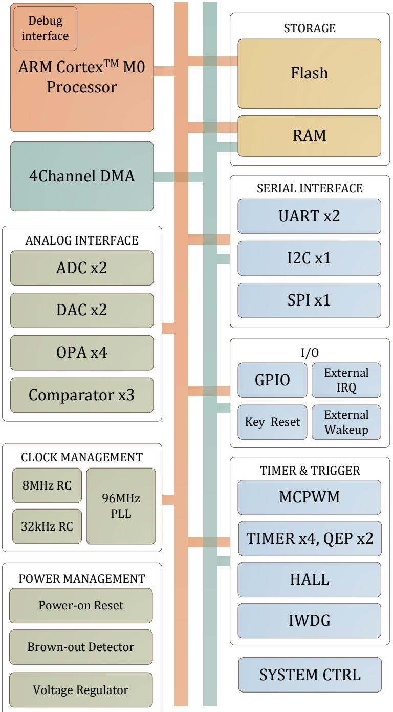  
图 2-1 LKS32MC07x 系统框图

## 3 地址空间

数据字节以小端格式存放在存储器中。一个字里的最低地址字节被认为是该字的最低有效字节，而最高地址字节是最高有效字节。其他所有没有分配给片上存储器和外设的存储器空间都是保留的地址空间。

表 3-1 系统地址空间分配

<table><tr><td>类型</td><td>设备</td><td>开始地址</td><td>结束地址</td><td>空间大小</td><td>时钟/软复位</td></tr><tr><td>CODE</td><td>FLASH</td><td>0x0000_0000</td><td>0x0001_FFFF</td><td>128kB</td><td>同总线</td></tr><tr><td></td><td>FLSCR</td><td>0x0002_0000</td><td>0x0002_00FF</td><td>256B</td><td>同总线</td></tr><tr><td>RAM</td><td>RAM</td><td>0x2000_0000</td><td>0x2000_2FFF</td><td>12kB</td><td>同总线</td></tr><tr><td></td><td>SYS</td><td>0x4000_0000</td><td>0x4000_00FF</td><td>256B</td><td>同总线</td></tr><tr><td></td><td>SPI0</td><td>0x4001_0000</td><td>0x4001_00FF</td><td>256B</td><td>外设门控时钟[0]软复位[0]</td></tr><tr><td></td><td>I2C0</td><td>0x4001_0100</td><td>0x4001_01FF</td><td>256B</td><td>外设门控时钟[1]软复位[1]</td></tr><tr><td></td><td>CMP</td><td>0x4001_0200</td><td>0x4001_02FF</td><td>256B</td><td>外设门控时钟[2]软复位[2]</td></tr><tr><td></td><td>HALL0</td><td>0x4001_0300</td><td>0x4001_03FF</td><td>256B</td><td>外设门控时钟[3]软复位[3]</td></tr><tr><td></td><td>ADC0</td><td>0x4001_0400</td><td>0x4001_04FF</td><td>256B</td><td>外设门控时钟[12]软复位[12]</td></tr><tr><td></td><td>ADC1</td><td>0x4001_0500</td><td>0x4001_05FF</td><td>256B</td><td>外设门控时钟[13]软复位[13]</td></tr><tr><td></td><td>TIMER0</td><td>0x4001_0600</td><td>0x4001_06FF</td><td>256B</td><td>外设门控时钟[4]软复位[4]</td></tr><tr><td></td><td>TIMER1</td><td>0x4001_0700</td><td>0x4001_07FF</td><td>256B</td><td>外设门控时钟[5]软复位[5]</td></tr><tr><td></td><td>TIMER2</td><td>0x4001_0800</td><td>0x4001_08FF</td><td>256B</td><td>外设门控时钟[6]软复位[6]</td></tr><tr><td></td><td>TIMER3</td><td>0x4001_0900</td><td>0x4001_09FF</td><td>256B</td><td>外设门控时钟[7]软复位[7]</td></tr><tr><td></td><td>QEP0</td><td>0x4001_0A00</td><td>0x4001_0AFF</td><td>256B</td><td>外设门控时钟[8]软复位[8]</td></tr><tr><td></td><td>QEP1</td><td>0x4001_0B00</td><td>0x4001_0BFF</td><td>256B</td><td>外设门控时钟[9]软复位[9]</td></tr><tr><td></td><td>MCPWM0</td><td>0x4001_0C00</td><td>0x4001_0CFF</td><td>256B</td><td>外设门控时钟[10]软复位[10]</td></tr><tr><td></td><td>GPIO</td><td>0x4001_0D00</td><td>0x4001_0EFF</td><td>512B</td><td>外设门控时钟[11]软复位[11]</td></tr><tr><td></td><td>CRC0</td><td>0x4001_0F00</td><td>0x4001_0FFF</td><td>256B</td><td>外设门控时钟[16]软复位[16]</td></tr><tr><td></td><td>UART0</td><td>0x4001_1000</td><td>0x4001_10FF</td><td>256B</td><td>外设门控时钟[14]软复位[14]</td></tr><tr><td></td><td>UART1</td><td>0x4001_1100</td><td>0x4001_11FF</td><td>256B</td><td>外设门控时钟[15]软复位[15]</td></tr><tr><td></td><td>DMA0</td><td>0x4001_1200</td><td>0x4001_12FF</td><td>256B</td><td>外设门控时钟[18]软复位[18]</td></tr><tr><td></td><td>CAN0</td><td>0x4001_1300</td><td>0x4001_14FF</td><td>512B</td><td>外设门控时钟[19]软复位[19]</td></tr><tr><td></td><td>SIFO</td><td>0x4001_1500</td><td>0x4001_15FF</td><td>256B</td><td>外设门控时钟[20]软复位[20]</td></tr><tr><td></td><td>Resv.</td><td>0x4001_1600</td><td>0x4001_16FF</td><td>256B</td><td>同总线</td></tr><tr><td></td><td>AON</td><td>0x4001_1700</td><td>0x4001_17FF</td><td>256B</td><td>同总线</td></tr><tr><td></td><td>CLO</td><td>0x4001_1800</td><td>0x4001_18FF</td><td>256B</td><td>外设门控时钟[21]软复位[21]</td></tr><tr><td></td><td>DSP0</td><td>0x4001_2000</td><td>0x4001_3FFF</td><td>8kB</td><td>外设门控时钟[17]软复位[17]</td></tr></table>

以上外设门控时钟控制寄存器，请参考 6.3.7 SYS\_CLK\_FEN，软复位控制寄存器请参考 6.3.8SYS\_SFT\_RST。

## 4 中断

嵌套向量中断控制器位于 CPU 核内部。当中断事件发生时，通知 CPU 暂停主程序执行，按照优先级设定跳转进入中断服务函数。

LKS32MC07x 系列芯片共有 25 个外部中断源。

中断控制器最多支持 4 个中断优先级可供编程选择。

表 4-1 中断号分布

<table><tr><td>中断号</td><td>说明</td><td>中断号</td><td>说明</td></tr><tr><td>-14</td><td>NMI</td><td rowspan="14" colspan="2"></td></tr><tr><td>-13</td><td>HardFault</td></tr><tr><td>-12</td><td rowspan="7">保留</td></tr><tr><td>-11</td></tr><tr><td>-10</td></tr><tr><td>-9</td></tr><tr><td>-8</td></tr><tr><td>-7</td></tr><tr><td>-6</td></tr><tr><td>-5</td><td>SVCall</td></tr><tr><td>-4</td><td rowspan="2">保留</td></tr><tr><td>-3</td></tr><tr><td>-2</td><td>PendSV</td></tr><tr><td>-1</td><td>SysTick</td></tr><tr><td>0</td><td>TIMER0_IRQn</td><td>16</td><td>MCPWM0_IRQn</td></tr><tr><td>1</td><td>TIMER1_IRQn</td><td>17</td><td>MCPWM1_IRQn</td></tr><tr><td>2</td><td>TIMER2_IRQn</td><td>18</td><td>DMA0_IRQn</td></tr><tr><td>3</td><td>TIMER3_IRQn</td><td>19</td><td>CAN0_IRQn</td></tr><tr><td>4</td><td>QEP0_IRQn</td><td>20</td><td>SIF0_IRQn</td></tr><tr><td>5</td><td>QEP1_IRQn</td><td>21</td><td>唤醒中断 WAKE_IRQn</td></tr><tr><td>6</td><td>I2C0_IRQn</td><td>22</td><td>软件中断 SW_IRQn</td></tr><tr><td>7</td><td>SPI0_IRQn</td><td>23</td><td>AVDD 电压过低 PWRDN_IRQn</td></tr><tr><td>8</td><td>GPIO_IRQn</td><td>24</td><td>CL0_IRQn</td></tr><tr><td>9</td><td>HALL0_IRQn</td><td>25</td><td>Reserved</td></tr><tr><td>10</td><td>UART0_IRQn</td><td>26</td><td>Reserved</td></tr><tr><td>11</td><td>UART1_IRQn</td><td>27</td><td>Reserved</td></tr><tr><td>12</td><td>DSP0_IRQn</td><td>28</td><td>Reserved</td></tr><tr><td>13</td><td>CMP_IRQn</td><td>29</td><td>Reserved</td></tr><tr><td>14</td><td>ADC0_IRQn</td><td>30</td><td>Reserved</td></tr><tr><td>15</td><td>ADC1_IRQn</td><td>31</td><td>Reserved</td></tr></table>

## 5 模拟电路

## 5.1 简述

模拟电路包含以下模块:

➢ 集成2 路12BIT SAR ADC，采样率3MHz，每路最多支持 16 通道，包括4 个运放输出及10 个外部ADC 通道共计14 个可选ADC 通道信号。

➢ 集成4 路运算放大器，可设置为 PGA 模式

➢ 集成3 路比较器，可设置迟滞模式

➢ 集成2 路12BIT 数模转换器

➢ 内置±2℃温度传感器

➢ 内置高精度基准源

各个模块之间的相互关系、以及各模块的控制寄存器（寄存器的说明见下文“模拟寄存器表”）如下图所示。

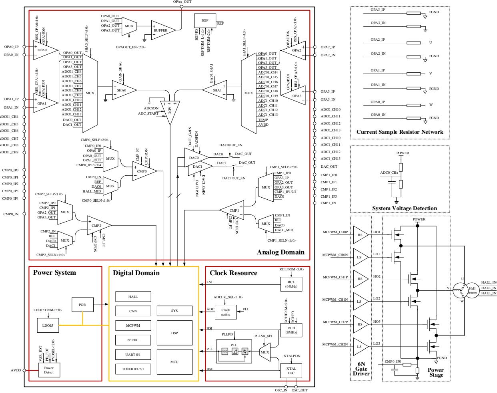  
\*ADC01\_CH4\~ADC01\_CH9 为 ADC0 和 ADC1 公用通道  
图 5-1 模拟电路功能框图

## 5.1.1 电源管理系统

电源管理系统由上电/掉电复位模块（POR）、电源检测模块（PVD）、LDO15 模块组成。

该芯片由 2.5\~5V 单电源供电，以节省芯片外的电源成本。芯片内部集成一路 LDO15 给内部所有数字电路、PLL 模块供电。

LDO 上电后自动开启，无需软件配置。

POR 模块监测LDO15 的电压，在LDO15 电压低于1.26V 时（例如上电之初，或者掉电时），为数字电路提供复位信号以避免数字电路工作产生异常。

PVD 模块对 5V 输入电源进行检测，如低于某一设定阈值，则产生报警（中断）信号以提醒CPU。 中断提醒阈值可通过寄存器 PVDSEL[9:8]设置为不同的电压。PVD 模块可通过设置PD\_PDT=1 关闭。发生欠压事件时，仅产生欠压标志，不会产生复位。

当发生电压过低事件时，会触发产生电源电压过低中断，对应中断号23，详见第4 章。

PVDSEL[9:8]/ PD\_PDT 的说明见模拟寄存器 SYS\_AFE\_REG6

电源电压过低标志见模拟前端信息寄存器SYS\_AFE\_DEG

## 5.1.2 时钟系统

时钟系统包括内部32kHz RC 时钟、内部8MHz RC 时钟、PLL 电路组成。

32kHz RC 时钟 LSI 主要用于系统内的看门狗模块以及复位信号滤波等，也可用作 MCU 主时钟。8MHz RC 时钟可作为MCU 主时钟使用。PLL 最高可提供 96MHz 的时钟，通常 MCU 使用PLL时钟作为系统主时钟。

32kHz 和 8MHz RC 时钟均带有出厂校正，32kHz RC 时钟在 ${ \cdot } 4 0 { \sim } 1 0 5 ^ { \circ } \mathrm { C }$ 范围内的精度为±50%，8MHz RC 时钟在该温度范围的精度为±1%。

8MHz RC 时钟通过设置 ${ \mathrm { R C H P D } } = ^ { \prime } 0 ^ { \prime }$ ’打开（默认打开，写 1 关闭），RC 时钟需要 BGP 电压基准源模块提供基准电压和电流，因此开启 RC 时钟时实际上连带开启了 BGP 模块（ $\left( \mathrm { B G P P D } { = } ^ { \prime } 0 ^ { \prime } \right)$ 。芯片上电的默认状态下，8MHz RC 时钟和 BGP 模块都是开启的。32kHz RC 时钟始终开启，不能关闭。

PLL 对 8MHz RC 时钟进行倍频，给 MCU、ADC 等模块提供更高速的工作时钟。MCU 和 PWM模块的最高时钟为96MHz，ADC 模块最高时钟48MHz。

PLL 通过设置 $\mathrm { P L L P D N } { = } ^ { \prime } 1 ^ { \circ }$ ’打开（默认关闭，设 1 打开），开启 PLL 模块之前，同样也需要开启BGP模块。开启PLL之后，PLL需要8us的稳定时间来输出稳定时钟。芯片上电的默认状态下，RCH 时钟和BGP 模块都是开启的，但PLL 默认是关闭的，需要软件来开启。

晶体起振电路内置了放大器，需在 OSC\_IN/OSC\_OUT 管脚之间接入一个晶体，且在OSC\_IN/OSC\_OUT 引脚各接一个 15pF 电容到地，设置 XTALPDN=1 即可起振。OSC\_IN 也可以直接输入一个8MHz 的方波代替晶体。

BGPPD /PLLPDN 的说明见模拟寄存器 SYS\_AFE\_REG5

## 5.1.3 基准电压源

基准源电路(BGP REF: Bandgap reference)为 ADC、DAC、RC 时钟、PLL、温度传感器、运算放大器、比较器和 FLASH 提供基准电压和电流，使用上述任何一个模块之前，都需要开启 BGP 基准电压源。

芯片上电的默认状态下，BGP 模块是开启的。通过设置 $\mathrm { B G P P D } = ^ { \prime } 0 ^ { \prime }$ ’将基准源打开，从关闭到开启，BGP 需要约6us 达到稳定。BGP 输出电压约1.2V，精度为±0.8%

BGPPD 的说明见模拟寄存器 SYS\_AFE\_REG5

## 5.1.4 ADC 模块

请参考第 12 章。

## 5.1.5 运算放大器

芯片集成 4 路输入输出轨到轨（rail-to-rail）运算放大器，内置反馈电阻，外部引脚上需串联一个电阻 $\mathtt { R } _ { 0 }$ 到信号源。反馈电阻 $\mathrm { R } _ { 2 } { : } \mathrm { R } _ { 1 }$ 的阻值可通过寄存器 RES\_OPAx[1:0]设置，以实现不同的放大倍数。

RES\_OPAx<1:0>的说明见模拟寄存器 SYS\_AFE\_REG0

放大器的结构示意图如下所示:

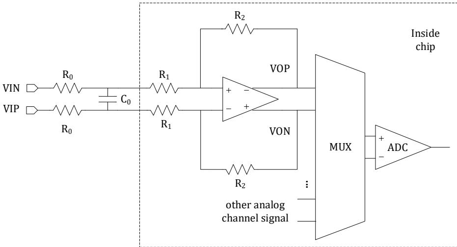  
图 5-2 放大器框图

图中两个 $\mathtt { R } _ { 0 }$ 是片外需放置的电阻，阻值必须相等，最终的放大倍数为 $\mathrm { R } _ { 2 } / ( \mathrm { R } _ { 1 } { + } \mathrm { R } _ { 0 } )$

对于MOS 管电阻直接采样的应用，由于MOS 下管关断、上管导通时信号会升高到数十V 的电源电压，为减小此时往芯片引脚里流入的电流，建议接>20kΩ 的外部电阻。

对于分流电阻采样的应用，建议接 100\~2KΩ 的外部电阻。 ${ \mathrm { C } } _ { 0 }$ 为信号滤波电容，和 $\mathtt { R } _ { 0 }$ 形成一阶 RC 滤波电路。 $\mathtt { R } _ { 0 }$ 的具体阻值可根据 $\mathrm { R } _ { 0 } { } ^ { * } \mathrm { C } _ { 0 }$ 的滤波常数而定。如果信号上噪声较小不需要滤波、或者信号需要很大的带宽（较快的响应速度），则 ${ \mathrm { C } } _ { 0 }$ 可以不加。

放大器可通过设置 OPAOUT\_EN 选择将放大器的输出信号通过 BUFFER 送至 P2.7 管脚口进行测量和应用（对应关系见 datasheet 芯片管脚说明）。因为有 BUFFER 存在，在运放正常工作模式下也可以选择送一路运放输出信号出来。送至 IO 口的信号为运放的正端输出信号（对应放大器详细框图与说明可见Wiki：运放差分和单端工作模式的区别）。

## OPAOUT\_EN 的说明见模拟寄存器 SYS\_AFE\_REG2

芯片上电的默认状态下，放大器模块是关闭的。放大器可通过设置 OPAxPDN=1 打开。开启放大器之前，需要先开启BGP 模块。

## OPAxPDN 的说明见模拟寄存器 SYS\_AFE\_REG5

运放输入正负端内置钳位二极管，电机相线通过一个匹配电阻后直接接入输入端，从而简化了 MOSFET 电流采样的外置电路。

## 5.1.6 比较器

内置 3 路输入轨到轨（rail-to-rail）比较器，比较器比较速度可编程、迟滞电压可编程、信号源可编程。

比较器的比较延时可通过寄存器 CMP\_FT 设置为 ${ < 3 0 \mathrm { n S } / 2 0 0 \mathrm { n S } }$ 。迟滞电压通过CMP\_HYS 设置为 $2 0 \mathrm { m V } / 0 \mathrm { m V } .$ 。

比较器正端输入信号来源可以通过寄存器 CMP2\_SELP[1:0]/ CMP1\_SELP[2:0]/ CMP0\_SELP[2:0]进行设置；负端输入信号来源可以通过寄存器 CMPx\_SELN[1:0]进行设置 $\scriptstyle ( \mathbf { x } = 0 / 1 / 2$ ，代表比较器CMP0/CMP1/CMP2）。

需说明的是，两个比较器负输入端的 BEMFx\_MID 信号，是对比较器正输入端信号 CMPx\_IP1/CMPx\_IP2/ CMPx\_IP3 信号的平均，具体连接方式见图 5-3。其中电阻 R=8.2k 欧，图中的开关只有在比较器负输入端信号选择为BEMFx\_MID 之后才会导通，否则开关都处于断开状态。

BEMFx\_MID 主要用于 BLDC 方波模式控制时，虚拟电机相线中心点电压，用于反电势过零点检测。三个相线分压后，分别接 CMPx\_IP1、CMPx\_IP2、CMPx\_IP3，MCU 控制比较器负端选择BEMFx\_MID，比较器正端的多路选择器以分时复用的方式分别选择 CMPx\_IP1、CMPx\_IP2、CMPx\_IP3，就可以比较出反电势过零点。

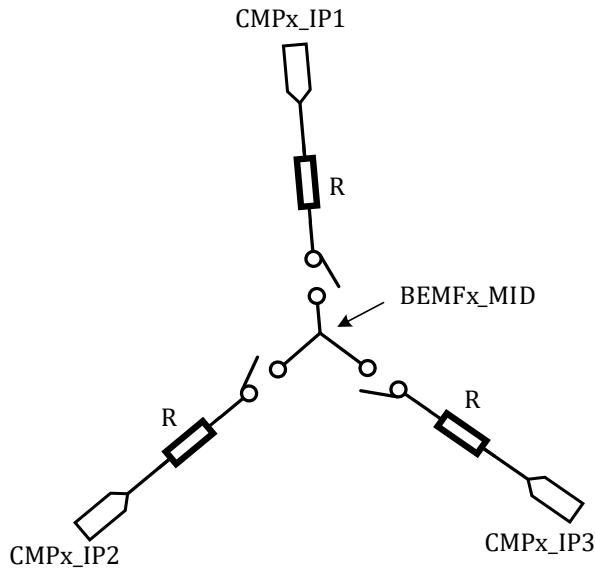  
图 5-3 BEMFx\_MID 信号

比较器输出结果，可以通过 CMP\_DATA 输出数据寄存器读出。

CMP\_FT 的说明见模拟寄存器 SYS\_AFE\_REG1

CMPx\_SELN<1:0>/ CMPx\_SELP<2:0>/ CMP\_HYS 的说明见模拟寄存器 SYS\_AFE\_REG2/模拟寄存器 SYS\_AFE\_REG3

芯片上电的默认状态下，比较器模块是关闭的。比较器通过设置 $\mathrm { C M P x P D N } { = } 1 \left( \mathrm { x } { = } 0 , 1 \right)$ 打开，开启比较器之前，需要先开启 BGP 模块。

CMPxPDN 的说明见模拟寄存器 SYS\_AFE\_REG5

## 5.1.7 温度传感器

芯片内置温度传感器，在-40\~85℃范围内精度为 $2 \%$ 。 $8 5 { \sim } 1 0 5 ^ { \circ } \mathrm { C }$ 范围内精度为 $3 \%$ 。

测量时需选择内部基准，选择外部基准会引起结果的较大偏差。

芯片出厂前会经温度校正，校正值保存在flash info区。出厂校正时所用增益为 $\mathrm { A D C \_ G A I N } { = } 0$ 建议应用时也选择此增益，可以使校正值更准确。

芯片上电的默认状态下，温度传感器模块是关闭的。开启传感器之前，需要先开启 BGP 模块。

温度传感器通过设置 TMPPDN=1 打开，开启到稳定需要约 2us，因此需在 ADC 测量传感器之前2us 打开。

温度传感器信号连至 ADC1 的通道14。

ADC 部分的设置参考模数转换器(ADC)章节

TMPPDN 的说明见模拟寄存器 SYS\_AFE\_REG5

温度传感器的典型曲线如下图所示:

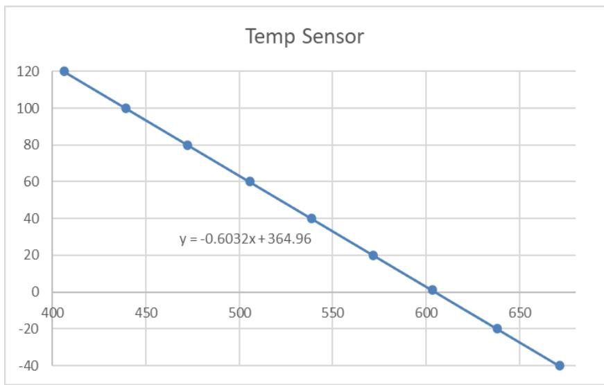  
图5-4 温度传感器曲线

图中 X 轴为温度传感器的温度信号所对应的 ADC 值，Y 轴为传感器所处的温度。测温时，按照如上要求配置传感器相关寄存器，并得到ADC 值后，将 ADC 值作为X 代入公式:

## y=-0.6032x+364.96

求得的Y 值即为此时的温度。

公式中有两个系数，a=-0.6032, b=364.96。对于不同的芯片，b 系数的值是不一样的。芯片出厂前会经过温度标定，将每颗芯片所对应的系数 b 写入 flash 的 info 区，地址为 0x000014D4。存储时，会将b 系数小数点右移一位（乘10）存入info 区，小数点后第二位不进行保存。

同时为方便客户操作，系数 a 也会存入 flash info 区，地址为 0x000014D0。存储时，将 a 系数小数点右移四位（乘10000）存入info 区。

实际使用中，应从flash info 区对应地址读出a/b 系数，同时将读取到的ADC 测到的当下温度传感器值代入公式，即可计算得到当下温度值，单位为摄氏度。计算时，需注意系数a/b在保存时小数点的位移数，即a 系数应除以10000，b 系数除以10。

注意，上述计算公式，基于 ADC 右对齐实现。若换成左对齐，ADC 采样值需右移 4 位后，才能代入上述公式。

## 5.1.8 DAC 模块

芯片内置两路 12bit DAC，输出信号的最大量程可通过寄存器 DAC0\_GAIN、DAC1\_GAIN 设置为1.2V/4.85V。

DAC0 可通过配置寄存器 DAC0OUT\_EN=1，将 DAC0 输出送至 P0.0 管脚，；DAC1 可通过配置寄存器 DAC1OUT\_EN=1，将 DAC1 输出送至 P0.0 管脚，可驱动>5kΩ 的负载电阻和 50pF 的负载电容。通常不会同时输出DAC0 和DAC1，以免造成信号竞争。

DAC 最大输出码率为1MHz。

芯片上电的默认状态下，DAC 模块是关闭的。DAC0 可通过设置 DAC0PDN =1 打开，DAC1 可通过设置DAC1PDN =1 打开，开启DAC 模块之前，需要先开启 BGP 模块。

DAC 的输入数字信号寄存器为 SYS\_AFE\_DACx，低 12BIT 有效。信号范围是 0x000\~0xFFF。0x000 对应零模拟量输出 0V，0xFFF 对应满量程模拟量输出为 $D A C _ { f s }$ ，如上文所述， $D A C _ { f s }$ 的值可由 DACx\_GAIN 寄 存 器 进 行 设 置 。 每 一 档 信 号(LSB)所 对 应 的 模 拟 信 号 幅 度 为 $\frac { D A C _ { f s } } { 4 0 9 6 }$ 。 若SYS\_AFE\_DACx 的数字值为 Din，则该数字信号所对应的DAC 输出模拟信号为 $\frac { D A C _ { f s } } { 4 0 9 6 } * D i n$

不同芯片，DAC 存在制造偏差，为抵消偏差，DAC 自带校准硬件模块。DAC 输出遵循公式y=ax+b。x 为 SYS\_AFE\_DACx 填入值（理想值对应数字量）。a 来自 SYS\_AFE\_DACx\_AMC 寄存器，b 来自 SYS\_AFE\_DACx\_DC。硬件根据 SYS\_AFE\_DACx、SYS\_AFE\_DACx\_AMC 和 SYS\_AFE\_DACx\_DC 进行乘加从而求得校正后的数字量，送至 DACn 输入端，使得 DACn 最终输出的模拟值就是填入的理想数字量对应的值。系统上电后，默认加载 4.85V 的校准值，若换成其它量程，软件需读取 flashinfo 区域，重新加载到相应寄存器。其中x=0,1，对应 DAC0 和DAC1。

DAC0：

地址 0x00001450，为 4.85V 量程的 a 参数，地址 0x00001454，为 4.85V 量程的 b 参数。

地址 0x00001458，为 1.2V 量程的 a 参数，地址 0x0000145C，为 1.2V 量程的 b 参数。

DAC1：

地址 0x00001460，为 4.85V 量程的 a 参数，地址 0x00001464，为 4.85V 量程的 b 参数。

地址 0x00001468，为 1.2V 量程的 a 参数，地址 0x0000146C，为 1.2V 量程的 b 参数。

DAC 输出的模拟信号，除了可以送至 IO 口供外部模块使用外，还可通过配置寄存器连至芯片内部的2 路比较器负端，作为比较器的基准信号使用。详见比较器章节。

DAC0OUT\_EN/DAC1OUT\_EN 的说明见模拟寄存器 SYS\_AFE\_REG3

DAC0\_GAIN/DAC1\_GAIN 的说明见模拟寄存器 SYS\_AFE\_REG1

DAC0PDN/DAC1PDN 的说明见模拟寄存器 SYS\_AFE\_REG5

SYS\_AFE\_DAC0/SYS\_AFE\_DAC1 的说明见寄存器 SYS\_AFE\_DAC0, SYS\_AFE\_DAC1

## 5.2 寄存器

## 5.2.1 地址分配

模拟寄存器 SYS\_AFE\_REG0\~SYS\_AFE\_REG6，对应地址为 0x4000\_0010\~0x4000\_0028。其中保留寄存器(Res)必须全部配置为 0（芯片上电后会被复位为 0）。其他寄存器根据应用场合需要进行配置。

模拟寄存器基地址为 0x4000\_0000。

表 5-1 系统控制寄存器

<table><tr><td>名称</td><td>偏移</td><td>说明</td></tr><tr><td>SYS_AFE_INFO</td><td>0x04</td><td>芯片版本信息寄存器</td></tr><tr><td>SYS_AFE_DBG</td><td>0x08</td><td>调试寄存器</td></tr><tr><td>SYS_AFE_REG0</td><td>0x10</td><td>模拟配置寄存器 0</td></tr><tr><td>SYS_AFE_REG1</td><td>0x14</td><td>模拟配置寄存器 1</td></tr><tr><td>SYS_AFE_REG2</td><td>0x18</td><td>模拟配置寄存器 2</td></tr><tr><td>SYS_AFE_REG3</td><td>0x1C</td><td>模拟配置寄存器 3</td></tr><tr><td>SYS_AFE_REG4</td><td>0x20</td><td>模拟配置寄存器 4</td></tr><tr><td>SYS_AFE_REG5</td><td>0x24</td><td>模拟配置寄存器 5</td></tr><tr><td>SYS_AFE_REG6</td><td>0x28</td><td>模拟配置寄存器 6</td></tr><tr><td>SYS_AFE_REG7</td><td>0x2C</td><td>模拟配置寄存器 7</td></tr><tr><td>SYS_AFE_DAC_CTRL</td><td>0x5C</td><td>DAC 控制寄存器</td></tr><tr><td>SYS_AFE_DAC0</td><td>0x60</td><td>DAC0 数字量寄存器</td></tr><tr><td>SYS_AFE_DAC1</td><td>0x64</td><td>DAC1 数字量寄存器</td></tr><tr><td>SYS_AFE_DAC0_AMC</td><td>0x68</td><td>DAC0 数字量增益校正寄存器</td></tr><tr><td>SYS_AFE_DAC0_DC</td><td>0x6C</td><td>DAC0 数字量直流偏置寄存器</td></tr><tr><td>SYS_AFE_DAC1_AMC</td><td>0x70</td><td>DAC1 数字量增益校正寄存器</td></tr><tr><td>SYS_AFE_DAC1_DC</td><td>0x74</td><td>DAC1 数字量直流偏置寄存器</td></tr></table>

## 5.2.2 SYS\_AFE\_INFO 芯片版本信息寄存器

地址:0x4000\_0004

复位值:根据wafer 版本不同

表 5-2 SYS\_AFE\_INFO 芯片版本信息寄存器

<table><tr><td>15 14 13 12 11 10 9 8</td><td>7 6 5 4</td><td>3 2 1 0</td></tr><tr><td rowspan="3"></td><td>Series</td><td>Version</td></tr><tr><td></td><td>RO</td></tr><tr><td>7</td><td>Depends</td></tr></table>

<table><tr><td>位置</td><td>位名称</td><td>说明</td></tr><tr><td>[31:8]</td><td></td><td>未使用</td></tr><tr><td>[7:4]</td><td>Series</td><td>芯片型号信息</td></tr><tr><td>[3:0]</td><td>Version</td><td>芯片版本信息</td></tr></table>

此寄存器与用户无关。

## 5.2.3 SYS\_AFE\_DBG 调试寄存器

地址:0x4000\_0008

复位值:0x0

表 5-3 SYS\_AFE\_DBG AFE 调试寄存器

<table><tr><td>15</td><td>14</td><td>13</td><td>12</td><td>11</td><td>10</td><td>9</td><td>8</td><td>7</td><td>6</td><td>5</td><td>4</td><td>3</td><td>2</td><td>1</td><td>0</td></tr><tr><td>PWR_WEAK</td><td rowspan="3" colspan="15"></td></tr><tr><td>RO</td></tr><tr><td>0</td></tr></table>

<table><tr><td>位置</td><td>位名称</td><td>说明</td></tr><tr><td>[31:8]</td><td></td><td>未使用</td></tr><tr><td>[15]</td><td>PWR_WEAK</td><td>供电低于掉电监测阈值</td></tr><tr><td>[14:0]</td><td></td><td>未使用</td></tr></table>

PWR\_WEAK 标志在当供电电压低于掉电监测电路设定的阈值时置位，同时将产生 CPU 掉电中断（中断号23）。在供电恢复，高于阈值后清零。此标志为只读位，无法软件清除。

掉电监测的使用请参考5.1.1 电源管理系统。

## 5.2.4 SYS\_AFE\_REG0 模拟配置寄存器 0

地址：0x4000\_0010

复位值：0x0

表 5-4 SYS\_AFE\_REG0 模拟配置寄存器 0

<table><tr><td>15</td><td>14</td><td>13</td><td>12</td><td>11</td><td>10</td><td>9</td><td>8</td><td>7</td><td>6</td><td>5</td><td>4</td><td>3</td><td>2</td><td>1</td><td>0</td></tr><tr><td colspan="6">Res.</td><td colspan="2">IT_OPA</td><td colspan="2">RES_OPA3</td><td colspan="2">RES_OPA2</td><td colspan="2">RES_OPA1</td><td colspan="2">RES_OPA0</td></tr><tr><td colspan="6">RW</td><td colspan="2">RW</td><td colspan="2">RW</td><td colspan="2">RW</td><td colspan="2">RW</td><td colspan="2">RW</td></tr><tr><td colspan="6">0</td><td colspan="2">0</td><td colspan="2">0</td><td colspan="2">0</td><td colspan="2">0</td><td colspan="2">0</td></tr></table>

<table><tr><td>位置</td><td>位名称</td><td>说明</td></tr><tr><td>[31:16]</td><td></td><td>未使用</td></tr><tr><td>[15:10]</td><td></td><td>保留位,必须为0</td></tr><tr><td>[9:8]</td><td>IT_OPA</td><td>OPA偏置电流调节,默认配置000:×1,建议RES_OPAx选择非最大放大倍数时,选用此配置01:×1.210:×1.5,建议 RES_OPAx 选择 00 最大放大倍数时,选用此配置11:×2</td></tr><tr><td>[7:6]</td><td>RES_OPA3</td><td>运放 3 反馈电阻00:320k:10k01:160k:10k10:80k:10k11:40k:10k</td></tr><tr><td>[5:4]</td><td>RES_OPA2</td><td>运放 2 反馈电阻00:320k:10k01:160k:10k10:80k:10k11:40k:10k</td></tr><tr><td>[3:2]</td><td>RES_OPA1</td><td>运放 1 反馈电阻00:320k:10k01:160k:10k10:80k:10k11:40k:10k</td></tr><tr><td>[1:0]</td><td>RES_OPA0</td><td>运放 0 反馈电阻00:320k:10k01:160k:10k10:80k:10k11:40k:10k</td></tr></table>

## 5.2.5 SYS\_AFE\_REG1 模拟配置寄存器 1

地址：0x4000\_0014

复位值：0x0

表 5-5 SYS\_AFE\_REG1 模拟配置寄存器 1

<table><tr><td>15</td><td>14</td><td>13</td><td>12</td><td>11</td><td>10</td><td>9</td><td>8</td><td>7</td><td>6</td><td>5</td><td>4</td><td>3</td><td>2</td><td>1</td><td>0</td></tr><tr><td>Res.</td><td>Res.</td><td>Res.</td><td>Res.</td><td colspan="4">Res.</td><td>DAC1_GAIN</td><td>DAC0_GAIN</td><td>Res.</td><td>REF2VDD</td><td colspan="3">Res.</td><td>CMP_FT</td></tr><tr><td>RW</td><td>RW</td><td>RW</td><td>RW</td><td colspan="4">RW</td><td>RW</td><td>RW</td><td>RW</td><td>RW</td><td colspan="3">RW</td><td>RW</td></tr><tr><td>0</td><td>0</td><td>0</td><td>0</td><td colspan="4">0</td><td>0</td><td>0</td><td>0</td><td>0</td><td colspan="3">0</td><td>0</td></tr></table>

<table><tr><td>位置</td><td>位名称</td><td>说明</td></tr><tr><td>[31:16]</td><td></td><td>未使用</td></tr><tr><td>[15]</td><td>Reserved</td><td>保留位,必须为0</td></tr><tr><td>[14]</td><td>Reserved</td><td>保留位,必须为0</td></tr><tr><td>[13]</td><td>Reserved</td><td>保留位,必须为0</td></tr><tr><td>[12]</td><td>Reserved</td><td>保留位,必须为0</td></tr><tr><td>[11:8]</td><td>Reserved</td><td>保留位,必须为0</td></tr><tr><td>[7]</td><td>DAC1_GAIN</td><td>DAC1 输出档位配置0:满量程为 4.85V; 1:满量程为 1.2V</td></tr><tr><td>[6]</td><td>DAC0_GAIN</td><td>DAC0 输出档位配置0:满量程为4.85V;1:满量程为1.2V</td></tr><tr><td>[5]</td><td>Reserved</td><td>保留位,必须为0</td></tr><tr><td>[4]</td><td>REF2VDD</td><td>ADC基准选择1:使用外部输入电源作为ADC基准;0:使用默认内部REF2.4V作为ADC基准源</td></tr><tr><td>[3:1]</td><td>Reserved</td><td>保留位,必须为0</td></tr><tr><td>[0]</td><td>CMP_FT</td><td>比较器快速比较1:使能,比较速度小于50ns0:不使能,比较速度小于200ns</td></tr></table>

当REF2VDD设置为1，使用外部电源作为ADC 基准时，如果选择ADCx\_GAIN=0，则量程变为7.5V；如果选择 ADC\_GAIN=1，则量程变为 15V。

在 DAC 输出挡位配置中，4.85V 量程，在接近 4.45V 时提前饱和；1.2V 量程，在接近 1.13V时提前饱和。

## 5.2.6 SYS\_AFE\_REG2 模拟配置寄存器 2

地址：0x4000\_0018

复位值：0x0

表 5-6 SYS\_AFE\_REG2 模拟配置寄存器 2

<table><tr><td>15</td><td>14</td><td>13</td><td>12</td><td>11</td><td>10</td><td>9</td><td>8</td><td>7</td><td>6</td><td>5</td><td>4</td><td>3</td><td>2</td><td>1</td><td>0</td></tr><tr><td colspan="2">CMP2_SELP</td><td colspan="5">Res.</td><td>XTRSEL</td><td colspan="3">Res.</td><td>REF_AD_EN</td><td colspan="2">LDOOUT_EN</td><td colspan="2">OPAOUT_EN</td></tr><tr><td colspan="2">RW</td><td colspan="5">RW</td><td>RW</td><td colspan="3">RW</td><td>RW</td><td colspan="2">RW</td><td colspan="2">RW</td></tr><tr><td colspan="2">0</td><td colspan="5">0</td><td>0</td><td colspan="3">0</td><td>0</td><td colspan="2">0</td><td colspan="2">0</td></tr></table>

<table><tr><td>位置</td><td>位名称</td><td>说明</td></tr><tr><td>[31:16]</td><td></td><td>未使用</td></tr><tr><td>[15:14]</td><td>CMP2_SELP</td><td>比较器2信号正端选择00:连CMP2_IP001:连CMP2_IP110:连OPA2_OUT11:连OPA3_OUT</td></tr><tr><td>[13:9]</td><td>Reserved</td><td>保留位,必须为0</td></tr><tr><td>[8]</td><td>XTRSEL</td><td>晶体起振电路电阻调节XTRSEL=1:P端电阻增加一倍,从而降低晶振起振速度</td></tr><tr><td>[7:5]</td><td>Reserved</td><td>保留位,必须为0</td></tr><tr><td>[4]</td><td>REF_AD_EN</td><td>输出1.2V Reference到P2.7</td></tr><tr><td>[3]</td><td>LDOOUT_EN</td><td>输出LDO15到P2.7</td></tr><tr><td>[2:0]</td><td>OPAOUT_EN</td><td>使能OPAx输出信号送至IO口p2_7000:不输出;001:输出OPA0信号到IO口;010:输出 OPA1 信号到 IO 口;011:输出 OPA2 信号到 IO 口;100:输出 OPA3 信号到 IO 口;101~111:不允许此配置</td></tr></table>

## 5.2.7 SYS\_AFE\_REG3 模拟配置寄存器 3

地址：0x4000\_001C

复位值：0x0

表 5-7 SYS\_AFE\_REG3 模拟配置寄存器 3

<table><tr><td>15</td><td>14</td><td>13</td><td>12</td><td>11</td><td>10</td><td>9</td><td>8</td><td>7</td><td>6</td><td>5</td><td>4</td><td>3</td><td>2</td><td>1</td><td>0</td></tr><tr><td>DAC1OUT_EN</td><td colspan="3">CMP1_SELP</td><td>DAC0OUT_EN</td><td colspan="3">CMP0_SELP</td><td>CMP_HYS</td><td>Res.</td><td colspan="2">CMP1_SELN</td><td colspan="2">CMP0_SELN</td><td colspan="2">CMP2_SELN</td></tr><tr><td>RW</td><td colspan="3">RW</td><td>RW</td><td colspan="3">RW</td><td>RW</td><td>RW</td><td colspan="2">RW</td><td colspan="2">RW</td><td colspan="2">RW</td></tr><tr><td>0</td><td colspan="3">0</td><td>0</td><td colspan="3">0</td><td>0</td><td>0</td><td colspan="2">0</td><td colspan="2">0</td><td colspan="2">0</td></tr></table>

<table><tr><td>位置</td><td>位名称</td><td>说明</td></tr><tr><td>[31:16]</td><td></td><td>未使用</td></tr><tr><td>[15]</td><td>DAC1OUT_EN</td><td>DAC1 输出到 IO 使能0: 不使能1:使能输出到 IO P0[0]</td></tr><tr><td>[14:12]</td><td>CMP1_SELP</td><td>比较器 1 信号正端选择000: CMP1_IP0001: OPA3_IP010: OPA2_OUT011: OPA3_OUT100: CMP1_IP1101: CMP1_IP2110: CMP1_IP3111: DAC0 输出说明:上述除 AVSS/OPA2_OUT/OPA3_OUT 外都为管脚名称,请参看 datasheet 里管脚定义章节</td></tr><tr><td>[11]</td><td>DAC0OUT_EN</td><td>DAC0 输出到 IO 使能0: 不使能1:使能输出到 IO P0[0]</td></tr><tr><td>[10:8]</td><td>CMP0_SELP</td><td>比较器 0 信号正端选择000: CMP0_IP0001: OPA0_IP010: OPA0_OUT011: OPA1_OUT100: CMP0_IP1101: CMP0_IP2110: CMP0_IP3111: CMP0_IP4说明:上述除 OPA0_OUT/OPA1_OUT 外都为管脚名称,请参看 datasheet 里管脚定义章节</td></tr><tr><td>[7]</td><td>CMP_HYS</td><td>比较器回差选择,采用默认配置0:20mv;1:0mv</td></tr><tr><td>[6]</td><td>Reserved</td><td>保留位,必须为0</td></tr><tr><td>[5:4]</td><td>CMP1_SELN</td><td>比较器1信号负端选择00:CMP1_IN01:REF10:DAC0输出11:BEMF1_MID说明:上述CMP1_IN为管脚名称,请参看 datasheet 里管脚定义章节;REF为芯片内部1.2V BANDGAP基准源;DAC输出即为芯片内部DAC模块输出模拟信号;BEMF1_MID为CMP1_IP1,CMP1_IP2,CMP1_IP3信号经电阻星形连接后得到的平均值</td></tr><tr><td>[3:2]</td><td>CMP0_SELN</td><td>比较器0信号负端选择00:CMP0_IN01:REF10:DAC0输出11:BEMF0_MID说明:上述CMP0_IN为管脚名称,请参看 datasheet 里管脚定义章节;REF为芯片内部1.2V BANDGAP基准源;DAC输出即为芯片内部DAC模块输出模拟信号;BEMF0_MID为CMP0_IP1,CMP0_IP2,CMP0_IP3信号经电阻星形连接后得到的平均值</td></tr><tr><td>[1:0]</td><td>CMP2_SELN</td><td>比较器2信号负端选择00:CMP2_IN01:REF10:DAC0输出11:DAC1输出</td></tr></table>

## 5.2.8 SYS\_AFE\_REG4 模拟配置寄存器 4

地址：0x4000\_0020

复位值：0x0

表 5-8 SYS\_AFE\_REG4 模拟配置寄存器 4

<table><tr><td>15</td><td>14</td><td>13</td><td>12</td><td>11</td><td>10</td><td>9</td><td>8</td><td>7</td><td>6</td><td>5</td><td>4</td><td>3</td><td>2</td><td>1</td><td>0</td></tr><tr><td></td><td></td><td></td><td></td><td></td><td></td><td></td><td></td><td></td><td></td><td></td><td></td><td></td><td></td><td></td><td></td></tr></table>

<table><tr><td>位置</td><td>位名称</td><td>说明</td></tr><tr><td>[31:16]</td><td></td><td></td></tr><tr><td>[15]</td><td></td><td>未使用</td></tr><tr><td>[14]</td><td>Reserved</td><td>保留位,必须为0</td></tr><tr><td>[13]</td><td></td><td>未使用</td></tr><tr><td>[12]</td><td>Reserved</td><td>保留位,必须为0</td></tr><tr><td>[11:8]</td><td></td><td>未使用</td></tr><tr><td>[7]</td><td></td><td>未使用</td></tr><tr><td>[6]</td><td>Reserved</td><td>保留位,必须为0</td></tr><tr><td>[5]</td><td></td><td>未使用</td></tr><tr><td>[4]</td><td>Reserved</td><td>保留位,必须为0</td></tr><tr><td>[3:0]</td><td></td><td>未使用</td></tr></table>

## 5.2.9 SYS\_AFE\_REG5 模拟配置寄存器 5

地址：0x4000\_0024

复位值：0x0

表 5-9 SYS\_AFE\_REG5 模拟配置寄存器 5

<table><tr><td>15</td><td>14</td><td>13</td><td>12</td><td>11</td><td>10</td><td>9</td><td>8</td><td>7</td><td>6</td><td>5</td><td>4</td><td>3</td><td>2</td><td>1</td><td>0</td></tr><tr><td>PLLPDN</td><td>XTALPDN</td><td>TMPPDN</td><td>DACOPDN</td><td>CMP2PDN</td><td>RCHPD</td><td>DAC1PDN</td><td>BGPPD</td><td>CMP1PDN</td><td>CMP0PDN</td><td>OPA3PDN</td><td>OPA2PDN</td><td>OPA1PDN</td><td>OPA0PDN</td><td>Res.</td><td>ADCPDN</td></tr><tr><td>RW</td><td>RW</td><td>RW</td><td>RW</td><td>RW</td><td>RW</td><td>RW</td><td>RW</td><td>RW</td><td>RW</td><td>RW</td><td>RW</td><td>RW</td><td>RW</td><td>RW</td><td>RW</td></tr><tr><td>0</td><td>0</td><td>0</td><td>0</td><td>0</td><td>0</td><td>0</td><td>0</td><td>0</td><td>0</td><td>0</td><td>0</td><td>0</td><td>0</td><td>0</td><td>0</td></tr></table>

<table><tr><td>位置</td><td>位名称</td><td>说明</td></tr><tr><td>[31:16]</td><td></td><td>未使用</td></tr><tr><td>[15]</td><td>PLLPDN</td><td>PLL 关闭控制0:关闭 PLL(默认)1:开启 PLL</td></tr><tr><td>[14]</td><td>XTALPDN</td><td>晶体起振电路开关0:关闭(默认)1:开启</td></tr><tr><td>[13]</td><td>TMPPDN</td><td>温度传感器开关0:关闭(默认)1:开启</td></tr><tr><td>[12]</td><td>DACOPDN</td><td>DAC0 开关0:关闭(默认)1:开启</td></tr><tr><td>[11]</td><td>CMP2PDN</td><td>CMP2 开启使能0:关闭(默认)1:开启</td></tr><tr><td>[10]</td><td>RCHPD</td><td>RCH 时钟关闭使能0:开启(默认)1:关闭</td></tr><tr><td>[9]</td><td>DAC1PDN</td><td>DAC1 开关0:关闭(默认)1:开启</td></tr><tr><td>[8]</td><td>BGPPD</td><td>BGP 关闭使能0:开启(默认)1:关闭</td></tr><tr><td>[7]</td><td>CMP1PDN</td><td>CMP1 开启使能0:关闭(默认)1:开启</td></tr><tr><td>[6]</td><td>CMP0PDN</td><td>CMP0 开启使能0:关闭(默认)1:开启</td></tr><tr><td>[5]</td><td>OPA3PDN</td><td>OPA3 开启使能0:关闭(默认)1:开启</td></tr><tr><td>[4]</td><td>OPA2PDN</td><td>OPA2 开启使能0:关闭(默认)1:开启</td></tr><tr><td>[3]</td><td>OPA1PDN</td><td>OPA1 开启使能0:关闭(默认)1:开启</td></tr><tr><td>[2]</td><td>OPA0PDN</td><td>OPA0 开启使能0:关闭(默认)1:开启</td></tr><tr><td>[1]</td><td>Reserved</td><td>保留位,需全部为'0'</td></tr><tr><td>[0]</td><td>ADCPDN</td><td>ADC 开启使能0:关闭(默认)1:开启</td></tr></table>

如果 SYS\_CLK\_CFG 选择 PLL 时钟，则 PLLPDN 是被硬件控制的，软件配置 PLLPDN 关闭 PLL无效。关闭 PLL 需要 PLLPDN=0，且 SYS\_CLK\_CFG 不选择 PLL 作为芯片主时钟，这两个条件都须满足。同理如果 SYS\_CLK\_CFG 选择 HRC 时钟，则 RCHPD 是被硬件控制的，软件直接配置 RCHPD关闭RCH无效。关闭PLL需要RCHPD=1，且芯片进入休眠。如果芯片主时钟为PLL时钟，且HRC为 PLL 参考时钟，则 RCH 也是被硬件控制的。由于 RCH 和PLL 依赖 BGP，所以 BGPPD 也是硬件控制的，在芯片使用了RCH 或 PLL 时，软件直接配置 BGPPD 关闭 BGP 无效。关闭 BGP 需要先顺序关闭PLL 和 RCH，且芯片进入休眠。

## 5.2.10 SYS\_AFE\_REG6 模拟配置寄存器 6

地址：0x4000\_0028

复位值：0x0

表 5-10 SYS\_AFE\_REG6 模拟配置寄存器 6

<table><tr><td>15</td><td>14</td><td>13</td><td>12</td><td>11</td><td>10</td><td>9</td><td>8</td><td>7</td><td>6</td><td>5</td><td>4</td><td>3</td><td>2</td><td>1</td><td>0</td></tr></table>

<table><tr><td>PLLSR_SEL</td><td>Res.</td><td>PVDSSEL</td><td>Res.</td><td>Res.</td><td>VSR_PDT</td><td>PD_PDT</td></tr><tr><td>RW</td><td>RW</td><td>RW</td><td>RW</td><td>RW</td><td>RW</td><td>RW</td></tr><tr><td>0</td><td>0</td><td>0</td><td>0</td><td>0</td><td>0</td><td>0</td></tr></table>

<table><tr><td>位置</td><td>位名称</td><td>说明</td></tr><tr><td>[31:16]</td><td></td><td>未使用</td></tr><tr><td>[15]</td><td>PLLSR_SEL</td><td>PLL时钟源选择0:使用RCH作为输入时钟源;1:使用XTALOSC作为输入时钟源</td></tr><tr><td>[14:10]</td><td>Reserved</td><td>保留位,必须为0</td></tr><tr><td>[9:8]</td><td>PVDSEL</td><td>电源掉电监测阈值 $V_{th}$ 选择00:4.00V01:3.75V10:3.50V11:3.25V (SYS_AFE_INFO.VERSION&lt;=3)2.50V (SYS_AFE_INFO.VERSION=4)以上阈值为VSR_PDT=0,即选择低功耗基准源 $V_{BGP}$ 时的设定值;如果VSR_PDT=1,选择DAC输出作为基准,则阈值相应调整为 $V_{th}*DAC0_OUT/V_{BGP}$ </td></tr><tr><td>[7:2]</td><td>Reserved</td><td>保留位,必须为0</td></tr><tr><td>[1]</td><td>VSR_PDT</td><td>掉电检测基准源选择,其中低功耗基准源 $V_{BGP}$ 为1.3V左右,DAC输出则可以通过软件配置0:选择低功耗基准源 $V_{BGP}$ ;1:选择DAC0输出</td></tr><tr><td>[0]</td><td>PD_PDT</td><td>关闭掉电检测电路0:开启1:关闭</td></tr></table>

## 5.2.11 SYS\_AFE\_REG7 模拟配置寄存器 7

地址：0x4000\_002C

复位值：0x0

表 5-11 SYS\_AFE\_REG7 模拟配置寄存器 7

<table><tr><td colspan="13">15 14 13 12 11 10 9 8 7 6 5 4 3 2 1 0</td></tr><tr><td></td><td colspan="8">Res.</td><td>ADCLKSEL</td><td colspan="3">Res.</td></tr><tr><td></td><td colspan="8">RW</td><td>RW</td><td colspan="3">RW</td></tr><tr><td></td><td colspan="8">0</td><td>0</td><td colspan="3">0</td></tr></table>

<table><tr><td>位置</td><td>位名称</td><td>说明</td></tr><tr><td>[31:16]</td><td></td><td>未使用</td></tr><tr><td>[15:5]</td><td>Reserved</td><td>保留位,必须为0</td></tr><tr><td>[4]</td><td>ADCLKSEL</td><td>ADC时钟频率选择0:48MHz1:24MHz</td></tr><tr><td>[3:0]</td><td>Reserved</td><td>保留位,需全部为&#x27;0&#x27;</td></tr></table>

## 5.2.12 SYS\_AFE\_DAC\_CTRL DAC 控制寄存器

地址:0x4000\_005C

复位值:0x0

表 5-12 SYS\_AFE\_DAC\_CTRL DAC 控制寄存器

<table><tr><td rowspan="3"></td><td>DAC1_STEP</td><td>TIMER3_TRIG_DAC1</td><td>TIMER2_TRIG_DAC1</td><td>TIMER1_TRIG_DAC1</td><td>TIMER0_TRIG_DAC1</td><td rowspan="3"></td><td>DAC0_STEP</td><td>TIMER3_TRIG_DAC0</td><td>TIMER2_TRIG_DAC0</td><td>TIMER1_TRIG_DAC0</td><td>TIMER0_TRIG_DAC0</td></tr><tr><td>RW</td><td>RW</td><td>RW</td><td>RW</td><td>RW</td><td>RW</td><td>RW</td><td>RW</td><td>RW</td><td>RW</td></tr><tr><td>0</td><td>0</td><td>0</td><td>0</td><td>0</td><td>0</td><td>0</td><td>0</td><td>0</td><td>0</td></tr></table>

<table><tr><td>位置</td><td>位名称</td><td>说明</td></tr><tr><td>[31:15]</td><td></td><td>未使用</td></tr><tr><td>[14:12]</td><td>DAC1_STEP</td><td>SYS_AFE_DAC1 步进值,3bit 有符号数,范围-4~3</td></tr><tr><td>[11]</td><td>TIMER3_TRIG_DAC1</td><td>TIMER3 过零事件触发 DAC1 步进使能,高有效</td></tr><tr><td>[10]</td><td>TIMER2_TRIG_DAC1</td><td>TIMER2 过零事件触发 DAC1 步进使能,高有效</td></tr><tr><td>[9]</td><td>TIMER1_TRIG_DAC1</td><td>TIMER1 过零事件触发 DAC1 步进使能,高有效</td></tr><tr><td>[8]</td><td>TIMER0_TRIG_DAC1</td><td>TIMER0 过零事件触发 DAC1 步进使能,高有效</td></tr><tr><td>[7]</td><td></td><td>未使用</td></tr><tr><td>[6:4]</td><td>DAC0_STEP</td><td>SYS_AFE_DAC0 步进值,3bit 有符号数,范围-4~3</td></tr><tr><td>[3]</td><td>TIMER3_TRIG_DAC0</td><td>TIMER3 过零事件触发 DAC0 步进使能,高有效</td></tr><tr><td>[2]</td><td>TIMER2_TRIG_DAC0</td><td>TIMER2 过零事件触发 DAC0 步进使能,高有效</td></tr><tr><td>[1]</td><td>TIMER1_TRIG_DAC0</td><td>TIMER1 过零事件触发 DAC0 步进使能,高有效</td></tr><tr><td>[0]</td><td>TIMER0_TRIG_DAC0</td><td>TIMER0 过零事件触发 DAC0 步进使能,高有效</td></tr></table>

DACx 允许使用 Timer 的过零事件作为触发来更新 SYS\_AFE\_DACx 的值，每触发一次，DAC 的设置值在原值的基础上步进一次（递增或递减），步进值由 SYS\_AFE\_CTRL.DACx\_STEP 设定，x 为0/1。

## 5.2.13 SYS\_AFE\_DAC0 DAC0 数字量寄存器

地址:0x4000\_0060

复位值:0x0

表 5-13 SYS\_AFE\_DAC 0DAC0 数字量寄存器

<table><tr><td colspan="2">15 14 13 12 11 10 9 8 7 6 5 4 3 2 1 0</td></tr><tr><td rowspan="3"></td><td>DAC_IN</td></tr><tr><td>RW</td></tr><tr><td>0</td></tr></table>

<table><tr><td>位置</td><td>位名称</td><td>说明</td></tr><tr><td>[31:12]</td><td></td><td>未使用</td></tr><tr><td>[11:0]</td><td>DAC_IN</td><td>DAC 待转换的数字量输入</td></tr></table>

## 5.2.14 SYS\_AFE\_DAC1 DAC1 数字量寄存器

地址:0x4000\_0064

复位值:0x0

表 5-14 SYS\_AFE\_DAC1 DAC1 数字量寄存器

<table><tr><td colspan="2">15 14 13 12 11 10 9 8 7 6 5 4 3 2 1 0</td></tr><tr><td rowspan="3"></td><td>DAC_IN</td></tr><tr><td>RW</td></tr><tr><td>0</td></tr></table>

<table><tr><td>位置</td><td>位名称</td><td>说明</td></tr><tr><td>[31:12]</td><td></td><td>未使用</td></tr><tr><td>[11:0]</td><td>DAC_IN</td><td>DAC 待转换的数字量输入</td></tr></table>

## 5.2.15 SYS\_AFE\_DAC0\_AMC DAC0 增益校正寄存器

地址：0x4000\_0068

复位值：0x0200

表 5-15 SYS\_AFE\_DAC0\_AMC DAC0 增益校正寄存器

<table><tr><td>15</td><td>14</td><td>13</td><td>12</td><td>11</td><td>10</td><td>9</td><td>8</td><td>7</td><td>6</td><td>5</td><td>4</td><td>3</td><td>2</td><td>1</td><td>0</td></tr><tr><td rowspan="3" colspan="6"></td><td colspan="10">AMC</td></tr><tr><td colspan="10">RW</td></tr><tr><td colspan="10">0x200</td></tr></table>

<table><tr><td>位置</td><td>位名称</td><td>说明</td></tr><tr><td>[31:10]</td><td></td><td>未使用</td></tr><tr><td>[9:0]</td><td>AMC</td><td>DAC0 增益校正值,10bit 无符号定点数,B[9]为整数,B[8:0]为小数</td></tr></table>

## 5.2.16 SYS\_AFE\_DAC0\_DC DAC0 直流偏置寄存器

地址：0x4000\_006C

复位值：0x0

表 5-16 SYS\_AFE\_DAC0\_DC DAC0 直流偏置寄存器

<table><tr><td>15 14 13 12 11 10</td><td>9 8 7 6 5 4 3 2 1 0</td></tr><tr><td rowspan="3"></td><td>DC</td></tr><tr><td>RW</td></tr><tr><td>0</td></tr></table>

<table><tr><td>位置</td><td>位名称</td><td>说明</td></tr><tr><td>[31:10]</td><td></td><td>未使用</td></tr><tr><td>[9:0]</td><td>DC</td><td>DAC0 直流偏置, 10bit 有符号数, B[9]为符号位</td></tr></table>

## 5.2.17 SYS\_AFE\_DAC1\_AMC DAC1 增益校正寄存器

地址：0x4000\_0070

复位值：0x0200

表 5-17 SYS\_AFE\_DAC1\_AMC DAC1 增益校正寄存器

<table><tr><td>15 14 13 12 11 10</td><td>9 8 7 6 5 4 3 2 1 0</td></tr><tr><td rowspan="3"></td><td>AMC</td></tr><tr><td>RW</td></tr><tr><td>0x200</td></tr></table>

<table><tr><td>位置</td><td>位名称</td><td>说明</td></tr><tr><td>[31:10]</td><td></td><td>未使用</td></tr><tr><td>[9:0]</td><td>AMC</td><td>DAC1 增益校正值,10bit 无符号定点数,B[9]为整数,B[8:0]为小数</td></tr></table>

## 5.2.18 SYS\_AFE\_DAC1\_DC DAC1 直流偏置寄存器

地址：0x4000\_0074

复位值：0x0

表 5-18 SYS\_AFE\_DAC1\_DC DAC1 直流偏置寄存器

<table><tr><td>15</td><td>14</td><td>13</td><td>12</td><td>11</td><td>10</td><td>9</td><td>8</td><td>7</td><td>6</td><td>5</td><td>4</td><td>3</td><td>2</td><td>1</td><td>0</td></tr><tr><td rowspan="3" colspan="6"></td><td colspan="10">DC</td></tr><tr><td colspan="10">RW</td></tr><tr><td colspan="10">0</td></tr></table>

<table><tr><td>位置</td><td>位名称</td><td>说明</td></tr><tr><td>[31:10]</td><td></td><td>未使用</td></tr><tr><td>[9:0]</td><td>DC</td><td>DAC1 直流偏置,10bit 有符号数,B[9]为符号位</td></tr></table>

DAC 增益校正，记模拟输出的 12bitDAC 数值为 DAC\_raw，经过校正后的 12bit DAC 数值为

DAC\_cali

$$
\text { DAC\_cali } = \text { DAC\_raw } * \text { AMC - DC };
$$

其中AMC 为DAC 增益校正系数，为10bit 定点无符号数，B[9]为整数，B[8:0]为小数，大小为1左右，例如 ${ \mathrm { A M C } } = 1 0 ^ { \prime } { \mathrm { b } } 1 0 _ { - } 0 0 0 1 _ { - } 0 0 0 0 = 1 + 1 / 3 2$ , 或

$$
\mathrm{AMC} = 1 0 ^ {\prime} \mathrm {b01\_ {1} 110\_ {1} 100} = 1 - 5 / 1 2 8
$$

DC 位DAC 直流偏置，为 10bit 有符号整数。

增益校正计算结果进行截断保留，最终DAC\_cali 仍为 12bit 整数。

且增益校正加直流偏置校正后的数值会进行饱和处理，最大为0xfff，最小为0x000。

需要注意的是，DAC 有 2 个输出档位，系统上电后，加载默认档位的 DAC 校准值，若切换到其它档位，请使用原厂提供的库函数。

## 6 系统时钟复位

## 6.1 时钟

## 6.1.1 时钟源

如下表所示，系统包括4个时钟源。其中内部低速RC振荡时钟LSI/内部高速RC振荡时钟HSI不会停振。

表6-1 系统时钟源

<table><tr><td>时钟源</td><td>频率</td><td>来源</td><td>误差</td><td>说明</td></tr><tr><td>LSI/LRC</td><td>32kHz</td><td>内部 RC 振荡器</td><td>全温度范围误差&lt;50%</td><td>内部系统管理时钟,用于WDT,复位信号的滤波和展宽,亦可作为 MCU 运行主时钟</td></tr><tr><td>HSI/HRC</td><td>8MHz</td><td>内部 RC 振荡器</td><td>全温度范围误差&lt;1%</td><td>作为 PLL 源时钟</td></tr><tr><td>HSE</td><td>8MHz</td><td>外部晶体</td><td>与晶体有关</td><td>外部晶振</td></tr><tr><td>PLL</td><td>96MHz</td><td>PLL 时钟</td><td>取决于 PLL 参考时钟。使用内部 HRC 作为 PLL 参考时钟时,全温度范围误差&lt;1%</td><td>PLL 输出时钟,以 HSI 作为参考时钟输入,倍频 12 倍后输出 PLL 时钟作为系统主时钟。</td></tr><tr><td>JTAG/SWD</td><td>&lt;10MHz</td><td>调试器</td><td>-</td><td>JTAG/SWD 时钟,取决于上位机设置</td></tr></table>

SWD 时钟速率与上位机或下载器设置有关。

系统可以使用内部高速RC 时钟HSI 作为PLL 的参考时钟。PLL 将8MHz 的参考时钟HSI 倍频12 倍至 96MHz。

通常，PLL 经过 n/8 分频后，可以得到 96MHz×n/8 的高速时钟，作为系统主时钟 MCLK。系统主时钟 MCLK 可以通过 SYS\_CLK\_CFG.CLK\_DIV 进行 n/8 分频，可以产生 12,24,48MHz 等频率值。

系统复位时，PLL 默认关闭，HSI 默认开启，即系统上电选择 HSI 时钟，8MHz 作为系统主时钟进行工作，从而保证系统上电之初功耗处于较低水平。

LSI 和晶振时钟 HSE 也可以作为系统主时钟，通过 SYS\_CLK\_CFG.CLK\_SEL[1:0]进行选择。通过设置 SYS\_CLK\_CFG.CLK\_SEL[1:0]=2 可以切换系统时钟为 LSI 时钟，此时系统工作于 32kHz 时钟，PLL/HRC/BGP 等模拟模块均可关闭以降低功耗。

SYS\_CLK\_CFG.CLK\_DIV 作为 PLL 的分频系数。当 SYS\_CLK\_CFG.CLK\_SEL 不为 1 时，即系统时钟 HIS/HSE 或 LSI 作为系统工作时钟，此时 SYS\_CLK\_CFG.CLK\_DIV 不再起分频作用。

表6-2PLL 作为MCLK 时钟时的分频配置

<table><tr><td>SYS_CLK_CFG</td><td>分频系数</td><td>频率/MHz</td><td>是否均匀</td></tr><tr><td>0x0101</td><td>1/8</td><td>12</td><td>是</td></tr><tr><td>0x0111</td><td>2/8</td><td>24</td><td>是</td></tr><tr><td>0x0155</td><td>4/8</td><td>48</td><td>是</td></tr><tr><td>0x01FF</td><td>8/8</td><td>96</td><td>是</td></tr></table>

系统高速时钟 MCLK 经过 SYS\_CLK\_FEN 寄存器控制的开关之后供给外设。I2C 时钟由SYS\_CLK\_DIV0 寄存器控制可以进一步分频，UART 时钟由 SYS\_CLK\_DIV2 寄存器控制可以进一步分频。

PLL 输出的时钟经过2 分频后送至ADC（典型工作频率48MHz），即ACLK。

内部32kHz RC产生一路LSI时钟LCLK，主要用于看门狗WDT工作时钟，以及部分系统控制，复位的滤波展宽等。当系统无过多工作任务且系统降低功耗时，可以设置SYS\_CLK\_CFG.CLK\_SEL=2，将系统时钟切换为LSI。

晶振时钟可以作为系统运行时钟，也可以作为 PLL 的 参 考 时 钟 源 。 通 过 设 置SYS\_CLK\_CFG.CLK\_SEL=3，可以将系统时钟切换为晶振时钟 HSE。如果要使用晶振时钟，需要通过设置 SYS\_AFE\_REG5.XTALPDN=1 使能晶振起振电路，晶振起振电路默认是关闭的。如果要使用晶振时钟作为 PLL 参考时钟，则需要设置 SYS\_AFE\_REG6.PLLSR\_SEL=1，PLL 默认参考时钟为内部8MHz HRC 时钟。

需要注意的是，外部晶体在某些情况下可能会停振失效。芯片内部有晶振停振检测电路，当外部晶体停振时，会自动将使用晶振时钟的模块切换至内部 HRC 时钟。

通过 SYS\_CLK\_CFG.HSE\_FAIL 和 SYS\_CLK\_CFG.HSE\_FAILED 可以读取晶体的工作状态。

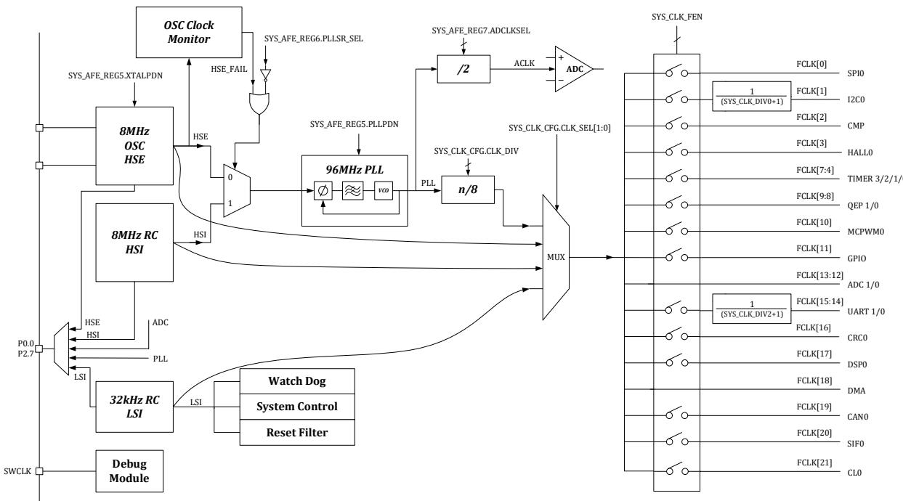  
图6-1时钟架构

为了保证系统可靠工作，时钟系统有防止时钟被误操作关闭的机制。如当 PLL 被用作系统工作主时钟时，PLL 电路本身无法被关闭，作为PLL 参考时钟的 HSI 无法被软件关闭；32kHz LSI 时钟上电即工作，且无法关闭。SWCLK 由调试器提供，频率可在上位机调试界面进行选择。

为便于调试和出厂校正，高速 RC 时钟 HSI 和低速时钟 LSI 可以通过配置 GPIO 的第二功能通过芯片管脚输出。

## 6.2 复位

## 6.2.1 复位源

芯片的复位来源包括硬件复位与软件复位。

## 6.2.1.1 硬件复位

如表6-3 硬件复位源所示，系统包括3 个硬件复位源，产生的复位均为芯片全局复位，复位产生后处理器程序计数器(PC)回到0 地址，所有寄存器恢复到默认值。

表6-3 系统复位源

<table><tr><td>名称</td><td>来源</td><td>说明</td></tr><tr><td>PORn</td><td>内部电源管理</td><td>同时监控 1.5V 数字电源和 5V 电源,1.5V 电源低于 1.26V 时产生复位,5V 电源低于 2.2V 时产生复位。其欠压阈值说明如表 6-4 所示。</td></tr><tr><td>RSTn</td><td>外部按键</td><td>外部按键复位电路,低电平有效</td></tr><tr><td>WDTn</td><td>硬件看门狗</td><td>如果不进行软件喂狗则定时产生复位,复位间隔可配置</td></tr></table>

表 6-4 欠压阈值说明

<table><tr><td></td><td colspan="2">Vth when Version&lt;=3</td><td></td><td colspan="2">Vth when Version&gt;=4</td></tr><tr><td>VSR_PDTPVDSEL</td><td>0</td><td>1</td><td>VSR_PDTPVDSEL</td><td>0</td><td>1</td></tr><tr><td>0</td><td>4.00</td><td>4.00*DAC_OUT/VBGP(欠压)</td><td>0</td><td>4.00</td><td>4.00*DAC_OUT/VBGP(欠压)</td></tr><tr><td>1</td><td>3.75</td><td>3.75*DAC_OUT/VBGP(欠压)</td><td>1</td><td>3.75</td><td>3.75*DAC_OUT/VBGP(欠压)</td></tr><tr><td>2</td><td>3.50</td><td>3.50*DAC_OUT/VBGP(欠压)</td><td>2</td><td>3.50</td><td>3.50*DAC_OUT/VBGP(欠压)</td></tr><tr><td>3</td><td>3.25</td><td>3.25*DAC_OUT/VBGP(欠压)</td><td>3</td><td>2.50</td><td>2.50*DAC_OUT/VBGP(欠压)</td></tr></table>

## 6.2.1.1.1 硬件复位架构

如下图所示，PORn 来自内部模拟电路，RSTn 来自外部按键。

WDTn 为 1 个 LSI 时钟周期宽度信号，是内部数字信号。WDTn 信号在 Debug 模式下可以被屏蔽，由 SYS\_DBG\_CFG 进行配置。

经过滤波展宽预处理的复位信号进行与运算得到一个全局复位信号。

3 个复位信号复位等级和作用域一致，均为全局复位。

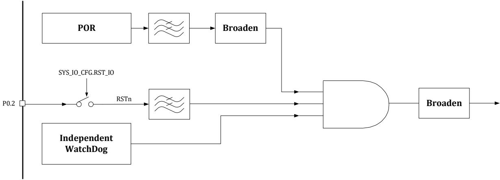  
图 6-2 复位架构

## 6.2.1.1.2 硬件复位记录

AON\_EVT\_RCD寄存器用于保存硬件复位事件，当某个硬件复位发生后，AON\_EVT\_RCD对应位置记录值变为1。AON\_EVT\_RCD寄存器本身无法被复位信号复位，只能通过向AON\_EVT\_RCD寄存器写入0xCA40 清空记录，复位记录可以方便地了解是否发生复位以及发生过哪种复位。

## 6.2.1.2 软件复位

CPU 的软复位操作可以使程序计数器(PC)回到 0 地址，软复位是否复位外设寄存器，取决于SYS\_DBG\_CFG.SFT\_RST\_PERI 设置。

在集成开发环境(IDE: Integrated Development Environment)中的调试模式下，点击 Reset 与CPU 软复位操作作用相同，仅仅使得 PC 回到 0 地址，对外设中的寄存器没有影响。但如果在bootloader中进行了外设模块的软复位，则会使得外设寄存器被复位为默认值。具体bootloader实现请咨询芯片供应商。如果设置了 SYS\_DBG\_CFG. SFT\_RST\_PERI=1，则可以在 IDE 软复位的同时复位外设寄存器。

部分外设模块有模块级软复位，可以使用SYS\_SFT\_RST寄存器进行复位，写入对应的位，可以将模块状态机恢复到初始状态，同时将模块的寄存器恢复到默认值，详见6.3.8。

## 6.2.2 复位作用域

表6-5复位作用域

<table><tr><td>复位源</td><td>作用域</td></tr><tr><td>PORn</td><td>内部电源管理,全局复位</td></tr><tr><td>RSTn</td><td>外部按键,全局复位,除极少数寄存器</td></tr><tr><td>WDTn</td><td>硬件看门狗,全局复位,除极少数寄存器</td></tr><tr><td>SYS_SFT_RST.SPI0_SFT_RST</td><td>SPI0</td></tr><tr><td>SYS_SFT_RST.I2C0_SFT_RST</td><td>I2C0</td></tr><tr><td>SYS_SFT_RST.CMP_SFT_RST</td><td>CMP 数字接口模块(不包括模拟比较器本身)</td></tr><tr><td>SYS_SFT_RST.HALL0_SFT_RST</td><td>HALL0</td></tr><tr><td>SYS_SFT_RST.TIMERO_SFT_RST</td><td>TIMER0</td></tr><tr><td>SYS_SFT_RST.TIMER1_SFT_RST</td><td>TIMER1</td></tr><tr><td>SYS_SFT_RST.TIMER2_SFT_RST</td><td>TIMER2</td></tr><tr><td>SYS_SFT_RST.TIMER3_SFT_RST</td><td>TIMER3</td></tr><tr><td>SYS_SFT_RST.QEP0_SFT_RST</td><td>QEP0</td></tr><tr><td>SYS_SFT_RST.QEP1_SFT_RST</td><td>QEP1</td></tr><tr><td>SYS_SFT_RST.MCPWM0_SFT_RST</td><td>MCPWM</td></tr><tr><td>SYS_SFT_RST.GPIO_SFT_RST</td><td>GPIO</td></tr><tr><td>SYS_SFT_RST.ADC0_SFT_RST</td><td>ADC0 数字接口模块</td></tr><tr><td>SYS_SFT_RST.ADC1_SFT_RST</td><td>ADC1 数字接口模块</td></tr><tr><td>SYS_SFT_RST.UART0_SFT_RST</td><td>UART0</td></tr><tr><td>SYS_SFT_RST.UART1_SFT_RST</td><td>UART1</td></tr><tr><td>SYS_SFT_RST.CRC0_SFT_RST</td><td>CRC0</td></tr><tr><td>SYS_SFT_RST.DSP0_SFT_RST</td><td>DSP0</td></tr><tr><td>SYS_SFT_RST_DMA0_SFT_RST</td><td>DMA0</td></tr><tr><td>SYS_SFT_RST.CANO_SFT_RST</td><td>CAN0</td></tr><tr><td>SYS_SFT_RST.SIF0_SFT_RST</td><td>SIFO</td></tr><tr><td>SYS_SFT_RST.CLO_SFT_RST</td><td>CLO</td></tr><tr><td>NVIC_SystemReset();</td><td>CPU 软复位,仅复位 CPU 内核,将 PC 重置为 0,若 SYS_DBG_CFG.SFT_RST_PERI=0 所有外设寄存器值仍然维持,SYS_DBG_CFG.SFT_RST_PERI=1,所有外设寄存器同时复位。</td></tr></table>

其中用于控制 P0[2]作为 GPIO 使用还是作为外部复位脚使用的 SYS\_IO\_CFG.RST\_IO，复位记录寄存器 AON\_EVT\_RCD 只受 POR 复位。

全局复位会复位全芯片寄存器，包括 CPU 内核寄存器以及所有外设寄存器，除上述极少数寄存器。

若 CPU 软复位设置为仅仅复位 CPU 内核，而不复位外设寄存器。建议重新烧录程序后使用掉电重新上电或外部复位的方式重置外设寄存器。

Flash 存储内容，SRAM 存储内容不受复位影响。

## 6.3 寄存器

## 6.3.1 地址分配

系统模块寄存器基地址为0x4000\_0000。

表 6-6 系统控制寄存器

<table><tr><td>名称</td><td>偏移</td><td>说明</td></tr><tr><td>SYS_CLK_CFG</td><td>0x80</td><td>时钟控制寄存器</td></tr><tr><td>SYS_IO_CFG</td><td>0x84</td><td>IO 控制寄存器</td></tr><tr><td>SYS_DBG_CFG</td><td>0x88</td><td>Debug 控制寄存器</td></tr><tr><td>SYS_CLK_DIV0</td><td>0x90</td><td>外设时钟分频寄存器 0</td></tr><tr><td>SYS_CLK_DIV2</td><td>0x98</td><td>外设时钟分频寄存器 2</td></tr><tr><td>SYS_CLK_FEN</td><td>0x9C</td><td>外设时钟门控寄存器</td></tr><tr><td>SYS_SFT_RST</td><td>0xA4</td><td>软复位寄存器</td></tr><tr><td>SYS_PROTECT</td><td>0xA8</td><td>写保护寄存器</td></tr><tr><td>SYS_FLSE</td><td>0xD0</td><td>Flash 擦除保护寄存器</td></tr><tr><td>SYS_FLSP</td><td>0xD4</td><td>Flash 编程保护寄存器</td></tr></table>

## 6.3.2 SYS\_CLK\_CFG 时钟控制寄存器

地址:0x4000\_0080

复位值:0x0

表 6-7 SYS\_CLK\_CFG 时钟控制寄存器

<table><tr><td rowspan="3"></td><td>XTAL_FAILED</td><td>XTAL_FAIL</td><td rowspan="3"></td><td>CLK_SEL</td><td>CLK_DIV</td></tr><tr><td>RW1C</td><td>RO</td><td>RW</td><td>RW</td></tr><tr><td>1</td><td>0</td><td>0</td><td>0</td></tr></table>

<table><tr><td>位置</td><td>位名称</td><td>说明</td></tr><tr><td>[31:14]</td><td></td><td>未使用</td></tr><tr><td>[13]</td><td>HSE_FAILED</td><td>晶振时钟在被开启后是否停振过如果晶振有停振情况,则该位置位,即使晶体后续恢复振荡,仍保持记录为1。写1清零</td></tr><tr><td>[12]</td><td>HSE_FAIL</td><td>晶振时钟当前是否已经停振0:外部晶体当前正常工作1:外部晶体当前已经停振</td></tr><tr><td>[11:10]</td><td></td><td>未使用</td></tr><tr><td>[9:8]</td><td>CLK_SEL</td><td>系统时钟MCLK的来源选择信号。默认选择HRC0:HRC1:PLL2:LRC3:XTAL注意,PLL/XTAL在上电后默认关闭,需要软件来开启。</td></tr><tr><td>[7:0]</td><td>CLK_DIV</td><td>PLL输出分频控制,默认为0x00:1/8分频0x01:1/8分频0x11:1/4分频0x55:1/2分频0xFF:1/1分频不推荐其它配置值。</td></tr></table>

当 CLK\_SEL = 0 时，MCLK 选择 HSI 时钟（8MHz），此时 SYS\_CLK\_CFG[7:0]的分频系数无效。最终输出的系统时钟频率即为8MHz。

当 CLK\_SEL = 2 时，MCLK 选择 LRC 时钟（32kHz），此时 SYS\_CLK\_CFG[7:0]的分频系数无效。

最终输出的系统时钟频率即为32kHz。

当 CLK\_SEL = 3 时，MCLK 选择 HSE 时钟（8MHz），此时 SYS\_CLK\_CFG[7:0]的分频系数无效。最终输出的系统时钟频率即为8MHz。

## 6.3.3 SYS\_IO\_CFG IO 控制寄存器

地址:0x4000\_0084

复位值:0x0

表 6-8 SYS\_IO\_CFG IO 控制寄存器

<table><tr><td colspan="4">15 14 13 12 11 10 9 8 7 6 5 4 3 2 1 0</td></tr><tr><td rowspan="3"></td><td>SWDMUX</td><td>RST_IO</td><td rowspan="3"></td></tr><tr><td>RW</td><td>RW</td></tr><tr><td>0</td><td>0</td></tr></table>

<table><tr><td>位置</td><td>位名称</td><td>说明</td></tr><tr><td>[31:7]</td><td></td><td>未使用</td></tr><tr><td>[6]</td><td>SWDMUX</td><td>SWD 复用控制信号,默认配置为 SWD0:P2.14 复用为 SWCLK,P2.15 复用为 SWDIO1:P2.14,P2.15 作为正常 GPIO 使用</td></tr><tr><td>[5]</td><td>RST_IO</td><td>RSTn/P0.2 复用控制信号,默认配置为 RSTn0:RSTn1:P0.2注意,上电后默认是 RSTn,后续软件可使能此位,RSTn 功能失效</td></tr><tr><td>[4:0]</td><td></td><td>未使用</td></tr></table>

为了安全起见，上电后16ms 内，SWD 的IO 不能切换为GPIO 功能，只能作为SWD 使用。即使软件改写了 SYS\_IO\_CFG [6]将不起作用，需要在 16ms 之后再次对 SYS\_IO\_CFG [6]改写。现象为：在 16ms 内，软件可以向 SYS\_IO\_CFG[6] 1’b1，但读回该 bit 仍为 1’b 0，如果经过 16ms 后再次写入 1’b 1，则可读回 1’b 1。即在上电后的 16ms 内，软件 SYS\_IO\_CFG[6]写入 1’b 1 无效，上电 16ms后，软件对SYS\_IO\_CFG[6]写入1’b 1 才有效。这是为了防止应用上上电即切换SWD 功能为GPIO，导致芯片后续无法通过SWD 进行擦写烧录flash。

注意，SWD IO 切换为GPIO 功能后，用户无法再通过 SWD 对芯片进行调试，因此建议上电后留有一定的时间窗口，经过一定延时后再将 SWD 切换为 GPIO 功能。而且软件上建议留有其他设计考虑，使得SWD IO 可以切换回SWD 功能。

## 6.3.4 SYS\_DBG\_CFG Debug 控制寄存器

地址:0x4000\_0088

复位值:0x0

表 6-9 SYS\_DBG\_CFG Debug 控制寄存器

<table><tr><td>31</td><td>30</td><td>29</td><td>28</td><td>27</td><td>26</td><td>25</td><td>24</td><td>23</td><td>22</td><td>21</td><td>20</td><td>19</td><td>18</td><td>17</td><td>16</td></tr><tr><td></td><td></td><td></td><td></td><td></td><td></td><td></td><td></td><td>SW_IRQ_TRIG</td><td></td><td></td><td></td><td></td><td></td><td></td><td></td></tr><tr><td></td><td></td><td></td><td></td><td></td><td></td><td></td><td></td><td>W</td><td></td><td></td><td></td><td></td><td></td><td></td><td></td></tr><tr><td></td><td></td><td></td><td></td><td></td><td></td><td></td><td></td><td>0</td><td></td><td></td><td></td><td></td><td></td><td></td><td></td></tr></table>

<table><tr><td>15</td><td>14</td><td>13</td><td>12</td><td>11</td><td>10</td><td>9</td><td>8</td><td>7</td><td>6</td><td>5</td><td>4</td><td>3</td><td>2</td><td>1</td><td>0</td></tr><tr><td>SW_IRQ</td><td>SFT_RST_PERI</td><td rowspan="3" colspan="2"></td><td>DBG_TIM3_STOP</td><td>DBG_TIM2_STOP</td><td>DBG_TIM1_STOP</td><td>DBG_TIM0_STOP</td><td rowspan="3" colspan="2"></td><td>DBG_IWDG_STOP</td><td rowspan="3" colspan="3"></td><td>DBG_STOP</td><td>DBG_SLP</td></tr><tr><td>RW1C</td><td>RW</td><td>RW</td><td>RW</td><td>RW</td><td>RW</td><td>RW</td><td>RW</td><td>RW</td></tr><tr><td>0</td><td>0</td><td>0</td><td>0</td><td>0</td><td>0</td><td>0</td><td>0</td><td>0</td></tr></table>

<table><tr><td>位置</td><td>位名称</td><td>说明</td></tr><tr><td>[31:16]</td><td>SW_IRQ_TRIG</td><td>向此位段写入 0x5AA5 触发软件中断,SW_IRQ 置 1</td></tr><tr><td>[15]</td><td>SW_IRQ</td><td>软件中断标志,对应中断号 30,写 1 清零。</td></tr><tr><td>[14]</td><td>SFT_RST_PERI</td><td>Debug 软复位是否复位除 Flash/SYS_AFE 以外的外设寄存器</td></tr><tr><td>[13:12]</td><td></td><td>未使用</td></tr><tr><td>[11]</td><td>DBG_TIM3_STOP</td><td>调试模式下 CPU halt 状态 Timer3 停止1:Timer3 在 CPU halt 状态时停止计数0:Timer3 在 CPU halt 状态时继续计数</td></tr><tr><td>[10]</td><td>DBG_TIM2_STOP</td><td>调试模式下 CPU halt 状态 Timer2 停止1:Timer2 在 CPU halt 状态时停止计数0:Timer2 在 CPU halt 状态时继续计数</td></tr><tr><td>[9]</td><td>DBG_TIM1_STOP</td><td>调试模式下 CPU halt 状态 Timer1 停止1:Timer1 在 CPU halt 状态时停止计数0:Timer1 在 CPU halt 状态时继续计数</td></tr><tr><td>[8]</td><td>DBG_TIM0_STOP</td><td>调试模式下 CPU halt 状态 Timer0 停止1:Timer0 在 CPU halt 状态时停止计数0:Timer0 在 CPU halt 状态时继续计数</td></tr><tr><td>[7:6]</td><td></td><td>未使用</td></tr><tr><td>[5]</td><td>DBG_IWDG_STOP</td><td>调试模式下 CPU halt 状态独立看门狗停止1:独立看门狗在 CPU halt 状态时停止计数0:独立看门狗在 CPU halt 状态时继续计数</td></tr><tr><td>[4:2]</td><td></td><td>未使用</td></tr><tr><td>[1]</td><td>DBG_STOP</td><td>调试 STOP 模式0: (FCLK=Off, HCLK=Off) 在 STOP 模式下,时钟管理模块关闭HCLK 和 FCLK,即处理器时钟和所有外设时钟。当退出 STOP 模式时,时钟管理模块不经历复位,并保持原有配置,可以恢复到 STOP 模式前的时钟设置。在 STOP 模式中,所有外设寄存器均保持,因此退出后无需重新配置。1: (FCLK=On, HCLK=On) 如果设置 DBG_STOP 为 1,进入 STOP 模式后 HCLK 和 FCLK 均不被关闭。通过设置 SCB-&gt;SCR = (1UL&lt;&lt;2),然后使用 _WFI()/__WFE()指令进入 STOP 模式。</td></tr><tr><td>[0]</td><td>DBG_SLP</td><td>调试睡眠(SLEEP)模式0: (FCLK=On, HCLK=Off) 在睡眠模式中,FCLK 作为所有外设时钟,不关闭;HCLK 作为 CPU 时钟,被关闭。在睡眠模式中,只有 CPU 时钟被暂时挂起,而所有外设包括系统时钟管理模块均保持原有配置状态。因此退出睡眠模式时,软件无需重新配置外设寄存器。1: (FCLK=On, HCLK=On) 如果配置 DBG_SLP 为 1,则当进入睡眠模式时,HCLK 不会关闭。通过 _WFI()/__WFE()指令可以令处理器进入睡眠模式</td></tr></table>

## 6.3.5 SYS\_CLK\_DIV0 外设时钟分频寄存器 0

地址:0x4000\_0090

复位值:0x0

表 6-10 SYS\_CLK\_DIV0 外设时钟分频寄存器 0

<table><tr><td>15</td><td>14</td><td>13</td><td>12</td><td>11</td><td>10</td><td>9</td><td>8</td><td>7</td><td>6</td><td>5</td><td>4</td><td>3</td><td>2</td><td>1</td><td>0</td></tr><tr><td></td><td></td><td></td><td></td><td></td><td></td><td></td><td></td><td></td><td></td><td></td><td></td><td></td><td></td><td></td><td></td></tr><tr><td></td><td></td><td></td><td></td><td></td><td></td><td></td><td></td><td></td><td></td><td></td><td></td><td></td><td></td><td></td><td></td></tr><tr><td></td><td></td><td></td><td></td><td></td><td></td><td></td><td></td><td></td><td></td><td></td><td></td><td></td><td></td><td></td><td></td></tr><tr><td></td><td></td><td></td><td></td><td></td><td></td><td></td><td></td><td></td><td></td><td></td><td></td><td></td><td></td><td></td><td></td></tr></table>

<table><tr><td>位置</td><td>位名称</td><td>说明</td></tr><tr><td>[31:16]</td><td></td><td>未使用</td></tr><tr><td>[15:0]</td><td>DIV0</td><td>I2C 工作时钟=MCLK/(CLK_DIV0+1)。其中 MCLK 由 SYS_CLK_CFG 分频系数决定</td></tr></table>

## 6.3.6 SYS\_CLK\_DIV2 外设时钟分频寄存器 2

地址:0x4000\_0098

复位值:0x0

表 6-4 SYS\_CLK\_DIV2 外设时钟分频寄存器 2

<table><tr><td>15</td><td>14</td><td>13</td><td>12</td><td>11</td><td>10</td><td>9</td><td>8</td><td>7</td><td>6</td><td>5</td><td>4</td><td>3</td><td>2</td><td>1</td><td>0</td></tr><tr><td></td><td></td><td></td><td></td><td></td><td></td><td></td><td></td><td></td><td></td><td></td><td></td><td></td><td></td><td></td><td></td></tr><tr><td></td><td></td><td></td><td></td><td></td><td></td><td></td><td></td><td></td><td></td><td></td><td></td><td></td><td></td><td></td><td></td></tr><tr><td></td><td></td><td></td><td></td><td></td><td></td><td></td><td></td><td></td><td></td><td></td><td></td><td></td><td></td><td></td><td></td></tr><tr><td></td><td></td><td></td><td></td><td></td><td></td><td></td><td></td><td></td><td></td><td></td><td></td><td></td><td></td><td></td><td></td></tr></table>

<table><tr><td>位置</td><td>位名称</td><td>说明</td></tr><tr><td>[31:16]</td><td></td><td>未使用</td></tr><tr><td>[15:0]</td><td>DIV2</td><td>UART 工作时钟=MCLK/(CLK_DIV2+1)。UART0/UART1 共享此分频配置,波特率根据 UART 波特率寄存器进一步分频,其中 MCLK 由 SYS_CLK_CFG 分频系数决定。</td></tr></table>

## 6.3.7 SYS\_CLK\_FEN 外设时钟门控寄存器

地址:0x4000\_009C

复位值:0x0

表 6-5 SYS\_CLK\_FEN 外设时钟门控寄存器

<table><tr><td rowspan="3" colspan="10"></td><td>CLO_CLK_EN</td><td>SIFO_CLK_EN</td><td>CANO_CLK_EN</td><td>Res.</td><td>DSP0_CLK_EN</td><td>CRC0_CLK_EN</td></tr><tr><td>RW</td><td>RW</td><td>RW</td><td>RW</td><td>RW</td><td>RW</td></tr><tr><td>0</td><td>0</td><td>0</td><td>0</td><td>0</td><td>0</td></tr><tr><td>15</td><td>14</td><td>13</td><td>12</td><td>11</td><td>10</td><td>9</td><td>8</td><td>7</td><td>6</td><td>5</td><td>4</td><td>3</td><td>2</td><td>1</td><td>0</td></tr><tr><td>UART1_CLK_EN</td><td>UART0_CLK_EN</td><td>Res.</td><td>Res.</td><td>GPIO_CLK_EN</td><td>MCPWMO_CLK_EN</td><td>QEP1_CLK_EN</td><td>QEP0_CLK_EN</td><td>TIMER3_CLK_EN</td><td>TIMER2_CLK_EN</td><td>TIMER1_CLK_EN</td><td>TIMER0_CLK_EN</td><td>HALLO_CLK_EN</td><td>CMP_CLK_EN</td><td>I2CO_CLK_EN</td><td>SPI0_CLK_EN</td></tr><tr><td>RW</td><td>RW</td><td>RW</td><td>RW</td><td>RW</td><td>RW</td><td>RW</td><td>RW</td><td>RW</td><td>RW</td><td>RW</td><td>RW</td><td>RW</td><td>RW</td><td>RW</td><td>RW</td></tr><tr><td>0</td><td>0</td><td>0</td><td>0</td><td>0</td><td>0</td><td>0</td><td>0</td><td>0</td><td>0</td><td>0</td><td>0</td><td>0</td><td>0</td><td>0</td><td>0</td></tr></table>

<table><tr><td>位置</td><td>位名称</td><td>说明</td></tr><tr><td>[31:21]</td><td></td><td>未使用</td></tr><tr><td>[21]</td><td>CLO_CLK_EN</td><td>CLO 模块时钟控制信号,默认关闭 CLO 模块时钟1:使能 CLO 模块时钟0:关闭 CLO 模块时钟</td></tr><tr><td>[20]</td><td>SIFO_CLK_EN</td><td>SIFO 模块时钟控制信号,默认关闭 SIFO 模块时钟1:使能 SIFO 模块时钟0:关闭 SIFO 模块时钟</td></tr><tr><td>[19]</td><td>CANO_CLK_EN</td><td>CANO 模块时钟控制信号,默认关闭 CANO 模块时钟1:使能 CANO 模块时钟0:关闭 CANO 模块时钟</td></tr><tr><td>[18]</td><td></td><td>保留</td></tr><tr><td>[17]</td><td>DSP0_CLK_EN</td><td>DSP0 模块时钟控制信号,默认关闭 DSP0 模块时钟1:使能 DSP0 模块时钟0:关闭 DSP0 模块时钟</td></tr><tr><td>[16]</td><td>CRC0_CLK_EN</td><td>CRC0 模块时钟控制信号,默认关闭 CRC0 模块时钟1:使能 CRC0 模块时钟0:关闭 CRC0 模块时钟</td></tr><tr><td>[15]</td><td>UART1_CLK_EN</td><td>UART1 模块时钟控制信号,默认关闭 UART1 模块时钟1:使能 UART1 模块时钟0:关闭 UART1 模块时钟</td></tr><tr><td>[14]</td><td>UART0_CLK_EN</td><td>UART0 模块时钟控制信号,默认关闭 UART0 模块时钟1:使能 UART0 模块时钟0:关闭 UART0 模块时钟</td></tr><tr><td>[13]</td><td></td><td>保留</td></tr><tr><td>[12]</td><td></td><td>保留</td></tr><tr><td>[11]</td><td>GPIO_CLK_EN</td><td>GPIO 模块时钟控制信号,默认关闭 GPIO 模块时钟1:使能 GPIO 模块时钟0:关闭 GPIO 模块时钟</td></tr><tr><td>[10]</td><td>MCPWM0_CLK_EN</td><td>MCPWM0 模块时钟控制信号,默认关闭 MCPWM0 模块时钟1:使能 MCPWM0 模块时钟0:关闭 MCPWM0 模块时钟</td></tr><tr><td>[9]</td><td>QEP1_CLK_EN</td><td>QEP1 模块时钟控制信号,默认关闭 QEP1 模块时钟1:使能 QEP1 模块时钟0:关闭 QEP1 模块时钟</td></tr><tr><td>[8]</td><td>QEP0_CLK_EN</td><td>QEP0 模块时钟控制信号,默认关闭 QEP0 模块时钟1:使能 QEP0 模块时钟0:关闭 QEP0 模块时钟</td></tr><tr><td>[7]</td><td>TIMER3_CLK_EN</td><td>TIMER3 模块时钟控制信号,默认关闭 TIMER3 模块时钟1:使能 TIMER3 模块时钟0:关闭 TIMER3 模块时钟</td></tr><tr><td>[6]</td><td>TIMER2_CLK_EN</td><td>TIMER2 模块时钟控制信号,默认关闭 TIMER2 模块时钟1:使能 TIMER2 模块时钟0:关闭 TIMER2 模块时钟</td></tr><tr><td>[5]</td><td>TIMER1_CLK_EN</td><td>TIMER1 模块时钟控制信号,默认关闭 TIMER1 模块时钟1:使能 TIMER1 模块时钟0:关闭 TIMER1 模块时钟</td></tr><tr><td>[4]</td><td>TIMER0_CLK_EN</td><td>TIMER0 模块时钟控制信号,默认关闭 TIMER0 模块时钟1:使能 TIMER0 模块时钟0:关闭 TIMER0 模块时钟</td></tr><tr><td>[3]</td><td>HALL0_CLK_EN</td><td>HALL0 模块时钟控制信号,默认关闭 HALL0 模块时钟1:使能 HALL0 模块时钟0:关闭 HALL0 模块时钟</td></tr><tr><td>[2]</td><td>CMP_CLK_EN</td><td>CMP 模块时钟控制信号,默认关闭 CMP 模块时钟1:使能 CMP 模块时钟0:关闭 CMP 模块时钟</td></tr><tr><td>[1]</td><td>I2C0_CLK_EN</td><td>I2C0 模块时钟控制信号,默认关闭 I2C0 模块时钟1:使能 I2C0 模块时钟0:关闭 I2C0 模块时钟</td></tr><tr><td>[0]</td><td>SPI0_CLK_EN</td><td>SPI0 模块时钟控制信号,默认关闭 SPI0 模块时钟1:使能 SPI0 模块时钟0:关闭 SPI0 模块时钟</td></tr></table>

注意，上述每个模块的时钟为各自模块内部电路的工作时钟，即使不开启各自模块的时钟，也不影响软件访问各自模块的寄存器。

## 6.3.8 SYS\_SFT\_RST 软复位寄存器

地址:0x4000\_00A4

复位值:0x0

表 6-6 SYS\_SFT\_RST 软复位寄存器

<table><tr><td rowspan="3"></td><td>CLO_SFT_RST</td><td>SIF0_SFT_RST</td><td>CAN0_SFT_RST</td><td>DMA0_SFT_RST</td><td>DSP0_SFT_RST</td><td>CRC0_SFT_RST</td></tr><tr><td>RW</td><td>RW</td><td>RW</td><td>RW</td><td>RW</td><td>RW</td></tr><tr><td>0</td><td>0</td><td>0</td><td>0</td><td>0</td><td>0</td></tr></table>

<table><tr><td>15</td><td>4</td><td>13</td><td>12</td><td>11</td><td>10</td><td>9</td><td>8</td><td>7</td><td>6</td><td>5</td><td>4</td><td>3</td><td>2</td><td>1</td><td>0</td></tr><tr><td>UART1_SFT_RST</td><td>UART0_SFT_RST</td><td>ADC1_SFT_RST</td><td>ADC0_SFT_RST</td><td>GPIO_SFT_RST</td><td>MCPWM0_SFT_RST</td><td>QEP1_SFT_RST</td><td>QEP0_SFT_RST</td><td>TIMER3_SFT_RST</td><td>TIMER2_SFT_RST</td><td>TIMER1_SFT_RST</td><td>TIMER0_SFT_RST</td><td>HALL0_SFT_RST</td><td>CMP0_SFT_RST</td><td>I2C0_SFT_RST</td><td>SP10_SFT_RST</td></tr><tr><td>RW</td><td>RW</td><td>RW</td><td>RW</td><td>RW</td><td>RW</td><td>RW</td><td>RW</td><td>RW</td><td>RW</td><td>RW</td><td>RW</td><td>RW</td><td>RW</td><td>RW</td><td>RW</td></tr><tr><td>0</td><td>0</td><td>0</td><td>0</td><td>0</td><td>0</td><td>0</td><td>0</td><td>0</td><td>0</td><td>0</td><td>0</td><td>0</td><td>0</td><td>0</td><td>0</td></tr></table>

<table><tr><td>位置</td><td>位名称</td><td>说明</td></tr><tr><td>[31:21]</td><td></td><td>未使用</td></tr><tr><td>[21]</td><td>CL0_SFT_RST</td><td>CL0 模块软复位信号,默认不复位 CL0 模块1:复位 CL0 模块0:释放 CL0 模块</td></tr><tr><td>[20]</td><td>SIFO_SFT_RST</td><td>SIFO 模块软复位信号,默认不复位 SIFO 模块1:复位 SIFO 模块0:释放 SIFO 模块</td></tr><tr><td>[19]</td><td>CANO_SFT_RST</td><td>CANO 模块软复位信号,默认不复位 CANO 模块1:复位 CANO 模块0:释放 CANO 模块</td></tr><tr><td>[18]</td><td>DMAO_SFT_RST</td><td>DMAO 模块软复位信号,默认不复位 DMAO 模块1:复位 DMAO 模块0:释放 DMAO 模块</td></tr><tr><td>[17]</td><td>DSPO_SFT_RST</td><td>DSPO 模块软复位信号,默认不复位 DSPO 模块1:复位 DSPO 模块0:释放 DSPO 模块</td></tr><tr><td>[16]</td><td>CRC0_SFT_RST</td><td>CRC0 数字接口模块软复位信号,默认不复位 CRC0 模块1:复位 CRC0 数字接口模块0:释放 CRC0 数字接口模块</td></tr><tr><td>[15]</td><td>UART1_SFT_RST</td><td>UART1 模块软复位信号,默认不复位 UART1 模块1:复位 UART1 模块0:释放 UART1 模块</td></tr><tr><td>[14]</td><td>UART0_SFT_RST</td><td>UART0 模块软复位信号,默认不复位 UART0 模块1:复位 UART0 模块0:释放 UART0 模块</td></tr><tr><td>[13]</td><td>ADC1_SFT_RST</td><td>ADC1 数字接口模块软复位信号,默认不复位 ADC1 模块1:复位 ADC1 数字接口模块0:释放 ADC1 数字接口模块</td></tr><tr><td>[12]</td><td>ADC0_SFT_RST</td><td>ADC0 数字接口模块软复位信号,默认不复位 ADC0 模块1:复位 ADC0 数字接口模块0:释放 ADC0 数字接口模块</td></tr><tr><td>[11]</td><td>GPIO_SFT_RST</td><td>GPIO 模块软复位信号,默认不复位 GPIO 模块1:复位 GPIO 模块0:释放 GPIO 模块</td></tr><tr><td>[10]</td><td>MCPWM0_SFT_RST</td><td>MCPWM0 模块软复位信号,默认不复位 MCPWM0 模块1:复位 MCPWM0 模块0:释放 MCPWM0 模块</td></tr><tr><td>[9]</td><td>QEP1_SFT_RST</td><td>QEP1 模块软复位信号,默认不复位 QEP1 模块1:复位 QEP1 模块0:释放 QEP1 模块</td></tr><tr><td>[8]</td><td>QEPO_SFT_RST</td><td>QEPO 模块软复位信号,默认不复位 QEPO 模块1:复位 QEPO 模块0:释放 QEPO 模块</td></tr><tr><td>[7]</td><td>TIMER3_SFT_RST</td><td>TIMER3 模块软复位信号,默认不复位 TIMER3 模块1:复位 TIMER3 模块0:释放 TIMER3 模块</td></tr><tr><td>[6]</td><td>TIMER2_SFT_RST</td><td>TIMER2 模块软复位信号,默认不复位 TIMER2 模块1:复位 TIMER2 模块0:释放 TIMER2 模块</td></tr><tr><td>[5]</td><td>TIMER1_SFT_RST</td><td>TIMER1 模块软复位信号,默认不复位 TIMER1 模块1:复位 TIMER1 模块0:释放 TIMER1 模块</td></tr><tr><td>[4]</td><td>TIMER0_SFT_RST</td><td>TIMER0 模块软复位信号,默认不复位 TIMER0 模块1:复位 TIMER0 模块0:释放 TIMER0 模块</td></tr><tr><td>[3]</td><td>HALL0_SFT_RST</td><td>HALL0 模块软复位信号,默认不复位 HALLO 模块1:复位 HALLO 模块0:释放 HALLO 模块</td></tr><tr><td>[2]</td><td>CMP_SFT_RST</td><td>CMP 模块软复位信号,默认不复位 CMP 模块1:复位 CMP 模块0:释放 CMP 模块</td></tr><tr><td>[1]</td><td>I2C_0SFT_RST</td><td>I2C0 模块软复位信号,默认不复位 I2C0 模块1:复位 I2C0 模块0:释放 I2C0 模块</td></tr><tr><td>[0]</td><td>SPI0_SFT_RST</td><td>SPI0 模块软复位信号,默认不复位 SPI0 模块1:复位 SPI0 模块0:释放 SPI0 模块</td></tr></table>

注意，模块软复位在 SYS\_SFT\_RST 对应位写入 1 后会保持在复位状态，需要再次写入 0 才能解除复位状态。

## 6.3.9 SYS\_PROTECT 写保护寄存器

地址:0x4000\_00A8

复位值:0x0

表 6-7 SYS\_PROTECT 写保护寄存器

<table><tr><td>15</td><td>14</td><td>13</td><td>12</td><td>11</td><td>10</td><td>9</td><td>8</td><td>7</td><td>6</td><td>5</td><td>4</td><td>3</td><td>2</td><td>1</td><td>0</td></tr><tr><td></td><td></td><td></td><td></td><td></td><td></td><td></td><td></td><td></td><td></td><td></td><td></td><td></td><td></td><td></td><td></td></tr><tr><td></td><td></td><td></td><td></td><td></td><td></td><td></td><td></td><td></td><td></td><td></td><td></td><td></td><td></td><td></td><td></td></tr><tr><td></td><td></td><td></td><td></td><td></td><td></td><td></td><td></td><td></td><td></td><td></td><td></td><td></td><td></td><td></td><td></td></tr><tr><td></td><td></td><td></td><td></td><td></td><td></td><td></td><td></td><td></td><td></td><td></td><td></td><td></td><td></td><td></td><td></td></tr></table>

<table><tr><td>位置</td><td>位名称</td><td>说明</td></tr><tr><td>[31:16]</td><td></td><td>未使用</td></tr><tr><td>[15:0]</td><td>PSW</td><td>除SYS_AFE_DAC0、SYS_AFE_DAC0_AMC、SYS_AFE_DAC0_DC、SYS_AFE_DAC1、SYS_AFE_DAC1_AMC、SYS_AFE_DAC1_DC外,其他系统寄存器(SYS_开头的寄存器,包括时钟复位管理以及模拟寄存器)受写保护,写入前需先写入密码解除写保护写入0x7A83,解除写保护,使能寄存器写操作写入其它值,开启写保护,禁止寄存器写操作读回恒为0</td></tr></table>

6.3.10 SYS\_FLSE 擦除保护寄存器

地址:0x4000\_00D0

复位值:0x0

表 6-8 擦除保护寄存器 SYS\_FLSE

<table><tr><td>15</td><td>14</td><td>13</td><td>12</td><td>11</td><td>10</td><td>9</td><td>8</td><td>7</td><td>6</td><td>5</td><td>4</td><td>3</td><td>2</td><td>1</td><td>0</td></tr><tr><td></td><td></td><td></td><td></td><td></td><td></td><td></td><td></td><td></td><td></td><td></td><td></td><td></td><td></td><td></td><td></td></tr><tr><td></td><td></td><td></td><td></td><td></td><td></td><td></td><td></td><td></td><td></td><td></td><td></td><td></td><td></td><td></td><td></td></tr><tr><td></td><td></td><td></td><td></td><td></td><td></td><td></td><td></td><td></td><td></td><td></td><td></td><td></td><td></td><td></td><td></td></tr><tr><td></td><td></td><td></td><td></td><td></td><td></td><td></td><td></td><td></td><td></td><td></td><td></td><td></td><td></td><td></td><td></td></tr><tr><td></td><td></td><td></td><td></td><td></td><td></td><td></td><td></td><td></td><td></td><td></td><td></td><td></td><td></td><td></td><td></td></tr></table>

<table><tr><td>位置</td><td>位名称</td><td>说明</td></tr><tr><td>[31:16]</td><td></td><td>未使用</td></tr><tr><td>[15:0]</td><td>FLSE</td><td>FLASH 擦除保护寄存器。本寄存器写入 0x8FCA, FLASH 的擦除功能才能最终生效。写入其他值,FLASH 的擦除功能均无法生效。为防止误擦除,建议不使用擦除功能时,不生效此寄存器。</td></tr></table>

## 6.3.11 SYS\_FLSP 编程保护寄存器

地址:0x4000\_00D4

复位值 $\boldsymbol { \cdot } 0 \mathbf { x } 0$

表 6-9 编程保护寄存器 SYS\_FLSE

<table><tr><td>15</td><td>14</td><td>13</td><td>12</td><td>11</td><td>10</td><td>9</td><td>8</td><td>7</td><td>6</td><td>5</td><td>4</td><td>3</td><td>2</td><td>1</td><td>0</td></tr><tr><td></td><td></td><td></td><td></td><td></td><td></td><td></td><td></td><td></td><td></td><td></td><td></td><td></td><td></td><td></td><td></td></tr><tr><td></td><td></td><td></td><td></td><td></td><td></td><td></td><td></td><td></td><td></td><td></td><td></td><td></td><td></td><td></td><td></td></tr><tr><td></td><td></td><td></td><td></td><td></td><td></td><td></td><td></td><td></td><td></td><td></td><td></td><td></td><td></td><td></td><td></td></tr><tr><td></td><td></td><td></td><td></td><td></td><td></td><td></td><td></td><td></td><td></td><td></td><td></td><td></td><td></td><td></td><td></td></tr></table>

<table><tr><td>位置</td><td>位名称</td><td>说明</td></tr><tr><td>[31:16]</td><td></td><td>未使用</td></tr><tr><td>[15:0]</td><td>FLSP</td><td>FLASH 编程保护寄存器。本寄存器写入 0x8F35, FLASH 的编程功能才能最终生效。写入其他值, FLASH 的编程功能均无法生效。为防止误编程,建议不使用编程功能时,不生效此寄存器。</td></tr></table>

## 7 非易失性存储体

## 7.1 概述

非易失性存储体包含两个部分:FLASH 和ROM。

FLASH 存储体包含两个部分：NVR 和 MAIN。NVR 大小为 1.5KB；MAIN 有两个大小尺寸：64KB 和 128KB。

⚫ FLASH 存储体主闪存存储区（MAIN），包括应用程序和用户数据区

⚫ FLASH 信息存储区（NVR），预留给用户使用数据区

LKS32MC07x 系列芯片，非易失性存储体包含两个型号：

⚫ 型号 1：1.5KB NVR，64KB FLASH

⚫ 型号 2：1.5KB NVR，128KB FLASH

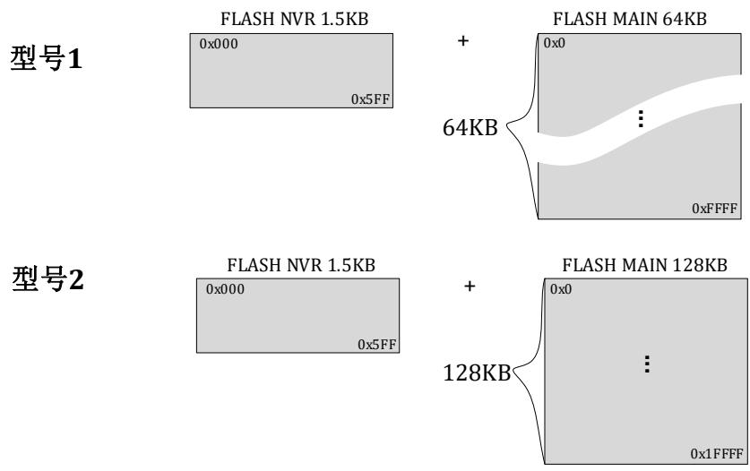  
图 7-1非易失性存储体空间划分框图及型号

## 7.2 功能特点

非易失性存储体控制器，主要实现对 FLASH 存储体的相关操作；ROM 存储体仅包含执行操作。具体包括：

➢ FLASH 读取数据的操作，包括对 NVR 部分的读取和对 MAIN 部分的读取。

➢ FLASH 写入数据的操作，包括对 NVR 部分的写入和对 MAIN 部分的写入。

➢ FLASH 擦除操作，包括 Full 擦除和 Sector 擦除。NVR 部分仅支持 Sector 擦除，MAIN 部分支持 Full 擦除和 Sector 擦除。

➢ FLASH 深度休眠的操作，以降低芯片的休眠功耗。

➢ FLASH 存储体内容的加密操作。

➢ FLASH 的读取加速操作，以提升芯片整体运行效率。

➢ FLASH 控制寄存器的访问。

➢ ROM 区域，仅可执行，不可拷贝。

➢ FLASH 保护状态下，NVR 的Sector 2（从0 开始计算）支持读取，编程和擦除。

## 7.2.1 功能描述

非易失性存储体控制器，实现了对 FLASH 存储体的复位/读出/写入/擦除/休眠等操作。如下为控制状态转换图:

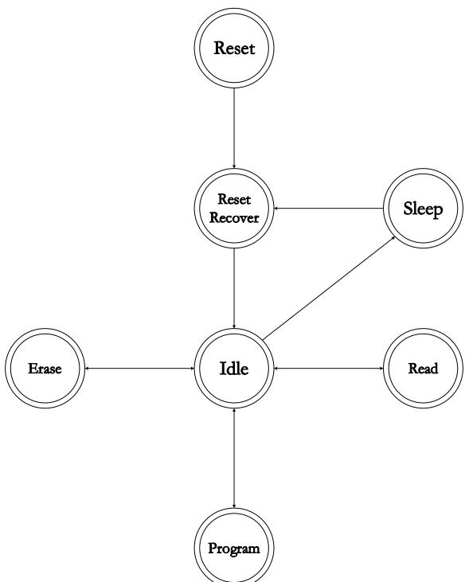  
图 7-2 FLASH 控制状态转换图

## 7.2.1.1 复位操作

系统完成复位后，FLASH 需要一段时间恢复。其目的是保证 FLASH 存储体内部的电路稳定。待稳定后，MCU 才可对FLASH 执行对应操作。此操作由硬件自动实现，无需软件干预。

## 7.2.1.2 休眠操作

FLASH 的休眠操作分成两个部分：Standby 和 Deep Sleep。当系统不执行对 FLASH 的操作时，FLASH 可自动进入 StandBy 状态（若开启预取，此功能失效）。当系统执行 Deep Sleep 操作时，将触发 FLASH 也进入 Deep Sleep，实现降低功耗的目的。FLASH 进入 Deep Sleep 的操作，硬件自

动完成，无需软件介入。

当外界唤醒系统，同时将唤醒 FLASH。经过一段时间恢复后，FLASH 可执行正常操作。此唤醒恢复操作，硬件自动完成，无需软件介入。

## 7.2.1.3 读取操作

读操作为FLASH 的基本操作。系统可通过两条路径访问 FLASH 内部的数据。

MCU 通过 AHB 总线，直接对 FLASH 执行取指、取数操作，宽度为 32bit，且只能访问 MAIN空间的数据。为了加快MCU 的取指、取数据的速度，硬件提供了加速的功能。

MCU 通过AHB总线，访问控制器的寄存器，间接实现读取FLASH内部数据的操作。可以访问MAIN和NVR空间的数据；若执行连续读取操作，硬件可自动完成地址累加，无需每次都更新地址寄存器的值。

ROM 不可被读取，仅可执行基本操作。系统只有一条路径访问 ROM 内部的数据

⚫ MCU 通过AHB 总线，直接对ROM 执行取指、取数操作，宽度为32bit。

FLASH\_CFG.REGION 位指示当前访问的是哪个空间。具体表格如下:

表 7-1 FLASH 访问空间分配表

<table><tr><td>FLASH_CFG.REGION</td><td>访问区域</td></tr><tr><td>0</td><td>MAIN 区域</td></tr><tr><td>1</td><td>NVR 区域</td></tr></table>

访问本控制器的寄存器，实现间接读取FLASH 内部数据的操作的执行流程如下:

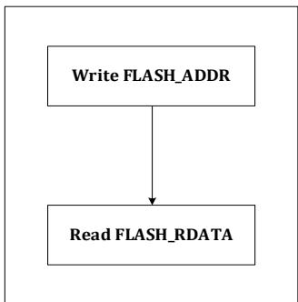  
图 7-3FLASH 间接读取操作流程图

## 7.2.1.4 FLASH 编程操作

执行对 FLASH 存储体的编程操作。一般而言，我们先执行擦除操作，然后执行数据编程操作。同时，只能通过访问FLASH 控制器的寄存器，实现编程操作。具体流程为：

⚫ SYS\_FLSP 寄存器，写入 0x8F35，开启编程使能开关 1

⚫ FLASH\_CFG.PRG\_EN 写 1，开启编程使能开关 2

⚫ FLASH\_ADDR，写入编程地址

⚫ FLASH\_WDATA，写入编程数据

访问本控制器的寄存器，实现 FLASH 编程操作的执行流程如下:

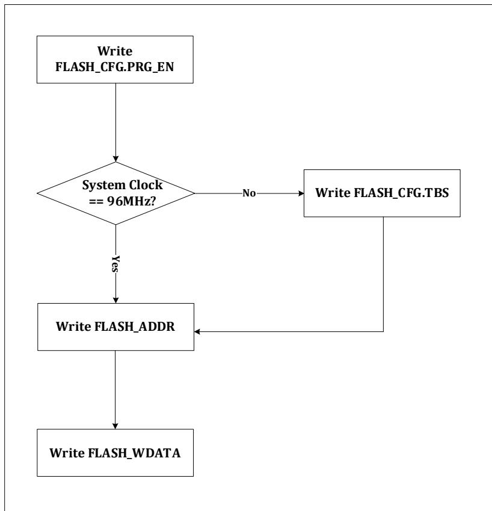  
图 7-4FLASH 模块编程操作流程图

为了防止 FLASH 区域被误编程，额外增加一组编程的使能开关--SYS\_FLSP。SYS\_FLSP 保护FLASH，防止误编程。写入0x8F35，开启编程使能，再配置FLASH\_CFG.PRG\_EN，最终开启FLASH的编程功能。

系统工作频率的判断，需要参考 SYS\_CLK\_CFG 的配置。FLASH 编程/擦除操作的绝对时间是固定的，FLASH 控制器需要保存这些绝对时间对应的计数值。FLASH\_CFG.TBS 默认值是 96MHz 时钟频率下的计数值；当芯片工作在其他频率下时，需要配置FLASH\_CFG.TBS 的值，以实现48MHz 和24MHz 的计数值（其它频率暂不支持）。最终保证计数值的值×时钟频率等于恒定的时间。不同频率下对应的 FLASH\_CFG.TBS 值，已经在 FLASH\_CFG 寄存器列出。切记，FLASH\_CFG.TBS 仅能配置寄存器说明中提供的几组值，不能被写入其它值，否则可能导致 FLASH 编程/擦除失败。建议对FLASH\_CFG 的操作，执行先读回，然后按照或/与的方法操作。另外，在执行 FLASH 的编程/擦除操作时，CPU 将暂停工作直至 FLASH 的编程/擦除操作完毕。

图 7-4 仅展示了一次编程的流程。若执行连续编程时，可以在写入 FLASH\_ADDR 寄存器前，配置 FLASH\_CFG.ADR\_INC，开启地址自动递增模式，后续只需要反复写 FLASH\_WDATA 寄存器即可，FLASH\_ADDR 每次写入一次数据会自动增加0x4。连续读操作类似。连续编程的流程如下:

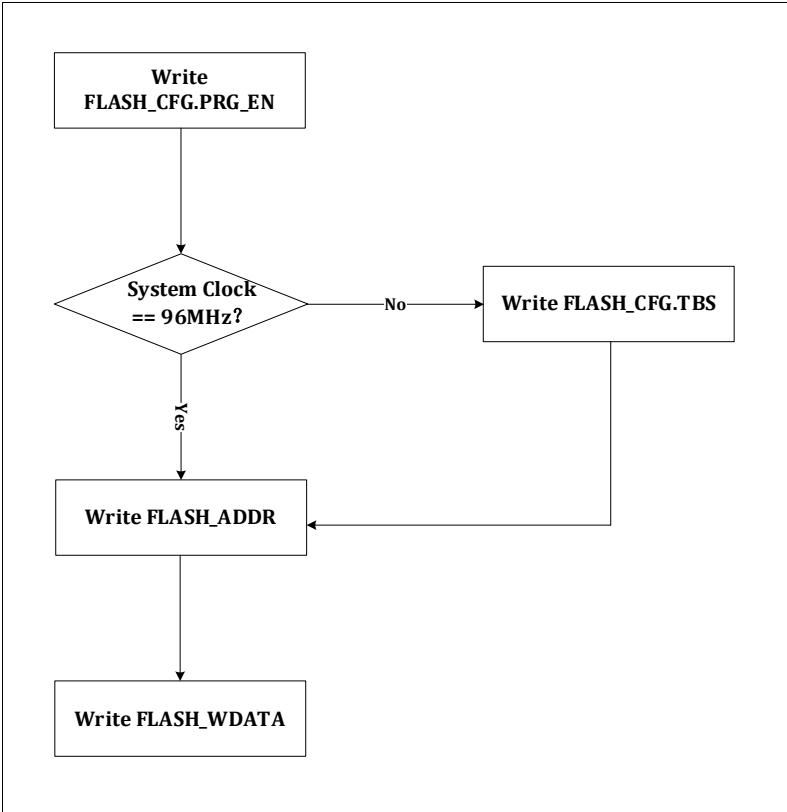  
图 7-5FLASH 模块编程操作流程图

## 7.2.1.5 FLASH 擦除操作

擦除操作为 FLASH 的基本操作。系统只能通过访问 FLASH 控制器的寄存器实现。具体流程为：

⚫ SYS\_FLSE 寄存器，写入 0x8FCA，擦除操作使能开关 1

⚫ FLASH\_CFG.ERS\_EN 写 1，擦除操作使能开关 2

⚫ FLASH\_ADDR，写入擦除地址

⚫ FLASH\_ERASE，触发擦除操作

为了防止 FLASH 区域被误擦，额外增加一组擦除的使能开关--SYS\_FLSE。SYS\_FLSE 保护FLASH，防止误擦，写入 0x8FCA，开启擦除使能，再配置 FLASH\_CFG.ERS\_EN，最终开启 FLASH的擦除功能。

执行对 FLASH 存储体的擦除操作。擦除分成 Sector 和 Full。分别对应，512Byte 的擦除和32KB/64KB/128KB 的擦除。通过配置 FLASH 控制寄存器决定执行哪一种类型的擦除操作。

下表为Secotor 地址分配空间。

表 7-2 FLASH Sector 地址分配表

<table><tr><td>Name</td><td>Addresses</td><td>Size(Bytes)</td></tr><tr><td>Sector 0</td><td>0x0000 0000 - 0x0000 01FF</td><td>512</td></tr><tr><td>Sector1</td><td>0x0000 0200 - 0x0000 03FF</td><td>512</td></tr><tr><td>Sector2</td><td>0x0000 0400 - 0x0000 05FF</td><td>512</td></tr><tr><td>...</td><td>...</td><td>...</td></tr><tr><td>Sector255</td><td>0x0001 FE00 - 0x0001 FFFF</td><td>512</td></tr></table>

NVR 区域只能实现Sector 擦除，NVR 区域只有三个Sector(0/1/2)；MAIN 区域可以实现Sector擦除和 Full 擦除。具体表格如下:

<table><tr><td>NVR (FLASH_CFG .REGION)</td><td>Sector Erase</td><td>Full Erase</td></tr><tr><td>0</td><td>Main 区域</td><td>Main 区域</td></tr><tr><td>1</td><td>NVR 区域</td><td>Main 区域</td></tr></table>

FLASH 擦除操作流程如下所示。

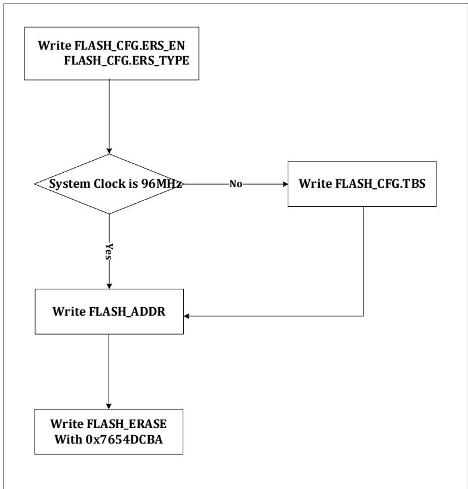  
图 7-6FLASH 模块擦除操作流程图

若选择 Secotor 擦除，需要通过 FLASH\_ADDR 确定哪个 Secotor 被擦除，若是 Full 模式的话，FLASH\_ADDR 的值将失效。FLASH\_ERASE 写入 0x7654DCBA 触发擦除操作。

## 7.2.1.6 FLASH 预取操作

因 FLASH 存储体的速度限制，无法达到 96MHz 的速度。对 FLASH 进行读取操作时，需要大于一个 96MHz 的时钟周期，才能完成数据的读出。为了加快数据的读出，FLASH 控制器增加了预取功能。当 FLASH 控制器完成当前的读取操作后，在不影响正常程序执行的前提下，顺序预取下一个 WORD 的数据。预取操作的开启和关闭，只需要设置 FLASH\_CFG.PREF 即可。

当系统频率降低到 48MHz 及以下，对 FLASH 进行读取操作，无需两个时钟周期的等待。此时，可以配置 FLASH\_CFG.WAIT 为 0，去掉一个额外的等待周期。切记，从高频调整到低频的时候，先调慢时钟，然后将 FLASH\_CFG.WAIT 改成 0；从低频调整到高频的时候，先将 FLASH\_CFG.WAIT改成1，然后再调快时钟。

## 7.2.1.7 非易失性存储体保护

非易失性存储体加密保护，保护 FLASH 和 ROM。因 ROM 只能执行，无法拷贝，已经处于保护状态且无法更改；本小节主要解释FLASH 部分的保护。

FLASH 保护的目的：防止外界非法获取 FLASH 的内容。

若 FLASH 存储体内的数据处于保护状态，用户可执行去保护操作；相反，若 FLASH 存储体内的数据处于去保护状态，用户可执行保护操作。默认情况下，FLASH 存储体内的数据处于保护的状态。芯片上电复位完成后，硬件自动执行一次状态更新操作，若是保护状态则保持保护的状态，否则，变成去保护状态。

FLASH 存储体有 32KB、64KB 和 128KB，各自的最后一个 WORD 设计为保护字（32KB 对应0x7FFC，64KB 对应 0xFFFC，128KB 对应 0x1FFFC）。当这个 WORD 内容为全 1 时，说明，FLASH 的内容无需保护，读取 FLASH\_PROTECT 寄存器，完成状态更新即可；当这个 WORD 的内容被写为非全 1 时，说明，FLASH 的内容需要保护。若需要保护，仅需要将最后一个 WORD 的内容，写入非全 1 的值，读取 FLASH\_PROTECT 寄存器，完成状态的更新（读取 FLASH\_PROTECT 返回值无意义），启动保护了。

去 保 护 分 成 两 种情 况。 若 最 后 一个 WORD 没 有 执 行 过 写 入非 全 1 的 操 作， 读 取FLASH\_PROTECT 寄存器，即完成状态更新（读取 FLASH\_PROTECT 返回值无意义），解除保护。若最后一个 WORD 已经非全 1，需执行擦除操作才能解除保护。先对 FLASH 执行擦除操作，将最后一个WORD恢复为全1值，然后读取FLASH\_PROTECT寄存器，完成状态的更新，取消保护（读取 FLASH\_PROTECT 返回值无意义）。

在 FLASH 处于保护状态下，为了方便客户实现二次烧录等特殊应用需求。LKS32MC07x 放开且仅放开了 NVR 区域的 Sector 2，供客户访问操作，包括读取、编程和擦除。注意，只有 FLASH处于保护状态下，此功能才有效。同时，执行此操作的时候，我们只能通过访问如下寄存器FLASH\_NCFG/NADDR/NWDATA/NRDATA/NERASE/NKEY，实现此功能。

具体流程为：

⚫ SYS\_FLSE 寄存器，写入 0x8FCA，擦除操作使能开关 1

⚫ SYS\_FLSP 寄存器，写入 0x8F35，开启编程使能开关 2

⚫ 读取 FLASH\_PROTECT 寄存器，确定 FLASH 处于保护状态

⚫ FLASH\_NKEY，写入特殊值（0x0000\_000F），开启保护状态下对 NVR Sector 2 的操作

⚫ FLASH\_NCFG，开启编程和擦除开关（若需要）

⚫ FLASH\_NADDR，写入编程或擦除地址

⚫ FLASH\_NERASE，实现对 NVR Sector 2 的擦除（若需要）

⚫ FLASH\_NWDATA，实现对 NVR Sector 2 的编程（若需要）

⚫ FLASH\_NRDATA，实现对 NVR Sector 2 的读取

切记，此通路只能访问到NVR Sector 2，且一般访问完毕后，执行硬复位。

## 7.2.1.8 FLASH 在线升级(IAP)

IAP 模式，实现中断向量表的重映射。在 LKS32MC07x 系列芯片中，包含了系统寄存器 VTOR，其地址为0xE000\_ED08。用于重新映射中断向量表入口地址。

表 7-3 IAP VTOR 寄存器描述

<table><tr><td>名称</td><td>复位值</td><td>偏移</td><td>位置</td><td>权限</td><td>说明</td></tr><tr><td>VTOR</td><td>0x0</td><td></td><td>[31:7]</td><td>RW</td><td>执行写入操作,写入中断向量表入口地址</td></tr></table>

默认值为 0x0，此时中断向量表入口地址为 0x0。当写入非 0 值时，中断向量表入口地址将映射到 VTOR 寄存器所对应的地址上，立即生效。读回时会右移 7 位。

在 LKS32MC07x 系列芯片中，因为有 VTOR 寄存器。用户可根据自己需求，更新整个 FLASH的内容。在线升级过程中可以使用中断，也可以关闭中断。

## 7.2.1.8.1 开启中断的在线升级

推荐软件配置流程:

关闭MCU 的中断控制器，暂时不接收新的中断响应；

在新的中断入口地址处，放置中断处理函数代码；

将新的中断入口地址写入 VTOR 寄存器；

开启MCU 的中断控制器，使能中断；

用户跳转至在线升级函数，开始在线升级功能；

完成升级，关闭MCU 的中断控制器，配置VTOR 为默认值0；

执行MCU 软复位，系统 PC 重新从0 地址开始执行升级后的程序；

## 7.2.1.8.2 关闭中断的在线升级

关闭MCU 的中断控制器，暂时不接收新的中断响应；

用户跳转至在线升级函数，开始在线升级功能；如果在线升级使用了类似UART 的外设通讯，需要MCU 轮询处理UART 的中断标志位。

执行MCU 软复位，系统 PC 重新从0 地址开始执行升级后的程序；

## 7.2.1.8.3 在线升级函数的位置

如果需要将FLASH 全部擦除，则需要将在线升级函数放置在RAM 中，如果需要使用中断则新的中断向量入口地址也需要位于 RAM 地址空间。

如果只需要擦除应用程序占用的部分 FLASH 区域，则可以将在线升级函数放置在 FLASH 高段地址的空闲区域，使用块擦除 FLASH 旧的应用程序，写入新的应用程序。

## 7.3 寄存器

## 7.3.1 地址分配

FLASH 控制器模块寄存器的基地址是0x0002\_0000 寄存器列表

表7-4FLASH 控制器模块寄存器列表

<table><tr><td>名称</td><td>偏移</td><td>说明</td></tr><tr><td>FLASH_CFG</td><td>0x00</td><td>FLASH 配置寄存器</td></tr><tr><td>FLASH_ADDR</td><td>0x04</td><td>地址寄存器</td></tr><tr><td>FLASH_WDATA</td><td>0x08</td><td>写数据寄存器</td></tr><tr><td>FLASH_RDATA</td><td>0x0C</td><td>读数据寄存器</td></tr><tr><td>FLASH_ERASE</td><td>0x10</td><td>擦除控制寄存器</td></tr><tr><td>FLASH_PROTECT</td><td>0x14</td><td>FLASH 保护状态寄存器</td></tr><tr><td>FLASH_READY</td><td>0x18</td><td>FLASH 工作状态寄存器</td></tr><tr><td>FLASH_SIZE</td><td>0x1C</td><td>FLASH 容量状态寄存器</td></tr><tr><td>FLASH_NCFG</td><td>0x20</td><td>FLASH 配置寄存器(保护状态下,针对 NVR 操作)</td></tr><tr><td>FLASH_NADDR</td><td>0x24</td><td>地址寄存器(保护状态下,针对 NVR 操作)</td></tr><tr><td>FLASH_NWDATA</td><td>0x28</td><td>写数据寄存器(保护状态下,针对 NVR 操作)</td></tr><tr><td>FLASH_NRDATA</td><td>0x2C</td><td>读数据寄存器(保护状态下,针对 NVR 操作)</td></tr><tr><td>FLASH_NERASE</td><td>0x30</td><td>擦除控制寄存器(保护状态下,针对 NVR 操作)</td></tr><tr><td>FLASH_NKEY</td><td>0x34</td><td>FLASH 密钥寄存器(保护状态下,针对 NVR 操作)</td></tr></table>

## 7.3.2 FLASH\_CFG 配置寄存器（推荐先读回，按或/与方式修改）

地址:0x0002\_0000

复位值:0xE0

表 7-5 FLASH\_CFG 配置寄存器

<table><tr><td>31</td><td>30</td><td>29</td><td>28</td><td>27</td><td>26</td><td>25</td><td>24</td><td>23</td><td>22</td><td>21</td><td>20</td><td>19</td><td>18</td><td>17</td><td>16</td></tr><tr><td>ERS_EN</td><td rowspan="3" colspan="3"></td><td>PRG_EN</td><td rowspan="3" colspan="3"></td><td>ADR_INC</td><td rowspan="3" colspan="3"></td><td>PREF</td><td rowspan="3" colspan="3"></td></tr><tr><td>RW</td><td>RW</td><td>RW</td><td>RW</td></tr><tr><td>0</td><td>0</td><td>0</td><td>0</td></tr></table>

<table><tr><td>15</td><td>14</td><td>13</td><td>12</td><td>11</td><td>10</td><td>9</td><td>8</td><td>7</td><td>6</td><td>5</td><td>4</td><td>3</td><td>2</td><td>1</td><td>0</td></tr><tr><td>ERS_TYPE</td><td colspan="3" rowspan="2"></td><td>REGION</td><td colspan="3" rowspan="2"></td><td>WAIT</td><td rowspan="2"></td><td colspan="6">TBS</td></tr><tr><td>RW0</td><td>RW1</td><td>RW0x60</td><td colspan="6">RW</td></tr><tr><td></td><td></td><td>0</td><td></td><td></td><td></td><td colspan="10"></td></tr></table>

<table><tr><td>位置</td><td>位名称</td><td>说明</td></tr><tr><td>[31]</td><td>ERS_EN</td><td>FLASH 擦除使能。默认为 0。0:关闭擦除1:开启擦除</td></tr><tr><td>[27]</td><td>PRG_EN</td><td>FLASH 编程使能。默认为 0。0:关闭编程1:开启编程</td></tr><tr><td>[23]</td><td>ADR_INC</td><td>FLASH 地址递增使能。默认为 0。0:关闭递增使能1:开启递增使能当执行 FLASH 连续读写访问时,可以开启此功能减少对地址的操作。</td></tr><tr><td>[19]</td><td>PREF</td><td>FLASH 预取加速使能。默认为 0。0:关闭加速1:开启加速</td></tr><tr><td>[15]</td><td>ERS_TYPE</td><td>FLASH 擦除类型选择。默认为 0。0:Sector1:FULL</td></tr><tr><td>[11]</td><td>REGION</td><td>访问 FLASH 区域选择。默认为 0。0:MAIN1:NVR</td></tr><tr><td>[7]</td><td>WAIT</td><td>读取 FLASH 数据,等待开关。默认为 1。0:读取,等待一个周期1:读取,等待两个周期</td></tr><tr><td>[6:0]</td><td>TBS</td><td>编程/擦除时间基数寄存器,默认值为 0x60。只能配成如下几个值0x60:96Mhz 系统频率下,FLASH 编程/擦除时间基数配置值。0x30:48Mhz 系统频率下,FLASH 编程/擦除时间基数配置值。0x17:24Mhz 系统频率下,FLASH 编程/擦除时间基数配置值。</td></tr></table>

## 7.3.3 FLASH\_ADDR 地址寄存器

地址:0x0002\_0004

复位值:0x0

表 7-6 FLASH\_ADDR 地址寄存器

<table><tr><td>14</td><td>13</td><td>12</td><td>11</td><td>10</td><td>9</td><td>8</td><td>7</td><td>6</td><td>5</td><td>4</td><td>3</td><td>2</td><td>1</td><td>0</td></tr><tr><td></td><td></td><td></td><td></td><td></td><td></td><td></td><td></td><td></td><td></td><td></td><td></td><td></td><td></td><td></td></tr><tr><td></td><td></td><td></td><td></td><td></td><td></td><td></td><td></td><td></td><td></td><td></td><td></td><td></td><td></td><td></td></tr><tr><td></td><td></td><td></td><td></td><td></td><td></td><td></td><td></td><td></td><td></td><td></td><td></td><td></td><td></td><td></td></tr><tr><td></td><td></td><td></td><td></td><td></td><td></td><td></td><td></td><td></td><td></td><td></td><td></td><td></td><td></td><td></td></tr></table>

<table><tr><td>位置</td><td>位名称</td><td>说明</td></tr><tr><td>[31:15]</td><td></td><td>未使用</td></tr><tr><td>[14:0]</td><td>ADDR</td><td>地址寄存器。读/写/擦除操作对应的地址寄存器。因按照 WORD 操作,最低两位会被 FLASH 控制器忽略。执行擦除操作时,需要根据擦除类型,地址需要对齐。一个 Sector 是 512-Byte。若执行 Sector 擦除,地址需要是 512 的整数倍(若带偏移,偏移量会被忽略)。全芯片擦除,不会参考这个寄存器的值</td></tr></table>

## 7.3.4 FLASH\_WDATA 写数据寄存器

地址:0x0002\_0008

复位值:0x0

表 7-7 FLASH\_WDATA 写数据寄存器

<table><tr><td>31</td><td>30</td><td>29</td><td>28</td><td>27</td><td>26</td><td>25</td><td>24</td><td>23</td><td>22</td><td>21</td><td>20</td><td>19</td><td>18</td><td>17</td><td>16</td></tr><tr><td colspan="16">WDATA</td></tr><tr><td colspan="16">WO</td></tr><tr><td colspan="16">0</td></tr><tr><td>15</td><td>14</td><td>13</td><td>12</td><td>11</td><td>10</td><td>9</td><td>8</td><td>7</td><td>6</td><td>5</td><td>4</td><td>3</td><td>2</td><td>1</td><td>0</td></tr><tr><td colspan="16">WDATA</td></tr><tr><td colspan="16">WO</td></tr><tr><td colspan="16">0</td></tr></table>

<table><tr><td>位置</td><td>位名称</td><td>说明</td></tr><tr><td>[31:0]</td><td>WDATA</td><td>执行写入操作,写入 FLASH 的值</td></tr></table>

## 7.3.5 FLASH\_RDATA 读数据寄存器

地址:0x0002\_000C

复位值:0x0

表 7-8 FLASH\_RDATA 读数据寄存器

<table><tr><td>31</td><td>30</td><td>29</td><td>28</td><td>27</td><td>26</td><td>25</td><td>24</td><td>23</td><td>22</td><td>21</td><td>20</td><td>19</td><td>18</td><td>17</td><td>16</td></tr><tr><td colspan="16">RDATA</td></tr><tr><td colspan="16">RO</td></tr><tr><td colspan="16">0</td></tr><tr><td>15</td><td>14</td><td>13</td><td>12</td><td>11</td><td>10</td><td>9</td><td>8</td><td>7</td><td>6</td><td>5</td><td>4</td><td>3</td><td>2</td><td>1</td><td>0</td></tr><tr><td colspan="16">RDATA</td></tr><tr><td colspan="16">RO</td></tr><tr><td colspan="16">0</td></tr></table>

<table><tr><td>位置</td><td>位名称</td><td>说明</td></tr><tr><td>[31:0]</td><td>RDATA</td><td>执行读取操作,读出 FLASH 的值</td></tr></table>

## 7.3.6 FLASH\_ERASE 擦除控制寄存器

地址:0x0002\_0010

复位值:0x0

表 7-9 FLASH\_ERASE 擦除控制寄存器

<table><tr><td>31</td><td>30</td><td>29</td><td>28</td><td>27</td><td>26</td><td>25</td><td>24</td><td>23</td><td>22</td><td>21</td><td>20</td><td>19</td><td>18</td><td>17</td><td>16</td></tr><tr><td colspan="16">ERASE</td></tr><tr><td colspan="16">WO</td></tr><tr><td colspan="16">0</td></tr><tr><td>15</td><td>14</td><td>13</td><td>12</td><td>11</td><td>10</td><td>9</td><td>8</td><td>7</td><td>6</td><td>5</td><td>4</td><td>3</td><td>2</td><td>1</td><td>0</td></tr><tr><td colspan="16">ERASE</td></tr><tr><td colspan="16">WO</td></tr><tr><td colspan="16">0</td></tr></table>

<table><tr><td>位置</td><td>位名称</td><td>说明</td></tr><tr><td>[31:0]</td><td>ERASE</td><td>写入 0x7654DCBA,触发擦除操作</td></tr></table>

## 7.3.7 FLASH\_PROTECT 保护状态寄存器

地址:0x0002\_0014

复位值:0x0

表 7-10 FLASH\_PROTECT 保护状态寄存器

<table><tr><td>31</td><td>30</td><td>29</td><td>28</td><td>27</td><td>26</td><td>25</td><td>24</td><td>23</td><td>22</td><td>21</td><td>20</td><td>19</td><td>18</td><td>17</td><td>16</td></tr><tr><td colspan="16">PROTECT</td></tr><tr><td colspan="16">RO</td></tr><tr><td colspan="16">0</td></tr><tr><td>15</td><td>14</td><td>13</td><td>12</td><td>11</td><td>10</td><td>9</td><td>8</td><td>7</td><td>6</td><td>5</td><td>4</td><td>3</td><td>2</td><td>1</td><td>0</td></tr><tr><td colspan="16">PROTECT</td></tr><tr><td colspan="16">RO</td></tr><tr><td colspan="16">0</td></tr></table>

<table><tr><td>位置</td><td>位名称</td><td>说明</td></tr><tr><td>[31:0]</td><td>PROTECT</td><td>读取该寄存器,更新加密/解密状态读取返回值无参考意义。</td></tr></table>

## 7.3.8 FLASH\_READY

地址:0x0002\_0018

复位值:0x0

表 7-11 FLASH\_READY 工作状态寄存器

<table><tr><td>15</td><td>14</td><td>13</td><td>12</td><td>11</td><td>10</td><td>9</td><td>8</td><td>7</td><td>6</td><td>5</td><td>4</td><td>3</td><td>2</td><td>1</td><td>0</td></tr></table>

<table><tr><td rowspan="3"></td><td>READY</td></tr><tr><td>RO</td></tr><tr><td>0</td></tr></table>

<table><tr><td>位置</td><td>位名称</td><td>说明</td></tr><tr><td>[31:1]</td><td></td><td>未使用</td></tr><tr><td>[0]</td><td>READY</td><td>1:FLASH 处于 Idle 状态; 0:FLASH 处于 Busy 状态</td></tr></table>

## 7.3.9 FLASH\_SIZE 容量寄存器

地址:0x0002\_001C

复位值:0x00

表 7-12 FLASH\_SIZE 容量寄存器

<table><tr><td colspan="5">15 14 13 12 11 10 9 8 7 6 5 4 3 2 1 0</td></tr><tr><td rowspan="3"></td><td>FLASH_SIZE</td><td rowspan="3"></td><td>ROM_SIZE</td><td rowspan="3"></td></tr><tr><td>RO</td><td>RO</td></tr><tr><td>0</td><td>0</td></tr></table>

<table><tr><td>位置</td><td>位名称</td><td>说明</td></tr><tr><td>[31:8]</td><td>--</td><td>未使用</td></tr><tr><td>[7:6]</td><td>FLASH_SIZE</td><td>FLASH 容量寄存器,仅可读0: 32KB1: 64KB2: 128KB3: 128KB</td></tr><tr><td>[5:2]</td><td>--</td><td>未使用</td></tr><tr><td>[3:2]</td><td>ROM_SIZE</td><td>ROM 容量寄存器,仅可读0: 0KB1: 32KB2: 64KB3: 0KB</td></tr></table>

## 7.3.10 FLASH\_NCFG 配置寄存器（推荐先读回，按或/与方式修改）

地址:0x0002\_0020

复位值:0x000000E0

表 7-13 FLASH\_NCFG 配置寄存器

<table><tr><td>31</td><td>30</td><td>29</td><td>28</td><td>27</td><td>26</td><td>25</td><td>24</td><td>23</td><td>22</td><td>21</td><td>20</td><td>19</td><td>18</td><td>17</td><td>16</td></tr><tr><td>ERS_EN</td><td colspan="3" rowspan="2"></td><td>PRG_EN</td><td colspan="3" rowspan="2"></td><td>ADR_INC</td><td colspan="3" rowspan="2"></td><td>PREF</td><td colspan="3" rowspan="2"></td></tr><tr><td>RW</td><td>RW</td><td>RO</td><td>RW</td></tr><tr><td>0</td><td colspan="3"></td><td>0</td><td colspan="3"></td><td>0</td><td colspan="3"></td><td>0</td><td colspan="3"></td></tr><tr><td>15</td><td>14</td><td>13</td><td>12</td><td>11</td><td>10</td><td>9</td><td>8</td><td>7</td><td>6</td><td>5</td><td>4</td><td>3</td><td>2</td><td>1</td><td>0</td></tr><tr><td>ERS_TYPE</td><td colspan="3" rowspan="3"></td><td>REGION</td><td colspan="3" rowspan="3"></td><td>WAIT</td><td colspan="7">TBS</td></tr><tr><td>RO</td><td>RW</td><td>RO</td><td colspan="7">RO</td></tr><tr><td>0</td><td>0</td><td>1</td><td colspan="7">0x60</td></tr></table>

<table><tr><td>位置</td><td>位名称</td><td>说明</td></tr><tr><td>[31]</td><td>ERS_EN</td><td>FLASH 擦除使能。默认为 0。0:关闭擦除1:开启擦除</td></tr><tr><td>[27]</td><td>PRG_EN</td><td>FLASH 编程使能。默认为 0。0:关闭编程1:开启编程</td></tr><tr><td>[23]</td><td>ADR_INC</td><td>FLASH 地址递增使能。默认为 0。此寄存器,只能读取不能修改。0:关闭递增使能1:开启递增使能当执行 FLASH 连续读写访问时,可以开启此功能减少对地址的操作。</td></tr><tr><td>[19]</td><td>PREF</td><td>FLASH 预取加速使能。默认为 0。0:关闭加速1:开启加速</td></tr><tr><td>[15]</td><td>ERS_TYPE</td><td>FLASH 擦除类型选择。默认为 0。此寄存器,只能读取不能修改。0:Sector1:FULL</td></tr><tr><td>[11]</td><td>REGION</td><td>访问 FLASH 区域选择。默认为 0。修改此寄存器,无论写入值是 0 还是 1,最终,只能被强制写成 1。0:MAIN1:NVR</td></tr><tr><td>[7]</td><td>WAIT</td><td>读取 FLASH 数据,等待开关。默认为 1。此寄存器,只能读取不能修改。0:读取,等待一个周期1:读取,等待两个周期</td></tr><tr><td>[6:0]</td><td>TBS</td><td>编程/擦除时间基数寄存器,默认值为 0x60。只能配成如下几个值。此寄存器,只能读取不能修改。0x60:96Mhz 系统频率下,FLASH 编程/擦除时间基数配置值。0x30:48Mhz 系统频率下,FLASH 编程/擦除时间基数配置值。0x17:24Mhz 系统频率下,FLASH 编程/擦除时间基数配置值。</td></tr></table>

## 7.3.11 FLASH\_NADDR 地址寄存器

地址:0x0002\_0024

复位值:0x0

表 7-14 FLASH\_NADDR 地址寄存器

<table><tr><td>14</td><td>13</td><td>12</td><td>11</td><td>10</td><td>9</td><td>8</td><td>7</td><td>6</td><td>5</td><td>4</td><td>3</td><td>2</td><td>1</td><td>0</td></tr></table>

<table><tr><td>ADDR</td></tr><tr><td>RW</td></tr><tr><td>0</td></tr></table>

<table><tr><td>位置</td><td>位名称</td><td>说明</td></tr><tr><td>[31:15]</td><td></td><td>未使用</td></tr><tr><td>[14:0]</td><td>ADDR</td><td>地址寄存器。读/写/擦除操作对应的地址寄存器。因按照 WORD 操作,最低两位会被 FLASH 控制器忽略。执行擦除操作时,需要根据擦除类型,地址需要对齐。一个 Sector 是 512-Byte。若执行 Sector 擦除,地址需要是 512 的整数倍(若带偏移,偏移量会被忽略)。全芯片擦除,不会参考这个寄存器的值</td></tr></table>

## 7.3.12 FLASH\_NWDATA 写数据寄存器

地址:0x0002\_0028

复位值:0x0

表 7-15 FLASH\_NWDATA 写数据寄存器

<table><tr><td>31</td><td>30</td><td>29</td><td>28</td><td>27</td><td>26</td><td>25</td><td>24</td><td>23</td><td>22</td><td>21</td><td>20</td><td>19</td><td>18</td><td>17</td><td>16</td></tr><tr><td colspan="16">WDATA</td></tr><tr><td colspan="16">WO</td></tr><tr><td colspan="16">0</td></tr><tr><td>15</td><td>14</td><td>13</td><td>12</td><td>11</td><td>10</td><td>9</td><td>8</td><td>7</td><td>6</td><td>5</td><td>4</td><td>3</td><td>2</td><td>1</td><td>0</td></tr><tr><td colspan="16">WDATA</td></tr><tr><td colspan="16">WO</td></tr><tr><td colspan="16">0</td></tr></table>

<table><tr><td>位置</td><td>位名称</td><td>说明</td></tr><tr><td>[31:0]</td><td>WDATA</td><td>执行写入操作,写入 FLASH 的值</td></tr></table>

## 7.3.13 FLASH\_NRDATA 读数据寄存器

地址:0x0002\_002C

复位值:0x0

表 7-16 FLASH\_NRDATA 读数据寄存器

<table><tr><td>31</td><td>30</td><td>29</td><td>28</td><td>27</td><td>26</td><td>25</td><td>24</td><td>23</td><td>22</td><td>21</td><td>20</td><td>19</td><td>18</td><td>17</td><td>16</td></tr><tr><td colspan="16">RDATA</td></tr><tr><td colspan="16">RO</td></tr><tr><td colspan="16">0</td></tr><tr><td>15</td><td>14</td><td>13</td><td>12</td><td>11</td><td>10</td><td>9</td><td>8</td><td>7</td><td>6</td><td>5</td><td>4</td><td>3</td><td>2</td><td>1</td><td>0</td></tr><tr><td colspan="16">RDATA</td></tr><tr><td colspan="16">RO</td></tr><tr><td colspan="16">0</td></tr></table>

<table><tr><td>位置</td><td>位名称</td><td>说明</td></tr><tr><td>[31:0]</td><td>RDATA</td><td>执行读取操作,读出 FLASH 的值</td></tr></table>

## 7.3.14 FLASH\_NERASE 擦除控制寄存器

地址:0x0002\_0030

复位值:0x0

表 7-17 FLASH\_NERASE 擦除控制寄存器

<table><tr><td>31</td><td>30</td><td>29</td><td>28</td><td>27</td><td>26</td><td>25</td><td>24</td><td>23</td><td>22</td><td>21</td><td>20</td><td>19</td><td>18</td><td>17</td><td>16</td></tr><tr><td colspan="16">ERASE</td></tr><tr><td colspan="16">WO</td></tr><tr><td colspan="16">0</td></tr><tr><td>15</td><td>14</td><td>13</td><td>12</td><td>11</td><td>10</td><td>9</td><td>8</td><td>7</td><td>6</td><td>5</td><td>4</td><td>3</td><td>2</td><td>1</td><td>0</td></tr><tr><td colspan="16">ERASE</td></tr><tr><td colspan="16">WO</td></tr><tr><td colspan="16">0</td></tr></table>

<table><tr><td>位置</td><td>位名称</td><td>说明</td></tr><tr><td>[31:0]</td><td>ERASE</td><td>写入 0x7654DCBA,触发擦除操作</td></tr></table>

## 7.3.15 FLASH\_NKEY 密钥寄存器

地址:0x0002\_0034

复位值:0x0

表 7-18 FLASH\_NKEY 密钥寄存器

<table><tr><td>31</td><td>30</td><td>29</td><td>28</td><td>27</td><td>26</td><td>25</td><td>24</td><td>23</td><td>22</td><td>21</td><td>20</td><td>19</td><td>18</td><td>17</td><td>16</td></tr><tr><td colspan="16"></td></tr><tr><td>15</td><td>14</td><td>13</td><td>12</td><td>11</td><td>10</td><td>9</td><td>8</td><td>7</td><td>6</td><td>5</td><td>4</td><td>3</td><td>2</td><td>1</td><td>0</td></tr><tr><td rowspan="3" colspan="12"></td><td colspan="4">KEY</td></tr><tr><td colspan="4">WO</td></tr><tr><td colspan="4">0</td></tr></table>

<table><tr><td>位置</td><td>位名称</td><td>说明</td></tr><tr><td>[31:4]</td><td>--</td><td>未使用</td></tr><tr><td>[3:0]</td><td>KEY</td><td>当 FLASH 处于保护状态时,无法通过 SWD 读取,编程和擦除 FLASH。此时,用户可以对此寄存器写入特殊值(0x0000_000F),使能开关,配置 FLASH_NCFG/NADDR/NWDATA/NRDATA/NERASE 寄存器,对 NVR Sector2 进行读取,编程和擦除。</td></tr></table>

## 7.3.16 NVR 校准参数地址信息

LKS32MC7x 校准参数使用

LKS32MC07x 产品存储芯片校准参数：

校准参数，每颗产品均独立校准，每颗产品不支持校准参数混用；

校准参数，在出厂前进行写入，出厂后不支持编程和擦除，仅支持读取；

校准参数，通过LKS 公司提供的库函数进行读取访问；

校准参数，推荐关闭系统中断后，执行访问操作；

lks32mc07x\_nvr.o 文件包含了校准参数的读取函数：

读取函数：uint32\_t Read\_Trim(uint32\_t adr);

表 7-19 LKS32MC07x 校准值存放地址

<table><tr><td>地址</td><td>内容</td></tr><tr><td>0x0000140C</td><td>SYS_AFE REGC 校准值,RCH 校准值,5v 供电</td></tr><tr><td>0x00001410</td><td>SYS AFE REGC 校准值,RCH 校准值,3.3v 供电</td></tr><tr><td>0x00001420</td><td>ADC0_DC0 校准值,3.6V 量程 OFFSET</td></tr><tr><td>0x00001424</td><td>ADC0_AMC0 校准值,3.6V 量程 GAIN</td></tr><tr><td>0x00001428</td><td>ADC0_DC1 校准值,7.6V 量程 OFFSET</td></tr><tr><td>0x0000142C</td><td>ADC0_AMC1 校准值,7.6V 量程 GAIN</td></tr><tr><td>0x00001430</td><td>ADC1_DC0 校准值,3.6V 量程 OFFSET</td></tr><tr><td>0x00001434</td><td>ADC1_AMC0 校准值,3.6V 量程 GAIN</td></tr><tr><td>0x00001438</td><td>ADC1_DC1 校准值,7.6V 量程 OFFSET</td></tr><tr><td>0x0000143C</td><td>ADC1_AMC1 校准值,7.6V 量程 GAIN</td></tr><tr><td>0x00001450</td><td>DAC0 选择 4.85V 档位,SYS_AFE_DAC_AMC 校准值(扩大 512 倍结果)</td></tr><tr><td>0x00001454</td><td>DAC0 选择 4.85V 档位,SYS_AFE_DAC_DC 校准值</td></tr><tr><td>0x00001458</td><td>DAC0 选择 1.20V 档位,SYS_AFE_DAC_AMC 校准值(扩大 512 倍结果)</td></tr><tr><td>0x0000145C</td><td>DAC0 选择 1.20V 档位,SYS_AFE_DAC_DC 校准值</td></tr><tr><td>0x00001460</td><td>DAC1 选择 4.85V 档位,SYS_AFE_DAC_AMC 校准值(扩大 512 倍结果)</td></tr><tr><td>0x00001464</td><td>DAC1 选择 4.85V 档位,SYS_AFE_DAC_DC 校准值</td></tr><tr><td>0x00001468</td><td>DAC1 选择 1.20V 档位,SYS_AFE_DAC_AMC 校准值(扩大 512 倍结果)</td></tr><tr><td>0x0000146C</td><td>DAC1 选择 1.20V 档位,SYS_AFE_DAC_DC 校准值</td></tr><tr><td>0x00001480</td><td>OPA0,320K 欧姆 VS 10K 欧姆,GAIN 校准值(扩大 1000 倍结果),R0 为 0 欧姆。</td></tr><tr><td>0x00001484</td><td>OPA0,160K 欧姆 VS 10K 欧姆,GAIN 校准值(扩大 1000 倍结果),R0 为 0 欧姆。</td></tr><tr><td>0x00001488</td><td>OPA0,080K 欧姆 VS 10K 欧姆,GAIN 校准值(扩大 1000 倍结果),R0 为 0 欧姆。</td></tr><tr><td>0x0000148C</td><td>OPA0,040K 欧姆 VS 10K 欧姆,GAIN 校准值(扩大 1000 倍结果),R0 为 0 欧姆。</td></tr><tr><td>0x00001490</td><td>OPA1,320K 欧姆 VS 10K 欧姆,GAIN 校准值(扩大 1000 倍结果),R0 为 0 欧姆。</td></tr><tr><td>0x00001494</td><td>OPA1, 160K欧姆VS 10K欧姆,GAIN校准值(扩大1000倍结果),R0为0欧姆。</td></tr><tr><td>0x00001498</td><td>OPA1, 080K欧姆VS 10K欧姆,GAIN校准值(扩大1000倍结果),R0为0欧姆。</td></tr><tr><td>0x0000149C</td><td>OPA1, 040K欧姆VS 10K欧姆,GAIN校准值(扩大1000倍结果),R0为0欧姆。</td></tr><tr><td>0x000014A0</td><td>OPA2, 320K欧姆VS 10K欧姆,GAIN校准值(扩大1000倍结果),R0为0欧姆。</td></tr><tr><td>0x000014A4</td><td>OPA2, 160K欧姆VS 10K欧姆,GAIN校准值(扩大1000倍结果),R0为0欧姆。</td></tr><tr><td>0x000014A8</td><td>OPA2, 080K欧姆VS 10K欧姆,GAIN校准值(扩大1000倍结果),R0为0欧姆。</td></tr><tr><td>0x000014AC</td><td>OPA2, 040K欧姆VS 10K欧姆,GAIN校准值(扩大1000倍结果),R0为0欧姆。</td></tr><tr><td>0x000014B0</td><td>OPA3, 320K欧姆VS 10K欧姆,GAIN校准值(扩大1000倍结果),R0为0欧姆。</td></tr><tr><td>0x000014B4</td><td>OPA3, 160K欧姆VS 10K欧姆,GAIN校准值(扩大1000倍结果),R0为0欧姆。</td></tr><tr><td>0x000014B8</td><td>OPA3, 080K欧姆VS 10K欧姆,GAIN校准值(扩大1000倍结果),R0为0欧姆。</td></tr><tr><td>0x000014BC</td><td>OPA3, 040K欧姆VS 10K欧姆,GAIN校准值(扩大1000倍结果),R0为0欧姆。</td></tr><tr><td>0x000014C0</td><td>OPA0, 共模电压(扩大10000倍结果)</td></tr><tr><td>0x000014C4</td><td>OPA1, 共模电压(扩大10000倍结果)</td></tr><tr><td>0x000014C8</td><td>OPA2, 共模电压(扩大10000倍结果)</td></tr><tr><td>0x000014CC</td><td>OPA3, 共模电压(扩大10000倍结果)</td></tr><tr><td>0x000014D0</td><td>温度传感器,斜率校准值</td></tr><tr><td>0x000014D4</td><td>温度传感器,偏置校准值</td></tr><tr><td>0x00001500</td><td>OPA0, 320K欧姆:10K欧姆挡位。高16位存放R2实际阻值,低16位存放R1实际阻值(扩大100倍结果)</td></tr><tr><td>0x00001504</td><td>OPA0, 160K欧姆:10K欧姆挡位。高16位存放R2实际阻值,低16位存放R1实际阻值(扩大100倍结果)</td></tr><tr><td>0x00001508</td><td>OPA0, 080K欧姆:10K欧姆挡位。高16位存放R2实际阻值,低16位存放R1实际阻值(扩大100倍结果)</td></tr><tr><td>0x0000150C</td><td>OPA0, 040K欧姆:10K欧姆挡位。高16位存放R2实际阻值,低16位存放R1实际阻值(扩大100倍结果)</td></tr><tr><td>0x00001510</td><td>OPA1, 320K欧姆:10K欧姆挡位。高16位存放R2实际阻值,低16位存放R1实际阻值(扩大100倍结果)</td></tr><tr><td>0x00001514</td><td>OPA1, 160K欧姆:10K欧姆挡位。高16位存放R2实际阻值,低16位存放R1实际阻值(扩大100倍结果)</td></tr><tr><td>0x00001518</td><td>OPA1, 080K欧姆:10K欧姆挡位。高16位存放R2实际阻值,低16位存放R1实际阻值(扩大100倍结果)</td></tr><tr><td>0x0000151C</td><td>OPA1, 040K欧姆:10K欧姆挡位。高16位存放R2实际阻值,低16位存放R1实际阻值(扩大100倍结果)</td></tr><tr><td>0x00001520</td><td>OPA2, 320K欧姆:10K欧姆挡位。高16位存放R2实际阻值,低16位存放R1实际阻值(扩大100倍结果)</td></tr><tr><td>0x00001524</td><td>OPA2, 160K欧姆:10K欧姆挡位。高16位存放R2实际阻值,低16位存放R1实际阻值(扩大100倍结果)</td></tr><tr><td>0x00001528</td><td>OPA2, 080K欧姆:10K欧姆挡位。高16位存放R2实际阻值,低16位存放R1实际阻值(扩大100倍结果)</td></tr><tr><td>0x0000152C</td><td>OPA2, 040K欧姆:10K欧姆挡位。高16位存放R2实际阻值,低16位存放R1实际阻值(扩大100倍结果)</td></tr><tr><td>0x00001530</td><td>OPA3, 320K欧姆:10K欧姆挡位。高16位存放R2实际阻值,低16位存放R1实际阻值(扩大100倍结果)</td></tr><tr><td>0x00001534</td><td>OPA3, 160K欧姆:10K欧姆挡位。高16位存放R2实际阻值,低16位存放R1实际阻值(扩大100倍结果)值(扩大100倍结果)</td></tr><tr><td>0x00001538</td><td>OPA3, 080K欧姆:10K欧姆挡位。高16位存放R2实际阻值,低16位存放R1实际阻值(扩大100倍结果)</td></tr><tr><td>0x0000153C</td><td>OPA3, 040K欧姆:10K欧姆挡位。高16位存放R2实际阻值,低16位存放R1实际阻值(扩大100倍结果)</td></tr><tr><td>0x00001560</td><td>OPA0挡位下的Offset值(有符号类型,单位:V,放大10000倍)Bit[31:16] OPA0 4倍放大倍数Bit[15:0] OPA0 8倍放大倍数</td></tr><tr><td>0x00001564</td><td>OPA0挡位下的Offset值(有符号类型,单位:V,放大10000倍)Bit[31:16] OPA0 16倍放大倍数Bit[15:0] OPA0 32倍放大倍数</td></tr><tr><td>0x00001568</td><td>OPA1挡位下的Offset值(有符号类型,单位:V,放大10000倍)Bit[31:16] OPA1 4倍放大倍数Bit[15:0] OPA1 8倍放大倍数</td></tr><tr><td>0x0000156C</td><td>OPA1挡位下的Offset值(有符号类型,单位:V,放大10000倍)Bit[31:16] OPA1 16倍放大倍数Bit[15:0] OPA1 32倍放大倍数</td></tr><tr><td>0x00001570</td><td>OPA2挡位下的Offset值(有符号类型,单位:V,放大10000倍)Bit[31:16] OPA2 4倍放大倍数Bit[15:0] OPA2 8倍放大倍数</td></tr><tr><td>0x00001574</td><td>OPA2挡位下的Offset值(有符号类型,单位:V,放大10000倍)Bit[31:16] OPA2 16倍放大倍数Bit[15:0] OPA2 32倍放大倍数</td></tr><tr><td>0x00001578</td><td>OPA3挡位下的Offset值(有符号类型,单位:V,放大10000倍)Bit[31:16] OPA3 4倍放大倍数Bit[15:0] OPA3 8倍放大倍数</td></tr><tr><td>0x0000157C</td><td>OPA3挡位下的Offset值(有符号类型,单位:V,放大10000倍)Bit[31:16] OPA3 16倍放大倍数Bit[15:0] OPA3 32倍放大倍数</td></tr><tr><td>0x00001590</td><td>OPA0挡位下的vcm值,外部电阻1k(有符号类型,单位:V,放大10000倍)Bit[31:16] OPA0 4倍放大倍数Bit[15:0] OPA0 8倍放大倍数</td></tr><tr><td>0x00001594</td><td>OPA0挡位下的vcm值,外部电阻1k(有符号类型,单位:V,放大10000倍)Bit[31:16] OPA0 16倍放大倍数Bit[15:0] OPA0 32倍放大倍数</td></tr><tr><td>0x00001598</td><td>OPA1挡位下的vcm值,外部电阻1k(有符号类型,单位:V,放大10000倍)Bit[31:16] OPA1 4倍放大倍数Bit[15:0] OPA1 8倍放大倍数</td></tr><tr><td>0x0000159C</td><td>OPA1挡位下的vcm值,外部电阻1k(有符号类型,单位:V,放大10000倍)Bit[31:16] OPA1 16倍放大倍数Bit[15:0] OPA1 32倍放大倍数</td></tr><tr><td>0x000015A0</td><td>OPA2挡位下的vcm值,外部电阻1k(有符号类型,单位:V,放大10000倍)Bit[31:16] OPA2 4倍放大倍数Bit[15:0] OPA2 8倍放大倍数</td></tr><tr><td>0x000015A4</td><td>OPA2挡位下的vcm值,外部电阻1k(有符号类型,单位:V,放大10000倍)Bit[31:16] OPA2 16 倍放大倍数Bit[15:0] OPA2 32 倍放大倍数</td></tr><tr><td>0x000015A8</td><td>OPA3 挡位下的 vcm 值,外部电阻 1k(有符号类型,单位:V,放大 10000 倍)Bit[31:16] OPA3 4 倍放大倍数Bit[15:0] OPA3 8 倍放大倍数</td></tr><tr><td>0x000015AC</td><td>OPA3 挡位下的 vcm 值,外部电阻 1k(有符号类型,单位:V,放大 10000 倍)Bit[31:16] OPA3 16 倍放大倍数Bit[15:0] OPA3 32 倍放大倍数</td></tr></table>

## 8 SPI

## 8.1 概述

SPI 接口主要使用在，外部设计采用 SPI 协议的应用场景下。SPI 的工作模式软件可选，默认为 SPI Motorola 模式。SPI 接口支持全双工传输和半双工传输。当接口配置为 Master 模式时，可发送时钟信号供外部Slave 设备使用。

## 8.2 主要特性

⚫ 支持 Master 和 Slave 操作

⚫ 全双工传输，可根据应用情况，使用3 根或者4 根信号线

⚫ 支持半双工传输，可根据应用情况，使用2 根信号线

⚫ 可编程的时钟极性和相位

⚫ 可编程的数据顺序：MSB 或LSB

⚫ 最快传输速度为系统最高时钟频率的1/8

⚫ 片选信号均可选。Master 模式下，片选信号可以软件控制也可以硬件产生；Slave 模式下，片选信号可以恒定有效，也可以来自外界设备

⚫ 无本地FIFO，支持DMA 操作。包含溢出检测和片选信号异常检测

⚫ 数据长度 8-Bit～16-Bit 可调

## 8.3 功能描述

## 8.3.1 功能框图

本接口采用同步串行设计，实现 MCU 同外部设备之间的 SPI 传输。支持轮询和中断方式获得传输状态信息。本接口的主要功能模块如下图所示。

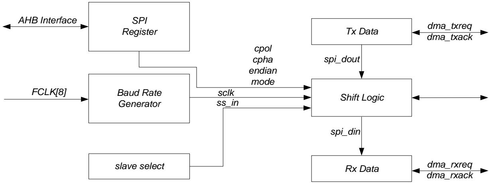  
图 8-1SPI 模块结构框图  
接口信号包括，spi\_din，spi\_dout，sclk\_in，sclk\_out，ss\_in 和 ss\_out。

spi\_din:接口接收的数据信号。同SPI协议比较，当接口配置为Master模式时，其等效为MISO；当接口配置为Slave 模式时，其等效为MOSI。

spi\_dout:接口发送的数据信号。同 SPI 协议比较，当接口配置为 Master 模式时，其等效为MOSI；当接口配置为Slave 模式时，其等效为MISO。

sclk\_in:接口接收的时钟信号。此时，接口的工作模式为 Slave。非 Slave 模式下，此信号输入无效。

sclk\_out:接口发送的时钟信号。此时，接口的工作模式为 Master，非 Master 模式下，此信号输出恒定为 0。

ss\_in:接口接收的片选信号。此时，接口的工作模式为 Slave。非 Slave 模式下，此信号输入无效。

ss\_out:接口发送的片选信号。此时，接口的工作模式为 Master。非 Master 模式下，此信号输出恒定为 1。

## 8.3.2 功能说明

## 8.3.2.1 全双工模式

默认情况下，SPI 接口配置为全双工模式。此时，数据传输需要两根数据线。数据信号的变化，发生在时钟信号的边沿，即同步于时钟信号。

接口为 Master 模式时:

⚫ spi\_din 为数据输入，接外部 Slave 设备的 MISO

⚫ spi\_dout 为数据输出，接外部 Slave 设备的 MOSI

⚫ spi\_ss\_out 为片选信号，根据应用情况选择是使用该信号还是软件控制其它GPIO 实现

接口为 Slave 模式时:

⚫ spi\_din 为数据输入，接外部 Master 设备的 MOSI

⚫ spi\_dout 为数据输出，接外部 Master 设备的 MISO

⚫ spi\_ss\_in 为片选信号，根据应用情况是使用该信号还是片选恒有效

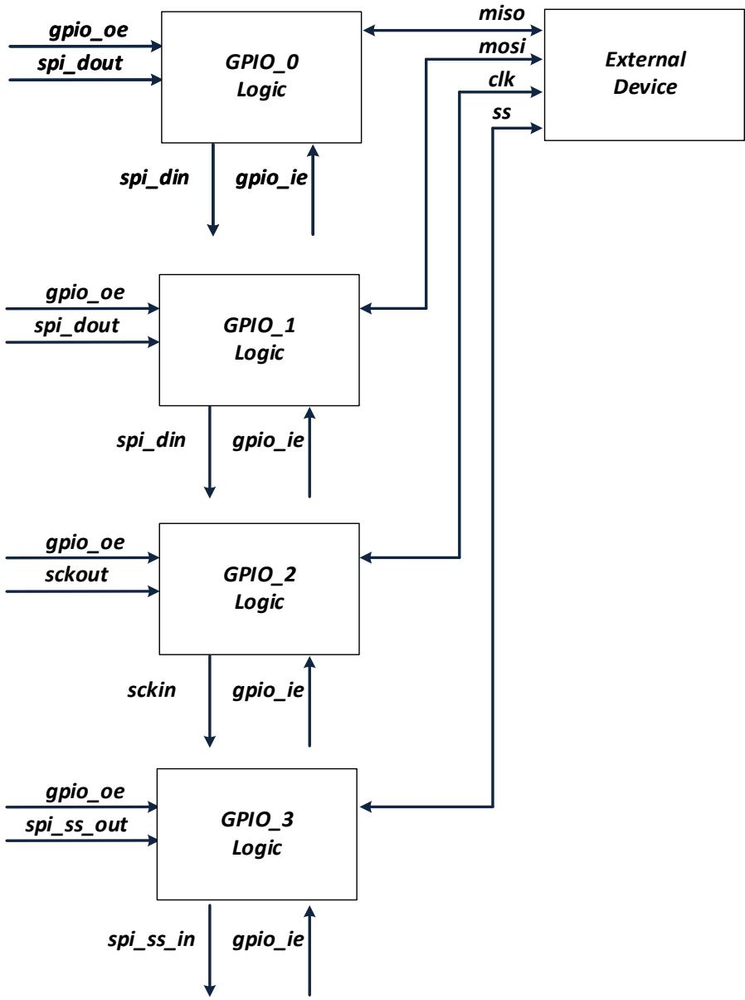  
图 8-2SPI 接口全双工模式互连框图

从上图可知，GPIO 若配置为输出，则 SPI 接口可发送数据；GPIO 若配置为输入，则 SPI 接口可接收数据。

## 8.3.2.2 半双工模式

SPI 接口可配置为半双工模式。此时，数据传输只需要一根数据线。数据信号的变化，发生在时钟信号的边沿，即同步于时钟信号。一次传输只能是一个方向的，要不就是发送，要不就是接收。

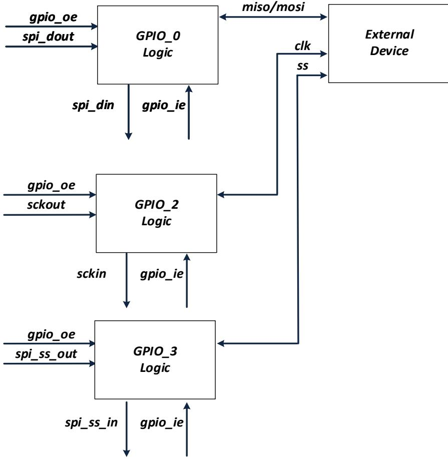  
图 8-3SPI 接口半双工模式互连框图

注意，上图中若本接口做Master，则clk为本接口的输出信号；若本接口做Slave，则clk 为本接口的输入信号。

## 仅发送

SPI\_CFG. DUPLEX 配置为2，半双工发送模式有效。此时，本接口只能发送数据。GPIO\_0 的oe使能，发送 spi\_dout 数据到外界；GPIO\_0 的 ie 关闭，spi\_din 恒定输入为 0。此模式下，支持Master/Slave 模式下的发送。

## 仅接收

SPI\_CFG. DUPLEX 配置为3，半双工接收模式有效。此时，本接口只能接收数据。GPIO\_0 的oe关闭，spi\_dout 无法发送数据到外界；GPIO\_0 的 ie 开启，spi\_din 接收来自外部的数据。此模式下，支持 Master/Slave 模式下的接收。

注意，全双工下是两个GPIO用于数据传输，半双工下可从中任意选一个GPIO用于数据传输。

## 8.3.2.3 片选信号

本接口做 Slave 模式时，片选信号可选，SPI\_CFG.CS 决定片选来源。ss 为 Master 设备发出的选通使能信号，低电平有效。

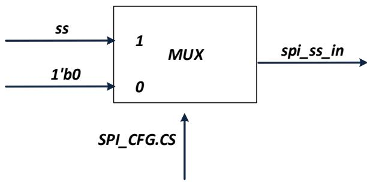  
图 8-4 SPI 模块 Slave 模式片选信号选择

本接口做 Master 模式时，片选信号亦可选。模块硬件产生了标准的片选信号，实际应用可屏蔽此信号通过软件操作额外的GPIO 实现。

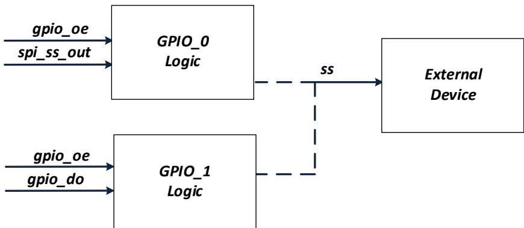  
图 8-5 SPI 模块 Master 模式片选信号选择

注意，图 16-5 虚线仅表示不确定。若使用 spi\_ss\_out 为 ss 的源头，那么将 GPIO\_0 同外界设备互连；若使用软件操作GPIO 的方式，那么可将GPIO\_1 同外界设备互连。

## 8.3.2.4 通讯格式

在 SPI 通讯过程中，发送或者接收操作均是基于 SPI 时钟的。通讯格式受到 SPI\_CFG. SAMPLE和 SPI\_ CLK\_POL 控制。SPI\_CFG. SAMPLE 为 Phase 控制位，SPI\_ CLK\_POL 为 Polarity 控制位。

Polarity 控制了 SPI 时钟信号在默认情况下的电平状态。Polarity 为 0 时，默认时钟电平为低电平；Polarity 为1 时，默认电平为高电平。

Phase 控制了SPI 数据的发送/接收时刻。Phase 为0 时，时钟从默认电平到第一个跳变边沿为采样数据时刻，Phase 为1 时，时钟从默认电平到第一个跳变边沿为发送数据时刻。

## 8.3.2.5 数据格式及长度

SPI 数据传输格式分成两种:MSB 和 LSB。数据传输格式受到 SPI\_CFG.ENDIAN 控制。注意，在数据传输过程中硬件自动实现传输格式的转换，无需软件介入。

SPI 数据长度可配，范围是从 8-Bit 到 16-Bit。SPI\_SIZE.BITSIZE 控制长度。

## 8.3.2.6 DMA 传输

在大容量数据传输应用下，SPI 接口支持 DMA 传输，减轻 MCU 的负担。一次传输，最大传输量为由DMA模块决定，最小传输量为1字节。在全双工模式下，接收和发送均可实现DMA传输；

在半双工模式下，仅接收或发送实现DMA 传输。

在接收到新的数据后，硬件自动产生 DMA 请求，通过 DMA 模块将数据搬移到 RAM 中。在发送新数据前，硬件自动产生 DMA 请求，通过 DMA 模块将数据从 RAM 中搬移到 SPI 接口。因 SPI无 FIFO，SPI 发送一次 DMA 请求，DMA 只能搬移一个字节数据。若要实现多字节搬移，DMA 需配置为多轮搬移，每一轮搬移一个字节的方式。

DMA 传输需要配置DMA 模块相应寄存器。

因 SPI 接口支持 DMA 传输，也支持 MCU 传输。两者区别在于--DMA 传输，发送的数据来自DMA 的搬移；MCU 传输，发送的数据来自MCU 的搬移。

DMA 传输，推荐软件配置流程如下：

⚫ 初始化DMA 模块，将本次发送的数据来源，接收的数据去向配置好，传输长度配置完毕。

⚫ 初始化 GPIO 模块，将 SPI 复用的 GPIO 配置完毕。

⚫ 初始化 SPI 接口，SPI\_IE/SPI\_CFG/SPI\_BAUD/SPI\_SIZE 等寄存器配置完毕。

触发 SPI 接口，进入发送/接收状态。触发条件是 MCU 对 SPI\_TXDATA 寄存器执行写操作，因最终发送的数据来自 DMA，本次MCU 写入的数据不会混入 SPI 发送流程。

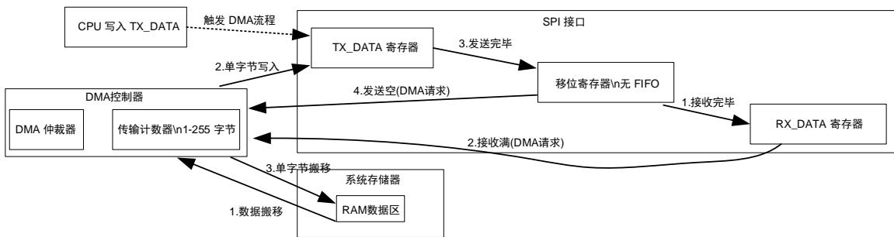  
图8-6SPI DMA 数据流与握手逻辑框图

## 8.3.2.7 MCU 传输

一次只能发送/接收一个 SPI\_SIZE.BITSIZE 长度的数据，每次完成后需要通过中断或者轮询的方式判断传输是否完成。无论是主模式还是从模式，写 SPI\_TXDATA 寄存器，才能触发传输。主模式为主动发送，从模式为加载数据到发送队列等待主模式发出时钟信号，开始传输。推荐软件配置流程如下:

⚫ 初始化GPIO 模块，将SPI 复用的GPIO 配置完毕。

⚫ 初始化 SPI 接口，SPI\_IE/SPI\_CFG/SPI\_BAUD/SPI\_SIZE 等寄存器配置完毕。

MCU 对SPI\_TXDATA 寄存器执行写操作，触发SPI 接口进入发送流程。从模式下，数据加载到内部状态机等待主设备发起读取操作；主模式下，触发发送。

注意：若需要连续发送，则需要重新配置SPI\_TXDATA寄存器。通过中断或者轮询方式获得传输完毕信息。

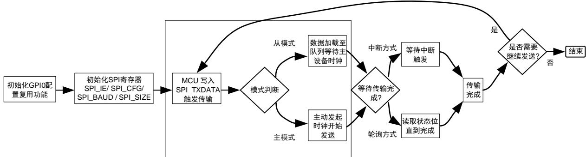  
图8-7SPI 传输的软件配置与操作流程

## 8.3.2.8 外部事件传输

在大容量数据传输应用下，SPI 接口支持 DMA 传输。传输过程中，可被打断也可不被打断。所谓打断是指，当前字节传输完成，需等待外部事件才开始下一个字节的传输；不打断是指，当前字节传输完成，直接下一个字节的传输。打断模式需要同其它模块配合使用。例如定时器模块，定时器可触发下一字节的传输。打断模式仅在Master模式有效。SPI\_IE.TRANS\_TRIG控制了是否使用打断模式。

## 8.3.2.9 中断处理

SPI 接口包含三种类型的中断事件，分别是：数据传输完成事件，异常事件和溢出事件。

⚫ 数据完成事件，当前数据传输完成。高电平有效，对 SPI\_IE.CMPLT\_IF 写 1 清除。

⚫ 异常事件，SPI 接口为 Slave 模式，若在传输过程中片选信号受到干扰，被拉高，将产生片选异常事件。高电平有效，对 SPI\_IE.AB\_IF 写1 清除。

溢出事件，SPI\_RX\_DATA 寄存器数据没有及时被读走，，将产生溢出事件。高电平有效，对SPI\_IE. OV\_IF 写 1 清除。

上述事件，默认是不触发SPI 中断，可以通过配置SPI\_IE[7:4]使能事件产生中断。

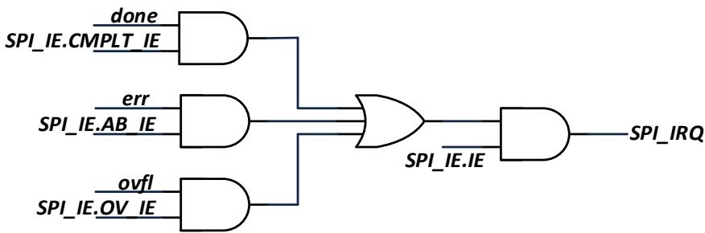  
图8-8SPI 模块中断选信号产生图

数据传输完毕后，可通过DMA 中断或者SPI 自身中断判断结束。

发送模式下，DMA 先完成搬移操作，SPI 后发送完毕。SPI 发送完毕，可作为本次传输完成标识。

⚫ 接收模式下，SPI 接收完毕，触发 DMA 搬移。DMA 搬移完成，可作为本次传输完成标识。

溢出事件。在全双工模式下，发送和接收的 DMA 均有效，一般情况下不会发送溢出事件；在半双工模式下，只有发送（或接收），此时硬件屏蔽了接收（或发送）的溢出判断

## 8.3.2.10 波特率设置

SPI 接口时钟通过对系统时钟分频获得，分频系数来自 SPI\_BAUD. BAUD。SPI 传输波特率配置计算公式为：

$$
\mathrm{SPI} \text {传输波特率} = \text {系统时钟} / (2 ^ {*} (\mathrm{BAUD} + 1))
$$

SPI 协议为半拍协议，上升沿发送数据，下降沿采集数据；或者下降沿发送数据，上升沿采样数据。

SPI 接口采用同步设计，需要对外部设备的信号进行同步采样，同步时钟为系统时钟。数据和时钟信号（此时为 Slave 模式）的同步，需要两拍系统时钟。考虑到时钟相位的偏移，此时需要一拍系统时钟的冗余，由此推导出最快的 SPI 传输波特率为系统时钟的 1/8，高电平周期为四拍系统时钟，低电平周期为四拍系统时钟。因此，SPI\_BAUD.BAUD 的配置值不能小于3。

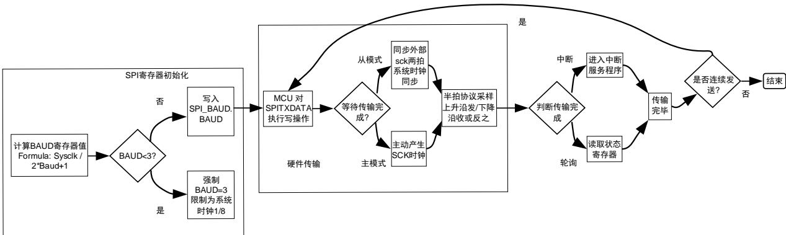  
图 8-9 SPI 工作原理

## 8.4 寄存器

## 8.4.1 地址分配

SPI 模块寄存器的基地址是 0x4001\_0000，模块寄存器列表如下。

表8-1SPI 模块控制寄存器列表

<table><tr><td>名称</td><td>偏移</td><td>说明</td></tr><tr><td>SPI0_CFG</td><td>0x00</td><td>SPI 配置寄存器</td></tr><tr><td>SPI0_IE</td><td>0x04</td><td>SPI 中断寄存器</td></tr><tr><td>SPI0_BAUD</td><td>0x08</td><td>SPI 波特率寄存器</td></tr><tr><td>SPI0_TXDATA</td><td>0x0C</td><td>SPI 发送数据寄存器</td></tr><tr><td>SPI0_RXDATA</td><td>0x10</td><td>SPI 接收数据寄存器</td></tr><tr><td>SPI0_SIZE</td><td>0x14</td><td>SPI 传输数据长度寄存器</td></tr></table>

## 8.4.2 SPI0\_CFG SPI 控制寄存器

地址:0x4001\_0000

复位值:0x0024

表 8-2 系统控制寄存器 SPI0\_CFG

<table><tr><td rowspan="3"></td><td>DUPLEX</td><td>CS</td><td>MS</td><td>CPHA</td><td>CPOL</td><td>ENDIAN</td><td>EN</td></tr><tr><td>RW</td><td>RW</td><td>RW</td><td>RW</td><td>RW</td><td>RW</td><td>RW</td></tr><tr><td>0</td><td>1</td><td>0</td><td>0</td><td>1</td><td>0</td><td>0</td></tr></table>

<table><tr><td>位置</td><td>位名称</td><td>说明</td></tr><tr><td>[31:8]</td><td></td><td>未使用</td></tr><tr><td>[7:6]</td><td>DUPLEX</td><td>半双工模式设置0X:关闭半双工模式10:开启半双工模式,仅发送11:开启半双工模式,仅接收</td></tr><tr><td>[5]</td><td>CS</td><td>SPI 从设备下,片选信号来源。默认值为 1。0:Slave 模式下,片选信号恒为有效值--01:Slave 模式下,片选信号来自 Master 设备</td></tr><tr><td>[4]</td><td>MS</td><td>SPI 主从模式选择。默认值为 0。0:Slave 模式1:Master 模式</td></tr><tr><td>[3]</td><td>CPHA</td><td>SPI 相位选择。默认值为 0。0:Phase 为 01:Phase 为 1</td></tr><tr><td>[2]</td><td>CPOL</td><td>SPI 极性选择。默认值为 0。0:Polarity 为 01:Polarity 为 1</td></tr><tr><td>[1]</td><td>ENDIAN</td><td>SPI 模块传输顺序。默认值为 0。0:MSB,高位先传输1:LSB,低位先传输</td></tr><tr><td>[0]</td><td>EN</td><td>SPI 模块使能信号。默认值为 0。0:关闭 SPI 模块1:开启 SPI 模块</td></tr></table>

## 8.4.3 SPI0\_IE SPI 中断寄存器

地址:0x4001\_0004

复位值:0x0

<table><tr><td rowspan="3"></td><td>IE</td><td>CMPLT_IE</td><td>AB_IE</td><td>OV_IE</td><td>TRANS_TRIG</td><td>CMPLT_IF</td><td>AB_IF</td><td>OV_IF</td></tr><tr><td>RW</td><td>RW</td><td>RW</td><td>RW</td><td>RW</td><td>RW</td><td>RW</td><td>RW</td></tr><tr><td>0</td><td>0</td><td>0</td><td>0</td><td>0</td><td>0</td><td>0</td><td>0</td></tr></table>

<table><tr><td>位置</td><td>位名称</td><td>说明</td></tr><tr><td>[31:8]</td><td></td><td>未使用</td></tr><tr><td>[7]</td><td>IE</td><td>SPI 中断使能开关。默认值为 0。0:关闭 SPI 中断1:使能 SPI 中断</td></tr><tr><td>[6]</td><td>CMPLT_IE</td><td>SPI 传输,完成事件中断使能信号。0:屏蔽此中断源1:使能此中断源</td></tr><tr><td>[5]</td><td>AB_IE</td><td>SPI 传输,异常事件中断使能信号。0:屏蔽此中断源1:使能此中断源</td></tr><tr><td>[4]</td><td>OV_IE</td><td>SPI 传输,溢出事件中断使能信号。默认值为 0。0:屏蔽此中断源1:使能此中断源</td></tr><tr><td>[3]</td><td>TRANS_TRIG</td><td>传输触发选择。1:外部触发0:内部自动执行。仅主模式有效</td></tr><tr><td>[2]</td><td>CMPLT_IF</td><td>SPI 传输,完成事件。高电平有效,写 1 清除。</td></tr><tr><td>[1]</td><td>AB_IF</td><td>SPI 传输,异常事件。Slave 模式下,传输未完成,发生片选信号无效事件。高电平有效,写 1 清除。</td></tr><tr><td>[0]</td><td>OV_IF</td><td>SPI 传输,溢出事件。前次接收的旧数据没有被取得走,本次接收的新数据已经到达。高电平有效,写 1 清除。</td></tr></table>

## 8.4.4 SPI0\_BAUD SPI 波特率寄存器

地址:0x4001\_0008

复位值:0x0

表 8-4 SPI0\_BAUD 控制寄存器

<table><tr><td>15</td><td>14</td><td>13</td><td>12</td><td>11</td><td>10</td><td>9</td><td>8</td><td>7</td><td>6</td><td>5</td><td>4</td><td>3</td><td>2</td><td>1</td><td>0</td></tr><tr><td>TRANS_MODE</td><td colspan="3" rowspan="2"></td><td colspan="12">BAUD</td></tr><tr><td>RW</td><td colspan="12">RW</td></tr><tr><td>0</td><td></td><td colspan="14">0</td></tr></table>

<table><tr><td>位置</td><td>位名称</td><td>说明</td></tr><tr><td>[31:9]</td><td></td><td>未使用</td></tr><tr><td>[15]</td><td>TRANS_MODE</td><td>SPI 数据搬移方式。默认为 0,DMA 方式。0: SPI 接口支持 DMA 搬移数据到 SPI 接口,完成发送和接收。1: SPI 接口支持 MCU 搬移数据到 SPI 接口,完成发送和接收。</td></tr><tr><td>[14:12]</td><td></td><td>未使用</td></tr><tr><td>[11:0]</td><td>BAUD</td><td>SPI 传输波特率配置,SPI 实际传输速度计算公式为:SPI 传输速度 = 系统时钟 / (2*(BAUD + 1))切记,BAUD 的配置值不能小于 3。</td></tr></table>

## 8.4.5 SPI0\_TXDATA SPI 数据发送寄存器

地址:0x4001\_000C

复位值:0x0

表 8-5 SPI0\_TXDATA 数据发送寄存器

<table><tr><td>15</td><td>14</td><td>13</td><td>12</td><td>11</td><td>10</td><td>9</td><td>8</td><td>7</td><td>6</td><td>5</td><td>4</td><td>3</td><td>2</td><td>1</td><td>0</td></tr><tr><td colspan="16">TX_DATA</td></tr><tr><td colspan="16">RW</td></tr><tr><td colspan="16">0</td></tr></table>

<table><tr><td>位置</td><td>位名称</td><td>说明</td></tr><tr><td>[31:16]</td><td></td><td>未使用</td></tr><tr><td>[15:0]</td><td>TX_DATA</td><td>SPI 数据发送寄存器</td></tr></table>

## 8.4.6 SPI0\_RXDATA SPI 数据接收寄存器

地址:0x4001\_0010

复位值:0x0

表 8-6 SPI0\_RXDATA 数据接收寄存器

<table><tr><td>15</td><td>14</td><td>13</td><td>12</td><td>11</td><td>10</td><td>9</td><td>8</td><td>7</td><td>6</td><td>5</td><td>4</td><td>3</td><td>2</td><td>1</td><td>0</td></tr><tr><td colspan="16">RX_DATA</td></tr><tr><td colspan="16">RW</td></tr><tr><td colspan="16">0</td></tr></table>

<table><tr><td>位置</td><td>位名称</td><td>说明</td></tr><tr><td>[31:16]</td><td></td><td>未使用</td></tr><tr><td>[15:0]</td><td>RX_DATA</td><td>SPI 数据接收寄存器</td></tr></table>

## 8.4.7 SPI0\_SIZE SPI 数据传输长度寄存器

地址:0x4001\_0014

复位值:0x0

表 8-7 SPI0\_SIZE 数据传输长度寄存器

<table><tr><td>15</td><td>14</td><td>13</td><td>12</td><td>11</td><td>10</td><td>9</td><td>8</td><td>7</td><td>6</td><td>5</td><td>4</td><td>3</td><td>2</td><td>1</td><td>0</td></tr><tr><td rowspan="3" colspan="11"></td><td colspan="5">BITSIZE</td></tr><tr><td colspan="5">RW</td></tr><tr><td colspan="5">0</td></tr></table>

<table><tr><td>位置</td><td>位名称</td><td>说明</td></tr><tr><td>[31:5]</td><td></td><td>未使用</td></tr><tr><td>[4:0]</td><td>BITSIZE</td><td>字节长度寄存器。0x00:非法值0x07:非法值0x08:8-Bit0x09:9-Bit...0x0E:14-Bit0x0F:15-Bit0x10:16-Bit</td></tr></table>

## 9 I2C

## 9.1 概述

I2C 总线接口连接微控制器和串行 I2C 总线。它提供多主机功能，控制所有 I2C 总线特定的时序、协议、仲裁和定时。支持标准和快速两种模式。

## 9.2 主要特性

⚫ 多主机功能：该模块既可做主设备也可做从设备。

I2C 主设备功能：产生时钟、START 和STOP 事件。

I2C 从设备功能：可编程的 I2C 硬件地址比较（仅支持7 位硬件地址）、停止位检测。

⚫ 根据系统分频，实现不同的通讯速度。

⚫ 状态标志：发送器/接收器模式标志、字节发送结束标志、I2C 总线忙标志。

⚫ 错误标志：主模式时的仲裁丢失、地址/数据传输后的应答(ACK)错误、检测到错位的起始或停止条件。

⚫ 一个中断向量，包含五个中断源：总线错误中断源、完成中断源、NACK 中断源、硬件地址匹配中断源和传输完成中断源。

⚫ 具单字节缓冲器的DMA。

## 9.3 功能描述

## 9.3.1 功能框图

本接口采用同步串行设计，实现 MCU 同外部设备之间的 I2C 传输。支持轮询和中断方式获得传输状态信息。本接口的主要功能模块如下图所示。

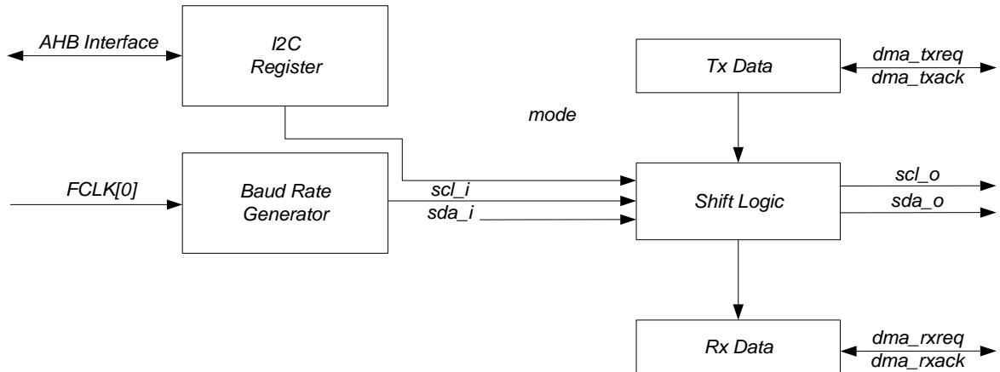  
图9-1I2C 模块顶层功能框图

I2C 接口同外界通讯只有 SCL 和 SDA 两根信号线。SDA 为双向复用信号线，受到 sda\_oe 控制。模块级，I2C 接口信号包括，scl\_i，sda\_i，scl\_o，sda\_o 和 sda\_oe。

scl\_i:时钟信号。当I2C 接口配置为从模式时，此为I2C 总线的时钟输入信号。

sda\_i:数据信号。当 I2C 接口接收数据时（无论主模式还是从模式），此为 I2C 总线的数据输入信号。

scl\_o:时钟信号。当I2C 接口配置为主模式时，此为I2C 总线的时钟输出信号。

sda\_o:数据信号。当 I2C 接口发送数据时（无论主模式还是从模式），此为 I2C 总线的数据输出信号。

sda\_oe:数据使能信号。当 sda\_o 输出时，sda\_oe 有效；当 sda\_i 输入时，sda\_oe 无效。

## 9.3.2 功能说明

I2C 模块接收和发送数据，并将数据从串行转换成并行，或并行转换成串行。可以开启或禁止中断。接口通过数据引脚(SDA)和时钟引脚(SCL)连接到 I2C 总线。

## 9.3.2.1 模式选择

接口可以下述4 种模式中的一种运行:

⚫ 从发送模式

⚫ 从接收模式

⚫ 主发送模式

⚫ 主接收模式

I2C 接口默认主从均不使能。接口根据配置情况，进入主模式或者从模式。当仲裁丢失或产生停止信号时，主模式自动释放总线并产生相应异常中断。允许多主机功能。

主模式时，I2C 接口启动数据传输并产生时钟信号。串行数据传输总是以起始条件开始并以停止条件结束。起始条件和停止条件都是在主模式下由软件控制产生。

从模式时，I2C 接口能识别它自己的地址(7 位)。软件能够控制开启或禁止硬件地址比较功能，硬件地址比较功能可降低MCU 的负担。只有地址匹配才通知MCU 进行相关处理。

数据和地址按 8 位/字节进行传输，高位在前。跟在起始条件后的 1 个字节是地址。地址只在主模式发送。

在一个字节传输的 8 个时钟后的第 9 个时钟期间，接收器必须回送一个应答位(ACK)给发送器。

软件可以开启或禁止应答(ACK)，并可以设置I2C 接口的地址。

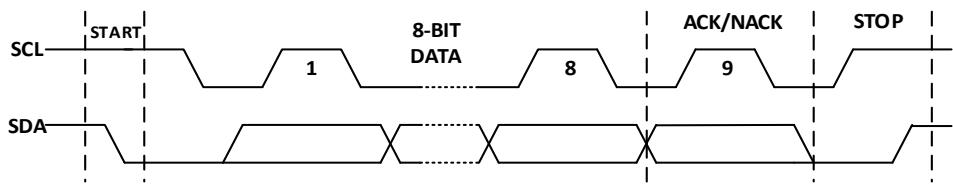  
图 9-2 基本 I2C 传输时序图

I2C 接口没有FIFO，若一次性发送大量数据，为了降低MCU 的负担，需DMA 配合。I2C 接口支持DMA传输（多字节传输）和非DMA传输（单字节传输）。上述四种传输模式进一步扩展为：

⚫ 从模式单字节发送，从模式 DMA 发送

⚫ 从模式单字节接收，从模式 DMA 接收

⚫ 主模式单字节发送，主模式 DMA 发送

⚫ 主模式单字节接收，主模式 DMA 接收

一般情况下，非 DMA 方式时，一次传输一个字节（可反复单次传输，需软件介入提供数据）。DMA 方式，一次连续传输可以多字节（最大不超过 32 字节，极端情况一次传输一个字节，因无FIFO，每次DMA 请求，仅传输一个字节，多轮完成本次数据传输）。

上述所有模式，遵循如下基本原则：

⚫ 单字节发送，中断将在8-bit 数据发送完毕且收到响应后（ACK/NACK 均可）产生。

⚫ 单字节接收，中断将在8-bit 数据接收完毕后产生。

⚫ DMA 发送，正常情况下，中断将在数据发送完毕且收到响应后（ACK/NACK 均可）产生。

⚫ DMA 接收，正常情况下，中断将在数据接收完毕后产生。

⚫ 当 I2C 接口配置为主模式时，检测到错误后，I2C 接口会主动释放总线，恢复到起始状态并产生中断信号。

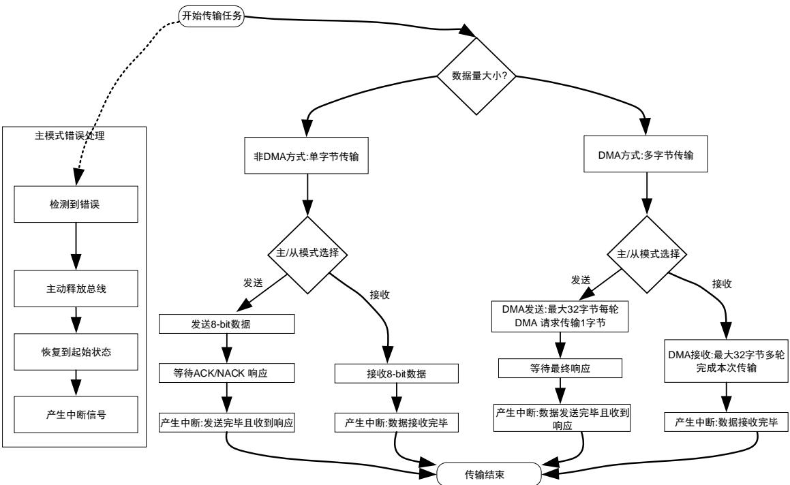  
图 9-3I2C 传输模式决策与执行流程图

## 9.3.2.2 从模式

默认情况下，I2C 接口主模式和从模式均关闭。若工作在从模式，需使能从模式。为了产生正确的时序，必须通过系统寄存器 SYS\_CLK\_DIV0 设定 I2C 接口的工作时钟频率，I2C 接口时钟基于系统高速主时钟进行分频，SYS\_CLK\_DIV0 是 I2C 接口工作时钟的分频系数。

⚫ 从模式下，I2C 接口时刻在监控总线上的信号。一旦检测到起始条件，其将保存地址位数据和读写位数据。

⚫ 从模式下，若硬件地址匹配功能开启，只有地址匹配的情况下，才会产生中断，通知 MCU 进行后续处理。若没有开启，每次收到地址及读写位数据，都将产生中断。

⚫ 从模式下，单字节接收模式。每次收到一个字节的数据后，产生中断，此时 I2C 接口可拉低SCL，直至中断完成，继续后续操作。

⚫ 从模式下，单字节发送模式。每次发送一个字节完毕后且收到响应（ACK/NACK），产生中断，此时I2C 接口可拉低 SCL，直至中断完成，继续后续操作。

⚫ 从模式下，DMA 接收模式。每次收到 SIZE 约定后的数据，产生中断，此时 I2C 接口可拉低SCL，直至中断完成。

⚫ 从模式下，DMA 发送模式。每次发送 SIZE 约定后的数据并收到响应（ACK/NACK），产生中断，此时I2C 接口可拉低SCL，直至中断完成。

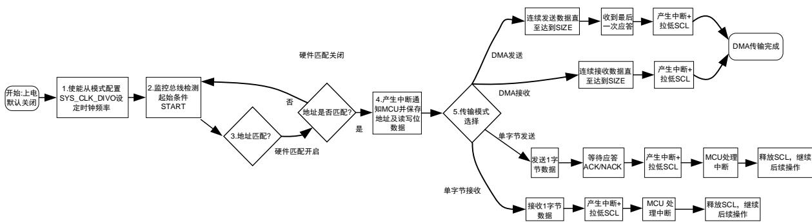  
图9-4I2C 从模式工作流程图

## 9.3.2.2.1 从模式传输

单字节传输，并不意味着仅仅传输一个字节数据，其含义为每次传输完一个字节的数据后，将产生中断判断是否还要继续传输。单字节传输的极端情况是仅传输一个字节的数据。下图为单字节传输的总线示意图。从图可知，一般单字节传输的流程如下：

⚫ 地址匹配，产生地址匹配中断，准备开始传输。

⚫ 若是接收模式，一个字节接收完毕后，产生中断，软件判断是否继续接收，返回 ACK/NACK响应。

⚫ 若是发送模式，一个字节发送完毕后，等待响应（ACK/NACK），产生中断，根据响应判断后续操作。

⚫ 获得总线STOP 事件，本次传输完成。

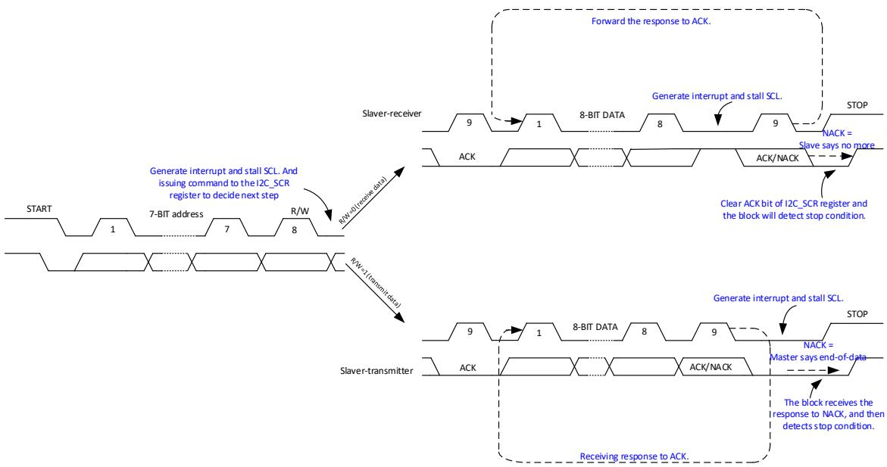  
图 9-5 从模式传输示意图

## 9.3.2.2.2 从模式发送

地址匹配后，从发送器将字节从 I2C\_DATA 寄存器经由内部移位寄存器发送到 SDA 线上。在I2C\_DATA 数据没有准备好之前，从设备可拉底 SCL，直到待发送数据已写入 I2C\_DATA 寄存器。I2C 接口在发送完毕每个字节后都执行下列操作:

⚫ 如果接收到ACK 位，装载下一个字节数据，继续传输。装载过程中，可拉底SCL。

⚫ 如果接收到NACK 位，停止下一个字节的装载。

⚫ 等待 STOP 事件，停止本次传输。

## 9.3.2.2.3 从模式单字节接收

地址匹配后，从接收器将通过内部移位寄存器从SDA 线接收到的数据存入I2C\_DATA 寄存器。I2C 接口在接收到每个字节后都执行下列操作:

⚫ 如果设置了ACK 位，在一个字节接收完毕后，产生一个 ACK 应答脉冲。

⚫ 如果清除了ACK 位，在一个字节接收完毕后，产生一个 NACK 应答脉冲。

⚫ 等待STOP 事件，结束本次传输。

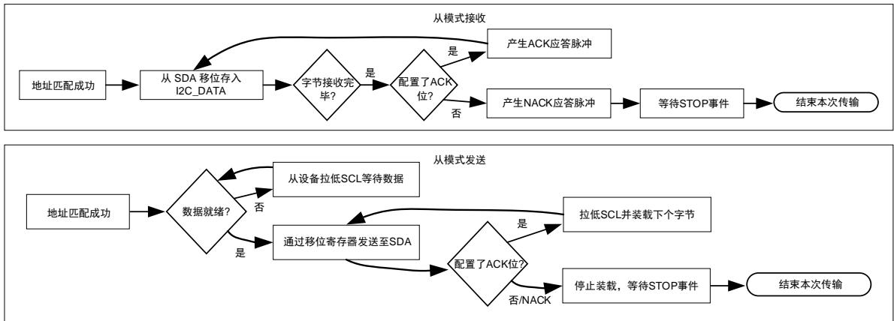  
图 9-6I2C 从模式（发送/接收/DMA）的逻辑流程图

## 9.3.2.3 从模式 DMA 传输

从模式下，一般仅配置I2C 时钟、从地址以及硬件地址匹配使能，等待总线有访问请求后，根据芯片实际情况决定是否响应本次传输请求。DMA 传输，其含义为每次传输多个字节的数据后，将产生中断判断是否还要继续传输。DMA 传输的极端情况是仅传输一个字节的数据。DMA 传输，一般建议开启硬件地址比较功能，NACK 中断，传输完成中断。一般DMA 传输的流程如下：

配置I2C 从地址，使能 I2C 中断（可使能硬件地址比较中断）。地址匹配，产生I2C 地址匹配中断，在中断处理函数中，配置DMA，准备好发送数据或者准备好接收地址。然后写I2C\_SCR，准备开始传输或者停止本次传输。

⚫ 若是接收模式，I2C\_BSIZE.SIZE 约定的字节接收完毕后，产生中断，软件判断是否继续接收，返回 ACK/NACK 响应。

⚫ 若是发送模式，I2C\_BSIZE.SIZE 约定的字节发送完毕后，等待响应（ACK/NACK），产生中断，根据响应判断后续操作。

⚫ 获得总线完成标志，本次传输完成。

## 9.3.2.3.1 从模式 DMA 发送

地址匹配后，配置完毕DMA。通过发送DMA请求，将字节从RAM 搬移到I2C\_DATA 寄存器，然后经由内部移位寄存器发送到 SDA 线上。在 I2C\_DATA 数据没有准备好之前，从设备可拉底 SCL，直到待发送数据已写入 I2C\_DATA 寄存器。从模式下发送数据，需要软件协助触发第一次 DMA 搬移，配置 I2C\_BCR.BYTE\_CMPLT 为 1 即可。I2C 接口在发送完毕 I2C\_BSIZE.SIZE 约定的字节数据后都执行下列操作:

⚫ 如果接收到ACK 位，配置DMA，准备下一批数据，继续传输。准备过程中，可拉低 SCL。

⚫ 如果接收到NACK 位，停止准备下一批数据，停止本次传输。

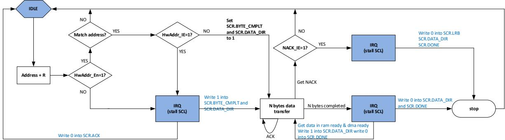  
图9-7 从模式下多字节发送示意图

## 9.3.2.3.2 从模式 DMA 接收

地址匹配后，配置好 DMA，从 SDA 线接收到的数据先存入 I2C\_DATA 寄存器，然后通过 DMA搬移到RAM。I2C 接口在接收到一个字节后都将执行DMA 请求。完成I2C\_BCR.SIZE 约定的数据传输后，执行下列操作:

⚫ 如果设置了 ACK 位，在 I2C\_BCR.SIZE 约定数据接收完毕后，产生一个 ACK 应答脉冲。

⚫ 如果清除了ACK 位，在 I2C\_BCR.SIZE 约定数据接收完毕后，产生一个NACK 应答脉冲。

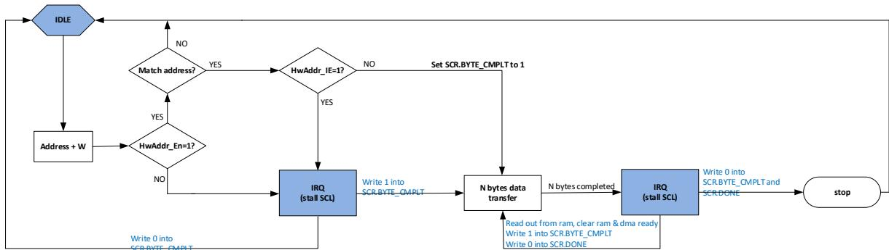  
图9-8 从模式下多字节接收示意图

## 9.3.2.4 主模式

默认情况下，I2C 接口主模式和从模式均关闭。若工作在主模式，需使能主模式。为了产生正确的时序，必须在系统寄存器CLK\_DIV0 中设定 I2C 接口的工作时钟。

I2C 接口执行主模式传输之前，需要判断总线是否空闲。可读取 I2C\_MSCR 寄存器的 BIT3，查询当前总线状态。若总线处于忙的状态，可以开启 I2C 中断，通过收到 STOP 中断事件判断总线是否空闲下来。只有空闲状态下，才能正常发送START 状态，以及后续的数据。

## 9.3.2.4.1 主模式单字节传输

单字节传输，并不意味着仅仅传输一个字节数据，其含义为每次传输完一个字节的数据后，将产生中断判断是否还要继续传输。单字节传输的极端情况是仅传输一个字节的数据。图 6 为单字节传输的总线示意图。从图可知，一般单字节传输的流程如下：

⚫ 判断总线是否空闲，若空闲，准备开始传输。

⚫ 若是接收模式，一个字节接收完毕后，产生中断，软件判断是否继续接收，返回 ACK/NACK响应。

⚫ 若是发送模式，一个字节发送完毕后，等待响应（ACK/NACK），产生中断，根据响应判断后续操作。

⚫ 发送总线 STOP 事件，本次传输完成。

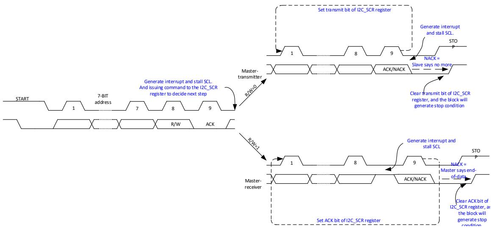  
图9-9 主模式下单字节传输示意图

## 9.3.2.4.2 主模式单字节发送

开始传输后，I2C 接口将字节从 I2C\_DATA 寄存器经由内部移位寄存器发送到 SDA 线上。在I2C\_DATA 数据没有准备好之前，主设备可不产生SCL 时钟信号，直到待发送数据已写入I2C\_DATA寄存器。I2C 接口在发送完毕每个字节后都执行下列操作:

⚫ 如果接收到ACK 位，装载下一个字节数据，继续传输。装载过程中，可拉底SCL。

⚫ 如果接收到NACK 位，停止下一个字节的装载。

⚫ 产生 STOP 事件，结束本次传输。

## 9.3.2.4.3 主模式单字节接收

开始传输后，I2C 接口将通过内部移位寄存器从 SDA 线接收到的数据存入 I2C\_DATA 寄存器。I2C 接口在接收到每个字节后都执行下列操作:

⚫ 如果设置了ACK 位，在一个字节接收完毕后，产生一个 ACK 应答脉冲。

⚫ 如果清除了ACK 位，在一个字节接收完毕后，产生一个 NACK 应答脉冲。

⚫ 产生STOP 事件，结束本次传输。

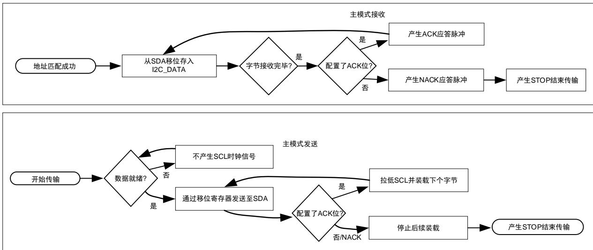  
图9-10I2C 主模式发送和接收的逻辑流程图

## 9.3.2.4.4 主模式 DMA 传输

DMA 传输，其含义为每次传输多个字节的数据后，将产生中断判断是否还要继续传输。DMA传输的极端情况是仅传输一个字节的数据。DMA 传输，一般建议开启 NACK 中断，传输完成中断。一般 DMA 传输的流程如下：

⚫ 总线空闲，准备开始传输。

⚫ 若是接收模式，I2C\_BSIZE.SIZE 约定的字节接收完毕后，产生中断，软件判断是否继续接收，返回 ACK/NACK 响应。

⚫ 若是发送模式，I2C\_BSIZE.SIZE 约定的字节发送完毕后，等待响应（ACK/NACK），产生中断，根据响应判断后续操作。

⚫ 发送 STOP 事件，本次传输完成。

## 9.3.2.4.5 主模式 DMA 发送

总线空闲，配置完毕 DMA。通过发送 DMA 请求，将字节从 RAM 搬移到 I2C\_DATA 寄存器，然后经由内部移位寄存器发送到 SDA 线上。在 I2C\_DATA 数据没有准备好之前，主设备可不产生SCL 时钟，直到待发送数据已写入 I2C\_DATA 寄存器。I2C 接口在发送完毕 SIZE 约定的字节数据后都执行下列操作:

⚫ 如果接收到ACK 位，配置DMA，准备下一批数据，继续传输。准备过程中，可拉低 SCL。

⚫ 如果接收到NACK 位，停止加载下一批数据。

⚫ 如果本次数据发送完毕，停止后续发送。

⚫ 产生 STOP 事件，停止本次传输。

异常情况是：

⚫ 若从设备地址不匹配或者从设备没有准备好，此时从设备将返回NACK

⚫ 主设备产生STOP 事件，停止本次传输。

等待一段时间后，重新配置 I2C 寄存器，关闭 DMA 对应的通道使能信号，重新配置 DMA 寄存器，再次发送传输请求。关闭 DMA 对应通道是因为 I2C 有预取，DMA 已经不是初始状态。

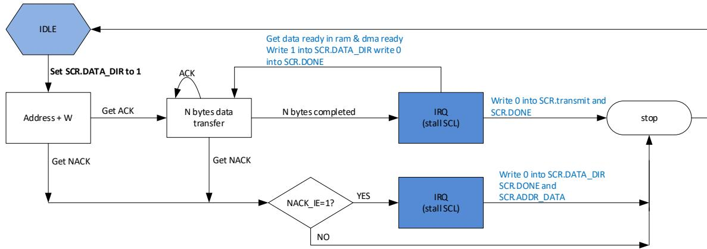  
图9-11 主模式下多字节发送示意图

## 9.3.2.4.6 主模式 DMA 接收

总线空闲，配置好 DMA 从 SDA 线接收到的数据先存入 I2C\_DATA 寄存器，然后通过 DMA 搬移到 RAM。I2C 接口在接收到一个字节后都将执行 DMA 请求。完成 I2C\_BCR.BURST\_SIZE 约定的数据传输后，执行下列操作:

⚫ 如果设置了 ACK 位，在 I2C\_BCR.SIZE 约定数据接收完毕后，产生一个 ACK 应答脉冲。

⚫ 如果清除了ACK 位，在 I2C\_BCR.SIZE 约定数据接收完毕后，产生一个NACK 应答脉冲。

⚫ 产生STOP 事件，停止本次传输。

异常情况是：

⚫ 若从设备地址不匹配或者从设备没有准备好，此时从设备将返回NACK。

⚫ 主设备产生STOP 事件，停止本次传输。

等待一段时间后，重新配置I2C 寄存器，再次发送传输请求。因为上一次没有收到有效数据，DMA 并没有任何动作，所以不用重置 DMA。

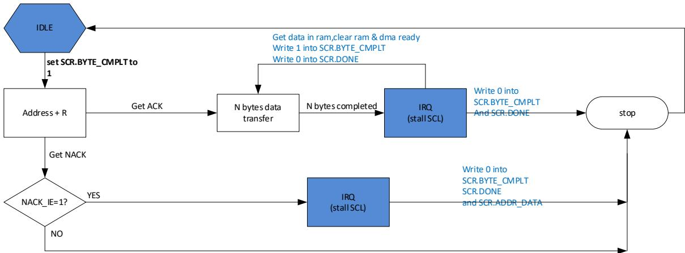  
图9-12 主模式下多字节接收示意图

## 9.3.2.5 DMA 传输

在大容量数据传输应用下，I2C 接口支持DMA 传输，减轻 MCU 的负担。一次传输，最大传输量为 32 字节，最小传输量为 1 字节。因I2C 无 FIFO，I2C 发送一次 DMA 请求，DMA 只能搬移一个字节数据。若要实现多字节搬移，DMA 需配置为多轮搬移，每一轮搬移一个字节的方式。

在接收到新的数据后，硬件自动产生 DMA 请求，通过 DMA 模块将数据搬移到 RAM 中。在发送新数据前，硬件自动产生 DMA 请求，通过DMA 模块将数据从RAM 中搬移到 I2C 接口。

DMA 传输需要配置DMA 模块相应寄存器。

因 I2C 接口支持 DMA 传输，也支持 MCU 传输。两者区别在于 DMA 传输，发送的数据来自DMA 的搬移；MCU 传输，发送的数据来自MCU 的搬移。

DMA 传输，推荐软件配置流程如下：

⚫ 初始化DMA 模块，将本次发送的数据来源，接收的数据去向配置好，传输长度配置完毕。

⚫ 初始化GPIO 模块，将I2C 复用的GPIO 配置完毕。

⚫ 初始化 I2C 接口，I2C\_CFG/I2C\_BCR/I2C\_BSIZE 等寄存器配置完毕。

⚫ 主模式下，触发I2C 接口，进入发送状态；从模式下，等待主发送传输请求。

若 I2C 接口为从发送模式，需要考虑预取，I2C\_BCR.SLV\_DMA\_PREF 为预取开关。一般从模式传输的时候，可以开启硬件地址比较(I2C\_ADDR. ADDR\_CMP)，可选择是否开启硬件地址比较中断使能(I2C\_BCR.BURST\_ADDR\_CMP)。

开启硬件地址比较中断，从设备收到的地址同自身匹配成功后，会产生中断。通知软件此时主设备请求获得从设备数据，软件判断是否接收，若接收就回 ACK，软件需要 I2C\_BCR.SLV\_DMA\_PREF 置1，协助硬件预取第一次传输的数据；否则就回NACK。

关闭硬件地址比较中断，一旦总线上出现 START 事件，从设备硬件预取第一次传输数据，无论从设备是否地址匹配成功。匹配成功，也不会产生地址匹配中断，直接开始数据传输。匹配不成功，从设备不会传输数据。此时，若匹配不成功，因为I2C 有预取的操作，为后续匹配成功后传输正常，需要对DMA 进行清除操作

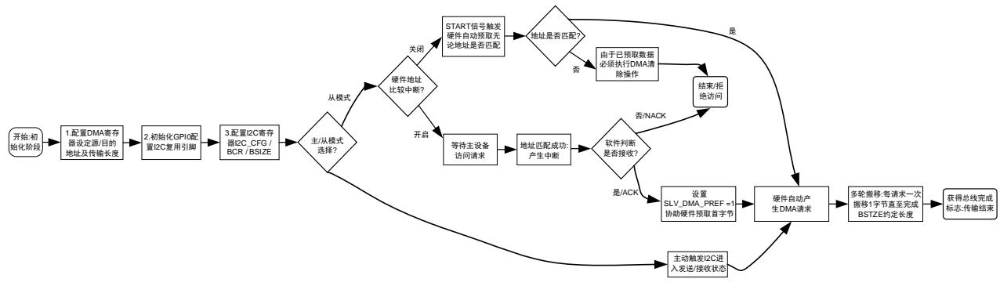  
图9-13I2C 接口在大容量数据传输下的DMA 配置与执行逻辑流程图

## 9.3.2.6 I2C 总线异常处理

在一个地址或数据字节传输期间，当I2C 接口检测到一个外部的停止或起始条件则产生总线错误。一般而言，产生总线错误是由于总线上有干扰、某些I2C 设备没有同步于本I2C 网络自行发送了 START 事件/STOP 事件。根据 I2C 协议规定，发生总线错误的时候，在收到 START 事件/STOP事件后要重置本I2C 设备的接口逻辑。对于从设备而言，这个操作是没有问题的；对于主设备而言，总线错误强行要求其释放总线并重置其I2C 接口逻辑。因为主设备是不响应外部START 和STOP 事件的，发生总线错误后，需要中断处理函数处理本次异常，并指导主设备继续监视总线情况，以便后续执行I2C 总线传输。

本I2C 接口。主模式下，总线错误可被检测到同时总线错误中断也会产生；从模式下，总线错误将触发地址数据被接收，同时让I2C 接口恢复空闲状态并产生中断。

## 9.3.2.7 中断处理

I2C 接口包含三种类型的中断事件，分别是：数据传输完成事件，总线错误事件、STOP 事件、NACK 事件和硬件地址匹配事件。

⚫ 数据完成事件。当前数据传输完成，高电平有效，对I2C\_SCR.Done 写0 清除。

⚫ 总线错误事件。传输过程中，总线产生错误的 START 事件/STOP 事件，高电平有效，对I2C\_SCR.STT\_ERR 写 0 清除。

STOP 事件。当前数据传输完成，主设备发送 STOP 事件，从设备收到 STOP 事件并产生相应中断。高电平有效，对 I2C\_SCR.STOP\_EVT 写 0 清除。

NACK 事件。发送端接收到 NACK 响应，表明接收端无法继续后续传输。高电平有效，对I2C\_SCR.RX\_ACK 写 0 清除。

硬件地址匹配事件。从模式下接收到的地址同本设备地址匹配，产生相应中断。高电平有效，对 I2C\_SCR.ADDR\_DATA 写 0 清除。

## 9.3.2.8 通讯速度设置

I2C 接口的工作时钟来自系统时钟的分频，分频寄存器为 SYS 模块的CLK\_DIV0。

I2C 接口采用同步设计，需要对外部设备的信号进行同步采样，同步时钟为 I2C 接口工作时钟。

⚫ I2C 模块工作时钟频率 = 系统频率 / (CLK\_DIV0 + 1)

● I2C 模块数据信号(SDA)和时钟信号(SCL)的时钟频率=I2C 模块工作时钟频率/ 17。

⚫ I2C 波特率 = I2C 模块工作时钟频率 / 17

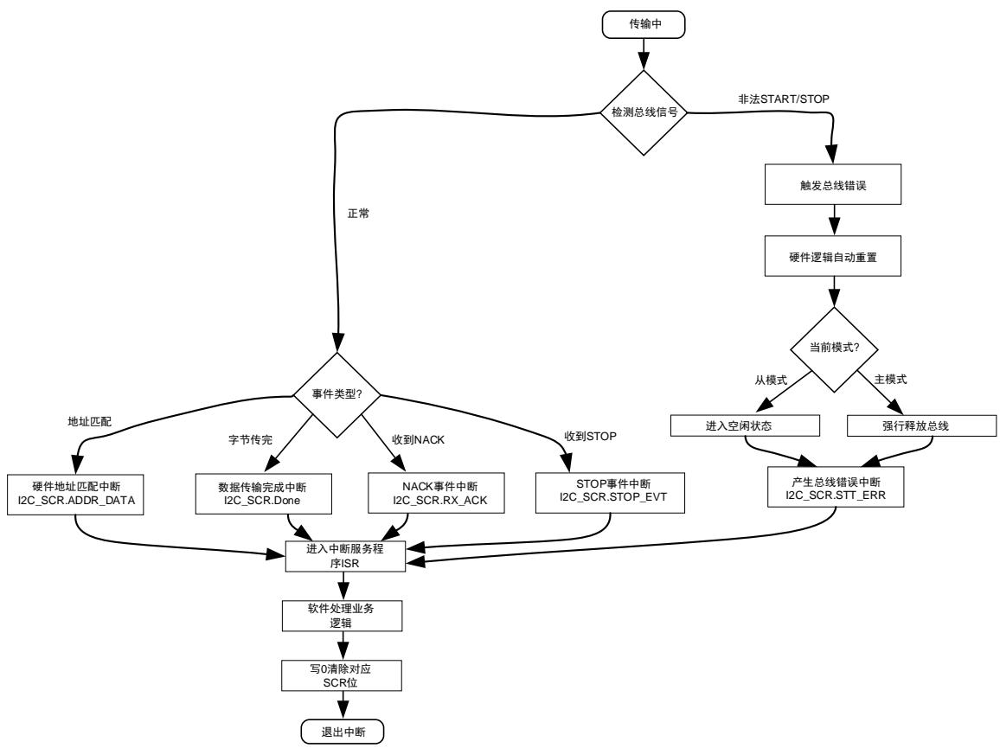  
图9-14I2C 总线错误处理及中断管理流程图

## 9.4 寄存器

## 9.4.1 地址分配

I2C 模块寄存器的基地址是 0x4001\_0100，寄存器列表如下:

表9-1I2C 寄存器地址分配表

<table><tr><td>名称</td><td>偏移</td><td>说明</td></tr><tr><td>I2C0_ADDR</td><td>0x00</td><td>I2C 地址寄存器</td></tr><tr><td>I2C0_CFG</td><td>0x04</td><td>I2C 配置寄存器</td></tr><tr><td>I2C0_SCR</td><td>0x08</td><td>I2C 状态寄存器</td></tr><tr><td>I2C0_DATA</td><td>0x0C</td><td>I2C 数据寄存器</td></tr><tr><td>I2C0_MSCR</td><td>0x10</td><td>I2C 主模式寄存器</td></tr><tr><td>I2C0_BCR</td><td>0x14</td><td>I2C 传输控制寄存器</td></tr><tr><td>I2C0_BSIZE</td><td>0x18</td><td>I2C 传输长度寄存器</td></tr></table>

## 9.4.2 I2C0\_ADDR 地址寄存器

地址:0x4001\_0100

复位值:0x0

表 9-2 地址寄存器 I2C0\_ADDR

<table><tr><td colspan="3">15 14 13 12 11 10 9 8 7 6 5 4 3 2 1 0</td></tr><tr><td rowspan="3"></td><td>ADDR_CMP</td><td>ADDR</td></tr><tr><td>RW</td><td>RW</td></tr><tr><td>0</td><td>0</td></tr></table>

<table><tr><td>位置</td><td>位名称</td><td>说明</td></tr><tr><td>[31:8]</td><td></td><td>未使用</td></tr><tr><td>[7]</td><td>ADDR_CMP</td><td>I2C 硬件地址比较使能开关,默认值为 0。0:关闭1:开启</td></tr><tr><td>[6:0]</td><td>ADDR</td><td>仅用于从模式下,I2C 设备硬件地址。主模式下,从设备地址写入 I2C_DATA 寄存器。</td></tr></table>

## 9.4.3 I2C0\_CFG 系统控制寄存器

地址:0x4001\_0104

复位值:0x0

表 9-3 系统控制寄存器 I2C0\_CFG

<table><tr><td rowspan="3"></td><td>IE</td><td>TC_IE</td><td>BUS_ERR_IE</td><td>STOP_IE</td><td rowspan="3"></td><td>MST_MODE</td><td>SLV_MODE</td></tr><tr><td>RW</td><td>RW</td><td>RW</td><td>RW</td><td>RW</td><td>RW</td></tr><tr><td>0</td><td>0</td><td>0</td><td>0</td><td>0</td><td>0</td></tr></table>

<table><tr><td>位置</td><td>位名称</td><td>说明</td></tr><tr><td>[31:8]</td><td></td><td>未使用</td></tr><tr><td>[7]</td><td>IE</td><td>I2C 中断使能信号。默认值为 0。1:使能 I2C 中断0:关闭 I2C 中断</td></tr><tr><td>[6]</td><td>TC_IE</td><td>I2C 数据传输完成中断使能信号。默认值为 0。1:使能此中断源0:屏蔽此中断源</td></tr><tr><td>[5]</td><td>BUS_ERR_IE</td><td>I2C 总线错误事件中断使能信号。默认值为 0。1:使能此中断源0:屏蔽此中断源</td></tr><tr><td>[4]</td><td>STOP_IE</td><td>I2CSTOP 事件中断使能信号。默认值为 0。1:使能此中断源0:屏蔽此中断源</td></tr><tr><td>[3:2]</td><td></td><td>NA</td></tr><tr><td>[1]</td><td>MST_MODE</td><td>I2C 主模式使能信号。默认值为 0。1:使能主模式0:关闭主模式</td></tr><tr><td>[0]</td><td>SLV_MODE</td><td>I2C 从模式使能信号。默认值为 0。1:使能从模式0:关闭从模式</td></tr></table>

## 9.4.4 I2C0\_SCR 状态控制寄存器

地址:0x4001\_0108

复位值:0x0

表 9-4 状态控制寄存器 I2C0\_SCR

<table><tr><td>15</td><td>14</td><td>13</td><td>12</td><td>11</td><td>10</td><td>9</td><td>8</td><td>7</td><td>6</td><td>5</td><td>4</td><td>3</td><td>2</td><td>1</td><td>0</td></tr><tr><td rowspan="3" colspan="8"></td><td>STT_ERR</td><td>LOST_ARB</td><td>STOP_EVT</td><td>BYTE_CMPLT</td><td>ADDR_DATA</td><td>DATA_DIR</td><td>RX_ACK</td><td>Done</td></tr><tr><td>RW</td><td>RW</td><td>RW</td><td>RW</td><td>RW</td><td>RW</td><td>RW</td><td>RW</td></tr><tr><td>0</td><td>0</td><td>0</td><td>0</td><td>0</td><td>0</td><td>0</td><td>0</td></tr></table>

<table><tr><td>位置</td><td>位名称</td><td>说明</td></tr><tr><td>[31:8]</td><td></td><td>未使用</td></tr><tr><td>[7]</td><td>STT_ERR</td><td>总线错误状态标志位,用于主模式发送/主模式接收,写0清除。0:无 START/STOP 总线错误1:有 START/STOP 总线错误</td></tr><tr><td>[6]</td><td>LOST_ARB</td><td>总线仲裁丢失状态标志位,用于主模式发送/主模式接收,发生总线仲裁丢失事件将此位置1,无中断事件产生,在字节完成中断中需查此位。总线上任何 START 事件将导致硬件清除此位。0:无总线仲裁丢失错误发生1:有总线仲裁丢失错误发生</td></tr><tr><td>[5]</td><td>STOP_EVT</td><td>STOP 事件状态标志位,用于主模式发送/从模式发送/主模式接收/从模式接收。写0清除。0:无 STOP 事件1:有 STOP 事件</td></tr><tr><td>[4]</td><td>BYTE_CMPLT</td><td>ACK 控制位,用于主模式接收/从模式接收。发送方发送完毕当前字节,接收方对此的响应。若是发送方,此位保留0值。接收方,根据实际情况配置。0:字节发送完成,返回 NACK 回应,表示接收方不能接收更多数据1:字节发送完成,返回 ACK 回应,表示接收方可以继续接收数据</td></tr><tr><td>[3]</td><td>ADDR_DATA</td><td>地址数据标志位,用于主模式发送/从模式发送/主模式接收/从模式接收。START 后,第一个字节为地址数据,此位是一个提示位。写0清除。0:当前传输的数据非地址数据。1:当前传输的数据是地址数据。</td></tr><tr><td>[2]</td><td>DATA_DIR</td><td>发送或接收控制位,主模式发送/从模式发送,此位置1,触发发送,硬件自动清零;主模式接收/从模式接收,此位置0,等待接收。0:接收1:触发发送</td></tr><tr><td>[1]</td><td>RX_ACK</td><td>接收响应标志位,用于主模式发送/从模式发送,告知发送方,接收方的反馈。发送方收到反馈后,对该位执行清零操作。0:本 I2C 接口发送数据,接收到 ACK 响应。1:本 I2C 接口发送数据,接收到 NACK 响应。</td></tr><tr><td>[0]</td><td>Done</td><td>传输完成状态标志位,用于主模式发送/从模式发送/主模式接收/从模式接收。写0清除。0:传输未完成1:传输已完成</td></tr></table>

一般，进入中断后，需读取 I2C\_SCR 寄存器，获得当前 I2C 总线状态及当前传输处于什么阶段；然后，对I2C\_SCR 进行写操作，写入不同的值，软件通知硬件下一步如何处理。

## 9.4.5 I2C0\_DATA 数据寄存器

地址:0x4001\_010C

复位值:0x0

表 9-5 数据寄存器 I2C0\_DATA

<table><tr><td>15</td><td>14</td><td>13</td><td>12</td><td>11</td><td>10</td><td>9</td><td>8</td><td>7</td><td>6</td><td>5</td><td>4</td><td>3</td><td>2</td><td>1</td><td>0</td></tr><tr><td rowspan="3" colspan="8"></td><td colspan="8">DATA</td></tr><tr><td colspan="8">RW</td></tr><tr><td colspan="8">0</td></tr></table>

<table><tr><td>位置</td><td>位名称</td><td>说明</td></tr><tr><td>[31:8]</td><td></td><td>未使用</td></tr><tr><td>[7:0]</td><td>DATA</td><td>数据寄存器,用于主模式发送/从模式发送/主模式接收/从模式接收。发送方,写入发送数据;接收方,读取接收数据。注意,地址数据也是数据,主模式只能将要发送地址数据写入此寄存器。</td></tr></table>

## 9.4.6 I2C0\_MSCR 主模式寄存器

地址:0x4001\_0110

复位值:0x0

表 9-6 主模式寄存器 I2C0\_MSCR

<table><tr><td colspan="5">15 14 13 12 11 10 9 8 7 6 5 4 3 2 1 0</td></tr><tr><td rowspan="3"></td><td>BUSY</td><td>MST_CHECK</td><td>RESTART</td><td>START</td></tr><tr><td>RW</td><td>RW</td><td>RW</td><td>RW</td></tr><tr><td>0</td><td>0</td><td>0</td><td>0</td></tr></table>

<table><tr><td>位置</td><td>位名称</td><td>说明</td></tr><tr><td>[31:4]</td><td></td><td>未使用</td></tr><tr><td>[3]</td><td>BUSY</td><td>I2C 总线,闲忙状态。0:检测到 STOP 事件,空闲。1:检测到 START 事件,忙碌。</td></tr><tr><td>[2]</td><td>MST_CHECK</td><td>主模式争抢总线标志位。争抢到总线,置 1;STOP 事件或者发生总线冲突本模块释放总线,置 0。</td></tr><tr><td>[1]</td><td>RESTART</td><td>再次触发 START 事件,写 1 有效。发送 START 完毕,硬件清 0。I2C_CFG[1]置 1,才能实现写 1 操作。</td></tr><tr><td>[0]</td><td>START</td><td>触发 START 事件并发送地址数据至总线,写 1 有效。I2C_CFG[1]置 1,才能实现写 1 操作。</td></tr></table>

## 9.4.7 I2C0\_BCR I2C 传输控制寄存器

地址:0x4001\_0114

复位值:0x0

表 9-7 DMA 传输控制寄存器 I2C0\_BCR

<table><tr><td colspan="6">15 14 13 12 11 10 9 8 7 6 5 4 3 2 1 0</td></tr><tr><td rowspan="2"></td><td>BURST_NACK</td><td>BURST_ADDR_CMP</td><td>BUSRT_EN</td><td>SIV_DMA_PREF</td><td rowspan="2"></td></tr><tr><td>RW</td><td>RW</td><td>RW</td><td>RW</td></tr><tr><td></td><td>0</td><td>0</td><td>0</td><td>0</td><td></td></tr></table>

<table><tr><td>位置</td><td>位名称</td><td>说明</td></tr><tr><td>[31:8]</td><td></td><td>未使用</td></tr><tr><td>[7]</td><td>BURST_NACK</td><td>I2C 传输,NACK 事件中断使能信号。1:使能此中断源0:屏蔽此中断源</td></tr><tr><td>[6]</td><td>BURST_ADDR_CMP</td><td>I2C 传输,硬件地址匹配中断使能信号。1:使能此中断源0:屏蔽此中断源</td></tr><tr><td>[5]</td><td>BUSRT_EN</td><td>I2C 多数据传输使能,需要采用 DMA 方式。1:使能0:关闭</td></tr><tr><td>[4]</td><td>SLV_DMA_PREF</td><td>I2C 多数据传输。从模式执行 DMA 方式发送,触发硬件预取第一个字节。硬件自动清零。1:使能0:关闭</td></tr><tr><td>[3:0]</td><td></td><td>未使用</td></tr></table>

## 10 CMP

## 10.1 概述

比较器信号处理模块(以下简称CMP模块，为便于区分后续图示中模拟比较器使用Comparator表示，数字比较器信号处理模块使用 CMP 表示)，用于处理 3 个模拟轨到轨比较器产生的输出信号，由一系列使能、极性控制、滤波等数字电路组成。信号处理时钟由系统主时钟分频得到，此模块也用于向CPU 产生比较器中断。

CMP0/1 可以使用 MCPWM 的 4 路 P 通道进行开窗控制。

模拟比较器未经滤波的原始输出值，可以通过读取 CMP\_DATA 值获得。同时模拟比较器未经滤波的原始输出值也可以通过配置 GPIO 的 AF1 功能送出，具体 GPIO 功能配置及引进位置，请参考器件 datasheet。

关于模拟比较器的更多说明，包括其输入端信号的选择，迟滞的配置，请参考章节 5.1.6。

## 10.2 寄存器

## 10.2.1 地址分配

CMP 模块寄存器的基地址是 0x4001\_0200，寄存器列表如下:

表 10-1 比较器寄存器列表

<table><tr><td>名称</td><td>偏移地址</td><td>说明</td></tr><tr><td>CMP_IE</td><td>0x00</td><td>比较器中断使能寄存器</td></tr><tr><td>CMP_IF</td><td>0x04</td><td>比较器中断标志寄存器</td></tr><tr><td>CMP_TCLK</td><td>0x08</td><td>比较器分频时钟控制寄存器</td></tr><tr><td>CMP_CFG</td><td>0x0C</td><td>比较器控制寄存器</td></tr><tr><td>CMP_BLCWIN</td><td>0x10</td><td>比较器开窗控制寄存器 0</td></tr><tr><td>CMP_DATA</td><td>0x14</td><td>比较器输出数值寄存器</td></tr></table>

## 10.2.2 CMP\_IE 中断使能寄存器

地址:0x4001\_0200

复位值:0x0

表 10-2CMP\_IE 比较器中断使能寄存器

<table><tr><td rowspan="2"></td><td>CMP2_RE</td><td>CMP1_RE</td><td>CMP0_RE</td><td rowspan="2"></td><td>CMP2_IE</td><td>CMP1_IE</td><td>CMP0_IE</td></tr><tr><td>RW</td><td>RW</td><td>RW</td><td>RW</td><td>RW</td><td>RW</td></tr><tr><td></td><td>0</td><td>0</td><td>0</td><td></td><td>0</td><td>0</td><td>0</td></tr></table>

<table><tr><td>位置</td><td>位名称</td><td>说明</td></tr><tr><td>[31:11]</td><td></td><td>未使用</td></tr><tr><td>[10]</td><td>CMP2_RE</td><td>比较器 2 DMA 请求使能,高有效</td></tr><tr><td>[9]</td><td>CMP1_RE</td><td>比较器 1 DMA 请求使能,高有效</td></tr><tr><td>[8]</td><td>CMP0_RE</td><td>比较器 0 DMA 请求使能,高有效</td></tr><tr><td>[7:3]</td><td></td><td>未使用</td></tr><tr><td>[2]</td><td>CMP2_IE</td><td>比较器 2 中断使能,高有效</td></tr><tr><td>[1]</td><td>CMP1_IE</td><td>比较器 1 中断使能,高有效</td></tr><tr><td>[0]</td><td>CMP0_IE</td><td>比较器 0 中断使能,高有效</td></tr></table>

## 10.2.3 CMP\_IF 中断标志寄存器

地址:0x4001\_0204

复位值:0x0

表 10-3CMP\_IF 比较器中断标志寄存器

<table><tr><td colspan="4">15 14 13 12 11 10 9 8 7 6 5 4 3 2 1 0</td></tr><tr><td rowspan="3"></td><td>CMP2_IF</td><td>CMP1_IF</td><td>CMP0_IF</td></tr><tr><td>RW</td><td>RW</td><td>RW</td></tr><tr><td>0</td><td>0</td><td>0</td></tr></table>

<table><tr><td>位置</td><td>位名称</td><td>说明</td></tr><tr><td>[31:2]</td><td></td><td>未使用</td></tr><tr><td>[2]</td><td>CMP2_IF</td><td>比较器 2 中断标志,高有效,写 1 清零</td></tr><tr><td>[1]</td><td>CMP1_IF</td><td>比较器 1 中断标志,高有效,写 1 清零</td></tr><tr><td>[0]</td><td>CMP0_IF</td><td>比较器 0 中断标志,高有效,写 1 清零</td></tr></table>

当使能CMP DMA 请求时，即 CMP\_IE.CMPx\_RE=1，在 DMA 收到相应请求并开始进行数据搬移时，DMA 自动将对应的CMPx\_IF 位清除，不再需要软件清除。

## 10.2.4 CMP\_TCLK 分频时钟控制寄存器

地址:0x4001\_0208

复位值:0x0

表 10-4CMP\_TCLK 比较器分频时钟控制寄存器

<table><tr><td>31</td><td>30</td><td>29</td><td>28</td><td>27</td><td>26</td><td>25</td><td>24</td><td>23</td><td>22</td><td>21</td><td>20</td><td>19</td><td>18</td><td>17</td><td>16</td></tr><tr><td></td><td></td><td></td><td></td><td></td><td>COMM_DIV</td><td></td><td></td><td>FIL2_CLK_DIV16</td><td></td><td></td><td></td><td>CLK2_EN</td><td></td><td>FIL2_CLK_DIV2</td><td></td></tr></table>

<table><tr><td rowspan="2"></td><td>RW</td><td>RW</td><td>RW</td><td>RW</td></tr><tr><td>3&#x27;h4</td><td>0</td><td>0</td><td>0</td></tr></table>

<table><tr><td>15</td><td>14</td><td>13</td><td>12</td><td>11</td><td>10</td><td>9</td><td>8</td><td>7</td><td>6</td><td>5</td><td>4</td><td>3</td><td>2</td><td>1</td><td>0</td></tr><tr><td colspan="4">FIL1_CLK_DIV16</td><td>CLK1_EN</td><td colspan="3">FIL1_CLK_DIV2</td><td colspan="4">FIL0_CLK_DIV16</td><td>CLK0_EN</td><td colspan="3">FIL0_CLK_DIV2</td></tr><tr><td colspan="4">RW</td><td>RW</td><td colspan="3">RW</td><td colspan="4">RW</td><td>RW</td><td colspan="3">RW</td></tr><tr><td colspan="4">0</td><td>0</td><td colspan="3">0</td><td colspan="4">0</td><td>0</td><td colspan="3">0</td></tr></table>

<table><tr><td>位置</td><td>位名称</td><td>说明</td></tr><tr><td>[31:27]</td><td></td><td>未使用</td></tr><tr><td>[26:24]</td><td>COMM_DIV</td><td>比较器0/1/2共用滤波时钟分频系数,影响进入比较器中断的时间,最大支持到4</td></tr><tr><td>[23:20]</td><td>FIL2_CLK_DIV16</td><td>比较器2滤波时钟分频,基于MCLK进行1~16分频,影响进入比较器中断的时间</td></tr><tr><td>[19]</td><td>CLK2_EN</td><td>比较器2滤波时钟使能,高有效</td></tr><tr><td>[18:16]</td><td>FIL2_CLK_DIV2</td><td>比较器2滤波时钟分频0:1分频1:2分频2:4分频3:8分频4:16分频5:32分频,6:64分频7:128分频</td></tr><tr><td>[15:12]</td><td>FIL1_CLK_DIV16</td><td>比较器1滤波时钟分频,基于MCLK进行1~16分频,影响进入比较器中断的时间</td></tr><tr><td>[11]</td><td>CLK1_EN</td><td>比较器1滤波时钟使能,高有效</td></tr><tr><td>[10:8]</td><td>FIL1_CLK_DIV2</td><td>比较器1滤波时钟分频0:1分频1:2分频2:4分频3:8分频4:16分频5:32分频,6:64分频7:128分频</td></tr><tr><td>[7:4]</td><td>FIL0_CLK_DIV16</td><td>比较器0滤波时钟分频,基于MCLK进行1~16分频,影响进入比较器中断的时间</td></tr><tr><td>[3]</td><td>CLK0_EN</td><td>比较器0滤波时钟使能,高有效</td></tr><tr><td>[2:0]</td><td>FIL0_CLK_DIV2</td><td>比较器0滤波时钟分频0:1分频1:2分频2:4 分频3:8 分频4:16 分频5:32 分频,6:64 分频7:128 分频</td></tr></table>

以比较器0 为例，CMP0 滤波时间宽度使用如下公式进行计算

滤波 时间宽度= Period(FCLK)\*(2(COMM\_DIV+CMP\_TCLK.FIL0\_CLK\_DIV2)\*(CMP\_TCLK.FIL0\_CLK\_DIV16+1)-1)，FCLK 即芯片主时钟，作为 CMP 模块的时钟，受 SYS\_CLK\_FEN 的门控控制。需要注意的是，产生 CMP 滤波时钟需要使能 CMP\_TCLK.CLK\_EN 位。

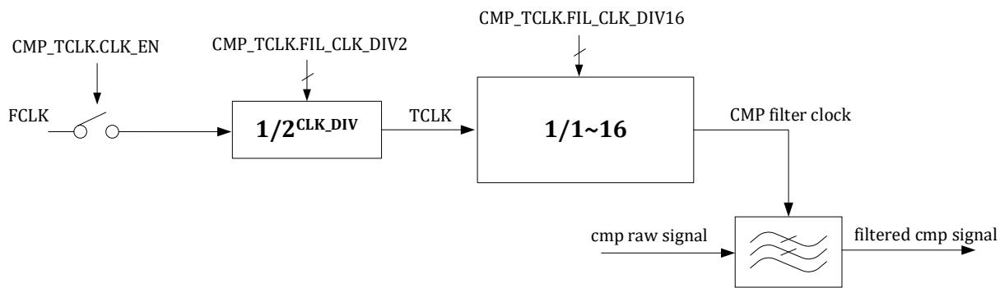  
图 10-1比较器滤波时钟产生

CMP 模块使用此滤波时钟对模拟比较器的输出信号进行滤波，即只有信号稳定时间超过设定的滤波时间宽度才能通过滤波器，CMP 模块输出的滤波后的信号才会发生变化，并产生相应中断。如果输入信号稳定时间不足滤波时间宽度即发生变化，则 CMP 模块输出的滤波后的信号维持原值不变。

因为滤波时钟可以进行分频，因此 CMP 信号的滤波宽度范围是 0\~128\*16\*16-1 个总线周期，即1\~32767 个系统主时钟周期。

## 10.2.5 CMP\_CFG 控制寄存器

地址:0x4001\_020C

复位值:0x0

表 10-5 CMP\_CFG 比较器控制寄存器

<table><tr><td rowspan="3"></td><td>CMP2_IRQ_TRIG</td><td>CMP2_IN_EN</td><td>CMP2_POL</td><td>CMP1_W_PWM_POL</td><td>CMP1_IRQ_TRIG</td><td>CMP1_IN_EN</td><td>CMP1_POL</td><td>CMP0_W_PWM_POL</td><td>CMP0_IRQ_TRIG</td><td>CMP0_IN_EN</td><td>CMP0_POL</td></tr><tr><td>RW</td><td>RW</td><td>RW</td><td>RW</td><td>RW</td><td>RW</td><td>RW</td><td>RW</td><td>RW</td><td>RW</td><td>RW</td></tr><tr><td>0</td><td>0</td><td>0</td><td>0</td><td>0</td><td>0</td><td>0</td><td>0</td><td>0</td><td>0</td><td>0</td></tr></table>

<table><tr><td>位置</td><td>位名称</td><td>说明</td></tr><tr><td>[31:11]</td><td></td><td>未使用</td></tr><tr><td>[10]</td><td>CMP2_IRQ_TRIG</td><td>比较器 2 中断触发类型,0:电平触发,1:边沿触发</td></tr><tr><td>[9]</td><td>CMP2_IN_EN</td><td>比较器 2 信号输入使能</td></tr><tr><td>[8]</td><td>CMP2_POL</td><td>比较器 2 极性选择,0:高电平有效;1:低电平有效</td></tr><tr><td>[7]</td><td>CMP1_W_PWM_POL</td><td>比较器 1 开窗 PWM 信号极性选择,在 CMP_BLCWIN1 使能情况下使用</td></tr><tr><td>[6]</td><td>CMP1_IRQ_TRIG</td><td>比较器 1 中断触发类型,0:电平触发,1:边沿触发</td></tr><tr><td>[5]</td><td>CMP1_IN_EN</td><td>比较器 1 信号输入使能</td></tr><tr><td>[4]</td><td>CMP1_POL</td><td>比较器 1 极性选择,0:高电平有效;1:低电平有效</td></tr><tr><td>[3]</td><td>CMP0_W_PWM_POL</td><td>比较器 0 开窗 PWM 信号极性选择,在 CMP_BLCWIN0 使能情况下使用</td></tr><tr><td>[2]</td><td>CMP0_IRQ_TRIG</td><td>比较器 0 中断触发类型,0:电平触发,1:边沿触发</td></tr><tr><td>[1]</td><td>CMP0_IN_EN</td><td>比较器 0 信号输入使能</td></tr><tr><td>[0]</td><td>CMP0_POL</td><td>比较器 0 极性选择,0:高电平有效;1:低电平有效</td></tr></table>

比较器的极性及使能控制如图10-2 所示。

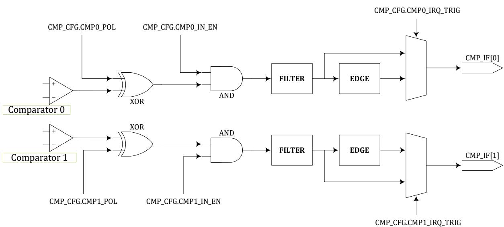  
图 10-2比较器控制及中断产生逻辑

比较器0 和比较器1 可以与MCPWM 模块联合动作，其中MCPWM 模块的P 管控制信号可以作为比较器开窗的控制信号。但比较器自身的中断信号产生与开窗控制无关，仅仅受 CMP\_CFG 寄存器影响。比较器2 不支持开窗控制。

MCPWM 的 fail 信号可以来自 GPIO，也可以来自比较器模块，使用 MCPWM0\_FAIL 寄存器进行控制。如果 MCPWM 的 fail 信号来自比较器，则是经过比较器模块内部的开窗控制的。fail 信号进入 MCPWM 后也会进行极性使能以及滤波等处理，与比较器模块的实现类似，但完全独立，由MCPWM 内部的寄存器进行控制。MCPWM 内部与fail 相关的错误中断信号产生收到MCPWM 内部有关极性使能滤波控制寄存器的影响。具体请参考MCPWM 章节。

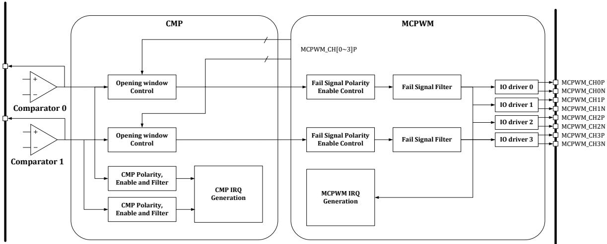  
图 10-3 CMP 与 MCPWM 的联动

对于比较器的开窗功能，若 CMP\_CFG.CMP0\_PWM\_POL=1，则在对应 MCPWM CHNx\_P 信号为1 时 ， 比 较 器 0 可 以 产 生 比 较 信 号 输 出 ， 其 他 时 刻 比 较 信 号 为 0； 反 之 ， 若CMP\_CFG.CMP0\_PWM\_POL=0，则在对应 MCPWM CHNx\_P 信号为 0 时，比较器 0 可以产生比较信号输出，其他时刻比较信号为0。比较器1 的开窗控制信号极性由CMP\_CFG.CMP1\_PWM\_POL 位进行控制，逻辑相同。

注意:CMP\_CFG.CMP0\_PWM\_POL 和 CMP\_CFG.CMP1\_PWM\_POL 同时会影响送入 MCPWM 模块作为 FAIL 信号的比较器信号，如图 10-4 所示。来自比较器的 MCPWM FAIL 信号为模拟比较器输出的原始信号，未经过比较器数字接口模块的滤波处理，但是可以被 MCPWM 的通道信号进行开窗控制，开窗控制设置见比较器数字接口模块。FAIL 信号进入 MCPWM 模块后，可以通过设置MCPWM\_TCLK 进行滤波。

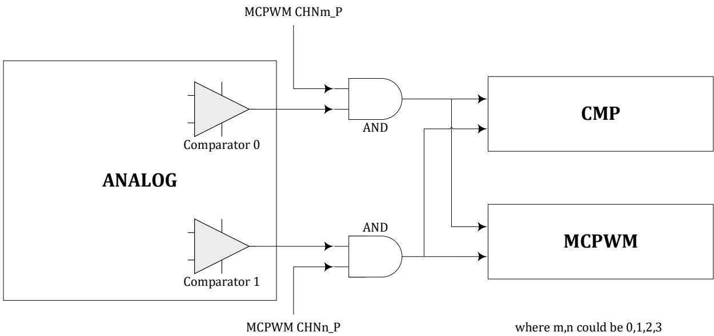  
图10-4比较器开窗功能图示

## 10.2.6 CMP\_BLCWIN 开窗控制寄存器

复位值:0x0

表 10-6 CMP\_ BLCWIN 比较器开窗控制寄存器

<table><tr><td rowspan="3"></td><td>CMP1_CHN3P_WIN_EN</td><td>CMP1_CHN2P_WIN_EN</td><td>CMP1_CHN1P_WIN_EN</td><td>CMP1_CHNOP_WIN_EN</td><td>CMP0_CHN3P_WIN_EN</td><td>CMP0_CHN2P_WIN_EN</td><td>CMP0_CHN1P_WIN_EN</td><td>CMP0_CHNOP_WIN_EN</td></tr><tr><td>RW</td><td>RW</td><td>RW</td><td>RW</td><td>RW</td><td>RW</td><td>RW</td><td>RW</td></tr><tr><td>0</td><td>0</td><td>0</td><td>0</td><td>0</td><td>0</td><td>0</td><td>0</td></tr></table>

<table><tr><td>位置</td><td>位名称</td><td>说明</td></tr><tr><td>[31:8]</td><td></td><td>保留</td></tr><tr><td>[7]</td><td>CMP1_CHN3P_WIN_EN</td><td>使用 MCPWM 模块 CHN3_P 通道输出的 P 管开关控制信号作为比较器 1 开窗使能</td></tr><tr><td>[6]</td><td>CMP1_CHN2P_WIN_EN</td><td>使用 MCPWM 模块 CHN2_P 通道输出的 P 管开关控制信号作为比较器 1 开窗使能</td></tr><tr><td>[5]</td><td>CMP1_CHN1P_WIN_EN</td><td>使用 MCPWM 模块 CHN1_P 通道输出的 P 管开关控制信号作为比较器 1 开窗使能</td></tr><tr><td>[4]</td><td>CMP1_CHN0P_WIN_EN</td><td>使用 MCPWM 模块 CHN0_P 通道输出的 P 管开关控制信号作为比较器 1 开窗使能</td></tr><tr><td>[3]</td><td>CMP0_CHN3P_WIN_EN</td><td>使用 MCPWM 模块 CHN3_P 通道输出的 P 管开关控制信号作为比较器 0 开窗使能</td></tr><tr><td>[2]</td><td>CMP0_CHN2P_WIN_EN</td><td>使用 MCPWM 模块 CHN2_P 通道输出的 P 管开关控制信号作为比较器 0 开窗使能</td></tr><tr><td>[1]</td><td>CMP0_CHN1P_WIN_EN</td><td>使用 MCPWM 模块 CHN1_P 通道输出的 P 管开关控制信号作为比较器 0 开窗使能</td></tr><tr><td>[0]</td><td>CMP0_CHN0P_WIN_EN</td><td>使用 MCPWM 模块 CHN0_P 通道输出的 P 管开关控制信号作为比较器 0 开窗使能</td></tr></table>

## 10.2.7 CMP\_DATA 输出数据寄存器

地址:0x4001\_0214

复位值:0x0

表 10-7 CMP\_ DATA 比较器输出数据寄存器

<table><tr><td rowspan="2"></td><td>CMP2_FLT_DATA</td><td>CMP1_FLT_DATA</td><td>CMP0_FLT_DATA</td><td rowspan="2"></td><td>CMP2_RAW_DATA</td><td>CMP1_RAW_DATA</td><td>CMP0_RAW_DATA</td></tr><tr><td>R</td><td>R</td><td>R</td><td>R</td><td>R</td><td>R</td></tr><tr><td></td><td>0</td><td>0</td><td>0</td><td></td><td>0</td><td>0</td><td>0</td></tr></table>

<table><tr><td>位置</td><td>位名称</td><td>说明</td></tr><tr><td>[31:11]</td><td></td><td>未使用</td></tr><tr><td>[10]</td><td>CMP2_FLT_DATA</td><td>比较器 2 经过滤波后的信号</td></tr><tr><td>[9]</td><td>CMP1_FLT_DATA</td><td>比较器 1 经过滤波后的信号</td></tr><tr><td>[8]</td><td>CMP0_FLT_DATA</td><td>比较器 0 经过滤波后的信号</td></tr><tr><td>[7:3]</td><td></td><td>未使用</td></tr><tr><td>[2]</td><td>CMP2_RAW_DATA</td><td>比较器 2 原始输出信号,直接来自模拟比较器 2</td></tr><tr><td>[1]</td><td>CMP1_RAW_DATA</td><td>比较器 1 原始输出信号,直接来自模拟比较器 1</td></tr><tr><td>[0]</td><td>CMP0_RAW_DATA</td><td>比较器 0 原始输出信号,直接来自模拟比较器 0</td></tr></table>

## 11 HALL

## 11.1 综述

芯片共支持 3 路 HALL 信号输入。

对于输入的HALL 传感器信号，所进行的处理包括:

滤波，消除HALL 信号毛刺的影响

捕获，HALL 输入有变化时，记录当前的定时器值，并输出中断

溢出，HALL 信号长时间不发生变化导致计数器溢出，并输出中断

## 11.2 实现说明

## 11.2.1 信号来源

HALL 信号来源于 GPIO，对于每一路 HALL 信号，芯片有两个 IO 可以作为该信号的来源。通过配置GPIO 寄存器，用户可以选择将其中一个GPIO 的输入信号做为HALL 信号使用。

详细管脚位置说明见芯片器件datasheet。

## 11.2.2 工作时钟

HALL 模块工作频率可调。通过配置 HALL\_CFG.CLK\_DIV 寄存器，可以选择系统主时钟的1/2/4/8 分频作为HALL 模块工作频率，滤波和计数均采用该频率工作。

## 11.2.3 信号滤波

滤波模块主要用于去除 HALL 信号上的毛刺。

滤波包括两级滤波器，两级滤波电路可单独开启，也可全部开启:

第一级采用 7 判 5 进行滤波，即连续 7 个采样点中，如果达到或超过 5 个 1 则输出 1，如果达到或超过5 个0 则输出0，否则输出保持上一次的滤波结果。通过配置HALL\_CFG.FIL\_75 可以选择是否使能第一级滤波器。具体如下图所示:

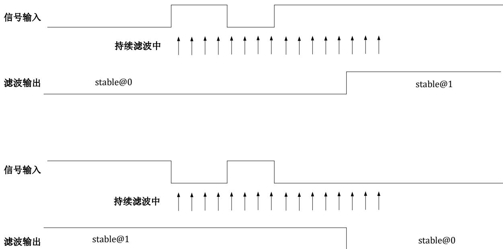  
图 11-1 7/5 滤波模块框图

第二级采用连续滤波，在连续N 个采样点中，如全为0 则输出0，如全为1 则输出1，否则输出保持上一次的滤波结果。

通过配置 HALL\_CFG.FIL\_LEN 可以配置第二级滤波器滤波深度，即连续采样个数。连续采样个数最大为215，滤波时间常数计算公式如下:

$$
\mathrm{T} _ {\text { filter }} = \mathrm{T} _ {\text { clk }} * (\text { HALL\_CFG.FIL\_LEN } [ 1 4: 0 ] + 1)
$$

举例，在96MHz 工作频率下，周期T 是10.42ns，寄存器配置最大为32767，最长滤波宽度为约 10.42ns×32768≈340us。

通过访问 HALL\_INFO.FIL\_DATA[2:0]可以捕捉滤波后的 HALL 信号；HALL\_INFO.RAW\_DATA[2:0]则是滤波前原始HALL 输入信号，详见11.3.3。

## 11.2.4 捕获

捕获模块用于测量两次HALL 信号变化之间的时间，其核心为一个24 位计数器，在96MHz 工作频率下，如果通过 HALL\_CFG.CLK\_DIV=3 设置 Hall 时钟 8 分频，则最大可以记录约2^24\*8/96e6=1. 4s 的时间宽度，达到 10.42ns 的时间分辨率。

HALL\_CNT 从 0 开始计数，当发生 HALL 信号变化时，将此时刻的 HALL\_CNT 值保存到HALL\_WIDTH 寄存器，将此时刻的 HALL 信号保存到 HALL\_INFO.FIL\_DATA，输出 HALL 信号变化中断，HALL\_CNT 重新从0 开始计数。

当计数器计数值达到 HALL\_TH 时，输出HALL 计数器溢出中断，计数器重新从 0 开始计数。

## 11.2.5 中断

捕获、溢出事件触发中断，中断使能控制位位于 HALL\_CFG.CHG\_IE 和 $\mathrm { H A L L \mathrm { C F G . O V \_ I E } }$ ，中断标志位位于 HALL\_INFO.CHG\_IF 和 HALL\_INFO.OV\_IF。中断标志可以通过对 HALL\_INFO.CHG\_IF 和HALL\_INFO.OV\_IF 写 1 清空。

HALL 中断事件可以作为 DMA 请求，但需要在 HALL\_CFG 中使能 CHG\_RE，OV\_RE 或 SW\_RE。当DMA 收到传输请求开始数据搬运后，会将中断标志清除，不再需要软件清除。

## 11.2.6 数据流程

HALL 模块的数据流程如下图所示，FCLK 为受 SYS\_CLK\_FEN.HALL\_CLK\_EN 门控信号控制的HALL 时钟，开通后为 96MHz 的 PLL 时钟。

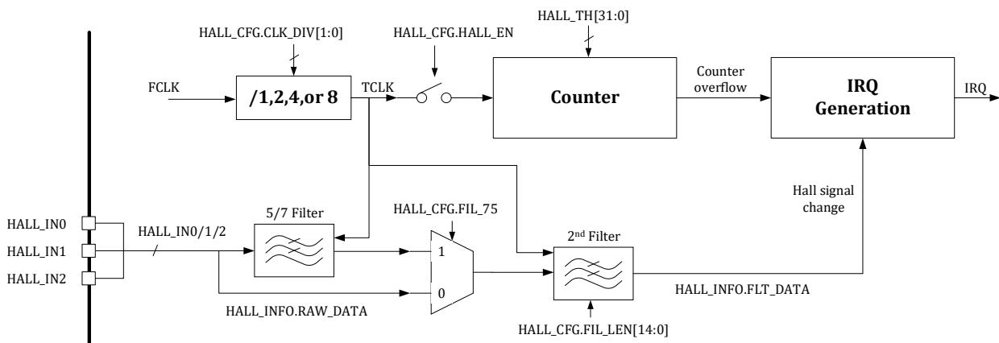  
图 11-2 数据流程框图

## 11.3 寄存器

## 11.3.1 地址分配

HALL 模块寄存器的基地址是 0x4001\_0300，寄存器列表如下:

表11-1HALL 模块寄存器地址分配

<table><tr><td>名称</td><td>偏移</td><td>描述</td></tr><tr><td>HALLO_CFG</td><td>0x00</td><td>HALL 模块配置寄存器</td></tr><tr><td>HALLO_INFO</td><td>0x04</td><td>HALL 模块信息寄存器</td></tr><tr><td>HALLO_WIDTH</td><td>0x08</td><td>HALL 宽度计数值寄存器</td></tr><tr><td>HALLO_TH</td><td>0x0C</td><td>HALL 模块计数器门限值寄存器</td></tr><tr><td>HALLO_CNT</td><td>0x10</td><td>HALL 计数寄存器</td></tr></table>

## 11.3.2 HALL0\_CFG HALL 模块配置寄存器

地址:0x4001\_0300

复位值:0x0

表 11-2 HALL0\_CFG HALL 模块配置寄存器

<table><tr><td>31</td><td>30</td><td>29</td><td>28</td><td>27</td><td>26</td><td>25</td><td>24</td><td>23</td><td>22</td><td>21</td><td>20</td><td>19</td><td>18</td><td>17</td><td>16</td></tr><tr><td rowspan="2"></td><td>SW_IE</td><td>OV_IE</td><td>CHG_IE</td><td rowspan="2"></td><td>OV_RE</td><td>CHG_RE</td><td>HALL_EN</td><td colspan="3" rowspan="2"></td><td>FIL_75</td><td colspan="2" rowspan="2"></td><td colspan="2">CLK_DIV</td></tr><tr><td>RW</td><td>RW</td><td>RW</td><td>RW</td><td>RW</td><td>RW</td><td>RW</td><td colspan="2">RW</td></tr><tr><td></td><td>0</td><td>0</td><td>0</td><td></td><td>0</td><td>0</td><td>0</td><td colspan="3"></td><td>0</td><td colspan="2"></td><td colspan="2">0</td></tr><tr><td>15</td><td>14</td><td>13</td><td>12</td><td>11</td><td>10</td><td>9</td><td>8</td><td>7</td><td>6</td><td>5</td><td>4</td><td>3</td><td>2</td><td>1</td><td>0</td></tr><tr><td rowspan="3"></td><td colspan="15">FIL_LEN</td></tr><tr><td colspan="15">RW</td></tr><tr><td colspan="15">0</td></tr></table>

<table><tr><td>位置</td><td>位名称</td><td>说明</td></tr><tr><td>[31]</td><td></td><td>未使用</td></tr><tr><td>[30]</td><td>SW_IE</td><td>软件触发HALL信号变化中断使能,高电平有效。当SW_IE=1时,软件向HALL_INFO.SW_IF写1,可以手动产生HALL信号变化中断,并令HALL_INFO.CHG_IF置位。</td></tr><tr><td>[29]</td><td>OV_IE</td><td>HALL计数器溢出中断使能开关。默认关闭。0:关闭1:使能</td></tr><tr><td>[28]</td><td>CHG_IE</td><td>HALL信号变化中断使能开关。默认关闭。0:关闭1:使能</td></tr><tr><td>[27]</td><td></td><td>保留</td></tr><tr><td>[26]</td><td>OV_RE</td><td>HALL计数器溢出DMA请求使能开关。默认关闭。0:关闭1:使能</td></tr><tr><td>[25]</td><td>CHG_RE</td><td>HALL信号变化DMA请求使能开关。默认关闭。0:关闭1:使能</td></tr><tr><td>[24]</td><td>HALL_EN</td><td>HALL模块使能开关。默认关闭。0:关闭1:使能</td></tr><tr><td>[23:21]</td><td></td><td>未使用</td></tr><tr><td>[20]</td><td>FIL_75</td><td>7/5滤波开关(连续采样7次,5次值一致)。默认关闭。0:关闭1:使能</td></tr><tr><td>[19:18]</td><td></td><td>未使用</td></tr><tr><td>[17:16]</td><td>CLK_DIV</td><td>HALL时钟分频系数。默认不分频。00:不分频01:2分频10:4分频11:8分频</td></tr><tr><td>[15]</td><td></td><td>未使用</td></tr><tr><td>[14:0]</td><td>FIL_LEN</td><td>滤波宽度,低于对应脉冲宽度的信号将被硬件自动过滤掉。滤波宽度的计算公式为 $[14:0]+1$ 。</td></tr></table>

## 11.3.3 HALL0\_INFO HALL 模块信息寄存器

复位值:0x0

表 11-3 HALL0\_INFO HALL 模块信息寄存器

<table><tr><td rowspan="3">31 30 29 28 27 26 25 24 23 22 21 20 19</td><td>SW_IF</td><td>OV_IF</td><td>CHG_IF</td></tr><tr><td>WO</td><td>RW1C</td><td>RW1C</td></tr><tr><td>0</td><td>0</td><td>0</td></tr></table>

<table><tr><td>Reserved</td><td>RAW_DATA</td><td>Reserved</td><td>FLT_DATA</td></tr><tr><td>RW</td><td>RO</td><td>RW</td><td>RO</td></tr><tr><td>0</td><td>0</td><td>0</td><td>0</td></tr></table>

<table><tr><td>位置</td><td>位名称</td><td>说明</td></tr><tr><td>[31:19]</td><td></td><td>未使用</td></tr><tr><td>[18]</td><td>SW_IF</td><td>软件触发HALL信号变化中断。写1触发,自动清零。</td></tr><tr><td>[17]</td><td>OV_IF</td><td>HALL计数器溢出事件标志,写1清空</td></tr><tr><td>[16]</td><td>CHG_IF</td><td>HALL信号变化事件标志,写1清空</td></tr><tr><td>[15:11]</td><td></td><td>系统保留,必须写入0,读出0</td></tr><tr><td>[10:8]</td><td>RAW_DATA</td><td>HALL值,未滤波结果</td></tr><tr><td>[7:3]</td><td></td><td>系统保留,必须写入0,读出0</td></tr><tr><td>[2:0]</td><td>FLT_DATA</td><td>HALL值,滤波结果</td></tr></table>

## 11.3.4 HALL0\_WIDTH HALL 宽度计数值寄存器

地址:0x4001\_0310

复位值:0x0

表 11-4 HALL0\_WIDTH HALL 宽度计数值寄存器

<table><tr><td>31</td><td>30</td><td>29</td><td>28</td><td>27</td><td>26</td><td>25</td><td>24</td><td>23</td><td>22</td><td>21</td><td>20</td><td>19</td><td>18</td><td>17</td><td>16</td></tr><tr><td rowspan="3" colspan="8"></td><td colspan="8">CAP_CNT</td></tr><tr><td colspan="8">RO</td></tr><tr><td colspan="8">0</td></tr><tr><td>15</td><td>14</td><td>13</td><td>12</td><td>11</td><td>10</td><td>9</td><td>8</td><td>7</td><td>6</td><td>5</td><td>4</td><td>3</td><td>2</td><td>1</td><td>0</td></tr><tr><td colspan="16">CAP_CNT</td></tr><tr><td colspan="16">RO</td></tr><tr><td colspan="16">0</td></tr></table>

<table><tr><td>位置</td><td>位名称</td><td>说明</td></tr><tr><td>[31:24]</td><td></td><td>未使用</td></tr><tr><td>[23:0]</td><td>CAP_CNT</td><td>HALL 宽度计数器值</td></tr></table>

## 11.3.5 HALL0\_TH HALL 模块计数器门限值寄存器

地址:0x4001\_030C

复位值:0x0

表 11-5 HALL0\_TH HALL 模块计数器门限值寄存器

<table><tr><td>31</td><td>30</td><td>29</td><td>28</td><td>27</td><td>26</td><td>25</td><td>24</td><td>23</td><td>22</td><td>21</td><td>20</td><td>19</td><td>18</td><td>17</td><td>16</td></tr><tr><td rowspan="3" colspan="8"></td><td colspan="8">TH</td></tr><tr><td colspan="8">RW</td></tr><tr><td colspan="8">0</td></tr><tr><td>15</td><td>14</td><td>13</td><td>12</td><td>11</td><td>10</td><td>9</td><td>8</td><td>7</td><td>6</td><td>5</td><td>4</td><td>3</td><td>2</td><td>1</td><td>0</td></tr><tr><td colspan="16">TH</td></tr><tr><td colspan="16">RW</td></tr><tr><td colspan="16">0</td></tr></table>

<table><tr><td>位置</td><td>位名称</td><td>说明</td></tr><tr><td>[31:24]</td><td></td><td>未使用</td></tr><tr><td>[23:0]</td><td>TH</td><td>HALL 计数器门限值</td></tr></table>

## 11.3.6 HALL0\_CNT HALL 计数寄存器

地址:0x4001\_0308

复位值:0x0

表 11-6 HALL0\_CNT HALL 计数寄存器

<table><tr><td>31</td><td>30</td><td>29</td><td>28</td><td>27</td><td>26</td><td>25</td><td>24</td><td>23</td><td>22</td><td>21</td><td>20</td><td>19</td><td>18</td><td>17</td><td>16</td></tr><tr><td rowspan="3" colspan="8"></td><td colspan="8">CNT</td></tr><tr><td colspan="8">RW</td></tr><tr><td colspan="8">0</td></tr><tr><td>15</td><td>14</td><td>13</td><td>12</td><td>11</td><td>10</td><td>9</td><td>8</td><td>7</td><td>6</td><td>5</td><td>4</td><td>3</td><td>2</td><td>1</td><td>0</td></tr><tr><td colspan="16">CNT</td></tr><tr><td colspan="16">RW</td></tr><tr><td colspan="16">0</td></tr></table>

<table><tr><td>位置</td><td>位名称</td><td>说明</td></tr><tr><td>[31:24]</td><td></td><td>未使用</td></tr><tr><td>[23:0]</td><td>CNT</td><td>HALL 计数值,写入任意值可清零</td></tr></table>

## 12 ADC

## 12.1 概述

LKS32MC07x 系列芯片集成了 2 个 12bit SAR-ADC 转换核心，14 个模拟 IO 输入信号/4 个 OPA输出/2 个DAC 输出/温度传感器输出/内部电源AVDD 均可作为ADC 的被采样信号。主要有以下特性：

➢ 2 个ADC 数字接口分别对应 2 个 ADC

➢ 3Msps 采样率，48MHz 工作频率

➢ 每个ADC 接口支持 16 路通道选择

➢ 每个ADC 接口配备 1 个模拟看门狗，可同时检测上下阈值

➢ 支持过采样

➢ 支持软件、硬件触发功能

➢ 可以与 MCPWM/Timer/CL 单元联动，触发指示信号可通过 GPIO 送出调试

➢ 支持自定义采样序列，序列次数和通道号可灵活配置

➢ 支持左对齐、右对齐模式

➢ 支持差分输入模拟信号

➢ 支持单段采样和两段采样

➢ 支持硬件过采样，过采样后有效位数可达16bit 以上

ADC 采样的量词含义约定：

1 次采样：完成对应的一次模拟信号量到数字信号量的采样转换并存储至ADC\_DATx 寄存器；

1 段采样：可能包含1 次或若干次采样，若干次采样可以是相同的模拟信号，也可以是不同的模拟信号。采样开始通常由MCPWM、TIMER或软件进行触发，一个触发信号完成一段采样，采样完成后产生相应的段采样完成中断。

## 12.1.1 功能框图

每个 ADC 接口包括 16 个数据寄存器（ADC 16 次采样各个通道模拟量对应的数字量），以及若干控制寄存器，14 个常规触发采样寄存器，2 个空闲采样触发寄存器。

可以同一时刻进行2 个通道的采样。

以 ADC0 为例，数据寄存器 ADC0\_DATx 用于存储 ADC0 第 x 次采样得到的数字量。被转换的模拟信号来源由寄存器 ADC0\_CHNx 中的某 4bit 进行选择（详见 12.2.3）。以 ADC0\_CHN0 为例，位[3:0]选择第 0 次采样的模拟信号来源，ADC01\_CH4\~ADC01\_CH9，(ADC0 和 ADC1 共用的通道 4-9)ADC0\_CH10\~ADC0\_CH13 任选，若 ADC0\_CHN0[3:0]=0，ADC0\_CHN0[7:4]=4，则第 0 个采样的模拟量正端信号来自OPA0\_OUT，第1 个采样的模拟量正端信号对应IO ADC01\_CH4，以此类推。

采样通道数寄存器 ADC\_CHNT 控制每段采样的次数，1\~15 对应 1\~15 次，不可设置为 0 次。两段采样次数之和不应超过 16 次。

控制逻辑根据触发配置寄存器 ADC\_TRIG 选择来自 MCPWM 或 TIMER 的触发信号启动一段采样或者软件触发启动。MCPWM/TIMER 会送出定时触发信号。

一段转换（一段内的所有通道采样转换完毕）完成，触发 ADC 转换完成中断。

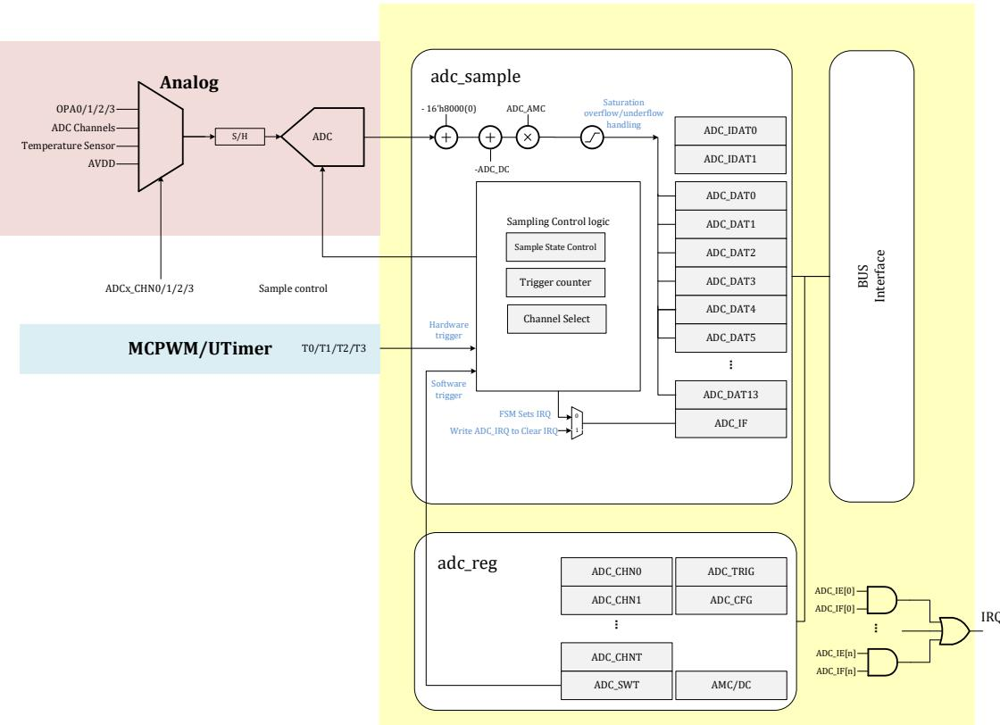  
图12-1ADC 采集模块功能框图

来源可选使得用户可以灵活配置采样顺序、以及采样信号来源，甚至实现对单个信号多次采样的目的。控制寄存器使得用户可以配置采样个数，提高采样频率/降低采样功耗。

正负端信号来源均可配置，使得用户可以灵活设置每次采样的差分信号来源，灵活使用 IO 资源。

过采样允许用户在采样率要求不高但精度要求的场景下，通过多次采样对信号进行平均从而得到更高的信噪比。

## 12.1.2 ADC 触发方式

➢ 支持单段触发和两段触发

➢ 可以设置采样触发事件发生次数从而实现间隔触发

➢ 可以软件触发

每段采样触发完成可产生对应中断标志，如果使能中断请求，则会向NVIC 产生中断服务请求

触发指示信号可以通过GPIO 送出用于调试

## ➢ 支持空闲触发采样

ADC 触发分为常规触发(NT: Normal Trigger)和空闲触发(IT: Idle Trigger)两种触发。常规触发比空闲触发有更高优先级。如果 ADC 正在进行常规采样转换，此时发生了空闲触发，则 ADC 会继续完成常规触发的通道采样转换，完成后再进行空闲触发采样转换；如果 ADC 正在进行空闲采样转换，此时发生了常规触发，则常规触发会打断空闲采样转换，等常规触发采样完成后再进行空闲触发。

SYS\_AFE\_INFO.VERSION<=3 版 本 的 芯 片 ， 空 闲 触 发 与 常 规 触 发 不 可 同 时 使 用 ；SYS\_AFE\_INFO.VERSION=4 版本的芯片，空闲触发与常规触发可以同时使用。

## 12.1.3 ADC 通道选择

每个 ADC 模块有 5 个通道信号来源寄存器，控制采样序列 0\~15 的信号选择。ADC\_CHN0 控制第 0\~3 次采样， ADC\_CHN1 控制第 4\~7 次采样，ADC\_CHN2 控制第 8\~11 次采样，ADC\_CHN3控制第12\~13 次采样，ADC\_ICHN 控制第0\~1次空闲采样。每次采样通道值选择范围都是0\~15，对应通道 0\~15， 也就是可以对某一个通道进行多次采样。每一个采样对应一个结果寄存器，转换结束后，可以直接到对应结果寄存器中获取到ADC 采样结果。

表12-1ADC 通道选择与寄存器配置对应关系

<table><tr><td>ADC 采样序列</td><td>对应的采样数据寄存器</td><td>对应信号来源寄存器</td></tr><tr><td>第0次常规采样</td><td>ADC_DAT0</td><td>ADC_CHN0[3:0]</td></tr><tr><td>第1次常规采样</td><td>ADC_DAT1</td><td>ADC_CHN0[7:4]</td></tr><tr><td>第2次常规采样</td><td>ADC_DAT2</td><td>ADC_CHN0[11:8]</td></tr><tr><td>第3次常规采样</td><td>ADC_DAT3</td><td>ADC_CHN0[15:12]</td></tr><tr><td>第4次常规采样</td><td>ADC_DAT4</td><td>ADC_CHN1[3:0]</td></tr><tr><td colspan="3">......</td></tr><tr><td>第13次常规采样</td><td>ADC_DAT13</td><td>ADC_CHN3[7:4]</td></tr><tr><td>第0次空闲采样</td><td>ADC_IDAT0</td><td>ADC_ICHN[3:0]</td></tr><tr><td>第1次空闲采样</td><td>ADC_IDAT1</td><td>ADC_ICHN[7:4]</td></tr></table>

## 12.1.4 ADC 中断

ADC 中断信号在每段采样完成后置高。

软件或硬件触发事件如果在 ADC 工作时发生，则产生异常触发中断

ADC\_DAT0 具备阈值中断，阈值可以设置为上阈值/下阈值，通过 ADC\_CFG[1]设置，当ADC\_DAT0 超过 ADC\_DAT0\_TH 时发生中断。

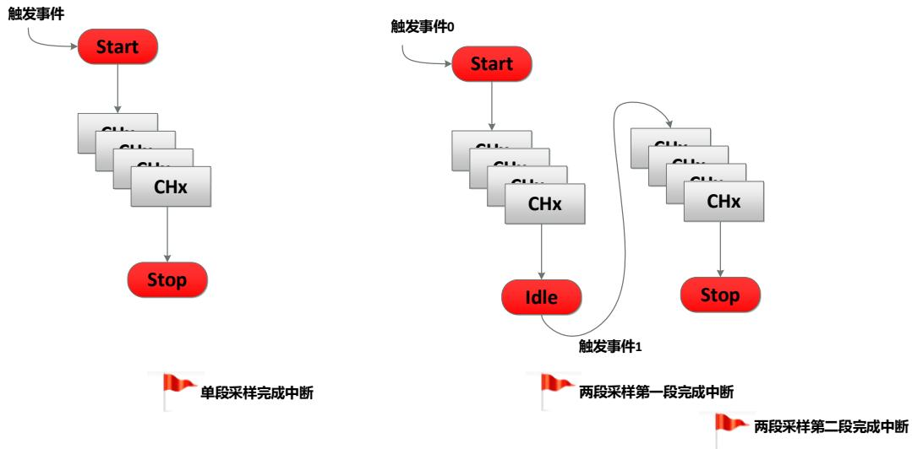  
图 12-2 ADC 中断产生

## 12.1.5 ADC 输出数制

ADC 输出数据为 12bit 补码，输入信号 0 对应 12’b0000\_0000\_0000。

ADC 有 两 种 量 程 设 置 3.6V 和 7.2V。 以 3.6V 量 程 为 例 ， 输 入 信 号-3.6V 对 应12’b1000\_0000\_0000，输入信号+3.6V 对应 12’b0111\_1111\_1111。ADC 转换后的 12bit 补码需进行符号扩展后存入 16bit 位宽的采样数据寄存器，左对齐/右对齐可根据配置寄存器进行设置。以12’b1000\_0000\_1101 为例，如果配置为左对齐，右侧补 4 个 0，存入 ADC\_DAT 的值为16’b1000\_0000\_1101\_0000；如果配置为右对齐，左侧进行符号扩展，存入 ADC\_DAT 的值为16’b1111\_1000\_0000\_1101。推荐统一使用左对齐方式。

由于芯片使用 5V 供电，因此 7.2V 量程实际支持的差分信号范围是±5V。因此 7.2V 量程无法用满整个ADC 量程。

表12-2ADC 输出数字量数制转换

<table><tr><td>ADC 3.6V 量程时不同输入信号/V</td><td>ADC 7.2V 量程时不同输入信号/V</td><td>转为有符号数后的数值</td></tr><tr><td>3.6</td><td>7.2</td><td>12&#x27;b0111_1111_1111</td></tr><tr><td>0</td><td>0</td><td>12&#x27;b0000_0000_0000</td></tr><tr><td>-3.6</td><td>-7.2</td><td>12&#x27;b1000_0000_0000</td></tr></table>

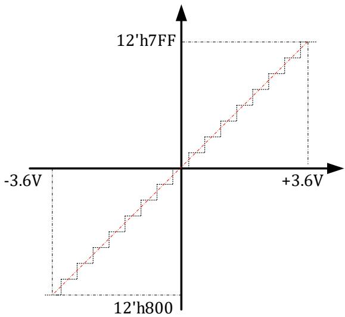  
图12-32/3 增益设置下ADC 模数转换数制量程

## 12.1.6 ADC 量程

ADC 在2.4V 的默认基准电压配置下，有两种量程设置：3.6V 和7.2V。7.2V 量程下，对应最大±5V 的输入信号幅度，3.6V 量程下，对应最大±3.6V 的输入信号幅度。

在ADC 采样通道配置为运放的输出信号时（即OPA0\~OPA3），应选择合适的运放增益，使得具体应用上的最大信号可被放大到接近+/-3.3V的水平，同时将ADC配置为3.6V量程。举例来说，相线电流最大 100A（正弦波有效值），MOS 内阻（假设为 MOS 内阻采样）为 5mR，则运放的最大输入信号幅值为+/-707mV。此时应该选择运放的放大倍数为 4.5 倍，则放大后的信号约为+/-3.18V。

如果因为客观原因，运放的输出信号经放大后，最大信号仍然小于+/-2.4V，则应将 ADC 配置为 3.6V 量程。

在 ADC 采样通道配置为 GPIO 复用口输入的信号时，同样根据信号的最大幅度来选择 ADC 增益。由于IO 口的限制，GPIO 复用口输入的信号范围只能在-0.3V\~AVDD+0.3V 之间。

## 12.1.7 ADC 校正

ADC 硬件接口模块可以进行直流偏置校正与增益校正。

ADC\_AMC 存储的是增益校正系数 $\mathsf { A M P } _ { \mathsf { c o r r e c t i o n } }$ ，为 10bit 无符号定点数，ADC\_AMC[9]为整数部分，ADC\_AMC[8:0]为小数部分。可以表示数值在1 附近的定点数。

记ADC 输出的数字量为 $\mathrm { D } _ { \mathrm { A D C } }$ $\mathrm { D } _ { \mathrm { A D C } }$ 对应的真实值为D， $\mathrm { D } _ { 0 }$ 为编码数制的0，则

$$
\mathrm{D} = \left(\mathrm{D} _ {\mathrm{ADC}} - \mathrm{D} _ {0} - \mathrm{DC} _ {\text { offset }}\right) ^ {*} \mathrm{AMP} _ {\text { correction }}
$$

最终硬件会将进行校正后的 D 存入相应的采样数据寄存器。ADC 接口硬件电路会根据每个通道的增益配置(ADCx\_GAIN)来自动选择 AMP<sub>correction</sub> 与 DC<sub>offset</sub>。

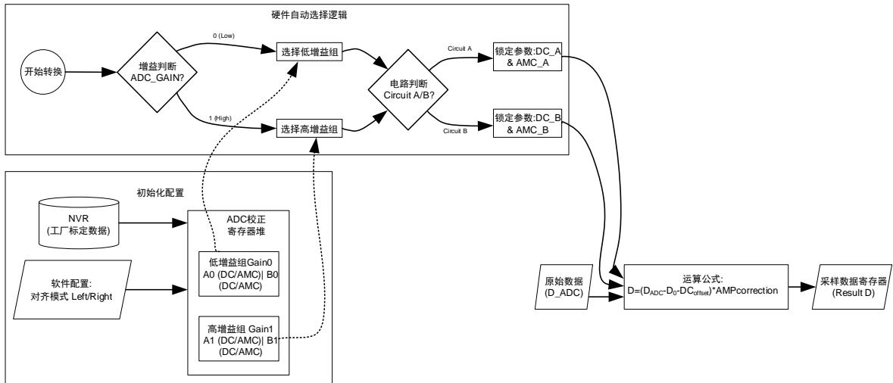  
图12-4ADC 校正处理流程图

## 12.1.8 ADC 阈值监测(模拟看门狗)

每个 ADC 接口模块配备有 1 组阈值监测电路，同时进行上阈值和下阈值监测，ADC 的数据寄存器可以单独配置是否启用某组阈值监测，1 个数据寄存器可以同时启用多组阈值监测，但通常不这样配置。如果使能阈值监测，当 ADC 完成某次转换，且将经过校正的数据写入 ADCx\_DAT 寄存器时，会进行阈值比较，如果写入的数据大于上阈值或小于下阈值则对应的阈值超限中断标志会置1。

阈值为 12bit 有符号数，因此阈值比较与数据的左右对齐无关。左对齐时 ADCx\_DATx[15:4]与阈值进行比较，右对齐时，ADCx\_DATx[11:0]与阈值进行比较。

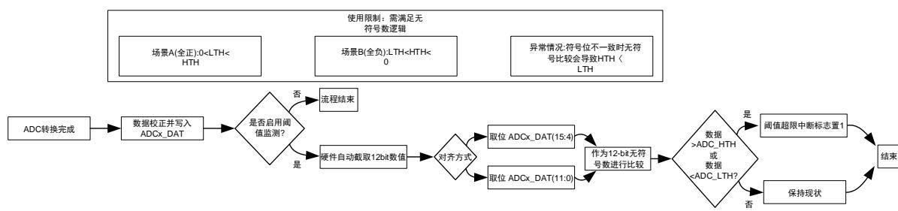  
图12-5ADC 校正处理流程图

注意：

ADC 阈值监测逻辑会把 ADC\_DATA 的值以及 ADC\_LTH 和 ADC\_HTH 的值都当作无符号数进行阈值监测。因此阈值检测功能的使用场景有所限制，具体的使用场景如下：

1、 当 ADC\_LTH 和 ADC\_HTH 的值换算成有符号的数都为正值，即 0<ADC\_LTH<ADC\_HTH 时，阈值监测功能可以正常使用。

2、 当 ADC\_LTH 和 ADC\_HTH 的值换算成有符号的数都为负值，即 ADC\_LTH<ADC\_HTH<0 时，阈值监测功能可以正常使用。

除了上述场景之外，阈值监测功能无法正常使用。如ADC\_HTH和ADC\_LTH的值换算成有符号数时符号位不一致，并且在有符号数的情况下 ADC\_HTH>ADC\_LTH，那么在换算成无符号数时会导致 ADC\_HTH<ADC\_LTH，阈值采样中断会不断产生。

## 12.1.9 过采样

ADC 支持对信号过采样求平均后再写入数据寄存器，过采样率范围是 1\~128 倍，但只能是 2的幂次，通过 ADCx\_CFG.OVSR 配置。默认 1 次采样即写入数据寄存器，即不进行过采样。如果配置了过采样倍数，则由 ADCx\_CHNx 指定的所有信号，均进行多次采样求平均后才写入数据寄存器。写入数据寄存器的数值与ADC 多次转换数值的关系如下公式所示。

$$
\mathrm {ADCx\_ DAT} = \frac {1}{O V S R} \sum_ {i = 0} ^ {O V S R - 1} \mathrm {ADCx\_ DAT\_ RAW} _ {\mathrm{i}}
$$

过采样可以配合阈值监测使用，此时只有当平均后的数值超过阈值范围时才产生阈值超限事件。

当配置了过采样模式后，每段采样转换时间按倍数增加，并在采样转换完成后产生中断。

通过 ADCx\_CFG.TROVS，可以配置一次触发即完成多次(ADCx\_CFG.OVSR 次)采样并进行数据平均，如图 12-6 所示，ADCx\_CFG.TROVS=0，ADCx\_CFG.OVSR=1 即过采样率为 2，触发后，ADC 对每个信号都采样两次平均后才将结果写入对应的 ADCx\_DAT 寄存器；如果 ADCx\_CFG.TROVS=1，则需要多次(ADCx\_CFG.OVSR 次)触发才积累足够数据进行平均，如图 12-7 所示，ADCx\_CFG.OVSR=1即过采样率仍为2，则每2 次触发才累计2 次数据进行平均并写入数据寄存器。当需要多次触发进行累加时，每次触发只能采样一个通道，即要求 ADCx\_CHNT=1，如果采样多个不同信号，当通道切换时，会导致不同通道数据累加在一起而得到错误的转换后数据。

过采样可以配合连续采样进行使用，这种场景中，ADC 连续反复对信号进行采样，累计到过采样次数后将数据存入数据寄存器。

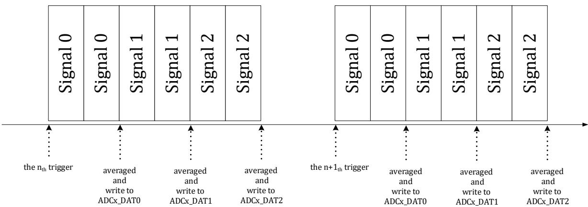  
图 12-6过采样转换时序示例 1

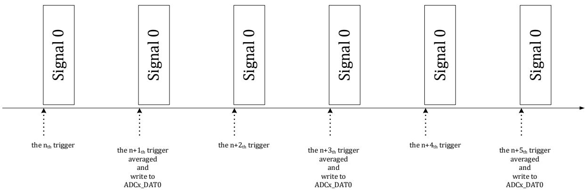  
图 12-7过采样转换时序示例 2  
只有常规采样支持过采样，常规采样过程中出现空闲采样不会影响过采样的数据累积。

## 12.2 寄存器

## 12.2.1 地址分配

ADC0 在芯片中的基地址是 0x4001\_0400；

ADC1 在芯片中的基地址是 0x4001\_0500。

表 12-3 ADCx 寄存器列表

<table><tr><td>名称</td><td>偏移地址</td><td>说明</td></tr><tr><td>ADCx_DAT0</td><td>0x00</td><td>ADCx 第 0 次常规采样数据</td></tr><tr><td>ADCx_DAT1</td><td>0x04</td><td>ADCx 第 1 次常规采样数据</td></tr><tr><td>ADCx_DAT2</td><td>0x08</td><td>ADCx 第 2 次常规采样数据</td></tr><tr><td>ADCx_DAT3</td><td>0x0C</td><td>ADCx 第 3 次常规采样数据</td></tr><tr><td>ADCx_DAT4</td><td>0x10</td><td>ADCx 第 4 次常规采样数据</td></tr><tr><td>ADCx_DAT5</td><td>0x14</td><td>ADCx 第 5 次常规采样数据</td></tr><tr><td>ADCx_DAT6</td><td>0x18</td><td>ADCx 第 6 次常规采样数据</td></tr><tr><td>ADCx_DAT7</td><td>0x1C</td><td>ADCx 第 7 次常规采样数据</td></tr><tr><td>ADCx_DAT8</td><td>0x20</td><td>ADCx 第 8 次常规采样数据</td></tr><tr><td>ADCx_DAT9</td><td>0x24</td><td>ADCx 第 9 次常规采样数据</td></tr><tr><td>ADCx_DAT10</td><td>0x28</td><td>ADCx 第 10 次常规采样数据</td></tr><tr><td>ADCx_DAT11</td><td>0x2C</td><td>ADCx 第 11 次常规采样数据</td></tr><tr><td>ADCx_DAT12</td><td>0x30</td><td>ADCx 第 12 次常规采样数据</td></tr><tr><td>ADCx_DAT13</td><td>0x34</td><td>ADCx 第 13 次常规采样数据</td></tr><tr><td>ADCx_IDAT0</td><td>0x38</td><td>ADCx 第 0 次空闲采样数据</td></tr><tr><td>ADCx_IDAT1</td><td>0x3C</td><td>ADCx 第 1 次空闲采样数据</td></tr><tr><td>ADCx_ICHN</td><td>0x40</td><td>ADCx 空闲采样通道配置</td></tr><tr><td></td><td></td><td></td></tr><tr><td>ADCx_CHN0</td><td>0x50</td><td>ADCx 第 0~3 次常规采样输入信号选择</td></tr><tr><td>ADCx_CHN1</td><td>0x54</td><td>ADCx 第 4~7 次常规采样输入信号选择</td></tr><tr><td>ADCx_CHN2</td><td>0x58</td><td>ADCx 第 8~11 次常规采样输入信号选择</td></tr><tr><td>ADCx_CHN3</td><td>0x5C</td><td>ADCx 第 12~15 次常规采样输入信号选择</td></tr><tr><td>ADCx_CHNT</td><td>0x60</td><td>ADCx 各种触发模式下采样次数</td></tr><tr><td>ADCx_GAIN</td><td>0x64</td><td>ADCx 增益选择</td></tr><tr><td>ADCx_CFG</td><td>0x74</td><td>ADCx 模式配置</td></tr><tr><td>ADCx_TRIG</td><td>0x78</td><td>ADCx 采样触发配置</td></tr><tr><td>ADCx_SWT</td><td>0x7C</td><td>ADCx 软件触发</td></tr><tr><td>ADCx_DC0</td><td>0x80</td><td>ADCx 增益为 0 时 DC offset</td></tr><tr><td>ADCx_AMC0</td><td>0x84</td><td>ADCx 增益为 0 时增益校正系数</td></tr><tr><td>ADCx_DC1</td><td>0x88</td><td>ADCx 增益为 1 时 DC offset</td></tr><tr><td>ADCx_AMC1</td><td>0x8C</td><td>ADCx 增益为 1 时增益校正系数</td></tr><tr><td>ADCx_IE</td><td>0x90</td><td>ADCx 中断使能</td></tr><tr><td>ADCx_IF</td><td>0x94</td><td>ADCx 中断标志</td></tr><tr><td>ADCx_LTH</td><td>0xC4</td><td>ADCx 数据低阈值</td></tr><tr><td>ADCx_HTH</td><td>0xC8</td><td>ADCx 数据高阈值</td></tr><tr><td>ADCx_GEN</td><td>0xCC</td><td>ADCx 阈值监测使能</td></tr></table>

## 12.2.2 采样数据寄存器

## 12.2.2.1 ADCx\_DAT0(x = 0,1)

地址分别为：0x4001\_0400，0x4001\_0500

复位值：0x0

表 12-4 采样数据寄存器 ADCx\_DAT0

<table><tr><td>15</td><td>14</td><td>13</td><td>12</td><td>11</td><td>10</td><td>9</td><td>8</td><td>7</td><td>6</td><td>5</td><td>4</td><td>3</td><td>2</td><td>1</td><td>0</td></tr><tr><td></td><td></td><td></td><td></td><td></td><td></td><td></td><td></td><td></td><td></td><td></td><td></td><td></td><td></td><td></td><td></td></tr><tr><td></td><td></td><td></td><td></td><td></td><td></td><td></td><td></td><td></td><td></td><td></td><td></td><td></td><td></td><td></td><td></td></tr><tr><td></td><td></td><td></td><td></td><td></td><td></td><td></td><td></td><td></td><td></td><td></td><td></td><td></td><td></td><td></td><td></td></tr><tr><td></td><td></td><td></td><td></td><td></td><td></td><td></td><td></td><td></td><td></td><td></td><td></td><td></td><td></td><td></td><td></td></tr></table>

<table><tr><td>位置</td><td>位名称</td><td>说明</td></tr><tr><td>[31:16]</td><td></td><td>未使用</td></tr><tr><td>[15:0]</td><td>DAT0</td><td>ADCx 第 0 次采样数据</td></tr></table>

## 12.2.2.2 ADCx\_DAT1(x = 0,1)

地址分别为：0x4001\_0404，0x4001\_0504

复位值：0x0

表 12-5 采样数据寄存器 ADCx\_DAT1

<table><tr><td>15</td><td>14</td><td>13</td><td>12</td><td>11</td><td>10</td><td>9</td><td>8</td><td>7</td><td>6</td><td>5</td><td>4</td><td>3</td><td>2</td><td>1</td><td>0</td></tr><tr><td></td><td></td><td></td><td></td><td></td><td></td><td></td><td></td><td></td><td></td><td></td><td></td><td></td><td></td><td></td><td></td></tr><tr><td></td><td></td><td></td><td></td><td></td><td></td><td></td><td></td><td></td><td></td><td></td><td></td><td></td><td></td><td></td><td></td></tr><tr><td></td><td></td><td></td><td></td><td></td><td></td><td></td><td></td><td></td><td></td><td></td><td></td><td></td><td></td><td></td><td></td></tr><tr><td></td><td></td><td></td><td></td><td></td><td></td><td></td><td></td><td></td><td></td><td></td><td></td><td></td><td></td><td></td><td></td></tr></table>

<table><tr><td>位置</td><td>位名称</td><td>说明</td></tr><tr><td>[31:16]</td><td></td><td>未使用</td></tr><tr><td>[15:0]</td><td>DAT1</td><td>ADCx 第 1 次采样数据</td></tr></table>

## 12.2.2.3 ADCx\_DAT2(x = 0,1)

地址分别为：0x4001\_0408，0x4001\_0508

复位值：0x0

表 12-6 采样数据寄存器 ADCx\_DAT2

<table><tr><td>15</td><td>14</td><td>13</td><td>12</td><td>11</td><td>10</td><td>9</td><td>8</td><td>7</td><td>6</td><td>5</td><td>4</td><td>3</td><td>2</td><td>1</td><td>0</td></tr><tr><td></td><td></td><td></td><td></td><td></td><td></td><td></td><td></td><td></td><td></td><td></td><td></td><td></td><td></td><td></td><td></td></tr><tr><td></td><td></td><td></td><td></td><td></td><td></td><td></td><td></td><td></td><td></td><td></td><td></td><td></td><td></td><td></td><td></td></tr><tr><td></td><td></td><td></td><td></td><td></td><td></td><td></td><td></td><td></td><td></td><td></td><td></td><td></td><td></td><td></td><td></td></tr><tr><td></td><td></td><td></td><td></td><td></td><td></td><td></td><td></td><td></td><td></td><td></td><td></td><td></td><td></td><td></td><td></td></tr><tr><td></td><td></td><td></td><td></td><td></td><td></td><td></td><td></td><td></td><td></td><td></td><td></td><td></td><td></td><td></td><td></td></tr></table>

<table><tr><td>位置</td><td>位名称</td><td>说明</td></tr><tr><td>[31:16]</td><td></td><td>未使用</td></tr><tr><td>[15:0]</td><td>DAT2</td><td>ADCx 第 2 次采样数据</td></tr></table>

## 12.2.2.4 ADCx\_DAT3(x = 0,1)

地址分别为：0x4001\_040C，0x4001\_050C

复位值：0x0

表 12-7 采样数据寄存器 ADCx\_DAT3

<table><tr><td>15</td><td>14</td><td>13</td><td>12</td><td>11</td><td>10</td><td>9</td><td>8</td><td>7</td><td>6</td><td>5</td><td>4</td><td>3</td><td>2</td><td>1</td><td>0</td></tr><tr><td></td><td></td><td></td><td></td><td></td><td></td><td></td><td></td><td></td><td></td><td></td><td></td><td></td><td></td><td></td><td></td></tr><tr><td></td><td></td><td></td><td></td><td></td><td></td><td></td><td></td><td></td><td></td><td></td><td></td><td></td><td></td><td></td><td></td></tr><tr><td></td><td></td><td></td><td></td><td></td><td></td><td></td><td></td><td></td><td></td><td></td><td></td><td></td><td></td><td></td><td></td></tr><tr><td></td><td></td><td></td><td></td><td></td><td></td><td></td><td></td><td></td><td></td><td></td><td></td><td></td><td></td><td></td><td></td></tr></table>

<table><tr><td>位置</td><td>位名称</td><td>说明</td></tr><tr><td>[31:16]</td><td></td><td>未使用</td></tr><tr><td>[15:0]</td><td>DAT3</td><td>ADCx 第 3 次采样数据</td></tr></table>

## 12.2.2.5 ADCx\_DAT4(x = 0,1)

地址分别为：0x4001\_0410，0x4001\_0510

复位值：0x0

表 12-8 采样数据寄存器 ADCx\_DAT4

<table><tr><td>15</td><td>14</td><td>13</td><td>12</td><td>11</td><td>10</td><td>9</td><td>8</td><td>7</td><td>6</td><td>5</td><td>4</td><td>3</td><td>2</td><td>1</td><td>0</td></tr><tr><td></td><td></td><td></td><td></td><td></td><td></td><td></td><td></td><td></td><td></td><td></td><td></td><td></td><td></td><td></td><td></td></tr><tr><td></td><td></td><td></td><td></td><td></td><td></td><td></td><td></td><td></td><td></td><td></td><td></td><td></td><td></td><td></td><td></td></tr><tr><td></td><td></td><td></td><td></td><td></td><td></td><td></td><td></td><td></td><td></td><td></td><td></td><td></td><td></td><td></td><td></td></tr><tr><td></td><td></td><td></td><td></td><td></td><td></td><td></td><td></td><td></td><td></td><td></td><td></td><td></td><td></td><td></td><td></td></tr></table>

<table><tr><td>位置</td><td>位名称</td><td>说明</td></tr><tr><td>[31:16]</td><td></td><td>未使用</td></tr><tr><td>[15:0]</td><td>DAT4</td><td>ADCx 第 4 次采样数据</td></tr></table>

## 12.2.2.6 ADCx\_DAT5(x = 0,1)

地址分别为：0x4001\_0414，0x4001\_0514

复位值：0x0

表 12-9 采样数据寄存器 ADCx\_DAT5

<table><tr><td>15</td><td>14</td><td>13</td><td>12</td><td>11</td><td>10</td><td>9</td><td>8</td><td>7</td><td>6</td><td>5</td><td>4</td><td>3</td><td>2</td><td>1</td><td>0</td></tr><tr><td></td><td></td><td></td><td></td><td></td><td></td><td></td><td></td><td></td><td></td><td></td><td></td><td></td><td></td><td></td><td></td></tr><tr><td></td><td></td><td></td><td></td><td></td><td></td><td></td><td></td><td></td><td></td><td></td><td></td><td></td><td></td><td></td><td></td></tr><tr><td></td><td></td><td></td><td></td><td></td><td></td><td></td><td></td><td></td><td></td><td></td><td></td><td></td><td></td><td></td><td></td></tr><tr><td></td><td></td><td></td><td></td><td></td><td></td><td></td><td></td><td></td><td></td><td></td><td></td><td></td><td></td><td></td><td></td></tr></table>

<table><tr><td>位置</td><td>位名称</td><td>说明</td></tr><tr><td>[31:16]</td><td></td><td>未使用</td></tr><tr><td>[15:0]</td><td>DAT5</td><td>ADCx 第 5 次采样数据</td></tr></table>

## 12.2.2.7 ADCx\_DAT6(x = 0,1)

地址分别为：0x4001\_0418，0x4001\_0518

复位值：0x0

表 12-10 采样数据寄存器 ADCx\_DAT6

<table><tr><td>15</td><td>14</td><td>13</td><td>12</td><td>11</td><td>10</td><td>9</td><td>8</td><td>7</td><td>6</td><td>5</td><td>4</td><td>3</td><td>2</td><td>1</td><td>0</td></tr><tr><td></td><td></td><td></td><td></td><td></td><td></td><td></td><td></td><td></td><td></td><td></td><td></td><td></td><td></td><td></td><td></td></tr><tr><td></td><td></td><td></td><td></td><td></td><td></td><td></td><td></td><td></td><td></td><td></td><td></td><td></td><td></td><td></td><td></td></tr><tr><td></td><td></td><td></td><td></td><td></td><td></td><td></td><td></td><td></td><td></td><td></td><td></td><td></td><td></td><td></td><td></td></tr><tr><td></td><td></td><td></td><td></td><td></td><td></td><td></td><td></td><td></td><td></td><td></td><td></td><td></td><td></td><td></td><td></td></tr><tr><td></td><td></td><td></td><td></td><td></td><td></td><td></td><td></td><td></td><td></td><td></td><td></td><td></td><td></td><td></td><td></td></tr></table>

<table><tr><td>位置</td><td>位名称</td><td>说明</td></tr><tr><td>[31:16]</td><td></td><td>未使用</td></tr><tr><td>[15:0]</td><td>DAT6</td><td>ADCx 第 6 次采样数据</td></tr></table>

## 12.2.2.8 ADCx\_DAT7(x = 0,1)

地址分别为：0x4001\_041C，0x4001\_051C

复位值：0x0

表 12-11 采样数据寄存器 ADCx\_DAT7

<table><tr><td>15</td><td>14</td><td>13</td><td>12</td><td>11</td><td>10</td><td>9</td><td>8</td><td>7</td><td>6</td><td>5</td><td>4</td><td>3</td><td>2</td><td>1</td><td>0</td></tr><tr><td></td><td></td><td></td><td></td><td></td><td></td><td></td><td></td><td></td><td></td><td></td><td></td><td></td><td></td><td></td><td></td></tr><tr><td></td><td></td><td></td><td></td><td></td><td></td><td></td><td></td><td></td><td></td><td></td><td></td><td></td><td></td><td></td><td></td></tr><tr><td></td><td></td><td></td><td></td><td></td><td></td><td></td><td></td><td></td><td></td><td></td><td></td><td></td><td></td><td></td><td></td></tr><tr><td></td><td></td><td></td><td></td><td></td><td></td><td></td><td></td><td></td><td></td><td></td><td></td><td></td><td></td><td></td><td></td></tr></table>

<table><tr><td>位置</td><td>位名称</td><td>说明</td></tr><tr><td>[31:16]</td><td></td><td>未使用</td></tr><tr><td>[15:0]</td><td>DAT7</td><td>ADCx 第 7 次采样数据</td></tr></table>

## 12.2.2.9 ADCx\_DAT8(x = 0,1)

地址分别为：0x4001\_0420，0x4001\_0520

复位值：0x0

表 12-12 采样数据寄存器 ADCx\_DAT8

<table><tr><td>15</td><td>14</td><td>13</td><td>12</td><td>11</td><td>10</td><td>9</td><td>8</td><td>7</td><td>6</td><td>5</td><td>4</td><td>3</td><td>2</td><td>1</td><td>0</td></tr><tr><td></td><td></td><td></td><td></td><td></td><td></td><td></td><td></td><td></td><td></td><td></td><td></td><td></td><td></td><td></td><td></td></tr><tr><td></td><td></td><td></td><td></td><td></td><td></td><td></td><td></td><td></td><td></td><td></td><td></td><td></td><td></td><td></td><td></td></tr><tr><td></td><td></td><td></td><td></td><td></td><td></td><td></td><td></td><td></td><td></td><td></td><td></td><td></td><td></td><td></td><td></td></tr><tr><td></td><td></td><td></td><td></td><td></td><td></td><td></td><td></td><td></td><td></td><td></td><td></td><td></td><td></td><td></td><td></td></tr></table>

<table><tr><td>位置</td><td>位名称</td><td>说明</td></tr><tr><td>[31:16]</td><td></td><td>未使用</td></tr><tr><td>[15:0]</td><td>DAT8</td><td>ADCx 第 8 次采样数据</td></tr></table>

## 12.2.2.10 ADCx\_DAT9(x = 0,1)

地址分别为：0x4001\_0424，0x4001\_0524

复位值：0x0

表 12-13 采样数据寄存器 ADCx\_DAT9

<table><tr><td>15</td><td>14</td><td>13</td><td>12</td><td>11</td><td>10</td><td>9</td><td>8</td><td>7</td><td>6</td><td>5</td><td>4</td><td>3</td><td>2</td><td>1</td><td>0</td></tr><tr><td></td><td></td><td></td><td></td><td></td><td></td><td></td><td></td><td></td><td></td><td></td><td></td><td></td><td></td><td></td><td></td></tr><tr><td></td><td></td><td></td><td></td><td></td><td></td><td></td><td></td><td></td><td></td><td></td><td></td><td></td><td></td><td></td><td></td></tr><tr><td></td><td></td><td></td><td></td><td></td><td></td><td></td><td></td><td></td><td></td><td></td><td></td><td></td><td></td><td></td><td></td></tr><tr><td></td><td></td><td></td><td></td><td></td><td></td><td></td><td></td><td></td><td></td><td></td><td></td><td></td><td></td><td></td><td></td></tr></table>

<table><tr><td>位置</td><td>位名称</td><td>说明</td></tr><tr><td>[31:16]</td><td></td><td>未使用</td></tr><tr><td>[15:0]</td><td>DAT9</td><td>ADCx 第 9 次采样数据</td></tr></table>

## 12.2.2.11 ADCx\_DAT10(x = 0,1)

地址分别为：0x4001\_0428，0x4001\_0528

复位值：0x0

表 12-14 采样数据寄存器 ADCx\_DAT10

<table><tr><td>15</td><td>14</td><td>13</td><td>12</td><td>11</td><td>10</td><td>9</td><td>8</td><td>7</td><td>6</td><td>5</td><td>4</td><td>3</td><td>2</td><td>1</td><td>0</td></tr><tr><td></td><td></td><td></td><td></td><td></td><td></td><td></td><td></td><td></td><td></td><td></td><td></td><td></td><td></td><td></td><td></td></tr><tr><td></td><td></td><td></td><td></td><td></td><td></td><td></td><td></td><td></td><td></td><td></td><td></td><td></td><td></td><td></td><td></td></tr><tr><td></td><td></td><td></td><td></td><td></td><td></td><td></td><td></td><td></td><td></td><td></td><td></td><td></td><td></td><td></td><td></td></tr><tr><td></td><td></td><td></td><td></td><td></td><td></td><td></td><td></td><td></td><td></td><td></td><td></td><td></td><td></td><td></td><td></td></tr></table>

<table><tr><td>位置</td><td>位名称</td><td>说明</td></tr><tr><td>[31:16]</td><td></td><td>未使用</td></tr><tr><td>[15:0]</td><td>DAT10</td><td>ADCx 第 10 次采样数据</td></tr></table>

## 12.2.2.12 ADCx\_DAT11(x = 0,1)

地址分别为：0x4001\_042C，0x4001\_052C

复位值：0x0

表 12-15 采样数据寄存器 ADCx\_DAT11

<table><tr><td>15</td><td>14</td><td>13</td><td>12</td><td>11</td><td>10</td><td>9</td><td>8</td><td>7</td><td>6</td><td>5</td><td>4</td><td>3</td><td>2</td><td>1</td><td>0</td></tr><tr><td></td><td></td><td></td><td></td><td></td><td></td><td></td><td></td><td></td><td></td><td></td><td></td><td></td><td></td><td></td><td></td></tr><tr><td></td><td></td><td></td><td></td><td></td><td></td><td></td><td></td><td></td><td></td><td></td><td></td><td></td><td></td><td></td><td></td></tr><tr><td></td><td></td><td></td><td></td><td></td><td></td><td></td><td></td><td></td><td></td><td></td><td></td><td></td><td></td><td></td><td></td></tr><tr><td></td><td></td><td></td><td></td><td></td><td></td><td></td><td></td><td></td><td></td><td></td><td></td><td></td><td></td><td></td><td></td></tr></table>

<table><tr><td>位置</td><td>位名称</td><td>说明</td></tr><tr><td>[31:16]</td><td></td><td>未使用</td></tr><tr><td>[15:0]</td><td>DAT11</td><td>ADCx 第 11 次采样数据</td></tr></table>

## 12.2.2.13 ADCx\_DAT12(x = 0,1)

地址分别为：0x4001\_0430，0x4001\_0530

复位值：0x0

表 12-16 采样数据寄存器 ADCx\_DAT12

<table><tr><td>15</td><td>14</td><td>13</td><td>12</td><td>11</td><td>10</td><td>9</td><td>8</td><td>7</td><td>6</td><td>5</td><td>4</td><td>3</td><td>2</td><td>1</td><td>0</td></tr><tr><td></td><td></td><td></td><td></td><td></td><td></td><td></td><td></td><td></td><td></td><td></td><td></td><td></td><td></td><td></td><td></td></tr><tr><td></td><td></td><td></td><td></td><td></td><td></td><td></td><td></td><td></td><td></td><td></td><td></td><td></td><td></td><td></td><td></td></tr><tr><td></td><td></td><td></td><td></td><td></td><td></td><td></td><td></td><td></td><td></td><td></td><td></td><td></td><td></td><td></td><td></td></tr><tr><td></td><td></td><td></td><td></td><td></td><td></td><td></td><td></td><td></td><td></td><td></td><td></td><td></td><td></td><td></td><td></td></tr><tr><td></td><td></td><td></td><td></td><td></td><td></td><td></td><td></td><td></td><td></td><td></td><td></td><td></td><td></td><td></td><td></td></tr></table>

<table><tr><td>位置</td><td>位名称</td><td>说明</td></tr><tr><td>[31:16]</td><td></td><td>未使用</td></tr><tr><td>[15:0]</td><td>DAT12</td><td>ADCx 第 12 次采样数据</td></tr></table>

## 12.2.2.14 ADCx\_DAT13(x = 0,1)

地址分别为：0x4001\_0434，0x4001\_0534

复位值：0x0

表 12-17 采样数据寄存器 ADCx\_DAT13

<table><tr><td>15</td><td>14</td><td>13</td><td>12</td><td>11</td><td>10</td><td>9</td><td>8</td><td>7</td><td>6</td><td>5</td><td>4</td><td>3</td><td>2</td><td>1</td><td>0</td></tr><tr><td></td><td></td><td></td><td></td><td></td><td></td><td></td><td></td><td></td><td></td><td></td><td></td><td></td><td></td><td></td><td></td></tr><tr><td></td><td></td><td></td><td></td><td></td><td></td><td></td><td></td><td></td><td></td><td></td><td></td><td></td><td></td><td></td><td></td></tr><tr><td></td><td></td><td></td><td></td><td></td><td></td><td></td><td></td><td></td><td></td><td></td><td></td><td></td><td></td><td></td><td></td></tr><tr><td></td><td></td><td></td><td></td><td></td><td></td><td></td><td></td><td></td><td></td><td></td><td></td><td></td><td></td><td></td><td></td></tr></table>

<table><tr><td>位置</td><td>位名称</td><td>说明</td></tr><tr><td>[31:16]</td><td></td><td>未使用</td></tr><tr><td>[15:0]</td><td>DAT13</td><td>ADCx 第 13 次采样数据</td></tr></table>

## 12.2.2.15 ADCx\_IDAT0(x = 0,1)

地址分别为：0x4001\_0438，0x4001\_0538

复位值：0x0

表 12-18 空闲采样数据寄存器 ADCx\_IDAT0

<table><tr><td>15</td><td>14</td><td>13</td><td>12</td><td>11</td><td>10</td><td>9</td><td>8</td><td>7</td><td>6</td><td>5</td><td>4</td><td>3</td><td>2</td><td>1</td><td>0</td></tr><tr><td></td><td></td><td></td><td></td><td></td><td></td><td></td><td></td><td></td><td></td><td></td><td></td><td></td><td></td><td></td><td></td></tr><tr><td></td><td></td><td></td><td></td><td></td><td></td><td></td><td></td><td></td><td></td><td></td><td></td><td></td><td></td><td></td><td></td></tr><tr><td></td><td></td><td></td><td></td><td></td><td></td><td></td><td></td><td></td><td></td><td></td><td></td><td></td><td></td><td></td><td></td></tr><tr><td></td><td></td><td></td><td></td><td></td><td></td><td></td><td></td><td></td><td></td><td></td><td></td><td></td><td></td><td></td><td></td></tr></table>

<table><tr><td>位置</td><td>位名称</td><td>说明</td></tr><tr><td>[31:16]</td><td></td><td>未使用</td></tr><tr><td>[15:0]</td><td>IDAT0</td><td>ADCx 第 0 次空闲采样数据</td></tr></table>

## 12.2.2.16 ADCx\_IDAT1(x = 0,1)

地址分别为：0x4001\_043C，0x4001\_053C

复位值：0x0

表 12-19 空闲采样数据寄存器 ADCx\_IDAT1

<table><tr><td>15</td><td>14</td><td>13</td><td>12</td><td>11</td><td>10</td><td>9</td><td>8</td><td>7</td><td>6</td><td>5</td><td>4</td><td>3</td><td>2</td><td>1</td><td>0</td></tr><tr><td></td><td></td><td></td><td></td><td></td><td></td><td></td><td></td><td></td><td></td><td></td><td></td><td></td><td></td><td></td><td></td></tr><tr><td></td><td></td><td></td><td></td><td></td><td></td><td></td><td></td><td></td><td></td><td></td><td></td><td></td><td></td><td></td><td></td></tr><tr><td></td><td></td><td></td><td></td><td></td><td></td><td></td><td></td><td></td><td></td><td></td><td></td><td></td><td></td><td></td><td></td></tr><tr><td></td><td></td><td></td><td></td><td></td><td></td><td></td><td></td><td></td><td></td><td></td><td></td><td></td><td></td><td></td><td></td></tr></table>

<table><tr><td>位置</td><td>位名称</td><td>说明</td></tr><tr><td>[31:16]</td><td></td><td>未使用</td></tr><tr><td>[15:0]</td><td>IDAT15</td><td>ADCx 第 1 次空闲采样数据</td></tr></table>

## 12.2.3 信号来源寄存器

## 12.2.3.1 ADCx\_CHN0(x = 0,1)

地址分别为：0x4001\_0450，0x4001\_0550

复位值：0x0

表 12-20 信号来源寄存器 ADCx\_CHN0

<table><tr><td>15</td><td>14</td><td>13</td><td>12</td><td>11</td><td>10</td><td>9</td><td>8</td><td>7</td><td>6</td><td>5</td><td>4</td><td>3</td><td>2</td><td>1</td><td>0</td></tr><tr><td colspan="4">PDS3</td><td colspan="4">PDS2</td><td colspan="4">PDS1</td><td colspan="4">PDS0</td></tr><tr><td colspan="4">RW</td><td colspan="4">RW</td><td colspan="4">RW</td><td colspan="4">RW</td></tr><tr><td colspan="4">0</td><td colspan="4">0</td><td colspan="4">0</td><td colspan="4">0</td></tr></table>

<table><tr><td>位置</td><td>位名称</td><td>说明</td></tr><tr><td>[31:16]</td><td></td><td>未使用</td></tr><tr><td>[15:12]</td><td>PDS3</td><td>ADCx 第 3 次采样正端输入信号选择</td></tr><tr><td>[11:8]</td><td>PDS2</td><td>ADCx 第 2 次采样正端输入信号选择</td></tr><tr><td>[7:4]</td><td>PDS1</td><td>ADCx 第 1 次采样正端输入信号选择</td></tr><tr><td>[3:0]</td><td>PDS0</td><td>ADCx 第 0 次采样正端输入信号选择</td></tr></table>

## 12.2.3.2 ADCx\_CHN1(x = 0,1)

地址分别为：0x4001\_0454，0x4001\_0554

复位值：0x0

表 12-21 信号来源寄存器 ADCx\_CHN1

<table><tr><td>15</td><td>14</td><td>13</td><td>12</td><td>11</td><td>10</td><td>9</td><td>8</td><td>7</td><td>6</td><td>5</td><td>4</td><td>3</td><td>2</td><td>1</td><td>0</td></tr><tr><td colspan="4">PDS7</td><td colspan="4">PDS6</td><td colspan="4">PDS5</td><td colspan="4">PDS4</td></tr><tr><td colspan="4">RW</td><td colspan="4">RW</td><td colspan="4">RW</td><td colspan="4">RW</td></tr><tr><td colspan="4">0</td><td colspan="4">0</td><td colspan="4">0</td><td colspan="4">0</td></tr></table>

<table><tr><td>位置</td><td>位名称</td><td>说明</td></tr><tr><td>[31:16]</td><td></td><td>未使用</td></tr><tr><td>[15:12]</td><td>PDS7</td><td>ADCx 第 7 次采样正端输入信号选择</td></tr><tr><td>[11:8]</td><td>PDS6</td><td>ADCx 第 6 次采样正端输入信号选择</td></tr><tr><td>[7:4]</td><td>PDS5</td><td>ADCx 第 5 次采样正端输入信号选择</td></tr><tr><td>[3:0]</td><td>PDS4</td><td>ADCx 第 4 次采样正端输入信号选择</td></tr></table>

## 12.2.3.3 ADCx\_CHN2(x = 0,1)

地址分别为：0x4001\_0458，0x4001\_0558

复位值：0x0

表 12-22 信号来源寄存器 ADCx\_CHN2

<table><tr><td>15</td><td>14</td><td>13</td><td>12</td><td>11</td><td>10</td><td>9</td><td>8</td><td>7</td><td>6</td><td>5</td><td>4</td><td>3</td><td>2</td><td>1</td><td>0</td></tr><tr><td colspan="4">PDS11</td><td colspan="4">PDS10</td><td colspan="4">PDS9</td><td colspan="4">PDS8</td></tr><tr><td colspan="4">RW</td><td colspan="4">RW</td><td colspan="4">RW</td><td colspan="4">RW</td></tr><tr><td colspan="4">0</td><td colspan="4">0</td><td colspan="4">0</td><td colspan="4">0</td></tr></table>

<table><tr><td>位置</td><td>位名称</td><td>说明</td></tr><tr><td>[31:16]</td><td></td><td>未使用</td></tr><tr><td>[15:12]</td><td>PDS11</td><td>ADCx 第 11 次采样正端输入信号选择</td></tr><tr><td>[11:8]</td><td>PDS10</td><td>ADCx 第 10 次采样正端输入信号选择</td></tr><tr><td>[7:4]</td><td>PDS9</td><td>ADCx 第 9 次采样正端输入信号选择</td></tr><tr><td>[3:0]</td><td>PDS8</td><td>ADCx 第 8 次采样正端输入信号选择</td></tr></table>

## 12.2.3.4 ADCx\_CHN3(x = 0,1)

地址分别为：0x4001\_045C，0x4001\_055C

复位值：0x0

表 12-23 信号来源寄存器 ADCx\_CHN3

<table><tr><td colspan="101">15 14 13 12 11 10 9 8 7 6 5 4 3 2 1 0</td></tr><tr><td rowspan="23" colspan="100"></td><td></td></tr><tr><td></td><td></td><td></td><td></td><td></td><td></td><td></td><td></td><td></td><td></td><td></td><td></td><td></td></tr><tr><td></td><td></td><td></td><td></td><td></td><td></td><td></td><td></td><td></td><td></td><td></td><td></td><td></td><td></td><td></td><td></td><td></td><td></td></tr><tr><td></td><td></td><td></td><td></td><td></td><td></td><td></td><td></td><td></td></tr><tr><td></td><td></td><td></td><td></td><td></td><td></td><td></td><td></td><td></td><td></td><td></td><td></td><td></td><td></td><td></td><td></td><td></td><td></td><td></td><td></td><td></td><td></td><td></td><td></td></tr><tr><td></td><td></td><td></td><td></td><td></td><td></td><td></td><td></td><td></td><td></td><td></td><td></td></tr><tr><td></td><td></td><td></td><td></td><td></td><td></td><td></td><td></td><td></td><td></td><td></td><td></td><td></td><td></td><td></td><td></td><td></td><td></td><td></td><td></td><td></td><td></td><td></td><td></td><td></td><td></td><td></td><td></td></tr><tr><td></td><td></td><td></td><td></td><td></td><td></td><td></td><td></td><td></td><td></td><td></td><td></td><td></td><td></td><td></td><td></td><td></td><td></td><td></td><td></td><td></td><td></td><td></td><td></td><td></td><td></td><td></td><td></td><td></td><td></td></tr><tr><td rowspan="7"></td><td rowspan="6"></td><td rowspan="5"></td><td rowspan="5"></td><td rowspan="3"></td><td rowspan="3"></td><td rowspan="3"></td><td rowspan="3"></td><td rowspan="3"></td><td rowspan="3"></td><td rowspan="2"></td><td rowspan="2"></td><td></td><td></td><td></td><td></td><td></td><td></td><td></td><td></td><td></td><td></td><td></td><td></td><td></td><td></td><td></td><td></td><td></td><td></td><td></td><td></td><td></td><td></td><td></td><td></td><td></td><td></td><td></td><td></td><td></td><td></td><td></td><td></td><td></td></tr><tr><td></td><td></td><td></td><td></td><td></td><td></td><td></td><td></td><td></td><td></td><td></td><td></td><td></td><td></td><td></td><td></td><td></td><td></td><td></td><td></td><td></td><td></td><td></td><td></td><td></td><td></td><td></td><td></td><td></td><td></td><td></td><td></td><td></td></tr><tr><td></td><td></td><td></td><td></td><td></td><td></td><td></td><td></td><td></td><td></td><td></td><td></td><td></td><td></td><td></td><td></td><td></td><td></td><td></td><td></td><td></td><td></td><td></td><td></td><td></td><td></td><td></td><td></td><td></td><td></td><td></td><td></td><td></td><td></td><td></td></tr><tr><td rowspan="2"></td><td rowspan="2"></td><td></td><td></td><td></td><td></td><td></td><td></td><td></td><td></td><td></td><td></td><td></td><td></td><td></td><td></td><td></td><td></td><td></td><td></td><td></td><td></td><td></td><td></td><td></td><td></td><td></td><td></td><td></td><td></td><td></td><td></td><td></td><td></td><td></td><td></td><td></td><td></td><td></td><td></td><td></td></tr><tr><td></td><td></td><td></td><td></td><td></td><td></td><td></td><td></td><td></td><td></td><td></td><td></td><td></td><td></td><td></td><td></td><td></td><td></td><td></td><td></td><td></td><td></td><td></td><td></td><td></td><td></td><td></td><td></td><td></td><td></td><td></td><td></td><td></td><td></td><td></td><td></td><td></td><td></td><td></td></tr><tr><td></td><td></td><td></td><td></td><td></td><td></td><td></td><td></td><td></td><td></td><td></td><td></td><td></td><td></td><td></td><td></td><td></td><td></td><td></td><td></td><td></td><td></td><td></td><td></td><td></td><td></td><td></td><td></td><td></td><td></td><td></td><td></td><td></td><td></td><td></td><td></td><td></td><td></td><td></td><td></td><td></td><td></td><td></td></tr><tr><td></td><td></td><td></td><td></td><td></td><td></td><td></td><td></td><td></td><td></td><td></td><td></td><td></td><td></td><td></td><td></td><td></td><td></td><td></td><td></td><td></td><td></td><td></td><td></td><td></td><td></td><td></td><td></td><td></td><td></td><td></td><td></td><td></td><td></td><td></td><td></td><td></td><td></td><td></td><td></td><td></td><td></td><td></td><td></td></tr><tr><td></td><td></td><td></td><td></td><td></td><td></td><td></td><td></td><td></td><td></td><td></td><td></td><td></td><td></td><td></td><td></td><td></td><td></td><td></td><td></td><td></td><td></td><td></td><td></td><td></td><td></td><td></td><td></td><td></td><td></td><td></td><td></td><td></td><td></td><td></td><td></td><td></td><td></td><td></td><td></td><td></td><td></td><td></td><td></td><td></td><td></td></tr><tr><td></td><td></td><td></td><td></td><td></td><td></td><td></td><td></td><td></td><td></td><td></td><td></td><td></td><td></td><td></td><td></td><td></td><td></td><td></td><td></td><td></td><td></td><td></td><td></td><td></td><td></td><td></td><td></td><td></td><td></td><td></td><td></td><td></td><td></td><td></td><td></td><td></td><td></td><td></td><td></td><td></td><td></td><td></td><td></td><td></td><td></td><td></td></tr><tr><td></td><td></td><td></td><td></td><td></td><td></td><td></td><td></td><td></td><td></td><td></td><td></td><td></td><td></td><td></td><td></td><td></td><td></td><td></td><td></td><td></td><td></td><td></td><td></td><td></td><td></td><td></td><td></td><td></td><td></td><td></td><td></td><td></td><td></td><td></td><td></td><td></td><td></td><td></td><td></td><td></td><td></td><td></td><td></td><td></td><td></td><td></td><td></td></tr><tr><td></td><td></td><td></td><td></td><td></td><td></td><td></td><td></td><td></td><td></td><td></td><td></td><td></td><td></td><td></td><td></td><td></td><td></td><td></td><td></td><td></td><td></td><td></td><td></td><td></td><td></td><td></td><td></td><td></td><td></td><td></td><td></td><td></td><td></td><td></td><td></td><td></td><td></td><td></td><td></td><td></td><td></td><td></td><td></td><td></td><td></td><td></td><td></td><td></td></tr><tr><td></td><td></td><td></td><td></td><td></td><td></td><td></td><td></td><td></td><td></td><td></td><td></td><td></td><td></td><td></td><td></td><td></td><td></td><td></td><td></td><td></td><td></td><td></td><td></td><td></td><td></td><td></td><td></td><td></td><td></td><td></td><td></td><td></td><td></td><td></td><td></td><td></td><td></td><td></td><td></td><td></td><td></td><td></td><td></td><td></td><td></td><td></td><td></td><td></td><td></td><td></td></tr><tr><td></td><td></td><td></td><td></td><td></td><td></td><td></td><td></td><td></td><td></td><td></td><td></td><td></td><td></td><td></td><td></td><td></td><td></td><td></td><td></td><td></td><td></td><td></td><td></td><td></td><td></td><td></td><td></td><td></td><td></td><td></td><td></td><td></td><td></td><td></td><td></td><td></td><td></td><td></td><td></td><td></td><td></td><td></td><td></td><td></td><td></td><td></td><td></td><td></td><td></td><td></td><td></td><td></td><td></td><td></td></tr><tr><td></td><td></td><td></td><td></td><td></td><td></td><td></td><td></td><td></td><td></td><td></td><td></td><td></td><td></td><td></td><td></td><td></td><td></td><td></td><td></td><td></td><td></td><td></td><td></td><td></td><td></td><td></td><td></td><td></td><td></td><td></td><td></td><td></td><td></td><td></td><td></td><td></td><td></td><td></td><td></td><td></td><td></td><td></td><td></td><td></td><td></td><td></td><td></td><td></td><td></td><td></td><td></td><td></td><td></td><td></td><td></td><td></td><td></td><td></td></tr><tr><td colspan="45">0</td><td></td><td></td><td></td><td></td><td></td><td></td><td></td><td></td><td></td><td></td><td></td><td></td><td></td><td></td><td></td><td></td><td></td><td></td><td></td><td></td><td></td><td></td><td></td><td></td><td></td><td></td><td></td><td></td><td></td><td></td></tr></table>

<table><tr><td>位置</td><td>位名称</td><td>说明</td></tr><tr><td>[31:8]</td><td></td><td>未使用</td></tr><tr><td>[7:4]</td><td>PDS13</td><td>ADCx 第 13 次采样正端输入信号选择</td></tr><tr><td>[3:0]</td><td>PDS12</td><td>ADCx 第 12 次采样正端输入信号选择</td></tr></table>

## 12.2.3.5 ADCx\_ICHN(x = 0,1)

地址分别为：0x4001\_0440，0x4001\_0540

复位值：0x0

表 12-24 信号来源寄存器 ADCx\_ICHN

<table><tr><td>15 14 13 12 11 10 9 8</td><td>7 6 5 4</td><td>3 2 1 0</td></tr><tr><td rowspan="3"></td><td>IDS1</td><td>IDS0</td></tr><tr><td>RW</td><td>RW</td></tr><tr><td>0</td><td>0</td></tr></table>

<table><tr><td>位置</td><td>位名称</td><td>说明</td></tr><tr><td>[31:8]</td><td></td><td>未使用</td></tr><tr><td>[7:4]</td><td>IDS1</td><td>ADCx 第 1 次空闲采样输入信号选择</td></tr><tr><td>[3:0]</td><td>IDS0</td><td>ADCx 第 0 次空闲采样输入信号选择</td></tr></table>

## 12.2.3.6 ADC 通道信号选择

2 个ADC 接口可以选择的被采集模拟信号不完全相同，具体如表12-25 所示。

表 12-25ADC 模拟信号来源分布

<table><tr><td>寄存器</td><td>不同配置值对应通道信号</td></tr><tr><td>ADC0_CHNx</td><td>0x0: OPA0 输出0x1: OPA1 输出0x2: OPA2 输出0x3: OPA3 输出0x4: ADC01_CH40x5: ADC01_CH50x6: ADC01_CH60x7: ADC01_CH70x8: ADC01_CH80x9: ADC01_CH90xA: ADC0_CH100xB: ADC0_CH110xC: ADC0_CH120xD: ADC0_CH130xE: DAC0_OUT0xF: DAC1_OUT</td></tr><tr><td>ADC1_CHNx</td><td>0x0: OPA0 输出0x1: OPA1 输出0x2: OPA2 输出0x3: OPA3 输出0x4: ADC01_CH40x5: ADC01_CH50x6: ADC01_CH60x7: ADC01_CH70x8: ADC01_CH80x9: ADC01_CH90xA: ADC1_CH100xB: ADC1_CH110xC: ADC1_CH120xD: ADC1_CH130xE:温度传感器0xF:内部电源 AVDD</td></tr></table>

\*ADC01\_CH4\~ADC01\_CH9 为 ADC0 和 ADC1 公用通道

正常情况下ADC 对运放通道的采样，采的都是差分信号。

## 12.2.4 采样通道数寄存器

## 12.2.4.1 ADCx\_CHNT(x = 0,1)

地址分别为：0x4001\_0460，0x4001\_0560

复位值：0x0

表 12-26 采样通道数寄存器 ADCx\_CHNT

<table><tr><td rowspan="3"></td><td>IS1</td><td>S2</td><td>S1</td></tr><tr><td>RW</td><td>RW</td><td>RW</td></tr><tr><td>0</td><td>0</td><td>0</td></tr></table>

<table><tr><td>位置</td><td>位名称</td><td>说明</td></tr><tr><td>[31:10]</td><td></td><td>未使用</td></tr><tr><td>[9:8]</td><td>IS1</td><td>空闲采样次数</td></tr><tr><td>[7:4]</td><td>S2</td><td>第二段常规采样次数</td></tr><tr><td>[3:0]</td><td>S1</td><td>第一段常规采样次数</td></tr></table>

注意：采样次数不允许配置为 0。1 表示 1 个通道，2 表示 2 个通道，…… ，16 表示 16 个通道。如果常规采样使用两段采样，则两段采样通道数之和不应超过16。

空闲采样仅支持单段采样，采样次数可以配置为1 或2。

## 12.2.5 配置寄存器

## 12.2.5.1 ADCx\_GAIN(x = 0,1)

地址分别为：0x4001\_0464，0x4001\_0564

复位值：0x0

表 12-27 增益选择寄存器 ADCx\_GAIN

<table><tr><td>15</td><td>14</td><td>13</td><td>12</td><td>11</td><td>10</td><td>9</td><td>8</td><td>7</td><td>6</td><td>5</td><td>4</td><td>3</td><td>2</td><td>1</td><td>0</td></tr><tr><td>IG1</td><td>IG0</td><td>G13</td><td>G12</td><td>G11</td><td>G10</td><td>G9</td><td>G8</td><td>G7</td><td>G6</td><td>G5</td><td>G4</td><td>G3</td><td>G2</td><td>G1</td><td>G0</td></tr><tr><td>RW</td><td>RW</td><td>RW</td><td>RW</td><td>RW</td><td>RW</td><td>RW</td><td>RW</td><td>RW</td><td>RW</td><td>RW</td><td>RW</td><td>RW</td><td>RW</td><td>RW</td><td>RW</td></tr><tr><td>0</td><td>0</td><td>0</td><td>0</td><td>0</td><td>0</td><td>0</td><td>0</td><td>0</td><td>0</td><td>0</td><td>0</td><td>0</td><td>0</td><td>0</td><td>0</td></tr></table>

<table><tr><td>位置</td><td>位名称</td><td>说明</td></tr><tr><td>[31:16]</td><td></td><td>未使用</td></tr><tr><td>[15]</td><td>IG1</td><td>IDAT1 增益选择,0: $\pm 3.6V$ 量程,1: $\pm 7.2V$ 量程</td></tr><tr><td>[14]</td><td>IG0</td><td>IDAT0 增益选择,0: $\pm 3.6V$ 量程,1: $\pm 7.2V$ 量程</td></tr><tr><td>[13]</td><td>G13</td><td>DAT13 增益选择,0: $\pm 3.6V$ 量程,1: $\pm 7.2V$ 量程</td></tr><tr><td>[12]</td><td>G12</td><td>DAT12 增益选择,0: $\pm 3.6V$ 量程,1: $\pm 7.2V$ 量程</td></tr><tr><td>[11]</td><td>G11</td><td>DAT11 增益选择,0: $\pm 3.6V$ 量程,1: $\pm 7.2V$ 量程</td></tr><tr><td>[10]</td><td>G10</td><td>DAT10 增益选择,0: $\pm 3.6V$ 量程,1: $\pm 7.2V$ 量程</td></tr><tr><td>[9]</td><td>G9</td><td>DAT9 增益选择,0: $\pm 3.6V$ 量程,1: $\pm 7.2V$ 量程</td></tr><tr><td>[8]</td><td>G8</td><td>DAT8 增益选择,0: $\pm 3.6V$ 量程,1: $\pm 7.2V$ 量程</td></tr><tr><td>[7]</td><td>G7</td><td>DAT7 增益选择,0: $\pm 3.6V$ 量程,1: $\pm 7.2V$ 量程</td></tr><tr><td>[6]</td><td>G6</td><td>DAT6 增益选择,0: $\pm 3.6V$ 量程,1: $\pm 7.2V$ 量程</td></tr><tr><td>[5]</td><td>G5</td><td>DAT5 增益选择,0: $\pm 3.6V$ 量程,1: $\pm 7.2V$ 量程</td></tr><tr><td>[4]</td><td>G4</td><td>DAT4 增益选择,0: $\pm 3.6V$ 量程,1: $\pm 7.2V$ 量程</td></tr><tr><td>[3]</td><td>G3</td><td>DAT3 增益选择,0: $\pm 3.6V$ 量程,1: $\pm 7.2V$ 量程</td></tr><tr><td>[2]</td><td>G2</td><td>DAT2 增益选择,0: $\pm 3.6V$ 量程,1: $\pm 7.2V$ 量程</td></tr><tr><td>[1]</td><td>G1</td><td>DAT1 增益选择,0: $\pm 3.6V$ 量程,1: $\pm 7.2V$ 量程</td></tr><tr><td>[0]</td><td>G0</td><td>DAT0 增益选择,0: $\pm 3.6V$ 量程,1: $\pm 7.2V$ 量程</td></tr></table>

受限于5V 电源，7.2V 量程只能用到±5V 范围。

## 12.2.5.2 ADCx\_CFG (x = 0,1)

地址分别为：0x4001\_0474，0x4001\_0574

复位值：0x0

表 12-28 模式配置寄存器 ADCx\_CFG

<table><tr><td>15</td><td>14</td><td>13</td><td>12</td><td>11</td><td>10</td><td>9</td><td>8</td><td>7</td><td>6</td><td>5</td><td>4</td><td>3</td><td>2</td><td>1</td><td>0</td></tr></table>

<table><tr><td colspan="3"></td></tr><tr><td>0</td><td>RW</td><td>NSMP</td></tr><tr><td>0</td><td>RW</td><td>FSM_RS</td></tr><tr><td>0</td><td>RW</td><td>DATA_ALIGN</td></tr><tr><td colspan="3"></td></tr><tr><td>0</td><td>RW</td><td>CSMP</td></tr><tr><td>0</td><td>RW</td><td>TCNT</td></tr><tr><td>0</td><td>RW</td><td>TROVS</td></tr><tr><td>0</td><td>RW</td><td>OVSR</td></tr></table>

<table><tr><td>位置</td><td>位名称</td><td>说明</td></tr><tr><td>[31:13]</td><td></td><td>未使用</td></tr><tr><td>[12]</td><td>NSMP</td><td>0:单段采样,1:两段采样</td></tr><tr><td>[11]</td><td>FSM_RS</td><td>状态机复位控制信号。软件写入1产生复位,将ADC内部状态机回到初始状态,完成后自动回到0。该复位控制,不影响ADC其它寄存器的配置值。读取该位返回ADC当前状态,1表示ADC目前正在采样转换工作中,0表示空闲。</td></tr><tr><td>[10]</td><td>DATA_ALIGN</td><td>ADC_DAT对齐方式0:左对齐,右端补4'h0,1:右对齐,左端补4bit符号位</td></tr><tr><td>[9]</td><td></td><td>未使用</td></tr><tr><td>[8]</td><td>CSMP</td><td>连续采样模式0:不开启1:开启连续采样模式,触发到来后,ADC即开始采样转换,完成所有信号的转换后,无需等待触发立即从第0个信号开始新一轮的采样转换</td></tr><tr><td>[7:4]</td><td>TCNT</td><td>触发一次采样所需的事件数。0:表示需要发生1次事件才能触发一次采样1:表示需要发生2次事件才能触发一次采样......15:表示需要发生16次事件才能触发一次采样</td></tr><tr><td>[3]</td><td>TROVS</td><td>过采样触发模式0:一次触发即连续过采样多次至OVSR,并将数据平均后存入,可以配置采样多个通道,每个通道都采样OVSR次后才进行下一个通道的采样。1:一次触发只进行一次采样转换,需要OVSR次触发才完成足够数据的采集并进行平均,而后存入数据寄存器。受到累加器个数限制,在此种配置下,ADCx_CHNT只能配置采样一个通道。</td></tr><tr><td>[2:0]</td><td>OVSR</td><td>过采样率0:1,默认1次采样即存入数据1:2次采样后存入数据2:4次采样后存入数据3:8次采样后存入数据4:16次采样后存入数据5:32 次采样后存入数据6:64 次采样后存入数据7:128 次采样后存入数据过采样率设置为非 0 值时需要保证 ADC0 和 ADC1 不会同时工作。即其中一个 ADC 采样转换过程中,另外一个 ADC 的采样触发事件不能发生。</td></tr></table>

注意：ADC\_CFG 寄存器中 ADCx\_CFG.OVSR 字段过采样率的设置可以设置为 0\~7。但是将过采样率设置为非 0 值时需要保证 ADC0 和 ADC1 不会同时工作。即其中一个 ADC 采样转换过程中，另外一个ADC 的采样触发事件不能发生。

## 12.2.5.3 ADC0\_TRIG

地址分别为：0x4001\_0478

复位值：0x0

表 12-29 采样触发配置寄存器 ADC0\_TRIG

<table><tr><td>15</td><td>14</td><td>13</td><td>12</td><td>11</td><td>10</td><td>9</td><td>8</td><td>7</td><td>6</td><td>5</td><td>4</td><td>3</td><td>2</td><td>1</td><td>0</td></tr><tr><td>CL_IT3_EN</td><td>CL_IT2_EN</td><td>CL_IT1_EN</td><td>CL_IT0_EN</td><td>CL_NT3_EN</td><td>CL_NT2_EN</td><td>CL_NT1_EN</td><td>CL_NT0_EN</td><td>UTIME2_CMP1_EN</td><td>UTIME2_CMP0_EN</td><td>UTIME0_CMP1_EN</td><td>UTIME0_CMP0_EN</td><td>MCPWM0_T3_EN</td><td>MCPWM0_T2_EN</td><td>MCPWM0_T1_EN</td><td>MCPWM0_TO_EN</td></tr><tr><td>RW</td><td>RW</td><td>RW</td><td>RW</td><td>RW</td><td>RW</td><td>RW</td><td>RW</td><td>RW</td><td>RW</td><td>RW</td><td>RW</td><td>RW</td><td>RW</td><td>RW</td><td>RW</td></tr><tr><td>0</td><td>0</td><td>0</td><td>0</td><td>0</td><td>0</td><td>0</td><td>0</td><td>0</td><td>0</td><td>0</td><td>0</td><td>0</td><td>0</td><td>0</td><td>0</td></tr></table>

<table><tr><td>位置</td><td>位名称</td><td>说明</td></tr><tr><td>[31:16]</td><td></td><td>未使用</td></tr><tr><td>[15]</td><td>CL_IT3_EN</td><td>CL_OUTPUT[3]触发 ADC 空闲采样使能,高有效</td></tr><tr><td>[14]</td><td>CL_IT2_EN</td><td>CL_OUTPUT[2]触发 ADC 空闲采样使能,高有效</td></tr><tr><td>[13]</td><td>CL_IT1_EN</td><td>CL_OUTPUT[1]触发 ADC 空闲采样使能,高有效</td></tr><tr><td>[12]</td><td>CL_IT0_EN</td><td>CL_OUTPUT[0]触发 ADC 空闲采样使能,高有效</td></tr><tr><td>[11]</td><td>CL_NT3_EN</td><td>CL_OUTPUT[3]触发 ADC 常规采样使能,高有效</td></tr><tr><td>[10]</td><td>CL_NT2_EN</td><td>CL_OUTPUT[2]触发 ADC 常规采样使能,高有效</td></tr><tr><td>[9]</td><td>CL_NT1_EN</td><td>CL_OUTPUT[1]触发 ADC 常规采样使能,高有效</td></tr><tr><td>[8]</td><td>CL_NT0_EN</td><td>CL_OUTPUT[0]触发 ADC 常规采样使能,高有效</td></tr><tr><td>[7]</td><td>TIMER2_CMP1_EN</td><td>TIMER2 比较事件 1 触发 ADC 常规采样使能,高有效</td></tr><tr><td>[6]</td><td>TIMER2_CMP0_EN</td><td>TIMER2 比较事件 0 触发 ADC 常规采样使能,高有效</td></tr><tr><td>[5]</td><td>TIMER0_CMP1_EN</td><td>TIMER0 比较事件 1 触发 ADC 常规采样使能,高有效</td></tr><tr><td>[4]</td><td>TIMER0_CMP0_EN</td><td>TIMER0 比较事件 0 触发 ADC 常规采样使能,高有效</td></tr><tr><td>[3]</td><td>MCPWM0_T3_EN</td><td>MCPWM0 T3 事件触发 ADC 常规采样使能,高有效</td></tr><tr><td>[2]</td><td>MCPWM0_T2_EN</td><td>MCPWM0 T2 事件触发 ADC 常规采样使能,高有效</td></tr><tr><td>[1]</td><td>MCPWM0_T1_EN</td><td>MCPWM0 T1 事件触发 ADC 常规采样使能,高有效</td></tr><tr><td>[0]</td><td>MCPWM0_T0_EN</td><td>MCPWM0 T0 事件触发 ADC 常规采样使能,高有效</td></tr></table>

## 12.2.5.4 ADC1\_TRIG

地址分别为：，0x4001\_0578

复位值：0x0

表 12-30 采样触发配置寄存器 ADC1\_TRIG

<table><tr><td>15</td><td>14</td><td>13</td><td>12</td><td>11</td><td>10</td><td>9</td><td>8</td><td>7</td><td>6</td><td>5</td><td>4</td><td>3</td><td>2</td><td>1</td><td>0</td></tr><tr><td>CL_IT3_EN</td><td>CL_IT2_EN</td><td>CL_IT1_EN</td><td>CL_IT0_EN</td><td>CL_NT3_EN</td><td>CL_NT2_EN</td><td>CL_NT1_EN</td><td>CL_NT0_EN</td><td>UTIME3_CMP1_EN</td><td>UTIME3_CMP0_EN</td><td>UTIME1_CMP1_EN</td><td>UTIME1_CMP0_EN</td><td>MCPWM0_T3_EN</td><td>MCPWM0_T2_EN</td><td>MCPWM0_T1_EN</td><td>MCPWM0_T0_EN</td></tr><tr><td>RW</td><td>RW</td><td>RW</td><td>RW</td><td>RW</td><td>RW</td><td>RW</td><td>RW</td><td>RW</td><td>RW</td><td>RW</td><td>RW</td><td>RW</td><td>RW</td><td>RW</td><td>RW</td></tr><tr><td>0</td><td>0</td><td>0</td><td>0</td><td>0</td><td>0</td><td>0</td><td>0</td><td>0</td><td>0</td><td>0</td><td>0</td><td>0</td><td>0</td><td>0</td><td>0</td></tr></table>

<table><tr><td>位置</td><td>位名称</td><td>说明</td></tr><tr><td>[31:16]</td><td></td><td>未使用</td></tr><tr><td>[15]</td><td>CL_IT3_EN</td><td>CL_OUTPUT[3]触发 ADC 空闲采样使能,高有效</td></tr><tr><td>[14]</td><td>CL_IT2_EN</td><td>CL_OUTPUT[2]触发 ADC 空闲采样使能,高有效</td></tr><tr><td>[13]</td><td>CL_IT1_EN</td><td>CL_OUTPUT[1]触发 ADC 空闲采样使能,高有效</td></tr><tr><td>[12]</td><td>CL_IT0_EN</td><td>CL_OUTPUT[0]触发 ADC 空闲采样使能,高有效</td></tr><tr><td>[11]</td><td>CL_NT3_EN</td><td>CL_OUTPUT[3]触发 ADC 常规采样使能,高有效</td></tr><tr><td>[10]</td><td>CL_NT2_EN</td><td>CL_OUTPUT[2]触发 ADC 常规采样使能,高有效</td></tr><tr><td>[9]</td><td>CL_NT1_EN</td><td>CL_OUTPUT[1]触发 ADC 常规采样使能,高有效</td></tr><tr><td>[8]</td><td>CL_NT0_EN</td><td>CL_OUTPUT[0]触发 ADC 常规采样使能,高有效</td></tr><tr><td>[7]</td><td>TIMER3_CMP1_EN</td><td>TIMER3 比较事件 1 触发 ADC 常规采样使能,高有效</td></tr><tr><td>[6]</td><td>TIMER3_CMP0_EN</td><td>TIMER3 比较事件 0 触发 ADC 常规采样使能,高有效</td></tr><tr><td>[5]</td><td>TIMER1_CMP1_EN</td><td>TIMER1 比较事件 1 触发 ADC 常规采样使能,高有效</td></tr><tr><td>[4]</td><td>TIMER1_CMP0_EN</td><td>TIMER1 比较事件 0 触发 ADC 常规采样使能,高有效</td></tr><tr><td>[3]</td><td>MCPWM0_T3_EN</td><td>MCPWM0 T3 事件触发 ADC 常规采样使能,高有效</td></tr><tr><td>[2]</td><td>MCPWM0_T2_EN</td><td>MCPWM0 T2 事件触发 ADC 常规采样使能,高有效</td></tr><tr><td>[1]</td><td>MCPWM0_T1_EN</td><td>MCPWM0 T1 事件触发 ADC 常规采样使能,高有效</td></tr><tr><td>[0]</td><td>MCPWM0_T0_EN</td><td>MCPWM0 T0 事件触发 ADC 常规采样使能,高有效</td></tr></table>

ADC 的触发来源为 MCPWM 或 TIMER，通常不会同时使用 MCPWM 和 TIMER 进行触发，只在二者之中选一。

TIMER 对 ADC 的触发信号可以通过配置 GPIO 为 Timer 功能(第 7/8 功能)，通过输出 Timer通道信号进行观测。

MCPWM 对 ADC 的触发信号可以通过配置GPIO 为第 9 功能，即 ADC\_TRIGGER 功能送出用于捕捉调试。每发生一次ADC 触发，ADC\_TRIGGER 信号翻转一次。

当使用两段触发时，只有 BIT0/2/4/6…/16/18/…等位置的触发信号可以作为第一段触发信号，

只有BIT1/3/5/…/17/19/…等位置的触发信号可以作为第二段的触发信号。

举例来说当 MCPWM0\_T1\_EN 和 MCPWM0\_T0\_EN 都使能的时候，MCPWM0\_T0\_EN 会触发第一段采样，但不会触发第二段采样；MCPWM0\_T1\_EN 会触发第二段采样，但不会触发第一段采样。

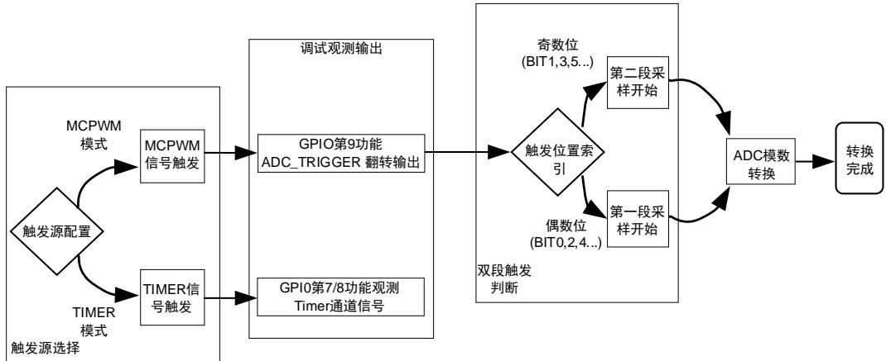  
图12-8ADC 触发与调试观测流程图

## 12.2.6 软件触发寄存器

## 12.2.6.1 ADCx\_SWT(x = 0,1)

地址分别为：0x4001\_047C，0x4001\_057C

复位值：0x0

表 12-31 软件触发寄存器 ADCx\_SWT

<table><tr><td>15</td><td>14</td><td>13</td><td>12</td><td>11</td><td>10</td><td>9</td><td>8</td><td>7</td><td>6</td><td>5</td><td>4</td><td>3</td><td>2</td><td>1</td><td>0</td></tr><tr><td></td><td></td><td></td><td></td><td></td><td></td><td></td><td></td><td></td><td></td><td></td><td></td><td></td><td></td><td></td><td></td></tr><tr><td></td><td></td><td></td><td></td><td></td><td></td><td></td><td></td><td></td><td></td><td></td><td></td><td></td><td></td><td></td><td></td></tr><tr><td></td><td></td><td></td><td></td><td></td><td></td><td></td><td></td><td></td><td></td><td></td><td></td><td></td><td></td><td></td><td></td></tr><tr><td></td><td></td><td></td><td></td><td></td><td></td><td></td><td></td><td></td><td></td><td></td><td></td><td></td><td></td><td></td><td></td></tr></table>

<table><tr><td>位置</td><td>位名称</td><td>说明</td></tr><tr><td>[31:16]</td><td></td><td>未使用</td></tr><tr><td>[15:0]</td><td>SWT</td><td>写入数据为 0x5AA5 时,产生一次常规触发写入数据位 0xF00F 时,产生一次空闲触发</td></tr></table>

注意，软件触发采集寄存器为只写寄存器，且只有写入数据为 0x5AA5/0xF00F 时产生软件触发事件，一次总线的写入产生一次软件触发，数据写入产生一个软件触发后寄存器自动清零，下一次软件触发则再次写入 0x5AA5/0xF00F。

## 12.2.7 校正寄存器

ADC 的可选模拟通道中一个信号源为GND，通过对这个通道的测量可以得到系统的DC 偏置。

通常系统初始化后会进行一次GND 信号的测量，并将测量值存入DC offset 寄存器，后续每次其他channel 的信号的采样值会自动减去 DC offset，再存入转换后的数字量寄存器。

考虑到信号误差，去除 DC offset 的信号可能会发生溢出，对于溢出的数据会做饱和处理，以使信号范围在-1.2V-+1.2V 或-2.4V-+2.4V 之间。

ADC 有两种量程：3.6V 和 7.2V。3.6V 量程设置下，对应最大±3.6V 的输入信号幅度，7.2V 量程设置下，对应最大±5V 的输入信号幅度。两种量程使用不同的 DC offset 和增益校正系数。因此存在两组校正寄存器，分别为 ADCx\_DC0，ADCx\_AMC0 和 ADCx\_DC1，ADCx\_AMC1。芯片出厂时已经过工厂标定，标定数据存放在 Flash info 中，芯片上电自动完成校准参数的加载。ADC 模块在初始化的时候，需要根据数据左右对齐模式配置 DC offset, 可以参看芯片供应商提供的库函数。使用SYS\_SFT\_RST 软复位ADC 模块后，ADC 内部的寄存器会被复位。需要重新使用ADC 初始化函数从NVR 中读取DC/AMC 等校准参数。

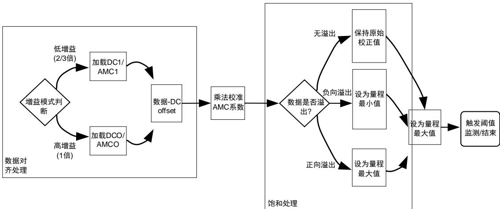  
图12-9ADC 自动校准逻辑流程图

## 12.2.7.1 ADCx\_DC0(x = 0,1)

地址分别为：0x4001\_0480，0x4001\_0580

复位值：0x0

表 12-32 0 档增益直流偏置寄存器 ADCx\_DC0

<table><tr><td>15</td><td>14</td><td>13</td><td>12</td><td>11</td><td>10</td><td>9</td><td>8</td><td>7</td><td>6</td><td>5</td><td>4</td><td>3</td><td>2</td><td>1</td><td>0</td></tr><tr><td></td><td></td><td></td><td></td><td></td><td></td><td></td><td></td><td></td><td></td><td></td><td></td><td></td><td></td><td></td><td></td></tr><tr><td></td><td></td><td></td><td></td><td></td><td></td><td></td><td></td><td></td><td></td><td></td><td></td><td></td><td></td><td></td><td></td></tr><tr><td></td><td></td><td></td><td></td><td></td><td></td><td></td><td></td><td></td><td></td><td></td><td></td><td></td><td></td><td></td><td></td></tr><tr><td></td><td></td><td></td><td></td><td></td><td></td><td></td><td></td><td></td><td></td><td></td><td></td><td></td><td></td><td></td><td></td></tr><tr><td></td><td></td><td></td><td></td><td></td><td></td><td></td><td></td><td></td><td></td><td></td><td></td><td></td><td></td><td></td><td></td></tr></table>

<table><tr><td>位置</td><td>位名称</td><td>说明</td></tr><tr><td>[31:16]</td><td></td><td>未使用</td></tr><tr><td>[15:0]</td><td>DC_OFFSET</td><td>ADC 采样电路 DC offset</td></tr></table>

考虑到ADC 的 DC offset 是接近 0 的数值，因此此处寄存器仅有低10bit 是有实际实现的，高6bit 仅仅是 ADCx\_DC[9]的符号扩展，同时 ADCx\_DC 寄存器参与 ADC 数据校正时也会进行符号扩展。

即如果向 ADCx\_DC 写入 0x12B0；实际写入的是 0x2B0，而读出时会读出 0xFFB0。

此处存入的 ADC\_DC 值应该对应的是右对齐的 offset 数值，当ADCx\_CFG 寄存器配置为左对齐时，硬件会根据对齐的设置，自动调整 ADCx\_DC 参与 ADC 校正。具体来说，右对齐时，ADCx\_DC[15:0]直接参与校正运算，左对齐时，ADCx\_DC[15:0]会先左移 4 位然后参与 ADC 校正运算。

## 12.2.7.2 ADCx\_AMC0(x = 0,1)

地址分别为：0x4001\_0484，0x4001\_0584

复位值：0x200

表 12-33 0 档增益增益校正寄存器 ADCx\_AMC0

<table><tr><td>15 14 13 12 11 10</td><td>9 8 7 6 5 4 3 2 1 0</td></tr><tr><td rowspan="3"></td><td>AM_CALI</td></tr><tr><td>RW</td></tr><tr><td>0x200</td></tr></table>

<table><tr><td>位置</td><td>位名称</td><td>说明</td></tr><tr><td>[31:10]</td><td></td><td>未使用</td></tr><tr><td>[9:0]</td><td>AM_CALI</td><td>ADC 采样电路增益校正系数</td></tr></table>

ADC 的增益校正系数是一个接近 1 的数值，0x200 标定为 1，举例来说 0x1F0 小于 1，0x205则大于 1。

## 12.2.7.3 ADCx\_DC1(x = 0,1)

地址分别为：0x4001\_0488，0x4001\_0588

复位值：0x0

表 12-34 1 档增益直流偏置寄存器 ADCx\_DC1

<table><tr><td>15</td><td>14</td><td>13</td><td>12</td><td>11</td><td>10</td><td>9</td><td>8</td><td>7</td><td>6</td><td>5</td><td>4</td><td>3</td><td>2</td><td>1</td><td>0</td></tr><tr><td colspan="16">DC_OFFSET</td></tr><tr><td colspan="16">RW</td></tr><tr><td colspan="16">0</td></tr></table>

<table><tr><td>位置</td><td>位名称</td><td>说明</td></tr><tr><td>[31:16]</td><td></td><td>未使用</td></tr><tr><td>[15:0]</td><td>DC_OFFSET</td><td>ADC 采样电路 DC offset</td></tr></table>

## 12.2.7.4 ADCx\_AMC1(x = 0,1)

地址分别为：0x4001\_048C，0x4001\_058C

复位值：0x200

表 12-35 1 档增益增益校正寄存器 ADCx\_AMC1

<table><tr><td>15 14 13 12 11 10</td><td>9 8 7 6 5 4 3 2 1 0</td></tr><tr><td rowspan="3"></td><td>AM_CALI</td></tr><tr><td>RW</td></tr><tr><td>0x200</td></tr></table>

<table><tr><td>位置</td><td>位名称</td><td>说明</td></tr><tr><td>[31:10]</td><td></td><td>未使用</td></tr><tr><td>[9:0]</td><td>AM_CALI</td><td>ADC 采样电路增益校正系数</td></tr></table>

## 12.2.8 中断寄存器

12.2.8.1 ADCx\_IE(x = 0,1)

地址分别为：0x4001\_0490，0x4001\_0590

复位值：0x0

表 12-36 中断使能寄存器 ADCx\_IE

<table><tr><td>15</td><td>14</td><td>13</td><td>12</td><td>11</td><td>10</td><td>9</td><td>8</td><td>7</td><td>6</td><td>5</td><td>4</td><td>3</td><td>2</td><td>1</td><td>0</td></tr><tr><td>ISF_RE</td><td>HERR_RE</td><td>SERR_RE</td><td rowspan="3" colspan="2"></td><td>AWD0_RE</td><td>SF2_RE</td><td>SF1_RE</td><td>ISF_IE</td><td>HERR_IE</td><td>SERR_IE</td><td rowspan="3" colspan="2"></td><td>AWD0_IE</td><td>SF2_IE</td><td>SF1_IE</td></tr><tr><td>RW</td><td>RW</td><td>RW</td><td>RW</td><td>RW</td><td>RW</td><td>RW</td><td>RW</td><td>RW</td><td>RW</td><td>RW</td><td>RW</td></tr><tr><td>0</td><td>0</td><td>0</td><td>0</td><td>0</td><td>0</td><td>0</td><td>0</td><td>0</td><td>0</td><td>0</td><td>0</td></tr></table>

<table><tr><td>位置</td><td>位名称</td><td>说明</td></tr><tr><td>[31:16]</td><td></td><td>未使用</td></tr><tr><td>[15]</td><td>ISF_RE</td><td>空闲采样完成 DMA 请求使能</td></tr><tr><td>[14]</td><td>HERR_RE</td><td>硬件触发发生在非空闲状态 DMA 请求使能</td></tr><tr><td>[13]</td><td>SERR_RE</td><td>软件触发发生在非空闲状态 DMA 请求使能</td></tr><tr><td>[12:11]</td><td></td><td>未使用</td></tr><tr><td>[10]</td><td>AWD0_RE</td><td>阈值监测 0 超限 DMA 请求使能</td></tr><tr><td>[9]</td><td>SF2_RE</td><td>第二段采样完成 DMA 请求使能</td></tr><tr><td>[8]</td><td>SF1_RE</td><td>第一段采样完成 DMA 请求使能</td></tr><tr><td>[7]</td><td>ISF_IE</td><td>空闲采样完成中断使能</td></tr><tr><td>[6]</td><td>HERR_IE</td><td>硬件触发发生在非空闲状态中断使能</td></tr><tr><td>[5]</td><td>SERR_IE</td><td>软件触发发生在非空闲状态中断使能</td></tr><tr><td>[4:3]</td><td></td><td>未使用</td></tr><tr><td>[2]</td><td>AWD0_IE</td><td>阈值监测 0 超限中断使能</td></tr><tr><td>[1]</td><td>SF2_IE</td><td>第二段常规采样完成中断使能</td></tr><tr><td>[0]</td><td>SF1_IE</td><td>第一段常规采样完成中断使能</td></tr></table>

## 12.2.8.2 ADCx\_IF(x = 0,1)

地址分别为：0x4001\_0494，0x4001\_0594

复位值：0x0

表 12-37 中断标志寄存器 ADCx\_IF

<table><tr><td colspan="3"></td></tr><tr><td>0</td><td>RW1C</td><td>ISF_IF</td></tr><tr><td>0</td><td>RW1C</td><td>HERR_IF</td></tr><tr><td>0</td><td>RW1C</td><td>SERR_IF</td></tr><tr><td colspan="3"></td></tr><tr><td>0</td><td>RW1C</td><td>AWD0_IF</td></tr><tr><td>0</td><td>RW1C</td><td>SF2_IF</td></tr><tr><td>0</td><td>RW1C</td><td>SF1_IF</td></tr></table>

<table><tr><td>位置</td><td>位名称</td><td>说明</td></tr><tr><td>[31:8]</td><td></td><td>未使用</td></tr><tr><td>[7]</td><td>ISF_IF</td><td>空闲采样完成中断标志</td></tr><tr><td>[6]</td><td>HERR_IF</td><td>硬件触发发生在非空闲状态中断标志</td></tr><tr><td>[5]</td><td>SERR_IF</td><td>软件触发发生在非空闲状态中断标志</td></tr><tr><td>[4:3]</td><td></td><td>未使用</td></tr><tr><td>[2]</td><td>AWD0_IF</td><td>阈值监测 0 超限中断标志</td></tr><tr><td>[1]</td><td>SF2_IF</td><td>第二段常规采样完成中断标志</td></tr><tr><td>[0]</td><td>SF1_IF</td><td>第一段常规采样完成中断标志</td></tr></table>

只有当软件/硬件触发 ADC 进行常规采样，且 ADC 此时正在进行常规采样；或软件/硬件触发ADC 进行空闲采样，且ADC 此时正在进行空闲采样时会产生触发错误中断标志 ADC\_IF[6:5]。

以上ADCx\_IF 标志位，0：表示未发生中断，1: 表示发生过中断，写 1 清零。

## 12.2.9 模拟看门狗

## 12.2.9.1 ADC0\_LTH

地址为:0x4001\_04C4

复位值:0xF800

表 12-38 下阈值寄存器 ADC0\_ LTH

<table><tr><td>15</td><td>14</td><td>13</td><td>12</td><td>11</td><td>10</td><td>9</td><td>8</td><td>7</td><td>6</td><td>5</td><td>4</td><td>3</td><td>2</td><td>1</td><td>0</td></tr><tr><td colspan="4">Sign</td><td colspan="12">LTH</td></tr><tr><td colspan="4">RO</td><td colspan="12">RW</td></tr><tr><td colspan="4">0xF</td><td colspan="12">0x800</td></tr></table>

<table><tr><td>位置</td><td>位名称</td><td>说明</td></tr><tr><td>[31:16]</td><td></td><td>未使用</td></tr><tr><td>[15:12]</td><td></td><td>符号扩展</td></tr><tr><td>[11:0]</td><td>LTH</td><td>ADC 模拟看门狗 0 下阈值</td></tr></table>

ADC0\_LTH 只有[11:0]可以写入，读出时[15:12]为符号扩展位，ADC0\_LTH 以 BIT[11]作为符号位。

## 12.2.9.2 ADC0\_HTH

地址为:0x4001\_04C8

复位值:0x0000\_07FF

表 12-39 上阈值寄存器 ADC0\_ HTH

<table><tr><td>15</td><td>14</td><td>13</td><td>12</td><td>11</td><td>10</td><td>9</td><td>8</td><td>7</td><td>6</td><td>5</td><td>4</td><td>3</td><td>2</td><td>1</td><td>0</td></tr><tr><td rowspan="3" colspan="4"></td><td colspan="12">HTH</td></tr><tr><td colspan="12">RW</td></tr><tr><td colspan="12">0x7FF</td></tr></table>

<table><tr><td>位置</td><td>位名称</td><td>说明</td></tr><tr><td>[31:16]</td><td></td><td>未使用</td></tr><tr><td>[15:12]</td><td></td><td>符号扩展</td></tr><tr><td>[11:0]</td><td>HTH</td><td>ADC 模拟看门狗 0 上阈值</td></tr></table>

ADC0\_HTH 只有[11:0]可以写入，读出时[15:12]为符号扩展位，ADC0\_HTH 以 BIT[11]作为符号位。

## 12.2.9.3 ADC0\_GEN

地址为:0x4001\_04CC

复位值:0x0

表 12-40 监测使能寄存器 ADC0\_ GEN

<table><tr><td>15</td><td>14</td><td>13</td><td>12</td><td>11</td><td>10</td><td>9</td><td>8</td><td>7</td><td>6</td><td>5</td><td>4</td><td>3</td><td>2</td><td>1</td><td>0</td></tr><tr><td></td><td></td><td></td><td></td><td></td><td></td><td></td><td></td><td></td><td></td><td></td><td></td><td></td><td></td><td></td><td></td></tr><tr><td></td><td></td><td></td><td></td><td></td><td></td><td></td><td></td><td></td><td></td><td></td><td></td><td></td><td></td><td></td><td></td></tr><tr><td></td><td></td><td></td><td></td><td></td><td></td><td></td><td></td><td></td><td></td><td></td><td></td><td></td><td></td><td></td><td></td></tr><tr><td></td><td></td><td></td><td></td><td></td><td></td><td></td><td></td><td></td><td></td><td></td><td></td><td></td><td></td><td></td><td></td></tr></table>

<table><tr><td>位置</td><td>位名称</td><td>说明</td></tr><tr><td>[31:16]</td><td></td><td>未使用</td></tr><tr><td>[15:0]</td><td>GEN</td><td>ADC 模拟看门狗 0 对应使能位BIT0: DAT0 看门狗监测使能BIT1: DAT1 看门狗监测使能......BIT13: DAT13 看门狗监测使能BIT14: IDAT0 看门狗监测使能BIT15: IDAT1 看门狗监测使能</td></tr></table>

由于只有一个模拟看门狗，即只有一组高低阈值。同一时刻一般只使能一个 ADC\_DAT 寄存器的阈值监测。如果同时使能多组，则多组ADC\_DAT 寄存器被相同的高低阈值监测。

举例来说，如果设置 ADC\_GEN[1]=1，则看门狗 0 会监测 ADCx\_DAT1 的值，如果大于ADCx\_TH0.HTH 或小于 ADCx\_TH0.LTH 则产生对应中断。

## 12.3 应用指南

## 12.3.1 ADC 采样触发模式

ADC 支持一段、两段采样模式，每段采样需要特定的外部事件来触发开始，每段采样支持不同采样次数和采样信号通道配置。

## 第一次触发

来自 MCPWM/TIMER/CL 模块的定时事件 TADC[0]/TADC[1]/TADC[2]/TADC[3]可以触发 ADC采样。可以选择四个触发源的任何一个或者几个触发采样。也可以通过向 ADCx\_SWT 写入命令字的方式 16’h5AA5 软件触发 ADC 采样。

## 第一段采样

判断是否为一段采样。

是：采样次数达到预设值 ADCx\_CHNT[3:0]，ADC 回到空闲状态 0；采样次数未达到预设值，继续采样。

否：采样次数达到预设值 ADCx\_CHNT[3:0]，ADC 进入空闲状态 1（两段第一段完成，等待触发第二段）；采样次数未达到预设值，继续第一段采样。

## 第二段触发

## 第二段采样

第二段采样次数到达预设值 ADC\_CHNT[7:4]，结束本次采样，回到空闲状态0。

各种硬件触发模式的触发条件汇总如表 12-41 所示。其中单段采样模式较为特殊，可以通过ADC\_CFG 寄存器设置，一次TADC 事件即触发采样，还是多次TADC 事件才触发采样；而两段采样模式仅支持一次相应的TADC 事件即触发一段采样。

此外 ADC 模块也支持通过软件写入特殊数值的方式触发采样，软件触发也仅支持写入一次即触发。

表 12-41 ADC 采样触发模式

<table><tr><td></td><td>单段触发</td><td>两段触发</td></tr><tr><td rowspan="6">TADC 触发</td><td>None(TADC 触发使能未打开)</td><td rowspan="6">第一段 TADC[0]第二段 TADC[1]</td></tr><tr><td>C 次 TADC[0]</td></tr><tr><td>C 次 TADC[1]</td></tr><tr><td>C 次 TADC[2]</td></tr><tr><td>C 次 TADC[3]</td></tr><tr><td>C 次*TADC[0]/TADC[1]/TADC[2]/TADC[3]</td></tr><tr><td>软件触发</td><td>向 ADC_SWT 写入 16&#x27;h5aa5</td><td>第一段向 ADC_SWT 写入 16&#x27;h5aa5第二段向 ADC_SWT 写入 16&#x27;h5aa5</td></tr></table>

\*C 次通过 ADC\_CFG.SINGLE\_TCNT 设置。ADC\_CFG.SINGLE\_TCNT 只在单段触发下使用，如果同时使能了TADC[3:0]，则 4 个触发源都会被计数，到SINGLE\_TCNT 次触发一次ADC 采样转换。

## 12.3.1.1 单段触发模式

单段触发模式是指 ADC 收到一次触发完成一段采样动作，一段采样可能包含多次对模拟信号的采样，次数由分段采样次数寄存器配 ADCx\_CHNT 进行配置，寄存器数值为 1\~15 时，对应的采样次数为1\~15。

假设单段采样配置通道数目为4，则采样转换后的数据会依次填充到ADC\_DAT0、ADC\_DAT1、ADC\_DAT2、ADC\_DAT3。

触发事件可以是来自外部的MCPWM/TIMER 定时信号TADC[0]、TADC[1]、TADC[2]、TADC[3]、发生到预设次数、或者为软件触发。

每个采样的信号源通过信号来源寄存器 ADC\_CHN0/1/2/3 进行配置选定，信号源的选定需在触发前完成，且在一次采样过程完成前不应该改变。

完成一段采样动作后，进入空闲状态，并产生采样完成中断。

以 MCPWM 触发单段采样为例，设置 ADC\_CFG.TCNT=4，ADCx\_TRIG.MCPWM0\_T2\_EN =1，即MCPWM0 的 TADC[2]发生 4 次才进行触发，状态转移如图 12-10 所示。

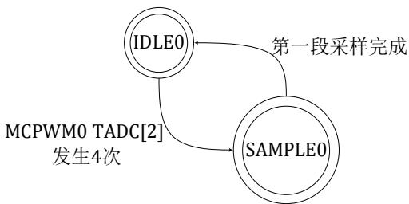  
图 12-10ADC 单段采样状态转移图

## 12.3.1.2 两段触发模式

两段触发需要两次触发才能完成完整的一轮采样。第一个触发到达时进行第一段采样，第二个触发到达时进行第二段采样。

假设两段采样配置通道数目分别为 2 和 3，则第一段采样转换后的数据会依次填充到

ADC\_DAT0、ADC\_DAT1， 第 二 段 采 样 转 换 后 的 数 据 会 依 次 填 充 到 ADC\_DAT2、ADC\_DAT3、ADC\_DAT4。

触发事件可以是来自外部的 MCPWM 定时信号TADC[0]和TADC[1]或两次软件触发。

TADC[0]或软件触发发生后，先进行 ADC\_CHNT[3:0]次采样，完成后进入空闲状态并等待下一个触发信号的到来；TADC[1]或软件触发作为第二个触发信号发生后，再进行 ADC\_CHNT[7:4]次采样。采样次数均通过分段采样次数寄存器ADC\_CHNT 进行配置。

每个采样的信号源通过寄存器配置选定，信号源的选定需在触发前完成，且在一次采样过程完成前不应该改变。

软件触发较硬件触发的优先级低，在硬件触发采样的过程中发生软件触发，状态机不予处理，而产生一个错误中断。即只有状态机处于空闲状态时才会处理软件触发的采样请求。如果需要使用软件触发采样，需要确保硬件触发已经关闭。然后通过向 ADC\_SWT 寄存器写入 0x5AA5 以产生一次软件触发。

以两次软件触发两段采样为例，状态转移如图所示。

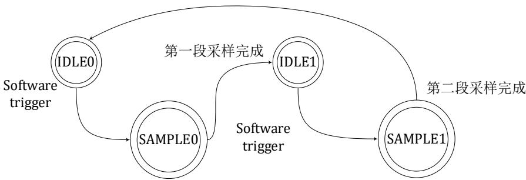  
图 12-11ADC 两段采样状态转移图

## 12.3.2 中断

## 12.3.2.1 单段触发采样完成中断

采样完成产生一个中断。

## 12.3.2.2 两段触发采样完成中断

第一段采样完成产生一个中断，第二段采样完成产生一个中断。

## 12.3.2.3 ADC\_IF 触发所需时间

CPU 软件运行于PLL 时钟域，ADC 模块运行于ADC 时钟域。典型地，ADC 时钟周期为PLL 时钟周期（总线时钟周期）2 倍。 ADC\_IF 的清除需要操作 ADC 时钟域内的寄存器，最多需要 20 个总线周期。建议ADC\_IF 标志在中断函数入口处进行读取清除。如果清除语句在中断函数最后，可能导致中断函数退出后标志仍未清除，导致再次进入中断。

同理，如果软件在清除ADC\_IF 后立刻查询ADC\_IF，可能ADC\_IF 仍为原始值。

## 12.3.3 配置修改

建议在 ADC 中断中进行 ADC\_CHNx 的配置和修改，因为进入 ADC 中断后说明 ADC 此时已完成一段采样且处于空闲状态。而在主程序中，无法确认 ADC 运行状态，因此在主程序中如需修改ADC\_CHNx 和 ADC\_CHNT 等寄存器，需要先关闭 ADC 触发，并向 ADC\_CFG[11]写入 1,以复位 ADC接口电路状态机，确保 ADC 不在工作状态。如果 ADC 在运行中配置发生变化会发生不可预判的行为。

示例程序如下

$$
A D C x \_ C F G \_ t e m p = A D C x \_ C F G; / / S a v e A D C x \_ C F G
$$

$$
A D C x \_ C F G = 0 x 0 0 0 0;
$$

//Disable ADC trigger

$$
A D C x \_ C F G = 0 x 0 8 0 0;
$$

//Reset ADC state machine

/\*

Add your code below, like:

$$
A D C x \_ C H N T = 0 x 0 0 0 5
$$

ADCx\_CHN0 = 0x3210;

$$
A D C x \_ C H N 1 = 0 x 7 6 5 4;
$$

\*/

ADCx\_CFG = ADCx\_CFG\_temp; //restore ADCx\_CFG

## 13 TIMER 通用定时器

## 13.1 概述

## 13.1.1 功能框图

如图13-1 所示，通用定时器 TIMER 主要包括4 个独立的Timer。分别可以独立配置运行计数时钟和滤波常数。每个Timer可以用于输出特定周期占空比的波形，也可以捕获外部波形进行周期占空比的检测。

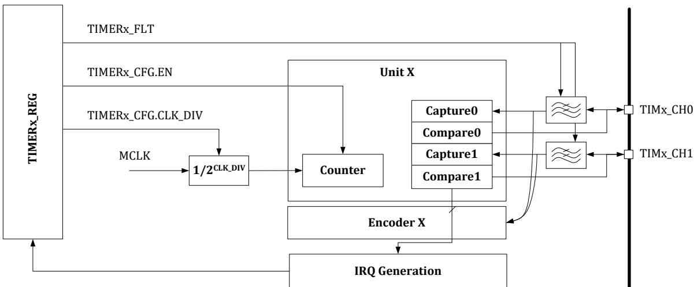  
图 13-1TIMER 模块顶层功能框图

## 13.1.1.1 寄存器模块

对各个子模块控制寄存器的读写。

对各个子模块状态、结果寄存器的访问。

对各个子模块中断信号的处理和中断产生。

## 13.1.1.2 IO 滤波模块

IO 滤波模块对来自芯片外部的输入信号进行滤波，降低毛刺对定时器功能的影响。

## 13.1.1.3 通用定时器模块

通用定时器模块实现了通用的定时器功能，包括比较和捕获工作模式。每个定时器包含两个通道，可以处理两个外部输入信号或者产生两个脉冲信号送到芯片外部。

通用定时器模块，支持外部事件触发开始计数。外部事件源头可配。当外部事件触发后，定时器开始自增。支持使用外部信号作为timer 时钟进行计数。

## 13.1.1.4 时钟分频模块

时钟分频模块用于产生定时器工作所需的各种分频时钟。

## 13.1.2 功能特点

定时器模块有以下特点:

⚫ 独立工作，可工作在不同频率下

⚫ Timer0/1 为 16bit 通用定时器

⚫ Timer2/3 为 32bit 通用定时器

⚫ 每个通用定时器处理 2 个外部输入信号（捕获模式），或者产生2 个输出信号（比较模式）

对每个输入信号可以进行最大 2040 个系统主时钟的滤波，即，当芯片工作在 96MHz 时钟频率下时，可以滤除21uS 宽度以下毛刺

## 13.2 特性

## 13.2.1 时钟分频

Timer 使用 TIMERx\_CFG.CLK\_DIV 进行分频，可以降低计数器的计数频率，分频系数可以设置为 1/2/4/8/16/32/64/128.

## 13.2.2 中断标志清零

采用了通过对每个中断标志位写 1 来清除标志位的设计。

## 13.2.3 滤波

每个定时器模块有两个通道，在工作于输入捕获模式时，两个通道共享一个滤波系数。

通过配置滤波寄存器 TIMERx\_FLT，可以调整滤波宽度为0\~2040 个Timer 计数时钟宽度。

输入信号滤波使用 Timer 计数的分频时钟，TIMERx\_CFG.CLK\_DIV 对 Timer 计数时钟的分频对滤波时钟有影响，即Timer 分频后滤波宽度随之变大。

如图 13-2 所示，原始输入信号在 t1\~t6 几个时刻发生了翻转，滤波器宽度配置成 T。可以看到只有t3 和t6 时刻发生的翻转维持了大于T 的时间，因此从滤波器的输出看，信号仅发生了两次翻转。

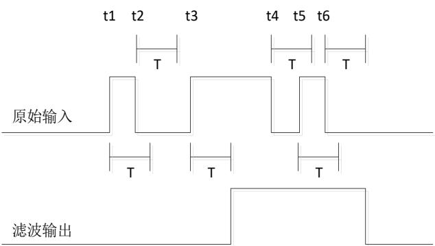  
图 13-2 TIMER 滤波示意图

## 13.2.4 模式

## 13.2.4.1 计数器

Timer 中的计数器可以选择递增或递减方向计数，默认为递增计数。

若为递增计数，则计数器从0 计数到TH 值，再回到0 重新开始计数，计数器回到0 时，产生回零中断。若为递减计数，则计数器从 TH 计数到 0 值，再回到 TH 重新开始计数，计数器回到 0时，产生回零中断。实际计数周期为(TH+1)/clk\_freq，clk\_freq 指定时器的时钟频率。

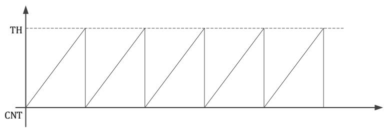

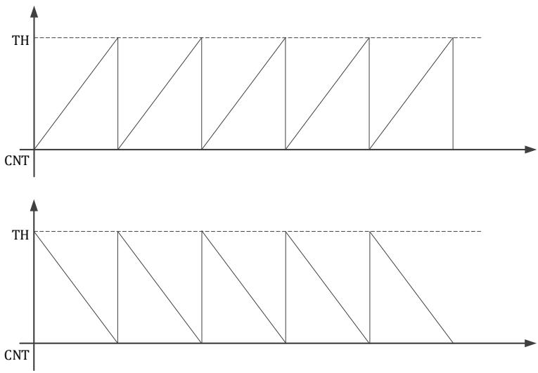  
图 13-3 TIMER 通用计数器

计数器的计数时钟可以通过 TIMERx\_CFG.XCLK\_EN 进行配置，可以使用芯片内部的系统时钟（通常为芯片内部96MHz PLL 时钟）或使用Timer 通道0/1 信号作为外部时钟进行计数。

计数器的计数时钟可以通过 TIMERx\_CFG.CLK\_DIV 进行分频，以降低计数器的计数频率。

## 13.2.4.2 捕获模式

捕获模式下，可以使用 Timer 来检测输入信号的上升/下降或者双沿，发生捕获事件（即输入信号电平变化）时，定时器计数值存入 TIMER\_UNTx\_CMP 寄存器，并产生捕获中断。计数器回零时，仍然会产生回零中断。

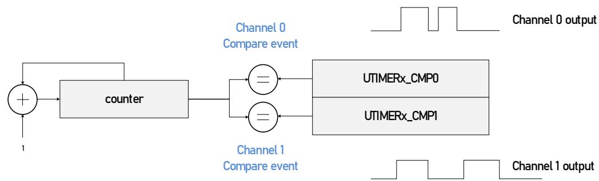

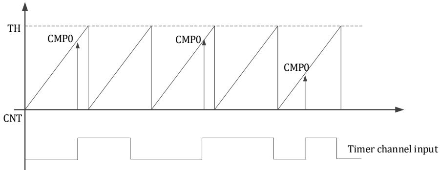  
图 13-4 TIMER 捕获模式

如图13-4 所示，定时器设置为上升沿捕获。在CAP0/CAP1/CAP2 三个时刻点，捕获到输入信号发生上升沿变化，对应时刻点的定时器计数值将存入 TIMER\_UNTx\_CMP 寄存器中。

捕获模式下，通道 0/1 捕获的信号来源可以通过 TIMERx\_CFG.SRC0 和 TIMERx\_SRC1 进行设置，信号源可以设置为来自IO 的通道信号，或来自模拟比较器，以及来自IO 的两个通道信号的异或。

可以通过设置TIMERx\_CFG.CAP0\_CLR\_EN 或TIMERx\_CFG.CAP1\_CLR\_EN 使能Timer 自动清零，即当通道 0/1 发生捕获事件时，TIMER\_CNT 自动回零重新开始计数。这一功能便于 Timer 计算捕获信号的周期和占空比。

例如，如果设置了Timer0 的通道0/1 同时捕获同一个信号，通道0 捕获上升沿，通道1 捕获下降沿。且使能CAP0\_CLR\_EN，即发生通道0 捕获事件时 TIMER\_CNT 自动回零。则当发生通道 0捕获事件（CAP0）时，TIMERx\_CMP0 记录的值为信号上一个周波的周期，TIMERx\_CMP1 记录的值为信号上一个周波的高电平占空比。

同理，如果设置了Timer0 的通道0/1 同时捕获同一个信号，通道0 捕获上升沿，通道1 捕获下降沿。且使能CAP1\_CLR\_EN，即发生通道1 捕获事件时 TIMER\_CNT 自动回零。则当发生通道 1捕获事件（CAP1）时，TIMERx\_CMP1 记录的值为信号上一个周波的周期，TIMERx\_CMP0 记录的值为信号上一个周波的低电平占空比。

## 13.2.4.3 比较模式(边沿对齐 PWM)

比较模式下，计数器计数到 TIMERx\_CMP 值时，产生比较中断。比较模式可以驱动一个比较脉冲发生，在回零时，向 IO 口输出一个电平（极性可配置），在比较事件发生时，电平翻转，向IO 口输出另一个电平。计数器回零时，仍然会产生回零中断。设置 TIMERx\_CMP0=0，可使得Timer X 通道 0 为恒 1，设置 TIMERx\_CMP0=TIMERx\_TH+1，可使得 Timer 通道 0 为恒 0。

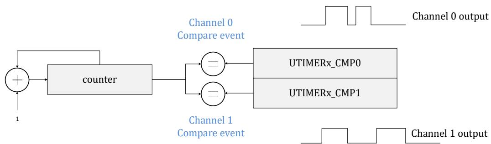

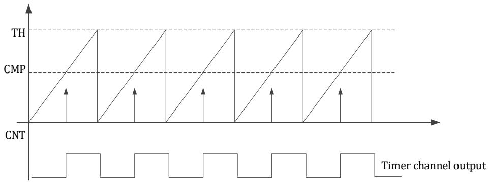  
图 13-5 TIMER 比较模式

## 13.2.4.4 单次触发

在 比 较 模 式 下 ， 当 TIMERx\_CFG.EN=0， 即 Timer 没 有 开 始 计 数 时 ， 通 过 向TIMERx\_CFG.ONE\_TRIG 写入 1，可以触发 Timer 发出一个周期特定占空比的波形。结束后 Time回到空闲状态，通道不再动作。如果 TIMER 单次触发仍在计数周期内再次发生单次触发，TIMER不会响应，仍继续完成本次周期计数。即在单次触发计数过程中发生的过于频繁的软件单次触发不被 TIMER 接受。如下图，第3 次向 ONE\_TRIG 写1 无效，不会触发TIMER 重新开始计数。

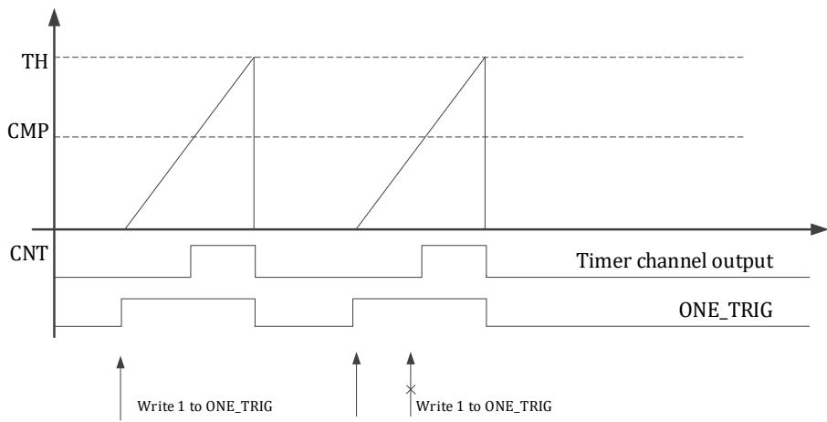  
图 13-6 TIMER 单次触发

## 13.2.4.5 中心模式(互补 PWM)

除递增计数和递减外，计数器还可以设置为中心计数模式，即 TIMERx\_CFG.CENTER=1。此时，计数器从 0 递增计数至 TH 后再递减计数回 0，开始下一个周期的中心计数。实际计数周期为(2\*TH+1)/clk\_freq，clk\_freq 指定时器的时钟频率。中心计数模式可以用于输出互补 PWM 波形，通过合理设置TIMERx\_CMP0/1 可以产生上下管导通死区，死区时间=TIMERx\_CMP1-TIMERx\_CMP0。此外，需要合理设置通道的初始值以产生互补波形。Timer 在递增计数和递减计数期间都会有TIMERx\_CNT=TIMER\_CMP0/1 的时刻，但只有递增计数阶段会产生中断事件。

此外，Timer0 支持 FAIL 事件及时关断 PWM 输出。发生 FAIL 事件时，Timer 通道 0/1 输出值由 TIMER0\_IO.CH0\_DEFAULT 和 TIMER0\_IO.CH1\_DEFAULT 指定，同时 TIMER0\_IO.MOE 被 FAIL事件清零，软件将MOE 置 1 后，Timer 通过恢复输出 PWM 波形。

Timer0 同 时 配 备 了 影 子 寄 存 器 TIMER0\_STH/ TIMER0\_SCMP0/ TIMER0\_SCMP1。 当TIMER0\_CFG.SHADOW=1 时，表示使用影子寄存器作为计数器的动作指示，TIMER0\_TH/TIMER0\_CMP0/ TIMER0\_CMP1 仅 仅 作 为 预 装 载 寄 存 器 ， 向 TIMER0\_TH/ TIMER0\_CMP0/TIMER0\_CMP1 写入仅仅修改预装载值，不改变影子寄存器值。TIMER0 的影子寄存器可以通过向TIMER0\_CFG.UPDATE 写 1 进行软件更新；或者可以等待 TIMER 过零事件自动更新。

当 TIMER0\_CFG.SHADOW=0 时，与普通 Timer 相同，仍使用 TIMER0\_TH/ TIMER0\_CMP0/TIMER0\_CMP1 作为计数器的动作指示。

读取 TIMER0\_TH/ TIMER0\_CMP0/ TIMER0\_CMP1 时，总是返回影子寄存器值 TIMER0\_STH/TIMER0\_SCMP0/ TIMER0\_SCMP1。

表 13-1 TIMER0 影子寄存器对应关系

<table><tr><td>TIMER0_CFG.SHADOW 设定值</td><td>0</td><td>1</td></tr><tr><td>TIMER0_CNT 命中 TH</td><td>TIMER0_TH</td><td>TIMER0_STH</td></tr><tr><td>TIMER0_CNT 命中 CMP0</td><td>TIMER0_CMP0</td><td>TIMER0_SCMP0</td></tr><tr><td>TIMER0_CNT 命中 CMP1</td><td>TIMER0_CMP1</td><td>TIMER0_SCMP1</td></tr></table>

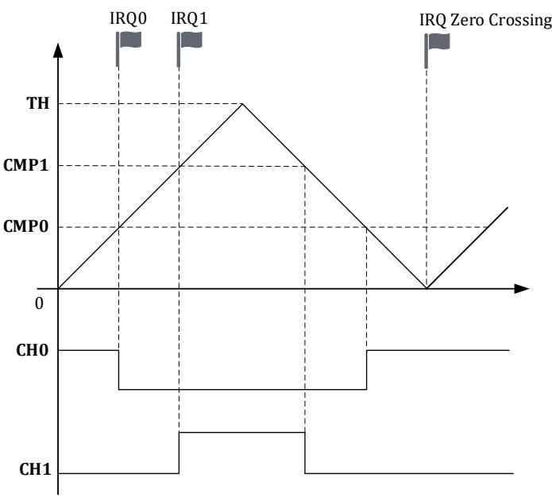  
图 13-7 TIMER 中心计数模式

TIMER0/1/2/3 均支持中心计数模式进行互补 PWM 输出；但只有 TIMER0 配备了影子寄存器和 FAIL 停机机制。即只有 TIMER0 存在 TIMER0\_IO 寄存器。

## 13.2.5 外部事件

Timer 支持与其他 Timer 通道、MCPWM 的 ADC 触发事件以及 CLU 输出进行联动。外部信号可以作为Timer 的外部启动信号、外部时钟信号、外部重置信号、外部门控信号。

外部事件在 Timer 内部只有一种解释，因此只能使用一种外部事件功能，以上 4 种功能不可以 同 时 使 用 ， 亦 即 TIMERx\_CFG.ETON，TIMERx\_CFG.XCLK\_EN，TIMERx\_CFG.RL\_EN，TIMERx\_CFG.GATE\_EN 4 个设置位只能有一个为 1。

以下说明均以TIMER 正向递增计数为例，递减计数同理。

外部事件通过TIMERx\_EVT 进行选择。

## 13.2.5.1.1 外部启动信号

当 TIMERx\_CFG.EN=0 且 TIMERx\_CFG.ETON=1 时，TIMERx 在发生外部事件前 CNT 停留在 0，在发生外部事件时启动计数。外部启动信号被处理为一个脉冲信号后进行TIMER 的启动触发。

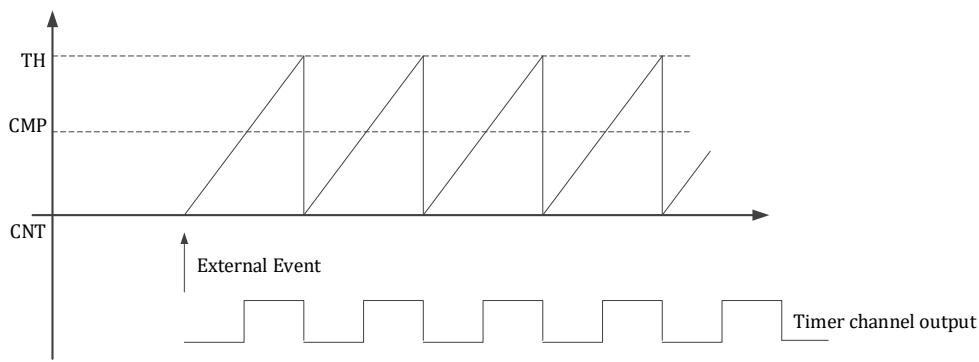  
图 13-8TIMER 外部事件触发启动

外部启动也可以与单次触发进行联合使用，此时软件需要先配置 ETON=1，然后配置ONE\_TRIG=1，等待外部事件触发后，TIMER 进行一个周期的计数，周期结束后 ONE\_TRIG 被硬件清零。

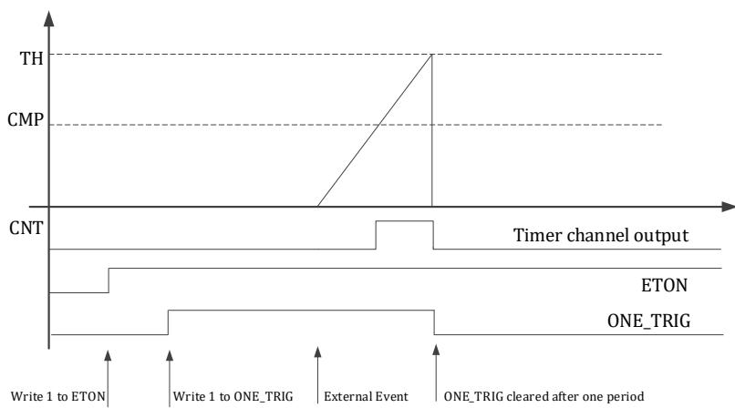  
图 13-9TIMER 外部事件触发单次（单周期）计数

## 13.2.5.1.2 外部时钟信号

通过设置TIMERx\_CFG.XCLK\_EN=1，TIMER可以使用外部信号作为计数时钟。外部时钟的选择通过 TIMERx\_EVT 进行设置。

当外部信号出现上升沿时，TIMERx\_CNT 递增（或递减）。特别地，如果使用 TIMERm 的通道输入作为 TIMERx 的外部时钟，则 TIMERm 的通道输入为受到 TIMERm 滤波后的信号。

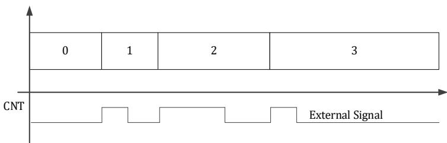  
图 13-10 TIMER 使用外部时钟计数

## 13.2.5.1.3 外部重置信号

通过设置TIMERx\_CFG.RL\_EN=1，TIMER 可以使用外部信号作为重置信号。外部重置信号的选择通过 TIMERx\_EVT 进行设置。如果 TIMER 设置为递增计数或中心计数，发生外部信号重置时，TIMERx\_CNT 被重置为0；如果TIMER 设置为递减计数，发生外部信号重置时，TIMERx\_CNT 被重置为 TIMERX\_TH。外部重置信号被处理为一个脉冲信号后对 TIMER 进行重置。

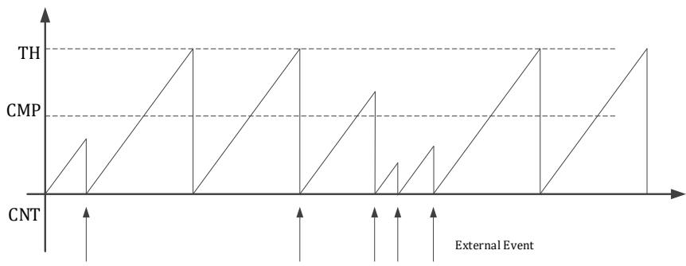  
图 13-11 TIMER 外部信号重置功能

## 13.2.5.1.4 外部门控信号

通过设置 TIMERx\_CFG.GATE\_EN=1，TIMER 可以使用外部信号作为门控信号。外部门控信号的选择通过TIMERx\_EVT进行设置。门控信号电平为高时，TIMER进行计数，电平为低时，TIMER停止计数，TIMERx\_CNT 保持不变。由于门控信号需要为电平信号，因此 MCPWM 的 ADC 触发信号无法作为外部门控信号使用。特别地，如果使用 TIMERm 的通道输入作为 TIMERx 计数的门控信号，通道输入信号受到TIMERm 的滤波影响。

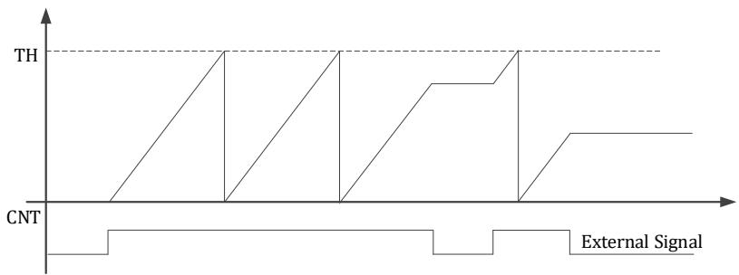  
图 13-12 TIMER 外部信号门控功能

以 TIMER2 通道 1 作为 TIMER3 的外部事件信号为例，需要通过 TIMER2\_CFG.SRC1 设置TIMER2 的通道 1 信号来自 IO TIM2\_CH1，通过 TIMER2\_CFG.CH1\_MODE 设置 TIMER2 通道 1 为捕获模式。此外，需要注意 TIMER2\_FLT 设置，对 TIMER2 通道 1 输入信号仍有滤波作用。GPIO 需要做相应设置以允许信号通过 GPIO 进入 TIMER2 通道 1。最后通过 TIMER3\_EVT 设置 TIMER2 通道 1 作为 TIMER3 外部信号的作用，通常只设置 TIMER3\_CFG.ETON，TIMER3\_CFG.XCLK\_EN，TIMER3\_CFG.RL\_EN，TIMER3\_CFG.GATE\_EN 4 个设置位只能有一个为 1。

## 13.2.6 ADC 触发

Timer0/1 的比较事件（CMP0/1）可作为 ADC 采样触发事件。

## 13.2.7 编码器

编码器接口支持正交编码信号、符号加脉冲信号、CW/CCW 双脉冲信号三种模式。

其中 QEP0 的两个输入信号 T1/T2 分别来自 Timer2 Channel0/1 对应的 GPIO 输入，并经过Timer 内部的滤波；QEP1 的 T1/T2 信号分别来自 Timer3 Channel0/1 对应的 GPIO 输入，并经过Timer 内部的滤波。开启编码器功能时并不影响Timer 功能的正常使用。

编码器的输入 T1/T2/Z 信号均受对应的 Timer 滤波系数控制，举例来说，QEP0 的 Z 信号受到 TIMER2\_FLT 滤波时间控制，QEP1 的 Z 信号受到 TIMER3\_FLT 滤波时间控制。

由于编码器复用的是 Timer 通道输入，且受 Timer 通道滤波影响，因此使用编码器，需要开启对应的 SYS\_CLK\_FEN 中对应的 Timer 时钟使能。如使用 QEP0 需要开启 Time2 外设时钟使能使用QEP1 需要开启Time3 外设时钟使能。

## 13.2.7.1 正交编码信号

正交编码信号多用于计数编码器圈数，输入为T1/T2 两个信号，支持下表中两个模式。

概括来讲，T1/T2的跳变沿会导致计数器递增或递减。而计数器计数方向（递增或递减）由跳变信号之外的另一个稳态信号的电平高低决定。

如果 T1 发生了上升沿跳变，则看 T2 是高电平还是低电平，如果是高电平则计数器递减，如果是低电平计数器递增，T1 下降沿计数器变化相反。

如果 T2 发生了上升沿跳变，则看 T1 是高电平还是低电平，如果是高电平则计数器递增，如

果是低电平计数器递减，T2 下降沿计数器变化相反。

逻辑关系如下公式所示：

$$
\begin{array}{l l} \text {Counter Up} & = (\mathrm{T1}! = \mathrm{T2}) @ (\mathrm{T1triggeringedges}) | (\mathrm{T1} = = \mathrm{T2}) @ (\mathrm{T2triggeringedges}) \\ \text {Counter Down} & = (\mathrm{T1} = = \mathrm{T2}) @ (\mathrm{T1triggeringedges}) | (\mathrm{T1}! = \mathrm{T2}) @ (\mathrm{T2triggeringedges}) \end{array}
$$

表13-2 编码器正交编码工作模式

<table><tr><td rowspan="2">计数模式</td><td rowspan="2">T1/T2 电平状态(稳态信号)</td><td colspan="2">T1 变化边沿状态</td><td colspan="2">T2 变化边沿状态</td></tr><tr><td>上升沿</td><td>下降沿</td><td>上升沿</td><td>下降沿</td></tr><tr><td rowspan="2">仅 T1 计数</td><td>T2 高</td><td>递减</td><td>递增</td><td>不计数</td><td>不计数</td></tr><tr><td>T2 低</td><td>递增</td><td>递减</td><td>不计数</td><td>不计数</td></tr><tr><td rowspan="4">T1/T2 都计数</td><td>T2 高</td><td>递减</td><td>递增</td><td>不计数</td><td>不计数</td></tr><tr><td>T2 低</td><td>递增</td><td>递减</td><td>不计数</td><td>不计数</td></tr><tr><td>T1 高</td><td>不计数</td><td>不计数</td><td>递增</td><td>递减</td></tr><tr><td>T1 低</td><td>不计数</td><td>不计数</td><td>递减</td><td>递增</td></tr></table>

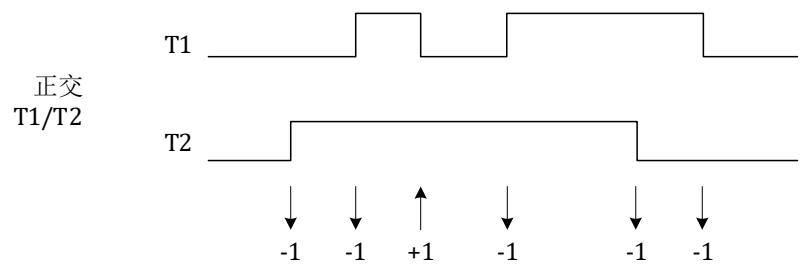  
图13-13 编码器只在T1 时刻计数的正交编码信号计数情况

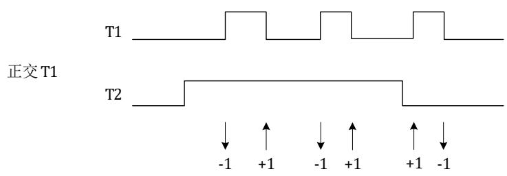  
图13-14 编码器在T1 或T2 时刻计数的正交编码信号计数情况

## 13.2.7.2 符号加脉冲信号

这种工作模式下，T1 为脉冲信号，T2 为符号信号。T1 的边沿触发计数，T2 电平控制计数方向，高则递增，低则递减。可以配置仅T1 上升沿计数还是 T1 上升下降沿都计数。

$$
\begin{array}{l l} \text {Counter Up} & = (\mathrm{T2==1}) @ (\mathrm{T1triggeringedges}) \\ \text {Counter Down} & = (\mathrm{T2==0}) @ (\mathrm{T1triggeringedges}) \end{array}
$$

表 13-3 编码器符号加脉冲工作模式

<table><tr><td rowspan="2">计数模式</td><td rowspan="2">T2 电平状态(稳态信号)</td><td colspan="2">T1 变化边沿状态</td></tr><tr><td>上升沿</td><td>下降沿</td></tr><tr><td rowspan="2">仅 T1 上升沿</td><td>高</td><td>递增</td><td>不计数</td></tr><tr><td>低</td><td>递减</td><td>不计数</td></tr><tr><td rowspan="2">T1 上升下降沿</td><td>高</td><td>递增</td><td>递减</td></tr><tr><td>低</td><td>递减</td><td>递增</td></tr></table>

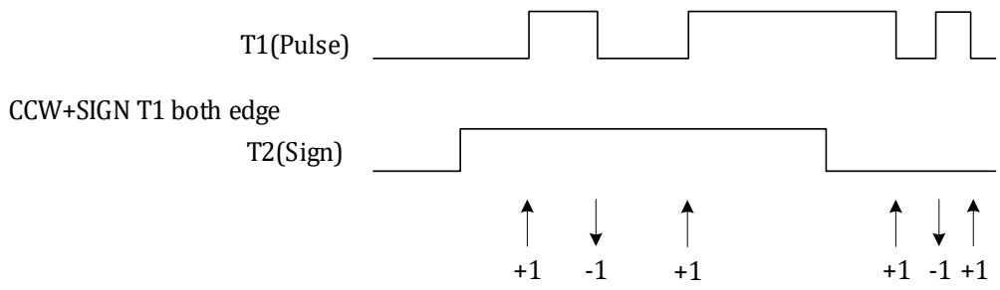

图13-15 编码器在 T1 上升下降沿都计数的符号加脉冲信号计数情况  
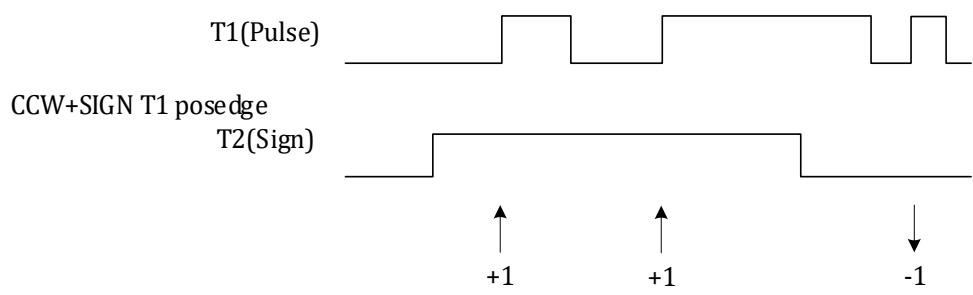  
图13-16 编码器在仅T1 上升沿计数的符号加脉冲信号计数情况

## 13.2.7.3 CCW/CW 双脉冲信号

在 T1 跳变时计数器递增，在 T2 跳变时计数器递减。可以配置计数器仅在上升沿变化或者在上升下降沿都变化。以下式表示

Counter Up = 1 @ (T1 triggering edges)

Counter Down = 1 @ (T2 triggering edges)

表13-4 编码器CCW/CW 双脉冲工作模式

<table><tr><td rowspan="2">计数模式</td><td colspan="4">变化边沿状态</td></tr><tr><td>T1 上升沿</td><td>T1 下降沿</td><td>T2 上升沿</td><td>T2 下降沿</td></tr><tr><td>T1/T2 上升沿</td><td>递增</td><td>不计数</td><td>递减</td><td>不计数</td></tr><tr><td>T1/T2 上升下降沿</td><td>递增</td><td>递增</td><td>递减</td><td>递减</td></tr></table>

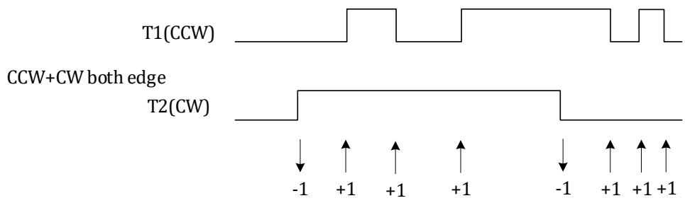  
图13-17 编码器仅在T1/T2 上升沿计数的 CCW/CW 双脉冲信号计数情况

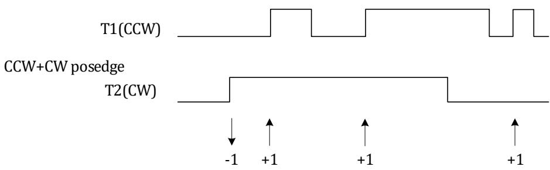  
图13-18 编码器在 T1/T2 上升下降沿计数的 CCW/CW 双脉冲信号计数情况

## 13.3 寄存器

## 13.3.1 地址分配

Timer0 在芯片中的基地址是 0x4001\_0600

表 13-5 Timer0 寄存器地址分配

<table><tr><td>名称</td><td>偏移</td><td>描述</td></tr><tr><td>TIMER0_CFG</td><td>0x00</td><td>Timer0 配置寄存器</td></tr><tr><td>TIMER0_TH</td><td>0x04</td><td>Timer0 计数门限寄存器</td></tr><tr><td>TIMER0_CNT</td><td>0x08</td><td>Timer0 计数值寄存器</td></tr><tr><td>TIMER0_CMP0</td><td>0x0C</td><td>Timer0 比较/捕获寄存器 0</td></tr><tr><td>TIMER0_CMP1</td><td>0x10</td><td>Timer0 比较/捕获寄存器 1</td></tr><tr><td>TIMER0_EVT</td><td>0x14</td><td>Timer0 外部事件选择寄存器</td></tr><tr><td>TIMER0_FLT</td><td>0x18</td><td>Timer0 滤波控制寄存器</td></tr><tr><td>TIMER0_IE</td><td>0x1C</td><td>Timer0 中断使能寄存器</td></tr><tr><td>TIMER0_IF</td><td>0x20</td><td>Timer0 中断标志寄存器</td></tr><tr><td>TIMER0_IO</td><td>0x24</td><td>Timer0 IO 控制寄存器</td></tr></table>

Timer1 在芯片中的基地址是 0x4001\_0700

表 13-6 Timer1 寄存器地址分配

<table><tr><td>TIMER1_CFG</td><td>0x00</td><td>Timer1 配置寄存器</td></tr><tr><td>TIMER1_TH</td><td>0x04</td><td>Timer1 计数门限寄存器</td></tr><tr><td>TIMER1_CNT</td><td>0x08</td><td>Timer1 计数值寄存器</td></tr><tr><td>TIMER1_CMP0</td><td>0x0C</td><td>Timer1 比较/捕获寄存器 0</td></tr><tr><td>TIMER1_CMP1</td><td>0x10</td><td>Timer1 比较/捕获寄存器 1</td></tr><tr><td>TIMER1_EVT</td><td>0x14</td><td>Timer1 外部事件选择寄存器</td></tr><tr><td>TIMER1_FLT</td><td>0x18</td><td>Timer1 滤波控制寄存器</td></tr><tr><td>TIMER1_IE</td><td>0x1C</td><td>Timer1 中断使能寄存器</td></tr><tr><td>TIMER1_IF</td><td>0x20</td><td>Timer1 中断标志寄存器</td></tr></table>

Timer2 在芯片中的基地址是 0x4001\_0800

表 13-7 Timer2 寄存器地址分配

<table><tr><td>TIMER2_CFG</td><td>0x00</td><td>Timer2 配置寄存器</td></tr><tr><td>TIMER2_TH</td><td>0x04</td><td>Timer2 计数门限寄存器</td></tr><tr><td>TIMER2_CNT</td><td>0x08</td><td>Timer2 计数值寄存器</td></tr><tr><td>TIMER2_CMP0</td><td>0x0C</td><td>Timer2 比较/捕获寄存器 0</td></tr><tr><td>TIMER2_CMP1</td><td>0x10</td><td>Timer2 比较/捕获寄存器 1</td></tr><tr><td>TIMER2_EVT</td><td>0x14</td><td>Timer2 外部事件选择寄存器</td></tr><tr><td>TIMER2_FLT</td><td>0x18</td><td>Timer2 滤波控制寄存器</td></tr><tr><td>TIMER2_IE</td><td>0x1C</td><td>Timer2 中断使能寄存器</td></tr><tr><td>TIMER2_IF</td><td>0x20</td><td>Timer2 中断标志寄存器</td></tr></table>

Timer3 在芯片中的基地址是 0x4001\_0900  
表 13-8 Timer3 寄存器地址分配

<table><tr><td>TIMER3_CFG</td><td>0x00</td><td>Timer3 配置寄存器</td></tr><tr><td>TIMER3_TH</td><td>0x04</td><td>Timer3 计数门限寄存器</td></tr><tr><td>TIMER3_CNT</td><td>0x08</td><td>Timer3 计数值寄存器</td></tr><tr><td>TIMER3_CMP0</td><td>0x0C</td><td>Timer3 比较/捕获寄存器 0</td></tr><tr><td>TIMER3_CMP1</td><td>0x10</td><td>Timer3 比较/捕获寄存器 1</td></tr><tr><td>TIMER3_EVT</td><td>0x14</td><td>Timer3 外部事件选择寄存器</td></tr><tr><td>TIMER3_FLT</td><td>0x18</td><td>Timer3 滤波控制寄存器</td></tr><tr><td>TIMER3_IE</td><td>0x1C</td><td>Timer3 中断使能寄存器</td></tr><tr><td>TIMER3_IF</td><td>0x20</td><td>Timer3 中断标志寄存器</td></tr></table>

Timer0/1/2/3 不同之处在于 Timer0/1 计数器相关寄存器为 16 位宽，而 Timer2/3 计数器相关寄存器为 32 位宽，即 TIMERx\_TH，TIMERx\_CMP0，TIMERx\_CMP1 的位宽不同。

且Timer0的TH/CMP0/CMP1存在影子寄存器，可以选择是否启用影子寄存器，如果不启用，则 Timer0 和 Timer1 相同。如果启用影子寄存器，则向以上 3 个寄存器写入的仅仅是预装载值，当 Timer0 发生过零事件时，预装载值被加载进入影子寄存器；读取 TIMER0\_TH/CMP0/CMP1 读

取的影子寄存器的值。

QEP0 在芯片中的基地址是 0x4001\_0A00

表 13-9 QEP0 寄存器地址分配

<table><tr><td>QEP0_CFG</td><td>0x00</td><td>QEP0 配置寄存器</td></tr><tr><td>QEP0_TH</td><td>0x04</td><td>QEP0 计数门限寄存器</td></tr><tr><td>QEP0_CNT</td><td>0x08</td><td>QEP0 计数值寄存器</td></tr><tr><td>QEP0_IE</td><td>0x0C</td><td>QEP0 中断使能寄存器</td></tr><tr><td>QEP0_IF</td><td>0x10</td><td>QEP0 中断标志寄存器</td></tr></table>

QEP1 在芯片中的基地址是 0x4001\_0B00

表 13-10 QEP1 寄存器地址分配

<table><tr><td>QEP1_CFG</td><td>0x00</td><td>QEP1 配置寄存器</td></tr><tr><td>QEP1_TH</td><td>0x04</td><td>QEP1 计数门限寄存器</td></tr><tr><td>QEP1_CNT</td><td>0x08</td><td>QEP1 计数值寄存器</td></tr><tr><td>QEP1_IE</td><td>0x0C</td><td>QEP1 中断使能寄存器</td></tr><tr><td>QEP1_IF</td><td>0x10</td><td>QEP1 中断标志寄存器</td></tr></table>

## 13.3.2 TIMER0 寄存器

## 13.3.2.1 TIMER0\_CFG Timer0 配置寄存器

地址:0x4001\_0600

复位值:0x00001000

表 13-11 Timer0 配置寄存器 TIMER0\_CFG

<table><tr><td>31</td><td>30</td><td>29</td><td>28</td><td>27</td><td>26</td><td>25</td><td>24</td><td>23</td><td>22</td><td>21</td><td>20</td><td>19</td><td>18</td><td>17</td><td>16</td></tr><tr><td>EN</td><td rowspan="3"></td><td>CAP1_CLR_EN</td><td>CAPO_CLR_EN</td><td>UPDATE</td><td>SHADOW</td><td>ONE_TRIG</td><td>CENTER</td><td>DIR</td><td colspan="3">CLK_DIV</td><td>ETON</td><td>GATE_EN</td><td>RL_EN</td><td>XCLK_EN</td></tr><tr><td>RW</td><td>RW</td><td>RW</td><td>WO</td><td>RW</td><td>RW</td><td>RW</td><td>RW</td><td colspan="3">RW</td><td>RW</td><td>RW</td><td>RW</td><td>RW</td></tr><tr><td>0</td><td>0</td><td>0</td><td>0</td><td>0</td><td>0</td><td>0</td><td>0</td><td colspan="3">0</td><td>0</td><td>0</td><td>0</td><td>0</td></tr></table>

<table><tr><td>15</td><td>14</td><td>13</td><td>12</td><td>11</td><td>10</td><td>9</td><td>8</td><td>7</td><td>6</td><td>5</td><td>4</td><td>3</td><td>2</td><td>1</td><td>0</td></tr><tr><td colspan="4">SRC1</td><td>CH1_POL</td><td>CH1_MODE</td><td>CH1_FE_CAP_EN</td><td>CH1_RE_CAP_EN</td><td colspan="4">SRC0</td><td>CHO_POL</td><td>CHO_MODE</td><td>CHO_FE_CAP_EN</td><td>CHO_RE_CAP_EN</td></tr><tr><td colspan="4">RW</td><td>RW</td><td>RW</td><td>RW</td><td>RW</td><td colspan="4">RW</td><td>RW</td><td>RW</td><td>RW</td><td>RW</td></tr><tr><td colspan="4">1</td><td>0</td><td>0</td><td>0</td><td>0</td><td colspan="4">0</td><td>0</td><td>0</td><td>0</td><td>0</td></tr></table>

<table><tr><td>位置</td><td>位名称</td><td>说明</td></tr><tr><td>[31]</td><td>EN</td><td>Timer模块整体使能,高有效</td></tr><tr><td>[30]</td><td></td><td>未使用</td></tr><tr><td>[29]</td><td>CAP1_CLR_EN</td><td>当发生CAP1捕获事件时,清零Timer计数器,高有效</td></tr><tr><td>[28]</td><td>CAP0_CLR_EN</td><td>当发生CAP0捕获事件时,清零Timer计数器,高有效</td></tr><tr><td>[27]</td><td>UPDATE</td><td>软件更新启用影子寄存器时,向UPDATE写1将TH/CMP0/CMP1的预装载值加载到影子寄存器STH/SCMP0/SCMP1之中。自动清零,读回恒为0。写0无作用。推荐使用TIMER0_CFG|=BIT27;的方式进行手动更新影子寄存器的操作,防止手动更新时误将其他配置清零。</td></tr><tr><td>[26]</td><td>SHADOW</td><td>0:不启用影子寄存器,软件写入TH/CMP0/CMP1时直接更新对应的影子寄存器1:启用影子寄存器,软件写入TH/CMP0/CMP1时进仅仅更新预装载值,当Timer发生过零事件时才将预装载值写入影子寄存器</td></tr><tr><td>[25]</td><td>ONE_TRIG</td><td>单次发送模式,此位需要在Timer比较模式下使用,且EN需设置为0ETON为0时,软件向ONE_TRIG写1触发Timer发送一个周期的特定占空比的脉冲,Timer计数一个周期后停止。此位在Timer计数的当前周期内读为1,Timer停止后,自动清零。ETON为1时,即使软件配置ONE_TRIG=1,也需要等待外部事件触发,Timer计数一个周期后停止。ONE_TRIG位在外部触发Timer计数一个周期停止后被硬件清零。</td></tr><tr><td>[24]</td><td>CENTER</td><td>中心计数模式使能0:Timer向上从0计数至TH,然后回0,或Timer向下从TH计数至0,然后回到TH1:Timer向上从0计数至TH,然后向下计数至0</td></tr><tr><td>[23]</td><td>DIR</td><td>0:0-&gt;TH递增计数,1:TH-&gt;递减计数此位在CENTER=1时只读,用于指示当前计数方向</td></tr><tr><td>[22:20]</td><td>CLK_DIV</td><td>Timer计数器频率配置,计数器计数频率是系统主时钟频率的 $2^{CLK\_DIV}$ 分频。默认值为0,不分频。0:1分频1:2分频2:4分频3:8分频4:16分频5:32分频6:64分频7:128分频</td></tr><tr><td>[19]</td><td>ETON</td><td>Timer计数器外部启动使能0:自动运行1:等待外部事件触发计数,外部触发信号根据TIMER0_EVT.EVT_SRC进行选择需要注意的是,使用外部触发也需要设置TIMERx_CFG.EN=1,除非是外部信号进行的单次触发,即TIMERx_CFG.ONE_TRIG=1。</td></tr><tr><td>[18]</td><td>GATE_EN</td><td>Timer暂停使能0:不暂停1:当外部信号为低时,Timer 暂停计数,外部信号根据 TIMER0_EVT.EVT_SRC 进行选择</td></tr><tr><td>[17]</td><td>RL_EN</td><td>Timer 重装使能0:禁用外部事件重装,Timer 向上计数至 TH 回 0,或向下计数值 0 回到 TH1:使能外部事件重装,重装信号根据 TIMER0_EVT.EVT_SRC 进行选择,当向上计数时,发生外部事件,Timer 重装为 0,;当向下计数时,发生外部事件,Timer 重装为 TH。</td></tr><tr><td>[16]</td><td>XCLK_EN</td><td>Timer 时钟源0:芯片内部时钟1:外部时钟,时钟源根据 TIMER0_EVT.EVT_SRC 进行选择,当使用外部时钟时,CLK_DIV 不再起作用,即时钟不再进行分频</td></tr><tr><td>[15:12]</td><td>SRC1</td><td>Timer 捕获模式通道 1 信号来源。默认为 3'h1。0:Timer 通道 0,来自芯片 GPIO(参见 Datasheet 及应用配置)1:Timer 通道 1,来自芯片 GPIO(参见 Datasheet 及应用配置)2:CLU0 输出3:CLU1 输出4:CLU2 输出5:CLU3 输出6:比较器 0 的输出7:比较器 1 的输出8:比较器 2 的输出9:Timer 通道 0 和 1 的异或</td></tr><tr><td>[11]</td><td>CH1_POL</td><td>Timer 通道 1 在比较模式下的输出极性控制,当计数器 CNT</td></tr><tr><td>[10]</td><td>CH1_MODE</td><td>Timer 通道 1 的工作模式选择,默认值为 0。0:比较模式。输出方波,在 Timer 通道 1 计数器计数值等于 0 或等于 Timer 比较捕获寄存器值时,IO 发生翻转。1:捕获模式。当 Timer 通道 1 输入信号发生捕获事件时,将计数器计数值存入 Timer 通道 1 比较捕获寄存器。</td></tr><tr><td>[9]</td><td>CH1_FE_CAP_EN</td><td>Timer 通道 1 下降沿捕获事件使能。1:使能;0:关闭。Timer 通道 1 输入信号发生 1→0 跳变被视为捕获事件。下降沿事件使能可以与上升沿事件使能并存。</td></tr><tr><td>[8]</td><td>CH1_RE_CAP_EN</td><td>Timer 通道 1 上升沿捕获事件使能。1:使能;0:关闭。Timer 通道 1 输入信号发生 0→1 跳变被视为捕获事件。上升沿事件使能可以与下降沿事件使能并存。</td></tr><tr><td>[7:4]</td><td>SRC0</td><td>Timer 捕获模式通道 0 信号来源。默认为 3'h0。0:Timer 通道 0,来自芯片 GPIO(参见 Datasheet 及应用配置)1:Timer 通道 1,来自芯片 GPIO(参见 Datasheet 及应用配置)2:CLU0 输出3:CLU1 输出4:CLU2 输出5:CLU3 输出6:比较器 0 的输出7:比较器1的输出8:比较器2的输出9:Timer通道0和1的异或</td></tr><tr><td>[3]</td><td>CHO_POL</td><td>Timer通道0在比较模式下的输出极性控制:当计数器CNT&lt;CMPO时的输出值。时的输出值。</td></tr><tr><td>[2]</td><td>CHO_MODE</td><td>Timer通道0的工作模式选择,默认值为0。0:比较模式。输出方波,在Timer通道0计数器计数值等于0或等于Timer比较捕获寄存器值时,IO发生翻转。1:捕获模式。当Timer通道0输入信号发生捕获事件时,将计数器计数值存入Timer通道0比较捕获寄存器。</td></tr><tr><td>[1]</td><td>CHO_FE_CAP_EN</td><td>Timer通道0下降沿捕获事件使能。1:使能;0:关闭。Timer通道0输入信号发生1→0跳变被视为捕获事件。下降沿事件使能可以与上升沿事件使能并存。</td></tr><tr><td>[0]</td><td>CHO_RE_CAP_EN</td><td>Timer通道0上升沿捕获事件使能。1:使能;0:关闭。Timer通道0输入信号发生0→1跳变被视为捕获事件。上升沿事件使能可以与下降沿事件使能并存。</td></tr></table>

当使用外部时钟计数时，也需要设置 TIMERx\_CFG.TON=1，且需要开启 SYS\_CLK\_FEN 中对于Timer 时钟的使能。使用外部时钟计数时，也需要设置 TIMERx\_TH。

通常外部事件仅仅作为外部启动、外部门控、外部时钟和外部清零的一个用途使用，即通常TIMERx\_CFG[19:16]中仅设置 1bit 为 1。

如果设置SRC0为4’h8捕获两通道异或值，（通常为捕获编码器正交的两个通道），需要同时设置 CMP0\_CLR\_EN=1，CH0\_FE\_CAP\_EN=1，CH0\_RE\_CAP\_EN=1，CH0\_MODE=1，即捕获上升沿、下降沿，且每次有信号边沿都清零计数器。CMP0 即为捕获的两次信号边沿之间的计数值。

## 13.3.2.2 TIMER0\_TH Timer0 门限寄存器

地址:0x4001\_0604

复位值:0x0

表 13-12 Timer0 门限寄存器 TIMER0\_TH

<table><tr><td>15</td><td>14</td><td>13</td><td>12</td><td>11</td><td>10</td><td>9</td><td>8</td><td>7</td><td>6</td><td>5</td><td>4</td><td>3</td><td>2</td><td>1</td><td>0</td></tr><tr><td></td><td></td><td></td><td></td><td></td><td></td><td></td><td></td><td>TH</td><td></td><td></td><td></td><td></td><td></td><td></td><td></td></tr><tr><td></td><td></td><td></td><td></td><td></td><td></td><td></td><td></td><td>RW</td><td></td><td></td><td></td><td></td><td></td><td></td><td></td></tr><tr><td></td><td></td><td></td><td></td><td></td><td></td><td></td><td></td><td>0</td><td></td><td></td><td></td><td></td><td></td><td></td><td></td></tr></table>

<table><tr><td>位置</td><td>位名称</td><td>说明</td></tr><tr><td>[31:16]</td><td></td><td>未使用</td></tr><tr><td>[15:0]</td><td>TH</td><td>Timer 计数器计数门限。向上计数从 0 计数到 TH 值后回 0,或向下计数从 TH 计数到 0 后回到 TH</td></tr></table>

## 13.3.2.3 TIMER0\_CNT Timer0 计数寄存器

地址:0x4001\_0608

复位值:0x0

表 13-13 Timer0 计数寄存器 TIMER0\_CNT

<table><tr><td>15</td><td>14</td><td>13</td><td>12</td><td>11</td><td>10</td><td>9</td><td>8</td><td>7</td><td>6</td><td>5</td><td>4</td><td>3</td><td>2</td><td>1</td><td>0</td></tr><tr><td></td><td></td><td></td><td></td><td></td><td></td><td></td><td></td><td>CNT</td><td></td><td></td><td></td><td></td><td></td><td></td><td></td></tr><tr><td></td><td></td><td></td><td></td><td></td><td></td><td></td><td></td><td>RW</td><td></td><td></td><td></td><td></td><td></td><td></td><td></td></tr><tr><td></td><td></td><td></td><td></td><td></td><td></td><td></td><td></td><td>0</td><td></td><td></td><td></td><td></td><td></td><td></td><td></td></tr></table>

<table><tr><td>位置</td><td>位名称</td><td>说明</td></tr><tr><td>[31:16]</td><td></td><td>未使用</td></tr><tr><td>[15:0]</td><td>CNT</td><td>Timer 0 计数器当前计数值。写操作可以写入新的计数值。</td></tr></table>

注意:写入 TIMER0\_CNT 前需要先通过 SYS\_CLK\_FEN.TIMER0\_CLK\_EN 开启 Timer0 时钟。

## 13.3.2.4 TIMER0\_CMP0 Timer0 通道 0 比较捕获寄存器

地址:0x4001\_060C

复位值 $\boldsymbol { \cdot } 0 \mathbf { x } 0$

表 13-14 Timer0 通道 0 比较捕获寄存器 TIMER0\_CMP0

<table><tr><td>15</td><td>14</td><td>13</td><td>12</td><td>11</td><td>10</td><td>9</td><td>8</td><td>7</td><td>6</td><td>5</td><td>4</td><td>3</td><td>2</td><td>1</td><td>0</td></tr><tr><td></td><td></td><td></td><td></td><td></td><td></td><td></td><td></td><td></td><td></td><td></td><td></td><td></td><td></td><td></td><td></td></tr><tr><td></td><td></td><td></td><td></td><td></td><td></td><td></td><td></td><td></td><td></td><td></td><td></td><td></td><td></td><td></td><td></td></tr><tr><td></td><td></td><td></td><td></td><td></td><td></td><td></td><td></td><td></td><td></td><td></td><td></td><td></td><td></td><td></td><td></td></tr><tr><td></td><td></td><td></td><td></td><td></td><td></td><td></td><td></td><td></td><td></td><td></td><td></td><td></td><td></td><td></td><td></td></tr></table>

<table><tr><td>位置</td><td>位名称</td><td>说明</td></tr><tr><td>[31:16]</td><td></td><td>未使用</td></tr><tr><td>[15:0]</td><td>CMP0</td><td>Timer通道0工作在比较模式时,当计数器计数值等于CMP0时,发生比较事件。Timer通道0工作在捕获模式时,发生捕获事件时的计数器计数值存入CMP0寄存器。</td></tr></table>

设置 CMP0=0，可使得通道 0 恒为!CH0\_POL，设置 CMP0=TH+1，可使得通道 0 恒为 CH0\_POL。

## 13.3.2.5 TIMER0\_CMP1 Timer0 通道 1 比较捕获寄存器

地址:0x4001\_0610

复位值 $\boldsymbol { \cdot } 0 \mathbf { x } 0$

表 13-15 Timer0 通道 1 比较捕获寄存器 TIMER0\_CMP1

<table><tr><td>15</td><td>14</td><td>13</td><td>12</td><td>11</td><td>10</td><td>9</td><td>8</td><td>7</td><td>6</td><td>5</td><td>4</td><td>3</td><td>2</td><td>1</td><td>0</td></tr><tr><td></td><td></td><td></td><td></td><td></td><td></td><td></td><td></td><td></td><td></td><td></td><td></td><td></td><td></td><td></td><td></td></tr><tr><td></td><td></td><td></td><td></td><td></td><td></td><td></td><td></td><td></td><td></td><td></td><td></td><td></td><td></td><td></td><td></td></tr><tr><td></td><td></td><td></td><td></td><td></td><td></td><td></td><td></td><td></td><td></td><td></td><td></td><td></td><td></td><td></td><td></td></tr><tr><td></td><td></td><td></td><td></td><td></td><td></td><td></td><td></td><td></td><td></td><td></td><td></td><td></td><td></td><td></td><td></td></tr></table>


--- Part 2: Pages 201-400 ---

<table><tr><td>位置</td><td>位名称</td><td>说明</td></tr><tr><td>[31:16]</td><td></td><td>未使用</td></tr><tr><td>[15:0]</td><td>CMP1</td><td>Timer 通道 1 工作在比较模式时,当计数器计数值等于 CMP1 时,发生比较事件。Timer 通道 1 工作在捕获模式时,发生捕获事件时的计数器计数值存入 CMP1 寄存器。</td></tr></table>

设置 CMP1=0，可使得通道恒为!CH1\_POL，设置 CMP1=TH+1，可使得通道恒为 CH1\_POL。

## 13.3.2.6 TIMER0\_EVT Timer0 外部事件选择寄存器

地址:0x4001\_0614

复位值:0x0

表 13-16 Timer0 外部事件选择寄存器 TIMER0\_EVT

<table><tr><td colspan="2">15 14 13 12 11 10 9 8 7 6 5 4 3 2 1 0</td></tr><tr><td rowspan="3"></td><td>EVT_SRC</td></tr><tr><td>RW</td></tr><tr><td>0</td></tr></table>

<table><tr><td>位置</td><td>位名称</td><td>说明</td></tr><tr><td>[31:4]</td><td></td><td>未使用</td></tr><tr><td>[3:0]</td><td>EVT_SRC</td><td>Timer 外部事件选择寄存器,本寄存器需要配合TIMER0_CFG.ETON,TIMER0_CFG.GATE_EN,TIMER0_CFG.RL_EN,TIMER0_CFG.XCLK_EN 使用。通常 4 个设置位不同时使用。当设置 ETON=1 时,根据本寄存器选择触发 Timer 计数的事件。需要注意的是,Timer 自身的比较事件无法触发 Timer 进行计数。当 ETON=1 时,触发信号的上升沿触发 Timer 开始计数,用作触发源的 Timer 需要工作在比较模式,无须从外部输入信号至 Timer 通道 0:不可用1:不可用2:TIMER1 通道 0 比较/捕获事件3:TIMER1 通道 1 比较/捕获事件4:TIMER2 通道 0 比较/捕获事件5:TIMER2 通道 1 比较/捕获事件6:TIMER3 通道 0 比较/捕获事件7:TIMER3 通道 1 比较/捕获事件8:CLU0 输出上升沿9:CLU1 输出上升沿10:CLU2 输出上升沿11:CLU3 输出上升沿12:MCPWM TADC[0]比较事件13:MCPWM TADC[1]比较事件14:MCPWM TADC[2]比较事件15:MCPWM TADC[3]比较事件当 GATE_EN=1,且外部信号为高时 Timer 计数,外部信号为低时,Timer 暂停,当 GATE_EN=1 时,Timer 使用对应外部信号的电平信号作为计数门控。GATE_EN 仅支持配合 0~11 的外部事件使用,当 EVT_SRC 选择为 0~7 时,外部信号为 Timer 通道输入信号经过对应 Timer 滤波后的信号,作为门控信号的 Timer 通道需要配置为输入使能。0:TIMER0 通道 0 滤波后输入信号1:TIMER0 通道 1 滤波后输入信号2:TIMER1 通道 0 滤波后输入信号3:TIMER1 通道 1 滤波后输入信号4:TIMER2 通道 0 滤波后输入信号5:TIMER2 通道 1 滤波后输入信号6:TIMER3 通道 0 滤波后输入信号7:TIMER3 通道 1 滤波后输入信号8:CLU0 输出信号9:CLU1 输出信号10:CLU2 输出信号11:CLU3 输出信号当 RL_EN 为高时,Timer 使用外部信号作为重装载信号作为重装载信号的 Timer 通道需要配置为输入使能0:TIMER0 通道 0 比较/捕获事件1:TIMER0 通道 1 比较/捕获事件2:TIMER1 通道 0 比较/捕获事件3:TIMER1 通道 1 比较/捕获事件4:TIMER2 通道 0 比较/捕获事件5:TIMER2 通道 1 比较/捕获事件6:TIMER3 通道 0 比较/捕获事件7:TIMER3 通道 1 比较/捕获事件8:CLU0 输出9:CLU1 输出10:CLU2 输出11:CLU3 输出12:MCPWM TADC[0]比较事件13:MCPWM TADC[1]比较事件14:MCPWM TADC[2]比较事件15:MCPWM TADC[3]比较事件当 XCLK_EN 为高时,Timer 使用外部信号作为 Timer 外部时钟,Timer 在时钟上升沿进行计数动作。如果使用 Timer 通道作为外部时钟,通道信号受到对应 Timer 滤波设置影响。0:TIMER0 通道 0 输入信号1:TIMER0 通道 1 输入信号2:TIMER1 通道 0 输入信号3:TIMER1 通道 1 输入信号4:TIMER2 通道 0 输入信号5:TIMER2 通道 1 输入信号6:TIMER3 通道 0 输入信号7:TIMER3 通道 1 输入信号8:CLU0 输出9:CLU1 输出10:CLU2 输出11:CLU3 输出12:MCPWM TADC[0]比较事件13:MCPWM TADC[1]比较事件14:MCPWM TADC[2]比较事件15:MCPWM TADC[3]比较事件</td></tr></table>

## 13.3.2.7 TIMER0\_FLT Timer0 滤波控制寄存器

地址:0x4001\_0618

复位值:0x0

表 13-17 Timer0 滤波控制寄存器 TIMER0\_FLT

<table><tr><td>15</td><td>14</td><td>13</td><td>12</td><td>11</td><td>10</td><td>9</td><td>8</td><td>7</td><td>6</td><td>5</td><td>4</td><td>3</td><td>2</td><td>1</td><td>0</td></tr><tr><td rowspan="3" colspan="8"></td><td colspan="8">FLT</td></tr><tr><td colspan="8">RW</td></tr><tr><td colspan="8">0</td></tr></table>

<table><tr><td>位置</td><td>位名称</td><td>说明</td></tr><tr><td>[31:8]</td><td></td><td>未使用</td></tr><tr><td>[7:0]</td><td>FLT</td><td>通道 0/1 信号滤波宽度选择。取值范围 0~255。 FLT 为 0 时,不对通道进行滤波。 FLT 不为 0 时,对通道信号进行滤波:滤波宽度为  $FLT \times 8$ 。当通道信号电平稳定超过  $FLT \times 8$  个系统时钟周期宽度时,滤波器输出更新;否则,滤波器保持当前的输出不变。</td></tr></table>

注意，以上滤波器的工作时钟与对应的 Timer 的分频后的工作时钟为相同时钟，受TIMERx\_CFG.CLK\_DIV 的分频系数控制。

假设 TIMERx\_FLT = 0x6；TIMERx\_CFG.CLK\_DIV = 0x2; 则 Timer 的运行时钟相对系统时钟进行了 4 分频。通道输入信号需要经过 8×6 倍 Timer 的运行时钟的滤波，亦即 8×6×4 倍系统时钟的滤波。

## 13.3.2.8 TIMER0\_IE Timer0 中断使能寄存器

地址:0x4001\_061C

复位值:0x0

表 13-18 Timer0 中断使能寄存器 TIMER0\_IE

<table><tr><td rowspan="3"></td><td>FAIL_RE</td><td>ZC_RE</td><td>CH1_RE</td><td>CH0_RE</td><td rowspan="3"></td><td>FAIL_IE</td><td>ZC_IE</td><td>CH1_IE</td><td>CH0_IE</td></tr><tr><td>RW</td><td>RW</td><td>RW</td><td>RW</td><td>RW</td><td>RW</td><td>RW</td><td>RW</td></tr><tr><td>0</td><td>0</td><td>0</td><td>0</td><td>0</td><td>0</td><td>0</td><td>0</td></tr></table>

<table><tr><td>位置</td><td>位名称</td><td>说明</td></tr><tr><td>[31:12]</td><td></td><td>未使用</td></tr><tr><td>[11]</td><td>FAIL_RE</td><td>Timer FAIL 事件 DMA 请求使能,高电平有效。</td></tr><tr><td>[10]</td><td>ZC_RE</td><td>Timer 计数器过 0 DMA 请求使能,高电平有效。</td></tr><tr><td>[9]</td><td>CH1_RE</td><td>Timer 通道 1 比较/捕获 DMA 请求使能,高电平有效。</td></tr><tr><td>[8]</td><td>CHO_RE</td><td>Timer 通道 0 比较/捕获 DMA 请求使能,高电平有效。</td></tr><tr><td>[7:4]</td><td></td><td>未使用</td></tr><tr><td>[3]</td><td>FAIL_IE</td><td>Timer FAIL 事件中断使能,高电平有效。</td></tr><tr><td>[2]</td><td>ZC_IE</td><td>Timer 计数器过 0 中断使能,高电平有效。</td></tr><tr><td>[1]</td><td>CH1_IE</td><td>Timer 通道 1 比较/捕获中断使能,高电平有效。</td></tr><tr><td>[0]</td><td>CHO_IE</td><td>Timer 通道 0 比较/捕获中断使能,高电平有效。</td></tr></table>

DMA 请求事件，与中断为相同事件标志，DMA 请求被DMA 受理后，中断标志会被DMA 硬件自动清除，无需CPU 软件干预。需要注意的是，通常开启某个事件的 DMA 请求则关闭对应的中断使能。

## 13.3.2.9 TIMER0\_IF Timer0 中断标志寄存器

地址:0x4001\_0620

复位值:0x0

表 13-19 Timer0 中断标志寄存器 TIMER0\_IF

<table><tr><td>0</td><td>RW1C</td><td>FAIL_IF</td></tr><tr><td>0</td><td>RW1C</td><td>ZC_IF</td></tr><tr><td>0</td><td>RW1C</td><td>CH1_IF</td></tr><tr><td>0</td><td>RW1C</td><td>CHO_IF</td></tr></table>

<table><tr><td>位置</td><td>位名称</td><td>说明</td></tr><tr><td>[31:4]</td><td></td><td>未使用</td></tr><tr><td>[3]</td><td>FAIL_IF</td><td>Timer Fail 事件中断标志。高电平有效,写1清0</td></tr><tr><td>[2]</td><td>ZC_IF</td><td>Timer 计数器过0中断标志。高电平有效,写1清0</td></tr><tr><td>[1]</td><td>CH1_IF</td><td>Timer 通道 1 比较/捕获中断标志。高电平有效,写 1 清 0</td></tr><tr><td>[0]</td><td>CHO_IF</td><td>Timer 通道 0 比较/捕获中断标志。高电平有效,写 1 清 0</td></tr></table>

在比较模式下，当 Timer 设置为中心计数（0->TH->0），即 TIMERx\_CFG.CENTER=1 时。CH0\_IF 和 CH1\_IF 只有在 Timer 从 0 递增计数至 TH 的过程中，当 TIMERx\_CNT=TIMERx\_CMP0/1时置位；在Timer 从TH 递减计数到0 的过程中不会置位。

当 TIMERx\_CFG.DIR=0

中断标志写 1 清零，一般不建议用如下|=方式清零，因为|=是先读取中断标志，将对应位改为1 再写入清零，如果同时有其他中断标志置位，会被一起清零，而这通常不是软件所期望的。例如，如下写法本意是清零ZC\_IF，但如果同时CH0\_IF 在写入执行前置1 了，则软件先读取回TIMERx\_IF值为 0x24，然后执行或操作 0x4|0x1=0x5，然后写入，同时对 CH0\_IF 和 ZC\_IF 进行了清零，可能导致 Timer 少进入一次因捕获而产生的中断。

$$
T I M E R x \_ I F | = 0 x 4;
$$

如果希望清零ZC\_IF 标志位，应以如下方式，直接对BIT2 写1.

$$
T I M E R x \_ I F = 0 x 4;
$$

## 13.3.2.10TIMER0\_IO Timer0 IO 控制寄存器

地址:0x4001\_0624

复位值:0x0

表 13-20 Timer0 IO 控制寄存器 TIMER0\_IO

<table><tr><td rowspan="3"></td><td>CH1_DEFAULT</td><td>CHO_DEFAULT</td><td>HALT_PRT</td><td>MOE</td><td rowspan="3"></td><td>FAIL_SEL</td><td>FAIL_POL</td><td>FAIL_EN</td></tr><tr><td>RW</td><td>RW</td><td>RW</td><td>RW</td><td>RW</td><td>RW</td><td>RW</td></tr><tr><td>0</td><td>0</td><td>0</td><td>0</td><td>0</td><td>0</td><td>0</td></tr></table>

<table><tr><td>位置</td><td>位名称</td><td>说明</td></tr><tr><td>[31:10]</td><td></td><td>未使用</td></tr><tr><td>[9]</td><td>CH1_DEFAULT</td><td>发生 Fail 事件 MOE 清零后,CH1 通道输出值</td></tr><tr><td>[8]</td><td>CHO_DEFAULT</td><td>发生 Fail 事件 MOE 清零后,CHO 通道输出值</td></tr><tr><td>[7]</td><td>HALT_PRT</td><td>MCU 进入 HALT 状态,Timer 输出值选择。1: 输出 CH1_DEFAULT 和 CHO_DEFAULT;0: 正常输出</td></tr><tr><td>[6]</td><td>MOE</td><td>当 TIMER0_CFG.CENTER=1 时,Timer 通道 0/1 输出使能1: 输出正常信号0: 输出 CHO_DEFAULT 和 CH1_DEFAULT 默认值TIMER0_IF.FAIL_IF 变 1 将触发 MOE 变成 0,通道输出默认值。若要恢复输出正常信号,需要先将 FAIL_IF 清零,然后软件设置 MOE=1</td></tr><tr><td>[5:3]</td><td></td><td>未使用</td></tr><tr><td>[2]</td><td>FAIL_SEL</td><td>FAIL 信号选择0: TIMER0_FAIL, 来自 GPIO1: CLU0 输出</td></tr><tr><td>[1]</td><td>FAIL_POL</td><td>FAIL 信号极性0: 高电平 FAIL1: 低电平 FAIL</td></tr><tr><td>[0]</td><td>FAIL_EN</td><td>FAIL 信号使能0: 禁用 FAIL1: 使能 FAIL</td></tr></table>

## 13.3.3 TIMER1 寄存器

## 13.3.3.1 TIMER1\_CFG Timer1 配置寄存器

地址:0x4001\_0700

复位值:0x00001000

表 13-21 Timer1 配置寄存器 TIMER1\_CFG

<table><tr><td>31</td><td>30</td><td>29</td><td>28</td><td>27</td><td>26</td><td>25</td><td>24</td><td>23</td><td>22</td><td>21</td><td>20</td><td>19</td><td>18</td><td>17</td><td>16</td></tr><tr><td>EN</td><td rowspan="3"></td><td>CAP1_CLR_EN</td><td>CAPO_CLR_EN</td><td rowspan="3" colspan="2"></td><td>ONE_TRIG</td><td>CENTER</td><td>DIR</td><td colspan="3">CLK_DIV</td><td>ETON</td><td>GATE_EN</td><td>RL_EN</td><td>XCLK_EN</td></tr><tr><td>RW</td><td>RW</td><td>RW</td><td>RW</td><td>RW</td><td>RW</td><td colspan="3">RW</td><td>RW</td><td>RW</td><td>RW</td><td>RW</td></tr><tr><td>0</td><td>0</td><td>0</td><td>0</td><td>0</td><td>0</td><td colspan="3">0</td><td>0</td><td>0</td><td>0</td><td>0</td></tr></table>

<table><tr><td>15</td><td>14</td><td>13</td><td>12</td><td>11</td><td>10</td><td>9</td><td>8</td><td>7</td><td>6</td><td>5</td><td>4</td><td>3</td><td>2</td><td>1</td><td>0</td></tr><tr><td colspan="4">SRC1</td><td>CH1_POL</td><td>CH1_MODE</td><td>CH1_FE_CAP_EN</td><td>CH1_RE_CAP_EN</td><td colspan="4">SRC0</td><td>CHO_POL</td><td>CHO_MODE</td><td>CHO_FE_CAP_EN</td><td>CHO_RE_CAP_EN</td></tr><tr><td colspan="4">RW</td><td>RW</td><td>RW</td><td>RW</td><td>RW</td><td colspan="4">RW</td><td>RW</td><td>RW</td><td>RW</td><td>RW</td></tr><tr><td colspan="4">1</td><td>0</td><td>0</td><td>0</td><td>0</td><td colspan="4">0</td><td>0</td><td>0</td><td>0</td><td>0</td></tr></table>

<table><tr><td>位置</td><td>位名称</td><td>说明</td></tr><tr><td>[31]</td><td>EN</td><td>Timer 模块整体使能,高有效</td></tr><tr><td>[30]</td><td></td><td>未使用</td></tr><tr><td>[29]</td><td>CAP1_CLR_EN</td><td>当发生 CAP1 捕获事件时,清零 Timer 计数器,高有效</td></tr><tr><td>[28]</td><td>CAPO_CLR_EN</td><td>当发生 CAPO 捕获事件时,清零 Timer 计数器,高有效</td></tr><tr><td>[27:26]</td><td></td><td>未使用</td></tr><tr><td>[25]</td><td>ONE_TRIG</td><td>单次发送模式,此位需要在 Timer 比较模式下使用,且 EN 需设置为 0ETON 为 0 时,软件向 ONE_TRIG 写 1 触发 Timer 发送一个周期的特定占空比的脉冲,Timer 计数一个周期后停止。此位在 Timer 计数的当前周期内读为 1,Timer 停止后,自动清零。ETON为1时,即使软件配置ONE_TRIG=1,也需要等待外部事件触发,Timer计数一个周期后停止。ONE_TRIG位在外部触发Timer计数一个周期停止后被硬件清零。</td></tr><tr><td>[24]</td><td>CENTER</td><td>中心计数模式使能0:Timer向上从0计数至TH,然后回0,或Timer向下从TH计数至0,然后回到TH1:Timer向上从0计数至TH,然后向下计数至0</td></tr><tr><td>[23]</td><td>DIR</td><td>0:0-&gt;TH递增计数,1:TH-&gt;递减计数此位在CENTER=1时只读,用于指示当前计数方向</td></tr><tr><td>[22:20]</td><td>CLK_DIV</td><td>Timer计数器频率配置,计数器计数频率是系统主时钟频率的 $2^{CLK\_DIV}$ 分频。默认值为0,不分频。0:1分频1:2分频2:4分频3:8分频4:16分频5:32分频6:64分频7:128分频</td></tr><tr><td>[19]</td><td>ETON</td><td>Timer计数器计数外部启动使能0:自动运行1:等待外部事件触发计数,外部触发信号根据TIMER1_EVT.EVT_SRC进行选择需要注意的是,使用外部触发也需要设置TIMER1_CFG.EN=1,除非是外部信号进行的单次触发,即TIMER1_CFG.ONE_TRIG=1。</td></tr><tr><td>[18]</td><td>GATE_EN</td><td>Timer暂停使能0:不暂停1:当外部信号为低时,Timer暂停计数,外部信号根据TIMER1_EVT.EVT_SRC进行选择</td></tr><tr><td>[17]</td><td>RL_EN</td><td>Timer重装使能0:禁用外部事件重装,Timer向上计数至TH回0,或向下计数值0回到TH1:使能外部事件重装,重装信号根据TIMER1_EVT.EVT_SRC进行选择,当向上计数时,发生外部事件,Timer重装为0,;当向下计数时,发生外部事件,Timer重装为TH。</td></tr><tr><td>[16]</td><td>XCLK_EN</td><td>Timer时钟源0:芯片内部时钟1:外部时钟,时钟源根据TIMER1_EVT.EVT_SRC进行选择,当使用外部时钟时,CLK_DIV不再起作用,即时钟不再进行分频</td></tr><tr><td>[15:12]</td><td>SRC1</td><td>Timer捕获模式通道1信号来源。默认为3'h1。0:Timer通道0,来自芯片GPIO(参见Datasheet及应用配置)1:Timer通道1,来自芯片GPIO(参见Datasheet及应用配置)2:CLU0输出3:CLU1输出4:CLU2输出5:CLU3输出6:比较器0的输出7:比较器1的输出8:比较器2的输出9:Timer通道0和1的异或</td></tr><tr><td>[11]</td><td>CH1_POL</td><td>Timer通道1在比较模式下的输出极性控制,当计数器CNT</td></tr><tr><td>[10]</td><td>CH1_MODE</td><td>Timer通道1的工作模式选择,默认值为0。0:比较模式。输出方波,在Timer通道1计数器计数值等于0或等于Timer比较捕获寄存器值时,IO发生翻转。1:捕获模式。当Timer通道1输入信号发生捕获事件时,将计数器计数值存入Timer通道1比较捕获寄存器。</td></tr><tr><td>[9]</td><td>CH1_FE_CAP_EN</td><td>Timer通道1下降沿捕获事件使能。1:使能;0:关闭。Timer通道1输入信号发生1→0跳变被视为捕获事件。下降沿事件使能可以与上升沿事件使能并存。</td></tr><tr><td>[8]</td><td>CH1_RE_CAP_EN</td><td>Timer通道1上升沿捕获事件使能。1:使能;0:关闭。Timer通道1输入信号发生0→1跳变被视为捕获事件。上升沿事件使能可以与下降沿事件使能并存。</td></tr><tr><td>[7:4]</td><td>SRC0</td><td>Timer捕获模式通道0信号来源。默认为3'h0。0:Timer通道0,来自芯片GPIO(参见Datasheet及应用配置)1:Timer通道1,来自芯片GPIO(参见Datasheet及应用配置)2:CLU0输出3:CLU1输出4:CLU2输出5:CLU3输出6:比较器0的输出7:比较器1的输出8:比较器2的输出9:Timer通道0和1的异或</td></tr><tr><td>[3]</td><td>CHO_POL</td><td>Timer通道0在比较模式下的输出极性控制:当计数器CNT</td></tr><tr><td>[2]</td><td>CHO_MODE</td><td>Timer通道0的工作模式选择,默认值为0。0:比较模式。输出方波,在Timer通道0计数器计数值等于0或等于Timer比较捕获寄存器值时,IO发生翻转。1:捕获模式。当Timer通道0输入信号发生捕获事件时,将计数器计数值存入Timer通道0比较捕获寄存器。</td></tr><tr><td>[1]</td><td>CHO_FE_CAP_EN</td><td>Timer通道0下降沿捕获事件使能。1:使能;0:关闭。Timer通道0输入信号发生1→0跳变被视为捕获事件。下降沿事件使能可以与上升沿事件使能并存。</td></tr><tr><td>[0]</td><td>CHO_RE_CAP_EN</td><td>Timer通道0上升沿捕获事件使能。1:使能;0:关闭。Timer通道0输入信号发生0→1跳变被视为捕获事件。上升沿事件使能可以与下降沿事件使能并存。</td></tr></table>

当使用外部时钟计数时，也需要设置 TIMERx\_CFG.TON=1，且需要开启 SYS\_CLK\_FEN 中对于Timer 时钟的使能。使用外部时钟计数时，也需要设置 TIMERx\_TH。

如果设置SRC0为4’h8捕获两通道异或值，（通常为捕获编码器正交的两个通道），需要同时设置 CMP0\_CLR\_EN=1，CH0\_FE\_CAP\_EN=1，CH0\_RE\_CAP\_EN=1，CH0\_MODE=1，即捕获上升沿、下降沿，且每次有信号边沿都清零计数器。CMP0 即为捕获的两次信号边沿之间的计数值。

## 13.3.3.2 TIMER1\_TH Timer1 门限寄存器

地址:0x4001\_0704

复位值:0x0

表 13-22 Timer1 门限寄存器 TIMER1\_TH

<table><tr><td>15</td><td>14</td><td>13</td><td>12</td><td>11</td><td>10</td><td>9</td><td>8</td><td>7</td><td>6</td><td>5</td><td>4</td><td>3</td><td>2</td><td>1</td><td>0</td></tr><tr><td></td><td></td><td></td><td></td><td></td><td></td><td></td><td></td><td>TH</td><td></td><td></td><td></td><td></td><td></td><td></td><td></td></tr><tr><td></td><td></td><td></td><td></td><td></td><td></td><td></td><td></td><td>RW</td><td></td><td></td><td></td><td></td><td></td><td></td><td></td></tr><tr><td></td><td></td><td></td><td></td><td></td><td></td><td></td><td></td><td>0</td><td></td><td></td><td></td><td></td><td></td><td></td><td></td></tr></table>

<table><tr><td>位置</td><td>位名称</td><td>说明</td></tr><tr><td>[31:16]</td><td></td><td>未使用</td></tr><tr><td>[15:0]</td><td>TH</td><td>Timer 计数器计数门限。向上计数从 0 计数到 TH 值后回 0,或向下计数从 TH 计数到 0 后回到 TH</td></tr></table>

## 13.3.3.3 TIMER1\_CNT Timer1 计数寄存器

地址:0x4001\_0708

复位值:0x0

表 13-23 Timer1 计数寄存器 TIMER1\_CNT

<table><tr><td>15</td><td>14</td><td>13</td><td>12</td><td>11</td><td>10</td><td>9</td><td>8</td><td>7</td><td>6</td><td>5</td><td>4</td><td>3</td><td>2</td><td>1</td><td>0</td></tr><tr><td></td><td></td><td></td><td></td><td></td><td></td><td></td><td></td><td>CNT</td><td></td><td></td><td></td><td></td><td></td><td></td><td></td></tr><tr><td></td><td></td><td></td><td></td><td></td><td></td><td></td><td></td><td>RW</td><td></td><td></td><td></td><td></td><td></td><td></td><td></td></tr><tr><td></td><td></td><td></td><td></td><td></td><td></td><td></td><td></td><td>0</td><td></td><td></td><td></td><td></td><td></td><td></td><td></td></tr></table>

<table><tr><td>位置</td><td>位名称</td><td>说明</td></tr><tr><td>[31:16]</td><td></td><td>未使用</td></tr><tr><td>[15:0]</td><td>CNT</td><td>Timer 0 计数器当前计数值。写操作可以写入新的计数值。</td></tr></table>

注意:写入 TIMER1\_CNT 前需要先通过 SYS\_CLK\_FEN.TIMER1\_CLK\_EN 开启 Timer1 时钟。

## 13.3.3.4 TIMER1\_CMP0 Timer1 通道 0 比较捕获寄存器

地址:0x4001\_070C

复位值:0x0

表 13-24 Timer1 通道 0 比较捕获寄存器 TIMER1\_CMP0

<table><tr><td>15</td><td>14</td><td>13</td><td>12</td><td>11</td><td>10</td><td>9</td><td>8</td><td>7</td><td>6</td><td>5</td><td>4</td><td>3</td><td>2</td><td>1</td><td>0</td></tr></table>

<table><tr><td>CMP0</td></tr><tr><td>RW</td></tr><tr><td>0</td></tr></table>

<table><tr><td>位置</td><td>位名称</td><td>说明</td></tr><tr><td>[31:16]</td><td></td><td>未使用</td></tr><tr><td>[15:0]</td><td>CMP0</td><td>Timer通道0工作在比较模式时,当计数器计数值等于CMP0时,发生比较事件。Timer通道0工作在捕获模式时,发生捕获事件时的计数器计数值存入CMP0寄存器。</td></tr></table>

设置 CMP0=0，可使得通道 0 恒为!CH0\_POL，设置 CMP0=TH+1，可使得通道 0 恒为 CH0\_POL。

## 13.3.3.5 TIMER1\_CMP1 Timer1 通道 1 比较捕获寄存器

地址:0x4001\_0710

复位值:0x0

表 13-25 Timer1 通道 1 比较捕获寄存器 TIMER1\_CMP1

<table><tr><td>15</td><td>14</td><td>13</td><td>12</td><td>11</td><td>10</td><td>9</td><td>8</td><td>7</td><td>6</td><td>5</td><td>4</td><td>3</td><td>2</td><td>1</td><td>0</td></tr><tr><td></td><td></td><td></td><td></td><td></td><td></td><td></td><td></td><td></td><td></td><td></td><td></td><td></td><td></td><td></td><td></td></tr><tr><td></td><td></td><td></td><td></td><td></td><td></td><td></td><td></td><td></td><td></td><td></td><td></td><td></td><td></td><td></td><td></td></tr><tr><td></td><td></td><td></td><td></td><td></td><td></td><td></td><td></td><td></td><td></td><td></td><td></td><td></td><td></td><td></td><td></td></tr><tr><td></td><td></td><td></td><td></td><td></td><td></td><td></td><td></td><td></td><td></td><td></td><td></td><td></td><td></td><td></td><td></td></tr></table>

<table><tr><td>位置</td><td>位名称</td><td>说明</td></tr><tr><td>[31:16]</td><td></td><td>未使用</td></tr><tr><td>[15:0]</td><td>CMP1</td><td>Timer 通道 1 工作在比较模式时,当计数器计数值等于 CMP1 时,发生比较事件。Timer 通道 1 工作在捕获模式时,发生捕获事件时的计数器计数值存入 CMP1 寄存器。</td></tr></table>

设置 CMP1=0，可使得通道恒为!CH1\_POL，设置 CMP1=TH+1，可使得通道恒为 CH1\_POL。

## 13.3.3.6 TIMER1\_EVT Timer1 外部事件选择寄存器

地址:0x4001\_0714

复位值:0x0

表 13-26 Timer1 外部事件选择寄存器 TIMER1\_EVT

<table><tr><td>15 14 13 12 11 10 9 8 7 6 5 4</td><td>3 2 1 0</td></tr><tr><td rowspan="3"></td><td>EVT_SRC</td></tr><tr><td>RW</td></tr><tr><td>0</td></tr></table>

<table><tr><td>位置</td><td>位名称</td><td>说明</td></tr><tr><td>[31:4]</td><td></td><td>未使用</td></tr><tr><td>[3:0]</td><td>EVT_SRC</td><td>Timer 外部事件选择寄存器,本寄存器需要配合 TIMER1_CFG.ETON,TIMER1_CFG.GATE_EN,TIMER1_CFG.RL_EN,TIMER1_CFG.XCLK_EN使用。通常 4 个设置位不同时使用。当设置 ETON=1 时,根据本寄存器选择触发 Timer 计数的事件。需要注意的是,Timer 自身的比较事件无法触发 Timer 进行计数。当 ETON=1 时,触发信号的上升沿触发 Timer 开始计数,用作触发源的 Timer 需要工作在比较模式,无须从外部输入信号至 Timer 通道0:TIMER0 通道 0 比较/捕获事件1:TIMER0 通道 1 比较/捕获事件2:不可用3:不可用4:TIMER2 通道 0 比较/捕获事件5:TIMER2 通道 1 比较/捕获事件6:TIMER3 通道 0 比较/捕获事件7:TIMER3 通道 1 比较/捕获事件8:CLU0 输出上升沿9:CLU1 输出上升沿10:CLU2 输出上升沿11:CLU3 输出上升沿12:MCPWM TADC[0]比较事件13:MCPWM TADC[1]比较事件14:MCPWM TADC[2]比较事件15:MCPWM TADC[3]比较事件当 GATE_EN=1,且外部信号为高时 Timer 计数,外部信号为低时,Timer 暂停,当 GATE_EN=1 时,Timer 使用对应外部信号的电平信号作为计数门控。GATE_EN 仅支持配合 0~11 的外部事件使用,当 EVT_SRC 选择为 0~7 时,外部信号为 Timer 通道输入信号经过对应 Timer 滤波后的信号,作为门控信号的 Timer 通道需要配置为输入使能0:TIMER0 通道 0 滤波后输入信号1:TIMER0 通道 1 滤波后输入信号2:TIMER1 通道 0 滤波后输入信号3:TIMER1 通道 1 滤波后输入信号4:TIMER2 通道 0 滤波后输入信号5:TIMER2 通道 1 滤波后输入信号6:TIMER3 通道 0 滤波后输入信号7:TIMER3 通道 1 滤波后输入信号8:CLU0 输出信号9:CLU1 输出信号10:CLU2 输出信号11:CLU3 输出信号当 RL_EN 为高时,Timer 使用外部信号作为重装载信号作为重装载信号的 Timer 通道需要配置为输入使能0:TIMER0 通道 0 比较/捕获事件1:TIMER0 通道 1 比较/捕获事件2:TIMER1 通道 0 比较/捕获事件3:TIMER1 通道 1 比较/捕获事件4:TIMER2 通道 0 比较/捕获事件5:TIMER2 通道 1 比较/捕获事件6:TIMER3 通道 0 比较/捕获事件7:TIMER3 通道 1 比较/捕获事件8:CLU0 输出9:CLU1 输出10:CLU2 输出11:CLU3 输出12:MCPWM TADC[0]比较事件13:MCPWM TADC[1]比较事件14:MCPWM TADC[2]比较事件15:MCPWM TADC[3]比较事件当 XCLK_EN 为高时,Timer 使用外部信号作为 Timer 外部时钟,Timer 在时钟上升沿进行计数动作。如果使用 Timer 通道作为外部时钟,通道信号受到对应 Timer 滤波设置影响。0:TIMER0 通道 0 输入信号1:TIMER0 通道 1 输入信号2:TIMER1 通道 0 输入信号3:TIMER1 通道 1 输入信号4:TIMER2 通道 0 输入信号5:TIMER2 通道 1 输入信号6:TIMER3 通道 0 输入信号7:TIMER3 通道 1 输入信号8:CLU0 输出9:CLU1 输出10:CLU2 输出11:CLU3 输出12:MCPWM TADC[0]比较事件13:MCPWM TADC[1]比较事件14:MCPWM TADC[2]比较事件15:MCPWM TADC[3]比较事件</td></tr></table>

## 13.3.3.7 TIMER1\_FLT Timer1 滤波控制寄存器

地址:0x4001\_0718

复位值:0x0

表 13-27 Timer1 滤波控制寄存器 TIMER1\_FLT

<table><tr><td>15</td><td>14</td><td>13</td><td>12</td><td>11</td><td>10</td><td>9</td><td>8</td><td>7</td><td>6</td><td>5</td><td>4</td><td>3</td><td>2</td><td>1</td><td>0</td></tr></table>

<table><tr><td rowspan="3"></td><td>FLT</td></tr><tr><td>RW</td></tr><tr><td>0</td></tr></table>

<table><tr><td>位置</td><td>位名称</td><td>说明</td></tr><tr><td>[31:8]</td><td></td><td>未使用</td></tr><tr><td>[7:0]</td><td>FLT</td><td>通道 0/1 信号滤波宽度选择。取值范围 0~255。 FLT 为 0 时,不对通道进行滤波。 FLT 不为 0 时,对通道信号进行滤波:滤波宽度为  $FLT \times 8$ 。当通道信号电平稳定超过  $FLT \times 8$  个系统时钟周期宽度时,滤波器输出更新;否则,滤波器保持当前的输出不变。</td></tr></table>

注意，以上滤波器的工作时钟与对应的 Timer 的分频后的工作时钟为相同时钟，受TIMERx\_CFG.CLK\_DIV 的分频系数控制。

假设 TIMERx\_FLT = 0x6；TIMERx\_CFG.CLK\_DIV = 0x2; 则 Timer 的运行时钟相对系统时钟进行了 4 分频。通道输入信号需要经过 8×6 倍 Timer 的运行时钟的滤波，亦即 8×6×4 倍系统时钟的滤波。

## 13.3.3.8 TIMER1\_IE Timer1 中断使能寄存器

地址:0x4001\_071C

复位值:0x0

表 13-28 Timer1 中断使能寄存器 TIMER1\_IE

<table><tr><td rowspan="3"></td><td>ZC_RE</td><td>CH1_RE</td><td>CHO_RE</td><td rowspan="3"></td><td>ZC_IE</td><td>CH1_IE</td><td>CHO_IE</td></tr><tr><td>RW</td><td>RW</td><td>RW</td><td>RW</td><td>RW</td><td>RW</td></tr><tr><td>0</td><td>0</td><td>0</td><td>0</td><td>0</td><td>0</td></tr></table>

<table><tr><td>位置</td><td>位名称</td><td>说明</td></tr><tr><td>[31:11]</td><td></td><td>未使用</td></tr><tr><td>[10]</td><td>ZC_RE</td><td>Timer 计数器过 0 DMA 请求使能,高电平有效。</td></tr><tr><td>[9]</td><td>CH1_RE</td><td>Timer 通道 1 比较/捕获 DMA 请求使能,高电平有效。</td></tr><tr><td>[8]</td><td>CH0_RE</td><td>Timer 通道 0 比较/捕获 DMA 请求使能,高电平有效。</td></tr><tr><td>[7:3]</td><td></td><td>未使用</td></tr><tr><td>[2]</td><td>ZC_IE</td><td>Timer 计数器过 0 中断使能,高电平有效。</td></tr><tr><td>[1]</td><td>CH1_IE</td><td>Timer 通道 1 比较/捕获中断使能,高电平有效。</td></tr><tr><td>[0]</td><td>CH0_IE</td><td>Timer 通道 0 比较/捕获中断使能,高电平有效。</td></tr></table>

DMA 请求事件，与中断为相同事件标志，DMA 请求被DMA 受理后，中断标志会被DMA 硬件自动清除，无需CPU 软件干预。需要注意的是，通常开启某个事件的 DMA 请求则关闭对应的中断

使能。

## 13.3.3.9 TIMER1\_IF Timer1 中断标志寄存器

地址:0x4001\_0720

复位值:0x0

表 13-29 Timer1 中断标志寄存器 TIMER1\_IF

<table><tr><td colspan="3"></td></tr><tr><td>0</td><td>RW1C</td><td>ZC_IF</td></tr><tr><td>0</td><td>RW1C</td><td>CH1_IF</td></tr><tr><td>0</td><td>RW1C</td><td>CH0_IF</td></tr></table>

<table><tr><td>位置</td><td>位名称</td><td>说明</td></tr><tr><td>[31:3]</td><td></td><td>未使用</td></tr><tr><td>[2]</td><td>ZC_IF</td><td>Timer 计数器过 0 中断标志。高电平有效,写 1 清 0</td></tr><tr><td>[1]</td><td>CH1_IF</td><td>Timer 通道 1 比较/捕获中断标志。高电平有效,写 1 清 0</td></tr><tr><td>[0]</td><td>CHO_IF</td><td>Timer 通道 0 比较/捕获中断标志。高电平有效,写 1 清 0</td></tr></table>

在比较模式下，当 Timer 设置为中心计数（0->TH->0），即 TIMERx\_CFG.CENTER=1 时。CH0\_IF 和 CH1\_IF 只有在 Timer 从 0 递增计数至 TH 的过程中，当 TIMERx\_CNT=TIMERx\_CMP0/1时置位；在Timer 从TH 递减计数到0 的过程中不会置位。

中断标志写 1 清零，一般不建议用如下|=方式清零，因为|=是先读取中断标志，将对应位改为1 再写入清零，如果同时有其他中断标志置位，会被一起清零，而这通常不是软件所期望的。例如，如下写法本意是清零ZC\_IF，但如果同时CH0\_IF 在写入执行前置1 了，则软件先读取回TIMERx\_IF值为 0x24，然后执行或操作 $0 \mathrm { x } 4 | 0 \mathrm { x } 1 { = } 0 \mathrm { x } 5$ ，然后写入，同时对 CH0\_IF 和 ZC\_IF 进行了清零，可能导致 Timer 少进入一次因捕获而产生的中断。

$$
T I M E R x \_ I F | = 0 x 4;
$$

如果希望清零T0\_ZC\_IF 标志位，应以如下方式，直接对BIT2 写 1.

$$
T I M E R x \_ I F = 0 x 4;
$$

## 13.3.4 TIMER2 寄存器

## 13.3.4.1 TIMER2\_CFG Timer2 配置寄存器

地址:0x4001\_0800

复位值:0x00001000

表 13-30 Timer2 配置寄存器 TIMER2\_CFG

<table><tr><td>31</td><td>30</td><td>29</td><td>28</td><td>27</td><td>26</td><td>25</td><td>24</td><td>23</td><td>22</td><td>21</td><td>20</td><td>19</td><td>18</td><td>17</td><td>16</td></tr><tr><td>EN</td><td rowspan="3"></td><td>CAP1_CLR_EN</td><td>CAP0_CLR_EN</td><td rowspan="3" colspan="2"></td><td>ONE_TRIG</td><td>CENTER</td><td>DIR</td><td colspan="3">CLK_DIV</td><td>ETON</td><td>GATE_EN</td><td>RL_EN</td><td>XCLK_EN</td></tr><tr><td>RW</td><td>RW</td><td>RW</td><td>RW</td><td>RW</td><td>RW</td><td colspan="3">RW</td><td>RW</td><td>RW</td><td>RW</td><td>RW</td></tr><tr><td>0</td><td>0</td><td>0</td><td>0</td><td>0</td><td>0</td><td colspan="3">0</td><td>0</td><td>0</td><td>0</td><td>0</td></tr><tr><td>15</td><td>14</td><td>13</td><td>12</td><td>11</td><td>10</td><td>9</td><td>8</td><td>7</td><td>6</td><td>5</td><td>4</td><td>3</td><td>2</td><td>1</td><td>0</td></tr><tr><td colspan="4">SRC1</td><td>CH1_POL</td><td>CH1_MODE</td><td>CH1_FE_CAP_EN</td><td>CH1_RE_CAP_EN</td><td colspan="4">SRC0</td><td>CH0_POL</td><td>CH0_MODE</td><td>CH0_FE_CAP_EN</td><td>CH0_RE_CAP_EN</td></tr><tr><td colspan="4">RW</td><td>RW</td><td>RW</td><td>RW</td><td>RW</td><td colspan="4">RW</td><td>RW</td><td>RW</td><td>RW</td><td>RW</td></tr><tr><td colspan="4">1</td><td>0</td><td>0</td><td>0</td><td>0</td><td colspan="4">0</td><td>0</td><td>0</td><td>0</td><td>0</td></tr></table>

<table><tr><td>位置</td><td>位名称</td><td>说明</td></tr><tr><td>[31]</td><td>EN</td><td>Timer 模块整体使能,高有效</td></tr><tr><td>[30]</td><td></td><td>未使用</td></tr><tr><td>[29]</td><td>CAP1_CLR_EN</td><td>当发生 CAP1 捕获事件时,清零 Timer 计数器,高有效</td></tr><tr><td>[28]</td><td>CAPO_CLR_EN</td><td>当发生 CAPO 捕获事件时,清零 Timer 计数器,高有效</td></tr><tr><td>[27:26]</td><td></td><td>未使用</td></tr><tr><td>[25]</td><td>ONE_TRIG</td><td>单次发送模式,此位需要在 Timer 比较模式下使用,且 EN 需设置为 0ETON 为 0 时,软件向 ONE_TRIG 写 1 触发 Timer 发送一个周期的特定占空比的脉冲,Timer 计数一个周期后停止。此位在 Timer 计数的当前周期内读为 1,Timer 停止后,自动清零。ETON 为 1 时,即使软件配置 ONE_TRIG=1,也需要等待外部事件触发,Timer 计数一个周期后停止。ONE_TRIG 位在外部触发 Timer 计数一个周期停止后被硬件清零。</td></tr><tr><td>[24]</td><td>CENTER</td><td>中心计数模式使能0:Timer 向上从 0 计数至 TH,然后回 0,或 Timer 向下从 TH 计数至 0,然后回到 TH1:Timer 向上从 0 计数至 TH,然后向下计数至 0</td></tr><tr><td>[23]</td><td>DIR</td><td>0:0-&gt;TH 递增计数,1:TH-&gt;递减计数此位在 CENTER=1 时只读,用于指示当前计数方向</td></tr><tr><td>[22:20]</td><td>CLK_DIV</td><td>Timer 计数器频率配置,计数器计数频率是系统主时钟频率的 $2^{CLK\_DIV}$ 分频。默认值为 0,不分频。0:1分频1:2分频2:4分频3:8分频4:16分频5:32分频6:64分频7:128分频</td></tr><tr><td>[19]</td><td>ETON</td><td>Timer计数器外部启动使能0:自动运行1:等待外部事件触发计数,外部触发信号根据TIMER2_EVT.EVT_SRC进行选择需要注意的是,使用外部触发也需要设置TIMER2_CFG.EN=1,除非是外部信号进行的单次触发,即TIMER2_CFG.ONE_TRIG=1。</td></tr><tr><td>[18]</td><td>GATE_EN</td><td>Timer暂停使能0:不暂停1:当外部信号为低时,Timer暂停计数,外部信号根据TIMER2_EVT.EVT_SRC进行选择</td></tr><tr><td>[17]</td><td>RL_EN</td><td>Timer重装使能0:禁用外部事件重装,Timer向上计数至TH回0,或向下计数值0回到TH1:使能外部事件重装,重装信号根据TIMER2_EVT.EVT_SRC进行选择,当向上计数时,发生外部事件,Timer重装为0,;当向下计数时,发生外部事件,Timer重装为TH。</td></tr><tr><td>[16]</td><td>XCLK_EN</td><td>Timer时钟源0:芯片内部时钟1:外部时钟,时钟源根据TIMER2_EVT.EVT_SRC进行选择,当使用外部时钟时,CLK_DIV不再起作用,即时钟不再进行分频</td></tr><tr><td>[15:12]</td><td>SRC1</td><td>Timer捕获模式通道1信号来源。默认为3'h1。0:Timer通道0,来自芯片GPIO(参见Datasheet及应用配置)1:Timer通道1,来自芯片GPIO(参见Datasheet及应用配置)2:CLU0输出3:CLU1输出4:CLU2输出5:CLU3输出6:比较器0的输出7:比较器1的输出8:比较器2的输出9:Timer通道0和1的异或</td></tr><tr><td>[11]</td><td>CH1_POL</td><td>Timer通道1在比较模式下的输出极性控制,当计数器CNT</td></tr><tr><td>[10]</td><td>CH1_MODE</td><td>Timer通道1的工作模式选择,默认值为0。0:比较模式。输出方波,在Timer通道1计数器计数值等于0或等于Timer比较捕获寄存器值时,IO发生翻转。1:捕获模式。当Timer通道1输入信号发生捕获事件时,将计数器计数值存入Timer通道1比较捕获寄存器</td></tr><tr><td>[9]</td><td>CH1_FE_CAP_EN</td><td>Timer通道1下降沿捕获事件使能。1:使能;0:关闭。Timer通道1输入信号发生1→0跳变被视为捕获事件。下降沿事件使能可以与上升沿事件使能并存。</td></tr><tr><td>[8]</td><td>CH1_RE_CAP_EN</td><td>Timer通道1上升沿捕获事件使能。1:使能;0:关闭。Timer通道1输入信号发生0→1跳变被视为捕获事件。上升沿事件使能可以与下降沿事件使能并存。</td></tr><tr><td>[7:4]</td><td>SRCO</td><td>Timer捕获模式通道0信号来源。默认为3'h0。0:Timer通道0,来自芯片GPIO(参见Datasheet及应用配置)1:Timer通道1,来自芯片GPIO(参见Datasheet及应用配置)2:CLU0输出3:CLU1输出4:CLU2输出5:CLU3输出6:比较器0的输出7:比较器1的输出8:比较器2的输出9:Timer通道0和1的异或</td></tr><tr><td>[3]</td><td>CHO_POL</td><td>Timer通道0在比较模式下的输出极性控制:当计数器CNT&lt; CMP0时的输出值。</td></tr><tr><td>[2]</td><td>CHO_MODE</td><td>Timer通道0的工作模式选择,默认值为0。0:比较模式。输出方波,在Timer通道0计数器计数值等于0或等于Timer比较捕获寄存器值时,IO发生翻转。1:捕获模式。当Timer通道0输入信号发生捕获事件时,将计数器计数值存入Timer通道0比较捕获寄存器。</td></tr><tr><td>[1]</td><td>CHO_FE_CAP_EN</td><td>Timer通道0下降沿捕获事件使能。1:使能;0:关闭。Timer通道0输入信号发生1→0跳变被视为捕获事件。下降沿事件使能可以与上升沿事件使能并存。</td></tr><tr><td>[0]</td><td>CHO_RE_CAP_EN</td><td>Timer通道0上升沿捕获事件使能。1:使能;0:关闭。Timer通道0输入信号发生0→1跳变被视为捕获事件。上升沿事件使能可以与下降沿事件使能并存。</td></tr></table>

## 13.3.4.2 TIMER2\_TH Timer2 门限寄存器

地址:0x4001\_0804

复位值:0x0

表 13-31 Timer2 门限寄存器 TIMER2\_TH

<table><tr><td>31</td><td>30</td><td>29</td><td>28</td><td>27</td><td>26</td><td>25</td><td>24</td><td>23</td><td>22</td><td>21</td><td>20</td><td>19</td><td>18</td><td>17</td><td>16</td></tr><tr><td></td><td></td><td></td><td></td><td></td><td></td><td></td><td></td><td>TH</td><td></td><td></td><td></td><td></td><td></td><td></td><td></td></tr><tr><td></td><td></td><td></td><td></td><td></td><td></td><td></td><td></td><td>RW</td><td></td><td></td><td></td><td></td><td></td><td></td><td></td></tr><tr><td></td><td></td><td></td><td></td><td></td><td></td><td></td><td></td><td>0</td><td></td><td></td><td></td><td></td><td></td><td></td><td></td></tr><tr><td>15</td><td>14</td><td>13</td><td>12</td><td>11</td><td>10</td><td>9</td><td>8</td><td>7</td><td>6</td><td>5</td><td>4</td><td>3</td><td>2</td><td>1</td><td>0</td></tr><tr><td></td><td></td><td></td><td></td><td></td><td></td><td></td><td></td><td>TH</td><td></td><td></td><td></td><td></td><td></td><td></td><td></td></tr><tr><td></td><td></td><td></td><td></td><td></td><td></td><td></td><td></td><td>RW</td><td></td><td></td><td></td><td></td><td></td><td></td><td></td></tr><tr><td></td><td></td><td></td><td></td><td></td><td></td><td></td><td></td><td>0</td><td></td><td></td><td></td><td></td><td></td><td></td><td></td></tr></table>

<table><tr><td>位置</td><td>位名称</td><td>说明</td></tr><tr><td>[31:0]</td><td>TH</td><td>Timer 计数器计数门限。向上计数从 0 计数到 TH 值后回 0,或向下计数从 TH 计数到 0 后回到 TH</td></tr></table>

## 13.3.4.3 TIMER2\_CNT Timer2 计数寄存器

地址:0x4001\_0808

复位值:0x0

表 13-32 Timer2 计数寄存器 TIMER2\_CNT

<table><tr><td>31</td><td>30</td><td>29</td><td>28</td><td>27</td><td>26</td><td>25</td><td>24</td><td>23</td><td>22</td><td>21</td><td>20</td><td>19</td><td>18</td><td>17</td><td>16</td></tr><tr><td></td><td></td><td></td><td></td><td></td><td></td><td></td><td colspan="2">CNT</td><td></td><td></td><td></td><td></td><td></td><td></td><td></td></tr><tr><td></td><td></td><td></td><td></td><td></td><td></td><td></td><td colspan="2">RW</td><td></td><td></td><td></td><td></td><td></td><td></td><td></td></tr><tr><td></td><td></td><td></td><td></td><td></td><td></td><td></td><td colspan="2">0</td><td></td><td></td><td></td><td></td><td></td><td></td><td></td></tr><tr><td>15</td><td>14</td><td>13</td><td>12</td><td>11</td><td>10</td><td>9</td><td>8</td><td>7</td><td>6</td><td>5</td><td>4</td><td>3</td><td>2</td><td>1</td><td>0</td></tr><tr><td></td><td></td><td></td><td></td><td></td><td></td><td></td><td colspan="2">CNT</td><td></td><td></td><td></td><td></td><td></td><td></td><td></td></tr><tr><td></td><td></td><td></td><td></td><td></td><td></td><td></td><td colspan="2">RW</td><td></td><td></td><td></td><td></td><td></td><td></td><td></td></tr><tr><td></td><td></td><td></td><td></td><td></td><td></td><td></td><td colspan="2">0</td><td></td><td></td><td></td><td></td><td></td><td></td><td></td></tr></table>

<table><tr><td>位置</td><td>位名称</td><td>说明</td></tr><tr><td>[31:0]</td><td>CNT</td><td>Timer2 计数器当前计数值。写操作可以写入新的计数值。</td></tr></table>

注意:写入 TIMER2\_CNT 前需要先通过 SYS\_CLK\_FEN.TIMER2\_CLK\_EN 开启 Timer2 时钟。

## 13.3.4.4 TIMER2\_CMP0 Timer2 通道 0 比较捕获寄存器

地址:0x4001\_080C

复位值:0x0

表 13-33 Timer2 通道 0 比较捕获寄存器 TIMER2\_CMP0

<table><tr><td>31</td><td>30</td><td>29</td><td>28</td><td>27</td><td>26</td><td>25</td><td>24</td><td>23</td><td>22</td><td>21</td><td>20</td><td>19</td><td>18</td><td>17</td><td>16</td></tr><tr><td></td><td></td><td></td><td></td><td></td><td></td><td></td><td></td><td></td><td></td><td></td><td></td><td></td><td></td><td></td><td></td></tr><tr><td></td><td></td><td></td><td></td><td></td><td></td><td></td><td></td><td></td><td></td><td></td><td></td><td></td><td></td><td></td><td></td></tr><tr><td></td><td></td><td></td><td></td><td></td><td></td><td></td><td></td><td></td><td></td><td></td><td></td><td></td><td></td><td></td><td></td></tr><tr><td></td><td></td><td></td><td></td><td></td><td></td><td></td><td></td><td></td><td></td><td></td><td></td><td></td><td></td><td></td><td></td></tr><tr><td>15</td><td>14</td><td>13</td><td>12</td><td>11</td><td>10</td><td>9</td><td>8</td><td>7</td><td>6</td><td>5</td><td>4</td><td>3</td><td>2</td><td>1</td><td>0</td></tr><tr><td></td><td></td><td></td><td></td><td></td><td></td><td></td><td></td><td></td><td></td><td></td><td></td><td></td><td></td><td></td><td></td></tr><tr><td></td><td></td><td></td><td></td><td></td><td></td><td></td><td></td><td></td><td></td><td></td><td></td><td></td><td></td><td></td><td></td></tr><tr><td></td><td></td><td></td><td></td><td></td><td></td><td></td><td></td><td></td><td></td><td></td><td></td><td></td><td></td><td></td><td></td></tr><tr><td></td><td></td><td></td><td></td><td></td><td></td><td></td><td></td><td></td><td></td><td></td><td></td><td></td><td></td><td></td><td></td></tr></table>

<table><tr><td>位置</td><td>位名称</td><td>说明</td></tr><tr><td>[31:0]</td><td>CMP0</td><td>Time 通道 0 工作在比较模式时,当计数器计数值等于 CMP0 时,发生比较事件。Timer 通道 0 工作在捕获模式时,发生捕获事件时的计数器计数值存入CMP0 寄存器。</td></tr></table>

设置 CMP0=0，可使得通道 0 恒为!CH0\_POL，设置 CMP0=TH+1，可使得通道 0 恒为 CH0\_POL。

## 13.3.4.5 TIMER2\_CMP1 Timer2 通道 1 比较捕获寄存器

地址:0x4001\_0810

复位值:0x0

表 13-34 Timer2 通道 1 比较捕获寄存器 TIMER2\_CMP1

<table><tr><td>31</td><td>30</td><td>29</td><td>28</td><td>27</td><td>26</td><td>25</td><td>24</td><td>23</td><td>22</td><td>21</td><td>20</td><td>19</td><td>18</td><td>17</td><td>16</td></tr><tr><td></td><td></td><td></td><td></td><td></td><td></td><td></td><td></td><td></td><td></td><td></td><td></td><td></td><td></td><td></td><td></td></tr><tr><td></td><td></td><td></td><td></td><td></td><td></td><td></td><td></td><td></td><td></td><td></td><td></td><td></td><td></td><td></td><td></td></tr><tr><td></td><td></td><td></td><td></td><td></td><td></td><td></td><td></td><td></td><td></td><td></td><td></td><td></td><td></td><td></td><td></td></tr><tr><td></td><td></td><td></td><td></td><td></td><td></td><td></td><td></td><td></td><td></td><td></td><td></td><td></td><td></td><td></td><td></td></tr><tr><td>15</td><td>14</td><td>13</td><td>12</td><td>11</td><td>10</td><td>9</td><td>8</td><td>7</td><td>6</td><td>5</td><td>4</td><td>3</td><td>2</td><td>1</td><td>0</td></tr><tr><td></td><td></td><td></td><td></td><td></td><td></td><td></td><td></td><td></td><td></td><td></td><td></td><td></td><td></td><td></td><td></td></tr><tr><td></td><td></td><td></td><td></td><td></td><td></td><td></td><td></td><td></td><td></td><td></td><td></td><td></td><td></td><td></td><td></td></tr><tr><td></td><td></td><td></td><td></td><td></td><td></td><td></td><td></td><td></td><td></td><td></td><td></td><td></td><td></td><td></td><td></td></tr><tr><td></td><td></td><td></td><td></td><td></td><td></td><td></td><td></td><td></td><td></td><td></td><td></td><td></td><td></td><td></td><td></td></tr></table>

<table><tr><td>位置</td><td>位名称</td><td>说明</td></tr><tr><td>[31:0]</td><td>CMP1</td><td>Timer 通道 1 工作在比较模式时,当计数器计数值等于 CMP1 时,发生比较事件。Timer 通道 1 工作在捕获模式时,发生捕获事件时的计数器计数值存入 CMP1 寄存器。</td></tr></table>

设置 CMP1=0，可使得通道恒为!CH1\_POL，设置 CMP1=TH+1，可使得通道恒为 CH1\_POL。

## 13.3.4.6 TIMER2\_EVT Timer2 外部事件选择寄存器

地址:0x4001\_0814

复位值:0x0

表 13-35 Timer2 外部事件选择寄存器 TIMER2\_EVT

<table><tr><td colspan="2">15 14 13 12 11 10 9 8 7 6 5 4 3 2 1 0</td></tr><tr><td rowspan="3"></td><td>EVT_SRC</td></tr><tr><td>RW</td></tr><tr><td>0</td></tr></table>

<table><tr><td>位置</td><td>位名称</td><td>说明</td></tr><tr><td>[31:4]</td><td></td><td>未使用</td></tr><tr><td>[3:0]</td><td>EVT_SRC</td><td>Timer 外部事件选择寄存器,本寄存器需要配合 TIMER2_CFG.ETON,TIMER2_CFG.GATE_EN,TIMER2_CFG.RL_EN,TIMER2_CFG.XCLK_EN 使用。通常 4 个设置位不同时使用。当设置 ETON=1 时,根据本寄存器选择触发 Timer 计数的事件。</td></tr></table>

<table><tr><td></td><td>需要注意的是,Timer 自身的比较事件无法触发 Timer 进行计数。当ETON=1 时,触发信号的上升沿触发 Timer 开始计数,用作触发源的Timer 需要工作在比较模式,无须从外部输入信号至 Timer 通道0:TIMER0 通道 0 比较/捕获事件1:TIMER0 通道 1 比较/捕获事件2:TIMER1 通道 0 比较/捕获事件3:TIMER1 通道 1 比较/捕获事件4:不可用5:不可用6:TIMER3 通道 0 比较/捕获事件7:TIMER3 通道 1 比较/捕获事件8:CLU0 输出上升沿9:CLU1 输出上升沿10:CLU2 输出上升沿11:CLU3 输出上升沿12:MCPWM TADC[0]比较事件13:MCPWM TADC[1]比较事件14:MCPWM TADC[2]比较事件15:MCPWM TADC[3]比较事件当 GATE_EN=1,且外部信号为高时 Timer 计数,外部信号为低时,Timer 暂停,当 GATE_EN=1 时,Timer 使用对应外部信号的电平信号作为计数门控。GATE_EN 仅支持配合 0~11 的外部事件使用,当EVT_SRC 选择为 0~7 时,外部信号为 Timer 通道输入信号经过对应Timer 滤波后的信号,作为门控信号的 Timer 通道需要配置为输入使能0:TIMER0 通道 0 滤波后输入信号1:TIMER0 通道 1 滤波后输入信号2:TIMER1 通道 0 滤波后输入信号3:TIMER1 通道 1 滤波后输入信号4:TIMER2 通道 0 滤波后输入信号5:TIMER2 通道 1 滤波后输入信号6:TIMER3 通道 0 滤波后输入信号7:TIMER3 通道 1 滤波后输入信号8:CLU0 输出信号9:CLU1 输出信号10:CLU2 输出信号11:CLU3 输出信号当 RL_EN 为高时,Timer 使用外部信号作为重装载信号作为重装载信号的 Timer 通道需要配置为输入使能0:TIMER0 通道 0 比较/捕获事件1:TIMER0 通道 1 比较/捕获事件2:TIMER1 通道 0 比较/捕获事件3:TIMER1 通道 1 比较/捕获事件4:TIMER2 通道 0 比较/捕获事件</td></tr></table>

<table><tr><td></td><td></td><td>5:TIMER2 通道1 比较/捕获事件6:TIMER3 通道0 比较/捕获事件7:TIMER3 通道1 比较/捕获事件8:CLU0 输出9:CLU1 输出10:CLU2 输出11:CLU3 输出12:MCPWM TADC[0]比较事件13:MCPWM TADC[1]比较事件14:MCPWM TADC[2]比较事件15:MCPWM TADC[3]比较事件当XCLK_EN为高时,Timer使用外部信号作为Timer外部时钟,Timer在时钟上升沿进行计数动作。如果使用Timer通道作为外部时钟,通道信号受到对应Timer滤波设置影响。0:TIMER0 通道0 输入信号1:TIMER0 通道1 输入信号2:TIMER1 通道0 输入信号3:TIMER1 通道1 输入信号4:TIMER2 通道0 输入信号5:TIMER2 通道1 输入信号6:TIMER3 通道0 输入信号7:TIMER3 通道1 输入信号8:CLU0 输出9:CLU1 输出10:CLU2 输出11:CLU3 输出12:MCPWM TADC[0]比较事件13:MCPWM TADC[1]比较事件14:MCPWM TADC[2]比较事件15:MCPWM TADC[3]比较事件</td></tr></table>

## 13.3.4.7 TIMER2\_FLT Timer2 滤波控制寄存器

地址:0x4001\_0818

复位值:0x0

表 13-36 Timer2 滤波控制寄存器 TIMER2\_FLT

<table><tr><td>15</td><td>14</td><td>13</td><td>12</td><td>11</td><td>10</td><td>9</td><td>8</td><td>7</td><td>6</td><td>5</td><td>4</td><td>3</td><td>2</td><td>1</td><td>0</td></tr><tr><td rowspan="3" colspan="8"></td><td colspan="8">FLT</td></tr><tr><td colspan="8">RW</td></tr><tr><td colspan="8">0</td></tr></table>

<table><tr><td>位置</td><td>位名称</td><td>说明</td></tr><tr><td>[31:8]</td><td></td><td>未使用</td></tr><tr><td>[7:0]</td><td>FLT</td><td>通道 0/1 信号滤波宽度选择。取值范围 0~255。 FLT 为 0 时,不对通道进行滤波。 FLT 不为 0 时,对通道信号进行滤波:滤波宽度为  $FLT \times 8$ 。当通道信号电平稳定超过  $FLT \times 8$  个系统时钟周期宽度时,滤波器输出更新;否则,滤波器保持当前的输出不变。</td></tr></table>

注意，以上滤波器的工作时钟与对应的 Timer 的分频后的工作时钟为相同时钟，受TIMERx\_CFG.CLK\_DIV 的分频系数控制。

假设 TIMERx\_FLT.FLT = 0x6；TIMERx\_CFG.CLK\_DIV = 0x2; 则 Timer 的运行时钟相对系统时钟进行了4 分频。通道输入信号需要经过 8×6 倍 Timer 的运行时钟的滤波，亦即 8×6×4 倍系统时钟的滤波。

## 13.3.4.8 TIMER2\_IE Timer2 中断使能寄存器

地址:0x4001\_081C

复位值:0x0

表 13-37 Timer2 中断使能寄存器 TIMER2\_IE

<table><tr><td rowspan="3"></td><td>ZC_RE</td><td>CH1_RE</td><td>CHO_RE</td><td rowspan="3"></td><td>ZC_IE</td><td>CH1_IE</td><td>CHO_IE</td></tr><tr><td>RW</td><td>RW</td><td>RW</td><td>RW</td><td>RW</td><td>RW</td></tr><tr><td>0</td><td>0</td><td>0</td><td>0</td><td>0</td><td>0</td></tr></table>

<table><tr><td>位置</td><td>位名称</td><td>说明</td></tr><tr><td>[31:11]</td><td></td><td>未使用</td></tr><tr><td>[10]</td><td>ZC_RE</td><td>Timer 计数器过 0 DMA 请求使能,高电平有效。</td></tr><tr><td>[9]</td><td>CH1_RE</td><td>Timer 通道 1 比较/捕获 DMA 请求使能,高电平有效。</td></tr><tr><td>[8]</td><td>CHO_RE</td><td>Timer 通道 0 比较/捕获 DMA 请求使能,高电平有效。</td></tr><tr><td>[7:3]</td><td></td><td>未使用</td></tr><tr><td>[2]</td><td>ZC_IE</td><td>Timer 计数器过 0 中断使能,高电平有效。</td></tr><tr><td>[1]</td><td>CH1_IE</td><td>Timer 通道 1 比较/捕获中断使能,高电平有效。</td></tr><tr><td>[0]</td><td>CHO_IE</td><td>Timer 通道 0 比较/捕获中断使能,高电平有效。</td></tr></table>

DMA 请求事件，与中断为相同事件标志，DMA 请求被DMA 受理后，中断标志会被DMA 硬件自动清除，无需CPU 软件干预。需要注意的是，通常开启某个事件的 DMA 请求则关闭对应的中断使能。

## 13.3.4.9 TIMER2\_IF Timer2 中断标志寄存器

复位值:0x0

表 13-38 Timer2 中断标志寄存器 TIMER2\_IF

<table><tr><td colspan="4">15 14 13 12 11 10 9 8 7 6 5 4 3 2 1 0</td></tr><tr><td rowspan="3"></td><td>ZC_IF</td><td>CH1_IF</td><td>CH0_IF</td></tr><tr><td>RW1C</td><td>RW1C</td><td>RW1C</td></tr><tr><td>0</td><td>0</td><td>0</td></tr></table>

<table><tr><td>位置</td><td>位名称</td><td>说明</td></tr><tr><td>[31:3]</td><td></td><td>未使用</td></tr><tr><td>[2]</td><td>ZC_IF</td><td>Timer 计数器过 0 中断标志。高电平有效,写 1 清 0</td></tr><tr><td>[1]</td><td>CH1_IF</td><td>Timer 通道 1 比较/捕获中断标志。高电平有效,写 1 清 0</td></tr><tr><td>[0]</td><td>CHO_IF</td><td>Timer 通道 0 比较/捕获中断标志。高电平有效,写 1 清 0</td></tr></table>

在比较模式下，当 Timer 设置为中心计数（0->TH->0），即 TIMERx\_CFG.CENTER=1 时。CH0\_IF 和 CH1\_IF 只有在 Timer 从 0 递增计数至 TH 的过程中，当 TIMERx\_CNT=TIMERx\_CMP0/1时置位；在Timer 从TH 递减计数到0 的过程中不会置位。

中断标志写 1 清零，一般不建议用如下|=方式清零，因为|=是先读取中断标志，将对应位改为1 再写入清零，如果同时有其他中断标志置位，会被一起清零，而这通常不是软件所期望的。例如，如下写法本意是清零ZC\_IF，但如果同时CH0\_IF 在写入执行前置1 了，则软件先读取回TIMERx\_IF值为 0x24，然后执行或操作 0x4|0x1=0x5，然后写入，同时对 CH0\_IF 和 ZC\_IF 进行了清零，可能导致 Timer 少进入一次因捕获而产生的中断。

$$
T I M E R x \_ I F | = 0 x 4;
$$

如果希望清零T0\_ZC\_IF 标志位，应以如下方式，直接对BIT2 写 1.

$$
T I M E R x \_ I F = 0 x 4;
$$

## 13.3.5 TIMER3 寄存器

## 13.3.5.1 TIMER3\_CFG Timer3 配置寄存器

地址:0x4001\_0900

复位值:0x00001000

表 13-39 Timer3 配置寄存器 TIMER3\_CFG

<table><tr><td>31</td><td>30</td><td>29</td><td>28</td><td>27</td><td>26</td><td>25</td><td>24</td><td>23</td><td>22</td><td>21</td><td>20</td><td>19</td><td>18</td><td>17</td><td>16</td></tr></table>

<table><tr><td>EN</td><td rowspan="3"></td><td>CAP1_CLR_EN</td><td>CAPO_CLR_EN</td><td rowspan="3"></td><td>ONE_TRIG</td><td>CENTER</td><td>DIR</td><td>CLK_DIV</td><td>ETON</td><td>GATE_EN</td><td>RL_EN</td><td>XCLK_EN</td></tr><tr><td>RW</td><td>RW</td><td>RW</td><td>RW</td><td>RW</td><td>RW</td><td>RW</td><td>RW</td><td>RW</td><td>RW</td><td>RW</td></tr><tr><td>0</td><td>0</td><td>0</td><td>0</td><td>0</td><td>0</td><td>0</td><td>0</td><td>0</td><td>0</td><td>0</td></tr></table>

<table><tr><td>15</td><td>14</td><td>13</td><td>12</td><td>11</td><td>10</td><td>9</td><td>8</td><td>7</td><td>6</td><td>5</td><td>4</td><td>3</td><td>2</td><td>1</td><td>0</td></tr><tr><td colspan="4">SRC1</td><td>CH1_POL</td><td>CH1_MODE</td><td>CH1_FE_CAP_EN</td><td>CH1_RE_CAP_EN</td><td colspan="4">SRC0</td><td>CHO_POL</td><td>CHO_MODE</td><td>CHO_FE_CAP_EN</td><td>CHO_RE_CAP_EN</td></tr><tr><td colspan="4">RW</td><td>RW</td><td>RW</td><td>RW</td><td>RW</td><td colspan="4">RW</td><td>RW</td><td>RW</td><td>RW</td><td>RW</td></tr><tr><td colspan="4">1</td><td>0</td><td>0</td><td>0</td><td>0</td><td colspan="4">0</td><td>0</td><td>0</td><td>0</td><td>0</td></tr></table>

<table><tr><td>位置</td><td>位名称</td><td>说明</td></tr><tr><td>[31]</td><td>EN</td><td>Timer 模块整体使能,高有效</td></tr><tr><td>[30]</td><td></td><td>未使用</td></tr><tr><td>[29]</td><td>CAP1_CLR_EN</td><td>当发生 CAP1 捕获事件时,清零 Timer 计数器,高有效</td></tr><tr><td>[28]</td><td>CAPO_CLR_EN</td><td>当发生 CAPO 捕获事件时,清零 Timer 计数器,高有效</td></tr><tr><td>[27:26]</td><td></td><td>未使用</td></tr><tr><td>[25]</td><td>ONE_TRIG</td><td>单次发送模式,此位需要在 Timer 比较模式下使用,且 EN 需设置为 0ETON 为 0 时,软件向 ONE_TRIG 写 1 触发 Timer 发送一个周期的特定占空比的脉冲,Timer 计数一个周期后停止。此位在 Timer 计数的当前周期内读为 1,Timer 停止后,自动清零。ETON 为 1 时,即使软件配置 ONE_TRIG=1,也需要等待外部事件触发,Timer 计数一个周期后停止。ONE_TRIG 位在外部触发 Timer 计数一个周期停止后被硬件清零。</td></tr><tr><td>[24]</td><td>CENTER</td><td>中心计数模式使能0: Timer 向上从 0 计数至 TH,然后回 0,或 Timer 向下从 TH 计数至 0,然后回到 TH1: Timer 向上从 0 计数至 TH,然后向下计数至 0</td></tr><tr><td>[23]</td><td>DIR</td><td>0: 0-&gt;TH 递增计数,1: TH-&gt;递减计数此位在 CENTER=1 时只读,用于指示当前计数方向</td></tr><tr><td>[22:20]</td><td>CLK_DIV</td><td>Timer 计数器频率配置,计数器计数频率是系统主时钟频率的  $2^{CLK\_DIV}$  分频。默认值为 0,不分频。0: 1 分频1: 2 分频2: 4 分频3: 8 分频4: 16 分频5: 32 分频6: 64 分频7: 128 分频</td></tr><tr><td>[19]</td><td>ETON</td><td>Timer计数器外部启动使能0:自动运行1:等待外部事件触发计数,外部触发信号根据TIMER3_EVT.EVT_SRC进行选择需要注意的是,使用外部触发也需要设置 TIMER3_CFG.EN=1,除非是外部信号进行的单次触发,即 TIMER3_CFG.ONE_TRIG=1。</td></tr><tr><td>[18]</td><td>GATE_EN</td><td>Timer暂停使能0:不暂停1:当外部信号为低时,Timer暂停计数,外部信号根据TIMER3_EVT.EVT_SRC进行选择</td></tr><tr><td>[17]</td><td>RL_EN</td><td>Timer重装使能0:禁用外部事件重装,Timer向上计数至TH回0,或向下计数值0回到TH1:使能外部事件重装,重装信号根据 TIMER3_EVT.EVT_SRC进行选择,当向上计数时,发生外部事件,Timer重装为0,;当向下计数时,发生外部事件,Timer重装为TH。</td></tr><tr><td>[16]</td><td>XCLK_EN</td><td>Timer时钟源0:芯片内部时钟1:外部时钟,时钟源根据 TIMER3_EVT.EVT_SRC进行选择,当使用外部时钟时,CLK_DIV不再起作用,即时钟不再进行分频</td></tr><tr><td>[15:12]</td><td>SRC1</td><td>Timer捕获模式通道1信号来源。默认为3'h1。0:Timer通道0,来自芯片GPIO(参见Datasheet及应用配置)1:Timer通道1,来自芯片GPIO(参见Datasheet及应用配置)2:CLU0输出3:CLU1输出4:CLU2输出5:CLU3输出6:比较器0的输出7:比较器1的输出8:比较器2的输出9:Timer通道0和1的异或</td></tr><tr><td>[11]</td><td>CH1_POL</td><td>Timer通道1在比较模式下的输出极性控制,当计数器CNT</td></tr><tr><td>[10]</td><td>CH1_MODE</td><td>Timer通道1的工作模式选择,默认值为0。0:比较模式。输出方波,在Timer通道1计数器计数值等于0或等于Timer比较捕获寄存器值时,IO发生翻转。1:捕获模式。当Timer通道1输入信号发生捕获事件时,将计数器计数值存入Timer通道1比较捕获寄存器</td></tr><tr><td>[9]</td><td>CH1_FE_CAP_EN</td><td>Timer通道1下降沿捕获事件使能。1:使能;0:关闭。Timer通道1输入信号发生1→0跳变被视为捕获事件。下降沿事件使能可以与上升沿事件使能并存。</td></tr><tr><td>[8]</td><td>CH1_RE_CAP_EN</td><td>Timer通道1上升沿捕获事件使能。1:使能;0:关闭。Timer通道1输入信号发生0→1跳变被视为捕获事件。上升沿事件使能可以与下降沿事件使能并存。</td></tr><tr><td>[7:4]</td><td>SRC0</td><td>Timer捕获模式通道0信号来源。默认为3'h0。0: Timer 通道 0,来自芯片 GPIO(参见 Datasheet 及应用配置)1: Timer 通道 1,来自芯片 GPIO(参见 Datasheet 及应用配置)2: CLU0 输出3: CLU1 输出4: CLU2 输出5: CLU3 输出6: 比较器 0 的输出7: 比较器 1 的输出8: 比较器 2 的输出9: Timer 通道 0 和 1 的异或</td></tr><tr><td>[3]</td><td>CHO_POL</td><td>Timer 通道 0 在比较模式下的输出极性控制:当计数器 CNT</td></tr><tr><td>[2]</td><td>CHO_MODE</td><td>Timer 通道 0 的工作模式选择,默认值为 0。0: 比较模式。输出方波,在 Timer 通道 0 计数器计数值等于 0 或等于 Timer 比较捕获寄存器值时,IO 发生翻转。1: 捕获模式。当 Timer 通道 0 输入信号发生捕获事件时,将计数器计数值存入 Timer 通道 0 比较捕获寄存器。</td></tr><tr><td>[1]</td><td>CHO_FE_CAP_EN</td><td>Timer 通道 0 下降沿捕获事件使能。1:使能;0:关闭。Timer 通道 0 输入信号发生 1→0 跳变被视为捕获事件。下降沿事件使能可以与上升沿事件使能并存。</td></tr><tr><td>[0]</td><td>CHO_RE_CAP_EN</td><td>Timer 通道 0 上升沿捕获事件使能。1:使能;0:关闭。Timer 通道 0 输入信号发生 0→1 跳变被视为捕获事件。上升沿事件使能可以与下降沿事件使能并存。</td></tr></table>

## 13.3.5.2 TIMER3\_TH Timer3 门限寄存器

地址:0x4001\_0904

复位值:0x0

表 13-40 Timer3 门限寄存器 TIMER3\_TH

<table><tr><td>31</td><td>30</td><td>29</td><td>28</td><td>27</td><td>26</td><td>25</td><td>24</td><td>23</td><td>22</td><td>21</td><td>20</td><td>19</td><td>18</td><td>17</td><td>16</td></tr><tr><td></td><td></td><td></td><td></td><td></td><td></td><td></td><td></td><td>TH</td><td></td><td></td><td></td><td></td><td></td><td></td><td></td></tr><tr><td></td><td></td><td></td><td></td><td></td><td></td><td></td><td></td><td>RW</td><td></td><td></td><td></td><td></td><td></td><td></td><td></td></tr><tr><td></td><td></td><td></td><td></td><td></td><td></td><td></td><td></td><td>0</td><td></td><td></td><td></td><td></td><td></td><td></td><td></td></tr><tr><td>15</td><td>14</td><td>13</td><td>12</td><td>11</td><td>10</td><td>9</td><td>8</td><td>7</td><td>6</td><td>5</td><td>4</td><td>3</td><td>2</td><td>1</td><td>0</td></tr><tr><td></td><td></td><td></td><td></td><td></td><td></td><td></td><td></td><td>TH</td><td></td><td></td><td></td><td></td><td></td><td></td><td></td></tr><tr><td></td><td></td><td></td><td></td><td></td><td></td><td></td><td></td><td>RW</td><td></td><td></td><td></td><td></td><td></td><td></td><td></td></tr><tr><td></td><td></td><td></td><td></td><td></td><td></td><td></td><td></td><td>0</td><td></td><td></td><td></td><td></td><td></td><td></td><td></td></tr></table>

<table><tr><td>位置</td><td>位名称</td><td>说明</td></tr><tr><td>[31:0]</td><td>TH</td><td>Timer 计数器计数门限。向上计数从 0 计数到 TH 值后回 0,或向下计数从 TH 计数到 0 后回到 TH</td></tr></table>

## 13.3.5.3 TIMER3\_CNT Timer3 计数寄存器

地址:0x4001\_0908

复位值:0x0

表 13-41 Timer3 计数寄存器 TIMER3\_CNT

<table><tr><td>31</td><td>30</td><td>29</td><td>28</td><td>27</td><td>26</td><td>25</td><td>24</td><td>23</td><td>22</td><td>21</td><td>20</td><td>19</td><td>18</td><td>17</td><td>16</td></tr><tr><td></td><td></td><td></td><td></td><td></td><td></td><td></td><td colspan="2">CNT</td><td></td><td></td><td></td><td></td><td></td><td></td><td></td></tr><tr><td></td><td></td><td></td><td></td><td></td><td></td><td></td><td colspan="2">RW</td><td></td><td></td><td></td><td></td><td></td><td></td><td></td></tr><tr><td></td><td></td><td></td><td></td><td></td><td></td><td></td><td colspan="2">0</td><td></td><td></td><td></td><td></td><td></td><td></td><td></td></tr><tr><td>15</td><td>14</td><td>13</td><td>12</td><td>11</td><td>10</td><td>9</td><td>8</td><td>7</td><td>6</td><td>5</td><td>4</td><td>3</td><td>2</td><td>1</td><td>0</td></tr><tr><td></td><td></td><td></td><td></td><td></td><td></td><td></td><td colspan="2">CNT</td><td></td><td></td><td></td><td></td><td></td><td></td><td></td></tr><tr><td></td><td></td><td></td><td></td><td></td><td></td><td></td><td colspan="2">RW</td><td></td><td></td><td></td><td></td><td></td><td></td><td></td></tr><tr><td></td><td></td><td></td><td></td><td></td><td></td><td></td><td colspan="2">0</td><td></td><td></td><td></td><td></td><td></td><td></td><td></td></tr></table>

<table><tr><td>位置</td><td>位名称</td><td>说明</td></tr><tr><td>[31:0]</td><td>CNT</td><td>Timer3 计数器当前计数值。写操作可以写入新的计数值。</td></tr></table>

注意:写入 TIMER3\_CNT 前需要先通过 SYS\_CLK\_FEN.TIMER3\_CLK\_EN 开启 Timer3 时钟。

## 13.3.5.4 TIMER3\_CMP0 Timer3 通道 0 比较捕获寄存器

地址:0x4001\_090C

复位值:0x0

表 13-42 Timer3 通道 0 比较捕获寄存器 TIMER3\_CMP0

<table><tr><td>31</td><td>30</td><td>29</td><td>28</td><td>27</td><td>26</td><td>25</td><td>24</td><td>23</td><td>22</td><td>21</td><td>20</td><td>19</td><td>18</td><td>17</td><td>16</td></tr><tr><td></td><td></td><td></td><td></td><td></td><td></td><td></td><td></td><td></td><td></td><td></td><td></td><td></td><td></td><td></td><td></td></tr><tr><td></td><td></td><td></td><td></td><td></td><td></td><td></td><td></td><td></td><td></td><td></td><td></td><td></td><td></td><td></td><td></td></tr><tr><td></td><td></td><td></td><td></td><td></td><td></td><td></td><td></td><td></td><td></td><td></td><td></td><td></td><td></td><td></td><td></td></tr><tr><td></td><td></td><td></td><td></td><td></td><td></td><td></td><td></td><td></td><td></td><td></td><td></td><td></td><td></td><td></td><td></td></tr><tr><td>15</td><td>14</td><td>13</td><td>12</td><td>11</td><td>10</td><td>9</td><td>8</td><td>7</td><td>6</td><td>5</td><td>4</td><td>3</td><td>2</td><td>1</td><td>0</td></tr><tr><td></td><td></td><td></td><td></td><td></td><td></td><td></td><td></td><td></td><td></td><td></td><td></td><td></td><td></td><td></td><td></td></tr><tr><td></td><td></td><td></td><td></td><td></td><td></td><td></td><td></td><td></td><td></td><td></td><td></td><td></td><td></td><td></td><td></td></tr><tr><td></td><td></td><td></td><td></td><td></td><td></td><td></td><td></td><td></td><td></td><td></td><td></td><td></td><td></td><td></td><td></td></tr><tr><td></td><td></td><td></td><td></td><td></td><td></td><td></td><td></td><td></td><td></td><td></td><td></td><td></td><td></td><td></td><td></td></tr></table>

<table><tr><td>位置</td><td>位名称</td><td>说明</td></tr><tr><td>[31:0]</td><td>CMP0</td><td>Time 通道 0 工作在比较模式时,当计数器计数值等于 CMP0 时,发生比较事件。Timer 通道 0 工作在捕获模式时,发生捕获事件时的计数器计数值存入 CMP0 寄存器。</td></tr></table>

设置 CMP0=0，可使得通道 0 恒为!CH0\_POL，设置 CMP0=TH+1，可使得通道 0 恒为 CH0\_POL。

## 13.3.5.5 TIMER3\_CMP1 Timer3 通道 1 比较捕获寄存器

地址:0x4001\_0910

复位值:0x0

表 13-43 Timer3 通道 1 比较捕获寄存器 TIMER3\_CMP1

<table><tr><td>31</td><td>30</td><td>29</td><td>28</td><td>27</td><td>26</td><td>25</td><td>24</td><td>23</td><td>22</td><td>21</td><td>20</td><td>19</td><td>18</td><td>17</td><td>16</td></tr><tr><td></td><td></td><td></td><td></td><td></td><td></td><td></td><td></td><td></td><td></td><td></td><td></td><td></td><td></td><td></td><td></td></tr><tr><td></td><td></td><td></td><td></td><td></td><td></td><td></td><td></td><td></td><td></td><td></td><td></td><td></td><td></td><td></td><td></td></tr><tr><td></td><td></td><td></td><td></td><td></td><td></td><td></td><td></td><td></td><td></td><td></td><td></td><td></td><td></td><td></td><td></td></tr><tr><td></td><td></td><td></td><td></td><td></td><td></td><td></td><td></td><td></td><td></td><td></td><td></td><td></td><td></td><td></td><td></td></tr><tr><td>15</td><td>14</td><td>13</td><td>12</td><td>11</td><td>10</td><td>9</td><td>8</td><td>7</td><td>6</td><td>5</td><td>4</td><td>3</td><td>2</td><td>1</td><td>0</td></tr><tr><td></td><td></td><td></td><td></td><td></td><td></td><td></td><td></td><td></td><td></td><td></td><td></td><td></td><td></td><td></td><td></td></tr><tr><td></td><td></td><td></td><td></td><td></td><td></td><td></td><td></td><td></td><td></td><td></td><td></td><td></td><td></td><td></td><td></td></tr><tr><td></td><td></td><td></td><td></td><td></td><td></td><td></td><td></td><td></td><td></td><td></td><td></td><td></td><td></td><td></td><td></td></tr><tr><td></td><td></td><td></td><td></td><td></td><td></td><td></td><td></td><td></td><td></td><td></td><td></td><td></td><td></td><td></td><td></td></tr></table>

<table><tr><td>位置</td><td>位名称</td><td>说明</td></tr><tr><td>[31:0]</td><td>CMP1</td><td>Timer 通道 1 工作在比较模式时,当计数器计数值等于 CMP1 时,发生比较事件。Timer 通道 1 工作在捕获模式时,发生捕获事件时的计数器计数值存入 CMP1 寄存器。</td></tr></table>

设置 CMP1=0，可使得通道恒为!CH1\_POL，设置 CMP1=TH+1，可使得通道恒为 CH1\_POL。

## 13.3.5.6 TIMER3\_EVT Timer3 外部事件选择寄存器

地址:0x4001\_0914

复位值:0x0

表 13-44 Timer3 外部事件选择寄存器 TIMER3\_EVT

<table><tr><td>15 14 13 12 11 10 9 8 7 6 5 4</td><td>3 2 1 0</td></tr><tr><td rowspan="3"></td><td>EVT_SRC</td></tr><tr><td>RW</td></tr><tr><td>0</td></tr></table>

<table><tr><td>位置</td><td>位名称</td><td>说明</td></tr><tr><td>[31:4]</td><td></td><td>未使用</td></tr><tr><td>[3:0]</td><td>EVT_SRC</td><td>Timer 外部事件选择寄存器,本寄存器需要配合 TIMER3_CFG.ETON,TIMER3_CFG.GATE_EN,TIMER3_CFG.RL_EN,TIMER3_CFG.XCLK_EN使用。通常 4 个设置位不同时使用。当设置 ETON=1 时,根据本寄存器选择触发 Timer 计数的事件。需要注意的是,Timer 自身的比较事件无法触发 Timer 进行计数。当 ETON=1 时,触发信号的上升沿触发 Timer 开始计数,用作触发源的 Timer 需要工作在比较模式,无须从外部输入信号至 Timer 通道0:TIMER0 通道 0 比较/捕获事件1:TIMER0 通道 1 比较/捕获事件2:TIMER1 通道 0 比较/捕获事件3:TIMER1 通道 1 比较/捕获事件4:TIMER2通道0比较/捕获事件5:TIMER2通道1比较/捕获事件6:不可用7:不可用8:CLU0输出上升沿9:CLU1输出上升沿10:CLU2输出上升沿11:CLU3输出上升沿12:MCPWM TADC[0]比较事件13:MCPWM TADC[1]比较事件14:MCPWM TADC[2]比较事件15:MCPWM TADC[3]比较事件当GATE_EN=1,且外部信号为高时Timer计数,外部信号为低时,Timer暂停,当GATE_EN=1时,Timer使用对应外部信号的电平信号作为计数门控。GATE_EN仅支持配合0~11的外部事件使用,当EVT_SRC选择为0~7时,外部信号为Timer通道输入信号经过对应Timer滤波后的信号,作为门控信号的Timer通道需要配置为输入使能。0:TIMER0通道0滤波后输入信号1:TIMER0通道1滤波后输入信号2:TIMER1通道0滤波后输入信号3:TIMER1通道1滤波后输入信号4:TIMER2通道0滤波后输入信号5:TIMER2通道1滤波后输入信号6:TIMER3通道0滤波后输入信号7:TIMER3通道1滤波后输入信号8:CLU0输出信号9:CLU1输出信号10:CLU2输出信号11:CLU3输出信号当RL_EN为高时,Timer使用外部信号作为重装载信号作为重装载信号的Timer通道需要配置为输入使能0:TIMER0通道0比较/捕获事件1:TIMER0通道1比较/捕获事件2:TIMER1通道0比较/捕获事件3:TIMER1通道1比较/捕获事件4:TIMER2通道0比较/捕获事件5:TIMER2通道1比较/捕获事件6:TIMER3通道0比较/捕获事件7:TIMER3通道1比较/捕获事件8:CLU0输出9:CLU1输出10:CLU2输出11:CLU3输出</td></tr><tr><td></td><td></td><td>12:MCPWM TADC[0]比较事件13:MCPWM TADC[1]比较事件14:MCPWM TADC[2]比较事件15:MCPWM TADC[3]比较事件当XCLK_EN为高时,Timer使用外部信号作为Timer外部时钟,Timer在时钟上升沿进行计数动作。如果使用Timer通道作为外部时钟,通道信号受到对应Timer滤波设置影响。0:TIMER0通道0输入信号1:TIMER0通道1输入信号2:TIMER1通道0输入信号3:TIMER1通道1输入信号4:TIMER2通道0输入信号5:TIMER2通道1输入信号6:TIMER3通道0输入信号7:TIMER3通道1输入信号8:CLU0输出9:CLU1输出10:CLU2输出11:CLU3输出12:MCPWM TADC[0]比较事件13:MCPWM TADC[1]比较事件14:MCPWM TADC[2]比较事件15:MCPWM TADC[3]比较事件</td></tr></table>

13.3.5.7 TIMER3\_FLT Timer3 滤波控制寄存器

地址:0x4001\_0918

复位值:0x0

表 13-45 Timer3 滤波控制寄存器 TIMER3\_FLT

<table><tr><td>15 14 13 12 11 10 9 8</td><td>7 6 5 4 3 2 1 0</td></tr><tr><td rowspan="3"></td><td>FLT</td></tr><tr><td>RW</td></tr><tr><td>0</td></tr></table>

<table><tr><td>位置</td><td>位名称</td><td>说明</td></tr><tr><td>[31:8]</td><td></td><td>未使用</td></tr><tr><td>[7:0]</td><td>FLT</td><td>通道 0/1 信号滤波宽度选择。取值范围 0~255。 FLT 为 0 时,不对通道进行滤波。 FLT 不为 0 时,对通道信号进行滤波:滤波宽度为  $FLT \times 8$ 。当通道信号电平稳定超过  $FLT \times 8$  个系统时钟周期宽度时,滤波器输出更新;否则,滤波器保持当前的输出不变。</td></tr></table>

注意，以上滤波器的工作时钟与对应的 Timer 的分频后的工作时钟为相同时钟，受TIMERx\_CFG.CLK\_DIV 的分频系数控制。

假设 TIMERx\_FLT.FLT = 0x6；TIMERx\_CFG.CLK\_DIV = 0x2; 则 Timer 的运行时钟相对系统时钟进行了4 分频。通道输入信号需要经过 8×6 倍 Timer 的运行时钟的滤波，亦即 8×6×4 倍系统时钟的滤波。

## 13.3.5.8 TIMER3\_IE Timer3 中断使能寄存器

地址:0x4001\_091C

复位值:0x0

表 13-46 Timer3 中断使能寄存器 TIMER3\_IE

<table><tr><td rowspan="3"></td><td>ZC_RE</td><td>CH1_RE</td><td>CH0_RE</td><td rowspan="3"></td><td>ZC_IE</td><td>CH1_IE</td><td>CH0_IE</td></tr><tr><td>RW</td><td>RW</td><td>RW</td><td>RW</td><td>RW</td><td>RW</td></tr><tr><td>0</td><td>0</td><td>0</td><td>0</td><td>0</td><td>0</td></tr></table>

<table><tr><td>位置</td><td>位名称</td><td>说明</td></tr><tr><td>[31:11]</td><td></td><td>未使用</td></tr><tr><td>[10]</td><td>ZC_RE</td><td>Timer 计数器过 0 DMA 请求使能,高电平有效。</td></tr><tr><td>[9]</td><td>CH1_RE</td><td>Timer 通道 1 比较/捕获 DMA 请求使能,高电平有效。</td></tr><tr><td>[8]</td><td>CH0_RE</td><td>Timer 通道 0 比较/捕获 DMA 请求使能,高电平有效。</td></tr><tr><td>[7:3]</td><td></td><td>未使用</td></tr><tr><td>[2]</td><td>ZC_IE</td><td>Timer 计数器过 0 中断使能,高电平有效。</td></tr><tr><td>[1]</td><td>CH1_IE</td><td>Timer 通道 1 比较/捕获中断使能,高电平有效。</td></tr><tr><td>[0]</td><td>CH0_IE</td><td>Timer 通道 0 比较/捕获中断使能,高电平有效。</td></tr></table>

DMA 请求事件，与中断为相同事件标志，DMA 请求被DMA 受理后，中断标志会被DMA 硬件自动清除，无需CPU 软件干预。需要注意的是，通常开启某个事件的 DMA 请求则关闭对应的中断使能。

## 13.3.5.9 TIMER3\_IF Timer3 中断标志寄存器

地址:0x4001\_0920

复位值:0x0

表 13-47 Timer3 中断标志寄存器 TIMER3\_IF

<table><tr><td colspan="4">15 14 13 12 11 10 9 8 7 6 5 4 3 2 1 0</td></tr><tr><td></td><td>ZC_IF</td><td>CH1_IF</td><td>CHO_IF</td></tr></table>

<table><tr><td colspan="2"></td></tr><tr><td>0</td><td>RW1C</td></tr><tr><td>0</td><td>RW1C</td></tr><tr><td>0</td><td>RW1C</td></tr></table>

<table><tr><td>位置</td><td>位名称</td><td>说明</td></tr><tr><td>[31:3]</td><td></td><td>未使用</td></tr><tr><td>[2]</td><td>ZC_IF</td><td>Timer 计数器过 0 中断标志。高电平有效,写 1 清 0</td></tr><tr><td>[1]</td><td>CH1_IF</td><td>Timer 通道 1 比较/捕获中断标志。高电平有效,写 1 清 0</td></tr><tr><td>[0]</td><td>CHO_IF</td><td>Timer 通道 0 比较/捕获中断标志。高电平有效,写 1 清 0</td></tr></table>

在比较模式下，当 Timer 设置为中心计数（0->TH->0），即 TIMERx\_CFG.CENTER=1 时。CH0\_IF 和 CH1\_IF 只有在 Timer 从 0 递增计数至 TH 的过程中，当 TIMERx\_CNT=TIMERx\_CMP0/1时置位；在Timer 从TH 递减计数到0 的过程中不会置位。

中断标志写 1 清零，一般不建议用如下|=方式清零，因为|=是先读取中断标志，将对应位改为1 再写入清零，如果同时有其他中断标志置位，会被一起清零，而这通常不是软件所期望的。例如，如下写法本意是清零ZC\_IF，但如果同时CH0\_IF 在写入执行前置1 了，则软件先读取回TIMERx\_IF值为 0x24，然后执行或操作 $0 \mathrm { x } 4 | 0 \mathrm { x } 1 { = } 0 \mathrm { x } 5$ ，然后写入，同时对 CH0\_IF 和 ZC\_IF 进行了清零，可能导致 Timer 少进入一次因捕获而产生的中断。

$$
T I M E R x \_ I F | = 0 x 4;
$$

如果希望清零T0\_ZC\_IF 标志位，应以如下方式，直接对BIT2 写 1.

$$
T I M E R x \_ I F = 0 x 4;
$$

## 13.3.6 QEP0 寄存器

## 13.3.6.1 QEP0\_CFG QEP0 配置寄存器

QEP0\_CFG 地址：0x4001\_0A00

复位值：0x0

表 13-48 QEP0 配置寄存器 QEP0\_CFG

<table><tr><td>15</td><td>14</td><td>13</td><td>12</td><td>11</td><td>10</td><td>9</td><td>8</td><td>7</td><td>6</td><td>5</td><td>4</td><td>3</td><td>2</td><td>1</td><td>0</td></tr><tr><td>EN</td><td rowspan="3" colspan="4"></td><td>FE_CNT_EN</td><td colspan="2">MODE</td><td rowspan="3" colspan="4"></td><td>ZNC</td><td>ZPC</td><td>ZLC</td><td>ZEC</td></tr><tr><td>RW</td><td>RW</td><td colspan="2">RW</td><td>RW</td><td>RW</td><td>RW</td><td>RW</td></tr><tr><td>0</td><td>0</td><td colspan="2">0</td><td>0</td><td>0</td><td>0</td><td>0</td></tr></table>

<table><tr><td>位置</td><td>位名称</td><td>说明</td></tr><tr><td>[31:16]</td><td></td><td>未使用</td></tr><tr><td>[15]</td><td>EN</td><td>QEP 模块整体使能</td></tr><tr><td>[14:11]</td><td></td><td>未使用</td></tr><tr><td>[10]</td><td>FE_CNT_EN</td><td>CCW+SIGN/CCW+CW 两种模式下,是否在下降沿进行计数(上升沿总是计数)</td></tr><tr><td>[9:8]</td><td>MODE</td><td>编码器模式选择00: counting on T1,01: counting on T1 &amp; T2以上两种模式都为正交编码信号计数模式10: CCW+SIGN,符号加脉冲信号计数模式11: CCW+CW, CCW+CW 双脉冲信号计数模式</td></tr><tr><td>[7:4]</td><td></td><td>未使用</td></tr><tr><td>[3]</td><td>ZNC</td><td>Z 信号清零极性选择:低电平/下降沿清零使能</td></tr><tr><td>[2]</td><td>ZPC</td><td>Z 信号清零极性选择:高电平/上升沿清零使能</td></tr><tr><td>[1]</td><td>ZLC</td><td>Z 信号电平清零 QEP 计数器使能</td></tr><tr><td>[0]</td><td>ZEC</td><td>Z 信号边沿清零 QEP 计数器使能</td></tr></table>

当ZEC=1 时，使用Z 信号的跳变沿进行QEP 计数的清零，当ZNC 同时为1 时，Z 信号的下降沿清零 QEP 计数器，当 ZPC 同时为 1 时，Z 信号的上升沿清零 QEP 计数器；ZNC 和 ZPC 可以同时为1，则Z 信号发生变化则清零QEP 计数器，清零后立即释放复位，QEP 计数器立即准备好进行后续计数。

当ZLC=1 时，使用Z 信号的有效电平进行QEP 计数的清零，当ZNC 同时为1 时，Z 信号低电平时清零 QEP 计数器，当ZPC 同时为1 时，Z 信号高电平清零 QEP 计数器；通常使用 Z 信号有效电平清零 QEP 计数器时，ZNC 和 ZPC 不会同时为 1，否则计数器一直处于清零状态。使用有效电平清零时，只有Z 信号翻转后，QEP 计数器才会恢复计数。

## 13.3.6.2 QEP0\_TH QEP0 计数门限寄存器

QEP0\_TH 地址：0x4001\_0A04

复位值：0x0

表 13-49 QEP0 计数门限寄存器 QEP0\_TH

<table><tr><td>15</td><td>14</td><td>13</td><td>12</td><td>11</td><td>10</td><td>9</td><td>8</td><td>7</td><td>6</td><td>5</td><td>4</td><td>3</td><td>2</td><td>1</td><td>0</td></tr><tr><td></td><td></td><td></td><td></td><td></td><td></td><td></td><td></td><td>TH</td><td></td><td></td><td></td><td></td><td></td><td></td><td></td></tr><tr><td></td><td></td><td></td><td></td><td></td><td></td><td></td><td></td><td>RW</td><td></td><td></td><td></td><td></td><td></td><td></td><td></td></tr><tr><td></td><td></td><td></td><td></td><td></td><td></td><td></td><td></td><td>0</td><td></td><td></td><td></td><td></td><td></td><td></td><td></td></tr></table>

<table><tr><td>位置</td><td>位名称</td><td>说明</td></tr><tr><td>[31:16]</td><td></td><td>未使用</td></tr><tr><td>[15:0]</td><td>TH</td><td>计数门限 TH。编码器向上计数(增)到 TH 值后,再次向上计数会导致计数器回到 0。编码器向下计数(减)到 0 值后,再次向下计数会导致计数器回到 TH。</td></tr></table>

## 13.3.6.3 QEP0\_CNT QEP0 计数值寄存器

QEP0\_CNT 地址：0x4001\_0A08

复位值：0x0

表 13-50 QEP0 计数值寄存器 QEP0\_CNT

<table><tr><td>15</td><td>14</td><td>13</td><td>12</td><td>11</td><td>10</td><td>9</td><td>8</td><td>7</td><td>6</td><td>5</td><td>4</td><td>3</td><td>2</td><td>1</td><td>0</td></tr><tr><td></td><td></td><td></td><td></td><td></td><td></td><td></td><td></td><td>CNT</td><td></td><td></td><td></td><td></td><td></td><td></td><td></td></tr><tr><td></td><td></td><td></td><td></td><td></td><td></td><td></td><td></td><td>RW</td><td></td><td></td><td></td><td></td><td></td><td></td><td></td></tr><tr><td></td><td></td><td></td><td></td><td></td><td></td><td></td><td></td><td>0</td><td></td><td></td><td></td><td></td><td></td><td></td><td></td></tr></table>

<table><tr><td>位置</td><td>位名称</td><td>说明</td></tr><tr><td>[31:16]</td><td></td><td>未使用</td></tr><tr><td>[15:0]</td><td>CNT</td><td>QEP0 计数值。</td></tr></table>

## 13.3.6.4 QEP0\_IE QEP0 中断使能寄存器

地址：0x4001\_0A0C

复位值：0x0

表 13-51 QEP0 中断使能寄存器 QEP0\_IE

<table><tr><td colspan="3">15 14 13 12 11 10 9 8 7 6 5 4 3 2 1 0</td></tr><tr><td rowspan="3"></td><td>OF_IE</td><td>UF_IE</td></tr><tr><td>RW</td><td>RW</td></tr><tr><td>0</td><td>0</td></tr></table>

<table><tr><td>位置</td><td>位名称</td><td>说明</td></tr><tr><td>[31:2]</td><td></td><td>未使用</td></tr><tr><td>[1]</td><td>OF_IE</td><td>上溢出中断使能,高电平有效。</td></tr><tr><td>[0]</td><td>UF_IE</td><td>下溢出中断使能,高电平有效。</td></tr></table>

## 13.3.6.5 QEP0\_IF QEP0 中断标志寄存器

地址：0x4001\_0A10

复位值：0x0

表 13-52 QEP0 中断标志寄存器 QEP0\_IF

<table><tr><td>15</td><td>14</td><td>13</td><td>12</td><td>11</td><td>10</td><td>9</td><td>8</td><td>7</td><td>6</td><td>5</td><td>4</td><td>3</td><td>2</td><td>1</td><td>0</td></tr><tr><td colspan="14"></td><td>OF_IF</td><td>UF_IF</td></tr><tr><td colspan="14" rowspan="2"></td><td>RW1C</td><td>RW1C</td></tr><tr><td>0</td><td colspan="14">0</td></tr></table>

<table><tr><td>位置</td><td>位名称</td><td>说明</td></tr><tr><td>[31:2]</td><td></td><td>未使用</td></tr><tr><td>[1]</td><td>OF_IF</td><td>上溢出中断标志。高电平有效,写1清0。当计数器计数达到计数门限时,上计数事件触发上溢出中断。</td></tr><tr><td>[0]</td><td>UF_IF</td><td>下溢出中断标志。高电平有效,写1清0。当计数器计数达到0时,下计数事件触发下溢出中断。</td></tr></table>

13.3.7 QEP1 寄存器

## 13.3.7.1 QEP1\_CFG QEP1 配置寄存器

QEP1\_CFG 地址：0x4001\_0B00

复位值：0x0

表 13-53 QEP1 配置寄存器 QEP1\_CFG

<table><tr><td>15</td><td>14</td><td>13</td><td>12</td><td>11</td><td>10</td><td>9</td><td>8</td><td>7</td><td>6</td><td>5</td><td>4</td><td>3</td><td>2</td><td>1</td><td>0</td></tr><tr><td>EN</td><td rowspan="3" colspan="4"></td><td>FE_CNT_EN</td><td colspan="2">MODE</td><td rowspan="3" colspan="4"></td><td>ZNC</td><td>ZPC</td><td>ZLC</td><td>ZEC</td></tr><tr><td>RW</td><td>RW</td><td colspan="2">RW</td><td>RW</td><td>RW</td><td>RW</td><td>RW</td></tr><tr><td>0</td><td>0</td><td colspan="2">0</td><td>0</td><td>0</td><td>0</td><td>0</td></tr></table>

<table><tr><td>位置</td><td>位名称</td><td>说明</td></tr><tr><td>[31:11]</td><td></td><td>未使用</td></tr><tr><td>[10]</td><td>FE_CNT_EN</td><td>CCW+SIGN/CCW+CW 两种模式下,是否在下降沿进行计数(上升沿总是计数)</td></tr><tr><td>[9:8]</td><td>MODE</td><td>编码器模式选择00:counting on T1,01:counting on T1 &amp; T2以上两种模式都为正交编码信号计数模式10:CCW+SIGN,符号加脉冲信号计数模式11:CCW+CW,CCW+CW 双脉冲信号计数模式</td></tr><tr><td>[7:4]</td><td></td><td>未使用</td></tr><tr><td>[3]</td><td>ZNC</td><td>Z 信号清零极性选择:低电平/下降沿清零使能</td></tr><tr><td>[2]</td><td>ZPC</td><td>Z 信号清零极性选择:高电平/上升沿清零使能</td></tr><tr><td>[1]</td><td>ZLC</td><td>Z 信号电平清零 QEP 计数器使能</td></tr><tr><td>[0]</td><td>ZEC</td><td>Z 信号边沿清零 QEP 计数器使能</td></tr></table>

当ZEC=1 时，使用Z 信号的跳变沿进行QEP 计数的清零，当ZNC 同时为1 时，Z 信号的下降沿清零 QEP 计数器，当 ZPC 同时为 1 时，Z 信号的上升沿清零 QEP 计数器；ZNC 和 ZPC 可以同时为

1，则Z 信号发生变化则清零QEP 计数器，清零后立即释放复位，QEP 计数器立即准备好进行后续计数。

当ZLC=1 时，使用Z 信号的有效电平进行QEP 计数的清零，当ZNC 同时为1 时，Z 信号低电平时清零 QEP 计数器，当ZPC 同时为1 时，Z 信号高电平清零 QEP 计数器；通常使用 Z 信号有效电平清零 QEP 计数器时，ZNC 和 ZPC 不会同时为 1，否则计数器一直处于清零状态。使用有效电平清零时，只有Z 信号翻转后，QEP 计数器才会恢复计数。

## 13.3.7.2 QEP1\_TH QEP1 计数门限寄存器

QEP1\_TH 地址：0x4001\_0B04

复位值：0x0

表 13-54 QEP1 计数门限寄存器 QEP1\_TH

<table><tr><td>15</td><td>14</td><td>13</td><td>12</td><td>11</td><td>10</td><td>9</td><td>8</td><td>7</td><td>6</td><td>5</td><td>4</td><td>3</td><td>2</td><td>1</td><td>0</td></tr><tr><td></td><td></td><td></td><td></td><td></td><td></td><td></td><td></td><td>TH</td><td></td><td></td><td></td><td></td><td></td><td></td><td></td></tr><tr><td></td><td></td><td></td><td></td><td></td><td></td><td></td><td></td><td>RW</td><td></td><td></td><td></td><td></td><td></td><td></td><td></td></tr><tr><td></td><td></td><td></td><td></td><td></td><td></td><td></td><td></td><td>0</td><td></td><td></td><td></td><td></td><td></td><td></td><td></td></tr></table>

<table><tr><td>位置</td><td>位名称</td><td>说明</td></tr><tr><td>[31:16]</td><td></td><td>未使用</td></tr><tr><td>[15:0]</td><td>TH</td><td>QEP 计数门限 TH。编码器向上计数(增)到 TH 值后,再次向上计数会导致计数器回到 0。编码器向下计数(减)到 0 值后,再次向下计数会导致计数器回到 TH。</td></tr></table>

## 13.3.7.3 QEP1\_CNT QEP1 计数值寄存器

QEP1\_CNT 地址：0x4001\_0B08

复位值：0x0

表 13-55 QEP1 计数值寄存器 QEP1\_CNT

<table><tr><td>15</td><td>14</td><td>13</td><td>12</td><td>11</td><td>10</td><td>9</td><td>8</td><td>7</td><td>6</td><td>5</td><td>4</td><td>3</td><td>2</td><td>1</td><td>0</td></tr><tr><td></td><td></td><td></td><td></td><td></td><td></td><td></td><td></td><td>CNT</td><td></td><td></td><td></td><td></td><td></td><td></td><td></td></tr><tr><td></td><td></td><td></td><td></td><td></td><td></td><td></td><td></td><td>RW</td><td></td><td></td><td></td><td></td><td></td><td></td><td></td></tr><tr><td></td><td></td><td></td><td></td><td></td><td></td><td></td><td></td><td>0</td><td></td><td></td><td></td><td></td><td></td><td></td><td></td></tr></table>

<table><tr><td>位置</td><td>位名称</td><td>说明</td></tr><tr><td>[31:16]</td><td></td><td>未使用</td></tr><tr><td>[15:0]</td><td>CNT</td><td>QEP 计数值。</td></tr></table>

## 13.3.7.4 QEP1\_IE QEP1 中断使能寄存器

地址：0x4001\_0B0C

复位值：0x0

表 13-56 QEP1 中断使能寄存器 QEP1\_IE

<table><tr><td colspan="3">15 14 13 12 11 10 9 8 7 6 5 4 3 2 1 0</td></tr><tr><td rowspan="3"></td><td>OF_IE</td><td>UF_IE</td></tr><tr><td>RW</td><td>RW</td></tr><tr><td>0</td><td>0</td></tr></table>

<table><tr><td>位置</td><td>位名称</td><td>说明</td></tr><tr><td>[31:2]</td><td></td><td>未使用</td></tr><tr><td>[1]</td><td>OF_IE</td><td>上溢出中断使能,高电平有效。</td></tr><tr><td>[0]</td><td>UF_IE</td><td>下溢出中断使能,高电平有效。</td></tr></table>

## 13.3.7.5 QEP1\_IF QEP1 中断标志寄存器

地址：0x4001\_0B10

复位值：0x0

表 13-57 QEP1 中断标志寄存器 QEP1\_IF

<table><tr><td colspan="3">15 14 13 12 11 10 9 8 7 6 5 4 3 2 1 0</td></tr><tr><td rowspan="3"></td><td>OF_IF</td><td>UF_IF</td></tr><tr><td>RW1C</td><td>RW1C</td></tr><tr><td>0</td><td>0</td></tr></table>

<table><tr><td>位置</td><td>位名称</td><td>说明</td></tr><tr><td>[31:2]</td><td></td><td>未使用</td></tr><tr><td>[1]</td><td>OF_IF</td><td>上溢出中断标志。高电平有效,写1清0。当计数器计数达到计数门限时,上计数事件触发上溢出中断。</td></tr><tr><td>[0]</td><td>UF_IF</td><td>下溢出中断标志。高电平有效,写1清0。当计数器计数达到0时,下计数事件触发下溢出中断。</td></tr></table>

## 13.3.8 选择对应的模拟通道

ADC 采样信号来源可以参考表 12-25，也可以参考请查阅 DATASHEET 中表 2.2 引脚功能选择。关闭对应IO 的 IE 和 OE，即可使用其模拟功能。

## 14 MCPWM

## 14.1 概述

MCPWM 模块，是一个精确控制电机驱动波形输出的模块。

包含两个 16 位递增计数器，用于提供两个计数周期（以下称为两个时基）。计数器的时钟分频有 1/2/4/8 四种选项，产生的的分频时钟频率分别为 96MHz/48MHz/24MHz/12MHz。通道0/1/2 固定使用时基0，通道3/4/5 固定使用时基1。

MCPWM 模块共包含6 个PWM 生成子模块。

-可以产生6 对（互补信号）或12 路独立（边沿模式）不交叠的PWM 信号；

-支持边沿对齐PWM

\- 中心对齐 PWM

\- 移相 PWM

同时可以产生 4 路与 MCPWM 同时基的定时信息，用于触发 ADC 模块同步采样，进行与MCPWM 的联动。

包含一组急停保护模块，用于不依赖 CPU 软件的处理快速关断 MCPWM 模块输出。MCPWM模块可输入 4 路急停信号，其中 2 路来自芯片 IO，2 路来自片内比较器的输出。当急停事件发生时（支持有效电平极性选择），根据 MCPWM0\_FAIL012/MCPWM0\_FAIL345/MCPWM0\_CH\_MSK 的设置关闭相应的PWM 通道，以避免短路发生。

对急停信号有独立滤波模块。

MCPWM 的每个输出IO支持两种控制模式:PWM 硬件控制或者软件直接控制（用于EABS 软刹车，或BLDC 方波换相控制）。

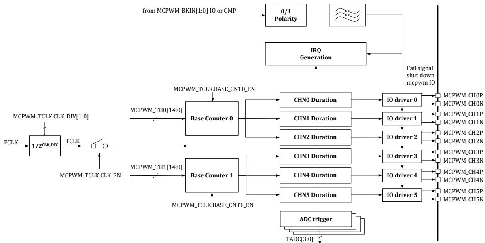

图 14-1 MCPWM 模块框图

为了保证定时精度，通常采用96MHz 的时钟作为 MCPWM 模块工作频率。

## 14.1.1 Base Counter 模块

该模块主要是由两个递增计数器组成，其计数门限值为 MCPWM0\_TH0/MCPWM0\_TH1，计数器从t0 时刻开始从-TH 递增计数，在t1 时刻过0 点，在t2 时刻计数到TH 完成一次计数循环，回到-TH，重新开始计数。计数周期为(TH×2+1)×计数时钟周期。

在 t0/t1(本次 t0 即上一次 t2)可产生定时事件中断，MCPWM0\_IFx.T0\_IF 和 MCPWM0\_IFx.T1\_IF将被置位。

可通过寄存器配置 MCPWM0\_TCLK.BASE\_CNT0\_EN/MCPWM0\_TCLK.BASE\_CNT1\_EN 控制 BaseCounter 0/1 的启动和停止。

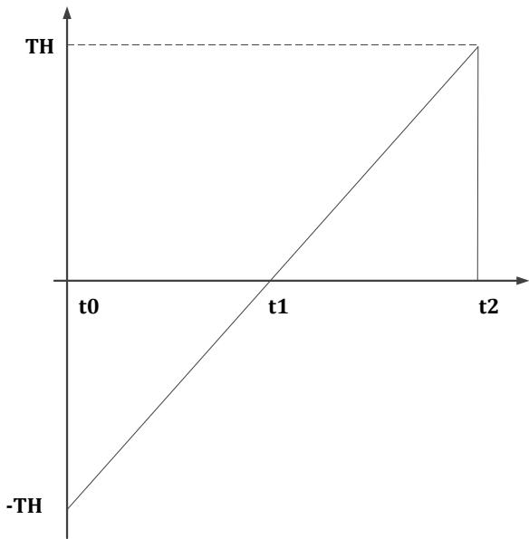  
图 14-2 Base Counter t0/t1 时序

在运行MCPWM 模块前，用户一般需要将门限值MCPWM0\_TH00\~MCPWM0\_TH51，死区寄存器 MCPWM0\_DTH00/ MCPWM0\_DTH01/ MCPWM0\_DTH10/ MCPWM0\_DTH11 配置好。在实际运行过程中，也可动态改变比较门限值和死区寄存器。这些配置好的寄存器，可通过写MCPWM0\_UPDATE 寄存器实现手动更新，也可以通过配置 MCPWM0\_SDCFG.T1\_UPDATE\_EN 及MCPWM0\_SDCFG.T0\_UPDATE\_EN 进行硬件自动更新。硬件更新，仅在 t0 及 t1 时刻（可配置 t0 或t1 更新和 t0 t1 时刻都更新）才能产生更新事件，硬件把加载寄存器的值载入到实际运行的寄存器中。而更新事件的发生频率可以配置，即每间隔 N 个 t0 及 t1 时刻才发生更新。无论是否发生更新，t0/t1 时刻均可产生相应的中断。若硬件把加载寄存器的值到载入实际运行的寄存器后，产生装载中断。

通过配置 MCPWM0\_SDCFG 寄存器选择更新发生在 t0 或者 t1 或者 t0/t1 都更新，配置更新间隔数，间隔数为1\~16。最频繁的更新配置为更新发生在t0和t1，连续发生。最低速的更新配置为更新发生在t1，每16 个t1 更新一次。

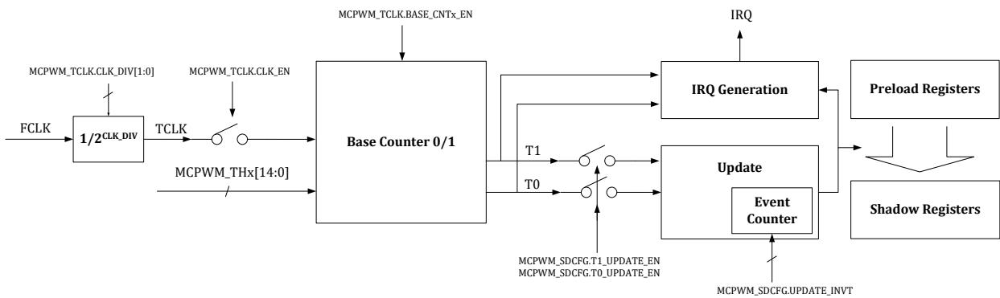  
图 14-3 MCPWM 更新机制

时基 0 和时基 1 对应的 TH 寄存器 MCPWM0\_THx 和计数寄存器 MCPWM0\_CNTx（x=0,1）均存在影子寄存器，且均支持手动更新（通过软件向 MCPWM0\_UPDATE 写入对应位进行更新）和自动更新（发生特定硬件事件触发更新）。影子寄存器可以在不开启 MCPWM TCLK 时钟（即MCPWM0\_TCLK.TCLK\_EN=0） 的 情 况 下 进 行 更 新 。MCPWM0\_TCLK.BASE\_CNT0\_EN 和MCPWM0\_TCLK.BASE\_CNT1\_EN 分 别 控 制 时 基 0 和 时 基 1 的 计 数 使 能 。 当MCPWM0\_TCLK.BASE\_CNT0\_EN=0 时，时基 0 的 CNT 在完成更新后保持值不变，时基 1 的 CNT 同理，实现完全相同。

此外，为了精确控制第一个 MCPWM 周期的计数，建议将 MCPWM0\_THx 和 MCPWM0\_CNTx同时更新。当然也支持 MCPWM0\_THx 和 MCPWM0\_CNTx 分别更新。然后再通过软件写入或外部事件触发计数开始，从而将 MCWPM\_TCLk.BASE\_CNT0\_EN/MCWPM\_TCLk.BASE\_CNT1\_EN 置位，分别使能时基0 和时基1 的CNT 计数。

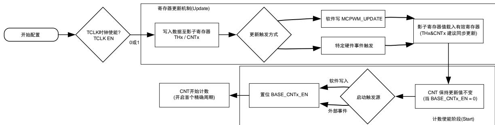  
图14-4时基寄存器更新与计数使能流程图

## 14.1.2 FAIL 信号处理

FAIL 信号即急停信号，主要用于在出现异常时迅速关断功率管，以免造成不可逆的硬件损坏。该信号处理模块主要是根据实际情况设置急停事件，实现快速关断PWM 的输出。有 2 路 fail 信号输入 MCPWM，即 FAIL0\~FAIL1，分别可以来自芯片 I0 MCPWM\_BKIN[1:0]或芯片内部比较器的输出 CMP[1:0]。

其中 MCPWM 的 P/N 通道 0/1/2 可以选择使用 CMP[0]或 MCPWM\_BKIN[0],MCPWM 的 P/N通道 3 可以选择使用 CMP[1]或 MCPWM\_BKIN[1]。

07x MCU FAIL 信号分布表

<table><tr><td></td><td>MCPWM CH0/1/2</td><td>MCPWM CH3/4/5</td></tr></table>

<table><tr><td></td><td>Fail0</td><td>Fail1</td><td>Fail2</td><td>Fail3</td></tr><tr><td>MCPWM_BKIN0</td><td>√</td><td></td><td>√</td><td></td></tr><tr><td>MCPWM_BKIN1</td><td></td><td>√</td><td></td><td>√</td></tr><tr><td>CMP0</td><td>√</td><td></td><td>√</td><td></td></tr><tr><td>CMP1</td><td></td><td>√</td><td></td><td>√</td></tr><tr><td>CLUOUT0</td><td>√</td><td></td><td>√</td><td></td></tr><tr><td>CLUOUT1</td><td>√</td><td></td><td>√</td><td></td></tr><tr><td>CLUOUT2</td><td></td><td>√</td><td></td><td>√</td></tr><tr><td>CLUOUT3</td><td></td><td>√</td><td></td><td>√</td></tr></table>

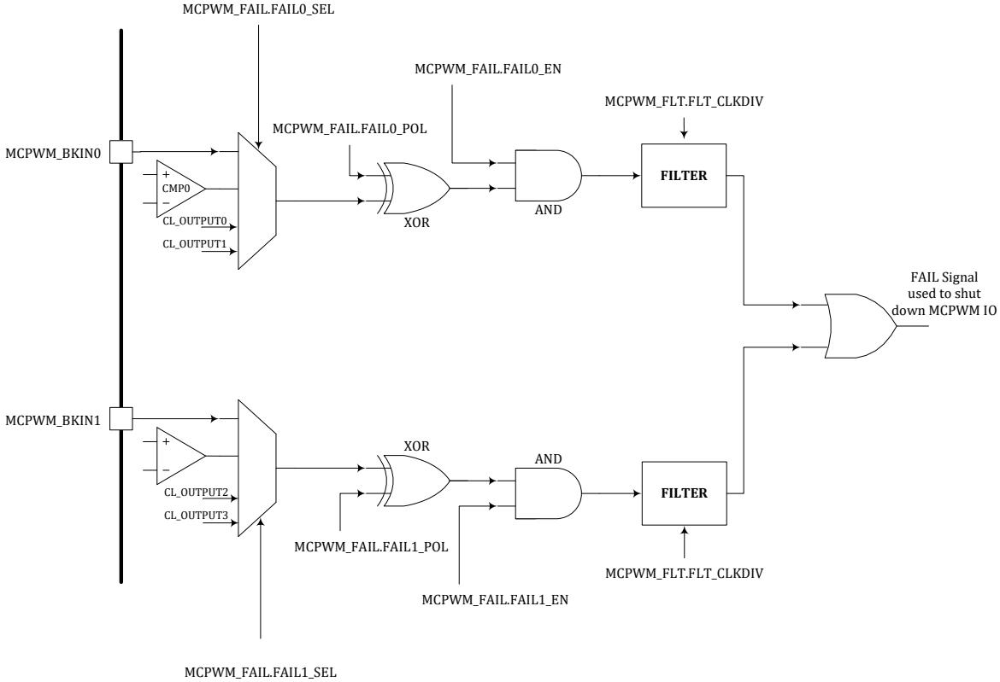  
图 14-5 MCPWM FAIL 逻辑示意图

Filter 滤波模块的时钟，来自系统主时钟 MCLK 的门控时钟 FCLK，见 SYS\_CLK\_FEN，并经过可选的两级分频，第一级分频由 MCPWM0\_TCLK.CLK\_DIV 控制，进行 1/2/4/8 倍分频。第二级分频可实现 1\~256 倍的分频，使用 MCPWM0\_FLT.FLT\_CLKDIV[7:0]作为第二级的分频系数；如图14-6 所示。

MCPWM 模块使用分频后的时钟进行 Fail 信号滤波，滤波宽度固定为 16 个周期，即输入信号必须保持至少 16 个分频时钟周期（两级分频后的时钟）稳定后，硬件才判定其为有效输入信号。滤波时间常数的公式为，其中 T 为 MCLK/FCLK[4]的时钟周期，96MHz 对应 10.42ns。

$$
\mathrm{T} = \mathrm{T} _ {\text {MCLK}} \times (\text {MCPWM0\_TCLK.CLK\_DIV}) \times (\text {FLT\_CLKDIV} + 1) \times 1 6
$$

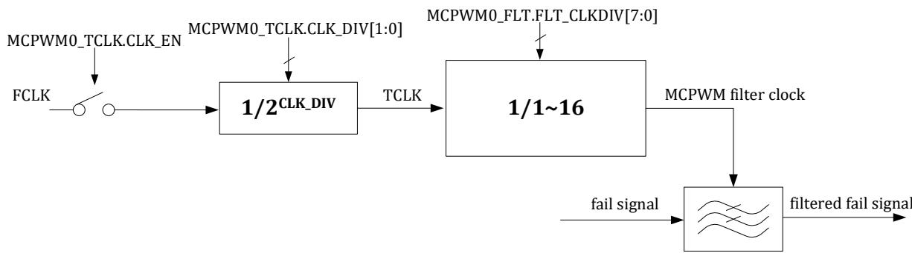  
图 14-6 MCPWM Fail 信号滤波时钟生成逻辑

一旦发生 FAIL 事 件 ， 硬 件 将 IO 输 出 强 制 变 为 MCPWM0\_FAILx.CHxN\_DEFAULT 和MCPWM0\_FAILx.CHxP\_DEFAULT 寄 存 器 所 指 定 的 故 障 缺 省 值 ， 此 时MCPWM0\_FAILx.CHxN\_DEFAULT 和 MCPWM0\_FAILx.CHxP\_DEFAULT 的值直接输出到 IO 口，不再受到 MCPWM0\_FAILx.FAIL\_POL 等极性控制的影响。其中 MCPWM0\_FAIL012 用于控制通道 0/1/2 的故障缺省设置，MCPWM0\_FAIL345 用于控制通道3/4/5 的故障缺省设置。

来自比较器的 MCPWM FAIL 信号为模拟比较器输出的原始信号，未经过比较器数字接口模块的滤波处理，但是可以被 MCPWM 的通道信号进行开窗控制，开窗控制设置见比较器数字接口模块。FAIL 信号进入MCPWM 模块后，可以通过设置MCPWM\_TCLK 进行滤波。

## 14.1.3 MCPWM 特殊输出状态

电机控制中经常会用到全0 和全1 输出状态，以下互补模式设置可以得到期望的输出。

1. 如果 THn0≥THn1，芯片处于恒 0 状态（CH<n>P 关闭，CH<n>N 开启），无死区

2. 如果 THn0=-TH，THn1=TH，芯片处于恒 1 状态（CH<n>P 开启，CH<n>N 关闭），无死区

## 14.1.4 IO DRIVER 模块

该模块根据实际MCPWM 的寄存器配置情况，将IO 设置到相应电平。IO Driver 模块的整体数据流程图如下:

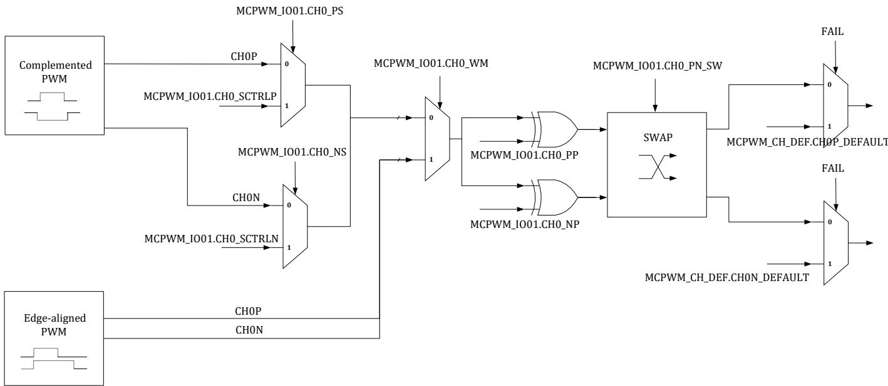  
图 14-7 IO Driver 模块数据流程图

## 14.1.4.1 MCPWM 波形输出-中心对齐模式

6 个MCPWM IO Driver 采用独立的控制门限，独立死区宽度（每一对互补IO 的死区需要独立配置，即6 个死区配置寄存器），共享数据更新事件。

采用 TH<n>0 和 TH<n>1 控制第<n>个 MCPWM IO 的启动、关闭动作，n 为 0/1/2/3/4/5。

当计数器CNT 值向上计数达到 TH<n>0(即 t3 时刻)，关闭CH<n>N，经过死区延时 DTH0，打开 CH<n>P。

当计数器 CNT 值向上计数达到 TH<n>1(即 t4 时刻)，关闭 CH<n>P，经过死区延 DTH1，打开CH<n>N。

采用独立的启动和关闭时间控制，可以提供相位控制的能力。

死区延时保证CH<n>P/CH<n>N 不会同时打开，避免短路发生。

t3/t4 时刻均会产生相应中断。

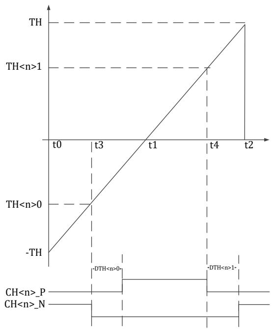  
图 14-8MCPWM 时序 TH<n>0 和 TH<n>1-中心对齐模式

## 14.1.4.2 MCPWM 波形控制-中心对齐推挽模式

中心对齐推挽模式。第一个周期内，在 t3 时刻 CH<n>P 打开，在 t4 时刻，CH<n>P 关闭。第二个周期内，在t3 时刻CH<n>N 打开，在t4 时刻，CH<n>N 关闭。

t3/t4 时刻均会产生相应中断。

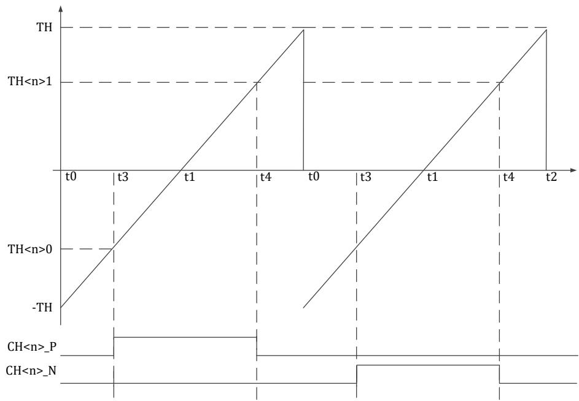  
图 14-9 MCPWM 时序 TH<n>0 和 TH<n>1-中心对齐推挽模式

## 14.1.4.3 MCPWM 波形输出-边沿对齐模式

边沿对齐模式。在 t0 时刻 CH<n>P/CH<n>N 同时打开，在 t3 时刻，CH<n>P 关闭；在 t4 时刻，CH<n>N 关闭。

t3/t4 时刻均会产生相应中断。

边沿对齐模式下，CH<n>P/CH<n>N 无需死区保护。

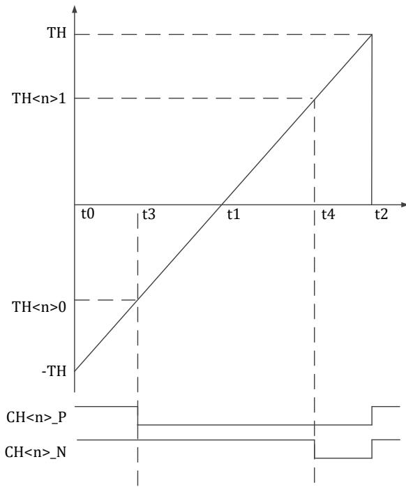  
图 14-10MCPWM 时序边沿对齐模式

## 14.1.4.4 MCPWM 波形控制-边沿对齐推挽模式

边沿对齐推挽模式。第一个周期内，在 t0 时刻 CH<n>P 打开，在 t3 时刻，CH<n>P 关闭。第二个周期内，在t0 时刻CH<n>N 打开，在t3 时刻，CH<n>N 关闭。

t0/t3 时刻均会产生相应中断。

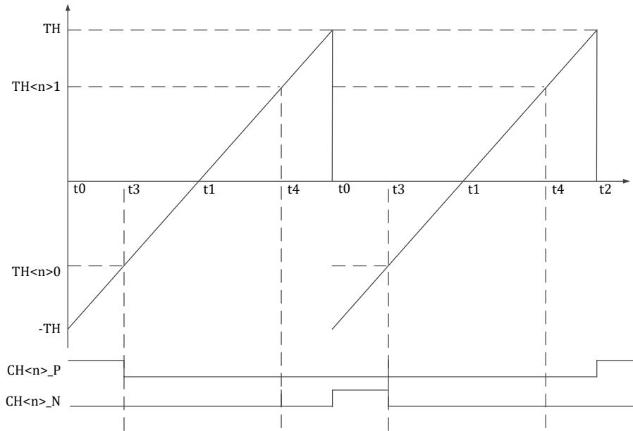  
图 14-11MCPWM 时序 TH<n>0 和 TH<n>1 边沿对齐推挽模式

## 14.1.4.5 MCPWM IO 死区控制

MCPWM IO 是一对互斥控制信号 CH<n>P/CH<n>N，控制如下图所示的电路，

当 CH<n>P 为高/CH<n>N 为低时，Vout 输出高（VDD）；

当 CH<n>P 为低/CH<n>N 为高时，Vout 输出低（VSS）；

当 CH<n>P 为高/CH<n>N 为高时，Vout 输出不确定，但是会产生 VDD 到 VSS 的短路；

当 CH<n>P 为低/CH<n>N 为低时，Vout 输出不确定。

必须避免CH<n>P/CH<n>N同时打开的情况。死区的引入，可以有效避免VDD到VSS的短路。

四组 MCPWM IO 的死区宽度共享同一个死区宽度设置 MCPWM0\_DTH0/1。

对于互补模式MCPWM IO 自动插入死区。

对于边沿对齐模式，MCPWM IO 无死区。

在IO Driver 模块中增加CH<n>P/CH<n>N 冲突检测，发生冲突时，自动将IO 拉低，同时给出错误中断（错误中断标志位可软件清除或者硬件自动清除）。

MCPWM IO 也可通过软件配置的方式输出，此时，死区控制通过软件实现，如果 MCPWM 模块配置为中心对齐模式，硬件短路保护机制仍有效，保证 P 和 N 不同时打开。

CH<n>P/CH<n>N，在 IO 上可以互换。

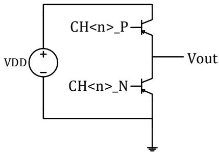  
图 14-12MCPWM IO 控制示意图

## 14.1.4.6 MCPWM IO 极性设置

CH<n>P/CH<n>N 的有效电平可以配置为高有效/低有效，每个 IO 的有效电平单独可配。CH<n>P/CH<n>N 输出到IO 的位置通过软件配置可以互换。

## 14.1.4.7 MCPWM IO 自动保护

当发生急停事件（Fail 事件），应立刻将CH<n>P/CH<n>N 自动切换到默认安全电平状态。需要注意默认电平配置（MCPWM0\_CH\_DEF.CHxN\_DEFAULT 和 MCPWM0\_CH\_DEF.CHxP\_DEFAULT 控制默认电平）。

➢ 芯片正常工作后，IO 默认输出的电平是寄存器 MCPWM0\_CH\_DEF.CHxN\_DEFAULT 和MCPWM0\_CH\_DEF.CHxP\_DEFAULT 指定值，当用户配置完毕，MCPWM 正常工作后，配置MCPWM0\_FAILx.MCPWM0\_OE（即 MOE）为 1，IO 输出电平受到 MCPWM IO 模块控制。

➢ 当发生FAIL 短路状况时，硬件立即切换到 IO 默认输出电平。

➢ 当芯片调试中，CPU 被上位机软件暂停运行时，可暂停 MCPWM 正常输出，转而输出默认电平值。

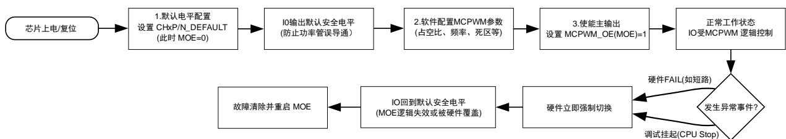  
图14-13Fail 保护与输出控制流程图

## 14.1.5 ADC Trigger Timer 模块

MCPWM 可以提供 ADC 采样控制。当计数器计数到 MCPWM0\_TMR0/ MCPWM0\_TMR1/MCPWM0\_TMR2/ MCPWM0\_TMR3 时，可产生定时事件，触发 ADC 采样。该触发信号可同时输出到 GPIO，便于调试之用。输出的具体 GPIO，参见对应器件的 datasheet。其中 MCPWM0\_TMR0/MCPWM0\_TMR1 固定使用时基 0，MCPWM0\_TMR2/ MCPWM0\_TMR3 可以选择使用时基 0/1，见14.2.33 MCPWM0\_TCLK。

表14-1MCPWM 计数器阈值与事件对应表

<table><tr><td>MCPWMx 时基 0 t0 事件</td><td>MCPWMx_CNT0==-MCPWMx_TH0</td></tr><tr><td>MCPWMx 时基 0 t1 事件</td><td>MCPWMx_CNT0==0</td></tr><tr><td>MCPWMx 时基 1 t0 事件</td><td>MCPWMx_CNT1==-MCPWMx_TH1</td></tr><tr><td>MCPWMx 时基 1 t1 事件</td><td>MCPWMx_CNT1==0</td></tr><tr><td>MCPWMx TIO0[0] 事件</td><td>MCPWMx_CNT0==MCPWMx_TH00</td></tr><tr><td>MCPWMx TIO0[1] 事件</td><td>MCPWMx_CNT0==MCPWMx_TH01</td></tr><tr><td>MCPWMx TIO1[0] 事件</td><td>MCPWMx_CNT0==MCPWMx_TH10</td></tr><tr><td>MCPWMx TIO1[1] 事件</td><td>MCPWMx_CNT0==MCPWMx_TH11</td></tr><tr><td>MCPWMx TIO2[0] 事件</td><td>MCPWMx_CNT0==MCPWMx_TH20</td></tr><tr><td>MCPWMx TIO2[1] 事件</td><td>MCPWMx_CNT0==MCPWMx_TH21</td></tr><tr><td>MCPWMx TIO3[0] 事件</td><td>MCPWMx_CNT1==MCPWMx_TH30</td></tr><tr><td>MCPWMx TIO3[1] 事件</td><td>MCPWMx_CNT1==MCPWMx_TH31</td></tr><tr><td>MCPWMx TIO4[0] 事件</td><td>MCPWMx_CNT1==MCPWMx_TH40</td></tr><tr><td>MCPWMx TIO4[1] 事件</td><td>MCPWMx_CNT1==MCPWMx_TH41</td></tr><tr><td>MCPWMx TIO5[0] 事件</td><td>MCPWMx_CNT1==MCPWMx_TH50</td></tr><tr><td>MCPWMx TIO5[1] 事件</td><td>MCPWMx_CNT1==MCPWMx_TH51</td></tr><tr><td>MCPWMx TADC[0] 事件</td><td>TMR0</td></tr><tr><td>MCPWMx TADC [1] 事件</td><td>TMR1</td></tr><tr><td>MCPWMx TADC [2] 事件</td><td>TMR2</td></tr><tr><td>MCPWMx TADC [3] 事件</td><td>TMR3</td></tr></table>

## 14.1.6 数字电源应用

在数字电源应用中，MCPWM 可以和比较器、Timer、DAC 联动，在此种配置下，MCPWM 内部的状态机完全由比较器输出的比较值进行硬件控制，MCPWM0\_CNT0/1 不再进行自动递增计数，即MCPWM 通道输出电平受到比较器输出值控制。

Timer 的过零事件定时触发 DAC 进行数值更新，从而使得 DAC 输出一个递增或递减的斜坡信号，并连接至比较器负端，比较器正端接外部采样信号。待 DAC 信号上升或下降到一定数值时，触 发 比 较 器 翻 转 动 作 ， 从 而 进 一 步 触 发 MCPWM 内 部 状 态 机 动 作 。 通 过SYS\_AFE\_DAC\_CTRL.TIMERm\_TRIG\_DACx 可以设置使用哪个 Timer 的过零事件作为 DAC 数值更新事件，m=0,1,2,3 对应 TIMER0/1/2/3，x=0,1 对应 DAC0 或 DAC1。DAC 数值的更新步长由SYS\_AFE\_DAC\_CTRL.DACx\_STEP 设置。

数字 电源应用 通常只需要使 用 MCPWM 三相通道 中的一相 ，举例来说， 可以设 置MCPWM0\_TCLK.CMP\_CTRL\_CNT0=1 使 用 CH0N/P 通 道 ， 也 可 以 设 置MCPWM0\_TCLK.CMP\_CTRL\_CNT1=1 使用 CH3N/P 通道。通道 1/2/4/5 不支持与比较器联动。

MCPWM 在此类应用中分为 HS\_ON、LS\_ON、ALL\_OFF 三种状态。HS\_ON、LS\_ON 之间状态切换有最小切换时间，或者可以认为是状态最小停留时间，即当MCPWM 从HS\_ON 切换到LS\_ON 状态，至少停留一段时间才能再切换回 HS\_ON 状态；反之亦然。状态最小停留时间通过MCPWM0\_STT\_HYST 设置。

状态切换时，MCPWM 会同步产生 t0 事件（MCPWM0\_CNTx==-MCPWM0\_THx）或 t1 事件（MCPWM0\_CNTx==0） 。 如 果 使 用 CH0N/P 做 数 字 电 源 应 用 ， 一 般 需 要 同 步 设 置MCPWM0\_RE.TR0\_T0\_RE=1，MCPWM0\_RE.TR0\_T1\_RE=1，使能 MCPWM 时基 0 的 t0/t1 事件的DMA 触 发 使 能 ； 同 理 ， 如 果 使 用 CH3N/P 做 数 字 电 源 应 用 ， 一 般 需 要 同 步 设 置MCPWM0\_RE.TR1\_T0\_RE=1，MCPWM0\_RE.TR1\_T1\_RE=1，使能 MCPWM 时基 1 的 t0/t1 事件的

DMA 触发使能。使得 MCPWM 在刚进入新状态时不久，DMA 将新的 DAC 参考值存入 SYS\_AFE\_DAC寄存器，后续Timer 定时触发时，DAC 输出会以新的 DAC 参考值为起点生成斜坡信号。

受 限 于 比 较 器 资 源 ， 通 常 不 会 同 时 设 置 MCPWM0\_TCLK.CMP\_CTRL\_CNT0=1 和MCPWM0\_TCLK.CMP\_CTRL\_CNT0=1。一般同时只有 CH0N/P 或 CH3N/P 中的一相通道用作数字电源应用。

HS\_ON 状态：PWM 上管输出为高，下管输出低

Timer 清零开始计数，定时触发 DAC0 输入数字量 SYS\_AFE\_DAC0 更新，DAC0 产生斜率信号

比较器 CMP1 输出为高时，且满足状态最小停留时间，切换至 LS\_ON 状态。先关闭上管，经过死区时间后打开下管。同时，MCPWM 的过零事件触发 DMA 装载 SYS\_AFE\_DAC0 为LS\_ON 参考值。

过流发生时，MCPWM 高侧低侧通道全关闭。进入 ALL\_OFF 状态。

LS\_ON 状态：PWM 上管输出为低，下管输出高

Timer 清零开始计数，定时触发 DAC0 输入数字量更新，DAC0 产生斜率信号

比较器 CMP1 输出为低时，且满足状态最小停留时间，切换至 HS\_ON 状态。先关闭下管，经过死区时间后打开上管。同时，MCPWM 的过零事件触发DMA 装载SYS\_AFE\_DAC0 为HS\_ON 参考值。

过流发生时，高侧低侧开关全关闭。进入ALL\_OFF 状态。

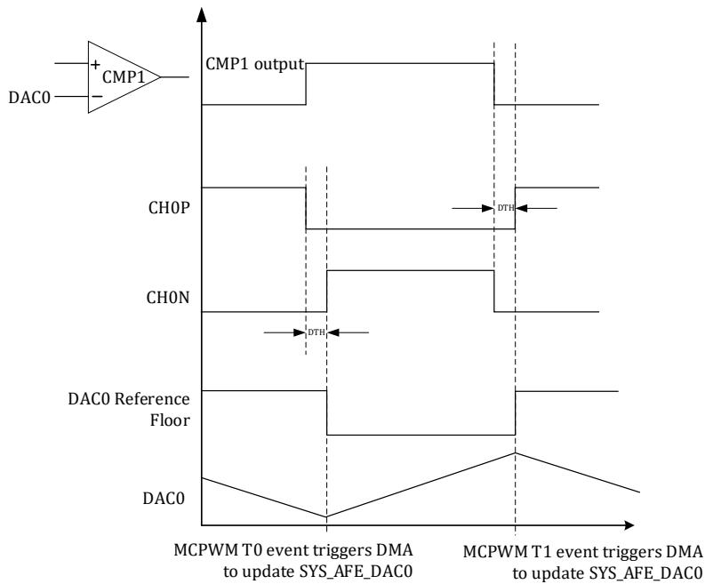  
图 14-14MCPWM 通道 0 受比较器 1 控制进行状态动作时序图

特别地，在 HS\_ON 状态时，如果当电流极性信号 CMP2 输出为低时，为 ZCS 事件，ZCS 发生时，需要同时关闭上管和下管，然后延时 Tzcs 后，Tzcs 时间可通过 MCPWM0\_ZCS\_DELAY 设置，进入 LS\_ON 状态。在 LS\_ON 状态时，如果当电流极性信号 CMP2 输出为高时，亦为 ZCS 事件，需要同时关闭上管和下管，然后延时 Tzcs 后，进入HS\_ON 状态。

Tzcs 时间可通过 MCPWM0\_ZCS\_DELAY 设置。

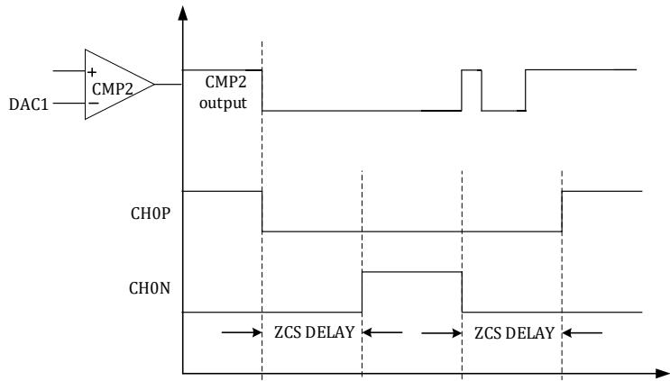  
图 14-15比较器 2 触发 ZCS 事件发生时 MCPWM 通道 0 动作时序

## 14.1.7 中断

MCPMW\_IF0 和 MCPWM0\_EIF[5:4]、MCPWM0\_EIF[8]标 志 置 位 且 使 能 的 情 况 下 ， 产 生MCPWM0\_IRQ0 中断；

MCPMW\_IF1 和 MCPWM0\_EIF[7:6] 、MCPWM0\_EIF[9]标志 置位且使 能的情 况下，产 生MCPWM0\_IRQ1 中断。

## 14.2 寄存器

## 14.2.1 地址分配

MCPWM 模块寄存器的基地址是 0x4001\_0C00，

寄存器列表如下:

表 14-2MCPWM 模块寄存器列表

<table><tr><td>名称</td><td>偏移地址</td><td>说明</td></tr><tr><td>MCPWM0_TH00</td><td>0x00</td><td>MCPWM CH0_P 比较门限值寄存器</td></tr><tr><td>MCPWM0_TH01</td><td>0x04</td><td>MCPWM CH0_N 比较门限值寄存器</td></tr><tr><td>MCPWM0_TH10</td><td>0x08</td><td>MCPWM CH1_P 比较门限值寄存器</td></tr><tr><td>MCPWM0_TH11</td><td>0x0C</td><td>MCPWM CH1_N 比较门限值寄存器</td></tr><tr><td>MCPWM0_TH20</td><td>0x10</td><td>MCPWM CH2_P 比较门限值寄存器</td></tr><tr><td>MCPWM0_TH21</td><td>0x14</td><td>MCPWM CH2_N 比较门限值寄存器</td></tr><tr><td>MCPWM0_TH30</td><td>0x18</td><td>MCPWM CH3_P 比较门限值寄存器</td></tr><tr><td>MCPWM0_TH31</td><td>0x1C</td><td>MCPWM CH3_N 比较门限值寄存器</td></tr><tr><td>MCPWM0_TH40</td><td>0x20</td><td>MCPWM CH4_P 比较门限值寄存器</td></tr><tr><td>MCPWM0_TH41</td><td>0x24</td><td>MCPWM CH4_N 比较门限值寄存器</td></tr><tr><td>MCPWM0_TH50</td><td>0x28</td><td>MCPWM CH5_P 比较门限值寄存器</td></tr><tr><td>MCPWM0_TH51</td><td>0x2C</td><td>MCPWM CH5_N 比较门限值寄存器</td></tr><tr><td>MCPWM0_TMR0</td><td>0x30</td><td>ADC 采样定时器比较门限 0 寄存器</td></tr><tr><td>MCPWM0_TMR1</td><td>0x34</td><td>ADC 采样定时器比较门限 1 寄存器</td></tr><tr><td>MCPWM0_TMR2</td><td>0x38</td><td>ADC 采样定时器比较门限 2 寄存器</td></tr><tr><td>MCPWM0_TMR3</td><td>0x3C</td><td>ADC 采样定时器比较门限 3 寄存器</td></tr><tr><td>MCPWM0_TH0</td><td>0x40</td><td>MCPWM 时基 0 门限值寄存器</td></tr><tr><td>MCPWM0_TH1</td><td>0x44</td><td>MCPWM 时基 1 门限值寄存器</td></tr><tr><td>MCPWM0_CNT0</td><td>0x48</td><td>MCPWM 时基 0 计数器寄存器</td></tr><tr><td>MCPWM0_CNT1</td><td>0x4C</td><td>MCPWM 时基 1 计数器寄存器</td></tr><tr><td>MCPWM0_UPDATE</td><td>0x50</td><td>MCPWM 加载控制寄存器</td></tr><tr><td>MCPWM0_FCNT</td><td>0x54</td><td>MCPWM FAIL 时刻 CNT 值</td></tr><tr><td>MCPWM0_EVT0</td><td>0x58</td><td>MCPWM 时基 0 外部触发</td></tr><tr><td>MCPWM0_EVT1</td><td>0x5C</td><td>MCPWM 时基 1 外部触发</td></tr><tr><td>MCPWM0_DTH00</td><td>0x60</td><td>MCPWM CH0/1/2 N 通道死区宽度控制寄存器</td></tr><tr><td>MCPWM0_DTH01</td><td>0x64</td><td>MCPWM CH0/1/2 P 通道死区宽度控制寄存器</td></tr><tr><td>MCPWM0_DTH10</td><td>0x68</td><td>MCPWM CH3/4/5 N 通道死区宽度控制寄存器</td></tr><tr><td>MCPWM0_DTH11</td><td>0x6C</td><td>MCPWM CH3/4/5 P 通道死区宽度控制寄存器</td></tr><tr><td>MCPWM0_FLT</td><td>0x70</td><td>MCPWM 滤波时钟分频寄存器</td></tr><tr><td>MCPWM0_SDCFG</td><td>0x74</td><td>MCPWM 加载配置寄存器</td></tr><tr><td>MCPWM0_AUEN</td><td>0x78</td><td>MCPWM 自动更新使能寄存器</td></tr><tr><td>MCPWM0_TCLK</td><td>0x7C</td><td>MCPWM 时钟分频控制寄存器</td></tr><tr><td>MCPWM0_IE0</td><td>0x80</td><td>MCPWM 时基 0 中断控制寄存器</td></tr><tr><td>MCPWM0_IF0</td><td>0x84</td><td>MCPWM 时基 0 中断标志位寄存器</td></tr><tr><td>MCPWM0_IE1</td><td>0x88</td><td>MCPWM 中断控制寄存器</td></tr><tr><td>MCPWM0_IF1</td><td>0x8C</td><td>MCPWM 中断标志位寄存器</td></tr><tr><td>MCPWM0_EIE</td><td>0x90</td><td>MCPWM 异常中断控制寄存器</td></tr><tr><td>MCPWM0EIF</td><td>0x94</td><td>MCPWM 异常中断标志位寄存器</td></tr><tr><td>MCPWM0_RE</td><td>0x98</td><td>MCPWM DMA 请求控制寄存器</td></tr><tr><td>MCPWM0_PP</td><td>0x9C</td><td>MCPWM 推挽模式使能寄存器</td></tr><tr><td>MCPWM0_IO01</td><td>0xA0</td><td>MCPWM CH0 CH1 IO 控制寄存器</td></tr><tr><td>MCPWM0_IO23</td><td>0xA4</td><td>MCPWM CH2 CH3 IO 控制寄存器</td></tr><tr><td>MCPWM0_IO45</td><td>0xA8</td><td>MCPWM CH4 CH5 IO 控制寄存器</td></tr><tr><td></td><td></td><td></td></tr><tr><td>MCPWM0_FAIL012</td><td>0xB0</td><td>MCPWM CH0 CH1 CH2 短路控制寄存器</td></tr><tr><td>MCPWM0_FAIL345</td><td>0xB4</td><td>MCPWM CH3 CH4 CH5 短路控制寄存器</td></tr><tr><td>MCPWM0_CH_DEF</td><td>0xB8</td><td>MCPWM 短路保护通道输出默认值</td></tr><tr><td>MCPWM0_CH_MSK</td><td>0xBC</td><td>MCPWM 通道屏蔽寄存器</td></tr><tr><td>MCPWM0_PRT</td><td>0xC0</td><td>MCPWM 保护寄存器</td></tr><tr><td>MCPWM0_STT_HYST</td><td>0xC8</td><td>MCPWM 状态停留延时寄存器</td></tr><tr><td>MCPWM0_ZCS_DELAY</td><td>0xCC</td><td>MCPWM ZCS 状态延时寄存器</td></tr></table>

表 14-3 受 MCPWM0\_PRT 保护的寄存器

<table><tr><td>名称</td><td>偏移地址</td><td>说明</td></tr><tr><td>MCPWM0_TH0</td><td>0x30</td><td>MCPWM 门限值寄存器</td></tr><tr><td>MCPWM0_TH1</td><td>0x34</td><td>MCPWM 门限值寄存器</td></tr><tr><td>MCPWM0_DTH00</td><td>0x60</td><td>MCPWM CH0/1/2 N 通道死区宽度控制寄存器</td></tr><tr><td>MCPWM0_DTH01</td><td>0x64</td><td>MCPWM CH0/1/2 P 通道死区宽度控制寄存器</td></tr><tr><td>MCPWM0_DTH10</td><td>0x68</td><td>MCPWM CH3/4/5 N 通道死区宽度控制寄存器</td></tr><tr><td>MCPWM0_DTH11</td><td>0x6C</td><td>MCPWM CH3/4/5 P 通道死区宽度控制寄存器</td></tr><tr><td>MCPWM0_FLT</td><td>0x70</td><td>MCPWM 滤波时钟分频寄存器</td></tr><tr><td>MCPWM0_SDCFG</td><td>0x74</td><td>MCPWM 加载配置寄存器</td></tr><tr><td>MCPWM0_AUEN</td><td>0x78</td><td>MCPWM 自动加载使能寄存器</td></tr><tr><td>MCPWM0_TCLK</td><td>0x7C</td><td>MCPWM 时钟分频控制寄存器</td></tr><tr><td>MCPWM0_IE0</td><td>0x80</td><td>MCPWM 时基 0 中断控制寄存器</td></tr><tr><td>MCPWM0_IE1</td><td>0x88</td><td>MCPWM 时基 1 中断控制寄存器</td></tr><tr><td>MCPWM0_EIE</td><td>0x90</td><td>MCPWM 异常中断控制寄存器</td></tr><tr><td>MCPWM0_RE</td><td>0x98</td><td>MCPWMDMA 请求控制寄存器</td></tr><tr><td>MCPWM0_PP</td><td>0x9C</td><td>MCPWM 推挽模式使能寄存器</td></tr><tr><td>MCPWM0_IO01</td><td>0xA0</td><td>MCPWM CH0 CH1 IO 控制寄存器</td></tr><tr><td>MCPWM0_IO23</td><td>0xA4</td><td>MCPWM CH2 CH3 IO 控制寄存器</td></tr><tr><td>MCPWM0_IO45</td><td>0xA8</td><td>MCPWM CH4 CH5 IO 控制寄存器</td></tr><tr><td></td><td></td><td></td></tr><tr><td>MCPWM0_FAIL012</td><td>0xB0</td><td>MCPWM CH0 CH1 CH2 短路控制寄存器</td></tr><tr><td>MCPWM0_FAIL345</td><td>0xB4</td><td>MCPWM CH3 CH4 CH5 短路控制寄存器</td></tr><tr><td>MCPWM0_CH_DEF</td><td>0xB8</td><td>MCPWM 短路保护通道输出值</td></tr><tr><td>MCPWM0_CH_MSK</td><td>0xBC</td><td>MCPWM 通道屏蔽寄存器</td></tr><tr><td>MCPWM0_STT_HYST</td><td>0xC8</td><td>MCPWM 状态停留延时寄存器</td></tr><tr><td>MCPWM0_ZCS_DELAY</td><td>0xCC</td><td>MCPWM ZCS 状态延时寄存器</td></tr></table>

表14-4存在影子寄存器的寄存器

<table><tr><td>名称</td><td>偏移地址</td><td>说明</td></tr><tr><td>MCPWM0_TH00</td><td>0x00</td><td>MCPWM CH0_P 比较门限值寄存器</td></tr><tr><td>MCPWM0_TH01</td><td>0x04</td><td>MCPWM CH0_N 比较门限值寄存器</td></tr><tr><td>MCPWM0_TH10</td><td>0x08</td><td>MCPWM CH1_P 比较门限值寄存器</td></tr><tr><td>MCPWM0_TH11</td><td>0x0C</td><td>MCPWM CH1_N 比较门限值寄存器</td></tr><tr><td>MCPWM0_TH20</td><td>0x10</td><td>MCPWM CH2_P 比较门限值寄存器</td></tr><tr><td>MCPWM0_TH21</td><td>0x14</td><td>MCPWM CH2_N 比较门限值寄存器</td></tr><tr><td>MCPWM0_TH30</td><td>0x18</td><td>MCPWM CH3_P 比较门限值寄存器</td></tr><tr><td>MCPWM0_TH31</td><td>0x1C</td><td>MCPWM CH3_N 比较门限值寄存器</td></tr><tr><td>MCPWM0_TH40</td><td>0x20</td><td>MCPWM CH4_P 比较门限值寄存器</td></tr><tr><td>MCPWM0_TH41</td><td>0x24</td><td>MCPWM CH4_N 比较门限值寄存器</td></tr><tr><td>MCPWM0_TH50</td><td>0x28</td><td>MCPWM CH5_P 比较门限值寄存器</td></tr><tr><td>MCPWM0_TH51</td><td>0x2C</td><td>MCPWM CH5_N 比较门限值寄存器</td></tr><tr><td>MCPWM0_TMR0</td><td>0x30</td><td>ADC 采样定时器比较门限 0 寄存器</td></tr><tr><td>MCPWM0_TMR1</td><td>0x34</td><td>ADC 采样定时器比较门限 1 寄存器</td></tr><tr><td>MCPWM0_TMR2</td><td>0x38</td><td>ADC 采样定时器比较门限 2 寄存器</td></tr><tr><td>MCPWM0_TMR3</td><td>0x3C</td><td>ADC 采样定时器比较门限 3 寄存器</td></tr><tr><td>MCPWM0_TH0</td><td>0x40</td><td>MCPWM 时基 0 门限值寄存器</td></tr><tr><td>MCPWM0_TH1</td><td>0x44</td><td>MCPWM 时基 1 门限值寄存器</td></tr><tr><td>MCPWM0_CNT0</td><td>0x48</td><td>MCPWM 时基 0 计数器寄存器</td></tr><tr><td>MCPWM0_CNT1</td><td>0x4C</td><td>MCPWM 时基 1 计数器寄存器</td></tr></table>

对于所有存在影子寄存器的 MCPWM 配置寄存器，写入时，写入的是预装载寄存器，更新事件发生时才会把预装载寄存器值写入影子寄存器，读出时读出的是影子寄存器的值。

## 14.2.2 MCPWM0\_TH00

无写保护的寄存器

地址:0x4001\_0C00

复位值:0x0

表 14-5 MCPWM0\_TH00 配置寄存器

<table><tr><td>15</td><td>14</td><td>13</td><td>12</td><td>11</td><td>10</td><td>9</td><td>8</td><td>7</td><td>6</td><td>5</td><td>4</td><td>3</td><td>2</td><td>1</td><td>0</td></tr><tr><td></td><td></td><td></td><td></td><td></td><td></td><td></td><td></td><td></td><td></td><td></td><td></td><td></td><td></td><td></td><td></td></tr><tr><td></td><td></td><td></td><td></td><td></td><td></td><td></td><td></td><td></td><td></td><td></td><td></td><td></td><td></td><td></td><td></td></tr><tr><td></td><td></td><td></td><td></td><td></td><td></td><td></td><td></td><td></td><td></td><td></td><td></td><td></td><td></td><td></td><td></td></tr><tr><td></td><td></td><td></td><td></td><td></td><td></td><td></td><td></td><td></td><td></td><td></td><td></td><td></td><td></td><td></td><td></td></tr><tr><td></td><td></td><td></td><td></td><td></td><td></td><td></td><td></td><td></td><td></td><td></td><td></td><td></td><td></td><td></td><td></td></tr></table>

<table><tr><td>位置</td><td>位名称</td><td>说明</td></tr><tr><td>[31:16]</td><td></td><td>未使用</td></tr><tr><td>[15:0]</td><td>TH00</td><td>MCPWM CHO_P 比较门限值,16 位有符号数;发生更新事件时,本寄存器加载到 MCPWM 实际运行系统中。写入的是预装载寄存器,更新事件发生时才会把预装载寄存器值写入影子寄存器,读出时读出的是影子寄存器的值。</td></tr></table>

## 14.2.3 MCPWM0\_TH01

无写保护的寄存器

地址:0x4001\_0C04

复位值 $\boldsymbol { \cdot } 0 \mathbf { x } 0$

表 14-6 MCPWM0\_TH00 配置寄存器

<table><tr><td>15</td><td>14</td><td>13</td><td>12</td><td>11</td><td>10</td><td>9</td><td>8</td><td>7</td><td>6</td><td>5</td><td>4</td><td>3</td><td>2</td><td>1</td><td>0</td></tr><tr><td></td><td></td><td></td><td></td><td></td><td></td><td></td><td></td><td></td><td></td><td></td><td></td><td></td><td></td><td></td><td></td></tr><tr><td></td><td></td><td></td><td></td><td></td><td></td><td></td><td></td><td></td><td></td><td></td><td></td><td></td><td></td><td></td><td></td></tr><tr><td></td><td></td><td></td><td></td><td></td><td></td><td></td><td></td><td></td><td></td><td></td><td></td><td></td><td></td><td></td><td></td></tr><tr><td></td><td></td><td></td><td></td><td></td><td></td><td></td><td></td><td></td><td></td><td></td><td></td><td></td><td></td><td></td><td></td></tr></table>

<table><tr><td>位置</td><td>位名称</td><td>说明</td></tr><tr><td>[31:16]</td><td></td><td>未使用</td></tr><tr><td>[15:0]</td><td>TH01</td><td>MCPWM CHO_N 比较门限值,16 位有符号数;发生更新事件时,本寄存器加载到 MCPWM 实际运行系统中。</td></tr></table>

## 14.2.4 MCPWM0\_TH10

无写保护的寄存器

地址:0x4001\_0C08

复位值:0x0

表 14-7 MCPWM0\_TH10 配置寄存器

<table><tr><td>15</td><td>14</td><td>13</td><td>12</td><td>11</td><td>10</td><td>9</td><td>8</td><td>7</td><td>6</td><td>5</td><td>4</td><td>3</td><td>2</td><td>1</td><td>0</td></tr><tr><td></td><td></td><td></td><td></td><td></td><td></td><td></td><td></td><td></td><td></td><td></td><td></td><td></td><td></td><td></td><td></td></tr><tr><td></td><td></td><td></td><td></td><td></td><td></td><td></td><td></td><td></td><td></td><td></td><td></td><td></td><td></td><td></td><td></td></tr><tr><td></td><td></td><td></td><td></td><td></td><td></td><td></td><td></td><td></td><td></td><td></td><td></td><td></td><td></td><td></td><td></td></tr><tr><td></td><td></td><td></td><td></td><td></td><td></td><td></td><td></td><td></td><td></td><td></td><td></td><td></td><td></td><td></td><td></td></tr></table>

<table><tr><td>位置</td><td>位名称</td><td>说明</td></tr><tr><td>[31:16]</td><td></td><td>未使用</td></tr><tr><td>15:0]</td><td>TH10</td><td>MCPWM CH1_P 比较门限值,16 位有符号数;发生更新事件时,本寄存器加载到 MCPWM 实际运行系统中。</td></tr></table>

## 14.2.5 MCPWM0\_TH11

无写保护的寄存器

地址:0x4001\_0C0C

复位值:0x0

表 14-8 MCPWM0\_TH11 配置寄存器

<table><tr><td>15</td><td>14</td><td>13</td><td>12</td><td>11</td><td>10</td><td>9</td><td>8</td><td>7</td><td>6</td><td>5</td><td>4</td><td>3</td><td>2</td><td>1</td><td>0</td></tr><tr><td></td><td></td><td></td><td></td><td></td><td></td><td></td><td></td><td></td><td></td><td></td><td></td><td></td><td></td><td></td><td></td></tr><tr><td></td><td></td><td></td><td></td><td></td><td></td><td></td><td></td><td></td><td></td><td></td><td></td><td></td><td></td><td></td><td></td></tr><tr><td></td><td></td><td></td><td></td><td></td><td></td><td></td><td></td><td></td><td></td><td></td><td></td><td></td><td></td><td></td><td></td></tr><tr><td></td><td></td><td></td><td></td><td></td><td></td><td></td><td></td><td></td><td></td><td></td><td></td><td></td><td></td><td></td><td></td></tr></table>

<table><tr><td>位置</td><td>位名称</td><td>说明</td></tr><tr><td>[31:16]</td><td></td><td>未使用</td></tr><tr><td>[15:0]</td><td>TH11</td><td>MCPWM CH1_N 比较门限值,16 位有符号数;发生更新事件时,本寄存器加载到 MCPWM 实际运行系统中。</td></tr></table>

## 14.2.6 MCPWM0\_TH20

无写保护的寄存器

地址:0x4001\_0C10

复位值:0x0

表 14-9 MCPWM0\_TH20 配置寄存器

<table><tr><td>15</td><td>14</td><td>13</td><td>12</td><td>11</td><td>10</td><td>9</td><td>8</td><td>7</td><td>6</td><td>5</td><td>4</td><td>3</td><td>2</td><td>1</td><td>0</td></tr><tr><td></td><td></td><td></td><td></td><td></td><td></td><td></td><td></td><td></td><td></td><td></td><td></td><td></td><td></td><td></td><td></td></tr><tr><td></td><td></td><td></td><td></td><td></td><td></td><td></td><td></td><td></td><td></td><td></td><td></td><td></td><td></td><td></td><td></td></tr><tr><td></td><td></td><td></td><td></td><td></td><td></td><td></td><td></td><td></td><td></td><td></td><td></td><td></td><td></td><td></td><td></td></tr><tr><td></td><td></td><td></td><td></td><td></td><td></td><td></td><td></td><td></td><td></td><td></td><td></td><td></td><td></td><td></td><td></td></tr></table>

<table><tr><td>位置</td><td>位名称</td><td>说明</td></tr><tr><td>[31:16]</td><td></td><td>未使用</td></tr><tr><td>[15:0]</td><td>TH20</td><td>MCPWM CH2_P 比较门限值,16 位有符号数;发生更新事件时,本寄存器加载到 MCPWM 实际运行系统中。</td></tr></table>

## 14.2.7 MCPWM0\_TH21

无写保护的寄存器

地址:0x4001\_0C14

复位值:0x0

表 14-10 MCPWM0\_TH21 配置寄存器

<table><tr><td>15</td><td>14</td><td>13</td><td>12</td><td>11</td><td>10</td><td>9</td><td>8</td><td>7</td><td>6</td><td>5</td><td>4</td><td>3</td><td>2</td><td>1</td><td>0</td></tr><tr><td></td><td></td><td></td><td></td><td></td><td></td><td></td><td></td><td></td><td></td><td></td><td></td><td></td><td></td><td></td><td></td></tr><tr><td></td><td></td><td></td><td></td><td></td><td></td><td></td><td></td><td></td><td></td><td></td><td></td><td></td><td></td><td></td><td></td></tr><tr><td></td><td></td><td></td><td></td><td></td><td></td><td></td><td></td><td></td><td></td><td></td><td></td><td></td><td></td><td></td><td></td></tr><tr><td></td><td></td><td></td><td></td><td></td><td></td><td></td><td></td><td></td><td></td><td></td><td></td><td></td><td></td><td></td><td></td></tr></table>

<table><tr><td>位置</td><td>位名称</td><td>说明</td></tr><tr><td>[31:16]</td><td></td><td>未使用</td></tr><tr><td>[15:0]</td><td>TH21</td><td>MCPWM CH2_N 比较门限值,16 位有符号数;发生更新事件时,本寄存器加载到 MCPWM 实际运行系统中。</td></tr></table>

## 14.2.8 MCPWM0\_TH30

无写保护的寄存器

地址:0x4001\_0C18

复位值:0x0

表 14-11 MCPWM0\_TH30 配置寄存器

<table><tr><td>15</td><td>14</td><td>13</td><td>12</td><td>11</td><td>10</td><td>9</td><td>8</td><td>7</td><td>6</td><td>5</td><td>4</td><td>3</td><td>2</td><td>1</td><td>0</td></tr><tr><td></td><td></td><td></td><td></td><td></td><td></td><td></td><td></td><td></td><td></td><td></td><td></td><td></td><td></td><td></td><td></td></tr><tr><td></td><td></td><td></td><td></td><td></td><td></td><td></td><td></td><td></td><td></td><td></td><td></td><td></td><td></td><td></td><td></td></tr><tr><td></td><td></td><td></td><td></td><td></td><td></td><td></td><td></td><td></td><td></td><td></td><td></td><td></td><td></td><td></td><td></td></tr><tr><td></td><td></td><td></td><td></td><td></td><td></td><td></td><td></td><td></td><td></td><td></td><td></td><td></td><td></td><td></td><td></td></tr></table>

<table><tr><td>位置</td><td>位名称</td><td>说明</td></tr><tr><td>[31:16]</td><td></td><td>未使用</td></tr><tr><td>[15:0]</td><td>TH30</td><td>MCPWM CH3_P 比较门限值,16 位有符号数;发生更新事件时,本寄存器加载到 MCPWM 实际运行系统中。</td></tr></table>

## 14.2.9 MCPWM0\_TH31

无写保护的寄存器

地址:0x4001\_0C1C

复位值:0x0

表 14-12 MCPWM0\_TH31 配置寄存器

<table><tr><td>15</td><td>14</td><td>13</td><td>12</td><td>11</td><td>10</td><td>9</td><td>8</td><td>7</td><td>6</td><td>5</td><td>4</td><td>3</td><td>2</td><td>1</td><td>0</td></tr><tr><td></td><td></td><td></td><td></td><td></td><td></td><td></td><td></td><td></td><td></td><td></td><td></td><td></td><td></td><td></td><td></td></tr><tr><td></td><td></td><td></td><td></td><td></td><td></td><td></td><td></td><td></td><td></td><td></td><td></td><td></td><td></td><td></td><td></td></tr><tr><td></td><td></td><td></td><td></td><td></td><td></td><td></td><td></td><td></td><td></td><td></td><td></td><td></td><td></td><td></td><td></td></tr><tr><td></td><td></td><td></td><td></td><td></td><td></td><td></td><td></td><td></td><td></td><td></td><td></td><td></td><td></td><td></td><td></td></tr></table>

<table><tr><td>位置</td><td>位名称</td><td>说明</td></tr><tr><td>[31:16]</td><td></td><td>未使用</td></tr><tr><td>[15:0]</td><td>TH31</td><td>MCPWM CH3_N 比较门限值,16 位有符号数;发生更新事件时,本寄存器加载到 MCPWM 实际运行系统中。</td></tr></table>

## 14.2.10 MCPWM0\_TH40

无写保护的寄存器

地址:0x4001\_0C20

复位值:0x0

表 14-13 MCPWM0\_TH40 配置寄存器

<table><tr><td>15</td><td>14</td><td>13</td><td>12</td><td>11</td><td>10</td><td>9</td><td>8</td><td>7</td><td>6</td><td>5</td><td>4</td><td>3</td><td>2</td><td>1</td><td>0</td></tr><tr><td></td><td></td><td></td><td></td><td></td><td></td><td></td><td></td><td></td><td></td><td></td><td></td><td></td><td></td><td></td><td></td></tr><tr><td></td><td></td><td></td><td></td><td></td><td></td><td></td><td></td><td></td><td></td><td></td><td></td><td></td><td></td><td></td><td></td></tr><tr><td></td><td></td><td></td><td></td><td></td><td></td><td></td><td></td><td></td><td></td><td></td><td></td><td></td><td></td><td></td><td></td></tr><tr><td></td><td></td><td></td><td></td><td></td><td></td><td></td><td></td><td></td><td></td><td></td><td></td><td></td><td></td><td></td><td></td></tr></table>

<table><tr><td>位置</td><td>位名称</td><td>说明</td></tr><tr><td>[31:16]</td><td></td><td>未使用</td></tr><tr><td>[15:0]</td><td>TH40</td><td>MCPWM CH4_P 比较门限值,16 位有符号数;发生更新事件时,本寄存器加载到 MCPWM 实际运行系统中。</td></tr></table>

## 14.2.11 MCPWM0\_TH41

无写保护的寄存器

地址:0x4001\_0C24

复位值:0x0

表 14-14 MCPWM0\_TH41 配置寄存器

<table><tr><td>15</td><td>14</td><td>13</td><td>12</td><td>11</td><td>10</td><td>9</td><td>8</td><td>7</td><td>6</td><td>5</td><td>4</td><td>3</td><td>2</td><td>1</td><td>0</td></tr><tr><td></td><td></td><td></td><td></td><td></td><td></td><td></td><td></td><td></td><td></td><td></td><td></td><td></td><td></td><td></td><td></td></tr><tr><td></td><td></td><td></td><td></td><td></td><td></td><td></td><td></td><td></td><td></td><td></td><td></td><td></td><td></td><td></td><td></td></tr><tr><td></td><td></td><td></td><td></td><td></td><td></td><td></td><td></td><td></td><td></td><td></td><td></td><td></td><td></td><td></td><td></td></tr><tr><td></td><td></td><td></td><td></td><td></td><td></td><td></td><td></td><td></td><td></td><td></td><td></td><td></td><td></td><td></td><td></td></tr></table>

<table><tr><td>位置</td><td>位名称</td><td>说明</td></tr><tr><td>[31:16]</td><td></td><td>未使用</td></tr><tr><td>[15:0]</td><td>TH41</td><td>MCPWM CH4_N 比较门限值,16 位有符号数;发生更新事件时,本寄存器加载到 MCPWM 实际运行系统中。</td></tr></table>

## 14.2.12 MCPWM0\_TH50

无写保护的寄存器

地址:0x4001\_0C28

复位值:0x0

表 14-15 MCPWM0\_TH50 配置寄存器

<table><tr><td>15</td><td>14</td><td>13</td><td>12</td><td>11</td><td>10</td><td>9</td><td>8</td><td>7</td><td>6</td><td>5</td><td>4</td><td>3</td><td>2</td><td>1</td><td>0</td></tr><tr><td></td><td></td><td></td><td></td><td></td><td></td><td></td><td></td><td></td><td></td><td></td><td></td><td></td><td></td><td></td><td></td></tr><tr><td></td><td></td><td></td><td></td><td></td><td></td><td></td><td></td><td></td><td></td><td></td><td></td><td></td><td></td><td></td><td></td></tr><tr><td></td><td></td><td></td><td></td><td></td><td></td><td></td><td></td><td></td><td></td><td></td><td></td><td></td><td></td><td></td><td></td></tr><tr><td></td><td></td><td></td><td></td><td></td><td></td><td></td><td></td><td></td><td></td><td></td><td></td><td></td><td></td><td></td><td></td></tr></table>

<table><tr><td>位置</td><td>位名称</td><td>说明</td></tr><tr><td>[31:16]</td><td></td><td>未使用</td></tr><tr><td>[15:0]</td><td>TH50</td><td>MCPWM CH5_P 比较门限值,16 位有符号数;发生更新事件时,本寄存器加载到 MCPWM 实际运行系统中。</td></tr></table>

## 14.2.13 MCPWM0\_TH51

无写保护的寄存器

地址:0x4001\_0C2C

复位值:0x0

表 14-16 MCPWM0\_TH51 配置寄存器

<table><tr><td>15</td><td>14</td><td>13</td><td>12</td><td>11</td><td>10</td><td>9</td><td>8</td><td>7</td><td>6</td><td>5</td><td>4</td><td>3</td><td>2</td><td>1</td><td>0</td></tr><tr><td></td><td></td><td></td><td></td><td></td><td></td><td></td><td></td><td></td><td></td><td></td><td></td><td></td><td></td><td></td><td></td></tr><tr><td></td><td></td><td></td><td></td><td></td><td></td><td></td><td></td><td></td><td></td><td></td><td></td><td></td><td></td><td></td><td></td></tr><tr><td></td><td></td><td></td><td></td><td></td><td></td><td></td><td></td><td></td><td></td><td></td><td></td><td></td><td></td><td></td><td></td></tr><tr><td></td><td></td><td></td><td></td><td></td><td></td><td></td><td></td><td></td><td></td><td></td><td></td><td></td><td></td><td></td><td></td></tr></table>

<table><tr><td>位置</td><td>位名称</td><td>说明</td></tr><tr><td>[31:16]</td><td></td><td>未使用</td></tr><tr><td>[15:0]</td><td>TH51</td><td>MCPWM CH5_N 比较门限值,16 位有符号数;发生更新事件时,本寄存器加载到 MCPWM 实际运行系统中。</td></tr></table>

## 14.2.14 MCPWM0\_TMR0

无写保护的寄存器

地址:0x4001\_0C30

复位值:0x7FFF

表 14-17 MCPWM0\_TMR0 配置寄存器

<table><tr><td>15</td><td>14</td><td>13</td><td>12</td><td>11</td><td>10</td><td>9</td><td>8</td><td>7</td><td>6</td><td>5</td><td>4</td><td>3</td><td>2</td><td>1</td><td>0</td></tr><tr><td></td><td></td><td></td><td></td><td></td><td></td><td></td><td></td><td></td><td></td><td></td><td></td><td></td><td></td><td></td><td></td></tr><tr><td></td><td></td><td></td><td></td><td></td><td></td><td></td><td></td><td></td><td></td><td></td><td></td><td></td><td></td><td></td><td></td></tr><tr><td></td><td></td><td></td><td></td><td></td><td></td><td></td><td></td><td></td><td></td><td></td><td></td><td></td><td></td><td></td><td></td></tr><tr><td></td><td></td><td></td><td></td><td></td><td></td><td></td><td></td><td></td><td></td><td></td><td></td><td></td><td></td><td></td><td></td></tr><tr><td></td><td></td><td></td><td></td><td></td><td></td><td></td><td></td><td></td><td></td><td></td><td></td><td></td><td></td><td></td><td></td></tr></table>

<table><tr><td>位置</td><td>位名称</td><td>说明</td></tr><tr><td>[31:16]</td><td></td><td>未使用</td></tr><tr><td>[15:0]</td><td>TMR0</td><td>ADC 采样定时器比较门限 0 寄存器,16 位有符号数;当 MCPWM0_CNT0=TMR0 时产生 TADC[0]事件触发 ADC 进行采样。MCPWM 发生更新事件后,本寄存器加载到 MCPWM 实际运行系统中。</td></tr></table>

## 14.2.15 MCPWM0\_TMR1

无写保护的寄存器

地址:0x4001\_0C34

复位值:0x7FFF

表 14-18 MCPWM0\_TMR1 配置寄存器

<table><tr><td>15</td><td>14</td><td>13</td><td>12</td><td>11</td><td>10</td><td>9</td><td>8</td><td>7</td><td>6</td><td>5</td><td>4</td><td>3</td><td>2</td><td>1</td><td>0</td></tr><tr><td></td><td></td><td></td><td></td><td></td><td></td><td></td><td></td><td></td><td></td><td></td><td></td><td></td><td></td><td></td><td></td></tr><tr><td></td><td></td><td></td><td></td><td></td><td></td><td></td><td></td><td></td><td></td><td></td><td></td><td></td><td></td><td></td><td></td></tr><tr><td></td><td></td><td></td><td></td><td></td><td></td><td></td><td></td><td></td><td></td><td></td><td></td><td></td><td></td><td></td><td></td></tr><tr><td></td><td></td><td></td><td></td><td></td><td></td><td></td><td></td><td></td><td></td><td></td><td></td><td></td><td></td><td></td><td></td></tr><tr><td></td><td></td><td></td><td></td><td></td><td></td><td></td><td></td><td></td><td></td><td></td><td></td><td></td><td></td><td></td><td></td></tr></table>

<table><tr><td>位置</td><td>位名称</td><td>说明</td></tr><tr><td>[31:16]</td><td></td><td>未使用</td></tr><tr><td>[15:0]</td><td>TMR1</td><td>ADC 采样定时器比较门限 1 寄存器,16 位有符号数;当 MCPWM0_CNT=TMR1 时产生 TADC[1]事件触发 ADC 进行采样。MCPWM 发生更新事件后,本寄存器加载到 MCPWM 实际运行系统中。</td></tr></table>

## 14.2.16 MCPWM0\_TMR2

无写保护的寄存器

地址:0x4001\_0C38

复位值:0x7FFF

表 14-19 MCPWM0\_TMR2 配置寄存器

<table><tr><td>15</td><td>14</td><td>13</td><td>12</td><td>11</td><td>10</td><td>9</td><td>8</td><td>7</td><td>6</td><td>5</td><td>4</td><td>3</td><td>2</td><td>1</td><td>0</td></tr><tr><td></td><td></td><td></td><td></td><td></td><td></td><td></td><td></td><td></td><td></td><td></td><td></td><td></td><td></td><td></td><td></td></tr><tr><td></td><td></td><td></td><td></td><td></td><td></td><td></td><td></td><td></td><td></td><td></td><td></td><td></td><td></td><td></td><td></td></tr><tr><td></td><td></td><td></td><td></td><td></td><td></td><td></td><td></td><td></td><td></td><td></td><td></td><td></td><td></td><td></td><td></td></tr><tr><td></td><td></td><td></td><td></td><td></td><td></td><td></td><td></td><td></td><td></td><td></td><td></td><td></td><td></td><td></td><td></td></tr><tr><td></td><td></td><td></td><td></td><td></td><td></td><td></td><td></td><td></td><td></td><td></td><td></td><td></td><td></td><td></td><td></td></tr></table>

<table><tr><td>位置</td><td>位名称</td><td>说明</td></tr><tr><td>[31:16]</td><td></td><td>未使用</td></tr><tr><td>[15:0]</td><td>TMR2</td><td>ADC 采样定时器比较门限 2 寄存器,16 位有符号数;发生更新事件后,本寄存器加载到 MCPWM 实际运行系统中。</td></tr></table>

## 14.2.17 MCPWM0\_TMR3

无写保护的寄存器

地址:0x4001\_0C3C

复位值:0x7FFF

表 14-20 MCPWM0\_TMR3 配置寄存器

<table><tr><td>15</td><td>14</td><td>13</td><td>12</td><td>11</td><td>10</td><td>9</td><td>8</td><td>7</td><td>6</td><td>5</td><td>4</td><td>3</td><td>2</td><td>1</td><td>0</td></tr><tr><td></td><td></td><td></td><td></td><td></td><td></td><td></td><td></td><td></td><td></td><td></td><td></td><td></td><td></td><td></td><td></td></tr><tr><td></td><td></td><td></td><td></td><td></td><td></td><td></td><td></td><td></td><td></td><td></td><td></td><td></td><td></td><td></td><td></td></tr><tr><td></td><td></td><td></td><td></td><td></td><td></td><td></td><td></td><td></td><td></td><td></td><td></td><td></td><td></td><td></td><td></td></tr><tr><td></td><td></td><td></td><td></td><td></td><td></td><td></td><td></td><td></td><td></td><td></td><td></td><td></td><td></td><td></td><td></td></tr><tr><td></td><td></td><td></td><td></td><td></td><td></td><td></td><td></td><td></td><td></td><td></td><td></td><td></td><td></td><td></td><td></td></tr></table>

<table><tr><td>位置</td><td>位名称</td><td>说明</td></tr><tr><td>[31:16]</td><td></td><td>未使用</td></tr><tr><td>[15:0]</td><td>TMR3</td><td>ADC 采样定时器比较门限 3 寄存器,16 位有符号数;发生更新事件后,本寄存器加载到 MCPWM 实际运行系统中。。</td></tr></table>

## 14.2.18 MCPWM0\_TH0

写保护的寄存器

地址:0x4001\_0C40

复位值:0x0

表 14-21 MCPWM0\_TH0 时基 0 寄存器

<table><tr><td>15</td><td>14</td><td>13</td><td>12</td><td>11</td><td>10</td><td>9</td><td>8</td><td>7</td><td>6</td><td>5</td><td>4</td><td>3</td><td>2</td><td>1</td><td>0</td></tr><tr><td rowspan="3"></td><td colspan="15">TH</td></tr><tr><td colspan="15">RW</td></tr><tr><td colspan="15">0</td></tr></table>

<table><tr><td>位置</td><td>位名称</td><td>说明</td></tr><tr><td>[31:15]</td><td></td><td>未使用</td></tr><tr><td>[14:0]</td><td>TH</td><td>MCPWM 时基 0 计数器门限值,15 位无符号数,MCPWM 实际运行系统中的时基 0 计数器从-TH 计数到 TH;发生更新事件后,本寄存器加载到 MCPWM 实际运行系统中。</td></tr></table>

## 14.2.19 MCPWM0\_TH1

写保护的寄存器

地址:0x4001\_0C44

复位值:0x0

表 14-22 MCPWM0\_TH1 时基 1 寄存器

<table><tr><td>15</td><td>14</td><td>13</td><td>12</td><td>11</td><td>10</td><td>9</td><td>8</td><td>7</td><td>6</td><td>5</td><td>4</td><td>3</td><td>2</td><td>1</td><td>0</td></tr><tr><td rowspan="3"></td><td colspan="15">TH</td></tr><tr><td colspan="15">RW</td></tr><tr><td colspan="15">0</td></tr></table>

<table><tr><td>位置</td><td>位名称</td><td>说明</td></tr><tr><td>[31:15]</td><td></td><td>未使用</td></tr><tr><td>[14:0]</td><td>TH</td><td>MCPWM 时基 1 计数器门限值,15 位无符号数,MCPWM 实际运行系统中的时基 1 计数器从-TH 计数到 TH;发生更新事件后,本寄存器加载到 MCPWM 实际运行系统中。。</td></tr></table>

## 14.2.20 MCPWM0\_CNT0

无写保护的寄存器

地址:0x4001\_0C48

复位值:0x8000

表 14-23 MCPWM0\_CNT0 寄存器

<table><tr><td>15</td><td>14</td><td>13</td><td>12</td><td>11</td><td>10</td><td>9</td><td>8</td><td>7</td><td>6</td><td>5</td><td>4</td><td>3</td><td>2</td><td>1</td><td>0</td></tr><tr><td></td><td></td><td></td><td></td><td></td><td></td><td></td><td></td><td colspan="2">CNT</td><td></td><td></td><td></td><td></td><td></td><td></td></tr><tr><td></td><td></td><td></td><td></td><td></td><td></td><td></td><td></td><td colspan="2">RW</td><td></td><td></td><td></td><td></td><td></td><td></td></tr><tr><td></td><td></td><td></td><td></td><td></td><td></td><td></td><td></td><td colspan="2">0x8000</td><td></td><td></td><td></td><td></td><td></td><td></td></tr></table>

<table><tr><td>位置</td><td>位名称</td><td>说明</td></tr><tr><td>[31:16]</td><td></td><td>未使用</td></tr><tr><td>[15:0]</td><td>CNT</td><td>向此寄存器写入,更改时基0计数器的设定值,发生更新事件后,本寄存器加载到MCPWM实际运行系统的时基0CNT中。读出的数据为MCPWM实际运行系统中时基0计数器的值。实际读出的计数范围为-TH~+TH</td></tr></table>

## 14.2.21 MCPWM0\_CNT1

无写保护的寄存器

地址:0x4001\_0C4C

复位值:0x8000

表 14-24 MCPWM0\_CNT1 寄存器

<table><tr><td>15</td><td>14</td><td>13</td><td>12</td><td>11</td><td>10</td><td>9</td><td>8</td><td>7</td><td>6</td><td>5</td><td>4</td><td>3</td><td>2</td><td>1</td><td>0</td></tr><tr><td></td><td></td><td></td><td></td><td></td><td></td><td></td><td></td><td></td><td></td><td></td><td></td><td></td><td></td><td></td><td></td></tr><tr><td></td><td></td><td></td><td></td><td></td><td></td><td></td><td></td><td></td><td></td><td></td><td></td><td></td><td></td><td></td><td></td></tr><tr><td></td><td></td><td></td><td></td><td></td><td></td><td></td><td></td><td></td><td></td><td></td><td></td><td></td><td></td><td></td><td></td></tr><tr><td></td><td></td><td></td><td></td><td></td><td></td><td></td><td></td><td></td><td></td><td></td><td></td><td></td><td></td><td></td><td></td></tr><tr><td></td><td></td><td></td><td></td><td></td><td></td><td></td><td></td><td></td><td></td><td></td><td></td><td></td><td></td><td></td><td></td></tr></table>

<table><tr><td>位置</td><td>位名称</td><td>说明</td></tr><tr><td>[31:16]</td><td></td><td>未使用</td></tr><tr><td>[15:0]</td><td>CNT</td><td>向此寄存器写入,更改时基1计数器的设定值,发生更新事件后,本寄存器加载到MCPWM实际运行系统的时基1CNT中。读出的数据为MCPWM实际运行系统中时基1计数器的值。实际读出的计数范围为-TH~+TH</td></tr></table>

## 14.2.22 MCPWM0\_UPDATE

无写保护的寄存器

地址:0x4001\_0C50

复位值:0x0

表 14-25 MCPWM0\_UPDATE MCPWM 手动更新寄存器

<table><tr><td rowspan="3" colspan="4"></td><td>CNT1_UPDATE</td><td>TH1_UPDATE</td><td>TMR3_UPDATE</td><td>TMR2_UPDATE</td><td rowspan="3" colspan="2"></td><td>TH51_UPDATE</td><td>TH50_UPDATE</td><td>TH41_UPDATE</td><td>TH40_UPDATE</td><td>TH31_UPDATE</td><td>TH30_UPDATE</td></tr><tr><td>WO</td><td>WO</td><td>WO</td><td>WO</td><td>WO</td><td>WO</td><td>WO</td><td>WO</td><td>WO</td><td>WO</td></tr><tr><td>0</td><td>0</td><td>0</td><td>0</td><td>0</td><td>0</td><td>0</td><td>0</td><td>0</td><td>0</td></tr><tr><td>15</td><td>14</td><td>13</td><td>12</td><td>11</td><td>10</td><td>9</td><td>8</td><td>7</td><td>6</td><td>5</td><td>4</td><td>3</td><td>2</td><td>1</td><td>0</td></tr></table>

<table><tr><td>CNTO_UPDATE</td><td>THO_UPDATE</td><td>TMR1_UPDATE</td><td>TMRO_UPDATE</td></tr><tr><td>WO</td><td>WO</td><td>WO</td><td>WO</td></tr><tr><td>0</td><td>0</td><td>0</td><td>0</td></tr></table>

<table><tr><td>TH21_UPDATE</td><td>TH20_UPDATE</td><td>TH11_UPDATE</td><td>TH10_UPDATE</td><td>TH01_UPDATE</td><td>TH00_UPDATE</td></tr><tr><td>WO</td><td>WO</td><td>WO</td><td>WO</td><td>WO</td><td>WO</td></tr><tr><td>0</td><td>0</td><td>0</td><td>0</td><td>0</td><td>0</td></tr></table>

<table><tr><td>位置</td><td>位名称</td><td>说明</td></tr><tr><td>[31:28]</td><td></td><td>未使用</td></tr><tr><td>[27]</td><td>CNT1_UPDATE</td><td>写1产生软件(手动)触发,将MCPWM0_CNT1由预装载寄存器加载到MCPWM运行所使用的影子寄存器</td></tr><tr><td>[26]</td><td>TH1_UPDATE</td><td>写1产生软件(手动)触发,将MCPWM0_TH1由预装载寄存器加载到MCPWM运行所使用的影子寄存器</td></tr><tr><td>[25]</td><td>TMR3_UPDATE</td><td>写1产生软件(手动)触发,将MCPWM0_TMR3由预装载寄存器加载到MCPWM运行所使用的影子寄存器</td></tr><tr><td>[24]</td><td>TMR2_UPDATE</td><td>写1产生软件(手动)触发,将MCPWM0_TMR2由预装载寄存器加载到MCPWM运行所使用的影子寄存器</td></tr><tr><td>[23:22]</td><td></td><td>未使用</td></tr><tr><td>[21]</td><td>TH51_UPDATE</td><td>写1产生软件(手动)触发,将MCPWM0_TH51由预装载寄存器加载到MCPWM运行所使用的影子寄存器</td></tr><tr><td>[20]</td><td>TH50_UPDATE</td><td>写1产生软件(手动)触发,将MCPWM0_TH50由预装载寄存器加载到MCPWM运行所使用的影子寄存器</td></tr><tr><td>[19]</td><td>TH41_UPDATE</td><td>写1产生软件(手动)触发,将MCPWM0_TH41由预装载寄存器加载到MCPWM运行所使用的影子寄存器</td></tr><tr><td>[18]</td><td>TH40_UPDATE</td><td>写1产生软件(手动)触发,将MCPWM0_TH40由预装载寄存器加载到MCPWM运行所使用的影子寄存器</td></tr><tr><td>[17]</td><td>TH31_UPDATE</td><td>写1产生软件(手动)触发,将MCPWM0_TH31由预装载寄存器加载到MCPWM运行所使用的影子寄存器</td></tr><tr><td>[16]</td><td>TH30_UPDATE</td><td>写1产生软件(手动)触发,将MCPWM0_TH30由预装载寄存器加载到MCPWM运行所使用的影子寄存器</td></tr><tr><td>[15:12]</td><td></td><td>未使用</td></tr><tr><td>[11]</td><td>CNT0_UPDATE</td><td>写1产生软件(手动)触发,将MCPWM0_CNT0由预装载寄存器加载到MCPWM运行所使用的影子寄存器</td></tr><tr><td>[10]</td><td>TH0_UPDATE</td><td>写1产生软件(手动)触发,将MCPWM0_TH0由预装载寄存器加载到MCPWM运行所使用的影子寄存器</td></tr><tr><td>[9]</td><td>TMR1_UPDATE</td><td>写1产生软件(手动)触发,将MCPWM0_TMR1由预装载寄存器加载到MCPWM运行所使用的影子寄存器</td></tr><tr><td>[8]</td><td>TMR0_UPDATE</td><td>写1产生软件(手动)触发,将MCPWM0_TMR0由预装载寄存器加载到MCPWM运行所使用的影子寄存器</td></tr><tr><td>[7:6]</td><td></td><td>未使用</td></tr><tr><td>[5]</td><td>TH21_UPDATE</td><td>写1产生软件(手动)触发,将MCPWM0_TH21由预装载寄存器加载到MCPWM运行所使用的影子寄存器</td></tr><tr><td>[4]</td><td>TH20_UPDATE</td><td>写1产生软件(手动)触发,将MCPWM0_TH20由预装载寄存器加载到MCPWM运行所使用的影子寄存器</td></tr><tr><td>[3]</td><td>TH11_UPDATE</td><td>写1产生软件(手动)触发,将MCPWM0_TH11由预装载寄存器加载到MCPWM运行所使用的影子寄存器</td></tr><tr><td>[2]</td><td>TH10_UPDATE</td><td>写1产生软件(手动)触发,将MCPWM0_TH10由预装载寄存器加载到MCPWM运行所使用的影子寄存器</td></tr><tr><td>[1]</td><td>TH01_UPDATE</td><td>写1产生软件(手动)触发,将MCPWM0_TH01由预装载寄存器加载到MCPWM运行所使用的影子寄存器</td></tr><tr><td>[0]</td><td>TH00_UPDATE</td><td>写1产生软件(手动)触发,将MCPWM0_TH00由预装载寄存器加载到MCPWM运行所使用的影子寄存器</td></tr></table>

向 MCPWM0\_UPDATE 对应位写 1 可以触发寄存器值从预装载寄存器写入影子寄存器，MCPWM0\_UPDATE 写入后自动清零，无需软件清零。每写 1 一次，进行一次软件/手动触发。对MCPWM0\_UPDATE[15:14]置位不会对 MCPWM0\_CNT0/1 造成影响。

向 MCPWM0\_UPDATE 写 0 不作用，不推荐写入 0。

## 14.2.23 MCPWM0\_FCNT

无写保护的寄存器

地址:0x4001\_0C54

复位值:0x0

表 14-26 MCPWM0\_FCNT 寄存器

<table><tr><td>15</td><td>14</td><td>13</td><td>12</td><td>11</td><td>10</td><td>9</td><td>8</td><td>7</td><td>6</td><td>5</td><td>4</td><td>3</td><td>2</td><td>1</td><td>0</td></tr><tr><td></td><td></td><td></td><td></td><td></td><td></td><td></td><td></td><td></td><td></td><td></td><td></td><td></td><td></td><td></td><td></td></tr><tr><td></td><td></td><td></td><td></td><td></td><td></td><td></td><td></td><td></td><td></td><td></td><td></td><td></td><td></td><td></td><td></td></tr><tr><td></td><td></td><td></td><td></td><td></td><td></td><td></td><td></td><td></td><td></td><td></td><td></td><td></td><td></td><td></td><td></td></tr><tr><td></td><td></td><td></td><td></td><td></td><td></td><td></td><td></td><td></td><td></td><td></td><td></td><td></td><td></td><td></td><td></td></tr><tr><td></td><td></td><td></td><td></td><td></td><td></td><td></td><td></td><td></td><td></td><td></td><td></td><td></td><td></td><td></td><td></td></tr></table>

<table><tr><td>位置</td><td>位名称</td><td>说明</td></tr><tr><td>[31:16]</td><td></td><td>未使用</td></tr><tr><td>[15:0]</td><td>FCNT</td><td>若 MCPWM0_FAIL012[15]=1,当发生 fail0/1 事件时,记录 MCPWM0_CNT0 值,存入 MCPWM0_FCNT;若 MCPWM0_FAIL345[15]=1,当发生 fail2/3 事件时,记录 MCPWM0_CNT1 值,存入 MCPWM0_FCNT</td></tr></table>

## 14.2.24 MCPWM0\_EVT0

无写保护的寄存器

地址:0x4001\_0C58

复位值:0x0

<table><tr><td colspan="15">表 14-27 MCPWM0_EVT0 MCPWM 时基 0 外部触发寄存器</td><td></td></tr><tr><td>15</td><td>14</td><td>13</td><td>12</td><td>11</td><td>10</td><td>9</td><td>8</td><td>7</td><td>6</td><td>5</td><td>4</td><td>3</td><td>2</td><td>1</td><td>0</td></tr></table>

<table><tr><td>TIM3_CMP01</td><td>TIM3_CMP0</td><td>TIM2_CMP1</td><td>TIM2_CMP0</td><td>TIM1_CMP1</td><td>TIM1_CMP0</td><td>TIM0_CMP1</td><td>TIM0_CMP0</td><td rowspan="3"></td><td>PWM0_TMR3</td><td>PWM0_TMR2</td><td>PWM0_TMR1</td><td>PWM0_TMR0</td></tr><tr><td>RW</td><td>RW</td><td>RW</td><td>RW</td><td>RW</td><td>RW</td><td>RW</td><td>RW</td><td>RW</td><td>RW</td><td>RW</td><td>RW</td></tr><tr><td>0</td><td>0</td><td>0</td><td>0</td><td>0</td><td>0</td><td>0</td><td>0</td><td>0</td><td>0</td><td>0</td><td>0</td></tr></table>

<table><tr><td>位置</td><td>位名称</td><td>说明</td></tr><tr><td>[31:16]</td><td></td><td>未使用</td></tr><tr><td>[15]</td><td>TIM3_CMP1</td><td>TIMER3 CMP1 事件触发时基0 开始计数</td></tr><tr><td>[14]</td><td>TIM3_CMP0</td><td>TIMER3 CMP0 事件触发时基0 开始计数</td></tr><tr><td>[13]</td><td>TIM2_CMP1</td><td>TIMER2 CMP1 事件触发时基0 开始计数</td></tr><tr><td>[12]</td><td>TIM2_CMP0</td><td>TIMER2 CMP0 事件触发时基0 开始计数</td></tr><tr><td>[11]</td><td>TIM1_CMP1</td><td>TIMER1 CMP1 事件触发时基0 开始计数</td></tr><tr><td>[10]</td><td>TIM1_CMP0</td><td>TIMER1 CMP0 事件触发时基0 开始计数</td></tr><tr><td>[9]</td><td>TIM0_CMP1</td><td>TIMER0 CMP1 事件触发时基0 开始计数</td></tr><tr><td>[8]</td><td>TIM0_CMP0</td><td>TIMER0 CMP0 事件触发时基0 开始计数</td></tr><tr><td>[7:4]</td><td></td><td>未使用</td></tr><tr><td>[3]</td><td>PWM0_TMR3</td><td>MCPWM0 TMR3 事件触发时基0 开始计数</td></tr><tr><td>[2]</td><td>PWM0_TMR2</td><td>MCPWM0 TMR2 事件触发时基0 开始计数</td></tr><tr><td>[1]</td><td>PWM0_TMR1</td><td>MCPWM0 TMR1 事件触发时基0 开始计数</td></tr><tr><td>[0]</td><td>PWM0_TMR0</td><td>MCPWM0 TMR0 事件触发时基0 开始计数</td></tr></table>

## 14.2.25 MCPWM0\_EVT1

无写保护的寄存器

地址:0x4001\_0C5C

复位值:0x0

表 14-28 MCPWM0\_EVT1 MCPWM 时基 1 外部触发寄存器

<table><tr><td>15</td><td>14</td><td>13</td><td>12</td><td>11</td><td>10</td><td>9</td><td>8</td><td>7</td><td>6</td><td>5</td><td>4</td><td>3</td><td>2</td><td>1</td><td>0</td></tr><tr><td>TIM3_CMP1</td><td>TIM3_CMP0</td><td>TIM2_CMP1</td><td>TIM2_CMP0</td><td>TIM1_CMP1</td><td>TIM1_CMP0</td><td>TIM0_CMP1</td><td>TIM0_CMP0</td><td rowspan="3" colspan="4"></td><td>PWM0_TMR3</td><td>PWM0_TMR2</td><td>PWM0_TMR1</td><td>PWM0_TMR0</td></tr><tr><td>RW</td><td>RW</td><td>RW</td><td>RW</td><td>RW</td><td>RW</td><td>RW</td><td>RW</td><td>RW</td><td>RW</td><td>RW</td><td>RW</td></tr><tr><td>0</td><td>0</td><td>0</td><td>0</td><td>0</td><td>0</td><td>0</td><td>0</td><td>0</td><td>0</td><td>0</td><td>0</td></tr></table>

<table><tr><td>位置</td><td>位名称</td><td>说明</td></tr><tr><td>[31:12]</td><td></td><td>未使用</td></tr><tr><td>[15]</td><td>TIM3_CMP1</td><td>TIMER3CMP1 事件触发时基 1 开始计数</td></tr><tr><td>[14]</td><td>TIM3_CMP0</td><td>TIMER3 CMP0 事件触发时基 1 开始计数</td></tr><tr><td>[13]</td><td>TIM2_CMP1</td><td>TIMER2 CMP1 事件触发时基 1 开始计数</td></tr><tr><td>[12]</td><td>TIM2_CMP0</td><td>TIMER2 CMP0 事件触发时基1开始计数</td></tr><tr><td>[11]</td><td>TIM1_CMP1</td><td>TIMER1 CMP1 事件触发时基1开始计数</td></tr><tr><td>[10]</td><td>TIM1_CMP0</td><td>TIMER1 CMP0 事件触发时基1开始计数</td></tr><tr><td>[9]</td><td>TIM0_CMP1</td><td>TIMER0 CMP1 事件触发时基1开始计数</td></tr><tr><td>[8]</td><td>TIM0_CMP0</td><td>TIMER0 CMP0 事件触发时基1开始计数</td></tr><tr><td>[7:4]</td><td></td><td>未使用</td></tr><tr><td>[3]</td><td>PWM0_TMR3</td><td>MCPWM0 TMR3 事件触发时基1开始计数</td></tr><tr><td>[2]</td><td>PWM0_TMR2</td><td>MCPWM0 TMR2 事件触发时基1开始计数</td></tr><tr><td>[1]</td><td>PWM0_TMR1</td><td>MCPWM0 TMR1 事件触发时基1开始计数</td></tr><tr><td>[0]</td><td>PWM0_TMR0</td><td>MCPWM0 TMR0 事件触发时基1开始计数</td></tr></table>

## 14.2.26 MCPWM0\_DTH00

写保护的寄存器

地址:0x4001\_0C60

复位值:0x0

表 14-29 MCPWM0\_DTH00 配置寄存器

<table><tr><td>15 14 13 12 11 10</td><td>9 8 7 6 5 4 3 2 1 0</td></tr><tr><td rowspan="3"></td><td>DTH00</td></tr><tr><td>RW</td></tr><tr><td>0</td></tr></table>

<table><tr><td>位置</td><td>位名称</td><td>说明</td></tr><tr><td>[31:10]</td><td></td><td>未使用</td></tr><tr><td>[9:0]</td><td>DTH00</td><td>MCPWM CH0/1/2 N 通道死区宽度控制寄存器,10bit 无符号数</td></tr></table>

## 14.2.27 MCPWM0\_DTH01

写保护的寄存器

地址:0x4001\_0C64

复位值:0x0

表 14-30 MCPWM0\_DTH01 配置寄存器

<table><tr><td>15 14 13 12 11 10</td><td>9 8 7 6 5 4 3 2 1 0</td></tr><tr><td rowspan="3"></td><td>DTH01</td></tr><tr><td>RW</td></tr><tr><td>0</td></tr></table>

<table><tr><td>位置</td><td>位名称</td><td>说明</td></tr><tr><td>[31:10]</td><td></td><td>未使用</td></tr><tr><td>[9:0]</td><td>DTH01</td><td>MCPWM CH0/1/2 P 通道死区宽度控制寄存器,10bit 无符号数</td></tr></table>

写保护的寄存器

地址:0x4001\_0C68

复位值:0x0

表 14-31 MCPWM0\_DTH10 配置寄存器

<table><tr><td>15 14 13 12 11 10</td><td>9 8 7 6 5 4 3 2 1 0</td></tr><tr><td rowspan="3"></td><td>DTH10</td></tr><tr><td>RW</td></tr><tr><td>0</td></tr></table>

<table><tr><td>位置</td><td>位名称</td><td>说明</td></tr><tr><td>[31:10]</td><td></td><td>未使用</td></tr><tr><td>[9:0]</td><td>DTH10</td><td>MCPWM CH3/4/5 N 通道死区宽度控制寄存器,10bit 无符号数</td></tr></table>

## 14.2.29 MCPWM0\_DTH11

写保护的寄存器

地址:0x4001\_0C6C

复位值:0x0

表 14-32 MCPWM0\_DTH11 配置寄存器

<table><tr><td>15 14 13 12 11 10</td><td>9 8 7 6 5 4 3 2 1 0</td></tr><tr><td rowspan="3"></td><td>DTH11</td></tr><tr><td>RW</td></tr><tr><td>0</td></tr></table>

<table><tr><td>位置</td><td>位名称</td><td>说明</td></tr><tr><td>[31:10]</td><td></td><td>未使用</td></tr><tr><td>[9:0]</td><td>DTH11</td><td>MCPWM CH3/4/5 P 通道死区宽度控制寄存器,10bit 无符号数</td></tr></table>

## 14.2.30 MCPWM0\_FLT

写保护的寄存器

地址:0x4001\_0C70

复位值:0x0

表 14-33 MCPWM0\_FLT MCPWM 滤波时钟分频寄存器

<table><tr><td>15 14 13 12 11 10 9 8</td><td>7 6 5 4 3 2 1 0</td></tr><tr><td rowspan="2"></td><td>FLT_CLKDIV</td></tr><tr><td>RW</td></tr><tr><td></td><td>0</td></tr></table>

<table><tr><td>位置</td><td>位名称</td><td>说明</td></tr><tr><td>[31:8]</td><td></td><td>未使用</td></tr><tr><td>[7:0]</td><td>FLT_CLKDIV</td><td>FAIL 信号输入的滤波时钟分频寄存器,基于系统时钟分频,影响 MCPWM0_FAIL[1:0]。计算公式如下:系统时钟 / (FLT_CLKDIV + 1)。分频范围是 1-256。</td></tr></table>

MCPWM 使用分频后的时钟对 FAIL 信号固定进行 16 周期的滤波。当使用 256 分频时，滤波宽度为4096 个TCLK 时钟宽度。

## 14.2.31 MCPWM0\_SDCFG

写保护的寄存器

地址:0x4001\_0C74

复位值:0x0

表 14-34 MCPWM0\_SDCFG 配置寄存器

<table><tr><td rowspan="3"></td><td>TR1_AEC</td><td>TR1_T1_UEN</td><td>TR1_T0_UEN</td><td>TR1_UP_INTV</td><td rowspan="3"></td><td>TR0_AEC</td><td>TR0_T1_UEN</td><td>TR0_TO_UEN</td><td>TR0_UP_INTV</td></tr><tr><td>RW</td><td>RW</td><td>RW</td><td>RW</td><td>RW</td><td>RW</td><td>RW</td><td>RW</td></tr><tr><td>0</td><td>0</td><td>0</td><td>0</td><td>0</td><td>0</td><td>0</td><td>0</td></tr></table>

<table><tr><td>位置</td><td>位名称</td><td>说明</td></tr><tr><td>[31:15]</td><td></td><td>未使用</td></tr><tr><td>[14]</td><td>TR1_AEC</td><td>更新事件是否自动清除 MCPWM0EIF[7:6]并置位 MCPWM0_FAIL345.MOE,恢复 MCPWM 通道 3/4/5 信号输出。1:使能自动故障清除功能;0:关闭自动故障清除功能。</td></tr><tr><td>[13]</td><td>TR1_T1_UEN</td><td>时基 1 t1(过零)事件更新使能。1:使能;0,关闭。</td></tr><tr><td>[12]</td><td>TR1_T0_UEN</td><td>时基 1 t0(起点)事件更新使能。1:使能;0,关闭。</td></tr><tr><td>[11:8]</td><td>TR1_UP_INTV</td><td>时基 1 更新间隔。一旦 t0 和 t1 事件发生次数同 TR0_UP_INTV+1 相等,MCPWM 系统自动触发 MCPWM0_TH1,TH30~TH51 和 MCPWM0_TMR 寄存器加载到 MCPWM 运行系统的操作。若 TR1_T1_UEN 和 TR1_T0_UEN 均关闭,将不会触发此类型加载,只能手动触发加载。</td></tr><tr><td>[7]</td><td></td><td>未使用</td></tr><tr><td>[6]</td><td>TRO_AEC</td><td>更新事件是否自动清除 MCPWM0EIF[5:4]并置位 MCPWM0_FAIL012.MOE,恢复 MCPWM 通道 0/1/2 信号输出。1:使能自动故障清除功能;0:关闭自动故障清除功能。</td></tr><tr><td>[5]</td><td>TRO_T1_UEN</td><td>时基 0 t1(过零)事件更新使能。1:使能;0,关闭。</td></tr><tr><td>[4]</td><td>TRO_T0_UEN</td><td>时基 0 t0(起点)事件更新使能。1:使能;0,关闭。</td></tr><tr><td>[3:0]</td><td>TR0_UP_INTV</td><td>时基0更新间隔。一旦t0和t1事件发生次数同TR0_UP_INTV+1相等,MCPWM系统自动触发MCPWM0_TH0,MCPWM0_TH00~TH21和MCPWM0_TMR寄存器加载到MCPWM运行系统的操作。若TR0_T1_UEN和TR0_T0_UEN均关闭,将不会触发此类型加载,只能手动触发加载。</td></tr></table>

## 14.2.32 MCPWM0\_AUEN

写保护的寄存器

地址:0x4001\_0C78

复位值:0x073F073F

表 14-35 MCPWM0\_AUEN MCPWM 自动更新使能寄存器

<table><tr><td rowspan="3"></td><td>CNT1_UPDATE</td><td>TH1_UPDATE</td><td>TMR3_UPDATE</td><td>TMR2_UPDATE</td><td rowspan="3"></td><td>TH51_UPDATE</td><td>TH50_UPDATE</td><td>TH41_UPDATE</td><td>TH40_UPDATE</td><td>TH31_UPDATE</td><td>TH30_UPDATE</td></tr><tr><td>RW</td><td>RW</td><td>RW</td><td>RW</td><td>RW</td><td>RW</td><td>RW</td><td>RW</td><td>RW</td><td>RW</td></tr><tr><td>0</td><td>1</td><td>1</td><td>1</td><td>1</td><td>1</td><td>1</td><td>1</td><td>1</td><td>1</td></tr></table>

<table><tr><td rowspan="3"></td><td>CNT0_UPDATE</td><td>TH0_UPDATE</td><td>TMR1_UPDATE</td><td>TMR0_UPDATE</td><td rowspan="3"></td><td>TH21_UPDATE</td><td>TH20_UPDATE</td><td>TH11_UPDATE</td><td>TH10_UPDATE</td><td>TH01_UPDATE</td><td>TH00_UPDATE</td></tr><tr><td>RW</td><td>RW</td><td>RW</td><td>RW</td><td>RW</td><td>RW</td><td>RW</td><td>RW</td><td>RW</td><td>RW</td></tr><tr><td>0</td><td>1</td><td>1</td><td>1</td><td>1</td><td>1</td><td>1</td><td>1</td><td>1</td><td>1</td></tr></table>

<table><tr><td>位置</td><td>位名称</td><td>说明</td></tr><tr><td>[31:28]</td><td></td><td>未使用</td></tr><tr><td>[27]</td><td>CNT1_AUPDATE</td><td>MCPWM0_CNT1 自动加载使能。1:加载;0:不加载。</td></tr><tr><td>[26]</td><td>TH1_AUPDATE</td><td>MCPWM0_TH1 自动加载使能。1:加载;0:不加载。</td></tr><tr><td>[25]</td><td>TMR3_AUPDATE</td><td>MCPWM0_TMR3 自动加载使能。1:加载;0:不加载。</td></tr><tr><td>[24]</td><td>TMR2_AUPDATE</td><td>MCPWM0_TMR2 自动加载使能。1:加载;0:不加载。</td></tr><tr><td>[23:22]</td><td></td><td>未使用</td></tr><tr><td>[21]</td><td>TH51_AUPDATE</td><td>MCPWM0_TH51 自动加载使能。1:加载;0:不加载。</td></tr><tr><td>[20]</td><td>TH50_AUPDATE</td><td>MCPWM0_TH50 自动加载使能。1:加载;0:不加载。</td></tr><tr><td>[19]</td><td>TH41_AUPDATE</td><td>MCPWM0_TH41 自动加载使能。1:加载;0:不加载。</td></tr><tr><td>[18]</td><td>TH40_AUPDATE</td><td>MCPWM0_TH40 自动加载使能。1:加载;0:不加载。</td></tr><tr><td>[17]</td><td>TH31_AUPDATE</td><td>MCPWM0_TH31 自动加载使能。1:加载;0:不加载。</td></tr><tr><td>[16]</td><td>TH30_AUPDATE</td><td>MCPWM0_TH30 自动加载使能。1:加载;0:不加载。</td></tr><tr><td>[15:12]</td><td></td><td>未使用</td></tr><tr><td>[11]</td><td>CNT0_AUPDATE</td><td>MCPWM0_CNT0 自动加载使能。1:加载;0:不加载。</td></tr><tr><td>[10]</td><td>TH0_AUPDATE</td><td>MCPWM0_TH0 自动加载使能。1:加载;0:不加载。</td></tr><tr><td>[9]</td><td>TMR1_AUPDATE</td><td>MCPWM0_TMR1 自动加载使能。1:加载;0:不加载。</td></tr><tr><td>[8]</td><td>TMR0_AUPDATE</td><td>MCPWM0_TMR0 自动加载使能。1:加载;0:不加载。</td></tr><tr><td>[7:6]</td><td></td><td>未使用</td></tr><tr><td>[5]</td><td>TH21_AUPDATE</td><td>MCPWM0_TH21 自动加载使能。1:加载;0:不加载。</td></tr><tr><td>[4]</td><td>TH20_AUPDATE</td><td>MCPWM0_TH20 自动加载使能。1:加载;0:不加载。</td></tr><tr><td>[3]</td><td>TH11_AUPDATE</td><td>MCPWM0_TH11 自动加载使能。1:加载;0:不加载。</td></tr><tr><td>[2]</td><td>TH10_AUPDATE</td><td>MCPWM0_TH10 自动加载使能。1:加载;0:不加载。</td></tr><tr><td>[1]</td><td>TH01_AUPDATE</td><td>MCPWM0_TH01 自动加载使能。1:加载;0:不加载。</td></tr><tr><td>[0]</td><td>TH00_AUPDATE</td><td>MCPWM0_TH00 自动加载使能。1:加载;0:不加载。</td></tr></table>

## 14.2.33 MCPWM0\_TCLK

写保护的寄存器

地址:0x4001\_077C

复位值:0x0

表 14-36 MCPWM0\_TCLK 配置寄存器

<table><tr><td rowspan="3"></td><td>CMP_CTRL_CNT1</td><td>CMP_CTRL_CNT0</td><td>EVT_CNT1_EN</td><td>EVT_CNT0_EN</td><td>BASE_CNT1_EN</td><td>BASE_CNT0_EN</td><td>TMR3_TB</td><td>TMR2_TB</td><td>ZCS_EN</td><td>CLK_EN</td><td>CLK_DIV</td></tr><tr><td>RW</td><td>RW</td><td>RW</td><td>RW</td><td>RW</td><td>RW</td><td>RW</td><td>RW</td><td>RW</td><td>RW</td><td>RW</td></tr><tr><td>0</td><td>0</td><td>0</td><td>0</td><td>0</td><td>0</td><td>0</td><td>0</td><td>0</td><td>0</td><td>0</td></tr></table>

<table><tr><td>位置</td><td>位名称</td><td>说明</td></tr><tr><td>[31:12]</td><td></td><td>未使用</td></tr><tr><td>[11]</td><td>CMP_CTRL_CNT1</td><td>比较器控制 MCPWM0_CNT1 计数</td></tr><tr><td>[10]</td><td>CMP_CTRL_CNT0</td><td>比较器控制 MCPWM0_CNT0 计数</td></tr><tr><td>[9]</td><td>EVT_CNT1_EN</td><td>时基 1 外部触发使能</td></tr><tr><td>[8]</td><td>EVT_CNT0_EN</td><td>时基 0 外部触发使能</td></tr><tr><td>[7]</td><td>BASE_CNT1_EN</td><td>MCPWM 时基 1 计数器使能开关。1:使能;0:关闭。</td></tr><tr><td>[6]</td><td>BASE_CNT0_EN</td><td>MCPWM 时基 0 计数器使能开关。1:使能;0:关闭。</td></tr><tr><td>[5]</td><td>TMR3_TB</td><td>TMR3 时基选择,0:时基 0,1:时基 1</td></tr><tr><td>[4]</td><td>TMR2_TB</td><td>TMR2 时基选择,0:时基 0,1:时基 1</td></tr><tr><td>[3]</td><td>ZCS_EN</td><td>使能 ZCS 事件检测,高有效。当 ZCS_EN=1,发生 ZCS 事件时,将 P/N 通道同时关断,并延时 MCPWM0_ZCS_DELAY 后切换状态;当 ZCS_EN=0 时,发生 ZCS 事件不延时也不进行状态切换。</td></tr><tr><td>[2]</td><td>CLK_EN</td><td>MCPWM 工作时钟使能。1:使能;0:关闭。</td></tr><tr><td>[1:0]</td><td>CLK_DIV</td><td>MCPWM 工作时钟分频寄存器。0:系统时钟1:系统时钟/22:系统时钟/43:系统时钟/8</td></tr></table>

只有使能 MCPWM0\_TCLK.CLK\_EN，才能完成影子寄存器更新。配置完成影子寄存器之后，同时开启 MCPWM0\_TCLK.BASE\_CNT0/1\_EN 可以使得时基 0 和时基 1 同步开始计数。如果 TH0 和TH1 设置为相同值，则时基 0 和时基1 完全同频。

当使用外部触发 MCPWM 开始计数时，需要配置 BASE\_CNTx\_EN 为 0，EVT\_CNTx\_EN 为 1，同时设置 MCPWM0\_EVTx 选择合适的外部触发源。待触发事件发生后，BASE\_CNTx\_EN 会由硬件置1，MCPWM 对应计数器开始计数。

## 14.2.34 MCPWM0\_IE0

写保护的寄存器

地址:0x4001\_0C80

复位值:0x0

表 14-37 MCPWM0\_IE0 MCPWM 时基 0 中断控制寄存器

<table><tr><td rowspan="3"></td><td>UP_IE</td><td>TMR3_IE</td><td>TMR2IE</td><td>TMR1_IE</td><td>TMR0_IE</td><td rowspan="3"></td><td>TH21_IE</td><td>TH20_IE</td><td>TH11_IE</td><td>TH10_IE</td><td>TH01_IE</td><td>TH00_IE</td><td>T1_IE</td><td>T0_IE</td></tr><tr><td>RW</td><td>RW</td><td>RW</td><td>RW</td><td>RW</td><td>RW</td><td>RW</td><td>RW</td><td>RW</td><td>RW</td><td>RW</td><td>RW</td><td>RW</td></tr><tr><td>0</td><td>0</td><td>0</td><td>0</td><td>0</td><td>0</td><td>0</td><td>0</td><td>0</td><td>0</td><td>0</td><td>0</td><td>0</td></tr></table>

<table><tr><td>位置</td><td>位名称</td><td>说明</td></tr><tr><td>[31:15]</td><td></td><td>未使用</td></tr><tr><td>[14]</td><td>UP_IE</td><td>时基0更新事件中断源使能。1,使能;0,关闭。</td></tr><tr><td>[13]</td><td>TMR3_IE</td><td>MCPWM0_CNT0等于MCPWM0_TMR3中断源使能。1,使能;0,关闭。</td></tr><tr><td>[12]</td><td>TMR2_IE</td><td>MCPWM0_CNT0等于MCPWM0_TMR2中断源使能。1,使能;0,关闭。</td></tr><tr><td>[11]</td><td>TMR1_IE</td><td>MCPWM0_CNT0等于MCPWM0_TMR1中断源使能。1,使能;0,关闭。</td></tr><tr><td>[10]</td><td>TMR0_IE</td><td>MCPWM0_CNT0等于MCPWM0_TMR0中断源使能。1,使能;0,关闭。</td></tr><tr><td>[9:8]</td><td></td><td>未使用</td></tr><tr><td>[7]</td><td>TH21_IE</td><td>MCPWM0_CNT0等于MCPWM0_TH21中断源使能。1,使能;0,关闭。</td></tr><tr><td>[6]</td><td>TH20_IE</td><td>MCPWM0_CNT0等于MCPWM0_TH20中断源使能。1,使能;0,关闭。</td></tr><tr><td>[5]</td><td>TH11_IE</td><td>MCPWM0_CNT0等于MCPWM0_TH11中断源使能。1,使能;0,关闭。</td></tr><tr><td>[4]</td><td>TH10_IE</td><td>MCPWM0_CNT0等于MCPWM0_TH10中断源使能。1,使能;0,关闭。</td></tr><tr><td>[3]</td><td>TH01_IE</td><td>MCPWM0_CNT0等于MCPWM0_TH01中断源使能。1,使能;0,关闭。</td></tr><tr><td>[2]</td><td>TH00_IE</td><td>MCPWM0_CNT0等于MCPWM0_TH00中断源使能。1,使能;0,关闭。</td></tr><tr><td>[1]</td><td>T1_IE</td><td>时基0T1事件,MCPWM0_CNT0的计数值回0中断源使能。1,使能;0,关闭。</td></tr><tr><td>[0]</td><td>T0_IE</td><td>时基0T0事件,MCPWM0_CNT0的计数值等于MCPWM0_TH0中断源使能。1,使能;0,关闭。</td></tr></table>

## 14.2.35 MCPWM0\_IF0

无写保护的寄存器

地址:0x4001\_0C84

复位值:0x0

表 14-38 MCPWM0\_IF0 MCPWM 时基 0 中断标志寄存器

<table><tr><td rowspan="3"></td><td>UP_IF</td><td>TMR3_IF</td><td>TMR2_IF</td><td>TMR1_IF</td><td>TMRO_IF</td><td rowspan="3"></td><td>TH21_IF</td><td>TH20_IF</td><td>TH11_IF</td><td>TH10_IF</td><td>TH01_IF</td><td>TH00_IF</td><td>T1_IF</td><td>TO_IF</td></tr><tr><td>RW1C</td><td>RW1C</td><td>RW1C</td><td>RW1C</td><td>RW1C</td><td>RW1C</td><td>RW1C</td><td>RW1C</td><td>RW1C</td><td>RW1C</td><td>RW1C</td><td>RW1C</td><td>RW1C</td></tr><tr><td>0</td><td>0</td><td>0</td><td>0</td><td>0</td><td>0</td><td>0</td><td>0</td><td>0</td><td>0</td><td>0</td><td>0</td><td>0</td></tr></table>

<table><tr><td>位置</td><td>位名称</td><td>说明</td></tr><tr><td>[31:15]</td><td></td><td>未使用</td></tr><tr><td>[14]</td><td>UP_IF</td><td>时基0更新事件MCPWM0_TH0/MCPWM0_TH00~MCPWM0_TH21/MCPWM0_TMR等寄存器更新到MCPWM实际运行系统的中断事件。1,发生;0,没发生。写1清零。</td></tr><tr><td>[13]</td><td>TMR3_IF</td><td>MCPWM0_CNT0等于MCPWM0_TMR3中断事件。1,发生;0,没发生。写1清零。</td></tr><tr><td>[12]</td><td>TMR2_IF</td><td>MCPWM0_CNT0等于MCPWM0_TMR2中断事件。1,发生;0,没发生。写1清零。</td></tr><tr><td>[11]</td><td>TMR1_IF</td><td>MCPWM0_CNT0等于MCPWM0_TMR1中断事件。1,发生;0,没发生。写1清零。</td></tr><tr><td>[10]</td><td>TMR0_IF</td><td>MCPWM0_CNT0等于MCPWM0_TMR0中断事件。1,发生;0,没发生。写1清零。</td></tr><tr><td>[9:8]</td><td></td><td>未使用</td></tr><tr><td>[7]</td><td>TH21_IF</td><td>MCPWM0_CNT0等于MCPWM0_TH21中断事件。1,发生;0,没发生。写1清零。</td></tr><tr><td>[6]</td><td>TH20_IF</td><td>MCPWM0_CNT0等于MCPWM0_TH20中断事件。1,发生;0,没发生。写1清零。</td></tr><tr><td>[5]</td><td>TH11_IF</td><td>MCPWM0_CNT0等于MCPWM0_TH11中断事件。1,发生;0,没发生。写1清零。</td></tr><tr><td>[4]</td><td>TH10_IF</td><td>MCPWM0_CNT0等于MCPWM0_TH10中断事件。1,发生;0,没发生。写1清零。</td></tr><tr><td>[3]</td><td>TH01_IF</td><td>MCPWM0_CNT0等于MCPWM0_TH01中断事件。1,发生;0,没发生。写1清零。</td></tr><tr><td>[2]</td><td>TH00_IF</td><td>MCPWM0_CNT0等于MCPWM0_TH00中断事件。1,发生;0,没发生。写1清零。</td></tr><tr><td>[1]</td><td>T1_IF</td><td>t1事件,MCPWM0_CNT0等于0中断事件。1,发生;0,没发生。写1清零。</td></tr><tr><td>[0]</td><td>T0_IF</td><td>t0事件,MCPWM0_CNT0等于MCPWM0_TH中断事件。1,发生;0,没发生。写1清零。</td></tr></table>

## 14.2.36 MCPWM0\_IE1

写保护的寄存器

地址:0x4001\_0C88

复位值:0x0

表 14-39 MCPWM0\_IE1 MCPWM 时基 1 中断控制寄存器

<table><tr><td rowspan="3"></td><td>UP_IE</td><td>TMR3_IE</td><td>TMR2_IE</td><td rowspan="3"></td><td>TH51_IE</td><td>TH50_IE</td><td>TH41_IE</td><td>TH40_IE</td><td>TH31_IE</td><td>TH30_IE</td><td>T1_IE</td><td>TO_IE</td></tr><tr><td>RW</td><td>RW</td><td>RW</td><td>RW</td><td>RW</td><td>RW</td><td>RW</td><td>RW</td><td>RW</td><td>RW</td><td>RW</td></tr><tr><td>0</td><td>0</td><td>0</td><td>0</td><td>0</td><td>0</td><td>0</td><td>0</td><td>0</td><td>0</td><td>0</td></tr></table>

<table><tr><td>位置</td><td>位名称</td><td>说明</td></tr><tr><td>[31:15]</td><td></td><td>未使用</td></tr><tr><td>[14]</td><td>UP_IE</td><td>时基1更新事件MCPWM0_TH1/MCPWM0_TH30~MCPWM0_TH51/MCPWM0_TMR2~MCPWM0_TMR3等寄存器更新到MCPWM实际运行系统的中断使能。1,使能;0,关闭。</td></tr><tr><td>[13]</td><td>TMR3_IE</td><td>MCPWM0_CNT1等于MCPWM0_TMR3中断使能。1,使能;0,关闭。</td></tr><tr><td>[12]</td><td>TMR2_IE</td><td>MCPWM0_CNT1等于MCPWM0_TMR2中断使能。1,使能;0,关闭。</td></tr><tr><td>[11:8]</td><td></td><td>未使用</td></tr><tr><td>[7]</td><td>TH51_IE</td><td>MCPWM0_CNT1等于MCPWM0_TH51中断使能。1,使能;0,关闭。</td></tr><tr><td>[6]</td><td>TH50_IE</td><td>MCPWM0_CNT1等于MCPWM0_TH50中断使能。1,使能;0,关闭。</td></tr><tr><td>[5]</td><td>TH41_IE</td><td>MCPWM0_CNT1等于MCPWM0_TH41中断使能。1,使能;0,关闭。</td></tr><tr><td>[4]</td><td>TH40_IE</td><td>MCPWM0_CNT1等于MCPWM0_TH40中断使能。1,使能;0,关闭。</td></tr><tr><td>[3]</td><td>TH31_IE</td><td>MCPWM0_CNT1等于MCPWM0_TH31中断使能。1,使能;0,关闭。</td></tr><tr><td>[2]</td><td>TH30_IE</td><td>MCPWM0_CNT1等于MCPWM0_TH30中断使能。1,使能;0,关闭。</td></tr><tr><td>[1]</td><td>T1_IE</td><td>T1事件,MCPWM0_CNT1等于0中断使能。1,使能;0,关闭。</td></tr><tr><td>[0]</td><td>T0_IE</td><td>T0事件,MCPWM0_CNT1等于MCPWM0_TH1中断使能。1,使能;0,关闭。</td></tr></table>

14.2.37 MCPWM0\_IF1

无写保护的寄存器

地址:0x4001\_0C8C

表 14-40 MCPWM0\_IF1 MCPWM 时基 1 中断标志寄存器

<table><tr><td rowspan="3"></td><td>UP_IF</td><td>TMR3_IF</td><td>TMR2_IF</td><td rowspan="3"></td><td>TH51_IF</td><td>TH50_IF</td><td>TH41_IF</td><td>TH40_IF</td><td>TH31_IF</td><td>TH30_IF</td><td>T1_IF</td><td>T0_IF</td></tr><tr><td>RW1C</td><td>RW1C</td><td>RW1C</td><td>RW1C</td><td>RW1C</td><td>RW1C</td><td>RW1C</td><td>RW1C</td><td>RW1C</td><td>RW1C</td><td>RW1C</td></tr><tr><td>0</td><td>0</td><td>0</td><td>0</td><td>0</td><td>0</td><td>0</td><td>0</td><td>0</td><td>0</td><td>0</td></tr></table>

<table><tr><td>位置</td><td>位名称</td><td>说明</td></tr><tr><td>[31:15]</td><td></td><td>未使用</td></tr><tr><td>[14]</td><td>UP_IF</td><td>时基1更新事件MCPWM0_TH1/MCPWM0_TH30~MCPWM0_TH51/MCPWM0_TMR 等寄存器更新到MCPWM实际运行系统的中断事件。1,发生;0,没发生。写1清零。</td></tr><tr><td>[13]</td><td>TMR3_IF</td><td>MCPWM0_CNT1等于MCPWM0_TMR3中断事件。1,发生;0,没发生。写1清零。</td></tr><tr><td>[12]</td><td>TMR2_IF</td><td>MCPWM0_CNT1等于MCPWM0_TMR2中断事件。1,发生;0,没发生。写1清零。</td></tr><tr><td>[11:8]</td><td></td><td>未使用</td></tr><tr><td>[7]</td><td>TH51_IF</td><td>MCPWM0_CNT1等于MCPWM0_TH51中断事件。1,发生;0,没发生。写1清零。</td></tr><tr><td>[6]</td><td>TH50_IF</td><td>MCPWM0_CNT1等于MCPWM0_TH50中断事件。1,发生;0,没发生。写1清零。</td></tr><tr><td>[5]</td><td>TH41_IF</td><td>MCPWM0_CNT1等于MCPWM0_TH41中断事件。1,发生;0,没发生。写1清零。</td></tr><tr><td>[4]</td><td>TH40_IF</td><td>MCPWM0_CNT1等于MCPWM0_TH40中断事件。1,发生;0,没发生。写1清零。</td></tr><tr><td>[3]</td><td>TH31_IF</td><td>MCPWM0_CNT1等于MCPWM0_TH31中断事件。1,发生;0,没发生。写1清零。</td></tr><tr><td>[2]</td><td>TH30_IF</td><td>MCPWM0_CNT1等于MCPWM0_TH30中断事件。1,发生;0,没发生。写1清零。</td></tr><tr><td>[1]</td><td>T1_IF</td><td>T1事件,MCPWM0_CNT1等于0中断事件。1,发生;0,没发生。写1清零。</td></tr><tr><td>[0]</td><td>T0_IF</td><td>T0事件,MCPWM0_CNT1等于MCPWM0_TH中断事件。1,发生;0,没发生。写1清零。</td></tr></table>

## 14.2.38 MCPWM0\_EIE

写保护的寄存器

地址:0x4001\_0C90

复位值:0x0

表 14-41 MCPWM0\_EIE 配置寄存器

<table><tr><td rowspan="3"></td><td>ZCS1_IE</td><td>ZCS0_IE</td><td>FAIL3_IE</td><td>FAIL2_IE</td><td>FAIL1_IE</td><td>FAIL0_IE</td><td rowspan="3"></td></tr><tr><td>RW</td><td>RW</td><td>RW</td><td>RW</td><td>RW</td><td>RW</td></tr><tr><td>0</td><td>0</td><td>0</td><td>0</td><td>0</td><td>0</td></tr></table>

<table><tr><td>位置</td><td>位名称</td><td>说明</td></tr><tr><td>[31:10]</td><td></td><td>未使用</td></tr><tr><td>[9]</td><td>ZCS1_IE</td><td>时基 1 ZCS 事件中断源使能。1,使能;0,关闭。</td></tr><tr><td>[8]</td><td>ZCS0_IE</td><td>时基 0 ZCS 事件中断源使能。1,使能;0,关闭。</td></tr><tr><td>[7]</td><td>FAIL3_IE</td><td>FAIL3 中断源使能。1,使能;0,关闭。</td></tr><tr><td>[6]</td><td>FAIL2_IE</td><td>FAIL2 中断源使能。1,使能;0,关闭。</td></tr><tr><td>[5]</td><td>FAIL1_IE</td><td>FAIL1 中断源使能。1,使能;0,关闭。</td></tr><tr><td>[4]</td><td>FAIL0_IE</td><td>FAIL0 中断源使能。1,使能;0,关闭。</td></tr><tr><td>[3:0]</td><td></td><td>未使用</td></tr></table>

## 14.2.39 MCPWM0\_EIF

无写保护的寄存器

地址:0x4001\_0C94

复位值:0x0

表 14-42 MCPWM0\_EIF 配置寄存器

<table><tr><td rowspan="3"></td><td>ZCS1_IF</td><td>ZCS1_IF</td><td>FAIL3_IF</td><td>FAIL2_IF</td><td>FAIL1_IF</td><td>FAIL0_IF</td><td rowspan="3"></td></tr><tr><td>RW1C</td><td>RW1C</td><td>RW1C</td><td>RW1C</td><td>RW1C</td><td>RW1C</td></tr><tr><td>0</td><td>0</td><td>0</td><td>0</td><td>0</td><td>0</td></tr></table>

<table><tr><td>位置</td><td>位名称</td><td>说明</td></tr><tr><td>[31:10]</td><td></td><td>未使用</td></tr><tr><td>[9]</td><td>ZCS1_IF</td><td>时基 1 ZCS 中断源事件。1,发生;0,没发生。写 1 清零。</td></tr><tr><td>[8]</td><td>ZCS0_IF</td><td>时基 0 ZCS 中断源事件。1,发生;0,没发生。写 1 清零。</td></tr><tr><td>[7]</td><td>FAIL3_IF</td><td>FAIL3 中断源事件。1,发生;0,没发生。写 1 清零。</td></tr><tr><td>[6]</td><td>FAIL2_IF</td><td>FAIL2 中断源事件。1,发生;0,没发生。写 1 清零。</td></tr><tr><td>[5]</td><td>FAIL1_IF</td><td>FAIL1 中断源事件。1,发生;0,没发生。写 1 清零。</td></tr><tr><td>[4]</td><td>FAIL0_IF</td><td>FAIL0 中断源事件。1,发生;0,没发生。写 1 清零。</td></tr><tr><td>[3:0]</td><td></td><td>未使用</td></tr></table>

## 14.2.40 MCPWM0\_RE

写保护的寄存器

地址:0x4001\_0C98

复位值:0x0

表 14-43 MCPWM0\_RE 配置寄存器

<table><tr><td>15</td><td>14</td><td>13</td><td>12</td><td>11</td><td>10</td><td>9</td><td>8</td><td>7</td><td>6</td><td>5</td><td>4</td><td>3</td><td>2</td><td>1</td><td>0</td></tr><tr><td>TR1_T1_RE1</td><td>TR1_T0_RE1</td><td>TR0_T1_RE1</td><td>TR0_T0_RE1</td><td>TMR3_RE1</td><td>TMR2_RE1</td><td>TMR1_RE1</td><td>TMR0_RE1</td><td>TR1_T1_RE0</td><td>TR1_T0_RE0</td><td>TR0_T1_RE0</td><td>TR0_T0_RE0</td><td>TMR3_RE0</td><td>TMR2_RE0</td><td>TMR1_RE0</td><td>TMR0_RE0</td></tr><tr><td>RW</td><td>RW</td><td>RW</td><td>RW</td><td>RW</td><td>RW</td><td>RW</td><td>RW</td><td>RW</td><td>RW</td><td>RW</td><td>RW</td><td>RW</td><td>RW</td><td>RW</td><td>RW</td></tr><tr><td>0</td><td>0</td><td>0</td><td>0</td><td>0</td><td>0</td><td>0</td><td>0</td><td>0</td><td>0</td><td>0</td><td>0</td><td>0</td><td>0</td><td>0</td><td>0</td></tr></table>

<table><tr><td>位置</td><td>位名称</td><td>说明</td></tr><tr><td>[31:16]</td><td></td><td>未使用</td></tr><tr><td>[15]</td><td>TR1_T1_RE1</td><td>时基 1 T1 事件 DMA 请求 1 使能。1:使能;0:关闭。</td></tr><tr><td>[14]</td><td>TR1_T0_RE1</td><td>时基 1 T0 事件 DMA 请求 1 使能。1:使能;0:关闭。</td></tr><tr><td>[13]</td><td>TR0_T1_RE1</td><td>时基 0 T1 事件 DMA 请求 1 使能。1:使能;0:关闭。</td></tr><tr><td>[12]</td><td>TR0_T0_RE1</td><td>时基 0 T0 事件 DMA 请求 1 使能。1:使能;0:关闭。</td></tr><tr><td>[11]</td><td>TMR3_RE1</td><td>MCPWM 计数器命中 TMR3,DMA 请求 1 使能。1:使能;0:关闭。</td></tr><tr><td>[10]</td><td>TMR2_RE1</td><td>MCPWM 计数器命中 TMR2,DMA 请求 1 使能。1:使能;0:关闭。</td></tr><tr><td>[9]</td><td>TMR1_RE1</td><td>MCPWM 计数器命中 TMR1,DMA 请求 1 使能。1:使能;0:关闭。</td></tr><tr><td>[8]</td><td>TMR0_RE1</td><td>MCPWM 计数器命中 TMR0,DMA 请求 1 使能。1:使能;0:关闭。</td></tr><tr><td>[7]</td><td>TR1_T1_RE0</td><td>时基 1 T1 事件 DMA 请求 0 使能。1:使能;0:关闭。</td></tr><tr><td>[6]</td><td>TR1_T0_RE0</td><td>时基 1 T0 事件 DMA 请求 0 使能。1:使能;0:关闭。</td></tr><tr><td>[5]</td><td>TR0_T1_RE0</td><td>时基 0 T1 事件 DMA 请求 0 使能。1:使能;0:关闭。</td></tr><tr><td>[4]</td><td>TR0_T0_RE0</td><td>时基 0 T0 事件 DMA 请求 0 使能。1:使能;0:关闭。</td></tr><tr><td>[3]</td><td>TMR3_RE0</td><td>MCPWM 计数器命中 TMR3,DMA 请求 0 使能。1:使能;0:关闭。</td></tr><tr><td>[2]</td><td>TMR2_RE0</td><td>MCPWM 计数器命中 TMR2,DMA 请求 0 使能。1:使能;0:关闭。</td></tr><tr><td>[1]</td><td>TMR1_RE0</td><td>MCPWM 计数器命中 TMR1,DMA 请求 0 使能。1:使能;0:关闭。</td></tr><tr><td>[0]</td><td>TMR0_RE0</td><td>MCPWM 计数器命中 TMR0,DMA 请求 0 使能。1:使能;0:关闭。</td></tr></table>

MCPWM 可以产生两个 DMA 请求信号。如果使能MCPWM0\_RE 寄存器中的RE0，且对应的事件标志置位，会产生 DMA 请求信号 0；如果使能 MCPWM0\_RE 寄存器中的 RE1，且对应的事件标志置位，会产生DMA 请求信号1。两个请求信号可以分别触发两个DMA 通道进行搬运。

## 14.2.41 MCPWM0\_PP

写保护的寄存器

地址:0x4001\_0C9C

复位值:0x0

表 14-44 MCPWM0\_PP 配置寄存器

<table><tr><td rowspan="3"></td><td>I05_PPE</td><td>I04_PPE</td><td>I03_PPE</td><td>I02_PPE</td><td>I01_PPE</td><td>I00_PPE</td></tr><tr><td>RW</td><td>RW</td><td>RW</td><td>RW</td><td>RW</td><td>RW</td></tr><tr><td>0</td><td>0</td><td>0</td><td>0</td><td>0</td><td>0</td></tr></table>

<table><tr><td>位置</td><td>位名称</td><td>说明</td></tr><tr><td>[31:6]</td><td></td><td>未使用</td></tr><tr><td>[5]</td><td>IO5_PPE</td><td>IO5 推挽模式使能信号。写 1,使能;写 0,关闭。</td></tr><tr><td>[4]</td><td>IO4_PPE</td><td>IO4 推挽模式使能信号。写 1,使能;写 0,关闭。</td></tr><tr><td>[3]</td><td>IO3_PPE</td><td>IO3 推挽模式使能信号。写 1,使能;写 0,关闭。</td></tr><tr><td>[2]</td><td>IO2_PPE</td><td>IO2 推挽模式使能信号。写 1,使能;写 0,关闭。</td></tr><tr><td>[1]</td><td>IO1_PPE</td><td>IO1 推挽模式使能信号。写 1,使能;写 0,关闭。</td></tr><tr><td>[0]</td><td>IO0_PPE</td><td>IO0 推挽模式使能信号。写 1,使能;写 0,关闭。</td></tr></table>

推挽模式使能信号。根据工作模式不同而不同。边沿模式，开启边沿模式的推挽模式；中心对齐，开启中心对齐的推挽模式。

## 14.2.42 MCPWM0\_IO01

写保护的寄存器

地址:0x4001\_0CA0

复位值:0x0

表 14-45 MCPWM0\_IO01 配置寄存器

<table><tr><td>15</td><td>14</td><td>13</td><td>12</td><td>11</td><td>10</td><td>9</td><td>8</td><td>7</td><td>6</td><td>5</td><td>4</td><td>3</td><td>2</td><td>1</td><td>0</td></tr><tr><td>CH1_WM</td><td>CH1_PN_SW</td><td>CH1_SCTRLP</td><td>CH1_SCTRLN</td><td>CH1_PS</td><td>CH1_NS</td><td>CH1_PP</td><td>CH1_NP</td><td>CH0_WM</td><td>CH0_PN_SW</td><td>CH0_SCTRLP</td><td>CH0_SCTRLN</td><td>CH0_PS</td><td>CH0_NS</td><td>CH0_PP</td><td>CH0_NP</td></tr><tr><td>RW</td><td>RW</td><td>RW</td><td>RW</td><td>RW</td><td>RW</td><td>RW</td><td>RW</td><td>RW</td><td>RW</td><td>RW</td><td>RW</td><td>RW</td><td>RW</td><td>RW</td><td>RW</td></tr><tr><td>0</td><td>0</td><td>0</td><td>0</td><td>0</td><td>0</td><td>0</td><td>0</td><td>0</td><td>0</td><td>0</td><td>0</td><td>0</td><td>0</td><td>0</td><td>0</td></tr></table>

<table><tr><td>位置</td><td>位名称</td><td>说明</td></tr><tr><td>[31:16]</td><td></td><td>未使用</td></tr><tr><td>[15]</td><td>CH1_WM</td><td>CH1 工作模式选择。1:边沿模式;0:互补模式。</td></tr><tr><td>[14]</td><td>CH1_PN_SW</td><td>CH1 的 P 和 N 通道输出互换选择。即 P 通道信号最后从 N 通道输出,N 通道的信号最后从 P 通道输出。1:互换;0:不互换。</td></tr><tr><td>[13]</td><td>CH1_SCTRLP</td><td>当 CH1_PS=1 时,输出到 CH1 P 通道的值。</td></tr><tr><td>[12]</td><td>CH1_SCTRLN</td><td>当 CH1_NS=1 时,输出到 CH1 N 通道的值。</td></tr><tr><td>[11]</td><td>CH1_PS</td><td>CH1 P 来源。1:来自 CH1_SCTRLP;0:MCPWM 内部计数器产生。</td></tr><tr><td>[10]</td><td>CH1_NS</td><td>CH1 N 来源。1:来自 CH1_SCTRLN;0:MCPWM 内部计数器产生。</td></tr><tr><td>[9]</td><td>CH1_PP</td><td>CH1 P 极性选择。1:CH1 P 信号取反输出;0:CH1 P 信号正常输出。</td></tr><tr><td>[8]</td><td>CH1_NP</td><td>CH1 N 极性选择。1:CH1 N 信号取反输出;0:CH1 N 信号正常输出。</td></tr><tr><td>[7]</td><td>CHO_WM</td><td>CHO 工作模式选择。1:边沿模式;0:互补模式。</td></tr><tr><td>[6]</td><td>CHO_PN_SW</td><td>CHO 的 P 和 N 通道输出互换选择。即 P 通道信号最后从 N 通道输出,N 通道的信号最后从 P 通道输出。1:互换;0:不互换。</td></tr><tr><td>[5]</td><td>CHO_SCTRLP</td><td>当 CHO_PS=1 时,输出到 CHO P 通道的值。</td></tr><tr><td>[4]</td><td>CHO_SCTRLN</td><td>当 CHO_NS=1 时,输出到 CHO N 通道的值。</td></tr><tr><td>[3]</td><td>CHO_PS</td><td>CHO P 来源。1:来自 CHO_SCTRLP;0:MCPWM 实际运行系统中计数器产生。</td></tr><tr><td>[2]</td><td>CHO_NS</td><td>CHO N 来源。1:来自 CHO_SCTRLN;0:MCPWM 实际运行系统中计数器产生。</td></tr><tr><td>[1]</td><td>CHO_PP</td><td>CHO P 极性选择。1:CHO P 信号取反输出;0:CHO P 信号正常输出。</td></tr><tr><td>[0]</td><td>CHO_NP</td><td>CHO N 极性选择。1:CHO N 信号取反输出;0:CHO N 信号正常输出。极性选择跟随通道交换,例如 CHO N 选择取反输出,同时选择了通道交换,则交换后的 CHO N 仍是取反输出。</td></tr></table>

## 14.2.43 MCPWM0\_IO23

写保护的寄存器

地址:0x4001\_0CA4

复位值:0x0

表 14-46 MCPWM0\_IO23 配置寄存器

<table><tr><td>15</td><td>14</td><td>13</td><td>12</td><td>11</td><td>10</td><td>9</td><td>8</td><td>7</td><td>6</td><td>5</td><td>4</td><td>3</td><td>2</td><td>1</td><td>0</td></tr><tr><td>CH3_WM</td><td>CH3_PN_SW</td><td>CH3_SCTRLP</td><td>CH3_SCTRLN</td><td>CH3_PS</td><td>CH3_NS</td><td>CH3_PP</td><td>CH3_NP</td><td>CH2_WM</td><td>CH2_PN_SW</td><td>CH2_SCTRLP</td><td>CH2_SCTRLN</td><td>CH2_PS</td><td>CH2_NS</td><td>CH2_PP</td><td>CH2_NP</td></tr><tr><td>RW</td><td>RW</td><td>RW</td><td>RW</td><td>RW</td><td>RW</td><td>RW</td><td>RW</td><td>RW</td><td>RW</td><td>RW</td><td>RW</td><td>RW</td><td>RW</td><td>RW</td><td>RW</td></tr><tr><td>0</td><td>0</td><td>0</td><td>0</td><td>0</td><td>0</td><td>0</td><td>0</td><td>0</td><td>0</td><td>0</td><td>0</td><td>0</td><td>0</td><td>0</td><td>0</td></tr></table>

<table><tr><td>位置</td><td>位名称</td><td>说明</td></tr><tr><td>[31:16]</td><td></td><td>未使用</td></tr><tr><td>[15]</td><td>CH3_WM</td><td>CH3 工作模式选择。1:Edge 模式;0:互补模式。</td></tr><tr><td>[14]</td><td>CH3_PN_SW</td><td>CH3 的 P 和 N 通道输出互换选择。即 P 通道信号最后从 N 通道输出,N 通道的信号最后从 P 通道输出。1:互换;0:不互换。</td></tr><tr><td>[13]</td><td>CH3_SCTRLP</td><td>当 CH3_PS=1 时,输出到 CH3 P 通道的值。</td></tr><tr><td>[12]</td><td>CH3_SCTRLN</td><td>当 CH3_NS=1 时,输出到 CH3 N 通道的值。</td></tr><tr><td>[11]</td><td>CH3_PS</td><td>CH3 P 来源。1:来自 CH3_SCTRLP;0:MCPWM 实际运行系统中计数器产生。</td></tr><tr><td>[10]</td><td>CH3_NS</td><td>CH3 N 来源。1:来自 CH3_SCTRLN;0:MCPWM 实际运行系统中计数器产生。</td></tr><tr><td>[9]</td><td>CH3_PP</td><td>CH3 P 极性选择。1:CH3 P 信号取反输出;0:CH3 P 信号正常输出。</td></tr><tr><td>[8]</td><td>CH3_NP</td><td>CH3 N 极性选择。1:CH3 N 信号取反输出;0:CH3 N 信号正常输出。</td></tr><tr><td>[7]</td><td>CH2_WM</td><td>CH2 工作模式选择。1:Edge 模式;0:互补模式。</td></tr><tr><td>[6]</td><td>CH2_PN_SW</td><td>CH2 的 P 和 N 通道输出互换选择。即 P 通道信号最后从 N 通道输出,N 通道的信号最后从 P 通道输出。1:互换;0:不互换。</td></tr><tr><td>[5]</td><td>CH2_SCTRLP</td><td>当 CH2_PS =1 时,输出到 CH2 P 通道的值。</td></tr><tr><td>[4]</td><td>CH2_SCTRLN</td><td>当 CH2_NS =1 时,输出到 CH2 N 通道的值。</td></tr><tr><td>[3]</td><td>CH2_PS</td><td>CH2 P 来源。1:来自 CH2_SCTRLP;0:MCPWM 实际运行系统中计数器产生。</td></tr><tr><td>[2]</td><td>CH2_NS</td><td>CH2 N 来源。1:来自 CH2_SCTRLN;0:MCPWM 实际运行系统中计数器产生。</td></tr><tr><td>[1]</td><td>CH20_PP</td><td>CH2 P 极性选择。1:CH2 P 信号取反输出;0:CH2 P 信号正常输出。</td></tr><tr><td>[0]</td><td>CH2_NP</td><td>CH2 N 极性选择。1:CH2 N 信号取反输出;0:CH2 N 信号正常输出。极性选择跟随通道交换,例如 CH2 N 选择取反输出,同时选择了通道交换,则交换后的 CH2 N 仍是取反输出。</td></tr></table>

14.2.44 MCPWM0\_IO45

写保护的寄存器

地址:0x4001\_0CA8

复位值:0x0

表 14-47 MCPWM0\_IO45 配置寄存器

<table><tr><td>15</td><td>14</td><td>13</td><td>12</td><td>11</td><td>10</td><td>9</td><td>8</td><td>7</td><td>6</td><td>5</td><td>4</td><td>3</td><td>2</td><td>1</td><td>0</td></tr><tr><td>CH5_WM</td><td>CH5_PN_SW</td><td>CH5_SCTRLP</td><td>CH5_SCTRLN</td><td>CH5_PS</td><td>CH5_NS</td><td>CH5_PP</td><td>CH5_NP</td><td>CH4_WM</td><td>CH4_PN_SW</td><td>CH4_SCTRLP</td><td>CH4_SCTRLN</td><td>CH4_PS</td><td>CH4_NS</td><td>CH4_PP</td><td>CH4_NP</td></tr><tr><td>RW</td><td>RW</td><td>RW</td><td>RW</td><td>RW</td><td>RW</td><td>RW</td><td>RW</td><td>RW</td><td>RW</td><td>RW</td><td>RW</td><td>RW</td><td>RW</td><td>RW</td><td>RW</td></tr><tr><td>0</td><td>0</td><td>0</td><td>0</td><td>0</td><td>0</td><td>0</td><td>0</td><td>0</td><td>0</td><td>0</td><td>0</td><td>0</td><td>0</td><td>0</td><td>0</td></tr></table>

<table><tr><td>位置</td><td>位名称</td><td>说明</td></tr><tr><td>[31:16]</td><td></td><td>未使用</td></tr><tr><td>[15]</td><td>CH5_WM</td><td>CH5 工作模式选择。1:Edge 模式;0:互补模式。</td></tr><tr><td>[14]</td><td>CH5_PN_SW</td><td>CH5 的 P 和 N 通道输出互换选择。即 P 通道信号最后从 N 通道输出,N 通道的信号最后从 P 通道输出。1:互换;0:不互换。</td></tr><tr><td>[13]</td><td>CH5_SCTRLP</td><td>当 CH5_PS=1 时,输出到 CH5 P 通道的值。</td></tr><tr><td>[12]</td><td>CH5_SCTRLN</td><td>当 CH5_NS=1 时,输出到 CH5 N 通道的值。</td></tr><tr><td>[11]</td><td>CH5_PS</td><td>CH5 P 来源。1:来自 CH5_SCTRLP;0:MCPWM 实际运行系统中计数器产生。</td></tr><tr><td>[10]</td><td>CH5_NS</td><td>CH5 N 来源。1:来自 CH5_SCTRLN;0:MCPWM 实际运行系统中计数器产生。</td></tr><tr><td>[9]</td><td>CH5_PP</td><td>CH5 P 极性选择。1:CH5 P 信号取反输出;0:CH5 P 信号正常输出。</td></tr><tr><td>[8]</td><td>CH5_NP</td><td>CH5 N 极性选择。1:CH5 N 信号取反输出;0:CH5 N 信号正常输出。</td></tr><tr><td>[7]</td><td>CH4_WM</td><td>CH4 工作模式选择。1:Edge 模式;0:互补模式。</td></tr><tr><td>[6]</td><td>CH4_PN_SW</td><td>CH4 的 P 和 N 通道输出互换选择。即 P 通道信号最后从 N 通道输出,N 通道的信号最后从 P 通道输出。1:互换;0:不互换。</td></tr><tr><td>[5]</td><td>CH4_SCTRLP</td><td>当 CH4_PS=1 时,输出到 CH4 P 通道的值。</td></tr><tr><td>[4]</td><td>CH4_SCTRLN</td><td>当 CH4_NS=1 时,输出到 CH4 N 通道的值。</td></tr><tr><td>[3]</td><td>CH4_PS</td><td>CH4 P 来源。1:来自 CH4_SCTRLP;0:MCPWM 实际运行系统中计数器产生。</td></tr><tr><td>[2]</td><td>CH4_NS</td><td>CH4 N 来源。1:来自 CH4_SCTRLN;0:MCPWM 实际运行系统中计数器产生。</td></tr><tr><td>[1]</td><td>CH40_PP</td><td>CH4 P 极性选择。1:CH4 P 信号取反输出;0:CH4 P 信号正常输出。</td></tr><tr><td>[0]</td><td>CH4_NP</td><td>CH4 N 极性选择。1:CH4 N 信号取反输出;0:CH4 N 信号正常输出。极性选择跟随通道交换,例如 CH4 N 选择取反输出,同时选择了通道交换,则交换后的 CH4 N 仍是取反输出。</td></tr></table>

## 14.2.45 MCPWM0\_FAIL012

写保护的寄存器

地址:0x4001\_0CB0

复位值:0x0

表 14-48 MCPWM0\_FAIL012 配置寄存器

<table><tr><td>15</td><td>14</td><td>13</td><td>12</td><td>11</td><td>10</td><td>9</td><td>8</td><td>7</td><td>6</td><td>5</td><td>4</td><td>3</td><td>2</td><td>1</td><td>0</td></tr><tr><td>FAIL_0CAP</td><td rowspan="3" colspan="3"></td><td colspan="2">FAIL1_SEL</td><td colspan="2">FAIL0_SEL</td><td>HALT_PRT</td><td>MOE</td><td>FAIL1_EN</td><td>FAIL0_EN</td><td>FAIL1_POL</td><td>FAIL0_POL</td><td rowspan="3" colspan="2"></td></tr><tr><td>RW</td><td colspan="2">RW</td><td colspan="2">RW</td><td>RW</td><td>RW</td><td>RW</td><td>RW</td><td>RW</td><td>RW</td></tr><tr><td>0</td><td colspan="2">0</td><td colspan="2">0</td><td>0</td><td>0</td><td>0</td><td>0</td><td>0</td><td>0</td></tr></table>

<table><tr><td>位置</td><td>位名称</td><td>说明</td></tr><tr><td>[31:16]</td><td></td><td>未使用</td></tr><tr><td>[15]</td><td>FAIL_0CAP</td><td>当发生 fail0/1 事件时,将 MCPWM0_CNT0 值存入 MCPWM0_FCNT</td></tr><tr><td>[14:12]</td><td></td><td>未使用</td></tr><tr><td>[11:10]</td><td>FAIL1_SEL</td><td>FAIL1 来源选择0: IO MCPWM0_BKIN11: 比较器 1 原始输出2: CLUOUT23: CLUOUT3</td></tr><tr><td>[9:8]</td><td>FAIL0_SEL</td><td>FAIL0 来源选择0: IO MCPWM0_BKIN01: 比较器 0 原始输出2: CLUOUT03: CLUOUT1</td></tr><tr><td>[7]</td><td>HALT_PRT</td><td>MCU 进入 HALT 状态,MCPWM 输出值选择。1:正常输出;0:强制 MCPWM 输出保护值。</td></tr><tr><td>[6]</td><td>MOE</td><td>MOE 控制 MCPWM CH0/CH1/CH2 通道 P 和 N 输出值。1:输出 MCPWM 产生的正常信号0:输出 MCPWM0_CH_DEF 设置的 CHxN_DEFAULT 和 CHxP_DEFAULT 默认值,此默认值不受极性/通道选择等控制。MCPWM0 EIF.FAIL1_IF 和 MCPWM0 EIF.FAIL0_IF 任意一位变 1 将触发 MOE 变成 0,输出默认值。</td></tr><tr><td>[5]</td><td>FAIL1_EN</td><td>FAIL1 输入使能。1:使能;0:关闭。</td></tr><tr><td>[4]</td><td>FAIL0_EN</td><td>FAIL0 输入使能。1:使能;0:关闭。</td></tr><tr><td>[3]</td><td>FAIL1_POL</td><td>FAIL1 极性选择。1:信号极性取反输入,信号输入低为有效电平;0:信号极性正常输入,信号输入高为有效电平。</td></tr><tr><td>[2]</td><td>FAIL0_POL</td><td>FAIL0 极性选择。1:信号极性取反输入,信号输入低为有效电平;0:信号极性正常输入,信号输入高为有效电平。</td></tr><tr><td>[1:0]</td><td></td><td>未使用</td></tr></table>

FAIL0/1 信号用于关断时基 0 所驱动的PWM 输出通道。当 FAIL0/1 有效时，硬件将立即把时基0 所对应的PWM 输出通道（CH0/1/2）强制设置为预设的安全状态（默认电平），但时基0 的计数器（MCPWM\_CNT0）本身会继续正常运行，不受影响。同时，该事件会置位对应的错误中断标志位（MCPWM\_EIF），以通知处理器。

## 14.2.46 MCPWM0\_FAIL345

写保护的寄存器

地址:0x4001\_0CB4

复位值:0x0

表 14-49 MCPWM0\_FAIL345 配置寄存器

<table><tr><td>15</td><td>14</td><td>13</td><td>12</td><td>11</td><td>10</td><td>9</td><td>8</td><td>7</td><td>6</td><td>5</td><td>4</td><td>3</td><td>2</td><td>1</td><td>0</td></tr><tr><td>FAIL_1CAP</td><td rowspan="3" colspan="3"></td><td colspan="2">FAIL3_SEL</td><td colspan="2">FAIL2_SEL</td><td colspan="2">HALT_PRT</td><td>MOE</td><td>FAIL3_EN</td><td>FAIL2_EN</td><td>FAIL3_POL</td><td>FAIL2_POL</td><td rowspan="3"></td></tr><tr><td>RW</td><td colspan="2">RW</td><td colspan="2">RW</td><td colspan="2">RW</td><td>RW</td><td>RW</td><td>RW</td><td>RW</td><td>RW</td></tr><tr><td>0</td><td colspan="2">0</td><td colspan="2">0</td><td colspan="2">0</td><td>0</td><td>0</td><td>0</td><td>0</td><td>0</td></tr></table>

<table><tr><td>位置</td><td>位名称</td><td>说明</td></tr><tr><td>[31:16]</td><td></td><td>未使用</td></tr><tr><td>[15]</td><td>FAIL_1CAP</td><td>当发生 fail2/3 事件时,将 MCPWM0_CNT1 值存入 MCPWM0_FCNT</td></tr><tr><td>[14:12]</td><td></td><td>未使用</td></tr><tr><td>[11:10]</td><td>FAIL3_SEL</td><td>FAIL3 来源选择0: IO MCPWM0_BKIN11:比较器1的结果2: CLUOUT23: CLUOUT3</td></tr><tr><td>[9:8]</td><td>FAIL2_SEL</td><td>FAIL2来源选择0: IO MCPWM0_BKIN01:比较器0的结果2: CLUOUT03: CLUOUT1</td></tr><tr><td>[7]</td><td>HALT_PRT</td><td>MCU进入HALT状态,MCPWM输出值选择。1:正常输出;0:强制MCPWM输出保护值。</td></tr><tr><td>[6]</td><td>MOE</td><td>MOE控制MCPWM CH3/CH4/CH5通道P和N输出值。1:输出MCPWM产生的正常信号0:输出CH3N_DEFAULT和CH3P_DEFAULT默认值,此默认值不受极性/通道选择等控制。MCPWM0EIF.FAIL2_IF和MCPWM0EIF.FAIL3_IF任意一位变1将触发MOE变成0,输出默认值。</td></tr><tr><td>[5]</td><td>FAIL3_EN</td><td>FAIL3输入使能。1:使能;0:关闭。</td></tr><tr><td>[4]</td><td>FAIL2_EN</td><td>FAIL2输入使能。1:使能;0:关闭。</td></tr><tr><td>[3]</td><td>FAIL3_POL</td><td>FAIL3极性选择。1:信号极性取反输入,信号输入低为有效电平;0:信号极性正常输入,信号输入高为有效电平。</td></tr><tr><td>[2]</td><td>FAIL2_POL</td><td>FAIL2极性选择。1:信号极性取反输入,信号输入低为有效电平;0:信号极性正常输入,信号输入高为有效电平。</td></tr><tr><td>[1:0]</td><td></td><td>未使用</td></tr></table>

FAIL2/3 信号用于工作于时基 1 的 MCPWM 通道 3/4/5。当 FAIL2/3 有效时，将暂停 MCPWM时基1 对应的计数器 MCPWM0\_CNT1，并产生对应的错误中断标志 MCPWM0\_EIF。

MCPWM0\_FAIL 可以用来设置紧急停车事件，封锁 MCPWM 的信号输出。通道 0/1/2 的急停事件有两个 FAIL0 和 FAIL1，通道 3/4/5 的急停事件有两个 FAIL2 和 FAIL3。 每个 FAIL 信号共有3 个信号来源可选，比较器输出，MCPWM0\_BKIN 和 CLUOUT。

FAIL 的输入信号可以使用数字滤波，滤波时钟的第一级分频由 MCPWM0\_TCLK.CLK\_DIV 寄存器设置，第二级分频由 MCPWM0\_FLT.FLT\_CLKDIV[7:0]寄存器设置。

最后滤波电路会对 FAIL 信号进行 16 个滤波时钟的滤波，即只有信号稳定时间超过 16 个滤波周期才能通过滤波器。即滤波宽度=滤波时钟周期\*16。

更多信息可以参考FAIL 信号处理。

## 14.2.47 MCPWM0\_CH\_DEF

写保护的寄存器

地址:0x4001\_0CB8

复位值:0x0

表 14-50 MCPWM0\_CH\_DEF 短路保护通道输出值寄存器

<table><tr><td>15</td><td>14</td><td>13</td><td>12</td><td>11</td><td>10</td><td>9</td><td>8</td><td>7</td><td>6</td><td>5</td><td>4</td><td>3</td><td>2</td><td>1</td><td>0</td></tr></table>

<table><tr><td rowspan="3"></td><td>CH5P_DEFAULT</td><td>CH5N_DEFAULT</td><td>CH4P_DEFAULT</td><td>CH4N_DEFAULT</td><td>CH3P_DEFAULT</td><td>CH3N_DEFAULT</td><td>CH2P_DEFAULT</td><td>CH2N_DEFAULT</td><td>CH1P_DEFAULT</td><td>CH1N_DEFAULT</td><td>CH0P_DEFAULT</td><td>CH0N_DEFAULT</td></tr><tr><td>RW</td><td>RW</td><td>RW</td><td>RW</td><td>RW</td><td>RW</td><td>RW</td><td>RW</td><td>RW</td><td>RW</td><td>RW</td><td>RW</td></tr><tr><td>0</td><td>0</td><td>0</td><td>0</td><td>0</td><td>0</td><td>0</td><td>0</td><td>0</td><td>0</td><td>0</td><td>0</td></tr></table>

<table><tr><td>位置</td><td>位名称</td><td>说明</td></tr><tr><td>[31:12]</td><td></td><td>未使用</td></tr><tr><td>[11]</td><td>CH5P_DEFAULT</td><td>CH5_P 通道默认值</td></tr><tr><td>[10]</td><td>CH5N_DEFAULT</td><td>CH5_N 通道默认值</td></tr><tr><td>[9]</td><td>CH4P_DEFAULT</td><td>CH4_P 通道默认值</td></tr><tr><td>[8]</td><td>CH4N_DEFAULT</td><td>CH4_N 通道默认值</td></tr><tr><td>[7]</td><td>CH3P_DEFAULT</td><td>CH3 P 通道默认值</td></tr><tr><td>[6]</td><td>CH3N_DEFAULT</td><td>CH3 N 通道默认值。当发生 FAIL 事件或 MOE 为 0 时,相应通道输出默认电平。默认电平输出不受 MCPWM0_IO23 的 BIT0、BIT1、BIT8、BIT9、BIT6、BIT14 通道交换和极性控制的影响,直接控制通道输出。</td></tr><tr><td>[5]</td><td>CH2P_DEFAULT</td><td>CH2_P 通道默认值</td></tr><tr><td>[4]</td><td>CH2N_DEFAULT</td><td>CH2_N 通道默认值</td></tr><tr><td>[3]</td><td>CH1P_DEFAULT</td><td>CH1_P 通道默认值</td></tr><tr><td>[2]</td><td>CH1N_DEFAULT</td><td>CH1_N 通道默认值</td></tr><tr><td>[1]</td><td>CHOP_DEFAULT</td><td>CH0_P 通道默认值</td></tr><tr><td>[0]</td><td>CHON_DEFAULT</td><td>CH0_N 通道默认值。当发生 FAIL 事件或 MOE 为 0 时,相应通道输出默认电平。默认电平输出不受 MCPWM0_IO01 和 MCPWM0_IO23 的 BIT0、BIT1、BIT8、BIT9、BIT6、BIT14 通道交换和极性控制的影响,直接控制通道输出。</td></tr></table>

## 14.2.48 MCPWM0\_CH\_MASK

写保护的寄存器

地址:0x4001\_0CBC

复位值:0x0FFF

表 14-51 MCPWM0\_CH\_MSK 通道屏蔽位寄存器

<table><tr><td rowspan="3"></td><td>CH5P_FAIL_EN</td><td>CH5N_FAIL_EN</td><td>CH4P_FAIL_EN</td><td>CH4N_FAIL_EN</td><td>CH3P_FAIL_EN</td><td>CH3N_FAIL_EN</td><td>CH2P_FAIL_EN</td><td>CH2N_FAIL_EN</td><td>CH1P_FAIL_EN</td><td>CH1N_FAIL_EN</td><td>CHOP_FAIL_EN</td><td>CHON_FAIL_EN</td></tr><tr><td>RW</td><td>RW</td><td>RW</td><td>RW</td><td>RW</td><td>RW</td><td>RW</td><td>RW</td><td>RW</td><td>RW</td><td>RW</td><td>RW</td></tr><tr><td>1</td><td>1</td><td>1</td><td>1</td><td>1</td><td>1</td><td>1</td><td>1</td><td>1</td><td>1</td><td>1</td><td>1</td></tr></table>

<table><tr><td>位置</td><td>位名称</td><td>说明</td></tr><tr><td>[31:12]</td><td></td><td>未使用</td></tr><tr><td>[11]</td><td>CH5P_FAIL_EN</td><td>CH5_P通道FAIL事件使能,高有效,默认开启</td></tr><tr><td>[10]</td><td>CH5N_FAIL_EN</td><td>CH5_N通道FAIL事件使能,高有效,默认开启</td></tr><tr><td>[9]</td><td>CH4P_FAIL_EN</td><td>CH4_P通道FAIL事件使能,高有效,默认开启</td></tr><tr><td>[8]</td><td>CH4N_FAIL_EN</td><td>CH4_N通道FAIL事件使能,高有效,默认开启</td></tr><tr><td>[7]</td><td>CH3P_FAIL_EN</td><td>CH3_P通道FAIL事件使能,高有效,默认开启</td></tr><tr><td>[6]</td><td>CH3N_FAIL_EN</td><td>CH3_N通道FAIL事件使能,高有效,默认开启</td></tr><tr><td>[5]</td><td>CH2P_FAIL_EN</td><td>CH2_P通道FAIL事件使能,高有效,默认开启</td></tr><tr><td>[4]</td><td>CH2N_FAIL_EN</td><td>CH2_N通道FAIL事件使能,高有效,默认开启</td></tr><tr><td>[3]</td><td>CH1P_FAIL_EN</td><td>CH1_P通道FAIL事件使能,高有效,默认开启</td></tr><tr><td>[2]</td><td>CH1N_FAIL_EN</td><td>CH1_N通道FAIL事件使能,高有效,默认开启</td></tr><tr><td>[1]</td><td>CHOP_FAIL_EN</td><td>CH0_P通道FAIL事件使能,高有效,默认开启</td></tr><tr><td>[0]</td><td>CHON_FAIL_EN</td><td>CHO_N通道FAIL事件使能,1:发生FAIL事件或MCPWM0_FAIL012.MOE=0时,CHO_N通道电平输出为默认值,0:发生FAIL事件或MCPWM0_FAIL012.MOE=0时,CHO_N通道电平不受影响,仍由MCPWM内部硬件控制。默认开启FAIL使能</td></tr></table>

## 14.2.49 MCPWM0\_PRT

无写保护的寄存器

地址:0x4001\_0CC0

复位值:0x0

表 14-52 MCPWM0\_PRT 寄存器

<table><tr><td>15</td><td>14</td><td>13</td><td>12</td><td>11</td><td>10</td><td>9</td><td>8</td><td>7</td><td>6</td><td>5</td><td>4</td><td>3</td><td>2</td><td>1</td><td>0</td></tr><tr><td></td><td></td><td></td><td></td><td></td><td></td><td></td><td></td><td>PRT</td><td></td><td></td><td></td><td></td><td></td><td></td><td></td></tr><tr><td></td><td></td><td></td><td></td><td></td><td></td><td></td><td></td><td>RW</td><td></td><td></td><td></td><td></td><td></td><td></td><td></td></tr><tr><td></td><td></td><td></td><td></td><td></td><td></td><td></td><td></td><td>0</td><td></td><td></td><td></td><td></td><td></td><td></td><td></td></tr></table>

<table><tr><td>位置</td><td>位名称</td><td>说明</td></tr><tr><td>[31:16]</td><td></td><td>未使用</td></tr><tr><td>[15:0]</td><td>PRT</td><td>写入 0xDEAD,解除 MCPWM 寄存器写保护;写入其它值,MCPWM 寄存器进入写保护。此寄存器读出恒为 0。</td></tr></table>

## 14.2.50 MCPWM0\_SWAP

移动至 GPIO 模块中的 PWM\_SWAP 寄存器。

## 14.2.51 MCPWM0\_STT\_HYST

写保护的寄存器

地址:0x4001\_0CC8

复位值:0x0

表 14-53 MCPWM0\_STT\_HYST 状态停留延迟寄存器

<table><tr><td>15</td><td>14</td><td>13</td><td>12</td><td>11</td><td>10</td><td>9</td><td>8</td><td>7</td><td>6</td><td>5</td><td>4</td><td>3</td><td>2</td><td>1</td><td>0</td></tr><tr><td rowspan="3" colspan="4"></td><td colspan="12">STT_HYST</td></tr><tr><td colspan="12">RW</td></tr><tr><td colspan="12">0</td></tr></table>

<table><tr><td>位置</td><td>位名称</td><td>说明</td></tr><tr><td>[31:12]</td><td></td><td>未使用</td></tr><tr><td>[11:0]</td><td>STT_HYST</td><td>状态切换延时,仅在 MCPWM0_TCLK.CMP_CTRL_CNT0=1 或 MCPWM0_TCLK.CMP_CTRL_CNT1=1 时起作用。12bit 无符号数</td></tr></table>

## 14.2.52 MCPWM0\_ZCS\_DELAY

写保护的寄存器

地址:0x4001\_0CCC

复位值:0x0

表 14-54 MCPWM0\_ZCS\_DELAY 状态停留时间寄存器

<table><tr><td>15</td><td>14</td><td>13</td><td>12</td><td>11</td><td>10</td><td>9</td><td>8</td><td>7</td><td>6</td><td>5</td><td>4</td><td>3</td><td>2</td><td>1</td><td>0</td></tr><tr><td rowspan="3"></td><td colspan="15">ZCS_DELAY</td></tr><tr><td colspan="15">RW</td></tr><tr><td colspan="15">0</td></tr></table>

<table><tr><td>位置</td><td>位名称</td><td>说明</td></tr><tr><td>[31:15]</td><td></td><td>未使用</td></tr><tr><td>[14:0]</td><td>ZCS_DELAY</td><td>ZCS 状态停留时间,仅在 MCPWM0_TCLK.CMP_CTRL_CNT0=1 或 MCPWM0_TCLK.CMP_CTRL_CNT1=1 时起作用。15bit 无符号数。ZCS_DELAY 必须大于 STT_HYST</td></tr></table>

## 15 GPIO

## 15.1 概述

LSK32MC07x 系列芯片共集成了 4 组 GPIO，每组包含 16 个 GPIO。部分 GPIO 可以作为系统的休眠模式唤醒源。部分GPIO 可以用作外部中断源输入。

## 15.1.1 功能框图

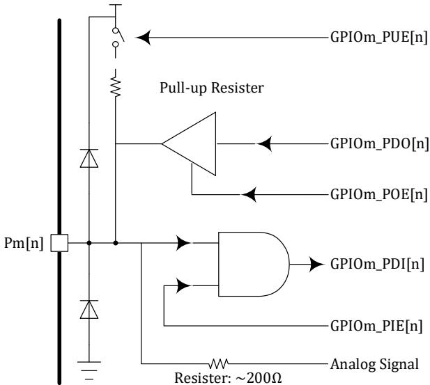  
图 15-1 GPIO 功能框图

如上图所示，Pm[n]为芯片 PAD，m 可以是 0\~3，表示 4 组 GPIO 中的任意一组，n 可以是0\~15，表示一组16个GPIO中的一个IO。模拟信号通过一个约200Ω的电阻串联直接连接到PAD。数字信号经过一个三态门输出，当输出使能 GPIOm\_POE[n]=0 时，buffer 输出高阻态，否则 buffer输出与 GPIOm\_PDO[n]电平相同。数字信号输入通过一个与门进入芯片内部，当 $\mathtt { G P I O m \_ P I E } [ \mathtt { n } ] = 0$ 时，GPIOm\_PDI[n]恒为 0，当 GPIOm\_PIE[n]=1，即输入使能打开时，GPIOm\_PDI[n]的电平与 Pm[n]电平相同。芯片 PAD 可以配置上拉，P0[2]引脚因为复用为外部复位脚 RSTN 上拉电阻为 300kΩ，注意，并非所有 PAD 都配备上拉电阻，具体哪些 PAD 具有上拉电阻资源，请参考 15.2.6 章节。没有上拉电阻的PAD 也可以配置GPIOm\_PUE[n]寄存器，但无实际作用。

## 15.1.2 产品特点

➢ 64 路 GPIO

➢ 推挽开漏模式可配置

➢ 部分GPIO 支持外部中断

Y 部分GPIO 可作为休眠唤醒源

➢ 部分GPIO 支持输入信号滤波

具体哪些GPIO 支持外部中断，请参考15.2.15.4

具体哪些 GPIO 可以作为休眠唤醒源，请参考 21.6.5

具体哪些GPIO 可以进行输入信号滤波，请参考15.3.2

GPIO 可配置成最多 13 种外部功能。GPIO 功能分布，请参考对应器件手册(datasheet)。

表 15-1 GPIO 第二功能

<table><tr><td>GPIO 第二功能值</td><td>功能描述</td></tr><tr><td>0</td><td>模拟功能,当 GPIO 作为模拟功能使用时,需要关闭对应 IO 的输出使能,上拉使能等,方式 IO 输出信号或片内上拉电阻对模拟信号造成干扰</td></tr><tr><td>1</td><td>CMP_OUT/CLKO,模拟比较器直接输出/时钟输出</td></tr><tr><td>2</td><td>HALL,HALL 信号输入</td></tr><tr><td>3</td><td>MCPWM,MCPWM 通道输出或停机信号输入</td></tr><tr><td>4</td><td>UART,串口 RXD 或 TXD</td></tr><tr><td>5</td><td>SPI,SPI 时钟、片选,数据输入、数据输出</td></tr><tr><td>6</td><td>I2C,I2C 时钟、I2C 数据</td></tr><tr><td>7</td><td>TIMER0/1,TIMER0/1 的通道 0/1,作为输入用于捕获模式或外部时钟源,作为输出用于比较模式,TIMER0 的停机信号输入</td></tr><tr><td>8</td><td>TIMER2/3,TIMER2/3 的通道 0/1,作为输入用于捕获模式或外部时钟源,作为输出用于比较模式,QEP0/1 的 Z 轴清零信号输入</td></tr><tr><td>9</td><td>ADC_TRIGGER0/1,ADC0/1 采样触发信号输出,每发生一次 ADC 采样触发,ADC_TRIGGER 信号翻转一次</td></tr><tr><td>10</td><td>CAN,CAN RX 或 TX</td></tr><tr><td>11</td><td>SIF,一线通串行通讯接口</td></tr><tr><td>12</td><td>CL,可配置逻辑 (Configurable Logic) 阵列 UNIT 输出</td></tr></table>

## 15.2 寄存器

## 15.2.1 地址分配

GPIO 0 模块在芯片中的基地址是 0x4001\_0D00。

GPIO 1 模块在芯片中的基地址是 0x4001\_0D40。

GPIO 2 模块在芯片中的基地址是 0x4001\_0D80。

GPIO 3 模块在芯片中的基地址是 0x4001\_0DC0。

GPIO 0/1/2/3 的寄存器定义完全相同，仅基地址不同。

表 15-2 GPIOx 寄存器列表

<table><tr><td>名称</td><td>偏移地址</td><td>说明</td></tr><tr><td>GPIOx_PIE</td><td>0x00</td><td>GPIO x 输入使能</td></tr><tr><td>GPIOx_POE</td><td>0x04</td><td>GPIO x 输出使能</td></tr><tr><td>GPIOx_PDI</td><td>0x08</td><td>GPIO x 输入数据</td></tr><tr><td>GPIOx_PDO</td><td>0x0C</td><td>GPIO x 输出数据</td></tr><tr><td>GPIOx_PUE</td><td>0x10</td><td>GPIO x 上拉使能</td></tr><tr><td>GPIOx_PODE</td><td>0x18</td><td>GPIO x 开漏使能</td></tr><tr><td>GPIOx_PFLT</td><td>0x1C</td><td>GPIO x 滤波使能</td></tr><tr><td>GPIOx_F3210</td><td>0x20</td><td>GPIO x [3:0]功能选择</td></tr><tr><td>GPIOx_F7654</td><td>0x24</td><td>GPIO x [7:4]功能选择</td></tr><tr><td>GPIOx_FBA98</td><td>0x28</td><td>GPIO x [11:8]功能选择</td></tr><tr><td>GPIOx_FFEDC</td><td>0x2C</td><td>GPIO x [15:12]功能选择</td></tr><tr><td>GPIOx_BSRR</td><td>0x30</td><td>GPIO x 位操作寄存器</td></tr><tr><td>GPIOx_BRR</td><td>0x34</td><td>GPIO x 位清零寄存器</td></tr></table>

GPIO 中断模块的基地址是 0x4001\_0E00。

表15-3GPIO 中断模块寄存器列表

<table><tr><td>名称</td><td>偏移地址</td><td>说明</td></tr><tr><td>EXTI_CR0</td><td>0x00</td><td>外部中断配置寄存器 0</td></tr><tr><td>EXTI_CR1</td><td>0x04</td><td>外部中断配置寄存器 1</td></tr><tr><td>EXTI_IE</td><td>0x08</td><td>GPIO 中断/DMA 使能</td></tr><tr><td>EXTI_IF</td><td>0x0C</td><td>GPIO 中断标志</td></tr><tr><td>CLKO_SEL</td><td>0x10</td><td>输出时钟选择信号</td></tr><tr><td>PWM_SWAP</td><td>0x14</td><td>MCPWM 通道重排</td></tr></table>

## 15.2.2 GPIOx\_PIE ( x = 0,1,2,3)

地址分别是:0x4001\_0D00, 0x4001\_0D40, 0x4001\_0D80, 0x4001\_0DC0

复位值:0x0

表 15-4 GPIOx 输入使能寄存器 GPIOx\_PIE

<table><tr><td>15</td><td>14</td><td>13</td><td>12</td><td>11</td><td>10</td><td>9</td><td>8</td><td>7</td><td>6</td><td>5</td><td>4</td><td>3</td><td>2</td><td>1</td><td>0</td></tr><tr><td>PIE15</td><td>PIE14</td><td>PIE13</td><td>PIE12</td><td>PIE11</td><td>PIE10</td><td>PIE9</td><td>PIE8</td><td>PIE7</td><td>PIE6</td><td>PIE5</td><td>PIE4</td><td>PIE3</td><td>PIE2</td><td>PIE1</td><td>PIE0</td></tr><tr><td>RW</td><td>RW</td><td>RW</td><td>RW</td><td>RW</td><td>RW</td><td>RW</td><td>RW</td><td>RW</td><td>RW</td><td>RW</td><td>RW</td><td>RW</td><td>RW</td><td>RW</td><td>RW</td></tr><tr><td>0</td><td>0</td><td>0</td><td>0</td><td>0</td><td>0</td><td>0</td><td>0</td><td>0</td><td>0</td><td>0</td><td>0</td><td>0</td><td>0</td><td>0</td><td>0</td></tr></table>

<table><tr><td>位置</td><td>位名称</td><td>说明</td></tr><tr><td>[31:16]</td><td></td><td>未使用</td></tr><tr><td>[15]</td><td>PIE15</td><td>GPIO x[15] / Px[15] 输入使能</td></tr><tr><td>[14]</td><td>PIE14</td><td>GPIO x[14] / Px[14] 输入使能</td></tr><tr><td>[13]</td><td>PIE13</td><td>GPIO x[13] / Px[13] 输入使能</td></tr><tr><td>[12]</td><td>PIE12</td><td>GPIO x[12] / Px[12] 输入使能</td></tr><tr><td>[11]</td><td>PIE11</td><td>GPIO x[11] / Px[11] 输入使能</td></tr><tr><td>[10]</td><td>PIE10</td><td>GPIO x[10] / Px[10] 输入使能</td></tr><tr><td>[9]</td><td>PIE9</td><td>GPIO x[9] / Px[9] 输入使能</td></tr><tr><td>[8]</td><td>PIE8</td><td>GPIO x[8] / Px[8] 输入使能</td></tr><tr><td>[7]</td><td>PIE7</td><td>GPIO x[7] / Px[7] 输入使能</td></tr><tr><td>[6]</td><td>PIE6</td><td>GPIO x[6] / Px[6] 输入使能</td></tr><tr><td>[5]</td><td>PIE5</td><td>GPIO x[5] / Px[5] 输入使能</td></tr><tr><td>[4]</td><td>PIE4</td><td>GPIO x[4] / Px[4] 输入使能</td></tr><tr><td>[3]</td><td>PIE3</td><td>GPIO x[3] / Px[3] 输入使能</td></tr><tr><td>[2]</td><td>PIE2</td><td>GPIO x[2] / Px[2] 输入使能</td></tr><tr><td>[1]</td><td>PIE1</td><td>GPIO x[1] / Px[1] 输入使能</td></tr><tr><td>[0]</td><td>PIE0</td><td>GPIO x[0] / Px[0] 输入使能</td></tr></table>

## 15.2.3 GPIOx\_POE ( x = 0,1,2,3)

地址分别是:0x4001\_0D04, 0x4001\_0D44, 0x4001\_0D84, 0x4001\_0DC4

复位值:0x0

表 15-5 GPIOx 输出使能寄存器 GPIOx\_POE

<table><tr><td>15</td><td>14</td><td>13</td><td>12</td><td>11</td><td>10</td><td>9</td><td>8</td><td>7</td><td>6</td><td>5</td><td>4</td><td>3</td><td>2</td><td>1</td><td>0</td></tr><tr><td>POE15</td><td>POE14</td><td>POE13</td><td>POE12</td><td>POE11</td><td>POE10</td><td>POE9</td><td>POE8</td><td>POE7</td><td>POE6</td><td>POE5</td><td>POE4</td><td>POE3</td><td>POE2</td><td>POE1</td><td>POE0</td></tr><tr><td>RW</td><td>RW</td><td>RW</td><td>RW</td><td>RW</td><td>RW</td><td>RW</td><td>RW</td><td>RW</td><td>RW</td><td>RW</td><td>RW</td><td>RW</td><td>RW</td><td>RW</td><td>RW</td></tr><tr><td>0</td><td>0</td><td>0</td><td>0</td><td>0</td><td>0</td><td>0</td><td>0</td><td>0</td><td>0</td><td>0</td><td>0</td><td>0</td><td>0</td><td>0</td><td>0</td></tr></table>

<table><tr><td>位置</td><td>位名称</td><td>说明</td></tr><tr><td>[31:16]</td><td></td><td>未使用</td></tr><tr><td>[15]</td><td>POE15</td><td>GPIO x[15] / Px[15] 输出使能</td></tr><tr><td>[14]</td><td>POE14</td><td>GPIO x[14] / Px[14] 输出使能</td></tr><tr><td>[13]</td><td>POE13</td><td>GPIO x[13] / Px[13] 输出使能</td></tr><tr><td>[12]</td><td>POE12</td><td>GPIO x[12] / Px[12] 输出使能</td></tr><tr><td>[11]</td><td>POE11</td><td>GPIO x[11] / Px[11] 输出使能</td></tr><tr><td>[10]</td><td>POE10</td><td>GPIO x[10] / Px[10] 输出使能</td></tr><tr><td>[9]</td><td>POE9</td><td>GPIO x[9] / Px[9] 输出使能</td></tr><tr><td>[8]</td><td>POE8</td><td>GPIO x[8] / Px[8] 输出使能</td></tr><tr><td>[7]</td><td>POE7</td><td>GPIO x[7] / Px[7] 输出使能</td></tr><tr><td>[6]</td><td>POE6</td><td>GPIO x[6] / Px[6] 输出使能</td></tr><tr><td>[5]</td><td>POE5</td><td>GPIO x[5] / Px[5] 输出使能</td></tr><tr><td>[4]</td><td>POE4</td><td>GPIO x[4] / Px[4] 输出使能</td></tr><tr><td>[3]</td><td>POE3</td><td>GPIO x[3] / Px[3] 输出使能</td></tr><tr><td>[2]</td><td>POE2</td><td>GPIO x[2] / Px[2] 输出使能</td></tr><tr><td>[1]</td><td>POE1</td><td>GPIO x[1] / Px[1] 输出使能</td></tr><tr><td>[0]</td><td>POE0</td><td>GPIO x[0] / Px[0] 输出使能</td></tr></table>

## 15.2.4 GPIOx\_PDI ( x = 0,1,2,3)

复位值:0x0

表 15-6 GPIOx 输入数据寄存器 GPIOx\_PDI

<table><tr><td>15</td><td>14</td><td>13</td><td>12</td><td>11</td><td>10</td><td>9</td><td>8</td><td>7</td><td>6</td><td>5</td><td>4</td><td>3</td><td>2</td><td>1</td><td>0</td></tr><tr><td></td><td></td><td></td><td></td><td></td><td></td><td></td><td>PDI</td><td></td><td></td><td></td><td></td><td></td><td></td><td></td><td></td></tr><tr><td></td><td></td><td></td><td></td><td></td><td></td><td></td><td>RO</td><td></td><td></td><td></td><td></td><td></td><td></td><td></td><td></td></tr><tr><td></td><td></td><td></td><td></td><td></td><td></td><td></td><td>0</td><td></td><td></td><td></td><td></td><td></td><td></td><td></td><td></td></tr></table>

<table><tr><td>位置</td><td>位名称</td><td>说明</td></tr><tr><td>[31:16]</td><td></td><td>未使用</td></tr><tr><td>[15:0]</td><td>PDI</td><td>GPIO x 输入数据</td></tr></table>

## 15.2.5 GPIOx\_PDO ( x = 0,1,2,3)

地址分别是:0x4001\_0D0C, 0x4001\_0D4C, 0x4001\_0D8C, 0x4001\_0DCC

复位值:0x0

表 15-7 GPIOx 输出数据寄存器 GPIOx\_PDO

<table><tr><td>15</td><td>14</td><td>13</td><td>12</td><td>11</td><td>10</td><td>9</td><td>8</td><td>7</td><td>6</td><td>5</td><td>4</td><td>3</td><td>2</td><td>1</td><td>0</td></tr><tr><td></td><td></td><td></td><td></td><td></td><td></td><td></td><td>PDO</td><td></td><td></td><td></td><td></td><td></td><td></td><td></td><td></td></tr><tr><td></td><td></td><td></td><td></td><td></td><td></td><td></td><td>RW</td><td></td><td></td><td></td><td></td><td></td><td></td><td></td><td></td></tr><tr><td></td><td></td><td></td><td></td><td></td><td></td><td></td><td>0</td><td></td><td></td><td></td><td></td><td></td><td></td><td></td><td></td></tr></table>

<table><tr><td>位置</td><td>位名称</td><td>说明</td></tr><tr><td>[31:16]</td><td></td><td>未使用</td></tr><tr><td>[15:0]</td><td>PDO</td><td>GPIO x 输出数据</td></tr></table>

## 15.2.6 GPIOx\_PUE ( x = 0,1,2,3)

地址分别是:0x4001\_0D10, 0x4001\_0D50, 0x4001\_0D90, 0x4001\_0DD0

复位值:0x0

表 15-8 GPIOx 上拉使能寄存器 GPIOx\_PUE

<table><tr><td>15</td><td>14</td><td>13</td><td>12</td><td>11</td><td>10</td><td>9</td><td>8</td><td>7</td><td>6</td><td>5</td><td>4</td><td>3</td><td>2</td><td>1</td><td>0</td></tr><tr><td>PUE15</td><td>PUE14</td><td>PUE13</td><td>PUE12</td><td>PUE11</td><td>PUE10</td><td>PUE9</td><td>PUE8</td><td>PUE7</td><td>PUE6</td><td>PUE5</td><td>PUE4</td><td>PUE3</td><td>PUE2</td><td>PUE1</td><td>PUE0</td></tr><tr><td>RW</td><td>RW</td><td>RW</td><td>RW</td><td>RW</td><td>RW</td><td>RW</td><td>RW</td><td>RW</td><td>RW</td><td>RW</td><td>RW</td><td>RW</td><td>RW</td><td>RW</td><td>RW</td></tr><tr><td>0</td><td>0</td><td>0</td><td>0</td><td>0</td><td>0</td><td>0</td><td>0</td><td>0</td><td>0</td><td>0</td><td>0</td><td>0</td><td>0</td><td>0</td><td>0</td></tr></table>

<table><tr><td>位置</td><td>位名称</td><td>说明</td></tr><tr><td>[31:16]</td><td></td><td>未使用</td></tr><tr><td>[15]</td><td>PUE15</td><td>GPIO x[15] / Px[15] 上拉使能</td></tr><tr><td>[14]</td><td>PUE14</td><td>GPIO x[14] / Px[14] 上拉使能</td></tr><tr><td>[13]</td><td>PUE13</td><td>GPIO x[13] / Px[13] 上拉使能</td></tr><tr><td>[12]</td><td>PUE12</td><td>GPIO x[12] / Px[12] 上拉使能</td></tr><tr><td>[11]</td><td>PUE11</td><td>GPIO x[11] / Px[11] 上拉使能</td></tr><tr><td>[10]</td><td>PUE10</td><td>GPIO x[10] / Px[10] 上拉使能</td></tr><tr><td>[9]</td><td>PUE9</td><td>GPIO x[9] / Px[9] 上拉使能</td></tr><tr><td>[8]</td><td>PUE8</td><td>GPIO x[8] / Px[8] 上拉使能</td></tr><tr><td>[7]</td><td>PUE7</td><td>GPIO x[7] / Px[7] 上拉使能</td></tr><tr><td>[6]</td><td>PUE6</td><td>GPIO x[6] / Px[6] 上拉使能</td></tr><tr><td>[5]</td><td>PUE5</td><td>GPIO x[5] / Px[5] 上拉使能</td></tr><tr><td>[4]</td><td>PUE4</td><td>GPIO x[4] / Px[4] 上拉使能</td></tr><tr><td>[3]</td><td>PUE3</td><td>GPIO x[3] / Px[3] 上拉使能</td></tr><tr><td>[2]</td><td>PUE2</td><td>GPIO x[2] / Px[2] 上拉使能</td></tr><tr><td>[1]</td><td>PUE1</td><td>GPIO x[1] / Px[1] 上拉使能</td></tr><tr><td>[0]</td><td>PUE0</td><td>GPIO x[0] / Px[0] 上拉使能</td></tr></table>

注意:并非所有IO都具有上拉功能，具体哪些IO具有上拉功能请参考15.3.1。没有上拉功能的IO 对应的PUE 寄存器也没有实现，因此向这些位置写入1 无效，读回恒为0。

## 15.2.7 GPIOx\_PODE ( x = 0,1,2,3)

地址分别是:0x4001\_0D18, 0x4001\_0D58, 0x4001\_0D98, 0x4001\_0DD8

复位值:0x0

表 15-9 GPIOx 开漏使能寄存器 GPIOx\_PODE

<table><tr><td>15</td><td>14</td><td>13</td><td>12</td><td>11</td><td>10</td><td>9</td><td>8</td><td>7</td><td>6</td><td>5</td><td>4</td><td>3</td><td>2</td><td>1</td><td>0</td></tr><tr><td>PODE15</td><td>PODE14</td><td>PODE13</td><td>PODE12</td><td>PODE11</td><td>PODE10</td><td>PODE9</td><td>PODE8</td><td>PODE7</td><td>PODE6</td><td>PODE5</td><td>PODE4</td><td>PODE3</td><td>PODE2</td><td>PODE1</td><td>PODE0</td></tr><tr><td>RW</td><td>RW</td><td>RW</td><td>RW</td><td>RW</td><td>RW</td><td>RW</td><td>RW</td><td>RW</td><td>RW</td><td>RW</td><td>RW</td><td>RW</td><td>RW</td><td>RW</td><td>RW</td></tr><tr><td>0</td><td>0</td><td>0</td><td>0</td><td>0</td><td>0</td><td>0</td><td>0</td><td>0</td><td>0</td><td>0</td><td>0</td><td>0</td><td>0</td><td>0</td><td>0</td></tr></table>

<table><tr><td>位置</td><td>位名称</td><td>说明</td></tr><tr><td>[31:16]</td><td></td><td>未使用</td></tr><tr><td>[15]</td><td>PODE15</td><td>GPIO x[15] / Px[15] 开漏使能</td></tr><tr><td>[14]</td><td>PODE14</td><td>GPIO x[14] / Px[14] 开漏使能</td></tr><tr><td>[13]</td><td>PODE13</td><td>GPIO x[13] / Px[13] 开漏使能</td></tr><tr><td>[12]</td><td>PODE12</td><td>GPIO x[12] / Px[12] 开漏使能</td></tr><tr><td>[11]</td><td>PODE11</td><td>GPIO x[11] / Px[11] 开漏使能</td></tr><tr><td>[10]</td><td>PODE10</td><td>GPIO x[10] / Px[10] 开漏使能</td></tr><tr><td>[9]</td><td>PODE9</td><td>GPIO x[9] / Px[9] 开漏使能</td></tr><tr><td>[8]</td><td>PODE8</td><td>GPIO x[8] / Px[8] 开漏使能</td></tr><tr><td>[7]</td><td>PODE7</td><td>GPIO x[7] / Px[7] 开漏使能</td></tr><tr><td>[6]</td><td>PODE6</td><td>GPIO x[6] / Px[6] 开漏使能</td></tr><tr><td>[5]</td><td>PODE5</td><td>GPIO x[5] / Px[5] 开漏使能</td></tr><tr><td>[4]</td><td>PODE4</td><td>GPIO x[4] / Px[4] 开漏使能</td></tr><tr><td>[3]</td><td>PODE3</td><td>GPIO x[3] / Px[3] 开漏使能</td></tr><tr><td>[2]</td><td>PODE2</td><td>GPIO x[2] / Px[2] 开漏使能</td></tr><tr><td>[1]</td><td>PODE1</td><td>GPIO x[1] / Px[1] 开漏使能</td></tr><tr><td>[0]</td><td>PODE0</td><td>GPIO x[0] / Px[0] 开漏使能</td></tr></table>

## 15.2.8 GPIOx\_PFLT ( x = 0,1,2,3)

地址分别是:0x4001\_0D1C, 0x4001\_0D5C, 0x4001\_0D9C, 0x4001\_0DDC

复位值:0x0

表 15-10 GPIOx 滤波寄存器 GPIOx\_PFLT

<table><tr><td>15</td><td>14</td><td>13</td><td>12</td><td>11</td><td>10</td><td>9</td><td>8</td><td>7</td><td>6</td><td>5</td><td>4</td><td>3</td><td>2</td><td>1</td><td>0</td></tr><tr><td>PFLT 15</td><td>PFLT 14</td><td>PFLT 13</td><td>PFLT 12</td><td>PFLT 11</td><td>PFLT 10</td><td>PFLT 9</td><td>PFLT 8</td><td>PFLT 7</td><td>PFLT 6</td><td>PFLT 5</td><td>PFLT 4</td><td>PFLT 3</td><td>PFLT 2</td><td>PFLT 1</td><td>PFLT 0</td></tr><tr><td>RW</td><td>RW</td><td>RW</td><td>RW</td><td>RW</td><td>RW</td><td>RW</td><td>RW</td><td>RW</td><td>RW</td><td>RW</td><td>RW</td><td>RW</td><td>RW</td><td>RW</td><td>RW</td></tr><tr><td>0</td><td>0</td><td>0</td><td>0</td><td>0</td><td>0</td><td>0</td><td>0</td><td>0</td><td>0</td><td>0</td><td>0</td><td>0</td><td>0</td><td>0</td><td>0</td></tr></table>

<table><tr><td>位置</td><td>位名称</td><td>说明</td></tr><tr><td>[31:16]</td><td></td><td>未使用</td></tr><tr><td>[15]</td><td>PFLT15</td><td>GPIO x[15] / Px[15] 滤波使能</td></tr><tr><td>[14]</td><td>PFLT14</td><td>GPIO x[14] / Px[14] 滤波使能</td></tr><tr><td>[13]</td><td>PFLT13</td><td>GPIO x[13] / Px[13] 滤波使能</td></tr><tr><td>[12]</td><td>PFLT12</td><td>GPIO x[12] / Px[12] 滤波使能</td></tr><tr><td>[11]</td><td>PFLT11</td><td>GPIO x[11] / Px[11] 滤波使能</td></tr><tr><td>[10]</td><td>PFLT10</td><td>GPIO x[10] / Px[10] 滤波使能</td></tr><tr><td>[9]</td><td>PFLT9</td><td>GPIO x[9] / Px[9] 滤波使能</td></tr><tr><td>[8]</td><td>PFLT8</td><td>GPIO x[8] / Px[8] 滤波使能</td></tr><tr><td>[7]</td><td>PFLT7</td><td>GPIO x[7] / Px[7] 滤波使能</td></tr><tr><td>[6]</td><td>PFLT6</td><td>GPIO x[6] / Px[6] 滤波使能</td></tr><tr><td>[5]</td><td>PFLT 5</td><td>GPIO x[5] / Px[5] 滤波使能</td></tr><tr><td>[4]</td><td>PFLT 4</td><td>GPIO x[4] / Px[4] 滤波使能</td></tr><tr><td>[3]</td><td>PFLT 3</td><td>GPIO x[3] / Px[3] 滤波使能</td></tr><tr><td>[2]</td><td>PFLT 2</td><td>GPIO x[2] / Px[2] 滤波使能</td></tr><tr><td>[1]</td><td>PFLT1</td><td>GPIO x[1] / Px[1] 滤波使能</td></tr><tr><td>[0]</td><td>PFLT0</td><td>GPIO x[0] / Px[0] 滤波使能</td></tr></table>

只有部分GPIO 支持输入信号滤波，具体哪些 GPIO 支持滤波，请参考15.3.2。

## 15.2.9 GPIOx\_F3210 ( x = 0,1,2,3)

地址分别是:0x4001\_0D20, 0x4001\_0D60, 0x4001\_0DA0, 0x4001\_0DE0

复位值:0x0

表 15-11 GPIOx 功能选择寄存器 GPIOx\_F3210

<table><tr><td>15</td><td>14</td><td>13</td><td>12</td><td>11</td><td>10</td><td>9</td><td>8</td><td>7</td><td>6</td><td>5</td><td>4</td><td>3</td><td>2</td><td>1</td><td>0</td></tr><tr><td colspan="4">F3</td><td colspan="4">F2</td><td colspan="4">F1</td><td colspan="4">F0</td></tr><tr><td colspan="4">RW</td><td colspan="4">RW</td><td colspan="4">RW</td><td colspan="4">RW</td></tr><tr><td colspan="4">0</td><td colspan="4">0</td><td colspan="4">0</td><td colspan="4">0</td></tr></table>

<table><tr><td>位置</td><td>位名称</td><td>说明</td></tr><tr><td>[31:16]</td><td></td><td>未使用</td></tr><tr><td>[15:12]</td><td>F3</td><td>GPIO x[3] / Px[3] 功能选择</td></tr><tr><td>[11:8]</td><td>F2</td><td>GPIO x[2] / Px[2] 功能选择</td></tr><tr><td>[7:4]</td><td>F1</td><td>GPIO x[1] / Px[1] 功能选择</td></tr><tr><td>[3:0]</td><td>F0</td><td>GPIO x[0] / Px[0] 功能选择</td></tr></table>

其中F3/F2/F1/F0 可以设置的GPIO 第二功能如表15-1 所示，GPIO 功能为稀疏映射，即每个GPIO 仅可配置部分第二功能使用，需要 GPIO 功能分布，请参考对应器件手册(datasheet)。以下GPIOx\_F7654，GPIOx\_FBA98，GPIOx\_FFEDC 与 GPIOx\_F3210 相同。

## 15.2.10 GPIOx\_F7654 ( x = 0,1,2,3)

地址分别是:0x4001\_0D24, 0x4001\_0D64, 0x4001\_0DA4, 0x4001\_0DE4

复位值:0x0

表 15-12 GPIOx 功能选择寄存器 GPIOx\_F7654

<table><tr><td>15</td><td>14</td><td>13</td><td>12</td><td>11</td><td>10</td><td>9</td><td>8</td><td>7</td><td>6</td><td>5</td><td>4</td><td>3</td><td>2</td><td>1</td><td>0</td></tr><tr><td colspan="4">F7</td><td colspan="4">F6</td><td colspan="4">F5</td><td colspan="4">F4</td></tr><tr><td colspan="4">RW</td><td colspan="4">RW</td><td colspan="4">RW</td><td colspan="4">RW</td></tr><tr><td colspan="4">0</td><td colspan="4">0</td><td colspan="4">0</td><td colspan="4">0</td></tr></table>

<table><tr><td>位置</td><td>位名称</td><td>说明</td></tr><tr><td>[31:16]</td><td></td><td>未使用</td></tr><tr><td>[15:12]</td><td>F7</td><td>GPIO x[7] / Px[7] 功能选择</td></tr><tr><td>[11:8]</td><td>F6</td><td>GPIO x[6] / Px[6] 功能选择</td></tr><tr><td>[7:4]</td><td>F5</td><td>GPIO x[5] / Px[5] 功能选择</td></tr><tr><td>[3:0]</td><td>F4</td><td>GPIO x[4] / Px[4] 功能选择</td></tr></table>

## 15.2.11 GPIOx\_FBA98 ( x = 0,1,2,3)

地址分别是:0x4001\_0D28, 0x4001\_0D68, 0x4001\_0DA8, 0x4001\_0DE8

复位值:0x0

表 15-13 GPIOx 功能选择寄存器 GPIOx\_FBA98

<table><tr><td>15</td><td>14</td><td>13</td><td>12</td><td>11</td><td>10</td><td>9</td><td>8</td><td>7</td><td>6</td><td>5</td><td>4</td><td>3</td><td>2</td><td>1</td><td>0</td></tr><tr><td colspan="4">F11</td><td colspan="4">F10</td><td colspan="4">F9</td><td colspan="4">F8</td></tr><tr><td colspan="4">RW</td><td colspan="4">RW</td><td colspan="4">RW</td><td colspan="4">RW</td></tr><tr><td colspan="4">0</td><td colspan="4">0</td><td colspan="4">0</td><td colspan="4">0</td></tr></table>

<table><tr><td>位置</td><td>位名称</td><td>说明</td></tr><tr><td>[31:16]</td><td></td><td>未使用</td></tr><tr><td>[15:12]</td><td>F11</td><td>GPIO x[11] / Px[11] 功能选择</td></tr><tr><td>[11:8]</td><td>F10</td><td>GPIO x[10] / Px[10] 功能选择</td></tr><tr><td>[7:4]</td><td>F9</td><td>GPIO x[9] / Px[9] 功能选择</td></tr><tr><td>[3:0]</td><td>F8</td><td>GPIO x[8] / Px[8] 功能选择</td></tr></table>

## 15.2.12 GPIOx\_FFEDC ( x = 0,1,2,3)

地址分别是:0x4001\_0D2C, 0x4001\_0D6C, 0x4001\_0DAC, 0x4001\_0DEC

复位值:0x0

表 15-14 GPIOx 功能选择寄存器 GPIOx\_FFEDC

<table><tr><td>15</td><td>14</td><td>13</td><td>12</td><td>11</td><td>10</td><td>9</td><td>8</td><td>7</td><td>6</td><td>5</td><td>4</td><td>3</td><td>2</td><td>1</td><td>0</td></tr><tr><td colspan="4">F15</td><td colspan="4">F14</td><td colspan="4">F13</td><td colspan="4">F12</td></tr><tr><td colspan="4">RW</td><td colspan="4">RW</td><td colspan="4">RW</td><td colspan="4">RW</td></tr><tr><td colspan="4">0</td><td colspan="4">0</td><td colspan="4">0</td><td colspan="4">0</td></tr></table>

<table><tr><td>位置</td><td>位名称</td><td>说明</td></tr><tr><td>[31:16]</td><td></td><td>未使用</td></tr><tr><td>[15:12]</td><td>F15</td><td>GPIO x[15] / Px[15] 功能选择</td></tr><tr><td>[11:8]</td><td>F14</td><td>GPIO x[14] / Px[14] 功能选择</td></tr><tr><td>[7:4]</td><td>F13</td><td>GPIO x[13] / Px[13] 功能选择</td></tr><tr><td>[3:0]</td><td>F12</td><td>GPIO x[12] / Px[12] 功能选择</td></tr></table>

GPIO 的功能复用详细列表请见对应产品DATASHEET 管脚分布章节。

## 15.2.13 GPIOx\_BSRR ( x = 0,1,2,3)

地址分别是:0x4001\_0D30, 0x4001\_0D70, 0x4001\_0DB0, 0x4001\_0DF0

复位值:0x0

表 15-15 GPIOx 位操作寄存器 GPIOx\_BSRR

<table><tr><td>31</td><td>30</td><td>29</td><td>28</td><td>27</td><td>26</td><td>25</td><td>24</td><td>23</td><td>22</td><td>21</td><td>20</td><td>19</td><td>18</td><td>17</td><td>16</td></tr></table>

<table><tr><td>0</td><td>M</td><td>CLR15</td></tr><tr><td>0</td><td>M</td><td>CLR14</td></tr><tr><td>0</td><td>M</td><td>CLR13</td></tr><tr><td>0</td><td>M</td><td>CLR12</td></tr><tr><td>0</td><td>M</td><td>CLR11</td></tr><tr><td>0</td><td>M</td><td>CLR10</td></tr><tr><td>0</td><td>M</td><td>CLRF9</td></tr><tr><td>0</td><td>M</td><td>CLRF8</td></tr><tr><td>0</td><td>M</td><td>CLRF7</td></tr><tr><td>0</td><td>M</td><td>CLRF6</td></tr><tr><td>0</td><td>M</td><td>CLRF5</td></tr><tr><td>0</td><td>M</td><td>CLRF4</td></tr><tr><td>0</td><td>M</td><td>CLRF3</td></tr><tr><td>0</td><td>M</td><td>CLRF2</td></tr><tr><td>0</td><td>M</td><td>CLRF1</td></tr><tr><td>0</td><td>M</td><td>CLRO</td></tr></table>

<table><tr><td>15</td><td>14</td><td>13</td><td>12</td><td>11</td><td>10</td><td>9</td><td>8</td><td>7</td><td>6</td><td>5</td><td>4</td><td>3</td><td>2</td><td>1</td><td>0</td></tr><tr><td>SET15</td><td>SET14</td><td>SET13</td><td>SET12</td><td>SET11</td><td>SET10</td><td>SET9</td><td>SET8</td><td>SET7</td><td>SET6</td><td>SET5</td><td>SET4</td><td>SET3</td><td>SET2</td><td>SET1</td><td>SET0</td></tr><tr><td>W</td><td>W</td><td>W</td><td>W</td><td>W</td><td>W</td><td>W</td><td>W</td><td>W</td><td>W</td><td>W</td><td>W</td><td>W</td><td>W</td><td>W</td><td>W</td></tr><tr><td>0</td><td>0</td><td>0</td><td>0</td><td>0</td><td>0</td><td>0</td><td>0</td><td>0</td><td>0</td><td>0</td><td>0</td><td>0</td><td>0</td><td>0</td><td>0</td></tr></table>

<table><tr><td>位置</td><td>位名称</td><td>说明</td></tr><tr><td>[31]</td><td>CLR15</td><td>写1将GPIO x[15]清零,写0无作用</td></tr><tr><td>[30]</td><td>CLR14</td><td>写1将GPIO x[14]清零,写0无作用</td></tr><tr><td>[29]</td><td>CLR13</td><td>写1将GPIO x[13]清零,写0无作用</td></tr><tr><td>[28]</td><td>CLR12</td><td>写1将GPIO x[12]清零,写0无作用</td></tr><tr><td>[27]</td><td>CLR11</td><td>写1将GPIO x[11]清零,写0无作用</td></tr><tr><td>[26]</td><td>CLR10</td><td>写1将GPIO x[10]清零,写0无作用</td></tr><tr><td>[25]</td><td>CLR9</td><td>写1将GPIO x[9]清零,写0无作用</td></tr><tr><td>[24]</td><td>CLR8</td><td>写1将GPIO x[8]清零,写0无作用</td></tr><tr><td>[23]</td><td>CLR7</td><td>写1将GPIO x[7]清零,写0无作用</td></tr><tr><td>[22]</td><td>CLR6</td><td>写1将GPIO x[6]清零,写0无作用</td></tr><tr><td>[21]</td><td>CLR5</td><td>写1将GPIO x[5]清零,写0无作用</td></tr><tr><td>[20]</td><td>CLR4</td><td>写1将GPIO x[4]清零,写0无作用</td></tr><tr><td>[19]</td><td>CLR3</td><td>写1将GPIO x[3]清零,写0无作用</td></tr><tr><td>[18]</td><td>CLR2</td><td>写1将GPIO x[2]清零,写0无作用</td></tr><tr><td>[17]</td><td>CLR1</td><td>写1将GPIO x[1]清零,写0无作用</td></tr><tr><td>[16]</td><td>CLR0</td><td>写1将GPIO x[0]清零,写0无作用</td></tr><tr><td>[15]</td><td>SET15</td><td>写1将GPIO x[15]置1,写0无作用</td></tr><tr><td>[14]</td><td>SET14</td><td>写1将GPIO x[14]置1,写0无作用</td></tr><tr><td>[13]</td><td>SET13</td><td>写1将GPIO x[13]置1,写0无作用</td></tr><tr><td>[12]</td><td>SET12</td><td>写1将GPIO x[12]置1,写0无作用</td></tr><tr><td>[11]</td><td>SET11</td><td>写1将GPIO x[11]置1,写0无作用</td></tr><tr><td>[10]</td><td>SET10</td><td>写1将GPIO x[10]置1,写0无作用</td></tr><tr><td>[9]</td><td>SET9</td><td>写1将GPIO x[9]置1,写0无作用</td></tr><tr><td>[8]</td><td>SET8</td><td>写1将GPIO x[8]置1,写0无作用</td></tr><tr><td>[7]</td><td>SET7</td><td>写1将GPIO x[7]置1,写0无作用</td></tr><tr><td>[6]</td><td>SET6</td><td>写1将GPIO x[6]置1,写0无作用</td></tr><tr><td>[5]</td><td>SET5</td><td>写1将GPIO x[5]置1,写0无作用</td></tr><tr><td>[4]</td><td>SET4</td><td>写1将GPIO x[4]置1,写0无作用</td></tr><tr><td>[3]</td><td>SET3</td><td>写1将GPIO x[3]置1,写0无作用</td></tr><tr><td>[2]</td><td>SET2</td><td>写1将GPIO x[2]置1,写0无作用</td></tr><tr><td>[1]</td><td>SET1</td><td>写1将GPIO x[1]置1,写0无作用</td></tr><tr><td>[0]</td><td>SETO</td><td>写1将GPIO x[0]置1,写0无作用</td></tr></table>

若用BSRR 的高16 位与低 16 位同时对GPIO 同一位置既置1 又清零，则该位被清零。

## 15.2.14 GPIOx\_BRR ( x = 0,1,2,3)

地址分别是:0x4001\_0D34, 0x4001\_0D74, 0x4001\_0DB4, 0x4001\_0DF4

复位值:0x0

表 15-16 GPIOx 位清零寄存器 GPIOx\_BRR

<table><tr><td>15</td><td>14</td><td>13</td><td>12</td><td>11</td><td>10</td><td>9</td><td>8</td><td>7</td><td>6</td><td>5</td><td>4</td><td>3</td><td>2</td><td>1</td><td>0</td></tr><tr><td>CLR5</td><td>CLR4</td><td>CLR3</td><td>CLR2</td><td>CLR1</td><td>CLR0</td><td>CLR9</td><td>CLR8</td><td>CLR7</td><td>CLR6</td><td>CLR5</td><td>CLR4</td><td>CLR3</td><td>CLR2</td><td>CLR1</td><td>CLR0</td></tr><tr><td>W</td><td>W</td><td>W</td><td>W</td><td>W</td><td>W</td><td>W</td><td>W</td><td>W</td><td>W</td><td>W</td><td>W</td><td>W</td><td>W</td><td>W</td><td>W</td></tr><tr><td>0</td><td>0</td><td>0</td><td>0</td><td>0</td><td>0</td><td>0</td><td>0</td><td>0</td><td>0</td><td>0</td><td>0</td><td>0</td><td>0</td><td>0</td><td>0</td></tr></table>

<table><tr><td>位置</td><td>位名称</td><td>说明</td></tr><tr><td>[31:16]</td><td></td><td>未使用</td></tr><tr><td>[15]</td><td>CLR15</td><td>写 1 将 GPIO x[15]清零,写 0 无作用</td></tr><tr><td>[14]</td><td>CLR14</td><td>写 1 将 GPIO x[14]清零,写 0 无作用</td></tr><tr><td>[13]</td><td>CLR13</td><td>写 1 将 GPIO x[13]清零,写 0 无作用</td></tr><tr><td>[12]</td><td>CLR12</td><td>写 1 将 GPIO x[12]清零,写 0 无作用</td></tr><tr><td>[11]</td><td>CLR11</td><td>写 1 将 GPIO x[11]清零,写 0 无作用</td></tr><tr><td>[10]</td><td>CLR10</td><td>写 1 将 GPIO x[10]清零,写 0 无作用</td></tr><tr><td>[9]</td><td>CLR9</td><td>写 1 将 GPIO x[9]清零,写 0 无作用</td></tr><tr><td>[8]</td><td>CLR8</td><td>写 1 将 GPIO x[8]清零,写 0 无作用</td></tr><tr><td>[7]</td><td>CLR7</td><td>写 1 将 GPIO x[7]清零,写 0 无作用</td></tr><tr><td>[6]</td><td>CLR6</td><td>写 1 将 GPIO x[6]清零,写 0 无作用</td></tr><tr><td>[5]</td><td>CLR5</td><td>写 1 将 GPIO x[5]清零,写 0 无作用</td></tr><tr><td>[4]</td><td>CLR4</td><td>写 1 将 GPIO x[4]清零,写 0 无作用</td></tr><tr><td>[3]</td><td>CLR3</td><td>写 1 将 GPIO x[3]清零,写 0 无作用</td></tr><tr><td>[2]</td><td>CLR2</td><td>写 1 将 GPIO x[2]清零,写 0 无作用</td></tr><tr><td>[1]</td><td>CLR1</td><td>写 1 将 GPIO x[1]清零,写 0 无作用</td></tr><tr><td>[0]</td><td>CLR0</td><td>写 1 将 GPIO x[0]清零,写 0 无作用</td></tr></table>

## 15.2.15 外部事件

EXTI\_CR0 和EXTI\_CR1 用于选择GPIO 外部信号产生中断或DMA 请求的上升沿/下降沿触发类型。

地址:0x4001\_0E00

复位值:0x0

表 15-17 EXTI\_CR0 外部触发配置寄存器 0

<table><tr><td>15</td><td>14</td><td>13</td><td>12</td><td>11</td><td>10</td><td>9</td><td>8</td><td>7</td><td>6</td><td>5</td><td>4</td><td>3</td><td>2</td><td>1</td><td>0</td></tr><tr><td colspan="2">T7</td><td colspan="2">T6</td><td colspan="2">T5</td><td colspan="2">T4</td><td colspan="2">T3</td><td colspan="2">T2</td><td colspan="2">T1</td><td colspan="2">T0</td></tr><tr><td colspan="2">RW</td><td colspan="2">RW</td><td colspan="2">RW</td><td colspan="2">RW</td><td colspan="2">RW</td><td colspan="2">RW</td><td colspan="2">RW</td><td colspan="2">RW</td></tr><tr><td colspan="2">0</td><td colspan="2">0</td><td colspan="2">0</td><td colspan="2">0</td><td colspan="2">0</td><td colspan="2">0</td><td colspan="2">0</td><td colspan="2">0</td></tr></table>

<table><tr><td>位置</td><td>位名称</td><td>说明</td></tr><tr><td>[31:16]</td><td></td><td>未使用</td></tr><tr><td>[15:14]</td><td>T7</td><td>GPIO 0[15]/P0[15]外部触发类型选择00:不触发01:下降沿触发10:上升沿触发11:上升沿、下降沿均触发</td></tr><tr><td>[13:12]</td><td>T6</td><td>GPIO 0[14]/P0[14]外部触发类型选择00:不触发01:下降沿触发10:上升沿触发11:上升沿、下降沿均触发</td></tr><tr><td>[11:10]</td><td>T5</td><td>GPIO 0[11]/P0[11]外部触发类型选择00:不触发01:下降沿触发10:上升沿触发11:上升沿、下降沿均触发</td></tr><tr><td>[9:8]</td><td>T4</td><td>GPIO 0[6]/P0[6]外部触发类型选择00:不触发01:下降沿触发10:上升沿触发11:上升沿、下降沿均触发</td></tr><tr><td>[7:6]</td><td>T3</td><td>GPIO 0[3]/P0[3]外部触发类型选择00:不触发01:下降沿触发10:上升沿触发11:上升沿、下降沿均触发</td></tr><tr><td>[5:4]</td><td>T2</td><td>GPIO 0[2]/P0[2]外部触发类型选择00:不触发01:下降沿触发10:上升沿触发11:上升沿、下降沿均触发</td></tr><tr><td>[3:2]</td><td>T1</td><td>GPIO 0[1]/P0[1]外部触发类型选择00:不触发01:下降沿触发10:上升沿触发11:上升沿、下降沿均触发</td></tr><tr><td>[1:0]</td><td>T0</td><td>GPIO 0[0]/ P0[0]外部触发类型选择00:不触发01:下降沿触发10:上升沿触发11:上升沿、下降沿均触发</td></tr></table>

## 15.2.15.2 EXTI\_CR1

地址:0x4001\_0E04

复位值:0x0

表 15-18 EXTI\_CR1 外部触发配置寄存器 1

<table><tr><td>15</td><td>14</td><td>13</td><td>12</td><td>11</td><td>10</td><td>9</td><td>8</td><td>7</td><td>6</td><td>5</td><td>4</td><td>3</td><td>2</td><td>1</td><td>0</td></tr><tr><td colspan="2">T15</td><td colspan="2">T14</td><td colspan="2">T13</td><td colspan="2">T12</td><td colspan="2">T11</td><td colspan="2">T10</td><td colspan="2">T9</td><td colspan="2">T8</td></tr><tr><td colspan="2">RW</td><td colspan="2">RW</td><td colspan="2">RW</td><td colspan="2">RW</td><td colspan="2">RW</td><td colspan="2">RW</td><td colspan="2">RW</td><td colspan="2">RW</td></tr><tr><td colspan="2">0</td><td colspan="2">0</td><td colspan="2">0</td><td colspan="2">0</td><td colspan="2">0</td><td colspan="2">0</td><td colspan="2">0</td><td colspan="2">0</td></tr></table>

<table><tr><td>位置</td><td>位名称</td><td>说明</td></tr><tr><td>[31:16]</td><td></td><td>未使用</td></tr><tr><td>[15:14]</td><td>T15</td><td>GPIO 2[15]/P2[15]外部触发类型选择00:不触发01:下降沿触发10:上升沿触发11:上升沿、下降沿均触发</td></tr><tr><td>[13:12]</td><td>T14</td><td>GPIO 2[12]/P2[12]外部触发类型选择00:不触发01:下降沿触发10:上升沿触发11:上升沿、下降沿均触发</td></tr><tr><td>[11:10]</td><td>T13</td><td>GPIO 2[7]/P2[7]外部触发类型选择00:不触发01:下降沿触发10:上升沿触发11:上升沿、下降沿均触发</td></tr><tr><td>[9:8]</td><td>T12</td><td>GPIO 2[4]/P2[4]外部触发类型选择00:不触发01:下降沿触发10:上升沿触发11:上升沿、下降沿均触发</td></tr><tr><td>[7:6]</td><td>T11</td><td>GPIO 2[3]/P2[3]外部触发类型选择00:不触发01:下降沿触发10:上升沿触发11:上升沿、下降沿均触发</td></tr><tr><td>[5:4]</td><td>T10</td><td>GPIO 1[10]/P1[10]外部触发类型选择00:不触发01:下降沿触发10:上升沿触发11:上升沿、下降沿均触发</td></tr><tr><td>[3:2]</td><td>T9</td><td>GPIO 1[1]/P1[1]外部触发类型选择00:不触发01:下降沿触发10:上升沿触发11:上升沿、下降沿均触发</td></tr><tr><td>[1:0]</td><td>T8</td><td>GPIO 1[0]/P1[0]外部触发类型选择00:不触发01:下降沿触发10:上升沿触发11:上升沿、下降沿均触发</td></tr></table>

表 15-19 GPIO 中断/DMA 请求事件资源分布表

<table><tr><td></td><td>15</td><td>14</td><td>13</td><td>12</td><td>11</td><td>10</td><td>9</td><td>8</td><td>7</td><td>6</td><td>5</td><td>4</td><td>3</td><td>2</td><td>1</td><td>0</td></tr><tr><td>P0</td><td>√</td><td>√</td><td></td><td></td><td>√</td><td></td><td></td><td></td><td></td><td>√</td><td></td><td></td><td>√</td><td>√</td><td>√</td><td>√</td></tr><tr><td>P1</td><td></td><td></td><td></td><td></td><td></td><td>√</td><td></td><td></td><td></td><td></td><td></td><td></td><td></td><td></td><td>√</td><td>√</td></tr><tr><td>P2</td><td>√</td><td></td><td></td><td>√</td><td></td><td></td><td></td><td></td><td>√</td><td></td><td></td><td>√</td><td>√</td><td></td><td></td><td></td></tr><tr><td>P3</td><td></td><td></td><td></td><td></td><td></td><td></td><td></td><td></td><td></td><td></td><td></td><td></td><td></td><td></td><td></td><td></td></tr></table>

## 15.2.15.3 EXTI\_IE

地址:0x4001\_0E08

复位值:0x0

表 15-20 EXTI\_IE GPIO 中断使能寄存器

<table><tr><td rowspan="3"></td><td>EXIT3_RE</td><td>EXIT2_RE</td><td>EXIT1_RE</td><td>EXIT10_RE</td><td rowspan="3"></td><td>EXIT3_IE</td><td>EXIT2_IE</td><td>EXIT1_IE</td><td>EXIT10_IE</td></tr><tr><td>RW</td><td>RW</td><td>RW</td><td>RW</td><td>RW</td><td>RW</td><td>RW</td><td>RW</td></tr><tr><td>0</td><td>0</td><td>0</td><td>0</td><td>0</td><td>0</td><td>0</td><td>0</td></tr></table>

<table><tr><td>位置</td><td>位名称</td><td>说明</td></tr><tr><td>[31:12]</td><td></td><td>未使用</td></tr><tr><td>[11]</td><td>EXTI3_RE</td><td>GPIO3 DMA 请求使能,需要配合 EXTI_CR0/1 使用</td></tr><tr><td>[10]</td><td>EXTI2_RE</td><td>GPIO2 DMA 请求使能,需要配合 EXTI_CR0/1 使用</td></tr><tr><td>[9]</td><td>EXTI1_RE</td><td>GPIO1 DMA 请求使能,需要配合 EXTI_CR0/1 使用</td></tr><tr><td>[8]</td><td>EXTIO_RE</td><td>GPIO0 DMA 请求使能,需要配合 EXTI_CR0/1 使用</td></tr><tr><td>[7:4]</td><td></td><td>未使用</td></tr><tr><td>[3]</td><td>EXTI3_IE</td><td>GPIO3 中断使能,需要配合 EXTI_CR0/1 使用</td></tr><tr><td>[2]</td><td>EXTI2_IE</td><td>GPIO2 中断使能,需要配合 EXTI_CR0/1 使用</td></tr><tr><td>[1]</td><td>EXTI1_IE</td><td>GPIO1 中断使能,需要配合 EXTI_CR0/1 使用</td></tr><tr><td>[0]</td><td>EXTIO_IE</td><td>GPIO0 中断使能,需要配合 EXTI_CR0/1 使用</td></tr></table>

每一组 GPIO 外部请求信号可以统一用作中断请求，或者 DMA 请求。但通常每组信号不会同时用作中断和DMA 请求。DMA 请求信号的产生同样来自中断标志置位，当中断发生后，如果使能了EXTIx\_RE，则DMA 会在响应请求后清除该组GPIO 的所有中断标志。举例来说GPIO0 中，通常只会使用 16 个 GPIO P0.0\~P0.15 中的一个作为外部事件来源，且要么当做中断请求使用，要么当做DMA 请求使用。如果同时使能P0.0 和P0.1 的外部事件请求，则两个IO 都会产生外部事件。如果作为 DMA 请求，则 P0.0 和 P0.1 中任意一个外部事件发生时，DMA 都会清除 P0.0\~P0.15 所有的外部事件标志。

但是允许使用GPIO0 中的一个IO 作为中断事件请求，同时使用GPIO2 中的一个 IO 作为DMA请求使能。则GPIO2 的IO 发生DMA 请求时，DMA 只会硬件清零GPIO2 的外部事件标志，不会影响GPIO0 的外部事件标志，GPIO0 的外部事件会产生中断请求，由中断服务程序进行处理。

## 15.2.15.4 EXTI\_IF

地址:0x4001\_0E0C

复位值:0x0

表 15-21 EXTI\_IF 外部中断标志寄存器

<table><tr><td>15</td><td>14</td><td>13</td><td>12</td><td>11</td><td>10</td><td>9</td><td>8</td><td>7</td><td>6</td><td>5</td><td>4</td><td>3</td><td>2</td><td>1</td><td>0</td></tr><tr><td>IF15</td><td>IF14</td><td>IF13</td><td>IF12</td><td>IF11</td><td>IF10</td><td>IF9</td><td>IF8</td><td>IF7</td><td>IF6</td><td>IF5</td><td>IF4</td><td>IF3</td><td>IF2</td><td>IF1</td><td>IF0</td></tr><tr><td>RW1C</td><td>RW1C</td><td>RW1C</td><td>RW1C</td><td>RW1C</td><td>RW1C</td><td>RW1C</td><td>RW1C</td><td>RW1C</td><td>RW1C</td><td>RW1C</td><td>RW1C</td><td>RW1C</td><td>RW1C</td><td>RW1C</td><td>RW1C</td></tr><tr><td>0</td><td>0</td><td>0</td><td>0</td><td>0</td><td>0</td><td>0</td><td>0</td><td>0</td><td>0</td><td>0</td><td>0</td><td>0</td><td>0</td><td>0</td><td>0</td></tr></table>

<table><tr><td>位置</td><td>位名称</td><td>说明</td></tr><tr><td>[31:16]</td><td></td><td>未使用</td></tr><tr><td>[15]</td><td>IF15</td><td>GPIO 2[15] / P2[15] 外部中断标志。中断标志高有效,写 1 清零</td></tr><tr><td>[14]</td><td>IF14</td><td>GPIO 2[12] / P2[12] 外部中断标志。中断标志高有效,写 1 清零</td></tr><tr><td>[13]</td><td>IF13</td><td>GPIO 2[7] / P2[7] 外部中断标志。中断标志高有效,写 1 清零</td></tr><tr><td>[12]</td><td>IF12</td><td>GPIO 2[4] / P2[4] 外部中断标志。中断标志高有效,写 1 清零</td></tr><tr><td>[11]</td><td>IF11</td><td>GPIO 2[3] / P2[3] 外部中断标志。中断标志高有效,写 1 清零</td></tr><tr><td>[10]</td><td>IF10</td><td>GPIO 1[10] / P1[10] 外部中断标志。中断标志高有效,写 1 清零</td></tr><tr><td>[9]</td><td>IF9</td><td>GPIO 1[1] / P1[1] 外部中断标志。中断标志高有效,写 1 清零</td></tr><tr><td>[8]</td><td>IF8</td><td>GPIO 1[0] / P1[0] 外部中断标志。中断标志高有效,写 1 清零</td></tr><tr><td>[7]</td><td>IF7</td><td>GPIO 0[15] / P0[15] 外部中断标志。中断标志高有效,写1 清零</td></tr><tr><td>[6]</td><td>IF6</td><td>GPIO 0[14] / P0[14] 外部中断标志。中断标志高有效,写1 清零</td></tr><tr><td>[5]</td><td>IF5</td><td>GPIO 0[11] / P0[11] 外部中断标志。中断标志高有效,写1 清零</td></tr><tr><td>[4]</td><td>IF4</td><td>GPIO 0[6] / P0[6] 外部中断标志。中断标志高有效,写1 清零</td></tr><tr><td>[3]</td><td>IF3</td><td>GPIO 0[3] / P0[3] 外部中断标志。中断标志高有效,写1 清零</td></tr><tr><td>[2]</td><td>IF2</td><td>GPIO 0[2] / P0[2] 外部中断标志。中断标志高有效,写1 清零</td></tr><tr><td>[1]</td><td>IF1</td><td>GPIO 0[1] / P0[1] 外部中断标志。中断标志高有效,写1 清零</td></tr><tr><td>[0]</td><td>IF0</td><td>GPIO 0[0] / P0[0] 外部中断标志。中断标志高有效,写1 清零</td></tr></table>

即使不使能 EXTI\_IE，EXTI\_IF 仍会置位，但不会产生中断请求或 DMA 请求。

地址:0x4001\_0E10

复位值:0x0

表 15-22 CLKO\_SEL GPIO 输出时钟信号选择寄存器

<table><tr><td colspan="6">15 14 13 12 11 10 9 8 7 6 5 4 3 2 1 0</td></tr><tr><td rowspan="3"></td><td>HSE_OE</td><td>ADC_OE</td><td>PLL_OE</td><td>HSI_OE</td><td>LSI_OE</td></tr><tr><td>RW</td><td>RW</td><td>RW</td><td>RW</td><td>RW</td></tr><tr><td>0</td><td>0</td><td>0</td><td>0</td><td>0</td></tr></table>

<table><tr><td>位置</td><td>位名称</td><td>说明</td></tr><tr><td>[31:5]</td><td></td><td>未使用</td></tr><tr><td>[4]</td><td>HSE_OE</td><td>晶振时钟输出使能。1:使能;0:禁用。</td></tr><tr><td>[3]</td><td>ADC_OE</td><td>ADC 时钟输出使能。1:使能;0:禁用。</td></tr><tr><td>[2]</td><td>PLL_OE</td><td>PLL 输出使能。1:使能;0:禁用。</td></tr><tr><td>[1]</td><td>HSI_OE</td><td>HRC 输出使能。1:使能;0:禁用。</td></tr><tr><td>[0]</td><td>LSI_OE</td><td>LRC 输出使能。1:使能;0:禁用。</td></tr></table>

芯片各时钟信号可以从 P0.0/P2.7 进行输出观测。注意由于 ADC/PLL 为高频时钟信号，可能无法驱动片外大负载。

如果需要输出时钟，需要配置 P0.0 的第二功能为 1，即 GPIO0\_F3210 = 0x0001，并使能 P0.0输出使能 GPIO0\_POE=0x0001，并配置 CLKO\_SEL，选择某一路时钟通过 P0.0 进行输出。

15.2.15.6 PWM\_SWAP

地址:0x4001\_0E14

复位值:0x0

表 15-23 PWM\_SWAP 寄存器

<table><tr><td>15</td><td>14</td><td>13</td><td>12</td><td>11</td><td>10</td><td>9</td><td>8</td><td>7</td><td>6</td><td>5</td><td>4</td><td>3</td><td>2</td><td>1</td><td>0</td></tr></table>

<table><tr><td rowspan="3"></td><td>SWAP</td></tr><tr><td>RW</td></tr><tr><td>0</td></tr></table>

<table><tr><td>位置</td><td>位名称</td><td>说明</td></tr><tr><td>[31:2]</td><td></td><td>未使用</td></tr><tr><td>[1:0]</td><td>SWAP</td><td>向此寄存器写入 0x67 可将 BIT[1:0]写为 1,写入 0x69 可将 BIT[1:0]写为 2,写其他值则将 BIT[1:0]写为 0</td></tr></table>

MCPWM0\_SWAP 的值为 0 时，MCPWM 通道输出与 GPIO 关系如下:

表 15-24 MCPWM 默认输出表

<table><tr><td>MCPWM 输出顺序</td><td colspan="2">GPIO 对应顺序</td></tr><tr><td>MCPWM0_CH0P</td><td>P1.4</td><td>P0.15</td></tr><tr><td>MCPWM0_CH0N</td><td>P1.5</td><td>P1.0</td></tr><tr><td>MCPWM0_CH1P</td><td>P1.6</td><td>P2.11</td></tr><tr><td>MCPWM0_CH1N</td><td>P1.7</td><td>P2.12</td></tr><tr><td>MCPWM0_CH2P</td><td>P1.8</td><td>P2.4</td></tr><tr><td>MCPWM0_CH2N</td><td>P1.9</td><td>P2.5</td></tr><tr><td>MCPWM0_CH3P</td><td>P1.10</td><td>P3.2</td></tr><tr><td>MCPWM0_CH3N</td><td>P1.11</td><td>P3.4</td></tr><tr><td>MCPWM0_CH4P</td><td>P3.10</td><td>P0.3</td></tr><tr><td>MCPWM0_CH4N</td><td>P3.11</td><td>P0.4</td></tr><tr><td>MCPWM0_CH5P</td><td>P2.9</td><td>P0.5</td></tr><tr><td>MCPWM0_CH5N</td><td>P2.10</td><td>P0.6</td></tr></table>

为了便于 MCU 芯片与 Gate Driver 芯片进行多 die 封装 SIP 设计，GPIO 模块内 PWM 通道输出可以进行重新映射。下表中最左侧一列 MCPWM 通道进行了重排，右侧两列不变，仍与芯片的 IO排布顺序一致。

PWM\_SWAP 的值为 1 时，对应关系如下:

表 15-25 PWM\_SWAP=1 时 MCPWM 输出映射表表

<table><tr><td>MCPWM 输出顺序</td><td colspan="2">GPIO 对应顺序</td></tr><tr><td>MCPWM0_CH0N</td><td>P1.4</td><td></td></tr><tr><td>MCPWM0_CH1N</td><td>P1.5</td><td></td></tr><tr><td>MCPWM0_CH2N</td><td>P1.6</td><td></td></tr><tr><td>MCPWM0_CH0P</td><td>P1.7</td><td></td></tr><tr><td>MCPWM0_CH1P</td><td>P1.8</td><td></td></tr><tr><td>MCPWM0_CH2P</td><td>P1.9</td><td></td></tr><tr><td>MCPWM0_CH3N</td><td>P1.10</td><td>P3.2</td></tr><tr><td>MCPWM0_CH4N</td><td>P1.11</td><td>P3.4</td></tr><tr><td>MCPWM0_CH5N</td><td>P3.10</td><td>P0.3</td></tr><tr><td>MCPWM0_CH3P</td><td>P3.11</td><td>P0.4</td></tr><tr><td>MCPWM0_CH4P</td><td>P2.9</td><td>P0.5</td></tr><tr><td>MCPWM0_CH5P</td><td>P2.10</td><td>P0.6</td></tr></table>

PWM\_SWAP 的值为 2 时，对应关系如下:

表 15-26 PWM\_SWAP=2 时 MCPWM 输出映射表

<table><tr><td>MCPWM 输出顺序</td><td colspan="2">GPIO 对应顺序</td></tr><tr><td>MCPWM0_CH0N</td><td>P1.13</td><td></td></tr><tr><td>MCPWM0_CH1N</td><td>P1.14</td><td></td></tr><tr><td>MCPWM0_CH2N</td><td>P1.15</td><td></td></tr><tr><td>MCPWM0_CH0P</td><td>P2.0</td><td></td></tr><tr><td>MCPWM0_CH1P</td><td>P1.4</td><td></td></tr><tr><td>MCPWM0_CH2P</td><td>P1.5</td><td></td></tr><tr><td>MCPWM0_CH3N</td><td>P1.6</td><td></td></tr><tr><td>MCPWM0_CH4N</td><td>P1.7</td><td></td></tr><tr><td>MCPWM0_CH5N</td><td>P1.8</td><td></td></tr><tr><td>MCPWM0_CH3P</td><td>P1.9</td><td></td></tr><tr><td>MCPWM0_CH4P</td><td>P1.10</td><td></td></tr><tr><td>MCPWM0_CH5P</td><td>P1.11</td><td></td></tr></table>

## 15.3 实现说明

## 15.3.1 上拉实现

LKS32MC07x 系列芯片，部分GPIO 配备有上拉电阻。配备上拉功能的GPIO 如下:

表 15-27 GPIO 上拉资源分布表

<table><tr><td></td><td>15</td><td>14</td><td>13</td><td>12</td><td>11</td><td>10</td><td>9</td><td>8</td><td>7</td><td>6</td><td>5</td><td>4</td><td>3</td><td>2</td><td>1</td><td>0</td></tr><tr><td>P0</td><td>√</td><td>√</td><td></td><td></td><td></td><td></td><td>√</td><td></td><td>√</td><td>√</td><td></td><td>√</td><td>√</td><td>√</td><td></td><td>√</td></tr><tr><td>P1</td><td></td><td></td><td></td><td></td><td>√</td><td>√</td><td></td><td></td><td></td><td></td><td></td><td></td><td>√</td><td></td><td></td><td>√</td></tr><tr><td>P2</td><td>√</td><td>√</td><td>√</td><td></td><td></td><td>√</td><td>√</td><td>√</td><td>√</td><td>√</td><td>√</td><td>√</td><td></td><td></td><td></td><td></td></tr><tr><td>P3</td><td></td><td></td><td></td><td></td><td></td><td></td><td>√</td><td></td><td></td><td></td><td></td><td></td><td></td><td></td><td></td><td></td></tr></table>

## 15.3.2 滤波实现

LKS32MC07x 系列芯片，部分 GPIO 支持对输入信号进行滤波操作，滤波时间宽度为 4 个 LSI时钟周期，约 120us，即不足 120us 的变化会被滤波滤除。注意由于滤波使用 LSI 时钟，而 RC 本身精度有限，所以具体滤波时间常数会存在个体偏差。

表 15-28 GPIO 滤波资源分布表

<table><tr><td></td><td>15</td><td>14</td><td>13</td><td>12</td><td>11</td><td>10</td><td>9</td><td>8</td><td>7</td><td>6</td><td>5</td><td>4</td><td>3</td><td>2</td><td>1</td><td>0</td></tr><tr><td>P0</td><td>√</td><td>√</td><td>√</td><td>√</td><td>√</td><td></td><td></td><td></td><td>√</td><td>√</td><td></td><td></td><td></td><td>√</td><td></td><td>√</td></tr><tr><td>P1</td><td></td><td></td><td></td><td></td><td></td><td></td><td></td><td></td><td></td><td></td><td></td><td></td><td></td><td></td><td></td><td></td></tr><tr><td>P2</td><td></td><td></td><td></td><td></td><td></td><td></td><td></td><td></td><td></td><td>√</td><td>√</td><td>√</td><td>√</td><td></td><td></td><td></td></tr><tr><td>P3</td><td></td><td></td><td></td><td></td><td></td><td></td><td></td><td></td><td></td><td></td><td></td><td></td><td></td><td></td><td></td><td></td></tr></table>

## 15.3.3 开漏实现

LKS32MC07x 系列芯片，当 IO 功能配置为 0，即作为普通 IO 使用时，所有 IO 均具有开漏功能；但当 GPIO 功能配置不为 0，即复用为某些特定接口而非普通 IO 功能时，只有部分 IO 具备开

漏功能，如下表所示。

表 15-29 GPIO 开漏资源分布表

<table><tr><td></td><td>15</td><td>14</td><td>13</td><td>12</td><td>11</td><td>10</td><td>9</td><td>8</td><td>7</td><td>6</td><td>5</td><td>4</td><td>3</td><td>2</td><td>1</td><td>0</td></tr><tr><td>P0</td><td>√</td><td>√</td><td></td><td></td><td></td><td></td><td></td><td></td><td>√</td><td>√</td><td></td><td>√</td><td>√</td><td></td><td></td><td>√</td></tr><tr><td>P1</td><td></td><td></td><td></td><td></td><td>√</td><td>√</td><td></td><td></td><td></td><td></td><td></td><td></td><td></td><td></td><td></td><td></td></tr><tr><td>P2</td><td>√</td><td>√</td><td>√</td><td>√</td><td></td><td>√</td><td>√</td><td>√</td><td>√</td><td>√</td><td>√</td><td>√</td><td></td><td></td><td></td><td></td></tr><tr><td>P3</td><td></td><td></td><td></td><td></td><td></td><td></td><td></td><td></td><td></td><td></td><td></td><td></td><td></td><td></td><td></td><td></td></tr></table>

## 15.4 应用指南

## 15.4.1 外部中断

示例如下:

```c
GPIO0_PIE = 0x0001;    //使能P0[0]输入
NVIC_EnableIRQ(GPIO_IRQn);    //使能GPIO中断
_enable_irq();    //使能中断
i = 1000;
while(i--);
// P0[7] IO 上外接方波信号
EXTI_CR0 = 0x0002;    //使能p0[7]上升沿触发，产生外部中断
    while(irq_flag != 2);    //外部信号翻转两次产生两次中断，irq_flag 在 GPIO 中断处理程序中递增两次
EXTI_CR0 = 0x0001;    //使能p0[7]下降沿触发，产生外部中断
    while(irq_flag != 4);
EXTI_CR0 = 0x00003;    //同时使能P0[7]上升沿、下降沿触发，产生外部中断
    while(irq_flag != 8);
EXTI_CR0 = 0x0000;    //同时禁用P[7]上下沿触发，将无法产生外部中断
```

## 15.4.2 使用 GPIO 的模拟功能

将 GPIO 的 IE 和 OE 关闭，即可使用模拟功能。此时，PAD 通过内部电阻直接与模拟模块相连。

## 16 CRC

## 16.1 概述

CRC 即循环冗余校验码（Cyclic Redundancy Check）：是数据通信领域中最常用的一种查错校验码，其特征是信息字段和校验字段的长度可以任意选定。循环冗余检查（CRC）是一种数据传输检错功能，对数据进行多项式计算，并将得到的结果附在帧的后面，接收设备也执行类似的算法，以保证数据传输的正确性和完整性。

利用 CRC 进行检错的过程可简单描述为：在发送端根据要传送的 K 位二进制码序列，以一定的规则产生一个校验用的R 位监督码(CRC 码)，附在原始信息后边，构成一个新的二进制码序列数共 K+R 位，然后发送出去。在接收端，根据信息码和 CRC 码之间所遵循的规则进行检验，以确定传送中是否出错。这个规则，在差错控制理论中称为“生成多项式”。

## 16.2 基本原理

循环冗余校验码（CRC）的基本原理是：在K 位信息码后再拼接R 位的校验码，整个编码长度为N 位，因此，这种编码也叫（N，K）码。对于一个给定的（N，K）码，可以证明存在一个最高次幂为N-K=R 的多项式G(x)。根据G(x)可以生成K 位信息的校验码，而G(x)叫做这个CRC 码的生成多项式。校验码的具体生成过程为：假设要发送的信息用多项式C(X)表示，将C(x)左移R位（可表示成 $\mathrm { C } ( \mathrm { x } ) ^ { \ast } 2 ^ { \mathrm { R } } )$ ），这样C(x)的右边就会空出R 位，这就是校验码的位置。用 $\mathrm { C } ( \mathrm { x } ) ^ { \ast } 2 ^ { \mathrm { R } }$ 除以生成多项式G(x)得到的余数就是校验码。

任意一个由二进制位串组成的代码都可以和一个系数仅为‘0’和‘1’取值的多项式一一对应。例如：代码 1010111 对应的多项式为 x6+x4+x2+x+1，而多项式为 x5+x3+x2+x+1 对应的代码101111。

## 16.3 基本概念

## 16.3.1 对应关系

多项式和二进制数有直接对应关系：X 的最高幂次对应二进制数的最高位，以下各位对应多项式的各幂次，有此幂次项对应1，无此幂次项对应0。可以看出：X 的最高幂次为R，转换成对应的二进制数有R+1 位。

多项式包括生成多项式G(X)和信息多项式C(X)。

如生成多项式为 $G ( X ) = X ^ { 4 } + X ^ { 3 } + X + 1$ ，可转换为二进制数码11011。

而发送信息为101111，可转换为数据多项式为 $\mathrm { C } ( \mathrm { X } ) { = } \mathrm { X } ^ { 5 } { + } \mathrm { X } ^ { 3 } { + } \mathrm { X } ^ { 2 } { + } \mathrm { X } { + } 1$ 。

## 16.3.2 生成多项式

生成多项式是接受方和发送方的一个约定，也就是一个二进制数，在整个传输过程中，这个数始终保持不变。

在发送方，利用生成多项式对信息多项式做模2 除生成校验码。在接收方利用生成多项式对收到的编码多项式做模2 除检测和确定错误位置。

应满足以下条件：

A、生成多项式的最高位和最低位必须为1。

B、当被传送信息（CRC 码）任何一位发生错误时，被生成多项式做除后应该使余数不为 0。

C、不同位发生错误时，应该使余数不同。

D、对余数继续做除，应使余数循环。

## 16.3.3 校验码位数

CRC 校验码位数= 生成多项式位数-1。注意有些生成多项式的简记式中将生成多项式的最高位1 省略了。

## 16.3.4 生成步骤

1、将X 的最高次幂为R 的生成多项式G(X)转换成对应的 R+1 位二进制数。

2、将信息码左移R 位，相当于对应的信息多项式 $\mathrm { C } ( \mathrm { X } ) ^ { \ast } 2 ^ { \mathrm { R } }$

3、用生成多项式（二进制数）对信息码做除，得到R 位的余数(注意：这里的二进制做除法得到的余数其实是模2 除法得到的余数，并不等于其对应十进制数做除法得到的余数。)。

4、将余数拼到信息码左移后空出的位置，得到完整的 CRC 码。

【例】假设使用的生成多项式是 $G ( \mathrm { X } ) { = } \mathrm { X } ^ { 3 } { + } \mathrm { X } { + } 1$ 。4 位的原始报文为1010，求编码后的报文。解：

1、将生成多项式 $G ( \mathrm { X } ) { = } \mathrm { X } ^ { 3 } { + } \mathrm { X } { + } 1$ 转换成对应的二进制除数1011。

2、此题生成多项式有4 位（R+1）(注意：4 位的生成多项式计算所得的校验码为3 位，R 为校验码位数)，要把原始报文 C(X)左移3（R）位变成 1010 000

3、用生成多项式对应的二进制数对左移3 位后的原始报文进行模2 除（高位对齐），相当于按位异或：

1010000

1011

0001000

0001011

0000011

得到的余位011，所以最终编码为：1010 011

POL=0x13，data=0x77

011101110000000

10010011

01111101000000

10010011

0110100100000

10010011

010000010000

10010011

00010001000

10010011

00011011

## 16.4 寄存器

16.4.1 地址分配

CRC 的基地址是 0x4001\_0F00，寄存器列表如下：

表 16-1 CRC 寄存器列表

<table><tr><td>名称</td><td>偏移地址</td><td>说明</td></tr><tr><td>CRC0_DR</td><td>0x00</td><td>CRC 数据(输入信息码/输出编码)寄存器</td></tr><tr><td>CRC0_CR</td><td>0x04</td><td>CRC 控制寄存器</td></tr><tr><td>CRC0_INIT</td><td>0x08</td><td>CRC 初始码寄存器</td></tr><tr><td>CRC0_POL</td><td>0x0C</td><td>CRC 生成多项式对应的二进制码寄存器</td></tr></table>

16.4.2 寄存器描述

16.4.2.1CRC0\_DR CRC 信息码寄存器

地址：0x4001\_0F00

复位值：0x0

表 16-2 CRC0\_DR CRC 数据寄存器

<table><tr><td>31</td><td>30</td><td>29</td><td>28</td><td>27</td><td>26</td><td>25</td><td>24</td><td>23</td><td>22</td><td>21</td><td>20</td><td>19</td><td>18</td><td>17</td><td>16</td></tr><tr><td></td><td></td><td></td><td></td><td></td><td></td><td></td><td></td><td>DR</td><td></td><td></td><td></td><td></td><td></td><td></td><td></td></tr><tr><td></td><td></td><td></td><td></td><td></td><td></td><td></td><td></td><td>RW</td><td></td><td></td><td></td><td></td><td></td><td></td><td></td></tr><tr><td></td><td></td><td></td><td></td><td></td><td></td><td></td><td></td><td>0</td><td></td><td></td><td></td><td></td><td></td><td></td><td></td></tr><tr><td>15</td><td>14</td><td>13</td><td>12</td><td>11</td><td>10</td><td>9</td><td>8</td><td>7</td><td>6</td><td>5</td><td>4</td><td>3</td><td>2</td><td>1</td><td>0</td></tr><tr><td></td><td></td><td></td><td></td><td></td><td></td><td></td><td></td><td>DR</td><td></td><td></td><td></td><td></td><td></td><td></td><td></td></tr><tr><td></td><td></td><td></td><td></td><td></td><td></td><td></td><td></td><td>RW</td><td></td><td></td><td></td><td></td><td></td><td></td><td></td></tr><tr><td></td><td></td><td></td><td></td><td></td><td></td><td></td><td></td><td>0</td><td></td><td></td><td></td><td></td><td></td><td></td><td></td></tr></table>

<table><tr><td>位置</td><td>位名称</td><td>说明</td></tr><tr><td>[31:0]</td><td>DR</td><td>存放待编码的信息码和经 CRC 校验后的编码</td></tr></table>

CRC0\_DR 寄存器既用于放入待校验数据，也用于返回校验结果。写入 CRC0\_DR 寄存器即触发一次CRC 计算。待编码数据应在 CR 等寄存器配置完成后最后写入，以触发CRC 计算开始。

16.4.2.2CRC0\_CR CRC 控制寄存器

地址：0x4001\_0F04

复位值：0x0

表 16-3 CRC0\_CR CRC 控制寄存器

<table><tr><td rowspan="3"></td><td>REV_OUT_TYPE</td><td rowspan="3"></td><td>REV_IN_TYPE</td><td rowspan="3"></td><td>POLY_SIZE</td><td rowspan="3"></td><td>RESET</td></tr><tr><td>RW</td><td>RW</td><td>RW</td><td>WO</td></tr><tr><td>0</td><td>0</td><td>0</td><td>0</td></tr></table>

<table><tr><td>位置</td><td>位名称</td><td>说明</td></tr><tr><td>[31:13]</td><td></td><td>未使用</td></tr><tr><td>[12]</td><td>REV_OUT_TYPE</td><td>是否将CRC校验后的编码反转后输出,即b[31]=b[0], b[30]=b[1],... [b0]=b[31]</td></tr><tr><td>[11:10]</td><td></td><td>未使用</td></tr><tr><td>[9:8]</td><td>REV_IN_TYPE</td><td>待编码数据反转类型00:不反转01:按字节反转,即 b[31]=b[24], b[30]=b[25], ..., b[24]=b[31], ..., b[7]=b[0], b[6]=b[1], ..., b[0]=b[7]10:按半字(16bit)反转,即 b[31]=b[16], b[30]=b[17], ..., b[16]=b[31], ..., b[15]=b[0], b[14]=b[1], ..., b[0]=b[15]11:按字反转,即 b[31]=b[0], b[30]=b[1],... [b0]=b[31]</td></tr><tr><td>[7:6]</td><td></td><td>未使用</td></tr><tr><td>[5:4]</td><td>POLY_SIZE</td><td>输出编码(多项式)位宽00: 32bits01: 16bits10: 8bits11: 7bits</td></tr><tr><td>[3:1]</td><td></td><td>未使用</td></tr><tr><td>[0]</td><td>RESET</td><td>与输入信息码进行 CRC 计算的数据来源0:来自于上一次的计算结果1:来自于 CRC0_INIT写入 1 实现 CRC 数据重置并自动清零,读回恒为 0.</td></tr></table>

同时需要注意的是，向 CRC0\_CR.RESET 写入 1 会将 CRC0\_INIT 寄存器复位为 0xFFFFFFFF。

如果需要清除 CRC 的计算结果，应向 CRC0\_CR.RESET 写入 1，否则后续 CRC 计算会以之前的计算结果为初值进行。

## 16.4.2.3CRC0\_INIT CRC 初始码寄存器

地址：0x4001\_0F08

复位值：0xFFFFFFFF

表 16-4 CRC0\_INIT CRC 初始码寄存器

<table><tr><td>31</td><td>30</td><td>29</td><td>28</td><td>27</td><td>26</td><td>25</td><td>24</td><td>23</td><td>22</td><td>21</td><td>20</td><td>19</td><td>18</td><td>17</td><td>16</td></tr><tr><td colspan="16">INIT</td></tr><tr><td colspan="16">RW</td></tr><tr><td colspan="16">0xFFFFFFFF</td></tr><tr><td>15</td><td>14</td><td>13</td><td>12</td><td>11</td><td>10</td><td>9</td><td>8</td><td>7</td><td>6</td><td>5</td><td>4</td><td>3</td><td>2</td><td>1</td><td>0</td></tr><tr><td colspan="16">INIT</td></tr><tr><td colspan="16">RW</td></tr><tr><td colspan="16">0xFFFFFFFF</td></tr></table>

<table><tr><td>位置</td><td>位名称</td><td>说明</td></tr><tr><td>[31:0]</td><td>INIT</td><td>存放初始码</td></tr></table>

初 CRC0\_DR 与 CRC0\_INIT 相异或后开始进行 CRC 校验计算。

16.4.2.4CRC0\_POL CRC 生成码寄存器

地址：0x4001\_0F0C

复位值：0x0

表 16-5 CRC0\_POL CRC 生成码寄存器

<table><tr><td>31</td><td>30</td><td>29</td><td>28</td><td>27</td><td>26</td><td>25</td><td>24</td><td>23</td><td>22</td><td>21</td><td>20</td><td>19</td><td>18</td><td>17</td><td>16</td></tr><tr><td colspan="16">POL</td></tr><tr><td colspan="16">RW</td></tr><tr><td colspan="16">0x04C11DB7</td></tr><tr><td>15</td><td>14</td><td>13</td><td>12</td><td>11</td><td>10</td><td>9</td><td>8</td><td>7</td><td>6</td><td>5</td><td>4</td><td>3</td><td>2</td><td>1</td><td>0</td></tr><tr><td colspan="16">POL</td></tr><tr><td colspan="16">RW</td></tr><tr><td colspan="16">0x04C11DB7</td></tr></table>

<table><tr><td>位置</td><td>位名称</td><td>说明</td></tr><tr><td>[31:0]</td><td>POL</td><td>存放生成多项式对应的生成码</td></tr></table>

## 17 UART

## 17.1 概述

通用异步收发传输器（Universal Asynchrounous Receiver/Transmitter），通常称作 UART，是一种异步收发传输器。

UART 主要特征如下:

o 支持全双工工作

o 支持单线半双工工作

o 支持8/9 位数据位

o 支持 1/2 停止位

o 支持奇/偶/无校验模式

o 带 1 字节发送缓存

o 带1 字节接收缓存

o 支持 LIN 模式 break character 收发

o 支持空闲帧检测

o 支持一主多从的 Multi-drop Slave/Master 模式

## 17.2 功能说明

## 17.2.1 发送

UART 包括一个字节发送缓冲区，当发送缓冲区有数据时，UART 将发送缓冲区的数据移入串行移位寄存器，并通过 UART\_TXD 端口发送出去。只要 UART 发送缓冲区有数据，UART 就会自动进行发送。

完成加载后，产生发送缓冲区空中断，此时，用户可以往发送缓冲区填入下一个需要发送的字节，这样，发送完成后，UART 将加载这个字节进行发送。

完成发送后，会产生发送完成中断。

发送流程：

设置 SYS\_CLK\_FEN. UART\_CLK\_EN = 1 开启 UART 时钟

设置 UART\_CTRL.BYTE\_LEN，选择 8/9bit 数据字节长度

设置 UART\_CTRL.CK\_EN，选择是否启用数据字节校验

设置 UART\_CTRL.CK\_TYPE，选择使用奇校验还是偶校验

设置 UART\_CTRL.BIT\_ORDER，选择发送时 LSB first 还是 MSB first

设置 UART\_CTRL.STOP\_LEN，选择停止比特长度为 1bit/2bit

如果使用 DMA 搬运数据，则设置 UART\_RE. TX\_BUF\_EMPTY\_RE=1，即 TX buffer 空就触发 DMA搬运新数据到 UART；如果使用软件轮询或中断的方式，则设置 UART\_IE. TX\_BUF\_EMPTY\_IE=1

如果使用DMA 搬运数据到 UART 发送，需要对DMA 进行相应设置。

如果使用软件搬运数据到 UART 发送，需要软件向 UART\_BUFF 写入数据，可以触发 UART 开始通过UART\_TXD 端口发送数据。

## 17.2.2 接收

UART 包括一个字节的接收缓冲区，当完成一个字节的接收后，会产生接收中断，并将接收到字节存储到接收缓冲区，用户应当在UART 接收完成下一个字节前完成此字节的读取，否则缓冲区会被写入新接收的字节。接收部分内部使用高速时钟对 UART\_RX 信号进行过采样来判定稳态的数据信号，防止噪声干扰造成错误接收。

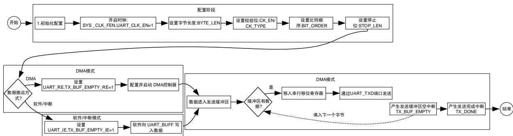  
图 17-1UART 发送流程和硬件机制

## 17.2.3 UART 帧格式

UART 信号上收发的数据格式通常如下：

信号线空闲；

起始比特 (1 bit Start bit：1 bit Zero)

数据字节 (data word, 8bits or 9bits, LSB first or MSB first)

停止比特 (1/2 bit Stop bit: 1/2bit Ones)

数据字节的长度可以通过 UART\_CTRL.BYTE\_LEN 进行选择，8bit (UART\_CTRL.BYTE\_LEN=0)或9bit (UART\_CTRL.BYTE\_LEN=1)。起始比特为 1bit 零，TX 信号线为低，停止比特期间 TX 信号线为高。停止比特的长度由 UART\_CTRL.STOP\_LEN 进行选择。

需要注意的是，当启用校验位时(UART\_CTR.CK\_EN=1)，校验位会替换掉数据字节的最高 bit，即 MSB，此时 8bit 数据字节实际是 7bit 数据+1bit 校验字，9bit 数据字节实际是 8bit 数据+1bit 校验字。

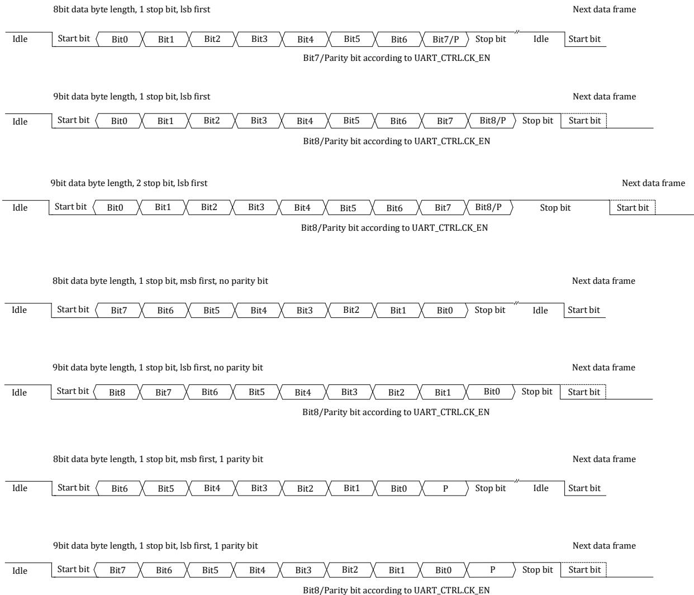  
图 17-2 UART 帧格式

## 17.2.4 波特率配置

UART 输入时钟为系统主时钟，波特率通过两级分频实现。

波特率=UART 模块时钟/（256\*DIVH+DIVL+1)

可以通过 SYS\_CLK\_DIV2 对 UART 模块时钟进行分频.

UART 模块时钟=系统主时钟/(1+SYS\_CLK\_DIV2)

表 17-1 UART 波特率配置示例

<table><tr><td>UART 波特率</td><td>SYS_CLK_DIV2</td><td>UART_DIVH</td><td>UART_DIVL</td></tr><tr><td>300</td><td>0x0007</td><td>0x9C</td><td>0x3F</td></tr><tr><td>600</td><td>0x0003</td><td>0x9C</td><td>0x3F</td></tr><tr><td>1200</td><td>0x0001</td><td>0x9C</td><td>0x3F</td></tr><tr><td>2400</td><td>0x0000</td><td>0x9C</td><td>0x3F</td></tr><tr><td>4800</td><td>0x0000</td><td>0x4E</td><td>0x1F</td></tr><tr><td>9600</td><td>0x0000</td><td>0x27</td><td>0x0F</td></tr><tr><td>19200</td><td>0x0000</td><td>0x13</td><td>0x87</td></tr><tr><td>38400</td><td>0x0000</td><td>0x09</td><td>0xC3</td></tr><tr><td>43000</td><td>0x0000</td><td>0x08</td><td>0xB8</td></tr><tr><td>56000</td><td>0x0000</td><td>0x06</td><td>0xB1</td></tr><tr><td>57600</td><td>0x0000</td><td>0x06</td><td>0x82</td></tr><tr><td>115200</td><td>0x0000</td><td>0x03</td><td>0x40</td></tr></table>

注意，同一波特率，其配置系数可能不唯一。

## 17.2.5 收发端口互换(TX/RX 互换)

UART 模块支持Tx 与Rx 端口互换。通过将Tx 对应的GPIO 配置为输入使能，Rx 对应的GPIO配置为输出使能，即可实现Tx 与Rx 端口的互换。此时，GPIO 第二功能仍选择为UART，UART 本身配置无需修改。

此外，如果要使用一个 GPIO 同时作为 Tx 和 Rx，需要将 IO 分时复用为输入或输出，对应 Rx或Tx，即可实现单口半双工逻辑。

## 17.2.6 多机通讯

多机通讯场景通常是一个设备作为主设备 master，另有若干个从设备 slave，主设备的UARTm\_TXD 端口连接到所有从设备的 UARTs\_RXD 端口，从设备的 UARTs\_TXD 相与连接到主设备的 UARTm\_RXD 端口。如图 17-3 UART 多机通讯互联拓扑所示，为一个主设备和 3 个从设备（地址分别为 0x51,0x52,0x53）的互联情况。

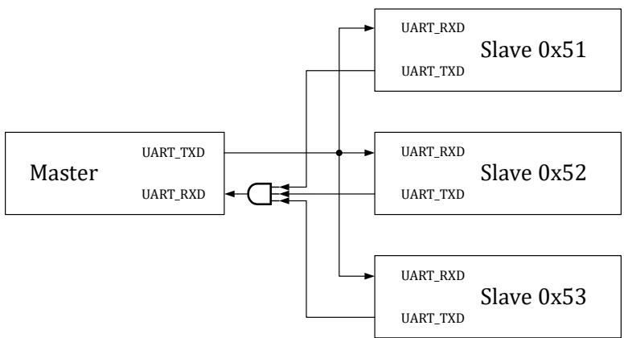  
图 17-3UART 多机通讯互联拓扑

为了降低从机报文处理的负荷，从设备应该只处理发送给他的UART 数据，而忽略发送给其他从设备的数据。在多机通讯场景中，每一个从机有一个8bit的设备地址，即UART\_ADR。从设备设置 UART\_CTRL.MD\_EN=1 后，开启多机通讯过滤模式，主机无须设置 MD\_EN。主机、从机均需要使用 9bit 模式发送数据，即设置 UART\_CTRL.BYTE\_LEN=1。当发送数据字节 MSB(BIT8)为 1 时，低 8 位(BIT7:BIT0)是主机发出的从机地址，即地址字节；当发送数据字节 MSB(BIT8)为 0 时，低8 位(BIT7:BIT0)是主机发给特定从机的数据，即数据字节。

所有从机接收到 MSB(BIT8)=1 的数据字节后，判断低 8 位(BIT7:BIT0)地址是否与自己的UART\_ADR 配置值相等。如果相等，则说明后续数据都是发送给此从机，否则从机进入静默状态，忽略所有后续主机发出的数据。当从机再次接收到 MSB(BIT8)=1 的数据字节且低 8 位(BIT7:BIT0)地址与自己的 UART\_ADR 配置值相等时，表示此从机被选中，退出静默状态。从机设置UART\_CTRL.MD\_EN=1 开启多机通讯过滤模式后，立即进入静默状态。如果主机没有发送 MSB=1的地址字节，直接发送数据字节，则所有从机都处于静默状态，不会接收任何数据。

在 多 机 通 讯 模 式 中 ， 主 设 备 无 需 设 置 UART\_CTRL.MD\_EN=1， 从 设 备 需 要 设 置UART\_CTRL.MD\_EN=1。如果无需地址过滤，从设备也可以不设置 UART\_CTRL.MD\_EN=1，另使用软件对接收数据进行判读，此时从设备会接收并处理所有报文数据。

在多机通讯模式中，如果从设备设置了 UART\_CTRL.MD\_EN=1，则地址字节无论是否命中UART\_ADR，UART\_IF.RX\_DONE\_IF标志均不置位；如果地址不匹配，即从设备处于静默状态，即使主设备发送数据，UART\_IF.RX\_DONE\_IF 仍不置位。如果地址匹配，当接收到主设备发送的数据字节时，从设备的UART\_IF.RX\_DONE\_IF 标志置位为1，表示从设备接收到一个数据字节。

由于检验位需要占用 1bit 数据位，而多机通讯需要使用 9bit 字节长度。因此多机通讯场景下不支持校验位，在设置 UART\_CTRL.MD\_EN=1 时，请勿设置 UART\_CTRL.CK\_EN=1。主机、从机均需设置 UART\_CTRL.BYTE\_LEN=1 使用 9bit 模式，并设置 UART\_CTRL.MD\_EN。多机通讯支持 MSBfirst，即 UART\_CTRL.BIT\_ORDER=1。

如图 17-4 UART 多机通讯示例所示，主设备先发送了数据 0x03，但此时没有从设备地址命中，因此3 个从设备均不接收0x03。主设备发送地址字节0x151，从设备0x51 被选中。但之后主设备没有发送数据，而是直接发送地址字节 0x153，从设备 0x53 被选中，主设备连续发送 3 个数据字节 0x03,0x53,0x04，均被从设备 0x53 接收。之后主设备发送地址字节 0x152，之后发送数据字节0x07，被从设备 0x52 接收。

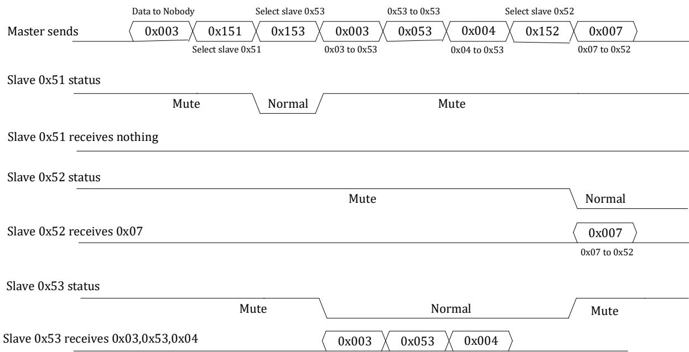  
图 17-4 UART 多机通讯示例

## 17.2.7 校验位

可以通过设置 UART\_CTRL.CK\_EN=1 来使能校验位。同时根据字节长度 UART\_CTRL.BYTE\_LEN不同，UART 的帧格式有4 种情况。

表 17-2 UART 帧格式

<table><tr><td>BYTE_LEN</td><td>CK_EN</td><td>UART frame</td></tr><tr><td>0</td><td>0</td><td>| StartBit | 8bit data | StopBit |</td></tr><tr><td>0</td><td>1</td><td>| StartBit | 7bit data | Parity | StopBit |</td></tr><tr><td>1</td><td>0</td><td>| StartBit | 9bit data | StopBit |</td></tr><tr><td>1</td><td>1</td><td>| StartBit | 8bit data | Parity | StopBit |</td></tr></table>

## 17.3 寄存器

## 17.3.1 地址分配

UART0 和 UART1 实现完全相同。

UART0 基地址 0x4001\_1000。

UART1 基地址 0x4001\_1100。

表 17-3 UART 地址分配列表

<table><tr><td>名称</td><td>偏移地址</td><td>说明</td></tr><tr><td>UARTx_CTRL</td><td>0x00</td><td>UART 控制寄存器</td></tr><tr><td>UARTx_DIVH</td><td>0x04</td><td>UART 波特率设置高字节寄存器</td></tr><tr><td>UARTx_DIVL</td><td>0x08</td><td>UART 波特率设置低字节寄存器</td></tr><tr><td>UARTx_BUFF</td><td>0x0C</td><td>UART 收发缓冲寄存器</td></tr><tr><td>UARTx_ADR</td><td>0x10</td><td>485 通信地址匹配寄存器</td></tr><tr><td>UARTx_STT</td><td>0x14</td><td>UART 状态寄存器</td></tr><tr><td>UARTx_RE</td><td>0x18</td><td>UART DMA 请求使能寄存器</td></tr><tr><td>UARTx_IE</td><td>0x1C</td><td>UART 中断使能寄存器</td></tr><tr><td>UARTx_IF</td><td>0x20</td><td>UART 中断标志寄存器</td></tr><tr><td>UARTx_IOC</td><td>0x24</td><td>UART IO 控制</td></tr></table>

## 17.3.2 UARTx\_CTRL UARTx 控制寄存器 (x = 0,1)

地址分别是：0x4001\_1000，0x4001\_1100

复位值:0x0

表 17-4 UART 控制寄存器 UARTx\_CTRL

<table><tr><td rowspan="3"></td><td>DUPLEX</td><td>LIN_EN</td><td>MD_EN</td><td>CK_EN</td><td>CK_TYPE</td><td>BIT_ORDER</td><td>STOP_LEN</td><td>BYTE_LEN</td></tr><tr><td>RW</td><td>RW</td><td>RW</td><td>RW</td><td>RW</td><td>RW</td><td>RW</td><td>RW</td></tr><tr><td>0</td><td>0</td><td>0</td><td>0</td><td>0</td><td>0</td><td>0</td><td>0</td></tr></table>

<table><tr><td>位置</td><td>位名称</td><td>说明</td></tr><tr><td>[31:8]</td><td></td><td>未使用</td></tr><tr><td>[7]</td><td>DUPLEX</td><td>双工,默认值为0。0:全双工;1:半双工</td></tr><tr><td>[6]</td><td>LIN_EN</td><td>LIN 模式使能,默认值为 0。0:关闭;1:开启</td></tr><tr><td>[5]</td><td>MD_EN</td><td>使能 Multi-drop,默认值为 0。0:关闭;1:开启</td></tr><tr><td>[4]</td><td>CK_EN</td><td>数据校验开关,默认值为 0。0:关闭;1:开启</td></tr><tr><td>[3]</td><td>CK_TYPE</td><td>奇偶校验配置,默认值为 0。0:偶校验(EVEN);1:奇校验(ODD)</td></tr><tr><td>[2]</td><td>BIT_ORDER</td><td>数据发送顺序配置,默认值为 0。0:LSB;1:MSB</td></tr><tr><td>[1]</td><td>STOP_LEN</td><td>停止位长度配置,默认值为 0。0:1-Bit;1:2-Bit</td></tr><tr><td>[0]</td><td>BYTE_LEN</td><td>数据长度配置,默认值为 0。0:8-Bit;1:9-Bit</td></tr></table>

## 17.3.3 UARTx\_DIVH UARTx 波特率设置高字节寄存器 (x = 0,1)

地址分别是：0x4001\_1004，0x4001\_1104

复位值:0x0

表 17-5 UART 波特率设置高字节寄存器 UARTx\_DIVH

<table><tr><td>15 14 13 12 11 10 9 8</td><td>7 6 5 4 3 2 1 0</td></tr><tr><td rowspan="3"></td><td>DIVH</td></tr><tr><td>RW</td></tr><tr><td>0</td></tr></table>

<table><tr><td>位置</td><td>位名称</td><td>说明</td></tr><tr><td>[31:8]</td><td></td><td>未使用</td></tr><tr><td>[7:0]</td><td>DIVH</td><td>波特率设置高字节BAUDRATE =主时钟/(1+256* UART_DIVH+UART_DIVL)</td></tr></table>

## 17.3.4 UARTx\_DIVL UARTx 波特率设置低字节寄存器 (x = 0,1)

地址分别是：0x4001\_1008，0x4001\_1108

复位值:0x0

表 17-6 UART 波特率设置低字节寄存器 UART\_DIVL

<table><tr><td>15 14 13 12 11 10 9 8</td><td>7 6 5 4 3 2 1 0</td></tr><tr><td rowspan="3"></td><td>DIVL</td></tr><tr><td>RW</td></tr><tr><td>0</td></tr></table>

<table><tr><td>位置</td><td>位名称</td><td>说明</td></tr><tr><td>[31:8]</td><td></td><td>未使用</td></tr><tr><td>[7:0]</td><td>DIVL</td><td>波特率设置低字节BAUDRATE =主时钟/(1+256* UART_DIVH+UART_DIVL)</td></tr></table>

## 17.3.5 UARTx\_BUFF UARTx 收发缓冲寄存器 (x = 0,1)

地址分别是：0x4001\_100C，0x4001\_110C

表 17-7 UART 收发缓冲寄存器 UART\_BUFF

<table><tr><td colspan="2">15 14 13 12 11 10 9 8 7 6 5 4 3 2 1 0</td></tr><tr><td rowspan="3"></td><td>BUFF</td></tr><tr><td>RW</td></tr><tr><td>0</td></tr></table>

<table><tr><td>位置</td><td>位名称</td><td>说明</td></tr><tr><td>[31:9]</td><td></td><td>未使用</td></tr><tr><td>[8:0]</td><td>BUFF</td><td>写:发送数据缓存;读:接收数据寄存器</td></tr></table>

UART 的 Tx\_buffer 和 Rx\_buffer 共享 UART\_BUFF。其中，Tx\_buffer 是只写的，Rx\_buffer 是只读的。因此，读 UART\_BUFF 寄存器是访问 UART\_RX\_BUFF，写 UART\_BUFF 寄存器是访问UART\_TX\_BUFF。

当 UARTx\_CTRL.BYTE\_LEN=0 时，UART 收发只使用 buffer 低 8 位，即 UARTx\_BUFF[7:0]；

当 UARTx\_CTRL.BYTE\_LEN=1 时，UART 收发使用 buffer 全部 9 位，即 UARTx\_BUFF[8:0]。

如果使能 UARTx\_CTRL.CK\_EN，即使用校验位，则 UARTx\_BUFF 的最高位（BIT8 whenUARTx\_CTRL.BYTE\_LEN=1 or BIT7 UARTx\_CTRL.BYTE\_LEN=0）数据无效，发送时会被替换为校验位，接收时会作为校验位，而不会写入UARTx\_BUFF。

## 17.3.6 UARTx\_ADR UARTx 地址匹配寄存器 (x = 0,1)

地址分别是：0x4001\_1010，0x4001\_1110

复位值:0x0

表 17-8 UART 地址匹配寄存器 UART\_ADR

<table><tr><td>15 14 13 12 11 10 9 8</td><td>7 6 5 4 3 2 1 0</td></tr><tr><td rowspan="3"></td><td>ADR</td></tr><tr><td>RW</td></tr><tr><td>0</td></tr></table>

<table><tr><td>位置</td><td>位名称</td><td>说明</td></tr><tr><td>[31:8]</td><td></td><td>未使用</td></tr><tr><td>[7:0]</td><td>ADR</td><td>多机通讯时的从机地址</td></tr></table>

## 17.3.7 UARTx\_STT UARTx 状态寄存器 (x = 0,1)

地址分别是：0x4001\_1014，0x4001\_1114

复位值:0x0003

表 17-9 UART 状态寄存器 UART\_STT

<table><tr><td colspan="5">15 14 13 12 11 10 9 8 7 6 5 4 3 2 1 0</td></tr><tr><td rowspan="3"></td><td>RX_BUSY</td><td>ADR_MATCH</td><td>TX_DONE</td><td>TX_BUF_EMPTY</td></tr><tr><td>R</td><td>R</td><td>R</td><td>R</td></tr><tr><td>0</td><td>0</td><td>1</td><td>1</td></tr></table>

<table><tr><td>位置</td><td>位名称</td><td>说明</td></tr><tr><td>[31:4]</td><td></td><td>未使用</td></tr><tr><td>[3]</td><td>RX_BUSY</td><td>1:UART 已检测到起始符并正处于接收状态0:UART 接收端空闲此状态位只读,置位与清零均由硬件完成</td></tr><tr><td>[2]</td><td>ADR_MATCH</td><td>Multi-drop 模式下,地址匹配标志位。1:匹配;0:未匹配。</td></tr><tr><td>[1]</td><td>TX_DONE</td><td>发送完成标志位。1:完成;0:未完成。</td></tr><tr><td>[0]</td><td>TX_BUF_EMPTY</td><td>发送缓存状态位。1:空;0:非空。</td></tr></table>

## 17.3.8 UARTx\_RE UARTx DMA 请求使能寄存器 (x = 0,1)

地址分别是：0x4001\_1018，0x4001\_1118

复位值:0x0

表 17-10 UART DMA 请求使能寄存器 UART\_RE

<table><tr><td colspan="4">15 14 13 12 11 10 9 8 7 6 5 4 3 2 1 0</td></tr><tr><td rowspan="3"></td><td>TX_BUF_EMPTY</td><td>RX_DONE</td><td>TX_DONE</td></tr><tr><td>RW</td><td>RW</td><td>RW</td></tr><tr><td>0</td><td>0</td><td>0</td></tr><tr><td>位置</td><td>位名称</td><td>说明</td></tr><tr><td>[31:3]</td><td></td><td>未使用</td></tr><tr><td>[2]</td><td>TX_BUF_EMPTY</td><td>发送缓冲区空 DMA 请求开关,默认值为 0。0:关闭;1:开启。</td></tr><tr><td>[1]</td><td>RX_DONE</td><td>接收完成 DMA 请求开关,默认值为 0。0:关闭;1:开启。</td></tr><tr><td>[0]</td><td>TX_DONE</td><td>发送完成 DMA 请求开关,默认值为 0。0:关闭;1:开启。</td></tr></table>

17.3.9 UARTx\_IE UARTx 中断使能寄存器 (x = 0,1)

地址分别是：0x4001\_101C，0x4001\_111C

复位值:0x0

表 17-11 UART 中断使能寄存器 UART\_IE

<table><tr><td>15</td><td>14</td><td>13</td><td>12</td><td>11</td><td>10</td><td>9</td><td>8</td><td>7</td><td>6</td><td>5</td><td>4</td><td>3</td><td>2</td><td>1</td><td>0</td></tr><tr><td rowspan="3" colspan="7"></td><td>IDLE</td><td>LBD</td><td>RX_OV</td><td>TX_OV</td><td>CK_ERR</td><td>STOP_ERR</td><td>TX_BUF_EMPTY</td><td>RX_DONE</td><td>TX_DONE</td></tr><tr><td>RW</td><td>RW</td><td>RW</td><td>RW</td><td>RW</td><td>RW</td><td>RW</td><td>RW</td><td>RW</td></tr><tr><td>0</td><td>0</td><td>0</td><td>0</td><td>0</td><td>0</td><td>0</td><td>0</td><td>0</td></tr></table>

<table><tr><td>位置</td><td>位名称</td><td>说明</td></tr><tr><td>[31:9]</td><td></td><td>未使用</td></tr><tr><td>[8]</td><td>IDLE</td><td>空闲帧中断使能0:关闭;1:开启</td></tr><tr><td>[7]</td><td>LBD</td><td>LIN break character 检测中断使能0:关闭;1:开启</td></tr><tr><td>[6]</td><td>RX_OV</td><td>接收缓冲区溢出中断使能0:关闭;1:开启</td></tr><tr><td>[5]</td><td>TX_OV</td><td>发送缓冲区溢出中断使能0:关闭;1:开启</td></tr><tr><td>[4]</td><td>CK_ERR</td><td>校验错误中断开关,默认值为0。0:关闭;1:开启</td></tr><tr><td>[3]</td><td>STOP_ERR</td><td>停止位错误中断开关,默认值为0。0:关闭;1:开启</td></tr><tr><td>[2]</td><td>TX_BUF_EMPTY</td><td>发送缓冲区空中断开关,默认值为0。0:关闭;1:开启</td></tr><tr><td>[1]</td><td>RX_DONE</td><td>接收完成中断开关,默认值为0。0:关闭;1:开启</td></tr><tr><td>[0]</td><td>TX_DONE</td><td>发送完成中断开关,默认值为0。0:关闭;1:开启</td></tr></table>

## 17.3.10 UARTx\_IF UARTx 中断标志寄存器 (x = 0,1)

地址分别是：0x4001\_1020，0x4001\_1120

复位值:0x0005

表 17-12 UART 中断使能寄存器 UART\_IF

<table><tr><td rowspan="3"></td><td>IDLE</td><td>LBD</td><td>RX_OV</td><td>TX_OV</td><td>CK_ERR</td><td>STOP_ERR</td><td>TX_BUF_EMPTY</td><td>RX_DONE</td><td>TX_DONE</td></tr><tr><td>RW1C</td><td>RW1C</td><td>RW1C</td><td>RW1C</td><td>RW1C</td><td>RW1C</td><td>RW1C</td><td>RW1C</td><td>RW1C</td></tr><tr><td>0</td><td>0</td><td>0</td><td>0</td><td>0</td><td>0</td><td>1</td><td>0</td><td>1</td></tr></table>

<table><tr><td>位置</td><td>位名称</td><td>说明</td></tr><tr><td>[31:9]</td><td></td><td>未使用</td></tr><tr><td>[8]</td><td>IDLE</td><td>空闲帧中断标志,高有效,写1清零当 UART 检测到空闲帧后,硬件置位这一标志,如果UARTx_IE.IDLE_IE=1,则产生中断请求;写1清零后,只有待RX_DONE_IF标志再次置位后,IDLE_IF标志才会置位。在多从机(Multi-drop)场景中,只有从机地址命中时,即UARTx_STT.ADR_MATCH=1时,表示主机此时欲与本从机通讯,IDLE_IF才会置位,否则即使UARTx_RX信号为常高,IDLE_IF也不会置位。</td></tr><tr><td>[7]</td><td>LBD</td><td>LIN break character 检测中断标志,高有效,写1清零</td></tr><tr><td>[6]</td><td>RX_OV</td><td>接收缓冲区溢出中断标志,高有效,写1清零</td></tr><tr><td>[5]</td><td>TX_OV</td><td>发送缓冲区溢出中断标志,高有效,写1清零</td></tr><tr><td>[4]</td><td>CK_ERR</td><td>校验错误中断标志,高有效,写1清零</td></tr><tr><td>[3]</td><td>STOP_ERR</td><td>停止位错误中断标志,高有效,写1清零</td></tr><tr><td>[2]</td><td>TX_BUF_EMPTY</td><td>发送缓冲区空中断标志,高有效,写1清零</td></tr><tr><td>[1]</td><td>RX_DONE</td><td>接收完成中断标志,高有效,写1清零</td></tr><tr><td>[0]</td><td>TX_DONE</td><td>发送完成中断标志,高有效,写1清零</td></tr></table>

中断标志写 1 清零，一般不建议用如下|=方式清零，因为|=是先读取中断标志，将对应位改为1 再写入清零，如果同时有其他中断标志置位，会被一起清零，而这通常不是软件所期望的。例如，如下写法本意是清零 TX\_DONE\_IF，但如果同时 RX\_DONE\_IF 在写入执行前置 1 了，则软件先读取回 UART\_IF 值为 0x2，然后执行或操作 0x2|0x1=0x3，然后写入，同时对 RX\_DONE\_IF 和TX\_DONE\_IF 进行了清零，可能导致 UART 少进入一次因接收数据产生的中断，从而少接收到一字节数据。

如果希望清零TX\_DONE\_IF 标志位，应以如下方式，直接对BIT0 写1.

UART\_IF=0x1;

## 17.3.11 UARTx\_IOC UARTx IO 控制寄存器 (x = 0,1)

地址分别是：0x4001\_1024，0x4001\_1124

复位值:0x0

表 17-13 UARTIO 控制寄存器 UART\_IOC

<table><tr><td rowspan="3"></td><td>SBK</td><td>LBDL</td><td rowspan="3"></td><td>AUTO</td><td rowspan="3"></td><td>TXD_INV</td><td>RXD_INV</td></tr><tr><td>RW</td><td>RW</td><td>RW</td><td>RW</td><td>RW</td></tr><tr><td>0</td><td>0</td><td>0</td><td>0</td><td>0</td></tr></table>

<table><tr><td>位置</td><td>位名称</td><td>说明</td></tr><tr><td>[31:8]</td><td></td><td>未使用</td></tr><tr><td>[7]</td><td>SBK</td><td>LIN 模式下,写 1 发送一次 break character,即连续 13 个 0,完成后自动清零,未完成时读回为 1,向此位写 1 之前需要先配置 UARTx_CTRL.LIN_EN=1,否则无法进行 break character 的发送</td></tr><tr><td>[6]</td><td>LBDL</td><td>LIN break character 检测长度,10/11 个 00:10bits,1:11bits</td></tr><tr><td>[5]</td><td></td><td>未使用</td></tr><tr><td>[4]</td><td>AUTO</td><td>波特率自适应 IO 端口使能开关。0:关闭;1:开启</td></tr><tr><td>[3:2]</td><td></td><td>未使用</td></tr><tr><td>[1]</td><td>TXD_INV</td><td>TXD 输出极性使能开关,默认值为 0。0:正常输出;1:取反输出。正常输出极性,即软件发送 1,硬件发送 1;取反输出极性,即应用发送 1,硬件发送 0。</td></tr><tr><td>[0]</td><td>RXD_INV</td><td>RXD 输入极性使能开关,默认值为 0。0:正常输入;1:取反输入。正常输入极性,即硬件接收到 1,软件接收的是 1;取反输入极性,即硬件接收 1,软件接收的是 0。</td></tr></table>

## 18 DMA

## 18.1 概述

DMA 和CPU 同为芯片总线的主设备。

如图 18-1 所示。其中部分设备不需要被 DMA 访问，仅仅挂载于与 CPU 相连的总线上。ADC/DAC/SPI/I2C/MCPWM/UART/Timer/GPIO/Hall/SRAM 等设备可以被 CPU 和 DMA 共享访问。

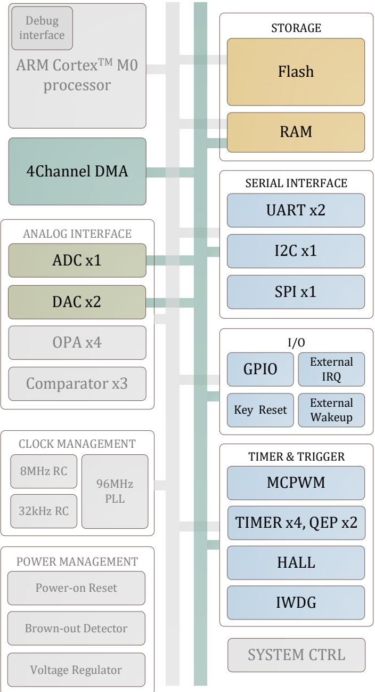  
图 18-1 multi-layer AHB 总线架构

DMA 有4 个通道，共享一个搬运引擎。当DMA 空闲且多个通道同时发生请求时，按优先级进行仲裁，但在搬运过程中不会发生抢占，即一定是某个通道完成搬运，DMA 空闲后，才会发起仲裁，判断下一个获得请求的通道是哪一个。

DMA 的传输有两种方式：DMA\_CCRx.RMODE=1，多个轮次，每轮传输内传输一次；DMA\_CCRx.RMODE=0，一轮，连续传输多次。

如果配置一轮传输多次数据，即 DMA\_CCRx.RMODE=0，则一次 DMA 请求，DMA 连续发送DMA\_CTMSx 次数据，然后硬件将 DMA\_CCRx.EN 位清零，置位中断标志。

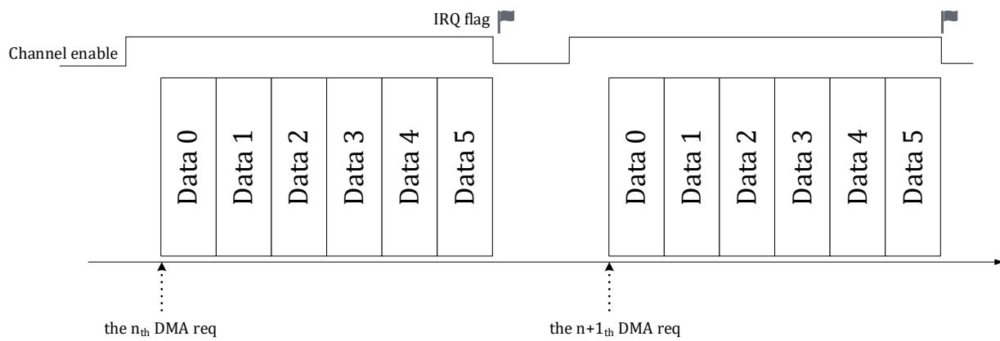  
图 18-2 RMODE=0 DMA 传输情况

如果配置某个通道为多轮搬运，则在多轮搬运之间，DMA 可能会响应其他通道的搬运请求。多轮传输每轮只搬运一次数据，搬运 DMA\_CTMSx 轮后，硬件将 DMA\_CCRx.EN 位清零，置位中断标志。

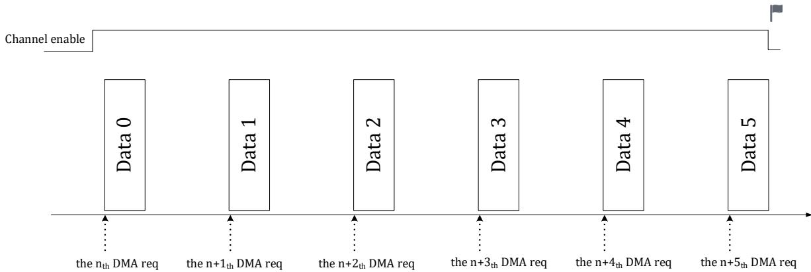  
图 18-3 RMODE=1 DMA 传输情况

每发生一次 DMA 请求，DMA 开始一轮传输，完成一轮传输后，根据当前 DMA 通道的请求情况响应下一次请求，下一次请求可以仍为当前通道请求，也可以是其他通道请求，或者在无请求的情况下进入空闲状态，同时当前DMA 通道待传输轮数减1。当DMA 待传输轮数为0 时，当前通道的传输全部完成，DMA 产生中断，同时 DMA 通道使能 DMA\_CCRx.EN 被硬件自动清零。在传输过程中，待传输轮数可以通过 DMA\_CTMSx 寄存器读取。一轮传输内待传输次数不支持读取，因为DMA 会连续进行多次传输，因此次数值会快速变化。

出于功耗控制考虑，DMA 模块可以通过设置DMA\_CTRL.EN 位为0 来禁用（要求关闭 DMA 使能前先关闭通道对应的使能 DMA\_CCRx.EN），此时DMA 时钟被门控关闭。

DMA 支持 8, 16 或 32 bit (byte, half-word, or word) 三种位宽的传输操作，通过配置DMA\_CCRx.SBTW 和DMA\_CCRx.DBTW 来选择源地址和目的地址访问的位宽，源地址访问的位宽与目的地址访问的位宽可以不同。

DMA 每完成一次传输，地址根据 DMA\_CCRx.SINC 和 DMA\_CCRx.DINC 决定是否自动递增。所有的外设寄存器地址都是 word 对齐的，所以外设的地址递增应配置为 0/4。例如对于UART/SPI/I2C，因为每次都是访问 UART\_DATA 或 SPI/I2C FIFO 接口的固定地址，所以轮次间无需地址递增；如要访问 ADC 数据寄存器，则地址通常需要自动加 4，可以设置轮内递增。而对于内存，如果设置了轮内递增，每次地址递增的值，根据内存数据位宽(DMA\_CCRx.SBTW/DBTW)设定，对于内存访问位宽为byte 的情况，地址自动加1，对于 half-word，地址自动加 2，对于word，地址自动加4。

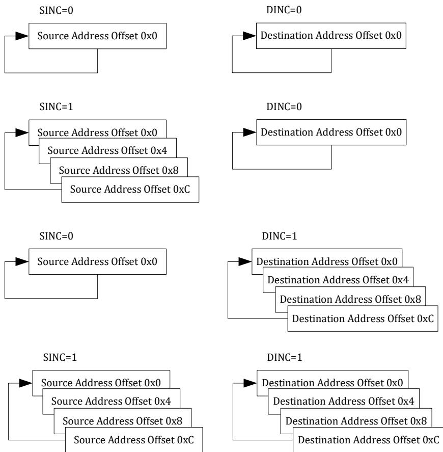  
图 18-4DMA 地址递增控制

图 18-4 仅为地址递增示例，配置为一轮传输 4 次，或传输 4 轮，源地址和目的地址数据尺寸均为word。实际应用中，如果配置数据尺寸为byte 或halfword，则地址偏移按照1/2 进行递增。

一般，SINC=0，DINC=0，源地址、目的地址均不递增，可能为外设到外设的搬运。

SINC=1，DINC=0，源地址递增，目的地址不递增，可能为内存数组到外设寄存器接口的搬运。

SINC=0，DINC=1，源地址不递增，目的地址递增，可能为外设寄存器接口到内存数组的搬运。

SINC=1，DINC=1，源地址、目的地址均递增，为外设多组数据(如ADC\_DATx)到内存数组的搬运。

如果配置 DMA\_CCRx.CIRC=1，且 DMA\_CCRx.RMODE=1，即循环多轮模式。一次 DMA 请求信号进行触发，只进行一次数据搬运（如 UART 数据搬运至 RAM，完成一轮搬运等待下一次请求。在此模式下，DMA\_CTMSx 可以配置为一个较大的值，每进行一次搬运 DMA\_CTMSx 减 1。由于循环模式 DMA 进行多轮搬运不再产生中断标志，CPU 可以通过读取 DMA\_CTMSx 来判断当前已经传输的数据量，如果已经足够则开始处理。当传输了 DMA\_CTMSx 轮以后，地址会回到初始地址。DMA\_CTMSx 会重新装载为预设值，开始新一轮的递减。循环多轮模式下，DMA 的通道使能DMA\_CCRx.EN位由软件置位，一直为高，即使DMA\_CTMSx递减至0。如果要退出传输，可以软件清零 DMA\_CCRx.EN。

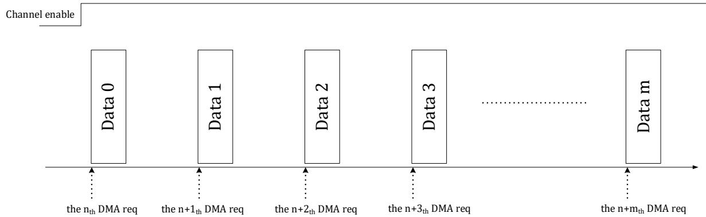  
图 18-5 CIRC=1 且 RMODE=1 DMA 传输情况

如果配置 DMA\_CCRx.CIRC=1，且 DMA\_CCRx.RMODE=0，即循环单轮模式则 DMA 收到一次请求后会连续地进行 DMA\_CTMSx 次数据搬运，并产生中断标志。在此模式下，DMA\_CCRx.EN 无须软件置位，当 DMA 通道收到请求时会自动置位，传输完成一轮后自动清零。如果要退出此种模式，可以清零 DMA\_CCRx.CIRC 位，并清零 DMA\_CCRx.EN 位。

  
图 18-6 CIRC=1 且 RMODE=0 DMA 传输情况

循环模式下，DMA\_CTMSx 寄存器随着搬运递减为 0 后重新装载为初始配置值。如果是搬运数据到内存，则覆盖之前搬运至内存的数据；如果是搬运至外设，则重复一轮数据发射。以将 ADC数据搬运至内存为例，设定数据块大小为 16bit×12channel×8 次，则在循环模式下 DMA 完成一轮96 个 half word 搬运后重新开始下一轮搬运，并覆盖之前使用的内存地址，不设置 DMA 完成中断标志位。单次模式下，DMA 完成一定大小的数据块搬运后即终止本次 DMA 操作，设置当前通道DMA 完成中断标志位，同时硬件自动关闭对应的DMA 通道，即硬件电路自动在该通道传输完成后将 DMA\_CCRx.EN 设为 0。DMA 需要搬运的轮次由 DMA\_CTMS 寄存器进行控制。

## 18.2 请求

DMA 的请求分为软件请求和硬件请求两类，软件请求通过设置对应 DMA 通道的DMA\_RENx.SW\_TRIG=1 来产生，写 1 即产生，软件触发位设置后需要软件清零。硬件请求通常为外设的中断事件，当特定的外设中断事件作为 DMA 传输请求时，通常要禁用对应事件的中断响应，即不再需要CPU 对中断进行响应，响应仅作为 DMA 传输请求。而且硬件DMA 请求信号经过 DMA通道受理后会被DMA 硬件清零，无需软件清除提起请求的外设中断标志。

表 18-1 DMA 请求

<table><tr><td>触发来源</td><td>描述</td></tr><tr><td>软件</td><td>软件触发时进行的搬运操作由配置寄存器 DMA_CCRx 指定,当设置了DMA_RENx.SW_TRIG,一旦通道被使能即开始进行 DMA 操作。</td></tr><tr><td>ADC</td><td>ADC 在单段触发模式下,一次完成若干个通道后采样后产生中断请求,由 DMA 把 ADC转换后的值搬运到 SRAM。ADC 单段采样完成中断事件作为 DMA 请求信号,请求信号在得到 DMA 响应后由 DMA 将其清零,无需软件清零;注意此时需要软件同时禁用ADC 采样完成中断,使中断不再被 CPU 响应。</td></tr><tr><td>DSP</td><td>DSP IRQ 指令产生的中断事件标志可以作为 DMA 请求</td></tr><tr><td>Timer</td><td>Timer 可以使用过零/比较/捕获事件作为 DMA 请求,具体 DMA 操作根据配置寄存器设定,通常作为定时事件(如每隔 10ms 触发一次 DMA 操作)</td></tr><tr><td>SPI</td><td>SPI 模块可以使用接收缓冲区满事件作为 DMA 请求信号,由于 SPI 是同时收发,所以接收缓冲区满既是接收完毕也是发送完毕的事件标志。读取 SPI FIFO 自动清除事件标志。</td></tr><tr><td>MCPWM</td><td>MCPWM 模块可以使用过零/计数周期结束/4 个 ADC 触发信号作为 DMA 请求,具体DMA 操作根据配置寄存器设定</td></tr><tr><td>I2C</td><td>I2C 模块可以使用 I2C0_SCR.BYTE_CMPLT 即字节发送完成作为触发 DMA 请求,DMA自动清除 I2C 的请求标志。其他 I2C 中断事件仍由 CPU 响应</td></tr><tr><td>UART</td><td>串口模块可以使用 UART_IF 触发 DMA 请求,如果 DMA 配置的传输方向是内存到串口,则使用 UART 发送缓冲区空标志作为 DMA 请求信号;如果传输方向是串口到内存,则应使用 UART 接收完成事件产生 DMA 请求信号。事件标志由 DMA 自动清零。UART 在由 DMA 操作时应同样禁用相应中断防止被 CPU 响应。</td></tr><tr><td>HALL</td><td>HALL 中断标志可以作为 DMA 请求</td></tr><tr><td>SIF</td><td>SIF 中断标志可以作为 DMA 请求*</td></tr><tr><td>比较器</td><td>CMP 中断标志可以作为 DMA 请求</td></tr><tr><td>GPIO</td><td>GPIO 中断标志可以作为 DMA 请求</td></tr></table>

\*SYS\_AFE\_INFO.VERSION=4 版本的芯片，此功能不可用。

## 18.3 优先级

DMA 的优先级采用固定优先级，优先级如图 18-7 所示。为避免出现来不及响应某些外设请求的情况，在设计应用软件时应考虑任务实时性，每个通道不配置搬运过于大量的数据导致其他通道得不到及时响应。

如图18-7 所示，优先级由上至下降低。4 个DMA 通道中，优先级关系为:通道0>通道1>通道2>通道3 (>号表示优先级高于)。在DMA 各通道内部，通常有多个硬件请求事件和一个软件请求事件，硬件请求优先级高于软件请求。多个硬件请求事件优先级相同。通常，一个 DMA 通道配置一个硬件请求事件使能，多个硬件请求不应在一个通道内同时发生。

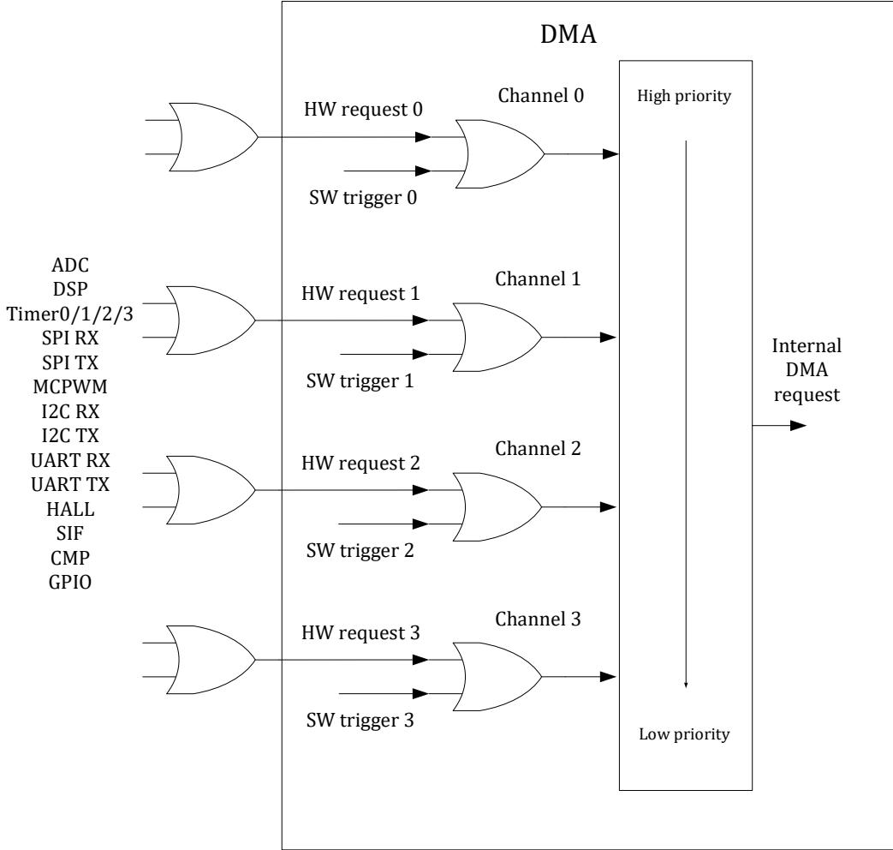  
图 18-7 DMA 通道优先级

## 18.4 仲裁

当 DMA 处于空闲状态，或刚刚完成某一通道的 DMA 传输后，若此时恰好有一个或多个 DMA请求发生，DMA 会根据优先级设定进行仲裁，优先级高的外设请求率先得到DMA 服务。比如ADC连续模式下，每完成一轮 ADC 数据搬运，ADC 的采样完成事件标志被 DMA 清零，DMA 回到空闲状态或转而服务其他外设请求；对于UART/SPI/I2C，每搬运一个 byte 重新仲裁。

为了避免 CPU 或 DMA 长期占用外设/SRAM，在外设/SRAM 的端口仲裁模块中加入了时间片机制，即一个主设备占用一段时间后释放访问权，仲裁模块观测另一个主设备是否在请求访问，如果是则转而允许另一个主设备访问，否则继续当前主设备未完成的访问。

## 18.5 中断

DMA 的一个通道完成 DMA 操作后产生 DMA 中断。当 DMA 某一个通道完成操作后，会自动

关闭该通道的使能，通过DMA\_CCRx.EN。

## 18.6 寄存器

## 18.6.1 地址分配

DMA 控制器模块寄存器的基地址是0x4001\_1200，寄存器列表如下:

表 18-2 DMA 寄存器列表

<table><tr><td>名称</td><td>偏移地址</td><td>说明</td></tr><tr><td>DMA0_CCR0</td><td>0x00</td><td>DMA 通道 0 通道配置寄存器</td></tr><tr><td>DMA0_REN0</td><td>0x04</td><td>DMA 通道 0 请求使能寄存器</td></tr><tr><td>DMA0_CTMS0</td><td>0x08</td><td>DMA 通道 0 传输次数寄存器</td></tr><tr><td>DMA0_SADR0</td><td>0x0C</td><td>DMA 通道 0 源地址寄存器</td></tr><tr><td>DMA0_DADR0</td><td>0x10</td><td>DMA 通道 0 目的地址寄存器</td></tr><tr><td colspan="3"></td></tr><tr><td>DMA0_CCR1</td><td>0x20</td><td>DMA 通道 1 通道配置寄存器</td></tr><tr><td>DMA0_REN1</td><td>0x24</td><td>DMA 通道 1 请求使能寄存器</td></tr><tr><td>DMA0_CTMS1</td><td>0x28</td><td>DMA 通道 1 传输次数寄存器</td></tr><tr><td>DMA0_SADR1</td><td>0x2C</td><td>DMA 通道 1 源地址寄存器</td></tr><tr><td>DMA0_DADR1</td><td>0x30</td><td>DMA 通道 1 目的地址寄存器</td></tr><tr><td colspan="3"></td></tr><tr><td>DMA0_CCR2</td><td>0x40</td><td>DMA 通道 2 通道配置寄存器</td></tr><tr><td>DMA0_REN2</td><td>0x44</td><td>DMA 通道 2 请求使能寄存器</td></tr><tr><td>DMA0_CTMS2</td><td>0x48</td><td>DMA 通道 2 传输次数寄存器</td></tr><tr><td>DMA0_SADR2</td><td>0x4C</td><td>DMA 通道 2 源地址寄存器</td></tr><tr><td>DMA0_DADR2</td><td>0x50</td><td>DMA 通道 2 目的地址寄存器</td></tr><tr><td colspan="3"></td></tr><tr><td>DMA0_CCR3</td><td>0x60</td><td>DMA 通道 3 通道配置寄存器</td></tr><tr><td>DMA0_REN3</td><td>0x64</td><td>DMA 通道 3 请求使能寄存器</td></tr><tr><td>DMA0_CTMS3</td><td>0x68</td><td>DMA 通道 3 传输次数寄存器</td></tr><tr><td>DMA0_SADR3</td><td>0x6C</td><td>DMA 通道 3 源地址寄存器</td></tr><tr><td>DMA0_DADR3</td><td>0x70</td><td>DMA 通道 3 目的地址寄存器</td></tr><tr><td colspan="3"></td></tr><tr><td>DMA0_CTRL</td><td>0x80</td><td>DMA 控制寄存器</td></tr><tr><td>DMA0_IE</td><td>0x84</td><td>DMA 中断使能寄存器</td></tr><tr><td>DMA0_IF</td><td>0x88</td><td>DMA 中断标志寄存器</td></tr></table>

## 18.6.2 DMA0\_CTRL DMA 控制寄存器

地址:0x4001\_1280

复位值:0x0

表 18-3 DMA 控制寄存器 DMA0\_CTRL

<table><tr><td>15</td><td>14</td><td>13</td><td>12</td><td>11</td><td>10</td><td>9</td><td>8</td><td>7</td><td>6</td><td>5</td><td>4</td><td>3</td><td>2</td><td>1</td><td>0</td></tr><tr><td rowspan="3" colspan="15"></td><td>EN</td></tr><tr><td>RW</td></tr><tr><td>0</td></tr></table>

<table><tr><td>位置</td><td>位名称</td><td>说明</td></tr><tr><td>[31:1]</td><td></td><td>未使用</td></tr><tr><td>[0]</td><td>EN</td><td>DMA 整体使能</td></tr></table>

## 18.6.3 DMA0\_IE DMA 中断使能寄存器

地址:0x4001\_1284

复位值:0x0

表 18-4 DMA 中断使能寄存器 DMA0\_IE

<table><tr><td colspan="5">15 14 13 12 11 10 9 8 7 6 5 4 3 2 1 0</td></tr><tr><td rowspan="3"></td><td>CH3_FIE</td><td>CH2_FIE</td><td>CH1_FIE</td><td>CH0_FIE</td></tr><tr><td>RW</td><td>RW</td><td>RW</td><td>RW</td></tr><tr><td>0</td><td>0</td><td>0</td><td>0</td></tr></table>

<table><tr><td>位置</td><td>位名称</td><td>说明</td></tr><tr><td>[31:4]</td><td></td><td>未使用</td></tr><tr><td>[3]</td><td>CH3_FIE</td><td>通道 3 完成中断使能</td></tr><tr><td>[2]</td><td>CH2_FIE</td><td>通道 2 完成中断使能</td></tr><tr><td>[1]</td><td>CH1_FIE</td><td>通道 1 完成中断使能</td></tr><tr><td>[0]</td><td>CHO_FIE</td><td>通道 0 完成中断使能</td></tr></table>

## 18.6.4 DMA0\_IF DMA 中断标志寄存器

地址:0x4001\_1288

复位值:0x0

表 18-5 DMA 中断标志寄存器 DMA0\_IF

<table><tr><td>15</td><td>14</td><td>13</td><td>12</td><td>11</td><td>10</td><td>9</td><td>8</td><td>7</td><td>6</td><td>5</td><td>4</td><td>3</td><td>2</td><td>1</td><td>0</td></tr><tr><td></td><td></td><td></td><td></td><td></td><td></td><td></td><td></td><td></td><td></td><td></td><td></td><td>CH3.FIF</td><td>CH2.FIF</td><td>CH1.FIF</td><td>CH0.FIF</td></tr></table>

<table><tr><td colspan="2"></td></tr><tr><td>0</td><td>RW1C</td></tr><tr><td>0</td><td>RW1C</td></tr><tr><td>0</td><td>RW1C</td></tr><tr><td>0</td><td>RW1C</td></tr></table>

<table><tr><td>位置</td><td>位名称</td><td>说明</td></tr><tr><td>[31:4]</td><td></td><td>未使用</td></tr><tr><td>[3]</td><td>CH3_FIF</td><td>通道 3 完成中断标志,高有效,写 1 清零</td></tr><tr><td>[2]</td><td>CH2_FIF</td><td>通道 2 完成中断标志,高有效,写 1 清零</td></tr><tr><td>[1]</td><td>CH1_FIF</td><td>通道 1 完成中断标志,高有效,写 1 清零</td></tr><tr><td>[0]</td><td>CHO_FIF</td><td>通道 0 完成中断标志,高有效,写 1 清零</td></tr></table>

## 18.6.5 DMA 通道配置寄存器

18.6.5.1 DMA0\_CCRx ( x =0,1,2,3)

地址分别是:0x4001\_1200，0x4001\_1220，0x4001\_1240，0x4001\_1260

复位值:0x0

表 18-6 DMA 通道配置寄存器 DMA0\_CCRx

<table><tr><td rowspan="3"></td><td>SBTW</td><td>DBTW</td><td rowspan="3"></td><td>SINC</td><td rowspan="3"></td><td>DINC</td><td>CIRC</td><td rowspan="3"></td><td>RMODE</td><td>EN</td></tr><tr><td>RW</td><td>RW</td><td>RW</td><td>RW</td><td>RW</td><td>RW</td><td>RW</td></tr><tr><td>0</td><td>0</td><td>0</td><td>0</td><td>0</td><td>0</td><td>0</td></tr></table>

<table><tr><td>位置</td><td>位名称</td><td>说明</td></tr><tr><td>[31:12]</td><td></td><td>未使用</td></tr><tr><td>[11:10]</td><td>SBTW</td><td>源地址访问位宽0: Byte1: Halfword2: Word3: 保留</td></tr><tr><td>[9:8]</td><td>DBTW</td><td>目的地址访问位宽0: Byte1: Halfword2: Word3: 保留</td></tr><tr><td>[7]</td><td></td><td>未使用</td></tr><tr><td>[6]</td><td>SINC</td><td>源地址递增方式0:不递增1:每传输一次,地址按照 SBTW 对应大小递增 1/2/4</td></tr><tr><td>[5]</td><td></td><td>未使用</td></tr><tr><td>[4]</td><td>DINC</td><td>目的地址递增方式0:不递增1:每传输一次,地址按照 DBTW 对应大小递增 1/2/4</td></tr><tr><td>[3]</td><td>CIRC</td><td>循环模式,高有效</td></tr><tr><td>[2]</td><td></td><td>未使用</td></tr><tr><td>[1]</td><td>RMODE</td><td>0:单轮传输,一轮连续传输多次,每收到 DMA 请求传输一轮,一个DMA 请求即传输完毕1:多轮,每轮进行一次数据传输,每收到 DMA 请求传输一轮,多个DMA 请求才传输完毕不支持多轮×多次传输</td></tr><tr><td>[0]</td><td>EN</td><td>通道使能,高有效,软件置 1 开启通道进行 DMA 搬运操作,搬运完成后 DMA 硬件将此位清零</td></tr></table>

## 18.6.5.2 DMA0\_RENx ( x = 0,1,2,3)

地址分别是:0x4001\_1204，0x4001\_1224，0x4001\_1244，0x4001\_1264

复位值:0x0

表 18-7 DMA 请求使能寄存器 DMA0\_ RENx

<table><tr><td>31</td><td>30</td><td>29</td><td>28</td><td>27</td><td>26</td><td>25</td><td>24</td><td>23</td><td>22</td><td>21</td><td>20</td><td>19</td><td>18</td><td>17</td><td>16</td></tr><tr><td>SW_REN</td><td rowspan="3"></td><td>GPIO_REN</td><td rowspan="3" colspan="2"></td><td>CMP_REN</td><td>SIF_REN*</td><td>HALL_REN</td><td rowspan="3" colspan="4"></td><td>UART1_TX_REN</td><td>UART1_RX_REN</td><td>UART0_TX_REN</td><td>UART0_RX_REN</td></tr><tr><td>RW</td><td>RW</td><td>RW</td><td>RW</td><td>RW</td><td>RW</td><td>RW</td><td>RW</td><td>RW</td></tr><tr><td>0</td><td>0</td><td>0</td><td>0</td><td>0</td><td>0</td><td>0</td><td>0</td><td>0</td></tr></table>

<table><tr><td>15</td><td>14</td><td>13</td><td>12</td><td>11</td><td>10</td><td>9</td><td>8</td><td>7</td><td>6</td><td>5</td><td>4</td><td>3</td><td>2</td><td>1</td><td>0</td></tr><tr><td>I2C0_TX_REN</td><td>I2C0_RX_REN</td><td>MCPWM1_REN</td><td>MCPWM0_REN</td><td>SPI_TX_REN</td><td>SPI_RX_REN</td><td></td><td></td><td>TIMER3_REN</td><td>TIMER2_REN</td><td>TIMER1_REN</td><td>TIMER0_REN</td><td>DSP_REN</td><td></td><td>ADC1_REN</td><td>ADC0_REN</td></tr><tr><td>RW</td><td>RW</td><td>RW</td><td>RW</td><td>RW</td><td>RW</td><td></td><td></td><td>RW</td><td>RW</td><td>RW</td><td>RW</td><td>RW</td><td></td><td>RW</td><td>RW</td></tr><tr><td>0</td><td>0</td><td>0</td><td>0</td><td>0</td><td>0</td><td></td><td></td><td>0</td><td>0</td><td>0</td><td>0</td><td>0</td><td></td><td>0</td><td>0</td></tr></table>

<table><tr><td>位置</td><td>位名称</td><td>说明</td></tr><tr><td>[31]</td><td>SW_REN</td><td>软复位读请求使能</td></tr><tr><td>[30]</td><td></td><td>保留</td></tr><tr><td>[29]</td><td>GPIO_REN</td><td>GPIO 读请求使能</td></tr><tr><td>[28:27]</td><td></td><td>保留</td></tr><tr><td>[26]</td><td>CMP_REN</td><td>比较器读请求使能</td></tr><tr><td>[25]</td><td>SIF_REN</td><td>SIF 模块读请求使能</td></tr><tr><td>[24]</td><td>HALL_REN</td><td>HALL 模块读请求使能</td></tr><tr><td>[23:20]</td><td></td><td>保留</td></tr><tr><td>[19]</td><td>UART1_TX_REN</td><td>UART1 发送读请求使能</td></tr><tr><td>[18]</td><td>UART1_RX_REN</td><td>UART1 接收读请求使能</td></tr><tr><td>[17]</td><td>UART0_TX_REN</td><td>UART0 发送读请求使能</td></tr><tr><td>[16]</td><td>UART0_RX_REN</td><td>UART0 接收读请求使能</td></tr><tr><td>[15]</td><td>I2C0_TX_REN</td><td>I2C0 发送读请求使能</td></tr><tr><td>[14]</td><td>I2C0_RX_REN</td><td>I2C0 接收读请求使能</td></tr><tr><td>[13]</td><td>MCPWM1_REN</td><td>MCPWM1 读请求使能</td></tr><tr><td>[12]</td><td>MCPWM0_REN</td><td>MCPWM0 读请求使能</td></tr><tr><td>[11]</td><td>SPI_TX_REN</td><td>SPI 发送读请求使能</td></tr><tr><td>[10]</td><td>SPI_RX_REN</td><td>SPI 接收读请求使能</td></tr><tr><td>[9:8]</td><td></td><td>保留</td></tr><tr><td>[7]</td><td>TIMER3_REN</td><td>TIMER3 读请求使能</td></tr><tr><td>[6]</td><td>TIMER2_REN</td><td>TIMER2 读请求使能</td></tr><tr><td>[5]</td><td>TIMER1_REN</td><td>TIMER1 读请求使能</td></tr><tr><td>[4]</td><td>TIMER0_REN</td><td>TIMER0 读请求使能</td></tr><tr><td>[3]</td><td>DSP_REN</td><td>DSP 读请求使能</td></tr><tr><td>[2]</td><td></td><td>保留</td></tr><tr><td>[1]</td><td>ADC1_REN</td><td>ADC1 读请求使能</td></tr><tr><td>[0]</td><td>ADC0_REN</td><td>ADC0 读请求使能</td></tr></table>

\* SYS\_AFE\_INFO.VERSION<=3 版本的芯片，SIF\_REN 可用；SYS\_AFE\_INFO.VERSION=4 版本的芯片，SIF\_REN 不可用。

一般，DMA 的通道中配置的内存、外设地址应与使能的外设中断请求相对应，这一点需要由应用软件保证。其中软件请求始终处于使能状态，即软件向 DMA\_RENx.SW\_TRIG 写 1 即开始一次DMA 传输。来自外设的硬件请求进入 DMA 后通过 OR 逻辑形成一个请求信号，每一个 DMA 通道一般在同一时间只使能一个硬件 DMA 请求。软件触发标志 DMA\_RENx.SW\_TRIG 在请求被 DMA 受理后由硬件自动清除。

由于 CMP 信号可能是一个慢速的电平信号，在使用 CMP 触发 DMA 时，推荐将中断触发类型选择为边沿触发。

DMA\_RENx 寄存器可以在DMA 通道使能的情况下改写。

18.6.5.3 DMA0\_CTMSx ( x = 0,1,2,3)

地址分别是:0x4001\_1208，0x4001\_1228，0x4001\_1248，0x4001\_1268

复位值:0x0

表 18-8 DMA 传输次数寄存器 DMA0\_CTMSx

<table><tr><td>15 14 13 12 11 10 9 8</td><td>7 6 5 4 3 2 1 0</td></tr><tr><td rowspan="3"></td><td>TMS</td></tr><tr><td>RW</td></tr><tr><td>0</td></tr></table>

<table><tr><td>位置</td><td>位名称</td><td>说明</td></tr><tr><td>[7:0]</td><td>TMS</td><td>DMA 通道 x 数据搬运次数。此寄存器在该通道使能后变为只读。</td></tr></table>

DMA\_CTMSx 寄存器只有在通道禁用，即 DMA\_CCRx.EN=0 之后才可以写入数据。

当 DMA\_CTRL=1 且 DMA\_CCRx.EN=0 时，重新填写 CTMSx 值，可以将 DMA 内部已搬运的轮数次数计数器清零。

当 DMA\_CCRx.RMODE=0 时，表示传输 1 轮，每轮传输 DMA\_CTMS 次数据；

当 DMA\_CCRx.RMODE=1 时，表示传输 DMA\_CTMS 轮，每轮传输一次数据；

不支持多轮每轮传输多次数据。

以外设数据宽度为 16，内存数据宽度为 32，即 DMA\_CTMSx=16，DMA\_CCRx.RMODE=0 为例，DMA 每轮需要读取外设数据16bit=2byte，写入内存数据32bit=4byte。一共需要搬运16 轮，即读取外设 32byte，存入内存 64byte；

即使仅仅搬运一轮，也需要设置 CTMS.ROUND =1，而不能让其为0。

当设置DMA\_CCRx.CIRC=1（即循环模式）时，DMA\_CTMSx 不再起作用，相当于无限轮；其他情况需要相应设置 DMA\_CTMSx，如 DMA\_CTMSx=1，且 DMA\_CCRx.RMODE=1 时，用于搬运一轮数据。

当 DMA\_CCRx.RMODE=1 时，DMA\_CTMSx 读出为当前剩余未搬运轮数，当 DMA 传输完成后轮数会复位为配置值。次数读出时一直为配置值。举例来说，比如配置 DMA\_CTMSx=4，读取时可能看到 DMA\_CTMSx 由 4 开始递减，3,2,1…之后又变为 0。当 DMA 当前通道需要重新进行 4 轮传输时，需要重新向 DMA\_CTMSx 写入轮数值。当 DMA\_CCRx.RMODE=0 时，DMA\_CTMSx 读出为当前这一轮剩余未搬运次数。但由于一轮内的数据是被 DMA 连续搬运的，所以软件读出的DMA\_CTMSx 会迅速变化。

注意，每次重新开启 DMA 通道前，都要重新配置 DMA\_CTMSx 寄存器，已经在上一次传输中DMA\_CTMSx 寄存器已经递减为 0。

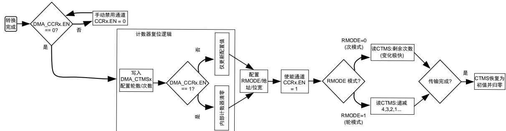  
图 18-8DMA 操作逻辑流程图

18.6.5.4 DMA0\_SADRx ( x = 0,1,2,3)

复位值:0x0

表 18-9 DMA 源地址寄存器 DMA0\_ SADRx

<table><tr><td>31</td><td>30</td><td>29</td><td>28</td><td>27</td><td>26</td><td>25</td><td>24</td><td>23</td><td>22</td><td>21</td><td>20</td><td>19</td><td>18</td><td>17</td><td>16</td></tr><tr><td></td><td></td><td></td><td></td><td></td><td></td><td></td><td></td><td></td><td></td><td></td><td></td><td></td><td></td><td></td><td></td></tr><tr><td></td><td></td><td></td><td></td><td></td><td></td><td></td><td></td><td></td><td></td><td></td><td></td><td></td><td></td><td></td><td></td></tr><tr><td></td><td></td><td></td><td></td><td></td><td></td><td></td><td></td><td></td><td></td><td></td><td></td><td></td><td></td><td></td><td></td></tr><tr><td></td><td></td><td></td><td></td><td></td><td></td><td></td><td></td><td></td><td></td><td></td><td></td><td></td><td></td><td></td><td></td></tr><tr><td colspan="16">ADDR</td></tr><tr><td colspan="16">RW</td></tr><tr><td colspan="16">0</td></tr><tr><td>15</td><td>14</td><td>13</td><td>12</td><td>11</td><td>10</td><td>9</td><td>8</td><td>7</td><td>6</td><td>5</td><td>4</td><td>3</td><td>2</td><td>1</td><td>0</td></tr><tr><td></td><td></td><td></td><td></td><td></td><td></td><td></td><td></td><td></td><td></td><td></td><td></td><td></td><td></td><td></td><td></td></tr><tr><td colspan="16">ADDR</td></tr><tr><td colspan="16">RW</td></tr><tr><td colspan="16">0</td></tr></table>

<table><tr><td>位置</td><td>位名称</td><td>说明</td></tr><tr><td>[31:0]</td><td>ADDR</td><td>DMA 通道 x 源地址</td></tr></table>

当 DMA\_CCRx.SBTW=2’b01 时，即配置为以 16bit 为单位搬运源数据。DMA\_SADRx.ADDR[0]值无效，外设地址会以2 为单位递增。

当 DMA\_CCRx.SBTW=2’b10 时 ， 即 配 置 为 以 32bit 为 单 位 搬 运 外 设 数 据 。DMA\_SADRx.ADDR[1:0]值无效，外设地址会以 4 为单位递增。

注意:DMA\_SADRx 寄存器只有在通道禁用，即 DMA\_CCRx.EN=0 之后才可以写入数据！！！18.6.5.5 DMA0\_DADRx ( x = 0,1,2,3)

地址分别是:0x4001\_1210，0x4001\_1230，0x4001\_1250，0x4001\_1270

复位值:0x0

表 18-10 DMA 目的地址寄存器 DMA0\_DADRx

<table><tr><td>31</td><td>30</td><td>29</td><td>28</td><td>27</td><td>26</td><td>25</td><td>24</td><td>23</td><td>22</td><td>21</td><td>20</td><td>19</td><td>18</td><td>17</td><td>16</td></tr><tr><td></td><td></td><td></td><td></td><td></td><td></td><td></td><td></td><td></td><td></td><td></td><td></td><td></td><td></td><td></td><td></td></tr><tr><td></td><td></td><td></td><td></td><td></td><td></td><td></td><td></td><td></td><td></td><td></td><td></td><td></td><td></td><td></td><td></td></tr><tr><td></td><td></td><td></td><td></td><td></td><td></td><td></td><td></td><td></td><td></td><td></td><td></td><td></td><td></td><td></td><td></td></tr><tr><td></td><td></td><td></td><td></td><td></td><td></td><td></td><td></td><td></td><td></td><td></td><td></td><td></td><td></td><td></td><td></td></tr><tr><td colspan="16">ADDR</td></tr><tr><td colspan="16">RW</td></tr><tr><td colspan="16">0</td></tr><tr><td>15</td><td>14</td><td>13</td><td>12</td><td>11</td><td>10</td><td>9</td><td>8</td><td>7</td><td>6</td><td>5</td><td>4</td><td>3</td><td>2</td><td>1</td><td>0</td></tr><tr><td></td><td></td><td></td><td></td><td></td><td></td><td></td><td></td><td></td><td></td><td></td><td></td><td></td><td></td><td></td><td></td></tr><tr><td colspan="16">ADDR</td></tr><tr><td colspan="16">RW</td></tr><tr><td colspan="16">0</td></tr></table>

<table><tr><td>位置</td><td>位名称</td><td>说明</td></tr><tr><td>[31:0]</td><td>ADDR</td><td>DMA 通道 x 目的地址</td></tr></table>

当 DMA\_CCRx.DBTW=2’b01 时，即配置为以 16bit 为单位搬运内存数据。DADRx. ADDR[0]值无效，内存地址会以2 为单位递增。

当 DMA\_CCRx.DBTW=2’b10 时，即配置为以 32bit 为单位搬运内存数据。DADRx. ADDR[1:0]值无效，内存地址会以4 为单位递增。

注意:DMA\_DADRx 寄存器只有在通道禁用，即 DMA\_CCRx.EN=0 之后才可以写入数据！！！

## 19 DSP

## 19.1 概述

DSP 模块使用自主设计的 DSP 指令集，可以进行加减、与或、乘累加、移位、饱和等单周期算术指令，以及除法、开方、三角函数等多周期算术运算指令；具备load/store 等访存指令，无条件跳转以及条件跳转等分支指令，还有中断提起等杂项指令。有断点指令和寄存器赋值等伪指令可以在模拟器上用于调试。

DSP 有两种运行模式，自主运行、被动调用。

所谓自主运行即 DSP 读取 CODE MEM 中的指令和 DATA MEM 中的数据进行 DSP 程序执行，独立于 ARM Cortex M0，此时 DSP0\_SC.PAUSED=0，即 DSP 处于运行状态；CODE MEM 和 DATAMEM 允许DSP 访问但不允许CPU 访问改写。

被动调用是指DSP 作为一个外设模块被ARM Cortex M0 所调用，CPU 直接访问 DSP 内部的算术运算资源如除法、开方、三角函数等。此时 DSP0\_SC.PAUSED=1，即 DSP 不运行 DSP 程序，处于暂停状态，CODE MEM 和 DATA MEM 允许 CPU 进行访问改写，对于不进行 DSP 程序开发的用户，推荐使用此种模式，通过CPU 运行的软件直接调用 DSP 的算术单元。

DSP 配备独立的程序存储器(CODE MEM)和数据存储器(DATA MEM)。在 DSP 暂停即DSP0\_SC.PAUSED=1 时可以通过 CPU 访问这两个独立的存储区域，在 DSP 初始化的过程中需要由CPU 将 DSP 运行的程序和初始数据分别写入 DSP 的 CODE MEM 和 DATA MEM。DSP 具备提起中断的指令，中断置位后，DSP 同时进入暂停状态，此时允许 CPU 通过总线接口访问 DATA MEM 与DSP 进行数据交互，包括读取 DSP 运算结果，以及写入 DSP 后续运行所需的数据等。

此外，为充分灵活利用DSP，在DSP 暂停时允许CPU 通过DSP 寄存器接口直接访问DSP 除法器、开方器、三角函数等运算模块，即允许CPU 将DSP 当做简单的运算协处理模块使用。

## 19.1.1 功能框图

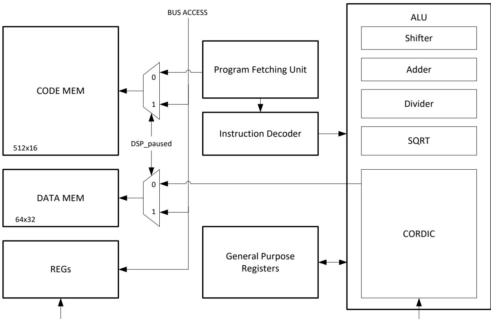  
图 19-1 DSP 模块功能框图

## 19.1.2 DSP 核寄存器

表 19-1 DSP 核心寄存器

<table><tr><td>Register</td><td>Bit Width</td><td>Usage</td></tr><tr><td>R0</td><td>32</td><td>Always read as 0</td></tr><tr><td>R1</td><td>32</td><td></td></tr><tr><td>R2</td><td>32</td><td></td></tr><tr><td>R3</td><td>32</td><td></td></tr><tr><td>R4</td><td>32</td><td></td></tr><tr><td>R5</td><td>32</td><td></td></tr><tr><td>R6</td><td>32</td><td>ARCTAN module destination</td></tr><tr><td>R7</td><td>32</td><td>MAC result / DIV dividend</td></tr><tr><td>PC</td><td>16</td><td>Program Counter</td></tr></table>

其中R0 寄存器为常0 寄存器，不能写入数据，读回恒为0。R0 寄存器可作为特殊操作数构造一些伪指令。如

ADD R0 R0 R0 相当于 NOP

MAC R1 R2 R0 相当于 MUL R1 R2，即乘累加中累加的数为 0，变为乘法操作

R6 寄存器在ARCTAN 指令中固定用于存放向量模值

R7 寄存器在MAC 指令中固定用于存放计算结果，在DIV 指令中固定用于存放被除数操作数。

以上约定是由于受定长指令编码限制，在 4 操作数指令中需要固定一个操作数使用约定寄存

器。

## 19.1.3 位宽

除法的被除数和商位宽均为 32 位有符号数，除数和余数为32 位有符号数。

被开方数为32 位无符号数，平方根为 16 位无符号数。

乘累加的两个乘数均为32 位有符号数，加数和结果为 32 位有符号数。

三角函数 CORDIC 模块位宽为 16 位，Q15 定点数格式。

注意：在使用DSP算术运算资源时，无论是CPU 调用还是通过DSP算术指令调用，请务必保证操作数不要超过表示范围，否则会出现计算异常。

除法除数为0 时，无论被除数是任何值，商恒为 0，余数为被除数。

当被除数为 0x8000\_0000，除数为-1 时，商超出了 32bit 有符号数的表示范围，饱和为0x7fff\_ffff。

表19-2除法特殊操作数情况表

<table><tr><td colspan="2">被除数 DSP0_DID</td><td colspan="2">除数 DSP0_DIS</td><td colspan="2">商 DSP0_QUO</td><td colspan="2">余数 DSP0_REM</td></tr><tr><td>HEX</td><td>DEC</td><td>HEX</td><td>DEC</td><td>HEX</td><td>DEC</td><td>HEX</td><td>DEC</td></tr><tr><td>0x7FFF_FFFF</td><td> $2^{31}-1$ </td><td>0x8000_0000</td><td> $-2^{31}$ </td><td>0x0</td><td>0</td><td>0x7FFF_FFFF</td><td> $2^{31}-1$ </td></tr><tr><td>0x7FFF_FFFF</td><td> $2^{31}-1$ </td><td>0x7FFF_FFFF</td><td> $2^{31}-1$ </td><td>0x1</td><td>1</td><td>0x0</td><td>0</td></tr><tr><td>0x8000_0000</td><td> $-2^{31}$ </td><td>0x7FFF_FFFF</td><td> $2^{31}-1$ </td><td>0xFFFF_FFFF</td><td>-1</td><td>0xFFFF_FFFF</td><td>-1</td></tr><tr><td>0x8000_0000</td><td> $-2^{31}$ </td><td>0x8000_0000</td><td> $-2^{31}$ </td><td>0x1</td><td>1</td><td>0x0</td><td>0</td></tr><tr><td>0x8000_0000</td><td> $-2^{31}$ </td><td>0xFFFF_FFFF</td><td>-1</td><td>0x7FFF_FFFF</td><td> $2^{31}-1$ </td><td>0x0</td><td>0</td></tr><tr><td>0x7FFF_FFFF</td><td> $2^{31}-1$ </td><td>0xFFFF_FFFF</td><td>-1</td><td>0x8000_0001</td><td> $1-2^{31}$ </td><td>0x0</td><td>0</td></tr><tr><td>0x1234</td><td>4660</td><td>0x0</td><td>0</td><td>0x0</td><td>0</td><td>0x1234</td><td>4660</td></tr><tr><td>-0x1234</td><td>-4660</td><td>0x0</td><td>0</td><td>0x0</td><td>0</td><td>-0x1234</td><td>-4660</td></tr></table>

此外，由于CORDIC 运算基于多次旋转逐次逼近，计算结果存在不超过0.1%的计算误差。

## 19.1.4 指令周期

除法指令需要12 个总线周期（96MHz）完成。

开方指令需要8 个总线周期（96MHz）完成。

三角函数指令需要20 个总线周期（96MHz）完成。

其余指令均为单周期指令

## 19.1.5 地址空间

表 19-3 DSP 地址空间

<table><tr><td>段</td><td>模块</td><td>CPU 软件视角地址空间</td><td>DSP 软件视角地址空间</td><td>实际存储体大小/说明</td></tr><tr><td>CODE</td><td>DSP Code Memory</td><td>0x4001_2000 ~ 0x4001_27FF</td><td>CODE 空间:0x0~0x1FF</td><td>512 x 16bit</td></tr><tr><td rowspan="2">DATA</td><td>保留</td><td>0x4001_2800 ~0x4001_2EFF</td><td></td><td>保留</td></tr><tr><td>DSP Data Memory</td><td>0x4001_2F00 ~0x4001_2FEF</td><td>DATA 空间:0x0~0x3B</td><td>60 x 32bit</td></tr><tr><td rowspan="4"></td><td>DSP0_PDI</td><td>0x4001_2FF0</td><td>DATA 空间: 0x3C</td><td>GPIO_PDI 寄存器</td></tr><tr><td>DSP0_BSRR</td><td>0x4001_2FF4</td><td>DATA 空间: 0x3D</td><td>GPIO_PDO 置位寄存器</td></tr><tr><td>DSP0_BRR/DSP0_OP</td><td>0x4001_2FF8</td><td>DATA 空间: 0x3E</td><td>GPIO_PDO 清零寄存器/DSP 操作数寄存器</td></tr><tr><td>DSP0_CL/DSP0_RES</td><td>0x4001_2FFC</td><td>DATA 空间: 0x3F</td><td>CL_OUTPUT 寄存器/DSP 结果寄存器</td></tr><tr><td>REG</td><td>DSP 寄存器</td><td>0x4001_3000 ~ 0x4001_37FF</td><td></td><td></td></tr><tr><td></td><td></td><td>0x4001_3800 ~ 0x4001_3FFF</td><td></td><td>保留</td></tr></table>

DSP 的地址空间分为 4 段，分别为程序段、数据段、寄存器段、保留段，各段空间占用 2kB的地址空间，但实际的 CODE MEM 和 DATA MEM 存储空间不足 2kB。程序段（CODE MEM）用于存放 DSP 运行所需程序代码，为单口SRAM，单周期完成读写操作；数据段（DATA MEM）用于存放 DSP 运行所需数据，为单口 SRAM，单周期完成读写操作；寄存器段为允许 CPU 通过总线访问的DSP 寄存器；保留段暂未使用。

CODE MEM 位宽为16，但仍按word 寻址，亦即地址每次增4。

CODE MEM 和 DATA MEM 仅支持按 word 寻址，即每次写入 32bit，读出 32bit。

DSP地址空间需要在适当的时机才能访问。其中DSP的状态控制寄存器可以在任何时间访问；DSP 的 CODE MEM、DATA MEM、以及寄存器段中 CODIC 三角函数模块、DIV 除法器、SQRT 开方器只有在 DSP 暂停即 DSP0\_SC.PAUSED=1 时才能进行寄存器访问。因为在 DSP 运行期间，所有的运算单元可能在被 DSP 使用，CPU 同时通过寄存器接口进行访问会造成访问冲突。因此在 DSP 运行期间，即DSP0\_SC.PAUSED=0 时，禁止通过寄存器接口访问DSP 的运算单元。

DSP 遇到中断指令会提起中断等待 CPU 处理，同时 DSP 进入暂停状态，DSP0\_SC.PAUSED 会置位为 1,。此外软件也可以在任意时刻通过写 DSP0\_SC.PAUSED=1 来使 DSP 进入暂停状态，这一机制主要是为了防止DSP 写入的程序中没有IRQ 指令，导致 DSP 在不掉电的情况下会永久运行。

下表列出了 CPU 和 DSP 读写访问 DSP data Memory 时访问的实际内容。

表 19-4 DSP data memory 空间读写访问内容

<table><tr><td rowspan="2">DSP寻址地址</td><td colspan="2">DSP</td><td rowspan="2">CPU寻址地址</td><td colspan="2">CPU</td></tr><tr><td>Read</td><td>Write</td><td>Read</td><td>Write</td></tr><tr><td>0</td><td>Data[0]</td><td>Data[0]</td><td>0x4001_2F00</td><td>Data[0]</td><td>Data[0]</td></tr><tr><td>1</td><td>Data[1]</td><td>Data[1]</td><td>0x4001_2F04</td><td>Data[1]</td><td>Data[1]</td></tr><tr><td>2</td><td>Data[2]</td><td>Data[2]</td><td>0x4001_2F08</td><td>Data[2]</td><td>Data[2]</td></tr><tr><td>⋮</td><td>⋮</td><td>⋮</td><td>⋮</td><td>⋮</td><td>⋮</td></tr><tr><td>0x3B</td><td>Data[59]</td><td>Data[59]</td><td>0x4001_2FEC</td><td>Data[59]</td><td>Data[59]</td></tr><tr><td>0x3C</td><td>DSP0_PDI</td><td></td><td>0x4001_2FF0</td><td></td><td></td></tr><tr><td>0x3D</td><td></td><td>DSP0_BSRR</td><td>0x4001_2FF4</td><td></td><td></td></tr><tr><td>0x3E</td><td>DSP0_OP</td><td>DSP0_BRR</td><td>0x4001_2FF8</td><td>DSP0_OP</td><td>DSP0_OP</td></tr><tr><td>0x3F</td><td>DSP0_CL</td><td>DSP0_RES</td><td>0x4001_2FFC</td><td>DSP0_RES</td><td>DSP0_RES</td></tr></table>

其中 Data[n]表示 DSP DATA Memory 中的第 n 个 word。

DSP0\_RES 寄存器是 DSP data memory 位于 0x3F 的 word，即最后一个 word，是 Data[63]的拷贝。对于 CPU 软件来说，读写操作 0x4001\_2FFC，操作的均是 DSP0\_RES 寄存器，CPU 软件可以直接读写DSP0\_RES，即使在DSP 运行过程中。对于DSP 来说，DSP 读取0x3F 得到的是DSP0\_CL的值，写0x3F 地址，会改写 DSP0\_RES 寄存器的值。

DSP0\_OP 是 DSP data memory 位于 0x3E 的 word，即倒数第二个 word，对于 CPU 软件来说，读写操作 0x4001\_2FF8，操作的均是 DSP0\_OP 寄存器，CPU 软件可以直接读写 DSP0\_OP，即使在DSP 运行过程中。对于 DSP 来说，DSP 读取 0x3D 得到的是 DSP0\_OP 的值，DSP 写 0x3D 地址，写的是DSP0\_BRR 寄存器，即GPIO 位清零操作。

## 19.1.6 与 CPU, GPIO, CL 模块的交互

在 DSP DATA 段的最后 4 个 word，被用作特殊用途，不再作为 DATA Memory 使用。

DSP 通过汇编指令读取 0x3C 位置的 DATA Memory 时，实际是读取 DSP0\_PDI；

DSP 通过汇编指令向 DATA MEM 地址 0x3D 或 0x3E 写入数据时，实际是在向 GPIOx\_BSRR，GPIOx\_BRR 寄存器写入数据进行 GPIO\_PDO 的位操作。具体 GPIO 对应关系，请参考 DSP 寄存器章节。

DSP 通过汇编指令读取 DATA MEM 地址 0x3F 时，实际是读取 CL\_OUTPUT。

此外，0x3E 和0x3F 地址，允许CPU 在DSP 运行时与DSP 进行数据交互。DSP0\_OP 一般用于CPU 写入数据，DSP 读出数据，例如使用 DSP 模拟串口发送时；DSP0\_RES 一般用于 DSP 写入数据，CPU 读出数据，例如使用 DSP 模拟串口接收时。由于 DMA 在受理 DSP 的搬运请求时就会清零 DSP0\_SC.IF，DSP0\_SC.PAUSED 并重启 DSP 运行，而数据搬运是在 DSP 受理请求之后，因此需要有读写通道允许DSP 允许期间进行数据交互。

## 19.2 寄存器

## 19.2.1 地址分配

DSP 模块在芯片中的基地址是 0x4001\_2000。DSP 寄存器在芯片中的基地址是 0x4001\_3000。

表 19-5 DSP 寄存器列表

<table><tr><td>名称</td><td>偏移</td><td>说明</td></tr><tr><td>DSP0_SC</td><td>0x00</td><td>DSP 状态控制寄存器</td></tr><tr><td>DSP0_THETA</td><td>0x04</td><td>DSP sin/cos 输入角度寄存器</td></tr><tr><td>DSP0_X</td><td>0x08</td><td>DSP arctan/module 计算输入坐标 X 寄存器</td></tr><tr><td>DSP0_Y</td><td>0x0C</td><td>DSP arctan/module 计算输入坐标 Y 寄存器</td></tr><tr><td>DSP0_SIN</td><td>0x10</td><td>DSP sin/cos 计算结果 sin 寄存器</td></tr><tr><td>DSP0_COS</td><td>0x14</td><td>DSP sin/cos 计算结果 cos 寄存器</td></tr><tr><td>DSP0_MOD</td><td>0x18</td><td>DSP arctan 计算结果 sqrt(X2+Y2) 寄存器</td></tr><tr><td>DSP0_ARCTAN</td><td>0x1C</td><td>DSP arctan 计算结果 arctan(Y/X) 角度寄存器</td></tr><tr><td>DSP0_DID</td><td>0x20</td><td>DSP 除法操作被除数</td></tr><tr><td>DSP0_DIS</td><td>0x24</td><td>DSP 除法操作除数</td></tr><tr><td>DSP0_QUO</td><td>0x28</td><td>DSP 除法操作商</td></tr><tr><td>DSP0_REM</td><td>0x2C</td><td>DSP 除法操作余数</td></tr><tr><td>DSP0_RAD</td><td>0x30</td><td>DSP 开方操作被开方数</td></tr><tr><td>DSP0_SQRT</td><td>0x34</td><td>DSP 开方操作平方根</td></tr><tr><td>DSP0_PC</td><td>0x38</td><td>DSP 程序指针(Program Count)</td></tr></table>

## 19.2.2 DSP0\_SC

地址：0x4001\_3000

复位值：0x2

表 19-6 DSP 状态控制寄存器 DSP0\_SC

<table><tr><td rowspan="3"></td><td>DMA_ACC_EN</td><td>RE</td><td>IE</td><td rowspan="3"></td><td>RESET_PC</td><td>CORDIC_MODE</td><td>PAUSED</td><td>IF</td></tr><tr><td>RW</td><td>RW</td><td>RW</td><td>WO</td><td>RW</td><td>RW</td><td>RWIC</td></tr><tr><td>0</td><td>0</td><td>0</td><td>0</td><td>0</td><td>1</td><td>0</td></tr></table>

<table><tr><td>位置</td><td>位名称</td><td>说明</td></tr><tr><td>[31:11]</td><td></td><td>未使用</td></tr><tr><td>[10]</td><td>DMA_ACC_EN</td><td>RE=1时,DMA在清零IF的同时,是否清零PAUSED,并RESET_PC。0:禁用,DMA收到请求后只清零IF1:使能,DMA收到请求后清零IF,PAUSED,并RESET_PCDMA_ACC_EN=1通常用于DSP软件模拟串行通讯接口的收发</td></tr><tr><td>[9]</td><td>RE</td><td>DSP DMA请求使能,高有效,当RE=1,且IF=1时,产生DMA请求DMA接收到请求并受理开始数据搬运,并将IF标志清零,不再需要软件清零IF。</td></tr><tr><td>[8]</td><td>IE</td><td>DSP中断使能,高有效,当IE=1,且IF=1时,产生中断请求,即使IE=0,当DSP执行到IRQ指令时,IF仍会置位。</td></tr><tr><td>[7:4]</td><td></td><td>未使用</td></tr><tr><td>[3]</td><td>RESET_PC</td><td>当DSP暂停时,写1重置DSP PC到0地址</td></tr><tr><td>[2]</td><td>CORDIC_MODE</td><td>CORDIC mode, 0: arctan, 1: sin/cos</td></tr><tr><td>[1]</td><td>PAUSED</td><td>指示DSP是否处于暂停状态,当DSP执行到IRQ指令时此bit置1,软件写可以将此bit置1。软件将此bit清零可以启动DSP运行0:DSP正读取CODE MEM和DATA MEM自主运行DSP程序1:DSP暂停取指令,允许ARM软件通过寄存器访问DSP内部算术单元,向寄存器写入操作数触发运算,读取寄存器取得运算结果对于不编写DSP CODE MEM程序的用户,PASUED需保持为1</td></tr><tr><td>[0]</td><td>IF</td><td>DSP中断标志,写1清零</td></tr></table>

注意，复位后 DSP 处于暂停状态，即 DSP0\_SC.PAUSED=1 时；DSP0\_SC.CORDIC\_MODE 用于CPU 通过寄存器接口访问 CORDIC 模块时，sin/cos mode 和 arctan mode 的选择，CORDIC 模块计算sin/cos 或arctan 使用的是相同的硬件电路。因此在进行某一种计算前，应通过配置DSP0\_SC 计

算器进行适当模式选择。

只有当 DSP 处于暂停状态时，CPU 才可以通过寄存器接口调用 DSP。当 DSP 自主运行时，CPU 无法通过寄存器接口访问 DSP 内部资源。

DSP0\_SC.CORDIC\_MODE 位仅在 CPU 通过寄存器接口调用 DSP CORDIC 单元时需要设置，DSP程序可以根据 SIN\_COS 或 ARCTAN 指令直接进行模式切换，DSP0\_SC.CORDIC\_MODE 不再起作用。

软件调用 CORDIC 模块计算 sin/cos 时以角度 DSP0\_THETA 为输入，计算并输出 sin/cos 结果到 DSP0\_SIN/DSP0\_COS 寄存器；计算 arctan 时以坐标 DSP0\_X/DSP0\_Y 为输入，计算并输出角度theta= arctan (y/x)和 module= sqrt (x2+y2)到 DSP0\_ARCTAN 和 DSP0\_MOD 寄存器。

## 19.2.3 DSP sin/cos 相关寄存器

CORDIC 模块计算 sin/cos 和 arctan 使用的是相同的数据通路，因此通过 CPU 使用 CORDIC 模块进行 sin/cos 计算，需要先将 DSP0\_SC.CORDIC\_MODE 写为 1，使 CORDIC 进入 sin/cos 模式。

## 19.2.3.1 DSP0\_THETA

地址：0x4001\_3004

复位值：0x0

表 19-7 DSP sin/cos 角度输入寄存器

<table><tr><td>15</td><td>14</td><td>13</td><td>12</td><td>11</td><td>10</td><td>9</td><td>8</td><td>7</td><td>6</td><td>5</td><td>4</td><td>3</td><td>2</td><td>1</td><td>0</td></tr><tr><td colspan="16">THETA</td></tr><tr><td colspan="16">RW</td></tr><tr><td colspan="16">0</td></tr></table>

<table><tr><td>位置</td><td>位名称</td><td>说明</td></tr><tr><td>[31:16]</td><td></td><td>保留,读出时为符号扩展,即{16{DSP0_THETA[15]}}</td></tr><tr><td>[15:0]</td><td>THETA</td><td>DSP sin/cos 输入角度寄存器</td></tr></table>

DSP0\_THETA 为 16 位有符号定点数，表示范围 ( -32768 \~ 32767 ) 对应 ( –π \~ π ) 。

地址：0x4001\_3010

复位值：0x0

表 19-8 DSP sin/cos 正弦结果寄存器

<table><tr><td>15</td><td>14</td><td>13</td><td>12</td><td>11</td><td>10</td><td>9</td><td>8</td><td>7</td><td>6</td><td>5</td><td>4</td><td>3</td><td>2</td><td>1</td><td>0</td></tr><tr><td></td><td></td><td></td><td></td><td></td><td></td><td></td><td></td><td>SIN</td><td></td><td></td><td></td><td></td><td></td><td></td><td></td></tr><tr><td></td><td></td><td></td><td></td><td></td><td></td><td></td><td></td><td>RO</td><td></td><td></td><td></td><td></td><td></td><td></td><td></td></tr><tr><td></td><td></td><td></td><td></td><td></td><td></td><td></td><td></td><td>0</td><td></td><td></td><td></td><td></td><td></td><td></td><td></td></tr></table>

<table><tr><td>位置</td><td>位名称</td><td>说明</td></tr><tr><td>[31:16]</td><td></td><td>保留,读出时为符号扩展,即{16{DSP0_SIN[15]}}</td></tr><tr><td>[15:0]</td><td>SIN</td><td>DSP sin/cos 计算结果 sin 寄存器</td></tr></table>

DSP0\_SIN 为 16 位有符号定点数，其中 1bit 符号位，15bit 小数位；表示范围 ( –1 \~ 1 ) 。19.2.3.3 DSP0\_COS

地址：0x4001\_3014

复位值：0x0

表 19-9 DSP sin/cos 余弦结果寄存器

<table><tr><td>15</td><td>14</td><td>13</td><td>12</td><td>11</td><td>10</td><td>9</td><td>8</td><td>7</td><td>6</td><td>5</td><td>4</td><td>3</td><td>2</td><td>1</td><td>0</td></tr><tr><td></td><td></td><td></td><td></td><td></td><td></td><td></td><td></td><td></td><td></td><td></td><td></td><td></td><td></td><td></td><td></td></tr><tr><td></td><td></td><td></td><td></td><td></td><td></td><td></td><td></td><td></td><td></td><td></td><td></td><td></td><td></td><td></td><td></td></tr><tr><td></td><td></td><td></td><td></td><td></td><td></td><td></td><td></td><td></td><td></td><td></td><td></td><td></td><td></td><td></td><td></td></tr><tr><td></td><td></td><td></td><td></td><td></td><td></td><td></td><td></td><td></td><td></td><td></td><td></td><td></td><td></td><td></td><td></td></tr></table>

<table><tr><td>位置</td><td>位名称</td><td>说明</td></tr><tr><td>[31:16]</td><td></td><td>保留,读出时为符号扩展,即{16{DSP0_COS[15]}}</td></tr><tr><td>[15:0]</td><td>COS</td><td>DSP sin/cos 计算结果 cos 寄存器</td></tr></table>

DSP0\_COS 为 16 位有符号定点数，其中 1bit 符号位，15bit 小数位；表示范围 ( –1 \~ 1 ) 。

19.2.4 DSP arctan 相关寄存器

19.2.4.1 DSP0\_X

地址：0x4001\_3008

复位值：0x0

表 19-10 DSP arctan/module 坐标 X 输入寄存器

<table><tr><td>15</td><td>14</td><td>13</td><td>12</td><td>11</td><td>10</td><td>9</td><td>8</td><td>7</td><td>6</td><td>5</td><td>4</td><td>3</td><td>2</td><td>1</td><td>0</td></tr><tr><td></td><td></td><td></td><td></td><td></td><td></td><td></td><td></td><td>X</td><td></td><td></td><td></td><td></td><td></td><td></td><td></td></tr><tr><td></td><td></td><td></td><td></td><td></td><td></td><td></td><td></td><td>RW</td><td></td><td></td><td></td><td></td><td></td><td></td><td></td></tr><tr><td></td><td></td><td></td><td></td><td></td><td></td><td></td><td></td><td>0</td><td></td><td></td><td></td><td></td><td></td><td></td><td></td></tr></table>

<table><tr><td>位置</td><td>位名称</td><td>说明</td></tr><tr><td>[31:16]</td><td></td><td>保留,读出时为符号扩展,即{16{DSP0_X[15]}}</td></tr><tr><td>[15:0]</td><td>X</td><td>DSP arctan/module 计算输入坐标 X 寄存器</td></tr></table>

DSP0\_X 为 16 位有符号定点数，Q15 格式，其中 1bit 符号位，15bit 整数位，表示范围( –32768 \~32767 )。

19.2.4.2 DSP0\_Y

地址：0x4001\_300C

复位值：0x0

表 19-11 DSP arctan/module 计算坐标 Y 输入寄存器

<table><tr><td>15</td><td>14</td><td>13</td><td>12</td><td>11</td><td>10</td><td>9</td><td>8</td><td>7</td><td>6</td><td>5</td><td>4</td><td>3</td><td>2</td><td>1</td><td>0</td></tr><tr><td></td><td></td><td></td><td></td><td></td><td></td><td></td><td></td><td></td><td></td><td></td><td></td><td></td><td></td><td></td><td></td></tr><tr><td></td><td></td><td></td><td></td><td></td><td></td><td></td><td></td><td></td><td></td><td></td><td></td><td></td><td></td><td></td><td></td></tr><tr><td></td><td></td><td></td><td></td><td></td><td></td><td></td><td></td><td></td><td></td><td></td><td></td><td></td><td></td><td></td><td></td></tr><tr><td></td><td></td><td></td><td></td><td></td><td></td><td></td><td></td><td></td><td></td><td></td><td></td><td></td><td></td><td></td><td></td></tr></table>

<table><tr><td>位置</td><td>位名称</td><td>说明</td></tr><tr><td>[31:16]</td><td></td><td>保留,读出时为符号扩展,即{16{DSP0_Y[15]}}</td></tr><tr><td>[15:0]</td><td>Y</td><td>DSP arctan/module 计算输入坐标 Y 寄存器</td></tr></table>

DSP0\_Y 为 16 位有符号定点数，其中 1bit 符号位，15bit 整数位，表示范围( –32768 \~ 32767 ) 。

19.2.4.3 DSP0\_MOD

地址：0x4001\_3018

复位值：0x0

表 19-12 DSP arctan 向量模结果 sqrt(X2+Y2) 寄存器

<table><tr><td>15</td><td>14</td><td>13</td><td>12</td><td>11</td><td>10</td><td>9</td><td>8</td><td>7</td><td>6</td><td>5</td><td>4</td><td>3</td><td>2</td><td>1</td><td>0</td></tr><tr><td></td><td></td><td></td><td></td><td></td><td></td><td></td><td></td><td></td><td></td><td></td><td></td><td></td><td></td><td></td><td></td></tr><tr><td></td><td></td><td></td><td></td><td></td><td></td><td></td><td></td><td></td><td></td><td></td><td></td><td></td><td></td><td></td><td></td></tr><tr><td></td><td></td><td></td><td></td><td></td><td></td><td></td><td></td><td></td><td></td><td></td><td></td><td></td><td></td><td></td><td></td></tr><tr><td></td><td></td><td></td><td></td><td></td><td></td><td></td><td></td><td></td><td></td><td></td><td></td><td></td><td></td><td></td><td></td></tr></table>

<table><tr><td>位置</td><td>位名称</td><td>说明</td></tr><tr><td>[31:16]</td><td></td><td>保留,读恒为0</td></tr><tr><td>[15:0]</td><td>MOD</td><td>DSP arctan 计算结果 sqrt( $X^{2}$ + $Y^{2}$ ) 寄存器</td></tr></table>

DSP0\_MOD 为 16 位无符号定点数，16bit 均为整数位，表示范围(0\~65535)。

19.2.4.4 DSP0\_ARCTAN

地址：0x4001\_301C

复位值：0x0

表 19-13 DSP arctan 角度结果 arctan(Y/X) 角度寄存器

<table><tr><td>15</td><td>14</td><td>13</td><td>12</td><td>11</td><td>10</td><td>9</td><td>8</td><td>7</td><td>6</td><td>5</td><td>4</td><td>3</td><td>2</td><td>1</td><td>0</td></tr><tr><td colspan="16">ARCTAN</td></tr><tr><td colspan="16">RO0</td></tr></table>

<table><tr><td>位置</td><td>位名称</td><td>说明</td></tr><tr><td>[31:16]</td><td></td><td>保留,读出时为符号扩展,即{16{DSP0_ARCTAN[15]}}</td></tr><tr><td>[15:0]</td><td>ARCTAN</td><td>DSP arctan 计算结果 arctan(Y/X) 角度寄存器</td></tr></table>

DSP0\_ARCTAN 为 16 位有符号定点数，表示范围 ( -32768 \~ 32767 ) 对应 ( –π \~ π ) 。

## 19.2.5 DSP 除法相关寄存器

19.2.5.1 DSP0\_DID

地址：0x4001\_3020

复位值：0x0

表 19-14 DSP 除法被除数寄存器

<table><tr><td>31</td><td>30</td><td>29</td><td>28</td><td>27</td><td>26</td><td>25</td><td>24</td><td>23</td><td>22</td><td>21</td><td>20</td><td>19</td><td>18</td><td>17</td><td>16</td></tr><tr><td></td><td></td><td></td><td></td><td></td><td></td><td></td><td></td><td>DID</td><td></td><td></td><td></td><td></td><td></td><td></td><td></td></tr><tr><td></td><td></td><td></td><td></td><td></td><td></td><td></td><td></td><td>RW</td><td></td><td></td><td></td><td></td><td></td><td></td><td></td></tr><tr><td></td><td></td><td></td><td></td><td></td><td></td><td></td><td></td><td>0</td><td></td><td></td><td></td><td></td><td></td><td></td><td></td></tr><tr><td>15</td><td>14</td><td>13</td><td>12</td><td>11</td><td>10</td><td>9</td><td>8</td><td>7</td><td>6</td><td>5</td><td>4</td><td>3</td><td>2</td><td>1</td><td>0</td></tr><tr><td></td><td></td><td></td><td></td><td></td><td></td><td></td><td></td><td>DID</td><td></td><td></td><td></td><td></td><td></td><td></td><td></td></tr><tr><td></td><td></td><td></td><td></td><td></td><td></td><td></td><td></td><td>RW</td><td></td><td></td><td></td><td></td><td></td><td></td><td></td></tr><tr><td></td><td></td><td></td><td></td><td></td><td></td><td></td><td></td><td>0</td><td></td><td></td><td></td><td></td><td></td><td></td><td></td></tr></table>

<table><tr><td>位置</td><td>位名称</td><td>说明</td></tr><tr><td>[31:0]</td><td>DID</td><td>DSP 除法被除数寄存器</td></tr></table>

19.2.5.2 DSP0\_DIS

地址：0x4001\_3024

复位值：0x0

表 19-15 DSP 除法除数寄存器

<table><tr><td>31</td><td>30</td><td>29</td><td>28</td><td>27</td><td>26</td><td>25</td><td>24</td><td>23</td><td>22</td><td>21</td><td>20</td><td>19</td><td>18</td><td>17</td><td>16</td></tr><tr><td></td><td></td><td></td><td></td><td></td><td></td><td></td><td>DIS</td><td></td><td></td><td></td><td></td><td></td><td></td><td></td><td></td></tr><tr><td></td><td></td><td></td><td></td><td></td><td></td><td></td><td>RW</td><td></td><td></td><td></td><td></td><td></td><td></td><td></td><td></td></tr><tr><td></td><td></td><td></td><td></td><td></td><td></td><td></td><td>0</td><td></td><td></td><td></td><td></td><td></td><td></td><td></td><td></td></tr><tr><td>15</td><td>14</td><td>13</td><td>12</td><td>11</td><td>10</td><td>9</td><td>8</td><td>7</td><td>6</td><td>5</td><td>4</td><td>3</td><td>2</td><td>1</td><td>0</td></tr><tr><td></td><td></td><td></td><td></td><td></td><td></td><td></td><td>DIS</td><td></td><td></td><td></td><td></td><td></td><td></td><td></td><td></td></tr><tr><td></td><td></td><td></td><td></td><td></td><td></td><td></td><td>RW</td><td></td><td></td><td></td><td></td><td></td><td></td><td></td><td></td></tr><tr><td></td><td></td><td></td><td></td><td></td><td></td><td></td><td>0</td><td></td><td></td><td></td><td></td><td></td><td></td><td></td><td></td></tr></table>

<table><tr><td>位置</td><td>位名称</td><td>说明</td></tr><tr><td>[31:0]</td><td>DIS</td><td>DSP 除法除数寄存器</td></tr></table>

19.2.5.3 DSP0\_QUO

地址：0x4001\_3028

复位值：0x0

表 19-16 DSP 除法商寄存器

<table><tr><td>31</td><td>30</td><td>29</td><td>28</td><td>27</td><td>26</td><td>25</td><td>24</td><td>23</td><td>22</td><td>21</td><td>20</td><td>19</td><td>18</td><td>17</td><td>16</td></tr><tr><td></td><td></td><td></td><td></td><td></td><td></td><td></td><td></td><td></td><td></td><td></td><td></td><td></td><td></td><td></td><td></td></tr><tr><td></td><td></td><td></td><td></td><td></td><td></td><td></td><td></td><td></td><td></td><td></td><td></td><td></td><td></td><td></td><td></td></tr><tr><td></td><td></td><td></td><td></td><td></td><td></td><td></td><td></td><td></td><td></td><td></td><td></td><td></td><td></td><td></td><td></td></tr><tr><td></td><td></td><td></td><td></td><td></td><td></td><td></td><td></td><td></td><td></td><td></td><td></td><td></td><td></td><td></td><td></td></tr><tr><td>15</td><td>14</td><td>13</td><td>12</td><td>11</td><td>10</td><td>9</td><td>8</td><td>7</td><td>6</td><td>5</td><td>4</td><td>3</td><td>2</td><td>1</td><td>0</td></tr><tr><td></td><td></td><td></td><td></td><td></td><td></td><td></td><td></td><td></td><td></td><td></td><td></td><td></td><td></td><td></td><td></td></tr><tr><td></td><td></td><td></td><td></td><td></td><td></td><td></td><td></td><td></td><td></td><td></td><td></td><td></td><td></td><td></td><td></td></tr><tr><td></td><td></td><td></td><td></td><td></td><td></td><td></td><td></td><td></td><td></td><td></td><td></td><td></td><td></td><td></td><td></td></tr><tr><td></td><td></td><td></td><td></td><td></td><td></td><td></td><td></td><td></td><td></td><td></td><td></td><td></td><td></td><td></td><td></td></tr></table>

<table><tr><td>位置</td><td>位名称</td><td>说明</td></tr><tr><td>[31:0]</td><td>QUO</td><td>DSP 商寄存器</td></tr></table>

19.2.5.4 DSP0\_REM

地址：0x4001\_302C

复位值：0x0

表 19-17 DSP 除法余数寄存器

<table><tr><td>31</td><td>30</td><td>29</td><td>28</td><td>27</td><td>26</td><td>25</td><td>24</td><td>23</td><td>22</td><td>21</td><td>20</td><td>19</td><td>18</td><td>17</td><td>16</td></tr><tr><td colspan="16">REM</td></tr><tr><td colspan="16">RO</td></tr><tr><td colspan="16">0</td></tr><tr><td>15</td><td>14</td><td>13</td><td>12</td><td>11</td><td>10</td><td>9</td><td>8</td><td>7</td><td>6</td><td>5</td><td>4</td><td>3</td><td>2</td><td>1</td><td>0</td></tr><tr><td colspan="16">REM</td></tr><tr><td colspan="16">RO</td></tr><tr><td colspan="16">0</td></tr><tr><td>15</td><td>14</td><td>13</td><td>12</td><td>11</td><td>10</td><td>9</td><td>8</td><td>7</td><td>6</td><td>5</td><td>4</td><td>3</td><td>2</td><td>1</td><td>0</td></tr></table>

<table><tr><td>位置</td><td>权限</td><td>说明</td></tr><tr><td>[31:0]</td><td>REM</td><td>DSP 除法余数寄存器</td></tr></table>

当 CPU 需要使用 DSP 除法器时，应首先保证 DSP 处于暂停状态。先向 DSP 写入被除数，后写入除数；写入除数可以触发一次除法操作，32/32 位除法需要 12 周期完成，期间读取除法结果DSP0\_QUO 或 DSP0\_REM 会使CPU 进入等待状态，等待除法计算完成并通过总线返回计算结果。

## 19.2.6 DSP 开方相关寄存器

19.2.6.1 DSP0\_RAD

地址：0x4001\_3030

复位值：0x0

表 19-18 DSP 被开方数寄存器

<table><tr><td>31</td><td>30</td><td>29</td><td>28</td><td>27</td><td>26</td><td>25</td><td>24</td><td>23</td><td>22</td><td>21</td><td>20</td><td>19</td><td>18</td><td>17</td><td>16</td></tr><tr><td></td><td></td><td></td><td></td><td></td><td></td><td></td><td></td><td>RAD</td><td></td><td></td><td></td><td></td><td></td><td></td><td></td></tr><tr><td></td><td></td><td></td><td></td><td></td><td></td><td></td><td></td><td>RW</td><td></td><td></td><td></td><td></td><td></td><td></td><td></td></tr><tr><td></td><td></td><td></td><td></td><td></td><td></td><td></td><td></td><td>0</td><td></td><td></td><td></td><td></td><td></td><td></td><td></td></tr></table>

<table><tr><td>15</td><td>14</td><td>13</td><td>12</td><td>11</td><td>10</td><td>9</td><td>8</td><td>7</td><td>6</td><td>5</td><td>4</td><td>3</td><td>2</td><td>1</td><td>0</td></tr><tr><td></td><td></td><td></td><td></td><td></td><td></td><td></td><td></td><td>RAD</td><td></td><td></td><td></td><td></td><td></td><td></td><td></td></tr><tr><td></td><td></td><td></td><td></td><td></td><td></td><td></td><td></td><td>RW</td><td></td><td></td><td></td><td></td><td></td><td></td><td></td></tr><tr><td></td><td></td><td></td><td></td><td></td><td></td><td></td><td></td><td>0</td><td></td><td></td><td></td><td></td><td></td><td></td><td></td></tr></table>

<table><tr><td>位置</td><td>位名称</td><td>说明</td></tr><tr><td>[31:0]</td><td>RAD</td><td>DSP 被开方数寄存器</td></tr></table>

19.2.6.2 DSP0\_SQRT

地址：0x4001\_3034

复位值：0x0

表 19-19 DSP 平方根寄存器

<table><tr><td>15</td><td>14</td><td>13</td><td>12</td><td>11</td><td>10</td><td>9</td><td>8</td><td>7</td><td>6</td><td>5</td><td>4</td><td>3</td><td>2</td><td>1</td><td>0</td></tr><tr><td></td><td></td><td></td><td></td><td></td><td></td><td></td><td></td><td></td><td></td><td></td><td></td><td></td><td></td><td></td><td></td></tr><tr><td></td><td></td><td></td><td></td><td></td><td></td><td></td><td></td><td></td><td></td><td></td><td></td><td></td><td></td><td></td><td></td></tr><tr><td></td><td></td><td></td><td></td><td></td><td></td><td></td><td></td><td></td><td></td><td></td><td></td><td></td><td></td><td></td><td></td></tr><tr><td></td><td></td><td></td><td></td><td></td><td></td><td></td><td></td><td></td><td></td><td></td><td></td><td></td><td></td><td></td><td></td></tr></table>

<table><tr><td>位置</td><td>位名称</td><td>说明</td></tr><tr><td>[31:16]</td><td></td><td>保留,读出时恒为0</td></tr><tr><td>[15:0]</td><td>SQRT</td><td>DSP平方根寄存器</td></tr></table>

当CPU 需要使用DSP 开方器时，应首先保证DSP 处于暂停状态。向DSP 写入被开方数；写入被开方数可以触发一次开方操作，32 位开方需要8 周期完成，期间读取开方结果DSP0\_SQRT 会使CPU 进入等待状态，等待开方计算完成并通过总线返回计算结果。

19.2.7 DSP0\_PC

地址：0x4001\_3038

复位值：0x0

表 19-20 DSP 程序指针寄存器 DSP0\_PC

<table><tr><td>15 14 13 12 11 10 9</td><td>8 7 6 5 4 3 2 1 0</td></tr><tr><td rowspan="3"></td><td>PC</td></tr><tr><td>RW</td></tr><tr><td>0</td></tr></table>

<table><tr><td>位置</td><td>位名称</td><td>说明</td></tr><tr><td>[31:9]</td><td></td><td>保留</td></tr><tr><td>[8:0]</td><td>PC</td><td>当 DSP 出于暂停状态时,允许软件直接写入 PC 值。无论 DSP 是否出于暂停状态,PC 寄存器均可读</td></tr></table>

## 19.2.8 DSP0\_PDI

通过 DSP 汇编程序访问，软件无法直接访问，对应 DSP DATA Memory 地址:0x3C

复位值:0x0

表 19-21 DSP0\_PDI 寄存器

<table><tr><td>15</td><td>14</td><td>13</td><td>12</td><td>11</td><td>10</td><td>9</td><td>8</td><td>7</td><td>6</td><td>5</td><td>4</td><td>3</td><td>2</td><td>1</td><td>0</td></tr><tr><td>P2.14</td><td>P2.7</td><td>P2.6</td><td>P2.5</td><td>P2.4</td><td>P2.3</td><td>P1.0</td><td>P0.15</td><td>P0.14</td><td>P0.13</td><td>P0.12</td><td>P0.11</td><td>P0.4</td><td>P0.3</td><td>P0.2</td><td>P0.0</td></tr><tr><td>RO</td><td>RO</td><td>RO</td><td>RO</td><td>RO</td><td>RO</td><td>RO</td><td>RO</td><td>RO</td><td>RO</td><td>RO</td><td>RO</td><td>RO</td><td>RO</td><td>RO</td><td>RO</td></tr><tr><td>0</td><td>0</td><td>0</td><td>0</td><td>0</td><td>0</td><td>0</td><td>0</td><td>0</td><td>0</td><td>0</td><td>0</td><td>0</td><td>0</td><td>0</td><td>0</td></tr></table>

<table><tr><td>位置</td><td>位名称</td><td>说明</td></tr><tr><td>[31:16]</td><td></td><td>未使用</td></tr><tr><td>[15]</td><td>P2.14</td><td>GPIO2_PDI[14]</td></tr><tr><td>[14]</td><td>P2.7</td><td>GPIO2_PDI[7]</td></tr><tr><td>[13]</td><td>P2.6</td><td>GPIO2_PDI[6]</td></tr><tr><td>[12]</td><td>P2.5</td><td>GPIO2_PDI[5]</td></tr><tr><td>[11]</td><td>P2.4</td><td>GPIO2_PDI[4]</td></tr><tr><td>[10]</td><td>P2.3</td><td>GPIO2_PDI[3]</td></tr><tr><td>[9]</td><td>P1.0</td><td>GPIO1_PDI[0]</td></tr><tr><td>[8]</td><td>P0.15</td><td>GPIO0_PDI[15]</td></tr><tr><td>[7]</td><td>P0.14</td><td>GPIO0_PDI[14]</td></tr><tr><td>[6]</td><td>P0.13</td><td>GPIO0_PDI[13]</td></tr><tr><td>[5]</td><td>P0.12</td><td>GPIO0_PDI[12]</td></tr><tr><td>[4]</td><td>P0.11</td><td>GPIO0_PDI[11]</td></tr><tr><td>[3]</td><td>P0.4</td><td>GPIO0_PDI[4]</td></tr><tr><td>[2]</td><td>P0.3</td><td>GPIO0_PDI[3]</td></tr><tr><td>[1]</td><td>P0.2</td><td>GPIO0_PDI[2]</td></tr><tr><td>[0]</td><td>P0.0</td><td>GPIO0_PDI[0]</td></tr></table>

## 19.2.9 DSP0\_BSRR

通过 DSP 汇编程序访问，软件无法直接访问，对应 DSP DATA Memory 地址:0x3D

复位值:0x0

表 19-22 DSP0\_BSRR 寄存器

<table><tr><td>15</td><td>14</td><td>13</td><td>12</td><td>11</td><td>10</td><td>9</td><td>8</td><td>7</td><td>6</td><td>5</td><td>4</td><td>3</td><td>2</td><td>1</td><td>0</td></tr><tr><td>P2.14</td><td>P2.7</td><td>P2.6</td><td>P2.5</td><td>P2.4</td><td>P2.3</td><td>P1.0</td><td>P0.15</td><td>P0.14</td><td>P0.13</td><td>P0.12</td><td>P0.11</td><td>P0.4</td><td>P0.3</td><td>P0.2</td><td>P0.0</td></tr><tr><td>WO</td><td>WO</td><td>WO</td><td>WO</td><td>WO</td><td>WO</td><td>WO</td><td>WO</td><td>WO</td><td>WO</td><td>WO</td><td>WO</td><td>WO</td><td>WO</td><td>WO</td><td>WO</td></tr><tr><td>0</td><td>0</td><td>0</td><td>0</td><td>0</td><td>0</td><td>0</td><td>0</td><td>0</td><td>0</td><td>0</td><td>0</td><td>0</td><td>0</td><td>0</td><td>0</td></tr></table>

<table><tr><td>位置</td><td>位名称</td><td>说明</td></tr><tr><td>[31:16]</td><td></td><td>未使用</td></tr><tr><td>[15]</td><td>P2.14</td><td>GPIO2_BSRR[14]</td></tr><tr><td>[14]</td><td>P2.7</td><td>GPIO2_BSRR[7]</td></tr><tr><td>[13]</td><td>P2.6</td><td>GPIO2_BSRR[6]</td></tr><tr><td>[12]</td><td>P2.5</td><td>GPIO2_BSRR[5]</td></tr><tr><td>[11]</td><td>P2.4</td><td>GPIO2_BSRR[4]</td></tr><tr><td>[10]</td><td>P2.3</td><td>GPIO2_BSRR[3]</td></tr><tr><td>[9]</td><td>P1.0</td><td>GPIO1_BSRR[0]</td></tr><tr><td>[8]</td><td>P0.15</td><td>GPIO0_BSRR[15]</td></tr><tr><td>[7]</td><td>P0.14</td><td>GPIO0_BSRR[14]</td></tr><tr><td>[6]</td><td>P0.13</td><td>GPIO0_BSRR[13]</td></tr><tr><td>[5]</td><td>P0.12</td><td>GPIO0_BSRR[12]</td></tr><tr><td>[4]</td><td>P0.11</td><td>GPIO0_BSRR[11]</td></tr><tr><td>[3]</td><td>P0.4</td><td>GPIO0_BSRR[4]</td></tr><tr><td>[2]</td><td>P0.3</td><td>GPIO0_BSRR[3]</td></tr><tr><td>[1]</td><td>P0.2</td><td>GPIO0_BSRR[2]</td></tr><tr><td>[0]</td><td>P0.0</td><td>GPIO0_BSRR[0]</td></tr></table>

## 19.2.10 DSP0\_BRR

通过 DSP 汇编程序访问，软件无法直接访问，对应 DSP DATA Memory 地址:0x3E

复位值:0x0

表 19-23 DSP0\_BRR 寄存器

<table><tr><td>15</td><td>14</td><td>13</td><td>12</td><td>11</td><td>10</td><td>9</td><td>8</td><td>7</td><td>6</td><td>5</td><td>4</td><td>3</td><td>2</td><td>1</td><td>0</td></tr><tr><td>P2.14</td><td>P2.7</td><td>P2.6</td><td>P2.5</td><td>P2.4</td><td>P2.3</td><td>P1.0</td><td>P0.15</td><td>P0.14</td><td>P0.13</td><td>P0.12</td><td>P0.11</td><td>P0.4</td><td>P0.3</td><td>P0.2</td><td>P0.0</td></tr><tr><td>RO</td><td>RO</td><td>RO</td><td>RO</td><td>RO</td><td>RO</td><td>RO</td><td>RO</td><td>RO</td><td>RO</td><td>RO</td><td>RO</td><td>RO</td><td>RO</td><td>RO</td><td>RO</td></tr><tr><td>0</td><td>0</td><td>0</td><td>0</td><td>0</td><td>0</td><td>0</td><td>0</td><td>0</td><td>0</td><td>0</td><td>0</td><td>0</td><td>0</td><td>0</td><td>0</td></tr></table>

<table><tr><td>位置</td><td>位名称</td><td>说明</td></tr><tr><td>[31:16]</td><td></td><td>未使用</td></tr><tr><td>[15]</td><td>P2.14</td><td>GPIO2_BRR[14]</td></tr><tr><td>[14]</td><td>P2.7</td><td>GPIO2_BRR[7]</td></tr><tr><td>[13]</td><td>P2.6</td><td>GPIO2_BRR[6]</td></tr><tr><td>[12]</td><td>P2.5</td><td>GPIO2_BRR[5]</td></tr><tr><td>[11]</td><td>P2.4</td><td>GPIO2_BRR[4]</td></tr><tr><td>[10]</td><td>P2.3</td><td>GPIO2_BRR[3]</td></tr><tr><td>[9]</td><td>P1.0</td><td>GPIO1_BRR[0]</td></tr><tr><td>[8]</td><td>P0.15</td><td>GPIO0_BRR[15]</td></tr><tr><td>[7]</td><td>P0.14</td><td>GPIO0_BRR[14]</td></tr><tr><td>[6]</td><td>P0.13</td><td>GPIO0_BRR[13]</td></tr><tr><td>[5]</td><td>P0.12</td><td>GPIO0_BRR[12]</td></tr><tr><td>[4]</td><td>P0.11</td><td>GPIO0_BRR[11]</td></tr><tr><td>[3]</td><td>P0.4</td><td>GPIO0_BRR[4]</td></tr><tr><td>[2]</td><td>P0.3</td><td>GPIO0_BRR[3]</td></tr><tr><td>[1]</td><td>P0.2</td><td>GPIO0_BRR[2]</td></tr><tr><td>[0]</td><td>P0.0</td><td>GPIO0_BRR[0]</td></tr></table>

19.2.11 DSP0\_CL

复位值:0x0

表 19-24 DSP0\_CL 寄存器

<table><tr><td colspan="5">15 14 13 12 11 10 9 8 7 6 5 4 3 2 1 0</td></tr><tr><td rowspan="3"></td><td>CL_OUTPUT3</td><td>CL_OUTPUT2</td><td>CL_OUTPUT1</td><td>CL_OUTPUT0</td></tr><tr><td>RO</td><td>RO</td><td>RO</td><td>RO</td></tr><tr><td>0</td><td>0</td><td>0</td><td>0</td></tr></table>

<table><tr><td>位置</td><td>位名称</td><td>说明</td></tr><tr><td>[31:4]</td><td></td><td>未使用</td></tr><tr><td>[3]</td><td>CL_OUTPUT3</td><td>GPIO0_BRR[4]</td></tr><tr><td>[2]</td><td>CL_OUTPUT2</td><td>GPIO0_BRR[3]</td></tr><tr><td>[1]</td><td>CL_OUTPUT1</td><td>GPIO0_BRR[2]</td></tr><tr><td>[0]</td><td>CL_OUTPUT0</td><td>GPIO0_BRR[0]</td></tr></table>

地址: 0x4001\_2FF8

复位值:0x0

表 19-25 DSP0\_OP 寄存器

<table><tr><td>15</td><td>14</td><td>13</td><td>12</td><td>11</td><td>10</td><td>9</td><td>8</td><td>7</td><td>6</td><td>5</td><td>4</td><td>3</td><td>2</td><td>1</td><td>0</td></tr><tr><td colspan="16">OPERAND</td></tr><tr><td colspan="16">RW</td></tr><tr><td colspan="16">0</td></tr></table>

<table><tr><td>位置</td><td>位名称</td><td>说明</td></tr><tr><td>[31:0]</td><td>OPERAND</td><td>DSP 操作数寄存器</td></tr></table>

DSP0\_OP 是 DSP DATA memory 位于 0x3E 地址的内容，即倒数第二个 word 内容。对于 CPU软件来说可读可写，且允许DSP 运行期间进行读写。对于DSP 来说，DSP0\_OP 只读，DSP 写0x3E地址实际写的是DSP0\_BRR 寄存器。

19.2.13 DSP0\_RES

地址: 0x4001\_2FFC

复位值:0x0

表 19-26 DSP0\_RES 寄存器

<table><tr><td>15</td><td>14</td><td>13</td><td>12</td><td>11</td><td>10</td><td>9</td><td>8</td><td>7</td><td>6</td><td>5</td><td>4</td><td>3</td><td>2</td><td>1</td><td>0</td></tr><tr><td colspan="16">RESULT</td></tr><tr><td colspan="16">RO</td></tr><tr><td colspan="16">0</td></tr></table>

<table><tr><td>位置</td><td>位名称</td><td>说明</td></tr><tr><td>[31:0]</td><td>RESULT</td><td>DSP 运行结果寄存器</td></tr></table>

DSP0\_RES 是 DSP DATA memory 位于 0x3F 地址的内容，即最后一个 word 内容的拷贝，对于CPU 软件来说只读，且允许 DSP 运行期间进行读取。对于 DSP 来说，DSP0\_RES 只可写，DSP 读取0x3F 地址实际读取的是 DSP0\_CL 的内容。

## 19.3 DSP 指令集

## 19.3.1 Instruction Set Summary

表 19-27 DSP 指令集

<table><tr><td>Operation</td><td>Description</td><td colspan="2">Assembler</td><td>Cycles</td></tr><tr><td>Add</td><td></td><td>ADD</td><td>Rd1 Rs1 Rs2</td><td>1</td></tr><tr><td>Subtract</td><td></td><td>SUB</td><td>Rd1 Rs1 Rs2</td><td>1</td></tr><tr><td>And</td><td></td><td>AND</td><td>Rd1 Rs1 Rs2</td><td>1</td></tr><tr><td>Or</td><td></td><td>OR</td><td>Rd1 Rs1 Rs2</td><td>1</td></tr><tr><td rowspan="5">Shift</td><td>Arithmetic right shift</td><td>ASR</td><td>Rd1 Rs1 Rs2</td><td>1</td></tr><tr><td>5bit Immediate</td><td>ASRI</td><td>Rd1 Rs1 #</td><td>1</td></tr><tr><td>Logical left shift</td><td>LSL</td><td>Rd1 Rs1 Rs2</td><td>1</td></tr><tr><td>Logical right shift</td><td>LSR</td><td>Rd1 Rs1 Rs2</td><td>1</td></tr><tr><td>5bit Immediate</td><td>LSLI</td><td>Rd1 Rs1 #</td><td>1</td></tr><tr><td rowspan="2">Multiply and accumulation</td><td></td><td>MAC</td><td>Rs1 Rs2 Rs3</td><td>1</td></tr><tr><td>5bit Immediate</td><td>MACI</td><td>Rs1 Rs2 #</td><td>1</td></tr><tr><td>Divide</td><td></td><td>DIV</td><td>Rd1 Rs1 Rs2</td><td>12</td></tr><tr><td rowspan="2">Saturation</td><td></td><td>SAT</td><td>Rd1 Rs1 Rs2</td><td>1</td></tr><tr><td>4bit Immediate</td><td>SATI</td><td>Rd1 ##</td><td>1</td></tr><tr><td rowspan="2">Cordic</td><td>SIN/COS</td><td>SIN_COS</td><td>Rd1 Rd2 Rs1</td><td>20</td></tr><tr><td>Arctan/Module</td><td>ARCTAN</td><td>Rd1 Rs1 Rs2</td><td>20</td></tr><tr><td>Square root</td><td>Square root</td><td>SQRT</td><td>Rd1 Rs1</td><td>8</td></tr><tr><td rowspan="4">Memory access</td><td>Load word</td><td>LDRWI</td><td>Rd1 #</td><td>1</td></tr><tr><td>Load double half words</td><td>LDRDHI</td><td>Rd1 Rd2 #</td><td>1</td></tr><tr><td>Store word</td><td>STRWI</td><td>Rs1 #</td><td>1</td></tr><tr><td>Store double half words</td><td>STRDHI</td><td>Rs1 Rs2 #</td><td>1</td></tr><tr><td rowspan="5">Branch</td><td>Unconditional Jump</td><td>JUMP</td><td>Rs1</td><td>2</td></tr><tr><td>Immediate</td><td>JUMPI</td><td>#</td><td>2</td></tr><tr><td>Jump if less than or equal to</td><td>JLE</td><td>Rs1 Rs2 Rs3</td><td>2</td></tr><tr><td>Jump if equal to</td><td>JEI</td><td>Rs1 Rs2 Rs3</td><td>2</td></tr><tr><td>Immediate</td><td>JLEI</td><td>Rs1 Rs2 #</td><td>2</td></tr><tr><td>Miscellaneous</td><td>Generate IRQ and Pause DSP</td><td>IRQ</td><td></td><td>1</td></tr></table>

DSP 使用16bit 定长编码指令，因为通用寄存器共8 个，所以寄存器编码需要 3bit。其中大部分指令为 3 操作数指令，包括两个源操作数寄存器和一个目的操作数寄存器；部分指令包含立即数；部分指令会涉及4 个操作数，以乘加(MAC) 操作为例，Rd = Rs1\*Rs2+Rs3，由于指令长度不够表示4 个寄存器，将Rd 固定为R7，在指令编码中不显示。其余4 操作数指令还有ARCTAN/DIV。具体操作数分配见下文指令的详细解释。

19.3.2 ADD

19.3.2.1编码

<table><tr><td>15</td><td>14</td><td>13</td><td>12</td><td>11</td><td>10</td><td>9</td><td>8</td><td>7</td><td>6</td><td>5</td><td>4</td><td>3</td><td>2</td><td>1</td><td>0</td></tr><tr><td>0</td><td>0</td><td>0</td><td>0</td><td>0</td><td>0</td><td>0</td><td colspan="3">Rs2</td><td colspan="3">Rd1</td><td colspan="3">Rs1</td></tr></table>

19.3.2.2汇编语法

ADD Rd1 Rs1 Rs2

19.3.2.3伪代码

Rd1 = Rs1 + Rs2

结果防溢出保护，

上溢出后 Rd1 = 0x7FFF\_FFFF，

下溢出后 Rd1 = 0x8000\_0000

## 19.3.3 AND

## 19.3.3.1指令编码

<table><tr><td>15</td><td>14</td><td>13</td><td>12</td><td>11</td><td>10</td><td>9</td><td>8</td><td>7</td><td>6</td><td>5</td><td>4</td><td>3</td><td>2</td><td>1</td><td>0</td></tr><tr><td>0</td><td>0</td><td>0</td><td>0</td><td>1</td><td>0</td><td>0</td><td colspan="3">Rs2</td><td colspan="3">Rd1</td><td colspan="3">Rs1</td></tr></table>

19.3.3.2汇编语法

AND Rd1 Rs1 Rs2

19.3.3.3伪代码

Rd1 = Rs1&Rs2

19.3.4 OR

19.3.4.1指令编码

<table><tr><td>15</td><td>14</td><td>13</td><td>12</td><td>11</td><td>10</td><td>9</td><td>8</td><td>7</td><td>6</td><td>5</td><td>4</td><td>3</td><td>2</td><td>1</td><td>0</td></tr><tr><td>0</td><td>0</td><td>0</td><td>0</td><td>1</td><td>1</td><td>0</td><td colspan="3">Rs2</td><td colspan="3">Rd1</td><td colspan="3">Rs1</td></tr></table>

## 19.3.4.2汇编语法

OR Rd1 Rs1 Rs2

19.3.4.3伪代码

Rd1 = Rs1|Rs2

19.3.5 SUB

19.3.5.1指令编码

15 14 13 12 11 10 9 8 7 6 5 4 3 2 1 0

<table><tr><td>0</td><td>0</td><td>0</td><td>1</td><td>0</td><td>0</td><td>0</td><td>Rs2</td><td>Rd1</td><td>Rs1</td></tr></table>

19.3.5.2汇编语法

SUB Rd1 Rs1 Rs2

19.3.5.3伪代码

$$
\mathrm{Rd1} = \mathrm{Rs1-Rs2}
$$

结果防溢出保护，

上溢出后 Rd1 = 0x7FFF\_FFFF，

下溢出后 Rd1 = 0x8000\_0000

19.3.6 ASR

19.3.6.1指令编码

<table><tr><td>15</td><td>14</td><td>13</td><td>12</td><td>11</td><td>10</td><td>9</td><td>8</td><td>7</td><td>6</td><td>5</td><td>4</td><td>3</td><td>2</td><td>1</td><td>0</td></tr><tr><td>0</td><td>0</td><td>1</td><td>0</td><td>0</td><td>0</td><td>0</td><td colspan="3">Rs2</td><td colspan="3">Rd1</td><td colspan="3">Rs1</td></tr></table>

19.3.6.2汇编语法

ASR Rd1 Rs1 Rs2

19.3.6.3伪代码

Rd1 = Rs1 >> Rs2

算术右移指令只支持 0\~31 bit 的右移。

19.3.7 ASRI

19.3.7.1指令编码

<table><tr><td>15</td><td>14</td><td>13</td><td>12</td><td>11</td><td>10</td><td>9</td><td>8</td><td>7</td><td>6</td><td>5</td><td>4</td><td>3</td><td>2</td><td>1</td><td>0</td></tr><tr><td>0</td><td>0</td><td>1</td><td>0</td><td>1</td><td colspan="5">Imm</td><td colspan="3">Rd1</td><td colspan="3">Rs1</td></tr></table>

立即数为5bit 无符号数，表示数值范围是 0\~31.

LKS32MC07x User Manual

19.3.7.2汇编语法

ASRI Rd1 Rs1 Imm

19.3.7.3伪代码

Rd1 = Rs1 >> Imm

带立即数的算术右移指令只支持 0\~31 bit 的右移。

19.3.8 LSL

19.3.8.1指令编码

<table><tr><td>15</td><td>14</td><td>13</td><td>12</td><td>11</td><td>10</td><td>9</td><td>8</td><td>7</td><td>6</td><td>5</td><td>4</td><td>3</td><td>2</td><td>1</td><td>0</td></tr><tr><td>0</td><td>0</td><td>1</td><td>1</td><td>0</td><td>0</td><td>0</td><td colspan="3">Rs2</td><td colspan="3">Rd1</td><td colspan="3">Rs1</td></tr></table>

19.3.8.2汇编语法

LSL Rd1 Rs1 Rs2

19.3.8.3伪代码

Rd1 = Rs1 << Rs2

逻辑左移只支持0\~31 bit 左移。

19.3.9 LSR

19.3.9.1指令编码

<table><tr><td>15</td><td>14</td><td>13</td><td>12</td><td>11</td><td>10</td><td>9</td><td>8</td><td>7</td><td>6</td><td>5</td><td>4</td><td>3</td><td>2</td><td>1</td><td>0</td></tr><tr><td>0</td><td>0</td><td>1</td><td>1</td><td>0</td><td>1</td><td>0</td><td colspan="3">Rs2</td><td colspan="3">Rd1</td><td colspan="3">Rs1</td></tr></table>

19.3.9.2汇编语法

LSL Rd1 Rs1 Rs2

19.3.9.3伪代码

Rd1 = Rs1 >> Rs2

逻辑右移只支持0\~31 bit 左移。

19.3.10 LSLI

## 19.3.10.1指令编码

<table><tr><td>15</td><td>14</td><td>13</td><td>12</td><td>11</td><td>10</td><td>9</td><td>8</td><td>7</td><td>6</td><td>5</td><td>4</td><td>3</td><td>2</td><td>1</td><td>0</td></tr><tr><td>0</td><td>0</td><td>1</td><td>1</td><td>1</td><td colspan="5">Imm</td><td colspan="3">Rd1</td><td colspan="3">Rs1</td></tr></table>

立即数为5bit 无符号数，表示数值范围是 0\~31.

19.3.10.2汇编语法

LSLI Rd1 Rs1 Imm

19.3.10.3伪代码

Rd1 = Rs1 << Imm

带立即数的逻辑左移只支持 0\~31 bit 左移。

19.3.11 MAC

19.3.11.1指令编码

<table><tr><td>15</td><td>14</td><td>13</td><td>12</td><td>11</td><td>10</td><td>9</td><td>8</td><td>7</td><td>6</td><td>5</td><td>4</td><td>3</td><td>2</td><td>1</td><td>0</td></tr><tr><td>0</td><td>1</td><td>0</td><td>0</td><td>0</td><td>0</td><td>0</td><td colspan="3">Rs3</td><td colspan="3">Rs2</td><td colspan="3">Rs1</td></tr></table>

19.3.11.2汇编语法

MAC Rs1 Rs2 Rs3

19.3.11.3伪代码

Rd7 = Rs1 × Rs2 + Rs3

结果防溢出保护，

上溢出后 Rd7 = 0x7FFF\_FFFF，

下溢出后 Rd7 = 0x8000\_0000

其中Rs1、Rs2 为32 位有符号数，Rs3 为32 位有符号数。当Rs3 为R0 时，MAC 可以当做乘法指令MUL 使用。

## 19.3.12 MACI (reserved)

带立即数的乘加指令在此版本 DSP 中保留，未实现。

## 19.3.12.1指令编码

<table><tr><td>15</td><td>14</td><td>13</td><td>12</td><td>11</td><td>10</td><td>9</td><td>8</td><td>7</td><td>6</td><td>5</td><td>4</td><td>3</td><td>2</td><td>1</td><td>0</td></tr><tr><td>0</td><td>1</td><td>0</td><td>0</td><td>1</td><td colspan="5">Imm</td><td colspan="3">Rs2</td><td colspan="3">Rs1</td></tr></table>

立即数为5bit 有符号数，表示数值范围是-16\~15.

19.3.12.2汇编语法

MACI Rs1 Rs2 Imm

19.3.12.3伪代码

$$
\mathrm{Rd} 7 = \mathrm{Rs} 1 \times \mathrm{Rs} 2 + \mathrm{Imm}
$$

结果防溢出保护，

上溢出后 Rd7 = 0x7FFF\_FFFF，

下溢出后 Rd7 = 0x8000\_0000

19.3.13 DIV

19.3.13.1指令编码

<table><tr><td>15</td><td>14</td><td>13</td><td>12</td><td>11</td><td>10</td><td>9</td><td>8</td><td>7</td><td>6</td><td>5</td><td>4</td><td>3</td><td>2</td><td>1</td><td>0</td></tr><tr><td>0</td><td>1</td><td>0</td><td>1</td><td>0</td><td>0</td><td>0</td><td colspan="3">Rd2</td><td colspan="3">Rd1</td><td colspan="3">Rs1</td></tr></table>

19.3.13.2汇编语法

DIV Rd2 Rd1 Rs1

19.3.13.3伪代码

$$
\mathrm{Rd} 1 = \mathrm{R} 7 / \mathrm{Rs} 1, \mathrm{Rd} 2 = \mathrm{R} 7 \% \mathrm{Rs} 1
$$

除法指令需要 12 个周期才会结束提交，在除法进行计算的过程中，DSP 不应该再发射其他的多周期指令，即同一时刻只能由一个多周期指令在 long-pipeline 中。其他多周期指令包括三角函数指令以及开方指令。多周期指令可以后台运行，即多周期指令运算的同时，DSP可以继续执行其他的单周期指令。但同一时间只能有一条多周期指令在后台运行。在多周期指令计算期间，DSP仍可以使用多周期指令的目的操作数，但需要注意是当多周期计算完成提交结果的时候，目的操作数寄存器会被改写。

其中R7，Rs1，Rd1，Rd2 均为 32 位有符号数。除法指令的被除数固定为R7。

## 19.3.14 SAT

## 19.3.14.1指令编码

<table><tr><td>15</td><td>14</td><td>13</td><td>12</td><td>11</td><td>10</td><td>9</td><td>8</td><td>7</td><td>6</td><td>5</td><td>4</td><td>3</td><td>2</td><td>1</td><td>0</td></tr><tr><td>0</td><td>1</td><td>1</td><td>0</td><td>0</td><td>0</td><td>0</td><td colspan="3">Rs2</td><td colspan="3">Rd1</td><td colspan="3">Rs1</td></tr></table>

19.3.14.2汇编语法

SAT Rd1 Rs1 Rs2

19.3.14.3伪代码

If (Rd1<Rs1) Rd1=Rs1; else if (Rd1>Rs2) Rd1=Rs2

## 19.3.15 SATI (reserved)

带立即数的饱和指令在此版本 DSP 中保留，未实现。

19.3.15.1指令编码

<table><tr><td>15</td><td>14</td><td>13</td><td>12</td><td>11</td><td>10</td><td>9</td><td>8</td><td>7</td><td>6</td><td>5</td><td>4</td><td>3</td><td>2</td><td>1</td><td>0</td></tr><tr><td>0</td><td>1</td><td>1</td><td>0</td><td>1</td><td colspan="4">Imm2</td><td colspan="4">Imm1</td><td colspan="3">Rs1</td></tr></table>

19.3.15.2汇编语法

SATI Rd1 Imm1 Imm2

19.3.15.3伪代码

If (Rd1<Imm1) Rd1=Imm1; else if (Rd1>Imm2) Rd1=Imm2

19.3.16 SIN\_COS

19.3.16.1指令编码

15 14 13 12 11 10 9 8 7 6 5 4 3 2 1 0

<table><tr><td>0</td><td>1</td><td>1</td><td>1</td><td>0</td><td>0</td><td>0</td><td>Rd2</td><td>Rd1</td><td>Rs1</td></tr></table>

19.3.16.2汇编语法

SIN\_COS Rd1 Rd2 Rs1

19.3.16.3伪代码

Sin/cos 指令 20 周期结束并提交，在其执行期间，DSP 不应该发射其他的多周期指令。

Rd1=cos (Rs1); Rd2=sin (Rs1)

19.3.17 ARCTAN

19.3.17.1指令编码

<table><tr><td>15</td><td>14</td><td>13</td><td>12</td><td>11</td><td>10</td><td>9</td><td>8</td><td>7</td><td>6</td><td>5</td><td>4</td><td>3</td><td>2</td><td>1</td><td>0</td></tr><tr><td>0</td><td>1</td><td>1</td><td>1</td><td>1</td><td>0</td><td>0</td><td colspan="3">Rs2</td><td colspan="3">Rd1</td><td colspan="3">Rs1</td></tr></table>

19.3.17.2汇编语法

ARCTAN Rd1 Rs1 Rs2

19.3.17.3伪代码

ARCTAN 指令20 周期结束并提交，在其执行期间，DSP 不应该发射其他的多周期指令。

$$
\mathrm{Rd} 1 = \arctan (\mathrm{Rs} 2 / \mathrm{Rs} 1); \mathrm{R6} = \operatorname{sqrt} (\mathrm{Rs} 1 ^ {\wedge} 2 + \mathrm{Rs} 2 ^ {\wedge} 2)
$$

19.3.18 SQRT

19.3.18.1指令编码

<table><tr><td>15</td><td>14</td><td>13</td><td>12</td><td>11</td><td>10</td><td>9</td><td>8</td><td>7</td><td>6</td><td>5</td><td>4</td><td>3</td><td>2</td><td>1</td><td>0</td></tr><tr><td>1</td><td>0</td><td>0</td><td>1</td><td>0</td><td>0</td><td>0</td><td>0</td><td>0</td><td>0</td><td colspan="3">Rd1</td><td colspan="3">Rs1</td></tr></table>

19.3.18.2汇编语法

SQRT Rd1 Rs1

19.3.18.3伪代码

开方指令8 周期结束并提交，在其执行期间，DSP 不应该发射其他的多周期指令。

Rd1 = sqrt(Rs1)

19.3.19 LDRWI

## 19.3.19.1指令编码

<table><tr><td>15</td><td>14</td><td>13</td><td>12</td><td>11</td><td>10</td><td>9</td><td>8</td><td>7</td><td>6</td><td>5</td><td>4</td><td>3</td><td>2</td><td>1</td><td>0</td></tr><tr><td>1</td><td>0</td><td>1</td><td>0</td><td colspan="6">Imm</td><td colspan="3">Rd1</td><td>0</td><td>0</td><td>0</td></tr></table>

## 19.3.19.2汇编语法

LDRWI Rd1 Imm

19.3.19.3伪代码

Rd1=word(SRAM[imm])

由于Load 指令都是立即数指令，访问的数据地址可以在译码阶段产生，因此load 操作可以在一个周期内完成。而类似的 load 指令，CPU 需要访问寄存器来计算地址，因此需要 2 个周期。

立即数 imm 的表达范围是 0\~63。因为 DSP data mem 是 64 个 32bit word 构成。

## 19.3.20 LDRDHI

## 19.3.20.1指令编码

<table><tr><td>15</td><td>14</td><td>13</td><td>12</td><td>11</td><td>10</td><td>9</td><td>8</td><td>7</td><td>6</td><td>5</td><td>4</td><td>3</td><td>2</td><td>1</td><td>0</td></tr><tr><td>1</td><td>1</td><td>1</td><td>1</td><td colspan="6">Imm</td><td colspan="3">Rd1</td><td colspan="3">Rd2</td></tr></table>

## 19.3.20.2汇编语法

LDRDHI Rd1 Rd2 Imm

19.3.20.3伪代码

LDRDHI Rd1 Rd2

{Rd1,Rd2}= word(SRAM[Imm]),

从data mem 取回的32bit 数据高16 位会进行符号扩展为32 位，然后赋值给 Rd1，

低16 位会进行符号扩展为 32 位，然后赋值给Rd2。

立即数 imm 的表达范围是 0\~63。因为 DSP data mem 是 64 个 32bit word 构成。

19.3.21 STRWI

## 19.3.21.1指令编码

<table><tr><td>15</td><td>14</td><td>13</td><td>12</td><td>11</td><td>10</td><td>9</td><td>8</td><td>7</td><td>6</td><td>5</td><td>4</td><td>3</td><td>2</td><td>1</td><td>0</td></tr><tr><td>1</td><td>0</td><td>1</td><td>1</td><td colspan="6">Imm</td><td>0</td><td>0</td><td>0</td><td colspan="3">Rs1</td></tr></table>

19.3.21.2汇编语法

STRWI Rs1 Imm

19.3.21.3伪代码

word{SRAM[imm]}=Rs1

Store 指令的数据来自寄存器，因此即使待写入地址在译码阶段产生也无法立即完成 Store 操作。需要将地址锁存一个周期，然后与写入的数据一起送至data memory 接口。因此Store 指令后续如果立刻连接load指令会出现访问冲突。在设计汇编程序时应避免出现此种指令序列。如果STR指令后必须是LDR 指令，可以在两者之间插入 ADD R0 R0 R0 指令作为指令bubble。

立即数 imm 的表达范围是 0\~63。因为 DSP data mem 是 64 个 32bit word 构成。

## 19.3.22 STRDHI (reserved)

带立即数的存储双半字指令在此版本DSP 中保留，未实现。

## 19.3.22.1指令编码

<table><tr><td>15</td><td>14</td><td>13</td><td>12</td><td>11</td><td>10</td><td>9</td><td>8</td><td>7</td><td>6</td><td>5</td><td>4</td><td>3</td><td>2</td><td>1</td><td>0</td></tr><tr><td>1</td><td>0</td><td>0</td><td>0</td><td colspan="6">Imm</td><td colspan="3">Rs1</td><td colspan="3">Rs2</td></tr></table>

## 19.3.22.2汇编语法

STRDHI Rs1 Rs2 Imm

19.3.22.3伪代码

word{SRAM[imm]}={Rs1, Rs2}

立即数 imm 的表达范围是 0\~63。因为 DSP data mem 是 64 个 32bit word 构成。

19.3.23 JUMPI

19.3.23.1指令编码

<table><tr><td>15</td><td>14</td><td>13</td><td>12</td><td>11</td><td>10</td><td>9</td><td>8</td><td>7</td><td>6</td><td>5</td><td>4</td><td>3</td><td>2</td><td>1</td><td>0</td></tr><tr><td>1</td><td>1</td><td>0</td><td>0</td><td>1</td><td>0</td><td colspan="10">Imm</td></tr></table>

19.3.23.2汇编语法

JUMPI Imm

19.3.23.3伪代码

PC = PC + 1 + IMM

19.3.24 JLE

19.3.24.1指令编码

<table><tr><td>15</td><td>14</td><td>13</td><td>12</td><td>11</td><td>10</td><td>9</td><td>8</td><td>7</td><td>6</td><td>5</td><td>4</td><td>3</td><td>2</td><td>1</td><td>0</td></tr><tr><td>1</td><td>1</td><td>0</td><td>1</td><td>0</td><td>0</td><td>0</td><td colspan="3">Rs3</td><td colspan="3">Rs2</td><td colspan="3">Rs1</td></tr></table>

19.3.24.2汇编语法

JLE Rs1 Rs2 Rs3

19.3.24.3伪代码

$$
\mathrm{PC} = \mathrm{PC} + 1 + \mathrm{Rs3}, \text { if } (\mathrm{Rs1} <   = \mathrm{Rs2})
$$

19.3.25 JEI

19.3.25.1指令编码

<table><tr><td>15</td><td>14</td><td>13</td><td>12</td><td>11</td><td>10</td><td>9</td><td>8</td><td>7</td><td>6</td><td>5</td><td>4</td><td>3</td><td>2</td><td>1</td><td>0</td></tr><tr><td>1</td><td>1</td><td>0</td><td>0</td><td>0</td><td colspan="5">Imm</td><td colspan="3">Rs2</td><td colspan="3">Rs1</td></tr></table>

19.3.25.2汇编语法

JEI Rs1 Rs2 Imm

19.3.25.3伪代码

$$
\mathrm{PC} = \mathrm{PC} + 1 + \text { IMM }, \text { if } (\mathrm{Rs1} = = \mathrm{Rs2})
$$

19.3.26 JLEI

19.3.26.1指令编码

<table><tr><td>15</td><td>14</td><td>13</td><td>12</td><td>11</td><td>10</td><td>9</td><td>8</td><td>7</td><td>6</td><td>5</td><td>4</td><td>3</td><td>2</td><td>1</td><td>0</td></tr><tr><td>1</td><td>1</td><td>0</td><td>1</td><td>1</td><td colspan="5">Imm</td><td colspan="3">Rs2</td><td colspan="3">Rs1</td></tr></table>

19.3.26.2汇编语法

JLEI Rs1 Rs2 Imm

19.3.26.3伪代码

$$
\mathrm{PC} = \mathrm{PC} + 1 + \text { IMM,   if } (\mathrm{Rs} 1 <   = \mathrm{Rs} 2)
$$

19.3.27 IRQ

19.3.27.1指令编码

<table><tr><td>15</td><td>14</td><td>13</td><td>12</td><td>11</td><td>10</td><td>9</td><td>8</td><td>7</td><td>6</td><td>5</td><td>4</td><td>3</td><td>2</td><td>1</td><td>0</td></tr><tr><td>1</td><td>1</td><td>1</td><td>0</td><td>0</td><td>0</td><td>0</td><td>0</td><td>0</td><td>0</td><td>0</td><td>0</td><td>0</td><td>0</td><td>0</td><td>0</td></tr></table>

19.3.27.2汇编语法

IRQ

19.3.27.3伪代码

IRQ 指令会产生中断，等待 CPU 处理，并将DSP 暂停运行。

19.3.28 R（仅用于模拟器）

19.3.28.1指令编码

无

19.3.28.2汇编语法

R5 0x5555 # Assign 0x5555 to R5

R1 20 # Assign 20 to R1

19.3.28.3伪代码

调试指令，仅在 DSP Emulator 中使用。可用于在 DSP 程序的任意位置将 R1\~R7 置为任意指定数值。

19.3.29 BREAK（仅用于模拟器）

19.3.29.1指令编码

无

19.3.29.2汇编语法

BREAK

19.3.29.3伪代码

调试指令，仅在DSP Emulator 中使用。可用于在DSP 程序的任意位置插入断点并打印R1\~R7寄存器值。断点命中后按回车继续程序运行。

19.3.30 END（仅用于模拟器）

19.3.30.1指令编码

无

19.3.30.2汇编语法

END

19.3.30.3伪代码

类似于断点指令，仅在 DSP Emulator 中使用。在指令模拟中遇到该指令即中断模拟器的运行，直接打印核心寄存器值。

## 19.4 应用指南

## 19.4.1 访存寻址

DSP 使用立即数寻址，由于 DATA MEM 地址空间有限，STR 和 LDR 指令中的 6bit 立即数可以直接表示DATA MEM 全部地址偏移。

以如下 DATA MEM 内容为例，第一行数据 0x01000100 对应 0x0 地址，第二行数据0x30005000 对应 0x1 地址，第三行数据 0x0003FFF8 对应 0x2 地址。

使用 LDRDHI R1 R2 0x1 可对 R1,R2 进行赋值 R1=0x3000，R2=0x5000

使用 STRWI R3 0x3 可以将 R3 的 32bit 数据写入 0x3 地址并覆盖掉数据 0xFFFFE000。

需要注意的是，虽然 DSP 访存寻址每增加 1 是增加 4Byte，对于 CPU 来说，每增加 4 地址才是增加 4Byte。因此 CPU 访存 DSP DATA MEM 时，应该按照 DSP0\_DATA\_MEM\_BASE+offset\*4 的方式进行计算。以如下 DATA MEM 内容为例，第二行数据 0x30005000 对应的 CPU 寻址地址为0x4001\_4804，第三行数据 0x0003FFF8 对应的 CPU 寻址地址为 0x4001\_4808。

DATA MEM：0x001000100x300050000x0003FFF80xFFFFE0000x300040000x7FFFFFFF0x7FFFFFFF0xF00000030x00007FFF # 80x000080000x800000000x00000000

## 19.4.2 多周期指令的的延迟提交

DSP 的多周期算术指令包括除法、开方、三角函数。

除法指令需要10 个总线周期（96MHz）完成。

开方指令需要8 个总线周期（96MHz）完成。

三角函数指令需要20 个总线周期（96MHz）完成。

为了充分利用 DSP 性能，允许多周期指令后台执行，即多周期指令计算期间 DSP 仍可其他指令，而不会阻塞流水线。这需要在编程时对指令序列有所考虑，在多周期指令的发射和结果使用之间插入其他不相关指令。如下指令序列，其中ADD R0 R0 R0 作用类似NOP，在实际应用中可以替换为其他指令。

## 19.4.3 软件模拟串行接口

通过 DSP0\_PDI 和 DSP0\_BSRR、DSP0\_BRR 寄存器，DSP 程序可以与 GPIO 进行交互。不同于CPU 程序会频繁进入中断处理程序导致软件运行实时性较差，DSP 程序运行于相对封闭的程序环境，程序执行具有较强的时间精确性。利用 DSP 程序的这种特性可以实现 DSP 模拟串行接口。以UART 发送为例，通常UART 的帧结构为1bit 起始位+1 字节数据+1bit 停止位。DSP 可以按照一定的时间间隔通过操作DSP0\_BSRR、DSP0\_BRR 寄存器进行GPIO\_PDO 的置位或清零，逐位发送上述串行数据，发送完成后通过中断指令通知CPU/DMA 发送完毕。如果是进行UART 接收，则DSP 程序一直轮询 DSP0\_PDI 寄存器，如果检测到对应为 0，则说明检测到 UART 起始位，则开始按照一定的时间间隔定时读取DSP0\_PDI 寄存器，读入完整一帧UART 数据。

同理，DSP 也通过以上方式软件模拟 SPI 或 I2C 等其他串行接口。

## 20 IWDG 独立看门狗

## 20.1 概述

独立看门狗使用32kHz 低速 RC(LRC/LSI)时钟进行工作，在系统主时钟停止的情况下仍可保证正常工作。

独立看门狗内部包含一个 21bit 递减计数器，启动后从配置值开始递减计数。独立看门狗可以配置产生系统休眠唤醒源，作为定时唤醒源。在超时情况下也可以产生全芯片复位信号。当 MCU进入深度休眠状态时，包括 PLL/HRC 在内的系统时钟关闭，而 LRC 时钟是一直存在的，所以独立看门狗可以继续正常工作。

通常看门狗的定时唤醒门限值小于超时复位门限值，但大于 0x8，即独立看门狗重新装载后从IWDG\_RTH 开始递减计数，当计数到 IWDG\_WTH 时产生唤醒信号。通常如果要使用 IWDG 进行休眠定时唤醒，在进入休眠前将IWDG 刷新重置，IWDG 从IWDG\_RTH开始递减计数，在经过一段时间后产生IWDG 唤醒信号。如果不使能IWDG 休眠定时唤醒，当IWDG 产生全芯片复位时也可以将芯片从休眠中解除，但同时会复位MCU 所有寄存器配置。

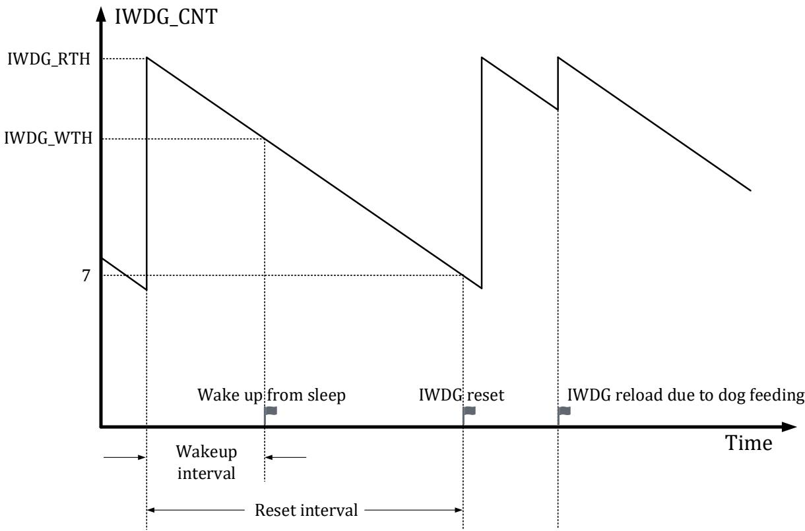  
图20-1IWDG 递减计数事件发生示例

独立看门狗超时复位时间由如下公式计算

$$
\text { Timeout } _ {\text { IWDG }} = t _ {\text { LRC }} \times (\text { IWDG\_RTH - 7 })
$$

独立看门狗唤醒时间由如下公式计算

$$
\text { Wakeup } _ {\text { IWDG }} = \text { t } _ {\text { LRC }} \times (\text { IWDG\_RTH } - \text { IWDG\_WTH })
$$

其中 Timeout<sub>IWDG</sub> 为独立看门狗超时复位时间，Wakeup<sub>IWDG</sub> 为独立看门狗唤醒时间，t<sub>LRC</sub> 为LRC 时钟周期，1/32kHz=31.25uS，IWDG\_RTH 为独立看门狗超时复位门限值，IWDG\_WTH 为独立看门狗唤醒门限值。

IWDG\_RTH=0x001000 对应独立看门狗最小复位时间间隔为 4096/32kHz≈128ms。

IWDG\_RTH=0x1FF000 对应独立看门狗最大复位时间间隔为 511×4096/32kHz≈64s。

需要注意，由于低速 RC 时钟精度有限，不同芯片存在一定偏差，通常低速 RC 时钟偏差在全温度范围内不超过±50%。

## 20.2 寄存器

## 20.2.1 地址分配

IWDG 基地址为 0x40011700

表20-1 独立看门狗寄存器

<table><tr><td>名称</td><td>偏移</td><td>说明</td></tr><tr><td>IWDG_PSW</td><td>0x00</td><td>独立看门狗密码寄存器</td></tr><tr><td>IWDG_CFG</td><td>0x04</td><td>独立看门狗配置寄存器</td></tr><tr><td>IWDG_CLR</td><td>0x08</td><td>独立看门狗清零寄存器</td></tr><tr><td>IWDG_WTH</td><td>0x0C</td><td>独立看门狗计数器定时唤醒门限值寄存器</td></tr><tr><td>IWDG_RTH</td><td>0x10</td><td>独立看门狗计数器超时复位门限值寄存器</td></tr><tr><td>IWDG_CNT</td><td>0x14</td><td>独立看门狗计数器当前计数值寄存器</td></tr></table>

## 20.2.2 IWDG\_PSW独立看门狗密码寄存器

地址:0x4001\_1700

复位值:0x0

表 20-2IWDG\_PSW 独立看门狗密码寄存器

<table><tr><td>15</td><td>14</td><td>13</td><td>12</td><td>11</td><td>10</td><td>9</td><td>8</td><td>7</td><td>6</td><td>5</td><td>4</td><td>3</td><td>2</td><td>1</td><td>0</td></tr><tr><td></td><td></td><td></td><td></td><td></td><td></td><td></td><td></td><td></td><td></td><td></td><td></td><td></td><td></td><td></td><td></td></tr><tr><td></td><td></td><td></td><td></td><td></td><td></td><td></td><td></td><td></td><td></td><td></td><td></td><td></td><td></td><td></td><td></td></tr><tr><td></td><td></td><td></td><td></td><td></td><td></td><td></td><td></td><td></td><td></td><td></td><td></td><td></td><td></td><td></td><td></td></tr><tr><td></td><td></td><td></td><td></td><td></td><td></td><td></td><td></td><td></td><td></td><td></td><td></td><td></td><td></td><td></td><td></td></tr></table>

<table><tr><td>位置</td><td>位名称</td><td>说明</td></tr><tr><td>[31:16]</td><td></td><td>未使用</td></tr><tr><td>[15:0]</td><td>PSW</td><td>写入 0xA6B4,才能对 IWDG_CLR/ IWDG_RTH 等进行写操作,对 IWDG_CLR 或 IWDG_RTH 的写操作会将密码清空,因此每次对看门狗 IWDG_CLR/ IWDG_RTH 寄存器进行写操作前都需要重新写入密码</td></tr></table>

## 20.2.3 IWDG\_CFG 独立看门狗配置寄存器

地址:0x4001\_1704

复位值:0x0001

表 20-3IWDG\_CFG 独立看门狗配置寄存器

<table><tr><td colspan="4">15 14 13 12 11 10 9 8 7 6 5 4 3 2 1 0</td></tr><tr><td rowspan="3"></td><td>DWK_EN</td><td rowspan="3"></td><td>WDG_EN</td></tr><tr><td>RW</td><td>RW</td></tr><tr><td>0</td><td>1</td></tr></table>

<table><tr><td>位置</td><td>位名称</td><td>说明</td></tr><tr><td>[31:5]</td><td></td><td>未使用</td></tr><tr><td>[4]</td><td>DWK_EN</td><td>深度休眠定时唤醒使能,0:禁用,1:使能</td></tr><tr><td>[3:1]</td><td></td><td>未使用</td></tr><tr><td>[0]</td><td>WDG_EN</td><td>独立看门狗使能,0:禁用,1:使能。默认使能,写1置位,写0同时向[15:8]写入0x3C可清零。当看门狗被禁用时,不再产生复位信号,但仍可计数并产生定时唤醒信号</td></tr></table>

IWDG\_CFG 的写入无需向 IWDG\_PSW 写入密码。

## 20.2.4 IWDG\_CLR 独立看门狗清零寄存器

地址:0x4001\_1708

复位值:0x0

表 20-4 IWDG\_CLR 看门狗清零寄存器

<table><tr><td>15</td><td>14</td><td>13</td><td>12</td><td>11</td><td>10</td><td>9</td><td>8</td><td>7</td><td>6</td><td>5</td><td>4</td><td>3</td><td>2</td><td>1</td><td>0</td></tr><tr><td></td><td></td><td></td><td></td><td></td><td></td><td></td><td></td><td></td><td></td><td></td><td></td><td></td><td></td><td></td><td></td></tr><tr><td></td><td></td><td></td><td></td><td></td><td></td><td></td><td></td><td></td><td></td><td></td><td></td><td></td><td></td><td></td><td></td></tr><tr><td></td><td></td><td></td><td></td><td></td><td></td><td></td><td></td><td></td><td></td><td></td><td></td><td></td><td></td><td></td><td></td></tr><tr><td></td><td></td><td></td><td></td><td></td><td></td><td></td><td></td><td></td><td></td><td></td><td></td><td></td><td></td><td></td><td></td></tr></table>

<table><tr><td>位置</td><td>位名称</td><td>说明</td></tr><tr><td>[31:16]</td><td></td><td>未使用</td></tr><tr><td>[15:0]</td><td>IWDG_CLR</td><td>写入字节 16&#x27;b0111_1001_1000_110B0,高 15 位为密码,密码正确时,B[0]才能写入B[0]写入 1,则重置 WDT 计数器为 TH,且该 bit 写入后自动清零,写入 0 无效</td></tr></table>

IWDG\_CLR 的写入需要先向 IWDG\_PSW 写入密码。

## 20.2.5 IWDG\_WTH 独立看门狗定时唤醒门限寄存器

地址:0x4001\_170C

复位值:0x001FF000

表 20-5IWDG\_WTH 独立看门狗超时复位门限寄存器

<table><tr><td>31</td><td>30</td><td>29</td><td>28</td><td>27</td><td>26</td><td>25</td><td>24</td><td>23</td><td>22</td><td>21</td><td>20</td><td>19</td><td>18</td><td>17</td><td>16</td></tr><tr><td rowspan="3" colspan="11"></td><td colspan="5">IWDG_WTH</td></tr><tr><td colspan="5">RW</td></tr><tr><td colspan="5">0x1F</td></tr><tr><td>15</td><td>14</td><td>13</td><td>12</td><td>11</td><td>10</td><td>9</td><td>8</td><td>7</td><td>6</td><td>5</td><td>4</td><td>3</td><td>2</td><td>1</td><td>0</td></tr><tr><td colspan="4">IWDG_WTH</td><td rowspan="3" colspan="12"></td></tr><tr><td colspan="4">RW</td></tr><tr><td colspan="4">0xF</td></tr></table>

<table><tr><td>位置</td><td>位名称</td><td>说明</td></tr><tr><td>[31:21]</td><td></td><td>未使用</td></tr><tr><td>[20:12]</td><td>IWDG_WTH</td><td>看门狗定时唤醒门限值,看门狗使用 32kHz LRC 时钟从 IWDG_RTH 开始计数,递减计数至 IWDG_WTH 产生唤醒信号。</td></tr><tr><td>[11:0]</td><td></td><td>恒为 0</td></tr></table>

IWDG\_WTH 的写入无需向 IWDG\_PSW 写入密码。

## 20.2.6 IWDG\_RTH独立看门狗超时复位门限寄存器

地址:0x4001\_1710

复位值:0x001FF000

表 20-6IWDG\_RTH 独立看门狗超时复位门限寄存器

<table><tr><td>31</td><td>30</td><td>29</td><td>28</td><td>27</td><td>26</td><td>25</td><td>24</td><td>23</td><td>22</td><td>21</td><td>20</td><td>19</td><td>18</td><td>17</td><td>16</td></tr><tr><td rowspan="3" colspan="11"></td><td colspan="5">IWDG_RTH</td></tr><tr><td colspan="5">RW</td></tr><tr><td colspan="5">0x1F</td></tr><tr><td>15</td><td>14</td><td>13</td><td>12</td><td>11</td><td>10</td><td>9</td><td>8</td><td>7</td><td>6</td><td>5</td><td>4</td><td>3</td><td>2</td><td>1</td><td>0</td></tr><tr><td colspan="4">IWDG_RTH</td><td rowspan="3" colspan="12"></td></tr><tr><td colspan="4">RW</td></tr><tr><td colspan="4">0xF</td></tr></table>

<table><tr><td>位置</td><td>位名称</td><td>说明</td></tr><tr><td>[31:21]</td><td></td><td>未使用</td></tr><tr><td>[20:12]</td><td>IWDG_RTH</td><td>看门狗超时复位门限值,也是重新装载值。看门狗使用 32kHz LRC 时钟从 IWDG_RTH 开始计数,计数至 0x7 产生复位。向该寄存器写入 0x0,会被硬件强制改写为 0x1000。先向 IWDG_PSW 写入正确密码才能改写 IWDG_RTH 寄存器。改写 IWDG_RTH 同样具有重置看门狗计数器的作用,看门狗会从新的 IWDG_RTH 开始计数。</td></tr><tr><td>[11:0]</td><td></td><td>恒为 0</td></tr></table>

为防止 IWDG\_RTH 被写入为 0，当软件写入值为全 0 时，硬件会强制改写为 0x1000，且寄存器低 12 位恒为 0。IWDG\_RTG 的写入需要向 IWDG\_PSW 写入密码。

## 20.2.7 IWDG\_CNT独立看门狗当前计数值寄存器

地址:0x4001\_1714

复位值:0x0000\_0000

表 20-7IWDG\_CNT 独立看门狗当前计数值寄存器

<table><tr><td>31</td><td>30</td><td>29</td><td>28</td><td>27</td><td>26</td><td>25</td><td>24</td><td>23</td><td>22</td><td>21</td><td>20</td><td>19</td><td>18</td><td>17</td><td>16</td></tr><tr><td rowspan="3" colspan="11"></td><td colspan="5">IWDG_CNT</td></tr><tr><td colspan="5">R</td></tr><tr><td colspan="5">0x00</td></tr><tr><td>15</td><td>14</td><td>13</td><td>12</td><td>11</td><td>10</td><td>9</td><td>8</td><td>7</td><td>6</td><td>5</td><td>4</td><td>3</td><td>2</td><td>1</td><td>0</td></tr><tr><td colspan="16">IWDG_CNT</td></tr><tr><td colspan="16">R</td></tr><tr><td colspan="16">0x0000</td></tr></table>

<table><tr><td>位置</td><td>位名称</td><td>说明</td></tr><tr><td>[31:21]</td><td></td><td>未使用</td></tr><tr><td>[20:0]</td><td>IWDG_CNT</td><td>看门狗当前计数值,此数值≤IWDG_TH</td></tr></table>

## 21 PMU 功耗管理模块

芯片可以通过降低运行时钟频率，关闭部分电路时钟来达到降低功耗的目的。

## 21.1 外设时钟门控

外设时钟由系统高速时钟 MCLK 经过门控或分频而来；当外设不需要使用时可以通过配置SYS\_CLK\_FEN寄存器关闭相应的外设时钟。对于每一个外设的工作时钟，均有一个时钟门控，详见6.3.7。外设时钟上电后默认是关闭的，使用相应外设模块之前需要由软件来开启。

## 21.2 外设时钟分频

部分外设有独立的时钟分频模块使得该模块可以工作在合适的较低的的时钟频率上。

其中 I2C 使用 SYS\_CLK\_DIV0 作为分频系数，UART 使用 SYS\_CLK\_DIV2 作为分频系数，详见6.3.3 和6.3.6。UART 的波特率在 UART 模块内部还有一个额外的分频器。

## 21.3 低功耗模式

表21-1低功耗模式汇总

<table><tr><td>模式</td><td>模式进入</td><td>模式退出</td><td>PLL/HSI</td><td>LSI</td></tr><tr><td>休眠Sleep</td><td>WFI/WFE</td><td>任意中断Debug 操作外部复位IWDG 复位</td><td>PLL/HSI On, CPU时钟 Off, NVIC/外设时钟 On</td><td rowspan="2">On</td></tr><tr><td>深度休眠Deep Sleep</td><td>SLEEPDEEP + WFI/WFE</td><td>IWDG 定时唤醒IO 唤醒Debug 操作外部复位IWDG 复位</td><td>PLL/HSI Off, CPU/外设时钟 Off</td></tr></table>

## 21.4 Sleep Mode 休眠模式

休眠模式下，CPU时钟被关闭，但NVIC模块仍继续工作，所有的外设模块以及IO正常工作。

休眠模式对电路供电没有影响，所有寄存器状态和存储器数据在休眠过程中保持正常供电。

可参考休眠例程，进入休眠前关闭数字部分各个模块的时钟，关闭模拟 ADC/OPA/CMP/DAC等模块。

## 21.4.1 模式进入

休眠模式可以通过执行 WFI/WFE 指令进入。根据 CPU 内核 SLEEPONEXIT 位的设置情况，休

眠模式的进入有两种不同方式。

Sleep-now:如果 SLEEPONEXIT 为 0，则 CPU 在执行 WFI/WFE 指令后立即进入休眠模式

Sleep-on-exit:如果设置 SLEEPONEXIT 为 1，CPU 在处理完所有中断后进入休眠模式

## 21.4.2 模式退出

如果使用WFI 进入休眠，则任意中断可唤醒CPU。

如果使用WFE 进入休眠，则外设中断标志或IO 唤醒事件可作为唤醒事件。当使用外设中断标志作为唤醒事件时，外设向 CPU 提起中断信号，但 NVIC 中并不使能对应中断，且需要设置SEVONPEND 为1。唤醒后外设中断标志以及NVIC 中断pending 位需要被软件清除。

使用此种方式进行休眠唤醒可以获得最短唤醒时间，因为不涉及中断的进入退出。

Debug 操作可以将芯片从休眠模式中唤醒。

## 21.5 Deep Sleep Mode 深度休眠模式

深度休眠模式通常会关闭所有系统高速时钟，包括 PLL/HSI。进入深度休眠前，需要设置SYS\_AFE\_REG5=0x0500 来关闭 PLL/HRC/BGP。

需要注意的是，在休眠进入流程中，如果通过修改 SYS\_CLK\_CFG=0，将芯片主时钟由 PLL 切换为 HRC，需要等待 0.5ms 以上等切换完成后，再写入 SYS\_AFE\_REG5=0x0500 关闭 PLL。

32kHz RC 时钟LSI 仍正常工作。同时 LDO 会进入低功耗模式，BGP 模块被关闭。

相比休眠模式，深度休眠模式可以进一步降低功耗。

深度休眠模式对电路供电没有影响，所有寄存器状态和存储器数据在深度休眠模式中保持正常供电。

如果有外设需要使用高速时钟完成正在进行中的操作，例如 flash 的擦除写入，则深度休眠会推迟等待操作完成后再进入。

## 21.5.1 模式进入

设置 CPU 内核 System Control Register SLEEPDEEP 为 1，然后通过执行 WFI/WFE 指令进入深度休眠。

## 21.5.2 模式退出

IO 唤醒、CL 输出唤醒或 IWDG 定时唤醒信号可将芯片从深度休眠中唤醒。

外部复位或IWDG 复位可复位全芯片，可以解除深度休眠状态。

Debug 操作可以将芯片从深度休眠模式中唤醒。

## 21.6 寄存器

## 21.6.1 地址分配

PMU 基地址为 0x40011720

表 21-2 功耗管理模块地址空间

<table><tr><td>名称</td><td>偏移</td><td>说明</td></tr><tr><td>AON_PWR_CFG</td><td>0x0</td><td></td></tr><tr><td>AON_EVT_RCD</td><td>0x4</td><td>事件记录寄存器</td></tr><tr><td>AON_IO_WAKE_POL</td><td>0x8</td><td>IO 唤醒极性寄存器</td></tr><tr><td>AON_IO_WAKE_EN</td><td>0xC</td><td>IO 唤醒使能寄存器</td></tr></table>

## 21.6.2 AON\_PWR\_CFG 功耗管理配置寄存器

地址:0x4001\_1720

复位值:0x0002

表 21-3 AON\_PWR\_CFG 功耗管理配置寄存器

<table><tr><td colspan="2">15 14 13 12 11 10 9 8 7 6 5 4 3 2 1 0</td></tr><tr><td rowspan="3"></td><td>IOWK_FLT</td></tr><tr><td>RW</td></tr><tr><td>1</td></tr></table>

<table><tr><td>位置</td><td>位名称</td><td>说明</td></tr><tr><td>[31:2]</td><td></td><td>未使用</td></tr><tr><td>[1]</td><td>IOWK_FLT</td><td>IO 唤醒信号滤波使能,默认使能</td></tr><tr><td>[0]</td><td></td><td>未使用</td></tr></table>

软件可以选择对IO唤醒信号进行滤波或不滤波，如果启用片内滤波，则IO信号经过120us 时间常数的滤波后，送入 PMU。使用片内 IO 信号滤波可以在一定的应用场景下代替板级滤波，但会引入 120us 左右的唤醒延时。如果不启用片内 IO 唤醒信号滤波，则应用场景需要保证 IO 唤醒输入信号稳定无干扰，可以考虑使用板级滤波，从而避免芯片被误唤醒造成不必要的功耗浪费。

## 21.6.3 AON\_EVT\_RCD 事件记录寄存器

地址:0x4001\_1724

复位值:0x0

表 21-4 AON\_EVT\_RCD 事件记录寄存器

<table><tr><td>15</td><td>14</td><td>13</td><td>12</td><td>11</td><td>10</td><td>9</td><td>8</td><td>7</td><td>6</td><td>5</td><td>4</td><td>3</td><td>2</td><td>1</td><td>0</td></tr></table>

<table><tr><td rowspan="3"></td><td>DEEPSLEEP</td><td>SLEEP</td><td rowspan="3"></td><td>IWDG_WK</td><td>EVT_WK</td><td rowspan="3"></td><td>IWDG_RST</td><td>KEY_RST</td><td rowspan="3"></td><td>POR_RST</td></tr><tr><td>RO</td><td>RO</td><td>RO</td><td>RO</td><td>RO</td><td>RO</td><td>RO</td></tr><tr><td>0</td><td>0</td><td>0</td><td>0</td><td>0</td><td>0</td><td>1</td></tr></table>

<table><tr><td>位置</td><td>位名称</td><td>说明</td></tr><tr><td>[31:14]</td><td></td><td>未使用</td></tr><tr><td>[13]</td><td>DEEPSLEEP</td><td>深度休眠记录,高表示发生过</td></tr><tr><td>[12]</td><td>SLEEP</td><td>休眠记录,高表示发生过</td></tr><tr><td>[11:10]</td><td></td><td>未使用</td></tr><tr><td>[9]</td><td>IWDG_WK</td><td>IWDG 定时唤醒记录,高表示 Deep Sleep 休眠被 IWDG 定时唤醒</td></tr><tr><td>[8]</td><td>EVT_WK</td><td>IO 唤醒或 CLU 唤醒记录,高表示 Deep Sleep 休眠被 AON_IO_WAKE_EN 中对应的使能信号唤醒</td></tr><tr><td>[7:4]</td><td></td><td>未使用</td></tr><tr><td>[3]</td><td>IWDG_RST</td><td>独立看门狗复位发生记录,高表示发生过</td></tr><tr><td>[2]</td><td>KEY_RST_RCD</td><td>按键复位发生记录,高表示发生过</td></tr><tr><td>[1]</td><td></td><td>未使用</td></tr><tr><td>[0]</td><td>POR_RST_RCD</td><td>POR 复位发生记录,高表示发生过</td></tr></table>

向AON\_EVT\_RCD寄存器写入0xCA40，清除全部事件记录。由于EVT\_RCD 工作于LSI 时钟域，由软件写入密码到完成清除需要 32us。

## 21.6.4 AON\_IO\_WAKE\_POL IO 唤醒极性寄存器

地址:0x4001\_1728

复位值:0x0

表 21-5 AON\_IO\_WAKE\_POL IO 唤醒源极性配置寄存器

<table><tr><td colspan="2">15 14 13 12 11 10 9 8 7 6 5 4 3 2 1 0</td></tr><tr><td rowspan="3"></td><td>WK_POL</td></tr><tr><td>RW</td></tr><tr><td>0</td></tr></table>

<table><tr><td>位置</td><td>位名称</td><td>说明</td></tr><tr><td>[31:1]</td><td></td><td>未使用</td></tr><tr><td>[0]</td><td>WK_POL</td><td>IO 外部唤醒触发电平选择。1:高电平;0:低电平</td></tr></table>

所有IO 唤醒信号使用同一个极性选择。

## 21.6.5 AON\_IO\_WAKE\_EN IO 唤醒使能寄存器

地址:0x4001\_172C

复位值:0x0

表 21-6 AON\_IO\_WAKE\_EN IO 唤醒源使能寄存器

<table><tr><td rowspan="3"></td><td>CLUOUT3_EN</td><td>CLUOUT2_EN</td><td>CLUOUT1_EN</td><td>CLUOUT0_EN</td><td>P2_15_EN</td><td>P2_7_EN</td><td>P2_4_EN</td><td>P0_14_EN</td><td>P0_11_EN</td><td>P0_6_EN</td><td>P0_2_EN</td><td>P0_0_EN</td></tr><tr><td>RW</td><td>RW</td><td>RW</td><td>RW</td><td>RW</td><td>RW</td><td>RW</td><td>RW</td><td>RW</td><td>RW</td><td>RW</td><td>RW</td></tr><tr><td>0</td><td>0</td><td>0</td><td>0</td><td>0</td><td>0</td><td>0</td><td>0</td><td>0</td><td>0</td><td>0</td><td>0</td></tr></table>

<table><tr><td>位置</td><td>位名称</td><td>说明</td></tr><tr><td>[31:12]</td><td></td><td>未使用</td></tr><tr><td>[11]</td><td>CLUOUT3_EN</td><td>CLUOUT3 作为唤醒使能</td></tr><tr><td>[10]</td><td>CLUOUT2_EN</td><td>CLUOUT2 作为唤醒使能</td></tr><tr><td>[9]</td><td>CLUOUT1_EN</td><td>CLUOUT1 作为唤醒使能</td></tr><tr><td>[8]</td><td>CLUOUT0_EN</td><td>CLUOUT0 作为唤醒使能</td></tr><tr><td>[7]</td><td>P2_15_EN</td><td>P2[15]外部唤醒使能</td></tr><tr><td>[6]</td><td>P2_7_EN</td><td>P2[7]外部唤醒使能</td></tr><tr><td>[5]</td><td>P2_4_EN</td><td>P2[4]外部唤醒使能</td></tr><tr><td>[4]</td><td>P0_14_EN</td><td>P0[14]外部唤醒使能</td></tr><tr><td>[3]</td><td>P0_11_EN</td><td>P0[11]外部唤醒使能</td></tr><tr><td>[2]</td><td>P0_6_EN</td><td>P0[6]外部唤醒使能</td></tr><tr><td>[1]</td><td>P0_2_EN</td><td>P0[2]外部唤醒使能</td></tr><tr><td>[0]</td><td>P0_0_EN</td><td>P0[0]外部唤醒使能</td></tr></table>

## 22 SIF 模块

## 22.1 简述

SIF 模块，适用于单线、单向通讯应用环境，例如车载仪表通讯。本章节描述了 SIF 的实现及使用方法。

## 22.2 主要特性

⚫ 单线通讯

⚫ 单向通讯，仅输出

⚫ 支持同步信号、结束信号开启/关闭可配

⚫ 支持同步信号、结束信号长度可配

⚫ 支持同步信号、结束信号电平可配

⚫ 支持 MSB/LSB 可配

⚫ 支持数据占空比可配：2:1 和3:1 两种模式

⚫ 支持 DMA 传输

## 22.3 功能描述

## 22.3.1 功能框图

本接口采用同步串行设计，实现 MCU 同外部设备之间的 SIF 传输。支持轮询和中断方式获得传输状态信息。本接口的主要功能模块如下图所示：

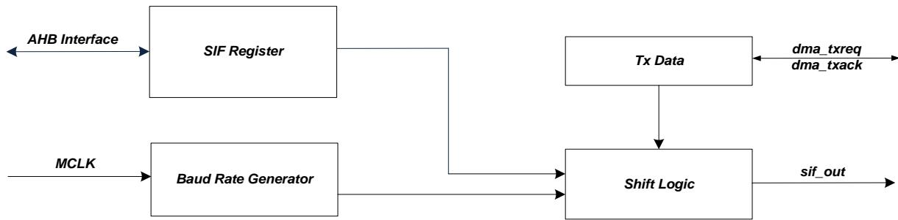  
图 22-1 SIF 模块结构框图

SIF Register 模块，SIF 模块的相关寄存器。

Baud Rate Generator 模块，Tosc 时基产生电路。

Tx Data 模块，发送数据缓冲区。

Shift Logic 模块，数据发送模块。

## 22.3.2 功能说明

## 22.3.2.1 SIF 格式说明

SIF 通讯协议，分成几个部分：同步（SYNC），数据传输，结束（Done）和默认电平。

同步（SYNC）：一帧传输的开始波形，某些应用需要同步标记，某些不需要。

SYNC 分为有脉冲和无脉冲两个情况，有脉冲情况如下。无脉冲情况，SYNC 为持续电平。

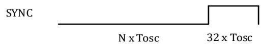  
图 22-2 SIF 模块同步（SYNC）波形

输出传输：传输0 和传输1，两种状态。

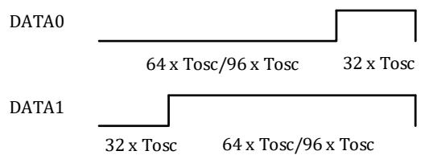  
图 22-3 SIF 模块数据（DATA）波形

结束（Done）：一帧传输的结束波形，某些应用需要结束标记，某些不需要。结束信号没有翻转波形，按照应用需求，输出高/低电平。

## 22.3.2.2 Tosc 时基

Tosc 时基模块，产生基本时间计数单元。Tosc 时基的时钟来自系统时钟分频（分频后最高3M），Tosc最小时基为333ns（去掉小数），最大时基约为1.364ms $( 3 3 3 \mathrm { n s ^ { * } } 4 0 9 6 )$ 。通过配置 SIF.TOSC寄存器实现。

## 22.3.2.3 同步时间配置

同步（SYNC）信号时间的配置，同SIF.STH1寄存器相关。同步（SYNC）信号的默认电平在SIF.CFG寄存器中配置。

同步信号，默认为低电平的话，低电平时间最小为 $1 0 2 3 ^ { * } \mathrm { T o s c }$ ，高电平固定为 $3 2 ^ { * } \mathrm { T o s c }$ o

同步信号，默认为高电平的话，高电平时间最大为1023\*Tosc，低电平固定为32\*Tosc。

## 22.3.2.4 结束时间配置

结束（Done）信号时间的配置，同 SIF.DTH1 寄存器相关。结束（Done）信号的默认电平在SIF.CFG 寄存器中配置。结束信号，默认电平可配，步长为 1ms，从 1ms—16ms 可选。结束时间是当前输出传输完毕后，到下一个数据发送的间隔时间。

## 22.3.2.5 DMA 传输

SIF 模块支持 DMA 传输。SIF 模块接收的数据宽度为一个字节（8-bit），因此，DMA 一轮搬移一个字节到SIF模块。传输轮数在DMA 模块控制，一次SIF 通讯包，由N 个字节组成，则在DMA 轮数寄存器总配置N 即可。

## 22.4 寄存器

## 22.4.1 地址分配

SIF 模块寄存器的基地址是 0x4001\_1500，模块寄存器列表如下。

表 22-1SIF 模块控制寄存器列表

<table><tr><td>名称</td><td>偏移</td><td>说明</td></tr><tr><td>SIF0_CFG</td><td>0x00</td><td>SIF 配置寄存器</td></tr><tr><td>SIF0_TOSC</td><td>0x04</td><td>SIF TOSC 时基寄存器</td></tr><tr><td>SIF0_TSTH1</td><td>0x08</td><td>SIF 同步信号时间寄存器</td></tr><tr><td>SIF0_TDTH1</td><td>0x0C</td><td>SIF 结束信号时间寄存器</td></tr><tr><td>SIF0_IRQ</td><td>0x10</td><td>SIF 中断寄存器</td></tr><tr><td>SIF0_WDATA</td><td>0x14</td><td>SIF 传输数据寄存器</td></tr></table>

## 22.4.2 SIF0\_CFG 配置寄存器

地址:0x4001\_1500

复位值:0x0

表 22-2 地址寄存器 SIF0\_CFG

<table><tr><td>15</td><td>14</td><td>13</td><td>12</td><td>11</td><td>10</td><td>9</td><td>8</td><td>7</td><td>6</td><td>5</td><td>4</td><td>3</td><td>2</td><td>1</td><td>0</td></tr><tr><td colspan="8" rowspan="2"></td><td>DONE</td><td>SYNC</td><td>IDLE</td><td>DONE_VLD</td><td>SYNC_VLD</td><td>RATIO</td><td>MSB</td><td>EN</td></tr><tr><td>RW</td><td>RW</td><td>RW</td><td>RW</td><td>RW</td><td>RW</td><td>RW</td><td>RW</td></tr><tr><td></td><td>0</td><td>0</td><td>0</td><td>0</td><td>0</td><td>0</td><td>0</td><td colspan="8">0</td></tr></table>

<table><tr><td>位置</td><td>位名称</td><td>说明</td></tr><tr><td>[31:8]</td><td></td><td>未使用</td></tr><tr><td>[7]</td><td>DONE</td><td>SIF 模块数据传输,完成信号默认电平1: 默认高电平0: 默认低电平</td></tr><tr><td>[6]</td><td>SYNC</td><td>SIF 模块数据传输,同步信号默认电平1: 默认高电平0: 默认低电平</td></tr><tr><td>[5]</td><td>SYNC_PULSE</td><td>SIF 模块数据传输,同步信号是否产生脉冲信号1: 同步信号有脉冲信号0: 同步信号无脉冲信号</td></tr><tr><td>[4]</td><td>DONE_VLD</td><td>SIF 模块数据传输,结束信号控制位1: 有结束信号0: 无结束信号</td></tr><tr><td>[3]</td><td>SYNC_VLD</td><td>SIF 模块数据传输,同步信号控制位1: 有同步信号0: 无同步信号</td></tr><tr><td>[2]</td><td>RATIO</td><td>SIF 模块数据占空比控制位1: 3:10: 2:1</td></tr><tr><td>[1]</td><td>MSB</td><td>SIF 模块数据大小头控制位1: MSB0: LSB</td></tr><tr><td>[0]</td><td>EN</td><td>SIF 模块使能位1: SIF 模块使能0: SIF 模块关闭</td></tr></table>

## 22.4.3 SIF0\_TOSC 时基寄存器

地址:0x4001\_1504

复位值:0x0

表 22-3 SIF0\_TOSC SIF 时基寄存器

<table><tr><td>15</td><td>14</td><td>13</td><td>12</td><td>11</td><td>10</td><td>9</td><td>8</td><td>7</td><td>6</td><td>5</td><td>4</td><td>3</td><td>2</td><td>1</td><td>0</td></tr><tr><td rowspan="3" colspan="4"></td><td colspan="12">OSC_TH</td></tr><tr><td colspan="12">RW</td></tr><tr><td colspan="12">0</td></tr></table>

<table><tr><td>位置</td><td>位名称</td><td>说明</td></tr><tr><td>[31:12]</td><td></td><td>未使用</td></tr><tr><td>[11:0]</td><td>OSC_TH</td><td>SIF 模块的时基  $T_{osc}$  设置时基  $T_{osc} = (OSC\_TH + 1) \times (系统时钟周期 \times 32)$ </td></tr></table>

## 22.4.4 SIF0\_TSTH1 同步时间寄存器

地址:0x4001\_1508

复位值:0x0

表 22-4 同步时间寄存器 SIF0\_TSTH1

<table><tr><td>15 14 13 12 11 10</td><td>9 8 7 6 5 4 3 2 1 0</td></tr><tr><td rowspan="3"></td><td>TSTH1</td></tr><tr><td>RW</td></tr><tr><td>0</td></tr></table>

<table><tr><td>位置</td><td>位名称</td><td>说明</td></tr><tr><td>[31:10]</td><td></td><td>未使用</td></tr><tr><td>[9:0]</td><td> $T_{STH1}$ </td><td>SIF 模块同步信号周期当SYNC无脉冲时,此周期即为整个SYNC时间宽度当SYNC有脉冲时,此周期为SYNC脉冲前的时间宽度,SYNC脉冲宽度固定为 $32\times \text{Tosc}$  $\text{Time} = (T_{STH1} + 1) \times \text{Tosc}$ </td></tr></table>

## 22.4.5 SIF0\_TDTH1 结束时间寄存器

地址:0x4001\_150C

复位值:0x0

表 22-5 结束时间寄存器 SIF0\_TDTH1

<table><tr><td>15 14 13 12 11 10 9 8 7 6 5 4</td><td>3 2 1 0</td></tr><tr><td rowspan="3"></td><td>TDTH1</td></tr><tr><td>RW</td></tr><tr><td>0</td></tr></table>

<table><tr><td>位置</td><td>位名称</td><td>说明</td></tr><tr><td>[31:4]</td><td></td><td>未使用</td></tr><tr><td>[3:0]</td><td>TDTH1</td><td>SIF 模块结束信号周期Time = (T $_{DTH1}$ +1)×1ms</td></tr></table>

## 22.4.6 SIF0\_IRQ 中断寄存器

地址:0x4001\_1510

复位值:0x0

表 22-6 中断寄存器 SIF0\_IRQ

<table><tr><td>15</td><td>14</td><td>13</td><td>12</td><td>11</td><td>10</td><td>9</td><td>8</td><td>7</td><td>6</td><td>5</td><td>4</td><td>3</td><td>2</td><td>1</td><td>0</td></tr><tr><td rowspan="3" colspan="11"></td><td>IRQ_IF</td><td rowspan="3" colspan="2"></td><td>DMA_EN</td><td>IRQ_EN</td></tr><tr><td>RW</td><td>RW</td><td>RW</td></tr><tr><td>0</td><td>0</td><td>0</td></tr></table>

<table><tr><td>位置</td><td>位名称</td><td>说明</td></tr><tr><td>[31:8]</td><td></td><td>未使用</td></tr><tr><td>[7:5]</td><td></td><td>未使用</td></tr><tr><td>[4]</td><td>IRQ_IF</td><td>SIF 模块中断标志位,写 1 清零。1:有 SIF 中断标志位0:无 SIF 中断标志位</td></tr><tr><td>[3:2]</td><td></td><td>未使用</td></tr><tr><td>[1]</td><td>DMA_EN</td><td>SIF 模块 DMA 使能控制位1:使能0:关闭</td></tr><tr><td>[0]</td><td>IRQ_EN</td><td>SIF 模块中断使能控制位1:使能中断0:关闭中断</td></tr></table>

## 22.4.7 SIF0\_WDATA 数据寄存器

地址:0x4001\_1514

复位值:0x0

表 22-7 数据寄存器 SIF0\_WDATA

<table><tr><td>15</td><td>14</td><td>13</td><td>12</td><td>11</td><td>10</td><td>9</td><td>8</td><td>7</td><td>6</td><td>5</td><td>4</td><td>3</td><td>2</td><td>1</td><td>0</td></tr></table>

<table><tr><td rowspan="3"></td><td>WDATA</td></tr><tr><td>RW</td></tr><tr><td>0</td></tr></table>

<table><tr><td>位置</td><td>位名称</td><td>说明</td></tr><tr><td>[31:8]</td><td></td><td>未使用</td></tr><tr><td>[7:0]</td><td>WDATA</td><td>SIF 模块数据寄存器</td></tr></table>

## 23 CL0 可配置逻辑

## 23.1 概述

可配置逻辑单元（Configurable Logic Unit 缩写为 CLU），提供了无需 CPU 干预操作的用户可配置的数字逻辑运算功能。可配置逻辑（CL）模块由四个独立的可配置逻辑单元（CLU）组成，支持用户可编程的异步和同步逻辑运算。CL 由于其灵活的逻辑功能，可以应用于多种数字功能实现，如替换系统胶合逻辑，生成特殊波形，或是同步系统事件的触发等。

## 23.2 主要特性

CL0 主要特性如下：

⚫ 包含四个 CLU，具有 IO pin 与内部逻辑连接

⚫ 每个CLU支持256种不同的组合逻辑功能（与、或、异或、多路复用等），还包含一个用于同步操作的时钟控制 D 触发器

⚫ 每个CLU 可以分别用于同步或者异步逻辑

⚫ CLU 可以级联组合实现更复杂的逻辑功能

⚫ 可以配合 SPI、I2C 或者 TIMER 与 MCPWM 进行操作

⚫ 可以用于同步或者触发多个片上资源(ADC, UTIMTER 等)

⚫ 异步逻辑输出可以用于唤醒操作

## 23.3 功能描述

## 23.3.1 功能框图

如图23-1 所示，可配置逻辑CL0 主要包括4 个独立的可配置逻辑单元CLU。每个CLU 都可以独立配置为用户自定义的异步或同步数字逻辑功能，而无需 CPU 干预。许多内部和外部信号都可以作为各个CLU 的输入，CLU 的输出也可以连接到IO 输出或者直接连接到选中的外设输入。

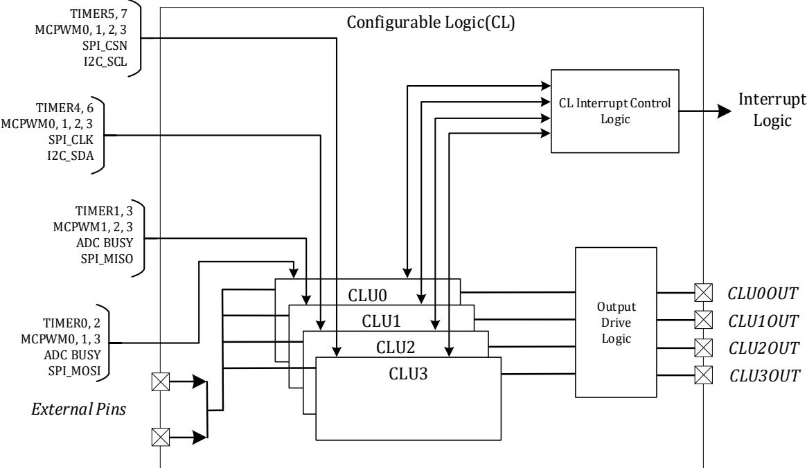  
图23-1CL 模块顶层功能框图

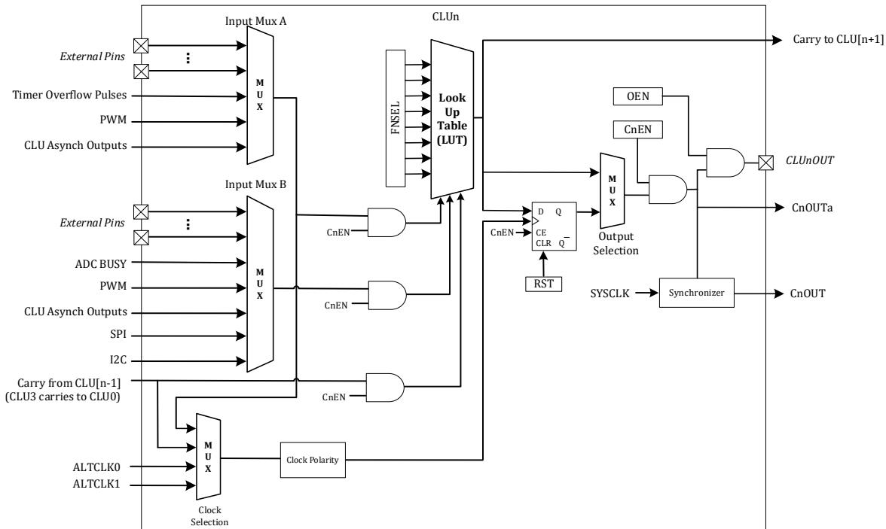  
图23-2独立CLU 模块功能框图

通过前述及CL模块的功能框图，可见CL的作用是，在无CPU干预下，若干内部和外部信号，可输入到各CLU，通过“LUT（查找表）”的方法，得到自己想要的逻辑值结果，并输出到IO 端口或直接用于外围设备的输入。

## 23.3.2 功能描述

## 23.3.2.1 配置流程

在使能独立 CLU 之前，应该先进行功能配置，输入复用选取和输出功能配置。CLU 初始化可以参考一下步骤：

1. 选择 C0\_MX0 中到 LUT 的 A 与 B 输入

2. 配置 CL0\_FN0 选择 LUT 功能

3. 配置 CLU 的 CL0\_CF0 配置寄存器

4. 如果选择CLU 的D 触发器输出（OUTPSEL=1），则提前配置RST=1 复位D 触发的输出到0

5. 配置 CL0\_IE0 使能需要的中断信号。上升沿和下降沿中断分别通过 CnFIE 和 CnRIE 位使能

6. 配置 CL0\_EN0 的 CnEN 使能对应的 CLUn，可以同时使能多个 CLU

7. 如果需要输出到 IO 端口，则使能 CL0\_CF0 的对应 CnOEN 位

## 23.3.2.2 输入多路复选器

每个 CLU 都有两个主要的逻辑输入（A 与 B）和一个进位输入（C）。A 与 B 输入通过寄存器CL0\_MX0 的 CnMXA 和 CnMXB 进行选择，可以选择各内部和外部信号中的一个作为输入。当另一个CLU 的输出被选为输入时，使用的是该 CLU 的异步输出，级联可以实现更复杂的逻辑功能。

Notes：当采用 Timer 溢出作为输入时，一次时钟溢出事件产生为一个系统时钟周期的高电平，其余时间为低电平。

进位输入 C 是前级 CLU 的异步输出。例如，CLU1 的进位输入 C 是 CLU0 的异步输出，CLU0的进位输入C 是CLU3 的异步输出。

表 23-1 CLUnA 输入选择

<table><tr><td>CLUnMX.MXA</td><td>CLU0A</td><td>CLU1A</td><td>CLU2A</td><td>CLU3A</td></tr><tr><td>0000</td><td>CLU0OUT</td><td>CLU0OUT</td><td>CLU0OUT</td><td>CLU0OUT</td></tr><tr><td>0001</td><td>CLU1OUT</td><td>CLU1OUT</td><td>CLU1OUT</td><td>CLU1OUT</td></tr><tr><td>0010</td><td>CLU2OUT</td><td>CLU2OUT</td><td>CLU2OUT</td><td>CLU2OUT</td></tr><tr><td>0011</td><td>CLU3OUT</td><td>CLU3OUT</td><td>CLU3OUT</td><td>CLU3OUT</td></tr><tr><td>0100</td><td>Timer0 ch0 ovfl</td><td>Timer0 ch1 ovfl</td><td>Timer2 ch0 ovfl</td><td>Timer2 ch1 ovfl</td></tr><tr><td>0101</td><td>Timer1 ch0 ovfl</td><td>Timer1 ch1 ovfl</td><td>Timer3 ch0 ovfl</td><td>Timer3 ch1 ovfl</td></tr><tr><td>0110</td><td>PWM0</td><td>PWM2</td><td>PWM0</td><td>PWM1</td></tr><tr><td>0111</td><td>PWM1</td><td>PWM3</td><td>PWM2</td><td>PWM3</td></tr><tr><td>1000</td><td>P0.0</td><td>P0.0</td><td>P2.8</td><td>P2.8</td></tr><tr><td>1001</td><td>P0.3</td><td>P0.2</td><td>P1.13</td><td>P3.9</td></tr><tr><td>1010</td><td>P0.5</td><td>P0.5</td><td>P1.15</td><td>P1.15</td></tr><tr><td>1011</td><td>P0.7</td><td>P0.6</td><td>P1.10</td><td>P2.0</td></tr><tr><td>1100</td><td>P2.12</td><td>P2.12</td><td>P2.1</td><td>P2.1</td></tr><tr><td>1101</td><td>P0.12</td><td>P0.11</td><td>P2.4</td><td>P2.3</td></tr><tr><td>1110</td><td>P0.14</td><td>P0.14</td><td>P2.6</td><td>P2.6</td></tr><tr><td>1111</td><td>P1.0</td><td>P0.15</td><td>P2.14</td><td>P2.13</td></tr></table>

表 23-2 CLUnB 输入选择

<table><tr><td>CLUnMX.MXB</td><td>CLU0B</td><td>CLU1B</td><td>CLU2B</td><td>CLU3B</td></tr><tr><td>0000</td><td>CLU0OUT</td><td>CLU0OUT</td><td>CLU0OUT</td><td>CLU0OUT</td></tr><tr><td>0001</td><td>CLU1OUT</td><td>CLU1OUT</td><td>CLU1OUT</td><td>CLU1OUT</td></tr><tr><td>0010</td><td>CLU2OUT</td><td>CLU2OUT</td><td>CLU2OUT</td><td>CLU2OUT</td></tr><tr><td>0011</td><td>CLU3OUT</td><td>CLU3OUT</td><td>CLU3OUT</td><td>CLU3OUT</td></tr><tr><td>0100</td><td>ADBUSY0</td><td>ADBUSY0</td><td>PWM1</td><td>PWM0</td></tr><tr><td>0101</td><td>ADBUSY1</td><td>ADBUSY1</td><td>PWM3</td><td>PWM2</td></tr><tr><td>0110</td><td>PWM3</td><td>PWM1</td><td>I2CSDA</td><td>I2CSCL</td></tr><tr><td>0111</td><td>SPIMOSI</td><td>SPIMISO</td><td>SPICLK</td><td>SPICSN</td></tr><tr><td>1000</td><td>P0.2</td><td>P0.3</td><td>P3.9</td><td>P1.13</td></tr><tr><td>1001</td><td>P0.4</td><td>P0.4</td><td>P1.14</td><td>P1.14</td></tr><tr><td>1010</td><td>P0.6</td><td>P0.7</td><td>P2.0</td><td>P1.10</td></tr><tr><td>1011</td><td>P2.11</td><td>P2.11</td><td>P1.11</td><td>P1.11</td></tr><tr><td>1100</td><td>P0.11</td><td>P0.12</td><td>P2.3</td><td>P2.4</td></tr><tr><td>1101</td><td>P0.13</td><td>P0.13</td><td>P2.5</td><td>P2.5</td></tr><tr><td>1110</td><td>P0.15</td><td>P1.0</td><td>P2.13</td><td>P2.14</td></tr><tr><td>1111</td><td>P2.7</td><td>P2.7</td><td>P2.15</td><td>P2.15</td></tr><tr><td></td><td></td><td></td><td></td><td></td></tr></table>

注：  
1、 CLU0OUT、CLU1OUT、CLU2OUT、CLU3OUT 分别代表 CLU 的 4 个输出端口；

2、 ADBUSY0 代表 ADC start 信号，即表示 ADC 正在采样；

3、 PWM0、PWM1、PWM2、PWM3分别代表四个PWM模块的TADC事件触发信号（触发ADC采样）；

4、 SPIMOSI、SPIMISO、SPICLK、SPICSN 分别代表 SPI 模块的 MOSI、MISO、CLK、CS 端口；5、 I2CSDA、I2CSCL 分别代表 I2C 模块的数据信号 SDA 和时钟信号 SCL；

6、TIMER0 ch0 ovfl、TIMER0 ch1 ovfl、TIMER1 ch0 ovfl、TIMER1 ch1 ovfl、TIMER2 ch0 ovfl、TIMER2 ch1 ovfl、TIMER3 ch0 ovfl、TIMER3 ch1 ovfl 代表 utimer 触发 ADC 采样事件（utimer比较事件或者utimer 的捕获事件）。

## 23.3.2.3 输出配置

每个 CLU 都有同步和异步输出，同步输出可以在任意时间通过寄存器 CLOUT0 输出，CLU 输出通过 CLUNCF 的 OUTSEL 控制是直接从 LUT 输出，还是从 DFF 输出。当 CLU 关闭时（CnEN 中的CLEN0 等于0），所有输出都维持在0。

DFF 时钟通过 CLUnCF 的 CLKSEL 选择，共有四种来源。DFF 时钟可通过 bit CLKINV 进行翻转。每个CLU 有下列四种DFF 时钟选择：

1. CARRY\_IN：前级的CLU 的进位输出C，第一个CLU 使用最后一个CLU 的进位；

2. MXA\_INPUT：CLU 的 A 输入，通过寄存器 MXA 选择；

3. ALTCLK0：CLU0 的 Timer3 溢出，CLU1 的 Timer0 溢出，CLU2 的 Timer1 溢出，CLU3 的Timer2 溢出。

4. ALTCLK1：CLU0 的 Timer1 溢出，CLU1 的 Timer2 溢出，CLU2 的 Timer3 溢出，CLU3 的Timer0 溢出。

表23-3CLU 时钟/外部信号的时序

<table><tr><td>参数</td><td>符号</td><td>测试条件</td><td>Min</td><td>Typ</td><td>Max</td><td>Unit</td></tr><tr><td rowspan="2">传输延时</td><td rowspan="2"> $t_{DLY}$ </td><td>单个 CLU,连接到外部 pin</td><td>-</td><td>-</td><td>50</td><td>ns</td></tr><tr><td>单个 CLU,内部连接</td><td>-</td><td>4</td><td>6</td><td>ns</td></tr><tr><td rowspan="2">时钟频率</td><td rowspan="2"> $f_{CLK}$ </td><td>1、2或3个CLU级联</td><td>-</td><td>-</td><td>96</td><td>MHz</td></tr><tr><td>4个CLU级联</td><td>-</td><td>-</td><td>48</td><td>MHz</td></tr></table>

## 23.3.2.4 LUT 配置

每个 CLU 的逻辑功能由 LUT 配置决定，可以通过配置 CL0\_FN0 的 CnFNSEL 来进行选取。CnFNSEL 的每位都被映射到 8 个多路选择器的输入的一种组合，也就是 LUT 的输出由 A，B 与 C输入的组合选择。

表 23-4 LUT 真值表

<table><tr><td>A 输入</td><td>B 输入</td><td>C 输入</td><td>LUT 输出</td></tr><tr><td>0</td><td>0</td><td>0</td><td>FNSEL.0</td></tr><tr><td>0</td><td>0</td><td>1</td><td>FNSEL.1</td></tr><tr><td>0</td><td>1</td><td>0</td><td>FNSEL.2</td></tr><tr><td>0</td><td>1</td><td>1</td><td>FNSEL.3</td></tr><tr><td>1</td><td>0</td><td>0</td><td>FNSEL.4</td></tr><tr><td>1</td><td>0</td><td>1</td><td>FNSEL.5</td></tr><tr><td>1</td><td>1</td><td>0</td><td>FNSEL.6</td></tr><tr><td>1</td><td>1</td><td>1</td><td>FNSEL.7</td></tr></table>

参考上表所示的真值表，使用 LUT 可以实现三输入的所有逻辑功能。例如，实现与逻辑（A ANDB），真值表的输出在A 与B 都为1 时才为1，也就是只有 FNSEL.7 与 FNSEL.6 为1，所以 FNSEL应该被写入 11000000b，也就是 0xC0.

## 23.4 寄存器

## 23.4.1 地址分配

CL0 在芯片中的基地址是0x40011800，寄存器列表如下：

表 23-5CL0 模块寄存器地址分配

<table><tr><td>名称</td><td>偏移</td><td>描述</td></tr><tr><td>CLO_EN0</td><td>0x00</td><td>CLO 使能寄存器</td></tr><tr><td>CLO_IE0</td><td>0x04</td><td>CLO 中断使能寄存器</td></tr><tr><td>CLO_IF0</td><td>0x08</td><td>CLO 中断标志寄存器</td></tr><tr><td>CLO_OUT0</td><td>0x0C</td><td>CLO 输出寄存器</td></tr><tr><td>CLO_MX0</td><td>0x10</td><td>CLO 输入多路复选寄存器</td></tr><tr><td>CLO_FN0</td><td>0x14</td><td>CLO 功能选择寄存器</td></tr><tr><td>CLO_CF0</td><td>0x18</td><td>CLO 配置寄存器</td></tr></table>

## 23.4.2 CL0\_EN0 CL0 使能寄存器

地址: 0x40011800

复位值:0x0

表 23-6 CL0\_EN0 CL0 使能寄存器

<table><tr><td colspan="5">15 14 13 12 11 10 9 8 7 6 5 4 3 2 1 0</td></tr><tr><td rowspan="3"></td><td>C3EN</td><td>C2EN</td><td>C1EN</td><td>C0EN</td></tr><tr><td>RW</td><td>RW</td><td>RW</td><td>RW</td></tr><tr><td>0</td><td>0</td><td>0</td><td>0</td></tr></table>

<table><tr><td>位置</td><td>位名称</td><td>说明</td></tr><tr><td>[31:4]</td><td></td><td>未使用</td></tr><tr><td>[3]</td><td>C3EN</td><td>CLU3 使能。默认关闭。0: 关闭1: 使能</td></tr><tr><td>[2]</td><td>C2EN</td><td>CLU2 使能。默认关闭。0: 关闭1: 使能</td></tr><tr><td>[1]</td><td>C1EN</td><td>CLU1 使能。默认关闭。0: 关闭1: 使能</td></tr><tr><td>[0]</td><td>COEN</td><td>CLU0 使能。默认关闭。0: 关闭1: 使能</td></tr></table>

## 23.4.3 CL0\_IE0 CL0 中断使能寄存器

地址: 0x40011804

复位值:0x0

表 23-7 CL0\_IE0 CL0 中断使能寄存器

<table><tr><td rowspan="3"></td><td>C3RIE</td><td>C3FIE</td><td>C2RIE</td><td>C2FIE</td><td>C1RIE</td><td>C1FIE</td><td>CORIE</td><td>COFIE</td></tr><tr><td>RW</td><td>RW</td><td>RW</td><td>RW</td><td>RW</td><td>RW</td><td>RW</td><td>RW</td></tr><tr><td>0</td><td>0</td><td>0</td><td>0</td><td>0</td><td>0</td><td>0</td><td>0</td></tr></table>

<table><tr><td>位置</td><td>位名称</td><td>说明</td></tr><tr><td>[31:8]</td><td></td><td>未使用</td></tr><tr><td>[7]</td><td>C3RIE</td><td>CLU3上升沿触发中断使能。默认关闭。0:关闭1:使能</td></tr><tr><td>[6]</td><td>C3FIE</td><td>CLU3下降沿触发中断使能。默认关闭。0:关闭1:使能</td></tr><tr><td>[5]</td><td>C2RIE</td><td>CLU2上升沿触发中断使能。默认关闭。0:关闭1:使能</td></tr><tr><td>[4]</td><td>C2FIE</td><td>CLU2下降沿触发中断使能。默认关闭。0:关闭1:使能</td></tr><tr><td>[3]</td><td>C1RIE</td><td>CLU1上升沿触发中断使能。默认关闭。0:关闭1:使能</td></tr><tr><td>[2]</td><td>C1FIE</td><td>CLU1下降沿触发中断使能。默认关闭。0:关闭1:使能</td></tr><tr><td>[1]</td><td>CORIE</td><td>CLU0上升沿触发中断使能。默认关闭。0:关闭1:使能</td></tr><tr><td>[0]</td><td>COFIE</td><td>CLU0下降沿触发中断使能。默认关闭。0:关闭1:使能</td></tr></table>

## 23.4.4 CL0\_IF0 CL0 中断标志寄存器

地址: 0x40011808

复位值:0x0

表 23-8 CL0\_IF0 CL0 中断标志寄存器

<table><tr><td rowspan="3"></td><td>C3RIF</td><td>C3FIF</td><td>C2RIF</td><td>C2FIF</td><td>C1RIF</td><td>C1FIF</td><td>C0RIF</td><td>C0FIF</td></tr><tr><td>RW</td><td>RW</td><td>RW</td><td>RW</td><td>RW</td><td>RW</td><td>RW</td><td>RW</td></tr><tr><td>0</td><td>0</td><td>0</td><td>0</td><td>0</td><td>0</td><td>0</td><td>0</td></tr></table>

<table><tr><td>位置</td><td>位名称</td><td>说明</td></tr><tr><td>[31:8]</td><td></td><td>未使用</td></tr><tr><td>[7]</td><td>C3RIF</td><td>CLU3 上升沿中断标志位。中断标志高有效,写 1 清零。</td></tr><tr><td>[6]</td><td>C3FIF</td><td>CLU3 下降沿中断标志位。中断标志高有效,写 1 清零。</td></tr><tr><td>[5]</td><td>C2RIF</td><td>CLU2 上升沿中断标志位。中断标志高有效,写 1 清零。</td></tr><tr><td>[4]</td><td>C2FIF</td><td>CLU2 下降沿中断标志位。中断标志高有效,写 1 清零。</td></tr><tr><td>[3]</td><td>C1RIF</td><td>CLU1 上升沿中断标志位。中断标志高有效,写 1 清零。</td></tr><tr><td>[2]</td><td>C1FIF</td><td>CLU1 下降沿中断标志位。中断标志高有效,写 1 清零。</td></tr><tr><td>[1]</td><td>C0RIF</td><td>CLU0 上升沿中断标志位。中断标志高有效,写 1 清零。</td></tr><tr><td>[0]</td><td>C0FIF</td><td>CLU0 下降沿中断标志位。中断标志高有效,写 1 清零。</td></tr></table>

## 23.4.5 CL0\_OUT0 CL0 输出寄存器

地址: 0x4001180C

复位值:0x0

表 23-9 CL0\_OUT0 CL0 输出寄存器

<table><tr><td colspan="5">15 14 13 12 11 10 9 8 7 6 5 4 3 2 1 0</td></tr><tr><td rowspan="3"></td><td>C3OUT</td><td>C2OUT</td><td>C1OUT</td><td>C0OUT</td></tr><tr><td>R</td><td>R</td><td>R</td><td>R</td></tr><tr><td>0</td><td>0</td><td>0</td><td>0</td></tr></table>

<table><tr><td>位置</td><td>位名称</td><td>说明</td></tr><tr><td>[31:4]</td><td></td><td>未使用</td></tr><tr><td>[3]</td><td>C3OUT</td><td>CLU3 输出状态,与系统时钟同步。</td></tr><tr><td>[2]</td><td>C2OUT</td><td>CLU2 输出状态,与系统时钟同步。</td></tr><tr><td>[1]</td><td>C1OUT</td><td>CLU1 输出状态,与系统时钟同步。</td></tr><tr><td>[0]</td><td>C0OUT</td><td>CLU0 输出状态,与系统时钟同步。</td></tr></table>

## 23.4.6 CL0\_MX0 CL0输入多路复选寄存器

地址: 0x40011810

复位值:0x0

表 23-10 CL0\_MX0 CL0 输入多路复选寄存器

<table><tr><td>31</td><td>30</td><td>29</td><td>28</td><td>27</td><td>26</td><td>25</td><td>24</td><td>23</td><td>22</td><td>21</td><td>20</td><td>19</td><td>18</td><td>17</td><td>16</td></tr><tr><td colspan="4">C3MXA</td><td colspan="4">C3MXB</td><td colspan="4">C2MXA</td><td colspan="4">C2MXB</td></tr><tr><td colspan="4">RW</td><td colspan="4">RW</td><td colspan="4">RW</td><td colspan="4">RW</td></tr><tr><td colspan="4">0x0</td><td colspan="4">0x0</td><td colspan="4">0x0</td><td colspan="4">0x0</td></tr><tr><td>15</td><td>14</td><td>13</td><td>12</td><td>11</td><td>10</td><td>9</td><td>8</td><td>7</td><td>6</td><td>5</td><td>4</td><td>3</td><td>2</td><td>1</td><td>0</td></tr></table>

<table><tr><td>C1MXA</td><td>C1MXB</td><td>C0MXA</td><td>C0MXB</td></tr><tr><td>RW</td><td>RW</td><td>RW</td><td>RW</td></tr><tr><td>0x0</td><td>0x0</td><td>0x0</td><td>0x0</td></tr></table>

<table><tr><td>位置</td><td>位名称</td><td>说明</td></tr><tr><td>[31:28]</td><td>C3MXA</td><td>CLU3 A 输入多路复用选择</td></tr><tr><td>[27:24]</td><td>C3MXB</td><td>CLU3 B 输入多路复用选择</td></tr><tr><td>[23:20]</td><td>C2MXA</td><td>CLU2 A 输入多路复用选择</td></tr><tr><td>[19:16]</td><td>C2MXB</td><td>CLU2 B 输入多路复用选择</td></tr><tr><td>[15:12]</td><td>C1MXA</td><td>CLU1 A 输入多路复用选择</td></tr><tr><td>[11:8]</td><td>C1MXB</td><td>CLU1 B 输入多路复用选择</td></tr><tr><td>[7:4]</td><td>COMXA</td><td>CLU0 A 输入多路复用选择</td></tr><tr><td>[3:0]</td><td>COMXB</td><td>CLU0 B 输入多路复用选择</td></tr></table>

## 23.4.7 CL0\_FN0 CL0 功能选择寄存器

地址: 0x40011814

复位值:0x0

表 23-11 CL0\_FN0 CL0 功能选择寄存器

<table><tr><td>31</td><td>30</td><td>29</td><td>28</td><td>27</td><td>26</td><td>25</td><td>24</td><td>23</td><td>22</td><td>21</td><td>20</td><td>19</td><td>18</td><td>17</td><td>16</td></tr><tr><td colspan="8">C3FN</td><td colspan="8">C2FN</td></tr><tr><td colspan="8">RW</td><td colspan="8">RW</td></tr><tr><td colspan="8">0x00</td><td colspan="8">0x00</td></tr></table>

<table><tr><td>15</td><td>14</td><td>13</td><td>12</td><td>11</td><td>10</td><td>9</td><td>8</td><td>7</td><td>6</td><td>5</td><td>4</td><td>3</td><td>2</td><td>1</td><td>0</td></tr><tr><td colspan="8"></td><td colspan="3">C1FN</td><td colspan="5">C0FN</td></tr><tr><td colspan="8"></td><td colspan="3">RW</td><td colspan="5">RW</td></tr><tr><td colspan="8"></td><td colspan="3">0x00</td><td colspan="5">0x00</td></tr></table>

<table><tr><td>位置</td><td>位名称</td><td>说明</td></tr><tr><td>[31:24]</td><td>C3FN</td><td>CLU3 查找表功能选择。</td></tr><tr><td>[23:16]</td><td>C2FN</td><td>CLU2 查找表功能选择。</td></tr><tr><td>[15:8]</td><td>C1FN</td><td>CLU1 查找表功能选择。</td></tr><tr><td>[7:0]</td><td>C0FN</td><td>CLU0 查找表功能选择。</td></tr></table>

## 23.4.8 CL0\_CF0 CL0 配置寄存器

地址: 0x40011818

复位值:0x0

表 23-12 CL0\_CF0 CL0 配置寄存器

<table><tr><td>31</td><td>30</td><td>29</td><td>28</td><td>27</td><td>26</td><td>25</td><td>24</td><td>23</td><td>22</td><td>21</td><td>20</td><td>19</td><td>18</td><td>17</td><td>16</td></tr><tr><td>C3OUTSEL</td><td>C3OEN</td><td rowspan="3" colspan="2"></td><td>C3RST</td><td>C3CLKINV</td><td colspan="2">C3CLKSEL</td><td>C2OUTSEL</td><td>C2OEN</td><td rowspan="3" colspan="2"></td><td>C2RST</td><td>C2CLKINV</td><td colspan="2">C2CLKSEL</td></tr><tr><td>RW</td><td>RW</td><td>RW</td><td>RW</td><td colspan="2">RW</td><td>RW</td><td>RW</td><td>RW</td><td>RW</td><td colspan="2">RW</td></tr><tr><td>0</td><td>0</td><td>0</td><td>0</td><td colspan="2">0x0</td><td>0</td><td>0</td><td>0</td><td>0</td><td colspan="2">0x0</td></tr></table>

<table><tr><td>15</td><td>14</td><td>13</td><td>12</td><td>11</td><td>10</td><td>9</td><td>8</td><td>7</td><td>6</td><td>5</td><td>4</td><td>3</td><td>2</td><td>1</td><td>0</td></tr><tr><td>C1OUTSEL</td><td>C1OEN</td><td colspan="2" rowspan="2"></td><td>C1RST</td><td>C1CLKINV</td><td colspan="2">C1CLKSEL</td><td>C0OUTSEL</td><td>C0OEN</td><td colspan="2" rowspan="2"></td><td>CORST</td><td>COCLKINV</td><td colspan="2">COCLKSEL</td></tr><tr><td>RW</td><td>RW</td><td>RW</td><td>RW</td><td colspan="2">RW</td><td>RW</td><td>RW</td><td>RW</td><td>RW</td><td colspan="2">RW</td></tr><tr><td>0</td><td>0</td><td></td><td>0</td><td>0</td><td>0x0</td><td>0</td><td>0</td><td></td><td>0</td><td>0</td><td colspan="5">0x0</td></tr></table>

<table><tr><td>位置</td><td>位名称</td><td>说明</td></tr><tr><td>[31]</td><td>C3OUTSEL</td><td>CLU3 输出选取0: D 触发器输出1: LUT 输出</td></tr><tr><td>[30]</td><td>C3OEN</td><td>CLU3 输出使能。默认关闭。0: 关闭1: 使能</td></tr><tr><td>[29:28]</td><td></td><td>未使用</td></tr><tr><td>[27]</td><td>C3RST</td><td>CLU3 D 触发器复位。该位写 1 复位。读取恒为 0。</td></tr><tr><td>[26]</td><td>C3CLKINV</td><td>CLU3 D 触发器时钟电平反向。0: 关闭1: 使能</td></tr><tr><td>[25:24]</td><td>C3CLKSEL</td><td>CLU3 D 触发器时钟选择。0x0: 进位输入0x1: MXA 输入0x2: ALTCLK00x3: ALTCLK1</td></tr><tr><td>[23]</td><td>C2OUTSEL</td><td>CLU2 输出选取0: D 触发器输出1: LUT 输出</td></tr><tr><td>[22]</td><td>C2OEN</td><td>CLU2 输出使能。默认关闭。0: 关闭1: 使能</td></tr><tr><td>[21:20]</td><td></td><td>未使用</td></tr><tr><td>[19]</td><td>C2RST</td><td>CLU2 D 触发器复位。该位写 1 复位。读取恒为 0。</td></tr><tr><td>[18]</td><td>C2CLKINV</td><td>CLU2 D 触发器时钟电平反向。0: 关闭1: 使能</td></tr><tr><td>[17:16]</td><td>C2CLKSEL</td><td>CLU2 D 触发器时钟选择。0x0: 进位输入0x1: MXA 输入0x2: ALTCLK00x3: ALTCLK1</td></tr><tr><td>[15]</td><td>C1OUTSEL</td><td>CLU1 输出选取0: D 触发器输出1: LUT 输出</td></tr><tr><td>[14]</td><td>C1OEN</td><td>CLU1 输出使能。默认关闭。0: 关闭1: 使能</td></tr><tr><td>[13:12]</td><td></td><td>未使用</td></tr><tr><td>[11]</td><td>C1RST</td><td>CLU1 D 触发器复位。该位写 1 复位。读取恒为 0。</td></tr><tr><td>[10]</td><td>C1CLKINV</td><td>CLU1 D 触发器时钟电平反向。0: 关闭1:使能</td></tr><tr><td>[9:8]</td><td>C1CLKSEL</td><td>CLU1 D 触发器时钟选择。0x0:进位输入0x1:MXA 输入0x2:ALTCLK00x3:ALTCLK1</td></tr><tr><td>[7]</td><td>COOUTSEL</td><td>CLU0 输出选取0:D 触发器输出1:LUT 输出</td></tr><tr><td>[6]</td><td>COOEN</td><td>CLU0 输出使能。默认关闭。0:关闭1:使能</td></tr><tr><td>[5:4]</td><td></td><td>未使用</td></tr><tr><td>[3]</td><td>CORST</td><td>CLU0 D 触发器复位。该位写 1 复位。读取恒为 0。</td></tr><tr><td>[2]</td><td>COCLKINV</td><td>CLU0 D 触发器时钟电平反向。0:关闭1:使能</td></tr><tr><td>[1:0]</td><td>COCLKSEL</td><td>CLU0 D 触发器时钟选择。0x0:进位输入0x1:MXA 输入0x2:ALTCLK00x3:ALTCLK1</td></tr></table>

## 24 CAN

CAN（Controller Area Network）总线是一种可以在无主机情况下实现微处理器或者设备之间相互通信的总线标准。

## 24.1 主要特性

CAN 控制器遵循 CAN 总线支持 BOSCH 2.0A 和 2.0B 协议。2.0A 等效 CAN1.2，包含了 11 位 ID格式；2.0B 包含了 11 位 ID 和 29 位 ID。

CAN 总线控制器可以处理总线上的数据收发，在本产品中，CAN 控制器具有 4 组筛选器。筛选器用于为应用程序选择要接收的消息。

CAN 控制器中，发送缓冲器（Tx Buffer）包含两组缓冲器：高优先级的主发送缓冲器（Primary Transmit Buffer，以下简称 PTB）和低优先级的辅发送缓冲器（Secondary TransmitBuffer，以下简称 STB）。PTB 包含一个 Slot，STB 包含两个 Slot，由硬件调度决定发送的顺序。接收缓冲器（Receive Buffer，以下简称 Rx Buffer）获取总线数据，Rx Buffer 包含十个 Slot。Slot为存储 CAN 的单位（13-byte）

## 24.2 功能描述

## 24.2.1 功能框图

本接口采用同步串行设计，实现MCU 同外部设备之间的CAN 传输。支持轮询和中断方式获得传输状态信息。本接口的主要功能模块如下图所示。

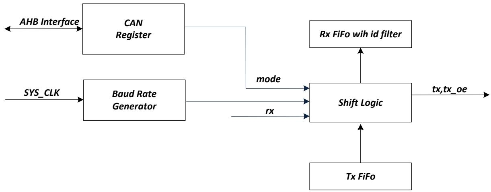  
图 24-1CAN 模块顶层功能框图

CAN 接口同外界通讯只有 tx 和 rx 两根信号线。tx 发送有效数据时候，tx\_oe 有效。tx 不发送有效数据的时候，tx\_oe 无效。

rx：数据信号。接收来自外界的 CAN 数据。

tx：数据信号。发送 CAN 数据到 CAN 总线。

tx\_oe：数据使能信号。当tx 输出时，tx\_oe 有效；当 tx 无数据输出时，tx\_oe 无效。

## 24.2.2 功能说明

CAN 模块接收和发送数据，并将数据从串行转换成并行，或并行转换成串行。可以开启或禁止中断。接口通过数据输出引脚(TX)和数据输入引脚(RX)连接到CAN 总线的PHY 芯片上。

## 24.2.2.1 工作模式

CAN 模块主要包含两个工作模式：正常工作模式和复位模式。

复位模式，时序参数、ID配置、错误统计值等均在此模式下设定好。CAN\_CFG\_STAT. RESET为1，是复位模式。硬件复位结束后，CAN 模块处于复位模式下。

正常工作模式，CAN\_CFG\_STAT. RESET 为0。此时，可以正常地响应CAN 总线请求。

在上述两个模式下，扩展了监听模式（Listen Only）和自测试模式（Self Test）。前者，类似一个搜集器，只接收 CAN 总线上的数据，不发送任何数据。后者，是内部自测试，发送的数据同时被自己接收，检测内部功能是否正确。

## 24.2.2.2 传输

根据 SFF（Standard Frame Format），或 EFF（Extended Frame Format），搬移 11 个字节或者13 个字节；完成后需要通过中断或者轮询的方式判断传输是否完成。

MCU 传输，推荐软件配置流程如下：

初始化GPIO 模块，将CAN 复用的GPIO 配置完毕。

初始化CAN 接口，控制寄存器配置完毕。

通过 CAN\_TBUF 寄存器，写入 PTB/STB

触发CAN 接口进入发送流程

## 24.2.2.3 中断处理

CAN接口包含中断事件比较多，在CAN\_RTIE和CAN\_ERRINT寄存器描述中有相应说明。根据实际使用情况，开启对应的中断事件使能开关。

CAN 控制器提供了以下七种中断：

• 接收中断

• 发送中断

• 错误中断

• 数据溢出中断

• 被动错误中断

• 仲裁丢失中断

• 总线错误中断

## 24.2.2.3.1 接收中断

接收中断 CAN\_RTIE.RIE，当 CAN Rx Buffer 接收到有效帧，CAN\_RTIF.RIF 置位。接收中断进一步细化，还有三个中断源头 CAN\_RTIE.ROIE、CAN\_RTIE.RFIE 和 CAN\_RTIE.RAFIE。分别是 CAN RxBuffer 接收溢出中断，CAN Rx Buffer 接收满中断，和 CAN Rx Buffer 接收即将满中断。所以，产生一次接收中断，可能有几个标志位会置位。

只有先使能中断，才会置位标志位。

## 24.2.2.3.2 发送中断

CAN Tx Buffer 有两个源头，一个是 PTB，一个是 STB。对应的中断也是两个，CAN\_RTIE.TPIE和CAN\_RTIE.TSIE。另外，因本CAN设备支持发送终止传输，所以，有一个终止传输状态位（无中断使能标志）CAN\_RTIF.AIF。

只有先使能中断，才会置位标志位。

## 24.2.2.3.3 错误中断

CAN 在传输过程中，发生总线错误事件，包括接收错误和发送错误。一般，产生错误，对应的错误计数器会递增，此时，根据计数器的值，将会产生不同类型的错误中断。

错误中断 CAN\_RTIE.EIE。若 CAN\_RECNT/CAN\_TECNT 错误计数器的值从小于 CAN\_ LIMIT.EWL寄存器规定的值到超过CAN\_LIMIT.EWL 寄存器规定的值，或者反之；从非BusOff 状态进入BusOff状态，或者反之，均会触发本中断，中断标志位是CAN\_RTIE.EIF。

被动错误中断 CAN\_ERRINT.EPIE。若 CAN\_RECNT/CAN\_TECNT 错误计数器的值超过规定值（>127），本 CAN 设备从主动错误状态进入被动错误状态，或者从被动错误状态进入主动错误状态（此时错误计数器的值<127），均会触发本中断，中断标志位是CAN\_ERRINT.EPIF。

只有先使能中断，才会置位标志位。

## 24.2.2.3.4 数据溢出中断

当CAN Rx Buffer 接收满，数据没有被MCU 及时取走，若再接收到有效帧，此时，触发接收溢出中断 CAN\_RTIE.ROIE，中断标志位是 CAN\_RTIE.ROIF。

## 24.2.2.3.5 仲裁丢失中断

仲裁丢失中断 CAN\_ERRINT.ALIE。CAN 总线支持仲裁机制，本 CAN 设备在总线竞争过程中，丢失了总线权利，将触发仲裁丢失中断。中断标志位是CAN\_ERRINT.ALIF。

只有先使能中断，才会置位标志位。

## 24.2.2.3.6 总线错误中断

总线错误中断 CAN\_ERRINT.BEIE。CAN 在传输过程中，发生总线错误事件，将触发总线错误中断。中断标志位是CAN\_ERRINT.BEIF。总线错误中断和错误中断的区别是，错误中断是总线错误积累到一定量后，才会触发。

只有先使能中断，才会置位标志位。

## 24.2.2.4 波特率设置

CAN的波特率设定，主要依靠CAN\_SBAUD寄存器完成。CAN\_SBAUD主要是配置TQ参数（TQ的计算见CAN\_SBAUD 寄存器说明），采样点配置以及容差范围信息。

CAN\_SBAUD.PRESC 设置传输基本时间单元参数 TQ： $\mathrm { T Q } = \mathrm { T c l k } ^ { * } \left( \mathrm { C A N \_ S B A U D . P R E S C } + 1 \right)$ LKS07x 时钟最快为 96M，对应的 Tclk 为 10.4ns，TQ 最大值为 2.6624us。

CAN\_SBAUD 设置波特率；同时，可调节 BIT 信息中各个部分的宽度（TSEG1 和 TSEG2），找到理想采样点。

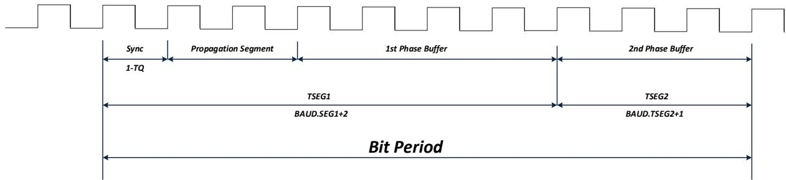  
图 24-2 CAN 模块 Bit 周期介绍图

上图可知，TSEG1 包含三个部分：Sync，Propagation Segment 和 1st Phase Buffer。Sync 为此BIT 的同步，固定 1 个 TQ。Propagation Segment 为传输延迟，1st Phase Buffer 为第一段相位缓冲。在具体CAN 网络中，需要注意 Propagation Segment 这个参数，它决定了一个数据最少需要多长实际才能传递过来。同时，Propagation Segment 也直接影响了SEG1 的配置。本设计将上述三者融合到一个参数：TSEG1。TSEG2 仅包含2nd Phase Buffer 一个部分，其为第二相位缓冲，补偿边沿（Sync）阶段的误差，通过重新同步拉长或缩短。TSEG1 与 TSEG2 的长度决定了 CAN 数据的采样点，这种方式允许一定范围内的数据传输延迟和晶体的误差。其中，TSEG1 用来调整数据传输延迟时间造成的误差，而 TSEG2 则用来调整不同点节点晶体频率的误差。

SEG1 段时间计算公式： $\mathrm { T S E G 1 } = \mathrm { T Q ^ { \ast } } ( \mathrm { C A N \_ S B A U D . S E G 1 } + 2 )$

SEG2 段时间计算公式：TSEG2 = TQ\*(CAN\_SBAUD.SEG2 + 1)

波特率计算公式为：CAN Baudrate = 1/(TSEG1 + TSEG2)

CAN 通讯属于异步通讯，需要通过不断的重新同步才能保证收发节点的采样准确，所以，SJW（同步跳转宽度）决定了接收节点是否能有比较好的兼容性。CAN\_SBAUD.SJW 是 SJW 位，其为重同步跳转寄存器。在一定波特率下通讯的各个设备，允许多大的通讯时间误差存在。

$$
\text {总线下界容差} <   \text {总线波特率} <   \text {总线上限容差}
$$

容差计算公式为： $\mathrm { T Q } ^ { * } \left( \mathrm { S J W } + 1 \right)$

配置CAN\_SBAUD 寄存器，一般可以参考如下几条：

TSEG1 比 TSEG2 要略大点，此时采样点会略晚于中间点，保证信号的稳定。也可以根据实际情况调整，让采样点在此前后挪动。TSEG2 一般>=2（即 SEG2>=1）。BOSCH 规定TSEG1+TSEG2>=8。一般芯片时钟快，但是波特率比较低的时候，可以通过组合CAN\_SBAUD.PRESC，CAN\_SBAUD.SEG1 和 CAN\_SBAUD.SEG2 实现。

⚫ SJW 的值不能大于SEG2，一般是后者的一半比较合理。

同一个 CAN 网络，波特率配置尽可能接近或一致，是比较好的选择。因各个芯片频率不同，CAN\_SBAUD.PRESC 是不同的。波特率配置尽可能一致，是 CAN\_SBAUD.PRESC 分频后产生的TQ 尽可能一致。TQ 一致了，TSEG1 和 TSEG2 以及 SJW 就基本可以一致了。

基于LKS07x 芯片，部分波特率索引值如下：

表24-1 波特率配置

<table><tr><td>CAN 波特率</td><td>CAN_SBAUD.PRESC[7:0]</td><td>CAN_SBAUD.SJW[6:0]</td><td>CAN_SBAUD.SEG2[6:0]</td><td>CAN_SBAUD.SEG1[7:0]</td><td>Sample Point</td></tr><tr><td>1Mbps</td><td>0x05</td><td>0x02</td><td>0x05</td><td>0x08</td><td>63%</td></tr><tr><td>800Kbps</td><td>0x0B</td><td>0x01</td><td>0x03</td><td>0x04</td><td>60%</td></tr><tr><td>666Kbps</td><td>0x0B</td><td>0x01</td><td>0x03</td><td>0x06</td><td>67%</td></tr><tr><td>500Kbps</td><td>0x0B</td><td>0x02</td><td>0x05</td><td>0x08</td><td>63%</td></tr><tr><td>400Kbps</td><td>0x0B</td><td>0x02</td><td>0x06</td><td>0x0B</td><td>65%</td></tr><tr><td>250Kbps</td><td>0x17</td><td>0x02</td><td>0x05</td><td>0x08</td><td>63%</td></tr><tr><td>200Kbps</td><td>0x17</td><td>0x02</td><td>0x06</td><td>0x0B</td><td>65%</td></tr><tr><td>125Kbps</td><td>0x2F</td><td>0x02</td><td>0x05</td><td>0x08</td><td>63%</td></tr><tr><td>100Kbps</td><td>0x2F</td><td>0x02</td><td>0x06</td><td>0x0B</td><td>65%</td></tr><tr><td>80Kbps</td><td>0x35</td><td>0x02</td><td>0x06</td><td>0x0B</td><td>65%</td></tr><tr><td>50Kbps</td><td>0x5F</td><td>0x02</td><td>0x06</td><td>0x0B</td><td>65%</td></tr><tr><td>40Kbps</td><td>0x77</td><td>0x02</td><td>0x06</td><td>0x0B</td><td>65%</td></tr><tr><td>25Kbps</td><td>0xBF</td><td>0x02</td><td>0x06</td><td>0x0B</td><td>65%</td></tr><tr><td>20Kbps</td><td>0xEF</td><td>0x02</td><td>0x06</td><td>0x0B</td><td>65%</td></tr><tr><td>10Kbps</td><td>0xEF</td><td>0x06</td><td>0x0D</td><td>0x18</td><td>65%</td></tr><tr><td>05Kbps</td><td>0xEF</td><td>0x0D</td><td>0x1B</td><td>0x32</td><td>65%</td></tr></table>

## 24.2.2.5 ID 过滤器

CAN 总线，可以挂在很多设备。通过 ID 号，不同设备可以知道当前总线上发送的帧，是否需要被自己接收，或者发送出去的帧，是否有响应。本 CAN 设备，共计 4 组 ID 过滤器（ACF0/1/2/3）。只有当CAN 设备处于复位模式时，MCU才可以配置ID过滤器。CAN帧的ID号有两种长度--11 位和29 位。前者对应的 SFF（Standard Frame Format），后者对应 EFF（ExtendedFrame Format）。本 CAN 设备的 ID 滤波的长度均为 29 位。

如果当前接收到的帧，通过了其中一个ID 过滤器，则它将被CAN 设备接受。如果接受，此帧的数据将存储到Rx Buffer 中，如果使能了RIE，同时会置位RIF。如果帧，不被接受，则不会置位RIF且Rx Buffer指针也不增加。未被接受的帧，将被丢弃，并被下一帧覆盖。任何存储的有效帧，都不会被任何未接受的帧覆盖。

通过 CAN\_ACR 和 CAN\_AMR 决定当前 CAN 设备可接收的 ID 范围。CAN\_ACR 列出了一个特定的ID，CAN\_AMR 为对应的MASK 寄存器，标识CAN\_ACR 中对应的位数据同接收到的ID 对应的位的数据是否需要匹配。CAN\_AMR 某一位是 0，表示这一位需要同 CAN\_ACR 匹配；CAN\_AMR 某一位是 1，表示这一位不需要同 CAN\_ACR 匹配。极端情况就是 CAN\_ACR 上每一位都要匹配，或者每一位都不要匹配。

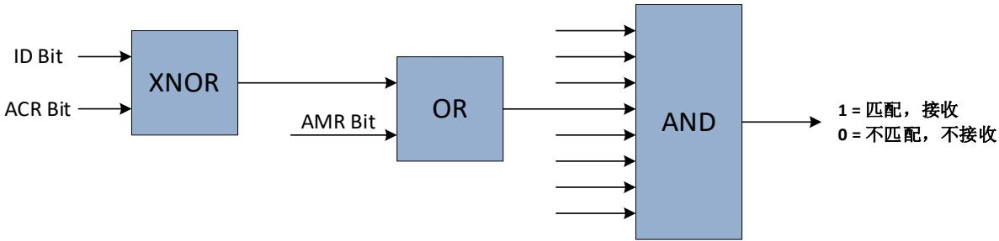  
图 24-3CAN 模块 ID 滤波逻辑关系

本 CAN 设 备 ， 通 过 CAN\_ACFCTRL、CAN\_ACFEN 和 CAN\_ACF 三 组 寄 存 器 实 现 对CAN\_ACR0/1/2/3 和 CAN\_AMR0/1/2/3 的配置。CAN\_ACRx 和 CAN\_AMRx 为一组，共计四组 ID 过滤器（ACF0/1/2/3）。CAN\_ACFCTRL 为选择寄存器，选择上述哪组过滤器中将被 MCU 选中；CAN\_ACFEN 为使能寄存器，选择上述哪组过滤器将被使能/关闭；CAN\_ACRCTRL 选中 ACRx/AMRx，下一步通过访问CAN\_ACF，实现对ACRx/AMRx 的读写。默认情况下，ACF0 使能，同时CAN\_ACR0为全 0，CAN\_AMR0 为全 1。

本 CAN 设备，CAN\_ACRx 和 CAN\_AMRx 均是按照最大 29-bit 设计，若是标准帧，ID 只有 11-bit，此时可以屏蔽CAN\_AMRx 对应高位（写1）。

标 准 帧 ：CAN\_ACRx[10:00]写 入 需 要 过 滤 的 ID 值 ；CAN\_AMRx[28:11]写 入 全 1，CAN\_AMRx[10:00]写入对应值。

⚫ 扩展帧：CAN\_ACRx[28:00]写入需要过滤的 ID 值；CAN\_AMRx[28:00]写入对应值。

## 24.2.2.6 CAN 帧的接收

接收到的有效且被接受的帧，均存储到Rx Buffer 中。一帧数据，存放到一个Slot 中，本CAN设备，Rx Buffer 提供 10 个 Slot。Rx Buffer 按照 FIFO 模式存储和读出，即先存入 Rx Buffer 的帧，先被MCU 读取。

⚫ 如果使能了CAN\_RTIE.RIE，则每次接收到的有效且被接受的帧，CAN\_RTIF.RIF 将置位为1。

如果使能了 CAN\_RTIE.RAFIE，则接收到的有效且被接受的帧的数量达到 CAN\_LIMIT.AFWL 规定的值，CAN\_RTIF.RAFIF 将置位为 1。

⚫ 如果使能了 CAN\_RTIE.RFIE，则接收到的有效且被接受的帧占满 Rx Buffer，CAN\_RTIF.RFIF 将置位为1。

通过CAN\_RBUF 寄存器来读取最早存入Rx Buffer Slot 且没有被取走的帧。MCU 读取完毕后，将 CAN\_RCTRL.RREL 设置为 1（硬件自动回零），释放已经读取的 Rx Buffer Slot。CAN\_RBUF 寄存器自动指向下一个 Rx Buffer Slot。

哪怕 Rx Buffer 已满，本 CAN 设备仍然可以继续接收帧。一旦接收到的帧，是本 CAN 设备需要的（通过 ID 滤波器），根据 CAN\_RCTRL.ROM 的配置，决定如何处理。CAN\_RCTRL.ROM 为 1，此新接受的帧，被抛弃；CAN\_RCTRL.ROM 为0，最早进入 Rx Buffer 的帧，被抛弃。


--- Part 3: Pages 401-422 ---

CAN 帧的结构，分成 ID 部分和数据部分。第一个字节包含了帧分类等信息，确定是 SFF（标准）帧，还是 EFF（扩展）帧；确定是远程帧，还是数据帧；以及，确定数据长度。SFF 的 ID 长度为2 个字节，EFF 的ID 长度为4 个字节。数据长度为最大8 个字节。

表 24-2 接收帧的结构

<table><tr><td colspan="9">SFF</td></tr><tr><td></td><td>[7]</td><td>[6]</td><td>[5]</td><td>[4]</td><td>[3]</td><td>[2]</td><td>[1]</td><td>[0]</td></tr><tr><td>CAN_RBUF0[31:24]</td><td colspan="8">/</td></tr><tr><td>CAN_RBUF0[23:16]</td><td colspan="8">/</td></tr><tr><td>CAN_RBUF0[15:08]</td><td colspan="5">/</td><td colspan="3">ID[10:08]</td></tr><tr><td>CAN_RBUF0[07:00]</td><td colspan="8">ID[07:00]</td></tr><tr><td>CAN_RBUF1[31:24]</td><td colspan="8">/</td></tr><tr><td>CAN_RBUF1[23:16]</td><td colspan="8">/</td></tr><tr><td>CAN_RBUF1[15:08]</td><td colspan="3">KOER[2:0]</td><td>TX</td><td colspan="4">/</td></tr><tr><td>CAN_RBUF1[07:00]</td><td>0</td><td>RTR</td><td colspan="2">/</td><td colspan="4">DLC[3:0]</td></tr><tr><td>CAN_RBUF2[31:24]</td><td colspan="8">DATA3</td></tr><tr><td>CAN_RBUF2[23:16]</td><td colspan="8">DATA2</td></tr><tr><td>CAN_RBUF2[15:08]</td><td colspan="8">DATA1</td></tr><tr><td>CAN_RBUF2[07:00]</td><td colspan="8">DATA0</td></tr><tr><td>CAN_RBUF3[31:24]</td><td colspan="8">DATA7</td></tr><tr><td>CAN_RBUF3[23:16]</td><td colspan="8">DATA6</td></tr><tr><td>CAN_RBUF3[15:08]</td><td colspan="8">DATA5</td></tr><tr><td>CAN_RBUF3[07:00]</td><td colspan="8">DATA4</td></tr><tr><td colspan="9">EFF</td></tr><tr><td></td><td>[7]</td><td>[6]</td><td>[5]</td><td>[4]</td><td>[3]</td><td>[2]</td><td>[1]</td><td>[0]</td></tr><tr><td>CAN_RBUF0[31:24]</td><td colspan="3">/</td><td colspan="5">ID[28:24]</td></tr><tr><td>CAN_RBUF0[23:16]</td><td colspan="8">ID[23:16]</td></tr><tr><td>CAN_RBUF0[15:08]</td><td colspan="8">ID[15:08]</td></tr><tr><td>CAN_RBUF0[07:00]</td><td colspan="8">ID[07:00]</td></tr><tr><td>CAN_RBUF1[31:24]</td><td colspan="8">/</td></tr><tr><td>CAN_RBUF1[23:16]</td><td colspan="8">/</td></tr><tr><td>CAN_RBUF1[15:08]</td><td colspan="3">KOER[2:0])</td><td>TX</td><td colspan="4">/</td></tr><tr><td>CAN_RBUF1[07:00]</td><td>1</td><td>RTR</td><td colspan="2">/</td><td colspan="4">DLC[3:0]</td></tr><tr><td>CAN_RBUF2[31:24]</td><td colspan="8">DATA3</td></tr><tr><td>CAN_RBUF2[23:16]</td><td colspan="8">DATA2</td></tr><tr><td>CAN_RBUF2[15:08]</td><td colspan="8">DATA1</td></tr><tr><td>CAN_RBUF2[07;00]</td><td colspan="8">DATA0</td></tr><tr><td>CAN_RBUF3[31:24]</td><td colspan="8">DATA7</td></tr><tr><td>CAN_RBUF3[23:16]</td><td colspan="8">DATA6</td></tr><tr><td>CAN_RBUF3[15:08]</td><td colspan="8">DATA5</td></tr><tr><td>CAN_RBUF3[07:00]</td><td></td><td></td><td></td><td></td><td></td><td></td><td></td><td></td></tr></table>

IDE（IDentifier Extension）：0：标准帧格式；1：扩展帧格式

RTR（Remote Transmission Request）：0：数据帧；1：远程帧

DLC（Data Length Code）：数据长度码。设定范围为 0\~8，对应数据长度为 0 Byte\~8 Byte

KOER：同 CAN\_EALCAP.KOER

TX：回环模式中接收自己发送的数据时此位置1

CAN 帧的接收步骤如下：

⚫ 配置 ID 滤波器

⚫ 配置 CAN\_RTIE.RFIE，CAN\_RTIE.RAFIE 和 CAN\_LIMIT.AFWL

⚫ 等待 CAN\_RTIF.RFIF 或者 CAN\_RTIF.RAFIF（中断或者轮询皆可）

通过 CAN\_RBUF 从 Rx Buffer 中读取最早接收到的 CAN 帧；将 CAN\_RCTRL.RREL 设置为 1（硬件自动回零），释放已经读取的 Rx Buffer Slot，CAN\_RBUF 寄存器自动指向下一个 Rx BufferSlot。如此反复，直至通过 CAN\_RCTRL.RSTAT 确认 Rx Buffer 为空。

## 24.2.2.7 CAN 帧的发送

CAN 模块要发送数据，必须在正常工作模式下。在开始任何传输之前，至少有一帧被写入传输缓冲区（Primary Transmit Buffer 或 Secondary Transmit Buffer）。CAN\_TBUF 寄存器提供对Primary Transmit Buffer（PTB）和 Secondary Transmit Buffer（STB）的访问。本 CAN 设备优先发送PTB 的CAN 帧。在发送空闲情况下，CAN\_TCMD.TPE 配置为1，即可触发PTB 的数据发送，此时STB 只能等待PTB 发送完毕才能发送。

PTB 的存储深度是一，即只能存储一帧，STB 可以存储两帧。CAN\_TCMD.TBSEL 为 1，选中STB，为 0，选中 PTB。CAN\_TCMD.TBSEL 为 1，MCU 可写入 STB。因可以存入两帧数据，CAN\_TBUF 写入完成当前帧后，设置 CAN\_TCTRL.TSNEXT，硬件自动跳转到下一个 STB Slot。所有CAN\_TBUF 的数据都可以按任意顺序写入。CAN\_TCTRL.TSSTAT 可知道 STB 的状态。

CAN 帧的发送步骤如下：

⚫ 配置 CAN\_TCMD.TBSEL，选择发送哪个 Tx Buffer 的数据（0：PTB；1：STB）

⚫ 将发送的数据，写入 CAN\_TBUF 寄存器中

⚫ 如果选择的是 STB，设置 TSNEXT=1 以完成 STB Slot 的装载

CAN\_TCMD.TPE 写 1，触发 PTB 的 CAN 帧的发送；CAN\_TCMD.TSALL 或者 CAN\_TCMD.TSONE写1，触发STB 的CAN 帧的发送

发送完成状态确认。CAN\_RTIE.TPIE 使能，PTB 的 CAN 帧，发送完成后，CAN\_RTIF.TPIF 置位；CAN\_TCMD.TSONE 单帧模式，CAN\_RTIE.TSIE 使能，STB 的 CAN 帧，发送完成后，CAN\_RTIF.TSIF 置位；CAN\_TCMD.TSALL 多帧模式，CAN\_RTIE.TSIE 使能，STB 的所有 CAN 帧，发送完成后，CAN\_RTIF.TSIF 置位

⚫ 注意，若STB 和PTB 均触发的发送请求，同等条件下，PTB 先发送

本 CAN 设备发送 CAN 帧，支持 CAN 仲裁。一旦仲裁失败，可以等总线空闲重发此帧，也支持不再重发此帧。CAN\_CFG\_STAT. TPSS 配置 PTB 是否重发（0：重发；1：单次），CAN\_CFG\_STAT.

TSSS 配置 STB 是否重发（0：重发；1：单次）。配置为单次发送模式后，无论最后是否成功发送此帧，CAN\_RTIF.TPIF/CAN\_RTIF.TSIF 均会被置位，对应的 Slot 均会被清除（数据失效）。此时，需要借助另外两个状态位来判断：

⚫ 有总线错误发生时，CAN\_EALCAP.KOER 更新，CAN\_ERRINT.BEIF 置位（CAN\_ERRINT.BEIE 使能）

⚫ 仲裁失败，CAN\_ERRINT.ALIF 置位（CAN\_ERRINT.ALIE 使能）

CAN帧的最大有效负载长度为8字节。每帧的数据长度由DLC定义。对于远程帧（位RTR），DLC 的值是无意义，因为远程帧的数据长度始终为0 字节。

表 24-3 发送帧的结构

<table><tr><td colspan="9">SFF</td></tr><tr><td></td><td>[7]</td><td>[6]</td><td>[5]</td><td>[4]</td><td>[3]</td><td>[2]</td><td>[1]</td><td>[0]</td></tr><tr><td>CAN_TBUF0[31:24]</td><td colspan="8">/</td></tr><tr><td>CAN_TBUF0[23:16]</td><td colspan="8">/</td></tr><tr><td>CAN_TBUF0[15:08]</td><td colspan="5">/</td><td colspan="3">ID[10:08]</td></tr><tr><td>CAN_TBUF0[07:00]</td><td colspan="8">ID[07:00]</td></tr><tr><td>CAN_TBUF1[31:24]</td><td colspan="8">/</td></tr><tr><td>CAN_TBUF1[23:16]</td><td colspan="8">/</td></tr><tr><td>CAN_TBUF1[15:08]</td><td colspan="8">/</td></tr><tr><td>CAN_TBUF1[07:00]</td><td>0</td><td>RTR</td><td colspan="2">/</td><td colspan="4">DLC[3:0]</td></tr><tr><td>CAN_TBUF2[31:24]</td><td colspan="8">DATA3</td></tr><tr><td>CAN_TBUF2[23:16]</td><td colspan="8">DATA2</td></tr><tr><td>CAN_TBUF2[15:08]</td><td colspan="8">DATA1</td></tr><tr><td>CAN_TBUF2[07:00]</td><td colspan="8">DATA0</td></tr><tr><td>CAN_TBUF3[31:24]</td><td colspan="8">DATA7</td></tr><tr><td>CAN_TBUF3[23:16]</td><td colspan="8">DATA6</td></tr><tr><td>CAN_TBUF3[15:08]</td><td colspan="8">DATA5</td></tr><tr><td>CAN_TBUF3[07:00]</td><td colspan="8">DATA4</td></tr><tr><td colspan="9">EFF</td></tr><tr><td></td><td>[7]</td><td>[6]</td><td>[5]</td><td>[4]</td><td>[3]</td><td>[2]</td><td>[1]</td><td>[0]</td></tr><tr><td>CAN_TBUF0[31:24]</td><td colspan="3">/</td><td colspan="5">ID[28:24]</td></tr><tr><td>CAN_TBUF0[23:16]</td><td colspan="8">ID[23:16]</td></tr><tr><td>CAN_TBUF0[15:08]</td><td colspan="8">ID[15:08]</td></tr><tr><td>CAN_TBUF0[07:00]</td><td colspan="8">ID[07:00]</td></tr><tr><td>CAN_TBUF1[31:24]</td><td colspan="8">/</td></tr><tr><td>CAN_TBUF1[23:16]</td><td colspan="8">/</td></tr><tr><td>CAN_TBUF1[15:08]</td><td colspan="6">/</td><td></td><td></td></tr><tr><td>CAN_TBUF1[07:00]</td><td>1</td><td>RTR</td><td colspan="2">/</td><td colspan="4">DLC[3:0]</td></tr><tr><td>CAN_TBUF2[31:24]</td><td colspan="8">DATA3</td></tr><tr><td>CAN_TBUF2[23:16]</td><td colspan="8">DATA2</td></tr><tr><td>CAN_TBUF2[15:08]</td><td colspan="8">DATA1</td></tr><tr><td>CAN_TBUF2[07;00]</td><td colspan="8">DATA0</td></tr><tr><td>CAN_TBUF3[31:24]</td><td colspan="8">DATA7</td></tr><tr><td>CAN_TBUF3[23:16]</td><td colspan="8">DATA6</td></tr><tr><td>CAN_TBUF3[15:08]</td><td colspan="8">DATA5</td></tr><tr><td>CAN_TBUF3[07:00]</td><td></td><td></td><td></td><td></td><td></td><td></td><td></td><td></td></tr></table>

可以通过配置 CAN\_TCMD.TPA 或者 CAN\_TCMD.TSA 取消已请求但还没有被执行的数据发送。有如下几种情况，需注意：

⚫ 仲裁中。节点仲裁失败，则取消数据发送；节点仲裁成功，则继续发送

数据发送中。成功发送数据且收到ACK，对应的标志和状态正常置位，数据发送不取消；成功发送数据但没有收到ACK，数据发送取消，错误计数器增加。CAN\_TCMD.TSALL发送，正在发送的STB Slot 正常发送，没有开始发送的 STB Slot 被取消

## 24.2.2.8 错误管理

CAN 协议要求每个节点中都包含发送错误计数和接收错误计数。这两个错误计数的数值决定了控制器当前的错误状态（如主动错误、被动错误、离线）。控制器将数值分别存储在CAN\_RECNT 和 CAN\_TECNT 中，MCU 可随时进行读取。除了错误状态之外，控制器还提供错误报警限制的功能（CAN\_LIMIT.EWL），这个功能可在 CAN 控制器进入被动错误状态之前，提醒用户，当前发生的严重总线错误。

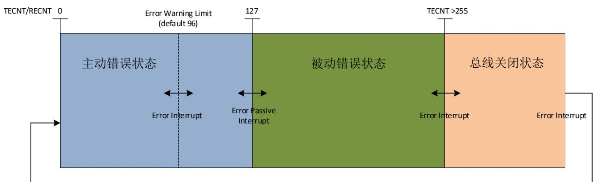  
图 24-4CAN 模块错误管理

## 24.2.2.9 错误计数

发送错误计数和接收错误计数根据下表规则递增/递减。注，一帧传输中可应用多个规则。

表24-4CAN 错误计数和接收错误计数规则

<table><tr><td></td><td>接收和发送错误计数值的变动条件</td><td>发送错误计数值(TECNT)</td><td>接收错误计数值(RECNT)</td></tr><tr><td>1</td><td>接收单元检测出错误时例外:接收单元在发送错误标志或过载标志中检测出“位错误”时,接收错误计数值不增加</td><td>-</td><td>+1</td></tr><tr><td>2</td><td>接收单元在发送完错误标志后检测到的第一个位为显性电平</td><td>-</td><td>+8</td></tr><tr><td>3</td><td>发送单元在输出错误标志时</td><td>+8</td><td>-</td></tr><tr><td>4</td><td>发送单元在发送主动错误标志或过载标志时,检测出位错误</td><td>+8</td><td>-</td></tr><tr><td>5</td><td>接收单元在发送主动错误标志或过载标志时,检测出位错误</td><td>-</td><td>+8</td></tr><tr><td>6</td><td>各单元从主动错误标志、过载标志的最开始检测出连续14个位的显性电平时,之后,每检测出连续的8个位的显性位时</td><td>发送时+8</td><td>接收时+8</td></tr><tr><td>7</td><td>检测出在被动错误标志后追加的连续8个显性位时</td><td>发送时+8</td><td>接收时+8</td></tr><tr><td>8</td><td>发送单元正常发送数据结束时(返回ACK并且到帧结束,也未检测出错误时)</td><td>TECNT=0时,TECNT=0TECNT-1</td><td>-</td></tr><tr><td>9</td><td>接收单元正常接收数据结束时(到CRC未检测出错误并且正常返回ACK时)</td><td>-</td><td>RECNT=0时,RECNT=01&lt;=RECNT&lt;=127时,RECNT-1RECNT&gt;127时,RECNT=127</td></tr><tr><td>10</td><td>处于总线关闭状态的单元,检测到128次、连续11个隐性位</td><td>=0</td><td>=0</td></tr></table>

## 24.2.2.10主动错误状态

当发送错误计数器（CAN\_TECNT）和接收错误计数器（CAN\_RECNT）的值都<=127 时，为主动错误状态；主动错误状态下的 CAN 设备，可以正常参与 CAN 总线通讯，并在检测到错误时能发出主动错误信号（连续6 个显性信号）。

## 24.2.2.11被动错误状态

当发送错误计数器（CAN\_TECNT）或接收错误计数器（CAN\_RECNT）的值>127 但<256 时，为被动错误状态；处于被动错误状态的 CAN 设备，检测到错误时，不能发出主动错误信号（连续6 个显性信号）；只能发出被动错误信号（隐性信号），等待其它CAN 设备发现错误。

## 24.2.2.12关闭状态与关闭恢复

当发送错误计数器（CAN\_TECNT）或接收错误计数器（CAN\_RECNT）的值>255 时，本 CAN设备自动进入关闭状态，从而不参与 CAN 总线的通信，直到返回到主动错误状态。可以通过CAN\_CFG\_STAT.BUSOFF 位确认 本 CAN 设备的状态。BUSOFF 被置位的同时，产生 CAN\_RTIF.EIF 中断。

CAN 从关闭状态恢复到主动错误状态有以下两种方法：

## ⚫ 上电复位

⚫ 接收到连续128 次、连续11 位的隐性位序列（恢复序列）

节点关闭状态下，CAN\_TECNT值保持不变，CAN\_RECNT用于计数恢复序列。从节点关闭状态恢复后，CAN\_TECNT 和 CAN\_RECNT 被复位为 0。

## 24.2.2.13仲裁

本 CAN 设备能够精确捕捉到仲裁失败的位置点，并反映到 CAN\_EALCAP.ALC 寄存器中。CAN\_EALCAP.ALC 寄存器中保存着，最近一次仲裁失败的位置点，如果本 CAN 设备赢得仲裁，则CAN\_EALCAP.ALC 位不更新。

## CAN\_ALC 值定义如下：

SOF 位后，第一个 ID 数据位 CAN\_EALCAP.ALC 为 0，第二个 ID 数据位 CAN\_EALCAP.ALC 为1，依次类推。因为仲裁只发生在仲裁场内，所以 CAN\_EALCAP.ALC 的最大值为 31。比如一个标准格式远程帧和一个扩展帧仲裁，扩展帧将在IDE 位争抢总线失败，则 CAN\_EALCAP.ALC=12。

## 24.2.3 寄存器

## 24.2.3.1 地址分配

CAN 模块寄存器的基地址是 0x4001\_1300，寄存器列表如下。

表 24-5 CAN 寄存器地址分配

<table><tr><td>名称</td><td>偏移</td><td>说明</td></tr><tr><td>CAN_RBUF0</td><td>0x00</td><td>CAN Rx Buffer 寄存器 0</td></tr><tr><td>CAN_RBUF1</td><td>0x04</td><td>CAN Rx Buffer 寄存器 1</td></tr><tr><td>CAN_RBUF2</td><td>0x08</td><td>CAN Rx Buffer 寄存器 2</td></tr><tr><td>CAN_RBUF3</td><td>0x0C</td><td>CAN Rx Buffer 寄存器 3</td></tr><tr><td>CAN_TBUF0</td><td>0x50</td><td>CAN Tx Buffer 寄存器 0</td></tr><tr><td>CAN_TBUF1</td><td>0x54</td><td>CAN Tx Buffer 寄存器 1</td></tr><tr><td>CAN_TBUF2</td><td>0x58</td><td>CAN Tx Buffer 寄存器 2</td></tr><tr><td>CAN_TBUF3</td><td>0x5C</td><td>CAN Tx Buffer 寄存器 3</td></tr><tr><td>CAN_CFG_STAT</td><td>0xA0</td><td>CAN 配置和状态寄存器</td></tr><tr><td>CAN_TCMD</td><td>0xA1</td><td>CAN 发送命令寄存器</td></tr><tr><td>CAN_TCTRL</td><td>0xA2</td><td>CAN 发送控制寄存器</td></tr><tr><td>CAN_RCTRL</td><td>0xA3</td><td>CAN 接收控制寄存器</td></tr><tr><td>CAN_RTIE</td><td>0xA4</td><td>CAN 发送接收中断控制寄存器</td></tr><tr><td>CAN_RTIF</td><td>0xA5</td><td>CAN 发送接收中断标志寄存器</td></tr><tr><td>CAN_ERRINT</td><td>0xA6</td><td>CAN 错误中断使能和标志寄存器</td></tr><tr><td>CAN_LIMIT</td><td>0xA7</td><td>CAN 警告寄存器</td></tr><tr><td>CAN_SBAUD</td><td>0xA8</td><td>CAN 波特率配置寄存器</td></tr><tr><td>CAN_EALCAP</td><td>0xB0</td><td>CAN 错误信息和丢失仲裁信息记录寄存器</td></tr><tr><td>CAN_RECNT</td><td>0xB2</td><td>CAN 接收错误计数器寄存器</td></tr><tr><td>CAN_TECNT</td><td>0xB3</td><td>CAN 发送错误计数器寄存器</td></tr><tr><td>CAN_ACFCTRL</td><td>0xB4</td><td>CAN ID 滤波器控制寄存器</td></tr><tr><td>CAN_ACFEN</td><td>0xB6</td><td>CAN ID 滤波器使能寄存器</td></tr><tr><td>CAN_ACF</td><td>0xB8</td><td>CAN ID 滤波器选择寄存器</td></tr></table>

24.2.3.2 寄存器说明

## 24.2.3.2.1 CAN\_RBUF0/1/2/3 寄存器

地址：0x4001\_1300/4/8/C

复位值：X

表 24-6 读取寄存器 CAN\_RBUF0/1/2/3

<table><tr><td>31</td><td>30</td><td>29</td><td>28</td><td>27</td><td>26</td><td>25</td><td>24</td><td>23</td><td>22</td><td>21</td><td>20</td><td>19</td><td>18</td><td>17</td><td>16</td></tr><tr><td colspan="16">RDATA</td></tr><tr><td colspan="16">ROX</td></tr><tr><td>15</td><td>14</td><td>13</td><td>12</td><td>11</td><td>10</td><td>9</td><td>8</td><td>7</td><td>6</td><td>5</td><td>4</td><td>3</td><td>2</td><td>1</td><td>0</td></tr><tr><td colspan="16">RDATA</td></tr><tr><td colspan="16">RO</td></tr><tr><td colspan="16">X</td></tr></table>

<table><tr><td>位置</td><td>位名称</td><td>说明</td></tr><tr><td>[31:0]</td><td>RDATA</td><td>接收寄存器,从 Rx Buffer Slot 中读出 CAN 帧的数据</td></tr></table>

不同帧的类型及数据长度不同，CAN\_RBUF0/1/2/3 的数据内容也不同。根据文档对接收帧的结构解析即可。

## 24.2.3.2.2 CAN\_TBUF0/1/2/3 寄存器

地址：0x4001\_1350/4/8/C

复位值：X

表 24-7 写入寄存器 CAN\_TBUF0/1/2/3

<table><tr><td>31</td><td>30</td><td>29</td><td>28</td><td>27</td><td>26</td><td>25</td><td>24</td><td>23</td><td>22</td><td>21</td><td>20</td><td>19</td><td>18</td><td>17</td><td>16</td></tr><tr><td colspan="16">WDATA</td></tr><tr><td colspan="16">WO</td></tr><tr><td colspan="16">X</td></tr><tr><td>15</td><td>14</td><td>13</td><td>12</td><td>11</td><td>10</td><td>9</td><td>8</td><td>7</td><td>6</td><td>5</td><td>4</td><td>3</td><td>2</td><td>1</td><td>0</td></tr><tr><td colspan="16">WDATA</td></tr><tr><td colspan="16">WO</td></tr><tr><td colspan="16">X</td></tr></table>

<table><tr><td>位置</td><td>位名称</td><td>说明</td></tr><tr><td>[31:0]</td><td>WDATA</td><td>发送寄存器,写入数据到 Tx Buffer Slot 中(PTB 或者 STB)</td></tr></table>

不同帧的类型及数据长度不同，CAN\_TBUF0/1/2/3 的数据内容也不同。根据文档对发送帧的结构解析即可。不用填写的位，补0 即可。

## 24.2.3.2.3 CAN\_CFG\_STAT 配置和状态寄存器

地址：0x4001\_13A0

复位值：0x008

表 24-8 配置和状态寄存器 CAN\_CFG\_STAT

<table><tr><td>15</td><td>14</td><td>13</td><td>12</td><td>11</td><td>10</td><td>9</td><td>8</td><td>7</td><td>6</td><td>5</td><td>4</td><td>3</td><td>2</td><td>1</td><td>0</td></tr></table>

<table><tr><td rowspan="3"></td><td>RESET</td><td>LBME</td><td>LBMI</td><td>TPSS</td><td>TSSS</td><td>RACTIVE</td><td>TACTIVE</td><td>BUSOFF</td></tr><tr><td>RW</td><td>RW</td><td>RW</td><td>RW</td><td>RW</td><td>RO</td><td>RO</td><td>RW</td></tr><tr><td>1</td><td>0</td><td>0</td><td>0</td><td>0</td><td>0</td><td>0</td><td>0</td></tr></table>

<table><tr><td>位置</td><td>位名称</td><td>说明</td></tr><tr><td>[7]</td><td>RESET</td><td>1: CAN 模块,复位模式0: CAN 模块,正常工作模式复位模式下,CAN 模块部分电路处于复位状态,部分寄存器只能在复位模式下配置;正常工作模式下,可以收发CAN帧。注意,从复位模式切换到正常工作模式,需要等待11个CAN Bit Time的时间(例如波特率为500K,一个Bit Time就是2us,需要等待22us才能发送或者接收CAN帧)</td></tr><tr><td>[6]</td><td>LBME</td><td>外部回环模式使能位1: 使能0: 关闭注意:正常通信中,禁止使能该位</td></tr><tr><td>[5]</td><td>LBMI</td><td>内部回环模式使能位1: 使能0: 关闭注意:正常通信中,禁止使能该位</td></tr><tr><td>[4]</td><td>TPSS</td><td>PTB单次传输模式使能位1: 使能0: 关闭</td></tr><tr><td>[3]</td><td>TSSS</td><td>STB单次传输模式使能位1: 使能0: 关闭</td></tr><tr><td>[2]</td><td>RACTIVE</td><td>接收状态标志位0: 本CAN设备,接收空闲,总线空闲1: 本CAN设备,正在接收CAN帧</td></tr><tr><td>[1]</td><td>TACTIVE</td><td>发送状态标志位0: 本CAN设备,发送空闲1: 本CAN设备,正在发送CAN帧</td></tr><tr><td>[0]</td><td>BUSOFF</td><td>本CAN设备总线关闭状态位(Bus Off)0: 本CAN设备,不在总线关闭状态位1: 本CAN设备,处于总线关闭状态位注意:BUSOFF写1可以清零TECNT和RECNT寄存器,但仅限于项目调试。正常使用时需要禁止对CANx_CFG_STAT.BUSOFF写1。软件操作CANx_CFG_STAT寄存器时需要避免使用或等于(|=)以及与等于符号(&amp;=),因为使用这两个符号操作CANx_CFG_STAT寄存器时可能会将CANx_CFG_STAT.BUSOFF字段误写1,从而导致将BUSOFF误清零,导致BUSOFF提前恢复。</td></tr></table>

注意：软件操作 CANx\_CFG\_STAT 寄存器时需要避免使用或等于（|=）以及与等于符号（&=），因为使用这两个符号操作 CANx\_CFG\_STAT 寄存器时可能会将 CANx\_CFG\_STAT.BUSOFF 字段误写 1，从而导致将 BUSOFF 误清零。

举例说明，不可使用 $\mathrm { C A N x \_ C F G \_ S T A T } \vert = \mathrm { B I T } 4$ ，需要用变量先读取 $\mathrm { C A N x \_ C F G \_ S T A T }$ 的值，然后再将读取的值BIT0 屏蔽之后，再和 BIT4 相或，最后写入 CANx\_CFG\_STAT 寄存器。

$$
\begin{array}{r l} & \text { DEMO } = \text { CANx\_CFG\_STAT }; \\ & \text { DEMO } = \text { DEMO } \& (\sim \text { BIT0 }); \\ & \text { DEMO } = \text { DEMO } \mid \text { BIT4 }; \\ & \text { CANx\_CFG\_STAT } = \text { DEMO }; \end{array}
$$

## 24.2.3.2.4 CAN\_TCMD 发送命令寄存器

地址：0x4001\_13A1

复位值：0x0

表 24-9 发送命令寄存器 CAN\_TCMD

<table><tr><td>15</td><td>14</td><td>13</td><td>12</td><td>11</td><td>10</td><td>9</td><td>8</td><td>7</td><td>6</td><td>5</td><td>4</td><td>3</td><td>2</td><td>1</td><td>0</td></tr><tr><td rowspan="3" colspan="8"></td><td>TBSEL</td><td>LOM</td><td>-</td><td>TPE</td><td>TPA</td><td>TSONE</td><td>TSALL</td><td>TSA</td></tr><tr><td>RW</td><td>RW</td><td>--</td><td>RO</td><td>RO</td><td>RO</td><td>RO</td><td>RO</td></tr><tr><td>0</td><td>0</td><td>0</td><td>0</td><td>0</td><td>0</td><td>0</td><td>0</td></tr></table>

<table><tr><td>位置</td><td>位名称</td><td>说明</td></tr><tr><td>[7]</td><td>TBSEL</td><td>Tx Buffer 选择位,通过 CAN_TBUF 写入到对应 Buffer 中1: STB0: PTB注意在写入 CAN_TBUF 过程中,TBSEL 的值不能改变;同时,在写入 STB 的时候,完成一帧的写入,需要更新 TSNEXT。</td></tr><tr><td>[6]</td><td>LOM</td><td>监听模式使能位1: 使能0: 关闭如果设置了 TPE、TSONE 或 TSALL,则无法设置 LOM。如果 LOM 启用且 LBME 禁用,则无法启动传输。LOM=1 和 LBME=0 禁止所有传输。LOM=1 和 LBME=1 禁止应答相应接收到的帧和错误帧,但可以发送本 CAN 设备的帧注意:正常通信中,禁止使能该位</td></tr><tr><td>[5]</td><td>--</td><td>保持默认值</td></tr><tr><td>[4]</td><td>TPE</td><td>PTB 发送使能位1: 触发 PTB 发送0: 不触发 PTB 发送配置TPE,在下一个可以发送的窗口,优先STB发送PTB的数据(除非当前已经在发送STB,否则先发PTB)。该位写1后将保持为1直到PTB发送完成或者通过TPA取消发送。软件不能通过写0清除该位。TPE可以被清除的另外几种情况:CAN_CFG_STAT.RESET=1CAN_CFG_STAT.LBME=0</td></tr><tr><td>[3]</td><td>TPA</td><td>PTB发送取消位1:取消已经通过TPE置1请求但还未开始的PTB发送0:不取消软件置位,硬件自动清零。设置TPA会自动清零TPE,一般TPA和TPE不同时置位。CAN_CFG_STAT.RESET=1可清零TPA。</td></tr><tr><td>[2]</td><td>TSONE</td><td>发送一帧STB数据控制位(Transmit Secondary ONE Frame)1:发送一帧STB数据0:不发送TSONE配置为1,触发发送,成功发送或者TSA终止发送可实现硬件清零,否则一直保持1。CAN_CFG_STAT.RESET=1,也可清零。</td></tr><tr><td>[1]</td><td>TSALL</td><td>发送多帧STB数据控制位(Transmit Secondary All Frames)1:发送多帧STB数据0:不发送TSALL配置为1,触发发送,成功发送或者TSA终止发送可实现硬件清零,否则一直保持1。CAN_CFG_STAT.RESET=1,也可清零。</td></tr><tr><td>[0]</td><td>TSA</td><td>STB发送取消位1:取消已经通过TSONE或者TSALL置1请求但还未开始的STB发送,软件写1,硬件清零。写1可以清零TSONE或者TSALL位0:不取消一般TSA和TSONE/TSALL,不同时置位。CAN_CFG_STAT.RESET=1可清零TSA</td></tr></table>

## 24.2.3.2.5 CAN\_TCTRL 发送控制寄存器

地址：0x4001\_13A2

复位值：0x0

表 24-10 发送控制寄存器 CAN\_TCTRL

<table><tr><td>15</td><td>14</td><td>13</td><td>12</td><td>11</td><td>10</td><td>9</td><td>8</td><td>7</td><td>6</td><td>5</td><td>4</td><td>3</td><td>2</td><td>1</td><td>0</td></tr><tr><td colspan="8" rowspan="3"></td><td rowspan="3"></td><td>TSNEXT</td><td colspan="4" rowspan="3"></td><td colspan="2">TSSTAT</td></tr><tr><td>RW</td><td colspan="2">RW</td></tr><tr><td>0</td><td colspan="2">0</td></tr><tr><td>位置</td><td>位名称</td><td colspan="14">说明</td></tr><tr><td>[7]</td><td>-</td><td colspan="14">保持默认值</td></tr><tr><td>[6]</td><td>TSNEXT</td><td colspan="14">更新 STB Slot 位置1: 更新0: 不更新当前的 STB Slot 填满数据后,软件置位 TSNEXT,硬件自动指向下一个 STB Slot,此时,TSONE/TSALL 置位,即可发送被填满的 STB Slot。可以同时设置 TSNEXT 和 TSONE 或 TSALL。如果 TBSEL=0,则设置 TSNEXT 没有意义,TSNEXT 的配置将被忽略并自动清除。如果 STB 的所有 Slot 都已填满,则 TSNEXT 将保持置位状态,直到 Slot 有空闲,才会被硬件清零。</td></tr><tr><td>[5:2]</td><td>-</td><td colspan="14">保持默认值</td></tr><tr><td>[1:0]</td><td>TSSTAT</td><td colspan="14">STB 状态位3: STB 满2: STB 大于半满1: STB 小于等于半满0: STB 空</td></tr></table>

## 24.2.3.2.6 CAN\_RCTRL 接收控制寄存器

地址：0x4001\_13A3

复位值：0x0

表 24-11 接收控制寄存器 CAN\_RCTRL

<table><tr><td>15</td><td>14</td><td>13</td><td>12</td><td>11</td><td>10</td><td>9</td><td>8</td><td>7</td><td>6</td><td>5</td><td>4</td><td>3</td><td>2</td><td>1</td><td>0</td></tr><tr><td rowspan="3" colspan="8"></td><td>SACK</td><td>ROM</td><td>ROV</td><td>RREL</td><td>RBALL</td><td rowspan="3"></td><td colspan="2">RSTAT</td></tr><tr><td>RW</td><td>RW</td><td>RW</td><td>RW</td><td>RW</td><td colspan="2">RO</td></tr><tr><td>0</td><td>0</td><td>0</td><td>0</td><td>0</td><td colspan="2">0</td></tr></table>

<table><tr><td>位置</td><td>位名称</td><td>说明</td></tr><tr><td>[7]</td><td>SACK</td><td>自应答1: LBME=1 时,使能自应答功能0: 无自应答</td></tr><tr><td>[6]</td><td>ROM</td><td>Rx Buffer 满,溢出控制位1: 新接收到的数据不被存储0: 最早接收到的数据被覆盖</td></tr><tr><td>[5]</td><td>ROV</td><td>Rx Buffer 溢出标志位1: 溢出,最少有一帧数据丢失。通过写 RREL 为 1 清零0:无溢出</td></tr><tr><td>[4]</td><td>RREL</td><td>释放 Rx Buffer Slot1:软件已经取走当前 Rx Buffer Slot 数据,可释放当前 Rx Buffer Slot,硬件指向下一个 Rx Buffer Slot0:无释放操作</td></tr><tr><td>[3]</td><td>RBALL</td><td>接收 Rx Buffer 存储通过 ID 滤波的帧1:存储所有的 CAN 帧,包括错误的帧0:正常模式,仅存储正确的 CAN 帧</td></tr><tr><td>[2]</td><td>--</td><td>保持默认值</td></tr><tr><td>[1:0]</td><td>RSTAT</td><td>Rx Buffer 状态位3:满(溢出状态下,保持此值)2:Rx Buffer 已经接收的帧的数量大于等于 AFWL 的值,但未满1:Rx Buffer 已经接收的帧的数量小于 AFWL 的值0:Rx Buffer 已经接收的帧的数量为 0,空</td></tr></table>

## 24.2.3.2.7 CAN\_RTIE发送接收中断控制寄存器

地址：0x4001\_13A4

复位值：0x0

表 24-12 发送接收中断控制寄存器 CAN\_RTIE

<table><tr><td>15</td><td>14</td><td>13</td><td>12</td><td>11</td><td>10</td><td>9</td><td>8</td><td>7</td><td>6</td><td>5</td><td>4</td><td>3</td><td>2</td><td>1</td><td>0</td></tr><tr><td rowspan="3" colspan="8"></td><td>RIE</td><td>ROIE</td><td>RFIE</td><td>RAFIE</td><td>TPIE</td><td>TSIE</td><td>EIE</td><td>TSFF</td></tr><tr><td>RW</td><td>RW</td><td>RW</td><td>RW</td><td>RW</td><td>RW</td><td>RW</td><td>RW</td></tr><tr><td>0</td><td>0</td><td>0</td><td>0</td><td>0</td><td>0</td><td>0</td><td>0</td></tr></table>

<table><tr><td>位置</td><td>位名称</td><td>说明</td></tr><tr><td>[7]</td><td>RIE</td><td>接收中断使能(Receive Interrupt Enable)1:使能0:禁止</td></tr><tr><td>[6]</td><td>ROIE</td><td>接收溢出中断使能(Receive Overrun Interrupt Enable)1:使能0:禁止</td></tr><tr><td>[5]</td><td>RFIE</td><td>Rx Buffer 满中断使能(Rx Buffer Full Interrupt Enable)1:使能0:禁止</td></tr><tr><td>[4]</td><td>RAFIE</td><td>Rx Buffer 将满中断使能(Rx Buffer Almost Full Interrupt Enable)1:使能0:禁止</td></tr><tr><td>[3]</td><td>TPIE</td><td>PTB 发送中断使能(Transmission Primary Interrupt Enable)1:使能0:禁止</td></tr><tr><td>[2]</td><td>TSIE</td><td>STB 发送中断使能 (Transmission Secondary Interrupt Enable)1: 使能0: 禁止</td></tr><tr><td>[1]</td><td>EIE</td><td>错误中断使能 (Error Interrupt Enable)1: 使能0: 禁止</td></tr><tr><td>[0]</td><td>TSFF</td><td>Tx Buffer 标志位1: STB Slot 被全部填满0: STB Slot 没有被全部填满</td></tr></table>

24.2.3.2.8 CAN\_RTIF发送接收中断标志寄存器

地址：0x4001\_13A5

复位值：0x0

表 24-13 发送接收中断标志寄存器 CAN\_RTIF

<table><tr><td>15</td><td>14</td><td>13</td><td>12</td><td>11</td><td>10</td><td>9</td><td>8</td><td>7</td><td>6</td><td>5</td><td>4</td><td>3</td><td>2</td><td>1</td><td>0</td></tr><tr><td rowspan="3" colspan="8"></td><td>RIF</td><td>ROIF</td><td>RFIF</td><td>RAFIF</td><td>TPIF</td><td>TSIF</td><td>EIF</td><td>AIF</td></tr><tr><td>RW</td><td>RW</td><td>RW</td><td>RW</td><td>RW</td><td>RW</td><td>RW</td><td>RW</td></tr><tr><td>0</td><td>0</td><td>0</td><td>0</td><td>0</td><td>0</td><td>0</td><td>0</td></tr></table>

<table><tr><td>位置</td><td>位名称</td><td>说明</td></tr><tr><td>[7]</td><td>RIF</td><td>接收中断标志位(Receive Interrupt Flag)1:接收到有效帧(数据帧或者远程帧),写1清零0:没有接收到有效帧</td></tr><tr><td>[6]</td><td>ROIF</td><td>接收溢出中断标志位(Receive Overrun Interrupt Flag)1:Rx Buffer至少有一帧未读走的数据被覆盖0:Rx Buffer无覆盖溢出时ROIF和RFIF同时置1,写1清零</td></tr><tr><td>[5]</td><td>RFIF</td><td>Rx Buffer满中断标志位(Rx Buffer Full Interrupt Flag)1:Rx Buffer满,写1清零0:Rx Buffer未满</td></tr><tr><td>[4]</td><td>RAFIF</td><td>Rx Buffer将满中断标志位(Rx Buffer Almost Full Interrupt Flag)1:被填充的Rx Buffer Slot数目大于等于AFWL设定值0:被填充的Rx Buffer Slot数目小于AFWL设定值</td></tr><tr><td>[3]</td><td>TPIF</td><td>PTB发送中断标志(Transmission Primary Interrupt Flag)1:触发PTB发送,发送成功完成。写1清零0:无PTB发送请求,无完成标志</td></tr><tr><td>[2]</td><td>TSIF</td><td>STB发送中断标志(Transmission Secondary Interrupt Flag)1:触发STB发送,发送成功完成。写1清零0:无STB发送请求,无完成标志</td></tr><tr><td>[1]</td><td>EIF</td><td>错误中断标志(Error Interrupt Flag)1:错误计数器的值发生变化,大于或者小于错误警告寄存器的设定值。写1清零0:无错误计数器的值从小于错误警告寄存器的设定值变为大于设定值,或者从大于设定值变为小于设定值,均会触发中断标志。另外,进入Bus Off或从Bus Off退出,也会触发。</td></tr><tr><td>[0]</td><td>AIF</td><td>取消发送中断标志(Abort Interrupt Flag)1:通过TPA和TSA请求的发送消息被成功取消。写1清零0:未取消发送数据AIF没有对应的使能寄存器</td></tr></table>

注：对应使能寄存器使能后，中断标志位才会置位；进 AIF 是例外。

## 24.2.3.2.9 CAN\_ERRINT错误中断使能和标志寄存器

地址：0x4001\_13A6

复位值：0x0

表 24-14 错误中断使能和标志寄存器 CAN\_ERRINT

<table><tr><td>15</td><td>14</td><td>13</td><td>12</td><td>11</td><td>10</td><td>9</td><td>8</td><td>7</td><td>6</td><td>5</td><td>4</td><td>3</td><td>2</td><td>1</td><td>0</td></tr><tr><td rowspan="3" colspan="8"></td><td>EWARN</td><td>EPASS</td><td>EPIE</td><td>EPIF</td><td>ALIE</td><td>ALIF</td><td>BEIE</td><td>BEIF</td></tr><tr><td>RW</td><td>R</td><td>RW</td><td>RW</td><td>RW</td><td>RW</td><td>RW</td><td>RW</td></tr><tr><td>0</td><td>0</td><td>0</td><td>0</td><td>0</td><td>0</td><td>0</td><td>0</td></tr></table>

<table><tr><td>位置</td><td>位名称</td><td>说明</td></tr><tr><td>[7]</td><td>EWARN</td><td>错误计数值超限中断标志位1:RECNT或者TECNT大于等于EWL设定值,写1清零0:RECNT或者TECNT小于EWL设定值</td></tr><tr><td>[6]</td><td>EPASS</td><td>CAN设备处于被动错误状态1:CAN设备处于被动错误状态0:CAN设备处于主动错误状态</td></tr><tr><td>[5]</td><td>EPIE</td><td>被动错误中断使能(Error Passive Interrupt Enable)1:使能0:禁止</td></tr><tr><td>[4]</td><td>EPIF</td><td>被动错误中断标志(Error Passive Interrupt Flag)1:发生主动错误到被动错误(或者相反)的改变,写1清零0:未发生</td></tr><tr><td>[3]</td><td>ALIE</td><td>仲裁失败中断使能(Arbitration Lost Interrupt Enable)1:使能0:禁止</td></tr><tr><td>[2]</td><td>ALIF</td><td>仲裁失败中断标志位(Arbitration Lost Interrupt Flag)1:仲裁失败,写1清零0: 仲裁成功</td></tr><tr><td>[1]</td><td>BEIE</td><td>总线错误中断使能(Bus Error Interrupt Enable)1: 使能0: 禁止</td></tr><tr><td>[0]</td><td>BEIF</td><td>总线错误中断标志(Bus Error Interrupt Flag)1: 总线错误,写1清零0: 无总线错误</td></tr></table>

## 24.2.3.2.10 CAN\_LIMIT 错误&警告门限值寄存器

地址：0x4001\_13A7

复位值：0x1B

表 24-15 错误&警告门限值寄存器 CAN\_LIMIT

<table><tr><td colspan="101">15 14 13 12 11 10 9 8 7 6 5 4 3 2 1 0</td></tr><tr><td rowspan="12" colspan="100"></td><td></td></tr><tr><td></td><td></td><td></td><td></td><td></td><td></td><td></td><td></td><td></td><td></td><td></td><td></td><td></td></tr><tr><td></td><td></td><td></td><td></td><td></td><td></td><td></td><td></td><td></td><td></td><td></td><td></td><td></td><td></td><td></td><td></td><td></td><td></td><td></td></tr><tr><td></td><td></td><td></td><td></td><td></td><td></td><td></td><td></td><td></td></tr><tr><td></td><td></td><td></td><td></td><td></td><td></td><td></td><td></td><td></td><td></td><td></td><td></td><td></td><td></td><td></td><td></td><td></td><td></td><td></td><td></td><td></td><td></td><td></td><td></td></tr><tr><td></td><td></td><td></td><td></td><td></td><td></td><td></td><td></td><td></td><td></td><td></td><td></td><td></td></tr><tr><td></td><td></td><td></td><td></td><td></td><td></td><td></td><td></td><td></td><td></td><td></td><td></td><td></td><td></td><td></td><td></td><td></td><td></td><td></td><td></td><td></td><td></td><td></td><td></td><td></td><td></td><td></td><td></td></tr><tr><td></td><td></td><td></td><td></td><td></td><td></td><td></td><td></td><td></td><td></td><td></td><td></td><td></td><td></td><td></td><td></td><td></td><td></td><td></td><td></td><td></td><td></td><td></td><td></td><td></td><td></td><td></td><td></td><td></td><td></td><td></td><td></td><td></td><td></td><td></td><td></td><td></td><td></td><td></td><td></td><td></td><td></td><td></td><td></td><td></td><td></td></tr><tr><td></td><td></td><td></td><td></td><td></td><td></td><td></td><td></td><td></td><td></td><td></td><td></td><td></td><td></td><td></td><td></td><td></td><td></td><td></td><td></td><td></td><td></td><td></td><td></td><td></td><td></td><td></td><td></td><td></td><td></td><td></td><td></td><td></td><td></td><td></td><td></td><td></td><td></td><td></td><td></td><td></td><td></td><td></td><td></td><td></td><td></td><td></td><td></td><td></td><td></td><td></td><td></td><td></td><td></td><td></td><td></td><td></td><td></td></tr><tr><td></td><td></td><td></td><td></td><td></td><td></td><td></td><td></td><td></td><td></td><td></td><td></td><td></td><td></td><td></td><td></td><td></td><td></td><td></td><td></td><td></td><td></td><td></td><td></td><td></td><td></td><td></td><td></td><td></td><td></td><td></td><td></td><td></td><td></td><td></td><td></td><td></td><td></td><td></td><td></td><td></td><td></td><td></td><td></td><td></td><td></td><td></td><td></td><td></td><td></td><td></td><td></td><td></td><td></td><td></td><td></td><td></td><td></td><td></td></tr><tr><td></td><td></td><td></td><td></td><td></td><td></td><td></td><td></td><td></td><td></td><td></td><td></td><td></td><td></td><td></td><td></td><td></td><td></td><td></td><td></td><td></td><td></td><td></td><td></td><td></td><td></td><td></td><td></td><td></td><td></td><td></td><td></td><td></td><td></td><td></td><td></td><td></td><td></td><td></td><td></td><td></td><td></td><td></td><td></td><td></td><td></td><td></td><td></td><td></td><td></td><td></td><td></td><td></td><td></td><td></td><td></td><td></td><td></td><td></td></tr><tr><td colspan="29">0x1</td><td></td><td></td><td></td><td></td><td></td><td></td><td></td><td></td><td></td><td></td><td></td><td></td><td></td><td></td><td></td><td></td><td></td><td></td><td></td><td></td><td></td><td></td><td></td><td></td><td></td><td></td><td></td><td></td><td></td><td></td><td></td><td></td><td></td><td></td><td></td><td></td><td></td><td></td><td></td><td></td><td></td><td></td><td></td><td></td><td></td><td></td><td></td><td></td><td></td><td></td><td></td><td></td><td></td><td></td><td></td><td></td><td></td><td></td><td></td><td></td></tr></table>

<table><tr><td>位置</td><td>位名称</td><td>说明</td></tr><tr><td>[7:4]</td><td>AFWL</td><td>Rx Buffer 快满警告配置值AFWL 同 Rx Buffer 实际接收到的数量进行比对,实际数量超过 AFWL,触发 RAFIF。AFWL=0,无意义,硬件强制配置为 1;AFWL 超过 Rx Buffer 实际容量,无意义,硬件强制配置为 Rx Buffer 实际容量</td></tr><tr><td>[3:0]</td><td>EWL</td><td>可编程错误警告限值=(EWL+1)*8。可能的极限值:8,16,...128。EWL 的值控制 EIF。</td></tr></table>

## 24.2.3.2.11 CAN\_SBAUD 波特率配置寄存器

地址：0x4001\_13A8

复位值：0x0

表 24-16 波特率配置寄存器 CAN\_ SBAUD

<table><tr><td>31</td><td>30</td><td>29</td><td>28</td><td>27</td><td>26</td><td>25</td><td>24</td><td>23</td><td>22</td><td>21</td><td>20</td><td>19</td><td>18</td><td>17</td><td>16</td></tr><tr><td colspan="8">S_PRESC</td><td rowspan="3"></td><td colspan="7">S_SJW</td></tr><tr><td colspan="8">RW</td><td colspan="7">RW</td></tr><tr><td colspan="8">0</td><td colspan="7">0</td></tr><tr><td>15</td><td>14</td><td>13</td><td>12</td><td>11</td><td>10</td><td>9</td><td>8</td><td>7</td><td>6</td><td>5</td><td>4</td><td>3</td><td>2</td><td>1</td><td>0</td></tr><tr><td rowspan="2"></td><td colspan="7">S_SEG_2</td><td colspan="8">S_SEG_1</td></tr><tr><td colspan="7">RW</td><td colspan="8">RW</td></tr><tr><td></td><td>0</td><td colspan="14">0</td></tr></table>

<table><tr><td>位置</td><td>位名称</td><td>说明</td></tr><tr><td>[31:24]</td><td>S_PRESC</td><td>TQ 预分频率设定值(S_Prescaler),主要配置 TQ 的大小。TQ = system clock period * (S_PRESC+1)</td></tr><tr><td>[23]</td><td>--</td><td>保持默认值</td></tr><tr><td>[22:16]</td><td>S_SJW</td><td>再同步补偿宽度时间设定(Bit Timing Segment 2)再同步补偿宽度时间=(S_SJW+1)*TQ</td></tr><tr><td>[15]</td><td>--</td><td>保持默认值</td></tr><tr><td>[14:08]</td><td>S_SEG_2</td><td>段 2 时间单元设定(Bit Timing Segment 2)段 2 时间=(S_SEG_2+1)*TQ</td></tr><tr><td>[07:00]</td><td>S_SEG_1</td><td>段 1 时间单元设定(Bit Timing Segment 1)段 1 时间=(S_SEG_1+2)*TQ</td></tr></table>

## 24.2.3.2.12 CAN\_EALCAP 错误信息和丢失仲裁信息记录寄存器

地址：0x4001\_13B0

复位值：0x0

表24-17 错误信息和丢失仲裁信息记录寄存器 CAN\_EALCAP

<table><tr><td colspan="101">15 14 13 12 11 10 9 8 7 6 5 4 3 2 1 0</td></tr><tr><td rowspan="10" colspan="100"></td><td></td></tr><tr><td></td><td></td><td></td><td></td><td></td><td></td><td></td><td></td><td></td><td></td><td></td><td></td><td></td></tr><tr><td></td><td></td><td></td><td></td><td></td><td></td><td></td><td></td><td></td><td></td><td></td><td></td><td></td><td></td><td></td><td></td><td></td><td></td><td></td></tr><tr><td></td><td></td><td></td><td></td><td></td><td></td><td></td><td></td><td></td></tr><tr><td></td><td></td><td></td><td></td><td></td><td></td><td></td><td></td><td></td><td></td><td></td><td></td><td></td><td></td><td></td><td></td><td></td><td></td><td></td><td></td><td></td><td></td><td></td><td></td></tr><tr><td></td><td></td><td></td><td></td><td></td><td></td><td></td><td></td><td></td><td></td><td></td><td></td><td></td></tr><tr><td></td><td></td><td></td><td></td><td></td><td></td><td></td><td></td><td></td><td></td><td></td><td></td><td></td><td></td><td></td><td></td><td></td><td></td><td></td><td></td><td></td><td></td><td></td><td></td><td></td><td></td><td></td><td></td></tr><tr><td></td><td></td><td></td><td></td><td></td><td></td><td></td><td></td><td></td><td></td><td></td><td></td><td></td><td></td><td></td><td></td><td></td><td></td><td></td><td></td><td></td><td></td><td></td><td></td><td></td><td></td><td></td><td></td><td></td><td></td><td></td><td></td><td></td><td></td><td></td><td></td><td></td><td></td><td></td><td></td><td></td><td></td><td></td><td></td><td></td><td></td></tr><tr><td colspan="37">R</td><td></td><td></td><td></td><td></td><td></td><td></td><td></td><td></td><td></td><td></td><td></td><td></td><td></td><td></td><td></td><td></td><td></td><td></td><td></td><td></td><td></td></tr><tr><td colspan="39">0</td><td></td><td></td><td></td><td></td><td></td><td></td><td></td><td></td><td></td><td></td><td></td><td></td><td></td><td></td><td></td><td></td><td></td><td></td><td></td><td></td><td></td></tr></table>

<table><tr><td>位置</td><td>位名称</td><td>说明</td></tr><tr><td>[7:5]</td><td>KOER</td><td>错误类别 (Kind Of Error)0: 无错误1: 位错误2: 形式错误3: 填充错误4: 应答错误5: CRC 错误6: 其他错误7: 保留有错误时 KOER 位更新,正常发送接收时 KOER 位保持不变。</td></tr><tr><td>[4:0]</td><td>ALC</td><td>仲裁失败位置捕捉 (Arbitration Lost Capture)仲裁失败时 ALC 记录一帧数据中仲裁失败时的位置</td></tr></table>

## 24.2.3.2.13 CAN\_RECNT 接收错误计数器寄存器

地址：0x4001\_13B2

复位值：0x0

表 24-18 接收错误计数器寄存器 CAN\_ RECNT

<table><tr><td>15 14 13 12 11 10 9 8</td><td>7 6 5 4 3 2 1 0</td></tr><tr><td rowspan="3"></td><td>RECNT</td></tr><tr><td>R</td></tr><tr><td>0</td></tr></table>

<table><tr><td>位置</td><td>位名称</td><td>说明</td></tr><tr><td>[7:0]</td><td>RECNT</td><td>接收错误计数器(Receive Error Count)接收错误计数器根据 CAN 协议规定的错误计数增加或者减少。该计数器不存在上溢,255 为最大值</td></tr></table>

## 24.2.3.2.14 CAN\_TECNT 发送错误计数器寄存器

地址：0x4001\_13B3

复位值：0x0

表 24-19 发送错误计数器寄存器 CAN\_ TECNT

<table><tr><td>15 14 13 12 11 10 9 8</td><td>7 6 5 4 3 2 1 0</td></tr><tr><td rowspan="3"></td><td>TECNT</td></tr><tr><td>R</td></tr><tr><td>0</td></tr></table>

<table><tr><td>位置</td><td>位名称</td><td>说明</td></tr><tr><td>[7:0]</td><td>TECNT</td><td>发送错误计数器(Transmit Error Count)发送错误计数器根据 CAN 协议规定的错误计数增加或者减少。该计数器不存在上溢,255 为最大值</td></tr></table>

## 24.2.3.2.15 CAN\_ACFCTRL ID 滤波器控制寄存器

地址：0x4001\_13B4

复位值：0x0

表 24-20 ID 滤波器控制寄存器 CAN\_ ACFCTRL

<table><tr><td colspan="9">15 14 13 12 11 10 9 8 7 6 5 4 3 2 1 0</td></tr><tr><td rowspan="3" colspan="3"></td><td rowspan="3"></td><td>SELMASK</td><td rowspan="3"></td><td colspan="2">ACFADR</td><td></td></tr><tr><td>RW</td><td colspan="2">RW</td><td></td></tr><tr><td>0</td><td colspan="2">0</td><td></td></tr></table>

<table><tr><td>位置</td><td>位名称</td><td>说明</td></tr><tr><td>[7:6]</td><td>--</td><td>保持默认值</td></tr><tr><td>[5]</td><td>SELMASK</td><td>选择 ID 滤波器的屏蔽寄存器 (Select Acceptance MASK)1: ACF 指向 ID 滤波器 AMR 寄存器 (MASK)0: ACF 指向 ID 滤波器 ACR 寄存器通过 ACFADR 选择具体的筛选寄存器组</td></tr><tr><td>[4]</td><td>--</td><td>保持默认值</td></tr><tr><td>[3:0]</td><td>ACFADR</td><td>ID 滤波器地址 (Acceptance Filter Address)ACFADR 指向具体的 ID 滤波器器,通过 SELMASK 去区分 ACR 和 AMR。0: 指向 ACF_01: 指向 ACF_12: 指向 ACF_23: 指向 ACF_3其它值,无效</td></tr></table>

## 24.2.3.2.16 CAN\_ACFEN ID 滤波器使能寄存器

地址：0x4001\_13B6

复位值：0x0

表 24-21 ID 滤波器使能寄存器 CAN\_ACFEN

<table><tr><td>15</td><td>14</td><td>13</td><td>12</td><td>11</td><td>10</td><td>9</td><td>8</td><td>7</td><td>6</td><td>5</td><td>4</td><td>3</td><td>2</td><td>1</td><td>0</td></tr><tr><td rowspan="3" colspan="12"></td><td>AE_3</td><td>AE_2</td><td>AE_1</td><td>AE_0</td></tr><tr><td>RW</td><td>RW</td><td>RW</td><td>RW</td></tr><tr><td>0</td><td>0</td><td>0</td><td>0</td></tr></table>

<table><tr><td>位置</td><td>位名称</td><td>说明</td></tr><tr><td>[31:8]</td><td></td><td>未使用</td></tr><tr><td>[3]</td><td>AE_3</td><td>ACF_3 使能 (Acceptance Filter 4 Enable)1: 使能0: 禁止</td></tr><tr><td>[2]</td><td>AE_2</td><td>ACF_2 使能 (Acceptance Filter 3 Enable)1:使能0:禁止</td></tr><tr><td>[1]</td><td>AE_1</td><td>ACF_1 使能 (Acceptance Filter 2 Enable)1:使能0:禁止</td></tr><tr><td>[0]</td><td>AE_0</td><td>ACF_0 使能 (Acceptance Filter 1 Enable)1:使能0:禁止</td></tr></table>

## 24.2.3.2.17 CAN\_ACF ID 滤波器选择寄存器

地址：0x4001\_13B8

复位值：0x0

表 24-22 ID 滤波器选择寄存器 CAN\_ACF

<table><tr><td>31</td><td>30</td><td>29</td><td>28</td><td>27</td><td>26</td><td>25</td><td>24</td><td>23</td><td>22</td><td>21</td><td>20</td><td>19</td><td>18</td><td>17</td><td>16</td></tr><tr><td rowspan="3"></td><td>IDCMP</td><td>IDMASK</td><td colspan="13">ID ACR [28:16] or AMR [28:16]</td></tr><tr><td>RW</td><td>RW</td><td colspan="13">RW</td></tr><tr><td>0</td><td>0</td><td colspan="13">0</td></tr><tr><td>15</td><td>14</td><td>13</td><td>12</td><td>11</td><td>10</td><td>9</td><td>8</td><td>7</td><td>6</td><td>5</td><td>4</td><td>3</td><td>2</td><td>1</td><td>0</td></tr><tr><td colspan="16">ID ACR [15:00] or AMR [15:00]</td></tr><tr><td colspan="16">RW</td></tr><tr><td colspan="16">0</td></tr></table>

<table><tr><td>位置</td><td>位名称</td><td>说明</td></tr><tr><td>[31]</td><td>--</td><td>保持默认值</td></tr><tr><td>[30]</td><td>IDCMP</td><td>SELMASK=1时有效,ID AMR(MASK)选择作用范围1: ID 滤波器接收 MASK 按照标准帧格式或者扩展帧格式处理0: ID 滤波器接收 MASK 兼容标准帧格式和扩展帧格式两种格式</td></tr><tr><td>[29]</td><td>IDMASK</td><td>IDCMP 位为 1 时,MASK 选择哪种帧格式1: ID 滤波器仅接收扩展帧格式0: ID 滤波器仅接收标准帧格式</td></tr><tr><td>[28:00]</td><td>IDCODE/MASK</td><td>ACFADR 选择是那一组 ID 滤波器SELMASK=0,表示 ID 滤波器选择的是 ID ACRSELMASK=1,表示 ID 滤波器选择的是 AMR标准帧格式时 ID ACR/AMR 的范围是 Bit10-Bit0,扩展帧格式时的范围是 Bit28-Bit0</td></tr></table>

## 25 版本历史

表 25-1 文档版本历史

<table><tr><td>时间</td><td>版本号</td><td>说明</td></tr><tr><td>2026.03.03</td><td>1.62</td><td>修订 SYS、SPI、ADC、UTIMER、MCPWM、UART、IWDG 模块各寄存器的小标题</td></tr><tr><td>2026.02.28</td><td>1.61</td><td>修订 SYS、SPI、ADC、UTIMER、MCPWM、UART、IWDG、PMU 模块各寄存器的复位值</td></tr><tr><td>2026.02.26</td><td>1.60</td><td>修订 PWM AUEN 寄存器的复位值</td></tr><tr><td>2026.02.26</td><td>1.59</td><td>修订模块各寄存器标题的文字间隙</td></tr><tr><td>2026.02.10</td><td>1.58</td><td>GPIO 模块补充说明: $x = 0,1,2,3$ </td></tr><tr><td>2026.02.04</td><td>1.57</td><td>修订 I2C 从模式工作流程图</td></tr><tr><td>2026.02.02</td><td>1.56</td><td>PWM 模块补充流程图说明</td></tr><tr><td>2026.02.01</td><td>1.55</td><td>修订各模块框图</td></tr><tr><td>2026.01.28</td><td>1.54</td><td>I2C 模块补充流程图说明</td></tr><tr><td>2026.01.24</td><td>1.53</td><td>补充时钟校准值</td></tr><tr><td>2026.01.22</td><td>1.52</td><td>ADC、DMA、SPI、UART 模块补充流程图说明</td></tr><tr><td>2026.01.13</td><td>1.51</td><td>定时器计数周期改为 $(TH+1)/clk_freq$ </td></tr><tr><td>2026.01.05</td><td>1.50</td><td>PWM0_FAIL012 添加说明:当 FAIL0/1 信号有效时,会立即强制关断时基 0 驱动的 PWM 输出通道( $CH0/1/2$ )至预设安全状态,但时基 0 的计数器继续正常运行,同时触发错误中断标志位通知处理器。</td></tr><tr><td>2025.12.31</td><td>1.49</td><td>修订 14.2.46MCPWM0_FAIL345 的笔误</td></tr><tr><td>2025.12.25</td><td>1.48</td><td>完成 DMA 请求使能寄存器表格</td></tr><tr><td>2025.12.23</td><td>1.47</td><td>非易失性存储体改为两个型号</td></tr><tr><td>2025.12.10</td><td>1.46</td><td>MCPWM IODriver 数量和死区配置数量改为 6 个</td></tr><tr><td>2025.11.27</td><td>1.45</td><td>MCPWM0_SDCFG 模块,TR1_UP_INTV 字节处说明改为:当 t0 和 t1 事件发生次数达到  $TR0_UP_INTV+1$  时。</td></tr><tr><td>2025.11.25</td><td>1.44</td><td>CAN_CFG_STAT 模块添加说明:正常使用时需要禁止对 CANx_CFG_STAT.BUSOFF 写 1。</td></tr><tr><td>2025.11.21</td><td>1.43</td><td>CAN_SBAUD 波特率配置寄存器段 1 时间修订为 $(S_SEG_1+2)*TQ$ </td></tr><tr><td>2025.11.04</td><td>1.42</td><td>NVR 校准参数地址添加 1590-15AC 的放大倍数</td></tr><tr><td>2025.10.23</td><td>1.41</td><td>VTOR 寄存器描述添加说明读回时会右移 7 位</td></tr><tr><td>2025.10.17</td><td>1.40</td><td>非易失性存储体改为两个型号</td></tr><tr><td>2025.10.13</td><td>1.39</td><td>修订图表、图片的目录</td></tr><tr><td>2025.09.26</td><td>1.38</td><td>20.2.4-20.2.7 寄存器表格分行</td></tr><tr><td>2025.09.25</td><td>1.37</td><td>QEPO 寄存器补充位名称</td></tr><tr><td>2025.09.12</td><td>1.36</td><td>结束时间寄存器 SIF 模块结束信号周期改为 Time =  $(TDTH1+1) \times 1ms$ </td></tr><tr><td>2025.08.26</td><td>1.35</td><td>增加欠压阈值说明</td></tr><tr><td>2025.08.15</td><td>1.34</td><td>DSP0_BSRR 寄存器改为 DSP0_BRR 寄存器</td></tr><tr><td>2025.07.31</td><td>1.33</td><td>07x 过采样设置注意事项</td></tr><tr><td>2025.07.31</td><td>1.32</td><td>修订 IO Driver 模块数据流程图内寄存器描述</td></tr><tr><td>2025.07.30</td><td>1.31</td><td>修订 FAIL 信号说明,增加 FAIL 信号分布表</td></tr><tr><td>2025.05.12</td><td>1.30</td><td>添加 PVD 欠压不发生复位事件说明</td></tr><tr><td>2025.04.16</td><td>1.29</td><td>修订 ROM_SIZE 位置到[3:2]</td></tr><tr><td>2025.03.21</td><td>1.28</td><td>删除 10k 电阻值</td></tr><tr><td>2025.01.25</td><td>1.27</td><td>更新 SIF SIFO_TOSC 寄存器描述</td></tr><tr><td>2025.01.02</td><td>1.26</td><td>更新 FLASH NVR 关于 OPA Offset 的地址</td></tr><tr><td>2024.12.17</td><td>1.25</td><td>增加 FLASH NVR 关于 OPA Offset 的地址</td></tr><tr><td>2024.12.02</td><td>1.24</td><td>增加 ADC_IF 触发所需时间说明</td></tr><tr><td>2024.09.29</td><td>1.23</td><td>CLU 输入多路复选部分补充</td></tr><tr><td>2024.08.17</td><td>1.21</td><td>修订 IT_OPA 描述</td></tr><tr><td>2024.08.08</td><td>1.20</td><td>ADC 阈值监测功能勘误</td></tr><tr><td>2024.06.17</td><td>1.19</td><td>添加 NVR 校准参数地址信息</td></tr><tr><td>2024.06.04</td><td>1.18</td><td>修改关于 PLL 时钟精度的说明,删除 BSIZE 寄存器描述</td></tr><tr><td>2024.05.29</td><td>1.17</td><td>修改 I2C 模块中关于主从模式下收发的流程图</td></tr><tr><td>2024.05.09</td><td>1.16</td><td>修订 DMA 的 SIF 请求,ADC 空闲采样,SYS_AFE_REN6.PVDSEL 以及 GPIO 开漏功能的说明</td></tr><tr><td>2024.01.19</td><td>1.15</td><td>修正 IIC 关于时钟分频的说明,补充关于休眠唤醒的说明,补充 ADC 模块通道数量说明</td></tr><tr><td>2023.11.20</td><td>1.14</td><td>添加 DAC Gain 的量程说明和 OPA 的单端输出模式说明</td></tr><tr><td>2023.09.28</td><td>1.13</td><td>修改 SPI、I2C、HALL、SIF 模块的寄存器命名,与器件库头文件中命名保持一致</td></tr><tr><td>2023.09.11</td><td>1.12</td><td>删除 OPAHFLF_EN 的说明,增加 ADC 用外部基准时量程挡位说明,GPIO 功能框图增加 ESD 二极管。</td></tr><tr><td>2023.08.10</td><td>1.11</td><td>修改了 DAC 校准值地址和 GPIO 部分的笔误</td></tr><tr><td>2023.07.24</td><td>1.1</td><td>修正 FLASH_CFG 配置寄存器的复位值</td></tr><tr><td>2023.07.05</td><td>1.09</td><td>修正部分笔误,修改比较器比较速度 CMP_FT 的说明</td></tr><tr><td>2023.07.04</td><td>1.08</td><td>修改 SYS_AFE_REG2 中 bit5 为保留位,mcu 供电范围</td></tr><tr><td>2023.05.07</td><td>1.07</td><td>修正 PWM 的 Filter 滤波模块的时钟分频的说明</td></tr><tr><td>2023.04.20</td><td>1.06</td><td>增加 PWR_WEAK 掉电检测标志位说明</td></tr><tr><td>2023.04.07</td><td>1.05</td><td>增加 OPAHFLF_EN 说明</td></tr><tr><td>2023.02.18</td><td>1.04</td><td>修改 MCPWM_SDCFG 的描述</td></tr><tr><td>2023.02.15</td><td>1.03</td><td>增加关于 TIMER 外部事件的描述</td></tr><tr><td>2023.02.10</td><td>1.02</td><td>补充关于 PLLPDN、BGPPD、BGPPD 的描述</td></tr><tr><td>2023.02.06</td><td>1.01</td><td>增加 SYS_FLSE/SYS_FLSP 寄存器的描述</td></tr><tr><td>2022.10.16</td><td>1.0</td><td>正式版发布</td></tr><tr><td>2022.01.02</td><td>0.9</td><td>更新 CAN 模块的描述,CMP_TCLK 滤波配置拆分,增加 MCPWM ZCS_IF</td></tr><tr><td>2021.12.29</td><td>0.8</td><td>增加 CAN 模块的描述</td></tr><tr><td>2021.12.22</td><td>0.7</td><td>增加 CL0 模块的描述</td></tr><tr><td>2021.12.17</td><td>0.6</td><td>更新 SYS_AFE_REG</td></tr><tr><td>2021.12.14</td><td>0.5</td><td>修订 ADC 通道,DSP 增加 GPIO、CL 访问的说明</td></tr><tr><td>2021.12.11</td><td>0.4</td><td>修订除 SIF、SPI、I2C 外的所有章节配图</td></tr><tr><td>2021.03.18</td><td>0.3</td><td>修改 HRC/LRC 时钟频率</td></tr><tr><td>2021.02.02</td><td>0.2</td><td>除 flash/i2c/spi 外,所有章节修改完毕</td></tr><tr><td>2020.12.01</td><td>0.1</td><td>初始版本,包含测试相关说明的内部版本</td></tr></table>

## 免责声明

LKS 和LKO 为凌鸥创芯注册商标。

南京凌鸥创芯电子有限公司（以下简称：“Linko”）尽力确保本文档内容的准确和可靠，但是保留随时更改、更正、增强、修改产品和/或文档的权利，恕不另行通知。用户可在下单前获取最新相关信息。

客户应针对应用需求选择合适的 Linko 产品，详细设计、验证和测试您的应用，以确保满足相应标准以及任何安全、安保或其它要求。客户应对此独自承担全部责任。

Linko 在此确认未以明示或暗示方式授予 Linko 或第三方的任何知识产权许可。

Linko 产品的转售，若其条款与此处规定不同，Linko 对此类产品的任何保修承诺无效。

如有更早期版本文档，一切信息以此文档为准。