## LKS32MC08X Datasheet

© 2020, 版权归凌鸥创芯所有

机密文件，未经许可不得扩散

## 1 概述

## 1.1 功能简述

LKS32MC08X系列 MCU是32 位内核的面向电机控制应用的专用处理器，集成了常用电机控制系统所需要的所有模块。

## ⚫ 性能

➢ 96MHz 32 位 Cortex-M0 内核

➢ 集成自主指令集电机控制专用 DSP

➢ 超低功耗休眠模式，MCU低功耗休眠电流10uA

➢ 工业级工作温度范围

➢ 超强抗静电和群脉冲能力

## ⚫ 工作范围

➢ 2.2V\~5.5V 电源供电(B 版本芯片 3.0V\~5.5V 电源供电)，内部集成 1 个 LDO，为数字部分电路供电

➢ 工作温度: -40\~105℃

## ⚫ 时钟

➢ 内置 4MHz 高精度 RC 时钟，-40\~105℃范围内精度在±1%之内

➢ 内置低速32KHz 低速时钟，供低功耗模式使用

➢ 可外挂4MHz外部晶振

➢ 内部 PLL 可提供最高 96MHz 时钟

## ⚫ 外设模块

➢ 两路 UART

➢ 一路SPI，支持主从模式

➢ 一路IIC，支持主从模式

➢ 一路CAN(部分型号不带CAN)，建议使用外部晶振作为参考时钟

➢ 2 个通用16位 Timer，支持捕捉和边沿对齐 PWM功能

➢ 2 个通用32位 Timer，支持捕捉和边沿对齐 PWM功能；支持正交编码输入，CW/CCW输

入，脉冲+符号输入

➢ 电机控制专用PWM 模块，支持8路 PWM输出，独立死区控制

➢ Hall 信号专用接口，支持测速、去抖功能

➢ 硬件看门狗

➢ 最多 4 组 16bit GPIO。P0.0/P0.1/P1.0/P1.1 4 个 GPIO 可以作为系统的唤醒源。P0.15 \~ P0.0共16 个GPIO 可以用作外部中断源输入。

## ⚫ 模拟模块

➢ 集成 1 路 12bit SAR ADC，同步双采样，3Msps 采样及转换速率，最多支持 13 通道

➢ 集成4 路运算放大器，可设置为差分 PGA 模式

➢ 集成两路比较器，可设置滞回模式

➢ 集成 12bit DAC 数模转换器

➢ 内置±2℃温度传感器

➢ 内置 1.2V 0.8%精度电压基准源

➢ 内置1 路低功耗 LDO 和电源监测电路

➢ 集成高精度、低温飘高频RC时钟

➢ 集成晶体起振电路

## 1.2 性能优势

➢ 高可靠性、高集成度、最终产品体积小、节约 BOM成本；

➢ 内部集成 4 路高速运放和两路比较器，可满足单电阻/双电阻/三电阻电流采样拓扑架构的不同需求；

➢ 内部高速运放集成高压保护电路，可以允许高电压共模信号直接输入芯片，可以用最简单的电路拓扑实现 MOSFET电阻直接电流采样模式；

➢ 应用专利技术使 ADC和高速运放达到最佳配合，可处理更宽的电流动态范围，同时兼顾高速小电流和低速大电流的采样精度；

➢ 整体控制电路简洁高效，抗干扰能力强，稳定可靠；

➢ 单电源供电，确保了系统供电的通用性；

➢ 支持 IEC/UL60730 功能安全认证；

适用于有感BLDC/无感BLDC/有感 FOC/无感 FOC 及步进电机、永磁同步、异步电机等控制系统 。

## 1.3 命名规则

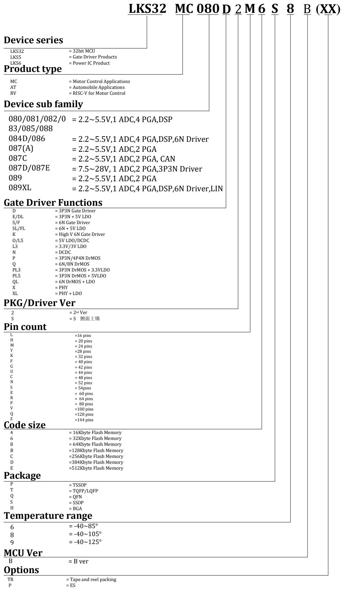  
图 1-1 凌鸥创芯器件命名规则

## 1.4 系统资源框图

此处以LKS32MC080R8T8为例，其他型号硬件资源细节，请参考选型表。

## LKS32MC080R8T8 Resource Diagram

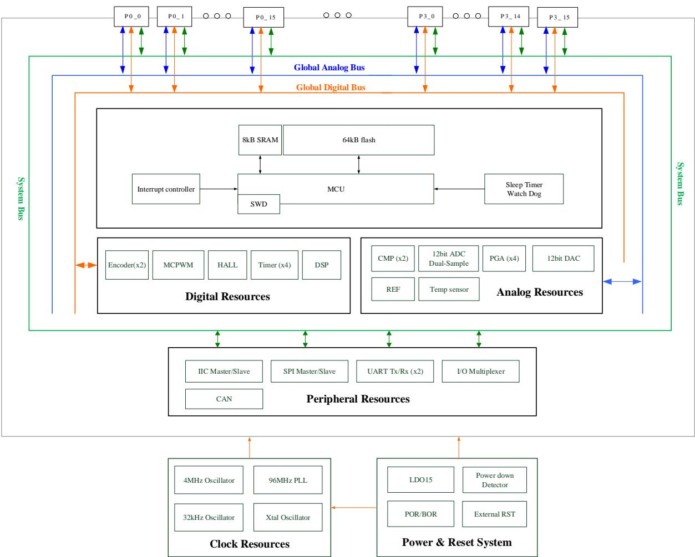  
图 1-2 LKS32MC080R8T8 系统资源框图

## 1.5 矢量正弦控制系统

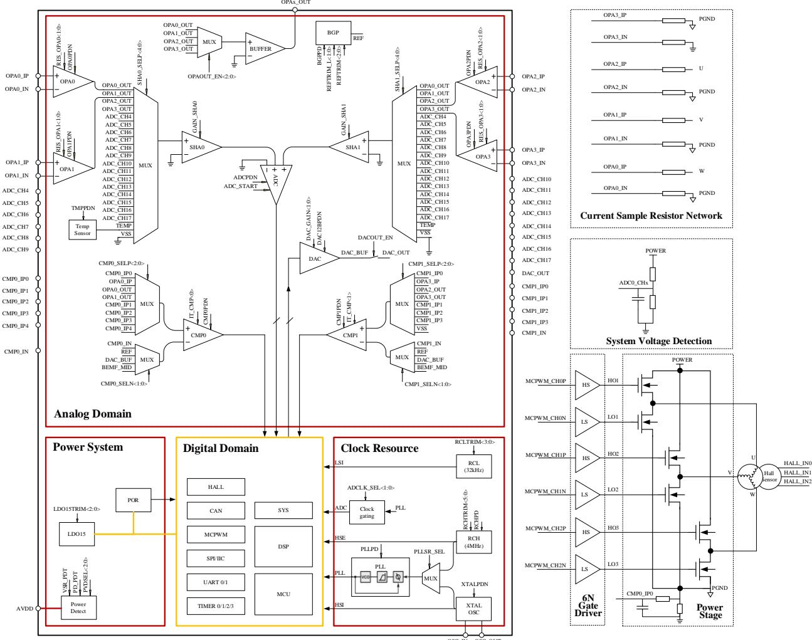  
图 1-3LKS32MC08X 矢量正弦控制系统简化原理图

## 2 器件选型表

表 2-1 LKS08x 系列器件选型表

<table><tr><td></td><td>主频(MHz)</td><td>Flash(kB)</td><td>RAM(kB)</td><td>ADC通道数</td><td>DAC</td><td>比较器</td><td>比较器通道数</td><td>OPA</td><td>HALL</td><td>SPI</td><td>IIC</td><td>UART</td><td>CAN</td><td>Temp.Sensor</td><td>PLL</td><td>QEP</td><td>Gate driver</td><td>预驱电流(A)</td><td>预驱电源(V)</td><td>栅浮耐压(V)</td><td>其他</td><td>Package</td></tr><tr><td>LKS32MC080R8T8(B)</td><td>96</td><td>64</td><td>8</td><td>13</td><td>12BITx1</td><td>2</td><td>9</td><td>4</td><td>3路</td><td>1</td><td>1</td><td>2</td><td>Yes</td><td>Yes</td><td>Yes</td><td>Yes</td><td></td><td></td><td></td><td></td><td></td><td>LQFP64</td></tr><tr><td>LKS32MC081C8T8(B)</td><td>96</td><td>64</td><td>8</td><td>12</td><td>12BITx1</td><td>2</td><td>9</td><td>4</td><td>3路</td><td>1</td><td>1</td><td>2</td><td></td><td>Yes</td><td>Yes</td><td></td><td></td><td></td><td></td><td></td><td></td><td>TQFP48</td></tr><tr><td>LKS32MC082K8Q8(B)</td><td>96</td><td>64</td><td>8</td><td>8</td><td>12BITx1</td><td>2</td><td>6</td><td>3</td><td>3路</td><td>1</td><td>1</td><td>2</td><td></td><td>Yes</td><td>Yes</td><td></td><td></td><td></td><td></td><td></td><td></td><td>QFN5*5 32L-0.75</td></tr><tr><td>LKS32MC083C8T8(B)</td><td>96</td><td>64</td><td>8</td><td>12</td><td>12BITx1</td><td>2</td><td>9</td><td>4</td><td>3路</td><td>1</td><td>1</td><td>2</td><td>Yes</td><td>Yes</td><td>Yes</td><td>Yes</td><td></td><td></td><td></td><td></td><td></td><td>TQFP48</td></tr><tr><td>LKS32MC087M6S8(B)</td><td>96</td><td>32</td><td>8</td><td>5</td><td>12BITx1</td><td>2</td><td>6</td><td>2</td><td>3路</td><td></td><td></td><td>1</td><td></td><td>Yes</td><td>Yes</td><td></td><td></td><td></td><td></td><td></td><td></td><td>SSOP24L</td></tr><tr><td>LKS32MC087AM6S8(B)</td><td>96</td><td>32</td><td>8</td><td>5</td><td>12BITx1</td><td>2</td><td>6</td><td>2</td><td>3路</td><td></td><td></td><td>1</td><td></td><td>Yes</td><td>Yes</td><td></td><td></td><td></td><td></td><td></td><td></td><td>SSOP24L</td></tr><tr><td>LKS32MC087CM8S8(B)</td><td>96</td><td>64</td><td>8</td><td>5</td><td>12BITx1</td><td>2</td><td>6</td><td>2</td><td>3路</td><td></td><td></td><td>1</td><td>Yes</td><td>Yes</td><td>Yes</td><td></td><td></td><td></td><td></td><td></td><td></td><td>SSOP24L</td></tr><tr><td>LKS32MC088C6T8(B)</td><td>96</td><td>32</td><td>8</td><td>12</td><td>12BITx1</td><td>2</td><td>9</td><td>4</td><td>3路</td><td>1</td><td>1</td><td>2</td><td></td><td>Yes</td><td>Yes</td><td></td><td></td><td></td><td></td><td></td><td></td><td>TQFP48</td></tr></table>

\*1：部分型号由于集成多种预驱，分为多种版本，预驱供电电压范围不同，具体参考电气性能参数。  
\*2：部分型号集成 5VLDO，当芯片使用7.5\~28V VCC 供电时，内部LDO可产生 5V电源给MCU 供电，或供电至片外，具体以管脚说明为准。

## 3 管脚分布

## 3.1 管脚分布图及管脚说明

## 3.1.1 特别说明

下列引脚图中红色 PIN 脚内置上拉至 AVDD 的电阻：

RSTN 引脚内置 100kΩ 上拉电阻，固定开启上拉

SWDIO/SWCLK 内置 10kΩ 上拉电阻，固定开启上拉

其余红色 PIN 脚内置 10kΩ 上拉电阻，可软件控制开启关闭上拉

UARTx\_TX(RX)： UART 的 TX 和 RX 支持互换。当 GPIO 第二功能选择为 UART，且 GPIO\_PIE即输入使能时，可以作为 UART\_RX 使用；当 GPIO\_POE 使能时，可以作为 UART\_TX 使用。一般同一GPIO不同时使能输入和输出，否则输入 PDI 会接收到 PDO发出的数据。

SPI\_DI(DO)：SPI 的 DI 和 DO 支持互换，当 GPIO 第二功能选择为 SPI，且 GPIO\_PIE 即输入使能时，可以作为SPI\_DI 使用；当GPIO\_POE 即输出使能时，可以作为 SPI\_DO使用。一般同一GPIO不同时使能输入和输出，否则输入 PDI会接收到PDO 发出的数据。

## 3.1.2 LKS32MC080R8T8(B)

  
图 3-1 LKS32MC080R8T8(B)管脚分布图

表 3-1 LKS32MC080R8T8(B)管脚说明

<table><tr><td>编号</td><td>名称</td><td>类型</td><td>功能说明</td></tr><tr><td>1</td><td>ADC_CH4/DAC_OUT/P0.0</td><td>输入/输出</td><td>ADC通道4/DAC输出/P0.0,内置可软件开启的10k上拉电阻</td></tr><tr><td>2</td><td>ADC_CH6/P0.1</td><td>输入/输出</td><td>ADC通道6/P0.1</td></tr><tr><td>3</td><td>RSTN/P0.2</td><td>输入/输出</td><td>RSTN/P0.2,默认作为RSTN使用,外部接一个10nF~100nF的电容到地即可,内部已有100k上拉电阻。建议PCB上在RSTN和AVDD之间放一个10k~20k的上拉电阻,外部有上拉电阻的情况,RSTN的电容固定为100nF。</td></tr><tr><td>4</td><td>AVSS</td><td>地</td><td>系统地</td></tr><tr><td>5</td><td>AVDD</td><td>电源</td><td>芯片电源输入,片外去耦电容建议≥1uF,并尽量靠</td></tr></table>

## 管脚分布

<table><tr><td>编号</td><td>名称</td><td>类型</td><td>功能说明</td></tr><tr><td></td><td></td><td></td><td>近 AVDD 引脚</td></tr><tr><td>6</td><td>P3.2</td><td>输入/输出</td><td>P3.2</td></tr><tr><td>7</td><td>P3.4</td><td>输入/输出</td><td>P3.4</td></tr><tr><td>8</td><td>SCL/TIM2_CH0/ADC_CH7/P0.3</td><td>输入/输出</td><td>IIC 时钟/Timer2 通道 0/ADC 通道 7/P0.3</td></tr><tr><td>9</td><td>SDA/TIM2_CH1/ADC_CH8/P0.4</td><td>输入/输出</td><td>IIC 数据/Timer2 通道 1/ADC 通道 8/P0.4</td></tr><tr><td>10</td><td>ADC_CH9/P0.5</td><td>输入/输出</td><td>ADC 通道 9/P0.5</td></tr><tr><td>11</td><td>UART1_TX(RX)/TIM1_CH0/CAN_RX/P0.6</td><td>输入/输出</td><td>UART1_TX(RX)/Timer1 通道 0/CAN RX/P0.6,内置可软件开启的 10k 上拉电阻</td></tr><tr><td>12</td><td>UART1_TX(RX)/TIM1_CH1/CAN_TX/P0.7</td><td>输入/输出</td><td>UART1_TX(RX)/Timer1 通道 1/CAN TX/P0.7,内置可软件开启的 10k 上拉电阻</td></tr><tr><td>13</td><td>SPI_CS/P1.1</td><td>输入/输出</td><td>SPI CS 片选信号 /P1.1</td></tr><tr><td>14</td><td>MCPWM_CH1P/TIM2_CH0/P2.11</td><td>输入/输出</td><td>电机 PWM 通道 1 高边/Timer2 通道 0/P2.11</td></tr><tr><td>15</td><td>MCPWM_CH1N/TIM2_CH1/ADC_TRIG2/P2.12</td><td>输入/输出</td><td>电机 PWM 通道 1 低边/Timer2 通道 1/ADC 触发信号 2/P2.12</td></tr><tr><td>16</td><td>P0.8</td><td>输入/输出</td><td>P0.8</td></tr><tr><td>17</td><td>SCL/TIM2_CH0/P0.9</td><td>输入/输出</td><td>IIC 时钟/Timer2 通道 0/P0.9</td></tr><tr><td>18</td><td>SDA/TIM2_CH1/P0.10</td><td>输入/输出</td><td>IIC 数据/Timer2 通道 1/P0.10,</td></tr><tr><td>19</td><td>HALL_IN0/TIM3_CH0/ADC_CH15/CMP0_IP1/P0.11</td><td>输入/输出</td><td>Hall 传感器 A 相输入/Timer3 通道 0/ADC 通道 15/比较器 0 同相端输入通道 1/P0.11</td></tr><tr><td>20</td><td>HALL_IN1/TIM3_CH1/CAN_RX/ADC_CH16/CMP0_IP2/P0.12</td><td>输入/输出</td><td>Hall 传感器 B 相输入/Timer3 通道 1/CAN RX/ADC通道 16/比较器 0 同相端输入通道 2/P0.12</td></tr><tr><td>21</td><td>HALL_IN2/CAN_TX/ADC_CH17/CMP0_IP3/P0.13</td><td>输入/输出</td><td>Hall 传感器 C 相输入/CAN TX/ADC 通道 17/比较器 0同相端输入通道 3/P0.13</td></tr><tr><td>22</td><td>CMP0_OUT/MCPWM_BKIN1/SPI_CLK/TIM0_CH1/ADC_TRIG0/SIF/ADC_CH10/CMP0_IP4/P0.14</td><td>输入/输出</td><td>比较器 0 输出/电机 PWM 终止信号 1/SPI 时钟/Timer0 通道 1/ADC 触发信号 0/一线通/ADC 通道10/比较器 0 同相端输入通道 4/P0.14</td></tr><tr><td>23</td><td>MCPWM_CHOP/UART0_TX(RX)/SPI_DI(DO)/TIM0_CH0/ADC_TRIG1/CMP0_IN/P0.15</td><td>输入/输出</td><td>电机 PWM 通道 0 高边/UART0_TX(RX)/ SPI_DI(DO)/Timer0 通道 0/ADC 触发信号 1/比较器 0 反相端输入/P0.15</td></tr><tr><td>24</td><td>MCPWM_CHON/UART0_TX(RX)/SPI_DI(DO)/P1.0</td><td>输入/输出</td><td>电机 PWM 通道 0 低边/UART0_TX(RX)/ SPI_DI(DO)/P1.0,内置可软件开启的 10k 上拉电阻</td></tr><tr><td>25</td><td>P3.6</td><td>输入/输出</td><td>P3.6</td></tr><tr><td>26</td><td>TIM3_CH0/P1.2</td><td>输入/输出</td><td>Timer3 通道 0/P1.2</td></tr><tr><td>27</td><td>TIM3_CH1/ADC_CH5/P1.3</td><td>输入/输出</td><td>Timer3 通道 1/ADC 通道 5/P1.3,内置可软件开启的10k 上拉电阻</td></tr><tr><td>28</td><td>OPA0_IP/P3.5</td><td>输入/输出</td><td>运放 0 同相端输入/P3.5</td></tr><tr><td>29</td><td>OPA0_IN/P3.7</td><td>输入/输出</td><td>运放 0 反相端输入/P3.7</td></tr><tr><td>30</td><td>ADC_CH11/OPAx_OUT/LDO15/P2.7</td><td>输入/输出</td><td>ADC 通道 11/OPAx 输出/LDO15 输出/P2.7,内置可软件开启的 10k 上拉电阻</td></tr><tr><td>31</td><td>OPA1_IP/P3.0</td><td>输入/输出</td><td>运放 1 同相端输入/P3.0</td></tr><tr><td>32</td><td>OPA1_IN/P3.1</td><td>输入/输出</td><td>运放 1 反相端输入/P3.1</td></tr><tr><td>33</td><td>UART1_TX(RX)/TIM3_CH0/OSC_IN/P2.8</td><td>输入/输出</td><td>UART1_TX(RX)/Timer3 通道 0/晶振输入/P2.8,内置</td></tr></table>

## 管脚分布

<table><tr><td>编号</td><td>名称</td><td>类型</td><td>功能说明</td></tr><tr><td></td><td></td><td></td><td>可软件开启的10k上拉电阻,如接晶体,该引脚接一个15pf电容到地。</td></tr><tr><td>34</td><td>UART1_TX(RX)/TIM3_CH1/OSC_OUT/P3.9</td><td>输入/输出</td><td>UART1_TX(RX)/Timer3通道1/晶振输出/P3.9,内置可软件开启的10k上拉电阻,如接晶体,该引脚接一个15pf电容到地。</td></tr><tr><td>35</td><td>MCPWM_CH1N/P1.12</td><td>输入</td><td>电机PWM通道1低边/P1.12</td></tr><tr><td>36</td><td>SPI_CLK/TIMO_CH0/P1.13</td><td>输入/输出</td><td>SPI时钟/Timer0通道0/P1.13</td></tr><tr><td>37</td><td>SPI_DI(DO)/TIM0_CH1/P1.14</td><td>输入/输出</td><td>SPI DO/Timer0通道1/P1.14</td></tr><tr><td>38</td><td>MCPWM_CH2N/P1.15</td><td>输入</td><td>电机PWM通道2低边/P1.15</td></tr><tr><td>39</td><td>SPI_CS/TIM2_CH1/P2.0</td><td>输入/输出</td><td>SPI CS/Timer2通道1/P2.0</td></tr><tr><td>40</td><td>LRC/MCPWM_CHOP/P1.4</td><td>输入/输出</td><td>32kHz RC时钟输出/电机PWM通道0高边/P1.4</td></tr><tr><td>41</td><td>HRC/MCPWM_CHON/P1.5</td><td>输入/输出</td><td>4MHz RC时钟输出/电机PWM通道0低边/P1.5</td></tr><tr><td>42</td><td>MCPWM_CH1P/P1.6</td><td>输入/输出</td><td>电机PWM通道1高边/P1.6</td></tr><tr><td>43</td><td>MCPWM_CH1N/P1.7</td><td>输入/输出</td><td>电机PWM通道1低边/P1.7</td></tr><tr><td>44</td><td>MCPWM_CH2P/P1.8</td><td>输入/输出</td><td>电机PWM通道2高边/P1.8</td></tr><tr><td>45</td><td>MCPWM_CH2N/P1.9</td><td>输入/输出</td><td>电机PWM通道2低边/P1.9</td></tr><tr><td>46</td><td>ADC_CH13/MCPWM_CH3P/UART0_TX(RX)/SCL/TIMO_CH0/ADC_TRIG2/P1.10</td><td>输入/输出</td><td>电机PWM通道3高边/UART0_TX(RX)/IIC时钟/Timer0通道0/ADC触发信号2/P1.10,内置可软件开启的10k上拉电阻</td></tr><tr><td>47</td><td>MCPWM_CH3N/UART0_TX(RX)/SDA/TIMO_CH1/ADC_TRIG3/SIF/P1.11</td><td>输入/输出</td><td>电机PWM通道3低边/UART0_TX(RX)/IIC数据/Timer0通道1/ADC触发信号3/P1.11,内置可软件开启的10k上拉电阻</td></tr><tr><td>48</td><td>OPA2_IP/P3.10</td><td>输入/输出</td><td>运放2同相端输入/P3.10</td></tr><tr><td>49</td><td>OPA2_IN/P3.11</td><td>输入/输出</td><td>运放2反相端输入/P3.11</td></tr><tr><td>50</td><td>SPI_DI(DO)/SCL/ADC_CH12/CMP0_IP0/P2.9</td><td>输入/输出</td><td>SPI_DI(DO)/IIC时钟/ADC通道12/比较器0同相端输入通道0/P2.9</td></tr><tr><td>51</td><td>SPI_DI(DO)/SDA/P2.10</td><td>输入/输出</td><td>SPI_DI(DO)/IIC数据/P2.10,内置可软件开启的10k上拉电阻</td></tr><tr><td>52</td><td>OPA3_IN/P3.14</td><td>输入/输出</td><td>运放3反相端输入/P3.14</td></tr><tr><td>53</td><td>OPA3_IP/P3.15</td><td>输入/输出</td><td>运放3同相端输入/P3.15</td></tr><tr><td>54</td><td>SPI_CLK/ADC_CH14/CMP1_IP0/P2.1</td><td>输入/输出</td><td>SPI时钟/ADC通道14/比较器1同相端输入通道0/P2.1,内置可软件开启的10k上拉电阻</td></tr><tr><td>55</td><td>CMP1_IN/P2.2</td><td>输入/输出</td><td>比较器1反相端输入/P2.2</td></tr><tr><td>56</td><td>CMP1_OUT/MCPWM_BKIN0/SPI_CS/REF/P2.3</td><td>输入/输出</td><td>比较器1输出/电机PWM终止信号0/SPI片选信号/电压参考信号/P2.3</td></tr><tr><td>57</td><td>HALL_IN0/MCPWM_CH2P/UART1_TX(RX)/TIM1_CH0/ADC_TRIG3/CAN_RX/CMP1_IP1/P2.4</td><td>输入/输出</td><td>Hall传感器A相输入/电机PWM通道2高边/UART1_TX(RX)/Timer1通道0/ADC触发信号3/CAN RX/比较器1同相端输入通道1/P2.4,内置可软件开启的10k上拉电阻</td></tr><tr><td>58</td><td>HALL_IN1/MCPWM_CH2N/UART1_TX(RX)/TIM1_CH1/ADC_TRIG0/CAN_TX/CMP1_IP2/P2.5</td><td>输入/输出</td><td>Hall传感器B相输入/电机PWM通道2低边/UART1_TX(RX)/Timer1通道1/ADC触发信号0/CAN TX/比较器1同相端输入通道2/P2.5,内置可</td></tr></table>

管脚分布

<table><tr><td>编号</td><td>名称</td><td>类型</td><td>功能说明</td></tr><tr><td></td><td></td><td></td><td>软件开启的 10k 上拉电阻</td></tr><tr><td>59</td><td>HALL_IN2/MCPWM_CH3P/TIM3_CH0/ADC_TRIG1/CMP1_IP3/P2.6</td><td>输入/输出</td><td>Hall 传感器 C 相输入/电机 PWM 通道 3 高边 /Timer3 通道 0/ADC 触发信号 1/比较器 1 同相端输入通道 3/P2.6,内置可软件开启的 10k 上拉电阻</td></tr><tr><td>60</td><td>MCPWM_CH3N/TIM3_CH1/P2.13</td><td>输入/输出</td><td>电机 PWM 通道 3 低边 /Timer3 通道 1/P2.13</td></tr><tr><td>61</td><td>SWCLK</td><td>输入</td><td>SWD 时钟,内置固定上拉的 10k 电阻</td></tr><tr><td>62</td><td>SWDIO</td><td>输入/输出</td><td>SWD 数据,内置固定上拉的 10k 电阻</td></tr><tr><td>63</td><td>SCL/P2.14</td><td>输入/输出</td><td>IIC 时钟/P2.14</td></tr><tr><td>64</td><td>SDA/P2.15</td><td>输入/输出</td><td>IIC 数据/P2.15</td></tr></table>

## 3.1.3 LKS32MC081C8T8(B)/LKS32MC088C6T8(B)

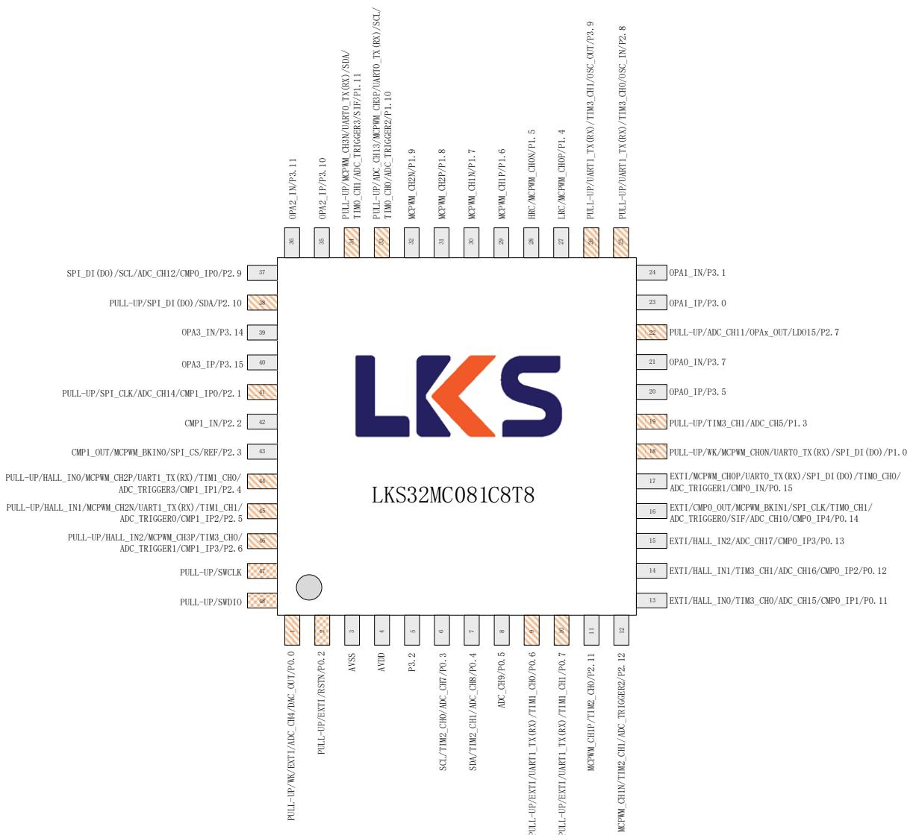  
图 3-2 LKS32MC081C8T8(B)/LKS32MC088C6T8(B)管脚分布图  
LKS32MC081C8T8(B)/LKS32MC088C6T8(B)引脚完全兼容

## 管脚分布

表 3-2 LKS32MC081C8T8(B)/LKS32AT085C8Q9(B)/LKS32MC088C6T8(B)管脚说明

<table><tr><td>编号</td><td>名称</td><td>类型</td><td>功能说明</td></tr><tr><td>1</td><td>ADC_CH4/DAC_OUT/P0.0</td><td>输入/输出</td><td>ADC通道4/DAC输出/P0.0,内置可软件开启的10k上拉电阻</td></tr><tr><td>2</td><td>RSTN/P0.2</td><td>输入/输出</td><td>RSTN/P0.2,默认作为RSTN使用,外部接一个10nF~100nF的电容到地即可,内部已有100k上拉电阻。建议PCB上在RSTN和AVDD之间放一个10k~20k的上拉电阻,外部有上拉电阻的情况,RSTN的电容固定为100nF。</td></tr><tr><td>3</td><td>AVSS</td><td>地</td><td>系统地</td></tr><tr><td>4</td><td>AVDD</td><td>电源</td><td>芯片电源输入。片外去耦电容建议≥1uF,并尽量靠近AVDD引脚</td></tr><tr><td>5</td><td>P3.2</td><td>输入/输出</td><td>P3.2</td></tr><tr><td>6</td><td>SCL/TIM2_CH0/ADC_CH7/P0.3</td><td>输入/输出</td><td>IIC时钟/Timer2通道0/ADC通道7/P0.3</td></tr><tr><td>7</td><td>SDA/TIM2_CH1/ADC_CH8/P0.4</td><td>输入/输出</td><td>IIC数据/Timer2通道1/ADC通道8/P0.4</td></tr><tr><td>8</td><td>ADC_CH9/P0.5</td><td>输入/输出</td><td>ADC通道9/P0.5</td></tr><tr><td>9</td><td>UART1_TX(RX)/TIM1_CH0/P0.6</td><td>输入/输出</td><td>UART1_TX(RX)/Timer1通道0/P0.6,内置可软件开启的10k上拉电阻</td></tr><tr><td>10</td><td>UART1_TX(RX)/TIM1_CH1/P0.7</td><td>输入/输出</td><td>UART1_TX(RX)/Timer1通道1/P0.7,内置可软件开启的10k上拉电阻</td></tr><tr><td>11</td><td>MCPWM_CH1P/TIM2_CH0/P2.11</td><td>输入/输出</td><td>电机PWM通道1高边/Timer2通道0/P2.11</td></tr><tr><td>12</td><td>MCPWM_CH1N/TIM2_CH1/ADC_TRIG2/P2.12</td><td>输入/输出</td><td>电机PWM通道1低边/Timer2通道1/ADC触发信号2/P2.12</td></tr><tr><td>13</td><td>HALL_IN0/TIM3_CH0/ADC_CH15/CMP0_IP1/P0.11</td><td>输入/输出</td><td>Hall传感器A相输入/Timer3通道0/ADC通道15/比较器0同相端输入通道1/P0.11</td></tr><tr><td>14</td><td>HALL_IN1/TIM3_CH1/ADC_CH16/CMP0_IP2/P0.12</td><td>输入/输出</td><td>Hall传感器B相输入/Timer3通道1/ADC通道16/比较器0同相端输入通道2/P0.12</td></tr><tr><td>15</td><td>HALL_IN2/ADC_CH17/CMP0_IP3/P0.13</td><td>输入/输出</td><td>Hall传感器C相输入/ADC通道17/比较器0同相端输入通道3/P0.13</td></tr><tr><td>16</td><td>CMP0_OUT/MCPWM_BKIN1/SPI_CLK/TIM0_CH1/ADC_TRIG0/SIF/ADC_CH10/CMP0_IP4/P0.14</td><td>输入/输出</td><td>比较器0输出/电机PWM终止信号1/SPI时钟/Timer0通道1/ADC触发信号0/一线通/ADC通道10/比较器0同相端输入通道4/P0.14</td></tr><tr><td>17</td><td>MCPWM_CHOP/UART0_TX(RX)/SPI_DI(DO)/TIM0_CH0/ADC_TRIG1/CMP0_IN/P0.15</td><td>输入/输出</td><td>电机PWM通道0高边/UART0_TX(RX)/SPI_DI(DO)/Timer0通道0/ADC触发信号1/比较器0反相端输入/P0.15</td></tr><tr><td>18</td><td>MCPWM_CHON/UART0_TX(RX)/SPI_DI(DO)/P1.0</td><td>输入/输出</td><td>电机PWM通道0低边/UART0_TX(RX)/SPI_DI(DO)/P1.0,内置可软件开启的10k上拉电阻</td></tr><tr><td>19</td><td>TIM3_CH1/ADC_CH5/P1.3</td><td>输入/输出</td><td>Timer3通道1/ADC通道5/P1.3,内置可软件开启的10k上拉电阻</td></tr><tr><td>20</td><td>OPA0_IP/P3.5</td><td>输入/输出</td><td>运放0同相端输入/P3.5</td></tr><tr><td>21</td><td>OPA0_IN/P3.7</td><td>输入/输出</td><td>运放0反相端输入/P3.7</td></tr><tr><td>22</td><td>ADC_CH11/OPAx_OUT/LDO15/P2.7</td><td>输入/输出</td><td>ADC通道11/OPAx输出/LDO15输出/P2.7,内置可</td></tr></table>

## 管脚分布

<table><tr><td>编号</td><td>名称</td><td>类型</td><td>功能说明</td></tr><tr><td></td><td></td><td></td><td>软件开启的10k上拉电阻</td></tr><tr><td>23</td><td>OPA1_IP/P3.0</td><td>输入/输出</td><td>运放1同相端输入/P3.0</td></tr><tr><td>24</td><td>OPA1_IN/P3.1</td><td>输入/输出</td><td>运放1反相端输入/P3.1</td></tr><tr><td>25</td><td>UART1_TX(RX)/TIM3_CH0/OSC_IN/P2.8</td><td>输入/输出</td><td>UART1_TX(RX)/Timer3通道0/晶振输入/P2.8,内置可软件开启的10k上拉电阻,如接晶体,该引脚接一个15pf电容到地。</td></tr><tr><td>26</td><td>UART1_TX(RX)/TIM3_CH1/OSC_OUT/P3.9</td><td>输入/输出</td><td>UART1_TX(RX)/Timer3通道1/晶振输出/P3.9,内置可软件开启的10k上拉电阻,如接晶体,该引脚接一个15pf电容到地。</td></tr><tr><td>27</td><td>LRC/MCPWM_CH0P/P1.4</td><td>输入/输出</td><td>32kHz RC时钟输出/电机PWM通道0高边/P1.4</td></tr><tr><td>28</td><td>HRC/MCPWM_CH0N/P1.5</td><td>输入/输出</td><td>4MHz RC时钟输出/电机PWM通道0低边/P1.5</td></tr><tr><td>29</td><td>MCPWM_CH1P/P1.6</td><td>输入/输出</td><td>电机PWM通道1高边/P1.6</td></tr><tr><td>30</td><td>MCPWM_CH1N/P1.7</td><td>输入/输出</td><td>电机PWM通道1低边/P1.7</td></tr><tr><td>31</td><td>MCPWM_CH2P/P1.8</td><td>输入/输出</td><td>电机PWM通道2高边/P1.8</td></tr><tr><td>32</td><td>MCPWM_CH2N/P1.9</td><td>输入/输出</td><td>电机PWM通道2低边/P1.9</td></tr><tr><td>33</td><td>ADC_CH13/MCPWM_CH3P/UART0_TX(RX)/SCL/TIMO_CH0/ADC_TRIG2/P1.10</td><td>输入/输出</td><td>电机PWM通道3高边/UART0_TX(RX)/IIC时钟/Timer0通道0/ADC触发信号2/P1.10,内置可软件开启的10k上拉电阻</td></tr><tr><td>34</td><td>MCPWM_CH3N/UART0_TX(RX)/SDA/TIMO_CH1/ADC_TRIG3/SIF/P1.11</td><td>输入/输出</td><td>电机PWM通道3低边/UART0_TX(RX)/IIC数据/Timer0通道1/ADC触发信号3/P1.11,内置可软件开启的10k上拉电阻</td></tr><tr><td>35</td><td>OPA2_IP/P3.10</td><td>输入/输出</td><td>运放2同相端输入/P3.10</td></tr><tr><td>36</td><td>OPA2_IN/P3.11</td><td>输入/输出</td><td>运放2反相端输入/P3.11</td></tr><tr><td>37</td><td>SPI_DI(DO)/SCL/ADC_CH12/CMP0_IP0/P2.9</td><td>输入/输出</td><td>SPI_DI(DO)/IIC时钟/ADC通道12/比较器0同相端输入通道0/P2.9</td></tr><tr><td>38</td><td>SPI_DI(DO)/SDA/P2.10</td><td>输入/输出</td><td>SPI_DI(DO)/IIC数据/P2.10,内置可软件开启的10k上拉电阻</td></tr><tr><td>39</td><td>OPA3_IN/P3.14</td><td>输入/输出</td><td>运放3反相端输入/P3.14</td></tr><tr><td>40</td><td>OPA3_IP/P3.15</td><td>输入/输出</td><td>运放3同相端输入/P3.15</td></tr><tr><td>41</td><td>SPI_CLK/ADC_CH14/CMP1_IP0/P2.1</td><td>输入/输出</td><td>SPI时钟/ADC通道14/比较器1同相端输入通道0/P2.1,内置可软件开启的10k上拉电阻</td></tr><tr><td>42</td><td>CMP1_IN/P2.2</td><td>输入/输出</td><td>比较器1反相端输入/P2.2</td></tr><tr><td>43</td><td>CMP1_OUT/MCPWM_BKIN0/SPI_CS/REF/P2.3</td><td>输入/输出</td><td>比较器1输出/电机PWM终止信号0/SPI片选信号/电压参考信号/P2.3</td></tr><tr><td>44</td><td>HALL_IN0/MCPWM_CH2P/UART1_TX(RX)/TIM1_CH0/ADC_TRIG3/CMP1_IP1/P2.4</td><td>输入/输出</td><td>Hall传感器A相输入/电机PWM通道2高边/UART1_TX(RX)/Timer1通道0/ADC触发信号3/比较器1同相端输入通道1/P2.4,内置可软件开启的10k上拉电阻。</td></tr><tr><td>45</td><td>HALL_IN1/MCPWM_CH2N/UART1_TX(RX)/TIM1_CH1/ADC_TRIG0/CMP1_IP2/P2.5</td><td>输入/输出</td><td>Hall传感器B相输入/电机PWM通道2低边/UART1_TX(RX)/Timer1通道1/ADC触发信号0/比较器1同相端输入通道2/P2.5,内置可软件开启的10k上拉电阻</td></tr></table>

管脚分布

<table><tr><td>编号</td><td>名称</td><td>类型</td><td>功能说明</td></tr><tr><td>46</td><td>HALL_IN2/MCPWM_CH3P/TIM3_CH0/ADC_TRIG1/CMP1_IP3/P2.6</td><td>输入/输出</td><td>Hall 传感器 C 相输入/电机 PWM 通道 3 高边 /Timer3 通道 0/ADC 触发信号 1/比较器 1 同相端输入通道 3/P2.6,内置可软件开启的 10k 上拉电阻</td></tr><tr><td>47</td><td>SWCLK</td><td>输入</td><td>SWD 时钟,内置固定上拉的 10k 电阻</td></tr><tr><td>48</td><td>SWDIO</td><td>输入/输出</td><td>SWD 数据,内置固定上拉的 10k 电阻</td></tr></table>

## 3.1.4 LKS32MC082K8Q8(B)

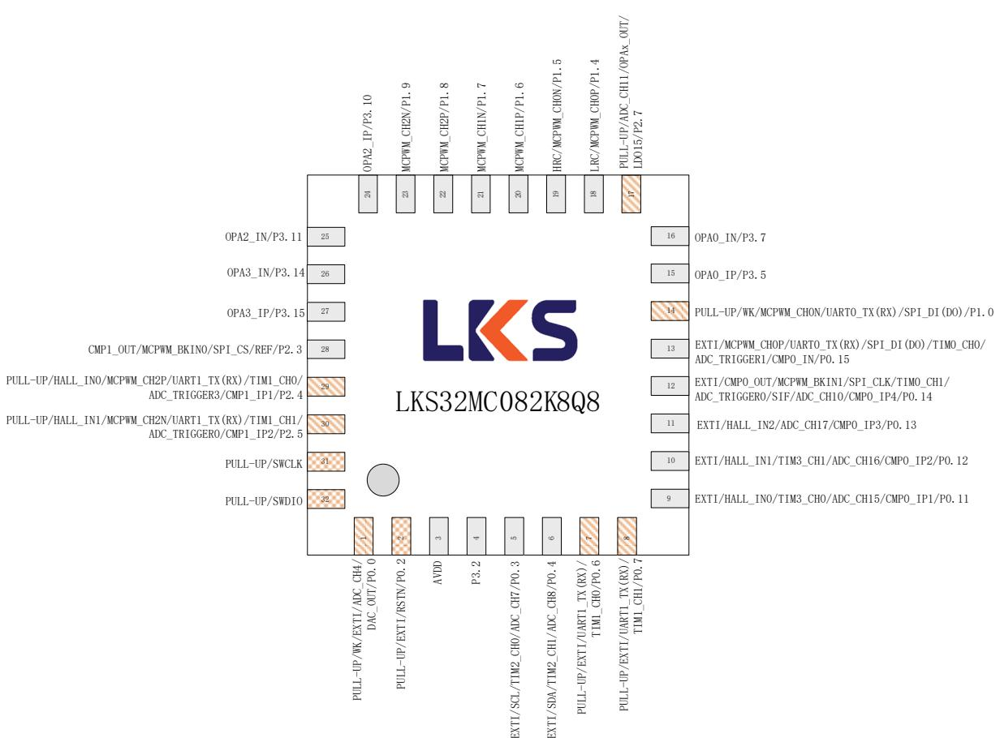  
图 3-3 LKS32MC082K8Q8(B)管脚分布图

表 3-3 LKS32MC082K8Q8(B)管脚说明

<table><tr><td>编号</td><td>名称</td><td>类型</td><td>功能说明</td></tr><tr><td>0</td><td>AVSS</td><td>地</td><td>系统地,0脚位于芯片底下的焊盘</td></tr><tr><td>1</td><td>ADC_CH4/DAC_OUT/P0.0</td><td>输入/输出</td><td>ADC通道4/DAC输出/P0.0,内置可软件开启的10k上拉电阻</td></tr><tr><td>2</td><td>RSTN/P0.2</td><td>输入/输出</td><td>RSTN/P0.2,默认作为RSTN使用,外部接一个10nF~100nF的电容到地即可,内部已有100k上拉电阻。建议PCB上在RSTN和AVDD之间放一个10k~20k的上拉电阻,外部有上拉电阻的情况,RSTN的电容固定为100nF。</td></tr></table>

## 管脚分布

<table><tr><td>编号</td><td>名称</td><td>类型</td><td>功能说明</td></tr><tr><td>3</td><td>AVDD</td><td>电源</td><td>芯片电源输入。片外去耦电容建议≥1uF,并尽量靠近 AVDD 引脚</td></tr><tr><td>4</td><td>P3.2</td><td>输入/输出</td><td>P3.2</td></tr><tr><td>5</td><td>SCL/TIM2_CH0/ADC_CH7/P0.3</td><td>输入/输出</td><td>IIC 时钟/Timer2 通道 0/ADC 通道 7/P0.3</td></tr><tr><td>6</td><td>SDA/TIM2_CH1/ADC_CH8/P0.4</td><td>输入/输出</td><td>IIC 数据/Timer2 通道 1/ADC 通道 8/P0.4</td></tr><tr><td>7</td><td>UART1_TX(RX)/TIM1_CH0/P0.6</td><td>输入/输出</td><td>UART1_TX(RX)/Timer1 通道 0/P0.6,内置可软件开启的 10k 上拉电阻</td></tr><tr><td>8</td><td>UART1_TX(RX)/TIM1_CH1/P0.7</td><td>输入/输出</td><td>UART1_TX(RX)/Timer1 通道 1/P0.7,内置可软件开启的 10k 上拉电阻</td></tr><tr><td>9</td><td>HALL_IN0/TIM3_CH0/ADC_CH15/CMP0_IP1/P0.11</td><td>输入/输出</td><td>Hall 传感器 A 相输入/Timer3 通道 0/ADC 通道 15/比较器 0 同相端输入通道 1/P0.11</td></tr><tr><td>10</td><td>HALL_IN1/TIM3_CH1/ADC_CH16/CMP0_IP2/P0.12</td><td>输入/输出</td><td>Hall 传感器 B 相输入/Timer3 通道 1/ADC 通道 16/比较器 0 同相端输入通道 2/P0.12</td></tr><tr><td>11</td><td>HALL_IN2/ADC_CH17/CMP0_IP3/P0.13</td><td>输入/输出</td><td>Hall 传感器 C 相输入/ADC 通道 17/比较器 0 同相端输入通道 3/P0.13</td></tr><tr><td>12</td><td>CMP0_OUT/MCPWM_BKIN1/SPI_CLK/TIM0_CH1/ADC_TRIG0/SIF/ADC_CH10/CMP0_IP4/P0.14</td><td>输入/输出</td><td>比较器 0 输出/电机 PWM 终止信号 1/SPI 时钟 /Timer0 通道 1/ADC 触发信号 0/一线通/ADC 通道 10/比较器 0 同相端输入通道 4/P0.14</td></tr><tr><td>13</td><td>MCPWM_CHOP/UART0_TX(RX)/SPI_DI(DO)/TIM0_CH0/ADC_TRIG1/CMP0_IN/P0.15</td><td>输入/输出</td><td>电 机 PWM 通 道 0 高边 /UART0_TX(RX)/SPI_DI(DO)/Timer0 通道 0/ADC 触发信号 1/比较器 0 反相端输入/P0.15</td></tr><tr><td>14</td><td>MCPWM_CHON/UART0_TX(RX)/SPI_DI(DO)/P1.0</td><td>输入/输出</td><td>电 机 PWM 通 道 0 低边 /UART0_TX(RX)/SPI_DI(DO)/P1.0,内置可软件开启的 10k 上拉电阻</td></tr><tr><td>15</td><td>OPA0_IP/P3.5</td><td>输入/输出</td><td>运放 0 同相端输入/P3.5</td></tr><tr><td>16</td><td>OPA0_IN/P3.7</td><td>输入/输出</td><td>运放 0 反相端输入/P3.7</td></tr><tr><td>17</td><td>ADC_CH11/OPAx_OUT/LDO15/P2.7</td><td>输入/输出</td><td>ADC 通道 11/OPAx 输出/LDO15 输出/P2.7,内置可软件开启的 10k 上拉电阻</td></tr><tr><td>18</td><td>LRC/MCPWM_CHOP/P1.4</td><td>输入/输出</td><td>32kHz RC 时钟输出/电机 PWM 通道 0 高边/P1.4</td></tr><tr><td>19</td><td>HRC/MCPWM_CHON/P1.5</td><td>输入/输出</td><td>4MHz RC 时钟输出/电机 PWM 通道 0 低边/P1.5</td></tr><tr><td>20</td><td>MCPWM_CH1P/P1.6</td><td>输入/输出</td><td>电机 PWM 通道 1 高边/P1.6</td></tr><tr><td>21</td><td>MCPWM_CH1N/P1.7</td><td>输入/输出</td><td>电机 PWM 通道 1 低边/P1.7</td></tr><tr><td>22</td><td>MCPWM_CH2P/P1.8</td><td>输入/输出</td><td>电机 PWM 通道 2 高边/P1.8</td></tr><tr><td>23</td><td>MCPWM_CH2N/P1.9</td><td>输入/输出</td><td>电机 PWM 通道 2 低边/P1.9</td></tr><tr><td>24</td><td>OPA2_IP/P3.10</td><td>输入/输出</td><td>运放 2 同相端输入/P3.10</td></tr><tr><td>25</td><td>OPA2_IN/P3.11</td><td>输入/输出</td><td>运放 2 反相端输入/P3.11</td></tr><tr><td>26</td><td>OPA3_IN/P3.14</td><td>输入/输出</td><td>运放 3 反相端输入/P3.14</td></tr><tr><td>27</td><td>OPA3_IP/P3.15</td><td>输入/输出</td><td>运放 3 同相端输入/P3.15</td></tr><tr><td>28</td><td>CMP1_OUT/MCPWM_BKIN0/SPI_CS/REF/P2.3</td><td>输入/输出</td><td>比较器 1 输出/电机 PWM 终止信号 0/SPI 片选信号/电压参考信号/P2.3</td></tr><tr><td>29</td><td>HALL_IN0/MCPWM_CH2P/UART1_TX(RX)/TIM1_CH0/ADC_TRIG3/CMP1_IP1/P2.4</td><td>输入/输出</td><td>Hall 传感器 A 相输入/电机 PWM 通道 2 高边 /UART1_TX(RX)/Timer1 通道 0/ADC 触发信号 3/比</td></tr></table>

管脚分布

<table><tr><td>编号</td><td>名称</td><td>类型</td><td>功能说明</td></tr><tr><td></td><td></td><td></td><td>较器1同相端输入通道1/P2.4,内置可软件开启的10k上拉电阻</td></tr><tr><td>30</td><td>HALL_IN1/MCPWM_CH2N/UART1_TX(RX)/TIM1_CH1/ADC_TRIG0/CMP1_IP2/P2.5</td><td>输入/输出</td><td>Hall传感器B相输入/电机PWM通道2低边/UART1_TX(RX)/Timer1通道1/ADC触发信号0/比较器1同相端输入通道2/P2.5,内置可软件开启的10k上拉电阻</td></tr><tr><td>31</td><td>SWCLK</td><td>输入</td><td>SWD时钟,内置固定上拉的10k电阻</td></tr><tr><td>32</td><td>SWDIO</td><td>输入/输出</td><td>SWD数据,内置固定上拉的10k电阻</td></tr></table>

## 3.1.5 LKS32MC083C8T8(B)

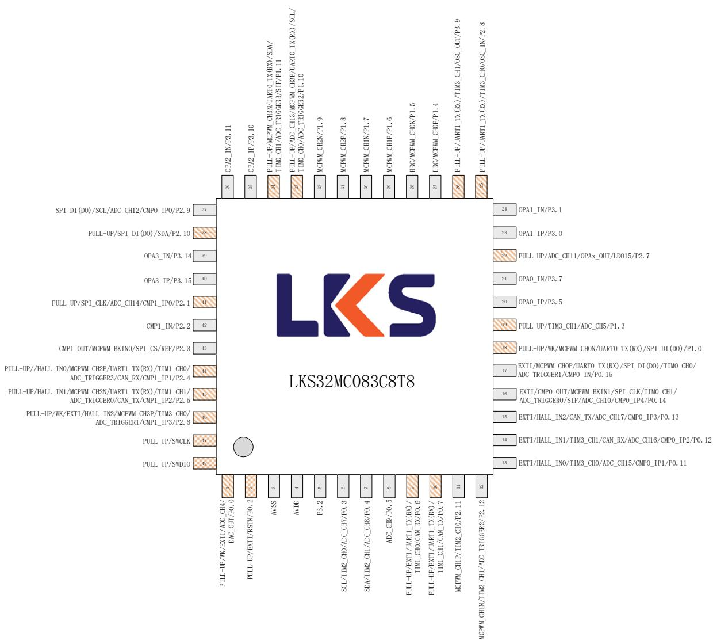  
图 3-4 LKS32MC083C8T8(B)管脚分布图

只有 LKS32MC083 有 CAN 功能，LKS32MC081/088 无 CAN 功能，其余管脚功能完全相同

## 管脚分布

表 3-4 LKS32MC083C8T8(B)管脚说明

<table><tr><td>编号</td><td>名称</td><td>类型</td><td>功能说明</td></tr><tr><td>1</td><td>ADC_CH4/DAC_OUT/P0.0</td><td>输入/输出</td><td>ADC通道4/DAC输出/P0.0,内置可软件开启的10k上拉电阻</td></tr><tr><td>2</td><td>RSTN/P0.2</td><td>输入/输出</td><td>RSTN/P0.2,默认作为RSTN使用,外部接一个10nF~100nF的电容到地即可,内部已有100k上拉电阻。建议PCB上在RSTN和AVDD之间放一个10k~20k的上拉电阻,外部有上拉电阻的情况,RSTN的电容固定为100nF。</td></tr><tr><td>3</td><td>AVSS</td><td>地</td><td>系统地</td></tr><tr><td>4</td><td>AVDD</td><td>电源</td><td>芯片电源输入。片外去耦电容建议≥1uF,并尽量靠近AVDD引脚</td></tr><tr><td>5</td><td>P3.2</td><td>输入/输出</td><td>P3.2</td></tr><tr><td>6</td><td>SCL/TIM2_CH0/ADC_CH7/P0.3</td><td>输入/输出</td><td>IIC时钟/Timer2通道0/ADC通道7/P0.3</td></tr><tr><td>7</td><td>SDA/TIM2_CH1/ADC_CH8/P0.4</td><td>输入/输出</td><td>IIC数据/Timer2通道1/ADC通道8/P0.4</td></tr><tr><td>8</td><td>ADC_CH9/P0.5</td><td>输入/输出</td><td>ADC通道9/P0.5</td></tr><tr><td>9</td><td>UART1_TX(RX)/TIM1_CH0/CAN_RX/P0.6</td><td>输入/输出</td><td>UART1_TX(RX)/Timer1通道0/CAN接收/P0.6,内置可软件开启的10k上拉电阻</td></tr><tr><td>10</td><td>UART1_TX(RX)/TIM1_CH1/CAN_TX/P0.7</td><td>输入/输出</td><td>UART1_TX(RX)/Timer1通道1/CAN发送/P0.7,内置可软件开启的10k上拉电阻</td></tr><tr><td>11</td><td>MCPWM_CH1P/TIM2_CH0/P2.11</td><td>输入/输出</td><td>电机PWM通道1高边/Timer2通道0/P2.11</td></tr><tr><td>12</td><td>MCPWM_CH1N/TIM2_CH1/ADC_TRIG2/P2.12</td><td>输入/输出</td><td>电机PWM通道1低边/Timer2通道1/ADC触发信号2/P2.12</td></tr><tr><td>13</td><td>HALL_IN0/TIM3_CH0/ADC_CH15/CMP0_IP1/P0.11</td><td>输入/输出</td><td>Hall传感器A相输入/Timer3通道0/ADC通道15/比较器0同相端输入通道1/P0.11</td></tr><tr><td>14</td><td>HALL_IN1/TIM3_CH1/CAN_RX/ADC_CH16/CMP0_IP2/P0.12</td><td>输入/输出</td><td>Hall传感器B相输入/Timer3通道1/CAN接收/ADC通道16/比较器0同相端输入通道2/P0.12</td></tr><tr><td>15</td><td>HALL_IN2/CAN_TX/ADC_CH17/CMP0_IP3/P0.13</td><td>输入/输出</td><td>Hall传感器C相输入/CAN发送/ADC通道17/比较器0同相端输入通道3/P0.13</td></tr><tr><td>16</td><td>CMP0_OUT/MCPWM_BKIN1/SPI_CLK/TIM0_CH1/ADC_TRIG0/SIF/ADC_CH10/CMP0_IP4/P0.14</td><td>输入/输出</td><td>比较器0输出/电机PWM终止信号1/SPI时钟/Timer0通道1/ADC触发信号0/一线通/ADC通道10/比较器0同相端输入通道4/P0.14</td></tr><tr><td>17</td><td>MCPWM_CHOP/UART0_TX(RX)/SPI_DI(DO)/TIM0_CH0/ADC_TRIG1/CMP0_IN/P0.15</td><td>输入/输出</td><td>电机PWM通道0高边/UART0_TX(RX)/SPI_DI(DO)/Timer0通道0/ADC触发信号1/比较器0反相端输入/P0.15</td></tr><tr><td>18</td><td>MCPWM_CHON/UART0_TX(RX)/SPI_DI(DO)/P1.0</td><td>输入/输出</td><td>电机PWM通道0低边/UART0_TX(RX)/SPI_DI(DO)/P1.0,内置可软件开启的10k上拉电阻</td></tr><tr><td>19</td><td>TIM3_CH1/ADC_CH5/P1.3</td><td>输入/输出</td><td>Timer3通道1/ADC通道5/P1.3,内置可软件开启的10k上拉电阻</td></tr><tr><td>20</td><td>OPA0_IP/P3.5</td><td>输入/输出</td><td>运放0同相端输入/P3.5</td></tr><tr><td>21</td><td>OPA0_IN/P3.7</td><td>输入/输出</td><td>运放0反相端输入/P3.7</td></tr><tr><td>22</td><td>ADC_CH11/OPAx_OUT/LDO15/P2.7</td><td>输入/输出</td><td>ADC通道11/OPAx输出/LDO15输出/P2.7,内置可</td></tr></table>

## 管脚分布

<table><tr><td>编号</td><td>名称</td><td>类型</td><td>功能说明</td></tr><tr><td></td><td></td><td></td><td>软件开启的10k上拉电阻</td></tr><tr><td>23</td><td>OPA1_IP/P3.0</td><td>输入/输出</td><td>运放1同相端输入/P3.0</td></tr><tr><td>24</td><td>OPA1_IN/P3.1</td><td>输入/输出</td><td>运放1反相端输入/P3.1</td></tr><tr><td>25</td><td>UART1_TX(RX)/TIM3_CH0/OSC_IN/P2.8</td><td>输入/输出</td><td>UART1_TX(RX)/Timer3通道0/晶振输入/P2.8,内置可软件开启的10k上拉电阻,如接晶体,该引脚接一个15pf电容到地。</td></tr><tr><td>26</td><td>UART1_TX(RX)/TIM3_CH1/OSC_OUT/P3.9</td><td>输入/输出</td><td>UART1_TX(RX)/Timer3通道1/晶振输出/P3.9,内置可软件开启的10k上拉电阻,如接晶体,该引脚接一个15pf电容到地。</td></tr><tr><td>27</td><td>LRC/MCPWM_CH0P/P1.4</td><td>输入/输出</td><td>32kHz RC时钟输出/电机PWM通道0高边/P1.4</td></tr><tr><td>28</td><td>HRC/MCPWM_CH0N/P1.5</td><td>输入/输出</td><td>4MHz RC时钟输出/电机PWM通道0低边/P1.5</td></tr><tr><td>29</td><td>MCPWM_CH1P/P1.6</td><td>输入/输出</td><td>电机PWM通道1高边/P1.6</td></tr><tr><td>30</td><td>MCPWM_CH1N/P1.7</td><td>输入/输出</td><td>电机PWM通道1低边/P1.7</td></tr><tr><td>31</td><td>MCPWM_CH2P/P1.8</td><td>输入/输出</td><td>电机PWM通道2高边/P1.8</td></tr><tr><td>32</td><td>MCPWM_CH2N/P1.9</td><td>输入/输出</td><td>电机PWM通道2低边/P1.9</td></tr><tr><td>33</td><td>ADC_CH13/MCPWM_CH3P/UART0_TX(RX)/SCL/TIMO_CH0/ADC_TRIG2/P1.10</td><td>输入/输出</td><td>电机PWM通道3高边/UART0_TX(RX)/IIC时钟/Timer0通道0/ADC触发信号2/P1.10,内置可软件开启的10k上拉电阻</td></tr><tr><td>34</td><td>MCPWM_CH3N/UART0_TX(RX)/SDA/TIMO_CH1/ADC_TRIG3/SIF/P1.11</td><td>输入/输出</td><td>电机PWM通道3低边/UART0_TX(RX)/IIC数据/Timer0通道1/ADC触发信号3/P1.11,内置可软件开启的10k上拉电阻</td></tr><tr><td>35</td><td>OPA2_IP/P3.10</td><td>输入/输出</td><td>运放2同相端输入/P3.10</td></tr><tr><td>36</td><td>OPA2_IN/P3.11</td><td>输入/输出</td><td>运放2反相端输入/P3.11</td></tr><tr><td>37</td><td>SPI_DI(DO)/SCL/ADC_CH12/CMP0_IP0/P2.9</td><td>输入/输出</td><td>SPI_DI(DO)/IIC时钟/ADC通道12/比较器0同相端输入通道0/P2.9</td></tr><tr><td>38</td><td>SPI_DI(DO)/SDA/P2.10</td><td>输入/输出</td><td>SPI_DI(DO)/IIC数据/P2.10,内置可软件开启的10k上拉电阻</td></tr><tr><td>39</td><td>OPA3_IN/P3.14</td><td>输入/输出</td><td>运放3反相端输入/P3.14</td></tr><tr><td>40</td><td>OPA3_IP/P3.15</td><td>输入/输出</td><td>运放3同相端输入/P3.15</td></tr><tr><td>41</td><td>SPI_CLK/ADC_CH14/CMP1_IP0/P2.1</td><td>输入/输出</td><td>SPI时钟/ADC通道14/比较器1同相端输入通道0/P2.1,内置可软件开启的10k上拉电阻</td></tr><tr><td>42</td><td>CMP1_IN/P2.2</td><td>输入/输出</td><td>比较器1反相端输入/P2.2</td></tr><tr><td>43</td><td>CMP1_OUT/MCPWM_BKIN0/SPI_CS/REF/P2.3</td><td>输入/输出</td><td>比较器1输出/电机PWM终止信号0/SPI片选信号/电压参考信号/P2.3</td></tr><tr><td>44</td><td>HALL_IN0/CAN_RX/MCPWM_CH2P/UART1_TX(RX)/TIM1_CH0/ADC_TRIG3/CMP1_IP1/CAN_RX/P2.4</td><td>输入/输出</td><td>Hall传感器A相输入/CAN接收/电机PWM通道2高边/UART1_TX(RX)/Timer1通道0/ADC触发信号3/比较器1同相端输入通道1/CAN接收/P2.4,内置可软件开启的10k上拉电阻。</td></tr><tr><td>45</td><td>HALL_IN1/CAN_TX/MCPWM_CH2N/UART1_TX(RX)/TIM1_CH1/ADC_TRIG0/CMP1_IP2/CAN_TX/P2.5</td><td>输入/输出</td><td>Hall传感器B相输入/CAN发送/电机PWM通道2低边/UART1_TX(RX)/Timer1通道1/ADC触发信号0/比较器1同相端输入通道2/CAN发送/P2.5,内置可软件开启的10k上拉电阻</td></tr></table>

管脚分布

<table><tr><td>编号</td><td>名称</td><td>类型</td><td>功能说明</td></tr><tr><td>46</td><td>HALL_IN2/MCPWM_CH3P/TIM3_CH0/ADC_TRIG1/CMP1_IP3/P2.6</td><td>输入/输出</td><td>Hall 传感器 C 相输入/电机 PWM 通道 3 高边 /Timer3 通道 0/ADC 触发信号 1/比较器 1 同相端输入通道 3/P2.6,内置可软件开启的 10k 上拉电阻</td></tr><tr><td>47</td><td>SWCLK</td><td>输入</td><td>SWD 时钟,内置固定上拉的 10k 电阻</td></tr><tr><td>48</td><td>SWDIO</td><td>输入/输出</td><td>SWD 数据,内置固定上拉的 10k 电阻</td></tr></table>

LKS32MC081C8T8(B) / LKS32MC088C6T8(B)与 LKS32MC083C8T8(B)除了 CAN 功能之外 PINTO PIN，具体差别请参考选型表。其中 LKS32MC081C8T8(B)/ LKS32MC088C6T8(B)没有 CAN 模块。

## 3.1.6 LKS32MC087M6S8(B)

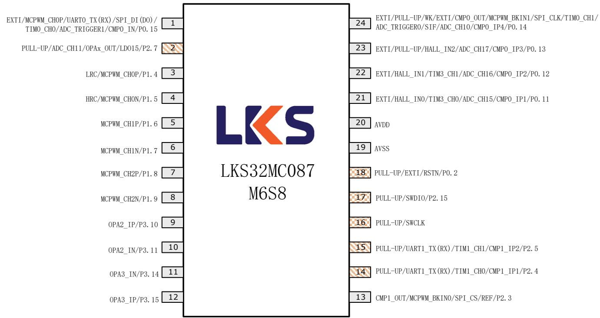

图 3-5 LKS32MC087M6S8(B)管脚分布图  
表 3-5 LKS32MC087M6S8(B)管脚说明

<table><tr><td>编号</td><td>名称</td><td>类型</td><td>功能说明</td></tr><tr><td>1</td><td>MCPWM_CHOP/UART0_TX(RX)/SPI_DI(DO)/TIM0_CH0/ADC_TRIG1/CMP0_IN/P0.15</td><td>输入/输出</td><td>电机 PWM 通道 0 高边 /UART0_TX(RX)/SPI_DI(DO)/Timer0 通道 0/ADC 触发信号 1/比较器 0 反相端输入/P0.15</td></tr><tr><td>2</td><td>ADC_CH11/OPAx_OUT/LDO15/P2.7</td><td>输入/输出</td><td>ADC 通道 11/OPAx 输出/LDO15 输出/P2.7,内置可软件开启的 10k 上拉电阻</td></tr><tr><td>3</td><td>LRC/MCPWM_CHOP/P1.4</td><td>输入/输出</td><td>32kHz RC 时钟输出/电机 PWM 通道 0 高边/P1.4</td></tr><tr><td>4</td><td>HRC/MCPWM_CHON/P1.5</td><td>输入/输出</td><td>4MHz RC 时钟输出/电机 PWM 通道 0 低边/P1.5</td></tr><tr><td>5</td><td>MCPWM_CH1P/P1.6</td><td>输入/输出</td><td>电机 PWM 通道 1 高边/P1.6</td></tr><tr><td>6</td><td>MCPWM_CH1N/P1.7</td><td>输入/输出</td><td>电机 PWM 通道 1 低边/P1.7</td></tr><tr><td>7</td><td>MCPWM_CH2P/P1.8</td><td>输入/输出</td><td>电机 PWM 通道 2 高边/P1.8</td></tr><tr><td>8</td><td>MCPWM_CH2N/P1.9</td><td>输入/输出</td><td>电机 PWM 通道 2 低边/P1.9</td></tr><tr><td>9</td><td>OPA2_IP/P3.10</td><td>输入/输出</td><td>运放 2 同相端输入/P3.10</td></tr><tr><td>10</td><td>OPA2_IN/P3.11</td><td>输入/输出</td><td>运放 2 反相端输入/P3.11</td></tr><tr><td>11</td><td>OPA3_IN/P3.14</td><td>输入/输出</td><td>运放 3 反相端输入/P3.14</td></tr><tr><td>12</td><td>OPA3_IP/P3.15</td><td>输入/输出</td><td>运放 3 同相端输入/P3.15</td></tr><tr><td>13</td><td>CMP1_OUT/MCPWM_BKIN0/SPI_CS/REF/P2.3</td><td>输入/输出</td><td>比较器 1 输出/电机 PWM 终止信号 0/SPI 片选信号/电压参考信号/P2.3</td></tr><tr><td>14</td><td>UART1_TX(RX)/TIM1_CH0/ADC_TRIG3/CMP1_IP1/P2.4</td><td>输入/输出</td><td>UART1_TX(RX)/Timer1 通道 0/ADC 触发信号 3/比较器 1 同相端输入通道 1/P2.4, 内置可软件开启的 10k 上拉电阻</td></tr><tr><td>15</td><td>UART1_TX(RX)/TIM1_CH1/ADC_TRIG0/CMP1_IP2/P2.5</td><td>输入/输出</td><td>UART1_TX(RX)/Timer1 通道 1/ADC 触发信号 0/比较器 1 同相端输入通道 2/P2.5, 内置可软件开启的 10k 上拉电阻</td></tr><tr><td>16</td><td>SWCLK</td><td>输入</td><td>SWD 时钟, 内置固定上拉的 10k 电阻</td></tr><tr><td>17</td><td>SWDIO/P2.15</td><td>输入/输出</td><td>SWD 数据/P2.15, 内置固定上拉的 10k 电阻其中 SWD 数据 IO 与 P2.15 是通过封装直接连接到芯片同一个引脚, 在使用中需要注意 P2.15 的输入输出使能开启时间, 以免上电即开启 P2.15 导致芯片无法进行 SWD 访问, 从而影响调试下载。</td></tr><tr><td>18</td><td>RSTN/P0.2</td><td>输入/输出</td><td>RSTN/P0.2, 默认作为 RSTN 使用, 外部接一个 10nF~100nF 的电容到地即可, 内部已有 100k 上拉电阻。建议 PCB 上在 RSTN 和 AVDD 之间放一个 10k~20k 的上拉电阻, 外部有上拉电阻的情况, RSTN 的电容固定为 100nF。</td></tr><tr><td>19</td><td>AVSS</td><td>地</td><td>系统地</td></tr><tr><td>20</td><td>AVDD</td><td>电源</td><td>芯片电源输入。片外去耦电容建议≥1uF, 并尽量靠近 AVDD 引脚</td></tr><tr><td>21</td><td>HALL_IN0/TIM3_CH0/ADC_CH15/CMP0_IP1/P0.11</td><td>输入/输出</td><td>Hall 传感器 A 相输入/Timer3 通道 0/ADC 通道 15/比较器 0 同相端输入通道 1/P0.11</td></tr><tr><td>22</td><td>HALL_IN1/TIM3_CH1/ADC_CH16/CMP0_IP2/P0.12</td><td>输入/输出</td><td>Hall 传感器 B 相输入/Timer3 通道 1/ADC 通道 16/比较器 0 同相端输入通道 2/P0.12</td></tr><tr><td>23</td><td>HALL_IN2/ADC_CH17/CMP0_IP3/P0.13</td><td>输入/输出</td><td>Hall 传感器 C 相输入/ADC 通道 17/比较器 0 同相端输入通道 3/P0.13</td></tr><tr><td>24</td><td>CMP0_OUT/MCPWM_BKIN1/SPI_CLK/TIMO_CH1/ADC_TRIG0/SIF/ADC_CH10/CMP0_IP4/P0.14</td><td>输入/输出</td><td>比较器 0 输出/电机 PWM 终止信号 1/SPI 时钟 /Timer0 通道 1/ADC 触发信号 0/一线通/ADC 通道 10/比较器 0 同相端输入通道 4/P0.14</td></tr></table>

## 3.1.7 LKS32MC087AM6S8(B)

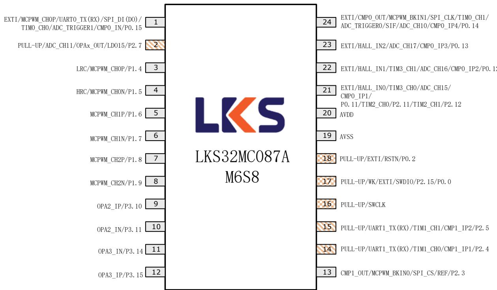  
图 3-6 LKS32MC087AM6S8(B)管脚分布图

与 LKS32MC087M6S8(B)区别：

17 脚多了 P0.0 口相关的功能，可用于 ADC 输入，或休眠唤醒口。

21 脚多了 TIM2\_CH0/CH1 功能

其余引脚功能完全相同。

表 3-6 LKS32MC087AM6S8(B)管脚说明

<table><tr><td>编号</td><td>名称</td><td>类型</td><td>功能说明</td></tr><tr><td>1</td><td>MCPWM_CHOP/UART0_TX(RX)/SPI_DI(DO)/TIM0_CH0/ADC_TRIG1/CMP0_IN/P0.15</td><td>输入/输出</td><td>电机 PWM 通道 0 高边 /UART0_TX(RX)/SPI_DI(DO)/Timer0 通道 0/ADC 触发信号 1/比较器 0 反相端输入/P0.15</td></tr><tr><td>2</td><td>ADC_CH11/OPAx_OUT/LDO15/P2.7</td><td>输入/输出</td><td>ADC 通道 11/OPAx 输出/LDO15 输出/P2.7,内置可软件开启的 10k 上拉电阻</td></tr><tr><td>3</td><td>LRC/MCPWM_CHOP/P1.4</td><td>输入/输出</td><td>32kHz RC 时钟输出/电机 PWM 通道 0 高边/P1.4</td></tr><tr><td>4</td><td>HRC/MCPWM_CHON/P1.5</td><td>输入/输出</td><td>4MHz RC 时钟输出/电机 PWM 通道 0 低边/P1.5</td></tr><tr><td>5</td><td>MCPWM_CH1P/P1.6</td><td>输入/输出</td><td>电机 PWM 通道 1 高边/P1.6</td></tr><tr><td>6</td><td>MCPWM_CH1N/P1.7</td><td>输入/输出</td><td>电机 PWM 通道 1 低边/P1.7</td></tr><tr><td>7</td><td>MCPWM_CH2P/P1.8</td><td>输入/输出</td><td>电机 PWM 通道 2 高边/P1.8</td></tr><tr><td>8</td><td>MCPWM_CH2N/P1.9</td><td>输入/输出</td><td>电机 PWM 通道 2 低边/P1.9</td></tr><tr><td>9</td><td>OPA2_IP/P3.10</td><td>输入/输出</td><td>运放 2 同相端输入/P3.10</td></tr><tr><td>10</td><td>OPA2_IN/P3.11</td><td>输入/输出</td><td>运放 2 反相端输入/P3.11</td></tr><tr><td>11</td><td>OPA3_IN/P3.14</td><td>输入/输出</td><td>运放 3 反相端输入/P3.14</td></tr></table>

## 管脚分布

<table><tr><td>编号</td><td>名称</td><td>类型</td><td>功能说明</td></tr><tr><td>12</td><td>OPA3_IP/P3.15</td><td>输入/输出</td><td>运放3同相端输入/P3.15</td></tr><tr><td>13</td><td>CMP1_OUT/MCPWM_BKIN0/SPI_CS/REF/P2.3</td><td>输入/输出</td><td>比较器1输出/电机PWM终止信号0/SPI片选信号/电压参考信号/P2.3</td></tr><tr><td>14</td><td>UART1_TX(RX)/TIM1_CH0/ADC_TRIG3/CMP1_IP1/P2.4</td><td>输入/输出</td><td>UART1_TX(RX)/Timer1通道0/ADC触发信号3/比较器1同相端输入通道1/P2.4,内置可软件开启的10k上拉电阻</td></tr><tr><td>15</td><td>UART1_TX(RX)/TIM1_CH1/ADC_TRIG0/CMP1_IP2/P2.5</td><td>输入/输出</td><td>UART1_TX(RX)/Timer1通道1/ADC触发信号0/比较器1同相端输入通道2/P2.5,内置可软件开启的10k上拉电阻</td></tr><tr><td>16</td><td>SWCLK</td><td>输入</td><td>SWD时钟,内置固定上拉的10k电阻</td></tr><tr><td>17</td><td>SWDIO/P2.15/P0.0</td><td>输入/输出</td><td>SWD数据/P2.15/P0.0,内置固定上拉的10k电阻其中SWD数据IO与P2.15/P0.0是通过封装直接连接到芯片同一个引脚,在使用中需要注意P2.15/P0.0的输入输出使能开启时间,以免上电即开启P2.15/P0.0导致芯片无法进行SWD访问,从而影响调试下载。此外,P2.15/P0.0两个GPIO不可同时配置为输出</td></tr><tr><td>18</td><td>RSTN/P0.2</td><td>输入/输出</td><td>RSTN/P0.2,默认作为RSTN使用,外部接一个10nF~100nF的电容到地即可,内部已有100k上拉电阻。建议PCB上在RSTN和AVDD之间放一个10k~20k的上拉电阻,外部有上拉电阻的情况,RSTN的电容固定为100nF。</td></tr><tr><td>19</td><td>AVSS</td><td>地</td><td>系统地</td></tr><tr><td>20</td><td>AVDD</td><td>电源</td><td>芯片电源输入。片外去耦电容建议≥1uF,并尽量靠近AVDD引脚</td></tr><tr><td>21</td><td>HALL_IN0/TIM3_CH0/ADC_CH15/CMP0_IP1/P0.11/TIM2_CH0/P2.11/TIM2_CH1/P2.12</td><td>输入/输出</td><td>Hall传感器A相输入/Timer3通道0/ADC通道15/比较器0同相端输入通道1/P0.11/Timer2通道0/P2.11/Timer2通道1/P2.12P0.11/P2.11/P2.12这3个GPIO不可同时有2个以上配置为输出</td></tr><tr><td>22</td><td>HALL_IN1/TIM3_CH1/ADC_CH16/CMP0_IP2/P0.12</td><td>输入/输出</td><td>Hall传感器B相输入/Timer3通道1/ADC通道16/比较器0同相端输入通道2/P0.12</td></tr><tr><td>23</td><td>HALL_IN2/ADC_CH17/CMP0_IP3/P0.13</td><td>输入/输出</td><td>Hall传感器C相输入/ADC通道17/比较器0同相端输入通道3/P0.13</td></tr><tr><td>24</td><td>CMP0_OUT/MCPWM_BKIN1/SPI_CLK/TIM0_CH1/ADC_TRIG0/SIF/ADC_CH10/CMP0_IP4/P0.14</td><td>输入/输出</td><td>比较器0输出/电机PWM终止信号1/SPI时钟/Timer0通道1/ADC触发信号0/一线通/ADC通道10/比较器0同相端输入通道4/P0.14</td></tr></table>

## 3.1.8 LKS32MC087CM8S8(B)

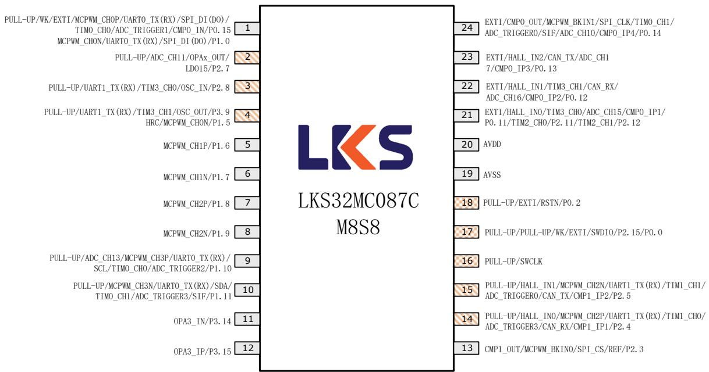  
图 3-7 LKS32MC087CM8S8(B)管脚分布图

表 3-7 LKS32MC087CM8S8(B)管脚说明

<table><tr><td>编号</td><td>名称</td><td>类型</td><td>功能说明</td></tr><tr><td>1</td><td>MCPWM_CH0P/UART0_TX(RX)/SPI_DI(DO)/TIM0_CH0/ADC_TRIG1/CMP0_IN/P0.15MCPWM_CH0N/UART0_TX(RX)/SPI_DI(DO)/P1.0</td><td>输入/输出</td><td>电机 PWM 通道 0 高边/UART0_TX(RX)/SPI_DI(DO)/Timer0 通道 0/ADC 触发信号 1/比较器 0 反相端输入/P0.15电机 PWM 通道 0 低边/UART0_TX(RX)/SPI_DI(DO)/P1.0</td></tr><tr><td>2</td><td>ADC_CH11/OPAx_OUT/LDO15/P2.7</td><td>输入/输出</td><td>ADC 通道 11/OPAx 输出/LDO15 输出/P2.7,内置可软件开启的 10k 上拉电阻</td></tr><tr><td>3</td><td>UART1_TX(RX)/TIM3_CH0/OSC_IN/P2.8</td><td>输入/输出</td><td>UART1_TX(RX)/Timer3 通道 0/晶振输入/P2.8,内置可软件开启的 10k 上拉电阻,如接晶体,该引脚接一个 15pf 电容到地。</td></tr><tr><td>4</td><td>UART1_TX(RX)/TIM3_CH1/OSC_OUT/P3.9HRC/MCPWM_CH0N/P1.5</td><td>输入/输出</td><td>UART1_TX(RX)/Timer3 通道 1/晶振输出/P3.9,内置可软件开启的 10k 上拉电阻,如接晶体,该引脚接一个 15pf 电容到地。4MHz RC 时钟输出/电机 PWM 通道 0 低边/P1.5</td></tr><tr><td>5</td><td>MCPWM_CH1P/P1.6</td><td>输入/输出</td><td>电机 PWM 通道 1 高边/P1.6</td></tr><tr><td>6</td><td>MCPWM_CH1N/P1.7</td><td>输入/输出</td><td>电机 PWM 通道 1 低边/P1.7</td></tr><tr><td>7</td><td>MCPWM_CH2P/P1.8</td><td>输入/输出</td><td>电机 PWM 通道 2 高边/P1.8</td></tr><tr><td>8</td><td>MCPWM_CH2N/P1.9</td><td>输入/输出</td><td>电机 PWM 通道 2 低边/P1.9</td></tr><tr><td>9</td><td>ADC_CH13MCPWM_CH3P/UART0_TX(RX)/SCL/TIMO_CH0/ADC_TRIG2/P1.10</td><td>输入/输出</td><td>电机 PWM 通道 3 高边/UART0_TX(RX)/IIC 时钟 /Timer0 通道 0/ADC 触发信号 2/P1.10,内置可软件开启的 10k 上拉电阻</td></tr></table>

## 管脚分布

<table><tr><td>编号</td><td>名称</td><td>类型</td><td>功能说明</td></tr><tr><td>10</td><td>MCPWM_CH3N/UART0_TX(RX)/SDA/TIMO_CH1/ADC_TRIG3/SIF/P1.11</td><td>输入/输出</td><td>电机 PWM 通道 3 低边/UART0_TX(RX)/IIC 数据 /Timer0 通道 1/ADC 触发信号 3/P1.11,内置可软件开启的 10k 上拉电阻</td></tr><tr><td>11</td><td>OPA3_IN/P3.14</td><td>输入/输出</td><td>运放 3 反相端输入/P3.14</td></tr><tr><td>12</td><td>OPA3_IP/P3.15</td><td>输入/输出</td><td>运放 3 同相端输入/P3.15</td></tr><tr><td>13</td><td>CMP1_OUT/MCPWM_BKIN0/SPI_CS/REF/P2.3</td><td>输入/输出</td><td>比较器 1 输出/电机 PWM 终止信号 0/SPI 片选信号/电压参考信号/P2.3</td></tr><tr><td>14</td><td>UART1_TX(RX)/TIM1_CH0/ADC_TRIG3/CMP1_IP1/P2.4</td><td>输入/输出</td><td>UART1_TX(RX)/Timer1 通道 0/ADC 触发信号 3/比较器 1 同相端输入通道 1/P2.4,内置可软件开启的 10k 上拉电阻</td></tr><tr><td>15</td><td>UART1_TX(RX)/TIM1_CH1/ADC_TRIG0/CMP1_IP2/P2.5</td><td>输入/输出</td><td>UART1_TX(RX)/Timer1 通道 1/ADC 触发信号 0/比较器 1 同相端输入通道 2/P2.5,内置可软件开启的 10k 上拉电阻</td></tr><tr><td>16</td><td>SWCLK</td><td>输入</td><td>SWD 时钟,内置固定上拉的 10k 电阻</td></tr><tr><td>17</td><td>SWDIO/P2.15/P0.0</td><td>输入/输出</td><td>SWD 数据/P2.15/P0.0,内置固定上拉的 10k 电阻其中 SWD 数据 IO 与 P2.15/P0.0 是通过封装直接连接到芯片同一个引脚,在使用中需要注意 P2.15/P0.0 的输入输出使能开启时间,以免上电即开启 P2.15/P0.0 导致芯片无法进行 SWD 访问,从而影响调试下载。此外,P2.15/P0.0 两个 GPIO 不可同时配置为输出</td></tr><tr><td>18</td><td>RSTN/P0.2</td><td>输入/输出</td><td>RSTN/P0.2,默认作为 RSTN 使用,外部接一个 10nF~100nF 的电容到地即可,内部已有 100k 上拉电阻。建议 PCB 上在 RSTN 和 AVDD 之间放一个 10k~20k 的上拉电阻,外部有上拉电阻的情况,RSTN 的电容固定为 100nF。</td></tr><tr><td>19</td><td>AVSS</td><td>地</td><td>系统地</td></tr><tr><td>20</td><td>AVDD</td><td>电源</td><td>芯片电源输入。片外去耦电容建议≥1uF,并尽量靠近 AVDD 引脚</td></tr><tr><td>21</td><td>HALL_INO/TIM3_CH0/ADC_CH15/CMP0_IP1/P0.11/TIM2_CH0/P2.11/TIM2_CH1/P2.12</td><td>输入/输出</td><td>Hall 传感器 A 相输入/Timer3 通道 0/ADC 通道 15/比较器 0 同相端输入通道 1/P0.11/Timer2 通道 0/P2.11/Timer2 通道 1/P2.12P0.11/P2.11/P2.12 这 3 个 GPIO 不可同时有 2 个以上配置为输出</td></tr><tr><td>22</td><td>HALL_IN1/TIM3_CH1/ADC_CH16/CMP0_IP2/P0.12</td><td>输入/输出</td><td>Hall 传感器 B 相输入/Timer3 通道 1/ADC 通道 16/比较器 0 同相端输入通道 2/P0.12</td></tr><tr><td>23</td><td>HALL_IN2/ADC_CH17/CMP0_IP3/P0.13</td><td>输入/输出</td><td>Hall 传感器 C 相输入/ADC 通道 17/比较器 0 同相端输入通道 3/P0.13</td></tr><tr><td>24</td><td>CMP0_OUT/MCPWM_BKIN1/SPI_CLK/TIMO_CH1/ADC_TRIG0/SIF/ADC_CH10/CMP0_IP4/P0.14</td><td>输入/输出</td><td>比较器 0 输出/电机 PWM 终止信号 1/SPI 时钟 /Timer0 通道 1/ADC 触发信号 0/一线通/ADC 通道 10/比较器 0 同相端输入通道 4/P0.14</td></tr></table>

## 3.2 管脚复用功能说明

表 3-8 LKS32MC08X 引脚复用功能选择

<table><tr><td>Port</td><td>AF1</td><td>AF2</td><td>AF3</td><td>AF4</td><td>AF5</td><td>AF6</td><td>AF7</td><td>AF8</td><td>AF9</td><td>AF10</td><td>AF11</td><td>AF0</td></tr><tr><td>P0.0</td><td></td><td></td><td></td><td></td><td></td><td></td><td></td><td></td><td></td><td></td><td></td><td>ADC_CH4, DAC_OUT</td></tr><tr><td>P0.1</td><td></td><td></td><td></td><td></td><td></td><td></td><td></td><td></td><td></td><td></td><td></td><td>ADC_CH6</td></tr><tr><td>P0.2</td><td></td><td></td><td></td><td></td><td></td><td></td><td></td><td></td><td></td><td></td><td></td><td></td></tr><tr><td>P0.3</td><td></td><td></td><td></td><td></td><td></td><td>SCL</td><td></td><td>TIM2_CH0</td><td></td><td></td><td></td><td>ADC_CH7</td></tr><tr><td>P0.4</td><td></td><td></td><td></td><td></td><td></td><td>SDA</td><td></td><td>TIM2_CH1</td><td></td><td></td><td></td><td>ADC_CH8</td></tr><tr><td>P0.5</td><td></td><td></td><td></td><td></td><td></td><td></td><td></td><td></td><td></td><td></td><td></td><td>ADC_CH9</td></tr><tr><td>P0.6</td><td></td><td></td><td></td><td>UART1_TX(RX)</td><td></td><td></td><td>TIM1_CH0</td><td></td><td></td><td>CAN_RX</td><td></td><td></td></tr><tr><td>P0.7</td><td></td><td></td><td></td><td>UART1_TX(RX)</td><td></td><td></td><td>TIM1_CH1</td><td></td><td></td><td>CAN_TX</td><td></td><td></td></tr><tr><td>P0.8</td><td></td><td></td><td></td><td></td><td></td><td></td><td></td><td></td><td></td><td></td><td></td><td></td></tr><tr><td>P0.9</td><td></td><td></td><td></td><td></td><td></td><td>SCL</td><td></td><td>TIM2_CH0</td><td></td><td></td><td></td><td></td></tr><tr><td>P0.10</td><td></td><td></td><td></td><td></td><td></td><td>SDA</td><td></td><td>TIM2_CH1</td><td></td><td></td><td></td><td></td></tr><tr><td>P0.11</td><td></td><td>HALL_IN0</td><td></td><td></td><td></td><td></td><td></td><td>TIM3_CH0</td><td></td><td></td><td></td><td>ADC_CH15/CMP0_IP1</td></tr><tr><td>P0.12</td><td></td><td>HALL_IN1</td><td></td><td></td><td></td><td></td><td></td><td>TIM3_CH1</td><td></td><td>CAN_RX</td><td></td><td>ADC_CH16/CMP0_IP2</td></tr><tr><td>P0.13</td><td></td><td>HALL_IN2</td><td></td><td></td><td></td><td></td><td></td><td></td><td></td><td>CAN_TX</td><td></td><td>ADC_CH17/CMP0_IP3</td></tr><tr><td>P0.14</td><td>CMP0_OUT</td><td></td><td>MCPWM_BKIN1</td><td></td><td>SPI_CLK</td><td></td><td>TIM0_CH1</td><td></td><td>ADC_TRIG0</td><td></td><td>SIF</td><td>ADC_CH10/CMP0_IP4</td></tr><tr><td>P0.15</td><td></td><td></td><td>MCPWM_CHOP</td><td>UART0_TX(RX)</td><td>SPI_DI(DO)</td><td></td><td>TIM0_CH0</td><td></td><td>ADC_TRIG1</td><td></td><td></td><td>CMP0_IN</td></tr><tr><td>P1.0</td><td></td><td></td><td>MCPWM_CH0N</td><td>UART0_TX(RX)</td><td>SPI_DI(DO)</td><td></td><td></td><td></td><td></td><td></td><td></td><td></td></tr><tr><td>P1.1</td><td></td><td></td><td></td><td></td><td>SPI_CS</td><td></td><td></td><td></td><td></td><td></td><td></td><td></td></tr><tr><td>P1.2</td><td></td><td></td><td></td><td></td><td></td><td></td><td></td><td>TIM3_CH0</td><td></td><td></td><td></td><td></td></tr><tr><td>P1.3</td><td></td><td></td><td></td><td></td><td></td><td></td><td></td><td>TIM3_CH1</td><td></td><td></td><td></td><td>ADC_CH5</td></tr><tr><td>P1.4</td><td>LRC</td><td></td><td>MCPWM_CH0P</td><td></td><td></td><td></td><td></td><td></td><td></td><td></td><td></td><td></td></tr><tr><td>P1.5</td><td>HRC</td><td></td><td>MCPWM_CH0N</td><td></td><td></td><td></td><td></td><td></td><td></td><td></td><td></td><td></td></tr><tr><td>P1.6</td><td></td><td></td><td>MCPWM_CH1P</td><td></td><td></td><td></td><td></td><td></td><td></td><td></td><td></td><td></td></tr><tr><td>P1.7</td><td></td><td></td><td>MCPWM_CH1N</td><td></td><td></td><td></td><td></td><td></td><td></td><td></td><td></td><td></td></tr><tr><td>P1.8</td><td></td><td></td><td>MCPWM_CH2P</td><td></td><td></td><td></td><td></td><td></td><td></td><td></td><td></td><td></td></tr><tr><td>P1.9</td><td></td><td></td><td>MCPWM_CH2N</td><td></td><td></td><td></td><td></td><td></td><td></td><td></td><td></td><td></td></tr><tr><td>P1.10</td><td></td><td></td><td>MCPWM_CH3P</td><td>UART0_TX(RX)</td><td></td><td>SCL</td><td>TIM0_CH0</td><td></td><td>ADC_TRIG2</td><td></td><td></td><td>ADC_CH13</td></tr><tr><td>P1.11</td><td></td><td></td><td>MCPWM_CH3N</td><td>UART0_TX(RX)</td><td></td><td>SDA</td><td>TIM0_CH1</td><td></td><td>ADC_TRIG3</td><td></td><td>SIF</td><td></td></tr><tr><td>P1.12</td><td></td><td></td><td>MCPWM_CH1N</td><td></td><td></td><td></td><td></td><td></td><td></td><td></td><td></td><td></td></tr><tr><td>P1.13</td><td></td><td></td><td></td><td></td><td>SPI_CLK</td><td></td><td>TIM0_CH0</td><td></td><td></td><td></td><td></td><td></td></tr><tr><td>P1.14</td><td></td><td></td><td></td><td></td><td>SPI_DI(DO)</td><td></td><td>TIM0_CH1</td><td></td><td></td><td></td><td></td><td></td></tr><tr><td>P1.15</td><td></td><td></td><td>MCPWM_CH2N</td><td></td><td></td><td></td><td></td><td></td><td></td><td></td><td></td><td></td></tr></table>

## 管脚分布

<table><tr><td>Port</td><td>AF1</td><td>AF2</td><td>AF3</td><td>AF4</td><td>AF5</td><td>AF6</td><td>AF7</td><td>AF8</td><td>AF9</td><td>AF10</td><td>AF11</td><td>AF0</td></tr><tr><td>P2.0</td><td></td><td></td><td></td><td></td><td>SPI_CS</td><td></td><td></td><td>TIM2_CH1</td><td></td><td></td><td></td><td></td></tr><tr><td>P2.1</td><td></td><td></td><td></td><td></td><td>SPI_CLK</td><td></td><td></td><td></td><td></td><td></td><td></td><td>ADC_CH14/CMP1_IP0</td></tr><tr><td>P2.2</td><td></td><td></td><td></td><td></td><td></td><td></td><td></td><td></td><td></td><td></td><td></td><td>CMP1_IN</td></tr><tr><td>P2.3</td><td>CMP1_OUT</td><td></td><td>MCPWM_BKIN0</td><td></td><td>SPI_CS</td><td></td><td></td><td></td><td></td><td></td><td></td><td>REF</td></tr><tr><td>P2.4</td><td></td><td>HALL_IN0</td><td>MCPWM_CH2P</td><td>UART1_TX(RX)</td><td></td><td></td><td>TIM1_CH0</td><td></td><td>ADC_TRIG3</td><td>CAN_RX</td><td></td><td>CMP1_IP1</td></tr><tr><td>P2.5</td><td></td><td>HALL_IN1</td><td>MCPWM_CH2N</td><td>UART1_TX(RX)</td><td></td><td></td><td>TIM1_CH1</td><td></td><td>ADC_TRIG0</td><td>CAN_TX</td><td></td><td>CMP1_IP2</td></tr><tr><td>P2.6</td><td></td><td>HALL_IN2</td><td>MCPWM_CH3P</td><td></td><td></td><td></td><td></td><td>TIM3_CH0</td><td>ADC_TRIG1</td><td></td><td>SIF</td><td>CMP1_IP3</td></tr><tr><td>P2.7</td><td></td><td></td><td></td><td></td><td></td><td></td><td></td><td></td><td></td><td></td><td></td><td>ADC_CH11/OPAx_OUT/LDO15</td></tr><tr><td>P2.8</td><td></td><td></td><td></td><td>UART1_TX(RX)</td><td></td><td></td><td></td><td>TIM3_CH0</td><td></td><td></td><td></td><td>OSC_IN</td></tr><tr><td>P2.9</td><td></td><td></td><td></td><td></td><td>SPI_DI(DO)</td><td>SCL</td><td></td><td></td><td></td><td></td><td></td><td>ADC_CH12/CMP0_IP0</td></tr><tr><td>P2.10</td><td></td><td></td><td></td><td></td><td>SPI_DI(DO)</td><td>SDA</td><td></td><td></td><td></td><td></td><td></td><td></td></tr><tr><td>P2.11</td><td></td><td></td><td>MCPWM_CH1P</td><td></td><td></td><td></td><td></td><td>TIM2_CH0</td><td></td><td></td><td></td><td></td></tr><tr><td>P2.12</td><td></td><td></td><td>MCPWM_CH1N</td><td></td><td></td><td></td><td></td><td>TIM2_CH1</td><td>ADC_TRIG2</td><td></td><td></td><td></td></tr><tr><td>P2.13</td><td></td><td></td><td>MCPWM_CH3N</td><td></td><td></td><td></td><td></td><td>TIM3_CH1</td><td></td><td></td><td></td><td></td></tr><tr><td>P2.14</td><td></td><td></td><td></td><td></td><td></td><td>SCL</td><td></td><td></td><td></td><td></td><td></td><td></td></tr><tr><td>P2.15</td><td></td><td></td><td></td><td></td><td></td><td>SDA</td><td></td><td></td><td></td><td></td><td></td><td></td></tr></table>

## 管脚分布

<table><tr><td>Port</td><td>AF1</td><td>AF2</td><td>AF3</td><td>AF4</td><td>AF5</td><td>AF6</td><td>AF7</td><td>AF8</td><td>AF9</td><td>AF10</td><td>AF11</td><td>AF0</td></tr><tr><td>P3.0</td><td></td><td></td><td></td><td></td><td></td><td></td><td></td><td></td><td></td><td></td><td></td><td>OPA1_IP</td></tr><tr><td>P3.1</td><td></td><td></td><td></td><td></td><td></td><td></td><td></td><td></td><td></td><td></td><td></td><td>OPA1_IN</td></tr><tr><td>P3.2</td><td></td><td></td><td></td><td></td><td></td><td></td><td></td><td></td><td></td><td></td><td></td><td></td></tr><tr><td>P3.3</td><td></td><td></td><td></td><td></td><td></td><td></td><td></td><td></td><td></td><td></td><td></td><td></td></tr><tr><td>P3.4</td><td></td><td></td><td></td><td></td><td></td><td></td><td></td><td></td><td></td><td></td><td></td><td></td></tr><tr><td>P3.5</td><td></td><td></td><td></td><td></td><td></td><td></td><td></td><td></td><td></td><td></td><td></td><td>OPA0_IP</td></tr><tr><td>P3.6</td><td></td><td></td><td></td><td></td><td></td><td></td><td></td><td></td><td></td><td></td><td></td><td></td></tr><tr><td>P3.7</td><td></td><td></td><td></td><td></td><td></td><td></td><td></td><td></td><td></td><td></td><td></td><td>OPA0_IN</td></tr><tr><td>P3.8</td><td></td><td></td><td></td><td></td><td></td><td></td><td></td><td></td><td></td><td></td><td></td><td></td></tr><tr><td>P3.9</td><td></td><td></td><td></td><td>UART1_TX(RX)</td><td></td><td></td><td></td><td>TIM3_CH1</td><td></td><td></td><td></td><td>OSC_OUT</td></tr><tr><td>P3.10</td><td></td><td></td><td></td><td></td><td></td><td></td><td></td><td></td><td></td><td></td><td></td><td>OPA2_IP</td></tr><tr><td>P3.11</td><td></td><td></td><td></td><td></td><td></td><td></td><td></td><td></td><td></td><td></td><td></td><td>OPA2_IN</td></tr><tr><td>P3.12</td><td></td><td></td><td></td><td></td><td></td><td></td><td></td><td></td><td></td><td></td><td></td><td></td></tr><tr><td>P3.13</td><td>HRC</td><td></td><td>MCPWM_CHON</td><td></td><td></td><td></td><td></td><td></td><td></td><td></td><td></td><td></td></tr><tr><td>P3.14</td><td></td><td></td><td></td><td></td><td></td><td></td><td></td><td></td><td></td><td></td><td></td><td>OPA3_IN</td></tr><tr><td>P3.15</td><td></td><td></td><td></td><td></td><td></td><td></td><td></td><td></td><td></td><td></td><td></td><td>OPA3_IP</td></tr></table>

## 4 封装尺寸

## 4.1 LKS32MC080R8T8(B)

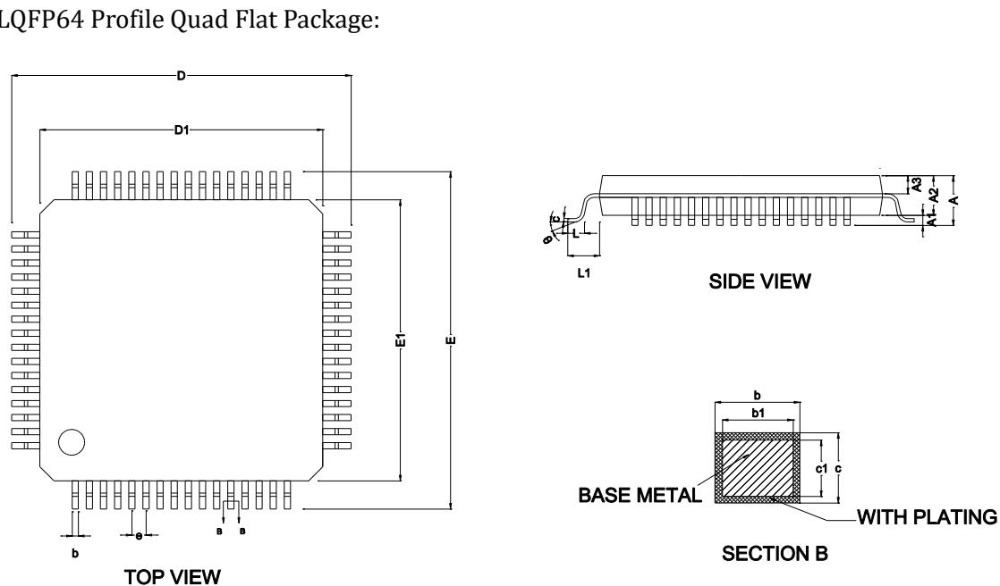  
图 4-1 LKS32MC080R8T8(B)封装图示

表 4-1 LKS32MC080R8T8(B)封装尺寸

<table><tr><td rowspan="2">SYMBOL</td><td colspan="3">MILLIMETER</td></tr><tr><td>MIN</td><td>NOM</td><td>MAX</td></tr><tr><td>A</td><td>-</td><td>-</td><td>1.60</td></tr><tr><td>A1</td><td>0.05</td><td>-</td><td>0.15</td></tr><tr><td>A2</td><td>1.35</td><td>1.40</td><td>1.45</td></tr><tr><td>A3</td><td>0.59</td><td>0.64</td><td>0.69</td></tr><tr><td>b</td><td>0.18</td><td>-</td><td>0.26</td></tr><tr><td>b1</td><td>0.17</td><td>0.20</td><td>0.23</td></tr><tr><td>c</td><td>0.13</td><td>-</td><td>0.17</td></tr><tr><td>c1</td><td>0.12</td><td>0.13</td><td>0.14</td></tr><tr><td>D</td><td>11.80</td><td>12.00</td><td>12.20</td></tr><tr><td>D1</td><td>9.90</td><td>10.00</td><td>10.10</td></tr><tr><td>E</td><td>11.80</td><td>12.00</td><td>12.20</td></tr><tr><td>E1</td><td>9.90</td><td>10.00</td><td>10.10</td></tr><tr><td>e</td><td colspan="3">0.50BSC</td></tr><tr><td>L</td><td>0.45</td><td>-</td><td>0.75</td></tr><tr><td>L1</td><td colspan="3">1.00REF</td></tr><tr><td>θ</td><td>0</td><td>-</td><td>7°</td></tr></table>

## 4.2 LKS32MC081C8T8(B)/LKS32MC083C8T8(B)/LKS32MC088C6T8(B)

TQFP48 Profile Quad Flat Package:  
  
TOP VIEW

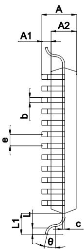

## SIDE VIEW

图 4-2 LKS32MC081C8T8(B)/LKS32MC083C8T8(B)/LKS32MC088C6T8(B)封装图示  
表 4-2 LKS32MC081C8T8(B)/LKS32MC083C8T8(B)/LKS32MC088C6T8(B)封装尺寸

<table><tr><td rowspan="2">SYMBOL</td><td colspan="3">MILLIMETER</td></tr><tr><td>MIN</td><td>NOM</td><td>MAX</td></tr><tr><td>A</td><td>-</td><td>-</td><td>1.20</td></tr><tr><td>A1</td><td>0.05</td><td>-</td><td>0.15</td></tr><tr><td>A2</td><td>0.95</td><td>1.00</td><td>1.05</td></tr><tr><td>b</td><td>0.18</td><td>0.22</td><td>0.26</td></tr><tr><td>c</td><td>0.13</td><td>-</td><td>0.17</td></tr><tr><td>D</td><td>8.80</td><td>9.00</td><td>9.20</td></tr><tr><td>D1</td><td>6.90</td><td>7.00</td><td>7.10</td></tr><tr><td>E</td><td>8.80</td><td>9.00</td><td>9.20</td></tr><tr><td>E1</td><td>6.90</td><td>7.00</td><td>7.10</td></tr><tr><td>e</td><td>-</td><td>0.50</td><td>-</td></tr><tr><td>θ</td><td>0°</td><td>3.5°</td><td>7°</td></tr><tr><td>L</td><td>0.45</td><td>0.60</td><td>0.75</td></tr><tr><td>L1</td><td>-</td><td>1.00</td><td>-</td></tr></table>

LKS32MC083C8T8(B)，LKS32MC088C8T8(B)封装也是 TQFP48，后面就不做赘述。

## 4.3 LKS32MC082K8Q8(B)

QFN32 Profile Quad Flat Package:

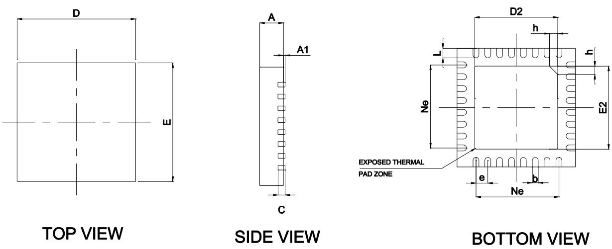

图 4-3 LKS32MC082K8Q8(B)封装图示  
表 4-3 LKS32MC082K8Q8(B)封装尺寸

<table><tr><td rowspan="2">SYMBOL</td><td colspan="3">MILLIMETER</td></tr><tr><td>MIN</td><td>NOM</td><td>MAX</td></tr><tr><td>A</td><td>0.70</td><td>0.75</td><td>0.80</td></tr><tr><td>A1</td><td>-</td><td>0.02</td><td>0.05</td></tr><tr><td>b</td><td>0.18</td><td>0.25</td><td>0.30</td></tr><tr><td>c</td><td>0.18</td><td>0.20</td><td>0.24</td></tr><tr><td>D</td><td>4.90</td><td>5.00</td><td>5.10</td></tr><tr><td>D2</td><td>3.40</td><td>3.50</td><td>3.60</td></tr><tr><td>e</td><td colspan="3">0.50BSC</td></tr><tr><td>Ne</td><td colspan="3">3.50BSC</td></tr><tr><td>E</td><td>4.90</td><td>5.00</td><td>5.10</td></tr><tr><td>E2</td><td>3.40</td><td>3.50</td><td>3.60</td></tr><tr><td>L</td><td>0.35</td><td>0.40</td><td>0.45</td></tr><tr><td>h</td><td>0.30</td><td>0.35</td><td>0.40</td></tr></table>

## 4.4 LKS32MC087M6S8(B)/LKS32MC087AM6S8(B)/LKS32MC087CM8S8(B)

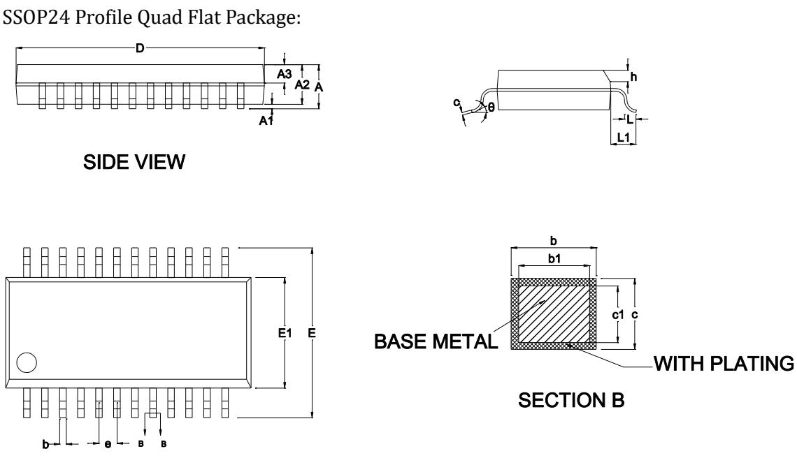  
图 4-4 LKS32MC087M6S8(B)封装图示

表 4-4 LKS32MC087M6S8(B)封装尺寸

<table><tr><td rowspan="2">SYMBOL</td><td colspan="3">MILLIMETER</td></tr><tr><td>MIN</td><td>NOM</td><td>MAX</td></tr><tr><td>A</td><td>-</td><td>-</td><td>1.75</td></tr><tr><td>A1</td><td>0.10</td><td>0.15</td><td>0.25</td></tr><tr><td>A2</td><td>1.30</td><td>1.40</td><td>1.50</td></tr><tr><td>A3</td><td>0.60</td><td>0.65</td><td>0.70</td></tr><tr><td>b</td><td>0.23</td><td>-</td><td>0.31</td></tr><tr><td>b1</td><td>0.22</td><td>0.25</td><td>0.28</td></tr><tr><td>c</td><td>0.20</td><td>-</td><td>0.24</td></tr><tr><td>c1</td><td>0.19</td><td>0.20</td><td>0.21</td></tr><tr><td>D</td><td>8.55</td><td>8.65</td><td>8.75</td></tr><tr><td>E</td><td>5.80</td><td>6.00</td><td>6.20</td></tr><tr><td>E1</td><td>3.80</td><td>3.90</td><td>4.00</td></tr><tr><td>e</td><td colspan="3">0.635BSC</td></tr><tr><td>h</td><td>0.30</td><td>-</td><td>0.50</td></tr><tr><td>L</td><td>0.50</td><td>-</td><td>0.80</td></tr><tr><td>L1</td><td colspan="3">1.05REF</td></tr><tr><td>θ</td><td>0</td><td>-</td><td>8°</td></tr></table>

## 5 电气性能参数

LKS32MC080/081/082/083/087/088 等型号为单 MCU 芯片，电气参数如下列表格所示。

表 5-1 LKS32MC08x 电气极限参数

<table><tr><td>参数</td><td>最小</td><td>最大</td><td>单位</td><td>说明</td></tr><tr><td>电源电压</td><td>-0.3</td><td>+6.0</td><td>V</td><td></td></tr><tr><td>工作温度</td><td>-40</td><td>+105</td><td>°C</td><td></td></tr><tr><td>存储温度</td><td>-40</td><td>+150</td><td>°C</td><td></td></tr><tr><td>结温</td><td>-</td><td>150</td><td>°C</td><td></td></tr><tr><td>引脚温度(焊接10秒)</td><td>-</td><td>260</td><td>°C</td><td></td></tr></table>

表 5-2 LKS32MC08x 建议工况参数

<table><tr><td>参数</td><td>最小</td><td>典型</td><td>最大</td><td>单位</td><td>说明</td></tr><tr><td rowspan="2">电源电压(AVDD)</td><td>2.2</td><td rowspan="2">5</td><td rowspan="2">5.5</td><td rowspan="2">V</td><td>A 版本 AVDD 复位电平 2.2V±0.2V</td></tr><tr><td>3.0</td><td>B 版本 AVDD 复位电平 2.7V±0.2V</td></tr><tr><td rowspan="2">模拟工作电压(AVDDA)</td><td>3.3</td><td>5</td><td>5.5</td><td>V</td><td>ADC 选择 2.4V 内部基准源</td></tr><tr><td>2.8</td><td>5</td><td>5.5</td><td>V</td><td>ADC 选择 1.2V 内部基准源</td></tr></table>

运算放大器可以在2.2V下工作，但输出幅度受限。

表 5-3 LKS32MC08x ESD 性能参数

<table><tr><td>项目</td><td>最小</td><td>最大</td><td>单位</td></tr><tr><td>ESD测试 (HBM)</td><td>-6000</td><td>6000</td><td>V</td></tr></table>

根据《MIL-STD-883J Method 3015.9》，在 25℃，55%相对湿度环境下，在被测芯片的所有 IO 引脚施加进行静电放电 3 次，每次间隔 1s。测试结果显示芯片抗静电放电等级达到 Class $3 \mathrm { A } \cong 4 0 0 0 \mathrm { V }$ , ＜8000V。

表 5-4 LKS32MC08x Latch-up 性能参数

<table><tr><td>项目</td><td>最小</td><td>最大</td><td>单位</td></tr><tr><td>Latch-up电流 (85°C)</td><td>-200</td><td>200</td><td>mA</td></tr></table>

根据《JEDEC STANDARD NO.78E NOVEMBER 2016》，对所有电源 IO 施加过压 8V，在每个信号 IO上注入200mA电流。测试结果显示芯片抗拴锁等级为 200mA。

表 5-5 LKS32MC08x IO 极限参数

<table><tr><td>参数</td><td>描述</td><td>最小</td><td>最大</td><td>单位</td></tr><tr><td> $V_{IN}$ </td><td>GPIO信号输入电压范围</td><td>-0.3</td><td>6.0</td><td>V</td></tr><tr><td> $I_{INJ\_PAD}$ </td><td>单个GPIO最大注入电流</td><td>-11.2</td><td>11.2</td><td>mA</td></tr><tr><td> $I_{INJ\_SUM}$ </td><td>所有GPIO最大注入电流</td><td>-50</td><td>50</td><td>mA</td></tr></table>

表 5-6 LKS32MC08x IO DC 参数

<table><tr><td>参数</td><td>描述</td><td>AVDD</td><td>条件</td><td>最小</td><td>典型</td><td>最大</td><td colspan="2">单位</td></tr><tr><td rowspan="2"> $V_{IH}$ </td><td rowspan="2">数字IO输入高电压</td><td>5V</td><td rowspan="2">-</td><td>0.7*AVDD</td><td></td><td rowspan="2"></td><td colspan="2" rowspan="2">V</td></tr><tr><td>3.3V</td><td>2.0</td><td colspan="2"></td></tr><tr><td rowspan="2"> $V_{IL}$ </td><td colspan="2" rowspan="2">数字IO输入低电压</td><td>5V</td><td rowspan="2">-</td><td rowspan="2"></td><td></td><td>0.3*AVDD</td><td rowspan="2">V</td></tr><tr><td>3.3V</td><td></td><td>0.8</td></tr><tr><td rowspan="2"> $V_{HYS}$ </td><td colspan="2" rowspan="2">施密特迟滞范围</td><td>5V</td><td rowspan="2">-</td><td rowspan="2">0.1*AVDD</td><td></td><td rowspan="2"></td><td rowspan="2">V</td></tr><tr><td>3.3V</td><td></td></tr><tr><td rowspan="2"> $I_{IH}$ </td><td colspan="2" rowspan="2">数字IO输入高电压,电流消耗</td><td>5V</td><td rowspan="2">-</td><td rowspan="2"></td><td></td><td rowspan="2">1</td><td rowspan="2">uA</td></tr><tr><td>3.3V</td><td></td></tr><tr><td rowspan="2"> $I_{IL}$ </td><td colspan="2" rowspan="2">数字IO输入低电压,电流消耗</td><td>5V</td><td rowspan="2">-</td><td rowspan="2">-1</td><td></td><td rowspan="2"></td><td rowspan="2">uA</td></tr><tr><td>3.3V</td><td></td></tr><tr><td> $V_{OH}$ </td><td colspan="2">数字IO输出高电压</td><td></td><td>最大驱动电流11.2mA</td><td>AVDD-0.8</td><td></td><td></td><td>V</td></tr><tr><td> $V_{OL}$ </td><td colspan="2">数字IO输出低电压</td><td></td><td>最大驱动电流11.2mA</td><td></td><td></td><td>0.5</td><td>V</td></tr><tr><td rowspan="2"> $R_{pup}$ </td><td rowspan="2">上拉电阻大小*</td><td>复位引脚</td><td></td><td></td><td>100</td><td>200</td><td>400</td><td rowspan="2">kΩ</td></tr><tr><td>普通IO</td><td></td><td></td><td>8</td><td>10</td><td>12</td></tr><tr><td> $R_{io-ana}$ </td><td colspan="2">IO与内部模拟电路间连接电阻</td><td></td><td></td><td>100</td><td></td><td>200</td><td>Ω</td></tr><tr><td rowspan="2"> $C_{IN}$ </td><td colspan="2" rowspan="2">数字IO输入电容</td><td>5V</td><td rowspan="2">-</td><td rowspan="2"></td><td></td><td rowspan="2">10</td><td rowspan="2">pF</td></tr><tr><td>3.3V</td><td></td></tr></table>

表 5-7 LKS32MC08x 电路模块电流消耗 IDD

<table><tr><td>模块</td><td>Min</td><td>Typ</td><td>Max</td><td>单位</td></tr><tr><td>模拟比较器CMP(1个)</td><td></td><td>0.005</td><td></td><td>mA</td></tr><tr><td>运算放大器OPA(1个)</td><td></td><td>0.450</td><td></td><td>mA</td></tr><tr><td>模数转换器ADC</td><td></td><td>3.710</td><td></td><td>mA</td></tr><tr><td>数模转换器DAC</td><td></td><td>0.710</td><td></td><td>mA</td></tr><tr><td>温度传感器Temp Sensor</td><td></td><td>0.150</td><td></td><td>mA</td></tr><tr><td>带隙基准BGP</td><td></td><td>0.154</td><td></td><td>mA</td></tr><tr><td>4MHz RC时钟</td><td></td><td>0.105</td><td></td><td>mA</td></tr><tr><td>锁相环PLL</td><td></td><td>0.080</td><td></td><td>mA</td></tr><tr><td>CPU+flash+SRAM (96MHz)</td><td></td><td>8.667</td><td></td><td>mA</td></tr><tr><td>CPU+flash+SRAM (12MHz)</td><td></td><td>1.600</td><td></td><td>mA</td></tr><tr><td>CRC</td><td></td><td>0.070</td><td></td><td>mA</td></tr><tr><td>DSP</td><td></td><td>3.421</td><td></td><td>mA</td></tr><tr><td>UART</td><td></td><td>0.107</td><td></td><td>mA</td></tr><tr><td>DMA</td><td></td><td>1.340</td><td></td><td>mA</td></tr><tr><td>MCPWM</td><td></td><td>0.053</td><td></td><td>mA</td></tr><tr><td>TIMER</td><td></td><td>0.269</td><td></td><td>mA</td></tr><tr><td>SPI</td><td></td><td>0.500</td><td></td><td>mA</td></tr><tr><td>IIC</td><td></td><td>0.500</td><td></td><td>mA</td></tr><tr><td>CAN</td><td></td><td>2.200</td><td></td><td>mA</td></tr><tr><td>休眠</td><td>10</td><td>30</td><td>50</td><td>uA</td></tr></table>

以上测试如无特别标注，均为室温25° 5V 供电，使用 96MHz 时钟工作情况下的测试，由于制造工艺存在器件模型偏差，不同芯片的电流消耗会存在个体差异。

## 6 模拟性能参数

表 6-1 LKS32MC08x 模拟性能参数

<table><tr><td>参数</td><td>最小</td><td>典型</td><td>最大</td><td>单位</td><td>说明</td></tr><tr><td colspan="6">模数转换器(ADC)</td></tr><tr><td rowspan="2">工作电源</td><td>3.3</td><td>5</td><td>5.5</td><td>V</td><td>ADC选择2.4V内部基准源</td></tr><tr><td>2.8</td><td>5</td><td>5.5</td><td>V</td><td>ADC选择1.2V内部基准源</td></tr><tr><td>输出码率</td><td></td><td>3</td><td></td><td>MHz</td><td> $f_{adc}/16$ </td></tr><tr><td rowspan="2">差分输入信号范围</td><td>-2.352</td><td></td><td>+2.352</td><td>V</td><td>Gain=1时;REF=2.4V</td></tr><tr><td>-3.528</td><td></td><td>+3.528</td><td>V</td><td>Gain=2/3时;REF=2.4V</td></tr><tr><td rowspan="4">单端输入信号范围</td><td>-0.3</td><td></td><td>+2.352</td><td>V</td><td>REF2VDD=0, Gain=1; REF=2.4V</td></tr><tr><td>-0.3</td><td></td><td>+3.528</td><td>V</td><td>REF2VDD=0, Gain=2/3; REF=3.6V</td></tr><tr><td>-0.3</td><td></td><td>AVDD*0.9</td><td>V</td><td>REF2VDD=1, Gain=1; REF=AVDD</td></tr><tr><td>-0.3</td><td></td><td>AVDD+0.3</td><td>V</td><td>REF2VDD=1, Gain=2/3, REF=AVDD,受限于IO钳位</td></tr><tr><td colspan="6">差分信号通常为芯片内部OPA输出至ADC的信号;单端信号通常为外部通过IO输入的被采样信号;无论使用内部/外部基准,ADC测量信号幅度均不应超过满量程的±98%,特别地,当使用外部基准时,建议采样信号不超过量程的90%。</td></tr><tr><td>直流失调(offset)</td><td></td><td>5</td><td>10</td><td>mV</td><td>可校正</td></tr><tr><td>有效位数(ENOB)</td><td>10.5</td><td>11</td><td></td><td>bit</td><td></td></tr><tr><td>INL</td><td></td><td>2</td><td>3</td><td>LSB</td><td></td></tr><tr><td>DNL</td><td></td><td>1</td><td>2</td><td>LSB</td><td></td></tr><tr><td>SNR</td><td>63</td><td>66</td><td></td><td>dB</td><td></td></tr><tr><td>输入电阻</td><td>100k</td><td></td><td></td><td>Ohm</td><td></td></tr><tr><td>输入电容</td><td></td><td>10pF</td><td></td><td>F</td><td></td></tr><tr><td colspan="6">基准电压(REF)</td></tr><tr><td>工作电源</td><td>2.2</td><td>5</td><td>5.5</td><td>V</td><td></td></tr><tr><td>输出偏差</td><td>-9</td><td></td><td>9</td><td>mV</td><td></td></tr><tr><td>电源抑制比</td><td></td><td>70</td><td></td><td>dB</td><td></td></tr><tr><td>温度系数</td><td></td><td>20</td><td></td><td>ppm/°C</td><td></td></tr><tr><td>输出电压</td><td></td><td>1.2</td><td></td><td>V</td><td></td></tr><tr><td colspan="6">数模转换器(DAC)</td></tr><tr><td>工作电源</td><td>2.2</td><td>5</td><td>5.5</td><td>V</td><td></td></tr><tr><td>负载电阻</td><td>5k</td><td></td><td></td><td>Ohm</td><td rowspan="3">输出BUFFER开启</td></tr><tr><td>负载电容</td><td></td><td></td><td>50p</td><td>F</td></tr><tr><td>输出电压范围</td><td>0.05</td><td></td><td>AVDD-0.1</td><td>V</td></tr><tr><td>转换速度</td><td></td><td></td><td>1M</td><td>Hz</td><td></td></tr><tr><td>DNL</td><td></td><td>1</td><td>2</td><td>LSB</td><td></td></tr><tr><td>INL</td><td></td><td>2</td><td>4</td><td>LSB</td><td></td></tr><tr><td>OFFSET</td><td></td><td>5</td><td>10</td><td>mV</td><td></td></tr><tr><td>SNR</td><td>57</td><td>60</td><td>66</td><td>dB</td><td></td></tr><tr><td colspan="6">运算放大器(OPA)</td></tr><tr><td>工作电源</td><td>2.2</td><td>5</td><td>5.5</td><td>V</td><td></td></tr><tr><td>带宽</td><td></td><td>10M</td><td>20M</td><td>Hz</td><td></td></tr><tr><td>负载电阻</td><td>20k</td><td></td><td></td><td>Ohm</td><td></td></tr><tr><td>负载电容</td><td></td><td></td><td>5p</td><td>F</td><td></td></tr><tr><td>输入共模范围</td><td>0</td><td></td><td>AVDD</td><td>V</td><td></td></tr><tr><td>输出信号范围</td><td>0</td><td></td><td>2*Vcm</td><td>V</td><td>最小负载电阻下</td></tr><tr><td rowspan="4">OFFSET</td><td></td><td>10</td><td>15.0</td><td>mV</td><td>32倍放大倍数</td></tr><tr><td></td><td>10</td><td>16.5</td><td>mV</td><td>16倍放大倍数</td></tr><tr><td></td><td>10</td><td>18.5</td><td>mV</td><td>8倍放大倍数</td></tr><tr><td></td><td>10</td><td>20.5</td><td>mV</td><td>4倍放大倍数</td></tr><tr><td colspan="6">此OFFSET为OPA差分输入短接时,测量OPA_OUT偏离0电平,得到的等效差分输入端偏差。OPA输出端偏差为OPA放大倍数×OFFSET。Flash NVR区域记录了出厂测试的OPA offset。</td></tr><tr><td>共模电平(Vcm)</td><td>1.65</td><td>1.9</td><td>2.2</td><td>V</td><td>测量条件:常温。运放摆幅=2×min(AVDD-Vcm,Vcm)。建议使用OPA单端输出的应用上电后进行Vcm测量并进行软件减除校正。更多分析请参考官网应用笔记《ANN009-运放差分和单端工作模式区别》</td></tr><tr><td>共模抑制(CMRR)</td><td></td><td>80</td><td></td><td>dB</td><td></td></tr><tr><td>电源抑制(PSRR)</td><td></td><td>80</td><td></td><td>dB</td><td></td></tr><tr><td>负载电流</td><td></td><td></td><td>500</td><td>uA</td><td></td></tr><tr><td>摆率(Slew rate)</td><td></td><td>5</td><td></td><td>V/us</td><td></td></tr><tr><td>相位裕度</td><td></td><td>60</td><td></td><td>度</td><td></td></tr><tr><td colspan="6">比较器(CMP)</td></tr><tr><td>工作电源</td><td>2.2</td><td>5</td><td>5.5</td><td>V</td><td></td></tr><tr><td>输入信号范围</td><td>0</td><td></td><td>AVDD</td><td>V</td><td></td></tr><tr><td>OFFSET</td><td></td><td>5</td><td>10</td><td>mV</td><td></td></tr><tr><td rowspan="2">传输延时</td><td></td><td>0.15u</td><td></td><td>S</td><td>默认功耗</td></tr><tr><td></td><td>0.6u</td><td></td><td>S</td><td>低功耗</td></tr><tr><td rowspan="2">回差(Hysteresis)</td><td></td><td>20</td><td></td><td>mV</td><td>HYS='0'</td></tr><tr><td></td><td>0</td><td></td><td>mV</td><td>HYS='1'</td></tr></table>

模拟寄存器表说明：

地址0x40000040\~0x40000050 是各个模块的校正寄存器，这些寄存器在出厂之前都会填上各自的校正值。一般情况下用户不要去配置或改变这些值。如果需要对模拟参数进行微调，需要读取原校正值，并以此为基础进行微调。

地址0x40000020\~0x4000003c 是开放给用户的寄存器，其中空白部分的寄存器必须全部配置为0(芯片上电后会被复位为 0)。其他寄存器根据应用场合需要进行配置。

## 7 电源管理系统

电源管理系统由LDO15 模块、电源检测模块(PVD)、上电/掉电复位模块(POR)组成。

该芯片由2.2V\~5.5V 单电源供电(B 版本芯片3.0V\~5.5V 电源供电)，以节省芯片外的电源成本。芯片内部集成一路LDO15给内部所有数字电路、PLL模块供电。

LDO上电后自动开启，无需软件配置。

LDO15在芯片出厂前已经过校正。

POR 模块监测LDO15的电压，在 LDO15 电压低于1.1V 时(例如上电之初，或者掉电之时)，为数字电路提供复位信号以避免数字电路工作产生异常。

PVD 模块对 5V 输入电源进行检测，如低于某一设定阈值，则产生报警(中断)信号以提醒 MCU。中断提醒阈值可通过寄存器 PVDSEL<1:0>设置为不同的电压。PVD 模块可通过设置 PD\_PDT=’1’关闭。具体寄存器所对应值见模拟寄存器表说明。

## 8 时钟系统

时钟系统包括内部32KHz RC时钟、内部4MHz RC时钟、外部4MHz晶体起振电路、PLL电路组成。

32K RC时钟作为MCU系统慢时钟使用，作为诸如滤波模块或者低功耗状态下的MCU时钟使用。4MHz RC时钟作为MCU主时钟使用，配合PLL可提供最高到96MHz的时钟。外部4MHz 晶体起振电路作为备份时钟使用。

32k 和 4M RC 时钟均带有出厂校正，32K RC 时钟在 ${ \cdot 4 0 } { \sim } 1 0 5 ^ { \circ } \mathrm { C }$ 范围内的精度为±50%，4M RC时钟在该温度范围的精度为±1%。

4M RC 时钟通过设置 $\mathrm { R C H P D } = ^ { \prime } 0 ^ { \prime }$ 打开(默认打开，设’1’关闭)，RC 时钟需要 Bandgap 电压基准源模块提供基准电压和电流，因此开启 RC时钟需要先开启 BGP模块。芯片上电的默认状态下，4MRC时钟和BGP模块都是开启的。32K RC时钟是始终开启的，不能关闭。

PLL 对 4M RC 时钟进行倍频，以提供给 MCU、ADC 等模块更高速的时钟。MCU 和 PWM 模块的最高时钟为96MHz，ADC 模块典型工作时钟为48MHz，通过寄存器 $\mathrm { A D C L K S E L } { < } 1 { : } 0 { > } \overline { { \mathrm { H } } } \mathrm { J }$ 设置为不同的ADC 工作频率。

PLL 通过设置 $\mathrm { P L L P D N } { = } ^ { \prime } 1$ ’打开(默认关闭，设 1 打开)，开启 PLL 模块之前，同样也需要开启BGP(Bandgap)模块。开启PLL之后，PLL需要 6us 的稳定时间来输出稳定时钟。芯片上电的默认状态下，RCH时钟和BGP 模块都是开启的，但 PLL默认是关闭的，需要软件来开启。

晶体起振电路内置放大器，需在 IO OSC\_IN/OSC\_OUT 之间接入一个晶体，且 OSC\_IN/OSC\_OUT上各放一个15pF的电容到地，并设置 XTALPDN=’1’即可起振。

## 9 基准电压源

该基准源为ADC、DAC、RC 时钟、PLL、温度传感器、运算放大器、比较器和 FLASH提供基准电压和电流，使用上述任何一个模块之前，都需要开启BGP 基准电压源。

芯片上电的默认状态下，BGP 模块是开启的。基准源通过设置 $\mathsf { B G P P D } = ^ { \prime } 0 ^ { \prime } $ 打开，从关闭到开启，BGP 需要约 2us 达到稳定。BGP 输出电压约 1.2V，精度为±0.8%

## 10 ADC 模块

芯片内部集成1 路同步双采样的 SAR结构ADC，芯片上电的默认状态下，ADC 模块是关闭的。ADC开启前，需要先开启BGP和4M RC时钟和PLL模块，并选择ADC 工作频率。默认配置下 ADC工作时钟是48M，对应3MHz 的转换数据率。

同步双采样电路可在同一时刻对两路输入信号进行采样，采样完成之后ADC按先后顺序将这两路信号进行转换，并写入相应的数据寄存器中。

ADC 完成一次转换需要 16 个 ADC 时钟周期，其中 13 个为转换周期，3 个为采样周期。即$f _ { c o n \nu } = f _ { a d c } / 1 6$ 。在ADC时钟设为48M时，转换速率是 3MHz。

ADC在降频应用时，可通过寄存器 $\mathrm { C U R R I T } { < } 1 { : } 0 { > }$ 降低ADC的功耗水平。

ADC 可工作在如下模式：单次单通道触发、连续单通道、单次 1\~20 通道扫描、连续 1\~20 通道扫描。每路ADC 都有 20 组独立寄存器对应每一个通道。

ADC 触发事件可以来自外部的定时器信号 T0、T1、T2、T3发生到预设次数，或者为软件触发。

20个通道里最后一个通道用来测量ADC 自身的offset，将其保存在通道寄存器中，其他通道的ADC值都已自动减去该offset。在芯片上电之初，应由 MCU发起offset校正信号，校正控制模块将ADC 通道设置为通道 19，并将值储存在通道寄存器中。如果客户对 offset 要求较高，可定期(例如一小时/一天)在ADC空闲时将offset 校正一次。

在 GAIN\_REF=0 时，基准电压源为 2.4V。ADC 带有两种增益模式，通过 GAIN\_SHAx 进行设置，对应1 倍和2/3倍增益。1 倍增益对应±2.4V的输入信号，2/3 倍增益对应±3.6V 的输入信号幅度。在测量运放的输出信号时，根据运放可能输出的最大信号来选择具体的ADC增益。

在 GAIN\_REF=1 时，基准电压源为 1.2V，在 3.3V 供电系统中，需要将 GAIN\_REF 设置为’1’，详细信息请参考 User manual。ADC 带有两种增益模式，通过 GAIN\_SHAx 进行设置，对应 1 倍和 1/3倍增益。1 倍增益对应±1.2V 的输入信号，1/3 倍增益对应±3.6V 的输入信号幅度。在测量运放的输出信号时，根据运放可能输出的最大信号来选择具体的ADC 增益。

## 11 运算放大器

4 路输入输出 rail-to-rail 运算放大器(部分型号为 2/3 路)，内置反馈电阻 R2/R1，外部引脚需串联一个电阻 R0。反馈电阻 R2:R1 的阻值可通过寄存器 RES\_OPA0<1:0>设置，以实现不同的放大倍数。具体寄存器所对应值见模拟寄存器表说明。

最终的放大倍数为R2/(R1+R0)，其中R0是外部电阻的阻值，

对于MOS管电阻直接采样的应用，建议接>20kΩ 的外部电阻，以减小MOS管关断时，往芯片引脚里流入的电流。

对于小电阻采样的应用，建议接 100Ω 的外部电阻。

放大器可通过设置 OPAOUT\_EN<2:0>选择将 4 路放大器中的某一路输出信号通过 BUFFER 送至P2.7 IO 口进行测量和应用(对应关系见datasheet 芯片管脚说明)。因为有BUFFER存在，在运放正常工作模式下也可以选择送一路运放输出信号出来。

芯片上电的默认状态下，放大器模块是关闭的。放大器可通过设置 OPAxPDN =’1’打开，开启放大器之前，需要先开启BGP 模块。

运放输入同相和反相端内置钳位二极管，电机相线通过一匹配电阻后直接接入输入端，从而简化了MOSFET电流采样的外置电路。

## 12 比较器

内置2 路输入rail-to-rail比较器，比较器比较速度可编程、迟滞电压可编程、信号源可编程。比较器的比较延时可通过寄存器 IT\_CMP 设置为0.15uS/0.6uS。迟滞电压通过CMP\_HYS 设置为$2 0 \mathrm { m V } / 0 \mathrm { m V } \circ$

比较器同相和反相两个输入端的信号来源都可通过寄存器 CMP\_SELP<2:0>和 CMP\_SELN<1:0>编程，详见寄存器模拟说明。

芯片上电的默认状态下，比较器模块是关闭的。比较器通过设置CMPxPDN =’1’打开，开启比较器之前，需要先开启BGP模块。

## 13 温度传感器

芯片内置温度传感器，在 $- 4 0 { \sim } 8 5 ^ { \circ } \mathrm { C }$ 范围内典型精度为 $2 ^ { \circ } \mathsf { C } _ { \circ } \ 8 5 { \sim } 1 0 5 ^ { \circ } \mathsf { C }$ 范围内典型精度为 $3 ^ { \circ } \mathrm { C } .$ 芯片出厂前会经温度校正，校正值保存在flash info区。

芯片上电的默认状态下，温度传感器模块是关闭的。开启传感器之前，需要先开启 BGP模块。

温度传感器通过设置 $\mathrm { T M P P D N } { = } ^ { \prime } 1 ^ { \prime }$ ’打开，开启到稳定需要约 2us，因此需在 ADC 测量传感器之前 2us 打开。

## 14 DAC 模块

芯片内置一路 12bit DAC，输出信号的最大量程可通过寄存器 DAC\_GAIN<1:0>设置为1.2V/3V/4.85V。

12bit DAC 可通过配置寄存器 DACOUT\_EN=1，将 DAC 输出送至 IO 口 P0.0，可驱动>5kΩ 的负载电阻和 50pF 的负载电容。

DAC 最大输出码率为 1MHz。

芯片上电的默认状态下，DAC 模块是关闭的。DAC可通过设置DAC12BPDN =1打开，开启DAC模块之前，需要先开启BGP 模块。

## 15 处理器核心

➢ 集成 32 位 Cortex-M0+DSP 双核处理器(部分型号不带 DSP)

➢ 2 线 SWD 调试管脚

➢ 最高工作频率 96MHz

## 16 存储资源

## 16.1 Flash

➢ 内置 flash 包括 32kB/64kB 主存储区，1kB NVR 信息存储区

➢ 可反复擦除写入不低于2万次

➢ 室温25℃数据保持长达 100年

➢ 单字节编程时间最长 7.5us，Sector擦除时间最长 5ms

➢ Sector大小512 字节，可按Sector擦除写入，支持运行时编程

➢ Flash 数据防窃取(最后一个 word 须写入非 0xFFFFFFFF 的任意值)

## 16.2 SRAM

➢ 内置 8kB SRAM

## 17 电机驱动专用 MCPWM

➢ MCPWM 最高工作时钟频率 96MHz

➢ 支持最大4 通道相位可调的互补 PWM输出

➢ 每个通道死区宽度可独立配置

➢ 支持边沿对齐PWM 模式

➢ 支持软件控制 IO 模式

➢ 支持IO 极性控制功能

➢ 内部短路保护，避免因为配置错误导致短路

➢ 外部短路保护，根据对外部信号的监控快速关断

➢ 内部产生ADC 采样中断

➢ 采用加载寄存器预存定时器配置参数

可配置加载寄存器加载时刻和周期

## 18 Timer

➢ 4 路通用定时器,2路16bit 位宽计时器，2 路32bit位宽计时器。

➢ 4 路支持捕获模式，用于测量外部信号宽度

➢ 4 路支持比较模式，用于产生边沿对齐PWM/定时中断

特别地，LKS32MC080/ LKS32MC083/ LKS32MC085 有 2 路支持编码信号输入，支持脉冲指令计数。

## 19 Hall 传感器接口

➢ 内置最大 1024 级滤波

➢ 三路 Hall 信号输入

➢ 24位计数器，提供溢出和捕获中断

## 20 DMA

➢ 一路 DMA 引擎

➢ 最多支持 6 个通道

➢ 支持 byte/halfword/word 等不同尺寸的传输

➢ 支持不同的地址递增方式

➢ 支持 ram/外设之间的数据传输

➢ 支持循环模式

## 21 CRC

➢ 支持 7/8/16/32 等不同位宽的多项式

➢ 支持多项式系数配置

➢ 支持输入输出数据翻转

## 22 DSP

➢ 电机控制算法专用 DSP，自主指令集，三级流水

➢ 最高工作频率 96MHz

➢ 32/16位除法器 10 周期计算完成

➢ 32位硬件开方8周期计算完成

➢ Q15 格式 Cordic 三角函数模块，sin/cos/artanc 8 周期计算完成

➢ DSP配备独立的程序区和数据区，可自主执行 DSP程序，亦可由MCU 调用进行某项计算

➢ 支持中断暂停，与MCU 进行数据交互

## 23 通用外设

➢ 两路 UART，全双工工作，支持 7/8 位数据位、1/2 停止位、奇/偶/无校验模式，带 1 字节发送缓存、1 字节接收缓存，支持 Multi-drop Slave/Master 模式，波特率支持 300\~115200

➢ 一路SPI，支持主从模式

➢ 一路 IIC，支持主从模式

➢ 一路 CAN(部分型号不带 CAN)

➢ 硬件看门狗，使用 RC 时钟驱动，独立于系统高速时钟，写入保护， 2/4/8/64 秒复位间隔

## 24 特殊 IO 复用

LKS08x 特殊 IO 复用注意事项

SWD协议包含两根信号线：SWDCLK和SWDIO。SWDCLK是时钟信号，在SWD模式下一直为输入。SWDIO 是数据信号，在SWD模式下为双向IO，默认是输入状态。

LKS08x 部分型号SWD引脚同时有GPIO 功能。通常为 P0.0、P2.15。注意事项如下：

➢ 默认状态不开启 SWD 引脚的 GPIO 功能，需要软件开启。即芯片硬复位结束后，初始状态是SWD用途，SWD引脚在芯片内部有上拉(芯片内部上拉电阻约为 10K)，应用对初始电平有要求的，需注意。

➢ 如开启 GPIO 功能后，如果 GPIO 功能与 SWD 功能冲突，比如设置 GPIO 为输出，则可能导致KEIL等工具无法通过SWD协议访问芯片，此时 Debug 和擦除下载功能均失效。因此建议：

⚫ 其一，软件开启GPIO 复用前留有一定延时，建议 1s以上，保证凌鸥离线下载器能在芯片上电后软件延时期间完成芯片擦除动作。延时越大，一次性擦除成功的概率越大。

其二，软件设置有 GPIO 复用退出机制，例如某个其它 IO 电平发生变化(一般为输入)或串行通讯，表明需要用SWD，软件接收到指令后关闭SWD引脚的 GPIO 功能。此时，可以恢复 KEIL的功能。

在 SSOP24 封装和 QFN40 封装中，SWDIO 同 P0.0、P2.15 直接 bonding 在一起，可以直接使能对应GPIO。建议复用 SWDIO 时 SWDCLK 需保持不变(恒为 1 或者恒为 0)。

在 LKS087E 封装中，SWDCLK 同 P2.6 直接 bonding 在一起，可以直接使能对应 GPIO。若同时复用SWDIO 和 SWDCLK，SWDCLK 复用的注意事项如下：

➢ 默认状态不开启 SWD 引脚的 GPIO 功能，需要软件开启。即芯片硬复位结束后，初始状态是SWD用途，SWD引脚在芯片内部有上拉(芯片内部上拉电阻约为 10K)，应用对初始电平有要求的，需注意。

➢ 如开启 GPIO 功能后，如果 GPIO 功能与 SWD 功能冲突，比如设置 GPIO 为输出，则可能导致KEIL等工具无法通过SWD协议访问芯片，此时 Debug 和擦除下载功能均失效。因此建议：

⚫ 其一，软件开启GPIO 复用前留有一定延时，建议 1s以上，保证凌鸥离线下载器能在芯片上电后软件延时期间完成芯片擦除动作。延时越大，一次性擦除成功的概率越大。

其二，软件设置有 GPIO 复用退出机制，例如某个其它 IO 电平发生变化(一般为输入)或串行通讯，表明需要用SWD，软件接收到指令后关闭SWD引脚的 GPIO 功能。此时，可以恢复 KEIL的功能。

➢ SWDCLK 和 SWDIO 引脚都作为 GPIO 使用时不应同时动作。即 SWDCLK 复用开启，且变化的时候，SWDIO能保持为0电平(类似时分复用)。

若此时，仅复用了SWDCLK，没有复用SWDIO，注意事项同上。

RSTN信号，默认是用于 LKS08x 芯片的外部复位脚。

LKS08x 可实现RSTN 复用为其它 IO的功能，复用的 IO是 P0.2。注意事项如下：

默认状态是不开启复用，需要软件开启复用。即芯片初始状态是RSTN用途，RSTN在芯片内部

有上拉(芯片内部上拉电阻约为100K)，应用对初始电平有要求的，需注意。

➢ 默认状态是RSTN，只有RSTN正常释放后才能开始程序的执行，应用需要保证RSTN有足够保护，例如外围电路带上拉，若能加电容更佳。

➢ 开启复用后，RSTN用途失效，若需产生芯片硬复位，源头只能是掉电/看门狗。

➢ RSTN 的复用，不影响 KEIL 的使用。

SYS\_RST\_CFG 寄存器的 BIT[5]，为 RSTN 和 P0.2 的复用控制开关。

## 25 订购包装信息

包装类型分为 Tray 包装和 Reel 包装两种，具体包装中的芯片个数由封装形式与包装类型确定，不再以芯片型号区分。

Tray 包装信息如下表

<table><tr><td>封装形式</td><td>每盘/管数量</td><td>内盒数量</td><td>外箱数量</td></tr><tr><td>SOP16/ESOP16L</td><td>3000/盘</td><td>6000PCS</td><td>48000PCS</td></tr><tr><td>SSOP24</td><td>4000/盘</td><td>8000PCS</td><td>64000PCS</td></tr><tr><td>SSOP24</td><td>50/管</td><td>10000PCS</td><td>4000/100000PCS</td></tr><tr><td>QFN 8*8</td><td>260/盘</td><td>2600PCS</td><td>15600PCS</td></tr><tr><td>QFN 4*4/5*5/6*6</td><td>490/盘</td><td>4900PCS</td><td>29400PCS</td></tr><tr><td>QFN 3*3</td><td>5000/盘</td><td>5000PCS</td><td>40000PCS</td></tr><tr><td>LQFP48/TQFP48 0707</td><td>250/盘</td><td>2500PCS</td><td>15000PCS</td></tr><tr><td>LQFP64 1010</td><td>160/盘</td><td>1600PCS</td><td>9600PCS</td></tr><tr><td>LQFP100 1414</td><td>90/盘</td><td>900PCS</td><td>5400PCS</td></tr><tr><td>TSSOP20/28</td><td>4000/盘</td><td>8000PCS</td><td>64000PCS</td></tr></table>

Reel包装信息如下表

<table><tr><td colspan="2">包装类别</td><td>每盘/管数量</td><td>每盒数量</td><td>每箱盒数</td><td>外箱数量</td></tr><tr><td>编带-13寸</td><td>SOP/ESOP8</td><td>4000</td><td>8000</td><td>8</td><td>64000</td></tr><tr><td>编带-13寸</td><td>SOP/ESOP16</td><td>3000</td><td>6000</td><td>8</td><td>48000</td></tr><tr><td>编带-13寸</td><td>SSOP24</td><td>4000</td><td>8000</td><td>8</td><td>64000</td></tr><tr><td>编带-13寸</td><td>TSSOP20</td><td>4000</td><td>8000</td><td>8</td><td>64000</td></tr><tr><td>编带-13寸</td><td>D/QFN3*3</td><td>5000</td><td>10000</td><td>8</td><td>80000</td></tr><tr><td>编带-13寸</td><td>D/QFN4*4</td><td>5000</td><td>10000</td><td>8</td><td>80000</td></tr><tr><td>编带-13寸</td><td>D/QFN5*5</td><td>5000</td><td>10000</td><td>8</td><td>80000</td></tr><tr><td>管装</td><td>SOP16</td><td>50</td><td>10000</td><td>10</td><td>100000</td></tr><tr><td>管装</td><td>SOP14/SSOP24</td><td>50</td><td>10000</td><td>10</td><td>100000</td></tr><tr><td>管装</td><td>TSSOP24</td><td>54</td><td>6480</td><td>6</td><td>38880</td></tr></table>

## 26 版本历史

表 26-1 文档版本历史

<table><tr><td>时间</td><td>版本号</td><td>说明</td></tr><tr><td>2026.01.08</td><td>1.92</td><td>选型表去除其他类型型号</td></tr><tr><td>2025.10.22</td><td>1.91</td><td>修订校正控制模块的ADC通道为19</td></tr><tr><td>2025.10.09</td><td>1.90</td><td>修订OPA零漂范围</td></tr><tr><td>2025.08.22</td><td>1.89</td><td>更新命名规则</td></tr><tr><td>2025.07.21</td><td>1.88</td><td>删除Flash部分:擦写一个Sector的同时读取访问另一个Sector</td></tr><tr><td>2025.07.10</td><td>1.87</td><td>模拟性能参数增加运放OFFSET参数说明修正</td></tr><tr><td>2025.07.09</td><td>1.86</td><td>模拟性能参数增加运放OFFSET参数</td></tr><tr><td>2024.12.12</td><td>1.85</td><td>增加ADC饱和范围的说明</td></tr><tr><td>2024.08.06</td><td>1.84</td><td>订购包装信息更新,以包装类型与封装形式来确认包装信息</td></tr><tr><td>2023.01.26</td><td>1.83</td><td>修改器件选型表</td></tr><tr><td>2023.12.12</td><td>1.82</td><td>增加关于上拉电阻值的说明</td></tr><tr><td>2023.11.20</td><td>1.81</td><td>修改LKS32MC080R8T8 P1.12、P1.15引脚说明</td></tr><tr><td>2023.11.09</td><td>1.80</td><td>OPA OFFSET增加说明,更新储存温度</td></tr><tr><td>2023.06.04</td><td>1.79</td><td>修改P3.13、P1.12和P1.15的管脚复用功能</td></tr><tr><td>2023.04.28</td><td>1.78</td><td>增加B版本芯片,其AVDD供电范围3.0~5.5V修改封装名称</td></tr><tr><td>2023.03.23</td><td>1.77</td><td>修订AVDD工作范围,最低电压从2.2V提高到3.0V</td></tr><tr><td>2023.03.18</td><td>1.76</td><td>修改时钟精度的描述</td></tr><tr><td>2023.01.13</td><td>1.75</td><td>增加订购包装信息</td></tr><tr><td>2022.11.15</td><td>1.74</td><td>修改特殊IO复用注意事项</td></tr><tr><td>2022.11.07</td><td>1.73</td><td>增加IO与内部模拟电路间连接电阻阻值</td></tr><tr><td>2022.10.28</td><td>1.72</td><td>增加共模电压特性</td></tr><tr><td>2022.09.21</td><td>1.71</td><td>修正083CAN引脚说明</td></tr><tr><td>2021.05.17</td><td>1.7</td><td>增加LKS32AT085C8Q9</td></tr><tr><td>2021.04.13</td><td>1.6</td><td>增加全系列选型表</td></tr><tr><td>2021.02.03</td><td>1.5</td><td>更新关于081/083/088CAN功能引脚的说明</td></tr><tr><td>2020.12.09</td><td>1.4</td><td>修改LKS32MC087C引脚说明</td></tr><tr><td>2020.10.21</td><td>1.3</td><td>增加LKS32MC087C说明</td></tr><tr><td>2020.05.20</td><td>1.2</td><td>增加LKS32MC087A说明</td></tr><tr><td>2020.05.09</td><td>1.1</td><td>合并MCU型号数据手册</td></tr><tr><td>2020.03.10</td><td>1.0</td><td>初始版本</td></tr></table>

## 免责声明

LKS 和 LKO 为凌鸥创芯注册商标。

南京凌鸥创芯电子有限公司（以下简称：“Linko”）尽力确保本文档内容的准确和可靠，但是保留随时更改、更正、增强、修改产品和/或 文档的权利，恕不另行通知。用户可在下单前获取最新相关信息。

客户应针对应用需求选择合适的 Linko 产品，详细设计、验证和测试您的应用，以确保满足相应标准以及任何安全、安保或其它要求。客户应对此独自承担全部责任。

Linko在此确认未以明示或暗示方式授予Linko或第三方的任何知识产权许可。

Linko产品的转售，若其条款与此处规定不同，Linko对此类产品的任何保修承诺无效。

禁止用于军事用途或生命监护、维持系统。

如有更早期版本文档，一切信息以此文档为准。