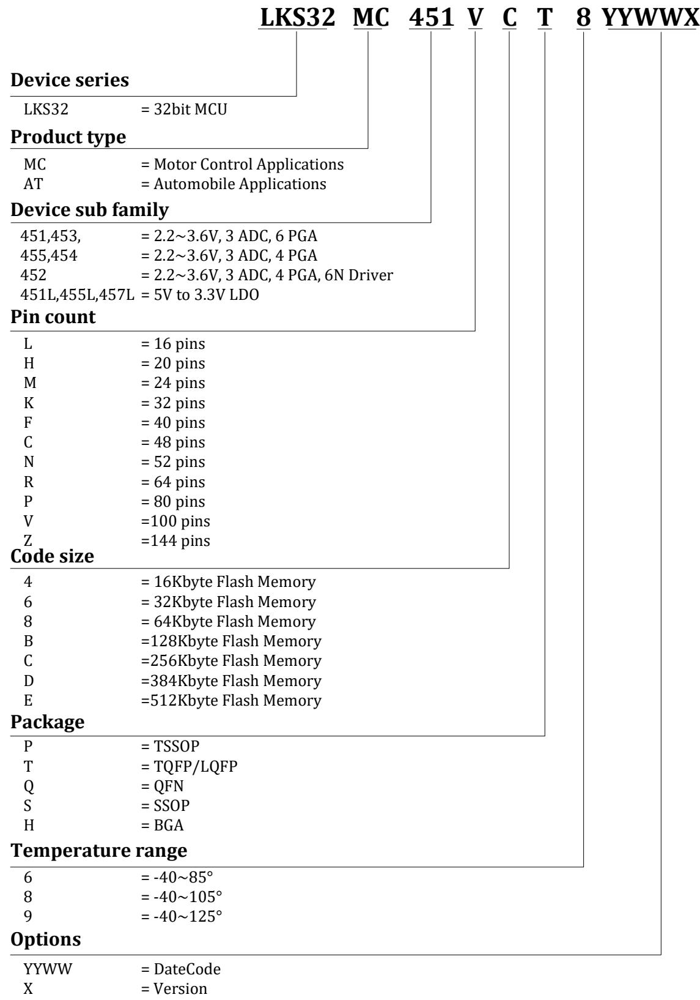
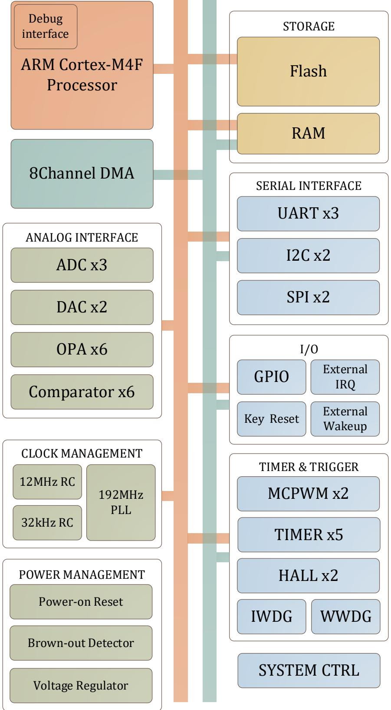
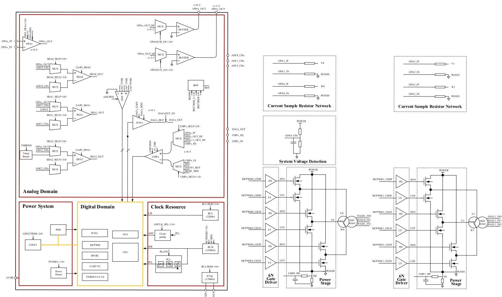
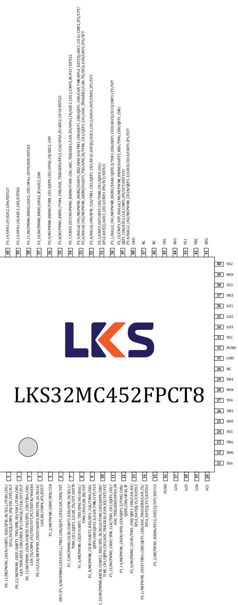
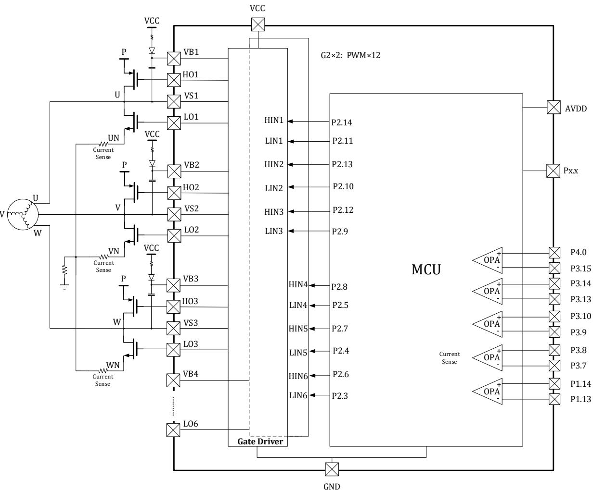
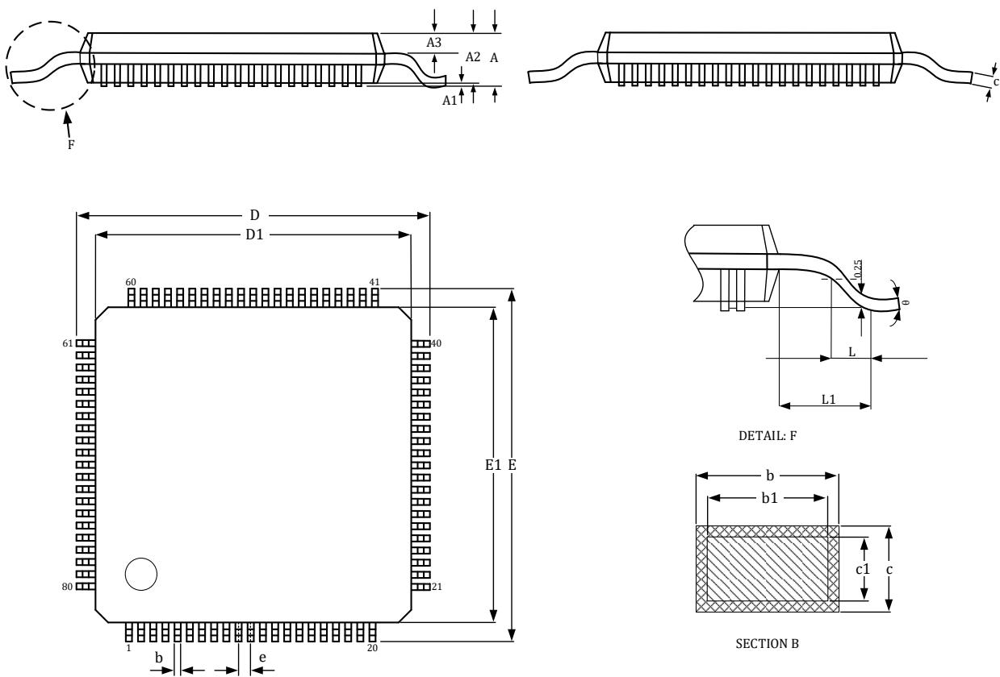
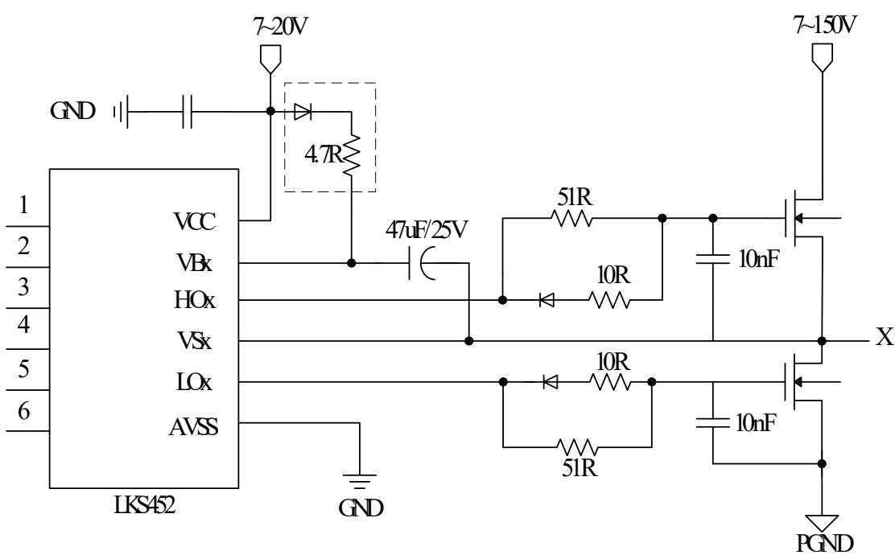
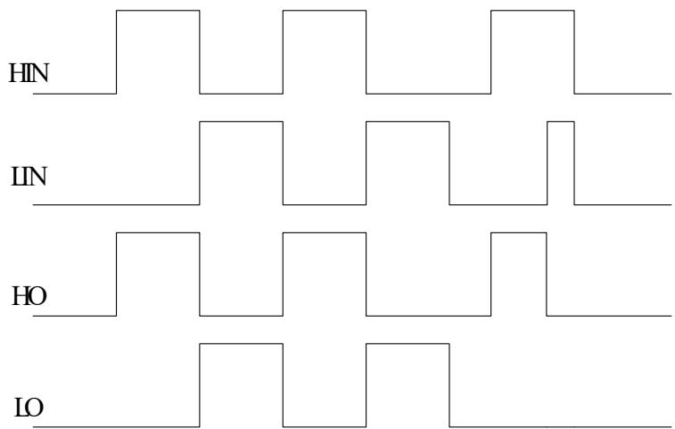

# LKS32MC45X with built-in 6N driver Datasheet

© 2023, 版权归凌鸥创芯所有

机密文件，未经许可不得扩散

## 1 概述

## 1.1 功能简述

LKS32MC452 是 32 位核心的面向电机控制应用的专用处理器，集成了常用电机控制系统所需要的大部分模块，同时集成了两路三相全桥自举式栅极驱动模块，可直接驱动12 个N型MOSFET。

## ⚫ 性能

➢ 192MHz 32 位 ARM Cortex-M4F 内核

➢ 具有丰富的DSP 指令

➢ 硬件浮点运算单元

➢ MPU(Memory Protection Unit)

➢ 支持三角函数、开方等运算

➢ 3 路14Bit SAR ADC，采样率高达2MHz，且可同步对 3路信号通道进行采样。最多支持 27路IO口 ADC输入信号通道，6 路运放信号通道和内部温度传感器通道

➢ 超低功耗休眠模式，低功耗休眠电流 6uA

➢ 三相全桥自举式栅极驱动模块

➢ 工作环境温度范围: -40\~105℃

➢ 支持双电机+PFC控制

➢ 超强抗静电和群脉冲能力

## ⚫ 存储器

➢ 256kB 内置 Flash，带加密保护

➢ 支持 0\~8MB 外置 SPI Flash

➢ 40kB SRAM，支持划分 8/16/24kB 作为 Code RAM 使用

## ⚫ 工作范围

➢ 2.2V\~3.6V单电源供电，部分型号支持5V单电源供电

➢ 工作环境温度范围: -40\~105℃

## ⚫ 时钟

➢ 内置 12MHz 高精度 RC 时钟，-40\~105℃范围内精度在±1%

➢ 内置低速32kHz 低速时钟，供低功耗模式使用

➢ 可外挂 12\~24MHz 外部晶振

➢ 内部 PLL 可提供最高 192MHz 时钟

## ⚫ 外设模块

➢ 3 路 UART

➢ 2 路 SPI，支持主从模式

➢ 2 路 IIC，支持主从模式

➢ 1 路 CAN，须使用外部晶振作为参考时钟

➢ 3 个通用16位 Timer，支持捕捉和边沿对齐 PWM功能

➢ 2 个通用32位 Timer，支持捕捉和边沿对齐 PWM功能；

➢ 1 个 24bit systick 定时器

➢ 4 个编码器接口，支持正交编码输入，CW/CCW 输入，脉冲+符号输入

➢ 2 个电机控制专用PWM 模块，支持16路 PWM输出，独立死区控制

➢ 2 个 Hall 信号专用接口，支持测速、去抖功能

➢ 最多 84 个 GPIO

➢ 2 个硬件看门狗，分别支持高速时钟和低速时钟

## DMA

➢ 1 路独立 DMA 引擎

➢ 共 8 个通道

➢ 支持 8、16、32bit 传输

➢ 支持外设到内存，内存到外设，Flash到内存传输

## ⚫ 模拟模块

➢ 14Bit SAR ADC，可同步对3 路信号通道进行采样。最多支持27路IO 口ADC输入信号通

道，6 路运放信号通道和内部温度传感器通道

➢ ADC同步三路采样保持，2Msps 采样及转换速率

➢ 集成6 路运算放大器，差分 PGA 模式

➢ 集成6 路比较器，可设置滞回模式、开窗模式、数字滤波、触发MCU 中断

➢ 集成 2 路 12bit DAC 数模转换器

➢ 内置±2℃温度传感器

➢ 内置 1.2V 0.8%精度电压基准源

➢ POR(Power-On Reset)，上电复位

➢ PVD(Power Voltage Detector), 电源电压欠压检测(支持 3 个电压可选)

## ⚫ 功能安全模块（Class C）

➢ ADC自检模块，支持开路短路检查

➢ 1 个 CRC 模块

## ⚫ 封装

LQFP100、LQFP80、LQFP64、TQFP48、QFN52

## 1.2 性能优势

➢ 高可靠性、高集成度、最终产品体积小、节约 BOM成本；

➢ 内部最多集成6 路高速运放和6 路比较器，可满足单电阻/双电阻/三电阻电流采样拓扑架构的不同需求；

➢ 内部高速运放集成高压保护电路，可以允许高电压共模信号直接输入芯片，可以用最简单的电路拓扑实现 MOSFET电阻直接电流采样模式；

➢ 集成硬件MOSFET温度漂移补偿电路，确保电流采样精度；

➢ 应用专利技术使 ADC和高速运放达到最佳配合，可处理更宽的电流动态范围，同时兼顾高速小电流和低速大电流的采样精度；

➢ 整体控制电路简洁高效，抗干扰能力强，稳定可靠；

➢ 集成两路三相全桥自举式栅极驱动模块

➢ 单电源供电，确保了系统供电的通用性；

➢ 支持 IEC/UL60730 功能安全认证；

适用于有感BLDC/无感BLDC/有感 FOC/无感 FOC 及步进电机、永磁同步、异步电机等控制系统。

## 1.3 命名规则

  
图 1-1 凌鸥创芯器件命名规则

## 1.4 系统资源框图

此处以LKS32MC451VCT8为例，其他型号硬件资源细节，请参考选型表。

  
图 1-2 LKS32MC451VCT8 系统资源框图

## 1.5 矢量正弦控制系统

  
图 1-3LKS32MC45x 矢量正弦控制系统简化原理图

## 2 器件选型表

表 2-1 LKS32MC45x 系列器件选型表

<table><tr><td></td><td>Frequency (MHz)</td><td>Flash (kB)</td><td>RAM (kB)</td><td>ADC</td><td>ADC ch.</td><td>DAC</td><td>HALL</td><td>MCPWM</td><td>Comparator</td><td>Comparator ch.</td><td>OPA</td><td>TIMER</td><td>SPI</td><td>IIC</td><td>UART</td><td>CAN</td><td>Temp. Sensor</td><td>PLL</td><td>QEP</td><td>Gate Driver current(A)</td><td>Pre-drive supply(V)</td><td>Gate floating voltage (V)</td><td>Others</td><td>Package</td></tr><tr><td>LKS32MC451VCT8</td><td>192</td><td>256</td><td>40</td><td rowspan="10">14bit, 2Msp×3</td><td>27</td><td>12bit×2</td><td>3Phase×2</td><td>4Pair×2</td><td>6</td><td>24</td><td>6</td><td>5</td><td>2</td><td>2</td><td>3</td><td>1</td><td>Yes</td><td>Yes</td><td>4</td><td></td><td></td><td></td><td></td><td>LQFP100</td></tr><tr><td>LKS32MC451LVCT8</td><td>192</td><td>256</td><td>40</td><td>27</td><td>12bit×2</td><td>3Phase×2</td><td>4Pair×2</td><td>6</td><td>24</td><td>6</td><td>5</td><td>2</td><td>2</td><td>3</td><td>1</td><td>Yes</td><td>Yes</td><td>4</td><td></td><td></td><td></td><td>5V AVDD</td><td>LQFP100</td></tr><tr><td>LKS32MC452FPCT8</td><td>192</td><td>256</td><td>40</td><td>21</td><td>12bit×2</td><td>3Phase×2</td><td>4Pair×2</td><td>6</td><td>16</td><td>5</td><td>5</td><td>2</td><td>2</td><td>3</td><td>1</td><td>Yes</td><td>Yes</td><td>4</td><td>+1.2/-1.5</td><td>7~20</td><td>200</td><td></td><td>LQFP80</td></tr><tr><td>LKS32MC453RCT8</td><td>192</td><td>256</td><td>40</td><td>18</td><td>12bit×2</td><td>3Phase×2</td><td>4Pair×2</td><td>6</td><td>20</td><td>6</td><td>5</td><td>2</td><td>2</td><td>3</td><td>1</td><td>Yes</td><td>Yes</td><td>4</td><td></td><td></td><td></td><td></td><td>LQFP64</td></tr><tr><td>LKS32MC454CCT8</td><td>192</td><td>256</td><td>40</td><td>20</td><td>12bit×2</td><td>3Phase×2</td><td>4Pair×2</td><td>6</td><td>15</td><td>4</td><td>5</td><td>2</td><td>2</td><td>3</td><td>0</td><td>Yes</td><td>Yes</td><td>4</td><td></td><td></td><td></td><td></td><td>TQFP48</td></tr><tr><td>LKS32MC454NCQ8</td><td>192</td><td>256</td><td>40</td><td>15</td><td>12bit×2</td><td>3Phase×2</td><td>4Pair×2</td><td>6</td><td>15</td><td>6</td><td>5</td><td>2</td><td>2</td><td>3</td><td>1</td><td>Yes</td><td>Yes</td><td>4</td><td></td><td></td><td></td><td></td><td>QFN52</td></tr><tr><td>LKS32MC455RCT8</td><td>192</td><td>256</td><td>40</td><td>21</td><td>12bit×2</td><td>3Phase×2</td><td>4Pair×2</td><td>6</td><td>18</td><td>4</td><td>5</td><td>2</td><td>2</td><td>3</td><td>1</td><td>Yes</td><td>Yes</td><td>4</td><td></td><td></td><td></td><td></td><td>LQFP64</td></tr><tr><td>LKS32MC455LRCT8</td><td>192</td><td>256</td><td>40</td><td>22</td><td>12bit×2</td><td>3Phase×2</td><td>4Pair×2</td><td>6</td><td>19</td><td>4</td><td>5</td><td>2</td><td>2</td><td>3</td><td>1</td><td>Yes</td><td>Yes</td><td>4</td><td></td><td></td><td></td><td>5V AVDD</td><td>LQFP64</td></tr><tr><td>LKS32MC457RCT8</td><td>192</td><td>256</td><td>40</td><td>20</td><td>12bit×2</td><td>3Phase×2</td><td>4Pair×2</td><td>6</td><td>17</td><td>2</td><td>5</td><td>2</td><td>2</td><td>3</td><td>1</td><td>Yes</td><td>Yes</td><td>4</td><td></td><td></td><td></td><td>5V AVDD</td><td>LQFP64</td></tr><tr><td>LKS32MC457LRCT8</td><td>192</td><td>256</td><td>40</td><td>21</td><td>12bit×2</td><td>3Phase×2</td><td>4Pair×2</td><td>6</td><td>18</td><td>2</td><td>5</td><td>2</td><td>2</td><td>3</td><td>1</td><td>Yes</td><td>Yes</td><td>4</td><td></td><td></td><td></td><td>5V AVDD</td><td>LQFP64</td></tr></table>

## 3 管脚分布

## 3.1 管脚分布图及管脚说明

其中 5VT 的引脚为兼容 5V 输入电平的引脚，允许输入 5V 电平信号，推挽模式输出信号最高仍为3.3V。可使用开漏模式并外接上拉电阻至5V，使得输出高电平时为 5V。

## 3.1.1 LKS32MC452FPCT8

P3 15/TIMO CH0/OEP0 CH0/ORA0 IN/EXT126 61P4 0/OEP0 Z/EFLS DAT[0]/OPA0 IP/EXT129 62P4 1/MCPWM0 CH3N/UART0 TXD/SDA0/TIM0 CH1/OEP0 CH1/EFLS DATT11/ADC1 CH10/5VT/FLT/EXT130P4 2/MCPWM0 CH3P/UART0 RXD/SCL0/TIM0 CH0/OEP0 CH0/ADC TRIGGER2 CAN TMR /EELS DATD21/ADC1 CHO/EVT/ELT/EYTI? 63P4 6/MCPWM0 CH1N/EFLS CLK/ADC1 CH8/OPAx OUT1/LD012 64B4 7/APC1 CH7/DAC1OUIT 6P4 8/CLK/ADC1 CH6/CMP1 IN 66P4 9/CMP1 OUT/TIM3 CH1/OEP1 CH1/CMP1 IP0/5VT 67P4 10/HAL11 IN0/TIM3 CH0/OEP1 CH0/OEP1 CH0/CMP1 IP1A 68P4 12/CMP1 OUT /HALL1 IN2/UART0 RXD/TIM3 CH0/0EP1 CH0/EFLS CLK/ADC0 CH12/CMP1 IP3AVDD 69AVDD 70VSS33 71P4\_14/CLK/HALL0\_IN1/UART2\_TXD/SP11\_DO/SDA0/TIM1\_CH1/QEP1\_CH1/TIM2\_CH0 72OEP0 CH0/ADC TRIGGER2/CAN RX/EFLS DATL11/ADC0 CH9/CMP0 IP2/5VT/FL3P0 1/MCPWM1 BKIN2/UART0 RXD/SPI0 CSN/TIM4 CH1/CAN TX/5VT/EXT11 73P0 2/CMP5 OUT/MCPWM1 BKIN3/UART0 TXD/CAN RX/CMP5 IP0/5VT/FLT/EXTI2/WAKE0 74PO 4/HALJ1 IN1/MCPWM1 BKIN0/UIARTO RXD /SPI0 DO/SDA0/TIM0 CH0/OEP0 CH0/OEP3 Z 75ADC TRIGGER1/CAN TMR/ADC2 CH13/CMP5 IP2/5VT /FLT /EXTI4/WAKEP0 5/CMP5 QUT/HALL1 IN0/MCPWM0 BKIN3/UIART0 TXD/SPI0 CLK/SCL0/TIM0 CH176OFP0 CH1/OEP2 Z/ADC TRIGGER0/ADC2 CH12/CMP5 JP3/5VT/FLT/EXTI5/WAKEP0\_6/RST\_n/5VT 77P0.7/OSC OUT 78P0 8/OEP1 Z/EFLS DAT[01/OSC IN 79P0\_10/MCPWM1\_CH0P/SPI0\_CSN/TIM1\_CH1/QEP1\_CH1/ FFLS DATI21/CMP4 IN/SWDIO/TMS/5VT/FLT 80

  
图 3-1 LKS32MC452FPCT8 管脚分布图

  
图 3-2 LKS32MC452FPCT8 内部预驱连接示意图

注意：芯片内部核与预驱PWM输入相连的引脚为P2.3-P2.14。以HIN1、LIN1 举例，通过查表 3.2可知，其对应的 P2.14 与 P2.11 分别为 MCPWM\_CH0N 和 MCPWM\_CH0P，其输出极性相反，因此建议用户在使用时配置MCPWM的输出PN 通道交换功能，以保证输出极性的一致。

表 3-1 LKS32MC452FPCT8 管脚说明

<table><tr><td rowspan="11">1</td><td>P0_11</td><td>P0.11</td></tr><tr><td>MCPWM1_CH1N</td><td>PWM1 通道 1 低边</td></tr><tr><td>UART1_RXD</td><td>串口 1 接收(发送)</td></tr><tr><td>SPI0_DI</td><td>SPI0 数据输入(输出)</td></tr><tr><td>SCL1</td><td>I2C1 时钟</td></tr><tr><td>TIM4_CH1</td><td>Timer4 通道 1</td></tr><tr><td>EFLS_DAT[3]</td><td>外部 Flash 数据 3</td></tr><tr><td>CMP4_IP0</td><td>比较器 4 正端输入 0</td></tr><tr><td>TDI</td><td>JTAG 数据输入</td></tr><tr><td>5VT</td><td>IO 兼容 5V 电平</td></tr><tr><td>FLT</td><td>IO 输入滤波</td></tr><tr><td rowspan="2">2</td><td>P0_12</td><td>P0.12</td></tr><tr><td>MCPWM1_CH1PUART1_TXD</td><td>PWM1 通道 1 高边串口1发送(接收)</td></tr><tr><td rowspan="10"></td><td>SPI0_DO</td><td>SPI0数据输出(输入)</td></tr><tr><td>SDA1</td><td>I2C1数据</td></tr><tr><td>TIM4_CH0</td><td>Timer4通道0</td></tr><tr><td>CAN_TMR</td><td>CAN时间戳外部时钟</td></tr><tr><td>EFLS_CSN</td><td>外部Flash片选</td></tr><tr><td>CMP4_IP1</td><td>比较器4正端输入1</td></tr><tr><td>SWCLK</td><td>SWD时钟</td></tr><tr><td>TCLK</td><td>JTAG时钟</td></tr><tr><td>5VT</td><td>IO兼容5V电平</td></tr><tr><td>FLT</td><td>IO输入滤波</td></tr><tr><td rowspan="12">3</td><td>P0_13</td><td>P0.13</td></tr><tr><td>MCPWM1_CH2N</td><td>PWM1通道2低边</td></tr><tr><td>UART0_TXD</td><td>串口0发送(接收)</td></tr><tr><td>SPI1_CSN</td><td>SPI1片选</td></tr><tr><td>TIM4_CH0</td><td>Timer4通道0</td></tr><tr><td>CAN_TX</td><td>CAN发送端</td></tr><tr><td>CMP4_IP2</td><td>比较器4正端输入2</td></tr><tr><td>TDO</td><td>JTAG数据输出</td></tr><tr><td>5VT</td><td>IO兼容5V电平</td></tr><tr><td>FLT</td><td>IO输入滤波</td></tr><tr><td>EXTI6</td><td>外部GPIO中断信号6</td></tr><tr><td>WAKE4</td><td>外部唤醒信号4</td></tr><tr><td rowspan="9">4</td><td>P0_14</td><td>P0.14</td></tr><tr><td>CLK</td><td>时钟输出(用于调试)</td></tr><tr><td>MCPWM1_CH2P</td><td>PWM1通道2高边</td></tr><tr><td>UART0_RXD</td><td>串口0接收(发送)</td></tr><tr><td>SPI1_DI</td><td>SPI1数据输入(输出)</td></tr><tr><td>SCL0</td><td>I2C0时钟</td></tr><tr><td>CAN_RX</td><td>CAN接收端</td></tr><tr><td>CMP4_IP3</td><td>比较器4正端输入3</td></tr><tr><td>EXTI7</td><td>外部GPIO中断信号7</td></tr><tr><td rowspan="3">5</td><td>P1_2</td><td>P1.2</td></tr><tr><td>MCPWM0_CH0P</td><td>PWM0通道0高边</td></tr><tr><td>SPI0_CSN</td><td>SPI0片选</td></tr><tr><td rowspan="7">6</td><td>P1_4</td><td>P1.4</td></tr><tr><td>MCPWM0_CH1P</td><td>PWM0通道1高边</td></tr><tr><td>SCL1</td><td>I2C1时钟</td></tr><tr><td>TIM3_CH0</td><td>Timer3通道0</td></tr><tr><td>QEP1_CH0</td><td>编码器1通道0</td></tr><tr><td>CAN_TMR</td><td>CAN时间戳外部时钟</td></tr><tr><td>5VT</td><td>IO兼容5V电平</td></tr><tr><td>7</td><td>P1_5MCPWM0_CH2N</td><td>P1.5PWM0 通道2低边</td></tr><tr><td rowspan="8"></td><td>UART1_RXD</td><td>串口1接收(发送)</td></tr><tr><td>SPI0_DI</td><td>SPI0 数据输入(输出)</td></tr><tr><td>SCL1</td><td>I2C1时钟</td></tr><tr><td>TIM4_CH1</td><td>Timer4 通道1</td></tr><tr><td>QEP3_Z</td><td>编码器3Z轴清零信号</td></tr><tr><td>CAN_TX</td><td>CAN 发送端</td></tr><tr><td>5VT</td><td>IO兼容5V电平</td></tr><tr><td>EXTI9</td><td>外部GPIO中断信号9</td></tr><tr><td rowspan="8">8</td><td>P1_6</td><td>P1.6</td></tr><tr><td>MCPWM0_CH2P</td><td>PWM0 通道2高边</td></tr><tr><td>UART1_TXD</td><td>串口1发送(接收)</td></tr><tr><td>SPI0_DO</td><td>SPI0 数据输出(输入)</td></tr><tr><td>SDA1</td><td>I2C1数据</td></tr><tr><td>TIM4_CH0</td><td>Timer4 通道0</td></tr><tr><td>CAN_RX</td><td>CAN 接收端</td></tr><tr><td>5VT</td><td>IO兼容5V电平</td></tr><tr><td rowspan="10">9</td><td>P1_8</td><td>P1.8</td></tr><tr><td>MCPWM0_CH3P</td><td>PWM0 通道3高边</td></tr><tr><td>UART2_RXD</td><td>串口2接收(发送)</td></tr><tr><td>SPI1_CLK</td><td>SPI1时钟</td></tr><tr><td>TIM0_CH0</td><td>Timer0 通道0</td></tr><tr><td>QEP0_CH0</td><td>编码器0通道0</td></tr><tr><td>QEP2_Z</td><td>编码器2Z轴清零信号</td></tr><tr><td>CAN_TMR</td><td>CAN 时间戳外部时钟</td></tr><tr><td>5VT</td><td>IO兼容5V电平</td></tr><tr><td>FLT</td><td>IO输入滤波</td></tr><tr><td rowspan="13">10</td><td>P1_10</td><td>P1.10</td></tr><tr><td>MCPWM0_BKIN1</td><td>PWM0 停机输入信号1</td></tr><tr><td>UART2_RXD</td><td>串口2接收(发送)</td></tr><tr><td>SPI1_DI</td><td>SPI1 数据输入(输出)</td></tr><tr><td>SCL0</td><td>I2C0时钟</td></tr><tr><td>TIM0_CH0</td><td>Timer0 通道0</td></tr><tr><td>QEP0_CH0</td><td>编码器0通道0</td></tr><tr><td>TIM2_CH1</td><td>Timer2 通道1</td></tr><tr><td>QEP0_CH1</td><td>编码器0通道1</td></tr><tr><td>ADC_TRIGGER1</td><td>ADC1 触发信号输出(用于调试)</td></tr><tr><td>CAN_RX</td><td>CAN 接收端</td></tr><tr><td>5VT</td><td>IO兼容5V电平</td></tr><tr><td>FLT</td><td>IO输入滤波</td></tr><tr><td rowspan="3">11</td><td>P1_13</td><td>P1.13</td></tr><tr><td>MCPWM1_CH3P</td><td>PWM1 通道3高边</td></tr><tr><td>SPI0_CLKTIM1_CH1</td><td>SPI0时钟Timer1 通道1</td></tr><tr><td rowspan="3"></td><td>QEP1_CH1</td><td>编码器1通道1</td></tr><tr><td>ADC_TRIGGER0</td><td>ADC0 触发信号输出(用于调试)</td></tr><tr><td>OPA4_IN</td><td>运放4负端输入</td></tr><tr><td rowspan="7">12</td><td>P1_14</td><td>P1.14</td></tr><tr><td>MCPWM1_CH2N</td><td>PWM1 通道2低边</td></tr><tr><td>SPI0_CSN</td><td>SPI0片选</td></tr><tr><td>QEP1_Z</td><td>编码器1Z轴清零信号</td></tr><tr><td>TIM2_CH0</td><td>Timer2通道0</td></tr><tr><td>QEP0_CH0</td><td>编码器0通道0</td></tr><tr><td>OPA4_IP</td><td>运放4正端输入</td></tr><tr><td rowspan="8">13</td><td>P2_0</td><td>P2.0</td></tr><tr><td>MCPWM1_CH1N</td><td>PWM1通道1低边</td></tr><tr><td>TIM1_CH0</td><td>Timer1通道0</td></tr><tr><td>QEP1_CH0</td><td>编码器1通道0</td></tr><tr><td>CAN_RX</td><td>CAN接收端</td></tr><tr><td>EFLS_DAT[0]</td><td>外部Flash数据0</td></tr><tr><td>FLT</td><td>IO输入滤波</td></tr><tr><td>EXTI13</td><td>外部GPIO中断信号13</td></tr><tr><td rowspan="9">14</td><td>P2_1</td><td>P2.1</td></tr><tr><td>MCPWM1_CH1P</td><td>PWM1通道1高边</td></tr><tr><td>TIM1_CH0</td><td>Timer1通道0</td></tr><tr><td>QEP1_CH0</td><td>编码器1通道0</td></tr><tr><td>ADC_TRIGGER0</td><td>ADC0触发信号输出(用于调试)</td></tr><tr><td>CAN_TX</td><td>CAN发送端</td></tr><tr><td>EFLS_DAT[1]</td><td>外部Flash数据1</td></tr><tr><td>FLT</td><td>IO输入滤波</td></tr><tr><td>EXTI14</td><td>外部GPIO中断信号14</td></tr><tr><td rowspan="5">15</td><td>P2_2</td><td>P2.2</td></tr><tr><td>MCPWM1_BKIN0</td><td>PWM1停机输入信号0</td></tr><tr><td>EFLS_DAT[2]</td><td>外部Flash数据2</td></tr><tr><td>5VT</td><td>IO兼容5V电平</td></tr><tr><td>EXTI15</td><td>外部GPIO中断信号15</td></tr><tr><td>16</td><td>PGND</td><td>预驱功率地</td></tr><tr><td>17</td><td>LO4</td><td>A相低边输出,由MCU P2.5控制,LO1极性与P2.5相同,即P2.5=1时,LO1=1。</td></tr><tr><td>18</td><td>LO5</td><td>B相低边输出,由MCU P2.4控制,LO2极性与P2.4相同,即P2.4=1时,LO2=1。</td></tr><tr><td>19</td><td>LO6</td><td>C相低边输出,由MCU P2.3控制,LO3极性与P2.3相同,即P2.3=1时,LO3=1。</td></tr><tr><td>20</td><td>VCC</td><td>全桥驱动电源</td></tr><tr><td>21</td><td>VS6</td><td>高边浮动偏置电压6</td></tr><tr><td>22</td><td>HO6</td><td>C相高边输出,由MCU P2.6控制,HO3极性与P2.6相同,即P2.6=1时,HO3=1。</td></tr><tr><td>23</td><td>VB6</td><td>高边浮动电源电压6</td></tr><tr><td>24</td><td>VS5</td><td>高边浮动偏置电压5</td></tr><tr><td>25</td><td>HO5</td><td>B相高边输出,由MCU P2.7控制,HO2极性与P2.7相同,即P2.7=1时,HO2=1。</td></tr><tr><td>26</td><td>VB5</td><td>高边浮动电源电压5</td></tr><tr><td>27</td><td>VS4</td><td>高边浮动偏置电压4</td></tr><tr><td>28</td><td>HO4</td><td>A相 高边输出,由MCUP2.8控制,H01极性与P2.8相同,即P2.8=1时,H01=1。</td></tr><tr><td>29</td><td>VB4</td><td>高边浮动电源电压4</td></tr><tr><td>30</td><td>NC</td><td>不连接</td></tr><tr><td>31</td><td>GND</td><td>MCU地,强烈建议多个地引脚在PCB上统一接地</td></tr><tr><td>32</td><td>PGND</td><td>预驱功率地</td></tr><tr><td>33</td><td>VCC</td><td>全桥驱动电源</td></tr><tr><td>34</td><td>LO3</td><td>C相 低边输出,由MCUP2.9控制,L03极性与P2.9相同,即P2.9=1时,L03=1。</td></tr><tr><td>35</td><td>LO2</td><td>B相 低边输出,由MCUP2.10控制,L02极性与P2.10相同,即P2.10=1时,L02=1。</td></tr><tr><td>36</td><td>LO1</td><td>A相 低边输出,由MCUP2.11控制,L01极性与P2.11相同,即P2.11=1时,L01=1。</td></tr><tr><td>37</td><td>VB3</td><td>高边浮动电源电压3。</td></tr><tr><td>38</td><td>VS3</td><td>高边浮动偏置电压3。</td></tr><tr><td>39</td><td>HO3</td><td>C相 高边输出,由MCUP2.12控制,H03极性与P2.12相同,即P2.12=1时,H03=1。</td></tr><tr><td>40</td><td>VS2</td><td>高边浮动偏置电压2。</td></tr><tr><td>41</td><td>HO2</td><td>B相 高边输出,由MCUP2.13控制,H02极性与P2.13相同,即P2.13=1时,H02=1。</td></tr><tr><td>42</td><td>VB2</td><td>高边浮动电源电压2。</td></tr><tr><td>43</td><td>VS1</td><td>高边浮动偏置电压1。</td></tr><tr><td>44</td><td>HO1</td><td>A相 高边输出,由MCUP2.14控制,H01极性与P2.14相同,即P2.14=1时,H01=1。</td></tr><tr><td>45</td><td>VB1</td><td>高边浮动电源电压1。</td></tr><tr><td>46</td><td>NC</td><td>不连接</td></tr><tr><td>47</td><td>NC</td><td>不连接</td></tr><tr><td>48</td><td>GND</td><td>MCU地,强烈建议多个地引脚在PCB上统一接地</td></tr><tr><td rowspan="15">49</td><td>P2_15</td><td>P2.15</td></tr><tr><td>CMP3_OUT</td><td>比较器3输出</td></tr><tr><td>HALL0_IN0</td><td>HALL0接口输入0</td></tr><tr><td>MCPWM0_BKIN0</td><td>PWM0停机输入信号0</td></tr><tr><td>UART2_RXD</td><td>串口2接收(发送)</td></tr><tr><td>TIM1_CH0</td><td>Timer1通道0</td></tr><tr><td>QEP1_CH0</td><td>编码器1通道0</td></tr><tr><td>QEP1_CH0</td><td>编码器1通道0</td></tr><tr><td>EFLS_CLK</td><td>外部Flash时钟</td></tr><tr><td>CMP3_IP0</td><td>比较器3正端输入0</td></tr><tr><td>5VT</td><td>IO兼容5V电平</td></tr><tr><td>EXTI19</td><td>外部GPIO中断信号19</td></tr><tr><td>P3_0</td><td>P3.0</td></tr><tr><td>HALL1_IN2</td><td>HALL1接口输入2</td></tr><tr><td>MCPWM0_CH2NQEP3_Z</td><td>PWM0通道2低边编码器 3 Z 轴清零信号</td></tr><tr><td rowspan="3"></td><td>ADC0_CH14</td><td>ADC0 通道 14</td></tr><tr><td>CMP3_IP1</td><td>比较器 3 正端输入 1</td></tr><tr><td>5VT</td><td>IO 兼容 5V 电平</td></tr><tr><td rowspan="10">50</td><td>P3_1</td><td>P3.1</td></tr><tr><td>HALL1_IN1</td><td>HALL1 接口输入 1</td></tr><tr><td>MCPWM0_BKIN3</td><td>PWM0 停机输入信号 3</td></tr><tr><td>SDA0</td><td>I2C0 数据</td></tr><tr><td>QEP0_Z</td><td>编码器 0 Z 轴清零信号</td></tr><tr><td>TIM3_CH0</td><td>Timer3 通道 0</td></tr><tr><td>QEP1_CH0</td><td>编码器 1 通道 0</td></tr><tr><td>ADC0_CH13</td><td>ADC0 通道 13</td></tr><tr><td>CMP3_IP2</td><td>比较器 3 正端输入 2</td></tr><tr><td>5VT</td><td>IO 兼容 5V 电平</td></tr><tr><td rowspan="10">51</td><td>P3_3</td><td>P3.3</td></tr><tr><td>CMP2_OUT</td><td>比较器 2 输出</td></tr><tr><td>SPI0_CSN</td><td>SPI0 片选</td></tr><tr><td>TIM0_CH1</td><td>Timer0 通道 1</td></tr><tr><td>QEP0_CH1</td><td>编码器 0 通道 1</td></tr><tr><td>EFLS_DAT[1]</td><td>外部 Flash 数据 1</td></tr><tr><td>ADC1_CH13</td><td>ADC1 通道 13</td></tr><tr><td>CMP2_IP0</td><td>比较器 2 正端输入 0</td></tr><tr><td>FLT</td><td>IO 输入滤波</td></tr><tr><td>EXTI21</td><td>外部 GPIO 中断信号 21</td></tr><tr><td rowspan="10">52</td><td>P3_4</td><td>P3.4</td></tr><tr><td>HALL0_IN0</td><td>HALL0 接口输入 0</td></tr><tr><td>SPI0_CLK</td><td>SPI0 时钟</td></tr><tr><td>TIM1_CH1</td><td>Timer1 通道 1</td></tr><tr><td>QEP1_CH1</td><td>编码器 1 通道 1</td></tr><tr><td>EFLS_DAT[2]</td><td>外部 Flash 数据 2</td></tr><tr><td>ADC1_CH12</td><td>ADC1 通道 12</td></tr><tr><td>DAC0_OUT</td><td>DAC0 输出</td></tr><tr><td>CMP2_IP1</td><td>比较器 2 正端输入 1</td></tr><tr><td>5VT</td><td>IO 兼容 5V 电平</td></tr><tr><td rowspan="9">53</td><td>P3_5</td><td>P3.5</td></tr><tr><td>HALL0_IN1</td><td>HALL0 接口输入 1</td></tr><tr><td>MCPWM1_BKIN2</td><td>PWM1 停机输入信号 2</td></tr><tr><td>UART1_RXD</td><td>串口 1 接收(发送)</td></tr><tr><td>SPI0_DO</td><td>SPI0 数据输出(输入)</td></tr><tr><td>TIM1_CH0</td><td>Timer1 通道 0</td></tr><tr><td>QEP1_CH0</td><td>编码器 1 通道 0</td></tr><tr><td>QEP1_CH0</td><td>编码器 1 通道 0</td></tr><tr><td>CAN_TMREFLS_DAT[3]</td><td>CAN 时间戳外部时钟外部 Flash 数据 3</td></tr><tr><td rowspan="15"></td><td>ADC1_CH11</td><td>ADC1 通道 11</td></tr><tr><td>CMP2_IP2</td><td>比较器 2 正端输入 2</td></tr><tr><td>5VT</td><td>IO 兼容 5V 电平</td></tr><tr><td>P3_6</td><td>P3.6</td></tr><tr><td>HALL0_IN2</td><td>HALL0 接口输入 2</td></tr><tr><td>MCPWM1_BKIN3</td><td>PWM1 停机输入信号 3</td></tr><tr><td>UART1_TXD</td><td>串口 1 发送(接收)</td></tr><tr><td>SPI0_DI</td><td>SPI0 数据输入(输出)</td></tr><tr><td>TIM1_CH1</td><td>Timer1 通道 1</td></tr><tr><td>QEP1_CH1</td><td>编码器 1 通道 1</td></tr><tr><td>ADC_TRIGGER2</td><td>ADC2 触发信号输出(用于调试)</td></tr><tr><td>CAN_TX</td><td>CAN 发送端</td></tr><tr><td>EFLS_CSN</td><td>外部 Flash 片选</td></tr><tr><td>CMP2_IP3</td><td>比较器 2 正端输入 3</td></tr><tr><td>5VT</td><td>IO 兼容 5V 电平</td></tr><tr><td rowspan="11">54</td><td>P3_7</td><td>P3.7</td></tr><tr><td>CMP2_OUT</td><td>比较器 2 输出</td></tr><tr><td>MCPWM1_BKIN0</td><td>PWM1 停机输入信号 0</td></tr><tr><td>TIM4_CH1</td><td>Timer4 通道 1</td></tr><tr><td>ADC_TRIGGER1</td><td>ADC1 触发信号输出(用于调试)</td></tr><tr><td>CAN_RX</td><td>CAN 接收端</td></tr><tr><td>OPA3_IN</td><td>运放 3 负端输入</td></tr><tr><td>ADC2_CH11</td><td>ADC2 通道 11</td></tr><tr><td>CMP2_IN</td><td>比较器 2 负端输入</td></tr><tr><td>FLT</td><td>IO 输入滤波</td></tr><tr><td>EXTI22</td><td>外部 GPIO 中断信号 22</td></tr><tr><td rowspan="8">55</td><td>P3_8</td><td>P3.8</td></tr><tr><td>MCPWM1_BKIN1</td><td>PWM1 停机输入信号 1</td></tr><tr><td>TIM4_CH0</td><td>Timer4 通道 0</td></tr><tr><td>ADC_TRIGGER0</td><td>ADC0 触发信号输出(用于调试)</td></tr><tr><td>EFLS_CLK</td><td>外部 Flash 时钟</td></tr><tr><td>OPA3_IP</td><td>运放 3 正端输入</td></tr><tr><td>ADC2_CH10</td><td>ADC2 通道 10</td></tr><tr><td>EXTI23</td><td>外部 GPIO 中断信号 23</td></tr><tr><td rowspan="6">56</td><td>P3_9</td><td>P3.9</td></tr><tr><td>MCPWM0_BKIN0</td><td>PWM0 停机输入信号 0</td></tr><tr><td>TIM0_CH1</td><td>Timer0 通道 1</td></tr><tr><td>QEP0_CH1</td><td>编码器 0 通道 1</td></tr><tr><td>OPA2_IN</td><td>运放 2 负端输入</td></tr><tr><td>ADC2_CH9</td><td>ADC2 通道 9</td></tr><tr><td rowspan="2">57</td><td>P3_10</td><td>P3.10</td></tr><tr><td>MCPWM0_BKIN1OPA2_IP</td><td>PWM0 停机输入信号 1运放2正端输入</td></tr><tr><td></td><td>ADC2_CH8</td><td>ADC2通道8</td></tr><tr><td rowspan="6">58</td><td>P3_11</td><td>P3.11</td></tr><tr><td>MCPWM0_BKIN2</td><td>PWM0停机输入信号2</td></tr><tr><td>ADC2_CH7</td><td>ADC2通道7</td></tr><tr><td>OPAx_OUT0</td><td>运放输出</td></tr><tr><td>REF</td><td>参考电压</td></tr><tr><td>EXTI24</td><td>外部GPIO中断信号24</td></tr><tr><td rowspan="4">59</td><td>P3_13</td><td>P3.13</td></tr><tr><td>OPA1_IN</td><td>运放1负端输入</td></tr><tr><td>ADC2_CH5</td><td>ADC2通道5</td></tr><tr><td>EXTI26</td><td>外部GPIO中断信号26</td></tr><tr><td rowspan="4">60</td><td>P3_14</td><td>P3.14</td></tr><tr><td>OPA1_IP</td><td>运放1正端输入</td></tr><tr><td>ADC2_CH4</td><td>ADC2通道4</td></tr><tr><td>EXTI27</td><td>外部GPIO中断信号27</td></tr><tr><td rowspan="5">61</td><td>P3_15</td><td>P3.15</td></tr><tr><td>TIMO_CH0</td><td>Timer0通道0</td></tr><tr><td>QEP0_CH0</td><td>编码器0通道0</td></tr><tr><td>OPA0_IN</td><td>运放0负端输入</td></tr><tr><td>EXTI28</td><td>外部GPIO中断信号28</td></tr><tr><td rowspan="16">62</td><td>P4_0</td><td>P4.0</td></tr><tr><td>QEP0_Z</td><td>编码器0Z轴清零信号</td></tr><tr><td>EFLS_DAT[0]</td><td>外部Flash数据0</td></tr><tr><td>OPA0_IP</td><td>运放0正端输入</td></tr><tr><td>EXTI29</td><td>外部GPIO中断信号29</td></tr><tr><td>P4_1</td><td>P4.1</td></tr><tr><td>MCPWM0_CH3N</td><td>PWM0通道3低边</td></tr><tr><td>UART0_TXD</td><td>串口0发送(接收)</td></tr><tr><td>SDA0</td><td>I2C0数据</td></tr><tr><td>TIMO_CH1</td><td>Timer0通道1</td></tr><tr><td>QEP0_CH1</td><td>编码器0通道1</td></tr><tr><td>EFLS_DAT[1]</td><td>外部Flash数据1</td></tr><tr><td>ADC1_CH10</td><td>ADC1通道10</td></tr><tr><td>5VT</td><td>IO兼容5V电平</td></tr><tr><td>FLT</td><td>IO输入滤波</td></tr><tr><td>EXTI30</td><td>外部GPIO中断信号30</td></tr><tr><td rowspan="6">63</td><td>P4_2</td><td>P4.2</td></tr><tr><td>MCPWM0_CH3P</td><td>PWM0通道3高边</td></tr><tr><td>UART0_RXD</td><td>串口0接收(发送)</td></tr><tr><td>SCL0</td><td>I2C0时钟</td></tr><tr><td>TIMO_CH0</td><td>Timer0通道0</td></tr><tr><td>QEP0_CH0ADC_TRIGGER2</td><td>编码器0通道0ADC2 触发信号输出(用于调试)</td></tr><tr><td rowspan="6"></td><td>CAN_TMR</td><td>CAN 时间戳外部时钟</td></tr><tr><td>EFLS_DAT[2]</td><td>外部 Flash 数据 2</td></tr><tr><td>ADC1_CH9</td><td>ADC1 通道 9</td></tr><tr><td>5VT</td><td>IO 兼容 5V 电平</td></tr><tr><td>FLT</td><td>IO 输入滤波</td></tr><tr><td>EXTI31</td><td>外部 GPIO 中断信号 31</td></tr><tr><td rowspan="6">64</td><td>P4_6</td><td>P4.6</td></tr><tr><td>MCPWM0_CH1N</td><td>PWM0 通道 1 低边</td></tr><tr><td>EFLS_CLK</td><td>外部 Flash 时钟</td></tr><tr><td>ADC1_CH8</td><td>ADC1 通道 8</td></tr><tr><td>OPAx_OUT1</td><td>运放输出</td></tr><tr><td>LDO12</td><td>1.2V LDO 输出</td></tr><tr><td rowspan="3">65</td><td>P4_7</td><td>P4.7</td></tr><tr><td>ADC1_CH7</td><td>ADC1 通道 7</td></tr><tr><td>DAC1_OUT</td><td>DAC1 输出</td></tr><tr><td rowspan="4">66</td><td>P4_8</td><td>P4.8</td></tr><tr><td>CLK</td><td>时钟输出(用于调试)</td></tr><tr><td>ADC1_CH6</td><td>ADC1 通道 6</td></tr><tr><td>CMP1_IN</td><td>比较器 1 负端输入</td></tr><tr><td rowspan="6">67</td><td>P4_9</td><td>P4.9</td></tr><tr><td>CMP1_OUT</td><td>比较器 1 输出</td></tr><tr><td>TIM3_CH1</td><td>Timer3 通道 1</td></tr><tr><td>QEP1_CH1</td><td>编码器 1 通道 1</td></tr><tr><td>CMP1_IP0</td><td>比较器 1 正端输入 0</td></tr><tr><td>5VT</td><td>IO 兼容 5V 电平</td></tr><tr><td rowspan="14">68</td><td>P4_10</td><td>P4.10</td></tr><tr><td>HALL1_IN0</td><td>HALL1 接口输入 0</td></tr><tr><td>TIM3_CH0</td><td>Timer3 通道 0</td></tr><tr><td>QEP1_CH0</td><td>编码器 1 通道 0</td></tr><tr><td>CMP1_IP1</td><td>比较器 1 正端输入 1</td></tr><tr><td>P4_12</td><td>P4.12</td></tr><tr><td>CMP1_OUT</td><td>比较器 1 输出</td></tr><tr><td>HALL1_IN2</td><td>HALL1 接口输入 2</td></tr><tr><td>UART0_RXD</td><td>串口 0 接收(发送)</td></tr><tr><td>TIM3_CH0</td><td>Timer3 通道 0</td></tr><tr><td>QEP1_CH0</td><td>编码器 1 通道 0</td></tr><tr><td>EFLS_CLK</td><td>外部 Flash 时钟</td></tr><tr><td>ADC0_CH12</td><td>ADC0 通道 12</td></tr><tr><td>CMP1_IP3</td><td>比较器 1 正端输入 3</td></tr><tr><td>69</td><td>AVDD</td><td>MCU 电源</td></tr><tr><td>70</td><td>AVDD</td><td>MCU 电源</td></tr><tr><td>71</td><td>VSS33</td><td>模拟地</td></tr><tr><td rowspan="17">72</td><td>P4_14</td><td>P4.14</td></tr><tr><td>CLK</td><td>时钟输出(用于调试)</td></tr><tr><td>HALL0_IN1</td><td>HALL0 接口输入 1</td></tr><tr><td>UART2_TXD</td><td>串口 2 发送(接收)</td></tr><tr><td>SPI1_DO</td><td>SPI1 数据输出(输入)</td></tr><tr><td>SDA0</td><td>I2C0 数据</td></tr><tr><td>TIM1_CH1</td><td>Timer1 通道 1</td></tr><tr><td>QEP1_CH1</td><td>编码器 1 通道 1</td></tr><tr><td>TIM2_CH0</td><td>Timer2 通道 0</td></tr><tr><td>QEP0_CH0</td><td>编码器 0 通道 0</td></tr><tr><td>ADC_TRIGGER2</td><td>ADC2 触发信号输出(用于调试)</td></tr><tr><td>CAN_RX</td><td>CAN 接收端</td></tr><tr><td>EFLS_DAT[1]</td><td>外部 Flash 数据 1</td></tr><tr><td>ADC0_CH9</td><td>ADC0 通道 9</td></tr><tr><td>CMP0_IP2</td><td>比较器 0 正端输入 2</td></tr><tr><td>5VT</td><td>IO 兼容 5V 电平</td></tr><tr><td>FLT</td><td>IO 输入滤波</td></tr><tr><td rowspan="8">73</td><td>P0_1</td><td>P0.1</td></tr><tr><td>MCPWM1_BKIN2</td><td>PWM1 停机输入信号 2</td></tr><tr><td>UART0_RXD</td><td>串口 0 接收(发送)</td></tr><tr><td>SPI0_CSN</td><td>SPI0 片选</td></tr><tr><td>TIM4_CH1</td><td>Timer4 通道 1</td></tr><tr><td>CAN_TX</td><td>CAN 发送端</td></tr><tr><td>5VT</td><td>IO 兼容 5V 电平</td></tr><tr><td>EXTI1</td><td>外部 GPIO 中断信号 1</td></tr><tr><td rowspan="10">74</td><td>P0_2</td><td>P0.2</td></tr><tr><td>CMP5_OUT</td><td>比较器 5 输出</td></tr><tr><td>MCPWM1_BKIN3</td><td>PWM1 停机输入信号 3</td></tr><tr><td>UART0_TXD</td><td>串口 0 发送(接收)</td></tr><tr><td>CAN_RX</td><td>CAN 接收端</td></tr><tr><td>CMP5_IP0</td><td>比较器 5 正端输入 0</td></tr><tr><td>5VT</td><td>IO 兼容 5V 电平</td></tr><tr><td>FLT</td><td>IO 输入滤波</td></tr><tr><td>EXTI2</td><td>外部 GPIO 中断信号 2</td></tr><tr><td>WAKE0</td><td>外部唤醒信号 0</td></tr><tr><td rowspan="8">75</td><td>P0_4</td><td>P0.4</td></tr><tr><td>HALL1_IN1</td><td>HALL1 接口输入 1</td></tr><tr><td>MCPWM1_BKIN0</td><td>PWM1 停机输入信号 0</td></tr><tr><td>UART0_RXD</td><td>串口 0 接收(发送)</td></tr><tr><td>SPI0_DO</td><td>SPI0 数据输出(输入)</td></tr><tr><td>SDA0</td><td>I2C0 数据</td></tr><tr><td>TIM0_CH0</td><td>Timer0 通道 0</td></tr><tr><td>QEP0_CH0QEP3_Z</td><td>编码器 0 通道 0编码器3Z轴清零信号</td></tr><tr><td rowspan="8"></td><td>ADC_TRIGGER1</td><td>ADC1触发信号输出(用于调试)</td></tr><tr><td>CAN_TMR</td><td>CAN时间戳外部时钟</td></tr><tr><td>ADC2_CH13</td><td>ADC2通道13</td></tr><tr><td>CMP5_IP2</td><td>比较器5正端输入2</td></tr><tr><td>5VT</td><td>IO兼容5V电平</td></tr><tr><td>FLT</td><td>IO输入滤波</td></tr><tr><td>EXTI4</td><td>外部GPIO中断信号4</td></tr><tr><td>WAKE2</td><td>外部唤醒信号2</td></tr><tr><td rowspan="17">76</td><td>P0_5</td><td>P0.5</td></tr><tr><td>CMP5_OUT</td><td>比较器5输出</td></tr><tr><td>HALL1_IN0</td><td>HALL1接口输入0</td></tr><tr><td>MCPWM0_BKIN3</td><td>PWM0停机输入信号3</td></tr><tr><td>UART0_TXD</td><td>串口0发送(接收)</td></tr><tr><td>SPI0_CLK</td><td>SPI0时钟</td></tr><tr><td>SCL0</td><td>I2C0时钟</td></tr><tr><td>TIM0_CH1</td><td>Timer0通道1</td></tr><tr><td>QEP0_CH1</td><td>编码器0通道1</td></tr><tr><td>QEP2_Z</td><td>编码器2Z轴清零信号</td></tr><tr><td>ADC_TRIGGER0</td><td>ADC0触发信号输出(用于调试)</td></tr><tr><td>ADC2_CH12</td><td>ADC2通道12</td></tr><tr><td>CMP5_IP3</td><td>比较器5正端输入3</td></tr><tr><td>5VT</td><td>IO兼容5V电平</td></tr><tr><td>FLT</td><td>IO输入滤波</td></tr><tr><td>EXTI5</td><td>外部GPIO中断信号5</td></tr><tr><td>WAKE3</td><td>外部唤醒信号3</td></tr><tr><td rowspan="3">77</td><td>P0_6</td><td>P0.6</td></tr><tr><td>RST_n</td><td>复位引脚,默认用作RSTN。建议接一个10nF~100nF的电容到地,并在RSTN和AVDD之间放置一个10k~20k的上拉电阻。如果外部有上拉电阻,RSTN的电容应为100nF。可切换为GPIO,切换后可关闭40kΩ上拉电阻。</td></tr><tr><td>5VT</td><td>IO兼容5V电平</td></tr><tr><td rowspan="2">78</td><td>P0_7</td><td>P0.7</td></tr><tr><td>OSC_OUT</td><td>外部晶振引脚</td></tr><tr><td rowspan="4">79</td><td>P0_8</td><td>P0.8</td></tr><tr><td>QEP1_Z</td><td>编码器1Z轴清零信号</td></tr><tr><td>EFLS_DAT[0]</td><td>外部Flash数据0</td></tr><tr><td>OSC_IN</td><td>外部晶振引脚</td></tr><tr><td rowspan="6">80</td><td>P0_10</td><td>P0.10</td></tr><tr><td>MCPWM1_CHOP</td><td>PWM1通道0高边</td></tr><tr><td>SPI0_CSN</td><td>SPI0片选</td></tr><tr><td>TIM1_CH1</td><td>Timer1通道1</td></tr><tr><td>QEP1_CH1</td><td>编码器1通道1</td></tr><tr><td>EFLS_DAT[2]CMP4_IN</td><td>外部Flash数据2比较器 4 负端输入</td></tr><tr><td rowspan="4"></td><td>SWDIO</td><td>SWD 数据</td></tr><tr><td>TMS</td><td>JTAG 模式选择</td></tr><tr><td>5VT</td><td>IO 兼容 5V 电平</td></tr><tr><td>FLT</td><td>IO 输入滤波</td></tr></table>

由于寄存器 SYS\_IO\_CFG.SWDMUX 默认为 0，因此 P0.9/P1.0/P0.11/P0.12/P0.13 五个对应的管脚均无法作为正常的 GPIO 使用，需配置复用功能，具体参考 45x User Manual 中的 SYS\_IO\_CFG 寄存器说明。

## 3.2 管脚复用功能

表 3-2 LKS32MC45x 引脚复用功能选择

<table><tr><td></td><td>AF1</td><td>AF2</td><td>AF3</td><td>AF4</td><td>AF5</td><td>AF6</td><td>AF7</td><td>AF8</td><td>AF9</td><td>AFA</td><td>AFB</td><td>AF0</td><td></td></tr><tr><td>P0_0</td><td></td><td></td><td></td><td></td><td></td><td></td><td></td><td></td><td></td><td></td><td></td><td></td><td>EXTI0</td></tr><tr><td>P0_1</td><td></td><td></td><td>MCPWM1_BKIN2</td><td>UART0_RXD</td><td>SPI0_CSN</td><td></td><td>TIM4_CH1</td><td></td><td></td><td>CAN_TX</td><td></td><td></td><td>EXTI1/5VT</td></tr><tr><td>P0_2</td><td>CMP5_OUT</td><td></td><td>MCPWM1_BKIN3</td><td>UART0_TXD</td><td></td><td></td><td></td><td></td><td></td><td>CAN_RX</td><td></td><td>CMP5_IP0</td><td>WAKE0/EXTI2/5VT</td></tr><tr><td>P0_3</td><td></td><td>HALL1_IN2</td><td></td><td></td><td>SPI0_DI</td><td></td><td>TIM0_Z</td><td></td><td></td><td></td><td></td><td>CMP5_IP1</td><td>WAKE1/EXTI3</td></tr><tr><td>P0_4</td><td></td><td>HALL1_IN1</td><td>MCPWM1_BKIN0</td><td>UART0_RXD</td><td>SPI0_DO</td><td>SDA0</td><td>TIM0_CH0</td><td>TIM3_Z</td><td>ADC_TRIGGER1</td><td>CAN_TMR</td><td></td><td>ADC2_CH13/CMP5_IP2</td><td>WAKE2/EXTI4/5VT</td></tr><tr><td>P0_5</td><td>CMP5_OUT</td><td>HALL1_IN0</td><td>MCPWM0_BKIN3</td><td>UART0_TXD</td><td>SPI0_CLK</td><td>SCL0</td><td>TIM0_CH1</td><td>TIM2_Z</td><td>ADC_TRIGGER0</td><td></td><td></td><td>ADC2_CH12/CMP5_IP3</td><td>WAKE3/EXTI5/5VT</td></tr><tr><td>P0_6</td><td></td><td></td><td></td><td></td><td></td><td></td><td></td><td></td><td></td><td></td><td></td><td>RST_n</td><td>5VT</td></tr><tr><td>P0_7</td><td></td><td></td><td></td><td></td><td></td><td></td><td></td><td></td><td></td><td></td><td></td><td>OSC_OUT</td><td></td></tr><tr><td>P0_8</td><td></td><td></td><td></td><td></td><td></td><td></td><td>TIM1_Z</td><td></td><td></td><td></td><td>EFLS_DAT[0]</td><td>OSC_IN</td><td></td></tr><tr><td>P0_9</td><td>CMP4_OUT</td><td></td><td>MCPWM1_CH0N</td><td></td><td>SPI0_CLK</td><td></td><td>TIM1_CH0</td><td></td><td></td><td></td><td>EFLS_DAT[1]</td><td>CMP5_IN</td><td>nTRST</td></tr><tr><td>P0_10</td><td></td><td></td><td>MCPWM1_CH0P</td><td></td><td>SPI0_CSN</td><td></td><td>TIM1_CH1</td><td></td><td></td><td></td><td>EFLS_DAT[2]</td><td>CMP4_IN</td><td>SWDIOTMS/5VT</td></tr><tr><td>P0_11</td><td></td><td></td><td>MCPWM1_CH1N</td><td>UART1_RXD</td><td>SPI0_DI</td><td>SCL1</td><td>TIM4_CH1</td><td></td><td></td><td></td><td>EFLS_DAT[3]</td><td>CMP4_IP0</td><td>TDI/5VT</td></tr><tr><td>P0_12</td><td></td><td></td><td>MCPWM1_CH1P</td><td>UART1_TXD</td><td>SPI0_DO</td><td>SDA1</td><td>TIM4_CH0</td><td></td><td></td><td>CAN_TMR</td><td>EFLS_CSN</td><td>CMP4_IP1</td><td>SWCLKTCLK/5VT</td></tr><tr><td>P0_13</td><td></td><td></td><td>MCPWM1_CH2N</td><td>UART0_TXD</td><td>SPI1_CSN</td><td></td><td>TIM4_CH0</td><td></td><td></td><td>CAN_TX</td><td></td><td>CMP4_IP2</td><td>WAKE4/EXTI6/TDO/5VT</td></tr><tr><td>P0_14</td><td>CLK</td><td></td><td>MCPWM1_CH2P</td><td>UART0_RXD</td><td>SPI1_DI</td><td>SCL0</td><td></td><td></td><td></td><td>CAN_RX</td><td></td><td>CMP4_IP3</td><td>EXTI7</td></tr><tr><td>P0_15</td><td>CMP4_OUT</td><td></td><td>MCPWM1_CH3N</td><td></td><td></td><td></td><td>TIM1_Z</td><td></td><td></td><td></td><td></td><td></td><td>EXTI8</td></tr></table>

## 管脚分布

<table><tr><td></td><td>AF1</td><td>AF2</td><td>AF3</td><td>AF4</td><td>AF5</td><td>AF6</td><td>AF7</td><td>AF8</td><td>AF9</td><td>AFA</td><td>AFB</td><td>AF0</td><td></td></tr><tr><td>P1_0</td><td></td><td></td><td>MCPWM1_CH3P</td><td>UART0_TXD</td><td>SPI1_DO</td><td>SDA0</td><td>TIM0_Z</td><td></td><td></td><td></td><td></td><td></td><td></td></tr><tr><td>P1_1</td><td></td><td></td><td>MCPWM0_CH0N</td><td></td><td>SPI1_CLK</td><td></td><td></td><td></td><td></td><td></td><td></td><td></td><td></td></tr><tr><td>P1_2</td><td></td><td></td><td>MCPWM0_CH0P</td><td></td><td>SPI0_CSN</td><td></td><td></td><td></td><td></td><td></td><td></td><td></td><td></td></tr><tr><td>P1_3</td><td></td><td></td><td>MCPWM0_CH1N</td><td></td><td>SPI0_CLK</td><td>SDA1</td><td></td><td>TIM3_CH0</td><td></td><td></td><td></td><td></td><td></td></tr><tr><td>P1_4</td><td></td><td></td><td>MCPWM0_CH1P</td><td></td><td></td><td>SCL1</td><td></td><td>TIM3_CH0</td><td></td><td>CAN_TMR</td><td></td><td></td><td>5VT</td></tr><tr><td>P1_5</td><td></td><td></td><td>MCPWM0_CH2N</td><td>UART1_RXD</td><td>SPI0_DI</td><td>SCL1</td><td>TIM4_CH1</td><td>TIM3_Z</td><td></td><td>CAN_TX</td><td></td><td></td><td>EXTI9/5VT</td></tr><tr><td>P1_6</td><td></td><td></td><td>MCPWM0_CH2P</td><td>UART1_TXD</td><td>SPI0_DO</td><td>SDA1</td><td>TIM4_CH0</td><td></td><td></td><td>CAN_RX</td><td></td><td></td><td>5VT</td></tr><tr><td>P1_7</td><td></td><td></td><td>MCPWM0_CH3N</td><td></td><td>SPI1_CSN</td><td></td><td></td><td></td><td></td><td></td><td></td><td></td><td>EXTI10/5VT</td></tr><tr><td>P1_8</td><td></td><td></td><td>MCPWM0_CH3P</td><td>UART2_RXD</td><td>SPI1_CLK</td><td></td><td>TIM0_CH0</td><td>TIM2_Z</td><td></td><td>CAN_TMR</td><td></td><td></td><td>5VT</td></tr><tr><td>P1_9</td><td></td><td></td><td>MCPWM0_BKIN0</td><td>UART2_TXD</td><td>SPI1_DO</td><td>SDA0</td><td>TIM0_CH1</td><td>TIM2_CH0</td><td>ADC_TRIGGER2</td><td>CAN_TX</td><td></td><td></td><td>5VT</td></tr><tr><td>P1_10</td><td></td><td></td><td>MCPWM0_BKIN1</td><td>UART2_RXD</td><td>SPI1_DI</td><td>SCL0</td><td>TIM0_CH0</td><td>TIM2_CH1</td><td>ADC_TRIGGER1</td><td>CAN_RX</td><td></td><td></td><td>5VT</td></tr><tr><td>P1_11</td><td></td><td></td><td>MCPWM0_BKIN2</td><td>UART2_TXD</td><td>SPI0_DO</td><td>SDA0</td><td>TIM0_CH1</td><td></td><td></td><td></td><td></td><td>OPA5_IN</td><td>WAKE5/EXTI11</td></tr><tr><td>P1_12</td><td></td><td></td><td>MCPWM1_CH3N</td><td>UART2_RXD</td><td>SPI0_DI</td><td>SCL0</td><td>TIM1_CH0</td><td></td><td></td><td></td><td></td><td>OPA5_IP</td><td>EXTI12</td></tr><tr><td>P1_13</td><td></td><td></td><td>MCPWM1_CH3P</td><td></td><td>SPI0_CLK</td><td></td><td>TIM1_CH1</td><td></td><td>ADC_TRIGGER0</td><td></td><td></td><td>OPA4_IN</td><td></td></tr><tr><td>P1_14</td><td></td><td></td><td>MCPWM1_CH2N</td><td></td><td>SPI0_CSN</td><td></td><td>TIM1_Z</td><td>TIM2_CH0</td><td></td><td></td><td></td><td>OPA4_IP</td><td></td></tr><tr><td>P1_15</td><td></td><td></td><td>MCPWM1_CH2P</td><td></td><td></td><td></td><td></td><td>TIM2_CH1</td><td></td><td>CAN_TMR</td><td></td><td></td><td></td></tr></table>

## 管脚分布

<table><tr><td></td><td>AF1</td><td>AF2</td><td>AF3</td><td>AF4</td><td>AF5</td><td>AF6</td><td>AF7</td><td>AF8</td><td>AF9</td><td>AFA</td><td>AFB</td><td>AF0</td><td></td></tr><tr><td>P2_0</td><td></td><td></td><td>MCPWM1_CH1N</td><td></td><td></td><td></td><td>TIM1_CH0</td><td></td><td></td><td>CAN_RX</td><td>EFLS_DAT[0]</td><td></td><td>EXTI13</td></tr><tr><td>P2_1</td><td></td><td></td><td>MCPWM1_CH1P</td><td></td><td></td><td></td><td>TIM1_CH0</td><td></td><td>ADC_TRIGGER0</td><td>CAN_TX</td><td>EFLS_DAT[1]</td><td></td><td>EXTI14</td></tr><tr><td>P2_2</td><td></td><td></td><td>MCPWM1_BKIN0</td><td></td><td></td><td></td><td></td><td></td><td></td><td></td><td>EFLS_DAT[2]</td><td></td><td>EXTI15/5VT</td></tr><tr><td>P2_3</td><td></td><td></td><td>MCPWM1_CH2P</td><td></td><td></td><td></td><td>TIM1_CH1</td><td></td><td></td><td>CAN_TX</td><td>EFLS_DAT[3]</td><td></td><td></td></tr><tr><td>P2_4</td><td></td><td></td><td>MCPWM1_CH1P</td><td></td><td></td><td></td><td></td><td>TIM2_CH0</td><td></td><td>CAN_RX</td><td>EFLS_CSN</td><td></td><td></td></tr><tr><td>P2_5</td><td></td><td></td><td>MCPWM1_CH0P</td><td>UART1_RXD</td><td></td><td></td><td>TIM1_CH0</td><td>TIM2_CH1</td><td></td><td>CAN_TMR</td><td>EFLS_CLK</td><td></td><td></td></tr><tr><td>P2_6</td><td></td><td></td><td>MCPWM1_CH2N</td><td>UART1_TXD</td><td></td><td></td><td>TIM1_CH1</td><td></td><td></td><td></td><td></td><td></td><td></td></tr><tr><td>P2_7</td><td></td><td></td><td>MCPWM1_CH1N</td><td></td><td></td><td>SDA0</td><td></td><td>TIM2_CH0</td><td></td><td></td><td></td><td></td><td>EXTI16</td></tr><tr><td>P2_8</td><td></td><td></td><td>MCPWM1_CH0N</td><td></td><td></td><td>SCL0</td><td></td><td>TIM2_CH1</td><td></td><td></td><td></td><td></td><td>EXTI17</td></tr><tr><td>P2_9</td><td></td><td></td><td>MCPWM0_CH2P</td><td></td><td></td><td>SDA0</td><td>TIM4_CH1</td><td>TIM2_Z</td><td></td><td></td><td>EFLS_DAT[0]</td><td></td><td></td></tr><tr><td>P2_10</td><td></td><td></td><td>MCPWM0_CH1P</td><td></td><td></td><td>SCL0</td><td>TIM4_CH0</td><td></td><td></td><td></td><td>EFLS_DAT[1]</td><td></td><td></td></tr><tr><td>P2_11</td><td></td><td></td><td>MCPWM0_CH0P</td><td>UART0_RXD</td><td></td><td></td><td>TIM4_CH0</td><td>TIM3_CH1</td><td></td><td></td><td>EFLS_DAT[2]</td><td></td><td>5VT</td></tr><tr><td>P2_12</td><td></td><td></td><td>MCPWM0_CH2N</td><td>UART0_TXD</td><td></td><td></td><td>TIM4_CH1</td><td>TIM3_Z</td><td></td><td></td><td>EFLS_DAT[3]</td><td></td><td>EXTI18/5VT</td></tr><tr><td>P2_13</td><td></td><td>HALL0_IN2</td><td>MCPWM0_CH1N</td><td></td><td></td><td></td><td>TIM4_CH0</td><td>TIM3_CH0</td><td>ADC_TRIGGER1</td><td></td><td>EFLS_CSN</td><td></td><td></td></tr><tr><td>P2_14</td><td></td><td>HALL0_IN1</td><td>MCPWM0_CH0N</td><td>UART2_TXD</td><td></td><td></td><td></td><td>TIM3_CH1</td><td>ADC_TRIGGER0</td><td></td><td></td><td>CMP3_IN</td><td>WAKE6</td></tr><tr><td>P2_15</td><td>CMP3_OUT</td><td>HALL0_IN0</td><td>MCPWM0_BKIN0</td><td>UART2_RXD</td><td></td><td></td><td>TIM1_CH0</td><td></td><td></td><td></td><td>EFLS_CLK</td><td>CMP3_IP0</td><td>EXTI19/5VT</td></tr></table>

## 管脚分布

<table><tr><td></td><td>AF1</td><td>AF2</td><td>AF3</td><td>AF4</td><td>AF5</td><td>AF6</td><td>AF7</td><td>AF8</td><td>AF9</td><td>AFA</td><td>AFB</td><td>AF0</td><td></td></tr><tr><td>P3_0</td><td></td><td>HALL1_IN2</td><td>MCPWM0_CH2N</td><td></td><td></td><td></td><td></td><td>TIM3_Z</td><td></td><td></td><td></td><td>ADC0_CH14/CMP3_IP1</td><td>5VT</td></tr><tr><td>P3_1</td><td></td><td>HALL1_IN1</td><td>MCPWM0_BKIN3</td><td></td><td></td><td>SDA0</td><td>TIM0_Z</td><td>TIM3_CH0</td><td></td><td></td><td></td><td>ADC0_CH13/CMP3_IP2</td><td>5VT</td></tr><tr><td>P3_2</td><td>CMP3_OUT</td><td>HALL1_IN0</td><td></td><td></td><td></td><td>SCL0</td><td>TIM0_CH0</td><td>TIM3_CH0</td><td></td><td></td><td>EFLS_DAT[0]</td><td>CMP3_IP3</td><td>WAKE7/EXTI20/5VT</td></tr><tr><td>P3_3</td><td>CMP2_OUT</td><td></td><td></td><td></td><td>SPI0_CSN</td><td></td><td>TIM0_CH1</td><td></td><td></td><td></td><td>EFLS_DAT[1]</td><td>ADC1_CH13/CMP2_IP0</td><td>EXTI21</td></tr><tr><td>P3_4</td><td></td><td>HALL0_IN0</td><td></td><td></td><td>SPI0_CLK</td><td></td><td>TIM1_CH1</td><td></td><td></td><td></td><td>EFLS_DAT[2]</td><td>ADC1_CH12/DAC0_OUT/CMP2_IP1</td><td>5VT</td></tr><tr><td>P3_5</td><td></td><td>HALL0_IN1</td><td>MCPWM1_BKIN2</td><td>UART1_RXD</td><td>SPI0_DO</td><td></td><td>TIM1_CH0</td><td></td><td></td><td>CAN_TMR</td><td>EFLS_DAT[3]</td><td>ADC1_CH11/CMP2_IP2</td><td>5VT</td></tr><tr><td>P3_6</td><td></td><td>HALL0_IN2</td><td>MCPWM1_BKIN3</td><td>UART1_TXD</td><td>SPI0_DI</td><td></td><td>TIM1_CH1</td><td></td><td>ADC_TRIGGER2</td><td>CAN_TX</td><td>EFLS_CSN</td><td>CMP2_IP3</td><td>5VT</td></tr><tr><td>P3_7</td><td>CMP2_OUT</td><td></td><td>MCPWM1_BKIN0</td><td></td><td></td><td></td><td>TIM4_CH1</td><td></td><td>ADC_TRIGGER1</td><td>CAN_RX</td><td></td><td>OPA3_IN/ADC2_CH11/CMP2_IN</td><td>EXTI22</td></tr><tr><td>P3_8</td><td></td><td></td><td>MCPWM1_BKIN1</td><td></td><td></td><td></td><td>TIM4_CH0</td><td></td><td>ADC_TRIGGER0</td><td></td><td>EFLS_CLK</td><td>OPA3_IP/ADC2_CH10</td><td>EXTI23</td></tr><tr><td>P3_9</td><td></td><td></td><td>MCPWM0_BKIN0</td><td></td><td></td><td></td><td>TIM0_CH1</td><td></td><td></td><td></td><td></td><td>OPA2_IN/ADC2_CH9</td><td></td></tr><tr><td>P3_10</td><td></td><td></td><td>MCPWM0_BKIN1</td><td></td><td></td><td></td><td></td><td></td><td></td><td></td><td></td><td>OPA2_IP/ADC2_CH8</td><td></td></tr><tr><td>P3_11</td><td></td><td></td><td>MCPWM0_BKIN2</td><td></td><td></td><td></td><td></td><td></td><td></td><td></td><td></td><td>ADC2_CH7/OPAx_OUT0/REF</td><td>EXTI24</td></tr><tr><td>P3_12</td><td></td><td></td><td>MCPWM0_BKIN3</td><td></td><td></td><td>SDA0</td><td></td><td>TIM2_CH1</td><td></td><td></td><td></td><td>ADC2_CH6</td><td>EXTI25</td></tr><tr><td>P3_13</td><td></td><td></td><td></td><td></td><td></td><td></td><td></td><td></td><td></td><td></td><td></td><td>OPA1_IN/ADC2_CH5</td><td>EXTI26</td></tr><tr><td>P3_14</td><td></td><td></td><td></td><td></td><td></td><td></td><td></td><td></td><td></td><td></td><td></td><td>OPA1_IP/ADC2_CH4</td><td>EXTI27</td></tr><tr><td>P3_15</td><td></td><td></td><td></td><td></td><td></td><td></td><td>TIM0_CH0</td><td></td><td></td><td></td><td></td><td>OPA0_IN</td><td>EXTI28</td></tr></table>

## 管脚分布

<table><tr><td></td><td>AF1</td><td>AF2</td><td>AF3</td><td>AF4</td><td>AF5</td><td>AF6</td><td>AF7</td><td>AF8</td><td>AF9</td><td>AFA</td><td>AFB</td><td>AF0</td><td></td></tr><tr><td>P4_0</td><td></td><td></td><td></td><td></td><td></td><td></td><td>TIM0_Z</td><td></td><td></td><td></td><td>EFLS_DAT[0]</td><td>OPA0_IP</td><td>EXTI29</td></tr><tr><td>P4_1</td><td></td><td></td><td>MCPWM0_CH3N</td><td>UART0_TXD</td><td></td><td>SDA0</td><td>TIM0_CH1</td><td></td><td></td><td></td><td>EFLS_DAT[1]</td><td>ADC1_CH10</td><td>EXTI30/5VT</td></tr><tr><td>P4_2</td><td></td><td></td><td>MCPWM0_CH3P</td><td>UART0_RXD</td><td></td><td>SCL0</td><td>TIM0_CH0</td><td></td><td>ADC_TRIGGER2</td><td>CAN_TMR</td><td>EFLS_DAT[2]</td><td>ADC1_CH9</td><td>EXTI31/5VT</td></tr><tr><td>P4_3</td><td></td><td></td><td>MCPWM0_CH2N</td><td></td><td></td><td></td><td></td><td></td><td></td><td>CAN_TX</td><td>EFLS_DAT[3]</td><td></td><td></td></tr><tr><td>P4_4</td><td></td><td></td><td>MCPWM0_CH2P</td><td></td><td></td><td></td><td></td><td></td><td></td><td>CAN_RX</td><td>EFLS_CSN</td><td></td><td></td></tr><tr><td>P4_5</td><td></td><td></td><td>MCPWM0_CH1P</td><td></td><td></td><td></td><td></td><td></td><td></td><td></td><td></td><td>ADC0_CH11/CMP0_IP0</td><td>5VT</td></tr><tr><td>P4_6</td><td></td><td></td><td>MCPWM0_CH1N</td><td></td><td></td><td></td><td></td><td></td><td></td><td></td><td>EFLS_CLK</td><td>ADC1_CH8/OPAx_OUT1/LDO12</td><td></td></tr><tr><td>P4_7</td><td></td><td></td><td></td><td></td><td></td><td></td><td></td><td></td><td></td><td></td><td></td><td>ADC1_CH7/DAC1_OUT</td><td></td></tr><tr><td>P4_8</td><td>CLK</td><td></td><td></td><td></td><td></td><td></td><td></td><td></td><td></td><td></td><td></td><td>ADC1_CH6/CMP1_IN</td><td></td></tr><tr><td>P4_9</td><td>CMP1_OUT</td><td></td><td></td><td></td><td></td><td></td><td></td><td>TIM3_CH1</td><td></td><td></td><td></td><td>CMP1_IP0</td><td>5VT</td></tr><tr><td>P4_10</td><td></td><td>HALL1_IN0</td><td></td><td></td><td></td><td></td><td></td><td>TIM3_CH0</td><td></td><td></td><td></td><td>CMP1_IP1</td><td></td></tr><tr><td>P4_11</td><td></td><td>HALL1_IN1</td><td></td><td></td><td></td><td></td><td></td><td>TIM3_Z</td><td></td><td></td><td></td><td>CMP1_IP2</td><td></td></tr><tr><td>P4_12</td><td>CMP1_OUT</td><td>HALL1_IN2</td><td></td><td>UART0_RXD</td><td></td><td></td><td></td><td>TIM3_CH0</td><td></td><td></td><td>EFLS_CLK</td><td>ADC0_CH12/CMP1_IP3</td><td></td></tr><tr><td>P4_13</td><td>CMP0_OUT</td><td>HALL0_IN2</td><td></td><td></td><td>SPI1_CLK</td><td>SCL0</td><td>TIM1_Z</td><td>TIM2_Z</td><td></td><td>CAN_TX</td><td>EFLS_DAT[0]</td><td>ADC0_CH10/CMP0_IP1</td><td></td></tr><tr><td>P4_14</td><td>CLK</td><td>HALL0_IN1</td><td></td><td>UART2_TXD</td><td>SPI1_DO</td><td>SDA0</td><td>TIM1_CH1</td><td>TIM2_CH0</td><td>ADC_TRIGGER2</td><td>CAN_RX</td><td>EFLS_DAT[1]</td><td>ADC0_CH9/CMP0_IP2</td><td>5VT</td></tr><tr><td>P4_15</td><td></td><td>HALL0_IN0</td><td></td><td>UART2_RXD</td><td>SPI1_D1</td><td>SCL0</td><td>TIM1_CH0</td><td>TIM2_CH1</td><td>ADC_TRIGGER1</td><td>CAN_TMR</td><td>EFLS_DAT[2]</td><td>ADC0_CH8/CMP0_IP3</td><td>5VT</td></tr></table>

<table><tr><td></td><td>AF1</td><td>AF2</td><td>AF3</td><td>AF4</td><td>AF5</td><td>AF6</td><td>AF7</td><td>AF8</td><td>AF9</td><td>AFA</td><td>AFB</td><td>AF0</td><td></td></tr><tr><td>P5_0</td><td>CMP0_OUT</td><td></td><td>MCPWM0_CH3N</td><td></td><td></td><td>SDA1</td><td></td><td>TIM3_CH0</td><td>ADC_TRIGGER0</td><td></td><td>EFLS_DAT[3]</td><td>ADC0_CH7/CMP0_IN</td><td>EXTI32</td></tr><tr><td>P5_1</td><td></td><td></td><td>MCPWM0_CH3P</td><td></td><td>SPI1_CSN</td><td>SCL1</td><td>TIM4_CH1</td><td>TIM3_CH1</td><td></td><td></td><td>EFLS_CSN</td><td>ADC0_CH6</td><td>EXTI33</td></tr><tr><td>P5_2</td><td></td><td></td><td></td><td></td><td></td><td></td><td></td><td></td><td></td><td></td><td></td><td></td><td></td></tr><tr><td>P5_3</td><td></td><td></td><td></td><td></td><td></td><td></td><td></td><td></td><td></td><td></td><td></td><td></td><td></td></tr></table>

## 4 封装尺寸

## 4.1 LKS32MC452FPCT8

LQFP80L Profile Quad Flat Package:

  
图 4-1 LKS32MC452FPCT8 封装图示

表 4-1 LKS32MC452FPCT8 封装尺寸

<table><tr><td rowspan="2">SYMBOL</td><td colspan="3">MILLIMETER</td></tr><tr><td>MIN</td><td>NOM</td><td>MAX</td></tr><tr><td>A</td><td>-</td><td>-</td><td>1.6</td></tr><tr><td>A1</td><td>0.05</td><td>-</td><td>0.15</td></tr><tr><td>A2</td><td>1.35</td><td>1.40</td><td>1.45</td></tr><tr><td>b</td><td>0.14</td><td>-</td><td>0.22</td></tr><tr><td>b1</td><td>0.13</td><td>0.16</td><td>0.19</td></tr><tr><td>c</td><td>0.13</td><td>-</td><td>0.17</td></tr><tr><td>c1</td><td>0.12</td><td>0.13</td><td>0.14</td></tr><tr><td>D</td><td>11.80</td><td>12.00</td><td>12.20</td></tr><tr><td>D1</td><td>9.90</td><td>10.00</td><td>10.10</td></tr><tr><td>E</td><td>11.80</td><td>12.00</td><td>12.20</td></tr><tr><td>E1</td><td>9.90</td><td>10.00</td><td>10.10</td></tr><tr><td>e</td><td colspan="3">0.40BSC</td></tr><tr><td>L</td><td>0.45</td><td>-</td><td>0.75</td></tr><tr><td>L1</td><td colspan="3">1.00REF</td></tr><tr><td>θ</td><td>0</td><td>-</td><td>7°</td></tr></table>

## 5 电气性能参数

LKS32MC452 芯片内部集成两路 6N Driver，其中 MCU 部分电气参数如下表格所示，以LKS32M452FPCT8 为例。

表 5-1 LKS32M452FPCT8 电气极限参数

<table><tr><td>参数</td><td>最小</td><td>最大</td><td>单位</td><td>说明</td></tr><tr><td>MCU 电源电压(AVDD)</td><td>-0.3</td><td>+3.6</td><td>V</td><td></td></tr><tr><td>预驱电源电压(VCC)</td><td>-0.3</td><td>+25.0</td><td>V</td><td></td></tr><tr><td>工作温度</td><td>-40</td><td>+105</td><td>°C</td><td></td></tr><tr><td>存储温度</td><td>-40</td><td>+150</td><td>°C</td><td></td></tr><tr><td>结温</td><td>-</td><td>125</td><td>°C</td><td></td></tr><tr><td>引脚温度(焊接,10秒)</td><td>-</td><td>260</td><td>°C</td><td></td></tr></table>

表 5-2 LKS32M452FPCT8 建议工况参数

<table><tr><td>参数</td><td>最小</td><td>典型</td><td>最大</td><td>单位</td><td>说明</td></tr><tr><td>MCU 电源电压(AVDD)</td><td>2.2</td><td>3.3</td><td>3.6</td><td>V</td><td></td></tr><tr><td rowspan="2">模拟工作电压(AVDDA)</td><td>2.8</td><td>3.3</td><td>3.6</td><td>V</td><td>REF2VDD=0,ADC选择2.4V内部基准源</td></tr><tr><td>2.4</td><td>3.3</td><td>3.6</td><td>V</td><td>REF2VDD=1,ADC选择AVDD为基准</td></tr><tr><td>预驱电源电压(VCC)</td><td>7</td><td></td><td>20</td><td>V</td><td></td></tr></table>

表 5-3 LKS32M452FPCT8 ESD 性能参数

<table><tr><td>项目</td><td>管脚</td><td>最小</td><td>最大</td><td>单位</td></tr><tr><td rowspan="2">ESD测试 (HBM)</td><td>MCU Pin</td><td>-6000</td><td>6000</td><td>V</td></tr><tr><td>Pre Driver G2 Pin</td><td>-2000</td><td>2000</td><td>V</td></tr></table>

根据《MIL-STD-883J Method 3015.9》，在 25℃，55%相对湿度环境下，在被测芯片的所有 IO 引脚施加进行静电放电 3 次，每次间隔 1s。测试结果显示芯片抗静电放电等级达到 Class3A ≧4000V , ＜8000V。

表 5-4 LKS32M452FPCT8 Latch-up 性能参数

<table><tr><td>项目</td><td>最小</td><td>最大</td><td>单位</td></tr><tr><td>Latch-up电流 (85°C)</td><td>-200</td><td>200</td><td>mA</td></tr></table>

根据《JEDEC STANDARD NO.78E NOVEMBER 2016》，对所有电源 IO 施加过压+5.445V，在每个信号 IO 上注入 200mA 电流；或施加-1.815V 从 IO 拉取 200mA 电流。测试结果显示芯片抗拴锁等级为 200mA。

表 5-5 LKS32M452FPCT8 IO 极限参数

<table><tr><td>参数</td><td>描述</td><td>最小</td><td>最大</td><td>单位</td></tr><tr><td> $V_{IN}$ </td><td>GPIO信号输入电压范围(不兼容5V)</td><td>-0.3</td><td>3.6</td><td>V</td></tr><tr><td> $V_{IN}(5VT)$ </td><td>GPIO信号输入电压范围(兼容5V)</td><td>-0.3</td><td>5.5</td><td>V</td></tr><tr><td> $I_{INJ\_PAD}$ </td><td>单个GPIO最大注入电流</td><td>-18</td><td>18</td><td>mA</td></tr></table>

数

<table><tr><td> $I_{INJ\_SUM}$ </td><td>所有GPIO最大注入电流</td><td>-50</td><td>50</td><td>mA</td></tr></table>

表 5-6 LKS32M452FPCT8 DC 参数

<table><tr><td>参数</td><td>描述</td><td>AVDD</td><td>最小</td><td>典型</td><td>最大</td><td>单位</td></tr><tr><td> $V_{IH}$ </td><td>数字IO输入高电压</td><td>3.3</td><td>2.0</td><td></td><td>AVDD</td><td>V</td></tr><tr><td> $V_{IL}$ </td><td>数字IO输入低电压</td><td>3.3</td><td></td><td></td><td>0.8</td><td>V</td></tr><tr><td> $I_{IH}$ </td><td>数字IO输入高电压,电流消耗</td><td>3.3</td><td></td><td></td><td>10</td><td>uA</td></tr><tr><td> $I_{IL}$ </td><td>数字IO输入低电压,电流消耗</td><td>3.3</td><td>-10</td><td></td><td></td><td>uA</td></tr><tr><td> $V_{OH}$ </td><td>数字IO输出高电压</td><td>3.3</td><td>AVDD-0.4</td><td></td><td></td><td>V</td></tr><tr><td> $V_{OL}$ </td><td>数字IO输出低电压</td><td>3.3</td><td></td><td></td><td>0.4</td><td>V</td></tr><tr><td>I</td><td>IO 驱动电流</td><td>3.3</td><td>4.5mA</td><td></td><td>18mA</td><td></td></tr><tr><td> $R_{pull-pp}$ </td><td>上拉电阻大小</td><td>3.3</td><td></td><td>41</td><td></td><td>kΩ</td></tr><tr><td> $R_{pull-down}$ </td><td>下拉电阻大小</td><td>3.3</td><td></td><td>42</td><td></td><td>kΩ</td></tr><tr><td> $R_{io-ana}$ </td><td>IO与内部模拟电路间连接电阻</td><td></td><td></td><td>100</td><td>200</td><td>Ω</td></tr></table>

表 5-7 LKS32MC45x 电路模块电流消耗 IDD

<table><tr><td>模块</td><td>Min</td><td>Typ</td><td>Max</td><td>单位</td></tr><tr><td>模拟比较器CMP×1</td><td></td><td>0.02</td><td></td><td>mA</td></tr><tr><td>运算放大器OPA×1</td><td></td><td>0.85</td><td></td><td>mA</td></tr><tr><td>模数转换器ADC×3</td><td></td><td>8.50</td><td></td><td>mA</td></tr><tr><td>数模转换器DAC×1</td><td></td><td>0.35</td><td></td><td>mA</td></tr><tr><td>温度传感器Temp Sensor</td><td></td><td>0.18</td><td></td><td>mA</td></tr><tr><td>晶振起振电路</td><td></td><td>0.20</td><td></td><td>mA</td></tr><tr><td>带隙基准BGP</td><td></td><td>0.34</td><td></td><td>mA</td></tr><tr><td>锁相环PLL</td><td></td><td>0.05</td><td></td><td>mA</td></tr><tr><td>CPU+flash+SRAM (192MHz)</td><td></td><td>15.47</td><td></td><td>mA</td></tr><tr><td>CAN-FD</td><td></td><td>1.38</td><td></td><td>mA</td></tr><tr><td>CORDIC</td><td></td><td>0.21</td><td></td><td>mA</td></tr><tr><td>CRC</td><td></td><td>0.08</td><td></td><td>mA</td></tr><tr><td>UART×1</td><td></td><td>0.11</td><td></td><td>mA</td></tr><tr><td>MCPWM</td><td></td><td>0.74</td><td></td><td>mA</td></tr><tr><td>TIMER×5+QEP×4</td><td></td><td>1.01</td><td></td><td>mA</td></tr><tr><td>SPI×1</td><td></td><td>0.17</td><td></td><td>mA</td></tr><tr><td>IIC×1</td><td></td><td>0.03</td><td></td><td>mA</td></tr><tr><td>HALL×1</td><td></td><td>0.05</td><td></td><td></td></tr><tr><td>关闭高速时钟休眠</td><td>0.4</td><td>0.5</td><td>0.7</td><td>mA</td></tr><tr><td>掉电休眠</td><td>7</td><td>9</td><td>20</td><td>uA</td></tr></table>

以上测试如无特别标注，均为室温25° 3.3V供电，使用192MHz 时钟工作情况下的测试，由于制造工艺存在器件模型偏差，不同芯片的电流消耗会存在个体差异。

## 6 模拟性能参数

表 6-1 LKS32MC45x 模拟性能参数

<table><tr><td>参数</td><td>最小</td><td>典型</td><td>最大</td><td>单位</td><td>说明</td></tr><tr><td colspan="6">模数转换器(ADC)</td></tr><tr><td rowspan="2">工作电源</td><td>2.8</td><td>3.3</td><td>3.6</td><td>V</td><td>REF2VDD=0, ADC选择2.4V内部基准源</td></tr><tr><td>2.4</td><td>3.3</td><td>3.6</td><td>V</td><td>REF2VDD=1, ADC选择AVDD为基准</td></tr><tr><td>输出码率</td><td></td><td>2</td><td></td><td>Msps</td><td> $f_{adc}/16$ </td></tr><tr><td rowspan="2">差分输入信号范围</td><td>-2.2+0.044</td><td></td><td>+2.2-0.044</td><td>V</td><td>Gain=1时; REF=2.2V</td></tr><tr><td>-3.3+0.066</td><td></td><td>+3.3-0.066</td><td>V</td><td>Gain=2/3时; REF=2.2V</td></tr><tr><td>单端输入信号范围</td><td>-0.3</td><td></td><td>AVDD+0.3</td><td>V</td><td>受限于IO口输入电压限制</td></tr><tr><td colspan="6">差分信号通常为芯片内部OPA输出至ADC的信号;单端信号通常为外部通过IO输入的被采样信号:无论使用内部/外部基准,ADC测量信号幅度均不应超过满量程的±98%,特别地,当使用外部基准时,建议采样信导不超过量程的90%。</td></tr><tr><td>直流失调(offset)</td><td></td><td>5</td><td>10</td><td>mV</td><td>可校正</td></tr><tr><td>有效位数(ENOB)</td><td>10.5</td><td>11.5</td><td></td><td>bit</td><td></td></tr><tr><td>INL</td><td></td><td>2</td><td>3</td><td>LSB</td><td></td></tr><tr><td>DNL</td><td></td><td>1</td><td>2</td><td>LSB</td><td></td></tr><tr><td>SNR</td><td>63</td><td>69</td><td></td><td>dB</td><td></td></tr><tr><td>输入电阻</td><td>500k</td><td></td><td></td><td>Ohm</td><td></td></tr><tr><td>输入电容</td><td></td><td>10pF</td><td></td><td>F</td><td></td></tr><tr><td colspan="6">基准电压(REF)</td></tr><tr><td>工作电源</td><td>2.2</td><td>3.3</td><td>3.6</td><td>V</td><td></td></tr><tr><td>输出偏差</td><td>-9</td><td></td><td>9</td><td>mV</td><td></td></tr><tr><td>电源抑制比</td><td></td><td>70</td><td></td><td>dB</td><td></td></tr><tr><td>温度系数</td><td></td><td>20</td><td></td><td>ppm/°C</td><td></td></tr><tr><td>输出电压</td><td></td><td>1.2</td><td></td><td>V</td><td></td></tr><tr><td colspan="6">数模转换器(DAC)</td></tr><tr><td>工作电源</td><td>2.2</td><td>3.3</td><td>3.6</td><td>V</td><td></td></tr><tr><td>负载电阻</td><td>5k</td><td></td><td></td><td>Ohm</td><td rowspan="3">输出BUFFER开启</td></tr><tr><td>负载电容</td><td></td><td></td><td>50p</td><td>F</td></tr><tr><td>输出电压范围</td><td>0.05</td><td></td><td>AVDD-0.1</td><td>V</td></tr><tr><td>转换速度</td><td></td><td></td><td>1M</td><td>Hz</td><td></td></tr><tr><td>DNL</td><td></td><td>1</td><td>2</td><td>LSB</td><td></td></tr><tr><td>INL</td><td></td><td>2</td><td>4</td><td>LSB</td><td></td></tr></table>

数

<table><tr><td>参数</td><td>最小</td><td>典型</td><td>最大</td><td>单位</td><td>说明</td></tr><tr><td>OFFSET</td><td></td><td>5</td><td>10</td><td>mV</td><td></td></tr><tr><td>SNR</td><td>57</td><td>60</td><td>66</td><td>dB</td><td></td></tr><tr><td colspan="6">运算放大器(OPA)</td></tr><tr><td>工作电源</td><td>2.8</td><td>3.3</td><td>3.6</td><td>V</td><td></td></tr><tr><td>带宽</td><td></td><td>20M</td><td>30M</td><td>Hz</td><td></td></tr><tr><td>负载电阻</td><td>20k</td><td></td><td></td><td>Ohm</td><td></td></tr><tr><td>负载电容</td><td></td><td></td><td>5p</td><td>F</td><td></td></tr><tr><td>输入共模范围</td><td>0</td><td></td><td>AVDD-1</td><td>V</td><td></td></tr><tr><td>输出信号范围</td><td>0.1</td><td></td><td>AVDD-0.2- $V_{off-set}$ *Gain</td><td>V</td><td>如果应用上所使用的运放放大倍数较高,因 $V_{offset}$ 的存在会使得运放实际可用的最大输出幅度下降。在应用方案选择运放放大倍数的时候,应保证该应用下最大信号乘放大倍数后&lt;=AVDD-0.2- $V_{offset}$ *Gain,其中 $V_{offset}$ 用其最大值进行计算</td></tr><tr><td rowspan="6">OFFSET</td><td></td><td></td><td>10</td><td>mV</td><td>64倍放大倍数</td></tr><tr><td></td><td></td><td>12</td><td>mV</td><td>32倍放大倍数</td></tr><tr><td></td><td></td><td>15</td><td>mV</td><td>16倍放大倍数</td></tr><tr><td></td><td></td><td>22</td><td>mV</td><td>8倍放大倍数</td></tr><tr><td></td><td></td><td>35</td><td>mV</td><td>4倍放大倍数</td></tr><tr><td></td><td></td><td>61</td><td>mV</td><td>2倍放大倍数</td></tr><tr><td colspan="6">此OFFSET为OPA差分输入短接时,测量OPA_OUT偏离0电平,得到的等效差分输入端偏差。OPA输出端偏差为OPA放大倍数×OFFSET。Flash NVR区域记录了出厂测试的OPA offset。</td></tr><tr><td>共模电平(Vcm)</td><td>1.45</td><td>1.65</td><td>1.80</td><td>V</td><td>测量条件:常温。运放摆幅=2×min(AVDD-Vcm,Vcm)。建议使用OPA单端输出的应用上电后进行Vcm测量并进行软件减除校正。更多分析请参考官网应用笔记《ANN009-运放差分和单端工作模式区别》。FlashNVR区域记录了出厂测试的OPAVcm。</td></tr><tr><td>共模抑制(CMRR)</td><td></td><td>80</td><td></td><td>dB</td><td></td></tr><tr><td>电源抑制(PSRR)</td><td></td><td>80</td><td></td><td>dB</td><td></td></tr><tr><td>负载电流</td><td></td><td></td><td>500</td><td>uA</td><td></td></tr><tr><td>摆率(Slew rate)</td><td></td><td>5</td><td></td><td>V/us</td><td></td></tr><tr><td>相位裕度</td><td></td><td>60</td><td></td><td>度</td><td></td></tr><tr><td colspan="6">比较器(CMP)</td></tr><tr><td>工作电源</td><td>2.2</td><td>3.3</td><td>3.6</td><td>V</td><td></td></tr><tr><td>输入信号范围</td><td>0</td><td></td><td>AVDD</td><td>V</td><td></td></tr><tr><td>OFFSET</td><td></td><td>-3.7</td><td></td><td>mV</td><td>0mV回差,CMP输出低到高翻转</td></tr></table>

数

<table><tr><td>参数</td><td>最小</td><td>典型</td><td>最大</td><td>单位</td><td>说明</td></tr><tr><td rowspan="3"></td><td></td><td>-3</td><td></td><td>mV</td><td>0mV回差,CMP输出高到低翻转</td></tr><tr><td></td><td>-3.3</td><td></td><td>mV</td><td>20mV回差,CMP输出低到高翻转</td></tr><tr><td></td><td>8.5</td><td></td><td>mV</td><td>20mV回差,CMP输出高到低翻转</td></tr><tr><td rowspan="2">传输延时</td><td></td><td>0.15u</td><td></td><td>S</td><td>默认功耗</td></tr><tr><td></td><td>0.6u</td><td></td><td>S</td><td>低功耗</td></tr><tr><td rowspan="2">回差(Hysteresis)</td><td></td><td>20</td><td></td><td>mV</td><td>HYS=&#x27;0&#x27;</td></tr><tr><td></td><td>0</td><td></td><td>mV</td><td>HYS=&#x27;1&#x27;</td></tr></table>

## 7 电源管理系统

电源管理系统由 LDO12 模块、电源检测模块（PVD）、上电/掉电复位模块（POR）组成。

该芯片由 2.2V\~3.6V 单电源供电，以节省芯片外的电源成本。芯片内部集成一路 LDO12 给内部所有数字电路、PLL模块供电。

LDO上电后自动开启，无需软件配置，但LDO 输出电压可通过软件实现微调。

LDO 分为低功耗模式和正常工作模式。睡眠模式时，进入低功耗模式。此时大部分数字电路都会进入掉电状态，仅有部分值守电路和SRAM 维持供电。

正常工作模式下，需要开启 BGP模块。

LDO12的输出电压可通过设置寄存器 LDO12TRIM<2:0>来调节，具体寄存器所对应值见模拟寄存器表说明。LDO12在芯片出厂前已经过校正，一般情况下，用户不需要额外配置这些寄存器。如需微调LDO 的输出电压，需要读取原配置值，在此基础加上微调量对应的配置值填入寄存器。

POR 模块监测LDO12的电压，在LDO12 电压低于 0.8V 时（例如上电之初，或者掉电之时），为数字电路提供复位信号以避免数字电路工作产生异常。

PVD 模块对 3.3V 输入电源进行检测，如低于某一设定阈值，则产生报警（中断）信号以提醒MCU。中断提醒阈值可通过寄存器 PVDSEL<1:0>设置为不同的电压。PVD 模块可通过设置PD\_PDT=’1’关闭。具体寄存器所对应值见模拟寄存器表说明。

## 8 时钟系统

时钟系统包括内部32KHz RC时钟、内部12MHz RC时钟、外部12MHz 晶体起振电路、PLL电路组成。

32K RC时钟作为MCU系统慢时钟使用，作为诸如滤波模块或者低功耗状态下的MCU时钟使用。12MHz RC 时钟作为MCU主时钟使用，配合PLL可提供最高到 192MHz的时钟。外部12MHz 晶体起振电路作为备份时钟使用。

32k 和 12M RC 时钟均带有出厂校正，32K RC 时钟在 ${ \cdot } 4 0 { \sim } 1 0 5 ^ { \circ } \mathrm { C }$ 范围内的精度为±50%，12M RC时钟在该温度范围的变化范围为±1%。

12M RC 时钟通过设置 $\mathrm { R C H P D } = ^ { \prime } 0 ^ { \prime } \mathrm { \Omega }$ 打开（默认打开，设’1’关闭），RC 时钟需要 Bandgap 电压基准源模块提供基准电压和电流，因此开启RC 时钟需要先开启BGP 模块。芯片上电的默认状态下，12M RC 时钟和BGP 模块都是开启的。32K RC时钟是始终开启的，不能关闭。

PLL对12M RC 时钟进行倍频，以提供给 MCU、ADC 等模块更高速的时钟。MCU和 PWM模块的最高时钟为 192MHz，ADC 模块典型工作时钟为 32MHz，通过寄存器 ADCCLKSEL<1:0>可设置为不同的ADC工作频率。

PLL通过设置 $\mathrm { P L L P D N } { = } ^ { \prime } 1$ ’打开（默认关闭，设1打开），开启PLL模块之前，同样也需要开启BGP(Bandgap)模块。开启PLL之后，PLL需要 8us 的稳定时间来输出稳定时钟。芯片上电的默认状态下，RCH时钟和BGP 模块都是开启的，但 PLL默认是关闭的，需要软件来开启。

晶体起振电路内置了放大器和起振电容，仅需在IO OSC\_IN/OSC\_OUT之间接入一个晶体，并设置 $\mathrm { \tt X T A L P D N } = ^ { \prime } 1$ ’即可起振。

## 9 基准电压源

该基准源为ADC、DAC、RC 时钟、PLL、温度传感器、运算放大器、比较器和 FLASH提供基准电压和电流，使用上述任何一个模块之前，都需要开启BGP 基准电压源。

芯片上电的默认状态下，BGP 模块是开启的。基准源通过设置 $\mathsf { B G P P D } = ^ { \prime } 0 ^ { \prime } $ 打开，从关闭到开启，BGP 需要约 2us 达到稳定。BGP 输出电压约 1.2V，精度为±0.8%

基准源可通过设置REF\_AD\_EN=’1’，将基准电压送至IO 进行测量。

## 10 ADC 模块

芯片内部集成3 路14BIT、2MHz采样率的SAR 结构 ADC，芯片上电的默认状态下，ADC 模块是关闭的。ADC 开启前，需要先开启 BGP 和 12M RC 时钟和 PLL 模块，并选择 ADC 工作频率。默认配置下ADC 工作时钟是32M，对应2MHz 的转换数据率。

ADC 完成一次转换需要 16 个 ADC 时钟周期。其中，采样和转换流水进行，允许前次转换和当前采样在时间上交叠。 $f _ { c o n \nu } = f _ { a d c } ^ { \phantom { \dagger } } / 1 6 ,$ 。在 ADC时钟设为32M时，转换速率是2MHz。

ADC在降频应用时，可通过寄存器 $\mathrm { C U R R I T } { < } 1 { : } 0 { > }$ 降低ADC的功耗水平。

ADC 可工作在如下模式：单次单通道触发、连续单通道、单次 1\~16 通道扫描、连续 1\~16 通道扫描。每路ADC 都有 16 组独立寄存器对应每一个通道。

ADC触发事件可以来自外部的定时器信号T0、T1、T2、T3发生到预设次数，或者为软件触发。

ADC带有两种增益模式，通过GAIN\_SHAx进行设置，对应1倍和2/3倍增益。1倍增益对应±2.2V的输入信号幅度，2/3 倍增益对应±3.3V 的输入信号幅度。在测量运放的输出信号时，根据运放可能输出的最大信号来选择具体的 ADC增益。

## 11 运算放大器

6 路输入输出 rail-to-rail 运算放大器，内置反馈电阻 R2/R1，外部引脚需串联一个电阻 R0。反馈电阻R2:R1的阻值可通过寄存器RES\_OPAx<2:0>设置，以实现不同的放大倍数。具体寄存器所对应值见模拟寄存器表说明。

最终的放大倍数为R2/(R1+R0)，其中R0是外部电阻的阻值，

对于MOS管电阻直接采样的应用，建议接>20kΩ 的外部电阻，以减小MOS管关断时，往芯片引脚里流入的电流。

对于小电阻采样的应用，建议接 100Ω 的外部电阻。

放大器可通过设置 OPAOUTx\_EN<1:0>选择将 6 路放大器中的某两路输出信号通过 BUFFER 送至2个IO口进行测量和应用（对应关系见 datasheet芯片管脚说明）。因为有BUFFER存在，在运放正常工作模式下也可以选择送两路运放输出信号出来。

芯片上电的默认状态下，放大器模块是关闭的。放大器可通过设置 OPAxPDN =’1’打开，开启放大器之前，需要先开启BGP 模块。

运放输入同相和反相端内置钳位二极管，电机相线通过一匹配电阻后直接接入输入端，从而简化了MOSFET电流采样的外置电路

## 12 比较器

内置6 路输入rail-to-rail比较器，比较器比较速度可编程、迟滞电压可编程、信号源可编程。比较器的比较延时可通过寄存器 IT\_CMP 设置为0.15uS/0.6uS。迟滞电压通过CMP\_HYS 设置为20mV/40mV。

比 较 器 同 相 和 反 相 两 个 输 入 端 的 信 号 来 源 都 可 通 过 寄 存 器 CMPx\_SELP<2:0> 和CMPx\_SELN<1:0>编程，详见寄存器模拟说明。

芯片上电的默认状态下，比较器模块是关闭的。比较器通过设置CMPxPDN =’1’打开，开启比较器之前，需要先开启BGP模块。

## 13 温度传感器

芯片内置精度为 $1 { \pm } 2 ^ { \circ } \mathrm { C } |$ 的温度传感器。芯片出厂前会经温度校正，校正值保存在 flash info 区。

芯片上电的默认状态下，温度传感器模块是关闭的。开启传感器之前，需要先开启 $\mathrm { B G P }$ 模块。

温度传感器通过设置 $\mathrm { T M P P D N } = ^ { \prime } 1 ^ { \prime }$ 打开，开启到稳定需要约 2us，因此需在 ADC 测量传感器之前2us打开。

## 14 DAC 模块

芯片内置两路12bit DAC，输出信号的最大量程可通过寄存器DACx\_GAIN 设置为 1.2V/3V。

12bit DACx 可通过配置寄存器 $\mathrm { D A C x \_ O U T E N } { = } 1$ ，将 DACx 输出送至 IO 口 P3.4 和 P4.7，可驱动>5kΩ的负载电阻和50pF 的负载电容。

DAC最大输出码率为1MHz。

芯片上电的默认状态下，DAC 模块是关闭的。DAC 可通过设置 DACx\_PDN =1 打开，开启 DAC模块之前，需要先开启BGP 模块。

## 15 处理器核心

➢ 32bit ARM Cortex-M4F 内核，硬件浮点/DSP，最高工作频率 192MHz

➢ 2 线 SWD 调试管脚/4 线 Jtag 调试管脚

## 16 存储资源

## 16.1 Flash

➢ 内置 flash 包括 128kB/256kB 主存储区，以及 NVR 信息存储区

➢ 可反复擦除写入不低于2万次

➢ 室温25℃数据保持长达 20 年

➢ 按 QuadWord 编程写入，编程时间最长 10us

➢ 按 Sector 擦除，Sector 大小 1024 字节，Sector 擦除时间最长 4ms

➢ Flash 数据防窃取（最后一个 word 须写入非 0xFFFFFFFF 的任意值）

## 16.2 SRAM

➢ 内置 40kB SRAM

➢ 支持 SRAM 作为 Code RAM 用于关键程序加速

## 17 电机驱动专用 MCPWM

➢ 两个 MCPWM 模块

➢ MCPWM 最高工作时钟频率 192MHz

➢ 支持最大4 通道相位可调的互补 PWM输出，其中通道2/3可以选择与0/1使用不同时基进行计数

➢ 每个通道死区宽度可独立配置

➢ 支持边沿对齐 PWM 模式

➢ 支持软件控制 IO 模式

➢ 支持 IO 极性控制功能

➢ 内部短路保护，避免因为配置错误导致短路

➢ 外部短路保护，根据对外部信号的监控快速关断

➢ 内部产生 ADC 采样中断

➢ 采用加载寄存器预存定时器配置参数

➢ 可配置加载寄存器加载时刻和周期

## 18 Timer

➢ 5 路通用定时器，3 路16bit 计时器，2 路32bit 计时器。

➢ 支持捕获模式，用于测量外部信号宽度

➢ 支持比较模式，用于产生边沿对齐 PWM/定时中断

➢ 有 2路支持编码信号输入，支持脉冲指令计数

LKS32MC45X with built-in 6N driver Datasheet 接口

## 19 Hall 传感器接口

➢ 两个 Hall 接口模块

➢ 内置最大 1024 级滤波

➢ 三路Hall 信号输入

➢ 24位计数器，提供溢出和捕获中断

## 20 DMA

➢ 一路 DMA 引擎

➢ 最多支持 8 个通道

➢ 支持 byte/halfword/word 等不同尺寸的传输

➢ 支持不同的地址递增方式

➢ 支持 flash/ram/外设之间的数据传输

➢ 支持循环模式

## 21 FMAC

➢ 16 位×16 位 乘法器

➢ 24+2 位累加器，支持饱和处理

➢ 16 位数据输入、输出

➢ 256×16 位本地数据存储

➢ 本地存储最多可以定义3个数据缓存区域（两个输入缓存，一个输出缓存）缓存基地址和缓存大小可以通过寄存器配置

➢ 输入、输出缓存可以作为循环 buffer使用

➢ 滤波函数：FIR，直接1型IIR

➢ 向量操作：点积，卷积，相关

➢ AHB 总线接口

➢ 支持DMA读写数据

## 22 CRC

➢ 支持 7/8/16/32 等不同位宽的多项式

➢ 支持多项式系数配置

➢ 支持输入输出数据翻转

## 23 Cordic

➢ 电机控制算法专用 DSP，自主指令集，三级流水

➢ 最高工作频率 192MHz

➢ Q15 格式 Cordic 三角函数模块，sin/cos/artanc 8 周期计算完成

## 24 通用外设

➢ 3 路UART，全双工工作，支持8/9位数据位、1/2停止位、奇/偶/无校验模式，带1字节发送缓存、1 字节接收缓存，支持 Multi-drop Slave/Master 模式，波特率支持 300\~115200

➢ 2 路SPI，支持主从模式

➢ 2 路 IIC，支持主从模式

➢ 1 路 CAN

硬件看门狗：独立看门狗使用 32kHz RC 时钟驱动，独立于系统高速时钟，写入保护，0.128\~65秒复位间隔；窗口看门狗使用系统 PLL分频时钟计数，可以提供精确计时。不同型号的外设请参考2章节选型表。

## 25 栅极驱动模块

## 25.1 模块参数

芯片内部栅极驱动模块共有 4种不同的参数规格，根据栅极驱动电路参数不同，栅极驱动模块分为4 个型号，分别为G1、G2、G3和G6。对照表如 25-1。

表 25-1 芯片型号-栅极驱动电路对照表

<table><tr><td>芯片型号</td><td>栅极驱动模块型号</td></tr><tr><td>LKS32MC452FPCT8</td><td>G2</td></tr></table>

“YYWWX\*”为 data code 及芯片版本号，见芯片丝印的第三行。“YYWWX” 为生产日期，$\omega _ { \ast } \mathbf { \ast } ^ { \flat }$ 为可选项，通常是A、B、C、D…或空白，代表芯片预驱的版本号。

## 25.1.1 栅极驱动模块 G2

表 25-2 栅极驱动模块 G2器件参数

<table><tr><td>参数</td><td>最小</td><td>典型</td><td>最大</td><td>单位</td><td>说明</td></tr><tr><td colspan="6">极限参数</td></tr><tr><td>电源电压 VCC</td><td>-0.3</td><td></td><td>+25.0</td><td>V</td><td>相对于地</td></tr><tr><td>浮动电压  $VB_{1,2,3}$ </td><td>-0.3</td><td></td><td>+250</td><td>V</td><td></td></tr><tr><td>浮动偏置  $VS_{1,2,3}$ </td><td>VB-25</td><td></td><td>VB+0.3</td><td>V</td><td></td></tr><tr><td>高侧输出电压  $HO_{1,2,3}$ </td><td>VS-0.3</td><td></td><td>VB+0.3</td><td>V</td><td></td></tr><tr><td>低侧输出电压  $LO_{1,2,3}$ </td><td>-0.3</td><td></td><td>VCC+0.3</td><td>V</td><td></td></tr><tr><td>逻辑输入 HIN/LIN $_{1,2,3}$ </td><td>-0.3</td><td></td><td>VCC+0.3</td><td>V</td><td></td></tr><tr><td>开关电压摆率 dVs/dt</td><td></td><td></td><td>50</td><td>V/ns</td><td></td></tr><tr><td>结温 TJ</td><td>-40</td><td></td><td>150</td><td>°C</td><td></td></tr><tr><td>存储温度 Ts</td><td>-55</td><td></td><td>150</td><td>°C</td><td></td></tr><tr><td>焊接温度</td><td></td><td></td><td>300</td><td>°C</td><td>焊接 10s</td></tr><tr><td colspan="6">建议工况</td></tr><tr><td>电源电压 VCC</td><td>+7</td><td></td><td>+20.0</td><td>V</td><td>相对于地</td></tr><tr><td>浮动电压  $VB_{1,2,3}$ </td><td>VS+8</td><td></td><td>VS+20</td><td>V</td><td></td></tr><tr><td>浮动偏置  $VS_{1,2,3}$ </td><td>-5</td><td></td><td>200</td><td>V</td><td></td></tr><tr><td>高侧输出电压  $HO_{1,2,3}$ </td><td>VS</td><td></td><td>VB</td><td>V</td><td></td></tr><tr><td>低侧输出电压  $LO_{1,2,3}$ </td><td>0</td><td></td><td>VCC</td><td>V</td><td></td></tr><tr><td>逻辑输入 HIN/LIN $_{1,2,3}$ </td><td>0</td><td></td><td>VCC</td><td>V</td><td></td></tr><tr><td>工作温度 TA</td><td>-40</td><td></td><td>105</td><td>°C</td><td></td></tr><tr><td colspan="6">门极驱动器电气参数</td></tr><tr><td>VCC 静态电流  $I_{QCC}$ </td><td></td><td>50</td><td>100</td><td>uA</td><td>HIN=LIN=0V</td></tr><tr><td>VB 静态电流  $I_{QBS}$ </td><td></td><td>20</td><td>40</td><td>uA</td><td>HIN=LIN=0V</td></tr><tr><td>浮动电压漏电流  $I_{LK}$ </td><td></td><td></td><td>10</td><td>uA</td><td>VB=VS=220V</td></tr><tr><td>VCC 欠压保护释放电压</td><td>4.0</td><td>4.7</td><td>6.7</td><td>V</td><td></td></tr></table>

块

<table><tr><td>VBS欠压保护释放电压</td><td>3.9</td><td>5.6</td><td>6.9</td><td>V</td><td></td></tr><tr><td>VCC欠压保护电压</td><td>3.6</td><td>4.4</td><td>6.4</td><td>V</td><td></td></tr><tr><td>VBS欠压保护电压</td><td>3.5</td><td>5.0</td><td>6.2</td><td>V</td><td></td></tr><tr><td>VCC欠压保护迟滞电压</td><td>0.25</td><td>0.3</td><td>0.8</td><td>V</td><td></td></tr><tr><td>VBS欠压保护迟滞电压</td><td>0.25</td><td>0.6</td><td>0.8</td><td>V</td><td></td></tr><tr><td>高输入阈值 $V_{IH}$ </td><td>2.8</td><td></td><td></td><td>V</td><td></td></tr><tr><td>低输入阈值 $V_{IL}$ </td><td></td><td></td><td>0.8</td><td>V</td><td></td></tr><tr><td>输入偏置电流 $I_{source}$ </td><td></td><td>32</td><td>120</td><td>uA</td><td>HIN=LIN=5V</td></tr><tr><td>输入偏置电流 $I_{sink}$ </td><td></td><td></td><td>1</td><td>uA</td><td>HIN=LIN=0V</td></tr><tr><td>高电平输出电压, $V_{BIAS}-V_{O}$ </td><td></td><td></td><td>1</td><td>V</td><td> $I_{0}=20mA$ </td></tr><tr><td>低电平输出电压, $V_{O}$ </td><td></td><td></td><td>1</td><td>V</td><td> $I_{0}=20mA$ </td></tr><tr><td>高电平输出短路脉冲电流 $I_{O+}$ </td><td>650</td><td>1000</td><td></td><td>mA</td><td> $V_{CC}/V_{BS}=15V$ </td></tr><tr><td>低电平输出短路脉冲电流 $I_{O-}$ </td><td>650</td><td>1000</td><td></td><td>mA</td><td> $V_{CC}/V_{BS}=15V$ </td></tr><tr><td>输出上升时间 $T_r$ </td><td></td><td>15</td><td>30</td><td>ns</td><td rowspan="2"> $C_L=1nF$ </td></tr><tr><td>输出下降时间 $T_f$ </td><td></td><td>12</td><td>30</td><td>ns</td></tr><tr><td>导通延迟时间 $T_{on}$ </td><td></td><td>270</td><td>500</td><td>ns</td><td></td></tr><tr><td>关断延迟时间 $T_{off}$ </td><td></td><td>80</td><td>150</td><td>ns</td><td></td></tr><tr><td>死区 $D_T$ </td><td>100</td><td>200</td><td>400</td><td>ns</td><td></td></tr><tr><td>延时匹配度 $M_T$ </td><td></td><td></td><td>80</td><td>ns</td><td> $T_{on} \& T_{off} for (HS-LS)$ </td></tr></table>

## 25.2 推荐应用图

  
图 25-1 栅极驱动模块 G2典型应用图

块

栅极驱动模块G2端口VBx 和VCC间必须外置自举二极管。

表 25-3 栅极驱动模块 G1/G2/G3/G6 极性真值表

<table><tr><td>{HIN, LIN}</td><td>HO</td><td>LO</td><td></td></tr><tr><td>00</td><td>0</td><td>0</td><td>上下管关断</td></tr><tr><td>01</td><td>0</td><td>1</td><td>下管导通</td></tr><tr><td>10</td><td>1</td><td>0</td><td>上管导通</td></tr><tr><td>11</td><td>0</td><td>0</td><td>上下管同时导通,硬件短路保护</td></tr></table>

  
图 25-2 栅极驱动模块 G1/G2/G3/G6 极性示意图

## 26 特殊 IO 复用

LKS45x 特殊 IO 复用注意事项

SWD 协议包含两根信号线：SWDCLK 和 SWDIO。前者是时钟信号，对于芯片而言，是输入状态且不会改变输入状态。后者是数据信号，对于芯片而言，在数据传输过程中会在输入状态和输出状态间切换，默认是输入状态。

JTAG 通常包含 nTRST，TMS，TDI，TDO，TCLK5 根信号线。

LKS45x 可实现 Jtag/SWD 复用为其它 IO 的功能，复用的 IO 是 P0[13:9]。注意事项如下：

➢ 默认状态是不开启复用，需要软件开启复用。即芯片硬复位结束后，初始状态是 Jtag/SWD 用途，Jtag/SWD在芯片内部有上拉（芯片内部上拉电阻约为 40K），应用对初始电平有要求的，需注意。

➢ 开启复用后，KEIL 等工具无法直接访问芯片，即 Debug 和擦除下载功能均失效。若需要重新下载程序，有两个方案。

⚫ 其一，建议使用凌鸥专用离线下载器擦除。软件开启复用的时间，建议保留一定余量，例如100ms左右，保证离线下载器能擦除，防止死锁。余量的多少是保证离线下载器擦除的成功率。余量越大，一次性擦除成功的概率越大。

⚫ 其二，程序内部有退出机制，例如某个其它 IO电平发生变化（一般为输入），表明外界需要用Jtag/SWD，软件重新配置，解除复用。此时，可以恢复 KEIL的功能。

RSTN信号，默认是用于 LKS45x 芯片的外部复位脚。

LKS45x 可实现RSTN 复用为其它 IO的功能，复用的 IO是 P0.6。注意事项如下：

➢ 默认状态是不开启复用，需要软件开启复用。即芯片初始状态是RSTN用途，RSTN在芯片内部有上拉（芯片内部上拉电阻约为 40K），应用对初始电平有要求的，需注意。

➢ 默认状态是RSTN，只有RSTN正常释放后才能开始程序的执行，应用需要保证RSTN有足够保护，例如外围电路带上拉，若能加电容更佳。

➢ 开启复用后，RSTN用途失效，若需产生芯片硬复位，源头只能是掉电/看门狗。

➢ RSTN的复用，不影响 KEIL的使用。

SYS\_RST\_CFG 寄存器的 BIT[5]，为 RSTN 和 P0.6 的复用控制开关。

## 27 订购包装信息

<table><tr><td>型号</td><td>封装形式</td><td>每盘/管数量</td><td>内盒数量</td><td>外箱数量</td></tr><tr><td>LKS32MC452FPCT8</td><td>LQFP80</td><td>120/盘</td><td>1200PCS</td><td>7200PCS</td></tr></table>

## 28 版本历史

表 28-1 文档版本历史

<table><tr><td>时间</td><td>版本号</td><td>说明</td></tr><tr><td>2025.06.30</td><td>1.04</td><td>添加配置 MCPWM PN 通道交换功能说明</td></tr><tr><td>2025.01.02</td><td>1.03</td><td>更新比较器 offset 失调电压数值,更新 OPA offset 数值</td></tr><tr><td>2024.11.13</td><td>1.02</td><td>修正 452 管脚分布图</td></tr><tr><td>2024.08.21</td><td>1.01</td><td>添加内部预驱连接示意图</td></tr><tr><td>2023.12.26</td><td>1.0</td><td>正式版发布</td></tr></table>

## 免责声明

LKS 和 LKO 为凌鸥创芯注册商标。

南京凌鸥创芯电子有限公司（以下简称：“Linko”）尽力确保本文档内容的准确和可靠，但是保留随时更改、更正、增强、修改产品和/或 文档的权利，恕不另行通知。用户可在下单前获取最新相关信息。

客户应针对应用需求选择合适的 Linko 产品，详细设计、验证和测试您的应用，以确保满足相应标准以及任何安全、安保或其它要求。客户应对此独自承担全部责任。

Linko在此确认未以明示或暗示方式授予Linko或第三方的任何知识产权许可。

Linko产品的转售，若其条款与此处规定不同，Linko对此类产品的任何保修承诺无效。

Linko产品禁止用于军事用途或生命监护、维持系统。

如有更早期版本文档，一切信息以此文档为准。