# LKS32MC45x Datasheet

© 2022, 版权归凌鸥创芯所有

机密文件，未经许可不得扩散

## 1 概述

## 1.1 功能简述

LKS32MC45x系列MCU是32 位核心的面向电机控制应用的专用处理器，集成了常用电机控制系统所需要的大部分模块。

## ⚫ 性能

➢ 192MHz 32 位 ARM Cortex-M4F 内核

➢ 具有丰富的 DSP 指令

➢ 硬件浮点运算单元

➢ MPU(Memory Protection Unit)

➢ 支持三角函数、开方等运算

➢ 3 路14Bit SAR ADC，采样率高达2MHz，且可同步对 3路信号通道进行采样。最多支持 27路IO口 ADC输入信号通道，6 路运放信号通道和内部温度传感器通道

➢ 超低功耗休眠模式，低功耗休眠电流 6uA

➢ 工作环境温度范围: -40\~105℃

➢ 支持双电机+PFC 控制

➢ 超强抗静电和群脉冲能力

## ⚫ 存储器

➢ 256kB 内置 Flash，带加密保护

➢ 支持 0\~8MB 外置 SPI Flash

➢ 40kB SRAM，支持划分 8/16/24kB 作为 Code RAM 使用

## ⚫ 工作范围

➢ 2.2V\~3.6V单电源供电，部分型号支持5V单电源供电

➢ 工作环境温度范围: -40\~105℃

## ⚫ 时钟

➢ 内置 12MHz 高精度 RC 时钟，-40\~105℃范围内精度在±1%

➢ 内置低速32kHz 低速时钟，供低功耗模式使用

➢ 可外挂 12\~24MHz 外部晶振

➢ 内部 PLL 可提供最高 192MHz 时钟

## ⚫ 外设模块

➢ 3 路 UART

➢ 2 路 SPI，支持主从模式

➢ 2 路 IIC，支持主从模式

➢ 1 路CAN，须使用外部晶振作为参考时钟

➢ 3 个通用16位 Timer，支持捕捉和边沿对齐 PWM功能

➢ 2 个通用32位 Timer，支持捕捉和边沿对齐 PWM功能；

➢ 1 个 24bit systick 定时器

➢ 4 个编码器接口，支持正交编码输入，CW/CCW 输入，脉冲+符号输入

➢ 2 个电机控制专用PWM 模块，支持16路 PWM输出，独立死区控制

➢ 2 个Hall信号专用接口，支持测速、去抖功能

➢ 最多 84 个 GPIO

➢ 2 个硬件看门狗，分别支持高速时钟和低速时钟

## ⚫ DMA

➢ 1 路独立 DMA 引擎

➢ 共 8 个通道

➢ 支持 8、16、32bit 传输

➢ 支持外设到内存，内存到外设，Flash到内存传输

## ⚫ 模拟模块

➢ 14Bit SAR ADC，可同步对3 路信号通道进行采样。最多支持27路IO 口ADC输入信号通

道，6 路运放信号通道和内部温度传感器通道

➢ ADC同步三路采样保持，2Msps 采样及转换速率

➢ 集成6 路运算放大器，差分 PGA 模式

➢ 集成6 路比较器，可设置滞回模式、开窗模式、数字滤波、触发MCU 中断

➢ 集成 2 路 12bit DAC 数模转换器

➢ 内置±2℃温度传感器

➢ 内置 1.2V 0.8%精度电压基准源

➢ POR(Power-On Reset)，上电复位

➢ PVD(Power Voltage Detector), 电源电压欠压检测(支持 3 个电压可选)

## ⚫ 功能安全模块（Class C）

➢ ADC自检模块，支持开路短路检查

## ➢ 1 个 CRC 模块

## ⚫ 封装

LQFP100、LQFP80、LQFP64、TQFP48、QFN52

## 1.2 性能优势

➢ 高可靠性、高集成度、最终产品体积小、节约 BOM 成本；

➢ 内部最多集成6 路高速运放和6 路比较器，可满足单电阻/双电阻/三电阻电流采样拓扑架构的不同需求；

➢ 内部高速运放集成高压保护电路，可以允许高电压共模信号直接输入芯片，可以用最简单的电路拓扑实现 MOSFET电阻直接电流采样模式；

➢ 集成硬件MOSFET温度漂移补偿电路，确保电流采样精度；

➢ 应用专利技术使 ADC和高速运放达到最佳配合，可处理更宽的电流动态范围，同时兼顾高速小电流和低速大电流的采样精度；

➢ 整体控制电路简洁高效，抗干扰能力强，稳定可靠；

➢ 单电源供电，确保了系统供电的通用性；

➢ 支持 IEC/UL60730 功能安全认证；

适用于有感BLDC/无感BLDC/有感 FOC/无感 FOC 及步进电机、永磁同步、异步电机等控制系统。

## 1.3 命名规则

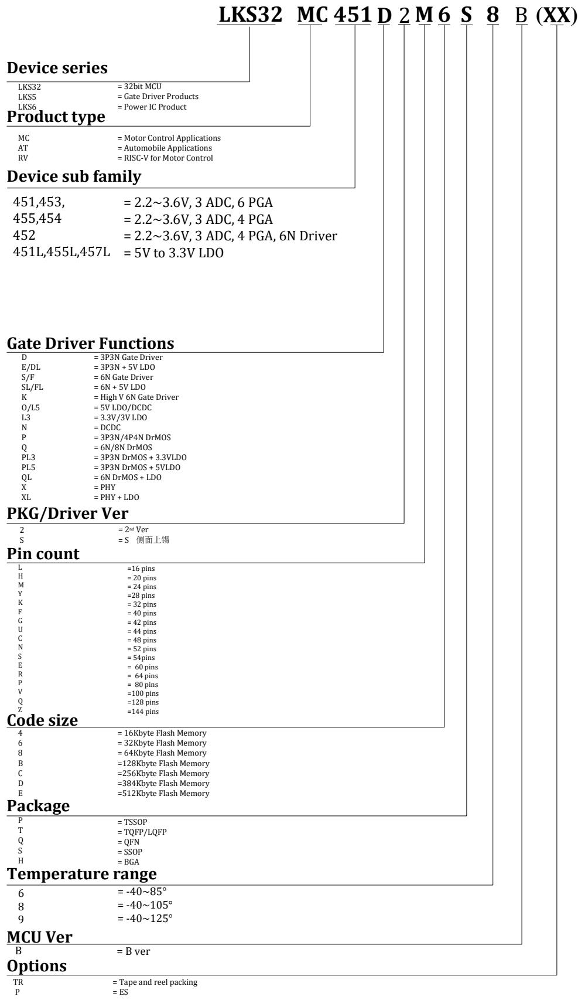  
图 1-1 凌鸥创芯器件命名规则

## 1.4 系统资源框图

此处以LKS32MC451VCT8为例，其他型号硬件资源细节，请参考选型表。

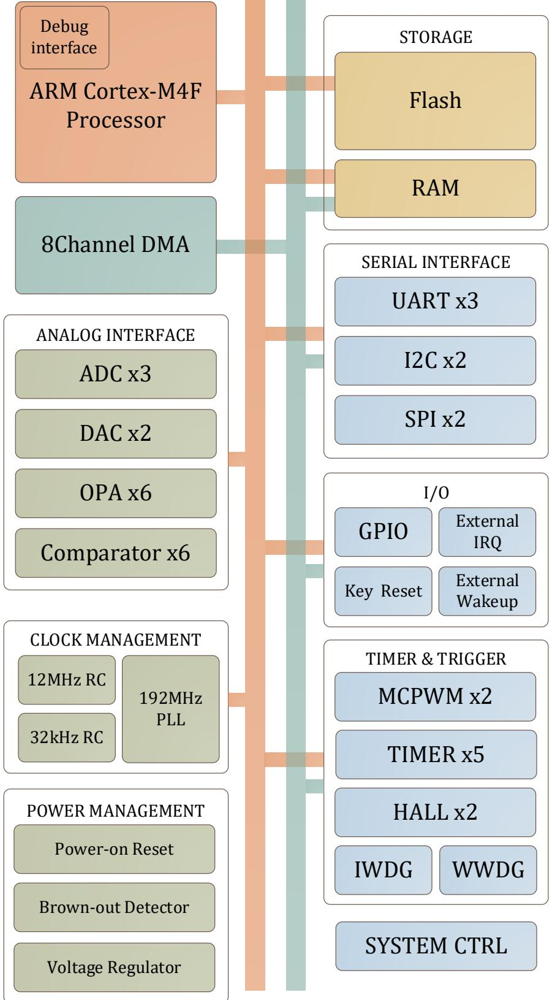  
图 1-2 LKS32MC451VCT8 系统资源框图

## 1.5 矢量正弦控制系统

  
图 1-3LKS32MC45x 矢量正弦控制系统简化原理图

## 2 器件选型表

表 2-1 LKS32MC45x 系列器件选型表

<table><tr><td></td><td>Frequency (MHz)</td><td>Flash (kB)</td><td>RAM (kB)</td><td>ADC</td><td>ADC ch.</td><td>DAC</td><td>HALL</td><td>MCPWM</td><td>Comparator</td><td>Comparator ch.</td><td>OPA</td><td>TIMER</td><td>SPI</td><td>IIC</td><td>UART</td><td>CAN</td><td>Temp. Sensor</td><td>PLL</td><td>QEP</td><td>Gate Driver current(A)</td><td>Pre-drive supply(V)</td><td>Gate floating voltage (V)</td><td>Others</td><td>Package</td></tr><tr><td>LKS32MC451VCT8</td><td>192</td><td>256</td><td>40</td><td rowspan="10">14bit, 2Mpsx3</td><td>27</td><td>12bit×2</td><td>3Phase×2</td><td>4Pair×2</td><td>6</td><td>24</td><td>6</td><td>5</td><td>2</td><td>2</td><td>3</td><td>1</td><td>Yes</td><td>Yes</td><td>4</td><td></td><td></td><td></td><td></td><td>LQFP100</td></tr><tr><td>LKS32MC451LVCT8</td><td>192</td><td>256</td><td>40</td><td>27</td><td>12bit×2</td><td>3Phase×2</td><td>4Pair×2</td><td>6</td><td>24</td><td>6</td><td>5</td><td>2</td><td>2</td><td>3</td><td>1</td><td>Yes</td><td>Yes</td><td>4</td><td></td><td></td><td></td><td>5V AVDD</td><td>LQFP100</td></tr><tr><td>LKS32MC452FPCT8</td><td>192</td><td>256</td><td>40</td><td>21</td><td>12bit×2</td><td>3Phase×2</td><td>4Pair×2</td><td>6</td><td>16</td><td>5</td><td>5</td><td>2</td><td>2</td><td>3</td><td>1</td><td>Yes</td><td>Yes</td><td>4</td><td>+1.2/-1.5</td><td>7~20</td><td>200</td><td></td><td>LQFP80</td></tr><tr><td>LKS32MC453RCT8</td><td>192</td><td>256</td><td>40</td><td>18</td><td>12bit×2</td><td>3Phase×2</td><td>4Pair×2</td><td>6</td><td>20</td><td>6</td><td>5</td><td>2</td><td>2</td><td>3</td><td>1</td><td>Yes</td><td>Yes</td><td>4</td><td></td><td></td><td></td><td></td><td>LQFP64</td></tr><tr><td>LKS32MC454CCT8</td><td>192</td><td>256</td><td>40</td><td>20</td><td>12bit×2</td><td>3Phase×2</td><td>4Pair×2</td><td>6</td><td>15</td><td>4</td><td>5</td><td>2</td><td>2</td><td>3</td><td>0</td><td>Yes</td><td>Yes</td><td>4</td><td></td><td></td><td></td><td></td><td>TQFP48</td></tr><tr><td>LKS32MC454NCQ8</td><td>192</td><td>256</td><td>40</td><td>15</td><td>12bit×2</td><td>3Phase×2</td><td>4Pair×2</td><td>6</td><td>15</td><td>6</td><td>5</td><td>2</td><td>2</td><td>3</td><td>1</td><td>Yes</td><td>Yes</td><td>4</td><td></td><td></td><td></td><td></td><td>QFN52</td></tr><tr><td>LKS32MC455RCT8</td><td>192</td><td>256</td><td>40</td><td>21</td><td>12bit×2</td><td>3Phase×2</td><td>4Pair×2</td><td>6</td><td>18</td><td>4</td><td>5</td><td>2</td><td>2</td><td>3</td><td>1</td><td>Yes</td><td>Yes</td><td>4</td><td></td><td></td><td></td><td></td><td>LQFP64</td></tr><tr><td>LKS32MC455LRCT8</td><td>192</td><td>256</td><td>40</td><td>22</td><td>12bit×2</td><td>3Phase×2</td><td>4Pair×2</td><td>6</td><td>19</td><td>4</td><td>5</td><td>2</td><td>2</td><td>3</td><td>1</td><td>Yes</td><td>Yes</td><td>4</td><td></td><td></td><td></td><td>5V AVDD</td><td>LQFP64</td></tr><tr><td>LKS32MC457RCT8</td><td>192</td><td>256</td><td>40</td><td>20</td><td>12bit×2</td><td>3Phase×2</td><td>4Pair×2</td><td>6</td><td>17</td><td>2</td><td>5</td><td>2</td><td>2</td><td>3</td><td>1</td><td>Yes</td><td>Yes</td><td>4</td><td></td><td></td><td></td><td>5V AVDD</td><td>LQFP64</td></tr><tr><td>LKS32MC457LRCT8</td><td>192</td><td>256</td><td>40</td><td>21</td><td>12bit×2</td><td>3Phase×2</td><td>4Pair×2</td><td>6</td><td>18</td><td>2</td><td>5</td><td>2</td><td>2</td><td>3</td><td>1</td><td>Yes</td><td>Yes</td><td>4</td><td></td><td></td><td></td><td>5V AVDD</td><td>LQFP64</td></tr></table>

## 3 管脚分布

## 3.1 管脚分布图及管脚说明

其中 5VT 的引脚为兼容 5V 输入电平的引脚，允许输入 5V 电平信号，推挽模式输出信号最高仍为3.3V。可使用开漏模式并外接上拉电阻至5V，使得输出高电平时为 5V。

## 3.1.1 LKS32MC451VCT8

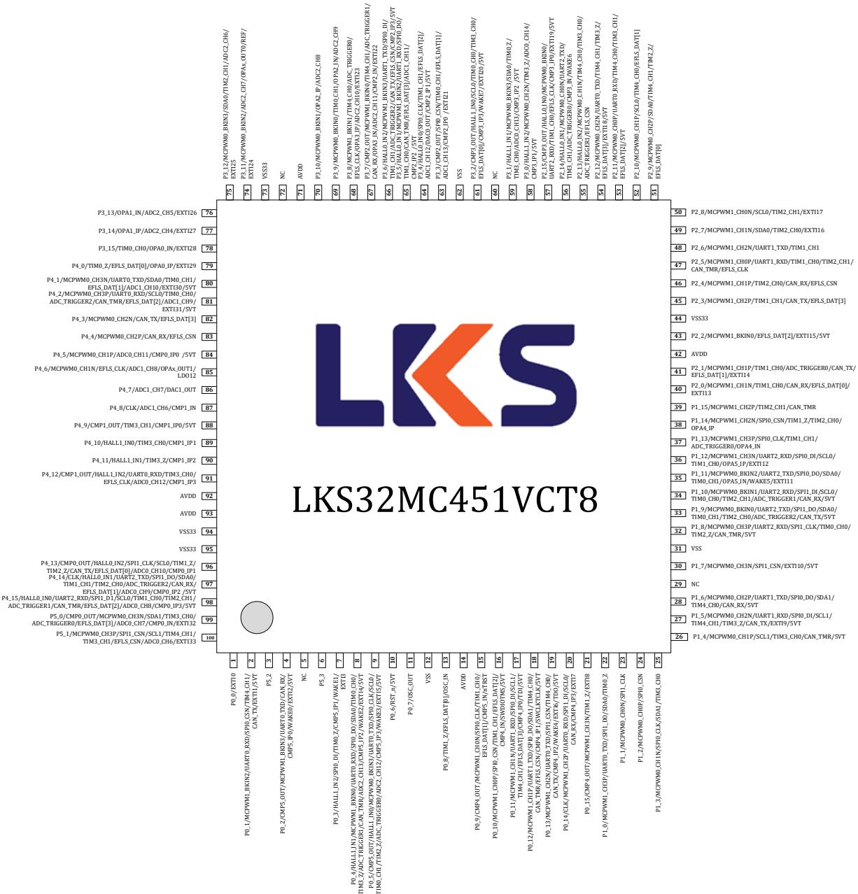  
图 3-1 LKS32MC451VCT8 管脚分布图

## 3.1.2 LKS32MC451LVCT8

P3\_13/OPA1\_IN/ADC2\_CH5/EXTI26 76P3 14/OPA1 IP/ADC2 CH4/EXTI27 77P3 15/TIM0 CH0/OPA0 IN/EXTI28 78P4 0/TIM0 Z/EFLS DATI0]/OPA0 IP/EXTI29 79P4 1/MCPWM0 CH3N/UART0 TXD/SDA0/TIMO CH1EFLS DAT(11/ADC1 CH10/EXTI30/5VT 80P4 2/MCPWM0 CH3P/UART0 RXD/SCL0/TIM0 CH0AADC TRIGGER2/CAN TMR/EFLS DATI21/ADC1 CH9/EXTI31/5VT 81P4 3/MCPWM0 CH2N/CAN TX/EFLS DAT[3] 82P4\_4/MCPWM0\_CH2P/CAN\_RX/EFLS\_CSN 83P4 5/MCPWM0 CH1P/ADCO CH11/CMPO IPO /5VT 84P4 6/MCPWM0 CH1N/EFLS CLK/ADC1 CH8/OPAx OUT1 85LD012P4 7/ADC1 CH7/DAC1 OUT 86B1 OVCU (ARC1 CH (CMR1 IN 87P4 9/CMP1 QUIT/TIM3 CH1/CMP1 JP0/5VT 88P4 10/HALJ-1 IN0/TIM3 CH0/CMP1 JP1 89P4\_11/HALL1\_IN1/TIM3\_Z/CMP1\_IP2 90P4 12/CMP1 OUT/HALL1 IN2/UART0 RXD/TIM3 CH0FFLS CLK/ADCO CH12/CMP1 JP3 91vee 92NC 93AVSS 94VSS33 95P4 13/CMP0 OUIT/HALL0 IN2/SPI1 CLK/SCL0/TIM1 Z/ TUMD TCAN TY (EELS RATLOL(ARCO CULO CMPO IR 96P4 14/CLK/HALL0 IN1/UART2 TXD/SPI DO/SDA0/TIM1 CH1/TIM2 CH0/ADC TRIGGER2/CAN RX/EFLS DATL11/ADCO CH9/CMP0 IP2 /5VT 97P4 15/HALL0 IN0/UART2 RXD/SPI1 D1/SCL0/TIM1 CH0/TIM2 CH198ADC TRIGGER1/CAN TMR/EFLS DATI21/ADC0 CH8/CMP0 IP3/5VTP5 0/CMP0 OUT /MCPWMO CH3N/SDA1/TIM3 CH0A 99ADC TRIGGER0/EFLS DATI31/ADC0 CH7/CMP0 IN/EXTI32P5 1/MCPWM0 CH3P/SPI1 CSN/SCL1/TIM4 CH1/TIM3 CH1/FFLS CSN/ADC0 CH6/EXT133 100

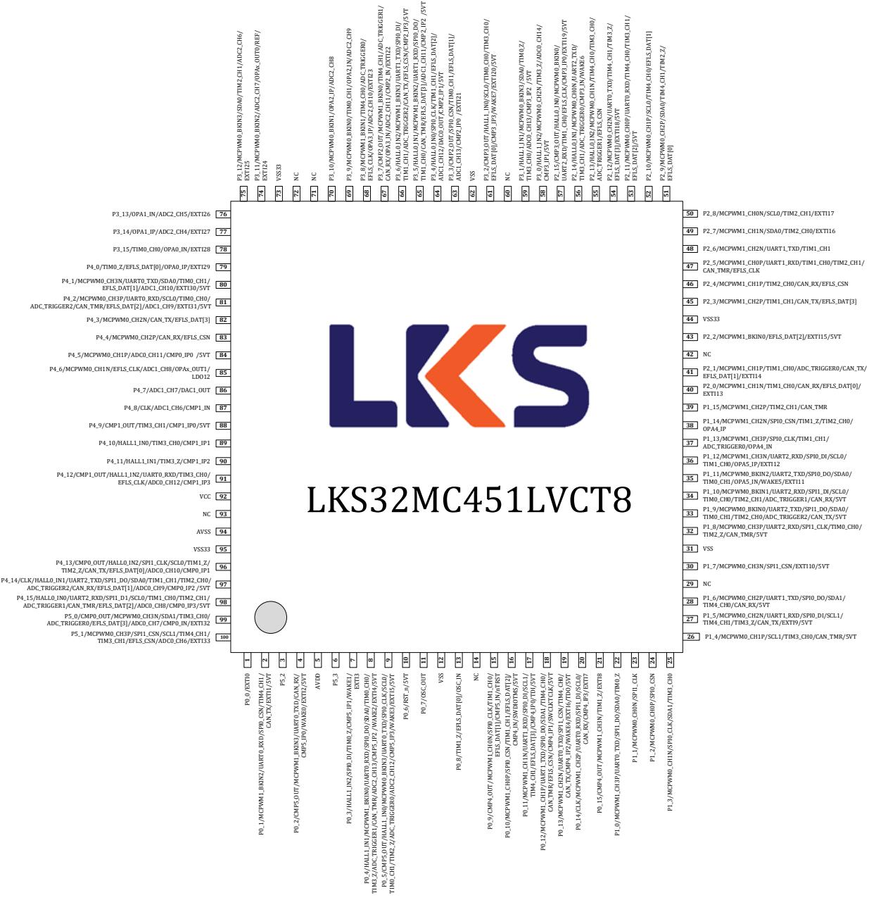  
图 3-2 LKS32MC451LVCT8 管脚分布图

50 P2 8/MCPWM1 CH0N/SCL0/TIM2 CH1/EXTI1740 R2.7/MCRWM1 CH1N/SD0 /TIM2. CH0/EXTU1648 P2 6/MCPWM1 CH2N/UART1 TXD/TIM1 CH47 P2 5/MCPWM1 CH0P/UART1 RXD/TIM1 CH0/TIM2 CH1CAN TMR/EFLS CLK46 R2 4(MCRWM1 CH1R/TIM2 CHOV/CAN RX/EELS CS45 P2 3/MCPWM1 CH2P/TIM1 CH1/CAN TX/EFLS DAT[344 VSS3343 P2 2/MCPWM1 BKIN0/EFLS DAT[21/EXT115/5VT42 NCP2 1/MCPWM1 CH1P/TIM1 CH0/ADC TRIGGER0/CAN TX41EFLS DAT[11/EXTI14P2 0/MCPWM1 CH1N/TIM1 CH0/CAN RX/EFLS DAT[0]/40 FXTU1320 P1 15/MCPWM1 CH2P/TIM2 CH1/CAN TMEP1 14/MCPWM1 CH2N/SPI0 CSN/TIM1 Z/TIM2 CH038OPA4 IP37 P1 13/MCPWM1 CH3P/SPI0 CLK/TIM1 CH1 ADC TRICCERO /ORA4 INP1\_12/MCPWM1\_CH3N/UART2\_RXD/SPI0\_DI/SCL036 TIM1 CH0/OPA5 IP/EXT112P1 11/MCPWM0 BKIN2/UART2 TXD/SPI0 DO/SDA0/35TIM0 CH1/OPA5 IN/WAKE5/EXTI11P1 10/MCPWM0 BKIN1/UART2 RXD/SPI1 DI/SCL034 TIMO CHO /TIM2 CH1/ADC TRICCER1 /CAN BX /EVTP1 9/MCPWM0 BKIN0/UART2 TXD/SPI1 DO/SDA033TIM0 CH1/TIM2 CH0/ADC TRIGGER2/CAN TX/5VTP1 8/MCPWM0 CH3P/UART2 RXD/SPI1 CLK/TIM0 CH0432 TIM2 Z/CAN TMR/5VT

30 P1\_7/MCPWM0\_CH3N/SPI1\_CSN/EXT110/5V29 NC28 P1\_6/MCPWM0\_CH2P/UART1\_TXD/SPI0\_DO/SDA1/TIM4 CH0/CAN RX/5VT27 TIM4 CH1/TM3 2/CAN TX/1XT9/SVT P1 5/MCPWM0 CH2N/UIART1 RXD/SPI0 DL/SCL1/26 P1 4/MCPWM0 CH1P/SCL1/TIM3 CH0/CAN TMR/5VT

## 3.1.3 LKS32MC453RCT8

P3\_11/MCPWM0\_BKIN2/ADC2\_CH7/OPAx\_OUT0/REF/49EXTI24P3\_13/OPA1\_IN/ADC2\_CH5/EXTI26 50P3 14/OPA1 IP/ADC2 CH4/EXTI27 51P3 15/TIM0 CH0/OPA0 IN/EXTI28 52P4\_0/TIM0\_Z/EFLS\_DAT[0]/OPA0\_IP/EXTI29 53P4 5/MCPWM0 CH1P/ADC0 CH11/CMP0 JP0 /5VT 54P4 6/MCPWM0 CH1N/EFIS CLKA55ADC1 CH8/OPAx OUT1/LD012P4\_7/ADC1\_CH7/DAC1\_OUT 56P4 9/CMP1 QUT/TIM3 CH1/CMP1 IP0/5VT 57P4\_10/HALL1\_IN0/TIM3\_CH0/CMP1\_IP1 58P4\_11/HALL1\_IN1/TIM3\_Z/CMP1\_IP2 59P4 12/CMP1 OUT/HALL1 IN2 /UART0 RXD/TIM3 CH0A60EFLS\_CLK/ADC0\_CH12/CMP1\_IP3AVDD 61VSS33 62P4\_13/CMP0\_OUT/HALL0\_IN2/SPI1\_CLK/SCL0/TIM1\_Z63TIM2\_Z/CAN\_TX/EFLS\_DAT[0]/ADC0\_CH10/CMP0\_IP1P4\_14/CLK/HALL0\_IN1/UART2\_TXD/SPI1\_D0/SDA0/64TIM1 CH1/TIM2 CH0/ADC TRIGGFR2/CAN BXAEFLS DAT111/ADC0 CH9/CMP0 IP2 /5VT

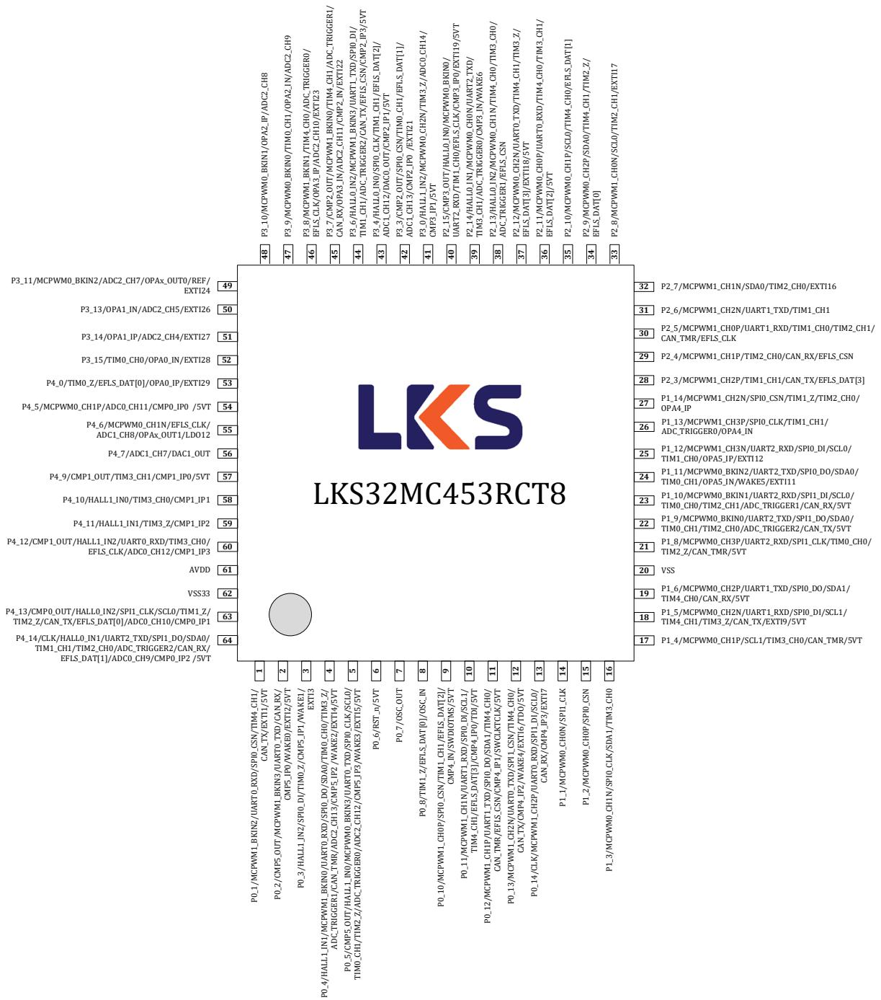  
图 3-3 LKS32MC453RCT8 管脚分布图

32 P2 7/MCPWM1 CH1N/SDA0/TIM2 CH0/EXTI1631 P2 6/MCPWM1 CH2N/UART1 TXD/TIM1 CH130 P2 5/MCPWM1 CH0P/UART1 RXD/TIM1 CH0/TIM2 CH1CAN TMR/EFLS CLK29 P2 4/MCPWM1 CH1P/TIM2 CH0/CAN RX/EFLS CSN28 P2 3/MCPWM1 CH2P/TIM1 CH1/CAN TX/EFLS DAT[327 P1 14/MCPWM1 CH2N/SPI0 CSN/TIM1 Z/TIM2 CH0/OPA4 IPP1 13/MCPWM1 CH3P/SPI0 CLK/TIM1 CH1426 ADC\_TRIGGER0/OPA4\_IN25 P1\_12/MCPWM1\_CH3N/UART2\_RXD/SPI0\_DI/SCL0P1\_11/MCPWM0\_BKIN2/UART2\_TXD/SPI0\_DO/SDA024TIM0\_CH1/OPA5\_IN/WAKE5/EXTI1P1 10/MCPWM0 BKIN1/UART2 RXD/SPI1 DL/SCL0423TIM0\_CH0/TIM2\_CH1/ADC\_TRIGGER1/CAN\_RX/5VTP1 9/MCPWM0 BKIN0/UART2 TXD/SPI1 DO/SDA0/22TIM0 CH1/TIM2 CH0/ADC TRIGGER2/CAN TX/5VTP1 8/MCPWM0 CH3P/IIART2 RXD/SPI1 CLK/TIM0 CH0/21TIM2 Z/CAN TMR/5VT20 yss19 P1 6/MCPWM0 CH2P/UART1 TXD/SPI0 DO/SDA1/TIM4 CH0/CAN RX/5VTP1 5/MCPWM0 CH2N/UART1 RXD/SPI0 DI/SCL118TIM4\_CH1/TIM3\_Z/CAN\_TX/EXTI9/5VT17 P1 4/MCPWM0 CH1P/SCL1/TIM3 CH0/CAN TMR/5VT

P1\_12/MCPWM1\_CH3N/UART2\_RXD/SPI0\_DI/SCL0/15TIM1 CH0/OPA5 IP/EXTI12

P4\_15/HALL0\_IN0/UART2\_RXD/SPI1\_D1/SCL0/TIM1\_CH0/TIM2\_CH1/ 46ADC\_TRIGGER1/CAN\_TMR/EFLS\_DAT[2]/ADC0\_CH8/CMP0\_IP3/5VT

P4\_14/CLK/HALL0\_IN1/UART2\_TXD/SPI1\_D0/SDA0/TIM1\_CH1/QEP1\_CH1/ 45 TIM2 CH0/OEP0 CH0/ADC TRIGGER2/EFLS DATL11/ADC0 CH9/CMP0 IP2/5VT/FLT

## 3.1.4 LKS32MC454CCT8

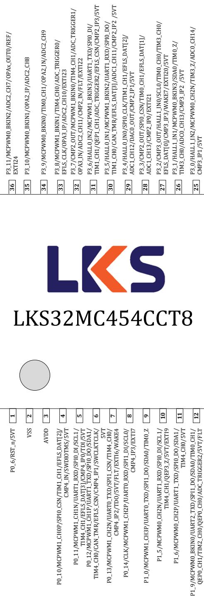  
图 3-4 LKS32MC454CCT8 管脚分布图

P2\_5/MCPWM1\_CH0P/UART1\_RXD/TIM1\_CH0/TIM2\_CH1/ 16 CAN\_TMR/EFLS\_CLK

P1 11/MCPWM0 BKIN2/UART2 TXD/SPI0 DO/SDA014 TIM0 CH1/OPA5 IN/WAKE5/EXTI11

13 P1.10/MC/WM0\_BKIN1/UART2RXD/SP1\_DI/S1L0/TIM0\_CH0

## 3.1.5 LKS32MC454NCQ8

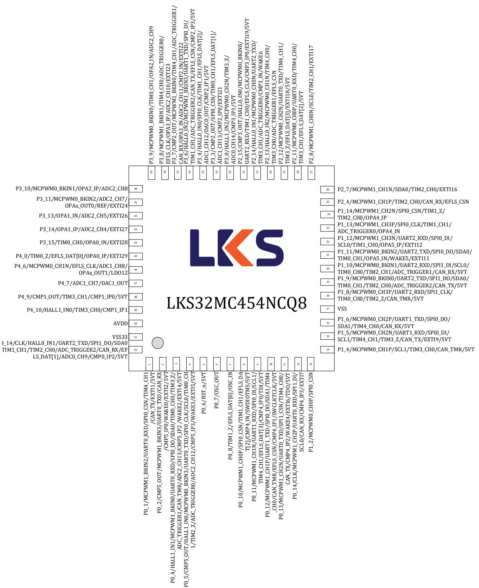  
图 3-5 LKS32MC454NCQ8 管脚分布图

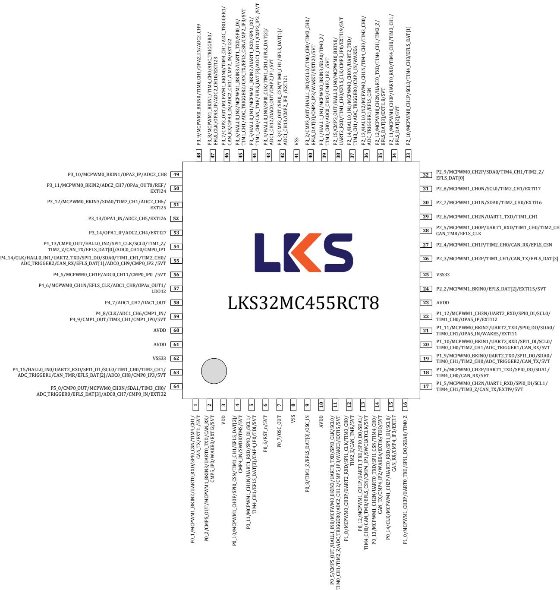

## 3.1.6 LKS32MC455RCT8

P3 10/MCPWM0 BKIN1/OPA2 IP/ADC2 CH8 49P3 11/MCPWM0 BKIN2/ADC2 CH7/OPAx OUT0/RFE/ 50EXTI24P3 12/MCPWM0 BKIN3/SDA0/TIM2 CH1/ADC2 CH6/51EXTI25P3 13/OPA1 IN/ADC2 CH5/EXTI26 52P3\_14/OPA1\_IP/ADC2\_CH4/EXTI27 53P4\_13/CMP0\_OUT/HALL0\_IN2/SPI1\_CLK/SCL0/TIM1\_Z/ 54TIM2 Z/CAN TX/EFLS DATI01/ADC0 CH10/CMP0 IP1P4 14/CLK/HALL0 IN1/UART2 TXD/SPI1 DO/SDA0/TIM1 CH1/TIM2 CH0/55ADC\_TRIGGER2/CAN\_RX/EFLS\_DAT[1]/ADC0\_CH9/CMP0\_IP2 /5VTP4\_5/MCPWM0\_CH1P/ADC0\_CH11/CMP0\_IP0 /5VT 56P4 6/MCPWM0 CH1N/EFLS CLK/ADC1 CH8/OPAx OUT1/1D012 57P4\_7/ADC1\_CH7/DAC1\_OUT 58P4\_8/CLK/ADC1\_CH6/CMP1\_IN/ 59P4\_9/CMP1\_0UT/TIM3\_CH1/CMP1\_IP0/5VTAVDD 60AVDD 61VSS33 62P4\_15/HALL0\_IN0/UART2\_RXD/SPI1\_D1/SCL0/TIM1\_CH0/TIM2\_CH1/63ADC TRIGGER1/CAN TMR/EFLS DAT[2]/ADC0 CH8/CMP0 IP3/5VTP5 0/CMP0 QUT/MCPWM0 CH3N/SDA1/TIM3 CH0/ 64ADC TRIGGFR0/EFLS DATI31/ADC0 CH7/CMP0 IN/FXTI32

图 3-6 LKS32MC455RCT8 管脚分布图

P2\_9/MCPWM0\_CH2P/SDA0/TIM4\_CH1/TIM2\_Z/32 EFLS\_DAT[0]31 P2\_8/MCPWM1\_CH0N/SCL0/TIM2\_CH1/EXTI1730 P2 7/MCPWM1 CH1N/SDA0/TIM2 CH0/EXTI1629 P2 6/MCPWM1 CH2N/UART1 TXD/TIM1 CH1P2 5/MCPWM1 CH0P/UART1 RXD/TIM1 CH0/TIM2 CH128CAN TMR/EFLS CLK27 P2\_4/MCPWM1\_CH1P/TIM2\_CH0/CAN\_RX/EFLS\_CSN26 P2 3/MCPWM1 CH2P/TIM1 CH1/CAN TX/EFLS DAT[3]25 VSS3324 P2\_2/MCPWM1\_BKIN0/EFLS\_DAT[2]/EXTI15/5VT23 AVDDP1\_12/MCPWM1\_CH3N/UART2\_RXD/SPI0\_DI/SCL022TIM1\_CH0/OPA5\_IP/EXTI12P1\_11/MCPWM0\_BKIN2/UART2\_TXD/SPI0\_D0/SDA021TIM0\_CH1/OPA5\_IN/WAKE5/EXTI11P1 10/MCPWM0 BKIN1/UART2 RXD/SPI1 DI/SCL0/20TIM0 CH0/TIM2 CH1/ADC TRIGGER1/CAN RX/5VTP1 9/MCPWM0 BKIN0/UART2 TXD/SPI1 DO/SDA019 TIM0\_CH1/TIM2\_CH0/ADC\_TRIGGER2/CAN\_TX/5VTP1\_6/MCPWM0\_CH2P/UART1\_TXD/SPI0\_DO/SDA1/18TIM4 CH0/CAN RX/5VT17 P1 5/MCPWM0 CH2N/UART1 RXD/SPI0 DI/SCL1/TIM4 CH1/TIM3 Z/CAN TX/EXTI9/5VT

## 3.1.7 LKS32MC455LRCT8

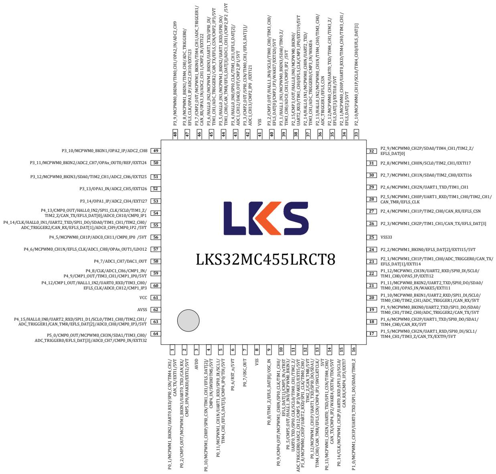  
图 3-7 LKS32MC455LRCT8 管脚分布图

## 3.1.8 LKS32MC457RCT8

P3 10 /MCPWM0 BKIN1/OPA2 IP/ADC2 CH8 49P3\_11/MCPWM0\_BKIN2/ADC2\_CH7/OPAx\_OUT0/REF/EXTI24 50P3 12/MCPWM0 BKIN3/SDA0/TIM2 CH1/OEP0 CH1/ADC2 CH6/EXTI25 51P3 13/OPA1 IN /ADC2 CH5/EXTI26 52P3 14/OPA1 IP/ADC2 CH4/EXTI27 53P4\_1/MCPWM0\_CH3N/UART0\_TXD/SDA0/TIM0\_CH1/54OEP0 CH1/EFLS DATT11/ADC1 CH10/5VT/FLT/EXT130P4 2/MCPWM0 CH3P/UART0 RXD/SCL0/TIM0 CH0/OEP0 CH0455ADC TRIGGER2/CAN TMR/FFLS DATI21/ADC1 CH9/5VT/FLT/EXTI31P4 6/MCPWM0 CH1N/EFLS CLK/ADC1 CH8/OPAx OUT1/LD012/P4 7/ADC1 CH7/DAC1 OUT 56AVDD 57AVDD 59VSS33 59VSS33 60P5 0/CMP0.OUT/MCPWM0 CH3N/SDA1/TIM3 CH0/OEP1 CH0A61ADC\_TRIGGER0/EFLS\_DAT[3]/ADC0\_CH7/CMP0\_IN/FLT/EXTI32P5 1/MCPWM0 CH3P/SPI1 CSN/SCL1/TIM4 CH1/TIM3 CH1AOFR1 CH1/EELS CSN /ADC0 CH6/ELT/EXTI33 62P4\_14/CLK/HALL0\_IN1/UART2\_TXD/SPI1\_D0/SDA0/TIM1\_CH1/QEP1\_CH1/TIM2\_CH0/63OEP0 CH0/ADC TRIGGER2/CAN RX/EFIS DATI11/ADC0 CH9/CMP0 IP2/5VT/FLTP4 15/HALL0 IN0/UART2 RXD/SPI1 D1/SCL0/TIM1 CH0/OEP1 CH0/TIM2 CH1/64OEP0 CH1/ADC TRIGGER1/CAN TMR/EFLS DAT[21/ADC0 CH8/CMP0 IP3/5VT/FLT

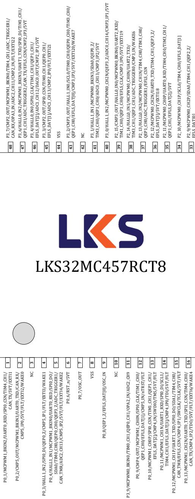  
图 3-8 LKS32MC457RCT8 管脚分布图

32 P2\_8/MCPWM1\_CH0N/SCL0/TIM2\_CH1/QEP0\_CH1/EXTI131 P2 7/MCPWM1 CH1N/SDA0/TIM2 CH0/OEP0 CH0/EXTI1630P2\_6/MCPWM1\_CH2N/UART1\_TXD/TIM1\_CH1/QEP1\_CH1P2 5/MCPWM1 CH0P/UART1 RXD/TIM1 CH0/OEP1 CH0A29TIM2 CH1/OEP0 CH1/CAN TMR/EFLS CLK28 P2 4/MCPWM1 CH1P/TIM2 CH0/OEP0 CH0/CAN RX/EFLS CSN27 P2 3/MCPWM1 CH2P/TIM1 CH1/OEP1 CH1/CAN TX/EFLS DAT[3P1\_11/MCPWM0\_BKIN2/UART2\_TXD/SPI0\_DO/SDA026TIM0\_CH1/QEP0\_CH1/OPA5\_IN/EXTI11/WAKESP1 10/MCPWM0 BKIN1/UART2 RXD/SPI1 DI/SCL0/TIM0 CH0/25OEP0 CH0/TIM2 CH1/OEP0 CH1/ADC TRIGGER1/CAN RX/5VT/FLT24 P1 9/MCPWM0 BKIN0/UART2 TXD/SPI1 DO/SDA0/TIM0 CH1/OEP0 CH1/TIM2 CH0/OEP0 CH0/ADC TRIGGER2/CAN TX/SVT/FLT23 P1\_8/MCPWM0\_CH3P/UART2\_RXD/SPI1\_CLK/TIM0\_CH0QEP0\_CH0/QEP2\_Z/CAN\_TMR/5VT/FLT22 VSSP0 5/CMP5 QUT/HALL1 IN0 /MCPWM0 BKIN3/UART0 TXDA21 SPI0 CLK/SCL0/TIM0 CH1/OEP0 CH1/OEP2 Z/ADC TRIGGER0/ADC2\_CH12/CMP5\_IP3/5VT/FLT/EXTI5/WAKE20 NC19 P1\_0/MCPWM1\_CH3P/UART0\_TXD/SPI1\_DO/SDA0/QEP0\_Z18 P0 15/CMP4 QUT/MCPWM1 CH3N/OEP1 Z/EXTI817 P0 14/CLK/MCPWM1 CH2P /UART0 RXD/SPI1 DI/SCL0CAN RX/CMP4 IP3/EXT17

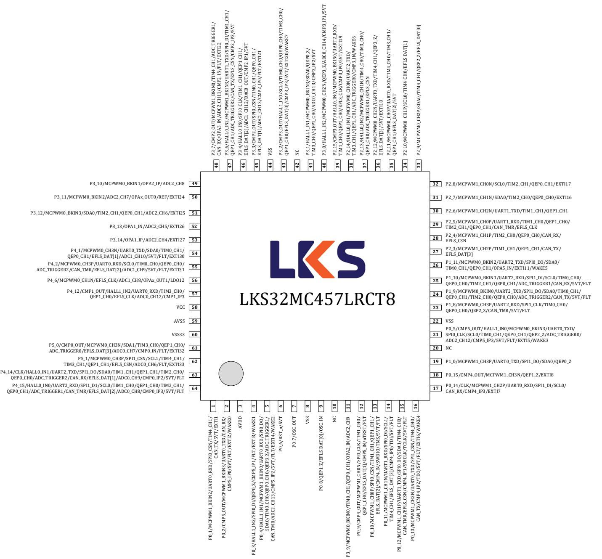

## 3.1.9 LKS32MC457LRCT8

P3\_10/MCPWM0\_BKIN1/OPA2\_IP/ADC2\_CH8 49P3\_11/MCPWM0\_BKIN2/ADC2\_CH7/OPAx\_OUT0/REF/EXTI24 50P3\_12/MCPWM0\_BKIN3/SDA0/TIM2\_CH1/QEP0\_CH1/ADC2\_CH6/EXTI25 51P3\_13/OPA1\_IN/ADC2\_CH5/EXTI26 52P3\_14/OPA1\_IP/ADC2\_CH4/EXTI27 53P4 1/MCPWM0 CH3N/UART0 TXD/SDA0/TIM0 CH1/QEP0\_CH1/EFLS\_DAT[1]/ADC1\_CH10/5VT/FLT/EXTI30 54P4 2/MCPWM0 CH3P /UIART0 RXD/SCL0./TIM0 CH0 /OEP0 CH0A 55ADC\_TRIGGER2/CAN\_TMR/EFLS\_DAT[2]/ADC1\_CH9/5VT/FLT/EXTI31P4 6/MCPWM0 CH1N/FFLS CLK/ADC1 CH8/OPAx OUT1/LD012 56P4\_12/CMP1\_OUT/HALL1\_IN2/UART0\_RXD/TIM3\_CH0/57QEP1\_CH0/EFLS\_CLK/ADC0\_CH12/CMP1\_IP3VCC 58AVSS 59VSS33 60P5\_0/CMP0\_OUT/MCPWM0\_CH3N/SDA1/TIM3\_CH0/QEP1\_CH0 61ADC\_TRIGGER0/EFLS\_DAT[3]/ADC0\_CH7/CMP0\_IN/FLT/EXTI32P5\_1/MCPWM0\_CH3P/SPI1\_CSN/SCL1/TIM4\_CH162TIM3\_CH1/QEP1\_CH1/EFLS\_CSN/ADC0\_CH6/FLT/EXTI33P4 14/CLK/HALL0 IN1/UART2 TXD/SPI1 DO/SDA0/TIM1 CH1/OEP1 CH1/TIM2 CH0/63QEP0\_CH0/ADC\_TRIGGER2/CAN\_RX/EFLS\_DAT[1]/ADC0\_CH9/CMP0\_IP2/5VT/FLTP4\_15/HALL0\_IN0/UART2\_RXD/SPI1\_D1/SCL0/TIM1\_CH0/QEP1\_CH0/TIM2\_CH1/OFP0 CH1/ADC TRIGGER1/CAN TMR/FFLS DATI21/ADC0 CH8/CMP0 IP3/5VT/FLT 64

32 P2 8/MCPWM1 CH0N/SCL0/TIM2 CH1/OEP0 CH1/EXTI1731 P2\_7/MCPWM1\_CH1N/SDA0/TIM2\_CH0/QEP0\_CH0/EXTI130 P2\_6/MCPWM1\_CH2N/UART1\_TXD/TIM1\_CH1/QEP1\_CH129 P2\_5/MCPWM1\_CH0P/UART1\_RXD/TIM1\_CH0/QEP1\_CH0TIM2\_CH1/QEP0\_CH1/CAN\_TMR/EFLS\_CLKP2\_4/MCPWM1\_CH1P/TIM2\_CH0/QEP0\_CH0/CAN\_RX/28EFLS\_CSNP2 3/MCPWM1 CH2P/TIM1 CH1/OEP1 CH1/CAN TX27EFLS DAT[3]P1\_11/MCPWM0\_BKIN2/UART2\_TXD/SPI0\_DO/SDA026 TIMO CH1/OER0 CH1/ORA5 IN /EXTI11/WAKEE25 P1\_10/MCPWM0\_BKIN1/UART2\_RXD/SPI1\_DI/SCL0/TIM0\_CH0/QEP0\_CH0/TIM2\_CH1/QEP0\_CH1/ADC\_TRIGGER1/CAN\_RX/5VT/FLTP1\_9/MCPWM0\_BKIN0/UART2\_TXD/SPI1\_DO/SDA0/TIM0\_CH1/24QEP0\_CH1/TIM2\_CH0/QEP0\_CH0/ADC\_TRIGGER2/CAN\_TX/5VT/FLTP1\_8/MCPWM0\_CH3P/UART2\_RXD/SPI1\_CLK/TIM0\_CH0/23QEP0\_CH0/QEP2\_Z/CAN\_TMR/5VT/FLT22 VSSP0 5/CMP5 QUT/HALL1 IN0/MCPWM0 BKIN3/UART0 TXD21 SPI0\_CLK/SCL0/TIM0\_CH1/QEP0\_CH1/QEP2\_Z/ADC\_TRIGGER0ADC2\_CH12/CMP5\_IP3/5VT/FLT/EXTI5/WAKE20 NC10 P1\_0/MCPWM1\_CH3P/UART0\_TXD/SPI1\_DO/SDA0/QEP0\_Z18 P0.15./CMP4 OUT/MCPWM1 CH3N/OFP1.Z/EXTI8P0\_14/CLK/MCPWM1\_CH2P/UART0\_RXD/SPI1\_DI/SCL017 CAN RX/CMP4 IP3 /EXTI7

图 3-9 LKS32MC457LRCT8 管脚分布图

## 3.2 管脚说明

表 3-1 LKS32MC45x 管脚说明

<table><tr><td rowspan="2">编号</td><td colspan="9">引脚</td><td rowspan="2">名称</td><td rowspan="2">类型</td><td rowspan="2">功能说明</td></tr><tr><td>451</td><td>451L</td><td>453</td><td>454(48)</td><td>454(52)</td><td>455</td><td>455L</td><td>457</td><td>457L</td></tr><tr><td>1</td><td>1</td><td>1</td><td></td><td></td><td></td><td></td><td></td><td></td><td></td><td>P0_0</td><td>IO</td><td>P0.0</td></tr><tr><td>2</td><td>2</td><td>2</td><td>1</td><td></td><td>1</td><td>1</td><td>1</td><td>1</td><td>1</td><td>P0_1/MCPWM1_BKIN2/UART0_RXD/SPI0_CS/TIM4_CH1/CAN_TX</td><td>IO</td><td>P0.1/PWM1 停机信号 2/串口 0 接收/SPI0 片选信号/Timer4通道 1/CAN 发送</td></tr><tr><td>3</td><td>3</td><td>3</td><td></td><td></td><td></td><td></td><td></td><td></td><td></td><td>P5_2</td><td>IO</td><td>P5.2</td></tr><tr><td>4</td><td>4</td><td>4</td><td>2</td><td></td><td>2</td><td>2</td><td>2</td><td>2</td><td>2</td><td>P0_2/CMP5_OUT/MCPWM1_BKIN3/UART0_TXD/CAN_RX/CMP5_IP0</td><td>IO</td><td>P0.2/比较器 5 输出/PWM1 停机信号 3/串口 0 发送/CAN 接收/比较器 5 正端输入 0</td></tr><tr><td>5</td><td>5</td><td></td><td></td><td></td><td></td><td></td><td></td><td></td><td></td><td>NC</td><td></td><td>浮空,无连接</td></tr><tr><td></td><td></td><td></td><td></td><td></td><td></td><td>3</td><td></td><td></td><td></td><td>VDD</td><td>PWR</td><td>1.2V 数字电源,由内部 LDO 产生,可浮空也可外接滤波电容</td></tr><tr><td></td><td></td><td>5</td><td></td><td></td><td></td><td></td><td>3</td><td></td><td>3</td><td>AVDD</td><td>PWR</td><td>5V 转 3.3V LDO 的输出,需要外挂 10uF + 0.1uF 电容</td></tr><tr><td>6</td><td>6</td><td>6</td><td></td><td></td><td></td><td></td><td></td><td></td><td></td><td>P5_3</td><td>IO</td><td>P5.3</td></tr><tr><td>7</td><td>7</td><td>7</td><td>3</td><td></td><td></td><td></td><td></td><td>4</td><td>4</td><td>P0_3/HALL1_IN2/SPI0_DI/TIMO_Z/CMP5_IP1</td><td>IO</td><td>P0.3/Hall 1 输入信号 2/SPI0 输入/Timer0 Z 轴信号/比较器 5正端输入 1</td></tr><tr><td>8</td><td>8</td><td>8</td><td>4</td><td></td><td>3</td><td></td><td></td><td>5</td><td>5</td><td>P0_4/HALL1_IN1/MCPWM1_BKIN0/UART0_RXD/SPI0_DO/SDA0/TIMO_CH0/TIMO_Z/ADC_TRIGGER1/CAN_TMR/ADC2_CH13/CMP5_IP2</td><td>IO</td><td>P0.4/Hall 1 输入信号 1/PWM1 停机信号 0/串口 0 接收/SPI0输出/I2C0 数据信号/Timer0 通道 0/Timer3 Z 轴信号/ADC触发调试信号 1/CAN 时间戳外部时钟/ADC2 通道 13/比较器5 正端输入 2</td></tr><tr><td>9</td><td>9</td><td>9</td><td>5</td><td></td><td>4</td><td>11</td><td>11</td><td>21</td><td>21</td><td>P0_5/CMP5_OUT/HALL1_IN0/MCPWM0_BKIN3/UART0_TXD/SPI0_CLK/SCL0/TIMO_CH1/TIMO_Z/ADC_TRIGGER0/ADC2_CH12/CMP5_IP3</td><td>IO</td><td>P0.5/比较器 5 输出/Hall 1 输入信号 0/PWM1 停机信号 1/串口 0 发送/SPI0 时钟/I2C 时钟信号/Timer0 通道 1/Timer2 Z轴信号/ADC 触发调试信号 0/ADC2 通道 12/比较器 5 正端输入3</td></tr><tr><td>10</td><td>10</td><td>10</td><td>6</td><td>1</td><td>5</td><td>6</td><td>6</td><td>6</td><td>6</td><td>P0_6/RSTn</td><td>IO</td><td>P0.6/芯片外部复位</td></tr><tr><td>11</td><td>11</td><td>11</td><td>7</td><td></td><td>6</td><td>7</td><td>7</td><td>7</td><td>7</td><td>P0_7/OSC_OUT</td><td>IO</td><td>P0.7/晶振时钟输出</td></tr><tr><td>12</td><td>12</td><td>12</td><td></td><td>2</td><td></td><td>8</td><td>8</td><td>8</td><td>8</td><td>VSS</td><td>GND</td><td>VSS</td></tr><tr><td>13</td><td>13</td><td>13</td><td>8</td><td></td><td>7</td><td>9</td><td>9</td><td>9</td><td>9</td><td>P0_8/TIM1_Z/EFLS_DAT[0]/OSC_IN</td><td>IO</td><td>P0.8/Timer1 Z轴信号/外部flash数据0/晶振时钟输入</td></tr><tr><td>14</td><td>14</td><td></td><td></td><td>3</td><td></td><td>10</td><td></td><td></td><td></td><td>AVDD</td><td>PWR</td><td>AVDD 3.3V电源输入</td></tr><tr><td></td><td></td><td>14</td><td></td><td></td><td></td><td></td><td></td><td></td><td>10</td><td>NC</td><td></td><td>浮空,无连接</td></tr><tr><td>15</td><td>15</td><td>15</td><td></td><td></td><td></td><td></td><td>10</td><td>12</td><td>12</td><td>P0_9/CMP4_OUT/MCPWM1_CH0N/SPI0_CLK/TIM1_CH0/EFLS_DAT[1]/CMP5_IN/nTRST</td><td>IO</td><td>P0.9/比较器4输出/PWM1通道0低边/SPI0时钟/Timer1通道0/外部flash数据1/比较器5负端输入/JTAG复位</td></tr><tr><td>16</td><td>16</td><td>16</td><td>9</td><td>4</td><td>8</td><td>4</td><td>4</td><td>13</td><td>13</td><td>P0_10/MCPWM1_CH0P/SPI0_CS/TIM1_CH1/EFLS_DAT[2]/CMP4_IN/SWDIOTMS</td><td>IO</td><td>P0.10/PWM1通道0高边/SPI0片选信号/Timer1通道1/外部flash数据2/比较器4负端输入/SWD Data/JTAG TMS</td></tr><tr><td>17</td><td>17</td><td>17</td><td>10</td><td>5</td><td>9</td><td>5</td><td>5</td><td>14</td><td>14</td><td>P0_11/MCPWM1_CH1N/UART1_RXD/SPI0_DI/SCL1/TIM4_CH1/EFLS_DAT[3]/CMP4_IP0/TDI</td><td>IO</td><td>P0.11/PWM1通道1低边/串口1接收/SPI0输入/I2C1时钟信号/Timer4通道1/外部flash数据3/比较器4正端输入0/JTAG TDI</td></tr><tr><td>18</td><td>18</td><td>18</td><td>11</td><td>6</td><td>10</td><td>13</td><td>13</td><td>15</td><td>15</td><td>P0_12/MCPWM1_CH1P/UART1_TXD/SPI0_DO/SDA1/TIM4_CH0/CAN_TMR/EFLS_CS/CMP4_IP1/SWCLKTCLK</td><td>IO</td><td>P0.12/PWM1通道1高边/串口1发送/SPI0输出/I2C1数据信号/Timer4通道0/CAN时间戳外部时钟/外部flash片选/比较器4正端输入1/SWD Clock/JTAG TCLK</td></tr><tr><td>19</td><td>19</td><td>19</td><td>12</td><td>7</td><td>11</td><td>14</td><td>14</td><td>16</td><td>16</td><td>P0_13/MCPWM1_CH2N/UART0_TXD/SPI1_CS/TIM4_CH0/CAN_TX/CMP4_IP2/TDO</td><td>IO</td><td>P0.13/PWM1通道2低边/串口0发送/SPI1片选信号/Timer4通道0/CAN发送/比较器4正端输入2/JTAG TDO</td></tr><tr><td>20</td><td>20</td><td>20</td><td>13</td><td>8</td><td>12</td><td>15</td><td>15</td><td>17</td><td>17</td><td>P0_14/CLK/MCPWM1_CH2P/UART0_RXD/SPI1_DI/SCL0/CAN_RX/CMP4_IP3</td><td>IO</td><td>P0.14/时钟/PWM1通道2高边/串口0接收/SPI1输入/I2C0时钟信号/CAN接收/比较器4正端输入3</td></tr><tr><td>21</td><td>21</td><td>21</td><td></td><td></td><td></td><td></td><td></td><td>18</td><td>18</td><td>P0_15/CMP4_OUT/MCPWM1_CH3N/TIM1_Z</td><td>IO</td><td>P0.15/比较器4输出/PWM1通道3低边/Timer1Z轴信号</td></tr><tr><td>22</td><td>22</td><td>22</td><td></td><td>9</td><td></td><td>16</td><td>16</td><td>19</td><td>19</td><td>P1_0/MCPWM1_CH3P/UART0_TXD/SPI1_DO/SDA0/TIM0_Z</td><td>IO</td><td>P1.0/PWM1通道3高边/串口0发送/SPI1输出/I2C0数据信号/Timer0Z轴信号</td></tr><tr><td>23</td><td>23</td><td>23</td><td>14</td><td></td><td></td><td></td><td></td><td></td><td></td><td>P1_1/MCPWM0_CH0N/SPI1_CLK</td><td>IO</td><td>P1.1/PWM0 通道 0 低边/SPI1 时钟</td></tr><tr><td>24</td><td>24</td><td>24</td><td>15</td><td></td><td>13</td><td></td><td></td><td></td><td></td><td>P1_2/MCPWM0_CH0P/SPI0_CS</td><td>IO</td><td>P1.2/PWM0 通道 0 高边/SPI0 片选信号</td></tr><tr><td>25</td><td>25</td><td>25</td><td>16</td><td></td><td></td><td></td><td></td><td></td><td></td><td>P1_3/MCPWM0_CH1N/SPI0_CLK/SDA1/TIM3_CH0</td><td>IO</td><td>P1.3/PWM0 通道 1 低边/SPI0 时钟/I2C1 数据信号/Timer3 通道 0</td></tr><tr><td>26</td><td>26</td><td>26</td><td>17</td><td></td><td>14</td><td></td><td></td><td></td><td></td><td>P1_4/MCPWM0_CH1P/SCL1/TIM3_CH0/CAN_TMR</td><td>IO</td><td>P1.4/PWM0 通道 1 高边/I2C1 时钟信号/Timer3 通道 0/CAN 时间戳外部时钟</td></tr><tr><td>27</td><td>27</td><td>27</td><td>18</td><td>10</td><td>15</td><td>17</td><td>17</td><td></td><td></td><td>P1_5/MCPWM0_CH2N/UART1_RXD/SPI0_DI/SCL1/TIM4_CH1/TIM3_Z/CAN_TX</td><td>IO</td><td>P1.5/PWM0 通道 2 低边/串口 1 接收/SPI0 输入/I2C1 时钟信号/Timer4 通道 1/Timer3 Z 轴信号/CAN 发送</td></tr><tr><td>28</td><td>28</td><td>28</td><td>19</td><td>11</td><td>16</td><td>18</td><td>18</td><td></td><td></td><td>P1_6/MCPWM0_CH2P/UART1_TXD/SPI0_DO/SDA1/TIM4_C H0/CAN_RX</td><td>IO</td><td>P1.6/PWM0 通道 2 高边/串口 1 发送/SPI0 输出/I2C1 数据信号/Timer4 通道 0/CAN 接收</td></tr><tr><td>29</td><td>29</td><td>29</td><td></td><td></td><td></td><td></td><td></td><td></td><td></td><td>NC</td><td></td><td>浮空,无连接</td></tr><tr><td>30</td><td>30</td><td>30</td><td></td><td></td><td></td><td></td><td></td><td></td><td></td><td>P1_7/MCPWM0_CH3N/SPI1_CS</td><td>IO</td><td>P1.7/PWM0 通道 3 低边/SPI1 片选信号</td></tr><tr><td>31</td><td>31</td><td>31</td><td>20</td><td></td><td>17</td><td></td><td></td><td>22</td><td>22</td><td>VSS</td><td>GND</td><td>VSS</td></tr><tr><td>32</td><td>32</td><td>32</td><td>21</td><td></td><td>18</td><td>12</td><td>12</td><td>23</td><td>23</td><td>P1_8/MCPWM0_CH3P/UART2_RXD/SPI1_CLK/TIM0_CH0/TIM2_Z/CAN_TMR</td><td>IO</td><td>P1.8/PWM0 通道 3 高边/串口 2 接收/SPI1 时钟/Timer0 通道 0/Timer2 Z 轴信号/CAN 时间戳外部时钟</td></tr><tr><td>33</td><td>33</td><td>33</td><td>22</td><td>12</td><td>19</td><td>19</td><td>19</td><td>24</td><td>24</td><td>P1_9/MCPWM0_BKIN0/UART2_TXD/SPI1_DO/SDA0/TIM0_C H1/TIM2_CH0/ADC_TRIGGER2/CAN_TX</td><td>IO</td><td>P1.9/PWM0 停机信号 0/串口 2 发送/SPI1 输出/I2C0 数据信号/Timer0 通道 1/Timer2 通道 0/ADC 触发调试信号 2/CAN 发送</td></tr><tr><td>34</td><td>34</td><td>34</td><td>23</td><td>13</td><td>20</td><td>20</td><td>20</td><td>25</td><td>25</td><td>P1_10/MCPWM0_BKIN1/UART2_RXD/SPI1_DI/SCL0/TIM0_C H0/TIM2_CH1/ADC_TRIGGER1/CAN_RX</td><td>IO</td><td>P1.10/PWM0 停机信号 1/串口 2 接收/SPI1 输入/I2C0 时钟信号/Timer0 通道 0/Timer2 通道 1/ADC 触发调试信号 1/CAN 接收</td></tr><tr><td>35</td><td>35</td><td>35</td><td>24</td><td>14</td><td>21</td><td>21</td><td>21</td><td>26</td><td>26</td><td>P1_11/MCPWM0_BKIN2/UART2_TXD/SPI0_DO/SDA0/TIM0_CH1/OPA5_IN</td><td>IO</td><td>P1.11/PWM0 停机信号 2/串口 2 发送/SPI0 输出/Timer0 通道 1/运放 5 负端输入</td></tr><tr><td>36</td><td>36</td><td>36</td><td>25</td><td>15</td><td>22</td><td>22</td><td>22</td><td></td><td></td><td>P1_12/MCPWM1_CH3N/UART2_RXD/SPI0_DI/SCL0/TIM1_C</td><td>IO</td><td>P1.12/PWM1 通道 3 低边/串口 2 接收/SPI0 输入/I2C0 时钟</td></tr><tr><td></td><td></td><td></td><td></td><td></td><td></td><td></td><td></td><td></td><td></td><td>H0/OPA5_IP</td><td></td><td>信号/Timer1通道0/运放5正端输入</td></tr><tr><td>37</td><td>37</td><td>37</td><td>26</td><td></td><td>23</td><td></td><td></td><td></td><td></td><td>P1_13/MCPWM1_CH3P/SPI0_CLK/TIM1_CH1/ADC_TRIGGER0/OPA4_IN</td><td>IO</td><td>P1.13/PWM1通道3高边/SPI0时钟/Timer1通道1/ADC触发调试信号0/运放4负端输入</td></tr><tr><td>38</td><td>38</td><td>38</td><td>27</td><td></td><td>24</td><td></td><td></td><td></td><td></td><td>P1_14/MCPWM1_CH2N/SPI0_CS/TIM1_Z/TIM2_CH0/OPA4_IP</td><td>IO</td><td>P1.14/PWM1通道2低边/SPI0片选信号/Timer1Z轴信号/Timer2通道0/运放4正端输入</td></tr><tr><td>39</td><td>39</td><td>39</td><td></td><td></td><td></td><td></td><td></td><td></td><td></td><td>P1_15/MCPWM1_CH2P/TIM2_CH1/CAN_TMR</td><td>IO</td><td>P1.15/PWM1通道2高边/Timer2通道1/CAN时间戳外部时钟</td></tr><tr><td>40</td><td>40</td><td>40</td><td></td><td></td><td></td><td></td><td></td><td></td><td></td><td>P2_0/MCPWM1_CH1N/TIM1_CH0/CAN_RX/EFLS_DAT[0]</td><td>IO</td><td>P2.0/PWM1通道1低边/Timer1通道0/CAN接收/外部flash数据0</td></tr><tr><td>41</td><td>41</td><td>41</td><td></td><td></td><td></td><td></td><td>23</td><td></td><td></td><td>P2_1/MCPWM1_CH1P/TIM1_CH0/ADC_TRIGGER0/CAN_TX/EFLS_DAT[1]</td><td>IO</td><td>P2.10/PWM1通道1高边/Timer1通道0/ADC触发调试信号0/CAN发送/外部flash数据1</td></tr><tr><td>42</td><td>42</td><td></td><td></td><td></td><td></td><td>23</td><td></td><td></td><td></td><td>AVDD</td><td>PWR</td><td>AVDD 3.3V电源输入</td></tr><tr><td></td><td></td><td>42</td><td></td><td></td><td></td><td></td><td></td><td></td><td></td><td>NC</td><td></td><td>浮空,无连接</td></tr><tr><td>43</td><td>43</td><td>43</td><td></td><td></td><td></td><td>24</td><td>24</td><td></td><td></td><td>P2_2/MCPWM1_BKIN0/EFLS_DAT[2]</td><td>IO</td><td>P2.2/PWM1通道0低边/外部flash数据2</td></tr><tr><td>44</td><td>44</td><td>44</td><td></td><td></td><td></td><td>25</td><td>25</td><td></td><td></td><td>VSS33</td><td>GND</td><td>VSS33</td></tr><tr><td>45</td><td>45</td><td>45</td><td>28</td><td></td><td></td><td>26</td><td>26</td><td>27</td><td>27</td><td>P2_3/MCPWM1_CH2P/TIM1_CH1/CAN_TX/EFLS_DAT[3]</td><td>IO</td><td>P2.3/PWM1通道2高边/Timer1通道1/CAN发送/外部flash数据3</td></tr><tr><td>46</td><td>46</td><td>46</td><td>29</td><td></td><td>25</td><td>27</td><td>27</td><td>28</td><td>28</td><td>P2_4/MCPWM1_CH1P/TIM2_CH0/CAN_RX/EFLS_CS</td><td>IO</td><td>P2.4/PWM1通道1高边/Timer2通道0/CAN接收/外部flash片选信号</td></tr><tr><td>47</td><td>47</td><td>47</td><td>30</td><td>16</td><td></td><td>28</td><td>28</td><td>29</td><td>29</td><td>P2_5/MCPWM1_CH0P/UART1_RXD/TIM1_CH0/TIM2_CH1/CAN_TMR/EFLS_CLK</td><td>IO</td><td>P2.5/PWM1通道0高边/串口1接收/Timer1通道0/Timer2通道1/CAN时间戳外部时钟/外部flash时钟</td></tr><tr><td>48</td><td>48</td><td>48</td><td>31</td><td>17</td><td></td><td>29</td><td>29</td><td>30</td><td>30</td><td>P2_6/MCPWM1_CH2N/UART1_TXD/TIM1_CH1</td><td>IO</td><td>P2.6/PWM1通道2低边/串口1发送/Timer1通道1</td></tr><tr><td>49</td><td>49</td><td>49</td><td>32</td><td></td><td>26</td><td>30</td><td>30</td><td>31</td><td>31</td><td>P2_7/MCPWM1_CH1N/SDA0/TIM2_CH0</td><td>IO</td><td>P2.7/PWM1通道1低边/I2C0数据信号/Timer2通道0</td></tr><tr><td>50</td><td>50</td><td>50</td><td>33</td><td></td><td>27</td><td>31</td><td>31</td><td>32</td><td>32</td><td>P2_8/MCPWM1_CH0N/SCL0/TIM2_CH1</td><td>IO</td><td>P2.8/PWM1通道0低边/I2C0时钟信号/Timer2通道1</td></tr><tr><td>51</td><td>51</td><td>51</td><td>34</td><td>18</td><td></td><td>32</td><td>32</td><td>33</td><td>33</td><td>P2_9/MCPWM0_CH2P/SDA0/TIM4_CH1/TIM2_Z/EFLS_DAT[0]</td><td>IO</td><td>P2.9/PWM0 通道 2 高边/I2C0 数据信号 /Timer4 通道 1/Timer2 Z 轴信号/外部 flash 数据 0</td></tr><tr><td>52</td><td>52</td><td>52</td><td>35</td><td>19</td><td></td><td>33</td><td>33</td><td>34</td><td>34</td><td>P2_10/MCPWM0_CH1P/SCL0/TIM4_CH0/EFLS_DAT[1]</td><td>IO</td><td>P2.10/PWM0 通道 1 高边/I2C0 时钟信号 /Timer4 通道 0/外部 flash 数据 1</td></tr><tr><td>53</td><td>53</td><td>53</td><td>36</td><td>20</td><td>28</td><td>34</td><td>34</td><td>35</td><td>35</td><td>P2_11/MCPWM0_CH0P/UART0_RXD/TIM4_CH0/TIM3_CH1/EFLS_DAT[2]</td><td>IO</td><td>P2.11/PWM0 通道 0 高边/串口 0 接收 /Timer4 通道 0/Timer3 通道 1/外部 flash 数据 2</td></tr><tr><td>54</td><td>54</td><td>54</td><td>37</td><td>21</td><td>29</td><td>35</td><td>35</td><td>36</td><td>36</td><td>P2_12/MCPWM0_CH2N/UART0_TXD/TIM4_CH1/TIM3_Z/EFLS_DAT[3]</td><td>IO</td><td>P2.12/PWM0 通道 2 低边/串口 0 发送 /Timer4 通道 1/Timer3 轴信号/外部 flash 数据 3</td></tr><tr><td>55</td><td>55</td><td>55</td><td>38</td><td>22</td><td>30</td><td>36</td><td>36</td><td>37</td><td>37</td><td>P2_13/HALL0_IN2/MCPWM0_CH1N/TIM4_CH0/TIM3_CH0/ADC_TRIGGER1/EFLS_CS</td><td>IO</td><td>P2.13/Hall0 输入信号 2/PWM0 通道 1 低边 imer4 通道 0/Timer3 通道 0/ADC 触发调试信号 1/外部 flash 片选信号</td></tr><tr><td>56</td><td>56</td><td>56</td><td>39</td><td>23</td><td>31</td><td>37</td><td>37</td><td>38</td><td>38</td><td>P2_14/HALL0_IN1/MCPWM0_CH0N/UART2_TXD/TIM3_CH1/ADC_TRIGGER0/CMP3_IN</td><td>IO</td><td>P2.14/Hall0 输入信号 1/PWM0 通道 0 低边/串口 2 发送 /Timer3 通道 1/ADC 触发调试信号 0/比较器 3 负端输入</td></tr><tr><td>57</td><td>57</td><td>57</td><td>40</td><td>24</td><td>32</td><td>38</td><td>38</td><td>39</td><td>39</td><td>P2_15/CMP3_OUT/HALL0_IN0/MCPWM0_BKIN0/UART2_RXD/TIM1_CH0/EFLS_CLK/CMP3_IP0</td><td>IO</td><td>P2.15/比较器 3 输出/Hall0 输入信号 0/PWM0 停机信号 0/串口 2 接收 /Timer1 通道 0/外部 flash 时钟/比较器 3 正端输入 0</td></tr><tr><td>58</td><td>58</td><td>58</td><td>41</td><td>25</td><td>33</td><td></td><td></td><td>40</td><td>40</td><td>P3_0/HALL1_IN2/MCPWM0_CH2N/TIM3_Z/ADC0_CH14/CMP3_IP1</td><td>IO</td><td>P3.0/Hall1 输入信号 2/PWM0 通道 2 低边 /Timer3 Z 轴信号 /ADC0 通道 14/比较器 3 正端输入 1</td></tr><tr><td>59</td><td>59</td><td>59</td><td></td><td>26</td><td></td><td>39</td><td>39</td><td>41</td><td>41</td><td>P3_1/HALL1_IN1/MCPWM0_BKIN3/SDA0/TIM0_Z/TIM3_CH0/ADC0_CH13/CMP3_IP2</td><td>IO</td><td>P3.1/Hall1 输入信号 1/PWM0 停机信号 3/I2C0 数据信号 /Timer 0 Z 轴信号 /Timer3 通道 0/ADC0 通道 13/比较器 3 正端输入 2</td></tr><tr><td>60</td><td>60</td><td>60</td><td></td><td></td><td></td><td></td><td></td><td></td><td></td><td>NC</td><td></td><td>浮空,无连接</td></tr><tr><td>61</td><td>61</td><td>61</td><td></td><td>27</td><td></td><td>40</td><td>40</td><td>43</td><td>43</td><td>P3_2/CMP3_OUT/HALL1_IN0/SCL0/TIM0_CH0/TIM3_CH0/EFLS_DAT[0]/CMP3_IP3</td><td>IO</td><td>P3.2/比较器 3 输出/Hall1 输入信号 0/I2C0 时钟信号 /Time0 通道 0/Timer3 通道 0/外部 flash 数据 0/比较器 3 正端输入 3</td></tr><tr><td>62</td><td>62</td><td>62</td><td></td><td></td><td></td><td>41</td><td>41</td><td>44</td><td>44</td><td>VSS</td><td>GND</td><td>VSS</td></tr><tr><td>63</td><td>63</td><td>63</td><td>42</td><td>28</td><td>34</td><td>42</td><td>42</td><td>45</td><td>45</td><td>P3_3/CMP2_OUT/SPI0_CS/TIM0_CH1/EFLS_DAT[1]/ADC1_CH13/CMP2_IP0</td><td>IO</td><td>P3.3/比较器2输出/SPI0片选信号/Timer0通道1/外部flash数据1/ADC1通道13/比较器2正端输入0</td></tr><tr><td>64</td><td>64</td><td>64</td><td>43</td><td>29</td><td>35</td><td>43</td><td>43</td><td>46</td><td>46</td><td>P3_4/HALL0_IN0/SPI0_CLK/TIM1_CH1/EFLS_DAT[2]/ADC1_CH12/DAC0_OUT/CMP2_IP1</td><td>IO</td><td>P3.4/Hall0输入信号0/SPI0时钟/Timer1通道1/外部flash数据2/ADC1通道12/DAC0输出/比较器2正端输入1</td></tr><tr><td>65</td><td>65</td><td>65</td><td></td><td>30</td><td></td><td>44</td><td>44</td><td></td><td></td><td>P3_5/HALL0_IN1/MCPWM1_BKIN2/UART1_RXD/SPI0_DO/TIM1_CH0/CAN_TMR/EFLS_DAT[3]/ADC1_CH11/CMP2_IP2</td><td>IO</td><td>P3.5/Hall0输入信号PWM1停机信号2/串口1接收/SPI0输出/Timer1通道0/CAN时间戳外部时钟/外部flash数据3/ADC1通道11/比较器2正端输入2</td></tr><tr><td>66</td><td>66</td><td>66</td><td>44</td><td>31</td><td>36</td><td>45</td><td>45</td><td>47</td><td>47</td><td>P3_6/HALL0_IN2/MCPWM1_BKIN3/UART1_TXD/SPI0_DI/TIM1_CH1/ADC_TRIGGER2/CAN_TX/EFLS_CS/CMP2_IP3</td><td>IO</td><td>P3.6/Hall0输入信号2/PWM1停机信号3/串口1发送/SPI0输入/Timer1通道1/ADC触发调试信号2/CAN发送/外部flash片选信号/比较器2正端输入3</td></tr><tr><td>67</td><td>67</td><td>67</td><td>45</td><td>32</td><td>37</td><td>46</td><td>46</td><td>48</td><td>48</td><td>P3_7/CMP2_OUT/MCPWM1_BKIN0/TIM4_CH1/ADC_TRIGGER1/CAN_RX/OPA3_IN/ADC2_CH11/CMP2_IN</td><td>IO</td><td>P3.7/比较器2输出/PWM1停机信号0/Timer4通道1/ADC触发调试信号1/CAN接收/运放3负端输入/ADC2通道11/比较器2负端输入</td></tr><tr><td>68</td><td>68</td><td>68</td><td>46</td><td>33</td><td>38</td><td>47</td><td>47</td><td></td><td></td><td>P3_8/MCPWM1_BKIN1/TIM4_CH0/ADC_TRIGGER0/EFLS_CLK/OPA3_IP/ADC2_CH10</td><td>IO</td><td>P3.8/PWM1停机信号1/Timer4通道0/ADC触发调试信号0/外部flash时钟/运放3正端输入/ADC2通道10</td></tr><tr><td>69</td><td>69</td><td>69</td><td>47</td><td>34</td><td>39</td><td>48</td><td>48</td><td>11</td><td>11</td><td>P3_9/MCPWM0_BKIN0/TIM0_CH1/OPA2_IN/ADC2_CH9</td><td>IO</td><td>P3.9/PWM0停机信号0/Timer0通道1/运放2负端输入/ADC2通道9</td></tr><tr><td>70</td><td>70</td><td>70</td><td>48</td><td>35</td><td>40</td><td>49</td><td>49</td><td>49</td><td>49</td><td>P3_10/MCPWM0_BKIN1/OPA2_IP/ADC2_CH8</td><td>IO</td><td>P3.10/PWM0停机信号1/运放2正端输入/ADC2通道8</td></tr><tr><td>71</td><td>71</td><td></td><td></td><td></td><td></td><td></td><td></td><td></td><td></td><td>AVDD</td><td>PWR</td><td>AVDD 3.3V电源输入</td></tr><tr><td></td><td></td><td>71</td><td></td><td></td><td></td><td></td><td></td><td></td><td></td><td>NC</td><td></td><td>NC</td></tr><tr><td>72</td><td>72</td><td>72</td><td></td><td></td><td></td><td></td><td></td><td></td><td></td><td>NC</td><td>PWR</td><td>NC</td></tr><tr><td>73</td><td>73</td><td>73</td><td></td><td></td><td></td><td></td><td></td><td></td><td></td><td>VSS33</td><td>GND</td><td>VSS33</td></tr><tr><td>74</td><td>74</td><td>74</td><td>49</td><td>36</td><td>41</td><td>50</td><td>50</td><td>50</td><td>50</td><td>P3_11/MCPWM0_BKIN2/ADC2_CH7/OPAx_OUT0/REF</td><td>IO</td><td>P3.11/PWM0停机信号2/ADC2通道7/运放输出口/内部参考电压</td></tr><tr><td>75</td><td>75</td><td>75</td><td></td><td></td><td></td><td>51</td><td>51</td><td>51</td><td>51</td><td>P3_12/MCPWM0_BKIN3/SDA0/TIM2_CH1/ADC2_CH6</td><td>IO</td><td>P3.12/PWM0 停机信号 3/I2C0 数据信号 /Timer2 通道 1/ADC2 通道 6</td></tr><tr><td>76</td><td>76</td><td>76</td><td>50</td><td>37</td><td>42</td><td>52</td><td>52</td><td>52</td><td>52</td><td>P3_13/OPA1_IN/ADC2_CH5</td><td>IO</td><td>P3.13/运放 1 负端输入/ADC2 通道 5</td></tr><tr><td>77</td><td>77</td><td>77</td><td>51</td><td>38</td><td>43</td><td>53</td><td>53</td><td>53</td><td>53</td><td>P3_14/OPA1_IP/ADC2_CH4</td><td>IO</td><td>P3.14/运放 1 正端输入/ADC2 通道 4</td></tr><tr><td>78</td><td>78</td><td>78</td><td>52</td><td></td><td>44</td><td></td><td></td><td></td><td></td><td>P3_15/TIMO_CH0/OPA0_IN</td><td>IO</td><td>P3.15/Timer0 通道 0/运放 0 负端输入</td></tr><tr><td>79</td><td>79</td><td>79</td><td>53</td><td></td><td>45</td><td></td><td></td><td></td><td></td><td>P4_0/TIMO_Z/EFLS_DAT[0]/OPA0_IP</td><td>IO</td><td>P4.0/Timer0 Z 轴信号/外部 flash 数据 0/运放 0 正端输入</td></tr><tr><td>80</td><td>80</td><td>80</td><td></td><td></td><td></td><td></td><td></td><td>54</td><td>54</td><td>P4_1/MCPWM0_CH3N/UART0_TXD/SDA0/TIMO_CH1/EFLS_DAT[1]/ADC1_CH10</td><td>IO</td><td>P4.1/PWM0 通达 3 低边/串口 0 发送/I2C0 数据信号/Timer0 通道 1/外部 flash 数据 1/ADC1 通道 10</td></tr><tr><td>81</td><td>81</td><td>81</td><td></td><td></td><td></td><td></td><td></td><td>55</td><td>55</td><td>P4_2/MCPWM0_CH3P/UART0_RXD/SCL0/TIMO_CH0/ADC_TRIGGER2/CAN_TMR/EFLS_DAT[2]/ADC1_CH9</td><td>IO</td><td>P4.2/PWM0 通道 3 高边/串口 0 接收/I2C0 时钟信号/Timer0 通道 0/ADC 触发调试信号 2/CAN 时间戳外部时钟/外部 flash 数据 2/ADC1 通道 9</td></tr><tr><td>82</td><td>82</td><td>82</td><td></td><td></td><td></td><td></td><td></td><td></td><td></td><td>P4_3/MCPWM0_CH2N/CAN_TX/EFLS_DAT[3]</td><td>IO</td><td>P4.3/PWM0 通道 2 低边/CAN 发送/外部 flash 数据 3</td></tr><tr><td>83</td><td>83</td><td>83</td><td></td><td></td><td></td><td></td><td></td><td></td><td></td><td>P4_4/MCPWM0_CH2P/CAN_RX/EFLS_CS</td><td>IO</td><td>P4.4/PWM0 通道 2 高边/CAN 接收/外部 flash 片选信号</td></tr><tr><td>84</td><td>84</td><td>84</td><td>54</td><td></td><td></td><td>56</td><td>56</td><td></td><td></td><td>P4_5/MCPWM0_CH1P/ADC0_CH11/CMP0_IP0</td><td>IO</td><td>P4.5/PWM0 通道 1 高边/ADC0 通道 11/比较器 0 正端输入 0</td></tr><tr><td>85</td><td>85</td><td>85</td><td>55</td><td>39</td><td>46</td><td>57</td><td>57</td><td>56</td><td>56</td><td>P4_6/MCPWM0_CH1N/EFLS_CLK/ADC1_CH8/OPAx_OUT1/LDO12</td><td>IO</td><td>P4.6/PWM0 通道 1 低边/外部 flash 时钟/ADC1 通道 8/运放 输出口/1.2V LDO 输出</td></tr><tr><td>86</td><td>86</td><td>86</td><td>56</td><td>40</td><td>47</td><td>58</td><td>58</td><td></td><td></td><td>P4_7/ADC1_CH7/ DAC1_OUT</td><td>IO</td><td>P4.7/ADC1 通道 7/DAC1 输出</td></tr><tr><td>87</td><td>87</td><td>87</td><td></td><td>41</td><td></td><td>59</td><td>59</td><td></td><td></td><td>P4_8/CLK/ADC1_CH6/CMP1_IN</td><td>IO</td><td>P4.8/时钟/ADC1 通道 6/比较器 1 负端输入</td></tr><tr><td>88</td><td>88</td><td>88</td><td>57</td><td></td><td>48</td><td>59</td><td>59</td><td></td><td></td><td>P4_9/CMP1_OUT/TIM3_CH1/CMP1_IP0</td><td>IO</td><td>P4.9/比较器 1 输出/Timer3 通道 1/比较器 1 正端输入 0</td></tr><tr><td>89</td><td>89</td><td>89</td><td>58</td><td></td><td>49</td><td></td><td></td><td></td><td></td><td>P4_10/HALL1_IN0/TIM3_CH0/CMP1_IP1</td><td>IO</td><td>P4.10/Hall1 输入信号 0/Timer3 通道 0/比较器 1 正端输入 1</td></tr><tr><td>90</td><td>90</td><td>90</td><td>59</td><td></td><td></td><td></td><td></td><td></td><td></td><td>P4_11/HALL1_IN1/TIM3_Z/CMP1_IP2</td><td>IO</td><td>P4.11/Hall1 输入信号 1/Timer3 Z 轴信号/比较器 1 正端输入 2</td></tr><tr><td>91</td><td>91</td><td>91</td><td>60</td><td></td><td></td><td></td><td>60</td><td></td><td>57</td><td>P4_12/CMP1_OUT/HALL1_IN2/UART0_RXD/TIM3_CH0/EFLS_CLK/ADC0_CH12/CMP1_IP3</td><td>IO</td><td>P4.12/比较器 1 输出/Hall1 输入信号 2/串口 0 接收/Timer3通道 0/外部 flash 时钟/ADC0 通道 12/比较器 1 正端输入 3</td></tr><tr><td>92</td><td>92</td><td></td><td>61</td><td>42</td><td>50</td><td>60</td><td></td><td>57</td><td></td><td>AVDD</td><td>PWR</td><td>AVDD 3.3V 电源输入</td></tr><tr><td></td><td></td><td>92</td><td></td><td></td><td></td><td></td><td>61</td><td></td><td>58</td><td>VCC</td><td>PWR</td><td>VCC 5V 电源输入</td></tr><tr><td>93</td><td>93</td><td></td><td></td><td></td><td></td><td>61</td><td></td><td>58</td><td></td><td>AVDD</td><td>PWR</td><td>AVDD 3.3V 电源输入</td></tr><tr><td></td><td></td><td>93</td><td></td><td></td><td></td><td></td><td></td><td></td><td></td><td></td><td></td><td>NC</td></tr><tr><td></td><td></td><td>94</td><td></td><td></td><td></td><td></td><td>62</td><td></td><td>59</td><td>AVSS</td><td></td><td>AVSS</td></tr><tr><td>94</td><td>94</td><td></td><td></td><td>43</td><td></td><td>62</td><td></td><td>59</td><td></td><td>VSS33</td><td>GND</td><td>VSS33</td></tr><tr><td>95</td><td>95</td><td>95</td><td>62</td><td></td><td>51</td><td></td><td></td><td>60</td><td>60</td><td>VSS33</td><td>GND</td><td>VSS33</td></tr><tr><td>96</td><td>96</td><td>96</td><td>63</td><td>44</td><td></td><td>54</td><td>54</td><td></td><td></td><td>P4_13/CMP0_OUT/HALL0_IN2/SPI1_CLK/SCL0/TIM1_Z/TIM2_Z/CAN_TX/EFLS_DAT[0]/ADC0_CH10/CMP0_IP1</td><td>IO</td><td>P4.13/比较器 0 输出/Hall0 输入信号 2/SPI1 时钟/I2C0 时钟信号/Timer1 Z轴信号/Timer2 Z轴信号/CAN 发送/外部 flash 数据 0/ADC0 通道 10/比较器 0 正端输入 1</td></tr><tr><td>97</td><td>97</td><td>97</td><td>64</td><td>45</td><td>52</td><td>55</td><td>55</td><td>63</td><td>63</td><td>P4_14/CLK/HALL0_IN1/UART2_TXD/SPI1_DO/SDA0/TIM1_CH1/TIM2_CH0/ADC_TRIGGER2/CAN_RX/EFLS_DAT[1]/ADC0_CH9/CMP0_IP2</td><td>IO</td><td>P4.14/时钟/Hall0 输入信号 1/串口 2 发送/SPI1 输出/I2C0 数据信号/Timer1 通道 1/Timer2 通道 0/ADC 调试触发信号 2/CAN 接收/外部 flash 数据 1/ADC0 通道 9/比较器 0 正端输入 2</td></tr><tr><td>98</td><td>98</td><td>98</td><td></td><td>46</td><td></td><td>63</td><td>63</td><td>64</td><td>64</td><td>P4_15/HALL0_IN0/UART2_RXD/SPI1_D1/SCL0/TIM1_CH0/TIM2_CH1/ADC_TRIGGER1/CAN_TMR/EFLS_DAT[2]/ADC0_CH8/CMP0_IP3</td><td>IO</td><td>P4.15/Hall0 输入信号 0/串口 2 接收/SPI1 输入/I2C0 时钟信号/Timer1 通道 0/Timer2 通道 1/ADC 触发调试信号 1/CAN 时间戳外部时钟/CAN 时间戳外部时钟/外部 flash 数据 2/ADC0 通道 8/比较器 0 正端输入 3</td></tr><tr><td>99</td><td>99</td><td>99</td><td></td><td>47</td><td></td><td>64</td><td>64</td><td>61</td><td>61</td><td>P5_0/CMP0_OUT/MCPWM0_CH3N/SDA1/TIM3_CH0/ADC_TRIGGER0/EFLS_DAT[3]/ADC0_CH7/CMP0_IN</td><td>IO</td><td>P5.0/比较器 0 输出/PWM0 通道 3 低边/Timer3 通道 0/ADC 触发调试信号 0/外部 flash 数据 3/ADC0 通道 7/比较器 0 负端输入</td></tr><tr><td>100</td><td>100</td><td>100</td><td></td><td>48</td><td></td><td></td><td></td><td>62</td><td>62</td><td>P5_1/MCPWM0_CH3P/SPI1_CS/SCL1/TIM4_CH1/TIM3_CH1/EFLS_CSN/ADC0_CH6</td><td>IO</td><td>P5.1/PWM0 通道 3 高边/SPI1 片选信号/I2C1 时钟信号 /Timer4 通道 1/Timer3 通道 1/外部 flash 片选信号/ADC0 通</td></tr></table>

## 管脚分布

<table><tr><td rowspan="2">编号</td><td colspan="9">引脚</td><td rowspan="2">名称</td><td rowspan="2">类型</td><td rowspan="2">功能说明</td></tr><tr><td>451</td><td>451L</td><td>453</td><td>454(48)</td><td>454(52)</td><td>455</td><td>455L</td><td>457</td><td>457L</td></tr><tr><td></td><td></td><td></td><td></td><td></td><td></td><td></td><td></td><td></td><td></td><td></td><td></td><td>道6</td></tr></table>

由于寄存器 SYS\_IO\_CFG.SWDMUX 默认为 0，因此 P0.9/P1.0/P0.11/P0.12/P0.13 五个对应的管脚均无法作为正常的 GPIO 使用，需配置复用功能，具体参考 45x User Manual 中的 SYS\_IO\_CFG 寄存器说明。

## 3.3 管脚复用功能

表 3-2 LKS32MC45x 引脚复用功能选择

<table><tr><td></td><td>AF1</td><td>AF2</td><td>AF3</td><td>AF4</td><td>AF5</td><td>AF6</td><td>AF7</td><td>AF8</td><td>AF9</td><td>AFA</td><td>AFB</td><td>AF0</td><td></td></tr><tr><td>P0_0</td><td></td><td></td><td></td><td></td><td></td><td></td><td></td><td></td><td></td><td></td><td></td><td></td><td>EXTI0</td></tr><tr><td>P0_1</td><td></td><td></td><td>MCPWM1_BKIN2</td><td>UART0_RXD</td><td>SPI0_CSN</td><td></td><td>TIM4_CH1</td><td></td><td></td><td>CAN_TX</td><td></td><td></td><td>EXTI1/5VT</td></tr><tr><td>P0_2</td><td>CMP5_OUT</td><td></td><td>MCPWM1_BKIN3</td><td>UART0_TXD</td><td></td><td></td><td></td><td></td><td></td><td>CAN_RX</td><td></td><td>CMP5_IP0</td><td>WAKE0/EXTI2/5VT</td></tr><tr><td>P0_3</td><td></td><td>HALL1_IN2</td><td></td><td></td><td>SPI0_DI</td><td></td><td>TIM0_Z</td><td></td><td></td><td></td><td></td><td>CMP5_IP1</td><td>WAKE1/EXTI3</td></tr><tr><td>P0_4</td><td></td><td>HALL1_IN1</td><td>MCPWM1_BKIN0</td><td>UART0_RXD</td><td>SPI0_DO</td><td>SDA0</td><td>TIM0_CH0</td><td>TIM3_Z</td><td>ADC_TRIGGER1</td><td>CAN_TMR</td><td></td><td>ADC2_CH13/CMP5_IP2</td><td>WAKE2/EXTI4/5VT</td></tr><tr><td>P0_5</td><td>CMP5_OUT</td><td>HALL1_IN0</td><td>MCPWM0_BKIN3</td><td>UART0_TXD</td><td>SPI0_CLK</td><td>SCL0</td><td>TIM0_CH1</td><td>TIM2_Z</td><td>ADC_TRIGGER0</td><td></td><td></td><td>ADC2_CH12/CMP5_IP3</td><td>WAKE3/EXTI5/5VT</td></tr><tr><td>P0_6</td><td></td><td></td><td></td><td></td><td></td><td></td><td></td><td></td><td></td><td></td><td></td><td>RST_n</td><td>5VT</td></tr><tr><td>P0_7</td><td></td><td></td><td></td><td></td><td></td><td></td><td></td><td></td><td></td><td></td><td></td><td>OSC_OUT</td><td></td></tr><tr><td>P0_8</td><td></td><td></td><td></td><td></td><td></td><td></td><td>TIM1_Z</td><td></td><td></td><td></td><td>EFLS_DAT[0]</td><td>OSC_IN</td><td></td></tr><tr><td>P0_9</td><td>CMP4_OUT</td><td></td><td>MCPWM1_CH0N</td><td></td><td>SPI0_CLK</td><td></td><td>TIM1_CH0</td><td></td><td></td><td></td><td>EFLS_DAT[1]</td><td>CMP5_IN</td><td>nTRST</td></tr><tr><td>P0_10</td><td></td><td></td><td>MCPWM1_CH0P</td><td></td><td>SPI0_CSN</td><td></td><td>TIM1_CH1</td><td></td><td></td><td></td><td>EFLS_DAT[2]</td><td>CMP4_IN</td><td>SWDIOTMS/5VT</td></tr><tr><td>P0_11</td><td></td><td></td><td>MCPWM1_CH1N</td><td>UART1_RXD</td><td>SPI0_DI</td><td>SCL1</td><td>TIM4_CH1</td><td></td><td></td><td></td><td>EFLS_DAT[3]</td><td>CMP4_IP0</td><td>TDI/5VT</td></tr><tr><td>P0_12</td><td></td><td></td><td>MCPWM1_CH1P</td><td>UART1_TXD</td><td>SPI0_DO</td><td>SDA1</td><td>TIM4_CH0</td><td></td><td></td><td>CAN_TMR</td><td>EFLS_CSN</td><td>CMP4_IP1</td><td>SWCLKTCLK/5VT</td></tr><tr><td>P0_13</td><td></td><td></td><td>MCPWM1_CH2N</td><td>UART0_TXD</td><td>SPI1_CSN</td><td></td><td>TIM4_CH0</td><td></td><td></td><td>CAN_TX</td><td></td><td>CMP4_IP2</td><td>WAKE4/EXTI6/TDO/5VT</td></tr><tr><td>P0_14</td><td>CLK</td><td></td><td>MCPWM1_CH2P</td><td>UART0_RXD</td><td>SPI1_DI</td><td>SCL0</td><td></td><td></td><td></td><td>CAN_RX</td><td></td><td>CMP4_IP3</td><td>EXTI7</td></tr><tr><td>P0_15</td><td>CMP4_OUT</td><td></td><td>MCPWM1_CH3N</td><td></td><td></td><td></td><td>TIM1_Z</td><td></td><td></td><td></td><td></td><td></td><td>EXTI8</td></tr></table>

## 管脚分布

<table><tr><td></td><td>AF1</td><td>AF2</td><td>AF3</td><td>AF4</td><td>AF5</td><td>AF6</td><td>AF7</td><td>AF8</td><td>AF9</td><td>AFA</td><td>AFB</td><td>AF0</td><td></td></tr><tr><td>P1_0</td><td></td><td></td><td>MCPWM1_CH3P</td><td>UART0_TXD</td><td>SPI1_DO</td><td>SDA0</td><td>TIM0_Z</td><td></td><td></td><td></td><td></td><td></td><td></td></tr><tr><td>P1_1</td><td></td><td></td><td>MCPWM0_CH0N</td><td></td><td>SPI1_CLK</td><td></td><td></td><td></td><td></td><td></td><td></td><td></td><td></td></tr><tr><td>P1_2</td><td></td><td></td><td>MCPWM0_CH0P</td><td></td><td>SPI0_CSN</td><td></td><td></td><td></td><td></td><td></td><td></td><td></td><td></td></tr><tr><td>P1_3</td><td></td><td></td><td>MCPWM0_CH1N</td><td></td><td>SPI0_CLK</td><td>SDA1</td><td></td><td>TIM3_CH0</td><td></td><td></td><td></td><td></td><td></td></tr><tr><td>P1_4</td><td></td><td></td><td>MCPWM0_CH1P</td><td></td><td></td><td>SCL1</td><td></td><td>TIM3_CH0</td><td></td><td>CAN_TMR</td><td></td><td></td><td>5VT</td></tr><tr><td>P1_5</td><td></td><td></td><td>MCPWM0_CH2N</td><td>UART1_RXD</td><td>SPI0_DI</td><td>SCL1</td><td>TIM4_CH1</td><td>TIM3_Z</td><td></td><td>CAN_TX</td><td></td><td></td><td>EXTI9/5VT</td></tr><tr><td>P1_6</td><td></td><td></td><td>MCPWM0_CH2P</td><td>UART1_TXD</td><td>SPI0_DO</td><td>SDA1</td><td>TIM4_CH0</td><td></td><td></td><td>CAN_RX</td><td></td><td></td><td>5VT</td></tr><tr><td>P1_7</td><td></td><td></td><td>MCPWM0_CH3N</td><td></td><td>SPI1_CSN</td><td></td><td></td><td></td><td></td><td></td><td></td><td></td><td>EXTI10/5VT</td></tr><tr><td>P1_8</td><td></td><td></td><td>MCPWM0_CH3P</td><td>UART2_RXD</td><td>SPI1_CLK</td><td></td><td>TIM0_CH0</td><td>TIM2_Z</td><td></td><td>CAN_TMR</td><td></td><td></td><td>5VT</td></tr><tr><td>P1_9</td><td></td><td></td><td>MCPWM0_BKIN0</td><td>UART2_TXD</td><td>SPI1_DO</td><td>SDA0</td><td>TIM0_CH1</td><td>TIM2_CH0</td><td>ADC_TRIGGER2</td><td>CAN_TX</td><td></td><td></td><td>5VT</td></tr><tr><td>P1_10</td><td></td><td></td><td>MCPWM0_BKIN1</td><td>UART2_RXD</td><td>SPI1_DI</td><td>SCL0</td><td>TIM0_CH0</td><td>TIM2_CH1</td><td>ADC_TRIGGER1</td><td>CAN_RX</td><td></td><td></td><td>5VT</td></tr><tr><td>P1_11</td><td></td><td></td><td>MCPWM0_BKIN2</td><td>UART2_TXD</td><td>SPI0_DO</td><td>SDA0</td><td>TIM0_CH1</td><td></td><td></td><td></td><td></td><td>OPA5_IN</td><td>WAKE5/EXTI11</td></tr><tr><td>P1_12</td><td></td><td></td><td>MCPWM1_CH3N</td><td>UART2_RXD</td><td>SPI0_DI</td><td>SCL0</td><td>TIM1_CH0</td><td></td><td></td><td></td><td></td><td>OPA5_IP</td><td>EXTI12</td></tr><tr><td>P1_13</td><td></td><td></td><td>MCPWM1_CH3P</td><td></td><td>SPI0_CLK</td><td></td><td>TIM1_CH1</td><td></td><td>ADC_TRIGGER0</td><td></td><td></td><td>OPA4_IN</td><td></td></tr><tr><td>P1_14</td><td></td><td></td><td>MCPWM1_CH2N</td><td></td><td>SPI0_CSN</td><td></td><td>TIM1_Z</td><td>TIM2_CH0</td><td></td><td></td><td></td><td>OPA4_IP</td><td></td></tr><tr><td>P1_15</td><td></td><td></td><td>MCPWM1_CH2P</td><td></td><td></td><td></td><td></td><td>TIM2_CH1</td><td></td><td>CAN_TMR</td><td></td><td></td><td></td></tr></table>

## 管脚分布

<table><tr><td></td><td>AF1</td><td>AF2</td><td>AF3</td><td>AF4</td><td>AF5</td><td>AF6</td><td>AF7</td><td>AF8</td><td>AF9</td><td>AFA</td><td>AFB</td><td>AF0</td><td></td></tr><tr><td>P2_0</td><td></td><td></td><td>MCPWM1_CH1N</td><td></td><td></td><td></td><td>TIM1_CH0</td><td></td><td></td><td>CAN_RX</td><td>EFLS_DAT[0]</td><td></td><td>EXTI13</td></tr><tr><td>P2_1</td><td></td><td></td><td>MCPWM1_CH1P</td><td></td><td></td><td></td><td>TIM1_CH0</td><td></td><td>ADC_TRIGGER0</td><td>CAN_TX</td><td>EFLS_DAT[1]</td><td></td><td>EXTI14</td></tr><tr><td>P2_2</td><td></td><td></td><td>MCPWM1_BKIN0</td><td></td><td></td><td></td><td></td><td></td><td></td><td></td><td>EFLS_DAT[2]</td><td></td><td>EXTI15/5VT</td></tr><tr><td>P2_3</td><td></td><td></td><td>MCPWM1_CH2P</td><td></td><td></td><td></td><td>TIM1_CH1</td><td></td><td></td><td>CAN_TX</td><td>EFLS_DAT[3]</td><td></td><td></td></tr><tr><td>P2_4</td><td></td><td></td><td>MCPWM1_CH1P</td><td></td><td></td><td></td><td></td><td>TIM2_CH0</td><td></td><td>CAN_RX</td><td>EFLS_CSN</td><td></td><td></td></tr><tr><td>P2_5</td><td></td><td></td><td>MCPWM1_CH0P</td><td>UART1_RXD</td><td></td><td></td><td>TIM1_CH0</td><td>TIM2_CH1</td><td></td><td>CAN_TMR</td><td>EFLS_CLK</td><td></td><td></td></tr><tr><td>P2_6</td><td></td><td></td><td>MCPWM1_CH2N</td><td>UART1_TXD</td><td></td><td></td><td>TIM1_CH1</td><td></td><td></td><td></td><td></td><td></td><td></td></tr><tr><td>P2_7</td><td></td><td></td><td>MCPWM1_CH1N</td><td></td><td></td><td>SDA0</td><td></td><td>TIM2_CH0</td><td></td><td></td><td></td><td></td><td>EXTI16</td></tr><tr><td>P2_8</td><td></td><td></td><td>MCPWM1_CH0N</td><td></td><td></td><td>SCL0</td><td></td><td>TIM2_CH1</td><td></td><td></td><td></td><td></td><td>EXTI17</td></tr><tr><td>P2_9</td><td></td><td></td><td>MCPWM0_CH2P</td><td></td><td></td><td>SDA0</td><td>TIM4_CH1</td><td>TIM2_Z</td><td></td><td></td><td>EFLS_DAT[0]</td><td></td><td></td></tr><tr><td>P2_10</td><td></td><td></td><td>MCPWM0_CH1P</td><td></td><td></td><td>SCL0</td><td>TIM4_CH0</td><td></td><td></td><td></td><td>EFLS_DAT[1]</td><td></td><td></td></tr><tr><td>P2_11</td><td></td><td></td><td>MCPWM0_CH0P</td><td>UART0_RXD</td><td></td><td></td><td>TIM4_CH0</td><td>TIM3_CH1</td><td></td><td></td><td>EFLS_DAT[2]</td><td></td><td>5VT</td></tr><tr><td>P2_12</td><td></td><td></td><td>MCPWM0_CH2N</td><td>UART0_TXD</td><td></td><td></td><td>TIM4_CH1</td><td>TIM3_Z</td><td></td><td></td><td>EFLS_DAT[3]</td><td></td><td>EXTI18/5VT</td></tr><tr><td>P2_13</td><td></td><td>HALL0_IN2</td><td>MCPWM0_CH1N</td><td></td><td></td><td></td><td>TIM4_CH0</td><td>TIM3_CH0</td><td>ADC_TRIGGER1</td><td></td><td>EFLS_CSN</td><td></td><td></td></tr><tr><td>P2_14</td><td></td><td>HALL0_IN1</td><td>MCPWM0_CH0N</td><td>UART2_TXD</td><td></td><td></td><td></td><td>TIM3_CH1</td><td>ADC_TRIGGER0</td><td></td><td></td><td>CMP3_IN</td><td>WAKE6</td></tr><tr><td>P2_15</td><td>CMP3_OUT</td><td>HALL0_IN0</td><td>MCPWM0_BKIN0</td><td>UART2_RXD</td><td></td><td></td><td>TIM1_CH0</td><td></td><td></td><td></td><td>EFLS_CLK</td><td>CMP3_IP0</td><td>EXTI19/5VT</td></tr></table>

## 管脚分布

<table><tr><td></td><td>AF1</td><td>AF2</td><td>AF3</td><td>AF4</td><td>AF5</td><td>AF6</td><td>AF7</td><td>AF8</td><td>AF9</td><td>AFA</td><td>AFB</td><td>AF0</td><td></td></tr><tr><td>P3_0</td><td></td><td>HALL1_IN2</td><td>MCPWM0_CH2N</td><td></td><td></td><td></td><td></td><td>TIM3_Z</td><td></td><td></td><td></td><td>ADC0_CH14/CMP3_IP1</td><td>5VT</td></tr><tr><td>P3_1</td><td></td><td>HALL1_IN1</td><td>MCPWM0_BKIN3</td><td></td><td></td><td>SDA0</td><td>TIM0_Z</td><td>TIM3_CH0</td><td></td><td></td><td></td><td>ADC0_CH13/CMP3_IP2</td><td>5VT</td></tr><tr><td>P3_2</td><td>CMP3_OUT</td><td>HALL1_IN0</td><td></td><td></td><td></td><td>SCL0</td><td>TIM0_CH0</td><td>TIM3_CH0</td><td></td><td></td><td>EFLS_DAT[0]</td><td>CMP3_IP3</td><td>WAKE7/EXTI20/5VT</td></tr><tr><td>P3_3</td><td>CMP2_OUT</td><td></td><td></td><td></td><td>SPI0_CSN</td><td></td><td>TIM0_CH1</td><td></td><td></td><td></td><td>EFLS_DAT[1]</td><td>ADC1_CH13/CMP2_IP0</td><td>EXTI21</td></tr><tr><td>P3_4</td><td></td><td>HALL0_IN0</td><td></td><td></td><td>SPI0_CLK</td><td></td><td>TIM1_CH1</td><td></td><td></td><td></td><td>EFLS_DAT[2]</td><td>ADC1_CH12/DAC0_OUT/CMP2_IP1</td><td>5VT</td></tr><tr><td>P3_5</td><td></td><td>HALL0_IN1</td><td>MCPWM1_BKIN2</td><td>UART1_RXD</td><td>SPI0_DO</td><td></td><td>TIM1_CH0</td><td></td><td></td><td>CAN_TMR</td><td>EFLS_DAT[3]</td><td>ADC1_CH11/CMP2_IP2</td><td>5VT</td></tr><tr><td>P3_6</td><td></td><td>HALL0_IN2</td><td>MCPWM1_BKIN3</td><td>UART1_TXD</td><td>SPI0_DI</td><td></td><td>TIM1_CH1</td><td></td><td>ADC_TRIGGER2</td><td>CAN_TX</td><td>EFLS_CSN</td><td>CMP2_IP3</td><td>5VT</td></tr><tr><td>P3_7</td><td>CMP2_OUT</td><td></td><td>MCPWM1_BKIN0</td><td></td><td></td><td></td><td>TIM4_CH1</td><td></td><td>ADC_TRIGGER1</td><td>CAN_RX</td><td></td><td>OPA3_IN/ADC2_CH11/CMP2_IN</td><td>EXTI22</td></tr><tr><td>P3_8</td><td></td><td></td><td>MCPWM1_BKIN1</td><td></td><td></td><td></td><td>TIM4_CH0</td><td></td><td>ADC_TRIGGER0</td><td></td><td>EFLS_CLK</td><td>OPA3_IP/ADC2_CH10</td><td>EXTI23</td></tr><tr><td>P3_9</td><td></td><td></td><td>MCPWM0_BKIN0</td><td></td><td></td><td></td><td>TIM0_CH1</td><td></td><td></td><td></td><td></td><td>OPA2_IN/ADC2_CH9</td><td></td></tr><tr><td>P3_10</td><td></td><td></td><td>MCPWM0_BKIN1</td><td></td><td></td><td></td><td></td><td></td><td></td><td></td><td></td><td>OPA2_IP/ADC2_CH8</td><td></td></tr><tr><td>P3_11</td><td></td><td></td><td>MCPWM0_BKIN2</td><td></td><td></td><td></td><td></td><td></td><td></td><td></td><td></td><td>ADC2_CH7/OPAx_OUT0/REF</td><td>EXTI24</td></tr><tr><td>P3_12</td><td></td><td></td><td>MCPWM0_BKIN3</td><td></td><td></td><td>SDA0</td><td></td><td>TIM2_CH1</td><td></td><td></td><td></td><td>ADC2_CH6</td><td>EXTI25</td></tr><tr><td>P3_13</td><td></td><td></td><td></td><td></td><td></td><td></td><td></td><td></td><td></td><td></td><td></td><td>OPA1_IN/ADC2_CH5</td><td>EXTI26</td></tr><tr><td>P3_14</td><td></td><td></td><td></td><td></td><td></td><td></td><td></td><td></td><td></td><td></td><td></td><td>OPA1_IP/ADC2_CH4</td><td>EXTI27</td></tr><tr><td>P3_15</td><td></td><td></td><td></td><td></td><td></td><td></td><td>TIM0_CH0</td><td></td><td></td><td></td><td></td><td>OPA0_IN</td><td>EXTI28</td></tr></table>

## 管脚分布

<table><tr><td></td><td>AF1</td><td>AF2</td><td>AF3</td><td>AF4</td><td>AF5</td><td>AF6</td><td>AF7</td><td>AF8</td><td>AF9</td><td>AFA</td><td>AFB</td><td>AF0</td><td></td></tr><tr><td>P4_0</td><td></td><td></td><td></td><td></td><td></td><td></td><td>TIM0_Z</td><td></td><td></td><td></td><td>EFLS_DAT[0]</td><td>OPA0_IP</td><td>EXTI29</td></tr><tr><td>P4_1</td><td></td><td></td><td>MCPWM0_CH3N</td><td>UART0_TXD</td><td></td><td>SDA0</td><td>TIM0_CH1</td><td></td><td></td><td></td><td>EFLS_DAT[1]</td><td>ADC1_CH10</td><td>EXTI30/5VT</td></tr><tr><td>P4_2</td><td></td><td></td><td>MCPWM0_CH3P</td><td>UART0_RXD</td><td></td><td>SCL0</td><td>TIM0_CH0</td><td></td><td>ADC_TRIGGER2</td><td>CAN_TMR</td><td>EFLS_DAT[2]</td><td>ADC1_CH9</td><td>EXTI31/5VT</td></tr><tr><td>P4_3</td><td></td><td></td><td>MCPWM0_CH2N</td><td></td><td></td><td></td><td></td><td></td><td></td><td>CAN_TX</td><td>EFLS_DAT[3]</td><td></td><td></td></tr><tr><td>P4_4</td><td></td><td></td><td>MCPWM0_CH2P</td><td></td><td></td><td></td><td></td><td></td><td></td><td>CAN_RX</td><td>EFLS_CSN</td><td></td><td></td></tr><tr><td>P4_5</td><td></td><td></td><td>MCPWM0_CH1P</td><td></td><td></td><td></td><td></td><td></td><td></td><td></td><td></td><td>ADC0_CH11/CMP0_IP0</td><td>5VT</td></tr><tr><td>P4_6</td><td></td><td></td><td>MCPWM0_CH1N</td><td></td><td></td><td></td><td></td><td></td><td></td><td></td><td>EFLS_CLK</td><td>ADC1_CH8/OPAx_OUT1/LDO12</td><td></td></tr><tr><td>P4_7</td><td></td><td></td><td></td><td></td><td></td><td></td><td></td><td></td><td></td><td></td><td></td><td>ADC1_CH7/DAC1_OUT</td><td></td></tr><tr><td>P4_8</td><td>CLK</td><td></td><td></td><td></td><td></td><td></td><td></td><td></td><td></td><td></td><td></td><td>ADC1_CH6/CMP1_IN</td><td></td></tr><tr><td>P4_9</td><td>CMP1_OUT</td><td></td><td></td><td></td><td></td><td></td><td></td><td>TIM3_CH1</td><td></td><td></td><td></td><td>CMP1_IP0</td><td>5VT</td></tr><tr><td>P4_10</td><td></td><td>HALL1_IN0</td><td></td><td></td><td></td><td></td><td></td><td>TIM3_CH0</td><td></td><td></td><td></td><td>CMP1_IP1</td><td></td></tr><tr><td>P4_11</td><td></td><td>HALL1_IN1</td><td></td><td></td><td></td><td></td><td></td><td>TIM3_Z</td><td></td><td></td><td></td><td>CMP1_IP2</td><td></td></tr><tr><td>P4_12</td><td>CMP1_OUT</td><td>HALL1_IN2</td><td></td><td>UART0_RXD</td><td></td><td></td><td></td><td>TIM3_CH0</td><td></td><td></td><td>EFLS_CLK</td><td>ADC0_CH12/CMP1_IP3</td><td></td></tr><tr><td>P4_13</td><td>CMP0_OUT</td><td>HALL0_IN2</td><td></td><td></td><td>SPI1_CLK</td><td>SCL0</td><td>TIM1_Z</td><td>TIM2_Z</td><td></td><td>CAN_TX</td><td>EFLS_DAT[0]</td><td>ADC0_CH10/CMP0_IP1</td><td></td></tr><tr><td>P4_14</td><td>CLK</td><td>HALL0_IN1</td><td></td><td>UART2_TXD</td><td>SPI1_DO</td><td>SDA0</td><td>TIM1_CH1</td><td>TIM2_CH0</td><td>ADC_TRIGGER2</td><td>CAN_RX</td><td>EFLS_DAT[1]</td><td>ADC0_CH9/CMP0_IP2</td><td>5VT</td></tr><tr><td>P4_15</td><td></td><td>HALL0_IN0</td><td></td><td>UART2_RXD</td><td>SPI1_D1</td><td>SCL0</td><td>TIM1_CH0</td><td>TIM2_CH1</td><td>ADC_TRIGGER1</td><td>CAN_TMR</td><td>EFLS_DAT[2]</td><td>ADC0_CH8/CMP0_IP3</td><td>5VT</td></tr></table>

<table><tr><td></td><td>AF1</td><td>AF2</td><td>AF3</td><td>AF4</td><td>AF5</td><td>AF6</td><td>AF7</td><td>AF8</td><td>AF9</td><td>AFA</td><td>AFB</td><td>AF0</td><td></td></tr><tr><td>P5_0</td><td>CMP0_OUT</td><td></td><td>MCPWM0_CH3N</td><td></td><td></td><td>SDA1</td><td></td><td>TIM3_CH0</td><td>ADC_TRIGGER0</td><td></td><td>EFLS_DAT[3]</td><td>ADC0_CH7/CMP0_IN</td><td>EXTI32</td></tr><tr><td>P5_1</td><td></td><td></td><td>MCPWM0_CH3P</td><td></td><td>SPI1_CSN</td><td>SCL1</td><td>TIM4_CH1</td><td>TIM3_CH1</td><td></td><td></td><td>EFLS_CSN</td><td>ADC0_CH6</td><td>EXTI33</td></tr><tr><td>P5_2</td><td></td><td></td><td></td><td></td><td></td><td></td><td></td><td></td><td></td><td></td><td></td><td></td><td></td></tr><tr><td>P5_3</td><td></td><td></td><td></td><td></td><td></td><td></td><td></td><td></td><td></td><td></td><td></td><td></td><td></td></tr></table>

## 4 封装尺寸

## 4.1 LKS32MC451VCT8/ LKS32MC451LVCT8

LQFP100 Profile Quad Flat Package:

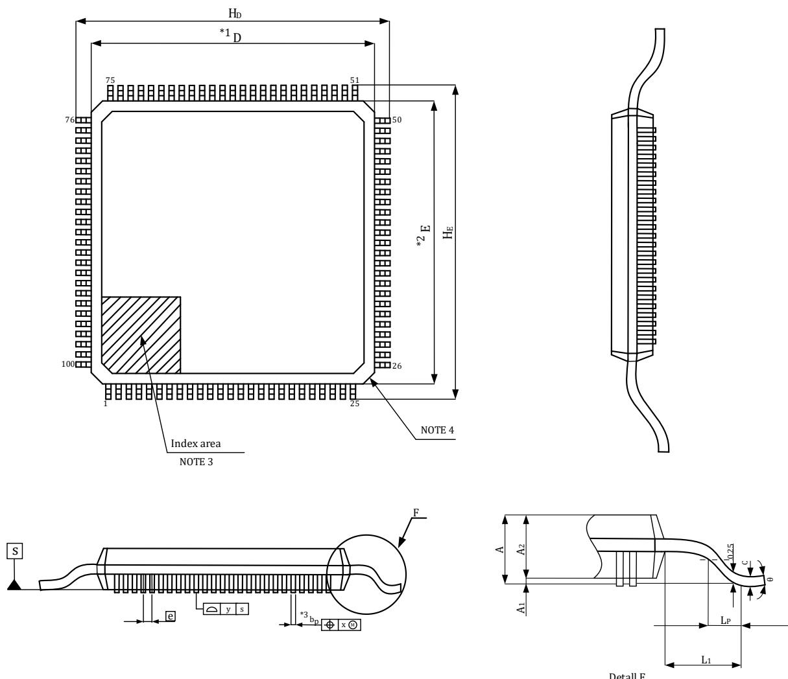  
图 4-1 LKS32MC451VCT8 封装图示

表 4-1 LKS32MC451VCT8 封装尺寸

<table><tr><td rowspan="2">SYMBOL</td><td colspan="3">MILLIMETER</td></tr><tr><td>MIN</td><td>NOM</td><td>MAX</td></tr><tr><td>A</td><td>-</td><td>-</td><td>1.7</td></tr><tr><td>A1</td><td>0.05</td><td>-</td><td>0.15</td></tr><tr><td>A2</td><td>1.35</td><td>1.40</td><td>1.45</td></tr><tr><td>bp</td><td>0.17</td><td>0.20</td><td>0.23</td></tr><tr><td>c</td><td>0.09</td><td>-</td><td>0.20</td></tr><tr><td>x</td><td>-</td><td>-</td><td>0.08</td></tr><tr><td>y</td><td>-</td><td>-</td><td>0.08</td></tr><tr><td>D</td><td>13.90</td><td>14.00</td><td>14.10</td></tr><tr><td>E</td><td>13.90</td><td>14.00</td><td>14.10</td></tr><tr><td> $H_D$ </td><td>15.80</td><td>16.00</td><td>16.20</td></tr><tr><td> $H_E$ </td><td>15.80</td><td>16.00</td><td>16.20</td></tr><tr><td>e</td><td colspan="3">0.50BSC</td></tr><tr><td>Lp</td><td>0.45</td><td>0.60</td><td>0.75</td></tr><tr><td> $L_1$ </td><td colspan="3">1.00REF</td></tr><tr><td>θ</td><td>0</td><td>3.5°</td><td>8°</td></tr></table>

## 4.2 LKS32MC453RCT8/LKS32MC455RCT8/ LKS32MC455LRCT8/LKS32MC457LRCT8

LQFP64 Profile Quad Flat Package:  
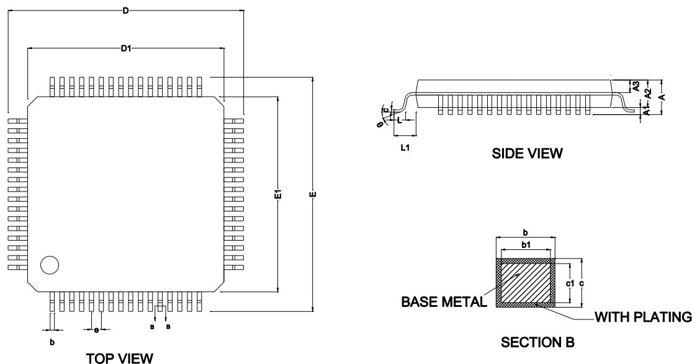  
图 4-2 LKS32MC453RCT8/LKS32MC455RCT8/LKS32MC455LRCT8/LKS32MC457LRCT8 封装图示

表 4-2 LKS32MC453RCT8/LKS32MC455RCT8/LKS32MC455LRCT8/LKS32MC457LRCT8 封装尺寸

<table><tr><td rowspan="2">SYMBOL</td><td colspan="3">MILLIMETER</td></tr><tr><td>MIN</td><td>NOM</td><td>MAX</td></tr><tr><td>A</td><td>-</td><td>-</td><td>1.60</td></tr><tr><td>A1</td><td>0.05</td><td>-</td><td>0.15</td></tr><tr><td>A2</td><td>1.35</td><td>1.40</td><td>1.45</td></tr><tr><td>A3</td><td>0.59</td><td>0.64</td><td>0.69</td></tr><tr><td>b</td><td>0.18</td><td>-</td><td>0.26</td></tr><tr><td>b1</td><td>0.17</td><td>0.20</td><td>0.23</td></tr><tr><td>c</td><td>0.13</td><td>-</td><td>0.17</td></tr><tr><td>c1</td><td>0.12</td><td>0.13</td><td>0.14</td></tr><tr><td>D</td><td>11.80</td><td>12.00</td><td>12.20</td></tr><tr><td>D1</td><td>9.90</td><td>10.00</td><td>10.10</td></tr><tr><td>E</td><td>11.80</td><td>12.00</td><td>12.20</td></tr><tr><td>E1</td><td>9.90</td><td>10.00</td><td>10.10</td></tr><tr><td>e</td><td colspan="3">0.50BSC</td></tr><tr><td>L</td><td>0.45</td><td>-</td><td>0.75</td></tr><tr><td>L1</td><td colspan="3">1.00REF</td></tr><tr><td>θ</td><td>0</td><td>-</td><td>7°</td></tr></table>

## 4.3 LKS32MC457RCT8

LQFP64 14×14-0.80 Profile Quad Flat Package:  
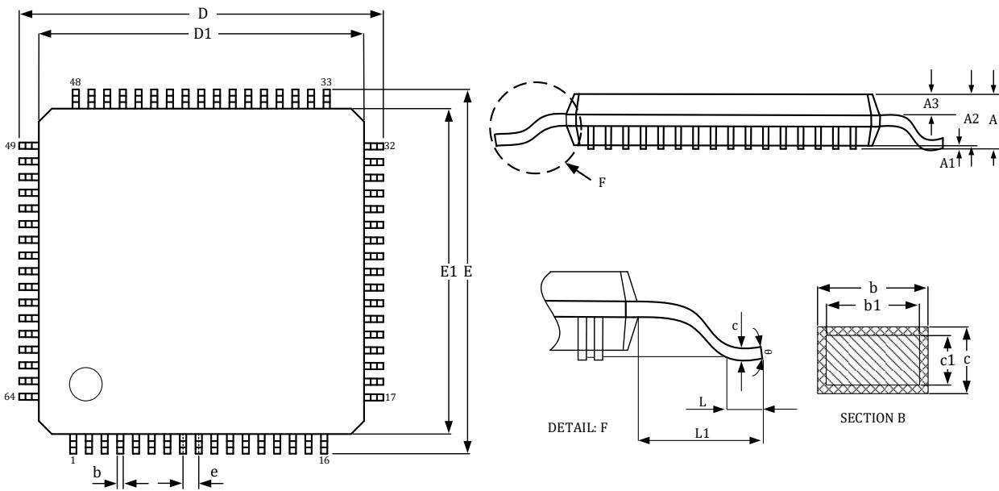  
图 4-3 LKS32MC457RCT8 封装图示

表 4-3 LKS32MC457RCT8 封装尺寸

<table><tr><td rowspan="2">SYMBOL</td><td colspan="3">MILLIMETER</td></tr><tr><td>MIN</td><td>NOM</td><td>MAX</td></tr><tr><td>A</td><td>-</td><td>-</td><td>1.70</td></tr><tr><td>A1</td><td>0.05</td><td>0.1</td><td>0.2</td></tr><tr><td>A2</td><td>1.35</td><td>1.40</td><td>1.45</td></tr><tr><td>A3</td><td>0.59</td><td>0.64</td><td>0.69</td></tr><tr><td>b</td><td>0.32</td><td>0.37</td><td>0.42</td></tr><tr><td>b1</td><td>-</td><td>0.35</td><td>-</td></tr><tr><td>c</td><td>0.09</td><td>0.145</td><td>0.20</td></tr><tr><td>c1</td><td>-</td><td>0.125</td><td>-</td></tr><tr><td>D</td><td>15.80</td><td>16.00</td><td>16.20</td></tr><tr><td>D1</td><td>13.90</td><td>14.00</td><td>14.10</td></tr><tr><td>E</td><td>15.80</td><td>16.00</td><td>16.20</td></tr><tr><td>E1</td><td>13.90</td><td>14.00</td><td>14.10</td></tr><tr><td>e</td><td colspan="3">0.80BSC</td></tr><tr><td>L</td><td>0.30</td><td>-</td><td>0.70</td></tr><tr><td>L1</td><td colspan="3">1.00REF</td></tr><tr><td>θ</td><td>0</td><td>-</td><td>8°</td></tr></table>

## 4.4 LKS32MC454CCT8

TQFP48 Profile Quad Flat Package:  
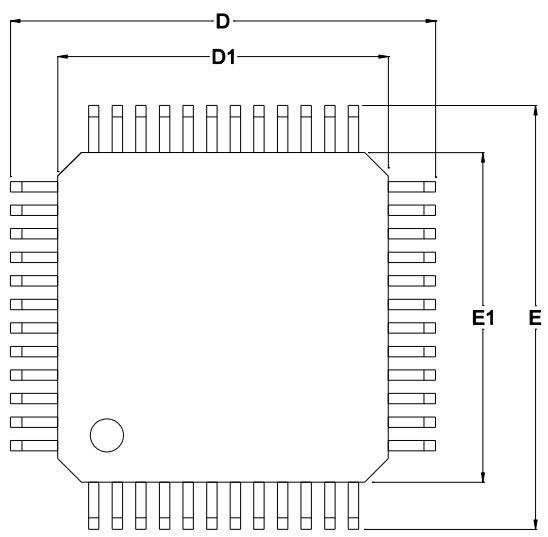  
TOP VIEW

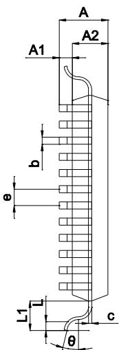  
SIDE VIEW

图 4-4 LKS32MC454CCT8 封装图示  
表 4-4 LKS32MC454CCT8 封装尺寸

<table><tr><td rowspan="2">SYMBOL</td><td colspan="3">MILLIMETER</td></tr><tr><td>MIN</td><td>NOM</td><td>MAX</td></tr><tr><td>A</td><td>-</td><td>-</td><td>1.20</td></tr><tr><td>A1</td><td>0.05</td><td>-</td><td>0.15</td></tr><tr><td>A2</td><td>0.95</td><td>1.00</td><td>1.05</td></tr><tr><td>b</td><td>0.18</td><td>0.22</td><td>0.26</td></tr><tr><td>c</td><td>0.13</td><td>-</td><td>0.17</td></tr><tr><td>D</td><td>8.80</td><td>9.00</td><td>9.20</td></tr><tr><td>D1</td><td>6.90</td><td>7.00</td><td>7.10</td></tr><tr><td>E</td><td>8.80</td><td>9.00</td><td>9.20</td></tr><tr><td>E1</td><td>6.90</td><td>7.00</td><td>7.10</td></tr><tr><td>e</td><td>-</td><td>0.50</td><td>-</td></tr><tr><td>θ</td><td>0°</td><td>3.5°</td><td>7°</td></tr><tr><td>L</td><td>0.45</td><td>0.60</td><td>0.75</td></tr></table>

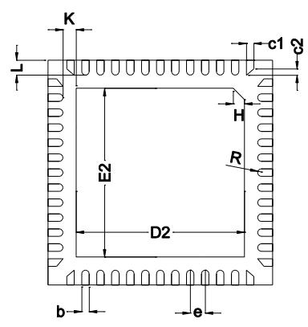

<table><tr><td>L1</td><td>-</td><td>1.00</td><td>-</td></tr></table>

## 4.5 LKS32MC454NCQ8

QFN52 Profile Quad Flat Package:

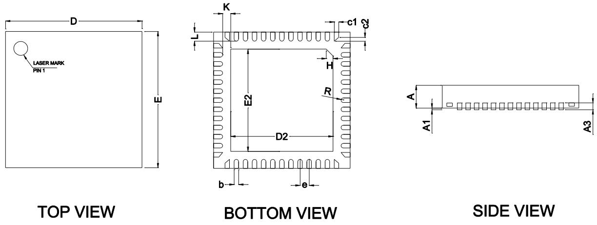

图 4-5 4.4LKS32MC454NCQ8 封装图示  
表 4-5 4.4LKS32MC454NCQ8 封装尺寸

<table><tr><td rowspan="2">SYMBOL</td><td colspan="3">MILLIMETER</td></tr><tr><td>MIN</td><td>NOM</td><td>MAX</td></tr><tr><td>A</td><td>0.70</td><td>0.75</td><td>0.80</td></tr><tr><td>A1</td><td>0.00</td><td>0.02</td><td>0.05</td></tr><tr><td>A3</td><td colspan="3">0.20REF</td></tr><tr><td>b</td><td>0.15</td><td>0.20</td><td>0.25</td></tr><tr><td>D</td><td>5.90</td><td>6.00</td><td>6.10</td></tr><tr><td>E</td><td>5.90</td><td>6.00</td><td>6.10</td></tr><tr><td>D2</td><td>4.40</td><td>4.50</td><td>4.60</td></tr><tr><td>E2</td><td>4.40</td><td>4.50</td><td>4.60</td></tr><tr><td>e</td><td>0.30</td><td>0.40</td><td>0.45</td></tr><tr><td>H</td><td colspan="3">0.35REF</td></tr><tr><td>K</td><td>0.25</td><td>-</td><td>-</td></tr><tr><td>L</td><td>0.35</td><td>0.40</td><td>0.45</td></tr><tr><td>R</td><td>0.075</td><td>-</td><td>-</td></tr><tr><td>c1</td><td>-</td><td>0.17</td><td>-</td></tr><tr><td>c2</td><td>-</td><td>0.17</td><td>-</td></tr></table>

## 5 电气性能参数

表 5-1 LKS32MC45x 电气极限参数

<table><tr><td>参数</td><td>最小</td><td>最大</td><td>单位</td><td>说明</td></tr><tr><td>MCU 电源电压(AVDD)(451/453/455/454)</td><td>-0.3</td><td>+3.6</td><td>V</td><td></td></tr><tr><td>LDO 电源电压(AVDD)(451L/455L/457L)</td><td>-0.3</td><td>+8</td><td>V</td><td>3.3V LDO 供电</td></tr><tr><td>LDO 提供电流(451L/455L/457L)</td><td></td><td>+80</td><td>mA</td><td></td></tr><tr><td>工作温度</td><td>-40</td><td>+105</td><td>°C</td><td></td></tr><tr><td>存储温度</td><td>-40</td><td>+150</td><td>°C</td><td></td></tr><tr><td>结温</td><td>-</td><td>125</td><td>°C</td><td></td></tr><tr><td>引脚温度(焊接,10秒)</td><td>-</td><td>260</td><td>°C</td><td></td></tr></table>

表 5-2 LKS32MC45x 建议工况参数

<table><tr><td>参数</td><td>最小</td><td>典型</td><td>最大</td><td>单位</td><td>说明</td></tr><tr><td>MCU 电源电压(AVDD)(451/453/455/454)</td><td>2.2</td><td>3.3</td><td>3.6</td><td>V</td><td></td></tr><tr><td rowspan="2">模拟工作电压(AVDDA)</td><td>2.8</td><td>3.3</td><td>3.6</td><td>V</td><td>REF2VDD=0,ADC选择2.4V内部基准源</td></tr><tr><td>2.4</td><td>3.3</td><td>3.6</td><td>V</td><td>REF2VDD=1,ADC选择AVDD为基准</td></tr><tr><td>LDO 电源电压(AVDD)(451L/455L/457L)</td><td>4.5</td><td>5</td><td>5.5</td><td>V</td><td>LDO供电电平,输出3.3V</td></tr></table>

表 5-3 LKS32MC45x ESD 性能参数

<table><tr><td>项目</td><td>管脚</td><td>最小</td><td>最大</td><td>单位</td></tr><tr><td rowspan="2">ESD测试 (HBM)</td><td>MCU PIN</td><td>-6000</td><td>6000</td><td>V</td></tr><tr><td>451L/455L/457L 3.3V LDO PIN</td><td>-2500</td><td>2500</td><td>V</td></tr></table>

根据《MIL-STD-883J Method 3015.9》，在 25℃，55%相对湿度环境下，在被测芯片的所有 IO 引脚施加进行静电放电 3 次，每次间隔 1s。测试结果显示芯片抗静电放电等级达到 Class3A ≧4000V , ＜8000V。

表 5-4 LKS32MC45x Latch-up 性能参数

<table><tr><td>项目</td><td>最小</td><td>最大</td><td>单位</td></tr><tr><td>Latch-up电流 (85°C)</td><td>-200</td><td>200</td><td>mA</td></tr></table>

根据《JEDEC STANDARD NO.78E NOVEMBER 2016》，对所有电源 IO 施加过压+5.445V，在每个信号 IO 上注入 200mA 电流；或施加-1.815V 从 IO 拉取 200mA 电流。测试结果显示芯片抗拴锁等级为 200mA。

表 5-5 LKS32MC45x IO 极限参数

<table><tr><td>参数</td><td>描述</td><td>最小</td><td>最大</td><td>单位</td></tr><tr><td> $V_{IN}$ </td><td>GPIO信号输入电压范围(不兼容5V)</td><td>-0.3</td><td>3.6</td><td>V</td></tr><tr><td> $V_{IN}(5VT)$ </td><td>GPIO信号输入电压范围(兼容5V)</td><td>-0.3</td><td>5.5</td><td>V</td></tr><tr><td> $I_{INJ\_PAD}$ </td><td>单个GPIO最大注入电流</td><td>-18</td><td>18</td><td>mA</td></tr><tr><td> $I_{INJ\_SUM}$ </td><td>所有GPIO最大注入电流</td><td>-50</td><td>50</td><td>mA</td></tr></table>

表 5-6 LKS32MC45x IO DC 参数

<table><tr><td>参数</td><td>描述</td><td>AVDD</td><td>最小</td><td>典型</td><td>最大</td><td>单位</td></tr><tr><td> $V_{IH}$ </td><td>数字IO输入高电压</td><td>3.3</td><td>2.0</td><td></td><td>AVDD</td><td>V</td></tr><tr><td> $V_{IL}$ </td><td>数字IO输入低电压</td><td>3.3</td><td></td><td></td><td>0.8</td><td>V</td></tr><tr><td> $I_{IH}$ </td><td>数字IO输入高电压,电流消耗</td><td>3.3</td><td></td><td></td><td>10</td><td>uA</td></tr><tr><td> $I_{IL}$ </td><td>数字IO输入低电压,电流消耗</td><td>3.3</td><td>-10</td><td></td><td></td><td>uA</td></tr><tr><td> $V_{OH}$ </td><td>数字IO输出高电压</td><td>3.3</td><td>AVDD-0.4</td><td></td><td></td><td>V</td></tr><tr><td> $V_{OL}$ </td><td>数字IO输出低电压</td><td>3.3</td><td></td><td></td><td>0.4</td><td>V</td></tr><tr><td>I</td><td>IO 驱动电流</td><td>3.3</td><td>4.5mA</td><td></td><td>18mA</td><td></td></tr><tr><td> $R_{pull-pp}$ </td><td>上拉电阻大小</td><td>3.3</td><td></td><td>41</td><td></td><td>kΩ</td></tr><tr><td> $R_{pull-down}$ </td><td>下拉电阻大小</td><td>3.3</td><td></td><td>42</td><td></td><td>kΩ</td></tr><tr><td> $R_{io-ana}$ </td><td>IO与内部模拟电路间连接电阻</td><td></td><td></td><td>100</td><td>200</td><td>Ω</td></tr></table>

表 5-7 LKS32MC45x 电路模块电流消耗 IDD

<table><tr><td>模块</td><td>Min</td><td>Typ</td><td>Max</td><td>单位</td></tr><tr><td>模拟比较器CMP×1</td><td></td><td>0.02</td><td></td><td>mA</td></tr><tr><td>运算放大器OPA×1</td><td></td><td>0.85</td><td></td><td>mA</td></tr><tr><td>模数转换器ADC×3</td><td></td><td>8.50</td><td></td><td>mA</td></tr><tr><td>数模转换器DAC×1</td><td></td><td>0.35</td><td></td><td>mA</td></tr><tr><td>温度传感器Temp Sensor</td><td></td><td>0.18</td><td></td><td>mA</td></tr><tr><td>晶振起振电路</td><td></td><td>0.20</td><td></td><td>mA</td></tr><tr><td>带隙基准BGP</td><td></td><td>0.34</td><td></td><td>mA</td></tr><tr><td>锁相环PLL</td><td></td><td>0.05</td><td></td><td>mA</td></tr><tr><td>CPU+flash+SRAM (192MHz)</td><td></td><td>15.47</td><td></td><td>mA</td></tr><tr><td>CAN-FD</td><td></td><td>1.38</td><td></td><td>mA</td></tr><tr><td>CORDIC</td><td></td><td>0.21</td><td></td><td>mA</td></tr><tr><td>CRC</td><td></td><td>0.08</td><td></td><td>mA</td></tr><tr><td>UART×1</td><td></td><td>0.11</td><td></td><td>mA</td></tr><tr><td>MCPWM</td><td></td><td>0.74</td><td></td><td>mA</td></tr><tr><td>TIMER×5+QEP×4</td><td></td><td>1.01</td><td></td><td>mA</td></tr><tr><td>SPI×1</td><td></td><td>0.17</td><td></td><td>mA</td></tr><tr><td>IIC×1</td><td></td><td>0.03</td><td></td><td>mA</td></tr><tr><td>HALL×1</td><td></td><td>0.05</td><td></td><td></td></tr><tr><td>关闭高速时钟休眠</td><td>0.4</td><td>0.5</td><td>0.7</td><td>mA</td></tr><tr><td>掉电休眠</td><td>7</td><td>9</td><td>20</td><td>uA</td></tr></table>

以上测试如无特别标注，均为室温25° 3.3V供电，使用192MHz 时钟工作情况下的测试，由于

制造工艺存在器件模型偏差，不同芯片的电流消耗会存在个体差异。

## 6 模拟性能参数

表 6-1 LKS32MC45x 模拟性能参数

<table><tr><td>参数</td><td>最小</td><td>典型</td><td>最大</td><td>单位</td><td>说明</td></tr><tr><td colspan="6">模数转换器(ADC)</td></tr><tr><td rowspan="2">工作电源</td><td>2.8</td><td>3.3</td><td>3.6</td><td>V</td><td>REF2VDD=0, ADC选择2.4V内部基准源</td></tr><tr><td>2.4</td><td>3.3</td><td>3.6</td><td>V</td><td>REF2VDD=1, ADC选择AVDD为基准</td></tr><tr><td>输出码率</td><td></td><td>2</td><td></td><td>Msps</td><td> $f_{adc}/16$ </td></tr><tr><td rowspan="2">差分输入信号范围</td><td>-2.2+0.044</td><td></td><td>+2.2-0.044</td><td>V</td><td>Gain=1时; REF=2.2V</td></tr><tr><td>-3.3+0.066</td><td></td><td>+3.3-0.066</td><td>V</td><td>Gain=2/3时; REF=2.4V</td></tr><tr><td>单端输入信号范围</td><td>-0.3</td><td></td><td>AVDD+0.3</td><td>V</td><td>受限于IO口输入电压限制</td></tr><tr><td colspan="6">差分信号通常为芯片内部OPA输出至ADC的信号;单端信号通常为外部通过IO输入的被采样信号:无论使用内部/外部基准,ADC测量信号幅度均不应超过满量程的±98%,特别地,当使用外部基准时,建议采样信导不超过量程的90%。</td></tr><tr><td>直流失调(offset)</td><td></td><td>5</td><td>10</td><td>mV</td><td>可校正</td></tr><tr><td>有效位数(ENOB)</td><td>10.5</td><td>11.5</td><td></td><td>bit</td><td></td></tr><tr><td>INL</td><td></td><td>2</td><td>3</td><td>LSB</td><td></td></tr><tr><td>DNL</td><td></td><td>1</td><td>2</td><td>LSB</td><td></td></tr><tr><td>SNR</td><td>63</td><td>69</td><td></td><td>dB</td><td></td></tr><tr><td>输入电阻</td><td>500k</td><td></td><td></td><td>Ohm</td><td></td></tr><tr><td>输入电容</td><td></td><td>10pF</td><td></td><td>F</td><td></td></tr><tr><td colspan="6">基准电压(REF)</td></tr><tr><td>工作电源</td><td>2.2</td><td>3.3</td><td>3.6</td><td>V</td><td></td></tr><tr><td>输出偏差</td><td>-9</td><td></td><td>9</td><td>mV</td><td></td></tr><tr><td>电源抑制比</td><td></td><td>70</td><td></td><td>dB</td><td></td></tr><tr><td>温度系数</td><td></td><td>20</td><td></td><td>ppm/°C</td><td></td></tr><tr><td>输出电压</td><td></td><td>1.2</td><td></td><td>V</td><td></td></tr><tr><td colspan="6">数模转换器(DAC)</td></tr><tr><td>工作电源</td><td>2.2</td><td>3.3</td><td>3.6</td><td>V</td><td></td></tr><tr><td>负载电阻</td><td>5k</td><td></td><td></td><td>Ohm</td><td rowspan="3">输出BUFFER开启</td></tr><tr><td>负载电容</td><td></td><td></td><td>50p</td><td>F</td></tr><tr><td>输出电压范围</td><td>0.05</td><td></td><td>AVDD-0.1</td><td>V</td></tr><tr><td>转换速度</td><td></td><td></td><td>1M</td><td>Hz</td><td></td></tr><tr><td>DNL</td><td></td><td>1</td><td>2</td><td>LSB</td><td></td></tr><tr><td>INL</td><td></td><td>2</td><td>4</td><td>LSB</td><td></td></tr><tr><td>OFFSET</td><td></td><td>5</td><td>10</td><td>mV</td><td></td></tr><tr><td>SNR</td><td>57</td><td>60</td><td>66</td><td>dB</td><td></td></tr><tr><td colspan="6">运算放大器(OPA)</td></tr><tr><td>工作电源</td><td>2.8</td><td>3.3</td><td>3.6</td><td>V</td><td></td></tr><tr><td>带宽</td><td></td><td>20M</td><td>30M</td><td>Hz</td><td>外接1k电阻52.5倍对应的带宽4.5MHz;29倍对应带宽9.8MHz;14.5倍对应带宽9.3MHz;7.3倍对应带宽18.5MHz;3.6倍对应带宽32MHz;1.8倍对应带宽50MHz</td></tr><tr><td>负载电阻</td><td>20k</td><td></td><td></td><td>Ohm</td><td></td></tr><tr><td>负载电容</td><td></td><td></td><td>5p</td><td>F</td><td></td></tr><tr><td>输入共模范围</td><td>0</td><td></td><td>AVDD-1</td><td>V</td><td></td></tr><tr><td>输出信号范围</td><td>0.1</td><td></td><td>AVDD-0.2- $V_{off-set}$ *Gain</td><td>V</td><td>如果应用上所使用的运放放大倍数较高,因 $V_{offset}$ 的存在会使得运放实际可用的最大输出幅度下降。在应用方案选择运放放大倍数的时候,应保证该应用下最大信号乘放大倍数后&lt;=AVDD-0.2- $V_{offset}$ *Gain,其中 $V_{offset}$ 用其最大值进行计算</td></tr><tr><td rowspan="6">OFFSET</td><td></td><td></td><td>10</td><td>mV</td><td>64倍放大倍数</td></tr><tr><td></td><td></td><td>12</td><td>mV</td><td>32倍放大倍数</td></tr><tr><td></td><td></td><td>15</td><td>mV</td><td>16倍放大倍数</td></tr><tr><td></td><td></td><td>22</td><td>mV</td><td>8倍放大倍数</td></tr><tr><td></td><td></td><td>35</td><td>mV</td><td>4倍放大倍数</td></tr><tr><td></td><td></td><td>61</td><td>mV</td><td>2倍放大倍数</td></tr><tr><td colspan="6">此OFFSET为OPA差分输入短接时,测量OPA_OUT偏离0电平,得到的等效差分输入端偏差。OPA输出端偏差为OPA放大倍数×OFFSET。Flash NVR区域记录了出厂测试的OPA offset。</td></tr><tr><td>共模电平(Vcm)</td><td>1.45</td><td>1.65</td><td>1.80</td><td>V</td><td>测量条件:常温。运放摆幅=2×min(AVDD-Vcm,Vcm)。建议使用OPA单端输出的应用上电后进行Vcm测量并进行软件减除校正。更多分析请参考官网应用笔记《ANN009-运放差分和单端工作模式区别》。Flash NVR区域记录了出厂测试的OPA Vcm。</td></tr><tr><td>共模抑制(CMRR)</td><td></td><td>80</td><td></td><td>dB</td><td></td></tr><tr><td>电源抑制(PSRR)负载电流</td><td></td><td>80</td><td>500</td><td>dBuA</td><td></td></tr><tr><td>摆率(Slew rate)</td><td></td><td>5</td><td></td><td>V/us</td><td></td></tr><tr><td>相位裕度</td><td></td><td>60</td><td></td><td>度</td><td></td></tr><tr><td colspan="6">比较器(CMP)</td></tr><tr><td>工作电源</td><td>2.2</td><td>3.3</td><td>3.6</td><td>V</td><td></td></tr><tr><td>输入信号范围</td><td>0</td><td></td><td>AVDD</td><td>V</td><td></td></tr><tr><td rowspan="4">OFFSET</td><td></td><td>-3.7</td><td></td><td>mV</td><td>0mV回差,CMP输出低到高翻转</td></tr><tr><td></td><td>-3</td><td></td><td>mV</td><td>0mV回差,CMP输出高到低翻转</td></tr><tr><td></td><td>-3.3</td><td></td><td>mV</td><td>20mV回差,CMP输出低到高翻转</td></tr><tr><td></td><td>8.5</td><td></td><td>mV</td><td>20mV回差,CMP输出高到低翻转</td></tr><tr><td rowspan="2">传输延时</td><td></td><td>0.15u</td><td></td><td>S</td><td>默认功耗</td></tr><tr><td></td><td>0.6u</td><td></td><td>S</td><td>低功耗</td></tr><tr><td rowspan="2">回差(Hysteresis)</td><td></td><td>20</td><td></td><td>mV</td><td>HYS='0'</td></tr><tr><td></td><td>0</td><td></td><td>mV</td><td>HYS='1'</td></tr></table>

## 7 电源管理系统

电源管理系统由LDO12 模块、电源检测模块（PVD）、上电/掉电复位模块（POR）组成。

该芯片由 2.2V\~3.6V 单电源供电，以节省芯片外的电源成本。芯片内部集成一路 LDO12 给内部所有数字电路、PLL模块供电。

LDO上电后自动开启，无需软件配置，但LDO 输出电压可通过软件实现微调。

LDO 分为低功耗模式和正常工作模式。睡眠模式时，进入低功耗模式。此时大部分数字电路都会进入掉电状态，仅有部分值守电路和SRAM 维持供电。

正常工作模式下，需要开启 BGP模块。

LDO12的输出电压可通过设置寄存器 LDO12TRIM<2:0>来调节，具体寄存器所对应值见模拟寄存器表说明。LDO12在芯片出厂前已经过校正，一般情况下，用户不需要额外配置这些寄存器。如需微调LDO 的输出电压，需要读取原配置值，在此基础加上微调量对应的配置值填入寄存器。

POR 模块监测LDO12的电压，在LDO12 电压低于 0.8V 时（例如上电之初，或者掉电之时），为数字电路提供复位信号以避免数字电路工作产生异常。

PVD 模块对 3.3V 输入电源进行检测，如低于某一设定阈值，则产生报警（中断）信号以提醒MCU。中断提醒阈值可通过寄存器 PVDSEL<1:0>设置为不同的电压。PVD 模块可通过设置PD\_PDT=’1’关闭。具体寄存器所对应值见模拟寄存器表说明。

## 8 时钟系统

时钟系统包括内部32KHz RC时钟、内部12MHz RC时钟、外部12MHz 晶体起振电路、PLL电路组成。

32K RC时钟作为MCU系统慢时钟使用，作为诸如滤波模块或者低功耗状态下的MCU时钟使用。12MHz RC 时钟作为MCU主时钟使用，配合PLL可提供最高到 192MHz的时钟。外部12MHz 晶体起振电路作为备份时钟使用。

32k 和 12M RC 时钟均带有出厂校正，32K RC 时钟在 ${ \cdot } 4 0 { \sim } 1 0 5 ^ { \circ } \mathrm { C }$ 范围内的精度为±50%，12M RC时钟在该温度范围的变化范围为±1%。

12M RC 时钟通过设置 $\mathrm { R C H P D } = ^ { \prime } 0 ^ { \prime } \mathrm { \Omega }$ 打开（默认打开，设’1’关闭），RC 时钟需要 Bandgap 电压基准源模块提供基准电压和电流，因此开启RC 时钟需要先开启BGP 模块。芯片上电的默认状态下，12M RC 时钟和BGP 模块都是开启的。32K RC时钟是始终开启的，不能关闭。

PLL对12M RC 时钟进行倍频，以提供给 MCU、ADC 等模块更高速的时钟。MCU和 PWM模块的最高时钟为 192MHz，ADC 模块典型工作时钟为 32MHz，通过寄存器 ADCCLKSEL<1:0>可设置为不同的ADC工作频率。

PLL通过设置 $\mathrm { P L L P D N } { = } ^ { \prime } 1$ ’打开（默认关闭，设1打开），开启PLL模块之前，同样也需要开启BGP(Bandgap)模块。开启PLL之后，PLL需要 8us 的稳定时间来输出稳定时钟。芯片上电的默认状态下，RCH时钟和BGP 模块都是开启的，但 PLL默认是关闭的，需要软件来开启。

晶体起振电路内置了放大器和起振电容，仅需在IO OSC\_IN/OSC\_OUT之间接入一个晶体，并设置 $\mathrm { \tt X T A L P D N } = ^ { \prime } 1$ ’即可起振。

## 9 基准电压源

该基准源为ADC、DAC、RC 时钟、PLL、温度传感器、运算放大器、比较器和 FLASH提供基准电压和电流，使用上述任何一个模块之前，都需要开启BGP 基准电压源。

芯片上电的默认状态下，BGP 模块是开启的。基准源通过设置 $\mathsf { B G P P D } = ^ { \prime } 0 ^ { \prime } $ 打开，从关闭到开启，BGP 需要约 2us 达到稳定。BGP 输出电压约 1.2V，精度为±0.8%

基准源可通过设置REF\_AD\_EN=’1’，将基准电压送至IO 进行测量。

## 10 ADC 模块

芯片内部集成3 路14BIT、2MHz采样率的SAR 结构 ADC，芯片上电的默认状态下，ADC 模块是关闭的。ADC 开启前，需要先开启 BGP 和 12M RC 时钟和 PLL 模块，并选择 ADC 工作频率。默认配置下ADC 工作时钟是32M，对应2MHz 的转换数据率。

ADC 完成一次转换需要 16 个 ADC 时钟周期。其中，采样和转换流水进行，允许前次转换和当前采样在时间上交叠。 $f _ { c o n \nu } = f _ { a d c } \operatorname _ { \rho 1 6 } ,$ 。在 ADC时钟设为32M时，转换速率是2MHz。

ADC在降频应用时，可通过寄存器 $\mathrm { C U R R I T } { < } 1 { : } 0 { > }$ 降低ADC的功耗水平。

ADC 可工作在如下模式：单次单通道触发、连续单通道、单次 1\~16 通道扫描、连续 1\~16 通道扫描。每路ADC 都有 16 组独立寄存器对应每一个通道。

ADC触发事件可以来自外部的定时器信号T0、T1、T2、T3发生到预设次数，或者为软件触发。

ADC带有两种增益模式，通过GAIN\_SHAx进行设置，对应1倍和2/3倍增益。1倍增益对应±2.2V的输入信号幅度，2/3 倍增益对应±3.3V 的输入信号幅度。在测量运放的输出信号时，根据运放可能输出的最大信号来选择具体的 ADC增益。

## 11 运算放大器

6 路输入输出 rail-to-rail 运算放大器，内置反馈电阻 R2/R1，外部引脚需串联一个电阻 R0。反馈电阻R2:R1的阻值可通过寄存器RES\_OPAx<2:0>设置，以实现不同的放大倍数。具体寄存器所对应值见模拟寄存器表说明。

最终的放大倍数为R2/(R1+R0)，其中R0是外部电阻的阻值，

对于MOS管电阻直接采样的应用，建议接>20kΩ 的外部电阻，以减小MOS管关断时，往芯片引脚里流入的电流。

对于小电阻采样的应用，建议接 100Ω 的外部电阻。

放大器可通过设置 OPAOUTx\_EN<1:0>选择将 6 路放大器中的某两路输出信号通过 BUFFER 送至2个IO口进行测量和应用（对应关系见 datasheet芯片管脚说明）。因为有BUFFER存在，在运放正常工作模式下也可以选择送两路运放输出信号出来。

芯片上电的默认状态下，放大器模块是关闭的。放大器可通过设置 OPAxPDN =’1’打开，开启放大器之前，需要先开启BGP 模块。

运放输入同相和反相端内置钳位二极管，电机相线通过一匹配电阻后直接接入输入端，从而简化了MOSFET电流采样的外置电路

## 12 比较器

内置6 路输入rail-to-rail比较器，比较器比较速度可编程、迟滞电压可编程、信号源可编程。比较器的比较延时可通过寄存器 IT\_CMP 设置为0.15uS/0.6uS。迟滞电压通过CMP\_HYS 设置为20mV/40mV。

比 较 器 同 相 和 反 相 两 个 输 入 端 的 信 号 来 源 都 可 通 过 寄 存 器 CMPx\_SELP<2:0> 和CMPx\_SELN<1:0>编程，详见寄存器模拟说明。

芯片上电的默认状态下，比较器模块是关闭的。比较器通过设置CMPxPDN =’1’打开，开启比较器之前，需要先开启BGP模块。

## 13 温度传感器

芯片内置精度为 $1 { \pm } 2 ^ { \circ } \mathrm { C } |$ 的温度传感器。芯片出厂前会经温度校正，校正值保存在 flash info 区。

芯片上电的默认状态下，温度传感器模块是关闭的。开启传感器之前，需要先开启 $\mathrm { B G P }$ 模块。

温度传感器通过设置 $\mathrm { T M P P D N } { = } ^ { \prime } 1 ^ { \prime }$ 打开，开启到稳定需要约 2us，因此需在 ADC 测量传感器之前2us打开。

## 14 DAC 模块

芯片内置两路12bit DAC，输出信号的最大量程可通过寄存器DACx\_GAIN 设置为 1.2V/3V。

12bit DACx 可通过配置寄存器 DACx\_OUTEN=1，将 DACx 输出送至 IO 口 P3.4 和 P4.7，可驱动>5kΩ的负载电阻和50pF 的负载电容。

DAC最大输出码率为1MHz。

芯片上电的默认状态下，DAC 模块是关闭的。DAC 可通过设置 DACx\_PDN =1 打开，开启 DAC模块之前，需要先开启BGP 模块。

## 15 处理器核心

➢ 32bit ARM Cortex-M4F 内核，硬件浮点/DSP，最高工作频率 192MHz

➢ 2 线 SWD 调试管脚/4 线 Jtag 调试管脚

## 16 存储资源

## 16.1 Flash

➢ 内置 flash 包括 128kB/256kB 主存储区，以及 NVR 信息存储区

➢ 可反复擦除写入不低于2万次

➢ 室温25℃数据保持长达 20 年

➢ 按 QuadWord 编程写入，编程时间最长 10us

➢ 按 Sector 擦除，Sector 大小 1024 字节，Sector 擦除时间最长 4ms

➢ Flash 数据防窃取（最后一个 word 须写入非 0xFFFFFFFF 的任意值）

## 16.2 SRAM

➢ 内置 40kB SRAM

➢ 支持 SRAM 作为 Code RAM 用于关键程序加速

## 17 电机驱动专用 MCPWM

➢ 两个 MCPWM 模块

➢ MCPWM 最高工作时钟频率 192MHz

➢ 支持最大4 通道相位可调的互补 PWM输出，其中通道2/3可以选择与0/1使用不同时基进行计数

➢ 每个通道死区宽度可独立配置

➢ 支持边沿对齐PWM 模式

➢ 支持软件控制 IO 模式

➢ 支持 IO 极性控制功能

➢ 内部短路保护，避免因为配置错误导致短路

➢ 外部短路保护，根据对外部信号的监控快速关断

➢ 内部产生 ADC 采样中断

➢ 采用加载寄存器预存定时器配置参数

➢ 可配置加载寄存器加载时刻和周期

## 18 Timer

➢ 5 路通用定时器，3 路16bit 计时器，2 路32bit 计时器。

➢ 支持捕获模式，用于测量外部信号宽度

➢ 支持比较模式，用于产生边沿对齐 PWM/定时中断

➢ 集成了4个编码器模块。其中编码器0/1/2/3 的输入分别来自Timer0/1/2/3的通道0/1。

使用编码器不影响 Timer 功能

## 19 Hall 传感器接口

➢ 两个 Hall 接口模块

➢ 内置最大 1024 级滤波

➢ 三路Hall 信号输入

➢ 24位计数器，提供溢出和捕获中断

## 20 DMA

➢ 一路 DMA 引擎

➢ 最多支持 8 个通道

➢ 支持 byte/halfword/word 等不同尺寸的传输

➢ 支持不同的地址递增方式

➢ 支持 flash/ram/外设之间的数据传输

➢ 支持循环模式

## 21 FMAC

➢ 16 位×16 位 乘法器

➢ 24+2 位累加器，支持饱和处理

➢ 16 位数据输入、输出

➢ 256×16 位本地数据存储

➢ 本地存储最多可以定义3个数据缓存区域（两个输入缓存，一个输出缓存）缓存基地址和缓存大小可以通过寄存器配置

➢ 输入、输出缓存可以作为循环 buffer使用

➢ 滤波函数：FIR，直接1型IIR

➢ 向量操作：点积，卷积，相关

➢ AHB 总线接口

➢ 支持DMA读写数据

## 22 CRC

➢ 支持 7/8/16/32 等不同位宽的多项式

➢ 支持多项式系数配置

➢ 支持输入输出数据翻转

## 23 Cordic

➢ 电机控制算法专用 DSP，自主指令集，三级流水

➢ 最高工作频率 192MHz

➢ Q15 格式 Cordic 三角函数模块，sin/cos/artanc 8 周期计算完成

## 24 通用外设

➢ 3 路UART，全双工工作，支持8/9位数据位、1/2停止位、奇/偶/无校验模式，带1字节发送缓存、1 字节接收缓存，支持 Multi-drop Slave/Master 模式，波特率支持 300\~115200

➢ 2 路SPI，支持主从模式

➢ 2 路 IIC，支持主从模式

➢ 1 路 CAN

➢ 硬件看门狗：独立看门狗使用 32kHz RC 时钟驱动，独立于系统高速时钟，写入保护，0.128\~65秒复位间隔；窗口看门狗使用系统 PLL分频时钟计数，可以提供精确计时。不同型号的外设请参考2章节选型表。

## 25 特殊 IO 复用

LKS45x 特殊 IO 复用注意事项

SWD 协议包含两根信号线：SWDCLK 和 SWDIO。前者是时钟信号，对于芯片而言，是输入状态且不会改变输入状态。后者是数据信号，对于芯片而言，在数据传输过程中会在输入状态和输出状态间切换，默认是输入状态。

JTAG 通常包含 nTRST，TMS，TDI，TDO，TCLK5 根信号线。

LKS45x 可实现 Jtag/SWD 复用为其它 IO 的功能，复用的 IO 是 P0[13:9]。注意事项如下：

➢ 默认状态是不开启复用，需要软件开启复用。即芯片硬复位结束后，初始状态是 Jtag/SWD 用途，Jtag/SWD在芯片内部有上拉（芯片内部上拉电阻约为 40K），应用对初始电平有要求的，需注意。

➢ 开启复用后，KEIL 等工具无法直接访问芯片，即 Debug 和擦除下载功能均失效。若需要重新下载程序，有两个方案。

⚫ 其一，建议使用凌鸥专用离线下载器擦除。软件开启复用的时间，建议保留一定余量，例如100ms左右，保证离线下载器能擦除，防止死锁。余量的多少是保证离线下载器擦除的成功率。余量越大，一次性擦除成功的概率越大。

⚫ 其二，程序内部有退出机制，例如某个其它 IO电平发生变化（一般为输入），表明外界需要用Jtag/SWD，软件重新配置，解除复用。此时，可以恢复 KEIL的功能。

RSTN信号，默认是用于 LKS45x 芯片的外部复位脚。

LKS45x 可实现RSTN 复用为其它 IO的功能，复用的 IO是 P0.6。注意事项如下：

➢ 默认状态是不开启复用，需要软件开启复用。即芯片初始状态是RSTN用途，RSTN在芯片内部有上拉（芯片内部上拉电阻约为 40K），应用对初始电平有要求的，需注意。

➢ 默认状态是RSTN，只有RSTN正常释放后才能开始程序的执行，应用需要保证RSTN有足够保护，例如外围电路带上拉，若能加电容更佳。

➢ 开启复用后，RSTN用途失效，若需产生芯片硬复位，源头只能是掉电/看门狗。

➢ RSTN的复用，不影响 KEIL的使用。

SYS\_RST\_CFG 寄存器的 BIT[5]，为 RSTN 和 P0.6 的复用控制开关。

## 26 订购包装信息

包装类型分为 Tray 包装和 Reel 包装两种，具体包装中的芯片个数由封装形式与包装类型确定，不再以芯片型号区分。

Tray包装信息如下表

<table><tr><td>封装形式</td><td>每盘/管数量</td><td>内盒数量</td><td>外箱数量</td></tr><tr><td>SOP16/ESOP16L</td><td>3000/盘</td><td>6000PCS</td><td>48000PCS</td></tr><tr><td>SSOP24</td><td>4000/盘</td><td>8000PCS</td><td>64000PCS</td></tr><tr><td>SSOP24</td><td>50/管</td><td>10000PCS</td><td>4000/100000PCS</td></tr><tr><td>QFN 8*8</td><td>260/盘</td><td>2600PCS</td><td>15600PCS</td></tr><tr><td>QFN 4*4/5*5/6*6</td><td>490/盘</td><td>4900PCS</td><td>29400PCS</td></tr><tr><td>QFN 3*3</td><td>5000/盘</td><td>5000PCS</td><td>40000PCS</td></tr><tr><td>LQFP48/TQFP48 0707</td><td>250/盘</td><td>2500PCS</td><td>15000PCS</td></tr><tr><td>LQFP64 1010</td><td>160/盘</td><td>1600PCS</td><td>9600PCS</td></tr><tr><td>LQFP100 1414</td><td>90/盘</td><td>900PCS</td><td>5400PCS</td></tr><tr><td>TSSOP20/28</td><td>4000/盘</td><td>8000PCS</td><td>64000PCS</td></tr></table>

Reel包装信息如下表

<table><tr><td colspan="2">包装类别</td><td>每盘/管数量</td><td>每盒数量</td><td>每箱盒数</td><td>外箱数量</td></tr><tr><td>编带-13寸</td><td>SOP/ESOP8</td><td>4000</td><td>8000</td><td>8</td><td>64000</td></tr><tr><td>编带-13寸</td><td>SOP/ESOP16</td><td>3000</td><td>6000</td><td>8</td><td>48000</td></tr><tr><td>编带-13寸</td><td>SSOP24</td><td>4000</td><td>8000</td><td>8</td><td>64000</td></tr><tr><td>编带-13寸</td><td>TSSOP20</td><td>4000</td><td>8000</td><td>8</td><td>64000</td></tr><tr><td>编带-13寸</td><td>D/QFN3*3</td><td>5000</td><td>10000</td><td>8</td><td>80000</td></tr><tr><td>编带-13寸</td><td>D/QFN4*4</td><td>5000</td><td>10000</td><td>8</td><td>80000</td></tr><tr><td>编带-13寸</td><td>D/QFN5*5</td><td>5000</td><td>10000</td><td>8</td><td>80000</td></tr><tr><td>管装</td><td>SOP16</td><td>50</td><td>10000</td><td>10</td><td>100000</td></tr><tr><td>管装</td><td>SOP14/SSOP24</td><td>50</td><td>10000</td><td>10</td><td>100000</td></tr><tr><td>管装</td><td>TSSOP24</td><td>54</td><td>6480</td><td>6</td><td>38880</td></tr></table>

## 27 版本历史

表 27-1 文档版本历史

<table><tr><td>时间</td><td>版本号</td><td>说明</td></tr><tr><td>2025.11.21</td><td>1.58</td><td>修订管教说明中CS、CLK的说明</td></tr><tr><td>2025.08.22</td><td>1.57</td><td>修改命名规则</td></tr><tr><td>2025.04.30</td><td>1.56</td><td>添加运放在不同增益下的对应带宽</td></tr><tr><td>2025.01.02</td><td>1.55</td><td>更新比较器offset失调电压数值,更新OPA offset数值</td></tr><tr><td>2024.08.04</td><td>1.54</td><td>订购包装信息更新,以包装类型与封装形式来确认包装信息</td></tr><tr><td>2024.01.03</td><td>1.53</td><td>添加457RCT8型号,更新457L管脚分布图</td></tr><tr><td>2023.11.20</td><td>1.52</td><td>更新存储温度,添加OPA offset的说明</td></tr><tr><td>2023.09.25</td><td>1.51</td><td>更新焊接温度</td></tr><tr><td>2023.07.09</td><td>1.50</td><td>添加LKS32MC457LRCT8型号</td></tr><tr><td>2023.04.07</td><td>1.49</td><td>添加454(QFN52)型号</td></tr><tr><td>2023.03.22</td><td>1.48</td><td>添加454型号,修改低速时钟精度范围</td></tr><tr><td>2023.02.06</td><td>1.47</td><td>修改订购包装信息,修改CAN须使用外部晶振说明</td></tr><tr><td>2023.01.15</td><td>1.46</td><td>增加订购包装信息,增加CAN使用外部晶振建议说明</td></tr><tr><td>2023.01.12</td><td>1.45</td><td>删除关于ADC有6MHz采样率的表述</td></tr><tr><td>2022.12.14</td><td>1.44</td><td>增加LDO提供最大电流值说明</td></tr><tr><td>2022.11.10</td><td>1.43</td><td>增加IO与内部模拟电路间连接电阻阻值</td></tr><tr><td>2022.09.28</td><td>1.42</td><td>修订1.2章节命名规则,修订ADC和OPA量程</td></tr><tr><td>2022.08.04</td><td>1.41</td><td>增加LKS32MC455LRCT8引脚定义</td></tr><tr><td>2022.05.27</td><td>1.4</td><td>修订LKS32MC455RCT8引脚定义,PIN4,5,11,12,19,20,21,22,54,55,59,63</td></tr><tr><td>2022.04.09</td><td>1.3</td><td>增加LKS32MC455RCT8引脚定义</td></tr><tr><td>2022.03.18</td><td>1.2</td><td>修订命名规则,09x更名为45x</td></tr><tr><td>2022.03.02</td><td>1.1</td><td>修订451L关于5V供电的电气参数</td></tr><tr><td>2022.02.10</td><td>1.0</td><td>正式版发布</td></tr></table>

## 免责声明

LKS 和 LKO 为凌鸥创芯注册商标。

南京凌鸥创芯电子有限公司（以下简称：“Linko”）尽力确保本文档内容的准确和可靠，但是保留随时更改、更正、增强、修改产品和/或 文档的权利，恕不另行通知。用户可在下单前获取最新相关信息。

客户应针对应用需求选择合适的 Linko 产品，详细设计、验证和测试您的应用，以确保满足相应标准以及任何安全、安保或其它要求。客户应对此独自承担全部责任。

Linko在此确认未以明示或暗示方式授予Linko或第三方的任何知识产权许可。

Linko产品的转售，若其条款与此处规定不同，Linko对此类产品的任何保修承诺无效。

Linko产品禁止用于军事用途或生命监护、维持系统。

如有更早期版本文档，一切信息以此文档为准。