--- Part 1: Pages 1-200 ---

南京凌鸥创芯电子有限公司

## LKS32MC45x User Manual

© 2020, 版权归凌鸥创芯所有

机密文件，未经许可不得扩散

## 目录

目录....I
表格目录....I
图片目录....XV
1 文档约定....1
1.1 寄存器读写权限....1
1.2 缩略词汇表....1
2 系统概况....3
2.1 简述....3
2.2 特性....3
2.2.1 存储....3
2.2.2 时钟....3
2.2.3 外设....3
2.2.4 模拟模块....4
2.3 系统框图....5
3 地址空间....6
3.1 CODE 段....7
3.2 RAM 段....8
3.3 PERIPHERAL 段....8
3.4 地址空间 0 (SYS\_REMAP=0)....9
3.5 地址空间 1 (SYS\_REMAP=1)....11
3.6 地址空间 2 (SYS\_REMAP=2)....12
3.7 地址空间 3 (SYS\_REMAP=3)....13
4 中断....14
5 模拟电路....16
5.1 简述....16
5.1.1 电源管理系统....17
5.1.2 时钟系统....18

5.1.3 基准电压源....18
5.1.4 ADC 模块....19
5.1.5 运算放大器....19
5.1.6 比较器....20
5.1.7 温度传感器....21
5.1.8 DAC 模块....22
5.2 寄存器....23
5.2.1 地址分配....23
5.2.2 SYS\_AFE\_REG0 模拟配置寄存器0....25
5.2.3 SYS\_AFE\_REG1 模拟配置寄存器1....27
5.2.4 SYS\_AFE\_REG2 模拟配置寄存器2....28
5.2.5 SYS\_AFE\_REG3 模拟配置寄存器3....29
5.2.6 SYS\_AFE\_REG4 模拟配置寄存器4....30
5.2.7 SYS\_AFE\_REG5 模拟配置寄存器5....31
5.2.8 SYS\_AFE\_REG6 模拟配置寄存器6....32
5.2.9 SYS\_AFE\_REG9 模拟配置寄存器9....33
5.2.10 SYS\_AFE\_REGA 模拟配置寄存器A....35
5.2.11 SYS\_AFE\_REGB 模拟配置寄存器B....36
5.2.12 SYS\_TMP\_A 温度传感器系数A 寄存器....37
5.2.13 SYS\_TMP\_B 温度传感器系数B 寄存器....37
5.2.14 SYS\_AFE\_DACO DAC0 数字量寄存器....38
5.2.15 SYS\_AFE\_DACO\_AMC DAC0 增益校正寄存器....38
5.2.16 SYS\_AFE\_DACO\_DC DAC0 直流偏置寄存器....38
5.2.17 SYS\_AFE\_DAC1 DAC1 数字量寄存器....39
5.2.18 SYS\_AFE\_DAC1\_AMC DAC1 增益校正寄存器....39
5.2.19 SYS\_AFE\_DAC1\_DC DAC1 直流偏置寄存器....40
系统时钟复位....41
6.1 时钟....41
6.1.1 时钟源....41

6.2 复位....42
6.2.1 复位源....42
6.2.1.1 硬件复位....43
6.2.1.1.1 硬件复位架构....43
6.2.1.1.2 硬件复位记录....44
6.2.1.2 软件复位....44
6.2.2 复位作用域....44
6.3 寄存器....45
6.3.1 地址分配....45
6.3.2 SYS\_CLK\_CFG 时钟控制寄存器....46
6.3.3 SYS\_IO\_CFG IO 控制寄存器....47
6.3.4 SYS\_DBG\_CFG Debug 控制寄存器....48
6.3.5 SYS\_CLK\_DIV0 外设时钟分频寄存器 0....50
6.3.6 SYS\_CLK\_DIV1 外设时钟分频寄存器 1....50
6.3.7 SYS\_CLK\_DIV2 外设时钟分频寄存器 2....51
6.3.8 SYS\_CLK\_FEN 外设时钟门控寄存器....51
6.3.9 SYS\_SFT\_RST 软复位寄存器....54
6.3.10 SYS\_PROTECT 写保护寄存器....56
6.3.11 SYS\_CAHCE\_CFG 缓存控制寄存器....57
6.3.12 SYS\_MEM\_CFG 内存控制寄存器....57
6.3.13 SYS\_FLSE On-Chip FLASH 擦除控制寄存器....58
6.3.14 SYS\_FLSP On-Chip FLASH 编程控制寄存器....58
7 非易失存储体....60
7.1 概述....60
7.2 功能特点....61
7.2.1 On-Chip FLASH 功能描述....61
7.2.1.1 复位操作....62
7.2.1.2 休眠操作....62
7.2.1.3 On-Chip FLASH 读取操作....62

7.2.1.4 On-Chip FLASH 编程操作....63
7.2.1.5 On-Chip FLASH 擦除操作....66
7.2.1.6 On-Chip FLASH Cache 加速操作....68
7.2.1.7 On-Chip FLASH 保护....68
7.2.2 Ext-Chip FLASH 控制器功能描述....70
7.2.2.1 Ext-Chip FLASH 访问方式....70
7.2.2.2 Ext-Chip FLASH 传输并行数....70
7.2.2.3 Ext-Chip FLASH 命令格式....71
7.2.2.3.1 Ext-Chip FLASH 间接方式四线读取....71
7.2.2.3.2 Ext-Chip FLASH 直接方式四线读取....71
7.2.2.4 Ext-Chip FLASH 存储顺序....72
7.2.2.5 DMA 传输....73
3 寄存器....74
7.3.1 地址分配....74
7.3.2 FSMC\_UCMD Ext-Chip FLASH 间接方式访问命令寄存器....74
7.3.3 FSMC\_UMOD Ext-Chip FLASH 间接方式访问模式寄存器....75
7.3.4 FSMC\_UADR Ext-Chip FLASH 间接方式访问地址寄存器....75
7.3.5 FSMC\_UWDA Ext-Chip FLASH 间接方式访问编程数据寄存器....76
7.3.6 FSMC\_URDA Ext-Chip FLASH 间接方式访问读取数据寄存器....76
7.3.7 FSMC\_UCFG Ext-Chip FLASH 间接方式访问控制寄存器....77
7.3.8 FSMC\_UTRG Ext-Chip FLASH 间接方式访问操作寄存器....78
7.3.9 FSMC\_FCMD Ext-Chip FLASH 直接方式访问命令寄存器....79
7.3.10 FSMC\_FMOD Ext-Chip FLASH 直接方式访问模式寄存器....79
7.3.11 FSMC\_FCFG Ext-Chip FLASH 直接方式访问控制寄存器....80
7.3.12 FSMC\_FTRG Ext-Chip FLASH 直接方式访问操作寄存器....81
7.3.13 FSMC\_EDIV Ext-Chip FLASH 波特率寄存器....82
7.3.14 FSMC\_WDAT0 On-Chip FLASH 编程数据寄存器....84
7.3.15 FSMC\_WDAT1 On-Chip FLASH 编程数据寄存器....84
7.3.16 FSMC\_WDAT2 On-Chip FLASH 编程数据寄存器....84

7.3.17 FSMC\_WDAT3 On-Chip FLASH 编程数据寄存器....85
7.3.18 FSMC\_ICFG On-Chip FLASH 配置寄存器....85
7.3.19 FSMC\_ADDR On-Chip FLASH 地址寄存器....86
7.3.20 FSMC\_WDAT On-Chip FLASH 编程操作触发寄存器....87
7.3.21 FSMC\_RDAT On-Chip FLASH 读数据寄存器....87
7.3.22 FSMC\_ERAS On-Chip FLASH 擦除操作触发寄存器....88
7.3.23 FSMC\_PROT On-Chip FLASH 保护状态寄存器....88
7.3.24 FSMC\_REDY On-Chip FLASH 工作状态寄存器....89
7.3.25 FSMC\_IDIV On-Chip FLASH 时基寄存器....90
8 DMA....90
8.1 概述....97
8.2 请求....100
8.3 优先级....101
8.4 仲裁....103
8.5 中断....103
8.6 寄存器....103
8.6.1 地址分配....103
8.6.2 DMA\_CTRL DMA 控制寄存器....104
8.6.3 DMA\_IE DMA 中断使能寄存器....105
8.6.4 DMA\_IF DMA 中断标志寄存器....105
8.6.5 DMA 通道配置寄存器....106
8.6.5.1 DMA\_CCRx (x = 0,1,2,3,4,5,6,7)....106
8.6.5.2 DMA\_RENx (x = 0,1,2,3,4,5,6,7)....107
8.6.5.3 DMA\_CTMSx (x = 0,1,2,3,4,5,6,7)....108
8.6.5.4 DMA\_SADRx (x = 0,1,2,3,4,5,6,7)....109
8.6.5.5 DMA\_DADRx (x = 0,1,2,3,4,5,6,7)....110
9 GPIO....111
9.1 概述....111
9.1.1 功能框图....111

9.1.2 产品特点....111
9.2 寄存器....112
9.2.1 地址分配....112
9.2.2 GPIOx\_PIE(x = 0,1,2,3,4,5)....113
9.2.3 GPIOx\_POE(x = 0,1,2,3,4,5)....114
9.2.4 GPIOx\_PDI(x = 0,1,2,3,4,5)....115
9.2.5 GPIOx\_PDO(x = 0,1,2,3,4,5)....115
9.2.6 GPIOx\_PUE(x = 0,1,2,3,4,5)....116
9.2.7 GPIOx\_PDE(x = 0,1,2,3,4,5)....116
9.2.8 GPIOx\_PODE(x = 0,1,2,3,4,5)....117
9.2.9 GPIOx\_PFLT(x = 0,1,2,3,4,5)....118
9.2.10 GPIOx\_F3210(x = 0,1,2,3,4,5)....119
9.2.11 GPIOx\_F7654(x = 0,1,2,3,4,5)....120
9.2.12 GPIOx\_FBA98(x = 0,1,2,3,4,5)....120
9.2.13 GPIOx\_FFEDC(x = 0,1,2,3,4,5)....121
9.2.14 GPIOx\_BSRR(x = 0,1,2,3,4,5)....121
9.2.15 GPIOx\_BRR(x = 0,1,2,3,4,5)....123
9.2.16 EXTIx\_CR0(x = 0,1,2,3,4,5)....124
9.2.17 EXTIx\_CR1(x = 0,1,2,3,4,5)....125
9.2.18 EXTIx\_IF(x = 0,1,2,3,4,5)....126
9.2.19 CLKO\_SEL....127
9.2.20 LCKR\_PRT....128
9.2.21 EXTI\_REN....128
9.3 实现说明....129
9.3.1 上拉实现....129
9.3.2 下拉实现....129
9.3.3 滤波实现....129
9.3.4 外部中断实现....129
9.3.5 外部唤醒实现....130

9.4 应用指南 .... 130
9.4.1 外部中断.... 130
9.4.2 使用 GPIO 的模拟功能.... 131

10 CRC.... 132
10.1 概述 .... 132
10.2 基本原理 .... 132
10.3 基本概念 .... 132
10.3.1 对应关系.... 132
10.3.2 生成多项式.... 133
10.3.3 校验码位数.... 133
10.3.4 生成步骤.... 133
10.4 寄存器 .... 134
10.4.1 地址分配.... 134
10.4.2 寄存器描述.... 135
10.4.2.1 CRC\_DR CRC 信息码寄存器.... 135
10.4.2.2 CRC\_CR CRC 控制寄存器.... 135
10.4.2.3 CRC\_INIT CRC 初始码寄存器.... 136
10.4.2.4 CRC\_POL CRC 生成码寄存器.... 137

11 CORDIC.... 138
11.1 概述 .... 138
11.2 寄存器 .... 138
11.2.1 地址分配.... 138
11.2.2 DSP\_SC DSP 状态控制寄存器.... 138
11.2.3 DSP sin/cos 相关寄存器.... 139
11.2.3.1 DSP\_THETA.... 139
11.2.3.2 DSP\_SIN.... 139
11.2.3.3 DSP\_COS.... 140
11.2.4 DSP arctan 相关寄存器.... 140
11.2.4.1 DSP\_X.... 140

11.2.4.2 DSP\_Y....141
11.2.4.3 DSP\_MOD....141
11.2.4.4 DSP\_ARCTAN....142
12 FMAC 滤波加速器....143
12.1 概述....143
12.2 特性....143
12.3 功能描述....143
12.3.1 本地存储与缓存....144
12.3.2 输入缓存....145
12.3.3 输出缓存....147
12.3.4 初始化函数....148
12.3.4.1 填装 X1 buffer....148
12.3.4.2 填装 X2 buffer....149
12.3.4.3 填装 Y buffer....149
12.3.5 滤波器函数....150
12.3.5.1 FIR 滤波器（卷积）....150
12.3.5.2 IIR 滤波器....151
12.3.6 定点数表示....152
12.3.7 使用 FMAC 实现 FIR 滤波器....153
12.3.8 使用 FMAC 实现 IIR 滤波器....155
12.3.9 滤波器初始化示例....156
12.3.10 滤波器操作示例....157
12.3.11 滤波器设计提示....159
12.4 寄存器....159
12.4.1 地址分配....159
12.4.2 寄存器描述....160
12.4.2.1 FMAC\_X1BUFCFG FMAC X1 buffer 配置寄存器....160
12.4.2.2 FMAC\_X2BUFCFG FMAC X2 buffer 配置寄存器....160
12.4.2.3 FMAC\_YBUFCFG FMAC Y buffer 配置寄存器....161

12.4.2.4 FMAC\_PARAM FMAC 参数寄存器....162
12.4.2.5 FMAC\_CR FMAC 控制寄存器....163
12.4.2.6 FMAC\_SR FMAC 状态寄存器....164
12.4.2.7 FMAC\_WDATA FMAC 写入数据寄存器....165
12.4.2.8 FMAC\_RDATA FMAC 读取数据寄存器....166
3 ADC....167
13.1 概述....167
13.1.1 功能框图....167
13.1.2 ADC 触发方式....168
13.1.3 ADC 输出数制....169
13.1.4 ADC 量程....169
13.1.5 ADC 校正....170
13.1.6 ADC 阈值监测(模拟看门狗)....170
13.1.7 过采样....170
13.2 寄存器....171
13.2.1 地址分配....171
13.2.2 采样数据寄存器....173
13.2.2.1 ADCx\_DAT0(x = 0,1,2)....173
13.2.2.2 ADCx\_DAT1(x = 0,1,2)....173
13.2.2.3 ADCx\_DAT2(x = 0,1,2)....173
13.2.2.4 ADCx\_DAT3(x = 0,1,2)....174
13.2.2.5 ADCx\_DAT4(x = 0,1,2)....174
13.2.2.6 ADCx\_DAT5(x = 0,1,2)....175
13.2.2.7 ADCx\_DAT6(x = 0,1,2)....175
13.2.2.8 ADCx\_DAT7(x = 0,1,2)....175
13.2.2.9 ADCx\_DAT8(x = 0,1,2)....176
13.2.2.10 ADCx\_DAT9(x = 0,1,2)....176
13.2.2.11 ADCx\_DAT10(x = 0,1,2)....177
13.2.2.12 ADCx\_DAT11(x = 0,1,2)....177

13.2.2.13 ADCx\_DAT12(x = 0,1,2)....177
13.2.2.14 ADCx\_DAT13(x = 0,1,2)....178
13.2.2.15 ADCx\_DAT14(x = 0,1,2)....178
13.2.2.16 ADCx\_DAT15(x = 0,1,2)....179
13.2.3 信号来源寄存器....179
13.2.3.1 ADCx\_PCHN0(x = 0,1,2)....179
13.2.3.2 ADCx\_PCHN1(x = 0,1,2)....179
13.2.3.3 ADCx\_PCHN2(x = 0,1,2)....180
13.2.3.4 ADCx\_PCHN3(x = 0,1,2)....180
13.2.3.5 ADCx\_NCHN0(x = 0,1,2)....181
13.2.3.6 ADCx\_NCHN1(x = 0,1,2)....181
13.2.3.7 ADCx\_NCHN2(x = 0,1,2)....182
13.2.3.8 ADCx\_NCHN3(x = 0,1,2)....182
13.2.3.9 ADC 模拟信号选择....183
13.2.4 采样通道数寄存器....185
13.2.4.1 ADCx\_CHNT(x = 0,1,2)....185
13.2.5 配置寄存器....186
13.2.5.1 ADCx\_GAIN(x = 0,1,2)....186
13.2.5.2 ADCx\_CFG(x = 0,1,2)....187
13.2.5.3 ADCx\_TRIG(x = 0,1,2)....188
13.2.6 软件触发寄存器....189
13.2.6.1 ADCx\_SWT(x = 0,1,2)....189
13.2.7 校正寄存器....190
13.2.7.1 ADCx\_DC0(x = 0,1,2)....190
13.2.7.2 ADCx\_AMC0(x = 0,1,2)....191
13.2.7.3 ADCx\_DC1(x = 0,1,2)....191
13.2.7.4 ADCx\_AMC1(x = 0,1,2)....192
13.2.8 中断寄存器....192
13.2.8.1 ADCx\_IE(x = 0,1,2)....192

13.2.8.2 ADCx\_IF(x = 0,1,2)....193
13.2.9 模拟看门狗....194
13.2.9.1 ADCx\_TH0 (x = 0,1,2)....194
13.2.9.2 ADCx\_GEN0 (x = 0,1,2)....194
13.2.9.3 ADCx\_TH1(x = 0,1,2)....195
13.2.9.4 ADCx\_GEN1 (x = 0,1,2)....195
13.3 应用指南....196
13.3.1 ADC 采样触发模式....196
13.3.1.1 单段触发模式....197
13.3.1.2 两段触发模式....197
13.3.2 中断....198
13.3.2.1 单段触发采样完成中断....198
13.3.2.2 两段触发采样完成中断....198
13.3.3 配置修改....198
13.3.4 选择对应的模拟通道....199
4 UTIMER 通用定时器....200
14.1 概述....200
14.1.1 功能框图....200
14.1.1.1 总线接口模块....200
14.1.1.2 寄存器模块....200
14.1.1.3 IO 滤波模块....200
14.1.1.4 通用定时器模块....201
14.1.1.5 编码器模块....201
14.1.2 功能特点....201
14.2 实现说明....201
14.2.1 时钟分频....201
14.2.2 中断标志清零....201
14.2.3 滤波....202
14.2.4 模式....202

14.2.4.1 计数器....202
14.2.4.2 比较模式....202
14.2.4.3 捕获模式....203
14.2.5 ADC触发....204
14.2.6 编码器....204
14.2.6.1 正交编码信号....204
14.2.6.2 符号加脉冲信号....205
14.2.6.3 CCW/CW双脉冲信号....206
4.3 寄存器....207
14.3.1 地址分配....207
14.3.2 UTimer0寄存器....210
14.3.2.1 UTIMER0\_CFG Timer0配置寄存器....210
14.3.2.2 UTIMER0\_TH Timer0门限寄存器....212
14.3.2.3 UTIMER0\_CNT Timer0计数寄存器....213
14.3.2.4 UTIMER0\_CMP0 Timer0通道0比较捕获寄存器....213
14.3.2.5 UTIMER0\_CMP1 Timer0通道1比较捕获寄存器....214
14.3.2.6 UTIMER0\_EVT Timer0外部事件选择寄存器....214
14.3.2.7 UTIMER0\_FLT Timer0滤波控制寄存器....215
14.3.2.8 UTIMER0\_IE Timer0中断使能寄存器....216
14.3.2.9 UTIMER0\_IF Timer0中断标志寄存器....216
14.3.3 UTimer1寄存器....217
14.3.3.1 UTIMER1\_CFG Timer1配置寄存器....217
14.3.3.2 UTIMER1\_TH Timer1门限寄存器....219
14.3.3.3 UTIMER1\_CNT Timer1计数寄存器....220
14.3.3.4 UTIMER1\_CMP0 Timer1通道0比较捕获寄存器....220
14.3.3.5 UTIMER1\_CMP1 Timer1通道1比较捕获寄存器....221
14.3.3.6 UTIMER1\_EVT Timer1外部事件选择寄存器....221
14.3.3.7 UTIMER1\_FLT Timer1滤波控制寄存器....222
14.3.3.8 UTIMER1\_IE Timer1中断使能寄存器....223

14.3.3.9 UTIMER1\_IF Timer1 中断标志寄存器 ..... 223
14.3.4 UTimer2 寄存器 ..... 224
14.3.4.1 UTIMER2\_CFG Timer2 配置寄存器 ..... 224
14.3.4.2 UTIMER2\_TH Timer2 门限寄存器 ..... 226
14.3.4.3 UTIMER2\_CNT Timer2 计数寄存器 ..... 227
14.3.4.4 UTIMER2\_CMP0 Timer2 通道 0 比较捕获寄存器 ..... 227
14.3.4.5 UTIMER2\_CMP1 Timer2 通道 1 比较捕获寄存器 ..... 228
14.3.4.6 UTIMER2\_EVT Timer2 外部事件选择寄存器 ..... 228
14.3.4.7 UTIMER2\_FLT Timer2 滤波控制寄存器 ..... 229
14.3.4.8 UTIMER2\_IE Timer2 中断使能寄存器 ..... 230
14.3.4.9 UTIMER2\_IF Timer2 中断标志寄存器 ..... 231
14.3.5 UTimer3 寄存器 ..... 231
14.3.5.1 UTIMER3\_CFG Timer3 配置寄存器 ..... 231
14.3.5.2 UTIMER3\_TH Timer3 门限寄存器 ..... 234
14.3.5.3 UTIMER3\_CNT Timer3 计数寄存器 ..... 234
14.3.5.4 UTIMER3\_CMP0 Timer3 通道 0 比较捕获寄存器 ..... 235
14.3.5.5 UTIMER3\_CMP1 Timer3 通道 1 比较捕获寄存器 ..... 235
14.3.5.6 UTIMER3\_EVT Timer3 外部事件选择寄存器 ..... 236
14.3.5.7 UTIMER3\_FLT Timer3 滤波控制寄存器 ..... 236
14.3.5.8 UTIMER3\_IE Timer3 中断使能寄存器 ..... 237
14.3.5.9 UTIMER3\_IF Timer3 中断标志寄存器 ..... 238
14.3.6 UTimer4 寄存器 ..... 238
14.3.6.1 UTIMER4\_CFG Timer4 配置寄存器 ..... 238
14.3.6.2 UTIMER4\_TH Timer4 门限寄存器 ..... 241
14.3.6.3 UTIMER4\_CNT Timer4 计数寄存器 ..... 241
14.3.6.4 UTIMER4\_CMP0 Timer4 通道 0 比较捕获寄存器 ..... 242
14.3.6.5 UIMER4\_CMP1 Timer4 通道 1 比较捕获寄存器 ..... 242
14.3.6.6 UIMER4\_EVT Timer4 外部事件选择寄存器 ..... 242
14.3.6.7 UIMER4\_FLT Timer4 滤波控制寄存器 ..... 243

14.3.6.8 UTIMER4\_IE Timer4 中断使能寄存器....244
14.3.6.9 UTIMER4\_IF Timer4 中断标志寄存器....245
14.3.7 QEPO 寄存器....245
14.3.7.1 QEP0\_CFG QEPO 配置寄存器....245
14.3.7.2 QEPO\_TH QEPO 计数门限寄存器....246
14.3.7.3 QEPO\_CNT QEPO 计数值寄存器....246
14.3.7.4 QEPO\_IE QEPO 中断使能寄存器....247
14.3.7.5 QEPO\_IF QEPO 中断标志寄存器....247
14.3.8 QEP1 寄存器....248
14.3.8.1 QEPI\_CFG QEPI 配置寄存器....248
14.3.8.2 QEPI\_TH QEPI 计数门限寄存器....249
14.3.8.3 QEPI\_CNT QEPI 计数值寄存器....249
14.3.8.4 QEPI\_IE QEPI 中断使能寄存器....250
14.3.8.5 QEPI\_IF QEPI 中断标志寄存器....250
14.3.9 QEP2 寄存器....251
14.3.9.1 QEPI\_CFG QEPI 配置寄存器....251
14.3.9.2 QEPI\_TH QEPI 计数门限寄存器....252
14.3.9.3 QEPI\_CNT QEPI 计数值寄存器....252
14.3.9.4 QEPI\_IE QEPI 中断使能寄存器....252
14.3.9.5 QEPI\_IF QEPI 中断标志寄存器....253
14.3.10 QEP3 寄存器....254
14.3.10.1 QEPI\_CFG QEPI 配置寄存器....254
14.3.10.2 QEPI\_TH QEPI 计数门限寄存器....254
14.3.10.3 QEPI\_CNT QEPI 计数值寄存器....255
14.3.10.4 QEPI\_IE QEPI 中断使能寄存器....255
14.3.10.5 QEPI\_IF QEPI 中断标志寄存器....256
HALL 信号处理模块....257
5.1 综述....257
5.2 实现说明....257

15.2.1 信号来源....257
15.2.2 工作时钟....257
15.2.3 信号滤波....257
15.2.4 捕获....258
15.2.5 中断....258
15.2.6 数据流程....259
15.3 寄存器....259
15.3.1 地址分配....259
15.3.2 HALLx\_CFG 模块配置寄存器(x=0,1)....259
15.3.3 HALLx\_INFO 模块信息寄存器 (x=0,1)....261
15.3.4 HALLx\_WIDTH 宽度计数值寄存器(x=0,1)....261
15.3.5 HALLx\_TH 模块计数器门限值寄存器(x=0,1)....262
15.3.6 HALLx\_CNT 计数寄存器(x=0,1)....262
6 MCPWM....264
16.1 概述....264
16.1.1 Base Counter 模块....265
16.1.2 FAIL 信号处理....266
16.1.3 MCPWM 特殊输出状态....270
16.1.4 IO DRIVER 模块....270
16.1.4.1 MCPWM 波形输出-中心对齐模式....271
16.1.4.2 MCPWM 波形控制-中心对齐推挽模式....272
16.1.4.3 MCPWM 波形输出-边沿对齐模式....273
16.1.4.4 MCPWM 波形控制-边沿对齐推挽模式....273
16.1.4.5 MCPWM IO 死区控制....274
16.1.4.6 MCPWM IO 极性设置....275
16.1.4.7 MCPWM IO 自动保护....275
16.1.5 ADC Trigger Timer 模块....275
16.1.6 中断....276
16.2 寄存器....276

16.2.1 地址分配....276
16.2.2 MCPWMx\_TH00(x = 0,1)....278
16.2.3 MCPWMx\_TH01(x = 0,1)....279
16.2.4 MCPWMx\_TH10(x = 0,1)....279
16.2.5 MCPWMx\_TH11(x = 0,1)....280
16.2.6 MCPWMx\_TH20(x = 0,1)....280
16.2.7 MCPWMx\_TH21(x = 0,1)....281
16.2.8 MCPWMx\_TH30(x = 0,1)....281
16.2.9 MCPWMx\_TH31(x = 0,1)....281
16.2.10 MCPWMx\_TMR0(x = 0,1)....282
16.2.11 MCPWMx\_TMR1(x = 0,1)....282
16.2.12 MCPWMx\_TMR2(x = 0,1)....283
16.2.13 MCPWMx\_TMR3(x = 0,1)....283
16.2.14 MCPWMx\_TH0(x = 0,1)....284
16.2.15 MCPWMx\_TH1(x = 0,1)....284
16.2.16 MCPWMx\_CNT0(x = 0,1)....285
16.2.17 MCPWMx\_CNT1(x = 0,1)....285
16.2.18 MCPWMx\_UPDATE(x = 0,1)....286
16.2.19 MCPWMx\_FCNT(x = 0,1)....287
16.2.20 MCPWMx\_EVT0(x = 0,1)....287
16.2.21 MCPWMx\_EVT1(x = 0,1)....288
16.2.22 MCPWMx\_DTH00(x = 0,1)....289
16.2.23 MCPWMx\_DTH01(x = 0,1)....290
16.2.24 MCPWMx\_DTH10(x = 0,1)....290
16.2.25 MCPWMx\_DTH11(x = 0,1)....291
16.2.26 MCPWMx\_DTH20(x = 0,1)....291
16.2.27 MCPWMx\_DTH21(x = 0,1)....291
16.2.28 MCPWMx\_DTH30(x = 0,1)....292
16.2.29 MCPWMx\_DTH31(x = 0,1)....292

16.2.30 MCPWMx\_FLT(x=0,1)....293
16.2.31 MCPWMx\_SDCFG(x=0,1)....293
16.2.32 MCPWMx\_AUEN(x=0,1)....294
16.2.33 MCPWMx\_TCLK(x=0,1)....295
16.2.34 MCPWMx\_IE0(x=0,1)....296
16.2.35 MCPWMx\_IF0(x=0,1)....297
16.2.36 MCPWMx\_IE1(x=0,1)....298
16.2.37 MCPWMx\_IF1(x=0,1)....299
16.2.38 MCPWMx\_EIE(x=0,1)....300
16.2.39 MCPWMx\_RE(x=0,1)....301
16.2.40 MCPWMxEIF(x=0,1)....301
16.2.41 MCPWMx\_PP(x=0,1)....302
16.2.42 MCPWMx\_IO01(x=0,1)....303
16.2.43 MCPWMx\_IO23(x=0,1)....304
16.2.44 MCPWMx\_FAIL012(x=0,1)....305
16.2.45 MCPWMx\_FAIL3(x=0,1)....306
16.2.46 MCPWMx\_PRT(x=0,1)....307
16.2.47 MCPWMx\_CHMSK(x=0,1)....308
17 UART....309
17.1 概述....309
17.2 功能说明....309
17.2.1 发送....309
17.2.2 接收....310
17.2.3 UART 帧格式....310
17.2.4 波特率配置....311
17.2.5 收发端口互换(TX/RX 互换)....312
17.2.6 多机通讯....312
17.2.7 校验位....314
17.3 寄存器....314

17.3.1 地址分配....314
17.3.2 UARTx\_CTRL UARTx 控制寄存器 (x = 0,1,2)....314
17.3.3 UARTx\_DIVH UARTx 波特率设置高字节寄存器 (x = 0,1,2)....315
17.3.4 UARTx\_DIVL UARTx 波特率设置低字节寄存器 (x = 0,1,2)....316
17.3.5 UARTx\_BUFF UARTx 收发缓冲寄存器 (x = 0,1,2)....316
17.3.6 UARTx\_ADR UARTx 地址匹配寄存器 (x = 0,1,2)....317
17.3.7 UARTx\_STT UARTx 状态寄存器 (x = 0,1,2)....317
17.3.8 UARTx\_RE UARTx DMA 请求使能寄存器 (x = 0,1,2)....318
17.3.9 UARTx\_IE UARTx 中断使能寄存器 (x = 0,1,2)....318
17.3.10 UARTx\_IF UARTx 中断标志寄存器 (x = 0,1,2)....319
17.3.11 UARTx\_IOC UARTx IO 控制寄存器 (x = 0,1,2)....320
18 I2C....322
18.1 概述....322
18.2 主要特性....322
18.3 功能描述....322
18.3.1 功能框图....322
18.3.2 功能说明....323
18.3.2.1 模式选择....323
18.3.2.2 从模式....324
18.3.2.2.1 从模式传输....324
18.3.2.2.2 从模式发送....325
18.3.2.2.3 从模式单字节接收....325
18.3.2.3 主模式....325
18.3.2.3.1 主模式传输....326
18.3.2.3.2 主模式发送....326
18.3.2.3.3 主模式接收....327
18.3.2.4 I2C 总线异常处理....327
18.3.2.5 中断处理....327
18.3.2.6 通讯速度设置....328

18.4 寄存器 .... 328
18.4.1 地址分配.... 328
18.4.2 I2Cx\_ADDR 地址寄存器(x = 0,1).... 328
18.4.3 I2Cx\_CFG 系统控制寄存器(x = 0,1).... 329
18.4.4 I2Cx\_SCR 状态控制寄存器(x = 0,1).... 329
18.4.5 I2C\_DATA 数据寄存器(x = 0,1).... 331
18.4.6 I2Cx\_MSCR 主模式寄存器(x = 0,1).... 331
18.4.7 I2Cx\_BCR I2C 传输控制寄存器(x = 0,1).... 332
9 SPI.... 333
19.1 概述.... 333
19.2 主要特性.... 333
19.3 功能描述.... 333
19.3.1 功能框图.... 333
19.3.2 功能说明.... 334
19.3.2.1 全双工模式.... 334
19.3.2.2 半双工模式.... 335
19.3.2.3 片选信号.... 336
19.3.2.4 通讯格式.... 337
19.3.2.5 数据格式及长度.... 337
19.3.2.6 传输.... 337
19.3.2.7 中断处理.... 337
19.3.2.8 波特率设置.... 339
19.4 寄存器.... 339
19.4.1 地址分配.... 339
19.4.2 SPIx\_CFG SPI 控制寄存器.... 340
19.4.3 SPI\_IE SPI 中断寄存器.... 340
19.4.4 SPI\_BAUD SPI 波特率寄存器.... 341
19.4.5 SPI\_TXDATA SPI 数据发送寄存器.... 342
19.4.6 SPI\_RXDATA SPI 数据接收寄存器.... 342

19.4.7 SPI\_SIZE SPI 数据字节长度寄存器....343
20 CMP 比较器....344
20.1 概述....344
20.2 寄存器....344
20.2.1 地址分配....344
20.2.2 CMP\_IE 中断使能寄存器....344
20.2.3 CMP\_IF 中断标志寄存器....345
20.2.4 CMP\_TCLK 分频时钟控制寄存器....346
20.2.5 CMP\_CFG 控制寄存器....347
20.2.6 CMP\_BLCWIN0 开窗控制寄存器 0....350
20.2.7 CMP\_BLCWIN1 开窗控制寄存器 1....351
20.2.8 CMP\_DATA 输出数据寄存器....353
21 CAN-FD....354
21.1 介绍....354
21.1.1 CAN 协议....354
21.1.2 CAN 2.0B 以及如何启用 CAN FD....355
21.1.3 时间戳....355
21.1.3.1 TTCAN (Time Trigger CAN)....355
21.1.3.2 CiA 603 时间戳....355
21.2 特性....356
21.2.1 功能列表....356
21.2.2 向上兼容....356
21.2.3 消息缓冲区....357
21.2.3.1 消息缓冲区概念....357
21.2.3.2 接收缓冲区....357
21.2.3.3 发送缓冲器....357
21.2.3.4 FIFO 模式下的发送缓冲器应用示例....358
21.2.3.5 优先模式下的发送缓冲器应用示例....359
21.2.3.6 中止传输....359

21.2.3.7 TTCAN 模式下的发送缓冲器....360
21.2.4 CAN 2.0 和 CAN FD 帧....360
21.2.5 AUTOSAR 和 SAE J1939....361
1.3 寄存器（软件接口）....362
21.3.1 地址分配....362
21.3.2 寄存器位分配表....363
21.3.3 寄存器说明....365
21.3.3.1 CAN\_RBUF0\~CAN\_RBU19 寄存器....365
21.3.3.2 CAN\_TBUF0\~CAN\_TBUF17 寄存器器....367
21.3.3.3 CAN\_TTS0 发送时间戳寄存器 0....370
21.3.3.4 CAN\_TTS1 发送时间戳寄存器 1....371
21.3.3.5 CAN\_CFG\_STAT 配置和状态寄存器....371
21.3.3.6 CAN\_TCMD 发送命令寄存器....373
21.3.3.7 CAN\_TCTRL 发送控制寄存器....374
21.3.3.8 CAN\_RCTRL 接收控制寄存器....376
21.3.3.9 CAN\_RTIE 发送接收中断控制寄存器....377
21.3.3.10 CAN\_RTIF 发送接收中断标志寄存器....378
21.3.3.11 CAN\_ERRINT 错误中断使能和标志寄存器....379
21.3.3.12 CAN\_LIMIT 错误&警告门限值寄存器....380
21.3.3.13 CAN\_SBAUD 慢速波特率配置寄存器....380
21.3.3.14 CAN\_FBAUD 快速波特率配置寄存器....381
21.3.3.15 CAN\_EALCAP 错误信息和丢失仲裁信息记录寄存器....382
21.3.3.16 CAN\_TDC 发送延迟补偿寄存器....382
21.3.3.17 CAN\_RECNT 接收错误计数器寄存器....383
21.3.3.18 CAN\_TECNT 发送错误计数器寄存器....383
21.3.3.19 CAN\_ACFCTRL ID 过滤器控制寄存器....384
21.3.3.20 CAN\_TIMECFG CiA603 时间戳配置寄存器....385
21.3.3.21 CAN\_ACFEN ID 过滤器使能寄存器....386
21.3.3.22 CAN\_ACF ID 过滤器寄存器....388

21.3.3.23 CAN\_TBSLOT TTCAN 发送缓冲区指针寄存器....388
21.3.3.24 CAN\_TTCFG TTCAN 配置寄存器....389
21.3.3.25 CAN\_REF\_MSG TTCAN 参考帧寄存器....390
21.3.3.26 CAN\_TRG\_CFG TTCAN 触发配置寄存器....391
21.3.3.27 CAN\_TT\_TRIG TTCAN 触发时刻寄存器....392
21.3.3.28 CAN\_TT\_WTRIG TTCAN 超时寄存器....392
21.3.3.29 CAN\_CIAWDAT0 CiA603 时间戳低 32 位写入值寄存器....393
21.3.3.30 CAN\_CIAWDAT1 CiA603 时间戳高 32 位写入值寄存器....393

1.4 一般操作....394
21.4.1 接收过滤器....394
21.4.2 消息接收....395
21.4.3 消息发送....396
21.4.4 消息发送中止....397
21.4.5 STB 空满....398
21.4.6 错误处理....398
21.4.7 BUS Off....399
21.4.8 扩展状态和错误报告....399
21.4.8.1 可编程错误警告门限值....399
21.4.8.2 仲裁丢失捕获 (ALC)....399
21.4.8.3 错误类型 (KOER)....400
21.4.8.4 接收所有数据帧 (RBALL)....400
21.4.9 扩展功能....401
21.4.9.1 单次传输....401
21.4.9.2 监听模式 (LOM)....401
21.4.9.3 总线连接测试....402
21.4.9.4 环回模式（LBMI 和 LBME）....402
21.4.9.5 错误计数器复位....403
21.4.10 软件复位....403

1.5 时间触发 CAN....406

21.5.1 TTCAN 模式下的 TBUF....407
21.5.1.1 TTTBM=1....407
21.5.1.2 TTTBM=0....407
21.5.2 TTCAN 操作....407
21.5.3 TTCAN 时序....408
21.5.4 TTCAN 触发类型....408
21.5.4.1 立即触发....409
21.5.4.2 时间触发....409
21.5.4.3 单发发送触发....409
21.5.4.4 发送开始触发....410
21.5.4.5 发送停止触发....410
21.5.5 TTCAN 超时监测触发....410
21.6 CIA 603 时间戳....410
21.6.1 时间戳....410
21.6.2 CIA603 时间戳计时器....411
21.7 CAN 位时间....411
21.7.1 数据波特率....411
21.7.2 定义....412
21.7.3 示例配置....414
21.7.4 波特率切换和采样点....415
21.7.5 CAN FD 节点的位时序配置....415
21.7.6 TDC 和 RDC....415
21.7.7 位时序建议....416
2 WWDG 窗口看门狗....420
22.1 概述....420
22.2 寄存器....422
22.2.1 地址分配....422
22.2.2 WWDG\_CR 窗口看门狗控制寄存器....422
22.2.3 WWDG\_CFG 窗口看门狗配置寄存器....422

22.2.4 WWDG\_IF 窗口看门狗中断标志寄存器....423
23 IWDG 独立看门狗....424
23.1 概述....424
23.2 寄存器....425
23.2.1 地址分配....425
23.2.2 IWDG\_PSW 独立看门狗密码寄存器....425
23.2.3 IWDG\_CFG 独立看门狗配置寄存器....425
23.2.4 IWDG\_CLR 独立看门狗清零寄存器....426
23.2.5 IWDG\_WTH 独立看门狗定时唤醒门限寄存器....426
23.2.6 IWDG\_RTH 独立看门狗超时复位门限寄存器....427
23.2.7 IWDG\_CNT 独立看门狗当前计数值寄存器....428
24 PMU 功耗管理模块....429
24.1 外设时钟门控....429
24.2 外设时钟分频....429
24.3 低功耗模式....429
24.4 SLEEP MODE 休眠模式....430
24.4.1 模式进入....430
24.4.2 模式退出....430
24.5 DEEP SLEEP MODE 深度休眠模式....430
24.5.1 模式进入....430
24.5.2 模式退出....431
24.6 STANDBY MODE 停机模式....431
24.6.1 模式进入....431
24.6.2 模式退出....431
24.7 寄存器....431
24.7.1 地址分配....431
24.7.2 BRAM 后备存储器....432
24.7.3 AON\_PWR\_CFG 功耗管理配置寄存器....432
24.7.4 AON\_EVT\_RCD 事件记录寄存器....432

24.7.5 AON\_IO\_WAKE\_POLIO 唤醒极性寄存器....433
24.7.6 AON\_IO\_WAKE\_ENIO 唤醒使能寄存器....434
25 版本历史....435

## 表格目录

表 3-1 存储区地址空间....7
表 3-2 SRAM 的大小和用途....8
表 3-3 SRAM 在不同地址空间配置下的用途....8
表 3-4 REMAP=0 时系统地址空间分配....9
表 3-5 REMAP=1 时系统地址空间分配....11
表 3-6 REMAP=2 时系统地址空间分配....12
表 3-7 REMAP=1 时系统地址空间分配....13
表 4-1 中断号分布....14
表 5-1 系统控制寄存器....23
表 5-2 芯片版本信息寄存器 SYS\_AFE\_INFO....25
表 5-3 SYS\_AFE\_DBG AFE 调试寄存器....25
表 5-3 模拟配置寄存器 0 SYS\_AFE\_REG0....26
表 5-3 模拟配置寄存器 1 SYS\_AFE\_REG1....27
表 5-4 模拟配置寄存器 2 SYS\_AFE\_REG2....28
表 5-5 模拟配置寄存器 3 SYS\_AFE\_REG3....29
表 5-6 模拟配置寄存器 4 SYS\_AFE\_REG4....30
表 5-7 模拟配置寄存器 5 SYS\_AFE\_REG5....31
表 5-8 模拟配置寄存器 6 SYS\_AFE\_REG6....32
表 5-9 模拟配置寄存器 9 SYS\_AFE\_REG9....34
表 5-10 模拟配置寄存器 A SYS\_AFE\_REGA....35
表 5-11 模拟配置寄存器 B SYS\_AFE\_REGB....36
表 5-12 温度传感器系数 A 寄存器 SYS\_TMP\_A....37
表 5-13 温度传感器系数 B 寄存器 SYS\_TMP\_B....37
表 5-14 DAC0 数字量寄存器 SYS\_AFE\_DAC0....38
表 5-15 DAC0 增益校正寄存器 SYS\_AFE\_DAC0\_AMC....38
表 5-16 DAC0 直流偏置寄存器 SYS\_AFE\_DAC0\_DC....39
表 5-17 DAC1 数字量寄存器 SYS\_AFE\_DAC1....39

表 5-18 DAC1 增益校正寄存器 SYS\_AFE\_DAC1\_AMC....39
表 5-19 DAC1 直流偏置寄存器 SYS\_AFE\_DAC1\_DC....40
表 6-1 系统时钟源....41
表 6-2 PLL 作为 MCLK 时钟时的分频配置....41
表 6-3 系统复位源....43
表 6-4 复位作用域....44
表 6-5 系统控制寄存器....45
表 6-6 时钟控制寄存器 SYS\_CLK\_CFG....46
表 6-7 IO 控制寄存器 SYS\_IO\_CFG....47
表 6-8 Debug 控制寄存器 SYS\_DBG\_CFG....48
表 6-9 SYS\_CLK\_DIV0 外设时钟分频寄存器 0....50
表 6-10 SYS\_CLK\_DIV1 外设时钟分频寄存器 1....50
表 6-11 SYS\_CLK\_DIV2 外设时钟分频寄存器 2....51
表 6-12 SYS\_CLK\_FEN 外设时钟门控寄存器....51
表 6-13 软复位寄存器 SYS\_SFT\_RST....54
表 6-14 写保护寄存器 SYS\_PROTECT....57
表 6-15 SYS\_CACHE\_CFG 缓存寄存器....57
表 6-16 SYS\_MEM\_CFG 内存控制寄存器....57
表 6-17 擦除控制寄存器 SYS\_FLSE....58
表 6-18 编程控制寄存器 SYS\_FLSP....58
表 7-1 On-Chip FLASH 访问空间分配表....63
表 7-2 On-Chip FLASH 编程空间地址分配表....64
表 7-3 On-Chip FLASH MAIN 区域 Sector 地址分配表....67
表 7-4 On-Chip FLASH NVR 区域 Sector 地址分配表....67
表 7-5 On-Chip FLASH 保护字地址分配表....69
表 7-6 On-Chip FLASH 保护字地址分配表....69
表 7-7 Ext-Chip FLASH PIN 描述及同 LKS32MC45x 互联关系表....70
表 7-8 非易失存储体模块寄存器列表....74
表 7-9 Ext-Chip FLASH 间接方式访问命令寄存器 FSMC\_UCMD....75
表 7-10 Ext-Chip FLASH 间接方式访问模式寄存器 FSMC\_UMOD....75

表 7-11 Ext-Chip FLASH 间接方式访问地址寄存器 FSMC\_UADR....75
表 7-12 Ext-Chip FLASH 间接方式访问编程数据寄存器 FSMC\_UWDA....76
表 7-13 Ext-Chip FLASH 间接方式访问读取数据寄存器 FSMC\_URDA....76
表 7-14 Ext-Chip FLASH 间接方式访问控制寄存器 FSMC\_UCFG....77
表 7-15 Ext-Chip FLASH 间接方式访问操作寄存器 FSMC\_UTRG....78
表 7-16 Ext-Chip FLASH 直接方式访问命令寄存器 FSMC\_FCMD....79
表 7-17 Ext-Chip FLASH 直接方式访问模式寄存器 FSMC\_FMOD....79
表 7-18 Ext-Chip FLASH 直接方式访问控制寄存器 FSMC\_FCFG....80
表 7-19 Ext-Chip FLASH 直接方式访问操作寄存器 FSMC\_FTRG....81
表 7-20 Ext-Chip FLASH 波特率寄存器 FSMC\_EDIV....82
表 7-21On-Chip FLASH 编程数据寄存器 FSMC\_WDAT0....84
表 7-22On-Chip FLASH 编程数据寄存器 FSMC\_WDAT1....84
表 7-23On-Chip FLASH 编程数据寄存器 FSMC\_WDAT2....85
表 7-24On-Chip FLASH 编程数据寄存器 FSMC\_WDAT3....85
表 7-25On-Chip FLASH 配置寄存器 FSMC\_ICFG....86
表 7-26On-Chip FLASH 地址寄存器 FSMC\_ADDR....87
表 7-27On-Chip FLASH 编程操作触发寄存器 FSMC\_WDAT....87
表 7-28On-Chip FLASH 读数据寄存器 FSMC\_RDAT....88
表 7-29On-Chip FLASH 擦除控制寄存器 FSMC\_ERAS....88
表 7-30On-Chip FLASH 保护状态寄存器 FSMC\_PROT....88
表 7-31On-Chip FLASH 工作状态寄存器 FSMC\_REDY....89
表 7-32On-Chip FLASH 工作状态寄存器 FSMC\_IDIV....90
表 8-1 DMA 请求.....101
表 8-2 DMA 寄存器列表.....103
表 8-3 DMA 控制寄存器 DMA\_CTRL....104
表 8-4 DMA 中断使能寄存器 DMA\_IE....105
表 8-5 DMA 中断标志寄存器 DMA\_IF....105
表 8-6 DMA 通道配置寄存器 DMA\_CCRx....106
表 8-7 DMA 请求使能寄存器 DMA\_RENx....107
表 8-8 DMA 传输次数寄存器 DMA\_CTMSx....108

表 8-9 DMA 源地址寄存器 DMA\_SADRx....109
表 8-10 DMA 目的地址寄存器 DMA\_DADRx....110
表 9-1 GPIOx 寄存器列表....112
表 9-2 GPIO 中断/DMA 模块寄存器列表....113
表 9-3 GPIOx 输入使能寄存器 GPIOx\_PIE....113
表 9-4 GPIOx 输出使能寄存器 GPIOx\_POE....114
表 9-5 GPIOx 输入数据寄存器 GPIOx\_PDI....115
表 9-6 GPIOx 输出数据寄存器 GPIOx\_PDO....115
表 9-7 GPIOx 上拉使能寄存器 GPIOx\_PUE....116
表 9-8 GPIOx 下拉使能寄存器 GPIOx\_PDE....117
表 9-9 GPIOx 开漏使能寄存器 GPIOx\_PODE....117
表 9-10 GPIOx 滤波寄存器 GPIOx\_PFLT....118
表 9-11 GPIOx 功能选择寄存器 GPIOx\_F3210....119
表 9-12 GPIO 功能复用....119
表 9-13 GPIOx 功能选择寄存器 GPIOx\_F7654....120
表 9-14 GPIOx 功能选择寄存器 GPIOx\_FBA98....120
表 9-15 GPIOx 功能选择寄存器 GPIOx\_FFEDC....121
表 9-16 GPIOx 位操作寄存器 GPIOx\_BSRR....121
表 9-17 GPIOx 位清零寄存器 GPIOx\_BRR....123
表 9-18 GPIOx 外部中断/DMA 配置寄存器 EXTIx\_CR0....124
表 9-19 GPIOx 外部中断配置寄存器 EXTIx\_CR1....125
表 9-20 GPIOx 外部中断标志寄存器 EXTIx\_IF....126
表 9-21 GPIO 中断资源分布....127
表 9-22 GPIO 输出时钟信号选择寄存器 CLKO\_SEL....127
表 9-23 GPIO 保护寄存器 LCKR\_PRT....128
表 9-24 GPIO DMA 请求使能寄存器 EXTI\_REN....128
表 9-25 GPIO 滤波资源分布表....129
表 9-26 GPIO 中断资源分布表....129
表 9-27 GPIO 唤醒资源分布表....130
表 10-1 CRC 寄存器列表....134

表 10-2 CRC 数据寄存器 CRC\_DR....135
表 10-3 CRC 控制寄存器 CRC\_CR....135
表 10-4 CRC 初始码寄存器 CRC\_INIT....136
表 10-5 CRC 生成码寄存器 CRC\_POL....137
表 11-1 DSP 寄存器列表....138
表 11-2 DSP 状态控制寄存器 DSP\_SC....138
表 11-3 DSP sin/cos 角度输入寄存器....139
表 11-4 DSP sin/cos 正弦结果寄存器....139
表 11-5 DSP sin/cos 余弦结果寄存器....140
表 11-6 DSP arctan/module 坐标 X 输入寄存器....140
表 11-7 DSP arctan/module 坐标 Y 输入寄存器....141
表 11-8 DSP arctan 角度结果 arctan(Y/X) 角度寄存器....141
表 11-9 DSP arctan 角度结果 arctan(Y/X) 角度寄存器....142
表 12-1 可选的读写操作方式组合....154
表 12-2 FMAC 寄存器列表....159
表 12-3 FMAC\_X1BUFCFG FMAC X1 buffer 配置寄存器....160
表 12-4 FMAC\_X2BUFCFG FMAC X2 buffer 配置寄存器....160
表 12-5 FMAC\_YBUFCFG FMAC Y buffer 配置寄存器....161
表 12-6 FMAC\_PARAM FMAC 参数寄存器....162
表 12-7 FMAC\_CR FMAC 控制寄存器....163
表 12-8 FMAC\_SR FMAC 状态寄存器....164
表 12-9 FMAC\_WDATA FMAC 写入数据寄存器....165
表 12-10 FMAC\_RDATA FMAC 读取数据寄存器....166
表 13-1 ADC 输出数字量数制转换....169
表 13-2 ADCx 寄存器列表....172
表 13-3 采样数据寄存器 ADCx\_DAT0....173
表 13-4 采样数据寄存器 ADCx\_DAT1....173
表 13-5 采样数据寄存器 ADCx\_DAT2....174
表 13-6 采样数据寄存器 ADCx\_DAT3....174
表 13-7 采样数据寄存器 ADCx\_DAT4....174

表 13-8 采样数据寄存器 ADCx\_DAT5....175
表 13-9 采样数据寄存器 ADCx\_DAT6....175
表 13-10 采样数据寄存器 ADCx\_DAT7....176
表 13-11 采样数据寄存器 ADCx\_DAT8....176
表 13-12 采样数据寄存器 ADCx\_DAT9....176
表 13-13 采样数据寄存器 ADCx\_DAT10....177
表 13-14 采样数据寄存器 ADCx\_DAT11....177
表 13-15 采样数据寄存器 ADCx\_DAT12....178
表 13-16 采样数据寄存器 ADCx\_DAT13....178
表 13-17 采样数据寄存器 ADCx\_DAT14....178
表 13-18 采样数据寄存器 ADCx\_DAT15....179
表 13-19 正端信号来源寄存器 ADCx\_PCHN0....179
表 13-20 正端信号来源寄存器 ADCx\_PCHN1....180
表 13-21 正端信号来源寄存器 ADCx\_PCHN2....180
表 13-22 正端信号来源寄存器 ADCx\_PCHN3....180
表 13-23 负端信号来源寄存器 ADCx\_NCHN0....181
表 13-24 负端信号来源寄存器 ADCx\_NCHN1....181
表 13-25 负端信号来源寄存器 ADCx\_NCHN2....182
表 13-26 负端信号来源寄存器 ADCx\_NCHN3....182
表 13-27 ADC 模拟信号来源分布....183
表 13-28 采样通道数寄存器 ADCx\_CHNT....185
表 13-29 增益选择寄存器 ADCx\_GAIN....186
表 13-30 模式配置寄存器 ADCx\_CFG....187
表 13-31 采样触发配置寄存器 ADCx\_TRIG....188
表 13-32 软件触发寄存器 ADCx\_SWT....189
表 13-33 0 档增益直流偏置寄存器 ADCx\_DC0....190
表 13-34 0 档增益增益校正寄存器 ADCx\_AMC0....191
表 13-35 1 档增益直流偏置寄存器 ADCx\_DC1....191
表 13-36 1 档增益增益校正寄存器 ADCx\_AMC1....192
表 13-37 中断使能寄存器 ADCx\_IE....192

表 13-38 中断标志寄存器 ADCx\_IF....193
表 13-39 阈值寄存器 0 ADCx\_TH0....194
表 13-40 监测使能寄存器 0 ADCx\_GEN0....194
表 13-41 阈值寄存器 1 ADCx\_TH1....195
表 13-42 监测使能寄存器 0 ADCx\_GEN1....195
表 13-43 ADC 采样触发模式....196
表 14-1 编码器正交编码工作模式....205
表 14-2 编码器符号加脉冲工作模式....206
表 14-3 编码器 CCW/CW 双脉冲工作模式....206
表 14-4 Timer0 寄存器地址分配....207
表 14-5 Timer1 寄存器地址分配....208
表 14-6 Timer2 寄存器地址分配....208
表 14-7 Timer3 寄存器地址分配....208
表 14-8 Timer4 寄存器地址分配....208
表 14-9 QEP0 寄存器地址分配....209
表 14-10 QEP1 寄存器地址分配....209
表 14-11 QEP2 寄存器地址分配....209
表 14-12 QEP2 寄存器地址分配....209
表 14-13 Timer0 配置寄存器 UTIMER0\_CFG....210
表 14-14 Timer0 门限寄存器 UTIMER0\_TH....212
表 14-15 Timer0 计数寄存器 UTIMER0\_CNT....213
表 14-16 Timer0 通道 0 比较捕获寄存器 UTIMER0\_CMP0....213
表 14-17 Timer0 通道 1 比较捕获寄存器 UTIMER0\_CMP1....214
表 14-18 Timer0 外部事件选择寄存器 UTIMER0\_EVT....214
表 14-19 Timer0 滤波控制寄存器 UTIMER0\_FLT....215
表 14-20 Timer0 中断使能寄存器 UTIMER0\_IE....216
表 14-21 Timer0 中断标志寄存器 UTIMER0\_IF....216
表 14-22 Timer1 配置寄存器 UTIMER1\_CFG....217
表 14-23 Timer1 门限寄存器 UTIMER1\_TH....220
表 14-24 Timer1 计数寄存器 UTIMER1\_CNT....220

表 14-25 Timer1 通道 0 比较捕获寄存器 UTIMER1\_CMP0....220
表 14-26 Timer1 通道 1 比较捕获寄存器 UTIMER1\_CMP1....221
表 14-27 Timer1 外部事件选择寄存器 UTIMER1\_EVT....221
表 14-28 Timer1 滤波控制寄存器 UTIMER1\_FLT....222
表 14-29 Timer1 中断使能寄存器 UTIMER1\_IE....223
表 14-30 Timer1 中断标志寄存器 UTIMER1\_IF....223
表 14-31 Timer2 配置寄存器 UTIMER2\_CFG....224
表 14-32 Timer2 门限寄存器 UTIMER2\_TH....227
表 14-33 Timer2 计数寄存器 UTIMER2\_CNT....227
表 14-34 Timer2 通道 0 比较捕获寄存器 UTIMER2\_CMP0....227
表 14-35 Timer2 通道 1 比较捕获寄存器 UTIMER2\_CMP1....228
表 14-36 Timer2 外部事件选择寄存器 UTIMER2\_EVT....229
表 14-37 Timer2 滤波控制寄存器 UTIMER2\_FLT....229
表 14-38 Timer2 中断使能寄存器 UTIMER2\_IE....230
表 14-39 Timer2 中断标志寄存器 UTIMER2\_IF....231
表 14-40 Timer3 配置寄存器 UTIMER3\_CFG....231
表 14-41 Timer3 门限寄存器 UTIMER3\_TH....234
表 14-42 Timer3 计数寄存器 UTIMER3\_CNT....234
表 14-43 Timer3 通道 0 比较捕获寄存器 UTIMER3\_CMP0....235
表 14-44 Timer3 通道 1 比较捕获寄存器 UTIMER3\_CMP1....235
表 14-45 Timer3 外部事件选择寄存器 UTIMER3\_EVT....236
表 14-46 Timer3 滤波控制寄存器 UTIMER3\_FLT....237
表 14-47 Timer3 中断使能寄存器 UTIMER3\_IE....237
表 14-48 Timer3 中断标志寄存器 UTIMER3\_IF....238
表 14-49 Timer4 配置寄存器 UTIMER4\_CFG....238
表 14-50 Timer4 门限寄存器 UIMER4\_TH....241
表 14-51 Timer4 计数寄存器 UIMER4\_CNT....241
表 14-52 Timer4 通道 0 比较捕获寄存器 UIMER4\_CMP0....242
表 14-53 Timer4 通道 1 比较捕获寄存器 UIMER4\_CMP1....242
表 14-54 Timer4 外部事件选择寄存器 UIMER4\_EVT....243

表 14-55Timer4 滤波控制寄存器 UTIMER4\_FLT ..... 243
表 14-56 Timer4 中断使能寄存器 UTIMER4\_IE ..... 244
表 14-57 Timer4 中断标志寄存器 UTIMER4\_IF ..... 245
表 14-58 QEP0 配置寄存器 QEP0\_CFG ..... 245
表 14-59 QEP0 计数门限寄存器 QEP0\_TH ..... 246
表 14-60 QEP0 计数值寄存器 QEP0\_CNT ..... 247
表 14-61 QEP0 中断使能寄存器 QEP0\_IE ..... 247
表 14-62 QEP0 中断标志寄存器 QEP0\_IF ..... 247
表 14-63 QEP1 配置寄存器 QEP1\_CFG ..... 248
表 14-64 QEP1 计数门限寄存器 QEP1\_TH ..... 249
表 14-65 QEP1 计数值寄存器 QEP1\_CNT ..... 249
表 14-66 QEP1 中断使能寄存器 QEP1\_IE ..... 250
表 14-67 QEP1 中断标志寄存器 QEP1\_IF ..... 250
表 14-68 QEP2 配置寄存器 QEP2\_CFG ..... 251
表 14-69 QEP2 计数门限寄存器 QEP2\_TH ..... 252
表 14-70 QEP2 计数值寄存器 QEP2\_CNT ..... 252
表 14-71 QEP2 中断使能寄存器 QEP2\_IE ..... 253
表 14-72 QEP2 中断标志寄存器 QEP2\_IF ..... 253
表 14-73 QEP3 配置寄存器 QEP3\_CFG ..... 254
表 14-74 QEP3 计数门限寄存器 QEP3\_TH ..... 255
表 14-75 QEP3 计数值寄存器 QEP3\_CNT ..... 255
表 14-76 QEP3 中断使能寄存器 QEP3\_IE ..... 255
表 14-77 QEP3 中断标志寄存器 QEP3\_IF ..... 256
表 15-1HALL 模块寄存器地址分配 ..... 259
表 15-2 HALL 模块配置寄存器 HALLx\_CFG ..... 259
表 15-3 HALL 模块信息寄存器 HALLx\_INFO ..... 261
表 15-4 HALL 宽度计数值寄存器 HALLx\_WIDTH ..... 261
表 15-5 HALL 模块计数器门限值寄存器 HALLx\_TH ..... 262
表 15-6 HALL 计数寄存器 HALLx\_CNT ..... 262
表 16-1 MCPWM FAIL 信号分布 ..... 266

表 16-2 MCPWM 计数器阈值与事件对应表....275
表 16-3 MCPWM 模块寄存器列表....276
表 16-4 受 MCPWM\_PRT 保护的寄存器....277
表 16-5 存在影子寄存器的寄存器....278
表 16-6 MCPWM\_TH00 配置寄存器....279
表 16-7 MCPWM\_TH01 配置寄存器....279
表 16-8 MCPWM\_TH10 配置寄存器....279
表 16-9 MCPWM\_TH11 配置寄存器....280
表 16-10 MCPWM\_TH20 配置寄存器....280
表 16-11 MCPWM\_TH21 配置寄存器....281
表 16-12 MCPWM\_TH30 配置寄存器....281
表 16-13 MCPWM\_TH31 配置寄存器....282
表 16-14 MCPWM\_TMR0 配置寄存器....282
表 16-15 MCPWM\_TMR1 配置寄存器....282
表 16-16 MCPWM\_TMR2 配置寄存器....283
表 16-17 MCPWM\_TMR3 配置寄存器....283
表 16-18 MCPWM\_TH0 时基 0 寄存器....284
表 16-19 MCPWM\_TH1 时基 1 寄存器....284
表 16-20 MCPWM\_CNT0 寄存器....285
表 16-21 MCPWM\_CNT1 寄存器....285
表 16-22 MCPWM\_UPDATE MCPWM 手动更新寄存器....286
表 16-23 MCPWM\_FCNT 寄存器....287
表 16-24 MCPWM\_EVT0 MCPWM 时基 0 外部触发寄存器....288
表 16-25 MCPWM\_EVT1 MCPWM 时基 1 外部触发寄存器....288
表 16-26 MCPWM\_DTH00 配置寄存器....289
表 16-27 MCPWM\_DTH01 配置寄存器....错误!未定义书签。
表 16-28 MCPWM\_DTH10 配置寄存器....290
表 16-29 MCPWM\_DTH11 配置寄存器....291
表 16-30 MCPWM\_DTH20 配置寄存器....291
表 16-31 MCPWM\_DTH21 配置寄存器....292

表 16-32 MCPWM\_DTH30 配置寄存器....292
表 16-33 MCPWM\_DTH31 配置寄存器....292
表 16-34 MCPWM\_FLT MCPWM 滤波时钟分频寄存器....293
表 16-35 MCPWM\_SDCFG 配置寄存器....293
表 16-36 MCPWM\_AUEN MCPWM 自动更新使能寄存器....294
表 16-37 MCPWM\_TCLK 配置寄存器....295
表 16-38 MCPWM\_IE0 MCPWM 时基 0 中断控制寄存器....296
表 16-39 MCPWM\_IF0 MCPWM 时基 0 中断标志寄存器....297
表 16-40 MCPWM\_IE1 MCPWM 时基 1 中断控制寄存器....298
表 16-41 MCPWM\_IF1 MCPWM 时基 1 中断标志寄存器....300
表 16-42 MCPWM\_EIE 配置寄存器....300
表 16-43 MCPWM\_RE 配置寄存器....301
表 16-44 MCPWMEIF 配置寄存器....302
表 16-45 MCPWM\_PP 配置寄存器....302
表 16-46 MCPWM\_IO01 配置寄存器....303
表 16-47 MCPWM\_IO23 配置寄存器....304
表 16-48 MCPWM\_FAIL012 配置寄存器....305
表 16-49 MCPWM\_FAIL3 配置寄存器....306
表 16-50 MCPWM\_PRT 寄存器....308
表 16-51 MCPWM\_CHMSK 通道屏蔽位寄存器....308
表 17-1 UART 波特率配置示例....311
表 17-2 UART 帧格式....314
表 17-3 UART 地址分配列表....314
表 17-4 UART 控制寄存器 UARTx\_CTRL....315
表 17-5 UART 波特率设置高字节寄存器 UARTx\_DIVH....315
表 17-6 UART 波特率设置低字节寄存器 UART\_DIVL....316
表 17-7 UART 收发缓冲寄存器 UART\_BUFF....316
表 17-8 UART 地址匹配寄存器 UART\_ADR....317
表 17-9 UART 状态寄存器 UART\_STT....317
表 17-10 UART DMA 请求使能寄存器 UART\_RE....318

表 17-11 UART 中断使能寄存器 UART\_IE......318
表 17-12 UART 中断使能寄存器 UART\_IF......319
表 17-13 UARTIO 控制寄存器 UART\_IOC......320
表 18-1 I2C 寄存器地址分配表......328
表 18-2 地址寄存器 I2C\_ADDR......328
表 18-3 系统控制寄存器 I2C\_CFG......329
表 18-4 状态控制寄存器 I2C\_SCR......330
表 18-5 数据寄存器 I2C\_DATA......331
表 18-6 主模式寄存器 I2C\_MSCR......331
表 18-7DMA 传输控制寄存器 I2C\_BCR......332
表 19-1 SPI 模块控制寄存器列表......339
表 19-2 系统控制寄存器 SPI\_CFG......340
表 19-3 SPI\_IE 中断寄存器......341
表 19-4 SPI\_BAUD 控制寄存器......341
表 19-5 SPI\_TXDATA 数据发送寄存器......342
表 19-6 SPI\_RXDATA 数据接收寄存器......342
表 19-7 SPI\_BITSIZE 数据字节长度寄存器......343
表 20-1 比较器寄存器列表......344
表 20-2 比较器中断使能寄存器 CMP\_IE......344
表 20-3 比较器中断标志寄存器 CMP\_IF......345
表 20-4 比较器分频时钟控制寄存器 CMP\_TCLK......346
表 20-5 比较器控制寄存器 CMP\_CFG......347
表 20-6 比较器开窗控制寄存器 0 CMP\_BLCWIN0......350
表 20-7 比较器开窗控制寄存器 1 CMP\_BLCWIN0......351
表 20-8 比较器输出数据寄存器 CMP\_DATA......353
表 21-1 CAN 位缩写......360
表 21-2 CAN 名称定义......361
表 21-3 CAN 寄存器地址分配......362
表 21-4 CAN 寄存器位分配表......364
表 21-5 接收缓冲寄存器 CAN\_RBUF0\~CAN\_RBUF19......365

表 21-6 接收缓冲寄存器 RBUF - 标准格式 (r-0)....366
表 21-7 接收缓冲寄存器 RBUF - 扩展格式 (r-0)....366
表 21-8 写入寄存器 CAN\_TBUF0/1/2/3....367
表 21-9 发送缓冲寄存器 TBUF 标准格式 (rw-u)....368
表 21-10 发送缓冲寄存器 TBUF 扩展格式 (rw-u)....368
表 21-11 RBUF 和 TBUF 中的控制位....369
表 21-12 DLC 的定义（根据 CAN 2.0 / FD 规范）....370
表 21-13 发送时间戳寄存器 0 CAN\_TTS0....370
表 21-14 发送时间戳寄存器 1 CAN\_TTS1....371
表 21-15 配置和状态寄存器 CAN\_CFG\_STAT....371
表 21-16 发送命令寄存器 CAN\_TCMD....373
表 21-17 发送控制寄存器 CAN\_TCTRL....374
表 21-18 接收控制寄存器 CAN\_RCTRL....376
表 21-19 发送接收中断控制寄存器 CAN\_RTIE....377
表 21-20 发送接收中断标志寄存器 CAN\_RTIF....378
表 21-21 错误中断使能和标志寄存器 CAN\_ERRINT....379
表 21-22 错误&警告门限值寄存器 CAN\_LIMIT....380
表 21-23 慢速波特率配置寄存器 CAN\_SBAUD....380
表 21-24 快速波特率配置寄存器 CAN\_FBAUD....381
表 21-25 错误信息和丢失仲裁信息记录寄存器 CAN\_EALCAP....382
表 21-26 发送延迟补偿寄存器 CAN\_TDC....382
表 21-27 接收错误计数器寄存器 CAN\_RECNT....383
表 21-28 发送错误计数器寄存器 CAN\_TECNT....384
表 21-29 ID 过滤器控制寄存器 CAN\_ACFCTRL....384
表 21-30 CiA603 时间戳配置寄存器 CAN\_TIMECFG....385
表 21-31 ID 过滤器使能寄存器 CAN\_ACFEN....386
表 21-32 ID 过滤器寄存器 CAN\_ACF....388
表 21-33 TTCAN 发送缓冲区指针 CAN\_TBSLOT....388
表 21-34 TTCAN 配置寄存器 CAN\_TTCFG....389
表 21-35 TTCAN 参考帧寄存器 CAN\_REF\_MSG....390

表 21-36 TTCAN 触发配置寄存器 CAN\_TRG\_CFG....391
表 21-37 TTCAN 触发时刻寄存器 CAN\_TT\_TRIG....392
表 21-38 TTCAN 超时寄存器 CAN\_TT\_WTRIG....392
表 21-39 CiA603 时间戳低 32 位写入值寄存器 CAN\_CIAWDAT0....393
表 21-40 CiA603 时间戳高 32 位写入值寄存器 CAN\_CIAWDAT1....393
表 21-41 RBALL 和 KOER....400
表 21-42 软件复位....404
表 21-43 CAN 时序段（最小配置范围）....412
表 21-44 CAN CAN 控制器时序设置（可用配置范围）....413
表 21-45 CAN 相关名词缩写....416
表 21-46 20MHz can\_clk 的建议....418
表 21-47 40MHz can\_clk 的建议....418
表 21-48 80MHz can\_clk 的建议....418
表 22-1 窗口看门狗超时时间(与系统主时钟有关)....421
表 22-2 窗口看门狗寄存器列表....422
表 22-3 WWDG\_CR 窗口看门狗控制寄存器....422
表 22-4 WWDG\_CFG 窗口看门狗配置寄存器....423
表 22-5 WWDG\_CFG 窗口看门狗中断标志寄存器....423
表 23-1 独立看门狗寄存器....425
表 23-2 IWDG\_PSW 独立看门狗密码寄存器....425
表 23-3 IWDG\_CFG 独立看门狗配置寄存器....425
表 23-4 IWDG\_CLR 看门狗清零寄存器....426
表 23-5 IWDG\_WTH 独立看门狗超时复位门限寄存器....426
表 23-6 IWDG\_RTH 独立看门狗超时复位门限寄存器....427
表 23-7 IWDG\_CNT 独立看门狗当前计数值寄存器....428
表 24-1 低功耗模式汇总....429
表 24-2 功耗管理模块地址空间....431
表 24-3 AON\_PWR\_CFG 功耗管理配置寄存器....432
表 24-4 AON\_EVT\_RCD 事件记录寄存器....432
表 24-5 AON\_IO\_WAKE\_POL\_IO 唤醒源极性配置寄存器....433

表 24-6 AON\_IO\_WAKE\_EN IO 唤醒源使能寄存器....434
表 25-1 文档版本历史....435

## 图片目录

图 2-1 LKS32MC45x 系统框图....5
图 3-1 RISC CPU Memory Model....6
图 3-2 Reset\_Handler 实现....7
图 3-3 总线架构(REMAP=0)....9
图 3-4 总线架构(REMAP=1)....11
图 3-5 总线架构(REMAP=2)....12
图 3-6 总线架构(REMAP=3)....13
图 5-1 模拟电路功能框图....17
图 5-2 HALLx\_MID 信号....20
图 6-1 时钟架构....42
图 6-2 复位架构....43
图 7-1 On-Chip FLASH 存储体空间划分框图....60
图 7-2 On-Chip FLASH 控制状态转换图....62
图 7-3 On-Chip FLASH 间接读取操作流程图....63
图 7-4 On-Chip FLASH 模块编程操作流程图....65
图 7-5 On-Chip FLASH 模块连续编程操作流程图....66
图 7-6 On-Chip FLASH 模块擦除操作流程图....67
图 7-7 Ext-Chip FLASH 间接方式四线读取数据波形....71
图 7-8 Ext-Chip FLASH 直接方式四线读取数据波形....72
图 7-9 Ext-Chip FLASH 间接方式访问读回的数据顺序....72
图 7-10 Ext-Chip FLASH 直接方式访问读回的数据顺序....73
图 8-1 DMA AHB 总线架构....97
图 8-2 RMODE=0 DMA 传输情况....98
图 8-3 RMODE=1 DMA 传输情况....98

图 8-4 DMA 地址递增控制 ..... 99
图 8-5 CIRC=1 且 RMODE=1 DMA 传输情况 ..... 100
图 8-6 CIRC=1 且 RMODE=0 DMA 传输情况 ..... 100
图 8-7 DMA 通道优先级 ..... 102
图 9-1 GPIO 功能框图 ..... 111
图 12-1 滤波加速模块框图 ..... 144
图 12-2 输入缓存区域 ..... 146
图 12-3 循环输入 buffer ..... 146
图 12-4 循环输入 buffer 的读写操作 ..... 147
图 12-5 循环输出 buffer ..... 147
图 12-6 循环输出 buffer 读写操作 ..... 148
图 12-7 FIR 和 IIR 滤波器 x2 buffer 系数排列 ..... 149
图 12-8 FIR 滤波器结构 ..... 150
图 12-9 直接 1 型 IIR 滤波器结构 ..... 152
图 12-10 X1 buffer 初始化 ..... 156
图 12-11 滤波器操作示例 1 ..... 157
图 12-12 滤波器操作示例 2 ..... 158
图 13-1 ADC 采集模块功能框图 ..... 168
图 13-2 一倍增益设置下 ADC 模数转换数制量程 ..... 169
图 13-3 过采样转换时序示例 1 ..... 171
图 13-4 过采样转换时序示例 2 ..... 171
图 13-5 ADC 单段采样状态转移图 ..... 197
以两次软件触发两段采样为例，状态转移如图 13-6 所示。 ..... 198
图 13-7 ADC 两段采样状态转移图 ..... 198
图 14-1 UTimer 模块顶层功能框图 ..... 200
图 14-2 UTimer 滤波示意图 ..... 202
图 14-3 UTimer 通用计数器 ..... 202
图 14-4 UTimer 比较模式 ..... 203
图 14-5 UTimer 捕获模式 ..... 204

图 14-6 编码器只在 T1 时刻计数的正交编码信号计数情况.....205
图 14-7 编码器在 T1 或 T2 时刻计数的正交编码信号计数情况.....205
图 14-8 编码器在 T1 上升下降沿都计数的符号加脉冲信号计数情况.....206
图 14-9 编码器在仅 T1 上升沿计数的符号加脉冲信号计数情况.....206
图 14-10 编码器仅在 T1/T2 上升沿计数的 CCW/CW 双脉冲信号计数情况.....207
图 14-11 编码器在 T1/T2 上升下降沿计数的 CCW/CW 双脉冲信号计数情况.....207
图 15-1 7/5 滤波模块框图.....258
图 15-2 Hall 模块框图.....259
图 16-1 MCPWM 模块框图.....264
图 16-2 Base Counter t0/t1 时序.....265
图 16-3 MCPWM 更新机制.....266
图 16-4 MCPWM0 FAIL0/1 逻辑示意图.....267
图 16-5 MCPWM0 FAIL2/3 逻辑示意图.....268
图 16-6 MCPWM1 FAIL0/1 逻辑示意图.....268
图 16-7 MCPWM1 FAIL2/3 逻辑示意图.....269
图 16-8 MCPWM Fail 信号滤波时钟生成逻辑.....270
图 16-9 IO Driver 模块数据流程图.....271
图 16-10 MCPWM 时序 TH<n>0 和 TH<n>1-中心对齐模式.....272
图 16-11 MCPWM 时序 TH<n>0 和 TH<n>1-中心对齐推挽模式.....272
图 16-12 MCPWM 时序边沿对齐模式.....273
图 16-13MCPWM 时序 TH<n>0 和 TH<n>1 边沿对齐推挽模式.....274
图 16-14MCPWM IO 控制示意图.....275
图 17-1 UART 帧格式.....311
图 17-2 UART 多机通讯互联拓扑.....312
图 17-3 UART 多机通讯示例.....313
图 18-1 I2C 模块顶层功能框图.....322
图 18-2 基本 I2C 传输时序图.....324
图 18-3 从模式传输示意图.....325
图 18-4 主模式下单字节传输示意图.....326

图 19-1 SPI 模块结构框图....334
图 19-2SPI 接口全双工模式互连框图....335
图 19-3 SPI 接口半双工模式互连框图....336
图 19-4 SPI 模块 Slave 模式片选信号选择....337
图 19-5 SPI 模块 Master 模式片选信号选择....337
图 19-6 SPI 模块中断选信号产生图....339
图 20-1 比较器滤波时钟产生....347
图 20-2 比较器控制及中断产生逻辑(以 CMP0/1 为例)....349
图 20-3 CMP 与 MCPWM 的联动....349
图 20-4 比较器开窗功能图示....350
图 21-1 CAN 总线的连接和 CAN 总线控制器的主要特性....354
图 21-2 消息缓冲区....357
图 21-3 发送缓冲器应用示例（TSALL=1）....359
图 21-4 CAN 2.0 和 CAN FD 帧类型....360
图 21-5 类似 FIFO 的 RB 示意图（6 个消息槽示例）....367
图 21-6 FIFO 模式下的 PTB 和 STB 示意图（6 个 STB 消息槽）....369
图 21-7 接收过滤器....385
图 21-8 接收过滤示例....394
图 21-9 类似 FIFO 的 RB 示意图（6 个消息槽的示例）....395
图 21-10 FIFO 模式下的 PTB 和 STB 示意图（空 PTB 和 6 个 STB 消息槽）....396
图 21-11 环回模式：内部和外部....403
图 21-12 TTCAN 时空矩阵示例....406
图 21-13 CAN 位时序规范....412
图 21-14 位采样时钟分频示例....414
图 21-15 比特 BRS 的波特率切换 S\_PRESC≠F\_PRESC....415
图 21-16 发射机延迟....416
图 22-1 窗口看门狗计数及刷新机制....420
图 22-2 窗口看门狗复位产生逻辑....421

文档约定

## 1 文档约定

## 1.1 寄存器读写权限

RW 读/写，软件可以读写这些位。

RO 只读，软件只能读取这些位。

WO 只写，软件只能写入该位。读取该位时将返回默认值。

RW1C(Read and Write 1 to Clear) 可读，写 1 清零。

RS 读/写1，写0无效

## 1.2 缩略词汇表

字：32 位数据/指令。

半字：16 位数据/指令。

字节：8位数据。

双字：64 位数据。

CRAM: Code RAM

ADC: Analog-Digital Converter，模数转换器

DAC: Digital-Analog Converter，数模转换器

BGP: Bandgap, 带隙基准

WDT: Watch dog, 看门狗

LSI: Low Speed Internal Clock, 即 32kHz RC 时钟

HSI: High Speed Internal Clock, 即 12MHz RC 时钟

HSE: High Speed External Clock, 即 10\~24MHz 外部晶振时钟

PLL: Phase Lock Loop Clock, 即 192MHz 锁相环时钟, 通常用作系统高速时钟

POR: Power-On Reset，即上电复位，芯片系统上电时产生的复位信号

NVR: Non-Volatile Register, flash 中区别于 main 区域之外的一块存储区域

IAP（在应用中编程）：IAP 是指可以在用户程序运行期间对微控制器的 Flash 进行重新编程。

ICP（在线编程）：ICP 是指可以在器件安装于用户应用电路板上时使用 JTAG 协议、SWD 协议或自举程序对微控制器的 Flash 进行编程。

CW: Clock wise, 顺时针

CCW: Counter clock wise, 逆时针

Option bytes: 选项字节，保存在 Flash 中的 MCU 配置字节

## 2 系统概况

## 2.1 简述

LKS32MC45x 系列 MCU 是双电机驱动的高端 MCU，配备 192MHz ARM Cortex-M4F 内核，以及丰富的模拟和外设资源，广泛适用于各种对算力有较高需求的电机控制应用。

## 2.2 特性

\- 192MHz 32 位 Cortex-M4F 内核

○ 8通道DMA

\- 6uA 低功耗休眠模式

\- -40\~105°C工业级工作温度范围

\- 2.2V\~3.6V 单电源供电，内部集成数字供电 LDO，部分型号支持 5V 供电

○ 部分 IO 兼容 5V 电平

◦ 超强抗静电和群脉冲能力

## 2.2.1 存储

\- 128/256kB Flash，数据防盗功能

○ 40kB RAM

## 2.2.2 时钟

\- 内置 12MHz 高精度 RC 时钟，全温度范围精度±1%

\- 内置 32kHz 低速时钟，供低功耗模式使用

\- 内部 PLL 可提供最高 192MHz 时钟

## 2.2.3 外设

○ 3 路 UART

○ 2 路 SPI

○ 2 路 IIC

\- 3 路通用 16 位 Timer，2 路通用 32 位 Timer，支持捕捉和边沿对齐 PWM

\- 2个电机控制专用PWM模块，各支持4对/8路PWM输出，独立死区控制

\- 2 路 Hall 信号专用接口，支持测速、去抖

\- 硬件独立看门狗+硬件窗口看门狗

## 2.2.4 模拟模块

集成 3 路 14bit SAR ADC，2Msps 采样及转换速率，每路 ADC 有 16 个信号通道，且正端信号通道和负端信号通道可自由配置。

○ 集成 6 路 OPA，可设置为差分 PGA 模式

○ 集成 6 路比较器

○ 集成 2 路 12bit DAC 数模转换器，作为内部比较器输入

\- 内置 1.2V 0.5%精度电压基准源

\- 内置 1 路低功耗 LDO 和电源监测电路

○ 集成高精度、低温飘高频 RC 时钟

## 2.3 系统框图

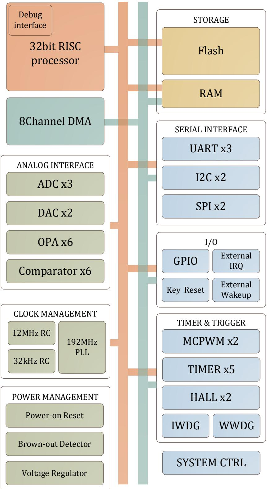  
图 2-1 LKS32MC45x 系统框图

## 3 地址空间

数据字节以小端格式存放在存储器中。一个字里的最低地址字节被认为是该字的最低有效字节，而最高地址字节是最高有效字节。其他所有没有分配给片上存储器和外设的存储器空间都是保留的地址空间。

由于 RAM 的读取速度远高于 FLASH，将程序从 FLASH 空间拷贝到 CRAM 空间可以加速程序的取指和执行。对于某些对于 Data RAM 需求较小的应用，可以将 SRAM 用作 CRAM，用于存储需要加速运行的程序片段。

通过 SYS\_REMAP 寄存器共可以配置 4 种地址空间，主要用于将 SRAM 映射到 0x0000\_0000\~0x1FFF\_FFFF 以扩大 Code RAM 空间，以便程序加载到 RAM 中执行提高关键代码运行效率。

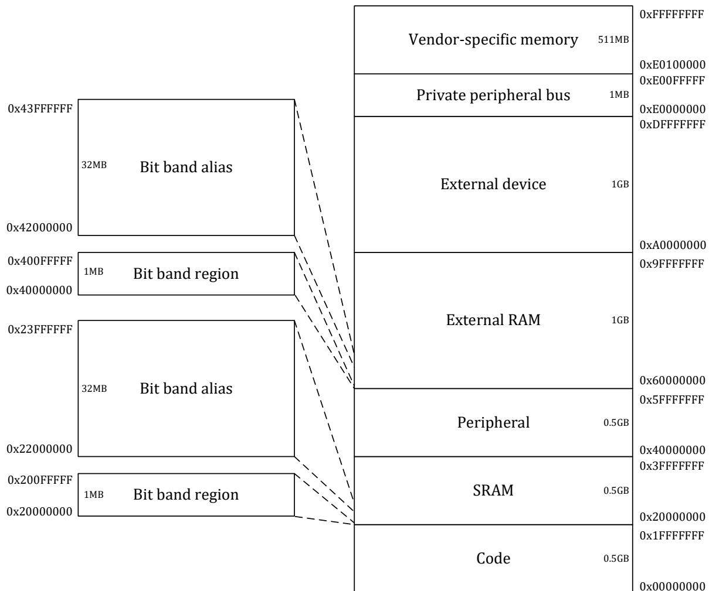  
图 3-1 RISC CPU Memory Model

## 3.1 CODE 段

地址空间范围：0x0000\_0000\~0x1FFF\_FFFF，通过 RISC CPU 的 I/D Bus 出口访问。

CODE 段主要包含片内 Flash(On-chip Flash)、片外 Flash(Ext-Flash) 以及 CRAM(Code RAM)。

表 3-1 存储区地址空间

<table><tr><td>起止地址</td><td></td><td>空间大小</td></tr><tr><td>0x0000_0000</td><td rowspan="2">On-chip Flash</td><td rowspan="2">256kB</td></tr><tr><td>0x0003_FFFF</td></tr><tr><td>0x0100_0000</td><td rowspan="2">Ext-Flash</td><td rowspan="2">最大支持 16MB</td></tr><tr><td>0x01FF_FFFF</td></tr><tr><td>0x0200_0000</td><td rowspan="2">保留</td><td rowspan="2"></td></tr><tr><td>0x0FFF_FFFF</td></tr><tr><td>0x1000_4000</td><td rowspan="2">CRAM</td><td rowspan="2">最大支持 24kB</td></tr><tr><td>0x1000_9FFF</td></tr></table>

Ext-Flash 最大支持 16MB，实际颗粒容量可以小于 16MB。

但是 On-chip Flash 和 Ext-Flash 的烧写算法是不同的，因此烧写算法中要根据地址选择不同的烧写方法。

CRAM 最大支持 24kB。芯片默认没有 CRAM，需要修改寄存器 SYS\_REMAP 来切换地址空间映射，将 SRAM 作为 CRAM 使用。在加载文件中，需要放入 CRAM 中执行的函数需要特殊指明，利用分散加载机制，将这部分 Code 从加载域拷贝到执行域。

需要注意的是，由于芯片默认没有 CRAM，因此在 SystemInit() 函数中需要修改 SYS\_REMAP 来切换地址空间映射，之后 main() 会在进入 main() 函数之前完成 RW/ZI 段的数据初始化以及从 flash 中拷贝程序到 CRAM 中。

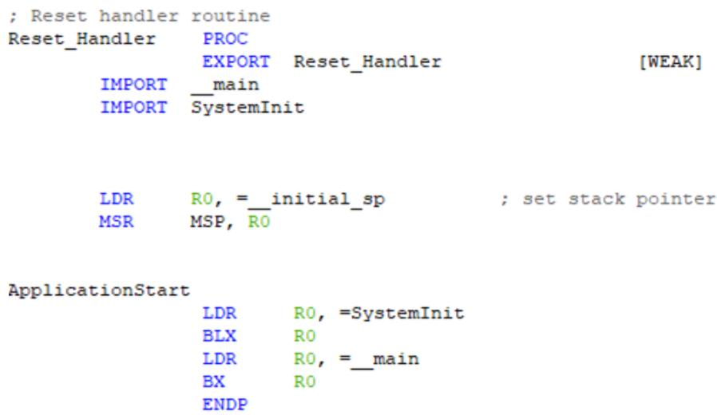  
图 3-2 Reset\_Handler 实现

## 3.2 RAM 段

地址空间范围：0x2000\_0000\~0x3FFF\_FFFF，通过 RISC CPU 的 S Bus 出口访问。SRAM 共分为 4 块。

表 3-2 SRAM 的大小和用途

<table><tr><td></td><td>大小</td><td>用途</td></tr><tr><td>SRAM0</td><td>16kB</td><td>Data RAM</td></tr><tr><td>SRAM1</td><td>8kB</td><td>Data RAM/Code RAM</td></tr><tr><td>SRAM2</td><td>8kB</td><td>Data RAM/Code RAM</td></tr><tr><td>SRAM3</td><td>8kB</td><td>Data RAM/Code RAM</td></tr></table>

表 3-3 SRAM 在不同地址空间配置下的用途

<table><tr><td></td><td>REMAP==0</td><td>REMAP==1</td><td>REMAP==2</td><td>REMAP==3</td></tr><tr><td>SRAM0</td><td>Data RAM0</td><td>Data RAM0</td><td>Data RAM0</td><td>Data RAM0</td></tr><tr><td>SRAM1</td><td>Data RAM1</td><td>Data RAM1</td><td>Data RAM1</td><td>Code RAM2</td></tr><tr><td>SRAM2</td><td>Data RAM2</td><td>Data RAM2</td><td>Code RAM1</td><td>Code RAM1</td></tr><tr><td>SRAM3</td><td>Data RAM3</td><td>Code RAM0</td><td>Code RAM0</td><td>Code RAM0</td></tr></table>

## 3.3 PERIPHERAL 段

地址空间范围：0x4000\_0000\~0x5FFF\_FFFF，通过 RISC CPU 的 S Bus 出口访问，是所有外设所在地址空间。

## 3.4 地址空间 0 (SYS\_REMAP=0)

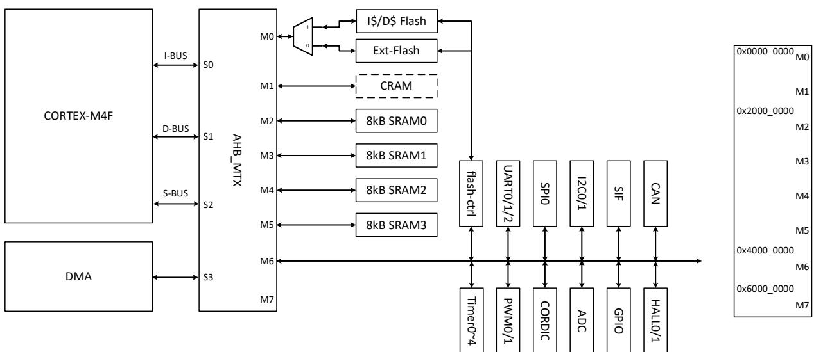  
图 3-3 总线架构(REMAP=0)  
默认的总线架构，复位后为此种配置，所有 SRAM 都是 Data RAM，无 Code RAM 用于加速。

表 3-4 REMAP=0 时系统地址空间分配

<table><tr><td>类型</td><td>外设</td><td>开始地址</td><td>结束地址</td><td>工作时钟/软复位</td><td>空间大小</td></tr><tr><td rowspan="2">CODE</td><td>FLASH</td><td>0x0000_0000</td><td>0x0003_FFFF</td><td>同总线/无</td><td>256kB</td></tr><tr><td>EXT-FLASH</td><td>0x0100_0000</td><td>0x01FF_FFFF</td><td>同总线/无</td><td>16MB</td></tr><tr><td rowspan="7">RAM</td><td>SRAM0</td><td>0x2000_0000</td><td>0x2000_3FFF</td><td>同总线/无</td><td>16kB</td></tr><tr><td>SRAM1</td><td>0x2000_4000</td><td>0x2000_5FFF</td><td>同总线/无</td><td>8kB</td></tr><tr><td>SRAM2</td><td>0x2000_6000</td><td>0x2000_7FFF</td><td>同总线/无</td><td>8kB</td></tr><tr><td>SRAM3</td><td>0x2000_8000</td><td>0x2000_9FFF</td><td>同总线/无</td><td>8kB</td></tr><tr><td>保留</td><td>0x2000_A000</td><td>0x21FF_FFFF</td><td></td><td></td></tr><tr><td>Bit band alias</td><td>0x2200_0000</td><td>0x23FF_FFFF</td><td></td><td>32MB</td></tr><tr><td>保留</td><td>0x2400_0000</td><td>0x3FFF_FFFF</td><td></td><td></td></tr><tr><td rowspan="12">PERIP</td><td>保留</td><td>0x4000_0000</td><td>0x4000_03FF</td><td></td><td>1kB</td></tr><tr><td>保留</td><td>0x4000_0400</td><td>0x4000_07FF</td><td></td><td>1kB</td></tr><tr><td>保留</td><td>0x4000_0800</td><td>0x4000_0BFF</td><td></td><td>1kB</td></tr><tr><td>保留</td><td>0x4000_0C00</td><td>0x4000_0FFF</td><td></td><td>1kB</td></tr><tr><td>保留</td><td>0x4001_0000</td><td>0x4001_03FF</td><td></td><td>1kB</td></tr><tr><td>保留</td><td>0x4001_0400</td><td>0x4001_07FF</td><td></td><td>1kB</td></tr><tr><td>保留</td><td>0x4001_0800</td><td>0x4001_0BFF</td><td></td><td>1kB</td></tr><tr><td>保留</td><td>0x4001_0C00</td><td>0x4001_0FFF</td><td></td><td>1kB</td></tr><tr><td>I2C0</td><td>0x4001_1000</td><td>0x4001_13FF</td><td>外设门控时钟[0]/软复位[0]</td><td>1kB</td></tr><tr><td>I2C1</td><td>0x4001_1400</td><td>0x4001_17FF</td><td>外设门控时钟[1]/软复位[1]</td><td>1kB</td></tr><tr><td>HALL0</td><td>0x4001_1800</td><td>0x4001_1BFF</td><td>外设门控时钟[2]/软复位[2]</td><td>1kB</td></tr><tr><td>HALL1</td><td>0x4001_1C00</td><td>0x4001_1FFF</td><td>外设门控时钟[3]/软复位[3]</td><td>1kB</td></tr><tr><td rowspan="36"></td><td>UART0</td><td>0x4001_2000</td><td>0x4001_23FF</td><td>外设门控时钟[4]/软复位[4]</td><td>1kB</td></tr><tr><td>UART1</td><td>0x4001_2400</td><td>0x4001_27FF</td><td>外设门控时钟[5]/软复位[5]</td><td>1kB</td></tr><tr><td>UART2</td><td>0x4001_2800</td><td>0x4001_2BFF</td><td>外设门控时钟[6]/软复位[6]</td><td>1kB</td></tr><tr><td>保留</td><td>0x4001_2C00</td><td>0x4001_2FFF</td><td></td><td>1kB</td></tr><tr><td>CMP</td><td>0x4001_3000</td><td>0x4001_33FF</td><td>外设门控时钟[8]/软复位[8]</td><td>1kB</td></tr><tr><td>MCPWM0</td><td>0x4001_3400</td><td>0x4001_37FF</td><td>外设门控时钟[9]/软复位[9]</td><td>1kB</td></tr><tr><td>MCPWM1</td><td>0x4001_3800</td><td>0x4001_3BFF</td><td>外设门控时钟[10]/软复位[10]</td><td>1kB</td></tr><tr><td>保留</td><td>0x4001_3C00</td><td>0x4001_3FFF</td><td></td><td>1kB</td></tr><tr><td>TIMER0</td><td>0x4001_4000</td><td>0x4001_40FF</td><td>外设门控时钟[12]/软复位[12]</td><td>256B</td></tr><tr><td>TIMER1</td><td>0x4001_4100</td><td>0x4001_41FF</td><td>外设门控时钟[13]/软复位[13]</td><td>256B</td></tr><tr><td>TIMER2</td><td>0x4001_4200</td><td>0x4001_42FF</td><td>外设门控时钟[14]/软复位[14]</td><td>256B</td></tr><tr><td>TIMER3</td><td>0x4001_4300</td><td>0x4001_43FF</td><td>外设门控时钟[15]/软复位[15]</td><td>256B</td></tr><tr><td>TIMER4</td><td>0x4001_4400</td><td>0x4001_44FF</td><td>外设门控时钟[16]/软复位[16]</td><td>256B</td></tr><tr><td>QEP0</td><td>0x4001_4500</td><td>0x4001_45FF</td><td>外设门控时钟[17]/软复位[17]</td><td>256B</td></tr><tr><td>QEP1</td><td>0x4001_4600</td><td>0x4001_46FF</td><td>外设门控时钟[18]/软复位[18]</td><td>256B</td></tr><tr><td>QEP2</td><td>0x4001_4700</td><td>0x4001_47FF</td><td>外设门控时钟[19]/软复位[19]</td><td>256B</td></tr><tr><td>QEP3</td><td>0x4001_4800</td><td>0x4001_48FF</td><td>外设门控时钟[20]/软复位[20]</td><td>256B</td></tr><tr><td>保留</td><td>0x4001_4900</td><td>0x4001_63FF</td><td></td><td></td></tr><tr><td>GPIO</td><td>0x4001_6400</td><td>0x4001_67FF</td><td>外设门控时钟[22]/软复位[22]</td><td>1kB</td></tr><tr><td>CRC</td><td>0x4001_6800</td><td>0x4001_6BFF</td><td>外设门控时钟[23]/软复位[23]</td><td>1kB</td></tr><tr><td>CORDIC</td><td>0x4001_6C00</td><td>0x4001_6FFF</td><td>外设门控时钟[24]/软复位[24]</td><td>1kB</td></tr><tr><td>FMAC</td><td>0x4001_7000</td><td>0x4001_77FF</td><td>外设门控时钟[25]/软复位[25]</td><td>2kB</td></tr><tr><td>ADC0</td><td>0x4001_7800</td><td>0x4001_7BFF</td><td>ACLK/软复位[26]</td><td>1kB</td></tr><tr><td>ADC1</td><td>0x4001_7C00</td><td>0x4001_7FFF</td><td>ACLK/软复位[27]</td><td>1kB</td></tr><tr><td>ADC2</td><td>0x4001_8000</td><td>0x4001_83FF</td><td>ACLK/软复位[28]</td><td>1kB</td></tr><tr><td>保留</td><td>0x4001_8400</td><td>0x4001_87FF</td><td></td><td>1kB</td></tr><tr><td>CAN</td><td>0x4001_8800</td><td>0x4001_8BFF</td><td>同总线/软复位[29]</td><td>1kB</td></tr><tr><td>保留</td><td>0x4001_8C00</td><td>0x4001_8FFF</td><td></td><td>1kB</td></tr><tr><td>AFE</td><td>0x4001_9000</td><td>0x4001_93FF</td><td></td><td>1kB</td></tr><tr><td>保留</td><td>0x4001_9400</td><td>0x4001_97FF</td><td></td><td>1kB</td></tr><tr><td>SYS</td><td>0x4001_9800</td><td>0x4001_9BFF</td><td>同总线/无</td><td>1kB</td></tr><tr><td>DMA</td><td>0x4001_9C00</td><td>0x4001_9FFF</td><td>同总线/无</td><td>1kB</td></tr><tr><td>FLSCR</td><td>0x4001_A000</td><td>0x4001_A3FF</td><td>同总线/无</td><td>1kB</td></tr><tr><td>保留</td><td>0x4001_A400</td><td>0x4001_A7FF</td><td></td><td>1kB</td></tr><tr><td>SPI0</td><td>0x4001_A800</td><td>0x4001_ABFF</td><td>外设门控时钟[30]/软复位[30]</td><td>1kB</td></tr><tr><td>SPI1</td><td>0x4001_AC00</td><td>0x4001_AFFF</td><td>外设门控时钟[31]/软复位[31]</td><td>1kB</td></tr><tr><td></td><td>EXT_FLSCR</td><td>0x4001_B000</td><td>0x4001_B3FF</td><td></td><td>1kB</td></tr><tr><td></td><td>WWDG</td><td>0x4001_B400</td><td>0x4001_B7FF</td><td></td><td>1kB</td></tr><tr><td rowspan="3">always on</td><td>BRAM</td><td>0x4001_B800</td><td>0x4001_B87F</td><td></td><td>128B</td></tr><tr><td>AONCR</td><td>0x4001_B880</td><td>0x4001_B8BF</td><td></td><td>64B</td></tr><tr><td>IWDG</td><td>0x4001_B8C0</td><td>0x4001_B8FF</td><td></td><td>64B</td></tr><tr><td></td><td>保留</td><td></td><td></td><td></td><td></td></tr><tr><td></td><td>Bit band alias</td><td>0x4200_0000</td><td>0x43FF_FFFF</td><td></td><td>32MB</td></tr></table>

## 3.5 地址空间 1 (SYS\_REMAP=1)

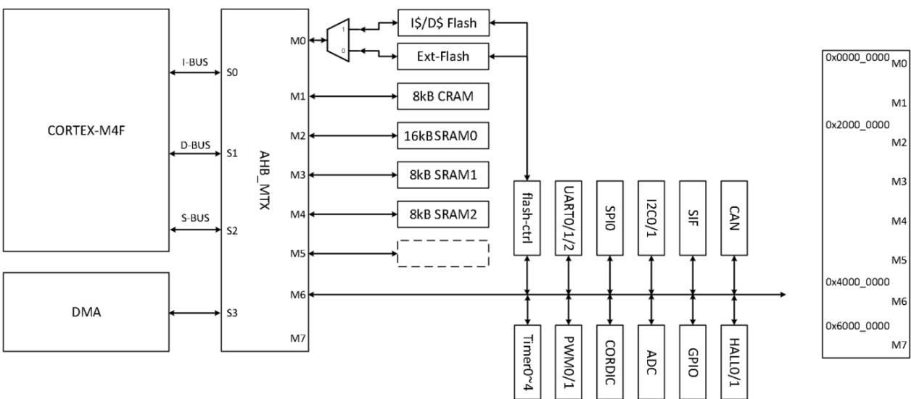  
图 3-4 总线架构(REMAP=1)

将 8kB SRAM3 映射为 CRAM 使用，其余 SRAM0/1/2 仍用作 Data RAM，CRAM 共 8kB，Data RAM 共 32kB。

表 3-5 REMAP=1 时系统地址空间分配

<table><tr><td>类型</td><td>外设</td><td>开始地址</td><td>结束地址</td><td>工作时钟/软复位</td><td>空间大小</td></tr><tr><td rowspan="2">CODE</td><td>FLASH</td><td>0x0000_0000</td><td>0x0003_FFFF</td><td>同总线/无</td><td>256kB</td></tr><tr><td>EXT-FLASH</td><td>0x0100_0000</td><td>0x01FF_FFFF</td><td>同总线/无</td><td>16MB</td></tr><tr><td rowspan="7">RAM</td><td>SRAM0</td><td>0x2000_0000</td><td>0x2000_3FFF</td><td>同总线/无</td><td>16kB</td></tr><tr><td>SRAM1</td><td>0x2000_4000</td><td>0x2000_5FFF</td><td>同总线/无</td><td>8kB</td></tr><tr><td>SRAM2</td><td>0x2000_6000</td><td>0x2000_7FFF</td><td>同总线/无</td><td>8kB</td></tr><tr><td>SRAM3</td><td>0x1000_8000</td><td>0x1000_9FFF</td><td>同总线/无</td><td>8kB</td></tr><tr><td>保留</td><td>0x2000_A000</td><td>0x21FF_FFFF</td><td></td><td></td></tr><tr><td>Bit band alias</td><td>0x2200_0000</td><td>0x23FF_FFFF</td><td></td><td>32MB</td></tr><tr><td>保留</td><td>0x2400_0000</td><td>0x3FFF_FFFF</td><td></td><td></td></tr><tr><td>PERIP</td><td colspan="5">与REMAP=0时相同</td></tr></table>

## 3.6 地址空间 2 (SYS\_REMAP=2)

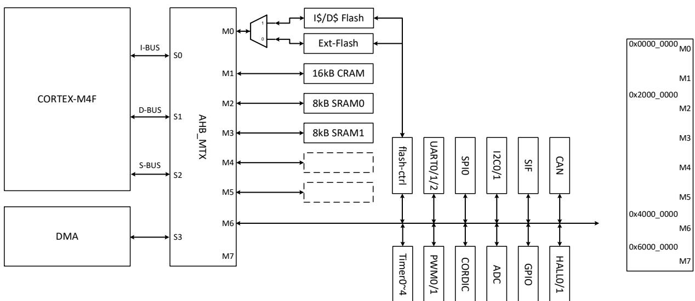  
图 3-5 总线架构(REMAP=2)

将 8kB 的 SRAM3/SRAM2 分别映射为 CRAM0/1 使用, 其余 SRAM0/1 仍用作 Data RAM。CRAM 共 16kB, Data RAM 共 16kB。

表 3-6 REMAP=2 时系统地址空间分配

<table><tr><td>类型</td><td>外设</td><td>开始地址</td><td>结束地址</td><td>工作时钟/软复位</td><td>空间大小</td></tr><tr><td rowspan="2">CODE</td><td>FLASH</td><td>0x0000_0000</td><td>0x0003_FFFF</td><td>同总线/无</td><td>256kB</td></tr><tr><td>EXT-FLASH</td><td>0x0100_0000</td><td>0x01FF_FFFF</td><td>同总线/无</td><td>16MB</td></tr><tr><td rowspan="7">RAM</td><td>SRAM0</td><td>0x2000_0000</td><td>0x2000_3FFF</td><td>同总线/无</td><td>16kB</td></tr><tr><td>SRAM1</td><td>0x2000_4000</td><td>0x2000_5FFF</td><td>同总线/无</td><td>8kB</td></tr><tr><td>SRAM2</td><td>0x1000_6000</td><td>0x1000_7FFF</td><td>同总线/无</td><td>8kB</td></tr><tr><td>SRAM3</td><td>0x1000_8000</td><td>0x1000_9FFF</td><td>同总线/无</td><td>8kB</td></tr><tr><td>保留</td><td>0x2000_A000</td><td>0x21FF_FFFF</td><td></td><td></td></tr><tr><td>Bit band alias</td><td>0x2200_0000</td><td>0x23FF_FFFF</td><td></td><td>32MB</td></tr><tr><td>保留</td><td>0x2400_0000</td><td>0x3FFF_FFFF</td><td></td><td></td></tr><tr><td>PERIP</td><td colspan="5">与 REMAP=0 时相同</td></tr></table>

## 3.7 地址空间 3 (SYS\_REMAP=3)

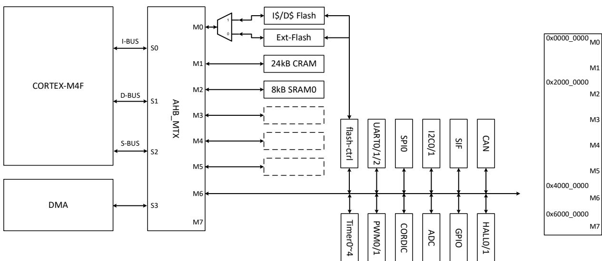  
图 3-6 总线架构(REMAP=3)

将 8kB 的 SRAM3/2/1 分别映射为 CRAM0/1/2 使用，其余 SRAM0 仍用作 Data RAM。CRAM 共 24kB，Data RAM 共 8kB。

表 3-7 REMAP=1 时系统地址空间分配

<table><tr><td>类型</td><td>外设</td><td>开始地址</td><td>结束地址</td><td>工作时钟/软复位</td><td>空间大小</td></tr><tr><td rowspan="2">CODE</td><td>FLASH</td><td>0x0000_0000</td><td>0x0003_FFFF</td><td>同总线/无</td><td>256kB</td></tr><tr><td>EXT-FLASH</td><td>0x0100_0000</td><td>0x01FF_FFFF</td><td>同总线/无</td><td>16MB</td></tr><tr><td rowspan="7">RAM</td><td>SRAM0</td><td>0x2000_0000</td><td>0x2000_3FFF</td><td>同总线/无</td><td>16kB</td></tr><tr><td>SRAM1</td><td>0x1000_4000</td><td>0x1000_5FFF</td><td>同总线/无</td><td>8kB</td></tr><tr><td>SRAM2</td><td>0x1000_6000</td><td>0x1000_7FFF</td><td>同总线/无</td><td>8kB</td></tr><tr><td>SRAM3</td><td>0x1000_8000</td><td>0x1000_9FFF</td><td>同总线/无</td><td>8kB</td></tr><tr><td>保留</td><td>0x2000_A000</td><td>0x21FF_FFFF</td><td></td><td></td></tr><tr><td>Bit band alias</td><td>0x2200_0000</td><td>0x23FF_FFFF</td><td></td><td>32MB</td></tr><tr><td>保留</td><td>0x2400_0000</td><td>0x3FFF_FFFF</td><td></td><td></td></tr><tr><td>PERIP</td><td colspan="5">与 REMAP=0 时相同</td></tr></table>

## 4 中断

嵌套向量中断控制器位于 CPU 核内部。当中断事件发生时，通知 CPU 暂停主程序执行，按照优先级设定跳转进入中断服务函数。

除系统中断以外，LKS32MC45x 系列芯片共有 38 个独立的中断源及中断向量。最多支持 8bit 共 256 个中断优先级(0\~255)可供编程选择。中断优先级数值越大表示优先级越低，对于非系统中断，0 代表最高优先级。NMI 中断为不可屏蔽中断，对应 SRAM 校验错事件，当 SYS\_MEM\_CFG.PCK\_EN 为 1 且 SYS\_MEM\_CFG.PCK\_ERR 为 1 时发生不可屏蔽中断。

表 4-1 中断号分布

<table><tr><td>中断号</td><td>说明</td><td>中断号</td><td>说明</td></tr><tr><td>-14</td><td>NMI</td><td colspan="2" rowspan="14"></td></tr><tr><td>-13</td><td>HardFault</td></tr><tr><td>-12</td><td rowspan="7">保留</td></tr><tr><td>-11</td></tr><tr><td>-10</td></tr><tr><td>-9</td></tr><tr><td>-8</td></tr><tr><td>-7</td></tr><tr><td>-6</td></tr><tr><td>-5</td><td>SVCall</td></tr><tr><td>-4</td><td rowspan="2">保留</td></tr><tr><td>-3</td></tr><tr><td>-2</td><td>PendSV</td></tr><tr><td>-1</td><td>SysTick</td></tr><tr><td>0</td><td>I2C0</td><td>20</td><td>TIMER3</td></tr><tr><td>1</td><td>I2C1</td><td>21</td><td>TIMER4</td></tr><tr><td>2</td><td>HALL0</td><td>22</td><td>QEP0</td></tr><tr><td>3</td><td>HALL1</td><td>23</td><td>QEP1</td></tr><tr><td>4</td><td>UART0</td><td>24</td><td>QEP2</td></tr><tr><td>5</td><td>UART1</td><td>25</td><td>QEP3</td></tr><tr><td>6</td><td>UART2</td><td>26</td><td>GPIO(EXTI)</td></tr><tr><td>7</td><td>CMP0</td><td>27</td><td>ADC0</td></tr><tr><td>8</td><td>CMP1</td><td>28</td><td>ADC1</td></tr><tr><td>9</td><td>CMP2</td><td>29</td><td>ADC2</td></tr><tr><td>10</td><td>CMP3</td><td>30</td><td>CAN</td></tr><tr><td>11</td><td>CMP4</td><td>31</td><td>SPI0</td></tr><tr><td>12</td><td>CMP5</td><td>32</td><td>SPI1</td></tr><tr><td>13</td><td>MCPWM0_IRQ0</td><td>33</td><td>WWDG</td></tr><tr><td>14</td><td>MCPWM0_IRQ1</td><td>34</td><td>DMA</td></tr><tr><td>15</td><td>MCPWM1_IRQ0</td><td>35</td><td>WAKEUP</td></tr><tr><td>16</td><td>MCPWM1_IRQ1</td><td>36</td><td>PWRDN(电源电压过低)</td></tr><tr><td>17</td><td>TIMER0</td><td>37</td><td>FMAC</td></tr><tr><td>18</td><td>TIMER1</td><td>38</td><td>SW</td></tr><tr><td>19</td><td>TIMER2</td><td></td><td></td></tr></table>

## 5 模拟电路

## 5.1 简述

模拟电路包含以下模块：

集成 3 路 14BIT SAR ADC，采样率 2MHz，每个 ADC 最多 16 通道信号可选，且正端信号通道和负端信号通道可自由配置。

集成 6 路运算放大器，可设置为 PGA 模式

集成 6 路比较器，可设置迟滞模式

集成 2 路 12BIT 数模转换器

内置±2°C温度传感器

内置高精度基准源

各个模块之间的相互关系、以及各模块的控制寄存器（寄存器的说明见下文“模拟寄存器表”）如下图所示。

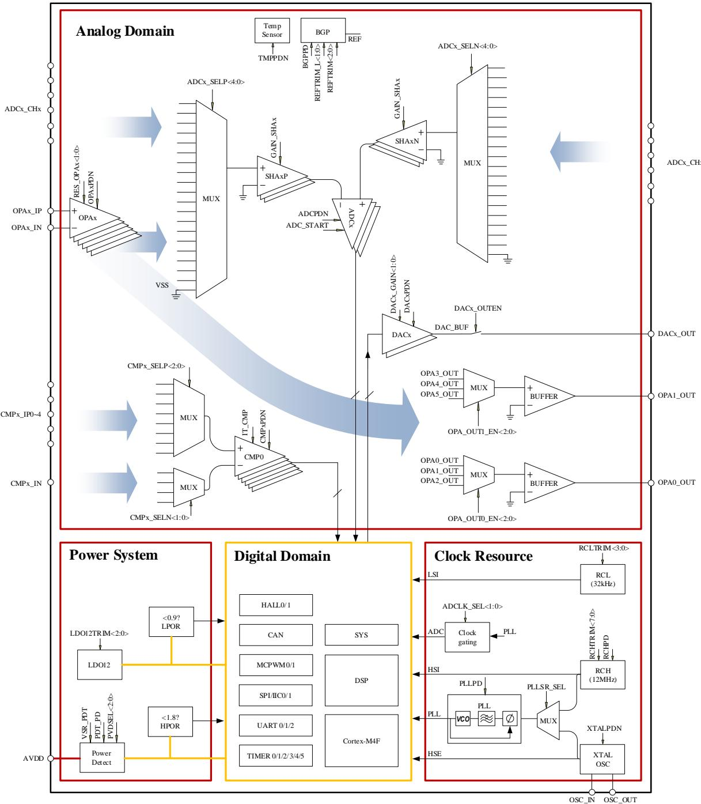  
图 5-1 模拟电路功能框图

## 5.1.1 电源管理系统

电源管理系统由 LD012 模块、电源检测模块（PVD）、上电/掉电复位模块（POR）组成。

该芯片由 3.3V 单电源供电，以节省芯片外的电源成本。芯片内部集成一路 LD012 给内部所有数字电路、PLL 模块提供 1.2V 供电。

LDO 上电后自动开启，无需软件配置，但 LDO 输出电压可通过软件实现微调。

LPOR 模块监测 LD012 的电压，在 LD012 电压低于 0.9V 时（例如上电之初，或者掉电时），为数字电路提供复位信号以避免数字电路工作产生异常。

HPOR 模块监测 AVDD 的电压，在 AVDD 电压低于 1.8V 时（例如上电之初，或者掉电时），为数字电路提供复位信号以避免数字电路工作产生异常。

PVD 模块对 3.3V 输入电源进行检测，如低于某一设定阈值，则产生报警（中断）信号以提醒 MCU。中断提醒阈值可通过寄存器 PVDSEL[1:0] 设置为不同的电压。PVD 模块可通过设置 PDT\_PD=1 关闭。发生欠压事件时，系统仅产生欠压标志，不会产生芯片复位。

PVDSEL[1:0]/ PD\_PDT 的说明见 SYS\_AFE\_REGB 模拟配置寄存器 B

## 5.1.2 时钟系统

时钟系统包括内部 32kHz RC 时钟、内部 12MHz RC 时钟、PLL 电路组成。

32kHz RC 时钟 LSI 主要用于系统内的看门狗模块以及复位信号滤波等。12MHz RC 时钟可作为 MCU 主时钟使用，MCU 也可以使用 PLL 时钟，PLL 最高可提供 192MHz 的时钟。

32kHz 和 12MHz RC 时钟均带有出厂校正, 32kHz RC 时钟在 -40\~105°C 范围内的精度为 ±50%, 12MHz RC 时钟在该温度范围的精度为 ±1%。

芯片出厂前时钟已经过校正。

12MHz RC 时钟通过设置 RCHPD='0' 打开（默认打开，写 1 关闭），RC 时钟需要 BGP 电压基准源模块提供基准电压和电流，因此开启 RC 时钟需要先开启 BGP 模块（BGPPD='0'）。芯片上电的默认状态下，12MHz RC 时钟和 BGP 模块都是开启的。32kHz RC 时钟始终开启，不能关闭。

PLL 对 12MHz RC 时钟进行倍频，给 MCU、ADC 等模块提供更高速的工作时钟。MCU 和 PWM 模块的最高时钟为 192MHz，ADC 模块最高时钟 32MHz，通过寄存器 ADCCLKSEL[1:0] 可设置不同的 ADC 工作频率。

PLL 通过设置 PLLPDN='1' 打开（默认关闭，设 1 打开），开启 PLL 模块之前，同样也需要开启 BGP 模块。开启 PLL 之后，PLL 需要 8us 的稳定时间来输出稳定时钟。芯片上电的默认状态下，RCH 时钟和 BGP 模块都是开启的，但 PLL 默认是关闭的，需要软件来开启。

ADCCLKSEL<1:0>的说明见 SYS\_AFE\_REG3 模拟配置寄存器 3

BGPPD/RCHPD/PLLPDN 的说明见 SYS\_AFE\_REGA 模拟配置寄存器 A

## 5.1.3 基准电压源

基准源电路(BGP REF: Bandgap reference)为 ADC、DAC、RC 时钟、PLL、温度传感器、运算放大器、比较器和 FLASH 提供基准电压和电流，使用上述任何一个模块之前，都需要开启 BGP 基准电压源。

芯片上电的默认状态下，BGP 模块是开启的。通过设置 BGPPD='0' 将基准源打开，从关闭到开启，BGP 需要约 6us 达到稳定。BGP 输出电压约 1.2V，精度为 ±0.8%

芯片出厂前基准源已经过校正。

## 5.1.4 ADC 模块

请参考第 13 章。

## 5.1.5 运算放大器

芯片集成 6 路输入输出轨到轨（rail-to-rail）运算放大器，内置反馈电阻，外部引脚上需串联一个电阻 $R_{0}$ 到信号源。反馈电阻 $R_{2}:R_{1}$ 的阻值可通过寄存器 RES\_OPAx[1:0] 设置，以实现不同的放大倍数。

RES\_OPAx<1:0>的说明见 SYS\_AFE\_REG0 模拟配置寄存器 0 及 SYS\_AFE\_REG1 模拟配置寄存器 1

放大器的结构示意图如下所示:

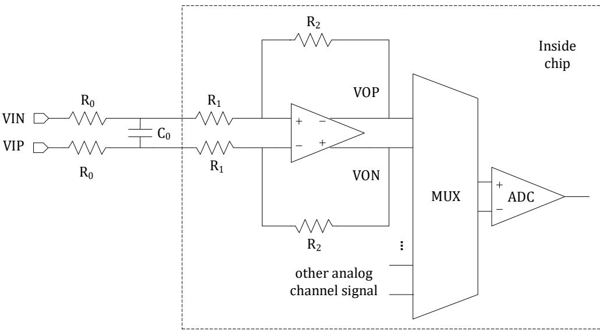  
图 5-2 放大器框图  
图中两个 $R_{0}$ 是片外需放置的电阻，阻值必须相等，最终的放大倍数为 $\mathrm{R}_{2}/(\mathrm{R}_{1}+\mathrm{R}_{0})$ 。

对于 MOS 管电阻直接采样的应用，由于 MOS 下管关断、上管导通时信号会升高到数十 V 的电源电压，为减小此时往芯片引脚里流入的电流，建议接>20kΩ 的外部电阻。

对于分流电阻采样的应用，建议接 $100 \sim 2K\Omega$ 的外部电阻。 $C_{0}$ 为信号滤波电容，和 $R_{0}$ 形成一阶 RC 滤波电路。 $R_{0}$ 的具体阻值可根据 $R_{0} * C_{0}$ 的滤波常数而定。如果信号上噪声较小不需要滤波、或者信号需要很大的带宽（较快的响应速度），则 $C_{0}$ 可以不加。

OPA0/1/2 可通过设置 OPAOUT0\_EN<1:0>选择将 3 路放大器中的一路输出信号通过 BUFFER 送至 P3.11 管脚口进行测量和应用，OPA3/4/5 可通过设置 OPAOUT1\_EN<1:0>选择将 3 路放大器中的一路输出信号通过 BUFFER 送至 P4.6 管脚口进行测量和应用（对应关系见 datasheet 芯片管脚说明）。因为有 BUFFER 存在，在运放正常工作模式下也可以选择送一路运放输出信号出来。

$$
\text { OPAOUT0\_EN } <   1: 0 > \text { 的说明见   SYS\_AFE\_REG2   模拟配置寄存器   2 }
$$

$$
\text { OPAOUT1\_EN } <   1: 0 > \text { 的说明见   SYS\_AFE\_REG2   模拟配置寄存器   2 }
$$

芯片上电的默认状态下，放大器模块是关闭的。放大器可通过设置 OPAxPDN=1 (x=0,1,2,3,4,5)

打开。开启放大器之前，需要先开启 BGP 模块。

OPAxPDN 的说明见 SYS\_AFE\_REG9 模拟配置寄存器 9

运放输入正负端内置钳位二极管，电机相线通过一个匹配电阻后直接接入输入端，从而简化了MOSFET电流采样的外置电路。

## 5.1.6 比较器

内置 6 路输入轨到轨（rail-to-rail）比较器，比较器比较速度可编程、迟滞电压可编程、信号源可编程。

比较器的比较延时可通过寄存器 IT\_CMP 设置为 150nS/600nS。迟滞电压通过 CMP\_HYS 设置为 20mV/0mV。

比较器正负两个输入端的信号来源都可通过寄存器 CMPx\_SELP[2:0] 和 CMPx\_SELN[1:0] 进行设置（x=0/1/2/3/4/5，代表比较器 0/1/2/3/4/5）。

需说明的是，两个比较器负输入端的 HALLx\_MID 信号，是对比较器正输入端信号 CMPx\_IP1/CMPx\_IP2/CMPx\_IP3 信号的平均，具体连接方式见下图 5-2。其中电阻 R=8.2k 欧，图中的开关只有在比较器负输入端信号选择为 HALLx\_MID 之后才会导通，否则开关都处于断开状态。当 CMPx\_IP1/CMPx\_IP2/CMPx\_IP3 管脚连的是 HALL 信号时，通过将 HALL 信号与 HALLx\_MID 信号进行比较，可快速得到 HALL 信号的状态。

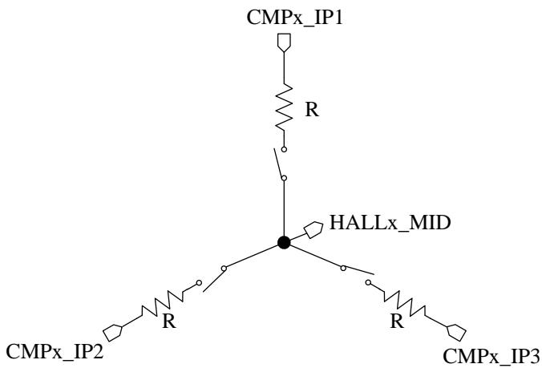  
图 5-2 HALLx\_MID 信号

比较器输出结果，可以通过 CMP\_DATA 寄存器读出。

$$
\text { IT\_CMP } <   1: 0 > \text { 的说明见   SYS\_AFE\_REG2   模拟配置寄存器   2 }
$$

CMP\_HYS 的说明见 SYS\_AFE\_REG4 模拟配置寄存器 4

CMPx\_SELN<1:0>的说明见 SYS\_AFE\_REG4 模拟配置寄存器 4 和 SYS\_AFE\_REG5 模拟配置寄存器 5

CMPx\_SELP<2:0>的说明见 SYS\_AFE\_REG5 模拟配置寄存器 5 和 SYS\_AFE\_REG6 模拟配置寄存器 6

比较器的原始输出状态值见 CMP\_DATA 输出数据寄存器

芯片上电的默认状态下，比较器模块是关闭的。比较器通过设置 CMPxPDN=1 (x=0,1,2,3,4,5) 打开，开启比较器之前，需要先开启 BGP 模块。

CMPxPDN 的说明见 SYS\_AFE\_REG9 模拟配置寄存器 9

## 5.1.7 温度传感器

芯片内置温度传感器，在-40\~85℃范围内精度为2℃。85\~105℃范围内精度为3℃。

测量时需选择内部基准，选择外部基准会引起结果的较大偏差。

芯片出厂前会经温度校正，校正值保存在 flash info 区。

芯片上电的默认状态下，温度传感器模块是关闭的。开启传感器之前，需要先开启 BGP 模块。

温度传感器通过设置 TMPPDN=1 打开，开启到稳定需要约 2us，因此需在 ADC 测量传感器之前 2us 打开。

温度传感器信号连至 ADC2 的通道 14。

ADC 部分的设置参考 ADC 章节

TMPPDN 的说明见 SYS\_AFE\_REGA 模拟配置寄存器 A

温度传感器的典型曲线如下图所示:

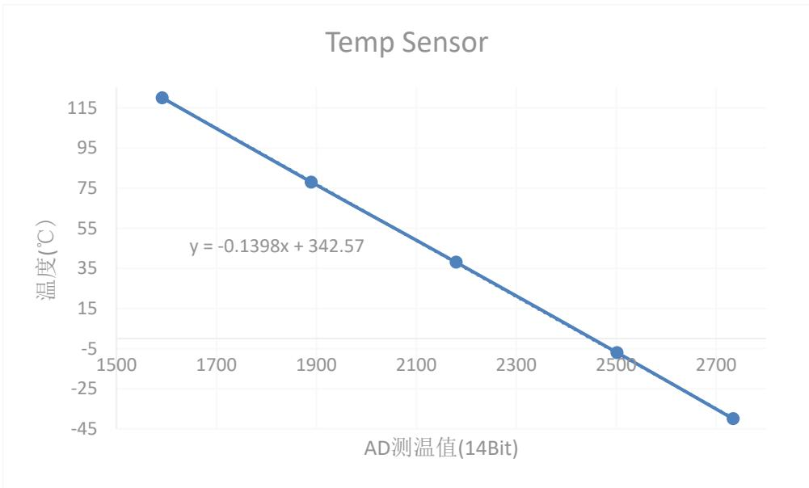  
图 5-4 温度传感器曲线

图中 X 轴为温度传感器的温度信号所对应的 ADC 值，Y 轴为传感器所处的温度。测温时，按照如上要求配置传感器相关寄存器，并得到 ADC 值后，将 ADC 值作为 X 代入公式：

y=-0.1398x+342.57

求得的 Y 值即为此时的温度。

公式中有两个系数，a=-0.1398, b=342.57。对于不同的芯片，b 系数的值是不一样的。芯片出厂前会经过温度标定，将每颗芯片所对应的系数 b 写入 flash 的 info 区，地址为 0x00000944。存储时，会将 b 系数小数点右移一位（乘 10）存入 info 区，小数点后第二位不进行保存。

同时为方便客户操作，系数 a 也会存入 flash info 区，地址为 0x00000940。存储时，将 a 系数小数点右移四位（乘 10000）存入 info 区。

实际使用中，应从 flash info 区对应地址读出 a/b 系数，同时将读取到的 ADC 测到的当下温度传感器值代入公式，即可计算得到当下温度值，单位为摄氏度。计算时，需注意系数 a/b 在保存时小数点的位移数，即 a 系数应除以 10000，b 系数除以 10。

注意，上述计算公式，基于 ADC 右对齐实现。若换成左对齐，ADC 采样值需右移 2 位后，才能代入上述公式。

## 5.1.8 DAC 模块

芯片内置 2 路 12bit DAC, 输出信号的最大量程可通过寄存器 DACx\_GAIN<1:0> 设置为 1.2V/3V, x=0,1 代表 DAC0/1。

DAC0 可通过配置寄存器 DAC0\_OUTEN=1，将 DAC 输出送至 P3.4 管脚，DAC1 可通过配置寄存器 DAC1\_OUTEN=1，将 DAC 输出送至 P4.7 管脚，可驱动>5kΩ 的对地负载电阻和 50pF 的负载电容。但只能输出电流，不能输入灌电流。

DAC 最大输出码率为 1MHz。

芯片上电的默认状态下，DAC 模块是关闭的。DAC 可通过设置 DACxPDN=1 打开，开启 DAC 模块之前，需要先开启 BGP 模块。

DAC 的输入数字信号寄存器为 SYS\_AFE\_DACx，低 12BIT 有效。信号范围是 0x000\~0xFFFF。0x000 对应零模拟量输出 0V，0xFFFF 对应满量程模拟量输出为 $DAC_{fs}$ ，如上文所述， $DAC_{fs}$ 的值可由 DAC12B\_FS 寄存器进行设置。每一档信号(LSB)所对应的模拟信号幅度为 $\frac{DAC_{fs}}{4096}$ 。若 SYS\_AFE\_DAC 的数字值为 Din，则该数字信号所对应的 DAC 输出模拟信号为 $\frac{DAC_{fs}}{4096} * Din$ 。

不同芯片，DAC 存在制造偏差，为抵消偏差，DAC 自带校准硬件模块。DAC 输出遵循公式 $y=ax+b$ 。x 为 SYS\_AFE\_DACx 填入值（理想值对应数字量）。a 来自 SYS\_AFE\_DACx\_AMC 寄存器，b 来自 SYS\_AFE\_DACx\_DC。硬件根据 SYS\_AFE\_DACx、SYS\_AFE\_DACx\_AMC 和 SYS\_AFE\_DACx\_DC 进行乘加从而求得校正后的数字量，送至 DACx 输入端，使得 DACx 最终输出的模拟值就是填入的理想数字量对应的值。系统上电后，默认加载 3V 的校准值，若换成其它量程，软件需读取 flash info 区域，重新加载到相应寄存器。

DAC0:

地址 0x00000860，为 3V 量程的 a 参数，地址 0x00000868，为 3V 量程的 b 参数。

地址 0x00000864，为 1.2V 量程的 a 参数，地址 0x0000086C，为 1.2V 量程的 b 参数。

DAC1:

地址 0x00000870，为 3V 量程的 a 参数，地址 0x00000878，为 3V 量程的 b 参数。

地址 0x00000874，为 1.2V 量程的 a 参数，地址 0x0000087C，为 1.2V 量程的 b 参数。

DAC 输出的模拟信号，除了可以送至 IO 口供外部模块使用外，还可通过配置寄存器连至芯片内部的 2 路比较器负端，作为比较器的基准信号使用。详见比较器章节。

DACx\_OUTEN 和 DACx\_GAIN<1:0>的说明见 SYS\_AFE\_REG4 模拟配置寄存器 4

DACxPDN 的说明见 SYS\_AFE\_REGA 模拟配置寄存器 A

## 5.2 寄存器

## 5.2.1 地址分配

模拟寄存器 SYS\_AFE\_REG0 \~ SYS\_AFE\_REGB，对应地址为 0x40019810 \~ 0x4001983C。地址 0x40019820\~0x4001983C 的寄存器中保留寄存器(Res)必须全部配置为 0（芯片上电后会被复位为 0）。其他寄存器根据应用场合需要进行配置。

模拟寄存器基地址为 0x40019800。

表 5-1 系统控制寄存器

<table><tr><td>名称</td><td>偏移</td><td>说明</td></tr><tr><td>SYS_AFE_INFO</td><td>0x04</td><td>芯片版本信息寄存器</td></tr><tr><td>SYS_AFE_DBG0</td><td>0x08</td><td>调试寄存器</td></tr><tr><td>SYS_AFE_REG0</td><td>0x10</td><td>模拟配置寄存器 0</td></tr><tr><td>SYS_AFE_REG1</td><td>0x14</td><td>模拟配置寄存器 1</td></tr><tr><td>SYS_AFE_REG2</td><td>0x18</td><td>模拟配置寄存器 2</td></tr><tr><td>SYS_AFE_REG3</td><td>0x1C</td><td>模拟配置寄存器 3</td></tr><tr><td>SYS_AFE_REG4</td><td>0x20</td><td>模拟配置寄存器 4</td></tr><tr><td>SYS_AFE_REG5</td><td>0x24</td><td>模拟配置寄存器 5</td></tr><tr><td>SYS_AFE_REG6</td><td>0x28</td><td>模拟配置寄存器 6</td></tr><tr><td>SYS_AFE_REG9</td><td>0x34</td><td>模拟配置寄存器 9</td></tr><tr><td>SYS_AFE_REGA</td><td>0x38</td><td>模拟配置寄存器 A</td></tr><tr><td>SYS_AFE_REGB</td><td>0x3C</td><td>模拟配置寄存器 B</td></tr><tr><td>SYS_TMP_A</td><td>0x58</td><td>温度传感器系数 A</td></tr><tr><td>SYS_TMP_B</td><td>0x5C</td><td>温度传感器系数 B</td></tr><tr><td>SYS_AFE_DAC0</td><td>0x60</td><td>DAC0 数字量寄存器</td></tr><tr><td>SYS_AFE_DAC0_AMC</td><td>0x64</td><td>DAC0 增益校正寄存器</td></tr><tr><td>SYS_AFE_DAC0_DC</td><td>0x68</td><td>DAC0 直流偏置寄存器</td></tr><tr><td>SYS_AFE_DAC1</td><td>0x70</td><td>DAC1 数字量寄存器</td></tr><tr><td>SYS_AFE_DAC1_AMC</td><td>0x74</td><td>DAC1 增益校正寄存器</td></tr><tr><td>SYS_AFE_DAC1_DC</td><td>0x78</td><td>DAC1 直流偏置寄存器</td></tr></table>

## 5.2.2 SYS\_AFE\_INFO 芯片版本信息寄存器

地址：0x4001\_9804

复位值:根据 wafer 版本不同

表 5-2 芯片版本信息寄存器 SYS\_AFE\_INFO

<table><tr><td>15</td><td>14</td><td>13</td><td>12</td><td>11</td><td>10</td><td>9</td><td>8</td><td>7</td><td>6</td><td>5</td><td>4</td><td>3</td><td>2</td><td>1</td><td>0</td></tr><tr><td rowspan="3" colspan="8"></td><td colspan="4">Res.</td><td colspan="4">Version</td></tr><tr><td colspan="4"></td><td colspan="4">RO</td></tr><tr><td colspan="4"></td><td colspan="4">Depends</td></tr></table>

<table><tr><td>位置</td><td>位名称</td><td>说明</td></tr><tr><td>[31:8]</td><td></td><td>未使用</td></tr><tr><td>[7:4]</td><td></td><td>保留</td></tr><tr><td>[3:0]</td><td>Version</td><td>芯片版本信息</td></tr></table>

## 5.2.3 SYS\_AFE\_DBG0 调试寄存器

地址:0x4001\_9808

复位值:0x0

表 5-3 SYS\_AFE\_DBG0 调试寄存器

<table><tr><td>15</td><td>14</td><td>13</td><td>12</td><td>11</td><td>10</td><td>9</td><td>8</td><td>7</td><td>6</td><td>5</td><td>4</td><td>3</td><td>2</td><td>1</td><td>0</td></tr><tr><td rowspan="3" colspan="2"></td><td>PWR_WEAK</td><td rowspan="3" colspan="13"></td></tr><tr><td>RO</td></tr><tr><td>0</td></tr></table>

<table><tr><td>位置</td><td>位名称</td><td>说明</td></tr><tr><td>[31:8]</td><td></td><td>未使用</td></tr><tr><td>[13]</td><td>PWR_WEAK</td><td>供电低于掉电监测阈值时为高</td></tr><tr><td>[12:0]</td><td></td><td>未使用</td></tr></table>

PWR\_WEAK 标志在当供电电压低于掉电监测电路设定的阈值时置位，同时将产生 CPU 掉电中断。在供电恢复，高于阈值后清零。此标志为只读位，无法软件清除。

掉电监测的使用请参考 5.1.1 电源管理系统。

## 5.2.4 SYS\_AFE\_REG0 模拟配置寄存器 0

地址：0x4001\_9810

复位值：0x0

表 5-4 模拟配置寄存器 0 SYS\_AFE\_REG0

<table><tr><td>15</td><td>14</td><td>13</td><td>12</td><td>11</td><td>10</td><td>9</td><td>8</td><td>7</td><td>6</td><td>5</td><td>4</td><td>3</td><td>2</td><td>1</td><td>0</td></tr><tr><td>Res.</td><td colspan="3">RES_OPA3</td><td>Res.</td><td colspan="3">RES_OPA2</td><td>Res.</td><td colspan="3">RES_OPA1</td><td>Res.</td><td colspan="3">RES_OPA0</td></tr><tr><td>RW</td><td colspan="3">RW</td><td>RW</td><td colspan="3">RW</td><td>RW</td><td colspan="3">RW</td><td>RW</td><td colspan="3">RW</td></tr><tr><td>0</td><td colspan="3">0</td><td>0</td><td colspan="3">0</td><td>0</td><td colspan="3">0</td><td>0</td><td colspan="3">0</td></tr></table>

<table><tr><td>位置</td><td>位名称</td><td>说明</td></tr><tr><td>[31:16]</td><td></td><td>未使用</td></tr><tr><td>[15]</td><td>Reserved</td><td>保留,必须为0</td></tr><tr><td>[14:12]</td><td>RES_OPA3</td><td>运放3反馈电阻000:20k:10k001:40k:10k010:80k:10k011:160k:10k100:320k:10k101:320k:5k</td></tr><tr><td>[11]</td><td>Reserved</td><td>保留,必须为0</td></tr><tr><td>[10:8]</td><td>RES_OPA2</td><td>运放2反馈电阻000:20k:10k001:40k:10k010:80k:10k011:160k:10k100:320k:10k101:320k:5k</td></tr><tr><td>[7]</td><td>Reserved</td><td>保留,必须为0</td></tr><tr><td>[6:4]</td><td>RES_OPA1</td><td>运放1反馈电阻000:20k:10k001:40k:10k010:80k:10k011:160k:10k100:320k:10k101:320k:5k</td></tr><tr><td>[3]</td><td>Reserved</td><td>保留,必须为0</td></tr><tr><td>[2:0]</td><td>RES_OPA0</td><td>运放 0 反馈电阻000: 20k:10k001: 40k:10k010: 80k:10k011:160k:10k100: 320k:10k101: 320k:5k</td></tr></table>

## 5.2.5 SYS\_AFE\_REG1 模拟配置寄存器 1

地址：0x4001\_9814

复位值：0x0

表 5-5 模拟配置寄存器 1 SYS\_AFE\_REG1

<table><tr><td>15</td><td>14</td><td>13</td><td>12</td><td>11</td><td>10</td><td>9</td><td>8</td><td>7</td><td>6</td><td>5</td><td>4</td><td>3</td><td>2</td><td>1</td><td>0</td></tr><tr><td></td><td colspan="4">Res.</td><td>XDIV</td><td colspan="2">XCSEL</td><td>Res.</td><td colspan="3">RES_OPA5</td><td>Res.</td><td colspan="3">RES_OPA4</td></tr><tr><td></td><td colspan="4">RW</td><td>RW</td><td colspan="2">RW</td><td>RW</td><td colspan="3">RW</td><td>RW</td><td colspan="3">RW</td></tr><tr><td></td><td colspan="4">0</td><td>0</td><td colspan="2">0</td><td>0</td><td colspan="3">0</td><td>0</td><td colspan="3">0</td></tr></table>

<table><tr><td>位置</td><td>位名称</td><td>说明</td></tr><tr><td>[31:16]</td><td></td><td>未使用</td></tr><tr><td>[15:11]</td><td>Reserved</td><td>保留,必须为0</td></tr><tr><td>[10]</td><td>XDIV</td><td>晶体频率除以20:使用12MHz外部晶体1:使用24MHz外部晶体,同时需要将SYS_AFE_REG4.XTRSEL[0]置为1</td></tr><tr><td>[9:8]</td><td>XCSEL</td><td>晶体电容调整00:9.19pF01:10.77pF10:6.02pF11:7.61pF</td></tr><tr><td>[7]</td><td>Reserved</td><td>保留,必须为0</td></tr><tr><td>[6:4]</td><td>RES_OPA5</td><td>运放5反馈电阻000:20k:10k001:40k:10k010:80k:10k011:160k:10k100:320k:10k101:320k:5k</td></tr><tr><td>[3]</td><td>Reserved</td><td>保留,必须为0</td></tr><tr><td>[2:0]</td><td>RES_OPA4</td><td>运放4反馈电阻000: 20k:10k001: 40k:10k010: 80k:10k011:160k:10k100: 320k:10k101: 320k:5k</td></tr></table>

## 5.2.6 SYS\_AFE\_REG2 模拟配置寄存器 2

地址：0x4001\_9818

复位值: 0x0

表 5-6 模拟配置寄存器 2 SYS\_AFE\_REG2

<table><tr><td>15</td><td>14</td><td>13</td><td>12</td><td>11</td><td>10</td><td>9</td><td>8</td><td>7</td><td>6</td><td>5</td><td>4</td><td>3</td><td>2</td><td>1</td><td>0</td></tr><tr><td>LDOOUT_EN</td><td>Res.</td><td>Res.</td><td>REF2VDD</td><td>Res.</td><td>Res.</td><td>IT_CMP</td><td>CMP_FT</td><td>Res.</td><td>Res.</td><td colspan="2">OPA_OUT1_EN</td><td>Res.</td><td>Res.</td><td colspan="2">OPA_OUT0_EN</td></tr><tr><td>RW</td><td>RW</td><td>RW</td><td>RW</td><td>RW</td><td>RW</td><td>RW</td><td>RW</td><td>RW</td><td>RW</td><td colspan="2">RW</td><td>RW</td><td>RW</td><td colspan="2">RW</td></tr><tr><td>0</td><td>0</td><td>0</td><td>0</td><td>0</td><td>0</td><td>0</td><td>0</td><td>0</td><td>0</td><td colspan="2">0</td><td>0</td><td>0</td><td colspan="2">0</td></tr></table>

<table><tr><td>位置</td><td>位名称</td><td>说明</td></tr><tr><td>[31:16]</td><td></td><td>未使用</td></tr><tr><td>[15]</td><td>LDOOUT_EN</td><td>LDO 输出到 IO 使能1:使能0:关闭</td></tr><tr><td>[14]</td><td>Reserved</td><td>保留,必须为 0</td></tr><tr><td>[13]</td><td>Reserved</td><td>保留,必须为 0</td></tr><tr><td>[12]</td><td>REF2VDD</td><td>使用外部输入电源作为 ADC REF1: 使用外部输入电源作为 ADC REF;0: 使用默认内部 REF 作为 ADC 基准</td></tr><tr><td>[11]</td><td>Reserved</td><td>保留,必须为 0</td></tr><tr><td>[10]</td><td>Reserved</td><td>保留,必须为 0</td></tr><tr><td>[9]</td><td>IT_CMP</td><td>比较器 0~5 比较速度选择0:比较速度 150ns1:比较速度 600ns</td></tr><tr><td>[8]</td><td>CMP_FT</td><td>使能比较器快速比较1:在 IT_CMP 为默认 0 的时候,使能比较器比较速度小于 30ns0:不使能</td></tr><tr><td>[7]</td><td>Reserved</td><td>保留,必须为 0</td></tr><tr><td>[6]</td><td>Reserved</td><td>保留,必须为 0</td></tr><tr><td>[5:4]</td><td>OPAOUT1_EN</td><td>使能 OPAx(x=3,4,5)输出信号送至 IO 口00:不输出01:输出 OPA3 信号到 IO ☐ P4.610:输出 OPA4 信号到 IO ☐ P4.611:输出 OPA5 信号到 IO ☐ P4.6</td></tr><tr><td>[3]</td><td>Reserved</td><td>保留,必须为 0</td></tr><tr><td>[2]</td><td>Reserved</td><td>保留,必须为 0</td></tr><tr><td>[1:0]</td><td>OPAOUTO_EN</td><td>使能 OPAx(x=0,1,2)输出信号送至 IO ☐00:不输出01:输出 OPA0 信号到 IO ☐ P3.1110:输出 OPA1 信号到 IO ☐ P3.1111:输出 OPA2 信号到 IO ☐ P3.11</td></tr></table>

## 5.2.7 SYS\_AFE\_REG3 模拟配置寄存器 3

地址：0x4001\_981C

复位值：0x0

表 5-7 模拟配置寄存器 3 SYS\_AFE\_REG3

<table><tr><td>15</td><td>14</td><td>13</td><td>12</td><td>11</td><td>10</td><td>9</td><td>8</td><td>7</td><td>6</td><td>5</td><td>4</td><td>3</td><td>2</td><td>1</td><td>0</td></tr><tr><td>Res.</td><td>Res.</td><td>Res.</td><td>Res.</td><td colspan="2">ADCCLKSEL</td><td>Res.</td><td>Res.</td><td colspan="2">Res.</td><td colspan="2">Res.</td><td colspan="2">Res.</td><td colspan="2">Res.</td></tr><tr><td>RW</td><td>RW</td><td>RW</td><td>RW</td><td colspan="2">RW</td><td>RW</td><td>RW</td><td colspan="2">RW</td><td colspan="2">RW</td><td colspan="2">RW</td><td colspan="2">RW</td></tr><tr><td>0</td><td>0</td><td>0</td><td>0</td><td colspan="2">0</td><td>0</td><td>0</td><td colspan="2">0</td><td colspan="2">0</td><td colspan="2">0</td><td colspan="2">0</td></tr></table>

<table><tr><td>位置</td><td>位名称</td><td>说明</td></tr><tr><td>[31:16]</td><td></td><td>未使用</td></tr><tr><td>[15]</td><td>Reserved</td><td>保留,必须为0</td></tr><tr><td>[14]</td><td>Reserved</td><td>保留,必须为0</td></tr><tr><td>[13]</td><td>Reserved</td><td>保留,必须为0</td></tr><tr><td>[12]</td><td>Reserved</td><td>保留,必须为0</td></tr><tr><td>[11:10]</td><td>ADCCLKSEL</td><td>ADC时钟频率选择01:不允许此配置00:32MHz11:16MHz10:8MHz</td></tr><tr><td>[9]</td><td>Reserved</td><td>保留,必须为0</td></tr><tr><td>[8]</td><td>Reserved</td><td>保留,必须为0</td></tr><tr><td>[7:6]</td><td>Reserved</td><td>保留,必须为0</td></tr><tr><td>[5:4]</td><td>Reserved</td><td>保留,必须为0</td></tr><tr><td>[3:2]</td><td>Reserved</td><td>保留,必须为0</td></tr><tr><td>[1:0]</td><td>Reserved</td><td>保留,必须为 0</td></tr></table>

## 5.2.8 SYS\_AFE\_REG4 模拟配置寄存器 4

地址：0x4001\_9820

复位值：0x0

表 5-8 模拟配置寄存器 4 SYS\_AFE\_REG4

<table><tr><td>15</td><td>14</td><td>13</td><td>12</td><td>11</td><td>10</td><td>9</td><td>8</td><td>7</td><td>6</td><td>5</td><td>4</td><td>3</td><td>2</td><td>1</td><td>0</td></tr><tr><td colspan="2">CMP0_SELN</td><td colspan="2">CMP1_SELN</td><td colspan="2">Res.</td><td>Res.</td><td>Res.</td><td colspan="2">XTRSEL</td><td>DAC1_OUTEN</td><td>DAC0_OUTEN</td><td>CMP_HYS</td><td>DAC1_GAIN</td><td>Res.</td><td>DAC0_GAIN</td></tr><tr><td colspan="2">RW</td><td colspan="2">RW</td><td colspan="2">RW</td><td>RW</td><td>RW</td><td colspan="2">RW</td><td>RW</td><td>RW</td><td>RW</td><td>RW</td><td>RW</td><td>RW</td></tr><tr><td colspan="2">0</td><td colspan="2">0</td><td colspan="2">0</td><td>0</td><td>0</td><td colspan="2">0</td><td>0</td><td>0</td><td>0</td><td>0</td><td>0</td><td>0</td></tr></table>

<table><tr><td>位置</td><td>位名称</td><td>说明</td></tr><tr><td>[31:16]</td><td></td><td>未使用</td></tr><tr><td>[15:14]</td><td>CMP0_SELN</td><td>比较器 0 信号负端选择00: CMP0_IN01: REF10: DAC0 输出11: CMP0_IP1/2/3 的平均值</td></tr><tr><td>[13:12]</td><td>CMP1_SELN</td><td>比较器 1 信号负端选择00: CMP1_IN01: REF10: DAC1 输出11: CMP1_IP1/2/3 的平均值</td></tr><tr><td>[11:10]</td><td>Reserved</td><td>保留,必须为 0</td></tr><tr><td>[9]</td><td>Reserved</td><td>保留,必须为 0</td></tr><tr><td>[8]</td><td>Reserved</td><td>保留,必须为 0</td></tr><tr><td>[7:6]</td><td>XTRSEL</td><td>晶体起振电路电阻调节XTRSEL&lt;1&gt;=1: N 端阻值增加XTRSEL&lt;0&gt;=1: P 端电阻减小一倍</td></tr><tr><td>[5]</td><td>DAC1_OUTEN</td><td>DAC1 输出到 IO 使能1: 使能 DAC1 输出到 IO P4.70: 不输出</td></tr><tr><td>[4]</td><td>DAC0_OUTEN</td><td>DAC0 输出到 IO 使能1: 使能 DAC0 输出到 IO P3.40: 不输出</td></tr><tr><td>[3]</td><td>CMP_HYS</td><td>比较器回差选择0: 20mv1: 0mv</td></tr><tr><td>[2]</td><td>DAC1_GAIN</td><td>DAC1 量程选择0: 满量程为 3V1: 满量程为 1.2V</td></tr><tr><td>[1]</td><td>Reserved</td><td>保留,必须为 0</td></tr><tr><td>[0]</td><td>DAC0_GAIN</td><td>DAC0 量程选择0: 满量程为 3V1: 满量程为 1.2V</td></tr></table>

## 5.2.9 SYS\_AFE\_REG5 模拟配置寄存器 5

地址：0x4001\_9824

复位值：0x0

表 5-9 模拟配置寄存器 5 SYS\_AFE\_REG5

<table><tr><td>15</td><td>14</td><td>13</td><td>12</td><td>11</td><td>10</td><td>9</td><td>8</td><td>7</td><td>6</td><td>5</td><td>4</td><td>3</td><td>2</td><td>1</td><td>0</td></tr><tr><td rowspan="3"></td><td colspan="2">CMP0_SELP</td><td rowspan="3" colspan="2"></td><td colspan="3">CMP1_SELP</td><td colspan="2">CMP4_SELN</td><td colspan="2">CMP5_SELN</td><td colspan="2">CMP2_SELN</td><td colspan="2">CMP3_SELN</td></tr><tr><td colspan="2">RW</td><td colspan="3">RW</td><td colspan="2">RW</td><td colspan="2">RW</td><td colspan="2">RW</td><td colspan="2">RW</td></tr><tr><td colspan="2">0</td><td colspan="3">0</td><td colspan="2">0</td><td colspan="2">0</td><td colspan="2">0</td><td colspan="2">0</td></tr></table>

<table><tr><td>位置</td><td>位名称</td><td>说明</td></tr><tr><td>[31:16]</td><td></td><td>未使用</td></tr><tr><td>[15]</td><td>Reserved</td><td>保留位,必须为0</td></tr><tr><td>[14:12]</td><td>CMP0_SELP</td><td>比较器0信号正端选择000:CMP0_IP001:OPA0_IP010:OPA0_OUT_HF,即运放的正输出端VOP,详见运放应用笔记011:OPA1_OUT_HF100:CMP0_IP110: CMP0_IP2110: CMP0_IP3111:AVSS</td></tr><tr><td>[11]</td><td>Reserved</td><td>保留位,必须为0</td></tr><tr><td>[10:8]</td><td>CMP1_SELP</td><td>比较器1信号正端选择000:CMP1_IP001:OPA1_IP010:OPA1_OUT_HF011:OPA2_OUT_HF100: CMP1_IP1101: CMP1_IP2110: CMP1_IP3111: AVSS</td></tr><tr><td></td><td></td><td></td></tr><tr><td>[7:6]</td><td>CMP4_SELN</td><td>比较器 4 信号负端选择00: CMP4_IN01: REF10: DAC0 输出11: DAC1 输出</td></tr><tr><td>[5:4]</td><td>CMP5_SELN</td><td>比较器 5 信号负端选择00: CMP5_IN01: REF10: DAC0 输出11: DAC1 输出</td></tr><tr><td>[3:2]</td><td>CMP2_SELN</td><td>比较器 2 信号负端选择00: CMP2_IN01: REF10: DAC0 输出11: DAC1 输出</td></tr><tr><td>[1:0]</td><td>CMP3_SELN</td><td>比较器 3 信号负端选择00: CMP3_IN01: REF10: DAC0 输出11: DAC1 输出</td></tr></table>

## 5.2.10 SYS\_AFE\_REG6 模拟配置寄存器 6

地址：0x4001\_9828

复位值：0x0

表 5-10 模拟配置寄存器 6 SYS\_AFE\_REG6

<table><tr><td rowspan="3"></td><td>CMP4_SELP</td><td rowspan="3"></td><td>CMP5_SELP</td><td rowspan="3"></td><td>CMP2_SELP</td><td rowspan="3"></td><td>CMP3_SELP</td></tr><tr><td>RW</td><td>RW</td><td>RW</td><td>RW</td></tr><tr><td>0</td><td>0</td><td>0</td><td>0</td></tr></table>

<table><tr><td>位置</td><td>位名称</td><td>说明</td></tr><tr><td>[31:16]</td><td></td><td>未使用</td></tr><tr><td>[15]</td><td>Reserved</td><td>保留位,必须为0</td></tr><tr><td>[14:12]</td><td>CMP4_SELP</td><td>比较器4信号正端选择000: CMP4_IP0001: OPA4_IP010: OPA4_OUT_HF011: OPA5_OUT_HF100: CMP4_IP1101: CMP4_IP2110: CMP4_IP3111: AVSS</td></tr><tr><td>[11]</td><td>Reserved</td><td>保留位,必须为0</td></tr><tr><td>[10:8]</td><td>CMP5_SELP</td><td>比较器5信号正端选择000: CMP5_IP0001: OPA5_IP010: OPA5_OUT_HF011: OPA0_OUT_HF100: CMP5_IP1101: CMP5_IP2110: CMP5_IP3111: AVSS</td></tr><tr><td>[7]</td><td>Reserved</td><td>保留位,必须为0</td></tr><tr><td>[6:4]</td><td>CMP2_SELP</td><td>比较器2信号正端选择000: CMP2_IP0001: OPA2_IP010: OPA2_OUT_HF011: OPA3_OUT_HF100: CMP2_IP1101: CMP2_IP2110: CMP2_IP3111: AVSS</td></tr><tr><td>[3]</td><td>Reserved</td><td>保留位,必须为0</td></tr><tr><td>[2:0]</td><td>CMP3_SELP</td><td>比较器3信号正端选择000: CMP3_IP0001: OPA3_IP010: OPA3_OUT_HF011: OPA4_OUT_HF100: CMP3_IP1101: CMP3_IP2110: CMP3_IP3111: AVSS</td></tr></table>

## 5.2.11 SYS\_AFE\_REG9 模拟配置寄存器 9

地址：0x4001\_9834

复位值：0x0

表 5-11 模拟配置寄存器 9 SYS\_AFE\_REG9

<table><tr><td>15</td><td>14</td><td>13</td><td>12</td><td>11</td><td>10</td><td>9</td><td>8</td><td>7</td><td>6</td><td>5</td><td>4</td><td>3</td><td>2</td><td>1</td><td>0</td></tr><tr><td>ADCPDN</td><td>Res.</td><td>CMP5PDN</td><td>CMP4PDN</td><td>CMP3PDN</td><td>CMP2PDN</td><td>CMP1PDN</td><td>CMP0PDN</td><td colspan="2">Res.</td><td>OPA5PDN</td><td>OPA4PDN</td><td>OPA3PDN</td><td>OPA2PDN</td><td>OPA1PDN</td><td>OPA0PDN</td></tr><tr><td>RW</td><td>RW</td><td>RW</td><td>RW</td><td>RW</td><td>RW</td><td>RW</td><td>RW</td><td colspan="2">RW</td><td>RW</td><td>RW</td><td>RW</td><td>RW</td><td>RW</td><td>RW</td></tr><tr><td>0</td><td>0</td><td>0</td><td>0</td><td>0</td><td>0</td><td>0</td><td>0</td><td colspan="2">0</td><td>0</td><td>0</td><td>0</td><td>0</td><td>0</td><td>0</td></tr></table>

<table><tr><td>位置</td><td>位名称</td><td>说明</td></tr><tr><td>[31:16]</td><td></td><td>未使用</td></tr><tr><td>[15]</td><td>ADCPDN</td><td>ADC 使能0: 关闭1: 使能</td></tr><tr><td>[14]</td><td>Reserved</td><td>保留,必须为0</td></tr><tr><td>[13]</td><td>CMP5PDN</td><td>CMP5 使能0: 关闭1: 使能</td></tr><tr><td>[12]</td><td>CMP4PDN</td><td>CMP4 使能0: 关闭1: 使能</td></tr><tr><td>[11]</td><td>CMP3PDN</td><td>CMP3 使能0: 关闭1: 使能</td></tr><tr><td>[10]</td><td>CMP2PDN</td><td>CMP2 使能0: 关闭1: 使能</td></tr><tr><td>[9]</td><td>CMP1PDN</td><td>CMP1 使能0: 关闭1: 使能</td></tr><tr><td>[8]</td><td>CMP0PDN</td><td>CMP0 使能0: 关闭1: 使能</td></tr><tr><td>[7:6]</td><td>Reserved</td><td>保留,必须为0</td></tr><tr><td>[5]</td><td>OPA5PDN</td><td>OPA5 使能0: 关闭1: 使能</td></tr><tr><td>[4]</td><td>OPA4PDN</td><td>OPA4 使能0: 关闭1: 使能</td></tr><tr><td>[3]</td><td>OPA3PDN</td><td>OPA3 使能0: 关闭1: 使能</td></tr><tr><td>[2]</td><td>OPA2PDN</td><td>OPA2 使能0: 关闭1: 使能</td></tr><tr><td>[1]</td><td>OPA1PDN</td><td>OPA1 使能0: 关闭1: 使能</td></tr><tr><td>[0]</td><td>OPA0PDN</td><td>OPA0 使能0: 关闭1: 使能</td></tr></table>

## 5.2.12 SYS\_AFE\_REGA 模拟配置寄存器 A

地址：0x4001\_9838

复位值：0x0

表 5-12 模拟配置寄存器 A SYS\_AFE\_REGA

<table><tr><td>15</td><td>14</td><td>13</td><td>12</td><td>11</td><td>10</td><td>9</td><td>8</td><td>7</td><td>6</td><td>5</td><td>4</td><td>3</td><td>2</td><td>1</td><td>0</td></tr><tr><td colspan="8">Res.</td><td>PLLPDN</td><td>XTALPDN</td><td>TMPPDN</td><td>LDO2_CTL</td><td>DAC1PDN</td><td>DAC0PDN</td><td>RCHPD</td><td>BGPPD</td></tr><tr><td colspan="8">RW</td><td>RW</td><td>RW</td><td>RW</td><td>RW</td><td>RW</td><td>RW</td><td>RW</td><td>RW</td></tr><tr><td colspan="8">0</td><td>0</td><td>0</td><td>0</td><td>0</td><td>0</td><td>0</td><td>0</td><td>0</td></tr></table>

<table><tr><td>位置</td><td>位名称</td><td>说明</td></tr><tr><td>[31:16]</td><td></td><td>未使用</td></tr><tr><td>[15:8]</td><td>Reserved</td><td>保留位,必须为0</td></tr><tr><td>[7]</td><td>PLLPDN</td><td>PLL使能0:关闭1:使能</td></tr><tr><td>[6]</td><td>XTALPDN</td><td>晶体起振电路使能0:关闭1:使能</td></tr><tr><td>[5]</td><td>TMPPDN</td><td>温度传感器使能0:关闭1:使能</td></tr><tr><td>[4]</td><td>LDO2_CTL</td><td>可掉电LDO电源关闭控制信号0:开启1:关闭</td></tr><tr><td>[3]</td><td>DAC1PDN</td><td>DAC1使能0:关闭1:使能</td></tr><tr><td>[2]</td><td>DACOPDN</td><td>DAC0 使能0: 关闭1: 使能</td></tr><tr><td>[1]</td><td>RCHPD</td><td>RCH 模块关闭信号0: 开启1: 关闭</td></tr><tr><td>[0]</td><td>BGPPD</td><td>BGP 模块关闭信号0: 开启1: 关闭</td></tr></table>

如果 SYS\_CLK\_CFG 选择 PLL 时钟，则 PLLPDN 是被硬件控制的，软件配置 PLLPDN 关闭 PLL 无效。关闭 PLL 需要 PLLPDN=0，且 SYS\_CLK\_CFG 不选择 PLL 作为芯片主时钟，这两个条件都须满足。同理如果 SYS\_CLK\_CFG 选择 HRC 时钟，则 RCHPD 是被硬件控制的，软件直接配置 RCHPD 关闭 RCH 无效。关闭 PLL 需要 RCHPD=1，且芯片进入休眠。如果芯片主时钟为 PLL 时钟，且 HRC 为 PLL 参考时钟，则 RCH 也是被硬件控制的。由于 RCH 和 PLL 依赖 BGP，所以 BGPPD 也是硬件控制的，在芯片使用了 RCH 或 PLL 时，软件直接配置 BGPPD 关闭 BGP 无效。关闭 BGP 需要先顺序关闭 PLL 和 RCH，且芯片进入休眠。LDO2\_CTL 也是由休眠状态机控制的(详见 24.4 章节)，软件直接写入关闭 LDO 无效。

## 5.2.13 SYS\_AFE\_REGB 模拟配置寄存器 B

地址：0x4001\_983C

复位值：0x0

表 5-13 模拟配置寄存器 B SYS\_AFE\_REGB

<table><tr><td>15</td><td>14</td><td>13</td><td>12</td><td>11</td><td>10</td><td>9</td><td>8</td><td>7</td><td>6</td><td>5</td><td>4</td><td>3</td><td>2</td><td>1</td><td>0</td></tr><tr><td colspan="8">Res.</td><td>PLLSR_SEL</td><td>PORFIL_EN</td><td>Res.</td><td>Res.</td><td colspan="2">PVDSEL</td><td>VSR_PDT</td><td>PDT_PD</td></tr><tr><td colspan="8">RW</td><td>RW</td><td>RW</td><td>RW</td><td>RW</td><td colspan="2">RW</td><td>RW</td><td>RW</td></tr><tr><td colspan="8">0</td><td>0</td><td>0</td><td>0</td><td>0</td><td colspan="2">0</td><td>0</td><td>0</td></tr></table>

<table><tr><td>位置</td><td>位名称</td><td>说明</td></tr><tr><td>[31:16]</td><td></td><td>未使用</td></tr><tr><td>[15:8]</td><td>Reserved</td><td>保留位,需全部为'0'</td></tr><tr><td>[7]</td><td>PLLSR_SEL</td><td>PLL 参考时钟选择0: PLL 使用 RCH 时钟1: PLL 使用晶体时钟该信号在不使用晶体时钟的产品或应用下,时钟输出 0;在使用晶体时钟且晶体未停振时输出 1,如晶体停振则输出 0</td></tr><tr><td>[6]</td><td>PORFIL_EN</td><td>POR 滤波使能0: 关闭1: 使能</td></tr><tr><td>[5]</td><td>Reserved</td><td>保留位,需全部为'0'</td></tr><tr><td>[4]</td><td>Reserved</td><td>保留位,需全部为'0'</td></tr><tr><td>[3:2]</td><td>PVDSEL</td><td>电源掉电监测阈值选择00: 3.55V01: 3.30V10: 3.10V11: 2.90V</td></tr><tr><td>[1]</td><td>VSR_PDT</td><td>掉电检测基准源选择0:选择低功耗基准源1:选择 DAC0 的输出</td></tr><tr><td>[0]</td><td>PDT_PD</td><td>掉电检测电路关闭控制信号0: 开启1: 关闭</td></tr></table>

## 5.2.14 SYS\_TMP\_A 温度传感器系数 A 寄存器

地址：0x4001\_9858

复位值：0x0

表 5-14 温度传感器系数 A 寄存器 SYS\_TMP\_A

<table><tr><td>15</td><td>14</td><td>13</td><td>12</td><td>11</td><td>10</td><td>9</td><td>8</td><td>7</td><td>6</td><td>5</td><td>4</td><td>3</td><td>2</td><td>1</td><td>0</td></tr><tr><td colspan="16">TMP_GAIN_A</td></tr><tr><td colspan="16">RW</td></tr><tr><td colspan="16">0</td></tr></table>

<table><tr><td>位置</td><td>位名称</td><td>说明</td></tr><tr><td>[31:16]</td><td></td><td>未使用</td></tr><tr><td>[15:0]</td><td>TMP_GAIN_A</td><td>温度传感器增益校正系数A</td></tr></table>

## 5.2.15 SYS\_TMP\_B 温度传感器系数 B 寄存器

地址：0x4001\_985C

复位值：0x0

表 5-15 温度传感器系数 B 寄存器 SYS\_TMP\_B

<table><tr><td>15</td><td>14</td><td>13</td><td>12</td><td>11</td><td>10</td><td>9</td><td>8</td><td>7</td><td>6</td><td>5</td><td>4</td><td>3</td><td>2</td><td>1</td><td>0</td></tr><tr><td colspan="4">TMP_SIGN</td><td colspan="12">TMP_OFFSET_B</td></tr><tr><td colspan="4">R</td><td colspan="12">RW</td></tr><tr><td colspan="4">0</td><td colspan="12">0</td></tr></table>

<table><tr><td>位置</td><td>位名称</td><td>说明</td></tr><tr><td>[31:16]</td><td></td><td>未使用</td></tr><tr><td>[15:12]</td><td>TMP_SIGN</td><td>温度传感器 offset 校正系数 B 符号扩展位</td></tr><tr><td>[11:0]</td><td>TMP_OFFSET_B</td><td>温度传感器 offset 校正系数 B</td></tr></table>

## 5.2.16 SYS\_AFE\_DAC0 DAC0 数字量寄存器

地址：0x4001\_9860

复位值：0x0

表 5-16 DAC0 数字量寄存器 SYS\_AFE\_DAC0

<table><tr><td>15</td><td>14</td><td>13</td><td>12</td><td>11</td><td>10</td><td>9</td><td>8</td><td>7</td><td>6</td><td>5</td><td>4</td><td>3</td><td>2</td><td>1</td><td>0</td></tr><tr><td rowspan="3" colspan="4"></td><td colspan="12">DAC_IN</td></tr><tr><td colspan="12">RW</td></tr><tr><td colspan="12">0</td></tr></table>

<table><tr><td>位置</td><td>位名称</td><td>说明</td></tr><tr><td>[31:12]</td><td></td><td>未使用</td></tr><tr><td>[11:0]</td><td>DAC_IN</td><td>DAC0 待转换的数字量输入</td></tr></table>

## 5.2.17 SYS\_AFE\_DAC0\_AMC DAC0 增益校正寄存器

地址：0x4001\_9864

复位值：0x0

表 5-17 DAC0 增益校正寄存器 SYS\_AFE\_DAC0\_AMC

<table><tr><td>15</td><td>14</td><td>13</td><td>12</td><td>11</td><td>10</td><td>9</td><td>8</td><td>7</td><td>6</td><td>5</td><td>4</td><td>3</td><td>2</td><td>1</td><td>0</td></tr><tr><td rowspan="3" colspan="6"></td><td colspan="10">DAC_AMC</td></tr><tr><td colspan="10">RW</td></tr><tr><td colspan="10">0</td></tr></table>

<table><tr><td>位置</td><td>位名称</td><td>说明</td></tr><tr><td>[31:10]</td><td></td><td>未使用</td></tr><tr><td>[9:0]</td><td>DAC_AMC</td><td>DAC 增益校正值,10bit 无符号定点数,B[9]为整数部分,B[8:0]为小数部分</td></tr></table>

## 5.2.18 SYS\_AFE\_DAC0\_DC DAC0 直流偏置寄存器

地址：0x4001\_9868

复位值：0x0

表 5-18 DAC0 直流偏置寄存器 SYS\_AFE\_DAC0\_DC

<table><tr><td>15</td><td>14</td><td>13</td><td>12</td><td>11</td><td>10</td><td>9</td><td>8</td><td>7</td><td>6</td><td>5</td><td>4</td><td>3</td><td>2</td><td>1</td><td>0</td></tr><tr><td colspan="6">SIGN_EXT</td><td colspan="10">DAC_DC</td></tr><tr><td colspan="6">RO</td><td colspan="10">RW</td></tr><tr><td colspan="6">0</td><td colspan="10">0</td></tr></table>

<table><tr><td>位置</td><td>位名称</td><td>说明</td></tr><tr><td>[31:16]</td><td></td><td>未使用</td></tr><tr><td>[15:10]</td><td>SIGN_EXT</td><td>符号位扩展, $B[15:10]=\{6\{B[9]\}\}$ ,即 $B[15:10]$ 都等于 $B[9]$ </td></tr><tr><td>[9:0]</td><td>DAC_DC</td><td>DAC 直流偏置,10bit 有符号数, $B[9]$ 为符号位</td></tr></table>

## 5.2.19 SYS\_AFE\_DAC1 DAC1 数字量寄存器

地址：0x4001\_9870

复位值：0x0

表 5-19 DAC1 数字量寄存器 SYS\_AFE\_DAC1

<table><tr><td>15</td><td>14</td><td>13</td><td>12</td><td>11</td><td>10</td><td>9</td><td>8</td><td>7</td><td>6</td><td>5</td><td>4</td><td>3</td><td>2</td><td>1</td><td>0</td></tr><tr><td rowspan="3" colspan="4"></td><td colspan="12">DAC_IN</td></tr><tr><td colspan="12">RW</td></tr><tr><td colspan="12">0</td></tr></table>

<table><tr><td>位置</td><td>位名称</td><td>说明</td></tr><tr><td>[31:12]</td><td></td><td>未使用</td></tr><tr><td>[11:0]</td><td>DAC_IN</td><td>DAC1 待转换的数字量输入</td></tr></table>

## 5.2.20 SYS\_AFE\_DAC1\_AMC DAC1 增益校正寄存器

地址：0x4001\_9874

复位值: 0x0

表 5-20 DAC1 增益校正寄存器 SYS\_AFE\_DAC1\_AMC

<table><tr><td>15</td><td>14</td><td>13</td><td>12</td><td>11</td><td>10</td><td>9</td><td>8</td><td>7</td><td>6</td><td>5</td><td>4</td><td>3</td><td>2</td><td>1</td><td>0</td></tr><tr><td rowspan="3" colspan="6"></td><td colspan="10">DAC_AMC</td></tr><tr><td colspan="10">RW</td></tr><tr><td colspan="10">0</td></tr></table>

<table><tr><td>位置</td><td>位名称</td><td>说明</td></tr><tr><td>[31:10]</td><td></td><td>未使用</td></tr><tr><td>[9:0]</td><td>DAC_AMC</td><td>DAC 增益校正值,10bit 无符号定点数,B[9]为整数部分,B[8:0]为小数部分</td></tr></table>

## 5.2.21 SYS\_AFE\_DAC1\_DC DAC1 直流偏置寄存器

地址：0x4001\_9878

复位值：0x0

表 5-21 DAC1 直流偏置寄存器 SYS\_AFE\_DAC1\_DC

<table><tr><td>15</td><td>14</td><td>13</td><td>12</td><td>11</td><td>10</td><td>9</td><td>8</td><td>7</td><td>6</td><td>5</td><td>4</td><td>3</td><td>2</td><td>1</td><td>0</td></tr><tr><td colspan="6">SIGN_EXT</td><td colspan="10">DAC_DC</td></tr><tr><td colspan="6">RO</td><td colspan="10">RW</td></tr><tr><td colspan="6">0</td><td colspan="10">0</td></tr></table>

<table><tr><td>位置</td><td>位名称</td><td>说明</td></tr><tr><td>[31:16]</td><td></td><td>未使用</td></tr><tr><td>[15:10]</td><td>SIGN_EXT</td><td>符号位扩展, $B[15:10]=\{6\{B[9]\}\}$ ,即 $B[15:10]$ 都等于 $B[9]$ </td></tr><tr><td>[9:0]</td><td>DAC_DC</td><td>DAC 直流偏置,10bit 有符号数, $B[9]$ 为符号位</td></tr></table>

DAC 增益校正, 记数字输出的 12bitDAC 数值为 DAC\_raw, 经过校正后的 12bit DAC 数值为 DAC\_cali
DAC\_cali = DAC\_raw \* DAC\_AMC - DAC\_DC;

其中 DAC\_AMC 为 DAC 增益校正系数，为 10bit 定点无符号数，B[9]为整数，B[8:0]为小数，大小为 1 左右，例如 DAC\_AMC = 10'b10\_0001\_0000 = 1 + 1 / 32，或 DAC\_AMC = 10'b01\_1110\_1100 = 1 - 5 / 128。

DAC\_DC 为 DAC 直流偏置，为 10bit 有符号整数，经过符号扩展为 16bit 有符号整数，便于软件直接当做 signed short 进行读取。

增益校正计算结果进行截断保留，最终 DAC\_cali 仍为 12bit 整数。

且增益校正加直流偏置校正后的数值会进行饱和处理，最大为 0xffff，最小为 0x000。

需要注意的是，DAC有两个输出档位，系统上电后，加载默认档位的DAC校准值，若切换到其它档位，请使用原厂提供的库函数。

## 6 系统时钟复位

## 6.1 时钟

## 6.1.1 时钟源

如下表所示，系统包括 5 个时钟源。其中内部低速 RC 振荡时钟 LSI/内部高速 RC 振荡时钟 HSI 不会停振。

表 6-1 系统时钟源

<table><tr><td>时钟源</td><td>频率</td><td>来源</td><td>误差</td><td>说明</td></tr><tr><td>LSI</td><td>32KHz</td><td>内部 RC 振荡器</td><td>全温度范围误差&lt;50%</td><td>内部系统管理时钟,用于WDT,复位信号的滤波和展宽</td></tr><tr><td>HSI</td><td>12MHz</td><td>内部 RC 振荡器</td><td>全温度范围误差&lt;1%</td><td>可作为 PLL 源时钟</td></tr><tr><td>PLL</td><td>192MHz</td><td>PLL 时钟</td><td>0</td><td>PLL 输出时钟,以 HSI 作为参考时钟输入,倍频 16 倍后输出 PLL 时钟作为系统主时钟。</td></tr><tr><td>JTAG/SWD</td><td>取决于设置</td><td>调试器</td><td></td><td>JTAG/SWD 时钟</td></tr><tr><td>XTAL</td><td>10~24MHz</td><td>晶体</td><td></td><td>外挂晶体</td></tr></table>

SWD 时钟速率与上位机或下载器设置有关。

系统可以使用内部高速 RC 时钟 HSI 作为 PLL 的参考时钟。PLL 将 12MHz 的参考时钟 HSI 倍频 16 倍至 192MHz。

PLL 经过 n/8 分频后，可以得到 $192MHz \times n/8$ 的高速时钟，SYS\_CLK\_CFG.CLK\_SEL 在此分频后的高速时钟与 12MHz 的 HSI 之间进行二选一，作为系统主时钟 MCLK。系统复位时，PLL 默认关闭，HSI 默认开启，系统选择 HSI 时钟，即 12MHz 作为系统主时钟进行工作，从而保证系统上电之初功耗处于较低水平。

MCLK 是系统主时钟。可以通过 SYS\_CLK\_CFG 寄存器 CLK\_DIV 位域控制进行 n/8 分频，可以产生 24, 48, 96MHz 等频率值。SYS\_CLK\_CFG.CLK\_SEL 表示选择 PLL 或 12MHz RC 时钟作为系统主时钟。SYS\_CLK\_CFG.CLK\_DIV 作为 PLL 的分频系数。当 SYS\_CLK\_CFG.CLK\_SEL 不为 1 时，即系统时钟 HIS/HSE 或 LSI 作为系统工作时钟，此时 SYS\_CLK\_CFG.CLK\_DIV 不再起分频作用。

表 6-2 PLL 作为 MCLK 时钟时的分频配置

<table><tr><td>SYS_CLK_CFG</td><td>分频系数</td><td>频率/MHz</td><td>是否均匀</td></tr><tr><td>0x0101</td><td>1/8</td><td>24</td><td>是</td></tr><tr><td>0x0111</td><td>2/8</td><td>48</td><td>是</td></tr><tr><td>0x0155</td><td>4/8</td><td>96</td><td>是</td></tr><tr><td>0x01FF</td><td>8/8</td><td>192</td><td>是</td></tr></table>

系统高速时钟 MCLK 经过 SYS\_CLK\_FEN 寄存器控制的开关之后供给外设。I2C0/1 时钟由 SYS\_CLK\_DIV0 寄存器控制可以进一步分频，UART0/1/2 时钟由 SYS\_CLK\_DIV2 寄存器控制可以进一步分频。

PLL 输出的时钟经过 SYS\_AFE\_REG3.ADCCLKSEL 控制的 2/4/8 分频后送至 ADC（典型工作频率 96MHz），即 ACLK。

内部 32kHz RC 产生一路 LSI 时钟 LCLK，主要用于 WDT 工作时钟，以及部分系统控制，复位的滤波展宽等。

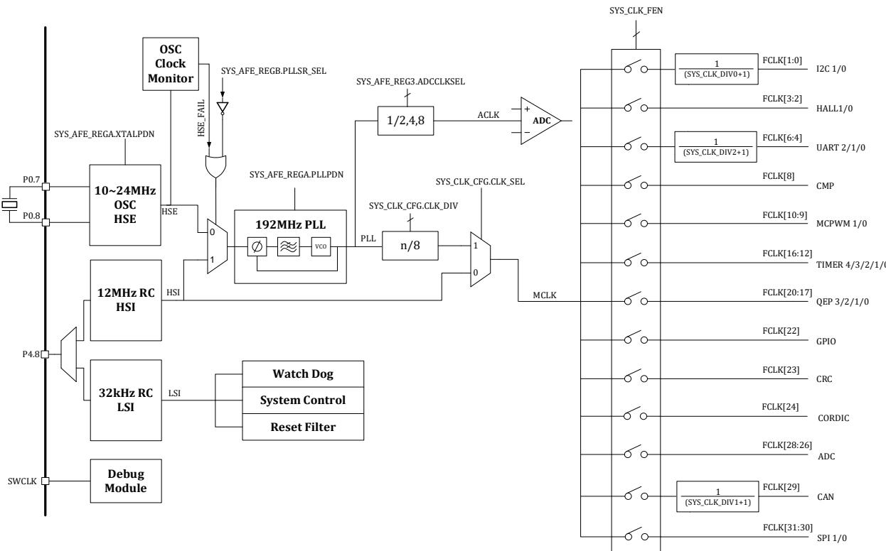  
图 6-1 时钟架构

为了保证系统可靠工作，时钟系统有防止时钟被误操作关闭的机制。如当 PLL 被用作系统工作主时钟时，PLL 本身无法被关闭，作为 PLL 参考时钟的 HSI 无法被软件关闭；32kHz LSI 时钟上电即工作，且无法关闭。SWCLK 由调试器提供，时钟频率取决于上位机调试界面的设定。

为便于调试和出厂校正，高速 RC 时钟 HSI 和低速时钟 LSI 可以通过配置 GPIO 的第二功能通过芯片管脚输出观测。

## 6.2 复位

## 6.2.1 复位源

芯片的复位包括硬件复位与软件复位。

## 6.2.1.1 硬件复位

如表 6-3 所示，系统包括 4 个硬件复位源，产生的复位均为芯片全局复位，复位产生后芯片程序计数器回到 0 地址，所有寄存器恢复到默认值。4 个硬件复位均为低电平有效。

表 6-3 系统复位源

<table><tr><td>名称</td><td>来源</td><td>说明</td></tr><tr><td>LPORn</td><td>内部1.2V电源管理</td><td>监控1.2V数字电源,低于0.9V时产生复位</td></tr><tr><td>HPORn</td><td>内部3.3V电源管理</td><td>监控3.3V电源,低于1.8V时产生复位</td></tr><tr><td>RSTn</td><td>外部按键</td><td>外部RC组成按键复位电路</td></tr><tr><td>IWDTn</td><td>独立看门狗</td><td>使用LSI时钟进行计数,如果不进行喂狗则定时产生复位,复位间隔可配置</td></tr><tr><td>WWDTn</td><td>窗口看门狗</td><td>使用系统高速时钟进行计数,如果不进行喂狗则定时产生复位,复位间隔可配置</td></tr></table>

## 6.2.1.1.1 硬件复位架构

LPORn/HPORn 来自内部模拟电路，RSTn 来自外部按键。IWDTn 为独立看门狗复位，使用 32kHz LSI 时钟，芯片上电后默认开启，即使在晶振停振或 PLL 未工作时 IWDTn 也可以产生复位信号。WWDTn 为窗口看门狗复位信号，使用系统高速时钟进行计数，通常为 PLL 主时钟，主要用于对复位时间间隔有精确要求的应用场景。IWDTn 和 WWDTn 信号在调试模式下可以被禁用，通过 SYS\_DBG\_CFG 进行设置。

所有复位信号经过滤波展宽预处理后，形成一个全局复位信号，对全芯片进行复位。FLASH 不受复位信号的影响。但是 RAM 在 LPORn/HPORn 复位信号产生时会丢失存储的数据，其他复位信号对 RAM 不会产生影响。

P0.6 引脚宽度小于 32us 的复位脉冲会被滤除，要求可靠复位宽度大于 200us。

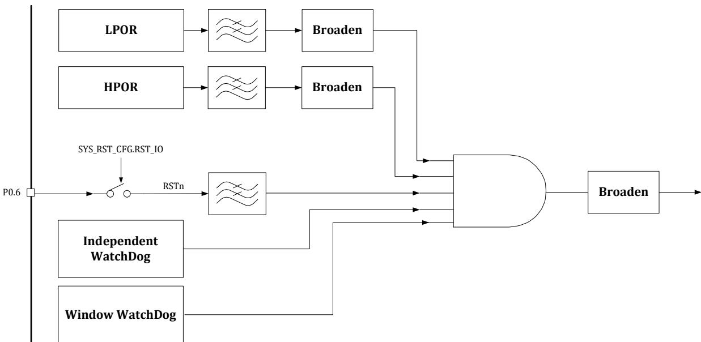  
图 6-2 复位架构

## 6.2.1.1.2 硬件复位记录

在 PMU 功耗管理模块中，AON\_EVT\_RCD 寄存器用于保存包括硬件复位在内的各种事件记录，当某个硬件复位发生后，AON\_EVT\_RCD 对应位置位。AON\_EVT\_RCD 寄存器本身只能被 LPORn 复位信号复位，通过向 AON\_EVT\_RCD 寄存器写入 0xCA40 可以清空 AON\_EVT\_RCD 记录，复位记录可以方便地了解是否发生以及发生过何种复位。

## 6.2.1.2 软件复位

CPU 的软复位操作可以使程序计数器(PC: Program Counter)回到 0 地址，但对所有外设中的寄存器没有影响。

在集成开发环境(IDE: Integrated Development Environment)中的调试模式下，点击 Reset 与 CPU 软复位操作作用相同，仅仅使得 PC 回到 0 地址，对外设中的寄存器没有影响。但如果在 bootloader 中进行了外设模块的软复位，则会使得外设寄存器被复位为默认值。具体 bootloader 实现请咨询芯片供应商。

部分外设模块有模块级软复位，可以使用 SYS\_SFT\_RST 寄存器进行复位，写入对应的位，可以将模块状态机恢复到初始状态，同时将模块的寄存器恢复到默认值，详见 6.3.9。

## 6.2.2 复位作用域

表 6-4 复位作用域

<table><tr><td>复位源</td><td>作用域</td></tr><tr><td>LPORn</td><td>内部1.5V电源管理,全局复位</td></tr><tr><td>HPOR</td><td>内部3.3V电源管理,全局复位,除极少数寄存器</td></tr><tr><td>RSTn</td><td>外部按键,全局复位,除极少数寄存器</td></tr><tr><td>IWDTn</td><td>独立看门狗,全局复位,除独立看门狗模块和极少数寄存器</td></tr><tr><td>WWDTn</td><td>窗口看门狗,全局复位,除独立看门狗模块和极少数寄存器</td></tr><tr><td>SYS_SFT_RST.SPI1_SFT_RST</td><td>SPI1</td></tr><tr><td>SYS_SFT_RST.SPI0_SFT_RST</td><td>SPI0</td></tr><tr><td>SYS_SFT_RST.CAN_SFT_RST</td><td>CAN</td></tr><tr><td>SYS_SFT_RST.ADC2_SFT_RST</td><td>ADC2数字接口模块</td></tr><tr><td>SYS_SFT_RST.ADC1_SFT_RST</td><td>ADC1数字接口模块</td></tr><tr><td>SYS_SFT_RST.ADC0_SFT_RST</td><td>ADC0数字接口模块</td></tr><tr><td>SYS_SFT_RST.CORDIC_SFT_RST</td><td>CORDIC</td></tr><tr><td>SYS_SFT_RST.CRC_SFT_RST</td><td>CRC</td></tr><tr><td>SYS_SFT_RST.GPIO_SFT_RST</td><td>GPIO</td></tr><tr><td>SYS_SFT_RST.QEP3_SFT_RST</td><td>QEP3</td></tr><tr><td>SYS_SFT_RST.QEP2_SFT_RST</td><td>QEP2</td></tr><tr><td>SYS_SFT_RST.QEP1_SFT_RST</td><td>QEP1</td></tr><tr><td>SYS_SFT_RST.QEP0_SFT_RST</td><td>QEP0</td></tr><tr><td>SYS_SFT_RST.TIMER4_SFT_RST</td><td>TIMER4</td></tr><tr><td>SYS_SFT_RST.TIMER3_SFT_RST</td><td>TIMER3</td></tr><tr><td>SYS_SFT_RST.TIMER2_SFT_RST</td><td>TIMER2</td></tr><tr><td>SYS_SFT_RST.TIMER1_SFT_RST</td><td>TIMER1</td></tr><tr><td>SYS_SFT_RST.TIMER0_SFT_RST</td><td>TIMER0</td></tr><tr><td>SYS_SFT_RST.MCPWM1_SFT_RST</td><td>MCPWM1</td></tr><tr><td>SYS_SFT_RST.MCPWM0_SFT_RST</td><td>MCPWM0</td></tr><tr><td>SYS_SFT_RST.CMP_SFT_RST</td><td>比较器数字接口模块</td></tr><tr><td>SYS_SFT_RST.UART2_SFT_RST</td><td>UART2</td></tr><tr><td>SYS_SFT_RST.UART1_SFT_RST</td><td>UART1</td></tr><tr><td>SYS_SFT_RST.UART0_SFT_RST</td><td>UART0</td></tr><tr><td>SYS_SFT_RST.HALL1_SFT_RST</td><td>HALL1</td></tr><tr><td>SYS_SFT_RST.HALL0_SFT_RST</td><td>HALL0</td></tr><tr><td>SYS_SFT_RST.I2C1_SFT_RST</td><td>I2C1</td></tr><tr><td>SYS_SFT_RST.I2C0_SFT_RST</td><td>I2C0</td></tr><tr><td>NVIC_SystemReset();</td><td>CPU软复位,仅复位CPU内核,将PC重置为0,所有外设寄存器值仍然维持。</td></tr></table>

其中用于控制 P0[6]作为 GPIO 使用还是作为外部复位脚使用的 SYS\_IO\_CFG.RST\_IO，以及复位记录寄存器 AON\_EVT\_RCD 只受 LPOR 复位。

全局复位会复位全芯片寄存器，包括 CPU 内核寄存器以及所有外设寄存器，除上述极少数寄存器。

由于 CPU 软复位仅仅复位 CPU 内核，而不复位外设寄存器，因此建议重新烧录程序后使用掉电重新上电或外部复位的方式重置外设寄存器。

Flash 存储内容，SRAM 存储内容不受复位影响。

## 6.3 寄存器

## 6.3.1 地址分配

系统模块寄存器基地址为 0x40019800。

表 6-5 系统控制寄存器

<table><tr><td>名称</td><td>偏移</td><td>说明</td></tr><tr><td>SYS_CLK_CFG</td><td>0x80</td><td>时钟控制寄存器</td></tr><tr><td>SYS_IO_CFG</td><td>0x84</td><td>IO 控制寄存器</td></tr><tr><td>SYS_DBG_CFG</td><td>0x88</td><td>Debug 控制寄存器</td></tr><tr><td>SYS_CLK_DIV0</td><td>0x90</td><td>外设时钟分频寄存器 0</td></tr><tr><td>SYS_CLK_DIV1</td><td>0x94</td><td>外设时钟分频寄存器 1</td></tr><tr><td>SYS_CLK_DIV2</td><td>0x98</td><td>外设时钟分频寄存器 2</td></tr><tr><td>SYS_CLK_FEN</td><td>0x9C</td><td>外设时钟门控寄存器</td></tr><tr><td>SYS_SFT_RST</td><td>0xA4</td><td>软复位寄存器</td></tr><tr><td>SYS_PROTECT</td><td>0xA8</td><td>写保护寄存器</td></tr><tr><td>SYS_CACHE_CFG</td><td>0xAC</td><td>Cache 控制寄存器</td></tr><tr><td>SYS_MEM_CFG</td><td>0xC4</td><td>Memory 控制寄存器</td></tr><tr><td>SYS_FLSE</td><td>0xD0</td><td>On-Chip FLASH 擦除控制寄存器</td></tr><tr><td>SYS_FLSP</td><td>0xD4</td><td>On-Chip FLASH 编程控制寄存器</td></tr></table>

## 6.3.2 SYS\_CLK\_CFG 时钟控制寄存器

地址：0x4001\_9880

复位值：0x0

表 6-6 时钟控制寄存器 SYS\_CLK\_CFG

<table><tr><td rowspan="3"></td><td>XTAL_FAILED</td><td>XTAL_FAIL</td><td rowspan="3"></td><td>CLK_SEL</td><td>CLK_DIV</td></tr><tr><td>RW1C</td><td>RO</td><td>RW</td><td>RW</td></tr><tr><td>1</td><td>0</td><td>0</td><td>0</td></tr></table>

<table><tr><td>位置</td><td>位名称</td><td>说明</td></tr><tr><td>[31:14]</td><td></td><td>未使用</td></tr><tr><td>[13]</td><td>HSE_FAILED</td><td>晶振时钟在被开启后是否停振过如果晶振有停振情况,则该位置位,即使晶体后续恢复振荡,仍保持记录为1。写1清零</td></tr><tr><td>[12]</td><td>HSE_FAIL</td><td>晶振时钟当前是否已经停振0:外部晶体当前正常工作1:外部晶体当前已经停振</td></tr><tr><td>[11:10]</td><td></td><td>未使用</td></tr><tr><td>[9:8]</td><td>CLK_SEL</td><td>系统时钟MCLK的来源选择信号。默认选择HRC0:HRC1:PLL2:LRC3:XTAL注意,PLL/XTAL在上电后默认关闭,需要软件来开启。</td></tr><tr><td>[7:0]</td><td>CLK_DIV</td><td>PLL输出分频控制,默认为0x00:1/8分频0x01:1/8分频0x11:1/4分频0x55:1/2分频0xFF:1/1分频不推荐其它配置值。</td></tr></table>

当 CLK\_SEL=0 时，MCLK 选择 CLK\_HS 时钟，此时 SYS\_CLK\_CFG[7:0] 的分频系数无效。最终输出的系统时钟频率即为 CLK\_HS 时钟频率。根据 SYS\_AFE\_REGB.PLLSR\_SEL，当 SYS\_AFE\_REGB.PLLSR\_SEL=0 时，CLK\_HS 为芯片内部 12MHz RCH 时钟 HSI，当 SYS\_AFE\_REGB.PLLSR\_SEL=1 时，CLK\_HS 为晶体时钟。

## 6.3.3 SYS\_IO\_CFG IO 控制寄存器

地址：0x4001\_9884

复位值：0x02

表 6-7 IO 控制寄存器 SYS\_IO\_CFG

<table><tr><td rowspan="3"></td><td>TRACEMUX</td><td>SWDMUX</td><td>RST_IO</td><td rowspan="3"></td><td>IO_DS</td></tr><tr><td>RW</td><td>RW</td><td>RW</td><td>RW</td></tr><tr><td>0</td><td>0</td><td>0</td><td>2</td></tr></table>

<table><tr><td>位置</td><td>位名称</td><td>说明</td></tr><tr><td>[31:8]</td><td></td><td>未使用</td></tr><tr><td>[7]</td><td>TRACEMUX</td><td>TRACE复用控制信号,默认配置为TRACE功能0:P1[3:0],P0[15:14]作为正常GPIO使用1:P1[3]复用SWV,{P0[15],P1[0:2]}复用为TRACEDATA[3:0],P0[14]复用为TRACECLK</td></tr><tr><td>[6]</td><td>SWDMUX</td><td>JTAG/SWD复用控制信号,默认配置为JTAG/SWD0:IO功能为JTAG/SWDP0.9----&gt;nTRSTP0.10----&gt;SWDIOTMSP0.11----&gt;TDIP0.12----&gt;SWCLKTCLKP0.13----&gt;TDO1:P0[13:9]作为正常GPIO使用</td></tr><tr><td>[5]</td><td>RST_IO</td><td>RSTn/P0.6复用控制信号,默认配置为RSTn0:RSTn1:P0.6注意,上电后默认是RSTn,后续软件可使能此位,RSTn功能失效</td></tr><tr><td>[4]</td><td>POR_FIL</td><td>未对用户开放此寄存器使用SYS_AFE_REG6[11]作为复位,所以需要先配置SYS_AFE_REG6[11]=1,然后才可以使能POR滤波,POR滤波对LPOR和HPOR均有效</td></tr><tr><td>[3:2]</td><td></td><td>未使用</td></tr><tr><td>[1:0]</td><td>IO_DS</td><td>IO驱动能力选择0: 4.5mA1: 9mA2: 13.5mA3: 18mA上电默认驱动能力为 13.5mA</td></tr></table>

为了安全起见，上电后 16ms 内，SWD 的 IO 不能切换为 GPIO 功能，只能作为 SWD 使用。即使软件改写了 SYS\_IO\_CFG [6] 将不起作用，需要在 16ms 之后再次对 SYS\_IO\_CFG [6] 改写。现象为：在 16ms 内，软件可以向 SYS\_IO\_CFG[6] 1'b1，但读回该 bit 仍为 1'b0，如果经过 16ms 后再次写入 1'b1，则可读回 1'b1。即在上电后的 16ms 内，软件 SYS\_IO\_CFG[6] 写入 1'b1 无效，上电 16ms 后，软件对 SYS\_IO\_CFG[6] 写入 1'b1 才有效。这是为了防止应用上上电即切换 SWD 功能为 GPIO，导致芯片后续无法通过 SWD 进行擦写烧录 flash。

注意，SWD/Jtag IO 切换为 GPIO 功能后，除非应用软件特殊设计，否则只能使用原厂下载器擦除下载程序。

## 6.3.4 SYS\_DBG\_CFG Debug 控制寄存器

地址：0x4001\_9888

复位值：0x40

表 6-8 Debug 控制寄存器 SYS\_DBG\_CFG

<table><tr><td>31</td><td>30</td><td>29</td><td>28</td><td>27</td><td>26</td><td>25</td><td>24</td><td>23</td><td>22</td><td>21</td><td>20</td><td>19</td><td>18</td><td>17</td><td>16</td></tr><tr><td></td><td></td><td></td><td></td><td></td><td></td><td></td><td></td><td></td><td></td><td></td><td></td><td></td><td></td><td></td><td></td></tr><tr><td></td><td></td><td></td><td></td><td></td><td></td><td></td><td></td><td></td><td></td><td></td><td></td><td></td><td></td><td></td><td></td></tr><tr><td></td><td></td><td></td><td></td><td></td><td></td><td></td><td></td><td></td><td></td><td></td><td></td><td></td><td></td><td></td><td></td></tr><tr><td></td><td></td><td></td><td></td><td></td><td></td><td></td><td></td><td></td><td></td><td></td><td></td><td></td><td></td><td></td><td></td></tr><tr><td></td><td></td><td></td><td></td><td></td><td></td><td></td><td></td><td></td><td></td><td></td><td></td><td></td><td></td><td></td><td></td></tr></table>

<table><tr><td>SW_IRQ</td><td>SFT_RST_PERI</td><td rowspan="3"></td><td>DBG_TIM4_STOP</td><td>DBG_TIM3_STOP</td><td>DBG_TIM2_STOP</td><td>DBG_TIM1_STOP</td><td>DBG_TIM0_STOP</td><td rowspan="3"></td><td>DBG_IWDG_STOP</td><td>DBG_WWDG_STOP</td><td rowspan="3"></td><td>DBG_STDBY</td><td>DBG_STOP</td><td>DBG_SLP</td></tr><tr><td>RW1C</td><td>RW</td><td>RW</td><td>RW</td><td>RW</td><td>RW</td><td>RW</td><td>RW</td><td>RW</td><td>RW</td><td>RW</td><td>RW</td></tr><tr><td>0</td><td>0</td><td>0</td><td>0</td><td>0</td><td>0</td><td>0</td><td>0</td><td>0</td><td>0</td><td>0</td><td>0</td></tr></table>

<table><tr><td>位置</td><td>位名称</td><td>说明</td></tr><tr><td>[31:16]</td><td>SW_IRQ_TRIG</td><td>向此位段写入 0x5AA5 触发软件中断,SW_IRQ 置 1</td></tr><tr><td>[15]</td><td>SW_IRQ</td><td>软件中断标志,对应中断号 30,写 1 清零。</td></tr><tr><td>[14]</td><td>SFT_RST_PERI</td><td>Debug软复位是否复位除Flash/SYS_AFE以外的外设寄存器</td></tr><tr><td>[13]</td><td></td><td>未使用</td></tr><tr><td>[12]</td><td>DBG_TIM4_STOP</td><td>调试模式下CPU halt状态Timer4停止1:Timer4在CPU halt状态时停止计数0:Timer4在CPU halt状态时继续计数</td></tr><tr><td>[11]</td><td>DBG_TIM3_STOP</td><td>调试模式下CPU halt状态Timer3停止1:Timer3在CPU halt状态时停止计数0:Timer3在CPU halt状态时继续计数</td></tr><tr><td>[10]</td><td>DBG_TIM2_STOP</td><td>调试模式下CPU halt状态Timer2停止1:Timer2在CPU halt状态时停止计数0:Timer2在CPU halt状态时继续计数</td></tr><tr><td>[9]</td><td>DBG_TIM1_STOP</td><td>调试模式下CPU halt状态Timer1停止1:Timer1在CPU halt状态时停止计数0:Timer1在CPU halt状态时继续计数</td></tr><tr><td>[8]</td><td>DBG_TIM0_STOP</td><td>调试模式下CPU halt状态Timer0停止1:Timer0在CPU halt状态时停止计数0:Timer0在CPU halt状态时继续计数</td></tr><tr><td>[7:6]</td><td></td><td>未使用</td></tr><tr><td>[5]</td><td>DBG_IWDG_STOP</td><td>调试模式下CPU halt状态独立看门狗停止1:独立看门狗在CPU halt状态时停止计数0:独立看门狗在CPU halt状态时继续计数</td></tr><tr><td>[4]</td><td>DBG_WWDG_STOP</td><td>调试模式下CPU halt状态窗口看门狗停止1:窗口看门狗在CPU halt状态时停止计数0:窗口看门狗在CPU halt状态时继续计数</td></tr><tr><td>[3]</td><td></td><td>未使用</td></tr><tr><td>[2]</td><td>DBG_STDBY</td><td>调试StandBy模式0:(FCLK=Off,HCLK=Off)整个数字电路进入关电状态(除PMU)。从软件角度看,退出Standby休眠与上电复位相同,只是AON_EVT_RCD会指示休眠唤醒等状态位1:(FCLK=On,HCLK=On)如果设置了DBG_STDBY=1,数字部分不会掉电,而且内部高速均不关闭。但PMU仍会在退出休眠时产生复位信号,重新开始取指执行。使得执行过程与不设置DBG_STDBY时相同</td></tr><tr><td>[1]</td><td>DBG_STOP</td><td>调试STOP模式0:(FCLK=Off,HCLK=Off)在STOP模式下,时钟管理模块关闭HCLK和FCLK,即处理器时钟和所有外设时钟。当退出STOP模式时,时钟管理模块不经历复位,并保持原有配置,可以恢复到STOP模式前的时钟设置。在STOP模式中,所有外设寄存器均保持,因此退出后无需重新配置。1:(FCLK=On,HCLK=On)如果设置DBG_STOP为1,进入STOP模式后HCLK和FCLK均不被关闭。</td></tr><tr><td>[0]</td><td>DBG_SLP</td><td>调试睡眠模式0:(FCLK=On,HCLK=Off)在睡眠模式中,FCLK作为所有外设时钟,不关闭;HCLK作为CPU时钟,被关闭。在睡眠模式中,只有CPU时钟被暂时挂起,而所有外设包括系统时钟管理模块均保持原有配置状态。因此退出睡眠模式时,软件无需重新配置外设寄存器。1:(FCLK=On,HCLK=On)如果配置DBG_SLP为1,则当进入睡眠模式时,HCLK不会关闭。通过_WFI()/_WFE()指令可以令处理器进入睡眠模式</td></tr></table>

## 6.3.5 SYS\_CLK\_DIV0 外设时钟分频寄存器 0

地址：0x4001\_9890

复位值: 0x0

表 6-9 SYS\_CLK\_DIV0 外设时钟分频寄存器 0

<table><tr><td>15</td><td>14</td><td>13</td><td>12</td><td>11</td><td>10</td><td>9</td><td>8</td><td>7</td><td>6</td><td>5</td><td>4</td><td>3</td><td>2</td><td>1</td><td>0</td></tr><tr><td></td><td></td><td></td><td></td><td></td><td></td><td></td><td></td><td></td><td></td><td></td><td></td><td></td><td></td><td></td><td></td></tr><tr><td></td><td></td><td></td><td></td><td></td><td></td><td></td><td></td><td></td><td></td><td></td><td></td><td></td><td></td><td></td><td></td></tr><tr><td></td><td></td><td></td><td></td><td></td><td></td><td></td><td></td><td></td><td></td><td></td><td></td><td></td><td></td><td></td><td></td></tr><tr><td></td><td></td><td></td><td></td><td></td><td></td><td></td><td></td><td></td><td></td><td></td><td></td><td></td><td></td><td></td><td></td></tr></table>

<table><tr><td>位置</td><td>位名称</td><td>说明</td></tr><tr><td>[31:16]</td><td></td><td>未使用</td></tr><tr><td>[15:0]</td><td>DIV0</td><td>I2C0/I2C1 工作时钟=MCLK/(CLK_DIV0+1)。其中 MCLK 由 SYS_CLK_CFG 分频系数决定</td></tr></table>

## 6.3.6 SYS\_CLK\_DIV1 外设时钟分频寄存器 1

地址：0x4001\_9894

复位值：0x0

表 6-10 SYS\_CLK\_DIV1 外设时钟分频寄存器 1

<table><tr><td>15</td><td>14</td><td>13</td><td>12</td><td>11</td><td>10</td><td>9</td><td>8</td><td>7</td><td>6</td><td>5</td><td>4</td><td>3</td><td>2</td><td>1</td><td>0</td></tr><tr><td></td><td></td><td></td><td></td><td></td><td></td><td></td><td>DIV0</td><td></td><td></td><td></td><td></td><td></td><td></td><td></td><td></td></tr><tr><td></td><td></td><td></td><td></td><td></td><td></td><td></td><td>RW</td><td></td><td></td><td></td><td></td><td></td><td></td><td></td><td></td></tr><tr><td></td><td></td><td></td><td></td><td></td><td></td><td></td><td>0</td><td></td><td></td><td></td><td></td><td></td><td></td><td></td><td></td></tr></table>

<table><tr><td>位置</td><td>位名称</td><td>说明</td></tr><tr><td>[31:16]</td><td></td><td>未使用</td></tr><tr><td>[15:0]</td><td>DIV1</td><td>CAN 工作时钟=MCLK/(CLK_DIV1+1)。其中 MCLK 由 SYS_CLK_CFG 分频系数决定</td></tr></table>

## 6.3.7 SYS\_CLK\_DIV2 外设时钟分频寄存器 2

地址：0x4000\_0098

复位值：0x0

表 6-11 SYS\_CLK\_DIV2 外设时钟分频寄存器 2

<table><tr><td>15</td><td>14</td><td>13</td><td>12</td><td>11</td><td>10</td><td>9</td><td>8</td><td>7</td><td>6</td><td>5</td><td>4</td><td>3</td><td>2</td><td>1</td><td>0</td></tr><tr><td></td><td></td><td></td><td></td><td></td><td></td><td></td><td></td><td></td><td></td><td></td><td></td><td></td><td></td><td></td><td></td></tr><tr><td></td><td></td><td></td><td></td><td></td><td></td><td></td><td></td><td></td><td></td><td></td><td></td><td></td><td></td><td></td><td></td></tr><tr><td></td><td></td><td></td><td></td><td></td><td></td><td></td><td></td><td></td><td></td><td></td><td></td><td></td><td></td><td></td><td></td></tr><tr><td></td><td></td><td></td><td></td><td></td><td></td><td></td><td></td><td></td><td></td><td></td><td></td><td></td><td></td><td></td><td></td></tr></table>

<table><tr><td>位置</td><td>位名称</td><td>说明</td></tr><tr><td>[31:16]</td><td></td><td>未使用</td></tr><tr><td>[15:0]</td><td>DIV2</td><td>UART 工作时钟=MCLK/(CLK_DIV2+1)。UART0/UART1/UART2 共享此分频配置,波特率根据 UART 波特率寄存器进一步分频,其中 MCLK 由 SYS_CLK_CFG 分频系数决定。</td></tr></table>

## 6.3.8 SYS\_CLK\_FEN 外设时钟门控寄存器

地址：0x4001\_989C

复位值：0x0

表 6-12 SYS\_CLK\_FEN 外设时钟门控寄存器

<table><tr><td>31</td><td>30</td><td>29</td><td>28</td><td>27</td><td>26</td><td>25</td><td>24</td><td>23</td><td>22</td><td>21</td><td>20</td><td>19</td><td>18</td><td>17</td><td>16</td></tr><tr><td>SPI1_CLK_EN</td><td>SPI0_CLK_EN</td><td>CAN_CLK_EN</td><td>ADC2_CLK_EN</td><td>ADC1_CLK_EN</td><td>ADC0_CLK_EN</td><td>FMAC_CLK_EN</td><td>CORDIC_CLK_EN</td><td>CRC_CLK_EN</td><td>GPIO_CLK_EN</td><td rowspan="3"></td><td>QEP3_CLK_EN</td><td>QEP2_CLK_EN</td><td>QEP1_CLK_EN</td><td>QEP0_CLK_EN</td><td>TIMER4_CLK_EN</td></tr><tr><td>RW</td><td>RW</td><td>RW</td><td>RW</td><td>RW</td><td>RW</td><td>RW</td><td>RW</td><td>RW</td><td>RW</td><td>RW</td><td>RW</td><td>RW</td><td>RW</td><td>RW</td></tr><tr><td>0</td><td>0</td><td>0</td><td>0</td><td>0</td><td>0</td><td>0</td><td>0</td><td>0</td><td>0</td><td>0</td><td>0</td><td>0</td><td>0</td><td>0</td></tr><tr><td>15</td><td>14</td><td>13</td><td>12</td><td>11</td><td>10</td><td>9</td><td>8</td><td>7</td><td>6</td><td>5</td><td>4</td><td>3</td><td>2</td><td>1</td><td>0</td></tr><tr><td>TIMER3_CLK_EN</td><td>TIMER2_CLK_EN</td><td>TIMER1_CLK_EN</td><td>TIMER0_CLK_EN</td><td rowspan="3"></td><td>MCPWM1_CLK_EN</td><td>MCPWM0_CLK_EN</td><td>CMP_CLK_EN</td><td rowspan="3"></td><td>UART2_CLK_EN</td><td>UART1_CLK_EN</td><td>UART0_CLK_EN</td><td>HALL1_CLK_EN</td><td>HALL0_CLK_EN</td><td>I2C1_CLK_EN</td><td>I2CO_CLK_EN</td></tr><tr><td>RW</td><td>RW</td><td>RW</td><td>RW</td><td>RW</td><td>RW</td><td>RW</td><td>RW</td><td>RW</td><td>RW</td><td>RW</td><td>RW</td><td>RW</td><td>RW</td></tr><tr><td>0</td><td>0</td><td>0</td><td>0</td><td>0</td><td>0</td><td>0</td><td>0</td><td>0</td><td>0</td><td>0</td><td>0</td><td>0</td><td>0</td></tr></table>

<table><tr><td>位置</td><td>位名称</td><td>说明</td></tr><tr><td>[31]</td><td>SPI1_CLK_EN</td><td>SPI1 模块时钟控制信号,默认关闭 SPI0 模块时钟1:使能 SPI0 模块时钟0:关闭 SPI0 模块时钟</td></tr><tr><td>[30]</td><td>SPI0_CLK_EN</td><td>SPI0 模块时钟控制信号,默认关闭 SPI0 模块时钟1:使能 SPI0 模块时钟0:关闭 SPI0 模块时钟</td></tr><tr><td>[29]</td><td>CAN_CLK_EN</td><td>CAN 模块时钟控制信号,默认关闭 CAN 模块时钟1:使能 CAN 模块时钟0:关闭 CAN 模块时钟</td></tr><tr><td>[28]</td><td>ADC2_CLK_EN</td><td>ADC2 模块时钟控制信号,默认关闭 ADC2 模块时钟1:使能 ADC2 模块时钟0:关闭 ADC2 模块时钟</td></tr><tr><td>[27]</td><td>ADC1_CLK_EN</td><td>ADC1 模块时钟控制信号,默认关闭 ADC1 模块时钟1:使能 ADC1 模块时钟0:关闭 ADC1 模块时钟</td></tr><tr><td>[26]</td><td>ADC0_CLK_EN</td><td>ADC0 模块时钟控制信号,默认关闭 ADC0 模块时钟1:使能 ADC0 模块时钟0:关闭 ADC0 模块时钟</td></tr><tr><td>[25]</td><td></td><td>未使用</td></tr><tr><td>[24]</td><td>CORDIC_CLK_EN</td><td>CORDIC 模块时钟控制信号,默认关闭 CORDIC 模块时钟1:使能 CORDIC 模块时钟0:关闭 CORDIC 模块时钟</td></tr><tr><td>[23]</td><td>CRC_CLK_EN</td><td>CRC 模块时钟控制信号,默认关闭 CRC 模块时钟1:使能 CRC 模块时钟0:关闭 CRC 模块时钟</td></tr><tr><td>[22]</td><td>GPIO_CLK_EN</td><td>GPIO 模块时钟控制信号,默认关闭 GPIO 模块时钟1:使能 GPIO 模块时钟0:关闭 GPIO 模块时钟</td></tr><tr><td>[21]</td><td></td><td>未使用</td></tr><tr><td>[20]</td><td>QEP3_CLK_EN</td><td>QEP3 模块时钟控制信号,默认关闭 QEP3 模块时钟1:使能 QEP3 模块时钟0:关闭 QEP3 模块时钟</td></tr><tr><td>[19]</td><td>QEP2_CLK_EN</td><td>QEP2 模块时钟控制信号,默认关闭 QEP2 模块时钟1:使能 QEP2 模块时钟0:关闭 QEP2 模块时钟</td></tr><tr><td>[18]</td><td>QEP1_CLK_EN</td><td>QEP1 模块时钟控制信号,默认关闭 QEP1 模块时钟1:使能 QEP1 模块时钟0:关闭 QEP1 模块时钟</td></tr><tr><td>[17]</td><td>QEP0_CLK_EN</td><td>QEP0 模块时钟控制信号,默认关闭 QEP0 模块时钟1:使能 QEP0 模块时钟0:关闭 QEP0 模块时钟</td></tr><tr><td>[16]</td><td>TIMER4_CKL_EN</td><td>TIMER4 模块时钟控制信号,默认关闭 TIMER4 模块时钟1:使能 TIMER4 模块时钟0:关闭 TIMER4 模块时钟</td></tr><tr><td>[15]</td><td>TIMER3_CKL_EN</td><td>TIMER3 模块时钟控制信号,默认关闭 TIMER3 模块时钟1:使能 TIMER3 模块时钟0:关闭 TIMER3 模块时钟</td></tr><tr><td>[14]</td><td>TIMER2_CKL_EN</td><td>TIMER2 模块时钟控制信号,默认关闭 TIMER2 模块时钟1:使能 TIMER2 模块时钟0:关闭 TIMER2 模块时钟</td></tr><tr><td>[13]</td><td>TIMER1_CKL_EN</td><td>TIMER1 模块时钟控制信号,默认关闭 TIMER1 模块时钟1:使能 TIMER1 模块时钟0:关闭 TIMER1 模块时钟</td></tr><tr><td>[12]</td><td>TIMER0_CKL_EN</td><td>TIMER0 模块时钟控制信号,默认关闭 TIMER0 模块时钟1:使能 TIMER0 模块时钟0:关闭 TIMER0 模块时钟</td></tr><tr><td>[11]</td><td></td><td>未使用</td></tr><tr><td>[10]</td><td>MCPWM1_CKL_EN</td><td>MCPWM1 模块时钟控制信号,默认关闭 MCPWM1 模块时钟1:使能 MCPWM1 模块时钟0:关闭 MCPWM1 模块时钟</td></tr><tr><td>[9]</td><td>MCPWM0_CKL_EN</td><td>MCPWM0 模块时钟控制信号,默认关闭 MCPWM0 模块时钟1:使能 MCPWM0 模块时钟0:关闭 MCPWM0 模块时钟</td></tr><tr><td>[8]</td><td>CMP_CKL_EN</td><td>CMP 模块时钟控制信号,默认关闭 CMP 模块时钟1:使能 CMP 模块时钟0:关闭 CMP 模块时钟</td></tr><tr><td>[7]</td><td></td><td>未使用</td></tr><tr><td>[6]</td><td>UART2_CLK_EN</td><td>UART2 模块时钟控制信号,默认关闭 UART2 模块时钟1:使能 UART2 模块时钟0:关闭 UART2 模块时钟</td></tr><tr><td>[5]</td><td>UART1_CLK_EN</td><td>UART1 模块时钟控制信号,默认关闭 UART1 模块时钟1:使能 UART1 模块时钟0:关闭 UART1 模块时钟</td></tr><tr><td>[4]</td><td>UART0_CLK_EN</td><td>UART0 模块时钟控制信号,默认关闭 UART0 模块时钟1:使能 UART0 模块时钟0:关闭 UART0 模块时钟</td></tr><tr><td>[3]</td><td>HALL1_CLK_EN</td><td>HALL1 模块时钟控制信号,默认关闭 HALL1 模块时钟1:使能 HALL1 模块时钟0:关闭 HALL1 模块时钟</td></tr><tr><td>[2]</td><td>HALLO_CLK_EN</td><td>HALLO 模块时钟控制信号,默认关闭 HALLO 模块时钟1:使能 HALLO 模块时钟0:关闭 HALLO 模块时钟</td></tr><tr><td>[0]</td><td>I2C1_CLK_EN</td><td>I2C1 模块时钟控制信号,默认关闭 I2C1 模块时钟1:使能 I2C1 模块时钟0:关闭 I2C1 模块时钟</td></tr><tr><td>[0]</td><td>I2C0_CLK_EN</td><td>I2C0 模块时钟控制信号,默认关闭 I2C0 模块时钟1:使能 I2C0 模块时钟0:关闭 I2C0 模块时钟</td></tr></table>

注意，上述每个模块的时钟门控，只控制各模块的工作时钟。即使不开启各自模块的时钟，也不影响软件访问各自模块的配置寄存器。

## 6.3.9 SYS\_SFT\_RST 软复位寄存器

地址：0x4001\_98A4

复位值：0x0

表 6-13 软复位寄存器 SYS\_SFT\_RST

<table><tr><td>31</td><td>30</td><td>29</td><td>28</td><td>27</td><td>26</td><td>25</td><td>24</td><td>23</td><td>22</td><td>21</td><td>20</td><td>19</td><td>18</td><td>17</td><td>16</td></tr><tr><td>SP11_SFT_RST</td><td>SP10_SFT_RST</td><td>CAN_SFT_RST</td><td>ADC2_SFT_RST</td><td>ADC1_SFT_RST</td><td>ADC0_SFT_RST</td><td>FMAC_SFT_RST</td><td>CORDIC_SFT_RST</td><td>CRC_SFT_RST</td><td>GPIO_SFT_RST</td><td>DMA_SFT_RST</td><td>QEP3_SFT_RST</td><td>QEP2_SFT_RST</td><td>QEP1_SFT_RST</td><td>QEP0_SFT_RST</td><td>TIMER4_SFT_RST</td></tr><tr><td>WO</td><td>WO</td><td>WO</td><td>WO</td><td>WO</td><td>WO</td><td>WO</td><td>WO</td><td>WO</td><td>WO</td><td>WO</td><td>WO</td><td>WO</td><td>WO</td><td>WO</td><td>WO</td></tr><tr><td>0</td><td>0</td><td>0</td><td>0</td><td>0</td><td>0</td><td>0</td><td>0</td><td>0</td><td>0</td><td>0</td><td>0</td><td>0</td><td>0</td><td>0</td><td>0</td></tr><tr><td>15</td><td>14</td><td>13</td><td>12</td><td>11</td><td>10</td><td>9</td><td>8</td><td>7</td><td>6</td><td>5</td><td>4</td><td>3</td><td>2</td><td>1</td><td>0</td></tr><tr><td>TIMER3_SFT_RST</td><td>TIMER2_SFT_RST</td><td>TIMER1_SFT_RST</td><td>TIMER0_SFT_RST</td><td rowspan="3"></td><td>MCPWM1_SFT_RST</td><td>MCPWMO_SFT_RST</td><td>CMP_SFT_RST</td><td rowspan="3"></td><td>UART2_SFT_RST</td><td>UART1_SFT_RST</td><td>UART0_SFT_RST</td><td>HALL1_SFT_RST</td><td>HALL0_SFT_RST</td><td>I2C1_SFT_RST</td><td>I2C0_SFT_RST</td></tr><tr><td>WO</td><td>WO</td><td>WO</td><td>WO</td><td>WO</td><td>WO</td><td>WO</td><td>WO</td><td>WO</td><td>WO</td><td>WO</td><td>WO</td><td>WO</td><td>WO</td></tr><tr><td>0</td><td>0</td><td>0</td><td>0</td><td>0</td><td>0</td><td>0</td><td>0</td><td>0</td><td>0</td><td>0</td><td>0</td><td>0</td><td>0</td></tr></table>

<table><tr><td>位置</td><td>位名称</td><td>说明</td></tr><tr><td>[31]</td><td>SPI1_SFT_RST</td><td>SPI1 模块软复位信号,默认不复位 SPI0 模块1:复位 SPI0 模块0:释放 SPI0 模块</td></tr><tr><td>[30]</td><td>SPI0_SFT_RST</td><td>SPI0 模块软复位信号,默认不复位 SPI0 模块1:复位 SPI0 模块0:释放 SPI0 模块</td></tr><tr><td>[29]</td><td>CAN_SFT_RST</td><td>CAN 模块软复位信号,默认不复位 CAN 模块1:复位 CAN 模块0:释放 CAN 模块</td></tr><tr><td>[28]</td><td>ADC2_SFT_RST</td><td>ADC2 模块软复位信号,默认不复位 ADC2 模块1:复位 ADC2 模块0:释放 ADC2 模块</td></tr><tr><td>[27]</td><td>ADC1_SFT_RST</td><td>ADC1 模块软复位信号,默认不复位 ADC1 模块1:复位 ADC1 模块0:释放 ADC1 模块</td></tr><tr><td>[26]</td><td>ADC0_SFT_RST</td><td>ADC0 模块软复位信号,默认不复位 ADC0 模块1:复位 ADC0 模块0:释放 ADC0 模块</td></tr><tr><td>[25]</td><td></td><td>未使用</td></tr><tr><td>[24]</td><td>CORDIC_SFT_RST</td><td>CORDIC 模块软复位信号,默认不复位 CORDIC 模块1:复位 CORDIC 模块0:释放 CORDIC 模块</td></tr><tr><td>[23]</td><td>CRC_SFT_RST</td><td>CRC 模块软复位信号,默认不复位 CRC 模块1:复位 CRC 模块0:释放 CRC 模块</td></tr><tr><td>[22]</td><td>GPIO_SFT_RST</td><td>GPIO 模块软复位信号,默认不复位 GPIO 模块1:复位 GPIO 模块0:释放 GPIO 模块</td></tr><tr><td>[21]</td><td>DMA_SFT_RST</td><td>DMA 模块软复位信号,默认不复位 DMA 模块1:复位 DMA 模块0:释放 DMA 模块</td></tr><tr><td>[20]</td><td>QEP3_SFT_RST</td><td>QEP3 模块软复位信号,默认不复位 QEP3 模块1:复位 QEP3 模块0:释放 QEP3 模块</td></tr><tr><td>[19]</td><td>QEP2_SFT_RST</td><td>QEP2 模块软复位信号,默认不复位 QEP2 模块1:复位 QEP2 模块0:释放 QEP2 模块</td></tr><tr><td>[18]</td><td>QEP1_SFT_RST</td><td>QEP1 模块软复位信号,默认不复位 QEP1 模块1:复位 QEP1 模块0:释放 QEP1 模块</td></tr><tr><td>[17]</td><td>QEP0_SFT_RST</td><td>QEP0 模块软复位信号,默认不复位 QEP0 模块1:复位 QEP0 模块0:释放 QEP0 模块</td></tr><tr><td>[16]</td><td>TIMER4_SFT_RST</td><td>TIMER4 模块软复位信号,默认不复位 TIMER4 模块1:复位 TIMER4 模块0:释放 TIMER4 模块</td></tr><tr><td>[15]</td><td>TIMER3_SFT_RST</td><td>TIMER3 模块软复位信号,默认不复位 TIMER3 模块1:复位 TIMER3 模块0:释放 TIMER3 模块</td></tr><tr><td>[14]</td><td>TIMER2_SFT_RST</td><td>TIMER2 模块软复位信号,默认不复位 TIMER2 模块1:复位 TIMER2 模块0:释放 TIMER2 模块</td></tr><tr><td>[13]</td><td>TIMER1_SFT_RST</td><td>TIMER1 模块软复位信号,默认不复位 TIMER1 模块1:复位 TIMER1 模块0:释放 TIMER1 模块</td></tr><tr><td>[12]</td><td>TIMER0_SFT_RST</td><td>TIMER0 模块软复位信号,默认不复位 TIMER0 模块1:复位 TIMER0 模块0:释放 TIMER0 模块</td></tr><tr><td>[11]</td><td></td><td>未使用</td></tr><tr><td>[10]</td><td>MCPWM1_SFT_RST</td><td>MCPWM1 模块软复位信号,默认不复位 MCPWM1 模块1:复位 MCPWM1 模块0:释放 MCPWM1 模块</td></tr><tr><td>[9]</td><td>MCPWM0_SFT_RST</td><td>MCPWM0 模块软复位信号,默认不复位 MCPWM0 模块1:复位 MCPWM0 模块0:释放 MCPWM0 模块</td></tr><tr><td>[8]</td><td>CMP_SFT_RST</td><td>CMP 模块软复位信号,默认不复位 CMP 模块1:复位 CMP 模块0:释放 CMP 模块</td></tr><tr><td>[7]</td><td></td><td>未使用</td></tr><tr><td>[6]</td><td>UART2_SFT_RST</td><td>UART2 模块软复位信号,默认不复位 UART2 模块1:复位 UART2 模块0:释放 UART2 模块</td></tr><tr><td>[5]</td><td>UART1_SFT_RST</td><td>UART1 模块软复位信号,默认不复位 UART1 模块1:复位 UART1 模块0:释放 UART1 模块</td></tr><tr><td>[4]</td><td>UART0_SFT_RST</td><td>UART0 模块软复位信号,默认不复位 UART0 模块1:复位 UART0 模块0:释放 UART0 模块</td></tr><tr><td>[3]</td><td>HALL1_SFT_RST</td><td>HALL1 模块软复位信号,默认不复位 HALL1 模块1:复位 HALL1 模块0:释放 HALL1 模块</td></tr><tr><td>[2]</td><td>HALL0_SFT_RST</td><td>HALL0 模块软复位信号,默认不复位 HALLO 模块1:复位 HALLO 模块0:释放 HALLO 模块</td></tr><tr><td>[1]</td><td>I2C1_SFT_RST</td><td>I2C1 模块软复位信号,默认不复位 I2C1 模块1:复位 I2C1 模块0:释放 I2C1 模块</td></tr><tr><td>[0]</td><td>I2C0_SFT_RST</td><td>I2C0 模块软复位信号,默认不复位 I2C0 模块1:复位 I2C0 模块0:释放 I2C0 模块</td></tr></table>

注意，模块软复位在 SYS\_SFT\_RST 对应位写入 1 后会保持在复位状态，需要再次写入 0 才能解除复位状态。由于复位信号内部会进行展宽。所以软复位释放后，至少等待 1 个总线周期后再对外设进行读写。可以通过插入\_asm("NOP");实现等待。

## 6.3.10 SYS\_PROTECT 写保护寄存器

地址：0x4001\_98A8

复位值：0x0

表 6-14 写保护寄存器 SYS\_PROTECT

<table><tr><td>15</td><td>14</td><td>13</td><td>12</td><td>11</td><td>10</td><td>9</td><td>8</td><td>7</td><td>6</td><td>5</td><td>4</td><td>3</td><td>2</td><td>1</td><td>0</td></tr><tr><td></td><td></td><td></td><td></td><td></td><td></td><td></td><td>PSW</td><td></td><td></td><td></td><td></td><td></td><td></td><td></td><td></td></tr><tr><td></td><td></td><td></td><td></td><td></td><td></td><td></td><td>WO</td><td></td><td></td><td></td><td></td><td></td><td></td><td></td><td></td></tr><tr><td></td><td></td><td></td><td></td><td></td><td></td><td></td><td>0</td><td></td><td></td><td></td><td></td><td></td><td></td><td></td><td></td></tr></table>

<table><tr><td>位置</td><td>位名称</td><td>说明</td></tr><tr><td>[31:16]</td><td></td><td>未使用</td></tr><tr><td>[15:0]</td><td>PSW</td><td>除SYS_AFE_DACx、SYS_AFE_DACx_AMC、SYS_AFE_DACx_DC(x=0,1)外,其他系统寄存器均受写保护,写入前需先写入密码解除写保护写入0x7A83,使能寄存器写操作写入其它值,禁止寄存器写操作</td></tr></table>

## 6.3.11 SYS\_CACHE\_CFG 缓存控制寄存器

地址：0x4001\_98AC

复位值：0x0

表 6-15 SYS\_CACHE\_CFG 缓存寄存器

<table><tr><td>15</td><td>14</td><td>13</td><td>12</td><td>11</td><td>10</td><td>9</td><td>8</td><td>7</td><td>6</td><td>5</td><td>4</td><td>3</td><td>2</td><td>1</td><td>0</td></tr><tr><td rowspan="3" colspan="15"></td><td>EN</td></tr><tr><td>RW</td></tr><tr><td>0</td></tr></table>

<table><tr><td>位置</td><td>位名称</td><td>说明</td></tr><tr><td>[31:1]</td><td></td><td>未使用</td></tr><tr><td>[0]</td><td>EN</td><td>Cache 使能,1:启用 Cache,0:禁用 Cache</td></tr></table>

## 6.3.12 SYS\_MEM\_CFG 内存控制寄存器

地址：0x4001\_98C4

复位值: 0x0

表 6-16 SYS\_MEM\_CFG 内存控制寄存器

<table><tr><td colspan="4">15 14 13 12 11 10 9 8 7 6 5 4 3 2 1 0</td></tr><tr><td rowspan="3"></td><td>REMAP</td><td>PCK_EN</td><td>PCK_ERR</td></tr><tr><td>RW</td><td>RW</td><td>RW1C</td></tr><tr><td>0</td><td>0</td><td>0</td></tr></table>

<table><tr><td>位置</td><td>位名称</td><td>说明</td></tr><tr><td>[31:10]</td><td></td><td>未使用</td></tr><tr><td>[9:8]</td><td>REMAP</td><td>地址空间重映射,用于将SRAM1/2/3映射至0x1FFFFFFF之前的地址空间做为Code RAM使用,Code RAM可用于存放关键代码,由于RAM访问速度更快,可以加速关键代码的的执行。0:SRAM0/1/2/3均用为Data RAM,无Code RAM1:SRAM0/1/2用为Data RAM,SRAM3用作Code RAM2:SRAM0/1用为Data RAM,SRAM2/3用作Code RAM3:SRAM0用为Data RAM,SRAM1/2/3用作Code RAM具体地址空间请参考第3章地址空间章节</td></tr><tr><td>[7:4]</td><td>PCK_EN</td><td>SRAM3/2/1/0内存奇偶校验使能</td></tr><tr><td>[3:0]</td><td>PCK_ERR</td><td>SRAM3/2/1/0内存奇偶校验错误,0:无错误发生,1:有错误发生,写1清零</td></tr></table>

只有当使能校验时，对应的奇偶位才可能在校验出错时置位。当奇偶校验出错时，产生不可屏蔽中断 NMI。

## 6.3.13 SYS\_FLSE On-Chip FLASH 擦除控制寄存器

地址：0x4001\_98D0

复位值：0x0

表 6-17 擦除控制寄存器 SYS\_FLSE

<table><tr><td>15</td><td>14</td><td>13</td><td>12</td><td>11</td><td>10</td><td>9</td><td>8</td><td>7</td><td>6</td><td>5</td><td>4</td><td>3</td><td>2</td><td>1</td><td>0</td></tr><tr><td></td><td></td><td></td><td></td><td></td><td></td><td></td><td>FLSE</td><td></td><td></td><td></td><td></td><td></td><td></td><td></td><td></td></tr><tr><td></td><td></td><td></td><td></td><td></td><td></td><td></td><td>RW</td><td></td><td></td><td></td><td></td><td></td><td></td><td></td><td></td></tr><tr><td></td><td></td><td></td><td></td><td></td><td></td><td></td><td>0</td><td></td><td></td><td></td><td></td><td></td><td></td><td></td><td></td></tr></table>

<table><tr><td>位置</td><td>位名称</td><td>说明</td></tr><tr><td>[31:16]</td><td></td><td>未使用</td></tr><tr><td>[15:0]</td><td>FLSE</td><td>On-Chip FLASH 擦除控制寄存器。本寄存器写入 0x8FCA, On-Chip FLASH 的擦除功能才能最终生效。写入其他值, On-Chip FLASH 的擦除功能均无法生效。为防止误擦除,建议不使用擦除功能时,不生效此寄存器。</td></tr></table>

## 6.3.14 SYS\_FLSP On-Chip FLASH 编程控制寄存器

地址：0x4001\_98D4

复位值：0x0

表 6-18 编程控制寄存器 SYS\_FLSP

<table><tr><td>15</td><td>14</td><td>13</td><td>12</td><td>11</td><td>10</td><td>9</td><td>8</td><td>7</td><td>6</td><td>5</td><td>4</td><td>3</td><td>2</td><td>1</td><td>0</td></tr><tr><td colspan="16">FLSPRW</td></tr><tr><td colspan="16">0</td></tr></table>

<table><tr><td>位置</td><td>位名称</td><td>说明</td></tr><tr><td>[31:16]</td><td></td><td>未使用</td></tr><tr><td>[15:0]</td><td>FLSP</td><td>On-Chip FLASH 编程控制寄存器。本寄存器写入 0x8F35, On-Chip FLASH 的编程功能才能最终生效。写入其他值, On-Chip FLASH 的编程功能均无法生效。为防止误编程,建议不使用编程功能时,不生效此寄存器。</td></tr></table>

## 7 非易失存储体

## 7.1 概述

LKS32MC45x 系列芯片,非易失性存储体包含两个部分:On-Chip FLASH 存储体及其控制器和 ExtChip FLASH 控制器。

On-Chip FLASH 存储体包含两个区域：NVR 和 MAIN。NVR 大小为 2KB；MAIN 大小根据具体型号有不同划分。

\- On-Chip FLASH 存储体主存储区域（MAIN），包括应用程序和用户数据区

\- On-Chip FLASH 存储体信息存储区域（NVR），预留给用户使用数据区

LKS32MC45x 系列芯片，On-Chip FLASH 存储体共有七种组合。

Ext-Chip FLASH 控制器最大支持容量为 16MB 的外挂 SPI 接口 FLASH。外挂 SPI 接口 FLASH，需要客户自行采购，LKS32MC45x 的 Ext-FLASH 控制器支持市面上主流的外挂 SPI 接口 FLASH。

\- Ext-Chip FLASH 控制器，仅支持 SPI 接口 FLASH，支持单线/双线/四线三种数据传输模式

\- Ext-Chip FLASH 控制器，支持 MCU 直接运行外挂 SPI 接口 FLASH 中的应用程序，同时，也支持将外挂 SPI 接口 FLASH 中的应用程序搬移到片内执行

为提升 LKS32MC45x 系列芯片的程序执行效率，减少非易失性存储体运行速度低于系统频率所带来的性能损失，额外设计了一个 Cache 加速模块。On-Chip Flash 的内容能预取存入 Cache，加速其运行效率；但 Ext-Chip FLASH 的内容不进 Cache，无法获得加速。

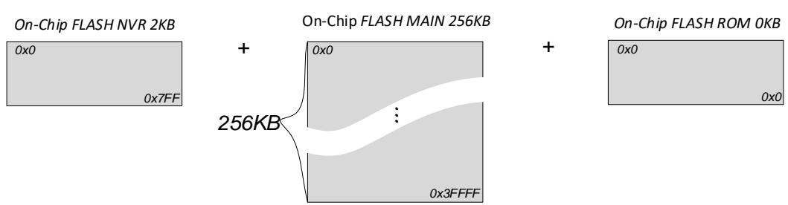  
图 7-1 On-Chip FLASH 存储体空间划分框图

## 7.2 功能特点

On-Chip FLASH 控制器模块，主要实现对 On-Chip FLASH 存储体的相关操作。包括：

On-Chip FLASH 读取数据的操作。包括对 NVR 区域的读取和对 MAIN 区域的读取。锁定后的 ROM 区域，不支持读取。

On-Chip FLASH 编程数据的操作。包括对 NVR 区域的编程和对 MAIN 区域的编程。ROM 区域不支持二次编程。

On-Chip FLASH 擦除操作。支持 Sector 擦除。NVR 区域和 MAIN 区域支持 Sector 擦除。ROM 部分不支持擦除。

On-Chip FLASH 可执行操作。即应用程序可直接运行在 MAIN 区域和 ROM 区域，NVR 区域不可执行，只能存储数据。

On-Chip FLASH 深度休眠的操作，以降低芯片的休眠功耗。

On-Chip FLASH 存储体内容的保护操作。

On-Chip FLASH 的 Cache 加速模块，以提升芯片整体运行效率。

On-Chip FLASH 控制寄存器的访问。

Ext-Chip FLASH 控制器模块，主要实现对 Ext-Chip FLASH 存储体的相关操作。包括：

Ext -Chip FLASH 读取数据的操作。

Ext -Chip FLASH 编程数据的操作。

Ext -Chip FLASH 擦除操作。

Ext -Chip FLASH 控制寄存器的访问。

## 7.2.1 On-Chip FLASH 功能描述

控制模块，实现了对 On-Chip FLASH 存储体的复位/读出/编程/擦除/休眠等操作。如下为控制状态转换图：

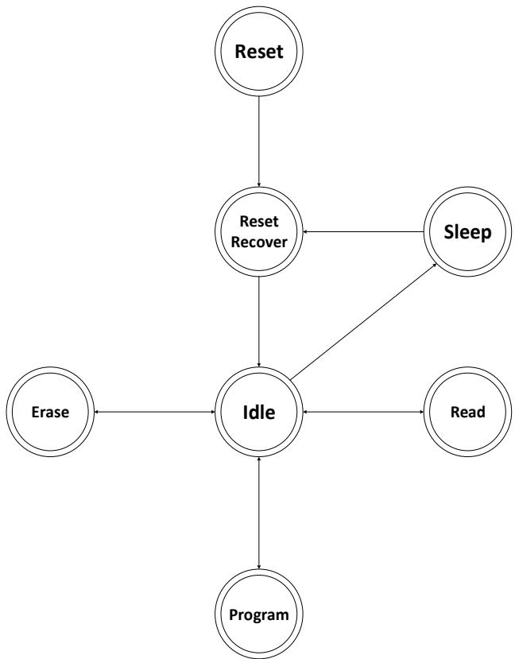  
图 7-2 On-Chip FLASH 控制状态转换图

## 7.2.1.1 复位操作

系统完成复位后，On-Chip FLASH 需要一段时间恢复。其目的是保证 On-Chip FLASH 存储体内部的电路稳定。内部稳定后，系统才可对 On-Chip FLASH 执行操作。此操作由硬件自动实现，无需软件干预。

## 7.2.1.2 休眠操作

On-Chip FLASH 的休眠操作分成两个部分：Standby 和 Deep Sleep。当系统不执行对 On-Chip FLASH 的操作时，On-Chip FLASH 可自动进入 StandBy 状态（若开启 Cache 加速模块，此功能失效）。当系统执行 Deep Sleep 操作时，将触发 On-Chip FLASH 也进入 Deep Sleep，实现降低功耗的目的。On-Chip FLASH 进入 Deep Sleep 的操作，硬件自动完成，无需软件介入。

当外界唤醒系统，同时将唤醒 On-Chip FLASH。经过一段时间恢复后，On-Chip FLASH 可执行正常操作。此唤醒恢复操作，硬件自动完成，无需软件介入。

## 7.2.1.3 On-Chip FLASH 读取操作

读操作为 On-Chip FLASH 的基本操作。系统可通过两条路径访问 FLASH 内部的数据。

\- MCU 通过 AHB 总线的 I 总线和 D 总线，直接 (Direct) 对 On-Chip FLASH 执行取指、取数操作。总线宽度为 32Bit，且只能访问 MAIN 区域和 ROM 区域（只运行不能被读取）的数据。为了提升 MCU 的读取效率，硬件提供了 Cache 加速的功能。

\- MCU 通过 AHB 总线中的 S 总线, 访问控制器的寄存器, 间接 (Indirect) 实现读取 On-Chip FLASH内部数据的操作。可以访问 MAIN 区域和 NVR 区域的数据，ROM 区域为有条件访问；若执行连续读取操作，硬件可自动完成地址累加，无需每次都更新地址寄存器的值。此时，存在 I/D 总线和 S 总线，同时访问 FLASH 的情况，On-Chip FLASH 内部有仲裁机制，优先 I/D 总线访问，S 总线需等待 I/D 总线空闲才能完成对应操作；一旦 S 总线获得访问 On-Chip FLASH 的权力，I/D 总线无法抢夺直至 S 总线访问完毕。

\- 寄存器 FSMC\_REDY.READY 位，指示当前 I/D 总线是否完成了当前读取访问操作，1 表示完成，0 表示未完成。

\- 寄存器 FSMC\_REDY.IREADY 位，指示当前 S 总线是否完成了当前读取访问操作，1 表示完成，0 表示未完成。

FLASH\_CFG.REGION 位指示当前访问的是哪个区域。具体表格如下：

表 7-1 On-Chip FLASH 访问空间分配表

<table><tr><td>FSMC_ICFG.REGION</td><td>访问区域</td></tr><tr><td>0</td><td>MAIN 区域和 ROM 区域*</td></tr><tr><td>1</td><td>NVR 区域</td></tr></table>

\*注意，ROM 区域默认支持一次编程，编程完毕后，此区域被限定 XN（eXecute region），锁定后不能被读取，也不允许二次编程和擦除。

访问本控制器的寄存器，实现间接读取 On-Chip FLASH 内部数据的操作的执行流程如下：

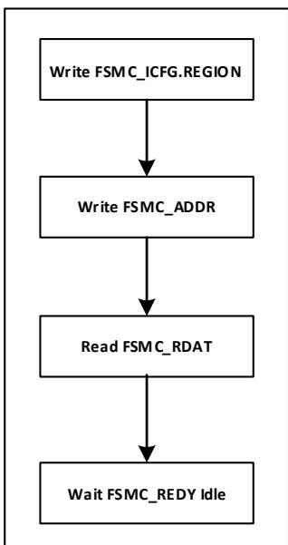  
图 7-3 On-Chip FLASH 间接读取操作流程图

## 7.2.1.4 On-Chip FLASH 编程操作

执行对 On-Chip FLASH 存储体的编程操作。一般而言，我们先执行擦除操作（保证对应编程背景为默认值，杜绝同一地址连续两次编程），再执行数据编程操作。同时，只能通过访问 On-Chip FLASH 控制器的寄存器，实现编程操作。LKS32MC45x 芯片的编程宽度为 128-Bit，即一次写入 16

个 Byte。

类似读取操作。此时，存在 I/D 总线和 S 总线，同时访问 FLASH 的情况。I/D 总线读取 On-Chip FLASH 数据，S 总线执行编程操作。On-Chip FLASH 内部有仲裁机制，优先 I/D 总线访问，S 总线需等待 I/D 总线空闲才能完成对应操作；一旦 S 总线获得访问 On-Chip FLASH 的权力，I/D 总线无法抢夺直至 S 总线访问完毕。

不同型号产品，编程地址空间不同，下表为不同组合下地址分配情况：

表 7-2 On-Chip FLASH 编程空间地址分配表

<table><tr><td>组合</td><td>MAIN 区域</td><td>ROM 区域</td></tr><tr><td>组合 1</td><td>0x0000 0000 - 0x0003 FFFF</td><td>0x0000 0000 - 0x0000 0000</td></tr><tr><td>组合 2</td><td>0x0000 0000 - 0x0002 FFFF</td><td>0x0003 0000 - 0x0003 FFFF</td></tr><tr><td>组合 3</td><td>0x0000 0000 - 0x0002 FFFF</td><td>0x0003 0000 - 0x0003 FFFF</td></tr><tr><td>组合 4</td><td>0x0000 0000 - 0x0001 FFFF</td><td>0x0002 0000 - 0x0003 FFFF</td></tr><tr><td>组合 5</td><td>0x0000 0000 - 0x0001 FFFF</td><td>0x0000 0000 - 0x0000 0000</td></tr><tr><td>组合 6</td><td>0x0000 0000 - 0x0000 FFFF</td><td>0x0003 0000 - 0x0003 FFFF</td></tr><tr><td>组合 7</td><td>0x0000 0000 - 0x0000 FFFF</td><td>0x0000 0000 - 0x0000 0000</td></tr></table>

编程操作，具体流程为：

● 系统寄存器 SYS\_FLSP，写入密钥，解除编程保护

\- On-Chip FLASH 控制寄存器 FSMC\_ICFG，开启编程使能

\- On-Chip FLASH 地址寄存器 FSMC\_ADDR，写入编程地址

\- On-Chip FLASH 编程数据寄存器 FSMC\_WDAT0 至 FSMC\_WDAT3，写入编程数据

\- On-Chip FLASH 编程触发寄存器 FSMC\_WDAT，写入触发值，触发编程

\- 寄存器 FSMC\_REDY.IREADY 位，指示当前 S 总线是否完成了当前编程访问操作，1 表示完成，0 表示未完成。

访问本控制器的寄存器，实现 On-Chip FLASH 编程操作的执行流程如下：

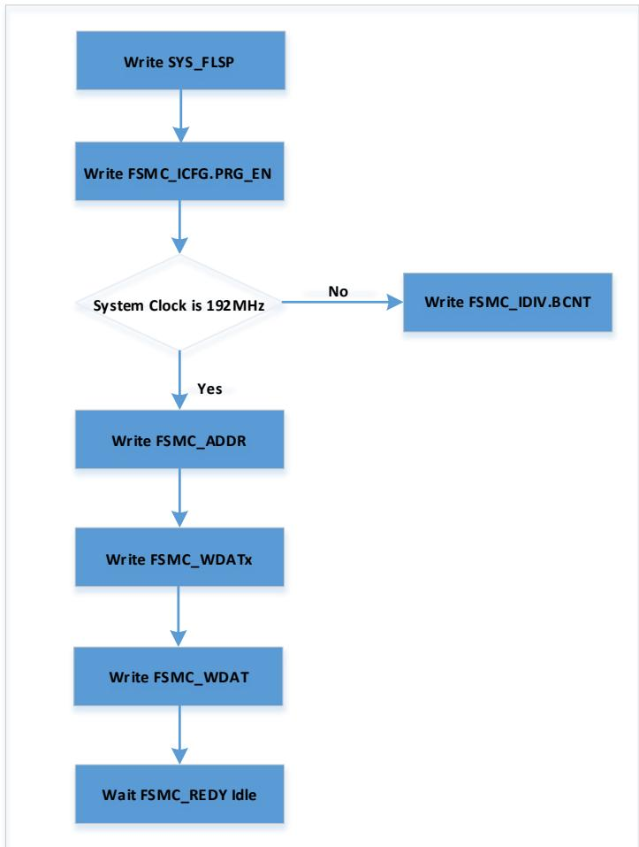  
图 7-4 On-Chip FLASH 模块编程操作流程图

系统工作频率的判断，需要参考 SYS\_CLK\_CFG 的配置。On-Chip FLASH 编程/擦除操作的绝对时间是固定的，On-Chip FLASH 控制器需要基于绝对时间，保存对应频率下的计数值。FSMC\_IDIV.BCNT0 和 FSMC\_IDIV.BCNT1 默认值是 192MHz 时钟频率下的计数值；当芯片工作在其他频率下时，需要重新配置 FSMC\_IDIV.BCNT0 和 FSMC\_IDIV.BCNT1 的值，以实现 96MHz/48MHz 和 24MHz 的计数值（其它频率暂不支持）。最终保证计数值×时钟频率等于恒定的时间。不同频率下对应的 FSMC\_IDIV.BCNT0 和 FSMC\_IDIV.BCNT1 的值，请参考本章节寄存器描述。切记，FSMC\_IDIV.BCNT0 和 FSMC\_IDIV.BCNT1 仅能配置寄存器说明中提供的几组值，不能被写入其它值，否则可能导致 On-Chip FLASH 编程/擦除失败。建议对 FSMC\_IDIV 的操作，执行先读回，然后按照或/与的方法操作。

在执行 On-Chip FLASH 的编程/擦除操作时，FLASH 处于忙状态，若 Cache 不命中，无后续指令/数据取回 MCU，MCU 将暂停工作，等待 On-Chip FLASH 的编程/擦除操作完毕，才能继续执行程序。此时，为保证数据一致性，一旦 FLASH 执行了编程和擦除操作，Cache 所存数据均无效，需重新取指令和数据。

图 7-4 仅展示了一次编程的流程。若执行连续编程时，可以在写入 FSMC\_ADDR 寄存器前，配置 FSMC\_ICFG.ADR\_INC，开启地址自动递增模式。当前的编程操作完毕后， FSMC\_ADDR 的值，会硬件自动增加 0x10。连续读操作类似，但递增的值为 0x04。连续编程的流程如下：

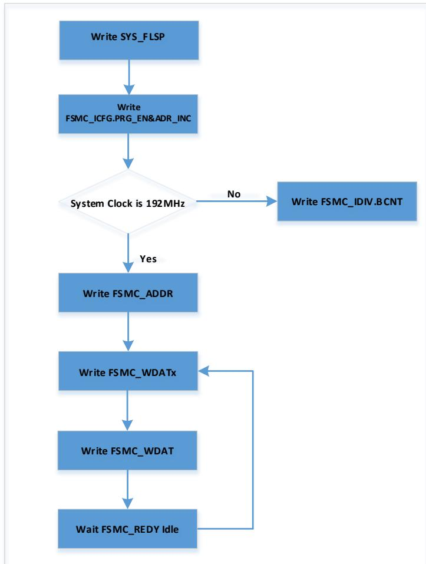  
图 7-5 On-Chip FLASH 模块连续编程操作流程图

## 7.2.1.5 On-Chip FLASH 擦除操作

擦除操作为 On-Chip FLASH 的基本操作。系统只能通过访问 On-Chip FLASH 控制器的寄存器实现。具体流程为:

\- 系统寄存器 SYS\_FLSE，写入密钥，解除擦除保护

\- On-Chip FLASH 擦除操作使能

\- On-Chip FLASH 地址寄存器 FSMC\_ADDR，写入擦除地址

\- On-Chip FLASH 擦除寄存器 FSMC\_ERAS，触发擦除操作

\- 寄存器 FSMC\_REDY.IREADY 位，指示当前 S 总线是否完成了当前擦除访问操作，1 表示完成，0 表示未完成。

类似读取操作。此时，存在 I/D 总线和 S 总线，同时访问 FLASH 的情况。I/D 总线读取 On-Chip FLASH 数据，S 总线执行擦除操作。On-Chip FLASH 内部有仲裁机制，优先 I/D 总线访问，S 总线需等待 I/D 总线空闲才能完成对应操作；一旦 S 总线获得访问 On-Chip FLASH 的权力，I/D 总线无法抢夺直至 S 总线访问完毕。

执行对 On-Chip FLASH 存储体的擦除操作。一个 Sector 的大小为 1024 字节。

下表为 MAIN 区域（最大情况）Sector 地址分配空间。

表 7-3 On-Chip FLASH MAIN 区域 Sector 地址分配表

<table><tr><td>块名</td><td>地址</td><td>尺寸(Byte)</td></tr><tr><td>Sector 0</td><td>0x0000 0000 - 0x0000 03FF</td><td>1024</td></tr><tr><td>Sector 1</td><td>0x0000 0400 - 0x0000 07FF</td><td>1024</td></tr><tr><td>Sector 2</td><td>0x0000 0800 - 0x0000 0BFF</td><td>1024</td></tr><tr><td>...</td><td>...</td><td>...</td></tr><tr><td>Sector256</td><td>0x0003 FC00 - 0x0003 FFFF</td><td>1024</td></tr></table>

ROM 区域不支持擦除；

NVR 区域实现 Sector 擦除;

表 7-4 On-Chip FLASH NVR 区域 Sector 地址分配表

<table><tr><td>块名</td><td>地址</td><td>尺寸(Byte)</td></tr><tr><td>Sector 0</td><td>0x0000 0000 - 0x0000 03FF</td><td>1024</td></tr><tr><td>Sector 1</td><td>0x0000 0400 - 0x0000 07FF</td><td>1024</td></tr></table>

MAIN 区域可以实现 Sector 擦除。

FLASH 擦除操作流程如下所示。

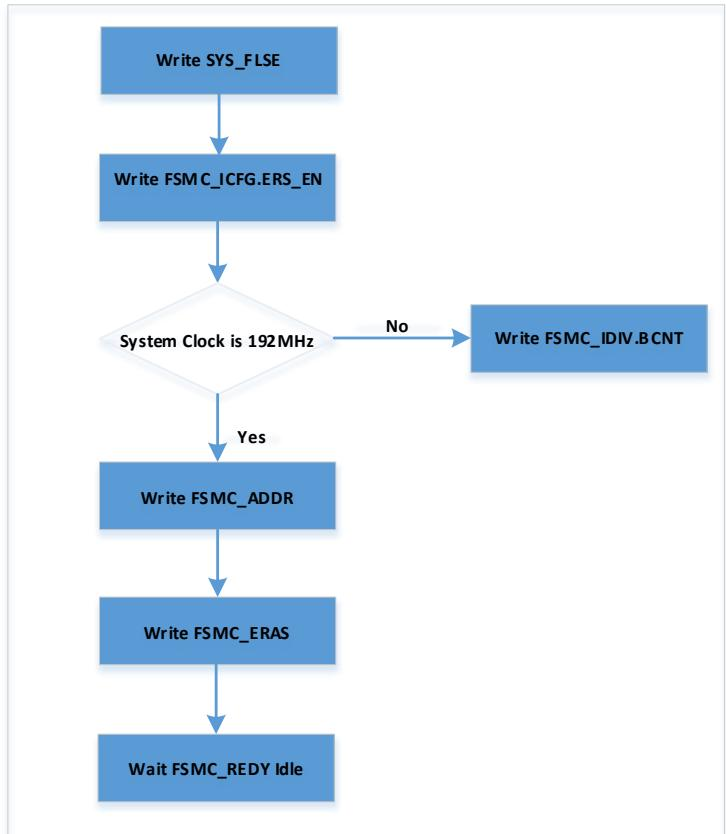  
图 7-6 On-Chip FLASH 模块擦除操作流程图

Secotor 擦除，需要通过 FSMC\_ADDR 确定哪个 Secotor 被擦除。FSMC\_ERAS 写入 0x7654DCBA 触发擦除操作。

On-Chip FLASH 存储体，默认擦写次数为 100K 次。本模块支持快速擦除模块，理论上可以成倍增加擦除次数（最少时间实现正确擦除）。快速擦除模式，支持 Sector 擦除。相比正常擦除操作流程，快速擦除流程如下：

\- 系统寄存器 SYS\_FLSE，写入密钥，解除擦除保护

● On-Chip FLASH 擦除操作，配置为块擦除且使能快速擦除，快速擦除计数器配置为 0

\- On-Chip FLASH 擦除操作使能

\- On-Chip FLASH 地址寄存器 FSMC\_ADDR，写入擦除地址

\- On-Chip FLASH 擦除寄存器 FSMC\_ERAS，触发擦除操作

\- 寄存器 FSMC\_REDY.IREADY 位，指示当前 S 总线是否完成了当前擦除访问操作，1 表示完成，0 表示未完成。

\- On-Chip FLASH，用户执行读取当前擦除块地址对应的所有数据，判断是否都为1。为全1，说明快速擦除成功；不为全1，说明快速擦除失败，快速擦除计数器软件加1，再次触发擦除操作。如此反复直至擦除成功。

注，快速擦除计数器最大值为 3，执行完配置为 3 的擦除后，当前 Sector 地址对应的数据仍然非全 1，说明 On-Chip FLASH 已经到了使用极限。

## 7.2.1.6 On-Chip FLASH Cache 加速操作

因 On-Chip FLASH 存储体的速度限制，无法达到系统最快速度。当对 On-Chip FLASH 进行读取操作时，需要大于 1 个时钟周期才能完成。为了加快数据的读出，On-Chip FLASH 控制器增加了 Cache 功能。Cache 功能的开启和关闭，只需要设置 SYS\_CACHE\_CFG.EN 即可。

注，若执行了 On-Chip FLASH 存储体擦除/编程操作，Cache 模块并不会同步刷新同步，但 Cache 会将存入的数据，硬件会自动全配置为无效，保证不发生因两者存在潜在的数据失配导致的运行错误。

## 7.2.1.7 On-Chip FLASH 保护

On-Chip FLASH 存储体的保护策略分成两个部分：On-Chip FLASH 存储体（包括 MAIN、NVR 和 ROM）整体保护策略和 ROM 区域独有保护策略。On-Chip FLASH 存储体整体保护策略的开启和关闭，通过其保护字实现。保护字的状态为开启，On-Chip FLASH 存储体整体保护开启；保护字的状态为关闭，On-Chip FLASH 存储体整体保护关闭。ROM 区域的独有保护策略，主要针对 ROM 区域的读保护，On-Chip FLASH 存储体整体保护的开启和关闭，不影响 ROM 区域的独有保护策略的开启和关闭。保护策略的具体逻辑，如下：

\- ROM区域未执行编程操作，保护字未开启保护，MCU和外界均可访问并读出ROM区域

\- ROM区域已执行编程操作，保护字未开启保护，MCU和外界均可访问并读出ROM区域

\- ROM区域已执行编程操作，保护字开启保护，外界不可以访问并读出，MCU不可以读出但可以执行ROM区域

\- On-Chip FLASH 存储体整体保护，保护字未开启保护，MCU 和外界均可访问并读出到 On-Chip FLASH 存储体非 ROM 区域的内容；ROM 区域内容是否可被访问并被读出，取决于 ROM 区域的保护字的状态，但 MCU 可运行 ROM 区域应用程序

\- On-Chip FLASH 存储体整体保护，保护字开启保护，外界无法访问并读出到 On-Chip FLASH 存储体的内容（包括 MAIN/ROM/NVR）；MCU 可访问并读出到 On-Chip FLASH 存储体非 ROM 区域的内容；ROM 区域内容是否可被访问并被读出，取决于 ROM 区域的保护字的状态，但 MCU 可运行 ROM 区域应用程序

On-Chip FLASH 存储体根据 MAIN 区域和 ROM 区域的尺寸, On-Chip FLASH 存储体(包括 MAIN、NVR 和 ROM) 整体保护策略和 ROM 区域独有保护策略, 各自对应的保护字所分配的地址略有不同。下表为保护字地址分配表。

表 7-5 On-Chip FLASH 保护字地址分配表

<table><tr><td>组合</td><td colspan="3">整体保护策略_MAIN 区域</td><td colspan="3">ROM 独有保护策略_ROM 区域</td></tr><tr><td></td><td>起始</td><td>结束</td><td>保护字地址</td><td>起始</td><td>结束</td><td>保护字地址</td></tr><tr><td>组合 1</td><td>0x0000 0000</td><td>0x0003 FFFF</td><td>0x0003 FFF0</td><td>0x0000 0000</td><td>0x0000 0000</td><td>无</td></tr><tr><td>组合 2</td><td>0x0000 0000</td><td>0x0002 FFFF</td><td>0x0002 FFF0</td><td>0x0003 0000</td><td>0x0003 FFFF</td><td>0x0003 FFF0</td></tr><tr><td>组合 3</td><td>0x0000 0000</td><td>0x0002 FFFF</td><td>0x0002 FFF0</td><td>0x0000 0000</td><td>0x0000 0000</td><td>无</td></tr><tr><td>组合 4</td><td>0x0000 0000</td><td>0x0001 FFFF</td><td>0x0001 FFF0</td><td>0x0002 0000</td><td>0x0003 FFFF</td><td>0x0003 FFF0</td></tr><tr><td>组合 5</td><td>0x0000 0000</td><td>0x0001 FFFF</td><td>0x0001 FFF0</td><td>0x0000 0000</td><td>0x0000 0000</td><td>无</td></tr><tr><td>组合 6</td><td>0x0000 0000</td><td>0x0000 FFFF</td><td>0x0000 FFF0</td><td>0x0003 0000</td><td>0x0003 FFFF</td><td>0x0003 FFF0</td></tr><tr><td>组合 7</td><td>0x0000 0000</td><td>0x0000 FFFF</td><td>0x0000 FFF0</td><td>0x0000 0000</td><td>0x0000 0000</td><td>无</td></tr></table>

若 On-Chip FLASH 存储体处于整体保护状态，用户可执行去保护操作，解除对 On-Chip FLASH 存储体内数据的保护（ROM 区域需考虑 ROM 区域的保护状态）。相反，若 On-Chip FLASH 存储体处于去保护状态，用户可执行保护操作，对 On-Chip FLASH 存储体的数据进行整体保护。默认情况下，On-Chip FLASH 存储体的数据处于整体保护状态。芯片上电复位后，硬件自动执行一次保护状态更新操作，是保护的话继续处于保护状态，否则变成去保护状态。

从上表可以看到，我们一般将当前组合下最后 4 个 WORD，分配为保护字。保护字的内容为全 1 时，表明对应策略处于去保护状态；保护字的内容被写为非全 1 时，表明对应策略处于保护状态。因此，若需要开启保护，执行对应保护字的编程，写入非全 1 的值，读取 FSMC\_PROT 寄存器，即触发一次保护状态更新的操作，完成保护（读取 FSMC\_PROT 返回值可知晓当前保护状态）。因两套保护策略，有两个保护字，我们需明确当前是哪个保护状态的更新。

表 7-6 On-Chip FLASH 保护字地址分配表

<table><tr><td>FSMC_ICFG.SEL_PROT</td><td>区域</td></tr><tr><td>0</td><td>整体保护策略区域</td></tr><tr><td>1</td><td>ROM 独有保护策略区域</td></tr></table>

当 FSMC\_ICFG.PROT 配置为 0，读取 FSMC\_PROT 寄存器，将完成 On-Chip FLASH 存储体处于整体保护状态的更新操作；当 FSMC\_ICFG.PROT 配置为 1，读取 FSMC\_PROT 寄存器，将完成 ROM 区域独有保护状态的更新操作。

## 7.2.2 Ext-Chip FLASH 控制器功能描述

LKS32MC45x 硬件实现 Ext-Chip FLASH 控制器，并不包含外挂 FLASH 存储体。外挂 FLASH 的地址映射空间起始于 0x0100\_0000，结束于 0x01FF\_FFFF，大小为 16MB。

Ext-Chip FLASH 控制器特性:

● 地址线宽度为 24 位，支持外挂 FLASH 容量范围：小于等于 16MB，大于 64KB。

\- 仅 SPI 模式 3 的传输方式，即默认 SCLK 为高电平，下降沿发送数据，上升沿采样数据。

● 支持单线 SPI 传输，双线 SPI 传输和四线传输。

● 可通过 MCU 直接访问，也可以通过寄存器间接访问。

## 7.2.2.1 Ext-Chip FLASH 访问方式

Ext-Chip FLASH 有两种访问方式：直接访问和间接访问。所谓直接访问，就是 MCU 直接通过地址寻址到对应 Ext-Chip FLASH。间接访问，就是通过 Ext-Chip FLASH 控制器的寄存器访问。一般，读取/运行 Ext-Chip FLASH 的内容，可以使用直接访问方式；读取/编程 Ext-Chip FLASH 使用间接访问方式。

## 7.2.2.2 Ext-Chip FLASH 传输并行数

Ext-Chip FLASH 控制器支持三种访问并行数：单线、双线和四线。不同并行数量的切换，需要通过 Ext-Chip FLASH 控制器的寄存器发送配置命令，才能顺利切换。Ext-Chip FLASH 常见 PIN 复用方案如下：

表 7-7 Ext-Chip FLASH PIN 描述及同 LKS32MC45x 互联关系表

<table><tr><td>Symbol</td><td>Extension</td><td>Remarks</td><td>LKS45x</td></tr><tr><td>CS#</td><td></td><td>Chip select</td><td>EFLS_CSN</td></tr><tr><td>SO</td><td>SIO1</td><td>Serial data output for 1 x I/OSerial data input and output for 4 x I/O read mode</td><td>EFLS_DAT[1]</td></tr><tr><td>WP#</td><td>SIO2</td><td>Write protection active lowSerial data input and output for 4 x I/O read mode</td><td>EFLS_DAT[2]</td></tr><tr><td>SI</td><td>SIO0</td><td>Serial data input for 1x I/OSerial data input and output for 4 x I/O read mode</td><td>EFLS_DAT[0]</td></tr><tr><td>SCLK</td><td></td><td>Serial interface clock input</td><td>EFLS_CLK</td></tr><tr><td>HOLD#/RESET#</td><td>SIO3</td><td>Hardware Reset Pin Active low or to pause the device without deselecting the deviceSerial data input and output for 4 x I/O read mode</td><td>EFLS_DAT[3]</td></tr></table>

默认情况下，使用单线模式，一根信号线发送，一根信号线接收。Ext-Chip FLASH 的 WP# 带电阻下拉，防止误编程，HOLD#/RESET# 带电阻上拉。LKS32MC45x 对应的信号，默认为输入，不影响复用功能。切换到其它两种模式，需要 Ext-Chip FLASH 控制器先发送命令，Ext-Chip FLASH 接收命令后，复用开启。Ext-Chip FLASH 实现模式切换，同时 Ext-Chip FLASH 控制器同步开启多线传输。

## 7.2.2.3 Ext-Chip FLASH 命令格式

一般情况下，Ext-Chip FLASH 命令由如下几个部分组成，但根据具体命令不同，某些部分无需发送，具体需参见 Ext-Chip FLASH 文档。Ext-Chip FLASH 控制器在发送某命令前，每个部分均需要配置，若某部分无需发送，对应部分的数据长度可配置为 0。具体命令组成如下：

\- 指令部分（Command）

\- 地址部分（Address）

\- 模式部分（Mode）

\- 冗余部分（Dummy）

● 数据部分（Data）

以 P25Q32H 为例子，提供如下几组配置，供参考。

## 7.2.2.3.1 Ext-Chip FLASH 间接方式四线读取

间接访问，主要配置 FSMC\_UCFG 等寄存器。访问波形如下：

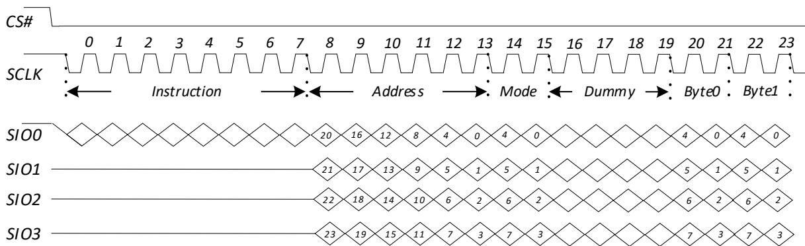  
图 7-7 Ext-Chip FLASH 间接方式四线读取数据波形

所有部分均包含，除开命令外，其它部分均为四线模式。则 FSMC\_UCFG 的配置为：

$$
\mathrm {FSMC\_ {U} CFG = 0x3FC0\_ {4} 123;}
$$

此处，FSMC\_UCFG.DAT\_LEN 配置为 4，表示读取四个字节的数据，可以配置为其它数值。

## 7.2.2.3.2 Ext-Chip FLASH 直接方式四线读取

直接访问，主要配置 FSMC\_FCFG 等寄存器。访问波形如下：

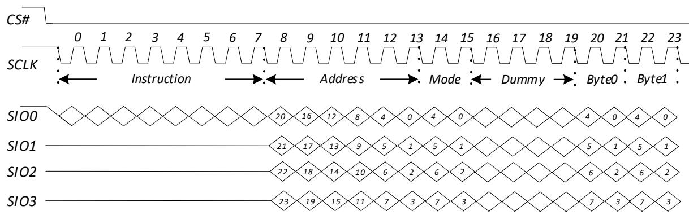  
图 7-8 Ext-Chip FLASH 直接方式四线读取数据波形  
所有部分均包含，除开命令外，其它部分均为四线模式。则 FSMC\_FCFG 的配置为：

$$
\mathrm {FSMC\_FCFG} = 0 \mathrm{x} 0 3 \mathrm {FC\_0421};
$$

此处，FSMC\_FCFG.DAT\_LEN 配置为 4，表示读取四个字节的数据，可以配置为其它数值。不过，因为 MCU 一次只需要 32-bit 数据，所以，直接访问的数据长度设置为 4，比较合理。

## 7.2.2.4 Ext-Chip FLASH 存储顺序

Ext-Chip FLASH 存储的最小单位是字节。字节内按照高低顺序存放。当发生读取操作时，按照地址递增的方式，逐一发出字节；接收方，若是间接方式访问，根据 FSMC\_UCFG.ORDER 的配置情况，决定读回的顺序。

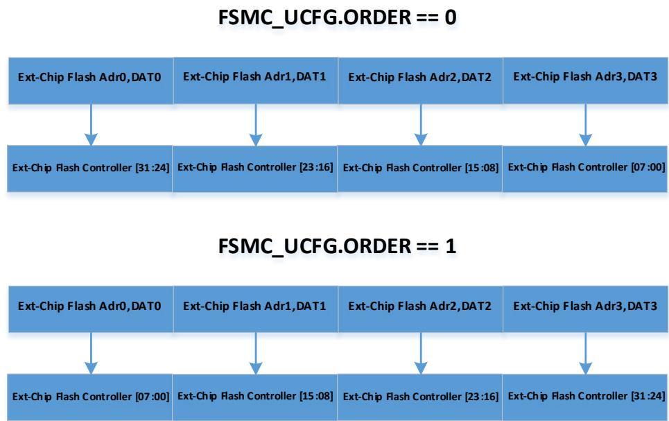  
图 7-9 Ext-Chip FLASH 间接方式访问读回的数据顺序

若采用直接方式访问，情况类似，此时参考 FSMC\_FCFG.ORDER 的值。

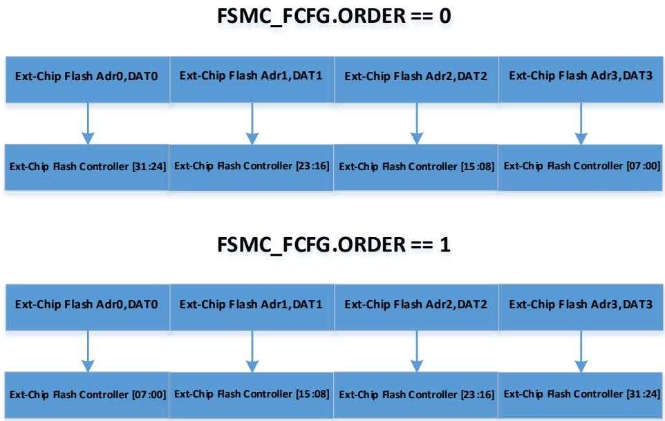  
图 7-10 Ext-Chip FLASH 直接方式访问读回的数据顺序

## 7.2.2.5 DMA 传输

Ext-Chip FLASH 控制器支持 DMA 传输。间接方式和直接方式，DMA 传输方式不相同。

在间接方式下，配置 FSMC\_UTRG.DMA\_EN 为 1，即可开启 DMA 功能。传输数据的长度，为 4 的整数倍。即，每次完成 4 个字节的传输后，产生一次 DMA 传输请求。举例：

$$
\mathrm {DMA\_CTMS4 = 0x00010004; / / 1 round 4 - times}
$$

$$
\mathrm {DMA\_ {D} ADR4 = 0x20001000; / / ram space}
$$

$$
\mathrm {DMA\_SADR4 = 0x4001A010; / / ext - chip flash read data register}
$$

$$
\text { DMA\_REN4 } = 0 \times 4 0 0 0 0 0 0 0; / / \text { ext - chip   flash   dma   request   enable }
$$

$$
\mathrm {DMA\_CCR4} = 0 \mathrm{x} 0 0 0 0 0 \mathrm{A} 1 1; / / \text { word - alignment }
$$

$$
\mathrm {DMA\_CTRL} = 0 \mathrm{x} 0 0 0 0 0 0 0 1; / / \text { enable   DMA }
$$

//wait DMA interrupt

在直接方式下，无需使能 FSMC\_UTRG.DMA\_EN 控制位，使用 DMA 软件触发的方式，直接发起对 Ext-Chip FLASH 的读取访问请求。举例：

$$
\mathrm {DMA\_CTMS4 = 0x00010004; / / 1 round 4 - times}
$$

$$
\mathrm {DMA\_ {D} ADR4 = 0x20001000; / / ram space}
$$

$$
\mathrm {DMA\_SADR4 = 0x01000000; / / ext - chip flash space}
$$

$$
\text { DMA\_REN4 } = 0 \text { x80000000;   / / soft   trig }
$$

$$
\mathrm {DMA\_CCR4} = 0 \mathrm{x} 0 0 0 0 0 \mathrm{AF1}; / / \text {word - alignment}
$$

$$
\mathrm {DMA\_CTRL} = 0 \mathrm{x} 0 0 0 0 0 0 0 1; / / \text { enable   DMA }
$$

//wait DMA interrupt

## 7.3 寄存器

## 7.3.1 地址分配

非易失存储体模块寄存器的基地址是 0x4001\_A000 寄存器列表

表 7-8 非易失存储体模块寄存器列表

<table><tr><td>名称</td><td>偏移</td><td>说明</td></tr><tr><td>FSMC_UCMD</td><td>0x00</td><td>Ext-Chip FLASH 间接方式访问命令寄存器</td></tr><tr><td>FSMC_UMOD</td><td>0x04</td><td>Ext-Chip FLASH 间接方式访问模式寄存器</td></tr><tr><td>FSMC_UADR</td><td>0x08</td><td>Ext-Chip FLASH 间接方式访问地址寄存器</td></tr><tr><td>FSMC_UWDA</td><td>0x0C</td><td>Ext-Chip FLASH 间接方式访问编程数据寄存器</td></tr><tr><td>FSMC_URDA</td><td>0x10</td><td>Ext-Chip FLASH 间接方式访问读取数据寄存器</td></tr><tr><td>FSMC_UCFG</td><td>0x20</td><td>Ext-Chip FLASH 间接方式访问控制寄存器</td></tr><tr><td>FSMC_UTRG</td><td>0x24</td><td>Ext-Chip FLASH 间接方式访问操作控制寄存器</td></tr><tr><td>FSMC_FCMD</td><td>0x30</td><td>Ext-Chip FLASH 直接方式访问命令寄存器</td></tr><tr><td>FSMC_FMOD</td><td>0x34</td><td>Ext-Chip FLASH 直接方式访问模式寄存器</td></tr><tr><td>FSMC_FCFG</td><td>0x50</td><td>Ext-Chip FLASH 直接方式访问控制寄存器</td></tr><tr><td>FSMC_FTRG</td><td>0x54</td><td>Ext-Chip FLASH 直接方式访问操作寄存器</td></tr><tr><td>FSMC_EDIV</td><td>0x60</td><td>Ext -Chip FLASH 波特率寄存器</td></tr><tr><td>FSMC_WDAT0</td><td>0x70</td><td>On-Chip FLASH 编程数据寄存器,BIT[031:000]</td></tr><tr><td>FSMC_WDAT1</td><td>0x74</td><td>On-Chip FLASH 编程数据寄存器,BIT[063:032]</td></tr><tr><td>FSMC_WDAT2</td><td>0x78</td><td>On-Chip FLASH 编程数据寄存器,BIT[095:064]</td></tr><tr><td>FSMC_WDAT3</td><td>0x7C</td><td>On-Chip FLASH 编程数据寄存器,BIT[127:096]</td></tr><tr><td>FSMC_ICFG</td><td>0x80</td><td>On-Chip FLASH 配置寄存器</td></tr><tr><td>FSMC_ADDR</td><td>0x84</td><td>On-Chip FLASH 地址寄存器</td></tr><tr><td>FSMC_WDAT</td><td>0x88</td><td>On-Chip FLASH 编程操作触发寄存器</td></tr><tr><td>FSMC_RDAT</td><td>0x8C</td><td>On-Chip FLASH 读数据寄存器</td></tr><tr><td>FSMC_ERAS</td><td>0x90</td><td>On-Chip FLASH 擦除操作触发寄存器</td></tr><tr><td>FSMC_PROT</td><td>0x94</td><td>On-Chip FLASH 保护状态寄存器</td></tr><tr><td>FSMC_REDY</td><td>0x98</td><td>On-Chip FLASH 工作状态寄存器</td></tr><tr><td>FSMC_IDIV</td><td>0x9C</td><td>On-Chip FLASH 时基寄存器</td></tr></table>

## 7.3.2 FSMC\_UCMD Ext-Chip FLASH 间接方式访问命令寄存器

地址：0x4001\_A000

复位值：0x0

表 7-9 Ext-Chip FLASH 间接方式访问命令寄存器 FSMC\_UCMD

<table><tr><td>15 14 13 12 11 10 9 8</td><td>7 6 5 4 3 2 1 0</td></tr><tr><td rowspan="3"></td><td>UCMD</td></tr><tr><td>RW</td></tr><tr><td>0</td></tr></table>

<table><tr><td>位置</td><td>位名称</td><td>说明</td></tr><tr><td>[7:0]</td><td>UCMD</td><td>Ext-Chip FLASH 间接方式访问命令寄存器</td></tr></table>

## 7.3.3 FSMC\_UMOD Ext-Chip FLASH 间接方式访问模式寄存器

地址：0x4001\_A004

复位值: 0x0

表 7-10 Ext-Chip FLASH 间接方式访问模式寄存器 FSMC\_UMOD

<table><tr><td>15 14 13 12 11 10 9 8</td><td>7 6 5 4 3 2 1 0</td></tr><tr><td rowspan="3"></td><td>UMOD</td></tr><tr><td>RW</td></tr><tr><td>0</td></tr></table>

<table><tr><td>位置</td><td>位名称</td><td>说明</td></tr><tr><td>[7:0]</td><td>UMOD</td><td>Ext-Chip FLASH 间接方式访问模式寄存器</td></tr></table>

## 7.3.4 FSMC\_UADR Ext-Chip FLASH 间接方式访问地址寄存器

地址：0x4001\_A008

复位值: 0x0

表 7-11 Ext-Chip FLASH 间接方式访问地址寄存器 FSMC\_UADR

<table><tr><td>31</td><td>30</td><td>29</td><td>28</td><td>27</td><td>26</td><td>25</td><td>24</td><td>23</td><td>22</td><td>21</td><td>20</td><td>19</td><td>18</td><td>17</td><td>16</td></tr><tr><td rowspan="3" colspan="8"></td><td colspan="8">FSMC_UADR</td></tr><tr><td colspan="8">RW</td></tr><tr><td colspan="8">0</td></tr><tr><td>15</td><td>14</td><td>13</td><td>12</td><td>11</td><td>10</td><td>9</td><td>8</td><td>7</td><td>6</td><td>5</td><td>4</td><td>3</td><td>2</td><td>1</td><td>0</td></tr></table>

<table><tr><td>FSMC_UADR</td></tr><tr><td>RW0</td></tr></table>

<table><tr><td>位置</td><td>位名称</td><td>说明</td></tr><tr><td>[23:0]</td><td>FSMC_UADR</td><td>Ext-Chip FLASH 间接方式访问地址寄存器</td></tr></table>

## 7.3.5 FSMC\_UWDA Ext-Chip FLASH 间接方式访问编程数据寄存器

地址：0x4001\_A00C

复位值: 0x0

表 7-12 Ext-Chip FLASH 间接方式访问编程数据寄存器 FSMC\_UWDA

<table><tr><td>31</td><td>30</td><td>29</td><td>28</td><td>27</td><td>26</td><td>25</td><td>24</td><td>23</td><td>22</td><td>21</td><td>20</td><td>19</td><td>18</td><td>17</td><td>16</td></tr><tr><td colspan="16">FSMC_UWDA</td></tr><tr><td colspan="16">RW</td></tr><tr><td colspan="16">0</td></tr><tr><td>15</td><td>14</td><td>13</td><td>12</td><td>11</td><td>10</td><td>9</td><td>8</td><td>7</td><td>6</td><td>5</td><td>4</td><td>3</td><td>2</td><td>1</td><td>0</td></tr></table>

<table><tr><td>FSMC_UWDA</td></tr><tr><td>RW</td></tr><tr><td>0</td></tr></table>

<table><tr><td>位置</td><td>位名称</td><td>说明</td></tr><tr><td>[31:0]</td><td>FSMC_UWDA</td><td>Ext-Chip FLASH 间接方式访问编程数据寄存器</td></tr></table>

## 7.3.6 FSMC\_URDA Ext-Chip FLASH 间接方式访问读取数据寄存器

地址：0x4001\_A010

复位值：0x0

表 7-13 Ext-Chip FLASH 间接方式访问读取数据寄存器 FSMC\_URDA

<table><tr><td>31</td><td>30</td><td>29</td><td>28</td><td>27</td><td>26</td><td>25</td><td>24</td><td>23</td><td>22</td><td>21</td><td>20</td><td>19</td><td>18</td><td>17</td><td>16</td></tr><tr><td colspan="16">FSMC_URDA</td></tr><tr><td colspan="16">RO</td></tr><tr><td colspan="16">0</td></tr><tr><td>15</td><td>14</td><td>13</td><td>12</td><td>11</td><td>10</td><td>9</td><td>8</td><td>7</td><td>6</td><td>5</td><td>4</td><td>3</td><td>2</td><td>1</td><td>0</td></tr></table>

<table><tr><td>FSMC_URDA</td></tr><tr><td>RO</td></tr><tr><td>0</td></tr></table>

<table><tr><td>位置</td><td>位名称</td><td>说明</td></tr><tr><td>[31:0]</td><td>FSMC_URDA</td><td>Ext-Chip FLASH 间接方式访问读取数据寄存器</td></tr></table>

## 7.3.7 FSMC\_URWT Ext-Chip FLASH 间接方式访问控制寄存器

地址：0x4001\_A01C

复位值：0x0001

表 7-14 Ext-Chip FLASH 间接方式访问控制寄存器 FSMC\_URWT

<table><tr><td>位置</td><td>位名称</td><td>说明</td></tr><tr><td>[15:0]</td><td>FSMC_URWT</td><td>上一次写操作或者间接读取操作传输完成后CSB拉高,等待多久可以进行下一次操作。对于写操作,其中 FSMC_URWT[06:00]位作为th0, FSMC_URWT[15:08]位作为th1,等待时间=(th0+1)×(th1+1)×Clock_Period。对于间接读取操作,其中 FSMC_URWT[01:00]位作为th0,th1恒为0,等待时间=(th0+1)×Clock_Period。</td></tr></table>

## 7.3.8 FSMC\_UCFG Ext-Chip FLASH 间接方式访问控制寄存器

地址：0x4001\_A020

复位值：0x0

表 7-15 Ext-Chip FLASH 间接方式访问控制寄存器 FSMC\_UCFG

<table><tr><td>31</td><td>30</td><td>29</td><td>28</td><td>27</td><td>26</td><td>25</td><td>24</td><td>23</td><td>22</td><td>21</td><td>20</td><td>19</td><td>18</td><td>17</td><td>16</td></tr><tr><td>ORDER</td><td rowspan="3"></td><td colspan="2">DAT_SPD</td><td colspan="2">DMY_SPD</td><td colspan="2">MOD_SPD</td><td colspan="2">ADR_SPD</td><td colspan="2">CMD_SPD</td><td colspan="4">DAT_LEN</td></tr><tr><td>RW</td><td colspan="2">RW</td><td colspan="2">RW</td><td colspan="2">RW</td><td colspan="2">RW</td><td colspan="2">RW</td><td colspan="4">RW</td></tr><tr><td>0</td><td colspan="2">0</td><td colspan="2">0</td><td colspan="2">0</td><td colspan="2">0</td><td colspan="2">0</td><td colspan="4">0</td></tr></table>

<table><tr><td>DAT_LEN</td><td>DMY_LEN</td><td>MOD_LEN</td><td rowspan="3"></td></tr><tr><td>RW</td><td>RW</td><td>RW</td></tr><tr><td>0</td><td>0</td><td>0</td></tr></table>

<table><tr><td>位置</td><td>位名称</td><td>说明</td></tr><tr><td>31</td><td>ORDER</td><td>直接方式访问,读取数据大小头设置0:Ext-Chip FLASH 存储的数据,按照大头存放1:Ext-Chip FLASH 存储的数据,按照小头存放</td></tr><tr><td>30</td><td>R_CSB_TIM</td><td>特殊命令下,最后一个字节传输完成后需要延迟一个周期将 CSB 拉高。默认值为 0</td></tr><tr><td>[29:28]</td><td>DAT_SPD</td><td>数据部分并行发送配置00:一根线传输01:两根线传输11:四根线传输10:非法配置</td></tr><tr><td>[27:26]</td><td>DMY_SPD</td><td>冗余部分并行发送配置00:一根线传输01:两根线传输11:四根线传输10:非法配置</td></tr><tr><td>[25:24]</td><td>MOD_SPD</td><td>模式部分并行发送配置00:一根线传输01:两根线传输11:四根线传输10:非法配置</td></tr><tr><td>[23:22]</td><td>ADR_SPD</td><td>地址部分并行发送配置00:一根线传输01:两根线传输11:四根线传输10:非法配置</td></tr><tr><td>[21:20]</td><td>CMD_SPD</td><td>指令部分并行发送配置00:一根线传输01:两根线传输11:四根线传输10:非法配置</td></tr><tr><td>[19:12]</td><td>DAT_LEN</td><td>数据部分数据长度,字节为最小单位,0代表无此部分,1代表1个字节,一次类推,最大15个字节</td></tr><tr><td>[11:8]</td><td>DMY_LEN</td><td>冗余部分数据长度,字节为最小单位,0代表无此部分,1代表1个字节,一次类推,最大15个字节</td></tr><tr><td>[7:4]</td><td>MOD_LEN</td><td>模式部分数据长度,字节为最小单位,0代表无此部分,1代表1个字节,一次类推,最大15个字节</td></tr><tr><td>[3:0]</td><td>--</td><td>保留位,固定配置为0</td></tr></table>

## 7.3.9 FSMC\_UTRG Ext-Chip FLASH 间接方式访问操作寄存器

地址：0x4001\_A024

复位值：0x0

表 7-16 Ext-Chip FLASH 间接方式访问操作寄存器 FSMC\_UTRG

<table><tr><td>31</td><td>30</td><td>29</td><td>28</td><td>27</td><td>26</td><td>25</td><td>24</td><td>23</td><td>22</td><td>21</td><td>20</td><td>19</td><td>18</td><td>17</td><td>16</td></tr><tr><td></td><td></td><td></td><td></td><td></td><td></td><td></td><td></td><td></td><td></td><td></td><td></td><td></td><td></td><td></td><td></td></tr></table>

<table><tr><td colspan="4">15 14 13 12 11 10 9 8 7 6 5 4 3 2 1 0</td></tr><tr><td rowspan="3"></td><td>DMA_EN</td><td>OP</td><td>SEL</td></tr><tr><td>RW</td><td>RW</td><td>RW</td></tr><tr><td>0</td><td>0</td><td>0</td></tr></table>

<table><tr><td>位置</td><td>位名称</td><td>说明</td></tr><tr><td>[31:3]</td><td>--</td><td>保留位,固定配置为0</td></tr><tr><td>[2]</td><td>DMA_EN</td><td>Ext-Chip FLASH 控制器使能 DMA 搬移操作</td></tr><tr><td>[1]</td><td>OP</td><td>通过 Ext-Chip FLASH 控制器间接方式访问 Ext-Chip FLASH,操作类型1:编程/擦除0:读取</td></tr><tr><td>[0]</td><td>SEL</td><td>通过 Ext-Chip FLASH 控制器间接方式访问 Ext-Chip FLASH。同时,此位也是状态位。1:触发操作,处理中0:不触发操作,空闲</td></tr></table>

## 7.3.10 FSMC\_FCMD Ext-Chip FLASH 直接方式访问命令寄存器

地址：0x4001\_A030

复位值：0x0

表 7-17 Ext-Chip FLASH 直接方式访问命令寄存器 FSMC\_FCMD

<table><tr><td>15 14 13 12 11 10 9 8</td><td>7 6 5 4 3 2 1 0</td></tr><tr><td rowspan="3"></td><td>FCMD</td></tr><tr><td>RW</td></tr><tr><td>0</td></tr></table>

<table><tr><td>位置</td><td>位名称</td><td>说明</td></tr><tr><td>[7:0]</td><td>FCMD</td><td>Ext-Chip FLASH 直接方式访问命令寄存器</td></tr></table>

## 7.3.11 FSMC\_FMOD Ext-Chip FLASH 直接方式访问模式寄存器

地址：0x4001\_A034

复位值：0x0

表 7-18 Ext-Chip FLASH 直接方式访问模式寄存器 FSMC\_FMOD

<table><tr><td>15</td><td>14</td><td>13</td><td>12</td><td>11</td><td>10</td><td>9</td><td>8</td><td>7</td><td>6</td><td>5</td><td>4</td><td>3</td><td>2</td><td>1</td><td>0</td></tr><tr><td colspan="8" rowspan="2"></td><td colspan="8">FMOD</td></tr><tr><td colspan="8">RW</td></tr><tr><td></td><td colspan="15">0</td></tr></table>

<table><tr><td>位置</td><td>位名称</td><td>说明</td></tr><tr><td>[7:0]</td><td>FMOD</td><td>Ext-Chip FLASH 直接方式访问模式寄存器</td></tr></table>

## 7.3.12 FSMC\_FRWT Ext-Chip FLASH 直接方式访问控制寄存器

地址：0x4001\_A04C

复位值：0x0001

表 7-19 Ext-Chip FLASH 直接方式访问控制寄存器 FSMC\_FRWT

<table><tr><td>位置</td><td>位名称</td><td>说明</td></tr><tr><td>[15:0]</td><td>FSMC_FRWT</td><td>上一次直接读取操作传输完成后 CSB 拉高,等待多久可以进行下一次操作。对于直接读取操作, FSMC_URWT[01:00]位作为 th0,th1 恒为 0,等待时间=(th0+1)×Clock_Period。</td></tr></table>

## 7.3.13 FSMC\_FCFG Ext-Chip FLASH 直接方式访问控制寄存器

地址：0x4001\_A050

复位值：0x400

表 7-20 Ext-Chip FLASH 直接方式访问控制寄存器 FSMC\_FCFG

<table><tr><td rowspan="3" colspan="4"></td><td>ORDER</td><td rowspan="3"></td><td>DAT_SPD</td><td>DMY_SPD</td><td>MOD_SPD</td><td>ADR_SPD</td><td>CMD_SPD</td></tr><tr><td>RW</td><td>RW</td><td>RW</td><td>RW</td><td>RW</td><td>RW</td></tr><tr><td>0</td><td>0</td><td>0</td><td>0</td><td>0</td><td>0</td></tr><tr><td>15</td><td>14</td><td>13</td><td>12</td><td>11</td><td>10</td><td>9</td><td>8</td><td>7</td><td>6</td><td>5</td></tr></table>

<table><tr><td>DAT_LEN</td><td>DMY_LEN</td><td>MOD_LEN</td></tr><tr><td>RW</td><td>RW</td><td>RW</td></tr><tr><td>0x4</td><td>0</td><td>0</td></tr></table>

<table><tr><td>位置</td><td>位名称</td><td>说明</td></tr><tr><td>27</td><td>ORDER</td><td>直接方式访问,读取数据大小头设置0:Ext-Chip FLASH 存储的数据,按照大头存放1:Ext-Chip FLASH 存储的数据,按照小头存放</td></tr><tr><td>26</td><td>--</td><td>保留位,固定配置为 0</td></tr><tr><td>[25:24]</td><td>DAT_SPD</td><td>数据部分并行发送配置00:一根线传输01: 两根线传输11: 四根线传输10: 非法配置</td></tr><tr><td>[23:22]</td><td>DMY_SPD</td><td>冗余部分并行发送配置00: 一根线传输01: 两根线传输11: 四根线传输10: 非法配置</td></tr><tr><td>[21:20]</td><td>MOD_SPD</td><td>模式部分并行发送配置00: 一根线传输01: 两根线传输11: 四根线传输10: 非法配置</td></tr><tr><td>[19:18]</td><td>ADR_SPD</td><td>地址部分并行发送配置00: 一根线传输01: 两根线传输11: 四根线传输10: 非法配置</td></tr><tr><td>[17:16]</td><td>CMD_SPD</td><td>指令部分并行发送配置00: 一根线传输01: 两根线传输11: 四根线传输10: 非法配置</td></tr><tr><td>[15:8]</td><td>DAT_LEN</td><td>数据部分数据长度,字节为最小单位,0代表无此部分,1代表1个字节,一次类推,最大15个字节</td></tr><tr><td>[7:4]</td><td>DMY_LEN</td><td>冗余部分数据长度,字节为最小单位,0代表无此部分,1代表1个字节,一次类推,最大15个字节</td></tr><tr><td>[3:0]</td><td>MOD_LEN</td><td>模式部分数据长度,字节为最小单位,0代表无此部分,1代表1个字节,一次类推,最大15个字节</td></tr></table>

## 7.3.14 FSMC\_FTRG Ext-Chip FLASH 直接方式访问操作寄存器

地址：0x4001\_A054

复位值：0x0

表 7-21 Ext-Chip FLASH 直接方式访问操作寄存器 FSMC\_FTRG

<table><tr><td>31</td><td>30</td><td>29</td><td>28</td><td>27</td><td>26</td><td>25</td><td>24</td><td>23</td><td>22</td><td>21</td><td>20</td><td>19</td><td>18</td><td>17</td><td>16</td></tr><tr><td colspan="16"></td></tr><tr><td>15</td><td>14</td><td>13</td><td>12</td><td>11</td><td>10</td><td>9</td><td>8</td><td>7</td><td>6</td><td>5</td><td>4</td><td>3</td><td>2</td><td>1</td><td>0</td></tr><tr><td colspan="15"></td><td>UPDATE</td></tr><tr><td colspan="15" rowspan="2"></td><td>RW</td></tr><tr><td colspan="15">0</td></tr></table>

<table><tr><td>位置</td><td>位名称</td><td>说明</td></tr><tr><td>[31:1]</td><td>--</td><td>保留位,固定配置为0</td></tr><tr><td>[0]</td><td>UPDATE</td><td>Ext-Chip FLASH 控制器直接方式访问寄存器更新。因存在可能MCU一直使用直接方式获取Ext-Chip FLASH的数据,为了安全考虑,需要在空闲期间更新直接访问相关寄存器,此位也相当于一个状态,表明是否更新完毕。1:触发更新操作/更新过程中0:不触发更新操作/更新完毕</td></tr></table>

## 7.3.15 FSMC\_EDIV Ext-Chip FLASH 波特率寄存器

地址：0x4001\_A060

复位值：0x44444

表 7-22 Ext-Chip FLASH 波特率寄存器 FSMC\_EDIV

<table><tr><td>31</td><td>30</td><td>29</td><td>28</td><td>27</td><td>26</td><td>25</td><td>24</td><td>23</td><td>22</td><td>21</td><td>20</td><td>19</td><td>18</td><td>17</td><td>16</td></tr><tr><td rowspan="3" colspan="12"></td><td colspan="2">DAT_BAUDL</td><td colspan="2">DAT_BAUDH</td></tr><tr><td colspan="2">RW</td><td colspan="2">RW</td></tr><tr><td colspan="2">2</td><td colspan="2">0</td></tr></table>

<table><tr><td>DMY_BAUDL</td><td>DMY_BAUDH</td><td>MOD_BAUDL</td><td>MOD_BAUDH</td><td>ADR_BAUDL</td><td>ADR_BAUDH</td><td>CMD_BAUDL</td><td>CMD_BAUDH</td></tr><tr><td>RW</td><td>RW</td><td>RW</td><td>RW</td><td>RW</td><td>RW</td><td>RW</td><td>RW</td></tr><tr><td>2</td><td>0</td><td>2</td><td>0</td><td>2</td><td>0</td><td>2</td><td>0</td></tr></table>

<table><tr><td>位置</td><td>位名称</td><td>说明</td></tr><tr><td>[19:18]</td><td>DAT_BAUDL</td><td>数据部分波特率配置,低电平持续周期数0:一个系统时钟周期1:两个系统时钟周期2:三个系统时钟周期3:四个系统时钟周期</td></tr><tr><td>[17:16]</td><td>DAT_BAUDH</td><td>数据部分波特率配置,高电平持续周期数0:一个系统时钟周期1:两个系统时钟周期2:三个系统时钟周期3:四个系统时钟周期</td></tr><tr><td>[15:14]</td><td>DMY_BAUDL</td><td>冗余部分波特率配置,低电平持续周期数0:一个系统时钟周期1:两个系统时钟周期2:三个系统时钟周期3:四个系统时钟周期</td></tr><tr><td>[13:12]</td><td>DMY_BAUDH</td><td>冗余部分波特率配置,高电平持续周期数0:一个系统时钟周期1:两个系统时钟周期2:三个系统时钟周期3:四个系统时钟周期</td></tr><tr><td>[11:10]</td><td>MOD_BAUDL</td><td>模式部分波特率配置,低电平持续周期数0:一个系统时钟周期1:两个系统时钟周期2:三个系统时钟周期3:四个系统时钟周期</td></tr><tr><td>[09:08]</td><td>MOD_BAUDH</td><td>模式部分波特率配置,高电平持续周期数0:一个系统时钟周期1:两个系统时钟周期2:三个系统时钟周期3:四个系统时钟周期</td></tr><tr><td>[07:06]</td><td>ADR_BAUDL</td><td>地址部分波特率配置,低电平持续周期数0:一个系统时钟周期1:两个系统时钟周期2:三个系统时钟周期3:四个系统时钟周期</td></tr><tr><td>[05:04]</td><td>ADR_BAUDH</td><td>地址部分波特率配置,高电平持续周期数0:一个系统时钟周期1:两个系统时钟周期2:三个系统时钟周期3:四个系统时钟周期</td></tr><tr><td>[03:02]</td><td>CMD_BAUDL</td><td>指令部分波特率配置,低电平持续周期数0:一个系统时钟周期1:两个系统时钟周期2:三个系统时钟周期3:四个系统时钟周期</td></tr><tr><td>[01:00]</td><td>CMD_BAUDH</td><td>指令部分波特率配置,高电平持续周期数0:一个系统时钟周期1:两个系统时钟周期2:三个系统时钟周期3:四个系统时钟周期</td></tr></table>

注，波特率为 L 系统时钟周期和 H 系统时钟周期之和。

## 7.3.16 FSMC\_WDAT0 On-Chip FLASH 编程数据寄存器

地址：0x4001\_A070

复位值：0x0

表 7-23 On-Chip FLASH 编程数据寄存器 FSMC\_WDAT0

<table><tr><td>31</td><td>30</td><td>29</td><td>28</td><td>27</td><td>26</td><td>25</td><td>24</td><td>23</td><td>22</td><td>21</td><td>20</td><td>19</td><td>18</td><td>17</td><td>16</td></tr><tr><td colspan="16">WDATA</td></tr><tr><td colspan="16">RW</td></tr><tr><td colspan="16">0</td></tr><tr><td>15</td><td>14</td><td>13</td><td>12</td><td>11</td><td>10</td><td>9</td><td>8</td><td>7</td><td>6</td><td>5</td><td>4</td><td>3</td><td>2</td><td>1</td><td>0</td></tr><tr><td colspan="16">WDATA</td></tr><tr><td colspan="16">RW</td></tr><tr><td colspan="16">0</td></tr></table>

<table><tr><td>位置</td><td>位名称</td><td>说明</td></tr><tr><td>[31:0]</td><td>WDATA</td><td>On-Chip FLASH 编程数据寄存器,BIT[031:000]</td></tr></table>

## 7.3.17 FSMC\_WDAT1 On-Chip FLASH 编程数据寄存器

地址：0x4001\_A074

复位值：0x0

表 7-24 On-Chip FLASH 编程数据寄存器 FSMC\_WDAT1

<table><tr><td>31</td><td>30</td><td>29</td><td>28</td><td>27</td><td>26</td><td>25</td><td>24</td><td>23</td><td>22</td><td>21</td><td>20</td><td>19</td><td>18</td><td>17</td><td>16</td></tr><tr><td colspan="16">WDATA</td></tr><tr><td colspan="16">RW</td></tr><tr><td colspan="16">0</td></tr><tr><td>15</td><td>14</td><td>13</td><td>12</td><td>11</td><td>10</td><td>9</td><td>8</td><td>7</td><td>6</td><td>5</td><td>4</td><td>3</td><td>2</td><td>1</td><td>0</td></tr><tr><td colspan="16">WDATA</td></tr><tr><td colspan="16">RW</td></tr><tr><td colspan="16">0</td></tr></table>

<table><tr><td>位置</td><td>位名称</td><td>说明</td></tr><tr><td>[31:0]</td><td>WDATA</td><td>On-Chip FLASH 编程数据寄存器,BIT[063:032]</td></tr></table>

## 7.3.18 FSMC\_WDAT2 On-Chip FLASH 编程数据寄存器

地址：0x4001\_A078

复位值：0x0

表 7-25 On-Chip FLASH 编程数据寄存器 FSMC\_WDAT2

<table><tr><td>31</td><td>30</td><td>29</td><td>28</td><td>27</td><td>26</td><td>25</td><td>24</td><td>23</td><td>22</td><td>21</td><td>20</td><td>19</td><td>18</td><td>17</td><td>16</td></tr><tr><td colspan="16">WDATA</td></tr><tr><td colspan="16">RW</td></tr><tr><td colspan="16">0</td></tr><tr><td>15</td><td>14</td><td>13</td><td>12</td><td>11</td><td>10</td><td>9</td><td>8</td><td>7</td><td>6</td><td>5</td><td>4</td><td>3</td><td>2</td><td>1</td><td>0</td></tr><tr><td colspan="16">WDATA</td></tr><tr><td colspan="16">RW</td></tr><tr><td colspan="16">0</td></tr></table>

<table><tr><td>位置</td><td>位名称</td><td>说明</td></tr><tr><td>[31:0]</td><td>WDATA</td><td>On-Chip FLASH 编程数据寄存器,BIT[095:064]</td></tr></table>

## 7.3.19 FSMC\_WDAT3 On-Chip FLASH 编程数据寄存器

地址：0x4001\_A07C

复位值：0x0

表 7-26 On-Chip FLASH 编程数据寄存器 FSMC\_WDAT3

<table><tr><td>31</td><td>30</td><td>29</td><td>28</td><td>27</td><td>26</td><td>25</td><td>24</td><td>23</td><td>22</td><td>21</td><td>20</td><td>19</td><td>18</td><td>17</td><td>16</td></tr><tr><td colspan="16">WDATA</td></tr><tr><td colspan="16">RW</td></tr><tr><td colspan="16">0</td></tr><tr><td>15</td><td>14</td><td>13</td><td>12</td><td>11</td><td>10</td><td>9</td><td>8</td><td>7</td><td>6</td><td>5</td><td>4</td><td>3</td><td>2</td><td>1</td><td>0</td></tr><tr><td colspan="16">WDATA</td></tr><tr><td colspan="16">RW</td></tr><tr><td colspan="16">0</td></tr></table>

<table><tr><td>位置</td><td>位名称</td><td>说明</td></tr><tr><td>[31:0]</td><td>WDATA</td><td>On-Chip FLASH 编程数据寄存器,BIT[127:096]</td></tr></table>

## 7.3.20 FSMC\_ICFG On-Chip FLASH 配置寄存器

地址：0x4001\_A080

复位值：0x60

表 7-27 On-Chip FLASH 配置寄存器 FSMC\_ICFG

<table><tr><td>31</td><td>30</td><td>29</td><td>28</td><td>27</td><td>26</td><td>25</td><td>24</td><td>23</td><td>22</td><td>21</td><td>20</td><td>19</td><td>18</td><td>17</td><td>16</td></tr><tr><td>ERS_EN</td><td rowspan="3" colspan="3"></td><td>PRG_EN</td><td rowspan="3" colspan="3"></td><td>ADR_INC</td><td rowspan="3" colspan="3"></td><td>SEL_PROT</td><td rowspan="3" colspan="3"></td></tr><tr><td>RW</td><td>RW</td><td>RW</td><td>RW</td></tr><tr><td>0</td><td>0</td><td>0</td><td>0</td></tr></table>

<table><tr><td rowspan="3"></td><td>REGION</td><td rowspan="3"></td><td>retry_en</td><td rowspan="3"></td><td>retry</td><td rowspan="3"></td></tr><tr><td>RW</td><td>RW</td><td>RW</td></tr><tr><td>0</td><td>0</td><td>0</td></tr></table>

<table><tr><td>位置</td><td>位名称</td><td>说明</td></tr><tr><td>[31]</td><td>ERS_EN</td><td>On-Chip FLASH 擦除使能。默认为 0。0:关闭擦除1:开启擦除</td></tr><tr><td>[27]</td><td>PRG_EN</td><td>On-Chip FLASH 编程使能。默认为 0。0:关闭编程1:开启编程</td></tr><tr><td>[23]</td><td>ADR_INC</td><td>On-Chip FLASH 地址递增使能。默认为 0。0:关闭递增使能1:开启递增使能当执行 On-Chip FLASH 连续读写访问时,开启此功能,可以减少对地址的操作。</td></tr><tr><td>[19]</td><td>SEL_PROT</td><td>On-Chip FLAS 保护字选择0:选择 On-Chip FLASH 存储体整体保护策略的保护字1:选择 ROM 区域独有保护策略的保护字</td></tr><tr><td>[11]</td><td>REGION</td><td>访问 On-Chip FLASH 区域选择。默认为 0。0:MAIN/ROM(根据地址不同选择不同区域)1:NVR</td></tr><tr><td>[7]</td><td>RETRY_EN</td><td>快速擦除使能0:关闭1:使能</td></tr><tr><td>[3:2]</td><td>RETRY</td><td>快速擦除计数器</td></tr></table>

## 7.3.21 FSMC\_ADDR On-Chip FLASH 地址寄存器

地址：0x4001\_A084

复位值：0x0

表 7-28 On-Chip FLASH 地址寄存器 FSMC\_ADDR

<table><tr><td>17</td><td>16</td><td>15</td><td>14</td><td>13</td><td>12</td><td>11</td><td>10</td><td>9</td><td>8</td><td>7</td><td>6</td><td>5</td><td>4</td><td>3</td><td>2</td><td>1</td><td>0</td></tr><tr><td colspan="18">ADDR</td></tr><tr><td colspan="18">RW</td></tr><tr><td colspan="18">0</td></tr></table>

<table><tr><td>位置</td><td>位名称</td><td>说明</td></tr><tr><td>[31:16]</td><td></td><td>未使用</td></tr><tr><td>[17:0]</td><td>ADDR</td><td>地址寄存器。读/写/擦除操作对应的地址寄存器。读取操作,一次读取 32-BIT 数据,ADDR 的最低两位会被 On-Chip FLASH 控制器忽略。编程操作,一次编程 128-BIT 数据,ADDR 的最低四位会被 On-Chip FLASH 控制器忽略。擦除操作,Sector 大小为 1024-Byte,执行 Sector 擦除时,ADDR 的最低十位会被 On-Chip FLASH 控制器忽略。执行 Full 擦除时,ADDR 的值被 On-Chip FLASH 控制器忽略。</td></tr></table>

## 7.3.22 FSMC\_WDAT On-Chip FLASH 编程操作触发寄存器

地址：0x4001\_A088

复位值：0x0

表 7-29 On-Chip FLASH 编程操作触发寄存器 FSMC\_WDAT

<table><tr><td>31</td><td>30</td><td>29</td><td>28</td><td>27</td><td>26</td><td>25</td><td>24</td><td>23</td><td>22</td><td>21</td><td>20</td><td>19</td><td>18</td><td>17</td><td>16</td></tr><tr><td colspan="16">WDATA</td></tr><tr><td colspan="16">WO</td></tr><tr><td colspan="16">0</td></tr><tr><td>15</td><td>14</td><td>13</td><td>12</td><td>11</td><td>10</td><td>9</td><td>8</td><td>7</td><td>6</td><td>5</td><td>4</td><td>3</td><td>2</td><td>1</td><td>0</td></tr></table>

<table><tr><td>WDATA</td></tr><tr><td>WO</td></tr><tr><td>0</td></tr></table>

<table><tr><td>位置</td><td>位名称</td><td>说明</td></tr><tr><td>[31:0]</td><td>WDATA</td><td>写入 0x7654DCBA,触发 On-Chip FLASH 编程操作</td></tr></table>

## 7.3.23 FSMC\_RDAT On-Chip FLASH 读数据寄存器

地址：0x4001\_A08C

复位值：0x0

表 7-30 On-Chip FLASH 读数据寄存器 FSMC\_RDAT

<table><tr><td>31</td><td>30</td><td>29</td><td>28</td><td>27</td><td>26</td><td>25</td><td>24</td><td>23</td><td>22</td><td>21</td><td>20</td><td>19</td><td>18</td><td>17</td><td>16</td></tr><tr><td colspan="16">RDATA</td></tr><tr><td colspan="16">RO</td></tr><tr><td colspan="16">0</td></tr><tr><td>15</td><td>14</td><td>13</td><td>12</td><td>11</td><td>10</td><td>9</td><td>8</td><td>7</td><td>6</td><td>5</td><td>4</td><td>3</td><td>2</td><td>1</td><td>0</td></tr></table>

<table><tr><td>RDATA</td></tr><tr><td>RO</td></tr><tr><td>0</td></tr></table>

<table><tr><td>位置</td><td>位名称</td><td>说明</td></tr><tr><td>[31:0]</td><td>RDATA</td><td>执行读取操作,读出 On-Chip FLASH 对应地址的值</td></tr></table>

## 7.3.24 FSMC\_ERAS On-Chip FLASH 擦除操作触发寄存器

地址：0x4001\_A090

复位值：0x0

表 7-31 On-Chip FLASH 擦除控制寄存器 FSMC\_ERAS

<table><tr><td>31</td><td>30</td><td>29</td><td>28</td><td>27</td><td>26</td><td>25</td><td>24</td><td>23</td><td>22</td><td>21</td><td>20</td><td>19</td><td>18</td><td>17</td><td>16</td></tr><tr><td colspan="16">ERASE</td></tr><tr><td colspan="16">WO</td></tr><tr><td colspan="16">0</td></tr><tr><td>15</td><td>14</td><td>13</td><td>12</td><td>11</td><td>10</td><td>9</td><td>8</td><td>7</td><td>6</td><td>5</td><td>4</td><td>3</td><td>2</td><td>1</td><td>0</td></tr><tr><td colspan="16">ERASE</td></tr><tr><td colspan="16">WO</td></tr><tr><td colspan="16">0</td></tr></table>

<table><tr><td>位置</td><td>位名称</td><td>说明</td></tr><tr><td>[31:0]</td><td>ERASE</td><td>写入 0x7654DCBA,触发 On-Chip FLASH 擦除操作</td></tr></table>

## 7.3.25 FSMC\_PROT On-Chip FLASH 保护状态寄存器

地址：0x4001\_A094

复位值：0x0808

表 7-32 On-Chip FLASH 保护状态寄存器 FSMC\_PROT

<table><tr><td>31</td><td>30</td><td>29</td><td>28</td><td>27</td><td>26</td><td>25</td><td>24</td><td>23</td><td>22</td><td>21</td><td>20</td><td>19</td><td>18</td><td>17</td><td colspan="3">16</td></tr><tr><td colspan="17"></td><td>RPROT</td></tr><tr><td colspan="17" rowspan="2"></td><td>RO</td></tr><tr><td>1</td></tr><tr><td>15</td><td>14</td><td>13</td><td>12</td><td>11</td><td>10</td><td>9</td><td>8</td><td>7</td><td>6</td><td>5</td><td>4</td><td>3</td><td>2</td><td>1</td><td>0</td><td></td><td></td></tr></table>

<table><tr><td rowspan="3"></td><td>PROT</td></tr><tr><td>RO</td></tr><tr><td>1</td></tr></table>

<table><tr><td>位置</td><td>位名称</td><td>说明</td></tr><tr><td>[16]</td><td>RPROT</td><td>ROM 区域独有保护策略的保护状态0:未保护1:保护中</td></tr><tr><td>[0]</td><td>PROT</td><td>On-Chip FLASH 存储体整体保护策略的保护状态0:未保护1:保护中</td></tr></table>

## 7.3.26 FSMC\_REDY On-Chip FLASH 工作状态寄存器

地址：0x4001\_A098

复位值：0x00000101

表 7-33 On-Chip FLASH 工作状态寄存器 FSMC\_REDY

<table><tr><td colspan="8">15 14 13 12 11 10 9 8 7 6 5 4 3 2 1 0</td></tr><tr><td rowspan="3"></td><td>IREADY</td><td rowspan="3" colspan="2"></td><td>READY</td><td></td><td></td><td></td></tr><tr><td>RO</td><td>RO</td><td></td><td></td><td></td></tr><tr><td>1</td><td>1</td><td></td><td></td><td></td></tr></table>

<table><tr><td>位置</td><td>位名称</td><td>说明</td></tr><tr><td>[31:9]</td><td></td><td>未使用</td></tr><tr><td>[8]</td><td>IREADY</td><td>S总线访问 On-Chip FLASH状态0:S总线在访问 On-Chip FLASH,不接受S总线的发起新请求1:S总线未访问 On-Chip FLASH,可接受S总线的发起新请求</td></tr><tr><td>[7:1]</td><td></td><td>未使用</td></tr><tr><td>[0]</td><td>READY</td><td>I/D总线访问 On-Chip FLASH状态0:I/D总线在访问 On-Chip FLASH,不接受I/D总线的发起新请求1:I/D总线未访问 On-Chip FLASH,可接受I/D总线的发起新请求</td></tr></table>

注，S 总线是外设访问总线，通过寄存器方式间接访问 On-Chip FLASH，支持读取/编程/擦除；I/D 总线是 MCU 直接访问 On-Chip FLASH 的总线，只支持读取；

## 7.3.27 FSMC\_IDIV On-Chip FLASH 时基寄存器

地址：0x4001\_A09C

复位值：0x0

表 7-34 On-Chip FLASH 工作状态寄存器 FSMC\_IDIV

<table><tr><td>31</td><td>30</td><td>29</td><td>28</td><td>27</td><td>26</td><td>25</td><td>24</td><td>23</td><td>22</td><td>21</td><td>20</td><td>19</td><td>18</td><td>17</td><td>16</td></tr><tr><td rowspan="3"></td><td colspan="15">BCNT1</td></tr><tr><td colspan="15">RW</td></tr><tr><td colspan="15">0x5800</td></tr><tr><td>15</td><td>14</td><td>13</td><td>12</td><td>11</td><td>10</td><td>9</td><td>8</td><td>7</td><td>6</td><td>5</td><td>4</td><td>3</td><td>2</td><td>1</td><td>0</td></tr></table>

<table><tr><td rowspan="3"></td><td>BCNT0</td><td>CKL</td><td>CKH</td></tr><tr><td>RW</td><td>RW</td><td>RW</td></tr><tr><td>0x40</td><td>2</td><td>2</td></tr></table>

<table><tr><td>位置</td><td>位名称</td><td>说明</td></tr><tr><td>[31:16]</td><td>BCNT1</td><td>On-Chip FLASH 编程擦除时基寄存器 1。不同系统频率,值可以微调。默认为 0x5400,对应 192M 系统时钟。192M: 0x5400096M: 0x2A00048M: 0x1500024M: 0xA80</td></tr><tr><td>[14:08]</td><td>BCNTO</td><td>On-Chip FLASH 编程擦除时基寄存器 0。默认值为 0x40,不同时钟频率下该寄存器值不需要更改。</td></tr><tr><td>[07:04]</td><td>CKL</td><td>On-Chip FLASH 在读取操作时,内部基准时钟低电平的持续时间,这个值影响了读取操作中时钟信号低电平保持的周期数。该值仅可为 0x1 和 0x2。0x1: 仅当系统频率低于 96M,可使用的值,低电平保持 2 个系统周期。0x2: 默认值,当系统大于等于 96M 时,低电平保持 3 个系统时钟周期。</td></tr><tr><td>[03:00]</td><td>CKH</td><td>On-Chip FLASH 在读取操作时,内部基准时钟高电平的持续时间,这个值影响了读取操作中时钟信号高电平保持的周期数。该值仅可为 0x1 和 0x2。0x1: 仅当系统频率低于 96M,可使用的值,高电平保持 2 个系统周期。0x2: 默认值,当系统大于等于 96M 时,高电平保持 3 个系统时钟周期</td></tr></table>

## 7.3.28 NVR 校准参数地址信息

LKS32MC45x 校准参数使用

LKS32MC45x 产品存储芯片校准参数:

校准参数，每颗产品均独立校准，每颗产品不支持校准参数混用；

校准参数，在出厂前进行写入，出厂后不支持编程和擦除，仅支持读取；

校准参数，通过 LKS 公司提供的库函数进行读取访问；

校准参数，推荐关闭系统中断后，执行访问操作；

lks32mc45x\_nvro 文件包含了校准参数的读取函数:

读取函数：uint32\_t Read\_Trim(uint32\_t adr);

表 7-35 LKS32MC45x 校准值存放地址

<table><tr><td>地址</td><td>内容</td></tr><tr><td>0x00000800</td><td>SYS_AFE_REGC 校准值</td></tr><tr><td>0x00000804</td><td>SYS_AFE_REGD 校准值</td></tr><tr><td>0x00000808</td><td>SYS_AFE_REGE 校准值</td></tr><tr><td>0x0000080C</td><td>SYS_AFE_REGF 校准值</td></tr><tr><td>0x00000810</td><td>SYS_AFE_REG10 校准值</td></tr><tr><td>0x00000820</td><td>ADC0_DC0 校准值, 2/3 倍增益</td></tr><tr><td>0x00000824</td><td>ADC0_DC1 校准值, 1 倍增益</td></tr><tr><td>0x00000828</td><td>ADC0_AMC0 校准值, 2/3 倍增益</td></tr><tr><td>0x0000082C</td><td>ADC0_AMC1 校准值, 1 倍增益</td></tr><tr><td>0x00000830</td><td>ADC1_DC0 校准值, 2/3 倍增益</td></tr><tr><td>0x00000834</td><td>ADC1_DC1 校准值, 1 倍增益</td></tr><tr><td>0x00000838</td><td>ADC1_AMC0 校准值, 2/3 倍增益</td></tr><tr><td>0x0000083C</td><td>ADC1_AMC1 校准值, 1 倍增益</td></tr><tr><td>0x00000840</td><td>ADC2_DC0 校准值, 2/3 倍增益</td></tr><tr><td>0x00000844</td><td>ADC2_DC1 校准值, 1 倍增益</td></tr><tr><td>0x00000848</td><td>ADC2_AMC0 校准值, 2/3 倍增益</td></tr><tr><td>0x0000084C</td><td>ADC2_AMC1 校准值, 1 倍增益</td></tr><tr><td>0x00000860</td><td>DAC 0 选择 3.00V 档位, SYS_AFE_DAC_AMC 校准值 (扩大 512 倍结果)</td></tr><tr><td>0x00000864</td><td>DAC 0 选择 1.20V 档位, SYS_AFE_DAC_AMC 校准值 (扩大 512 倍结果)</td></tr><tr><td>0x00000868</td><td>DAC 0 选择 3.00V 档位, SYS_AFE_DAC_DC 校准值</td></tr><tr><td>0x0000086C</td><td>DAC 0 选择 1.20V 档位, SYS_AFE_DAC_DC 校准值</td></tr><tr><td>0x00000870</td><td>DAC1 选择 3.00V 档位, SYS_AFE_DAC_AMC 校准值 (扩大 512 倍结果)</td></tr><tr><td>0x00000874</td><td>DAC 1 选择 1.20V 档位, SYS_AFE_DAC_AMC 校准值 (扩大 512 倍结果)</td></tr><tr><td>0x00000878</td><td>DAC 1 选择 3.00V 档位, SYS_AFE_DAC_DC 校准值</td></tr><tr><td>0x0000087C</td><td>DAC 1 选择 1.20V 档位, SYS_AFE_DAC_DC 校准值</td></tr><tr><td>0x00000880</td><td>OPA0, 320K 欧姆 VS 05K 欧姆, GAIN 校准值 (扩大 1000 倍结果), R0 为 0 欧姆</td></tr><tr><td>0x00000884</td><td>OPA0, 320K 欧姆 VS 10K 欧姆, GAIN 校准值 (扩大 1000 倍结果), R0 为 0 欧姆</td></tr><tr><td>0x00000888</td><td>OPA0, 160K 欧姆 VS 10K 欧姆, GAIN 校准值 (扩大 1000 倍结果), R0 为 0 欧姆</td></tr><tr><td>0x0000088C</td><td>OPA0, 080K 欧姆 VS 10K 欧姆, GAIN 校准值 (扩大 1000 倍结果), R0 为 0 欧姆</td></tr><tr><td>0x00000890</td><td>OPA0, 040K 欧姆 VS 10K 欧姆, GAIN 校准值 (扩大 1000 倍结果), R0 为 0 欧姆</td></tr><tr><td>0x00000894</td><td>OPA0, 020K 欧姆 VS 10K 欧姆,GAIN 校准值(扩大 1000 倍结果),R0为0欧姆</td></tr><tr><td>0x000008A0</td><td>OPA1, 320K 欧姆 VS 05K 欧姆,GAIN 校准值(扩大 1000 倍结果),R0为0欧姆</td></tr><tr><td>0x000008A4</td><td>OPA1, 320K 欧姆 VS 10K 欧姆,GAIN 校准值(扩大 1000 倍结果),R0为0欧姆</td></tr><tr><td>0x000008A8</td><td>OPA1, 160K 欧姆 VS 10K 欧姆,GAIN 校准值(扩大 1000 倍结果),R0为0欧姆</td></tr><tr><td>0x000008AC</td><td>OPA1, 080K 欧姆 VS 10K 欧姆,GAIN 校准值(扩大 1000 倍结果),R0为0欧姆</td></tr><tr><td>0x000008B0</td><td>OPA1, 040K 欧姆 VS 10K 欧姆,GAIN 校准值(扩大 1000 倍结果),R0为0欧姆</td></tr><tr><td>0x000008B4</td><td>OPA1, 020K 欧姆 VS 10K 欧姆,GAIN 校准值(扩大 1000 倍结果),R0为0欧姆</td></tr><tr><td>0x000008C0</td><td>OPA2, 320K 欧姆 VS 05K 欧姆,GAIN 校准值(扩大 1000 倍结果),R0为0欧姆</td></tr><tr><td>0x000008C4</td><td>OPA2, 320K 欧姆 VS 10K 欧姆,GAIN 校准值(扩大 1000 倍结果),R0为0欧姆</td></tr><tr><td>0x000008C8</td><td>OPA2, 160K 欧姆 VS 10K 欧姆,GAIN 校准值(扩大 1000 倍结果),R0为0欧姆</td></tr><tr><td>0x000008CC</td><td>OPA2, 080K 欧姆 VS 10K 欧姆,GAIN 校准值(扩大 1000 倍结果),R0为0欧姆</td></tr><tr><td>0x000008D0</td><td>OPA2, 040K 欧姆 VS 10K 欧姆,GAIN 校准值(扩大 1000 倍结果),R0为0欧姆</td></tr><tr><td>0x000008D4</td><td>OPA2, 020K 欧姆 VS 10K 欧姆,GAIN 校准值(扩大 1000 倍结果),R0为0欧姆</td></tr><tr><td>0x000008E0</td><td>OPA3, 320K 欧姆 VS 05K 欧姆,GAIN 校准值(扩大 1000 倍结果),R0为0欧姆</td></tr><tr><td>0x000008E4</td><td>OPA3, 320K 欧姆 VS 10K 欧姆,GAIN 校准值(扩大 1000 倍结果),R0为0欧姆</td></tr><tr><td>0x000008E8</td><td>OPA3, 160K 欧姆 VS 10K 欧姆,GAIN 校准值(扩大 1000 倍结果),R0为0欧姆</td></tr><tr><td>0x000008EC</td><td>OPA3, 080K 欧姆 VS 10K 欧姆,GAIN 校准值(扩大 1000 倍结果),R0为0欧姆</td></tr><tr><td>0x000008F0</td><td>OPA3, 040K 欧姆 VS 10K 欧姆,GAIN 校准值(扩大 1000 倍结果),R0为0欧姆</td></tr><tr><td>0x000008F4</td><td>OPA3, 020K 欧姆 VS 10K 欧姆,GAIN 校准值(扩大 1000 倍结果),R0为0欧姆</td></tr><tr><td>0x00000900</td><td>OPA4, 320K 欧姆 VS 05K 欧姆,GAIN 校准值(扩大 1000 倍结果),R0为0欧姆</td></tr><tr><td>0x00000904</td><td>OPA4, 320K 欧姆 VS 10K 欧姆,GAIN 校准值(扩大 1000 倍结果),R0为0欧姆</td></tr><tr><td>0x00000908</td><td>OPA4, 160K 欧姆 VS 10K 欧姆,GAIN 校准值(扩大 1000 倍结果),R0为0欧姆</td></tr><tr><td>0x0000090C</td><td>OPA4, 080K 欧姆 VS 10K 欧姆,GAIN 校准值(扩大 1000 倍结果),R0为0欧姆</td></tr><tr><td>0x00000910</td><td>OPA4, 040K 欧姆 VS 10K 欧姆,GAIN 校准值(扩大 1000 倍结果),R0为0欧姆</td></tr><tr><td>0x00000914</td><td>OPA4, 020K 欧姆 VS 10K 欧姆,GAIN 校准值(扩大 1000 倍结果),R0为0欧姆</td></tr><tr><td>0x00000920</td><td>OPA5, 320K 欧姆 VS 05K 欧姆,GAIN 校准值(扩大 1000 倍结果),R0为0欧姆</td></tr><tr><td>0x00000924</td><td>OPA5, 320K 欧姆 VS 10K 欧姆,GAIN 校准值(扩大 1000 倍结果),R0为0欧姆</td></tr><tr><td>0x00000928</td><td>OPA5, 160K 欧姆 VS 10K 欧姆,GAIN 校准值(扩大 1000 倍结果),R0为0欧姆</td></tr><tr><td>0x0000092C</td><td>OPA5, 080K 欧姆 VS 10K 欧姆,GAIN 校准值(扩大 1000 倍结果),R0为0欧姆</td></tr><tr><td>0x00000930</td><td>OPA5, 040K 欧姆 VS 10K 欧姆,GAIN 校准值(扩大 1000 倍结果),R0为0欧姆</td></tr><tr><td>0x00000934</td><td>OPA5, 020K 欧姆 VS 10K 欧姆,GAIN 校准值(扩大 1000 倍结果),R0为0欧姆</td></tr><tr><td>0x00000940</td><td>温度传感器,斜率校准值</td></tr><tr><td>0x00000944</td><td>温度传感器,偏置校准值</td></tr><tr><td>0x00000950</td><td>OPA5,共模电压(扩大 1000 倍结果)</td></tr><tr><td>0x00000954</td><td>OPA4,共模电压(扩大 1000 倍结果)</td></tr><tr><td>0x00000958</td><td>OPA3,共模电压(扩大 1000 倍结果)</td></tr><tr><td>0x0000095C</td><td>OPA2,共模电压(扩大 1000 倍结果)</td></tr><tr><td>0x00000960</td><td>OPA1,共模电压(扩大 1000 倍结果)</td></tr><tr><td>0x00000964</td><td>OPA0,共模电压(扩大 1000 倍结果)</td></tr><tr><td>0x000009A0</td><td>OPA0 6个挡位下的Offset值(有符号类型,单位:V,放大10000倍)Bit[31:16]2倍放大倍数6挡Bit[15:0] 4倍放大倍数 5挡</td></tr><tr><td>0x000009A4</td><td>Bit[31:16] 8倍放大倍数 4挡Bit[15:0] 16倍放大倍数 3挡</td></tr><tr><td>0x000009A8</td><td>Bit[31:16] 32倍放大倍数 2挡Bit[15:0] 64倍放大倍数 1挡</td></tr><tr><td>0x000009AC</td><td>0xFFFFFFFF(保留)</td></tr><tr><td>0x000009B0</td><td>OPA1 6个挡位下的Offset值(有符号类型,单位:V,放大10000倍)Bit[31:16] 2倍放大倍数 6挡Bit[15:0] 4倍放大倍数 5挡</td></tr><tr><td>0x000009B4</td><td>Bit[31:16] 8倍放大倍数 4挡Bit[15:0] 16倍放大倍数 3挡</td></tr><tr><td>0x000009B8</td><td>Bit[31:16] 32倍放大倍数 2挡Bit[15:0] 64倍放大倍数 1挡</td></tr><tr><td>0x000009BC</td><td>0xFFFFFFFF(保留)</td></tr><tr><td>0x000009C0</td><td>OPA2 6个挡位下的Offset值(有符号类型,单位:V,放大10000倍)Bit[31:16] 2倍放大倍数 6挡Bit[15:0] 4倍放大倍数 5挡</td></tr><tr><td>0x000009C4</td><td>Bit[31:16] 8倍放大倍数 4挡Bit[15:0] 16倍放大倍数 3挡</td></tr><tr><td>0x000009C8</td><td>Bit[31:16] 32倍放大倍数 2挡Bit[15:0] 64倍放大倍数 1挡</td></tr><tr><td>0x000009CC</td><td>0xFFFFFFFF(保留)</td></tr><tr><td>0x000009D0</td><td>OPA3 6个挡位下的Offset值(有符号类型,单位:V,放大10000倍)Bit[31:16] 2倍放大倍数 6挡Bit[15:0] 4倍放大倍数 5挡</td></tr><tr><td>0x000009D4</td><td>Bit[31:16] 8倍放大倍数 4挡Bit[15:0] 16倍放大倍数 3挡</td></tr><tr><td>0x000009D8</td><td>Bit[31:16] 32倍放大倍数 2挡Bit[15:0] 64倍放大倍数 1挡</td></tr><tr><td>0x000009DC</td><td>0xFFFFFFFF(保留)</td></tr><tr><td>0x000009E0</td><td>OPA4 6个挡位下的Offset值(有符号类型,单位:V,放大10000倍)Bit[31:16] 2倍放大倍数 6挡Bit[15:0] 4倍放大倍数 5挡</td></tr><tr><td>0x000009E4</td><td>Bit[31:16] 8倍放大倍数 4挡Bit[15:0] 16倍放大倍数 3挡</td></tr><tr><td>0x000009E8</td><td>Bit[31:16] 32倍放大倍数 2挡Bit[15:0] 64倍放大倍数 1挡</td></tr><tr><td>0x000009EC</td><td>0xFFFFFFFF(保留)</td></tr><tr><td>0x000009F0</td><td>OPA5 6个挡位下的Offset值(有符号类型,单位:V,放大10000倍)Bit[31:16] 2倍放大倍数 6挡Bit[15:0] 4倍放大倍数 5挡</td></tr><tr><td>0x000009F4</td><td>Bit[31:16] 8倍放大倍数 4挡Bit[15:0] 16倍放大倍数 3挡</td></tr><tr><td>0x000009F8</td><td>Bit[31:16] 32倍放大倍数2挡Bit[15:0] 64倍放大倍数1挡</td></tr><tr><td>0x000009FC</td><td>0xFFFFFFF(保留)</td></tr><tr><td>0x00000A00</td><td>OPA0,320K欧姆VS 05K欧姆挡位。高16位存放R2实际阻值,低16位存放R1实际阻值(扩大100倍结果)</td></tr><tr><td>0x00000A04</td><td>OPA0,320K欧姆VS 10K欧姆挡位。高16位存放R2实际阻值,低16位存放R1实际阻值(扩大100倍结果)</td></tr><tr><td>0x00000A08</td><td>OPA0,160K欧姆VS 10K欧姆挡位。高16位存放R2实际阻值,低16位存放R1实际阻值(扩大100倍结果)</td></tr><tr><td>0x00000A0C</td><td>OPA0,080K欧姆VS 10K欧姆挡位。高16位存放R2实际阻值,低16位存放R1实际阻值(扩大100倍结果)</td></tr><tr><td>0x00000A10</td><td>OPA0,040K欧姆VS 10K欧姆挡位。高16位存放R2实际阻值,低16位存放R1实际阻值(扩大100倍结果)</td></tr><tr><td>0x00000A14</td><td>OPA0,020K欧姆VS 10K欧姆挡位。高16位存放R2实际阻值,低16位存放R1实际阻值(扩大100倍结果)</td></tr><tr><td>0x00000A20</td><td>OPA1,320K欧姆VS 05K欧姆挡位。高16位存放R2实际阻值,低16位存放R1实际阻值(扩大100倍结果)</td></tr><tr><td>0x00000A24</td><td>OPA1,320K欧姆VS 10K欧姆挡位。高16位存放R2实际阻值,低16位存放R1实际阻值(扩大100倍结果)</td></tr><tr><td>0x00000A28</td><td>OPA1,160K欧姆VS 10K欧姆挡位。高16位存放R2实际阻值,低16位存放R1实际阻值(扩大100倍结果)</td></tr><tr><td>0x00000A2C</td><td>OPA1,080K欧姆VS 10K欧姆挡位。高16位存放R2实际阻值,低16位存放R1实际阻值(扩大100倍结果)</td></tr><tr><td>0x00000A30</td><td>OPA1,040K欧姆VS 10K欧姆挡位。高16位存放R2实际阻值,低16位存放R1实际阻值(扩大100倍结果)</td></tr><tr><td>0x00000A34</td><td>OPA1,020K欧姆VS 10K欧姆挡位。高16位存放R2实际阻值,低16位存放R1实际阻值(扩大100倍结果)</td></tr><tr><td>0x00000A40</td><td>OPA2,320K欧姆VS 05K欧姆挡位。高16位存放R2实际阻值,低16位存放R1实际阻值(扩大100倍结果)</td></tr><tr><td>0x00000A44</td><td>OPA2,320K欧姆VS 10K欧姆挡位。高16位存放R2实际阻值,低16位存放R1实际阻值(扩大100倍结果)</td></tr><tr><td>0x00000A48</td><td>OPA2,160K欧姆VS 10K欧姆挡位。高16位存放R2实际阻值,低16位存放R1实际阻值(扩大100倍结果)</td></tr><tr><td>0x00000A4C</td><td>OPA2,080K欧姆VS 10K欧姆挡位。高16位存放R2实际阻值,低16位存放R1实际阻值(扩大100倍结果)</td></tr><tr><td>0x00000A50</td><td>OPA2,040K欧姆VS 10K欧姆挡位。高16位存放R2实际阻值,低16位存放R1实际阻值(扩大100倍结果)</td></tr><tr><td>0x00000A54</td><td>OPA2,020K欧姆VS 10K欧姆挡位。高16位存放R2实际阻值,低16位存放R1实际阻值(扩大100倍结果)</td></tr><tr><td>0x00000A60</td><td>OPA3,320K欧姆VS 05K欧姆挡位。高16位存放R2实际阻值,低16位存放R1实际阻值(扩大100倍结果)</td></tr><tr><td>0x00000A64</td><td>OPA3,320K欧姆VS 10K欧姆挡位。高16位存放R2实际阻值,低16位存放R1实际阻值(扩大100倍结果)</td></tr><tr><td>0x00000A68</td><td>OPA3, 160K 欧姆 VS 10K 欧姆挡位。高 16 位存放 R2 实际阻值,低 16 位存放 R1 实际阻值(扩大 100 倍结果)</td></tr><tr><td>0x00000A6C</td><td>OPA3, 080K 欧姆 VS 10K 欧姆挡位。高 16 位存放 R2 实际阻值,低 16 位存放 R1 实际阻值(扩大 100 倍结果)</td></tr><tr><td>0x00000A70</td><td>OPA3, 040K 欧姆 VS 10K 欧姆挡位。高 16 位存放 R2 实际阻值,低 16 位存放 R1 实际阻值(扩大 100 倍结果)</td></tr><tr><td>0x00000A74</td><td>OPA3, 020K 欧姆 VS 10K 欧姆挡位。高 16 位存放 R2 实际阻值,低 16 位存放 R1 实际阻值(扩大 100 倍结果)</td></tr><tr><td>0x00000A80</td><td>OPA4, 320K 欧姆 VS 05K 欧姆挡位。高 16 位存放 R2 实际阻值,低 16 位存放 R1 实际阻值(扩大 100 倍结果)</td></tr><tr><td>0x00000A84</td><td>OPA4, 320K 欧姆 VS 10K 欧姆挡位。高 16 位存放 R2 实际阻值,低 16 位存放 R1 实际阻值(扩大 100 倍结果)</td></tr><tr><td>0x00000A88</td><td>OPA4, 160K 欧姆 VS 10K 欧姆挡位。高 16 位存放 R2 实际阻值,低 16 位存放 R1 实际阻值(扩大 100 倍结果)</td></tr><tr><td>0x00000A8C</td><td>OPA4, 080K 欧姆 VS 10K 欧姆挡位。高 16 位存放 R2 实际阻值,低 16 位存放 R1 实际阻值(扩大 100 倍结果)</td></tr><tr><td>0x00000A90</td><td>OPA4, 040K 欧姆 VS 10K 欧姆挡位。高 16 位存放 R2 实际阻值,低 16 位存放 R1 实际阻值(扩大 100 倍结果)</td></tr><tr><td>0x00000A94</td><td>OPA4, 020K 欧姆 VS 10K 欧姆挡位。高 16 位存放 R2 实际阻值,低 16 位存放 R1 实际阻值(扩大 100 倍结果)</td></tr><tr><td>0x00000AA0</td><td>OPA5, 320K 欧姆 VS 05K 欧姆挡位。高 16 位存放 R2 实际阻值,低 16 位存放 R1 实际阻值(扩大 100 倍结果)</td></tr><tr><td>0x00000AA4</td><td>OPA5, 320K 欧姆 VS 10K 欧姆挡位。高 16 位存放 R2 实际阻值,低 16 位存放 R1 实际阻值(扩大 100 倍结果)</td></tr><tr><td>0x00000AA8</td><td>OPA5, 160K 欧姆 VS 10K 欧姆挡位。高 16 位存放 R2 实际阻值,低 16 位存放 R1 实际阻值(扩大 100 倍结果)</td></tr><tr><td>0x00000AAC</td><td>OPA5, 080K 欧姆 VS 10K 欧姆挡位。高 16 位存放 R2 实际阻值,低 16 位存放 R1 实际阻值(扩大 100 倍结果)</td></tr><tr><td>0x00000AB0</td><td>OPA5, 040K 欧姆 VS 10K 欧姆挡位。高 16 位存放 R2 实际阻值,低 16 位存放 R1 实际阻值(扩大 100 倍结果)</td></tr><tr><td>0x00000AB4</td><td>OPA5, 020K 欧姆 VS 10K 欧姆挡位。高 16 位存放 R2 实际阻值,低 16 位存放 R1 实际阻值(扩大 100 倍结果)</td></tr><tr><td>0x000009A0</td><td>OPA0 6 个挡位下的 Offset 值(有符号类型,单位:V,放大 10000 倍)Bit[31:16] OPA 2 倍放大倍数 6 档Bit[15:0] OPA 4 倍放大倍数 5 档</td></tr><tr><td>0x000009A4</td><td>Bit[31:16] 8 倍放大倍数 4 档Bit[15:0] 16 倍放大倍数 3 档</td></tr><tr><td>0x000009A8</td><td>Bit[31:16] 32 倍放大倍数 2 档Bit[15:0] 64 倍放大倍数 1 档</td></tr><tr><td>0x000009AC</td><td>0xFFFFFFF (保留)</td></tr><tr><td>0x000009B0</td><td>OPA1 6 个挡位下的 Offset 值(有符号类型,单位:V,放大 10000 倍)Bit[31:16] 2 倍放大倍数 6 档Bit[15:0] 4 倍放大倍数 5 档</td></tr><tr><td>0x000009B4</td><td>Bit[31:16] 8倍放大倍数4档Bit[15:0] 16倍放大倍数3档</td></tr><tr><td>0x000009B8</td><td>Bit[31:16] 32倍放大倍数2档Bit[15:0] 64倍放大倍数1档</td></tr><tr><td>0x000009BC</td><td>0xFFFFFFFF(保留)</td></tr><tr><td>0x000009C0</td><td>OPA2 6个挡位下的Offset值(有符号类型,单位:V,放大10000倍)Bit[31:16] 2倍放大倍数6档Bit[15:0] 4倍放大倍数5档</td></tr><tr><td>0x000009C4</td><td>Bit[31:16] 8倍放大倍数4档Bit[15:0] 16倍放大倍数3档</td></tr><tr><td>0x000009C8</td><td>Bit[31:16] 32倍放大倍数2档Bit[15:0] 64倍放大倍数1档</td></tr><tr><td>0x000009CC</td><td>0xFFFFFFFF(保留)</td></tr><tr><td>0x000009D0</td><td>OPA3 6个挡位下的Offset值(有符号类型,单位:V,放大10000倍)Bit[31:16] 2倍放大倍数6档Bit[15:0] 4倍放大倍数5档</td></tr><tr><td>0x000009D4</td><td>Bit[31:16] 8倍放大倍数4档Bit[15:0] 16倍放大倍数3档</td></tr><tr><td>0x000009D8</td><td>Bit[31:16] 32倍放大倍数2档Bit[15:0] 64倍放大倍数1档</td></tr><tr><td>0x000009DC</td><td>0xFFFFFFFF(保留)</td></tr><tr><td>0x000009E0</td><td>OPA4 6个挡位下的Offset值(有符号类型,单位:V,放大10000倍)Bit[31:16] 2倍放大倍数6档Bit[15:0] 4倍放大倍数5档</td></tr><tr><td>0x000009E4</td><td>Bit[31:16] 8倍放大倍数4档Bit[15:0] 16倍放大倍数3档</td></tr><tr><td>0x000009E8</td><td>Bit[31:16] 32倍放大倍数2档Bit[15:0] 64倍放大倍数1档</td></tr><tr><td>0x000009EC</td><td>0xFFFFFFFF(保留)</td></tr><tr><td>0x000009F0</td><td>OPA5 6个挡位下的Offset值(有符号类型,单位:V,放大10000倍)Bit[31:16] 2倍放大倍数6档Bit[15:0] 4倍放大倍数5档</td></tr><tr><td>0x000009F4</td><td>Bit[31:16] 8倍放大倍数4档Bit[15:0] 16倍放大倍数3档</td></tr><tr><td>0x000009F8</td><td>Bit[31:16] 32倍放大倍数2档Bit[15:0] 64倍放大倍数1档</td></tr><tr><td>0x000009FC</td><td>0xFFFFFFFF(保留)</td></tr></table>

## 8 DMA

## 8.1 概述

DMA 和 CPU 同为芯片总线的主设备。

如图 8-1 所示。其中部分设备不需要被 DMA 访问，仅仅挂载于与 CPU 相连的总线上。ADC/DAC/SPI/I2C/MCPWM/UART/Timer/GPIO/Hall/SRAM 等设备可以被 CPU 和 DMA 共享访问。

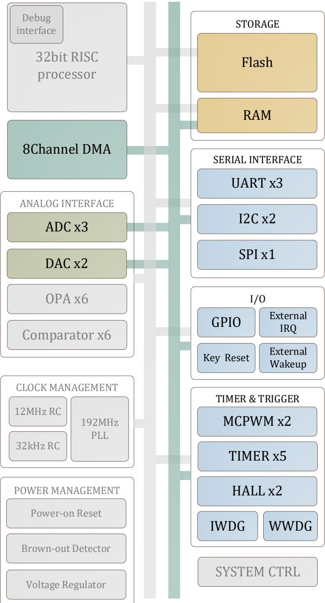  
图 8-1 DMA AHB 总线架构

DMA 有 8 个通道，共享一个搬运引擎。当 DMA 空闲且多个通道同时发生请求时，按优先级进行仲裁，但在搬运过程中不会发生抢占，即一定是某个通道完成一轮搬运，DMA 空闲后，才会发起

仲裁，判断下一个获得请求的通道是哪一个。

DMA 的传输分为多个轮次，根据 DMA\_CCRx.RMODE 设置，可以每轮传输一次传输多轮，也可以只传输一轮但是连续进行多次数据搬运。

如果配置一轮传输多次数据，即 DMA\_CCRx.RMODE=0，则一次 DMA 请求，DMA 连续发送 DMA\_CTMSx 次数据，然后硬件将 DMA\_CCRx.EN 位清零，置位中断标志。

  
图 8-2 RMODE=0 DMA 传输情况

如果配置某个通道为多轮搬运，则在多轮搬运之间，DMA 可能会响应其他通道的搬运请求。多轮传输每轮只搬运一次数据，搬运 DMA\_CTMSx 轮后，硬件将 DMA\_CCRx.EN 位清零，置位中断标志。

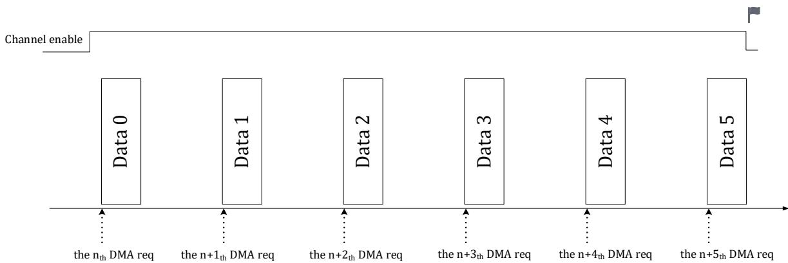  
图 8-3 RMODE=1 DMA 传输情况

DMA 每完成一次传输，地址根据 DMA\_CCRx.SINC 和 DMA\_CCRx.DINC 决定是否自动递增。所有的外设寄存器地址都是 word 对齐的，所以通常外设的地址递增应配置为 0/4。例如对于 UART/SPI/I2C，因为每次都是访问 UART\_DATA 或 SPI/I2C FIFO 接口的固定地址，所以轮次间无需地址递增；如要访问 ADC 数据寄存器，则地址通常需要自动加 4，可以设置轮内递增。而对于内存，如果设置了轮内递增，每次地址递增的值，根据内存数据位宽(DMA\_CCRx.SBTW/DBTW)设定，对于内存访问位宽为 byte 的情况，地址自动加 1，对于 half-word，地址自动加 2，对于 word，地址自动加 4。下图以源地址为例，说明了 SINC 为不同配置时，DMA 访问数据源地址的变化情况，目的地址同理。配置为一轮传输 4 次，源地址和目的地址数据尺寸均为 word。实际应用中，如果配置数据尺寸为 byte 或 halfword，则地址偏移按照 1/2 进行递增。

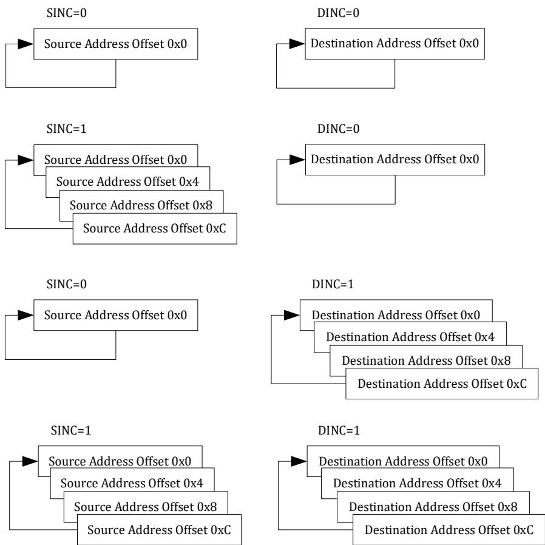  
图 8-4 DMA 地址递增控制  
一般，SINC=0，DINC=0，源地址、目的地址均不递增，可能为外设到外设的搬运。

SINC=1, DINC=0, 源地址递增, 目的地址不递增, 可能为内存数组到外设寄存器接口的搬运。  
SINC=0, DINC=1, 源地址不递增, 目的地址递增, 可能为外设寄存器接口到内存数组的搬运。

SINC=1，DINC=1，源地址、目的地址均递增，为外设多组数据(如 ADC\_DATx)到内存数组的搬运。

出于功耗控制考虑，DMA 模块可以通过设置 DMA\_CTRL.EN 位为 0 来禁用（要求关闭 DMA 使能前先关闭 8 个通道对应的使能 DMA\_CCRx.EN），此时 DMA 时钟被门控关闭。DMA 包含配置寄存器（可以被 CPU 配置）和数据搬运模块（向总线发起各种设备访问请求）。

DMA 支持 8, 16 或 32 bit (byte, half-word, or word) 三种位宽的传输操作，通过配置 DMA\_CCRx.SBTW 和 DMA\_CCRx.DBTW 来选择源地址和目的地址访问的位宽，源地址访问的位宽与目的地址访问的位宽可以不同。

DMA 支持循环模式，由 DMA\_CCRx.CIRC 控制，通常循环模式和 DMA\_CCRx.RMODE 配合使用。

如果配置 DMA\_CCRx.CIRC=1，且 DMA\_CCRx.RMODE=1，即循环多轮模式。一次 DMA 请求信号进行触发，只进行一次数据搬运（如 UART 数据搬运至 RAM，完成一轮搬运等待下一次请求。在此模式下，DMA\_CTMSx 可以配置为一个较大的值，每进行一次搬运 DMA\_CTMSx 减 1。由于循环模式 DMA 进行多轮搬运不再产生中断标志，CPU 可以通过读取 DMA\_CTMSx 来判断当前已经传输的数据量，如果已经足够则开始处理。当传输了 DMA\_CTMSx 轮以后，地址会回到初始地址。DMA\_CTMSx 会重新装载为预设值，开始新一轮的递减。循环多轮模式下，DMA 的通道使能 DMA\_CCRx.EN 位由软件置位，一直为高，即使 DMA\_CTMSx 递减至 0。如果要退出传输，可以软件清零 DMA\_CCRx.EN。

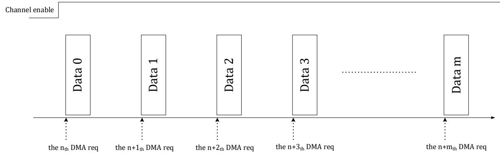  
图 8-5 CIRC=1 且 RMODE=1 DMA 传输情况

如果配置 DMA\_CCRx.CIRC=1，且 DMA\_CCRx.RMODE=0，即循环单轮模式则 DMA 收到一次请求后会连续地进行 DMA\_CTMSx 次数据搬运，并产生中断标志。在此模式下，DMA\_CCRx.EN 无须软件置位，当 DMA 通道收到请求时会自动置位，传输完成一轮后自动清零。如果要退出此种模式，可以清零 DMA\_CCRx.CIRC 位，并清零 DMA\_CCRx.EN 位。

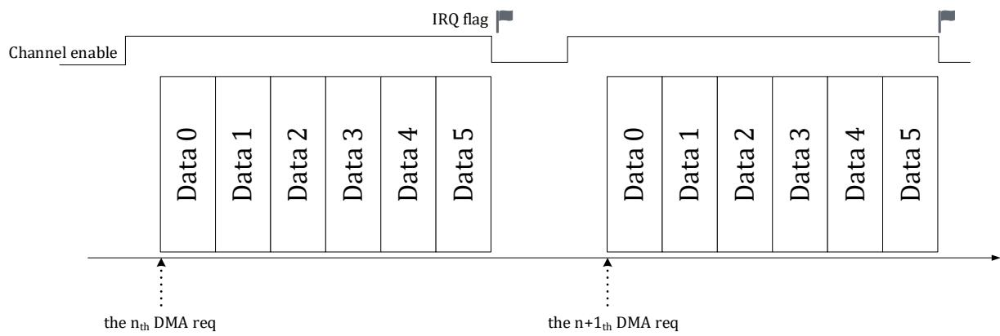  
图 8-6 CIRC=1 且 RMODE=0 DMA 传输情况

循环模式下，DMA\_CTMSx 寄存器随着搬运递减为 0 后重新装载为初始配置值。如果是搬运数据到内存，则覆盖之前搬运至内存的数据；如果是搬运至外设，则重复一轮数据发射。以将 ADC 数据搬运至内存为例，设定数据块大小为 16bit×12channel×8 次，则在循环模式下 DMA 完成一轮 96 个 halfword 搬运后重新开始下一轮搬运，并覆盖之前使用的内存地址，不设置 DMA 完成中断标志位。单次模式下，DMA 完成一定大小的数据块搬运后即终止本次 DMA 操作，设置当前通道 DMA 完成中断标志位，同时硬件自动关闭对应的 DMA 通道，即硬件电路自动在该通道传输完成后将 DMA\_CCRx.EN 设为 0。DMA 需要搬运的轮次由 DMA\_CTMS 寄存器进行控制。

## 8.2 请求

DMA 的请求分为软件请求和硬件请求两类，软件请求通过设置对应 DMA 通道的 DMA\_RENx.SW\_TRIG=1 来产生，写 1 即产生，软件触发位设置后需要软件清零。硬件请求通常为外设的中断事件，当特定的外设中断事件作为 DMA 传输请求时，通常要禁用对应事件的中断响应，即不再需要 CPU 对中断进行响应，响应仅作为 DMA 传输请求。而且硬件 DMA 请求信号经过 DMA 通道受理握手后会被 DMA 硬件清零，无法软件清除事件标志。

表 8-1 DMA 请求

<table><tr><td>触发来源</td><td>描述</td></tr><tr><td>软件</td><td>软件触发时进行的搬运操作由配置寄存器 DMA_CCRx 指定,当设置了DMA_RENx.SW_TRIG,一旦通道被使能即开始进行 DMA 操作。</td></tr><tr><td>ADC</td><td>ADC 在单段触发模式下,一次完成若干个通道后采样后产生中断请求,由 DMA 把 ADC转换后的值搬运到 SRAM。ADC 单段采样完成中断事件作为 DMA 请求信号,请求信号在得到 DMA 响应后由 DMA 将其清零,无需软件清零;注意此时需要软件同时禁用 ADC采用完成中断,使中断不再被 CPU 响应。</td></tr><tr><td>Timer</td><td>Timer 使用过零/比较/捕获事件作为 DMA 请求,具体 DMA 操作根据配置寄存器设定,通常作为定时事件(如每隔 10ms 触发一次 DMA 操作)</td></tr><tr><td>SPI</td><td>SPI 模块使用接收缓冲区满事件作为 DMA 请求信号,由于 SPI 是同时收发,所以接收缓冲区满既是接收完毕也是发送完毕的事件标志。读取 SPI FIFO 自动清除事件标志。</td></tr><tr><td>MCPWM</td><td>MCPWM 模块使用过零/计数周期结束/4 个 ADC 触发信号作为 DMA 请求,具体 DMA操作根据配置寄存器设定</td></tr><tr><td>I2C</td><td>I2C 模块使用 I2C0_SCR.BYTE_CMPLT 即字节发送完成作为触发 DMA 请求,DMA 自动清除 I2C 的请求标志。其他 I2C 中断事件仍由 CPU 响应</td></tr><tr><td>UART</td><td>串口模块使用 UART_IF 触发 DMA 请求,如果 DMA 配置的传输方向是内存到串口,则使用 UART 发送完成事件产生 DMA 请求信号;如果传输方向是串口到内存,则应使用 UART 接收完成事件产生 DMA 请求信号。事件标志由 DMA 自动清零。UART 在由 DMA操作时应同样禁用相应中断防止被 CPU 响应。</td></tr><tr><td>CAN</td><td>CAN 中断可以作为 DMA 请求</td></tr><tr><td>HALL</td><td>HALL 中断可以作为 DMA 请求</td></tr><tr><td>CMP</td><td>CMP 中断可以作为 DMA 请求</td></tr><tr><td>FMAC</td><td>当设置 FMAC_CR.DMAWEN=1,则当 X1 buffer 有足够空闲空间时触发 DMA 向 FMAC 写入待滤波数据;当设置 FMAC_CR.DMAREN=1,则 Y buffer 有足够有效数据时触发 DMA从 FMAC 读取滤波的数据。具体多少数据触发 DMA 进行搬运取决于 FMAC 的水线设置</td></tr><tr><td>GPIO</td><td>GPIO 中断可以作为 DMA 请求</td></tr></table>

## 8.3 优先级

DMA 的优先级采用固定优先级，优先级如图 8-7 所示。为避免出现来不及响应某些外设请求的情况，在设计应用软件时应考虑任务实时性，每个通道不配置搬运过于大量的数据导致其他通道得不到及时响应。

如图 8-7 所示，优先级由上至下降低。8 个 DMA 通道中，优先级关系为：通道 0>通道 1>通道 2>...>通道 7 (>号表示优先级高于)。在 DMA 各通道内部，通常有多个硬件请求事件和一个软件请求事件，硬件请求优先级高于软件请求。同一个通道内多个硬件请求事件优先级相同。通常，一个 DMA 通道配置使能一个硬件事件请求，多个硬件请求不应在一个通道内同时发生。

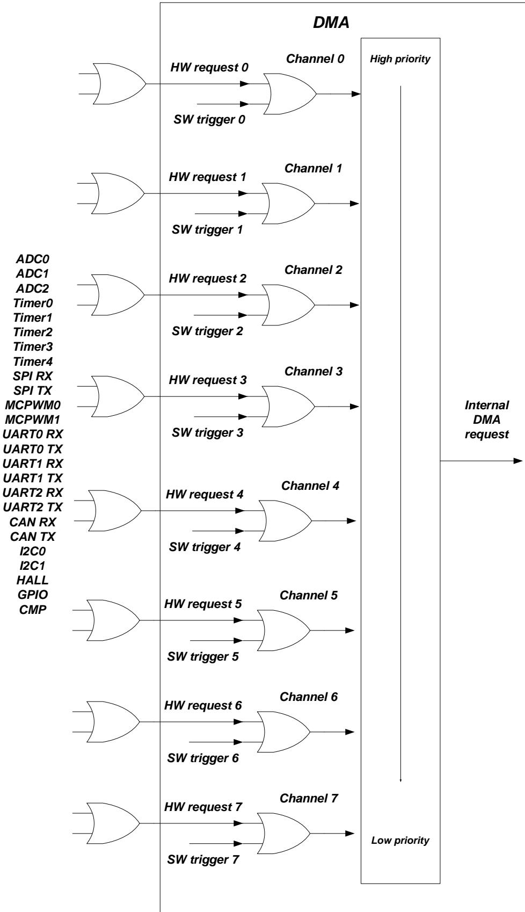  
图 8-7 DMA 通道优先级

## 8.4 仲裁

当 DMA 处于空闲状态, 或刚刚完成某一通道的 DMA 传输后, 若此时恰好有一个或多个 DMA 请求发生, DMA 会根据优先级设定进行仲裁, 优先级高的外设请求率先得到 DMA 服务。比如 ADC 连续模式下, 每完成一轮 ADC 数据搬运, ADC 的采样完成事件标志被 DMA 清零, DMA 回到空闲状态或转而服务其他外设请求; 对于 UART, 每搬运一个 byte 重新仲裁; 对于 SPI/I2C 每搬运完一个 FIFO 的数据, 重新仲裁。

为了避免 CPU 或 DMA 长期占用外设/SRAM，在外设/SRAM 的端口仲裁模块中加入了时间片机制，即一个主设备占用一段时间后释放访问权，仲裁模块观测另一个主设备是否在请求访问，如果是则转而允许另一个主设备访问，否则继续当前主设备未完成的访问。

## 8.5 中断

DMA 的一个通道完成 DMA 操作后产生 DMA 中断。当 DMA 某一个通道完成操作后，会自动关闭该通道的使能为 DMA\_CCRx.EN。

## 8.6 寄存器

## 8.6.1 地址分配

DMA 控制器模块寄存器的基地址是 0x4001\_9C00，寄存器列表如下：

表 8-2 DMA 寄存器列表

<table><tr><td>名称</td><td>偏移地址</td><td>说明</td></tr><tr><td>DMA_CCR0</td><td>0x00</td><td>DMA 通道 0 通道配置寄存器</td></tr><tr><td>DMA_REN0</td><td>0x04</td><td>DMA 通道 0 请求使能寄存器</td></tr><tr><td>DMA_CTMS0</td><td>0x08</td><td>DMA 通道 0 传输次数寄存器</td></tr><tr><td>DMA_SADR0</td><td>0x0C</td><td>DMA 通道 0 源地址寄存器</td></tr><tr><td>DMA_DADR0</td><td>0x10</td><td>DMA 通道 0 目的地址寄存器</td></tr><tr><td></td><td>0x14</td><td></td></tr><tr><td>DMA_CCR1</td><td>0x18</td><td>DMA 通道 1 通道配置寄存器</td></tr><tr><td>DMA_REN1</td><td>0x1C</td><td>DMA 通道 1 请求使能寄存器</td></tr><tr><td>DMA_CTMS1</td><td>0x20</td><td>DMA 通道 1 传输次数寄存器</td></tr><tr><td>DMA_SADR1</td><td>0x24</td><td>DMA 通道 1 源地址寄存器</td></tr><tr><td>DMA_DADR1</td><td>0x28</td><td>DMA 通道 1 目的地址寄存器</td></tr><tr><td></td><td>0x2C</td><td></td></tr><tr><td>DMA_CCR2</td><td>0x30</td><td>DMA 通道 2 通道配置寄存器</td></tr><tr><td>DMA_REN2</td><td>0x34</td><td>DMA 通道 2 请求使能寄存器</td></tr><tr><td>DMA_CTMS2</td><td>0x38</td><td>DMA 通道 2 传输次数寄存器</td></tr><tr><td>DMA_SADR2</td><td>0x3C</td><td>DMA 通道 2 源地址寄存器</td></tr><tr><td>DMA_DADR2</td><td>0x40</td><td>DMA 通道 2 目的地址寄存器</td></tr></table>

<table><tr><td colspan="15">表 8-3 DMA 控制寄存器 DMA_CTRL</td><td></td></tr><tr><td>15</td><td>14</td><td>13</td><td>12</td><td>11</td><td>10</td><td>9</td><td>8</td><td>7</td><td>6</td><td>5</td><td>4</td><td>3</td><td>2</td><td>1</td><td>0</td></tr></table>

<table><tr><td></td><td>0x44</td><td></td></tr><tr><td>DMA_CCR3</td><td>0x48</td><td>DMA 通道 3 通道配置寄存器</td></tr><tr><td>DMA_REN3</td><td>0x4C</td><td>DMA 通道 3 请求使能寄存器</td></tr><tr><td>DMA_CTMS3</td><td>0x50</td><td>DMA 通道 3 传输次数寄存器</td></tr><tr><td>DMA_SADR3</td><td>0x54</td><td>DMA 通道 3 源地址寄存器</td></tr><tr><td>DMA_DADR3</td><td>0x58</td><td>DMA 通道 3 目的地址寄存器</td></tr><tr><td></td><td>0x5C</td><td></td></tr><tr><td>DMA_CCR4</td><td>0x60</td><td>DMA 通道 4 通道配置寄存器</td></tr><tr><td>DMA_REN4</td><td>0x64</td><td>DMA 通道 4 请求使能寄存器</td></tr><tr><td>DMA_CTMS4</td><td>0x68</td><td>DMA 通道 4 传输次数寄存器</td></tr><tr><td>DMA_SADR4</td><td>0x6C</td><td>DMA 通道 4 源地址寄存器</td></tr><tr><td>DMA_DADR4</td><td>0x70</td><td>DMA 通道 4 目的地址寄存器</td></tr><tr><td></td><td>0x74</td><td></td></tr><tr><td>DMA_CCR5</td><td>0x78</td><td>DMA 通道 5 通道配置寄存器</td></tr><tr><td>DMA_REN5</td><td>0x7C</td><td>DMA 通道 5 请求使能寄存器</td></tr><tr><td>DMA_CTMS5</td><td>0x80</td><td>DMA 通道 5 传输次数寄存器</td></tr><tr><td>DMA_SADR5</td><td>0x84</td><td>DMA 通道 5 源地址寄存器</td></tr><tr><td>DMA_DADR5</td><td>0x88</td><td>DMA 通道 5 目的地址寄存器</td></tr><tr><td></td><td>0x8C</td><td></td></tr><tr><td>DMA_CCR6</td><td>0x90</td><td>DMA 通道 6 通道配置寄存器</td></tr><tr><td>DMA_REN6</td><td>0x94</td><td>DMA 通道 6 请求使能寄存器</td></tr><tr><td>DMA_CTMS6</td><td>0x98</td><td>DMA 通道 6 传输次数寄存器</td></tr><tr><td>DMA_SADR6</td><td>0x9C</td><td>DMA 通道 6 源地址寄存器</td></tr><tr><td>DMA_DADR6</td><td>0xA0</td><td>DMA 通道 6 目的地址寄存器</td></tr><tr><td></td><td>0xA4</td><td></td></tr><tr><td>DMA_CCR7</td><td>0xA8</td><td>DMA 通道 7 通道配置寄存器</td></tr><tr><td>DMA_REN7</td><td>0xAC</td><td>DMA 通道 7 请求使能寄存器</td></tr><tr><td>DMA_CTMS7</td><td>0xB0</td><td>DMA 通道 7 传输次数寄存器</td></tr><tr><td>DMA_SADR7</td><td>0xB4</td><td>DMA 通道 7 源地址寄存器</td></tr><tr><td>DMA_DADR7</td><td>0xB8</td><td>DMA 通道 7 目的地址寄存器</td></tr><tr><td></td><td>0xBC</td><td></td></tr><tr><td>DMA_CTRL</td><td>0xC0</td><td>DMA 控制寄存器</td></tr><tr><td>DMA_IE</td><td>0xC4</td><td>DMA 中断使能寄存器</td></tr><tr><td>DMA_IF</td><td>0xC8</td><td>DMA 中断标志寄存器</td></tr></table>

## 8.6.2 DMA\_CTRL DMA 控制寄存器

地址：0x4001\_9CC0

复位值: 0x0

<table><tr><td rowspan="3"></td><td>EN</td></tr><tr><td>RW</td></tr><tr><td>0</td></tr></table>

<table><tr><td>位置</td><td>位名称</td><td>说明</td></tr><tr><td>[31:1]</td><td></td><td>未使用</td></tr><tr><td>[0]</td><td>EN</td><td>DMA 使能</td></tr></table>

## 8.6.3 DMA\_IE DMA 中断使能寄存器

地址：0x4001\_9CC4

复位值：0x0

表 8-4 DMA 中断使能寄存器 DMA\_IE

<table><tr><td>15</td><td>14</td><td>13</td><td>12</td><td>11</td><td>10</td><td>9</td><td>8</td><td>7</td><td>6</td><td>5</td><td>4</td><td>3</td><td>2</td><td>1</td><td>0</td></tr><tr><td rowspan="3" colspan="8"></td><td>CH7_FIE</td><td>CH6_FIE</td><td>CH5_FIE</td><td>CH4_FIE</td><td>CH3_FIE</td><td>CH2_FIE</td><td>CH1_FIE</td><td>CH0_FIE</td></tr><tr><td>RW</td><td>RW</td><td>RW</td><td>RW</td><td>RW</td><td>RW</td><td>RW</td><td>RW</td></tr><tr><td>0</td><td>0</td><td>0</td><td>0</td><td>0</td><td>0</td><td>0</td><td>0</td></tr></table>

<table><tr><td>位置</td><td>位名称</td><td>说明</td></tr><tr><td>[31:8]</td><td></td><td>未使用</td></tr><tr><td>[7]</td><td>CH7_FIE</td><td>通道 7 完成中断使能</td></tr><tr><td>[6]</td><td>CH6_FIE</td><td>通道 6 完成中断使能</td></tr><tr><td>[5]</td><td>CH5_FIE</td><td>通道 5 完成中断使能</td></tr><tr><td>[4]</td><td>CH4_FIE</td><td>通道 4 完成中断使能</td></tr><tr><td>[3]</td><td>CH3_FIE</td><td>通道 3 完成中断使能</td></tr><tr><td>[2]</td><td>CH2_FIE</td><td>通道 2 完成中断使能</td></tr><tr><td>[1]</td><td>CH1_FIE</td><td>通道 1 完成中断使能</td></tr><tr><td>[0]</td><td>CHO_FIE</td><td>通道 0 完成中断使能</td></tr></table>

## 8.6.4 DMA\_IF DMA 中断标志寄存器

地址：0x4001\_9CC8

复位值：0x0

表 8-5 DMA 中断标志寄存器 DMA\_IF

<table><tr><td>15</td><td>14</td><td>13</td><td>12</td><td>11</td><td>10</td><td>9</td><td>8</td><td>7</td><td>6</td><td>5</td><td>4</td><td>3</td><td>2</td><td>1</td><td>0</td></tr></table>

<table><tr><td colspan="3"></td></tr><tr><td>○</td><td>RW1C</td><td>CH7_FIF</td></tr><tr><td>○</td><td>RW1C</td><td>CH6_FIF</td></tr><tr><td>○</td><td>RW1C</td><td>CH5_FIF</td></tr><tr><td>○</td><td>RW1C</td><td>CH4_FIF</td></tr><tr><td>○</td><td>RW1C</td><td>CH3_FIF</td></tr><tr><td>○</td><td>RW1C</td><td>CH2_FIF</td></tr><tr><td>○</td><td>RW1C</td><td>CH1_FIF</td></tr><tr><td>○</td><td>RW1C</td><td>CHO_FIF</td></tr></table>

<table><tr><td>位置</td><td>位名称</td><td>说明</td></tr><tr><td>[31:8]</td><td></td><td>未使用</td></tr><tr><td>[7]</td><td>CH7_FIF</td><td>通道 7 完成中断标志,高有效,写 1 清零</td></tr><tr><td>[6]</td><td>CH6_FIF</td><td>通道 6 完成中断标志,高有效,写 1 清零</td></tr><tr><td>[5]</td><td>CH5_FIF</td><td>通道 5 完成中断标志,高有效,写 1 清零</td></tr><tr><td>[4]</td><td>CH4_FIF</td><td>通道 4 完成中断标志,高有效,写 1 清零</td></tr><tr><td>[3]</td><td>CH3_FIF</td><td>通道 3 完成中断标志,高有效,写 1 清零</td></tr><tr><td>[2]</td><td>CH2_FIF</td><td>通道 2 完成中断标志,高有效,写 1 清零</td></tr><tr><td>[1]</td><td>CH1_FIF</td><td>通道 1 完成中断标志,高有效,写 1 清零</td></tr><tr><td>[0]</td><td>CHO_FIF</td><td>通道 0 完成中断标志,高有效,写 1 清零</td></tr></table>

## 8.6.5 DMA 通道配置寄存器

## 8.6.5.1 DMA\_CCRx (x = 0, 1, 2, 3, 4, 5, 6, 7)

地址分别是：0x4001\_9C00，0x4001\_9C18，0x4001\_9C30，0x4001\_9C48，0x4001\_9C60，0x4001\_9C78，0x4001\_9C90，0x4001\_9CA8

复位值：0x0

表 8-6 DMA 通道配置寄存器 DMA\_CCRx

<table><tr><td rowspan="3"></td><td>SBTW</td><td>DBTW</td><td rowspan="3"></td><td>SINC</td><td rowspan="3"></td><td>DINC</td><td>CIRC</td><td rowspan="3"></td><td>RMODE</td><td>EN</td></tr><tr><td>RW</td><td>RW</td><td>RW</td><td>RW</td><td>RW</td><td>RW</td><td>RW</td></tr><tr><td>0</td><td>0</td><td>0</td><td>0</td><td>0</td><td>0</td><td>0</td></tr></table>

<table><tr><td>位置</td><td>位名称</td><td>说明</td></tr><tr><td>[31:12]</td><td></td><td>未使用</td></tr><tr><td>[11:10]</td><td>SBTW</td><td>源地址访问位宽0: Byte1: Halfword2: Word3: 保留</td></tr><tr><td>[9:8]</td><td>DBTW</td><td>目的地址访问位宽0:Byte1:Halfword2:Word3:保留</td></tr><tr><td>[7]</td><td></td><td>未使用</td></tr><tr><td>[6]</td><td>SINC</td><td>源地址递增方式0:不递增1:每传输一次,地址按照SBTW对应大小递增1/2/4</td></tr><tr><td>[5]</td><td></td><td>未使用</td></tr><tr><td>[4]</td><td>DINC</td><td>目的地址递增方式0:不递增1:每传输一次,地址按照DBTW对应大小递增1/2/4</td></tr><tr><td>[3]</td><td>CIRC</td><td>循环模式,高有效</td></tr><tr><td>[2]</td><td></td><td>未使用</td></tr><tr><td>[1]</td><td>RMODE</td><td>0:单轮传输,一轮连续传输多次,每收到DMA请求传输一轮,一个DMA请求即传输完毕1:多轮传输,每轮进行一次数据传输,每收到DMA请求传输一轮,多个DMA请求才传输完毕不支持多轮×多次传输</td></tr><tr><td>[0]</td><td>EN</td><td>通道使能,高有效,软件置1开启通道进行DMA搬运操作,搬运完成后DMA硬件将此位清零</td></tr></table>

## 8.6.5.2 DMA\_RENx (x = 0,1,2,3,4,5,6,7)

地址分别是：0x4001\_9C04，0x4001\_9C1C，0x4001\_9C34，0x4001\_9C4C，0x4001\_9C64，0x4001\_9C7C，0x4001\_9C94，0x4001\_9CAC

复位值：0x0

表 8-7 DMA 请求使能寄存器 DMA\_RENx

<table><tr><td>31</td><td>30</td><td>29</td><td>28</td><td>27</td><td>26</td><td>25</td><td>24</td><td>23</td><td>22</td><td>21</td><td>20</td><td>19</td><td>18</td><td>17</td><td>16</td></tr><tr><td>SW_TRIG</td><td rowspan="3"></td><td>GPIO</td><td>FMAC_Y</td><td>FMAC_X1</td><td>CMP</td><td>HALL1</td><td>HALLO</td><td>I2C1 TX</td><td>I2C1 RX</td><td>UART2 TX</td><td>UART2 RX</td><td>UART1 TX</td><td>UART1 RX</td><td>UART0 TX</td><td>UART0 RX</td></tr><tr><td>RW</td><td>RW</td><td>RW</td><td>RW</td><td>RW</td><td>RW</td><td>RW</td><td>RW</td><td>RW</td><td>RW</td><td>RW</td><td>RW</td><td>RW</td><td>RW</td><td>RW</td></tr><tr><td>0</td><td>0</td><td>0</td><td>0</td><td>0</td><td>0</td><td>0</td><td>0</td><td>0</td><td>0</td><td>0</td><td>0</td><td>0</td><td>0</td><td>0</td></tr><tr><td>15</td><td>14</td><td>13</td><td>12</td><td>11</td><td>10</td><td>9</td><td>8</td><td>7</td><td>6</td><td>5</td><td>4</td><td>3</td><td>2</td><td>1</td><td>0</td></tr><tr><td>I2C0 TX</td><td>I2C0 RX</td><td>MCPWM1</td><td>MCPWM0</td><td>SP11 TX</td><td>SP11 RX</td><td>SP10 TX</td><td>SP10 RX</td><td>TIMER4</td><td>TIMER3</td><td>TIMER2</td><td>TIMER1</td><td>TIMER0</td><td>ADC2</td><td>ADC1</td><td>ADC0</td></tr><tr><td>RW</td><td>RW</td><td>RW</td><td>RW</td><td>RW</td><td>RW</td><td>RW</td><td>RW</td><td>RW</td><td>RW</td><td>RW</td><td>RW</td><td>RW</td><td>RW</td><td>RW</td><td>RW</td></tr><tr><td>0</td><td>0</td><td>0</td><td>0</td><td>0</td><td>0</td><td>0</td><td>0</td><td>0</td><td>0</td><td>0</td><td>0</td><td>0</td><td>0</td><td>0</td><td>0</td></tr></table>

DMA 的通道中配置的内存、外设地址应与使能的外设中断请求相对应，这一点需要由应用软件保证。其中软件请求始终处于使能状态，即软件向 DMA\_RENx.SW\_TRIG 写 1 即开始一次 DMA 传输。每一个 DMA 通道一般在同一时间通常只使能一个硬件 DMA 请求。软件触发标志 DMA\_RENx.SW\_TRIG 在请求被 DMA 受理后由硬件自动清除。

由于 CMP 信号可能是一个慢速的电平信号，在使用 CMP 触发 DMA 时，推荐将中断触发类型选择为上升沿触发。

DMA\_RENx 寄存器可以在 DMA 通道使能的情况下改写。

## 8.6.5.3 DMA\_CTMSx (x = 0,1,2,3,4,5,6,7)

地址分别是：0x4001\_9C08，0x4001\_9C20，0x4001\_9C38，0x4001\_9C50，0x4001\_9C68，0x4001\_9C80，0x4001\_9C98，0x4001\_9CB0

复位值：0x0

表 8-8 DMA 传输次数寄存器 DMA\_CTMSx

<table><tr><td>15</td><td>14</td><td>13</td><td>12</td><td>11</td><td>10</td><td>9</td><td>8</td><td>7</td><td>6</td><td>5</td><td>4</td><td>3</td><td>2</td><td>1</td><td>0</td></tr><tr><td colspan="16">TIMES</td></tr><tr><td colspan="16">RW</td></tr><tr><td colspan="16">0</td></tr></table>

<table><tr><td>位置</td><td>位名称</td><td>说明</td></tr><tr><td>[31:16]</td><td></td><td>未使用</td></tr><tr><td>[15:0]</td><td>TIMES</td><td>DMA 通道 x 数据搬运次数。此寄存器在该通道使能后变为只读。</td></tr></table>

DMA\_CTMSx 寄存器只有在通道禁用，即 DMA\_CCRx.EN=0 之后才可以写入数据。

当 DMA\_CTRL=1 且 DMA\_CCRx.EN=0 时，重新填写 CTMSx 值，可以将 DMA 内部已搬运的轮数次数计数器清零。

当 DMA\_CCRx.RMODE=0 时，表示传输 1 轮，每轮传输 DMA\_CTMS 次数据；

当 DMA\_CCRx.RMODE=1 时，表示传输 DMA\_CTMS 轮，每轮传输一次数据；

不支持多轮每轮传输多次数据。

以外设数据宽度为 16，内存数据宽度为 32，即 CTMS.TIMES=16，DMA\_CCRx.RMODE=0 为例，DMA 每轮需要读取外设数据 16bit(2byte)×16=32byte，写入内存数据 32bit(4byte)×16=64byte。即

读取外设 32byte，输入内存 64byte;

即使仅仅搬运一轮，也需要设置 CTMS.ROUND = 1，而不能让其为 0。

当设置 DMA\_CCRx.CIRC=1（即循环模式）时，DMA\_CTMSx 不再起作用，相当于无限轮；当 DMA\_CTMSx 递减为 0 时，重新装载为预设值，开启下一阶段的传输。其他情况需要相应设置 DMA\_CTMSx，如 DMA\_CTMSx=1，且 DMA\_CCRx.RMODE=1 时，用于搬运一轮数据。

当 DMA\_CCRx.RMODE=1 时，DMA\_CTMSx 读出为当前剩余未搬运轮数，当 DMA 传输完成后轮数会复位为配置值。次数读出时一直为配置值。举例来说，比如配置 DMA\_CTMSx=4，读取时可能看到 DMA\_CTMSx 由 4 开始递减，3,2,1...之后又变为 0。当 DMA 当前通道需要重新进行 4 轮传输时，需要重新向 DMA\_CTMSx 写入轮数值。当 DMA\_CCRx.RMODE=0 时，DMA\_CTMSx 读出为当前这一轮剩余未搬运次数。但由于一轮内的数据是被 DMA 连续搬运的，所以软件读出的 DMA\_CTMSx 会迅速变化。

注意，每次重新开启 DMA 通道前，都要重新配置 DMA\_CTMSx 寄存器，已经在上一次传输中 DMA\_CTMSx 寄存器已经递减为 0。在设置 DMA\_CTMSx 寄存器时，需要保证 DMA\_CTRL=1，即 DMA 被使能，否则 DMA\_CTMSx 会写入无效。

## 8.6.5.4 DMA\_SADRx (x = 0,1,2,3,4,5,6,7)

地址分别是：0x4001\_9C0C，0x4001\_9C24，0x4001\_9C3C，0x4001\_9C54，0x4001\_9C6C，0x4001\_9C84，0x4001\_9C9C，0x4001\_9CB4

复位值：0x0

表 8-9 DMA 源地址寄存器 DMA\_SADRx

<table><tr><td>31</td><td>30</td><td>29</td><td>28</td><td>27</td><td>26</td><td>25</td><td>24</td><td>23</td><td>22</td><td>21</td><td>20</td><td>19</td><td>18</td><td>17</td><td>16</td></tr><tr><td colspan="16">ADDR</td></tr><tr><td colspan="16">RW</td></tr><tr><td colspan="16">0</td></tr></table>

<table><tr><td>ADDR</td></tr><tr><td>RW</td></tr><tr><td>0</td></tr></table>

<table><tr><td>位置</td><td>位名称</td><td>说明</td></tr><tr><td>[31:0]</td><td>ADDR</td><td>DMA 通道 x 源地址</td></tr></table>

当 DMA\_CCRx.SBTW=2'b01 时，即配置为以 16bit 为单位从源地址搬运数据。DMA\_SADRx.ADDR[0]值无效，源地址会以 2 为单位递增。

当 DMA\_CCRx.SBTW=2'b10 时, 即配置为以 32bit 为单位从源地址搬运数据。DMA\_SADRx.ADDR[1:0]值无效，源地址会以 4 为单位递增。

注意：DMA\_SADRx 寄存器只有在通道禁用，即 DMA\_CCRx.EN=0 之后才可以写入数据！！！

## 8.6.5.5 DMA\_DADRx (x = 0,1,2,3,4,5,6,7)

地址分别是：0x4001\_9C10，0x4001\_9C28，0x4001\_9C40，0x4001\_9C58，0x4001\_9C70，0x4001\_9C88，0x4001\_9CA0，0x4001\_9CB8

复位值：0x0

表 8-10 DMA 目的地址寄存器 DMA\_DADRx

<table><tr><td>31</td><td>30</td><td>29</td><td>28</td><td>27</td><td>26</td><td>25</td><td>24</td><td>23</td><td>22</td><td>21</td><td>20</td><td>19</td><td>18</td><td>17</td><td>16</td></tr><tr><td colspan="16">ADDR</td></tr><tr><td colspan="16">RW</td></tr><tr><td colspan="16">0</td></tr><tr><td>15</td><td>14</td><td>13</td><td>12</td><td>11</td><td>10</td><td>9</td><td>8</td><td>7</td><td>6</td><td>5</td><td>4</td><td>3</td><td>2</td><td>1</td><td>0</td></tr><tr><td colspan="16">ADDR</td></tr><tr><td colspan="16">RW</td></tr><tr><td colspan="16">0</td></tr></table>

<table><tr><td>位置</td><td>位名称</td><td>说明</td></tr><tr><td>[31:0]</td><td>ADDR</td><td>DMA 通道 x 目的地址</td></tr></table>

当 DMA\_CCRx.DBTW=2'b01 时，即配置为以 16bit 为单位搬运数据到目的地址。DMA\_DADRx.ADDR[0]值无效，目的地址会以 2 为单位递增。

当 DMA\_CCRx.DBTW=2'b10 时, 即配置为以 32bit 为单位搬运内存数据。DMA\_DADRx.ADDR[1:0] 值无效, 目的地址会以 4 为单位递增。

注意：DMA\_DADRx 寄存器只有在通道禁用，即 DMA\_CCRx.EN=0 之后才可以写入数据！！！

## 9 GPIO

## 9.1 概述

LSK32MC45x 系列芯片共集成了 84 个 GPIO。8 个 GPIO 可以作为系统的唤醒源。其中 34 个 GPIO 可以用作外部中断源输入。

## 9.1.1 功能框图

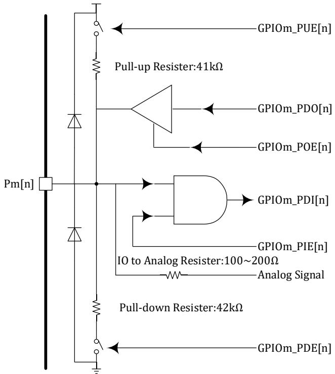  
图 9-1 GPIO 功能框图

如上图所示，Pm[n]为芯片 PAD, m 可以是 0\~5，表示 6 组 GPIO 中的任意一组，n 可以是 0\~15，表示一组 16bit GPIO 中的一个 IO。模拟信号通过一个电阻串联直接连接到 PAD，电阻阻值为 100\~200Ω。数字信号经过一个三态门输出，当输出使能 GPIOm\_POE[n]=0 时，buffer 输出高阻态，否则 buffer 输出与 GPIOm\_PDO[n] 电平相同。数字信号输入通过一个与门进入芯片内部，当 GPIOm\_PIE[n]=0 时，GPIOm\_PDI[n] 恒为 0，当 GPIOm\_PIE[n]=1，即输入使能打开时，GPIOm\_PDI[n] 的逻辑电平与 Pm[n] 逻辑电平相同。芯片 PAD 可以配置上拉下拉，上拉电阻典型值为 41kΩ，下拉电阻典型值为 42kΩ。由于芯片制造工艺存在偏差，上下拉电阻值可能存在一定偏差。

## 9.1.2 产品特点

➢ 5 组 16bit GPIO，1 组 4bit GPIO，共 84 个 GPIO

推挽开漏模式可配置

支持配置锁定保护

支持 GPIO 外部中断

支持 GPIO 休眠唤醒

## 9.2 寄存器

## 9.2.1 地址分配

GPIO 0 模块基地址是 0x4001\_6400。

GPIO 1 模块基地址是 0x4001\_6440。

GPIO 2 模块基地址是 0x4001\_6480。

GPIO 3 模块基地址是 0x4001\_64C0。

GPIO 4 模块基地址是 0x4001\_6500。

GPIO 5 模块基地址是 0x4001\_6540。

EXTI 模块基地址是 0x4001\_6580。

GPIO 0/1/2/3/4/5 的寄存器定义完全相同，仅基地址不同。但 P5 只有 P5[3:0]有实现，不存在 P5[15:4]这几个 IO。

表 9-1 GPIOx 寄存器列表

<table><tr><td>名称</td><td>偏移地址</td><td>说明</td></tr><tr><td>GPIOx_PIE</td><td>0x00</td><td>GPIO x 输入使能</td></tr><tr><td>GPIOx_POE</td><td>0x04</td><td>GPIO x 输出使能</td></tr><tr><td>GPIOx_PDI</td><td>0x08</td><td>GPIO x 输入数据</td></tr><tr><td>GPIOx_PDO</td><td>0x0C</td><td>GPIO x 输出数据</td></tr><tr><td>GPIOx_PUE</td><td>0x10</td><td>GPIO x 上拉使能</td></tr><tr><td>GPIOx_PDE</td><td>0x14</td><td>GPIO x 下拉使能</td></tr><tr><td>GPIOx_PODE</td><td>0x18</td><td>GPIO x 开漏使能</td></tr><tr><td>GPIOx_PFLT</td><td>0x1C</td><td>GPIO x 滤波使能</td></tr><tr><td>GPIOx_F3210</td><td>0x20</td><td>GPIO x [3:0]功能选择</td></tr><tr><td>GPIOx_F7654</td><td>0x24</td><td>GPIO x [7:4]功能选择</td></tr><tr><td>GPIOx_FBA98</td><td>0x28</td><td>GPIO x [11:8]功能选择</td></tr><tr><td>GPIOx_FFEDC</td><td>0x2C</td><td>GPIO x [15:12]功能选择</td></tr><tr><td>GPIOx_BSRR</td><td>0x30</td><td>GPIO x 位操作寄存器</td></tr><tr><td>GPIOx_BRR</td><td>0x34</td><td>GPIO x 位清零寄存器</td></tr></table>

表 9-2 GPIO 中断/DMA 模块寄存器列表

<table><tr><td>名称</td><td>偏移地址</td><td>说明</td></tr><tr><td>EXTI0_CR0</td><td>0x00</td><td>GPIO 0[7:0] 中断/DMA 触发类型</td></tr><tr><td>EXTI0_CR1</td><td>0x04</td><td>GPIO 0[15:8]中断/DMA 触发类型</td></tr><tr><td>EXTI1_CR0</td><td>0x08</td><td>GPIO 1[7:0] 中断/DMA 触发类型</td></tr><tr><td>EXTI1_CR1</td><td>0x0C</td><td>GPIO 1[15:8]中断/DMA 触发类型</td></tr><tr><td>EXTI2_CR0</td><td>0x10</td><td>GPIO 2[7:0] 中断/DMA 触发类型</td></tr><tr><td>EXTI2_CR1</td><td>0x14</td><td>GPIO 2[15:8]中断/DMA 触发类型</td></tr><tr><td>EXTI3_CR0</td><td>0x18</td><td>GPIO 3[7:0] 中断/DMA 触发类型</td></tr><tr><td>EXTI3_CR1</td><td>0x1C</td><td>GPIO 3[15:8]中断/DMA 触发类型</td></tr><tr><td>EXTI4_CR0</td><td>0x20</td><td>GPIO 4[7:0] 中断/DMA 触发类型</td></tr><tr><td>EXTI4_CR1</td><td>0x24</td><td>GPIO 4[15:8]中断/DMA 触发类型</td></tr><tr><td>EXTI5_CR0</td><td>0x28</td><td>GPIO 5[7:0] 中断/DMA 触发类型</td></tr><tr><td>EXTI5_CR1</td><td>0x2C</td><td>GPIO 5[15:8]中断/DMA 触发类型</td></tr><tr><td>EXTI0_IF</td><td>0x30</td><td>GPIO 0 中断标志</td></tr><tr><td>EXTI1_IF</td><td>0x34</td><td>GPIO 1 中断标志</td></tr><tr><td>EXTI2_IF</td><td>0x38</td><td>GPIO 2 中断标志</td></tr><tr><td>EXTI3_IF</td><td>0x3C</td><td>GPIO 3 中断标志</td></tr><tr><td>EXTI4_IF</td><td>0x40</td><td>GPIO 4 中断标志</td></tr><tr><td>EXTI5_IF</td><td>0x44</td><td>GPIO 5 中断标志</td></tr><tr><td>CLKO_SEL</td><td>0x50</td><td>时钟输出选择</td></tr><tr><td>LCKR_PRT</td><td>0x54</td><td>GPIO 保护</td></tr><tr><td>EXTI_REN</td><td>0x58</td><td>GPIO DMA 请求使能</td></tr></table>

## 9.2.2 GPIOx\_PIE(x = 0,1,2,3,4,5)

GPIO0/1/2/3/4/5 地址分别是：0x4001\_6400，0x4001\_6440，0x4001\_6480，0x4001\_64C0，0x4001\_6500，0x4001\_6540

复位值：0x0

表 9-3 GPIOx 输入使能寄存器 GPIOx\_PIE

<table><tr><td>15</td><td>14</td><td>13</td><td>12</td><td>11</td><td>10</td><td>9</td><td>8</td><td>7</td><td>6</td><td>5</td><td>4</td><td>3</td><td>2</td><td>1</td><td>0</td></tr><tr><td>PIE15</td><td>PIE14</td><td>PIE13</td><td>PIE12</td><td>PIE11</td><td>PIE10</td><td>PIE9</td><td>PIE8</td><td>PIE7</td><td>PIE6</td><td>PIE5</td><td>PIE4</td><td>PIE3</td><td>PIE2</td><td>PIE1</td><td>PIE0</td></tr><tr><td>RW</td><td>RW</td><td>RW</td><td>RW</td><td>RW</td><td>RW</td><td>RW</td><td>RW</td><td>RW</td><td>RW</td><td>RW</td><td>RW</td><td>RW</td><td>RW</td><td>RW</td><td>RW</td></tr><tr><td>0</td><td>0</td><td>0</td><td>0</td><td>0</td><td>0</td><td>0</td><td>0</td><td>0</td><td>0</td><td>0</td><td>0</td><td>0</td><td>0</td><td>0</td><td>0</td></tr></table>

<table><tr><td>位置</td><td>位名称</td><td>说明</td></tr><tr><td>[31:16]</td><td></td><td>未使用</td></tr><tr><td>[15]</td><td>PIE15</td><td>GPIO x[15] / Px[15] 输入使能</td></tr><tr><td>[14]</td><td>PIE14</td><td>GPIO x[14] / Px[14] 输入使能</td></tr><tr><td>[13]</td><td>PIE13</td><td>GPIO x[13] / Px[13] 输入使能</td></tr><tr><td>[12]</td><td>PIE12</td><td>GPIO x[12] / Px[12] 输入使能</td></tr><tr><td>[11]</td><td>PIE11</td><td>GPIO x[11] / Px[11] 输入使能</td></tr><tr><td>[10]</td><td>PIE10</td><td>GPIO x[10] / Px[10] 输入使能</td></tr><tr><td>[9]</td><td>PIE9</td><td>GPIO x[9] / Px[9] 输入使能</td></tr><tr><td>[8]</td><td>PIE8</td><td>GPIO x[8] / Px[8] 输入使能</td></tr><tr><td>[7]</td><td>PIE7</td><td>GPIO x[7] / Px[7] 输入使能</td></tr><tr><td>[6]</td><td>PIE6</td><td>GPIO x[6] / Px[6] 输入使能</td></tr><tr><td>[5]</td><td>PIE5</td><td>GPIO x[5] / Px[5] 输入使能</td></tr><tr><td>[4]</td><td>PIE4</td><td>GPIO x[4] / Px[4] 输入使能</td></tr><tr><td>[3]</td><td>PIE3</td><td>GPIO x[3] / Px[3] 输入使能</td></tr><tr><td>[2]</td><td>PIE2</td><td>GPIO x[2] / Px[2] 输入使能</td></tr><tr><td>[1]</td><td>PIE1</td><td>GPIO x[1] / Px[1] 输入使能</td></tr><tr><td>[0]</td><td>PIE0</td><td>GPIO x[0] / Px[0] 输入使能</td></tr></table>

## 9.2.3 GPIOx\_POE(x = 0,1,2,3,4,5)

GPIO0/1/2/3/4/5 地址分别是：0x4001\_6404，0x4001\_6444，0x4001\_6484，0x4001\_64C4，0x4001\_6504，0x4001\_6544

复位值：0x0

表 9-4 GPIOx 输出使能寄存器 GPIOx\_POE

<table><tr><td>15</td><td>14</td><td>13</td><td>12</td><td>11</td><td>10</td><td>9</td><td>8</td><td>7</td><td>6</td><td>5</td><td>4</td><td>3</td><td>2</td><td>1</td><td>0</td></tr><tr><td>POE15</td><td>POE14</td><td>POE13</td><td>POE12</td><td>POE11</td><td>POE10</td><td>POE9</td><td>POE8</td><td>POE7</td><td>POE6</td><td>POE5</td><td>POE4</td><td>POE3</td><td>POE2</td><td>POE1</td><td>POE0</td></tr><tr><td>RW</td><td>RW</td><td>RW</td><td>RW</td><td>RW</td><td>RW</td><td>RW</td><td>RW</td><td>RW</td><td>RW</td><td>RW</td><td>RW</td><td>RW</td><td>RW</td><td>RW</td><td>RW</td></tr><tr><td>0</td><td>0</td><td>0</td><td>0</td><td>0</td><td>0</td><td>0</td><td>0</td><td>0</td><td>0</td><td>0</td><td>0</td><td>0</td><td>0</td><td>0</td><td>0</td></tr></table>

<table><tr><td>位置</td><td>位名称</td><td>说明</td></tr><tr><td>[31:16]</td><td></td><td>未使用</td></tr><tr><td>[15]</td><td>POE15</td><td>GPIO x[15] / Px[15] 输出使能</td></tr><tr><td>[14]</td><td>POE14</td><td>GPIO x[14] / Px[14] 输出使能</td></tr><tr><td>[13]</td><td>POE13</td><td>GPIO x[13] / Px[13] 输出使能</td></tr><tr><td>[12]</td><td>POE12</td><td>GPIO x[12] / Px[12] 输出使能</td></tr><tr><td>[11]</td><td>POE11</td><td>GPIO x[11] / Px[11] 输出使能</td></tr><tr><td>[10]</td><td>POE10</td><td>GPIO x[10] / Px[10] 输出使能</td></tr><tr><td>[9]</td><td>POE9</td><td>GPIO x[9] / Px[9] 输出使能</td></tr><tr><td>[8]</td><td>POE8</td><td>GPIO x[8] / Px[8] 输出使能</td></tr><tr><td>[7]</td><td>POE7</td><td>GPIO x[7] / Px[7] 输出使能</td></tr><tr><td>[6]</td><td>POE6</td><td>GPIO x[6] / Px[6] 输出使能</td></tr><tr><td>[5]</td><td>POE5</td><td>GPIO x[5] / Px[5] 输出使能</td></tr><tr><td>[4]</td><td>POE4</td><td>GPIO x[4] / Px[4] 输出使能</td></tr><tr><td>[3]</td><td>POE3</td><td>GPIO x[3] / Px[3] 输出使能</td></tr><tr><td>[2]</td><td>POE2</td><td>GPIO x[2] / Px[2] 输出使能</td></tr><tr><td>[1]</td><td>POE1</td><td>GPIO x[1] / Px[1] 输出使能</td></tr><tr><td>[0]</td><td>POE0</td><td>GPIO x[0] / Px[0] 输出使能</td></tr></table>

## 9.2.4 GPIOx\_PDI(x = 0,1,2,3,4,5)

地址分别是：0x4001\_6408，0x4001\_6448，0x4001\_6488，0x4001\_64C8，0x4001\_6508，0x4001\_6548

复位值：0x0

表 9-5 GPIOx 输入数据寄存器 GPIOx\_PDI

<table><tr><td>15</td><td>14</td><td>13</td><td>12</td><td>11</td><td>10</td><td>9</td><td>8</td><td>7</td><td>6</td><td>5</td><td>4</td><td>3</td><td>2</td><td>1</td><td>0</td></tr><tr><td></td><td></td><td></td><td></td><td></td><td></td><td></td><td>PDI</td><td></td><td></td><td></td><td></td><td></td><td></td><td></td><td></td></tr><tr><td></td><td></td><td></td><td></td><td></td><td></td><td></td><td>RO</td><td></td><td></td><td></td><td></td><td></td><td></td><td></td><td></td></tr><tr><td></td><td></td><td></td><td></td><td></td><td></td><td></td><td>0</td><td></td><td></td><td></td><td></td><td></td><td></td><td></td><td></td></tr></table>

<table><tr><td>位置</td><td>位名称</td><td>说明</td></tr><tr><td>[31:16]</td><td></td><td>未使用</td></tr><tr><td>[15:0]</td><td>PDI</td><td>GPIO x 输入数据</td></tr></table>

当 GPIOx\_PIE=0 时，GPIOx\_PDI 读回为 0。

## 9.2.5 GPIOx\_PDO(x = 0,1,2,3,4,5)

GPIO0/1/2/3/4/5 地址分别是：0x4001\_640C，0x4001\_644C，0x4001\_648C，0x4001\_64CC，0x4001\_650C，0x4001\_654C

复位值：0x0

表 9-6 GPIOx 输出数据寄存器 GPIOx\_PDO

<table><tr><td>15</td><td>14</td><td>13</td><td>12</td><td>11</td><td>10</td><td>9</td><td>8</td><td>7</td><td>6</td><td>5</td><td>4</td><td>3</td><td>2</td><td>1</td><td>0</td></tr><tr><td></td><td></td><td></td><td></td><td></td><td></td><td></td><td>PDO</td><td></td><td></td><td></td><td></td><td></td><td></td><td></td><td></td></tr><tr><td></td><td></td><td></td><td></td><td></td><td></td><td></td><td>RW</td><td></td><td></td><td></td><td></td><td></td><td></td><td></td><td></td></tr><tr><td></td><td></td><td></td><td></td><td></td><td></td><td></td><td>0</td><td></td><td></td><td></td><td></td><td></td><td></td><td></td><td></td></tr></table>

<table><tr><td>位置</td><td>位名称</td><td>说明</td></tr><tr><td>[31:16]</td><td></td><td>未使用</td></tr><tr><td>[15:0]</td><td>PDO</td><td>GPIO x 输出数据</td></tr></table>

## 9.2.6 GPIOx\_PUE(x = 0,1,2,3,4,5)

GPIO0/1/2/3/4/5 地址分别是：0x4001\_6410，0x4001\_6450，0x4001\_6490，0x4001\_64D0，0x4001\_6510，0x4001\_6550

复位值：0x0

表 9-7 GPIOx 上拉使能寄存器 GPIOx\_PUE

<table><tr><td>15</td><td>14</td><td>13</td><td>12</td><td>11</td><td>10</td><td>9</td><td>8</td><td>7</td><td>6</td><td>5</td><td>4</td><td>3</td><td>2</td><td>1</td><td>0</td></tr><tr><td>PUE15</td><td>PUE14</td><td>PUE13</td><td>PUE12</td><td>PUE11</td><td>PUE10</td><td>PUE9</td><td>PUE8</td><td>PUE7</td><td>PUE6</td><td>PUE5</td><td>PUE4</td><td>PUE3</td><td>PUE2</td><td>PUE1</td><td>PUE0</td></tr><tr><td>RW</td><td>RW</td><td>RW</td><td>RW</td><td>RW</td><td>RW</td><td>RW</td><td>RW</td><td>RW</td><td>RW</td><td>RW</td><td>RW</td><td>RW</td><td>RW</td><td>RW</td><td>RW</td></tr><tr><td>0</td><td>0</td><td>0</td><td>0</td><td>0</td><td>0</td><td>0</td><td>0</td><td>0</td><td>0</td><td>0</td><td>0</td><td>0</td><td>0</td><td>0</td><td>0</td></tr></table>

<table><tr><td>位置</td><td>位名称</td><td>说明</td></tr><tr><td>[31:16]</td><td></td><td>未使用</td></tr><tr><td>[15]</td><td>PUE15</td><td>GPIO x[15] / Px[15] 上拉使能</td></tr><tr><td>[14]</td><td>PUE14</td><td>GPIO x[14] / Px[14] 上拉使能</td></tr><tr><td>[13]</td><td>PUE13</td><td>GPIO x[13] / Px[13] 上拉使能</td></tr><tr><td>[12]</td><td>PUE12</td><td>GPIO x[12] / Px[12] 上拉使能</td></tr><tr><td>[11]</td><td>PUE11</td><td>GPIO x[11] / Px[11] 上拉使能</td></tr><tr><td>[10]</td><td>PUE10</td><td>GPIO x[10] / Px[10] 上拉使能</td></tr><tr><td>[9]</td><td>PUE9</td><td>GPIO x[9] / Px[9] 上拉使能</td></tr><tr><td>[8]</td><td>PUE8</td><td>GPIO x[8] / Px[8] 上拉使能</td></tr><tr><td>[7]</td><td>PUE7</td><td>GPIO x[7] / Px[7] 上拉使能</td></tr><tr><td>[6]</td><td>PUE6</td><td>GPIO x[6] / Px[6] 上拉使能</td></tr><tr><td>[5]</td><td>PUE5</td><td>GPIO x[5] / Px[5] 上拉使能</td></tr><tr><td>[4]</td><td>PUE4</td><td>GPIO x[4] / Px[4] 上拉使能</td></tr><tr><td>[3]</td><td>PUE3</td><td>GPIO x[3] / Px[3] 上拉使能</td></tr><tr><td>[2]</td><td>PUE2</td><td>GPIO x[2] / Px[2] 上拉使能</td></tr><tr><td>[1]</td><td>PUE1</td><td>GPIO x[1] / Px[1] 上拉使能</td></tr><tr><td>[0]</td><td>PUE0</td><td>GPIO x[0] / Px[0] 上拉使能</td></tr></table>

## 9.2.7 GPIOx\_PDE(x = 0,1,2,3,4,5)

GPIO0/1/2/3/4/5 地址分别是：0x4001\_6414，0x4001\_6454，0x4001\_6494，0x4001\_64D4，0x4001\_6514，0x4001\_6554

复位值：0x0

表 9-8 GPIOx 下拉使能寄存器 GPIOx\_PDE

<table><tr><td>15</td><td>14</td><td>13</td><td>12</td><td>11</td><td>10</td><td>9</td><td>8</td><td>7</td><td>6</td><td>5</td><td>4</td><td>3</td><td>2</td><td>1</td><td>0</td></tr><tr><td>PDE15</td><td>PDE14</td><td>PDE13</td><td>PDE12</td><td>PDE11</td><td>PDE10</td><td>PDE9</td><td>PDE8</td><td>PDE7</td><td>PDE6</td><td>PDE5</td><td>PDE4</td><td>PDE3</td><td>PDE2</td><td>PDE1</td><td>PDE0</td></tr><tr><td>RW</td><td>RW</td><td>RW</td><td>RW</td><td>RW</td><td>RW</td><td>RW</td><td>RW</td><td>RW</td><td>RW</td><td>RW</td><td>RW</td><td>RW</td><td>RW</td><td>RW</td><td>RW</td></tr><tr><td>0</td><td>0</td><td>0</td><td>0</td><td>0</td><td>0</td><td>0</td><td>0</td><td>0</td><td>0</td><td>0</td><td>0</td><td>0</td><td>0</td><td>0</td><td>0</td></tr></table>

<table><tr><td>位置</td><td>位名称</td><td>说明</td></tr><tr><td>[31:16]</td><td></td><td>未使用</td></tr><tr><td>[15]</td><td>PDE15</td><td>GPIO x[15] / Px[15] 下拉使能</td></tr><tr><td>[14]</td><td>PDE14</td><td>GPIO x[14] / Px[14] 下拉使能</td></tr><tr><td>[13]</td><td>PDE13</td><td>GPIO x[13] / Px[13] 下拉使能</td></tr><tr><td>[12]</td><td>PDE12</td><td>GPIO x[12] / Px[12] 下拉使能</td></tr><tr><td>[11]</td><td>PDE11</td><td>GPIO x[11] / Px[11] 下拉使能</td></tr><tr><td>[10]</td><td>PDE10</td><td>GPIO x[10] / Px[10] 下拉使能</td></tr><tr><td>[9]</td><td>PDE9</td><td>GPIO x[9] / Px[9] 下拉使能</td></tr><tr><td>[8]</td><td>PDE8</td><td>GPIO x[8] / Px[8] 下拉使能</td></tr><tr><td>[7]</td><td>PDE7</td><td>GPIO x[7] / Px[7] 下拉使能</td></tr><tr><td>[6]</td><td>PDE6</td><td>GPIO x[6] / Px[6] 下拉使能</td></tr><tr><td>[5]</td><td>PDE5</td><td>GPIO x[5] / Px[5] 下拉使能</td></tr><tr><td>[4]</td><td>PDE4</td><td>GPIO x[4] / Px[4] 下拉使能</td></tr><tr><td>[3]</td><td>PDE3</td><td>GPIO x[3] / Px[3] 下拉使能</td></tr><tr><td>[2]</td><td>PDE2</td><td>GPIO x[2] / Px[2] 下拉使能</td></tr><tr><td>[1]</td><td>PDE1</td><td>GPIO x[1] / Px[1] 下拉使能</td></tr><tr><td>[0]</td><td>PDE0</td><td>GPIO x[0] / Px[0] 下拉使能</td></tr></table>

## 9.2.8 GPIOx\_PODE(x = 0,1,2,3,4,5)

GPIO0/1/2/3/4/5 地址分别是：0x4001\_6418，0x4001\_6458，0x4001\_6498，0x4001\_64D8，0x4001\_6518，0x4001\_6558

复位值: 0x0

表 9-9 GPIOx 开漏使能寄存器 GPIOx\_PODE

<table><tr><td>15</td><td>14</td><td>13</td><td>12</td><td>11</td><td>10</td><td>9</td><td>8</td><td>7</td><td>6</td><td>5</td><td>4</td><td>3</td><td>2</td><td>1</td><td>0</td></tr><tr><td>PODE15</td><td>PODE14</td><td>PODE13</td><td>PODE12</td><td>PODE11</td><td>PODE10</td><td>PODE9</td><td>PODE8</td><td>PODE7</td><td>PODE6</td><td>PODE5</td><td>PODE4</td><td>PODE3</td><td>PODE2</td><td>PODE1</td><td>PODE0</td></tr><tr><td>RW</td><td>RW</td><td>RW</td><td>RW</td><td>RW</td><td>RW</td><td>RW</td><td>RW</td><td>RW</td><td>RW</td><td>RW</td><td>RW</td><td>RW</td><td>RW</td><td>RW</td><td>RW</td></tr><tr><td>0</td><td>0</td><td>0</td><td>0</td><td>0</td><td>0</td><td>0</td><td>0</td><td>0</td><td>0</td><td>0</td><td>0</td><td>0</td><td>0</td><td>0</td><td>0</td></tr></table>

<table><tr><td>位置</td><td>位名称</td><td>说明</td></tr><tr><td>[31:16]</td><td></td><td>未使用</td></tr><tr><td>[15]</td><td>PODE15</td><td>GPIO x[15] / Px[15] 开漏使能</td></tr><tr><td>[14]</td><td>PODE14</td><td>GPIO x[14] / Px[14] 开漏使能</td></tr><tr><td>[13]</td><td>PODE13</td><td>GPIO x[13] / Px[13] 开漏使能</td></tr><tr><td>[12]</td><td>PODE12</td><td>GPIO x[12] / Px[12] 开漏使能</td></tr><tr><td>[11]</td><td>PODE11</td><td>GPIO x[11] / Px[11] 开漏使能</td></tr><tr><td>[10]</td><td>PODE10</td><td>GPIO x[10] / Px[10] 开漏使能</td></tr><tr><td>[9]</td><td>PODE9</td><td>GPIO x[9] / Px[9] 开漏使能</td></tr><tr><td>[8]</td><td>PODE8</td><td>GPIO x[8] / Px[8] 开漏使能</td></tr><tr><td>[7]</td><td>PODE7</td><td>GPIO x[7] / Px[7] 开漏使能</td></tr><tr><td>[6]</td><td>PODE6</td><td>GPIO x[6] / Px[6] 开漏使能</td></tr><tr><td>[5]</td><td>PODE5</td><td>GPIO x[5] / Px[5] 开漏使能</td></tr><tr><td>[4]</td><td>PODE4</td><td>GPIO x[4] / Px[4] 开漏使能</td></tr><tr><td>[3]</td><td>PODE3</td><td>GPIO x[3] / Px[3] 开漏使能</td></tr><tr><td>[2]</td><td>PODE2</td><td>GPIO x[2] / Px[2] 开漏使能</td></tr><tr><td>[1]</td><td>PODE1</td><td>GPIO x[1] / Px[1] 开漏使能</td></tr><tr><td>[0]</td><td>PODE0</td><td>GPIO x[0] / Px[0] 开漏使能</td></tr></table>

## 9.2.9 GPIOx\_PFLT(x = 0,1,2,3,4,5)

GPIO0/1/2/3/4/5 地址分别是：0x4001\_641C，0x4001\_645C，0x4001\_649C，0x4001\_64DC，0x4001\_651C，0x4001\_655C

复位值：0x0

表 9-10 GPIOx 滤波寄存器 GPIOx\_PFLT

<table><tr><td>15</td><td>14</td><td>13</td><td>12</td><td>11</td><td>10</td><td>9</td><td>8</td><td>7</td><td>6</td><td>5</td><td>4</td><td>3</td><td>2</td><td>1</td><td>0</td></tr><tr><td>PFLT 15</td><td>PFLT 14</td><td>PFLT 13</td><td>PFLT 12</td><td>PFLT 11</td><td>PFLT 10</td><td>PFLT 9</td><td>PFLT 8</td><td>PFLT 7</td><td>PFLT 6</td><td>PFLT 5</td><td>PFLT 4</td><td>PFLT 3</td><td>PFLT 2</td><td>PFLT1</td><td>PFLT0</td></tr><tr><td>RW</td><td>RW</td><td>RW</td><td>RW</td><td>RW</td><td>RW</td><td>RW</td><td>RW</td><td>RW</td><td>RW</td><td>RW</td><td>RW</td><td>RW</td><td>RW</td><td>RW</td><td>RW</td></tr><tr><td>0</td><td>0</td><td>0</td><td>0</td><td>0</td><td>0</td><td>0</td><td>0</td><td>0</td><td>0</td><td>0</td><td>0</td><td>0</td><td>0</td><td>0</td><td>0</td></tr></table>

<table><tr><td>位置</td><td>位名称</td><td>说明</td></tr><tr><td>[31:16]</td><td></td><td>未使用</td></tr><tr><td>[15]</td><td>PFLT15</td><td>GPIO x[15] / Px[15] 配置滤波</td></tr><tr><td>[14]</td><td>PFLT14</td><td>GPIO x[14] / Px[14] 配置滤波</td></tr><tr><td>[13]</td><td>PFLT13</td><td>GPIO x[13] / Px[13] 配置滤波</td></tr><tr><td>[12]</td><td>PFLT12</td><td>GPIO x[12] / Px[12] 配置滤波</td></tr><tr><td>[11]</td><td>PFLT11</td><td>GPIO x[11] / Px[11] 配置滤波</td></tr><tr><td>[10]</td><td>PFLT10</td><td>GPIO x[10] / Px[10] 配置滤波</td></tr><tr><td>[9]</td><td>PFLT9</td><td>GPIO x[9] / Px[9] 配置滤波</td></tr><tr><td>[8]</td><td>PFLT8</td><td>GPIO x[8] / Px[8] 配置滤波</td></tr><tr><td>[7]</td><td>PFLT7</td><td>GPIO x[7] / Px[7] 配置滤波</td></tr><tr><td>[6]</td><td>PFLT6</td><td>GPIO x[6] / Px[6] 配置滤波</td></tr><tr><td>[5]</td><td>PFLT 5</td><td>GPIO x[5] / Px[5] 配置滤波</td></tr><tr><td>[4]</td><td>PFLT 4</td><td>GPIO x[4] / Px[4] 配置滤波</td></tr><tr><td>[3]</td><td>PFLT 3</td><td>GPIO x[3] / Px[3] 配置滤波</td></tr><tr><td>[2]</td><td>PFLT 2</td><td>GPIO x[2] / Px[2] 配置滤波</td></tr><tr><td>[1]</td><td>PFLT1</td><td>GPIO x[1] / Px[1] 配置滤波</td></tr><tr><td>[0]</td><td>PFLT0</td><td>GPIO x[0] / Px[0] 配置滤波</td></tr></table>

## 9.2.10 GPIOx\_F3210(x = 0,1,2,3,4,5)

GPIO0/1/2/3/4/5 地址分别是：0x4001\_6420，0x4001\_6460，0x4001\_64A0，0x4001\_64E0，0x4001\_6520，0x4001\_6560

复位值：0x0

表 9-11 GPIOx 功能选择寄存器 GPIOx\_F3210

<table><tr><td>15</td><td>14</td><td>13</td><td>12</td><td>11</td><td>10</td><td>9</td><td>8</td><td>7</td><td>6</td><td>5</td><td>4</td><td>3</td><td>2</td><td>1</td><td>0</td></tr><tr><td colspan="4">F3</td><td colspan="4">F2</td><td colspan="4">F1</td><td colspan="4">F0</td></tr><tr><td colspan="4">RW</td><td colspan="4">RW</td><td colspan="4">RW</td><td colspan="4">RW</td></tr><tr><td colspan="4">0</td><td colspan="4">0</td><td colspan="4">0</td><td colspan="4">0</td></tr></table>

<table><tr><td>位置</td><td>位名称</td><td>说明</td></tr><tr><td>[31:16]</td><td></td><td>未使用</td></tr><tr><td>[15:12]</td><td>F3</td><td>GPIO x[3] / Px[3] 功能选择</td></tr><tr><td>[11:8]</td><td>F2</td><td>GPIO x[2] / Px[2] 功能选择</td></tr><tr><td>[7:4]</td><td>F1</td><td>GPIO x[1] / Px[1] 功能选择</td></tr><tr><td>[3:0]</td><td>F0</td><td>GPIO x[0] / Px[0] 功能选择</td></tr></table>

GPIO 的功能复用选择如表 9-12 所示  
表 9-12 GPIO 功能复用

<table><tr><td>GPIOx_Fxxxx 配置值</td><td>第二功能代号</td><td>功能</td></tr><tr><td>0x0</td><td>AF0</td><td>模拟功能在使用模拟功能时,需要关闭 GPIO 对应的 IE 和 OE</td></tr><tr><td>0x1</td><td>AF1</td><td>比较器输出或时钟输出功能</td></tr><tr><td>0x2</td><td>AF2</td><td>HALL</td></tr><tr><td>0x3</td><td>AF3</td><td>MCPWM</td></tr><tr><td>0x4</td><td>AF4</td><td>UART</td></tr><tr><td>0x5</td><td>AF5</td><td>SPI</td></tr><tr><td>0x6</td><td>AF6</td><td>IIC</td></tr><tr><td>0x7</td><td>AF7</td><td>Timer0(QEP0)/Time1(QEP1)/Time4</td></tr><tr><td>0x8</td><td>AF8</td><td>Timer2(QEP2)/Timer3(QEP3)</td></tr><tr><td>0x9</td><td>AF9</td><td>ADC trigger debug</td></tr><tr><td>0xA</td><td>AF10</td><td>CAN</td></tr><tr><td>0xB</td><td>AF11</td><td>外部 SPI flash</td></tr></table>

## 9.2.11 GPIOx\_F7654(x = 0,1,2,3,4,5)

GPIO0/1/2/3/4/5 地址分别是：0x4001\_6424，0x4001\_6464，0x4001\_64A4，0x4001\_64E4，0x4001\_6524，0x4001\_6564

复位值：0x0

表 9-13 GPIOx 功能选择寄存器 GPIOx\_F7654

<table><tr><td>15</td><td>14</td><td>13</td><td>12</td><td>11</td><td>10</td><td>9</td><td>8</td><td>7</td><td>6</td><td>5</td><td>4</td><td>3</td><td>2</td><td>1</td><td>0</td></tr><tr><td colspan="4">F7</td><td colspan="4">F6</td><td colspan="4">F5</td><td colspan="4">F4</td></tr><tr><td colspan="4">RW</td><td colspan="4">RW</td><td colspan="4">RW</td><td colspan="4">RW</td></tr><tr><td colspan="4">0</td><td colspan="4">0</td><td colspan="4">0</td><td colspan="4">0</td></tr></table>

<table><tr><td>位置</td><td>位名称</td><td>说明</td></tr><tr><td>[31:16]</td><td></td><td>未使用</td></tr><tr><td>[15:12]</td><td>F7</td><td>GPIO x[7] / Px[7] 功能选择</td></tr><tr><td>[11:8]</td><td>F6</td><td>GPIO x[6] / Px[6] 功能选择</td></tr><tr><td>[7:4]</td><td>F5</td><td>GPIO x[5] / Px[5] 功能选择</td></tr><tr><td>[3:0]</td><td>F4</td><td>GPIO x[4] / Px[4] 功能选择</td></tr></table>

## 9.2.12 GPIOx\_FBA98(x = 0,1,2,3,4,5)

GPIO0/1/2/3/4/5 地址分别是：0x4001\_6428，0x4001\_6468，0x4001\_64A8，0x4001\_64E8，0x4001\_6528，0x4001\_6568

复位值：0x0

表 9-14 GPIOx 功能选择寄存器 GPIOx\_FBA98

<table><tr><td>15</td><td>14</td><td>13</td><td>12</td><td>11</td><td>10</td><td>9</td><td>8</td><td>7</td><td>6</td><td>5</td><td>4</td><td>3</td><td>2</td><td>1</td><td>0</td></tr><tr><td colspan="4">F11</td><td colspan="4">F10</td><td colspan="4">F9</td><td colspan="4">F8</td></tr><tr><td colspan="4">RW</td><td colspan="4">RW</td><td colspan="4">RW</td><td colspan="4">RW</td></tr><tr><td colspan="4">0</td><td colspan="4">0</td><td colspan="4">0</td><td colspan="4">0</td></tr></table>

<table><tr><td>位置</td><td>位名称</td><td>说明</td></tr><tr><td>[31:16]</td><td></td><td>未使用</td></tr><tr><td>[15:12]</td><td>F11</td><td>GPIO x[11] / Px[11] 功能选择</td></tr><tr><td>[11:8]</td><td>F10</td><td>GPIO x[10] / Px[10] 功能选择</td></tr><tr><td>[7:4]</td><td>F9</td><td>GPIO x[9] / Px[9] 功能选择</td></tr><tr><td>[3:0]</td><td>F8</td><td>GPIO x[8] / Px[8] 功能选择</td></tr></table>

## 9.2.13 GPIOx\_FFEDC(x = 0,1,2,3,4,5)

GPIO0/1/2/3/4/5 地址分别是：0x4001\_642C，0x4001\_646C，0x4001\_64AC，0x4001\_64EC，0x4001\_652C，0x4001\_656C

复位值：0x0

表 9-15 GPIOx 功能选择寄存器 GPIOx\_FFEDC

<table><tr><td>15</td><td>14</td><td>13</td><td>12</td><td>11</td><td>10</td><td>9</td><td>8</td><td>7</td><td>6</td><td>5</td><td>4</td><td>3</td><td>2</td><td>1</td><td>0</td></tr><tr><td colspan="4">F15</td><td colspan="4">F14</td><td colspan="4">F13</td><td colspan="4">F12</td></tr><tr><td colspan="4">RW</td><td colspan="4">RW</td><td colspan="4">RW</td><td colspan="4">RW</td></tr><tr><td colspan="4">0</td><td colspan="4">0</td><td colspan="4">0</td><td colspan="4">0</td></tr></table>

<table><tr><td>位置</td><td>位名称</td><td>说明</td></tr><tr><td>[31:16]</td><td></td><td>未使用</td></tr><tr><td>[15:12]</td><td>F15</td><td>GPIO x[15] / Px[15] 功能选择</td></tr><tr><td>[11:8]</td><td>F14</td><td>GPIO x[14] / Px[14] 功能选择</td></tr><tr><td>[7:4]</td><td>F13</td><td>GPIO x[13] / Px[13] 功能选择</td></tr><tr><td>[3:0]</td><td>F12</td><td>GPIO x[12] / Px[12] 功能选择</td></tr></table>

GPIO 的功能复用详细列表请见对应产品 DATASHEET 管脚分布章节。

## 9.2.14 GPIOx\_BSRR(x = 0,1,2,3,4,5)

GPIO0/1/2/3/4/5 地址分别是：0x4001\_6430，0x4001\_6470，0x4001\_64B0，0x4001\_64F0，0x4001\_6530，0x4001\_6570

复位值：0x0

表 9-16 GPIOx 位操作寄存器 GPIOx\_BSRR

<table><tr><td>31</td><td>CLR15</td><td>CLR14</td><td>CLR13</td><td>CLR12</td><td>CLR11</td><td>CLR10</td><td>CLR9</td><td>CLR8</td><td>CLR7</td><td>CLR6</td><td>CLR5</td><td>CLR4</td><td>CLR3</td><td>CLR2</td><td>CLR1</td><td>CLR0</td></tr></table>

<table><tr><td>W</td><td>W</td><td>W</td><td>W</td><td>W</td><td>W</td><td>W</td><td>W</td><td>W</td><td>W</td><td>W</td><td>W</td><td>W</td><td>W</td><td>W</td></tr><tr><td>0</td><td>0</td><td>0</td><td>0</td><td>0</td><td>0</td><td>0</td><td>0</td><td>0</td><td>0</td><td>0</td><td>0</td><td>0</td><td>0</td><td>0</td></tr></table>

<table><tr><td>15</td><td>14</td><td>13</td><td>12</td><td>11</td><td>10</td><td>9</td><td>8</td><td>7</td><td>6</td><td>5</td><td>4</td><td>3</td><td>2</td><td>1</td><td>0</td></tr><tr><td>SET15</td><td>SET14</td><td>SET13</td><td>SET12</td><td>SET11</td><td>SET10</td><td>SET9</td><td>SET8</td><td>SET7</td><td>SET6</td><td>SET5</td><td>SET4</td><td>SET3</td><td>SET2</td><td>SET1</td><td>SET0</td></tr><tr><td>W</td><td>W</td><td>W</td><td>W</td><td>W</td><td>W</td><td>W</td><td>W</td><td>W</td><td>W</td><td>W</td><td>W</td><td>W</td><td>W</td><td>W</td><td>W</td></tr><tr><td>0</td><td>0</td><td>0</td><td>0</td><td>0</td><td>0</td><td>0</td><td>0</td><td>0</td><td>0</td><td>0</td><td>0</td><td>0</td><td>0</td><td>0</td><td>0</td></tr></table>

<table><tr><td>位置</td><td>位名称</td><td>说明</td></tr><tr><td>[31]</td><td>CLR15</td><td>写1将GPIO x[15]清零,写0无作用</td></tr><tr><td>[30]</td><td>CLR14</td><td>写1将GPIO x[14]清零,写0无作用</td></tr><tr><td>[29]</td><td>CLR13</td><td>写1将GPIO x[13]清零,写0无作用</td></tr><tr><td>[28]</td><td>CLR12</td><td>写1将GPIO x[12]清零,写0无作用</td></tr><tr><td>[27]</td><td>CLR11</td><td>写1将GPIO x[11]清零,写0无作用</td></tr><tr><td>[26]</td><td>CLR10</td><td>写1将GPIO x[10]清零,写0无作用</td></tr><tr><td>[25]</td><td>CLR9</td><td>写1将GPIO x[9]清零,写0无作用</td></tr><tr><td>[24]</td><td>CLR8</td><td>写1将GPIO x[8]清零,写0无作用</td></tr><tr><td>[23]</td><td>CLR7</td><td>写1将GPIO x[7]清零,写0无作用</td></tr><tr><td>[22]</td><td>CLR6</td><td>写1将GPIO x[6]清零,写0无作用</td></tr><tr><td>[21]</td><td>CLR5</td><td>写1将GPIO x[5]清零,写0无作用</td></tr><tr><td>[20]</td><td>CLR4</td><td>写1将GPIO x[4]清零,写0无作用</td></tr><tr><td>[19]</td><td>CLR3</td><td>写1将GPIO x[3]清零,写0无作用</td></tr><tr><td>[18]</td><td>CLR2</td><td>写1将GPIO x[2]清零,写0无作用</td></tr><tr><td>[17]</td><td>CLR1</td><td>写1将GPIO x[1]清零,写0无作用</td></tr><tr><td>[16]</td><td>CLR0</td><td>写1将GPIO x[0]清零,写0无作用</td></tr><tr><td>[15]</td><td>SET15</td><td>写1将GPIO x[15]置1,写0无作用</td></tr><tr><td>[14]</td><td>SET14</td><td>写1将GPIO x[14]置1,写0无作用</td></tr><tr><td>[13]</td><td>SET13</td><td>写1将GPIO x[13]置1,写0无作用</td></tr><tr><td>[12]</td><td>SET12</td><td>写1将GPIO x[12]置1,写0无作用</td></tr><tr><td>[11]</td><td>SET11</td><td>写1将GPIO x[11]置1,写0无作用</td></tr><tr><td>[10]</td><td>SET10</td><td>写1将GPIO x[10]置1,写0无作用</td></tr><tr><td>[9]</td><td>SET9</td><td>写1将GPIO x[9]置1,写0无作用</td></tr><tr><td>[8]</td><td>SET8</td><td>写1将GPIO x[8]置1,写0无作用</td></tr><tr><td>[7]</td><td>SET7</td><td>写1将GPIO x[7]置1,写0无作用</td></tr><tr><td>[6]</td><td>SET6</td><td>写1将GPIO x[6]置1,写0无作用</td></tr><tr><td>[5]</td><td>SET5</td><td>写1将GPIO x[5]置1,写0无作用</td></tr><tr><td>[4]</td><td>SET4</td><td>写1将GPIO x[4]置1,写0无作用</td></tr><tr><td>[3]</td><td>SET3</td><td>写1将GPIO x[3]置1,写0无作用</td></tr><tr><td>[2]</td><td>SET2</td><td>写1将GPIO x[2]置1,写0无作用</td></tr><tr><td>[1]</td><td>SET1</td><td>写1将GPIO x[1]置1,写0无作用</td></tr><tr><td>[0]</td><td>SET0</td><td>写1将 GPIO x[0]置1,写0无作用</td></tr></table>

若用 BSRR 的高 16 位与低 16 位同时对 GPIO 同一位置既置 1 又清零，则该位被清零。

## 9.2.15 GPIOx\_BRR(x = 0,1,2,3,4,5)

GPIO0/1/2/3/4/5 地址分别是：0x4001\_6434，0x4001\_6474，0x4001\_64B4，0x4001\_64F4，0x4001\_6534，0x4001\_6574

复位值：0x0

表 9-17 GPIOx 位清零寄存器 GPIOx\_BRR

<table><tr><td>15</td><td>14</td><td>13</td><td>12</td><td>11</td><td>10</td><td>9</td><td>8</td><td>7</td><td>6</td><td>5</td><td>4</td><td>3</td><td>2</td><td>1</td><td>0</td></tr><tr><td>pPLT15</td><td>pPLT14</td><td>pPLT13</td><td>pPLT12</td><td>pPLT11</td><td>pPLT10</td><td>pPLT9</td><td>pPLT8</td><td>pPLT7</td><td>pPLT6</td><td>pPLT5</td><td>pPLT4</td><td>pPLT3</td><td>pPLT2</td><td>pPLT1</td><td>pPLT0</td></tr><tr><td>W</td><td>W</td><td>W</td><td>W</td><td>W</td><td>W</td><td>W</td><td>W</td><td>W</td><td>W</td><td>W</td><td>W</td><td>W</td><td>W</td><td>W</td><td>W</td></tr><tr><td>0</td><td>0</td><td>0</td><td>0</td><td>0</td><td>0</td><td>0</td><td>0</td><td>0</td><td>0</td><td>0</td><td>0</td><td>0</td><td>0</td><td>0</td><td>0</td></tr></table>

<table><tr><td>位置</td><td>位名称</td><td>说明</td></tr><tr><td>[31:16]</td><td></td><td>未使用</td></tr><tr><td>[15]</td><td>CLR15</td><td>写 1 将 GPIO x[15]清零,写 0 无作用</td></tr><tr><td>[14]</td><td>CLR14</td><td>写 1 将 GPIO x[14]清零,写 0 无作用</td></tr><tr><td>[13]</td><td>CLR13</td><td>写 1 将 GPIO x[13]清零,写 0 无作用</td></tr><tr><td>[12]</td><td>CLR12</td><td>写 1 将 GPIO x[12]清零,写 0 无作用</td></tr><tr><td>[11]</td><td>CLR11</td><td>写 1 将 GPIO x[11]清零,写 0 无作用</td></tr><tr><td>[10]</td><td>CLR10</td><td>写 1 将 GPIO x[10]清零,写 0 无作用</td></tr><tr><td>[9]</td><td>CLR9</td><td>写 1 将 GPIO x[9]清零,写 0 无作用</td></tr><tr><td>[8]</td><td>CLR8</td><td>写 1 将 GPIO x[8]清零,写 0 无作用</td></tr><tr><td>[7]</td><td>CLR7</td><td>写 1 将 GPIO x[7]清零,写 0 无作用</td></tr><tr><td>[6]</td><td>CLR6</td><td>写 1 将 GPIO x[6]清零,写 0 无作用</td></tr><tr><td>[5]</td><td>CLR5</td><td>写 1 将 GPIO x[5]清零,写 0 无作用</td></tr><tr><td>[4]</td><td>CLR4</td><td>写 1 将 GPIO x[4]清零,写 0 无作用</td></tr><tr><td>[3]</td><td>CLR3</td><td>写 1 将 GPIO x[3]清零,写 0 无作用</td></tr><tr><td>[2]</td><td>CLR2</td><td>写 1 将 GPIO x[2]清零,写 0 无作用</td></tr><tr><td>[1]</td><td>CLR1</td><td>写 1 将 GPIO x[1]清零,写 0 无作用</td></tr><tr><td>[0]</td><td>CLR0</td><td>写 1 将 GPIO x[0]清零,写 0 无作用</td></tr></table>

## 9.2.16 EXTIx\_CR0(x = 0,1,2,3,4,5)

GPIO0/1/2/3/4/5 地址分别是：0x4001\_6580，0x4001\_6588，0x4001\_6590，0x4001\_6598，0x4001\_65A0，0x4001\_65A8

复位值：0x0

表 9-18 GPIOx 外部中断/DMA 配置寄存器 EXTIx\_CR0

<table><tr><td>15</td><td>14</td><td>13</td><td>12</td><td>11</td><td>10</td><td>9</td><td>8</td><td>7</td><td>6</td><td>5</td><td>4</td><td>3</td><td>2</td><td>1</td><td>0</td></tr><tr><td colspan="2">T7</td><td colspan="2">T6</td><td colspan="2">T5</td><td colspan="2">T4</td><td colspan="2">T3</td><td colspan="2">T2</td><td colspan="2">T1</td><td colspan="2">T0</td></tr><tr><td colspan="2">RW</td><td colspan="2">RW</td><td colspan="2">RW</td><td colspan="2">RW</td><td colspan="2">RW</td><td colspan="2">RW</td><td colspan="2">RW</td><td colspan="2">RW</td></tr><tr><td colspan="2">0</td><td colspan="2">0</td><td colspan="2">0</td><td colspan="2">0</td><td colspan="2">0</td><td colspan="2">0</td><td colspan="2">0</td><td colspan="2">0</td></tr></table>

<table><tr><td>位置</td><td>位名称</td><td>说明</td></tr><tr><td>[31:16]</td><td></td><td>未使用</td></tr><tr><td>[15:14]</td><td>T7</td><td>GPIO x[7]/Px[7]外部中断/DMA 触发类型选择00:不触发01:下降沿触发10:上升沿触发11:上升沿、下降沿均触发</td></tr><tr><td>[13:12]</td><td>T6</td><td>GPIO x[6]/Px[6]外部中断/DMA 触发类型选择00:不触发01:下降沿触发10:上升沿触发11:上升沿、下降沿均触发</td></tr><tr><td>[11:10]</td><td>T5</td><td>GPIO x[5]/Px[5]外部中断/DMA 触发类型选择00:不触发01:下降沿触发10:上升沿触发11:上升沿、下降沿均触发</td></tr><tr><td>[9:8]</td><td>T4</td><td>GPIO x[4]/Px[4]外部中断/DMA 触发类型选择00:不触发01:下降沿触发10:上升沿触发11:上升沿、下降沿均触发</td></tr><tr><td>[7:6]</td><td>T3</td><td>GPIO x[3]/Px[3]外部中断触发类型选择00:不触发01:下降沿触发10:上升沿触发11:上升沿、下降沿均触发</td></tr><tr><td>[5:4]</td><td>T2</td><td>GPIO x[2]/Px[2]外部中断/DMA 触发类型选择00:不触发01:下降沿触发10:上升沿触发11:上升沿、下降沿均触发</td></tr><tr><td>[3:2]</td><td>T1</td><td>GPIO x[1]/Px[1]外部中断/DMA 触发类型选择00:不触发01:下降沿触发10:上升沿触发11:上升沿、下降沿均触发</td></tr><tr><td>[1:0]</td><td>T0</td><td>GPIO x[0]/Px[0]外部中断/DMA 触发类型选择00:不触发01:下降沿触发10:上升沿触发11:上升沿、下降沿均触发</td></tr></table>

## 9.2.17 EXTIx\_CR1(x = 0,1,2,3,4,5)

GPIO0/1/2/3/4/5 地址分别是：0x4001\_6584，0x4001\_658C，0x4001\_6594，0x4001\_659C，0x4001\_65A4，0x4001\_65AC

复位值：0x0

表 9-19 GPIOx 外部中断配置寄存器 EXTIx\_CR1

<table><tr><td>15</td><td>14</td><td>13</td><td>12</td><td>11</td><td>10</td><td>9</td><td>8</td><td>7</td><td>6</td><td>5</td><td>4</td><td>3</td><td>2</td><td>1</td><td>0</td></tr><tr><td colspan="2">T15</td><td colspan="2">T14</td><td colspan="2">T13</td><td colspan="2">T12</td><td colspan="2">T11</td><td colspan="2">T10</td><td colspan="2">T9</td><td colspan="2">T8</td></tr><tr><td colspan="2">RW</td><td colspan="2">RW</td><td colspan="2">RW</td><td colspan="2">RW</td><td colspan="2">RW</td><td colspan="2">RW</td><td colspan="2">RW</td><td colspan="2">RW</td></tr><tr><td colspan="2">0</td><td colspan="2">0</td><td colspan="2">0</td><td colspan="2">0</td><td colspan="2">0</td><td colspan="2">0</td><td colspan="2">0</td><td colspan="2">0</td></tr></table>

<table><tr><td>位置</td><td>位名称</td><td>说明</td></tr><tr><td>[31:16]</td><td></td><td>未使用</td></tr><tr><td>[15:14]</td><td>T15</td><td>GPIO x[15]/Px[15]外部中断/DMA 触发类型选择00:不触发01:下降沿触发10:上升沿触发11:上升沿、下降沿均触发</td></tr><tr><td>[13:12]</td><td>T14</td><td>GPIO x[14]/Px[14]外部中断/DMA 触发类型选择00:不触发01:下降沿触发10:上升沿触发11:上升沿、下降沿均触发</td></tr><tr><td>[11:10]</td><td>T13</td><td>GPIO x[13]/Px[13]外部中断/DMA 触发类型选择00:不触发01: 下降沿触发10: 上升沿触发11: 上升沿、下降沿均触发</td></tr><tr><td>[9:8]</td><td>T12</td><td>GPIO x[12]/Px[12]外部中断/DMA 触发类型选择00: 不触发01: 下降沿触发10: 上升沿触发11: 上升沿、下降沿均触发</td></tr><tr><td>[7:6]</td><td>T11</td><td>GPIO x[11]/Px[11]外部中断/DMA 触发类型选择00: 不触发01: 下降沿触发10: 上升沿触发11: 上升沿、下降沿均触发</td></tr><tr><td>[5:4]</td><td>T10</td><td>GPIO x[10]/Px[10]外部中断/DMA 触发类型选择00: 不触发01: 下降沿触发10: 上升沿触发11: 上升沿、下降沿均触发</td></tr><tr><td>[3:2]</td><td>T9</td><td>GPIO x[9]/Px[9]外部中断/DMA 触发类型选择00: 不触发01: 下降沿触发10: 上升沿触发11: 上升沿、下降沿均触发</td></tr><tr><td>[1:0]</td><td>T8</td><td>GPIO x[8]/Px[8]外部中断/DMA 触发类型选择00: 不触发01: 下降沿触发10: 上升沿触发11: 上升沿、下降沿均触发</td></tr></table>

## 9.2.18 EXTIx\_IF(x = 0,1,2,3,4,5)

GPIO0/1/2/3/4/5 地址分别是：0x4001\_65B0，0x4001\_65B4，0x4001\_65B8，0x4001\_65BC，0x4001\_65C0，0x4001\_65C4

复位值：0x0

表 9-20 GPIOx 外部中断标志寄存器 EXTIx\_IF

<table><tr><td>15</td><td>14</td><td>13</td><td>12</td><td>11</td><td>10</td><td>9</td><td>8</td><td>7</td><td>6</td><td>5</td><td>4</td><td>3</td><td>2</td><td>1</td><td>0</td></tr><tr><td>IF15</td><td>IF14</td><td>IF13</td><td>IF12</td><td>IF11</td><td>IF10</td><td>IF9</td><td>IF8</td><td>IF7</td><td>IF6</td><td>IF5</td><td>IF4</td><td>IF3</td><td>IF2</td><td>IF1</td><td>IF0</td></tr><tr><td>RW1C</td><td>RW1C</td><td>RW1C</td><td>RW1C</td><td>RW1C</td><td>RW1C</td><td>RW1C</td><td>RW1C</td><td>RW1C</td><td>RW1C</td><td>RW1C</td><td>RW1C</td><td>RW1C</td><td>RW1C</td><td>RW1C</td><td>RW1C</td></tr><tr><td>0</td><td>0</td><td>0</td><td>0</td><td>0</td><td>0</td><td>0</td><td>0</td><td>0</td><td>0</td><td>0</td><td>0</td><td>0</td><td>0</td><td>0</td><td>0</td></tr></table>

<table><tr><td>位置</td><td>位名称</td><td>说明</td></tr><tr><td>[31:16]</td><td></td><td>未使用</td></tr><tr><td>[15]</td><td>IF15</td><td>GPIO x[15] / Px[15] 外部中断标志。中断标志高有效,写 1 清零</td></tr><tr><td>[14]</td><td>IF14</td><td>GPIO x[14] / Px[14] 外部中断标志。中断标志高有效,写 1 清零</td></tr><tr><td>[13]</td><td>IF13</td><td>GPIO x[13] / Px[13] 外部中断标志。中断标志高有效,写 1 清零</td></tr><tr><td>[12]</td><td>IF12</td><td>GPIO x[12] / Px[12] 外部中断标志。中断标志高有效,写 1 清零</td></tr><tr><td>[11]</td><td>IF11</td><td>GPIO x[11] / Px[11] 外部中断标志。中断标志高有效,写 1 清零</td></tr><tr><td>[10]</td><td>IF10</td><td>GPIO x[10] / Px[10] 外部中断标志。中断标志高有效,写 1 清零</td></tr><tr><td>[9]</td><td>IF9</td><td>GPIO x[9] / Px[9] 外部中断标志。中断标志高有效,写 1 清零</td></tr><tr><td>[8]</td><td>IF8</td><td>GPIO x[8] / Px[8] 外部中断标志。中断标志高有效,写 1 清零</td></tr><tr><td>[7]</td><td>IF7</td><td>GPIO x[7] / Px[7] 外部中断标志。中断标志高有效,写 1 清零</td></tr><tr><td>[6]</td><td>IF6</td><td>GPIO x[6] / Px[6] 外部中断标志。中断标志高有效,写 1 清零</td></tr><tr><td>[5]</td><td>IF5</td><td>GPIO x[5] / Px[5] 外部中断标志。中断标志高有效,写 1 清零</td></tr><tr><td>[4]</td><td>IF4</td><td>GPIO x[4] / Px[4] 外部中断标志。中断标志高有效,写 1 清零</td></tr><tr><td>[3]</td><td>IF3</td><td>GPIO x[3] / Px[3] 外部中断标志。中断标志高有效,写 1 清零</td></tr><tr><td>[2]</td><td>IF2</td><td>GPIO x[2] / Px[2] 外部中断标志。中断标志高有效,写 1 清零</td></tr><tr><td>[1]</td><td>IF1</td><td>GPIO x[1] / Px[1] 外部中断标志。中断标志高有效,写 1 清零</td></tr><tr><td>[0]</td><td>IF0</td><td>GPIO x[0] / Px[0] 外部中断标志。中断标志高有效,写 1 清零</td></tr></table>

只有部分 GPIO 可以作为外部中断源。可以作为外部中断的 GPIO 如下表所示。

表 9-21 GPIO 中断资源分布

<table><tr><td></td><td>15</td><td>14</td><td>13</td><td>12</td><td>11</td><td>10</td><td>9</td><td>8</td><td>7</td><td>6</td><td>5</td><td>4</td><td>3</td><td>2</td><td>1</td><td>0</td></tr><tr><td>P0</td><td>√</td><td>√</td><td>√</td><td></td><td></td><td></td><td></td><td></td><td></td><td></td><td>√</td><td>√</td><td>√</td><td>√</td><td>√</td><td>√</td></tr><tr><td>P1</td><td></td><td></td><td></td><td>√</td><td>√</td><td></td><td></td><td></td><td>√</td><td></td><td>√</td><td></td><td></td><td></td><td></td><td></td></tr><tr><td>P2</td><td>√</td><td></td><td></td><td>√</td><td></td><td></td><td></td><td>√</td><td>√</td><td></td><td></td><td></td><td></td><td>√</td><td>√</td><td>√</td></tr><tr><td>P3</td><td>√</td><td>√</td><td>√</td><td>√</td><td>√</td><td></td><td></td><td>√</td><td>√</td><td></td><td></td><td></td><td>√</td><td>√</td><td></td><td></td></tr><tr><td>P4</td><td></td><td></td><td></td><td></td><td></td><td></td><td></td><td></td><td></td><td></td><td></td><td></td><td></td><td>√</td><td>√</td><td>√</td></tr><tr><td>P5</td><td colspan="12"></td><td></td><td></td><td>√</td><td>√</td></tr></table>

## 9.2.19 CLKO\_SEL

地址：0x4001\_65D0

复位值：0x0

表 9-22 GPIO 输出时钟信号选择寄存器 CLKO\_SEL

<table><tr><td colspan="5">15 14 13 12 11 10 9 8 7 6 5 4 3 2 1 0</td><td></td></tr><tr><td rowspan="3"></td><td>HSE_OE</td><td>ADC_OE</td><td>PLL_OE</td><td>HSI_OE</td><td>LSI_OE</td></tr><tr><td>RW</td><td>RW</td><td>RW</td><td>RW</td><td>RW</td></tr><tr><td>0</td><td>0</td><td>0</td><td>0</td><td>0</td></tr></table>

<table><tr><td>位置</td><td>位名称</td><td>说明</td></tr><tr><td>[31:5]</td><td></td><td>未使用</td></tr><tr><td>[4]</td><td>HSE_OE</td><td>晶振时钟输出使能。1:使能;0:禁用。</td></tr><tr><td>[3]</td><td>ADC_OE</td><td>ADC 时钟输出使能。1:使能;0:禁用。</td></tr><tr><td>[2]</td><td>PLL_OE</td><td>PLL 时钟输出使能。1:使能;0:禁用。</td></tr><tr><td>[1]</td><td>HSI_OE</td><td>HRC 时钟输出使能。1:使能;0:禁用。</td></tr><tr><td>[0]</td><td>LSI_OE</td><td>LRC 时钟输出使能。1:使能;0:禁用。</td></tr></table>

CLKO\_SEL 主要用于输出芯片内部时钟，通常用于调试目的。

## 9.2.20 LCKR\_PRT

地址：0x4001\_65D4

复位值：0x0

表 9-23 GPIO 保护寄存器 LCKR\_PRT

<table><tr><td>15</td><td>14</td><td>13</td><td>12</td><td>11</td><td>10</td><td>9</td><td>8</td><td>7</td><td>6</td><td>5</td><td>4</td><td>3</td><td>2</td><td>1</td><td>0</td></tr><tr><td colspan="15">PSW[15:1]</td><td>LOCK</td></tr><tr><td colspan="15">WO</td><td>RW</td></tr><tr><td colspan="15">0</td><td>0</td></tr></table>

<table><tr><td>位置</td><td>位名称</td><td>说明</td></tr><tr><td>[31:16]</td><td></td><td>未使用</td></tr><tr><td>[15:1]</td><td>PSW[15:1]</td><td>GPIO 保护密码高 15 位</td></tr><tr><td>[0]</td><td>PSW[0]/LOCK</td><td>GPIO 保护密码最低位,向 LCKR_PRT[15:0]写入 0x5AC4 可解除 GPIO 配置保护,写入其他数值启用 GPIO 配置保护,读取 LCKR_PRT[0]可得到当前保护状态,LCKR_PRT[15:1]读回恒为 0。当启用配置保护后 ,GPIOx_PIE/GPIOx_POE/GPIOx_PDO/GPIOx_PUE/GPIOx_PDE/GPIOx_PODE/GPIOx_F3210/GPIOx_F7654/GPIOx_FBA98/GPIOx_FFEDC/GPIOx_BSRR/GPIOx_BRR 均无法写入。</td></tr></table>

## 9.2.21 EXTI\_REN

地址：0x4001\_65D8

复位值：0x0

表 9-24 GPIO DMA 请求使能寄存器 EXTI\_REN

<table><tr><td colspan="2">15 14 13 12 11 10 9 8 7 6 5 4 3 2 1 0</td></tr><tr><td rowspan="3"></td><td>EXTI_REN</td></tr><tr><td>RW</td></tr><tr><td>0</td></tr></table>

<table><tr><td>位置</td><td>位名称</td><td>说明</td></tr><tr><td>[31:6]</td><td></td><td>未使用</td></tr><tr><td>[5:0]</td><td>EXTI_REN</td><td>GPIO5~GPIO0 DMA 请求使能,需要配合EXTIx_CR0/1 使用</td></tr></table>

每一组 GPIO 外部请求信号可以统一用作中断请求，或者 DMA 请求。但通常每组信号不会同时用作中断和 DMA 请求。DMA 请求信号的产生同样来自中断标志置位，当中断发生后，如果使能了 EXTI\_REN 对应位，则 DMA 会在响应请求后清除该组 GPIO 的所有中断标志。

只有部分 GPIO 支持作为外部中断和 DMA 请求信号，具体请参考数据手册。

## 9.3 实现说明

## 9.3.1 上拉实现

LKS32MC45x 系列芯片，所有 GPIO 均配备有典型值 41kΩ 上拉电阻，通过 GPIOx\_PUE 进行控制。

## 9.3.2 下拉实现

LKS32MC45x 系列芯片，所有 GPIO 均配备有典型值 42kΩ 下拉电阻，通过 GPIOx\_PDE 进行控制。

## 9.3.3 滤波实现

LKS32MC45x 系列芯片，部分 GPIO 支持对输入信号进行滤波操作，滤波时间宽度为 4 个 LSI 时钟周期，约 120us，即不足 120us 的变化会被滤波滤除。注意由于滤波使用 LSI 时钟，而 RC 本身精度有限，所以具体滤波时间常数会存在个体偏差。

表 9-25 GPIO 滤波资源分布表

<table><tr><td></td><td>15</td><td>14</td><td>13</td><td>12</td><td>11</td><td>10</td><td>9</td><td>8</td><td>7</td><td>6</td><td>5</td><td>4</td><td>3</td><td>2</td><td>1</td><td>0</td></tr><tr><td>P0</td><td></td><td></td><td>√</td><td>√</td><td>√</td><td>√</td><td>√</td><td></td><td></td><td></td><td>√</td><td>√</td><td>√</td><td>√</td><td></td><td>√</td></tr><tr><td>P1</td><td></td><td></td><td></td><td></td><td></td><td>√</td><td>√</td><td>√</td><td></td><td></td><td></td><td></td><td></td><td></td><td></td><td></td></tr><tr><td>P2</td><td></td><td></td><td></td><td></td><td></td><td></td><td></td><td></td><td></td><td></td><td></td><td></td><td></td><td></td><td>√</td><td>√</td></tr><tr><td>P3</td><td></td><td></td><td></td><td></td><td></td><td></td><td></td><td></td><td>√</td><td></td><td></td><td></td><td>√</td><td></td><td></td><td></td></tr><tr><td>P4</td><td>√</td><td>√</td><td></td><td></td><td></td><td></td><td></td><td></td><td></td><td></td><td></td><td></td><td></td><td>√</td><td>√</td><td></td></tr><tr><td>P5</td><td colspan="12"></td><td></td><td></td><td>√</td><td>√</td></tr></table>

## 9.3.4 外部中断实现

LKS32MC45x 系列芯片，部分 GPIO 可以作为外部中断源，对应中断编号 26 GPIO(EXTI)。需要配置 EXTIx\_CR0/EXTIx\_CR1 使能后，才可以触发外部中断。

表 9-26 GPIO 中断资源分布表

<table><tr><td></td><td>15</td><td>14</td><td>13</td><td>12</td><td>11</td><td>10</td><td>9</td><td>8</td><td>7</td><td>6</td><td>5</td><td>4</td><td>3</td><td>2</td><td>1</td><td>0</td></tr><tr><td>P0</td><td>√</td><td>√</td><td>√</td><td></td><td></td><td></td><td></td><td></td><td></td><td></td><td>√</td><td>√</td><td>√</td><td>√</td><td>√</td><td>√</td></tr><tr><td>P1</td><td></td><td></td><td></td><td>√</td><td>√</td><td></td><td></td><td></td><td>√</td><td></td><td>√</td><td></td><td></td><td></td><td></td><td></td></tr><tr><td>P2</td><td>√</td><td></td><td></td><td>√</td><td></td><td></td><td></td><td>√</td><td>√</td><td></td><td></td><td></td><td></td><td>√</td><td>√</td><td>√</td></tr><tr><td>P3</td><td>√</td><td>√</td><td>√</td><td>√</td><td>√</td><td></td><td></td><td>√</td><td>√</td><td></td><td></td><td></td><td>√</td><td>√</td><td></td><td></td></tr><tr><td>P4</td><td></td><td></td><td></td><td></td><td></td><td></td><td></td><td></td><td></td><td></td><td></td><td></td><td></td><td>√</td><td>√</td><td>√</td></tr><tr><td>P5</td><td colspan="12"></td><td></td><td></td><td>√</td><td>√</td></tr></table>

## 9.3.5 外部唤醒实现

LKS32MC45x 系列芯片，部分 GPIO 可以作为外部唤醒源。需要配置 AON\_IO\_WAKE\_EN 使能并设置 AON\_IO\_WAKE\_POL 为适当电平。

表 9-27 GPIO 唤醒资源分布表

<table><tr><td></td><td>15</td><td>14</td><td>13</td><td>12</td><td>11</td><td>10</td><td>9</td><td>8</td><td>7</td><td>6</td><td>5</td><td>4</td><td>3</td><td>2</td><td>1</td><td>0</td></tr><tr><td>P0</td><td></td><td></td><td>√</td><td></td><td></td><td></td><td></td><td></td><td></td><td></td><td>√</td><td>√</td><td>√</td><td>√</td><td></td><td></td></tr><tr><td>P1</td><td></td><td></td><td></td><td></td><td>√</td><td></td><td></td><td></td><td></td><td></td><td></td><td></td><td></td><td></td><td></td><td></td></tr><tr><td>P2</td><td></td><td>√</td><td></td><td></td><td></td><td></td><td></td><td></td><td></td><td></td><td></td><td></td><td></td><td></td><td></td><td></td></tr><tr><td>P3</td><td></td><td></td><td></td><td></td><td></td><td></td><td></td><td></td><td></td><td></td><td></td><td></td><td></td><td>√</td><td></td><td></td></tr><tr><td>P4</td><td></td><td></td><td></td><td></td><td></td><td></td><td></td><td></td><td></td><td></td><td></td><td></td><td></td><td></td><td></td><td></td></tr><tr><td>P5</td><td colspan="12"></td><td></td><td></td><td></td><td></td></tr></table>

## 9.4 应用指南

## 9.4.1 外部中断

示例如下:

// 使能 P0[7]输入

NVIC\_EnableIRQ(GPIO\_IRQn);

//使能 GPIO 中断

\_\_enable\_irq();

//使能中断

$i = 1000;$

$$
w h i l e (i - -);
$$

// P0[7] IO 上外接方波信号

$$
E X T I O \_ C R O = 0 x 8 0 0 0;
$$

// 使能 p0[7]上升沿触发，产生外部中断

$$
w h i l e (i r q \_ f l a g! = 2);
$$

// 外部信号翻转两次，产生两次中断，irq\_flag 在 GPIO 中断处理程序中递增两次

$$
E X T I O \_ C R O = 0 x 4 0 0 0;
$$

// 使能 p0[7]下降沿触发，产生外部中断

$$
w h i l e (i r q \_ f l a g! = 4);
$$

EXTIO\_CR0 = 0xC000; // 同时使能 P0[7]上升沿、下降沿触发，产生外部中断

while(irq\_flag != 8);

EXTIO\_CR0 = 0x0000;

// 同时禁用 P[7]上下沿触发，将无法产生外部中断

## 9.4.2 使用 GPIO 的模拟功能

将 GPIO 的 IE 和 OE 关闭，即可使用模拟功能。此时，PAD 通过内部电阻直接与模拟模块相连。

## 10 CRC

## 10.1 概述

CRC 即循环冗余校验码（Cyclic Redundancy Check）：是数据通信领域中最常用的一种查错校验码，其特征是信息字段和校验字段的长度可以任意选定。循环冗余检查（CRC）是一种数据传输检错功能，对数据进行多项式计算，并将得到的结果附在帧的后面，接收设备也执行类似的算法，以保证数据传输的正确性和完整性。

利用 CRC 进行检错的过程可简单描述为：在发送端根据要传送的 K 位二进制码序列，以一定的规则产生一个校验用的 R 位监督码(CRC 码)，附在原始信息后边，构成一个新的二进制码序列数共 K+R 位，然后发送出去。在接收端，根据信息码和 CRC 码之间所遵循的规则进行检验，以确定传送中是否出错。这个规则，在差错控制理论中称为“生成多项式”。

## 10.2 基本原理

循环冗余校验码（CRC）的基本原理是：在 K 位信息码后再拼接 R 位的校验码，整个编码长度为 N 位，因此，这种编码也叫（N，K）码。对于一个给定的（N，K）码，可以证明存在一个最高次幂为 N-K=R 的多项式 G(x)。根据 G(x) 可以生成 K 位信息的校验码，而 G(x) 叫做这个 CRC 码的生成多项式。校验码的具体生成过程为：假设要发送的信息用多项式 C(X) 表示，将 C(x) 左移 R 位（可表示成 C(x)\*2 $^{R}$ ），这样 C(x) 的右边就会空出 R 位，这就是校验码的位置。用 C(x)\*2 $^{R}$ 除以生成多项式 G(x) 得到的余数就是校验码。

任意一个由二进制位串组成的代码都可以和一个系数仅为‘0’和‘1’取值的多项式一一对应。例如：代码 1010111 对应的多项式为 $x^{6}+x^{4}+x^{2}+x+1$ ，而多项式为 $x^{5}+x^{3}+x^{2}+x+1$ 对应的代码 101111。

## 10.3 基本概念

## 10.3.1 对应关系

多项式和二进制数有直接对应关系：X 的最高幂次对应二进制数的最高位，以下各位对应多项式的各幂次，有此幂次项对应 1，无此幂次项对应 0。可以看出：X 的最高幂次为 R，转换成对应的二进制数有 R+1 位。

多项式包括生成多项式 G(X) 和信息多项式 C(X)。

如生成多项式为 $G(X)=X^{4}+X^{3}+X+1$ ，可转换为二进制数码 11011。

而发送信息为 101111，可转换为数据多项式为 $C(X)=X^{5}+X^{3}+X^{2}+X+1$ 。

## 10.3.2 生成多项式

生成多项式是接受方和发送方的一个约定，也就是一个二进制数，在整个传输过程中，这个数始终保持不变。

在发送方，利用生成多项式对信息多项式做模 2 除生成校验码。在接收方利用生成多项式对收到的编码多项式做模 2 除检测和确定错误位置。

应满足以下条件:

A、生成多项式的最高位和最低位必须为 1。

B、当被传送信息（CRC 码）任何一位发生错误时，被生成多项式做除后应该使余数不为 0。

C、不同位发生错误时，应该使余数不同。

D、对余数继续做除，应使余数循环。

## 10.3.3 校验码位数

CRC 校验码位数 = 生成多项式位数 - 1。注意有些生成多项式的简记式中将生成多项式的最高位 1 省略了。

## 10.3.4 生成步骤

1、将 X 的最高次幂为 R 的生成多项式 G(X) 转换成对应的 R+1 位二进制数。

2、将信息码左移 R 位，相当于对应的信息多项式 C(X)\*2R。

3、用生成多项式（二进制数）对信息码做除，得到 R 位的余数(注意：这里的二进制做除法得到的余数其实是模 2 除法得到的余数，并不等于其对应十进制数做除法得到的余数。)。

4、将余数拼到信息码左移后空出的位置，得到完整的 CRC 码。

【例】假设使用的生成多项式是 $G(X) = X3 + X + 1$ 。4位的原始报文为1010，求编码后的报文。解：

1、将生成多项式 $G(X)=X3+X+1$ 转换成对应的二进制除数 1011。

2、此题生成多项式有 4 位（R+1）(注意：4 位的生成多项式计算所得的校验码为 3 位，R 为校验码位数)，要把原始报文 C(X) 左移 3（R）位变成 1010 000

3、用生成多项式对应的二进制数对左移 3 位后的原始报文进行模 2 除（高位对齐），相当于按位异或：

1010000

0001000

0001011

0000011

得到的余位 011，所以最终编码为：1010 011

POL=0x13, data=0x77

011101110000000

10010011

01111101000000

10010011

0110100100000

10010011

010000010000

10010011

00010001000

10010011

00011011

## 10.4 寄存器

## 10.4.1 地址分配

CRC 的基地址是 0x4001\_6800，寄存器列表如下：

表 10-1 CRC 寄存器列表

<table><tr><td>名称</td><td>偏移地址</td><td>说明</td></tr><tr><td>CRC_DR</td><td>0x00</td><td>CRC 数据(输入信息码/输出编码)寄存器</td></tr><tr><td>CRC_CR</td><td>0x04</td><td>CRC 控制寄存器</td></tr><tr><td>CRC_INIT</td><td>0x08</td><td>CRC 初始码寄存器</td></tr><tr><td>CRC_POL</td><td>0x0C</td><td>CRC 生成多项式对应的二进制码寄存器</td></tr></table>

## 10.4.2 寄存器描述

## 10.4.2.1 CRC\_DR CRC 信息码寄存器

地址：0x4001\_6800

复位值：0x0

表 10-2 CRC 数据寄存器 CRC\_DR

<table><tr><td>31</td><td>30</td><td>29</td><td>28</td><td>27</td><td>26</td><td>25</td><td>24</td><td>23</td><td>22</td><td>21</td><td>20</td><td>19</td><td>18</td><td>17</td><td>16</td></tr><tr><td></td><td></td><td></td><td></td><td></td><td></td><td></td><td></td><td></td><td></td><td></td><td></td><td></td><td></td><td></td><td></td></tr><tr><td></td><td></td><td></td><td></td><td></td><td></td><td></td><td></td><td></td><td></td><td></td><td></td><td></td><td></td><td></td><td></td></tr><tr><td></td><td></td><td></td><td></td><td></td><td></td><td></td><td></td><td></td><td></td><td></td><td></td><td></td><td></td><td></td><td></td></tr><tr><td></td><td></td><td></td><td></td><td></td><td></td><td></td><td></td><td></td><td></td><td></td><td></td><td></td><td></td><td></td><td></td></tr><tr><td>15</td><td>14</td><td>13</td><td>12</td><td>11</td><td>10</td><td>9</td><td>8</td><td>7</td><td>6</td><td>5</td><td>4</td><td>3</td><td>2</td><td>1</td><td>0</td></tr></table>

<table><tr><td>DR</td></tr><tr><td>RW</td></tr><tr><td>0</td></tr></table>

<table><tr><td>位置</td><td>位名称</td><td>说明</td></tr><tr><td>[31:0]</td><td>DR</td><td>存放待编码的信息码和经 CRC 校验后的编码</td></tr></table>

CRC\_DR 寄存器既用于放入待校验数据，也用于返回校验结果。写入 CRC\_DR 寄存器即触发一次 CRC 计算。待编码数据应在 CR 等寄存器配置完成后最后写入，以触发 CRC 计算开始。

10.4.2.2 CRC\_CR CRC 控制寄存器

地址：0x4001\_6804

复位值：0x0

表 10-3 CRC 控制寄存器 CRC\_CR

<table><tr><td rowspan="3"></td><td>REV_OUT_TYPE</td><td rowspan="3"></td><td>REV_IN_TYPE</td><td rowspan="3"></td><td>POLY_SIZE</td><td rowspan="3"></td><td>RESET</td></tr><tr><td>RW</td><td>RW</td><td>RW</td><td>WO</td></tr><tr><td>0</td><td>0</td><td>0</td><td>0</td></tr></table>

<table><tr><td>位置</td><td>位名称</td><td>说明</td></tr><tr><td>[31:13]</td><td></td><td>未使用</td></tr><tr><td>[12]</td><td>REV_OUT_TYPE</td><td>是否将 CRC 校验后的编码反转后输出,即 b[31]=b[0], b[30]=b[1],... [b0]=b[31]</td></tr><tr><td>[11:10]</td><td></td><td>未使用</td></tr><tr><td>[9:8]</td><td>REV_IN_TYPE</td><td>待编码数据反转类型00:不反转01:按字节反转,即 b[31]=b[24], b[30]=b[25], ..., b[24]=b[31], ..., b[7]=b[0], b[6]=b[1], ..., b[0]=b[7]10:按半字(16bit)反转,即 b[31]=b[16], b[30]=b[17], ..., b[16]=b[31], ..., b[15]=b[0], b[14]=b[1], ..., b[0]=b[15]11:按字反转,即 b[31]=b[0], b[30]=b[1],... [b0]=b[31]</td></tr><tr><td>[7:6]</td><td></td><td>未使用</td></tr><tr><td>[5:4]</td><td>POLY_SIZE</td><td>输出编码(多项式)位宽00:32bits01:16bits10:8bits11:7bits</td></tr><tr><td>[3:1]</td><td></td><td>未使用</td></tr><tr><td>[0]</td><td>RESET</td><td>与输入信息码进行 CRC 计算的数据来源0:来自于上一次的计算结果1:来自于 CRC_INIT写入 1 实现 CRC 数据重置并自动清零,读回恒为 0.</td></tr></table>

同时需要注意的是，向 CRC\_CR.RESET 写入 1 会将 CRC\_INIT 寄存器复位为 0xFFFFFFF。

如果需要清除 CRC 的计算结果，应向 CRC\_CR.RESET 写入 1，否则后续 CRC 计算会以之前的计算结果为初值进行。

## 10.4.2.3 CRC\_INIT CRC 初始码寄存器

地址：0x4001\_6808

复位值：0x0

表 10-4 CRC 初始码寄存器 CRC\_INIT

<table><tr><td>31</td><td>30</td><td>29</td><td>28</td><td>27</td><td>26</td><td>25</td><td>24</td><td>23</td><td>22</td><td>21</td><td>20</td><td>19</td><td>18</td><td>17</td><td>16</td></tr><tr><td colspan="16">INIT</td></tr><tr><td colspan="16">RW</td></tr><tr><td colspan="16">0xFFFFFFFF</td></tr><tr><td>15</td><td>14</td><td>13</td><td>12</td><td>11</td><td>10</td><td>9</td><td>8</td><td>7</td><td>6</td><td>5</td><td>4</td><td>3</td><td>2</td><td>1</td><td>0</td></tr></table>

<table><tr><td>INIT</td></tr><tr><td>RW</td></tr><tr><td>0xFFFFFFFF</td></tr></table>

<table><tr><td>位置</td><td>位名称</td><td>说明</td></tr><tr><td>[31:0]</td><td>INIT</td><td>存放初始码</td></tr></table>

CRC\_DR 与 CRC\_INIT 相异或后开始进行 CRC 校验计算。

10.4.2.4 CRC\_POL CRC 生成码寄存器

地址：0x4001\_680C

复位值：0x0

表 10-5 CRC 生成码寄存器 CRC\_POL

<table><tr><td>31</td><td>30</td><td>29</td><td>28</td><td>27</td><td>26</td><td>25</td><td>24</td><td>23</td><td>22</td><td>21</td><td>20</td><td>19</td><td>18</td><td>17</td><td>16</td></tr><tr><td colspan="16">POL</td></tr><tr><td colspan="16">RW</td></tr><tr><td colspan="16">0x04C11DB7</td></tr><tr><td>15</td><td>14</td><td>13</td><td>12</td><td>11</td><td>10</td><td>9</td><td>8</td><td>7</td><td>6</td><td>5</td><td>4</td><td>3</td><td>2</td><td>1</td><td>0</td></tr></table>

<table><tr><td>POL</td></tr><tr><td>RW</td></tr><tr><td>0x04C11DB7</td></tr></table>

<table><tr><td>位置</td><td>位名称</td><td>说明</td></tr><tr><td>[31:0]</td><td>POL</td><td>存放生成多项式对应的生成码</td></tr></table>

## 11 CORDIC

## 11.1 概述

三角函数 Cordic 模块位宽为 16 位，Q15 定点数格式。

## 11.2 寄存器

## 11.2.1 地址分配

DSP 寄存器在芯片中的基地址是 0x4001\_6C00。

表 11-1 DSP 寄存器列表

<table><tr><td>名称</td><td>偏移</td><td>说明</td></tr><tr><td>DSP_SC</td><td>0x00</td><td>DSP 状态控制寄存器</td></tr><tr><td>DSP_THETA</td><td>0x04</td><td>DSP sin/cos 输入角度寄存器</td></tr><tr><td>DSP_X</td><td>0x08</td><td>DSP arctan/module 计算输入坐标 X 寄存器</td></tr><tr><td>DSP_Y</td><td>0x0C</td><td>DSP arctan/module 计算输入坐标 Y 寄存器</td></tr><tr><td>DSP_SIN</td><td>0x10</td><td>DSP sin/cos 计算结果 sin 寄存器</td></tr><tr><td>DSP_COS</td><td>0x14</td><td>DSP sin/cos 计算结果 cos 寄存器</td></tr><tr><td>DSP_MOD</td><td>0x18</td><td>DSP arctan 计算结果 sqrt(X2+Y2) 寄存器</td></tr><tr><td>DSP_ARCTAN</td><td>0x1C</td><td>DSP arctan 计算结果 arctan(Y/X) 角度寄存器</td></tr></table>

## 11.2.2 DSP\_SC DSP 状态控制寄存器

地址：0x4001\_6C00

复位值: 0x2

表 11-2 DSP 状态控制寄存器 DSP\_SC

<table><tr><td colspan="3">15 14 13 12 11 10 9 8 7 6 5 4 3 2 1 0</td></tr><tr><td rowspan="3"></td><td>MODE</td><td rowspan="3"></td></tr><tr><td>RW</td></tr><tr><td>0</td></tr></table>

<table><tr><td>位置</td><td>位名称</td><td>说明</td></tr><tr><td>[31:3]</td><td></td><td>保留</td></tr><tr><td>[2]</td><td>MODE</td><td>CORDIC mode, 0: arctan, 1: sin/cos</td></tr><tr><td>[1:0]</td><td></td><td>保留</td></tr></table>

MODE 位进行 sin/cos mode 和 arctan mode 的选择，CORDIC 模块计算 sin/cos 或 arctan 使用的是相同的硬件电路。因此在进行某一种计算前，应通过配置 DSP\_SC.MODE 寄存器进行适当模式选择。DSP\_SC.MODE=1 时，CORDIC 模块计算 sin/cos，以角度 theta 为输入，输出 sin/cos 结果；DSP\_SC.MODE=0 时，CORDIC 模块计算 arctan，以坐标 x/y 为输入，计算并输出角度 theta=arctan (y/x) 和 module=sqrt(x²+y²)。

## 11.2.3 DSP sin/cos 相关寄存器

Cordic 模块计算 $\sin / \cos$ 和 arctan 使用的是相同的数据通路，因此通过 CPU 使用 cordic 模块进行 $\sin / \cos$ 计算，需要先将 DSP\_SC[2]写为 1，使 cordic 进入 $\sin / \cos$ 模式。

## 11.2.3.1 DSP\_THETA

地址：0x4001\_6C04

复位值：0x0

表 11-3 DSP sin/cos 角度输入寄存器

<table><tr><td>15</td><td>14</td><td>13</td><td>12</td><td>11</td><td>10</td><td>9</td><td>8</td><td>7</td><td>6</td><td>5</td><td>4</td><td>3</td><td>2</td><td>1</td><td>0</td></tr><tr><td colspan="16">THETA</td></tr><tr><td colspan="16">WO</td></tr><tr><td colspan="16">0</td></tr></table>

<table><tr><td>位置</td><td>位名称</td><td>说明</td></tr><tr><td>[31:16]</td><td></td><td>保留,读出时为符号扩展,即{16{DSP_THETA[15]}}</td></tr><tr><td>[15:0]</td><td>THETA</td><td>DSP sin/cos 输入角度寄存器</td></tr></table>

DSP\_THETA 为 16 位有符号定点数, 表示范围 $(-32768 \sim 32767)$ 对应 $(-π \sim π)$ 。DSP\_THETA 为只写寄存器, 写入触发一次三角函数计算, DSP\_SIN/DSP\_COS 使用 DSP\_THETA 作为角度输入, 同时计算完成。

## 11.2.3.2 DSP\_SIN

地址：0x4001\_6C10

复位值：0x0

表 11-4 DSP sin/cos 正弦结果寄存器

<table><tr><td>15</td><td>14</td><td>13</td><td>12</td><td>11</td><td>10</td><td>9</td><td>8</td><td>7</td><td>6</td><td>5</td><td>4</td><td>3</td><td>2</td><td>1</td><td>0</td></tr></table>

<table><tr><td>SIN</td></tr><tr><td>RO</td></tr><tr><td>0</td></tr></table>

<table><tr><td>位置</td><td>位名称</td><td>说明</td></tr><tr><td>[31:16]</td><td></td><td>保留,读出时为符号扩展,即{16{DSP_SIN[15]}}</td></tr><tr><td>[15:0]</td><td>SIN</td><td>DSP sin/cos 计算结果 sin 寄存器</td></tr></table>

DSP\_SIN 为 16 位有符号定点数，其中 1bit 符号位，15bit 小数位；表示范围 $(-1 \sim 1)$ 。

11.2.3.3 DSP\_COS

地址：0x4001\_6C14

复位值：0x0

表 11-5 DSP sin/cos 余弦结果寄存器

<table><tr><td>15</td><td>14</td><td>13</td><td>12</td><td>11</td><td>10</td><td>9</td><td>8</td><td>7</td><td>6</td><td>5</td><td>4</td><td>3</td><td>2</td><td>1</td><td>0</td></tr><tr><td></td><td></td><td></td><td></td><td></td><td></td><td></td><td>COS</td><td></td><td></td><td></td><td></td><td></td><td></td><td></td><td></td></tr><tr><td></td><td></td><td></td><td></td><td></td><td></td><td></td><td>RO</td><td></td><td></td><td></td><td></td><td></td><td></td><td></td><td></td></tr><tr><td></td><td></td><td></td><td></td><td></td><td></td><td></td><td>0</td><td></td><td></td><td></td><td></td><td></td><td></td><td></td><td></td></tr></table>

<table><tr><td>位置</td><td>位名称</td><td>说明</td></tr><tr><td>[31:16]</td><td></td><td>保留,读出时为符号扩展,即{16{DSP_COS[15]}}</td></tr><tr><td>[15:0]</td><td>COS</td><td>DSP sin/cos 计算结果 cos 寄存器</td></tr></table>

DSP\_COS 为 16 位有符号定点数，其中 1bit 符号位，15bit 小数位；表示范围 $(-1 \sim 1)$ 。

## 11.2.4 DSP arctan 相关寄存器

11.2.4.1 DSP\_X

地址：0x4001\_6C08

复位值：0x0

表 11-6 DSP arctan/module 坐标 X 输入寄存器

<table><tr><td>15</td><td>14</td><td>13</td><td>12</td><td>11</td><td>10</td><td>9</td><td>8</td><td>7</td><td>6</td><td>5</td><td>4</td><td>3</td><td>2</td><td>1</td><td>0</td></tr><tr><td></td><td></td><td></td><td></td><td></td><td></td><td></td><td></td><td>X</td><td></td><td></td><td></td><td></td><td></td><td></td><td></td></tr><tr><td></td><td></td><td></td><td></td><td></td><td></td><td></td><td></td><td>RW</td><td></td><td></td><td></td><td></td><td></td><td></td><td></td></tr><tr><td></td><td></td><td></td><td></td><td></td><td></td><td></td><td></td><td>0</td><td></td><td></td><td></td><td></td><td></td><td></td><td></td></tr></table>

<table><tr><td>位置</td><td>位名称</td><td>说明</td></tr><tr><td>[15:0]</td><td>X</td><td>DSP arctan/module 计算输入坐标 Y 寄存器</td></tr></table>

DSP\_X 为 16 位有符号定点数，其中 1bit 符号位，15bit 整数位，表示范围 $(-32768 \sim 32767)$ 。

计算 arctan(DSP\_Y/DSP\_X)时，应先写入 DSP\_X。

11.2.4.2 DSP\_Y

地址：0x4001\_6C0C

复位值：0x0

表 11-7 DSP arctan/module 坐标 Y 输入寄存器

<table><tr><td>15</td><td>14</td><td>13</td><td>12</td><td>11</td><td>10</td><td>9</td><td>8</td><td>7</td><td>6</td><td>5</td><td>4</td><td>3</td><td>2</td><td>1</td><td>0</td></tr><tr><td></td><td></td><td></td><td></td><td></td><td></td><td></td><td>Y</td><td></td><td></td><td></td><td></td><td></td><td></td><td></td><td></td></tr><tr><td></td><td></td><td></td><td></td><td></td><td></td><td></td><td>WO</td><td></td><td></td><td></td><td></td><td></td><td></td><td></td><td></td></tr><tr><td></td><td></td><td></td><td></td><td></td><td></td><td></td><td>0</td><td></td><td></td><td></td><td></td><td></td><td></td><td></td><td></td></tr></table>

<table><tr><td>位置</td><td>位名称</td><td>说明</td></tr><tr><td>[15:0]</td><td>Y</td><td>DSP arctan/module 计算输入坐标 Y 寄存器</td></tr></table>

DSP\_Y 为 16 位有符号定点数，其中 1bit 符号位，15bit 整数位，表示范围(-32768～32767)。当计算 arctan(Y/X)时，一定要先写入 DSP\_X，再写入 DSP\_Y。写入 DSP\_Y 触发一次 arctan 计算。

## 11.2.4.3 DSP\_MOD

地址：0x4001\_6C18

复位值：0x0

表 11-8 DSP arctan 角度结果 arctan(Y/X) 角度寄存器

<table><tr><td>15</td><td>14</td><td>13</td><td>12</td><td>11</td><td>10</td><td>9</td><td>8</td><td>7</td><td>6</td><td>5</td><td>4</td><td>3</td><td>2</td><td>1</td><td>0</td></tr><tr><td></td><td></td><td></td><td></td><td></td><td></td><td></td><td>MOD</td><td></td><td></td><td></td><td></td><td></td><td></td><td></td><td></td></tr><tr><td></td><td></td><td></td><td></td><td></td><td></td><td></td><td>RO</td><td></td><td></td><td></td><td></td><td></td><td></td><td></td><td></td></tr><tr><td></td><td></td><td></td><td></td><td></td><td></td><td></td><td>0</td><td></td><td></td><td></td><td></td><td></td><td></td><td></td><td></td></tr></table>

<table><tr><td>位置</td><td>位名称</td><td>说明</td></tr><tr><td>[31:16]</td><td></td><td>保留,读恒为0</td></tr><tr><td>[15:0]</td><td>MOD</td><td>DSP arctan 计算结果 sqrt( $X^{2}$ + $Y^{2}$ ) 寄存器</td></tr></table>

DSP\_MOD 为 16 位无符号整数，表示范围(0 \~ 65535)。

## 11.2.4.4 DSP\_ARCTAN

地址：0x4001\_6C1C

复位值：0x0

表 11-9 DSP arctan 角度结果 arctan(Y/X) 角度寄存器

<table><tr><td>15</td><td>14</td><td>13</td><td>12</td><td>11</td><td>10</td><td>9</td><td>8</td><td>7</td><td>6</td><td>5</td><td>4</td><td>3</td><td>2</td><td>1</td><td>0</td></tr><tr><td></td><td></td><td></td><td></td><td></td><td></td><td></td><td colspan="2">ARCTAN</td><td></td><td></td><td></td><td></td><td></td><td></td><td></td></tr><tr><td></td><td></td><td></td><td></td><td></td><td></td><td></td><td colspan="2">RO</td><td></td><td></td><td></td><td></td><td></td><td></td><td></td></tr><tr><td></td><td></td><td></td><td></td><td></td><td></td><td></td><td colspan="2">0</td><td></td><td></td><td></td><td></td><td></td><td></td><td></td></tr></table>

<table><tr><td>位置</td><td>位名称</td><td>说明</td></tr><tr><td>[31:16]</td><td></td><td>保留,读出时为符号扩展,即{16{DSP_ARCTAN[15]}}</td></tr><tr><td>[15:0]</td><td>ARCTAN</td><td>DSP arctan 计算结果 arctan(Y/X) 角度寄存器</td></tr></table>

DSP\_ARCTAN 为 16 位有符号定点数，表示范围（-32768～32767）对应（-π～π）。

## 12 FMAC 滤波加速器

## 12.1 概述

滤波加速器可进行向量算术操作，包含乘法器、累加器，以及本地存储器地址产生逻辑，用于在滤波加速器本地存储中索引向量数据。

滤波加速模块支持输入、输出循环滚动缓存，以便于实现有限/无限冲击响应数字滤波器。

滤波加速模块将 CPU 从冗长而频繁的滤波操作中解放出来，节省 CPU 算力用于其他任务。同时与 CPU 的软件滤波相比，硬件滤波加速模块可以较大程度提升滤波计算速度。

## 12.2 特性

\- 16位×16位 乘法器

● 24+2 位累加器，支持饱和处理

● 16 位数据输入、输出

\- 256×16位本地数据存储

● 本地存储最多可以定义 3 个数据缓存区域（两个输入缓存，一个输出缓存）缓存基地址和缓存大小可以通过寄存器配置

\- 输入、输出缓存可以作为循环 buffer 使用

\- 滤波函数：FIR，直接1型IIR

\- 向量操作：点积，卷积，相关

● AHB 总线接口

\- 支持 DMA 读写数据

## 12.3 功能描述

滤波加速模块如图 12-1 所示。

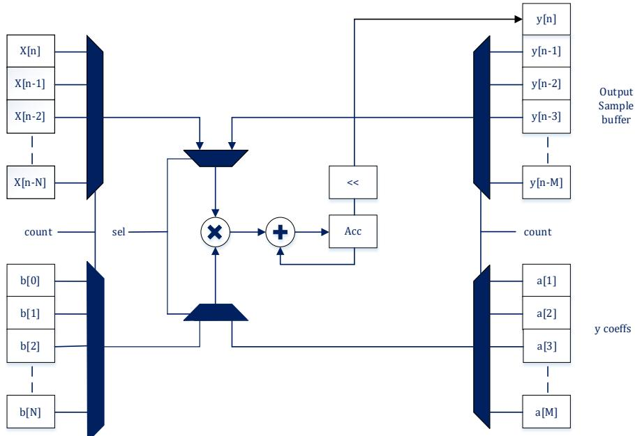  
图 12-1 滤波加速模块框图

该模块的核心是定点乘累加器（MAC）。乘累加器从本地存储中读取两个16位有符号数作为输入，相乘以后与之前的和进行累加。本地存储中的数据地址由一系列的地址指针来决定。地址指针可以加载初始值，递增，递减，也可以被内部硬件复位回初值。所有的指针和MAC模块都是由内部的硬件逻辑控制来完成指定的操作序列。

如果要计算点积，两个输入向量被 CPU 或 DMA 存入 FMAC 本地存储中。当相应的操作被配置并开始执行时，每次硬件逻辑从本地存储读取来自两个向量的一对数据作为 MAC 输入，乘累加后暂存至内部中间结果寄存器，当所有向量元素均计算完成后，累加器的输出作为最终结果被写回本地存储，等待 CPU 或 DMA 读出。

如果要作为 FIR 滤波器（卷积）使用，FMAC 需要反复计算滤波器系数和输入向量的点积。每个采样周期，输入向量位移一个采样数据，最早的一个采样数据被丢弃，加入一个新的采样数据，然后使用相同的滤波器系数向量重新计算一次点积。如此往复。

如果要作为 IIR 滤波器使用，需要在 FIR 的基础上再进行计算输出结果与反馈系数向量的点积并与 FIR 的滤波结果相加。

更多的滤波器操作实现细节见后续章节介绍。

## 12.3.1 本地存储与缓存

FMAC 包含有一个 $256 \times 16$ 位的可读写存储器作为 FMAC 的本地存储

输入数据（输入向量元素）存储在两个输入 buffer X1 和 X2 中。

输出数据（操作结果）存储在 buffer Y 中。

缓存基地址和缓存大小由以下变量指定：

x1\_base 为 X1 buffer 在本地存储中的基地址，

x2\_base 为 X2 buffer 在本地存储中的基地址，

y\_base 为 Y buffer 在本地存储中的基地址，

x1\_buf\_size 为 X1 buffer 的缓存大小，即其内包含多少个 16bit 有符号数

x2\_buf\_size 为 X2 buffer 的缓存大小，即其内包含多少个 16bit 有符号数

y\_buf\_size 为 Y buffer 的缓存大小，即其内包含多少个 16bit 有符号数

以上参数均可通过模块的寄存器进行配置。

CPU 或 DMA 可以通过 FMAC 模块的初始化功能，也可以通过直接写入，来初始化各个缓存的数据。写入的数据根据硬件写指针存入目标 buffer，每次数据写入，硬件写指针自动加 1，当写指针到达 buffer 尾时，再次回到 buffer 基地址。初始化功能用于滤波操作前的数据预装载，或者初始化滤波器系数。

## 缓存配置

缓存基地址和缓存大小通过 X1,X2,Y buffer 的配置寄存器进行配置。基地址可以是本地存储的任意位置，只要基地址+缓存大小不超过本地存储地址范围(0x00\~0xFF)即可。即基地址+缓存大小≤256.

缓存的大小和位置没有限制，缓存甚至可以重叠，但是要解决好数据读写先后的问题。对于滤波操作来说，一般不建议缓存重叠，容易出现不易调试的错误。

当缓存作为循环 buffer 使用时，可以留有一定的动态余量（headroom，d）。同时可以设置 FIFO 的水线深度（watermark level）来调整 CPU 和 DMA 的访问频次。动态余量和水线深度应该根据应用需求来进行适当选择。为了最大化 FMAC 的吞吐率，输入 buffer 应该永不为空，因此 d 应该大于水线深度，以防止因为中断和 DMA 操作的延迟导致 FMAC 等待数据输入而暂时停滞。另一方面，如果输入数据的填装速度小于被 FMAC 处理的速度，输入缓存可能会被 FMAC 读空，并等待 CPU 或 DMA 写入下一个数据。d 可以等于水线深度，确保输入读取不会溢出。

## 12.3.2 输入缓存

X1 和 X2 buffer 为 FMAC 的输入缓存，用于存储输入数据。FMAC 的每次乘法操作从 X1 读取一个数据，从 X2 读取一个数据，然后相乘。FMAC 内部硬件指针，控制读取数据相对于缓存基地址的偏移。指针由硬件根据操作配置自动管理。

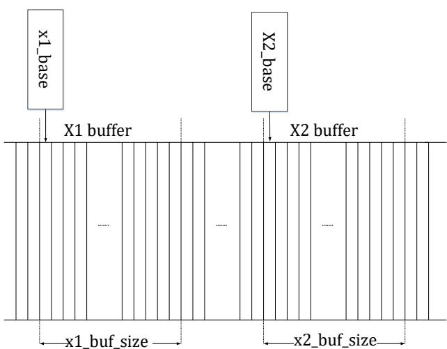

图 12-2 输入缓存区域

X1 buffer 可以作为循环 buffer 使用，只要 buffer 有空闲空间即可写入输入数据。buffer 在操作前可以进行初始化，也可以不进行初始化。如果操作开始时 buffer 内部没有数据，则 buffer 空的标志会触发 CPU 或 DMA 进行新数据装填直到有足够的数据进行滤波计算。

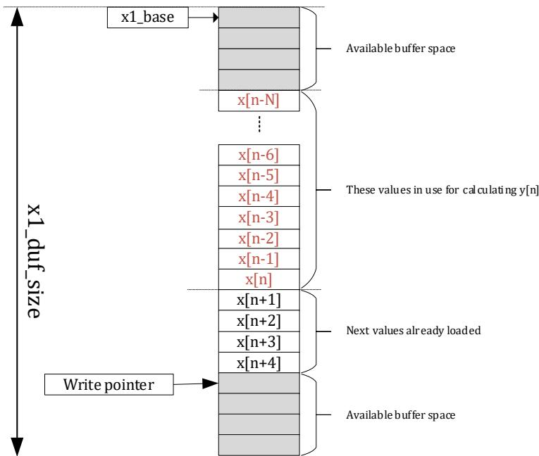  
图 12-3 循环输入 buffer

X2 buffer 无法作为循环 buffer 使用，而且通常需要预装载。在滤波操作中，X2 buffer 用于存储滤波器系数。

当 X1 buffer 作为循环 buffer 使用时，x1\_buf\_size 应略大于当前操作所需数据个数（滤波器阶数），这样 buffer 可以一直存在未经 FMAC 使用的新数据。图 12-3 展示了 FMAC 在进行滤波操作时的缓存分布情况。当计算输出 y[n] 时，FMAC 需要使用 N+1 个输入数据，x[n-N] 至 x[n]。当计算完毕 y[n]，FMAC 开始使用 x[n+1-N] 至 x[n+1] 计算 y[n+1]，而最早输入的数据 x[n-N] 不再被 FMAC 所需要，可以被新数据替换。

CPU 或 DMA 需要在 FMAC 需要数据时进行及时填装，否则 FMAC 会将 buffer 空标志置位，并暂停 FMAC 内部的滤波计算操作，直到新的数据填入 buffer。X1 buffer 硬件上保证了不会出现因为读取而造成的下溢出。

举例来说，如果采样滤波流程是受控于定时器或是 ADC 外设，则 buffer 会定期地进入空状态，因为 FMAC 处理数据的速度快于采样数据产生的速度。这是正常特性。

如果 buffer 内的空闲空间小于水线阈值(FMAC\_X1BUFCFG.FULL\_WM)，则 buffer 的满标志会置位。如果满标志未置位，则 FMAC 会产生中断请求，请求更多的数据填入 buffer。水线的存在使得一次中断填入多个数据成为可能，且不会发生 buffer 上溢出。

如果发生了上溢出,则 FMAC\_SR.OVFL 会置位,且写入数据会被丢弃,写指针维持不变。X1 buffer 没有下溢出标志。

X1 buffer 在滤波操作器件的读写动作如图 12-4 所示。本例为一个 8 阶 FIR 滤波器，水线阈值设置为 4。

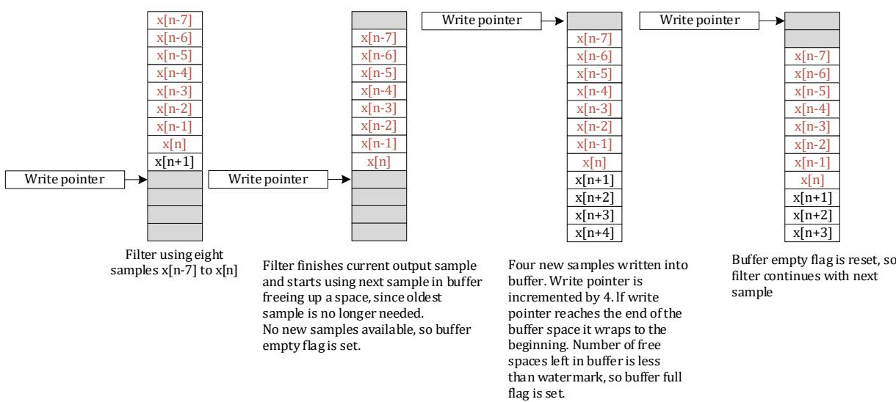  
图 12-4 循环输入 buffer 的读写操作

## 12.3.3 输出缓存

Y buffer 用于存储累加器的输出，并等待 CPU 或 DMA 读取。每读取一次，Y buffer 的读指针加 1，当指针遇到 buffer 尾时，自动回到 buffer 基地址。

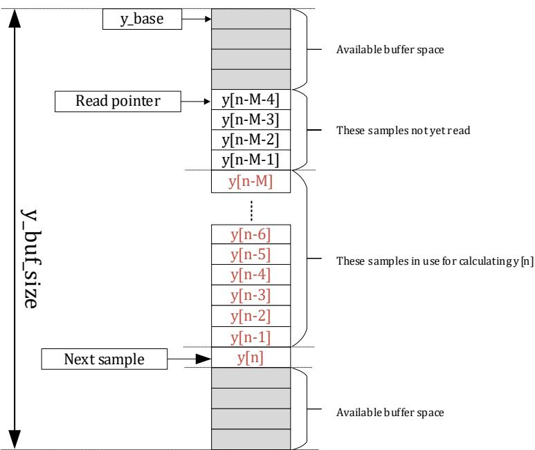  
图 12-5 循环输出 buffer

Y buffer 也可以作为循环 buffer 使用。如果待写入的输出数据地址与读指针重合，即与未读取的结果数据重叠，则 buffer 满标志置位，FMAC 会中断计算操作直到 Y buffer 中的结果数据被读走。

当进行 IIR 滤波操作时，Y buffer 需要预装载 M 个历史输出数据 y[n-M] 至 y[n-1]，用于计算下一个输出数据 y[n]。每次 Y buffer 填入一个新的数据，最旧的数据 y[n-M] 会被替换掉。

如果 Y buffer 内的未读取数据个数少于水线阈值（FMAC\_YBUFCFG.EMPTY\_WM），则 Y buffer 空标志置位。如果 Y buffer 不为空，则会通过中断请求 CPU 或 DMA 读取其中的输出数据。水线阈值的存在使得 CPU 可以运行一次中断服务函数读取多个输出数据，而无下溢出风险。但如果发生了下溢出，FMAC\_CR.UNFL 的标志会置位。这种情况下 Y buffer 读指针维持不变，读取的数据为读指针指向的数据。

Y buffer 作为循环 buffer 使用时的读写操作如图 12-6 所示。本例为一个 7 阶 IIR 滤波器，水线阈值设置为 4。

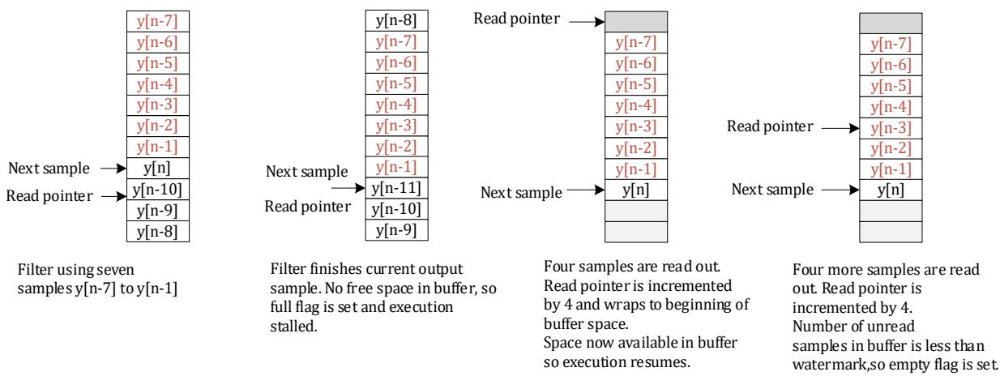  
图 12-6 循环输出 buffer 读写操作

## 12.3.4 初始化函数

FMAC 除了常规的滤波操作外，还有初始化操作用于初始化输入 buffer 数据。初始化操作通过向 FMAC\_PARAM.FUNC 写入适当的值，并将 FMAC\_PARAM.START 写入为 1 来触发。同时 FMAC\_PARAM.P/Q 字段也需要进行适当配置。当初始化操作完成后，START 由硬件自动复位为 0。

## 12.3.4.1 填装 X1 buffer

X1 buffer 初始化函数可以用于 X1 buffer 的预填装，从 X1\_BASE 开始，连续写入 N+1 个数据到 FMAC\_WDATA 寄存器，输入数据写入到本地存储，同时写指针跟随递增。初始化完成后，写指针指向 X1\_BASE+N+1。

X1 buffer 初始化函数可以用于向 X1 buffer 填入向量元素，或是滤波器的输入数据。其相关参数如下：

P 表示待填入 X1 buffer 的数据个数 N+1;

## Q 和 R 未使用

CPU 或 DMA 向 FMAC\_WDATA 写入 N+1 个数据后，初始化操作完成。

## 12.3.4.2 填装 X2 buffer

X2 buffer 初始化函数可以用于 X2 buffer 的预填装，从 X2\_BASE 开始，连续写入 N+1+M 个数据到 FMAC\_WDATA 寄存器，输入数据写入到本地存储，同时写指针跟随递增。初始化完成后，写指针指向 X2\_BASE+N+1+M。

X2 buffer 初始化函数可以用于向 X2 buffer 填入向量元素，或是滤波器的系数。其相关参数如下：

P 表示待填入 X2 buffer 的数据个数 N+1，从 X2\_BASE 开始填装；

Q 表示待填入 X2 buffer 的数据个数 M，从 X2\_BASE+N+1 开始填装；

## R 未使用

CPU 或 DMA 向 FMAC\_WDATA 写入 N+1+M 个数据后，初始化操作完成。

对于 FIR，x2 buffer 初始化系数数据从 h(0) 开始，然后是 h(1), h(2), ..., 直到 h(N)。

对于 IIR, x2 buffer 的初始化系数数据从 b(0) 开始, 然后是 b(1), b(2), ..., 直到 b(N), 为 x 的系数; 之后是 a(1), a(2), ..., a(M), 为 y 的系数。y buffer 初始化样本数不超过 M 个。

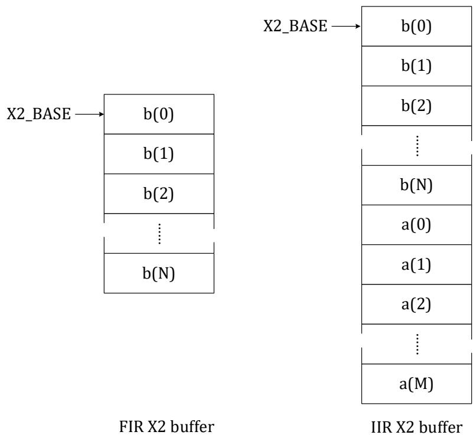  
图 12-7 FIR 和 IIR 滤波器 x2 buffer 系数排列

## 12.3.4.3 填装 Y buffer

Y buffer 初始化函数可以用于 Y buffer 的预填装，从 Y\_BASE 开始，连续写入 N+1 个数据到 FMAC\_WDATA 寄存器，数据写入到本地存储，同时写指针跟随递增。初始化完成后，写指针指向 Y\_BASE+N+1。

Y buffer 初始化函数可以用于向 Y buffer 填入 IIR 滤波中的反馈数据。其相关参数如下:

P 表示待填入 Y buffer 的数据个数 N+1，从 Y\_BASE 开始填装；

## Q和R未使用

CPU 或 DMA 向 FMAC\_WDATA 写入 N+1 个数据后，初始化操作完成。

## 12.3.5 滤波器函数

FMAC 可用于执行 FIR、IIR 等滤波操作。通过向 FMAC\_PARAM.FUNC 写入适当的值，并将 FMAC\_PARAM.START 写入为 1 可以触发滤波操作开始执行。同时，P/Q/R 等字段也需要设置适当的值。滤波操作会持续进行直到 START 位被软件复位。

## 12.3.5.1 FIR 滤波器（卷积）

$$
\underline {{Y}} = \underline {{B}} ^ {*} \underline {{X}}
$$

$$
y _ {n} = 2 ^ {R} \cdot \sum_ {k = 0} ^ {N} b _ {k} x _ {n - k}
$$

此操作对长度为 N+1 的向量 B 和无限长的向量 X 进行卷积。 $Y_{n}=B\cdot X_{n}$ ，其中 $X_{n}=\left[x_{n-N},\ldots,x_{n}\right]$ ，包含有 X 的 N+1 个元素，下标为 n-N 到 n。这个操作与 FIR 滤波相对应，向量 B 即为滤波器系数，向量 X 为待滤波的采样数据。

滤波器结构如图 12-8 所示。

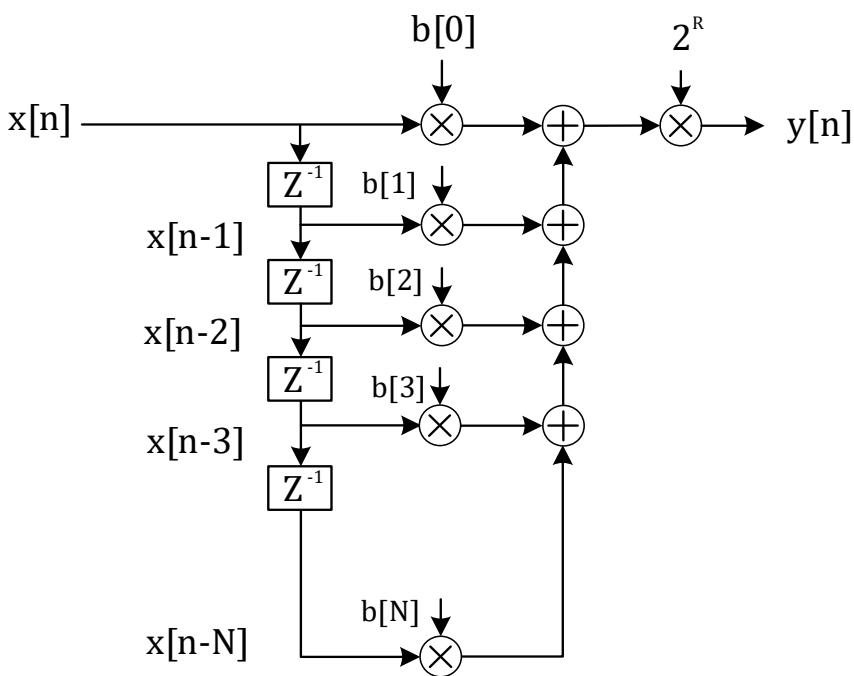  
图 12-8 FIR 滤波器结构

FIR 滤波操作也可以用于计算向量的相关，这时需要将向量 B 首尾元素互换。

输入:

X1 buffer 存储有向量 X，是长度为 N+1+d 的循环 buffer，

X2 buffer 存储有向量 B，是长度为 N+1 的固定 buffer

输出：

Y buffer 存储有输出数据 $y_{n}$ ，是长度为 d 的循环 buffer。

参数:

P 为向量 B 的长度，N+1，取值范围是 2\~127

R 是累加器输出增益，存入 Y buffer 的数据需要乘以 $2^{R}$ ，R 的范围是 0\~7

Q 未使用。

FIR 滤波操作从 START 被置位为 1 开始持续进行，直到 START 被软件复位为 0 停止。

## 12.3.5.2 IIR 滤波器

$$
\underline {{Y}} = \underline {{B}} ^ {*} \underline {{X}} + \underline {{A}} ^ {*} \underline {{Y}} ^ {\prime}
$$

$$
y _ {n} = 2 ^ {R} \cdot \left(\sum_ {k = 0} ^ {N} b _ {k} x _ {n - k} + \sum_ {k = 1} ^ {M} a _ {k} y _ {n - k}\right)
$$

滤波器输出 Y 是长度为 $N+1$ 的向量 B 与无限长度向量 X 的卷积，加上 Y 的历史数据与长度为 M 的反馈向量 A 的卷积。 $Y_{n}=B\cdot X_{n}+A\cdot Y_{n}$ ，其中 $X_{n}=\left[x_{n-N},\ldots,x_{n}\right]$ ，包含有 X 的 $N+1$ 个元素，下标为 n-N 到 n， $Y_{n-1}=\left[y_{n-M},\ldots,y_{n-1}\right]$ ，包含有 Y 的 M 个元素，下标为 n-M 到 n-1。

直接 1 型 IIR 滤波器结构如图 12-9 所示。

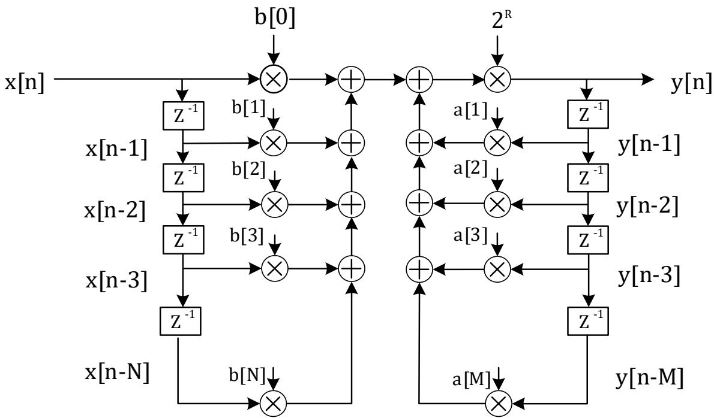  
图 12-9 直接 1 型 IIR 滤波器结构

输入:

X1 buffer 存储有向量 X，是长度为 N+1+d 的循环 buffer，

X2 buffer 存储有向量 B 和向量 A，格式为 $(b_{0}, b_{1}, b_{2}, ..., b_{N}, a_{1}, a_{2}, ..., a_{M})$ ，是长度为 $M+N+1$ 的固定 buffer

输出：

Y buffer 存储有输出数据 $y_{n}$ ，是长度为 M+d 的循环 buffer。

参数:

P 为向量 B 的长度，N+1，取值范围是 2\~127

Q 为向量 A 的长度，M，取值范围是 1\~63

R 是累加器输出增益，存入 Y buffer 的数据需要乘以 $2^{R}$ ，R 的范围是 0\~7

IIR 滤波操作从 START 被置位为 1 开始持续进行，直到 START 被软件复位为 0 停止。

## 12.3.6 定点数表示

FMAC 以定点数的数据格式进行计算操作。输入和输出数据都是 Q1.15 的定点数。

在 Q1.15 个时钟，数值表示为 1bit 符号位，和 15bit 的小数部分。数值范围为 -1（0x8000）至 $1-2^{-15}$ （0x7FFF）。

累加器位宽 26bit，其中 22bit 为小数部分，4bit 为整数和符号位，即 Q4.22 格式。因此累加器和的数值范围为 -8（0x2000000）至 7.99999976（0x1FFFFFF）。可编程增益步长为 6dB（即一档变化为原来的 2 倍），增益范围为 0db\~42db，对应 R 的设置为 0\~7，即增益范围为 $2^{0} \sim 2^{7}$ ，增益施加于累加器输出，数据写入 Y buffer 之前。

注意，累加器的中间结果并没有饱和处理，因此如果数值超出定点数表示范围则会溢出。部分和可能会在中间计算过程中超出-8（0x2000000）至7.99999976（0x1FFFFFFF）的表示范围，但暂时的溢出并不会导致最终结果出错，因为滤波器输出的有效数据实际上位于数值的低位部分，只要最终结果再次回到定点数表示范围内则最终结果仍是正确的。但FMAC\_SR.SAT会在溢出发生时置位。如果使能了FMAC\_CR.SATIEN，则会发生中断请求。这一特性有助于调试滤波器。

累加器的最终输出（经过增益处理之后）可以选择是否进行饱和处理。如果设置了FMAC\_CR.CLIPEN，则最终输出数据会被钳位在Q1.15的表示范围内，即-1(0x8000)至 $1-2^{-15}$ (0x7FFF)。如果CLIPEN未使能，则会将累加器的高位截断丢弃，将低位存入Y buffer。

## 12.3.7 使用 FMAC 实现 FIR 滤波器

FMAC 支持长度为 N+1 的 FIR 滤波操作，其中 N+1 为滤波器系数个数或抽头数。

长度为 N 的 FIR 滤波器，最小本地存储需求为 $2N+3$ :

\- N+1 个系数

\- N+1 个输入数据

\- 1个输出数据

本地存储空间为 256，因此 FMAC 支持的最大 FIR 滤波器尺寸为 127 抽头。

为了最大化吞吐率, 可以分别给输入输出缓存, 留有一定额外空闲空间, 大小分别为 d1 和 d2, 以确保输入缓存永不为空, 输出缓存永不为满。在这种设置下, 本地存储需求为 $2N+2+d1+d2$ 。

buffer 配置如下:

X1\_BUF\_SIZE=N+1+d1;

X2\_BUF\_SIZE=N+1;

Y\_BUF\_SIZE=d2（或1，如果不需要额外空闲空间）

buffer 基地址可以是本地存储的任意位置，但 X2 不应与其他 buffer 重叠，否则滤波器系数可能会被写覆盖，下面给出一个可能的基地址配置：

X2\_BASE=0;

X1\_BASE=N+1;

Y\_BASE=2N+2+d1

FMAC\_X1BUFCFG.FULL\_WM 位域必须≤log2(d1)，否则 N 当输入数据写入还未完成 X1 buffer 就会被标记为满状态，导致输入数据无法继续写入。同样，FMAC\_YBUFCFG.EMPTY\_WM 位域必须≤log2(d2)。

滤波器系数必须通过 X2 初始化操作进行预装载。X1 buffer 可以进行预装载，填充数据可以为任意个，最多为 N+1 个，也可以不做预装载。Y buffer 在进行 FIR 操作时无需预装载，因为 FIR 不

存在反馈路径。

完成 buffer 的配置和初始化之后，可以对 FMAC\_CR 进行配置来指定 FMAC\_WDATA 写入的方式和 FMAC\_RDATA 读取的方式。有三种方式可选：

轮询:无 DMA 请求或中断请求产生。软件查询 X1\_FULL 标志是否为低,为低则通过 FMAC\_WDATA 向 X1 buffer 写入数据，查询 Y\_EMPTY 标志是否为低，为低则通过 FMAC\_RDATA 从 Y buffer 读取数据。

中断：当 X1\_FULL 标志为低时，产生中断请求 CPU 通过 FMAC\_WDATA 向 X1 buffer 写入数据，当 Y\_EMPTY 为低时，产生中断请求 CPU 通过 FMAC\_RDATA 从 Y buffer 读取数据。

DMA：当 X1\_FULL 标志为低时，产生 DMA 传输请求，通过 FMAC\_WDATA 向 X1 buffer 写入数据，当 Y\_EMPTY 为低时，产生 DMA 传输请求，通过 FMAC\_RDATA 从 Y buffer 读取数据。

读写操作方式可以不同。但一般不建议同一个操作同时使用中断和 DMA 请求，如果同时使能中断和 DMA，通常是 DMA 进行传输，中断不再进行传输。可选的读写操作方式组合如下

表 12-1 可选的读写操作方式组合

<table><tr><td>WIEN</td><td>RIEN</td><td>DMAWEN</td><td>DMAREN</td><td>X1 Write</td><td>Y Read</td></tr><tr><td>0</td><td>0</td><td>0</td><td>0</td><td>轮询</td><td>轮询</td></tr><tr><td>0</td><td>1</td><td>0</td><td>0</td><td>轮询</td><td>中断</td></tr><tr><td>1</td><td>0</td><td>0</td><td>0</td><td>中断</td><td>轮询</td></tr><tr><td>1</td><td>1</td><td>0</td><td>0</td><td>中断</td><td>中断</td></tr><tr><td>0</td><td>0</td><td>0</td><td>1</td><td>轮询</td><td>DMA</td></tr><tr><td>0</td><td>0</td><td>1</td><td>0</td><td>DMA</td><td>轮询</td></tr><tr><td>0</td><td>0</td><td>1</td><td>1</td><td>DMA</td><td>DMA</td></tr><tr><td>0</td><td>1</td><td>1</td><td>0</td><td>DMA</td><td>中断</td></tr><tr><td>1</td><td>0</td><td>0</td><td>1</td><td>中断</td><td>DMA</td></tr></table>

FIR 滤波操作启动前，需要对 FMAC\_PARAM 进行如下配置：

FUNC=8 (FIR 滤波功能)

$P=N+1$ （滤波器系数个数）

Q=任意值（Don't Care）

$\mathrm{R = Gain}$

START=1（启动滤波操作）

如果填入 X1 buffer 的数据个数少于 $N+1+d-2^{FULL\_WM}$ ，则 X1\_FULL 标志维持为低。如果 FMAC\_CR.WIEN 为 1，则立即产生中断，请求 CPU 向 FMAC\_WDATA 寄存器写入 $2^{FULL\_WM}$ 个新的采样数据。中断请求会一直存在，直到 FMAC\_SR.X1\_FULL 置位为 1。中断服务函数通常应该在写入 $2^{FULL\_WM}$ 个数据后查询 X1\_FULL 标志，反复写入 $2^{FULL\_WM}$ 个新数据直到 X1\_FULL 置位。

在 X1 buffer 写入了至少 N+1 个输入数据之后（包含预装载的数据个数），FMAC 开始计算第一个输出数据。

当 $2^{EMPTY\_WM}$ 个输出数据写入 Y buffer 之后，FMAC\_SR.Y\_EMPTY 标志置低。如果 FMAC\_CR.RIEN为 1，则立即产生中断，请求 CPU 从 FMAC\_RDATA 读取 $2^{EMPTY\_WM}$ 个数据。中断请求会一直存在，直到 FMAC\_SR.Y\_EMPTY 置位为 1。中断服务函数通常应该在读取 $2^{EMPTY\_WM}$ 个数据后查询 Y\_EMPTY 标志，反复读取 $2^{EMPTY\_WM}$ 个新数据直到 Y\_EMPTY 置位。

滤波操作按照这种方式持续进行，直到软件向 START 写入 0。

## 12.3.8 使用 FMAC 实现 IIR 滤波器

FMAC 支持长度为 N+1 的 IIR 滤波操作，其中 N+1 为滤波器前馈系数个数或抽头数。滤波器反馈系数个数 M 可以是 1\~N 的任意值。目前 FMAC 只能实现直接 1 型 IIR 滤波器，其他类型的 IIR 滤波器需要先转换为直接 1 型。

前馈系数为 N+1 个，反馈系数为 M 个的 IIR 滤波器，最小本地存储需求为 $2N+2+2M$ :

\- N+1+M 个系数

\- N+1 个输入数据

\- M 个输出数据

本地存储空间为 256，如果 M=N，FMAC 支持的最大 IIR 滤波器尺寸为 N+1=64。

为了最大化吞吐率，可以分别给输入输出缓存，留有一定额外空闲空间，大小分别为 d1 和 d2，以确保输入缓存永不为空，输出缓存永不为满。在这种设置下，本地存储需求为 $2N+2M+2+d1+d2$ 。

buffer 配置如下:

X1\_BUF\_SIZE=N+1+d1;

X2\_BUF\_SIZE=N+1+M;

Y\_BUF\_SIZE=M+d2

buffer 基地址可以是本地存储的任意位置，但不应与其他 buffer 重叠，下面给出一个可能的基地址配置：

X2\_BASE=0;

X1\_BASE=N+1+M;

Y\_BASE=2N+2+M+d1

FMAC\_X1BUFCFG.FULL\_WM 位域必须≤log2(d1)，否则 N 当输入数据写入还未完成 X1 buffer 就会被标记为满状态，导致输入数据无法继续写入。同样，FMAC\_YBUFCFG.EMPTY\_WM 位域必须≤log2(d2)。

滤波器系数（N+1 个前馈系数+M 个反馈系数）必须通过 X2 初始化操作进行预装载。X1 buffer 可以进行预装载，填充数据可以为任意个，最多为 N+1 个，也可以不做预装载。Y buffer 可以进行预装载，填充数据可以为任意个，最多为 M 个，也可以不做预装载

完成 buffer 的配置和初始化之后，可以对 FMAC\_CR 进行配置来指定 FMAC\_WDATA 写入的方式和 FMAC\_RDATA 读取的方式。可选的读写操作方式组合可以参考 FIR 章节的表 12-1。

IIR 滤波操作启动前，需要对 FMAC\_PARAM 进行如下配置：

FUNC=9 (IIR 滤波功能)

$P=N+1$ （滤波器前馈系数个数）

$Q = M$ （滤波器反馈系数个数）

$$
\mathrm{R} = \text {Gain}
$$

START=1（启动滤波操作）

如果填入 X1 buffer 的数据个数少于 $N+1+d-2^{FULL\_WM}$ ，则 X1\_FULL 标志维持为低。如果 FMAC\_CR.WIEN 为 1，则立即产生中断，请求 CPU 向 FMAC\_WDATA 寄存器写入 $2^{FULL\_WM}$ 个新的采样数据。中断请求会一直存在，直到 FMAC\_SR.X1\_FULL 置位为 1。中断服务函数通常应该在写入 $2^{FULL\_WM}$ 个数据后查询 X1\_FULL 标志，反复写入 $2^{FULL\_WM}$ 个新数据直到 X1\_FULL 置位。

在 X1 buffer 写入了至少 N+1 个输入数据之后（包含预装载的数据个数），FMAC 开始计算第一个输出数据。第一个输出数据的计算需要使用 X1 buffer 中的 N+1 个输入数据和 Y buffer 中的 M 个历史输出数据。第一个输出数据会写入到 Y buffer 的 Y\_BASE+M 地址。

当 $2^{EMPTY\_WM}$ 个输出数据写入 Y buffer 之后，FMAC\_SR.Y\_EMPTY 标志置低。如果 FMAC\_CR.RIEN 为 1，则立即产生中断，请求 CPU 从 FMAC\_RDATA 读取 $2^{EMPTY\_WM}$ 个数据。中断请求会一直存在，直到 FMAC\_SR.Y\_EMPTY 置位为 1。中断服务函数通常应该在读取 $2^{EMPTY\_WM}$ 个数据后查询 Y\_EMPTY 标志，反复读取 $2^{EMPTY\_WM}$ 个新数据直到 Y\_EMPTY 置位。

滤波操作按照这种方式持续进行，直到软件向 START 写入 0。

## 12.3.9 滤波器初始化示例

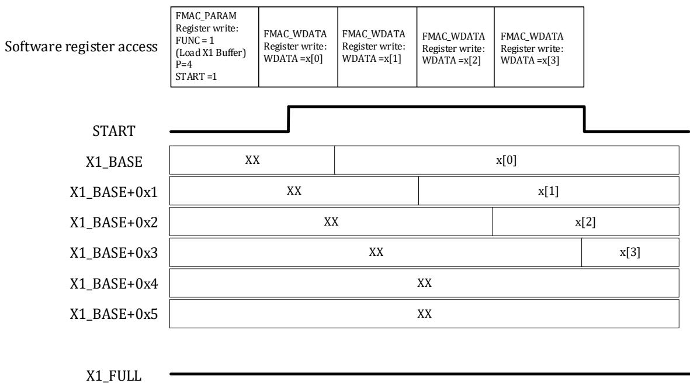  
图 12-10 X1 buffer 初始化

图 12-10 展示了 X1 buffer 配置为 P=4 的预填装过程。X1 buffer 大小 X1\_BUF\_SIZE=6。向 FMAC\_PARAM.START 写入 1，初始化操作启动。4 个数据写入 FMAC\_WDATA 寄存器，并存入 FMAC 本地存储，对应地址从 X1\_BASE 开始递增。4 个数据写入完成后，START 被硬件复位为 0。此时 X1


--- Part 2: Pages 201-400 ---

buffer存储有4个有效的输入数据，同时写指针指向下一次写入数据的位置X1\_BASE+0x4。

## 12.3.10 滤波器操作示例

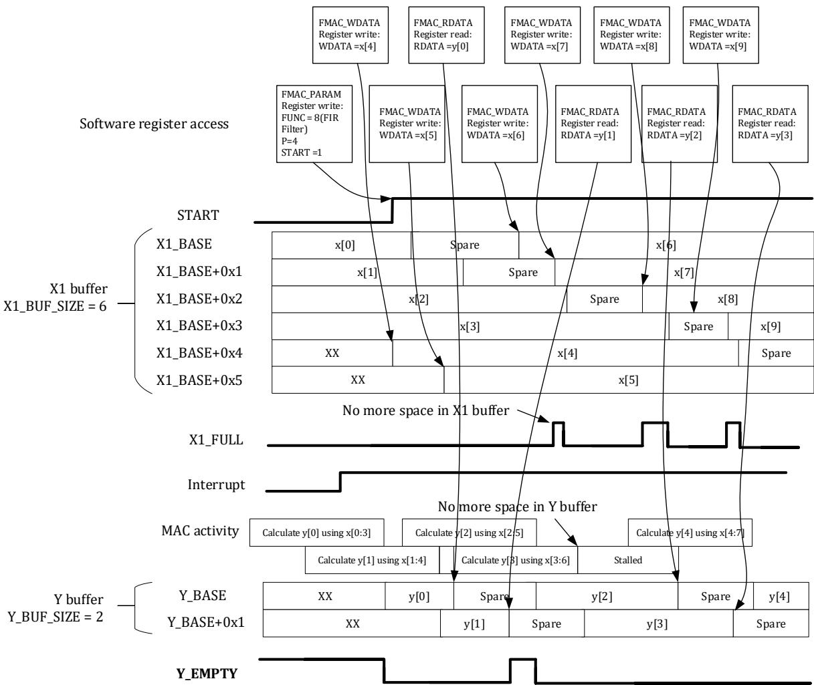  
图 12-11 滤波器操作示例 1

图12-11 展示了滤波器操作启动的情形。滤波器抽头数为 4（P=4）。X1 buffer大小为6，Y buffer大小为 2。FULL\_WM 和 EMPTY\_WM 均为 0。滤波器启动前，X1 buffer 已经预填装了 4 个有效输入数据 x[0:3]。因此一旦START 被写入为1，滤波器即开始计算第一个输出数据 y[0]。因为 X1 buffer还存在两个空闲位置，X1\_FULL 标志维持为 0。FMAC 产生中断，请求新的输入数据。CPU 通过FMAC\_WDATA 再次写入两个输入数据 x[4]和 x[5]，两个数据被存入 FMAC 本地存储中的 X1 buffer中。

与此同时，FMAC 计算完成第一个输出数据 y[0]，将其写入Y buffer，使得 Y buffer 不再为空，Y\_EMPTY 变低。计算完成 y[0]后，x[0]可以被丢弃，释放一个 X1 buffer 空间（位于 X1\_BASE）。FMAC立即启动计算第二个输出数据 y[1]，此时y[1]所需的所有输入数据x[1:5]均已就绪。

由于 Y\_EMPTY 为低，FMAC 提起中断，请求 CPU 通过 FMAC\_RDATA 读取 Y buffer 中的 y[0]，释放 Y buffer的空间。此时 y[1]尚未计算完完成，Y buffer中不存在有效输出数据，Y\_EMPTY变高。由于 X1 buffer 仍有空闲空间，FMAC 继续提起中断请求，请求 CPU 通过 FMAC\_WDATA 向 X1 buffer写入新的输入数据x[6]等。

本例中，CPU可以以更快的速度填入输入数据，填入的速度比FMAC处理速度更快，因此X1\_FULL标志会偶尔变高为 1。但 CPU 读取 Y buffer 的速度不够快，导致 FMAC 偶尔需要等待 Y buffer 被读取以释放空间。这导致滤波操作没有全速进行，原因是滤波器长度比较小，而CPU 处理速度比较慢。在这种情况下，增加buffer大小对于提高滤波器吞吐率没有改善效果。

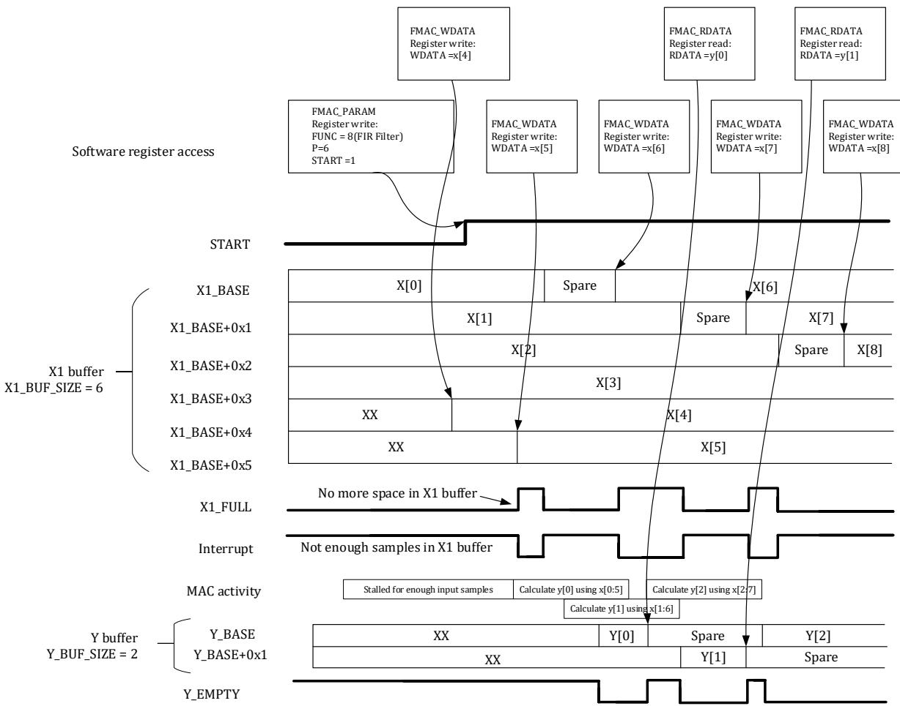  
图 12-12 滤波器操作示例 2

图 12-12 的例子中是滤波器抽头数为 6 的 FIR。X1 buffer 大小为 6，Y buffer 大小为 2。FULL\_WM和 EMPTY\_WM 均为 0。START 写入 1 之前，X1 buffer 中已经预填装了 4 个有效的输入数据 x[0:3]。但此时X1 buffer中的输入数据仍然不足，X1\_FULL标志没有置位。FMAC 继续提起中断，请求CPU填入更多的输入数据。且FMAC的滤波计算因等待足够的输入数据而处于暂停状态。

CPU 通过 FMAC\_WDATA 写入两个新的输入数据 x[4]和 x[5]，存入 X1 buffer 中的空闲位置。此时 X1 buffer 中有 6 个有效输入数据，X1\_FULL 变高为 1，FMAC 不再提起中断请求。FMAC 开始计算得到输出数据y[0]，并将其存入 Y buffer。此时x[0]被丢弃，释放掉X1 buffer 的一个空间位置，X1\_FULL变低。与此同时 Y\_EMPTY 变低。buffer标志变化导致中断再次被提起，请求CPU 写入新的输入数据，并读取输出数据。FMAC处于停止状态，直到新的输入数据写入。

本例中CPU必须等待 FMAC 完成第一个输出数据的计算才能写入新的输入数据，因此第一个输出数据需要用到 x[0]，只有完成计算 x[0]位置才会成为 X1 buffer 中的空闲位置。因此 X1 buffer 会偶尔进入数据不足的状态，导致 FMAC停止计算。通过增加 buffer空间大小可以改善这个问题。

## 12.3.11 滤波器设计提示

FMAC的设计架构对数字滤波器实现有某些限制

1. 直接2 型和转置型需要转换为直接 1型，才能在FMAC中实现

2. IIR滤波器级联需要合并成单级滤波器，或者分开实现。如果选择分开实现，FMAC 的X2 buffer中可能存储有多组滤波器系数，在进行不同的滤波操作时需要更改 X2\_BASE。实现多级滤波器的比较有效的方式是，先对X1 buffer进行预装载，然后使用第一级滤波器系数进行计算，将结果存入芯片的主存储器（从 FMAC 的本地存储中读出存入 SRAM）。修改 X2\_BASE 指向第二级滤波器系数，然后使用第一级滤波器的输出数据再次初始化X1 buffer。如此往复。最后一级滤波的输出数据被读入芯片主存之后，X1 buffer 可以填入新一轮的输入数据，FMAC 即可开启新一轮的计算。需要注意的是，每一级的N+1个输入数据都需要使用前一级的 N的数据和一个新输入数据，保证各级间的处理连续。同样，IIR滤波需要使用 M个本级历史输出数据对输出buffer进行初始化。

3. 直接 1 型的 IIR 滤波器可能在累加器阶段产生绝对值很大的部分和，比如输入信号是一个很大的阶跃信号，或者滤波器系数绝对值大于1。累加器位宽为26bit，在不进行高位截断（wrapping）的情况下可处理的最大数值范围是 0x1FFFFFF\~0x2000000，在 Q3.23 定点数格式下对应3.99999988\~-4。高位截断并不会导致最终结果错误，因为滤波输出的信息保存在数据的低位，高位部分大部分时间是维持不变的，可以视为 DC分量，只要最终结果在表示范围内，则最终结果仍是正确的，可以看做高位截断被撤销了。当然，IIR 初值问题仍需要谨慎考虑，否则存在出错可能。

4. IIR滤波器有前馈（分子）系数 $[ \mathsf { b } _ { 0 } , \mathsf { b } _ { 1 } , . . . , \mathsf { b } _ { \mathrm { N } } ]$ 和反馈（分母）系数[1, $\mathbf { a } _ { 1 } , . . . , \mathbf { a } _ { \mathrm { M } } ]$ 。某些 IIR 滤波器需要反馈系数绝对值大于 1 以得到一个陡峭的滚降频响曲线。但由于滤波器系数是 Q1.15 编码的，是无法直接表示大于 1 的系数的。可以利用增益 $2 ^ { - \tt R }$ ，使得 2-R[1, a<sub>1</sub>, ..., a<sub>M</sub>]是小于 1 的，即可以用Q1.15 定点数编码表示。在累加器的输出位置再将增益 $2 ^ { \tt R }$ 乘回。但这个操作会影响信噪比。

## 12.4 寄存器

## 12.4.1 地址分配

FMAC 的基地址是 0x4001\_7000，寄存器列表如下：

表 12-2 FMAC 寄存器列表

<table><tr><td>名称</td><td>偏移地址</td><td>说明</td></tr><tr><td>FMAC_X1BUFCFG</td><td>0x00</td><td>FMAC X1 buffer 配置寄存器</td></tr><tr><td>FMAC_X2BUFCFG</td><td>0x04</td><td>FMAC X2 buffer 配置寄存器</td></tr><tr><td>FMAC_YBUFCFG</td><td>0x08</td><td>FMAC Y buffer 配置寄存器</td></tr><tr><td>FMAC_PARAM</td><td>0x0C</td><td>FMAC 参数寄存器</td></tr><tr><td>FMAC_CR</td><td>0x10</td><td>FMAC 控制寄存器</td></tr><tr><td>FMAC_SR</td><td>0x14</td><td>FMAC 状态寄存器</td></tr><tr><td>FMAC_WDATA</td><td>0x18</td><td>FMAC 写数据寄存器</td></tr><tr><td>FMAC_RDATA</td><td>0x1C</td><td>FMAC 读数据寄存器</td></tr></table>

## 12.4.2 寄存器描述

## 12.4.2.1FMAC\_X1BUFCFG FMAC X1 buffer 配置寄存器

地址：0x4001\_7000

复位值：0x0

表 12-3 FMAC\_X1BUFCFG FMAC X1 buffer 配置寄存器

<table><tr><td>31</td><td>30</td><td>29</td><td>28</td><td>27</td><td>26</td><td>25</td><td>24</td><td>23</td><td>22</td><td>21</td><td>20</td><td>19</td><td>18</td><td>17</td><td>16</td></tr><tr><td rowspan="3" colspan="6"></td><td colspan="2">FULL_WM</td><td rowspan="3" colspan="8"></td></tr><tr><td colspan="2">RW</td></tr><tr><td colspan="2">0</td></tr><tr><td>15</td><td>14</td><td>13</td><td>12</td><td>11</td><td>10</td><td>9</td><td>8</td><td>7</td><td>6</td><td>5</td><td>4</td><td>3</td><td>2</td><td>1</td><td>0</td></tr></table>

<table><tr><td>X1_BUF_SIZE</td><td>X1_BASE</td></tr><tr><td>RW</td><td>RW</td></tr><tr><td>0</td><td>0</td></tr></table>

<table><tr><td>位置</td><td>位名称</td><td>说明</td></tr><tr><td>[31:26]</td><td>未使用</td><td>NA</td></tr><tr><td>[25:24]</td><td>FULL_WM</td><td>X1 buffer 满水线阈值,当 X1 buffer 中的空闲位置少于  $2^{FULL\_WM}$ 时,X1 buffer 满标志置位。0:水线阈值为 11:水线阈值为 22:水线阈值为 43:水线阈值为 8设置水线阈值大于 1 可以在一次中断处理中传输多个数据到 X1 buffer 中,当使用 DMA 写 X1 buffer 时水线阈值应该设置为 1。</td></tr><tr><td>[23:16]</td><td>未使用</td><td>NA</td></tr><tr><td>[15:8]</td><td>X1_BUF_SIZE</td><td>X1 buffer 大小,X1 buffer 中包含的 16bit 有符号数个数,buffer 尺寸最小值为滤波器前馈阶数(+水线阈值-1)</td></tr><tr><td>[7:0]</td><td>X1_BASE</td><td>X1 buffer 基地址</td></tr></table>

## 12.4.2.2FMAC\_X2BUFCFG FMAC X2 buffer 配置寄存器

地址：0x4001\_7004

复位值：0x0

表 12-4 FMAC\_X2BUFCFG FMAC X2 buffer 配置寄存器

<table><tr><td>31</td><td>30</td><td>29</td><td>28</td><td>27</td><td>26</td><td>25</td><td>24</td><td>23</td><td>22</td><td>21</td><td>20</td><td>19</td><td>18</td><td>17</td><td>16</td></tr><tr><td>15</td><td>14</td><td>13</td><td>12</td><td>11</td><td>10</td><td>9</td><td>8</td><td>7</td><td>6</td><td>5</td><td>4</td><td>3</td><td>2</td><td>1</td><td>0</td></tr></table>

<table><tr><td>X2_BUF_SIZE</td><td>X2_BASE</td></tr><tr><td>RW</td><td>RW</td></tr><tr><td>0</td><td>0</td></tr></table>

<table><tr><td>位置</td><td>位名称</td><td>说明</td></tr><tr><td>[31:16]</td><td>未使用</td><td>NA</td></tr><tr><td>[15:8]</td><td>X2_BUF_SIZE</td><td>X2 buffer 大小,X2 buffer 中包含的 16bit 有符号数个数,这个位域在操作进行中(START=1)时无法修改</td></tr><tr><td>[7:0]</td><td>X2_BASE</td><td>X2 buffer 基地址,这个位域在操作进行中(START=1)时无法修改</td></tr></table>

## 12.4.2.3FMAC\_YBUFCFG FMAC Y buffer 配置寄存器

地址：0x4001\_7008

复位值：0x0

表 12-5 FMAC\_YBUFCFG FMAC Y buffer 配置寄存器

<table><tr><td>31</td><td>30</td><td>29</td><td>28</td><td>27</td><td>26</td><td>25</td><td>24</td><td>23</td><td>22</td><td>21</td><td>20</td><td>19</td><td>18</td><td>17</td><td>16</td></tr><tr><td rowspan="3" colspan="6"></td><td colspan="2">EMPTY_WM</td><td rowspan="3" colspan="8"></td></tr><tr><td colspan="2">RW</td></tr><tr><td colspan="2">0</td></tr><tr><td>15</td><td>14</td><td>13</td><td>12</td><td>11</td><td>10</td><td>9</td><td>8</td><td>7</td><td>6</td><td>5</td><td>4</td><td>3</td><td>2</td><td>1</td><td>0</td></tr></table>

<table><tr><td>Y_BUF_SIZE</td><td>Y_BASE</td></tr><tr><td>RW</td><td>RW</td></tr><tr><td>0</td><td>0</td></tr></table>

<table><tr><td>位置</td><td>位名称</td><td>说明</td></tr><tr><td>[31:26]</td><td>未使用</td><td>NA</td></tr><tr><td>[25:24]</td><td>EMPTY_WM</td><td>Y buffer 空水线阈值,当 Y buffer 中的有效数据数量少于  $2^{EMPTY\_WM}$ 时,Y buffer 空标志置位。0:水线阈值为 11:水线阈值为 22:水线阈值为 43:水线阈值为 8设置水线阈值大于 1 可以在一次中断处理中从 Y buffer 读取多个数据中,当使用 DMA 读取 Y buffer 时水线阈值应该设置为 1。</td></tr><tr><td>[23:16]</td><td>未使用</td><td>NA</td></tr><tr><td>[15:8]</td><td>Y_BUF_SIZE</td><td>Y buffer 大小,Y buffer 中包含的 16bit 有符号数个数。对于 FIR 滤波器,buffer 尺寸最小值为 1(+水线阈值),对于 IIR 滤波器,buffer 尺寸最小值为滤波器反馈阶数(+水线阈值)</td></tr><tr><td>[7:0]</td><td>Y_BASE</td><td>Y buffer 基地址</td></tr></table>

## 12.4.2.4FMAC\_PARAM FMAC 参数寄存器

地址：0x4001\_700C

复位值：0x0

表 12-6 FMAC\_PARAM FMAC 参数寄存器

<table><tr><td>31</td><td>30</td><td>29</td><td>28</td><td>27</td><td>26</td><td>25</td><td>24</td><td>23</td><td>22</td><td>21</td><td>20</td><td>19</td><td>18</td><td>17</td><td>16</td></tr><tr><td>START</td><td rowspan="3" colspan="3"></td><td colspan="4">FUNC</td><td colspan="8">R</td></tr><tr><td>RW</td><td colspan="4">RW</td><td colspan="8">RW</td></tr><tr><td>0</td><td colspan="4">0</td><td colspan="8">0</td></tr><tr><td>15</td><td>14</td><td>13</td><td>12</td><td>11</td><td>10</td><td>9</td><td>8</td><td>7</td><td>6</td><td>5</td><td>4</td><td>3</td><td>2</td><td>1</td><td>0</td></tr></table>

<table><tr><td>Q</td><td>P</td></tr><tr><td>RW</td><td>RW</td></tr><tr><td>0</td><td>0</td></tr></table>

<table><tr><td>位置</td><td>位名称</td><td>说明</td></tr><tr><td>[31]</td><td>START</td><td>0:停止 FMAC 执行1:开始 FMAC 执行(FMAC 执行过程中)写入 1 触发 FUNC 指定操作开始执行,写入 0 可以停止执行中的操作,初始化操作完成后此位由硬件自动清零。</td></tr><tr><td>[30:28]</td><td>未使用</td><td>NA</td></tr><tr><td>[27:24]</td><td>FUNC</td><td>0: Reserved1: Load X1 buffer2: Load X2 buffer3: Load Y buffer4 to 7: Reserved8: Convolution (FIR filter)9: IIR filter (direct form 1)此位域在 START=1 时无法修改</td></tr><tr><td>[23:16]</td><td>R</td><td>输入参数 R,Y 输出前移位幅度,即 Y 输出前乘以  $2^R$  倍此位域在 START=1 时无法修改</td></tr><tr><td>[15:8]</td><td>Q</td><td>输入参数 Q,IIR 中反馈系数个数此位域在 START=1 时无法修改</td></tr><tr><td>[7:0]</td><td>P</td><td>输入参数 P,FIR 及 IIR 中前馈系数个数此位域在 START=1 时无法修改</td></tr></table>

## 12.4.2.5FMAC\_CR FMAC 控制寄存器

地址：0x4001\_7010

复位值：0x0

表 12-7 FMAC\_CR FMAC 控制寄存器

<table><tr><td>31</td><td>30</td><td>29</td><td>28</td><td>27</td><td>26</td><td>25</td><td>24</td><td>23</td><td>22</td><td>21</td><td>20</td><td>19</td><td>18</td><td>17</td><td>16</td></tr><tr><td rowspan="3" colspan="15"></td><td>RESET</td></tr><tr><td>WO</td></tr><tr><td>0</td></tr><tr><td>15</td><td>14</td><td>13</td><td>12</td><td>11</td><td>10</td><td>9</td><td>8</td><td>7</td><td>6</td><td>5</td><td>4</td><td>3</td><td>2</td><td>1</td><td>0</td></tr></table>

<table><tr><td>CLIPEN</td><td rowspan="3"></td><td>DMAWEN</td><td>DMAREN</td><td rowspan="3"></td><td>SATIEN</td><td>UNFLIEN</td><td>OVFLIEN</td><td>WIEN</td><td>RIEN</td></tr><tr><td>RW</td><td>RW</td><td>RW</td><td>RW</td><td>RW</td><td>RW</td><td>RW</td><td>RW</td></tr><tr><td>0</td><td>0</td><td>0</td><td>0</td><td>0</td><td>0</td><td>0</td><td>0</td></tr></table>

<table><tr><td>位置</td><td>位名称</td><td>说明</td></tr><tr><td>[31:17]</td><td>未使用</td><td>NA</td></tr><tr><td>[16]</td><td>RESET</td><td>复位 FMAC 模块,向此位写 1 可以将 FMAC 内部的读写指针,内部逻辑状态机,FMAC_SR 寄存器和 FMAC_PARAM 寄存器(包括 START)进行复位,其他寄存器不受影响。此位写入自动清零。</td></tr><tr><td>[15]</td><td>CLIPEN</td><td>累加器输出饱和使能1:累加器增益控制后的输出被钳位在 Q1.15 范围内0:累加器增益控制后的输出超出 Q1.15 范围时丢弃高位</td></tr><tr><td>[14:10]</td><td>未使用</td><td>NA</td></tr><tr><td>[9]</td><td>DMAWEN</td><td>DMA 写 X1 buffer 请求使能0:禁用,无 DMA 写请求产生1:使能,当 X1 不满时有 DMA 写请求产生此位只能在 START=0 时进行改写</td></tr><tr><td>[8]</td><td>DMAREN</td><td>DMA 读请求使能0:禁用,无 DMA 写请求产生1:使能,当 Y 不空时有 DMA 读请求产生此位只能在 START=0 时进行改写</td></tr><tr><td>[7:5]</td><td>未使用</td><td>NA</td></tr><tr><td>[4]</td><td>SATIEN</td><td>累加器饱和错误中断使能0:禁用1:使能,当 FMAC_SR.SAT 置位时产生中断请求</td></tr><tr><td>[3]</td><td>UNFLIEN</td><td>Y buffer 下溢出中断使能0:禁用1:使能,当 FMAC_SR.UNFL 置位时产生中断请求</td></tr><tr><td>[2]</td><td>OVFLIEN</td><td>X1 buffer 上溢出中断使能0:禁用1:使能,当 FMAC_SR.OVFL 置位时产生中断请求</td></tr><tr><td>[1]</td><td>WIEN</td><td>X1 buffer 写请求中断使能0:禁用1:使能,当 X1 buffer 不满时,向 CPU 发出写请求中断</td></tr><tr><td>[0]</td><td>RIEN</td><td>Y buffer 读请求使能0:禁用1:使能,当 Y buffer 不空时,向 CPU 发出读请求中断</td></tr></table>

## 12.4.2.6FMAC\_SR FMAC 状态寄存器

地址：0x4001\_7014

复位值：0x1

表 12-8 FMAC\_SR FMAC 状态寄存器

<table><tr><td>31</td><td>30</td><td>29</td><td>28</td><td>27</td><td>26</td><td>25</td><td>24</td><td>23</td><td>22</td><td>21</td><td>20</td><td>19</td><td>18</td><td>17</td><td>16</td></tr><tr><td colspan="16"></td></tr><tr><td>15</td><td>14</td><td>13</td><td>12</td><td>11</td><td>10</td><td>9</td><td>8</td><td>7</td><td>6</td><td>5</td><td>4</td><td>3</td><td>2</td><td>1</td><td>0</td></tr></table>

<table><tr><td rowspan="3"></td><td>SAT</td><td>UNFL</td><td>OVFL</td><td rowspan="3"></td><td>X1_FULL</td><td>Y_EMPTY</td></tr><tr><td>RO</td><td>RO</td><td>RO</td><td>RO</td><td>RO</td></tr><tr><td>0</td><td>0</td><td>0</td><td>0</td><td>1</td></tr></table>

<table><tr><td>位置</td><td>位名称</td><td>说明</td></tr><tr><td>[31:11]</td><td>未使用</td><td>NA</td></tr><tr><td>[10]</td><td>SAT</td><td>饱和错误标志当累加器输出结果超出Q1.15表示范围时,此位置位0:未发生饱和事件1:监测到饱和事件发生。如果FMAC_CR.SATIEN置位,则产生中断请求</td></tr><tr><td>[9]</td><td>UNFL</td><td>Y buffer下溢出错误标志当Y buffer中无有效数据且软件或DMA读取FMAC_RDATA时产生下溢出事件0:未发生下溢出事件1:监测到下溢出事件发生。如果FMAC_CR.UNFLIEN置位,则产生中断请求</td></tr><tr><td>[8]</td><td>OVFL</td><td>X1 buffer上溢出错误标志当X1 buffer中无空闲空间且软件或DMA通过FMAC_WDATA向X1 buffer写入数据时时产生上溢出事件0:未发生上溢出事件1:监测到上溢出事件发生。如果 FMAC_CR.OVFLIEN 置位,则产生中断请求</td></tr><tr><td>[7:2]</td><td>未使用</td><td>NA</td></tr><tr><td>[1]</td><td>X1_FULL</td><td>X1 buffer 满标志当 X1 buffer 中的空闲空间大小小于水线阈值时,X1 buffer 被标志位满。空闲空间大小等于写指针与最近一次读指针之差。0:X1 buffer 不满。如果 FMAC_CR.WIEN 置位则产生中断请求向 X1 buffer 写入数据。如果 FMAC_CR.DMAWEN 置位则请求 DMA 向 X1 buffer 写入数据,直到 X1_FULL 置位。1:X1 buffer 满此位由硬件自动置位清零,也可以通过向 FMAC_CR.RESET 写 1 清零</td></tr><tr><td>[0]</td><td>Y_EMPTY</td><td>Y buffer 空标志当 Y buffer 中的有效数据数量小于水线阈值时,Y buffer 被标志为空。有效数据数量等于读指针与累加器写入数据目的地址之差。0:Y buffer 不空。如果 FMAC_CR.RIEN 置位则产生中断请求从 Y buffer 读取数据。如果 FMAC_CR.DMAREN 置位,则请求 DMA 从 Y buffer 读取数据直到 Y_EMPTY 置位。1:Y buffer 空此位由硬件自动置位清零,也可以通过向 FMAC_CR.RESET 写 1 清零</td></tr></table>

## 12.4.2.7FMAC\_WDATA FMAC 写入数据寄存器

地址：0x4001\_7018

复位值：0x0

表 12-9 FMAC\_WDATA FMAC 写入数据寄存器

<table><tr><td>31</td><td>30</td><td>29</td><td>28</td><td>27</td><td>26</td><td>25</td><td>24</td><td>23</td><td>22</td><td>21</td><td>20</td><td>19</td><td>18</td><td>17</td><td>16</td></tr><tr><td colspan="16"></td></tr><tr><td>15</td><td>14</td><td>13</td><td>12</td><td>11</td><td>10</td><td>9</td><td>8</td><td>7</td><td>6</td><td>5</td><td>4</td><td>3</td><td>2</td><td>1</td><td>0</td></tr><tr><td colspan="16">WDATA</td></tr><tr><td colspan="16">WO</td></tr><tr><td colspan="16">0</td></tr></table>

<table><tr><td>位置</td><td>位名称</td><td>说明</td></tr><tr><td>[31:16]</td><td>未使用</td><td>NA</td></tr><tr><td>[15:0]</td><td>WDATA</td><td>写入数据,向此寄存器写入数据,数据被写入写指针指向的本地存储地址,写后写指针自动加 1</td></tr></table>

## 12.4.2.8FMAC\_RDATA FMAC 读取数据寄存器

地址：0x4001\_701C

复位值：0x0

表 12-10 FMAC\_RDATA FMAC 读取数据寄存器

<table><tr><td>31</td><td>30</td><td>29</td><td>28</td><td>27</td><td>26</td><td>25</td><td>24</td><td>23</td><td>22</td><td>21</td><td>20</td><td>19</td><td>18</td><td>17</td><td>16</td></tr><tr><td colspan="16"></td></tr><tr><td>15</td><td>14</td><td>13</td><td>12</td><td>11</td><td>10</td><td>9</td><td>8</td><td>7</td><td>6</td><td>5</td><td>4</td><td>3</td><td>2</td><td>1</td><td>0</td></tr></table>

<table><tr><td>RDATA</td></tr><tr><td>RO</td></tr><tr><td>0</td></tr></table>

<table><tr><td>位置</td><td>位名称</td><td>说明</td></tr><tr><td>[31:16]</td><td>未使用</td><td>NA</td></tr><tr><td>[15:0]</td><td>RDATA</td><td>读出数据,从寄存器读取数据,数据被从读指针指向的本地存储地址读出,读后读指针自动加1</td></tr></table>

## 13 ADC

## 13.1 概述

LKS32MC45x 系列芯片集成了 3 个 14BIT SARADC 转换核心， 27 个模拟 IO 输入信号/6 个 OPA输出/温度传感器输出/模拟地均可作为ADC 的被采样信号。主要有以下特性：

➢ 3 个ADC 数字接口分别对应 3个ADC

➢ 2MSPS 采样率，32MHz 工作频率

➢ 每个 ADC 接口支持 16 路通道选择

➢ 每个ADC 接口配备 2个模拟看门狗，可同时检测上下阈值

➢ 支持过采样

➢ 支持软件、硬件触发功能

➢ 可以与MCPWM、Timer单元联动，触发指示信号可通过GPIO送出调试

➢ 支持自定义采样序列，序列次数和通道号可灵活配置

➢ 支持左对齐、右对齐模式

➢ 支持差分输入模拟信号，正负输入通道可配置

➢ 支持单段采样和两段采样

➢ 支持硬件过采样，过采样后有效位数可达18bit 以上

ADC采样的量词含义约定：

1 次采样：完成对应的一次模拟信号量到数字信号量的采样转换并存储至ADC\_DATx 寄存器；

1 段采样：可能包含1次或若干次采样，若干次采样可以是相同的模拟信号，也可以是不同的模拟信号。采样开始通常由MCPWM、UTimer或软件进行触发，一个触发信号完成一段采样，采样完成后产生相应的段采样完成中断。

## 13.1.1 功能框图

每个ADC 接口包括16 个数据寄存器（ADC 16次采样各个通道模拟量对应的数字量），以及若干控制寄存器。

可以同一时刻进行三个通道的采样。

数据寄存器ADC\_DATx 用于存储ADC第x 次采样得到的数字量。被转换的模拟信号来源由寄存器 ADC\_CHNx 中的某 4bit 进行选择（详见 13.2.3）。以 ADC\_PCHN0 为例，位[3:0]选择第 0 次采样的模拟信号来源，ADC\_CH0\~ADC\_CH14 任选，若 ADC\_PCHN0[3:0]=0，ADC\_PCHN0[7:4]=3，则第 0个采样的模拟量正端信号来自 IO ADC\_CH0，第 1 个采样的模拟量正端信号对应 IO ADC\_CH3，以此类推。负端信号由ADC\_NCHN指定，如果不需要差分输入，可以将负端指定为模拟地。

采样通道数寄存器ADC\_CHNT 控制每段采样的次数，1\~15 对应 1\~15次，不可设置为0 次。两段采样次数之和不应超过16次。

控制逻辑根据触发配置寄存器 ADC\_TRIG 选择来自 MCPWM 或 UTimer 的触发信号启动一段采样或者软件触发启动。MCPWM/UTimer 会送出定时触发信号。

一段转换（一段内的所有通道采样转换完毕）完成，触发 ADC转换完成中断。

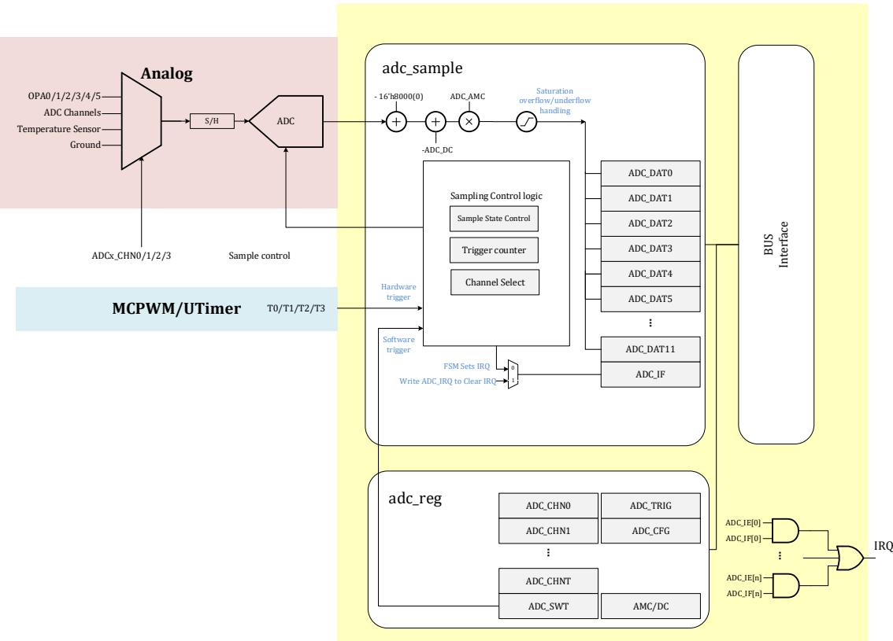  
图13-1ADC采集模块功能框图

来源可选使得用户可以灵活配置采样顺序、以及采样信号来源，甚至实现对单个信号多次采样的目的。控制寄存器使得用户可以配置采样个数，提高采样频率/降低采样功耗。

正负端信号来源均可配置，使得用户可以灵活每次采样的差分信号来源，灵活使用 IO资源。

过采样允许用户在采样率要求不高但精度要求的场景下，通过多次采样对信号进行平均从而得到更高的信噪比。

## 13.1.2 ADC 触发方式

➢ 支持单段触发和两段触发

➢ 可以设置采样触发事件发生次数从而实现间隔触发

➢ 可以软件触发

➢ 每段采样触发完成可产生对应中断

## 触发指示信号可以通过GPIO送出用于调试

## 13.1.3 ADC 输出数制

ADC 输出数据为 14bit 补码，输入信号 0 对应 14’b00\_0000\_0000\_0000，以 1 倍增益配置为例，输入信号-2.2V 对应 14’b10\_0000\_0000\_0000，输入信号+2.2V 对应 14’b01\_1111\_1111\_1111。ADC转换后的 14bit 补码需扩展为 16BIT 存入 16bit 位宽的采样数据寄存器，左对齐/右对齐可根据配置寄存器进行设置。以14’b10\_0000\_0000\_1101为例，如果配置为左对齐，右侧补2个0，存入ADCx\_DAT的值为 16’b1000\_0000\_0011\_0100；如果配置为右对齐，左侧进行符号扩展，存入 ADCx\_DAT 的值为 16’b1110\_0000\_0000\_1101。推荐统一使用左对齐方式。

表13-1ADC输出数字量数制转换

<table><tr><td>ADC 一倍增益输入/V</td><td>ADC 2/3 倍增益输入/V</td><td>转为有符号数后的数值</td></tr><tr><td>2.2</td><td>3.3</td><td>14&#x27;b01_1111_1111_1111</td></tr><tr><td>0</td><td>0</td><td>14&#x27;b00_0000_0000_0000</td></tr><tr><td>-2.2</td><td>-3.3</td><td>14&#x27;b10_0000_0000_0000</td></tr></table>

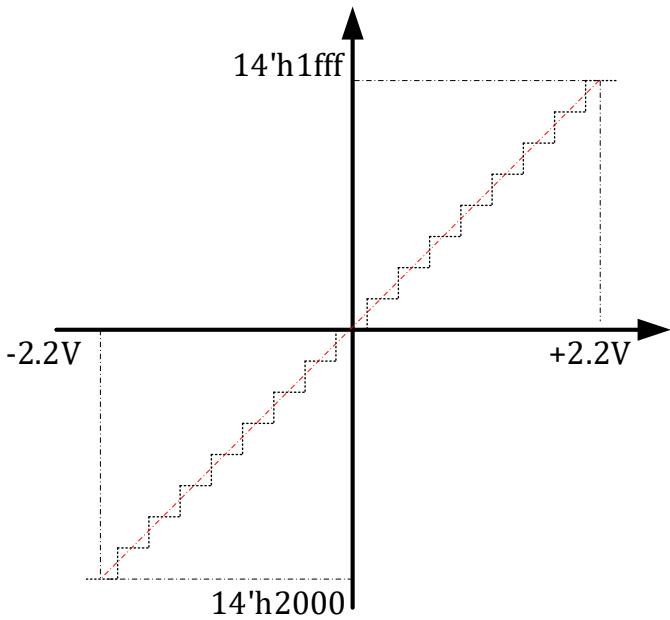  
图13-2 一倍增益设置下ADC 模数转换数制量程

## 13.1.4 ADC 量程

ADC有两种增益模式：高增益（1倍）和低增益（2/3 倍），针对这两种增益，ADC的量程也相应有所区别。1 倍增益模式下，对应最大±2.2V的输入信号幅度，2/3 倍增益模式下，对应最大±3.3V的输入信号幅度。

在 ADC 采样通道配置为运放的输出信号时（即 OPA0\~OPA5），应选择合适的运放增益，使得具体应用上的最大信号可被放大到接近+/-3.3V的水平，同时将ADC 配置为2/3 倍增益。举例来说，相线电流最大100A（正弦波有效值），MOS 内阻（假设为 MOS 内阻采样）为5mR，则运放的最大输入信号幅值为+/-707mV。此时应该选择运放的放大倍数为4.5 倍，则放大后的信号约为+/-3.18V。

如果因为客观原因，运放的输出信号经放大后，最大信号仍然小于+/-2.2V，则应将 ADC的增益配置为1倍。

在ADC采样通道配置为GPIO复用口输入的信号时，同样根据信号的最大幅度来选择ADC增益。由于 IO 口的限制，GPIO 复用口输入的信号范围只能 $\mathrm { \langle \ f { - } 0 . 3 V { - } A V D D + 0 . 3 V }$ 之间。

## 13.1.5 ADC 校正

ADC硬件接口模块可以进行直流偏置校正与增益校正。

ADC\_AMC 存储的是增益校正系数 $\mathsf { A M P } _ { \mathsf { c o r r e c t i o n } }$ ，为 10bit 无符号定点数，ADC\_AMC[9]为整数部分，ADC\_AMC[8:0]为小数部分。可以表示数值在1附近的定点数。

ADC\_DC 存储的是ADC 的直流偏置，通常在校正阶段通过测量通道15（从0开始计数）的AVSS（内部地）得到ADC直流偏置数值并存入flash中，并在系统加载阶段由软件将直流偏置写入ADC\_DC寄存器中。

记ADC输出的数字量为 $\mathrm { D } _ { \mathrm { A D C } }$ $\mathrm { D } _ { \mathrm { A D C } }$ 对应的真实值为D， $\mathrm { D } _ { 0 }$ 为编码数制的0，则

$$
\mathrm{D} = \left(\mathrm{D} _ {\mathrm{ADC}} - \mathrm{D} _ {0} - \mathrm{DC} _ {\text { offset }}\right) ^ {*} \mathrm{AMP} _ {\text { correction }}
$$

最终硬件会将进行校正后的 D存入相应的采样数据寄存器。ADC 接口硬件电路会根据每个通道的增益配置(ADC\_GAIN0/1)来自动选择 $\mathsf { A M P _ { c o r r e c t i o n } }$ 与 $\mathrm { D C _ { o f f s e t } }$ 。

## 13.1.6 ADC 阈值监测(模拟看门狗)

每个ADC 接口模块配备有2 组阈值监测电路，同时进行上阈值和下阈值监测，ADC的数据寄存器可以单独配置是否启用某组阈值监测，1 个数据寄存器可以同时启用多组阈值监测，但通常不这样配置。如果使能阈值监测，当 ADC 完成某次转换，且将经过校正的数据写入 ADCx\_DAT 寄存器时，会进行阈值比较，如果写入的数据大于上阈值或小于下阈值则对应的阈值超限中断标志会置 1。

阈值为14bit 有符号数，因此阈值比较与数据的左右对齐无关。左对齐时 ADCx\_DATx[15:2]与阈值进行比较，右对齐时，ADCx\_DATx[13:0]与阈值进行比较。

## 13.1.7 过采样

ADC支持对信号过采样求平均后再写入数据寄存器，过采样率范围是 1\~128倍，但只能是2 的幂次，通过ADCx\_CFG.OVSR 配置。默认1 次采样即写入数据寄存器，即不进行过采样。如果配置了过采样倍数，则由ADCx\_CHNx指定的所有信号，均进行多次采样求平均后才写入数据寄存器。写入数据寄存器的数值与ADC多次转换数值的关系如下公式所示。

$$
\mathrm {ADCx\_ DAT} = \frac {1}{O V S R} \sum_ {i = 0} ^ {O V S R - 1} \mathrm {ADCx\_ DAT\_ RAW} _ {\mathrm{i}}
$$

过采样可以配合阈值监测使用，此时只有当平均后的数值超过阈值范围时才产生阈值超限事件。当配置了过采样模式后，每段采样转换时间按倍数增加，并在采样转换完成后产生中断。

通过 ADCx\_CFG.TROVS，可以配置一次触发即完成多次(ADCx\_CFG.OVSR 次)采样并进行数据平均，如图 13-3 所示，ADCx\_CFG.TROVS=0，ADCx\_CFG.OVSR=1 即过采样率为 2，触发后，ADC 对每个信号都采样两次平均后才将结果写入对应的 ADCx\_DAT 寄存器；如果 ADCx\_CFG.TROVS=1，则需要多次(ADCx\_CFG.OVSR 次)触发才积累足够数据进行平均，如图 13-4 所示，ADCx\_CFG.OVSR=1 即过采样率仍为 2，则每 2 次触发才累计 2 次数据进行平均并写入数据寄存器。当需要多次触发进行累加时，每次触发只能采样一个通道，即要求ADCx\_CHNT=1，如果采样多个不同信号，当通道切换时，会导致不同通道数据累加在一起而得到错误的转换后数据。

过采样可以配合连续采样进行使用，这种场景中，ADC 连续反复对信号进行采样，累计到过采样次数后将数据存入数据寄存器。

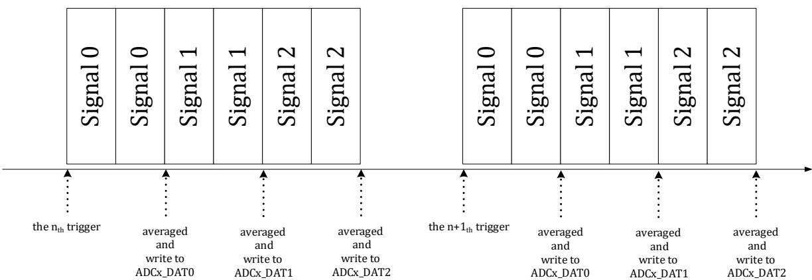

图 13-3 过采样转换时序示例 1  
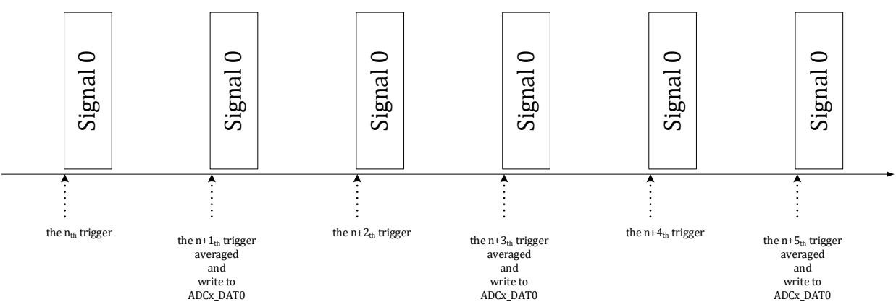  
图 13-4 过采样转换时序示例 2

## 13.2 寄存器

## 13.2.1 地址分配

ADC0 在芯片中的基地址是 0x4001\_7800；

ADC1 在芯片中的基地址是 0x4001\_7C00；

ADC2 在芯片中的基地址是 0x4001\_8000。

表 13-2 ADCx 寄存器列表

<table><tr><td>名称</td><td>偏移地址</td><td>说明</td></tr><tr><td>ADCx_DAT0</td><td>0x00</td><td>ADCx 第 0 次采样数据</td></tr><tr><td>ADCx_DAT1</td><td>0x04</td><td>ADCx 第 1 次采样数据</td></tr><tr><td>ADCx_DAT2</td><td>0x08</td><td>ADCx 第 2 次采样数据</td></tr><tr><td>ADCx_DAT3</td><td>0x0C</td><td>ADCx 第 3 次采样数据</td></tr><tr><td>ADCx_DAT4</td><td>0x10</td><td>ADCx 第 4 次采样数据</td></tr><tr><td>ADCx_DAT5</td><td>0x14</td><td>ADCx 第 5 次采样数据</td></tr><tr><td>ADCx_DAT6</td><td>0x18</td><td>ADCx 第 6 次采样数据</td></tr><tr><td>ADCx_DAT7</td><td>0x1C</td><td>ADCx 第 7 次采样数据</td></tr><tr><td>ADCx_DAT8</td><td>0x20</td><td>ADCx 第 8 次采样数据</td></tr><tr><td>ADCx_DAT9</td><td>0x24</td><td>ADCx 第 9 次采样数据</td></tr><tr><td>ADCx_DAT10</td><td>0x28</td><td>ADCx 第 10 次采样数据</td></tr><tr><td>ADCx_DAT11</td><td>0x2C</td><td>ADCx 第 11 次采样数据</td></tr><tr><td>ADCx_DAT12</td><td>0x30</td><td>ADCx 第 12 次采样数据</td></tr><tr><td>ADCx_DAT13</td><td>0x34</td><td>ADCx 第 13 次采样数据</td></tr><tr><td>ADCx_DAT14</td><td>0x38</td><td>ADCx 第 14 次采样数据</td></tr><tr><td>ADCx_DAT15</td><td>0x3C</td><td>ADCx 第 15 次采样数据</td></tr><tr><td>ADCx_PCHN0</td><td>0x40</td><td>ADCx 第 0~3 次采样正端输入信号选择</td></tr><tr><td>ADCx_PCHN1</td><td>0x44</td><td>ADCx 第 4~7 次采样正端输入信号选择</td></tr><tr><td>ADCx_PCHN2</td><td>0x48</td><td>ADCx 第 8~11 次采样正端输入信号选择</td></tr><tr><td>ADCx_PCHN3</td><td>0x4C</td><td>ADCx 第 12~15 次采样正端输入信号选择</td></tr><tr><td>ADCx_NCHN0</td><td>0x50</td><td>ADCx 第 0~3 次采样负端输入信号选择</td></tr><tr><td>ADCx_NCHN1</td><td>0x54</td><td>ADCx 第 4~7 次采样负端输入信号选择</td></tr><tr><td>ADCx_NCHN2</td><td>0x58</td><td>ADCx 第 8~11 次采样负端输入信号选择</td></tr><tr><td>ADCx_NCHN3</td><td>0x5C</td><td>ADCx 第 12~15 次采样负端输入信号选择</td></tr><tr><td>ADCx_CHNT</td><td>0x60</td><td>ADCx 各种触发模式下采样次数</td></tr><tr><td>ADCx_GAIN</td><td>0x70</td><td>ADCx 增益选择</td></tr><tr><td>ADCx_CFG</td><td>0x74</td><td>ADCx 模式配置</td></tr><tr><td>ADCx_TRIG</td><td>0x78</td><td>ADCx 采样触发配置</td></tr><tr><td>ADCx_SWT</td><td>0x7C</td><td>ADCx 软件触发</td></tr><tr><td>ADCx_DC0</td><td>0x80</td><td>ADCx 增益为 0 时 DC offset</td></tr><tr><td>ADCx_AMC0</td><td>0x84</td><td>ADCx 增益为 0 时增益校正系数</td></tr><tr><td>ADCx_DC1</td><td>0x88</td><td>ADCx 增益为 1 时 DC offset</td></tr><tr><td>ADCx_AMC1</td><td>0x8C</td><td>ADCx 增益为 1 时增益校正系数</td></tr><tr><td>ADCx_IE</td><td>0x90</td><td>ADCx 中断使能</td></tr><tr><td>ADCx_IF</td><td>0x94</td><td>ADCx 中断标志</td></tr><tr><td>ADCx_TH0</td><td>0x98</td><td>ADCx 阈值 0</td></tr><tr><td>ADCx_GEN0</td><td>0x9C</td><td>ADCx 阈值 0 监测使能</td></tr><tr><td>ADCx_TH1</td><td>0xA0</td><td>ADCx 阈值 1</td></tr><tr><td>ADCx_GEN1</td><td>0xA4</td><td>ADCx 阈值 1 监测使能</td></tr></table>

## 13.2.2 采样数据寄存器

## 13.2.2.1 ADCx\_DAT0(x = 0,1,2)

地址分别为：0x4001\_7800，0x4001\_7C00，0x4001\_8000

复位值：0x0

表 13-3 采样数据寄存器 ADCx\_DAT0

<table><tr><td>15</td><td>14</td><td>13</td><td>12</td><td>11</td><td>10</td><td>9</td><td>8</td><td>7</td><td>6</td><td>5</td><td>4</td><td>3</td><td>2</td><td>1</td><td>0</td></tr><tr><td></td><td></td><td></td><td></td><td></td><td></td><td></td><td colspan="2">DAT0</td><td></td><td></td><td></td><td></td><td></td><td></td><td></td></tr><tr><td></td><td></td><td></td><td></td><td></td><td></td><td></td><td colspan="2">RW</td><td></td><td></td><td></td><td></td><td></td><td></td><td></td></tr><tr><td></td><td></td><td></td><td></td><td></td><td></td><td></td><td colspan="2">0</td><td></td><td></td><td></td><td></td><td></td><td></td><td></td></tr></table>

<table><tr><td>位置</td><td>位名称</td><td>说明</td></tr><tr><td>[31:16]</td><td></td><td>未使用</td></tr><tr><td>[15:0]</td><td>DAT0</td><td>ADCx 第 0 次采样数据</td></tr></table>

13.2.2.2 ADCx\_DAT1(x = 0,1,2)

地址分别为：0x4001\_7804，0x4001\_7C04，0x4001\_8004

复位值：0x0

表 13-4 采样数据寄存器 ADCx\_DAT1

<table><tr><td>15</td><td>14</td><td>13</td><td>12</td><td>11</td><td>10</td><td>9</td><td>8</td><td>7</td><td>6</td><td>5</td><td>4</td><td>3</td><td>2</td><td>1</td><td>0</td></tr><tr><td></td><td></td><td></td><td></td><td></td><td></td><td></td><td></td><td></td><td></td><td></td><td></td><td></td><td></td><td></td><td></td></tr><tr><td></td><td></td><td></td><td></td><td></td><td></td><td></td><td></td><td></td><td></td><td></td><td></td><td></td><td></td><td></td><td></td></tr><tr><td></td><td></td><td></td><td></td><td></td><td></td><td></td><td></td><td></td><td></td><td></td><td></td><td></td><td></td><td></td><td></td></tr><tr><td></td><td></td><td></td><td></td><td></td><td></td><td></td><td></td><td></td><td></td><td></td><td></td><td></td><td></td><td></td><td></td></tr></table>

<table><tr><td>位置</td><td>位名称</td><td>说明</td></tr><tr><td>[31:16]</td><td></td><td>未使用</td></tr><tr><td>[15:0]</td><td>DAT1</td><td>ADCx 第 1 次采样数据</td></tr></table>

## 13.2.2.3 ADCx\_DAT2(x = 0,1,2)

地址分别为：0x4001\_7808，0x4001\_7C08，0x4001\_8008

复位值：0x0

表 13-5 采样数据寄存器 ADCx\_DAT2

<table><tr><td>15</td><td>14</td><td>13</td><td>12</td><td>11</td><td>10</td><td>9</td><td>8</td><td>7</td><td>6</td><td>5</td><td>4</td><td>3</td><td>2</td><td>1</td><td>0</td></tr><tr><td></td><td></td><td></td><td></td><td></td><td></td><td></td><td colspan="2">DAT2</td><td></td><td></td><td></td><td></td><td></td><td></td><td></td></tr><tr><td></td><td></td><td></td><td></td><td></td><td></td><td></td><td colspan="2">RW</td><td></td><td></td><td></td><td></td><td></td><td></td><td></td></tr><tr><td></td><td></td><td></td><td></td><td></td><td></td><td></td><td colspan="2">0</td><td></td><td></td><td></td><td></td><td></td><td></td><td></td></tr></table>

<table><tr><td>位置</td><td>位名称</td><td>说明</td></tr><tr><td>[31:16]</td><td></td><td>未使用</td></tr><tr><td>[15:0]</td><td>DAT2</td><td>ADCx 第 2 次采样数据</td></tr></table>

## 13.2.2.4 ADCx\_DAT3(x = 0,1,2)

地址分别为：0x4001\_780C，0x4001\_7C0C，0x4001\_800C

复位值：0x0

表 13-6 采样数据寄存器 ADCx\_DAT3

<table><tr><td>15</td><td>14</td><td>13</td><td>12</td><td>11</td><td>10</td><td>9</td><td>8</td><td>7</td><td>6</td><td>5</td><td>4</td><td>3</td><td>2</td><td>1</td><td>0</td></tr><tr><td></td><td></td><td></td><td></td><td></td><td></td><td></td><td></td><td></td><td></td><td></td><td></td><td></td><td></td><td></td><td></td></tr><tr><td></td><td></td><td></td><td></td><td></td><td></td><td></td><td></td><td></td><td></td><td></td><td></td><td></td><td></td><td></td><td></td></tr><tr><td></td><td></td><td></td><td></td><td></td><td></td><td></td><td></td><td></td><td></td><td></td><td></td><td></td><td></td><td></td><td></td></tr><tr><td></td><td></td><td></td><td></td><td></td><td></td><td></td><td></td><td></td><td></td><td></td><td></td><td></td><td></td><td></td><td></td></tr></table>

<table><tr><td>位置</td><td>位名称</td><td>说明</td></tr><tr><td>[31:16]</td><td></td><td>未使用</td></tr><tr><td>[15:0]</td><td>DAT3</td><td>ADCx 第 3 次采样数据</td></tr></table>

## 13.2.2.5 ADCx\_DAT4(x = 0,1,2)

地址分别为：0x4001\_7810，0x4001\_7C10，0x4001\_8010

复位值：0x0

表 13-7 采样数据寄存器 ADCx\_DAT4

<table><tr><td>15</td><td>14</td><td>13</td><td>12</td><td>11</td><td>10</td><td>9</td><td>8</td><td>7</td><td>6</td><td>5</td><td>4</td><td>3</td><td>2</td><td>1</td><td>0</td></tr><tr><td></td><td></td><td></td><td></td><td></td><td></td><td></td><td></td><td></td><td></td><td></td><td></td><td></td><td></td><td></td><td></td></tr><tr><td></td><td></td><td></td><td></td><td></td><td></td><td></td><td></td><td></td><td></td><td></td><td></td><td></td><td></td><td></td><td></td></tr><tr><td></td><td></td><td></td><td></td><td></td><td></td><td></td><td></td><td></td><td></td><td></td><td></td><td></td><td></td><td></td><td></td></tr><tr><td></td><td></td><td></td><td></td><td></td><td></td><td></td><td></td><td></td><td></td><td></td><td></td><td></td><td></td><td></td><td></td></tr></table>

<table><tr><td>位置</td><td>位名称</td><td>说明</td></tr><tr><td>[31:16]</td><td></td><td>未使用</td></tr><tr><td>[15:0]</td><td>DAT4</td><td>ADCx 第 4 次采样数据</td></tr></table>

## 13.2.2.6 ADCx\_DAT5(x = 0,1,2)

地址分别为：0x4001\_7814，0x4001\_7C14，0x4001\_8014

复位值：0x0

表 13-8 采样数据寄存器 ADCx\_DAT5

<table><tr><td>15</td><td>14</td><td>13</td><td>12</td><td>11</td><td>10</td><td>9</td><td>8</td><td>7</td><td>6</td><td>5</td><td>4</td><td>3</td><td>2</td><td>1</td><td>0</td></tr><tr><td></td><td></td><td></td><td></td><td></td><td></td><td></td><td></td><td></td><td></td><td></td><td></td><td></td><td></td><td></td><td></td></tr><tr><td></td><td></td><td></td><td></td><td></td><td></td><td></td><td></td><td></td><td></td><td></td><td></td><td></td><td></td><td></td><td></td></tr><tr><td></td><td></td><td></td><td></td><td></td><td></td><td></td><td></td><td></td><td></td><td></td><td></td><td></td><td></td><td></td><td></td></tr><tr><td></td><td></td><td></td><td></td><td></td><td></td><td></td><td></td><td></td><td></td><td></td><td></td><td></td><td></td><td></td><td></td></tr></table>

<table><tr><td>位置</td><td>位名称</td><td>说明</td></tr><tr><td>[31:16]</td><td></td><td>未使用</td></tr><tr><td>[15:0]</td><td>DAT5</td><td>ADCx 第 5 次采样数据</td></tr></table>

## 13.2.2.7 ADCx\_DAT6(x = 0,1,2)

地址分别为：0x4001\_7818，0x4001\_7C18，0x4001\_8018

复位值：0x0

表 13-9 采样数据寄存器 ADCx\_DAT6

<table><tr><td>15</td><td>14</td><td>13</td><td>12</td><td>11</td><td>10</td><td>9</td><td>8</td><td>7</td><td>6</td><td>5</td><td>4</td><td>3</td><td>2</td><td>1</td><td>0</td></tr><tr><td></td><td></td><td></td><td></td><td></td><td></td><td></td><td colspan="2">DAT6</td><td></td><td></td><td></td><td></td><td></td><td></td><td></td></tr><tr><td></td><td></td><td></td><td></td><td></td><td></td><td></td><td colspan="2">RW</td><td></td><td></td><td></td><td></td><td></td><td></td><td></td></tr><tr><td></td><td></td><td></td><td></td><td></td><td></td><td></td><td colspan="2">0</td><td></td><td></td><td></td><td></td><td></td><td></td><td></td></tr></table>

<table><tr><td>位置</td><td>位名称</td><td>说明</td></tr><tr><td>[31:16]</td><td></td><td>未使用</td></tr><tr><td>[15:0]</td><td>DAT6</td><td>ADCx 第 6 次采样数据</td></tr></table>

## 13.2.2.8 ADCx\_DAT7(x = 0,1,2)

地址分别为：0x4001\_781C，0x4001\_7C1C，0x4001\_801C

复位值：0x0

表 13-10 采样数据寄存器 ADCx\_DAT7

<table><tr><td>15</td><td>14</td><td>13</td><td>12</td><td>11</td><td>10</td><td>9</td><td>8</td><td>7</td><td>6</td><td>5</td><td>4</td><td>3</td><td>2</td><td>1</td><td>0</td></tr><tr><td></td><td></td><td></td><td></td><td></td><td></td><td></td><td colspan="2">DAT7</td><td></td><td></td><td></td><td></td><td></td><td></td><td></td></tr><tr><td></td><td></td><td></td><td></td><td></td><td></td><td></td><td colspan="2">RW</td><td></td><td></td><td></td><td></td><td></td><td></td><td></td></tr><tr><td></td><td></td><td></td><td></td><td></td><td></td><td></td><td colspan="2">0</td><td></td><td></td><td></td><td></td><td></td><td></td><td></td></tr></table>

<table><tr><td>位置</td><td>位名称</td><td>说明</td></tr><tr><td>[31:16]</td><td></td><td>未使用</td></tr><tr><td>[15:0]</td><td>DAT7</td><td>ADCx 第 7 次采样数据</td></tr></table>

## 13.2.2.9 ADCx\_DAT8(x = 0,1,2)

地址分别为：0x4001\_7820，0x4001\_7C20，0x4001\_8020

复位值：0x0

表 13-11 采样数据寄存器 ADCx\_DAT8

<table><tr><td>15</td><td>14</td><td>13</td><td>12</td><td>11</td><td>10</td><td>9</td><td>8</td><td>7</td><td>6</td><td>5</td><td>4</td><td>3</td><td>2</td><td>1</td><td>0</td></tr><tr><td></td><td></td><td></td><td></td><td></td><td></td><td></td><td></td><td></td><td></td><td></td><td></td><td></td><td></td><td></td><td></td></tr><tr><td></td><td></td><td></td><td></td><td></td><td></td><td></td><td></td><td></td><td></td><td></td><td></td><td></td><td></td><td></td><td></td></tr><tr><td></td><td></td><td></td><td></td><td></td><td></td><td></td><td></td><td></td><td></td><td></td><td></td><td></td><td></td><td></td><td></td></tr><tr><td></td><td></td><td></td><td></td><td></td><td></td><td></td><td></td><td></td><td></td><td></td><td></td><td></td><td></td><td></td><td></td></tr></table>

<table><tr><td>位置</td><td>位名称</td><td>说明</td></tr><tr><td>[31:16]</td><td></td><td>未使用</td></tr><tr><td>[15:0]</td><td>DAT8</td><td>ADCx 第 8 次采样数据</td></tr></table>

## 13.2.2.10 ADCx\_DAT9(x = 0,1,2)

地址分别为：0x4001\_7824，0x4001\_7C24，0x4001\_8024

复位值：0x0

表 13-12 采样数据寄存器 ADCx\_DAT9

<table><tr><td>15</td><td>14</td><td>13</td><td>12</td><td>11</td><td>10</td><td>9</td><td>8</td><td>7</td><td>6</td><td>5</td><td>4</td><td>3</td><td>2</td><td>1</td><td>0</td></tr><tr><td></td><td></td><td></td><td></td><td></td><td></td><td></td><td></td><td></td><td></td><td></td><td></td><td></td><td></td><td></td><td></td></tr><tr><td></td><td></td><td></td><td></td><td></td><td></td><td></td><td></td><td></td><td></td><td></td><td></td><td></td><td></td><td></td><td></td></tr><tr><td></td><td></td><td></td><td></td><td></td><td></td><td></td><td></td><td></td><td></td><td></td><td></td><td></td><td></td><td></td><td></td></tr><tr><td></td><td></td><td></td><td></td><td></td><td></td><td></td><td></td><td></td><td></td><td></td><td></td><td></td><td></td><td></td><td></td></tr></table>

<table><tr><td>位置</td><td>位名称</td><td>说明</td></tr><tr><td>[31:16]</td><td></td><td>未使用</td></tr><tr><td>[15:0]</td><td>DAT9</td><td>ADCx 第 9 次采样数据</td></tr></table>

## 13.2.2.11 ADCx\_DAT10(x = 0,1,2)

地址分别为：0x4001\_7828，0x4001\_7C28，0x4001\_8028

复位值：0x0

表 13-13 采样数据寄存器 ADCx\_DAT10

<table><tr><td>15</td><td>14</td><td>13</td><td>12</td><td>11</td><td>10</td><td>9</td><td>8</td><td>7</td><td>6</td><td>5</td><td>4</td><td>3</td><td>2</td><td>1</td><td>0</td></tr><tr><td></td><td></td><td></td><td></td><td></td><td></td><td></td><td></td><td></td><td></td><td></td><td></td><td></td><td></td><td></td><td></td></tr><tr><td></td><td></td><td></td><td></td><td></td><td></td><td></td><td></td><td></td><td></td><td></td><td></td><td></td><td></td><td></td><td></td></tr><tr><td></td><td></td><td></td><td></td><td></td><td></td><td></td><td></td><td></td><td></td><td></td><td></td><td></td><td></td><td></td><td></td></tr><tr><td></td><td></td><td></td><td></td><td></td><td></td><td></td><td></td><td></td><td></td><td></td><td></td><td></td><td></td><td></td><td></td></tr></table>

<table><tr><td>位置</td><td>位名称</td><td>说明</td></tr><tr><td>[31:16]</td><td></td><td>未使用</td></tr><tr><td>[15:0]</td><td>DAT10</td><td>ADCx 第 10 次采样数据</td></tr></table>

## 13.2.2.12 ADCx\_DAT11(x = 0,1,2)

地址分别为：0x4001\_782C，0x4001\_7C2C，0x4001\_802C

复位值：0x0

表 13-14 采样数据寄存器 ADCx\_DAT11

<table><tr><td>15</td><td>14</td><td>13</td><td>12</td><td>11</td><td>10</td><td>9</td><td>8</td><td>7</td><td>6</td><td>5</td><td>4</td><td>3</td><td>2</td><td>1</td><td>0</td></tr><tr><td></td><td></td><td></td><td></td><td></td><td></td><td></td><td colspan="2">DAT11</td><td></td><td></td><td></td><td></td><td></td><td></td><td></td></tr><tr><td></td><td></td><td></td><td></td><td></td><td></td><td></td><td colspan="2">RW</td><td></td><td></td><td></td><td></td><td></td><td></td><td></td></tr><tr><td></td><td></td><td></td><td></td><td></td><td></td><td></td><td colspan="2">0</td><td></td><td></td><td></td><td></td><td></td><td></td><td></td></tr></table>

<table><tr><td>位置</td><td>位名称</td><td>说明</td></tr><tr><td>[31:16]</td><td></td><td>未使用</td></tr><tr><td>[15:0]</td><td>DAT11</td><td>ADCx 第 11 次采样数据</td></tr></table>

13.2.2.13 ADCx\_DAT12(x = 0,1,2)

地址分别为：0x4001\_7830，0x4001\_7C30，0x4001\_8030

复位值：0x0

表 13-15 采样数据寄存器 ADCx\_DAT12

<table><tr><td>15</td><td>14</td><td>13</td><td>12</td><td>11</td><td>10</td><td>9</td><td>8</td><td>7</td><td>6</td><td>5</td><td>4</td><td>3</td><td>2</td><td>1</td><td>0</td></tr><tr><td colspan="16">DAT12</td></tr><tr><td colspan="16">RW</td></tr><tr><td colspan="16">0</td></tr></table>

<table><tr><td>位置</td><td>位名称</td><td>说明</td></tr><tr><td>[31:16]</td><td></td><td>未使用</td></tr><tr><td>[15:0]</td><td>DAT12</td><td>ADCx 第 12 次采样数据</td></tr></table>

13.2.2.14 ADCx\_DAT13(x = 0,1,2)  
地址分别为：0x4001\_7834，0x4001\_7C34，0x4001\_8034

复位值：0x0

表 13-16 采样数据寄存器 ADCx\_DAT13

<table><tr><td>15</td><td>14</td><td>13</td><td>12</td><td>11</td><td>10</td><td>9</td><td>8</td><td>7</td><td>6</td><td>5</td><td>4</td><td>3</td><td>2</td><td>1</td><td>0</td></tr><tr><td colspan="16">DAT13</td></tr><tr><td colspan="16">RW</td></tr><tr><td colspan="16">0</td></tr></table>

<table><tr><td>位置</td><td>位名称</td><td>说明</td></tr><tr><td>[31:16]</td><td></td><td>未使用</td></tr><tr><td>[15:0]</td><td>DAT13</td><td>ADCx 第 13 次采样数据</td></tr></table>

## 13.2.2.15 ADCx\_DAT14(x = 0,1,2)

地址分别为：0x4001\_7838，0x4001\_7C38，0x4001\_8038

复位值：0x0

表 13-17 采样数据寄存器 ADCx\_DAT14

<table><tr><td>15</td><td>14</td><td>13</td><td>12</td><td>11</td><td>10</td><td>9</td><td>8</td><td>7</td><td>6</td><td>5</td><td>4</td><td>3</td><td>2</td><td>1</td><td>0</td></tr><tr><td></td><td></td><td></td><td></td><td></td><td></td><td></td><td></td><td></td><td></td><td></td><td></td><td></td><td></td><td></td><td></td></tr><tr><td></td><td></td><td></td><td></td><td></td><td></td><td></td><td></td><td></td><td></td><td></td><td></td><td></td><td></td><td></td><td></td></tr><tr><td></td><td></td><td></td><td></td><td></td><td></td><td></td><td></td><td></td><td></td><td></td><td></td><td></td><td></td><td></td><td></td></tr><tr><td></td><td></td><td></td><td></td><td></td><td></td><td></td><td></td><td></td><td></td><td></td><td></td><td></td><td></td><td></td><td></td></tr></table>

<table><tr><td>位置</td><td>位名称</td><td>说明</td></tr><tr><td>[31:16]</td><td></td><td>未使用</td></tr><tr><td>[15:0]</td><td>DAT14</td><td>ADCx 第 14 次采样数据</td></tr></table>

## 13.2.2.16 ADCx\_DAT15(x = 0,1,2)

地址分别为：0x4001\_783C，0x4001\_7C3C，0x4001\_803C

复位值：0x0

表 13-18 采样数据寄存器 ADCx\_DAT15

<table><tr><td>15</td><td>14</td><td>13</td><td>12</td><td>11</td><td>10</td><td>9</td><td>8</td><td>7</td><td>6</td><td>5</td><td>4</td><td>3</td><td>2</td><td>1</td><td>0</td></tr><tr><td colspan="16">DAT15</td></tr><tr><td colspan="16">RW</td></tr><tr><td colspan="16">0</td></tr></table>

<table><tr><td>位置</td><td>位名称</td><td>说明</td></tr><tr><td>[31:16]</td><td></td><td>未使用</td></tr><tr><td>[15:0]</td><td>DAT15</td><td>ADCx 第 15 次采样数据</td></tr></table>

## 13.2.3 信号来源寄存器

## 13.2.3.1 ADCx\_PCHN0(x = 0,1,2)

地址分别为：0x4001\_7840，0x4001\_7C40，0x4001\_8040

复位值：0x0

表 13-19 正端信号来源寄存器 ADCx\_PCHN0

<table><tr><td>15</td><td>14</td><td>13</td><td>12</td><td>11</td><td>10</td><td>9</td><td>8</td><td>7</td><td>6</td><td>5</td><td>4</td><td>3</td><td>2</td><td>1</td><td>0</td></tr><tr><td colspan="4">PDS3</td><td colspan="4">PDS2</td><td colspan="4">PDS1</td><td colspan="4">PDS0</td></tr><tr><td colspan="4">RW</td><td colspan="4">RW</td><td colspan="4">RW</td><td colspan="4">RW</td></tr><tr><td colspan="4">0</td><td colspan="4">0</td><td colspan="4">0</td><td colspan="4">0</td></tr></table>

<table><tr><td>位置</td><td>位名称</td><td>说明</td></tr><tr><td>[31:16]</td><td></td><td>未使用</td></tr><tr><td>[15:12]</td><td>PDS3</td><td>ADCx 第 3 次采样正端输入信号选择</td></tr><tr><td>[11:8]</td><td>PDS2</td><td>ADCx 第 2 次采样正端输入信号选择</td></tr><tr><td>[7:4]</td><td>PDS1</td><td>ADCx 第 1 次采样正端输入信号选择</td></tr><tr><td>[3:0]</td><td>PDS0</td><td>ADCx 第 0 次采样正端输入信号选择</td></tr></table>

## 13.2.3.2 ADCx\_PCHN1(x = 0,1,2)

复位值：0x0

表 13-20 正端信号来源寄存器 ADCx\_PCHN1

<table><tr><td>15</td><td>14</td><td>13</td><td>12</td><td>11</td><td>10</td><td>9</td><td>8</td><td>7</td><td>6</td><td>5</td><td>4</td><td>3</td><td>2</td><td>1</td><td>0</td></tr><tr><td colspan="4">PDS7</td><td colspan="4">PDS6</td><td colspan="4">PDS5</td><td colspan="4">PDS4</td></tr><tr><td colspan="4">RW</td><td colspan="4">RW</td><td colspan="4">RW</td><td colspan="4">RW</td></tr><tr><td colspan="4">0</td><td colspan="4">0</td><td colspan="4">0</td><td colspan="4">0</td></tr></table>

<table><tr><td>位置</td><td>位名称</td><td>说明</td></tr><tr><td>[31:16]</td><td></td><td>未使用</td></tr><tr><td>[15:12]</td><td>PDS7</td><td>ADCx 第 7 次采样正端输入信号选择</td></tr><tr><td>[11:8]</td><td>PDS6</td><td>ADCx 第 6 次采样正端输入信号选择</td></tr><tr><td>[7:4]</td><td>PDS5</td><td>ADCx 第 5 次采样正端输入信号选择</td></tr><tr><td>[3:0]</td><td>PDS4</td><td>ADCx 第 4 次采样正端输入信号选择</td></tr></table>

## 13.2.3.3 ADCx\_PCHN2(x = 0,1,2)

地址分别为：0x4001\_7848，0x4001\_7C48，0x4001\_8048

复位值：0x0

表 13-21 正端信号来源寄存器 ADCx\_PCHN2

<table><tr><td>15</td><td>14</td><td>13</td><td>12</td><td>11</td><td>10</td><td>9</td><td>8</td><td>7</td><td>6</td><td>5</td><td>4</td><td>3</td><td>2</td><td>1</td><td>0</td></tr><tr><td colspan="4">PDS11</td><td colspan="4">PDS10</td><td colspan="4">PDS9</td><td colspan="4">PDS8</td></tr><tr><td colspan="4">RW</td><td colspan="4">RW</td><td colspan="4">RW</td><td colspan="4">RW</td></tr><tr><td colspan="4">0</td><td colspan="4">0</td><td colspan="4">0</td><td colspan="4">0</td></tr></table>

<table><tr><td>位置</td><td>位名称</td><td>说明</td></tr><tr><td>[31:16]</td><td></td><td>未使用</td></tr><tr><td>[15:12]</td><td>PDS11</td><td>ADCx 第 11 次采样正端输入信号选择</td></tr><tr><td>[11:8]</td><td>PDS10</td><td>ADCx 第 10 次采样正端输入信号选择</td></tr><tr><td>[7:4]</td><td>PDS9</td><td>ADCx 第 9 次采样正端输入信号选择</td></tr><tr><td>[3:0]</td><td>PDS8</td><td>ADCx 第 8 次采样正端输入信号选择</td></tr></table>

13.2.3.4 ADCx\_PCHN3(x = 0,1,2)

地址分别为：0x4001\_784C，0x4001\_7C4C，0x4001\_804C

复位值：0x0

表 13-22 正端信号来源寄存器 ADCx\_PCHN3

<table><tr><td>15</td><td>14</td><td>13</td><td>12</td><td>11</td><td>10</td><td>9</td><td>8</td><td>7</td><td>6</td><td>5</td><td>4</td><td>3</td><td>2</td><td>1</td><td>0</td></tr></table>

<table><tr><td>PDS15</td><td>PDS14</td><td>PDS13</td><td>PDS12</td></tr><tr><td>RW</td><td>RW</td><td>RW</td><td>RW</td></tr><tr><td>0</td><td>0</td><td>0</td><td>0</td></tr></table>

<table><tr><td>位置</td><td>位名称</td><td>说明</td></tr><tr><td>[31:16]</td><td></td><td>未使用</td></tr><tr><td>[15:12]</td><td>PDS15</td><td>ADCx 第 15 次采样正端输入信号选择</td></tr><tr><td>[11:8]</td><td>PDS14</td><td>ADCx 第 14 次采样正端输入信号选择</td></tr><tr><td>[7:4]</td><td>PDS13</td><td>ADCx 第 13 次采样正端输入信号选择</td></tr><tr><td>[3:0]</td><td>PDS12</td><td>ADCx 第 12 次采样正端输入信号选择</td></tr></table>

## 13.2.3.5 ADCx\_NCHN0(x = 0,1,2)

地址分别为：0x4001\_7850，0x4001\_7C50，0x4001\_8050

复位值：0x0

表 13-23 负端信号来源寄存器 ADCx\_NCHN0

<table><tr><td>15</td><td>14</td><td>13</td><td>12</td><td>11</td><td>10</td><td>9</td><td>8</td><td>7</td><td>6</td><td>5</td><td>4</td><td>3</td><td>2</td><td>1</td><td>0</td></tr><tr><td colspan="4">NDS3</td><td colspan="4">NDS2</td><td colspan="4">NDS1</td><td colspan="4">NDS0</td></tr><tr><td colspan="4">RW</td><td colspan="4">RW</td><td colspan="4">RW</td><td colspan="4">RW</td></tr><tr><td colspan="4">0</td><td colspan="4">0</td><td colspan="4">0</td><td colspan="4">0</td></tr></table>

<table><tr><td>位置</td><td>位名称</td><td>说明</td></tr><tr><td>[31:16]</td><td></td><td>未使用</td></tr><tr><td>[15:12]</td><td>NDS3</td><td>ADCx 第 3 次采样负端输入信号选择</td></tr><tr><td>[11:8]</td><td>NDS2</td><td>ADCx 第 2 次采样负端输入信号选择</td></tr><tr><td>[7:4]</td><td>NDS1</td><td>ADCx 第 1 次采样负端输入信号选择</td></tr><tr><td>[3:0]</td><td>NDS0</td><td>ADCx 第 0 次采样负端输入信号选择</td></tr></table>

## 13.2.3.6 ADCx\_NCHN1(x = 0,1,2)

地址分别为：0x4001\_7854，0x4001\_7C54，0x4001\_8054

复位值：0x0

表 13-24 负端信号来源寄存器 ADCx\_NCHN1

<table><tr><td>15</td><td>14</td><td>13</td><td>12</td><td>11</td><td>10</td><td>9</td><td>8</td><td>7</td><td>6</td><td>5</td><td>4</td><td>3</td><td>2</td><td>1</td><td>0</td></tr><tr><td colspan="4">NDS7</td><td colspan="4">NDS6</td><td colspan="4">NDS5</td><td colspan="4">NDS4</td></tr><tr><td colspan="4">RW</td><td colspan="4">RW</td><td colspan="4">RW</td><td colspan="4">RW</td></tr><tr><td colspan="4">0</td><td colspan="4">0</td><td colspan="4">0</td><td colspan="4">0</td></tr></table>

<table><tr><td>位置</td><td>位名称</td><td>说明</td></tr><tr><td>[31:16]</td><td></td><td>未使用</td></tr><tr><td>[15:12]</td><td>NDS7</td><td>ADCx 第 7 次采样负端信号选择</td></tr><tr><td>[11:8]</td><td>NDS6</td><td>ADCx 第 6 次采样负端信号选择</td></tr><tr><td>[7:4]</td><td>NDS5</td><td>ADCx 第 5 次采样负端信号选择</td></tr><tr><td>[3:0]</td><td>NDS4</td><td>ADCx 第 4 次采样负端信号选择</td></tr></table>

## 13.2.3.7 ADCx\_NCHN2(x = 0,1,2)

地址分别为：0x4001\_7858，0x4001\_7C58，0x4001\_8058

复位值：0x0

表 13-25 负端信号来源寄存器 ADCx\_NCHN2

<table><tr><td>15</td><td>14</td><td>13</td><td>12</td><td>11</td><td>10</td><td>9</td><td>8</td><td>7</td><td>6</td><td>5</td><td>4</td><td>3</td><td>2</td><td>1</td><td>0</td></tr><tr><td colspan="4">NDS11</td><td colspan="4">NDS10</td><td colspan="4">NDS9</td><td colspan="4">NDS8</td></tr><tr><td colspan="4">RW</td><td colspan="4">RW</td><td colspan="4">RW</td><td colspan="4">RW</td></tr><tr><td colspan="4">0</td><td colspan="4">0</td><td colspan="4">0</td><td colspan="4">0</td></tr></table>

<table><tr><td>位置</td><td>位名称</td><td>说明</td></tr><tr><td>[31:16]</td><td></td><td>未使用</td></tr><tr><td>[15:12]</td><td>NDS11</td><td>ADCx 第 11 次采样负端信号选择</td></tr><tr><td>[11:8]</td><td>NDS10</td><td>ADCx 第 10 次采样负端信号选择</td></tr><tr><td>[7:4]</td><td>NDS9</td><td>ADCx 第 9 次采样负端信号选择</td></tr><tr><td>[3:0]</td><td>NDS8</td><td>ADCx 第 8 次采样负端信号选择</td></tr></table>

## 13.2.3.8 ADCx\_NCHN3(x = 0,1,2)

地址分别为：0x4001\_785C，0x4001\_7C5C，0x4001\_805C

复位值：0x0

表 13-26 负端信号来源寄存器 ADCx\_NCHN3

<table><tr><td>15</td><td>14</td><td>13</td><td>12</td><td>11</td><td>10</td><td>9</td><td>8</td><td>7</td><td>6</td><td>5</td><td>4</td><td>3</td><td>2</td><td>1</td><td>0</td></tr><tr><td colspan="4">NDS15</td><td colspan="4">NDS14</td><td colspan="4">NDS13</td><td colspan="4">NDS12</td></tr><tr><td colspan="4">RW</td><td colspan="4">RW</td><td colspan="4">RW</td><td colspan="4">RW</td></tr><tr><td colspan="4">0</td><td colspan="4">0</td><td colspan="4">0</td><td colspan="4">0</td></tr></table>

<table><tr><td>位置</td><td>位名称</td><td>说明</td></tr><tr><td>[31:16]</td><td></td><td>未使用</td></tr><tr><td>[15:12]</td><td>NDS15</td><td>ADCx 第 15 次采样负端信号选择</td></tr><tr><td>[11:8]</td><td>NDS14</td><td>ADCx 第 14 次采样负端信号选择</td></tr><tr><td>[7:4]</td><td>NDS13</td><td>ADCx 第 13 次采样负端信号选择</td></tr><tr><td>[3:0]</td><td>NDS12</td><td>ADCx 第 12 次采样负端信号选择</td></tr></table>

## 13.2.3.9 ADC 模拟信号选择

3 个ADC 接口可以选择的被采集模拟信号不完全相同，具体如表13-27所示。

表 13-27ADC 模拟信号来源分布

<table><tr><td>寄存器</td><td>不同配置值对应模拟信号</td></tr><tr><td>ADC0_PCHNx</td><td>0000: OPA0 输出0001: OPA1 输出0010: OPA2 输出0011: OPA3 输出0100: OPA4 输出0101: OPA5 输出0110: ADC0_CH60111: ADC0_CH71000: ADC0_CH81001: ADC0_CH91010: ADC0_CH101011: ADC0_CH111100: ADC0_CH121101: ADC0_CH131110: ADC0_CH141111:内部地(ADC0/1 为内部地,ADC2 为 AVDDIO)</td></tr><tr><td>ADC0_NCHNx</td><td>0000: 内部地0001: 内部地0010: 内部地0011: 内部地0100: 禁止0101: 禁止0110: ADC0_CH60111: ADC0_CH71000: ADC0_CH81001: ADC0_CH91010: ADC0_CH101011: ADC0_CH111100: ADC0_CH121101: ADC0_CH131110: ADC0_CH141111: 连内部地</td></tr><tr><td>ADC1_PCHNx</td><td>0000: OPA0 输出0001: OPA1 输出0010: OPA2 输出0011: OPA3 输出0100: OPA4 输出0101: OPA5 输出0110: ADC1_CH60111: ADC1_CH71000: ADC1_CH81001: ADC1_CH91010: ADC1_CH101011: ADC1_CH111100: ADC1_CH121101: ADC1_CH131110: LDO121111: 内部地</td></tr><tr><td>ADC1_NCHNx</td><td>0000: 内部地0001: 内部地0010: 内部地0011: 内部地0100: 禁止0101: 禁止0110: ADC1_CH60111: ADC1_CH71000: ADC1_CH81001: ADC1_CH91010: ADC1_CH101011: ADC1_CH111100: ADC1_CH121101: ADC1_CH131110: 内部地1111: 内部地</td></tr><tr><td>ADC2_PCHNx</td><td>0000: OPA0 输出0001: OPA1 输出0010: OPA2 输出0011: OPA3 输出0100: ADC2_CH40101: ADC2_CH50110: ADC2_CH60111: ADC2_CH71000: ADC2_CH81001: ADC2_CH91010: ADC2_CH101011: ADC2_CH111100: ADC2_CH121101: ADC2_CH131110: 温度传感器1111: 内部地</td></tr><tr><td>ADC2_NCHNx</td><td>0000: 内部地0001: 内部地0010: 内部地0011: 内部地0100: ADC2_CH40101: ADC2_CH50110: ADC2_CH60111: ADC2_CH71000: ADC2_CH81001: ADC2_CH91010: ADC2_CH101011: ADC2_CH111100: ADC2_CH121101: ADC2_CH131110: 内部地1111: 内部地</td></tr></table>

当ADCx\_PCHN 选择 OPA输出时，ADCx\_NCHN固定选择 OPA 输出的负端，设置为其他值无效。即 ADC 采样的是 OPA 输出的差分信号。如果需要采集运放的共模电平 Vcm，建议在 OPA 输入短接时通过 OPAx\_OUT 将运放放大后的信号输出到 P3.11 或 P4.6，然后再通过 ADC2\_CH7 或 ADC1\_CH8进行采样。

## 13.2.4 采样通道数寄存器

## 13.2.4.1 ADCx\_CHNT(x = 0,1,2)

地址分别为：0x4001\_7860，0x4001\_7C60，0x4001\_8060

复位值：0x0

表 13-28 采样通道数寄存器 ADCx\_CHNT

<table><tr><td>15</td><td>14</td><td>13</td><td>12</td><td>11</td><td>10</td><td>9</td><td>8</td><td>7</td><td>6</td><td>5</td><td>4</td><td>3</td><td>2</td><td>1</td><td>0</td></tr><tr><td rowspan="3" colspan="8"></td><td colspan="4">S2</td><td colspan="4">S1</td></tr><tr><td colspan="4">RW</td><td colspan="4">RW</td></tr><tr><td colspan="4">0</td><td colspan="4">0</td></tr></table>

<table><tr><td>位置</td><td>位名称</td><td>说明</td></tr><tr><td>[31:8]</td><td></td><td>未使用</td></tr><tr><td>[7:4]</td><td>S2</td><td>第二段采样通道数</td></tr><tr><td>[3:0]</td><td>S1</td><td>第一段采样通道数</td></tr></table>

注意：采样次数不允许配置为 0。1 表示 1 个通道，2 表示 2 个通道，…… ，15 表示 15 个通道。如果使用两段，则两段采样通道数之和不应超过16。

## 13.2.5 配置寄存器

## 13.2.5.1 ADCx\_GAIN(x = 0,1,2)

地址分别为：0x4001\_7870，0x4001\_7C70，0x4001\_8070

复位值：0x0

表 13-29 增益选择寄存器 ADCx\_GAIN

<table><tr><td>15</td><td>14</td><td>13</td><td>12</td><td>11</td><td>10</td><td>9</td><td>8</td><td>7</td><td>6</td><td>5</td><td>4</td><td>3</td><td>2</td><td>1</td><td>0</td></tr><tr><td>G15</td><td>G14</td><td>G13</td><td>G12</td><td>G11</td><td>G10</td><td>G9</td><td>G8</td><td>G7</td><td>G6</td><td>G5</td><td>G4</td><td>G3</td><td>G2</td><td>G1</td><td>G0</td></tr><tr><td>RW</td><td>RW</td><td>RW</td><td>RW</td><td>RW</td><td>RW</td><td>RW</td><td>RW</td><td>RW</td><td>RW</td><td>RW</td><td>RW</td><td>RW</td><td>RW</td><td>RW</td><td>RW</td></tr><tr><td>0</td><td>0</td><td>0</td><td>0</td><td>0</td><td>0</td><td>0</td><td>0</td><td>0</td><td>0</td><td>0</td><td>0</td><td>0</td><td>0</td><td>0</td><td>0</td></tr></table>

<table><tr><td>位置</td><td>位名称</td><td>说明</td></tr><tr><td>[31:12]</td><td></td><td>未使用</td></tr><tr><td>[15]</td><td>G15</td><td>DAT15 增益选择</td></tr><tr><td>[14]</td><td>G14</td><td>DAT14 增益选择</td></tr><tr><td>[13]</td><td>G13</td><td>DAT13 增益选择</td></tr><tr><td>[12]</td><td>G12</td><td>DAT12 增益选择</td></tr><tr><td>[11]</td><td>G11</td><td>DAT11 增益选择</td></tr><tr><td>[10]</td><td>G10</td><td>DAT10 增益选择</td></tr><tr><td>[9]</td><td>G9</td><td>DAT9 增益选择</td></tr><tr><td>[8]</td><td>G8</td><td>DAT8 增益选择</td></tr><tr><td>[7]</td><td>G7</td><td>DAT7 增益选择</td></tr><tr><td>[6]</td><td>G6</td><td>DAT6 增益选择</td></tr><tr><td>[5]</td><td>G5</td><td>DAT5 增益选择</td></tr><tr><td>[4]</td><td>G4</td><td>DAT4 增益选择</td></tr><tr><td>[3]</td><td>G3</td><td>DAT3 增益选择</td></tr><tr><td>[2]</td><td>G2</td><td>DAT2 增益选择</td></tr><tr><td>[1]</td><td>G1</td><td>DAT1 增益选择</td></tr><tr><td>[0]</td><td>G0</td><td>DAT0 增益选择</td></tr></table>

1：1 倍增益模式，对应最大±2.2V的输入信号幅度；  
0：2/3倍增益模式，对应最大±3.3V的输入信号幅度；  
需要保持 SYS\_AFE\_REG2.REF2VDD=0

## 13.2.5.2 ADCx\_CFG(x = 0,1,2)

地址分别为：0x4001\_7874，0x4001\_7C74，0x4001\_8074

复位值：0x0

表 13-30 模式配置寄存器 ADCx\_CFG

<table><tr><td rowspan="3"></td><td>NSMP</td><td>FSM_RS</td><td>DATA_ALIGN</td><td rowspan="3"></td><td>CSMP</td><td>TCNT</td><td>TROVS</td><td>OVR</td></tr><tr><td>RW</td><td>RW</td><td>RW</td><td>RW</td><td>RW</td><td>RW</td><td>RW</td></tr><tr><td>0</td><td>0</td><td>0</td><td>0</td><td>0</td><td>0</td><td>0</td></tr></table>

<table><tr><td>位置</td><td>位名称</td><td>说明</td></tr><tr><td>[31:13]</td><td></td><td>未使用</td></tr><tr><td>[12]</td><td>NSMP</td><td>0:单段采样,1:两段采样</td></tr><tr><td>[11]</td><td>FSM_RS</td><td>状态机复位控制信号。软件写入1产生复位,将ADC内部状态机回到初始状态,完成后自动回到0。该复位控制,不影响ADC其它寄存器的配置值。读取该位返回ADC当前状态,1表示ADC目前正在采样转换工作中,0表示空闲。</td></tr><tr><td>[10]</td><td>DATA_ALIGN</td><td>ADC_DAT对齐方式0:左对齐,右端补2'h0,1:右对齐,左端补2bit符号位</td></tr><tr><td>[9]</td><td></td><td>未使用</td></tr><tr><td>[8]</td><td>CSMP</td><td>连续采样模式0:不开启1:开启连续采样模式,触发到来后,ADC即开始采样转换,完成所有信号的转换后,无需等待触发立即从第0个信号开始新一轮的采样转换</td></tr><tr><td>[7:4]</td><td>TCNT</td><td>TCNT只在单段采样下有效,两段采样时配置实际上不会生效。触发一次采样所需的事件数。0:表示需要发生1次事件才能触发一次采样1:表示需要发生2次事件才能触发一次采样......15:表示需要发生16次事件才能触发一次采样</td></tr><tr><td>[3]</td><td>TROVS</td><td>过采样触发模式0:一次触发即连续过采样多次至OVSR,并将数据平均后存入,可以配置采样多个通道,每个通道都采样OVSR次后才进行下一个通道的采样。1:一次触发只进行一次采样转换,需要OVSR次触发才完成足够数据的采集并进行平均,而后存入数据寄存器。受到累加器个数限制,在此种配置下,ADCx_CHNT只能配置采样一个通道。</td></tr><tr><td>[2:0]</td><td>OVSR</td><td>过采样率0:1,默认1次采样即存入数据1:2次采后存入数据2:4次采样后存入数据3:8次采样后存入数据4:16次采样后存入数据5:32次采样后存入数据6:64次采样后存入数据7:128次采样后存入数据</td></tr></table>

## 13.2.5.3 ADCx\_TRIG(x = 0,1,2)

地址分别为：0x4001\_7878，0x4001\_7C78，0x4001\_8078

复位值：0x0

表 13-31 采样触发配置寄存器 ADCx\_TRIG

<table><tr><td>31</td><td>30</td><td>29</td><td>28</td><td>27</td><td>26</td><td>25</td><td>24</td><td>23</td><td>22</td><td>21</td><td>20</td><td>19</td><td>18</td><td>17</td><td>16</td></tr><tr><td rowspan="3" colspan="6"></td><td>UTIMER4_CMP1_EN</td><td>UTIMER4_CMP0_EN</td><td>UTIMER3_CMP1_EN</td><td>UTIMER3_CMP0_EN</td><td>UTIMER2_CMP1_EN</td><td>UTIMER2_CMP0_EN</td><td>UTIMER1_CMP1_EN</td><td>UTIMER1_CMP0_EN</td><td>UTIMER0_CMP1_EN</td><td>UTIMER0_CMP0_EN</td></tr><tr><td>RW</td><td>RW</td><td>RW</td><td>RW</td><td>RW</td><td>RW</td><td>RW</td><td>RW</td><td>RW</td><td>RW</td></tr><tr><td>0</td><td>0</td><td>0</td><td>0</td><td>0</td><td>0</td><td>0</td><td>0</td><td>0</td><td>0</td></tr><tr><td>15</td><td>14</td><td>13</td><td>12</td><td>11</td><td>10</td><td>9</td><td>8</td><td>7</td><td>6</td><td>5</td><td>4</td><td>3</td><td>2</td><td>1</td><td>0</td></tr><tr><td rowspan="3" colspan="8"></td><td>MCPWM1_T3_EN</td><td>MCPWM1_T2_EN</td><td>MCPWM1_T1_EN</td><td>MCPWM1_T0_EN</td><td>MCPWM0_T3_EN</td><td>MCPWM0_T2_EN</td><td>MCPWM0_T1_EN</td><td>MCPWM0_T0_EN</td></tr><tr><td>RW</td><td>RW</td><td>RW</td><td>RW</td><td>RW</td><td>RW</td><td>RW</td><td>RW</td></tr><tr><td>0</td><td>0</td><td>0</td><td>0</td><td>0</td><td>0</td><td>0</td><td>0</td></tr></table>

<table><tr><td>位置</td><td>位名称</td><td>说明</td></tr><tr><td>[31:26]</td><td></td><td>未使用</td></tr><tr><td>[25]</td><td>UTIMER4_CMP1_EN</td><td>UTIMER4 比较事件 1 触发 ADC 采样使能,高有效</td></tr><tr><td>[24]</td><td>UTIMER4_CMP0_EN</td><td>UTIMER4 比较事件 0 触发 ADC 采样使能,高有效</td></tr><tr><td>[23]</td><td>UTIMER3_CMP1_EN</td><td>UTIMER3 比较事件 1 触发 ADC 采样使能,高有效</td></tr><tr><td>[22]</td><td>UTIMER3_CMP0_EN</td><td>UTIMER3 比较事件 0 触发 ADC 采样使能,高有效</td></tr><tr><td>[21]</td><td>UTIMER2_CMP1_EN</td><td>UTIMER2 比较事件 1 触发 ADC 采样使能,高有效</td></tr><tr><td>[20]</td><td>UTIMER2_CMP0_EN</td><td>UTIMER2 比较事件 0 触发 ADC 采样使能,高有效</td></tr><tr><td>[19]</td><td>UTIMER1_CMP1_EN</td><td>UTIMER1 比较事件 1 触发 ADC 采样使能,高有效</td></tr><tr><td>[18]</td><td>UTIMER1_CMP0_EN</td><td>UTIMER1 比较事件 0 触发 ADC 采样使能,高有效</td></tr><tr><td>[17]</td><td>UTIMERO_CMP1_EN</td><td>UTIMERO 比较事件 1 触发 ADC 采样使能,高有效</td></tr><tr><td>[16]</td><td>UTIMERO_CMP0_EN</td><td>UTIMERO 比较事件 0 触发 ADC 采样使能,高有效</td></tr><tr><td>[15:8]</td><td></td><td>未使用</td></tr><tr><td>[7]</td><td>MCPWM1_T3_EN</td><td>MCPWM1 T3 事件触发 ADC 采样使能,高有效</td></tr><tr><td>[6]</td><td>MCPWM1_T2_EN</td><td>MCPWM1 T2 事件触发 ADC 采样使能,高有效</td></tr><tr><td>[5]</td><td>MCPWM1_T1_EN</td><td>MCPWM1 T1 事件触发 ADC 采样使能,高有效</td></tr><tr><td>[4]</td><td>MCPWM1_T0_EN</td><td>MCPWM1 T0 事件触发 ADC 采样使能,高有效</td></tr><tr><td>[3]</td><td>MCPWM0_T3_EN</td><td>MCPWM0 T3 事件触发 ADC 采样使能,高有效</td></tr><tr><td>[2]</td><td>MCPWM0_T2_EN</td><td>MCPWM0 T2 事件触发 ADC 采样使能,高有效</td></tr><tr><td>[1]</td><td>MCPWM0_T1_EN</td><td>MCPWM0 T1 事件触发 ADC 采样使能,高有效</td></tr><tr><td>[0]</td><td>MCPWM0_T0_EN</td><td>MCPWM0 T0 事件触发 ADC 采样使能,高有效</td></tr></table>

ADC 的触发来源为 MCPWM 或 UTimer，通常不会同时使用 MCPWM 和 UTimer 进行触发，只在二者之中选一。

UTimer 对 ADC 的触发信号可以通过配置 GPIO 为 Timer 功能(第 7/8 功能)，通过输出 Timer 通道信号进行观测。

MCPWM 对ADC 的触发信号可以通过配置 GPIO为第9功能，即ADC\_TRIGGER 功能送出用于捕捉调试。每发生一次ADC触发，ADC\_TRIGGER信号翻转一次。

当使用两段触发时，只有 BIT0/2/4/6…/16/18/…等位置的触发信号可以作为第一段触发信号，只有BIT1/3/5/…/17/19/…等位置的触发信号可以作为第二段的触发信号。

举例来说当 MCPWM0\_T1\_EN 和 MCPWM0\_T0\_EN 都使能的时候，MCPWM0\_T0\_EN 会触发第一段采样，但不会触发第二段采样；MCPWM0\_T1\_EN会触发第二段采样，但不会触发第一段采样。

## 13.2.6 软件触发寄存器

## 13.2.6.1 ADCx\_SWT(x = 0,1,2)

地址分别为：0x4001\_787C，0x4001\_7C7C，0x4001\_807C

复位值：0x0

表 13-32 软件触发寄存器 ADCx\_SWT

<table><tr><td>15</td><td>14</td><td>13</td><td>12</td><td>11</td><td>10</td><td>9</td><td>8</td><td>7</td><td>6</td><td>5</td><td>4</td><td>3</td><td>2</td><td>1</td><td>0</td></tr></table>

<table><tr><td>SWT</td></tr><tr><td>WO</td></tr><tr><td>0</td></tr></table>

<table><tr><td>位置</td><td>位名称</td><td>说明</td></tr><tr><td>[31:16]</td><td></td><td>未使用</td></tr><tr><td>[15:0]</td><td>SWT</td><td>写入数据为 0x5AA5 时,产生一次软件触发</td></tr></table>

注意，软件触发采集寄存器为只写寄存器，且只有写入数据为 0x5AA5时产生软件触发事件，一次总线的写入产生一次软件触发，数据写入产生一个软件触发后寄存器自动清零，下一次软件触发则再次写入 0x5AA5。

## 13.2.7 校正寄存器

ADC的可选模拟通道中一个信号源为 GND，通过对这个通道的测量可以得到系统的 DC 偏置。

通常系统初始化后会进行一次 GND 信号的测量，并将测量值存入 DC offset 寄存器，后续每次其他channel 的信号的采样值会自动减去 DC offset，再存入转换后的数字量寄存器。

考虑到信号误差，去除 DC offset的信号可能会发生溢出，对于溢出的数据会做饱和处理，以使信号范围在-1.2V-+1.2V 或-2.2V-+2.2V 之间。

ADC有两种增益模式：高增益（1倍）和低增益（2/3 倍），针对这两种增益，ADC的量程也相应有所区别。1 倍增益模式下，对应最大±2.2V的输入信号幅度，2/3 倍增益模式下，对应最大±3.3V的输入信号幅度。两种量程使用不同的DC offset 和增益校正系数。因此存在两组校正寄存器，分别为 ADCx\_DC0，ADCx\_AMC0 和 ADCx\_DC1，ADCx\_AMC1。芯片出厂时已经过工厂标定，标定数据存放在 Flash info 中，芯片上电自动完成校准参数的加载。ADC 模块在初始化的时候，需要根据数据左右对齐模式配置 DC offset, 可以参看芯片供应商提供的库函数。使用SYS\_SFT\_RST软复位ADC模块后，ADC内部的寄存器会被复位。 需要重新使用ADC初始化函数从NVR 中读取 DC/AMC等校准参数。

## 13.2.7.1 ADCx\_DC0(x = 0,1,2)

地址分别为：0x4001\_7880，0x4001\_7C80，0x4001\_8080

复位值：0x0

表 13-33 0 档增益直流偏置寄存器 ADCx\_DC0

<table><tr><td>15</td><td>14</td><td>13</td><td>12</td><td>11</td><td>10</td><td>9</td><td>8</td><td>7</td><td>6</td><td>5</td><td>4</td><td>3</td><td>2</td><td>1</td><td>0</td></tr><tr><td colspan="16">DC_OFFSET</td></tr><tr><td colspan="16">RW</td></tr><tr><td colspan="16">0</td></tr></table>

<table><tr><td>位置</td><td>位名称</td><td>说明</td></tr><tr><td>[31:16]</td><td></td><td>未使用</td></tr><tr><td>[15:0]</td><td>DC_OFFSET</td><td>ADC 采样电路 DC offset</td></tr></table>

考虑到 ADC 的 DC offset 是接近 0 的数值，因此此处寄存器仅有低 10bit 是有实际实现的，高6bit仅仅是ADCx\_DC[9]的符号扩展，同时ADCx\_DC寄存器参与ADC数据校正时也会进行符号扩展。

即如果向 ADCx\_DC 写入 0x12B0；实际写入的是 0x2B0，而读出时会读出 0xFFB0。

此处存入的 ADC\_DC 值应该对应的是右对齐的 offset 数值，当 ADCx\_CFG 寄存器配置为左对齐时，硬件会根据对齐的设置，自动调整ADCx\_DC 参与ADC校正。具体来说，右对齐时，ADCx\_DC[15:0]直接参与校正运算，左对齐时，ADCx\_DC[15:0]会先左移2 位然后参与ADC 校正运算。

## 13.2.7.2 ADCx\_AMC0(x = 0,1,2)

地址分别为：0x4001\_7884，0x4001\_7C84，0x4001\_8084

复位值：0x200

表 13-34 0 档增益增益校正寄存器 ADCx\_AMC0

<table><tr><td>15</td><td>14</td><td>13</td><td>12</td><td>11</td><td>10</td><td>9</td><td>8</td><td>7</td><td>6</td><td>5</td><td>4</td><td>3</td><td>2</td><td>1</td><td>0</td></tr><tr><td rowspan="3" colspan="6"></td><td colspan="10">AM_CALI</td></tr><tr><td colspan="10">RW</td></tr><tr><td colspan="10">0x200</td></tr></table>

<table><tr><td>位置</td><td>位名称</td><td>说明</td></tr><tr><td>[31:10]</td><td></td><td>未使用</td></tr><tr><td>[9:0]</td><td>AM_CALI</td><td>ADC 采样电路增益校正系数</td></tr></table>

ADC的增益校正系数是一个接近 1的数值，0x200标定为1，举例来说0x1F0 小于1，0x205 则大于1。

## 13.2.7.3 ADCx\_DC1(x = 0,1,2)

地址分别为：0x4001\_7888，0x4001\_7C88，0x4001\_8088

复位值：0x0

表 13-35 1 档增益直流偏置寄存器 ADCx\_DC1

<table><tr><td>15</td><td>14</td><td>13</td><td>12</td><td>11</td><td>10</td><td>9</td><td>8</td><td>7</td><td>6</td><td>5</td><td>4</td><td>3</td><td>2</td><td>1</td><td>0</td></tr><tr><td colspan="16">DC_OFFSET</td></tr><tr><td colspan="16">RW</td></tr><tr><td colspan="16">0</td></tr></table>

<table><tr><td>位置</td><td>位名称</td><td>说明</td></tr><tr><td>[31:16]</td><td></td><td>未使用</td></tr><tr><td>[15:0]</td><td>DC_OFFSET</td><td>ADC 采样电路 DC offset</td></tr></table>

## 13.2.7.4 ADCx\_AMC1(x = 0,1,2)

地址分别为：0x4001\_788C，0x4001\_7C8C，0x4001\_808C

复位值：0x200

表 13-36 1 档增益增益校正寄存器 ADCx\_AMC1

<table><tr><td>15</td><td>14</td><td>13</td><td>12</td><td>11</td><td>10</td><td>9</td><td>8</td><td>7</td><td>6</td><td>5</td><td>4</td><td>3</td><td>2</td><td>1</td><td>0</td></tr><tr><td rowspan="3" colspan="6"></td><td colspan="10">AM_CALI</td></tr><tr><td colspan="10">RW</td></tr><tr><td colspan="10">0x200</td></tr></table>

<table><tr><td>位置</td><td>位名称</td><td>说明</td></tr><tr><td>[31:10]</td><td></td><td>未使用</td></tr><tr><td>[9:0]</td><td>AM_CALI</td><td>ADC 采样电路增益校正系数</td></tr></table>

## 13.2.8 中断寄存器

## 13.2.8.1 ADCx\_IE(x = 0,1,2)

地址分别为：0x4001\_7890，0x4001\_7C90，0x4001\_8090

复位值：0x0

表 13-37 中断使能寄存器 ADCx\_IE

<table><tr><td>15</td><td>14</td><td>13</td><td>12</td><td>11</td><td>10</td><td>9</td><td>8</td><td>7</td><td>6</td><td>5</td><td>4</td><td>3</td><td>2</td><td>1</td><td>0</td></tr><tr><td rowspan="3"></td><td>HERR_RE</td><td>SERR_RE</td><td rowspan="3"></td><td>AWD1_RE</td><td>AWD0_RE</td><td>SF2_RE</td><td>SF1_RE</td><td rowspan="3"></td><td>HERR_IE</td><td>SERR_IE</td><td rowspan="3"></td><td>AWD1_IE</td><td>AWD0_IE</td><td>SF2_IE</td><td>SF1_IE</td></tr><tr><td>RW</td><td>RW</td><td>RW</td><td>RW</td><td>RW</td><td>RW</td><td>RW</td><td>RW</td><td>RW</td><td>RW</td><td>RW</td><td>RW</td></tr><tr><td>0</td><td>0</td><td>0</td><td>0</td><td>0</td><td>0</td><td>0</td><td>0</td><td>0</td><td>0</td><td>0</td><td>0</td></tr></table>

<table><tr><td>位置</td><td>位名称</td><td>说明</td></tr><tr><td>[31:15]</td><td></td><td>未使用</td></tr><tr><td>[14]</td><td>HERR_RE</td><td>硬件触发发生在非空闲状态 DMA 请求使能</td></tr><tr><td>[13]</td><td>SERR_RE</td><td>软件触发发生在非空闲状态 DMA 请求使能</td></tr><tr><td>[12]</td><td></td><td>未使用</td></tr><tr><td>[11]</td><td>AWD1_RE</td><td>阈值监测 1 超限 DMA 请求使能</td></tr><tr><td>[10]</td><td>AWD0_RE</td><td>阈值监测 0 超限 DMA 请求使能</td></tr><tr><td>[9]</td><td>SF2_RE</td><td>第二段采样完成 DMA 请求使能</td></tr><tr><td>[8]</td><td>SF1_RE</td><td>第一段采样完成 DMA 请求使能</td></tr><tr><td>[7]</td><td></td><td>未使用</td></tr><tr><td>[6]</td><td>HERR_IE</td><td>硬件触发发生在非空闲状态中断使能</td></tr><tr><td>[5]</td><td>SERR_IE</td><td>软件触发发生在非空闲状态中断使能</td></tr><tr><td>[4]</td><td></td><td>未使用</td></tr><tr><td>[3]</td><td>AWD1_IE</td><td>阈值监测 1 超限中断使能</td></tr><tr><td>[2]</td><td>AWD0_IE</td><td>阈值监测 0 超限中断使能</td></tr><tr><td>[1]</td><td>SF2_IE</td><td>第二段采样完成中断使能</td></tr><tr><td>[0]</td><td>SF1_IE</td><td>第一段采样完成中断使能</td></tr></table>

## 13.2.8.2 ADCx\_IF(x = 0,1,2)

地址分别为：0x4001\_7894，0x4001\_7C94，0x4001\_8094

复位值：0x0

表 13-38 中断标志寄存器 ADCx\_IF

<table><tr><td>15</td><td>14</td><td>13</td><td>12</td><td>11</td><td>10</td><td>9</td><td>8</td><td>7</td><td>6</td><td>5</td><td>4</td><td>3</td><td>2</td><td>1</td><td>0</td></tr><tr><td></td><td></td><td></td><td></td><td></td><td></td><td></td><td></td><td></td><td></td><td></td><td></td><td></td><td></td><td></td><td></td></tr><tr><td></td><td></td><td></td><td></td><td></td><td></td><td></td><td></td><td></td><td></td><td></td><td></td><td></td><td></td><td></td><td></td></tr><tr><td></td><td></td><td></td><td></td><td></td><td></td><td></td><td></td><td></td><td></td><td></td><td></td><td></td><td></td><td></td><td></td></tr><tr><td></td><td></td><td></td><td></td><td></td><td></td><td></td><td></td><td></td><td></td><td></td><td></td><td></td><td></td><td></td><td></td></tr><tr><td></td><td></td><td></td><td></td><td></td><td></td><td></td><td></td><td></td><td></td><td></td><td></td><td></td><td></td><td></td><td></td></tr><tr><td></td><td></td><td></td><td></td><td></td><td></td><td></td><td></td><td></td><td></td><td></td><td></td><td></td><td></td><td></td><td></td></tr><tr><td></td><td></td><td></td><td></td><td></td><td></td><td colspan="10"></td></tr></table>

<table><tr><td>位置</td><td>位名称</td><td>说明</td></tr><tr><td>[31:7]</td><td></td><td>未使用</td></tr><tr><td>[6]</td><td>HERR_IF</td><td>硬件触发发生在非空闲状态中断标志</td></tr><tr><td>[5]</td><td>SERR_IF</td><td>软件触发发生在非空闲状态中断标志</td></tr><tr><td>[4]</td><td></td><td>未使用</td></tr><tr><td>[3]</td><td>AWD1_IF</td><td>阈值监测 1 超限中断标志</td></tr><tr><td>[2]</td><td>AWD0_IF</td><td>阈值监测 0 超限中断标志</td></tr><tr><td>[1]</td><td>SF2_IF</td><td>第二段采样完成中断标志</td></tr><tr><td>[0]</td><td>SF1_IF</td><td>第一段采样完成中断标志</td></tr></table>

以上ADCx\_IF标志位，0：表示未发生中断，1: 表示发生过中断，写1清零。

## 13.2.9 模拟看门狗

## 13.2.9.1 ADCx\_TH0 (x = 0,1,2)

地址分别为：0x4001\_7898，0x4001\_7C98，0x4001\_8098

复位值：0x07FF\_0000

表 13-39 阈值寄存器 0 ADCx\_ TH0

<table><tr><td>31</td><td>30</td><td>29</td><td>28</td><td>27</td><td>26</td><td>25</td><td>24</td><td>23</td><td>22</td><td>21</td><td>20</td><td>19</td><td>18</td><td>17</td><td>16</td></tr><tr><td rowspan="3" colspan="2"></td><td colspan="14">HTH</td></tr><tr><td colspan="14">RW</td></tr><tr><td colspan="14">0x1FFF</td></tr><tr><td>15</td><td>14</td><td>13</td><td>12</td><td>11</td><td>10</td><td>9</td><td>8</td><td>7</td><td>6</td><td>5</td><td>4</td><td>3</td><td>2</td><td>1</td><td>0</td></tr><tr><td rowspan="3" colspan="2"></td><td colspan="14">LTH</td></tr><tr><td colspan="14">RW</td></tr><tr><td colspan="14">0x2000</td></tr></table>

<table><tr><td>位置</td><td>位名称</td><td>说明</td></tr><tr><td>[31:30]</td><td></td><td>未使用</td></tr><tr><td>[29:16]</td><td>HTH</td><td>ADC 模拟看门狗 0 上阈值</td></tr><tr><td>[15:14]</td><td></td><td>未使用</td></tr><tr><td>[13:0]</td><td>LTH</td><td>ADC 模拟看门狗 0 下阈值</td></tr></table>

## 13.2.9.2 ADCx\_GEN0 (x = 0,1,2)

地址分别为：0x4001\_789C，0x4001\_7C9C，0x4001\_809C

复位值：0x0

表 13-40 监测使能寄存器 0 ADCx\_ GEN0

<table><tr><td>15</td><td>14</td><td>13</td><td>12</td><td>11</td><td>10</td><td>9</td><td>8</td><td>7</td><td>6</td><td>5</td><td>4</td><td>3</td><td>2</td><td>1</td><td>0</td></tr><tr><td></td><td></td><td></td><td></td><td></td><td></td><td></td><td></td><td>GEN</td><td></td><td></td><td></td><td></td><td></td><td></td><td></td></tr><tr><td></td><td></td><td></td><td></td><td></td><td></td><td></td><td></td><td>RW</td><td></td><td></td><td></td><td></td><td></td><td></td><td></td></tr><tr><td></td><td></td><td></td><td></td><td></td><td></td><td></td><td></td><td>0</td><td></td><td></td><td></td><td></td><td></td><td></td><td></td></tr></table>

<table><tr><td>位置</td><td>位名称</td><td>说明</td></tr><tr><td>[31:16]</td><td></td><td>未使用</td></tr><tr><td>[15:0]</td><td>GEN</td><td>ADC 模拟看门狗 0 对应使能位BIT0: DAT0 看门狗监测使能BIT1: DAT1 看门狗监测使能......BIT15: DAT15 看门狗监测使能</td></tr></table>

举例来说，如果设置 ADC\_GEN[1]=1，则看门狗 0 会监测 ADCx\_DAT1 的值，如果大于ADCx\_TH0.HTH 或小于 ADCx\_TH0.LTH 则产生对应中断。

## 13.2.9.3 ADCx\_TH1(x = 0,1,2)

地址分别为：0x4001\_78A0，0x4001\_7CA0，0x4001\_80A0

复位值：0x07FF\_0000

表 13-41 阈值寄存器 1 ADCx\_ TH1

<table><tr><td>31</td><td>30</td><td>29</td><td>28</td><td>27</td><td>26</td><td>25</td><td>24</td><td>23</td><td>22</td><td>21</td><td>20</td><td>19</td><td>18</td><td>17</td><td>16</td></tr><tr><td rowspan="3" colspan="2"></td><td colspan="14">HTH</td></tr><tr><td colspan="14">RW</td></tr><tr><td colspan="14">0x1FFF</td></tr></table>

<table><tr><td rowspan="3"></td><td>LTH</td></tr><tr><td>RW</td></tr><tr><td>0x2000</td></tr></table>

<table><tr><td>位置</td><td>位名称</td><td>说明</td></tr><tr><td>[31:30]</td><td></td><td>未使用</td></tr><tr><td>[29:16]</td><td>HTH</td><td>ADC 模拟看门狗 1 上阈值</td></tr><tr><td>[15:14]</td><td></td><td>未使用</td></tr><tr><td>[13:0]</td><td>LTH</td><td>ADC 模拟看门狗 1 下阈值</td></tr></table>

## 13.2.9.4 ADCx\_GEN1 (x = 0,1,2)

地址分别为：0x4001\_78A4，0x4001\_7CA4，0x4001\_80A4

复位值：0x0

表 13-42 监测使能寄存器 0 ADCx\_ GEN1

<table><tr><td>15</td><td>14</td><td>13</td><td>12</td><td>11</td><td>10</td><td>9</td><td>8</td><td>7</td><td>6</td><td>5</td><td>4</td><td>3</td><td>2</td><td>1</td><td>0</td></tr><tr><td></td><td></td><td></td><td></td><td></td><td></td><td></td><td>GEN</td><td></td><td></td><td></td><td></td><td></td><td></td><td></td><td></td></tr><tr><td></td><td></td><td></td><td></td><td></td><td></td><td></td><td>RW</td><td></td><td></td><td></td><td></td><td></td><td></td><td></td><td></td></tr><tr><td></td><td></td><td></td><td></td><td></td><td></td><td></td><td>0</td><td></td><td></td><td></td><td></td><td></td><td></td><td></td><td></td></tr></table>

<table><tr><td>位置</td><td>位名称</td><td>说明</td></tr><tr><td>[31:16]</td><td></td><td>未使用</td></tr><tr><td>[15:0]</td><td>GEN</td><td>ADC 模拟看门狗 1 对应使能位BIT0: DAT0 看门狗监测使能BIT1: DAT1 看门狗监测使能......BIT15: DAT15 看门狗监测使能</td></tr></table>

## 13.3 应用指南

## 13.3.1 ADC 采样触发模式

ADC 支持一段、两段采样模式，每段采样需要特定的外部事件来触发开始，每段采样支持不同采样次数和采样信号通道配置。

## 第一次触发

来自 MCPWM/UTimer 的定时事件 TADC[0]/TADC[1]/TADC[2]/TADC[3]可以触发 ADC 采样。可以选择四个触发源的任何一个或者几个触发采样。也可以通过向 ADCx\_SWT 写入命令字的方式16’h5AA5 软件触发 ADC 采样。

## 第一段采样

判断是否为一段采样。

是：采样次数达到预设值ADCx\_CHNT[3:0]，ADC回到空闲状态0；采样次数未达到预设值，继续采样。

否：采样次数达到预设值ADCx\_CHNT[3:0]，ADC 进入空闲状态1（两段或四段采样第一段完成，等待触发第二段）；采样次数未达到预设值，继续第一段采样。

## 第二段触发

## 第二段采样

第二段采样次数到达预设值 ADC\_CHNT[7:4]，结束本次采样，回到空闲状态0。

各种硬件触发模式的触发条件汇总如表 13-43 所示。其中单段采样模式较为特殊，可以通过ADC\_CFG 寄存器设置，一次 TADC 事件即触发采样，还是多次 TADC 事件才触发采样；而两段、四段采样模式仅支持一次相应的 TADC 事件即触发一段采样。

此外ADC 模块也支持通过软件写入特殊数值的方式触发采样，软件触发也仅支持写入一次即触发。

表 13-43 ADC 采样触发模式

<table><tr><td></td><td>单段触发</td><td>两段触发</td></tr><tr><td rowspan="5">TADC 触发</td><td>None(TADC 触发使能未打开)</td><td rowspan="5">第一段 TADC[0]第二段 TADC[1]</td></tr><tr><td>C 次 TADC[0]</td></tr><tr><td>C 次 TADC[1]</td></tr><tr><td>C 次 TADC[2]</td></tr><tr><td>C 次 TADC[3]C次TADC[0]/TADC[1]/TADC[2]/TADC[3]</td></tr><tr><td>软件触发</td><td>向 ADC_SWT 写入 16'h5aa5</td><td>第一段向 ADC_SWT 写入 16'h5aa5第二段向 ADC_SWT 写入 16'h5aa5</td></tr></table>

其中，当配置了多次触发事件触发ADC 开始采样，C 次=ADCx\_CFG.TCNT。

## 13.3.1.1 单段触发模式

单段触发模式是指ADC 收到一次触发完成一段采样动作，一段采样可能包含多次对模拟信号的采样，次数由分段采样次数寄存器配ADCx\_CHNT进行配置，寄存器数值为1\~15时，对应的采样次数为 1\~15。

假设单段采样配置通道数目为 4，则采样转换后的数据会依次填充到 ADC\_DAT0、ADC\_DAT1、ADC\_DAT2、ADC\_DAT3。

触发事件可以是来自外部的 MCPWM/UTimer 定时信号 TADC[0]、TADC[1]、TADC[2]、TADC[3]、发生到预设次数、或者为软件触发。

每个采样的信号源通过信号来源寄存器 ADC\_PCHN0/1/2/3 和 ADC\_NCHN0/1/2/3 进行配置选定，信号源的选定需在触发前完成，且在一次采样过程完成前不应该改变。

完成一段采样动作后，进入空闲状态，并产生采样完成中断。

以 MCPWM 触发单段采样为例，设置 ADCx\_CFG.TCNT=4，ADCx\_TRIG.MCPWM0\_T2\_EN =1，即MCPWM0的TADC[2]发生4 次才进行触发，状态转移如图13-5所示。

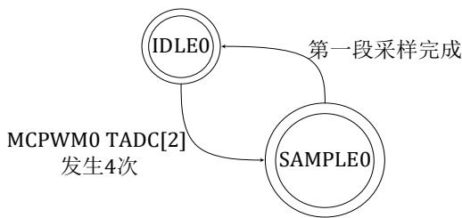  
图13-5ADC单段采样状态转移图

## 13.3.1.2 两段触发模式

两段触发需要两次触发才能完成完整的一轮采样。第一个触发到达时进行第一段采样，第二个触发到达时进行第二段采样。

假设两段采样配置通道数目分别为2和3，则第一段采样转换后的数据会依次填充到ADC0\_DAT、ADC\_DAT1，第二段采样转换后的数据会依次填充到 ADC\_DAT2、ADC\_DAT3、ADC\_DAT4。

触发事件可以是来自外部的 MCPWM定时信号TADC[0]和TADC[1]或两次软件触发。

TADC[0]或软件触发发生后，先进行ADC\_CHNT[3:0]次采样，完成后进入空闲状态并等待下一个触发信号的到来；TADC[1]或软件触发作为第二个触发信号发生后，再进行 ADC\_CHNT[7:4]次采样。采样次数均通过分段采样次数寄存器ADC\_CHNT 进行配置。

每个采样的信号源通过寄存器配置选定，信号源的选定需在触发前完成，且在一次采样过程完成前不应该改变。

软件触发较硬件触发的优先级低，在硬件触发采样的过程中发生软件触发，状态机不予处理，而产生一个错误中断。即只有状态机处于空闲状态时才会处理软件触发的采样请求。如果需要使用软件触发采样，需要确保硬件触发已经关闭。然后通过向 ADC\_SWT寄存器写入0x5AA5 以产生一次软件触发。

以两次软件触发两段采样为例，状态转移如图13-6所示。

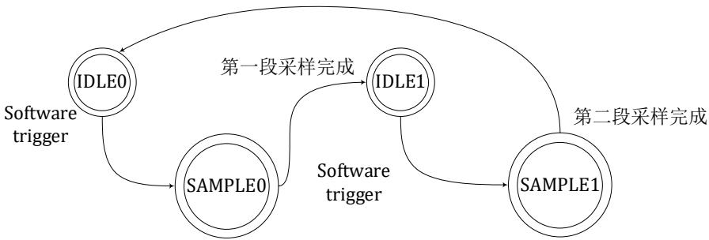  
图13-7ADC两段采样状态转移图

## 13.3.2 中断

## 13.3.2.1 单段触发采样完成中断

采样完成产生一个中断。

## 13.3.2.2 两段触发采样完成中断

第一段采样完成产生一个中断，第二段采样完成产生一个中断。

## 13.3.2.3 ADC\_IF 触发所需时间

CPU 软件运行于 PLL 时钟域，ADC 模块运行于 ADC 时钟域。典型地，ADC 时钟周期为 PLL 时钟周期（总线时钟周期）2倍。 ADC\_IF的清除需要操作ADC 时钟域内的寄存器，最多需要 20 个总线周期。 建议ADC\_IF标志在中断函数入口处进行读取清除。 如果清除语句在中断函数最后，可能导致中断函数退出后标志仍未清除，导致再次进入中断。

同理，如果软件在清除ADC\_IF后立刻查询ADC\_IF，可能ADC\_IF仍为原始值。

## 13.3.3 配置修改

建议在ADC 中断中进行 ADC\_CHNx 的配置和修改，因为进入 ADC 中断后说明 ADC 此时已完成一段采样且处于空闲状态。而在主程序中，无法确认 ADC 运行状态，因此在主程序中如需修改ADC\_CHNx 和 ADC\_CHNT 等寄存器，需要先关闭 ADC 触发，并向 ADC\_CFG[11]写入 1,以复位 ADC 接口电路状态机，确保 ADC 不在工作状态。如果 ADC 在运行中配置发生变化会发生不可预判的行为。

示例程序如下

$$
A D C x \_ C F G \_ t e m p = A D C x \_ C F G; / / S a v e A D C x \_ C F G
$$

```c
ADCx_CFG = 0x0000;    //Disable ADC trigger
ADCx_CFG = 0x0800;    //Reset ADC state machine
/*
Add your code below, like:
ADCx_CHNT = 0x0005
ADCx_CHN0 = 0x3210;
ADCx_CHN1 = 0x7654;
*/
ADCx_CFG = ADCx_CFG_temp;    //restore ADCx_CFG
```

## 13.3.4 选择对应的模拟通道

ADC采样信号来源可以参考表13-27，也可以参考请查阅DATASHEET中表2.2引脚功能选择。关闭对应IO的IE 和OE，即可使用其模拟功能。

## 14 UTimer 通用定时器

## 14.1 概述

## 14.1.1 功能框图

如图14-1 所示，通用定时器 UTIMER 主要包括5 个独立的Timer，以及4 个正交编码器模块。分别可以独立配置运行计数时钟和滤波常数。每个 Timer 可以用于输出特定周期占空比的波形，也可以捕获外部波形进行周期占空比的检测。

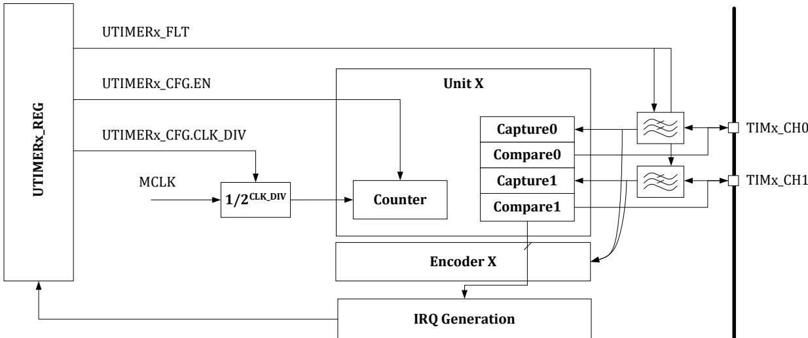  
图 14-1 UTimer 模块顶层功能框图

## 14.1.1.1 总线接口模块

总线接口模块包括:

将来自AHB 总线的访问信号翻译为寄存器读写信号，控制寄存器模块的时钟，并对寄存器模块发起读写。

CG 时钟门控模块，在AHB 总线无访问时，将寄存器模块时钟关闭以降低功耗。

## 14.1.1.2 寄存器模块

## UITMERx\_REG 模块

实现对各个子模块控制寄存器的读写。

实现对各个子模块状态、结果寄存器的访问。

实现对各个子模块中断信号的处理和中断产生。

## 14.1.1.3 IO 滤波模块

IO滤波模块对来自芯片外部的输入信号进行滤波，降低毛刺对定时器功能的影响。

## 14.1.1.4 通用定时器模块

utimer\_unt 模块实现了通用的定时器功能，包括比较和捕获工作模式，可以处理两个外部输入信号或者产生两个脉冲信号送到芯片外部。

utimer\_unt 模块，支持外部事件触发开始计数。外部事件源头可配。当外部事件触发后，utimer\_unt 定时器开始自增。支持使用外部信号作为 timer时钟进行计数。

## 14.1.1.5 编码器模块

编码器模块用于对芯片外部送入的编码器编码信号进行计数。时钟分频模块

时钟分频模块用于产生时钟分频的各种信号。

定时器模块中一共包括 5 个独立工作的通用定时器，Timer0/Unit0、Timer1/Unit1、Timer4/Unit4 为 16bit 位宽，Timer2/Unit2、Timer3/Unit3 为 32bit 位宽。每个定时器包含两个通道。

定时器模块中集成了 4 个编码器模块。其中编码器 0/1/2/3 的输入分别来自 Timer0/1/2/3 的通道0/1。使用编码器不影响 Timer功能。

## 14.1.2 功能特点

定时器模块有以下特点：

 独立工作计数器，可工作在不同频率下

 Timer0、Timer1 和 Timer4 为 16bit 通用定时器

 Timer2 和 Timer3 为 32bit 通用定时器

 每个通用定时器处理 2个外部输入信号（捕获模式），或者产生2 个输出信号（比较模式）

 对每个输入信号进行滤波

 Timer 事件可作为 DMA 传输触发

## 14.2 实现说明

## 14.2.1 时钟分频

为了实现各个 timer 独立分频，且可以方便对中断/计数值进行写操作，采取了各个 timer 均工作在系统主频，但使用分频计数器来降低计数器计数频率。

## 14.2.2 中断标志清零

采用了通过对每个中断标志位写 1来清除标志位的设计。

## 14.2.3 滤波

定时器模块共有10 个/5对通道输入，定时器可以对每个输入进行不同程度的滤波。

通过配置滤波寄存器可以调整滤波宽度，0\~2040个 Timer 计数时钟宽度。

输入信号滤波使用 Timer 计数时钟，即根据 UTIMER\_UNTx\_CFG.CLK\_DIV 对系统高速时钟分频后的时钟。

如图14-2 所示，原始输入信号在 t1\~t6几个时刻发生了翻转，滤波器宽度配置成 T。可以看到只有 t3 和 t6 时刻发生的翻转维持了大于 T 的时间，因此从滤波器的输出看，信号仅发生了两次翻转。

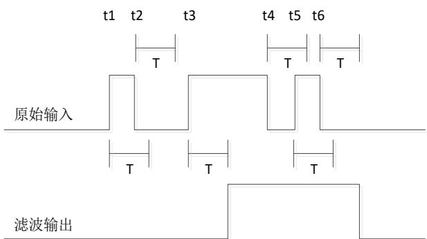  
图 14-2 UTimer 滤波示意图

## 14.2.4 模式

## 14.2.4.1 计数器

Timer中的计数器采用递增方向计数。

计数器从 0 计数到 TH 值，再回到 0 重新开始计数，计数器回到 0 时，产生回零中断。实际计数周期为 clk\_freq\*(TH+1)。

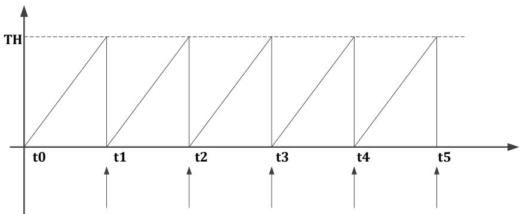  
图 14-3 UTimer 通用计数器

## 14.2.4.2 比较模式

比较模式下，计数器计数到 UTIMERx\_CMP0/ UTIMERx\_CMP1 时，产生比较中断。比较模式可

以产生一个比较脉冲。

对 Timer 的通道 0 来说，在计数器回零时，输出一个电平（极性可配置）到 TIMERx\_CH0，当计数到UTIMERx\_CMP0即比较事件发生时，电平翻转，输出另一个电平到IO口 TIMERx\_CH0。

对 Timer 的通道 1 来说，在计数器回零时，输出一个电平（极性可配置）到 TIMERx\_CH1，当计数到UTIMERx\_CMP1即比较事件发生时，电平翻转，输出另一个电平到IO口 TIMERx\_CH1。

计数器回零时，仍然会产生回零中断。设置UTIMERx\_CMP0=0，可使得Timer X通道0 为恒1，设置 UTIMERx\_CMP0=UTIMERx\_TH+1，可使得 Timer 通道 0 为恒 0。

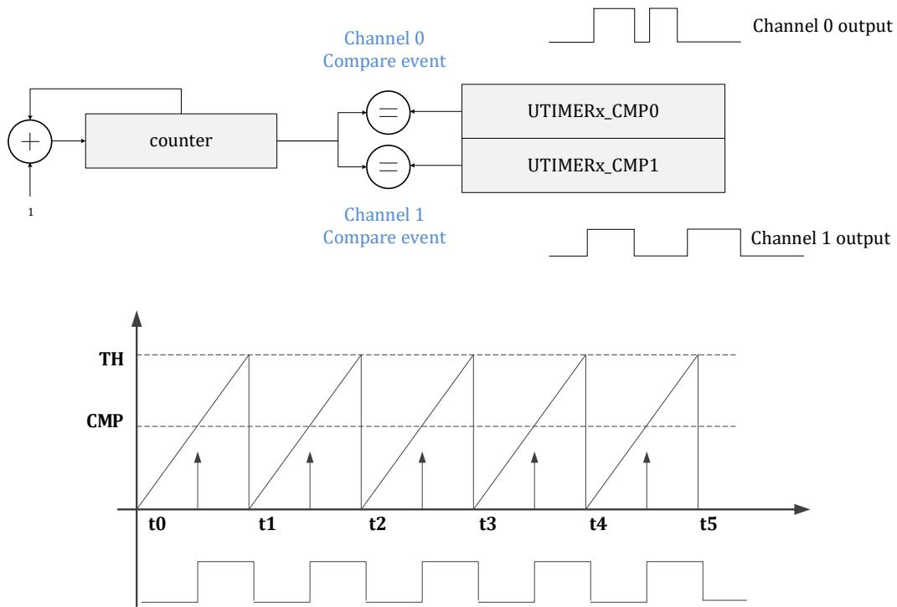  
图 14-4 UTimer 比较模式

## 14.2.4.3 捕获模式

捕获模式下，可以使用 Timer来检测输入信号的上升/下降或者双沿，发生捕获事件（即输入信号电平变化）时，定时器计数值存入 UTIMERx\_CMP 寄存器，并产生捕获中断。计数器回零时，仍然会产生回零中断。

对 Timer 的通道0 来说，可以配置其检测上升沿、下降沿、或者双沿，当通道 0 输入信号发生特定翻转时，Timer将此时的计数器的数值写入 UTIMERx\_CMP0。

对 Timer 的通道1 来说，可以配置其检测上升沿、下降沿、或者双沿，当通道 1 输入信号发生特定翻转时，Timer将此时的计数器的数值写入 UTIMERx\_CMP1。

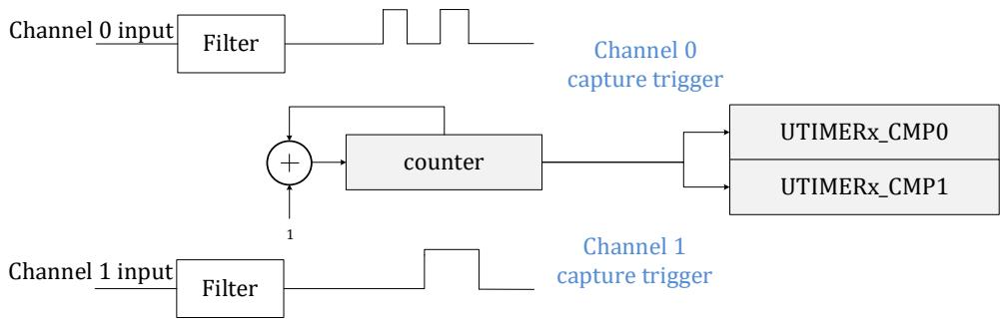

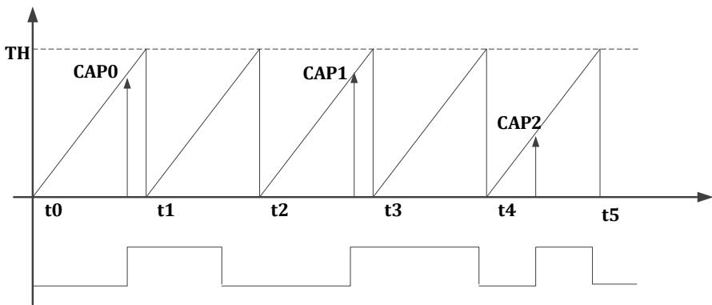  
图 14-5 UTimer 捕获模式

如图 14-5 所示，定时器设置为上升沿捕获。在 CAP0/CAP1/CAP2 三个时刻点，捕获到输入信号发生上升沿变化，对应时刻点的定时器计数值将存入 UTIMERx\_CMP寄存器中。

## 14.2.5 ADC 触发

Timer 的比较事件可作为 ADC 采样触发事件，可参考 13.2.5.3 ADCx\_TRIG(x = 0,1,2)。

## 14.2.6 编码器

编码器接口支持正交编码信号、符号加脉冲信号、CW/CCW双脉冲信号三种模式。

其中 QEP0 的两个输入信号 T1/T2 分别来自 Timer0 Channel0/1 对应的 GPIO 输入，并经过Timer 内部的滤波；QEP1 的 T1/T2 信号分别来自 Timer1 Channel0/1 对应的 GPIO 输入，并经过Timer内部的滤波。QEP2/3，依次类推。开启编码器功能时并不影响Timer功能的正常使用。

编码器的输入 T1/T2/Z 信号均受对应的 Timer 滤波系数控制，举例来说，QEP0 的 Z 信号受到UTIMER0\_FLT 滤波时间控制。

使用编码器，需要开启对应的 SYS\_CLK\_FEN 中对应的 Timer时钟使能。如使用 QEP1需要开启Time1 外设时钟使能。

## 14.2.6.1 正交编码信号

正交编码信号多用于计数编码器圈数，输入为T1/T2 两个信号，支持下表中两个模式。

概括来讲，T1/T2 的跳变沿会导致计数器递增或递减。而计数器计数方向（递增或递减）由跳变信号之外的另一个稳态信号的电平高低决定。

如果T1 发生了上升沿跳变，则看 T2 是高电平还是低电平，如果是高电平则计数器递减，如果是低电平计数器递增，T1下降沿计数器变化相反。

如果T2 发生了上升沿跳变，则看 T1 是高电平还是低电平，如果是高电平则计数器递增，如果是低电平计数器递减，T2下降沿计数器变化相反。

逻辑关系如下公式所示：

$$
\begin{array}{l l} \text {Counter Up} & = (\mathrm{T1}! = \mathrm{T2}) @ (\mathrm{T1triggeringedges}) | (\mathrm{T1} = = \mathrm{T2}) @ (\mathrm{T2triggeringedges}) \\ \text {Counter Down} & = (\mathrm{T1} = = \mathrm{T2}) @ (\mathrm{T1triggeringedges}) | (\mathrm{T1}! = \mathrm{T2}) @ (\mathrm{T2triggeringedges}) \end{array}
$$

表14-1编码器正交编码工作模式

<table><tr><td rowspan="2">计数模式</td><td rowspan="2">T1/T2 电平状态(稳态信号)</td><td colspan="2">T1 变化边沿状态</td><td colspan="2">T2 变化边沿状态</td></tr><tr><td>上升沿</td><td>下降沿</td><td>上升沿</td><td>下降沿</td></tr><tr><td rowspan="2">仅 T1 计数</td><td>T2 高</td><td>递减</td><td>递增</td><td>不计数</td><td>不计数</td></tr><tr><td>T2 低</td><td>递增</td><td>递减</td><td>不计数</td><td>不计数</td></tr><tr><td rowspan="4">T1/T2 都计数</td><td>T2 高</td><td>递减</td><td>递增</td><td>不计数</td><td>不计数</td></tr><tr><td>T2 低</td><td>递增</td><td>递减</td><td>不计数</td><td>不计数</td></tr><tr><td>T1 高</td><td>不计数</td><td>不计数</td><td>递增</td><td>递减</td></tr><tr><td>T1 低</td><td>不计数</td><td>不计数</td><td>递减</td><td>递增</td></tr></table>

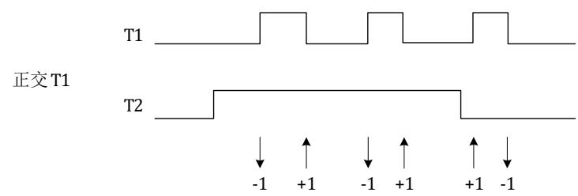  
图14-6编码器只在 T1 时刻计数的正交编码信号计数情况

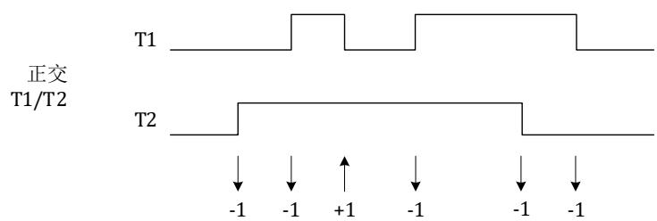  
图14-7编码器在T1或T2 时刻计数的正交编码信号计数情况

## 14.2.6.2 符号加脉冲信号

这种工作模式下，T1为脉冲信号，T2为符号信号。T1 的边沿触发计数，T2 电平控制计数方向，高则递增，低则递减。可以配置仅 T1 上升沿计数还是 T1上升下降沿都计数。

$$
\text { Counter   Up } = (T 2 = = 1) @ (T 1 \text {   triggering   edges })
$$

$$
\text { Counter   Down } = (T 2 = = 0) @ (T 1 \text { triggering   edges })
$$

表 14-2编码器符号加脉冲工作模式

<table><tr><td rowspan="2">计数模式</td><td rowspan="2">T2 电平状态(稳态信号)</td><td colspan="2">T1 变化边沿状态</td></tr><tr><td>上升沿</td><td>下降沿</td></tr><tr><td rowspan="2">仅 T1 上升沿</td><td>高</td><td>递增</td><td>不计数</td></tr><tr><td>低</td><td>递减</td><td>不计数</td></tr><tr><td rowspan="2">T1 上升下降沿</td><td>高</td><td>递增</td><td>递减</td></tr><tr><td>低</td><td>递减</td><td>递增</td></tr></table>

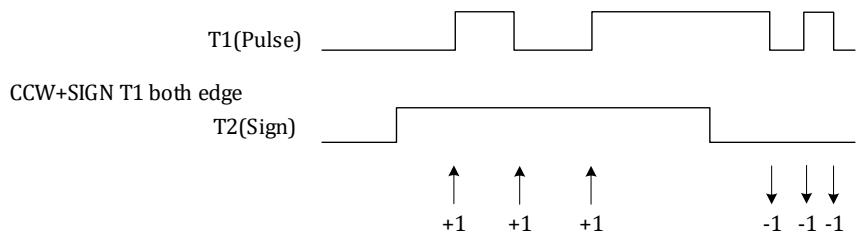  
图14-8编码器在T1上升下降沿都计数的符号加脉冲信号计数情况

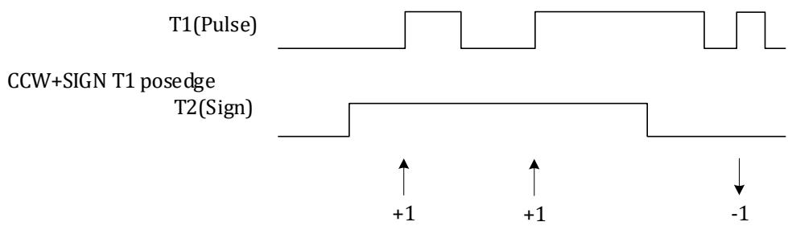  
图14-9编码器在仅T1 上升沿计数的符号加脉冲信号计数情况

## 14.2.6.3 CCW/CW 双脉冲信号

在T1跳变时计数器递增，在 T2跳变时计数器递减。可以配置计数器仅在上升沿变化或者在上升下降沿都变化。以下式表示

$$
\text { Counter   Up } = 1 @ (\text { T1   triggering   edges })
$$

$$
\text { Counter   Down } = 1 @ (\text { T2   triggering   edges })
$$

表14-3编码器CCW/CW双脉冲工作模式

<table><tr><td rowspan="2">计数模式</td><td colspan="4">变化边沿状态</td></tr><tr><td>T1 上升沿</td><td>T1 下降沿</td><td>T2 上升沿</td><td>T2 下降沿</td></tr><tr><td>T1/T2 上升沿</td><td>递增</td><td>不计数</td><td>递减</td><td>不计数</td></tr><tr><td>T1/T2 上升下降沿</td><td>递增</td><td>递增</td><td>递减</td><td>递减</td></tr></table>

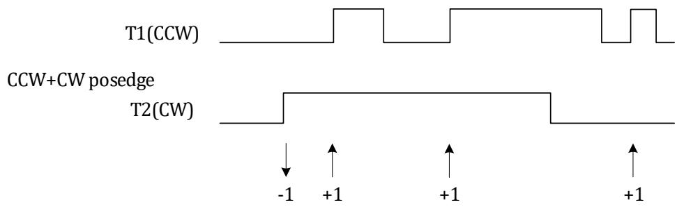  
图14-10 编码器仅在T1/T2 上升沿计数的 CCW/CW双脉冲信号计数情况

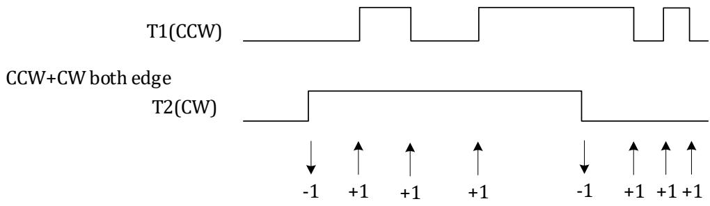  
图14-11 编码器在 T1/T2上升下降沿计数的 CCW/CW双脉冲信号计数情况

## 14.3 寄存器

## 14.3.1 地址分配

Timer0 在芯片中的基地址是 0x4001\_4000

表 14-4 Timer0 寄存器地址分配

<table><tr><td>名称</td><td>偏移</td><td>描述</td></tr><tr><td>UTIMER0_CFG</td><td>0x00</td><td>Timer0 配置寄存器</td></tr><tr><td>UTIMER0_TH</td><td>0x04</td><td>Timer0 计数门限寄存器</td></tr><tr><td>UTIMER0_CNT</td><td>0x08</td><td>Timer0 计数值寄存器</td></tr><tr><td>UTIMER0_CMP0</td><td>0x0C</td><td>Timer0 比较/捕获寄存器 0</td></tr><tr><td>UTIMER0_CMP1</td><td>0x10</td><td>Timer0 比较/捕获寄存器 1</td></tr><tr><td>UTIMER0_EVT</td><td>0x14</td><td>Timer0 外部事件选择寄存器</td></tr><tr><td>UTIMER0_FLT</td><td>0x18</td><td>Timer0 滤波控制寄存器</td></tr><tr><td>UTIMER0_IE</td><td>0x1C</td><td>Timer0 中断使能寄存器</td></tr><tr><td>UTIMER0_IF</td><td>0x20</td><td>Timer0 中断标志寄存器</td></tr></table>

Timer1 在芯片中的基地址是 0x4001\_4100

Timer4 在芯片中的基地址是 0x4001\_4400

表 14-5 Timer1 寄存器地址分配

<table><tr><td>UTIMER1_CFG</td><td>0x00</td><td>Timer1 配置寄存器</td></tr><tr><td>UTIMER1_TH</td><td>0x04</td><td>Timer1 计数门限寄存器</td></tr><tr><td>UTIMER1_CNT</td><td>0x08</td><td>Timer1 计数值寄存器</td></tr><tr><td>UTIMER1_CMP0</td><td>0x0C</td><td>Timer1 比较/捕获寄存器 0</td></tr><tr><td>UTIMER1_CMP1</td><td>0x10</td><td>Timer1 比较/捕获寄存器 1</td></tr><tr><td>UTIMER1_EVT</td><td>0x14</td><td>Timer1 外部事件选择寄存器</td></tr><tr><td>UTIMER1_FLT</td><td>0x18</td><td>Timer1 滤波控制寄存器</td></tr><tr><td>UTIMER1_IE</td><td>0x1C</td><td>Timer1 中断使能寄存器</td></tr><tr><td>UTIMER1_IF</td><td>0x20</td><td>Timer1 中断标志寄存器</td></tr></table>

Timer2 在芯片中的基地址是 0x4001\_4200  
表 14-6 Timer2 寄存器地址分配

<table><tr><td>UTIMER2_CFG</td><td>0x00</td><td>Timer2 配置寄存器</td></tr><tr><td>UTIMER2_TH</td><td>0x04</td><td>Timer2 计数门限寄存器</td></tr><tr><td>UTIMER2_CNT</td><td>0x08</td><td>Timer2 计数值寄存器</td></tr><tr><td>UTIMER2_CMP0</td><td>0x0C</td><td>Timer2 比较/捕获寄存器 0</td></tr><tr><td>UTIMER2_CMP1</td><td>0x10</td><td>Timer2 比较/捕获寄存器 1</td></tr><tr><td>UTIMER2_EVT</td><td>0x14</td><td>Timer2 外部事件选择寄存器</td></tr><tr><td>UTIMER2_FLT</td><td>0x18</td><td>Timer2 滤波控制寄存器</td></tr><tr><td>UTIMER2_IE</td><td>0x1C</td><td>Timer2 中断使能寄存器</td></tr><tr><td>UTIMER2_IF</td><td>0x20</td><td>Timer2 中断标志寄存器</td></tr></table>

Timer3 在芯片中的基地址是 0x4001\_4300  
表 14-7 Timer3 寄存器地址分配

<table><tr><td>UTIMER3_CFG</td><td>0x00</td><td>Timer3 配置寄存器</td></tr><tr><td>UTIMER3_TH</td><td>0x04</td><td>Timer3 计数门限寄存器</td></tr><tr><td>UTIMER3_CNT</td><td>0x08</td><td>Timer3 计数值寄存器</td></tr><tr><td>UTIMER3_CMP0</td><td>0x0C</td><td>Timer3 比较/捕获寄存器 0</td></tr><tr><td>UTIMER3_CMP1</td><td>0x10</td><td>Timer3 比较/捕获寄存器 1</td></tr><tr><td>UTIMER3_EVT</td><td>0x14</td><td>Timer3 外部事件选择寄存器</td></tr><tr><td>UTIMER3_FLT</td><td>0x18</td><td>Timer3 滤波控制寄存器</td></tr><tr><td>UTIMER3_IE</td><td>0x1C</td><td>Timer3 中断使能寄存器</td></tr><tr><td>UTIMER3_IF</td><td>0x20</td><td>Timer3 中断标志寄存器</td></tr></table>

表 14-8 Timer4 寄存器地址分配

<table><tr><td>UTIMER4_CFG</td><td>0x00</td><td>Timer4 配置寄存器</td></tr><tr><td>UTIMER4_TH</td><td>0x04</td><td>Timer4 计数门限寄存器</td></tr><tr><td>UTIMER4_CNT</td><td>0x08</td><td>Timer4 计数值寄存器</td></tr><tr><td>UTIMER4_CMP0</td><td>0x0C</td><td>Timer4 比较/捕获寄存器 0</td></tr><tr><td>UTIMER4_CMP1</td><td>0x10</td><td>Timer4 比较/捕获寄存器 1</td></tr><tr><td>UTIMER4_EVT</td><td>0x14</td><td>Timer4 外部事件选择寄存器</td></tr><tr><td>UTIMER4_FLT</td><td>0x18</td><td>Timer4 滤波控制寄存器</td></tr><tr><td>UTIMER4_IE</td><td>0x1C</td><td>Timer4 中断使能寄存器</td></tr><tr><td>UTIMER4_IF</td><td>0x20</td><td>Timer4 中断标志寄存器</td></tr></table>

Timer0/1/4 完全相同。

Timer2/3 完全相同，与 Timer0/1/4 不同之处在于 Timer2/3 计数器相关寄存器为 32 位宽，而Timer0/1计数器相关寄存器为16位宽。

QEP0 在芯片中的基地址是 0x4001\_4500

表 14-9 QEP0 寄存器地址分配

<table><tr><td>QEP0_CFG</td><td>0x00</td><td>QEP0 配置寄存器</td></tr><tr><td>QEP0_TH</td><td>0x04</td><td>QEP0 计数门限寄存器</td></tr><tr><td>QEP0_CNT</td><td>0x08</td><td>QEP0 计数值寄存器</td></tr><tr><td>QEP0_IE</td><td>0x0C</td><td>QEP0 中断使能寄存器</td></tr><tr><td>QEP0_IF</td><td>0x10</td><td>QEP0 中断标志寄存器</td></tr></table>

QEP1 在芯片中的基地址是 0x4001\_4600

表 14-10 QEP1 寄存器地址分配

<table><tr><td>QEP1_CFG</td><td>0x00</td><td>QEP1 配置寄存器</td></tr><tr><td>QEP1_TH</td><td>0x04</td><td>QEP1 计数门限寄存器</td></tr><tr><td>QEP1_CNT</td><td>0x08</td><td>QEP1 计数值寄存器</td></tr><tr><td>QEP1_IE</td><td>0x0C</td><td>QEP1 中断使能寄存器</td></tr><tr><td>QEP1_IF</td><td>0x10</td><td>QEP1 中断标志寄存器</td></tr></table>

QEP2 在芯片中的基地址是 0x4001\_4700

表 14-11 QEP2 寄存器地址分配

<table><tr><td>QEP2_CFG</td><td>0x00</td><td>QEP2 配置寄存器</td></tr><tr><td>QEP2_TH</td><td>0x04</td><td>QEP2 计数门限寄存器</td></tr><tr><td>QEP2_CNT</td><td>0x08</td><td>QEP2 计数值寄存器</td></tr><tr><td>QEP2_IE</td><td>0x0C</td><td>QEP2 中断使能寄存器</td></tr><tr><td>QEP2_IF</td><td>0x10</td><td>QEP2 中断标志寄存器</td></tr></table>

## QEP3 在芯片中的基地址是 0x4001\_4800

表 14-12 QEP2 寄存器地址分配

<table><tr><td>QEP3_CFG</td><td>0x00</td><td>QEP3 配置寄存器</td></tr><tr><td>QEP3_TH</td><td>0x04</td><td>QEP3 计数门限寄存器</td></tr><tr><td>QEP3_CNT</td><td>0x08</td><td>QEP3 计数值寄存器</td></tr><tr><td>QEP3_IE</td><td>0x0C</td><td>QEP3 中断使能寄存器</td></tr><tr><td>QEP3_IF</td><td>0x10</td><td>QEP3 中断标志寄存器</td></tr></table>

编码器 0/1/2/3 实现完全相同。

## 14.3.2 UTimer0 寄存器

## 14.3.2.1 UTIMER0\_CFG Timer0 配置寄存器

地址：0x4001\_4000

复位值：0x0

表 14-13 Timer0 配置寄存器 UTIMER0\_CFG

<table><tr><td>31</td><td>30</td><td>29</td><td>28</td><td>27</td><td>26</td><td>25</td><td>24</td><td>23</td><td>22</td><td>21</td><td>20</td><td>19</td><td>18</td><td>17</td><td>16</td></tr><tr><td>EN</td><td rowspan="3" colspan="3"></td><td>CMP1_CLR_EN</td><td>CMP0_CLR_EN</td><td>ONE_TRIG</td><td>ETON</td><td rowspan="3"></td><td colspan="3">CLK_DIV</td><td colspan="4">CLK_SRC</td></tr><tr><td>RW</td><td>RW</td><td>RW</td><td>RW</td><td>RW</td><td colspan="3">RW</td><td colspan="4">RW</td></tr><tr><td>0</td><td>0</td><td>0</td><td>0</td><td>0</td><td colspan="3">0</td><td colspan="4">0</td></tr></table>

<table><tr><td>15</td><td>14</td><td>13</td><td>12</td><td>11</td><td>10</td><td>9</td><td>8</td><td>7</td><td>6</td><td>5</td><td>4</td><td>3</td><td>2</td><td>1</td><td>0</td></tr><tr><td colspan="4">SRC1</td><td>CH1_POL</td><td>CH1_MODE</td><td>CH1_FE_CAP_EN</td><td>CH1_RE_CAP_EN</td><td colspan="4">SRC0</td><td>CHO_POL</td><td>CHO_MODE</td><td>CHO_FE_CAP_EN</td><td>CHO_RE_CAP_EN</td></tr><tr><td colspan="4">RW</td><td>RW</td><td>RW</td><td>RW</td><td>RW</td><td colspan="4">RW</td><td>RW</td><td>RW</td><td>RW</td><td>RW</td></tr><tr><td colspan="4">0001</td><td>0</td><td>0</td><td>0</td><td>0</td><td colspan="4">0</td><td>0</td><td>0</td><td>0</td><td>0</td></tr></table>

<table><tr><td>位置</td><td>位名称</td><td>说明</td></tr><tr><td>[31]</td><td>EN</td><td>Timer 模块整体使能,高有效</td></tr><tr><td>[30:28]</td><td></td><td>未使用</td></tr><tr><td>[27]</td><td>CAP1_CLR_EN</td><td>当发生 CAP1 捕获事件时,清零 Timer 计数器,高有效</td></tr><tr><td>[26]</td><td>CAPO_CLR_EN</td><td>当发生 CAPO 捕获事件时,清零 Timer 计数器,高有效</td></tr><tr><td>[25]</td><td>ONE_TRIG</td><td>在比较模式下,且 EN 为 0 时,写 1 触发 Timer 发送一个周期的特定占空比的脉冲,此位在脉冲发送期间内读为 1,一个 Timer 周期后,自动清零。</td></tr><tr><td>[24]</td><td>ETON</td><td>Timer 计数器计数使能配置。默认为 0。0: 自动运行1: 等待外部事件触发计数,计数一个周期后停止外部事件通过UTIMER0_EVT寄存器进行配置。</td></tr><tr><td>[23]</td><td></td><td>未使用</td></tr><tr><td>[22:20]</td><td>CLK_DIV</td><td>Timer计数器频率配置,计数器计数频率是系统主时钟频率的 $2^{CLK\_DIV}$ 分频。默认值为0,不分频。3'h0:1分频3'h1:2分频3'h2:4分频3'h3:8分频3'h4:16分频3'h5:32分频3'h6:64分频3'h7:128分频</td></tr><tr><td>[19:16]</td><td>CLK_SRC</td><td>Timer时钟源4'h0:芯片系统时钟4'h1:芯片系统时钟4'h2:Timer0通道0外部时钟信号4'h3:Timer0通道1外部时钟信号4'h4:Timer1通道0外部时钟信号4'h5:Timer1通道1外部时钟信号4'h6:Timer2通道0外部时钟信号4'h7:Timer2通道1外部时钟信号4'h8:Timer3通道0外部时钟信号4'h9:Timer3通道1外部时钟信号4'hA:Timer4通道0外部时钟信号4'hB:Timer4通道1外部时钟信号</td></tr><tr><td>[15:12]</td><td>SRC1</td><td>Timer捕获模式通道1信号来源。默认为3'h1。4'h0:Timer通道0,来自芯片GPIO(参见Datasheet及应用配置)4'h1:Timer通道1,来自芯片GPIO(参见Datasheet及应用配置)4'h2:比较器0的输出4'h3:比较器1的输出4'h4:比较器2的输出4'h5:比较器3的输出4'h6:比较器4的输出4'h7:比较器5的输出4'h8:Timer通道0和1的异或</td></tr><tr><td>[11]</td><td>CH1_POL</td><td>Timer通道1在比较模式下的输出极性控制,当计数器计数值回零时的输出值。</td></tr><tr><td>[10]</td><td>CH1_MODE</td><td>Timer通道1的工作模式选择,默认值为0。0:比较模式。输出方波,在Timer通道1计数器计数值等于0或等于Timer比较捕获寄存器值时,IO发生翻转。1:捕获模式。当Timer通道1输入信号发生捕获事件时,将计数器计数值存入Timer通道1比较捕获寄存器。</td></tr><tr><td>[9]</td><td>CH1_FE_CAP_EN</td><td>Timer通道1下降沿捕获事件使能。1:使能;0:关闭。Timer通道1输入信号发生1→0跳变被视为捕获事件。下降沿事件使能可以与上升沿事件使能并存。</td></tr><tr><td>[8]</td><td>CH1_RE_CAP_EN</td><td>Timer通道1上升沿捕获事件使能。1:使能;0:关闭。Timer通道1输入信号发生0→1跳变被视为捕获事件。上升沿事件使能可以与下降沿事件使能并存。</td></tr><tr><td>[7:4]</td><td>SRCO</td><td>Timer捕获模式通道0信号来源。默认为3'h0。4'h0:Timer通道0,来自芯片GPIO(参见Datasheet及应用配置)4'h1:Timer通道1,来自芯片GPIO(参见Datasheet及应用配置)4'h2:比较器0的输出4'h3:比较器1的输出4'h4:比较器2的输出4'h5:比较器3的输出4'h6:比较器4的输出4'h7:比较器5的输出4'h8:Timer通道0和1的异或</td></tr><tr><td>[3]</td><td>CHO_POL</td><td>Timer通道0在比较模式下的输出极性控制:当计数器计数值回零时的输出值。</td></tr><tr><td>[2]</td><td>CHO_MODE</td><td>Timer通道0的工作模式选择,默认值为0。0:比较模式。输出方波,在Timer通道0计数器计数值等于0或等于Timer比较捕获寄存器值时,IO发生翻转。1:捕获模式。当Timer通道0输入信号发生捕获事件时,将计数器计数值存入Timer通道0比较捕获寄存器。</td></tr><tr><td>[1]</td><td>CHO_FE_CAP_EN</td><td>Timer通道0下降沿捕获事件使能。1:使能;0:关闭。Timer通道0输入信号发生1→0跳变被视为捕获事件。下降沿事件使能可以与上升沿事件使能并存。</td></tr><tr><td>[0]</td><td>CHO_RE_CAP_EN</td><td>Timer通道0上升沿捕获事件使能。1:使能;0:关闭。Timer通道0输入信号发生0→1跳变被视为捕获事件。上升沿事件使能可以与下降沿事件使能并存。</td></tr></table>

当使用外部时钟计数时，也需要设置 UTIMERx\_CFG.TON=1，且需要开启 SYS\_CLK\_FEN 中对于Timer时钟的使能。使用外部时钟计数时，也需要设置 UTIMERx\_TH。

如果设置 SRC0 为 4’h8 捕获两通道异或值，（通常为捕获编码器正交的两个通道），需要同时设置 CMP0\_CLR\_EN=1，CH0\_FE\_CAP\_EN=1，CH0\_RE\_CAP\_EN=1，CH0\_MODE=1，即捕获上升沿、下降沿，且每次有信号边沿都清零计数器。CMP0 即为捕获的两次信号边沿之间的计数值。

## 14.3.2.2 UTIMER0\_TH Timer0 门限寄存器

地址：0x4001\_4004

复位值：0x0

表 14-14 Timer0 门限寄存器 UTIMER0\_TH

<table><tr><td>15</td><td>14</td><td>13</td><td>12</td><td>11</td><td>10</td><td>9</td><td>8</td><td>7</td><td>6</td><td>5</td><td>4</td><td>3</td><td>2</td><td>1</td><td>0</td></tr><tr><td></td><td></td><td></td><td></td><td></td><td></td><td></td><td>TH</td><td></td><td></td><td></td><td></td><td></td><td></td><td></td><td></td></tr><tr><td></td><td></td><td></td><td></td><td></td><td></td><td></td><td>RW</td><td></td><td></td><td></td><td></td><td></td><td></td><td></td><td></td></tr></table>

<table><tr><td>0</td></tr></table>

<table><tr><td>位置</td><td>位名称</td><td>说明</td></tr><tr><td>[31:16]</td><td></td><td>未使用</td></tr><tr><td>[15:0]</td><td>TH</td><td>Timer 计数器计数门限。计数器从 0 计数到 TH 值后再次回 0 开始计数</td></tr></table>

## 14.3.2.3 UTIMER0\_CNT Timer0 计数寄存器

地址：0x4001\_4008

复位值：0x0

表 14-15 Timer0 计数寄存器 UTIMER0\_CNT

<table><tr><td>15</td><td>14</td><td>13</td><td>12</td><td>11</td><td>10</td><td>9</td><td>8</td><td>7</td><td>6</td><td>5</td><td>4</td><td>3</td><td>2</td><td>1</td><td>0</td></tr><tr><td></td><td></td><td></td><td></td><td></td><td></td><td></td><td colspan="2">CNT</td><td></td><td></td><td></td><td></td><td></td><td></td><td></td></tr><tr><td></td><td></td><td></td><td></td><td></td><td></td><td></td><td colspan="2">RW</td><td></td><td></td><td></td><td></td><td></td><td></td><td></td></tr><tr><td></td><td></td><td></td><td></td><td></td><td></td><td></td><td colspan="2">0</td><td></td><td></td><td></td><td></td><td></td><td></td><td></td></tr></table>

<table><tr><td>位置</td><td>位名称</td><td>说明</td></tr><tr><td>[31:16]</td><td></td><td>未使用</td></tr><tr><td>[15:0]</td><td>CNT</td><td>Timer 0 计数器当前计数值。写操作可以写入新的计数值。</td></tr></table>

注意：写入 UTIMER0\_CNT 前需要先通过 SYS\_CLK\_FEN 开启 Timer 时钟。

## 14.3.2.4 UTIMER0\_CMP0 Timer0 通道 0 比较捕获寄存器

地址：0x4001\_400C

复位值：0x0

表 14-16 Timer0 通道 0 比较捕获寄存器 UTIMER0\_CMP0

<table><tr><td>15</td><td>14</td><td>13</td><td>12</td><td>11</td><td>10</td><td>9</td><td>8</td><td>7</td><td>6</td><td>5</td><td>4</td><td>3</td><td>2</td><td>1</td><td>0</td></tr><tr><td></td><td></td><td></td><td></td><td></td><td></td><td></td><td></td><td></td><td></td><td></td><td></td><td></td><td></td><td></td><td></td></tr><tr><td></td><td></td><td></td><td></td><td></td><td></td><td></td><td></td><td></td><td></td><td></td><td></td><td></td><td></td><td></td><td></td></tr><tr><td></td><td></td><td></td><td></td><td></td><td></td><td></td><td></td><td></td><td></td><td></td><td></td><td></td><td></td><td></td><td></td></tr><tr><td></td><td></td><td></td><td></td><td></td><td></td><td></td><td></td><td></td><td></td><td></td><td></td><td></td><td></td><td></td><td></td></tr></table>

<table><tr><td>位置</td><td>位名称</td><td>说明</td></tr><tr><td>[31:16]</td><td></td><td>未使用</td></tr><tr><td>[15:0]</td><td>CMP0</td><td>Timer 通道 0 工作在比较模式时,当计数器计数值等于 CMP0 时,发生比较事件。Timer 通道 0 工作在捕获模式时,发生捕获事件时的计数器计数值存入 CMP0 寄存器。</td></tr></table>

设置CMP0=0，可使得通道 0为恒1，设置CMP0=TH+1，可使得通道0 为恒0。

## 14.3.2.5 UTIMER0\_CMP1 Timer0 通道 1 比较捕获寄存器

地址：0x4001\_4010

复位值：0x0

表 14-17 Timer0 通道 1 比较捕获寄存器 UTIMER0\_CMP1

<table><tr><td>15</td><td>14</td><td>13</td><td>12</td><td>11</td><td>10</td><td>9</td><td>8</td><td>7</td><td>6</td><td>5</td><td>4</td><td>3</td><td>2</td><td>1</td><td>0</td></tr><tr><td></td><td></td><td></td><td></td><td></td><td></td><td></td><td>CMP1</td><td></td><td></td><td></td><td></td><td></td><td></td><td></td><td></td></tr><tr><td></td><td></td><td></td><td></td><td></td><td></td><td></td><td>RW</td><td></td><td></td><td></td><td></td><td></td><td></td><td></td><td></td></tr><tr><td></td><td></td><td></td><td></td><td></td><td></td><td></td><td>0</td><td></td><td></td><td></td><td></td><td></td><td></td><td></td><td></td></tr></table>

<table><tr><td>位置</td><td>位名称</td><td>说明</td></tr><tr><td>[31:16]</td><td></td><td>未使用</td></tr><tr><td>[15:0]</td><td>CMP1</td><td>Timer 通道 1 工作在比较模式时,当计数器计数值等于 CMP1 时,发生比较事件。Timer 通道 1 工作在捕获模式时,发生捕获事件时的计数器计数值存入 CMP1 寄存器。</td></tr></table>

设置CMP1=0，可使得通道 1为恒1，设置CMP1=TH+1，可使得通道1 为恒0。

## 14.3.2.6 UTIMER0\_EVT Timer0 外部事件选择寄存器

地址：0x4001\_4014

复位值：0x0

表 14-18 Timer0 外部事件选择寄存器 UTIMER0\_EVT

<table><tr><td>15</td><td>14</td><td>13</td><td>12</td><td>11</td><td>10</td><td>9</td><td>8</td><td>7</td><td>6</td><td>5</td><td>4</td><td>3</td><td>2</td><td>1</td><td>0</td></tr><tr><td rowspan="3" colspan="11"></td><td colspan="5">EVT_SRC</td></tr><tr><td colspan="5">RW</td></tr><tr><td colspan="5">0</td></tr></table>

<table><tr><td>位置</td><td>位名称</td><td>说明</td></tr><tr><td>[31:5]</td><td></td><td>未使用</td></tr><tr><td>[4:0]</td><td>EVT_SRC</td><td>Timer 外部事件选择寄存器,本寄存器需要配合UTIMER0_CFG.ETON使用。ETON为高时,根据本寄存器选择触发Timer计数的事件。需要注意的是,Timer自身的比较事件无法触发Timer进行计数。0: TIMER0 通道0比较事件1: TIMER0 通道1比较事件2: TIMER1 通道0比较事件3: TIMER1 通道1比较事件4: TIMER2 通道0比较事件5: TIMER2 通道1比较事件6: TIMER3 通道0比较事件7: TIMER3 通道1比较事件8: TIMER4 通道0比较事件9: TIMER4 通道1比较事件10: MCPWM0 TADC[0]比较事件11: MCPWM0 TADC[1]比较事件12: MCPWM0 TADC[2]比较事件13: MCPWM0 TADC[3]比较事件14: MCPWM1 TADC[0]比较事件15: MCPWM1 TADC[1]比较事件16: MCPWM1 TADC[2]比较事件17: MCPWM1 TADC[3]比较事件</td></tr></table>

## 14.3.2.7 UTIMER0\_FLT Timer0 滤波控制寄存器

地址：0x4001\_4018

复位值：0x0

表 14-19 Timer0 滤波控制寄存器 UTIMER0\_FLT

<table><tr><td>15</td><td>14</td><td>13</td><td>12</td><td>11</td><td>10</td><td>9</td><td>8</td><td>7</td><td>6</td><td>5</td><td>4</td><td>3</td><td>2</td><td>1</td><td>0</td></tr><tr><td rowspan="3" colspan="8"></td><td colspan="8">FLT</td></tr><tr><td colspan="8">RW</td></tr><tr><td colspan="8">0</td></tr></table>

<table><tr><td>位置</td><td>位名称</td><td>说明</td></tr><tr><td>[31:8]</td><td></td><td>未使用</td></tr><tr><td>[7:0]</td><td>FLT</td><td>通道 0/1 信号滤波宽度选择。取值范围 0~255。 FLT 为 0 时,不对通道进行滤波。 FLT 不为 0 时,对通道信号进行滤波:滤波宽度为  $FLT \times 8$ 。当通道信号电平稳定超过  $FLT \times 8$  个系统时钟周期宽度时,滤波器输出更新;否则,滤波器保持当前的输出不变。</td></tr></table>

注意，以上滤波器的工作时钟与对应的 Timer 的分频后的工作时钟为相同时钟，受UTIMERx\_CFG.CLK\_DIV 的分频系数控制。

假设 UTIMERx\_FLT.FLT = 0x6；UTIMERx\_CFG.CLK\_DIV = 0x2; 则 Timer 的运行时钟相对系统时钟进行了4 分频。通道输入信号需要经过 8×6倍Timer的运行时钟的滤波，亦即 $8 { \times } 6 { \times } 4$ 倍系统时钟的滤波。

## 14.3.2.8 UTIMER0\_IE Timer0 中断使能寄存器

地址：0x4001\_401C

复位值：0x0

表 14-20 Timer0 中断使能寄存器 UTIMER0\_IE

<table><tr><td rowspan="3"></td><td>ZC_RE</td><td>CH1_RE</td><td>CH0_RE</td><td rowspan="3" colspan="2"></td><td>ZC_IE</td><td>CH1_IE</td><td>CH0_IE</td></tr><tr><td>RW</td><td>RW</td><td>RW</td><td>RW</td><td>RW</td><td>RW</td></tr><tr><td>0</td><td>0</td><td>0</td><td>0</td><td>0</td><td>0</td></tr></table>

<table><tr><td>位置</td><td>位名称</td><td>说明</td></tr><tr><td>[31:11]</td><td></td><td>未使用</td></tr><tr><td>[10]</td><td>ZC_RE</td><td>Timer 计数器过 0 事件 DMA 请求使能,高电平有效。</td></tr><tr><td>[9]</td><td>CH1_RE</td><td>Timer 通道 1 比较/捕获 DMA 请求使能,高电平有效。</td></tr><tr><td>[8]</td><td>CHO_RE</td><td>Timer 通道 0 比较/捕获 DMA 请求使能,高电平有效。</td></tr><tr><td>[7:3]</td><td></td><td>未使用</td></tr><tr><td>[2]</td><td>ZC_IE</td><td>Timer 计数器过 0 中断使能,高电平有效。</td></tr><tr><td>[1]</td><td>CH1_IE</td><td>Timer 通道 1 比较/捕获中断使能,高电平有效。</td></tr><tr><td>[0]</td><td>CHO_IE</td><td>Timer 通道 0 比较/捕获中断使能,高电平有效。</td></tr></table>

DMA 请求事件，与中断为相同事件标志，DMA 请求被 DMA 受理后，中断标志会被 DMA 硬件自动清除，无需 CPU 软件干预。需要注意的是，通常开启某个事件的 DMA 请求则关闭对应的中断使能。

## 14.3.2.9 UTIMER0\_IF Timer0 中断标志寄存器

地址：0x4001\_4020

复位值：0x0

表 14-21 Timer0 中断标志寄存器 UTIMER0\_IF

<table><tr><td>RW1C</td><td>ZC_IF</td></tr><tr><td>RW1C</td><td>CH1_IF</td></tr><tr><td>RW1C</td><td>CHO_IF</td></tr></table>

<table><tr><td></td><td>0</td><td>0</td><td>0</td></tr></table>

<table><tr><td>位置</td><td>位名称</td><td>说明</td></tr><tr><td>[31:3]</td><td></td><td>未使用</td></tr><tr><td>[2]</td><td>ZC_IF</td><td>Timer 计数器过 0 中断标志。高电平有效,写 1 清 0</td></tr><tr><td>[1]</td><td>CH1_IF</td><td>Timer 通道 1 比较/捕获中断标志。高电平有效,写 1 清 0</td></tr><tr><td>[0]</td><td>CHO_IF</td><td>Timer 通道 0 比较/捕获中断标志。高电平有效,写 1 清 0</td></tr></table>

中断标志写1清零，一般不建议用如下|=方式清零，因为|=是先读取中断标志，将对应位改为1再写入清零，如果同时有其他中断标志置位，会被一起清零，而这通常不是软件所期望的。例如，如下写法本意是清零ZC\_IF，但如果同时 CH0\_IF在写入执行前置1 了，则软件先读取回 UTIMER\_IF值为0x24，然后执行或操作0x4|0x1=0x5，然后写入，同时对 CH0\_IF和 ZC\_IF进行了清零，可能导致Timer少进入一次因捕获而产生的中断。

$$
U T I M E R \_ I F | = 0 x 4;
$$

如果希望清零ZC\_IF 标志位，应以如下方式，直接对BIT2 写1.

$$
U T I M E R \_ I F = 0 x 4;
$$

## 14.3.3 UTimer1 寄存器

## 14.3.3.1 UTIMER1\_CFG Timer1 配置寄存器

地址：0x4001\_4100

复位值：0x0

表 14-22 Timer1 配置寄存器 UTIMER1\_CFG

<table><tr><td>31</td><td>30</td><td>29</td><td>28</td><td>27</td><td>26</td><td>25</td><td>24</td><td>23</td><td>22</td><td>21</td><td>20</td><td>19</td><td>18</td><td>17</td><td>16</td></tr><tr><td>EN</td><td rowspan="3" colspan="3"></td><td>CAP1_CLR_EN</td><td>CAP0_CLR_EN</td><td>ONE_TRIG</td><td>ETON</td><td rowspan="3"></td><td colspan="3">CLK_DIV</td><td colspan="4">CLK_SRC</td></tr><tr><td>RW</td><td>RW</td><td>RW</td><td>RW</td><td>RW</td><td colspan="3">RW</td><td colspan="4">RW</td></tr><tr><td>0</td><td>0</td><td>0</td><td>0</td><td>0</td><td colspan="3">0</td><td colspan="4">0</td></tr></table>

<table><tr><td>SRC1</td><td>CH1_POL</td><td>CH1_MODE</td><td>CH1_FE_CAP_EN</td><td>CH1_RE_CAP_EN</td><td>SRC0</td><td>CHO_POL</td><td>CHO_MODE</td><td>CHO_FE_CAP_EN</td><td>CHO_RE_CAP_EN</td></tr><tr><td>RW</td><td>RW</td><td>RW</td><td>RW</td><td>RW</td><td>RW</td><td>RW</td><td>RW</td><td>RW</td><td>RW</td></tr><tr><td>0001</td><td>0</td><td>0</td><td>0</td><td>0</td><td>0</td><td>0</td><td>0</td><td>0</td><td>0</td></tr></table>

<table><tr><td>位置</td><td>位名称</td><td>说明</td></tr><tr><td>[31]</td><td>EN</td><td>Timer模块整体使能,高有效</td></tr><tr><td>[30:28]</td><td></td><td>未使用</td></tr><tr><td>[27]</td><td>CAP1_CLR_EN</td><td>当发生CAP1捕获事件时,清零Timer计数器,高有效</td></tr><tr><td>[26]</td><td>CAPO_CLR_EN</td><td>当发生CAPO捕获事件时,清零Timer计数器,高有效</td></tr><tr><td>[25]</td><td>ONE_TRIG</td><td>在比较模式下,且EN为0时,写1触发Timer发送一个周期的特定占空比的脉冲,此位在脉冲发送期间内读为1,一个Timer周期后,自动清零。</td></tr><tr><td>[24]</td><td>ETON</td><td>Timer计数器计数使能配置。默认为0。0:自动运行1:等待外部事件触发计数,计数一个周期后停止外部事件通过UTIMER1_EVT寄存器进行配置。</td></tr><tr><td>[23]</td><td></td><td>未使用</td></tr><tr><td>[22:20]</td><td>CLK_DIV</td><td>Timer计数器频率配置,计数器计数频率是系统主时钟频率的 $2^{CLK\_DIV}$ 分频。默认值为0,不分频。3'h0:1分频3'h1:2分频3'h2:4分频3'h3:8分频3'h4:16分频3'h5:32分频3'h6:64分频3'h7:128分频</td></tr><tr><td>[19:16]</td><td>CLK_SRC</td><td>Timer时钟源4'h0:芯片系统时钟4'h1:芯片系统时钟4'h2:Timer0通道0外部时钟信号4'h3:Timer0通道1外部时钟信号4'h4:Timer1通道0外部时钟信号4'h5:Timer1通道1外部时钟信号4'h6:Timer2通道0外部时钟信号4'h7:Timer2通道1外部时钟信号4'h8:Timer3通道0外部时钟信号4'h9:Timer3通道1外部时钟信号4'hA:Timer4通道0外部时钟信号4'hB:Timer4通道1外部时钟信号</td></tr><tr><td>[15:12]</td><td>SRC1</td><td>Timer捕获模式通道1信号来源。默认为3'h1。4'h0:Timer通道0,来自芯片GPIO(参见Datasheet及应用配置)4'h1:Timer通道1,来自芯片GPIO(参见Datasheet及应用配置)4'h2:比较器0的输出4'h3:比较器1的输出4'h4:比较器2的输出4'h5:比较器3的输出4'h6:比较器4的输出4'h7: 比较器5的输出4'h8: Timer通道0和1的异或</td></tr><tr><td>[11]</td><td>CH1_POL</td><td>Timer通道1在比较模式下的输出极性控制,当计数器计数值回零时的输出值。</td></tr><tr><td>[10]</td><td>CH1_MODE</td><td>Timer通道1的工作模式选择,默认值为0。0: 比较模式。输出方波,在Timer通道1计数器计数值等于0或等于Timer比较捕获寄存器值时,IO发生翻转。1: 捕获模式。当Timer通道1输入信号发生捕获事件时,将计数器计数值存入Timer通道1比较捕获寄存器。</td></tr><tr><td>[9]</td><td>CH1_FE_CAP_EN</td><td>Timer通道1下降沿捕获事件使能。1: 使能;0: 关闭。Timer通道1输入信号发生1→0跳变被视为捕获事件。下降沿事件使能可以与上升沿事件使能并存。</td></tr><tr><td>[8]</td><td>CH1_RE_CAP_EN</td><td>Timer通道1上升沿捕获事件使能。1: 使能;0: 关闭。Timer通道1输入信号发生0→1跳变被视为捕获事件。上升沿事件使能可以与下降沿事件使能并存。</td></tr><tr><td>[7:4]</td><td>SRC0</td><td>Timer捕获模式通道0信号来源。默认为3'h0。4'h0: Timer通道0,来自芯片GPIO(参见Datasheet及应用配置)4'h1: Timer通道1,来自芯片GPIO(参见Datasheet及应用配置)4'h2: 比较器0的输出4'h3: 比较器1的输出4'h4: 比较器2的输出4'h5: 比较器3的输出4'h6: 比较器4的输出4'h7: 比较器5的输出4'h8: Timer通道0和1的异或</td></tr><tr><td>[3]</td><td>CHO_POL</td><td>Timer通道0在比较模式下的输出极性控制:当计数器计数值回零时的输出值。</td></tr><tr><td>[2]</td><td>CHO_MODE</td><td>Timer通道0的工作模式选择,默认值为0。0: 比较模式。输出方波,在Timer通道0计数器计数值等于0或等于Timer比较捕获寄存器值时,IO发生翻转。1: 捕获模式。当Timer通道0输入信号发生捕获事件时,将计数器计数值存入Timer通道0比较捕获寄存器。</td></tr><tr><td>[1]</td><td>CHO_FE_CAP_EN</td><td>Timer通道0下降沿捕获事件使能。1: 使能;0: 关闭。Timer通道0输入信号发生1→0跳变被视为捕获事件。下降沿事件使能可以与上升沿事件使能并存。</td></tr><tr><td>[0]</td><td>CHO_RE_CAP_EN</td><td>Timer通道0上升沿捕获事件使能。1: 使能;0: 关闭。Timer通道0输入信号发生0→1跳变被视为捕获事件。上升沿事件使能可以与下降沿事件使能并存。</td></tr></table>

## 14.3.3.2 UTIMER1\_TH Timer1 门限寄存器

地址：0x4001\_4104

复位值：0x0

表 14-23 Timer1 门限寄存器 UTIMER1\_TH

<table><tr><td>15</td><td>14</td><td>13</td><td>12</td><td>11</td><td>10</td><td>9</td><td>8</td><td>7</td><td>6</td><td>5</td><td>4</td><td>3</td><td>2</td><td>1</td><td>0</td></tr><tr><td></td><td></td><td></td><td></td><td></td><td></td><td></td><td>TH</td><td></td><td></td><td></td><td></td><td></td><td></td><td></td><td></td></tr><tr><td></td><td></td><td></td><td></td><td></td><td></td><td></td><td>RW</td><td></td><td></td><td></td><td></td><td></td><td></td><td></td><td></td></tr><tr><td></td><td></td><td></td><td></td><td></td><td></td><td></td><td>0</td><td></td><td></td><td></td><td></td><td></td><td></td><td></td><td></td></tr></table>

<table><tr><td>位置</td><td>位名称</td><td>说明</td></tr><tr><td>[31:16]</td><td></td><td>未使用</td></tr><tr><td>[15:0]</td><td>TH</td><td>Timer 计数器计数门限。计数器从 0 计数到 TH 值后再次回 0 开始计数</td></tr></table>

## 14.3.3.3 UTIMER1\_CNT Timer1 计数寄存器

地址：0x4001\_4108

复位值：0x0

表 14-24 Timer1 计数寄存器 UTIMER1\_CNT

<table><tr><td>15</td><td>14</td><td>13</td><td>12</td><td>11</td><td>10</td><td>9</td><td>8</td><td>7</td><td>6</td><td>5</td><td>4</td><td>3</td><td>2</td><td>1</td><td>0</td></tr><tr><td></td><td></td><td></td><td></td><td></td><td></td><td></td><td colspan="2">CNT</td><td></td><td></td><td></td><td></td><td></td><td></td><td></td></tr><tr><td></td><td></td><td></td><td></td><td></td><td></td><td></td><td colspan="2">RW</td><td></td><td></td><td></td><td></td><td></td><td></td><td></td></tr><tr><td></td><td></td><td></td><td></td><td></td><td></td><td></td><td colspan="2">0</td><td></td><td></td><td></td><td></td><td></td><td></td><td></td></tr></table>

<table><tr><td>位置</td><td>位名称</td><td>说明</td></tr><tr><td>[31:16]</td><td></td><td>未使用</td></tr><tr><td>[15:0]</td><td>CNT</td><td>Timer 0 计数器当前计数值。写操作可以写入新的计数值。</td></tr></table>

注意：写入 UTIMER1\_CNT 前需要先通过 SYS\_CLK\_FEN 开启 Timer 时钟。

## 14.3.3.4 UTIMER1\_CMP0 Timer1 通道 0 比较捕获寄存器

地址：0x4001\_410C

复位值：0x0

表 14-25 Timer1 通道 0 比较捕获寄存器 UTIMER1\_CMP0

<table><tr><td>15</td><td>14</td><td>13</td><td>12</td><td>11</td><td>10</td><td>9</td><td>8</td><td>7</td><td>6</td><td>5</td><td>4</td><td>3</td><td>2</td><td>1</td><td>0</td></tr><tr><td></td><td></td><td></td><td></td><td></td><td></td><td></td><td>CMP0</td><td></td><td></td><td></td><td></td><td></td><td></td><td></td><td></td></tr><tr><td></td><td></td><td></td><td></td><td></td><td></td><td></td><td>RW</td><td></td><td></td><td></td><td></td><td></td><td></td><td></td><td></td></tr><tr><td></td><td></td><td></td><td></td><td></td><td></td><td></td><td>0</td><td></td><td></td><td></td><td></td><td></td><td></td><td></td><td></td></tr></table>

<table><tr><td>位置</td><td>位名称</td><td>说明</td></tr><tr><td>[31:16]</td><td></td><td>未使用</td></tr><tr><td>[15:0]</td><td>CMP0</td><td>Timer 通道 0 工作在比较模式时,当计数器计数值等于 CMP0 时,发生比较事件。Timer 通道 0 工作在捕获模式时,发生捕获事件时的计数器计数值存入 CMP0 寄存器。</td></tr></table>

## 14.3.3.5 UTIMER1\_CMP1 Timer1 通道 1 比较捕获寄存器

地址：0x4001\_4110

复位值：0x0

表 14-26 Timer1 通道 1 比较捕获寄存器 UTIMER1\_CMP1

<table><tr><td>15</td><td>14</td><td>13</td><td>12</td><td>11</td><td>10</td><td>9</td><td>8</td><td>7</td><td>6</td><td>5</td><td>4</td><td>3</td><td>2</td><td>1</td><td>0</td></tr><tr><td></td><td></td><td></td><td></td><td></td><td></td><td></td><td></td><td></td><td></td><td></td><td></td><td></td><td></td><td></td><td></td></tr><tr><td></td><td></td><td></td><td></td><td></td><td></td><td></td><td></td><td></td><td></td><td></td><td></td><td></td><td></td><td></td><td></td></tr><tr><td></td><td></td><td></td><td></td><td></td><td></td><td></td><td></td><td></td><td></td><td></td><td></td><td></td><td></td><td></td><td></td></tr><tr><td></td><td></td><td></td><td></td><td></td><td></td><td></td><td></td><td></td><td></td><td></td><td></td><td></td><td></td><td></td><td></td></tr></table>

<table><tr><td>位置</td><td>位名称</td><td>说明</td></tr><tr><td>[31:16]</td><td></td><td>未使用</td></tr><tr><td>[15:0]</td><td>CMP1</td><td>Timer 通道 1 工作在比较模式时,当计数器计数值等于 CMP1 时,发生比较事件。Timer 通道 1 工作在捕获模式时,发生捕获事件时的计数器计数值存入 CMP1 寄存器。</td></tr></table>

## 14.3.3.6 UTIMER1\_EVT Timer1 外部事件选择寄存器

地址：0x4001\_4114

复位值：0x0

表 14-27 Timer1 外部事件选择寄存器 UTIMER1\_EVT

<table><tr><td>15</td><td>14</td><td>13</td><td>12</td><td>11</td><td>10</td><td>9</td><td>8</td><td>7</td><td>6</td><td>5</td><td>4</td><td>3</td><td>2</td><td>1</td><td>0</td></tr><tr><td rowspan="3" colspan="11"></td><td colspan="5">EVT_SRC</td></tr><tr><td colspan="5">RW</td></tr><tr><td colspan="5">0</td></tr></table>

<table><tr><td>位置</td><td>位名称</td><td>说明</td></tr><tr><td>[31:4]</td><td></td><td>未使用</td></tr><tr><td>[3:0]</td><td>EVT_SRC</td><td>Timer1 外部事件选择寄存器,本寄存器需要配合UTIMER1_CFG.ETON 使用。ETON 为高时,根据本寄存器选择触发Timer 计数的事件。需要注意的是,Timer 自身的比较事件无法触发 Timer 进行计数。0: TIMER0 通道 0 比较事件1: TIMER0 通道 1 比较事件2: TIMER1 通道 0 比较事件3: TIMER1 通道 1 比较事件4: TIMER2 通道 0 比较事件5: TIMER2 通道 1 比较事件6: TIMER3 通道 0 比较事件7: TIMER3 通道 1 比较事件8: TIMER4 通道 0 比较事件9: TIMER4 通道 1 比较事件10: MCPWM0 TADC[0]比较事件11: MCPWM0 TADC[1]比较事件12: MCPWM0 TADC[2]比较事件13: MCPWM0 TADC[3]比较事件14: MCPWM1 TADC[0]比较事件15: MCPWM1 TADC[1]比较事件16: MCPWM1 TADC[2]比较事件17: MCPWM1 TADC[3]比较事件</td></tr></table>

## 14.3.3.7 UTIMER1\_FLT Timer1 滤波控制寄存器

地址：0x4001\_4118

复位值：0x0

表 14-28 Timer1 滤波控制寄存器 UTIMER1\_FLT

<table><tr><td>15</td><td>14</td><td>13</td><td>12</td><td>11</td><td>10</td><td>9</td><td>8</td><td>7</td><td>6</td><td>5</td><td>4</td><td>3</td><td>2</td><td>1</td><td>0</td></tr><tr><td rowspan="3" colspan="8"></td><td colspan="8">FLT</td></tr><tr><td colspan="8">RW</td></tr><tr><td colspan="8">0</td></tr></table>

<table><tr><td>位置</td><td>位名称</td><td>说明</td></tr><tr><td>[31:8]</td><td></td><td>未使用</td></tr><tr><td>[7:0]</td><td>FLT</td><td>通道 0/1 信号滤波宽度选择。取值范围 0~255。 FLT 为 0 时,不对通道进行滤波。 FLT 不为 0 时,对通道信号进行滤波:滤波宽度为  $FLT \times 8$ 。当通道信号电平稳定超过  $FLT \times 8$  个系统时钟周期宽度时,滤波器输出更新;否则,滤波器保持当前的输出不变。</td></tr></table>

注意，以上滤波器的工作时钟与对应的 Timer 的分频后的工作时钟为相同时钟，受UTIMERx\_CFG.CLK\_DIV 的分频系数控制。

假设 UTIMERx\_FLT.FLT = 0x6；UTIMERx\_CFG.CLK\_DIV = 0x2; 则 Timer 的运行时钟相对系统时钟进行了4 分频。通道输入信号需要经过 8×6倍Timer的运行时钟的滤波，亦即8×6×4 倍系统时钟的滤波。

## 14.3.3.8 UTIMER1\_IE Timer1 中断使能寄存器

地址：0x4001\_411C

复位值：0x0

表 14-29 Timer1 中断使能寄存器 UTIMER1\_IE

<table><tr><td>15</td><td>14</td><td>13</td><td>12</td><td>11</td><td>10</td><td>9</td><td>8</td><td>7</td><td>6</td><td>5</td><td>4</td><td>3</td><td>2</td><td>1</td><td>0</td></tr><tr><td rowspan="3" colspan="5"></td><td>ZC_RE</td><td>CH1_RE</td><td>CH0_RE</td><td rowspan="3" colspan="5"></td><td>ZC_IE</td><td>CH1_IE</td><td>CH0_IE</td></tr><tr><td>RW</td><td>RW</td><td>RW</td><td>RW</td><td>RW</td><td>RW</td></tr><tr><td>0</td><td>0</td><td>0</td><td>0</td><td>0</td><td>0</td></tr></table>

<table><tr><td>位置</td><td>位名称</td><td>说明</td></tr><tr><td>[31:11]</td><td></td><td>未使用</td></tr><tr><td>[10]</td><td>ZC_RE</td><td>Timer 计数器过 0 事件 DMA 请求使能,高电平有效。</td></tr><tr><td>[9]</td><td>CH1_RE</td><td>Timer 通道 1 比较/捕获 DMA 请求使能,高电平有效。</td></tr><tr><td>[8]</td><td>CHO_RE</td><td>Timer 通道 0 比较/捕获 DMA 请求使能,高电平有效。</td></tr><tr><td>[7:3]</td><td></td><td>未使用</td></tr><tr><td>[2]</td><td>ZC_IE</td><td>Timer 计数器过 0 中断使能,高电平有效。</td></tr><tr><td>[1]</td><td>CH1_IE</td><td>Timer 通道 1 比较/捕获中断使能,高电平有效。</td></tr><tr><td>[0]</td><td>CHO_IE</td><td>Timer 通道 0 比较/捕获中断使能,高电平有效。</td></tr></table>

DMA 请求事件，与中断为相同事件标志，DMA 请求被 DMA 受理后，中断标志会被 DMA 硬件自动清除，无需 CPU 软件干预。需要注意的是，通常开启某个事件的 DMA 请求则关闭对应的中断使能。

## 14.3.3.9 UTIMER1\_IF Timer1 中断标志寄存器

地址：0x4001\_4120

复位值：0x0

表 14-30 Timer1 中断标志寄存器 UTIMER1\_IF

<table><tr><td>15</td><td>14</td><td>13</td><td>12</td><td>11</td><td>10</td><td>9</td><td>8</td><td>7</td><td>6</td><td>5</td><td>4</td><td>3</td><td>2</td><td>1</td><td>0</td></tr></table>

<table><tr><td colspan="3"></td></tr><tr><td>○</td><td>RW1C</td><td>ZC_IF</td></tr><tr><td>○</td><td>RW1C</td><td>CH1_IF</td></tr><tr><td>○</td><td>RW1C</td><td>CHO_IF</td></tr></table>

<table><tr><td>位置</td><td>位名称</td><td>说明</td></tr><tr><td>[31:3]</td><td></td><td>未使用</td></tr><tr><td>[2]</td><td>ZC_IF</td><td>Timer 计数器过 0 中断标志。高电平有效,写 1 清 0</td></tr><tr><td>[1]</td><td>CH1_IF</td><td>Timer 通道 1 比较/捕获中断标志。高电平有效,写 1 清 0</td></tr><tr><td>[0]</td><td>CHO_IF</td><td>Timer 通道 0 比较/捕获中断标志。高电平有效,写 1 清 0</td></tr></table>

## 14.3.4 UTimer2 寄存器

## 14.3.4.1 UTIMER2\_CFG Timer2 配置寄存器

地址：0x4001\_4200

复位值：0x0

表 14-31 Timer2 配置寄存器 UTIMER2\_CFG

<table><tr><td>31</td><td>30</td><td>29</td><td>28</td><td>27</td><td>26</td><td>25</td><td>24</td><td>23</td><td>22</td><td>21</td><td>20</td><td>19</td><td>18</td><td>17</td><td>16</td></tr><tr><td>EN</td><td rowspan="3" colspan="3"></td><td>CAP1_CLR_EN</td><td>CAPO_CLR_EN</td><td>ONE_TRIG</td><td>ETON</td><td rowspan="3"></td><td colspan="3">CLK_DIV</td><td colspan="4">CLK_SRC</td></tr><tr><td>RW</td><td>RW</td><td>RW</td><td>RW</td><td>RW</td><td colspan="3">RW</td><td colspan="4">RW</td></tr><tr><td>0</td><td>0</td><td>0</td><td>0</td><td>0</td><td colspan="3">0</td><td colspan="4">0</td></tr></table>

<table><tr><td>SRC1</td><td>CH1_POL</td><td>CH1_MODE</td><td>CH1_FE_CAP_EN</td><td>CH1_RE_CAP_EN</td><td>SRC0</td><td>CHO_POL</td><td>CHO_MODE</td><td>CHO_FE_CAP_EN</td><td>CHO_RE_CAP_EN</td></tr><tr><td>RW</td><td>RW</td><td>RW</td><td>RW</td><td>RW</td><td>RW</td><td>RW</td><td>RW</td><td>RW</td><td>RW</td></tr><tr><td>0001</td><td>0</td><td>0</td><td>0</td><td>0</td><td>0</td><td>0</td><td>0</td><td>0</td><td>0</td></tr></table>

<table><tr><td>位置</td><td>位名称</td><td>说明</td></tr><tr><td>[31]</td><td>EN</td><td>Timer 模块整体使能,高有效</td></tr><tr><td>[30:28]</td><td></td><td>未使用</td></tr><tr><td>[27]</td><td>CAP1_CLR_EN</td><td>当发生 CAP1 捕获事件时,清零 Timer 计数器,高有效</td></tr><tr><td>[26]</td><td>CAPO_CLR_EN</td><td>当发生 CAPO 捕获事件时,清零 Timer 计数器,高有效</td></tr><tr><td>[25]</td><td>ONE_TRIG</td><td>在比较模式下,且 EN 为 0 时,写 1 触发 Timer 发送一个周期的特定占空比的脉冲,此位在脉冲发送期间内读为 1,一个 Timer 周期后,自动清零。</td></tr><tr><td>[24]</td><td>ETON</td><td>Timer 计数器计数使能配置。默认为 0。0: 自动运行1: 等待外部事件触发计数,计数一个周期后停止外部事件通过 UTIMER2_EVT 寄存器进行配置。</td></tr><tr><td>[23]</td><td></td><td>未使用</td></tr><tr><td>[22:20]</td><td>CLK_DIV</td><td>Timer 计数器频率配置,计数器计数频率是系统主时钟频率的  $2^{CLK\_DIV}$  分频。默认值为 0,不分频。3'h0: 1 分频3'h1: 2 分频3'h2: 4 分频3'h3: 8 分频3'h4: 16 分频3'h5: 32 分频3'h6: 64 分频3'h7: 128 分频</td></tr><tr><td>[19:16]</td><td>CLK_SRC</td><td>Timer 时钟源4'h0: 芯片系统时钟4'h1: 芯片系统时钟4'h2: Timer0 通道 0 外部时钟信号4'h3: Timer0 通道 1 外部时钟信号4'h4: Timer1 通道 0 外部时钟信号4'h5: Timer1 通道 1 外部时钟信号4'h6: Timer2 通道 0 外部时钟信号4'h7: Timer2 通道 1 外部时钟信号4'h8: Timer3 通道 0 外部时钟信号4'h9: Timer3 通道 1 外部时钟信号4'hA: Timer4 通道 0 外部时钟信号4'hB: Timer4 通道 1 外部时钟信号</td></tr><tr><td>[15:12]</td><td>SRC1</td><td>Timer 捕获模式通道 1 信号来源。默认为 3'h1。4'h0: Timer 通道 0,来自芯片 GPIO(参见 Datasheet 及应用配置)4'h1: Timer 通道 1,来自芯片 GPIO(参见 Datasheet 及应用配置)4'h2: 比较器 0 的输出4'h3: 比较器 1 的输出4'h4: 比较器 2 的输出4'h5: 比较器 3 的输出4'h6: 比较器 4 的输出4'h7: 比较器 5 的输出4'h8: Timer通道0和1的异或</td></tr><tr><td>[11]</td><td>CH1_POL</td><td>Timer通道1在比较模式下的输出极性控制,当计数器计数值回零时的输出值。</td></tr><tr><td>[10]</td><td>CH1_MODE</td><td>Timer通道1的工作模式选择,默认值为0。0: 比较模式。输出方波,在Timer通道1计数器计数值等于0或等于Timer比较捕获寄存器值时,IO发生翻转。1: 捕获模式。当Timer通道1输入信号发生捕获事件时,将计数器计数值存入Timer通道1比较捕获寄存器</td></tr><tr><td>[9]</td><td>CH1_FE_CAP_EN</td><td>Timer通道1下降沿捕获事件使能。1: 使能;0: 关闭。Timer通道1输入信号发生1→0跳变被视为捕获事件。下降沿事件使能可以与上升沿事件使能并存。</td></tr><tr><td>[8]</td><td>CH1_RE_CAP_EN</td><td>Timer通道1上升沿捕获事件使能。1: 使能;0: 关闭。Timer通道1输入信号发生0→1跳变被视为捕获事件。上升沿事件使能可以与下降沿事件使能并存。</td></tr><tr><td>[7:4]</td><td>SRC0</td><td>Timer捕获模式通道0信号来源。默认为3'h0。4'h0: Timer通道0,来自芯片GPIO(参见Datasheet及应用配置)4'h1: Timer通道1,来自芯片GPIO(参见Datasheet及应用配置)4'h2: 比较器0的输出4'h3: 比较器1的输出4'h4: 比较器2的输出4'h5: 比较器3的输出4'h6: 比较器4的输出4'h7: 比较器5的输出4'h8: Timer通道0和1的异或</td></tr><tr><td>[3]</td><td>CHO_POL</td><td>Timer通道0在比较模式下的输出极性控制:当计数器计数值回零时的输出值。</td></tr><tr><td>[2]</td><td>CHO_MODE</td><td>Timer通道0的工作模式选择,默认值为0。0: 比较模式。输出方波,在Timer通道0计数器计数值等于0或等于Timer比较捕获寄存器值时,IO发生翻转。1: 捕获模式。当Timer通道0输入信号发生捕获事件时,将计数器计数值存入Timer通道0比较捕获寄存器。</td></tr><tr><td>[1]</td><td>CHO_FE_CAP_EN</td><td>Timer通道0下降沿捕获事件使能。1: 使能;0: 关闭。Timer通道0输入信号发生1→0跳变被视为捕获事件。下降沿事件使能可以与上升沿事件使能并存。</td></tr><tr><td>[0]</td><td>CHO_RE_CAP_EN</td><td>Timer通道0上升沿捕获事件使能。1: 使能;0: 关闭。Timer通道0输入信号发生0→1跳变被视为捕获事件。上升沿事件使能可以与下降沿事件使能并存。</td></tr></table>

## 14.3.4.2 UTIMER2\_TH Timer2 门限寄存器

地址：0x4001\_4204

复位值：0x0

表 14-32 Timer2 门限寄存器 UTIMER2\_TH

<table><tr><td>31</td><td>30</td><td>29</td><td>28</td><td>27</td><td>26</td><td>25</td><td>24</td><td>23</td><td>22</td><td>21</td><td>20</td><td>19</td><td>18</td><td>17</td><td>16</td></tr><tr><td></td><td></td><td></td><td></td><td></td><td></td><td></td><td>TH</td><td></td><td></td><td></td><td></td><td></td><td></td><td></td><td></td></tr><tr><td></td><td></td><td></td><td></td><td></td><td></td><td></td><td>RW</td><td></td><td></td><td></td><td></td><td></td><td></td><td></td><td></td></tr><tr><td></td><td></td><td></td><td></td><td></td><td></td><td></td><td>0</td><td></td><td></td><td></td><td></td><td></td><td></td><td></td><td></td></tr><tr><td>15</td><td>14</td><td>13</td><td>12</td><td>11</td><td>10</td><td>9</td><td>8</td><td>7</td><td>6</td><td>5</td><td>4</td><td>3</td><td>2</td><td>1</td><td>0</td></tr><tr><td></td><td></td><td></td><td></td><td></td><td></td><td></td><td>TH</td><td></td><td></td><td></td><td></td><td></td><td></td><td></td><td></td></tr><tr><td></td><td></td><td></td><td></td><td></td><td></td><td></td><td>RW</td><td></td><td></td><td></td><td></td><td></td><td></td><td></td><td></td></tr><tr><td></td><td></td><td></td><td></td><td></td><td></td><td></td><td>0</td><td></td><td></td><td></td><td></td><td></td><td></td><td></td><td></td></tr></table>

<table><tr><td>位置</td><td>位名称</td><td>说明</td></tr><tr><td>[31:0]</td><td>TH</td><td>Timer 计数器计数门限。计数器从 0 计数到 TH 值后再次回 0 开始计数</td></tr></table>

## 14.3.4.3 UTIMER2\_CNT Timer2 计数寄存器

地址：0x4001\_4208

复位值：0x0

表 14-33 Timer2 计数寄存器 UTIMER2\_CNT

<table><tr><td>31</td><td>30</td><td>29</td><td>28</td><td>27</td><td>26</td><td>25</td><td>24</td><td>23</td><td>22</td><td>21</td><td>20</td><td>19</td><td>18</td><td>17</td><td>16</td></tr><tr><td></td><td></td><td></td><td></td><td></td><td></td><td></td><td></td><td></td><td></td><td></td><td></td><td></td><td></td><td></td><td></td></tr><tr><td></td><td></td><td></td><td></td><td></td><td></td><td></td><td></td><td></td><td></td><td></td><td></td><td></td><td></td><td></td><td></td></tr><tr><td></td><td></td><td></td><td></td><td></td><td></td><td></td><td></td><td></td><td></td><td></td><td></td><td></td><td></td><td></td><td></td></tr><tr><td></td><td></td><td></td><td></td><td></td><td></td><td></td><td></td><td></td><td></td><td></td><td></td><td></td><td></td><td></td><td></td></tr></table>

<table><tr><td>CNT</td></tr><tr><td>RW</td></tr><tr><td>0</td></tr></table>

<table><tr><td>位置</td><td>位名称</td><td>说明</td></tr><tr><td>[31:0]</td><td>CNT</td><td>Timer2 计数器当前计数值。写操作可以写入新的计数值。</td></tr></table>

注意：写入 UTIMER2\_CNT 前需要先通过 SYS\_CLK\_FEN 开启 Timer 时钟。

## 14.3.4.4 UTIMER2\_CMP0 Timer2 通道 0 比较捕获寄存器

地址：0x4001\_420C

复位值：0x0

表 14-34 Timer2 通道 0 比较捕获寄存器 UTIMER2\_CMP0

<table><tr><td>31</td><td>30</td><td>29</td><td>28</td><td>27</td><td>26</td><td>25</td><td>24</td><td>23</td><td>22</td><td>21</td><td>20</td><td>19</td><td>18</td><td>17</td><td>16</td></tr></table>

<table><tr><td colspan="17">CMP0</td></tr><tr><td colspan="17">RW</td></tr><tr><td colspan="17">0</td></tr><tr><td>15</td><td>14</td><td>13</td><td>12</td><td>11</td><td>10</td><td>9</td><td>8</td><td>7</td><td>6</td><td>5</td><td>4</td><td>3</td><td>2</td><td>1</td><td>0</td><td></td></tr></table>

<table><tr><td>CMP0</td></tr><tr><td>RW</td></tr><tr><td>0</td></tr></table>

<table><tr><td>位置</td><td>位名称</td><td>说明</td></tr><tr><td>[31:0]</td><td>CMP0</td><td>Time 通道 0 工作在比较模式时,当计数器计数值等于 CMP0 时,发生比较事件。Timer 通道 0 工作在捕获模式时,发生捕获事件时的计数器计数值存入 CMP0 寄存器。</td></tr></table>

## 14.3.4.5 UTIMER2\_CMP1 Timer2 通道 1 比较捕获寄存器

地址：0x4001\_4210

复位值：0x0

表 14-35 Timer2 通道 1 比较捕获寄存器 UTIMER2\_CMP1

<table><tr><td>31</td><td>30</td><td>29</td><td>28</td><td>27</td><td>26</td><td>25</td><td>24</td><td>23</td><td>22</td><td>21</td><td>20</td><td>19</td><td>18</td><td>17</td><td>16</td></tr><tr><td></td><td></td><td></td><td></td><td></td><td></td><td></td><td>CMP1</td><td></td><td></td><td></td><td></td><td></td><td></td><td></td><td></td></tr><tr><td></td><td></td><td></td><td></td><td></td><td></td><td></td><td>RW</td><td></td><td></td><td></td><td></td><td></td><td></td><td></td><td></td></tr><tr><td></td><td></td><td></td><td></td><td></td><td></td><td></td><td>0</td><td></td><td></td><td></td><td></td><td></td><td></td><td></td><td></td></tr></table>

<table><tr><td>CMP1</td></tr><tr><td>RW</td></tr><tr><td>0</td></tr></table>

<table><tr><td>位置</td><td>位名称</td><td>说明</td></tr><tr><td>[31:0]</td><td>CMP1</td><td>Timer 通道 1 工作在比较模式时,当计数器计数值等于 CMP1 时,发生比较事件。Timer 通道 1 工作在捕获模式时,发生捕获事件时的计数器计数值存入 CMP1 寄存器。</td></tr></table>

## 14.3.4.6 UTIMER2\_EVT Timer2 外部事件选择寄存器

地址：0x4001\_4214

复位值：0x0

表 14-36 Timer2 外部事件选择寄存器 UTIMER2\_EVT

<table><tr><td>15</td><td>14</td><td>13</td><td>12</td><td>11</td><td>10</td><td>9</td><td>8</td><td>7</td><td>6</td><td>5</td><td>4</td><td>3</td><td>2</td><td>1</td><td>0</td></tr><tr><td rowspan="3" colspan="11"></td><td colspan="5">EVT_SRC</td></tr><tr><td colspan="5">RW</td></tr><tr><td colspan="5">0</td></tr></table>

<table><tr><td>位置</td><td>位名称</td><td>说明</td></tr><tr><td>[31:3]</td><td></td><td>未使用</td></tr><tr><td>[2:0]</td><td>EVT_SRC</td><td>Timer外部事件选择寄存器,本寄存器需要配合UTIMER2_CFG.ETON使用。ETON为高时,根据本寄存器选择触发Timer计数的事件。需要注意的是,Timer自身的比较事件无法触发Timer进行计数。0: TIMER0通道0比较事件1: TIMER0通道1比较事件2: TIMER1通道0比较事件3: TIMER1通道1比较事件4: TIMER2通道0比较事件5: TIMER2通道1比较事件6: TIMER3通道0比较事件7: TIMER3通道1比较事件8: TIMER4通道0比较事件9: TIMER4通道1比较事件10: MCPWM0 TADC[0]比较事件11: MCPWM0 TADC[1]比较事件12: MCPWM0 TADC[2]比较事件13: MCPWM0 TADC[3]比较事件14: MCPWM1 TADC[0]比较事件15: MCPWM1 TADC[1]比较事件16: MCPWM1 TADC[2]比较事件17: MCPWM1 TADC[3]比较事件</td></tr></table>

## 14.3.4.7 UTIMER2\_FLT Timer2 滤波控制寄存器

地址：0x4001\_4218

复位值：0x0

表 14-37 Timer2 滤波控制寄存器 UTIMER2\_FLT

<table><tr><td>15</td><td>14</td><td>13</td><td>12</td><td>11</td><td>10</td><td>9</td><td>8</td><td>7</td><td>6</td><td>5</td><td>4</td><td>3</td><td>2</td><td>1</td><td>0</td></tr><tr><td rowspan="3" colspan="8"></td><td colspan="8">FLT</td></tr><tr><td colspan="8">RW</td></tr><tr><td colspan="8">0</td></tr></table>

<table><tr><td>位置</td><td>位名称</td><td>说明</td></tr><tr><td>[31:8]</td><td></td><td>未使用</td></tr><tr><td>[7:0]</td><td>FLT</td><td>通道 0/1 信号滤波宽度选择。取值范围 0~255。 FLT 为 0 时,不对通道进行滤波。 FLT 不为 0 时,对通道信号进行滤波:滤波宽度为  $FLT \times 8$ 。当通道信号电平稳定超过  $FLT \times 8$  个系统时钟周期宽度时,滤波器输出更新;否则,滤波器保持当前的输出不变。</td></tr></table>

注意，以上滤波器的工作时钟与对应的 Timer 的分频后的工作时钟为相同时钟，受UTIMERx\_CFG.CLK\_DIV 的分频系数控制。

假设 UTIMERx\_FLT.FLT = 0x6；UTIMERx\_CFG.CLK\_DIV = 0x2; 则 Timer 的运行时钟相对系统时钟进行了4 分频。通道输入信号需要经过 8×6倍Timer的运行时钟的滤波，亦即8×6×4 倍系统时钟的滤波。

## 14.3.4.8 UTIMER2\_IE Timer2 中断使能寄存器

地址：0x4001\_421C

复位值：0x0

表 14-38 Timer2 中断使能寄存器 UTIMER2\_IE

<table><tr><td rowspan="3"></td><td>ZC_RE</td><td>CH1_RE</td><td>CH0_RE</td><td rowspan="3" colspan="2"></td><td>ZC_IE</td><td>CH1_IE</td><td>CH0_IE</td></tr><tr><td>RW</td><td>RW</td><td>RW</td><td>RW</td><td>RW</td><td>RW</td></tr><tr><td>0</td><td>0</td><td>0</td><td>0</td><td>0</td><td>0</td></tr></table>

<table><tr><td>位置</td><td>位名称</td><td>说明</td></tr><tr><td>[31:11]</td><td></td><td>未使用</td></tr><tr><td>[10]</td><td>ZC_RE</td><td>Timer 计数器过 0 事件 DMA 请求使能,高电平有效。</td></tr><tr><td>[9]</td><td>CH1_RE</td><td>Timer 通道 1 比较/捕获 DMA 请求使能,高电平有效。</td></tr><tr><td>[8]</td><td>CHO_RE</td><td>Timer 通道 0 比较/捕获 DMA 请求使能,高电平有效。</td></tr><tr><td>[7:3]</td><td></td><td>未使用</td></tr><tr><td>[2]</td><td>ZC_IE</td><td>Timer 计数器过 0 中断使能,高电平有效。</td></tr><tr><td>[1]</td><td>CH1_IE</td><td>Timer 通道 1 比较/捕获中断使能,高电平有效。</td></tr><tr><td>[0]</td><td>CHO_IE</td><td>Timer 通道 0 比较/捕获中断使能,高电平有效。</td></tr></table>

DMA 请求事件，与中断为相同事件标志，DMA 请求被 DMA 受理后，中断标志会被 DMA 硬件自动清除，无需 CPU 软件干预。需要注意的是，通常开启某个事件的 DMA 请求则关闭对应的中断使能。

## 14.3.4.9 UTIMER2\_IF Timer2 中断标志寄存器

地址：0x4001\_4220

复位值：0x0

表 14-39 Timer2 中断标志寄存器 UTIMER2\_IF

<table><tr><td colspan="4">15 14 13 12 11 10 9 8 7 6 5 4 3 2 1 0</td></tr><tr><td rowspan="3"></td><td>Z0_IF</td><td>CH1_IF</td><td>CH0_IF</td></tr><tr><td>RW1C</td><td>RW1C</td><td>RW1C</td></tr><tr><td>0</td><td>0</td><td>0</td></tr></table>

<table><tr><td>位置</td><td>位名称</td><td>说明</td></tr><tr><td>[31:3]</td><td></td><td>未使用</td></tr><tr><td>[2]</td><td>ZC_IF</td><td>Timer 计数器过 0 中断标志。高电平有效,写 1 清 0</td></tr><tr><td>[1]</td><td>CH1_IF</td><td>Timer 通道 1 比较/捕获中断标志。高电平有效,写 1 清 0</td></tr><tr><td>[0]</td><td>CHO_IF</td><td>Timer 通道 0 比较/捕获中断标志。高电平有效,写 1 清 0</td></tr></table>

## 14.3.5 UTimer3 寄存器

## 14.3.5.1 UTIMER3\_CFG Timer3 配置寄存器

地址：0x4001\_4300

复位值：0x0

表 14-40 Timer3 配置寄存器 UTIMER3\_CFG

<table><tr><td>31</td><td>30</td><td>29</td><td>28</td><td>27</td><td>26</td><td>25</td><td>24</td><td>23</td><td>22</td><td>21</td><td>20</td><td>19</td><td>18</td><td>17</td><td>16</td></tr><tr><td>EN</td><td rowspan="3" colspan="3"></td><td>CAP1_CLR_EN</td><td>CAP0_CLR_EN</td><td>ONE_TRIG</td><td>ETON</td><td rowspan="3"></td><td colspan="3">CLK_DIV</td><td colspan="4">CLK_SRC</td></tr><tr><td>RW</td><td>RW</td><td>RW</td><td>RW</td><td>RW</td><td colspan="3">RW</td><td colspan="4">RW</td></tr><tr><td>0</td><td>0</td><td>0</td><td>0</td><td>0</td><td colspan="3">0</td><td colspan="4">0</td></tr><tr><td>15</td><td>14</td><td>13</td><td>12</td><td>11</td><td>10</td><td>9</td><td>8</td><td>7</td><td>6</td><td>5</td><td>4</td><td>3</td><td>2</td><td>1</td><td>0</td></tr></table>

<table><tr><td>SRC1</td><td>CH1_POL</td><td>CH1_MODE</td><td>CH1_FE_CAP_EN</td><td>CH1_RE_CAP_EN</td><td>SRC0</td><td>CHO_POL</td><td>CHO_MODE</td><td>CHO_FE_CAP_EN</td><td>CHO_RE_CAP_EN</td></tr><tr><td>RW</td><td>RW</td><td>RW</td><td>RW</td><td>RW</td><td>RW</td><td>RW</td><td>RW</td><td>RW</td><td>RW</td></tr><tr><td>0001</td><td>0</td><td>0</td><td>0</td><td>0</td><td>0</td><td>0</td><td>0</td><td>0</td><td>0</td></tr></table>

<table><tr><td>位置</td><td>位名称</td><td>说明</td></tr><tr><td>[31]</td><td>EN</td><td>Timer模块整体使能,高有效</td></tr><tr><td>[30:28]</td><td></td><td>未使用</td></tr><tr><td>[27]</td><td>CAP1_CLR_EN</td><td>当发生CAP1捕获事件时,清零Timer计数器,高有效</td></tr><tr><td>[26]</td><td>CAPO_CLR_EN</td><td>当发生CAPO捕获事件时,清零Timer计数器,高有效</td></tr><tr><td>[25]</td><td>ONE_TRIG</td><td>在比较模式下,且EN为0时,写1触发Timer发送一个周期的特定占空比的脉冲,此位在脉冲发送期间内读为1,一个Timer周期后,自动清零。</td></tr><tr><td>[24]</td><td>ETON</td><td>Timer计数器计数使能配置。默认为0。0:自动运行1:等待外部事件触发计数,计数一个周期后停止外部事件通过UTIMER3_EVT寄存器进行配置。</td></tr><tr><td>[23]</td><td></td><td>未使用</td></tr><tr><td>[22:20]</td><td>CLK_DIV</td><td>Timer计数器频率配置,计数器计数频率是系统主时钟频率的 $2^{CLK\_DIV}$ 分频。默认值为0,不分频。3'h0:1分频3'h1:2分频3'h2:4分频3'h3:8分频3'h4:16分频3'h5:32分频3'h6:64分频3'h7:128分频</td></tr><tr><td>[19:16]</td><td>CLK_SRC</td><td>Timer时钟源4'h0:芯片系统时钟4'h1:芯片系统时钟4'h2:Timer0通道0外部时钟信号4'h3:Timer0通道1外部时钟信号4'h4:Timer1通道0外部时钟信号4'h5:Timer1通道1外部时钟信号4'h6:Timer2通道0外部时钟信号4'h7:Timer2通道1外部时钟信号4'h8:Timer3通道0外部时钟信号4'h9:Timer3通道1外部时钟信号4'hA:Timer4通道0外部时钟信号4'hB:Timer4通道1外部时钟信号</td></tr><tr><td>[15:12]</td><td>SRC1</td><td>Timer捕获模式通道1信号来源。默认为3'h1。4'h0:Timer通道0,来自芯片GPIO(参见Datasheet及应用配置)4'h1:Timer通道1,来自芯片GPIO(参见Datasheet及应用配置)4'h2:比较器0的输出4'h3: 比较器1的输出4'h4: 比较器2的输出4'h5: 比较器3的输出4'h6: 比较器4的输出4'h7: 比较器5的输出4'h8: Timer通道0和1的异或</td></tr><tr><td>[11]</td><td>CH1_POL</td><td>Timer通道1在比较模式下的输出极性控制,当计数器计数值回零时的输出值。</td></tr><tr><td>[10]</td><td>CH1_MODE</td><td>Timer通道1的工作模式选择,默认值为0。0: 比较模式。输出方波,在Timer通道1计数器计数值等于0或等于Timer比较捕获寄存器值时,IO发生翻转。1: 捕获模式。当Timer通道1输入信号发生捕获事件时,将计数器计数值存入Timer通道1比较捕获寄存器</td></tr><tr><td>[9]</td><td>CH1_FE_CAP_EN</td><td>Timer通道1下降沿捕获事件使能。1: 使能;0: 关闭。Timer通道1输入信号发生1→0跳变被视为捕获事件。下降沿事件使能可以与上升沿事件使能并存。</td></tr><tr><td>[8]</td><td>CH1_RE_CAP_EN</td><td>Timer通道1上升沿捕获事件使能。1: 使能;0: 关闭。Timer通道1输入信号发生0→1跳变被视为捕获事件。上升沿事件使能可以与下降沿事件使能并存。</td></tr><tr><td>[7:4]</td><td>SRC0</td><td>Timer捕获模式通道0信号来源。默认为3'h0。4'h0: Timer通道0,来自芯片GPIO(参见Datasheet及应用配置)4'h1: Timer通道1,来自芯片GPIO(参见Datasheet及应用配置)4'h2: 比较器0的输出4'h3: 比较器1的输出4'h4: 比较器2的输出4'h5: 比较器3的输出4'h6: 比较器4的输出4'h7: 比较器5的输出4'h8: Timer通道0和1的异或</td></tr><tr><td>[3]</td><td>CHO_POL</td><td>Timer通道0在比较模式下的输出极性控制:当计数器计数值回零时的输出值。</td></tr><tr><td>[2]</td><td>CHO_MODE</td><td>Timer通道0的工作模式选择,默认值为0。0: 比较模式。输出方波,在Timer通道0计数器计数值等于0或等于Timer比较捕获寄存器值时,IO发生翻转。1: 捕获模式。当Timer通道0输入信号发生捕获事件时,将计数器计数值存入Timer通道0比较捕获寄存器。</td></tr><tr><td>[1]</td><td>CHO_FE_CAP_EN</td><td>Timer通道0下降沿捕获事件使能。1: 使能;0: 关闭。Timer通道0输入信号发生1→0跳变被视为捕获事件。下降沿事件使能可以与上升沿事件使能并存。</td></tr><tr><td>[0]</td><td>CHO_RE_CAP_EN</td><td>Timer通道0上升沿捕获事件使能。1: 使能;0: 关闭。Timer通道0输入信号发生0→1跳变被视为捕获事件。上升沿事件使能可以与下降沿事件使能并存。</td></tr></table>

## 14.3.5.2 UTIMER3\_TH Timer3 门限寄存器

地址：0x4001\_4304

复位值：0x0

表 14-41 Timer3 门限寄存器 UTIMER3\_TH

<table><tr><td>31</td><td>30</td><td>29</td><td>28</td><td>27</td><td>26</td><td>25</td><td>24</td><td>23</td><td>22</td><td>21</td><td>20</td><td>19</td><td>18</td><td>17</td><td>16</td></tr><tr><td></td><td></td><td></td><td></td><td></td><td></td><td></td><td></td><td>TH</td><td></td><td></td><td></td><td></td><td></td><td></td><td></td></tr><tr><td></td><td></td><td></td><td></td><td></td><td></td><td></td><td></td><td>RW</td><td></td><td></td><td></td><td></td><td></td><td></td><td></td></tr><tr><td></td><td></td><td></td><td></td><td></td><td></td><td></td><td></td><td>0</td><td></td><td></td><td></td><td></td><td></td><td></td><td></td></tr><tr><td>15</td><td>14</td><td>13</td><td>12</td><td>11</td><td>10</td><td>9</td><td>8</td><td>7</td><td>6</td><td>5</td><td>4</td><td>3</td><td>2</td><td>1</td><td>0</td></tr><tr><td></td><td></td><td></td><td></td><td></td><td></td><td></td><td></td><td>TH</td><td></td><td></td><td></td><td></td><td></td><td></td><td></td></tr><tr><td></td><td></td><td></td><td></td><td></td><td></td><td></td><td></td><td>RW</td><td></td><td></td><td></td><td></td><td></td><td></td><td></td></tr><tr><td></td><td></td><td></td><td></td><td></td><td></td><td></td><td></td><td>0</td><td></td><td></td><td></td><td></td><td></td><td></td><td></td></tr></table>

<table><tr><td>位置</td><td>位名称</td><td>说明</td></tr><tr><td>[31:0]</td><td>TH</td><td>Timer 计数器计数门限。计数器从 0 计数到 TH 值后再次回 0 开始计数</td></tr></table>

## 14.3.5.3 UTIMER3\_CNT Timer3 计数寄存器

地址：0x4001\_4308

复位值：0x0

表 14-42 Timer3 计数寄存器 UTIMER3\_CNT

<table><tr><td>31</td><td>30</td><td>29</td><td>28</td><td>27</td><td>26</td><td>25</td><td>24</td><td>23</td><td>22</td><td>21</td><td>20</td><td>19</td><td>18</td><td>17</td><td>16</td></tr><tr><td></td><td></td><td></td><td></td><td></td><td></td><td></td><td colspan="9">CNT</td></tr><tr><td></td><td></td><td></td><td></td><td></td><td></td><td></td><td colspan="9">RW</td></tr><tr><td></td><td></td><td></td><td></td><td></td><td></td><td></td><td colspan="9">0</td></tr><tr><td>15</td><td>14</td><td>13</td><td>12</td><td>11</td><td>10</td><td>9</td><td>8</td><td>7</td><td>6</td><td>5</td><td>4</td><td>3</td><td>2</td><td>1</td><td>0</td></tr><tr><td></td><td></td><td></td><td></td><td></td><td></td><td></td><td colspan="9">CNT</td></tr><tr><td></td><td></td><td></td><td></td><td></td><td></td><td></td><td colspan="9">RW</td></tr><tr><td></td><td></td><td></td><td></td><td></td><td></td><td></td><td colspan="9">0</td></tr></table>

<table><tr><td>位置</td><td>位名称</td><td>说明</td></tr><tr><td>[31:0]</td><td>CNT</td><td>Timer 计数器当前计数值。写操作可以写入新的计数值。</td></tr></table>

注意：写入 UTIMER3\_CNT 前需要先通过 SYS\_CLK\_FEN 开启 Timer 时钟。

## 14.3.5.4 UTIMER3\_CMP0 Timer3 通道 0 比较捕获寄存器

地址：0x4001\_430C

复位值：0x0

表 14-43 Timer3 通道 0 比较捕获寄存器 UTIMER3\_CMP0

<table><tr><td>31</td><td>30</td><td>29</td><td>28</td><td>27</td><td>26</td><td>25</td><td>24</td><td>23</td><td>22</td><td>21</td><td>20</td><td>19</td><td>18</td><td>17</td><td>16</td></tr><tr><td colspan="16">CMP0</td></tr><tr><td colspan="16">RW</td></tr><tr><td colspan="16">0</td></tr><tr><td>15</td><td>14</td><td>13</td><td>12</td><td>11</td><td>10</td><td>9</td><td>8</td><td>7</td><td>6</td><td>5</td><td>4</td><td>3</td><td>2</td><td>1</td><td>0</td></tr></table>

<table><tr><td>CMP0</td></tr><tr><td>RW</td></tr><tr><td>0</td></tr></table>

<table><tr><td>位置</td><td>位名称</td><td>说明</td></tr><tr><td>[31:0]</td><td>CMP0</td><td>Timer 通道 0 工作在比较模式时,当计数器计数值等于 CMP0 时,发生比较事件。Timer 通道 0 工作在捕获模式时,发生捕获事件时的计数器计数值存入 CMP0 寄存器。</td></tr></table>

## 14.3.5.5 UTIMER3\_CMP1 Timer3 通道 1 比较捕获寄存器

地址：0x4001\_4310

复位值：0x0

表 14-44 Timer3 通道 1 比较捕获寄存器 UTIMER3\_CMP1

<table><tr><td>31</td><td>30</td><td>29</td><td>28</td><td>27</td><td>26</td><td>25</td><td>24</td><td>23</td><td>22</td><td>21</td><td>20</td><td>19</td><td>18</td><td>17</td><td>16</td></tr><tr><td></td><td></td><td></td><td></td><td></td><td></td><td></td><td></td><td></td><td></td><td></td><td></td><td></td><td></td><td></td><td></td></tr><tr><td></td><td></td><td></td><td></td><td></td><td></td><td></td><td></td><td></td><td></td><td></td><td></td><td></td><td></td><td></td><td></td></tr><tr><td></td><td></td><td></td><td></td><td></td><td></td><td></td><td></td><td></td><td></td><td></td><td></td><td></td><td></td><td></td><td></td></tr><tr><td></td><td></td><td></td><td></td><td></td><td></td><td></td><td></td><td></td><td></td><td></td><td></td><td></td><td></td><td></td><td></td></tr><tr><td>15</td><td>14</td><td>13</td><td>12</td><td>11</td><td>10</td><td>9</td><td>8</td><td>7</td><td>6</td><td>5</td><td>4</td><td>3</td><td>2</td><td>1</td><td>0</td></tr></table>

<table><tr><td>CMP1</td></tr><tr><td>RW</td></tr><tr><td>0</td></tr></table>

<table><tr><td>位置</td><td>位名称</td><td>说明</td></tr><tr><td>[31:0]</td><td>CMP1</td><td>Timer 通道 1 工作在比较模式时,当计数器计数值等于 CMP1 时,发生比较事件。Timer 通道 1 工作在捕获模式时,发生捕获事件时的计数器计数值存入 CMP1 寄存器。</td></tr></table>

## 14.3.5.6 UTIMER3\_EVT Timer3 外部事件选择寄存器

地址：0x4001\_4314

复位值：0x0

表 14-45 Timer3 外部事件选择寄存器 UTIMER3\_EVT

<table><tr><td>15</td><td>14</td><td>13</td><td>12</td><td>11</td><td>10</td><td>9</td><td>8</td><td>7</td><td>6</td><td>5</td><td>4</td><td>3</td><td>2</td><td>1</td><td>0</td></tr><tr><td rowspan="3" colspan="11"></td><td colspan="5">EVT_SRC</td></tr><tr><td colspan="5">RW</td></tr><tr><td colspan="5">0</td></tr></table>

<table><tr><td>位置</td><td>位名称</td><td>说明</td></tr><tr><td>[31:3]</td><td></td><td>未使用</td></tr><tr><td>[2:0]</td><td>EVT_SRC</td><td>Timer 外部事件选择寄存器,本寄存器需要配合UTIMER3_CFG.ETON使用。ETON为高时,根据本寄存器选择触发Timer计数的事件。需要注意的是,Timer自身的比较事件无法触发Timer进行计数。0: TIMER0 通道0比较事件1: TIMER0 通道1比较事件2: TIMER1 通道0比较事件3: TIMER1 通道1比较事件4: TIMER2 通道0比较事件5: TIMER2 通道1比较事件6: TIMER3 通道0比较事件7: TIMER3 通道1比较事件8: TIMER4 通道0比较事件9: TIMER4 通道1比较事件10: MCPWM0 TADC[0]比较事件11: MCPWM0 TADC[1]比较事件12: MCPWM0 TADC[2]比较事件13: MCPWM0 TADC[3]比较事件14: MCPWM1 TADC[0]比较事件15: MCPWM1 TADC[1]比较事件16: MCPWM1 TADC[2]比较事件17: MCPWM1 TADC[3]比较事件</td></tr></table>

## 14.3.5.7 UTIMER3\_FLT Timer3 滤波控制寄存器

地址：0x4001\_4318

复位值：0x0

表 14-46 Timer3 滤波控制寄存器 UTIMER3\_FLT

<table><tr><td>15</td><td>14</td><td>13</td><td>12</td><td>11</td><td>10</td><td>9</td><td>8</td><td>7</td><td>6</td><td>5</td><td>4</td><td>3</td><td>2</td><td>1</td><td>0</td></tr><tr><td rowspan="3" colspan="8"></td><td colspan="8">FLT</td></tr><tr><td colspan="8">RW</td></tr><tr><td colspan="8">0</td></tr></table>

<table><tr><td>位置</td><td>位名称</td><td>说明</td></tr><tr><td>[31:8]</td><td></td><td>未使用</td></tr><tr><td>[7:0]</td><td>FLT</td><td>通道 0/1 信号滤波宽度选择。取值范围 0~255。 FLT 为 0 时,不对通道进行滤波。 FLT 不为 0 时,对通道信号进行滤波:滤波宽度为  $FLT \times 8$ 。当通道信号电平稳定超过  $FLT \times 8$  个系统时钟周期宽度时,滤波器输出更新;否则,滤波器保持当前的输出不变。</td></tr></table>

注意，以上滤波器的工作时钟与对应的 Timer 的分频后的工作时钟为相同时钟，受UTIMERx\_CFG.CLK\_DIV 的分频系数控制。

假设 UTIMERx\_FLT.FLT = 0x6；UTIMERx\_CFG.CLK\_DIV = 0x2; 则 Timer 的运行时钟相对系统时钟进行了4 分频。通道输入信号需要经过 8×6倍Timer的运行时钟的滤波，亦即8×6×4 倍系统时钟的滤波。

## 14.3.5.8 UTIMER3\_IE Timer3 中断使能寄存器

地址：0x4001\_431C

复位值：0x0

表 14-47 Timer3 中断使能寄存器 UTIMER3\_IE

<table><tr><td>15</td><td>14</td><td>13</td><td>12</td><td>11</td><td>10</td><td>9</td><td>8</td><td>7</td><td>6</td><td>5</td><td>4</td><td>3</td><td>2</td><td>1</td><td>0</td></tr><tr><td rowspan="3" colspan="5"></td><td>ZC_RE</td><td>CH1_RE</td><td>CH0_RE</td><td rowspan="3" colspan="5"></td><td>ZC_IE</td><td>CH1_IE</td><td>CH0_IE</td></tr><tr><td>RW</td><td>RW</td><td>RW</td><td>RW</td><td>RW</td><td>RW</td></tr><tr><td>0</td><td>0</td><td>0</td><td>0</td><td>0</td><td>0</td></tr></table>

<table><tr><td>位置</td><td>位名称</td><td>说明</td></tr><tr><td>[31:11]</td><td></td><td>未使用</td></tr><tr><td>[10]</td><td>ZC_RE</td><td>Timer 计数器过 0 事件 DMA 请求使能,高电平有效。</td></tr><tr><td>[9]</td><td>CH1_RE</td><td>Timer 通道 1 比较/捕获 DMA 请求使能,高电平有效。</td></tr><tr><td>[8]</td><td>CHO_RE</td><td>Timer 通道 0 比较/捕获 DMA 请求使能,高电平有效。</td></tr><tr><td>[7:3]</td><td></td><td>未使用</td></tr><tr><td>[2]</td><td>ZC_IE</td><td>Timer 计数器过 0 中断使能,高电平有效。</td></tr><tr><td>[1]</td><td>CH1_IE</td><td>Timer 通道 1 比较/捕获中断使能,高电平有效。</td></tr><tr><td>[0]</td><td>CHO_IE</td><td>Timer 通道 0 比较/捕获中断使能,高电平有效。</td></tr></table>

DMA 请求事件，与中断为相同事件标志，DMA 请求被 DMA 受理后，中断标志会被 DMA 硬件自动清除，无需 CPU 软件干预。需要注意的是，通常开启某个事件的 DMA 请求则关闭对应的中断使能。

## 14.3.5.9 UTIMER3\_IF Timer3 中断标志寄存器

地址：0x4001\_4320

复位值：0x0

表 14-48 Timer3 中断标志寄存器 UTIMER3\_IF

<table><tr><td colspan="4">15 14 13 12 11 10 9 8 7 6 5 4 3 2 1 0</td></tr><tr><td rowspan="3"></td><td>ZC_IF</td><td>CH1_IF</td><td>CHO_IF</td></tr><tr><td>RW1C</td><td>RW1C</td><td>RW1C</td></tr><tr><td>0</td><td>0</td><td>0</td></tr></table>

<table><tr><td>位置</td><td>位名称</td><td>说明</td></tr><tr><td>[31:3]</td><td></td><td>未使用</td></tr><tr><td>[2]</td><td>ZC_IF</td><td>Timer 计数器过 0 中断标志。高电平有效,写 1 清 0</td></tr><tr><td>[1]</td><td>CH1_IF</td><td>Timer 通道 1 比较/捕获中断标志。高电平有效,写 1 清 0</td></tr><tr><td>[0]</td><td>CHO_IF</td><td>Timer 通道 0 比较/捕获中断标志。高电平有效,写 1 清 0</td></tr></table>

## 14.3.6 UTimer4 寄存器

## 14.3.6.1 UTIMER4\_CFG Timer4 配置寄存器

地址：0x4001\_4400

复位值：0x0

表 14-49 Timer4 配置寄存器 UTIMER4\_CFG

<table><tr><td>31</td><td>30</td><td>29</td><td>28</td><td>27</td><td>26</td><td>25</td><td>24</td><td>23</td><td>22</td><td>21</td><td>20</td><td>19</td><td>18</td><td>17</td><td>16</td></tr><tr><td>EN</td><td colspan="3" rowspan="2"></td><td>CAP1_CLR_EN</td><td>CAP0_CLR_EN</td><td>ONE_TRIG</td><td>ETON</td><td rowspan="2"></td><td colspan="3">CLK_DIV</td><td colspan="4">CLK_SRC</td></tr><tr><td>RW</td><td>RW</td><td>RW</td><td>RW</td><td>RW</td><td colspan="3">RW</td><td colspan="4">RW</td></tr><tr><td>0</td><td colspan="3"></td><td>0</td><td>0</td><td>0</td><td>0</td><td></td><td colspan="3">0</td><td colspan="4">0</td></tr><tr><td>15</td><td>14</td><td>13</td><td>12</td><td>11</td><td>10</td><td>9</td><td>8</td><td>7</td><td>6</td><td>5</td><td>4</td><td>3</td><td>2</td><td>1</td><td>0</td></tr><tr><td colspan="4">SRC1</td><td>CH1_POL</td><td>CH1_MODE</td><td>CH1_FE_CAP_EN</td><td>CH1_RE_CAP_EN</td><td colspan="4">SRC0</td><td>CH0_POL</td><td>CH0_MODE</td><td>CH0_FE_CAP_EN</td><td>CH0_RE_CAP_EN</td></tr><tr><td colspan="4">RW</td><td>RW</td><td>RW</td><td>RW</td><td>RW</td><td colspan="4">RW</td><td>RW</td><td>RW</td><td>RW</td><td>RW</td></tr><tr><td colspan="4">0001</td><td>0</td><td>0</td><td>0</td><td>0</td><td colspan="4">0</td><td>0</td><td>0</td><td>0</td><td>0</td></tr></table>

<table><tr><td>位置</td><td>位名称</td><td>说明</td></tr><tr><td>[31]</td><td>EN</td><td>Timer模块整体使能,高有效</td></tr><tr><td>[30:28]</td><td></td><td>未使用</td></tr><tr><td>[27]</td><td>CAP1_CLR_EN</td><td>当发生CAP1捕获事件时,清零Timer计数器,高有效</td></tr><tr><td>[26]</td><td>CAPO_CLR_EN</td><td>当发生CAPO捕获事件时,清零Timer计数器,高有效</td></tr><tr><td>[25]</td><td>ONE_TRIG</td><td>在比较模式下,且EN为0时,写1触发Timer发送一个周期的特定占空比的脉冲,此位在脉冲发送期间内读为1,一个Timer周期后,自动清零。</td></tr><tr><td>[24]</td><td>ETON</td><td>Timer计数器计数使能配置。默认为0。0:自动运行1:等待外部事件触发计数,计数一个周期后停止外部事件通过UTIMER3_EVT寄存器进行配置。</td></tr><tr><td>[23]</td><td></td><td>未使用</td></tr><tr><td>[22:20]</td><td>CLK_DIV</td><td>Timer计数器频率配置,计数器计数频率是系统主时钟频率的 $2^{CLK\_DIV}$ 分频。默认值为0,不分频。3'h0:1分频3'h1:2分频3'h2:4分频3'h3:8分频3'h4:16分频3'h5:32分频3'h6:64分频3'h7:128分频</td></tr><tr><td>[19:16]</td><td>CLK_SRC</td><td>Timer时钟源4'h0:芯片系统时钟4'h1:芯片系统时钟4'h2:Timer0通道0外部时钟信号4'h3:Timer0通道1外部时钟信号4'h4:Timer1通道0外部时钟信号4'h5:Timer1通道1外部时钟信号4'h6:Timer2通道0外部时钟信号4'h7:Timer2通道1外部时钟信号4'h8:Timer3通道0外部时钟信号4'h9: Timer3 通道1 外部时钟信号4'hA: Timer4 通道0 外部时钟信号4'hB: Timer4 通道1 外部时钟信号</td></tr><tr><td>[15:12]</td><td>SRC1</td><td>Timer 捕获模式通道1 信号来源。默认为3'h1。4'h0: Timer 通道0,来自芯片 GPIO(参见 Datasheet 及应用配置)4'h1: Timer 通道1,来自芯片 GPIO(参见 Datasheet 及应用配置)4'h2: 比较器0 的输出4'h3: 比较器1 的输出4'h4: 比较器2 的输出4'h5: 比较器3 的输出4'h6: 比较器4 的输出4'h7: 比较器5 的输出4'h8: Timer 通道0 和1 的异或</td></tr><tr><td>[11]</td><td>CH1_POL</td><td>Timer 通道1 在比较模式下的输出极性控制,当计数器计数值回零时的输出值。</td></tr><tr><td>[10]</td><td>CH1_MODE</td><td>Timer 通道1 的工作模式选择,默认值为0。0: 比较模式。输出方波,在 Timer 通道1 计数器计数值等于0 或等于 Timer 比较捕获寄存器值时,IO 发生翻转。1: 捕获模式。当 Timer 通道1 输入信号发生捕获事件时,将计数器计数值存入 Timer 通道1 比较捕获寄存器</td></tr><tr><td>[9]</td><td>CH1_FE_CAP_EN</td><td>Timer 通道1 下降沿捕获事件使能。1: 使能;0: 关闭。Timer 通道1 输入信号发生1→0 跳变被视为捕获事件。下降沿事件使能可以与上升沿事件使能并存。</td></tr><tr><td>[8]</td><td>CH1_RE_CAP_EN</td><td>Timer 通道1 上升沿捕获事件使能。1: 使能;0: 关闭。Timer 通道1 输入信号发生0→1 跳变被视为捕获事件。上升沿事件使能可以与下降沿事件使能并存。</td></tr><tr><td>[7:4]</td><td>SRC0</td><td>Timer 捕获模式通道0 信号来源。默认为3'h0。4'h0: Timer 通道0,来自芯片 GPIO(参见 Datasheet 及应用配置)4'h1: Timer 通道1,来自芯片 GPIO(参见 Datasheet 及应用配置)4'h2: 比较器0 的输出4'h3: 比较器1 的输出4'h4: 比较器2 的输出4'h5: 比较器3 的输出4'h6:比较器4 的输出4'h7: 比较器5 的输出4'h8: Timer 通道0 和1 的异或</td></tr><tr><td>[3]</td><td>CHO_POL</td><td>Timer 通道0 在比较模式下的输出极性控制:当计数器计数值回零时的输出值。</td></tr><tr><td>[2]</td><td>CHO_MODE</td><td>Timer 通道0 的工作模式选择,默认值为0。0: 比较模式。输出方波,在 Timer 通道0 计数器计数值等于0 或等于 Timer 比较捕获寄存器值时,IO 发生翻转。1: 捕获模式。当 Timer 通道0 输入信号发生捕获事件时,将计数器计数值存入 Timer 通道0 比较捕获寄存器。</td></tr><tr><td>[1]</td><td>CHO_FE_CAP_EN</td><td>Timer 通道0下降沿捕获事件使能。1:使能;0:关闭。Timer 通道0输入信号发生1→0跳变被视为捕获事件。下降沿事件使能可以与上升沿事件使能并存。</td></tr><tr><td>[0]</td><td>CHO_RE_CAP_EN</td><td>Timer 通道0上升沿捕获事件使能。1:使能;0:关闭。Timer 通道0输入信号发生0→1跳变被视为捕获事件。上升沿事件使能可以与下降沿事件使能并存。</td></tr></table>

## 14.3.6.2 UTIMER4\_TH Timer4 门限寄存器

地址：0x4001\_4404

复位值：0x0

表 14-50 Timer4 门限寄存器 UTIMER4\_TH

<table><tr><td>15</td><td>14</td><td>13</td><td>12</td><td>11</td><td>10</td><td>9</td><td>8</td><td>7</td><td>6</td><td>5</td><td>4</td><td>3</td><td>2</td><td>1</td><td>0</td></tr><tr><td></td><td></td><td></td><td></td><td></td><td></td><td></td><td>TH</td><td></td><td></td><td></td><td></td><td></td><td></td><td></td><td></td></tr><tr><td></td><td></td><td></td><td></td><td></td><td></td><td></td><td>RW</td><td></td><td></td><td></td><td></td><td></td><td></td><td></td><td></td></tr><tr><td></td><td></td><td></td><td></td><td></td><td></td><td></td><td>0</td><td></td><td></td><td></td><td></td><td></td><td></td><td></td><td></td></tr></table>

<table><tr><td>位置</td><td>位名称</td><td>说明</td></tr><tr><td>[31:16]</td><td></td><td>未使用</td></tr><tr><td>[15:0]</td><td>TH</td><td>Timer 计数器计数门限。计数器从 0 计数到 TH 值后再次回 0 开始计数</td></tr></table>

## 14.3.6.3 UTIMER4\_CNT Timer4 计数寄存器

地址：0x4001\_4408

复位值：0x0

表 14-51 Timer4 计数寄存器 UTIMER4\_CNT

<table><tr><td>15</td><td>14</td><td>13</td><td>12</td><td>11</td><td>10</td><td>9</td><td>8</td><td>7</td><td>6</td><td>5</td><td>4</td><td>3</td><td>2</td><td>1</td><td>0</td></tr><tr><td></td><td></td><td></td><td></td><td></td><td></td><td></td><td colspan="9">CNT</td></tr><tr><td></td><td></td><td></td><td></td><td></td><td></td><td></td><td colspan="9">RW</td></tr><tr><td></td><td></td><td></td><td></td><td></td><td></td><td></td><td colspan="9">0</td></tr></table>

<table><tr><td>位置</td><td>位名称</td><td>说明</td></tr><tr><td>[31:16]</td><td></td><td>未使用</td></tr><tr><td>[15:0]</td><td>CNT</td><td>Timer 0 计数器当前计数值。写操作可以写入新的计数值。</td></tr></table>

注意：写入 UTIMER4\_CNT 前需要先通过 SYS\_CLK\_FEN 开启 Timer 时钟。

## 14.3.6.4 UTIMER4\_CMP0 Timer4 通道 0 比较捕获寄存器

地址：0x4001\_440C

复位值：0x0

表 14-52 Timer4 通道 0 比较捕获寄存器 UTIMER4\_CMP0

<table><tr><td>15</td><td>14</td><td>13</td><td>12</td><td>11</td><td>10</td><td>9</td><td>8</td><td>7</td><td>6</td><td>5</td><td>4</td><td>3</td><td>2</td><td>1</td><td>0</td></tr><tr><td></td><td></td><td></td><td></td><td></td><td></td><td></td><td></td><td></td><td></td><td></td><td></td><td></td><td></td><td></td><td></td></tr><tr><td></td><td></td><td></td><td></td><td></td><td></td><td></td><td></td><td></td><td></td><td></td><td></td><td></td><td></td><td></td><td></td></tr><tr><td></td><td></td><td></td><td></td><td></td><td></td><td></td><td></td><td></td><td></td><td></td><td></td><td></td><td></td><td></td><td></td></tr><tr><td></td><td></td><td></td><td></td><td></td><td></td><td></td><td></td><td></td><td></td><td></td><td></td><td></td><td></td><td></td><td></td></tr></table>

<table><tr><td>位置</td><td>位名称</td><td>说明</td></tr><tr><td>[31:16]</td><td></td><td>未使用</td></tr><tr><td>[15:0]</td><td>CMP0</td><td>Timer 通道 0 工作在比较模式时,当计数器计数值等于 CMP0 时,发生比较事件。Timer 通道 0 工作在捕获模式时,发生捕获事件时的计数器计数值存入 CMP0 寄存器。</td></tr></table>

## 14.3.6.5 UTIMER4\_CMP1 Timer4 通道 1 比较捕获寄存器

地址：0x4001\_4410

复位值：0x0

表 14-53 Timer4 通道 1 比较捕获寄存器 UTIMER4\_CMP1

<table><tr><td>15</td><td>14</td><td>13</td><td>12</td><td>11</td><td>10</td><td>9</td><td>8</td><td>7</td><td>6</td><td>5</td><td>4</td><td>3</td><td>2</td><td>1</td><td>0</td></tr><tr><td></td><td></td><td></td><td></td><td></td><td></td><td></td><td>CMP1</td><td></td><td></td><td></td><td></td><td></td><td></td><td></td><td></td></tr><tr><td></td><td></td><td></td><td></td><td></td><td></td><td></td><td>RW</td><td></td><td></td><td></td><td></td><td></td><td></td><td></td><td></td></tr><tr><td></td><td></td><td></td><td></td><td></td><td></td><td></td><td>0</td><td></td><td></td><td></td><td></td><td></td><td></td><td></td><td></td></tr></table>

<table><tr><td>位置</td><td>位名称</td><td>说明</td></tr><tr><td>[31:16]</td><td></td><td>未使用</td></tr><tr><td>[15:0]</td><td>CMP1</td><td>Timer 通道 1 工作在比较模式时,当计数器计数值等于 CMP1 时,发生比较事件。Timer 通道 1 工作在捕获模式时,发生捕获事件时的计数器计数值存入 CMP1 寄存器。</td></tr></table>

## 14.3.6.6 UTIMER4\_EVT Timer4 外部事件选择寄存器

地址：0x4001\_4414

复位值：0x0

表 14-54 Timer4 外部事件选择寄存器 UTIMER4\_EVT

<table><tr><td>15</td><td>14</td><td>13</td><td>12</td><td>11</td><td>10</td><td>9</td><td>8</td><td>7</td><td>6</td><td>5</td><td>4</td><td>3</td><td>2</td><td>1</td><td>0</td></tr><tr><td rowspan="3" colspan="11"></td><td colspan="5">EVT_SRC</td></tr><tr><td colspan="5">RW</td></tr><tr><td colspan="5">0</td></tr></table>

<table><tr><td>位置</td><td>位名称</td><td>说明</td></tr><tr><td>[31:3]</td><td></td><td>未使用</td></tr><tr><td>[2:0]</td><td>EVT_SRC</td><td>Timer外部事件选择寄存器,本寄存器需要配合UTIMER4_CFG.ETON使用。ETON为高时,根据本寄存器选择触发Timer计数的事件。需要注意的是,Timer自身的比较事件无法触发Timer进行计数。0: TIMER0通道0比较事件1: TIMER0通道1比较事件2: TIMER1通道0比较事件3: TIMER1通道1比较事件4: TIMER2通道0比较事件5: TIMER2通道1比较事件6: TIMER3通道0比较事件7: TIMER3通道1比较事件8: TIMER4通道0比较事件9: TIMER4通道1比较事件10: MCPWM0 TADC[0]比较事件11: MCPWM0 TADC[1]比较事件12: MCPWM0 TADC[2]比较事件13: MCPWM0 TADC[3]比较事件14: MCPWM1 TADC[0]比较事件15: MCPWM1 TADC[1]比较事件16: MCPWM1 TADC[2]比较事件17: MCPWM1 TADC[3]比较事件</td></tr></table>

## 14.3.6.7 UTIMER4\_FLT Timer4 滤波控制寄存器

地址：0x4001\_4418

复位值：0x0

表 14-55Timer4 滤波控制寄存器 UTIMER4\_FLT

<table><tr><td>15</td><td>14</td><td>13</td><td>12</td><td>11</td><td>10</td><td>9</td><td>8</td><td>7</td><td>6</td><td>5</td><td>4</td><td>3</td><td>2</td><td>1</td><td>0</td></tr><tr><td rowspan="3" colspan="8"></td><td colspan="8">FLT</td></tr><tr><td colspan="8">RW</td></tr><tr><td colspan="8">0</td></tr></table>

<table><tr><td>位置</td><td>位名称</td><td>说明</td></tr><tr><td>[31:8]</td><td></td><td>未使用</td></tr><tr><td>[7:0]</td><td>FLT</td><td>通道 0/1 信号滤波宽度选择。取值范围 0~255。 FLT 为 0 时,不对通道进行滤波。 FLT 不为 0 时,对通道信号进行滤波:滤波宽度为  $FLT \times 8$ 。当通道信号电平稳定超过  $FLT \times 8$  个系统时钟周期宽度时,滤波器输出更新;否则,滤波器保持当前的输出不变。</td></tr></table>

注意，以上滤波器的工作时钟与对应的 Timer 的分频后的工作时钟为相同时钟，受UTIMERx\_CFG.CLK\_DIV 的分频系数控制。

假设 UTIMERx\_FLT.FLT = 0x6；UTIMERx\_CFG.CLK\_DIV = 0x2; 则 Timer 的运行时钟相对系统时钟进行了4 分频。通道输入信号需要经过 8×6倍Timer的运行时钟的滤波，亦即8×6×4 倍系统时钟的滤波。

## 14.3.6.8 UTIMER4\_IE Timer4 中断使能寄存器

地址：0x4001\_441C

复位值：0x0

表 14-56 Timer4 中断使能寄存器 UTIMER4\_IE

<table><tr><td rowspan="3"></td><td>ZC_RE</td><td>CH1_RE</td><td>CH0_RE</td><td rowspan="3" colspan="2"></td><td>ZC_IE</td><td>CH1_IE</td><td>CH0_IE</td></tr><tr><td>RW</td><td>RW</td><td>RW</td><td>RW</td><td>RW</td><td>RW</td></tr><tr><td>0</td><td>0</td><td>0</td><td>0</td><td>0</td><td>0</td></tr></table>

<table><tr><td>位置</td><td>位名称</td><td>说明</td></tr><tr><td>[31:11]</td><td></td><td>未使用</td></tr><tr><td>[10]</td><td>ZC_RE</td><td>Timer 计数器过 0 事件 DMA 请求使能,高电平有效。</td></tr><tr><td>[9]</td><td>CH1_RE</td><td>Timer 通道 1 比较/捕获 DMA 请求使能,高电平有效。</td></tr><tr><td>[8]</td><td>CHO_RE</td><td>Timer 通道 0 比较/捕获 DMA 请求使能,高电平有效。</td></tr><tr><td>[7:3]</td><td></td><td>未使用</td></tr><tr><td>[2]</td><td>ZC_IE</td><td>Timer 计数器过 0 中断使能,高电平有效。</td></tr><tr><td>[1]</td><td>CH1_IE</td><td>Timer 通道 1 比较/捕获中断使能,高电平有效。</td></tr><tr><td>[0]</td><td>CHO_IE</td><td>Timer 通道 0 比较/捕获中断使能,高电平有效。</td></tr></table>

DMA 请求事件，与中断为相同事件标志，DMA 请求被 DMA 受理后，中断标志会被 DMA 硬件自动清除，无需 CPU 软件干预。需要注意的是，通常开启某个事件的 DMA 请求则关闭对应的中断使能。

## 14.3.6.9 UTIMER4\_IF Timer4 中断标志寄存器

地址：0x4001\_4420

复位值：0x0

表 14-57 Timer4 中断标志寄存器 UTIMER4\_IF

<table><tr><td colspan="4">15 14 13 12 11 10 9 8 7 6 5 4 3 2 1 0</td></tr><tr><td rowspan="3"></td><td>ZC_IF</td><td>CH1_IF</td><td>CH0_IF</td></tr><tr><td>RW1C</td><td>RW1C</td><td>RW1C</td></tr><tr><td>0</td><td>0</td><td>0</td></tr></table>

<table><tr><td>位置</td><td>位名称</td><td>说明</td></tr><tr><td>[31:3]</td><td></td><td>未使用</td></tr><tr><td>[2]</td><td>ZC_IF</td><td>Timer 计数器过 0 中断标志。高电平有效,写 1 清 0</td></tr><tr><td>[1]</td><td>CH1_IF</td><td>Timer 通道 1 比较/捕获中断标志。高电平有效,写 1 清 0</td></tr><tr><td>[0]</td><td>CHO_IF</td><td>Timer 通道 0 比较/捕获中断标志。高电平有效,写 1 清 0</td></tr></table>

## 14.3.7 QEP0 寄存器

## 14.3.7.1 QEP0\_CFG QEP0 配置寄存器

QEP0\_CFG 地址：0x4001\_4500

复位值：0x0

表 14-58 QEP0 配置寄存器 QEP0\_CFG

<table><tr><td>15</td><td>14</td><td>13</td><td>12</td><td>11</td><td>10</td><td>9</td><td>8</td><td>7</td><td>6</td><td>5</td><td>4</td><td>3</td><td>2</td><td>1</td><td>0</td></tr><tr><td>EN</td><td rowspan="3" colspan="4"></td><td>FE_CNT_EN</td><td colspan="2">MODE</td><td rowspan="3" colspan="4"></td><td>ZNC</td><td>ZPC</td><td>ZLC</td><td>ZEC</td></tr><tr><td>RW</td><td>RW</td><td colspan="2">RW</td><td>RW</td><td>RW</td><td>RW</td><td>RW</td></tr><tr><td>0</td><td>0</td><td colspan="2">0</td><td>0</td><td>0</td><td>0</td><td>0</td></tr></table>

<table><tr><td>位置</td><td>位名称</td><td>说明</td></tr><tr><td>[31:16]</td><td></td><td>未使用</td></tr><tr><td>[15]</td><td>EN</td><td>QEP 模块整体使能</td></tr><tr><td>[14:11]</td><td></td><td>未使用</td></tr><tr><td>[10]</td><td>FE_CNT_EN</td><td>CCW+SIGN/CCW+CW 两种模式下,是否在下降沿进行计数(上升沿总是计数)</td></tr><tr><td>[9:8]</td><td>MODE</td><td>编码器模式选择00: counting on T1,01: counting on T1 &amp; T2以上两种模式都为正交编码信号计数模式10: CCW+SIGN,符号加脉冲信号计数模式11: CCW+CW,CCW+CW 双脉冲信号计数模式</td></tr><tr><td>[7:4]</td><td></td><td>未使用</td></tr><tr><td>[3]</td><td>ZNC</td><td>Z 信号清零极性选择:低电平/下降沿清零使能</td></tr><tr><td>[2]</td><td>ZPC</td><td>Z 信号清零极性选择:高电平/上降沿清零使能</td></tr><tr><td>[1]</td><td>ZLC</td><td>Z 信号电平清零 QEP 计数器使能</td></tr><tr><td>[0]</td><td>ZEC</td><td>Z 信号边沿清零 QEP 计数器使能</td></tr></table>

当ZEC=1时，使用Z信号的跳变沿进行 QEP计数的清零，当 ZNC 同时为1 时，Z信号的下降沿清零QEP 计数器，当ZPC同时为 1时，Z信号的上升沿清零 QEP计数器；ZNC 和ZPC可以同时为1，则Z信号发生变化则清零QEP 计数器，清零后立即释放复位，QEP 计数器立即准备好进行后续计数。

当ZLC=1时，使用 Z信号的有效电平进行 QEP 计数的清零，当 ZNC 同时为1时，Z信号低电平时清零QEP计数器，当ZPC 同时为1 时，Z信号高电平清零 QEP计数器；通常使用Z信号有效电平清零QEP 计数器时，ZNC 和 ZPC 不会同时为 1，否则计数器一直处于清零状态。使用有效电平清零时，只有 Z信号翻转后，QEP计数器才会恢复计数。

## 14.3.7.2 QEP0\_TH QEP0 计数门限寄存器

QEP0\_TH 地址：0x4001\_4504

复位值：0x0

表 14-59 QEP0 计数门限寄存器 QEP0\_TH

<table><tr><td>15</td><td>14</td><td>13</td><td>12</td><td>11</td><td>10</td><td>9</td><td>8</td><td>7</td><td>6</td><td>5</td><td>4</td><td>3</td><td>2</td><td>1</td><td>0</td></tr><tr><td></td><td></td><td></td><td></td><td></td><td></td><td></td><td>TH</td><td></td><td></td><td></td><td></td><td></td><td></td><td></td><td></td></tr><tr><td></td><td></td><td></td><td></td><td></td><td></td><td></td><td>RW</td><td></td><td></td><td></td><td></td><td></td><td></td><td></td><td></td></tr><tr><td></td><td></td><td></td><td></td><td></td><td></td><td></td><td>0</td><td></td><td></td><td></td><td></td><td></td><td></td><td></td><td></td></tr></table>

<table><tr><td>位置</td><td>位名称</td><td>说明</td></tr><tr><td>[31:16]</td><td></td><td>未使用</td></tr><tr><td>[15:0]</td><td>TH</td><td>计数门限 TH。编码器向上计数(增)到 TH 值后,再次向上计数会导致计数器回到 0。编码器向下计数(减)到 0 值后,再次向下计数会导致计数器回到 TH。</td></tr></table>

## 14.3.7.3 QEP0\_CNT QEP0 计数值寄存器

QEP0\_CNT 地址：0x4001\_4508

复位值：0x0

表 14-60 QEP0 计数值寄存器 QEP0\_CNT

<table><tr><td>15</td><td>14</td><td>13</td><td>12</td><td>11</td><td>10</td><td>9</td><td>8</td><td>7</td><td>6</td><td>5</td><td>4</td><td>3</td><td>2</td><td>1</td><td>0</td></tr><tr><td></td><td></td><td></td><td></td><td></td><td></td><td></td><td></td><td></td><td></td><td></td><td></td><td></td><td></td><td></td><td></td></tr><tr><td></td><td></td><td></td><td></td><td></td><td></td><td></td><td></td><td></td><td></td><td></td><td></td><td></td><td></td><td></td><td></td></tr><tr><td></td><td></td><td></td><td></td><td></td><td></td><td></td><td></td><td></td><td></td><td></td><td></td><td></td><td></td><td></td><td></td></tr><tr><td></td><td></td><td></td><td></td><td></td><td></td><td></td><td></td><td></td><td></td><td></td><td></td><td></td><td></td><td></td><td></td></tr></table>

<table><tr><td>位置</td><td>位名称</td><td>说明</td></tr><tr><td>[31:16]</td><td></td><td>未使用</td></tr><tr><td>[15:0]</td><td>CNT</td><td>QEP0 计数值。</td></tr></table>

14.3.7.4 QEP0\_IE QEP0 中断使能寄存器

地址：0x4001\_450C

复位值：0x0

表 14-61 QEP0 中断使能寄存器 QEP0\_IE

<table><tr><td colspan="3">15 14 13 12 11 10 9 8 7 6 5 4 3 2 1 0</td></tr><tr><td rowspan="3"></td><td>OF_IE</td><td>UF_IE</td></tr><tr><td>RW</td><td>RW</td></tr><tr><td>0</td><td>0</td></tr></table>

<table><tr><td>位置</td><td>位名称</td><td>说明</td></tr><tr><td>[31:2]</td><td></td><td>未使用</td></tr><tr><td>[1]</td><td>OF_IE</td><td>上溢出中断使能,高电平有效。</td></tr><tr><td>[0]</td><td>UF_IE</td><td>下溢出中断使能,高电平有效。</td></tr></table>

## 14.3.7.5 QEP0\_IF QEP0 中断标志寄存器

地址：0x4001\_4510

复位值：0x0

表 14-62 QEP0 中断标志寄存器 QEP0\_IF

<table><tr><td>15</td><td>14</td><td>13</td><td>12</td><td>11</td><td>10</td><td>9</td><td>8</td><td>7</td><td>6</td><td>5</td><td>4</td><td>3</td><td>2</td><td>1</td><td>0</td></tr><tr><td colspan="14"></td><td>OF_IF</td><td>UF_IF</td></tr><tr><td colspan="14" rowspan="2"></td><td>RW1C</td><td>RW1C</td></tr><tr><td>0</td><td colspan="14">0</td></tr></table>

<table><tr><td>位置</td><td>位名称</td><td>说明</td></tr><tr><td>[31:2]</td><td></td><td>未使用</td></tr><tr><td>[1]</td><td>OF_IF</td><td>上溢出中断标志。高电平有效,写1清0。当计数器计数达到计数门限时,上计数事件触发上溢出中断。</td></tr><tr><td>[0]</td><td>UF_IF</td><td>下溢出中断标志。高电平有效,写1清0。当计数器计数达到0时,下计数事件触发下溢出中断。</td></tr></table>

14.3.8 QEP1 寄存器

14.3.8.1 QEP1\_CFG QEP1 配置寄存器

QEP1\_CFG 地址：0x4001\_4600

复位值：0x0

表 14-63 QEP1 配置寄存器 QEP1\_CFG

<table><tr><td>15</td><td>14</td><td>13</td><td>12</td><td>11</td><td>10</td><td>9</td><td>8</td><td>7</td><td>6</td><td>5</td><td>4</td><td>3</td><td>2</td><td>1</td><td>0</td></tr><tr><td>EN</td><td rowspan="3" colspan="4"></td><td>FE_CNT_EN</td><td colspan="2">MODE</td><td rowspan="3" colspan="4"></td><td>ZNC</td><td>ZPC</td><td>ZLC</td><td>ZEC</td></tr><tr><td>RW</td><td>RW</td><td colspan="2">RW</td><td>RW</td><td>RW</td><td>RW</td><td>RW</td></tr><tr><td>0</td><td>0</td><td colspan="2">0</td><td>0</td><td>0</td><td>0</td><td>0</td></tr></table>

<table><tr><td>位置</td><td>位名称</td><td>说明</td></tr><tr><td>[31:11]</td><td></td><td>未使用</td></tr><tr><td>[10]</td><td>FE_CNT_EN</td><td>CCW+SIGN/CCW+CW 两种模式下,是否在下降沿进行计数(上升沿总是计数)</td></tr><tr><td>[9:8]</td><td>MODE</td><td>编码器模式选择00: counting on T1,01: counting on T1 &amp; T2以上两种模式都为正交编码信号计数模式10: CCW+SIGN,符号加脉冲信号计数模式11: CCW+CW, CCW+CW 双脉冲信号计数模式</td></tr><tr><td>[7:4]</td><td></td><td>未使用</td></tr><tr><td>[3]</td><td>ZNC</td><td>Z 信号清零极性选择:低电平/下降沿清零使能</td></tr><tr><td>[2]</td><td>ZPC</td><td>Z 信号清零极性选择:高电平/上降沿清零使能</td></tr><tr><td>[1]</td><td>ZLC</td><td>Z 信号电平清零 QEP 计数器使能</td></tr><tr><td>[0]</td><td>ZEC</td><td>Z信号边沿清零QEP计数器使能</td></tr></table>

当ZEC=1时，使用Z信号的跳变沿进行 QEP计数的清零，当 ZNC 同时为1 时，Z信号的下降沿清零QEP 计数器，当ZPC同时为 1时，Z信号的上升沿清零 QEP计数器；ZNC 和ZPC可以同时为1，则Z信号发生变化则清零QEP 计数器，清零后立即释放复位，QEP 计数器立即准备好进行后续计数。

当ZLC=1时，使用 Z信号的有效电平进行 QEP 计数的清零，当 ZNC 同时为1时，Z信号低电平时清零QEP计数器，当ZPC 同时为1 时，Z信号高电平清零 QEP计数器；通常使用Z信号有效电平清零QEP 计数器时，ZNC 和 ZPC 不会同时为 1，否则计数器一直处于清零状态。使用有效电平清零时，只有 Z信号翻转后，QEP计数器才会恢复计数。

## 14.3.8.2 QEP1\_TH QEP1 计数门限寄存器

QEP1\_TH 地址：0x4001\_4604

复位值：0x0

表 14-64 QEP1 计数门限寄存器 QEP1\_TH

<table><tr><td>15</td><td>14</td><td>13</td><td>12</td><td>11</td><td>10</td><td>9</td><td>8</td><td>7</td><td>6</td><td>5</td><td>4</td><td>3</td><td>2</td><td>1</td><td>0</td></tr><tr><td></td><td></td><td></td><td></td><td></td><td></td><td></td><td>TH</td><td></td><td></td><td></td><td></td><td></td><td></td><td></td><td></td></tr><tr><td></td><td></td><td></td><td></td><td></td><td></td><td></td><td>RW</td><td></td><td></td><td></td><td></td><td></td><td></td><td></td><td></td></tr><tr><td></td><td></td><td></td><td></td><td></td><td></td><td></td><td>0</td><td></td><td></td><td></td><td></td><td></td><td></td><td></td><td></td></tr></table>

<table><tr><td>位置</td><td>位名称</td><td>说明</td></tr><tr><td>[31:16]</td><td></td><td>未使用</td></tr><tr><td>[15:0]</td><td>TH</td><td>QEP 计数门限 TH。编码器向上计数(增)到 TH 值后,再次向上计数会导致计数器回到 0。编码器向下计数(减)到 0 值后,再次向下计数会导致计数器回到 TH。</td></tr></table>

## 14.3.8.3 QEP1\_CNT QEP1 计数值寄存器

QEP1\_CNT 地址：0x4001\_4608

复位值：0x0

表 14-65 QEP1 计数值寄存器 QEP1\_CNT

<table><tr><td>15</td><td>14</td><td>13</td><td>12</td><td>11</td><td>10</td><td>9</td><td>8</td><td>7</td><td>6</td><td>5</td><td>4</td><td>3</td><td>2</td><td>1</td><td>0</td></tr><tr><td></td><td></td><td></td><td></td><td></td><td></td><td></td><td colspan="2">CNT</td><td></td><td></td><td></td><td></td><td></td><td></td><td></td></tr><tr><td></td><td></td><td></td><td></td><td></td><td></td><td></td><td colspan="2">RW</td><td></td><td></td><td></td><td></td><td></td><td></td><td></td></tr><tr><td></td><td></td><td></td><td></td><td></td><td></td><td></td><td colspan="2">0</td><td></td><td></td><td></td><td></td><td></td><td></td><td></td></tr></table>

<table><tr><td>位置</td><td>位名称</td><td>说明</td></tr><tr><td>[31:16]</td><td></td><td>未使用</td></tr><tr><td>[15:0]</td><td>CNT</td><td>QEP 计数值。</td></tr></table>

## 14.3.8.4 QEP1\_IE QEP1 中断使能寄存器

地址：0x4001\_460C

复位值：0x0

表 14-66 QEP1 中断使能寄存器 QEP1\_IE

<table><tr><td colspan="3">15 14 13 12 11 10 9 8 7 6 5 4 3 2 1 0</td></tr><tr><td rowspan="3"></td><td>OF_IE</td><td>UF_IE</td></tr><tr><td>RW</td><td>RW</td></tr><tr><td>0</td><td>0</td></tr></table>

<table><tr><td>位置</td><td>位名称</td><td>说明</td></tr><tr><td>[31:2]</td><td></td><td>未使用</td></tr><tr><td>[1]</td><td>OF_IE</td><td>上溢出中断使能,高电平有效。</td></tr><tr><td>[0]</td><td>UF_IE</td><td>下溢出中断使能,高电平有效。</td></tr></table>

## 14.3.8.5 QEP1\_IF QEP1 中断标志寄存器

地址：0x4001\_4610

复位值：0x0

表 14-67 QEP1 中断标志寄存器 QEP1\_IF

<table><tr><td colspan="3">15 14 13 12 11 10 9 8 7 6 5 4 3 2 1 0</td></tr><tr><td rowspan="3"></td><td>OF_IF</td><td>UF_IF</td></tr><tr><td>RW1C</td><td>RW1C</td></tr><tr><td>0</td><td>0</td></tr></table>

<table><tr><td>位置</td><td>位名称</td><td>说明</td></tr><tr><td>[31:2]</td><td></td><td>未使用</td></tr><tr><td>[1]</td><td>OF_IF</td><td>上溢出中断标志。高电平有效,写1清0。当计数器计数达到计数门限时,上计数事件触发上溢出中断。</td></tr><tr><td>[0]</td><td>UF_IF</td><td>下溢出中断标志。高电平有效,写1清0。当计数器计数达到0时,下计数事件触发下溢出中断。</td></tr></table>

## 14.3.9 QEP2 寄存器

## 14.3.9.1 QEP2\_CFG QEP2 配置寄存器

QEP2\_CFG 地址：0x4001\_4700

复位值：0x0

表 14-68 QEP2 配置寄存器 QEP2\_CFG

<table><tr><td>15</td><td>14</td><td>13</td><td>12</td><td>11</td><td>10</td><td>9</td><td>8</td><td>7</td><td>6</td><td>5</td><td>4</td><td>3</td><td>2</td><td>1</td><td>0</td></tr><tr><td rowspan="3" colspan="5"></td><td>FE_CNT_EN</td><td>MODE</td><td rowspan="3" colspan="5"></td><td>ZNC</td><td>ZPC</td><td>ZLC</td><td>ZEC</td></tr><tr><td>RW</td><td>RW</td><td>RW</td><td>RW</td><td>RW</td><td>RW</td></tr><tr><td>0</td><td>0</td><td>0</td><td>0</td><td>0</td><td>0</td></tr><tr><td>15</td><td>14</td><td>13</td><td>12</td><td>11</td><td>10</td><td>9</td><td>8</td><td>7</td><td>6</td><td>5</td><td>4</td><td>3</td><td>2</td><td>1</td><td>0</td></tr></table>

<table><tr><td>EN</td><td rowspan="3"></td><td>FE_CNT_EN</td><td>MODE</td><td rowspan="3"></td><td>ZNC</td><td>ZPC</td><td>ZLC</td><td>ZEC</td></tr><tr><td>RW</td><td>RW</td><td>RW</td><td>RW</td><td>RW</td><td>RW</td><td>RW</td></tr><tr><td>0</td><td>0</td><td>0</td><td>0</td><td>0</td><td>0</td><td>0</td></tr></table>

<table><tr><td>位置</td><td>位名称</td><td>说明</td></tr><tr><td>[31:11]</td><td></td><td>未使用</td></tr><tr><td>[10]</td><td>FE_CNT_EN</td><td>CCW+SIGN/CCW+CW 两种模式下,是否在下降沿进行计数(上升沿总是计数)</td></tr><tr><td>[9:8]</td><td>MODE</td><td>编码器模式选择00:counting on T1,01:counting on T1 &amp; T2以上两种模式都为正交编码信号计数模式10:CCW+SIGN,符号加脉冲信号计数模式11:CCW+CW,CCW+CW 双脉冲信号计数模式</td></tr><tr><td>[7:4]</td><td></td><td>未使用</td></tr><tr><td>[3]</td><td>ZNC</td><td>Z 信号清零极性选择:低电平/下降沿清零使能</td></tr><tr><td>[2]</td><td>ZPC</td><td>Z 信号清零极性选择:高电平/上降沿清零使能</td></tr><tr><td>[1]</td><td>ZLC</td><td>Z 信号电平清零 QEP 计数器使能</td></tr><tr><td>[0]</td><td>ZEC</td><td>Z 信号边沿清零 QEP 计数器使能</td></tr></table>

当ZEC=1时，使用Z信号的跳变沿进行 QEP计数的清零，当 ZNC 同时为1 时，Z信号的下降沿清零QEP 计数器，当ZPC同时为 1时，Z信号的上升沿清零 QEP计数器；ZNC 和ZPC可以同时为1，则Z信号发生变化则清零QEP 计数器，清零后立即释放复位，QEP 计数器立即准备好进行后续计数。

当ZLC=1时，使用 Z信号的有效电平进行 QEP 计数的清零，当 ZNC 同时为1时，Z信号低电平时清零QEP计数器，当ZPC 同时为1 时，Z信号高电平清零 QEP计数器；通常使用Z信号有效电平清零

QEP 计数器时，ZNC 和 ZPC 不会同时为 1，否则计数器一直处于清零状态。使用有效电平清零时，只有 Z信号翻转后，QEP计数器才会恢复计数。

## 14.3.9.2 QEP2\_TH QEP2 计数门限寄存器

QEP2\_TH 地址：0x4001\_4704

复位值：0x0

表 14-69 QEP2 计数门限寄存器 QEP2\_TH

<table><tr><td>15</td><td>14</td><td>13</td><td>12</td><td>11</td><td>10</td><td>9</td><td>8</td><td>7</td><td>6</td><td>5</td><td>4</td><td>3</td><td>2</td><td>1</td><td>0</td></tr><tr><td></td><td></td><td></td><td></td><td></td><td></td><td></td><td>TH</td><td></td><td></td><td></td><td></td><td></td><td></td><td></td><td></td></tr><tr><td></td><td></td><td></td><td></td><td></td><td></td><td></td><td>RW</td><td></td><td></td><td></td><td></td><td></td><td></td><td></td><td></td></tr><tr><td></td><td></td><td></td><td></td><td></td><td></td><td></td><td>0</td><td></td><td></td><td></td><td></td><td></td><td></td><td></td><td></td></tr></table>

<table><tr><td>位置</td><td>位名称</td><td>说明</td></tr><tr><td>[31:16]</td><td></td><td>未使用</td></tr><tr><td>[15:0]</td><td>TH</td><td>QEP 计数门限 TH。编码器向上计数(增)到 TH 值后,再次向上计数会导致计数器回到 0。编码器向下计数(减)到 0 值后,再次向下计数会导致计数器回到 TH。</td></tr></table>

## 14.3.9.3 QEP2\_CNT QEP2 计数值寄存器

QEP2\_CNT 地址：0x4001\_4708

复位值：0x0

表 14-70 QEP2 计数值寄存器 QEP2\_CNT

<table><tr><td>15</td><td>14</td><td>13</td><td>12</td><td>11</td><td>10</td><td>9</td><td>8</td><td>7</td><td>6</td><td>5</td><td>4</td><td>3</td><td>2</td><td>1</td><td>0</td></tr><tr><td></td><td></td><td></td><td></td><td></td><td></td><td></td><td colspan="2">CNT</td><td></td><td></td><td></td><td></td><td></td><td></td><td></td></tr><tr><td></td><td></td><td></td><td></td><td></td><td></td><td></td><td colspan="2">RW</td><td></td><td></td><td></td><td></td><td></td><td></td><td></td></tr><tr><td></td><td></td><td></td><td></td><td></td><td></td><td></td><td colspan="2">0</td><td></td><td></td><td></td><td></td><td></td><td></td><td></td></tr></table>

<table><tr><td>位置</td><td>位名称</td><td>说明</td></tr><tr><td>[31:16]</td><td></td><td>未使用</td></tr><tr><td>[15:0]</td><td>CNT</td><td>QEP 计数值。</td></tr></table>

## 14.3.9.4 QEP2\_IE QEP2 中断使能寄存器

地址：0x4001\_470C

复位值：0x0

表 14-71 QEP2 中断使能寄存器 QEP2\_IE

<table><tr><td colspan="3">15 14 13 12 11 10 9 8 7 6 5 4 3 2 1 0</td></tr><tr><td rowspan="3"></td><td>OF_IE</td><td>UF_IE</td></tr><tr><td>RW</td><td>RW</td></tr><tr><td>0</td><td>0</td></tr></table>

<table><tr><td>位置</td><td>位名称</td><td>说明</td></tr><tr><td>[31:2]</td><td></td><td>未使用</td></tr><tr><td>[1]</td><td>OF_IE</td><td>上溢出中断使能,高电平有效。</td></tr><tr><td>[0]</td><td>UF_IE</td><td>下溢出中断使能,高电平有效。</td></tr></table>

## 14.3.9.5 QEP2\_IF QEP2 中断标志寄存器

地址：0x4001\_4710

复位值：0x0

表 14-72 QEP2 中断标志寄存器 QEP2\_IF

<table><tr><td colspan="3">15 14 13 12 11 10 9 8 7 6 5 4 3 2 1 0</td></tr><tr><td rowspan="3"></td><td>OF_IF</td><td>UF_IF</td></tr><tr><td>RW1C</td><td>RW1C</td></tr><tr><td>0</td><td>0</td></tr></table>

<table><tr><td>位置</td><td>位名称</td><td>说明</td></tr><tr><td>[31:2]</td><td></td><td>未使用</td></tr><tr><td>[1]</td><td>OF_IF</td><td>上溢出中断标志。高电平有效,写1清0。当计数器计数达到计数门限时,上计数事件触发上溢出中断。</td></tr><tr><td>[0]</td><td>UF_IF</td><td>下溢出中断标志。高电平有效,写1清0。当计数器计数达到0时,下计数事件触发下溢出中断。</td></tr></table>

## 14.3.10 QEP3 寄存器

14.3.10.1QEP3\_CFG QEP3 配置寄存器

QEP3\_CFG 地址：0x4001\_4800

复位值：0x0

表 14-73 QEP3 配置寄存器 QEP3\_CFG

<table><tr><td>15</td><td>14</td><td>13</td><td>12</td><td>11</td><td>10</td><td>9</td><td>8</td><td>7</td><td>6</td><td>5</td><td>4</td><td>3</td><td>2</td><td>1</td><td>0</td></tr><tr><td rowspan="3" colspan="5"></td><td>FE_CNT_EN</td><td>MODE</td><td rowspan="3" colspan="5"></td><td>ZNC</td><td>ZPC</td><td>ZLC</td><td>ZEC</td></tr><tr><td>RW</td><td>RW</td><td>RW</td><td>RW</td><td>RW</td><td>RW</td></tr><tr><td>0</td><td>0</td><td>0</td><td>0</td><td>0</td><td>0</td></tr></table>

<table><tr><td>位置</td><td>位名称</td><td>说明</td></tr><tr><td>[31:11]</td><td></td><td>未使用</td></tr><tr><td>[10]</td><td>FE_CNT_EN</td><td>CCW+SIGN/CCW+CW 两种模式下,是否在下降沿进行计数(上升沿总是计数)</td></tr><tr><td>[9:8]</td><td>MODE</td><td>编码器模式选择00:counting on T1,01:counting on T1 &amp; T2以上两种模式都为正交编码信号计数模式10:CCW+SIGN,符号加脉冲信号计数模式11:CCW+CW,CCW+CW 双脉冲信号计数模式</td></tr><tr><td>[7:4]</td><td></td><td>未使用</td></tr><tr><td>[3]</td><td>ZNC</td><td>Z 信号清零极性选择:低电平/下降沿清零使能</td></tr><tr><td>[2]</td><td>ZPC</td><td>Z 信号清零极性选择:高电平/上降沿清零使能</td></tr><tr><td>[1]</td><td>ZLC</td><td>Z 信号电平清零 QEP 计数器使能</td></tr><tr><td>[0]</td><td>ZEC</td><td>Z 信号边沿清零 QEP 计数器使能</td></tr></table>

当ZEC=1时，使用Z信号的跳变沿进行 QEP计数的清零，当 ZNC 同时为1 时，Z信号的下降沿清零QEP 计数器，当ZPC同时为 1时，Z信号的上升沿清零 QEP计数器；ZNC 和ZPC可以同时为1，则Z信号发生变化则清零QEP 计数器，清零后立即释放复位，QEP 计数器立即准备好进行后续计数。

当ZLC=1时，使用 Z信号的有效电平进行 QEP 计数的清零，当 ZNC 同时为1时，Z信号低电平时清零QEP计数器，当ZPC 同时为1 时，Z信号高电平清零 QEP计数器；通常使用Z信号有效电平清零QEP 计数器时，ZNC 和 ZPC 不会同时为 1，否则计数器一直处于清零状态。使用有效电平清零时，只有 Z信号翻转后，QEP计数器才会恢复计数。

14.3.10.2QEP3\_TH QEP3 计数门限寄存器

QEP3\_TH 地址：0x4001\_4804

复位值：0x0

表 14-74 QEP3 计数门限寄存器 QEP3\_TH

<table><tr><td>15</td><td>14</td><td>13</td><td>12</td><td>11</td><td>10</td><td>9</td><td>8</td><td>7</td><td>6</td><td>5</td><td>4</td><td>3</td><td>2</td><td>1</td><td>0</td></tr><tr><td></td><td></td><td></td><td></td><td></td><td></td><td></td><td>TH</td><td></td><td></td><td></td><td></td><td></td><td></td><td></td><td></td></tr><tr><td></td><td></td><td></td><td></td><td></td><td></td><td></td><td>RW</td><td></td><td></td><td></td><td></td><td></td><td></td><td></td><td></td></tr><tr><td></td><td></td><td></td><td></td><td></td><td></td><td></td><td>0</td><td></td><td></td><td></td><td></td><td></td><td></td><td></td><td></td></tr></table>

<table><tr><td>位置</td><td>位名称</td><td>说明</td></tr><tr><td>[31:16]</td><td></td><td>未使用</td></tr><tr><td>[15:0]</td><td>TH</td><td>QEP 计数门限 TH。编码器向上计数(增)到 TH 值后,再次向上计数会导致计数器回到 0。编码器向下计数(减)到 0 值后,再次向下计数会导致计数器回到 TH。</td></tr></table>

## 14.3.10.3QEP3\_CNT QEP3 计数值寄存器

QEP3\_CNT 地址：0x4001\_4808

复位值：0x0

表 14-75 QEP3 计数值寄存器 QEP3\_CNT

<table><tr><td>15</td><td>14</td><td>13</td><td>12</td><td>11</td><td>10</td><td>9</td><td>8</td><td>7</td><td>6</td><td>5</td><td>4</td><td>3</td><td>2</td><td>1</td><td>0</td></tr><tr><td></td><td></td><td></td><td></td><td></td><td></td><td></td><td colspan="2">CNT</td><td></td><td></td><td></td><td></td><td></td><td></td><td></td></tr><tr><td></td><td></td><td></td><td></td><td></td><td></td><td></td><td colspan="2">RW</td><td></td><td></td><td></td><td></td><td></td><td></td><td></td></tr><tr><td></td><td></td><td></td><td></td><td></td><td></td><td></td><td colspan="2">0</td><td></td><td></td><td></td><td></td><td></td><td></td><td></td></tr></table>

<table><tr><td>位置</td><td>位名称</td><td>说明</td></tr><tr><td>[31:16]</td><td></td><td>未使用</td></tr><tr><td>[15:0]</td><td>CNT</td><td>QEP 计数值。</td></tr></table>

## 14.3.10.4QEP3\_IE QEP3 中断使能寄存器

地址：0x4001\_480C

复位值：0x0

表 14-76 QEP3 中断使能寄存器 QEP3\_IE

<table><tr><td colspan="3">15 14 13 12 11 10 9 8 7 6 5 4 3 2 1 0</td></tr><tr><td rowspan="3"></td><td>OF_IE</td><td>UF_IE</td></tr><tr><td>RW</td><td>RW</td></tr><tr><td>0</td><td>0</td></tr><tr><td>位置</td><td>位名称</td><td>说明</td></tr><tr><td>[31:2]</td><td></td><td>未使用</td></tr><tr><td>[1]</td><td>OF_IE</td><td>上溢出中断使能,高电平有效。</td></tr><tr><td>[0]</td><td>UF_IE</td><td>下溢出中断使能,高电平有效。</td></tr></table>

## 14.3.10.5QEP3\_IF QEP3 中断标志寄存器

地址：0x4001\_4810

复位值：0x0

表 14-77 QEP3 中断标志寄存器 QEP3\_IF

<table><tr><td colspan="3">15 14 13 12 11 10 9 8 7 6 5 4 3 2 1 0</td></tr><tr><td rowspan="3"></td><td>OF_IF</td><td>UF_IF</td></tr><tr><td>RW1C</td><td>RW1C</td></tr><tr><td>0</td><td>0</td></tr></table>

<table><tr><td>位置</td><td>位名称</td><td>说明</td></tr><tr><td>[31:2]</td><td></td><td>未使用</td></tr><tr><td>[1]</td><td>OF_IF</td><td>上溢出中断标志。高电平有效,写1清0。当计数器计数达到计数门限时,上计数事件触发上溢出中断。</td></tr><tr><td>[0]</td><td>UF_IF</td><td>下溢出中断标志。高电平有效,写1清0。当计数器计数达到0时,下计数事件触发下溢出中断。</td></tr></table>

## 15 HALL 信号处理模块

## 15.1 综述

芯片共集成两个完全相同的 Hall信号处理模块，以下说明均针对一个Hall 信号处理模块

支持3 路HALL信号输入。

对于输入的HALL传感器信号，所进行的处理包括：

滤波，消除HALL信号毛刺的影响

捕获，当HALL输入有变化时，记录当前的定时器值，并输出中断

溢出，当HALL信号长时间不发生变化导致计数器溢出时，输出中断

## 15.2 实现说明

## 15.2.1 信号来源

HALL信号来源于GPIO，对于每一路HALL信号，芯片有两个 IO可以作为该信号的来源。通过配置GPIO寄存器，用户可以选择将其中一个GPIO的输入信号做为 HALL信号使用。

详细管脚位置说明见芯片器件datasheet。

## 15.2.2 工作时钟

HALL 模块工作频率可调。通过配置 HALL\_CFG.CLK\_DIV 寄存器，可以选择系统主时钟的1/2/4/8分频作为HALL模块工作频率，滤波和计数均采用该频率工作。

## 15.2.3 信号滤波

滤波模块主要用于去除 HALL信号上的毛刺。

滤波包括两级滤波器，两级滤波电路可单独开启，也可全部开启：

第一级采用 7 判 5 进行滤波，即连续 7 个采样点中，如果达到超过 5 个 1 则输出 1，如果达到或超过 5 个 0 则输出 0，否则输出保持上一次的滤波结果。通过配置 HALL\_CFG.FIL\_75 可以选择是否使能第一级滤波器。具体如下图所示：

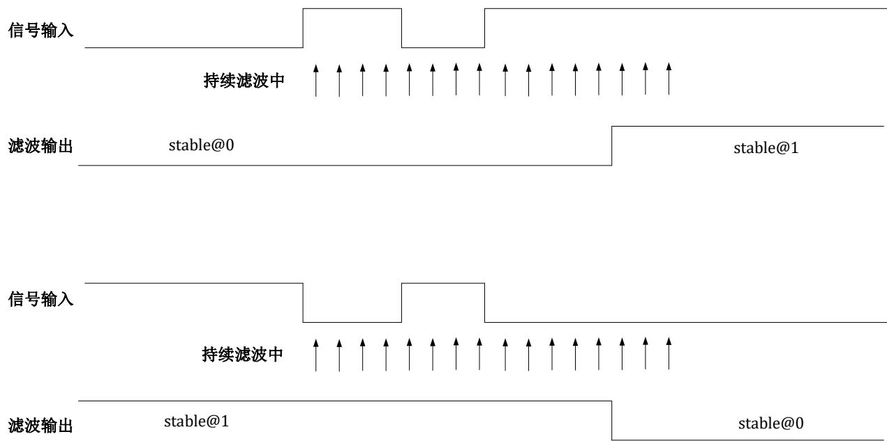  
图 15-1 7/5 滤波模块框图

第二级采用连续滤波，在连续 N 个采样点中，如全为 0 则输出 0，如全为 1 则输出 1，否则输出保持上一次的滤波结果。

通过配置HALL\_CFG.FIL\_LEN可以配置第二级滤波器滤波深度，即连续采样个数。连续采样个数最大为 $2 ^ { 1 5 }$ ，滤波时间常数计算公式如下：

$$
\mathrm {T_ {fit} = T_ {clk} * (HALL\_CFG.FIL\_LEN[14:0] + 1)}
$$

举例，在192MHz 工作频率下，周期 $\mathrm { T _ { c l k } }$ 是 5.2ns，寄存器配置最大为32767，最长滤波宽度为约 5.2ns×32768≈170us。

通过访问 HALL\_INFO.FIL\_DATA[2:0]可以捕捉滤波后的 HALL 信号；HALL\_INFO.RAW\_DATA[2:0]则是滤波前原始 HALL 输入信号，详见 15.3.3 HALLx\_INFO 模块信息寄存器 (x = 0,1)。

## 15.2.4 捕获

捕获模块用于测量两次 HALL信号变化之间的时间，其核心为一个24位计数器，在192MHz 工作频率下，最大可以记录约 0.87秒的时间宽度，达到 5.2ns的时间分辨率。

HALL\_CNT 从 0 开始计数，当发生 HALL 信号变化时，将此时刻的 HALL\_CNT 值保存到HALL\_WIDTH 寄存器，将此时刻的 HALL 信号保存到 $\mathrm { H A L L \mathrm { \mathrm { I N F O . F I L \mathrm { \_ D A T A } } } }$ ，输出 HALL信号变化中断， $\mathrm { \ H A L L { \mathrm { C N T } } }$ 重新从 0 开始计数。

当计数器计数值达到 $\mathrm { H A L L } _ { - } \mathrm { T H }$ 时，输出HALL计数器溢出中断，计数器重新从 0开始计数。

## 15.2.5 中断

捕获、溢出事件触发中断，中断使能控制位位于 HALL\_CFG.CHG\_IE 和 HALL\_CFG.OV\_IE，中断标志位位于 HALL\_INFO.CHG\_IF 和 $\mathrm { H A L L \_ I N F O . O V \_ I F }$ 。中断标志可以通过向 $\mathrm { H A L L \_ I N F O . C H G \_ I F }$ 和HALL\_INFO.OV\_IF 写 1 清空。

## 15.2.6 数据流程

HALL 模块的数据流程如下图所示，FCLK 为受 SYS\_CLK\_FEN 门控控制的系统主时钟，通常为PLL 时钟。

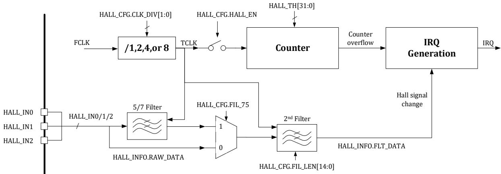  
图 15-2 Hall 模块框图

## 15.3 寄存器

## 15.3.1 地址分配

HALL0 模块寄存器的基地址是 0x4001\_1800，

HALL1 模块寄存器的基地址是 0x4001\_1C00，

寄存器列表如下：

表15-1HALL模块寄存器地址分配

<table><tr><td>名称</td><td>偏移</td><td>描述</td></tr><tr><td>HALLx_CFG</td><td>0x00</td><td>HALL 模块配置寄存器</td></tr><tr><td>HALLx_INFO</td><td>0x04</td><td>HALL 模块信息寄存器</td></tr><tr><td>HALLx_WIDTH</td><td>0x08</td><td>HALL 宽度计数值寄存器</td></tr><tr><td>HALLx_TH</td><td>0x0C</td><td>HALL 模块计数器门限值寄存器</td></tr><tr><td>HALLx_CNT</td><td>0x10</td><td>HALL 计数寄存器</td></tr></table>

## 15.3.2 HALLx\_CFG 模块配置寄存器(x = 0,1)

HALL0\_CFG 地址：0x4001\_1800

HALL1\_CFG 地址：0x4001\_1C00

复位值：0x0

表 15-2 HALL 模块配置寄存器 HALLx\_CFG

<table><tr><td>31</td><td>30</td><td>29</td><td>28</td><td>27</td><td>26</td><td>25</td><td>24</td><td>23</td><td>22</td><td>21</td><td>20</td><td>19</td><td>18</td><td>17</td><td>16</td></tr></table>

<table><tr><td rowspan="3"></td><td>SW_IE</td><td>OV_IE</td><td>CHG_IE</td><td>SW_RE</td><td>OV_RE</td><td>CHG_RE</td><td>HALL_EN</td><td rowspan="3"></td><td>FIL_75</td><td rowspan="3" colspan="2"></td><td>CLK_DIV</td></tr><tr><td>RW</td><td>RW</td><td>RW</td><td>RW</td><td>RW</td><td>RW</td><td>RW</td><td>RW</td><td>RW</td></tr><tr><td>0</td><td>0</td><td>0</td><td>0</td><td>0</td><td>0</td><td>0</td><td>0</td><td>0</td></tr></table>

<table><tr><td rowspan="3"></td><td>FIL_LEN_</td></tr><tr><td>RW</td></tr><tr><td>0</td></tr></table>

<table><tr><td>位置</td><td>位名称</td><td>说明</td></tr><tr><td>[31]</td><td></td><td>未使用</td></tr><tr><td>[30]</td><td>SW_IE</td><td>软件触发HALL信号变化中断使能,高电平有效。有效此位后,INFO[18]写1,将手动产生HALL信号变化中断。</td></tr><tr><td>[29]</td><td>OV_IE</td><td>HALL计数器溢出中断使能开关。默认关闭。0:关闭1:使能</td></tr><tr><td>[28]</td><td>CHG_IE</td><td>HALL信号变化中断使能开关。默认关闭。0:关闭1:使能</td></tr><tr><td>[27]</td><td>SW_RE</td><td>软件触发HALL信号变化DMA请求使能,高电平有效。有效此位后,INFO[18]写1,将手动产生HALL信号变化DMA请求。</td></tr><tr><td>[26]</td><td>OV_RE</td><td>HALL计数器溢出DMA请求使能开关。默认关闭。0:关闭1:使能</td></tr><tr><td>[25]</td><td>CHG_RE</td><td>HALL信号变化DMA请求使能开关。默认关闭。0:关闭1:使能</td></tr><tr><td>[24]</td><td>HALL_EN</td><td>HALL模块使能开关。默认关闭。0:关闭1:使能</td></tr><tr><td>[23:21]</td><td></td><td>未使用</td></tr><tr><td>[20]</td><td>FIL_75</td><td>7/5滤波开关(连续采样7次,5次值一致)。默认关闭。0:关闭1:使能</td></tr><tr><td>[19:18]</td><td></td><td>未使用</td></tr><tr><td>[17:16]</td><td>CLK_DIV</td><td>HALL时钟分频系数。默认不分频。00:不分频01:2分频10:4分频11:8分频</td></tr><tr><td>[15]</td><td></td><td>未使用</td></tr><tr><td>[14:0]</td><td>FIL_LEN</td><td>滤波宽度,低于对应脉冲宽度的信号将被硬件自动过滤掉。滤波宽度的计算公式为[14:0] + 1。</td></tr></table>

## 15.3.3 HALLx\_INFO 模块信息寄存器 (x = 0,1)

地址分别是：0x4001\_1804,，0x4001\_1C04

复位值：0x0

表 15-3 HALL 模块信息寄存器 HALLx\_INFO

<table><tr><td>31</td><td>30</td><td>29</td><td>28</td><td>27</td><td>26</td><td>25</td><td>24</td><td>23</td><td>22</td><td>21</td><td>20</td><td>19</td><td>18</td><td>17</td><td>16</td></tr><tr><td rowspan="3" colspan="13"></td><td>SW_IF</td><td>OV_IF</td><td>CHG_IF</td></tr><tr><td>RW</td><td>RW</td><td>RW</td></tr><tr><td>0</td><td>0</td><td>0</td></tr><tr><td>15</td><td>14</td><td>13</td><td>12</td><td>11</td><td>10</td><td>9</td><td>8</td><td>7</td><td>6</td><td>5</td><td>4</td><td>3</td><td>2</td><td>1</td><td>0</td></tr></table>

<table><tr><td></td><td>RAW_DATA</td><td></td><td>FLT_DATA</td></tr><tr><td>RW</td><td>RO</td><td>RW</td><td>RO</td></tr><tr><td>0</td><td>0</td><td>0</td><td>0</td></tr></table>

<table><tr><td>位置</td><td>位名称</td><td>说明</td></tr><tr><td>[31:19]</td><td></td><td>未使用</td></tr><tr><td>[18]</td><td>SW_IF</td><td>软件触发HALL信号变化中断。写1触发,自动清零。</td></tr><tr><td>[17]</td><td>OV_IF</td><td>HALL计数器溢出事件标志,写1清空</td></tr><tr><td>[16]</td><td>CHG_IF</td><td>HALL信号变化事件标志,写1清空</td></tr><tr><td>[15:11]</td><td></td><td>系统保留,必须写入0,读出0</td></tr><tr><td>[10:8]</td><td>RAW_DATA</td><td>HALL值,未滤波结果</td></tr><tr><td>[7:3]</td><td></td><td>系统保留,必须写入0,读出0</td></tr><tr><td>[2:0]</td><td>FLT_DATA</td><td>HALL值,滤波结果</td></tr></table>

通常由于SW\_IF自动清零，软件无法观测到SW\_IF置位，但是软件触发HALL信号变化会使得CFG\_IF置位，因此只要使能CHG\_IE或CFG\_RE，并写入软件触发即可产生HALL中断或 DMA 请求事件。

## 15.3.4 HALLx\_WIDTH 宽度计数值寄存器(x = 0,1)

地址分别是：0x4001\_1808,，0x4001\_1C08

复位值：0x0

表 15-4 HALL 宽度计数值寄存器 HALLx\_WIDTH

<table><tr><td>31</td><td>30</td><td>29</td><td>28</td><td>27</td><td>26</td><td>25</td><td>24</td><td>23</td><td>22</td><td>21</td><td>20</td><td>19</td><td>18</td><td>17</td><td>16</td></tr><tr><td colspan="8" rowspan="3"></td><td colspan="8">CAP_CNT</td></tr><tr><td colspan="8">RO</td></tr><tr><td colspan="8">0</td></tr><tr><td>15</td><td>14</td><td>13</td><td>12</td><td>11</td><td>10</td><td>9</td><td>8</td><td>7</td><td>6</td><td>5</td><td>4</td><td>3</td><td>2</td><td>1</td><td>0</td></tr><tr><td colspan="16">CAP_CNTRO</td></tr><tr><td colspan="16">0</td></tr></table>

<table><tr><td>位置</td><td>位名称</td><td>说明</td></tr><tr><td>[31:24]</td><td></td><td>未使用</td></tr><tr><td>[23:0]</td><td>CAP_CNT</td><td>HALL 宽度计数器值</td></tr></table>

## 15.3.5 HALLx\_TH 模块计数器门限值寄存器(x = 0,1)

地址分别是：0x4001\_180C，0x4001\_1C0C

复位值：0x0

表 15-5 HALL 模块计数器门限值寄存器 HALLx\_TH

<table><tr><td>31</td><td>30</td><td>29</td><td>28</td><td>27</td><td>26</td><td>25</td><td>24</td><td>23</td><td>22</td><td>21</td><td>20</td><td>19</td><td>18</td><td>17</td><td>16</td></tr><tr><td rowspan="3" colspan="8"></td><td colspan="8">TH</td></tr><tr><td colspan="8">RW</td></tr><tr><td colspan="8">0</td></tr><tr><td>15</td><td>14</td><td>13</td><td>12</td><td>11</td><td>10</td><td>9</td><td>8</td><td>7</td><td>6</td><td>5</td><td>4</td><td>3</td><td>2</td><td>1</td><td>0</td></tr></table>

<table><tr><td>TH</td></tr><tr><td>RW</td></tr><tr><td>0</td></tr></table>

<table><tr><td>位置</td><td>位名称</td><td>说明</td></tr><tr><td>[31:24]</td><td></td><td>未使用</td></tr><tr><td>[23:0]</td><td>TH</td><td>HALL 计数器门限值</td></tr></table>

## 15.3.6 HALLx\_CNT 计数寄存器(x = 0,1)

地址分别是：0x4001\_1810,，0x4001\_1C10

复位值：0x0

表 15-6 HALL 计数寄存器 HALLx\_CNT

<table><tr><td>31</td><td>30</td><td>29</td><td>28</td><td>27</td><td>26</td><td>25</td><td>24</td><td>23</td><td>22</td><td>21</td><td>20</td><td>19</td><td>18</td><td>17</td><td>16</td></tr><tr><td rowspan="3" colspan="8"></td><td colspan="8">CNT</td></tr><tr><td colspan="8">RW</td></tr><tr><td colspan="8">0</td></tr><tr><td>15</td><td>14</td><td>13</td><td>12</td><td>11</td><td>10</td><td>9</td><td>8</td><td>7</td><td>6</td><td>5</td><td>4</td><td>3</td><td>2</td><td>1</td><td>0</td></tr></table>

<table><tr><td>CNT</td></tr><tr><td>RW</td></tr></table>

<table><tr><td>位置</td><td>位名称</td><td>说明</td></tr><tr><td>[31:24]</td><td></td><td>未使用</td></tr><tr><td>[23:0]</td><td>CNT</td><td>HALL 计数值,写入任意值可清零</td></tr></table>

## 16 MCPWM

## 16.1 概述

MCPWM 模块，是一个精确控制电机驱动波形输出的模块。芯片共集成两个完全相同的MCPWM模块，以下说明均针对一个 MCPWM模块。

一个MCPWM 模块包含两个 16 位递增计数器，用于提供两个基础周期（以下称为两个时基）。计数器的时钟分频有 1/2/4/8 四种选项，产生的的分频时钟频率分别为 192/96/48/24MHz。通道0/1/2 固定使用时基0，通道 3固定使用时基1。

包含四组 PWM 生成模块。

\- 可以产生4 对（互补信号）或 8路独立（边沿模式）不交叠的PWM 信号；

\- 支持边沿对齐 PWM

\- 中心对齐PWM

## - 移相 PWM

同时可以产生4路与MCPWM同时基的定时信息，用于触发ADC模块同步采样，进行与MCPWM的联动。

包含一组急停保护模块，用于不依赖 CPU软件的处理快速关断 MCPWM模块输出。MCPWM模块可输入8 路急停信号，其中4 路来自芯片IO，4路来自片内比较器的输出。当急停事件发生时（支持有效电平极性选择），把所有 MCPWM输出信号复位到规定状态，以避免短路发生。

对急停信号有独立滤波模块。

MCPWM 的每个输出 IO 支持两种控制模式：PWM 硬件控制或者软件直接控制（用于 EABS 软刹车，或BLDC 方波换相控制）。

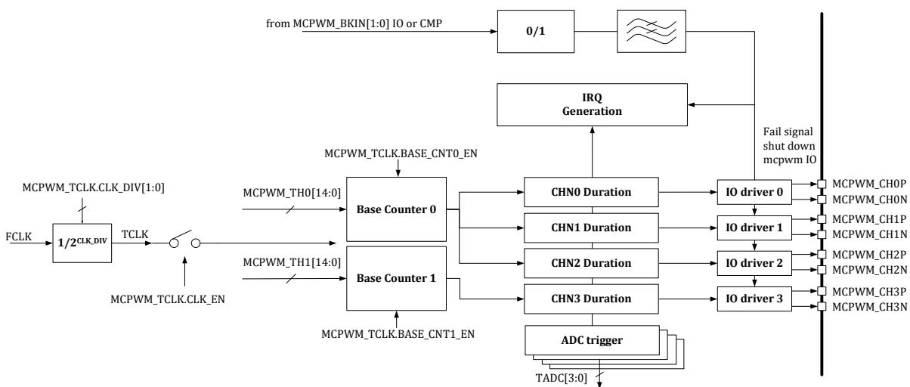  
图 16-1 MCPWM 模块框图

为了获得更高的定时精度，通常采用 192MHz 的 PLL 时钟作为 MCPWM 模块工作时钟。

## 16.1.1 Base Counter 模块

该模块主要是由两个递增计数器组成，其计数门限值为MCPWM\_TH0/MCPWM\_TH1，计数器在t0时刻从-TH开始递增计数，在t1时刻过0 点，在t2 时刻计数到TH完成一次计数循环，回到-TH，重新开始计数。计数周期为(TH×2+1)×计数时钟周期。

在 t0/t1(本次 t0 即上一次 t2)可产生定时事件中断，MCPWM\_IF.T0\_IF 和 MCPWM\_IF.T1\_IF 将被置位。

可通过寄存器配置 MCPWM\_TCLK.BASE\_CNT\_EN 控制 Base Counter 的启动和停止。

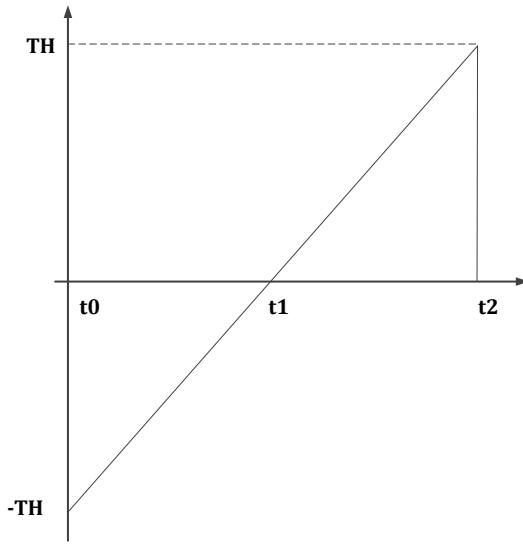  
图 16-2 Base Counter t0/t1 时序

在运行 MCPWM 模块前，用户一般需将对应的比较门限值 MCPWM\_TH00\~MCWM\_TH31，死区寄存器MCPWM\_DTH00\~MCWM\_DTH31 配置好。在实际运行过程中，也可动态改变比较门限值和死区寄存器。这些配置好的寄存器，可通过写 MCPWM\_UPDATE 寄存器实现手动更新，也可以通过配置 MCPWM\_SDCFG.T1\_UPDATE\_EN 及 MCPWM\_SDCFG.T0\_UPDATE\_EN 进行硬件自动更新。硬件更新，仅在t0 及 t1 时刻（可配置 t0 或 t1 更新和t0 t1 时刻都更新）才能产生更新事件，硬件把预装载寄存器的值载入到实际运行的影子寄存器中。而更新事件的发生频率可以配置，即每间隔N 个t0及 t1 时刻才发生更新。无论是否发生更新，t0/t1 时刻均可产生相应的中断。若硬件把加载寄存器的值到载入实际运行的寄存器后，产生装载中断。

通过配置 MCPWM\_SDCFG 寄存器选择更新发生在 t0 或者 t1 或者二者皆可，配置更新间隔数，间隔数为 1\~16。最频繁的更新配置为更新发生在 t0 和 t1，连续发生。最低速的更新配置为更新发生在 t1，每16个 t1更新一次。

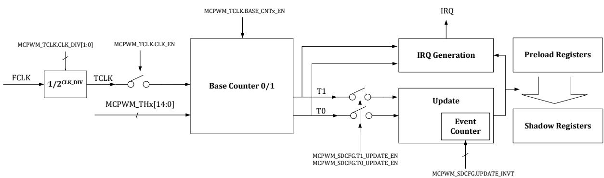  
图 16-3 MCPWM 更新机制

时基 0 和时基 1 对应的 TH 寄存器 MCPWM\_THx 和 CNT 寄存器 MCPWM\_CNTx（x=0,1）均存在影子寄存器，且均支持手动更新（通过软件向 MCPWM\_UPDATE 写入对应位进行更新）和自动更新（ 发 生 特 定 硬 件 事 件 触 发 更 新 ） 。 影 子 寄 存 器 可 以 在 不 开 启 MCPWM TCLK 时 钟 （ 即MCPWM\_TCLK.TCLK\_EN=0 ） 的 情 况 下 进 行 更 新 。 MCPWM\_TCLK.BASE\_CNT0\_EN 和MCPWM\_TCLK.BASE\_CNT1\_EN 分 别 控 制 时 基 0 和 时 基 1 的 CNT 计 数 使 能 。 当MCPWM\_TCLK.BASE\_CNT0\_EN=0 时，时基 0 的 CNT 在完成更新后保持值不变(因为时钟未使能，不进行计数)，时基1 的CNT 同理，实现完全相同。

此外，为了精确控制第一个 MCPWM 周期的计数，建议将 MCPWM\_THx 和MCPWM\_CNTx 同时更新。当然也支持 MCPWM\_THx 和 MCPWM\_CNTx 分别更新。然后再通过软件写入或外部事件触发计数开始，来将 MCWPM\_TCLk.BASE\_CNT0\_EN/MCWPM\_TCLk.BASE\_CNT1\_EN 置位，从而分别使能时基0 和时基1的CNT计数。

## 16.1.2 FAIL 信号处理

FAIL 信号即急停信号，主要用于在出现异常时迅速关断功率管，以免造成不可逆的硬件损坏。该信号处理模块主要是根据实际情况设置急停事件，实现快速关断 PWM 的输出。有4 路fail信号输入 MCPWM，即 FAIL0\~FAIL3，分别可以来自芯片 IO MCPWM\_BKIN[3:0]或芯片内部比较器的输出CMP[5:0]中的 4 路信号。

其中 MCPWM0 的通道 0/1/2 使用 CMP[1:0]，MCPWM0 的通道 3 使用 CMP[5:4]。MCPWM1 的通道 0/1/2 使用 CMP[3:2]，MCPWM1 的通道 3 使用 CMP[5:4]。

表 16-1 MCPWM FAIL 信号分布

<table><tr><td></td><td colspan="2">MCPWM0 CH0/1/2</td><td colspan="2">MCPWM0 CH3</td><td colspan="2">MCPWM1 CH0/1/2</td><td colspan="2">MCPWM1 CH3</td></tr><tr><td></td><td>FAIL0</td><td>FAIL1</td><td>FAIL2</td><td>FAIL3</td><td>FAIL0</td><td>FAIL1</td><td>FAIL2</td><td>FAIL3</td></tr><tr><td>MCPWM0_BKIN0</td><td>√</td><td></td><td></td><td></td><td></td><td></td><td></td><td></td></tr><tr><td>MCPWM0_BKIN1</td><td></td><td>√</td><td></td><td></td><td></td><td></td><td></td><td></td></tr><tr><td>MCPWM0_BKIN2</td><td></td><td></td><td>√</td><td></td><td></td><td></td><td></td><td></td></tr><tr><td>MCPWM0_BKIN3</td><td></td><td></td><td></td><td>√</td><td></td><td></td><td></td><td></td></tr><tr><td>MCPWM1_BKIN0</td><td></td><td></td><td></td><td></td><td>√</td><td></td><td></td><td></td></tr><tr><td>MCPWM1_BKIN1</td><td></td><td></td><td></td><td></td><td></td><td>√</td><td></td><td></td></tr><tr><td>MCPWM1_BKIN2</td><td></td><td></td><td></td><td></td><td></td><td></td><td>√</td><td></td></tr><tr><td>MCPWM1_BKIN3CMP0</td><td>√</td><td></td><td></td><td></td><td></td><td></td><td></td><td>√</td></tr><tr><td>CMP1</td><td></td><td>√</td><td></td><td></td><td></td><td></td><td></td><td></td></tr><tr><td>CMP2</td><td></td><td></td><td></td><td></td><td>√</td><td></td><td></td><td></td></tr><tr><td>CMP3</td><td></td><td></td><td></td><td></td><td></td><td>√</td><td></td><td></td></tr><tr><td>CMP4</td><td></td><td></td><td>√</td><td></td><td></td><td></td><td>√</td><td></td></tr><tr><td>CMP5</td><td></td><td></td><td></td><td>√</td><td></td><td></td><td></td><td>√</td></tr></table>

其中 MCPWMx\_FAIL012 用于控制 CH012 的 FAIL 信号选择、极性、使能。MCPWMx\_FAIL3 用于控制CH3的FAIL信号选择、极性、使能。

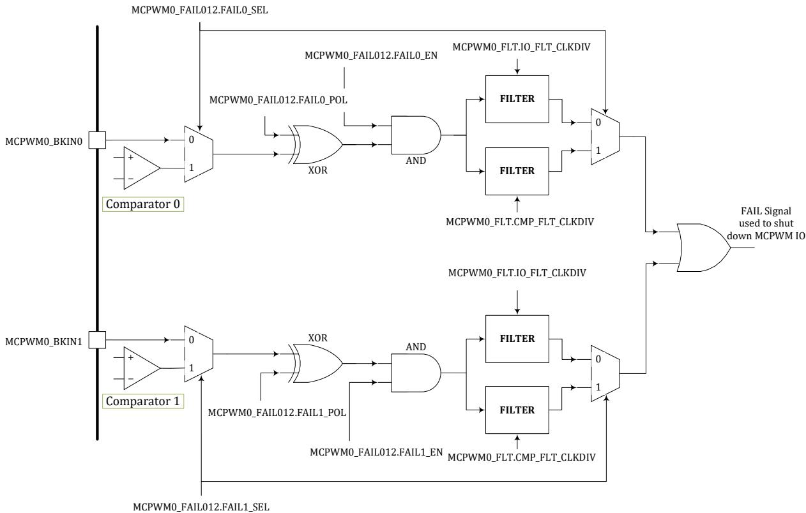  
图 16-4 MCPWM0 FAIL0/1 逻辑示意图

  
图 16-5 MCPWM0 FAIL2/3 逻辑示意图

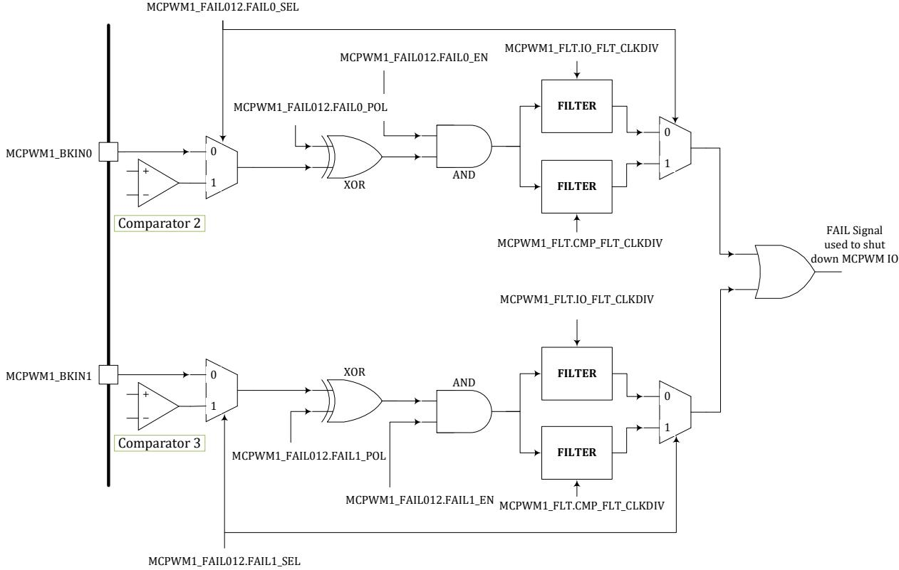  
图 16-6 MCPWM1 FAIL0/1 逻辑示意图

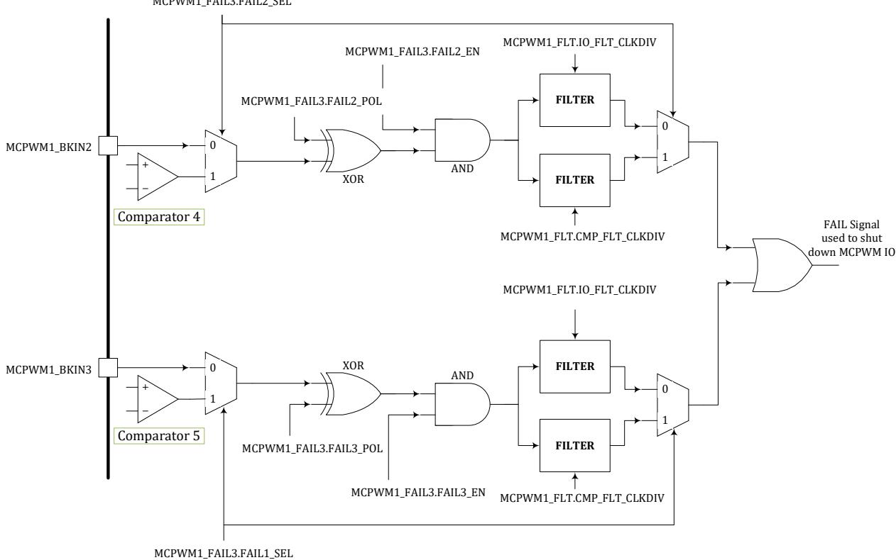  
图 16-7 MCPWM1 FAIL2/3 逻辑示意图

Filter滤波模块的时钟，来自系统主时钟MCLK的门控时钟 FCLK[10:9]，并经过两级分频，第一级分频由 MCPWM\_TCLK.CLK\_DIV 控制，进行 1/2/4/8 倍分频。第二级分频可实现 1\~16 倍的分频，如果 FAIL 信号来自 MCPWM\_BKIN[1:0]则使用 MCPWM\_TCLK.IO\_FLT\_CLKDIV[3:0]作为第二级的分频系数；如果 FAIL 信号来自芯片内部比较器输出，则使用 MCPWM\_TCLK.CMP\_FLT\_CLKDIV[3:0]作为第二级的分频系数，如图16-8 所示。

MCPWM 模块使用分频后的时钟进行 Fail 信号滤波，滤波宽度固定为16个周期，即输入信号必须保持至少16 个时钟（两级分频后的时钟）周期稳定后，硬件才判定其为有效输入信号。滤波时间常数的公式为，其中 T 为 FCLK 的时钟周期，192MHz 对应 5.2ns。MCPWM\_TCLK.FLT\_CLKDIV 根据配置情况可能是 MCPWM\_TCLK.IO\_FLT\_CLKDIV 或 MCPWM\_TCLK.CMP\_FLT\_CLKDIV。

$$
\mathrm{T} = \mathrm{T} _ {\mathrm{FCLK}} \times (\mathrm {MCPWM\_TCLK.CLK\_DIV}) \times (\mathrm {MCPWM\_TCLK.FLT\_CLKDIV + 1}) \times 1 6
$$

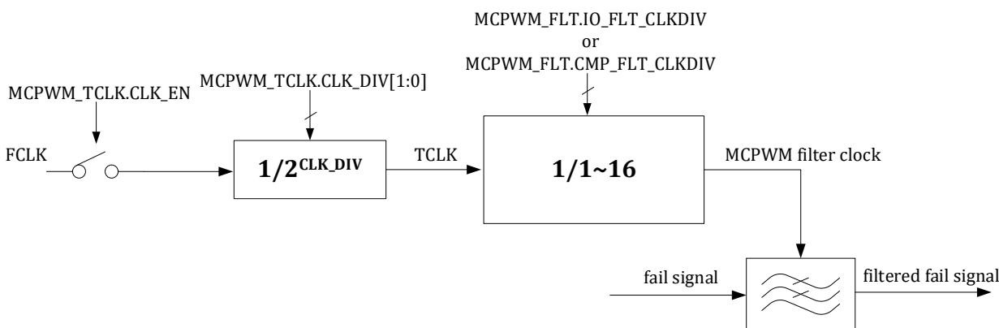  
图 16-8 MCPWM Fail 信号滤波时钟生成逻辑

一 旦 发 生 FAIL 事 件 ， 硬 件 将 IO 输 出 强 制 变 为 MCPWM\_FAIL.CHxN\_DEFAULT 和MCPWM\_FAIL.CHxP\_DEFAULT 寄存器所指定的故障缺省值，此时 MCPWM\_FAIL.CHxN\_DEFAULT 和MCPWM\_FAIL.CHxP\_DEFAULT 的值直接输出到 IO 口，不再受到 MCPWM\_FAIL.FAIL\_POL 等极性控制的影响。其中通道 0/1/2 的缺省电平由 MCPWM\_FAIL012 设置，通道 3 的缺省电平由 MCPWM\_FAIL3设置。

来自比较器的 MCPWM FAIL信号为模拟比较器输出的原始信号，未经过比较器数字接口模块的滤波处理，但是可以被 MCPWM 的通道信号进行开窗控制，开窗控制设置见比较器数字接口模块。FAIL信号进入 MCPWM模块后，可以通过设置 MCPWM\_TCLK进行滤波。

## 16.1.3 MCPWM 特殊输出状态

电机控制中经常会用到全零和全 1输出状态，以下互补模式设置可以得到期望的输出。

1. 如果 THn0≥THn1，芯片处于恒 0 状态（CH<n>P 关闭，CH<n>N 开启），无死区

2. 如果 THn0=-TH，THn1=TH，芯片处于恒 1 状态（CH<n>P 开启，CH<n>N 关闭），无死区

## 16.1.4 IO DRIVER 模块

该模块根据实际MCPWM的寄存器配置情况，将IO设置到相应电平。IO Driver模块的整体数据流程图如下：

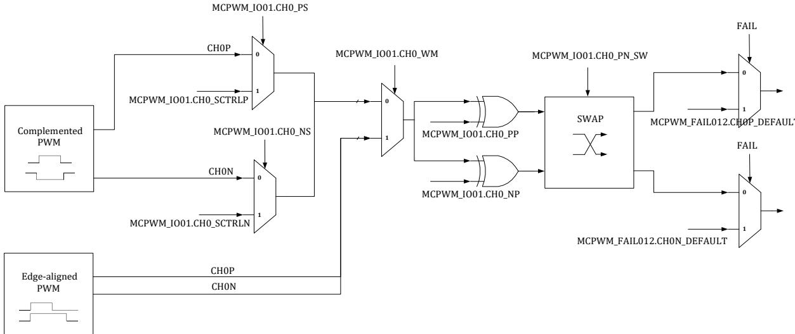  
图 16-9 IO Driver 模块数据流程图

## 16.1.4.1 MCPWM 波形输出-中心对齐模式

4 个MCPWM IO Driver 采用独立的控制门限，独立死区宽度（每一对互补IO的死区需要独立配置，即4个死区配置寄存器），共享数据更新事件。

采用 TH<n>0 和 TH<n>1 控制第<n>个 MCPWM 通道 IO 的启动、关闭动作，n 为 0/1/2/3。

当计数器 CNT 值向上计数达到 TH<n>0(即 t3 时刻)，关闭 CH<n>N，经过死区延时 DTH<n>0，打开 CH<n>P。

当计数器 CNT 值向上计数达到 TH<n>1(即 t4 时刻)，关闭 CH<n>P，经过死区延时 DTH<n>1，打开 CH<n>N。

采用独立的启动和关闭时间控制，可以提供相位控制的能力。

死区延时保证CH<n>P/CH<n>N 不会同时打开，避免短路发生。

t3/t4时刻均会产生相应中断。

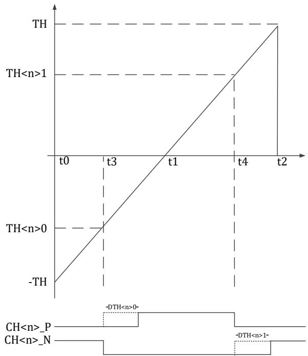  
图 16-10 MCPWM 时序 TH<n>0 和 TH<n>1-中心对齐模式

## 16.1.4.2 MCPWM 波形控制-中心对齐推挽模式

中心对齐推挽模式。第一个周期内，在t3 时刻CH<n>P打开，在t4 时刻，CH<n>P 关闭。第二个周期内，在t3时刻CH<n>N打开，在t4时刻，CH<n>N 关闭。

t3/t4时刻均会产生相应中断。

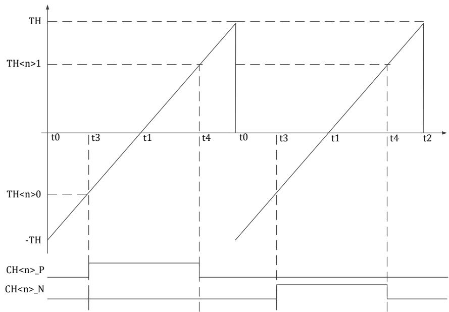  
图 16-11 MCPWM 时序 TH<n>0 和 TH<n>1-中心对齐推挽模式

## 16.1.4.3 MCPWM 波形输出-边沿对齐模式

边沿对齐模式。在t0时刻CH<n>P/CH<n>N 同时打开，在 t3 时刻，CH<n>P关闭；在t4时刻，CH<n>N 关闭。

t3/t4时刻均会产生相应中断。

边沿对齐模式下，CH<n>P/CH<n>N 无需死区保护。

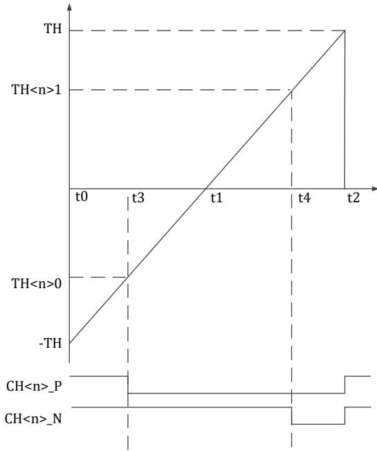  
图 16-12MCPWM 时序边沿对齐模式

## 16.1.4.4 MCPWM 波形控制-边沿对齐推挽模式

边沿对齐推挽模式。第一个周期内，在t0 时刻CH<n>P打开，在t3 时刻，CH<n>P 关闭。第二个周期内，在t0时刻CH<n>N打开，在t3时刻，CH<n>N 关闭。

t0/t3时刻均会产生相应中断。

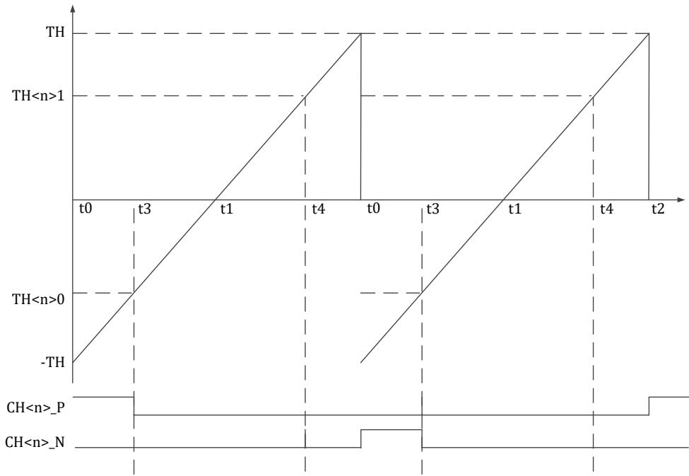  
图 16-13MCPWM 时序 TH<n>0 和 TH<n>1 边沿对齐推挽模式

## 16.1.4.5 MCPWM IO 死区控制

MCPWM IO是一对互斥控制信号 CH<n>P/CH<n>N，控制如下图所示的电路，

当 CH<n>P 为高/CH<n>N 为低时，Vout 输出高（VDD）；

当 CH<n>P 为低/CH<n>N 为高时，Vout 输出低（VSS）；

当 CH<n>P 为高/CH<n>N 为高时，Vout 输出不确定，但是会产生 VDD 到 VSS 的短路；

当 CH<n>P 为低/CH<n>N 为低时，Vout 输出不确定。

必须避免 CH<n>P/CH<n>N 同时打开的情况。死区的引入，可以有效避免 VDD 到 VSS 的短路。

四组MCPWM IO的死区宽度可独立调整。

对于互补模式MCPWM IO自动插入死区。

对于边沿对齐模式，MCPWM IO无死区。

在 IO Driver 模块中增加 CH<n>P/CH<n>N 冲突检测，发生冲突时，自动将 IO 拉低，同时给出错误中断（错误中断标志位可软件清除或者硬件自动清除）。

MCPWM IO也可通过软件配置的方式输出，此时，死区控制通过软件实现，如果MCPWM 模块配置为中心对齐模式，硬件短路保护机制仍有效，保证P 和N 不同时打开。

CH<n>P/CH<n>N，在 IO 上可以互换。

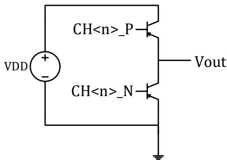  
图 16-14MCPWM IO 控制示意图

## 16.1.4.6 MCPWM IO 极性设置

CH<n>P/CH<n>N 的有效电平可以配置为高有效/低有效，每个 IO 的有效电平单独可配。CH<n>P/CH<n>N 输出到IO的位置通过软件配置可以互换。

## 16.1.4.7 MCPWM IO 自动保护

当发生急停事件（Fail 事件），应立刻将CH<n>P/CH<n>N 自动切换到关闭状态。需要注意关闭电平配置（MCPWM\_FAIL.CHxN\_DEFAULT 和 MCPWM\_FAIL.CHxP\_DEFAULT 控制默认电平）。其中通道 0/1/2 的缺省电平由 MCPWM\_FAIL012 设置，通道 3 的缺省电平由 MCPWM\_FAIL3 设置。

➢ 芯 片 正 常 工 作 后 ，IO 默 认 输 出 的 电 平 是 寄 存 器 MCPWM\_FAIL.CHxN\_DEFAULT 和MCPWM\_FAIL.CHxP\_DEFAULT 指定值，当用户配置完毕，MCPWM 正常工作后，配置MCPWM\_FAIL.MCPWM\_OE（即 MOE）为 1，IO 输出电平受到 MCPWM IO 驱动模块控制。

➢ 当发生FAIL短路状况时，硬件立即切换到 IO缺省电平。

➢ 当芯片调试中，发生 MCU Halt 时，可配置实现停止 MCPWM 正常输出，转而输出缺省电平。

## 16.1.5 ADC Trigger Timer 模块

MCPWM 可 以 为 ADC 提 供 采 样 时 序 控 制 。 当 MCPWM\_CNT 计数到 MCPWM\_TMR0/MCPWM\_TMR1/ MCPWM\_TMR2/ MCPWM\_TMR3 时，可产生定时事件，触发 ADC 采样。该触发信号可同时输出到 GPIO，便于调试之用。输出的具体 GPIO，参见对应器件的 datasheet。其中MCPWM\_TMR0/ MCPWM\_TMR1 固定使用时基 0，MCPWM\_TMR2/ MCPWM\_TMR3 可以选择使用时基 0/1，见 16.2.33 MCPWM\_TCLK。

表16-2MCPWM 计数器阈值与事件对应表

<table><tr><td>t0</td><td>-th</td></tr><tr><td>t1</td><td>0</td></tr><tr><td>tio0[0]</td><td>th00</td></tr><tr><td>tio0[1]</td><td>th01</td></tr><tr><td>TADC[0]</td><td>tmr0</td></tr><tr><td>TADC [1]</td><td>tmr1</td></tr><tr><td>TADC [2]</td><td>tmr2</td></tr><tr><td>TADC [3]</td><td>tmr3</td></tr></table>

## 16.1.6 中断

MCPMW\_IF0 和 MCPWM\_EIF[5:4]标志置位且使能的情况下，产生 MCPWMx\_IRQ0 中断；

MCPMW\_IF1 和 MCPWM\_EIF[7:6]标志置位且使能的情况下，产生 MCPWMx\_IRQ1 中断。

## 16.2 寄存器

## 16.2.1 地址分配

MCPWM0 模块寄存器的基地址是 0x4001\_3400，

MCPWM1 模块寄存器的基地址是 0x4001\_3800，

MCPWM0 和MCPWM1 的实现完全相同，FAIL 信号来源除外。

寄存器列表如下：

表 16-3MCPWM 模块寄存器列表

<table><tr><td>名称</td><td>偏移地址</td><td>说明</td></tr><tr><td>MCPWMx_TH00</td><td>0x00</td><td>MCPWM CH0_P 比较门限值寄存器</td></tr><tr><td>MCPWMx_TH01</td><td>0x04</td><td>MCPWM CH0_N 比较门限值寄存器</td></tr><tr><td>MCPWMx_TH10</td><td>0x08</td><td>MCPWM CH1_P 比较门限值寄存器</td></tr><tr><td>MCPWMx_TH11</td><td>0x0C</td><td>MCPWM CH1_N 比较门限值寄存器</td></tr><tr><td>MCPWMx_TH20</td><td>0x10</td><td>MCPWM CH2_P 比较门限值寄存器</td></tr><tr><td>MCPWMx_TH21</td><td>0x14</td><td>MCPWM CH2_N 比较门限值寄存器</td></tr><tr><td>MCPWMx_TH30</td><td>0x18</td><td>MCPWM CH3_P 比较门限值寄存器</td></tr><tr><td>MCPWMx_TH31</td><td>0x1C</td><td>MCPWM CH3_N 比较门限值寄存器</td></tr><tr><td>MCPWMx_TMR0</td><td>0x20</td><td>ADC 采样定时器比较门限 0 寄存器</td></tr><tr><td>MCPWMx_TMR1</td><td>0x24</td><td>ADC 采样定时器比较门限 1 寄存器</td></tr><tr><td>MCPWMx_TMR2</td><td>0x28</td><td>ADC 采样定时器比较门限 2 寄存器</td></tr><tr><td>MCPWMx_TMR3</td><td>0x2C</td><td>ADC 采样定时器比较门限 3 寄存器</td></tr><tr><td>MCPWMx_TH0</td><td>0x30</td><td>MCPWM 时基 0 门限值寄存器</td></tr><tr><td>MCPWMx_TH1</td><td>0x34</td><td>MCPWM 时基 1 门限值寄存器</td></tr><tr><td>MCPWMx_CNT0</td><td>0x38</td><td>MCPWM 时基 0 计数器寄存器</td></tr><tr><td>MCPWMx_CNT1</td><td>0x3C</td><td>MCPWM 时基 1 计数器寄存器</td></tr><tr><td>MCPWMx_UPDATE</td><td>0x40</td><td>MCPWM 加载控制寄存器</td></tr><tr><td>MCPWMx_FCNT</td><td>0x44</td><td>MCPWM FAIL 时刻 CNT 值</td></tr><tr><td>MCPWMx_EVT0</td><td>0x48</td><td>MCPWM 时基 0 外部触发</td></tr><tr><td>MCPWMx_EVT1</td><td>0x4C</td><td>MCPWM 时基 1 外部触发</td></tr><tr><td>MCPWMx_DTH00</td><td>0x50</td><td>MCPWM CH0 P 通道死区宽度控制寄存器</td></tr><tr><td>MCPWMx_DTH01</td><td>0x54</td><td>MCPWM CH0 N 通道死区宽度控制寄存器</td></tr><tr><td>MCPWMx_DTH10</td><td>0x58</td><td>MCPWM CH1 P 通道死区宽度控制寄存器</td></tr><tr><td>MCPWMx_DTH11</td><td>0x5C</td><td>MCPWM CH1 N 通道死区宽度控制寄存器</td></tr><tr><td>MCPWMx_DTH20</td><td>0x60</td><td>MCPWM CH2 P 通道死区宽度控制寄存器</td></tr><tr><td>MCPWMx_DTH21</td><td>0x64</td><td>MCPWM CH2 N 通道死区宽度控制寄存器</td></tr><tr><td>MCPWMx_DTH30</td><td>0x68</td><td>MCPWM CH3 P 通道死区宽度控制寄存器</td></tr><tr><td>MCPWMx_DTH31</td><td>0x6C</td><td>MCPWM CH3 N 通道死区宽度控制寄存器</td></tr><tr><td>MCPWMx_FLT</td><td>0x70</td><td>MCPWM 滤波时钟分频寄存器</td></tr><tr><td>MCPWMx_SDCFG</td><td>0x74</td><td>MCPWM 加载配置寄存器</td></tr><tr><td>MCPWMx_AUEN</td><td>0x78</td><td>MCPWM 自动更新使能寄存器</td></tr><tr><td>MCPWMx_TCLK</td><td>0x7C</td><td>MCPWM 时钟分频控制寄存器</td></tr><tr><td>MCPWMx_IE0</td><td>0x80</td><td>MCPWM 时基0 中断控制寄存器</td></tr><tr><td>MCPWMx_IF0</td><td>0x84</td><td>MCPWM 时基0 中断标志位寄存器</td></tr><tr><td>MCPWMx_IE1</td><td>0x88</td><td>MCPWM 时基1 中断控制寄存器</td></tr><tr><td>MCPWMx_IF1</td><td>0x8C</td><td>MCPWM 时基1 中断标志位寄存器</td></tr><tr><td>MCPWMx_EIE</td><td>0x90</td><td>MCPWM 异常中断控制寄存器</td></tr><tr><td>MCPWMxEIF</td><td>0x94</td><td>MCPWM 异常中断标志位寄存器</td></tr><tr><td>MCPWMx_RE</td><td>0x98</td><td>MCPWM DMA 请求控制寄存器</td></tr><tr><td>MCPWMx_PP</td><td>0x9C</td><td>MCPWM 推挽模式使能寄存器</td></tr><tr><td>MCPWMx_IO01</td><td>0xA0</td><td>MCPWM CH0 CH1 IO 控制寄存器</td></tr><tr><td>MCPWMx_IO23</td><td>0xA4</td><td>MCPWM CH2 CH3 IO 控制寄存器</td></tr><tr><td>MCPWMx_FAIL012</td><td>0xA8</td><td>MCPWM CH0 CH1 CH2 短路控制寄存器</td></tr><tr><td>MCPWMx_FAIL3</td><td>0xAC</td><td>MCPWM CH3 短路控制寄存器</td></tr><tr><td>MCPWMx_PRT</td><td>0xB0</td><td>MCPWM 保护寄存器</td></tr><tr><td>MCPWMx_CHMSK</td><td>0xB8</td><td>MCPWM 通道屏蔽位寄存器</td></tr></table>

表 16-4 受 MCPWM\_PRT 保护的寄存器

<table><tr><td>名称</td><td>偏移地址</td><td>说明</td></tr><tr><td>MCPWMx_TH0</td><td>0x30</td><td>MCPWM 门限值寄存器</td></tr><tr><td>MCPWMx_TH1</td><td>0x34</td><td>MCPWM 门限值寄存器</td></tr><tr><td>MCPWMx_DTH00</td><td>0x50</td><td>MCPWM CH0 P 通道死区宽度控制寄存器</td></tr><tr><td>MCPWMx_DTH01</td><td>0x54</td><td>MCPWM CH0 N 通道死区宽度控制寄存器</td></tr><tr><td>MCPWMx_DTH10</td><td>0x58</td><td>MCPWM CH1 P 通道死区宽度控制寄存器</td></tr><tr><td>MCPWMx_DTH11</td><td>0x5C</td><td>MCPWM CH1 N 通道死区宽度控制寄存器</td></tr><tr><td>MCPWMx_DTH20</td><td>0x60</td><td>MCPWM CH2 P 通道死区宽度控制寄存器</td></tr><tr><td>MCPWMx_DTH21</td><td>0x64</td><td>MCPWM CH2 N 通道死区宽度控制寄存器</td></tr><tr><td>MCPWMx_DTH30</td><td>0x68</td><td>MCPWM CH3 P 通道死区宽度控制寄存器</td></tr><tr><td>MCPWMx_DTH31</td><td>0x6C</td><td>MCPWM CH3 N 通道死区宽度控制寄存器</td></tr><tr><td>MCPWMx_FLT</td><td>0x70</td><td>MCPWM 滤波时钟分频寄存器</td></tr><tr><td>MCPWMx_SDCFG</td><td>0x74</td><td>MCPWM 加载配置寄存器</td></tr><tr><td>MCPWMx_AUEN</td><td>0x78</td><td>MCPWM 自动加载使能寄存器</td></tr><tr><td>MCPWMx_TCLK</td><td>0x7C</td><td>MCPWM 时钟分频控制寄存器</td></tr><tr><td>MCPWMx_IE0</td><td>0x80</td><td>MCPWM 时基 0 中断控制寄存器</td></tr><tr><td>MCPWMx_IE1</td><td>0x88</td><td>MCPWM 时基 1 中断控制寄存器</td></tr><tr><td>MCPWMx_EIE</td><td>0x90</td><td>MCPWM 异常中断控制寄存器</td></tr><tr><td>MCPWMx_RE</td><td>0x98</td><td>MCPWMDMA 请求控制寄存器</td></tr><tr><td>MCPWMx_PP</td><td>0x9C</td><td>MCPWM 推挽模式使能寄存器</td></tr><tr><td>MCPWMx_IO01</td><td>0xA0</td><td>MCPWM CH0 CH1 IO 控制寄存器</td></tr><tr><td>MCPWMx_IO23</td><td>0xA4</td><td>MCPWM CH2 CH3 IO 控制寄存器</td></tr><tr><td>MCPWMx_FAIL012</td><td>0xA8</td><td>MCPWM CH0 CH1 CH2 短路控制寄存器</td></tr><tr><td>MCPWMx_FAIL3</td><td>0xAC</td><td>MCPWM CH3 短路控制寄存器</td></tr><tr><td>MCPWMx_CHMSK</td><td>0xB8</td><td>MCPWM 通道屏蔽位寄存器</td></tr></table>

表 16-5 存在影子寄存器的寄存器

<table><tr><td>名称</td><td>偏移地址</td><td>说明</td></tr><tr><td>MCPWMx_TH00</td><td>0x00</td><td>MCPWM CH0_P 比较门限值寄存器</td></tr><tr><td>MCPWMx_TH01</td><td>0x04</td><td>MCPWM CH0_N 比较门限值寄存器</td></tr><tr><td>MCPWMx_TH10</td><td>0x08</td><td>MCPWM CH1_P 比较门限值寄存器</td></tr><tr><td>MCPWMx_TH11</td><td>0x0C</td><td>MCPWM CH1_N 比较门限值寄存器</td></tr><tr><td>MCPWMx_TH20</td><td>0x10</td><td>MCPWM CH2_P 比较门限值寄存器</td></tr><tr><td>MCPWMx_TH21</td><td>0x14</td><td>MCPWM CH2_N 比较门限值寄存器</td></tr><tr><td>MCPWMx_TH30</td><td>0x18</td><td>MCPWM CH3_P 比较门限值寄存器</td></tr><tr><td>MCPWMx_TH31</td><td>0x1C</td><td>MCPWM CH3_N 比较门限值寄存器</td></tr><tr><td>MCPWMx_TMR0</td><td>0x20</td><td>ADC 采样定时器比较门限 0 寄存器</td></tr><tr><td>MCPWMx_TMR1</td><td>0x24</td><td>ADC 采样定时器比较门限 1 寄存器</td></tr><tr><td>MCPWMx_TMR2</td><td>0x28</td><td>ADC 采样定时器比较门限 2 寄存器</td></tr><tr><td>MCPWMx_TMR3</td><td>0x2C</td><td>ADC 采样定时器比较门限 3 寄存器</td></tr><tr><td>MCPWMx_TH0</td><td>0x30</td><td>MCPWM 时基 0 门限值寄存器</td></tr><tr><td>MCPWMx_TH1</td><td>0x34</td><td>MCPWM 时基 1 门限值寄存器</td></tr><tr><td>MCPWMx_CNT0</td><td>0x38</td><td>MCPWM 时基 0 计数器寄存器</td></tr><tr><td>MCPWMx_CNT1</td><td>0x3C</td><td>MCPWM 时基 1 计数器寄存器</td></tr></table>

对于所有存在影子寄存器的 MCPWM 配置寄存器，写入时，写入的是预装载寄存器，更新事件发生时才会把预装载寄存器值写入影子寄存器，无论装载前后，读出时总是读出的是影子寄存器的值。

## 16.2.2 MCPWMx\_TH00(x = 0,1)

无写保护的寄存器

地址分别是：0x4001\_3400，0x4001\_3800

复位值：0x0

表 16-6 MCPWM\_TH00 配置寄存器

<table><tr><td>15</td><td>14</td><td>13</td><td>12</td><td>11</td><td>10</td><td>9</td><td>8</td><td>7</td><td>6</td><td>5</td><td>4</td><td>3</td><td>2</td><td>1</td><td>0</td></tr><tr><td></td><td></td><td></td><td></td><td></td><td></td><td></td><td colspan="2">TH00</td><td></td><td></td><td></td><td></td><td></td><td></td><td></td></tr><tr><td></td><td></td><td></td><td></td><td></td><td></td><td></td><td colspan="2">RW</td><td></td><td></td><td></td><td></td><td></td><td></td><td></td></tr><tr><td></td><td></td><td></td><td></td><td></td><td></td><td></td><td colspan="2">0</td><td></td><td></td><td></td><td></td><td></td><td></td><td></td></tr></table>

<table><tr><td>位置</td><td>位名称</td><td>说明</td></tr><tr><td>[31:16]</td><td></td><td>未使用</td></tr><tr><td>[15:0]</td><td>TH00</td><td>MCPWM CH0_P 比较门限值,16 位有符号数;当时基 0 使能时,发生更新事件时,本寄存器加载到 MCPWM 实际运行系统中。</td></tr></table>

## 16.2.3 MCPWMx\_TH01(x = 0,1)

无写保护的寄存器

地址分别是：0x4001\_3404，0x4001\_3804

复位值：0x0

表 16-7 MCPWM\_TH01 配置寄存器

<table><tr><td>15</td><td>14</td><td>13</td><td>12</td><td>11</td><td>10</td><td>9</td><td>8</td><td>7</td><td>6</td><td>5</td><td>4</td><td>3</td><td>2</td><td>1</td><td>0</td></tr><tr><td colspan="16">TH01</td></tr><tr><td colspan="16">RW</td></tr><tr><td colspan="16">0</td></tr></table>

<table><tr><td>位置</td><td>位名称</td><td>说明</td></tr><tr><td>[31:16]</td><td></td><td>未使用</td></tr><tr><td>[15:0]</td><td>TH01</td><td>MCPWM CH0_N 比较门限值,16 位有符号数;当时基 0 使能时,发生更新事件时,本寄存器加载到 MCPWM 实际运行系统中。</td></tr></table>

## 16.2.4 MCPWMx\_TH10(x = 0,1)

无写保护的寄存器

地址分别是：0x4001\_3408，0x4001\_3808

复位值：0x0

表 16-8 MCPWM\_TH10 配置寄存器

<table><tr><td>15</td><td>14</td><td>13</td><td>12</td><td>11</td><td>10</td><td>9</td><td>8</td><td>7</td><td>6</td><td>5</td><td>4</td><td>3</td><td>2</td><td>1</td><td>0</td></tr><tr><td></td><td></td><td></td><td></td><td></td><td></td><td></td><td>TH10</td><td></td><td></td><td></td><td></td><td></td><td></td><td></td><td></td></tr><tr><td></td><td></td><td></td><td></td><td></td><td></td><td></td><td>RW</td><td></td><td></td><td></td><td></td><td></td><td></td><td></td><td></td></tr><tr><td></td><td></td><td></td><td></td><td></td><td></td><td></td><td>0</td><td></td><td></td><td></td><td></td><td></td><td></td><td></td><td></td></tr></table>

<table><tr><td>位置</td><td>位名称</td><td>说明</td></tr><tr><td>[31:16]</td><td></td><td>未使用</td></tr><tr><td>15:0]</td><td>TH10</td><td>MCPWM CH1_P 比较门限值,16 位有符号数;当时基 0 使能时,发生更新事件时,本寄存器加载到 MCPWM 实际运行系统中。</td></tr></table>

## 16.2.5 MCPWMx\_TH11(x = 0,1)

无写保护的寄存器

地址分别是：0x4001\_340C，0x4001\_380C

复位值：0x0

表 16-9 MCPWM\_TH11 配置寄存器

<table><tr><td>15</td><td>14</td><td>13</td><td>12</td><td>11</td><td>10</td><td>9</td><td>8</td><td>7</td><td>6</td><td>5</td><td>4</td><td>3</td><td>2</td><td>1</td><td>0</td></tr><tr><td></td><td></td><td></td><td></td><td></td><td></td><td></td><td></td><td></td><td></td><td></td><td></td><td></td><td></td><td></td><td></td></tr><tr><td></td><td></td><td></td><td></td><td></td><td></td><td></td><td></td><td></td><td></td><td></td><td></td><td></td><td></td><td></td><td></td></tr><tr><td></td><td></td><td></td><td></td><td></td><td></td><td></td><td></td><td></td><td></td><td></td><td></td><td></td><td></td><td></td><td></td></tr><tr><td></td><td></td><td></td><td></td><td></td><td></td><td></td><td></td><td></td><td></td><td></td><td></td><td></td><td></td><td></td><td></td></tr></table>

<table><tr><td>位置</td><td>位名称</td><td>说明</td></tr><tr><td>[31:16]</td><td></td><td>未使用</td></tr><tr><td>[15:0]</td><td>TH11</td><td>MCPWM CH1_N 比较门限值,16 位有符号数;当时基 0 使能时,发生更新事件时,本寄存器加载到 MCPWM 实际运行系统中。</td></tr></table>

## 16.2.6 MCPWMx\_TH20(x = 0,1)

无写保护的寄存器

地址分别是：0x4001\_3410，0x4001\_3810

复位值：0x0

表 16-10 MCPWM\_TH20 配置寄存器

<table><tr><td>15</td><td>14</td><td>13</td><td>12</td><td>11</td><td>10</td><td>9</td><td>8</td><td>7</td><td>6</td><td>5</td><td>4</td><td>3</td><td>2</td><td>1</td><td>0</td></tr><tr><td></td><td></td><td></td><td></td><td></td><td></td><td></td><td colspan="2">TH20</td><td></td><td></td><td></td><td></td><td></td><td></td><td></td></tr><tr><td></td><td></td><td></td><td></td><td></td><td></td><td></td><td colspan="2">RW</td><td></td><td></td><td></td><td></td><td></td><td></td><td></td></tr><tr><td></td><td></td><td></td><td></td><td></td><td></td><td></td><td colspan="2">0</td><td></td><td></td><td></td><td></td><td></td><td></td><td></td></tr></table>

<table><tr><td>位置</td><td>位名称</td><td>说明</td></tr><tr><td>[31:16]</td><td></td><td>未使用</td></tr><tr><td>[15:0]</td><td>TH20</td><td>MCPWM CH2_P 比较门限值,16 位有符号数;当时基 0 使能时,发生</td></tr></table>

<table><tr><td></td><td></td><td>更新事件时,本寄存器加载到 MCPWM 实际运行系统中。</td></tr></table>

## 16.2.7 MCPWMx\_TH21(x = 0,1)

无写保护的寄存器

地址分别是：0x4001\_3414，0x4001\_3814

复位值：0x0

表 16-11 MCPWM\_TH21 配置寄存器

<table><tr><td>15</td><td>14</td><td>13</td><td>12</td><td>11</td><td>10</td><td>9</td><td>8</td><td>7</td><td>6</td><td>5</td><td>4</td><td>3</td><td>2</td><td>1</td><td>0</td></tr><tr><td></td><td></td><td></td><td></td><td></td><td></td><td></td><td>TH21</td><td></td><td></td><td></td><td></td><td></td><td></td><td></td><td></td></tr><tr><td></td><td></td><td></td><td></td><td></td><td></td><td></td><td>RW</td><td></td><td></td><td></td><td></td><td></td><td></td><td></td><td></td></tr><tr><td></td><td></td><td></td><td></td><td></td><td></td><td></td><td>0</td><td></td><td></td><td></td><td></td><td></td><td></td><td></td><td></td></tr></table>

<table><tr><td>位置</td><td>位名称</td><td>说明</td></tr><tr><td>[31:16]</td><td></td><td>未使用</td></tr><tr><td>[15:0]</td><td>TH21</td><td>MCPWM CH2_N 比较门限值,16 位有符号数;当时基 0 使能时,发生更新事件时,本寄存器加载到 MCPWM 实际运行系统中。</td></tr></table>

## 16.2.8 MCPWMx\_TH30(x = 0,1)

无写保护的寄存器

地址分别是：0x4001\_3418，0x4001\_3818

复位值：0x0

表 16-12 MCPWM\_TH30 配置寄存器

<table><tr><td>15</td><td>14</td><td>13</td><td>12</td><td>11</td><td>10</td><td>9</td><td>8</td><td>7</td><td>6</td><td>5</td><td>4</td><td>3</td><td>2</td><td>1</td><td>0</td></tr><tr><td></td><td></td><td></td><td></td><td></td><td></td><td></td><td></td><td></td><td></td><td></td><td></td><td></td><td></td><td></td><td></td></tr><tr><td></td><td></td><td></td><td></td><td></td><td></td><td></td><td></td><td></td><td></td><td></td><td></td><td></td><td></td><td></td><td></td></tr><tr><td></td><td></td><td></td><td></td><td></td><td></td><td></td><td></td><td></td><td></td><td></td><td></td><td></td><td></td><td></td><td></td></tr><tr><td></td><td></td><td></td><td></td><td></td><td></td><td></td><td></td><td></td><td></td><td></td><td></td><td></td><td></td><td></td><td></td></tr></table>

<table><tr><td>位置</td><td>位名称</td><td>说明</td></tr><tr><td>[31:16]</td><td></td><td>未使用</td></tr><tr><td>[15:0]</td><td>TH30</td><td>MCPWM CH3_P 比较门限值,16 位有符号数;当时基 1 使能时,发生更新事件时,本寄存器加载到 MCPWM 实际运行系统中。</td></tr></table>

## 16.2.9 MCPWMx\_TH31(x = 0,1)

无写保护的寄存器

地址分别是：0x4001\_341C，0x4001\_381C

复位值：0x0

表 16-13 MCPWM\_TH31 配置寄存器

<table><tr><td>15</td><td>14</td><td>13</td><td>12</td><td>11</td><td>10</td><td>9</td><td>8</td><td>7</td><td>6</td><td>5</td><td>4</td><td>3</td><td>2</td><td>1</td><td>0</td></tr><tr><td></td><td></td><td></td><td></td><td></td><td></td><td></td><td></td><td></td><td></td><td></td><td></td><td></td><td></td><td></td><td></td></tr><tr><td></td><td></td><td></td><td></td><td></td><td></td><td></td><td></td><td></td><td></td><td></td><td></td><td></td><td></td><td></td><td></td></tr><tr><td></td><td></td><td></td><td></td><td></td><td></td><td></td><td></td><td></td><td></td><td></td><td></td><td></td><td></td><td></td><td></td></tr><tr><td></td><td></td><td></td><td></td><td></td><td></td><td></td><td></td><td></td><td></td><td></td><td></td><td></td><td></td><td></td><td></td></tr></table>

<table><tr><td>位置</td><td>位名称</td><td>说明</td></tr><tr><td>[31:16]</td><td></td><td>未使用</td></tr><tr><td>[15:0]</td><td>TH31</td><td>MCPWM CH3_N 比较门限值,16 位有符号数;当时基 1 使能时,发生更新事件时,本寄存器加载到 MCPWM 实际运行系统中。</td></tr></table>

## 16.2.10 MCPWMx\_TMR0(x = 0,1)

无写保护的寄存器

地址分别是：0x4001\_3420，0x4001\_3820

复位值：0x0

表 16-14 MCPWM\_TMR0 配置寄存器

<table><tr><td>15</td><td>14</td><td>13</td><td>12</td><td>11</td><td>10</td><td>9</td><td>8</td><td>7</td><td>6</td><td>5</td><td>4</td><td>3</td><td>2</td><td>1</td><td>0</td></tr><tr><td></td><td></td><td></td><td></td><td></td><td></td><td></td><td></td><td></td><td></td><td></td><td></td><td></td><td></td><td></td><td></td></tr><tr><td></td><td></td><td></td><td></td><td></td><td></td><td></td><td></td><td></td><td></td><td></td><td></td><td></td><td></td><td></td><td></td></tr><tr><td></td><td></td><td></td><td></td><td></td><td></td><td></td><td></td><td></td><td></td><td></td><td></td><td></td><td></td><td></td><td></td></tr><tr><td></td><td></td><td></td><td></td><td></td><td></td><td></td><td></td><td></td><td></td><td></td><td></td><td></td><td></td><td></td><td></td></tr></table>

<table><tr><td>位置</td><td>位名称</td><td>说明</td></tr><tr><td>[31:16]</td><td></td><td>未使用</td></tr><tr><td>[15:0]</td><td>TMR0</td><td>ADC 采样定时器比较门限 0 寄存器,16 位有符号数;当 MCPWM_CNT0=TMR0 时产生 TADC[0]事件触发 ADC 进行采样。MCPWM 发生更新事件后,本寄存器加载到 MCPWM 实际运行系统中。</td></tr></table>

## 16.2.11 MCPWMx\_TMR1(x = 0,1)

无写保护的寄存器

地址分别是：0x4001\_3424，0x4001\_3824

复位值：0x0

表 16-15 MCPWM\_TMR1 配置寄存器

<table><tr><td>15</td><td>14</td><td>13</td><td>12</td><td>11</td><td>10</td><td>9</td><td>8</td><td>7</td><td>6</td><td>5</td><td>4</td><td>3</td><td>2</td><td>1</td><td>0</td></tr></table>

<table><tr><td>TMR1</td></tr><tr><td>RW</td></tr><tr><td>0x7FFF</td></tr></table>

<table><tr><td>位置</td><td>位名称</td><td>说明</td></tr><tr><td>[31:16]</td><td></td><td>未使用</td></tr><tr><td>[15:0]</td><td>TMR1</td><td>ADC 采样定时器比较门限 1 寄存器,16 位有符号数;当 MCPWM_CNT0=TMR1 时产生 TADC[1]事件触发 ADC 进行采样。MCPWM 发生更新事件后,本寄存器加载到 MCPWM 实际运行系统中。</td></tr></table>

## 16.2.12 MCPWMx\_TMR2(x = 0,1)

无写保护的寄存器

地址分别是：0x4001\_3428，0x4001\_3828

复位值：0x0

表 16-16 MCPWM\_TMR2 配置寄存器

<table><tr><td>15</td><td>14</td><td>13</td><td>12</td><td>11</td><td>10</td><td>9</td><td>8</td><td>7</td><td>6</td><td>5</td><td>4</td><td>3</td><td>2</td><td>1</td><td>0</td></tr><tr><td colspan="16">TMR2</td></tr><tr><td colspan="16">RW</td></tr><tr><td colspan="16">0x7FFF</td></tr></table>

<table><tr><td>位置</td><td>位名称</td><td>说明</td></tr><tr><td>[31:16]</td><td></td><td>未使用</td></tr><tr><td>[15:0]</td><td>TMR2</td><td>ADC 采样定时器比较门限 2 寄存器,16 位有符号数;当 MCPWM_CNT1=TMR2 时产生 TADC[2]事件触发 ADC 进行采样。发生更新事件后,本寄存器加载到 MCPWM 实际运行系统中。</td></tr></table>

## 16.2.13 MCPWMx\_TMR3(x = 0,1)

无写保护的寄存器

地址分别是：0x4001\_342C，0x4001\_382C

复位值：0x0

表 16-17 MCPWM\_TMR3 配置寄存器

<table><tr><td>15</td><td>14</td><td>13</td><td>12</td><td>11</td><td>10</td><td>9</td><td>8</td><td>7</td><td>6</td><td>5</td><td>4</td><td>3</td><td>2</td><td>1</td><td>0</td></tr><tr><td></td><td></td><td></td><td></td><td></td><td></td><td></td><td></td><td></td><td></td><td></td><td></td><td></td><td></td><td></td><td></td></tr><tr><td></td><td></td><td></td><td></td><td></td><td></td><td></td><td></td><td></td><td></td><td></td><td></td><td></td><td></td><td></td><td></td></tr><tr><td></td><td></td><td></td><td></td><td></td><td></td><td></td><td></td><td></td><td></td><td></td><td></td><td></td><td></td><td></td><td></td></tr><tr><td></td><td></td><td></td><td></td><td></td><td></td><td></td><td></td><td></td><td></td><td></td><td></td><td></td><td></td><td></td><td></td></tr></table>

<table><tr><td>位置</td><td>位名称</td><td>说明</td></tr><tr><td>[31:16]</td><td></td><td>未使用</td></tr><tr><td>[15:0]</td><td>TMR3</td><td>ADC 采样定时器比较门限 3 寄存器,16 位有符号数;当 MCPWM_CNT1=TMR3 时产生 TADC[3]事件触发 ADC 进行采样。发生更新事件后,本寄存器加载到 MCPWM 实际运行系统中。。</td></tr></table>

## 16.2.14 MCPWMx\_TH0(x = 0,1)

写保护的寄存器

地址分别是：0x4001\_3430，0x4001\_3830

复位值：0x0

表 16-18 MCPWM\_TH0 时基 0 寄存器

<table><tr><td>15</td><td>14</td><td>13</td><td>12</td><td>11</td><td>10</td><td>9</td><td>8</td><td>7</td><td>6</td><td>5</td><td>4</td><td>3</td><td>2</td><td>1</td><td>0</td></tr><tr><td rowspan="3"></td><td colspan="15">TH</td></tr><tr><td colspan="15">RW</td></tr><tr><td colspan="15">0</td></tr></table>

<table><tr><td>位置</td><td>位名称</td><td>说明</td></tr><tr><td>[31:15]</td><td></td><td>未使用</td></tr><tr><td>[14:0]</td><td>TH</td><td>MCPWM 时基 0 计数器门限值,15 位无符号数,MCPWM 实际运行系统中的时基 0 计数器从-TH 计数到 TH;发生更新事件后,本寄存器加载到 MCPWM 实际运行系统中。</td></tr></table>

## 16.2.15 MCPWMx\_TH1(x = 0,1)

写保护的寄存器

地址分别是：0x4001\_3434，0x4001\_3834

复位值：0x0

表 16-19 MCPWM\_TH1 时基 1 寄存器

<table><tr><td>15</td><td>14</td><td>13</td><td>12</td><td>11</td><td>10</td><td>9</td><td>8</td><td>7</td><td>6</td><td>5</td><td>4</td><td>3</td><td>2</td><td>1</td><td>0</td></tr><tr><td rowspan="3"></td><td colspan="15">TH</td></tr><tr><td colspan="15">RW</td></tr><tr><td colspan="15">0</td></tr></table>

<table><tr><td>位置</td><td>位名称</td><td>说明</td></tr><tr><td>[31:15]</td><td></td><td>未使用</td></tr><tr><td>[14:0]</td><td>TH</td><td>MCPWM 时基 1 计数器门限值,15 位无符号数,MCPWM 实际运行系统中的时基 1 计数器从-TH 计数到 TH;发生更新事件后,本寄存器加载到 MCPWM 实际运行系统中。。</td></tr></table>

## 16.2.16 MCPWMx\_CNT0(x = 0,1)

无写保护的寄存器

地址分别是：0x4001\_3438，0x4001\_3838

复位值：0x0

表 16-20 MCPWM\_CNT0 寄存器

<table><tr><td>15</td><td>14</td><td>13</td><td>12</td><td>11</td><td>10</td><td>9</td><td>8</td><td>7</td><td>6</td><td>5</td><td>4</td><td>3</td><td>2</td><td>1</td><td>0</td></tr><tr><td></td><td></td><td></td><td></td><td></td><td></td><td></td><td colspan="2">CNT</td><td></td><td></td><td></td><td></td><td></td><td></td><td></td></tr><tr><td></td><td></td><td></td><td></td><td></td><td></td><td></td><td colspan="2">RW</td><td></td><td></td><td></td><td></td><td></td><td></td><td></td></tr><tr><td></td><td></td><td></td><td></td><td></td><td></td><td></td><td colspan="2">0</td><td></td><td></td><td></td><td></td><td></td><td></td><td></td></tr></table>

<table><tr><td>位置</td><td>位名称</td><td>说明</td></tr><tr><td>[31:16]</td><td></td><td>未使用</td></tr><tr><td>[15:0]</td><td>CNT</td><td>向此寄存器写入,更改时基0计数器的设定值,发生更新事件后,本寄存器加载到MCPWM实际运行系统的时基0CNT中。读出的数据为MCPWM实际运行系统中时基0计数器的值。实际读出的计数范围为-TH~+TH</td></tr></table>

## 16.2.17 MCPWMx\_CNT1(x = 0,1)

无写保护的寄存器

地址分别是：0x4001\_343C，0x4001\_383C

复位值：0x0

表 16-21 MCPWM\_CNT1 寄存器

<table><tr><td>15</td><td>14</td><td>13</td><td>12</td><td>11</td><td>10</td><td>9</td><td>8</td><td>7</td><td>6</td><td>5</td><td>4</td><td>3</td><td>2</td><td>1</td><td>0</td></tr><tr><td></td><td></td><td></td><td></td><td></td><td></td><td></td><td colspan="2">CNT</td><td></td><td></td><td></td><td></td><td></td><td></td><td></td></tr><tr><td></td><td></td><td></td><td></td><td></td><td></td><td></td><td colspan="2">RW</td><td></td><td></td><td></td><td></td><td></td><td></td><td></td></tr><tr><td></td><td></td><td></td><td></td><td></td><td></td><td></td><td colspan="2">0</td><td></td><td></td><td></td><td></td><td></td><td></td><td></td></tr></table>

<table><tr><td>位置</td><td>位名称</td><td>说明</td></tr><tr><td>[31:16]</td><td></td><td>未使用</td></tr><tr><td>[15:0]</td><td>CNT</td><td>向此寄存器写入,更改时基1计数器的设定值,发生更新事件后,本寄存器加载到MCPWM实际运行系统的时基1CNT中。读出的数据为MCPWM实际运行系统中时基1计数器的值。实际读出的计数范围为-TH~+TH</td></tr></table>

## 16.2.18 MCPWMx\_UPDATE(x = 0,1)

无写保护的寄存器

地址分别是：0x4001\_3440，0x4001\_3840

复位值：0x0

表 16-22 MCPWM\_UPDATE MCPWM 手动更新寄存器

<table><tr><td>15</td><td>14</td><td>13</td><td>12</td><td>11</td><td>10</td><td>9</td><td>8</td><td>7</td><td>6</td><td>5</td><td>4</td><td>3</td><td>2</td><td>1</td><td>0</td></tr><tr><td>CNT1_UPDATE</td><td>CNT0_UPDATE</td><td>TH1_UPDATE</td><td>TH0_UPDATE</td><td>TMR3_UPDATE</td><td>TMR2_UPDATE</td><td>TMR1_UPDATE</td><td>TMR0_UPDATE</td><td>TH31_UPDATE</td><td>TH30_UPDATE</td><td>TH21_UPDATE</td><td>TH20_UPDATE</td><td>TH11_UPDATE</td><td>TH10_UPDATE</td><td>TH01_UPDATE</td><td>TH00_UPDATE</td></tr><tr><td>RW</td><td>RW</td><td>RW</td><td>RW</td><td>RW</td><td>RW</td><td>RW</td><td>RW</td><td>RW</td><td>RW</td><td>RW</td><td>RW</td><td>RW</td><td>RW</td><td>RW</td><td>RW</td></tr><tr><td>0</td><td>0</td><td>0</td><td>0</td><td>0</td><td>0</td><td>0</td><td>0</td><td>0</td><td>0</td><td>0</td><td>0</td><td>0</td><td>0</td><td>0</td><td>0</td></tr></table>

<table><tr><td>位置</td><td>位名称</td><td>说明</td></tr><tr><td>[31:16]</td><td></td><td>未使用</td></tr><tr><td>[15]</td><td>CNT1_UPDATE</td><td>手动将加载 MCPWM_CNT1 寄存器的内容到 MCPWM 运行系统中。1: 加载; 0: 不加载。</td></tr><tr><td>[14]</td><td>CNT0_UPDATE</td><td>手动将加载 MCPWM_CNT0 寄存器的内容到 MCPWM 运行系统中。1: 加载; 0: 不加载。</td></tr><tr><td>[13]</td><td>TH1_UPDATE</td><td>手动将加载 MCPWM_TH1 寄存器的内容到 MCPWM 运行系统中。1: 加载; 0: 不加载。</td></tr><tr><td>[12]</td><td>TH0_UPDATE</td><td>手动将加载 MCPWM_TH0 寄存器的内容到 MCPWM 运行系统中。1: 加载; 0: 不加载。</td></tr><tr><td>[11]</td><td>TMR3_UPDATE</td><td>手动将加载 MCPWM_TMR3 寄存器的内容到 MCPWM 运行系统中。1: 加载; 0: 不加载。</td></tr><tr><td>[10]</td><td>TMR2_UPDATE</td><td>手动将加载 MCPWM_TMR2 寄存器的内容到 MCPWM 运行系统中。1: 加载; 0: 不加载。</td></tr><tr><td>[9]</td><td>TMR1_UPDATE</td><td>手动将加载 MCPWM_TMR1 寄存器的内容到 MCPWM 运行系统中。1: 加载; 0: 不加载。</td></tr><tr><td>[8]</td><td>TMR0_UPDATE</td><td>手动将加载 MCPWM_TMR0 寄存器的内容到 MCPWM 运行系统中。1: 加载; 0: 不加载。</td></tr><tr><td>[7]</td><td>TH31_UPDATE</td><td>手动将加载 MCPWM_TH31 寄存器的内容到 MCPWM 运行系统中。1: 加载; 0: 不加载。</td></tr><tr><td>[6]</td><td>TH30_UPDATE</td><td>手动将加载 MCPWM_TH30 寄存器的内容到 MCPWM 运行系统中。1: 加载; 0: 不加载。</td></tr><tr><td>[5]</td><td>TH21_UPDATE</td><td>手动将加载 MCPWM_TH21 寄存器的内容到 MCPWM 运行系统中。1: 加载; 0: 不加载。</td></tr><tr><td>[4]</td><td>TH20_UPDATE</td><td>手动将加载 MCPWM_TH20 寄存器的内容到 MCPWM 运行系统中。1:加载;0:不加载。</td></tr><tr><td>[3]</td><td>TH11_UPDATE</td><td>手动将加载 MCPWM_TH11 寄存器的内容到 MCPWM 运行系统中。1:加载;0:不加载。</td></tr><tr><td>[2]</td><td>TH10_UPDATE</td><td>手动将加载 MCPWM_TH10 寄存器的内容到 MCPWM 运行系统中。1:加载;0:不加载。</td></tr><tr><td>[1]</td><td>TH01_UPDATE</td><td>手动将加载 MCPWM_TH01 寄存器的内容到 MCPWM 运行系统中。1:加载;0:不加载。</td></tr><tr><td>[0]</td><td>TH00_UPDATE</td><td>手动将加载 MCPWM_TH00 寄存器的内容到 MCPWM 运行系统中。1:加载;0:不加载。</td></tr></table>

向 MCPWM\_UPDATE 对应位写 1 可以触发寄存器值从预装载寄存器写入影子寄存器，MCPWM\_UPDATE写入后自动清零。每写1一次，进行一次软件/手动触发。向MCPWM\_UPDATE[15:14]写1会导致MCPWM\_CNT1/MCPWM\_CNT0 更新为预装载值，使用请留意，应用上是否需要更新CNT值。

写0无左右，但如果写1后立即写0可能导致影子寄存器更新不成功。不推荐对MCPWM\_UPDATE寄存器写0。

## 16.2.19 MCPWMx\_FCNT(x = 0,1)

无写保护的寄存器

地址分别是：0x4001\_3444，0x4001\_3844

复位值：0x0

表 16-23 MCPWM\_FCNT 寄存器

<table><tr><td>15</td><td>14</td><td>13</td><td>12</td><td>11</td><td>10</td><td>9</td><td>8</td><td>7</td><td>6</td><td>5</td><td>4</td><td>3</td><td>2</td><td>1</td><td>0</td></tr><tr><td></td><td></td><td></td><td></td><td></td><td></td><td></td><td></td><td></td><td></td><td></td><td></td><td></td><td></td><td></td><td></td></tr><tr><td></td><td></td><td></td><td></td><td></td><td></td><td></td><td></td><td></td><td></td><td></td><td></td><td></td><td></td><td></td><td></td></tr><tr><td></td><td></td><td></td><td></td><td></td><td></td><td></td><td></td><td></td><td></td><td></td><td></td><td></td><td></td><td></td><td></td></tr><tr><td></td><td></td><td></td><td></td><td></td><td></td><td></td><td></td><td></td><td></td><td></td><td></td><td></td><td></td><td></td><td></td></tr></table>

<table><tr><td>位置</td><td>位名称</td><td>说明</td></tr><tr><td>[31:16]</td><td></td><td>未使用</td></tr><tr><td>[15:0]</td><td>FCNT</td><td>若 MCPWM_FAIL012[15]=1,当发生 fail0/1 事件时,记录 MCPWM_CNT0 值,存入 MCPWM_FCNT;若 MCPWM_FAIL3[15]=1,当发生 fail2/3 事件时,记录 MCPWM_CNT0 值,存入 MCPWM_FCNT</td></tr></table>

## 16.2.20 MCPWMx\_EVT0(x = 0,1)

无写保护的寄存器

地址分别是：0x4001\_3448，0x4001\_3848

复位值：0x0

表 16-24 MCPWM\_EVT0 MCPWM 时基 0 外部触发寄存器

<table><tr><td>15</td><td>14</td><td>13</td><td>12</td><td>11</td><td>10</td><td>9</td><td>8</td><td>7</td><td>6</td><td>5</td><td>4</td><td>3</td><td>2</td><td>1</td><td>0</td></tr><tr><td>TIMER3_CMP1</td><td>TIMER3_CMP0</td><td>TIMER2_CMP1</td><td>TIMER2_CMP0</td><td>TIMER1_CMP1</td><td>TIMER1_CMP0</td><td>TIMER0_CMP1</td><td>TIMER0_CMP0</td><td>MCPWM1_TMR3</td><td>MCPWM1_TMR2</td><td>MCPWM1_TMR1</td><td>MCPWM1_TMR0</td><td>MCPWM0_TMR3</td><td>MCPWM0_TMR2</td><td>MCPWM0_TMR1</td><td>MCPWM0_TMR0</td></tr><tr><td>RW</td><td>RW</td><td>RW</td><td>RW</td><td>RW</td><td>RW</td><td>RW</td><td>RW</td><td>RW</td><td>RW</td><td>RW</td><td>RW</td><td>RW</td><td>RW</td><td>RW</td><td>RW</td></tr><tr><td>0</td><td>0</td><td>0</td><td>0</td><td>0</td><td>0</td><td>0</td><td>0</td><td>0</td><td>0</td><td>0</td><td>0</td><td>0</td><td>0</td><td>0</td><td>0</td></tr></table>

<table><tr><td>位置</td><td>位名称</td><td>说明</td></tr><tr><td>[31:16]</td><td></td><td>未使用</td></tr><tr><td>[15]</td><td>TIMER3_CMP1</td><td>TIMER3 CMP1 事件触发时基 0 开始计数</td></tr><tr><td>[14]</td><td>TIMER3_CMP0</td><td>TIMER3 CMP0 事件触发时基 0 开始计数</td></tr><tr><td>[13]</td><td>TIMER2_CMP1</td><td>TIMER2 CMP1 事件触发时基 0 开始计数</td></tr><tr><td>[12]</td><td>TIMER2_CMP0</td><td>TIMER2 CMP0 事件触发时基 0 开始计数</td></tr><tr><td>[11]</td><td>TIMER1_CMP1</td><td>TIMER1 CMP1 事件触发时基 0 开始计数</td></tr><tr><td>[10]</td><td>TIMER1_CMP0</td><td>TIMER1 CMP0 事件触发时基 0 开始计数</td></tr><tr><td>[9]</td><td>TIMER0_CMP1</td><td>TIMER0 CMP1 事件触发时基 0 开始计数</td></tr><tr><td>[8]</td><td>TIMER0_CMP0</td><td>TIMER0 CMP0 事件触发时基 0 开始计数</td></tr><tr><td>[7]</td><td>MCPWM1_TMR3</td><td>MCPWM1 TMR3 事件触发时基 0 开始计数</td></tr><tr><td>[6]</td><td>MCPWM1_TMR2</td><td>MCPWM1 TMR2 事件触发时基 0 开始计数</td></tr><tr><td>[5]</td><td>MCPWM1_TMR1</td><td>MCPWM1 TMR1 事件触发时基 0 开始计数</td></tr><tr><td>[4]</td><td>MCPWM1_TMR0</td><td>MCPWM1 TMR0 事件触发时基 0 开始计数</td></tr><tr><td>[3]</td><td>MCPWM0_TMR3</td><td>MCPWM0 TMR3 事件触发时基 0 开始计数</td></tr><tr><td>[2]</td><td>MCPWM0_TMR2</td><td>MCPWM0 TMR2 事件触发时基 0 开始计数</td></tr><tr><td>[1]</td><td>MCPWM0_TMR1</td><td>MCPWM0 TMR1 事件触发时基 0 开始计数</td></tr><tr><td>[0]</td><td>MCPWM0_TMR0</td><td>MCPWM0 TMR0 事件触发时基 0 开始计数</td></tr></table>

不支持Timer4的比较事件作为MCPWM 时基0 的外部触发源。

## 16.2.21 MCPWMx\_EVT1(x = 0,1)

无写保护的寄存器

地址分别是：0x4001\_344C，0x4001\_384C

复位值：0x0

<table><tr><td colspan="15">表 16-25 MCPWM_EVT1 MCPWM 时基 1 外部触发寄存器</td><td></td></tr><tr><td>15</td><td>14</td><td>13</td><td>12</td><td>11</td><td>10</td><td>9</td><td>8</td><td>7</td><td>6</td><td>5</td><td>4</td><td>3</td><td>2</td><td>1</td><td>0</td></tr><tr><td>TIMER3_CMP0</td><td>TIMER3_CMP0</td><td>TIMER2_CMP1</td><td>TIMER2_CMP0</td><td>TIMER1_CMP1</td><td>TIMER1_CMP0</td><td>TIMER0_CMP1</td><td>TIMER0_CMP0</td><td>MCPWM1_TMR3</td><td>MCPWM1_TMR2</td><td>MCPWM1_TMR1</td><td>MCPWM1_TMR0</td><td>MCPWM0_TMR3</td><td>MCPWM0_TMR2</td><td>MCPWM0_TMR1</td><td>MCPWM0_TMR0</td></tr><tr><td>RW</td><td>RW</td><td>RW</td><td>RW</td><td>RW</td><td>RW</td><td>RW</td><td>RW</td><td>RW</td><td>RW</td><td>RW</td><td>RW</td><td>RW</td><td>RW</td><td>RW</td><td>RW</td></tr><tr><td>0</td><td>0</td><td>0</td><td>0</td><td>0</td><td>0</td><td>0</td><td>0</td><td>0</td><td>0</td><td>0</td><td>0</td><td>0</td><td>0</td><td>0</td><td>0</td></tr></table>

<table><tr><td>位置</td><td>位名称</td><td>说明</td></tr><tr><td>[31:16]</td><td></td><td>未使用</td></tr><tr><td>[15]</td><td>TIMER3_CMP1</td><td>TIMER3 CMP1 事件触发时基 1 开始计数</td></tr><tr><td>[14]</td><td>TIMER3_CMP0</td><td>TIMER3 CMP0 事件触发时基 1 开始计数</td></tr><tr><td>[13]</td><td>TIMER2_CMP1</td><td>TIMER2 CMP1 事件触发时基 1 开始计数</td></tr><tr><td>[12]</td><td>TIMER2_CMP0</td><td>TIMER2 CMP0 事件触发时基 1 开始计数</td></tr><tr><td>[11]</td><td>TIMER1_CMP1</td><td>TIMER1 CMP1 事件触发时基 1 开始计数</td></tr><tr><td>[10]</td><td>TIMER1_CMP0</td><td>TIMER1 CMP0 事件触发时基 1 开始计数</td></tr><tr><td>[9]</td><td>TIMER0_CMP1</td><td>TIMER0 CMP1 事件触发时基 1 开始计数</td></tr><tr><td>[8]</td><td>TIMER0_CMP0</td><td>TIMER0 CMP0 事件触发时基 1 开始计数</td></tr><tr><td>[7]</td><td>MCPWM1_TMR3</td><td>MCPWM1 TMR3 事件触发时基 1 开始计数</td></tr><tr><td>[6]</td><td>MCPWM1_TMR2</td><td>MCPWM1 TMR2 事件触发时基 1 开始计数</td></tr><tr><td>[5]</td><td>MCPWM1_TMR1</td><td>MCPWM1 TMR1 事件触发时基 1 开始计数</td></tr><tr><td>[4]</td><td>MCPWM1_TMR0</td><td>MCPWM1 TMR0 事件触发时基 1 开始计数</td></tr><tr><td>[3]</td><td>MCPWM0_TMR3</td><td>MCPWM0 TMR3 事件触发时基 1 开始计数</td></tr><tr><td>[2]</td><td>MCPWM0_TMR2</td><td>MCPWM0 TMR2 事件触发时基 1 开始计数</td></tr><tr><td>[1]</td><td>MCPWM0_TMR1</td><td>MCPWM0 TMR1 事件触发时基 1 开始计数</td></tr><tr><td>[0]</td><td>MCPWM0_TMR0</td><td>MCPWM0 TMR0 事件触发时基 1 开始计数</td></tr></table>

不支持Timer4的比较事件作为MCPWM 时基1 的外部触发源。

## 16.2.22 MCPWMx\_DTH00(x = 0,1)

写保护的寄存器

地址分别是：0x4001\_3450，0x4001\_3850

复位值：0x0

表 16-26 MCPWM\_DTH00 配置寄存器

<table><tr><td>15</td><td>14</td><td>13</td><td>12</td><td>11</td><td>10</td><td>9</td><td>8</td><td>7</td><td>6</td><td>5</td><td>4</td><td>3</td><td>2</td><td>1</td><td>0</td></tr><tr><td rowspan="3" colspan="6"></td><td colspan="10">DTH00</td></tr><tr><td colspan="10">RW</td></tr><tr><td colspan="10">0</td></tr></table>

<table><tr><td>位置</td><td>位名称</td><td>说明</td></tr><tr><td>[31:10]</td><td></td><td>未使用</td></tr><tr><td>[9:0]</td><td>DTH00</td><td>MCPWM CHO P 通道死区宽度控制寄存器,10bit 无符号数</td></tr></table>

## 16.2.23 MCPWMx\_DTH01(x = 0,1)

写保护的寄存器

地址分别是：0x4001\_3454，0x4001\_3854

复位值：0x0

表 16-27 MCPWM\_DTH01 配置寄存器

<table><tr><td>15</td><td>14</td><td>13</td><td>12</td><td>11</td><td>10</td><td>9</td><td>8</td><td>7</td><td>6</td><td>5</td><td>4</td><td>3</td><td>2</td><td>1</td><td>0</td></tr><tr><td rowspan="3" colspan="6"></td><td colspan="10">DTH01</td></tr><tr><td colspan="10">RW</td></tr><tr><td colspan="10">0</td></tr></table>

<table><tr><td>位置</td><td>位名称</td><td>说明</td></tr><tr><td>[31:10]</td><td></td><td>未使用</td></tr><tr><td>[9:0]</td><td>DTH01</td><td>MCPWM CH0 N 通道死区宽度控制寄存器,10bit 无符号数</td></tr></table>

## 16.2.24 MCPWMx\_DTH10(x = 0,1)

写保护的寄存器

地址分别是：0x4001\_3458，0x4001\_3858

复位值：0x0

表 16-28 MCPWM\_DTH10 配置寄存器

<table><tr><td>15</td><td>14</td><td>13</td><td>12</td><td>11</td><td>10</td><td>9</td><td>8</td><td>7</td><td>6</td><td>5</td><td>4</td><td>3</td><td>2</td><td>1</td><td>0</td></tr><tr><td rowspan="3" colspan="6"></td><td colspan="10">DTH10</td></tr><tr><td colspan="10">RW</td></tr><tr><td colspan="10">0</td></tr></table>

<table><tr><td>位置</td><td>位名称</td><td>说明</td></tr><tr><td>[31:10]</td><td></td><td>未使用</td></tr><tr><td>[9:0]</td><td>DTH10</td><td>MCPWM CH1 P 通道死区宽度控制寄存器,10bit 无符号数</td></tr></table>

## 16.2.25 MCPWMx\_DTH11(x = 0,1)

写保护的寄存器

地址分别是：0x4001\_345C，0x4001\_385C

复位值：0x0

表 16-29 MCPWM\_DTH11 配置寄存器

<table><tr><td>15</td><td>14</td><td>13</td><td>12</td><td>11</td><td>10</td><td>9</td><td>8</td><td>7</td><td>6</td><td>5</td><td>4</td><td>3</td><td>2</td><td>1</td><td>0</td></tr><tr><td rowspan="3" colspan="6"></td><td colspan="10">DTH11</td></tr><tr><td colspan="10">RW</td></tr><tr><td colspan="10">0</td></tr></table>

<table><tr><td>位置</td><td>位名称</td><td>说明</td></tr><tr><td>[31:10]</td><td></td><td>未使用</td></tr><tr><td>[9:0]</td><td>DTH11</td><td>MCPWM CH1 N 通道死区宽度控制寄存器,10bit 无符号数</td></tr></table>

## 16.2.26 MCPWMx\_DTH20(x = 0,1)

写保护的寄存器

地址分别是：0x4001\_3460，0x4001\_3860

复位值：0x0

表 16-30 MCPWM\_DTH20 配置寄存器

<table><tr><td>15</td><td>14</td><td>13</td><td>12</td><td>11</td><td>10</td><td>9</td><td>8</td><td>7</td><td>6</td><td>5</td><td>4</td><td>3</td><td>2</td><td>1</td><td>0</td></tr><tr><td rowspan="3" colspan="6"></td><td colspan="10">DTH20</td></tr><tr><td colspan="10">RW</td></tr><tr><td colspan="10">0</td></tr></table>

<table><tr><td>位置</td><td>位名称</td><td>说明</td></tr><tr><td>[31:10]</td><td></td><td>未使用</td></tr><tr><td>[9:0]</td><td>DTH20</td><td>MCPWM CH2 P 通道死区宽度控制寄存器,10bit 无符号数</td></tr></table>

## 16.2.27 MCPWMx\_DTH21(x = 0,1)

写保护的寄存器

地址分别是：0x4001\_3464，0x4001\_3864

复位值：0x0

表 16-31 MCPWM\_DTH21 配置寄存器

<table><tr><td>15</td><td>14</td><td>13</td><td>12</td><td>11</td><td>10</td><td>9</td><td>8</td><td>7</td><td>6</td><td>5</td><td>4</td><td>3</td><td>2</td><td>1</td><td>0</td></tr><tr><td rowspan="3" colspan="6"></td><td colspan="10">DTH21</td></tr><tr><td colspan="10">RW</td></tr><tr><td colspan="10">0</td></tr></table>

<table><tr><td>位置</td><td>位名称</td><td>说明</td></tr><tr><td>[31:10]</td><td></td><td>未使用</td></tr><tr><td>[9:0]</td><td>DTH21</td><td>MCPWM CH2 N 通道死区宽度控制寄存器,10bit 无符号数</td></tr></table>

## 16.2.28 MCPWMx\_DTH30(x = 0,1)

写保护的寄存器

地址分别是：0x4001\_3468，0x4001\_3868

复位值：0x0

表 16-32 MCPWM\_DTH30 配置寄存器

<table><tr><td>15</td><td>14</td><td>13</td><td>12</td><td>11</td><td>10</td><td>9</td><td>8</td><td>7</td><td>6</td><td>5</td><td>4</td><td>3</td><td>2</td><td>1</td><td>0</td></tr><tr><td rowspan="3" colspan="6"></td><td colspan="10">DTH30</td></tr><tr><td colspan="10">RW</td></tr><tr><td colspan="10">0</td></tr></table>

<table><tr><td>位置</td><td>位名称</td><td>说明</td></tr><tr><td>[31:10]</td><td></td><td>未使用</td></tr><tr><td>[9:0]</td><td>DTH30</td><td>MCPWM CH3 P 通道死区宽度控制寄存器,10bit 无符号数</td></tr></table>

## 16.2.29 MCPWMx\_DTH31(x = 0,1)

写保护的寄存器

地址分别是：0x4001\_346C，0x4001\_386C

复位值：0x0

表 16-33 MCPWM\_DTH31 配置寄存器

<table><tr><td>15</td><td>14</td><td>13</td><td>12</td><td>11</td><td>10</td><td>9</td><td>8</td><td>7</td><td>6</td><td>5</td><td>4</td><td>3</td><td>2</td><td>1</td><td>0</td></tr><tr><td rowspan="3" colspan="6"></td><td colspan="10">DTH31</td></tr><tr><td colspan="10">RW</td></tr><tr><td colspan="10">0</td></tr></table>

<table><tr><td>位置</td><td>位名称</td><td>说明</td></tr><tr><td>[31:10]</td><td></td><td>未使用</td></tr><tr><td>[9:0]</td><td>DTH31</td><td>MCPWM CH3 N 通道死区宽度控制寄存器,10bit 无符号数</td></tr></table>

## 16.2.30 MCPWMx\_FLT(x = 0,1)

写保护的寄存器

地址分别是：0x4001\_3470，0x4001\_3870

复位值：0x0

表 16-34 MCPWM\_FLT MCPWM 滤波时钟分频寄存器

<table><tr><td>15</td><td>14</td><td>13</td><td>12</td><td>11</td><td>10</td><td>9</td><td>8</td><td>7</td><td>6</td><td>5</td><td>4</td><td>3</td><td>2</td><td>1</td><td>0</td></tr><tr><td colspan="8">CMP_FLT_CLKDIV</td><td colspan="8">IO_FLT_CLKDIV</td></tr><tr><td colspan="8">RW</td><td colspan="8">RW</td></tr><tr><td colspan="8">0</td><td colspan="8">0</td></tr></table>

<table><tr><td>位置</td><td>位名称</td><td>说明</td></tr><tr><td>[31:16]</td><td></td><td>未使用</td></tr><tr><td>[15:8]</td><td>CMP_FLT_CLKDIV</td><td>比较器输出的滤波时钟分频寄存器,基于系统时钟分频,影响MCPWM_FAIL[3:0]。计算公式如下:系统时钟 / (CMP_FLT_CLKDIV + 1)。分频范围是1-256。</td></tr><tr><td>[7:0]</td><td>IO_FLT_CLKDIV</td><td>GPIO输入的滤波时钟分频寄存器,基于系统时钟分频,影响MCPWM_FAIL[3:0]。计算公式如下:系统时钟 / (IO_FLT_CLKDIV + 1)。分频范围是1-256。</td></tr></table>

MCPWM 使用分频后的时钟对 FAIL 信号固定进行 16 周期的滤波。当使用 256 分频时，滤波宽度为 4096 个 FCLK 时钟宽度。FCLK 即系统高速时钟，通常为 192MHz PLL 时钟。

## 16.2.31 MCPWMx\_SDCFG(x = 0,1)

写保护的寄存器

地址分别是：0x4001\_3474，0x4001\_3874

复位值：0x0

表 16-35 MCPWM\_SDCFG 配置寄存器

<table><tr><td>15</td><td>TRI_AECRW</td><td>TRI_TI.-UENRW</td><td>TRI_TO.-UENRW</td><td>TRI.-UP.-INTYRW</td><td></td><td>TRO-AECRW</td><td>TRO-TI.-UENRW</td><td>TRO-TO.-UENRW</td><td>TRO.-UP.-INTYRW</td></tr><tr><td></td><td>0</td><td>0</td><td>0</td><td>0</td><td></td><td>0</td><td>0</td><td>0</td><td>0</td></tr></table>

<table><tr><td>位置</td><td>位名称</td><td>说明</td></tr><tr><td>[31:15]</td><td></td><td>未使用</td></tr><tr><td>[14]</td><td>TR1_AEC</td><td>更新事件是否自动清除 MCPWMEIF[7:6]并置位MCPWM_FAIL3.MOE,恢复MCPWM通道3信号输出。1:使能自动故障清除功能;0:关闭自动故障清除功能。</td></tr><tr><td>[13]</td><td>TR1_T1_UEN</td><td>时基1t1(过零)事件更新使能。1:使能;0,关闭。</td></tr><tr><td>[12]</td><td>TR1_T0_UEN</td><td>时基1t0(起点)事件更新使能。1:使能;0,关闭。</td></tr><tr><td>[11:8]</td><td>TR1_UP_INTV</td><td>时基1更新间隔。一旦t0和t1事件发生次数同TR1_UP_INTV+1相等,MCPWM系统自动触发MCPWM_TH1,TH30,TH31和MCPWM_TMR寄存器加载到MCPWM运行系统的操作。若TR1_T1_UEN和TR1_T0_UEN均关闭,将不会触发此类型加载,只能手动触发加载。</td></tr><tr><td>[7]</td><td></td><td>未使用</td></tr><tr><td>[6]</td><td>TRO_AEC</td><td>更新事件是否自动清除MCPWMEIF[5:4]并置位MCPWM_FAIL012.MOE,恢复MCPWM通道0/1/2信号输出。1:使能自动故障清除功能;0:关闭自动故障清除功能。</td></tr><tr><td>[5]</td><td>TRO_T1_UEN</td><td>时基0t1(过零)事件更新使能。1:使能;0,关闭。</td></tr><tr><td>[4]</td><td>TRO_T0_UEN</td><td>时基0t0(起点)事件更新使能。1:使能;0,关闭。</td></tr><tr><td>[3:0]</td><td>TRO_UP_INTV</td><td>时基0更新间隔。一旦t0和t1事件发生次数同TRO_UP_INTV+1相等,MCPWM系统自动触发MCPWM_TH0,MCPWM_TH00~TH21和MCPWM_TMR寄存器加载到MCPWM运行系统的操作。若TRO_T1_UEN和TRO_T0_UEN均关闭,将不会触发此类型加载,只能手动触发加载。</td></tr></table>

## 16.2.32 MCPWMx\_AUEN(x = 0,1)

写保护的寄存器

地址分别是：0x4001\_3478，0x4001\_3878

复位值：0x0

表 16-36 MCPWM\_AUEN MCPWM 自动更新使能寄存器

<table><tr><td>15</td><td>14</td><td>13</td><td>12</td><td>11</td><td>10</td><td>9</td><td>8</td><td>7</td><td>6</td><td>5</td><td>4</td><td>3</td><td>2</td><td>1</td><td>0</td></tr><tr><td>CNT1_UPDATE</td><td>CNT0_UPDATE</td><td>TH1_UPDATE</td><td>TH0_UPDATE</td><td>TMR3_UPDATE</td><td>TMR2_UPDATE</td><td>TMR1_UPDATE</td><td>TMR0_UPDATE</td><td>TH31_UPDATE</td><td>TH30_UPDATE</td><td>TH21_UPDATE</td><td>TH20_UPDATE</td><td>TH11_UPDATE</td><td>TH10_UPDATE</td><td>TH01_UPDATE</td><td>TH00_UPDATE</td></tr><tr><td>RW</td><td>RW</td><td>RW</td><td>RW</td><td>RW</td><td>RW</td><td>RW</td><td>RW</td><td>RW</td><td>RW</td><td>RW</td><td>RW</td><td>RW</td><td>RW</td><td>RW</td><td>RW</td></tr><tr><td>0</td><td>0</td><td>0</td><td>0</td><td>0</td><td>0</td><td>0</td><td>0</td><td>0</td><td>0</td><td>0</td><td>0</td><td>0</td><td>0</td><td>0</td><td>0</td></tr></table>

<table><tr><td>位置</td><td>位名称</td><td>说明</td></tr><tr><td>[31:16]</td><td></td><td>未使用</td></tr><tr><td>[15]</td><td>CNT1_AUPDATE</td><td>MCPWM_CNT1 自动加载使能。1:加载;0:不加载。</td></tr><tr><td>[14]</td><td>CNT0_AUPDATE</td><td>MCPWM_CNT0 自动加载使能。1:加载;0:不加载。</td></tr><tr><td>[13]</td><td>TH1_AUPDATE</td><td>MCPWM_TH1 自动加载使能。1:加载;0:不加载。</td></tr><tr><td>[12]</td><td>TH0_AUPDATE</td><td>MCPWM_TH0 自动加载使能。1:加载;0:不加载。</td></tr><tr><td>[11]</td><td>TMR3_AUPDATE</td><td>MCPWM_TMR3 自动加载使能。1:加载;0:不加载。</td></tr><tr><td>[10]</td><td>TMR2_AUPDATE</td><td>MCPWM_TMR2 自动加载使能。1:加载;0:不加载。</td></tr><tr><td>[9]</td><td>TMR1_AUPDATE</td><td>MCPWM_TMR1 自动加载使能。1:加载;0:不加载。</td></tr><tr><td>[8]</td><td>TMR0_AUPDATE</td><td>MCPWM_TMR0 自动加载使能。1:加载;0:不加载。</td></tr><tr><td>[7]</td><td>TH31_AUPDATE</td><td>MCPWM_TH31 自动加载使能。1:加载;0:不加载。</td></tr><tr><td>[6]</td><td>TH30_AUPDATE</td><td>MCPWM_TH30 自动加载使能。1:加载;0:不加载。</td></tr><tr><td>[5]</td><td>TH21_AUPDATE</td><td>MCPWM_TH21 自动加载使能。1:加载;0:不加载。</td></tr><tr><td>[4]</td><td>TH20_AUPDATE</td><td>MCPWM_TH20 自动加载使能。1:加载;0:不加载。</td></tr><tr><td>[3]</td><td>TH11_AUPDATE</td><td>MCPWM_TH11 自动加载使能。1:加载;0:不加载。</td></tr><tr><td>[2]</td><td>TH10_AUPDATE</td><td>MCPWM_TH10 自动加载使能。1:加载;0:不加载。</td></tr><tr><td>[1]</td><td>TH01_AUPDATE</td><td>MCPWM_TH01 自动加载使能。1:加载;0:不加载。</td></tr><tr><td>[0]</td><td>TH00_AUPDATE</td><td>MCPWM_TH00 自动加载使能。1:加载;0:不加载。</td></tr></table>

## 16.2.33 MCPWMx\_TCLK(x = 0,1)

写保护的寄存器

地址分别是：0x4001\_347C，0x4001\_387C

复位值：0x0

表 16-37 MCPWM\_TCLK 配置寄存器

<table><tr><td rowspan="3"></td><td>EVT_CNT1_EN</td><td>EVT_CNT0_EN</td><td>BASE_CNT1_EN</td><td>BASE_CNT0_EN</td><td>TMR3_TB</td><td>TMR2_TB</td><td rowspan="3"></td><td>CLK_EN</td><td>CLK_DIV</td></tr><tr><td>RW</td><td>RW</td><td>RW</td><td>RW</td><td>RW</td><td>RW</td><td>RW</td><td>RW</td></tr><tr><td>0</td><td>0</td><td>0</td><td>0</td><td>0</td><td>0</td><td>0</td><td>0</td></tr></table>

<table><tr><td>位置</td><td>位名称</td><td>说明</td></tr><tr><td>[31:10]</td><td></td><td>未使用</td></tr><tr><td>[9]</td><td>EVT_CNT1_EN</td><td>时基 1 外部触发使能</td></tr><tr><td>[8]</td><td>EVT_CNT0_EN</td><td>时基 0 外部触发使能</td></tr><tr><td>[7]</td><td>BASE_CNT1_EN</td><td>MCPWM 时基 1 计数器使能开关。1:使能;0:关闭。</td></tr><tr><td>[6]</td><td>BASE_CNT0_EN</td><td>MCPWM 时基 0 计数器使能开关。1:使能;0:关闭。</td></tr><tr><td>[5]</td><td>TMR3_TB</td><td>TMR3 时基选择,0:时基 0,1:时基 1</td></tr><tr><td>[4]</td><td>TMR2_TB</td><td>TMR2 时基选择,0:时基 0,1:时基 1</td></tr><tr><td>[3]</td><td></td><td>未使用</td></tr><tr><td>[2]</td><td>CLK_EN</td><td>MCPWM 工作时钟使能。1:使能;0:关闭。</td></tr><tr><td>[1:0]</td><td>CLK_DIV</td><td>MCPWM 工作时钟分频寄存器。0:系统时钟1:系统时钟/22:系统时钟/43:系统时钟/8</td></tr></table>

只有使能 MCPWM\_TCLK.CLK\_EN，才能完成影子寄存器更新。配置完成影子寄存器之后，同时开启 MCPWM\_TCLK.BASE\_CNT0/1\_EN 可以使得时基 0 和时基 1 同步开始计数。如果 TH0 和 TH1 设置为相同值，则时基0和时基1 完全同频。

当使用外部触发 MCPWM 开始计数时，需要配置 BASE\_CNTx\_EN 为 0，EVT\_CNTx\_EN 为 1，同时设置 MCPWM\_EVTx 选择合适的外部触发源。待触发事件发生后，BASE\_CNTx\_EN 会由硬件置 1。

## 16.2.34 MCPWMx\_IE0(x = 0,1)

写保护的寄存器

地址分别是：0x4001\_3480，0x4001\_3880

复位值：0x0

表 16-38 MCPWM\_IE0 MCPWM 时基 0 中断控制寄存器

<table><tr><td>15</td><td>14</td><td>13</td><td>12</td><td>11</td><td>10</td><td>9</td><td>8</td><td>7</td><td>6</td><td>5</td><td>4</td><td>3</td><td>2</td><td>1</td><td>0</td></tr><tr><td rowspan="3"></td><td>UP_IE</td><td>TMR3_IE</td><td>TMR2_IE</td><td>TMR1_IE</td><td>TMR0_IE</td><td rowspan="3" colspan="2"></td><td>TH21_IE</td><td>TH20_IE</td><td>TH11_IE</td><td>TH10_IE</td><td>TH01_IE</td><td>TH00_IE</td><td>T1_IE</td><td>T0_IE</td></tr><tr><td>RW</td><td>RW</td><td>RW</td><td>RW</td><td>RW</td><td>RW</td><td>RW</td><td>RW</td><td>RW</td><td>RW</td><td>RW</td><td>RW</td><td>RW</td></tr><tr><td>0</td><td>0</td><td>0</td><td>0</td><td>0</td><td>0</td><td>0</td><td>0</td><td>0</td><td>0</td><td>0</td><td>0</td><td>0</td></tr></table>

<table><tr><td>位置</td><td>位名称</td><td>说明</td></tr><tr><td>[31:15]</td><td></td><td>未使用</td></tr><tr><td>[14]</td><td>UP_IE</td><td>MCPWM_TH/MCPWM_TH00~MCPWM_TH31/MCPWM_TMR0~MCPWM_TMR3等寄存器更新事件中断源使能。1,使能;0,关闭。</td></tr><tr><td>[13]</td><td>TMR3_IE</td><td>MCPWM实际运行系统中计数器的计数值等于MCPWM_TMR3中断源使能。1,使能;0,关闭。</td></tr><tr><td>[12]</td><td>TMR2_IE</td><td>MCPWM实际运行系统中计数器的计数值等于MCPWM_TMR2中断源使能。1,使能;0,关闭。</td></tr><tr><td>[11]</td><td>TMR1_IE</td><td>MCPWM实际运行系统中计数器的计数值等于MCPWM_TMR1中断源使能。1,使能;0,关闭。</td></tr><tr><td>[10]</td><td>TMR0_IE</td><td>MCPWM实际运行系统中计数器的计数值等于MCPWM_TMR0中断源使能。1,使能;0,关闭。</td></tr><tr><td>[9]</td><td>TH31_IE</td><td>MCPWM 实际运行系统中计数器的计数值等于 MCPWM_TH31 中断源使能。1,使能;0,关闭。</td></tr><tr><td>[8]</td><td>TH30_IE</td><td>MCPWM 实际运行系统中计数器的计数值等于 MCPWM_TH30 中断源使能。1,使能;0,关闭。</td></tr><tr><td>[7]</td><td>TH21_IE</td><td>MCPWM 实际运行系统中计数器的计数值等于 MCPWM_TH21 中断源使能。1,使能;0,关闭。</td></tr><tr><td>[6]</td><td>TH20_IE</td><td>MCPWM 实际运行系统中计数器的计数值等于 MCPWM_TH20 中断源使能。1,使能;0,关闭。</td></tr><tr><td>[5]</td><td>TH11_IE</td><td>MCPWM 实际运行系统中计数器的计数值等于 MCPWM_TH11 中断源使能。1,使能;0,关闭。</td></tr><tr><td>[4]</td><td>TH10_IE</td><td>MCPWM 实际运行系统中计数器的计数值等于 MCPWM_TH10 中断源使能。1,使能;0,关闭。</td></tr><tr><td>[3]</td><td>TH01_IE</td><td>MCPWM 实际运行系统中计数器的计数值等于 MCPWM_TH01 中断源使能。1,使能;0,关闭。</td></tr><tr><td>[2]</td><td>TH00_IE</td><td>MCPWM 实际运行系统中计数器的计数值等于 MCPWM_TH00 中断源使能。1,使能;0,关闭。</td></tr><tr><td>[1]</td><td>T1_IE</td><td>t1 事件,计数器的计数值到达 0 中断源使能。1,使能;0,关闭。</td></tr><tr><td>[0]</td><td>T0_IE</td><td>t0 事件,计数器的计数值回到 MCPWM_TH 中断源使能。1,使能;0,关闭。</td></tr></table>

## 16.2.35 MCPWMx\_IF0(x = 0,1)

无写保护的寄存器

地址分别是：0x4001\_3484，0x4001\_3884

复位值：0x0

表 16-39 MCPWM\_IF0 MCPWM 时基 0 中断标志寄存器

<table><tr><td>15</td><td>14</td><td>13</td><td>12</td><td>11</td><td>10</td><td>9</td><td>8</td><td>7</td><td>6</td><td>5</td><td>4</td><td>3</td><td>2</td><td>1</td><td>0</td></tr><tr><td rowspan="3"></td><td>UP_IF</td><td>TMR3_IF</td><td>TMR2_IF</td><td>TMR1_IF</td><td>TMRO_IF</td><td rowspan="3" colspan="2"></td><td>TH21_IF</td><td>TH20_IF</td><td>TH11_IF</td><td>TH10_IF</td><td>TH01_IF</td><td>TH00_IF</td><td>T1_IF</td><td>T0_IF</td></tr><tr><td>RW1C</td><td>RW1C</td><td>RW1C</td><td>RW1C</td><td>RW1C</td><td>RW1C</td><td>RW1C</td><td>RW1C</td><td>RW1C</td><td>RW1C</td><td>RW1C</td><td>RW1C</td><td>RW1C</td></tr><tr><td>0</td><td>0</td><td>0</td><td>0</td><td>0</td><td>0</td><td>0</td><td>0</td><td>0</td><td>0</td><td>0</td><td>0</td><td>0</td></tr></table>

<table><tr><td>位置</td><td>位名称</td><td>说明</td></tr><tr><td>[31:15]</td><td></td><td>未使用</td></tr><tr><td>[14]</td><td>UP_IF</td><td>时基0更新事件MCPWM_TH0/MCPWM_TH00~MCPWM_TH21/MCPWM_TMR等寄存器更新到MCPWM实际运行系统的中断源事件。1,发生;0,没发生。写1清零。</td></tr><tr><td>[13]</td><td>TMR3_IF</td><td>MCPWM实际运行系统中计数器的计数值等于MCPWM_TMR3中断源事件。1,发生;0,没发生。写1清零。</td></tr><tr><td>[12]</td><td>TMR2_IF</td><td>MCPWM实际运行系统中计数器的计数值等于MCPWM_TMR2中断源事件。1,发生;0,没发生。写1清零。</td></tr><tr><td>[11]</td><td>TMR1_IF</td><td>MCPWM实际运行系统中计数器的计数值等于MCPWM_TMR1中断源事件。1,发生;0,没发生。写1清零。</td></tr><tr><td>[10]</td><td>TMR0_IF</td><td>MCPWM实际运行系统中计数器的计数值等于MCPWM_TMR0中断源事件。1,发生;0,没发生。写1清零。</td></tr><tr><td>[9]</td><td>TH31_IF</td><td>MCPWM实际运行系统中计数器的计数值等于MCPWM_TH31中断源事件。1,发生;0,没发生。写1清零。</td></tr><tr><td>[8]</td><td>TH30_IF</td><td>MCPWM实际运行系统中计数器的计数值等于MCPWM_TH30中断源事件。1,发生;0,没发生。写1清零。</td></tr><tr><td>[7]</td><td>TH21_IF</td><td>MCPWM实际运行系统中计数器的计数值等于MCPWM_TH21中断源事件。1,发生;0,没发生。写1清零。</td></tr><tr><td>[6]</td><td>TH20_IF</td><td>MCPWM实际运行系统中计数器的计数值等于MCPWM_TH20中断源事件。1,发生;0,没发生。写1清零。</td></tr><tr><td>[5]</td><td>TH11_IF</td><td>MCPWM实际运行系统中计数器的计数值等于MCPWM_TH11中断源事件。1,发生;0,没发生。写1清零。</td></tr><tr><td>[4]</td><td>TH10_IF</td><td>MCPWM实际运行系统中计数器的计数值等于MCPWM_TH10中断源事件。1,发生;0,没发生。写1清零。</td></tr><tr><td>[3]</td><td>TH01_IF</td><td>MCPWM实际运行系统中计数器的计数值等于MCPWM_TH01中断源事件。1,发生;0,没发生。写1清零。</td></tr><tr><td>[2]</td><td>TH00_IF</td><td>MCPWM实际运行系统中计数器的计数值等于MCPWM_TH00中断源事件。1,发生;0,没发生。写1清零。</td></tr><tr><td>[1]</td><td>T1_IF</td><td>t1事件,MCPWM_CNT0回0中断源事件。1,发生;0,没发生。写1清零。</td></tr><tr><td>[0]</td><td>T0_IF</td><td>t0事件,MCPWM_CNT0回到MCPWM_TH中断源事件。1,发生;0,没发生。写1清零。</td></tr></table>

## 16.2.36 MCPWMx\_IE1(x = 0,1)

写保护的寄存器

地址分别是：0x4001\_3488，0x4001\_3888

复位值：0x0

表 16-40 MCPWM\_IE1 MCPWM 时基 1 中断控制寄存器

<table><tr><td>15</td><td>14</td><td>13</td><td>12</td><td>11</td><td>10</td><td>9</td><td>8</td><td>7</td><td>6</td><td>5</td><td>4</td><td>3</td><td>2</td><td>1</td><td>0</td></tr><tr><td rowspan="3"></td><td>UP_IE</td><td>TMR3_IE</td><td>TMR2_IE</td><td rowspan="3" colspan="2"></td><td>TH31_IE</td><td>TH30_IE</td><td rowspan="3" colspan="6"></td><td>T1_IE</td><td>T0_IE</td></tr><tr><td>RW</td><td>RW</td><td>RW</td><td>RW</td><td>RW</td><td>RW</td><td>RW</td></tr><tr><td>0</td><td>0</td><td>0</td><td>0</td><td>0</td><td>0</td><td>0</td></tr></table>

<table><tr><td>位置</td><td>位名称</td><td>说明</td></tr><tr><td>[31:15]</td><td></td><td>未使用</td></tr><tr><td>[14]</td><td>UP_IE</td><td>MCPWM_TH/MCPWM_TH00~MCPWM_TH31/MCPWM_TMR0~MCPWM_TMR3等寄存器更新到MCPWM实际运行系统的中断源使能。1,使能;0,关闭。</td></tr><tr><td>[13]</td><td>TMR3_IE</td><td>MCPWM实际运行系统中计数器的计数值等于MCPWM_TMR3中断源使能。1,使能;0,关闭。</td></tr><tr><td>[12]</td><td>TMR2_IE</td><td>MCPWM实际运行系统中计数器的计数值等于MCPWM_TMR2中断源使能。1,使能;0,关闭。</td></tr><tr><td>[11]</td><td>TMR1_IE</td><td>MCPWM实际运行系统中计数器的计数值等于MCPWM_TMR1中断源使能。1,使能;0,关闭。</td></tr><tr><td>[10]</td><td>TMR0_IE</td><td>MCPWM实际运行系统中计数器的计数值等于MCPWM_TMR0中断源使能。1,使能;0,关闭。</td></tr><tr><td>[9]</td><td>TH31_IE</td><td>MCPWM实际运行系统中计数器的计数值等于MCPWM_TH31中断源使能。1,使能;0,关闭。</td></tr><tr><td>[8]</td><td>TH30_IE</td><td>MCPWM实际运行系统中计数器的计数值等于MCPWM_TH30中断源使能。1,使能;0,关闭。</td></tr><tr><td>[7]</td><td>TH21_IE</td><td>MCPWM实际运行系统中计数器的计数值等于MCPWM_TH21中断源使能。1,使能;0,关闭。</td></tr><tr><td>[6]</td><td>TH20_IE</td><td>MCPWM实际运行系统中计数器的计数值等于MCPWM_TH20中断源使能。1,使能;0,关闭。</td></tr><tr><td>[5]</td><td>TH11_IE</td><td>MCPWM实际运行系统中计数器的计数值等于MCPWM_TH11中断源使能。1,使能;0,关闭。</td></tr><tr><td>[4]</td><td>TH10_IE</td><td>MCPWM实际运行系统中计数器的计数值等于MCPWM_TH10中断源使能。1,使能;0,关闭。</td></tr><tr><td>[3]</td><td>TH01_IE</td><td>MCPWM实际运行系统中计数器的计数值等于MCPWM_TH01中断源使能。1,使能;0,关闭。</td></tr><tr><td>[2]</td><td>TH00_IE</td><td>MCPWM实际运行系统中计数器的计数值等于MCPWM_TH00中断源使能。1,使能;0,关闭。</td></tr><tr><td>[1]</td><td>T1_IE</td><td>t1事件,计数器的计数值到达0中断源使能。1,使能;0,关闭。</td></tr><tr><td>[0]</td><td>T0_IE</td><td>t0事件,计数器的计数值回到MCPWM_TH中断源使能。1,使能;0,关闭。</td></tr></table>

## 16.2.37 MCPWMx\_IF1(x = 0,1)

无写保护的寄存器

地址分别是：0x4001\_348C，0x4001\_388C

复位值：0x0

表 16-41 MCPWM\_IF1 MCPWM 时基 1 中断标志寄存器

<table><tr><td>15</td><td>14</td><td>13</td><td>12</td><td>11</td><td>10</td><td>9</td><td>8</td><td>7</td><td>6</td><td>5</td><td>4</td><td>3</td><td>2</td><td>1</td><td>0</td></tr><tr><td rowspan="3"></td><td>UP_IF</td><td>TMR3_IF</td><td>TMR2_IF</td><td rowspan="3" colspan="2"></td><td>TH31_IF</td><td>TH30_IF</td><td rowspan="3" colspan="6"></td><td>T1_IF</td><td>T0_IF</td></tr><tr><td>RW1C</td><td>RW1C</td><td>RW1C</td><td>RW1C</td><td>RW1C</td><td>RW1C</td><td>RW1C</td></tr><tr><td>0</td><td>0</td><td>0</td><td>0</td><td>0</td><td>0</td><td>0</td></tr></table>

<table><tr><td>位置</td><td>位名称</td><td>说明</td></tr><tr><td>[31:15]</td><td></td><td>未使用</td></tr><tr><td>[14]</td><td>UP_IF</td><td>时基1更新事件MCPWM_TH1/MCPWM_TH30~MCPWM_TH31/MCPWM_TMR等寄存器更新到MCPWM实际运行系统的中断源事件。1,发生;0,没发生。写1清零。</td></tr><tr><td>[13]</td><td>TMR3_IF</td><td>MCPWM实际运行系统中计数器的计数值等于MCPWM_TMR3中断源事件。1,发生;0,没发生。写1清零。</td></tr><tr><td>[12]</td><td>TMR2_IF</td><td>MCPWM实际运行系统中计数器的计数值等于MCPWM_TMR2中断源事件。1,发生;0,没发生。写1清零。</td></tr><tr><td>[11:10]</td><td></td><td>未使用</td></tr><tr><td>[9]</td><td>TH31_IF</td><td>MCPWM实际运行系统中计数器的计数值等于MCPWM_TH31中断源事件。1,发生;0,没发生。写1清零。</td></tr><tr><td>[8]</td><td>TH30_IF</td><td>MCPWM实际运行系统中计数器的计数值等于MCPWM_TH30中断源事件。1,发生;0,没发生。写1清零。</td></tr><tr><td>[7:2]</td><td></td><td>未使用</td></tr><tr><td>[1]</td><td>T1_IF</td><td>T1事件,MCPWM_CNT1的计数值过0中断源事件。1,发生;0,没发生。写1清零。</td></tr><tr><td>[0]</td><td>T0_IF</td><td>T0事件,MCPWM_CNT1的计数值回到MCPWM_TH中断源事件。1,发生;0,没发生。写1清零。</td></tr></table>

## 16.2.38 MCPWMx\_EIE(x = 0,1)

写保护的寄存器

地址分别是：0x4001\_3490，0x4001\_3890

复位值：0x0

表 16-42 MCPWM\_EIE 配置寄存器

<table><tr><td>15</td><td>14</td><td>13</td><td>12</td><td>11</td><td>10</td><td>9</td><td>8</td><td>7</td><td>6</td><td>5</td><td>4</td><td>3</td><td>2</td><td>1</td><td>0</td></tr><tr><td></td><td></td><td></td><td></td><td></td><td></td><td></td><td></td><td>FAIL3_IE</td><td>FAIL2_IE</td><td>FAIL1_IE</td><td>FAIL0_IE</td><td></td><td></td><td></td><td></td></tr></table>

<table><tr><td rowspan="2"></td><td>RW</td><td>RW</td><td>RW</td><td>RW</td><td rowspan="2"></td></tr><tr><td>0</td><td>0</td><td>0</td><td>0</td></tr></table>

<table><tr><td>位置</td><td>位名称</td><td>说明</td></tr><tr><td>[31:8]</td><td></td><td>未使用</td></tr><tr><td>[7]</td><td>FAIL3_IE</td><td>FAIL3 中断源使能。1,使能;0,关闭。</td></tr><tr><td>[6]</td><td>FAIL2_IE</td><td>FAIL2 中断源使能。1,使能;0,关闭。</td></tr><tr><td>[5]</td><td>FAIL1_IE</td><td>FAIL1 中断源使能。1,使能;0,关闭。</td></tr><tr><td>[4]</td><td>FAIL0_IE</td><td>FAIL0 中断源使能。1,使能;0,关闭。</td></tr><tr><td>[3:0]</td><td></td><td>未使用</td></tr></table>

## 16.2.39 MCPWMx\_RE(x = 0,1)

写保护的寄存器

地址分别是：0x4001\_3498，0x4001\_3898

复位值：0x0

表 16-43 MCPWM\_RE 配置寄存器

<table><tr><td>15</td><td>14</td><td>13</td><td>12</td><td>11</td><td>10</td><td>9</td><td>8</td><td>7</td><td>6</td><td>5</td><td>4</td><td>3</td><td>2</td><td>1</td><td>0</td></tr><tr><td rowspan="3" colspan="8"></td><td>TR1_T1_RE</td><td>TR1_T0_RE</td><td>TR0_T1_RE</td><td>TR0_T0_RE</td><td>TMR3_RE</td><td>TMR2_RE</td><td>TMR1_RE</td><td>TMR0_RE</td></tr><tr><td>RW</td><td>RW</td><td>RW</td><td>RW</td><td>RW</td><td>RW</td><td>RW</td><td>RW</td></tr><tr><td>0</td><td>0</td><td>0</td><td>0</td><td>0</td><td>0</td><td>0</td><td>0</td></tr></table>

<table><tr><td>位置</td><td>位名称</td><td>说明</td></tr><tr><td>[31:8]</td><td></td><td>未使用</td></tr><tr><td>[7]</td><td>TR1_T1_RE</td><td>时基 1 T1 事件 DMA 请求使能。1:使能;0:关闭。</td></tr><tr><td>[6]</td><td>TR1_T0_RE</td><td>时基 1 T0 事件 DMA 请求使能。1:使能;0:关闭。</td></tr><tr><td>[5]</td><td>TR0_T1_RE</td><td>时基 0 T1 事件 DMA 请求使能。1:使能;0:关闭。</td></tr><tr><td>[4]</td><td>TR0_T0_RE</td><td>时基 0 T0 事件 DMA 请求使能。1:使能;0:关闭。</td></tr><tr><td>[3]</td><td>TMR3_RE</td><td>MCPWM 计数器命中 TMR3,DMA 请求使能。1:使能;0:关闭。</td></tr><tr><td>[2]</td><td>TMR2_RE</td><td>MCPWM 计数器命中 TMR2,DMA 请求使能。1:使能;0:关闭。</td></tr><tr><td>[1]</td><td>TMR1_RE</td><td>MCPWM 计数器命中 TMR1,DMA 请求使能。1:使能;0:关闭。</td></tr><tr><td>[0]</td><td>TMR0_RE</td><td>MCPWM 计数器命中 TMR0,DMA 请求使能。1:使能;0:关闭。</td></tr></table>

## 16.2.40 MCPWMx\_EIF(x = 0,1)

无写保护的寄存器

地址分别是：0x4001\_3494，0x4001\_3894

复位值：0x0

表 16-44 MCPWM\_EIF 配置寄存器

<table><tr><td colspan="6">15 14 13 12 11 10 9 8 7 6 5 4 3 2 1 0</td></tr><tr><td rowspan="3"></td><td>FAIL3_IF</td><td>FAIL2_IF</td><td>FAIL1_IF</td><td>FAIL0_IF</td><td rowspan="3"></td></tr><tr><td>RW1C</td><td>RW1C</td><td>RW1C</td><td>RW1C</td></tr><tr><td>0</td><td>0</td><td>0</td><td>0</td></tr></table>

<table><tr><td>位置</td><td>位名称</td><td>说明</td></tr><tr><td>[31:8]</td><td></td><td>未使用</td></tr><tr><td>[7]</td><td>FAIL3_IF</td><td>FAIL3 中断源事件。1,发生;0,没发生。写 1 清零。</td></tr><tr><td>[6]</td><td>FAIL2_IF</td><td>FAIL2 中断源事件。1,发生;0,没发生。写 1 清零。</td></tr><tr><td>[5]</td><td>FAIL1_IF</td><td>FAIL1 中断源事件。1,发生;0,没发生。写 1 清零。</td></tr><tr><td>[4]</td><td>FAIL0_IF</td><td>FAIL0 中断源事件。1,发生;0,没发生。写 1 清零。</td></tr><tr><td>[3:0]</td><td></td><td>未使用</td></tr></table>

## 16.2.41 MCPWMx\_PP(x = 0,1)

写保护的寄存器

地址分别是：0x4001\_349C，0x4001\_389C

复位值：0x0

表 16-45 MCPWM\_PP 配置寄存器

<table><tr><td colspan="5">15 14 13 12 11 10 9 8 7 6 5 4 3 2 1 0</td></tr><tr><td rowspan="3"></td><td>I03_PPE</td><td>I02_PPE</td><td>I01_PPE</td><td>I00_PPE</td></tr><tr><td>RW</td><td>RW</td><td>RW</td><td>RW</td></tr><tr><td>0</td><td>0</td><td>0</td><td>0</td></tr></table>

<table><tr><td>位置</td><td>位名称</td><td>说明</td></tr><tr><td>[31:4]</td><td></td><td>未使用</td></tr><tr><td>[3]</td><td>IO3_PPE</td><td>IO3 推挽模式使能信号。写 1,使能;写 0,关闭。</td></tr><tr><td>[2]</td><td>IO2_PPE</td><td>IO2 推挽模式使能信号。写 1,使能;写 0,关闭。</td></tr><tr><td>[1]</td><td>IO1_PPE</td><td>IO1 推挽模式使能信号。写 1,使能;写 0,关闭。</td></tr><tr><td>[0]</td><td>IO0_PPE</td><td>IO0 推挽模式使能信号。写 1,使能;写 0,关闭。</td></tr></table>

推挽模式使能信号。根据工作模式不同而不同。边沿模式，开启边沿模式的推挽模式；中心对齐，开启中心对齐的推挽模式。

## 16.2.42 MCPWMx\_IO01(x = 0,1)

写保护的寄存器

地址分别是：0x4001\_34A0，0x4001\_38A0

复位值：0x0

表 16-46 MCPWM\_IO01 配置寄存器

<table><tr><td>15</td><td>14</td><td>13</td><td>12</td><td>11</td><td>10</td><td>9</td><td>8</td><td>7</td><td>6</td><td>5</td><td>4</td><td>3</td><td>2</td><td>1</td><td>0</td></tr><tr><td>CH1_WM</td><td>CH1_PN_SW</td><td>CH1_SCTRLP</td><td>CH1_SCTRLN</td><td>CH1_PS</td><td>CH1_NS</td><td>CH1_PP</td><td>CH1_NP</td><td>CH0_WM</td><td>CH0_PN_SW</td><td>CH0_SCTRLP</td><td>CH0_SCTRLN</td><td>CH0_PS</td><td>CH0_NS</td><td>CH0_PP</td><td>CH0_NP</td></tr><tr><td>RW</td><td>RW</td><td>RW</td><td>RW</td><td>RW</td><td>RW</td><td>RW</td><td>RW</td><td>RW</td><td>RW</td><td>RW</td><td>RW</td><td>RW</td><td>RW</td><td>RW</td><td>RW</td></tr><tr><td>0</td><td>0</td><td>0</td><td>0</td><td>0</td><td>0</td><td>0</td><td>0</td><td>0</td><td>0</td><td>0</td><td>0</td><td>0</td><td>0</td><td>0</td><td>0</td></tr></table>

<table><tr><td>位置</td><td>位名称</td><td>说明</td></tr><tr><td>[31:16]</td><td></td><td>未使用</td></tr><tr><td>[15]</td><td>CH1_WM</td><td>CH1 工作模式选择。1:边沿模式;0:互补模式。</td></tr><tr><td>[14]</td><td>CH1_PN_SW</td><td>CH1 的 P 和 N 通道输出互换选择。即 P 通道信号最后从 N 通道输出,N 通道的信号最后从 P 通道输出。1:不互换;0:互换。</td></tr><tr><td>[13]</td><td>CH1_SCTRLP</td><td>当 CH1_PS=1 时,输出到 CH1 P 通道的值。</td></tr><tr><td>[12]</td><td>CH1_SCTRLN</td><td>当 CH1_NS=1 时,输出到 CH1 N 通道的值。</td></tr><tr><td>[11]</td><td>CH1_PS</td><td>CH1 P 来源。1:来自 CH1_SCTRLP;0:MCPWM 内部计数器产生。</td></tr><tr><td>[10]</td><td>CH1_NS</td><td>CH1 N 来源。1:来自 CH1_SCTRLN;0:MCPWM 内部计数器产生。</td></tr><tr><td>[9]</td><td>CH1_PP</td><td>CH1 P 极性选择。1:CH1 P 信号取反输出;0:CH1 P 信号正常输出。</td></tr><tr><td>[8]</td><td>CH1_NP</td><td>CH1 N 极性选择。1:CH1 N 信号取反输出;0:CH1 N 信号正常输出。</td></tr><tr><td>[7]</td><td>CHO_WM</td><td>CHO 工作模式选择。1:边沿模式;0:互补模式。</td></tr><tr><td>[6]</td><td>CHO_PN_SW</td><td>CHO 的 P 和 N 通道输出互换选择。即 P 通道信号最后从 N 通道输出,N 通道的信号最后从 P 通道输出。1:不互换;0:互换。</td></tr><tr><td>[5]</td><td>CHO_SCTRLP</td><td>当 CHO_PS=1 时,输出到 CHO P 通道的值。</td></tr><tr><td>[4]</td><td>CHO_SCTRLN</td><td>当 CHO_NS=1 时,输出到 CHO N 通道的值。</td></tr><tr><td>[3]</td><td>CHO_PS</td><td>CHO P 来源。1:来自 CHO_SCTRLP;0:MCPWM 实际运行系统中计数器产生。</td></tr><tr><td>[2]</td><td>CHO_NS</td><td>CHO N 来源。1:来自 CHO_SCTRLN;0:MCPWM 实际运行系统中计数器产生。</td></tr><tr><td>[1]</td><td>CH0_PP</td><td>CH0 P 极性选择。1: CH0 P 信号取反输出; 0: CH0 P 信号正常输出。</td></tr><tr><td>[0]</td><td>CH0_NP</td><td>CH0 N 极性选择。1: CH0 N 信号取反输出; 0: CH0 N 信号正常输出。极性选择跟随通道交换,例如 CH0 N 选择取反输出,同时选择了通道交换,则交换后的 CH0 N 仍是取反输出。</td></tr></table>

## 16.2.43 MCPWMx\_IO23(x = 0,1)

写保护的寄存器

地址分别是：0x4001\_34A4，0x4001\_38A4

复位值：0x0

表 16-47 MCPWM\_IO23 配置寄存器

<table><tr><td>15</td><td>14</td><td>13</td><td>12</td><td>11</td><td>10</td><td>9</td><td>8</td><td>7</td><td>6</td><td>5</td><td>4</td><td>3</td><td>2</td><td>1</td><td>0</td></tr><tr><td>CH3_WM</td><td>CH3_PN_SW</td><td>CH3_SCTRPL</td><td>CH3_SCTRNL</td><td>CH3_PS</td><td>CH3_NS</td><td>CH3_PP</td><td>CH3_NP</td><td>CH2_WM</td><td>CH2_PN_SW</td><td>CH2_SCTRPL</td><td>CH2_SCTRNL</td><td>CH2_PS</td><td>CH2_NS</td><td>CH2_PP</td><td>CH2_NP</td></tr><tr><td>RW</td><td>RW</td><td>RW</td><td>RW</td><td>RW</td><td>RW</td><td>RW</td><td>RW</td><td>RW</td><td>RW</td><td>RW</td><td>RW</td><td>RW</td><td>RW</td><td>RW</td><td>RW</td></tr><tr><td>0</td><td>0</td><td>0</td><td>0</td><td>0</td><td>0</td><td>0</td><td>0</td><td>0</td><td>0</td><td>0</td><td>0</td><td>0</td><td>0</td><td>0</td><td>0</td></tr></table>

<table><tr><td>位置</td><td>位名称</td><td>说明</td></tr><tr><td>[31:16]</td><td></td><td>未使用</td></tr><tr><td>[15]</td><td>CH3_WM</td><td>CH3工作模式选择。1:Edge模式;0:互补模式。</td></tr><tr><td>[14]</td><td>CH3_PN_SW</td><td>CH3的P和N通道输出互换选择。即P通道信号最后从N通道输出,N通道的信号最后从P通道输出。1:不互换;0:互换。</td></tr><tr><td>[13]</td><td>CH3_SCTRLP</td><td>当CH3_PS=1时,输出到CH3 P通道的值。</td></tr><tr><td>[12]</td><td>CH3_SCTRLN</td><td>当CH3_NS=1时,输出到CH3 N通道的值。</td></tr><tr><td>[11]</td><td>CH3_PS</td><td>CH3 P来源。1:来自CH3_SCTRLP;0:MCPWM实际运行系统中计数器产生。</td></tr><tr><td>[10]</td><td>CH3_NS</td><td>CH3 N来源。1:来自CH3_SCTRLN;0:MCPWM实际运行系统中计数器产生。</td></tr><tr><td>[9]</td><td>CH3_PP</td><td>CH3 P极性选择。1:CH3 P信号取反输出;0:CH3 P信号正常输出。</td></tr><tr><td>[8]</td><td>CH3_NP</td><td>CH3 N极性选择。1:CH3 N信号取反输出;0:CH3 N信号正常输出。</td></tr><tr><td>[7]</td><td>CH2_WM</td><td>CH2工作模式选择。1:Edge模式;0:互补模式。</td></tr><tr><td>[6]</td><td>CH2_PN_SW</td><td>CH2的P和N通道输出互换选择。即P通道信号最后从N通道输出,N通道的信号最后从P通道输出。1:不互换;0:互换。</td></tr><tr><td>[5]</td><td>CH2_SCTRLP</td><td>当CH2_PS=1时,输出到CH2 P通道的值。</td></tr><tr><td>[4]</td><td>CH2_SCTRLN</td><td>当CH2_NS=1时,输出到CH2 N通道的值。</td></tr><tr><td>[3]</td><td>CH2_PS</td><td>CH2 P来源。1:来自CH2_SCTRLP;0:MCPWM实际运行系统中计数器产生。</td></tr><tr><td>[2]</td><td>CH2_NS</td><td>CH2 N来源。1:来自CH2_SCTRLN;0:MCPWM实际运行系统中计数器产生。</td></tr><tr><td>[1]</td><td>CH20_PP</td><td>CH2 P 极性选择。1: CH2 P 信号取反输出; 0: CH2 P 信号正常输出。</td></tr><tr><td>[0]</td><td>CH2_NP</td><td>CH2 N 极性选择。1: CH2 N 信号取反输出; 0: CH2 N 信号正常输出。极性选择跟随通道交换,例如 CH0 N 选择取反输出,同时选择了通道交换,则交换后的 CH0 N 仍是取反输出。</td></tr></table>

## 16.2.44 MCPWMx\_FAIL012(x = 0,1)

写保护的寄存器

地址分别是：0x4001\_34A8，0x4001\_38A8

复位值：0x0

表 16-48 MCPWM\_FAIL012 配置寄存器

<table><tr><td>15</td><td>14</td><td>13</td><td>12</td><td>11</td><td>10</td><td>9</td><td>8</td><td>7</td><td>6</td><td>5</td><td>4</td><td>3</td><td>2</td><td>1</td><td>0</td></tr><tr><td>FAIL_OCAP</td><td rowspan="3"></td><td>CH2N_DEFAULT</td><td>CH2P_DEFAULT</td><td>CH1N_DEFAULT</td><td>CH1P_DEFAULT</td><td>CHON_DEFAULT</td><td>CHOP_DEFAULT</td><td>HALT_PRT</td><td>MCPWM_OE</td><td>FAIL1_EN</td><td>FAIL0_EN</td><td>FAIL1_POL</td><td>FAIL0_POL</td><td>FAIL1_SEL</td><td>FAIL0_SEL</td></tr><tr><td>RW</td><td>RW</td><td>RW</td><td>RW</td><td>RW</td><td>RW</td><td>RW</td><td>RW</td><td>RW</td><td>RW</td><td>RW</td><td>RW</td><td>RW</td><td>RW</td><td>RW</td></tr><tr><td>0</td><td>0</td><td>0</td><td>0</td><td>0</td><td>0</td><td>0</td><td>0</td><td>0</td><td>0</td><td>0</td><td>0</td><td>0</td><td>0</td><td>0</td></tr></table>

<table><tr><td>位置</td><td>位名称</td><td>说明</td></tr><tr><td>[31:16]</td><td></td><td>未使用</td></tr><tr><td>[15]</td><td>FAIL_0CAP</td><td>当发生 fail0/1 事件时,记录 MCPWM_CNT0 值,存入 MCPWM_FCNT</td></tr><tr><td>[14]</td><td></td><td>未使用</td></tr><tr><td>[13]</td><td>CH2N_DEFAULT</td><td>CH2 N 通道默认值</td></tr><tr><td>[12]</td><td>CH2P_DEFAULT</td><td>CH2 P 通道默认值</td></tr><tr><td>[11]</td><td>CH1N_DEFAULT</td><td>CH1 N 通道默认值</td></tr><tr><td>[10]</td><td>CH1P_DEFAULT</td><td>CH1 P 通道默认值</td></tr><tr><td>[9]</td><td>CH0N_DEFAULT</td><td>CH0 N 通道默认值</td></tr><tr><td>[8]</td><td>CHOP_DEFAULT</td><td>CH0 P 通道默认值。当发生 FAIL 事件或 MOE 为 0 时,相应通道输出默认电平。默认电平输出不受 MCPWM_IO01 和 MCPWM_IO23 的 BIT0、BIT1、BIT8、BIT9、BIT6、BIT14 通道交换和极性控制的影响,直接控制通道输出。</td></tr><tr><td>[7]</td><td>HALT_PRT</td><td>MCU 进入 HALT 状态,MCPWM 输出值选择。1:正常输出;0:强制 MCPWM 输出保护值。</td></tr><tr><td>[6]</td><td>MOE</td><td>MOE 控制 MCPWM CH0/CH1/CH2 P 和 N 输出值。1:输出 MCPWM 产生的正常信号0:输出 CHxN_DEFAULT 和 CHxP_DEFAULT 默认值,此默认值不受极性/通道选择等控制。MCPWMEIF.FAIL1_IF 和 MCPWMEIF.FAIL0_IF 任意一位变 1 将触发 MOE 变成 0,输出默认值。</td></tr><tr><td>[5]</td><td>FAIL1_EN</td><td>FAIL1 输入使能。1:使能;0:关闭。</td></tr><tr><td>[4]</td><td>FAIL0_EN</td><td>FAIL0 输入使能。1:使能;0:关闭。</td></tr><tr><td>[3]</td><td>FAIL1_POL</td><td>FAIL1 极性选择。1:信号极性取反输入,信号输入低为有效电平;0:信号极性正常输入,信号输入高为有效电平。</td></tr><tr><td>[2]</td><td>FAIL0_POL</td><td>FAIL0 极性选择。1:信号极性取反输入,信号输入低为有效电平;0:信号极性正常输入,信号输入高为有效电平。</td></tr><tr><td>[1]</td><td>FAIL1_SEL</td><td>FAIL1 来源选择。1:比较器;0:来自 GPIO。</td></tr><tr><td>[0]</td><td>FAIL0_SEL</td><td>FAIL0 来源选择。1:比较器;0:来自 GPIO。</td></tr></table>

对于 MCPWM0，FAIL0 信号来源为比较器 0 或 MCPWM0\_BKIN0；FAIL1 信号来源为比较器 1 或MCPWM0\_BKIN1。

对于 MCPWM1，FAIL0 信号来源为比较器 2 或 MCPWM1\_BKIN0；FAIL1 信号来源为比较器 3 或MCPWM1\_BKIN1。

FAIL0/1 信号用于工作于时基 0 的 MCPWM 通道 0/1/2。

## 16.2.45 MCPWMx\_FAIL3(x = 0,1)

写保护的寄存器

地址分别是：0x4001\_34AC，0x4001\_38AC

复位值：0x0

表 16-49 MCPWM\_FAIL3 配置寄存器

<table><tr><td>15</td><td>14</td><td>13</td><td>12</td><td>11</td><td>10</td><td>9</td><td>8</td><td>7</td><td>6</td><td>5</td><td>4</td><td>3</td><td>2</td><td>1</td><td>0</td></tr><tr><td>FAIL_1CAP</td><td rowspan="3" colspan="5"></td><td>CH3N_DEFAULT</td><td>CH3P_DEFAULT</td><td>HALT_PRT</td><td>MOE</td><td>FAIL3_EN</td><td>FAIL2_EN</td><td>FAIL3_POL</td><td>FAIL2_POL</td><td>FAIL3_SEL</td><td>FAIL2_SEL</td></tr><tr><td>RW</td><td>RW</td><td>RW</td><td>RW</td><td>RW</td><td>RW</td><td>RW</td><td>RW</td><td>RW</td><td>RW</td><td>RW</td></tr><tr><td>0</td><td>0</td><td>0</td><td>0</td><td>0</td><td>0</td><td>0</td><td>0</td><td>0</td><td>0</td><td>0</td></tr></table>

<table><tr><td>位置</td><td>位名称</td><td>说明</td></tr><tr><td>[31:16]</td><td></td><td>未使用</td></tr><tr><td>[15]</td><td>FAIL_1CAP</td><td>当发生 fail2/3 事件时,记录 MCPWM_CNT1 值,存入 MCPWM_FCNT</td></tr><tr><td>[14:10]</td><td></td><td>未使用</td></tr><tr><td>[9]</td><td>CH3N_DEFAULT</td><td>CH3 N 通道默认值</td></tr><tr><td>[8]</td><td>CH3P_DEFAULT</td><td>CH3 P 通道默认值。当发生 FAIL 事件或 MOE 为 0 时,相应通道输出默认电平。默认电平输出不受 MCPWM_IO23 的 BIT0、BIT1、BIT8、BIT9、BIT6、BIT14 通道交换和极性控制的影响,直接控制通道输出。</td></tr><tr><td>[7]</td><td>HALT_PRT</td><td>MCU 进入 HALT 状态,MCPWM 输出值选择。1:正常输出;0:强制 MCPWM 输出保护值。</td></tr><tr><td>[6]</td><td>MOE</td><td>MOE 控制 MCPWM CH3 P 和 N 输出值。1:输出 MCPWM 产生的正常信号0:输出 CH3N_DEFAULT 和 CH3P_DEFAULT 默认值,此默认值不受极性/通道选择等控制。MCPWMEIF.FAIL2_IF 和 MCPWMEIF.FAIL3_IF 任意一位变 1 将触发 MOE 变成 0,输出默认值。</td></tr><tr><td>[5]</td><td>FAIL3_EN</td><td>FAIL3 输入使能。1:使能;0:关闭。</td></tr><tr><td>[4]</td><td>FAIL2_EN</td><td>FAIL2 输入使能。1:使能;0:关闭。</td></tr><tr><td>[3]</td><td>FAIL3_POL</td><td>FAIL3 极性选择。1:信号极性取反输入,信号输入低为有效电平;0:信号极性正常输入,信号输入高为有效电平。</td></tr><tr><td>[2]</td><td>FAIL2_POL</td><td>FAIL2 极性选择。1:信号极性取反输入,信号输入低为有效电平;0:信号极性正常输入,信号输入高为有效电平。</td></tr><tr><td>[1]</td><td>FAIL3_SEL</td><td>FAIL3 来源选择。1:比较器;0:来自 GPIO</td></tr><tr><td>[0]</td><td>FAIL2_SEL</td><td>FAIL2 来源选择。1:比较器;0:来自 GPIO</td></tr></table>

对于 MCPWM0，FAIL2 信号来源为比较器 4 或 MCPWM0\_BKIN2；FAIL3 信号来源为比较器 5 或MCPWM0\_BKIN3。

对于 MCPWM1，FAIL2 信号来源为比较器 4 或 MCPWM1\_BKIN2；FAIL3 信号来源为比较器 5 或MCPWM1\_BKIN3。

MCPWM\_FAIL可以用来设置紧急停车事件，封锁MCPWM的信号输出。通道0/1/2的急停事件有两个FAIL0和FAIL1，通道 3的急停事件有两个FAIL2和FAIL3。 每个FAIL信号共有2 个信号来源可选，比较器输出或MCPWM\_BKIN。

FAIL2/3 信号用于工作于时基 1 的 MCPWM 通道 3。

FAIL 的输入信号可以使用数字滤波，滤波时钟的第一级分频由 MCPWM\_TCLK.CLK\_DIV 寄存器设置。信号来源比较器输出的滤波时钟分频由 MCPWM\_TCLK.CMP\_FLT\_CLKDIV 设置；信号来源MCPWM\_BKIN 的滤波时钟分频由 MCPWM\_TCLK.IO\_FLT\_CLKDIV 设置。

最后滤波电路会对FAIL信号进行16 个滤波时钟的滤波，即只有信号稳定时间超过 16 个滤波周期才能通过滤波器。即滤波宽度=滤波时钟周期\*16。

更多信息可以参考FAIL信号处理。

## 16.2.46 MCPWMx\_PRT(x = 0,1)

无写保护的寄存器

地址分别是：0x4001\_34B0，0x4001\_38B0

复位值：0x0

表 16-50 MCPWM\_PRT 寄存器

<table><tr><td>15</td><td>14</td><td>13</td><td>12</td><td>11</td><td>10</td><td>9</td><td>8</td><td>7</td><td>6</td><td>5</td><td>4</td><td>3</td><td>2</td><td>1</td><td>0</td></tr><tr><td></td><td></td><td></td><td></td><td></td><td></td><td></td><td>PRT</td><td></td><td></td><td></td><td></td><td></td><td></td><td></td><td></td></tr><tr><td></td><td></td><td></td><td></td><td></td><td></td><td></td><td>RW</td><td></td><td></td><td></td><td></td><td></td><td></td><td></td><td></td></tr><tr><td></td><td></td><td></td><td></td><td></td><td></td><td></td><td>0</td><td></td><td></td><td></td><td></td><td></td><td></td><td></td><td></td></tr></table>

<table><tr><td>位置</td><td>位名称</td><td>说明</td></tr><tr><td>[31:16]</td><td></td><td>未使用</td></tr><tr><td>[15:0]</td><td>PRT</td><td>写入 0xDEAD,解除 MCPWM 寄存器写保护;写入其它值,MCPWM 寄存器进入写保护。此寄存器读出恒为 0。</td></tr></table>

## 16.2.47 MCPWMx\_CHMSK(x = 0,1)

写保护的寄存器

地址分别是：0x4001\_34B8，0x4001\_38B8

表 16-51 MCPWM\_CHMSK 通道屏蔽位寄存器

<table><tr><td rowspan="3"></td><td>CH2P_FAIL_EN</td><td>CH2N_FAIL_EN</td><td>CH1P_FAIL_EN</td><td>CH1N_FAIL_EN</td><td>CHOP_FAIL_EN</td><td>CHON_FAIL_EN</td></tr><tr><td>RW</td><td>RW</td><td>RW</td><td>RW</td><td>RW</td><td>RW</td></tr><tr><td>1</td><td>1</td><td>1</td><td>1</td><td>1</td><td>1</td></tr></table>

<table><tr><td>位置</td><td>位名称</td><td>说明</td></tr><tr><td>[31:6]</td><td></td><td>未使用</td></tr><tr><td>[5]</td><td>CH2P_FAIL_EN</td><td>CH2_P FAIL 事件通道屏蔽使能,高有效,默认开启</td></tr><tr><td>[4]</td><td>CH2N_FAIL_EN</td><td>CH2_N FAIL 事件通道屏蔽使能,高有效,默认开启</td></tr><tr><td>[3]</td><td>CH1P_FAIL_EN</td><td>CH1_P FAIL 事件通道屏蔽使能,高有效,默认开启</td></tr><tr><td>[2]</td><td>CH1N_FAIL_EN</td><td>CH1_N FAIL 事件通道屏蔽使能,高有效,默认开启</td></tr><tr><td>[1]</td><td>CHOP_FAIL_EN</td><td>CHO_P FAIL 事件通道屏蔽使能,高有效,默认开启</td></tr><tr><td>[0]</td><td>CHON_FAIL_EN</td><td>CHO_N FAIL 事件通道屏蔽使能,1:发生 FAIL 事件时,CHO_N 通道电平输出为默认值,0:发生 FAIL 事件时,CHO_N 通道电平不受影响,仍由 MCPWM 内部硬件控制。默认开启 FAIL 关闭机制</td></tr></table>

## 17 UART

## 17.1 概述

通用异步收发传输器（Universal Asynchrounous Receiver/Transmitter），通常称作 UART，是一种异步收发传输器。

UART主要特征如下:

o 支持全双工工作

o 支持单线半双工工作

o 支持8/9位数据位

o 支持 1/2 停止位

o 支持奇/偶/无校验模式

o 带 1 字节发送缓存

o 带1字节接收缓存

o 支持 LIN 模式 break character 收发

o 支持空闲帧检测

o 支持一主多从的 Multi-drop Slave/Master 模式

## 17.2 功能说明

## 17.2.1 发送

UART包括一个字节发送缓冲区，当发送缓冲区有数据时，UART将发送缓冲区的数据移入串行移位寄存器，并通过UART\_TXD 端口发送出去。只要UART发送缓冲区有数据，UART就会自动进行发送。

完成加载后，产生发送缓冲区空中断，此时，用户可以往发送缓冲区填入下一个需要发送的字节，这样，发送完成后，UART将加载这个字节进行发送。

完成发送后，会产生发送完成中断。

发送流程：

设置 SYS\_CLK\_FEN. UART\_CLK\_EN = 1 开启 UART 时钟

设置 UART\_CTRL.BYTE\_LEN，选择 8/9bit 数据字节长度

设置 UART\_CTRL.CK\_EN，选择是否启用数据字节校验

设置 UART\_CTRL.CK\_TYPE，选择使用奇校验还是偶校验

设置 UART\_CTRL.BIT\_ORDER，选择发送时 LSB first 还是 MSB first

设置 UART\_CTRL.STOP\_LEN，选择停止比特长度为 1bit/2bit

如果使用 DMA 搬运数据，则设置 UART\_RE. TX\_BUF\_EMPTY\_RE=1，即 TX buffer 空就触发 DMA搬运新数据到 UART；如果使用软件轮询或中断的方式，则设置 UART\_IE. TX\_BUF\_EMPTY\_IE=1

如果使用DMA搬运数据到 UART发送，需要对DMA 进行相应设置

如果使用软件搬运数据到UART发送，需要软件向UART\_BUFF写入数据，可以触发UART开始通过UART\_TXD端口发送数据。

## 17.2.2 接收

UART包括一个字节的接收缓冲区，当完成一个字节的接收后，会产生接收中断，并将接收到字节存储到接收缓冲区，用户应当在 UART 接收完成下一个字节前完成此字节的读取，否则缓冲区会被写入新接收的字节。接收部分内部使用高速时钟对 UART\_RX信号进行过采样来判定稳态的数据信号，防止噪声干扰造成错误接收。

## 17.2.3 UART 帧格式

UART信号上收发的数据格式通常如下：

信号线空闲；

起始比特 (1 bit Start bit：1 bit Zero)

数据字节 (data word, 8bits or 9bits, LSB first or MSB first)

停止比特 (1/2 bit Stop bit: 1/2bit Ones)

数据字节的长度可以通过 UART\_CTRL.BYTE\_LEN 进行选择，8bit (UART\_CTRL.BYTE\_LEN=0)或9bit (UART\_CTRL.BYTE\_LEN=1)。起始比特为 1bit 零，TX 信号线为低，停止比特期间 TX 信号线为高。

停止比特的长度由 UART\_CTRL.

需要注意的是，当启用校验位时(UART\_CTR.CK\_EN=1)，校验位会替换掉数据字节的最高 bit，即MSB，此时 8bit 数据字节实际是 7bit 数据+1bit 校验字，9bit 数据字节实际是 8bit 数据+1bit 校验字。

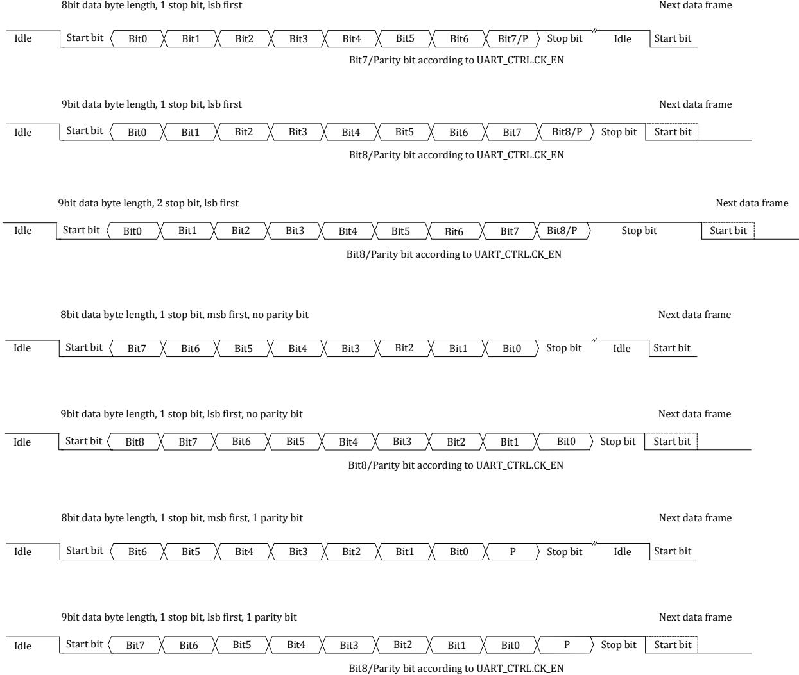  
图 17-1 UART 帧格式

## 17.2.4 波特率配置

UART输入时钟为系统主时钟，波特率通过两级分频实现。

波特率=UART 模块时钟/（256\*DIVH+DIVL+1)

可以通过 SYS\_CLK\_DIV2 对 UART 模块时钟进行分频.

UART 模块时钟=系统主时钟/(1+SYS\_CLK\_DIV2)

表 17-1 UART 波特率配置示例

<table><tr><td>UART 波特率</td><td>SYS_CLK_DIV2</td><td>UART_DIVH</td><td>UART_DIVL</td></tr><tr><td>600</td><td>0x0007</td><td>0x9C</td><td>0x3F</td></tr><tr><td>1200</td><td>0x0003</td><td>0x9C</td><td>0x3F</td></tr><tr><td>2400</td><td>0x0001</td><td>0x9C</td><td>0x3F</td></tr><tr><td>4800</td><td>0x0000</td><td>0x9C</td><td>0x3F</td></tr><tr><td>9600</td><td>0x0000</td><td>0x4E</td><td>0x1F</td></tr><tr><td>19200</td><td>0x0000</td><td>0x27</td><td>0x0F</td></tr><tr><td>38400</td><td>0x0000</td><td>0x13</td><td>0x87</td></tr><tr><td>43000</td><td>0x0000</td><td>0x11</td><td>0x71</td></tr><tr><td>56000</td><td>0x0000</td><td>0x0D</td><td>0x65</td></tr><tr><td>57600</td><td>0x0000</td><td>0x0D</td><td>0x05</td></tr><tr><td>115200</td><td>0x0000</td><td>0x06</td><td>0x83</td></tr></table>

注意，同一波特率，其配置系数可能不唯一。

注意，同一波特率，其配置系数可能不唯一。

## 17.2.5 收发端口互换(TX/RX 互换)

UART 模块支持 Tx 与 Rx 端口互换。通过将 Tx 对应的 GPIO 配置为输入使能，Rx 对应的 GPIO配置为输出使能，即可实现 Tx 与 Rx 端口的互换。此时，GPIO 第二功能仍选择为 UART，UART 本身配置无需修改。

此外，如果要使用一个GPIO同时作为Tx和 Rx，需要将 IO分时复用为输入或输出，对应Rx 或Tx，即可实现单口半双工逻辑。

## 17.2.6 多机通讯

多机通讯场景通常是一个设备作为主设备 master，另有若干个从设备 slave，主设备的UARTm\_TXD 端口连接到所有从设备的 UARTs\_RXD 端口，从设备的 UARTs\_TXD 相与连接到主设备的UARTm\_RXD 端口。如图 17-2 所示，为一个主设备和 3 个从设备（地址分别为 0x51,0x52,0x53）的互联情况。

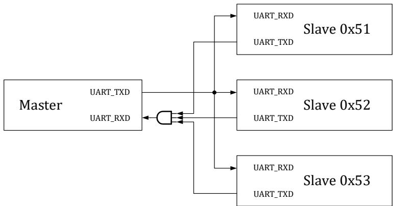  
图 17-2UART 多机通讯互联拓扑

为了降低从机报文处理的负荷，从设备应该只处理发送给他的 UART 数据，而忽略发送给其他从设备的数据。在多机通讯场景中，每一个从机有一个 8bit 的设备地址，即 UART\_ADR。从设备设置UART\_CTRL.MD\_EN=1后，开启多机通讯过滤模式，主机无须设置MD\_EN。主机、从机均需要使用 9bit 模式发送数据，即设置 UART\_CTRL.BYTE\_LEN=1。当发送数据字节 MSB(BIT8)为 1 时，低 8位(BIT7:BIT0)是主机发出的从机地址，即地址字节；当发送数据字节 MSB(BIT8)为 0 时，低 8 位(BIT7:BIT0)是主机发给特定从机的数据，即数据字节。

所有从机接收到 MSB(BIT8)=1 的数据字节后，判断低 8 位(BIT7:BIT0)地址是否与自己的UART\_ADR 配置值相等。如果相等，则说明后续数据都是发送给此从机，否则从机进入静默状态，忽略所有后续主机发出的数据。当从机再次接收到MSB(BIT8)=1 的数据字节且低8位(BIT7:BIT0)地址与 自 己 的 UART\_ADR 配 置 值 相 等 时 ， 表 示 此 从 机 被 选 中 ， 退 出 静 默 状 态 。 从 机 设 置UART\_CTRL.MD\_EN=1开启多机通讯过滤模式后，立即进入静默状态。如果主机没有发送MSB=1的地址字节，直接发送数据字节，则所有从机都处于静默状态，不会接收任何数据。

在 多 机 通 讯 模 式 中 ， 主 设 备 无 需 设 置 UART\_CTRL.MD\_EN=1 ， 从 设 备 需 要 设 置UART\_CTRL.MD\_EN=1。如果无需地址过滤，从设备也可以不设置 UART\_CTRL.MD\_EN=1，另使用软件对接收数据进行判读，此时从设备会接收并处理所有报文数据。

在多机通讯模式中，如果从设备设置了 UART\_CTRL.MD\_EN=1，则地址字节无论是否命中UART\_ADR，UART\_IF.RX\_DONE\_IF 标志均不置位；如果地址不匹配，即从设备处于静默状态，即使主设备发送数据，UART\_IF.RX\_DONE\_IF 仍不置位。如果地址匹配，当接收到主设备发送的数据字节时，从设备的UART\_IF.RX\_DONE\_IF标志置位为1，表示从设备接收到一个数据字节。

由于检验位需要占用 1bit数据位，而多机通讯需要使用9bit 字节长度。因此多机通讯场景下不支持校验位，在设置 UART\_CTRL.MD\_EN=1 时，请勿设置 UART\_CTRL.CK\_EN=1。主机、从机均需设置 UART\_CTRL.BYTE\_LEN=1 使用 9bit 模式，并设置 UART\_CTRL.MD\_EN。多机通讯支持 MSB first，即 UART\_CTRL.BIT\_ORDER=1。

如图 17-3 所示，主设备先发送了数据 0x03，但此时没有从设备地址命中，因此 3 个从设备均不接收 0x03。主设备发送地址字节 0x151，从设备 0x51 被选中。但之后主设备没有发送数据，而是直接发送地址字节 0x153，从设备0x53 被选中，主设备连续发送3 个数据字节 0x03,0x53,0x04，均被从设备0x53接收。之后主设备发送地址字节0x152，之后发送数据字节0x07，被从设备0x52接收。

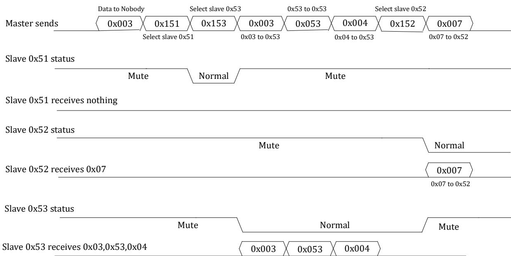  
图 17-3 UART 多机通讯示例

## 17.2.7 校验位

可以通过设置 UART\_CTRL.CK\_EN=1 来使能校验位。同时根据字节长度 UART\_CTRL.BYTE\_LEN不同，UART的帧格式有4 种情况。

表 17-2 UART 帧格式

<table><tr><td>BYTE_LEN</td><td>CK_EN</td><td>UART frame</td></tr><tr><td>0</td><td>0</td><td>| StartBit | 8bit data | StopBit |</td></tr><tr><td>0</td><td>1</td><td>| StartBit | 7bit data | Parity | StopBit |</td></tr><tr><td>1</td><td>0</td><td>| StartBit | 9bit data | StopBit |</td></tr><tr><td>1</td><td>1</td><td>| StartBit | 8bit data | Parity | StopBit |</td></tr></table>

## 17.3 寄存器

## 17.3.1 地址分配

UART0，UART1 和 UART2 实现完全相同。

UART0 基地址 0x4001\_2000。

UART1 基地址 0x4001\_2400。

UART2 基地址 0x4001\_2800。

表 17-3 UART 地址分配列表

<table><tr><td>名称</td><td>偏移地址</td><td>说明</td></tr><tr><td>UARTx_CTRL</td><td>0x00</td><td>UART 控制寄存器</td></tr><tr><td>UARTx_DIVH</td><td>0x04</td><td>UART 波特率设置高字节寄存器</td></tr><tr><td>UARTx_DIVL</td><td>0x08</td><td>UART 波特率设置低字节寄存器</td></tr><tr><td>UARTx_BUFF</td><td>0x0C</td><td>UART 收发缓冲寄存器</td></tr><tr><td>UARTx_ADR</td><td>0x10</td><td>485 通信地址匹配寄存器</td></tr><tr><td>UARTx_STT</td><td>0x14</td><td>UART 状态寄存器</td></tr><tr><td>UARTx_RE</td><td>0x18</td><td>UART DMA 请求使能寄存器</td></tr><tr><td>UARTx_IE</td><td>0x1C</td><td>UART 中断使能寄存器</td></tr><tr><td>UARTx_IF</td><td>0x20</td><td>UART 中断标志寄存器</td></tr><tr><td>UARTx_IOC</td><td>0x24</td><td>UART IO 控制</td></tr></table>

## 17.3.2 UARTx\_CTRL UARTx 控制寄存器 (x = 0,1,2)

地址分别是：0x4001\_2000，0x4001\_2400，0x4001\_2800

复位值:0x0

表 17-4 UART 控制寄存器 UARTx\_CTRL

<table><tr><td rowspan="3"></td><td>DUPLEX</td><td>LIN_EN</td><td>MD_EN</td><td>CK_EN</td><td>CK_TYPE</td><td>BIT_ORDER</td><td>STOP_LEN</td><td>BYTE_LEN</td></tr><tr><td>RW</td><td>RW</td><td>RW</td><td>RW</td><td>RW</td><td>RW</td><td>RW</td><td>RW</td></tr><tr><td>0</td><td>0</td><td>0</td><td>0</td><td>0</td><td>0</td><td>0</td><td>0</td></tr></table>

<table><tr><td>位置</td><td>位名称</td><td>说明</td></tr><tr><td>[31:8]</td><td></td><td>未使用</td></tr><tr><td>[7]</td><td>DUPLEX</td><td>双工,默认值为0。0:全双工;1:半双工</td></tr><tr><td>[6]</td><td>LIN_EN</td><td>LIN模式使能,默认值为0。0:关闭;1:开启</td></tr><tr><td>[5]</td><td>MD_EN</td><td>使能Multi-drop,默认值为0。0:关闭;1:开启</td></tr><tr><td>[4]</td><td>CK_EN</td><td>数据校验开关,默认值为0。0:关闭;1:开启</td></tr><tr><td>[3]</td><td>CK_TYPE</td><td>奇偶校验配置,默认值为0。0:偶校验(EVEN);1:奇校验(ODD)</td></tr><tr><td>[2]</td><td>BIT_ORDER</td><td>数据发送顺序配置,默认值为0。0:LSB;1:MSB</td></tr><tr><td>[1]</td><td>STOP_LEN</td><td>停止位长度配置,默认值为0。0:1-Bit;1:2-Bit</td></tr><tr><td>[0]</td><td>BYTE_LEN</td><td>数据长度配置,默认值为0。0:8-Bit;1:9-Bit</td></tr></table>

## 17.3.3 UARTx\_DIVH UARTx 波特率设置高字节寄存器 (x = 0,1,2)

地址分别是：0x4001\_2004，0x4001\_2404，0x4001\_2804

复位值:0x0

表 17-5 UART 波特率设置高字节寄存器 UARTx\_DIVH

<table><tr><td>15</td><td>14</td><td>13</td><td>12</td><td>11</td><td>10</td><td>9</td><td>8</td><td>7</td><td>6</td><td>5</td><td>4</td><td>3</td><td>2</td><td>1</td><td>0</td></tr><tr><td rowspan="3" colspan="8"></td><td colspan="8">DIVH</td></tr><tr><td colspan="8">RW</td></tr><tr><td colspan="8">0</td></tr></table>

<table><tr><td>位置</td><td>位名称</td><td>说明</td></tr><tr><td>[31:8]</td><td></td><td>未使用</td></tr><tr><td>[7:0]</td><td>DIVH</td><td>波特率设置高字节BAUDRATE =主时钟/(1+256* UART_DIVH+UART_DIVL)</td></tr></table>

## 17.3.4 UARTx\_DIVL UARTx 波特率设置低字节寄存器 $\mathbf { ( x = 0 , 1 , 2 ) }$

地址分别是：0x4001\_2008，0x4001\_2408，0x4001\_2808

复位值:0x0

表 17-6 UART 波特率设置低字节寄存器 UART\_DIVL

<table><tr><td>15</td><td>14</td><td>13</td><td>12</td><td>11</td><td>10</td><td>9</td><td>8</td><td>7</td><td>6</td><td>5</td><td>4</td><td>3</td><td>2</td><td>1</td><td>0</td></tr><tr><td rowspan="3" colspan="8"></td><td colspan="8">DIVL</td></tr><tr><td colspan="8">RW</td></tr><tr><td colspan="8">0</td></tr></table>

<table><tr><td>位置</td><td>位名称</td><td>说明</td></tr><tr><td>[31:8]</td><td></td><td>未使用</td></tr><tr><td>[7:0]</td><td>DIVL</td><td>波特率设置低字节BAUDRATE =主时钟/(1+256* UART_DIVH+UART_DIVL)</td></tr></table>

## 17.3.5 UARTx\_BUFF UARTx 收发缓冲寄存器 $\mathbf { ( x = 0 , 1 , 2 ) }$

地址分别是：0x4001\_200C，0x4001\_240C，0x4001\_280C

表 17-7 UART 收发缓冲寄存器 UART\_BUFF

<table><tr><td>15</td><td>14</td><td>13</td><td>12</td><td>11</td><td>10</td><td>9</td><td>8</td><td>7</td><td>6</td><td>5</td><td>4</td><td>3</td><td>2</td><td>1</td><td>0</td></tr><tr><td rowspan="3" colspan="7"></td><td colspan="9">BUFF</td></tr><tr><td colspan="9">RW</td></tr><tr><td colspan="9">0</td></tr></table>

<table><tr><td>位置</td><td>位名称</td><td>说明</td></tr><tr><td>[31:9]</td><td></td><td>未使用</td></tr><tr><td>[8:0]</td><td>BUFF</td><td>写:发送数据缓存;读:接收数据寄存器</td></tr></table>

UART 的 Tx\_buffer 和 Rx\_buffer 共享 UART\_BUFF。其中，Tx\_buffer 是只写的，Rx\_buffer 是只读的。因此，读 UART\_BUFF 寄存器是访问 UART\_RX\_BUFF，写 UART\_BUFF 寄存器是访问 UART\_TX\_BUFF。

当 UARTx\_CTRL.BYTE\_LEN=0 时，UART 收发只使用 buffer 低 8 位，即 UARTx\_BUFF[7:0]；

当 UARTx\_CTRL.BYTE\_LEN=1 时，UART 收发使用 buffer 全部 9 位，即 UARTx\_BUFF[8:0]。

如果使能 UARTx\_CTRL.CK\_EN，即使用校验位，则 UARTx\_BUFF 的最高位（BIT8 whenUARTx\_CTRL.BYTE\_LEN=1 or BIT7 UARTx\_CTRL.BYTE\_LEN=0）数据无效，发送时会被替换为校验位，接收时会作为校验位，而不会写入UARTx\_BUFF。

## 17.3.6 UARTx\_ADR UARTx 地址匹配寄存器 (x = 0,1,2)

地址分别是：0x4001\_2010，0x4001\_2410，0x4001\_2810

复位值:0x0

表 17-8 UART 地址匹配寄存器 UART\_ADR

<table><tr><td>15</td><td>14</td><td>13</td><td>12</td><td>11</td><td>10</td><td>9</td><td>8</td><td>7</td><td>6</td><td>5</td><td>4</td><td>3</td><td>2</td><td>1</td><td>0</td></tr><tr><td rowspan="3" colspan="8"></td><td colspan="8">ADR</td></tr><tr><td colspan="8">RW</td></tr><tr><td colspan="8">0</td></tr></table>

<table><tr><td>位置</td><td>位名称</td><td>说明</td></tr><tr><td>[31:8]</td><td></td><td>未使用</td></tr><tr><td>[7:0]</td><td>ADR</td><td>多机通讯时的从机地址</td></tr></table>

## 17.3.7 UARTx\_STT UARTx 状态寄存器 (x = 0,1,2)

地址分别是：0x4001\_2014，0x4001\_2414，0x4001\_2814

复位值:0x0

表 17-9 UART 状态寄存器 UART\_STT

<table><tr><td colspan="5">15 14 13 12 11 10 9 8 7 6 5 4 3 2 1 0</td></tr><tr><td rowspan="3"></td><td>RX_BUSY</td><td>ADR_MATCH</td><td>TX_DONE</td><td>TX_BUF_EMPTY</td></tr><tr><td>R</td><td>R</td><td>R</td><td>R</td></tr><tr><td>0</td><td>0</td><td>1</td><td>1</td></tr></table>

<table><tr><td>位置</td><td>位名称</td><td>说明</td></tr><tr><td>[31:4]</td><td></td><td>未使用</td></tr><tr><td>[3]</td><td>RX_BUSY</td><td>1:UART 已检测到起始符并正处于接收状态0:UART 接收端空闲此状态位只读,置位与清零均由硬件完成</td></tr><tr><td>[2]</td><td>ADR_MATCH</td><td>Multi-drop 模式下,地址匹配标志位。1:匹配;0:未匹配。</td></tr><tr><td>[1]</td><td>TX_DONE</td><td>发送完成标志位。1:完成;0:未完成。</td></tr><tr><td>[0]</td><td>TX_BUF_EMPTY</td><td>发送缓存状态位。1:空;0:非空。</td></tr></table>

## 17.3.8 UARTx\_RE UARTx DMA 请求使能寄存器 (x = 0,1,2)

地址分别是：0x4001\_2018，0x4001\_2418，0x4001\_2818

复位值:0x0

表 17-10 UART DMA 请求使能寄存器 UART\_RE

<table><tr><td colspan="4">15 14 13 12 11 10 9 8 7 6 5 4 3 2 1 0</td></tr><tr><td rowspan="3"></td><td>TX_BUF_EMPTY_RE</td><td>RX_DONE_RE</td><td>TX_DONE_RE</td></tr><tr><td>RW</td><td>RW</td><td>RW</td></tr><tr><td>0</td><td>0</td><td>0</td></tr></table>

<table><tr><td>位置</td><td>位名称</td><td>说明</td></tr><tr><td>[31:3]</td><td></td><td>未使用</td></tr><tr><td>[2]</td><td>TX_BUF_EMPTY_RE</td><td>发送缓冲区空 DMA 请求开关,默认值为 0。0:关闭;1:开启。</td></tr><tr><td>[1]</td><td>RX_DONE_RE</td><td>接收完成 DMA 请求开关,默认值为 0。0:关闭;1:开启。</td></tr><tr><td>[0]</td><td>TX_DONE_RE</td><td>发送完成 DMA 请求开关,默认值为 0。0:关闭;1:开启。</td></tr></table>

17.3.9 UARTx\_IE UARTx 中断使能寄存器 (x = 0,1,2)

地址分别是：0x4001\_201C，0x4001\_241C，0x4001\_281C

复位值:0x0

表 17-11 UART 中断使能寄存器 UART\_IE

<table><tr><td>15</td><td>14</td><td>13</td><td>12</td><td>11</td><td>10</td><td>9</td><td>8</td><td>7</td><td>6</td><td>5</td><td>4</td><td>3</td><td>2</td><td>1</td><td>0</td></tr><tr><td colspan="7" rowspan="2"></td><td>IDLE_IE</td><td>LBD_IE</td><td>RX_OV_IE</td><td>TX_OV_IE</td><td>CK_ERR_IE</td><td>STOP_ERR_IE</td><td>TX_BUF_EMPTY_IE</td><td>RX_DONE_IE</td><td>TX_DONE_IE</td></tr><tr><td>RW</td><td>RW</td><td>RW</td><td>RW</td><td>RW</td><td>RW</td><td>RW</td><td>RW</td><td>RW</td></tr><tr><td></td><td>0</td><td>0</td><td>0</td><td>0</td><td>0</td><td>0</td><td>0</td><td>0</td><td colspan="7">0</td></tr></table>

<table><tr><td>位置</td><td>位名称</td><td>说明</td></tr><tr><td>[31:9]</td><td></td><td>未使用</td></tr><tr><td>[8]</td><td>IDLE_IE</td><td>空闲帧中断使能0:关闭;1:开启</td></tr><tr><td>[7]</td><td>LBD_IE</td><td>LIN break character 检测中断使能0:关闭;1:开启</td></tr><tr><td>[6]</td><td>RX_OV_IE</td><td>接收缓冲区溢出中断使能0:关闭;1:开启</td></tr><tr><td>[5]</td><td>TX_OV_IE</td><td>发送缓冲区溢出中断使能0:关闭;1:开启</td></tr><tr><td>[4]</td><td>CK_ERR_IE</td><td>校验错误中断开关,默认值为0。0:关闭;1:开启</td></tr><tr><td>[3]</td><td>STOP_ERR_IE</td><td>停止位错误中断开关,默认值为0。0:关闭;1:开启</td></tr><tr><td>[2]</td><td>TX_BUF_EMPTY_IE</td><td>发送缓冲区空中断开关,默认值为0。0:关闭;1:开启</td></tr><tr><td>[1]</td><td>RX_DONE_IE</td><td>接收完成中断开关,默认值为0。0:关闭;1:开启</td></tr><tr><td>[0]</td><td>TX_DONE_IE</td><td>发送完成中断开关,默认值为0。0:关闭;1:开启</td></tr></table>

## 17.3.10 UARTx\_IF UARTx 中断标志寄存器 (x = 0,1,2)

地址分别是：0x4001\_2020，0x4001\_2420，0x4001\_2820

复位值:0x0

表 17-12 UART 中断使能寄存器 UART\_IF

<table><tr><td rowspan="3"></td><td>IDLE_IF</td><td>LBD_IF</td><td>RX_OV_IF</td><td>TX_OV_IF</td><td>CK_ERR_IF</td><td>STOP_ERR_IF</td><td>TX_BUF_EMPTY_IF</td><td>RX_DONE_IF</td><td>TX_DONE_IF</td></tr><tr><td>RW1C</td><td>RW1C</td><td>RW1C</td><td>RW1C</td><td>RW1C</td><td>RW1C</td><td>RW1C</td><td>RW1C</td><td>RW1C</td></tr><tr><td>0</td><td>0</td><td>0</td><td>0</td><td>0</td><td>0</td><td>1</td><td>0</td><td>1</td></tr></table>

<table><tr><td>位置</td><td>位名称</td><td>说明</td></tr><tr><td>[31:9]</td><td></td><td>未使用</td></tr><tr><td>[8]</td><td>IDLE_IF</td><td>空闲帧中断标志,高有效,写1清零当 UART 检测到空闲帧后,硬件置位这一标志,如果UARTx_IE.IDLE_IE=1,则产生中断请求;写1清零后,只有待RX_DONE_IF标志再次置位后,IDLE_IF标志才会置位。在多从机(Multi-drop)场景中,只有从机地址命中时,即UARTx_STT.ADR_MATCH=1时,表示主机此时欲与本从机通讯,IDLE_IF才会置位,否则即使UARTx_RX信号为常高,IDLE_IF也不会置位。</td></tr><tr><td>[7]</td><td>LBD_IF</td><td>LIN break character 检测中断标志,高有效,写1清零</td></tr><tr><td>[6]</td><td>RX_OV_IF</td><td>接收缓冲区溢出中断标志,高有效,写1清零</td></tr><tr><td>[5]</td><td>TX_OV_IF</td><td>发送缓冲区溢出中断标志,高有效,写1清零</td></tr><tr><td>[4]</td><td>CK_ERR_IF</td><td>校验错误中断标志,高有效,写1清零</td></tr><tr><td>[3]</td><td>STOP_ERR_IF</td><td>停止位错误中断标志,高有效,写1清零</td></tr><tr><td>[2]</td><td>TX_BUF_EMPTY_IF</td><td>发送缓冲区空中断标志,高有效,写1清零</td></tr><tr><td>[1]</td><td>RX_DONE_IF</td><td>接收完成中断标志,高有效,写1清零</td></tr><tr><td>[0]</td><td>TX_DONE_IF</td><td>发送完成中断标志,高有效,写1清零</td></tr></table>

中断标志写1清零，一般不建议用如下|=方式清零，因为|=是先读取中断标志，将对应位改为1再写入清零，如果同时有其他中断标志置位，会被一起清零，而这通常不是软件所期望的。例如，如下写法本意是清零 TX\_DONE\_IF，但如果同时 RX\_DONE\_IF 在写入执行前置 1 了，则软件先读取回UART\_IF 值为 0x2，然后执行或操作 $0 \mathrm { x } 2 | 0 \mathrm { x } 1 { = } 0 \mathrm { x } 3$ ，然后写入，同时对 RX\_DONE\_IF 和 TX\_DONE\_IF进行了清零，可能导致UART少进入一次因接收数据产生的中断，从而少接收到一字节数据。

$$
U A R T \_ I F | = 0 x 1;
$$

如果希望清零TX\_DONE\_IF 标志位，应以如下方式，直接对BIT0写 1.

$$
U A R T \_ I F = 0 x 1;
$$

## 17.3.11 UARTx\_IOC UARTx IO 控制寄存器 (x = 0,1,2)

地址分别是：0x4001\_2024，0x4001\_2424，0x4001\_2824

复位值:0x0

表 17-13 UARTIO 控制寄存器 UART\_IOC

<table><tr><td>15</td><td>14</td><td>13</td><td>12</td><td>11</td><td>10</td><td>9</td><td>8</td><td>7</td><td>6</td><td>5</td><td>4</td><td>3</td><td>2</td><td>1</td><td>0</td></tr><tr><td rowspan="3" colspan="8"></td><td>SBK</td><td>LBDL</td><td rowspan="3"></td><td>AUTO</td><td rowspan="3" colspan="2"></td><td>TXD_INV</td><td>RXD_INV</td></tr><tr><td>RW</td><td>RW</td><td>RW</td><td>RW</td><td>RW</td></tr><tr><td>0</td><td>0</td><td>0</td><td>0</td><td>0</td></tr></table>

<table><tr><td>位置</td><td>位名称</td><td>说明</td></tr><tr><td>[31:8]</td><td></td><td>未使用</td></tr><tr><td>[7]</td><td>SBK</td><td>LIN 模式下,写 1 发送一次 break character,即连续 13 个 0,完成后自动清零,未完成时读回为 1,向此位写 1 之前需要先配置 UARTx_CTRL.LIN_EN=1,否则无法进行 break character 的发送</td></tr><tr><td>[6]</td><td>LBDL</td><td>LIN break character 检测长度,10/11 个 00:10bits,1:11bits</td></tr><tr><td>[5]</td><td></td><td>未使用</td></tr><tr><td>[4]</td><td>AUTO</td><td>波特率自适应 IO 端口使能开关。0:关闭;1:开启</td></tr><tr><td>[3:2]</td><td></td><td>未使用</td></tr><tr><td>[1]</td><td>TXD_INV</td><td>TXD 输出极性使能开关,默认值为 0。0:正常输出;1:取反输出。正常输出极性,即软件发送 1,硬件发送 1;取反输出极性,即应用发送 1,硬件发送 0。</td></tr><tr><td>[0]</td><td>RXD_INV</td><td>RXD 输入极性使能开关,默认值为 0。0:正常输入;1:取反输入。正常输入极性,即硬件接收到 1,软件接收的是 1;取反输入极性,即硬件接收 1,软件接收的是 0。</td></tr></table>

## 18 I2C

## 18.1 概述

I2C 总线接口连接微控制器和串行 I2C 总线。它提供多主机功能，控制所有 I2C 总线特定的时序、协议、仲裁和定时。支持标准和快速两种模式。

## 18.2 主要特性

⚫ 多主机功能：该模块既可做主设备也可做从设备。

I2C主设备功能：产生时钟、START和STOP事件。

I2C从设备功能：可编程的 I2C 硬件地址比较（仅支持7 位硬件地址）、停止位检测。

⚫ 根据系统分频，实现不同的通讯速度。

⚫ 状态标志：发送器/接收器模式标志、字节发送结束标志、I2C 总线忙标志。

⚫ 错误标志：主模式时的仲裁丢失、地址/数据传输后的应答(ACK)错误、检测到错位的起始或停止条件。

⚫ 一个中断向量，包含五个中断源：总线错误中断源、完成中断源、NACK中断源、硬件地址匹配中断源和传输完成中断源。

## 18.3 功能描述

## 18.3.1 功能框图

本接口采用同步串行设计，实现 MCU同外部设备之间的I2C传输。支持轮询和中断方式获得传输状态信息。本接口的主要功能模块如下图所示。

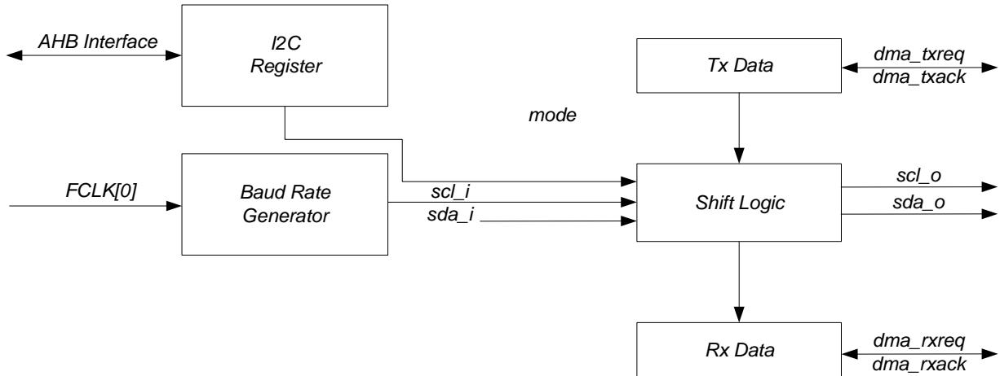  
图 18-1I2C 模块顶层功能框图

I2C 接口同外界通讯只有 SCL 和 SDA 两根信号线。SDA 为双向复用信号线，受到 sda\_oe 控制。模块级，I2C 接口信号包括，scl\_i，sda\_i，scl\_o，sda\_o 和 sda\_oe。

scl\_i：时钟信号。当I2C接口配置为从模式时，此为 I2C 总线的时钟输入信号。

sda\_i：数据信号。当 I2C 接口接收数据时（无论主模式还是从模式），此为 I2C 总线的数据输入信号。

scl\_o：时钟信号。当 I2C接口配置为主模式时，此为 I2C 总线的时钟输出信号。

sda\_o：数据信号。当 I2C接口发送数据时（无论主模式还是从模式），此为 I2C 总线的数据输出信号。

sda\_oe：数据使能信号。当 sda\_o 输出时，sda\_oe 有效；当 sda\_i 输入时，sda\_oe 无效。

## 18.3.2 功能说明

I2C模块接收和发送数据，并将数据从串行转换成并行，或并行转换成串行。可以开启或禁止中断。接口通过数据引脚(SDA)和时钟引脚(SCL)连接到I2C总线。

## 18.3.2.1 模式选择

接口可以下述4 种模式中的一种运行：

⚫ 从发送模式

⚫ 从接收模式

⚫ 主发送模式

⚫ 主接收模式

I2C接口默认主从均不使能。接口根据配置情况，进入主模式或者从模式。当仲裁丢失或产生停止信号时，主模式自动释放总线并产生相应异常中断。允许多主机功能。

主模式时，I2C接口启动数据传输并产生时钟信号。串行数据传输总是以起始条件开始并以停止条件结束。起始条件和停止条件都是在主模式下由软件控制产生。

从模式时，I2C 接口能识别它自己的地址(7 位)。软件能够控制开启或禁止硬件地址比较功能，硬件地址比较功能可降低MCU 的负担。只有地址匹配才通知MCU 进行相关处理。

数据和地址按8 位/字节进行传输，高位在前。跟在起始条件后的1 个字节是地址。地址只在主模式发送。

在一个字节传输的 8 个时钟后的第 9 个时钟期间，接收器必须回送一个应答位(ACK)给发送器。

软件可以开启或禁止应答(ACK)，并可以设置I2C接口的地址。

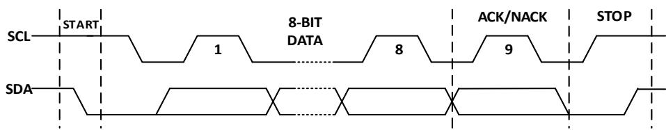

## 图18-2基本I2C 传输时序图

一般情况下，一次传输一个字节（可反复单次传输，需软件介入提供数据）。上述所有模式，遵循如下基本原则：

⚫ 单字节发送，中断将在8-bit 数据发送完毕且收到响应后（ACK/NACK均可）产生。

⚫ 单字节接收，中断将在8-bit 数据接收完毕后产生。

⚫ 当I2C 接口配置为主模式时，检测到错误后，I2C 接口会主动释放总线，恢复到起始状态并产生中断信号。

## 18.3.2.2 从模式

默认情况下，I2C 接口主模式和从模式均关闭。若工作在从模式，需使能从模式。为了产生正确的时序，必须在系统寄存器 CLK\_DIV0 中设定I2C接口的工作时钟。

⚫ 从模式下，I2C接口时刻在监控总线上的信号。一旦检测到起始条件，其将保存地址位数据和读写位数据。

⚫ 从模式下，若硬件地址匹配功能开启，只有地址匹配的情况下，才会产生中断，通知MCU进行后续处理。若没有开启，每次收到地址及读写位数据，都将产生中断。

⚫ 从模式接收。每次收到一个字节的数据后，产生中断，此时 I2C 接口可拉低 SCL，直至中断完成，继续后续操作。

⚫ 从模式发送。每次发送一个字节完毕后且收到响应（ACK/NACK），产生中断，此时 I2C 接口可拉低SCL，直至中断完成，继续后续操作。

## 18.3.2.2.1 从模式传输

每次传输完一个字节的数据后，硬件将产生中断，软件判断是否还要继续传输。图 15-3为从模式传输的总线示意图。从图可知，流程如下：

⚫ 地址匹配，产生地址匹配中断，准备开始传输。

⚫ 若是从接收，一个字节接收完毕后，产生中断，软件判断是否继续接收，返回 ACK/NACK响应。

⚫ 若是从发送，一个字节发送完毕后，等待响应（ACK/NACK），产生中断，根据响应判断后续操作。

⚫ 获得总线STOP事件，本次传输完成。

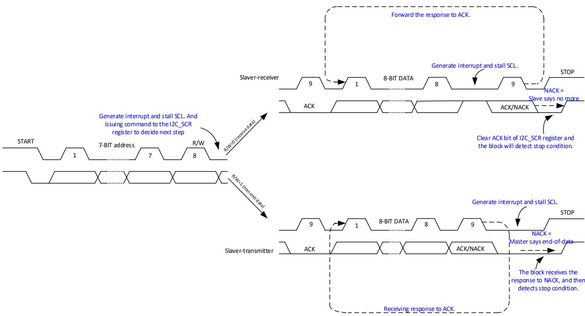  
图 18-3从模式传输示意图

## 18.3.2.2.2 从模式发送

地址匹配后，将数据从I2C\_DATA寄存器经由内部移位寄存器发送到SDA线上。在I2C\_DATA 数据没有准备好之前，从设备可拉底 SCL，直到待发送数据已写入 I2C\_DATA 寄存器。I2C 接口在发送完毕每个字节后都执行下列操作:

⚫ 如果接收到ACK位，装载下一个字节数据，继续传输。装载过程中，可拉底SCL。

⚫ 如果接收到NACK位，停止下一个字节的装载。

⚫ 等待STOP事件，停止本次传输。

## 18.3.2.2.3 从模式单字节接收

地址匹配后，将通过内部移位寄存器从SDA 线接收到的数据存入I2C\_DATA 寄存器。I2C 接口在接收到每个字节后都执行下列操作:

⚫ 如果设置了ACK位，在一个字节接收完毕后，产生一个 ACK应答脉冲。

⚫ 如果清除了ACK位，在一个字节接收完毕后，产生一个 NACK应答脉冲。

⚫ 等待 STOP 事件，结束本次传输。

## 18.3.2.3 主模式

默认情况下，I2C 接口主模式和从模式均关闭。若工作在主模式，需使能主模式。为了产生正确

的时序，必须在系统寄存器 CLK\_DIV0 中设定I2C接口的工作时钟。

I2C接口执行主模式传输之前，需要判断总线是否空闲。可读取I2C\_MSCR 寄存器的BIT3，查询当前总线状态。若总线处于忙的状态，可以开启I2C 中断，通过收到STOP中断事件判断总线是否空闲下来。只有空闲状态下，才能正常发送START状态，以及后续的数据。

## 18.3.2.3.1 主模式传输

每次传输完一个字节的数据后，将产生中断判断是否还要继续传输。下图为主模式传输的总线示意图。从图可知，流程如下：

⚫ 判断总线是否空闲，若空闲，准备开始传输。

⚫ 首先，发送从地址，若地址匹配，才继续后续传输，否则停止。

⚫ 若是接收模式，一个字节接收完毕后，产生中断，软件判断是否继续接收，返回 ACK/NACK 响应。

⚫ 若是发送模式，一个字节发送完毕后，等待响应（ACK/NACK），产生中断，根据响应判断后续操作。

⚫ 发送总线 STOP 事件，本次传输完成。

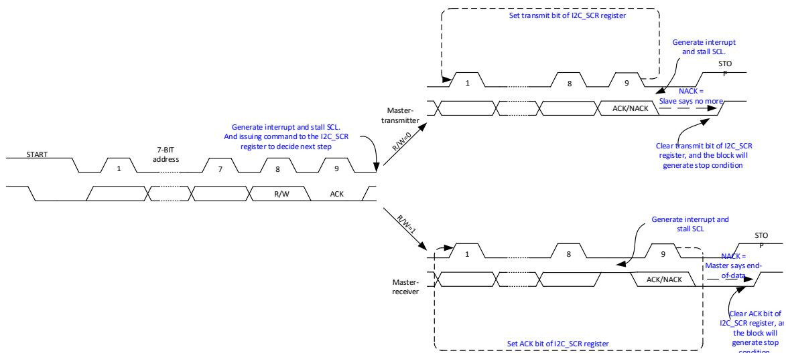  
图18-4主模式下单字节传输示意图

## 18.3.2.3.2 主模式发送

开始传输后，I2C接口将字节从I2C\_DATA 寄存器经由内部移位寄存器发送到SDA 线上，从地址也通过I2C\_DATA发送出去。在I2C\_DATA数据没有准备好之前，主设备可不产生 SCL时钟信号，直到待发送数据已写入I2C\_DATA寄存器。I2C接口在发送完毕每个字节后都执行下列操作:

⚫ 如果接收到ACK位，装载下一个字节数据，继续传输。装载过程中，可拉底SCL。

⚫ 如果接收到NACK位，停止下一个字节的装载。

⚫ 若主设备，完成传输。无论接收的是ACK/NACK，都停止后续传输。

⚫ 产生 STOP 事件，结束本次传输。

## 18.3.2.3.3 主模式接收

开始传输后，I2C接口将通过内部移位寄存器从 SDA线接收到的数据存入I2C\_DATA寄存器，从地址也通过I2C\_DATA发送出去。I2C 接口在接收到每个字节后都执行下列操作:

⚫ 如果设置了 ACK 位，在一个字节接收完毕后，产生一个 ACK 应答脉冲。

⚫ 如果清除了ACK位，在一个字节接收完毕后，产生一个 NACK应答脉冲。

⚫ 若主设备，完成传输。无论发送的是ACK/NACK，都停止后续传输。

⚫ 产生STOP事件，结束本次传输。

## 18.3.2.4 I2C 总线异常处理

在一个地址或数据字节传输期间，当 I2C 接口检测到一个外部的停止或起始条件则产生总线错误。一般而言，产生总线错误是由于总线上有干扰、某些 I2C 设备没有同步于本 I2C 网络自行发送了START事件/STOP事件。根据 I2C 协议规定，发生总线错误的时候，在收到 START事件/STOP事件后要重置本I2C设备的接口逻辑。对于从设备而言，这个操作是没有问题的；对于主设备而言，总线错误强行要求其释放总线并重置其 I2C 接口逻辑。因为主设备是不响应外部 START 和 STOP 事件的，发生总线错误后，需要中断处理函数处理本次异常，并指导主设备继续监视总线情况，以便后续执行I2C总线传输。

本I2C 接口。主模式下，总线错误可被检测到同时总线错误中断也会产生；从模式下，总线错误将触发地址数据被接收，同时让 I2C 接口恢复空闲状态并产生中断。

## 18.3.2.5 中断处理

I2C 接口包含三种类型的中断事件，分别是：数据传输完成事件，总线错误事件、STOP 事件、NACK事件和硬件地址匹配事件。

⚫ 数据完成事件。当前数据传输完成，高电平有效，对I2C\_SCR.Done写0 清除。

总线错误事件。传输过程中，总线产生错误的 START 事件/STOP 事件，高电平有效，对I2C\_SCR.STT\_ERR 写 0 清除。

STOP 事件。当前数据传输完成，主设备发送 STOP 事件，从设备收到 STOP 事件并产生相应中断。高电平有效，对 I2C\_SCR.STOP\_EVT 写 0 清除。

NACK 事件。发送端接收到 NACK 响应，表明接收端无法继续后续传输。高电平有效，对I2C\_SCR.RX\_ACK 写 0 清除。

硬件地址匹配事件。从模式下接收到的地址同本设备地址匹配，产生相应中断。高电平有效，对I2C\_SCR.ADDR\_DATA 写 0 清除。

## 18.3.2.6 通讯速度设置

I2C接口的工作时钟来自系统时钟的分频，分频寄存器为SYS模块的CLK\_DIV0。

I2C 接口采用同步设计，需要对外部设备的信号进行同步采样，同步时钟为 I2C 接口工作时钟。

⚫ I2C 模块工作时钟频率 = 系统频率 / (CLK\_DIV0 + 1)

⚫ I2C 模块数据信号(SDA)和时钟信号(SCL)的时钟频率= I2C 模块工作时钟频率 / 17。

⚫ I2C 波特率 = I2C 模块工作时钟频率 / 17

## 18.4 寄存器

## 18.4.1 地址分配

I2Cx 模块寄存器的基地址分别是是 0x4001\_1000，0x4001\_1400，寄存器列表如下：

表18-1I2C 寄存器地址分配表

<table><tr><td>名称</td><td>偏移</td><td>说明</td></tr><tr><td>I2Cx_ADDR</td><td>0x00</td><td>I2C 地址寄存器</td></tr><tr><td>I2Cx_CFG</td><td>0x04</td><td>I2C 配置寄存器</td></tr><tr><td>I2Cx_SCR</td><td>0x08</td><td>I2C 状态寄存器</td></tr><tr><td>I2Cx_DATA</td><td>0x0C</td><td>I2C 数据寄存器</td></tr><tr><td>I2Cx_MSCR</td><td>0x10</td><td>I2C 主模式寄存器</td></tr><tr><td>I2Cx_BCR</td><td>0x14</td><td>I2C 传输控制寄存器</td></tr></table>

## 18.4.2 I2Cx\_ADDR 地址寄存器(x = 0,1)

地址分别是：0x4001\_1000，0x4001\_1400

复位值：0x0

表 18-2 地址寄存器 I2C\_ADDR

<table><tr><td colspan="3">15 14 13 12 11 10 9 8 7 6 5 4 3 2 1 0</td></tr><tr><td rowspan="3"></td><td>ADDR_CMP</td><td>ADDR</td></tr><tr><td>RW</td><td>RW</td></tr><tr><td>0</td><td>0</td></tr></table>

<table><tr><td>位置</td><td>位名称</td><td>说明</td></tr><tr><td>[31:8]</td><td></td><td>未使用</td></tr><tr><td>[7]</td><td>ADDR_CMP</td><td>I2C 硬件地址比较使能开关,默认值为 0。0:关闭1:开启</td></tr><tr><td>[6:0]</td><td>ADDR</td><td>仅用于从模式下,I2C 设备硬件地址。主模式下,从设备地址写入 I2C_DATA 寄存器。</td></tr></table>

## 18.4.3 I2Cx\_CFG 系统控制寄存器(x = 0,1)

地址分别是：0x4001\_1004，0x4001\_1404

复位值：0x0

表 18-3 系统控制寄存器 I2C\_CFG

<table><tr><td rowspan="3"></td><td>IE</td><td>TC_IE</td><td>BUS_ERR_IE</td><td>STOP_IE</td><td rowspan="3"></td><td>MST_MODE</td><td>SLV_MODE</td></tr><tr><td>RW</td><td>RW</td><td>RW</td><td>RW</td><td>RW</td><td>RW</td></tr><tr><td>0</td><td>0</td><td>0</td><td>0</td><td>0</td><td>0</td></tr></table>

<table><tr><td>位置</td><td>位名称</td><td>说明</td></tr><tr><td>[31:8]</td><td></td><td>未使用</td></tr><tr><td>[7]</td><td>IE</td><td>I2C中断使能信号。默认值为0。1:使能I2C中断0:关闭I2C中断</td></tr><tr><td>[6]</td><td>TC_IE</td><td>I2C数据传输完成中断使能信号。默认值为0。1:使能此中断源0:屏蔽此中断源</td></tr><tr><td>[5]</td><td>BUS_ERR_IE</td><td>I2C总线错误事件中断使能信号。默认值为0。1:使能此中断源0:屏蔽此中断源</td></tr><tr><td>[4]</td><td>STOP_IE</td><td>I2CSTOP事件中断使能信号。默认值为0。1:使能此中断源0:屏蔽此中断源</td></tr><tr><td>[3:2]</td><td></td><td>NA</td></tr><tr><td>[1]</td><td>MST_MODE</td><td>I2C主模式使能信号。默认值为0。1:使能主模式0:关闭主模式</td></tr><tr><td>[0]</td><td>SLV_MODE</td><td>I2C从模式使能信号。默认值为0。1:使能从模式0:关闭从模式</td></tr></table>

## 18.4.4 I2Cx\_SCR 状态控制寄存器(x = 0,1)

地址分别是：0x4001\_1008，0x4001\_1408

复位值：0x0

表 18-4 状态控制寄存器 I2C\_SCR

<table><tr><td>15</td><td>14</td><td>13</td><td>12</td><td>11</td><td>10</td><td>9</td><td>8</td><td>7</td><td>6</td><td>5</td><td>4</td><td>3</td><td>2</td><td>1</td><td>0</td></tr><tr><td rowspan="3" colspan="8"></td><td>STT_ERR</td><td>LOST_ARB</td><td>STOP_EVT</td><td>BYTE_CMPLT</td><td>ADDR_DATA</td><td>DATA_DIR</td><td>RX_ACK</td><td>Done</td></tr><tr><td>RW</td><td>RW</td><td>RW</td><td>RW</td><td>RW</td><td>RW</td><td>RW</td><td>RW</td></tr><tr><td>0</td><td>0</td><td>0</td><td>0</td><td>0</td><td>0</td><td>0</td><td>0</td></tr></table>

<table><tr><td>位置</td><td>位名称</td><td>说明</td></tr><tr><td>[31:8]</td><td></td><td>未使用</td></tr><tr><td>[7]</td><td>STT_ERR</td><td>总线错误状态标志位,用于主模式发送/主模式接收,写0清除。0:无 START/STOP 总线错误1:有 START/STOP 总线错误</td></tr><tr><td>[6]</td><td>LOST_ARB</td><td>总线仲裁丢失状态标志位,用于主模式发送/主模式接收,发生总线仲裁丢失事件将此位置1,无中断事件产生,在字节完成中断中需查此位。总线上任何 START 事件将导致硬件清除此位。0:无总线仲裁丢失错误发生1:有总线仲裁丢失错误发生</td></tr><tr><td>[5]</td><td>STOP_EVT</td><td>STOP 事件状态标志位,用于主模式发送/从模式发送/主模式接收/从模式接收。写0清除。0:无 STOP 事件1:有 STOP 事件</td></tr><tr><td>[4]</td><td>BYTE_CMPLT</td><td>ACK 控制位,用于主模式接收/从模式接收。发送方发送完毕当前字节,接收方对此的响应。若是发送方,此位保留0值。接收方,根据实际情况配置。0:字节发送完成,返回 NACK 回应,表示接收方不能接收更多数据1:字节发送完成,返回 ACK 回应,表示接收方可以继续接收数据</td></tr><tr><td>[3]</td><td>ADDR_DATA</td><td>地址数据标志位,用于主模式发送/从模式发送/主模式接收/从模式接收。START 后,第一个字节为地址数据,此位是一个提示位。写0清除。0:当前传输的数据非地址数据。1:当前传输的数据是地址数据。</td></tr><tr><td>[2]</td><td>DATA_DIR</td><td>发送或接收控制位,主模式发送/从模式发送,此位置1,触发发送,硬件自动清零;主模式接收/从模式接收,此位置0,等待接收。0:接收1:触发发送</td></tr><tr><td>[1]</td><td>RX_ACK</td><td>接收响应标志位,用于主模式发送/从模式发送,告知发送方,接收方的反馈。发送方收到反馈后,对该位执行清零操作。0:本 I2C 接口发送数据,接收到 ACK 响应。1:本 I2C 接口发送数据,接收到 NACK 响应。</td></tr><tr><td>[0]</td><td>Done</td><td>传输完成状态标志位,用于主模式发送/从模式发送/主模式接收/从模式接收。写0清除。0:传输未完成1:传输已完成</td></tr></table>

一般，进入中断后，需读取 I2C\_SCR寄存器，获得当前I2C总线状态及当前传输处于什么阶段；然后，对I2C\_SCR 进行写操作，写入不同的值，软件通知硬件下一步如何处理。

## 18.4.5 I2C\_DATA 数据寄存器(x = 0,1)

地址分别是：0x4001\_100C，0x4001\_140C

复位值：0x0

表 18-5 数据寄存器 I2C\_DATA

<table><tr><td>15 14 13 12 11 10 9 8</td><td>7 6 5 4 3 2 1 0</td></tr><tr><td rowspan="3"></td><td>DATA</td></tr><tr><td>RW</td></tr><tr><td>0</td></tr></table>

<table><tr><td>位置</td><td>位名称</td><td>说明</td></tr><tr><td>[31:8]</td><td></td><td>未使用</td></tr><tr><td>[7:0]</td><td>DATA</td><td>数据寄存器,用于主模式发送/从模式发送/主模式接收/从模式接收。发送方,写入发送数据;接收方,读取接收数据。注意,地址数据也是数据,主模式只能将要发送地址数据写入此寄存器。</td></tr></table>

## 18.4.6 I2Cx\_MSCR 主模式寄存器 $\mathbf { \delta } ( \mathbf { x } = \mathbf { 0 } , \mathbf { 1 } )$

地址分别是：0x4001\_1010，0x4001\_1410

复位值：0x0

表 18-6 主模式寄存器 I2C\_MSCR

<table><tr><td colspan="5">15 14 13 12 11 10 9 8 7 6 5 4 3 2 1 0</td></tr><tr><td rowspan="3"></td><td>BUSY</td><td>MST_CHECK</td><td>RESTART</td><td>START</td></tr><tr><td>RW</td><td>RW</td><td>RW</td><td>RW</td></tr><tr><td>0</td><td>0</td><td>0</td><td>0</td></tr></table>

<table><tr><td>位置</td><td>位名称</td><td>说明</td></tr><tr><td>[31:4]</td><td></td><td>未使用</td></tr><tr><td>[3]</td><td>BUSY</td><td>I2C 总线,闲忙状态。0:检测到 STOP 事件,空闲。1:检测到 START 事件,忙碌。</td></tr><tr><td>[2]</td><td>MST_CHECK</td><td>主模式争抢总线标志位。争抢到总线,置 1;STOP 事件或者发生总线冲突本模块释放总线,置 0。</td></tr><tr><td>[1]</td><td>RESTART</td><td>再次触发 START 事件,写 1 有效。发送 START 完毕,硬件清 0。I2C_CFG[1]置 1,才能实现写 1 操作。</td></tr><tr><td>[0]</td><td>START</td><td>触发 START 事件并发送地址数据至总线,写 1 有效。I2C_CFG[1]置 1,才能实现写 1 操作。</td></tr></table>

## 18.4.7 I2Cx\_BCR I2C 传输控制寄存器(x = 0,1)

地址分别是：0x4001\_1004，0x4001\_1404

复位值：0x0

表 18-7DMA 传输控制寄存器 I2C\_BCR

<table><tr><td rowspan="3"></td><td>NACK</td><td>ADDR_CMP</td><td>BURST_EN</td><td rowspan="3"></td></tr><tr><td>RW</td><td>RW</td><td>RW</td></tr><tr><td>0</td><td>0</td><td>0</td></tr></table>

<table><tr><td>位置</td><td>位名称</td><td>说明</td></tr><tr><td>[31:8]</td><td></td><td>未使用</td></tr><tr><td>[7]</td><td>NACK_IE</td><td>I2C 传输,NACK 事件中断使能信号。0:屏蔽此中断源1:使能此中断源</td></tr><tr><td>[6]</td><td>ADDR_CMP_IE</td><td>I2C 传输,硬件地址匹配中断使能信号。0:屏蔽此中断源1:使能此中断源</td></tr><tr><td>[5]</td><td>BUSRT_EN</td><td>I2C 多数据传输使能,需要采用 DMA 方式。1:使能0:关闭</td></tr><tr><td>[4:0]</td><td>--</td><td>保留</td></tr></table>

DMA传输仅支持2 字节及以上的数据的传输，单字节传输使用普通发送模式。

## 19 SPI

## 19.1 概述

SPI 接口主要使用在，外部设计采用 SPI 协议的应用场景下。SPI 的工作模式软件可选，默认为SPI Motorola 模式。SPI 接口支持全双工传输和半双工传输。当接口配置为 Master 模式时，可发送时钟信号供外部Slave设备使用。

## 19.2 主要特性

⚫ 支持 Master 和 Slave 操作

⚫ 全双工传输，可根据应用情况，使用 3 根或者 4 根信号线

⚫ 支持半双工传输，可根据应用情况，使用2根信号线

⚫ 可编程的时钟极性和相位

⚫ 可编程的数据顺序：MSB或 LSB

⚫ 最快传输速度为系统最高时钟频率的1/8

⚫ 片选信号均可选。Master模式下，片选信号可以软件控制也可以硬件产生；Slave模式下，片选信号可以恒定有效，也可以来自外界设备

⚫ 无本地FIFO。包含溢出检测和片选信号异常检测

## 19.3 功能描述

## 19.3.1 功能框图

本接口采用同步串行设计，实现MCU同外部设备之间的SPI 传输。支持轮询和中断方式获得传输状态信息。本接口的主要功能模块如下图所示。

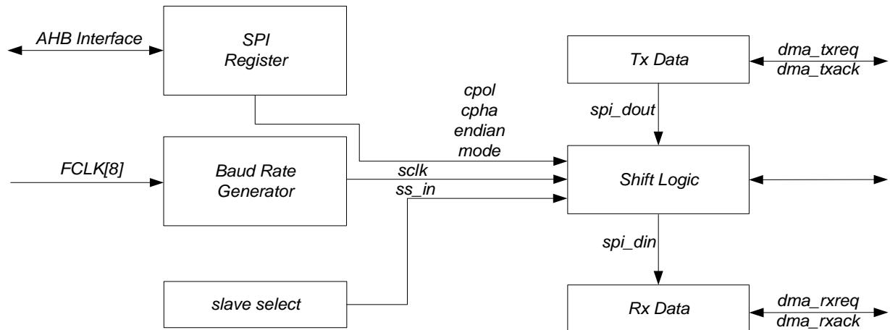

## 图 19-1 SPI 模块结构框图

接口信号包括，spi\_din，spi\_dout，sclk\_in，sclk\_out，ss\_in 和 ss\_out。

spi\_din：接口接收的数据信号。同SPI 协议比较，当接口配置为Master模式时，其等效为MISO；当接口配置为Slave 模式时，其等效为MOSI。

spi\_dout：接口发送的数据信号。同SPI协议比较，当接口配置为Master模式时，其等效为MOSI；当接口配置为Slave 模式时，其等效为MISO。

sclk\_in：接口接收的时钟信号。此时，接口的工作模式为 Slave。非 Slave 模式下，此信号输入无效。

sclk\_out：接口发送的时钟信号。此时，接口的工作模式为 Master，非 Master 模式下，此信号输出恒定为0。

ss\_in：接口接收的片选信号。此时，接口的工作模式为 Slave。非 Slave模式下，此信号输入无效。

ss\_out：接口发送的片选信号。此时，接口的工作模式为Master。非Master模式下，此信号输出恒定为1。

## 19.3.2 功能说明

## 19.3.2.1 全双工模式

默认情况下，SPI 接口配置为全双工模式。此时，数据传输需要两根数据线。数据信号的变化，发生在时钟信号的边沿，即同步于时钟信号。

接口为Master模式时：

⚫ spi\_din 为数据输入，接外部 Slave 设备的 MISO

⚫ spi\_dout 为数据输出，接外部 Slave 设备的 MOSI

⚫ spi\_ss\_out为片选信号，根据应用情况选择是使用该信号还是软件控制其它GPIO实现接口为Slave模式时：

⚫ spi\_din 为数据输入，接外部 Master 设备的 MOSI

⚫ spi\_dout 为数据输出，接外部 Master 设备的 MISO

⚫ spi\_ss\_in为片选信号，根据应用情况是使用该信号还是片选恒有效

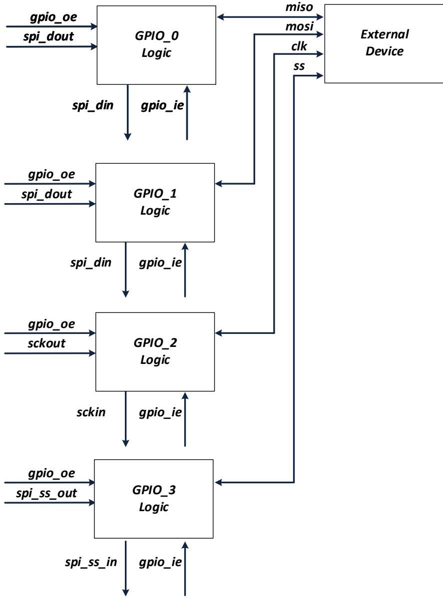  
图19-2SPI 接口全双工模式互连框图

从上图可知，GPIO若配置为输出，则SPI 接口可发送数据；GPIO若配置为输入，则SPI 接口可接收数据。

## 19.3.2.2 半双工模式

SPI 接口可配置为半双工模式。此时，数据传输只需要一根数据线。数据信号的变化，发生在时钟信号的边沿，即同步于时钟信号。一次传输只能是一个方向的，要不就是发送，要不就是接收。

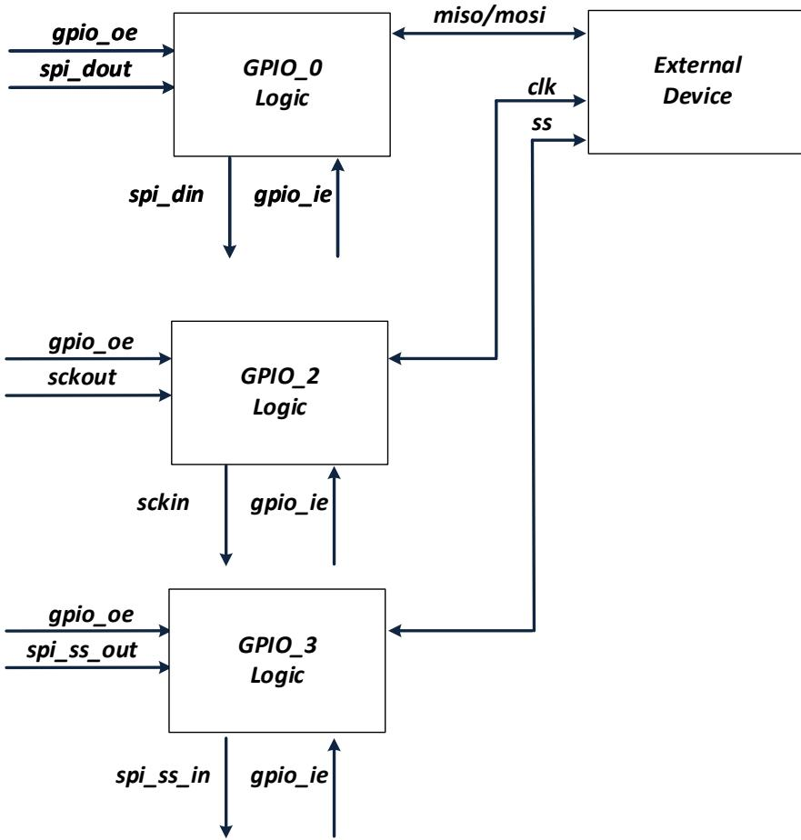  
图19-3SPI 接口半双工模式互连框图

注意，上图中若本接口做 Master，则 clk 为本接口的输出信号；若本接口做 Slave，则 clk 为本接口的输入信号。

## 仅发送

SPI\_CFG. DUPLEX 配置为 2，半双工发送模式有效。此时，本接口只能发送数据。GPIO\_0 的 oe使能，发送spi\_dout数据到外界；GPIO\_0的ie关闭，spi\_din恒定输入为0。此模式下，支持Master/Slave模式下的发送。

## 仅接收

SPI\_CFG. DUPLEX 配置为 3，半双工接收模式有效。此时，本接口只能接收数据。GPIO\_0 的 oe关闭，spi\_dout 无法发送数据到外界；GPIO\_0 的 ie 开启，spi\_din 接收来自外部的数据。此模式下，支持 Master/Slave 模式下的接收。

注意，全双工下是两个 GPIO 用于数据传输，半双工下可从中任意选一个 GPIO 用于数据传输。

## 19.3.2.3 片选信号

本接口做Slave 模式时，片选信号可选，SPI\_CFG.CS 决定片选来源。ss 为Master 设备发出的选通使能信号，低电平有效。

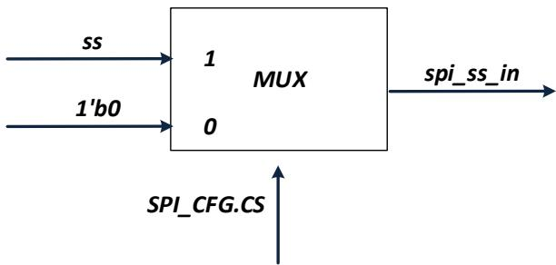  
图 19-4 SPI 模块 Slave 模式片选信号选择

本接口做Master模式时，片选信号亦可选。模块硬件产生了标准的片选信号，实际应用可屏蔽此信号通过软件操作额外的 GPIO实现。

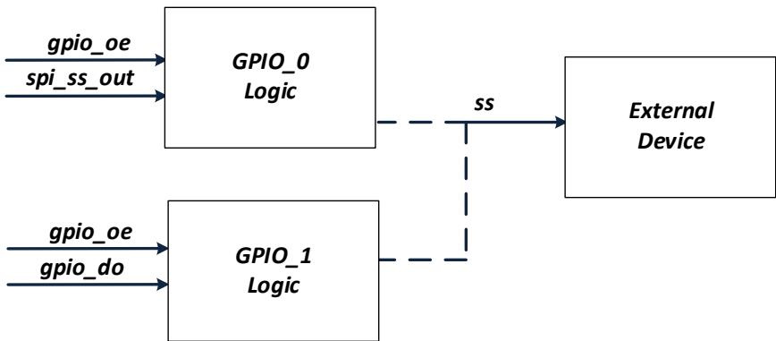  
图 19-5 SPI 模块 Master 模式片选信号选择

注意，图16-5 虚线仅表示不确定。若使用 spi\_ss\_out 为 ss 的源头，那么将 GPIO\_0 同外界设备互连；若使用软件操作GPIO的方式，那么可将GPIO\_1同外界设备互连。

## 19.3.2.4 通讯格式

在SPI通讯过程中，发送或者接收操作均是基于 SPI时钟的。通讯格式受到SPI\_CFG. SAMPLE 和SPI\_ CLK\_POL 控制。SPI\_CFG. SAMPLE 为 Phase 控制位，SPI\_ CLK\_POL 为 Polarity 控制位。

Polarity 控制了 SPI 时钟信号在默认情况下的电平状态。Polarity 为 0 时，默认时钟电平为低电平；Polarity为1时，默认电平为高电平。

Phase 控制了 SPI 数据的发送/接收时刻。Phase 为 0 时，时钟从默认电平到第一个跳变边沿为采样数据时刻，Phase 为1 时，时钟从默认电平到第一个跳变边沿为发送数据时刻。

## 19.3.2.5 数据格式及长度

SPI 数据传输格式分成两种：MSB和 LSB。数据传输格式受到SPI\_CFG.ENDIAN 控制。注意，在数据传输过程中硬件自动实现传输格式的转换，无需软件转换。

SPI 数据字节长度可配，范围是从 8-Bit 到 16-Bit。SPI\_SIZE.BITSIZE 控制长度。

## 19.3.2.6 DMA 传输

在大容量数据传输应用下，SPI 接口支持DMA传输，减轻MCU 的负担。一次传输，最大传输量为由 DMA 模块决定，最小传输量为 1 字节。在全双工模式下，接收和发送均可实现 DMA传输；在

半双工模式下，仅接收或发送实现 DMA传输。

在接收到新的数据后，硬件自动产生DMA 请求，通过 DMA 模块将数据搬移到 RAM 中。在发送新数据前，硬件自动产生 DMA 请求，通过 DMA 模块将数据从 RAM 中搬移到 SPI 接口。因 SPI 无FIFO，SPI 发送一次 DMA 请求，DMA 只能搬移一个字节数据。若要实现多字节搬移，DMA 需配置为多轮搬移，每一轮搬移一个字节的方式。

DMA传输需要配置DMA模块相应寄存器。

因SPI接口支持DMA 传输，也支持MCU 传输。两者区别在于--DMA传输，发送的数据来自 DMA的搬移；MCU 传输，发送的数据来自 MCU的搬移。

DMA传输，推荐软件配置流程如下：

⚫ 初始化 DMA 模块，将本次发送的数据来源，接收的数据去向配置好，传输长度配置完毕。

⚫ 初始化 GPIO 模块，将 SPI 复用的 GPIO 配置完毕。

⚫ 初始化 SPI 接口，SPI\_IE/SPI\_CFG/SPI\_BAUD/SPI\_SIZE 等寄存器配置完毕。

触发 SPI 接口，进入发送/接收状态。触发条件是 MCU 对 SPI\_TXDATA 寄存器执行写操作，因最终发送的数据来自 DMA，本次MCU写入的数据不会混入 SPI发送流程。

## 19.3.2.7 MCU 传输

一次只能发送/接收一个SPI\_SIZE.BITSIZE 长度的数据，每次完成后需要通过中断或者轮询的方式判断传输是否完成。无论是主模式还是从模式，写 SPI\_TXDATA 寄存器，才能触发传输。主模式为主动发送，从模式为加载数据到发送队列等待主模式发出时钟信号，开始传输。推荐软件配置流程如下:

⚫ 初始化GPIO模块，将SPI复用的GPIO配置完毕。

⚫ 初始化 SPI 接口，SPI\_IE/SPI\_CFG/SPI\_BAUD/SPI\_SIZE 等寄存器配置完毕。

MCU 对 SPI\_TXDATA 寄存器执行写操作，触发 SPI 接口进入发送流程。从模式下，数据加载到内部状态机等待主设备发起读取操作；主模式下，触发发送。

注意：若需要连续发送，则需要重新配置 SPI\_TXDATA 寄存器，并且配置 SPI\_TXDATA 寄存器时需要保证此时的CS信号为高。通过中断或者轮询方式获得传输完毕信息。

## 19.3.2.8 中断处理

SPI 接口包含三种类型的中断事件，分别是：数据传输完成事件，异常事件和溢出事件。

⚫ 数据完成事件，当前数据传输完成。高电平有效，对 SPI\_IE.CMPLT\_IF写 1清除。

⚫ 异常事件，SPI接口为Slave 模式，若在传输过程中片选信号受到干扰，被拉高，将产生片选异常事件。高电平有效，对SPI\_IE.AB\_IF写1 清除。

⚫ 溢出事件，SPI\_RX\_DATA寄存器数据没有及时被读走，，将产生溢出事件。高电平有效，对SPI\_IE.OV\_IF 写 1 清除。

上述事件，默认是不触发SPI 中断，可以通过配置SPI\_IE[7:4]使能事件产生中断。

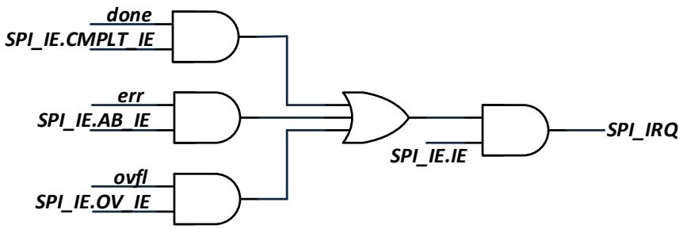  
图19-6SPI 模块中断选信号产生图

## 19.3.2.9 波特率设置

SPI 接口时钟通过对系统时钟分频获得，分频系数来自 SPI\_BAUD. BAUD。SPI传输波特率配置计算公式为：

$$
\mathrm{SPI} \text {传输波特率} = \text {系统时钟} / (2 ^ {*} (\mathrm{BAUD} + 1))
$$

SPI 协议为半拍协议，上升沿发送数据，下降沿采集数据；或者下降沿发送数据，上升沿采样数据。

SPI 接口采用同步设计，需要对外部设备的信号进行同步采样，同步时钟为系统时钟。数据和时钟信号（此时为Slave 模式）的同步，需要两拍系统时钟。考虑到时钟相位的偏移，此时需要一拍系统时钟的冗余，由此推导出最快的 SPI 传输波特率为系统时钟的 1/8，高电平周期为四拍系统时钟，低电平周期为四拍系统时钟。因此，SPI\_BAUD. BAUD 的配置值不能小于3。

## 19.4 寄存器

## 19.4.1 地址分配

SPI0 模块寄存器的基地址是 0x4001\_A800，SPI1 模块寄存器的基地址是 0x4001\_AC00。列表如下。

表19-1SPI 模块控制寄存器列表

<table><tr><td>名称</td><td>偏移</td><td>说明</td></tr><tr><td>SPIx_CFG</td><td>0x00</td><td>SPI 配置寄存器</td></tr><tr><td>SPIx_IE</td><td>0x04</td><td>SPI 中断寄存器</td></tr><tr><td>SPIx_BAUD</td><td>0x08</td><td>SPI 波特率寄存器</td></tr><tr><td>SPIx_TXDATA</td><td>0x0C</td><td>SPI 发送数据寄存器</td></tr><tr><td>SPIx_RXDATA</td><td>0x10</td><td>SPI 接收数据寄存器</td></tr><tr><td>SPIx_BITSIZE</td><td>0x14</td><td>SPI 传输数据字节长度寄存器</td></tr></table>

## 19.4.2 SPIx\_CFG SPI 控制寄存器

地址分别是：0x4001\_A800，0x4001\_AC00

复位值：0x0

表 19-2 系统控制寄存器 SPI\_CFG

<table><tr><td colspan="7">15 14 13 12 11 10 9 8 7 6 5 4 3 2 1 0</td><td></td></tr><tr><td rowspan="3"></td><td>DUPLEX</td><td>CS</td><td>MS</td><td>CPHA</td><td>CPOL</td><td>ENDIAN</td><td>EN</td></tr><tr><td>RW</td><td>RW</td><td>RW</td><td>RW</td><td>RW</td><td>RW</td><td>RW</td></tr><tr><td>0</td><td>1</td><td>0</td><td>0</td><td>0</td><td>0</td><td>0</td></tr></table>

<table><tr><td>位置</td><td>位名称</td><td>说明</td></tr><tr><td>[31:8]</td><td></td><td>未使用</td></tr><tr><td>[7:6]</td><td>DUPLEX</td><td>半双工模式设置0X:关闭半双工模式10:开启半双工模式,仅发送11:开启半双工模式,仅接收</td></tr><tr><td>[5]</td><td>CS</td><td>SPI从设备下,片选信号来源。默认值为1。0:Slave模式下,片选信号恒为有效值--01:Slave模式下,片选信号来自Master设备</td></tr><tr><td>[4]</td><td>MS</td><td>SPI主从模式选择。默认值为0。0:Slave模式1:Master模式</td></tr><tr><td>[3]</td><td>CPHA</td><td>SPI相位选择。默认值为0。0:Phase为01:Phase为1</td></tr><tr><td>[2]</td><td>CPOL</td><td>SPI极性选择。默认值为0。0:Polarity为01:Polarity为1</td></tr><tr><td>[1]</td><td>ENDIAN</td><td>SPI模块传输顺序。默认值为0。0:MSB,高位先传输1:LSB,低位先传输</td></tr><tr><td>[0]</td><td>EN</td><td>SPI模块使能信号。默认值为0。0:关闭SPI模块1:开启SPI模块</td></tr></table>

## 19.4.3 SPI\_IE SPI 中断寄存器

地址分别是：0x4001\_A804，0x4001\_AC04

复位值：0x0

表 19-3 SPI\_IE 中断寄存器

<table><tr><td>15</td><td>14</td><td>13</td><td>12</td><td>11</td><td>10</td><td>9</td><td>8</td><td>7</td><td>6</td><td>5</td><td>4</td><td>3</td><td>2</td><td>1</td><td>0</td></tr><tr><td rowspan="3" colspan="8"></td><td>IE</td><td>CMPLT_IE</td><td>AB_IE</td><td>OV_IE</td><td>TRANS_TRIG</td><td>CMPLT_IF</td><td>AB_IF</td><td>OV_IF</td></tr><tr><td>RW</td><td>RW</td><td>RW</td><td>RW</td><td>RW</td><td>RW</td><td>RW</td><td>RW</td></tr><tr><td>0</td><td>0</td><td>0</td><td>0</td><td>0</td><td>0</td><td>0</td><td>0</td></tr></table>

<table><tr><td>位置</td><td>位名称</td><td>说明</td></tr><tr><td>[31:8]</td><td></td><td>未使用</td></tr><tr><td>[7]</td><td>IE</td><td>SPI中断使能开关。默认值为0。0:关闭SPI中断1:使能SPI中断</td></tr><tr><td>[6]</td><td>CMPLT_IE</td><td>SPI传输,完成事件中断使能信号。0:屏蔽此中断源1:使能此中断源</td></tr><tr><td>[5]</td><td>AB_IE</td><td>SPI传输,异常事件中断使能信号。0:屏蔽此中断源1:使能此中断源</td></tr><tr><td>[4]</td><td>OV_IE</td><td>SPI传输,溢出事件中断使能信号。默认值为0。0:屏蔽此中断源1:使能此中断源</td></tr><tr><td>[3]</td><td>TRANS_TRIG</td><td>传输触发选择。1:外部触发0:内部自动执行。仅主模式有效</td></tr><tr><td>[2]</td><td>CMPLT_IF</td><td>SPI传输,完成事件。高电平有效,写1清除。</td></tr><tr><td>[1]</td><td>AB_IF</td><td>SPI传输,异常事件。Slave模式下,传输未完成,发生片选信号无效事件。高电平有效,写1清除。</td></tr><tr><td>[0]</td><td>OV_IF</td><td>SPI传输,溢出事件。前次接收的旧数据没有被取走,本次接收的新数据已经到达。高电平有效,写1清除。</td></tr></table>

## 19.4.4 SPI\_BAUD SPI 波特率寄存器

地址分别是：0x4001\_A808，0x4001\_AC08

复位值：0x0

表 19-4 SPI\_BAUD 控制寄存器

<table><tr><td>15</td><td>14</td><td>13</td><td>12</td><td>11</td><td>10</td><td>9</td><td>8</td><td>7</td><td>6</td><td>5</td><td>4</td><td>3</td><td>2</td><td>1</td><td>0</td></tr><tr><td>TRANS_MODE</td><td colspan="3" rowspan="3"></td><td colspan="12">BAUD</td></tr><tr><td>RW</td><td colspan="12">RW</td></tr><tr><td>0</td><td colspan="12">0</td></tr><tr><td>位置</td><td>位名称</td><td colspan="14">说明</td></tr><tr><td>[15]</td><td>TRANS_MODE</td><td colspan="14">SPI 数据搬移方式。默认为 0,DMA 方式。0: SPI 接口支持 DMA 搬移数据到 SPI 接口,完成发送和接收。1: SPI 接口支持 MCU 搬移数据到 SPI 接口,完成发送和接收。</td></tr><tr><td>[14:12]</td><td>--</td><td colspan="14">--</td></tr><tr><td>[11:0]</td><td>BAUD</td><td colspan="14">SPI 传输波特率配置,SPI 实际传输速度计算公式为:SPI 传输速度 = 系统时钟 / (2*(BAUD + 1))切记,BAUD 的配置值不能小于 3。</td></tr></table>

## 19.4.5 SPI\_TXDATA SPI 数据发送寄存器

地址分别是：0x4001\_A80C，0x4001\_AC0C

复位值：0x0

表 19-5 SPI\_TXDATA 数据发送寄存器

<table><tr><td>15</td><td>14</td><td>13</td><td>12</td><td>11</td><td>10</td><td>9</td><td>8</td><td>7</td><td>6</td><td>5</td><td>4</td><td>3</td><td>2</td><td>1</td><td>0</td></tr><tr><td colspan="16">TX_DATA</td></tr><tr><td colspan="16">RW</td></tr><tr><td colspan="16">0</td></tr></table>

<table><tr><td>位置</td><td>位名称</td><td>说明</td></tr><tr><td>[31:16]</td><td></td><td>未使用</td></tr><tr><td>[15:0]</td><td>TX_DATA</td><td>SPI 数据发送寄存器</td></tr></table>

## 19.4.6 SPI\_RXDATA SPI 数据接收寄存器

地址分别是：0x4001\_A810，0x4001\_AC10

复位值：0x0

表 19-6 SPI\_RXDATA 数据接收寄存器

<table><tr><td>15</td><td>14</td><td>13</td><td>12</td><td>11</td><td>10</td><td>9</td><td>8</td><td>7</td><td>6</td><td>5</td><td>4</td><td>3</td><td>2</td><td>1</td><td>0</td></tr><tr><td colspan="16">RX_DATA</td></tr><tr><td colspan="16">RW</td></tr><tr><td colspan="16">0</td></tr></table>

<table><tr><td>位置</td><td>位名称</td><td>说明</td></tr><tr><td>[31:16]</td><td></td><td>未使用</td></tr><tr><td>[15:0]</td><td>RX_DATA</td><td>SPI 数据接收寄存器</td></tr></table>

## 19.4.7 SPI\_SIZE SPI 数据字节长度寄存器

地址分别是：0x4001\_A814，0x4001\_AC14

复位值：0x0

表 19-7 SPI\_BITSIZE 数据字节长度寄存器

<table><tr><td rowspan="3" colspan="11">15 14 13 12 11 10 9 8 7 6 5 4 3 2 1 0</td><td>BITSIZE</td></tr><tr><td>RW</td></tr><tr><td>0</td></tr></table>

<table><tr><td>位置</td><td>位名称</td><td>说明</td></tr><tr><td>[31:8]</td><td></td><td>未使用</td></tr><tr><td>[4:0]</td><td>BITSIZE</td><td>字节长度寄存器。0x00:非法值0x07:非法值0x08:8-Bit0x09:9-Bit...0x0E:14-Bit0x0F:15-Bit0x10:16-Bit</td></tr></table>

## 20 CMP 比较器

## 20.1 概述

比较器信号处理模块(以下简称 CMP 模块，为便于区分后续图示中模拟比较器使用 Comparator表示，数字CMP 模块使用CMP 表示)，用于处理6 个模拟轨到轨比较器产生的输出信号，由一系列使能、极性控制、滤波等数字电路组成。信号处理时钟由系统主时钟分频得到，此模块也用于向CPU产生比较器中断。

CMP0/1 可以使用 MCPWM0 的 4 路 P 通道进行开窗控制，CMP2/3 可以使用 MCPWM1 的 4 路P 通道信号进行开窗控制，CMP4/5 既可以使用 MCPWM0，也可以使用 MCPWM1 的 4 路 P 通道信号进行开窗控制。

模拟比较器未经滤波的原始输出值，可以通过读取 CMP\_DATA 值获得。同时模拟比较器未经滤波的原始输出值也可以通过配置 GPIO的第二功能送出，具体GPIO第二功能配置及引进位置，请参考器件 datasheet。

关于模拟比较器的更多说明，包括其输入端信号的选择，迟滞的配置，请参考章节 5.1.6。

## 20.2 寄存器

## 20.2.1 地址分配

CMP 模块寄存器的基地址是 0x4001\_3000，寄存器列表如下:

表 20-1 比较器寄存器列表

<table><tr><td>名称</td><td>偏移地址</td><td>说明</td></tr><tr><td>CMP_IE</td><td>0x00</td><td>比较器中断使能寄存器</td></tr><tr><td>CMP_IF</td><td>0x04</td><td>比较器中断标志寄存器</td></tr><tr><td>CMP_TCLK</td><td>0x08</td><td>比较器分频时钟控制寄存器</td></tr><tr><td>CMP_CFG</td><td>0x0C</td><td>比较器控制寄存器</td></tr><tr><td>CMP_BLCWIN0</td><td>0x10</td><td>比较器开窗控制寄存器 0</td></tr><tr><td>CMP_BLCWIN1</td><td>0x14</td><td>比较器开窗控制寄存器 1</td></tr><tr><td>CMP_DATA</td><td>0x18</td><td>比较器输出数值寄存器</td></tr></table>

## 20.2.2 CMP\_IE 中断使能寄存器

地址：0x4001\_3000

复位值：0x0

表 20-2 比较器中断使能寄存器 CMP\_IE

<table><tr><td>15</td><td>14</td><td>13</td><td>12</td><td>11</td><td>10</td><td>9</td><td>8</td><td>7</td><td>6</td><td>5</td><td>4</td><td>3</td><td>2</td><td>1</td><td>0</td></tr></table>

<table><tr><td rowspan="3"></td><td>CMP5_RE</td><td>CMP4_RE</td><td>CMP3_RE</td><td>CMP2_RE</td><td>CMP1_RE</td><td>CMP0_RE</td><td rowspan="3"></td><td>CMP5_IE</td><td>CMP4_IE</td><td>CMP3_IE</td><td>CMP2_IE</td><td>CMP1_IE</td><td>CMP0_IE</td></tr><tr><td>RW</td><td>RW</td><td>RW</td><td>RW</td><td>RW</td><td>RW</td><td>RW</td><td>RW</td><td>RW</td><td>RW</td><td>RW</td><td>RW</td></tr><tr><td>0</td><td>0</td><td>0</td><td>0</td><td>0</td><td>0</td><td>0</td><td>0</td><td>0</td><td>0</td><td>0</td><td>0</td></tr></table>

<table><tr><td>位置</td><td>位名称</td><td>说明</td></tr><tr><td>[31:14]</td><td></td><td>未使用</td></tr><tr><td>[13]</td><td>CMP5_RE</td><td>比较器 5 DMA 请求使能,高有效</td></tr><tr><td>[12]</td><td>CMP4_RE</td><td>比较器 4 DMA 请求使能,高有效</td></tr><tr><td>[11]</td><td>CMP3_RE</td><td>比较器 3 DMA 请求使能,高有效</td></tr><tr><td>[10]</td><td>CMP2_RE</td><td>比较器 2 DMA 请求使能,高有效</td></tr><tr><td>[9]</td><td>CMP1_RE</td><td>比较器 1 DMA 请求使能,高有效</td></tr><tr><td>[8]</td><td>CMP0_RE</td><td>比较器 0 DMA 请求使能,高有效</td></tr><tr><td>[7:6]</td><td></td><td>未使用</td></tr><tr><td>[5]</td><td>CMP5_IE</td><td>比较器 5 中断使能,高有效</td></tr><tr><td>[4]</td><td>CMP4_IE</td><td>比较器 4 中断使能,高有效</td></tr><tr><td>[3]</td><td>CMP3_IE</td><td>比较器 3 中断使能,高有效</td></tr><tr><td>[2]</td><td>CMP2_IE</td><td>比较器 2 中断使能,高有效</td></tr><tr><td>[1]</td><td>CMP1_IE</td><td>比较器 1 中断使能,高有效</td></tr><tr><td>[0]</td><td>CMP0_IE</td><td>比较器 0 中断使能,高有效</td></tr></table>

由于CMP 信号可能是一个慢速的电平信号，在使用CMP 触发 DMA时，推荐将中断触发类型选择为上升沿触发。

## 20.2.3 CMP\_IF 中断标志寄存器

地址：0x4001\_3004

复位值：0x0

表 20-3 比较器中断标志寄存器 CMP\_IF

<table><tr><td colspan="6">15 14 13 12 11 10 9 8 7 6 5 4 3 2 1 0</td><td></td></tr><tr><td rowspan="3"></td><td>CMP5_IF</td><td>CMP4_IF</td><td>CMP3_IF</td><td>CMP2_IF</td><td>CMP1_IF</td><td>CMP0_IF</td></tr><tr><td>RW</td><td>RW</td><td>RW</td><td>RW</td><td>RW</td><td>RW</td></tr><tr><td>0</td><td>0</td><td>0</td><td>0</td><td>0</td><td>0</td></tr></table>

<table><tr><td>位置</td><td>位名称</td><td>说明</td></tr><tr><td>[31:6]</td><td></td><td>未使用</td></tr><tr><td>[5]</td><td>CMP5_IF</td><td>比较器 5 中断标志,高有效,写 1 清零</td></tr><tr><td>[4]</td><td>CMP4_IF</td><td>比较器 4 中断标志,高有效,写 1 清零</td></tr><tr><td>[3]</td><td>CMP3_IF</td><td>比较器 3 中断标志,高有效,写 1 清零</td></tr><tr><td>[2]</td><td>CMP2_IF</td><td>比较器 2 中断标志,高有效,写 1 清零</td></tr><tr><td>[1]</td><td>CMP1_IF</td><td>比较器 1 中断标志,高有效,写 1 清零</td></tr><tr><td>[0]</td><td>CMP0_IF</td><td>比较器 0 中断标志,高有效,写 1 清零</td></tr></table>

## 20.2.4 CMP\_TCLK 分频时钟控制寄存器

地址：0x4001\_3008

复位值：0x0

表 20-4 比较器分频时钟控制寄存器 CMP\_TCLK

<table><tr><td rowspan="3"></td><td>FIL_CLK54_DIV16</td><td>CLK54_EN</td><td>FIL_CLK54_DIV2</td></tr><tr><td>RW</td><td>RW</td><td>RW</td></tr><tr><td>0</td><td>0</td><td>0</td></tr></table>

<table><tr><td>FIL_CLK32_DIV16</td><td>CLK32_EN</td><td>FIL_CLK32_DIV2</td><td>FIL_CLK10_DIV16</td><td>CLK10_EN</td><td>FIL_CLK10_DIV2</td></tr><tr><td>RW</td><td>RW</td><td>RW</td><td>RW</td><td>RW</td><td>RW</td></tr><tr><td>0</td><td>0</td><td>0</td><td>0</td><td>0</td><td>0</td></tr></table>

<table><tr><td>位置</td><td>位名称</td><td>说明</td></tr><tr><td>[31:24]</td><td></td><td>未使用</td></tr><tr><td>[23:20]</td><td>FIL_CLK54_DIV16</td><td>比较器 5/4 滤波时钟分频,基于 MCLK 进行 1~16 分频,影响进入比较器中断的时间</td></tr><tr><td>[19]</td><td>CLK54_EN</td><td>比较器 5/4 时钟使能,高有效</td></tr><tr><td>[18:16]</td><td>FIL_CLK54_DIV2</td><td>比较器 5/4 滤波时钟分频,3'h0:1 分频,3'h1:2 分频,3'h2:4 分频,3'h3:8 分频,3'h4:16 分频,3'h5:32 分频,3'h6:64 分频,3'h7:128 分频</td></tr><tr><td>[15:12]</td><td>FIL_CLK32_DIV16</td><td>比较器 3/2 滤波时钟分频,基于 MCLK 进行 1~16 分频,影响进入比较器中断的时间</td></tr><tr><td>[11]</td><td>CLK32_EN</td><td>比较器 3/2 时钟使能,高有效</td></tr><tr><td>[10:8]</td><td>FIL_CLK32_DIV2</td><td>比较器 3/2 滤波时钟分频, 3'h0:1 分频, 3'h1:2 分频, 3'h2:4 分频, 3'h3:8 分频, 3'h4:16 分频, 3'h5:32 分频, 3'h6:64 分频, 3'h7:128 分频</td></tr><tr><td>[7:4]</td><td>FIL_CLK10_DIV16</td><td>比较器 1/0 滤波时钟分频, 基于 MCLK 进行 1~16 分频, 影响进入比较器中断的时间</td></tr><tr><td>[3]</td><td>CLK10_EN</td><td>比较器 1/0 滤波时钟使能, 高有效</td></tr><tr><td>[2:0]</td><td>FIL_CLK10_DIV2</td><td>比较器 1/0 滤波时钟分频, 3'h0:1 分频, 3'h1:2 分频, 3'h2:4 分频, 3'h3:8 分频, 3'h4:16 分频, 3'h5:32 分频, 3'h6:64 分频, 3'h7:128 分频</td></tr></table>

CMP 滤波时钟频率

Freq(CMP\_Filter) = Freq(MCLK)/2CMP\_TCLK.FIL\_CLK\_DIV2/(CMP\_TCLK.FIL\_CLK\_DIV16+1)，其中 MCLK为系统的主时钟。需要注意的是，产生CMP 滤波时钟需要使能 CMP\_TCLK.CLK\_EN 位。

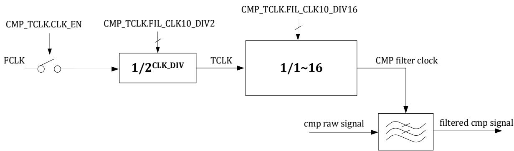  
图 20-1 比较器滤波时钟产生

CMP 模块使用此滤波时钟对模拟比较器的输出信号进行 16 时钟周期长的滤波，即只有信号稳定时间超过 16 个滤波时钟周期才能通过滤波器，CMP 模块输出的滤波后的信号才会发生变化，如果输入信号稳定时间不足 16 个滤波时钟周期即发生变化，则 CMP 模块输出的滤波后的信号维持原值不变。即滤波宽度=滤波时钟周期\*16。

因为滤波时钟可以进行分频，因此CMP信号的滤波宽度范围是1\*1\*16\~128\*16\*16个总线周期，即 16\~32768 个总线周期。

## 20.2.5 CMP\_CFG 控制寄存器

地址：0x4001\_300C

复位值：0x0

表 20-5 比较器控制寄存器 CMP\_CFG

<table><tr><td>31</td><td>30</td><td>29</td><td>28</td><td>27</td><td>26</td><td>25</td><td>24</td><td>23</td><td>22</td><td>21</td><td>20</td><td>19</td><td>18</td><td>17</td><td>16</td></tr><tr><td></td><td></td><td></td><td></td><td></td><td></td><td></td><td></td><td>CMP5_W_PWM_POL</td><td>CMP5_IRQ_TRIG</td><td>CMP5_IN_EN</td><td>CMP5_POL</td><td>CMP4_W_PWM_POL</td><td>CMP4_IRQ_TRIG</td><td>CMP4_IN_EN</td><td>CMP4_POL</td></tr><tr><td colspan="8" rowspan="2"></td><td>RW</td><td>RW</td><td>RW</td><td>RW</td><td>RW</td><td>RW</td><td>RW</td><td>RW</td></tr><tr><td>0</td><td>0</td><td>0</td><td>0</td><td>0</td><td>0</td><td>0</td><td>0</td></tr><tr><td>15</td><td>14</td><td>13</td><td>12</td><td>11</td><td>10</td><td>9</td><td>8</td><td>7</td><td>6</td><td>5</td><td>4</td><td>3</td><td>2</td><td>1</td><td>0</td></tr><tr><td>CMP3_W_PWM_POL</td><td>CMP3_IRQ_TRIG</td><td>CMP3_IN_EN</td><td>CMP3_POL</td><td>CMP2_W_PWM_POL</td><td>CMP2_IRQ_TRIG</td><td>CMP2_IN_EN</td><td>CMP2_POL</td><td>CMP1_W_PWM_POL</td><td>CMP1_IRQ_TRIG</td><td>CMP1_IN_EN</td><td>CMP1_POL</td><td>CMP0_W_PWM_POL</td><td>CMP0_IRQ_TRIG</td><td>CMP0_IN_EN</td><td>CMP0_POL</td></tr><tr><td>RW</td><td>RW</td><td>RW</td><td>RW</td><td>RW</td><td>RW</td><td>RW</td><td>RW</td><td>RW</td><td>RW</td><td>RW</td><td>RW</td><td>RW</td><td>RW</td><td>RW</td><td>RW</td></tr><tr><td>0</td><td>0</td><td>0</td><td>0</td><td>0</td><td>0</td><td>0</td><td>0</td><td>0</td><td>0</td><td>0</td><td>0</td><td>0</td><td>0</td><td>0</td><td>0</td></tr></table>

<table><tr><td>位置</td><td>位名称</td><td>说明</td></tr><tr><td>[31:24]</td><td></td><td>未使用</td></tr><tr><td>[23]</td><td>CMP5_W_PWM_POL</td><td>比较器5开窗PWM信号极性选择,在CMP_BLCWIN1使能情况下使用</td></tr><tr><td>[22]</td><td>CMP5_IRQ_TRIG</td><td>比较器5中断触发类型,0:电平触发,1:上升沿触发</td></tr><tr><td>[21]</td><td>CMP5_IN_EN</td><td>比较器5信号输入使能</td></tr><tr><td>[20]</td><td>CMP5_POL</td><td>比较器5极性选择,0:高电平有效;1:低电平有效</td></tr><tr><td>[19]</td><td>CMP4_W_PWM_POL</td><td>比较器4开窗PWM信号极性选择,在CMP_BLCWIN1使能情况下使用</td></tr><tr><td>[18]</td><td>CMP4_IRQ_TRIG</td><td>比较器4中断触发类型,0:电平触发,1:上升沿触发</td></tr><tr><td>[17]</td><td>CMP4_IN_EN</td><td>比较器4信号输入使能</td></tr><tr><td>[16]</td><td>CMP4_POL</td><td>比较器4极性选择,0:高电平有效;1:低电平有效</td></tr><tr><td>[15]</td><td>CMP3_W_PWM_POL</td><td>比较器3开窗PWM信号极性选择,在CMP_BLCWIN0使能情况下使用</td></tr><tr><td>[14]</td><td>CMP3_IRQ_TRIG</td><td>比较器3中断触发类型,0:电平触发,1:上升沿触发</td></tr><tr><td>[13]</td><td>CMP3_IN_EN</td><td>比较器3信号输入使能</td></tr><tr><td>[12]</td><td>CMP3_POL</td><td>比较器3极性选择,0:高电平有效;1:低电平有效</td></tr><tr><td>[11]</td><td>CMP2_W_PWM_POL</td><td>比较器2开窗PWM信号极性选择,在CMP_BLCWIN0使能情况下使用</td></tr><tr><td>[10]</td><td>CMP2_IRQ_TRIG</td><td>比较器2中断触发类型,0:电平触发,1:上升沿触发</td></tr><tr><td>[9]</td><td>CMP2_IN_EN</td><td>比较器2信号输入使能</td></tr><tr><td>[8]</td><td>CMP2_POL</td><td>比较器2极性选择,0:高电平有效;1:低电平有效</td></tr><tr><td>[7]</td><td>CMP1_W_PWM_POL</td><td>比较器1开窗PWM信号极性选择,在CMP_BLCWIN0使能情况下使用</td></tr><tr><td>[6]</td><td>CMP1_IRQ_TRIG</td><td>比较器1中断触发类型,0:电平触发,1:上升沿触发</td></tr><tr><td>[5]</td><td>CMP1_IN_EN</td><td>比较器1信号输入使能</td></tr><tr><td>[4]</td><td>CMP1_POL</td><td>比较器1极性选择,0:高电平有效;1:低电平有效</td></tr><tr><td>[3]</td><td>CMP0_W_PWM_POL</td><td>比较器0开窗PWM信号极性选择,在CMP_BLCWIN0使能情况下使用</td></tr><tr><td>[2]</td><td>CMP0_IRQ_TRIG</td><td>比较器0中断触发类型,0:电平触发,1:上升沿触发</td></tr><tr><td>[1]</td><td>CMP0_IN_EN</td><td>比较器0信号输入使能</td></tr></table>

<table><tr><td>[0]</td><td>CMP0_POL</td><td>比较器 0 极性选择,0:高电平有效;1:低电平有效</td></tr></table>

以比较器0/1为例，其极性及使能控制如图20-2 所示。

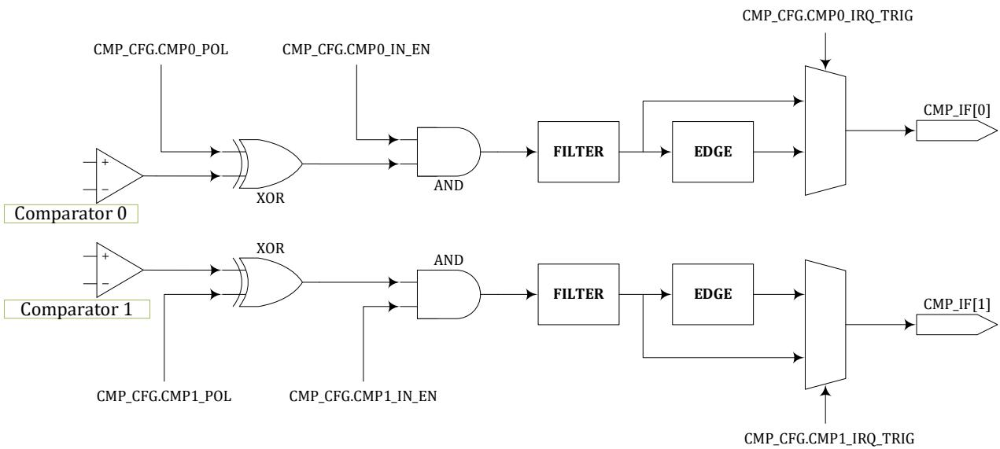  
图 20-2比较器控制及中断产生逻辑(以CMP0/1为例)

比较器模块与MCPWM 模块可以联合动作，其中MCPWM模块的P管控制信号可以作为比较器开窗的控制信号。但比较器自身的中断信号产生于开窗控制无关，仅仅受CMP\_CFG寄存器影响。

MCPWM 的fail信号可以来自GPIO，也可以来自比较器模块，使用MCPWM\_FAIL寄存器进行控制。如果 MCPWM 的 fail 信号来自比较器，则是经过比较器模块内部的开窗控制的。fail 信号进入MCPWM 后也会进行极性使能以及滤波等处理，与比较器模块类似但完全独立，由 MCPWM 内部的寄存器进行控制。MCPWM 内部与 fail 相关的错误中断信号产生收到 MCPWM 内部有关极性使能滤波控制寄存器的影响。具体请参考MCPWM 章节。

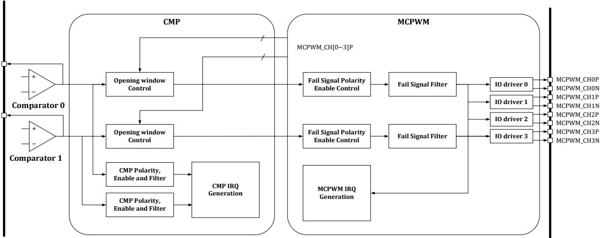  
图 20-3 CMP 与 MCPWM 的联动

对于比较器的开窗功能，若 CMP\_CFG.CMP0\_PWM\_POL=1，则在对应 MCPWM CHNx\_P 信号为 1时，比较器0可以产生比较信号输出，其他时刻比较信号为0；反之，若CMP\_CFG.CMP0\_PWM\_POL=0，则在对应MCPWM CHNx\_P 信号为0时，比较器0可以产生比较信号输出，其他时刻比较信号为0。

比较器1的开窗控制信号极性由 CMP\_CFG.CMP1\_PWM\_POL 位进行控制，逻辑相同。

注意：CMP\_CFG.CMP0\_PWM\_POL 和 CMP\_CFG.CMP1\_PWM\_POL 同时会影响送入 MCPWM 模块作为 FAIL信号的比较器信号，如图20-4 所示。来自比较器的MCPWM FAIL信号为模拟比较器输出的原始信号，未经过比较器数字接口模块的滤波处理，但是可以被 MCPWM 的通道信号进行开窗控制，开窗控制设置见比较器数字接口模块。FAIL 信号进入 MCPWM 模块后，可以通过设置MCPWM\_TCLK 进行滤波。

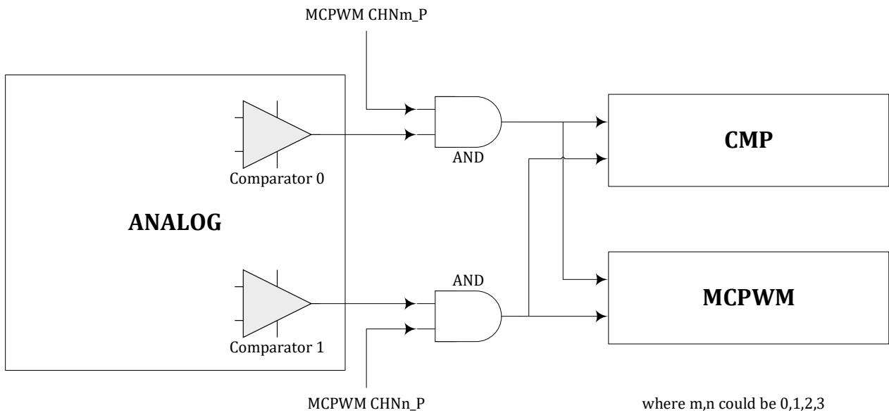  
图 20-4比较器开窗功能图示

## 20.2.6 CMP\_BLCWIN0 开窗控制寄存器 0

地址：0x4001\_3010

复位值：0x0

表 20-6 比较器开窗控制寄存器 0 CMP\_ BLCWIN0

<table><tr><td>15</td><td>14</td><td>13</td><td>12</td><td>11</td><td>10</td><td>9</td><td>8</td><td>7</td><td>6</td><td>5</td><td>4</td><td>3</td><td>2</td><td>1</td><td>0</td></tr><tr><td>CMP3_CHN3P_WIN_EN</td><td>CMP3_CHN2P_WIN_EN</td><td>CMP3_CHN1P_WIN_EN</td><td>CMP3_CHN0P_WIN_EN</td><td>CMP2_CHN3P_WIN_EN</td><td>CMP2_CHN2P_WIN_EN</td><td>CMP2_CHN1P_WIN_EN</td><td>CMP2_CHN0P_WIN_EN</td><td>CMP1_CHN3P_WIN_EN</td><td>CMP1_CHN2P_WIN_EN</td><td>CMP1_CHN1P_WIN_EN</td><td>CMP1_CHN0P_WIN_EN</td><td>CMPO_CHN3P_WIN_EN</td><td>CMPO_CHN2P_WIN_EN</td><td>CMPO_CHN1P_WIN_EN</td><td>CMPO_CHN0P_WIN_EN</td></tr><tr><td>RW</td><td>RW</td><td>RW</td><td>RW</td><td>RW</td><td>RW</td><td>RW</td><td>RW</td><td>RW</td><td>RW</td><td>RW</td><td>RW</td><td>RW</td><td>RW</td><td>RW</td><td>RW</td></tr><tr><td>0</td><td>0</td><td>0</td><td>0</td><td>0</td><td>0</td><td>0</td><td>0</td><td>0</td><td>0</td><td>0</td><td>0</td><td>0</td><td>0</td><td>0</td><td>0</td></tr></table>

<table><tr><td>位置</td><td>位名称</td><td>说明</td></tr><tr><td>[31:16]</td><td></td><td>保留</td></tr><tr><td>[15]</td><td>CMP3_CHN3P_WIN_EN</td><td>使用 MCPWM1 模块 CHN3_P 通道输出的 P 管开关控制信号作为比较器 3 开窗使能</td></tr><tr><td>[14]</td><td>CMP3_CHN2P_WIN_EN</td><td>使用 MCPWM1 模块 CHN2_P 通道输出的 P 管开关控制信号作为比较器 3 开窗使能</td></tr><tr><td>[13]</td><td>CMP3_CHN1P_WIN_EN</td><td>使用 MCPWM1 模块 CHN1_P 通道输出的 P 管开关控制信号作为比较器 3 开窗使能</td></tr><tr><td>[12]</td><td>CMP3_CHN0P_WIN_EN</td><td>使用 MCPWM1 模块 CHN0_P 通道输出的 P 管开关控制信号作为比较器 3 开窗使能</td></tr><tr><td>[11]</td><td>CMP2_CHN3P_WIN_EN</td><td>使用 MCPWM1 模块 CHN3_P 通道输出的 P 管开关控制信号作为比较器 2 开窗使能</td></tr><tr><td>[10]</td><td>CMP2_CHN2P_WIN_EN</td><td>使用 MCPWM1 模块 CHN2_P 通道输出的 P 管开关控制信号作为比较器 2 开窗使能</td></tr><tr><td>[9]</td><td>CMP2_CHN1P_WIN_EN</td><td>使用 MCPWM1 模块 CHN1_P 通道输出的 P 管开关控制信号作为比较器 2 开窗使能</td></tr><tr><td>[8]</td><td>CMP2_CHN0P_WIN_EN</td><td>使用 MCPWM1 模块 CHN0_P 通道输出的 P 管开关控制信号作为比较器 2 开窗使能</td></tr><tr><td>[7]</td><td>CMP1_CHN3P_WIN_EN</td><td>使用 MCPWM0 模块 CHN3_P 通道输出的 P 管开关控制信号作为比较器 1 开窗使能</td></tr><tr><td>[6]</td><td>CMP1_CHN2P_WIN_EN</td><td>使用 MCPWM0 模块 CHN2_P 通道输出的 P 管开关控制信号作为比较器 1 开窗使能</td></tr><tr><td>[5]</td><td>CMP1_CHN1P_WIN_EN</td><td>使用 MCPWM0 模块 CHN1_P 通道输出的 P 管开关控制信号作为比较器 1 开窗使能</td></tr><tr><td>[4]</td><td>CMP1_CHN0P_WIN_EN</td><td>使用 MCPWM0 模块 CHN0_P 通道输出的 P 管开关控制信号作为比较器 1 开窗使能</td></tr><tr><td>[3]</td><td>CMP0_CHN3P_WIN_EN</td><td>使用 MCPWM0 模块 CHN3_P 通道输出的 P 管开关控制信号作为比较器 0 开窗使能</td></tr><tr><td>[2]</td><td>CMP0_CHN2P_WIN_EN</td><td>使用 MCPWM0 模块 CHN2_P 通道输出的 P 管开关控制信号作为比较器 0 开窗使能</td></tr><tr><td>[1]</td><td>CMP0_CHN1P_WIN_EN</td><td>使用 MCPWM0 模块 CHN1_P 通道输出的 P 管开关控制信号作为比较器 0 开窗使能</td></tr><tr><td>[0]</td><td>CMP0_CHN0P_WIN_EN</td><td>使用 MCPWM0 模块 CHN0_P 通道输出的 P 管开关控制信号作为比较器 0 开窗使能</td></tr></table>

## 20.2.7 CMP\_BLCWIN1 开窗控制寄存器 1

地址：0x4001\_3014

复位值：0x0

表 20-7 比较器开窗控制寄存器 1 CMP\_ BLCWIN0

<table><tr><td>15</td><td>14</td><td>13</td><td>12</td><td>11</td><td>10</td><td>9</td><td>8</td><td>7</td><td>6</td><td>5</td><td>4</td><td>3</td><td>2</td><td>1</td><td>0</td></tr><tr><td>CMP5_1CHN3P_WIN_EN</td><td>CMP5_1CHN2P_WIN_EN</td><td>CMP5_1CHN1P_WIN_EN</td><td>CMP5_1CHN0P_WIN_EN</td><td>CMP5_OCHN3P_WIN_EN</td><td>CMP5_OCHN2P_WIN_EN</td><td>CMP5_OCHN1P_WIN_EN</td><td>CMP5_OCHN0P_WIN_EN</td><td>CMP4_1CHN3P_WIN_EN</td><td>CMP4_1CHN2P_WIN_EN</td><td>CMP4_1CHN1P_WIN_EN</td><td>CMP4_1CHN0P_WIN_EN</td><td>CMP4_OCHN3P_WIN_EN</td><td>CMP4_OCHN2P_WIN_EN</td><td>CMP4_OCHN1P_WIN_EN</td><td>CMP4_OCHN0P_WIN_EN</td></tr><tr><td>RW</td><td>RW</td><td>RW</td><td>RW</td><td>RW</td><td>RW</td><td>RW</td><td>RW</td><td>RW</td><td>RW</td><td>RW</td><td>RW</td><td>RW</td><td>RW</td><td>RW</td><td>RW</td></tr><tr><td>0</td><td>0</td><td>0</td><td>0</td><td>0</td><td>0</td><td>0</td><td>0</td><td>0</td><td>0</td><td>0</td><td>0</td><td>0</td><td>0</td><td>0</td><td>0</td></tr></table>

<table><tr><td>位置</td><td>位名称</td><td>说明</td></tr><tr><td>[31:16]</td><td></td><td>保留</td></tr><tr><td>[15]</td><td>CMP5_1CHN3P_WIN_EN</td><td>使用 MCPWM1 模块 CHN3_P 通道输出的 P 管开关控制信号作为比较器 5 开窗使能</td></tr><tr><td>[14]</td><td>CMP5_1CHN2P_WIN_EN</td><td>使用 MCPWM1 模块 CHN2_P 通道输出的 P 管开关控制信号作为比较器 5 开窗使能</td></tr><tr><td>[13]</td><td>CMP5_1CHN1P_WIN_EN</td><td>使用 MCPWM1 模块 CHN1_P 通道输出的 P 管开关控制信号作为比较器 5 开窗使能</td></tr><tr><td>[12]</td><td>CMP5_1CHN0P_WIN_EN</td><td>使用 MCPWM1 模块 CHN0_P 通道输出的 P 管开关控制信号作为比较器 5 开窗使能</td></tr><tr><td>[11]</td><td>CMP5_0CHN3P_WIN_EN</td><td>使用 MCPWM0 模块 CHN3_P 通道输出的 P 管开关控制信号作为比较器 5 开窗使能</td></tr><tr><td>[10]</td><td>CMP5_0CHN2P_WIN_EN</td><td>使用 MCPWM0 模块 CHN2_P 通道输出的 P 管开关控制信号作为比较器 5 开窗使能</td></tr><tr><td>[9]</td><td>CMP5_0CHN1P_WIN_EN</td><td>使用 MCPWM0 模块 CHN1_P 通道输出的 P 管开关控制信号作为比较器 5 开窗使能</td></tr><tr><td>[8]</td><td>CMP5_0CHN0P_WIN_EN</td><td>使用 MCPWM0 模块 CHN0_P 通道输出的 P 管开关控制信号作为比较器 5 开窗使能</td></tr><tr><td>[7]</td><td>CMP4_1CHN3P_WIN_EN</td><td>使用 MCPWM1 模块 CHN3_P 通道输出的 P 管开关控制信号 1 作为比较器 4 开窗使能</td></tr><tr><td>[6]</td><td>CMP4_1CHN2P_WIN_EN</td><td>使用 MCPWM1 模块 CHN2_P 通道输出的 P 管开关控制信号作为比较器 4 开窗使能</td></tr><tr><td>[5]</td><td>CMP4_1CHN1P_WIN_EN</td><td>使用 MCPWM1 模块 CHN1_P 通道输出的 P 管开关控制信号作为比较器 4 开窗使能</td></tr><tr><td>[4]</td><td>CMP4_1CHN0P_WIN_EN</td><td>使用 MCPWM1 模块 CHN0_P 通道输出的 P 管开关控制信号作为比较器 4 开窗使能</td></tr><tr><td>[3]</td><td>CMP4_0CHN3P_WIN_EN</td><td>使用 MCPWM0 模块 CHN3_P 通道输出的 P 管开关控制信号作为比较器 4 开窗使能</td></tr><tr><td>[2]</td><td>CMP4_0CHN2P_WIN_EN</td><td>使用 MCPWM0 模块 CHN2_P 通道输出的 P 管开关控制信号作为比较器 4 开窗使能</td></tr><tr><td>[1]</td><td>CMP4_0CHN1P_WIN_EN</td><td>使用 MCPWM0 模块 CHN1_P 通道输出的 P 管开关控制信号作为比较器 4 开窗使能</td></tr><tr><td>[0]</td><td>CMP4_0CHN0P_WIN_EN</td><td>使用 MCPWM0 模块 CHN0_P 通道输出的 P 管开关控制信号作为比较器 4 开窗使能</td></tr></table>

通常CMP\_ BLCWIN[3:0]中有1bit为1，表明使用对应的CHNx\_P对比较器的信号产生进行控制。如果 CMP\_ BLCWIN[3:0]为 4’b0000，则表示比较器比较信号的产生与 MCPWM 信号无关。

CMP0/1 可以使用 MCPWM0 的 4 路 P 通道进行开窗控制，CMP2/3 可以使用 MCPWM1 的 4 路P 通道信号进行开窗控制，CMP4/5 既可以使用 MCPWM0，也可以使用 MCPWM1 的 4 路 P 通道信号进行开窗控制。

## 20.2.8 CMP\_DATA 输出数据寄存器

地址：0x4001\_3018

复位值：0x0

表 20-8 比较器输出数据寄存器 CMP\_ DATA

<table><tr><td rowspan="3"></td><td>CMP5_FLT_DATA</td><td>CMP4_FLT_DATA</td><td>CMP3_FLT_DATA</td><td>CMP2_FLT_DATA</td><td>CMP1_FLT_DATA</td><td>CMP0_FLT_DATA</td><td rowspan="3"></td><td>CMP5_RAW_DATA</td><td>CMP4_RAW_DATA</td><td>CMP3_RAW_DATA</td><td>CMP2_RAW_DATA</td><td>CMP1_RAW_DATA</td><td>CMP0_RAW_DATA</td></tr><tr><td>RO</td><td>RO</td><td>RO</td><td>RO</td><td>RO</td><td>RO</td><td>RO</td><td>RO</td><td>RO</td><td>RO</td><td>RO</td><td>RO</td></tr><tr><td>0</td><td>0</td><td>0</td><td>0</td><td>0</td><td>0</td><td>0</td><td>0</td><td>0</td><td>0</td><td>0</td><td>0</td></tr></table>

<table><tr><td>位置</td><td>位名称</td><td>说明</td></tr><tr><td>[31:14]</td><td></td><td>未使用</td></tr><tr><td>[13]</td><td>CMP5_FLT_DATA</td><td>比较器 5 经过滤波后的信号</td></tr><tr><td>[12]</td><td>CMP4_FLT_DATA</td><td>比较器 4 经过滤波后的信号</td></tr><tr><td>[11]</td><td>CMP3_FLT_DATA</td><td>比较器 3 经过滤波后的信号</td></tr><tr><td>[10]</td><td>CMP2_FLT_DATA</td><td>比较器 2 经过滤波后的信号</td></tr><tr><td>[9]</td><td>CMP1_FLT_DATA</td><td>比较器 1 经过滤波后的信号</td></tr><tr><td>[8]</td><td>CMP0_FLT_DATA</td><td>比较器 0 经过滤波后的信号</td></tr><tr><td>[7:6]</td><td></td><td>未使用</td></tr><tr><td>[5]</td><td>CMP5_RAW_DATA</td><td>比较器 5 原始输出信号,直接来自模拟比较器 5</td></tr><tr><td>[4]</td><td>CMP4_RAW_DATA</td><td>比较器 4 原始输出信号,直接来自模拟比较器 4</td></tr><tr><td>[3]</td><td>CMP3_RAW_DATA</td><td>比较器 3 原始输出信号,直接来自模拟比较器 3</td></tr><tr><td>[2]</td><td>CMP2_RAW_DATA</td><td>比较器 2 原始输出信号,直接来自模拟比较器 2</td></tr><tr><td>[1]</td><td>CMP1_RAW_DATA</td><td>比较器 1 原始输出信号,直接来自模拟比较器 1</td></tr><tr><td>[0]</td><td>CMP0_RAW_DATA</td><td>比较器 0 原始输出信号,直接来自模拟比较器 0</td></tr></table>

## 21 CAN-FD

## 21.1 介绍

CAN 总线控制器是符合CAN 协议的串行通信控制器，满足 CAN 2.0B规范的所有约束，同时支持 CAN-FD。

CAN 协议使用多主总线配置在网络节点之间传输帧（通信对象）并进行错误管理，以减少给CPU带来额外负担。CAN 总线控制器使用户能够在各种组件之间建立经济可靠的链接。 CAN总线控制器对微控制器来说是一个内存映射 I/O 设备。 CPU 访问 CAN 总线控制器以通过两线 CAN 总线系统控制帧的发送或接收。与 CAN 总线的连接如下所示。

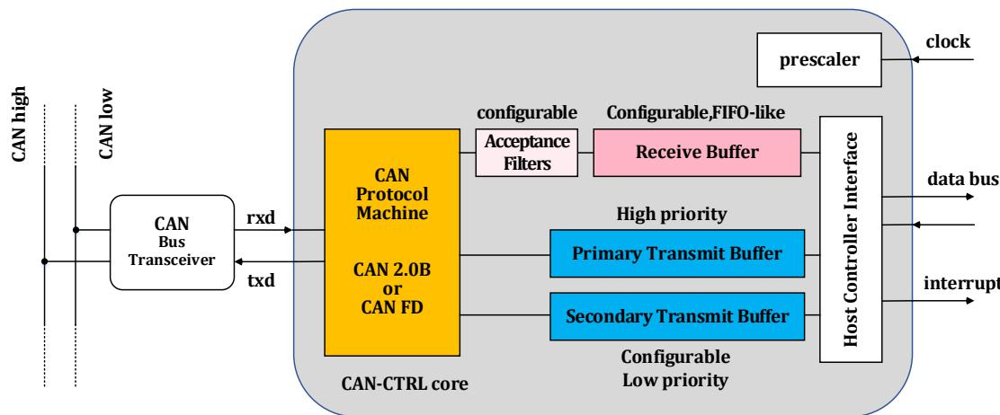  
图 21-1CAN 总线的连接和 CAN 总线控制器的主要特性

## 21.1.1 CAN 协议

CAN 通信是逐帧进行的。CAN 协议存在两种类型的帧：标准帧和扩展帧。对于 CAN 2.0，最大数据有效负载最多为8个字节，而对于CAN FD，一帧最多可以传输 64 个字节。

所有CAN 节点在总线上都是平等的。CAN是多主总线，不存在超级节点。

数据寻址是使用消息标识符完成的。在 CAN网络中，只有一个节点可以传输带有特定标识符的消息。所有节点都接收所有发出的消息。为了减少 CPU 的负载，CAN 控制器可以使用接收过滤器。这些过滤器将所有接收到的消息标识符与用户可选择的位掩码进行比较。只有当消息通过接收过滤器时，它才会存储在接收缓冲区中并发送给CPU。

帧的标识符也用于总线仲裁。当另一个CAN 节点传输具有较高优先级标识符的消息时，CAN 协议状态机停止传输具有低优先级标识符的消息，并自动尝试在下一个可能的时机重新传输停止的消息。小的标识符优先级更高。

CAN 2.0B 定义了高达 1Mbit/s 的数据波特率。对于 CAN FD，没有特定限制。CAN FD 标准定义了一种波特率切换的机制。如果启用波特率切换，帧有效载荷的传输可以以更高的速度完成，而帧头以较低的速度传输。

## 21.1.2 CAN 2.0B 以及如何启用 CAN FD

CAN FD 是 CAN 2.0B 协议的向下兼容扩展。每个 CAN FD 节点都能够接收和传输经典的 CAN 帧。

主机软件可以在运行时，使用发送缓冲区中的配置位，为每个帧选择是作为经典CAN或CAN FD帧进行传输。对于接收，接收帧是经典CAN或 CAN FD帧，由接收缓冲区中的状态位进行指示。

## 21.1.3 时间戳

## 21.1.3.1 TTCAN（Time Trigger CAN）

根据 ISO 11898-4 标准，CAN 控制器可选择使用时间触发 CAN 通信机制 (TTCAN)。CAN 控制器提供部分硬件支持，在此模式下需要主机软件与CAN 控制器进行实时交互。

TTCAN的基本概念是存在一个定时器，用于为接收到的消息加上时间戳，并触发消息进行传输。CAN 网络中的一个节点是时间主机。时间主机发送参考帧。随着参考帧发送，循环时间开始。两个参考帧之间的时间是一个基本周期。基本周期内的消息可以在特定时间窗口中传输。TTCAN系统管理节点在离线设置期间设定好每个时间窗口的开始和持续时间。

共有三种时间窗口类型：

⚫ 独家时间窗口 （只允许一个节点发送一个具有特定ID的帧）

⚫ 自由时间窗口 （未使用的时间窗口，用于未来扩展网络）

⚫ 仲裁时间窗口 （几个节点可能会同时传输，可能导致仲裁发生）

如果接收到一帧，它会获取实际的循环时间作为时间戳。对于传输，CAN 控制器提供了一个硬件触发机制，可以在预定义的时机开始传输事先准备好的消息。

CAN 控制器在接收时自动检测参考帧并开始循环时间。硬件定时器是一个 16 位定时器，按照ISO 11898-4 Level 1 定义以 CAN bit 时间为单位运行。

除了用于消息传输的硬件触发之外，CAN 控制器还提供了一个超时监测触发来检测参考帧丢失的情况。

主控制器需要为每个时间窗口配置节点的动作。例如，主机需要为下一次传输准备消息数据并为其定义触发时间。换句话说：主机需要对传输时空进行维护。

## 21.1.3.2 CiA 603 时间戳

CAN in Automation (CiA) 在规范 603 中定义了一种时间戳产生方法，CAN 控制器支持该特性。CiA603 可以与 TTCAN 一起使用。

CiA 603的基本概念是有一个独立运行的定时器，以系统时钟周期而不是CANbit时间进行计数。在 CAN/CAN FD 帧的 SOF 或 EOF 处获取时间戳。

CiA 603 支持 AUTOSAR 的时间戳和时间同步。对于 AUTOSAR，CAN 网络中的一个节点是时间主机。时间主机发送同步消息（SYNC 消息）。 SYNC 消息的时间戳由时间主机和所有时间从机获取。指示 SYNC 消息的发送与实际发送 SYNC 消息之间的时间差将由时间主机在 follow-up (FUP) 消息中传输。

## 21.2 特性

## 21.2.1 功能列表

• CAN规格

o 支持2.0B（最多8个字节有效载荷，符合博世参考模型验证标准）

o 支持FD（最多64字节有效载荷，ISO 11898-1:2015 或非ISO/博世）

• 可编程数据速度：

o CAN 2.0B 定义数据速率高达 1Mbit/s

o CAN FD受收发器限制

• 可编程波特率预分频器（1至1/256)

• 接收缓冲器 (RB)

o 可容纳12帧(slot)

o 类FIFO行为

o “被滤除”或“不正确”的接收消息不会覆盖已存储的消息

• 两个发送缓冲器

o 主发送缓冲器 (PTB)，可容纳1帧(slot)

o 第二发送缓冲器 (STB)，可容纳4帧(slot)

• 独立可编程29bit接收过滤器

o 共16个接收过滤器

• 扩展特征

o 单次发传输模式（用于PTB、STB）

o 监听模式

o 环回模式（内部回环和外部回环）

• 扩展状态和错误报告

o 捕获最后发生的错误和仲裁丢失位置

o 可编程错误警告门限

• 可配置中断来源

• 时间戳：

o ISO 11898-4 TTCAN

o CiA 603 时间戳

• 兼容AUTOSAR

## 21.2.2 向上兼容

CAN 协议中存在用于协议扩展的保留位，已用于在CAN 2.0B规范之上构建CAN FD规范。如果不使用，保留位被传输为低（显性）。但 CAN 2.0B 规范定义了保留位为高（隐性）的行为。因此，如果使用此行为的 CAN 2.0B 节点接收到 CAN FD 帧（与 CAN 2.0B 帧相比具有不同帧格式），则这将导致 CAN 2.0B 节点产生错误帧。这种行为称为“CAN FD不兼容”。


--- Part 3: Pages 401-481 ---

为了向上兼容新的协议规范，如果节点检测到保留位为高，则应发生所谓的协议异常事件。这适用于 CAN 2.0B 以及 CAN FD 节点。协议异常事件不会导致接收方采取任何行动。接收方只是忽略此帧，不回复ACK，等待总线空闲并可以发送或接收下一帧。对于 CAN 2.0B 节点，这称为“CANFD 兼容”，可在一个网络中实现 CAN 2.0B和 FD帧的共存。

## 21.2.3 消息缓冲区

## 21.2.3.1 消息缓冲区概念

消息缓冲区的概念如下图所示。单个缓冲区消息槽（slot）应足以容纳最大帧长。

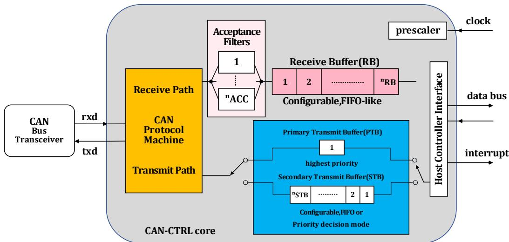  
图 21-2 消息缓冲区

## 21.2.3.2 接收缓冲区

为了减少 CPU 的接收负载，CAN 控制可以使用接收过滤器。 CAN 总线控制器在接收过滤期间检查消息标识符。如果接收到的帧与其中一个接收过滤器的过滤标准匹配，则它将存储在接收缓冲区 (RB) 中，该缓冲区具有类似 FIFO的行为。

根据可用消息槽的数量，主机控制器不需要立即读取接收到的消息。当RB已满或填充到软件选择的“几乎已满”门限时，CAN 总线控制器能够在后续每次收到消息时生成中断。由于 RB 具有类似FIFO 的特性，主机控制器总是从 RB 读取最早的消息。

## 21.2.3.3 发送缓冲器

CAN 控制器配备了两个发送缓冲器 (TB)。Primary TB (PTB)具有更高的优先级，但只能存储一帧。Secondary TB (STB) 的优先级较低，最多可以存储4 帧。它可以在FIFO或优先级模式下运行。PTB 和 STB 之间的优先级决定是固定的，完全独立于CAN 总线仲裁。总线仲裁基于帧标识符的优先级决定。

STB可以被配置发送一帧或所有存储的帧。在FIFO模式下，每次发送都会先发送此缓冲区中最早的帧。在优先级模式中，缓冲区内具有最高优先级的帧（基于帧标识符）首先传输。

对于CAN 协议状态机来说，PTB中的帧总是比STB中的帧具有更高的优先级，而不管帧标识符如何。PTB 传输可以停止并延迟 STB传输。PTB 帧传输成功后，STB传输会自动重启。

PTB 传输从下一个可能的传输时机开始（在下一个帧间隔之后）。但已取得仲裁并在实际进行传输的STB帧不会被打断，将先完成传输。

在以下情况下，可能会发生使用 PTB 传输中断STB传输：

1. STB被命令输出所有存储的帧，并且主机控制器决定在所有STB传输完成之前配置PTB进行一帧的传输。

2. STB被命令输出单个帧，并且主机控制器决定命令在STB传输完成之前配置PTB进行一帧的传输。

如果主机控制器一直等到每个命令的传输完成，那么它可以很容易地决定哪个缓冲区应该传输下一帧。但带有低优先级标识符的消息可能会阻塞更重要的消息。主机可以选择取消消息传输。

## 21.2.3.4 FIFO 模式下的发送缓冲器应用示例

在此示例中，CAN 节点用于传感器测量。 CAN 系统软件决定以低优先级处理这些传感器数据。

主控制器自动获取测量结果并将它们作为 CAN 帧放置在 STB 中。由于 CAN 总线上的高流量，可能会出现无法立即传输传感器数据帧并且在 STB中保留若干帧的情况。稍后，如果CAN 总线上的流量较少时，它们将被传输。

如果 STB 中已经保存了若干帧，主机控制器可能会有发送重要的高优先级帧的需求。在这种情况下，主机可以使用PTB。 PTB 中的帧总是在STB 之前传输。

拥有两个传输缓冲区的优点是可以选择保留所有消息。在高优先级事件的需要发送情况下，不必中止（丢弃）任何消息。

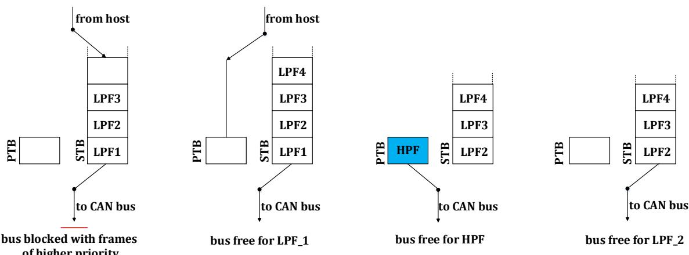  
图 21-3 发送缓冲器应用示例（TSALL=1）

如图，LPF\_x是“低优先级帧”的缩写，HPF表示“高优先级帧”。可以看出，LPF\_1被来自其他 CAN节点的其他更高优先级帧阻塞。主控制器将第四帧放入STB (LPF\_4)，然后决定输出 HPF。此后，CAN总线可以自由传输LPF\_1，然后是HPF、LPF\_2等。

PTB 和 STB 之间的优先级决策由 CAN 协议状态机完成，但 CAN 协议本身使用另一种独立的优先级决策机制，称为总线仲裁。对于总线仲裁，帧标识符定义了优先级。

在上面给出的示例中，可以将具有非常低优先级标识符的帧放置在PTB中，而较高优先级的帧保留在 STB 中。无论帧标识符如何，PTB 总是优先发送。主机控制器的任务是将具有有意义的标识符优先级的帧放置在合适的缓冲区中。

## 21.2.3.5 优先模式下的发送缓冲器应用示例

在STB的优先模式下，CAN 控制器会自动更改STB内的帧顺序。具有最高优先级的帧首先被发送。优先级决定与总线仲裁相同，因此具有较低值的帧标识符具有较高的优先级。但PTB始终具有最高优先级。

一旦新帧准备好传输并写入 STB，就会自动重新排序 STB 内的帧，选择具有最高优先级的帧进行传输。主机控制器只需要将新帧写入STB即可自动加入重排。

通常，具有较高优先级的帧永远不会中断活动传输。以图 21-3为例。在最左边的部分，帧 LPF\_1当前正在传输中，而 LPF\_4 被写入 STB。即使 LPF\_4 的优先级高于 LPF\_1，LPF\_1 仍然先会被传输完成，除非它在总线上失去仲裁。然后在节点失去仲裁后，将选择 LPF\_4 进行传输，因为它具有更高优先级。

优先级重新排序在后台自动完成，但重排需要一些时间。当大量不同优先级的新帧写入 STB，节点失去仲裁或总线出现错误时，有可能不是优先级最高的帧被选中。如果在决定下一帧的截止日期之前写入该帧，可能会发生这种情况。但这是一种非常罕见的情况，通常不需关心这一点。

如果将具有相同优先级的两个帧写入STB，则将首先传输最早的帧。

## 21.2.3.6 中止传输

如果出现这种情况，传输缓冲区中的消息由于其低优先级而无法发送，将阻塞缓冲区很长时间。

为了避免这种情况，主控制器可以撤回传输请求并中止消息传输。 PTB和STB 的单帧或所有帧传输都可以中止。

## 21.2.3.7 TTCAN 模式下的发送缓冲器

在 TTCAN模式下，STB 中的每个消息槽都可以由主机寻址。每个消息槽都可以定义为已填充或空。因此，每个消息槽可以专用于一个特定的消息。

传输由硬件触发启动。每个触发都包含一个指向消息槽的指针。 PTB 在 TTCAN 模式下没有特殊优先级，和STB消息槽进行相同处理。

主机应用程序处于方便考虑，可以将一条消息专用于一个缓冲槽。然后主机中的任务可以随时更新消息，然后如果该消息的触发时刻到达，则可以开始传输。但是为所有消息提供足够的消息槽需要大量硬件。因此可以在一个基本周期中为多个消息使用一个消息缓冲槽。因此，即使 STB 被禁用并且内核仅包含单个PTB 消息槽，也可以支持ISO 11898-4协议。

## 21.2.4 CAN 2.0 和 CAN FD 帧

CAN FD是CAN 2.0 的协议扩展。主要区别在于：

• 数据负载：CAN 2.0最多8个字节，CAN-FD最多64个字节

• CAN 2.0有一种可配置的波特率，而CAN FD有2种：仲裁阶段使用低速率，数据阶段使用高速率。CAN 规范中对缩写进行了说明。对于经典CAN帧(CAN 2.0)，一些位名称根据CAN FD ISO规范进行了重命名，但这里仍然使用旧名称以便于向后引用兼容。

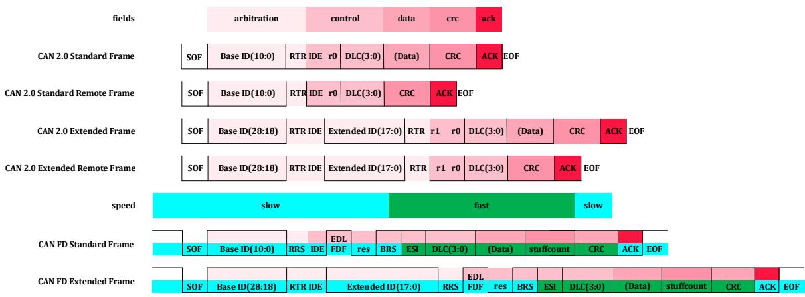  
图 21-4 CAN 2.0 和 CAN FD 帧类型

表 21-1 CAN 位缩写

<table><tr><td>缩写</td><td colspan="2">描述</td><td>评论</td></tr><tr><td>ID</td><td>IDentifier</td><td>标识符</td><td></td></tr><tr><td>RTR</td><td>Remote Transmission Request</td><td>远程传输请求</td><td>远程或数据帧</td></tr><tr><td>SRR</td><td>Substitute Remote Request</td><td>替代远程请求</td><td></td></tr><tr><td>RRS</td><td>Remote Request Substitution</td><td>远程请求替换</td><td></td></tr><tr><td>IDE</td><td>IDentifier Extension</td><td>标识符扩展</td><td>标准或扩展帧</td></tr><tr><td>DLC</td><td>Data Length Code</td><td>数据长度代码</td><td>有效负载字节数</td></tr><tr><td>EDL</td><td>Extended Data Length</td><td>扩展数据长度</td><td>CAN 2.0 或 CAN FD 帧</td></tr><tr><td>FDF</td><td>FD Format indicator (=EDL)</td><td>FD 格式指示符 (=EDL)</td><td>CAN 2.0 或 CAN FD 帧</td></tr><tr><td>BRS</td><td>Bit Rate Switch</td><td>波特率开关</td><td></td></tr><tr><td>ESI</td><td>Error State Indicator</td><td>错误状态指示器</td><td></td></tr><tr><td>r1, r0, res</td><td>Reserved bits</td><td>保留位</td><td></td></tr></table>

Bosch (非 ISO)的 CAN FD 规范使用 EDL，而 CAN FD ISO 规范使用 FDF 来表示同一位。本文档使用 FDF。

对于CAN FD ISO帧，填充计数作为CRC字段的一部分传输。对于CAN FD非 ISO帧，填充计数不是帧的一部分。此外，CRC对非ISO和ISO帧有不同的初始化系数。因此，ISO和非ISO帧是不兼容的。

CAN 控制中的CAN 协议状态机自动发送和接收帧并嵌入适当的控制和状态位。软件需要选择所需的帧类型（IDE、RTR、FDF），选择标识符并设置有效的数据载荷。

## 21.2.5 AUTOSAR 和 SAE J1939

AUTOSAR 和 SAE J1939 软件协议栈可与 CAN 控制器一起使用。

对于AUTOSAR，传输缓冲区的数量应设置为至少3个消息槽，并且可以中止传输（寄存器 TCMD中的 TPA和TSA）。符合CiA 603协议，支持时间戳和时间同步。

SAE J1939 使用扩展 ID（29 位）。为了便于处理，可以将接收过滤器配置为仅接收扩展ID（寄存器 CAN\_ACF）。

表 21-2 CAN 名称定义

<table><tr><td>缩写</td><td>描述</td></tr><tr><td>ACF</td><td>接收过滤器</td></tr><tr><td>PTB</td><td>主发送缓冲器(高优先级)</td></tr><tr><td>RB</td><td>接收缓冲区</td></tr><tr><td>RDC</td><td>接收器延迟补偿(与 TDC 相关)</td></tr><tr><td>RTS</td><td>接收时间戳</td></tr><tr><td>SP</td><td>采样点</td></tr><tr><td>SSP</td><td>二级采样点 (CAN FD)</td></tr><tr><td>STB</td><td>辅助发送缓冲器(低优先级)</td></tr><tr><td>TDC</td><td>发送器延迟补偿(CAN FD 规范)</td></tr><tr><td>TTCAN</td><td>时间触发 CAN (ISO 11898-4)</td></tr><tr><td>TTS</td><td>传输时间戳</td></tr><tr><td>TQ</td><td>时间量子(CAN 规范)</td></tr></table>

## 21.3 寄存器（软件接口）

CAN-FD 基地址为 0x40018800。

## 21.3.1 地址分配

CAN-FD模块寄存器的基地址是0x4001\_8800，寄存器列表如下。

表 21-3CAN 寄存器地址分配

<table><tr><td>名称</td><td>偏移</td><td>说明</td></tr><tr><td>CAN_RBUF_00</td><td>0x00</td><td>CAN Rx Buffer 寄存器 0</td></tr><tr><td>CAN_RBUF_01</td><td>0x04</td><td>CAN Rx Buffer 寄存器 1</td></tr><tr><td>CAN_RBUF_02</td><td>0x08</td><td>CAN Rx Buffer 寄存器 2</td></tr><tr><td>CAN_RBUF_03</td><td>0x0C</td><td>CAN Rx Buffer 寄存器 3</td></tr><tr><td>CAN_RBUF_04</td><td>0x10</td><td>CAN Rx Buffer 寄存器 4</td></tr><tr><td>CAN_RBUF_05</td><td>0x14</td><td>CAN Rx Buffer 寄存器 5</td></tr><tr><td>CAN_RBUF_06</td><td>0x18</td><td>CAN Rx Buffer 寄存器 6</td></tr><tr><td>CAN_RBUF_07</td><td>0x1C</td><td>CAN Rx Buffer 寄存器 7</td></tr><tr><td>CAN_RBUF_08</td><td>0x20</td><td>CAN Rx Buffer 寄存器 8</td></tr><tr><td>CAN_RBUF_09</td><td>0x24</td><td>CAN Rx Buffer 寄存器 9</td></tr><tr><td>CAN_RBUF_10</td><td>0x28</td><td>CAN Rx Buffer 寄存器 10</td></tr><tr><td>CAN_RBUF_11</td><td>0x2C</td><td>CAN Rx Buffer 寄存器 11</td></tr><tr><td>CAN_RBUF_12</td><td>0x30</td><td>CAN Rx Buffer 寄存器 12</td></tr><tr><td>CAN_RBUF_13</td><td>0x34</td><td>CAN Rx Buffer 寄存器 13</td></tr><tr><td>CAN_RBUF_14</td><td>0x38</td><td>CAN Rx Buffer 寄存器 14</td></tr><tr><td>CAN_RBUF_15</td><td>0x3C</td><td>CAN Rx Buffer 寄存器 15</td></tr><tr><td>CAN_RBUF_16</td><td>0x40</td><td>CAN Rx Buffer 寄存器 16</td></tr><tr><td>CAN_RBUF_17</td><td>0x44</td><td>CAN Rx Buffer 寄存器 17</td></tr><tr><td>CAN_RBUF_18</td><td>0x48</td><td>CAN Rx Buffer 寄存器 18</td></tr><tr><td>CAN_RBUF_19</td><td>0x4C</td><td>CAN Rx Buffer 寄存器 19</td></tr><tr><td>CAN_TBUF_00</td><td>0x50</td><td>CAN Tx Buffer 寄存器 0</td></tr><tr><td>CAN_TBUF_01</td><td>0x54</td><td>CAN Tx Buffer 寄存器 1</td></tr><tr><td>CAN_TBUF_02</td><td>0x58</td><td>CAN Tx Buffer 寄存器 2</td></tr><tr><td>CAN_TBUF_03</td><td>0x5C</td><td>CAN Tx Buffer 寄存器 3</td></tr><tr><td>CAN_TBUF_04</td><td>0x60</td><td>CAN Tx Buffer 寄存器 4</td></tr><tr><td>CAN_TBUF_05</td><td>0x64</td><td>CAN Tx Buffer 寄存器 5</td></tr><tr><td>CAN_TBUF_06</td><td>0x68</td><td>CAN Tx Buffer 寄存器 6</td></tr><tr><td>CAN_TBUF_07</td><td>0x6C</td><td>CAN Tx Buffer 寄存器 7</td></tr><tr><td>CAN_TBUF_08</td><td>0x70</td><td>CAN Tx Buffer 寄存器 8</td></tr><tr><td>CAN_TBUF_09</td><td>0x74</td><td>CAN Tx Buffer 寄存器 9</td></tr><tr><td>CAN_TBUF_10</td><td>0x78</td><td>CAN Tx Buffer 寄存器 10</td></tr><tr><td>CAN_TBUF_11</td><td>0x7C</td><td>CAN Tx Buffer 寄存器 11</td></tr><tr><td>CAN_TBUF_12</td><td>0x80</td><td>CAN Tx Buffer 寄存器 12</td></tr><tr><td>CAN_TBUF_13</td><td>0x84</td><td>CAN Tx Buffer 寄存器 13</td></tr><tr><td>CAN_TBUF_14</td><td>0x88</td><td>CAN Tx Buffer 寄存器 14</td></tr><tr><td>CAN_TBUF_15</td><td>0x8C</td><td>CAN Tx Buffer 寄存器 15</td></tr><tr><td>CAN_TBUF_16</td><td>0x90</td><td>CAN Tx Buffer 寄存器 16</td></tr><tr><td>CAN_TBUF_17</td><td>0x94</td><td>CAN Tx Buffer 寄存器 17</td></tr><tr><td>CAN_TTS_0</td><td>0x98</td><td>CAN 传输时间戳寄存器</td></tr><tr><td>CAN_TTS_1</td><td>0x9C</td><td>CAN 传输时间戳寄存器</td></tr><tr><td>CAN_CFG_STAT</td><td>0xA0</td><td>CAN 配置和状态寄存器</td></tr><tr><td>CAN_TCMD</td><td>0xA1</td><td>CAN 发送命令寄存器</td></tr><tr><td>CAN_TCTRL</td><td>0xA2</td><td>CAN 发送控制寄存器</td></tr><tr><td>CAN_RCTRL</td><td>0xA3</td><td>CAN 接收控制寄存器</td></tr><tr><td>CAN_RTIE</td><td>0xA4</td><td>CAN 发送接收中断控制寄存器</td></tr><tr><td>CAN_RTIF</td><td>0xA5</td><td>CAN 发送接收中断标志寄存器</td></tr><tr><td>CAN_ERRINT</td><td>0xA6</td><td>CAN 错误中断使能和标志寄存器</td></tr><tr><td>CAN_LIMIT</td><td>0xA7</td><td>CAN 警告寄存器</td></tr><tr><td>CAN_SBAUD</td><td>0xA8</td><td>CAN 慢速波特率配置寄存器</td></tr><tr><td>CAN_FBAUD</td><td>0xAC</td><td>CAN 快速波特率配置寄存器</td></tr><tr><td>CAN_EALCAP</td><td>0xB0</td><td>CAN 错误信息和丢失仲裁信息记录寄存器</td></tr><tr><td>CAN_TDC</td><td>0xB1</td><td>CAN 发送延时补偿寄存器</td></tr><tr><td>CAN_RECNT</td><td>0xB2</td><td>CAN 接收错误计数器寄存器</td></tr><tr><td>CAN_TECNT</td><td>0xB3</td><td>CAN 发送错误计数器寄存器</td></tr><tr><td>CAN_ACFCTRL</td><td>0xB4</td><td>CAN ID 过滤器控制寄存器</td></tr><tr><td>CAN_TIMECFG</td><td>0xB5</td><td>CAN IDCiA603 时间戳配置寄存器</td></tr><tr><td>CAN_ACFEN</td><td>0xB6</td><td>CAN ID 过滤器使能寄存器</td></tr><tr><td>CAN_ACF</td><td>0xB8</td><td>CAN ID 过滤器选择寄存器</td></tr><tr><td>CAN_TBSLOT</td><td>0xBE</td><td>TTCAN 发送缓冲区指针</td></tr><tr><td>CAN_TTCFG</td><td>0xBF</td><td>TTCAN 配置寄存器</td></tr><tr><td>CAN_REF_MSG</td><td>0xC0</td><td>TTCAN 参考帧寄存器</td></tr><tr><td>CAN_TRG_CFG</td><td>0xC4</td><td>TTCAN 触发配置寄存器</td></tr><tr><td>CAN_TT_TRIG</td><td>0xC6</td><td>TTCAN 触发时刻寄存器</td></tr><tr><td>CAN_TT_WTRIG</td><td>0xC8</td><td>TTCAN 超时监测寄存器</td></tr><tr><td>CAN_CIAWDAT0</td><td>0xD0</td><td>CiA603 时间戳低 32 位写入值</td></tr><tr><td>CAN_CIAWDAT1</td><td>0xD4</td><td>CiA603 时间戳高 32 位写入值</td></tr></table>

## 21.3.2 CAN 寄存器位分配表

访问定义使用 <access>-<reset\_value> 形式的缩写给出。 <access> 属性：“r”表示读，“w”表示写，“rw”表示读/写访问。对于未初始化的寄存器，<reset\_value >属性可以是“0”、“1”和“u”。示例：“rw-0”表示“可读可写并重置为 0”，“ru”表示“可读且未初始化”。未使用的位总是 r-0。

表 21-4 CAN 寄存器位分配表

<table><tr><td>偏移</td><td colspan="8">位置</td><td>名称</td></tr><tr><td></td><td>7</td><td>6</td><td>5</td><td>4</td><td>3</td><td>2</td><td>1</td><td>0</td><td></td></tr><tr><td>0x00~0x4f</td><td colspan="8">接收缓冲寄存器和接收时间戳</td><td>RBUF(和RTS)</td></tr><tr><td>0x50~0x97</td><td colspan="8">发送缓冲寄存器</td><td>TBUF</td></tr><tr><td>0x98~0x9f</td><td colspan="8">传输时间戳</td><td>TTS</td></tr><tr><td>0xa0</td><td>RESET</td><td>LBME</td><td>LBMI</td><td>TPSS</td><td>TSSS</td><td>RACTIVE</td><td>TACTIVE</td><td>BUSOFF</td><td>CFG_STAT</td></tr><tr><td>0xa1</td><td>TBSEL</td><td>LOM</td><td>STBY</td><td>TPE</td><td>TPA</td><td>TSONE</td><td>TSALL</td><td>TSA</td><td>TCMD</td></tr><tr><td>0xa2</td><td>FD_ISO *</td><td>TSNEXT</td><td>TSMODE</td><td>TTTBM</td><td colspan="2">-</td><td colspan="2">TSSTAT(1:0)</td><td>TCTRL</td></tr><tr><td>0xa3</td><td>SACK</td><td>ROM</td><td>ROV</td><td>RREL</td><td>RBALL</td><td>-</td><td colspan="2">RSTAT(1:0)</td><td>RCTRL</td></tr><tr><td>0xa4</td><td>RIE</td><td>ROIE</td><td>RFIE</td><td>RAFIE</td><td>TPIE</td><td>TSIE</td><td>EIE</td><td>TSFF</td><td>RTIE</td></tr><tr><td>0xa5</td><td>RIF</td><td>ROIF</td><td>RFIF</td><td>RAFIF</td><td>TPIF</td><td>TSIF</td><td>EIF</td><td>AIF</td><td>RTIF</td></tr><tr><td>0xa6</td><td>EWARN</td><td>EPASS</td><td>EPIE</td><td>EPIF</td><td>ALIE</td><td>ALIF</td><td>BEIE</td><td>BEIF</td><td>ERRINT</td></tr><tr><td>0xa7</td><td colspan="4">AFWL(3:0)</td><td colspan="4">EWL(3:0)</td><td>LIMIT</td></tr><tr><td>0xa8</td><td colspan="8">S_Seg_1(7:0)</td><td>S_Seg_1*</td></tr><tr><td>0xa9</td><td>-</td><td colspan="7">S_Seg_2(6:0)</td><td>S_Seg_2*</td></tr><tr><td>0xaa</td><td>-</td><td colspan="7">S_SJW(6:0)</td><td>S_SJW*</td></tr><tr><td>0xab</td><td colspan="8">S_PRESC(7:0)</td><td>S_PRESC*</td></tr><tr><td>0xac</td><td colspan="3">-</td><td colspan="5">F_Seg_1(4:0)</td><td>F_Seg_1*</td></tr><tr><td>0xad</td><td colspan="4">-</td><td colspan="4">F_Seg_2(3:0)</td><td>F_Seg_2*</td></tr><tr><td>0xae</td><td colspan="4">-</td><td colspan="4">F_SJW(3:0)</td><td>F_SJW*</td></tr><tr><td>0xaf</td><td colspan="8">F_PRESC(7:0)</td><td>F_PRESC*</td></tr><tr><td>0xb0</td><td colspan="3">KOER(2:0)</td><td colspan="5">ALC(4:0)</td><td>EALCAP</td></tr><tr><td>0xb1</td><td>TDCEN</td><td colspan="7">SSPOFF(6:0)</td><td>TDC*</td></tr><tr><td>0xb2</td><td colspan="8">RECNT</td><td>RECNT</td></tr><tr><td>0xb3</td><td colspan="8">TECNT</td><td>TECNT</td></tr><tr><td>0xb4</td><td colspan="2">-</td><td>SELMASK</td><td>-</td><td colspan="4">ACFADR</td><td>ACFCTRL</td></tr><tr><td>0xb5</td><td colspan="6">-</td><td>TIMEPOS</td><td>TIMEEN</td><td>TIMECFG</td></tr><tr><td>0xb6</td><td>AE_7</td><td>AE_6</td><td>AE_5</td><td>AE_4</td><td>AE_3</td><td>AE_2</td><td>AE_1</td><td>AE_0</td><td>ACF_EN_0</td></tr><tr><td>0xb7</td><td>AE_15</td><td>AE_14</td><td>AE_13</td><td>AE_12</td><td>AE_11</td><td>AE_10</td><td>AE_9</td><td>AE_8</td><td>ACF_EN_1</td></tr><tr><td>0xb8</td><td colspan="8">ACODE_x or AMASK_x (7:0)</td><td>ACF_0*</td></tr><tr><td>0xb9</td><td colspan="8">ACODE_x or AMASK_x (15:8)</td><td>ACF_1*</td></tr><tr><td>0xba</td><td colspan="8">ACODE_x or AMASK_x (23:16)</td><td>ACF_2*</td></tr><tr><td>0xbb</td><td>-</td><td>IDCMP</td><td>IDMASK</td><td colspan="5">ACODE_x or AMASK_x (28:24)</td><td>ACF_3*</td></tr><tr><td>0xbc</td><td colspan="8">VERSION(7:0)</td><td>VER_0</td></tr><tr><td>0xbd</td><td colspan="8">VERSION(15:8)</td><td>VER_1</td></tr><tr><td>0xbe</td><td>TBE</td><td>TBF</td><td colspan="6">TBPTR(5:0)</td><td>TBSLOT</td></tr></table>

<table><tr><td>偏移</td><td colspan="7">位置</td><td>名称</td></tr><tr><td>0xbf</td><td>WTIE</td><td>WTIF</td><td>TEIF</td><td>TTIE</td><td>TTIF</td><td>T_PRESC(1:0)</td><td>TTEN</td><td>TTCFG</td></tr><tr><td>0xc0</td><td colspan="7">REF_ID(7:0)</td><td>REF_MSG_0</td></tr><tr><td>0xc1</td><td colspan="7">REF_ID(15:8)</td><td>REF_MSG_1</td></tr><tr><td>0xc2</td><td colspan="7">REF_ID(23:16)</td><td>REF_MSG_2</td></tr><tr><td>0xc3</td><td>REF_IDE</td><td colspan="2">-</td><td colspan="4">REF_ID(28:24)</td><td>REF_MSG_3</td></tr><tr><td>0xc4</td><td colspan="2">-</td><td colspan="5">TTPTR(5:0)</td><td>TRIG_CFG_0</td></tr><tr><td>0xc5</td><td colspan="4">TEW(3:0)</td><td>-</td><td colspan="2">TTYPE(2:0)</td><td>TRIG_CFG_1</td></tr><tr><td>0xc6</td><td colspan="7">TT_TRIG(7:0)</td><td>TT_TRIG_0</td></tr><tr><td>0xc7</td><td colspan="7">TT_TRIG(15:8)</td><td>TT_TRIG_1</td></tr><tr><td>0xc8</td><td colspan="7">TT_WTRIG(7:0)</td><td>TT_WTRIG_0</td></tr><tr><td>0xc9</td><td colspan="7">TT_WTRIG(15:8)</td><td>TT_WTRIG_1</td></tr><tr><td>0xca</td><td colspan="7">-</td><td>-</td></tr><tr><td>0xcb</td><td colspan="7">-</td><td>-</td></tr></table>

\* 只有在寄存器 CAN\_CFG\_STAT.RESET=1 时，才能写入寄存器。  
对寄存器映射中未显示的可寻址位置的写访问不会导致任何操作，读回为0x00。

## 21.3.3 寄存器说明

## 21.3.3.1 CAN\_RBUF0\~CAN\_RBU19 寄存器

地址：0x4001\_8800\~0x4001\_884C

复位值：x

表 21-5 接收缓冲寄存器 CAN\_RBUF0\~CAN\_RBUF19

<table><tr><td>31</td><td>30</td><td>29</td><td>28</td><td>27</td><td>26</td><td>25</td><td>24</td><td>23</td><td>22</td><td>21</td><td>20</td><td>19</td><td>18</td><td>17</td><td>16</td></tr><tr><td colspan="16">RDATA</td></tr><tr><td colspan="16">RO</td></tr><tr><td colspan="16">X</td></tr><tr><td>15</td><td>14</td><td>13</td><td>12</td><td>11</td><td>10</td><td>9</td><td>8</td><td>7</td><td>6</td><td>5</td><td>4</td><td>3</td><td>2</td><td>1</td><td>0</td></tr><tr><td colspan="16">RDATA</td></tr><tr><td colspan="16">RO</td></tr><tr><td colspan="16">X</td></tr></table>

<table><tr><td>位置</td><td>位名称</td><td>说明</td></tr><tr><td>[31:0]</td><td>RDATA</td><td>接收缓冲区寄存器,从 Rx Buffer Slot 中读出 CAN 帧的数据</td></tr></table>

不同帧的类型及数据长度不同，CAN\_RBUF0\~CAN\_RBUF19 的数据内容不同。

表 21-6 接收缓冲寄存器 RBUF – 标准格式 (r-0)

<table><tr><td>寄存器</td><td>地址</td><td colspan="8">位</td><td>功能</td></tr><tr><td></td><td></td><td>7</td><td>6</td><td>5</td><td>4</td><td>3</td><td>2</td><td>1</td><td>0</td><td></td></tr><tr><td rowspan="4">CAN_RBUF_00</td><td>RBUF</td><td colspan="8">ID[7:0)</td><td>Identifier</td></tr><tr><td>RBUF+1</td><td colspan="5">-</td><td colspan="3">ID[10:8]</td><td>Identifier</td></tr><tr><td>RBUF+2</td><td colspan="8">-</td><td>Identifier</td></tr><tr><td>RBUF+3</td><td>ESI</td><td colspan="7"></td><td>Identifier</td></tr><tr><td rowspan="4">CAN_RBUF_01</td><td>RBUF+4</td><td>IDE=0</td><td>RTR</td><td>FDF</td><td>BRS</td><td colspan="4">DLC[3:0]</td><td>Control</td></tr><tr><td>RBUF+5</td><td colspan="3">KOER</td><td>TX</td><td colspan="4"></td><td>Status</td></tr><tr><td>RBUF+6</td><td colspan="8">CYCLE_TIME[7:0]</td><td>TTCAN</td></tr><tr><td>RBUF+7</td><td colspan="8">CYCLE_TIME[15:8]</td><td>TTCAN</td></tr><tr><td rowspan="3">CAN_RBUF_02</td><td>RBUF+8</td><td colspan="8">d1[7:0]</td><td>Data byte 1</td></tr><tr><td>RBUF+9</td><td colspan="8">d2[7:0]</td><td>Data byte 2</td></tr><tr><td>...</td><td colspan="8">...</td><td>...</td></tr><tr><td>...</td><td>...</td><td colspan="8">...</td><td>...</td></tr><tr><td rowspan="3">CAN_RBUF_17</td><td>...</td><td colspan="8">...</td><td>...</td></tr><tr><td>RBUF+71</td><td colspan="8">d64[7:0]</td><td>Data byte 64</td></tr><tr><td>RBUF+72</td><td colspan="8">RTS[7:0]</td><td>CiA 603</td></tr><tr><td>...</td><td>...</td><td colspan="8">...</td><td>...</td></tr><tr><td rowspan="2">CAN_RBUF_19</td><td>...</td><td colspan="8">...</td><td>...</td></tr><tr><td>RBUF+79</td><td colspan="8">RTS[63:56]</td><td>CiA 603</td></tr></table>

表 21-7 接收缓冲寄存器 RBUF – 扩展格式 (r-0)

<table><tr><td>寄存器</td><td>地址</td><td colspan="8">位</td><td>功能</td></tr><tr><td></td><td></td><td>7</td><td>6</td><td>5</td><td>4</td><td>3</td><td>2</td><td>1</td><td>0</td><td></td></tr><tr><td rowspan="4">CAN_RBUF_00</td><td>RBUF</td><td colspan="8">ID[7:0]</td><td>Identifier</td></tr><tr><td>RBUF+1</td><td colspan="8">ID[15:8]</td><td>Identifier</td></tr><tr><td>RBUF+2</td><td colspan="8">ID[23:16]</td><td>Identifier</td></tr><tr><td>RBUF+3</td><td>ESI</td><td colspan="2"></td><td colspan="5">ID[28:24]</td><td>Identifier</td></tr><tr><td rowspan="4">CAN_RBUF_01</td><td>RBUF+4</td><td>IDE=0</td><td>RTR</td><td>FDF</td><td>BRS</td><td colspan="4">DLC[3:0]</td><td>Control</td></tr><tr><td>RBUF+5</td><td colspan="3">KOER</td><td>TX</td><td colspan="4"></td><td>Status</td></tr><tr><td>RBUF+6</td><td colspan="8">CYCLE_TIME[7:0]</td><td>TTCAN</td></tr><tr><td>RBUF+7</td><td colspan="8">CYCLE_TIME[15:8]</td><td>TTCAN</td></tr><tr><td rowspan="3">CAN_RBUF_02</td><td>RBUF+8</td><td colspan="8">d1[7:0]</td><td>Data byte 1</td></tr><tr><td>RBUF+9</td><td colspan="8">d2[7:0]</td><td>Data byte 2</td></tr><tr><td>...</td><td colspan="8">...</td><td>...</td></tr><tr><td>...</td><td>...</td><td colspan="8">...</td><td>...</td></tr><tr><td rowspan="3">CAN_RBUF_17</td><td>...</td><td colspan="8">...</td><td>...</td></tr><tr><td>RBUF+71</td><td colspan="8">d64[7:0]</td><td>Data byte 64</td></tr><tr><td>RBUF+72</td><td colspan="8">RTS[7:0]</td><td>CiA 603</td></tr><tr><td>...</td><td>...</td><td colspan="8">...</td><td>...</td></tr><tr><td rowspan="2">CAN_RBUF_19</td><td>...</td><td colspan="8">...</td><td>...</td></tr><tr><td>RBUF+79</td><td colspan="8">RTS[63:56]</td><td>CiA 603</td></tr></table>

RBUF寄存器（偏移0x00到0x4f）指向RB中接收到最早消息所在的消息槽。所有 RBUF 寄存器都可以按任何顺序读取。

RBUF 中的 KOER 与寄存器 EALCAP 中的 KOER 位具有相同的含义。如果 RBALL=1，RBUF 中的KOER才有意义。

如果CAN控制器处于回环模式并且内核已接收到自己的传输帧，则RBUF中的状态位 TX置 1。这一特性在当 LBME=1 并且网络中的其他节点也进行传输时很有用。

时间戳CYCLE\_TIME将仅在TTCAN 模式下存储在RBUF中。参考帧的循环时间始终为0。

CiA 603 时间戳的接收时间戳 (RTS) 储在 RBUF 地址范围末尾的每个接收到的消息中。因此，与 TTS 相比，RTS与实际选择的 RBUF消息槽有关。

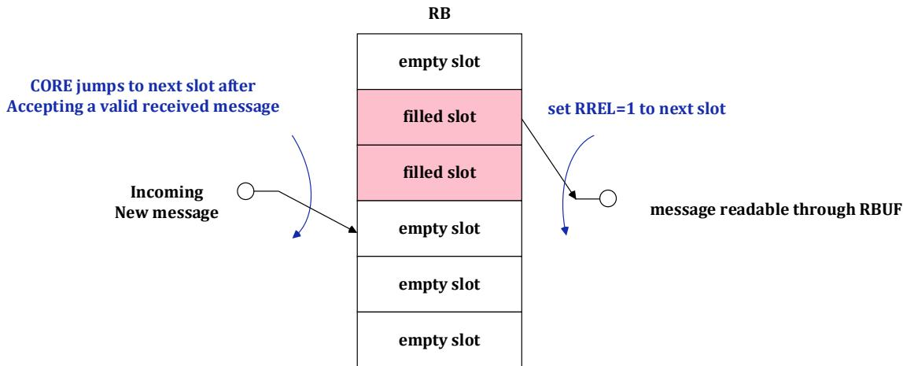  
图 21-5 类似FIFO的RB示意图（6 个消息槽示例）

## 21.3.3.2 CAN\_TBUF0\~CAN\_TBUF17 寄存器器

地址：0x4001\_8850\~0x4001\_8894

复位值：x

表 21-8 写入寄存器 CAN\_TBUF0/1/2/3

<table><tr><td>31</td><td>30</td><td>29</td><td>28</td><td>27</td><td>26</td><td>25</td><td>24</td><td>23</td><td>22</td><td>21</td><td>20</td><td>19</td><td>18</td><td>17</td><td>16</td></tr><tr><td colspan="16">WDATA</td></tr><tr><td colspan="16">WO</td></tr><tr><td colspan="16">X</td></tr><tr><td>15</td><td>14</td><td>13</td><td>12</td><td>11</td><td>10</td><td>9</td><td>8</td><td>7</td><td>6</td><td>5</td><td>4</td><td>3</td><td>2</td><td>1</td><td>0</td></tr></table>

<table><tr><td>WDATA</td></tr><tr><td>WO</td></tr><tr><td>X</td></tr></table>

<table><tr><td>位置</td><td>位名称</td><td>说明</td></tr><tr><td>[31:0]</td><td>WDATA</td><td>发送数据寄存器,写入数据到 Tx Buffer Slot 中(PTB 或者 STB)</td></tr></table>

不同帧的类型及数据长度不同，CAN\_TBUF的数据内容也不同。根据文档对发送帧的结构解析即可。

表 21-9 发送缓冲寄存器 TBUF 标准格式 (rw-u)

<table><tr><td>寄存器</td><td>地址</td><td colspan="8">位</td><td>功能</td></tr><tr><td></td><td></td><td>7</td><td>6</td><td>5</td><td>4</td><td>3</td><td>2</td><td>1</td><td>0</td><td></td></tr><tr><td rowspan="4">CAN_TBUF_00</td><td>TBUF</td><td colspan="8">ID[7:0]</td><td>Identifier</td></tr><tr><td>TBUF+1</td><td colspan="5">-</td><td colspan="3">ID[10:8]</td><td>Identifier</td></tr><tr><td>TBUF+2</td><td colspan="8">-</td><td>Identifier</td></tr><tr><td>TBUF+3</td><td>TTSEN</td><td colspan="7"></td><td>Identifier</td></tr><tr><td rowspan="4">CAN_TBUF_01</td><td>TBUF+4</td><td>IDE=0</td><td>Control</td><td>FDF</td><td>BRS</td><td colspan="4">DLC[3:0]</td><td>Control</td></tr><tr><td>TBUF+5</td><td colspan="8">-</td><td>Unused</td></tr><tr><td>TBUF+6</td><td colspan="8">-</td><td>Unused</td></tr><tr><td>TBUF+7</td><td colspan="8">-</td><td>Unused</td></tr><tr><td rowspan="3">CAN_TBUF_02</td><td>TBUF+8</td><td colspan="8">d1[7:0]</td><td>Data byte 1</td></tr><tr><td>TBUF+9</td><td colspan="8">d2[7:0]</td><td>Data byte 2</td></tr><tr><td>...</td><td colspan="8">...</td><td>...</td></tr><tr><td>...</td><td>...</td><td colspan="8">...</td><td>...</td></tr><tr><td rowspan="3">CAN_TBUF_17</td><td>...</td><td colspan="8">...</td><td>...</td></tr><tr><td>TBUF+70</td><td colspan="8">d63[7:0]</td><td>Data byte 63</td></tr><tr><td>TBUF+71</td><td colspan="8">d64[7:0]</td><td>Data byte 64</td></tr></table>

表 21-10 发送缓冲寄存器 TBUF 扩展格式 (rw-u)

<table><tr><td>寄存器</td><td>地址</td><td colspan="8">位置</td><td>功能</td></tr><tr><td></td><td></td><td>7</td><td>6</td><td>5</td><td>4</td><td>3</td><td>2</td><td>1</td><td>0</td><td></td></tr><tr><td rowspan="4">CAN_TBUF_00</td><td>TBUF</td><td colspan="8">ID[7:0]</td><td>Identifier</td></tr><tr><td>TBUF+1</td><td colspan="8">ID[15:8]</td><td>Identifier</td></tr><tr><td>TBUF+2</td><td colspan="8">ID[23:16]</td><td>Identifier</td></tr><tr><td>TBUF+3</td><td>TTSEN</td><td colspan="2"></td><td colspan="5">ID[28:24]</td><td>Identifier</td></tr><tr><td rowspan="4">CAN_TBUF_01</td><td>TBUF+4</td><td>IDE=1</td><td>Control</td><td>FDF</td><td>BRS</td><td colspan="4">DLC[3:0]</td><td></td></tr><tr><td>TBUF+5</td><td colspan="8">-</td><td>Unused</td></tr><tr><td>TBUF+6</td><td colspan="8">-</td><td>Unused</td></tr><tr><td>TBUF+7</td><td colspan="8">-</td><td>Unused</td></tr><tr><td rowspan="4">CAN_TBUF_02</td><td>TBUF+8</td><td colspan="8">d1[7:0]</td><td>Data byte 1</td></tr><tr><td>TBUF+9</td><td colspan="8">d2[7:0]</td><td>Data byte 2</td></tr><tr><td>TBUF+10</td><td colspan="8">d3[7:0]</td><td>Data byte 3</td></tr><tr><td>TBUF+11</td><td colspan="8">d4[7:0]</td><td>Data byte 4</td></tr><tr><td>...</td><td>...</td><td colspan="8">...</td><td>...</td></tr><tr><td rowspan="2">CAN_TBUF_17</td><td>...</td><td colspan="8">...</td><td>...</td></tr><tr><td>TBUF+71</td><td colspan="8">d64[7:0]</td><td>Data byte 64</td></tr></table>

如果 TBSEL=1，TBUF 寄存器指向 STB 中的下一个空消息槽或指向 PTB。 TBUF 寄存器可以任意顺序访问。 对于 STB，需要设置 TSNEXT 来指示一个消息槽已满并令指针跳转到下一条消息槽。

为了更好地对齐地址段，TBUF在 TBUF+5 到TBUF+7 的寻址范围内留有地址间隙。间隙中的存

储单元可以读写，但无实际意义。

TBUF写入访问需要作为32 位写入执行。

  
图 21-6 FIFO 模式下的 PTB 和 STB 示意图（6 个 STB 消息槽）

RBUF 和TBUF都包括一些单独的帧控制位。对于 RBUF，这些位指示的是接收帧的状态。对于TBUF这些位是待发送帧的控制位。

与RTS 不同，如果TTSEN=1，TTS 储存的是最后一个发送帧的时间戳。TTS 与实际选择的 TBUF消息槽无关。

表 21-11 RBUF 和 TBUF 中的控制位

<table><tr><td>名称</td><td>描述</td></tr><tr><td>IDE</td><td>标识符扩展0 - 标准格式: ID(10:0)1 - 扩展格式: ID(28:0)</td></tr><tr><td>RTR</td><td>远程传输请求0 - 数据帧1 - 远程帧只有 CAN 2.0 帧可以是远程帧。CAN FD 没有远程帧。因此,如果在 TBUF 和 RBUF 中 FDF =1,则 RTR 被强制为 0。如果接收到 RRS=1 的 CAN FD 帧,则忽略该帧,RBUF 中的 RTR 被覆盖,但帧的 CRC 是用 RRS=1 计算的。</td></tr><tr><td>FDF</td><td>CAN FD 帧0 - CAN 2.0 帧(最多 8 字节有效负载)1 - CAN FD 帧(最多 64 字节有效载荷)</td></tr><tr><td>BRS</td><td>波特率开关0 - 标准/慢速波特率帧1 - 数据/快速波特率的数据有效载荷和 CRC只有 CAN FD 帧可以切换波特率。因此,如果 FDF =0,BRS 被强制为 0。</td></tr><tr><td>ESI</td><td>错误状态指示在 RBUF 中为只读状态位,在 TBUF 中不可用。协议状态机自动将正确的 ESI 值嵌入到传输的帧中。ESI 仅包含在 CAN FD 帧中,不存在于 CAN 2.0 帧中。0 - CAN 节点 error active1 - CAN 节点 error passive对于 CAN 2.0 帧,RBUF 中的 ESI 始终为低。传输的错误状态由寄存器 ERRINT 中的位 EPASS 显示。</td></tr><tr><td>TTSEN</td><td>发送时间戳启用对于 CiA 603 时间戳,可以在 TBUF 中选择传输时间戳 TTS:0 - 未获取此帧的传输时间戳1 - 启用 TTS 更新</td></tr></table>

RBUF 和 TBUF 中的数据长度代码 (DLC) 定义了有效载荷的长度——帧中的有效载荷字节数。有关详细信息，请参见表21-12。

远程帧（仅适用于FDF = 0 的CAN 2.0帧）始终以0 有效载荷字节传输，但DLC 的内容在帧头中传输。因此，可以将一些信息编码到远程帧的 DLC 位中。但是，如果允许不同的CAN 节点传输具有相同ID的远程帧，则需要注意。在这种情况下，所有发射器都需要使用相同的 DLC，否则会产生无法解决的冲突。

表 21-12 DLC 的定义（根据 CAN 2.0 / FD 规范）

<table><tr><td>DLC(二进制)</td><td>帧类型</td><td>有效负载(以字节为单位)</td></tr><tr><td>0000~1000</td><td>CAN 2.0/CAN FD</td><td>0~8</td></tr><tr><td>1001~1111</td><td>CAN 2.0</td><td>8</td></tr><tr><td>1001</td><td>CAN FD</td><td>12</td></tr><tr><td>1010</td><td>CAN FD</td><td>16</td></tr><tr><td>1011</td><td>CAN FD</td><td>20</td></tr><tr><td>1100</td><td>CAN FD</td><td>24</td></tr><tr><td>1101</td><td>CAN FD</td><td>32</td></tr><tr><td>1110</td><td>CAN FD</td><td>48</td></tr><tr><td>1111</td><td>CAN FD</td><td>64</td></tr></table>

## 21.3.3.3 CAN\_TTS0 发送时间戳寄存器 0

地址：0x4001\_8898

复位值：0x00

表 21-13 发送时间戳寄存器 0 CAN\_TTS0

<table><tr><td>31</td><td>30</td><td>29</td><td>28</td><td>27</td><td>26</td><td>25</td><td>24</td><td>23</td><td>22</td><td>21</td><td>20</td><td>19</td><td>18</td><td>17</td><td>16</td></tr><tr><td></td><td></td><td></td><td></td><td></td><td></td><td></td><td></td><td></td><td></td><td></td><td></td><td></td><td></td><td></td><td></td></tr><tr><td></td><td></td><td></td><td></td><td></td><td></td><td></td><td></td><td></td><td></td><td></td><td></td><td></td><td></td><td></td><td></td></tr><tr><td></td><td></td><td></td><td></td><td></td><td></td><td></td><td></td><td></td><td></td><td></td><td></td><td></td><td></td><td></td><td></td></tr><tr><td></td><td></td><td></td><td></td><td></td><td></td><td></td><td></td><td></td><td></td><td></td><td></td><td></td><td></td><td></td><td></td></tr><tr><td>15</td><td>14</td><td>13</td><td>12</td><td>11</td><td>10</td><td>9</td><td>8</td><td>7</td><td>6</td><td>5</td><td>4</td><td>3</td><td>2</td><td>1</td><td>0</td></tr></table>

<table><tr><td>TTS</td></tr><tr><td>RO</td></tr><tr><td>0</td></tr></table>

<table><tr><td>位置</td><td>位名称</td><td>说明</td></tr><tr><td>[31:0]</td><td>TTS</td><td>64 位传输时间戳低 32 位TTS 保存最后传输帧的时间戳。如果 TTSEN=1,每个新帧都会覆盖 TTS。TTS 旨在供时间主机用于获取 SYNC 消息的时间戳</td></tr></table>

## 21.3.3.4 CAN\_TTS1 发送时间戳寄存器 1

地址：0x4001\_889C

复位值：0x00

表 21-14 发送时间戳寄存器 1 CAN\_TTS1

<table><tr><td>31</td><td>30</td><td>29</td><td>28</td><td>27</td><td>26</td><td>25</td><td>24</td><td>23</td><td>22</td><td>21</td><td>20</td><td>19</td><td>18</td><td>17</td><td>16</td></tr><tr><td></td><td></td><td></td><td></td><td></td><td></td><td></td><td></td><td>TTS</td><td></td><td></td><td></td><td></td><td></td><td></td><td></td></tr><tr><td></td><td></td><td></td><td></td><td></td><td></td><td></td><td></td><td>RO</td><td></td><td></td><td></td><td></td><td></td><td></td><td></td></tr><tr><td></td><td></td><td></td><td></td><td></td><td></td><td></td><td></td><td>0</td><td></td><td></td><td></td><td></td><td></td><td></td><td></td></tr><tr><td>15</td><td>14</td><td>13</td><td>12</td><td>11</td><td>10</td><td>9</td><td>8</td><td>7</td><td>6</td><td>5</td><td>4</td><td>3</td><td>2</td><td>1</td><td>0</td></tr><tr><td></td><td></td><td></td><td></td><td></td><td></td><td></td><td></td><td>TTS</td><td></td><td></td><td></td><td></td><td></td><td></td><td></td></tr><tr><td></td><td></td><td></td><td></td><td></td><td></td><td></td><td></td><td>RO</td><td></td><td></td><td></td><td></td><td></td><td></td><td></td></tr><tr><td></td><td></td><td></td><td></td><td></td><td></td><td></td><td></td><td>0</td><td></td><td></td><td></td><td></td><td></td><td></td><td></td></tr></table>

<table><tr><td>位置</td><td>位名称</td><td>说明</td></tr><tr><td>[31:0]</td><td>TTS</td><td>64 位传输时间戳高 32 位TTS 保存最后传输帧的时间戳。如果 TTSEN=1,每个新帧都会覆盖 TTS。TTS 旨在供时间主机用于获取 SYNC 消息的时间戳</td></tr></table>

## 21.3.3.5 CAN\_CFG\_STAT 配置和状态寄存器

地址：0x4001\_88A0

复位值：0x80

表 21-15 配置和状态寄存器 CAN\_CFG\_STAT

<table><tr><td>15</td><td>14</td><td>13</td><td>12</td><td>11</td><td>10</td><td>9</td><td>8</td><td>7</td><td>6</td><td>5</td><td>4</td><td>3</td><td>2</td><td>1</td><td>0</td></tr><tr><td></td><td></td><td></td><td></td><td></td><td></td><td></td><td></td><td>RESET</td><td>LBMIE</td><td>LBMIE</td><td>TPSS</td><td>TSSS</td><td>RACTIVE</td><td>TACTIVE</td><td>BUSOPF</td></tr></table>

<table><tr><td rowspan="2"></td><td>RW</td><td>RW</td><td>RW</td><td>RW</td><td>RW</td><td>RO</td><td>RO</td><td>RW</td></tr><tr><td>1</td><td>0</td><td>0</td><td>0</td><td>0</td><td>0</td><td>0</td><td>0</td></tr></table>

<table><tr><td>位置</td><td>位名称</td><td>说明</td></tr><tr><td>[7]</td><td>RESET</td><td>1:CAN模块复位模式0:CAN模块正常工作模式复位模式下,CAN模块部分电路处于复位状态,部分寄存器只能在复位模式下配置;正常工作模式下,可以收发CAN帧。注意,从复位模式切换到正常工作模式,需要等待11个CAN Bit Time的时间(例如波特率为500K,一个Bit Time就是2us,需要等待22us才能发送或者接收CAN帧)</td></tr><tr><td>[6]</td><td>LBME</td><td>外部回环模式使能位1:使能0:关闭注意:正常通信中,禁止使能该位,使能外部回环时,注意打开CAN_RCTRL.SACK(自应答使能位)。应在CAN初始化和ID滤波设置之后再使能。</td></tr><tr><td>[5]</td><td>LBMI</td><td>内部回环模式使能位1:使能0:关闭注意:正常通信中,禁止使能该位。应在CAN初始化和ID滤波设置之后再使能。</td></tr><tr><td>[4]</td><td>TPSS</td><td>PTB单次传输模式使能位1:使能0:关闭注意:应在CAN初始化和ID滤波设置之后再使能。</td></tr><tr><td>[3]</td><td>TSSS</td><td>STB单次传输模式使能位1:使能0:关闭注意:应在CAN初始化和ID滤波设置之后再使能。</td></tr><tr><td>[2]</td><td>RACTIVE</td><td>接收状态标志位0:本CAN设备,接收空闲,总线空闲1:本CAN设备,正在接收CAN帧</td></tr><tr><td>[1]</td><td>TACTIVE</td><td>发送状态标志位0:本CAN设备,发送空闲1:本CAN设备,正在发送CAN帧注意:发送错误帧时,该位会拉高</td></tr><tr><td>[0]</td><td>BUSOFF</td><td>本CAN设备总线关闭状态位(Bus Off)0:本CAN设备,不在总线关闭状态位1:本CAN设备,处于总线关闭状态位注意:BUSOFF写1可以清零TECNT和RECNT寄存器,但仅限于项目调试。正常使用时需要禁止对CANx_CFG_STAT.BUSOFF写1。软件操作CANx_CFG_STAT寄存器时需要避免使用或等于(|=)以及与等于符号(&amp;=),因为使用这两个符号操作 CANx_CFG_STAT 寄存器时可能会将 CANx_CFG_STAT.BUSOFF 字段误写 1,从而导致将BUSOFF 误清零,导致 BUSOFF 提前恢复。</td></tr></table>

注意：软件操作 CANx\_CFG\_STAT 寄存器时需要避免使用或等于（|=）以及与等于符号（&=），因为使用这两个符号操作 CANx\_CFG\_STAT 寄存器时可能会将 CANx\_CFG\_STAT.BUSOFF 字段误写 1，从而导致将BUSOFF误清零。

举例说明，不可使用 CANx\_CFG\_STAT |= BIT4，需要用变量先读取 CANx\_CFG\_STAT 的值，然后再将读取的值 BIT0 屏蔽之后，再和 BIT4 相或，最后写入 CANx\_CFG\_STAT 寄存器。

$$
\begin{array}{r l} & \text { DEMO } = \text { CANx\_CFG\_STAT }; \\ & \text { DEMO } = \text { DEMO } \& (\sim \text { BIT0 }); \\ & \text { DEMO } = \text { DEMO } \mid \text { BIT4 }; \\ & \text { CANx\_CFG\_STAT } = \text { DEMO }; \end{array}
$$

## 21.3.3.6 CAN\_TCMD 发送命令寄存器

地址：0x4001\_88A1

复位值：0x0

表 21-16 发送命令寄存器 CAN\_TCMD

<table><tr><td>15</td><td>14</td><td>13</td><td>12</td><td>11</td><td>10</td><td>9</td><td>8</td><td>7</td><td>6</td><td>5</td><td>4</td><td>3</td><td>2</td><td>1</td><td>0</td></tr><tr><td rowspan="3" colspan="8"></td><td>TBSEL</td><td>LOM</td><td>:</td><td>TPE</td><td>TPA</td><td>TSONE</td><td>TSALL</td><td>TSA</td></tr><tr><td>RW</td><td>RW</td><td>--</td><td>RW</td><td>RW</td><td>RW</td><td>RW</td><td>RW</td></tr><tr><td>0</td><td>0</td><td>0</td><td>0</td><td>0</td><td>0</td><td>0</td><td>0</td></tr></table>

<table><tr><td>位置</td><td>位名称</td><td>说明</td></tr><tr><td>[7]</td><td>TBSEL</td><td>Tx Buffer 选择位,通过 CAN_TBUF 写入到对应 Buffer 中1: STB0: PTB注意在写入 CAN_TBUF 过程中,TBSEL 的值不能改变;同时,在写入 STB 的时候,完成一帧的写入,需要更新 TSNEXT。</td></tr><tr><td>[6]</td><td>LOM</td><td>监听模式使能位1: 使能0: 关闭如果设置了 TPE、TSONE 或 TSALL,则无法设置 LOM。如果 LOM 启用且 LBME 禁用,则无法启动传输。LOM=1 和 LBME=0 禁止所有传输。LOM=1 和 LBME=1 禁止应答相应接收到的帧和错误帧,但可以发送本设备的帧注意:正常通信中,禁止使能该位</td></tr><tr><td>[5]</td><td>--</td><td>保持默认值</td></tr><tr><td>[4]</td><td>TPE</td><td>PTB发送使能位1:触发PTB发送0:不触发PTB发送配置TPE,在下一个可以发送的窗口,优先STB发送PTB的数据(除非当前已经在发送STB,否则先发PTB)。该位写1后将保持为1直到PTB发送完成或者通过TPA取消发送。软件不能通过写0清除该位。TPE可以被清除的另外几种情况:1.CAN_CFG_STAT.RESET=12.CAN_TCMD.LOM=1同时CAN_CFG_STAT.LBME=0</td></tr><tr><td>[3]</td><td>TPA</td><td>PTB发送取消位1:取消已经通过TPE置1请求但还未开始的PTB发送0:不取消软件置位,硬件自动清零。设置TPA会自动清零TPE,一般TPA和TPE不同时置位。CAN_CFG_STAT.RESET=1可清零TPA。</td></tr><tr><td>[2]</td><td>TSONE</td><td>发送一帧STB数据控制位(Transmit Secondary ONE Frame)1:发送一帧STB数据0:不发送TSONE配置为1,触发发送,成功发送或者TSA终止发送可实现硬件清零,否则一直保持1。CAN_CFG_STAT.RESET=1,也可清零。</td></tr><tr><td>[1]</td><td>TSALL</td><td>发送多帧STB数据控制位(Transmit Secondary All Frames)1:发送多帧STB数据0:不发送TSALL配置为1,触发发送,成功发送或者TSA终止发送可实现硬件清零,否则一直保持1。CAN_CFG_STAT.RESET=1,也可清零。</td></tr><tr><td>[0]</td><td>TSA</td><td>STB发送取消位1:取消已经通过TSONE或者TSALL置1请求但还未开始的STB发送,软件写1,硬件清零。写1可以清零TSONE或者TSALL位0:不取消一般TSA和TSONE/TSALL,不同时置位。CAN_CFG_STAT.RESET=1可清零TSA</td></tr></table>

## 21.3.3.7 CAN\_TCTRL 发送控制寄存器

地址：0x4001\_88A2

复位值：0x90

表 21-17 发送控制寄存器 CAN\_TCTRL

<table><tr><td>15</td><td>14</td><td>13</td><td>12</td><td>11</td><td>10</td><td>9</td><td>8</td><td>7</td><td>6</td><td>5</td><td>4</td><td>3</td><td>2</td><td>1</td><td>0</td></tr></table>

<table><tr><td rowspan="3"></td><td>FD_ISO</td><td>TSNEXT</td><td>TSMODE</td><td>TTTBM</td><td>Recv.</td><td>TSSTAT</td></tr><tr><td>RW</td><td>RW</td><td>RW</td><td>RW</td><td>RO</td><td>RO</td></tr><tr><td>1</td><td>0</td><td>0</td><td>1</td><td>0</td><td>0</td></tr></table>

<table><tr><td>位置</td><td>位名称</td><td>说明</td></tr><tr><td>[7]</td><td>FD_ISO</td><td>CAN FD ISO 模式0- 博世 CAN FD(非 ISO)模式1- ISO CAN FD 模式 (ISO 11898-1:2015)ISO CAN FD 模式具有不同的 CRC 初始化值和额外的填充位计数。两种模式不兼容,不能在一个 CAN 网络中混合使用。该位对 CAN 2.0B 没有影响。该位仅在 RESET=1 时可写。</td></tr><tr><td>[6]</td><td>TSNEXT</td><td>更新 STB Slot 位置1: 更新0: 不更新当前的 STB Slot 填满数据后,软件置位 TSNEXT,硬件自动指向下一个 STB Slot,此时,TSONE/TSALL 置位,即可发送被填满的 STB Slot。可以同时设置 TSNEXT 和 TSONE 或 TSALL。如果 TBSEL=0,则设置TSNEXT 没有意义,TSNEXT 的配置将被忽略并自动清除。如果 STB 的所有 Slot 都已填满,则 TSNEXT 将保持置位状态,直到 Slot 有空闲,才会被硬件清零。</td></tr><tr><td>[5]</td><td>TSMODE</td><td>发送缓冲器 STB 工作模式0 - FIFO 模式1 - 优先级模式在 FIFO 模式下,帧按照写入 STB 的顺序传输。在优先级模式下,STB 中优先级最高的帧会先发送。帧的 ID 用于优先级判定。较小的 ID 意味着帧的优先级更高。PTB 中的帧始终具有最高优先级,与 ID 无关。只有当 STB 为空时,才可以切换 TSMODE。</td></tr><tr><td>[4]</td><td>TTTBM</td><td>TTCAN 发送缓冲模式如果 TTEN=0,则忽略 TTTBM,如果 TTEN=1,根据 TTTBM 不同值:0 - 单独的 PTB 和 STB,由 TSMODE 定义缓冲区行为1 - 完整的 TTCAN 支持:消息槽可由 TBPTR 和 TTPTR 选择对于事件驱动的 CAN 通信 (TTEN=0),系统提供 PTB 和 STB,STB 的行为由 TSMODE 定义,忽略 TTTBM 设定。对于支持时间触发传输在内的所有功能的 TTCAN 通信 (TTEN=1),需要选择 TTTBM=1。此时使用 TTPTR 和 TBPTR 可寻址所有 TB 消息槽。对于仅支持接收时间戳的时间触发 CAN 通信 (TTEN=1),可以选择 TTTBM=0。发送缓冲器在事件驱动模式下工作,并且可以通过 TSMODE 选择缓冲区行为。只有当 TBUF 为空时,才可以切换 TTTBM。</td></tr><tr><td>[3:2]</td><td>Resv.</td><td></td></tr><tr><td>[1:0]</td><td>TSSTAT</td><td>STB 状态位3: STB 满2: STB 大于半满1: STB 小于等于半满0: STB 空</td></tr></table>

## 21.3.3.8 CAN\_RCTRL 接收控制寄存器

地址：0x4001\_88A3

复位值：0x0

表 21-18 接收控制寄存器 CAN\_RCTRL

<table><tr><td>15</td><td>14</td><td>13</td><td>12</td><td>11</td><td>10</td><td>9</td><td>8</td><td>7</td><td>6</td><td>5</td><td>4</td><td>3</td><td>2</td><td>1</td><td>0</td></tr><tr><td rowspan="3" colspan="8"></td><td>SACK</td><td>ROM</td><td>ROV</td><td>RREL</td><td>RBALL</td><td rowspan="3"></td><td colspan="2">RSTAT</td></tr><tr><td>RW</td><td>RW</td><td>RO</td><td>RW</td><td>RW</td><td colspan="2">RO</td></tr><tr><td>0</td><td>0</td><td>0</td><td>0</td><td>0</td><td colspan="2">0</td></tr></table>

<table><tr><td>位置</td><td>位名称</td><td>说明</td></tr><tr><td>[7]</td><td>SACK</td><td>自应答1: LBME=1时,使能自应答功能0: 无自应答</td></tr><tr><td>[6]</td><td>ROM</td><td>Rx Buffer 满,溢出控制位1: 新接收到的数据不被存储0: 最早接收到的数据被覆盖</td></tr><tr><td>[5]</td><td>ROV</td><td>Rx Buffer 溢出标志位1: 溢出,最少有一帧数据丢失。通过写 RREL 为 1 清零0: 无溢出</td></tr><tr><td>[4]</td><td>RREL</td><td>释放 Rx Buffer Slot1: 软件已经取走当前 Rx Buffer Slot 数据,可释放当前 Rx Buffer Slot,硬件指向下一个 Rx Buffer Slot0: 无释放操作</td></tr><tr><td>[3]</td><td>RBALL</td><td>接收 Rx Buffer 存储通过 ID 滤波的帧1: 存储所有的 CAN 帧,包括错误的帧0: 正常模式,仅存储正确的 CAN 帧</td></tr><tr><td>[2]</td><td>--</td><td>保持默认值</td></tr><tr><td>[1:0]</td><td>RSTAT</td><td>Rx Buffer 状态位3: 满(溢出状态下,保持此值)2: Rx Buffer 已经接收的帧的数量大于等于 AFWL 的值,但未满1: Rx Buffer 已经接收的帧的数量小于 AFWL 的值0: Rx Buffer 已经接收的帧的数量为 0,空</td></tr></table>

## 21.3.3.9 CAN\_RTIE 发送接收中断控制寄存器

地址：0x4001\_88A4

复位值：0xFE

表 21-19 发送接收中断控制寄存器 CAN\_RTIE

<table><tr><td colspan="9">15 14 13 12 11 10 9 8 7 6 5 4 3 2 1 0</td></tr><tr><td rowspan="3"></td><td>RIE</td><td>ROIE</td><td>RFIE</td><td>RAFIE</td><td>TPIE</td><td>TSIE</td><td>EIE</td><td>TSFF</td></tr><tr><td>RW</td><td>RW</td><td>RW</td><td>RW</td><td>RW</td><td>RW</td><td>RW</td><td>RO</td></tr><tr><td>1</td><td>1</td><td>1</td><td>1</td><td>1</td><td>1</td><td>1</td><td>0</td></tr></table>

<table><tr><td>位置</td><td>位名称</td><td>说明</td></tr><tr><td>[7]</td><td>RIE</td><td>接收中断使能(Receive Interrupt Enable)1:使能0:禁止</td></tr><tr><td>[6]</td><td>ROIE</td><td>接收溢出中断使能(Receive Overrun Interrupt Enable)1:使能0:禁止</td></tr><tr><td>[5]</td><td>RFIE</td><td>Rx Buffer 满中断使能(Rx Buffer Full Interrupt Enable)1:使能0:禁止</td></tr><tr><td>[4]</td><td>RAFIE</td><td>Rx Buffer 将满中断使能(Rx Buffer Almost Full Interrupt Enable)1:使能0:禁止</td></tr><tr><td>[3]</td><td>TPIE</td><td>PTB 发送中断使能(Transmission Primary Interrupt Enable)1:使能0:禁止</td></tr><tr><td>[2]</td><td>TSIE</td><td>STB 发送中断使能(Transmission Secondary Interrupt Enable)1:使能0:禁止</td></tr><tr><td>[1]</td><td>EIE</td><td>错误中断使能(Error Interrupt Enable)1:使能0:禁止</td></tr><tr><td>[0]</td><td>TSFF</td><td>Tx Buffer 标志位1: STB Slot 被全部填满0: STB Slot 没有被全部填满</td></tr></table>

## 21.3.3.10CAN\_RTIF 发送接收中断标志寄存器

地址：0x4001\_88A5

复位值：0x0

表 21-20 发送接收中断标志寄存器 CAN\_RTIF

<table><tr><td>15</td><td>14</td><td>13</td><td>12</td><td>11</td><td>10</td><td>9</td><td>8</td><td>7</td><td>6</td><td>5</td><td>4</td><td>3</td><td>2</td><td>1</td><td>0</td></tr><tr><td rowspan="3" colspan="8"></td><td>RIF</td><td>ROIF</td><td>RFIF</td><td>RAFIF</td><td>TPIF</td><td>TSIF</td><td>EIF</td><td>AIF</td></tr><tr><td>RW</td><td>RW</td><td>RW</td><td>RW</td><td>RW</td><td>RW</td><td>RW</td><td>RW</td></tr><tr><td>0</td><td>0</td><td>0</td><td>0</td><td>0</td><td>0</td><td>0</td><td>0</td></tr></table>

<table><tr><td>位置</td><td>位名称</td><td>说明</td></tr><tr><td>[7]</td><td>RIF</td><td>接收中断标志位(Receive Interrupt Flag)1:接收到有效帧(数据帧或者远程帧),写1清零0:没有接收到有效帧</td></tr><tr><td>[6]</td><td>ROIF</td><td>接收溢出中断标志位(Receive Overrun Interrupt Flag)1:Rx Buffer至少有一帧未读走的数据被覆盖0:Rx Buffer无覆盖溢出时ROIF和RFIF同时置1,写1清零</td></tr><tr><td>[5]</td><td>RFIF</td><td>Rx Buffer满中断标志位(Rx Buffer Full Interrupt Flag)1:Rx Buffer满,写1清零0:Rx Buffer未满</td></tr><tr><td>[4]</td><td>RAFIF</td><td>Rx Buffer将满中断标志位(Rx Buffer Almost Full Interrupt Flag)1:被填充的Rx Buffer Slot数目大于等于AFWL设定值0:被填充的Rx Buffer Slot数目小于AFWL设定值</td></tr><tr><td>[3]</td><td>TPIF</td><td>PTB发送中断标志(Transmission Primary Interrupt Flag)1:触发PTB发送,发送成功完成。写1清零0:无PTB发送请求,无完成标志</td></tr><tr><td>[2]</td><td>TSIF</td><td>STB发送中断标志(Transmission Secondary Interrupt Flag)1:触发STB发送,发送成功完成。写1清零0:无STB发送请求,无完成标志</td></tr><tr><td>[1]</td><td>EIF</td><td>错误中断标志(Error Interrupt Flag)1:错误计数器的值发生变化,大于或者小于错误警告寄存器的设定值。写1清零0:无错误计数器的值从小于错误警告寄存器的设定值变为大于设定值,或者从大于设定值变为小于设定值,均会触发中断标志。另外,进入Bus Off或从Bus Off退出,也会触发。</td></tr><tr><td>[0]</td><td>AIF</td><td>取消发送中断标志(Abort Interrupt Flag)1:通过TPA和TSA请求的发送消息被成功取消。写1清零0:未取消发送数据AIF没有对应的使能寄存器</td></tr></table>

注：对应使能寄存器使能后，中断标志位才会置位；AIF例外。

要重置中断标志，软件需要将1 写入该标志。 写入 0无效。如果在写访问处于活动状态时发生新的中断事件，则该事件将设置标志并覆盖复位。这确保不会丢失任何中断事件。只有在设置了相关的中断使能位时，才会设置中断标志。

## 21.3.3.11CAN\_ERRINT 错误中断使能和标志寄存器

地址：0x4001\_88A6

复位值：0x0

表 21-21 错误中断使能和标志寄存器 CAN\_ERRINT

<table><tr><td>15</td><td>14</td><td>13</td><td>12</td><td>11</td><td>10</td><td>9</td><td>8</td><td>7</td><td>6</td><td>5</td><td>4</td><td>3</td><td>2</td><td>1</td><td>0</td></tr><tr><td rowspan="3" colspan="8"></td><td>EWARN</td><td>EPASS</td><td>EPIE</td><td>EPIF</td><td>ALIE</td><td>ALIF</td><td>BEIE</td><td>BEIF</td></tr><tr><td>RW1C</td><td>R</td><td>RW</td><td>RW</td><td>RW</td><td>RW</td><td>RW</td><td>RW</td></tr><tr><td>0</td><td>0</td><td>0</td><td>0</td><td>0</td><td>0</td><td>0</td><td>0</td></tr></table>

<table><tr><td>位置</td><td>位名称</td><td>说明</td></tr><tr><td>[7]</td><td>EWARN</td><td>错误计数值超过门限中断标志位1:RECNT或者TECNT大于等于EWL设定值,写1清零0:RECNT或者TECNT小于EWL设定值</td></tr><tr><td>[6]</td><td>EPASS</td><td>CAN设备处于被动错误状态1:CAN设备处于被动错误状态0:CAN设备处于主动错误状态</td></tr><tr><td>[5]</td><td>EPIE</td><td>被动错误中断使能(Error Passive Interrupt Enable)1:使能0:禁止</td></tr><tr><td>[4]</td><td>EPIF</td><td>被动错误中断标志(Error Passive Interrupt Flag)1:发生主动错误到被动错误(或者相反)的改变,写1清零0:未发生</td></tr><tr><td>[3]</td><td>ALIE</td><td>仲裁失败中断使能(Arbitration Lost Interrupt Enable)1:使能0:禁止</td></tr><tr><td>[2]</td><td>ALIF</td><td>仲裁失败中断标志位(Arbitration Lost Interrupt Flag)1:仲裁失败,写1清零0:仲裁成功</td></tr><tr><td>[1]</td><td>BEIE</td><td>总线错误中断使能(Bus Error Interrupt Enable)1:使能0:禁止</td></tr><tr><td>[0]</td><td>BEIF</td><td>总线错误中断标志(Bus Error Interrupt Flag)1:总线错误,写1清零0:无总线错误</td></tr></table>

要重置中断标志，软件需要向对应位写1。 写入 0无效。如果在写访问处于活动状态时发生新的中断事件，则该事件将令中断标志置位（写清零被覆盖）。这确保不会丢失任何中断事件。只有在设置了相关的中断使能位时，才会令中断标志置位。

## 21.3.3.12CAN\_LIMIT 错误&警告门限值寄存器

地址：0x4001\_88A7

复位值：0x1B

表 21-22 错误&警告门限值寄存器 CAN\_LIMIT

<table><tr><td colspan="101">15 14 13 12 11 10 9 8 7 6 5 4 3 2 1 0</td></tr><tr><td rowspan="20" colspan="100"></td><td></td></tr><tr><td></td><td></td><td></td><td></td><td></td><td></td><td></td><td></td><td></td><td></td><td></td><td></td><td></td><td></td></tr><tr><td></td><td></td><td></td><td></td><td></td><td></td><td></td><td></td><td></td><td></td><td></td><td></td><td></td><td></td><td></td><td></td><td></td><td></td><td></td><td></td></tr><tr><td></td><td></td><td></td><td></td><td></td><td></td><td></td><td></td><td></td><td></td></tr><tr><td></td><td></td><td></td><td></td><td></td><td></td><td></td><td></td><td></td><td></td><td></td><td></td><td></td><td></td><td></td><td></td><td></td><td></td><td></td><td></td><td></td><td></td><td></td><td></td><td></td></tr><tr><td></td><td></td><td></td><td></td><td></td><td></td><td></td><td></td><td></td><td></td><td></td><td></td><td></td><td></td></tr><tr><td></td><td></td><td></td><td></td><td></td><td></td><td></td><td></td><td></td><td></td><td></td><td></td><td></td><td></td><td></td><td></td><td></td><td></td><td></td><td></td><td></td><td></td><td></td><td></td><td></td><td></td><td></td><td></td><td></td></tr><tr><td></td><td></td><td></td><td></td><td></td><td></td><td></td><td></td><td></td><td></td><td></td><td></td><td></td><td></td><td></td><td></td><td></td><td></td><td></td><td></td><td></td><td></td><td></td><td></td><td></td><td></td><td></td><td></td><td></td><td></td><td></td><td></td><td></td><td></td><td></td><td></td><td></td><td></td><td></td><td></td><td></td><td></td><td></td></tr><tr><td colspan="41">AFWL</td><td></td><td></td><td></td><td></td><td></td><td></td><td></td><td></td><td></td><td></td><td></td><td></td><td></td><td></td><td></td><td></td><td></td><td></td><td></td><td></td></tr><tr><td colspan="41">RW</td><td></td><td></td><td></td><td></td><td></td><td></td><td></td><td></td><td></td><td></td><td></td><td></td><td></td><td></td><td></td><td></td><td></td><td></td><td></td><td></td><td></td><td></td></tr><tr><td rowspan="10" colspan="42">0x1</td><td></td><td></td><td></td><td></td><td></td><td></td><td></td><td></td><td></td><td></td><td></td><td></td><td></td><td></td><td></td><td></td><td></td><td></td><td></td><td></td><td></td><td></td></tr><tr><td></td><td></td><td></td><td></td><td></td><td></td><td></td><td></td><td></td><td></td><td></td><td></td><td></td><td></td><td></td><td></td><td></td><td></td><td></td><td></td><td></td><td></td><td></td><td></td><td></td><td></td><td></td><td></td><td></td><td></td><td></td><td></td><td></td><td></td><td></td></tr><tr><td></td><td></td><td></td><td></td><td></td><td></td><td></td><td></td><td></td><td></td><td></td><td></td><td></td><td></td><td></td><td></td><td></td><td></td><td></td><td></td><td></td><td></td><td></td><td></td><td></td><td></td><td></td><td></td><td></td><td></td><td></td><td></td><td></td><td></td><td></td><td></td></tr><tr><td></td><td></td><td></td><td></td><td></td><td></td><td></td><td></td><td></td><td></td><td></td><td></td><td></td><td></td><td></td><td></td><td></td><td></td><td></td><td></td><td></td><td></td><td></td><td></td><td></td><td></td><td></td><td></td><td></td><td></td><td></td><td></td><td></td><td></td><td></td><td></td><td></td></tr><tr><td></td><td></td><td></td><td></td><td></td><td></td><td></td><td></td><td></td><td></td><td></td><td></td><td></td><td></td><td></td><td></td><td></td><td></td><td></td><td></td><td></td><td></td><td></td><td></td><td></td><td></td><td></td><td></td><td></td><td></td><td></td><td></td><td></td><td></td><td></td><td></td><td></td><td></td><td></td></tr><tr><td></td><td></td><td></td><td></td><td></td><td></td><td></td><td></td><td></td><td></td><td></td><td></td><td></td><td></td><td></td><td></td><td></td><td></td><td></td><td></td><td></td><td></td><td></td><td></td><td></td><td></td><td></td><td></td><td></td><td></td><td></td><td></td><td></td><td></td><td></td><td></td><td></td><td></td><td></td><td></td></tr><tr><td></td><td></td><td></td><td></td><td></td><td></td><td></td><td></td><td></td><td></td><td></td><td></td><td></td><td></td><td></td><td></td><td></td><td></td><td></td><td></td><td></td><td></td><td></td><td></td><td></td><td></td><td></td><td></td><td></td><td></td><td></td><td></td><td></td><td></td><td></td><td></td><td></td><td></td><td></td><td></td><td></td></tr><tr><td></td><td></td><td></td><td></td><td></td><td></td><td></td><td></td><td></td><td></td><td></td><td></td><td></td><td></td><td></td><td></td><td></td><td></td><td></td><td></td><td></td><td></td><td></td><td></td><td></td><td></td><td></td><td></td><td></td><td></td><td></td><td></td><td></td><td></td><td></td><td></td><td></td><td></td><td></td><td></td><td></td><td></td><td></td></tr><tr><td></td><td></td><td></td><td></td><td></td><td></td><td></td><td></td><td></td><td></td><td></td><td></td><td></td><td></td><td></td><td></td><td></td><td></td><td></td><td></td><td></td><td></td><td></td><td></td><td></td><td></td><td></td><td></td><td></td><td></td><td></td><td></td><td></td><td></td><td></td><td></td><td></td><td></td><td></td><td></td><td></td><td></td><td></td><td></td></tr><tr><td colspan="29">0xB</td><td></td><td></td><td></td><td></td><td></td><td></td><td></td><td></td><td></td><td></td><td></td><td></td><td></td><td></td><td></td><td></td><td></td><td></td><td></td><td></td><td></td><td></td><td></td><td></td><td></td><td></td><td></td><td></td><td></td><td></td><td></td></tr></table>

<table><tr><td>位置</td><td>位名称</td><td>说明</td></tr><tr><td>[7:4]</td><td>AFWL</td><td>Rx Buffer 快满警告配置值AFWL 同 Rx Buffer 实际接收到的消息数量进行比对,实际数量超过 AFWL,触发 RAFIF。AFWL=0,无意义,硬件强制配置为 1; AFWL 超过 Rx Buffer 实际容量,无意义,硬件强制配置为 Rx Buffer 实际容量</td></tr><tr><td>[3:0]</td><td>EWL</td><td>可编程错误警告限值=(EWL+1)×8。可能的极限值:8,16,...128。EWL 的值控制 EIF。</td></tr></table>

## 21.3.3.13CAN\_SBAUD 慢速波特率配置寄存器

地址：0x4001\_88A8

复位值：0x01020203

表 21-23 慢速波特率配置寄存器 CAN\_ SBAUD

<table><tr><td>31</td><td>30</td><td>29</td><td>28</td><td>27</td><td>26</td><td>25</td><td>24</td><td>23</td><td>22</td><td>21</td><td>20</td><td>19</td><td>18</td><td>17</td><td>16</td></tr><tr><td colspan="8">F_PRESC</td><td rowspan="3" colspan="4"></td><td colspan="4">F_SJW</td></tr><tr><td colspan="8">RW</td><td colspan="4">RW</td></tr><tr><td colspan="8">1</td><td colspan="4">2</td></tr><tr><td>15</td><td>14</td><td>13</td><td>12</td><td>11</td><td>10</td><td>9</td><td>8</td><td>7</td><td>6</td><td>5</td><td>4</td><td>3</td><td>2</td><td>1</td><td>0</td></tr><tr><td rowspan="3" colspan="4"></td><td colspan="4">F_SEG_2</td><td rowspan="3" colspan="3"></td><td colspan="5">F_SEG_1</td></tr><tr><td colspan="4">RW</td><td colspan="5">RW</td></tr><tr><td colspan="4">2</td><td colspan="5">3</td></tr></table>

地址：0x4001\_88AC  
复位值：0x01020203

<table><tr><td>31</td><td>30</td><td>29</td><td>28</td><td>27</td><td>26</td><td>25</td><td>24</td><td>23</td><td>22</td><td>21</td><td>20</td><td>19</td><td>18</td><td>17</td><td>16</td></tr><tr><td colspan="8">S_PRESC</td><td rowspan="3"></td><td colspan="7">S_SJW</td></tr><tr><td colspan="8">RW</td><td colspan="7">RW</td></tr><tr><td colspan="8">1</td><td colspan="7">2</td></tr><tr><td>15</td><td>14</td><td>13</td><td>12</td><td>11</td><td>10</td><td>9</td><td>8</td><td>7</td><td>6</td><td>5</td><td>4</td><td>3</td><td>2</td><td>1</td><td>0</td></tr></table>

<table><tr><td rowspan="3"></td><td>S_SEG_2</td><td>S_SEG_1</td></tr><tr><td>RW</td><td>RW</td></tr><tr><td>2</td><td>3</td></tr></table>

<table><tr><td>位置</td><td>位名称</td><td>说明</td></tr><tr><td>[31:24]</td><td>S_PRESC</td><td>慢速时间量子(Time Quanta)TQ预分频设定值(S_Prescaler),主要配置TQ的大小。慢速TQ = system clock period *(S_PRESC+1)</td></tr><tr><td>[23]</td><td>--</td><td>保持默认值</td></tr><tr><td>[22:16]</td><td>S_SJW</td><td>再同步补偿宽度时间设定(Bit Timing Segment 2)再同步补偿宽度时间=(S_SJW+1)*TQ</td></tr><tr><td>[15]</td><td>--</td><td>保持默认值</td></tr><tr><td>[14:8]</td><td>S_SEG_2</td><td>慢速bit时间段2时间单元设定(Bit Timing Segment 2)慢速bit时间段2时间=(S_SEG_2+1)*TQ</td></tr><tr><td>[7:0]</td><td>S_SEG_1</td><td>慢速bit时间段1时间单元设定(Bit Timing Segment 1)慢速bit时间段1时间=(S_SEG_1+2)*TQ</td></tr></table>

## 21.3.3.14CAN\_FBAUD 快速波特率配置寄存器

表 21-24 快速波特率配置寄存器 CAN\_ FBAUD

<table><tr><td>位置</td><td>位名称</td><td>说明</td></tr><tr><td>[31:24]</td><td>F_PRESC</td><td>快速时间量子 TQ 预分频率设定值(F_Prescaler),主要配置 TQ 的大小。快速 TQ = system clock period *(F_PRESC+1)</td></tr><tr><td>[23]</td><td>--</td><td>保持默认值</td></tr><tr><td>[22:16]</td><td>F_SJW</td><td>再同步补偿宽度时间设定(Bit Timing Segment 2)再同步补偿宽度时间=(F_SJW+1)*TQ</td></tr><tr><td>[15]</td><td>--</td><td>保持默认值</td></tr><tr><td>[3:0]</td><td>F_SEG_2</td><td>快速 bit 时间段 2 时间单元设定(Bit Timing Segment 2)快速 bit 时间段 2 时间=(F_SEG_2+1)*TQ</td></tr><tr><td>[4:0]</td><td>F_SEG_1</td><td>快速 bit 时间段 1 时间单元设定(Bit Timing Segment 1)快速 bit 时间段 1 时间=(F_SEG_1+2)*TQ</td></tr></table>

## 21.3.3.15CAN\_EALCAP 错误信息和丢失仲裁信息记录寄存器

地址：0x4001\_88B0

复位值：0x0

表21-25 错误信息和丢失仲裁信息记录寄存器 CAN\_EALCAP

<table><tr><td colspan="101">15 14 13 12 11 10 9 8 7 6 5 4 3 2 1 0</td></tr><tr><td rowspan="14" colspan="100"></td><td></td></tr><tr><td></td><td></td><td></td><td></td><td></td><td></td><td></td><td></td><td></td><td></td><td></td><td></td><td></td></tr><tr><td></td><td></td><td></td><td></td><td></td><td></td><td></td><td></td><td></td><td></td><td></td><td></td><td></td><td></td><td></td><td></td><td></td><td></td><td></td></tr><tr><td></td><td></td><td></td><td></td><td></td><td></td><td></td><td></td><td></td></tr><tr><td></td><td></td><td></td><td></td><td></td><td></td><td></td><td></td><td></td><td></td><td></td><td></td><td></td><td></td><td></td><td></td><td></td><td></td><td></td><td></td><td></td><td></td><td></td><td></td></tr><tr><td></td><td></td><td></td><td></td><td></td><td></td><td></td><td></td><td></td><td></td><td></td><td></td><td></td></tr><tr><td></td><td></td><td></td><td></td><td></td><td></td><td></td><td></td><td></td><td></td><td></td><td></td><td></td><td></td><td></td><td></td><td></td><td></td><td></td><td></td><td></td><td></td><td></td><td></td><td></td><td></td><td></td><td></td></tr><tr><td></td><td></td><td></td><td></td><td></td><td></td><td></td><td></td><td></td><td></td><td></td><td></td><td></td><td></td><td></td><td></td><td></td><td></td><td></td><td></td><td></td><td></td><td></td><td></td><td></td><td></td><td></td><td></td><td></td><td></td><td></td><td></td><td></td><td></td><td></td><td></td><td></td><td></td><td></td><td></td><td></td><td></td><td></td><td></td><td></td><td></td></tr><tr><td></td><td></td><td></td><td></td><td></td><td></td><td></td><td></td><td></td><td></td><td></td><td></td><td></td><td></td><td></td><td></td><td></td><td></td><td></td><td></td><td></td><td></td><td></td><td></td><td></td><td></td><td></td><td></td><td></td><td></td><td></td><td></td><td></td><td></td><td></td><td></td><td></td><td></td><td></td><td></td><td></td><td></td><td></td><td></td><td></td><td></td><td></td><td></td><td></td><td></td><td></td><td></td><td></td><td></td><td></td><td></td><td></td><td></td></tr><tr><td></td><td></td><td></td><td></td><td></td><td></td><td></td><td></td><td></td><td></td><td></td><td></td><td></td><td></td><td></td><td></td><td></td><td></td><td></td><td></td><td></td><td></td><td></td><td></td><td></td><td></td><td></td><td></td><td></td><td></td><td></td><td></td><td></td><td></td><td></td><td></td><td></td><td></td><td></td><td></td><td></td><td></td><td></td><td></td><td></td><td></td><td></td><td></td><td></td><td></td><td></td><td></td><td></td><td></td><td></td><td></td><td></td><td></td><td></td></tr><tr><td></td><td></td><td></td><td></td><td></td><td></td><td></td><td></td><td></td><td></td><td></td><td></td><td></td><td></td><td></td><td></td><td></td><td></td><td></td><td></td><td></td><td></td><td></td><td></td><td></td><td></td><td></td><td></td><td></td><td></td><td></td><td></td><td></td><td></td><td></td><td></td><td></td><td></td><td></td><td></td><td></td><td></td><td></td><td></td><td></td><td></td><td></td><td></td><td></td><td></td><td></td><td></td><td></td><td></td><td></td><td></td><td></td><td></td><td></td></tr><tr><td colspan="17">KOER</td><td colspan="13">ALC</td><td></td><td></td><td></td><td></td><td></td><td></td><td></td><td></td><td></td><td></td><td></td><td></td><td></td><td></td><td></td><td></td><td></td><td></td><td></td><td></td><td></td><td></td><td></td><td></td><td></td><td></td><td></td><td></td><td></td><td></td><td></td><td></td><td></td><td></td><td></td><td></td><td></td><td></td><td></td><td></td><td></td><td></td><td></td><td></td><td></td><td></td><td></td><td></td><td></td><td></td><td></td><td></td><td></td><td></td><td></td><td></td><td></td><td></td><td></td></tr><tr><td colspan="17">RO</td><td colspan="12">RO</td><td></td><td></td><td></td><td></td><td></td><td></td><td></td><td></td><td></td><td></td><td></td><td></td><td></td><td></td><td></td><td></td><td></td><td></td><td></td><td></td><td></td><td></td><td></td><td></td><td></td><td></td><td></td><td></td><td></td><td></td><td></td><td></td><td></td><td></td><td></td><td></td><td></td><td></td><td></td><td></td><td></td><td></td><td></td><td></td><td></td><td></td><td></td><td></td><td></td><td></td><td></td><td></td><td></td><td></td><td></td><td></td><td></td><td></td><td></td><td></td></tr><tr><td colspan="16">0</td><td colspan="13">0</td><td></td><td></td><td></td><td></td><td></td><td></td><td></td><td></td><td></td><td></td><td></td><td></td><td></td><td></td><td></td><td></td><td></td><td></td><td></td><td></td><td></td><td></td><td></td><td></td><td></td><td></td><td></td><td></td><td></td><td></td><td></td><td></td><td></td><td></td><td></td><td></td><td></td><td></td><td></td><td></td><td></td><td></td><td></td><td></td><td></td><td></td><td></td><td></td><td></td><td></td><td></td><td></td><td></td><td></td><td></td><td></td><td></td><td></td><td></td><td></td></tr></table>

<table><tr><td>位置</td><td>位名称</td><td>说明</td></tr><tr><td>[7:5]</td><td>KOER</td><td>错误类别 (Kind Of Error)0: 无错误1: 位错误2: 形式错误3: 填充错误4: 应答错误5: CRC 错误6: 其他错误7: 保留有错误时 KOER 位更新,正常发送接收时 KOER 位保持不变。</td></tr><tr><td>[4:0]</td><td>ALC</td><td>仲裁失败位置捕捉 (Arbitration Lost Capture)仲裁失败时 ALC 记录一帧数据仲裁失败时的 bit 位置</td></tr></table>

## 21.3.3.16CAN\_TDC 发送延迟补偿寄存器

地址：0x4001\_88B1

复位值：0x0

表 21-26 发送延迟补偿寄存器 CAN\_TDC

<table><tr><td colspan="3">15 14 13 12 11 10 9 8 7 6 5 4 3 2 1 0</td></tr><tr><td rowspan="3"></td><td>TDCEN</td><td>SSPOFF</td></tr><tr><td>RW</td><td>RW</td></tr><tr><td>0</td><td>0</td></tr></table>

<table><tr><td>位置</td><td>位名称</td><td>说明</td></tr><tr><td>[7]</td><td>TDCEN</td><td>发送延迟补偿使能如果 TDCEN=1,BRS 处于活动状态,则 TDC 将在 CAN FD 帧的数据阶段被激活。有关 TDC 的更多详细信息,请参见 21.7.6。</td></tr><tr><td>[6:0]</td><td>SSPOFF</td><td>次采样点偏移发送延迟加上 SSPOFF 定义了 TDC 的辅助采样时间点。SSPOFF 的计数单位为 TQ。</td></tr></table>

仅当 CAN\_CFG\_STAT.RESET=1 时，才能写入 S\_Seg\_1、S\_Seg\_2、S\_SJW、S\_PRESC、F\_Seg\_1、F\_Seg\_2、F\_SJW、F\_PRESC 和 TDC。

其中的所有时序参数均针对慢速（前缀“S\_”）和快速（前缀“F\_”）给出。慢速用于 CAN 2.0和CANFD 仲裁阶段。快速用于CAN FD数据阶段。

## 21.3.3.17CAN\_RECNT 接收错误计数器寄存器

地址：0x4001\_88B2

复位值：0x00

表 21-27 接收错误计数器寄存器 CAN\_ RECNT

<table><tr><td>15</td><td>14</td><td>13</td><td>12</td><td>11</td><td>10</td><td>9</td><td>8</td><td>7</td><td>6</td><td>5</td><td>4</td><td>3</td><td>2</td><td>1</td><td>0</td></tr><tr><td rowspan="3" colspan="8"></td><td colspan="8">RECNT</td></tr><tr><td colspan="8">RO</td></tr><tr><td colspan="8">0</td></tr></table>

<table><tr><td>位置</td><td>位名称</td><td>说明</td></tr><tr><td>[7:0]</td><td>RECNT</td><td>接收错误计数器(Receive Error Count)接收错误计数器根据 CAN 协议规定的错误计数增加或者减少。该计数器不存在上溢,255 为最大值</td></tr></table>

## 21.3.3.18CAN\_TECNT 发送错误计数器寄存器

地址：0x4001\_88B3

复位值：0x00

表 21-28 发送错误计数器寄存器 CAN\_ TECNT

<table><tr><td>15</td><td>14</td><td>13</td><td>12</td><td>11</td><td>10</td><td>9</td><td>8</td><td>7</td><td>6</td><td>5</td><td>4</td><td>3</td><td>2</td><td>1</td><td>0</td></tr><tr><td rowspan="3" colspan="8"></td><td colspan="8">TECNT</td></tr><tr><td colspan="8">RO</td></tr><tr><td colspan="8">0</td></tr></table>

<table><tr><td>位置</td><td>位名称</td><td>说明</td></tr><tr><td>[7:0]</td><td>TECNT</td><td>发送错误计数器(Transmit Error Count)发送错误计数器根据 CAN 协议规定的错误计数增加或者减少。该计数器不存在上溢,255 为最大值</td></tr></table>

## 21.3.3.19CAN\_ACFCTRL ID 过滤器控制寄存器

地址：0x4001\_88B4

复位值：0x00

表 21-29 ID 过滤器控制寄存器 CAN\_ ACFCTRL

<table><tr><td colspan="4">15 14 13 12 11 10 9 8 7 6 5 4 3 2 1 0</td></tr><tr><td rowspan="3"></td><td>SELMASK</td><td rowspan="3"></td><td>ACFADR</td></tr><tr><td>RW</td><td>RW</td></tr><tr><td>0</td><td>0</td></tr></table>

<table><tr><td>位置</td><td>位名称</td><td>说明</td></tr><tr><td>[7:6]</td><td>--</td><td>保持默认值</td></tr><tr><td>[5]</td><td>SELMASK</td><td>选择 ID 过滤器的屏蔽寄存器 (Select Acceptance MASK)1: ACF 指向 ID 过滤器掩码 AMR 寄存器 (MASK)0: ACF 指向 ID 过滤器 ACR 寄存器通过 ACFADR 选择具体的筛选寄存器组</td></tr><tr><td>[4]</td><td>--</td><td>保持默认值</td></tr><tr><td>[3:0]</td><td>ACFADR</td><td>ID 过滤器地址 (Acceptance Filter Address)ACFADR 指向具体的 ID 过滤器,通过 SELMASK 去区分 ACR 和 AMR。0: 指向 ACF_01: 指向 ACF_12: 指向 ACF_23: 指向 ACF_34:指向 ACF_45:指向 ACF_56:指向 ACF_67:指向 ACF_78:指向 ACF_89:指向 ACF_910:指向 ACF_1011:指向 ACF_1112:指向 ACF_1213:指向 ACF_1314:指向 ACF_1415:指向 ACF_15</td></tr></table>

通过接收过滤器寄存器CAN\_ACF访问接收过滤器选通ACODE\_x和接收过滤器掩码AMASK\_x时，取决于 SELMASK 的设置。仅当 CAN\_CFG\_STAT.RESET=1 时才能对 CAN\_ACF 进行写访问。

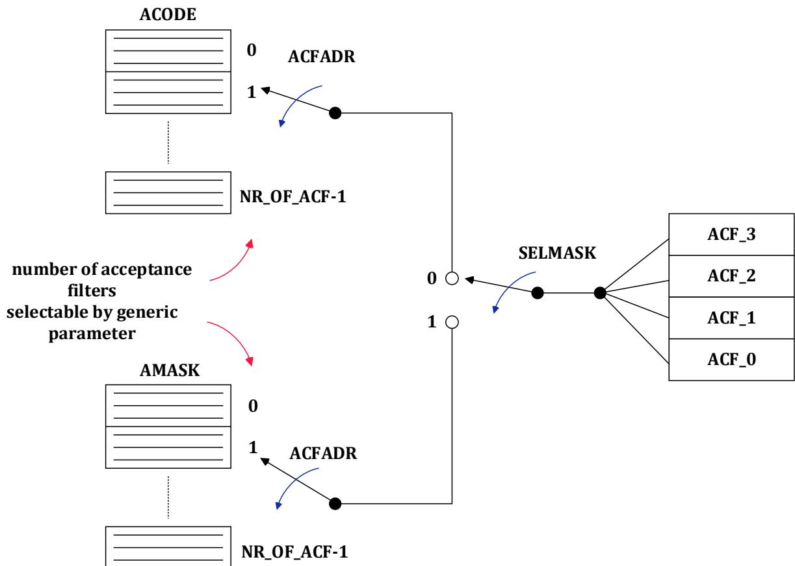  
图 21-7 接收过滤器

21.3.3.20CAN\_TIMECFG CiA603 时间戳配置寄存器

地址：0x4001\_88B5

复位值：0x02

<table><tr><td colspan="3">15 14 13 12 11 10 9 8 7 6 5 4 3 2 1 0</td></tr><tr><td rowspan="3"></td><td>TIMEPOS</td><td>TIMEEN</td></tr><tr><td>RW</td><td>RW</td></tr><tr><td>1</td><td>0</td></tr></table>

<table><tr><td>位置</td><td>位名称</td><td>说明</td></tr><tr><td>[7:2]</td><td>--</td><td>保持默认值</td></tr><tr><td>[1]</td><td>TIMEPOS</td><td>时间戳位置0-SOF1-EOFTIMEPOS只能在TIMEEN=0时更改,但可以在设置TIMEEN=1的同时修改TIMPOS。</td></tr><tr><td>[0]</td><td>TIMEEN</td><td>时间戳使能0-禁用1-启用</td></tr></table>

## 21.3.3.21CAN\_ACFEN ID 过滤器使能寄存器

地址：0x4001\_88B6

复位值：0x1

表 21-31 ID 过滤器使能寄存器 CAN\_ACFEN

<table><tr><td>15</td><td>14</td><td>13</td><td>12</td><td>11</td><td>10</td><td>9</td><td>8</td><td>7</td><td>6</td><td>5</td><td>4</td><td>3</td><td>2</td><td>1</td><td>0</td></tr><tr><td>AE_15</td><td>AE_14</td><td>AE_13</td><td>AE_12</td><td>AE_11</td><td>AE_10</td><td>AE_9</td><td>AE_8</td><td>AE_7</td><td>AE_6</td><td>AE_5</td><td>AE_4</td><td>AE_3</td><td>AE_2</td><td>AE_1</td><td>AE_0</td></tr><tr><td>RW</td><td>RW</td><td>RW</td><td>RW</td><td>RW</td><td>RW</td><td>RW</td><td>RW</td><td>RW</td><td>RW</td><td>RW</td><td>RW</td><td>RW</td><td>RW</td><td>RW</td><td>RW</td></tr><tr><td>0</td><td>0</td><td>0</td><td>0</td><td>0</td><td>0</td><td>0</td><td>0</td><td>0</td><td>0</td><td>0</td><td>0</td><td>0</td><td>0</td><td>0</td><td>1</td></tr></table>

<table><tr><td>位置</td><td>位名称</td><td>说明</td></tr><tr><td>[31:16]</td><td></td><td>未使用</td></tr><tr><td>[15]</td><td>AE_15</td><td>ACF_15 使能 (Acceptance Filter 15 Enable)1: 使能0: 禁止</td></tr><tr><td>[14]</td><td>AE_14</td><td>ACF_14 使能 (Acceptance Filter 14 Enable)1: 使能0: 禁止</td></tr><tr><td>[13]</td><td>AE_13</td><td>ACF_13 使能 (Acceptance Filter 13 Enable)1: 使能0: 禁止</td></tr><tr><td>[12]</td><td>AE_12</td><td>ACF_12 使能 (Acceptance Filter 12 Enable)1: 使能0: 禁止</td></tr><tr><td>[11]</td><td>AE_11</td><td>ACF_11 使能 (Acceptance Filter 11 Enable)1: 使能0: 禁止</td></tr><tr><td>[10]</td><td>AE_10</td><td>ACF_10 使能 (Acceptance Filter 10 Enable)1: 使能0: 禁止</td></tr><tr><td>[9]</td><td>AE_9</td><td>ACF_9 使能 (Acceptance Filter 9 Enable)1: 使能0: 禁止</td></tr><tr><td>[8]</td><td>AE_8</td><td>ACF_8 使能 (Acceptance Filter 8 Enable)1: 使能0: 禁止</td></tr><tr><td>[7]</td><td>AE_7</td><td>ACF_7 使能 (Acceptance Filter 7 Enable)1: 使能0: 禁止</td></tr><tr><td>[6]</td><td>AE_6</td><td>ACF_6 使能 (Acceptance Filter 6 Enable)1: 使能0: 禁止</td></tr><tr><td>[5]</td><td>AE_5</td><td>ACF_5 使能 (Acceptance Filter 5 Enable)1: 使能0: 禁止</td></tr><tr><td>[4]</td><td>AE_4</td><td>ACF_4 使能 (Acceptance Filter 4 Enable)1: 使能0: 禁止</td></tr><tr><td>[3]</td><td>AE_3</td><td>ACF_3 使能 (Acceptance Filter 3 Enable)1: 使能0: 禁止</td></tr><tr><td>[2]</td><td>AE_2</td><td>ACF_2 使能 (Acceptance Filter 2 Enable)1: 使能0: 禁止</td></tr><tr><td>[1]</td><td>AE_1</td><td>ACF_1 使能 (Acceptance Filter 1 Enable)1: 使能0: 禁止</td></tr><tr><td>[0]</td><td>AE_0</td><td>ACF_0 使能 (Acceptance Filter 0 Enable)1: 使能0: 禁止Filter 0 默认开启</td></tr></table>

每个接收过滤器 (AMASK / ACODE) 可以单独启用或禁用。硬件复位后，默认仅启用 Filter 0。禁用的过滤器拒绝接收任何消息。只有启用的过滤器进行适当的AMASK/ACODE 配置才能接收消息。

要接收所有消息，须设置 AE\_x=1 来启用一个过滤器 x，同时 AMASK\_x=0xFF 和 ACODE\_x=0x00。这是 Filter 0 硬件复位后的默认配置，而所有其他过滤器都被禁用。

## 21.3.3.22CAN\_ACF ID 过滤器寄存器

地址：0x4001\_88B8

复位值：0x0

表 21-32 ID 过滤器寄存器 CAN\_ACF

<table><tr><td>31</td><td>30</td><td>29</td><td>28</td><td>27</td><td>26</td><td>25</td><td>24</td><td>23</td><td>22</td><td>21</td><td>20</td><td>19</td><td>18</td><td>17</td><td>16</td></tr><tr><td rowspan="3"></td><td>IDCMP</td><td>IDMASK</td><td colspan="13">ID ACR [28:16] or AMR [28:16]</td></tr><tr><td>RW</td><td>RW</td><td colspan="13">RW</td></tr><tr><td>0</td><td>0</td><td colspan="13">0</td></tr><tr><td>15</td><td>14</td><td>13</td><td>12</td><td>11</td><td>10</td><td>9</td><td>8</td><td>7</td><td>6</td><td>5</td><td>4</td><td>3</td><td>2</td><td>1</td><td>0</td></tr></table>

<table><tr><td>ID ACR [15:00] or AMR [15:00]</td></tr><tr><td>RW</td></tr><tr><td>0</td></tr></table>

<table><tr><td>位置</td><td>位名称</td><td>说明</td></tr><tr><td>[31]</td><td>--</td><td>保持默认值</td></tr><tr><td>[30]</td><td>IDCMP</td><td>SELMASK=1时有效,ID AMR(MASK)选择作用范围1: ID过滤器只接收标准帧或者扩展帧,由IDMASK进一步指定0: ID过滤器接收标准帧和扩展帧两种格式</td></tr><tr><td>[29]</td><td>IDMASK</td><td>IDCMP位为1时,MASK选择哪种帧格式1: ID过滤器仅接收扩展帧格式0: ID过滤器仅接收标准帧格式</td></tr><tr><td>[28:0]</td><td>IDCODE/MASK</td><td>CAN_ACFCTRL.ACFADR选择具体的ID过滤器组SELMASK=0,表示ID过滤器选择的是IDACRSELMASK=1,表示ID过滤器选择的是IDAMR标准帧格式时ID ACR/AMR的范围是Bit10-Bit0,扩展帧格式时的范围是Bit28-Bit0</td></tr></table>

## 21.3.3.23CAN\_TBSLOT TTCAN 发送缓冲区指针寄存器

地址：0x4001\_88BE

复位值：0x00

表 21-33 TTCAN 发送缓冲区指针 CAN\_TBSLOT

<table><tr><td colspan="6">15 14 13 12 11 10 9 8 7 6 5 4 3 2 1 0</td></tr><tr><td rowspan="3"></td><td>TBE</td><td>TBF</td><td colspan="2">TBPTR</td><td></td></tr><tr><td>RW</td><td>RW</td><td colspan="2">RW</td><td></td></tr><tr><td>0</td><td>0</td><td colspan="2">0</td><td></td></tr></table>

<table><tr><td>位置</td><td>位名称</td><td>说明</td></tr><tr><td>[7]</td><td>TBE</td><td>将 PTB/STB 消息槽设置为“空”1- 将 TBPTR 选择的消息标记为“空的”0- 无动作一旦消息槽被标记为空且 TSFF=0,TBE 就会自动重置为 0。如果消息正在被发送,则只要发送完成或在传输错误或仲裁丢失之后传输不再进行,TBE 就会保持置位状态。如果 TBF 和 TBE 同时被设置为 1,则 TBE 优先。</td></tr><tr><td>[6]</td><td>TBF</td><td>将 TB 消息槽设置为“已填充”1- TBPTR 选择的消息应标记为“填充”0- 无动作一旦消息槽被标记为已满且 TSFF=1,TBF 就会自动重置为 0。如果 TBF 和 TBE 同时被设置为 1,则 TBE 优先。</td></tr><tr><td>[5:0]</td><td>TBPTR</td><td>指向 TB 消息的指针。0x00 - 指向 PTB其他 - 指向 STB 中的消息槽TBPTR 指向的消息槽可以使用 TBUF 寄存器读取/写入。只有在 TSFF=0 时才能进行写访问。将 TBF 设置为 1 将所选消息槽标记为已填充,将 TBE 设置为 1 将所选消息槽标记为空。TBSEL 和 TSNEXT 在 TTCAN 模式下无意义。TBPTR 仅限于 PTB 和 STB 消息槽。如果 TBPTR 太大并指向一个不可用的消息槽,则 TBF 和 TBE 将自动重置并且不执行任何操作。</td></tr></table>

## 21.3.3.24CAN\_TTCFG TTCAN 配置寄存器

地址：0x4001\_88BF

复位值：0x90

表 21-34 TTCAN 配置寄存器 CAN\_TTCFG

<table><tr><td>15</td><td>14</td><td>13</td><td>12</td><td>11</td><td>10</td><td>9</td><td>8</td><td>7</td><td>6</td><td>5</td><td>4</td><td>3</td><td>2</td><td>1</td><td>0</td></tr><tr><td></td><td></td><td></td><td></td><td></td><td></td><td></td><td></td><td>WTE</td><td>WTE</td><td>TEF</td><td>TTE</td><td>TTF</td><td colspan="2">T_PRESC</td><td>TTEN</td></tr></table>

<table><tr><td rowspan="2"></td><td>RW</td><td>RW</td><td>RW</td><td>RW</td><td>RW</td><td>RW</td><td>RW</td></tr><tr><td>1</td><td>0</td><td>0</td><td>1</td><td>0</td><td>0</td><td>0</td></tr></table>

<table><tr><td>位置</td><td>位名称</td><td>说明</td></tr><tr><td>[7]</td><td>WTIE</td><td>超时监测触发中断使能</td></tr><tr><td>[6]</td><td>WTIF</td><td>超时监测触发中断标志如果循环计数达到由TT_WTRIG定义的门限值并且WTIE=1,则WTIF置位</td></tr><tr><td>[5]</td><td>TEIF</td><td>触发错误中断标志TEIF始终使能</td></tr><tr><td>[4]</td><td>TTIE</td><td>时间触发中断使能如果设置TTIE=1,则如果循环计数等于触发时间TT_TRIG,则TTIF置位。</td></tr><tr><td>[3]</td><td>TTIF</td><td>时间触发中断标志如果设置TTIE=1并且循环计数等于触发时间TT_TRIG,则TTIF置位。向TTIF写入1清零。写0无影响。TTIF将只设置一次。如果TT_TRIG没有更新,则在下一个基本周期中不会再次设置TTIF。</td></tr><tr><td>[2:1]</td><td>T_PRESC</td><td>TTCAN定时器预分频设置00-101-210-411-8TTCAN时基是由S_PRES、S_SEG_1和S_SEG_2定义的CAN bit时间。使用T_PRESC定义了额外的预分频因子1、2、4或8。T_PRESC只能在TTEN=0时修改,但可以在修改T_PRESC的同时设置TTEN=1。</td></tr><tr><td>[0]</td><td>TTEN</td><td>TTCAN启用1-TTCAN启用,循环计数定时器开启计数0-禁用</td></tr></table>

要重置中断标志，软件需要写入 1。写入0无效。如果在写访问处于活动状态时发生新的中断事件，则该事件将置位中断标志（写清零被覆盖）。这确保了不会丢失任何中断事件。

在设置了相关的中断使能位时，才会设置中断标志。

21.3.3.25CAN\_REF\_MSG TTCAN 参考帧寄存器

地址：0x4001\_88C0

复位值：0x00

表 21-35 TTCAN 参考帧寄存器 CAN\_REF\_MSG

<table><tr><td>31</td><td>30</td><td>29</td><td>28</td><td>27</td><td>26</td><td>25</td><td>24</td><td>23</td><td>22</td><td>21</td><td>20</td><td>19</td><td>18</td><td>17</td><td>16</td></tr><tr><td>REF_IDE</td><td colspan="2" rowspan="2"></td><td colspan="13">REF_ID</td></tr><tr><td>RW</td><td colspan="13">RW</td></tr><tr><td>0</td><td colspan="2"></td><td colspan="13">0</td></tr><tr><td>15</td><td>14</td><td>13</td><td>12</td><td>11</td><td>10</td><td>9</td><td>8</td><td>7</td><td>6</td><td>5</td><td>4</td><td>3</td><td>2</td><td>1</td><td>0</td></tr><tr><td colspan="16">REF_ID</td></tr><tr><td colspan="16">RW</td></tr><tr><td colspan="16">0</td></tr></table>

<table><tr><td>位置</td><td>位名称</td><td>说明</td></tr><tr><td>[31]</td><td>REF_IDE</td><td>参考帧 IDE 位</td></tr><tr><td>[30:29]</td><td></td><td></td></tr><tr><td>[28:0]</td><td>REF_ID</td><td>参考帧标识符。如果 REF_IDE 是1 - REF_ID(28:0) 有效(扩展 ID)0 - REF_ID(10:0) 有效(标准 ID)REF_ID 在 TTCAN 模式下用于检测参考帧。这适用于时间从站(接收)以及时间主站(传输)。如果检测到参考帧并且没有错误,则该帧的 Sync_Mark 将成为 Ref_Mark。REF_ID(2:0)强制为 0。CAN 控制器仅通过 ID 识别参考帧。有效载荷未经测试。附加说明:时间主机发送参考帧的方式和正常帧相同。 REF_ID 用于检测参考帧的成功传输。</td></tr></table>

表 21-4 给出了 REF\_MSG\_0 到 REF\_MSG\_2 内 REF\_ID 和 REF\_IDE 的 bit 位置定义。

对 CAN\_REF\_MSG 的写访问将参考帧同步到 CAN 时钟域。在此期间对 CAN\_REF\_MSG 的再次写操作被禁用。

## 21.3.3.26CAN\_TRG\_CFG TTCAN 触发配置寄存器

地址：0x4001\_88C4

复位值：0x00

表 21-36 TTCAN 触发配置寄存器 CAN\_TRG\_CFG

<table><tr><td>15</td><td>14</td><td>13</td><td>12</td><td>11</td><td>10</td><td>9</td><td>8</td><td>7</td><td>6</td><td>5</td><td>4</td><td>3</td><td>2</td><td>1</td><td>0</td></tr><tr><td colspan="3">TEW</td><td rowspan="3" colspan="2"></td><td colspan="3">TTYPE</td><td rowspan="3" colspan="2"></td><td colspan="6">TTPTR</td></tr><tr><td colspan="3">RW</td><td colspan="3">RW</td><td colspan="6">RW</td></tr><tr><td colspan="3">0</td><td colspan="3">0</td><td colspan="6">0</td></tr></table>

<table><tr><td>位置</td><td>位名称</td><td>说明</td></tr><tr><td>[15:12]</td><td>TEW</td><td>发送使能窗口对于单次发射触发,允许帧开始的循环时间最多有 16 个 cycle。TWE+1 定义了 cycle 数。见章节 TTCAN Timin。TEW=0 将传输启用窗口缩短到 1 个 cycle。</td></tr><tr><td>[11]</td><td></td><td>保留位</td></tr><tr><td>[10:8]</td><td>TTYPE</td><td>触发类型000 - 立即触发发送001 - 定时触发010 - 单次发射触发,针对独家时间窗口011 - 传输开始触发,针对合并仲裁时间窗口100 - 传输停止触发,针对合并仲裁时间窗口其他- 无动作触发时间由TT_TRIG定义。TTPTR选择TB中的消息。</td></tr><tr><td>[7:6]</td><td></td><td>保留位</td></tr><tr><td>[5:0]</td><td>TT_PTR</td><td>TB发送消息指针如果TTPTR太大并指向不可用的消息槽,则TEIF置位,并且在对TT_TRIG进行写访问后无法产生新的触发。如果TTPTR指向一个空槽,那么TEIF将在触发发送时被设置。</td></tr></table>

## 21.3.3.27CAN\_TT\_TRIG TTCAN 触发时刻寄存器

地址：0x4001\_88C6

复位值：0x00

表 21-37 TTCAN 触发时刻寄存器 CAN\_TT\_TRIG

<table><tr><td>15</td><td>14</td><td>13</td><td>12</td><td>11</td><td>10</td><td>9</td><td>8</td><td>7</td><td>6</td><td>5</td><td>4</td><td>3</td><td>2</td><td>1</td><td>0</td></tr><tr><td colspan="16">TT_TRIG</td></tr><tr><td colspan="16">RW</td></tr><tr><td colspan="16">0</td></tr></table>

<table><tr><td>位置</td><td>位名称</td><td>说明</td></tr><tr><td>[15:0]</td><td>TT_TRIG</td><td>触发时间TT_TRIG定义了触发时间。对于发送触发,相应帧的SOF的最早传输点将是TT_TRIG+1。</td></tr></table>

对 TT\_TRIG 的写操作会将触发相关配置同步到 CAN 时钟域。如果触发正处于活动状态，则所有寄存器 TRIG\_CFG、TT\_TRIG 的写入都被禁止。当达到触发时间（TTIF 置位）或检测到错误（TEIF置位）时，写锁定解除。

21.3.3.28CAN\_TT\_WTRIG TTCAN 超时寄存器

地址：0x4001\_88C8

复位值：0xFFFF

表 21-38 TTCAN 超时寄存器 CAN\_TT\_WTRIG

<table><tr><td>15</td><td>14</td><td>13</td><td>12</td><td>11</td><td>10</td><td>9</td><td>8</td><td>7</td><td>6</td><td>5</td><td>4</td><td>3</td><td>2</td><td>1</td><td>0</td></tr><tr><td colspan="16">TT_WTRIG</td></tr><tr><td colspan="16">RW</td></tr><tr><td colspan="16">0xFFFF</td></tr></table>

<table><tr><td>位置</td><td>位名称</td><td>说明</td></tr><tr><td>[15:0]</td><td>TT_WTRIG</td><td>超时触发时间TT_WTRIG定义了超时触发周期。初始值是最大周期时间 0xFFFF。</td></tr></table>

对 TT\_WTRIG 的写操作触发寄存器值同步到 CAN 时钟域，耗时 6 个 CAN 时钟。在此期间，寄存器 TT\_WTRIG禁止再次写入。

## 21.3.3.29CAN\_CIAWDAT0 CiA603 时间戳低 32 位写入值寄存器

地址：0x4001\_88D0

复位值：X

表 21-39 CiA603 时间戳低 32 位写入值寄存器 CAN\_CIAWDAT0

<table><tr><td>31</td><td>30</td><td>29</td><td>28</td><td>27</td><td>26</td><td>25</td><td>24</td><td>23</td><td>22</td><td>21</td><td>20</td><td>19</td><td>18</td><td>17</td><td>16</td></tr><tr><td colspan="16">WDATA</td></tr><tr><td colspan="16">RW</td></tr><tr><td colspan="16">X</td></tr><tr><td>15</td><td>14</td><td>13</td><td>12</td><td>11</td><td>10</td><td>9</td><td>8</td><td>7</td><td>6</td><td>5</td><td>4</td><td>3</td><td>2</td><td>1</td><td>0</td></tr><tr><td colspan="16">WDATA</td></tr><tr><td colspan="16">RW</td></tr><tr><td colspan="16">X</td></tr></table>

<table><tr><td>位置</td><td>位名称</td><td>说明</td></tr><tr><td>[31:0]</td><td>WDATA</td><td>CiA603 时间戳低 32 位写入值</td></tr></table>

## 21.3.3.30CAN\_CIAWDAT1 CiA603 时间戳高 32 位写入值寄存器

地址：0x4001\_88D4

复位值：X

表 21-40 CiA603 时间戳高 32 位写入值寄存器 CAN\_CIAWDAT1

<table><tr><td>31</td><td>30</td><td>29</td><td>28</td><td>27</td><td>26</td><td>25</td><td>24</td><td>23</td><td>22</td><td>21</td><td>20</td><td>19</td><td>18</td><td>17</td><td>16</td></tr><tr><td colspan="16">WDATA</td></tr><tr><td colspan="16">RW</td></tr><tr><td colspan="16">X</td></tr><tr><td>15</td><td>14</td><td>13</td><td>12</td><td>11</td><td>10</td><td>9</td><td>8</td><td>7</td><td>6</td><td>5</td><td>4</td><td>3</td><td>2</td><td>1</td><td>0</td></tr></table>

<table><tr><td>WDATA</td></tr><tr><td>RW</td></tr><tr><td>X</td></tr></table>

<table><tr><td>位置</td><td>位名称</td><td>说明</td></tr><tr><td>[31:0]</td><td>WDATA</td><td>CiA603 时间戳高 32 位写入值</td></tr></table>

## 21.4 一般操作

本章介绍CAN 通信操作。在进行通信之前，须配置CAN 控制器以匹配CAN 总线时序。

## 21.4.1 接收过滤器

为了减少CPU接收帧的负载，可以配置CAN控制器使用接收过滤器。 CAN 控制器在接收过滤期间检查消息标识符。因此，每个接收过滤器的长度为29bit。

如果消息通过其中一个过滤器，那么它将被接收，并将存储到 RB 中，如果 RIE=1，则 RIF 被置位。如果消息未被接收，则不设置 RIF 并且不增加 RB FIFO 指针。未被接收的消息将被丢弃并被下一条消息覆盖。没有存储的有效消息将被后续消息覆盖。

独立于接收过滤的结果，CAN控制器检查总线上的每条消息并向总线发送确认或错误帧。

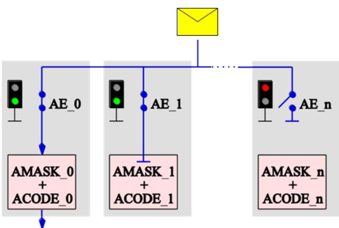  
图 21-8 接收过滤示例

接收掩码定义了需要将过滤器的哪些位和接收消息 ID进行比较判断。掩码位设置为 0，则接收ID与相应的消息标识符位进行比较。掩码位设置为1 则不进行接收检查，从而接收消息。

ID与相应的ACODE 进行比较，如下所示：

• 标准帧： ID(10:0) 与 ACODE(10:0)

• 扩展帧： ID(28:0) 与 ACODE(28:0)

示例：如果 AMASK\_x(0)=0 且所有其他 AMASK\_x 位为 1，则最后一个 ID 位的值必须等于ACODE(0) 才能接收消息。过滤器忽略所有其他 ID 位。

图 21-8给出了一个使用多个过滤器的接收过滤示例。在此示例中，过滤器0 和1 由 ACF\_EN\_x寄存器中的相应AE\_x位启用。所有其他过滤器都被禁用，因此不接收任何消息。对于启用的过滤器，AMASX\_x和 ACODE\_x 的组合定义了消息是被接收（如过滤器0）还是不被接收（如过滤器1）。

注意：通过设置 AE\_x=0，被禁用过滤器会阻止消息被接收。相反，设置 AMASK\_x 中的掩码位=1会禁用对该位的检查，从而允许接收消息。

AMASK 和 ACODE 的定义不区分标准帧或扩展帧。如果 CAN\_ACF.IDCMP=1，则接收帧类型由CAN\_ACF.IDMASK 决定。如果 CAN\_ACF.IDCMP=0 则两种类型帧都被接收。

上电复位后，CAN 控制器被配置为接收所有消息。上电后复位后，过滤器 0 由 AE\_0=1 启用，AMASK\_0 中的所有位都设置为 1 并且 CAN\_ACF.IDCMP=0。所有其他过滤器都被禁用。过滤器 0 是唯一为AMASK / ACODE 定义了复位值的过滤器，而所有其他过滤器都未定义复位值。

## 21.4.2 消息接收

接收到的数据将存储在RB 中。RB 具有类似FIFO的行为。如果启用RIE，则每条接收到的有效消息都会设置RIF=1。 RSTAT 根据填充状态设置。当填充缓冲区的数量等于可编程值AFWL时，如果设置了RAFIE=1，则RAFIF 置位。如果所有缓冲区都已满，若设置了RFIE=1，则RFIF置位。

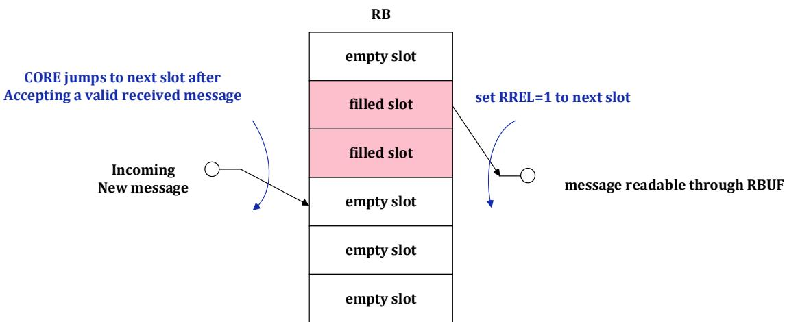  
图 21-9 类似 FIFO 的 RB 示意图（6 个消息槽的示例）

RB总是将最早消息映射到 RBUF寄存器。

CAN 2.0 消息的最大有效负载长度为 8 个字节，CAN FD 消息为 64 个字节。每条消息的数据长度由 DLC 定义。RB为每个消息提供了消息槽，并且主机软件需要设置 RREL以跳转到下一个 RB消息槽。RBUF的所有字节都可以按任何顺序读取。

如果 RB 已满，则将临时存储下一个传入的消息。然后如果 ROM=0，最早的消息将被最新的消息覆盖；如果 ROM=1，则最新的消息将被丢弃。如果启用 ROIE，则在这两种情况下都会导致 ROIF置位。如果主机软件读取了一条消息，并在新消息传入之前设置 RREL，则不会有消息被覆盖丢失。

如果没有接收过滤，CAN控制器每接收到每一帧，都会告知CPU。这将导致CPU 的负载相当大。

可以通过禁用中断并使用接收过滤器来减少主机控制器的负载。如果启用RIE 并且CAN 控制器已接收到有效消息，则RIF被设置为1。为了减少接收中断的数量，可以使用RAIE/RAIF（RB 几乎满中断）或 RFIE / RFIF（RB 满中断）代替 RIE / RIF（接收中断）。 “RB 几乎满门限”可使用 AFWL进行编程。

读取 RB 的步骤如下：

1. 使用RBUF寄存器从RB FIFO中读取最早的消息。

2. 设置RREL=1以释放RB消息槽。硬件会选择下一条消息（下一个FIFO槽）。 RBUF将会被自动更新。

3. 重复以上操作，直到RSTAT指示RB空。

如果RB FIFO已满并且新接收到的消息被识别为有效（6th EOF），则将丢失一个消息。为了让主机控制器有足够的时间，能够在RB FIFO被填满且发生中断之后从RB读取至少一帧，RB包含一个（隐藏）消息槽用于接收消息，验证它并在溢出发生之前检查它是否与接收过滤器匹配。

## 21.4.3 消息发送

在开始任何发送之前，至少有一个发送缓冲区（PTB 或 STB）已加载消息。TPE 指示 PTB FIFO空满，TSSTAT指示STB 的填充状态。TBUF寄存器提供对 PTB和 STB的访问。以下是推荐的编程流程：

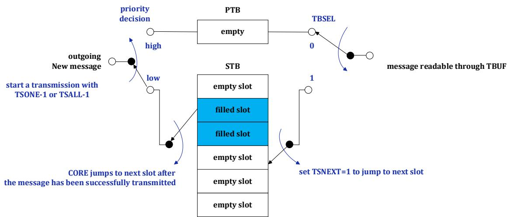  
图 21-10 FIFO 模式下的 PTB 和 STB 示意图（空 PTB 和 6 个 STB 消息槽）

CAN 2.0 消息的最大有效负载长度为 8 个字节，CAN FD 消息为 64 个字节。每条消息的长度由DLC 定义。对于远程帧（RTR=1），DLC 无意义，因为远程帧的数据长度始终为0字节。主机控制器需要设置TSNEXT以跳转到下一个STB 消息槽。所有 TBUF字节都可以按任何顺序写入。

如果 TBSEL=0 选择 PTB，则设置 TSNEXT=1 没有意义。在这种情况下，TSNEXT 会自动清零无其他影响。

使用 PTB 时应设置 TPE=1 启动传输。要使用STB，须设置 TSONE=1 开始传输单个消息或设置TSALL=1 以传输 STB 中的所有消息。

PTB的优先级总是高于STB。无论帧标识符如何，PTB 消息总是首先发送。如果来自 STB的传输已经处于活动状态，它将在来自 PTB的消息发送之前完成。在 PTB传输完成或中止后，CAN 控制器返回处理来自STB 的其他消息。

发送完成后，设置以下传输中断：

对于 PTB，如果 TPIE=1，则 TPIF 置位

对于 STB，如果 TSONE=1，一条消息已完成且 TSIE=1，则 TSIF 置位。

对于STB，如果TSALL=1，所有消息都已完成且 TSIE=1，则TSIF置位。换句话说：STB 发送完成后，则设置TSIF。如果主机控制器在 TSALL传输开始后向STB 写入附加消息，则附加消息也将在TSIF设置之前进行传输。

## 21.4.4 消息发送中止

实际应用中存在这种情况，传输缓冲区中的消息由于其低优先级而很久无法发送。为了避免这种情况发送，如果传输尚未开始，主控制器可以通过分别设置TPA=1 或TSA=1来撤回发送请求。

设置TPA和 TSA都将产生一个中断标志： AIF。CAN协议状态机只有在没有向 CAN总线传输任何内容时才会执行中止。

• 总线仲裁期间不能进行发送中止。

o 如果节点仲裁失败，则后续执行中止。

o 如果节点赢得仲裁，则该帧将被发送。

• 帧传输时不会进行发送中止。

o 如果一个帧被成功传输，则发送成功中断标志将通知CPU。在这种情况下，不会发生发送中止。

o 在CAN节点没有收到ACK的情况下，属于传输不成功，错误计数器会增加，可以执行传输中止。

o 如果STB中至少还剩一帧，而主机已下令发送所有帧 (TSALL=1)，则将产生帧完成事件和中止事件。

中止传输可能需要一些时间，具体取决于CAN 通信速度和帧长度。如果执行中止，则会导致以下动作：

• TPA释放PTB导致TPE=0。

• 释放PTB后，帧数据仍保存在PTB中。

TSA释放STB的单个消息槽或所有消息槽。这取决于是使用TSONE还是TSALL来启动传输。TSSTAT将被更新。 释放STB中的消息将导致消息丢失，因为主机软件无法再访问此消息。

不建议同时设置TPA 和TSA。如果主机软件这样做，则 AIF置位，来自PTB和STB的传输都将被中止。如前所述，如果在执行中止之前完成一次传输，这将导致发送成功传输标志置位。因此，如果启用，则以下中断标志置位：

• AIF（PTB和STB传输中止）

• TPIF + AIF

• TSIF + AIF

• TPIF + TSIF（非常少见，只有在主机不立即处理TPIF时才会发生）

• TPIF+TSIF+AIF （非常很少，只有在主机不立即处理TPIF和TSIF时才会发生）

要清空整个STB，可以设置 TSALL和TSA。为了检测消息是否因为失去仲裁而无法长时间发送，主机可以使用 ALIF/ALIE。

## 21.4.5 STB 空满

写入STB 后，设置TSNEXT=1可以将当前缓冲区消息槽标记为已满，并跳转到下一个空闲消息槽。 TSNEXT 在此操作后由 CAN 控制器自动复位为 0。

如果最后一个消息槽已被填满，所有消息槽都被占用，则 TSNEXT 保持为 1，直到有新的消息槽空闲。当 TSNEXT=1 时，写入 TBUF 被 CAN 控制器禁止。

当消息槽空闲时，CAN控制器自动将TSNEXT重置为 0。如果STB 的帧成功发送或主机请求中止 (TSA=1)，则消息槽变为空闲。如果 TSALL传输被中止，则 TSNEXT也被复位，并将整个STB 标记为空。

## 21.4.6 错误处理

通常，CAN 控制器可以自动进行错误处理，这意味着在大多数情况下主机控制器无须关心错误，包括自动重传消息和自动删除收到的错误消息。另一方面，如果主机需要，CAN 控制器可以选择性地提供有关错误的详细信息，并通过中断向主机发送每个错误信号。使得能够在主机上运行诸如CAN总线监视器之类的应用程序。

每个CAN 节点都有3 种错误处理状态：

1. Error-Active：节点在检测到错误时自动发送活动错误帧。

2. Error-Passive：节点在检测到错误时传输被动错误帧，即它不会将显性值传输到总线。

3. 总线关闭：在出现太多错误后，节点进入“总线关闭”状态，停止访问CAN总线。

为了处理这3种错误状态，每个CAN节点都有两个错误计数器：发送错误计数器和接收错误计数器。两者都按照CAN规范的定义递增和递减，并且在节点达到CAN 规范定义的计数值时进入适当的错误状态。

如果有错误，错误计数器会增加。由该节点引起的严重错误将导致计数器加8，由其他节点引起的错误将导致计数器加 1。有效帧发送或有效接收会令计数器减 1。所有这些都由 CAN 规范定义并由 CAN 控制器自动处理。

错误帧（或者更贴切的名称为：错误标志）与数据帧不同。它是至少 6 个连续显性位的显性脉冲，这对其他节点来说是填充位违规。主机控制器软件不能主动发送错误帧。它由CAN 控制器全自动完成。

如果CAN 控制器收到指令需要传输一帧，那么它会尝试传输并反复地自动重传，直到该帧被正确传输或节点关闭总线。如果接收到帧并且CAN 控制器检测到错误，则丢弃接收到的数据，并发送错误帧，通知帧的发送者将重新传输该帧。 RBUF 中的帧永远不会被有错误的帧覆盖。只有有效的接收帧可能导致RBUF溢出。

## 21.4.7 BUS Off

“总线关闭”状态由寄存器 CAN\_CFG\_STAT 中的 BUSOFF 来指示。如果 CAN 节点的发送错误计数>255，则CAN 节点自动进入“总线关闭”状态。然后它不会参与进一步的通信，直到它再次返回到错误激活状态。如果EIE使能，则BUSOFF置位的同时也会置位 EIF中断。如果CAN节点被上电复位或接收到 128 个 11 个隐性位序列（恢复序列），则 CAN 节点返回到错误激活状态。请注意，在每个恢复序列之间，总线可能具有显性状态。

在“总线关闭”状态下，RECNT 和 TECNT 保持不变。需要注意的是，在进入总线关闭状态时，TECNT 自动置 0，不会再变化。建议在节点进入总线关闭状态之前使用 TECNT，之后使用状态位BUSOFF来判断总线状态。

当节点进入总线关闭状态时，TECNT和RECNT的值自动置零，且在总线关闭状态恢复之前，其值都不会有变化；当节点从“总线关闭”状态恢复，RECNT和 TECNT重新启用，初始值为 0。

如果一帧正在等待传输但CAN 节点已进入总线关闭状态，则该帧保持等待状态。如果节点在总线关闭后返回到错误激活状态，则将尝试传输此帧。如果不希望这样做，则应由主机控制器中止该帧。

## 21.4.8 扩展状态和错误报告

在CAN总线通信期间，可能会出现传输错误。以下功能支持对其进行检测和分析。

## 21.4.8.1 可编程错误警告门限值

接收/发送期间的错误由 RECNT 和 TECNT 计数。主控制器可以使用 CAN\_LIMIT 中的可编程错误警告限制EWL对这些事件做出灵活反应。可以从8 到128以 8个错误为步长选择门限值：

错误计数门限值= (EWL+1)×8

如果在以下条件下EIE使能，则EIF中断将置位：

• RECNT 或 TECNT 超过错误警告门限，或超过后再递减至小于警告门限

• BUSOFF 位被更改。

## 21.4.8.2 仲裁丢失捕获 (ALC)

内核能够检测仲裁字段中仲裁丢失的确切位位置。如果启用了ALIF中断，则该事件被记录并且

ALIF置位。如果节点能够赢得仲裁，则ALC 的值保持不变，保存上次仲裁失败的旧值。

ALC 值定义如下： 一帧以 SOF 开始，然后开始传输 ID 的第 1bit。 ID 的第 1bit 对应 ALC 的值为 0，ID 的第 2bit 对应 ALC 值为 1，以此类推。

仲裁只允许在仲裁域中进行。因此，ALC 的最大值为 31，即扩展帧中的RTR 位。

附加提示：如果标准远程帧与扩展帧进行仲裁，扩展帧在 IDE位失去仲裁，ALC 将为 12。发送标准远程帧的节点不会注意到已发生仲裁，因为这节点赢得了仲裁。

仲裁域之外的仲裁损失是不可能发生的。这样的事件实际是位传输错误。

## 21.4.8.3 错误类型 (KOER)

CAN 控制器识别 CAN 总线上的错误并将最后一个错误事件存储在 KOER 位中。如果启用了BEIF 中断，则 CAN 总线错误可以发出中断信号。每个新的错误事件都会覆盖之前存储的 KOER 值。因此，主机控制器必须对错误事件做出快速反应。错误代码见表21-41。

每个新错误都会更新 KOER。因此，当成功发送或接收帧时，它保持不变。以便于事后进行错误检查。

## 21.4.8.4 接收所有数据帧 (RBALL)

如果 RBALL=1，那么所有接收到的数据帧都会被存储，即使是有错误的。这也适用于环回模式。只有数据帧存储在 RBUF 中。不存储错误帧或过载帧。

如果启用 CiA 603 时间戳 (TIMEEN=1) 功能并且采用 EOF 时刻为时间戳 (TIMEPOS=1)，则在出现错误的情况下，将在错误帧开始时获取时间戳。

大多数可能的错误只有在节点是帧的发送者时才会发生。在这种情况下，如果激活了环回模式，则帧将仅存储在 RBUF 中。根据错误的类型，存储在 RBUF 时隙中的帧的部分可能是有效的，而其他部分是未知的。

表 21-41 RBALL 和 KOER

<table><tr><td>KOER</td><td>状况</td><td>描述</td></tr><tr><td>NO ERROR</td><td>All</td><td>接收成功。</td></tr><tr><td rowspan="2">BIT ERROR</td><td>Receiver</td><td>只能发生在 ACK 中。所有存储的数据都是有效的。</td></tr><tr><td>Transmitter</td><td>有效载荷始终无效。包括 ID 的帧头可能是有效的。在仲裁阶段检测到错误位属于仲裁授权失败,因此不是位错误。但是如果在仲裁阶段的填充比特被帧的发送器检测到错误,那么则是一个比特错误,帧头是无效的。</td></tr><tr><td>FORM ERROR</td><td>All</td><td>仅涵盖数据帧中的 FORM ERROR。这包括 CRC 定界符、ACK 定界符或 EOF 位中的错误。所有存储的数据都是有效的。</td></tr><tr><td rowspan="2">STUFF ERROR</td><td>Receiver</td><td>STUFF ERROR 的位置未知。所有存储的数据均无效。</td></tr><tr><td>Transmitter</td><td>只能在仲裁期间发生。所有存储的数据均无效。</td></tr><tr><td rowspan="2">ACK ERROR</td><td>Receiver</td><td>仅当节点在 LOM 中时才会发生。所有存储的数据都是有效的。</td></tr><tr><td>Transmitter</td><td>只能在没有自 ACK 的环回模式下发生。所有存储的数据都是有效的。</td></tr></table>

<table><tr><td>CRC ERROR</td><td>Receiver</td><td>所有存储的数据均无效。</td></tr></table>

请注意，即使（部分）数据在被标志位指示为有效的，也存在可能是包含接收错误的消息数据。例如：如果节点的位时序配置错误，即没有正确同步，也可能收到无效数据。因此，数据（部分）有效的声明仅表明它可能是有效的。

## 21.4.9 扩展功能

## 21.4.9.1 单次传输

有时不需要自动重新传输。因此，可以通过设置 TPSS=1 令发送缓冲器 PTB 发送一帧，或通过设置 TSSS=1 令发送缓冲器 STB 发送一次消息。在这种情况下，在传输发生错误或仲裁丢失时不会执行重新传输。

在立即成功传输的情况下，与正常传输没有区别。但在传输不成功的情况下，会发生以下情况：

• 如果TPIF=1，则设置相应的发送缓冲区消息槽被清空

如果出现错误，KOER 和错误计数器会被更新。如果BEI=1，则BEIF会被置位，其他相应错误中断标志将置位。

• 在仲裁失败的情况下，如果ALIE=1，则ALIF置位。

因此，对于单次传输，TPIF 本身并不能指示帧是否已成功传输。单发传输只能与 BEIF 和 ALIF一起使用。

如果单次传输与TSALL一起使用，并且STB 中存在多于一帧，则对每一帧进行单次传输。无论是否有未成功传输（例如， ACK 错误），CAN 控制器都会前进到下一帧并在 STB 为空时停止。因此，在这种情况下，只有错误计数器可以指示成功发送了多少帧。如果两个帧之一出错，主机无法获知哪一帧被成功发送了。

如果总线被另一帧占用，如果开始单发传输，则CAN 控制器等待总线空闲，然后尝试传输单发帧。

## 21.4.9.2 监听模式 (LOM)

LOM 模式提供了在不影响总线的情况下监控 CAN 总线的能力。CAN 控制器的 LOM 与 CAN FD规范中定义的总线监控功能兼容。

另一个应用是自动波特率检测，主机控制器尝试不同的时序设置，直到没有错误发生。

在LOM 模式中，错误（KOER、BEIF）情况仍被检测。

在 LOM 模式中，CAN 控制器无法将显性位写入总线（没有活动的错误标志或过载标志，没有ACK）。遵从以下规则：

• 在LOM中，协议状态机就像处于错误被动模式一样，其中只有隐性错误标志被生成。状态寄存器可以被修改。

• 在LOM中，协议状态机不会生成显性ACK。

• 无论发生任何错误，错误计数器都保持不变。

• 如果一个节点传输一帧，那么只有在至少一个附加节点连接到总线上。且不处于LOM模式时，才会在总线上生成一个可见的 ACK。此时，就不会有错误，所有节点（也包括 LOM中的节点）都将收到该ACK。

• 如果在ACK错误后主动或被动错误标志置位，则节点会检测到ACK错误。

当节点正在发送时，不应设置成LOM 模式。

如果启用LOM，则无法进行发送。

环回模式（外部）LBME 对 LOM 的行为起着重要作用。如果禁用 LBME，则节点无法将任何显性位写入总线。但是如果 LBME 被激活，那么节点就被允许发送self-ACK (SACK) 帧，但节点不会以ACK 响应来自其他节点的帧，也不会生成错误或过载帧。总而言之，LOM 和 LBME 的组合是“一个静默的接收器，可以在必要时进行传输”。

## 21.4.9.3 总线连接测试

要检查节点是否连接到总线，可以执行以下步骤：

• 传送一帧。如果节点连接到总线，则在RX线路上可以观测到TX发送的消息。

• 如果有其他节点连接到CAN总线，则可以预期有其他节点发送ACK。

如果本节点是唯一连接到CAN总线的节点（但总线、收发器和 CAN控制器内核之间的连接良好），则在ACK位发生错误，因为其他节点没有发送ACK。BEIF错误中断将置位并且KOER= “100” （ACK错误）。

如果与收发器或总线的连接断开，则在SOF位之后BEIF错误中断将立即置位并且设置KOER=“001” (BIT错误）。

## 21.4.9.4 环回模式（LBMI 和 LBME）

CAN 控制器支持两种环回模式：内部回环(LBMI)和外部回环(LBME)。这两种模式都会导致接收到自己发送的帧，便于自检。

在 LBMI 中，CAN 控制器与 CAN 总线断开连接，并且 txd 输出设置为隐性电平。输出数据流在内部反馈到输入端。在LBMI中，节点生成自ACK以避免 ACK错误。

在 LBME 中，CAN 控制器保持与收发器的连接，传输的帧将在总线上可见。借助收发器，CAN控制器也可以接收到自己发出的帧。在 LBME 中，节点在 SACK=0 时不生成Self-ACK，但在SACK=1时生成Self-ACK。因此，在 SACK=0 的LBME中，帧传输有两种可能的结果：

1. 其他节点收到帧后发出ACK，从而完成一次成功的传输。

2. 总线上无其他节点，导致出现ACK错误。 如果不了解总线上是否有其他节点，为避免重传和错误计数器递增，建议使用TPSS或TSSS进行发送。

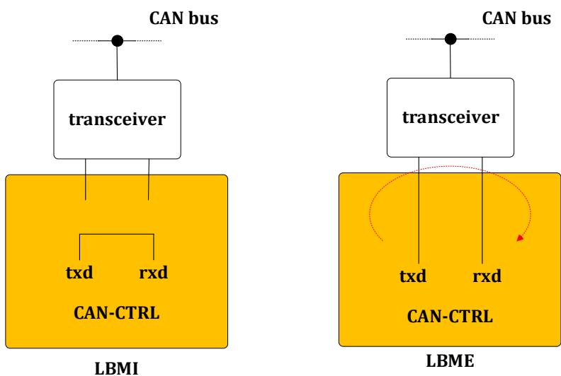  
图 21-11 环回模式：内部和外部

在环回模式下，CAN 控制会接收自己的消息，将其存储在 RBUF 中，并设置适当的接收和发送中断标志（如果启用）。

LBMI 可用于芯片内部和软件测试，而 LBME 可以测试收发器及总线连接。

当传输处于活动状态时，不应设置 LBMI=1或 LBME=1。主机软件应避免如此配置。 CAN控制器硬件没有额外的保护。

如果节点连接到CAN总线，则不能通过简单地设置LBMI=0来切换回正常操作，因为此时另一个 CAN 节点可能正在传输。在这种情况下，应通过将位 RESET 设置为 1 来切换回正常操作，自动将 LBMI 清除为 0。最后设置 RESET=0，CAN 控制器恢复正常操作。与此相反，LBME 每次都可以禁用。

LBME 可以与 LOM 结合使用。

## 21.4.9.5 错误计数器复位

根据 CAN/CAN FD 标准RECNT计数接收错误，TECNT计数发送错误。在过多的传输错误之后，CAN 节点必须进入总线关闭状态。RESET 不会修改错误计数器或总线关闭状态。CAN/CAN FD 规范定义了如何禁用总线关闭状态和减少错误计数器的规则。如果只是发生一个临时错误，节点会自动从错误中恢复。经典的CAN 2.0B 规范定义了这种无需主机控制器交互的自动行为。

CAN FD规范更为灵活，允许主机控制器接管这种自动错误计数器处理机制。但这应该格外小心，建议仅用于调试目的。

向CAN\_CFG\_STAT.BUSOFF写入1 会重置错误计数器，同时强制节点离开总线关闭状态，动作期间 EIF 不置位。

## 21.4.10 软件复位

CAN\_CFG\_STAT.RESET=1 时，CAN 控制器处于件复位状态。但不是 CAN 控制器内所有模块都被

RESET复位。部分模块只会被硬件复位。对于软件和硬件复位，复位值相同。

表 21-42 软件复位

<table><tr><td>寄存器</td><td>Reset</td><td>描述</td></tr><tr><td>ACFADR</td><td>No</td><td>-</td></tr><tr><td>ACODE_x</td><td>No</td><td>如果 RESET=1,寄存器可写,如果为 0,则写锁定。</td></tr><tr><td>AE_x</td><td>No</td><td>-</td></tr><tr><td>AFWL</td><td>No</td><td>-</td></tr><tr><td>AIF</td><td>Yes</td><td>-</td></tr><tr><td>ALC</td><td>Yes</td><td>-</td></tr><tr><td>ALIE</td><td>No</td><td>-</td></tr><tr><td>ALIF</td><td>Yes</td><td>-</td></tr><tr><td>AMASK_x</td><td>No</td><td>如果 RESET=1,寄存器可写,如果为 0,则写锁定。</td></tr><tr><td>BEIE</td><td>No</td><td>-</td></tr><tr><td>BEIF</td><td>Yes</td><td>-</td></tr><tr><td>BUSOFF</td><td>(No)</td><td>写 1 清零 BUSOFF,同时复位的错误计数器</td></tr><tr><td>EIE</td><td>No</td><td>-</td></tr><tr><td>EIF</td><td>No</td><td>-</td></tr><tr><td>EPASS</td><td>No</td><td>-</td></tr><tr><td>EPIE</td><td>No</td><td>-</td></tr><tr><td>EPIF</td><td>Yes</td><td>-</td></tr><tr><td>EWARN</td><td>No</td><td>-</td></tr><tr><td>EWL</td><td>Yes</td><td>-</td></tr><tr><td>FD_ISO</td><td>No</td><td>如果 RESET=1,寄存器可写,如果为 0,则写锁定。</td></tr><tr><td>F_PRESC</td><td>No</td><td>如果 RESET=1,寄存器可写,如果为 0,则写锁定。</td></tr><tr><td>F_Seg_1</td><td>No</td><td>如果 RESET=1,寄存器可写,如果为 0,则写锁定。</td></tr><tr><td>F_Seg_2</td><td>No</td><td>如果 RESET=1,寄存器可写,如果为 0,则写锁定。</td></tr><tr><td>F_SJW</td><td>No</td><td>如果 RESET=1,寄存器可写,如果为 0,则写锁定。</td></tr><tr><td>KOER</td><td>Yes</td><td>-</td></tr><tr><td>LBME</td><td>Yes</td><td>-</td></tr><tr><td>LBMI</td><td>Yes</td><td>-</td></tr><tr><td>LOM</td><td>No</td><td>-</td></tr><tr><td>RACTIVE</td><td>Yes</td><td>即使正处于接收状态,接收也会立即取消。不会产生 ACK。</td></tr><tr><td>RAFIE</td><td>No</td><td>-</td></tr><tr><td>RAFIF</td><td>Yes</td><td>-</td></tr><tr><td>RBALL</td><td>Yes</td><td>-</td></tr><tr><td>RBUF</td><td>(Yes)</td><td>所有 RB 消息槽都标记为空。RBUF 包含未知数据。</td></tr><tr><td>RECNT</td><td>No</td><td>通过设置 CAN_CFG_STAT.BUSOFF=1 可以复位错误计数器。</td></tr><tr><td>REF_ID</td><td>No</td><td>-</td></tr><tr><td>REF_IDE</td><td>No</td><td>-</td></tr><tr><td>RFIE</td><td>No</td><td>-</td></tr><tr><td>RFIF</td><td>Yes</td><td>-</td></tr><tr><td>RIE</td><td>No</td><td>-</td></tr><tr><td>RIF</td><td>Yes</td><td>-</td></tr><tr><td>ROIE</td><td>No</td><td>-</td></tr><tr><td>ROIF</td><td>Yes</td><td>-</td></tr><tr><td>ROM</td><td>No</td><td>-</td></tr><tr><td>ROV</td><td>Yes</td><td>所有 RB 消息槽都标记为空。</td></tr><tr><td>RREL</td><td>Yes</td><td>-</td></tr><tr><td>RSTAT</td><td>Yes</td><td>所有 RB 消息槽都标记为空。</td></tr><tr><td>SACK</td><td>Yes</td><td>-</td></tr><tr><td>SELMASK</td><td>No</td><td>-</td></tr><tr><td>STBY</td><td>No</td><td>-</td></tr><tr><td>S_PRESC</td><td>No</td><td>如果 RESET=1,寄存器可写,如果为 0,则写锁定。</td></tr><tr><td>S_Seg_1</td><td>No</td><td>如果 RESET=1,寄存器可写,如果为 0,则写锁定。</td></tr><tr><td>S_Seg_2</td><td>No</td><td>如果 RESET=1,寄存器可写,如果为 0,则写锁定。</td></tr><tr><td>S_SJW</td><td>No</td><td>如果 RESET=1,寄存器可写,如果为 0,则写锁定。</td></tr><tr><td>TACTIVE</td><td>Yes</td><td>所有传输立即被 RESET 终止。如果传输正在进行,会引起其他节点会产生错误帧。</td></tr><tr><td>TBE</td><td>Yes</td><td>-</td></tr><tr><td>TBF</td><td>Yes</td><td>-</td></tr><tr><td>TBPTR</td><td>No</td><td>-</td></tr><tr><td>TBSEL</td><td>Yes</td><td>TBUF 固定指向 PTB。</td></tr><tr><td>TBUF</td><td>(Yes)</td><td>所有 STB 消息槽都标记为空。因为 TBSEL TBUF 指向 PTB。</td></tr><tr><td>TECNT</td><td>No</td><td>通过设置 CAN_CFG_STAT.BUSOFF=1 可以复位错误计数器。</td></tr><tr><td>TEIF</td><td>Yes</td><td>-</td></tr><tr><td>TIMEEN</td><td>No</td><td>-</td></tr><tr><td>TIMEPOS</td><td>No</td><td>-</td></tr><tr><td>TPA</td><td>Yes</td><td>-</td></tr><tr><td>TPE</td><td>Yes</td><td>-</td></tr><tr><td>TSA</td><td>Yes</td><td>-</td></tr><tr><td>TSALL</td><td>Yes</td><td>-</td></tr><tr><td>TSMODE</td><td>No</td><td>-</td></tr><tr><td>TSNEXT</td><td>Yes</td><td>-</td></tr><tr><td>TSONE</td><td>Yes</td><td>-</td></tr><tr><td>TPIE</td><td>No</td><td>-</td></tr><tr><td>TPIF</td><td>Yes</td><td>-</td></tr><tr><td>TPSS</td><td>Yes</td><td>-</td></tr><tr><td>TSFF</td><td>Yes</td><td>所有 STB 消息槽都标记为空。</td></tr><tr><td>TSIE</td><td>No</td><td>-</td></tr><tr><td>TSIF</td><td>Yes</td><td>-</td></tr><tr><td>TSSS</td><td>Yes</td><td>-</td></tr><tr><td>TSSTAT</td><td>Yes</td><td>所有 STB 消息槽都标记为空。</td></tr><tr><td>TTEN</td><td>Yes</td><td>-</td></tr><tr><td>TTIF</td><td>Yes</td><td>-</td></tr><tr><td>TTIE</td><td>No</td><td>-</td></tr><tr><td>TTPTR</td><td>No</td><td>-</td></tr><tr><td>TTS</td><td>No</td><td>-</td></tr><tr><td>TTTBM</td><td>No</td><td>-</td></tr><tr><td>TTYPE</td><td>No</td><td>-</td></tr><tr><td>TT_TRIG</td><td>No</td><td>-</td></tr><tr><td>TT_WTRIG</td><td>No</td><td>-</td></tr><tr><td>T_PRESC</td><td>No</td><td>-</td></tr><tr><td>WTIE</td><td>No</td><td>-</td></tr><tr><td>WTIF</td><td>Yes</td><td>-</td></tr></table>

## 21.5 时间触发 CAN

时间触发 CAN (TTCAN)符合 ISO 11898-4 标准，帧仅在预定义的时间窗口传输。共有三种时间窗口类型：

• 独家时间窗口 （只允许一个节点传输特定ID的一帧）

• 空闲时间窗口 （未使用的时间窗口，用于进一步扩展网络）

• 仲裁时间窗口 （几个节点可以传输帧，可能发生总线仲裁）

发送时机由TTCAN 系统管理节点离线定义。如图 21-12所示，一行称为一个基本循环，它以参考帧开始。参考帧由时间主机发送。包括时间主机在内的任何节点都可以传输其他消息。

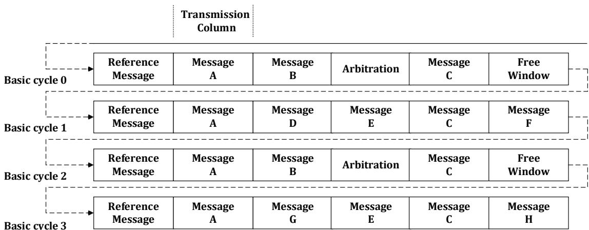  
图 21-12 TTCAN 时空矩阵示例

消息的 SOF 时间是 Sync\_Mark。参考帧的 Sync\_Mark 是 Ref\_Mark。使用一个 16 位定时器进行计时。计时器与 Ref\_Mark 的值之间的差异就是循环时间。每个基本循环都在Ref\_Mark 处开始一次循环。循环时间作为时间戳存储在RBUF中。

时间窗口的长度由TTCAN管理节点定义，其长度必须足够传输一条消息。消息必须以单发模式传输。该规则只有一个例外：如果合并了多个仲裁时间窗口，则可以启用重传。但需要尽早禁用，以

免影响接下来的时间窗口。

为了在时间窗口中传输帧，CAN 控制器提供了一个硬件触发机制。此触发时机需要由主机配置。所需的帧需要存储在 TBUF 消息槽中，等待触发。如果循环时间达到软件定义的触发时间，CAN 控制器会自动以单次模式传输帧。

如果到达触发时间，将产生中断信号通知CPU为下一个时间窗口配置触发时间。因此需要CPU实时响应，在一个时间窗口内完成后续触发时机的配置和消息帧的填充。

如CAN 控制器需要作为时间主机运行，则参考帧需要像所有其他消息一样放置在 TBUF 消息槽中，在到达硬件触发时间时发送。

参考帧的检测由所有时间从机和时间主机自动完成。通过在 CAN\_REF\_MSG 寄存器中设置参考帧的正确REF\_ID和REF\_IDE 位来完成的。检测到参考帧之后，CAN 控制器后会自动更新 Ref\_Mark，开启一个新的循环周期。

此外，对于消息的触发，CAN 控制器提供了一种超时机制，用于检查自上次参考帧以来是否已经过了太长时间。如果超时，这将产生触发超时中断。

## 21.5.1 TTCAN 模式下的 TBUF

## 21.5.1.1 TTTBM=1

在TTCAN模式下（TTTBM=1），STB 被用作消息槽数组。每个消息槽可以由 TBPTR寻址。主机可以使用 TBF 和 TBE 将消息槽标记为满或空。已填充的消息槽是无法再次写入的。TBSEL 和TSNEXT 在 TTCAN 模式下无意义。

PTB 可以通过 TBPTR=0 来寻址。TTCAN 模式下，PTB 没有特殊属性，与任何其他 STB 消息槽作用相同。PTB 和STB 消息帧的成功发送都由TSIF标志来指示。

TTCAN模式下TBUF 没有FIFO或优先级行为。每次传输选择一帧。

消息触发时间定义了需要传输消息的时间（时间窗口的开始），并使用指针 TTPTR 选择消息。如果触发事件发生，则开始传输选择的消息。最后，触发中断被设置为向主机发出需要准备下一个动作的信号。

所有传输只能使用触发启动。TPE、TSONE、TSALL、TPSS 和 TPA 固定为 0，在 TTCAN 模式下无意义。

## 21.5.1.2 TTTBM=0

在这种模式下，PTB和STB 与 TTEN=0 时行为相同。PTB具有比STB更高的优先级，并且 STB可以在 FIFO 模式(TSMODE=0)或优先级模式(TSMODE=1)下运行。

## 21.5.2 TTCAN 操作

上电后，时间主机需要按照 ISO 11898-4 中的定义进行初始化。 CAN 网络中可能有多达8 个潜在的时间主机。每个主机都有自己的参考帧 ID（ID的最后3位）。潜在的时间主机可能会尝试根据他们的优先级来传输他们各自的参考帧。优先级较低的时间主机后稍后尝试传输其参考帧。

如果设置了TTEN=1，则16 位定时器开启运行。如果检测到其他主机发送的参考帧或时间主机成功发送其参考帧，则CAN 控制器将该消息的Sync\_Mark复制到Ref\_Mark，将循环时间设置为 0 。参考帧成功接收后，CAN\_RTIF.RIF 将置位，参考帧成功传输后 CAN\_RTIF.TPIF 或 CAN\_RTIF.TSIF 置位。主机需要为下一个动作配置触发时间。

触发事件可以是接收触发。只触发中断产生，可以用来检测是否收到预期的消息。这样的触发事件也可以用于其他操作，取决于主机应用程序。

另一种触发事件是传输触发。TTPTR指向待发送消息。如果TBUF槽标记为空，则不开始传输，但会置位触发中断。

按通用管理，一般一个消息槽专门用于一条消息，但如果没有足够的TBUF消息槽可用，则一个消息槽也可以由不同的消息共享。

ISO 11989-4 中的大多数操作都需要单次传输。

## 21.5.3 TTCAN 时序

CAN 控制器支持 ISO 11898-4 Level 1。这包括一个以 CAN bit 时间为基本时间单位运行的 16 位定时器（CAN bit 时间由 S\_PRESC、S\_SEG\_1、S\_SEG\_2 定义）。CAN bit 时间预分频系数由 T\_PRESC定义。如果TTEN=1，则计时器开启连续计数。

在消息的SOF位置，定时器值为 Sync\_Mark。如果该消息是参考帧，则将该值复制到 Ref\_Mark。循环时间是定时器值减去 Ref\_Mark，用作接收消息的时间戳或用作待传输消息的触发时间。由于存在溢出保护，因此循环时间在基本循环周期内始终是单调递增的。

ISO 11898-4 不包括 CAN FD波特率切换。因此，CAN 控制器始终以慢速波特率运行定时器。定时器不受同步或波特率切换的影响。

由于触发事件、接收或传输而产生的中断需要跨时钟域（从 CAN 控制器时钟域到 MCU 高速时钟域），因此存在一定延迟。在一般情况下，主机应用程序都有足够的时间为下一个触发事件（即下一个时间窗口）准备所有操作。

一个节点的周期时间可能与其他节点的周期时间不同。在许多情况下，是±1个刻度的差别。随着参考帧的传输开始新的基本周期将重新同步节点。

如果传输触发变为活动状态，则只能从下一个CAN位开始传输。因此，帧的SOF的最早传输点是 TT\_TRIG+1。

## 21.5.4 TTCAN 触发类型

触发类型由TTYPE定义。TTPTR是一个指向TB 消息槽的指针，TT\_TRIG 定义了触发时间。

触发相关动作应在达到最大循环时间0xFFFF之前完成，因为这是基本循环周期的最大长度。

除了立即触发，其他情况下，如果 TTIE=1，所有触发都会令 TTIF置位。

如果TTTBM=1，则仅支持时间触发。在此模式下使用其他触发器将导致 TEIF置位。

对TT\_TRIG 进行写操作后，在达到触发时间（如果设置了 TTIE，则TTIF置位）或检测到错误（TEIF置位）之前，对TT\_CFG、TT\_TRIG的写访问将被锁定（禁止再次写入）。如果TTEN=0，写锁定解除。

## 21.5.4.1 立即触发

立即传输TTPTR 指向的帧，TTIF不置位。向 TT\_TRIG 写入任意值立即触发。

在TTCAN 模式下，不能使用 TPE、TSONE、TSALL。立即触发只能传输一帧。在第一次传输成功或未完成之前，主机不得发起第二次立即触发。

对于立即触发，可以通过TSSS选择单次触发模式。可以使用TSA中止传输。（TPSS 和 TPA 没有意义。）

如果立即触发的TTPTR指向一个空的消息槽，则 TEIF置位。

## 21.5.4.2 时间触发

时间触发会设置TTIF=1，并产生一个中断事件，不执行其他操作。

时间触发可用作接收触发。如果节点希望在某个时间窗口内接收到消息，那么如果该消息未到达并且 RIF 未设置，则可以使用接收触发指示节点没有收到该消息。接收触发在预期成功接收消息的最后时刻之后置位。

如果TT\_TRIG低于实际循环时间，则 TEIF置位。

如果TTTBM=1，时间触发是唯一可用的触发类型。

## 21.5.4.3 单发发送触发

单发传输触发用于专用时间窗口，其中需要以单发模式传输消息。所选消息由 TTPTR定义。

在此模式下，无论 TSSS 的状态如何，都会自动使用单发模式。寄存器位 TSSS 被忽略并保持不变。

单次发射触发用于独家时间窗口。ISO 11898-4 定义了最多16个时钟周期的发送使能窗口。寄存器位 TEW(3:0)+1 定义了时钟周期数。如果总线被另一个帧占用，则不能启动发送。如果发送使能窗口结束并且帧无法启动发送，则帧传输被中止，帧的TB消息槽将被标记为空，如果设置了AIE=1，则AIF置位。TB 消息槽中的帧数据不会被修改，因此如果下次尝试传输相同的数据，则只需再次将消息槽标记为已填充。

如果TT\_TRIG低于实际循环时间，则 TEIF置位，且不执行任何操作。

## 21.5.4.4 发送开始触发

发送开始触发器旨在用于合并的仲裁时间窗口，其中几个节点可以发送消息并进行 CAN总线仲裁。所选消息由TTPTR定义。

此模式下，TSSS定义是使用重传还是单发模式。

如果无法传输所选帧（仲裁丢失，错误后多次传输），则可以使用传输停止触发来停止传输。

如果 TT\_TRIG 低于实际循环时间，则 TEIF置位，且不执行任何操作。

## 21.5.4.5 发送停止触发

发送停止触发配合发送开始触发使用，用于停止发送开始触发的帧传输。

如果传输停止，则该帧被中止，如果AIE=1，则AIF置位，并且帧的消息槽被标记为空。 TB 消息槽中的帧数据不会被修改，因此如果下次尝试传输相同的数据，则只需再次将消息槽标记为已填充。

发送停止触发的行为类似于单次发送触发使用的发送使能窗口的结束。如果传输停止触发指向一个空消息槽（这意味着消息已经传输），则不执行任何操作，并且 TEIF不会置位。

如果TT\_TRIG 低于实际循环时间，则 TEIF置位，但传输仍然会停止。

## 21.5.5 TTCAN 超时监测触发

与通用触发类型不同。 超时触发有一个专用的中断标志 WTIF。如果循环计数等于 TT\_WTRIG定义的值，且WTIE=1，则 WTIF置位。

如果上一次收到有效参考帧已经经过很长时间，则可能产生超时监测触发。参考帧可以在周期性循环中或在事件之后被接收。主机应用程序需要对此进行处理，并且相应地调整超时触发时间。

WTIE 的默认值为1，watch trigger默认值为0xffff，超时触发默认开启，且超时时间为最大值。要关闭超时监测触发，WTIE需要设置为0。

如果 TT\_WTRIG 已更新且低于实际循环时间，则 TEIF 置位。如果 TTTBM=1，也可以使用超时监测触发。

## 21.6 CiA 603 时间戳

## 21.6.1 时间戳

CAN in Automation (CiA) 在规范 603 中定义了一个至少 16 位的时间戳，CAN 控制器支持该特性，并且可以与TTCAN 一起使用，也可以单独使用。

CiA 603 的基本概念是有一个独立运行的定时器，它使用硬件主时钟进行计数而不是CAN bit 时间（TTCAN使用CANbit时间）。精度高于1µs（64 位定时器）。CAN 控制器配备了64位独立运行计数器。

事件发生后，将获取计时器的计数值，即时间戳。该时间戳分别存储在 RTS 或 TTS 中。

通常在 SOF 的采样点或帧被视为有效的 EOF 位处获取时间戳。可以通过配置 TIMEPOS 来选择时间戳位置。ACK定界符后的七个隐性位构成 CAN/CAN FD帧的 EOF。对接收来说，帧在EOF的倒数第二位时对接收器有效；但对发送来说，在EOF的最后一位时发送完成。

在许多系统中广泛使用的基于软件的时间戳依赖于接收和发送中断。因此，建议在 EOF处添加时间戳。

CiA 603 支持 AUTOSAR 的时间戳和时间同步。对于 AUTOSAR，CAN 网络中的一个节点是时间主机。时间主机发送同步消息（SYNC 消息）。SYNC消息的时间戳由时间主机和所有时间从机获取。SYNC 消息的发送指令与实际传输 SYNC 消息时间之间的时间差将由时间主机在后续(FUP)消息中传输。因此 CAN 控制器支持发送帧(TTS)使用一个时间戳，但支持所有接收帧(RTS)使用不同单独时间戳。可以使用TBUF消息槽内的TTSEN 位为每个帧单独启用或禁用为传输帧生成时间戳。

寄存器位TIMEEN可以启用或禁用时间戳。如果禁用时间戳，则TTS和RTS无效。

## 21.6.2 CiA603 时间戳计时器

CiA 603 时间戳的计时器为 64bit 位宽，在 CAN 控制内部实现。计时器从零开始，不断向上计数。可以通过软件读写该计时器。定时器可以通过向 CAN\_CIAWDAT0/1 进行写入，由于时间戳计时器为 64 位宽，因此需要进行两次 32 位写入，推荐先将计时器暂停，写入后 64 位时间戳后再启动计时器。

## 21.7 CAN 位时间

## 21.7.1 数据波特率

CAN 2.0B 定义了高达 1Mbit/s 的数据波特率。对于 CAN FD，没有固定限制。对于实际应用系统，数据速率受限于使用的收发器和CAN控制器可实现的时钟频率。

CAN 控制器可被编程为任意选择的数据速率，仅受相应位时序和预分频器寄存器中的位设置范围限制。

## 21.7.2 定义

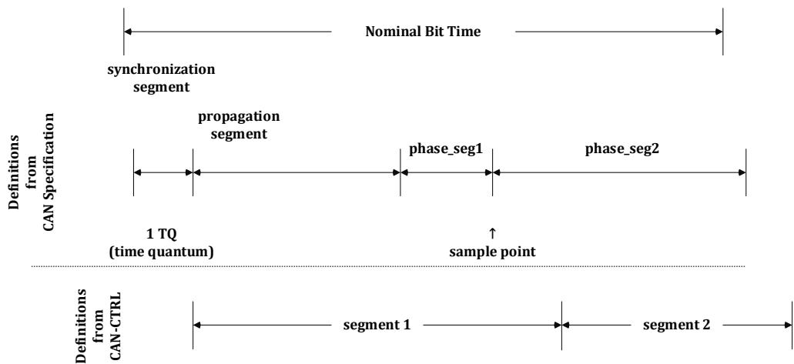  
图 21-13 CAN 位时序规范

CAN 位时间 BT 由几个部分组成，如图 21-13 所示。每个段由多个时间量子单元 $n _ { \mathrm { T Q } }$ 组成。时间量子 TQ 的持续时间为：

$$
T Q = \frac {n _ {p r e s c a l e r}}{f _ {c l o c k}}
$$

$n _ { \mathrm { T Q } }$ 和 nprescaler 的值必须根据系统时钟频率匹配 $B T _ { r e a l }$ 尽可能接近 $B T _ { I d e a l } = 1 / B R$ ，其中 BR 是CAN 总线波特率：

$$
B T _ {i d e a l} \approx B T _ {r e a l} = \frac {n _ {p r e s c a l e r} \cdot n _ {T Q}}{f _ {c l o c k}} = t _ {S e q \_ 1} + t _ {S e g \_ 2}
$$

表 21-43 列出了 CAN/CAN FD 规范定义的最小配置范围。

表21-43CAN时序段（最小配置范围）

<table><tr><td>部分</td><td colspan="3">描述</td></tr><tr><td>SYNC_SEG</td><td colspan="3">同步段 = 1 TQ</td></tr><tr><td>PROP_SEG</td><td colspan="3">传播段[1...8] TQ CAN 2.0 慢速速率 CAN FD 不启用[1...48] TQ CAN 2.0 慢速速率 CAN FD 启用[1...48] TQ CAN FD 帧头速度[0...8] TQ CAN FD 数据速度</td></tr><tr><td>PHASE_SEG1</td><td colspan="3">相位缓冲段 1[1...8] TQ CAN 2.0 慢速速率 CAN FD 不启用[1...16] TQ CAN 2.0 慢速速率 CAN FD 启用[1...16] TQ CAN FD 帧头速度[1...8] TQ CAN FD 数据速度</td></tr><tr><td rowspan="5">PHASE_SEG2</td><td colspan="3">相位缓冲段 2</td></tr><tr><td>[2...8] TQ</td><td>CAN 2.0 慢速速率</td><td>CAN FD 不启用</td></tr><tr><td>[2...16] TQ</td><td>CAN 2.0 波特率</td><td>CAN FD 不启用</td></tr><tr><td>[2...16] TQ</td><td>CAN FD 帧头速度</td><td></td></tr><tr><td>[2...8] TQ</td><td>CAN FD 数据速度</td><td></td></tr><tr><td rowspan="5">SJW</td><td colspan="3">同步跳转宽度</td></tr><tr><td>[1...4] TQ</td><td>CAN 2.0 慢速速率</td><td>CAN FD 不启用</td></tr><tr><td>[1...16] TQ</td><td>CAN 2.0 波特率</td><td>CAN FD 不启用</td></tr><tr><td>[1...16] TQ</td><td>CAN FD 帧头速度</td><td></td></tr><tr><td>[1...8] TQ</td><td>CAN FD 数据速度</td><td></td></tr><tr><td>IPT</td><td colspan="3">信息处理时间 = [0...2] TQ PHASE_SEG2 ≥ IPT</td></tr></table>

CAN 控制器将 SYNC\_SEG、PROP\_SEG 和 PHASE\_SEG1 收集到一个组中，并且该组的长度可通过$\mathfrak { t } _ { \mathsf { S e g } _ { - } 1 }$ 进行配置。表21-44列出了可用的配置范围。请注意，CAN控制器硬件并对配置进行合法性检查，可以提供比 CAN/CAN FD 规范定义的更宽的配置范围。

表 21-44CANCAN 控制器时序设置（可用配置范围）

<table><tr><td>Setting</td><td colspan="4">Requirements</td></tr><tr><td rowspan="3"> $t_{Seg\_1}$ </td><td>[2...65] TQ</td><td>CAN</td><td>2.0 bit rate</td><td>(slow)</td></tr><tr><td>[2...65] TQ</td><td>CAN</td><td>FD nominal bit rate rate (slow)</td><td></td></tr><tr><td>[2...17] TQ</td><td>CAN</td><td>FD data bit</td><td>(fast)</td></tr><tr><td rowspan="3"> $t_{Seg\_2}$ </td><td>[1...8] TQ</td><td> $t_{Seg\_1} \geq t_{Seg\_2} + 2$ </td><td>CAN</td><td>2.0 bit rate (slow)</td></tr><tr><td>[1...32] TQ</td><td> $t_{Seg\_1} \geq t_{Seg\_2} + 2$ </td><td>CAN</td><td>FD nominal bit rate rate (slow)</td></tr><tr><td>[1...8] TQ</td><td> $t_{Seg\_1} \geq t_{Seg\_2} + 1$ </td><td>CAN</td><td>FD data bit (fast)</td></tr><tr><td rowspan="3"> $t_{SWJ}$ </td><td>[1...16] TQ</td><td> $t_{Seg\_2} \geq t_{SWJ}$ </td><td>CAN</td><td>2.0 bit rate (slow)</td></tr><tr><td>[1...16] TQ</td><td> $t_{Seg\_2} \geq t_{SWJ}$ </td><td>CAN</td><td>FD nominal bit rate rate (slow)</td></tr><tr><td>[1...8] TQ</td><td> $t_{Seg\_2} \geq t_{SWJ}$ </td><td>CAN</td><td>FD data bit (fast)</td></tr></table>

对于 CAN 2.0 波特率和 CAN FD 慢速波特率，由寄存器 S\_Seg\_1、S\_Seg\_2、S\_SJW 和 S\_PRESC定义段长度。对于 CAN FD（快速）数据波特率，由寄存器 F\_Seg\_1、F\_Seg\_2、F\_SJW 和 F\_PRESC定义段长度。

$$
\begin{array}{r l r l} & t _ {S e g _ {1}} = (S _ {S e g _ {1}} + 2) \cdot T Q & & t _ {S e g _ {1}} = (F _ {S e g _ {1}} + 2) \cdot T Q \\ & t _ {S e g _ {2}} = (S _ {S e g _ {2}} + 1) \cdot T Q & & t _ {S e g _ {2}} = (F _ {S e g _ {2}} + 2) \cdot T Q \\ & t _ {S J W} = (S _ {S W J} + 1) \cdot T Q & & t _ {S J W} = (F _ {S J W} + 2) \cdot T Q \\ & n _ {p r e s c a l e r} = (S \_ P R E S C + 1) & & n _ {p r e s c a l e r} = (F \_ P R E S C + 1) \end{array}
$$

CAN FD在 BRS 位的采样点从慢速波特率切换到快速数据波特率，并在CRC定界符位的采样点切换回。

图 21-14 给出了一个合适的波特率配置的说明，其中 $\begin{array} { r } { f _ { t q _ { - } c l k } = \frac { f _ { c l o c k } } { n _ { p r e s c a l e r } } } \end{array}$

位时间 $B T _ { r e a l ` }$ 、采样点和同步跳转宽度 SJW 都以 tq\_clk为单位。

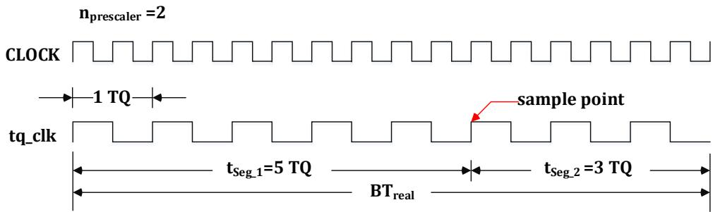  
图 21-14 位采样时钟分频示例

主机控制器必须定义段1、段2的长度和慢波特率的同步跳转宽度，如果CAN FD 需要使用快速波特率，则还需要进行快速波特率段长度定义。

一些设置建议：

• 段1须比段2略大。那么采样点晚于位时间的中点。

• 同步跳转宽度不能大于段2。如果SJW太小，则CAN节点可能太慢而无法重新同步，如果SJW太大，则CAN节点可能会过于频繁地重新同步。SJW为第2段的一半似乎是较合适的设定。

• 连接到CAN总线的所有CAN节点应尽可能选择类似的时间单位设置。

可以使用最小时序值配置最快的 CAN总线速度。但需要考虑：

如果预分频器大于 1，所有其他时序参数都可以设置为零，但这违反了规则 $\mathrm { ~ t ~ } \sec 1 \geq \mathrm { t } \ \sec 2 + 2$ （慢速）和 $\mathrm { t } _ { \mathrm { S e g } _ { - } 1 \geq \mathrm { t } _ { \mathrm { S e g } _ { - } 2 } + 1 }$ （快速）。 因此，S\_Seg\_1 和 F\_Seg\_1 至少应设置为 1。但是这种时序参数的选择仅在理论上是可行的，但对于实际网络可能不够稳妥。

如果预分频器设置为 1，则同步将变得困难。一般来说，对于 CAN 2.0 和 CAN FD 慢速波特率，CAN规范要求 1bit 时间至少为 8 TQ 长度。对于 CAN 控制器，如果预分频器设置为 1，快速数据波特率的一位时间也需要至少为 8TQ 长度。

总之，最快的CAN 总线频率是can\_clk 频率除以 8：预分频器设置为1，即8 TQ位时间。

## 21.7.3 示例配置

以下示例是CAN 2.0慢速波特率配置的示例。CAN控制器需要进行以下步骤：

1. 设置RESET=1。

2. 设置寄存器 $\mathsf { S } _ { - } \mathsf { S e g } _ { - } 1$ 和 $\mathsf { S } _ { - } \mathsf { S e g } _ { - } 2$

在本例中，总线 $f _ { b u s } = 1 \mathrm { M b a u d }$ 上的数据速率，系统时钟为16MHz 。

选择 n<sub>TQ</sub> 和 $n _ { p r e s c a l e r }$ 的值以使 $B T _ { r e a l }$ 尽可能接近 $B T _ { I d e a l }$

在本例中， $n _ { p r e s c a l e r } = 2 , n _ { T Q } = 8$ ：从而使得

$$
B T _ {i d e a l} = B T _ {r e a l} = 8 \mathrm{TQ} 。
$$

$$
B T _ {r e a l} = t _ {S e g \_ 1} + t _ {S e g \_ 2}
$$

$t s e g _ { - } 1 = 5 \mathrm { T Q }$ $t s e g _ { - } 2 = 5 \mathrm { T } 0$ ，推导可得 $\mathsf { S } _ { - } \mathsf { S e g } _ { - } 1 { = } 3$ 和 $\mathsf { S } _ { - } \mathsf { S e g } _ { - } 2 { = } 2$

3. 设置接收过滤器（可选的）。

4. 设置寄存器S\_SJW：

$t _ { S e g \_ 2 } { \geq } t _ { S J W }$ 可以选择 t<sub>S</sub> <sub>JW</sub> = 2。

5. 设置时钟预分频寄存器S\_PRESC: $n _ { \mathit { p r e s c a l e r } } = \mathrm { P R E S C } + 1$ 即 S\_PRESC=1。

6. 设置RESET=0。

以上给定的顺序不是强制性的。只需在开始时设置 RESET=1，否则无法对位时序、ACODE 和AMASK寄存器进行写入。完成配置后需要设置 RESET=0。然后控制器等待8 个隐性位（帧结束）时间后恢复其正常操作。

7. 继续配置中断其他配置位并执行收发指令。

## 21.7.4 波特率切换和采样点

在CAN网络中，当使用具有波特率切换的CAN FD帧时，采样点的确切位置很重要，并且所有节点的采样点都需要尽可能接近。

CAN 点在 BRS 位的采样点和 CRC 定界符的采样点之后切换波特率。如图 21-15 所示，采样点的位置对BRS位的绝对长度有很大的影响。慢速帧头波特率的1 个TQ可能比快数据率的几个 TQ还大得多。如果数据波特率远高于帧头波特率，则采样点时机不合适可能会导致快速数据的采样错误。

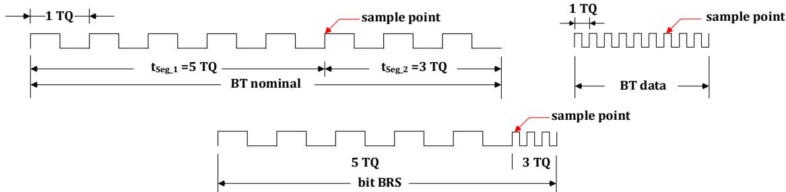  
图 21-15 比特 BRS 的波特率切换 S\_PRESC≠F\_PRESC

## 21.7.5 CAN FD 节点的位时序配置

采样点的位置对于波特率切换非常重要。因此，一般建议所有CAN FD节点在 CAN网络中使用完全相同的时序参数。与只需要所有节点的数据速率相同的经典 CAN 相比，CAN FD 要求采样点位于同一位置。换句话说，段 1 和段 2 需要为所有节点配置为相同的长度。此外，建议也使用相同长度的一个TQ以使所有节点同步。

只有当所有节点都以相同的基本时钟频率（CAN控制器时钟）或至少以兼容的时钟频率运行时，才能实现此要求。

## 21.7.6 TDC 和 RDC

对于CAN FD节点，可以选择启用发射器延迟补偿(TDC)，同时自动使能接收器延迟补偿(RDC)。

这些特性有以下背景：对于 CAN FD数据波特率的通信，当发送收发器的延迟或总线的延迟大于比特时间。这时就需要对采样点进行补偿的。在没有TDC 的情况下，FD帧数据阶段的波特率受到以下限制：如果发送节点在该比特的采样点处不能接收到自己发送的最新比特，则它会检测到比特错误。

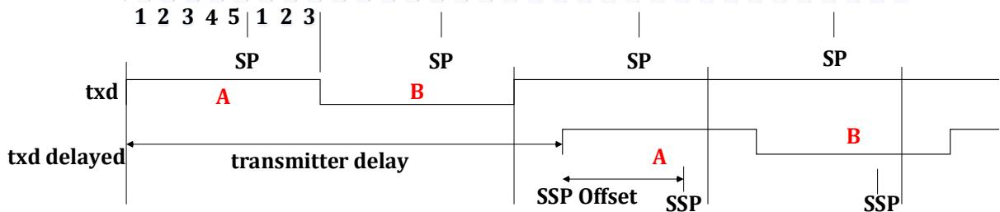  
图 21-16 发射机延迟

图 21-16 给出了一个发射节点延迟比较大的例子。在该图中，显示了一个 txd 数据流，从位A和B开始。1bit 时间由 $t _ { S e g _ { - } 1 } = 5 \mathrm { T Q }$ 的采样点 (SP) 之前的时间和 $t _ { S e g t \_ 2 } { = } 3 \mathrm { T Q }$ 的采样点之后的时间组成。在本例中，发送节点延迟大于 2 bit时间。因此，使用原始采样点SP不能进行正确的采样。CAN FD 规范定义了一个附加的辅助采样点 (SSP)。如果 $\mathrm { T D C E N } { = } 1$ 启用 TDC， CAN 控制器自动确定发送延迟。SSP 的位置是发送延迟加上 SSPOFF定义的偏移量。 SSPOFF以TQ为单位，建议设置$t _ { S e g _ { - } 1 }$ 等于 SSPOFF。 $\mathrm { F } \_ { \mathrm { S E G } } 1 _ { - } $ 定义了数据波特率的 $t _ { S e g _ { - } 1 \circ }$ 。在图 21-16 中 $\mathrm { F } \_ { \mathrm { S E G } _ { - } 1 = 3 }$ ，选择 $\operatorname { S S P O F F } { = } 5$

如果使用 TDC，ISO 11898-1:2015 要求仅可使用 F\_PRESC=0 或 1。根据这一要求，CAN 控制器能够自动确定3bit 以内的快速数据波特率发送延迟。

接收节点也需要考虑延迟大于1 个比特时间的情况。CAN FD在位 FDF =1 和随后的 r0位之间的下降沿定义了额外的硬件同步。（此时为慢速波特率）CAN 和 CAN FD 的同步通常定义为以 TQ 为步长进行。但是对于快速数据波特率的同步来说，慢速波特率的一个 TQ 的步长可能太大了。因此，在 FDF 位的附加硬同步需要违反此规则，需要尽可能精确地同步，并且仅受系统时钟频率的限制。CAN 控制器使用这种特殊的同步，称为 RDC。如果 $\mathrm { F D F } = 1$ ，无论是否启用TDC，RDC都会在接收期间自动完成。

## 21.7.7 位时序建议

CAN FD时序配置要求CAN 网络中的所有节点使用相同的数据速率和相同的采样点。

请注意，如果预分频器设置为1，则位时间至少应为 8TQ，以实现稳定的通信。较小的位时间设置也可能进行通讯，但不稳定。

是否使用TDC取决于CAN网络实际负载情况，可以根据需要启用或禁用 TDC。

表 21-45 CAN 相关名词缩写

<table><tr><td>缩写</td><td>描述</td></tr><tr><td>PSP</td><td>初级采样点</td></tr></table>

```txt
SSP 二级采样点
Seg 1 第 1 段
Seg 2 第 2 段
TDC 发射延迟补偿（见 SSPOFF）
```

参考波特率配置如下：

TQ=(PRESC + 1)/ Fclock

Tseg1=TQ\*(SEG1 + 2)

Tseg2=TQ\*(SEG2 + 1)

$$
\text { CAN\_BAUD } = 1 / (\text { Tseg1 } + \text { Tseg2 }) = 1 / (\text { TQ } ^ {*} (\text { SEG1 } + 2 + \text { SEG2 } + 1)) = 1 / (\text { TQ } ^ {*} (\text { SEG1 } + \text { SEG2 } + 3))
$$

SEG1+SEG2=Fclock/((PRESC+1)\*CAN BAUD)-3

只要SEG1 + SEG2 的总和固定，波特率就正确。

另外:SEG1>SEG2，SEG1 略大于 SEG2

SEG2 >= SJW

example:

Fclock =192000000; PRESC=23; CAN\_BAUD=500000;

SEG=192000000/((23+1)\*500000)-3=13

SEG1+SEG2=12+1=11+2=…·=8+5

表21-46 参考波特率对应寄存器配置

<table><tr><td>Bit Rate [Kbit/s]</td><td>AN_SBAUD.PRESC[7:0]</td><td>CAN_SBAUD.SJW[6:0]</td><td>CAN_SBAUD.SEG2[6:0]</td><td>CAN_SBAUD.SEG1[6:0]</td></tr><tr><td>4000</td><td>2</td><td>2</td><td>2</td><td>3</td></tr><tr><td>4000</td><td>5</td><td>2</td><td>2</td><td>3</td></tr><tr><td>2000</td><td>11</td><td>2</td><td>2</td><td>3</td></tr><tr><td>1000</td><td>23</td><td>2</td><td>2</td><td>3</td></tr><tr><td>800</td><td>23</td><td>2</td><td>3</td><td>4</td></tr><tr><td>666.6</td><td>23</td><td>2</td><td>3</td><td>6</td></tr><tr><td>500</td><td>23</td><td>2</td><td>5</td><td>8</td></tr><tr><td>400</td><td>23</td><td>2</td><td>7</td><td>10</td></tr><tr><td>250</td><td>47</td><td>2</td><td>5</td><td>8</td></tr><tr><td>200</td><td>47</td><td>2</td><td>7</td><td>10</td></tr><tr><td>160</td><td>47</td><td>2</td><td>10</td><td>12</td></tr><tr><td>125</td><td>95</td><td>2</td><td>5</td><td>8</td></tr><tr><td>100</td><td>95</td><td>2</td><td>7</td><td>10</td></tr><tr><td>83.33</td><td>95</td><td>2</td><td>8</td><td>13</td></tr><tr><td>80</td><td>95</td><td>2</td><td>7</td><td>15</td></tr><tr><td>66.66</td><td>119</td><td>2</td><td>8</td><td>13</td></tr><tr><td>50</td><td>119</td><td>2</td><td>13</td><td>16</td></tr><tr><td>40</td><td>191</td><td>2</td><td>10</td><td>12</td></tr><tr><td>20</td><td>191</td><td>2</td><td>20</td><td>27</td></tr></table>

表 21-47 20MHz can\_clk 的建议

<table><tr><td>Bit Rate [Mbit/s]</td><td>PSP [%]</td><td>SSP [%]</td><td>Prescaler</td><td>Bit Time [TQ]</td><td>Seg 1 [TQ]</td><td>Seg 2 [TQ]</td><td>SJW [TQ]</td><td>TDC[clk]</td></tr><tr><td>0.25(仲裁)</td><td>80</td><td>-</td><td>1</td><td>80</td><td>64</td><td>16</td><td>16</td><td>-</td></tr><tr><td>0.5(仲裁)</td><td>80</td><td>-</td><td>1</td><td>40</td><td>32</td><td>8</td><td>8</td><td>-</td></tr><tr><td>0.5</td><td>80</td><td>(禁用)</td><td>1</td><td>40</td><td>32</td><td>8</td><td>8</td><td>-</td></tr><tr><td>0.833</td><td>79</td><td>(禁用)</td><td>1</td><td>24</td><td>19</td><td>5</td><td>5</td><td>-</td></tr><tr><td>1</td><td>80</td><td>80</td><td>1</td><td>20</td><td>16</td><td>4</td><td>4</td><td>16</td></tr><tr><td>1.538</td><td>77</td><td>77</td><td>1</td><td>13</td><td>10</td><td>3</td><td>3</td><td>10</td></tr><tr><td>2</td><td>80</td><td>80</td><td>1</td><td>10</td><td>8</td><td>2</td><td>2</td><td>8</td></tr><tr><td>4</td><td>80</td><td>80</td><td>1</td><td>5</td><td>4</td><td>1</td><td>1</td><td>4</td></tr><tr><td>5</td><td>75</td><td>75</td><td>1</td><td>4</td><td>3</td><td>1</td><td>1</td><td>3</td></tr></table>

表 21-48 40MHz can\_clk 的建议

<table><tr><td>Bit Rate [Mbit/s]</td><td>PSP [%]</td><td>SSP [%]</td><td>Prescaler</td><td>Bit Time [TQ]</td><td>Seg 1 [TQ]</td><td>Seg 2 [TQ]</td><td>SJW [TQ]</td><td>TDC[clk]</td></tr><tr><td>0.25(仲裁)</td><td>80</td><td>-</td><td>2</td><td>80</td><td>64</td><td>16</td><td>16</td><td>-</td></tr><tr><td>0.5(仲裁)</td><td>80</td><td>-</td><td>1</td><td>80</td><td>64</td><td>16</td><td>16</td><td>-</td></tr><tr><td>0.5</td><td>80</td><td>(禁用)</td><td>2</td><td>40</td><td>32</td><td>8</td><td>8</td><td>-</td></tr><tr><td>0.833</td><td>79</td><td>(禁用)</td><td>2</td><td>24</td><td>19</td><td>5</td><td>5</td><td>-</td></tr><tr><td>1</td><td>80</td><td>80</td><td>1</td><td>40</td><td>32</td><td>8</td><td>8</td><td>32</td></tr><tr><td>1.538</td><td>77</td><td>77</td><td>1</td><td>26</td><td>20</td><td>6</td><td>6</td><td>20</td></tr><tr><td>2</td><td>80</td><td>80</td><td>1</td><td>20</td><td>16</td><td>4</td><td>4</td><td>16</td></tr><tr><td>3.077</td><td>77</td><td>77</td><td>1</td><td>13</td><td>10</td><td>3</td><td>3</td><td>10</td></tr><tr><td>4</td><td>80</td><td>80</td><td>1</td><td>10</td><td>8</td><td>2</td><td>2</td><td>8</td></tr><tr><td>5</td><td>75</td><td>75</td><td>1</td><td>8</td><td>6</td><td>2</td><td>2</td><td>6</td></tr><tr><td>6.667</td><td>83</td><td>83</td><td>1</td><td>6</td><td>5</td><td>1</td><td>1</td><td>5</td></tr><tr><td>8</td><td>80</td><td>80</td><td>1</td><td>5</td><td>4</td><td>1</td><td>1</td><td>4</td></tr><tr><td>10</td><td>75</td><td>75</td><td>1</td><td>4</td><td>3</td><td>1</td><td>1</td><td>3</td></tr></table>

表 21-49 80MHz can\_clk 的建议

<table><tr><td>Bit Rate [Mbit/s]</td><td>PSP [%]</td><td>SSP [%]</td><td>Prescaler</td><td>Bit Time [TQ]</td><td>Seg 1 [TQ]</td><td>Seg 2 [TQ]</td><td>SJW [TQ]</td><td>TDC[clk]</td></tr><tr><td>0.25(仲裁)</td><td>80</td><td>-</td><td>4</td><td>80</td><td>64</td><td>16</td><td>16</td><td>-</td></tr><tr><td>0.5(仲裁)</td><td>80</td><td>-</td><td>2</td><td>80</td><td>64</td><td>16</td><td>16</td><td>-</td></tr><tr><td>0.5</td><td>80</td><td>(禁用)</td><td>4</td><td>40</td><td>32</td><td>8</td><td>8</td><td>-</td></tr><tr><td>0.833</td><td>79</td><td>(禁用)</td><td>4</td><td>24</td><td>19</td><td>5</td><td>5</td><td>-</td></tr><tr><td>1</td><td>80</td><td>80</td><td>2</td><td>40</td><td>32</td><td>8</td><td>8</td><td>64</td></tr><tr><td>1.538</td><td>77</td><td>77</td><td>2</td><td>26</td><td>20</td><td>6</td><td>6</td><td>40</td></tr><tr><td>2</td><td>80</td><td>80</td><td>2</td><td>20</td><td>16</td><td>4</td><td>4</td><td>32</td></tr><tr><td>3.077</td><td>77</td><td>77</td><td>2</td><td>13</td><td>10</td><td>3</td><td>3</td><td>20</td></tr><tr><td>4</td><td>80</td><td>80</td><td>1</td><td>20</td><td>16</td><td>4</td><td>4</td><td>16</td></tr><tr><td>5</td><td>75</td><td>75</td><td>1</td><td>16</td><td>12</td><td>4</td><td>4</td><td>12</td></tr><tr><td>6.667</td><td>83</td><td>83</td><td>1</td><td>12</td><td>10</td><td>2</td><td>2</td><td>10</td></tr><tr><td>8</td><td>80</td><td>80</td><td>1</td><td>10</td><td>8</td><td>2</td><td>2</td><td>8</td></tr><tr><td>10</td><td>75</td><td>75</td><td>1</td><td>8</td><td>6</td><td>2</td><td>2</td><td>6</td></tr></table>

## 22 WWDG 窗口看门狗

## 22.1 概述

窗口看门狗用于检测由于外界干扰或未预见的逻辑情况而产生的软件运行异常，当异常发生时，软件通常并不按照正常时序执行。

窗口看门狗使用系统高速主时钟的分频时钟进行工作，通常为 PLL 时钟的分频时钟，具有较高的时钟精度，适用于对看门狗超时时间有精确要求的应用场景。

窗口看门狗包含一个 7bit 递减计数器 WWDG\_CR.T[6:0]，当计数器最高位 T[6]清零后，看门狗会产生全芯片复位，如果看门狗计数器 WWDG\_CR.T[6:0]尚未计数至窗口值 WWDG\_CFG.W[6:0]就被软件进行刷新重置，同样会产生复位。即看门狗必须在有效的窗口内进行刷新重置操作。

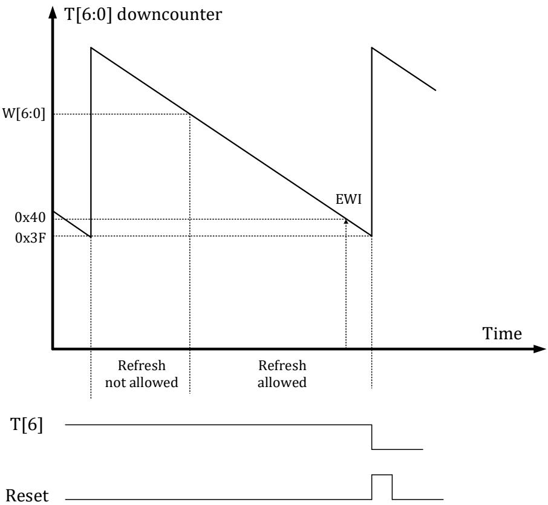  
图 22-1 窗口看门狗计数及刷新机制

可编程的独立运行的递减计数器

可控的复位

当看门狗计数值小于 0x40时产生复位(如果看门狗被使能)

当看门狗计数值在窗口之外被刷新时产生复位(如果看门狗被使能)

超前提醒中断(Early Wakeup Interrupt: EWI)，当 EWI 位使能且看门狗使能，且计数器计数至0x40时产生超前提醒中断。

在某些应用中，超前中断可用于在不产生复位的前提下进行软件系统检查或系统恢复。在这种应用中，在超前中断的中断处理函数中可以将看门狗计数值刷新重置。

如果超前中断无法得到及时响应，则看门狗计数器会递减计数至0x3F以下，从而产生看门狗复位。

看门狗超时时间由如下公式计算

$$
\text { Timeout } _ {\mathrm{WWDG}} = \mathrm{t} _ {\mathrm{MCLK}} \times 3 2 7 6 8 \times 2 ^ {\mathrm{WDGTB}} \times (\mathrm{T} [ 5: 0 ] + 1)
$$

其中 Timeout<sub>WWDG</sub>为看门狗超时时间，

t<sub>MCLK</sub>为系统主时钟

32768 为看门狗内部固定时钟分频系数

WDGTB 为看门狗计数时钟预分频系数

T[5:0]为看门狗计数器的装载值的低6 位。

由于看门狗通常使用高速时钟的分频时钟进行计数，因此从0x40 计数至0x3F有32768×2WDGTB个高速时钟周期，足够软件进行重置看门狗的操作。

表 22-1 窗口看门狗超时时间(与系统主时钟有关)

<table><tr><td>WDGTB</td><td>Prescaler(2 $^{WDGTB}$ )</td><td>最短超时时间</td><td>最长超时时间</td></tr><tr><td>0</td><td>1</td><td>0.17ms</td><td>10.92ms</td></tr><tr><td>1</td><td>2</td><td>0.34ms</td><td>21.84ms</td></tr><tr><td>2</td><td>4</td><td>0.68ms</td><td>43.69ms</td></tr><tr><td>3</td><td>8</td><td>1.36ms</td><td>87.38ms</td></tr></table>

在调试模式下，当 CPU 暂停运行时，可以根据 SYS\_DBG\_CFG.DBG\_WWDG\_STOP 位控制窗口看门狗是否继续计数。

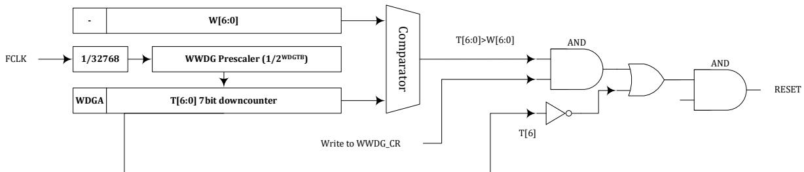  
图 22-2 窗口看门狗复位产生逻辑

应用软件需要在适当的时机写 WWDG\_CR 以刷新看门狗计数器，防止MCU 复位，这个刷新操作需要在计数值 T[6:0]<窗口寄存器值 W[6:0]时进行，否则在窗口之外写 WWDG\_CR 也会产生复位动作。T[6]每次写入强制为 1，因此 WWDG\_CR.T[6:0]可以写入的数据范围是 0xFF\~0xC。

## 22.2 寄存器

## 22.2.1 地址分配

WWDG 基地址为 0x4001B400

表 22-2 窗口看门狗寄存器列表

<table><tr><td>名称</td><td>偏移地址</td><td>说明</td></tr><tr><td>WWDG_CR</td><td>0x00</td><td>窗口看门狗控制寄存器</td></tr><tr><td>WWDG_CFG</td><td>0x04</td><td>窗口看门狗配置寄存器</td></tr><tr><td>WWDG_IF</td><td>0x08</td><td>窗口看门狗中断标志寄存器</td></tr></table>

## 22.2.2 WWDG\_CR窗口看门狗控制寄存器

地址：0x4001\_B400

复位值：0x0

表 22-3WWDG\_CR 窗口看门狗控制寄存器

<table><tr><td colspan="3">15 14 13 12 11 10 9 8 7 6 5 4 3 2 1 0</td></tr><tr><td rowspan="3"></td><td>WDG_EN</td><td> $\vdash$ </td></tr><tr><td>RW</td><td>RW</td></tr><tr><td>0</td><td>0x7F</td></tr></table>

<table><tr><td>位置</td><td>位名称</td><td>说明</td></tr><tr><td>[31:8]</td><td></td><td>未使用</td></tr><tr><td>[7]</td><td>WDG_EN</td><td>窗口看门狗使能,1:使能;0:禁用。上电默认禁用。软件写1可使能看门狗,软件写0且同时向[15:8]写入0x3C时,可禁用看门狗。禁用后看门狗不再产生复位,但仍可计数并产生超前中断</td></tr><tr><td>[6:0]</td><td>T</td><td>窗口看门狗计数器,使用看门狗内部的分频时钟进行递减计数,当计数值小于0x40(T[6]为0)时产生复位。为避免写入T[6]为0立即产生复位,T[6]在写入时强制置1,软件只能写入T[5:0]。</td></tr></table>

## 22.2.3 WWDG\_CFG 窗口看门狗配置寄存器

地址：0x4001\_B404

复位值：0x0

表 22-4WWDG\_CFG 窗口看门狗配置寄存器

<table><tr><td colspan="4">15 14 13 12 11 10 9 8 7 6 5 4 3 2 1 0</td></tr><tr><td rowspan="3"></td><td>WDGTB</td><td>EWI</td><td>W</td></tr><tr><td>RW</td><td>RS</td><td>RW</td></tr><tr><td>0</td><td>0</td><td>0x7F</td></tr></table>

<table><tr><td>位置</td><td>位名称</td><td>说明</td></tr><tr><td>[31:10]</td><td></td><td>未使用</td></tr><tr><td>[9:8]</td><td>WDGTB</td><td>窗口看门狗时钟预分频系数2&#x27;h0:系统主时钟/32768/12&#x27;h1:系统主时钟/32768/22&#x27;h2:系统主时钟/32768/42&#x27;h3:系统主时钟/32768/8</td></tr><tr><td>[7]</td><td>EWI</td><td>超前中断使能,1:使能;0:禁用。上电默认禁用。软件写1可使能中断,软件写0无效,此位一旦置1只能通过硬件外部复位或上电复位清零。看门狗计数至0x40时产生超前中断。</td></tr><tr><td>[6:0]</td><td>W</td><td>窗口看门狗喂狗窗口,当T&gt;W时喂狗也会产生复位,即合法的复位窗口为W&gt;=T&gt;0x40</td></tr></table>

22.2.4 WWDG\_IF窗口看门狗中断标志寄存器

地址：0x4001\_B408

复位值：0x0

表 22-5WWDG\_CFG 窗口看门狗中断标志寄存器

<table><tr><td>15</td><td>14</td><td>13</td><td>12</td><td>11</td><td>10</td><td>9</td><td>8</td><td>7</td><td>6</td><td>5</td><td>4</td><td>3</td><td>2</td><td>1</td><td>0</td></tr><tr><td rowspan="3" colspan="15"></td><td>EWIF</td></tr><tr><td>RW1C</td></tr><tr><td>0</td></tr></table>

<table><tr><td>位置</td><td>位名称</td><td>说明</td></tr><tr><td>[31:2]</td><td></td><td>未使用</td></tr><tr><td>[0]</td><td>EWIF</td><td>窗口看门狗超前中断标志,当计数器计数至 0x40 时 EWIF 置位为 1,写 1 清零,写 0 无效果。即使看门狗不使能,EWIF 位仍可以置位,因为看门狗计数器 T[6:0]在看门狗禁用时仍在计数。EWIF 和 EWI 均为 1 时,看门狗才会向 CPU 提起中断请求。</td></tr></table>

## 23 IWDG 独立看门狗

## 23.1 概述

独立看门狗使用32kHz 低速RC(LRC)时钟进行工作，在系统主时钟故障的情况下仍可保证正常工作。由于 LRC 时钟精度不如系统高速时钟，独立看门狗可用于对超时时间精确性要求不高的应用场景。

独立看门狗内部包含一个21bit递减计数器。独立看门狗可以配置产生系统深度休眠（时钟关闭或电源关闭）唤醒源，在超时情况下也可以产生全芯片复位信号。当MCU进入深度休眠状态时，包括PLL/HRC在内的系统时钟关闭，而 LRC是一直存在的，所以独立看门狗可以继续正常工作；甚至在系统进入Standby模式大部分电路进入掉电状态，LRC 和IWDG仍是正常工作的。

通常看门狗的定时唤醒门限值小于超时复位门限值，但大于 0x8，即独立看门狗重新装载后从IWDG\_RTH开始递减计数，当计数到IWDG\_WTH时产生唤醒信号。通常如果要使用 IWDG进行深度休眠定时唤醒，在进入休眠前将 IWDG 刷新重置，IWDG 从 IWDG\_RTH 开始递减计数，在经过相对准确的休眠时间后被 IWDG 唤醒。如果不使能 IWDG 深度休眠定时唤醒，当 IWDG 产生全芯片复位时也可以将芯片从深度休眠中解除，但同时会复位MCU 所有寄存器配置。

独立看门狗超时复位时间由如下公式计算

$$
\text { Timeout } _ {\text { IWDG }} = t _ {\text { LRC }} \times (\text { IWDG\_RTH - 7 })
$$

独立看门狗唤醒时间由如下公式计算

$$
\text { Wakeup } _ {\mathrm{IWDG}} = \mathrm{t} _ {\mathrm{LRC}} \times (\text { IWDG\_RTH - IWDG\_WTH })
$$

其中 Timeout<sub>IWDG</sub>为独立看门狗超时复位时间，Wakeup<sub>IWDG</sub>为独立看门狗唤醒时间，t<sub>LRC</sub>为 LRC时钟周期，1/32kHz=31.25uS，IWDG\_RTH 为独立看门狗超时复位门限值，IWDG\_WTH 为独立看门狗唤醒门限值。

IWDG\_RTH=0x001000 对应独立看门狗最小复位时间间隔为 4096/32kHz = 0.128s。

IWDG\_RTH=0x1FF000 对应独立看门狗最大复位时间间隔为 511×4096/32kHz = 65.408s。

关于 IWDG 喂狗跨时钟同步问题：

由于IWDG 的计数器工作于 LRC 时钟域，而软件运行于系统主时钟域，通常为 PLL时钟。当软件通过写入IWDG\_RTH或写入IWDG\_CLR 进行喂狗时，从软件进行写入到看门狗计数器被重置，需要最多3个 LRC时钟周期。

因此如果软件需要在喂狗后读取 IWDG\_CNT，至少需要延时 3个LRC时钟周期，读取 IWDG\_CNT才会发现计数器被重置。

软件写入修改 IWDG\_RTH/IWDG\_WTH/IWDG\_CFG/IWDG\_PSW 等寄存器，写入立即生效，无须等待。只有IWDG\_CNT的重置会延时生效。

## 23.2 寄存器

## 23.2.1 地址分配

IWDG 基地址为 0x4001B8C0

表 23-1独立看门狗寄存器

<table><tr><td>名称</td><td>偏移</td><td>说明</td></tr><tr><td>IWDG_PSW</td><td>0x00</td><td>独立看门狗密码寄存器</td></tr><tr><td>IWDG_CFG</td><td>0x04</td><td>独立看门狗配置寄存器</td></tr><tr><td>IWDG_CLR</td><td>0x08</td><td>独立看门狗清零寄存器</td></tr><tr><td>IWDG_WTH</td><td>0x0C</td><td>独立看门狗计数器定时唤醒门限值寄存器</td></tr><tr><td>IWDG_RTH</td><td>0x10</td><td>独立看门狗计数器超时复位门限值寄存器</td></tr><tr><td>IWDG_CNT</td><td>0x14</td><td>独立看门狗计数器当前计数值寄存器</td></tr></table>

## 23.2.2 IWDG\_PSW 独立看门狗密码寄存器

地址：0x4001\_B8C0

复位值：0x0

表 23-2IWDG\_PSW 独立看门狗密码寄存器

<table><tr><td>15</td><td>14</td><td>13</td><td>12</td><td>11</td><td>10</td><td>9</td><td>8</td><td>7</td><td>6</td><td>5</td><td>4</td><td>3</td><td>2</td><td>1</td><td>0</td></tr><tr><td></td><td></td><td></td><td></td><td></td><td></td><td></td><td></td><td></td><td></td><td></td><td></td><td></td><td></td><td></td><td></td></tr><tr><td></td><td></td><td></td><td></td><td></td><td></td><td></td><td></td><td></td><td></td><td></td><td></td><td></td><td></td><td></td><td></td></tr><tr><td></td><td></td><td></td><td></td><td></td><td></td><td></td><td></td><td></td><td></td><td></td><td></td><td></td><td></td><td></td><td></td></tr><tr><td></td><td></td><td></td><td></td><td></td><td></td><td></td><td></td><td></td><td></td><td></td><td></td><td></td><td></td><td></td><td></td></tr></table>

<table><tr><td>位置</td><td>位名称</td><td>说明</td></tr><tr><td>[31:16]</td><td></td><td>未使用</td></tr><tr><td>[15:0]</td><td>PSW</td><td>写入 0xA6B4,才能对 IWDG_CLR/ IWDG_RTH 等进行写操作,对 IWDG_CLR 或 IWDG_RTH 的写操作会将密码清空,因此每次对看门狗进行写操作前都需要写入密码</td></tr></table>

## 23.2.3 IWDG\_CFG 独立看门狗配置寄存器

地址：0x4001\_B8C4

复位值：0x0

表 23-3IWDG\_CFG 独立看门狗配置寄存器

<table><tr><td>15</td><td>14</td><td>13</td><td>12</td><td>11</td><td>10</td><td>9</td><td>8</td><td>7</td><td>6</td><td>5</td><td>4</td><td>3</td><td>2</td><td>1</td><td>0</td></tr></table>

<table><tr><td rowspan="3"></td><td>DWK_EN</td><td rowspan="3"></td><td>WDG_EN</td></tr><tr><td>RW</td><td>RW</td></tr><tr><td>0</td><td>1</td></tr></table>

<table><tr><td>位置</td><td>位名称</td><td>说明</td></tr><tr><td>[31:16]</td><td></td><td>未使用</td></tr><tr><td>[4]</td><td>DWK_EN</td><td>深度休眠定时唤醒使能,0:禁用,1:使能</td></tr><tr><td>[3:1]</td><td></td><td>未使用</td></tr><tr><td>[0]</td><td>WDG_EN</td><td>独立看门狗使能,0:禁用,1:使能。默认使能,写1置位,写0同时向[15:8]写入0x3C可清零。当看门狗被禁用时,不再产生复位信号,但仍可计数并产生定时唤醒信号</td></tr></table>

IWDG\_CFG 的写入无需向 IWDG\_PSW 写入密码。

## 23.2.4 IWDG\_CLR 独立看门狗清零寄存器

地址：0x4001\_B8C8

复位值：0x0

表 23-4 IWDG\_CLR 看门狗清零寄存器

<table><tr><td>15</td><td>14</td><td>13</td><td>12</td><td>11</td><td>10</td><td>9</td><td>8</td><td>7</td><td>6</td><td>5</td><td>4</td><td>3</td><td>2</td><td>1</td><td>0</td></tr><tr><td colspan="16">IWDG_CLR</td></tr><tr><td colspan="16">WO</td></tr><tr><td colspan="16">0</td></tr></table>

<table><tr><td>位置</td><td>权限</td><td>说明</td></tr><tr><td>[31:16]</td><td>NA</td><td>未使用</td></tr><tr><td>[15:0]</td><td>WO</td><td>写入字节 16&#x27;b0111_1001_1000_110B0,高 15 位为密码,密码正确时,B[0]才能写入B[0]写入 1,则重置 WDT 计数器为 TH,且该 bit 写入后自动清零,写入 0 无效</td></tr></table>

IWDG\_CLR 的写入需要先向 IWDG\_PSW 写入密码。

## 23.2.5 IWDG\_WTH 独立看门狗定时唤醒门限寄存器

地址：0x4001\_B8CC

复位值：0x001F\_F000

表 23-5IWDG\_WTH独立看门狗超时复位门限寄存器

<table><tr><td>31</td><td>30</td><td>29</td><td>28</td><td>27</td><td>26</td><td>25</td><td>24</td><td>23</td><td>22</td><td>21</td><td>20</td><td>19</td><td>18</td><td>17</td><td>16</td></tr><tr><td rowspan="3" colspan="11"></td><td colspan="5">IWDG_WTH</td></tr><tr><td colspan="5">RW</td></tr><tr><td colspan="5">0x1F</td></tr><tr><td>15</td><td>14</td><td>13</td><td>12</td><td>11</td><td>10</td><td>9</td><td>8</td><td>7</td><td>6</td><td>5</td><td>4</td><td>3</td><td>2</td><td>1</td><td>0</td></tr></table>

<table><tr><td>IWDG_WTH</td><td rowspan="3"></td></tr><tr><td>RW</td></tr><tr><td>0xF</td></tr></table>

<table><tr><td>位置</td><td>位名称</td><td>说明</td></tr><tr><td>[31:21]</td><td></td><td>未使用</td></tr><tr><td>[20:12]</td><td>WTH</td><td>看门狗定时唤醒门限值,看门狗使用 32kHz LRC 时钟从 IWDG_RTH 开始计数,递减计数至 IWDG_WTH 产生唤醒信号。</td></tr><tr><td>[11:0]</td><td></td><td>恒为 0</td></tr></table>

IWDG\_WTH 的写入无需向 IWDG\_PSW 写入密码。

## 23.2.6 IWDG\_RTH 独立看门狗超时复位门限寄存器

地址：0x4001\_B8D0

复位值：0x001F\_F000

表 23-6IWDG\_RTH独立看门狗超时复位门限寄存器

<table><tr><td>31</td><td>30</td><td>29</td><td>28</td><td>27</td><td>26</td><td>25</td><td>24</td><td>23</td><td>22</td><td>21</td><td>20</td><td>19</td><td>18</td><td>17</td><td>16</td></tr><tr><td rowspan="3" colspan="11"></td><td colspan="5">IWDG_RTH</td></tr><tr><td colspan="5">RW</td></tr><tr><td colspan="5">0x1F</td></tr><tr><td>15</td><td>14</td><td>13</td><td>12</td><td>11</td><td>10</td><td>9</td><td>8</td><td>7</td><td>6</td><td>5</td><td>4</td><td>3</td><td>2</td><td>1</td><td>0</td></tr></table>

<table><tr><td>IWDG_RTH</td><td rowspan="3"></td></tr><tr><td>RW</td></tr><tr><td>0xF</td></tr></table>

<table><tr><td>位置</td><td>位名称</td><td>说明</td></tr><tr><td>[31:21]</td><td></td><td>未使用</td></tr><tr><td>[20:12]</td><td>RTH</td><td>看门狗超时复位门限值,也是重新装载值。看门狗使用 32kHz LRC 时钟从 IWDG_RTH 开始计数,计数至 0x7 产生复位。向该寄存器写入 0x0,会被硬件强制改写为 0x1000。先向 IWDG_PSW 写入正确密码才能改写 IWDG_RTH 寄存器。改写 IWDG_RTH 同样具有重置看门狗计数器的作用,看门狗会从新的 IWDG_RTH 开始计数。</td></tr><tr><td>[11:0]</td><td></td><td>恒为 0</td></tr></table>

为防止IWDG\_RTH被写入为 0，当软件写入值为全0 时，硬件会强制改写为0x1000，且寄存器低 12 位恒为 0。IWDG\_RTH 的写入需要先向 IWDG\_PSW 写入密码。

## 23.2.7 IWDG\_CNT 独立看门狗当前计数值寄存器

地址：0x4001\_B8D4

复位值：0x0000\_0000

表23-7IWDG\_CNT 独立看门狗当前计数值寄存器

<table><tr><td>31</td><td>30</td><td>29</td><td>28</td><td>27</td><td>26</td><td>25</td><td>24</td><td>23</td><td>22</td><td>21</td><td>20</td><td>19</td><td>18</td><td>17</td><td>16</td></tr><tr><td rowspan="3" colspan="11"></td><td colspan="5">IWDG_CNT</td></tr><tr><td colspan="5">RO</td></tr><tr><td colspan="5">0x00</td></tr><tr><td>15</td><td>14</td><td>13</td><td>12</td><td>11</td><td>10</td><td>9</td><td>8</td><td>7</td><td>6</td><td>5</td><td>4</td><td>3</td><td>2</td><td>1</td><td>0</td></tr></table>

<table><tr><td>IWDG_CNT</td></tr><tr><td>RO</td></tr><tr><td>0x0000</td></tr></table>

<table><tr><td>位置</td><td>位名称</td><td>说明</td></tr><tr><td>[31:21]</td><td></td><td>未使用</td></tr><tr><td>[20:0]</td><td>CNT</td><td>看门狗当前计数值,此数值≤IWDG_RTH</td></tr></table>

## 24 PMU 功耗管理模块

芯片可以通过降低运行时钟频率，关闭部分电路时钟，关断部分电路供电来达到降低功耗的目的。

## 24.1 外设时钟门控

外设时钟由系统高速时钟MCLK分频而来；当外设不需要使用时可以通过配置 SYS\_CLK\_FEN 寄存器关闭相应的外设时钟。对于每一个外设的工作时钟，均有一个时钟门控，详见6.3.8。外设时钟上电后默认是关闭的，使用相应外设模块之前需要由软件来开启。

## 24.2 外设时钟分频

部分外设有独立的时钟分频模块使得该模块可以工作在合适的时钟频率上。

其中 I2C 使用 SYS\_CLK\_DIV0 作为分频系数，UART0/1 共享 SYS\_CLK\_DIV2 作为分频系数，详见6.3.3 和6.3.6。UART的波特率在 UART模块内部还有一个额外的分频器。

## 24.3 低功耗模式

表 24-1 低功耗模式汇总

<table><tr><td>模式</td><td>模式进入</td><td>模式退出</td><td>PLL/HSI/HSE</td><td>LSI</td><td>内核供电</td></tr><tr><td>休眠Sleep</td><td>WFI/WFE</td><td>任意中断Debug 操作外部复位IWDG 复位</td><td>PLL/HSI/HSEOn, CPU 时钟Off, NVIC/外设时钟 On</td><td rowspan="3">On</td><td rowspan="2">On</td></tr><tr><td>深度休眠Deep Sleep</td><td>SLEEPDEEP + WFI/WFE</td><td>IWDG 定时唤醒IO 唤醒Debug 操作外部复位IWDG 复位</td><td rowspan="2">PLL/HSI/HSEOff, CPU/外设时钟 Off</td></tr><tr><td>停机(内核断电)Standby</td><td>PWR_CFG.PG + SLEEPDEEP + WFI/WFE</td><td>IWDG 定时唤醒IO 唤醒外部复位IWDG 复位</td><td>除功耗管理、复位管理、后备存储器、IWDG 之外大部分电路均断电</td></tr></table>

## 24.4 Sleep Mode 休眠模式

休眠模式下，CPU时钟被关闭，但NVIC模块仍继续工作，所有的外设模块以及 IO正常工作。

休眠模式对电路供电没有影响，所有寄存器状态和存储器数据在休眠过程中保持正常供电。

可参考休眠例程，进入休眠前关闭数字部分各个模块的时钟，关闭模拟ADC/OPA/CMP/DAC等模块

## 24.4.1 模式进入

休眠模式可以通过执行 WFI/WFE 指令进入。根据CPU内核SLEEPONEXIT 位的设置情况，休眠模式的进入有两种不同方式。

Sleep-now：如果 SLEEPONEXIT 为 0，则 CPU 在执行 WFI/WFE 指令后立即进入休眠模式

Sleep-on-exit：如果设置 SLEEPONEXIT 为 1，CPU 在处理完所有中断后进入休眠模式

## 24.4.2 模式退出

如果使用WFI进入休眠，则任意中断可唤醒CPU。

如果使用 WFE 进入休眠，则外设中断标志或 IO 唤醒事件可作为唤醒事件。当使用外设中断标志作为唤醒事件时，外设向 CPU 提起中断信号，但 NVIC 中并不使能对应中断，且需要设置SEVONPEND为1。唤醒后外设中断标志以及NVIC中断 pending位需要被软件清除。

使用此种方式进行休眠唤醒可以获得最短唤醒时间，因为不涉及中断的进入退出。

Debug操作可以将芯片从休眠模式中唤醒。

## 24.5 Deep Sleep Mode 深度休眠模式

深度休眠模式关闭所有系统高速时钟，包括PLL/HSI/HSE。32kHz RC时钟LSI 仍正常工作。同时LDO会进入低功耗模式，BGP 模块被关闭。

相比休眠模式，深度休眠模式可以进一步降低功耗。

深度休眠模式对电路供电没有影响，所有寄存器状态和存储器数据在深度休眠模式中保持正常供电。

如果有外设需要使用高速时钟完成正在进行中的操作，例如flash 的擦除写入，则深度休眠会推迟等待操作完成后再进入。

## 24.5.1 模式进入

设置 CPU 内核 System Control Register SLEEPDEEP 为 1，然后通过执行 WFI/WFE 指令进入深度休眠。

## 24.5.2 模式退出

IO唤醒或IWDG 定时唤醒信号可将芯片从深度休眠中唤醒。

外部复位或IWDG复位可复位全芯片，可以解除深度休眠状态。

Debug操作可以将芯片从深度休眠模式中唤醒。

## 24.6 Standby Mode 停机模式

停机模式可使芯片功耗降至最低。停机模式在深度休眠模式的基础上，进一步将大部分数字电路断电。但LSI 时钟、功耗管理模块 PMU、复位管理模块RMU、独立看门狗模块IWDG仍正常工作，后备存储器BRAM 在进入停机模式后不断电，可以提供 128Bytes 大小的存储空间用于保持停机模式前的系统关键数据。

此外，IO唤醒使能极性选择，系统复位、休眠、唤醒事件记录寄存器不断电。

停机模式下所有IO处于高阻态，IO唤醒信号从 PAD直接送入芯片内部唤醒逻辑。

## 24.6.1 模式进入

设置 PWR\_CFG.PG 为 1，设置 CPU 内核 System Control Register SLEEPDEEP 为 1，通过执行WFI/WFE指令进入停机模式。

如果只配置了 PWR\_CFG.PG 为 1，而 SLEEPDEEP 为 0，则执行 WFI/WFE 指令后芯片进入休眠模式而不是停机模式。

## 24.6.2 模式退出

IO唤醒或IWDG 定时唤醒信号可将芯片从深度休眠中唤醒。

外部复位或IWDG复位可复位全芯片，也可以解除深度休眠状态。

注意：此时Debug操作无法将芯片从停机模式中唤醒。

在应用程序编写中请尽量避免上电即进入休眠状态，且进入休眠模式前应设置合理的唤醒源。

## 24.7 寄存器

## 24.7.1 地址分配

PMU 基地址为 0x4001B800

表 24-2功耗管理模块地址空间

<table><tr><td>名称</td><td>偏移</td><td>说明</td></tr><tr><td>BRAM</td><td>0x00~0x7F</td><td>后备存储器</td></tr><tr><td>PWR_CFG</td><td>0x80</td><td>功耗管理配置寄存器</td></tr><tr><td>EVT_RCD</td><td>0x84</td><td>事件记录寄存器</td></tr><tr><td>IO_WAKE_POL</td><td>0x88</td><td>IO 唤醒极性寄存器</td></tr><tr><td>IO_WAKE_EN</td><td>0x8C</td><td>IO 唤醒使能寄存器</td></tr></table>

## 24.7.2 BRAM 后备存储器

后备存储器共 128bytes，在停机模式下不断电，用于在芯片进入停机模式前保持内存或寄存器中的关键数据，以免断电后数据遗失。BRAM 仅允许按 word 写入和读出，可以连续写入或连续读出，但应避免写入数据后立即读出，BRAM 内部需要至少一个总线周期的写入时间。

## 24.7.3 AON\_PWR\_CFG 功耗管理配置寄存器

地址：0x4001\_B880

复位值：0x0

表 24-3 AON\_PWR\_CFG 功耗管理配置寄存器

<table><tr><td colspan="3">15 14 13 12 11 10 9 8 7 6 5 4 3 2 1 0</td></tr><tr><td rowspan="3"></td><td>IOWK_FLT</td><td>PG</td></tr><tr><td>RW</td><td>RW</td></tr><tr><td>1</td><td>0</td></tr></table>

<table><tr><td>位置</td><td>位名称</td><td>说明</td></tr><tr><td>[31:2]</td><td></td><td>未使用</td></tr><tr><td>[1]</td><td>IOWK_FLT</td><td>IO 唤醒信号滤波使能,默认使能</td></tr><tr><td>[0]</td><td>PG</td><td>停机模式配置位</td></tr></table>

## 24.7.4 AON\_EVT\_RCD 事件记录寄存器

地址：0x4001\_B884

复位值：0x0

表 24-4 AON\_EVT\_RCD 事件记录寄存器

<table><tr><td>15</td><td>14</td><td>13</td><td>12</td><td>11</td><td>10</td><td>9</td><td>8</td><td>7</td><td>6</td><td>5</td><td>4</td><td>3</td><td>2</td><td>1</td><td>0</td></tr><tr><td rowspan="3"></td><td>STANDBY</td><td>DEEPSLEEP</td><td>SLEEP</td><td rowspan="3" colspan="2"></td><td>IWDG_WK</td><td>IO_WK</td><td rowspan="3" colspan="2"></td><td>CPOR_RST</td><td>WWDG_RST</td><td>IWDG_RST</td><td>KEY_RST</td><td>HPOR_RST</td><td>LPOR_RST</td></tr><tr><td>RO</td><td>RO</td><td>RO</td><td>RO</td><td>RO</td><td>RO</td><td>RO</td><td>RO</td><td>RO</td><td>RO</td><td>RO</td></tr><tr><td>0</td><td>0</td><td>0</td><td>0</td><td>0</td><td>0</td><td>0</td><td>0</td><td>0</td><td>1</td><td>1</td></tr></table>

<table><tr><td>位置</td><td>位名称</td><td>说明</td></tr><tr><td>[31:15]</td><td></td><td>未使用</td></tr><tr><td>[14]</td><td>STANDBY</td><td>停机(掉电)模式记录,高表示发生过</td></tr><tr><td>[13]</td><td>DEEPSLEEP</td><td>深度休眠记录,高表示发生过</td></tr><tr><td>[12]</td><td>SLEEP</td><td>休眠记录,高表示发生过</td></tr><tr><td>[11:10]</td><td></td><td>未使用</td></tr><tr><td>[9]</td><td>IWDG_WK</td><td>IWDG 定时唤醒记录,高表示休眠被 IWDG 定时唤醒,包括 Deep Sleep 以及 Standby 模式的唤醒</td></tr><tr><td>[8]</td><td>IO_WK</td><td>IO 唤醒记录,高表示休眠被 IO 唤醒,包括 Deep Sleep 以及 Standby 模式的唤醒</td></tr><tr><td>[7:6]</td><td></td><td>未使用</td></tr><tr><td>[5]</td><td>CPOR_RST</td><td>芯片停机记录,高表示芯片进入过停机模式</td></tr><tr><td>[4]</td><td>WWDG_RST</td><td>窗口看门狗复位发生记录,高表示发生过</td></tr><tr><td>[3]</td><td>IWDG_RST</td><td>独立看门狗复位发生记录,高表示发生过</td></tr><tr><td>[2]</td><td>KEY_RST_RCD</td><td>按键复位发生记录,高表示发生过</td></tr><tr><td>[1]</td><td>HPOR_RST_RCD</td><td>HPOR 复位发生记录,高表示发生过</td></tr><tr><td>[0]</td><td>LPOR_RST_RCD</td><td>LPOR 复位发生记录,高表示发生过</td></tr></table>

向EVT\_RCD寄存器写入0xCA40，清除全部事件记录。由于EVT\_RCD工作于LSI 时钟域，由软件写入密码到完成清除需要一定时间。

## 24.7.5 AON\_IO\_WAKE\_POL IO 唤醒极性寄存器

地址：0x4001\_B888

复位值：0x0

表 24-5 AON\_IO\_WAKE\_POL IO 唤醒源极性配置寄存器

<table><tr><td colspan="2">15 14 13 12 11 10 9 8 7 6 5 4 3 2 1 0</td></tr><tr><td rowspan="3"></td><td>WK_POL</td></tr><tr><td>RW</td></tr><tr><td>0</td></tr></table>

<table><tr><td>位置</td><td>位名称</td><td>说明</td></tr><tr><td>[31:1]</td><td></td><td>未使用</td></tr><tr><td>[0]</td><td>WK_POL</td><td>IO外部唤醒触发电平选择。1:高电平,唤醒IO开启下拉0:低电平,唤醒IO开启上拉</td></tr></table>

## 24.7.6 AON\_IO\_WAKE\_EN IO 唤醒使能寄存器

地址：0x4001\_B88C

复位值：0x0

表 24-6 AON\_IO\_WAKE\_EN IO 唤醒源使能寄存器

<table><tr><td>15</td><td>14</td><td>13</td><td>12</td><td>11</td><td>10</td><td>9</td><td>8</td><td>7</td><td>6</td><td>5</td><td>4</td><td>3</td><td>2</td><td>1</td><td>0</td></tr><tr><td rowspan="3" colspan="8"></td><td>P3_2_EN</td><td>P2_14_EN</td><td>P1_11_EN</td><td>P0_13_EN</td><td>P0_5_EN</td><td>P0_4_EN</td><td>P0_3_EN</td><td>P0_2_EN</td></tr><tr><td>RW</td><td>RW</td><td>RW</td><td>RW</td><td>RW</td><td>RW</td><td>RW</td><td>RW</td></tr><tr><td>0</td><td>0</td><td>0</td><td>0</td><td>0</td><td>0</td><td>0</td><td>0</td></tr></table>

<table><tr><td>位置</td><td>位名称</td><td>说明</td></tr><tr><td>[31:8]</td><td></td><td>未使用</td></tr><tr><td>[7]</td><td>P3_2_EN</td><td>P3[2]外部唤醒触发使能</td></tr><tr><td>[6]</td><td>P2_14_EN</td><td>P2[14]外部唤醒触发使能</td></tr><tr><td>[5]</td><td>P1_11_EN</td><td>P1[11]外部唤醒触发使能</td></tr><tr><td>[4]</td><td>P0_13_EN</td><td>P0[13]外部唤醒触发使能</td></tr><tr><td>[3]</td><td>P0_5_EN</td><td>P0[5]外部唤醒触发使能</td></tr><tr><td>[2]</td><td>P0_4_EN</td><td>P0[4]外部唤醒触发使能</td></tr><tr><td>[1]</td><td>P0_3_EN</td><td>P0[3]外部唤醒触发使能</td></tr><tr><td>[0]</td><td>P0_2_EN</td><td>P0[2]外部唤醒触发使能</td></tr></table>

## 25 版本历史

表 25-1 文档版本历史

<table><tr><td>时间</td><td>版本号</td><td>说明</td></tr><tr><td>2025.11.27</td><td>1.72</td><td>MCPWM0_SDCFG 模块,TR1_UP_INTV 字节处说明改为:当 t0 和 t1 事件发生次数达到 TR0_UP_INTV+1 时。</td></tr><tr><td>2025.11.24</td><td>1.71</td><td>CAN_CFG_STAT 模块添加说明:正常使用时需要禁止对 CANx_CFG_STAT.BUSOFF 写 1。</td></tr><tr><td>2025.11.21</td><td>1.70</td><td>CAN 模块添加说明:应在 CAN 初始化和 ID 滤波设置之后再使能。</td></tr><tr><td>2025.11.20</td><td>1.69</td><td>CAN_CFG_STAT 模块添加说明:操作 CAN_CFG_STAT 寄存器时不能触动故障标志位。</td></tr><tr><td>2025.10.17</td><td>1.68</td><td>非易失性存储体改为一个型号</td></tr><tr><td>2025.10.11</td><td>1.67</td><td>添加 NVR 存储地址</td></tr><tr><td>2025.09.26</td><td>1.66</td><td>11.2.3.1-11.2.3.4 单元格合并</td></tr><tr><td>2025.09.04</td><td>1.65</td><td>修订 CRAM 地址空间说明</td></tr><tr><td>2025.08.25</td><td>1.64</td><td>MCPWM 模块添加时基置 0/1 的备注</td></tr><tr><td>2025.8.07</td><td>1.63</td><td>非易失存储体删除关于 ROM 的描述</td></tr><tr><td>2025.8.06</td><td>1.62</td><td>修订 STB 说明:最多存储 4 帧;TSONE=1 改为 TSALL=1</td></tr><tr><td>2025.7.31</td><td>1.61</td><td>修订复位信号对 RAM 影响的描述</td></tr><tr><td>2025.06.30</td><td>1.60</td><td>修正 CAN-FD 寄存器的基地址</td></tr><tr><td>2025.04.30</td><td>1.59</td><td>删除 110/111 对应的增益</td></tr><tr><td>2025.04.11</td><td>1.58</td><td>补充 TCNT 说明:只在单段采样下有效</td></tr><tr><td>2025.04.09</td><td>1.57</td><td>修改 CFG 寄存器的边沿触发为上升沿触发</td></tr><tr><td>2025.04.02</td><td>1.56</td><td>修改 CFG 寄存器中的时钟类型,修改 MCPWM_DTH00 寄存器字节数</td></tr><tr><td>2025.01.02</td><td>1.55</td><td>增加 FLASH NVR 关于 OPA Offset 的地址</td></tr><tr><td>2024.12.02</td><td>1.54</td><td>增加 ADC_IF 触发所需时间说明</td></tr><tr><td>2024.10.25</td><td>1.53</td><td>修正 BCNT 数值,修正掉电检测阈值,补充寄存器 FSMC_U/F RWT</td></tr><tr><td>2024.07.03</td><td>1.52</td><td>修正 UTimer 3/4 的 CFG 寄存器位序,修正编码器时序图</td></tr><tr><td>2024.06.20</td><td>1.51</td><td>修改 cmp 正端信号选择 OPAx_OUT_HF 说明</td></tr><tr><td>2024.06.17</td><td>1.50</td><td>添加 NVR 校准参数地址信息</td></tr><tr><td>2024.05.14</td><td>1.49</td><td>修改 CAN FD 笔误部分</td></tr><tr><td>2024.04.02</td><td>1.48</td><td>修改 CAN FD 模块寄存器描述</td></tr><tr><td>2024.01.19</td><td>1.47</td><td>添加关于休眠的说明,修正关于 IIC 时钟分频的说明</td></tr><tr><td>2023.10.22</td><td>1.46</td><td>增加芯片版本信息寄存器</td></tr><tr><td>2023.09.25</td><td>1.45</td><td>补充关于 IWDG 喂狗跨时钟问题和 GPIO PDI 的说明</td></tr><tr><td>2023.08.10</td><td>1.44</td><td>修改了 DAC 校准值地址和 GPIO 部分的笔误</td></tr><tr><td>2023.07.09</td><td>1.43</td><td>修改 IWDG 地址和图 3-4 SRAM0 笔误部分</td></tr><tr><td>2023.05.07</td><td>1.42</td><td>更新 SYS_FLSE 和 SYS_FLSP 的说明</td></tr><tr><td>2023.04.07</td><td>1.41</td><td>增加 ADC 采集共模电压的说明</td></tr><tr><td>2023.02.22</td><td>1.40</td><td>修改低速时钟精度范围</td></tr><tr><td>2023.02.18</td><td>1.39</td><td>修改 MCPWM_SDCFG 的描述</td></tr><tr><td>2023.02.10</td><td>1.38</td><td>增加关于使能寄存器 PLLPDN, RCHPD, BGPPD, LDO2_CTL 的描述</td></tr><tr><td>2023.02.07</td><td>1.37</td><td>修订 SYS_AFE_REG3.ADCCLKSEL 的描述</td></tr><tr><td>2023.01.29</td><td>1.36</td><td>修改 MCPWMxEIF、MCPWMx_RE 寄存器地址有误部分</td></tr><tr><td>2022.11.23</td><td>1.35</td><td>增加软复位 ADC 模块描述</td></tr><tr><td>2022.11.10</td><td>1.34</td><td>增加 IO 与内部模拟电路间连接电阻描述, 修改 ADC 范围</td></tr><tr><td>2022.09.05</td><td>1.33</td><td>修改 MCPWMx_IO01/IO23, 将 P/N 通道默认不互换修改为默认互换</td></tr><tr><td>2022.08.21</td><td>1.32</td><td>更新 CAN-FD 章节</td></tr><tr><td>2022.07.29</td><td>1.31</td><td>简化 SYS_AFE_REG 的部分描述</td></tr><tr><td>2022.06.24</td><td>1.3</td><td>修订 CMPx_SELN/CMPx_SELP</td></tr><tr><td>2021.09.15</td><td>1.2</td><td>修订部分文档格式</td></tr><tr><td>2021.07.04</td><td>1.1</td><td>修订 CAN 章节</td></tr><tr><td>2021.05.24</td><td>1.0</td><td>Release</td></tr><tr><td>2021.04.29</td><td>0.9</td><td>修改 FMAC 图片</td></tr><tr><td>2021.04.05</td><td>0.8</td><td>更新 FSMC, 即片内 flash 章节</td></tr><tr><td>2021.04.02</td><td>0.7</td><td>更新 SPI</td></tr><tr><td>2021.04.02</td><td>0.6</td><td>更新 I2C</td></tr><tr><td>2021.03.12</td><td>0.5</td><td>更新 DMA</td></tr><tr><td>2021.03.11</td><td>0.4</td><td>更新 ADC</td></tr><tr><td>2021.03.09</td><td>0.3</td><td>更新 SYS_AFE_REGx, 核对所有文字表述, 更新各模块说明框图</td></tr><tr><td>2021.06.16</td><td>0.2</td><td>增加 FMAC 章节</td></tr><tr><td>2020.02.08</td><td>0.1</td><td>初始版本, 包含测试相关说明的内部版本</td></tr></table>

## 免责声明

LKS和LKO为凌鸥创芯注册商标。

南京凌鸥创芯电子有限公司（以下简称：“Linko”）尽力确保本文档内容的准确和可靠，但是保留随时更改、更正、增强、修改产品和/或 文档的权利，恕不另行通知。用户可在下单前获取最新相关信息。

客户应针对应用需求选择合适的 Linko 产品，详细设计、验证和测试您的应用，以确保满足相应标准以及任何安全、安保或其它要求。客户应对此独自承担全部责任。

Linko在此确认未以明示或暗示方式授予Linko或第三方的任何知识产权许可。

Linko产品的转售，若其条款与此处规定不同，Linko对此类产品的任何保修承诺无效。

如有更早期版本文档，一切信息以此文档为准。