大家电产品介绍-26Q1

上海晶丰明源半导体股份有限公司

## **晶丰明源简介**

成都

北京

青岛

首尔

合肥

武汉

南京

苏州

上海

杭州

长沙

佛山

中山

厦门

深圳

台北

**上海晶丰明源半导体股份有限公司是一家虚拟IDM芯片设计半导体公司，专注于电源管理和控制驱动芯片的研发和销售，在AC/DC产品领域拥有先进的BCD700V工艺，在单片高达100A大电流DC/DC产品领域拥有BCD40V工艺。**

**晶丰明源的产品超过800种，帮助全球4000多家客户有效地应用电源管理和控制驱动，为客户的设计提供控制驱动和电源管理的核心技术支持，应用领域包括 LED照明、消费类、工业类、汽车类、个人电脑、服务器等市场。**

**概要:**

- 成立于2008年
- 总部位于中国上海
- 上市公司 (股票代码:688368)

- 14+ 全球客户支持中心
- 600+ 公司员工
- 60亿+ 每年生产芯片

印度-新德里

## **发展历程**

### **2008.10**

- 晶丰明源成立

### **2014**

- LED照明驱动芯片市场份额领先

### **2019**

- 登录科创板
- 行业内优秀人才加入

### **2020**

- 收购莱狮半导体
- 收购芯飞半导体(51%)
- 成立AC/DC事业部
- 成立DC/DC事业部

### **2021**

- 收购芯飞半导体（100%）

### **2022**

- 成立电机控制事业部
- 购买力来托核心工艺技术， 提升中低压BCD工艺能力

### **2024**

- 拟收购易冲无线，拓展业务版图

### **2023**

- 控股凌鸥创芯，加强电机控制投入

**未来十年**​

- 以芯片国产化为契机，全面服务消费、工业和汽车领域客户

3

## 全球化供应链

### **海外 FAB**

- 启方半导体 （Key Foundry）
- 联电（UMC）
- 世界先进（VIS）
- 高塔半导体（Tower Semi）

### **国内 FAB**

- **华虹宏力 （HHG）**
- **中芯国际（SMIC）**
- 芯联集成（UNT）
- 上华科技（CSMC）

**海外封测厂**

- 友尼森（Unisem）

CHINA

KOREA

TAIWAN

SINJAPORE

MALAYSIA

### **国内封测厂**

- **天水华天（TSHT）**
- **通富微电（TF）**
- 南通-富士通（NT-Fujitsu）
- 长电科技（JCET)
- 山东晶导(JINGDAO)
- 宁波群芯（QUNXIN）
- **华润安盛**

## **产品线布局**

### **LED照明驱动芯片**

### **计算DC/DC电源管理芯片**

通用光源和灯具芯片

可控硅调光芯片

无线调光芯片

0-10V调光芯片

DALI 调光芯片

多相数字控制器

DrMOS 集成功率器

电子开关、热插拔控制

POL Converter全集成功率转换器

### **电机控制驱动芯片**

电机控制 MCU

预驱

智能IPM

### **AC/DC电源管理芯片**

非隔离 Buck /Buckboost芯片

隔离 Flyback 芯片

快充芯片

PFC，LLC，同步整流芯片

## **智慧家居事业部产品线**

- **工业级BPA系列电源芯片Roadmap**
- **半桥功率模块**
- **大功率ACDC方案Roadmap**

6

## 工业级产品的可靠性测试项目

<table>
  <tr>
    <th>考核类型</th>
    <th>试验名称</th>
    <th>简称</th>
    <th>参考标准</th>
    <th>测试条件</th>
    <th>验证目的</th>
  </tr>
  <tr>
    <td rowspan="4">单体器件可靠性</td>
    <td>高温工作寿命</td>
    <td>HTOL</td>
    <td>JESD22-A108</td>
    <td>Tj≥125℃ Vac=VacMAX  1000h  负载80%左右</td>
    <td>高温寿命</td>
  </tr>
  <tr>
    <td>高湿加速寿命</td>
    <td>HALT</td>
    <td>JESD22-A108</td>
    <td>Ta=85℃ 85%RH  Vac=VacMAX  1000h  负载80%左右</td>
    <td>高湿寿命</td>
  </tr>
  <tr>
    <td>高温反偏</td>
    <td>HTRB</td>
    <td>JESD22-A108</td>
    <td>TJ=150℃ Vd=80%BV DS=GND 1000h</td>
    <td>晶圆封装应力寿命</td>
  </tr>
  <tr>
    <td>温湿度偏压</td>
    <td>THB</td>
    <td>JESD22-A101</td>
    <td>Ta=85℃ 85%RH  Vd=30V  1000h  芯片关断状态</td>
    <td>封装抗腐蚀能力</td>
  </tr>
  <tr>
    <td rowspan="6">单体封装可靠性</td>
    <td>湿敏等级</td>
    <td>MSL</td>
    <td>J-STD-020</td>
    <td>SAT
24h bake@125℃
MSL3(192h@30℃/60%RH)/MSL1(168h@85℃/85%RH)
3次 Reflow 
Peak Reflow Temp=260℃
SAT</td>
    <td>封装湿度敏感性</td>
  </tr>
  <tr>
    <td>预处理</td>
    <td>PC</td>
    <td>JESD22-A113</td>
    <td>24h bake@125℃
MSL3(192h@30℃/60%RH)/MSL1(168h@85℃/85%RH)
3次 Reflow 
Peak Reflow Temp=260℃</td>
    <td>验证分层，模拟生产过程</td>
  </tr>
  <tr>
    <td>高温储存</td>
    <td>HTSL</td>
    <td>JESD22-A103</td>
    <td>Ta=150℃ 
Duration=1000h
After PC</td>
    <td>模拟使用前储存</td>
  </tr>
  <tr>
    <td>温度循环</td>
    <td>TCT</td>
    <td>JESD22-A104</td>
    <td>Ta=-65℃/150℃
Duration=500cyc
 After PC</td>
    <td>温度耐受度</td>
  </tr>
  <tr>
    <td>高温高湿</td>
    <td>THT</td>
    <td>JESD22-A101</td>
    <td>Ta=85℃, 85%RH
Duration=1000h
 After PC</td>
    <td>湿气的抵抗能力
（电解腐蚀）</td>
  </tr>
  <tr>
    <td>无偏高加速应力测试</td>
    <td>UHAST</td>
    <td>JESD22-A118</td>
    <td>Ta=130℃, 85%RH
Duration=96h
After PC</td>
    <td>湿气的抵抗能力
（电离腐蚀，封装密封性）</td>
  </tr>
  <tr>
    <td rowspan="3">静电测试</td>
    <td>人体静电模式</td>
    <td>HBM</td>
    <td>JEDEC JS-001</td>
    <td></td>
    <td></td>
  </tr>
  <tr>
    <td>元器件充放电模式</td>
    <td>CDM</td>
    <td>JEDEC JS-002</td>
    <td></td>
    <td></td>
  </tr>
  <tr>
    <td>闩锁效应</td>
    <td>Latch up</td>
    <td>JESD78</td>
    <td></td>
    <td></td>
  </tr>
</table>

7

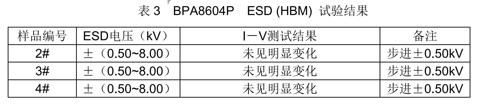

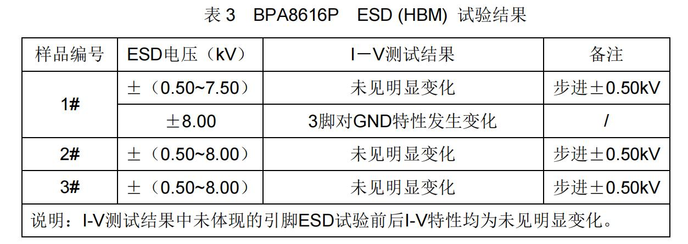

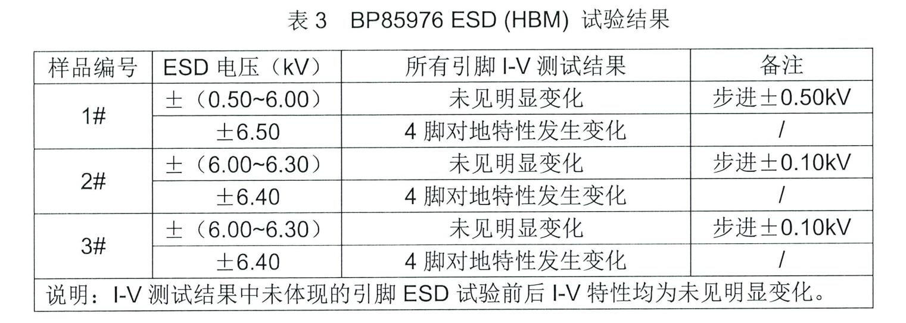

## 辅助电源的工业级品质管控

<em><strong><u>产品设计/工艺/晶圆制造/中测/封装测试/AE验证/可靠性验证_</u></strong></em>等八个方面

消费类电子与工业类电子控制点对比表

<table>
  <tr>
    <th>控制点</th>
    <th>消费类电子芯片</th>
    <th>工业类电子（BPA系列）</th>
  </tr>
  <tr>
    <td>产品设计</td>
    <td>符合设计要求</td>
    <td>设计必须使用checklist等设计工具
ESD必须通过2000V</td>
  </tr>
  <tr>
    <td>工艺</td>
    <td>单纯依靠fab工艺</td>
    <td>晶圆工艺有GOI、HCI、EM、HTRB等可靠性验证要求</td>
  </tr>
  <tr>
    <td>晶圆制造</td>
    <td>Fab控制</td>
    <td>成熟工艺一年以上生产经验</td>
  </tr>
  <tr>
    <td>中测</td>
    <td>边缘芯片不做圈边</td>
    <td>边缘3mm产品需要做点除</td>
  </tr>
  <tr>
    <td>封装测试</td>
    <td>内部审核通过</td>
    <td>生产工艺能力cpk大于1.67
FT测试中limit按照Datasheet&gt;QA&gt;FT&gt;CP</td>
  </tr>
  <tr>
    <td>AE验证</td>
    <td>基本电性能测试
基本芯片功能测试</td>
    <td>输入欠过压，输出短路等保护功能系统ESD功能高温老化测试等</td>
  </tr>
  <tr>
    <td>可靠性验证</td>
    <td>TCT，THSL，500hr即可 
HTOL 24-168小时，数量为10个，一个批次</td>
    <td>TCT，THSL，
HALT，HTRB，THB，DOPL，6大项目，按国标要求 1000小时老化；数量为3个批次，每个批次45个</td>
  </tr>
</table>

\*测试项目解释

GOI：栅氧化层完整性测试；

HCI：热电子注入、

EM：电迁移；

HTRB: 高温反偏；

HALT：高温高湿工作寿命；

THB：高温高湿偏压；

DOPL：高温工作寿命

## **晶丰明源\_工业级BPA系列电源芯片Roadmap**

40W

20W

10W

**BPA850XX**

**Buck/Buck-Boost**

**BV>700V**

**工业级/SOP&DIP**

5W

**BPA8604X/**

**861XX/8620P**

**SSR**

**BV>700V**

**工业级/SOP&DIP**

**BPA8652XP**

**SSR**

**BV>800V**

**工业级/DIP**

**BPA861XPX/8620PX**

**SSR**

**BV>750V**

**工业级/SOP&DIP**

**BPA86528D/**

**BPA86527D**

**SSR**

**BV>800V**

**工业级/ESOP10**

**BPA8652XG/**

**86016G**

**SSR**

**BV>800V**

**工业级/SMD**

**BPA86534X**

**SSR**

**集成过零和X电容放电**

**工业级/SOP&DIP&SMA**

**BPA8596XDH/8595XDH**

**Buck/Buck-Boost**

**BV>800V**

**工业级/SOP&DIP**

**BPA8654XX**

**SSR**

**多路输出/零待机**

**工业级/SOP&DIP&SMA**

**BPA8601X**

**前馈反激**

**BV>800V**

**工业级/SOP&DIP&SMA**

<table>
  <tr>
    <th>量产</th>
  </tr>
  <tr>
    <td>样品</td>
  </tr>
  <tr>
    <td>研发</td>
  </tr>
  <tr>
    <td>规划</td>
  </tr>
</table>

2021	     2022           2023        2024            2025                     2026                               2027

晶丰明源内部资料请勿外传

## **工业级BPA系列市场数据更新**

<table><thead><tr><th>年份</th><th>BPA85</th><th>BPA86</th></tr></thead><tbody><tr><td>2020</td><td>4</td><td>0</td></tr><tr><td>2021</td><td>9455426</td><td>2579787</td></tr><tr><td>2022</td><td>8178181</td><td>8820228</td></tr><tr><td>2023</td><td>15326966</td><td>15025977</td></tr><tr><td>2024</td><td>16619735</td><td>24628118</td></tr><tr><td>2025</td><td>21605655.5</td><td>30785147.5</td></tr></tbody></table>

\*截止2025，大家电/工业级ACDC总出货量超过1.5亿颗

10

晶丰明源内部资料请勿外传

## 隔离反激SSR恒压-BPA

Y26Q1送样

**BPA8604PE**

- 750V/24ohm
- 最高级微波干扰
- DIP7

**BPA86533G**

- 750V/4.5ohm
- 最高级微波干扰
- G封装

**专用系列**

**BPA86516P**

- 800V/2.1ohm
- DIP7 （PN8149H）
- 冰箱&厨热替代

**P2P**

**Sanken系列**

**800V**

（目标板卡厂）

(目标品牌厂）

**BPA86525PC**

- 800V/3.9ohm
- BUS OVP (5uS）
- DIP7（XX161HD）

**BPA86525G**

- 800V/4ohm
- BUS OVP
- G封（XX161HZS)

**BPA86526PC**

- 800V/3ohm
- BUS OVP(5uS）
- DIP7 （XX163HD）

**BPA86526G**

- 800V/3ohm
- BUS OVP(5uS）
- G封 （XX8733）

**BPA86526P**

- 800V/2.1ohm
- BUS OVP（2mS）
- DIP7（XX163HD）

Y27Q1送样

**BPA86826D**

- 800V/40W
- 零待机功耗

**BPA86528D**

- 800V/0.85ohm
- BUS OVP
- ESOP10

**P2P**

**TNY系列**

**700/750V**

**BPA8605PD**

- 750V/24ohm
- Drain OVP
- DIP7

**BPA8604D/P**

- 700V/24ohm
- Drain OVP
- SOP7/DIP7

**BPA8616PD/D**

- 750V/11ohm
- Drain OVP
- DIP7

**BPA8616P**

- 700V/11ohm
- Drain OVP
- SOP7/DIP7

**BPA8618PD/D**

- 750V/4.5ohm
- Drain OVP
- DIP7

**BPA8618P**

- 700V/4.5ohm
- Drain OVP
- SOP7/DIP7

**BPA8619P**

- 700V/3ohm
- Drain OVP
- SOP7/DIP7

**BPA8620PD**

- 750V/2.4ohm
- Drain OVP
- DIP7

**BPA8620P**

- 700V/2.4ohm
- Drain OVP
- DIP7

5W

12W

15W

18W

晶丰明源内部资料请勿外传

50W

24W

## 非隔离恒压-BPA

**P2P**

**PN系列**

**800V**

### **BPA85963DM**

- 800V/18ohm
- 固定15V
- Ipeak=450mA
- SOP7

### **BPA85955DM**

- 800V/18ohm
- 固定12V
- Ipeak=450mA
- SOP8

### **BPA85963DH**

- 800V/18ohm
- 固定15V
- Ipeak=450mA
- SOP7

**P2P**

**LNK系列**

**700V&650V**

### **BPA8504D**

- 700V/16ohm
- 输出电压可调
- Ipeak=280mA
- SOP7

150\~200mA

### **BPA85966D**

- 650V/10ohm
- 固定15V输出
- Ipeak=600mA
- SOP7

### **BPA8505D/P**

- 700V/8.5ohm
- 输出电压可调
- Ipeak=440mA
- SOP7/DIP7

300mA

### **BPA85906D**

### **BPA8506D**

- 700V/6ohm
- 输出电压可调
- Ipeak=640mA
- SOP7

400mA

### **BPA86015G**

- 800V/4ohm
- 反激非隔离(直接反馈)
- 最大功率24W
- SMD-7封装

### **BPA85968D**

- 650V/4.5ohm
- 固定15V输出
- Ipeak=1000mA
- SOP7

### **BPA85968P**

- 650V/5.4ohm
- 固定15V输出
- Ipeak=1000mA
- DIP-8

450mA-500mA

### **BPA85959D**

- 650V/1.8ohm
- 固定12V
- Ipeak=1700mA
- SOP8

500mA-650mA

晶丰明源内部资料请勿外传

## **智慧家居事业部产品线**

- **工业级BPA系列电源芯片Roadmap**
- **半桥功率模块**
- **大功率ACDC方案Roadmap**

13

**IPM产品系列Roadmap**

主推产品

**ES**

Engineering Sample

Under Development

**600V**

**（大家电）**

单相

**500V**

**（国内消费）**

单相

单相

**300V**

**(海外）**

**1D500XD**

**ESOP13**

**MOS:3A\~5A**

**Up to 500V**

**1D3007D**

**ESOP13**

**MOS:7A**

**Up to 300V**

**2024**

**1D500XDT**

**ESOP13**

**MOS:5A\~7A**

**VTS**

**ES**

**1M36003**

**ESOP13**

**MOS:3A**

**OCP**

**FO**

**1M2500X**

**EHSOP12**

**MOS:3A\~7A**

**自供电**

**VTS/FO**

**1M2300X**

**EHSOP12**

**MOS:6A/7A**

**自供电**

**VTS/FO**

**2025**

**ES**

**1M5600X**

**EHSOP12**

**MOS:3A\~4A**

**自供电**

**OCP/FO**

**ES**

**1S2500X**

**EHSOP12**

**SiC:8A\~10A**

**自供电**

**VTS/FO**

**ES**

**1S5700X**

**EHSOP12**

**SiC:5A\~10A**

**自供电**

**OCP/FO**

**1S2500XP**

**PQFN5\*6**

**SiC:8A\~10A**

**自供电**

**VTS/FO**

**1S6700X**

**3MM封装**

**SiC:5A\~10A**

**自举供电**

**OCP/FO**

26Q3样品

**2026**

**2027**

## **白电IPM产品选型**

**自供电**

### **LKS1M56002H**

- HS-LS主芯+自供电
- OCP/FO/SD
- 600V/2A （PT工艺）
- EHSOP12

## **半桥IPM**

**自举供电**

2A

空调内风机

### **LKS1M56003H**

- HS-LS主芯+自供电
- OCP/FO/SD
- 600V/3A （PT工艺）
- EHSOP12

样品：3/30

### **LKS1S57003**

- HS-LS主芯+自供电
- OCP/FO/SD
- 700V/2.5ohm(SIC)
- EHSOP12

### **LKS1M36003**

- ESOP13工业级
- 自身硬保护
- 600V/3A （PT工艺）

样品：0-1推广

3A-4A

空调内风机

样品：内部评估

样品：5/15

### **LKS1S57008**

- HS-LS主芯+自供电
- OCP/FO/SD
- 700V/0.75ohm(SIC)
- EHSOP12

### **LKS1S57009**

- HS-LS主芯+自供电
- OCP/FO/SD
- 700V/0.5ohm （SiC）
- EHSOP12

### **LKS1S67008**

- 集成自举二极管
- OCP/FO/SD
- 700V/0.75ohm(SIC)
- 3mm爬电距离

### **LKS1S67009**

- 集成自举二极管
- OCP/FO/SD
- 700V/0.5ohm(SIC)
- 3mm爬电距离

>5A

空调外机/冰箱压缩机/高压风机

晶丰明源内部资料请勿外传

## **LKS1M56003H-自供电空调内风机IPM**

**无需VCC电源，Bus电压检测，VB电容可用贴片，BOM可降 ¥0.7X**

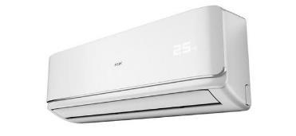

<table>
  <tr>
    <th rowspan="2">系统元器件</th>
    <th colspan="2">量产方案：LASXXXX</th>
    <th colspan="2">新方案：LKS1M56003H</th>
  </tr>
  <tr>
    <td>料号</td>
    <td>数量</td>
    <td>料号</td>
    <td>数量</td>
  </tr>
  <tr>
    <td>VCC电容</td>
    <td>MLCC 100nF/50V</td>
    <td>3</td>
    <td>NC</td>
    <td>0</td>
  </tr>
  <tr>
    <td>BUS电压检测</td>
    <td>贴片电阻</td>
    <td>7</td>
    <td>IPM集成</td>
    <td>0</td>
  </tr>
  <tr>
    <td rowspan="4">15V供电</td>
    <td>绕组1个</td>
    <td>1</td>
    <td rowspan="4">自供电</td>
    <td>0</td>
  </tr>
  <tr>
    <td>二极管（ES2J）</td>
    <td>1</td>
    <td>0</td>
  </tr>
  <tr>
    <td>电解电容（100uF+47uF+10uF）</td>
    <td>3</td>
    <td>0</td>
  </tr>
  <tr>
    <td>贴片电容（10nF/50V）</td>
    <td>2</td>
    <td>0</td>
  </tr>
  <tr>
    <td>总结</td>
    <td></td>
    <td>17</td>
    <td></td>
    <td>0</td>
  </tr>
</table>

## **方案特点**

OCP

- 高侧驱动浮动电源设计，最高耐压+600V
- 无VCC电容、自举二极管和小容量自举电容
- 支持3.3V/5V/15V输入逻辑
- 内置母线电压检测（<±1.5%)
- 高低侧欠压保护
- 故障状态FO输出，外部SD输入
- 集成硬件过流保护功能
- 内置OTP保护
- 采用EHSOP12贴片封装

<table>
  <tr>
    <th>型号</th>
    <th>封装</th>
    <th>MOS 耐（V）</th>
    <th>RDS（Ω）</th>
    <th>OCP</th>
    <th>FO/SD</th>
    <th>自举二极管</th>
    <th>策略</th>
  </tr>
  <tr>
    <td>LKS1M56003H</td>
    <td>EHSOP12</td>
    <td>600</td>
    <td>2</td>
    <td>√</td>
    <td>√</td>
    <td>无需</td>
    <td>样品</td>
  </tr>
</table>

## **LKS1S5700X-新一代SiC自供电IPM**

**集成SiC，无需VCC电源，Bus电压检测，温度特性好于IGBT（7A）**

## **方案特点**

- 高侧驱动浮动电源设计，最高耐压+800V
- 集成700V的SiC
- 无VCC电容、自举二极管和小容量自举电容
- 支持3.3V/5V/15V输入逻辑
- 内置母线电压检测（<±1.5%)
- 高低侧欠压保护
- 故障状态FO输出，外部SD输入
- 集成硬件过流保护功能
- 采用EHSOP12贴片封装

<table>
  <tr>
    <th>型号</th>
    <th>封装</th>
    <th>MOS 耐压（V）</th>
    <th>RDS（Ω）</th>
    <th>OCP</th>
    <th>FO/SD</th>
    <th>自举二极管</th>
    <th>策略</th>
  </tr>
  <tr>
    <td>LKS1S57008</td>
    <td>EHSOP12</td>
    <td>700</td>
    <td>0.75</td>
    <td>√</td>
    <td>√</td>
    <td>无需</td>
    <td>样品</td>
  </tr>
  <tr>
    <td>LKS1S57009</td>
    <td>EHSOP12</td>
    <td>700</td>
    <td>0.5</td>
    <td>√</td>
    <td>√</td>
    <td>无需</td>
    <td>研发</td>
  </tr>
  <tr>
    <td>LKS1S57003</td>
    <td>EHSOP12</td>
    <td>700</td>
    <td>2.4</td>
    <td>√</td>
    <td>√</td>
    <td>无需</td>
    <td>研发</td>
  </tr>
</table>

## **封装优化、功率器件、ESD能力提升**

- 全系列使用参Pt MOS

- 第二代封装

2mm

2.5mm

2mm

**高压部分**

软恢复

硬恢复

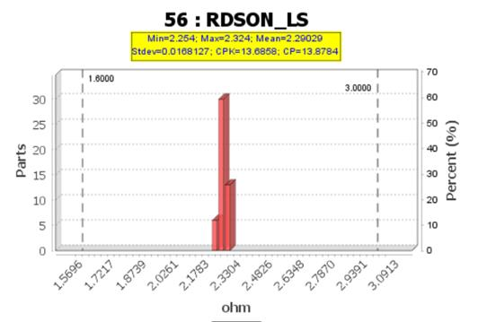

**低压部分**

\*①使用软恢复FRD，优化EMI

\*②优化驱动匹配，减小DV/DT速率

\*参Pt FR-MOS，一致性更好

**封装优化**

1. 芯片宽度收窄1.9mm，小尺寸布局更容易。
2. 高低压引脚分开布局，安规间隙足，走线更容易。
3. 低压侧引脚间隙加宽，焊接不易沾锡，潮湿环境不易短路。
4. VB引脚靠近VS引脚，优化高侧供电环路和PCB走线更容易。
5. 高低压直流间隙＞2.5mm，适应高湿环境绝缘要求。

- 全系ESD能力提升

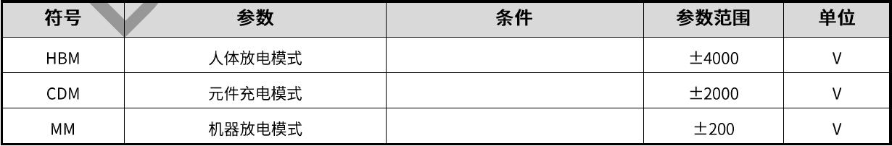

\*①300V规格ESD pass 4KV HBM，以上为LKS1M23006数据 。

\*②500V规格ESD pass 3.5KV HBM。

## **集成保护功能及外围电路**

- 集成VTS及OTP保护

- 高侧和低侧均集成DESAT保护

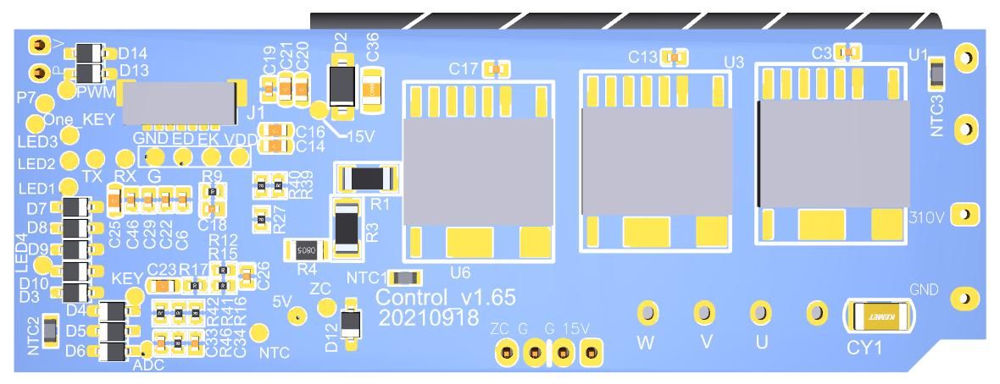

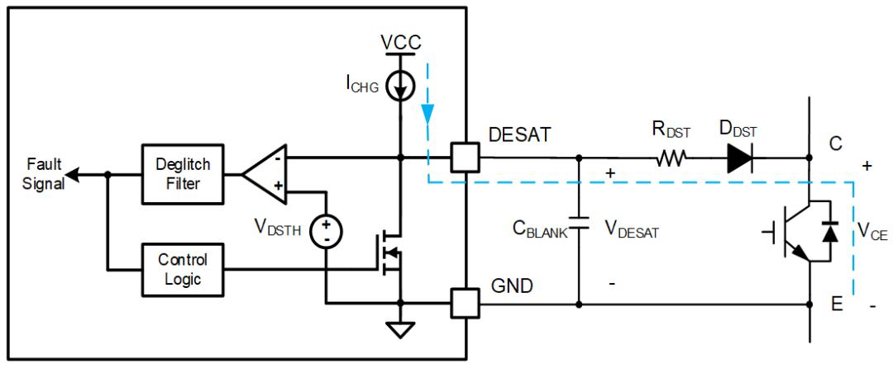

**VB**

**VS**

**P**

热传导

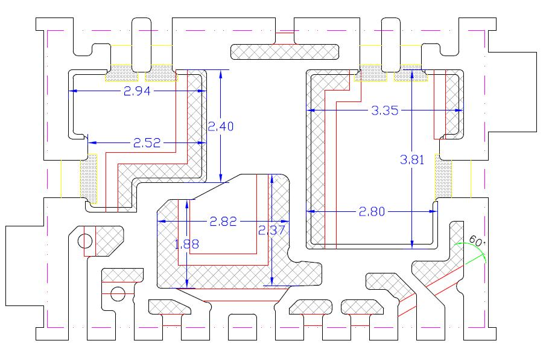

板载NTC

安规间隙小

测温不准确

集成DESAT保护

集成OTP

- 集成母线电压检测

- FO/SD故障输出和复位技术

集成高精度母线电压检测

集成FO/SD功能

**FO/SD**

**HIN/LIN**

**\*FO/SD触发后，保持下拉，直到HIN/LIN 8个完整脉冲后恢复。**

- 集成VTS

- 集成RC滤波

集成RC滤波

集成精准VTS

**PSNS**

**HIN**

**LIN**

**GND**

**GND**

**VTS**

**FO/SD**

**N**

**N**

**VTS**

**\*VTS采用带隙电路，批量精度高，输出为最高温度模块的电压信号。**

## **高压驱动可靠性提升**

**第一代驱动**

**VCC**

**HIN**

**LIN**

**GND**

**VTS**

**VB**

**HO**

**VS**

**LO**

**第二代驱动**

高侧电路

**HO**

高压隔离环

**VS**

R

S

低侧电路

<table><thead><tr><th>第二代IPM X</th><th>第二代IPM Y</th><th>第一代半桥 X</th><th>第一代半桥 Y</th></tr></thead><tbody><tr><td>70</td><td>-58</td><td>71.599999999999994</td><td>-44.5</td></tr><tr><td>111</td><td>-49</td><td>90</td><td>-40</td></tr><tr><td>208</td><td>-36.32</td><td>130</td><td>-32</td></tr><tr><td>301</td><td>-30.64</td><td>237</td><td>-26</td></tr><tr><td>401</td><td>-28.2</td><td>445</td><td>-21.4</td></tr><tr><td>503</td><td>-26.16</td><td>1000</td><td>-18.7</td></tr><tr><td>607</td><td>-25.2</td><td></td><td></td></tr><tr><td>703</td><td>-24.48</td><td></td><td></td></tr><tr><td>1000</td><td>-22</td><td></td><td></td></tr></tbody></table>

负压能力提升29%

## **P型衬底**

### **寄生电容**

### **寄生三极管**

- Vs负压能力提升29%

- ESD静电能力提升75%

- 芯片面积更省

- 700V高压 BCD成熟工艺

## **智慧家居事业部产品线**

- **工业级BPA系列电源芯片Roadmap**
- **半桥功率模块**
- **大功率ACDC方案Roadmap**

21

## 大功率隔离恒压方案

<800W

<400W

<150W

Boost

AHB

Flyback

LLC

同步整流-LLC

### **BP2658**

Boost/Interleave PFC

QR CRM/DCM Mode

P2P UCC28063/4

外置MOSFET/SOP16

### **BP3398**

Digital configurable

PFC+LLC Comb.

P2P TEA2016

外置MOSFET/SOP16

### **BP2638C**

Boost PFC

QR CRM/DCM Mode

外置SiC MOSFET

P2P NCL2801/SOP8

### **BP3358**

Digital configurable

PFC+AHB Comb.

Auto-adaptive ZVS

外置MOSFET/SOP16

### **BP3599**

Voltage Mode

CV+CC Feedback

Auto-adaptive ZVS

外置MOSFET/SOP16

### **BP3199**

Digital configurable

Current Mode

P2P NCP1399

外置MOSFET/SOP16

### **BP62810**

Dual Syn. Rec.

P2P TEA2095

外置MOSFET/SOP8

### **BP2632GC**

Boost PFC

QR CRM/DCM Mode

内置SiC MOSFET BV>800V/EHSOP10

### **BP3532GC/HC**

Flyback

QR CRM/DCM Mode

内置SiC MOSFET BV>800V/EHSOP10

26年Q1

晶丰明源内部资料请勿外传

## 隔离恒压方案选型导图

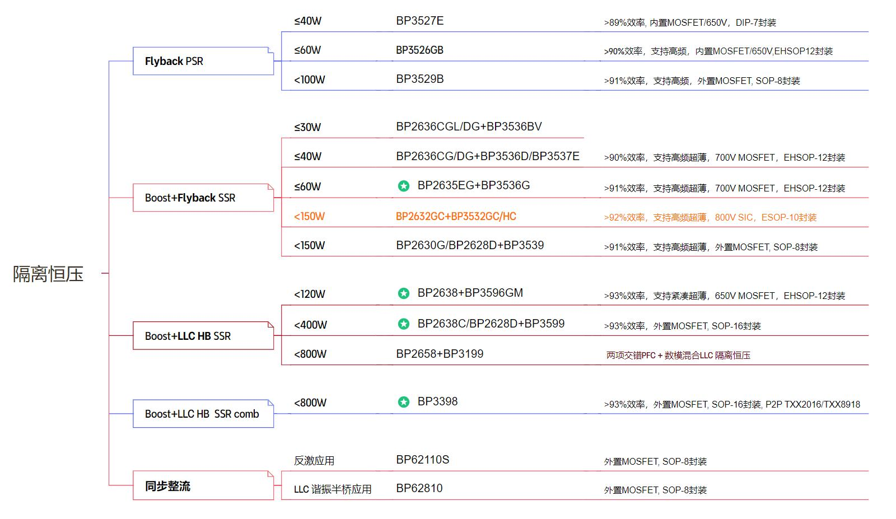

晶丰明源内部资料请勿外传

## **电机控制驱动芯片产品**

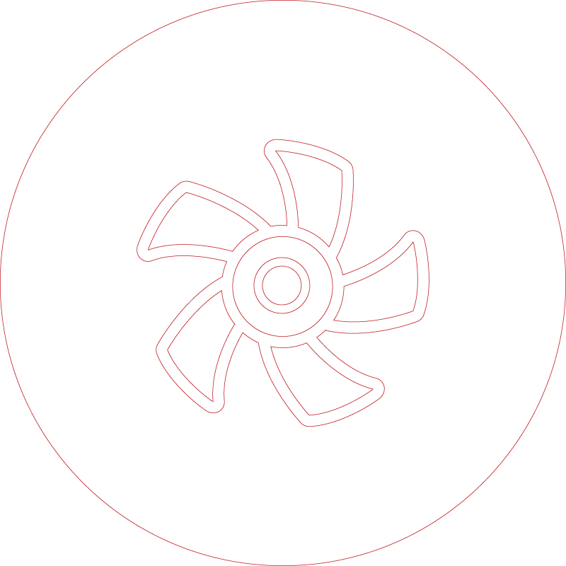

- **消费&工业级MCU Roadmap**

- **车规级MCU Roadmap**

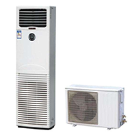

24

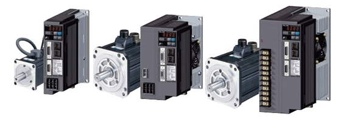

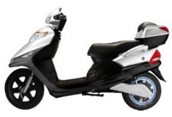

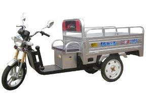

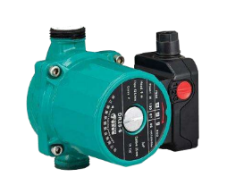

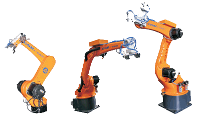

## **供应链与体系管理**

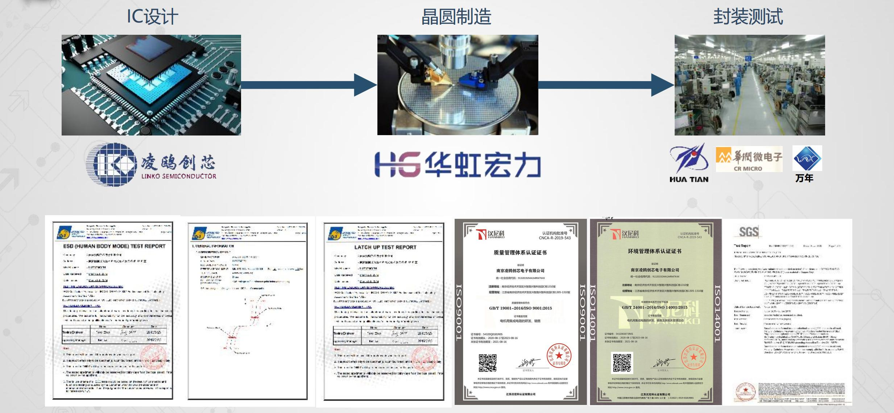

## **重点细分应用**

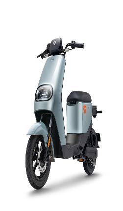

**清洁电器**

**电动出行**

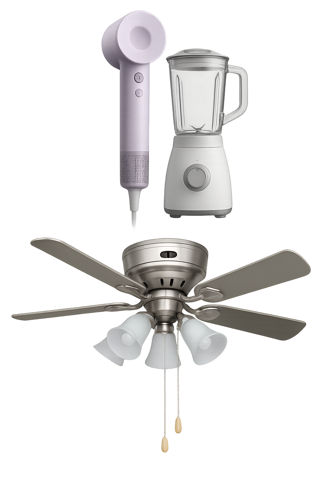

**小家电**

**汽车电子**

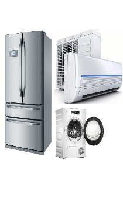

**大家电**

**电动工具**

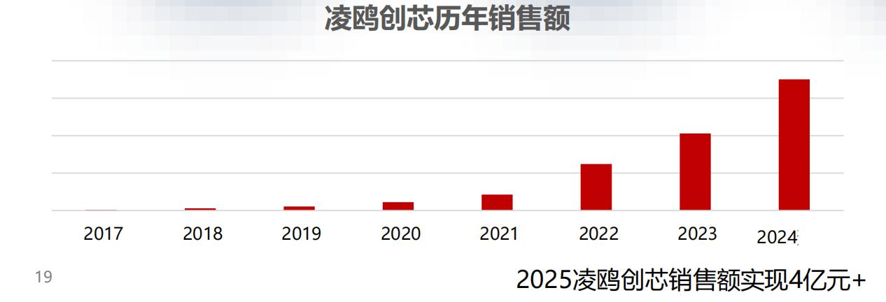

**服务器风扇**

02

## 产品创新理念

器件更少

PCB更简洁

更加易开发

MCU + DSP 双核心，高主频 96Mhz

OPA

A

高速DSP内核，FOC电流环1.2usec

OPA

**电机控制的核心要素**

- **要求对电流电压等输入信号采样精准可靠**
- **精度、抗干扰、稳定性是一个挑战**

1 X MCU

4 X OPA

2 X CMP

1 X LDO

1 X Driver

CORDIC硬件：SIN, COS, ARCTAN, SQRT

高速双路同步采样 3MSPS 12bit SAR ADC

芯片资源合理，不冗余，无缺失

产品定义精准，不盲从

02

## **产品创新理念**

仪表级全差分可编程增益放大器OPA

不需要电压偏置，可处理正负电流信号

内部电压钳位，支持MOS内阻采样

高精度 0.5% 电压基准源

内部RC时钟全温度范围 ± 1%

内置比较器，负端电压基准可选

内置DAC，过流，过压设置方便

内置相线中心点虚拟电阻网络

**产品创新理念**

## **MCU + DSP + CPLD**

## **产品创新理念**

集成自举二极管

内置5V LDO

集成反电动势检测电阻

工作电压范围更宽4.5\~20V

过温保护功能175℃触发OTP

02

## **MCU Roadmap**

**ES**

主推产品

Engineering Sample

Under Development

02

**高性能**

**MC45x**

M4F @ 192MHz

256KB Flash

6x OPA/ 2x DAC

CAN FD

**MC46x**

M4F @ 120MHz

256KB Flash

6x OPA/ 2x DAC

CAN FD

FuSaSIL2

**MC75x**

M7 @ 480MHz

1MB Flash

128KB SRAM

5xDAC

EtherCAT

**中端**

**进阶**

**MC07x**

96MHz

DSP + CLU

128KB Flash

4x OPA/ 2x DAC

**MC08x**

96MHz

DSP

64KB Flash

4x OPA/ DAC

**ES**

**MC09x**

96MHz

DSP + CLU

128KB Flash

4x OPA/ 2x DAC

**MC0Ex**

M0@96MHz

DSP + CLU

512KB Flash

4x OPA/ 2x DAC

AES/CAN

**MC02x**

72MHz

64KB Flash

55nm

**性价比**

**MC03x**

48MHz

SQRT，DIV

32KB Flash

4KB SRAM

31

2025

2026

**MC01x**

72MHz

ASIC Core

MTP/EEPROM in chip

2027

晶丰明源内部资料请勿外传

## **MCU各系列异同对比**

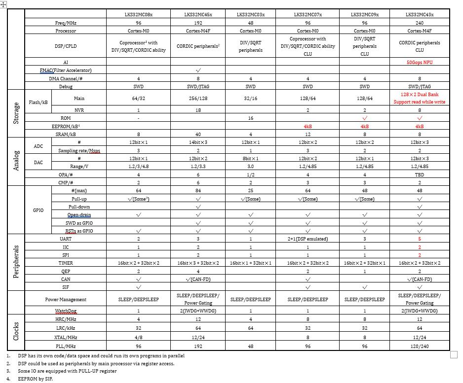

## **控制驱动MCU产品系列Roadmap**

02

**All in One**

**MCU w/**

**HV Driver**

**MC031PC**

48MHz

SQRT，DIV

32KB Flash

40V IPM

**MC031K**

M0@48MHz

SQRT，DIV

32KB Flash

600V 6N Driver

**ES**

**MC03AK**

M0@48MHz

SQRT，DIV

32KB Flash

600V/1.5A IPM

**MC088K2**

M0+DSP@96MHz

64KB Flash

600V 6N Driver

**MC45x**

M4F @ 192MHz

256KB Flash

CAN FD/SPI

40V IPM

**ES**

**MC078K**

M0+DSP@96MHz

CLU

128KB Flash

600V 6N Driver

Under Development

**ES**

Engineering Sample

主推产品

**MCU w/**

**LV Driver**

**MC03x**

M0@48MHz

SQRT，DIV

32KB Flash

6N/3P3N Driver

Up to 250V

**MC07x**

M0+DSP@96MHz

CLU

128KB Flash

6N/3P3N Driver

Up to 250V

**MC452**

M4F @ 192MHz

256KB Flash

CAN FD

Dual 6N Driver

## **车规级MCU Roadmap**

02

主推产品

**ES**

Engineering Sample

Under Development

**AT039**

48MHz M0

SQRT，DIV

4P4N IPM(40V)

LIN PHY

AECQ100

MCU + IPM

**AT037**

48MHz M0

SQRT，DIV

8N IPM

LIN PHY

AECQ100

**AT077**

96MHz M0+DSP

128KB Flash

8N IPM

LIN PHY

AECQ100

**ES**

**主要应用**：

- 空调出风口
- 进气格栅AGS
- 智能充电口盖
- 三通\~五通阀

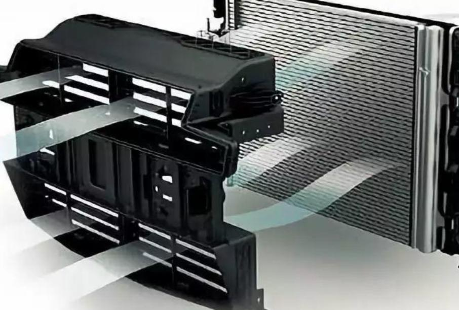

**AT086**

96MHz+DSP

64KB Flash

6N Driver

CAN, LIN

-40\~125°

AECQ100

MCU + Driver

**AT089**

96MHz+DSP

64KB Flash

6N Driver

LIN PHY + LDO

-40\~125°

AECQ100

**AT459**

M4F @ 192MHz

256KB Flash

6N Driver

LIN PHY + LDO

-40\~125°

AECQ100

**AT079**

96MHz M0+DSP

128KB Flash

6N Driver

LIN PHY

-40\~125°

AECQ100

### **主要应用：**

- 电子风扇
- 电子油泵/水泵/水阀
- 汽车旋转屏
- 座椅
- 雨刮/天窗

MCU

**AT085**

96MHz+DSP

64KB Flash

CAN, LIN

-40\~125°

AECQ100

**AT075**

96MHz+DSP

128KB Flash

CAN, LIN

-40\~125°

AECQ100

**ES**

**AT453**

M4F @ 192MHz

256KB Flash

6x OPA/ 2x DAC

CAN FD

-40\~125°

AECQ100

**ES**

**AT46x**

120Mhz M4F

256KB Flash

CAN FD

-40\~150°

AECQ100

FuSa ASIL-B

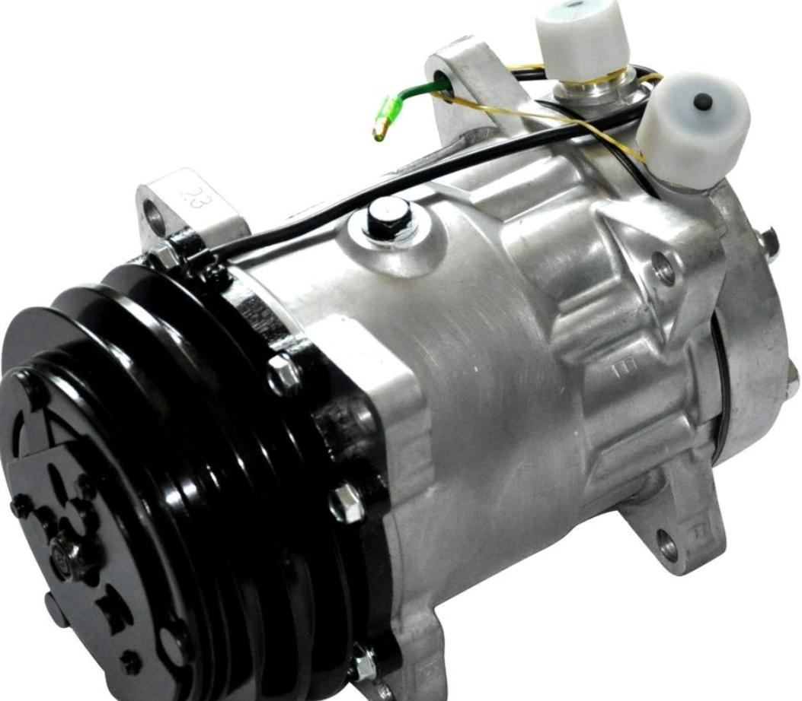

### **主要应用：**

- 空调压缩机
- 座椅/移门滑轨
- 汽车旋转屏

### **2025		       2026**

上海市浦东新区申江路5005弄星创科技广场3号楼9层

+86-21-51870166

sales@bpsemi.com

www.bpsemi.com

## 隔离恒压

Boost CV

规划

### **BP2632GC**

- THD<5%,满足调光谐波,
- 抗浪涌好,
- 内置SiC MOS,ESOP10

### **BP2630G**

- THD<5%, 满足调光谐波
- 支持全压应用
- 外置MOSFET
- 封装SOP8

### **BP2635EG**

- THD<5%,满足调光谐波
- 内置MOS:600V 2Ω
- 封装ASOP-8

### **BP2636XG**

- THD<5%, 满足调光谐波
- P2P BP2636X
- 内置MOS(DG/CG)
- 封装 SOP8

### **BP3537E**

- SSR+QR Flyback
- 支持高频(<150KHz)
- 内置Mosfet, 700V2Ω
- 封装：DIP-7

### **BP3536D**

- SSR+QR Flyback
- 支持高频(<150KHz)
- 内置Mosfet, 700V2.3Ω
- EHSOP12封装

### **BP3536GV**

- PSR+QR Flyback,无CC
- 支持高频(<150KHz)
- 内置Mosfet, 700V0.8Ω
- EHSOP12封装

### **BP3536G**

- SSR+QR Flyback
- 支持高频(<150KHz)
- 内置Mosfet, 700V0.8Ω
- EHSOP12封装

### **BP3527E**

- PSR +QR Flyback
- 支持<150KHz频率
- 内置Mosfet, 650V2Ω

≤ 40W

### **BP3526GB**

- PSR+QR Flyback
- 支持高频(<150KHz)
- 内置Mosfet, 650V1.2Ω
- EHSOP12封装

≤60W

### **BP3532GC**

- SSR+QR Flyback
- 支持高频(<150KHz)
- 内置 Sic MOS(0.8R)
- EHSOP10封装

### **BP3532HC**

- SSR+QR Flyback
- 支持高频(<150KHz)
- 内置 Sic MOS(0.2R)
- EHSOP10封装

**SSR** Flyback

CV+CC

### **BP3539**

- SSR+QR Flyback
- 支持高频(<150KHz)
- 外置Mosfet
- SOP8封装

### **BP3529B**

- PSR +QR Flyback
- 支持<150KHz频率
- 外置MOSFET
- 动态性能优化

### **BP3526GC**

- PSR +QR Flyback
- 支持<150KHz频率
- 内置SiC MOSET

**PSR** Flyback

CV+CC

<150W

晶丰明源内部资料请勿外传

## 隔离恒压

Boost CV

<800W

### **BP2658**

- THD<5%,支持UART
- 交错PFC ,CRM/DCM
- P2P UXX28063

**SSR** **LLC**

### **BP3398**

- PFC+LLC Comb.
- 5%调光深度
- P2P TXX2017

### **BP3199X**

- LLC 恒流控制
- 5%调光深度
- P2P NXX1399

<400W

<100W

### **BP2638/C**

- THD<10%
- 优化调光谷底导通
- 集成输入欠压/过压保护

### **BP2632GC**

- THD<5%,满足调光谐波,
- 抗浪涌好,
- 内置SiC MOS,ESOP10

### **BP3599**

- LLC谐振半桥结构
- 外置MOSFET
- SOP16封装

LLC 同步整流

规划

NP3

### **BP62810**

- LLC 同步整流
- 外置MOSFET
- SOP8封装

晶丰明源内部资料请勿外传

## 隔离恒压方案选型

<table>
  <tr>
    <th></th>
    <th>推荐功率范围 @176~264Vac</th>
    <th>Boost CV</th>
    <th>Flyback SSR CV</th>
    <th>同步整流</th>
  </tr>
  <tr>
    <td>1</td>
    <td>≤40W</td>
    <td>BP2636CG/BP2636DG</td>
    <td>BP3536D/BP3537E</td>
    <td></td>
  </tr>
  <tr>
    <td>2</td>
    <td>≤60W</td>
    <td>BP2630G/BP2635EG</td>
    <td>BP3536G</td>
    <td rowspan="3">BP62110S</td>
  </tr>
  <tr>
    <td>3</td>
    <td>≤120W</td>
    <td>BP2632GC</td>
    <td>BP3532GC</td>
  </tr>
  <tr>
    <td>4</td>
    <td>&lt;150W</td>
    <td>BP2638/BP2628D</td>
    <td>BP3539</td>
  </tr>
  <tr>
    <td></td>
    <td></td>
    <td>Boost CV</td>
    <td>LLC HB SSR CV</td>
    <td></td>
  </tr>
  <tr>
    <td>5</td>
    <td>≤120W</td>
    <td>BP2638/BP2628D</td>
    <td>BP3596GM</td>
    <td rowspan="4">BP62810</td>
  </tr>
  <tr>
    <td>6</td>
    <td>&lt;500W</td>
    <td>BP2638C/BP2628D</td>
    <td>BP3599</td>
  </tr>
  <tr>
    <td>7</td>
    <td>&lt;800W</td>
    <td>BP2658</td>
    <td>BP3199</td>
  </tr>
  <tr>
    <td>8</td>
    <td>&lt;800W</td>
    <td colspan="2">BP3398</td>
  </tr>
  <tr>
    <td></td>
    <td></td>
    <td></td>
    <td>Flyback PSR CV</td>
    <td></td>
  </tr>
  <tr>
    <td>9</td>
    <td>≤40W</td>
    <td></td>
    <td>BP3527E</td>
    <td></td>
  </tr>
  <tr>
    <td>10</td>
    <td>≤60W</td>
    <td></td>
    <td>BP3526GB</td>
    <td></td>
  </tr>
  <tr>
    <td>11</td>
    <td>&lt;100W</td>
    <td></td>
    <td>BP3529B/BP3529</td>
    <td></td>
  </tr>
</table>

晶丰明源内部资料请勿外传