## 凌鸥创芯产品与方案介绍

## 目录

凌鸥创芯 关于我们
产品与生态 LKS32 MCU与Gate Driver, Power MCU创新理念
生态体系及开发工具
应用方案介绍 空调、洗衣机、冰箱、厨热方案介绍
凌鸥学园

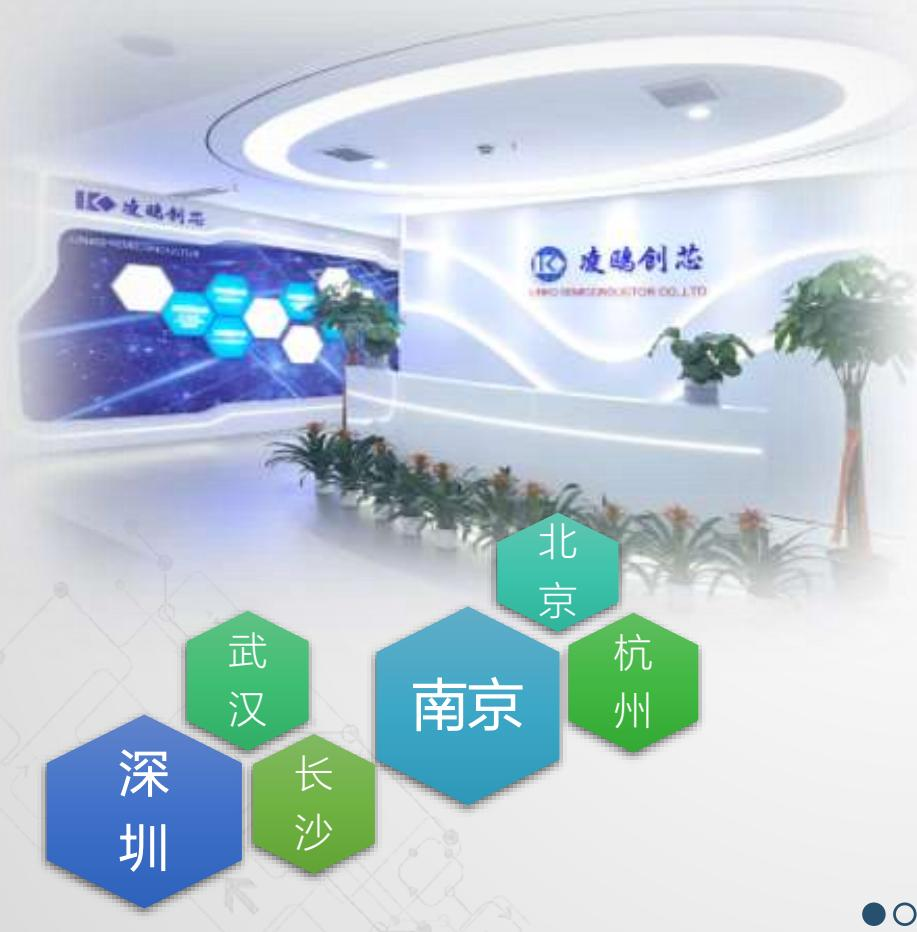

深圳

南京凌鸥创芯成立于2015年8月，是一家专注于控制及驱动集成电路及总体解决方案设计的国家高新技术企业。公司核心业务为微控制芯片(MCU)、预驱(Gate Driver)、以及电源 。

拥有一支经验丰富、多学科、综合能力强的专业技术团队，具备各种电机控制算法、应用方案及特种电机的开发能力。公司通过不断进行技术创新，秉承为天地立芯、为控制塑魂的使命，致力于提供极高性价比的产品、卓越的技术服务，繁荣电控生态、领航电控未来。

## 产产产产产

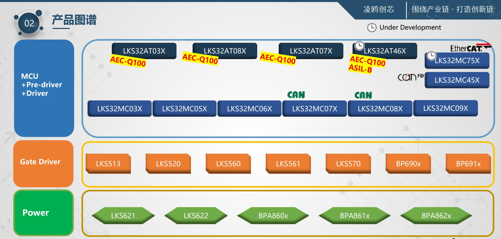  
➢ MCU、Gate Drver、Power产品线完整，生态链完备、整体解决方案的多样，服务多元

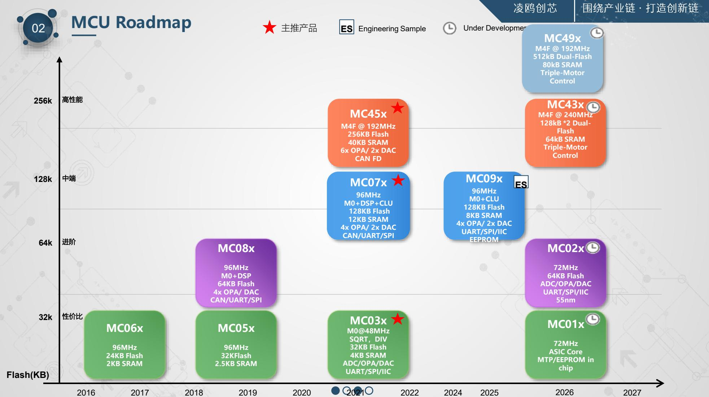

## All in One

## MC031PC

## 内置中低压预驱

## 内置高压预驱

48MHz SQRT，DIV 32KB Flash 40V IPM

## MC031K

48MHz SQRT，DIV 32KB Flash 600V 6N Driver

## MC03x

48MHz SQRT，DIV 32KB Flash 6N/3P3N Driver Up to 250V

ES

## MC454

M4F @ 192MHz 256KB Flash CAN FD 40V IPM

## MC088K22

96MHz DSP 64KB Flash 600V 6N Driver

## MC07x

96MHz DSP + CLU 128KB Flash 6N/3P3N Driver Up to 250V

## MC078K

96MHz DSP + CLU 128KB Flash 600V 6N Drive

## MC452

M4F @ 192MHz 256KB Flash CAN FD 20V Dual 6N Driver LQFP80

## 大家电推广产品系列

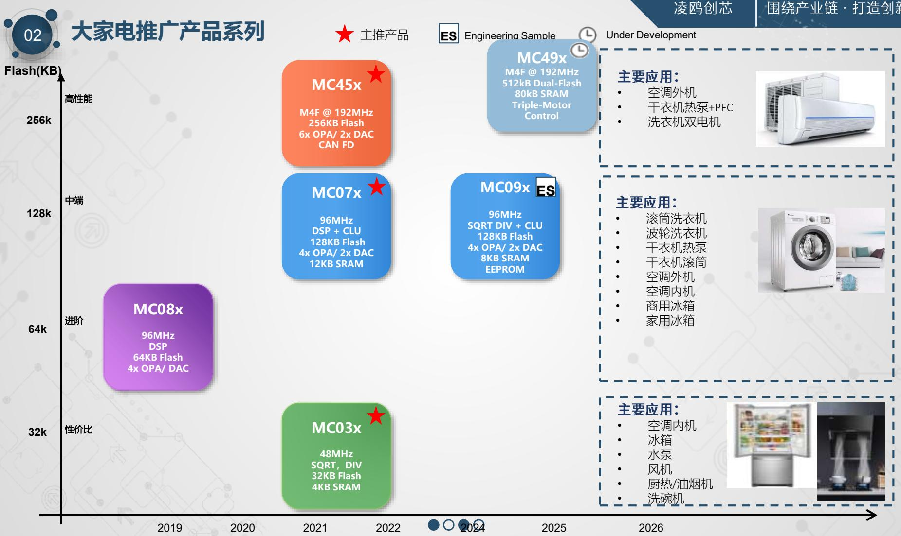

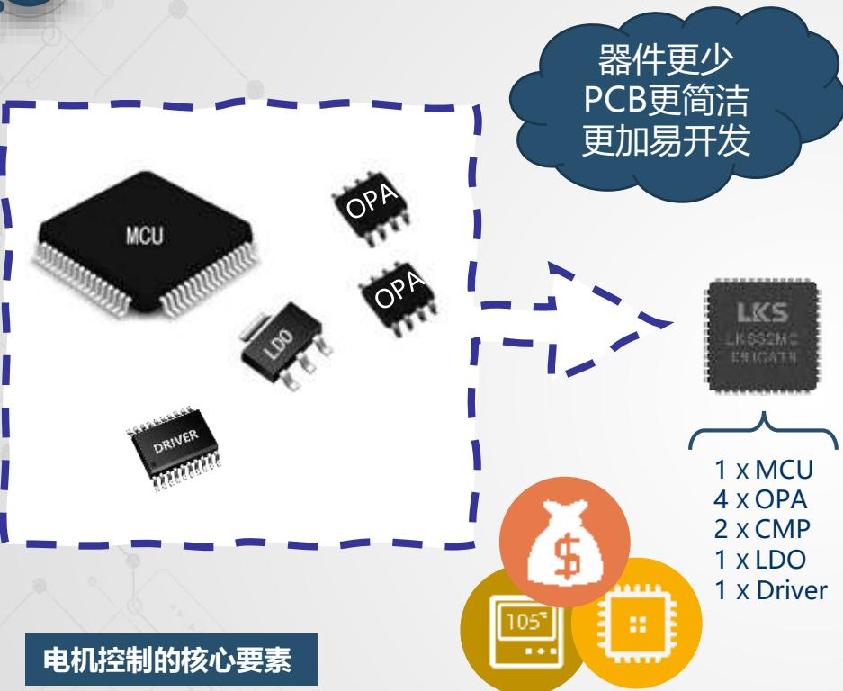

器件更少PCB更简洁更加易开发

1 X MCU 4 X OPA 2 X CMP 1 X LDO 1 X Driver

## 电机控制的核心要素

➢ 要求对电流电压等输入信号采样精准可靠

精度、抗干扰、稳定性是一个挑战

MCU + DSP 双核心，高主频 96Mhz

高速DSP内核，FOC电流环1.2usec

CORDIC硬件：SIN, COS, ARCTAN, SQRT

高速双路同步采样 3MSPS 12bit SAR ADC

芯片资源合理，不冗余，无缺失

产品定义精准，不盲从

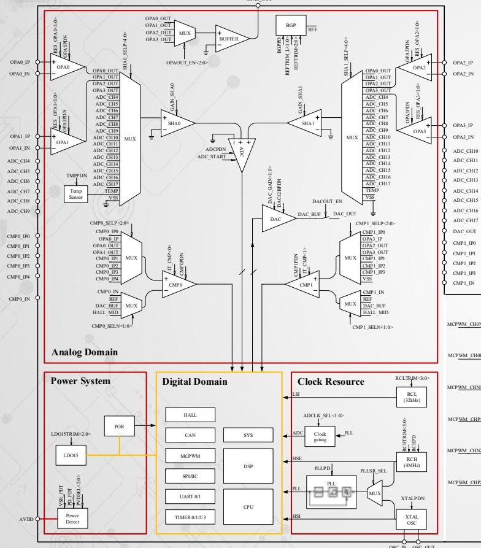

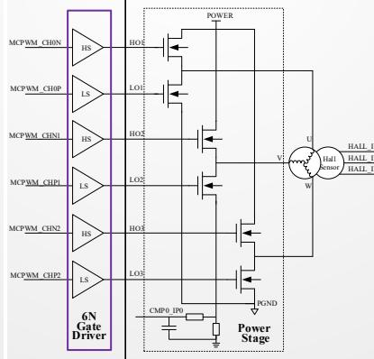

仪表级全差分可编程增益放大器OPA

不需要电压偏置，可处理正负电流信号

内部电压钳位，支持MOS内阻采样

高精度 0.5% 电压基准源

内部RC时钟全温度范围 ± 1%

内置比较器，负端电压基准可选

内置DAC，过流，过压设置方便

内置相线中心点虚拟电阻网络

MCU + DSP + CPLD  
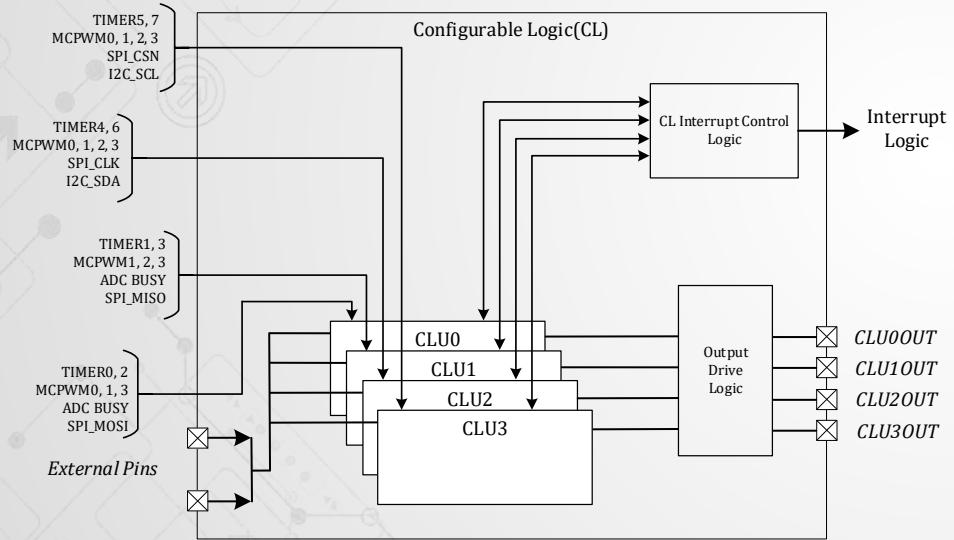

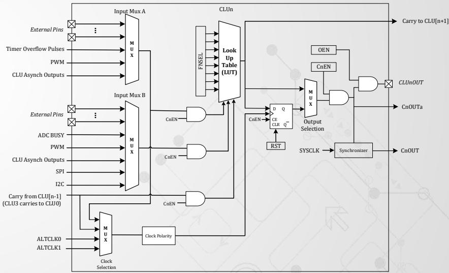

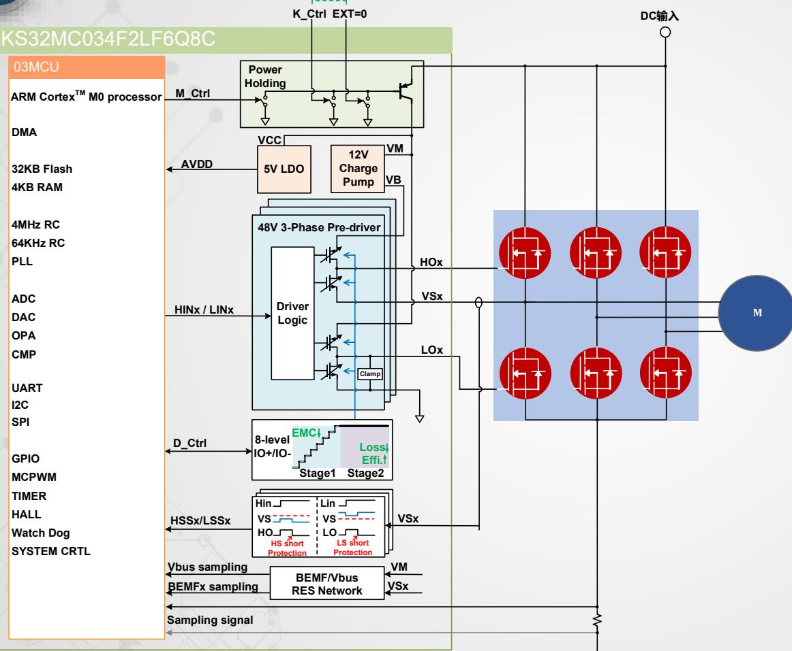

集成待机管理，兼容双插开关

支持上桥臂100％占空比全开

不需要外围LDO

驱动电流软件可编程

集成上下管短路保护，母线电压、反电动势检测网络

节省30个电子元器件

## LKS32MC78KUBQ8的典型应用框图 - 冰箱主变一体

## LKS32MC078KUBQ8主要优势：

## 高集成度：

• 96Mhz Cortex-M0内核

• 支持硬件Cordic和DIV快速运算

• 集成5V LDO，600V高压预驱

## 支持多种电机

• 支持BLDC，PMSM等

## 算法丰富

• 支持无感弦波FOC

• 过压、欠压、短路，缺相、过温、过流堵转保护

• 启动平稳、无抖动

## 型号状态：

## • 大批量稳定供货

## 主要目标应用：

• 220V/110V交流高压应用场景，例如家用冰箱、高压电动角磨机

## 整流变压后高压直流

DCDC

12V

## 600V 高电压

LKS32MC78KUBQ8

LDO

5V

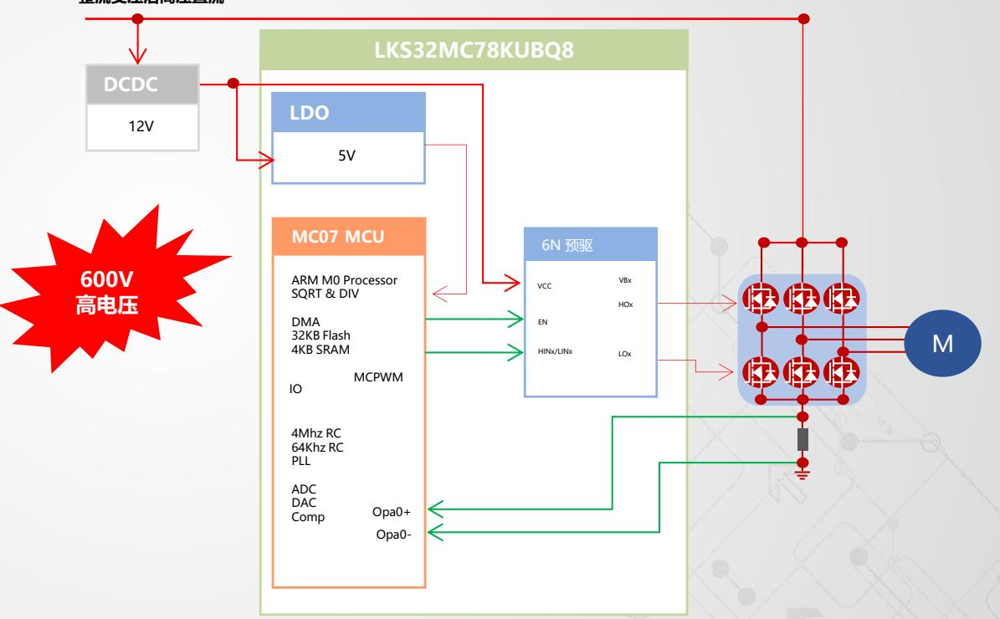

## LKS32MC031PC6Q8C产品特点：

• All in One：MC03 MCU + 驱动 + 3P3Nmos

• 内部集成母线电压检测

• 宽工作电压：5.6V\~28V

• 欠压保护点UVLO：4.8V

• Rdson(H+L) 60mohm

• 精简外围电路

• 宽工作温度范围-40\~125°

• 小封装5x6,小体积大功率10\~35W

## 典型应用场景：

• 电动牙刷

• 机器人关节

• 冰箱风机

• PC三相风扇

• 落地扇

• 摄像头和手持云台电机

• 水泵

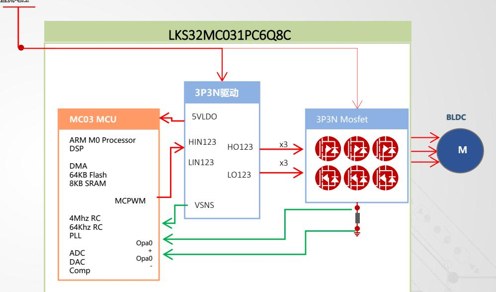

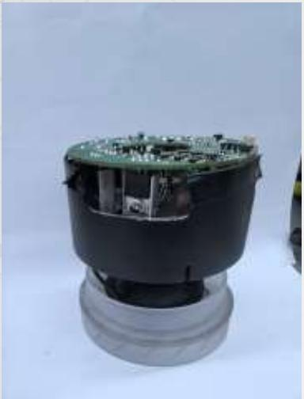

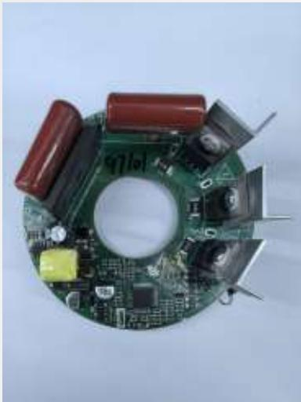

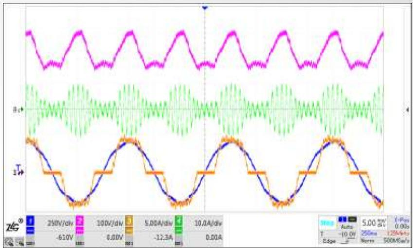

• 输出功率：900W

• 机械转速：7万转

• PF值：0.97

• 薄膜电容：3.9uf\*2

• 滤波电感：2.2mH

• MCU型号：LKS32MC071C8T8

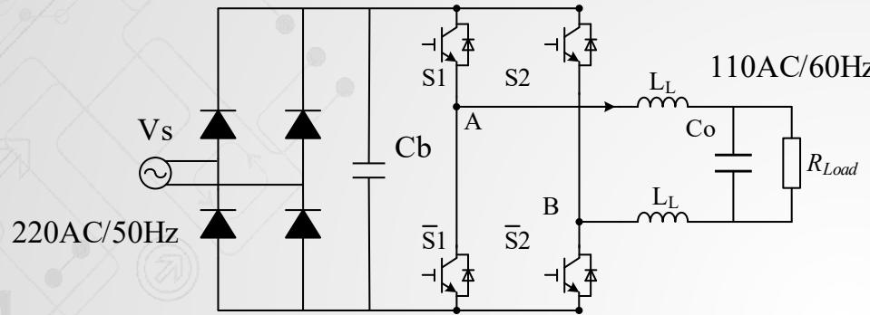  
电路拓扑

输入输出参数：

• 输出功率有效值：1500W

• 输入电压：220V/50hz (紫色)

• 输出电压：110V/60hz（橙色）

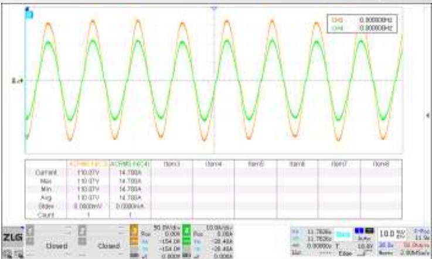

<table><tr><td rowspan="5"></td><td>Current</td><td>AC(0.0kV)</td><td>AC(0.0kV)</td><td>Max</td><td>Min</td><td>Avg</td><td>Order</td><td>Count</td></tr><tr><td>110.0kV</td><td>3.985A</td><td>60.031Hz</td><td>60.256Hz</td><td>59.845Hz</td><td>60.011Hz</td><td>47.785m/s</td><td>≥</td></tr><tr><td>110.0kV</td><td>3.985A</td><td>60.256Hz</td><td>59.845Hz</td><td>60.011Hz</td><td>60.011Hz</td><td>47.785m/s</td><td>≥</td></tr><tr><td>110.0kV</td><td>3.985A</td><td>60.011Hz</td><td>60.256Hz</td><td>59.845Hz</td><td>60.011Hz</td><td>47.785m/s</td><td>≥</td></tr><tr><td>0.000m/s</td><td>0.000mA</td><td>0.000mA</td><td>0.000mA</td><td>0.000mA</td><td>0.000mA</td><td>0.000mA</td><td>≥</td></tr></table>

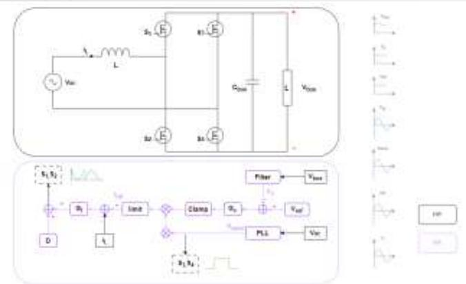

无桥PFC电路拓扑  
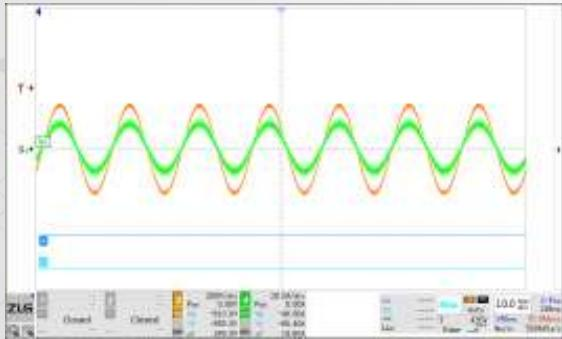

功率：2kw

橙色：AC电压

绿色：AC电流

ITHD：1%

效率：97.9%

母线纹波：14V

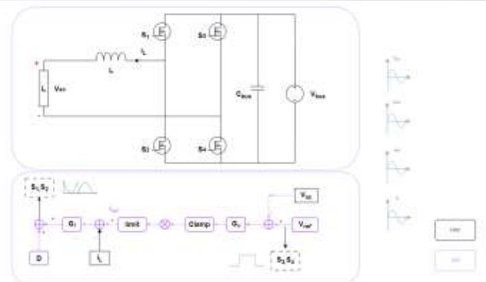

逆变器电路拓扑  
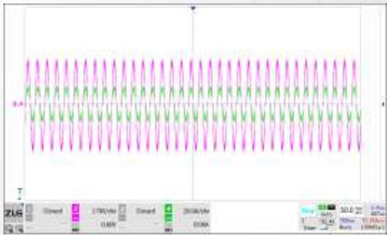

功率：2kw

紫色：AC电压

绿色：AC电流

产品选型

选型工具

选型手册

样片支持

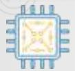

开发板

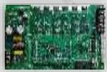

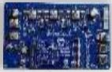

销售顾问服务

## 开发设计

方案评估板

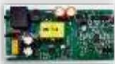

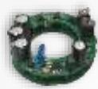

标准库(BSP)与方案

范例代码超过100个方案支持超过20种

## 功能安全支持

sLib 夫全岸

Class BClass C功能安全技术资料

用户手册应用笔记

软硬设计服务

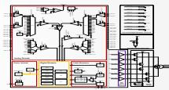

FAE支持

## 在线服务

QQ

微信

21ic论坛

## 量产服务

量产烧录工具

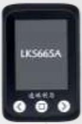

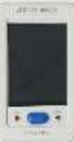

调试分析工具

LKSFlash LKSScope

## 售后服务

FA 分析8DReport性能检测us 电流环 电机实例-M0

M5 速度运电机实例-MO

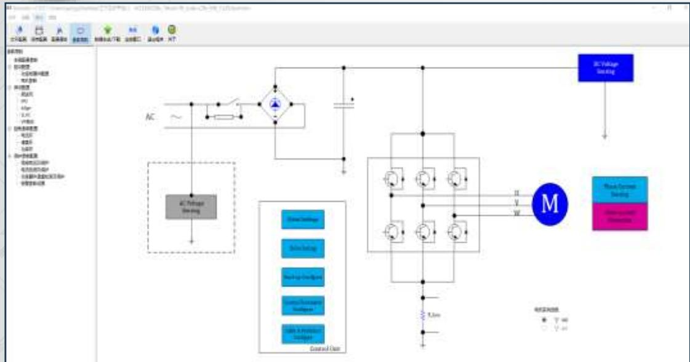

图共国生

185 配酒性

<table><tr><td>参数名称</td><td>参数描述</td><td>数值</td><td>数值类型</td><td>案例</td></tr><tr><td>U_RATED VOLTAGE_M0</td><td>额定电流/母线电压</td><td>24.0</td><td>c16</td><td>IV</td></tr><tr><td>ADC_SUPPLY_VOLTAGE_M0</td><td>ADC参考电压</td><td>3.00</td><td>float</td><td>V</td></tr><tr><td>RSHUNT_M0</td><td>电流采样电阻</td><td>0.05000</td><td>float</td><td>chm</td></tr><tr><td>AMPLIFICATION_GAIN_M0</td><td>电流采样放大倍数</td><td>3.96825</td><td>float</td><td>倍</td></tr><tr><td>VOLTAGE_SHUNT_RATIO_M0</td><td>母线电压采样分压比</td><td>0.02439</td><td>float</td><td>倍</td></tr><tr><td>BEMF_SHUNT_RATIO_M0</td><td>反电离电压采样分匝比</td><td>0.02439</td><td>float</td><td>倍</td></tr></table>

<table><tr><td>参数名称</td><td>参数描述</td><td>数值</td><td>数值类型</td><td>编码</td></tr><tr><td>SPEED LIMIT VALUE_M0</td><td>限制转换大小</td><td>100.00</td><td>float</td><td>1Hz</td></tr><tr><td>SPEED_LIMIT_VALUE_M0</td><td>功率环路转速计算范围</td><td>1</td><td>s16</td><td>1ms</td></tr><tr><td>POWER_LOOP_CNT8_M0</td><td>功率环路计周期</td><td>1</td><td>s16</td><td>1ms</td></tr><tr><td>SPEED_LIMIT_POWER_VALUE_M0</td><td>控制转速功率恒定</td><td>10.00</td><td>float</td><td>1W</td></tr><tr><td>POWER_SET_M0</td><td>功率恒定</td><td>20.00</td><td>float</td><td>1W</td></tr><tr><td>POWER_KP_M0</td><td>功率环Kp</td><td>1000</td><td>float,2 最小值0.00</td><td></td></tr><tr><td>POWER_K_M0</td><td>功率环Kp</td><td>200</td><td>s16</td><td>1</td></tr><tr><td>POWER_KMAX_M0</td><td>功率环输出3q最大值</td><td>1.00</td><td>float</td><td>1A</td></tr><tr><td>POWER_KMIN_M0</td><td>功率环输出3q最小值</td><td>-1.00</td><td>float</td><td>1A</td></tr><tr><td>POWER_RUN_ACC_M0</td><td>功率加速调整值</td><td>2.00</td><td>float</td><td>1W</td></tr><tr><td>POWER_RUN_DEC_M0</td><td>功率减速调整值</td><td>2.00</td><td>float</td><td>1W</td></tr><tr><td>POWER_FAC_A0_M0</td><td>功率计算修正系数a0</td><td>0.00</td><td>float</td><td>1</td></tr><tr><td>POWER_FAC_A1_M0</td><td>功率计算修正系数a1</td><td>1.000</td><td>float</td><td>1</td></tr><tr><td>POWER_FAC_A2_M0</td><td>功率计算修正系数a2</td><td>0.000</td><td>float</td><td>1</td></tr></table>

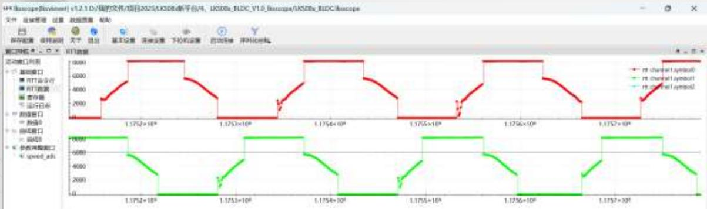

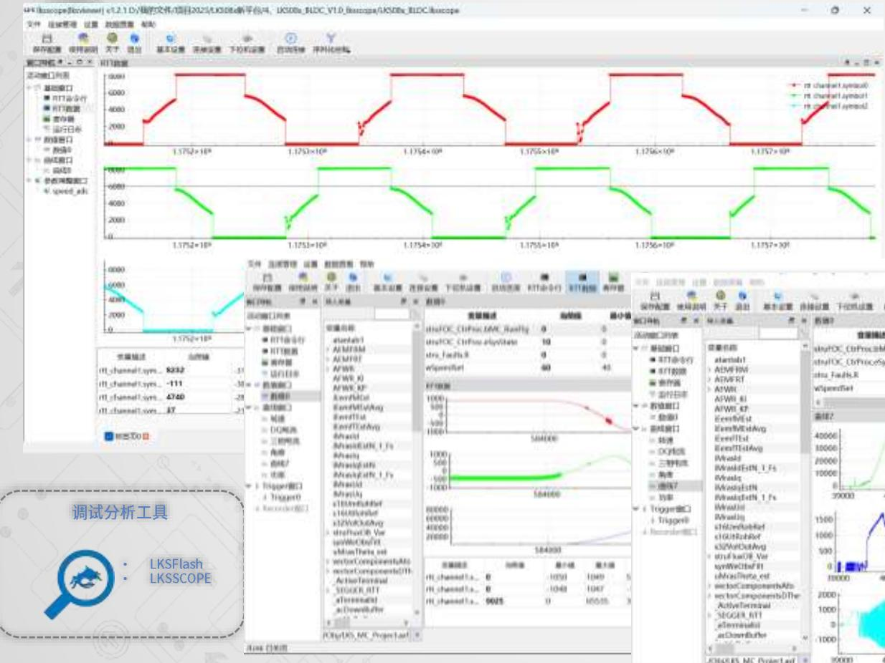

➢ 支持高低速数据采集同步进行

➢ 曲线和数据同步滚动

➢ 百万级数据轻松追溯

➢ 增加枚举、指针、公式计算等内容

➢ 支持触发功能，媲美示波器显示效果

➢ 开放包容：友商的产品也可以使用

## 完备供应链和严格品控

## IC设计

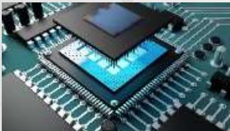

晶圆制造  
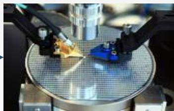

HG华虹宏力

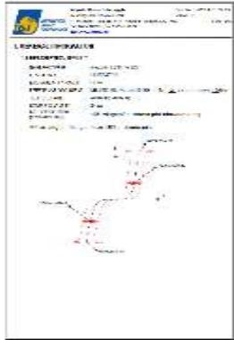

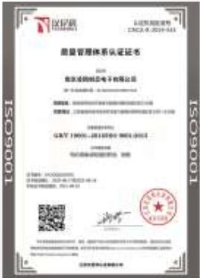  
静电测试报告/ROHS报告●〇●〇

## 封装测试

  
A TIAN

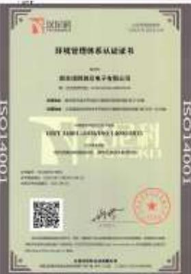

## SGS

## 应用方案介绍

电动出行

  
清洁电器

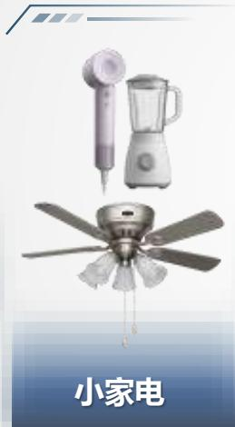  
小家电

  
汽车电子

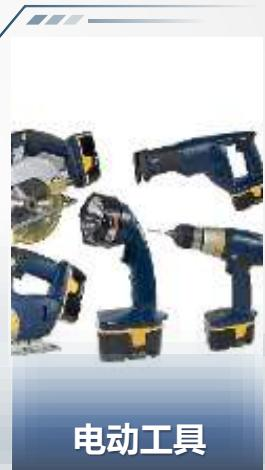  
电动工具

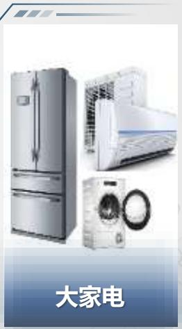  
大家电

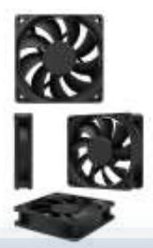  
服务器风扇

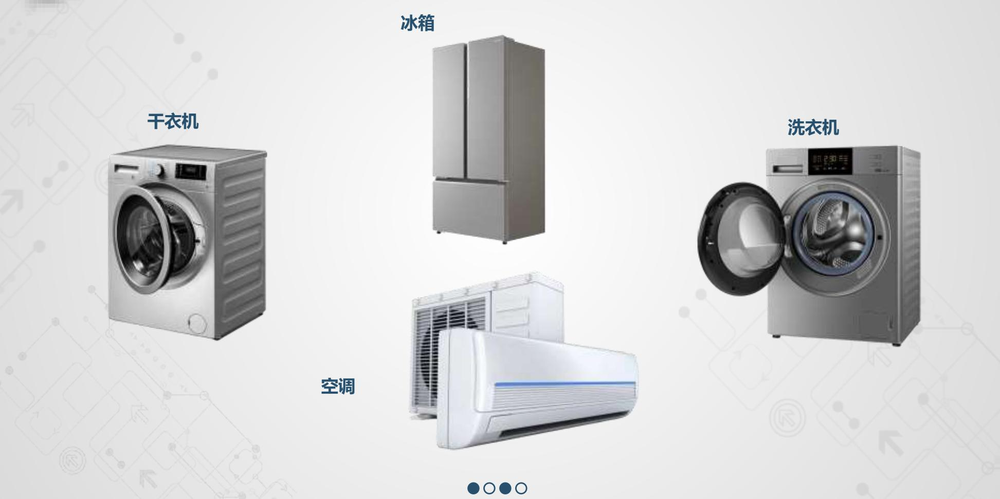  
空调

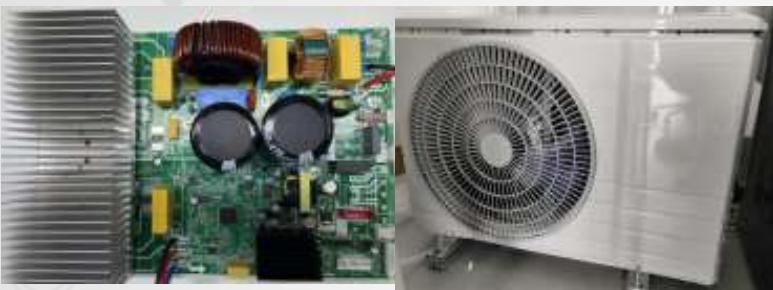

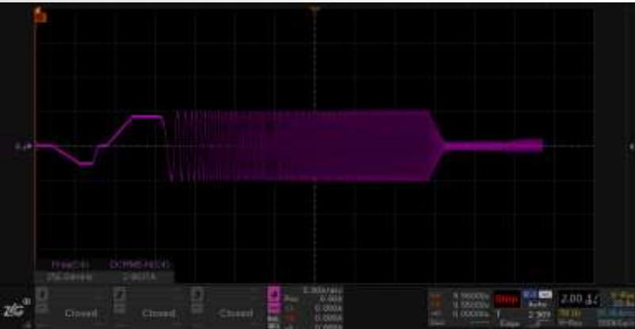

## 功能参数

• 控制方式：无感正弦FOC控制

• 过流保护，过压保护，欠压保护，堵转保护，过载保护

• 缺相保护，过温保护

## 使用范围

• 输入电压：AC220V±20%

• 最大功率：1700W

• 电机：无感三相PMSM电机

## 特点优势

• 压缩机+室外机+数字PFC

• 重负载启动平稳

• 中低速振动抑制，高速MTPA+弱磁

• 提供辅助电源、MCU、预驱和控制软件全套方案

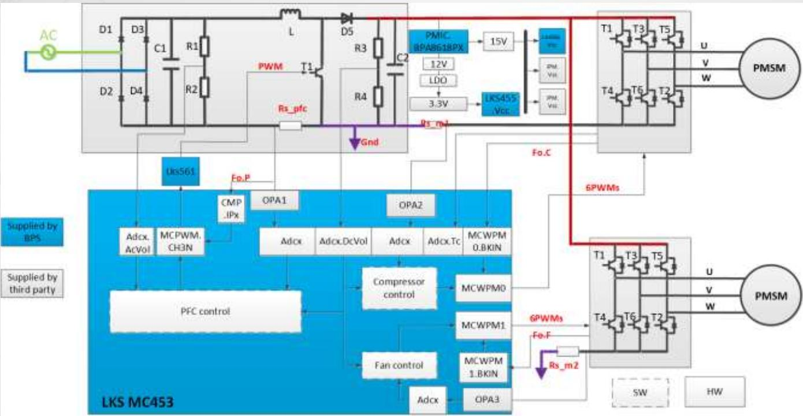

<table><tr><td>应用</td><td>MCU</td><td>PFC预驱</td><td>辅助电源</td></tr><tr><td>空调</td><td>LKS32MC453RCT8</td><td>LKS561</td><td>BPA8618PD</td></tr></table>

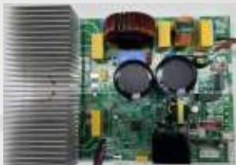

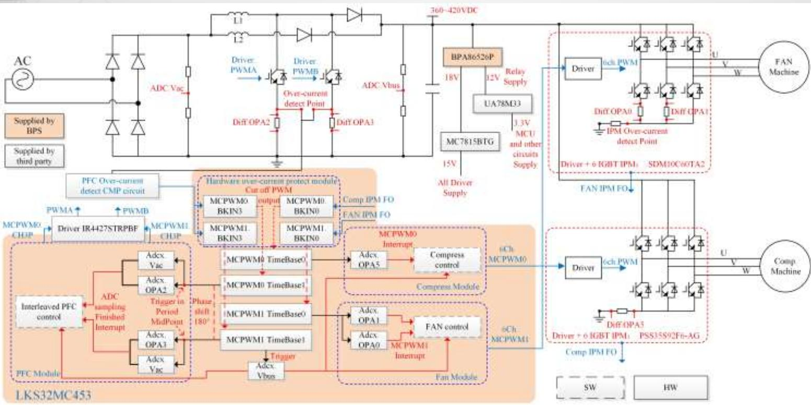

<table><tr><td>应用</td><td>MCU</td><td>PFC预驱</td><td>辅助电源</td></tr><tr><td>空调</td><td>LKS32MC453RCT8</td><td>LKS561</td><td>BPA86526P</td></tr></table>

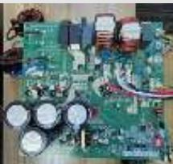

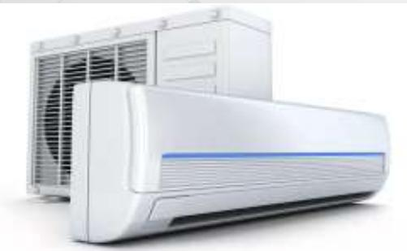

## 使用范围

输入电压：AC220V±20%

最大连续工作电流：10A

控制方式：无感FOC

## 方案特点

高覆盖度：拥有各种类型的成熟解决方案

性能优异：1200r/min 内稳定运行，噪音低，节能舒适

高可靠性：各种负载条件下可靠启动、稳定的高速观测器及弱磁算法

故障保护：硬件过流、快速制动、缺相保护、堵转保护等

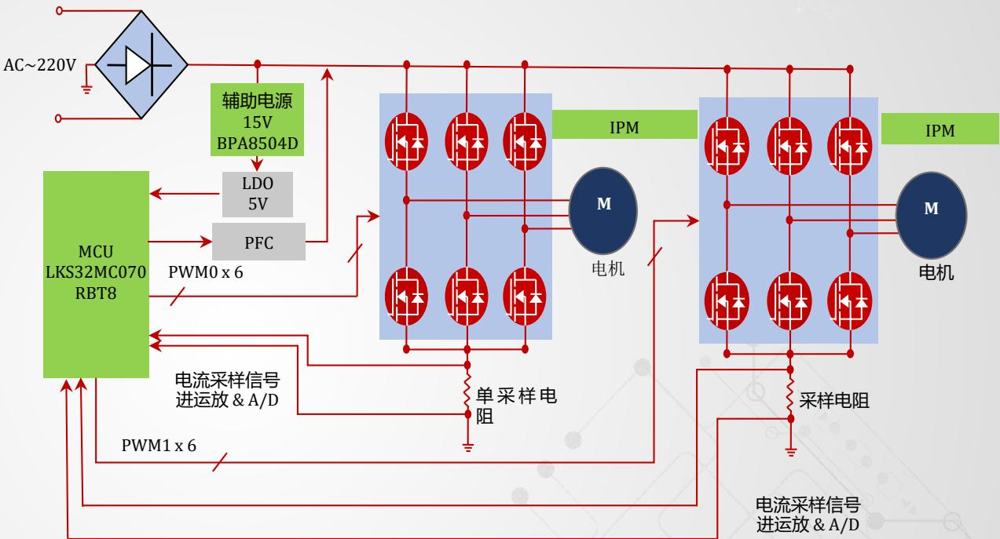

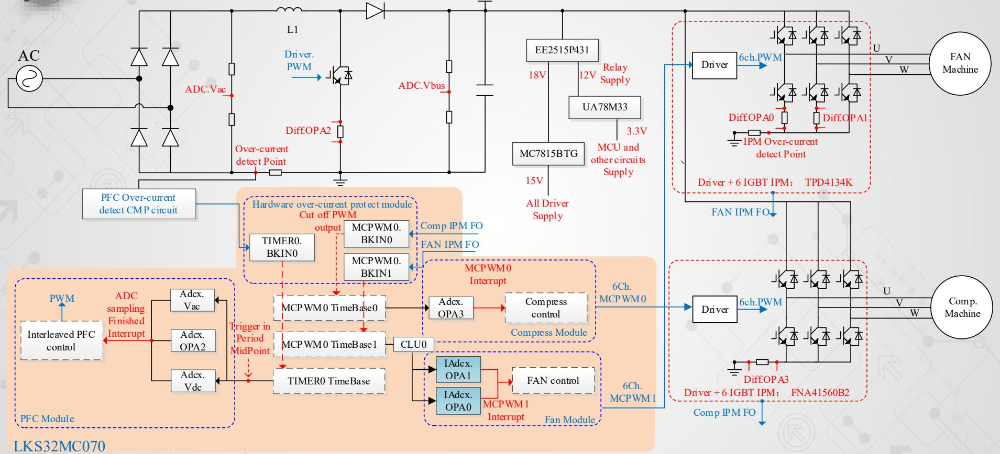  
LKS32MC070

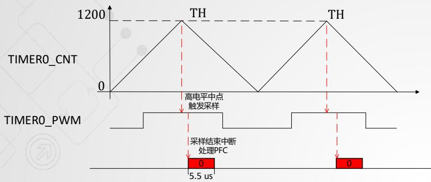  
MCPWM0中断—压缩机6K FOC中断(优先级1)

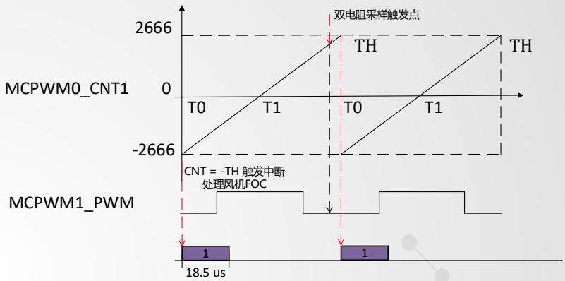

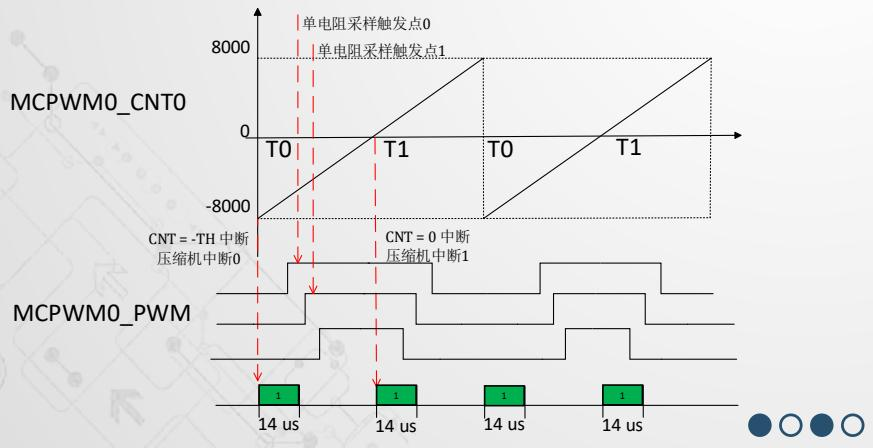  
极限情况PFC、压缩机、风机中断时序

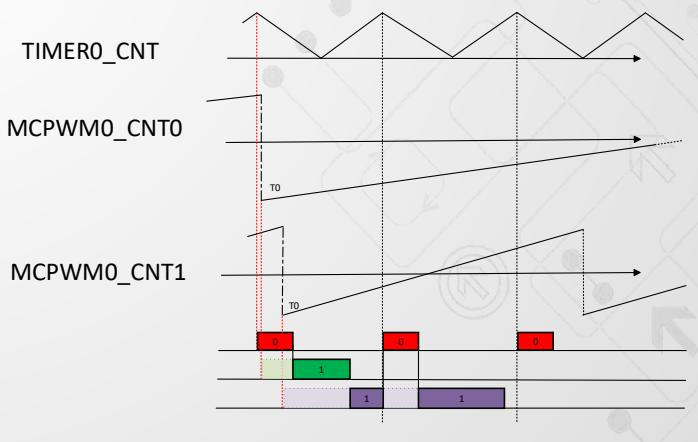

优点：M0内核(降本)

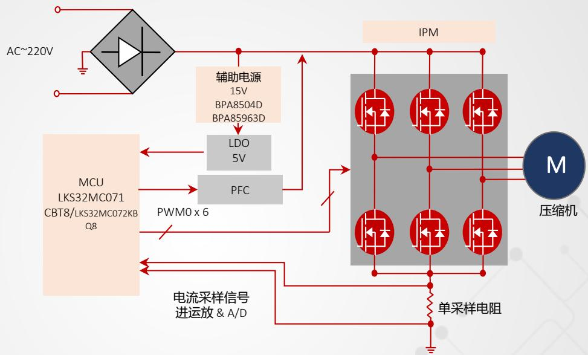

<table><tr><td>Product</td><td>主频(Hz)</td><td>Bit</td><td>DSP</td><td>Flash/RAM(KB)</td><td>Package</td><td>OperatingVoltage</td><td>预驱</td><td>CMP</td><td>ADC</td><td>UART</td><td>OPA</td><td>典型应用</td></tr><tr><td>LKS32MC071CBT8</td><td>96M</td><td>32</td><td>除法/平方开方/求模等(可编程独立计算单元)</td><td>128/12</td><td>TQFP48</td><td>2.5V-5.5V</td><td>No</td><td>3</td><td>2路12bit ADC (16-Input Channel)</td><td>3</td><td>4</td><td>最大2000W,支持压缩机单电阻\正弦波无感 FOC,数字PFC功能,交流风机。过/欠压、软过流+硬过流、堵转、缺相、过温保护;压缩机具有振动抑制功能。</td></tr></table>

## ➢ 目标应用

• DD/Mini/壁挂滚筒洗衣机

• BLDC滚筒洗衣机

• 波轮洗衣机

• 双变频热泵干衣机

## ➢ 方案特点

• 高覆盖度：拥有各种类型的成熟解决方案

• 性能优异：高精度的OOB功能，高线性度的称重功能

• 高可靠性：各种负载条件下可靠启动、稳定的高速观测器及弱磁算法

• 功能丰富：支持电机温度估算、称重算法、偏心检测、摇篮洗

• 故障保护：硬件过流、快速制动、缺相保护、堵转保护等

• 电机类型：支持PMSM以及下一代PMASR变频洗衣机电机

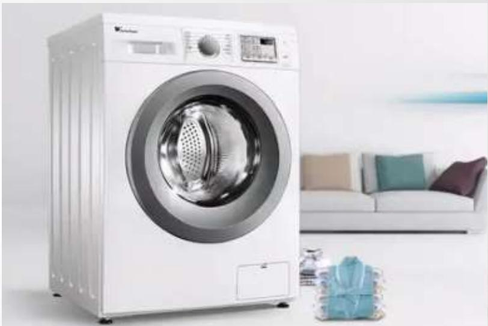

空桶、平衡负载情况下的不平衡检测示意图  
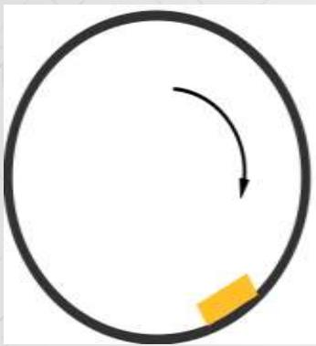

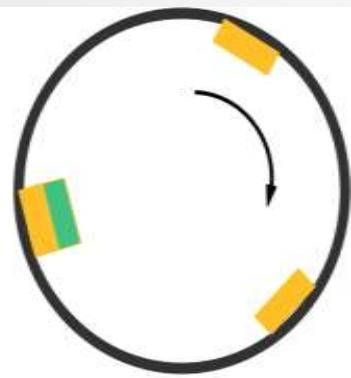

$$
D a t a = f (\omega , J, T _ {e})
$$

衣物分布不均匀的情况下，会导致滚筒偏心、重量不平衡,因此在滚筒洗衣机脱水前需要进行不平衡检测，作为是否进入脱水流程的判断依据。

桶速运行到某指定速度时，衣物受离心的作用，紧贴滚筒的内侧,滚筒内的不平衡会引起电机的转矩脉动，因此可以利用该转速下的转矩脉动进行负载不平衡估计。

PMSM输出的机械功率为： $T _ { e } = \cfrac { P } { \Omega } = \cfrac { P } { ( \cfrac { \omega _ { m } * 2 \pi } { 6 0 } ) } = 9 . 5 5 * \cfrac { P } { \omega _ { m } }$

为转子的角速度(单位：rad/s)，P为电机功率

$\omega _ { m }$ 为转子的机械转速(单位：rpm)

◆ 电机稳定运行时，功率基本恒定，转矩脉动可以通过转速波动进行检测。

转速/矩波动表征不平衡程度的大小，软件通过特定算法进行不平衡数据的区分，达到测量数据的可重复性、可区分性、一致性。

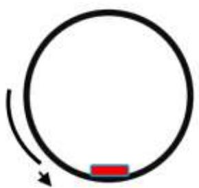

空桶、平衡负载情况下的运行示意图  
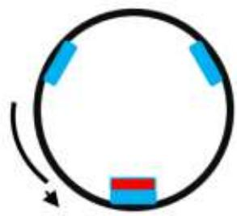

◆ 称重实质上是辨识滚筒的转动惯量

◆ 利用加速段的功率大小，计算转动惯量。

◆ 具体过程：电机在稳定转速n0时，记录当前的输入功率值(基准功率)P0，将滚筒加速到n1,记录当前的输入功率值P1，P1-P0得到加速过程的功率，从而可以计算出滚筒的转动惯量。

$$
\mathsf {E n e r g y} = \frac {1}{2} J w 1 ^ {2} - \frac {1}{2} J w 2 ^ {2}
$$

◆ 不同机型通过标准偏心块进行标定。

## ➢ 全范围的高精度OOB

在不同均匀负载下，同等的偏心负载，辨识的结果线性且接近；

• 最小可以区分的50g刻度偏心

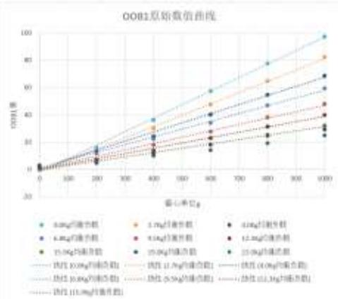

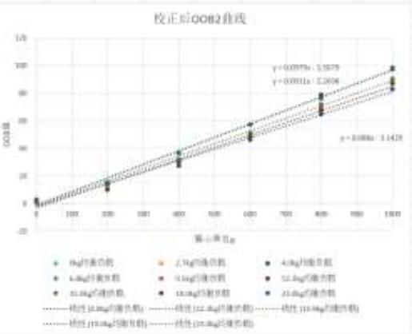

## ➢ 高线性度的称重功能

• 全负载范围内，辨识重量线性度较高，

• 可区分100g刻度重量

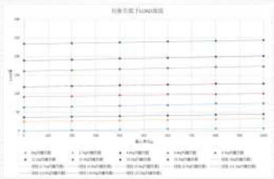

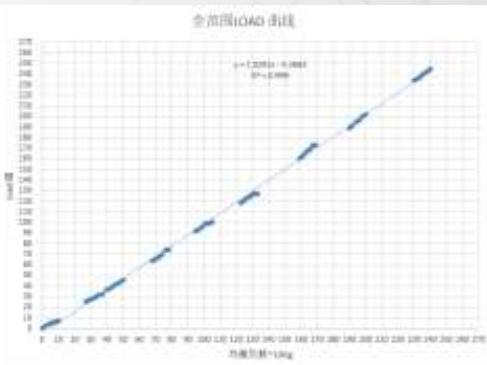

空筒启动100%  
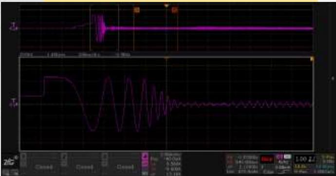

重载启动 100%  
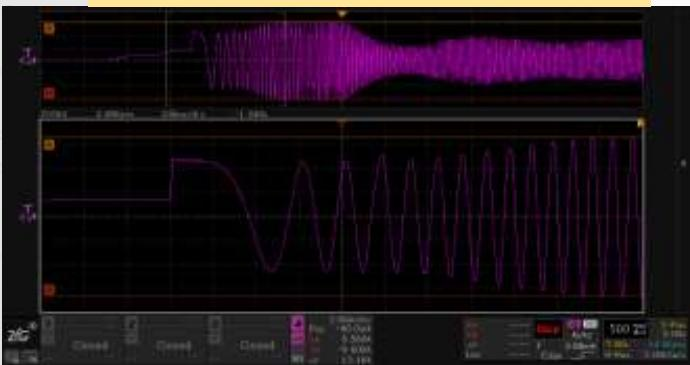

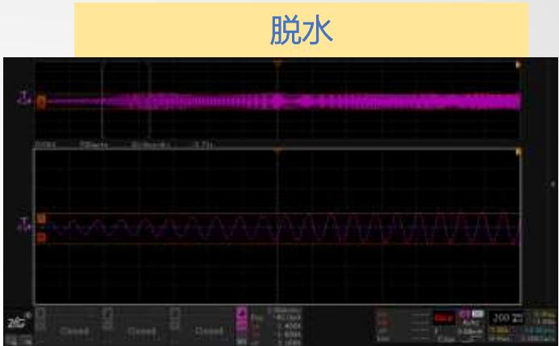

制动  
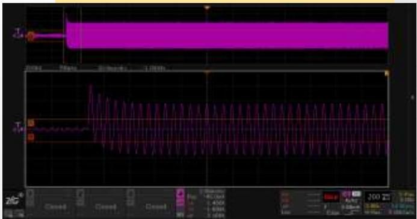  
●〇●〇

## ➢ 硬件功能集成度高

压缩机电机+滚筒电机+PFC三种功能集成，节约硬件PCB个数

• 节省板间的线束个数以及线束长度

• 利于整机结构空间布局以及小体积设计

## ➢ 软件功能齐全

• 转速/功率控制

• 振动抑制功能、主动PFC功能

• 转矩限制以及过载保护

• 灵活配合整机新增功能

## 整机稳定量产

• 国内外各品牌干衣机，高中端项目20个量产

• 整机量产超过35个月，累计100W+，无不良反馈

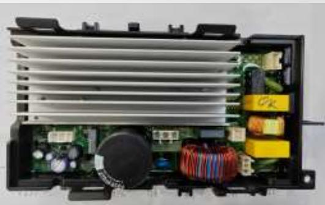

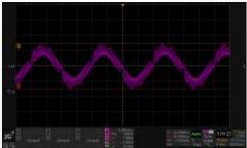  
图2 PFC运行 AC交流波形

图1 双电机+PFC量产实物  
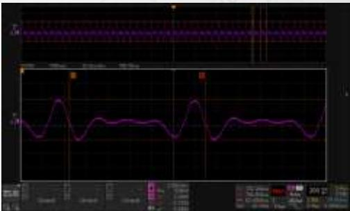  
图3 16hz转矩补偿相电流波形

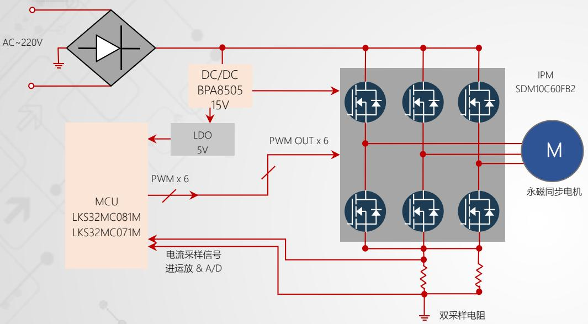

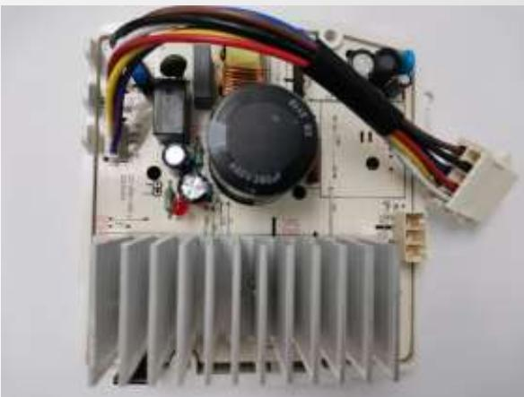

<table><tr><td>Product</td><td>主频(Hz)</td><td>Bit</td><td>DSP</td><td>Flash/RAM(KB)</td><td>Package</td><td>Operating Voltage</td><td>预驱</td><td>CMP</td><td>ADC通道</td><td>UART</td><td>OPA</td><td>典型应用</td></tr><tr><td>LKS32MC081C8T8</td><td>96M</td><td rowspan="2">32</td><td>三角函数/平发根</td><td>64/8</td><td rowspan="2">TQFP48</td><td rowspan="2">2.2V-5.5V</td><td rowspan="2">No</td><td>2</td><td>2路12bit ADC(13-Input Channel)</td><td>2</td><td>4</td><td rowspan="2">高压电机控制,5~800W;双电阻采样,正弦波无感FOC;过/欠压、软过流+硬过流、堵转、缺相、过温保护,快速刹车功能、掉电失压保护功能、电机温度估算、称重算法、偏心检测</td></tr><tr><td>LKS32MC071CBT8</td><td>96M</td><td>除法/平方根</td><td>128/12</td><td>3</td><td>2路12bit ADC(13-Input Channel)</td><td>2</td><td>6</td></tr></table>

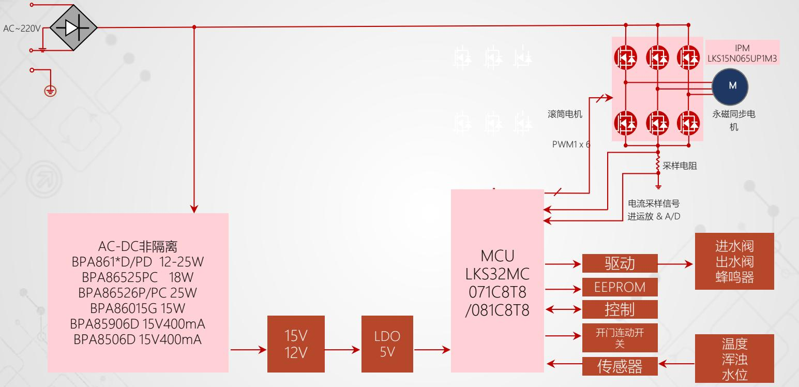  
\*基于LKS32MC081CBT8B/ LKS32MC071CBT8，滚筒主控+主变频一体方案

## ➢ 方案优势

## ⚫ 主变一体集成度高,完整解决方案

• 主变一体有效减少BOM器件和PCB尺寸

• MCU资源丰富，满足波轮主控需要的资源

• 电源+MCU+驱动 整体解决方案

## ⚫ 性能优势

• 采用无刷电机，静音，扭矩大带载能力强

• 重载启动，1:0.8转停比启动成功率100%

## 波轮洗衣机主变一体应用框图

脱水启动低速速度稳定，可以有效避免大偏心撞桶现象

## ⚫ 算法优势

• 无感FOC算法，启动平稳，快速起停。

• 内置称重算法功能

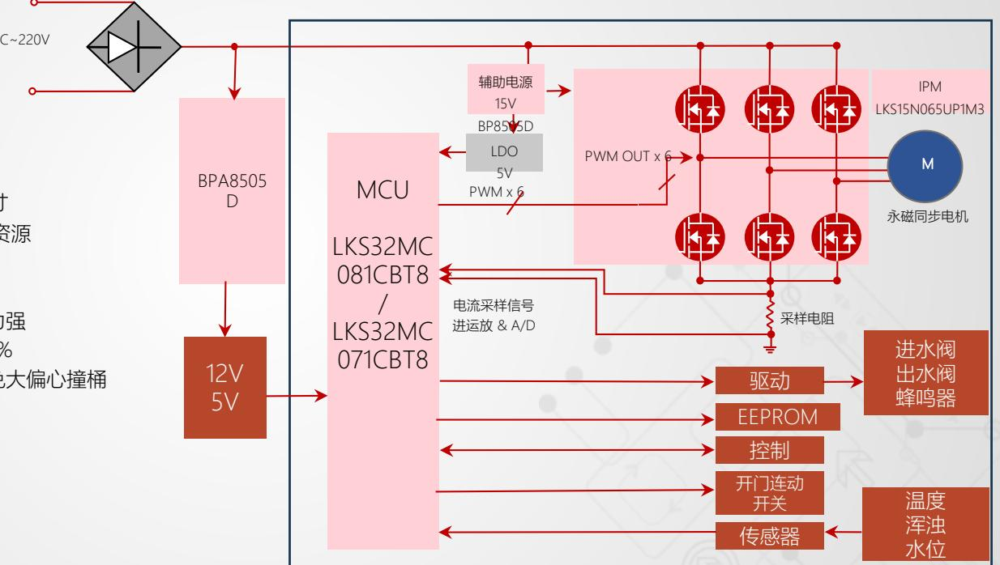

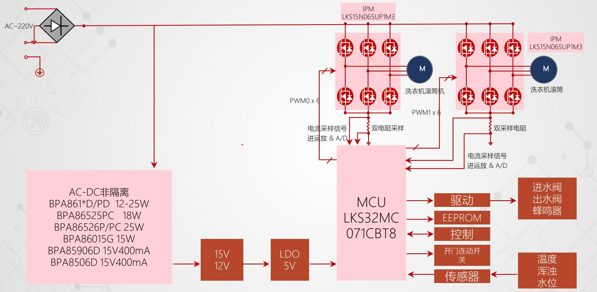  
\*基于LKS32MC071CBT8，Mini/10kg双变频滚筒主变一体方案

AC-DC非隔离BPA861\*D/PD 12-25WBPA86525PC 18WBPA86526P/PC 25WBPA86015G 15WBPA85906D 15V400mABPA8506D 15V400mA

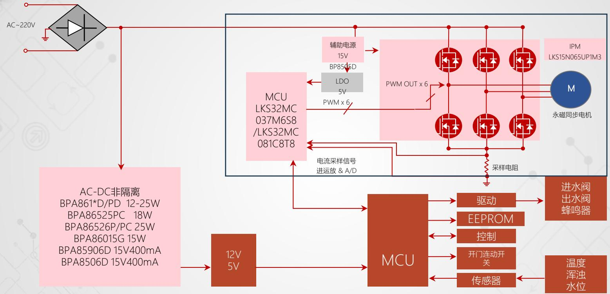

\*基于LKS32MC037M6S8/LKS32MC087/LKS32MC077/LKS32MC081/ LKS32MC071，干衣机的滚筒单变频方案

AC-DC非隔离BPA861\*D/PD 12-25WBPA86525PC 18WBPA86526P/PC 25WBPA86015G 15WBPA85906D 15V400mABPA8506D 15V400mA

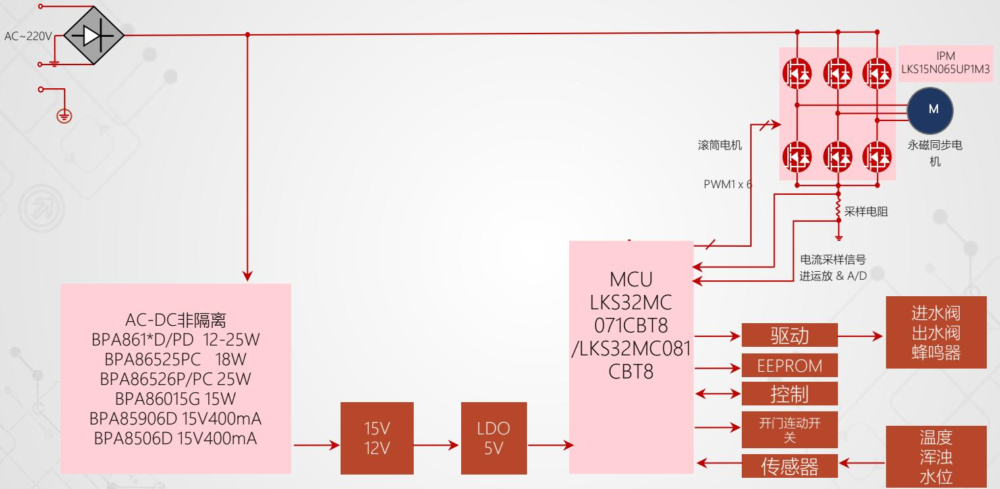  
\*基于LKS32MC081CBT8B/ LKS32MC071CBT8，干衣机主控+变频一体方案

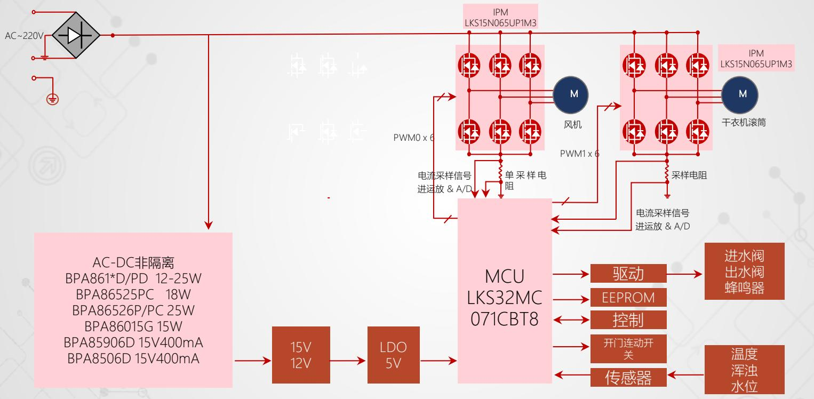

AC-DC非隔离BPA861\*D/PD 12-25WBPA86525PC 18WBPA86526P/PC 25WBPA86015G 15WBPA85906D 15V400mABPA8506D 15V400mA

\*基于LKS32MC071CBT8，干衣机双变频(滚筒+风机)方案

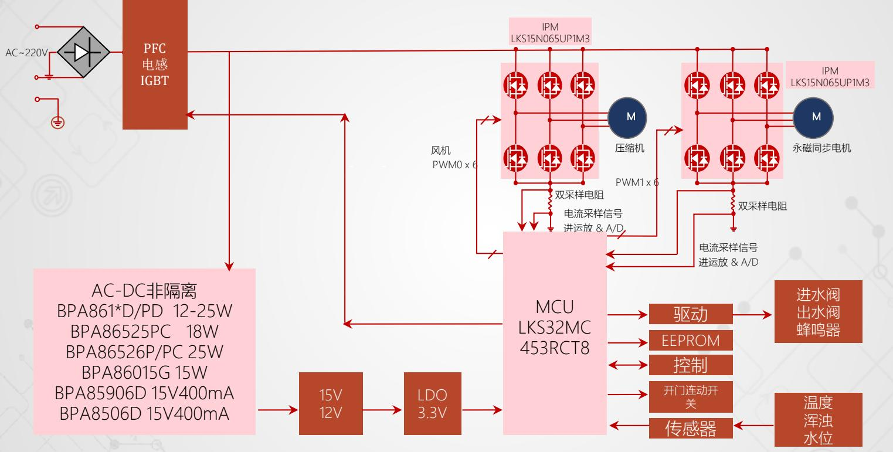  
\*基于LKS32MC453RCT8，干衣机双变频+PFC热泵方案

AC-DC非隔离BPA861\*D/PD 12-25WBPA86525PC 18WBPA86526P/PC 25WBPA86015G 15WBPA85906D 15V400mABPA8506D 15V400mA

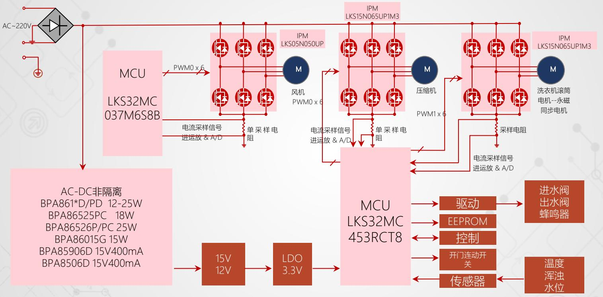  
\*基于LKS32MC453RCT8 & LKS32MC037M6S8B，3变频 烘干一体机方案

AC-DC非隔离BPA861\*D/PD 12-25WBPA86525PC 18WBPA86526P/PC 25WBPA86015G 15WBPA85906D 15V400mABPA8506D 15V400mA

\*基于LKS32MC037M6S8B(24Pin) & LKS32MC070RBT8(64Pin)，3变频 烘干一体机方案

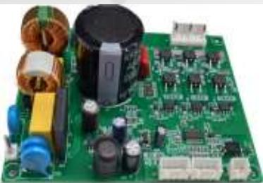

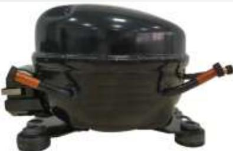

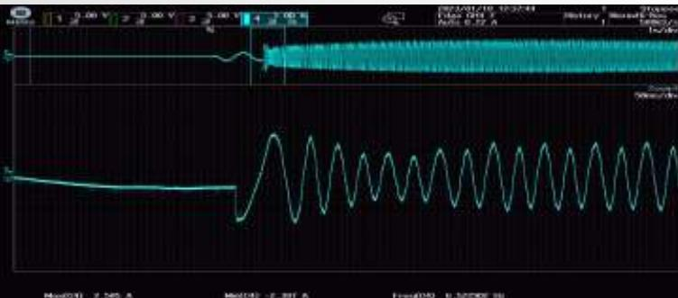

## 功能参数

• 控制方式：无感正弦FOC控制

• 过流保护，过压保护，欠压保护，堵转保护，过功率保护

• 缺相保护，过温保护

## 使用范围

• 输入电压：AC220V±20%

• 最大功率：300W

• 电机：无感三相PMSM电机

## 特点优势

• 启动平稳，无抖动，无过冲

• 速度控制稳定，低噪音

• 提供辅助电源、MCU、预驱和控制软件全套方案

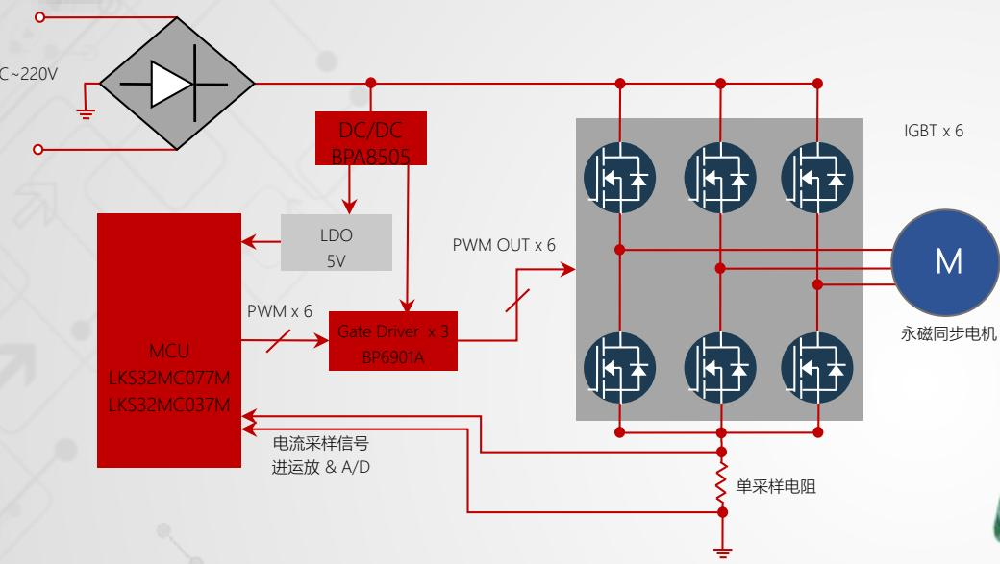

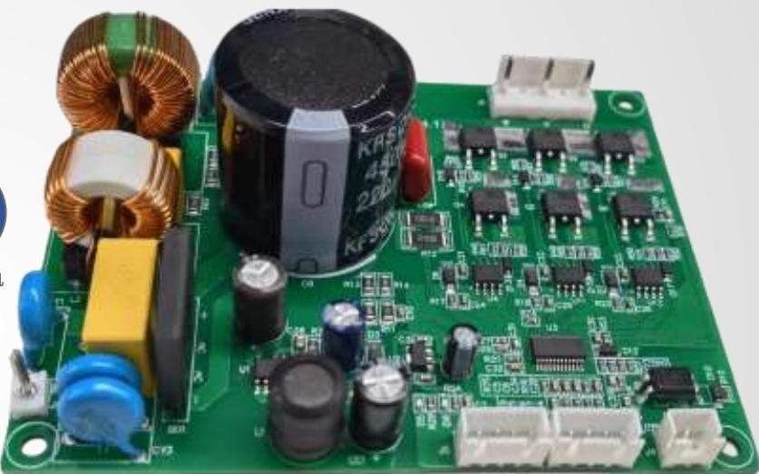

<table><tr><td>Product</td><td>主频(Hz)</td><td>Bit</td><td>DSP</td><td>Flash/RAM(KB)</td><td>Package</td><td>Operating Voltage</td><td>预驱</td><td>CMP</td><td>ADC通道</td><td>UART</td><td>OPA</td><td>典型应用</td></tr><tr><td>LKS32MC037M6S8B</td><td>48M</td><td rowspan="2">32</td><td>除法/开平方</td><td>32/4</td><td rowspan="2">SSOP24</td><td>2.4V-5.5V</td><td rowspan="2">No</td><td>2</td><td>1路12bit ADC(11-Input Channel)</td><td>1</td><td>1</td><td rowspan="2">高压电机控制,250W;单电阻采样,正弦波无感FOC;过/欠压、软过流+硬过流、堵转、缺相、过功率、过温保护</td></tr><tr><td>LKS32MC077MBS8</td><td>96M</td><td>除法/开平方/三角函数</td><td>128/12</td><td>2.5V-5.5V</td><td>6</td><td>1路12bit ADC (6-Input Channel)</td><td>2</td><td>2</td></tr></table>

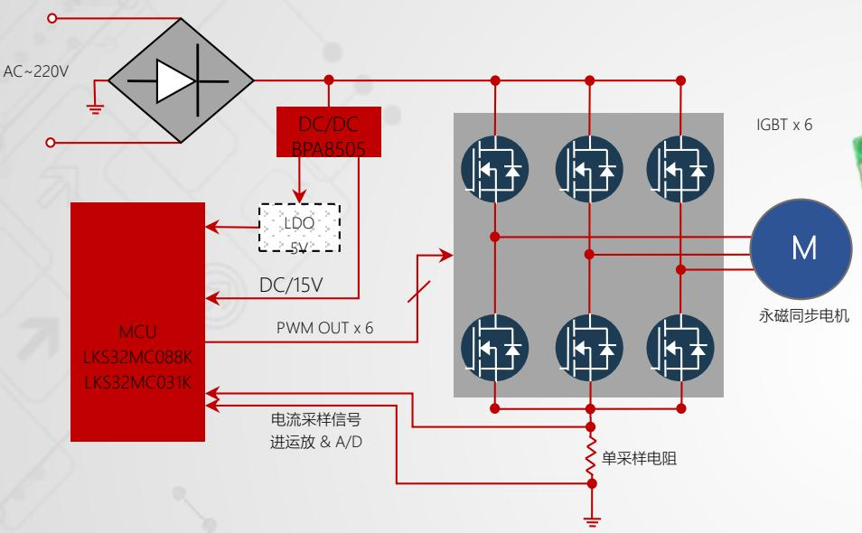

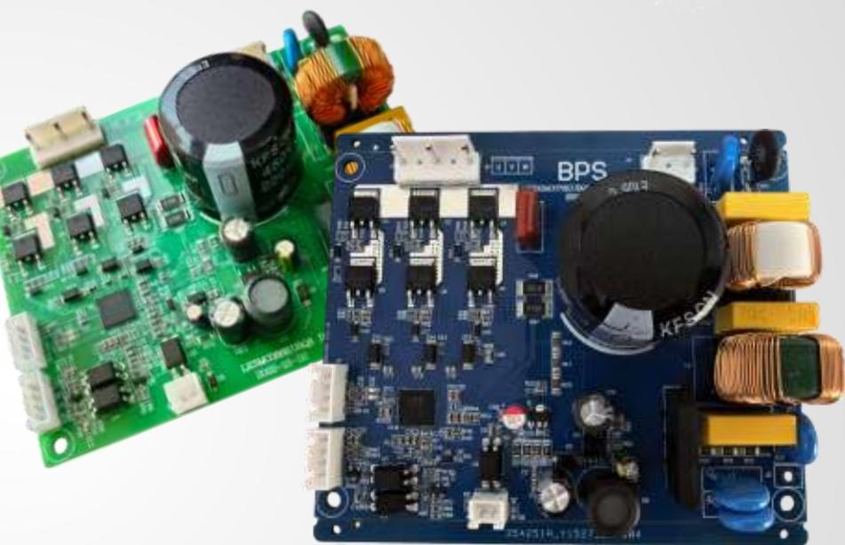

<table><tr><td>Product</td><td>主频(Hz)</td><td>Bit</td><td>DSP</td><td>Flash/RAM(KB)</td><td>Package</td><td>预驱</td><td>浮栅耐压</td><td>CMP</td><td>ADC通道</td><td>UART</td><td>CAN</td><td>OPA</td><td>LDO</td><td>典型应用</td></tr><tr><td>LKS32MC088K22U8Q8</td><td rowspan="2">96M</td><td rowspan="2">32</td><td rowspan="2">除法/开平发/三角函数</td><td>64/8</td><td>QFN43L</td><td rowspan="2">6N</td><td rowspan="2">600V</td><td rowspan="2">2</td><td>1路 ADC (8-Input Channel)</td><td>2</td><td>Yes</td><td rowspan="2">3</td><td>5V LDO</td><td rowspan="2">高压冰箱控制,250W;单电阻采样,正弦波无感 FOC;过/欠压、软过流+硬过流、堵转、缺相、过功率、过温保护,预驱自带硬件过流保护。</td></tr><tr><td>LKS32MC078KUBQ8</td><td>128/12</td><td>QFN45</td><td>1路 ADC (10-Input Channel)</td><td>2</td><td>No</td><td>NO</td></tr></table>

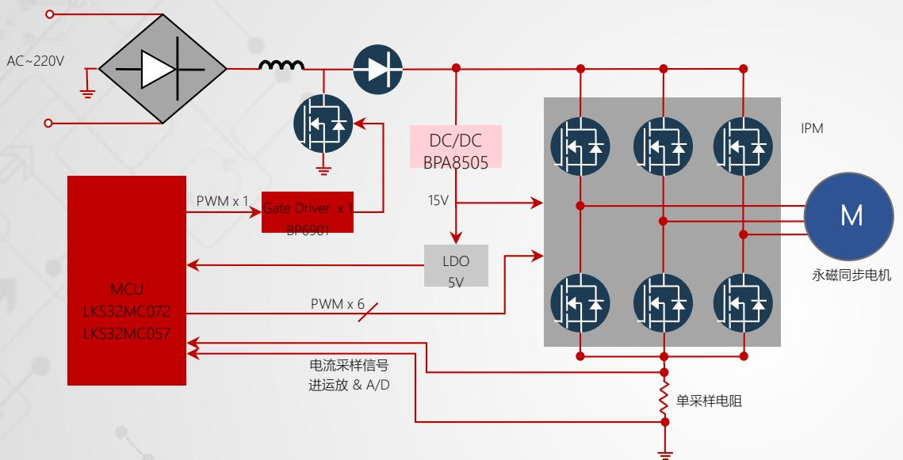

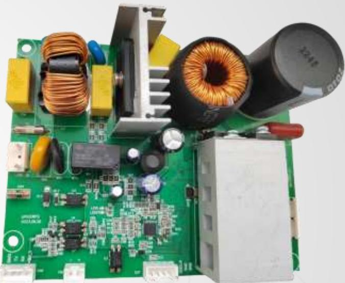

<table><tr><td>Product</td><td>主频(Hz)</td><td>Bit</td><td>DSP</td><td>Flash/RAM(KB)</td><td>Package</td><td>OperatingVoltage</td><td>PFC</td><td>CMP</td><td>ADC</td><td>UART</td><td>OPA</td><td>典型应用</td></tr><tr><td>LKS32MC072KBQ8</td><td>96M</td><td></td><td>三角函数/开平发/除法</td><td>128/12</td><td>QFN5*532L-0.75</td><td>2.5~5.5V</td><td>Yes</td><td>3</td><td>2路12bit ADC(8-Input Channel)</td><td></td><td>3</td><td>高压主动PFC+高压电机控制,600W;单电阻采样,正弦波无感 FOC;</td></tr><tr><td>LKS32MC057M6S8B</td><td>96M</td><td>32</td><td>除法/开平方</td><td>32/4</td><td>SSOP24</td><td>2.2~5.5V</td><td>NO</td><td>2</td><td>1路12bit ADC(11-Input Channel)</td><td>2</td><td>2</td><td>高压电机控制,600W;单电阻采样,正弦波无感 FOC;过/欠压、软过流+硬过流、堵转、缺相、过功率、过温保护;</td></tr></table>

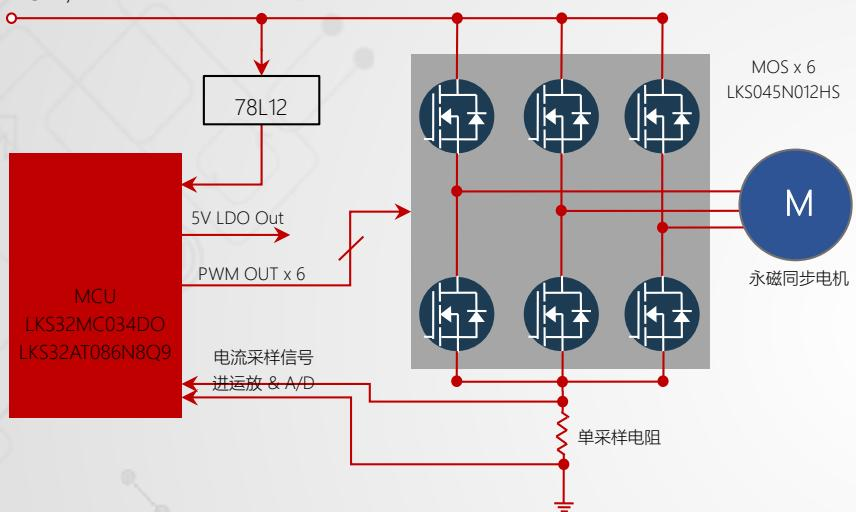

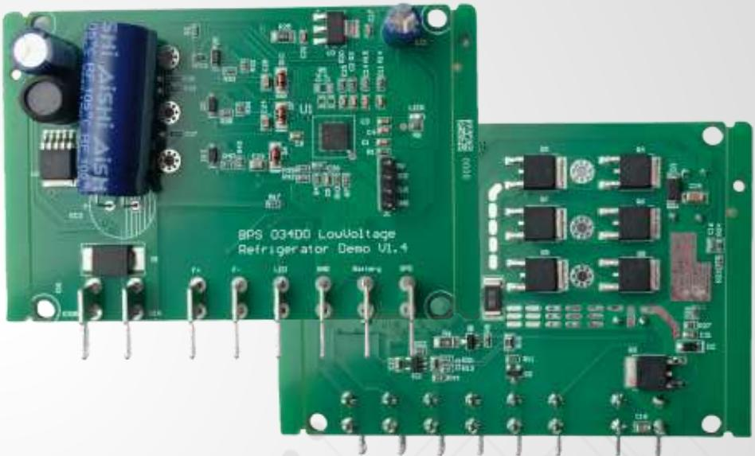

<table><tr><td>Product</td><td>主频(Hz)</td><td>Bit</td><td>DSP</td><td>Flash/RAM(KB)</td><td>Package</td><td>预驱</td><td>CMP</td><td>ADC</td><td>UART</td><td>CAN</td><td>OPA</td><td>LDO</td><td>典型应用</td></tr><tr><td>LKS32AT086N8Q9(车规)</td><td>96M</td><td rowspan="2">32</td><td>三角函数/开平发/除法</td><td>64/8</td><td>QFN48</td><td rowspan="2">6N</td><td rowspan="2">2</td><td>1路 ADC (11-Input Channel)</td><td>2</td><td>Yes</td><td>4</td><td>No</td><td rowspan="2">低压冰箱控制,120W;单电阻采样,正弦波无感 FOC;过/欠压、软过流+硬过流、堵转、缺相、过功率、过温保护</td></tr><tr><td>LKS32MC034DOF6Q8</td><td>48M</td><td>除法/开平方</td><td>32/4</td><td>QFN40</td><td>1路 ADC (10-Input Channel)</td><td>1</td><td>No</td><td>1</td><td>5VLDO</td></tr></table>

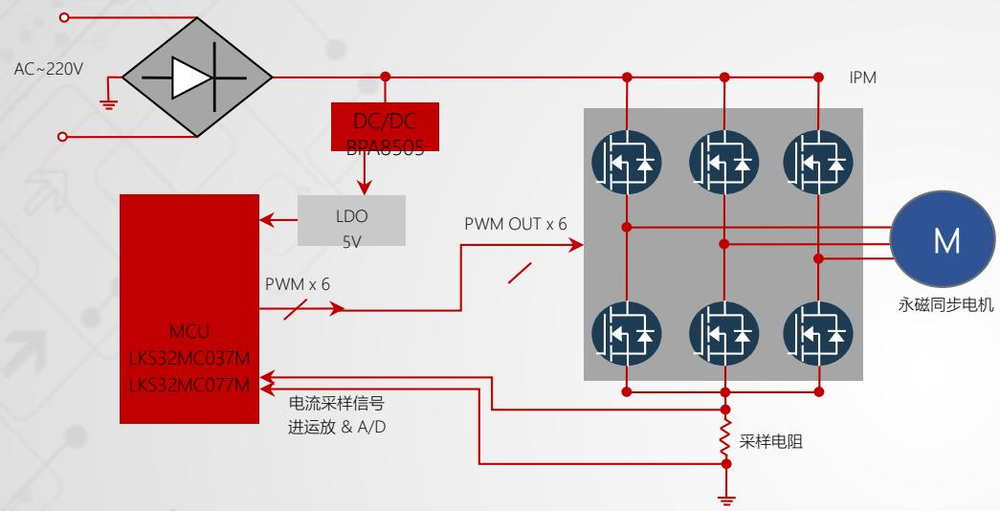

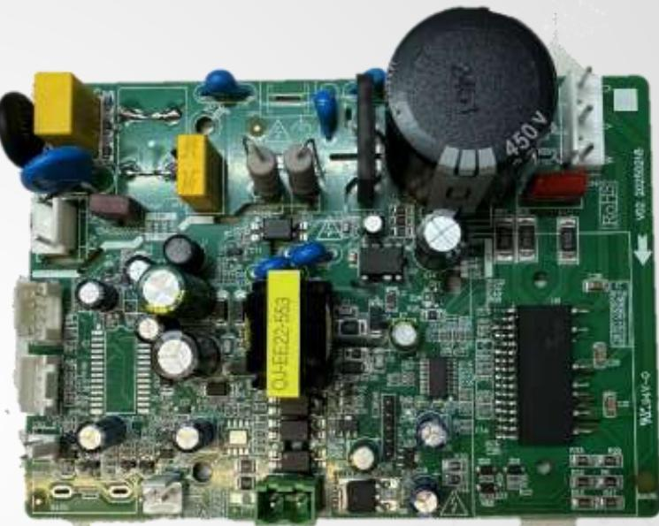

<table><tr><td>Product</td><td>主频(Hz)</td><td>Bit</td><td>DSP</td><td>Flash/RAM(KB)</td><td>Package</td><td>预驱</td><td>CMP</td><td>ADC通道</td><td>UART</td><td>IIC</td><td>OPA</td><td>典型应用</td></tr><tr><td>LKS32MC037M6S8</td><td>48M</td><td>32</td><td>除法/开平发</td><td>32/4</td><td>SSOP24L</td><td>无</td><td>2</td><td>1路 ADC (12-Input Channel)</td><td>1</td><td>1</td><td>2</td><td rowspan="2">高压水泵、家用变频油烟机、高压风机、压缩机、空调内机等应用;采用弦波FOC变频驱动,快速闭环启动,启动力矩大;强悍风压,底层不堵烟,高层不倒灌;直流变频驱动,效率高;支持变频无极调速,无极调功率,方便智能化控制;</td></tr><tr><td>LKS32MC077M6S8</td><td>96M</td><td>32</td><td>除法/开平发</td><td>128/12</td><td>SSOP24L</td><td>无</td><td>4</td><td>2路ADC</td><td>1</td><td>1</td><td>2</td></tr></table>

## ➢ 目标应用

• 顶吸式变频油烟机

• 侧吸式变频油烟机

• 顶侧双吸式变频油烟机

## ➢ 方案特点

• 算法成熟：基于神经网络的恒风量控制算法、高速逆风启动等

• 高可靠性：各种负载条件下可靠启动、可靠稳定的观测器

• 故障保护：硬件过流、缺相保护、堵转保护、过温保护等等

集成强排风机所有控制环路：方案具备恒恒电流、恒功率、恒风量、恒转速等环路，兼容不同终端客户使用。

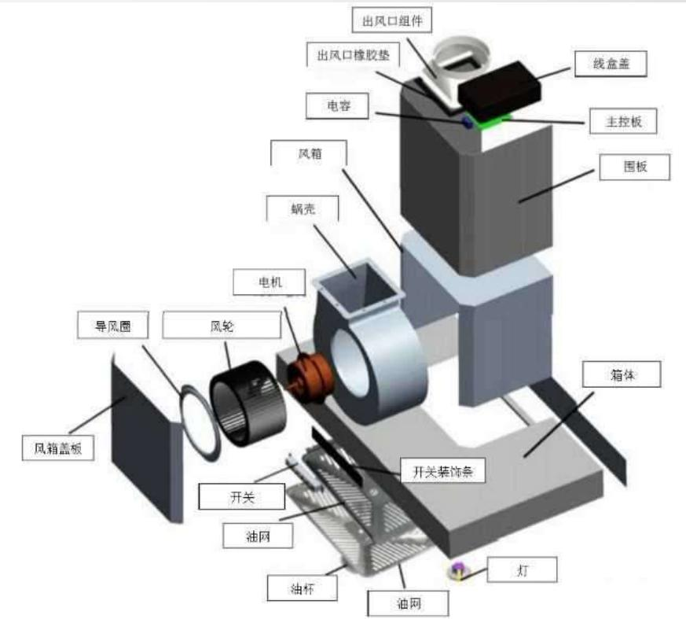

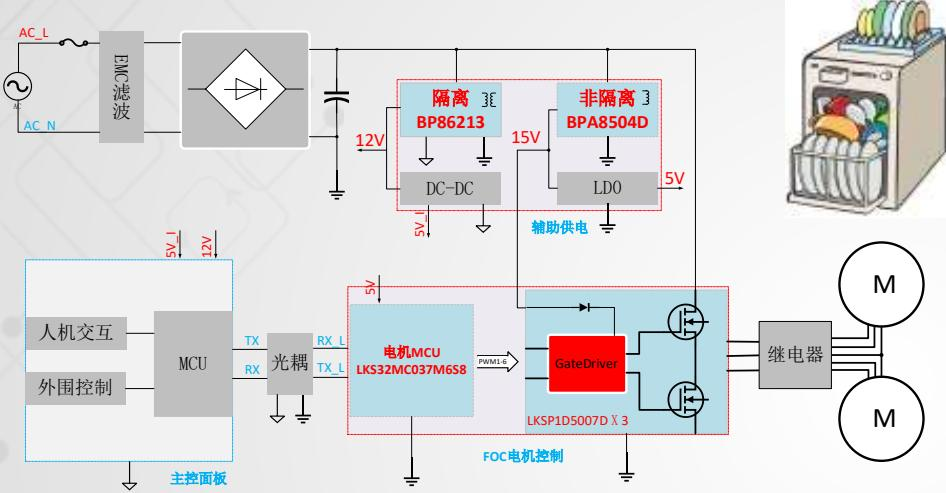

◆ 双变频：变频洗涤泵+排水泵更强劲高效，强排残渣水；

采用弦波FOC变频控制，更强劲：高压冲水，更节能：效率高，更静音；

控制算法具有灵活的变频电机调速及调功率接口，方便快速调节水压，实现不同餐具不同水压，既节能又高效；

功率部分采用LKS1D5007D单相IPM-ESOP13封装，生产工艺简单，散热好，性价比高；

◆ 安全保护机制：过压、过温、缺相保护；

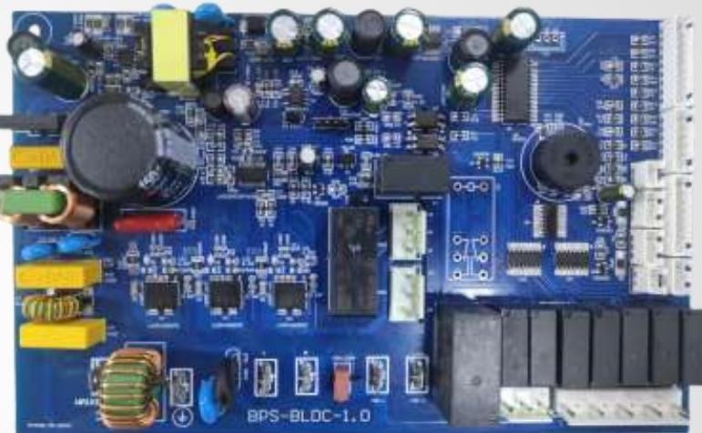

<table><tr><td>应用</td><td>MCU</td><td>电机IPM</td><td>隔离供电12W</td><td>非隔离15V供电</td></tr><tr><td>洗碗机</td><td>LKS32MC037M6S8B</td><td>LKS1D5007D</td><td>BP86213</td><td>BPA8504D</td></tr></table>

链接：https://pan.baidu.com/s/11-zPcDtw2hxecyvZ5DbphQ提取码：BP32

## ➢ 目标应用

• 上抽式燃热强排风机

• 下鼓式燃热强排风机

## ➢ 方案特点

• 高集成度：集成6N预驱、反电势采样电路，LDO等

• 高可靠性：各种负载条件下可靠启动、可靠稳定的观测器

• 故障保护：硬件过流、缺相保护、堵转保护等等

集成强排风机所有控制环路：方案具备恒母线电流、电压+功率、恒功率、恒风量、恒转速等环路，兼容不同终端客户使用。（美的、海尔、方太、万和，百威、携创、裕祥电机等）

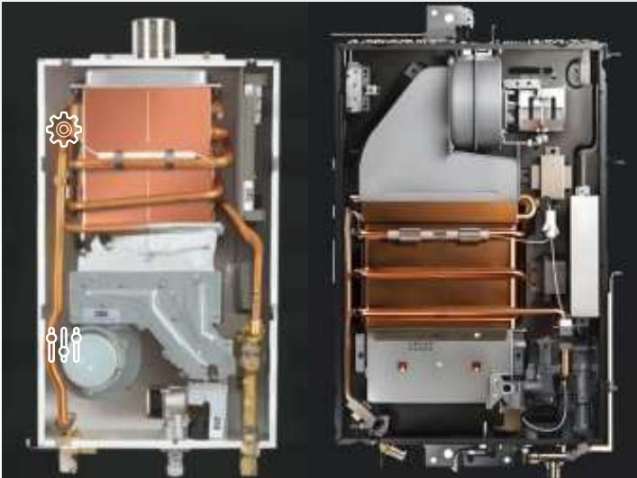  
下鼓式燃气热水器

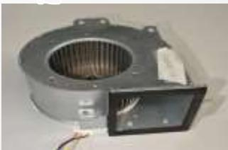

上抽式燃气热水器  
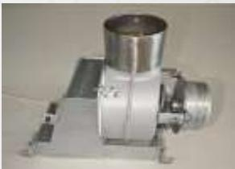

DC 24/36V/40V

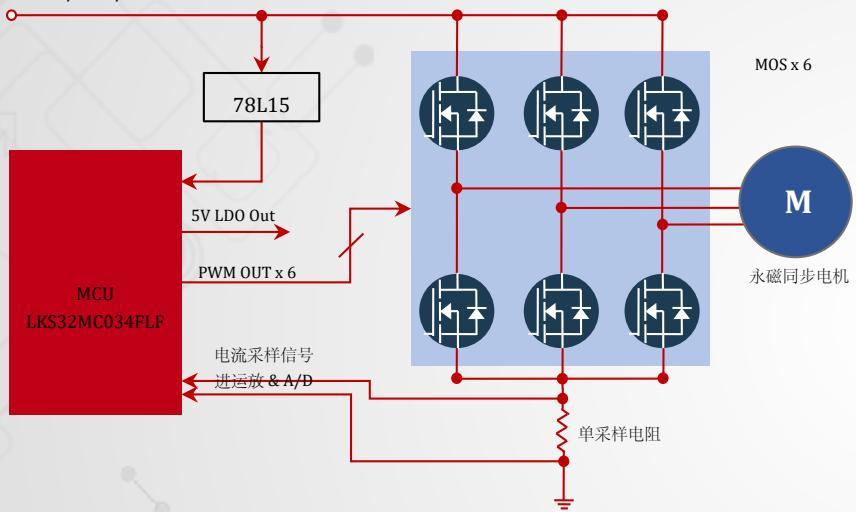

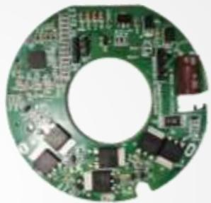

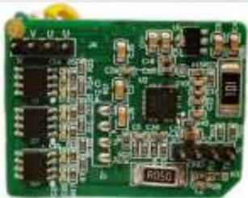

◆ 基于LKS32MC34FLF 燃热强排风机、水泵解决方案

<table><tr><td>Product</td><td>主频(Hz)</td><td>Bit</td><td>DSP</td><td>Flash/RAM(KB)</td><td>Package</td><td>预驱</td><td>CMP</td><td>ADC通道</td><td>UART</td><td>IIC</td><td>OPA</td><td>LDO</td><td>典型应用</td></tr><tr><td>LKS32MC034FLK6Q8C</td><td>48M</td><td>32</td><td>除法/开平发</td><td>32/4</td><td>QFN40</td><td>6N</td><td>2</td><td>1路 ADC (12-Input Channel)</td><td>1</td><td>1</td><td>1</td><td>5VLDO</td><td>热水器强排风机、水泵控制。单电阻采样,正弦波无感 FOC;过/欠压、软过流+硬过流、堵转、缺相、过功率、过温保护</td></tr></table>

AC220V\~DC 36/40V

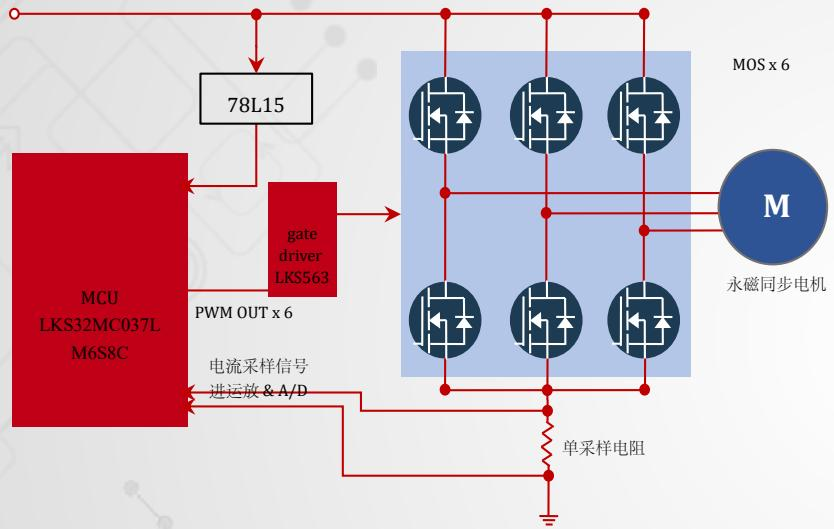

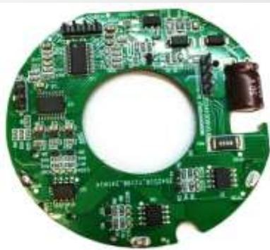

基于LKS32MC037LM6S8C+ LKS563 燃热强排风机、水泵解决方案

<table><tr><td>Product</td><td>主频(Hz)</td><td>Bit</td><td>DSP</td><td>Flash/RAM(KB)</td><td>Package</td><td>预驱</td><td>CMP</td><td>ADC通道</td><td>UART</td><td>IIC</td><td>OPA</td><td>LDO</td><td>典型应用</td></tr><tr><td>LKS32MC037LM6S8C</td><td>48M</td><td>32</td><td>除法/开平发</td><td>32/4</td><td>SSOP24</td><td>No</td><td>2</td><td>1路 ADC (9-Input Channel)</td><td>1</td><td>1</td><td>1</td><td>5VLDO</td><td>热水器强排风机、水泵控制。单电阻采样,正弦波无感 FOC;过/欠压、软过流+硬过流、堵转、缺相、过功率、过温保护</td></tr></table>

AC220V\~DC 36/40V

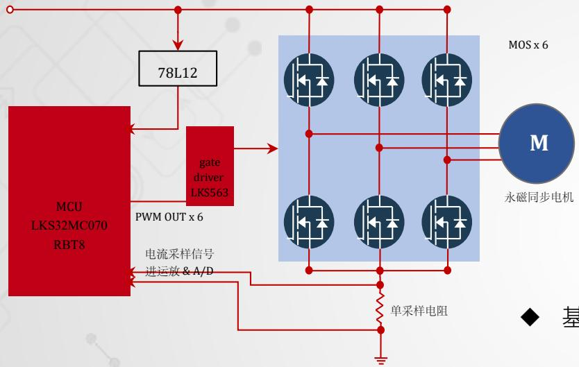

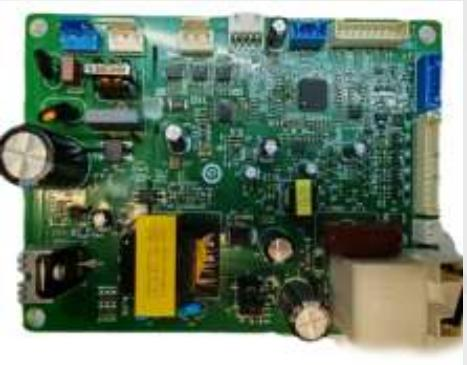

◆ 基于LKS32MC070RBT8 + LKS563 燃热强排风机主变一体解决方案

<table><tr><td>Product</td><td>主频(Hz)</td><td>Bit</td><td>DSP</td><td>Flash/RAM(KB)</td><td>Package</td><td>预驱</td><td>CMP</td><td>ADC通道</td><td>UART</td><td>IIC</td><td>OPA</td><td>LDO</td><td>典型应用</td></tr><tr><td>LKS32MC070RBT8</td><td>96M</td><td>32</td><td>除法/开平发/三角函数</td><td>128/12</td><td>LQFP64</td><td>NO</td><td>3</td><td>2路 ADC (14-Input Channel)</td><td>2</td><td>1</td><td>4</td><td>No</td><td>热水器强排风机、水泵控制。单电阻采样,正弦波无感 FOC;过/欠压、软过流+硬过流、堵转、缺相、过功率、过温保护</td></tr></table>

• 为了方便观察，对模型合成的风量做了限幅[0,1500]，对应左上角和右下角。

这里使用等高线图进行评估，从图上可以看到，线性拟合器在右上角存在不连续的情况，神经网络拟合的图像相对平滑一点

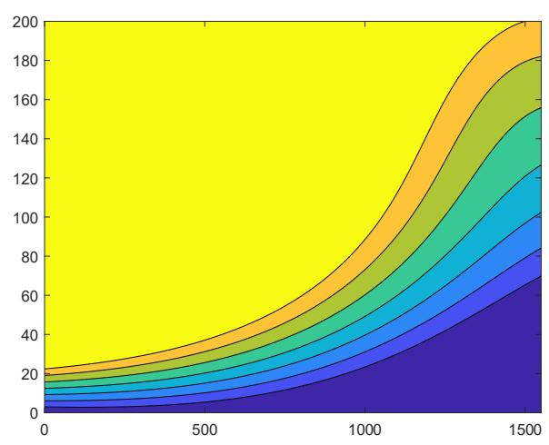  
多项式拟合

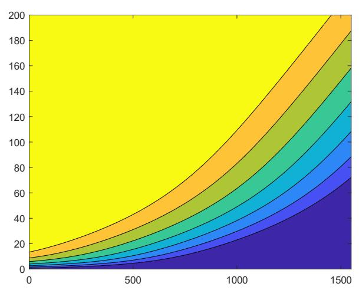  
神经网络拟合  
●〇●〇

• 通过在速度环外增加一个风量环的方式，实现无极恒风量控制

• 风量部分控制环路如下

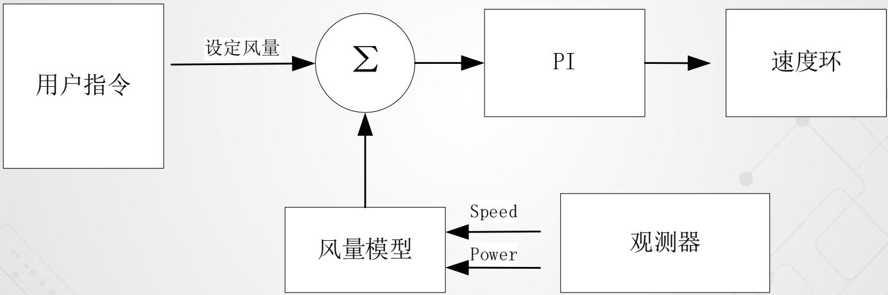

<table><tr><td>细分应用</td><td>方案名称</td><td>方案内容</td><td>当前进度</td></tr><tr><td>洗衣机</td><td>基于LKS32MC08x/07x的BLDC滚筒洗衣机解决方案</td><td>针对BLDC滚筒洗衣机应用,推出基于LKS32MC08x的滚筒BLDC洗衣机解决方案,可满足白电行业测试要求和ClassB认证需求</td><td>已上传GIT,方案成熟,客户量产,可以推广</td></tr><tr><td>洗衣机</td><td>基于LKS32MC08x/07x的DD滚筒洗衣机解决方案</td><td>针对DD滚筒洗衣机应用,推出基于LKS32MC08x的滚筒DD洗衣机解决方案,可满足白电行业测试要求和ClassB认证需求。</td><td>已上传GIT,方案成熟,客户量产,可以推广</td></tr><tr><td>洗衣机</td><td>基于LKS32MC07x的DDM波轮洗衣机解决方案</td><td>针对高压波轮洗衣机应用,使用性能优异,高可靠性的专用电机驱动LKS32MC07系列MCU,配合性能稳定的电机控制算法,支持波轮洗衣机DDM电机的驱动与控制,提供全面且高性能的DDM波轮洗衣机解决方案</td><td>已上传GIT,方案成熟,客户量产,可以推广</td></tr><tr><td>空调</td><td>基于LKS32MC453RCT8的家用空调外机解决方案</td><td>针对家用空调外机应用,推出基于LKS32MC453RCT8的家用空调外机解决方案,可适用于需要高效率和低噪音效果的家用空调外机应用,通过自适应转矩补偿算法,该方案可实现最优的控制性能,满足白电行业测试要求和ClassB认证需求</td><td>已上传GIT,方案成熟,客户量产,可以推广</td></tr><tr><td>空调</td><td>基于LKS32MC070RBT8的家用空调外机解决方案</td><td>针对家用空调外机应用,推出基于LKS32MC070RBT8的低成本家用空调外机解决方案,可适用于需要高效率和低噪音效果的家用空调外机应用,通过自适应转矩补偿算法,该方案可实现最优的控制性能,满足白电行业测试要求和ClassB认证需求。</td><td>已上传GIT,方案成熟,客户量产,可以推广</td></tr><tr><td>干衣机</td><td>基于LKS32MC453RCT8的PFC单变频干衣机解决方案</td><td>针对家用干衣机应用,推出基于LKS32MC453RCT8芯片的家用干衣机控制方案,集成PFC、压缩机变频控制环路,自适应转矩补偿,共享硬件架构,软件模块低耦合,故障检测接口齐全</td><td>已上传GIT,方案成熟,客户量产,可以推广</td></tr><tr><td>干衣机</td><td>基于LKS32MC071CBT8的PFC单变频干衣机解决方案</td><td>针对家用干衣机应用,推出基于LKS32MC071CBT8芯片的低成本家用干衣机控制方案,集成PFC、压缩机变频控制环路,自适应转矩补偿,共享硬件架构,软件模块低耦合,故障检测接口齐全</td><td>已上传GIT,方案成熟,可以推广</td></tr><tr><td>干衣机</td><td>基于LKS32MC453RCT8的PFC双电机干衣机解决方案</td><td>针对家用干衣机应用,推出基于LKS32MC453RCT8芯片的家用干衣机控制方案,集成PFC、压缩机、电机三路控制环路,共享硬件架构,软件模块低耦合,故障检测接口齐全</td><td>已上传GIT,方案成熟,客户量产,可以推广</td></tr><tr><td>干衣机</td><td>基于LKS32MC07x的干衣机主变一体解决方案</td><td>针对家用干衣机应用,推出基于LKS32MC07x芯片的家用干衣机主变一体控制方案,优化各类负载控制逻辑与控制时序,搭配变频控制方案实现最优的软件架构</td><td>已上传GIT,可以推广</td></tr><tr><td>冰箱</td><td>基于LKS32MC037M6S8的家用冰箱压缩机控制方案</td><td>针对家用冰箱压缩机应用,推出基于LKS32MC037M6S8B芯片的家用冰箱压缩机控制方案,启动性能优异,保护功能健全可靠。</td><td>已上传GIT,方案成熟,客户量产,可以推广</td></tr><tr><td>冰箱</td><td>基于LKS32MC077MBS8的双电压兼容家用冰箱压缩机控制方案</td><td>针对家用冰箱压缩机应用,推出基于LKS32MC077MBS8芯片的家用冰箱压缩机控制方案,兼容110VAC和220VAC输入,启动性能优异,保护功能健全可靠,更换压缩机调试方便,大幅缩短调试周期</td><td>已上传GIT,方案成熟,客户量产,可以推广</td></tr><tr><td>冰箱</td><td>基于LKS32MC034DOF6Q8B的低压车载冰箱压缩机控制方案</td><td>针对车载冰箱压缩机应用,推出基于LKS32MC034DOF6Q8B芯片的车载冰箱压缩机控制方案,硬件BOM简单,可恒压驱动一个12VDC散热风扇,启动性能优异,保护功能健全可靠</td><td>已上传GIT,方案成熟,客户量产,可以推广</td></tr><tr><td>油烟机</td><td>基于LKS32MC037M6S8的家用油烟机解决方案</td><td>针对家用油烟机应用,推出基于LKS32MC037M6S8的无感FOC平台的高性能低成本油烟机方案,该方案能够实现最优的控制性能,满足现代工业和家电领域对风机性能的严格要求。</td><td>已上传GIT,方案成熟,客户量产,可以推广</td></tr><tr><td>油烟机</td><td>基于LKS32MC071C8T8的无电解油烟机方案</td><td>针对家用油烟机应用,推出基于LKS32MC0071C8T8的无感FOC控制的高性能无电解油烟机解决方案,在厨电领域通过无感控制技术,该方案增加无电解控制技术,用薄膜电容代替传统的无电解电容,不需要pfc电路,可以有效的降低成本</td><td>已上传GIT,内测中</td></tr><tr><td>风机泵类</td><td>基于LKS32MC035E的低压风机解决方案</td><td>针对低压风机应用,推出基于LKS32MC035EL6S8C的无感FOC控制的高性能、低成本的风机解决方案,适用于需要高效率和静音效果的低压风机应用。通过无感控制技术,该方案能够实现最优的控制性能,满足现代工业和家电领域对风机性能的严格要求</td><td>已上传GIT,可以推广</td></tr><tr><td>风机泵类</td><td>基于LKS32MC034FLF6Q8C的低压风机解决方案</td><td>针对低压风机应用,推出基于LKS32MC034FLF6Q8的无感FOC控制的高性能、低成本的风机解决方案,适用于需要高效率和静音效果的低压风机应用。通过无感控制技术,该方案能够实现最优的控制性能,满足现代工业和家电领域对风机性能的严格要求</td><td>已上传GIT,可以推广</td></tr><tr><td>风机泵类</td><td>基于LKS32MC071C8T8的高压风机解决方案</td><td>针对高压风机应用,推出基于LKS32MC071C8T8的无感FOC控制的高性能工业风机、油烟机等高压风机解决方案,工业领域,家电领域。通过无感控制技术,该方案能够实现最优的控制性能,满足现代工业对高压风机性能的严格要求</td><td>已上传GIT,可以推广</td></tr><tr><td>风机泵类</td><td>基于LKS32MC453RCT8的PFC高压风机解决方案</td><td>针对工业风机应用,推出基于LKS32MC453RCT8的PFC高压风机解决方案 应用领域:工业风机、商用空调风机、数据中心冷却风机等高压、高功率密度场景。通过PFC+无感FOC控制技术,该方案能够实现最优的功率因数、能效与静音性能,满足现代工业及商业系统对高压风机性能的严格要求</td><td>已上传GIT,可以推广</td></tr><tr><td>双驱平台</td><td>基于LKS32MC453RCT8的高压双电机解决方案</td><td>针对高压双电机控制应用,推出基于LKS32MC453RT8的高压双电机解决方案,方便快速匹配新电机,软件模块低耦合,故障检测接口齐全,启动性能优异,双电机独立工作同时运行,调试便捷</td><td>已上传GIT,可以推广</td></tr><tr><td>双驱平台</td><td>基于LKS32MC071CBT8的高压双变频解决方案</td><td>针对高压双电机控制应用,推出基于LKS32MC071CBT8芯片的高压双变频方案,适配大多数普通双电机应用。启动性能优异,保护功能丰富,双电机独立工作同时运行,调试便捷。</td><td>已上传GIT,可以推广</td></tr></table>

自动化学统南京凌酷创芯电子有限公司

凌鹤创芯智控联合实验室

Level 1 海马MCU 基础课程

Level 2 白兔MCU 外设调试

Level 3 燕子电机基础课程电机 SDK 调试

基础学员

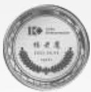

Level 4 鲨鱼电机控制硬件设计电机控制软件设计

Level 5 猎豹BLDC 控制实战

Level 6 老鹰FOC 控制实战

专业学员

  
Level 10 大熊猫

Level 7 白鲸 控制理论课程 PID，ADRC，Fuzzy， Robust control

打造完美作品创造社会价值

Level 8 大象

常用观测器介绍观测器设计与仿真

Level 9 神雕数字信号处理

电控专家

资深专家

围围围围围围围围围围围

围围围围围围围 B围 15围

http://www.linkosemi.com

## 为天地立芯 中国為控制塑魂

产产产产产产产产产产产产

产产产产产产产产产产产产产产产