## **大家电产品介绍**

**BPS Home Appliance Power Product Introduction Overview**

**Shanghai Bright Power Semiconductor Co., Ltd.**

## **家居应用**

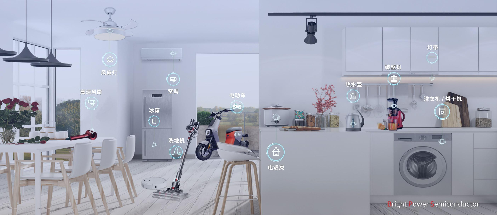

## BPA（工业级）家电电源产品分类

## **Buck/Buck-Boost-BPA**

**15V**

### **NV2系列**

**BPA85963DM**

- 800V/18ohm
- 15V/Ipk=450mA
- SOP7

**12V**

**BPA85957DM**

- 800V/6ohm
- 12V/Ipk=850mA
- SOP7

**BPA85968D/P**

- 650V/4.5ohm
- 15V/Ipk=1A
- SOP7/DIP7

**BPA85951DM**

- SiC：800V/1ohm
- 12V/Ipeak=2000mA
- SOP7/DIP/SMD

**BPA85959D**

- 650V/1.8ohm
- 12V/Ipeak=1700mA
- SOP7

### **NV1系列**

**P2P**

**LNK-TN系列**

**BPA8504D**

- 700V/16ohm
- 电压可调/Ipk=280mA
- SOP7

150\~200mA

**BPA8505D/P**

- 700V/8.5ohm
- 电压可调/Ipk=440mA
- SOP7/DIP7

300mA

### **变频板电源**

**BPA8506D**

- 700V/6ohm
- 电压可调/Ipk=640mA
- SOP7

**BPA85906D**

- 700V/6ohm
- 电压可调/Ipk=640mA
- SOP8(3MM)

400mA

500mA

500mA以上

### **洗衣机电源**

### **空调内外机/冰箱**

## BPA850XX-输出电压可调

**目标应用**

- 家电、工控、电机辅助电源

**应用方案**

- 产品型号：BPA8505D
- 输入范围：85Vac \~265Vac
- 输出规格：12V/250mA

**方案特点**

- 内部集成700V高压MOSFET
- 集成高压启动和自供电电路
- 低待机功耗<100mW
- 优异的动态响应速度，输出电压纹波小
- 良好的负载调整率和线性调整率
- 降低音频噪声的降幅调制技术

**原理图**

**推广策略**

<table>
  <tr>
    <th>方案</th>
    <th>封装</th>
    <th>输出电压</th>
    <th>输出电流</th>
    <th>I_limit</th>
    <th>Rds-on</th>
  </tr>
  <tr>
    <td>BPA8504D</td>
    <td>SOP7</td>
    <td>外部连续可调</td>
    <td>200mA</td>
    <td>280mA</td>
    <td>16Ω</td>
  </tr>
  <tr>
    <td>BPA8505D</td>
    <td>SOP7</td>
    <td>外部连续可调</td>
    <td>300mA</td>
    <td>440mA</td>
    <td>8.5Ω</td>
  </tr>
  <tr>
    <td>BPA8505P</td>
    <td>DIP7</td>
    <td>外部连续可调</td>
    <td>300mA</td>
    <td>440mA</td>
    <td>8.5Ω</td>
  </tr>
  <tr>
    <td>BPA8506D</td>
    <td>SOP7</td>
    <td>外部连续可调</td>
    <td>400mA</td>
    <td>700mA</td>
    <td>6Ω</td>
  </tr>
</table>

## BPA85906D-空调外机

**目标应用**

- 空调外机等家电电源

**应用方案**

- 产品型号：BPA85906D
- 输入范围：85Vac \~265Vac
- 输出规格：15V/400mA

**方案特点**

**原理图**

**推广策略**

- 集成**700V** MOSFET
- 高低压爬电距离满足大于3mm
- 集成高压启动和自供电电路
- PWM控制模式，低纹波，低噪声
- SOP8 贴片封装

<table>
  <tr>
    <th rowspan="2">型号</th>
    <th rowspan="2">MOS BV</th>
    <th rowspan="2">Rds_on</th>
    <th colspan="2">输出功率</th>
  </tr>
  <tr>
    <td>Buck</td>
    <td>抽头Buck</td>
  </tr>
  <tr>
    <td>BPA85906D</td>
    <td>700V</td>
    <td>6Ω</td>
    <td>15V/400mA</td>
    <td>15V/600mA</td>
  </tr>
</table>

- 空调外机无电子膨胀阀用Buck架构；有电子膨胀阀用抽头Buck架构

## BPA85963D-800V电机辅助电源

**目标应用**

**原理图**

- 冰箱压缩机板电源

**应用方案**

- 产品型号：BPA85963DH/M
- 输入范围：85Vac \~265Vac
- 输出规格：15V/200mA

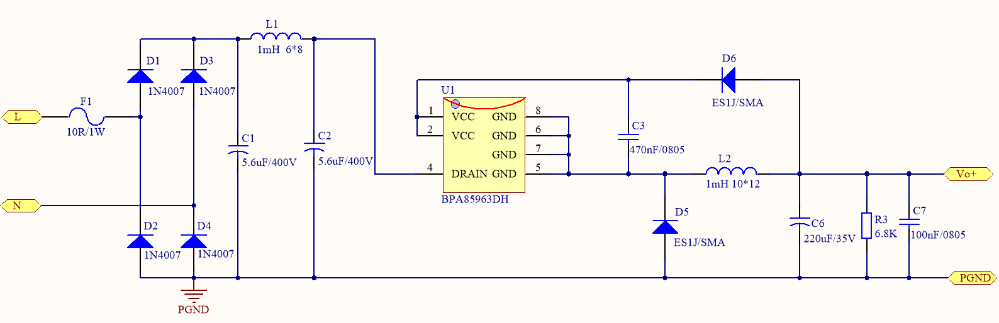

**方案特点**

**推广策略**

- 集成**800V** MOSFET
- 直接输出15V，外围简单
- 集成高压启动和自供电电路
- 低待机功耗 50mW@230VAC
- SOP7封装
- 完备的保护功能

<table>
  <tr>
    <th>方案</th>
    <th>封装</th>
    <th>输出电压</th>
    <th>输出电流</th>
    <th>I_limit</th>
    <th>Rds-on</th>
  </tr>
  <tr>
    <td>BPA85963DH</td>
    <td>SOP7</td>
    <td>15V</td>
    <td>200mA</td>
    <td>450mA</td>
    <td>18Ω</td>
  </tr>
</table>

## BPA85968-650V电机辅助电源

**目标应用**

**原理图**

- 大家电、电控等应用

**应用方案**

- 产品型号：BPA85968D/P
- 输入范围：85Vac \~265Vac
- 输出规格：15V/400mA

**方案特点**

**推广策略**

- 集成**650V** MOSFET
- 直接输出15V，外围简单
- 集成高压启动和自供电电路
- SOP8/DIP7封装
- 完备的保护功能

<table>
  <tr>
    <th>方案</th>
    <th>封装</th>
    <th>输出电压</th>
    <th>输出电流</th>
    <th>I_limit</th>
    <th>Rds-on</th>
  </tr>
  <tr>
    <td>BPA85968D</td>
    <td>SOP8</td>
    <td>15V</td>
    <td>400mA</td>
    <td>1000mA</td>
    <td>5.4Ω</td>
  </tr>
</table>

## BPA（工业级）家电电源产品分类

## **隔离SSR恒压-大家电**

**SV3系列**

**BPS系列**

**BPA86015G**

- 800V/4ohm
- 反激非隔离
- SMD-7封装

**BPA86926D**

- SIC：1.5ohm
- 零待机+ACOT
- 磁偶+集成CP

**SV2系列**

**P2P**

**STR系列**

**SV1系列**

**P2P**

**TNY系列**

**BPA8616PD/D**

- 750V/11ohm
- Drain OVP
- DIP7

**BPA8616P**

- 700V/11ohm
- Drain OVP
- SOP7/DIP7

**BPA86525PC**

- 800V/4ohm
- BUS OVP (5uS）
- DIP7（XX161HD）

**BPA86525G**

- 800V/4ohm
- BUS OVP
- G封（XX161HZS)

**BPA8618PD/D**

- 750V/4.5ohm
- Drain OVP
- DIP7

**BPA8618P**

- 700V/4.5ohm
- Drain OVP
- SOP7/DIP7

**BPA86526PC**

- 800V/2.6ohm
- BUS OVP(5uS）
- DIP7 （XX163HD）

**BPA86526G**

- 800V/3ohm
- BUS OVP
- G封（XX161HZS)

**BPA8619P**

- 750V/2.4ohm
- Drain OVP
- SOP7/DIP7

**BPA86526P**

- 800V/2.1ohm
- BUS OVP（2mS）
- DIP7（XX163HD）

**BPA8620PD**

- 750V/2.1ohm
- Drain OVP
- DIP7

**BPA8620P**

- 700V/2.1ohm
- Drain OVP
- DIP7

**BPA86627X**

- SIC：1.5ohm
- BUS OVP
- SMD/ESOP10

**BPA8621D/P**

- SIC：1.5ohm
- Drain OVP
- SOP7/DIP7

**BPA86629D**

- SIC：0.5ohm
- BUS OVP
- ESOP10

**BPA86528D**

- 800V/0.8ohm
- BUS OVP
- ESOP10

12W

15W

18W

24W

30W

## **微波炉电源-BPA**

样品时间：8/15

**800V**

**BPA86533G**

- **800V/5ohm**
- P2P Tny288G
- SMD-7

**750V**

**BPA8604PE**

- 750V/24ohm
- DIP7-P2P LNK364P
- 提高FB/VCC BV至30V

**BPA8605D**

- 750V/24ohm
- Drain OVP
- SOP7-P2P LNK3604D

**BPA8604P**

- 750V/24ohm
- Drain OVP
- DIP7-P2P LNK364P

5W

10W

**BPA86536GW**

- 800V/2ohm/OTP MOS
- P2P Tny288
- SMD-7

20W

晶丰明源内部资料请勿外传

## **隔离SSR单路输出方案-BPA861XX**

**目标应用**

**原理图**

家电、工控、仪器仪表

**应用方案**

- 产品型号：BPA8616D/PD
- 输入范围：85Vac \~265Vac
- 输出规格：12V/700mA

**方案特点**

**推广策略**

- 内部集成700V/750V高压MOSFET
- 集成输入过压/欠压保护
- 集成高压启动和自供电电路
- 优异的动态响应速度，无输出过冲
- 改善EMI性能的频率调制技术
- 高低压脚之间爬电距离>3mm（DIP-7封装）
- 低待机功耗<50mW@230Vac辅助绕组供电

<table>
  <tr>
    <th>方案</th>
    <th>封装</th>
    <th>输出功率</th>
    <th>BV</th>
    <th>Rds-on</th>
    <th>I_limit</th>
  </tr>
  <tr>
    <td>BPA8616D</td>
    <td>SOP7</td>
    <td>12W</td>
    <td>700V</td>
    <td>11Ω</td>
    <td>350mA</td>
  </tr>
  <tr>
    <td>BPA8616PD</td>
    <td>DIP7</td>
    <td>12W</td>
    <td>750V</td>
    <td>11Ω</td>
    <td>350mA</td>
  </tr>
  <tr>
    <td>BPA8618D</td>
    <td>SOP7</td>
    <td>16W</td>
    <td>700V</td>
    <td>4.5Ω</td>
    <td>550mA</td>
  </tr>
  <tr>
    <td>BPA8618PD</td>
    <td>DIP7</td>
    <td>18W</td>
    <td>750V</td>
    <td>4.5Ω</td>
    <td>550mA</td>
  </tr>
  <tr>
    <td>BPA8619P</td>
    <td>DIP7</td>
    <td>22W</td>
    <td>700V</td>
    <td>3Ω</td>
    <td>650mA</td>
  </tr>
  <tr>
    <td>BPA8620PD</td>
    <td>DIP7</td>
    <td>25W</td>
    <td>750V</td>
    <td>2.4Ω</td>
    <td>750mA</td>
  </tr>
</table>

输入电压为85\~265VAC，测试条件为开放式环境，环境温度为50℃

## **BPA8616XX & 竞品参数对比**

<table>
  <tr>
    <th>芯片型号</th>
    <th>BPA8616PD</th>
    <th>BPA8616X</th>
    <th>*NY276X</th>
  </tr>
  <tr>
    <td>开关频率</td>
    <td>132KHz</td>
    <td>132KHz</td>
    <td>132KHz</td>
  </tr>
  <tr>
    <td>Mosfet BV</td>
    <td>750</td>
    <td>700</td>
    <td>700</td>
  </tr>
  <tr>
    <td>Rds_on</td>
    <td>11Ω</td>
    <td>11Ω</td>
    <td>14Ω</td>
  </tr>
  <tr>
    <td>限流点</td>
    <td>350mA</td>
    <td>350mA</td>
    <td>350mA</td>
  </tr>
  <tr>
    <td>软起动</td>
    <td>有</td>
    <td>有</td>
    <td>无</td>
  </tr>
  <tr>
    <td>输入过压保护</td>
    <td>有</td>
    <td>有</td>
    <td>无</td>
  </tr>
  <tr>
    <td>输入欠压保护</td>
    <td>内置</td>
    <td>内置</td>
    <td>外加</td>
  </tr>
  <tr>
    <td>输出过压保护</td>
    <td>自动重启</td>
    <td>自动重启</td>
    <td>锁死</td>
  </tr>
  <tr>
    <td>过载保护</td>
    <td>有</td>
    <td>有</td>
    <td>有</td>
  </tr>
  <tr>
    <td>封装</td>
    <td>DIP7</td>
    <td>DIP7/SOP7</td>
    <td>DIP7/SMD8C/SOP7</td>
  </tr>
</table>

**应用方案 12V0.7A**

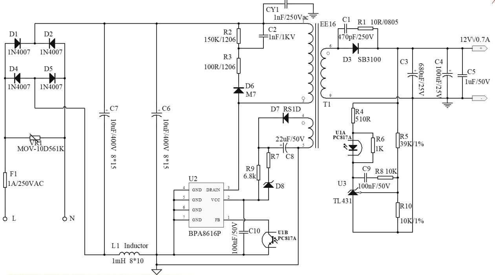

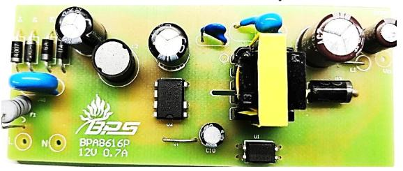

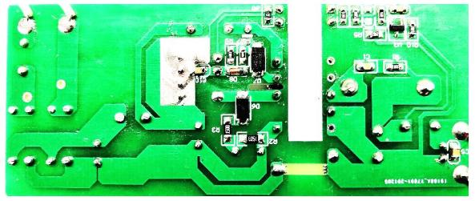

BPA8616D

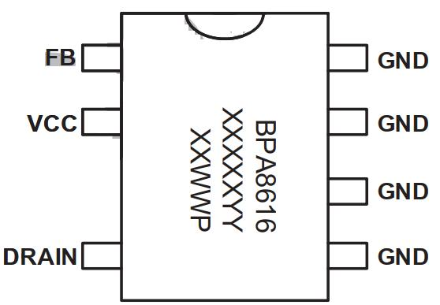

BPA8616P

## **BPA8618X & 竞品参数对比**

**应用方案 12V1A**

<table>
  <tr>
    <th>芯片型号</th>
    <th>BPA8618PD</th>
    <th>BPA8618X</th>
    <th>*NY278X</th>
  </tr>
  <tr>
    <td>开关频率</td>
    <td>132KHz</td>
    <td>132KHz</td>
    <td>132KHz</td>
  </tr>
  <tr>
    <td>Mosfet BV</td>
    <td>750</td>
    <td>700</td>
    <td>700</td>
  </tr>
  <tr>
    <td>Rds_on</td>
    <td>4.5Ω</td>
    <td>4.5Ω</td>
    <td>5.2Ω</td>
  </tr>
  <tr>
    <td>限流点</td>
    <td>550mA</td>
    <td>550mA</td>
    <td>550mA</td>
  </tr>
  <tr>
    <td>软起动</td>
    <td>有</td>
    <td>有</td>
    <td>无</td>
  </tr>
  <tr>
    <td>输入过压保护</td>
    <td>有</td>
    <td>有</td>
    <td>无</td>
  </tr>
  <tr>
    <td>输入欠压保护</td>
    <td>内置</td>
    <td>内置</td>
    <td>外加</td>
  </tr>
  <tr>
    <td>输出过压保护</td>
    <td>自动重启</td>
    <td>自动重启</td>
    <td>锁死</td>
  </tr>
  <tr>
    <td>过载保护</td>
    <td>有</td>
    <td>有</td>
    <td>有</td>
  </tr>
  <tr>
    <td>封装</td>
    <td>DIP7/SOP7</td>
    <td>DIP7/SOP7</td>
    <td>DIP7/SOP7</td>
  </tr>
</table>

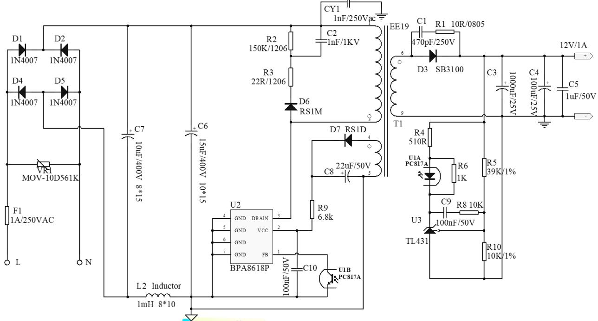

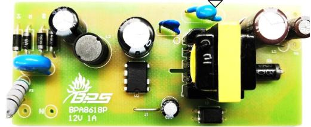

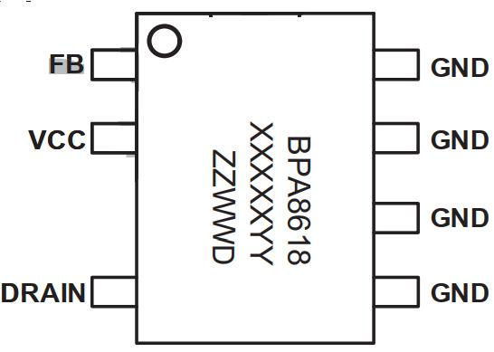

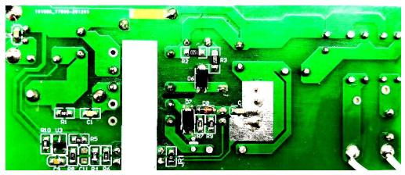

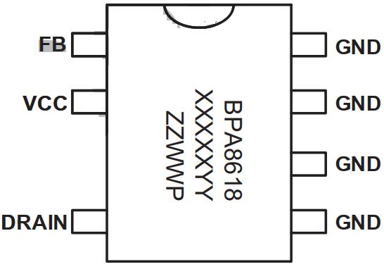

## **BPA8620PD & 竞品参数对比**

<table>
  <tr>
    <th>芯片型号</th>
    <th>BPA8620PD</th>
    <th>*NY280P</th>
  </tr>
  <tr>
    <td>开关频率</td>
    <td>132KHz</td>
    <td>132KHz</td>
  </tr>
  <tr>
    <td>Mosfet BV</td>
    <td>750</td>
    <td>700</td>
  </tr>
  <tr>
    <td>Rds_on</td>
    <td>2.4Ω</td>
    <td>2.6Ω</td>
  </tr>
  <tr>
    <td>限流点</td>
    <td>750mA</td>
    <td>750mA</td>
  </tr>
  <tr>
    <td>软起动</td>
    <td>有</td>
    <td>无</td>
  </tr>
  <tr>
    <td>输入过压保护</td>
    <td>有</td>
    <td>无</td>
  </tr>
  <tr>
    <td>输入欠压保护</td>
    <td>内置</td>
    <td>外加</td>
  </tr>
  <tr>
    <td>输出过压保护</td>
    <td>自动重启</td>
    <td>锁死</td>
  </tr>
  <tr>
    <td>过载保护</td>
    <td>有</td>
    <td>有</td>
  </tr>
  <tr>
    <td>封装</td>
    <td>DIP7</td>
    <td>DIP7/SMD8C</td>
  </tr>
</table>

**应用方案 12V1.5A**

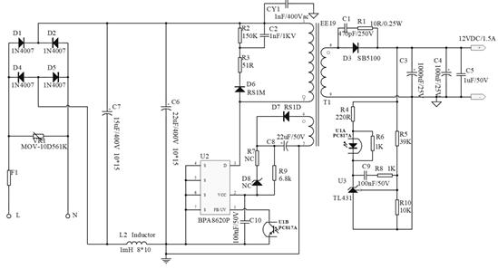

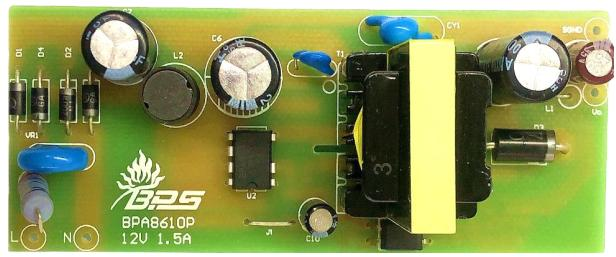

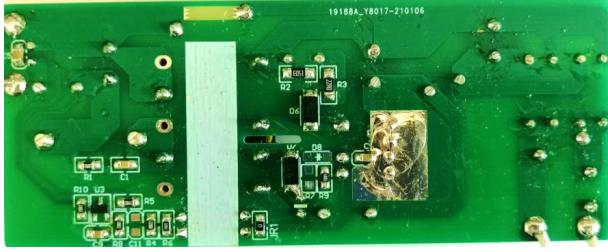

## BPA86015G

**目标应用**

- 空调-非隔离反激

**原理图**

**应用方案**

- 产品型号：BPA86015G
- 输入范围：85Vac \~265Vac
- 输出规格： 15V/1.5A

**产品特点**

- 集成800V高压MOSFET
- 低待机功耗
- FB直馈技术（省掉光耦和431）
- 集成高压启动功能
- 集成Brown in/out 保护
- 集成BUS电压OVP

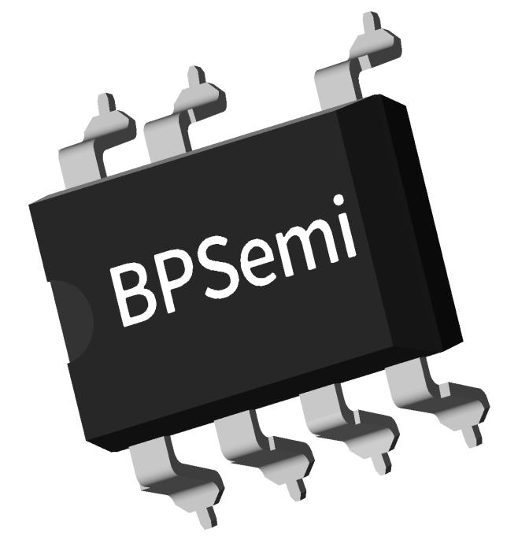

**推广策略**

<table>
  <tr>
    <th>方案</th>
    <th>稳态输出</th>
    <th>Rds-on</th>
  </tr>
  <tr>
    <td>BPA86015G</td>
    <td>22.5W
15V/1.5A</td>
    <td>4Ω</td>
  </tr>
</table>

## **BPA86526P-800V工业级家电电源**

**目标应用**

**原理图**

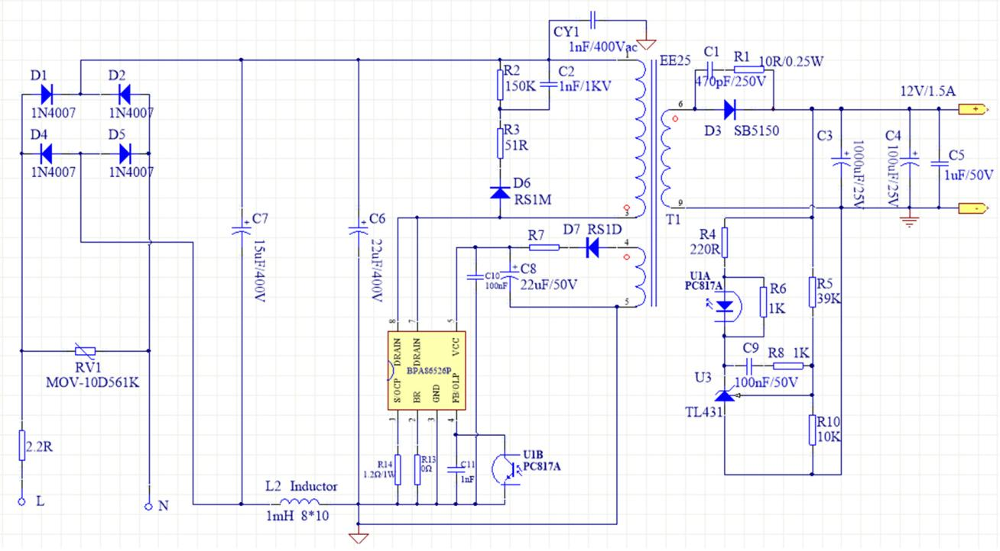

- 空调、冰箱、洗衣机等家电电源

**应用方案**

- 产品型号：BPA86526P
- 输入范围：85Vac \~265Vac
- 输出规格：12V/1.5A

**方案特点**

**推广策略**

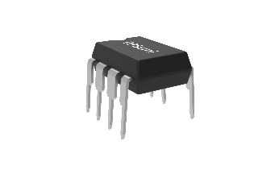

- 集成**800V** MOSFET
- 高低压爬电距离满足大于3mm
- 集成高压启动和自供电电路
- 低待机功耗 50mW@230VAC
- OTP精度高更可靠
- 完备的保护功能

<table>
  <tr>
    <th rowspan="2">型号</th>
    <th rowspan="2">MOS BV</th>
    <th colspan="2">230VAC</th>
    <th colspan="2">85~265VAC</th>
  </tr>
  <tr>
    <td>适配器</td>
    <td>开放式</td>
    <td>适配器</td>
    <td>开放式</td>
  </tr>
  <tr>
    <td>BPA86526P</td>
    <td>800V</td>
    <td>21W</td>
    <td>35W</td>
    <td>18W</td>
    <td>24W</td>
  </tr>
</table>

- P2P 替换STRA6061XX，STR6A161XX、 SDH8655B 、 PN8733

## **BPA86526P&竞品**

**应用方案**

**参数对比**

<table>
  <tr>
    <th colspan="5">输出功率表</th>
  </tr>
  <tr>
    <td rowspan="2">型号</td>
    <td colspan="2">230VAC ±15%</td>
    <td colspan="2">85～265VAC</td>
  </tr>
  <tr>
    <td>适配器</td>
    <td>开放式</td>
    <td>适配器</td>
    <td>开放式</td>
  </tr>
  <tr>
    <td>BPA86526P</td>
    <td>26W</td>
    <td>36W</td>
    <td>20W</td>
    <td>26W</td>
  </tr>
  <tr>
    <td>PN8733</td>
    <td></td>
    <td></td>
    <td>18W</td>
    <td>24W</td>
  </tr>
  <tr>
    <td>SDH8655B</td>
    <td>25W</td>
    <td>40W</td>
    <td>20W</td>
    <td>28W</td>
  </tr>
</table>

<table>
  <tr>
    <th>IC 型号
项目</th>
    <th>STR6A161X</th>
    <th>STRA6061XX</th>
    <th>SDH8655B</th>
    <th>PN8733/
PN6623H</th>
    <th>BPA86526P</th>
  </tr>
  <tr>
    <td>IC封装</td>
    <td>DIP7</td>
    <td>DIP7</td>
    <td>DIP7</td>
    <td>DIP7</td>
    <td>DIP7</td>
  </tr>
  <tr>
    <td>开关频率</td>
    <td>100K</td>
    <td>100K</td>
    <td>100K</td>
    <td>100K</td>
    <td>100K</td>
  </tr>
  <tr>
    <td>MOS BV</td>
    <td>700V</td>
    <td>700V</td>
    <td>700V</td>
    <td>800V</td>
    <td>800V</td>
  </tr>
  <tr>
    <td>BUS OVP</td>
    <td>X</td>
    <td>X</td>
    <td>√</td>
    <td>√
xx无效</td>
    <td>√</td>
  </tr>
  <tr>
    <td>Brown in/OUT</td>
    <td>X</td>
    <td>√</td>
    <td>√</td>
    <td>√</td>
    <td>√</td>
  </tr>
  <tr>
    <td>Burst Mode调节</td>
    <td>√</td>
    <td>X</td>
    <td>X</td>
    <td>X</td>
    <td>√</td>
  </tr>
  <tr>
    <td>结温OTP</td>
    <td>X</td>
    <td>X</td>
    <td>X</td>
    <td>X</td>
    <td>√</td>
  </tr>
  <tr>
    <td>VCC 耐压</td>
    <td>30V</td>
    <td>30V</td>
    <td>28V</td>
    <td>34V</td>
    <td>40V</td>
  </tr>
  <tr>
    <td>VCC OVP 方式</td>
    <td>可选</td>
    <td>可选</td>
    <td>latch</td>
    <td>重启</td>
    <td>重启</td>
  </tr>
</table>

## **BPA86528D-40W工业级家电电源**

**目标应用**

**原理图**

- 空调柜机，空调内机电源
- 微波炉，洗碗机，热水器电源

**应用方案**

- 产品型号：BPA86528D
- 输入范围：85Vac \~265Vac
- 输出规格：12V/3A

**方案特点**

**推广策略**

- 集成**800V** MOSFET
- 高低压爬电距离满足大于3mm
- 集成高压启动和自供电电路
- 低待机功耗 50mW@230VAC
- ESOP10封装，散热性能更好
- 完备的保护功能

<table>
  <tr>
    <th rowspan="2">型号</th>
    <th rowspan="2">MOS BV</th>
    <th colspan="2">230VAC</th>
    <th colspan="2">85~265VAC</th>
  </tr>
  <tr>
    <td>适配器</td>
    <td>开放式</td>
    <td>适配器</td>
    <td>开放式</td>
  </tr>
  <tr>
    <td>BPA86528D</td>
    <td>800V</td>
    <td>50W</td>
    <td>65W</td>
    <td>40W</td>
    <td>52W</td>
  </tr>
</table>

## BPA（工业级）家电电源的研发方向

第三代功率半导体

能效要求

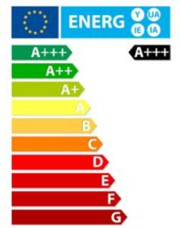

高效率低待机

## 家电辅助电源的工业级品质管控

<em><strong><u>产品设计/工艺/晶圆制造/中测/封装测试/AE验证/可靠性验证_</u></strong></em>等八个方面

消费类电子与工业类电子控制点对比表

<table>
  <tr>
    <th>控制点</th>
    <th>消费类电子芯片</th>
    <th>工业类电子（BPA系列）</th>
  </tr>
  <tr>
    <td>产品设计</td>
    <td>符合设计要求</td>
    <td>设计必须使用checklist等设计工具
ESD必须通过2000V</td>
  </tr>
  <tr>
    <td>工艺</td>
    <td>单纯依靠fab工艺</td>
    <td>晶圆工艺有GOI、HCI、EM、HTRB等可靠性验证要求</td>
  </tr>
  <tr>
    <td>晶圆制造</td>
    <td>Fab控制</td>
    <td>成熟工艺一年以上生产经验</td>
  </tr>
  <tr>
    <td>中测</td>
    <td>边缘芯片不做圈边</td>
    <td>边缘3mm产品需要做点除</td>
  </tr>
  <tr>
    <td>封装测试</td>
    <td>内部审核通过</td>
    <td>生产工艺能力cpk大于1.67
FT测试中limit按照Datasheet&gt;QA&gt;FT&gt;CP</td>
  </tr>
  <tr>
    <td>AE验证</td>
    <td>基本电性能测试
基本芯片功能测试</td>
    <td>输入欠过压，输出短路等保护功能系统ESD功能高温老化测试等</td>
  </tr>
  <tr>
    <td>可靠性验证</td>
    <td>TCT，THSL，500hr即可 
HTOL 24-168小时，数量为10个，一个批次</td>
    <td>TCT，THSL，HALT，HTRB，THB，DOPL，6大项目
按国标要求 1000小时老化；数量为3个批次，每个批次45个</td>
  </tr>
</table>

\*测试项目解释

GOI：栅氧化层完整性测试；

HCI：热电子注入、

EM：电迁移；

HTRB: 高温反偏；

HALT：高温高湿工作寿命；

THB：高温高湿偏压；

DOPL：高温工作寿命

## 家电工业级与消费级可靠性管控区别

<table>
  <tr>
    <th>考核类型</th>
    <th>试验名称</th>
    <th>简称</th>
    <th>参考标准</th>
    <th>消费级</th>
    <th>工业级</th>
    <th>差异描述</th>
  </tr>
  <tr>
    <td rowspan="4">单体器件可靠性</td>
    <td>高温工作寿命</td>
    <td>HTOL</td>
    <td>JESD22-A108</td>
    <td>45*1lots</td>
    <td>45*3lots</td>
    <td rowspan="4">工业级器件可靠性测试四项，更全面。
每个系列至少有3个批次数据。</td>
  </tr>
  <tr>
    <td>高湿加速寿命</td>
    <td>HALT</td>
    <td>JESD22-A108</td>
    <td>45*1lots</td>
    <td>45*3lots</td>
  </tr>
  <tr>
    <td>高温反偏</td>
    <td>HTRB</td>
    <td>JESD22-A108</td>
    <td>NA</td>
    <td>45*3lots</td>
  </tr>
  <tr>
    <td>温湿度偏压</td>
    <td>THB</td>
    <td>JESD22-A101</td>
    <td>NA</td>
    <td>45*3lots</td>
  </tr>
  <tr>
    <td rowspan="6">单体封装可靠性</td>
    <td>湿敏等级</td>
    <td>MSL</td>
    <td>J-STD-020</td>
    <td>22*1lot</td>
    <td>22*1lot</td>
    <td rowspan="6">工业级每颗料至少有一批封装可靠性报告。</td>
  </tr>
  <tr>
    <td>预处理</td>
    <td>PC</td>
    <td>JESD22-A113</td>
    <td>77*1lot</td>
    <td>77*1lot</td>
  </tr>
  <tr>
    <td>高温储存</td>
    <td>HTSL</td>
    <td>JESD22-A103</td>
    <td>77*1lot</td>
    <td>77*1lot</td>
  </tr>
  <tr>
    <td>温度循环</td>
    <td>TC</td>
    <td>JESD22-A104</td>
    <td>77*1lot</td>
    <td>77*1lot</td>
  </tr>
  <tr>
    <td>高温高湿</td>
    <td>THT</td>
    <td>JESD22-A101</td>
    <td>77*1lot</td>
    <td>77*1lot</td>
  </tr>
  <tr>
    <td>无偏高加速应力测试</td>
    <td>UHAST</td>
    <td>JESD22-A118</td>
    <td>77*1lot</td>
    <td>77*1lot</td>
  </tr>
  <tr>
    <td rowspan="3">静电测试</td>
    <td>人体静电模式</td>
    <td>HBM</td>
    <td>JEDEC JS-001</td>
    <td>3</td>
    <td>3</td>
    <td rowspan="3">工业级静电测试更全面，
Latch up会在高温条件下测试</td>
  </tr>
  <tr>
    <td>元器件充放电模式</td>
    <td>CDM</td>
    <td>JEDEC JS-002</td>
    <td>NA</td>
    <td>3</td>
  </tr>
  <tr>
    <td>闩锁效应</td>
    <td>Latch up</td>
    <td>JESD78</td>
    <td>3（25℃）</td>
    <td>3（125℃）</td>
  </tr>
  <tr>
    <td colspan="4">量产监控</td>
    <td>部分</td>
    <td>每个系列</td>
    <td>工业级每个系列每年定期都会做可靠性监控</td>
  </tr>
</table>

- **工业级和消费级都按照行业要求最严格的1000小时测试。**

晶丰明源内部资料请勿外传

## **白电IPM产品选型**

暂停推广

### **All in One**

**自供电**

**LKS1M56002H**

- HS-LS主芯+自供电
- OCP/FO/SD
- 600V/2A （PT工艺）
- EHSOP12

**CPS3M36003S**

- P2P BM6248
- 600V/3A （PT工艺）
- 180°弦波

样品：0-1推广

**LKS1M56003H**

- HS-LS主芯+自供电
- OCP/FO/SD
- 600V/3A （PT工艺）
- EHSOP12

**CPS3M36003F**

- P2P BM6248
- 600V/3A （PT工艺）
- 120°&150°

样品：6/10

**LKS1S57004**

- HS-LS主芯+自供电
- OCP/FO/SD
- 700V/1.8ohm(SIC)
- EHSOP12

### **半桥IPM**

**自举供电**

2A

**LKS1M36003**

- ESOP13工业级
- 自身硬保护
- 600V/3A （PT工艺）

样品：0-1推广

3A-4A

空调内风机

空调内风机

样品：0-1推广

**LKS1S57008**

- HS-LS主芯+自供电
- OCP/FO/SD
- 700V/0.75ohm(SIC)
- EHSOP12

**LKS1S57009**

- HS-LS主芯+自供电
- OCP/FO/SD
- 700V/0.5ohm （SiC）
- EHSOP12

**LKS1S67008**

- 集成自举二极管
- OCP/FO/SD
- 700V/0.75ohm(SIC)
- 3mm爬电距离

**LKS1S67009**

- 集成自举二极管
- OCP/FO/SD
- 700V/0.5ohm(SIC)
- 3mm爬电距离

>5A

空调外机/冰箱压缩机/高压风机

晶丰明源内部资料请勿外传

## **LKS1S5700X-新一代SiC自供电IPM**

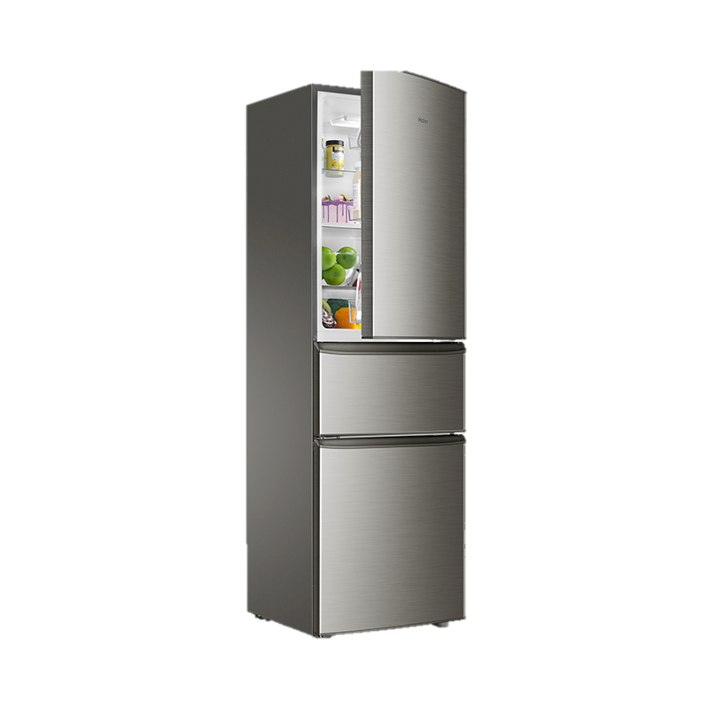

**集成SiC，省掉VCC外部供电，集成Bus电压检测，温度特性好于IGBT（7A）**

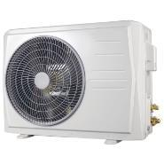

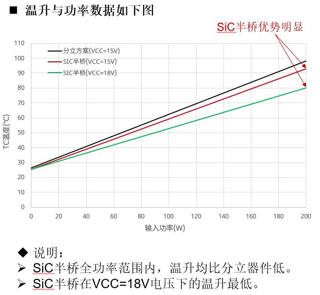

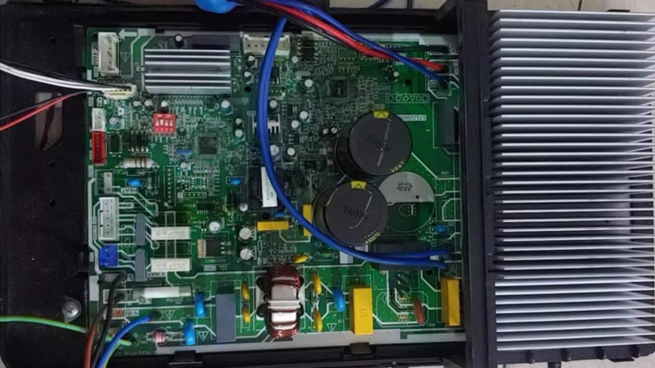

## **方案特点**

- 驱动高侧采用浮动电源设计，耐压＞800V
- 集成750V的SiC，高温稳定性更好
- 无VCC供电及对应外部电路器件
- 高侧支持更小容量自举电容供电
- 支持3.3V/5V/15V输入逻辑
- 集成母线电压检测功能（<±1.5%)
- 集成FO/SD故障状态输出和外部关断控制
- 集成OTP、OCP保护功能
- EHSOP12贴片型封装

<table>
  <tr>
    <th>型号</th>
    <th>封装</th>
    <th>MOS 耐压（V）</th>
    <th>RDS（Ω）</th>
    <th>OCP</th>
    <th>FO/SD</th>
    <th>自举二极管</th>
    <th>策略</th>
  </tr>
  <tr>
    <td>LKS1S57008</td>
    <td>EHSOP12</td>
    <td>700</td>
    <td>0.75</td>
    <td>√</td>
    <td>√</td>
    <td>无需</td>
    <td>样品</td>
  </tr>
  <tr>
    <td>LKS1S57009</td>
    <td>EHSOP12</td>
    <td>700</td>
    <td>0.5</td>
    <td>√</td>
    <td>√</td>
    <td>无需</td>
    <td>研发</td>
  </tr>
  <tr>
    <td>LKS1S57003</td>
    <td>EHSOP12</td>
    <td>700</td>
    <td>2.4</td>
    <td>√</td>
    <td>√</td>
    <td>无需</td>
    <td>研发</td>
  </tr>
  <tr>
    <td>LKS1S57004</td>
    <td>EHSOP12</td>
    <td>700</td>
    <td>1.8</td>
    <td>√</td>
    <td>√</td>
    <td>无需</td>
    <td>研发</td>
  </tr>
</table>

## **高度集成化**

- 集成母线电压检测

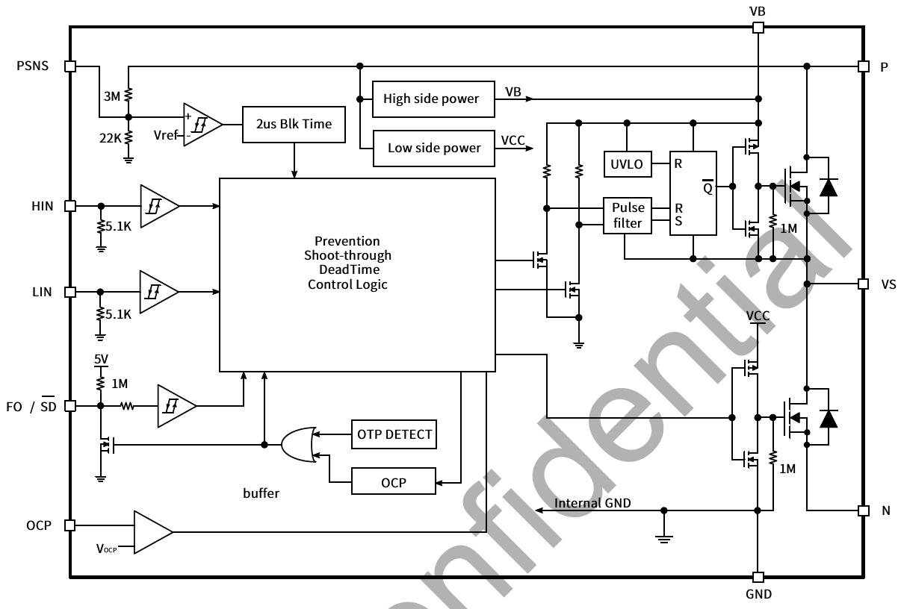

集成高精度母线电压检测

- 集成RC滤波

集成下拉

集成RC滤波

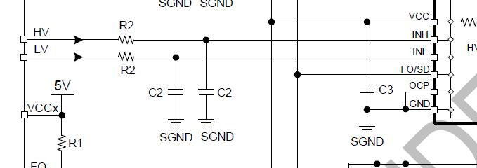

- 集成硬件过流保护

①故障报警和外部关断，65uS自恢复

②硬件过流检查，带虚焊、开路保护

- 自供电技术

①高侧自供电，小电容。

②高侧恒流充电，不误触硬件过流。

③低侧自供电，无VCC及外围器件。

- 高精度OTP

集成精准OTP，误差＜±5%

## **SiC功率器件**

- 高性能材料(第3代)

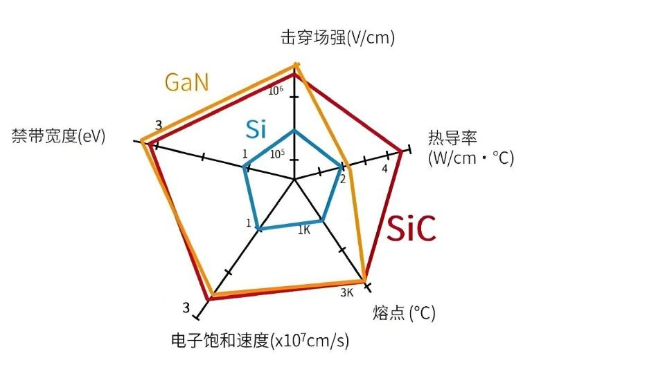

SiC-高温、高压，高可靠性

- SiC Ron vs. Tc

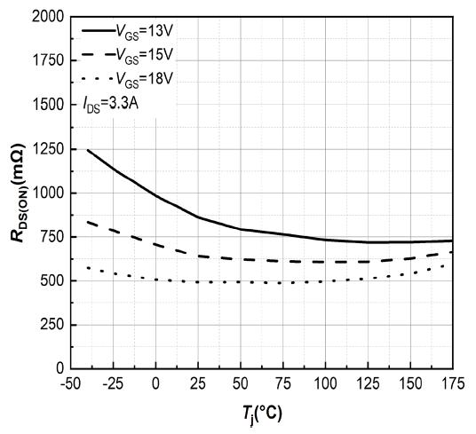

Ron仅增加0.15倍

- SiC Qrr很小，反向恢复软

SiC

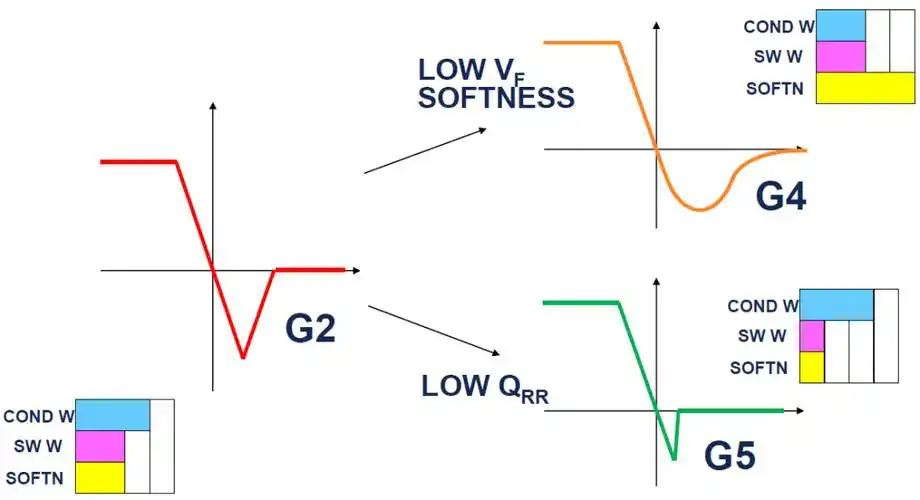

软恢复

硬恢复

\*①EMI特好

\*②开关损耗低

\*③电噪声小

- SiC Vgs vs. Tc

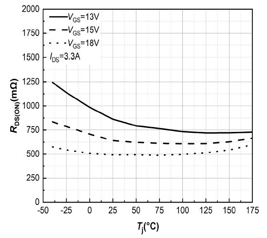

Ron仅差异10%

## **驱动性能提升**

**普通驱动**

**VCC**

**HIN**

**LIN**

**GND**

**VTS**

**VB**

**HO**

**VS**

**LO**

**SiC驱动**

高侧电路

**HO**

高压隔离环

**VS**

R

S

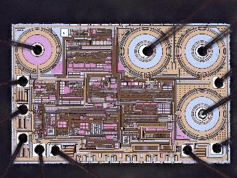

低侧电路

<table><thead><tr><th>第二代IPM X</th><th>第二代IPM Y</th><th>第一代半桥 X</th><th>第一代半桥 Y</th></tr></thead><tbody><tr><td>70</td><td>-58</td><td>71.599999999999994</td><td>-44.5</td></tr><tr><td>111</td><td>-49</td><td>90</td><td>-40</td></tr><tr><td>208</td><td>-36.32</td><td>130</td><td>-32</td></tr><tr><td>301</td><td>-30.64</td><td>237</td><td>-26</td></tr><tr><td>401</td><td>-28.2</td><td>445</td><td>-21.4</td></tr><tr><td>503</td><td>-26.16</td><td>1000</td><td>-18.7</td></tr><tr><td>607</td><td>-25.2</td><td></td><td></td></tr><tr><td>703</td><td>-24.48</td><td></td><td></td></tr><tr><td>1000</td><td>-22</td><td></td><td></td></tr></tbody></table>

普通驱动

负压能力提升29%

SiC驱动

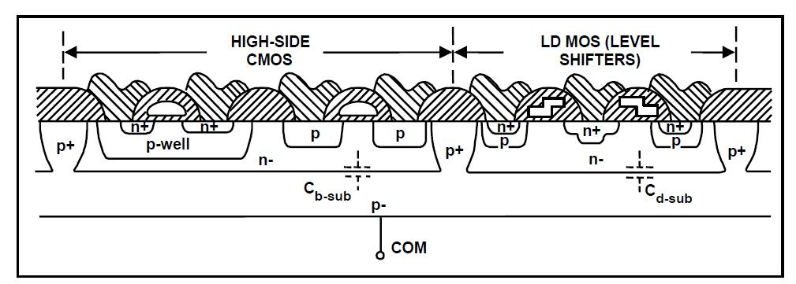

## **P型衬底**

### **寄生电容**

### **寄生三极管**

- Vs负压能力提升29%

- ESD静电能力提升75%

- 芯片面积更省

- 700V高压 BCD成熟工艺

## **封装优化**

- 先进封装

P

2.3mm

VS

### **高压部分**

2.6mm

2.2mm

### **低压部分**

适合单面PCB及小尺寸空间布局

1. 底部散热焊盘，低热阻，高导热。
2. 9mm x 8mm，小尺寸布局更容易。
3. 高低压引脚分开布局，安规间隙足，走线更容易。
4. 低压侧引脚间隙加宽，焊接不易沾锡，潮湿环境不易短路。
5. VB引脚靠近VS引脚，高侧供电环路优化和PCB走线更容易。
6. 高低压直流间隙＞2.5mm，适应高湿环境绝缘要求。

上海市浦东新区申江路5005弄星创科技广场3号楼9层

+86-21-51870166

sales@bpsemi.com

www.bpsemi.com